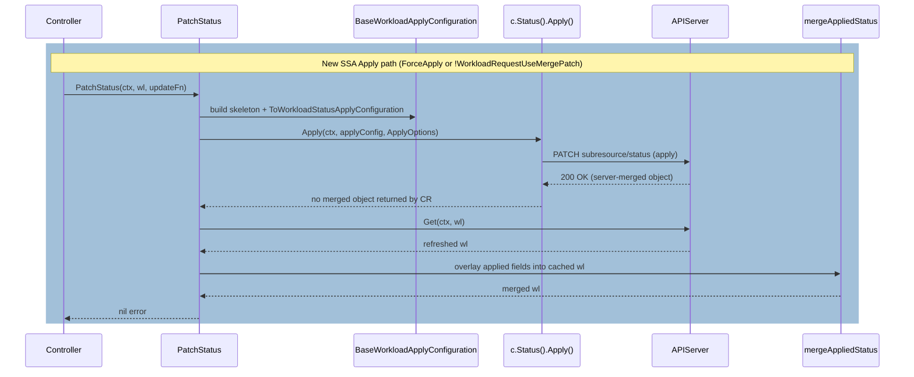

# PR #10294: cleanup: migrate to Status().Apply() with ApplyConfiguration for SSA

**Summary**: cleanup: migrate to Status().Apply() with ApplyConfiguration for SSA

**Sources**: https://github.com/kubernetes-sigs/kueue/pull/10294

**Last updated**: 2026-06-23T13:48:06Z

---

## Metadata

- **State**: open
- **Author**: [@falconlee236](https://github.com/falconlee236)
- **Branch**: `8767` → `main`
- **Created**: 2026-04-05T04:39:26Z
- **Updated**: 2026-06-23T13:48:06Z
- **Merged**: —
- **Closed**: —
- **Labels**: `kind/bug`, `release-note-none`, `size/XL`, `kind/cleanup`, `do-not-merge/hold`, `ok-to-test`, `cncf-cla: yes`
- **Assignees**: [@falconlee236](https://github.com/falconlee236)
- **Requested reviewers**: [@pajakd](https://github.com/pajakd), [@PBundyra](https://github.com/PBundyra)
- **Changed files**: 41   **+856 / -71**

## Description

#### What type of PR is this?

/kind cleanup
/kind bug

#### What this PR does / why we need it:
This PR replaces the deprecated `client.Status().Patch(..., client.Apply)` method with the newly standard `client.Status().Apply(...)` method, using typed `ApplyConfiguration` to ensure compatibility with `controller-runtime` v0.23.0 updates.

Previously, the status patch logic relied on passing a full or dummy object to the generic patch method. This approach lacked explicit Field Management intent and has been deprecated. This PR introduces a robust Server-Side Apply (SSA) architecture by migrating to the typed builder pattern, which securely asserts Field Ownership and prevents potential overwrite conflicts with other controllers.

**Key changes include:**
1. **Workload Refactoring (`pkg/workload/workload.go`):** - Implemented `BaseWorkloadApplyConfiguration` to create a safe skeleton for SSA.
   - Introduced a converter (`ToWorkloadStatusApplyConfiguration`) to accurately map `WorkloadStatus` fields into the `WorkloadApplyConfiguration` builder.
2. **Pod Controller Refactoring (`pkg/controller/jobs/pod/pod_controller.go`):** - Replaced the dummy `pCopy` Pod object with the `corev1ac.Pod()` builder to clearly assert Field Ownership over the `TerminationTarget` condition upon workload eviction/stop.

#### Which issue(s) this PR fixes:
Fixes #8767

#### Special notes for your reviewer:
@mimowo @tenzen-y 
Following the discussion in the issue, the "massive converter" approach was taken for the `Workload` status to properly construct the `WorkloadApplyConfiguration`. The logic for extracting and mapping the status fields has been isolated into helper functions to keep the `patchStatus` block clean. 

All existing tests pass locally. Please let me know if any field mappings need further adjustment!

/assign

#### Does this PR introduce a user-facing change?
```release-note
NONE
```

<!-- This is an auto-generated comment: release notes by coderabbit.ai -->

## Summary by CodeRabbit

* **Tests**
  * Updated 40+ test files to support Server-Side Apply interception for workload status subresources, enabling comprehensive testing of SSA code paths.

* **Workload Status Updates**
  * Enhanced workload status patching with Server-Side Apply support as an alternative to merge-patch operations when configured.

<!-- end of auto-generated comment: release notes by coderabbit.ai -->

## Discussion

### Comment by [@netlify[bot]](https://github.com/apps/netlify) — 2026-04-05T04:39:32Z

### <span aria-hidden="true">✅</span> Deploy Preview for *kubernetes-sigs-kueue* canceled.


|  Name | Link |
|:-:|------------------------|
|<span aria-hidden="true">🔨</span> Latest commit | 8f3f07e76dc57cea1d5a19dba5ac31a5233e0e77 |
|<span aria-hidden="true">🔍</span> Latest deploy log | https://app.netlify.com/projects/kubernetes-sigs-kueue/deploys/6a3a8ab72f43840009c7186b |

### Comment by [@k8s-ci-robot](https://github.com/k8s-ci-robot) — 2026-04-05T04:39:35Z

Hi @falconlee236. Thanks for your PR.

I'm waiting for a [kubernetes-sigs](https://github.com/orgs/kubernetes-sigs/people) member to verify that this patch is reasonable to test. If it is, they should reply with `/ok-to-test` on its own line. Until that is done, I will not automatically test new commits in this PR, but the usual testing commands by org members will still work.

>[!TIP]
>**We noticed you've done this a few times! Consider [joining the org](https://git.k8s.io/community/community-membership.md#member) to skip this step and gain `/lgtm` and other bot rights.** We recommend asking approvers on your previous PRs to sponsor you.

Once the patch is verified, the new status will be reflected by the `ok-to-test` label.

I understand the commands that are listed [here](https://go.k8s.io/bot-commands?repo=kubernetes-sigs%2Fkueue).

<details>

Instructions for interacting with me using PR comments are available [here](https://git.k8s.io/community/contributors/guide/pull-requests.md).  If you have questions or suggestions related to my behavior, please file an issue against the [kubernetes-sigs/prow](https://github.com/kubernetes-sigs/prow/issues/new?title=Prow%20issue:) repository.
</details>

### Comment by [@mbobrovskyi](https://github.com/mbobrovskyi) — 2026-04-06T04:57:43Z

/ok-to-test

### Comment by [@mimowo](https://github.com/mimowo) — 2026-04-15T15:53:42Z

@falconlee236 what is the status here? Are there any blockers identified or we could move forward, let us know if you don't have cycles to work on it.

### Comment by [@falconlee236](https://github.com/falconlee236) — 2026-04-16T01:29:26Z

@mimowo 
Thanks for reaching out! I’m still actively working on this.

I've identified the root cause, but my current fix is triggering failures in other unrelated tests. I’m spending time understanding the dependencies and the state machine to fix these side effects without breaking other features.

It’s taking a bit more time as I learn the internals, but I’m committed to resolving it. If there is an urgent timeline, please let me know and I will speed up the process as much as possible.

### Comment by [@mimowo](https://github.com/mimowo) — 2026-04-22T07:17:59Z

@falconlee236 thanks for reporting the progress and willingness to continue. I think it is ok if you continue on the task at the same time I would like to engage someone with already long expertise in Kueue so that maybe the failing tests can be understood easier. 

So, I would like to ask @mbobrovskyi to start looking into the PR already to see if this is going in the right direction or where possible issues are.

### Comment by [@mimowo](https://github.com/mimowo) — 2026-04-22T07:24:30Z

cc @mbobrovskyi would you find some cycles to guide the PR?

### Comment by [@falconlee236](https://github.com/falconlee236) — 2026-04-25T13:12:30Z

@mimowo, Thanks for your understanding and for asking @mbobrovskyi to join!

@mbobrovskyi, I just pushed my latest code. I've managed to reduce the number of failing tests significantly, and this current commit has the fewest failures so far. I would really appreciate it if you could start your review from this code. Your expertise will be super helpful for me to understand and fix the remaining side effects!

### Comment by [@mbobrovskyi](https://github.com/mbobrovskyi) — 2026-04-27T11:59:44Z

To fix unit tests instead of 

```
WithInterceptorFuncs(interceptor.Funcs{SubResourcePatch: utiltesting.TreatSSAAsStrategicMerge})
```

use 

```
WithInterceptorFuncs(interceptor.Funcs{SubResourceApply: utiltesting.TreatSSAAsStrategicMergeForApplyConfiguration})
```

I added this interceptor in https://github.com/kubernetes-sigs/kueue/pull/10749. You can see how I fixed it for Pods.

### Comment by [@mbobrovskyi](https://github.com/mbobrovskyi) — 2026-04-27T12:08:38Z

To fix verify use `make lint-fix`.

### Comment by [@falconlee236](https://github.com/falconlee236) — 2026-04-27T14:11:48Z

> To fix unit tests instead of
> 
> ```
> WithInterceptorFuncs(interceptor.Funcs{SubResourcePatch: utiltesting.TreatSSAAsStrategicMerge})
> ```
> 
> use
> 
> ```
> WithInterceptorFuncs(interceptor.Funcs{SubResourceApply: utiltesting.TreatSSAAsStrategicMergeForApplyConfiguration})
> ```
> 
> I added this interceptor in #10749. You can see how I fixed it for Pods.

Thank you for guide me. i try to fix SubResourcePatch to SubResourceApply some test codes step by step.
I read where to error occured in test failed log, i appreciated it.
please wait when i fix all unit test code. Thank you!

### Comment by [@mimowo](https://github.com/mimowo) — 2026-05-19T09:40:39Z

@falconlee236 @mbobrovskyi what is the status here? Is there a chance to split the big PR into smaller pieces? We have the 0.18 release approaching EOW, and it would be great to use the new API. If we cannot then fine, but I'm trying to make sure we are trying to make progress.

### Comment by [@falconlee236](https://github.com/falconlee236) — 2026-05-19T22:19:53Z

Hi @mimowo  @mbobrovskyi,

I thought it would be best to fix the unit tests first. By utilizing the test wrapping tools you provided, I've been actively modifying the code and managed to reduce the number of failing unit tests from 50 down to just 1.

Next up are the integration tests. From a quick look, it seems to be a metric-related issue, and I haven't quite figured out how to resolve it yet.

Regarding splitting the PR: the files that need to be changed for the SSA migration have very strong dependencies on each other, so I'm not entirely sure how to safely break this down into smaller pieces. I would really appreciate your thoughts or suggestions on this.

Realistically, since I am working on this alongside my full-time job, it will be difficult to finish everything by the end of this week to meet the 0.18 release deadline.

If this is extremely urgent for the release, you are more than welcome to take over and build upon my current code. However, I still feel a strong sense of responsibility for this issue and would love to see this PR through to completion myself if time allows.

Thanks!

### Comment by [@mbobrovskyi](https://github.com/mbobrovskyi) — 2026-05-20T07:47:03Z

It looks like a new unit test was added to main. Please rebase and apply the changes for:

https://github.com/kubernetes-sigs/kueue/blob/d18417383abac529413ead27d3b5bae594b21257/pkg/scheduler/scheduler_test.go#L7904-L7909

### Comment by [@mbobrovskyi](https://github.com/mbobrovskyi) — 2026-05-20T07:48:36Z

To fix `pull-kueue-verify-main` use `make lint-fix`.

### Comment by [@k8s-ci-robot](https://github.com/k8s-ci-robot) — 2026-05-24T12:32:41Z

[APPROVALNOTIFIER] This PR is **NOT APPROVED**

This pull-request has been approved by: *<a href="https://github.com/kubernetes-sigs/kueue/pull/10294#" title="Author self-approved">falconlee236</a>*
**Once this PR has been reviewed and has the lgtm label**, please assign [mbobrovskyi](https://github.com/mbobrovskyi), [tenzen-y](https://github.com/tenzen-y) for approval. For more information see [the Code Review Process](https://git.k8s.io/community/contributors/guide/owners.md#the-code-review-process).

The full list of commands accepted by this bot can be found [here](https://go.k8s.io/bot-commands?repo=kubernetes-sigs%2Fkueue).

<details open>
Needs approval from an approver in each of these files:

- **[OWNERS](https://github.com/kubernetes-sigs/kueue/blob/main/OWNERS)**

Approvers can indicate their approval by writing `/approve` in a comment
Approvers can cancel approval by writing `/approve cancel` in a comment
</details>
<!-- META={"approvers":["mbobrovskyi","tenzen-y"]} -->

### Comment by [@mbobrovskyi](https://github.com/mbobrovskyi) — 2026-05-27T12:51:44Z

/hold for release.

### Comment by [@mbobrovskyi](https://github.com/mbobrovskyi) — 2026-05-27T12:52:36Z

/test pull-kueue-test-e2e-multikueue-sequential-main

Due to https://github.com/kubernetes-sigs/kueue/issues/11631

### Comment by [@mbobrovskyi](https://github.com/mbobrovskyi) — 2026-05-27T12:58:24Z

@falconlee236 could you please squash commits?

### Comment by [@falconlee236](https://github.com/falconlee236) — 2026-05-27T13:01:11Z

> @falconlee236 could you please squash commits?

your mean is "Squash the last commits into one" and force pushed?

### Comment by [@mbobrovskyi](https://github.com/mbobrovskyi) — 2026-05-27T13:06:52Z

> your mean is "Squash the last commits into one" and force pushed?

Right.

### Comment by [@mimowo](https://github.com/mimowo) — 2026-06-08T11:16:49Z

/retest
retest to see if the PR is failing due to recent makefile changes or there are issues.

### Comment by [@k8s-ci-robot](https://github.com/k8s-ci-robot) — 2026-06-10T16:39:56Z

PR needs rebase.

<details>

Instructions for interacting with me using PR comments are available [here](https://git.k8s.io/community/contributors/guide/pull-requests.md).  If you have questions or suggestions related to my behavior, please file an issue against the [kubernetes-sigs/prow](https://github.com/kubernetes-sigs/prow/issues/new?title=Prow%20issue:) repository.
</details>

### Comment by [@k8s-ci-robot](https://github.com/k8s-ci-robot) — 2026-06-17T22:25:24Z

@falconlee236: The following tests **failed**, say `/retest` to rerun all failed tests or `/retest-required` to rerun all mandatory failed tests:

Test name | Commit | Details | Required | Rerun command
--- | --- | --- | --- | ---
pull-kueue-test-e2e-customconfigs-main | 2f4d8bd0444eaf5d1b7e17a80c2db0569c0caec2 | [link](https://prow.k8s.io/view/gs/kubernetes-ci-logs/pr-logs/pull/kubernetes-sigs_kueue/10294/pull-kueue-test-e2e-customconfigs-main/2045847124939116544) | true | `/test pull-kueue-test-e2e-customconfigs-main`
pull-kueue-test-large-scale-scheduling-perf-main | 036dc7397439bb2d6998062e4f7878e6d6eb63ca | [link](https://prow.k8s.io/view/gs/kubernetes-ci-logs/pr-logs/pull/kubernetes-sigs_kueue/10294/pull-kueue-test-large-scale-scheduling-perf-main/2052315434031517696) | true | `/test pull-kueue-test-large-scale-scheduling-perf-main`
pull-kueue-test-e2e-main-1-33 | a4cbdcc1566fbf4e2266cd931ef70dff621c62cd | [link](https://prow.k8s.io/view/gs/kubernetes-ci-logs/pr-logs/pull/kubernetes-sigs_kueue/10294/pull-kueue-test-e2e-main-1-33/2052993720248176640) | true | `/test pull-kueue-test-e2e-main-1-33`
pull-kueue-test-e2e-main-1-34 | a4cbdcc1566fbf4e2266cd931ef70dff621c62cd | [link](https://prow.k8s.io/view/gs/kubernetes-ci-logs/pr-logs/pull/kubernetes-sigs_kueue/10294/pull-kueue-test-e2e-main-1-34/2052993720365617152) | true | `/test pull-kueue-test-e2e-main-1-34`
pull-kueue-test-e2e-main-1-35 | a4cbdcc1566fbf4e2266cd931ef70dff621c62cd | [link](https://prow.k8s.io/view/gs/kubernetes-ci-logs/pr-logs/pull/kubernetes-sigs_kueue/10294/pull-kueue-test-e2e-main-1-35/2052993720466280448) | true | `/test pull-kueue-test-e2e-main-1-35`
pull-kueue-test-e2e-main-1-36 | a4cbdcc1566fbf4e2266cd931ef70dff621c62cd | [link](https://prow.k8s.io/view/gs/kubernetes-ci-logs/pr-logs/pull/kubernetes-sigs_kueue/10294/pull-kueue-test-e2e-main-1-36/2057933615261552640) | true | `/test pull-kueue-test-e2e-main-1-36`
pull-kueue-test-e2e-extended-shard-1-main-1-36 | ea98913745e2d30233073a43ecdd58508169cddb | [link](https://prow.k8s.io/view/gs/kubernetes-ci-logs/pr-logs/pull/kubernetes-sigs_kueue/10294/pull-kueue-test-e2e-extended-shard-1-main-1-36/2063943337894744064) | true | `/test pull-kueue-test-e2e-extended-shard-1-main-1-36`
pull-kueue-test-e2e-sequential-extended-shard-0-main | ea98913745e2d30233073a43ecdd58508169cddb | [link](https://prow.k8s.io/view/gs/kubernetes-ci-logs/pr-logs/pull/kubernetes-sigs_kueue/10294/pull-kueue-test-e2e-sequential-extended-shard-0-main/2064749194115026944) | true | `/test pull-kueue-test-e2e-sequential-extended-shard-0-main`
pull-kueue-test-e2e-sequential-extended-shard-1-main | ea98913745e2d30233073a43ecdd58508169cddb | [link](https://prow.k8s.io/view/gs/kubernetes-ci-logs/pr-logs/pull/kubernetes-sigs_kueue/10294/pull-kueue-test-e2e-sequential-extended-shard-1-main/2064749194194718720) | true | `/test pull-kueue-test-e2e-sequential-extended-shard-1-main`
pull-kueue-test-e2e-multikueue-extended-shard-1-main | ea98913745e2d30233073a43ecdd58508169cddb | [link](https://prow.k8s.io/view/gs/kubernetes-ci-logs/pr-logs/pull/kubernetes-sigs_kueue/10294/pull-kueue-test-e2e-multikueue-extended-shard-1-main/2065478460893040640) | true | `/test pull-kueue-test-e2e-multikueue-extended-shard-1-main`
pull-kueue-test-e2e-multikueue-extended-shard-0-main | ea98913745e2d30233073a43ecdd58508169cddb | [link](https://prow.k8s.io/view/gs/kubernetes-ci-logs/pr-logs/pull/kubernetes-sigs_kueue/10294/pull-kueue-test-e2e-multikueue-extended-shard-0-main/2065478460809154560) | true | `/test pull-kueue-test-e2e-multikueue-extended-shard-0-main`
pull-kueue-test-e2e-dra-counter-main | ea98913745e2d30233073a43ecdd58508169cddb | [link](https://prow.k8s.io/view/gs/kubernetes-ci-logs/pr-logs/pull/kubernetes-sigs_kueue/10294/pull-kueue-test-e2e-dra-counter-main/2067372992911904768) | true | `/test pull-kueue-test-e2e-dra-counter-main`

[Full PR test history](https://prow.k8s.io/pr-history?org=kubernetes-sigs&repo=kueue&pr=10294). [Your PR dashboard](https://prow.k8s.io/pr?query=is%3Apr%20state%3Aopen%20author%3Afalconlee236). Please help us cut down on flakes by [linking to](https://git.k8s.io/community/contributors/devel/sig-testing/flaky-tests.md#filing-issues-for-flaky-tests) an [open issue](https://github.com/kubernetes-sigs/kueue/issues?q=is:issue+is:open) when you hit one in your PR.

<details>

Instructions for interacting with me using PR comments are available [here](https://git.k8s.io/community/contributors/guide/pull-requests.md).  If you have questions or suggestions related to my behavior, please file an issue against the [kubernetes-sigs/prow](https://github.com/kubernetes-sigs/prow/issues/new?title=Prow%20issue:) repository. I understand the commands that are listed [here](https://go.k8s.io/bot-commands).
</details>
<!-- test report -->

### Comment by [@kubernetes-prow[bot]](https://github.com/apps/kubernetes-prow) — 2026-06-23T13:31:42Z

[APPROVALNOTIFIER] This PR is **NOT APPROVED**

This pull-request has been approved by: *<a href="https://github.com/kubernetes-sigs/kueue/pull/10294#" title="Author self-approved">falconlee236</a>*
**Once this PR has been reviewed and has the lgtm label**, please assign [mimowo](https://github.com/mimowo) for approval. For more information see [the Code Review Process](https://git.k8s.io/community/contributors/guide/owners.md#the-code-review-process).

The full list of commands accepted by this bot can be found [here](https://go.k8s.io/bot-commands?repo=kubernetes-sigs%2Fkueue).

<details open>
Needs approval from an approver in each of these files:

- **[OWNERS](https://github.com/kubernetes-sigs/kueue/blob/main/OWNERS)**

Approvers can indicate their approval by writing `/approve` in a comment
Approvers can cancel approval by writing `/approve cancel` in a comment
</details>
<!-- META={"approvers":["mimowo"]} -->

### Comment by [@falconlee236](https://github.com/falconlee236) — 2026-06-23T13:31:48Z

/retest

### Comment by [@coderabbitai[bot]](https://github.com/apps/coderabbitai) — 2026-06-23T13:31:54Z

<!-- This is an auto-generated comment: summarize by coderabbit.ai -->
<!-- review_stack_entry_start -->

[](https://app.coderabbit.ai/change-stack/kubernetes-sigs/kueue/pull/10294?utm_source=github_walkthrough&utm_medium=github&utm_campaign=change_stack)

<!-- review_stack_entry_end -->
<!-- walkthrough_start -->

<details>
<summary>📝 Walkthrough</summary>

## Walkthrough

Migrates Kueue's `Workload` status write operations from the deprecated `Status.Patch(patch.Apply)` to the new `Status().Apply()` API required by controller-runtime v0.23.0. Adds typed `WorkloadApplyConfiguration` builders in `pkg/workload/workload.go`, updates `ConvertApplyConfigToObject` to return typed objects, and propagates `SubResourceApply` interceptors across all unit and integration tests.

## Changes

**SSA Apply Migration**

| Layer / File(s) | Summary |
|---|---|
| **Workload SSA apply builders and status write paths** <br> `pkg/workload/workload.go`, `pkg/util/testing/client.go` | Adds `BaseWorkloadApplyConfiguration`, `ToWorkloadStatusApplyConfiguration`, and `to*Config` helpers covering all `WorkloadStatus` subfields. Rewrites `PatchStatus`, `PatchAdmissionStatus`, and `UpdateReclaimablePods` to call `c.Status().Apply()` and merge the result locally via new `mergeAppliedStatus`. Updates `ConvertApplyConfigToObject` to unmarshal into typed `Workload`/`Pod` objects instead of always returning unstructured. |
| **Workload and workload-slicing test interceptors** <br> `pkg/workload/workload_test.go`, `pkg/workloadslicing/workloadslicing_test.go` | Adds `SubResourceApply` interceptors (with conflict simulation, error injection, and JSON-round-trip assertions) to `TestSetConditionAndUpdate`, `TestUpdateReclaimablePods`, `TestPatchStatus`, `TestPatchAdmissionStatus`, `TestFinish`, and `TestEnsureWorkloadSlices`. |
| **Scheduler and preemption test interceptors** <br> `pkg/scheduler/scheduler_test.go`, `pkg/scheduler/scheduler_tas_test.go`, `pkg/scheduler/scheduler_afs_test.go`, `pkg/scheduler/scheduler_fs_test.go`, `pkg/scheduler/scheduler_concurrent_admission_test.go`, `pkg/scheduler/preemption/preemption_test.go`, `pkg/scheduler/preemption/preemption_hierarchical_test.go` | Replaces or augments `SubResourcePatch` interceptors with `SubResourceApply` handlers, including concurrent-modification simulation, admission-error injection, and apply-counter logic for Workload status writes across scheduling tests. |
| **Integration test suite SubResourceApply interceptor** <br> `test/integration/singlecluster/scheduler/suite_test.go` | Adds `fakeSubResourceApplyFrom` and registers `SubResourceApply` in `setupInterceptedClient` and `newInterceptedClient`, mirroring the existing patch interception behavior. |
| **Controller and jobframework test interceptors** <br> `pkg/controller/core/workload_controller_test.go`, `pkg/controller/jobframework/reconciler_test.go`, `pkg/controller/admissionchecks/multikueue/workload_test.go`, `pkg/controller/admissionchecks/provisioning/controller_test.go`, `pkg/controller/core/localqueue_controller_test.go` | Adds `SubResourceApply` interceptors with error-injection or strategic-merge delegation alongside existing `SubResourcePatch` handling. |
| **Broad SubResourceApply additions across job controllers** <br> `cmd/importer/pod/import_test.go`, `pkg/controller/jobs/.../*_test.go`, `pkg/controller/tas/topology_ungater_test.go` | Homogeneous one-liner additions of `SubResourceApply: utiltesting.TreatSSAAsStrategicMergeForApplyConfiguration` to `WithInterceptorFuncs` across ~25 adapter and controller test files (appwrapper, job, jobset, kubeflow, leaderworkerset, mpijob, pod, raycluster, rayjob, rayservice, sparkapplication, statefulset, trainjob). |

## Sequence Diagram(s)



## Estimated code review effort

🎯 4 (Complex) | ⏱️ ~60 minutes

## Suggested labels

`release-note`, `area/testing`

## Suggested reviewers

- PBundyra

## Poem

> 🐇 A rabbit once patched with a deprecated call,
> But controller-runtime said "that won't do at all!"
> Now Apply configs bloom, typed and precise,
> With mergeAppliedStatus to keep things nice.
> The status subresource hops a new trail —
> SSA apply, no linter to wail! 🌿

</details>

<!-- walkthrough_end -->
<!-- pre_merge_checks_walkthrough_start -->

<details>
<summary>🚥 Pre-merge checks | ✅ 4 | ❌ 1</summary>

### ❌ Failed checks (1 warning)

|     Check name     | Status     | Explanation                                                                           | Resolution                                                                         |
| :----------------: | :--------- | :------------------------------------------------------------------------------------ | :--------------------------------------------------------------------------------- |
| Docstring Coverage | ⚠️ Warning | Docstring coverage is 14.81% which is insufficient. The required threshold is 80.00%. | Write docstrings for the functions missing them to satisfy the coverage threshold. |

<details>
<summary>✅ Passed checks (4 passed)</summary>

|         Check name         | Status   | Explanation                                                                                                                                                                                                                                                                                                     |
| :------------------------: | :------- | :-------------------------------------------------------------------------------------------------------------------------------------------------------------------------------------------------------------------------------------------------------------------------------------------------------------- |
|      Description Check     | ✅ Passed | Check skipped - CodeRabbit’s high-level summary is enabled.                                                                                                                                                                                                                                                     |
|         Title check        | ✅ Passed | The title 'cleanup: migrate to Status().Apply() with ApplyConfiguration for SSA' accurately summarizes the main objective of migrating from deprecated Status.Patch to Status().Apply with ApplyConfiguration.                                                                                                  |
|     Linked Issues check    | ✅ Passed | The PR successfully addresses issue `#8767` by implementing a comprehensive converter approach (option 1) that migrates deprecated Status.Patch(..., patch.Apply) to Status().Apply() with WorkloadApplyConfiguration, introducing BaseWorkloadApplyConfiguration and ToWorkloadStatusApplyConfiguration helpers. |
| Out of Scope Changes check | ✅ Passed | All changes are in-scope: test interceptor updates to support SubResourceApply, production code migrations to ApplyConfiguration-based SSA, and helper functions for Workload status conversion are all directly related to the Status().Apply() migration objective.                                           |

</details>

<sub>✏️ Tip: You can configure your own custom pre-merge checks in the settings.</sub>

</details>

<!-- pre_merge_checks_walkthrough_end -->
<!-- finishing_touch_checkbox_start -->

<details>
<summary>✨ Finishing Touches</summary>

<details>
<summary>🧪 Generate unit tests (beta)</summary>

- [ ] <!-- {"checkboxId": "f47ac10b-58cc-4372-a567-0e02b2c3d479", "radioGroupId": "utg-output-choice-group-unknown_comment_id"} -->   Create PR with unit tests

</details>

</details>

<!-- finishing_touch_checkbox_end -->
<!-- tips_start -->

---

Thanks for using [CodeRabbit](https://coderabbit.ai?utm_source=oss&utm_medium=github&utm_campaign=kubernetes-sigs/kueue&utm_content=10294)! It's free for OSS, and your support helps us grow. If you like it, consider giving us a shout-out.

<details>
<summary>❤️ Share</summary>

- [X](https://twitter.com/intent/tweet?text=I%20just%20used%20%40coderabbitai%20for%20my%20code%20review%2C%20and%20it%27s%20fantastic%21%20It%27s%20free%20for%20OSS%20and%20offers%20a%20free%20trial%20for%20the%20proprietary%20code.%20Check%20it%20out%3A&url=https%3A//coderabbit.ai)
- [Mastodon](https://mastodon.social/share?text=I%20just%20used%20%40coderabbitai%20for%20my%20code%20review%2C%20and%20it%27s%20fantastic%21%20It%27s%20free%20for%20OSS%20and%20offers%20a%20free%20trial%20for%20the%20proprietary%20code.%20Check%20it%20out%3A%20https%3A%2F%2Fcoderabbit.ai)
- [Reddit](https://www.reddit.com/submit?title=Great%20tool%20for%20code%20review%20-%20CodeRabbit&text=I%20just%20used%20CodeRabbit%20for%20my%20code%20review%2C%20and%20it%27s%20fantastic%21%20It%27s%20free%20for%20OSS%20and%20offers%20a%20free%20trial%20for%20proprietary%20code.%20Check%20it%20out%3A%20https%3A//coderabbit.ai)
- [LinkedIn](https://www.linkedin.com/sharing/share-offsite/?url=https%3A%2F%2Fcoderabbit.ai&mini=true&title=Great%20tool%20for%20code%20review%20-%20CodeRabbit&summary=I%20just%20used%20CodeRabbit%20for%20my%20code%20review%2C%20and%20it%27s%20fantastic%21%20It%27s%20free%20for%20OSS%20and%20offers%20a%20free%20trial%20for%20proprietary%20code)

</details>


<sub>Comment `@coderabbitai help` to get the list of available commands.</sub>

<!-- tips_end -->

## Reviews

### Review by [@mbobrovskyi](https://github.com/mbobrovskyi) (commented) — 2026-04-06T05:27:06Z

- **pkg/controller/jobs/pod/pod_controller.go:487** by [@mbobrovskyi](https://github.com/mbobrovskyi) — 2026-04-06T05:07:39Z
```diff
@@ -489,29 +481,21 @@ func (p *Pod) Stop(ctx context.Context, c client.Client, _ []podset.PodSetInfo,
 		podInGroup := FromObject(&podsInGroup[i])
 
 		// The podset info is not relevant here, since this should mark the pod's end of life
-		pCopy := &corev1.Pod{
-			ObjectMeta: metav1.ObjectMeta{
-				UID:       podInGroup.pod.UID,
-				Name:      podInGroup.pod.Name,
-				Namespace: podInGroup.pod.Namespace,
-			},
-			TypeMeta: podInGroup.pod.TypeMeta,
-			Status: corev1.PodStatus{
-				Conditions: []corev1.PodCondition{
-					{
-						Type:   ConditionTypeTerminationTarget,
-						Status: corev1.ConditionTrue,
-						LastTransitionTime: metav1.Time{
-							Time: p.clock.Now(),
-						},
-						Reason:  string(stopReason),
-						Message: eventMsg,
-					},
-				},
-			},
-		}
-		//nolint:staticcheck //SA1019: client.Apply is deprecated
-		if err := c.Status().Patch(ctx, pCopy, client.Apply, client.FieldOwner(constants.KueueName)); err != nil && !apierrors.IsNotFound(err) {
+		podApplyConfig := corev1ac.Pod(podInGroup.pod.Name, podInGroup.pod.Namespace).
+			WithUID(podInGroup.pod.UID).
+			WithAPIVersion("v1").
+			WithKind("Pod").
```

  Do we need this?

- **pkg/controller/jobs/pod/pod_controller.go:492** by [@mbobrovskyi](https://github.com/mbobrovskyi) — 2026-04-06T05:08:41Z
```diff
@@ -489,29 +481,21 @@ func (p *Pod) Stop(ctx context.Context, c client.Client, _ []podset.PodSetInfo,
 		podInGroup := FromObject(&podsInGroup[i])
 
 		// The podset info is not relevant here, since this should mark the pod's end of life
-		pCopy := &corev1.Pod{
-			ObjectMeta: metav1.ObjectMeta{
-				UID:       podInGroup.pod.UID,
-				Name:      podInGroup.pod.Name,
-				Namespace: podInGroup.pod.Namespace,
-			},
-			TypeMeta: podInGroup.pod.TypeMeta,
-			Status: corev1.PodStatus{
-				Conditions: []corev1.PodCondition{
-					{
-						Type:   ConditionTypeTerminationTarget,
-						Status: corev1.ConditionTrue,
-						LastTransitionTime: metav1.Time{
-							Time: p.clock.Now(),
-						},
-						Reason:  string(stopReason),
-						Message: eventMsg,
-					},
-				},
-			},
-		}
-		//nolint:staticcheck //SA1019: client.Apply is deprecated
-		if err := c.Status().Patch(ctx, pCopy, client.Apply, client.FieldOwner(constants.KueueName)); err != nil && !apierrors.IsNotFound(err) {
+		podApplyConfig := corev1ac.Pod(podInGroup.pod.Name, podInGroup.pod.Namespace).
+			WithUID(podInGroup.pod.UID).
+			WithAPIVersion("v1").
+			WithKind("Pod").
+			WithStatus(corev1ac.PodStatus().
+				WithConditions(corev1ac.PodCondition().
+					WithType(corev1.PodConditionType(ConditionTypeTerminationTarget)).
+					WithStatus(corev1.ConditionTrue).
+					WithLastTransitionTime(metav1.Time{Time: p.clock.Now()}).
```

  ```suggestion
  					WithLastTransitionTime(metav1.NewTime(p.clock.Now())).
  ```

- **pkg/workload/workload.go:837** by [@mbobrovskyi](https://github.com/mbobrovskyi) — 2026-04-06T05:23:32Z
```diff
@@ -835,6 +818,118 @@ func BaseSSAWorkload(w *kueue.Workload, strict bool) *kueue.Workload {
 	return wlCopy
 }
 
+// BaseWorkloadApplyConfiguration creates a new object based on the input workload that
+// only contains the fields necessary to identify the original object.
+// The object can be used as a base for Server-Side-Apply.
+func BaseWorkloadApplyConfiguration(w *kueue.Workload, strict bool) *kueueac.WorkloadApplyConfiguration {
+	applyConfig := kueueac.Workload(w.Name, w.Namespace).WithUID(w.UID).WithGeneration(w.Generation)
+
+	if w.APIVersion == "" {
+		applyConfig.WithAPIVersion(kueue.GroupVersion.String())
+	} else {
+		applyConfig.WithAPIVersion(w.APIVersion)
+	}
+
+	if w.Kind == "" {
+		applyConfig.WithKind("Workload")
+	} else {
+		applyConfig.WithKind(w.Kind)
+	}
```

  Do we need this?

### Review by [@falconlee236](https://github.com/falconlee236) (commented) — 2026-04-06T13:30:53Z

- **pkg/controller/jobs/pod/pod_controller.go:492** by [@falconlee236](https://github.com/falconlee236) — 2026-04-06T13:30:52Z
```diff
@@ -489,29 +481,21 @@ func (p *Pod) Stop(ctx context.Context, c client.Client, _ []podset.PodSetInfo,
 		podInGroup := FromObject(&podsInGroup[i])
 
 		// The podset info is not relevant here, since this should mark the pod's end of life
-		pCopy := &corev1.Pod{
-			ObjectMeta: metav1.ObjectMeta{
-				UID:       podInGroup.pod.UID,
-				Name:      podInGroup.pod.Name,
-				Namespace: podInGroup.pod.Namespace,
-			},
-			TypeMeta: podInGroup.pod.TypeMeta,
-			Status: corev1.PodStatus{
-				Conditions: []corev1.PodCondition{
-					{
-						Type:   ConditionTypeTerminationTarget,
-						Status: corev1.ConditionTrue,
-						LastTransitionTime: metav1.Time{
-							Time: p.clock.Now(),
-						},
-						Reason:  string(stopReason),
-						Message: eventMsg,
-					},
-				},
-			},
-		}
-		//nolint:staticcheck //SA1019: client.Apply is deprecated
-		if err := c.Status().Patch(ctx, pCopy, client.Apply, client.FieldOwner(constants.KueueName)); err != nil && !apierrors.IsNotFound(err) {
+		podApplyConfig := corev1ac.Pod(podInGroup.pod.Name, podInGroup.pod.Namespace).
+			WithUID(podInGroup.pod.UID).
+			WithAPIVersion("v1").
+			WithKind("Pod").
+			WithStatus(corev1ac.PodStatus().
+				WithConditions(corev1ac.PodCondition().
+					WithType(corev1.PodConditionType(ConditionTypeTerminationTarget)).
+					WithStatus(corev1.ConditionTrue).
+					WithLastTransitionTime(metav1.Time{Time: p.clock.Now()}).
```

  what is difference NewTime with Time in metav1 ??

### Review by [@falconlee236](https://github.com/falconlee236) (commented) — 2026-04-06T13:32:35Z

- **pkg/controller/jobs/pod/pod_controller.go:487** by [@falconlee236](https://github.com/falconlee236) — 2026-04-06T13:32:34Z
```diff
@@ -489,29 +481,21 @@ func (p *Pod) Stop(ctx context.Context, c client.Client, _ []podset.PodSetInfo,
 		podInGroup := FromObject(&podsInGroup[i])
 
 		// The podset info is not relevant here, since this should mark the pod's end of life
-		pCopy := &corev1.Pod{
-			ObjectMeta: metav1.ObjectMeta{
-				UID:       podInGroup.pod.UID,
-				Name:      podInGroup.pod.Name,
-				Namespace: podInGroup.pod.Namespace,
-			},
-			TypeMeta: podInGroup.pod.TypeMeta,
-			Status: corev1.PodStatus{
-				Conditions: []corev1.PodCondition{
-					{
-						Type:   ConditionTypeTerminationTarget,
-						Status: corev1.ConditionTrue,
-						LastTransitionTime: metav1.Time{
-							Time: p.clock.Now(),
-						},
-						Reason:  string(stopReason),
-						Message: eventMsg,
-					},
-				},
-			},
-		}
-		//nolint:staticcheck //SA1019: client.Apply is deprecated
-		if err := c.Status().Patch(ctx, pCopy, client.Apply, client.FieldOwner(constants.KueueName)); err != nil && !apierrors.IsNotFound(err) {
+		podApplyConfig := corev1ac.Pod(podInGroup.pod.Name, podInGroup.pod.Namespace).
+			WithUID(podInGroup.pod.UID).
+			WithAPIVersion("v1").
+			WithKind("Pod").
```

  Calling `corev1ac.Pod` function is already included this line. i was fixed.

### Review by [@mbobrovskyi](https://github.com/mbobrovskyi) (commented) — 2026-04-22T08:07:45Z

- **pkg/workload/admissionchecks.go:137** by [@mbobrovskyi](https://github.com/mbobrovskyi) — 2026-04-22T08:00:50Z
```diff
@@ -136,6 +134,7 @@ func SetAdmissionCheckState(checks *[]kueue.AdmissionCheckState, newCheck kueue.
 	existingCondition.Message = newCheck.Message
 	existingCondition.PodSetUpdates = newCheck.PodSetUpdates
 	existingCondition.RequeueAfterSeconds = newCheck.RequeueAfterSeconds
+	existingCondition.RetryCount = newCheck.RetryCount
```

  Why this changes?

- **pkg/controller/jobs/pod/pod_controller.go:521** by [@mbobrovskyi](https://github.com/mbobrovskyi) — 2026-04-22T08:01:04Z
```diff
@@ -482,41 +482,28 @@ func (p *Pod) Stop(ctx context.Context, c client.Client, _ []podset.PodSetInfo,
 
 	stoppedNow := make([]client.Object, 0)
 	for i := range podsInGroup {
-		// If the workload is being deleted, delete even finished Pods.
```

  Why removed comments?

- **pkg/controller/jobs/pod/pod_controller.go:509** by [@mbobrovskyi](https://github.com/mbobrovskyi) — 2026-04-22T08:04:20Z
```diff
@@ -470,7 +471,6 @@ func (p *Pod) GVK() schema.GroupVersionKind {
 func (p *Pod) PodLabelSelector() string {
 	return fmt.Sprintf("%s=%s", podconstants.GroupNameLabel, p.pod.Labels[podconstants.GroupNameLabel])
 }
-
```

  Please revert.

### Review by [@mbobrovskyi](https://github.com/mbobrovskyi) (commented) — 2026-04-22T08:35:08Z

- **pkg/controller/jobs/pod/pod_controller.go:539** by [@mbobrovskyi](https://github.com/mbobrovskyi) — 2026-04-22T08:35:09Z
```diff
@@ -482,41 +482,28 @@ func (p *Pod) Stop(ctx context.Context, c client.Client, _ []podset.PodSetInfo,
 
 	stoppedNow := make([]client.Object, 0)
 	for i := range podsInGroup {
-		// If the workload is being deleted, delete even finished Pods.
 		if !podsInGroup[i].DeletionTimestamp.IsZero() || (stopReason != jobframework.StopReasonWorkloadDeleted && podSuspended(&podsInGroup[i])) {
 			continue
 		}
 		podInGroup := FromObject(&podsInGroup[i])
 
-		// The podset info is not relevant here, since this should mark the pod's end of life
-		pCopy := &corev1.Pod{
-			ObjectMeta: metav1.ObjectMeta{
-				UID:       podInGroup.pod.UID,
-				Name:      podInGroup.pod.Name,
-				Namespace: podInGroup.pod.Namespace,
-			},
-			TypeMeta: podInGroup.pod.TypeMeta,
-			Status: corev1.PodStatus{
-				Conditions: []corev1.PodCondition{
-					{
-						Type:   ConditionTypeTerminationTarget,
-						Status: corev1.ConditionTrue,
-						LastTransitionTime: metav1.Time{
-							Time: p.clock.Now(),
-						},
-						Reason:  string(stopReason),
-						Message: eventMsg,
-					},
-				},
-			},
-		}
-		//nolint:staticcheck //SA1019: client.Apply is deprecated
-		err := c.Status().Patch(ctx, pCopy, client.Apply, client.FieldOwner(constants.KueueName))
+		podApplyConfig := corev1ac.Pod(podInGroup.pod.Name, podInGroup.pod.Namespace).
+			WithUID(podInGroup.pod.UID).
+			WithStatus(corev1ac.PodStatus().
+				WithConditions(corev1ac.PodCondition().
+					WithType(corev1.PodConditionType(ConditionTypeTerminationTarget)).
+					WithStatus(corev1.ConditionTrue).
+					WithLastTransitionTime(metav1.NewTime(p.clock.Now())).
+					WithReason(string(stopReason)).
+					WithMessage(eventMsg),
+				),
+			)
+
+		err := c.Status().Apply(ctx, podApplyConfig, client.FieldOwner(constants.KueueName), client.ForceOwnership)
```

  OK, I see these changes are more complex than they initially seemed and require updates to our unit tests as well, especially where we use interceptors.
  
  https://github.com/kubernetes-sigs/kueue/blob/167001f17838d601a88309d4b55fd0858ac6da31/pkg/controller/jobs/pod/pod_controller_test.go#L6282-L6296
  
  We need to use SubResourceApply here instead of SubResourcePatch.
  
  I suggest moving these changes to a separate PR for easier review and fixes.
  
  @falconlee236, could you please create a separate PR to address this?

### Review by [@mbobrovskyi](https://github.com/mbobrovskyi) (commented) — 2026-04-22T08:59:37Z

- **pkg/controller/jobs/pod/pod_controller.go:540** by [@mbobrovskyi](https://github.com/mbobrovskyi) — 2026-04-22T08:59:37Z
```diff
@@ -482,41 +482,28 @@ func (p *Pod) Stop(ctx context.Context, c client.Client, _ []podset.PodSetInfo,
 
 	stoppedNow := make([]client.Object, 0)
 	for i := range podsInGroup {
-		// If the workload is being deleted, delete even finished Pods.
 		if !podsInGroup[i].DeletionTimestamp.IsZero() || (stopReason != jobframework.StopReasonWorkloadDeleted && podSuspended(&podsInGroup[i])) {
 			continue
 		}
 		podInGroup := FromObject(&podsInGroup[i])
 
-		// The podset info is not relevant here, since this should mark the pod's end of life
-		pCopy := &corev1.Pod{
-			ObjectMeta: metav1.ObjectMeta{
-				UID:       podInGroup.pod.UID,
-				Name:      podInGroup.pod.Name,
-				Namespace: podInGroup.pod.Namespace,
-			},
-			TypeMeta: podInGroup.pod.TypeMeta,
-			Status: corev1.PodStatus{
-				Conditions: []corev1.PodCondition{
-					{
-						Type:   ConditionTypeTerminationTarget,
-						Status: corev1.ConditionTrue,
-						LastTransitionTime: metav1.Time{
-							Time: p.clock.Now(),
-						},
-						Reason:  string(stopReason),
-						Message: eventMsg,
-					},
-				},
-			},
-		}
-		//nolint:staticcheck //SA1019: client.Apply is deprecated
-		err := c.Status().Patch(ctx, pCopy, client.Apply, client.FieldOwner(constants.KueueName))
+		podApplyConfig := corev1ac.Pod(podInGroup.pod.Name, podInGroup.pod.Namespace).
+			WithUID(podInGroup.pod.UID).
+			WithStatus(corev1ac.PodStatus().
+				WithConditions(corev1ac.PodCondition().
+					WithType(corev1.PodConditionType(ConditionTypeTerminationTarget)).
+					WithStatus(corev1.ConditionTrue).
+					WithLastTransitionTime(metav1.NewTime(p.clock.Now())).
+					WithReason(string(stopReason)).
+					WithMessage(eventMsg),
+				),
+			)
+
+		err := c.Status().Apply(ctx, podApplyConfig, client.FieldOwner(constants.KueueName), client.ForceOwnership)
 		if client.IgnoreNotFound(err) != nil {
```

  @mimowo I took a deep dive into this case and found an interesting issue. Apply does not return a NotFound error – instead, it recreates the Pod if it doesn’t exist. I don’t think we can use it, as this behavior isn’t correct for our use case.

### Review by [@mimowo](https://github.com/mimowo) (commented) — 2026-04-22T09:02:37Z

- **pkg/controller/jobs/pod/pod_controller.go:540** by [@mimowo](https://github.com/mimowo) — 2026-04-22T09:02:37Z
```diff
@@ -482,41 +482,28 @@ func (p *Pod) Stop(ctx context.Context, c client.Client, _ []podset.PodSetInfo,
 
 	stoppedNow := make([]client.Object, 0)
 	for i := range podsInGroup {
-		// If the workload is being deleted, delete even finished Pods.
 		if !podsInGroup[i].DeletionTimestamp.IsZero() || (stopReason != jobframework.StopReasonWorkloadDeleted && podSuspended(&podsInGroup[i])) {
 			continue
 		}
 		podInGroup := FromObject(&podsInGroup[i])
 
-		// The podset info is not relevant here, since this should mark the pod's end of life
-		pCopy := &corev1.Pod{
-			ObjectMeta: metav1.ObjectMeta{
-				UID:       podInGroup.pod.UID,
-				Name:      podInGroup.pod.Name,
-				Namespace: podInGroup.pod.Namespace,
-			},
-			TypeMeta: podInGroup.pod.TypeMeta,
-			Status: corev1.PodStatus{
-				Conditions: []corev1.PodCondition{
-					{
-						Type:   ConditionTypeTerminationTarget,
-						Status: corev1.ConditionTrue,
-						LastTransitionTime: metav1.Time{
-							Time: p.clock.Now(),
-						},
-						Reason:  string(stopReason),
-						Message: eventMsg,
-					},
-				},
-			},
-		}
-		//nolint:staticcheck //SA1019: client.Apply is deprecated
-		err := c.Status().Patch(ctx, pCopy, client.Apply, client.FieldOwner(constants.KueueName))
+		podApplyConfig := corev1ac.Pod(podInGroup.pod.Name, podInGroup.pod.Namespace).
+			WithUID(podInGroup.pod.UID).
+			WithStatus(corev1ac.PodStatus().
+				WithConditions(corev1ac.PodCondition().
+					WithType(corev1.PodConditionType(ConditionTypeTerminationTarget)).
+					WithStatus(corev1.ConditionTrue).
+					WithLastTransitionTime(metav1.NewTime(p.clock.Now())).
+					WithReason(string(stopReason)).
+					WithMessage(eventMsg),
+				),
+			)
+
+		err := c.Status().Apply(ctx, podApplyConfig, client.FieldOwner(constants.KueueName), client.ForceOwnership)
 		if client.IgnoreNotFound(err) != nil {
```

  Oh I see, but IIUC we used apply for long without any issues so far, so what has changed?

### Review by [@mimowo](https://github.com/mimowo) (commented) — 2026-04-22T09:04:37Z

- **pkg/controller/jobs/pod/pod_controller.go:540** by [@mimowo](https://github.com/mimowo) — 2026-04-22T09:04:37Z
```diff
@@ -482,41 +482,28 @@ func (p *Pod) Stop(ctx context.Context, c client.Client, _ []podset.PodSetInfo,
 
 	stoppedNow := make([]client.Object, 0)
 	for i := range podsInGroup {
-		// If the workload is being deleted, delete even finished Pods.
 		if !podsInGroup[i].DeletionTimestamp.IsZero() || (stopReason != jobframework.StopReasonWorkloadDeleted && podSuspended(&podsInGroup[i])) {
 			continue
 		}
 		podInGroup := FromObject(&podsInGroup[i])
 
-		// The podset info is not relevant here, since this should mark the pod's end of life
-		pCopy := &corev1.Pod{
-			ObjectMeta: metav1.ObjectMeta{
-				UID:       podInGroup.pod.UID,
-				Name:      podInGroup.pod.Name,
-				Namespace: podInGroup.pod.Namespace,
-			},
-			TypeMeta: podInGroup.pod.TypeMeta,
-			Status: corev1.PodStatus{
-				Conditions: []corev1.PodCondition{
-					{
-						Type:   ConditionTypeTerminationTarget,
-						Status: corev1.ConditionTrue,
-						LastTransitionTime: metav1.Time{
-							Time: p.clock.Now(),
-						},
-						Reason:  string(stopReason),
-						Message: eventMsg,
-					},
-				},
-			},
-		}
-		//nolint:staticcheck //SA1019: client.Apply is deprecated
-		err := c.Status().Patch(ctx, pCopy, client.Apply, client.FieldOwner(constants.KueueName))
+		podApplyConfig := corev1ac.Pod(podInGroup.pod.Name, podInGroup.pod.Namespace).
+			WithUID(podInGroup.pod.UID).
+			WithStatus(corev1ac.PodStatus().
+				WithConditions(corev1ac.PodCondition().
+					WithType(corev1.PodConditionType(ConditionTypeTerminationTarget)).
+					WithStatus(corev1.ConditionTrue).
+					WithLastTransitionTime(metav1.NewTime(p.clock.Now())).
+					WithReason(string(stopReason)).
+					WithMessage(eventMsg),
+				),
+			)
+
+		err := c.Status().Apply(ctx, podApplyConfig, client.FieldOwner(constants.KueueName), client.ForceOwnership)
 		if client.IgnoreNotFound(err) != nil {
```

  in other words, do we already have a bug?

### Review by [@mbobrovskyi](https://github.com/mbobrovskyi) (commented) — 2026-04-22T09:05:52Z

- **pkg/controller/jobs/pod/pod_controller.go:540** by [@mbobrovskyi](https://github.com/mbobrovskyi) — 2026-04-22T09:05:52Z
```diff
@@ -482,41 +482,28 @@ func (p *Pod) Stop(ctx context.Context, c client.Client, _ []podset.PodSetInfo,
 
 	stoppedNow := make([]client.Object, 0)
 	for i := range podsInGroup {
-		// If the workload is being deleted, delete even finished Pods.
 		if !podsInGroup[i].DeletionTimestamp.IsZero() || (stopReason != jobframework.StopReasonWorkloadDeleted && podSuspended(&podsInGroup[i])) {
 			continue
 		}
 		podInGroup := FromObject(&podsInGroup[i])
 
-		// The podset info is not relevant here, since this should mark the pod's end of life
-		pCopy := &corev1.Pod{
-			ObjectMeta: metav1.ObjectMeta{
-				UID:       podInGroup.pod.UID,
-				Name:      podInGroup.pod.Name,
-				Namespace: podInGroup.pod.Namespace,
-			},
-			TypeMeta: podInGroup.pod.TypeMeta,
-			Status: corev1.PodStatus{
-				Conditions: []corev1.PodCondition{
-					{
-						Type:   ConditionTypeTerminationTarget,
-						Status: corev1.ConditionTrue,
-						LastTransitionTime: metav1.Time{
-							Time: p.clock.Now(),
-						},
-						Reason:  string(stopReason),
-						Message: eventMsg,
-					},
-				},
-			},
-		}
-		//nolint:staticcheck //SA1019: client.Apply is deprecated
-		err := c.Status().Patch(ctx, pCopy, client.Apply, client.FieldOwner(constants.KueueName))
+		podApplyConfig := corev1ac.Pod(podInGroup.pod.Name, podInGroup.pod.Namespace).
+			WithUID(podInGroup.pod.UID).
+			WithStatus(corev1ac.PodStatus().
+				WithConditions(corev1ac.PodCondition().
+					WithType(corev1.PodConditionType(ConditionTypeTerminationTarget)).
+					WithStatus(corev1.ConditionTrue).
+					WithLastTransitionTime(metav1.NewTime(p.clock.Now())).
+					WithReason(string(stopReason)).
+					WithMessage(eventMsg),
+				),
+			)
+
+		err := c.Status().Apply(ctx, podApplyConfig, client.FieldOwner(constants.KueueName), client.ForceOwnership)
 		if client.IgnoreNotFound(err) != nil {
```

  It looks like the behavior of Apply() has changed. Previously, it returned a NotFound error if the Pod didn’t exist. We may need to migrate all cases to Merge Patch.

### Review by [@mimowo](https://github.com/mimowo) (commented) — 2026-04-22T09:16:14Z

- **pkg/controller/jobs/pod/pod_controller.go:540** by [@mimowo](https://github.com/mimowo) — 2026-04-22T09:16:14Z
```diff
@@ -482,41 +482,28 @@ func (p *Pod) Stop(ctx context.Context, c client.Client, _ []podset.PodSetInfo,
 
 	stoppedNow := make([]client.Object, 0)
 	for i := range podsInGroup {
-		// If the workload is being deleted, delete even finished Pods.
 		if !podsInGroup[i].DeletionTimestamp.IsZero() || (stopReason != jobframework.StopReasonWorkloadDeleted && podSuspended(&podsInGroup[i])) {
 			continue
 		}
 		podInGroup := FromObject(&podsInGroup[i])
 
-		// The podset info is not relevant here, since this should mark the pod's end of life
-		pCopy := &corev1.Pod{
-			ObjectMeta: metav1.ObjectMeta{
-				UID:       podInGroup.pod.UID,
-				Name:      podInGroup.pod.Name,
-				Namespace: podInGroup.pod.Namespace,
-			},
-			TypeMeta: podInGroup.pod.TypeMeta,
-			Status: corev1.PodStatus{
-				Conditions: []corev1.PodCondition{
-					{
-						Type:   ConditionTypeTerminationTarget,
-						Status: corev1.ConditionTrue,
-						LastTransitionTime: metav1.Time{
-							Time: p.clock.Now(),
-						},
-						Reason:  string(stopReason),
-						Message: eventMsg,
-					},
-				},
-			},
-		}
-		//nolint:staticcheck //SA1019: client.Apply is deprecated
-		err := c.Status().Patch(ctx, pCopy, client.Apply, client.FieldOwner(constants.KueueName))
+		podApplyConfig := corev1ac.Pod(podInGroup.pod.Name, podInGroup.pod.Namespace).
+			WithUID(podInGroup.pod.UID).
+			WithStatus(corev1ac.PodStatus().
+				WithConditions(corev1ac.PodCondition().
+					WithType(corev1.PodConditionType(ConditionTypeTerminationTarget)).
+					WithStatus(corev1.ConditionTrue).
+					WithLastTransitionTime(metav1.NewTime(p.clock.Now())).
+					WithReason(string(stopReason)).
+					WithMessage(eventMsg),
+				),
+			)
+
+		err := c.Status().Apply(ctx, podApplyConfig, client.FieldOwner(constants.KueueName), client.ForceOwnership)
 		if client.IgnoreNotFound(err) != nil {
```

  Weird, do you mean the behavior changed for unit tests, or production behavior? Can we check how the Apply behaves on a real cluster? 
  
  This remains unclear to me:
  1. do we have currently a bug that on a real cluster this line could re-create Pod
  2. does the PR introduce a bug that on a real cluster this line coule re-create the Pod
  3. is it just about unit test behavior change?

### Review by [@mbobrovskyi](https://github.com/mbobrovskyi) (commented) — 2026-04-22T09:20:49Z

- **pkg/controller/jobs/pod/pod_controller.go:540** by [@mbobrovskyi](https://github.com/mbobrovskyi) — 2026-04-22T09:20:49Z
```diff
@@ -482,41 +482,28 @@ func (p *Pod) Stop(ctx context.Context, c client.Client, _ []podset.PodSetInfo,
 
 	stoppedNow := make([]client.Object, 0)
 	for i := range podsInGroup {
-		// If the workload is being deleted, delete even finished Pods.
 		if !podsInGroup[i].DeletionTimestamp.IsZero() || (stopReason != jobframework.StopReasonWorkloadDeleted && podSuspended(&podsInGroup[i])) {
 			continue
 		}
 		podInGroup := FromObject(&podsInGroup[i])
 
-		// The podset info is not relevant here, since this should mark the pod's end of life
-		pCopy := &corev1.Pod{
-			ObjectMeta: metav1.ObjectMeta{
-				UID:       podInGroup.pod.UID,
-				Name:      podInGroup.pod.Name,
-				Namespace: podInGroup.pod.Namespace,
-			},
-			TypeMeta: podInGroup.pod.TypeMeta,
-			Status: corev1.PodStatus{
-				Conditions: []corev1.PodCondition{
-					{
-						Type:   ConditionTypeTerminationTarget,
-						Status: corev1.ConditionTrue,
-						LastTransitionTime: metav1.Time{
-							Time: p.clock.Now(),
-						},
-						Reason:  string(stopReason),
-						Message: eventMsg,
-					},
-				},
-			},
-		}
-		//nolint:staticcheck //SA1019: client.Apply is deprecated
-		err := c.Status().Patch(ctx, pCopy, client.Apply, client.FieldOwner(constants.KueueName))
+		podApplyConfig := corev1ac.Pod(podInGroup.pod.Name, podInGroup.pod.Namespace).
+			WithUID(podInGroup.pod.UID).
+			WithStatus(corev1ac.PodStatus().
+				WithConditions(corev1ac.PodCondition().
+					WithType(corev1.PodConditionType(ConditionTypeTerminationTarget)).
+					WithStatus(corev1.ConditionTrue).
+					WithLastTransitionTime(metav1.NewTime(p.clock.Now())).
+					WithReason(string(stopReason)).
+					WithMessage(eventMsg),
+				),
+			)
+
+		err := c.Status().Apply(ctx, podApplyConfig, client.FieldOwner(constants.KueueName), client.ForceOwnership)
 		if client.IgnoreNotFound(err) != nil {
```

  We are migrating from `client.Status().Patch(..., client.Apply)` (which is deprecated) to the newer standard `client.Status().Apply(...)`. With `client.Status().Patch(..., client.Apply)`, a NotFound error is returned if the Pod doesn’t exist, whereas `client.Status().Apply(...)` creates the Pod instead.

### Review by [@mbobrovskyi](https://github.com/mbobrovskyi) (commented) — 2026-04-22T09:22:07Z

- **pkg/controller/jobs/pod/pod_controller.go:540** by [@mbobrovskyi](https://github.com/mbobrovskyi) — 2026-04-22T09:22:07Z
```diff
@@ -482,41 +482,28 @@ func (p *Pod) Stop(ctx context.Context, c client.Client, _ []podset.PodSetInfo,
 
 	stoppedNow := make([]client.Object, 0)
 	for i := range podsInGroup {
-		// If the workload is being deleted, delete even finished Pods.
 		if !podsInGroup[i].DeletionTimestamp.IsZero() || (stopReason != jobframework.StopReasonWorkloadDeleted && podSuspended(&podsInGroup[i])) {
 			continue
 		}
 		podInGroup := FromObject(&podsInGroup[i])
 
-		// The podset info is not relevant here, since this should mark the pod's end of life
-		pCopy := &corev1.Pod{
-			ObjectMeta: metav1.ObjectMeta{
-				UID:       podInGroup.pod.UID,
-				Name:      podInGroup.pod.Name,
-				Namespace: podInGroup.pod.Namespace,
-			},
-			TypeMeta: podInGroup.pod.TypeMeta,
-			Status: corev1.PodStatus{
-				Conditions: []corev1.PodCondition{
-					{
-						Type:   ConditionTypeTerminationTarget,
-						Status: corev1.ConditionTrue,
-						LastTransitionTime: metav1.Time{
-							Time: p.clock.Now(),
-						},
-						Reason:  string(stopReason),
-						Message: eventMsg,
-					},
-				},
-			},
-		}
-		//nolint:staticcheck //SA1019: client.Apply is deprecated
-		err := c.Status().Patch(ctx, pCopy, client.Apply, client.FieldOwner(constants.KueueName))
+		podApplyConfig := corev1ac.Pod(podInGroup.pod.Name, podInGroup.pod.Namespace).
+			WithUID(podInGroup.pod.UID).
+			WithStatus(corev1ac.PodStatus().
+				WithConditions(corev1ac.PodCondition().
+					WithType(corev1.PodConditionType(ConditionTypeTerminationTarget)).
+					WithStatus(corev1.ConditionTrue).
+					WithLastTransitionTime(metav1.NewTime(p.clock.Now())).
+					WithReason(string(stopReason)).
+					WithMessage(eventMsg),
+				),
+			)
+
+		err := c.Status().Apply(ctx, podApplyConfig, client.FieldOwner(constants.KueueName), client.ForceOwnership)
 		if client.IgnoreNotFound(err) != nil {
```

  Currently, we don’t have a bug because client.Status().Patch(..., client.Apply) returns a NotFound error. However, we can’t migrate to client.Status().Apply(...) without handling the NotFound case.

### Review by [@mimowo](https://github.com/mimowo) (commented) — 2026-04-22T09:27:13Z

- **pkg/controller/jobs/pod/pod_controller.go:540** by [@mimowo](https://github.com/mimowo) — 2026-04-22T09:27:13Z
```diff
@@ -482,41 +482,28 @@ func (p *Pod) Stop(ctx context.Context, c client.Client, _ []podset.PodSetInfo,
 
 	stoppedNow := make([]client.Object, 0)
 	for i := range podsInGroup {
-		// If the workload is being deleted, delete even finished Pods.
 		if !podsInGroup[i].DeletionTimestamp.IsZero() || (stopReason != jobframework.StopReasonWorkloadDeleted && podSuspended(&podsInGroup[i])) {
 			continue
 		}
 		podInGroup := FromObject(&podsInGroup[i])
 
-		// The podset info is not relevant here, since this should mark the pod's end of life
-		pCopy := &corev1.Pod{
-			ObjectMeta: metav1.ObjectMeta{
-				UID:       podInGroup.pod.UID,
-				Name:      podInGroup.pod.Name,
-				Namespace: podInGroup.pod.Namespace,
-			},
-			TypeMeta: podInGroup.pod.TypeMeta,
-			Status: corev1.PodStatus{
-				Conditions: []corev1.PodCondition{
-					{
-						Type:   ConditionTypeTerminationTarget,
-						Status: corev1.ConditionTrue,
-						LastTransitionTime: metav1.Time{
-							Time: p.clock.Now(),
-						},
-						Reason:  string(stopReason),
-						Message: eventMsg,
-					},
-				},
-			},
-		}
-		//nolint:staticcheck //SA1019: client.Apply is deprecated
-		err := c.Status().Patch(ctx, pCopy, client.Apply, client.FieldOwner(constants.KueueName))
+		podApplyConfig := corev1ac.Pod(podInGroup.pod.Name, podInGroup.pod.Namespace).
+			WithUID(podInGroup.pod.UID).
+			WithStatus(corev1ac.PodStatus().
+				WithConditions(corev1ac.PodCondition().
+					WithType(corev1.PodConditionType(ConditionTypeTerminationTarget)).
+					WithStatus(corev1.ConditionTrue).
+					WithLastTransitionTime(metav1.NewTime(p.clock.Now())).
+					WithReason(string(stopReason)).
+					WithMessage(eventMsg),
+				),
+			)
+
+		err := c.Status().Apply(ctx, podApplyConfig, client.FieldOwner(constants.KueueName), client.ForceOwnership)
 		if client.IgnoreNotFound(err) != nil {
```

  > Currently, we don’t have a bug because client.Status().Patch(..., client.Apply) returns a NotFound error. However, we can’t migrate to client.Status().Apply(...) without handling the NotFound case.
  
  Have you confirmed both behaviors- Pod recreation (after change) and non-recreation (before change)  on a test in a real cluster?

### Review by [@mbobrovskyi](https://github.com/mbobrovskyi) (commented) — 2026-04-22T10:19:34Z

- **pkg/controller/jobs/pod/pod_controller.go:540** by [@mbobrovskyi](https://github.com/mbobrovskyi) — 2026-04-22T10:19:34Z
```diff
@@ -482,41 +482,28 @@ func (p *Pod) Stop(ctx context.Context, c client.Client, _ []podset.PodSetInfo,
 
 	stoppedNow := make([]client.Object, 0)
 	for i := range podsInGroup {
-		// If the workload is being deleted, delete even finished Pods.
 		if !podsInGroup[i].DeletionTimestamp.IsZero() || (stopReason != jobframework.StopReasonWorkloadDeleted && podSuspended(&podsInGroup[i])) {
 			continue
 		}
 		podInGroup := FromObject(&podsInGroup[i])
 
-		// The podset info is not relevant here, since this should mark the pod's end of life
-		pCopy := &corev1.Pod{
-			ObjectMeta: metav1.ObjectMeta{
-				UID:       podInGroup.pod.UID,
-				Name:      podInGroup.pod.Name,
-				Namespace: podInGroup.pod.Namespace,
-			},
-			TypeMeta: podInGroup.pod.TypeMeta,
-			Status: corev1.PodStatus{
-				Conditions: []corev1.PodCondition{
-					{
-						Type:   ConditionTypeTerminationTarget,
-						Status: corev1.ConditionTrue,
-						LastTransitionTime: metav1.Time{
-							Time: p.clock.Now(),
-						},
-						Reason:  string(stopReason),
-						Message: eventMsg,
-					},
-				},
-			},
-		}
-		//nolint:staticcheck //SA1019: client.Apply is deprecated
-		err := c.Status().Patch(ctx, pCopy, client.Apply, client.FieldOwner(constants.KueueName))
+		podApplyConfig := corev1ac.Pod(podInGroup.pod.Name, podInGroup.pod.Namespace).
+			WithUID(podInGroup.pod.UID).
+			WithStatus(corev1ac.PodStatus().
+				WithConditions(corev1ac.PodCondition().
+					WithType(corev1.PodConditionType(ConditionTypeTerminationTarget)).
+					WithStatus(corev1.ConditionTrue).
+					WithLastTransitionTime(metav1.NewTime(p.clock.Now())).
+					WithReason(string(stopReason)).
+					WithMessage(eventMsg),
+				),
+			)
+
+		err := c.Status().Apply(ctx, podApplyConfig, client.FieldOwner(constants.KueueName), client.ForceOwnership)
 		if client.IgnoreNotFound(err) != nil {
```

  Yeah, you’re right. I tested it on a real cluster, and it works – it returns a NotFound error. The question is, how do we test this in unit tests?

### Review by [@mbobrovskyi](https://github.com/mbobrovskyi) (commented) — 2026-04-22T10:35:06Z

- **pkg/controller/jobs/pod/pod_controller.go:540** by [@mbobrovskyi](https://github.com/mbobrovskyi) — 2026-04-22T10:35:06Z
```diff
@@ -482,41 +482,28 @@ func (p *Pod) Stop(ctx context.Context, c client.Client, _ []podset.PodSetInfo,
 
 	stoppedNow := make([]client.Object, 0)
 	for i := range podsInGroup {
-		// If the workload is being deleted, delete even finished Pods.
 		if !podsInGroup[i].DeletionTimestamp.IsZero() || (stopReason != jobframework.StopReasonWorkloadDeleted && podSuspended(&podsInGroup[i])) {
 			continue
 		}
 		podInGroup := FromObject(&podsInGroup[i])
 
-		// The podset info is not relevant here, since this should mark the pod's end of life
-		pCopy := &corev1.Pod{
-			ObjectMeta: metav1.ObjectMeta{
-				UID:       podInGroup.pod.UID,
-				Name:      podInGroup.pod.Name,
-				Namespace: podInGroup.pod.Namespace,
-			},
-			TypeMeta: podInGroup.pod.TypeMeta,
-			Status: corev1.PodStatus{
-				Conditions: []corev1.PodCondition{
-					{
-						Type:   ConditionTypeTerminationTarget,
-						Status: corev1.ConditionTrue,
-						LastTransitionTime: metav1.Time{
-							Time: p.clock.Now(),
-						},
-						Reason:  string(stopReason),
-						Message: eventMsg,
-					},
-				},
-			},
-		}
-		//nolint:staticcheck //SA1019: client.Apply is deprecated
-		err := c.Status().Patch(ctx, pCopy, client.Apply, client.FieldOwner(constants.KueueName))
+		podApplyConfig := corev1ac.Pod(podInGroup.pod.Name, podInGroup.pod.Namespace).
+			WithUID(podInGroup.pod.UID).
+			WithStatus(corev1ac.PodStatus().
+				WithConditions(corev1ac.PodCondition().
+					WithType(corev1.PodConditionType(ConditionTypeTerminationTarget)).
+					WithStatus(corev1.ConditionTrue).
+					WithLastTransitionTime(metav1.NewTime(p.clock.Now())).
+					WithReason(string(stopReason)).
+					WithMessage(eventMsg),
+				),
+			)
+
+		err := c.Status().Apply(ctx, podApplyConfig, client.FieldOwner(constants.KueueName), client.ForceOwnership)
 		if client.IgnoreNotFound(err) != nil {
```

  I created experiment PR to test it https://github.com/kubernetes-sigs/kueue/pull/10686.

### Review by [@mimowo](https://github.com/mimowo) (commented) — 2026-04-23T07:16:24Z

- **pkg/controller/jobs/pod/pod_controller.go:540** by [@mimowo](https://github.com/mimowo) — 2026-04-23T07:16:24Z
```diff
@@ -482,41 +482,28 @@ func (p *Pod) Stop(ctx context.Context, c client.Client, _ []podset.PodSetInfo,
 
 	stoppedNow := make([]client.Object, 0)
 	for i := range podsInGroup {
-		// If the workload is being deleted, delete even finished Pods.
 		if !podsInGroup[i].DeletionTimestamp.IsZero() || (stopReason != jobframework.StopReasonWorkloadDeleted && podSuspended(&podsInGroup[i])) {
 			continue
 		}
 		podInGroup := FromObject(&podsInGroup[i])
 
-		// The podset info is not relevant here, since this should mark the pod's end of life
-		pCopy := &corev1.Pod{
-			ObjectMeta: metav1.ObjectMeta{
-				UID:       podInGroup.pod.UID,
-				Name:      podInGroup.pod.Name,
-				Namespace: podInGroup.pod.Namespace,
-			},
-			TypeMeta: podInGroup.pod.TypeMeta,
-			Status: corev1.PodStatus{
-				Conditions: []corev1.PodCondition{
-					{
-						Type:   ConditionTypeTerminationTarget,
-						Status: corev1.ConditionTrue,
-						LastTransitionTime: metav1.Time{
-							Time: p.clock.Now(),
-						},
-						Reason:  string(stopReason),
-						Message: eventMsg,
-					},
-				},
-			},
-		}
-		//nolint:staticcheck //SA1019: client.Apply is deprecated
-		err := c.Status().Patch(ctx, pCopy, client.Apply, client.FieldOwner(constants.KueueName))
+		podApplyConfig := corev1ac.Pod(podInGroup.pod.Name, podInGroup.pod.Namespace).
+			WithUID(podInGroup.pod.UID).
+			WithStatus(corev1ac.PodStatus().
+				WithConditions(corev1ac.PodCondition().
+					WithType(corev1.PodConditionType(ConditionTypeTerminationTarget)).
+					WithStatus(corev1.ConditionTrue).
+					WithLastTransitionTime(metav1.NewTime(p.clock.Now())).
+					WithReason(string(stopReason)).
+					WithMessage(eventMsg),
+				),
+			)
+
+		err := c.Status().Apply(ctx, podApplyConfig, client.FieldOwner(constants.KueueName), client.ForceOwnership)
 		if client.IgnoreNotFound(err) != nil {
```

  Maybe we could registed a dedicated interceptor for unit tests which would mimic the real cluster behavior and respond with NotFound. 
  
  Also do you suspect this is a bug in the library? In that case we shoukd open an issue to leaen from the maintainers, maybe this is overlooked, wdyt?

### Review by [@mimowo](https://github.com/mimowo) (commented) — 2026-04-23T07:18:48Z

- **pkg/controller/jobs/pod/pod_controller.go:540** by [@mimowo](https://github.com/mimowo) — 2026-04-23T07:18:48Z
```diff
@@ -482,41 +482,28 @@ func (p *Pod) Stop(ctx context.Context, c client.Client, _ []podset.PodSetInfo,
 
 	stoppedNow := make([]client.Object, 0)
 	for i := range podsInGroup {
-		// If the workload is being deleted, delete even finished Pods.
 		if !podsInGroup[i].DeletionTimestamp.IsZero() || (stopReason != jobframework.StopReasonWorkloadDeleted && podSuspended(&podsInGroup[i])) {
 			continue
 		}
 		podInGroup := FromObject(&podsInGroup[i])
 
-		// The podset info is not relevant here, since this should mark the pod's end of life
-		pCopy := &corev1.Pod{
-			ObjectMeta: metav1.ObjectMeta{
-				UID:       podInGroup.pod.UID,
-				Name:      podInGroup.pod.Name,
-				Namespace: podInGroup.pod.Namespace,
-			},
-			TypeMeta: podInGroup.pod.TypeMeta,
-			Status: corev1.PodStatus{
-				Conditions: []corev1.PodCondition{
-					{
-						Type:   ConditionTypeTerminationTarget,
-						Status: corev1.ConditionTrue,
-						LastTransitionTime: metav1.Time{
-							Time: p.clock.Now(),
-						},
-						Reason:  string(stopReason),
-						Message: eventMsg,
-					},
-				},
-			},
-		}
-		//nolint:staticcheck //SA1019: client.Apply is deprecated
-		err := c.Status().Patch(ctx, pCopy, client.Apply, client.FieldOwner(constants.KueueName))
+		podApplyConfig := corev1ac.Pod(podInGroup.pod.Name, podInGroup.pod.Namespace).
+			WithUID(podInGroup.pod.UID).
+			WithStatus(corev1ac.PodStatus().
+				WithConditions(corev1ac.PodCondition().
+					WithType(corev1.PodConditionType(ConditionTypeTerminationTarget)).
+					WithStatus(corev1.ConditionTrue).
+					WithLastTransitionTime(metav1.NewTime(p.clock.Now())).
+					WithReason(string(stopReason)).
+					WithMessage(eventMsg),
+				),
+			)
+
+		err := c.Status().Apply(ctx, podApplyConfig, client.FieldOwner(constants.KueueName), client.ForceOwnership)
 		if client.IgnoreNotFound(err) != nil {
```

  basically when the fake client fails to mimic the real server it suggests to me a bug in the fake client, maybe easy to fix, but this requires a bit more investigation to properly locate where the bug is, and to open the issue

### Review by [@falconlee236](https://github.com/falconlee236) (commented) — 2026-04-25T13:06:48Z

- **pkg/controller/jobs/pod/pod_controller.go:539** by [@falconlee236](https://github.com/falconlee236) — 2026-04-25T13:06:48Z
```diff
@@ -482,41 +482,28 @@ func (p *Pod) Stop(ctx context.Context, c client.Client, _ []podset.PodSetInfo,
 
 	stoppedNow := make([]client.Object, 0)
 	for i := range podsInGroup {
-		// If the workload is being deleted, delete even finished Pods.
 		if !podsInGroup[i].DeletionTimestamp.IsZero() || (stopReason != jobframework.StopReasonWorkloadDeleted && podSuspended(&podsInGroup[i])) {
 			continue
 		}
 		podInGroup := FromObject(&podsInGroup[i])
 
-		// The podset info is not relevant here, since this should mark the pod's end of life
-		pCopy := &corev1.Pod{
-			ObjectMeta: metav1.ObjectMeta{
-				UID:       podInGroup.pod.UID,
-				Name:      podInGroup.pod.Name,
-				Namespace: podInGroup.pod.Namespace,
-			},
-			TypeMeta: podInGroup.pod.TypeMeta,
-			Status: corev1.PodStatus{
-				Conditions: []corev1.PodCondition{
-					{
-						Type:   ConditionTypeTerminationTarget,
-						Status: corev1.ConditionTrue,
-						LastTransitionTime: metav1.Time{
-							Time: p.clock.Now(),
-						},
-						Reason:  string(stopReason),
-						Message: eventMsg,
-					},
-				},
-			},
-		}
-		//nolint:staticcheck //SA1019: client.Apply is deprecated
-		err := c.Status().Patch(ctx, pCopy, client.Apply, client.FieldOwner(constants.KueueName))
+		podApplyConfig := corev1ac.Pod(podInGroup.pod.Name, podInGroup.pod.Namespace).
+			WithUID(podInGroup.pod.UID).
+			WithStatus(corev1ac.PodStatus().
+				WithConditions(corev1ac.PodCondition().
+					WithType(corev1.PodConditionType(ConditionTypeTerminationTarget)).
+					WithStatus(corev1.ConditionTrue).
+					WithLastTransitionTime(metav1.NewTime(p.clock.Now())).
+					WithReason(string(stopReason)).
+					WithMessage(eventMsg),
+				),
+			)
+
+		err := c.Status().Apply(ctx, podApplyConfig, client.FieldOwner(constants.KueueName), client.ForceOwnership)
```

  oh, i work this issue today, but you already merged this PR..
  I'm so sorry about late addressing your request
  
  https://github.com/kubernetes-sigs/kueue/pull/10749

### Review by [@mimowo](https://github.com/mimowo) (commented) — 2026-04-27T07:31:31Z

- **pkg/controller/jobs/pod/pod_controller.go:539** by [@mimowo](https://github.com/mimowo) — 2026-04-27T07:31:30Z
```diff
@@ -482,41 +482,28 @@ func (p *Pod) Stop(ctx context.Context, c client.Client, _ []podset.PodSetInfo,
 
 	stoppedNow := make([]client.Object, 0)
 	for i := range podsInGroup {
-		// If the workload is being deleted, delete even finished Pods.
 		if !podsInGroup[i].DeletionTimestamp.IsZero() || (stopReason != jobframework.StopReasonWorkloadDeleted && podSuspended(&podsInGroup[i])) {
 			continue
 		}
 		podInGroup := FromObject(&podsInGroup[i])
 
-		// The podset info is not relevant here, since this should mark the pod's end of life
-		pCopy := &corev1.Pod{
-			ObjectMeta: metav1.ObjectMeta{
-				UID:       podInGroup.pod.UID,
-				Name:      podInGroup.pod.Name,
-				Namespace: podInGroup.pod.Namespace,
-			},
-			TypeMeta: podInGroup.pod.TypeMeta,
-			Status: corev1.PodStatus{
-				Conditions: []corev1.PodCondition{
-					{
-						Type:   ConditionTypeTerminationTarget,
-						Status: corev1.ConditionTrue,
-						LastTransitionTime: metav1.Time{
-							Time: p.clock.Now(),
-						},
-						Reason:  string(stopReason),
-						Message: eventMsg,
-					},
-				},
-			},
-		}
-		//nolint:staticcheck //SA1019: client.Apply is deprecated
-		err := c.Status().Patch(ctx, pCopy, client.Apply, client.FieldOwner(constants.KueueName))
+		podApplyConfig := corev1ac.Pod(podInGroup.pod.Name, podInGroup.pod.Namespace).
+			WithUID(podInGroup.pod.UID).
+			WithStatus(corev1ac.PodStatus().
+				WithConditions(corev1ac.PodCondition().
+					WithType(corev1.PodConditionType(ConditionTypeTerminationTarget)).
+					WithStatus(corev1.ConditionTrue).
+					WithLastTransitionTime(metav1.NewTime(p.clock.Now())).
+					WithReason(string(stopReason)).
+					WithMessage(eventMsg),
+				),
+			)
+
+		err := c.Status().Apply(ctx, podApplyConfig, client.FieldOwner(constants.KueueName), client.ForceOwnership)
```

  No need to be sorry @falconlee236. AFAIK this PR only addresses a part of the issue, and the full migration still requires extra work. Let us know if you want to carry that work, and where you face the issues. 
  
  I would love it if you continue working on the issue, at the same time I need to make sure we are not getting stuck.

### Review by [@mbobrovskyi](https://github.com/mbobrovskyi) (commented) — 2026-04-27T14:12:53Z

- **pkg/scheduler/scheduler_tas_test.go:6920** by [@mbobrovskyi](https://github.com/mbobrovskyi) — 2026-04-27T14:12:53Z
```diff
@@ -6908,20 +6908,20 @@ func TestScheduleForTASWhenWorkloadModifiedConcurrently(t *testing.T) {
 					WithObjects(ns.DeepCopy(), topology.DeepCopy(), rf.DeepCopy(), cq.DeepCopy(), lq.DeepCopy(), tc.workload.DeepCopy()).
 					WithStatusSubresource(&kueue.Workload{}).
 					WithInterceptorFuncs(interceptor.Funcs{
-						SubResourcePatch: func(ctx context.Context, c client.Client, subResourceName string, obj client.Object, patch client.Patch, opts ...client.SubResourcePatchOption) error {
-							if _, ok := obj.(*kueue.Workload); ok && subResourceName == "status" && !patched {
+						SubResourceApply: func(ctx context.Context, client client.Client, subResourceName string, applyConf runtime.ApplyConfiguration, opts ...client.SubResourceApplyOption) error {
+							if obj.GetObjectKind().GroupVersionKind().Kind == "Workload" && subResourceName == "status" && !patched {
 								patched = true
 								// Simulate concurrent modification by another controller
 								wlCopy := tc.workload.DeepCopy()
 								if wlCopy.Labels == nil {
 									wlCopy.Labels = make(map[string]string, 1)
 								}
 								wlCopy.Labels["test.kueue.x-k8s.io/timestamp"] = time.Now().String()
-								if err := c.Update(ctx, wlCopy); err != nil {
+								if err := client.Update(ctx, wlCopy); err != nil {
```

  ```suggestion
  								if err := c.Update(ctx, wlCopy); err != nil {
  ```
  nit: could you please revert renaming?

### Review by [@falconlee236](https://github.com/falconlee236) (commented) — 2026-04-27T14:15:55Z

- **pkg/scheduler/scheduler_tas_test.go:6920** by [@falconlee236](https://github.com/falconlee236) — 2026-04-27T14:15:55Z
```diff
@@ -6908,20 +6908,20 @@ func TestScheduleForTASWhenWorkloadModifiedConcurrently(t *testing.T) {
 					WithObjects(ns.DeepCopy(), topology.DeepCopy(), rf.DeepCopy(), cq.DeepCopy(), lq.DeepCopy(), tc.workload.DeepCopy()).
 					WithStatusSubresource(&kueue.Workload{}).
 					WithInterceptorFuncs(interceptor.Funcs{
-						SubResourcePatch: func(ctx context.Context, c client.Client, subResourceName string, obj client.Object, patch client.Patch, opts ...client.SubResourcePatchOption) error {
-							if _, ok := obj.(*kueue.Workload); ok && subResourceName == "status" && !patched {
+						SubResourceApply: func(ctx context.Context, client client.Client, subResourceName string, applyConf runtime.ApplyConfiguration, opts ...client.SubResourceApplyOption) error {
+							if obj.GetObjectKind().GroupVersionKind().Kind == "Workload" && subResourceName == "status" && !patched {
 								patched = true
 								// Simulate concurrent modification by another controller
 								wlCopy := tc.workload.DeepCopy()
 								if wlCopy.Labels == nil {
 									wlCopy.Labels = make(map[string]string, 1)
 								}
 								wlCopy.Labels["test.kueue.x-k8s.io/timestamp"] = time.Now().String()
-								if err := c.Update(ctx, wlCopy); err != nil {
+								if err := client.Update(ctx, wlCopy); err != nil {
```

  OK I will write client vars into c after commits

### Review by [@mbobrovskyi](https://github.com/mbobrovskyi) (commented) — 2026-05-20T08:06:45Z

- **pkg/workload/workload.go:1680** by [@mbobrovskyi](https://github.com/mbobrovskyi) — 2026-05-20T08:06:45Z
```diff
@@ -1249,26 +1500,52 @@ func patchStatus(ctx context.Context, c client.Client, wl *kueue.Workload, owner
 
 func PatchStatus(ctx context.Context, c client.Client, wl *kueue.Workload, owner client.FieldOwner, update UpdateFunc, options ...PatchStatusOption) error {
 	opts := patchStatusOptions(options)
-	return patchStatus(ctx, c, wl, owner, func(wl *kueue.Workload) (bool, error) {
-		if opts.ForceApply || !features.Enabled(features.WorkloadRequestUseMergePatch) {
-			wlPatch := BaseSSAWorkload(wl, opts.StrictApply)
-			wlPatch.DeepCopyInto(wl)
+	if opts.ForceApply || !features.Enabled(features.WorkloadRequestUseMergePatch) {
+		wlCopy := wl.DeepCopy()
+		if updated, err := update(wlCopy); err != nil || !updated {
+			return err
+		}
+
+		applyConfig := BaseWorkloadApplyConfiguration(wlCopy, opts.StrictApply)
+		applyConfig.WithStatus(ToWorkloadStatusApplyConfiguration(&wlCopy.Status))
+
+		if err := c.Status().Apply(ctx, applyConfig, owner, client.ForceOwnership); err != nil {
+			return err
+		}
+		if err := c.Get(ctx, client.ObjectKeyFromObject(wl), wl); err != nil {
+			return err
 		}
-		return update(wl)
+		// wl.Status = wlCopy.Status
+		return nil
```

  ```suggestion
  
  		return c.Get(ctx, client.ObjectKeyFromObject(wl), wl)
  ```

### Review by [@mbobrovskyi](https://github.com/mbobrovskyi) (commented) — 2026-05-20T08:07:06Z

- **pkg/workload/workload.go:1801** by [@mbobrovskyi](https://github.com/mbobrovskyi) — 2026-05-20T08:07:06Z
```diff
@@ -1249,26 +1500,52 @@ func patchStatus(ctx context.Context, c client.Client, wl *kueue.Workload, owner
 
 func PatchStatus(ctx context.Context, c client.Client, wl *kueue.Workload, owner client.FieldOwner, update UpdateFunc, options ...PatchStatusOption) error {
 	opts := patchStatusOptions(options)
-	return patchStatus(ctx, c, wl, owner, func(wl *kueue.Workload) (bool, error) {
-		if opts.ForceApply || !features.Enabled(features.WorkloadRequestUseMergePatch) {
-			wlPatch := BaseSSAWorkload(wl, opts.StrictApply)
-			wlPatch.DeepCopyInto(wl)
+	if opts.ForceApply || !features.Enabled(features.WorkloadRequestUseMergePatch) {
+		wlCopy := wl.DeepCopy()
+		if updated, err := update(wlCopy); err != nil || !updated {
+			return err
+		}
+
+		applyConfig := BaseWorkloadApplyConfiguration(wlCopy, opts.StrictApply)
+		applyConfig.WithStatus(ToWorkloadStatusApplyConfiguration(&wlCopy.Status))
+
+		if err := c.Status().Apply(ctx, applyConfig, owner, client.ForceOwnership); err != nil {
+			return err
+		}
+		if err := c.Get(ctx, client.ObjectKeyFromObject(wl), wl); err != nil {
+			return err
 		}
-		return update(wl)
+		// wl.Status = wlCopy.Status
+		return nil
+	}
+	return patchStatus(ctx, c, wl, owner, func(w *kueue.Workload) (bool, error) {
+		return update(w)
 	}, opts)
 }
 
 func PatchAdmissionStatus(ctx context.Context, c client.Client, wl *kueue.Workload, clk clock.Clock, update UpdateFunc, options ...PatchStatusOption) error {
 	opts := patchStatusOptions(options)
-	return patchStatus(ctx, c, wl, constants.AdmissionName, func(wl *kueue.Workload) (bool, error) {
-		if updated, err := update(wl); err != nil || !updated {
-			return updated, err
+	if opts.ForceApply || !features.Enabled(features.WorkloadRequestUseMergePatch) {
+		wlCopy := wl.DeepCopy()
+		if updated, err := update(wlCopy); err != nil || !updated {
+			return err
 		}
-		if opts.ForceApply || !features.Enabled(features.WorkloadRequestUseMergePatch) {
-			wlPatch := PrepareWorkloadPatch(wl, opts.StrictApply, clk)
-			wlPatch.DeepCopyInto(wl)
+		wlPatch := PrepareWorkloadPatch(wlCopy, opts.StrictApply, clk)
+
+		applyConfig := BaseWorkloadApplyConfiguration(wlPatch, opts.StrictApply)
+		applyConfig.WithStatus(ToWorkloadStatusApplyConfiguration(&wlPatch.Status))
+
+		if err := c.Status().Apply(ctx, applyConfig, client.FieldOwner(constants.AdmissionName), client.ForceOwnership); err != nil {
+			return err
 		}
-		return true, nil
+		if err := c.Get(ctx, client.ObjectKeyFromObject(wl), wl); err != nil {
+			return err
+		}
+		// wl.Status = wlCopy.Status
+		return nil
```

  ```suggestion
  		return c.Get(ctx, client.ObjectKeyFromObject(wl), wl)
  ```

### Review by [@mbobrovskyi](https://github.com/mbobrovskyi) (commented) — 2026-05-20T08:11:24Z

- **pkg/workload/workload.go:1888** by [@mbobrovskyi](https://github.com/mbobrovskyi) — 2026-05-20T08:11:24Z
```diff
@@ -1304,37 +1581,30 @@ func HasQuotaReservation(w *kueue.Workload) bool {
 	return apimeta.IsStatusConditionTrue(w.Status.Conditions, kueue.WorkloadQuotaReserved)
 }
 
-// EvictionPendingLatency returns cluster queue, eviction reason, and latency from the WorkloadEvicted
-// condition's last transition until now when oldWl→newWl is the quota-release eviction→pending
-// transition that should record workload_eviction_latency_seconds. Otherwise ok is false and other
-// return values are zero.
-func EvictionPendingLatency(oldWl, newWl *kueue.Workload, now time.Time) (kueue.ClusterQueueReference, string, time.Duration, bool) {
-	if oldWl == nil || newWl == nil {
-		return "", "", 0, false
-	}
-	prevStatus := Status(oldWl)
-	newStatus := Status(newWl)
-	if !FromQuotaReservedOrAdmittedToPending(prevStatus, newStatus) {
-		return "", "", 0, false
-	}
-	c := apimeta.FindStatusCondition(newWl.Status.Conditions, kueue.WorkloadEvicted)
-	if c == nil || c.Status != metav1.ConditionTrue {
-		return "", "", 0, false
-	}
-	if oldWl.Status.Admission == nil {
-		return "", "", 0, false
-	}
-	cq := oldWl.Status.Admission.ClusterQueue
-	if cq == "" {
-		return "", "", 0, false
-	}
-	return cq, c.Reason, now.Sub(c.LastTransitionTime.Time), true
-}
-
 // UpdateReclaimablePods updates the ReclaimablePods list for the workload with SSA.
 func UpdateReclaimablePods(ctx context.Context, c client.Client, wl *kueue.Workload, reclaimablePods []kueue.ReclaimablePod) error {
-	return PatchStatus(ctx, c, wl, constants.ReclaimablePodsMgr, func(wl *kueue.Workload) (bool, error) {
-		wl.Status.ReclaimablePods = reclaimablePods
+	opts := DefaultPatchStatusOptions()
+
+	if opts.ForceApply || !features.Enabled(features.WorkloadRequestUseMergePatch) {
+		wlCopy := wl.DeepCopy()
+		wlCopy.Status.ReclaimablePods = reclaimablePods
+
+		wlPatch := BaseSSAWorkload(wlCopy, opts.StrictApply)
+		wlPatch.Status.ReclaimablePods = reclaimablePods
+
+		applyConfig := BaseWorkloadApplyConfiguration(wlPatch, opts.StrictApply)
+		applyConfig.WithStatus(ToWorkloadStatusApplyConfiguration(&wlPatch.Status))
+		if err := c.Status().Apply(ctx, applyConfig, client.FieldOwner(constants.ReclaimablePodsMgr), client.ForceOwnership); err != nil {
+			return err
+		}
+		if err := c.Get(ctx, client.ObjectKeyFromObject(wl), wl); err != nil {
+			return err
+		}
+		// wl.Status.ReclaimablePods = reclaimablePods
+		return nil
```

  ```suggestion
  		return c.Get(ctx, client.ObjectKeyFromObject(wl), wl)
  ```

### Review by [@mbobrovskyi](https://github.com/mbobrovskyi) (commented) — 2026-05-20T08:13:47Z

- **pkg/workload/workload.go:1888** by [@mbobrovskyi](https://github.com/mbobrovskyi) — 2026-05-20T08:13:47Z
```diff
@@ -1304,37 +1581,30 @@ func HasQuotaReservation(w *kueue.Workload) bool {
 	return apimeta.IsStatusConditionTrue(w.Status.Conditions, kueue.WorkloadQuotaReserved)
 }
 
-// EvictionPendingLatency returns cluster queue, eviction reason, and latency from the WorkloadEvicted
-// condition's last transition until now when oldWl→newWl is the quota-release eviction→pending
-// transition that should record workload_eviction_latency_seconds. Otherwise ok is false and other
-// return values are zero.
-func EvictionPendingLatency(oldWl, newWl *kueue.Workload, now time.Time) (kueue.ClusterQueueReference, string, time.Duration, bool) {
-	if oldWl == nil || newWl == nil {
-		return "", "", 0, false
-	}
-	prevStatus := Status(oldWl)
-	newStatus := Status(newWl)
-	if !FromQuotaReservedOrAdmittedToPending(prevStatus, newStatus) {
-		return "", "", 0, false
-	}
-	c := apimeta.FindStatusCondition(newWl.Status.Conditions, kueue.WorkloadEvicted)
-	if c == nil || c.Status != metav1.ConditionTrue {
-		return "", "", 0, false
-	}
-	if oldWl.Status.Admission == nil {
-		return "", "", 0, false
-	}
-	cq := oldWl.Status.Admission.ClusterQueue
-	if cq == "" {
-		return "", "", 0, false
-	}
-	return cq, c.Reason, now.Sub(c.LastTransitionTime.Time), true
-}
-
 // UpdateReclaimablePods updates the ReclaimablePods list for the workload with SSA.
 func UpdateReclaimablePods(ctx context.Context, c client.Client, wl *kueue.Workload, reclaimablePods []kueue.ReclaimablePod) error {
-	return PatchStatus(ctx, c, wl, constants.ReclaimablePodsMgr, func(wl *kueue.Workload) (bool, error) {
-		wl.Status.ReclaimablePods = reclaimablePods
+	opts := DefaultPatchStatusOptions()
+
+	if opts.ForceApply || !features.Enabled(features.WorkloadRequestUseMergePatch) {
+		wlCopy := wl.DeepCopy()
+		wlCopy.Status.ReclaimablePods = reclaimablePods
+
+		wlPatch := BaseSSAWorkload(wlCopy, opts.StrictApply)
+		wlPatch.Status.ReclaimablePods = reclaimablePods
+
+		applyConfig := BaseWorkloadApplyConfiguration(wlPatch, opts.StrictApply)
+		applyConfig.WithStatus(ToWorkloadStatusApplyConfiguration(&wlPatch.Status))
+		if err := c.Status().Apply(ctx, applyConfig, client.FieldOwner(constants.ReclaimablePodsMgr), client.ForceOwnership); err != nil {
+			return err
+		}
+		if err := c.Get(ctx, client.ObjectKeyFromObject(wl), wl); err != nil {
+			return err
+		}
+		// wl.Status.ReclaimablePods = reclaimablePods
+		return nil
```

  Actually, PatchStatus() should already handle it. Why are we handling it separately?

### Review by [@mbobrovskyi](https://github.com/mbobrovskyi) (commented) — 2026-05-27T13:09:01Z

- **pkg/workload/workload.go:1290** by [@mbobrovskyi](https://github.com/mbobrovskyi) — 2026-05-27T13:09:02Z
```diff
@@ -1210,6 +1213,317 @@ func WithForceApply() PatchStatusOption {
 	}
 }
 
+// BaseWorkloadApplyConfiguration creates a new object based on the input workload that
+// only contains the fields necessary to identify the original object.
+// The object can be used as a base for Server-Side-Apply.
+func BaseWorkloadApplyConfiguration(w *kueue.Workload, strict bool) *kueueac.WorkloadApplyConfiguration {
+	applyConfig := kueueac.Workload(w.Name, w.Namespace).WithUID(w.UID).WithGeneration(w.Generation)
+
+	if strict {
+		applyConfig.WithResourceVersion(w.ResourceVersion)
+	}
+
+	if len(w.Labels) > 0 {
+		applyConfig.WithLabels(w.Labels)
+	}
+	if len(w.Annotations) > 0 {
+		applyConfig.WithAnnotations(w.Annotations)
+	}
+
+	return applyConfig
+}
+
+func ToWorkloadStatusApplyConfiguration(status *kueue.WorkloadStatus) *kueueac.WorkloadStatusApplyConfiguration {
```

  It looks like this function is very large. I'm wondering if we can decompose some parts into separate functions.

### Review by [@mbobrovskyi](https://github.com/mbobrovskyi) (commented) — 2026-05-27T13:10:05Z

- **pkg/workload/workload.go:1679** by [@mbobrovskyi](https://github.com/mbobrovskyi) — 2026-05-27T13:10:05Z
```diff
@@ -1252,26 +1566,155 @@ func patchStatus(ctx context.Context, c client.Client, wl *kueue.Workload, owner
 
 func PatchStatus(ctx context.Context, c client.Client, wl *kueue.Workload, owner client.FieldOwner, update UpdateFunc, options ...PatchStatusOption) error {
 	opts := patchStatusOptions(options)
-	return patchStatus(ctx, c, wl, owner, func(wl *kueue.Workload) (bool, error) {
-		if opts.ForceApply || !features.Enabled(features.WorkloadRequestUseMergePatch) {
-			wlPatch := BaseSSAWorkload(wl, opts.StrictApply)
-			wlPatch.DeepCopyInto(wl)
+	if opts.ForceApply || !features.Enabled(features.WorkloadRequestUseMergePatch) {
+		// Start from a stripped skeleton so update() must explicitly populate every
+		// field the FieldOwner intends to claim. Without this, the apply config would
+		// echo every status field copied from wl and ForceOwnership would steal
+		// ownership of fields managed by other controllers, clobbering their values.
+		wlCopy := BaseSSAWorkload(wl, opts.StrictApply)
+		if updated, err := update(wlCopy); err != nil || !updated {
+			return err
+		}
+
+		applyConfig := BaseWorkloadApplyConfiguration(wlCopy, opts.StrictApply)
+		applyConfig.WithStatus(ToWorkloadStatusApplyConfiguration(&wlCopy.Status))
+
+		if err := c.Status().Apply(ctx, applyConfig, owner, client.ForceOwnership); err != nil {
+			return err
 		}
-		return update(wl)
+		// Refresh wl so the caller sees the post-apply resourceVersion (required for
+		// follow-up writes like RemoveFinalizer to not fail with "object was
+		// modified"). Then overlay the just-applied status changes in case the
+		// cached read has not yet observed the server-side merge.
+		if err := c.Get(ctx, client.ObjectKeyFromObject(wl), wl); err != nil {
+			return err
+		}
+		mergeAppliedStatus(&wl.Status, &wlCopy.Status)
```

  Why we merging after get?

### Review by [@mbobrovskyi](https://github.com/mbobrovskyi) (commented) — 2026-05-27T13:13:23Z

- **pkg/workload/workload.go:1800** by [@mbobrovskyi](https://github.com/mbobrovskyi) — 2026-05-27T13:13:23Z
```diff
@@ -1252,26 +1566,155 @@ func patchStatus(ctx context.Context, c client.Client, wl *kueue.Workload, owner
 
 func PatchStatus(ctx context.Context, c client.Client, wl *kueue.Workload, owner client.FieldOwner, update UpdateFunc, options ...PatchStatusOption) error {
 	opts := patchStatusOptions(options)
-	return patchStatus(ctx, c, wl, owner, func(wl *kueue.Workload) (bool, error) {
-		if opts.ForceApply || !features.Enabled(features.WorkloadRequestUseMergePatch) {
-			wlPatch := BaseSSAWorkload(wl, opts.StrictApply)
-			wlPatch.DeepCopyInto(wl)
+	if opts.ForceApply || !features.Enabled(features.WorkloadRequestUseMergePatch) {
+		// Start from a stripped skeleton so update() must explicitly populate every
+		// field the FieldOwner intends to claim. Without this, the apply config would
+		// echo every status field copied from wl and ForceOwnership would steal
+		// ownership of fields managed by other controllers, clobbering their values.
+		wlCopy := BaseSSAWorkload(wl, opts.StrictApply)
+		if updated, err := update(wlCopy); err != nil || !updated {
+			return err
+		}
+
+		applyConfig := BaseWorkloadApplyConfiguration(wlCopy, opts.StrictApply)
+		applyConfig.WithStatus(ToWorkloadStatusApplyConfiguration(&wlCopy.Status))
+
+		if err := c.Status().Apply(ctx, applyConfig, owner, client.ForceOwnership); err != nil {
+			return err
 		}
-		return update(wl)
+		// Refresh wl so the caller sees the post-apply resourceVersion (required for
+		// follow-up writes like RemoveFinalizer to not fail with "object was
+		// modified"). Then overlay the just-applied status changes in case the
+		// cached read has not yet observed the server-side merge.
+		if err := c.Get(ctx, client.ObjectKeyFromObject(wl), wl); err != nil {
+			return err
+		}
+		mergeAppliedStatus(&wl.Status, &wlCopy.Status)
+		return nil
+	}
+	return patchStatus(ctx, c, wl, owner, func(w *kueue.Workload) (bool, error) {
+		return update(w)
 	}, opts)
 }
 
+// mergeAppliedStatus copies fields populated by update() into dst.
+// Used after c.Status().Apply to reflect the just-applied changes locally,
+// because controller-runtime's Apply does not return the merged object.
+func mergeAppliedStatus(dst, src *kueue.WorkloadStatus) {
+	if src.Admission != nil {
+		dst.Admission = src.Admission.DeepCopy()
+	}
+	if src.RequeueState != nil {
+		dst.RequeueState = src.RequeueState.DeepCopy()
+	}
+	for _, c := range src.Conditions {
+		apimeta.SetStatusCondition(&dst.Conditions, c)
+	}
+	for _, ac := range src.AdmissionChecks {
+		replaced := false
+		for i := range dst.AdmissionChecks {
+			if dst.AdmissionChecks[i].Name == ac.Name {
+				dst.AdmissionChecks[i] = *ac.DeepCopy()
+				replaced = true
+				break
+			}
+		}
+		if !replaced {
+			dst.AdmissionChecks = append(dst.AdmissionChecks, *ac.DeepCopy())
+		}
+	}
+	for _, rp := range src.ReclaimablePods {
+		replaced := false
+		for i := range dst.ReclaimablePods {
+			if dst.ReclaimablePods[i].Name == rp.Name {
+				dst.ReclaimablePods[i] = *rp.DeepCopy()
+				replaced = true
+				break
+			}
+		}
+		if !replaced {
+			dst.ReclaimablePods = append(dst.ReclaimablePods, *rp.DeepCopy())
+		}
+	}
+	for _, rr := range src.ResourceRequests {
+		replaced := false
+		for i := range dst.ResourceRequests {
+			if dst.ResourceRequests[i].Name == rr.Name {
+				dst.ResourceRequests[i] = *rr.DeepCopy()
+				replaced = true
+				break
+			}
+		}
+		if !replaced {
+			dst.ResourceRequests = append(dst.ResourceRequests, *rr.DeepCopy())
+		}
+	}
+	if src.AccumulatedPastExecutionTimeSeconds != nil {
+		v := *src.AccumulatedPastExecutionTimeSeconds
+		dst.AccumulatedPastExecutionTimeSeconds = &v
+	}
+	if src.SchedulingStats != nil {
+		dst.SchedulingStats = src.SchedulingStats.DeepCopy()
+	}
+	if len(src.NominatedClusterNames) > 0 {
+		dst.NominatedClusterNames = append([]string(nil), src.NominatedClusterNames...)
+	}
+	if src.ClusterName != nil {
+		v := *src.ClusterName
+		dst.ClusterName = &v
+	}
+	for _, un := range src.UnhealthyNodes {
+		replaced := false
+		for i := range dst.UnhealthyNodes {
+			if dst.UnhealthyNodes[i].Name == un.Name {
+				dst.UnhealthyNodes[i] = *un.DeepCopy()
+				replaced = true
+				break
+			}
+		}
+		if !replaced {
+			dst.UnhealthyNodes = append(dst.UnhealthyNodes, *un.DeepCopy())
+		}
+	}
+	for _, pg := range src.PreemptionGates {
+		replaced := false
+		for i := range dst.PreemptionGates {
+			if dst.PreemptionGates[i].Name == pg.Name {
+				dst.PreemptionGates[i] = *pg.DeepCopy()
+				replaced = true
+				break
+			}
+		}
+		if !replaced {
+			dst.PreemptionGates = append(dst.PreemptionGates, *pg.DeepCopy())
+		}
+	}
+}
+
 func PatchAdmissionStatus(ctx context.Context, c client.Client, wl *kueue.Workload, clk clock.Clock, update UpdateFunc, options ...PatchStatusOption) error {
 	opts := patchStatusOptions(options)
-	return patchStatus(ctx, c, wl, constants.AdmissionName, func(wl *kueue.Workload) (bool, error) {
-		if updated, err := update(wl); err != nil || !updated {
-			return updated, err
+	if opts.ForceApply || !features.Enabled(features.WorkloadRequestUseMergePatch) {
+		wlCopy := wl.DeepCopy()
+		if updated, err := update(wlCopy); err != nil || !updated {
+			return err
 		}
-		if opts.ForceApply || !features.Enabled(features.WorkloadRequestUseMergePatch) {
-			wlPatch := PrepareWorkloadPatch(wl, opts.StrictApply, clk)
-			wlPatch.DeepCopyInto(wl)
+		wlPatch := PrepareWorkloadPatch(wlCopy, opts.StrictApply, clk)
+
+		applyConfig := BaseWorkloadApplyConfiguration(wlPatch, opts.StrictApply)
+		applyConfig.WithStatus(ToWorkloadStatusApplyConfiguration(&wlPatch.Status))
+
+		if err := c.Status().Apply(ctx, applyConfig, client.FieldOwner(constants.AdmissionName), client.ForceOwnership); err != nil {
+			return err
 		}
-		return true, nil
+		// Reflect the just-applied changes locally (see PatchStatus for rationale).
+		if err := c.Get(ctx, client.ObjectKeyFromObject(wl), wl); err != nil {
+			return err
+		}
+		mergeAppliedStatus(&wl.Status, &wlCopy.Status)
```

  I don't think this is correct. We shouldn't merge the old status; we need to fetch the new one.

### Review by [@falconlee236](https://github.com/falconlee236) (commented) — 2026-05-27T13:25:22Z

- **pkg/workload/workload.go:1290** by [@falconlee236](https://github.com/falconlee236) — 2026-05-27T13:25:22Z
```diff
@@ -1210,6 +1213,317 @@ func WithForceApply() PatchStatusOption {
 	}
 }
 
+// BaseWorkloadApplyConfiguration creates a new object based on the input workload that
+// only contains the fields necessary to identify the original object.
+// The object can be used as a base for Server-Side-Apply.
+func BaseWorkloadApplyConfiguration(w *kueue.Workload, strict bool) *kueueac.WorkloadApplyConfiguration {
+	applyConfig := kueueac.Workload(w.Name, w.Namespace).WithUID(w.UID).WithGeneration(w.Generation)
+
+	if strict {
+		applyConfig.WithResourceVersion(w.ResourceVersion)
+	}
+
+	if len(w.Labels) > 0 {
+		applyConfig.WithLabels(w.Labels)
+	}
+	if len(w.Annotations) > 0 {
+		applyConfig.WithAnnotations(w.Annotations)
+	}
+
+	return applyConfig
+}
+
+func ToWorkloadStatusApplyConfiguration(status *kueue.WorkloadStatus) *kueueac.WorkloadStatusApplyConfiguration {
```

  ah yeah it became too long. let me split it per field in next commit

### Review by [@falconlee236](https://github.com/falconlee236) (commented) — 2026-05-27T13:25:54Z

- **pkg/workload/workload.go:1679** by [@falconlee236](https://github.com/falconlee236) — 2026-05-27T13:25:54Z
```diff
@@ -1252,26 +1566,155 @@ func patchStatus(ctx context.Context, c client.Client, wl *kueue.Workload, owner
 
 func PatchStatus(ctx context.Context, c client.Client, wl *kueue.Workload, owner client.FieldOwner, update UpdateFunc, options ...PatchStatusOption) error {
 	opts := patchStatusOptions(options)
-	return patchStatus(ctx, c, wl, owner, func(wl *kueue.Workload) (bool, error) {
-		if opts.ForceApply || !features.Enabled(features.WorkloadRequestUseMergePatch) {
-			wlPatch := BaseSSAWorkload(wl, opts.StrictApply)
-			wlPatch.DeepCopyInto(wl)
+	if opts.ForceApply || !features.Enabled(features.WorkloadRequestUseMergePatch) {
+		// Start from a stripped skeleton so update() must explicitly populate every
+		// field the FieldOwner intends to claim. Without this, the apply config would
+		// echo every status field copied from wl and ForceOwnership would steal
+		// ownership of fields managed by other controllers, clobbering their values.
+		wlCopy := BaseSSAWorkload(wl, opts.StrictApply)
+		if updated, err := update(wlCopy); err != nil || !updated {
+			return err
+		}
+
+		applyConfig := BaseWorkloadApplyConfiguration(wlCopy, opts.StrictApply)
+		applyConfig.WithStatus(ToWorkloadStatusApplyConfiguration(&wlCopy.Status))
+
+		if err := c.Status().Apply(ctx, applyConfig, owner, client.ForceOwnership); err != nil {
+			return err
 		}
-		return update(wl)
+		// Refresh wl so the caller sees the post-apply resourceVersion (required for
+		// follow-up writes like RemoveFinalizer to not fail with "object was
+		// modified"). Then overlay the just-applied status changes in case the
+		// cached read has not yet observed the server-side merge.
+		if err := c.Get(ctx, client.ObjectKeyFromObject(wl), wl); err != nil {
+			return err
+		}
+		mergeAppliedStatus(&wl.Status, &wlCopy.Status)
```

  the new c.Status().Apply doesn't write server response back into input like the old c.Status().Patch(client.Apply) did. and c.Get goes through cache which can be stale right after Apply.
  
  without this merge, provisioning controller in same reconcile reads ac.State as Pending even though we just set it to Retry, and creates extra ProvisioningRequest. that was the cause of the 5 retry tests failure.
  
  is my understanding correct ?? I will add comment to explain

### Review by [@falconlee236](https://github.com/falconlee236) (commented) — 2026-05-27T13:26:11Z

- **pkg/workload/workload.go:1800** by [@falconlee236](https://github.com/falconlee236) — 2026-05-27T13:26:11Z
```diff
@@ -1252,26 +1566,155 @@ func patchStatus(ctx context.Context, c client.Client, wl *kueue.Workload, owner
 
 func PatchStatus(ctx context.Context, c client.Client, wl *kueue.Workload, owner client.FieldOwner, update UpdateFunc, options ...PatchStatusOption) error {
 	opts := patchStatusOptions(options)
-	return patchStatus(ctx, c, wl, owner, func(wl *kueue.Workload) (bool, error) {
-		if opts.ForceApply || !features.Enabled(features.WorkloadRequestUseMergePatch) {
-			wlPatch := BaseSSAWorkload(wl, opts.StrictApply)
-			wlPatch.DeepCopyInto(wl)
+	if opts.ForceApply || !features.Enabled(features.WorkloadRequestUseMergePatch) {
+		// Start from a stripped skeleton so update() must explicitly populate every
+		// field the FieldOwner intends to claim. Without this, the apply config would
+		// echo every status field copied from wl and ForceOwnership would steal
+		// ownership of fields managed by other controllers, clobbering their values.
+		wlCopy := BaseSSAWorkload(wl, opts.StrictApply)
+		if updated, err := update(wlCopy); err != nil || !updated {
+			return err
+		}
+
+		applyConfig := BaseWorkloadApplyConfiguration(wlCopy, opts.StrictApply)
+		applyConfig.WithStatus(ToWorkloadStatusApplyConfiguration(&wlCopy.Status))
+
+		if err := c.Status().Apply(ctx, applyConfig, owner, client.ForceOwnership); err != nil {
+			return err
 		}
-		return update(wl)
+		// Refresh wl so the caller sees the post-apply resourceVersion (required for
+		// follow-up writes like RemoveFinalizer to not fail with "object was
+		// modified"). Then overlay the just-applied status changes in case the
+		// cached read has not yet observed the server-side merge.
+		if err := c.Get(ctx, client.ObjectKeyFromObject(wl), wl); err != nil {
+			return err
+		}
+		mergeAppliedStatus(&wl.Status, &wlCopy.Status)
+		return nil
+	}
+	return patchStatus(ctx, c, wl, owner, func(w *kueue.Workload) (bool, error) {
+		return update(w)
 	}, opts)
 }
 
+// mergeAppliedStatus copies fields populated by update() into dst.
+// Used after c.Status().Apply to reflect the just-applied changes locally,
+// because controller-runtime's Apply does not return the merged object.
+func mergeAppliedStatus(dst, src *kueue.WorkloadStatus) {
+	if src.Admission != nil {
+		dst.Admission = src.Admission.DeepCopy()
+	}
+	if src.RequeueState != nil {
+		dst.RequeueState = src.RequeueState.DeepCopy()
+	}
+	for _, c := range src.Conditions {
+		apimeta.SetStatusCondition(&dst.Conditions, c)
+	}
+	for _, ac := range src.AdmissionChecks {
+		replaced := false
+		for i := range dst.AdmissionChecks {
+			if dst.AdmissionChecks[i].Name == ac.Name {
+				dst.AdmissionChecks[i] = *ac.DeepCopy()
+				replaced = true
+				break
+			}
+		}
+		if !replaced {
+			dst.AdmissionChecks = append(dst.AdmissionChecks, *ac.DeepCopy())
+		}
+	}
+	for _, rp := range src.ReclaimablePods {
+		replaced := false
+		for i := range dst.ReclaimablePods {
+			if dst.ReclaimablePods[i].Name == rp.Name {
+				dst.ReclaimablePods[i] = *rp.DeepCopy()
+				replaced = true
+				break
+			}
+		}
+		if !replaced {
+			dst.ReclaimablePods = append(dst.ReclaimablePods, *rp.DeepCopy())
+		}
+	}
+	for _, rr := range src.ResourceRequests {
+		replaced := false
+		for i := range dst.ResourceRequests {
+			if dst.ResourceRequests[i].Name == rr.Name {
+				dst.ResourceRequests[i] = *rr.DeepCopy()
+				replaced = true
+				break
+			}
+		}
+		if !replaced {
+			dst.ResourceRequests = append(dst.ResourceRequests, *rr.DeepCopy())
+		}
+	}
+	if src.AccumulatedPastExecutionTimeSeconds != nil {
+		v := *src.AccumulatedPastExecutionTimeSeconds
+		dst.AccumulatedPastExecutionTimeSeconds = &v
+	}
+	if src.SchedulingStats != nil {
+		dst.SchedulingStats = src.SchedulingStats.DeepCopy()
+	}
+	if len(src.NominatedClusterNames) > 0 {
+		dst.NominatedClusterNames = append([]string(nil), src.NominatedClusterNames...)
+	}
+	if src.ClusterName != nil {
+		v := *src.ClusterName
+		dst.ClusterName = &v
+	}
+	for _, un := range src.UnhealthyNodes {
+		replaced := false
+		for i := range dst.UnhealthyNodes {
+			if dst.UnhealthyNodes[i].Name == un.Name {
+				dst.UnhealthyNodes[i] = *un.DeepCopy()
+				replaced = true
+				break
+			}
+		}
+		if !replaced {
+			dst.UnhealthyNodes = append(dst.UnhealthyNodes, *un.DeepCopy())
+		}
+	}
+	for _, pg := range src.PreemptionGates {
+		replaced := false
+		for i := range dst.PreemptionGates {
+			if dst.PreemptionGates[i].Name == pg.Name {
+				dst.PreemptionGates[i] = *pg.DeepCopy()
+				replaced = true
+				break
+			}
+		}
+		if !replaced {
+			dst.PreemptionGates = append(dst.PreemptionGates, *pg.DeepCopy())
+		}
+	}
+}
+
 func PatchAdmissionStatus(ctx context.Context, c client.Client, wl *kueue.Workload, clk clock.Clock, update UpdateFunc, options ...PatchStatusOption) error {
 	opts := patchStatusOptions(options)
-	return patchStatus(ctx, c, wl, constants.AdmissionName, func(wl *kueue.Workload) (bool, error) {
-		if updated, err := update(wl); err != nil || !updated {
-			return updated, err
+	if opts.ForceApply || !features.Enabled(features.WorkloadRequestUseMergePatch) {
+		wlCopy := wl.DeepCopy()
+		if updated, err := update(wlCopy); err != nil || !updated {
+			return err
 		}
-		if opts.ForceApply || !features.Enabled(features.WorkloadRequestUseMergePatch) {
-			wlPatch := PrepareWorkloadPatch(wl, opts.StrictApply, clk)
-			wlPatch.DeepCopyInto(wl)
+		wlPatch := PrepareWorkloadPatch(wlCopy, opts.StrictApply, clk)
+
+		applyConfig := BaseWorkloadApplyConfiguration(wlPatch, opts.StrictApply)
+		applyConfig.WithStatus(ToWorkloadStatusApplyConfiguration(&wlPatch.Status))
+
+		if err := c.Status().Apply(ctx, applyConfig, client.FieldOwner(constants.AdmissionName), client.ForceOwnership); err != nil {
+			return err
 		}
-		return true, nil
+		// Reflect the just-applied changes locally (see PatchStatus for rationale).
+		if err := c.Get(ctx, client.ObjectKeyFromObject(wl), wl); err != nil {
+			return err
+		}
+		mergeAppliedStatus(&wl.Status, &wlCopy.Status)
```

  sorry, small thing - wlCopy.Status is not the old one. BaseSSAWorkload() makes it empty first, and update() only fills the fields we want to apply. so it has only the new values that we just sent.
  
  but I think I understand your concern. is it better to use mgr.GetAPIReader() instead? it would bypass cache and we don't need the merge. only thing is I need to add APIReader parameter to PatchStatus / PatchAdmissionStatus / UpdateReclaimablePods.
  
  which way do you prefer ??

### Review by [@mbobrovskyi](https://github.com/mbobrovskyi) (commented) — 2026-05-27T14:16:00Z

- **pkg/workload/workload.go:1679** by [@mbobrovskyi](https://github.com/mbobrovskyi) — 2026-05-27T14:15:59Z
```diff
@@ -1252,26 +1566,155 @@ func patchStatus(ctx context.Context, c client.Client, wl *kueue.Workload, owner
 
 func PatchStatus(ctx context.Context, c client.Client, wl *kueue.Workload, owner client.FieldOwner, update UpdateFunc, options ...PatchStatusOption) error {
 	opts := patchStatusOptions(options)
-	return patchStatus(ctx, c, wl, owner, func(wl *kueue.Workload) (bool, error) {
-		if opts.ForceApply || !features.Enabled(features.WorkloadRequestUseMergePatch) {
-			wlPatch := BaseSSAWorkload(wl, opts.StrictApply)
-			wlPatch.DeepCopyInto(wl)
+	if opts.ForceApply || !features.Enabled(features.WorkloadRequestUseMergePatch) {
+		// Start from a stripped skeleton so update() must explicitly populate every
+		// field the FieldOwner intends to claim. Without this, the apply config would
+		// echo every status field copied from wl and ForceOwnership would steal
+		// ownership of fields managed by other controllers, clobbering their values.
+		wlCopy := BaseSSAWorkload(wl, opts.StrictApply)
+		if updated, err := update(wlCopy); err != nil || !updated {
+			return err
+		}
+
+		applyConfig := BaseWorkloadApplyConfiguration(wlCopy, opts.StrictApply)
+		applyConfig.WithStatus(ToWorkloadStatusApplyConfiguration(&wlCopy.Status))
+
+		if err := c.Status().Apply(ctx, applyConfig, owner, client.ForceOwnership); err != nil {
+			return err
 		}
-		return update(wl)
+		// Refresh wl so the caller sees the post-apply resourceVersion (required for
+		// follow-up writes like RemoveFinalizer to not fail with "object was
+		// modified"). Then overlay the just-applied status changes in case the
+		// cached read has not yet observed the server-side merge.
+		if err := c.Get(ctx, client.ObjectKeyFromObject(wl), wl); err != nil {
+			return err
+		}
+		mergeAppliedStatus(&wl.Status, &wlCopy.Status)
```

  > the new c.Status().Apply doesn't write server response back into input like the old c.Status().Patch(client.Apply) did. and c.Get goes through cache which can be stale right after Apply.
  
  Yes, exactly. That's why you are getting object from server, right? So why you are setting it manually? It was not updated?

### Review by [@falconlee236](https://github.com/falconlee236) (commented) — 2026-05-31T10:11:34Z

- **pkg/workload/workload.go:1679** by [@falconlee236](https://github.com/falconlee236) — 2026-05-31T10:11:34Z
```diff
@@ -1252,26 +1566,155 @@ func patchStatus(ctx context.Context, c client.Client, wl *kueue.Workload, owner
 
 func PatchStatus(ctx context.Context, c client.Client, wl *kueue.Workload, owner client.FieldOwner, update UpdateFunc, options ...PatchStatusOption) error {
 	opts := patchStatusOptions(options)
-	return patchStatus(ctx, c, wl, owner, func(wl *kueue.Workload) (bool, error) {
-		if opts.ForceApply || !features.Enabled(features.WorkloadRequestUseMergePatch) {
-			wlPatch := BaseSSAWorkload(wl, opts.StrictApply)
-			wlPatch.DeepCopyInto(wl)
+	if opts.ForceApply || !features.Enabled(features.WorkloadRequestUseMergePatch) {
+		// Start from a stripped skeleton so update() must explicitly populate every
+		// field the FieldOwner intends to claim. Without this, the apply config would
+		// echo every status field copied from wl and ForceOwnership would steal
+		// ownership of fields managed by other controllers, clobbering their values.
+		wlCopy := BaseSSAWorkload(wl, opts.StrictApply)
+		if updated, err := update(wlCopy); err != nil || !updated {
+			return err
+		}
+
+		applyConfig := BaseWorkloadApplyConfiguration(wlCopy, opts.StrictApply)
+		applyConfig.WithStatus(ToWorkloadStatusApplyConfiguration(&wlCopy.Status))
+
+		if err := c.Status().Apply(ctx, applyConfig, owner, client.ForceOwnership); err != nil {
+			return err
 		}
-		return update(wl)
+		// Refresh wl so the caller sees the post-apply resourceVersion (required for
+		// follow-up writes like RemoveFinalizer to not fail with "object was
+		// modified"). Then overlay the just-applied status changes in case the
+		// cached read has not yet observed the server-side merge.
+		if err := c.Get(ctx, client.ObjectKeyFromObject(wl), wl); err != nil {
+			return err
+		}
+		mergeAppliedStatus(&wl.Status, &wlCopy.Status)
```

  Two clarifications, then a question:
  
  1) wlCopy.Status is not the old status. BaseSSAWorkload() strips it to an empty skeleton first, and update() only fills the fields we intend to apply. So mergeAppliedStatus overlays only what we just sent — it never restores stale values, and fields we didn't touch (owned by other controllers) are left exactly as the cached Get returned them.
  2) Why the overlay exists at all: c.Status().Apply doesn't write the server response back the way the old Status().Patch(client.Apply) did, and c.Get reads from the informer cache, which can lag right after Apply. In the provisioning controller this caused a same-reconcile stale read (ac.State was Retry on the server but read as Pending), which created a premature ProvisioningRequest — that was the root cause of the 5 retry test failures.
  
  That said, I agree the hand-rolled merge is a maintenance burden (it has to know every status field). The clean alternative is to bypass the cache with mgr.GetAPIReader():
  ```go
   c.Status().Apply(...)
  return apiReader.Get(ctx, key, wl)   // linearizable read, no merge needed
  ```
  
  Cost: adding an apiReader client.Reader param to PatchStatus / PatchAdmissionStatus / UpdateReclaimablePods and threading it through ~57 call sites (we don't use APIReader anywhere yet), plus one apiserver round-trip per patch.
  
  Which do you prefer — keep cached Get + overlay, or move to APIReader and drop mergeAppliedStatus entirely? Happy to do the APIReader refactor if that's the direction.

### Review by [@coderabbitai[bot]](https://github.com/apps/coderabbitai) (commented) — 2026-06-23T13:48:06Z

**Actionable comments posted: 3**

<details>
<summary>🤖 Prompt for all review comments with AI agents</summary>

```
Verify each finding against current code. Fix only still-valid issues, skip the
rest with a brief reason, keep changes minimal, and validate.

Inline comments:
In `@pkg/scheduler/scheduler_test.go`:
- Around line 7897-7915: In the SubResourceApply mock function, replace the
t.Fatalf call that logs the conversion error with a simple return statement.
When the error from utiltesting.ConvertApplyConfigToObject occurs, instead of
calling t.Fatalf with the error message, directly return the err variable to
propagate the error through the client operation. This ensures errors are
properly communicated through the interceptor rather than calling FailNow on the
goroutine.

In `@pkg/workload/workload.go`:
- Around line 1788-1800: The mergeAppliedStatus function is being called with
wlCopy.Status as the source, but it should use wlPatch.Status instead. Since
PrepareWorkloadPatch filters and normalizes admission-owned fields from wlCopy
into wlPatch, and applyConfig is built from wlPatch.Status which is what was
actually sent to the server via the Apply call, the merge operation should
reflect those actually-applied changes by merging wlPatch.Status into wl.Status,
not wlCopy.Status which may contain filtered-out fields that were intentionally
omitted.
- Around line 1672-1679: The issue is that the PatchStatus,
PatchAdmissionStatus, and UpdateReclaimablePods functions use the cached
client.Client to refresh the workload object via c.Get(), which can return stale
resourceVersion values and prevent mergeAppliedStatus() from properly reflecting
server-side field removals made by Server-Side Apply. To fix this, modify these
three functions to accept an uncached client.Reader parameter (obtained from the
manager via GetAPIReader()), and replace the cached c.Get() calls with calls
using this uncached reader to fetch the authoritative post-apply state directly
from the API server, ensuring follow-up operations like RemoveFinalizer work
correctly with current resourceVersion values.
```

</details>

<details>
<summary>🪄 Autofix (Beta)</summary>

Fix all unresolved CodeRabbit comments on this PR:

- [ ] <!-- {"checkboxId": "4b0d0e0a-96d7-4f10-b296-3a18ea78f0b9"} --> Push a commit to this branch (recommended)
- [ ] <!-- {"checkboxId": "ff5b1114-7d8c-49e6-8ac1-43f82af23a33"} --> Create a new PR with the fixes

</details>

---

<details>
<summary>ℹ️ Review info</summary>

<details>
<summary>⚙️ Run configuration</summary>

**Configuration used**: Path: .coderabbit.yaml

**Review profile**: CHILL

**Plan**: Pro

**Run ID**: `ee277b80-0672-4bd5-a6cb-577c5be9b833`

</details>

<details>
<summary>📥 Commits</summary>

Reviewing files that changed from the base of the PR and between a6af4d05e7faf7f0da85756303e512da98cbbe03 and 8f3f07e76dc57cea1d5a19dba5ac31a5233e0e77.

</details>

<details>
<summary>📒 Files selected for processing (41)</summary>

* `cmd/importer/pod/import_test.go`
* `pkg/controller/admissionchecks/multikueue/workload_test.go`
* `pkg/controller/admissionchecks/provisioning/controller_test.go`
* `pkg/controller/core/localqueue_controller_test.go`
* `pkg/controller/core/workload_controller_test.go`
* `pkg/controller/jobframework/reconciler_test.go`
* `pkg/controller/jobs/appwrapper/appwrapper_multikueue_adapter_test.go`
* `pkg/controller/jobs/job/job_controller_test.go`
* `pkg/controller/jobs/job/job_multikueue_adapter_test.go`
* `pkg/controller/jobs/jobset/jobset_multikueue_adapter_test.go`
* `pkg/controller/jobs/kubeflow/jobs/jaxjob/jaxjob_multikueue_adapter_test.go`
* `pkg/controller/jobs/kubeflow/jobs/paddlejob/paddlejob_controller_test.go`
* `pkg/controller/jobs/kubeflow/jobs/paddlejob/paddlejob_multikueue_adapter_test.go`
* `pkg/controller/jobs/kubeflow/jobs/pytorchjob/pytorch_multikueue_adapter_test.go`
* `pkg/controller/jobs/kubeflow/jobs/tfjob/tfjob_multikueue_adapter_test.go`
* `pkg/controller/jobs/kubeflow/jobs/xgboostjob/xgboostjob_controller_test.go`
* `pkg/controller/jobs/kubeflow/jobs/xgboostjob/xgboostjob_multikueue_adapter_test.go`
* `pkg/controller/jobs/leaderworkerset/leaderworkerset_multikueue_adapter_test.go`
* `pkg/controller/jobs/mpijob/mpijob_multikueue_adapter_test.go`
* `pkg/controller/jobs/pod/pod_controller_test.go`
* `pkg/controller/jobs/pod/pod_multikueue_adapter_test.go`
* `pkg/controller/jobs/raycluster/raycluster_controller_test.go`
* `pkg/controller/jobs/raycluster/raycluster_multikueue_adapter_test.go`
* `pkg/controller/jobs/rayjob/rayjob_multikueue_adapter_test.go`
* `pkg/controller/jobs/rayservice/rayservice_multikueue_adapter_test.go`
* `pkg/controller/jobs/sparkapplication/sparkapplication_controller_test.go`
* `pkg/controller/jobs/statefulset/statefulset_multikueue_adapter_test.go`
* `pkg/controller/jobs/trainjob/trainjob_multikueue_adapter_test.go`
* `pkg/controller/tas/topology_ungater_test.go`
* `pkg/scheduler/preemption/preemption_hierarchical_test.go`
* `pkg/scheduler/preemption/preemption_test.go`
* `pkg/scheduler/scheduler_afs_test.go`
* `pkg/scheduler/scheduler_concurrent_admission_test.go`
* `pkg/scheduler/scheduler_fs_test.go`
* `pkg/scheduler/scheduler_tas_test.go`
* `pkg/scheduler/scheduler_test.go`
* `pkg/util/testing/client.go`
* `pkg/workload/workload.go`
* `pkg/workload/workload_test.go`
* `pkg/workloadslicing/workloadslicing_test.go`
* `test/integration/singlecluster/scheduler/suite_test.go`

</details>

</details>

<!-- This is an auto-generated comment by CodeRabbit for review status -->

- **pkg/scheduler/scheduler_test.go:7915** by [@coderabbitai[bot]](https://github.com/apps/coderabbitai) — 2026-06-23T13:48:04Z
```diff
@@ -7879,6 +7894,25 @@ func TestSchedulerWhenWorkloadModifiedConcurrently(t *testing.T) {
 							}
 							return utiltesting.TreatSSAAsStrategicMerge(ctx, c, subResourceName, obj, patch, opts...)
 						},
+						SubResourceApply: func(ctx context.Context, c client.Client, subResourceName string, applyConf runtime.ApplyConfiguration, opts ...client.SubResourceApplyOption) error {
+							obj, _, err := utiltesting.ConvertApplyConfigToObject(applyConf)
+							if err != nil {
+								t.Fatalf("Could not convert ApplyConfiguration to client.Object: %v", err)
+							}
+							if obj.GetObjectKind().GroupVersionKind().Kind == "Workload" && subResourceName == "status" && !patched {
+								patched = true
+								// Simulate concurrent modification by another controller
+								wlCopy := tc.workload.DeepCopy()
+								if wlCopy.Labels == nil {
+									wlCopy.Labels = make(map[string]string, 1)
+								}
+								wlCopy.Labels["test.kueue.x-k8s.io/timestamp"] = time.Now().String()
+								if err := c.Update(ctx, wlCopy); err != nil {
+									return err
+								}
+							}
+							return utiltesting.TreatSSAAsStrategicMergeForApplyConfiguration(ctx, c, subResourceName, applyConf, opts...)
+						},
```

  _🩺 Stability & Availability_ | _🟡 Minor_
  
  <details>
  <summary>🧩 Analysis chain</summary>
  
  🏁 Script executed:
  
  ```shell
  #!/bin/bash
  # Description: Locate Fatal/Fatalf calls nested inside fake-client SubResource interceptors.
  # Expected after fix: no t.Fatal/t.Fatalf line is reported from SubResourceApply/SubResourcePatch callback bodies.
  
  python - <<'PY'
  from pathlib import Path
  
  p = Path("pkg/scheduler/scheduler_test.go")
  lines = p.read_text().splitlines()
  
  for i, line in enumerate(lines, 1):
      if "SubResourceApply:" in line or "SubResourcePatch:" in line:
          depth = 0
          started = False
          for j in range(i, min(len(lines), i + 80) + 1):
              text = lines[j - 1]
              if "func(" in text:
                  started = True
              depth += text.count("{") - text.count("}")
              if "t.Fatal" in text:
                  print(f"{p}:{j}: {text.strip()}")
              if started and depth <= 0:
                  break
  PY
  ```
  
  Repository: kubernetes-sigs/kueue
  
  Length of output: 593
  
  ---
  
  🏁 Script executed:
  
  ```shell
  # Check context around the other t.Fatalf calls to see if they're in SubResourceApply/SubResourcePatch callbacks
  sed -n '7090,7115p' pkg/scheduler/scheduler_test.go | head -30
  ```
  
  Repository: kubernetes-sigs/kueue
  
  Length of output: 1288
  
  ---
  
  🏁 Script executed:
  
  ```shell
  # Also check the exact structure around line 7900 to confirm it's in SubResourceApply
  sed -n '7890,7920p' pkg/scheduler/scheduler_test.go
  ```
  
  Repository: kubernetes-sigs/kueue
  
  Length of output: 1552
  
  ---
  
  🏁 Script executed:
  
  ```shell
  # Check if there are any other SubResourceApply or SubResourcePatch callbacks with t.Fatal* calls
  python - <<'PY'
  from pathlib import Path
  import re
  
  p = Path("pkg/scheduler/scheduler_test.go")
  lines = p.read_text().splitlines()
  
  subresource_patterns = ["SubResourceApply:", "SubResourcePatch:"]
  
  for i, line in enumerate(lines, 1):
      if any(pat in line for pat in subresource_patterns):
          depth = 0
          started = False
          fatal_found = False
          for j in range(i, min(len(lines), i + 100)):
              text = lines[j - 1]
              if "func(" in text:
                  started = True
              depth += text.count("{") - text.count("}")
              if "t.Fatal" in text or "t.Error" in text:
                  fatal_found = True
                  print(f"Line {j}: {text.strip()}")
              if started and depth <= 0:
                  if fatal_found:
                      print(f"  ^ Found in {subresource_patterns} starting at line {i}\n")
                  break
  PY
  ```
  
  Repository: kubernetes-sigs/kueue
  
  Length of output: 643
  
  ---
  
  🏁 Script executed:
  
  ```shell
  # Verify the proposed fix syntax is correct by checking the context
  sed -n '7896,7906p' pkg/scheduler/scheduler_test.go
  ```
  
  Repository: kubernetes-sigs/kueue
  
  Length of output: 808
  
  ---
  
  
  
  </details>
  
  **Return the conversion error instead of calling `t.Fatalf` inside the interceptor.**
  
  `SubResourceApply` can be invoked from the scheduler/admission callback path; `t.Fatalf` calls `FailNow` on that goroutine instead of propagating through the client operation, which can make failures hang or surface opaquely. Return the error from the interceptor.
  
  <details>
  <summary>Proposed fix</summary>
  
  ```diff
   						SubResourceApply: func(ctx context.Context, c client.Client, subResourceName string, applyConf runtime.ApplyConfiguration, opts ...client.SubResourceApplyOption) error {
   							obj, _, err := utiltesting.ConvertApplyConfigToObject(applyConf)
   							if err != nil {
  -								t.Fatalf("Could not convert ApplyConfiguration to client.Object: %v", err)
  +								return fmt.Errorf("could not convert ApplyConfiguration to client.Object: %w", err)
   							}
   							if obj.GetObjectKind().GroupVersionKind().Kind == "Workload" && subResourceName == "status" && !patched {
  ```
  </details>
  
  <!-- suggestion_start -->
  
  <details>
  <summary>📝 Committable suggestion</summary>
  
  > ‼️ **IMPORTANT**
  > Carefully review the code before committing. Ensure that it accurately replaces the highlighted code, contains no missing lines, and has no issues with indentation. Thoroughly test & benchmark the code to ensure it meets the requirements.
  
  ```suggestion
  					SubResourceApply: func(ctx context.Context, c client.Client, subResourceName string, applyConf runtime.ApplyConfiguration, opts ...client.SubResourceApplyOption) error {
  						obj, _, err := utiltesting.ConvertApplyConfigToObject(applyConf)
  						if err != nil {
  							return fmt.Errorf("could not convert ApplyConfiguration to client.Object: %w", err)
  						}
  						if obj.GetObjectKind().GroupVersionKind().Kind == "Workload" && subResourceName == "status" && !patched {
  							patched = true
  							// Simulate concurrent modification by another controller
  							wlCopy := tc.workload.DeepCopy()
  							if wlCopy.Labels == nil {
  								wlCopy.Labels = make(map[string]string, 1)
  							}
  							wlCopy.Labels["test.kueue.x-k8s.io/timestamp"] = time.Now().String()
  							if err := c.Update(ctx, wlCopy); err != nil {
  								return err
  							}
  						}
  						return utiltesting.TreatSSAAsStrategicMergeForApplyConfiguration(ctx, c, subResourceName, applyConf, opts...)
  					},
  ```
  
  </details>
  
  <!-- suggestion_end -->
  
  <details>
  <summary>🤖 Prompt for AI Agents</summary>
  
  ```
  Verify each finding against current code. Fix only still-valid issues, skip the
  rest with a brief reason, keep changes minimal, and validate.
  
  In `@pkg/scheduler/scheduler_test.go` around lines 7897 - 7915, In the
  SubResourceApply mock function, replace the t.Fatalf call that logs the
  conversion error with a simple return statement. When the error from
  utiltesting.ConvertApplyConfigToObject occurs, instead of calling t.Fatalf with
  the error message, directly return the err variable to propagate the error
  through the client operation. This ensures errors are properly communicated
  through the interceptor rather than calling FailNow on the goroutine.
  ```
  
  </details>
  
  <!-- cr-indicator-types:potential_issue -->
  
  <!-- cr-comment:v1:32bcab358370d1cfdb82beb2 -->
  
  <!-- This is an auto-generated comment by CodeRabbit -->

- **pkg/workload/workload.go:1679** by [@coderabbitai[bot]](https://github.com/apps/coderabbitai) — 2026-06-23T13:48:04Z
```diff
@@ -1306,26 +1653,155 @@ func patchStatus(ctx context.Context, c client.Client, wl *kueue.Workload, owner
 
 func PatchStatus(ctx context.Context, c client.Client, wl *kueue.Workload, owner client.FieldOwner, update UpdateFunc, options ...PatchStatusOption) error {
 	opts := patchStatusOptions(options)
-	return patchStatus(ctx, c, wl, owner, func(wl *kueue.Workload) (bool, error) {
-		if opts.ForceApply || !features.Enabled(features.WorkloadRequestUseMergePatch) {
-			wlPatch := BaseSSAWorkload(wl, opts.StrictApply)
-			wlPatch.DeepCopyInto(wl)
+	if opts.ForceApply || !features.Enabled(features.WorkloadRequestUseMergePatch) {
+		// Start from a stripped skeleton so update() must explicitly populate every
+		// field the FieldOwner intends to claim. Without this, the apply config would
+		// echo every status field copied from wl and ForceOwnership would steal
+		// ownership of fields managed by other controllers, clobbering their values.
+		wlCopy := BaseSSAWorkload(wl, opts.StrictApply)
+		if updated, err := update(wlCopy); err != nil || !updated {
+			return err
+		}
+
+		applyConfig := BaseWorkloadApplyConfiguration(wlCopy, opts.StrictApply)
+		applyConfig.WithStatus(ToWorkloadStatusApplyConfiguration(&wlCopy.Status))
+
+		if err := c.Status().Apply(ctx, applyConfig, owner, client.ForceOwnership); err != nil {
+			return err
 		}
-		return update(wl)
+		// Refresh wl so the caller sees the post-apply resourceVersion (required for
+		// follow-up writes like RemoveFinalizer to not fail with "object was
+		// modified"). Then overlay the just-applied status changes in case the
+		// cached read has not yet observed the server-side merge.
+		if err := c.Get(ctx, client.ObjectKeyFromObject(wl), wl); err != nil {
+			return err
+		}
+		mergeAppliedStatus(&wl.Status, &wlCopy.Status)
```

  _🎯 Functional Correctness_ | _🟠 Major_
  
  <details>
  <summary>🧩 Analysis chain</summary>
  
  🏁 Script executed:
  
  ```shell
  #!/bin/bash
  # Description: Inspect whether workload status helpers can currently bypass the cache after Status().Apply().
  # Expected: helper signatures only take client.Client unless this PR also introduced an uncached reader path.
  
  rg -n --type=go 'func (PatchStatus|PatchAdmissionStatus|UpdateReclaimablePods)\b|GetAPIReader|APIReader' -C2 .
  ```
  
  Repository: kubernetes-sigs/kueue
  
  Length of output: 4048
  
  ---
  
  🏁 Script executed:
  
  ```shell
  #!/bin/bash
  # Read the workload.go file at the specific lines mentioned in the review
  # First, let's see the code around lines 1672-1679
  
  echo "=== Lines 1672-1679 ==="
  sed -n '1672,1679p' pkg/workload/workload.go
  
  echo -e "\n=== Lines 1687-1779 (start and end of range) ==="
  sed -n '1687,1700p' pkg/workload/workload.go
  echo "... [middle section] ..."
  sed -n '1770,1779p' pkg/workload/workload.go
  
  echo -e "\n=== Lines 1796-1799 ==="
  sed -n '1796,1799p' pkg/workload/workload.go
  
  echo -e "\n=== Lines 1883-1887 ==="
  sed -n '1883,1887p' pkg/workload/workload.go
  
  # Let's also see the function signatures around these lines
  echo -e "\n=== Function context: PatchStatus around line 1654 ==="
  sed -n '1654,1680p' pkg/workload/workload.go
  
  echo -e "\n=== Function context: PatchAdmissionStatus around line 1781 ==="
  sed -n '1781,1810p' pkg/workload/workload.go
  
  echo -e "\n=== Function context: UpdateReclaimablePods around line 1868 ==="
  sed -n '1868,1895p' pkg/workload/workload.go
  ```
  
  Repository: kubernetes-sigs/kueue
  
  Length of output: 5836
  
  ---
  
  🏁 Script executed:
  
  ```shell
  #!/bin/bash
  # Let's also check the patchCommon function to understand what happens with c.Get()
  
  echo "=== Looking for patchCommon function ==="
  rg -n "func patchCommon" pkg/workload/workload.go -A 50 | head -100
  
  echo -e "\n=== Looking for mergeAppliedStatus function ==="
  rg -n "func mergeAppliedStatus" pkg/workload/workload.go -A 20
  ```
  
  Repository: kubernetes-sigs/kueue
  
  Length of output: 972
  
  ---
  
  🏁 Script executed:
  
  ```shell
  #!/bin/bash
  # Check if there are other helper functions that might be doing these operations
  echo "=== Search for 'c.Get' after 'Status().Apply' pattern ==="
  rg -n "Status\(\)\.Apply|c\.Get" pkg/workload/workload.go -B 2 -A 2 | head -100
  ```
  
  Repository: kubernetes-sigs/kueue
  
  Length of output: 2164
  
  ---
  
  
  
  </details>
  
  **Thread an uncached `client.Reader` through PatchStatus, PatchAdmissionStatus, and UpdateReclaimablePods to fetch authoritative post-apply state.**
  
  After `c.Status().Apply()`, these functions call `c.Get()` to refresh the workload and retrieve the new `resourceVersion`. However, `client.Client` is cache-backed; if the cache lags, the returned object can have a stale `resourceVersion`, causing follow-up operations (e.g., `RemoveFinalizer`) to fail with "object was modified". Additionally, `mergeAppliedStatus()` only upserts fields—it does not remove fields—so if SSA removed a field's ownership but the cache still holds the old value, that stale field would remain visible locally.
  
  Pass an uncached `client.Reader` (obtained from the manager's `GetAPIReader()`) to these helpers, or fetch the authoritative post-apply object directly from the API server before proceeding.
  
  <details>
  <summary>🤖 Prompt for AI Agents</summary>
  
  ```
  Verify each finding against current code. Fix only still-valid issues, skip the
  rest with a brief reason, keep changes minimal, and validate.
  
  In `@pkg/workload/workload.go` around lines 1672 - 1679, The issue is that the
  PatchStatus, PatchAdmissionStatus, and UpdateReclaimablePods functions use the
  cached client.Client to refresh the workload object via c.Get(), which can
  return stale resourceVersion values and prevent mergeAppliedStatus() from
  properly reflecting server-side field removals made by Server-Side Apply. To fix
  this, modify these three functions to accept an uncached client.Reader parameter
  (obtained from the manager via GetAPIReader()), and replace the cached c.Get()
  calls with calls using this uncached reader to fetch the authoritative
  post-apply state directly from the API server, ensuring follow-up operations
  like RemoveFinalizer work correctly with current resourceVersion values.
  ```
  
  </details>
  
  <!-- cr-indicator-types:potential_issue -->
  
  <!-- cr-comment:v1:1ef0a55e6dbb8ea29459433b -->
  
  <!-- This is an auto-generated comment by CodeRabbit -->

- **pkg/workload/workload.go:1800** by [@coderabbitai[bot]](https://github.com/apps/coderabbitai) — 2026-06-23T13:48:04Z
```diff
@@ -1306,26 +1653,155 @@ func patchStatus(ctx context.Context, c client.Client, wl *kueue.Workload, owner
 
 func PatchStatus(ctx context.Context, c client.Client, wl *kueue.Workload, owner client.FieldOwner, update UpdateFunc, options ...PatchStatusOption) error {
 	opts := patchStatusOptions(options)
-	return patchStatus(ctx, c, wl, owner, func(wl *kueue.Workload) (bool, error) {
-		if opts.ForceApply || !features.Enabled(features.WorkloadRequestUseMergePatch) {
-			wlPatch := BaseSSAWorkload(wl, opts.StrictApply)
-			wlPatch.DeepCopyInto(wl)
+	if opts.ForceApply || !features.Enabled(features.WorkloadRequestUseMergePatch) {
+		// Start from a stripped skeleton so update() must explicitly populate every
+		// field the FieldOwner intends to claim. Without this, the apply config would
+		// echo every status field copied from wl and ForceOwnership would steal
+		// ownership of fields managed by other controllers, clobbering their values.
+		wlCopy := BaseSSAWorkload(wl, opts.StrictApply)
+		if updated, err := update(wlCopy); err != nil || !updated {
+			return err
+		}
+
+		applyConfig := BaseWorkloadApplyConfiguration(wlCopy, opts.StrictApply)
+		applyConfig.WithStatus(ToWorkloadStatusApplyConfiguration(&wlCopy.Status))
+
+		if err := c.Status().Apply(ctx, applyConfig, owner, client.ForceOwnership); err != nil {
+			return err
 		}
-		return update(wl)
+		// Refresh wl so the caller sees the post-apply resourceVersion (required for
+		// follow-up writes like RemoveFinalizer to not fail with "object was
+		// modified"). Then overlay the just-applied status changes in case the
+		// cached read has not yet observed the server-side merge.
+		if err := c.Get(ctx, client.ObjectKeyFromObject(wl), wl); err != nil {
+			return err
+		}
+		mergeAppliedStatus(&wl.Status, &wlCopy.Status)
+		return nil
+	}
+	return patchStatus(ctx, c, wl, owner, func(w *kueue.Workload) (bool, error) {
+		return update(w)
 	}, opts)
 }
 
+// mergeAppliedStatus copies fields populated by update() into dst.
+// Used after c.Status().Apply to reflect the just-applied changes locally,
+// because controller-runtime's Apply does not return the merged object.
+func mergeAppliedStatus(dst, src *kueue.WorkloadStatus) {
+	if src.Admission != nil {
+		dst.Admission = src.Admission.DeepCopy()
+	}
+	if src.RequeueState != nil {
+		dst.RequeueState = src.RequeueState.DeepCopy()
+	}
+	for _, c := range src.Conditions {
+		apimeta.SetStatusCondition(&dst.Conditions, c)
+	}
+	for _, ac := range src.AdmissionChecks {
+		replaced := false
+		for i := range dst.AdmissionChecks {
+			if dst.AdmissionChecks[i].Name == ac.Name {
+				dst.AdmissionChecks[i] = *ac.DeepCopy()
+				replaced = true
+				break
+			}
+		}
+		if !replaced {
+			dst.AdmissionChecks = append(dst.AdmissionChecks, *ac.DeepCopy())
+		}
+	}
+	for _, rp := range src.ReclaimablePods {
+		replaced := false
+		for i := range dst.ReclaimablePods {
+			if dst.ReclaimablePods[i].Name == rp.Name {
+				dst.ReclaimablePods[i] = *rp.DeepCopy()
+				replaced = true
+				break
+			}
+		}
+		if !replaced {
+			dst.ReclaimablePods = append(dst.ReclaimablePods, *rp.DeepCopy())
+		}
+	}
+	for _, rr := range src.ResourceRequests {
+		replaced := false
+		for i := range dst.ResourceRequests {
+			if dst.ResourceRequests[i].Name == rr.Name {
+				dst.ResourceRequests[i] = *rr.DeepCopy()
+				replaced = true
+				break
+			}
+		}
+		if !replaced {
+			dst.ResourceRequests = append(dst.ResourceRequests, *rr.DeepCopy())
+		}
+	}
+	if src.AccumulatedPastExecutionTimeSeconds != nil {
+		v := *src.AccumulatedPastExecutionTimeSeconds
+		dst.AccumulatedPastExecutionTimeSeconds = &v
+	}
+	if src.SchedulingStats != nil {
+		dst.SchedulingStats = src.SchedulingStats.DeepCopy()
+	}
+	if len(src.NominatedClusterNames) > 0 {
+		dst.NominatedClusterNames = append([]string(nil), src.NominatedClusterNames...)
+	}
+	if src.ClusterName != nil {
+		v := *src.ClusterName
+		dst.ClusterName = &v
+	}
+	for _, un := range src.UnhealthyNodes {
+		replaced := false
+		for i := range dst.UnhealthyNodes {
+			if dst.UnhealthyNodes[i].Name == un.Name {
+				dst.UnhealthyNodes[i] = *un.DeepCopy()
+				replaced = true
+				break
+			}
+		}
+		if !replaced {
+			dst.UnhealthyNodes = append(dst.UnhealthyNodes, *un.DeepCopy())
+		}
+	}
+	for _, pg := range src.PreemptionGates {
+		replaced := false
+		for i := range dst.PreemptionGates {
+			if dst.PreemptionGates[i].Name == pg.Name {
+				dst.PreemptionGates[i] = *pg.DeepCopy()
+				replaced = true
+				break
+			}
+		}
+		if !replaced {
+			dst.PreemptionGates = append(dst.PreemptionGates, *pg.DeepCopy())
+		}
+	}
+}
+
 func PatchAdmissionStatus(ctx context.Context, c client.Client, wl *kueue.Workload, clk clock.Clock, update UpdateFunc, options ...PatchStatusOption) error {
 	opts := patchStatusOptions(options)
-	return patchStatus(ctx, c, wl, constants.AdmissionName, func(wl *kueue.Workload) (bool, error) {
-		if updated, err := update(wl); err != nil || !updated {
-			return updated, err
+	if opts.ForceApply || !features.Enabled(features.WorkloadRequestUseMergePatch) {
+		wlCopy := wl.DeepCopy()
+		if updated, err := update(wlCopy); err != nil || !updated {
+			return err
+		}
+		wlPatch := PrepareWorkloadPatch(wlCopy, opts.StrictApply, clk)
+
+		applyConfig := BaseWorkloadApplyConfiguration(wlPatch, opts.StrictApply)
+		applyConfig.WithStatus(ToWorkloadStatusApplyConfiguration(&wlPatch.Status))
+
+		if err := c.Status().Apply(ctx, applyConfig, client.FieldOwner(constants.AdmissionName), client.ForceOwnership); err != nil {
+			return err
 		}
-		if opts.ForceApply || !features.Enabled(features.WorkloadRequestUseMergePatch) {
-			wlPatch := PrepareWorkloadPatch(wl, opts.StrictApply, clk)
-			wlPatch.DeepCopyInto(wl)
+		// Reflect the just-applied changes locally (see PatchStatus for rationale).
+		if err := c.Get(ctx, client.ObjectKeyFromObject(wl), wl); err != nil {
+			return err
 		}
-		return true, nil
+		mergeAppliedStatus(&wl.Status, &wlCopy.Status)
```

  _🎯 Functional Correctness_ | _🟠 Major_ | _⚡ Quick win_
  
  **Merge the status that was actually applied.**
  
  `applyConfig` is built from `wlPatch.Status`, after `PrepareWorkloadPatch` filters/normalizes admission-owned fields. Merging `wlCopy.Status` can put fields that were intentionally omitted from SSA back into the caller’s object.
  
  
  
  
  
  
  <details>
  <summary>🐛 Proposed fix</summary>
  
  ```diff
  -		mergeAppliedStatus(&wl.Status, &wlCopy.Status)
  +		mergeAppliedStatus(&wl.Status, &wlPatch.Status)
  ```
  </details>
  
  <!-- suggestion_start -->
  
  <details>
  <summary>📝 Committable suggestion</summary>
  
  > ‼️ **IMPORTANT**
  > Carefully review the code before committing. Ensure that it accurately replaces the highlighted code, contains no missing lines, and has no issues with indentation. Thoroughly test & benchmark the code to ensure it meets the requirements.
  
  ```suggestion
  		wlPatch := PrepareWorkloadPatch(wlCopy, opts.StrictApply, clk)
  
  		applyConfig := BaseWorkloadApplyConfiguration(wlPatch, opts.StrictApply)
  		applyConfig.WithStatus(ToWorkloadStatusApplyConfiguration(&wlPatch.Status))
  
  		if err := c.Status().Apply(ctx, applyConfig, client.FieldOwner(constants.AdmissionName), client.ForceOwnership); err != nil {
  			return err
  		}
  		// Reflect the just-applied changes locally (see PatchStatus for rationale).
  		if err := c.Get(ctx, client.ObjectKeyFromObject(wl), wl); err != nil {
  			return err
  		}
  		mergeAppliedStatus(&wl.Status, &wlPatch.Status)
  ```
  
  </details>
  
  <!-- suggestion_end -->
  
  <details>
  <summary>🤖 Prompt for AI Agents</summary>
  
  ```
  Verify each finding against current code. Fix only still-valid issues, skip the
  rest with a brief reason, keep changes minimal, and validate.
  
  In `@pkg/workload/workload.go` around lines 1788 - 1800, The mergeAppliedStatus
  function is being called with wlCopy.Status as the source, but it should use
  wlPatch.Status instead. Since PrepareWorkloadPatch filters and normalizes
  admission-owned fields from wlCopy into wlPatch, and applyConfig is built from
  wlPatch.Status which is what was actually sent to the server via the Apply call,
  the merge operation should reflect those actually-applied changes by merging
  wlPatch.Status into wl.Status, not wlCopy.Status which may contain filtered-out
  fields that were intentionally omitted.
  ```
  
  </details>
  
  <!-- cr-indicator-types:potential_issue -->
  
  <!-- cr-comment:v1:2cf622ccf509cb24cd8d7df4 -->
  
  <!-- This is an auto-generated comment by CodeRabbit -->
