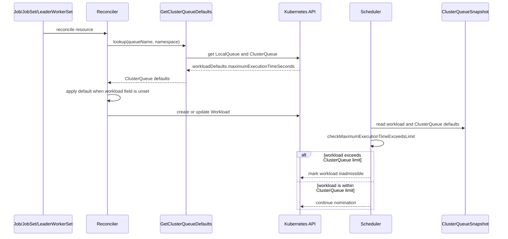

# PR #10479: Add ClusterQueue default maximum execution time (KEP-7029)

**Summary**: Add ClusterQueue default maximum execution time (KEP-7029)

**Sources**: https://github.com/kubernetes-sigs/kueue/pull/10479

**Last updated**: 2026-06-19T03:36:50Z

---

## Metadata

- **State**: open
- **Author**: [@kannon92](https://github.com/kannon92)
- **Branch**: `poc--timeout-per-localqueue` → `main`
- **Created**: 2026-04-14T19:17:28Z
- **Updated**: 2026-06-19T03:36:50Z
- **Merged**: —
- **Closed**: —
- **Labels**: `kind/feature`, `release-note`, `size/XXL`, `kind/api-change`, `cncf-cla: yes`, `kind/kep`
- **Assignees**: _none_
- **Requested reviewers**: [@mimowo](https://github.com/mimowo), [@PBundyra](https://github.com/PBundyra)
- **Changed files**: 35   **+2515 / -3**

## Description

#### What type of PR is this?

/kind feature
/kind api-change
/kind kep

#### What this PR does / why we need it:

Implement KEP-7029.
#### Which issue(s) this PR fixes:

Implements https://github.com/kubernetes-sigs/kueue/issues/7029

#### Special notes for your reviewer:

#### Does this PR introduce a user-facing change?

```release-note
Add `spec.workloadDefaults.maximumExecutionTimeSeconds` field to ClusterQueue, allowing administrators to set a default maximum execution time for workloads submitted to a ClusterQueue.
```

---
> **AI Assistance Disclosure**: This pull request was created with the assistance of AI (Claude Code by Anthropic).

<!-- This is an auto-generated comment: release notes by coderabbit.ai -->
## Summary by CodeRabbit

* **New Features**
  * Added the `ClusterQueueMaxExecutionTime` feature gate and `ClusterQueue.spec.workloadDefaults.maximumExecutionTimeSeconds` (alpha) to default workload maximum execution time for ClusterQueue-backed LocalQueues, with job/pod label overrides.
* **Bug Fixes**
  * Improved scheduling eligibility to prevent admission when requested maximum execution time exceeds the ClusterQueue default limit.
  * Fixed workload equivalency behavior when the job label is not explicitly set.
* **Documentation**
  * Updated CRD schema, API reference docs, and feature-gate listings.
* **Tests**
  * Expanded unit, integration, and E2E coverage for affected controllers and scheduler behavior.
<!-- end of auto-generated comment: release notes by coderabbit.ai -->

## Discussion

### Comment by [@netlify[bot]](https://github.com/apps/netlify) — 2026-04-14T19:17:36Z

### <span aria-hidden="true">✅</span> Deploy Preview for *kubernetes-sigs-kueue* canceled.


|  Name | Link |
|:-:|------------------------|
|<span aria-hidden="true">🔨</span> Latest commit | 3de40ea08be1f623c0c9fb6a31bfafc0eaba70a9 |
|<span aria-hidden="true">🔍</span> Latest deploy log | https://app.netlify.com/projects/kubernetes-sigs-kueue/deploys/6a34b5de53a63a00086b8c29 |

### Comment by [@k8s-ci-robot](https://github.com/k8s-ci-robot) — 2026-06-19T00:24:56Z

[APPROVALNOTIFIER] This PR is **NOT APPROVED**

This pull-request has been approved by: *<a href="https://github.com/kubernetes-sigs/kueue/pull/10479#" title="Author self-approved">kannon92</a>*
**Once this PR has been reviewed and has the lgtm label**, please assign [mimowo](https://github.com/mimowo) for approval. For more information see [the Code Review Process](https://git.k8s.io/community/contributors/guide/owners.md#the-code-review-process).

The full list of commands accepted by this bot can be found [here](https://go.k8s.io/bot-commands?repo=kubernetes-sigs%2Fkueue).

<details open>
Needs approval from an approver in each of these files:

- **[OWNERS](https://github.com/kubernetes-sigs/kueue/blob/main/OWNERS)**

Approvers can indicate their approval by writing `/approve` in a comment
Approvers can cancel approval by writing `/approve cancel` in a comment
</details>
<!-- META={"approvers":["mimowo"]} -->

### Comment by [@coderabbitai[bot]](https://github.com/apps/coderabbitai) — 2026-06-19T00:25:58Z

<!-- This is an auto-generated comment: summarize by coderabbit.ai -->
<!-- review_stack_entry_start -->

[](https://app.coderabbit.ai/change-stack/kubernetes-sigs/kueue/pull/10479?utm_source=github_walkthrough&utm_medium=github&utm_campaign=change_stack)

<!-- review_stack_entry_end -->
No actionable comments were generated in the recent review. 🎉

<details>
<summary>ℹ️ Recent review info</summary>

<details>
<summary>⚙️ Run configuration</summary>

**Configuration used**: Path: .coderabbit.yaml

**Review profile**: CHILL

**Plan**: Pro

**Run ID**: `a81375ee-0b0a-4cd0-a100-9cb532f920b5`

</details>

<details>
<summary>📥 Commits</summary>

Reviewing files that changed from the base of the PR and between 0717729e421bcfb24d19dfa36b5a06a0ded1817c and 3de40ea08be1f623c0c9fb6a31bfafc0eaba70a9.

</details>

<details>
<summary>⛔ Files ignored due to path filters (5)</summary>

* `apis/kueue/v1beta1/zz_generated.conversion.go` is excluded by `!**/*_generated*.go`, `!**/zz_generated.*.go`
* `apis/kueue/v1beta1/zz_generated.deepcopy.go` is excluded by `!**/*_generated*.go`, `!**/zz_generated.*.go`
* `client-go/applyconfiguration/kueue/v1beta1/clusterqueuespec.go` is excluded by `!client-go/**`
* `client-go/applyconfiguration/kueue/v1beta1/clusterqueueworkloaddefaults.go` is excluded by `!client-go/**`
* `client-go/applyconfiguration/utils.go` is excluded by `!client-go/**`

</details>

<details>
<summary>📒 Files selected for processing (12)</summary>

* `apis/kueue/v1beta1/clusterqueue_types.go`
* `charts/kueue/templates/crd/kueue.x-k8s.io_clusterqueues.yaml`
* `config/components/crd/bases/kueue.x-k8s.io_clusterqueues.yaml`
* `pkg/cache/scheduler/clusterqueue.go`
* `pkg/cache/scheduler/clusterqueue_snapshot.go`
* `pkg/cache/scheduler/snapshot.go`
* `pkg/scheduler/scheduler.go`
* `site/content/en/docs/reference/kueue.v1beta1.md`
* `site/data/featuregates/versioned_feature_list.yaml`
* `test/compatibility_lifecycle/reference/versioned_feature_list.yaml`
* `test/integration/singlecluster/controller/jobs/job/job_controller_test.go`
* `test/integration/singlecluster/controller/jobs/leaderworkerset/suite_test.go`

</details>

<details>
<summary>✅ Files skipped from review due to trivial changes (2)</summary>

* pkg/cache/scheduler/snapshot.go
* site/data/featuregates/versioned_feature_list.yaml

</details>

<details>
<summary>🚧 Files skipped from review as they are similar to previous changes (9)</summary>

* test/compatibility_lifecycle/reference/versioned_feature_list.yaml
* test/integration/singlecluster/controller/jobs/leaderworkerset/suite_test.go
* charts/kueue/templates/crd/kueue.x-k8s.io_clusterqueues.yaml
* apis/kueue/v1beta1/clusterqueue_types.go
* pkg/scheduler/scheduler.go
* config/components/crd/bases/kueue.x-k8s.io_clusterqueues.yaml
* pkg/cache/scheduler/clusterqueue.go
* test/integration/singlecluster/controller/jobs/job/job_controller_test.go
* pkg/cache/scheduler/clusterqueue_snapshot.go

</details>

</details>

---
<!-- walkthrough_start -->

<details>
<summary>📝 Walkthrough</summary>

## Walkthrough

Adds an alpha `ClusterQueueMaxExecutionTime` feature gate (v0.19) that allows `ClusterQueueSpec` to carry a `workloadDefaults.maximumExecutionTimeSeconds` field. When enabled, the cache propagates this value into snapshots, the reconciler applies it to new/updated Workloads (skipping workloads that already set the field via label), and the scheduler marks workloads inadmissible when their requested time exceeds the ClusterQueue limit. CRD schemas, API docs, and test coverage across unit, integration, and E2E layers are included.

## Changes

**ClusterQueue default maximum execution time**

| Layer / File(s) | Summary |
|---|---|
| **API types and feature gate** <br> `apis/kueue/v1beta1/clusterqueue_types.go`, `apis/kueue/v1beta2/clusterqueue_types.go`, `pkg/features/kube_features.go` | Adds optional `workloadDefaults` to `ClusterQueueSpec` and introduces `ClusterQueueWorkloadDefaults` type in both API versions; registers `ClusterQueueMaxExecutionTime` as an Alpha feature gate at v0.19 with default disabled. |
| **CRD schemas and API documentation** <br> `config/components/crd/bases/kueue.x-k8s.io_clusterqueues.yaml`, `charts/kueue/templates/crd/kueue.x-k8s.io_clusterqueues.yaml`, `site/content/en/docs/reference/kueue.v1beta1.md`, `site/content/en/docs/reference/kueue.v1beta2.md`, `site/data/featuregates/versioned_feature_list.yaml`, `test/compatibility_lifecycle/reference/versioned_feature_list.yaml` | Updates CRD base files and Helm templates for both API versions to include `spec.workloadDefaults.maximumExecutionTimeSeconds` schema (alpha, int32, minimum 1); updates API reference docs and feature-gate metadata. |
| **Cache and snapshot propagation** <br> `pkg/cache/scheduler/clusterqueue.go`, `pkg/cache/scheduler/clusterqueue_snapshot.go`, `pkg/cache/scheduler/snapshot.go` | `clusterQueue` and `ClusterQueueSnapshot` structs gain a `WorkloadDefaults` field; `updateClusterQueue` populates it behind the feature flag; `snapshotClusterQueue` copies it into snapshots for admission evaluation. |
| **ClusterQueue defaults resolution and application** <br> `pkg/controller/jobframework/clusterqueue_defaults.go` | New `GetClusterQueueDefaults` resolves LocalQueue→ClusterQueue and extracts `MaximumExecutionTimeSeconds` behind the feature flag; `ApplyClusterQueueDefaults` applies the default to a Workload only when unset. |
| **Reconciler workload defaulting** <br> `pkg/controller/jobframework/reconciler.go` | `EquivalentToWorkload` skips field comparison when job has no explicit label; `updateWorkloadToMatchJob` and `handleJobWithNoWorkload` apply ClusterQueue defaults before persisting. |
| **LeaderWorkerSet controller defaulting** <br> `pkg/controller/jobs/leaderworkerset/leaderworkerset_reconciler.go` | `createWorkload` retrieves and applies ClusterQueue defaults before creating Workload. |
| **Scheduler admission enforcement** <br> `pkg/scheduler/scheduler.go` | `nominate` calls `checkMaximumExecutionTimeExceedsLimit` after resource validation; workloads exceeding the ClusterQueue limit are marked inadmissible when feature is enabled. |
| **Test utilities and helpers** <br> `pkg/util/testing/v1beta2/wrappers.go`, `pkg/util/testingjobs/leaderworkerset/wrappers.go`, `test/util/constants.go` | Adds `ClusterQueueWrapper.MaximumExecutionTimeSeconds` builder; `MakeLeaderWorkerSet` sets rolling update strategy; adds `LeaderWorkerSetCrds` CRD path constant. |
| **Unit tests: job and jobset controllers** <br> `pkg/controller/jobs/job/job_controller_test.go`, `pkg/controller/jobs/jobset/jobset_controller_test.go` | Extends `TestReconciler` to accept per-test `localQueues`, `clusterQueues`, and `featureGates`; adds cases for gate-disabled, gate-enabled with CQ default, and label-override scenarios. |
| **Unit tests: pod controller** <br> `pkg/controller/jobs/pod/pod_controller_test.go` | Adds three new table entries covering gate-disabled, gate-enabled with CQ default, and gate-enabled with pod label override. |
| **Integration tests: suite infrastructure and job controller** <br> `test/integration/singlecluster/controller/jobs/leaderworkerset/suite_test.go`, `test/integration/singlecluster/controller/jobs/job/job_controller_test.go` | New suite file adds Ginkgo test infrastructure with lifecycle hooks and manager/scheduler setup helpers; job controller integration tests verify default propagation, label override, nil behavior, queue-move preservation, and scheduler admission. |
| **Integration tests: pod and LeaderWorkerSet controllers** <br> `test/integration/singlecluster/controller/jobs/pod/pod_controller_test.go`, `test/integration/singlecluster/controller/jobs/leaderworkerset/leaderworkerset_controller_test.go` | New integration test suites for pod and LeaderWorkerSet controllers covering default propagation, label override, nil-when-no-default, and gate-disabled behavior. |
| **E2E tests: Job, JobSet, and LeaderWorkerSet** <br> `test/e2e/sequential/extended/clusterqueue_max_execution_time_test.go` | New ordered E2E suite enables the feature gate via config update, verifies CQ-default propagation, label override, and nil behavior across all three workload source types. |

## Sequence Diagram(s)



## Estimated code review effort

🎯 4 (Complex) | ⏱️ ~60 minutes

## Suggested labels

`size/XL`, `ok-to-test`

## Suggested reviewers

- mimowo
- PBundyra

## Poem

> 🐇 A clock on each queue, a timer by default,
> The ClusterQueue sets limits, bringing jobs to a halt!
> If the label says longer, the label wins the race,
> But without it, the queue's default takes its place.
> Alpha today, GA tomorrow — hop along with grace! ✨

</details>

<!-- walkthrough_end -->
<!-- pre_merge_checks_walkthrough_start -->

<details>
<summary>🚥 Pre-merge checks | ✅ 4 | ❌ 1</summary>

### ❌ Failed checks (1 warning)

|     Check name     | Status     | Explanation                                                                           | Resolution                                                                         |
| :----------------: | :--------- | :------------------------------------------------------------------------------------ | :--------------------------------------------------------------------------------- |
| Docstring Coverage | ⚠️ Warning | Docstring coverage is 33.33% which is insufficient. The required threshold is 80.00%. | Write docstrings for the functions missing them to satisfy the coverage threshold. |

<details>
<summary>✅ Passed checks (4 passed)</summary>

|         Check name         | Status   | Explanation                                                                                                                                                                    |
| :------------------------: | :------- | :----------------------------------------------------------------------------------------------------------------------------------------------------------------------------- |
|      Description Check     | ✅ Passed | Check skipped - CodeRabbit’s high-level summary is enabled.                                                                                                                    |
|         Title check        | ✅ Passed | The title clearly and accurately summarizes the main change: adding ClusterQueue default maximum execution time as specified in KEP-7029.                                      |
|     Linked Issues check    | ✅ Passed | The PR successfully implements all three completion requirements from issue `#7029`: design doc, API changes, and documentation updates are present.                             |
| Out of Scope Changes check | ✅ Passed | All changes are directly related to implementing ClusterQueue default maximum execution time; one unrelated change (LeaderWorkerSet rolling strategy) is minor and incidental. |

</details>

<sub>✏️ Tip: You can configure your own custom pre-merge checks in the settings.</sub>

</details>

<!-- pre_merge_checks_walkthrough_end -->
<!-- finishing_touch_checkbox_start -->

<details>
<summary>✨ Finishing Touches</summary>

<details>
<summary>🧪 Generate unit tests (beta)</summary>

- [ ] <!-- {"checkboxId": "f47ac10b-58cc-4372-a567-0e02b2c3d479", "radioGroupId": "utg-output-choice-group-unknown_comment_id"} -->   Create PR with unit tests

</details>

</details>

<!-- finishing_touch_checkbox_end -->
<!-- tips_start -->

---

Thanks for using [CodeRabbit](https://coderabbit.ai?utm_source=oss&utm_medium=github&utm_campaign=kubernetes-sigs/kueue&utm_content=10479)! It's free for OSS, and your support helps us grow. If you like it, consider giving us a shout-out.

<details>
<summary>❤️ Share</summary>

- [X](https://twitter.com/intent/tweet?text=I%20just%20used%20%40coderabbitai%20for%20my%20code%20review%2C%20and%20it%27s%20fantastic%21%20It%27s%20free%20for%20OSS%20and%20offers%20a%20free%20trial%20for%20the%20proprietary%20code.%20Check%20it%20out%3A&url=https%3A//coderabbit.ai)
- [Mastodon](https://mastodon.social/share?text=I%20just%20used%20%40coderabbitai%20for%20my%20code%20review%2C%20and%20it%27s%20fantastic%21%20It%27s%20free%20for%20OSS%20and%20offers%20a%20free%20trial%20for%20the%20proprietary%20code.%20Check%20it%20out%3A%20https%3A%2F%2Fcoderabbit.ai)
- [Reddit](https://www.reddit.com/submit?title=Great%20tool%20for%20code%20review%20-%20CodeRabbit&text=I%20just%20used%20CodeRabbit%20for%20my%20code%20review%2C%20and%20it%27s%20fantastic%21%20It%27s%20free%20for%20OSS%20and%20offers%20a%20free%20trial%20for%20proprietary%20code.%20Check%20it%20out%3A%20https%3A//coderabbit.ai)
- [LinkedIn](https://www.linkedin.com/sharing/share-offsite/?url=https%3A%2F%2Fcoderabbit.ai&mini=true&title=Great%20tool%20for%20code%20review%20-%20CodeRabbit&summary=I%20just%20used%20CodeRabbit%20for%20my%20code%20review%2C%20and%20it%27s%20fantastic%21%20It%27s%20free%20for%20OSS%20and%20offers%20a%20free%20trial%20for%20proprietary%20code)

</details>


<sub>Comment `@coderabbitai help` to get the list of available commands and usage tips.</sub>

<!-- tips_end -->

### Comment by [@k8s-ci-robot](https://github.com/k8s-ci-robot) — 2026-06-19T03:09:47Z

@kannon92: The following tests **failed**, say `/retest` to rerun all failed tests or `/retest-required` to rerun all mandatory failed tests:

Test name | Commit | Details | Required | Rerun command
--- | --- | --- | --- | ---
pull-kueue-test-e2e-tas-main | f1a07c6730abb5e90dacf5ff8e179692b3cc7848 | [link](https://prow.k8s.io/view/gs/kubernetes-ci-logs/pr-logs/pull/kubernetes-sigs_kueue/10479/pull-kueue-test-e2e-tas-main/2045555681280397312) | true | `/test pull-kueue-test-e2e-tas-main`
pull-kueue-test-e2e-main-1-36 | 740090f70e3125ee8be62e29985f0ff7cff9f935 | [link](https://prow.k8s.io/view/gs/kubernetes-ci-logs/pr-logs/pull/kubernetes-sigs_kueue/10479/pull-kueue-test-e2e-main-1-36/2057933492880150528) | true | `/test pull-kueue-test-e2e-main-1-36`
pull-kueue-test-e2e-extended-main-1-36 | 29b86d43168547ca0ae4c5f5ac7178164031d88a | [link](https://prow.k8s.io/view/gs/kubernetes-ci-logs/pr-logs/pull/kubernetes-sigs_kueue/10479/pull-kueue-test-e2e-extended-main-1-36/2059116531324817408) | true | `/test pull-kueue-test-e2e-extended-main-1-36`
pull-kueue-test-e2e-multikueue-extended-main | 29b86d43168547ca0ae4c5f5ac7178164031d88a | [link](https://prow.k8s.io/view/gs/kubernetes-ci-logs/pr-logs/pull/kubernetes-sigs_kueue/10479/pull-kueue-test-e2e-multikueue-extended-main/2060758231453536256) | true | `/test pull-kueue-test-e2e-multikueue-extended-main`
pull-kueue-test-e2e-extended-shard-0-main-1-33 | 29b86d43168547ca0ae4c5f5ac7178164031d88a | [link](https://prow.k8s.io/view/gs/kubernetes-ci-logs/pr-logs/pull/kubernetes-sigs_kueue/10479/pull-kueue-test-e2e-extended-shard-0-main-1-33/2062202628523167744) | true | `/test pull-kueue-test-e2e-extended-shard-0-main-1-33`
pull-kueue-test-e2e-extended-shard-1-main-1-33 | 29b86d43168547ca0ae4c5f5ac7178164031d88a | [link](https://prow.k8s.io/view/gs/kubernetes-ci-logs/pr-logs/pull/kubernetes-sigs_kueue/10479/pull-kueue-test-e2e-extended-shard-1-main-1-33/2062202628628025344) | true | `/test pull-kueue-test-e2e-extended-shard-1-main-1-33`

[Full PR test history](https://prow.k8s.io/pr-history?org=kubernetes-sigs&repo=kueue&pr=10479). [Your PR dashboard](https://prow.k8s.io/pr?query=is%3Apr%20state%3Aopen%20author%3Akannon92). Please help us cut down on flakes by [linking to](https://git.k8s.io/community/contributors/devel/sig-testing/flaky-tests.md#filing-issues-for-flaky-tests) an [open issue](https://github.com/kubernetes-sigs/kueue/issues?q=is:issue+is:open) when you hit one in your PR.

<details>

Instructions for interacting with me using PR comments are available [here](https://git.k8s.io/community/contributors/guide/pull-requests.md).  If you have questions or suggestions related to my behavior, please file an issue against the [kubernetes-sigs/prow](https://github.com/kubernetes-sigs/prow/issues/new?title=Prow%20issue:) repository. I understand the commands that are listed [here](https://go.k8s.io/bot-commands).
</details>
<!-- test report -->

## Reviews

### Review by [@kannon92](https://github.com/kannon92) (commented) — 2026-05-24T18:07:06Z

- **apis/kueue/v1beta1/clusterqueue_types.go:148** by [@kannon92](https://github.com/kannon92) — 2026-05-24T18:07:06Z
```diff
@@ -142,6 +142,27 @@ type ClusterQueueSpec struct {
 	// admissionScope indicates whether ClusterQueue uses the Admission Fair Sharing
 	// +optional
 	AdmissionScope *AdmissionScope `json:"admissionScope,omitempty"`
+
+	// workloadDefaults defines default values that are applied to workloads
+	// submitted to LocalQueues backed by this ClusterQueue when the workload
+	// does not already specify them.
```

  I think I can drop this from v1beta1.

### Review by [@coderabbitai[bot]](https://github.com/apps/coderabbitai) (commented) — 2026-06-19T00:37:18Z

**Actionable comments posted: 3**

<details>
<summary>🧹 Nitpick comments (3)</summary><blockquote>

<details>
<summary>pkg/controller/jobs/pod/pod_controller_test.go (1)</summary><blockquote>

`1418-1419`: _⚡ Quick win_

**Avoid hardcoded PodSet references in these new expectations.**

Use `kueue.NewPodSetReference(podUID)` so the assertions stay aligned with the shared fixture constant.


<details>
<summary>Suggested diff</summary>

```diff
-						*utiltestingapi.MakePodSet("dc85db45", 2).
+						*utiltestingapi.MakePodSet(kueue.NewPodSetReference(podUID), 2).
...
-						*utiltestingapi.MakePodSet("dc85db45", 2).
+						*utiltestingapi.MakePodSet(kueue.NewPodSetReference(podUID), 2).
...
-						*utiltestingapi.MakePodSet("dc85db45", 2).
+						*utiltestingapi.MakePodSet(kueue.NewPodSetReference(podUID), 2).
```
</details>


Also applies to: 1497-1498, 1581-1582

<details>
<summary>🤖 Prompt for AI Agents</summary>

```
Verify each finding against current code. Fix only still-valid issues, skip the
rest with a brief reason, keep changes minimal, and validate.

In `@pkg/controller/jobs/pod/pod_controller_test.go` around lines 1418 - 1419, In
the test file pod_controller_test.go, replace the hardcoded PodSet reference
string "dc85db45" in the MakePodSet function calls with
kueue.NewPodSetReference(podUID) to align assertions with the shared fixture
constant. This change needs to be applied to all occurrences in the expectations
(at lines 1418-1419, 1497-1498, and 1581-1582) so that the test uses the proper
reference mechanism instead of hardcoded values.
```

</details>

<!-- cr-comment:v1:e74bf64d5ba289134293258e -->

</blockquote></details>
<details>
<summary>test/integration/singlecluster/controller/jobs/job/job_controller_test.go (1)</summary><blockquote>

`4693-5063`: _🏗️ Heavy lift_

**Consolidate repeated timeout scenarios into `DescribeTable` entries.**

These new scenarios repeat the same setup/assertion flow with only queue/label/expected-timeout deltas. Converting to table-driven specs will reduce duplication and make future cases safer to add.

<details>
<summary>Refactor sketch</summary>

```diff
+type maxExecScenario struct {
+  name           string
+  queue          string
+  jobLabel       *string
+  expected       *int32
+}
+
+ginkgo.DescribeTable("workload max execution time defaulting",
+  func(tc maxExecScenario) {
+    b := testingjob.MakeJob("job-"+tc.name, ns.Name).
+      Queue(kueue.LocalQueueName(tc.queue)).
+      Suspend(true).
+      Parallelism(1).
+      Request(corev1.ResourceCPU, "1").
+      Image(util.GetAgnHostImage(), util.BehaviorWaitForDeletion)
+    if tc.jobLabel != nil {
+      b = b.Label(constants.MaxExecTimeSecondsLabel, *tc.jobLabel)
+    }
+    job := b.Obj()
+    util.MustCreate(ctx, k8sClient, job)
+    // shared workload lookup + expectation helper...
+  },
+  ginkgo.Entry("uses CQ default", maxExecScenario{...}),
+  ginkgo.Entry("label overrides CQ default", maxExecScenario{...}),
+  ginkgo.Entry("no CQ default leaves nil", maxExecScenario{...}),
+)
```
</details>

   

As per coding guidelines, `**/*_test.go`: ensure tests follow existing Ginkgo/Gomega patterns and prefer table-driven tests for multiple scenarios.


Also applies to: 4891-4997, 5043-5062

<details>
<summary>🤖 Prompt for AI Agents</summary>

```
Verify each finding against current code. Fix only still-valid issues, skip the
rest with a brief reason, keep changes minimal, and validate.

In `@test/integration/singlecluster/controller/jobs/job/job_controller_test.go`
around lines 4693 - 5063, The test cases following similar patterns with
different queue, label, and expected timeout values should be consolidated into
table-driven tests using ginkgo.DescribeTable to reduce duplication. Identify
the repeated test scenarios in the first describe block (the ones testing
ClusterQueue default execution time with different inputs like "should set
workload MaximumExecutionTimeSeconds from ClusterQueue default", "should use job
label over ClusterQueue default for MaximumExecutionTimeSeconds", and "should
not set MaximumExecutionTimeSeconds when ClusterQueue has no default") and
convert them into a single DescribeTable entry where each row specifies the
queue name, job label (if any), and expected timeout value. This approach will
make the test setup and assertions more DRY while maintaining the same test
coverage and making it easier to add new scenarios in the future.
```

</details>

<!-- cr-comment:v1:70aea02f6fb936a30df4f576 -->

_Source: Coding guidelines_

</blockquote></details>
<details>
<summary>test/e2e/sequential/extended/clusterqueue_max_execution_time_test.go (1)</summary><blockquote>

`206-233`: _💤 Low value_

**Consider adding a label override test for JobSet for coverage parity.**

The Job and LeaderWorkerSet sections both include a test case for label override behavior, but the JobSet section only has tests for CQ default and no-default scenarios. For completeness and consistency across all workload types, consider adding a test that verifies a JobSet with `constants.MaxExecTimeSecondsLabel` label takes precedence over the ClusterQueue default.

<details>
<summary>🤖 Prompt for AI Agents</summary>

```
Verify each finding against current code. Fix only still-valid issues, skip the
rest with a brief reason, keep changes minimal, and validate.

In `@test/e2e/sequential/extended/clusterqueue_max_execution_time_test.go` around
lines 206 - 233, Add a new test case in the JobSet test section to verify label
override behavior for consistency with the Job and LeaderWorkerSet test
sections. After the existing test "should not set MaximumExecutionTimeSeconds
when ClusterQueue has no default", create a test that verifies when a JobSet has
the constants.MaxExecTimeSecondsLabel label set, it takes precedence over the
ClusterQueue default timeout value. The test should create a JobSet with both a
ClusterQueue that has a default MaximumExecutionTimeSeconds and apply the label
override, then verify that the workload's MaximumExecutionTimeSeconds matches
the label value, not the ClusterQueue default.
```

</details>

<!-- cr-comment:v1:273f9548723f5bc90c2b61e1 -->

</blockquote></details>

</blockquote></details>

<details>
<summary>🤖 Prompt for all review comments with AI agents</summary>

```
Verify each finding against current code. Fix only still-valid issues, skip the
rest with a brief reason, keep changes minimal, and validate.

Inline comments:
In `@apis/kueue/v1beta2/clusterqueue_types.go`:
- Around line 175-182: The godoc comment for maximumExecutionTimeSeconds in the
ClusterQueue type is incomplete and only mentions its use as a default value
when jobs lack the kueue.x-k8s.io/max-exec-time-seconds label. Update this
comment block to clarify that this field serves two purposes: it provides a
default maximum execution time for jobs that don't specify one, AND it acts as
an upper-bound enforcement limit that rejects workloads whose
spec.maximumExecutionTimeSeconds exceeds the ClusterQueue value during runtime
scheduling. After updating the godoc comments, regenerate the CRD and
documentation from the updated API comments.

In `@site/content/en/docs/reference/kueue.v1beta1.md`:
- Line 1254: The internal link fragment at line 1254 referencing
ClusterQueueSpec contains an invalid anchor target that fails markdownlint MD051
validation. Find the actual heading for ClusterQueueSpec in the document and
correct the fragment identifier in the link to match the exact heading format,
or if this is an auto-generated reference documentation file, regenerate it
using the appropriate documentation generation tool to ensure all fragment
anchors are correctly formatted and point to valid headings.

In `@site/content/en/docs/reference/kueue.v1beta2.md`:
- Line 1137: The markdown link to ClusterQueueSpec on line 1137 contains an
invalid anchor fragment that fails the markdownlint MD051 check. Locate the line
with the link referencing ClusterQueueSpec and verify that the fragment
identifier matches an actual heading in the document. Either update the anchor
fragment to point to the correct heading ID or regenerate the reference
documentation to ensure all internal links have valid corresponding anchors and
the lint check passes.

---

Nitpick comments:
In `@pkg/controller/jobs/pod/pod_controller_test.go`:
- Around line 1418-1419: In the test file pod_controller_test.go, replace the
hardcoded PodSet reference string "dc85db45" in the MakePodSet function calls
with kueue.NewPodSetReference(podUID) to align assertions with the shared
fixture constant. This change needs to be applied to all occurrences in the
expectations (at lines 1418-1419, 1497-1498, and 1581-1582) so that the test
uses the proper reference mechanism instead of hardcoded values.

In `@test/e2e/sequential/extended/clusterqueue_max_execution_time_test.go`:
- Around line 206-233: Add a new test case in the JobSet test section to verify
label override behavior for consistency with the Job and LeaderWorkerSet test
sections. After the existing test "should not set MaximumExecutionTimeSeconds
when ClusterQueue has no default", create a test that verifies when a JobSet has
the constants.MaxExecTimeSecondsLabel label set, it takes precedence over the
ClusterQueue default timeout value. The test should create a JobSet with both a
ClusterQueue that has a default MaximumExecutionTimeSeconds and apply the label
override, then verify that the workload's MaximumExecutionTimeSeconds matches
the label value, not the ClusterQueue default.

In `@test/integration/singlecluster/controller/jobs/job/job_controller_test.go`:
- Around line 4693-5063: The test cases following similar patterns with
different queue, label, and expected timeout values should be consolidated into
table-driven tests using ginkgo.DescribeTable to reduce duplication. Identify
the repeated test scenarios in the first describe block (the ones testing
ClusterQueue default execution time with different inputs like "should set
workload MaximumExecutionTimeSeconds from ClusterQueue default", "should use job
label over ClusterQueue default for MaximumExecutionTimeSeconds", and "should
not set MaximumExecutionTimeSeconds when ClusterQueue has no default") and
convert them into a single DescribeTable entry where each row specifies the
queue name, job label (if any), and expected timeout value. This approach will
make the test setup and assertions more DRY while maintaining the same test
coverage and making it easier to add new scenarios in the future.
```

</details>

<details>
<summary>🪄 Autofix (Beta)</summary>

Fix all unresolved CodeRabbit comments on this PR:

- [ ] <!-- {"checkboxId": "4b0d0e0a-96d7-4f10-b296-3a18ea78f0b9"} --> Push a commit to this branch (recommended)
- [ ] <!-- {"checkboxId": "ff5b1114-7d8c-49e6-8ac1-43f82af23a33"} --> Create a new PR with the fixes

</details>

---

<details>
<summary>ℹ️ Review info</summary>

<details>
<summary>⚙️ Run configuration</summary>

**Configuration used**: Path: .coderabbit.yaml

**Review profile**: CHILL

**Plan**: Pro

**Run ID**: `80bd6c54-9951-4857-ab15-4c1f4d2b8eae`

</details>

<details>
<summary>📥 Commits</summary>

Reviewing files that changed from the base of the PR and between d7dd2225017afa6a0f47f0337c50596c61773f45 and 7e2bf43b4f2e140665072d4225ba32991b8ba61f.

</details>

<details>
<summary>⛔ Files ignored due to path filters (8)</summary>

* `apis/kueue/v1beta1/zz_generated.conversion.go` is excluded by `!**/*_generated*.go`, `!**/zz_generated.*.go`
* `apis/kueue/v1beta1/zz_generated.deepcopy.go` is excluded by `!**/*_generated*.go`, `!**/zz_generated.*.go`
* `apis/kueue/v1beta2/zz_generated.deepcopy.go` is excluded by `!**/*_generated*.go`, `!**/zz_generated.*.go`
* `client-go/applyconfiguration/kueue/v1beta1/clusterqueuespec.go` is excluded by `!client-go/**`
* `client-go/applyconfiguration/kueue/v1beta1/clusterqueueworkloaddefaults.go` is excluded by `!client-go/**`
* `client-go/applyconfiguration/kueue/v1beta2/clusterqueuespec.go` is excluded by `!client-go/**`
* `client-go/applyconfiguration/kueue/v1beta2/clusterqueueworkloaddefaults.go` is excluded by `!client-go/**`
* `client-go/applyconfiguration/utils.go` is excluded by `!client-go/**`

</details>

<details>
<summary>📒 Files selected for processing (27)</summary>

* `apis/kueue/v1beta1/clusterqueue_types.go`
* `apis/kueue/v1beta2/clusterqueue_types.go`
* `charts/kueue/templates/crd/kueue.x-k8s.io_clusterqueues.yaml`
* `config/components/crd/bases/kueue.x-k8s.io_clusterqueues.yaml`
* `pkg/cache/scheduler/clusterqueue.go`
* `pkg/cache/scheduler/clusterqueue_snapshot.go`
* `pkg/cache/scheduler/snapshot.go`
* `pkg/controller/jobframework/clusterqueue_defaults.go`
* `pkg/controller/jobframework/reconciler.go`
* `pkg/controller/jobs/job/job_controller_test.go`
* `pkg/controller/jobs/jobset/jobset_controller_test.go`
* `pkg/controller/jobs/leaderworkerset/leaderworkerset_reconciler.go`
* `pkg/controller/jobs/pod/pod_controller_test.go`
* `pkg/features/kube_features.go`
* `pkg/scheduler/scheduler.go`
* `pkg/util/testing/v1beta2/wrappers.go`
* `pkg/util/testingjobs/leaderworkerset/wrappers.go`
* `site/content/en/docs/reference/kueue.v1beta1.md`
* `site/content/en/docs/reference/kueue.v1beta2.md`
* `site/data/featuregates/versioned_feature_list.yaml`
* `test/compatibility_lifecycle/reference/versioned_feature_list.yaml`
* `test/e2e/sequential/extended/clusterqueue_max_execution_time_test.go`
* `test/integration/singlecluster/controller/jobs/job/job_controller_test.go`
* `test/integration/singlecluster/controller/jobs/leaderworkerset/leaderworkerset_controller_test.go`
* `test/integration/singlecluster/controller/jobs/leaderworkerset/suite_test.go`
* `test/integration/singlecluster/controller/jobs/pod/pod_controller_test.go`
* `test/util/constants.go`

</details>

</details>

<!-- This is an auto-generated comment by CodeRabbit for review status -->

- **apis/kueue/v1beta2/clusterqueue_types.go:182** by [@coderabbitai[bot]](https://github.com/apps/coderabbitai) — 2026-06-19T00:37:17Z
```diff
@@ -160,6 +160,29 @@ type ClusterQueueSpec struct {
 	//
 	// +optional
 	ConcurrentAdmissionPolicy *ConcurrentAdmissionPolicy `json:"concurrentAdmissionPolicy,omitempty"`
+
+	// workloadDefaults defines default values that are applied to workloads
+	// submitted to LocalQueues backed by this ClusterQueue when the workload
+	// does not already specify them.
+	// +optional
+	WorkloadDefaults *ClusterQueueWorkloadDefaults `json:"workloadDefaults,omitempty"`
+}
+
+// ClusterQueueWorkloadDefaults defines default values that are applied to
+// workloads submitted to LocalQueues backed by this ClusterQueue when the
+// workload does not already specify them.
+type ClusterQueueWorkloadDefaults struct {
+	// maximumExecutionTimeSeconds if provided, determines the default maximum
+	// time, in seconds, for workloads submitted to LocalQueues backed by this
+	// ClusterQueue.
+	// This value is used when the job does not already specify a maximum execution
+	// time via the kueue.x-k8s.io/max-exec-time-seconds label.
+	//
+	// This is an alpha field and requires enabling the ClusterQueueMaxExecutionTime feature gate.
+	//
```

  _⚠️ Potential issue_ | _🟠 Major_ | _⚡ Quick win_
  
  **Clarify that this field is an enforced limit, not only a default.**
  
  The current description says this is applied only as a default when the job label is absent, but runtime scheduling also rejects workloads whose `spec.maximumExecutionTimeSeconds` exceeds the ClusterQueue value. Please update this godoc to state both behaviors (defaulting + upper-bound enforcement), then regenerate CRD/docs from the updated API comments.
  
  <details>
  <summary>🤖 Prompt for AI Agents</summary>
  
  ```
  Verify each finding against current code. Fix only still-valid issues, skip the
  rest with a brief reason, keep changes minimal, and validate.
  
  In `@apis/kueue/v1beta2/clusterqueue_types.go` around lines 175 - 182, The godoc
  comment for maximumExecutionTimeSeconds in the ClusterQueue type is incomplete
  and only mentions its use as a default value when jobs lack the
  kueue.x-k8s.io/max-exec-time-seconds label. Update this comment block to clarify
  that this field serves two purposes: it provides a default maximum execution
  time for jobs that don't specify one, AND it acts as an upper-bound enforcement
  limit that rejects workloads whose spec.maximumExecutionTimeSeconds exceeds the
  ClusterQueue value during runtime scheduling. After updating the godoc comments,
  regenerate the CRD and documentation from the updated API comments.
  ```
  
  </details>
  
  <!-- fingerprinting:phantom:poseidon:hawk -->
  
  <!-- cr-comment:v1:25351c9a0fbc3536abc1a48d -->
  
  <!-- This is an auto-generated comment by CodeRabbit -->

- **site/content/en/docs/reference/kueue.v1beta1.md:1254** by [@coderabbitai[bot]](https://github.com/apps/coderabbitai) — 2026-06-19T00:37:17Z
```diff
@@ -1237,6 +1246,39 @@ This is recorded only when Fair Sharing is enabled in the Kueue configuration.</
 </tbody>
 </table>
 
+## `ClusterQueueWorkloadDefaults`     {#kueue-x-k8s-io-v1beta1-ClusterQueueWorkloadDefaults}
+    
+
+**Appears in:**
+
+- [ClusterQueueSpec](#kueue-x-k8s-io-v1beta1-ClusterQueueSpec)
```

  _⚠️ Potential issue_ | _🟡 Minor_ | _⚡ Quick win_
  
  **Fix invalid internal link fragment on Line 1254.**
  
  `markdownlint` flags this link with MD051 (invalid fragment). Please correct the fragment target (or regenerate this reference doc) so navigation and lint checks pass.
  
  <details>
  <summary>🧰 Tools</summary>
  
  <details>
  <summary>🪛 markdownlint-cli2 (0.22.1)</summary>
  
  [warning] 1254-1254: Link fragments should be valid
  
  (MD051, link-fragments)
  
  </details>
  
  </details>
  
  <details>
  <summary>🤖 Prompt for AI Agents</summary>
  
  ```
  Verify each finding against current code. Fix only still-valid issues, skip the
  rest with a brief reason, keep changes minimal, and validate.
  
  In `@site/content/en/docs/reference/kueue.v1beta1.md` at line 1254, The internal
  link fragment at line 1254 referencing ClusterQueueSpec contains an invalid
  anchor target that fails markdownlint MD051 validation. Find the actual heading
  for ClusterQueueSpec in the document and correct the fragment identifier in the
  link to match the exact heading format, or if this is an auto-generated
  reference documentation file, regenerate it using the appropriate documentation
  generation tool to ensure all fragment anchors are correctly formatted and point
  to valid headings.
  ```
  
  </details>
  
  <!-- fingerprinting:phantom:poseidon:hawk -->
  
  <!-- cr-comment:v1:e37f8a6c1feda5125f3144a3 -->
  
  _Source: Linters/SAST tools_
  
  <!-- This is an auto-generated comment by CodeRabbit -->
  
  ✅ Addressed in commit 3de40ea

- **site/content/en/docs/reference/kueue.v1beta2.md:1137** by [@coderabbitai[bot]](https://github.com/apps/coderabbitai) — 2026-06-19T00:37:18Z
```diff
@@ -1120,6 +1129,39 @@ This is recorded only when Fair Sharing is enabled in the Kueue configuration.</
 </tbody>
 </table>
 
+## `ClusterQueueWorkloadDefaults`     {#kueue-x-k8s-io-v1beta2-ClusterQueueWorkloadDefaults}
+    
+
+**Appears in:**
+
+- [ClusterQueueSpec](#kueue-x-k8s-io-v1beta2-ClusterQueueSpec)
```

  _⚠️ Potential issue_ | _🟡 Minor_ | _⚡ Quick win_
  
  **Fix invalid internal link fragment on Line 1137.**
  
  `markdownlint` reports MD051 for this anchor link. Please correct the fragment target (or regenerate this reference doc) to keep docs lint-clean.
  
  <details>
  <summary>🧰 Tools</summary>
  
  <details>
  <summary>🪛 markdownlint-cli2 (0.22.1)</summary>
  
  [warning] 1137-1137: Link fragments should be valid
  
  (MD051, link-fragments)
  
  </details>
  
  </details>
  
  <details>
  <summary>🤖 Prompt for AI Agents</summary>
  
  ```
  Verify each finding against current code. Fix only still-valid issues, skip the
  rest with a brief reason, keep changes minimal, and validate.
  
  In `@site/content/en/docs/reference/kueue.v1beta2.md` at line 1137, The markdown
  link to ClusterQueueSpec on line 1137 contains an invalid anchor fragment that
  fails the markdownlint MD051 check. Locate the line with the link referencing
  ClusterQueueSpec and verify that the fragment identifier matches an actual
  heading in the document. Either update the anchor fragment to point to the
  correct heading ID or regenerate the reference documentation to ensure all
  internal links have valid corresponding anchors and the lint check passes.
  ```
  
  </details>
  
  <!-- fingerprinting:phantom:poseidon:hawk -->
  
  <!-- cr-comment:v1:282d3f332863785a0ebdffdc -->
  
  _Source: Linters/SAST tools_
  
  <!-- This is an auto-generated comment by CodeRabbit -->
