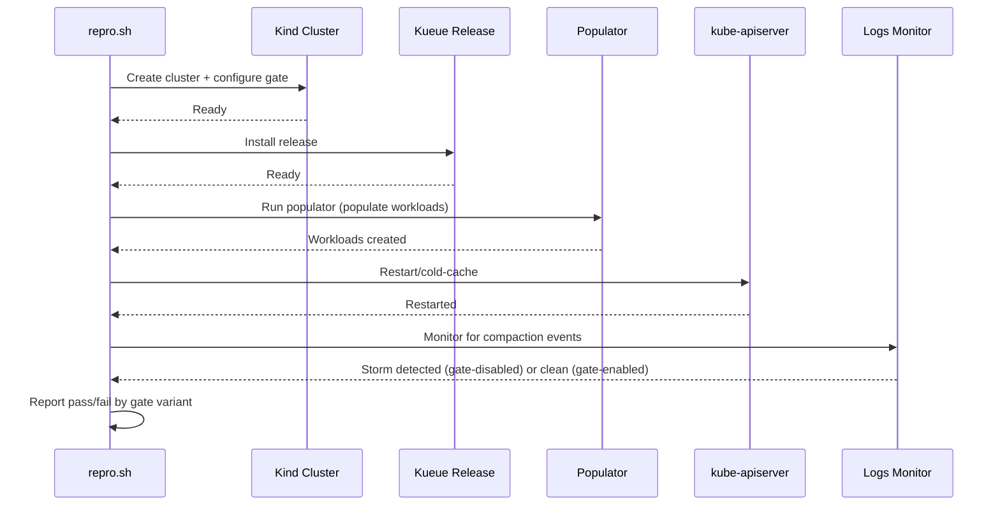

# PR #11680: test: add webhook scale conversion repro script

**Summary**: test: add webhook scale conversion repro script

**Sources**: https://github.com/kubernetes-sigs/kueue/pull/11680

**Last updated**: 2026-06-18T08:03:27Z

---

## Metadata

- **State**: open
- **Author**: [@mykysha](https://github.com/mykysha)
- **Branch**: `test/conversion-webhooks` → `main`
- **Created**: 2026-05-27T10:48:13Z
- **Updated**: 2026-06-18T08:03:27Z
- **Merged**: —
- **Closed**: —
- **Labels**: `kind/feature`, `size/XXL`, `release-note-none`, `approved`, `do-not-merge/hold`, `cncf-cla: yes`
- **Assignees**: _none_
- **Requested reviewers**: [@kannon92](https://github.com/kannon92), [@kshalot](https://github.com/kshalot)
- **Changed files**: 7   **+1073 / -0**

## Description

<!--  Thanks for sending a pull request!  Here are some tips for you:

1. If this is your first time, please read our contributor guidelines: https://git.k8s.io/community/contributors/guide/first-contribution.md#your-first-contribution and developer guide https://git.k8s.io/community/contributors/devel/development.md#development-guide
2. Please label this pull request according to what type of issue you are addressing, especially if this is a release targeted pull request. For reference on required PR/issue labels, read here:
https://git.k8s.io/community/contributors/devel/sig-release/release.md#issuepr-kind-label
3. Ensure you have added or ran the appropriate tests for your PR: https://git.k8s.io/community/contributors/devel/sig-testing/testing.md
4. If you want *faster* PR reviews, read how: https://git.k8s.io/community/contributors/guide/pull-requests.md#best-practices-for-faster-reviews
5. If the PR is unfinished, see how to mark it: https://git.k8s.io/community/contributors/guide/pull-requests.md#marking-unfinished-pull-requests
-->

#### What type of PR is this?
/kind feature

<!--
Add one of the following kinds:
/kind bug
/kind cleanup
/kind documentation
/kind feature
/kind kep

Optionally add one or more of the following kinds if applicable:
/kind api-change
/kind deprecation
/kind failing-test
/kind flake
/kind regression

Please also consider setting the area:
/area tas
/area integrations
/area multikueue
/area dashboard
/area localization
/area testing
/area website
-->

#### What this PR does / why we need it:
Add a script used to reproduce the scale webhook conversion issue appearing on apiserver restart

#### Which issue(s) this PR fixes:
<!--
*Automatically closes linked issue when PR is merged.
Usage: `Fixes #<issue number>`, or `Fixes (paste link of issue)`.
_If PR is about `failing-tests or flakes`, please post the related issues/tests in a comment and do not use `Fixes`_*
-->
Fixes #9145

#### Special notes for your reviewer:

#### Does this PR introduce a user-facing change?
<!--
If no, just write "NONE" in the release-note block below.
If yes, a release note is required:
Enter your extended release note in the block below. If the PR requires additional action from users switching to the new release, include the string "action required".
-->
```release-note
NONE
```


<!-- This is an auto-generated comment: release notes by coderabbit.ai -->
## Summary by CodeRabbit

* **New Features**
  * Added an experimental reproduction tool to generate large configurable workloads with concurrency, QPS, payload padding, retries, and progress/failure reporting.
  * Added automation and a containerized runtime to run single- or two-pass experiments (local or cloud) including cluster setup, gate toggling, apiserver restart, and log-based instability detection.

* **Documentation**
  * Added a README with usage, configuration guidance, run modes, and tuning recommendations.
<!-- end of auto-generated comment: release notes by coderabbit.ai -->

## Discussion

### Comment by [@netlify[bot]](https://github.com/apps/netlify) — 2026-05-27T10:48:26Z

### <span aria-hidden="true">✅</span> Deploy Preview for *kubernetes-sigs-kueue* canceled.


|  Name | Link |
|:-:|------------------------|
|<span aria-hidden="true">🔨</span> Latest commit | dbb81a3d3d3fd43a8265274bef91cca4fe72aed9 |
|<span aria-hidden="true">🔍</span> Latest deploy log | https://app.netlify.com/projects/kubernetes-sigs-kueue/deploys/6a311a2d9a883b0008d2f281 |

### Comment by [@mykysha](https://github.com/mykysha) — 2026-05-27T10:48:58Z

During local reproduction attempts, I discovered that the webhook conversion instability is triggered not just by workload volume, but also by workload weight. To reliably reproduce the issue, this PR introduces a configurable populator where overall volume is controlled by a workload count, and individual object weight is artificially inflated by specifying the number of containers and padded environment variables. Because aggressively creating heavy workloads puts immense pressure on the cluster, the populator also exposes QPS and worker controls to throttle creation and avoid triggering validation webhook failures. Another populator-related adjustment is an option to run it in-cluster to reduce the pressure from creating workloads externally.

To successfully force the failure locally in kind, the orchestrator script introduces environment constraints like reducing the etcd compaction interval and throttling Kueue’s available CPU, forcing the controller to take longer to parse the heavy workloads. This execution is fully automated in local environments, though running it against a cloud cluster requires manual intervention since the script cannot directly restart or access logs from a managed API server.

Using this script, I successfully reproduced the issue locally with the following configuration: `--workloads 2000 --containers 60  --envs 20 --etcd-interval 10s`. The script can test the cluster with the `ConcurrentWatchObjectDecode` feature gate both disabled and enabled, demonstrating how toggling this option helps kueue overcome large amount of workloads on apiserver restart.

### Comment by [@mykysha](https://github.com/mykysha) — 2026-05-27T10:49:59Z

The script is independent from kueue codebase, and can be stored anywhere, the test/repro forlder is just a suggestion, a place to put the script in in order to create a PR

### Comment by [@mykysha](https://github.com/mykysha) — 2026-05-27T12:08:57Z

/retest-required

### Comment by [@mimowo](https://github.com/mimowo) — 2026-05-29T06:58:13Z

I left comments, some of them could be addressed as follow ups, but overall it looks great even as is.

/approve
Before merging I would like someone to confirm this is working, two scenarios:
- it reproduces the problem when ConcurrentWatchObjectDecode is disabled
- with the same parameters it passes when ConcurrentWatchObjectDecode is enabled
/hold
Maybe @vladikkuzn or @mszadkow could double check that.

Approved and leaving lgtm to @mbobrovskyi in case this is ready when I'm OOO next week.

### Comment by [@k8s-ci-robot](https://github.com/k8s-ci-robot) — 2026-05-29T06:58:23Z

[APPROVALNOTIFIER] This PR is **APPROVED**

This pull-request has been approved by: *<a href="https://github.com/kubernetes-sigs/kueue/pull/11680#issuecomment-4571768146" title="Approved">mimowo</a>*, *<a href="https://github.com/kubernetes-sigs/kueue/pull/11680#" title="Author self-approved">mykysha</a>*

The full list of commands accepted by this bot can be found [here](https://go.k8s.io/bot-commands?repo=kubernetes-sigs%2Fkueue).

The pull request process is described [here](https://git.k8s.io/community/contributors/guide/owners.md#the-code-review-process)

<details >
Needs approval from an approver in each of these files:

- ~~[OWNERS](https://github.com/kubernetes-sigs/kueue/blob/main/OWNERS)~~ [mimowo]

Approvers can indicate their approval by writing `/approve` in a comment
Approvers can cancel approval by writing `/approve cancel` in a comment
</details>
<!-- META={"approvers":[]} -->

### Comment by [@coderabbitai[bot]](https://github.com/apps/coderabbitai) — 2026-06-05T08:45:17Z

<!-- This is an auto-generated comment: summarize by coderabbit.ai -->
<!-- review_stack_entry_start -->

[](https://app.coderabbit.ai/change-stack/kubernetes-sigs/kueue/pull/11680?utm_source=github_walkthrough&utm_medium=github&utm_campaign=change_stack)

<!-- review_stack_entry_end -->
<!-- This is an auto-generated comment: review paused by coderabbit.ai -->

> [!NOTE]
> ## Reviews paused
> 
> It looks like this branch is under active development. To avoid overwhelming you with review comments due to an influx of new commits, CodeRabbit has automatically paused this review. You can configure this behavior by changing the `reviews.auto_review.auto_pause_after_reviewed_commits` setting.
> 
> Use the following commands to manage reviews:
> - `@coderabbitai resume` to resume automatic reviews.
> - `@coderabbitai review` to trigger a single review.
> 
> Use the checkboxes below for quick actions:
> - [ ] <!-- {"checkboxId": "7f6cc2e2-2e4e-497a-8c31-c9e4573e93d1"} --> ▶️ Resume reviews
> - [ ] <!-- {"checkboxId": "e9bb8d72-00e8-4f67-9cb2-caf3b22574fe"} --> 🔍 Trigger review

<!-- end of auto-generated comment: review paused by coderabbit.ai -->
<!-- walkthrough_start -->

<details>
<summary>📝 Walkthrough</summary>

## Walkthrough

Adds an experimental reproduction tool: a Go populator that creates large Kueue workloads, a multi-stage Dockerfile and go.mod, a bash A/B orchestration script that toggles ConcurrentWatchObjectDecode, and a README documenting local/cloud runs and tuning.

## Changes

**Webhook Conversion Reproduction Tool**

|Layer / File(s)|Summary|
|---|---|
|**Documentation and overview** <br> `cmd/experimental/webhook-conversion-repro/README.md`|Describes reproduction goal (infinite relist/compaction storm when gate disabled), workload volume/weight tuning, throttling parameters, environment constraints, and usage examples for local `kind` and cloud deployments.|
|**Populator comments and imports** <br> `cmd/experimental/webhook-conversion-repro/main.go`|Top-level purpose comments and imports required for dynamic client, flags, concurrency, randomness, and error handling.|
|**Populator config and client** <br> `cmd/experimental/webhook-conversion-repro/main.go`|CLI `Config` parsing and validation, and Kubernetes dynamic client initialization with optional kubeconfig, QPS/Burst rate limiting, and in-cluster fallback.|
|**Workload generation and worker orchestration** <br> `cmd/experimental/webhook-conversion-repro/main.go`|Random padded-string helper, unstructured Kueue `Workload` generator with many containers/envs, concurrent worker pool creating workloads with retries, atomic success/failure tracking, progress ticker, and fatal-on-failure behavior.|
|**Go module and Docker build** <br> `cmd/experimental/webhook-conversion-repro/go.mod`, `cmd/experimental/webhook-conversion-repro/Dockerfile`|`go.mod` declares module `populator` (Go 1.26) and dependencies; Dockerfile is a two-stage build producing a static `/out/populator` binary and packaging it in `gcr.io/distroless/static:nonroot` with `USER 65532:65532` and `ENTRYPOINT ["/populator"]`.|
|**Repro script: setup and flags** <br> `cmd/experimental/webhook-conversion-repro/repro.sh`|Script header, strict bash mode, A/B reproduction description, defaults, and CLI flag parsing for environment, gate, scale, populator tuning, etc.|
|**Repro script: cluster creation and install** <br> `cmd/experimental/webhook-conversion-repro/repro.sh`|`run_ab` creates/configures kind cluster with `ConcurrentWatchObjectDecode` gate and etcd compaction interval, installs Kueue release, patches controller resources, and creates baseline `ResourceFlavor`/`ClusterQueue`/`LocalQueue`.|
|**Repro script: workload population** <br> `cmd/experimental/webhook-conversion-repro/repro.sh`|Populates workloads either by running a cluster Job with the populator image or by executing the local Go binary; validates etcd contains a minimum number of v1beta1 workloads before proceeding.|
|**Repro script: restart and compaction monitoring** <br> `cmd/experimental/webhook-conversion-repro/repro.sh`|Restarts kube-apiserver (force-kill local / manual cloud), waits for readiness, and in local mode scans apiserver logs since restart for etcd compaction events to classify “instability confirmed” vs “clean recovery”; supports optional cleanup.|

## Sequence Diagrams



## Estimated code review effort

🎯 3 (Moderate) | ⏱️ ~25 minutes

## Poem

> I’m a rabbit that seeds the API night,  
> Pushing workloads padded heavy and tight,  
> I flip the gate, then watch the logs hum,  
> Counting retries until the compactions come,  
> Hop home triumphant when the cluster’s calm. 🐰

</details>

<!-- walkthrough_end -->
<!-- pre_merge_checks_walkthrough_start -->

<details>
<summary>🚥 Pre-merge checks | ✅ 4 | ❌ 1</summary>

### ❌ Failed checks (1 warning)

|     Check name     | Status     | Explanation                                                                          | Resolution                                                                         |
| :----------------: | :--------- | :----------------------------------------------------------------------------------- | :--------------------------------------------------------------------------------- |
| Docstring Coverage | ⚠️ Warning | Docstring coverage is 0.00% which is insufficient. The required threshold is 80.00%. | Write docstrings for the functions missing them to satisfy the coverage threshold. |

<details>
<summary>✅ Passed checks (4 passed)</summary>

|         Check name         | Status   | Explanation                                                                                                                                                                                                                                                                                                          |
| :------------------------: | :------- | :------------------------------------------------------------------------------------------------------------------------------------------------------------------------------------------------------------------------------------------------------------------------------------------------------------------- |
|      Description Check     | ✅ Passed | Check skipped - CodeRabbit’s high-level summary is enabled.                                                                                                                                                                                                                                                          |
|         Title check        | ✅ Passed | The title 'test: add webhook scale conversion repro script' directly and clearly describes the main change: adding a reproduction script for webhook scale conversion issues.                                                                                                                                        |
|     Linked Issues check    | ✅ Passed | The PR comprehensively implements objectives from issue `#9145`: provides an automated test to reproduce conversion webhook instability at scale, demonstrates behavior with ConcurrentWatchObjectDecode gate both disabled and enabled, and offers configurable parameters for workload volume and per-object weight. |
| Out of Scope Changes check | ✅ Passed | All changes are directly related to the reproduction script objective: Dockerfile for containerization, README for documentation, go.mod for dependencies, main.go for the populator CLI, and repro.sh for orchestration.                                                                                            |

</details>

<sub>✏️ Tip: You can configure your own custom pre-merge checks in the settings.</sub>

</details>

<!-- pre_merge_checks_walkthrough_end -->
<!-- finishing_touch_checkbox_start -->

<details>
<summary>✨ Finishing Touches</summary>

<details>
<summary>🧪 Generate unit tests (beta)</summary>

- [ ] <!-- {"checkboxId": "f47ac10b-58cc-4372-a567-0e02b2c3d479", "radioGroupId": "utg-output-choice-group-unknown_comment_id"} -->   Create PR with unit tests

</details>

</details>

<!-- finishing_touch_checkbox_end -->
<!-- tips_start -->

---


<sub>Comment `@coderabbitai help` to get the list of available commands and usage tips.</sub>

<!-- tips_end -->
<!-- internal state start -->


<!-- DwQgtGAEAqAWCWBnSTIEMB26CuAXA9mAOYCmGJATmriQCaQDG+Ats2bgFyQAOFk+AIwBWJBrngA3EsgEBPRvlqU0AgfFwA6NPEgQAfACgjoCEYDEZyAAUASpETZWaCrKPR1AGxJcaiTulp6AHcSAVh8fABrewY0LwUMKQpEeHwsChJefBiKeG5cSAAKW0gzAEYygDYADgAGAEpISAMAQTxwii5mWUjZRFg0JoMAZXxsCgYSSAEqDAZYH2lcAHomRMoUtLAQsIjI5DA9GGdSf2ZtLGbh3GpsRC58bjIhgFUbABkuWFxcbnvl5ZEdSwbACDRMZjLSKgyjkXxgFJERBQ7AkVHLbjYDweZYVGq1IYAYQy1DoXAATLVyZUwLUAKxgckAdmgZVqHAALNUOGUAMwALSGNhIEngJBCyS4kUwGDSAE5yQAaSD7AYefAFZrvFQkDz3FXwDC0ZYAMxItwyyoyXjQiBIYFlNAdaRIypSAC8SMsABrvZVobhZKS0ZW0QiOsBsCikZbhDwhxhzE1gBgeNBcWTSNwIZAlNCBZCDPyYWhxF05PIFAiQDJZWjYSboGJxKZrJKbLA7cJRFCIBxTXADAoBp7OZBpSAtKwASXslCSNaWzmHRsgHkN+0g1YAYvAAB7SUpysocukaGCwKaIBi5fI8Cj4UVKQsJE3wIjjFTxbiPLHUfB8IO1AJLgD56luGpxJAQQAZE6r5pAEj4B4jhTKKgyDDBFBwfgCFMNgGArvQhommmvg8JQYCCCIYjQSQ77fNM8iIE8DDwCasiGkQW6XpAGCOAIlD8CaIEXBs6Crtw+ZKPQZCig+GBsIRiHOPAX7SOe04FCQe4/nayAAIpWMMEnBLBQlrKByHINWg4Pj88TUaIBQ3ua4gTiW6BIfA9ASHEPnUKknahN20QmtoKEZIg/qrvgJpmskEkoBgKYoX4QnMIoA7ZBk9aNjpNAUBgUGuYFE68NIDgZOeLRYAB8xLFQBB8GgeAsKSyDqrEHhgJEhqyYk8AKUpw60EIdy4CNyCFCaAGQDpaDMNwXhWnQDZcfNuAMPQEJSWIQXJYVfkeKZPH2bg64YNxADSqKoiBYFeHwhJWC8jTVog6pBA9yFPfe+CTH2G2eUGUQDrx4XwJFJAANw1gRGDA0QFx+JA5zFaQO1pFZJ3LZgh4ZAAjtgQ2Huj2BQVOs52hQC5RTcFBEWu+DcWgDCA4g55wFMrWDnNtYAbgyAOOzlUmlizPdYudYNu5nbAjwziLSQhX6hAWE4fmyCUrUBIQJZYmJZUetgHJ2smyr21gIaR1QWynMXleN6VowmDzQeExIODrZpYV0EK4OUyEmkDDjBkhEAOrUPMADywjOQAIqIWWQGaFpTMjNDTBqsCQLQSDqfQnlkIX57Cjadp8Rq3iQAAcjHtcAKIaOYlhxzR4hSMgJoPswa4bnQvb9ogRjvAPxF9vdZjHqei7E0shZYLz7U0PQvhVjlmQPnlrZpO2B1dnsqcReMh7AdeLZFNapJr9kEi1BoZR0vU57t85kiHg4Ti5J69A9ywPEpiXUiIPJA/ZTolEsgVDgBgoBWAfE+HmS82rnFXtLbessDrrx4sBa0akBAeHkKBd8pBEptg2AfEKR9DTFjUOuXA8hz7dRIOeZoUBhQy0bNeEuuR8DICCJeDICR94TkPlEbuEVIAESUHwS8aAJDyA1vBXyyFUKnUNKVO09AngUCovHWiIQGIFEKHaKYGQEpkEmPQbAfxQLmj7tw4qvCX5DDgRgxsgxsF3BIOLE6s0+AijiBTcQV1Tofh8htIgVB6xlTqiJQOkBg5zDDuwKOW1YBvzEEnJgShU5uVPpATOUxDSQFuoJIqKtDxMCEXIPOJBMoYD8E1DagkBiijmkEAOvEinZ0HHnAuBDB7F2KoM2gLcDAWESSwKa9hHDnBcEYKA3Rej9HTJADhgtB5AQKDQm4dD1DyFQLQXIUgsC1IEDnCCNwTpKNwiolCbBTo6L0R3OiRiaqBCGa+d8n5Bk8F/GROahRbl4TGIRZUBtDQbGVFJT5A0JAqWSPUZURkTKeQ1kJOyGoLrSBikXLAhpUoTQyllV+ExLxNP/C1FBHVJZxF6v1AI40/AzMKLlBsUxLZYyWmzOWh15xxGVFihyUxbpoiDq9d62RPr4G+pZR6QkpLJGBqufxjYEmQ2hnDVMYwdq+3EkTEmQjyaUxnHOWmQl6bLmWOqVmos+znmGA2Dmvi6UnVrO4vlqZtBsGCMCLg6tYLKPNrrXQKZsaG2QMbMNZtICUhjVtWg1tCICpOvbc8hI0y5DfFs3i15bw7OQP1TIZAlDKTioAlUd1d5KAELaJBO03aCXsM1Qeuo7QCMoFMEx2AiCkHSmvJYywPXZFmvGSgLiACyzgQH0GHZUvwYBDWkzGYstG8BMowS4O8HxBQMiinFAoVg7BpqIBYFMc48hm1jq+mAGxiBGieTAaiOdI4EEsPWSQeeA7vkUFQQdQS/iL2UCBKE7Zlb80u0KGURoI6d42V4lkQZfdO1YCSaHCg4dcBpNjvo3A2SU5HIGV4BMnlCjkkaJ0vpPl2DwClkq5WqsUAFCkn2Q8qHK09NQCXUZNVAzrkHrGZC+Ki6IFnZAAAAhINM+dIjQndHVPgEnmCIHdPmSIsqIJ5zGIMlMl4GCRE0kaOjN9Fz5ihX2LTNopBriIJNLTymLkzEfGJziKARJvseLkUk0EEDxBjgF8ZUBIjVEQCmeAS7BAai4FYPhaC3aeeOlXcQOa+D9RMyE7iCSSioES0MySCCaP0HCaWOYUx/GJNnBkCgBFor9z8BtXAMFKuQCEIIfhCtqsEWSk0zBaQ6vAJstkW1dXPIlFLP0C5zh6CDaC4cYw4AoCluEjgAgxAyDKDQRCEaXBeD8Dwx/GQ8gcnKFUOoLQOh9AGBMFAOAqBcvILW6QcgTVB7bfYFwKg30v7zKvcdrKVAzuaG0GGwwC3TAGAYMwY0OkdEbvYHEZYYjIjhvWMqrYI7lgJwBiAigb4vAwIAETE4mZYFo051svdMz95w8gK3zEwP27MqBscGcoPj4phF3Fny3DBBENxSDTBJvGLmvEAAGRBkKM55BoakGhahi6F1DGRLa0CC7tELSAYvliIAmIr20laNb5woBCx4YpkAS/wBoTKtBteW40F/MXVpata8l2jRQ2mggYGUU7hQ3Bzda/OIaDQkvfeeQEML2gL5iziAYNMQ0tP0AFG12MFYP5MSAooIrqjucxeEgAOIxwAPqN1ri0AAQu8RuCcAC8CvRflYTydYsgvvEW6IDeDQqRlj5yachSqOubix44LKDAD4NS+6YP7w8CSI9QwKGoJxRDsja/T3+ZqvuNcId3oRQ2WmatLwty8YYjc7CVDpHSXk5IODn8v+SMPq4lBvnIBb0v0AbAAE0rAx2nLXaAkAABtQnDEAFKlQnAAXTF3GVbknA8EKliSG0rSUG9WaX6xW1h02XoDmkxAITo3mkInUHNzXVrmyAwMZjoAxFBHXDjypnwPEHEDPiEWQKzVASwDFyhxh10koHh13xxGR1RxERSkx1Z1xw5ygNHgs0YAGCujJEgAAGoKhlhaQjBG4GtUE3sU590xRvofF/F/BJ06B4BHADBidCdFkIcODlhYduCRpEd+DyF0chCt58BlgbBG4WgE5J1m5ocicSdJlydKdNtB4acXAVsGcZCR5Wg4UtdLDrDchbC+CqEogBCKEMdnDXD3DPDvDbdQwAZUICDQk3ZS0wA1tls4M+ssAKtBgylYQF06JdgewHCOxj4oYClwNYgsBiE+0hIEt/caYFwSJDR1AzFdQkAVhdpeUDo/AAI+51RHhfNng88Q4UlI5o4Mk8MCMlBFciNEBS5HZ1lMivC6lINBJt8es9koYDktxchuiWpkAlAngjR2B+AzlLkQV7k1FCgxd9YwVcBtd3iFACJcBH1VwATDEiBGJCgSIyJB4nJaIlUUhQkmBUZ0JRIoUWpVw5JFZAguIXEtJ+A8BLpDxwhvoEk19M911xAilkBjoAo+VkczppA4wo8pFETuJYdqD1BJwzVhULoNovjA1sINhFc1gMNw4GBGFVxviwBCY/hFdUTUwxRCJiAcofN1xmBCCro8SCgWJRB2IA96oKVQIqUrDBphpni1hKUbZEC1VvYWjoY3VCEr41orFNptoj09o+UbZU0hVYBzoSNSlq1ElXo8V+B8ggoSobR+JuBtT/pEFOoAYoIxc+ojR9caU+VWl5FUg0s5gUJ85Qkn9Wo4DedCBWNkAdJRA8ADpCgele9C4tMlAGlKUs5NVT5fTngekeMAzqxGz+tjSs4MgmAkhZAQSsYMA3wPxAd4g2SvAwAyz4ZGlEI1ItcIAikoDIB8S4gz1tNQ4ZkdVsBZIDxQ4+UDdvSqB9obMc80ZMAKYTozzTk5ZVh9NIgfxrSYU0oFytwN0VV6AbAWhJ0wAHjS1njBzplS0EDU45p5gIg2SVyZS5TlhpSMVkhFdqx5F8AfJIAAtJ085xgNpyTYloCYCWg4DNsgpECElmClY5ZxwRIyC0FsCqC8DaMGDIj64m4JCX8pDGdZC5DqgmQlDagVC1DTMTtFwD0dD4pBZt1ZUTCSdYELDocrCuD4iEdEiGiUcmigol10jJdrdFBfCzD/CKdnsgj6AQi6cRJwimcoiWTBhyBvp89sgbcsQphnxnZ8g5oKt2ClK4ieDrkkckjNK95UinCshs8FYxcXLvxQCN9TpLdIAyhZdKh5d1z8SbZucbJmsxdl0MhFcCEcd9RywKtjdnI6lHiy02JDwvjJc0wroNAAIiBlg9wddZA5hfdkzQsu8XCAwN02YEAXtZAOqQtOZu9FT2AVSxdRyJIc4hIyBUJmlQl0tByCggKni5gA8oTcyDyNpmAsRxBlophOrRqXCAAqfXKU2qxnBq6MZq5Yc693esLwZAZaO4WZQMQWDadcGYVSMmGdQebXZYZKUqsQKaoi/w0i1Axc2yXiKiqG2i92H8cgrAvgHA6gugwgrMWBOucsQoQcVAaynmAsSAJyx61ynvEtdaiU75Sc2JZKGI3ylS/yuwoKlIxwnSrIQEK3G3MGziqpaQzGLgOQ3kaoQS4S8QdQrGXJLQw9XQ6SyAd4WS0w8wsAIwWIpmhIwKjStmjsDmh8ZYIPDAEPfAQy0nScEyjbV7cyuZRPenAWrGloYmwYXaLwLOUmwkd4WccDUy17F8NYCc35eIfiZgcpFbMVe6ZM6tDQPcXqLq7vCQMoQSG4MoRXMXCOINO5RXKKMYCYQ8O4RrXiGoipciWgNqxaPA8awiTSVanxSQj22cUiNXaaaU/CQiDqiAYsRmdu+CxAbu5C3u5UFuiNdEgeuCs2X3R4OWJMiAaEQSf298Ka5UWk0scicDIeoE7u2U0epC8yFC0Moe3fEe/XIRJpOjC6eQPSQgy8vzI6iAce3sKuFKcgTOD+UMufeMF8Nw4Yf/ee7if+PueiQODExGzkgoWe5Occ98RWPpQoOaMXAAEgAAkY4vDlgNBwHVg0gJzs9Lw2CZ6YRf7tjyyloGFGg5pCVUxiU+Bf7q65xNdKKy6NS49K7cBABMAgt1RTt3L3GD8HyvrSwLwZ7vEIMHSvHJhOQFoKklkGUXsHgE9CYkKUtsClCSzUFwBLhKFi4HNHmGggztBUPsXIPpuCPrRJe1G0xP6tMYsmHsMbvsSF7vwPkjSBGkRXwWet8z4TQiCUPA0TzLMRLBYCdJ9tM1hRkkgEvD3BbVyCugdnTuwmDXQCEWKl9S1yCB6mAB8j3D0AurXhOBVj4mVhYjZiOsLP2t9yvMGDfAPHoHnlRFrmViKDFy6npVqZIEXv+VoGGHydbuTxTtDKLC4his6fyeSYBsNuEaiouBFOWMw3YCdNKnIneOQHztCR3qFJQsKQAlT0kMtMcA2nS0BlTl7ibAj3ii7XoDawEGQHCPIA8HPEbksYBIWamDbykW4C0zpCTxoBIcQDhm0dzmoG+bvFecGF5FqGQENSWC/LYFTyFRJE10ABwCOIEkUu92MYxAQAXAJ5pMMAJCxhZnVKpQzPoSBMhtYZAVYQhnhNUhkfh6l8gHZ8TjSDNCwCAmHZl7VF4/4T4hEenoV7xrT/oolKp5phzErwXQyN1fU1IaAnTCoNTipV7EMHwOYlzBgmmWYNBtxqA4gTRFcJwNUhpUYATwMGtsR7TCwTQ/Y4h3UVZchqq0BLWhINEMgRoC7ytuXd4gSJ0apHWWozXLnrmWBDqaBlQuTeABXKmm92WOZTQPXZlv5JTDz1AaTlz1WiBNXtWPBdX3MJJ5BWyop+B2YUlV0jAzaSL4CaKtNKLRAs0IKK16LYTUamK48WKiDsbHawmG215ZAnguAxcGEngplIHuJetQb6afLOC4dNb7CQr2bMdDbjaIq+kc0P6tdg4gTlRrhlwUVjJlQ4ncc6skljGzHlRG57HFctqaBSFkA5CtdOH0ALdSJcJcBKgOQpr4qajf6omuJhGx4uLCbaAhbyRyQOQxaDBVCJbRLNCRRtD5opLGYuADD85jDlaFLVbIdGap21KtbQodbtLMcR0HcFg5KjKycLaqc0ELKwj7bIiO2Ld1asPeCcO9g8O0jObCP+gw9phbRc4Whlhy90FFAKiKw7xwMCA+13GEkljklZnVj0lMl8Nk4ti8l05CkfNqxyjGxw7d54wdLO6dlGkLj6FGEChVGpgASL5nqG8ROWMxxDx67U40wkQignnfiYVYq5pUUkdd7kRIUzHTSEVQmuJlQekbdXQ3TuVPSDp7zBUq1xVUccY/oXoXh+4NTcBlQ5IhpnHniwvQzUxzRozYyRtK1s6PBgwabPw5ZQxa6uKcqCIi8VA1OaAi9jpUQH9DzKzyJyw5oLk+kek/JvNCJOYjBpw2DmmPBFdcutcD8GuBART4Wece4mSDRVxKH0o+ArzpOxTUk1iFPNi2m6Gq3eJIWf1+vvHTpf7T5yzE0PTJiJwYu7mNyqxcHzjrWzjLvcpAzxVFwK5wuRwBNxxwy0gSpsYFVnpXoDb6kAJ5Bs7xhGx1Tk28uFuZB60iSvuI7hQz04eSBtw0wkIs9B7M0qGDJq12utdFbuoSfxU9W8NYm9G7KhECK0FAHBFVWmw1vCpIwU4i64RDwAApQQHBPdF3QYd+lYZRAGpngCbY84QXOaVEwYcbp0sX5SzrweUmsXKXrPePJfH1v2JnoKUNlyZ86790vzl8eVjdRwPiASISCtBOpOtAMoXR+Ju5cloDf6SYQw+qkbvdJcRmZAcBsAXq/ooSWpW0hlbEN1n6HqPGcgLXIPkP+cSgaZgxp1rAcbx67tbA3uel68/iKCK1Rmem/c+gMLvEjPxMk6ML5jaCbQTXKovo5PwCbICEKYOtAzds9IEtG+J0i+RcxPpvi1PgYrkxDRO0ovqseHRoCrLlW7/aCcNgPsNXXFVk6PpQGgMQQeBFiYhfrAaYv9LFqSWloqU6CWxrbIZAmjaYClklrABF3ZFQS4hhX9X1LFtlFWcYRchoU6HfqMxcIcpQFkDv8MguAL/sgBgxGZGA6oA8ln1r5iY8ghYdMoPFtRoxzQVUepM8U8jzJNwCSA/OgHZgAR8yRAQhOeAjgvd8uN5d5txhGQkYjedSV2jPl4gpk9UVDdAL6xK4ERrOBAbgGAC8BSBq+FwRzppgPxnETuaCM7oN1wAmJpq4bIbk2Co4HNlG7JLglv2IiGcn+xnRCBC2TjDkiKZbSGhBRhpuUa21FciugV0iYF+ATbXAi2wIKsU1024AiHvwCAyQ+2M3FQDWVJAtdvG9QbYmwQY42FsOM7NHLrQI7OEiOYubGtAEeB8CRQuoa8iUgrLHkDoT7b6NJFkInB8iBQaQrQEuisxVub3abvV0a6E5woeoEgITkVxA06uGAWbpAEJygRUQVQooGtWIEvE4Ka5ZFIAiwByD6GEMKNooICGYcghTHEIYIT1ouEOOsAKIQYD/b80eKgHeQryDlACVlC4HESltmg4SU4OehLgIgwYgkdzCYOG7PgSwIeY2ogRK2keh2w1g0A32G2qEVqQnZAcagYHJdnmynC7sRaReKtkIDBMthx6QiFwA34RQNCuSAqgZnja/Y7hERBRi8JUBvCLsoOIwAAQADehOWYKQGnC0BCcHATETxSLwCAmQAgOUAIGqCVA0AdIE0JUBNCE5FQhOY/rADxGE5AhqlMYazS0psd9aIhdnFDEqEMj9O8wvEWUAZGlphRPIUUYTgsosi6OTYJrIQBbxTBeReOfkVwHfp2VVcseQPBcEXY69E8JSQYKTSSpy4CQGop1rL27TRU3Ksqb3HckJ6F4S8ZeSvNXjrwT08AmITXCnjwAgEM8VKdpoHF6FsxpQ/aWvjbGyCDBe8OMYVqPkiwagFyEtYpJaKF5+4A8s+BPKEWrCr4POBPBcniy1y34r8N+C/FfjJ5b4tcb+T/N/l/zQBUKK+AADrAEtejYqAvSNZFZRy8XUSIMHCWheA9wByFkV9EJwABfRUBiKxEkAcRLIicUXjpCVBto1QaoCLRNDVAGAZQNsUyJZFsjma6lXDlyLCr603CHhLwtblxGCiGYuACUVKPFFQo8R/FQUY8NkCyinafEQ9EeKyLHFnYi+LLIhnGB6Rwuu0F0PIMKBa9TohpRqFSm6EAkkIDyL0OCUYjyprIyoWgryXyGKwqAbAVWMqEz7Jl+oqfK0vIM8gKi5ytoZAD0kzLtITc0A3VPynPKdxzOsENIW/VR5Qp5072J4vQGlJb07cgpA9org1yZYi021doX+UnTLBsKCQFIDIgQIaA2xJ2TsTjh7GHV+xDCQcbKhHFjiCRMhKcfiJnH8UzQAgK/MyHJAi0Nx1AZkfiO3HTtORs7MIbpW5qKA2xQo28TyDFFGgJRItB8QmxZHEg3Ih4e3DzUgp8BrRWuLXpvhVjt5sgJolKgrlDJw1DwINJmMtTKohS2hliAPKiQVFzgGMWcHKl+iNQHdIR+wWSQyPkldilJfYgcfiKHGjjxxPFHSVpNIBEj4olIOkGSN5C0BqgAoxkeZK3EjD2RAVcYaFUmEG1dRkuJyReKvFuTaAEo8kHSC8m/ZnxLJHgXEIEGpx+RNwk9J+NyDfjK0mICgP+JWwAiNo2nF3prBZKJSnSmU3iLQVD4Yl6AmnDaAyX3FRNhW9YaJtxCYDxhFw+nTmHJI7HlSg2lU1SdVPUm1TGpk43EbpMJFMg5Qi47aLyBNACBAgcoMyYOD6mTtRhg0myaEPw7pEF24088cuFmlMhppEorkAtNpwsjRuVkeDCgCWiCxA2SQE6TCGLoJTGGdGedKjBYZ0MbEyoWrE0LECnwsCeGJXPGGC6Oc1c6Etkqbhk7ikL68RK+qvxvA9txOVAbgAgDjyzAwwDiYhKEmOlpBQylAB8BQGWCJjU84TEsPkJKntilACkgzBVJ0hVTCcNUzSROIal6S5QtQAQHSFqBygOp+YbqZuMsn9SdxzHZIvuJGkEz8AE04mS5N9lkyXJTISoJTJcBLSziXbNdlgwXpRNZY6iXsZgPkEOdG63ETpB9J4Afll6dNcDGQFtLCxiE8JPhFfSuLeUemywLet53Wa+cbGwpU6LGOfqBRRQL/byuPRtllTFJQMp2SDMJxStHAGkuqdpKhkQyi8bIWtLQHJCqAN5AgNGRZNZGhzrJ2tSOfOzGkxyiZjMCUUyFJmE4bx5AEUbUF5Cpynx+I6cAXJmSl1kmFdATMpCGLiB/IamDMvIGUQbRwGX7f+klA5J0Yw25k6wVriQYoNG4aDDBoQ2VDlC0JHfaINWAob6pqG2cogP034ycRQk9dQCtwXK5i5OGiFbhskD+I38PeCzdfhzOYZfzNA/0u2YDILkqSn5M8wwnPPBnuyl5M4ukGgCZDxQBAHIOUGgF5Bsgd5GM5Sox2xmHzbJeMzmtHNjnnyXJbIeadfPckaKKgj89OU2EvAeAdEKYgETzhVmeUokAYTWda1kBLoAmzAZUJ6AfAkToiETb9qEgrSDBxBKAsgHZlgBjyAZE8jhc7NdkLzsRAiwkeSDKAkB5xHIBgAIBNAKg6QMikOZjIGks1FFuM7kS4VUVnzLxuih+dopmkaKKZ0ox8dTNflbT6FE4LxejyOr7sfcWuAWTViFm5QNALwQzq0rAG5QaeryK8lU0Hi0FBCUIfqDrlYj2ABgTwELko0ywxEe5GzPzuJH+b/I/RaCTbvfUy7mllIA3NxlUhsbR9tZACUJoPHcWtcNIrCkgPbO7GTzOFLI2ecwHnkQyPZhIhgByCpDkg5QDAERbQBXGpK956SsOUNLnb4yT5aigpbfJ5AJzils0kDvouflVL5BkzQ0Hq3JQQS5Yu2OzsiCrnkQS5dWZ5mcXfnl0mFSpdLgkG26ER5myPM6QkzZgPhLMyFTZg+CrJcUryoAlwMsHQVxQPMq4JFh4BRbyAnZfgTFtcT8miZo2hLRIQYxZYsA8CIsGNvm09YppEoV5OHIoDwJZAhWlmPoRLM8gqBGZbPNNhm2uTZt9WlAeVlBEVXu8AIXoB1la3WnFRm8j4wJWwuCXKTnZCACEk8v4XTjCRAgNkJSBIAcg0AtQE0Akv+VWTghOMiYeEKyBEdwVU0mFRotqBSiZRz8rnEJ0OYJJIMd4dgC4FfLAjuO/Qb9rRCm6lNiyDGTCUJHOV1ZfEJ0YuU52llcRlgOK6sr4x2qrNVypIX3Fsuy7KQpunkSgYV1DJ9CxB0gZCOVw+6EVLl1yx2XctBlBBvV9UyJTISLwch3lHIXkJUFJG8gOQlQXkBGv3lRqslMa9ItMITXJqlQSayFWUGqByh4VhOF+YdRmS1DZuqKhqM2SmKf9uAu2SiD0ltSgZuIaYQSHqGVAsDoBbA9cGaAlL5cgpFY2uAADUi8k6GOAnEbg15xuS7XOGnB6X2gekxcG7rvy9LKqksH3OgMqCgowCk0NfZmW+FiB8o/AoIOGI/2xDIBTpnkSehGWxCMJ+MAeRCdiCEjJdIemUUIgjyFjapqVdaO0Gj1OmtMfpOdQGC6quXsL3V08h5UusXm+rV18UXkCsNoBygTQdIEgOSDQCHrAVB8vcUopyXzo41/QC9Teq9mJzIV5IOoA+rlEAkDeE4CrL11zigSwu00DnkJAF4CBtBbqEmtkEXy05pqgYiiHjhmIvgUWFmYWA6xVjHZny8I34htCFVzKHeKsJ3jSrd700uU/oC5IzH2YiQQNmmBJHZCZLCYlNs625c7PU18Ll1WmpqZSBWEMAkZZQB1rurM1yKsZmSyzdkoPFTCIhdm/JbNOqDXidFkKrdfevKXeSEVz6raQki+lJpJ+aA20KfBcZpDPs/vTXIPy9jD9WhOORVH1DNZK86cwUm8lBCyAkMS+VGqCfX27hzQk+J2xLS/jqwxaSkmfGvj+FY1VpBIwfIfguGK6IlGwm2xMXBqI0HR4hhE1bmmCBg5odBDgOAkJMwUaD9kL/D/j0u/6NAJA1zf/qBVFa47wBiVeoHDE43A9uN0Agrss3eYJJwNgWigPVpU3AyuFnq5kS1s03QzV1a4uUBIv4oMBag+m6oP1r8oWaWOR8s9eNuZGTaXJvIJkFepvmVCOAKwq+WmsJxyjqtsQ/gQkMNox9hBQQLgKXy565JzQFAJ0skKrKGyEg+cKeidBt18oK0Pmprl4ykEo8tEHQ6UmuX6YOqoIIIdGDpXzDqRoRiec4IGCy0qSFAz4LTAi2sJqDXu2O4AaFoRYk6gBGLNnW6o51qTF1w48AuDiWyxQLhT2WZRoSBH+BQR/IqWu3y7Hh7QiE4o7LHtOxIiQcV2U4dtnUBF4fIiAIvDLRCC0Ai8+nFEddkWyQAjNdIMoEyA5DK7eQdIEyUyCM1Mhb1YLTdZUEqDkhYlSu7dXSHXlMhaA7MWgJUBRGnCw14UaoJ8rEWfK2pfIKRbUHZgqAVhwikDgZpNC7q0AJkykdSNP3j72YdIDkCaA5CdTVxxsaoO8v9XJzAgTIekNNsqBBqaRJAMFnSAYAdTADv+iAJAEvnv7TwdaakbyAYBezptTIUIHyHZjkgxd1IhA6LCZAi1EZo+zvdMm7297+9MHcUHQCLzLYO94+iqEXijBNSGozLYfReNH1oiDATQQnEgFsDXK6APYkaLFgHR4jj4FQxUOIYaFIAY4SQXIJ8gwBKHyhdoVQxIbDAMBT6V0YOEkBX40zYQcQLdjQCUNiGmgEhyNRyJPXDTj5wecaVwAcOOGJDBAa5E4LmA0UlDKctQz4bKHOCaKEcYEKzlMNIglDQlHw6ONCMNDnDCi4baevY5y77DyR3w5BA8ABG9+iAJQ6KJyMNDxYgR8ilEcHAxG9ZcRrgAkccPDi1DSRpw1lBsCIj1AEceyCQHgTuAcUehrcq6DUPSjwgWIWgNctsADGVDwx/OLQBsAERWc1wD6YgEJDPklDTQoY0YZ8jzGMAfRrwKsdECRB1jNWTYw0NmM7Gk4OauWAcYMxTGDDwx4BHQGnCTxpASxpQ4TnrEYBPj9Y3AD8b+O/GATwAR40PufQkA9A3xgE/8f+MWBLA08E8HSC4A0zuc8oqFhp2cI7xhEoVeoqFHHBYAH4T8b418chPEmfjkyPYyQEJNInM1PMLcKic3icId8ghbE3sFxOQB8TdIQk5MkuMeU5YhJ04VYF+4vEnS3iHiKgCBYwk4NDgAQGlzmVkBpCkwFxuIIOCHBCTp1U6uQOAgwQxjkAWQGMH7ggItMzaDIbQDVMcBCTtUP4ZLVpNGtNZucLU99M052lQTHWPpC9ORwstmw8QSxL8XOb012ThJrpnaUcSqQTa4TH4H8A4AAggQg4UEOCBYAohykvPZEOAzZnIhnTuIebb7LMCgn2JuAMACLTvWVA2Qs+3kKqfVOwBDkCGVAOQDoB0BTThJmIeE11CM7sgJWO0lYpiQu74kvEdDCsWwy7cNiSncrPkiERcYsAI1BQBkC+Dhn/ggIYELGYhAJnaivgJc6meWDpm+QlQOUL7MJNQmSTuAYADanHg96XjegekQ8dtC4AbjkQTHvtSKNcAACyR7w2EcEORB6mbAd49yYLQHRrz55nwxIZjx3BjjqIQw/+evm6Q6qsSd49efsB9RAwg8KAMHCUDtGgc7DcJgxFWkJDFB5ZWgXQBKmlGZ5WUd40EGcCIwrof5sCwBHfBN5rz75tXWcekA8mgoZhRI6BaaDPnHDrI58nRfePkmpChxii2EcAv3nriIFgixyUwBQWuAhObmF+RxSQAAA5OvC4DSRmTPYSzoyaxMjobOCl/pCtSdKDqbQVu+QO5R2lMCL0QgwmipZxKFFBOeUBjTybg0MkNLmJxwkPFRB/S2LnF0rrbt0NcB+I2ILyxIbC7EXSLXEQS95YgYB0Mgdx042EaougY4gtF5WO8foJeAWLjRryxxacPcWUr0lv9uJmePDx+LtxoKw0OEvAW4rnFiSwq2YvSXZLkCINhkFwYpABBhyRFZrg0aHYjmACUE0eHhO7ZCscehLMgMHSow0TDJ1y80QZKP8U9SeT0+F17JdLaUFE7Mv7D6S9nZO/Z+ToObErkTLkdZUZKdC7LkawJZzMhLgsDpTBK1lSRKBVmgmqJHkIMSiBozeQQkWFZVzEeOpQhywlDAVjwJ9ZCvSWSLRUcK59dArDtT4sVz6wlZou5WPz0l4E0VY8stA2MfYEaBlaaAtHHD2VlI/DfouE4Y4eAFbMMCnxBwaOJVo459Yqs+ATjn1mq1JYaEkUTohNQsEwVJhiAnS18NBMYLsvCcrj+2DuB/C4AqiOcMOhZXI1iTKh3xRxEqnkVsJVdNm+lP+HNDSkbVV+0cuDWSRzGJJPaoZaYXBvAmfq0g+F/8w0J8u/X/LWIAGwRaBsNCQbZFogBFYkMQ3or9F/Q1VYkOw3HVyVhGw0NTwxwTQpNx4CQFWM8VEAqN/SIgAxvJHsb7Fgi6+Z4vSWaj5c8w8oFIDO3yrQ+IC1wA9v02ILkly2w0JTsbRABVAQXKgAfi6wAApL5joy5x7sjSbAPFEgXsBrOuVXNFFGZIP06g8uWoNXdNtgWLbdVhoV0eGI7lYjr2wCBDAiPmCNSQMMDJeD7gfRAoiADiJWjLsr9GS/QOrZncItKBQroN8izDZuJw3DjSds4wDEnuY3IATRpoOAVAsuzLztgL85WBHuE5aglQJkJMDeW1B+KPs9eagfn1Px4DtQYNSQAAOLj4oK4wyaEB9nkHEllIcA8jN9mxKRdW+75SvoPWP2kduAWwOSfeOL78wQB3WNuv4pyhaARm3WHusmCriygIHRGVQ6X3rqVhfIEkSmtiAuaXNc4lYeSG2i3q60s+swk0bH2YHeD/BkgEXlfN96uDnw8fcvCLxSRvEwh7wSPquwGAMRuDqwK1C0QtBcAwoCSrIaYNXnfieIukCI9OEKOlHdoFR811keGBThZ5R1bY8kdaEOwKj4vuo4xFBBcgNABqSmrlCiAw19oPfUGrACXyKDYAVQPQ7ADgHqglD5XSvsv0MARxRe2ic45jyuOYO7j+x0AA= -->

<!-- internal state end -->

### Comment by [@mimowo](https://github.com/mimowo) — 2026-06-09T09:02:05Z

> /hold
> Maybe @vladikkuzn or @mszadkow could double check that.

@vladikkuzn @mszadkow have you had a chance to play with the repro script?

### Comment by [@mimowo](https://github.com/mimowo) — 2026-06-12T10:42:54Z

FYI we have this effort already ongoing in api-server: https://github.com/kubernetes/enhancements/pull/6179
it would be good to have the tooling to prove that 1.37 works better than before

### Comment by [@mykysha](https://github.com/mykysha) — 2026-06-16T11:53:16Z

I have compared the script running locally both with and without the concurrent object decode feature-gate, and according to the results, based on the recommended run configuration from the readme, throughput has increased from ~1000 workloads with the feature disabled to ~2500 with it enabled, showing a ~2.5x improvement with the highly restricted etcd configuration. Will try to run the script with the less restricted etcd (10s -> 30s compaction interval for example) to see whether this improvement is consistent or compaction-interval-dependent and will share the results.

Another observation that has occurred in running the test locally would be that with the feature gate enabled, the population stage uses way more ram so the worker/qps configuration had to be lowered to account for that. IIUC there is no way to restrict the number of decode workers, right?

cc @mimowo @Jefftree

### Comment by [@Jefftree](https://github.com/Jefftree) — 2026-06-16T13:45:44Z

>  showing a ~2.5x improvement with the highly restricted etcd configuration

Nice. built-in resources show less improvement (1.7x ish) so it's cool to see that the effect is more noticeable when adding a conversion webhook. https://github.com/kubernetes/kubernetes/pull/139679

> Another observation that has occurred in running the test locally would be that with the feature gate enabled, the population stage uses way more ram so the worker/qps configuration had to be lowered to account for that. IIUC there is no way to restrict the number of decode workers, right?

Are you saying that write throughput decreases with the gate enabled in the population stage? If so that's a regression we need to be careful about. If this is just an observation about increased resource consumption, it is expected that CPU and memory will be higher because higher throughput. So if we're observing lower throughput that raises some questions. 

>  IIUC there is no way to restrict the number of decode workers, right?

Correct, we are not intending for this option to be configurable, though we do want to tune it for the best user experience.

### Comment by [@mykysha](https://github.com/mykysha) — 2026-06-18T08:03:27Z

> Are you saying that write throughput decreases with the gate enabled in the population stage? If so that's a regression we need to be careful about. If this is just an observation about increased resource consumption, it is expected that CPU and memory will be higher because higher throughput. So if we're observing lower throughput that raises some questions.

If we compare gate-enabled and gate-disabled population using the same worker and qps values, throughput stays the same-ish, did not test deeper to draw conclusions. But given the higher cpu and memory usage, the populator should account for that, so qps and worker count had to be lowered in order to adjust for the new available resources.

## Reviews

### Review by [@mbobrovskyi](https://github.com/mbobrovskyi) (commented) — 2026-05-27T10:53:15Z

- **cmd/experimental/webhook-conversion-repro/Dockerfile:1** by [@mbobrovskyi](https://github.com/mbobrovskyi) — 2026-05-27T10:53:15Z
  Should we move it to cmd/experimental?

### Review by [@mbobrovskyi](https://github.com/mbobrovskyi) (commented) — 2026-05-27T11:01:46Z

Could you please add README.md with instruction how to run it?

### Review by [@mykysha](https://github.com/mykysha) (commented) — 2026-05-27T11:17:16Z

- **cmd/experimental/webhook-conversion-repro/Dockerfile:1** by [@mykysha](https://github.com/mykysha) — 2026-05-27T11:17:16Z
  Moved

### Review by [@mimowo](https://github.com/mimowo) (commented) — 2026-05-29T06:48:46Z

- **cmd/experimental/webhook-conversion-repro/Dockerfile:11** by [@mimowo](https://github.com/mimowo) — 2026-05-29T06:48:46Z
```diff
@@ -0,0 +1,11 @@
+FROM golang:latest AS build
+WORKDIR /src
+COPY go.mod go.sum ./
+RUN go mod download
+COPY populator.go .
+RUN CGO_ENABLED=0 go build -o /out/populator populator.go
+
+FROM gcr.io/distroless/static:nonroot
+COPY --from=build /out/populator /populator
+USER 65532:65532
+ENTRYPOINT ["/populator"]
```

  nit, but maybe let's name it main.go, which clearly indicates this is the entry point.
  
  This is just brainstoring, feel free to ignore.

### Review by [@mimowo](https://github.com/mimowo) (commented) — 2026-05-29T06:49:24Z

- **cmd/experimental/webhook-conversion-repro/Dockerfile:1** by [@mimowo](https://github.com/mimowo) — 2026-05-29T06:49:24Z
```diff
@@ -0,0 +1,11 @@
+FROM golang:latest AS build
```

  nit, IIRC we use pinned golang version in other projects so let's use that for consistency, and also so that search works well

### Review by [@mimowo](https://github.com/mimowo) (commented) — 2026-05-29T06:50:57Z

- **cmd/experimental/webhook-conversion-repro/populator.go:47** by [@mimowo](https://github.com/mimowo) — 2026-05-29T06:50:58Z
```diff
@@ -0,0 +1,167 @@
+/*
+Copyright The Kubernetes Authors.
+
+Licensed under the Apache License, Version 2.0 (the "License");
+you may not use this file except in compliance with the License.
+You may obtain a copy of the License at
+
+    http://www.apache.org/licenses/LICENSE-2.0
+
+Unless required by applicable law or agreed to in writing, software
+distributed under the License is distributed on an "AS IS" BASIS,
+WITHOUT WARRANTIES OR CONDITIONS OF ANY KIND, either express or implied.
+See the License for the specific language governing permissions and
+limitations under the License.
+*/
+
+// Creates N Kueue Workloads stored as v1beta1 directly via the API server.
+// Runs either as an in-cluster Job (using rest.InClusterConfig) or locally
+// from the host machine (using ~/.kube/config).
+//
+// Each workload is padded with multiple containers and massive environment variables
+// to intentionally bloat the JSON payload size. This heavy payload stresses the
+// API Server's webhook conversion path during cold restarts, which is the primary
+// lever for reproducing the etcd compaction instability.
+package main
+
+import (
+	"context"
+	"flag"
+	"fmt"
+	"log"
+	"os"
+	"path/filepath"
+	"sync/atomic"
+	"time"
+
+	"golang.org/x/sync/errgroup"
+	apierrors "k8s.io/apimachinery/pkg/api/errors"
+	metav1 "k8s.io/apimachinery/pkg/apis/meta/v1"
+	"k8s.io/apimachinery/pkg/apis/meta/v1/unstructured"
+	"k8s.io/apimachinery/pkg/runtime/schema"
+	"k8s.io/client-go/dynamic"
+	"k8s.io/client-go/rest"
+	"k8s.io/client-go/tools/clientcmd"
+)
+
+func main() {
```

  This function seems very heavy, maybe let's split it into functions, one for parsingAndLoading the configuration, the other for actual running. 
  
  Then we could write unit tests, not that we need unit tests now. Up to you,

### Review by [@mimowo](https://github.com/mimowo) (commented) — 2026-05-29T06:51:23Z

- **cmd/experimental/webhook-conversion-repro/populator.go:114** by [@mimowo](https://github.com/mimowo) — 2026-05-29T06:51:24Z
```diff
@@ -0,0 +1,167 @@
+/*
+Copyright The Kubernetes Authors.
+
+Licensed under the Apache License, Version 2.0 (the "License");
+you may not use this file except in compliance with the License.
+You may obtain a copy of the License at
+
+    http://www.apache.org/licenses/LICENSE-2.0
+
+Unless required by applicable law or agreed to in writing, software
+distributed under the License is distributed on an "AS IS" BASIS,
+WITHOUT WARRANTIES OR CONDITIONS OF ANY KIND, either express or implied.
+See the License for the specific language governing permissions and
+limitations under the License.
+*/
+
+// Creates N Kueue Workloads stored as v1beta1 directly via the API server.
+// Runs either as an in-cluster Job (using rest.InClusterConfig) or locally
+// from the host machine (using ~/.kube/config).
+//
+// Each workload is padded with multiple containers and massive environment variables
+// to intentionally bloat the JSON payload size. This heavy payload stresses the
+// API Server's webhook conversion path during cold restarts, which is the primary
+// lever for reproducing the etcd compaction instability.
+package main
+
+import (
+	"context"
+	"flag"
+	"fmt"
+	"log"
+	"os"
+	"path/filepath"
+	"sync/atomic"
+	"time"
+
+	"golang.org/x/sync/errgroup"
+	apierrors "k8s.io/apimachinery/pkg/api/errors"
+	metav1 "k8s.io/apimachinery/pkg/apis/meta/v1"
+	"k8s.io/apimachinery/pkg/apis/meta/v1/unstructured"
+	"k8s.io/apimachinery/pkg/runtime/schema"
+	"k8s.io/client-go/dynamic"
+	"k8s.io/client-go/rest"
+	"k8s.io/client-go/tools/clientcmd"
+)
+
+func main() {
+	count := flag.Int("count", -1, "Number of workloads to create (required)")
+	start := flag.Int("start", 0, "First workload index (wl-<start>)")
+	qps := flag.Float64("qps", -1, "API server QPS (required)")
+	workers := flag.Int("workers", -1, "Concurrent create workers (required)")
+	containers := flag.Int("containers", -1, "Containers per workload (required)")
+	envs := flag.Int("envs", -1, "Env vars per container (required)")
+	kubeconfig := flag.String("kubeconfig", "", "absolute path to the kubeconfig file")
+	flag.Parse()
+
+	if *count < 0 || *qps < 0 || *workers < 0 || *containers < 0 || *envs < 0 {
+		fmt.Fprintln(os.Stderr, "Error: --count, --qps, --workers, --containers, and --envs are required parameters.")
+		flag.Usage()
+		os.Exit(1)
+	}
+
+	var config *rest.Config
+	var err error
+	if *kubeconfig == "" {
+		if home := os.Getenv("HOME"); home != "" {
+			*kubeconfig = filepath.Join(home, ".kube", "config")
+		}
+	}
+
+	if *kubeconfig != "" {
+		config, err = clientcmd.BuildConfigFromFlags("", *kubeconfig)
+	}
+	if err != nil || config == nil {
+		config, err = rest.InClusterConfig()
+	}
+	if err != nil {
+		log.Fatalf("Failed to load kubeconfig: %v", err)
+	}
+	config.QPS = float32(*qps)
+	config.Burst = int(*qps) * 2
+
+	client, err := dynamic.NewForConfig(config)
+	if err != nil {
+		log.Fatalf("Failed to create kubernetes client: %v", err)
+	}
+	gvr := schema.GroupVersionResource{Group: "kueue.x-k8s.io", Version: "v1beta1", Resource: "workloads"}
+
+	ctx := context.Background()
+	var eg errgroup.Group
+	sem := make(chan struct{}, *workers)
+	var success, failed int32
+
+	fmt.Printf("Creating %d workloads (start=%d) at %.0f QPS with %d workers...\n", *count, *start, *qps, *workers)
+	startTime := time.Now()
+
+	go func() {
+		ticker := time.NewTicker(10 * time.Second)
+		defer ticker.Stop()
+		for range ticker.C {
+			s := atomic.LoadInt32(&success)
+			f := atomic.LoadInt32(&failed)
+			fmt.Printf("\r\033[KProgress: %d / %d (Failed: %d)", s, *count, f)
+		}
+	}()
+
+	for i := *start; i < *start+*count; i++ {
+		idx := i
+		sem <- struct{}{}
+		eg.Go(func() error {
+			defer func() { <-sem }()
+
+			// 100-char padding for env values when --envs > 0.
+			pad := "0123456789abcdefghijklmnopqrstuvwxyzABCDEFGHIJKLMNOPQRSTUVWXYZ_padding_padding_padding_padding_padding"
```

  Use some helper to generate the string.

### Review by [@mimowo](https://github.com/mimowo) (commented) — 2026-05-29T06:52:14Z

- **cmd/experimental/webhook-conversion-repro/repro.sh:1** by [@mimowo](https://github.com/mimowo) — 2026-05-29T06:52:14Z
```diff
@@ -0,0 +1,388 @@
+#!/bin/bash
```

  It would be great if another pair of eyes could confirm the repro is working before merging, maybe @vladikkuzn or @mszadkow ?

### Review by [@mimowo](https://github.com/mimowo) (commented) — 2026-05-29T06:54:36Z

- **cmd/experimental/webhook-conversion-repro/Dockerfile:1** by [@mimowo](https://github.com/mimowo) — 2026-05-29T06:54:36Z
```diff
@@ -0,0 +1,11 @@
+FROM golang:latest AS build
```

  I think we could also have a Makefile target for that, that could be invoked with different paramters.
  
  That could be used via a dedicated on-demand CI job.
  
  We recently introduced on-demand CI job for WAS and it seems like a good idea, ptal: pull-kueue-test-e2e-k8s-main-was

### Review by [@mimowo](https://github.com/mimowo) (commented) — 2026-05-29T06:55:46Z

- **cmd/experimental/webhook-conversion-repro/README.md:35** by [@mimowo](https://github.com/mimowo) — 2026-05-29T06:55:47Z
```diff
@@ -0,0 +1,69 @@
+# Large Scale Webhook Conversion Failure Reproduction
+
+## Overview
+This script is designed to reliably trigger and observe the Kubernetes API server instability (the infinite relist / compaction storm loop) caused by the webhook conversion bug when the `ConcurrentWatchObjectDecode` feature gate is disabled.
+
+During reproduction, it was discovered that the instability is not exclusively dependent on **workload volume** (the sheer number of workloads). The **workload weight** (the byte size and complexity of each workload object) also plays a role in triggering the failure.
+
+To reliably reproduce the issue, this directory introduces a highly configurable `populator` tool to precisely manipulate both volume and weight, paired with an orchestrator script (`repro.sh`) to automate the test environment and validation steps.
+
+## Components
+
+### 1. The Populator (`populator.go`)
+A Go-based Kubernetes workload generator that generates dynamic `kueue.x-k8s.io/v1beta1` `Workload` objects to flood the cluster.
+
+**Scaling Dimensions:**
+- **Volume:** Controlled by the `--count` flag (total number of workloads created).
+- **Weight:** Artificially inflates the object's parsing time to stress the controller.
+  - `--containers`: Number of containers per workload.
+  - `--envs`: Number of environment variables per container (each variable is artificially padded with 100 bytes).
+
+**API Protection:**
+Creating heavily bloated workloads places immense pressure on the cluster. To avoid triggering validation webhook failure thresholds, the populator provides explicit throughput controls:
+- `--workers`: Number of concurrent API callers.
+- `--qps`: Uses the native `client-go` rate limiter to cleanly throttle workload creation.
+
+### 2. The Orchestrator (`repro.sh`)
+An end-to-end automation bash script that builds the environment, deploys Kueue, runs the populator, reboots the API server to clear the cache, and extracts the etcd compaction logs to determine if the instability successfully triggered.
+
+**Environment Constraints:**
+To successfully force the failure locally in `kind`, the script introduces specific cluster constraints:
+- `--etcd-interval`: Artificially lowers the etcd compaction time to reduce the time window the controller has to parse workloads before a compaction storm forces an infinite relist loop.
+- `--kueue-cpu`: Artificially throttles Kueue's available CPU, forcing the controller to take longer to parse the generated heavy workloads.
+
+## Usage
```

  If we make it fully automated, and with an on-demand CI job then maybe we also have a param like "expected-result: failure/success" so that we can make the job green when the tests fail.
  
  This can certainly be a follow up

### Review by [@Jefftree](https://github.com/Jefftree) (commented) — 2026-05-29T14:19:41Z

Really awesome to see this effort!

- **cmd/experimental/webhook-conversion-repro/repro.sh:186** by [@Jefftree](https://github.com/Jefftree) — 2026-05-29T13:56:02Z
```diff
@@ -0,0 +1,388 @@
+#!/bin/bash
+# Copyright The Kubernetes Authors.
+#
+# Licensed under the Apache License, Version 2.0 (the "License");
+# you may not use this file except in compliance with the License.
+# You may obtain a copy of the License at
+#
+#    http://www.apache.org/licenses/LICENSE-2.0
+#
+# Unless required by applicable law or agreed to in writing, software
+# distributed under the License is distributed on an "AS IS" BASIS,
+# WITHOUT WARRANTIES OR CONDITIONS OF ANY KIND, either express or implied.
+# See the License for the specific language governing permissions and
+# limitations under the License.
+
+# A/B test for the Kueue cold-restart instability.
+#
+# With ConcurrentWatchObjectDecode=false, the API server serialises its
+# watch-cache rebuild. At large scale (e.g. 50,000 workloads), this serial
+# conversion takes longer than the standard 5m etcd compaction interval.
+# The cluster never stabilises: Kueue's informer gets trapped in an infinite relist loop.
+#
+# With ConcurrentWatchObjectDecode=true, the apiserver decodes objects in parallel.
+# The parallel conversion finishes well within the compaction interval, 
+# allowing Kueue to cleanly recover.
+#
+# Run A (gate=false): expect etcd compaction storm — Kueue stays broken.
+# Run B (gate=true):  expect clean recovery within 60s.
+
+set -euo pipefail
+
+REPRO_DIR="$(cd "$(dirname -- "$0")" && pwd -P)"
+
+# Defaults
+KUEUE_VERSION="v0.15.0"
+WORKLOAD_COUNT=50000
+POPULATOR_MODE="local"
+QPS=5
+WORKERS=10
+CONTAINERS=1
+ENVS=0
+GATE="both"
+ETCD_INTERVAL="5m"
+KUEUE_CPU=""
+ENV_MODE="local"
+
+while [[ $# -gt 0 ]]; do
+  case $1 in
+    --kueue-version) KUEUE_VERSION="$2"; shift 2 ;;
+    --populator-mode) POPULATOR_MODE="$2"; shift 2 ;;
+    --workloads) WORKLOAD_COUNT="$2"; shift 2 ;;
+    --qps) QPS="$2"; shift 2 ;;
+    --workers) WORKERS="$2"; shift 2 ;;
+    --containers) CONTAINERS="$2"; shift 2 ;;
+    --envs) ENVS="$2"; shift 2 ;;
+    --gate) GATE="$2"; shift 2 ;;
+    --etcd-interval) ETCD_INTERVAL="$2"; shift 2 ;;
+    --kueue-cpu) KUEUE_CPU="$2"; shift 2 ;;
+    --env) ENV_MODE="$2"; shift 2 ;;
+    -h|--help)
+      echo "Usage: $0 [options]"
+      echo "Options:"
+      echo "  --env <local|cloud>        Execution environment (default: local)"
+      echo "  --kueue-version <version>  (default: v0.15.0)"
+      echo "  --populator-mode <mode>    local or cluster (default: local)"
+      echo "  --workloads <count>        Number of workloads (default: 50000)"
+      echo "  --qps <qps>                Populator QPS (default: 5)"
+      echo "  --workers <count>          Populator workers (default: 10)"
+      echo "  --containers <count>       Containers per workload (default: 1)"
+      echo "  --envs <count>             Padded env vars per container (default: 0)"
+      echo "  --gate <mode>              false, true, or both (default: both)"
+      echo "  --etcd-interval <time>     Compaction interval (default: 5m)"
+      echo "  --kueue-cpu <cpu>          Kueue CPU limit (e.g., 100m) (default: unthrottled)"
+      exit 0
+      ;;
+    *) echo "Unknown parameter passed: $1"; exit 1 ;;
+  esac
+done
+
+echo "Configuration:"
+echo "  WORKLOAD_COUNT: $WORKLOAD_COUNT"
+echo "  KUEUE_VERSION: $KUEUE_VERSION"
+echo "  POPULATOR_MODE: $POPULATOR_MODE"
+echo "  QPS: $QPS"
+echo "  WORKERS: $WORKERS"
+echo "  CONTAINERS: $CONTAINERS"
+echo "  ENVS: $ENVS"
+echo "  GATE: $GATE"
+echo "  ETCD_INTERVAL: $ETCD_INTERVAL"
+echo "  KUEUE_CPU: ${KUEUE_CPU:-unthrottled}"
+echo "  ENV_MODE: $ENV_MODE"
+
+run_ab() {
+  local gate_value="$1"
+  local CLUSTER="kueue-ab-${gate_value}"
+  local LOG_PREFIX=""
+  if [ "$gate_value" = "false" ]; then
+    LOG_PREFIX="[ConcurrentWatchObjectDecode disabled] "
+  elif [ "$gate_value" = "true" ]; then
+    LOG_PREFIX="[ConcurrentWatchObjectDecode enabled] "
+  fi
+
+  echo ""
+  echo "============================================================"
+  echo "  RUN: ConcurrentWatchObjectDecode=${gate_value}"
+  echo "============================================================"
+
+  if [ "$ENV_MODE" = "local" ]; then
+    echo "=== ${LOG_PREFIX}Step 1: Create kind cluster ==="
+    kind delete cluster --name "$CLUSTER" 2>/dev/null || \
+      docker rm -f "${CLUSTER}-control-plane" 2>/dev/null || true
+    sleep 5
+    kind create cluster --name "$CLUSTER" \
+      --config - --wait 5m <<EOF
+kind: Cluster
+apiVersion: kind.x-k8s.io/v1alpha4
+nodes:
+- role: control-plane
+  kubeadmConfigPatches:
+  - |
+    kind: ClusterConfiguration
+    apiServer:
+      extraArgs:
+        enable-aggregator-routing: "true"
+        feature-gates: "ConcurrentWatchObjectDecode=${gate_value}"
+        etcd-compaction-interval: "${ETCD_INTERVAL}"
+    etcd:
+      local:
+        extraArgs:
+          quota-backend-bytes: "8589934592"
+EOF
+    kubectl config use-context "kind-$CLUSTER"
+  else
+    echo "=== ${LOG_PREFIX}Step 1: Verify cloud cluster ==="
+    echo "Cloud mode active. Skipping kind cluster creation."
+  fi
+
+  echo "=== ${LOG_PREFIX}Step 2: Install cert-manager + Kueue $KUEUE_VERSION ==="
+  kubectl apply -f https://github.com/cert-manager/cert-manager/releases/download/v1.15.3/cert-manager.yaml >/dev/null
+  kubectl wait --for=condition=available --timeout=300s deployment/cert-manager-webhook -n cert-manager >/dev/null
+  kubectl apply --server-side -f "https://github.com/kubernetes-sigs/kueue/releases/download/${KUEUE_VERSION}/manifests.yaml" >/dev/null
+  if [ -n "$KUEUE_CPU" ]; then
+    kubectl set resources deployment kueue-controller-manager -n kueue-system -c manager --limits=cpu="${KUEUE_CPU}",memory=8Gi --requests=cpu="${KUEUE_CPU}",memory=8Gi
+  else
+    kubectl set resources deployment kueue-controller-manager -n kueue-system -c manager --limits=memory=8Gi --requests=memory=8Gi
+  fi
+  kubectl wait --for=condition=available --timeout=300s deployment/kueue-controller-manager -n kueue-system >/dev/null
+
+  echo "=== ${LOG_PREFIX}Step 2b: Create ResourceFlavor / ClusterQueue / LocalQueue ==="
+  kubectl apply -f - <<'EOF' >/dev/null
+apiVersion: kueue.x-k8s.io/v1beta1
+kind: ResourceFlavor
+metadata:
+  name: default-flavor
+---
+apiVersion: kueue.x-k8s.io/v1beta1
+kind: ClusterQueue
+metadata:
+  name: cluster-queue
+spec:
+  namespaceSelector: {}
+  resourceGroups:
+  - coveredResources: 
+    - "cpu"
+    - "memory"
+    flavors:
+    - name: default-flavor
+      resources:
+      - name: cpu
+        nominalQuota: "10000"
+      - name: memory
+        nominalQuota: "10Ti"
+---
+apiVersion: kueue.x-k8s.io/v1beta1
+kind: LocalQueue
+metadata:
+  name: local-queue
+  namespace: default
+spec:
+  clusterQueue: cluster-queue
+EOF
+
+  if [ "$POPULATOR_MODE" = "cluster" ]; then
+    echo "=== ${LOG_PREFIX}Step 3: Build + load populator image ==="
+    if ! docker image inspect populator:local >/dev/null 2>&1; then
+      docker build -t populator:local -f "$REPRO_DIR/Dockerfile.populator" "$REPRO_DIR" >/dev/null
```

  `s/Dockerfile.populator/Dockerfile`?

- **cmd/experimental/webhook-conversion-repro/repro.sh:73** by [@Jefftree](https://github.com/Jefftree) — 2026-05-29T14:00:41Z
```diff
@@ -0,0 +1,388 @@
+#!/bin/bash
+# Copyright The Kubernetes Authors.
+#
+# Licensed under the Apache License, Version 2.0 (the "License");
+# you may not use this file except in compliance with the License.
+# You may obtain a copy of the License at
+#
+#    http://www.apache.org/licenses/LICENSE-2.0
+#
+# Unless required by applicable law or agreed to in writing, software
+# distributed under the License is distributed on an "AS IS" BASIS,
+# WITHOUT WARRANTIES OR CONDITIONS OF ANY KIND, either express or implied.
+# See the License for the specific language governing permissions and
+# limitations under the License.
+
+# A/B test for the Kueue cold-restart instability.
+#
+# With ConcurrentWatchObjectDecode=false, the API server serialises its
+# watch-cache rebuild. At large scale (e.g. 50,000 workloads), this serial
+# conversion takes longer than the standard 5m etcd compaction interval.
+# The cluster never stabilises: Kueue's informer gets trapped in an infinite relist loop.
+#
+# With ConcurrentWatchObjectDecode=true, the apiserver decodes objects in parallel.
+# The parallel conversion finishes well within the compaction interval, 
+# allowing Kueue to cleanly recover.
+#
+# Run A (gate=false): expect etcd compaction storm — Kueue stays broken.
+# Run B (gate=true):  expect clean recovery within 60s.
+
+set -euo pipefail
+
+REPRO_DIR="$(cd "$(dirname -- "$0")" && pwd -P)"
+
+# Defaults
+KUEUE_VERSION="v0.15.0"
+WORKLOAD_COUNT=50000
+POPULATOR_MODE="local"
+QPS=5
+WORKERS=10
+CONTAINERS=1
+ENVS=0
+GATE="both"
+ETCD_INTERVAL="5m"
+KUEUE_CPU=""
+ENV_MODE="local"
+
+while [[ $# -gt 0 ]]; do
+  case $1 in
+    --kueue-version) KUEUE_VERSION="$2"; shift 2 ;;
+    --populator-mode) POPULATOR_MODE="$2"; shift 2 ;;
+    --workloads) WORKLOAD_COUNT="$2"; shift 2 ;;
+    --qps) QPS="$2"; shift 2 ;;
+    --workers) WORKERS="$2"; shift 2 ;;
+    --containers) CONTAINERS="$2"; shift 2 ;;
+    --envs) ENVS="$2"; shift 2 ;;
+    --gate) GATE="$2"; shift 2 ;;
+    --etcd-interval) ETCD_INTERVAL="$2"; shift 2 ;;
+    --kueue-cpu) KUEUE_CPU="$2"; shift 2 ;;
+    --env) ENV_MODE="$2"; shift 2 ;;
+    -h|--help)
+      echo "Usage: $0 [options]"
+      echo "Options:"
+      echo "  --env <local|cloud>        Execution environment (default: local)"
+      echo "  --kueue-version <version>  (default: v0.15.0)"
+      echo "  --populator-mode <mode>    local or cluster (default: local)"
+      echo "  --workloads <count>        Number of workloads (default: 50000)"
+      echo "  --qps <qps>                Populator QPS (default: 5)"
+      echo "  --workers <count>          Populator workers (default: 10)"
+      echo "  --containers <count>       Containers per workload (default: 1)"
+      echo "  --envs <count>             Padded env vars per container (default: 0)"
+      echo "  --gate <mode>              false, true, or both (default: both)"
+      echo "  --etcd-interval <time>     Compaction interval (default: 5m)"
+      echo "  --kueue-cpu <cpu>          Kueue CPU limit (e.g., 100m) (default: unthrottled)"
```

  Is there a reasonable value for this that's not uncapped? For scalability of `ConcurrentWatchObjectDecode`, we would really like to confirm that we don't overwhelm the conversion webhook with the feature enabled.

### Review by [@mykysha](https://github.com/mykysha) (commented) — 2026-05-29T14:21:35Z

- **cmd/experimental/webhook-conversion-repro/repro.sh:186** by [@mykysha](https://github.com/mykysha) — 2026-05-29T14:21:35Z
```diff
@@ -0,0 +1,388 @@
+#!/bin/bash
+# Copyright The Kubernetes Authors.
+#
+# Licensed under the Apache License, Version 2.0 (the "License");
+# you may not use this file except in compliance with the License.
+# You may obtain a copy of the License at
+#
+#    http://www.apache.org/licenses/LICENSE-2.0
+#
+# Unless required by applicable law or agreed to in writing, software
+# distributed under the License is distributed on an "AS IS" BASIS,
+# WITHOUT WARRANTIES OR CONDITIONS OF ANY KIND, either express or implied.
+# See the License for the specific language governing permissions and
+# limitations under the License.
+
+# A/B test for the Kueue cold-restart instability.
+#
+# With ConcurrentWatchObjectDecode=false, the API server serialises its
+# watch-cache rebuild. At large scale (e.g. 50,000 workloads), this serial
+# conversion takes longer than the standard 5m etcd compaction interval.
+# The cluster never stabilises: Kueue's informer gets trapped in an infinite relist loop.
+#
+# With ConcurrentWatchObjectDecode=true, the apiserver decodes objects in parallel.
+# The parallel conversion finishes well within the compaction interval, 
+# allowing Kueue to cleanly recover.
+#
+# Run A (gate=false): expect etcd compaction storm — Kueue stays broken.
+# Run B (gate=true):  expect clean recovery within 60s.
+
+set -euo pipefail
+
+REPRO_DIR="$(cd "$(dirname -- "$0")" && pwd -P)"
+
+# Defaults
+KUEUE_VERSION="v0.15.0"
+WORKLOAD_COUNT=50000
+POPULATOR_MODE="local"
+QPS=5
+WORKERS=10
+CONTAINERS=1
+ENVS=0
+GATE="both"
+ETCD_INTERVAL="5m"
+KUEUE_CPU=""
+ENV_MODE="local"
+
+while [[ $# -gt 0 ]]; do
+  case $1 in
+    --kueue-version) KUEUE_VERSION="$2"; shift 2 ;;
+    --populator-mode) POPULATOR_MODE="$2"; shift 2 ;;
+    --workloads) WORKLOAD_COUNT="$2"; shift 2 ;;
+    --qps) QPS="$2"; shift 2 ;;
+    --workers) WORKERS="$2"; shift 2 ;;
+    --containers) CONTAINERS="$2"; shift 2 ;;
+    --envs) ENVS="$2"; shift 2 ;;
+    --gate) GATE="$2"; shift 2 ;;
+    --etcd-interval) ETCD_INTERVAL="$2"; shift 2 ;;
+    --kueue-cpu) KUEUE_CPU="$2"; shift 2 ;;
+    --env) ENV_MODE="$2"; shift 2 ;;
+    -h|--help)
+      echo "Usage: $0 [options]"
+      echo "Options:"
+      echo "  --env <local|cloud>        Execution environment (default: local)"
+      echo "  --kueue-version <version>  (default: v0.15.0)"
+      echo "  --populator-mode <mode>    local or cluster (default: local)"
+      echo "  --workloads <count>        Number of workloads (default: 50000)"
+      echo "  --qps <qps>                Populator QPS (default: 5)"
+      echo "  --workers <count>          Populator workers (default: 10)"
+      echo "  --containers <count>       Containers per workload (default: 1)"
+      echo "  --envs <count>             Padded env vars per container (default: 0)"
+      echo "  --gate <mode>              false, true, or both (default: both)"
+      echo "  --etcd-interval <time>     Compaction interval (default: 5m)"
+      echo "  --kueue-cpu <cpu>          Kueue CPU limit (e.g., 100m) (default: unthrottled)"
+      exit 0
+      ;;
+    *) echo "Unknown parameter passed: $1"; exit 1 ;;
+  esac
+done
+
+echo "Configuration:"
+echo "  WORKLOAD_COUNT: $WORKLOAD_COUNT"
+echo "  KUEUE_VERSION: $KUEUE_VERSION"
+echo "  POPULATOR_MODE: $POPULATOR_MODE"
+echo "  QPS: $QPS"
+echo "  WORKERS: $WORKERS"
+echo "  CONTAINERS: $CONTAINERS"
+echo "  ENVS: $ENVS"
+echo "  GATE: $GATE"
+echo "  ETCD_INTERVAL: $ETCD_INTERVAL"
+echo "  KUEUE_CPU: ${KUEUE_CPU:-unthrottled}"
+echo "  ENV_MODE: $ENV_MODE"
+
+run_ab() {
+  local gate_value="$1"
+  local CLUSTER="kueue-ab-${gate_value}"
+  local LOG_PREFIX=""
+  if [ "$gate_value" = "false" ]; then
+    LOG_PREFIX="[ConcurrentWatchObjectDecode disabled] "
+  elif [ "$gate_value" = "true" ]; then
+    LOG_PREFIX="[ConcurrentWatchObjectDecode enabled] "
+  fi
+
+  echo ""
+  echo "============================================================"
+  echo "  RUN: ConcurrentWatchObjectDecode=${gate_value}"
+  echo "============================================================"
+
+  if [ "$ENV_MODE" = "local" ]; then
+    echo "=== ${LOG_PREFIX}Step 1: Create kind cluster ==="
+    kind delete cluster --name "$CLUSTER" 2>/dev/null || \
+      docker rm -f "${CLUSTER}-control-plane" 2>/dev/null || true
+    sleep 5
+    kind create cluster --name "$CLUSTER" \
+      --config - --wait 5m <<EOF
+kind: Cluster
+apiVersion: kind.x-k8s.io/v1alpha4
+nodes:
+- role: control-plane
+  kubeadmConfigPatches:
+  - |
+    kind: ClusterConfiguration
+    apiServer:
+      extraArgs:
+        enable-aggregator-routing: "true"
+        feature-gates: "ConcurrentWatchObjectDecode=${gate_value}"
+        etcd-compaction-interval: "${ETCD_INTERVAL}"
+    etcd:
+      local:
+        extraArgs:
+          quota-backend-bytes: "8589934592"
+EOF
+    kubectl config use-context "kind-$CLUSTER"
+  else
+    echo "=== ${LOG_PREFIX}Step 1: Verify cloud cluster ==="
+    echo "Cloud mode active. Skipping kind cluster creation."
+  fi
+
+  echo "=== ${LOG_PREFIX}Step 2: Install cert-manager + Kueue $KUEUE_VERSION ==="
+  kubectl apply -f https://github.com/cert-manager/cert-manager/releases/download/v1.15.3/cert-manager.yaml >/dev/null
+  kubectl wait --for=condition=available --timeout=300s deployment/cert-manager-webhook -n cert-manager >/dev/null
+  kubectl apply --server-side -f "https://github.com/kubernetes-sigs/kueue/releases/download/${KUEUE_VERSION}/manifests.yaml" >/dev/null
+  if [ -n "$KUEUE_CPU" ]; then
+    kubectl set resources deployment kueue-controller-manager -n kueue-system -c manager --limits=cpu="${KUEUE_CPU}",memory=8Gi --requests=cpu="${KUEUE_CPU}",memory=8Gi
+  else
+    kubectl set resources deployment kueue-controller-manager -n kueue-system -c manager --limits=memory=8Gi --requests=memory=8Gi
+  fi
+  kubectl wait --for=condition=available --timeout=300s deployment/kueue-controller-manager -n kueue-system >/dev/null
+
+  echo "=== ${LOG_PREFIX}Step 2b: Create ResourceFlavor / ClusterQueue / LocalQueue ==="
+  kubectl apply -f - <<'EOF' >/dev/null
+apiVersion: kueue.x-k8s.io/v1beta1
+kind: ResourceFlavor
+metadata:
+  name: default-flavor
+---
+apiVersion: kueue.x-k8s.io/v1beta1
+kind: ClusterQueue
+metadata:
+  name: cluster-queue
+spec:
+  namespaceSelector: {}
+  resourceGroups:
+  - coveredResources: 
+    - "cpu"
+    - "memory"
+    flavors:
+    - name: default-flavor
+      resources:
+      - name: cpu
+        nominalQuota: "10000"
+      - name: memory
+        nominalQuota: "10Ti"
+---
+apiVersion: kueue.x-k8s.io/v1beta1
+kind: LocalQueue
+metadata:
+  name: local-queue
+  namespace: default
+spec:
+  clusterQueue: cluster-queue
+EOF
+
+  if [ "$POPULATOR_MODE" = "cluster" ]; then
+    echo "=== ${LOG_PREFIX}Step 3: Build + load populator image ==="
+    if ! docker image inspect populator:local >/dev/null 2>&1; then
+      docker build -t populator:local -f "$REPRO_DIR/Dockerfile.populator" "$REPRO_DIR" >/dev/null
```

  Sorry, forgot to rename everywhere, will include with other changes

### Review by [@mykysha](https://github.com/mykysha) (commented) — 2026-05-29T14:28:57Z

- **cmd/experimental/webhook-conversion-repro/repro.sh:73** by [@mykysha](https://github.com/mykysha) — 2026-05-29T14:28:57Z
```diff
@@ -0,0 +1,388 @@
+#!/bin/bash
+# Copyright The Kubernetes Authors.
+#
+# Licensed under the Apache License, Version 2.0 (the "License");
+# you may not use this file except in compliance with the License.
+# You may obtain a copy of the License at
+#
+#    http://www.apache.org/licenses/LICENSE-2.0
+#
+# Unless required by applicable law or agreed to in writing, software
+# distributed under the License is distributed on an "AS IS" BASIS,
+# WITHOUT WARRANTIES OR CONDITIONS OF ANY KIND, either express or implied.
+# See the License for the specific language governing permissions and
+# limitations under the License.
+
+# A/B test for the Kueue cold-restart instability.
+#
+# With ConcurrentWatchObjectDecode=false, the API server serialises its
+# watch-cache rebuild. At large scale (e.g. 50,000 workloads), this serial
+# conversion takes longer than the standard 5m etcd compaction interval.
+# The cluster never stabilises: Kueue's informer gets trapped in an infinite relist loop.
+#
+# With ConcurrentWatchObjectDecode=true, the apiserver decodes objects in parallel.
+# The parallel conversion finishes well within the compaction interval, 
+# allowing Kueue to cleanly recover.
+#
+# Run A (gate=false): expect etcd compaction storm — Kueue stays broken.
+# Run B (gate=true):  expect clean recovery within 60s.
+
+set -euo pipefail
+
+REPRO_DIR="$(cd "$(dirname -- "$0")" && pwd -P)"
+
+# Defaults
+KUEUE_VERSION="v0.15.0"
+WORKLOAD_COUNT=50000
+POPULATOR_MODE="local"
+QPS=5
+WORKERS=10
+CONTAINERS=1
+ENVS=0
+GATE="both"
+ETCD_INTERVAL="5m"
+KUEUE_CPU=""
+ENV_MODE="local"
+
+while [[ $# -gt 0 ]]; do
+  case $1 in
+    --kueue-version) KUEUE_VERSION="$2"; shift 2 ;;
+    --populator-mode) POPULATOR_MODE="$2"; shift 2 ;;
+    --workloads) WORKLOAD_COUNT="$2"; shift 2 ;;
+    --qps) QPS="$2"; shift 2 ;;
+    --workers) WORKERS="$2"; shift 2 ;;
+    --containers) CONTAINERS="$2"; shift 2 ;;
+    --envs) ENVS="$2"; shift 2 ;;
+    --gate) GATE="$2"; shift 2 ;;
+    --etcd-interval) ETCD_INTERVAL="$2"; shift 2 ;;
+    --kueue-cpu) KUEUE_CPU="$2"; shift 2 ;;
+    --env) ENV_MODE="$2"; shift 2 ;;
+    -h|--help)
+      echo "Usage: $0 [options]"
+      echo "Options:"
+      echo "  --env <local|cloud>        Execution environment (default: local)"
+      echo "  --kueue-version <version>  (default: v0.15.0)"
+      echo "  --populator-mode <mode>    local or cluster (default: local)"
+      echo "  --workloads <count>        Number of workloads (default: 50000)"
+      echo "  --qps <qps>                Populator QPS (default: 5)"
+      echo "  --workers <count>          Populator workers (default: 10)"
+      echo "  --containers <count>       Containers per workload (default: 1)"
+      echo "  --envs <count>             Padded env vars per container (default: 0)"
+      echo "  --gate <mode>              false, true, or both (default: both)"
+      echo "  --etcd-interval <time>     Compaction interval (default: 5m)"
+      echo "  --kueue-cpu <cpu>          Kueue CPU limit (e.g., 100m) (default: unthrottled)"
```

  I think I'll change this to be the "default" rather than "unthrottled" for better transparency. Basically without passing the parameter kueue will run with default value which I believe to be 500m, and the lowest value I recorded to be able to pass the script is 100m.

### Review by [@coderabbitai[bot]](https://github.com/apps/coderabbitai) (commented) — 2026-06-05T08:52:17Z

**Actionable comments posted: 2**

<details>
<summary>🧹 Nitpick comments (2)</summary><blockquote>

<details>
<summary>cmd/experimental/webhook-conversion-repro/main.go (1)</summary><blockquote>

`101-108`: _⚡ Quick win_

**Seed the random number generator for varied padding.**

The `generatePadString` function uses `math/rand` without seeding, which will produce the same padding sequence on every run. While this might be acceptable for reproduction purposes, it likely wasn't intentional.


<details>
<summary>🎲 Proposed fix to seed the random generator</summary>

Add a seed call in `main()` before generating workloads:

```diff
 func main() {
+	rand.Seed(time.Now().UnixNano())
 	cfg := parseFlags()
```

</details>

<details>
<summary>🤖 Prompt for AI Agents</summary>

```
Verify each finding against current code. Fix only still-valid issues, skip the
rest with a brief reason, keep changes minimal, and validate.

In `@cmd/experimental/webhook-conversion-repro/main.go` around lines 101 - 108,
The generatePadString function uses math/rand without seeding, causing identical
outputs each run; seed the global rand source at program start (e.g., in main())
with a variable value like time.Now().UnixNano() so generatePadString produces
varied padding across runs, by importing time and calling rand.Seed(...) before
any calls to generatePadString or workload generation.
```

</details>

</blockquote></details>
<details>
<summary>cmd/experimental/webhook-conversion-repro/repro.sh (1)</summary><blockquote>

`231-250`: _⚡ Quick win_

**Consider adding a timeout to the Job polling loop.**

The Job status polling loop (lines 231-250) has no timeout and will run indefinitely if the Job neither completes nor fails. While the orchestrator can be manually interrupted, adding a reasonable timeout (e.g., 30-60 minutes) would prevent indefinite hangs.


<details>
<summary>⏱️ Proposed timeout addition</summary>

```diff
+    POLL_START=$(date +%s)
+    POLL_TIMEOUT=1800  # 30 minutes
     COND=""
     while true; do
+      if [ $(($(date +%s) - POLL_START)) -gt $POLL_TIMEOUT ]; then
+        echo "Timeout waiting for populator Job after ${POLL_TIMEOUT}s"
+        return 1
+      fi
       UNREACHABLE=0
```

</details>

<details>
<summary>🤖 Prompt for AI Agents</summary>

```
Verify each finding against current code. Fix only still-valid issues, skip the
rest with a brief reason, keep changes minimal, and validate.

In `@cmd/experimental/webhook-conversion-repro/repro.sh` around lines 231 - 250,
The populator polling loop (the while true loop that checks job kueue-populator
using COND, S, F, A) needs a timeout to avoid hanging indefinitely; add a
timeout mechanism (e.g., set a TIMEOUT_MINUTES or DEADLINE variable before the
loop and record START_TIME) and inside the loop compute elapsed time and if it
exceeds the deadline echo a clear message like "populator timed out after X
minutes — aborting" and return 1; keep all existing node-reachability and status
checks (COND/S/F/A) but before sleeping/checking again verify the elapsed
timeout and abort if exceeded.
```

</details>

</blockquote></details>

</blockquote></details>

<details>
<summary>🤖 Prompt for all review comments with AI agents</summary>

```
Verify each finding against current code. Fix only still-valid issues, skip the
rest with a brief reason, keep changes minimal, and validate.

Inline comments:
In `@cmd/experimental/webhook-conversion-repro/main.go`:
- Around line 193-199: The quick-abort check is redundant because after
incrementing atomic.AddInt32(&failed, 1) the subsequent if
atomic.LoadInt32(&failed) > 0 will always be true; update the logic in the block
that handles !created (the variables and calls involved are created, lastErr,
failed, atomic.AddInt32, atomic.LoadInt32, log.Fatalf) by either removing the
immediate if atomic.LoadInt32(&failed) > 0 branch so failures are handled later
by the existing final check, or change the condition to a higher threshold
(e.g., if atomic.LoadInt32(&failed) >= N) to allow N-1 tolerated failures before
calling log.Fatalf.

In `@cmd/experimental/webhook-conversion-repro/repro.sh`:
- Around line 48-81: After the argument-parsing loop, add validation for the
GATE variable (set by the --gate case) to only allow "false", "true", or "both"
(case-insensitive); if GATE is empty set the default ("both"), and if it
contains any other value print a clear error and exit non-zero. Place this check
immediately after the while ... done block and reference the GATE variable used
in the --gate) case so invalid inputs don't silently skip runs.

---

Nitpick comments:
In `@cmd/experimental/webhook-conversion-repro/main.go`:
- Around line 101-108: The generatePadString function uses math/rand without
seeding, causing identical outputs each run; seed the global rand source at
program start (e.g., in main()) with a variable value like time.Now().UnixNano()
so generatePadString produces varied padding across runs, by importing time and
calling rand.Seed(...) before any calls to generatePadString or workload
generation.

In `@cmd/experimental/webhook-conversion-repro/repro.sh`:
- Around line 231-250: The populator polling loop (the while true loop that
checks job kueue-populator using COND, S, F, A) needs a timeout to avoid hanging
indefinitely; add a timeout mechanism (e.g., set a TIMEOUT_MINUTES or DEADLINE
variable before the loop and record START_TIME) and inside the loop compute
elapsed time and if it exceeds the deadline echo a clear message like "populator
timed out after X minutes — aborting" and return 1; keep all existing
node-reachability and status checks (COND/S/F/A) but before sleeping/checking
again verify the elapsed timeout and abort if exceeded.
```

</details>

<details>
<summary>🪄 Autofix (Beta)</summary>

Fix all unresolved CodeRabbit comments on this PR:

- [ ] <!-- {"checkboxId": "4b0d0e0a-96d7-4f10-b296-3a18ea78f0b9"} --> Push a commit to this branch (recommended)
- [ ] <!-- {"checkboxId": "ff5b1114-7d8c-49e6-8ac1-43f82af23a33"} --> Create a new PR with the fixes

</details>

---

<details>
<summary>ℹ️ Review info</summary>

<details>
<summary>⚙️ Run configuration</summary>

**Configuration used**: defaults

**Review profile**: CHILL

**Plan**: Pro

**Run ID**: `33dca183-6f52-4be5-857b-ae5c0af5c36b`

</details>

<details>
<summary>📥 Commits</summary>

Reviewing files that changed from the base of the PR and between d86e96ab73fff1c47442ce5af661d56f18377f47 and 5e517472352375e7183043662e6376b5d27dccd6.

</details>

<details>
<summary>⛔ Files ignored due to path filters (1)</summary>

* `cmd/experimental/webhook-conversion-repro/go.sum` is excluded by `!**/*.sum`

</details>

<details>
<summary>📒 Files selected for processing (5)</summary>

* `cmd/experimental/webhook-conversion-repro/Dockerfile`
* `cmd/experimental/webhook-conversion-repro/README.md`
* `cmd/experimental/webhook-conversion-repro/go.mod`
* `cmd/experimental/webhook-conversion-repro/main.go`
* `cmd/experimental/webhook-conversion-repro/repro.sh`

</details>

</details>

<!-- This is an auto-generated comment by CodeRabbit for review status -->

- **cmd/experimental/webhook-conversion-repro/main.go:218** by [@coderabbitai[bot]](https://github.com/apps/coderabbitai) — 2026-06-05T08:52:16Z
```diff
@@ -0,0 +1,214 @@
+/*
+Copyright The Kubernetes Authors.
+
+Licensed under the Apache License, Version 2.0 (the "License");
+you may not use this file except in compliance with the License.
+You may obtain a copy of the License at
+
+    http://www.apache.org/licenses/LICENSE-2.0
+
+Unless required by applicable law or agreed to in writing, software
+distributed under the License is distributed on an "AS IS" BASIS,
+WITHOUT WARRANTIES OR CONDITIONS OF ANY KIND, either express or implied.
+See the License for the specific language governing permissions and
+limitations under the License.
+*/
+
+// Creates N Kueue Workloads stored as v1beta1 directly via the API server.
+// Runs either as an in-cluster Job (using rest.InClusterConfig) or locally
+// from the host machine (using ~/.kube/config).
+//
+// Each workload is padded with multiple containers and massive environment variables
+// to intentionally bloat the JSON payload size. This heavy payload stresses the
+// API Server's webhook conversion path during cold restarts, which is the primary
+// lever for reproducing the etcd compaction instability.
+package main
+
+import (
+	"context"
+	"flag"
+	"fmt"
+	"log"
+	"math/rand"
+	"os"
+	"path/filepath"
+	"sync"
+	"sync/atomic"
+	"time"
+
+	apierrors "k8s.io/apimachinery/pkg/api/errors"
+	metav1 "k8s.io/apimachinery/pkg/apis/meta/v1"
+	"k8s.io/apimachinery/pkg/apis/meta/v1/unstructured"
+	"k8s.io/apimachinery/pkg/runtime/schema"
+	"k8s.io/client-go/dynamic"
+	"k8s.io/client-go/rest"
+	"k8s.io/client-go/tools/clientcmd"
+)
+
+type Config struct {
+	Count      int
+	Start      int
+	Qps        float64
+	Workers    int
+	Containers int
+	Envs       int
+	Kubeconfig string
+}
+
+func parseFlags() *Config {
+	cfg := &Config{}
+	flag.IntVar(&cfg.Count, "count", -1, "Number of workloads to create (required)")
+	flag.IntVar(&cfg.Start, "start", 0, "First workload index (wl-<start>)")
+	flag.Float64Var(&cfg.Qps, "qps", -1, "API server QPS (required)")
+	flag.IntVar(&cfg.Workers, "workers", -1, "Concurrent create workers (required)")
+	flag.IntVar(&cfg.Containers, "containers", -1, "Containers per workload (required)")
+	flag.IntVar(&cfg.Envs, "envs", -1, "Env vars per container (required)")
+	flag.StringVar(&cfg.Kubeconfig, "kubeconfig", "", "absolute path to the kubeconfig file")
+	flag.Parse()
+
+	if cfg.Count < 0 || cfg.Qps < 0 || cfg.Workers < 0 || cfg.Containers < 0 || cfg.Envs < 0 {
+		fmt.Fprintln(os.Stderr, "Error: --count, --qps, --workers, --containers, and --envs are required parameters.")
+		flag.Usage()
+		os.Exit(1)
+	}
+	return cfg
+}
+
+func getKubeClient(kubeconfig string, qps float64) (dynamic.Interface, error) {
+	var config *rest.Config
+	var err error
+	if kubeconfig == "" {
+		if home := os.Getenv("HOME"); home != "" {
+			kubeconfig = filepath.Join(home, ".kube", "config")
+		}
+	}
+
+	if kubeconfig != "" {
+		config, err = clientcmd.BuildConfigFromFlags("", kubeconfig)
+	}
+	if err != nil || config == nil {
+		config, err = rest.InClusterConfig()
+	}
+	if err != nil {
+		return nil, fmt.Errorf("failed to load kubeconfig: %w", err)
+	}
+	config.QPS = float32(qps)
+	config.Burst = int(qps) * 2
+
+	return dynamic.NewForConfig(config)
+}
+
+func generatePadString(length int) string {
+	const charset = "0123456789abcdefghijklmnopqrstuvwxyzABCDEFGHIJKLMNOPQRSTUVWXYZ_"
+	b := make([]byte, length)
+	for i := range b {
+		b[i] = charset[rand.Intn(len(charset))]
+	}
+	return string(b)
+}
+
+func createWorkloadObj(idx, containers, envs int) *unstructured.Unstructured {
+	pad := generatePadString(100)
+	cList := make([]any, 0, containers)
+	for c := 0; c < containers; c++ {
+		env := make([]any, 0, envs)
+		for e := 0; e < envs; e++ {
+			env = append(env, map[string]any{
+				"name":  fmt.Sprintf("K%d_%d", c, e),
+				"value": fmt.Sprintf("V%d_%d_%s", c, e, pad),
+			})
+		}
+		cList = append(cList, map[string]any{
+			"name":    fmt.Sprintf("c%d", c),
+			"image":   "x",
+			"command": []string{"s"},
+			"env":     env,
+			"resources": map[string]any{
+				"requests": map[string]any{"cpu": "1m", "memory": "1Mi"},
+			},
+		})
+	}
+
+	return &unstructured.Unstructured{Object: map[string]any{
+		"apiVersion": "kueue.x-k8s.io/v1beta1",
+		"kind":       "Workload",
+		"metadata":   map[string]any{"name": fmt.Sprintf("wl-%d", idx), "namespace": "default"},
+		"spec": map[string]any{
+			"queueName": "local-queue",
+			"podSets": []any{map[string]any{
+				"count": 1, "name": "main",
+				"template": map[string]any{
+					"spec": map[string]any{"containers": cList},
+				},
+			}},
+		},
+	}}
+}
+
+func main() {
+	cfg := parseFlags()
+
+	client, err := getKubeClient(cfg.Kubeconfig, cfg.Qps)
+	if err != nil {
+		log.Fatalf("Failed to create kubernetes client: %v", err)
+	}
+
+	gvr := schema.GroupVersionResource{Group: "kueue.x-k8s.io", Version: "v1beta1", Resource: "workloads"}
+	ctx := context.Background()
+	var wg sync.WaitGroup
+	jobs := make(chan int, cfg.Workers)
+	var success, failed int32
+
+	fmt.Printf("Creating %d workloads (start=%d) at %.0f QPS with %d workers...\n", cfg.Count, cfg.Start, cfg.Qps, cfg.Workers)
+	startTime := time.Now()
+
+	go func() {
+		ticker := time.NewTicker(10 * time.Second)
+		defer ticker.Stop()
+		for range ticker.C {
+			s := atomic.LoadInt32(&success)
+			f := atomic.LoadInt32(&failed)
+			fmt.Printf("\r\033[KProgress: %d / %d (Failed: %d)", s, cfg.Count, f)
+		}
+	}()
+
+	for w := 0; w < cfg.Workers; w++ {
+		wg.Add(1)
+		go func() {
+			defer wg.Done()
+			for idx := range jobs {
+				wl := createWorkloadObj(idx, cfg.Containers, cfg.Envs)
+				var lastErr error
+				created := false
+				for j := 0; j < 5; j++ {
+					if _, err := client.Resource(gvr).Namespace("default").Create(ctx, wl, metav1.CreateOptions{}); err == nil || apierrors.IsAlreadyExists(err) {
+						atomic.AddInt32(&success, 1)
+						created = true
+						break
+					} else {
+						lastErr = err
+					}
+					time.Sleep(2 * time.Second)
+				}
+				if !created {
+					fmt.Printf("\nWorkload creation failed: %v\n", lastErr)
+					atomic.AddInt32(&failed, 1)
+					if atomic.LoadInt32(&failed) > 0 {
+						log.Fatalf("Quick abort: webhook crashed during population")
+					}
+				}
```

  _⚠️ Potential issue_ | _🟡 Minor_ | _⚡ Quick win_
  
  **Redundant quick-abort condition will always trigger on first failure.**
  
  Lines 196-198 check if `failed > 0` immediately after incrementing `failed` to at least 1, so the condition is always true on the first failure. This makes the quick-abort logic redundant with the existing `!created` branch.
  
  If the intent is to abort on *any* failure, remove the redundant check. If the intent is to tolerate some failures, set a threshold greater than 1.
  
  
  
  
  <details>
  <summary>🔧 Proposed fix to clarify abort logic</summary>
  
  **Option 1: Remove redundant quick-abort** (rely on final check at line 211):
  
  ```diff
   				if !created {
   					fmt.Printf("\nWorkload creation failed: %v\n", lastErr)
   					atomic.AddInt32(&failed, 1)
  -					if atomic.LoadInt32(&failed) > 0 {
  -						log.Fatalf("Quick abort: webhook crashed during population")
  -					}
   				}
  ```
  
  **Option 2: Abort only after N failures** (e.g., 5):
  
  ```diff
   				if !created {
   					fmt.Printf("\nWorkload creation failed: %v\n", lastErr)
   					atomic.AddInt32(&failed, 1)
  -					if atomic.LoadInt32(&failed) > 0 {
  +					if atomic.LoadInt32(&failed) > 5 {
   						log.Fatalf("Quick abort: webhook crashed during population")
   					}
   				}
  ```
  
  </details>
  
  <!-- suggestion_start -->
  
  <details>
  <summary>📝 Committable suggestion</summary>
  
  > ‼️ **IMPORTANT**
  > Carefully review the code before committing. Ensure that it accurately replaces the highlighted code, contains no missing lines, and has no issues with indentation. Thoroughly test & benchmark the code to ensure it meets the requirements.
  
  ```suggestion
  				if !created {
  					fmt.Printf("\nWorkload creation failed: %v\n", lastErr)
  					atomic.AddInt32(&failed, 1)
  				}
  ```
  
  ```suggestion
  				if !created {
  					fmt.Printf("\nWorkload creation failed: %v\n", lastErr)
  					atomic.AddInt32(&failed, 1)
  					if atomic.LoadInt32(&failed) > 5 {
  						log.Fatalf("Quick abort: webhook crashed during population")
  					}
  				}
  ```
  
  </details>
  
  <!-- suggestion_end -->
  
  <details>
  <summary>🤖 Prompt for AI Agents</summary>
  
  ```
  Verify each finding against current code. Fix only still-valid issues, skip the
  rest with a brief reason, keep changes minimal, and validate.
  
  In `@cmd/experimental/webhook-conversion-repro/main.go` around lines 193 - 199,
  The quick-abort check is redundant because after incrementing
  atomic.AddInt32(&failed, 1) the subsequent if atomic.LoadInt32(&failed) > 0 will
  always be true; update the logic in the block that handles !created (the
  variables and calls involved are created, lastErr, failed, atomic.AddInt32,
  atomic.LoadInt32, log.Fatalf) by either removing the immediate if
  atomic.LoadInt32(&failed) > 0 branch so failures are handled later by the
  existing final check, or change the condition to a higher threshold (e.g., if
  atomic.LoadInt32(&failed) >= N) to allow N-1 tolerated failures before calling
  log.Fatalf.
  ```
  
  </details>
  
  <!-- fingerprinting:phantom:poseidon:puma -->
  
  <!-- This is an auto-generated comment by CodeRabbit -->
  
  ✅ Addressed in commit cc54f4d

- **cmd/experimental/webhook-conversion-repro/repro.sh:81** by [@coderabbitai[bot]](https://github.com/apps/coderabbitai) — 2026-06-05T08:52:17Z
```diff
@@ -0,0 +1,390 @@
+#!/bin/bash
+# Copyright The Kubernetes Authors.
+#
+# Licensed under the Apache License, Version 2.0 (the "License");
+# you may not use this file except in compliance with the License.
+# You may obtain a copy of the License at
+#
+#    http://www.apache.org/licenses/LICENSE-2.0
+#
+# Unless required by applicable law or agreed to in writing, software
+# distributed under the License is distributed on an "AS IS" BASIS,
+# WITHOUT WARRANTIES OR CONDITIONS OF ANY KIND, either express or implied.
+# See the License for the specific language governing permissions and
+# limitations under the License.
+
+# A/B test for the Kueue cold-restart instability.
+#
+# With ConcurrentWatchObjectDecode=false, the API server serialises its
+# watch-cache rebuild. At large scale (e.g. 50,000 workloads), this serial
+# conversion takes longer than the standard 5m etcd compaction interval.
+# The cluster never stabilises: Kueue's informer gets trapped in an infinite relist loop.
+#
+# With ConcurrentWatchObjectDecode=true, the apiserver decodes objects in parallel.
+# The parallel conversion finishes well within the compaction interval, 
+# allowing Kueue to cleanly recover.
+#
+# Run A (gate=false): expect etcd compaction storm — Kueue stays broken.
+# Run B (gate=true):  expect clean recovery within 60s.
+
+set -euo pipefail
+
+REPRO_DIR="$(cd "$(dirname -- "$0")" && pwd -P)"
+
+# Defaults
+KUEUE_VERSION="v0.15.0"
+WORKLOAD_COUNT=50000
+POPULATOR_MODE="local"
+QPS=5
+WORKERS=10
+CONTAINERS=1
+ENVS=0
+GATE="both"
+ETCD_INTERVAL="5m"
+KUEUE_CPU=""
+ENV_MODE="local"
+CLEANUP="false"
+
+while [[ $# -gt 0 ]]; do
+  case $1 in
+    --kueue-version) KUEUE_VERSION="$2"; shift 2 ;;
+    --populator-mode) POPULATOR_MODE="$2"; shift 2 ;;
+    --workloads) WORKLOAD_COUNT="$2"; shift 2 ;;
+    --qps) QPS="$2"; shift 2 ;;
+    --workers) WORKERS="$2"; shift 2 ;;
+    --containers) CONTAINERS="$2"; shift 2 ;;
+    --envs) ENVS="$2"; shift 2 ;;
+    --gate) GATE="$2"; shift 2 ;;
+    --etcd-interval) ETCD_INTERVAL="$2"; shift 2 ;;
+    --kueue-cpu) KUEUE_CPU="$2"; shift 2 ;;
+    --env) ENV_MODE="$2"; shift 2 ;;
+    --cleanup) CLEANUP="$2"; shift 2 ;;
+    -h|--help)
+      echo "Usage: $0 [options]"
+      echo "Options:"
+      echo "  --env <local|cloud>        Execution environment (default: local)"
+      echo "  --kueue-version <version>  (default: v0.15.0)"
+      echo "  --populator-mode <mode>    local or cluster (default: local)"
+      echo "  --workloads <count>        Number of workloads (default: 50000)"
+      echo "  --qps <qps>                Populator QPS (default: 5)"
+      echo "  --workers <count>          Populator workers (default: 10)"
+      echo "  --containers <count>       Containers per workload (default: 1)"
+      echo "  --envs <count>             Padded env vars per container (default: 0)"
+      echo "  --gate <mode>              false, true, or both (default: both)"
+      echo "  --etcd-interval <time>     Compaction interval (default: 5m)"
+      echo "  --kueue-cpu <cpu>          Kueue CPU limit (e.g., 100m) (default: default)"
+      echo "  --cleanup <true|false>     Delete the cluster after the run (default: false)"
+      exit 0
+      ;;
+    *) echo "Unknown parameter passed: $1"; exit 1 ;;
+  esac
+done
```

  _⚠️ Potential issue_ | _🟡 Minor_ | _⚡ Quick win_
  
  **Validate the `--gate` parameter.**
  
  The script accepts any value for `--gate` without validation. Invalid values (anything other than "false", "true", or "both") will silently skip all test runs, potentially confusing users.
  
  
  
  
  <details>
  <summary>✅ Proposed validation check</summary>
  
  Add validation after parsing all arguments:
  
  ```diff
   done
   
  +if [[ "$GATE" != "false" && "$GATE" != "true" && "$GATE" != "both" ]]; then
  +  echo "Error: --gate must be 'false', 'true', or 'both' (got: '$GATE')"
  +  exit 1
  +fi
  +
   echo "Configuration:"
  ```
  
  </details>
  
  <details>
  <summary>🤖 Prompt for AI Agents</summary>
  
  ```
  Verify each finding against current code. Fix only still-valid issues, skip the
  rest with a brief reason, keep changes minimal, and validate.
  
  In `@cmd/experimental/webhook-conversion-repro/repro.sh` around lines 48 - 81,
  After the argument-parsing loop, add validation for the GATE variable (set by
  the --gate case) to only allow "false", "true", or "both" (case-insensitive); if
  GATE is empty set the default ("both"), and if it contains any other value print
  a clear error and exit non-zero. Place this check immediately after the while
  ... done block and reference the GATE variable used in the --gate) case so
  invalid inputs don't silently skip runs.
  ```
  
  </details>
  
  <!-- fingerprinting:phantom:poseidon:puma -->
  
  <!-- This is an auto-generated comment by CodeRabbit -->
  
  ✅ Addressed in commit cc54f4d

### Review by [@coderabbitai[bot]](https://github.com/apps/coderabbitai) (commented) — 2026-06-05T14:19:19Z

**Actionable comments posted: 2**

<details>
<summary>🤖 Prompt for all review comments with AI agents</summary>

```
Verify each finding against current code. Fix only still-valid issues, skip the
rest with a brief reason, keep changes minimal, and validate.

Inline comments:
In `@cmd/experimental/webhook-conversion-repro/main.go`:
- Around line 70-74: The current validation allows zero values for required
flags (cfg.Count, cfg.Qps, cfg.Workers, cfg.Containers, cfg.Envs) which leads to
deadlocks and invalid templates; change the conditional in main.go to reject
non‑positive values (use <= 0 checks for cfg.Count, cfg.Qps, cfg.Workers,
cfg.Containers, cfg.Envs), update the error message to state they must be
positive integers, and exit as before so callers supplying 0 (e.g., --workers 0
or --containers 0) fail fast rather than causing runtime failures in the
worker/job dispatch code that consumes cfg.Workers and cfg.Containers.
- Around line 183-190: The Create calls inside the retry loop currently use a
long-lived ctx and can hang; wrap each attempt in a per-attempt timeout using
context.WithTimeout and pass that new ctx to
client.Resource(gvr).Namespace("default").Create(ctxAttempt, wl,
metav1.CreateOptions{}), then call cancel() after the attempt. Keep the existing
success handling (atomic.AddInt32(&success, 1), created = true, break) and error
assignment to lastErr, but ensure you treat context.DeadlineExceeded/timeout
errors as retriable and continue the loop rather than blocking indefinitely.
```

</details>

<details>
<summary>🪄 Autofix (Beta)</summary>

Fix all unresolved CodeRabbit comments on this PR:

- [ ] <!-- {"checkboxId": "4b0d0e0a-96d7-4f10-b296-3a18ea78f0b9"} --> Push a commit to this branch (recommended)
- [ ] <!-- {"checkboxId": "ff5b1114-7d8c-49e6-8ac1-43f82af23a33"} --> Create a new PR with the fixes

</details>

---

<details>
<summary>ℹ️ Review info</summary>

<details>
<summary>⚙️ Run configuration</summary>

**Configuration used**: defaults

**Review profile**: CHILL

**Plan**: Pro

**Run ID**: `86062f89-be3b-4da0-97d9-63d41ca68c77`

</details>

<details>
<summary>📥 Commits</summary>

Reviewing files that changed from the base of the PR and between fcfa829b4295913310ccab39a7249ff34a236a5f and cc54f4d88c60840b176dd705816e4f6e305c3d4f.

</details>

<details>
<summary>⛔ Files ignored due to path filters (1)</summary>

* `cmd/experimental/webhook-conversion-repro/go.sum` is excluded by `!**/*.sum`

</details>

<details>
<summary>📒 Files selected for processing (5)</summary>

* `cmd/experimental/webhook-conversion-repro/Dockerfile`
* `cmd/experimental/webhook-conversion-repro/README.md`
* `cmd/experimental/webhook-conversion-repro/go.mod`
* `cmd/experimental/webhook-conversion-repro/main.go`
* `cmd/experimental/webhook-conversion-repro/repro.sh`

</details>

<details>
<summary>✅ Files skipped from review due to trivial changes (1)</summary>

* cmd/experimental/webhook-conversion-repro/go.mod

</details>

<details>
<summary>🚧 Files skipped from review as they are similar to previous changes (2)</summary>

* cmd/experimental/webhook-conversion-repro/Dockerfile
* cmd/experimental/webhook-conversion-repro/repro.sh

</details>

</details>

<!-- This is an auto-generated comment by CodeRabbit for review status -->

- **cmd/experimental/webhook-conversion-repro/main.go:74** by [@coderabbitai[bot]](https://github.com/apps/coderabbitai) — 2026-06-05T14:19:18Z
```diff
@@ -0,0 +1,211 @@
+/*
+Copyright The Kubernetes Authors.
+
+Licensed under the Apache License, Version 2.0 (the "License");
+you may not use this file except in compliance with the License.
+You may obtain a copy of the License at
+
+    http://www.apache.org/licenses/LICENSE-2.0
+
+Unless required by applicable law or agreed to in writing, software
+distributed under the License is distributed on an "AS IS" BASIS,
+WITHOUT WARRANTIES OR CONDITIONS OF ANY KIND, either express or implied.
+See the License for the specific language governing permissions and
+limitations under the License.
+*/
+
+// Creates N Kueue Workloads stored as v1beta1 directly via the API server.
+// Runs either as an in-cluster Job (using rest.InClusterConfig) or locally
+// from the host machine (using ~/.kube/config).
+//
+// Each workload is padded with multiple containers and massive environment variables
+// to intentionally bloat the JSON payload size. This heavy payload stresses the
+// API Server's webhook conversion path during cold restarts, which is the primary
+// lever for reproducing the etcd compaction instability.
+package main
+
+import (
+	"context"
+	crypto_rand "crypto/rand"
+	"encoding/hex"
+	"flag"
+	"fmt"
+	"log"
+	"os"
+	"path/filepath"
+	"sync"
+	"sync/atomic"
+	"time"
+
+	apierrors "k8s.io/apimachinery/pkg/api/errors"
+	metav1 "k8s.io/apimachinery/pkg/apis/meta/v1"
+	"k8s.io/apimachinery/pkg/apis/meta/v1/unstructured"
+	"k8s.io/apimachinery/pkg/runtime/schema"
+	"k8s.io/client-go/dynamic"
+	"k8s.io/client-go/rest"
+	"k8s.io/client-go/tools/clientcmd"
+)
+
+type Config struct {
+	Count      int
+	Start      int
+	Qps        float64
+	Workers    int
+	Containers int
+	Envs       int
+	Kubeconfig string
+}
+
+func parseFlags() *Config {
+	cfg := &Config{}
+	flag.IntVar(&cfg.Count, "count", -1, "Number of workloads to create (required)")
+	flag.IntVar(&cfg.Start, "start", 0, "First workload index (wl-<start>)")
+	flag.Float64Var(&cfg.Qps, "qps", -1, "API server QPS (required)")
+	flag.IntVar(&cfg.Workers, "workers", -1, "Concurrent create workers (required)")
+	flag.IntVar(&cfg.Containers, "containers", -1, "Containers per workload (required)")
+	flag.IntVar(&cfg.Envs, "envs", -1, "Env vars per container (required)")
+	flag.StringVar(&cfg.Kubeconfig, "kubeconfig", "", "absolute path to the kubeconfig file")
+	flag.Parse()
+
+	if cfg.Count < 0 || cfg.Qps < 0 || cfg.Workers < 0 || cfg.Containers < 0 || cfg.Envs < 0 {
+		fmt.Fprintln(os.Stderr, "Error: --count, --qps, --workers, --containers, and --envs are required parameters.")
+		flag.Usage()
+		os.Exit(1)
+	}
```

  _⚠️ Potential issue_ | _🟠 Major_ | _⚡ Quick win_
  
  **Enforce strictly positive required flags to avoid deadlock and guaranteed invalid creates.**
  
  At Line 70, accepting `0` for required fields allows broken runs: `--workers 0` can block indefinitely when jobs are sent (Lines 201-203), and `--containers 0` produces invalid workload templates.
  
   
  
  <details>
  <summary>Suggested fix</summary>
  
  ```diff
  -	if cfg.Count < 0 || cfg.Qps < 0 || cfg.Workers < 0 || cfg.Containers < 0 || cfg.Envs < 0 {
  +	if cfg.Count <= 0 || cfg.Qps <= 0 || cfg.Workers <= 0 || cfg.Containers <= 0 || cfg.Envs < 0 {
   		fmt.Fprintln(os.Stderr, "Error: --count, --qps, --workers, --containers, and --envs are required parameters.")
   		flag.Usage()
   		os.Exit(1)
   	}
  ```
  </details>
  
  <!-- suggestion_start -->
  
  <details>
  <summary>📝 Committable suggestion</summary>
  
  > ‼️ **IMPORTANT**
  > Carefully review the code before committing. Ensure that it accurately replaces the highlighted code, contains no missing lines, and has no issues with indentation. Thoroughly test & benchmark the code to ensure it meets the requirements.
  
  ```suggestion
  	if cfg.Count <= 0 || cfg.Qps <= 0 || cfg.Workers <= 0 || cfg.Containers <= 0 || cfg.Envs < 0 {
  		fmt.Fprintln(os.Stderr, "Error: --count, --qps, --workers, --containers, and --envs are required parameters.")
  		flag.Usage()
  		os.Exit(1)
  	}
  ```
  
  </details>
  
  <!-- suggestion_end -->
  
  <details>
  <summary>🤖 Prompt for AI Agents</summary>
  
  ```
  Verify each finding against current code. Fix only still-valid issues, skip the
  rest with a brief reason, keep changes minimal, and validate.
  
  In `@cmd/experimental/webhook-conversion-repro/main.go` around lines 70 - 74, The
  current validation allows zero values for required flags (cfg.Count, cfg.Qps,
  cfg.Workers, cfg.Containers, cfg.Envs) which leads to deadlocks and invalid
  templates; change the conditional in main.go to reject non‑positive values (use
  <= 0 checks for cfg.Count, cfg.Qps, cfg.Workers, cfg.Containers, cfg.Envs),
  update the error message to state they must be positive integers, and exit as
  before so callers supplying 0 (e.g., --workers 0 or --containers 0) fail fast
  rather than causing runtime failures in the worker/job dispatch code that
  consumes cfg.Workers and cfg.Containers.
  ```
  
  </details>
  
  <!-- fingerprinting:phantom:poseidon:hawk -->
  
  <!-- This is an auto-generated comment by CodeRabbit -->
  
  ✅ Addressed in commit 77f345b

- **cmd/experimental/webhook-conversion-repro/main.go:190** by [@coderabbitai[bot]](https://github.com/apps/coderabbitai) — 2026-06-05T14:19:18Z
```diff
@@ -0,0 +1,211 @@
+/*
+Copyright The Kubernetes Authors.
+
+Licensed under the Apache License, Version 2.0 (the "License");
+you may not use this file except in compliance with the License.
+You may obtain a copy of the License at
+
+    http://www.apache.org/licenses/LICENSE-2.0
+
+Unless required by applicable law or agreed to in writing, software
+distributed under the License is distributed on an "AS IS" BASIS,
+WITHOUT WARRANTIES OR CONDITIONS OF ANY KIND, either express or implied.
+See the License for the specific language governing permissions and
+limitations under the License.
+*/
+
+// Creates N Kueue Workloads stored as v1beta1 directly via the API server.
+// Runs either as an in-cluster Job (using rest.InClusterConfig) or locally
+// from the host machine (using ~/.kube/config).
+//
+// Each workload is padded with multiple containers and massive environment variables
+// to intentionally bloat the JSON payload size. This heavy payload stresses the
+// API Server's webhook conversion path during cold restarts, which is the primary
+// lever for reproducing the etcd compaction instability.
+package main
+
+import (
+	"context"
+	crypto_rand "crypto/rand"
+	"encoding/hex"
+	"flag"
+	"fmt"
+	"log"
+	"os"
+	"path/filepath"
+	"sync"
+	"sync/atomic"
+	"time"
+
+	apierrors "k8s.io/apimachinery/pkg/api/errors"
+	metav1 "k8s.io/apimachinery/pkg/apis/meta/v1"
+	"k8s.io/apimachinery/pkg/apis/meta/v1/unstructured"
+	"k8s.io/apimachinery/pkg/runtime/schema"
+	"k8s.io/client-go/dynamic"
+	"k8s.io/client-go/rest"
+	"k8s.io/client-go/tools/clientcmd"
+)
+
+type Config struct {
+	Count      int
+	Start      int
+	Qps        float64
+	Workers    int
+	Containers int
+	Envs       int
+	Kubeconfig string
+}
+
+func parseFlags() *Config {
+	cfg := &Config{}
+	flag.IntVar(&cfg.Count, "count", -1, "Number of workloads to create (required)")
+	flag.IntVar(&cfg.Start, "start", 0, "First workload index (wl-<start>)")
+	flag.Float64Var(&cfg.Qps, "qps", -1, "API server QPS (required)")
+	flag.IntVar(&cfg.Workers, "workers", -1, "Concurrent create workers (required)")
+	flag.IntVar(&cfg.Containers, "containers", -1, "Containers per workload (required)")
+	flag.IntVar(&cfg.Envs, "envs", -1, "Env vars per container (required)")
+	flag.StringVar(&cfg.Kubeconfig, "kubeconfig", "", "absolute path to the kubeconfig file")
+	flag.Parse()
+
+	if cfg.Count < 0 || cfg.Qps < 0 || cfg.Workers < 0 || cfg.Containers < 0 || cfg.Envs < 0 {
+		fmt.Fprintln(os.Stderr, "Error: --count, --qps, --workers, --containers, and --envs are required parameters.")
+		flag.Usage()
+		os.Exit(1)
+	}
+	return cfg
+}
+
+func getKubeClient(kubeconfig string, qps float64) (dynamic.Interface, error) {
+	var config *rest.Config
+	var err error
+	if kubeconfig == "" {
+		if home := os.Getenv("HOME"); home != "" {
+			kubeconfig = filepath.Join(home, ".kube", "config")
+		}
+	}
+
+	if kubeconfig != "" {
+		config, err = clientcmd.BuildConfigFromFlags("", kubeconfig)
+	}
+	if err != nil || config == nil {
+		config, err = rest.InClusterConfig()
+	}
+	if err != nil {
+		return nil, fmt.Errorf("failed to load kubeconfig: %w", err)
+	}
+	config.QPS = float32(qps)
+	config.Burst = int(qps) * 2
+
+	return dynamic.NewForConfig(config)
+}
+
+func generatePadString(length int) string {
+	b := make([]byte, (length+1)/2)
+	if _, err := crypto_rand.Read(b); err != nil {
+		panic(err)
+	}
+	return hex.EncodeToString(b)[:length]
+}
+
+func createWorkloadObj(idx, containers, envs int) *unstructured.Unstructured {
+	cList := make([]any, 0, containers)
+	for c := 0; c < containers; c++ {
+		env := make([]any, 0, envs)
+		for e := 0; e < envs; e++ {
+			env = append(env, map[string]any{
+				"name":  fmt.Sprintf("K%d_%d", c, e),
+				"value": generatePadString(100),
+			})
+		}
+		cList = append(cList, map[string]any{
+			"name":    fmt.Sprintf("c%d", c),
+			"image":   "x",
+			"command": []string{"s"},
+			"env":     env,
+			"resources": map[string]any{
+				"requests": map[string]any{"cpu": "1m", "memory": "1Mi"},
+			},
+		})
+	}
+
+	return &unstructured.Unstructured{Object: map[string]any{
+		"apiVersion": "kueue.x-k8s.io/v1beta1",
+		"kind":       "Workload",
+		"metadata":   map[string]any{"name": fmt.Sprintf("wl-%d", idx), "namespace": "default"},
+		"spec": map[string]any{
+			"queueName": "local-queue",
+			"podSets": []any{map[string]any{
+				"count": 1, "name": "main",
+				"template": map[string]any{
+					"spec": map[string]any{"containers": cList},
+				},
+			}},
+		},
+	}}
+}
+
+func main() {
+	cfg := parseFlags()
+
+	client, err := getKubeClient(cfg.Kubeconfig, cfg.Qps)
+	if err != nil {
+		log.Fatalf("Failed to create kubernetes client: %v", err)
+	}
+
+	gvr := schema.GroupVersionResource{Group: "kueue.x-k8s.io", Version: "v1beta1", Resource: "workloads"}
+	ctx := context.Background()
+	var wg sync.WaitGroup
+	jobs := make(chan int, cfg.Workers)
+	var success, failed int32
+
+	fmt.Printf("Creating %d workloads (start=%d) at %.0f QPS with %d workers...\n", cfg.Count, cfg.Start, cfg.Qps, cfg.Workers)
+	startTime := time.Now()
+
+	go func() {
+		ticker := time.NewTicker(10 * time.Second)
+		defer ticker.Stop()
+		for range ticker.C {
+			s := atomic.LoadInt32(&success)
+			f := atomic.LoadInt32(&failed)
+			fmt.Printf("\r\033[KProgress: %d / %d (Failed: %d)", s, cfg.Count, f)
+		}
+	}()
+
+	for w := 0; w < cfg.Workers; w++ {
+		wg.Add(1)
+		go func() {
+			defer wg.Done()
+			for idx := range jobs {
+				wl := createWorkloadObj(idx, cfg.Containers, cfg.Envs)
+				var lastErr error
+				created := false
+				for j := 0; j < 5; j++ {
+					if _, err := client.Resource(gvr).Namespace("default").Create(ctx, wl, metav1.CreateOptions{}); err == nil || apierrors.IsAlreadyExists(err) {
+						atomic.AddInt32(&success, 1)
+						created = true
+						break
+					} else {
+						lastErr = err
+					}
+					time.Sleep(2 * time.Second)
```

  _⚠️ Potential issue_ | _🟠 Major_ | _⚡ Quick win_
  
  <details>
  <summary>🧩 Analysis chain</summary>
  
  🏁 Script executed:
  
  ```shell
  #!/bin/bash
  set -euo pipefail
  
  FILE="cmd/experimental/webhook-conversion-repro/main.go"
  test -f "$FILE" || { echo "Missing $FILE"; exit 1; }
  
  # Show relevant sections around ctx creation and the Create loop.
  sed -n '130,230p' "$FILE" | nl -ba | sed -n '1,140p'
  ```
  
  Repository: kubernetes-sigs/kueue
  
  Length of output: 108
  
  ---
  
  🏁 Script executed:
  
  ```shell
  #!/bin/bash
  set -euo pipefail
  FILE="cmd/experimental/webhook-conversion-repro/main.go"
  sed -n '140,220p' "$FILE" | nl -ba
  ```
  
  Repository: kubernetes-sigs/kueue
  
  Length of output: 108
  
  ---
  
  🏁 Script executed:
  
  ```shell
  sed -n '120,220p' cmd/experimental/webhook-conversion-repro/main.go | nl -ba
  ```
  
  Repository: kubernetes-sigs/kueue
  
  Length of output: 108
  
  ---
  
  🏁 Script executed:
  
  ```shell
  #!/bin/bash
  set -euo pipefail
  FILE="cmd/experimental/webhook-conversion-repro/main.go"
  test -f "$FILE" || { echo "Missing $FILE"; exit 1; }
  
  # Show with line numbers without `nl`
  # ctx definition area
  echo "---- ctx definition area ----"
  sed -n '140,180p' "$FILE" | cat -n
  
  echo "---- Create retry loop area ----"
  sed -n '180,210p' "$FILE" | cat -n
  ```
  
  Repository: kubernetes-sigs/kueue
  
  Length of output: 2524
  
  ---
  
  
  
  </details>
  
  **Bound each `Create` attempt with a timeout to avoid indefinite hangs.**
  
  `ctx := context.Background()` is used for every `Create` call inside the retry loop, so if the apiserver stalls, the worker can block forever and the repro may never terminate.
  
  <details>
  <summary>Suggested fix</summary>
  
  ```diff
   				for j := 0; j < 5; j++ {
  -					if _, err := client.Resource(gvr).Namespace("default").Create(ctx, wl, metav1.CreateOptions{}); err == nil || apierrors.IsAlreadyExists(err) {
  +					attemptCtx, cancel := context.WithTimeout(ctx, 30*time.Second)
  +					_, err := client.Resource(gvr).Namespace("default").Create(attemptCtx, wl, metav1.CreateOptions{})
  +					cancel()
  +					if err == nil || apierrors.IsAlreadyExists(err) {
   						atomic.AddInt32(&success, 1)
   						created = true
   						break
   					} else {
   						lastErr = err
   					}
   					time.Sleep(2 * time.Second)
   				}
  ```
  </details>
  
  <!-- suggestion_start -->
  
  <details>
  <summary>📝 Committable suggestion</summary>
  
  > ‼️ **IMPORTANT**
  > Carefully review the code before committing. Ensure that it accurately replaces the highlighted code, contains no missing lines, and has no issues with indentation. Thoroughly test & benchmark the code to ensure it meets the requirements.
  
  ```suggestion
  				attemptCtx, cancel := context.WithTimeout(ctx, 30*time.Second)
  				_, err := client.Resource(gvr).Namespace("default").Create(attemptCtx, wl, metav1.CreateOptions{})
  				cancel()
  				if err == nil || apierrors.IsAlreadyExists(err) {
  					atomic.AddInt32(&success, 1)
  					created = true
  					break
  				} else {
  					lastErr = err
  				}
  				time.Sleep(2 * time.Second)
  ```
  
  </details>
  
  <!-- suggestion_end -->
  
  <details>
  <summary>🤖 Prompt for AI Agents</summary>
  
  ```
  Verify each finding against current code. Fix only still-valid issues, skip the
  rest with a brief reason, keep changes minimal, and validate.
  
  In `@cmd/experimental/webhook-conversion-repro/main.go` around lines 183 - 190,
  The Create calls inside the retry loop currently use a long-lived ctx and can
  hang; wrap each attempt in a per-attempt timeout using context.WithTimeout and
  pass that new ctx to
  client.Resource(gvr).Namespace("default").Create(ctxAttempt, wl,
  metav1.CreateOptions{}), then call cancel() after the attempt. Keep the existing
  success handling (atomic.AddInt32(&success, 1), created = true, break) and error
  assignment to lastErr, but ensure you treat context.DeadlineExceeded/timeout
  errors as retriable and continue the loop rather than blocking indefinitely.
  ```
  
  </details>
  
  <!-- fingerprinting:phantom:poseidon:hawk -->
  
  <!-- This is an auto-generated comment by CodeRabbit -->
  
  ✅ Addressed in commit 77f345b

### Review by [@mbobrovskyi](https://github.com/mbobrovskyi) (commented) — 2026-06-05T14:30:48Z

- **cmd/experimental/webhook-conversion-repro/main.go:91** by [@mbobrovskyi](https://github.com/mbobrovskyi) — 2026-06-05T14:30:48Z
```diff
@@ -0,0 +1,211 @@
+/*
+Copyright The Kubernetes Authors.
+
+Licensed under the Apache License, Version 2.0 (the "License");
+you may not use this file except in compliance with the License.
+You may obtain a copy of the License at
+
+    http://www.apache.org/licenses/LICENSE-2.0
+
+Unless required by applicable law or agreed to in writing, software
+distributed under the License is distributed on an "AS IS" BASIS,
+WITHOUT WARRANTIES OR CONDITIONS OF ANY KIND, either express or implied.
+See the License for the specific language governing permissions and
+limitations under the License.
+*/
+
+// Creates N Kueue Workloads stored as v1beta1 directly via the API server.
+// Runs either as an in-cluster Job (using rest.InClusterConfig) or locally
+// from the host machine (using ~/.kube/config).
+//
+// Each workload is padded with multiple containers and massive environment variables
+// to intentionally bloat the JSON payload size. This heavy payload stresses the
+// API Server's webhook conversion path during cold restarts, which is the primary
+// lever for reproducing the etcd compaction instability.
+package main
+
+import (
+	"context"
+	crypto_rand "crypto/rand"
+	"encoding/hex"
+	"flag"
+	"fmt"
+	"log"
+	"os"
+	"path/filepath"
+	"sync"
+	"sync/atomic"
+	"time"
+
+	apierrors "k8s.io/apimachinery/pkg/api/errors"
+	metav1 "k8s.io/apimachinery/pkg/apis/meta/v1"
+	"k8s.io/apimachinery/pkg/apis/meta/v1/unstructured"
+	"k8s.io/apimachinery/pkg/runtime/schema"
+	"k8s.io/client-go/dynamic"
+	"k8s.io/client-go/rest"
+	"k8s.io/client-go/tools/clientcmd"
+)
+
+type Config struct {
+	Count      int
+	Start      int
+	Qps        float64
+	Workers    int
+	Containers int
+	Envs       int
+	Kubeconfig string
+}
+
+func parseFlags() *Config {
+	cfg := &Config{}
+	flag.IntVar(&cfg.Count, "count", -1, "Number of workloads to create (required)")
+	flag.IntVar(&cfg.Start, "start", 0, "First workload index (wl-<start>)")
+	flag.Float64Var(&cfg.Qps, "qps", -1, "API server QPS (required)")
+	flag.IntVar(&cfg.Workers, "workers", -1, "Concurrent create workers (required)")
+	flag.IntVar(&cfg.Containers, "containers", -1, "Containers per workload (required)")
+	flag.IntVar(&cfg.Envs, "envs", -1, "Env vars per container (required)")
+	flag.StringVar(&cfg.Kubeconfig, "kubeconfig", "", "absolute path to the kubeconfig file")
+	flag.Parse()
+
+	if cfg.Count < 0 || cfg.Qps < 0 || cfg.Workers < 0 || cfg.Containers < 0 || cfg.Envs < 0 {
+		fmt.Fprintln(os.Stderr, "Error: --count, --qps, --workers, --containers, and --envs are required parameters.")
+		flag.Usage()
+		os.Exit(1)
+	}
+	return cfg
+}
+
+func getKubeClient(kubeconfig string, qps float64) (dynamic.Interface, error) {
+	var config *rest.Config
+	var err error
+	if kubeconfig == "" {
+		if home := os.Getenv("HOME"); home != "" {
+			kubeconfig = filepath.Join(home, ".kube", "config")
+		}
+	}
+
+	if kubeconfig != "" {
+		config, err = clientcmd.BuildConfigFromFlags("", kubeconfig)
+	}
+	if err != nil || config == nil {
+		config, err = rest.InClusterConfig()
```

  I think we will rewrite err. Maybe we should join errors?

### Review by [@mbobrovskyi](https://github.com/mbobrovskyi) (commented) — 2026-06-05T14:34:32Z

- **cmd/experimental/webhook-conversion-repro/repro.sh:212** by [@mbobrovskyi](https://github.com/mbobrovskyi) — 2026-06-05T14:34:33Z
```diff
@@ -0,0 +1,395 @@
+#!/bin/bash
+# Copyright The Kubernetes Authors.
+#
+# Licensed under the Apache License, Version 2.0 (the "License");
+# you may not use this file except in compliance with the License.
+# You may obtain a copy of the License at
+#
+#    http://www.apache.org/licenses/LICENSE-2.0
+#
+# Unless required by applicable law or agreed to in writing, software
+# distributed under the License is distributed on an "AS IS" BASIS,
+# WITHOUT WARRANTIES OR CONDITIONS OF ANY KIND, either express or implied.
+# See the License for the specific language governing permissions and
+# limitations under the License.
+
+# A/B test for the Kueue cold-restart instability.
+#
+# With ConcurrentWatchObjectDecode=false, the API server serialises its
+# watch-cache rebuild. At large scale (e.g. 50,000 workloads), this serial
+# conversion takes longer than the standard 5m etcd compaction interval.
+# The cluster never stabilises: Kueue's informer gets trapped in an infinite relist loop.
+#
+# With ConcurrentWatchObjectDecode=true, the apiserver decodes objects in parallel.
+# The parallel conversion finishes well within the compaction interval, 
+# allowing Kueue to cleanly recover.
+#
+# Run A (gate=false): expect etcd compaction storm — Kueue stays broken.
+# Run B (gate=true):  expect clean recovery within 60s.
+
+set -euo pipefail
+
+REPRO_DIR="$(cd "$(dirname -- "$0")" && pwd -P)"
+
+# Defaults
+KUEUE_VERSION="v0.15.0"
+WORKLOAD_COUNT=50000
+POPULATOR_MODE="local"
+QPS=5
+WORKERS=10
+CONTAINERS=1
+ENVS=0
+GATE="both"
+ETCD_INTERVAL="5m"
+KUEUE_CPU=""
+ENV_MODE="local"
+CLEANUP="false"
+
+while [[ $# -gt 0 ]]; do
+  case $1 in
+    --kueue-version) KUEUE_VERSION="$2"; shift 2 ;;
+    --populator-mode) POPULATOR_MODE="$2"; shift 2 ;;
+    --workloads) WORKLOAD_COUNT="$2"; shift 2 ;;
+    --qps) QPS="$2"; shift 2 ;;
+    --workers) WORKERS="$2"; shift 2 ;;
+    --containers) CONTAINERS="$2"; shift 2 ;;
+    --envs) ENVS="$2"; shift 2 ;;
+    --gate) GATE="$2"; shift 2 ;;
+    --etcd-interval) ETCD_INTERVAL="$2"; shift 2 ;;
+    --kueue-cpu) KUEUE_CPU="$2"; shift 2 ;;
+    --env) ENV_MODE="$2"; shift 2 ;;
+    --cleanup) CLEANUP="$2"; shift 2 ;;
+    -h|--help)
+      echo "Usage: $0 [options]"
+      echo "Options:"
+      echo "  --env <local|cloud>        Execution environment (default: local)"
+      echo "  --kueue-version <version>  (default: v0.15.0)"
+      echo "  --populator-mode <mode>    local or cluster (default: local)"
+      echo "  --workloads <count>        Number of workloads (default: 50000)"
+      echo "  --qps <qps>                Populator QPS (default: 5)"
+      echo "  --workers <count>          Populator workers (default: 10)"
+      echo "  --containers <count>       Containers per workload (default: 1)"
+      echo "  --envs <count>             Padded env vars per container (default: 0)"
+      echo "  --gate <mode>              false, true, or both (default: both)"
+      echo "  --etcd-interval <time>     Compaction interval (default: 5m)"
+      echo "  --kueue-cpu <cpu>          Kueue CPU limit (e.g., 100m) (default: default)"
+      echo "  --cleanup <true|false>     Delete the cluster after the run (default: false)"
+      exit 0
+      ;;
+    *) echo "Unknown parameter passed: $1"; exit 1 ;;
+  esac
+done
+
+if [[ "$GATE" != "true" && "$GATE" != "false" && "$GATE" != "both" ]]; then
+  echo "Error: --gate must be 'true', 'false', or 'both'."
+  exit 1
+fi
+
+echo "Configuration:"
+echo "  WORKLOAD_COUNT: $WORKLOAD_COUNT"
+echo "  KUEUE_VERSION: $KUEUE_VERSION"
+echo "  POPULATOR_MODE: $POPULATOR_MODE"
+echo "  QPS: $QPS"
+echo "  WORKERS: $WORKERS"
+echo "  CONTAINERS: $CONTAINERS"
+echo "  ENVS: $ENVS"
+echo "  GATE: $GATE"
+echo "  ETCD_INTERVAL: $ETCD_INTERVAL"
+echo "  KUEUE_CPU: ${KUEUE_CPU:-default}"
+echo "  ENV_MODE: $ENV_MODE"
+echo "  CLEANUP: $CLEANUP"
+
+run_ab() {
+  local gate_value="$1"
+  local CLUSTER="kueue-ab-${gate_value}"
+  local LOG_PREFIX=""
+  if [ "$gate_value" = "false" ]; then
+    LOG_PREFIX="[ConcurrentWatchObjectDecode disabled] "
+  elif [ "$gate_value" = "true" ]; then
+    LOG_PREFIX="[ConcurrentWatchObjectDecode enabled] "
+  fi
+
+  echo ""
+  echo "============================================================"
+  echo "  RUN: ConcurrentWatchObjectDecode=${gate_value}"
+  echo "============================================================"
+
+  if [ "$ENV_MODE" = "local" ]; then
+    echo "=== ${LOG_PREFIX}Step 1: Create kind cluster ==="
+    kind delete cluster --name "$CLUSTER" 2>/dev/null || \
+      docker rm -f "${CLUSTER}-control-plane" 2>/dev/null || true
+    sleep 5
+    kind create cluster --name "$CLUSTER" \
+      --config - --wait 5m <<EOF
+kind: Cluster
+apiVersion: kind.x-k8s.io/v1alpha4
+nodes:
+- role: control-plane
+  kubeadmConfigPatches:
+  - |
+    kind: ClusterConfiguration
+    apiServer:
+      extraArgs:
+        enable-aggregator-routing: "true"
+        feature-gates: "ConcurrentWatchObjectDecode=${gate_value}"
+        etcd-compaction-interval: "${ETCD_INTERVAL}"
+    etcd:
+      local:
+        extraArgs:
+          quota-backend-bytes: "8589934592"
+EOF
+    kubectl config use-context "kind-$CLUSTER"
+  else
+    echo "=== ${LOG_PREFIX}Step 1: Verify cloud cluster ==="
+    echo "Cloud mode active. Skipping kind cluster creation."
+  fi
+
+  echo "=== ${LOG_PREFIX}Step 2: Install Kueue $KUEUE_VERSION ==="
+  kubectl apply --server-side -f "https://github.com/kubernetes-sigs/kueue/releases/download/${KUEUE_VERSION}/manifests.yaml" >/dev/null
+  if [ -n "$KUEUE_CPU" ]; then
+    kubectl set resources deployment kueue-controller-manager -n kueue-system -c manager --limits=cpu="${KUEUE_CPU}",memory=8Gi --requests=cpu="${KUEUE_CPU}",memory=8Gi
+  else
+    kubectl set resources deployment kueue-controller-manager -n kueue-system -c manager --limits=memory=8Gi --requests=memory=8Gi
+  fi
+  kubectl wait --for=condition=available --timeout=300s deployment/kueue-controller-manager -n kueue-system >/dev/null
+
+  echo "=== ${LOG_PREFIX}Step 2b: Create ResourceFlavor / ClusterQueue / LocalQueue ==="
+  kubectl apply -f - <<'EOF' >/dev/null
+apiVersion: kueue.x-k8s.io/v1beta1
+kind: ResourceFlavor
+metadata:
+  name: default-flavor
+---
+apiVersion: kueue.x-k8s.io/v1beta1
+kind: ClusterQueue
+metadata:
+  name: cluster-queue
+spec:
+  namespaceSelector: {}
+  resourceGroups:
+  - coveredResources: 
+    - "cpu"
+    - "memory"
+    flavors:
+    - name: default-flavor
+      resources:
+      - name: cpu
+        nominalQuota: "10000"
+      - name: memory
+        nominalQuota: "10Ti"
+---
+apiVersion: kueue.x-k8s.io/v1beta1
+kind: LocalQueue
+metadata:
+  name: local-queue
+  namespace: default
+spec:
+  clusterQueue: cluster-queue
+EOF
+
+  if [ "$POPULATOR_MODE" = "cluster" ]; then
+    echo "=== ${LOG_PREFIX}Step 3: Build + load populator image ==="
+    if ! docker image inspect populator:local >/dev/null 2>&1; then
+      docker build -t populator:local -f "$REPRO_DIR/Dockerfile" "$REPRO_DIR" >/dev/null
+    else
+      echo "Image populator:local already exists, skipping build."
+    fi
+    kind load docker-image populator:local --name "$CLUSTER"
+
+    echo "=== ${LOG_PREFIX}Step 4: Populate $WORKLOAD_COUNT v1beta1 workloads (CLUSTER) ==="
+    kubectl create clusterrolebinding populator-admin --clusterrole=cluster-admin \
+      --serviceaccount=default:default 2>/dev/null || true
+    kubectl delete job kueue-populator --ignore-not-found >/dev/null
+    kubectl apply -f - <<EOF >/dev/null
```

  Should we wait after apply?

### Review by [@mykysha](https://github.com/mykysha) (commented) — 2026-06-08T08:18:40Z

- **cmd/experimental/webhook-conversion-repro/repro.sh:212** by [@mykysha](https://github.com/mykysha) — 2026-06-08T08:18:39Z
```diff
@@ -0,0 +1,395 @@
+#!/bin/bash
+# Copyright The Kubernetes Authors.
+#
+# Licensed under the Apache License, Version 2.0 (the "License");
+# you may not use this file except in compliance with the License.
+# You may obtain a copy of the License at
+#
+#    http://www.apache.org/licenses/LICENSE-2.0
+#
+# Unless required by applicable law or agreed to in writing, software
+# distributed under the License is distributed on an "AS IS" BASIS,
+# WITHOUT WARRANTIES OR CONDITIONS OF ANY KIND, either express or implied.
+# See the License for the specific language governing permissions and
+# limitations under the License.
+
+# A/B test for the Kueue cold-restart instability.
+#
+# With ConcurrentWatchObjectDecode=false, the API server serialises its
+# watch-cache rebuild. At large scale (e.g. 50,000 workloads), this serial
+# conversion takes longer than the standard 5m etcd compaction interval.
+# The cluster never stabilises: Kueue's informer gets trapped in an infinite relist loop.
+#
+# With ConcurrentWatchObjectDecode=true, the apiserver decodes objects in parallel.
+# The parallel conversion finishes well within the compaction interval, 
+# allowing Kueue to cleanly recover.
+#
+# Run A (gate=false): expect etcd compaction storm — Kueue stays broken.
+# Run B (gate=true):  expect clean recovery within 60s.
+
+set -euo pipefail
+
+REPRO_DIR="$(cd "$(dirname -- "$0")" && pwd -P)"
+
+# Defaults
+KUEUE_VERSION="v0.15.0"
+WORKLOAD_COUNT=50000
+POPULATOR_MODE="local"
+QPS=5
+WORKERS=10
+CONTAINERS=1
+ENVS=0
+GATE="both"
+ETCD_INTERVAL="5m"
+KUEUE_CPU=""
+ENV_MODE="local"
+CLEANUP="false"
+
+while [[ $# -gt 0 ]]; do
+  case $1 in
+    --kueue-version) KUEUE_VERSION="$2"; shift 2 ;;
+    --populator-mode) POPULATOR_MODE="$2"; shift 2 ;;
+    --workloads) WORKLOAD_COUNT="$2"; shift 2 ;;
+    --qps) QPS="$2"; shift 2 ;;
+    --workers) WORKERS="$2"; shift 2 ;;
+    --containers) CONTAINERS="$2"; shift 2 ;;
+    --envs) ENVS="$2"; shift 2 ;;
+    --gate) GATE="$2"; shift 2 ;;
+    --etcd-interval) ETCD_INTERVAL="$2"; shift 2 ;;
+    --kueue-cpu) KUEUE_CPU="$2"; shift 2 ;;
+    --env) ENV_MODE="$2"; shift 2 ;;
+    --cleanup) CLEANUP="$2"; shift 2 ;;
+    -h|--help)
+      echo "Usage: $0 [options]"
+      echo "Options:"
+      echo "  --env <local|cloud>        Execution environment (default: local)"
+      echo "  --kueue-version <version>  (default: v0.15.0)"
+      echo "  --populator-mode <mode>    local or cluster (default: local)"
+      echo "  --workloads <count>        Number of workloads (default: 50000)"
+      echo "  --qps <qps>                Populator QPS (default: 5)"
+      echo "  --workers <count>          Populator workers (default: 10)"
+      echo "  --containers <count>       Containers per workload (default: 1)"
+      echo "  --envs <count>             Padded env vars per container (default: 0)"
+      echo "  --gate <mode>              false, true, or both (default: both)"
+      echo "  --etcd-interval <time>     Compaction interval (default: 5m)"
+      echo "  --kueue-cpu <cpu>          Kueue CPU limit (e.g., 100m) (default: default)"
+      echo "  --cleanup <true|false>     Delete the cluster after the run (default: false)"
+      exit 0
+      ;;
+    *) echo "Unknown parameter passed: $1"; exit 1 ;;
+  esac
+done
+
+if [[ "$GATE" != "true" && "$GATE" != "false" && "$GATE" != "both" ]]; then
+  echo "Error: --gate must be 'true', 'false', or 'both'."
+  exit 1
+fi
+
+echo "Configuration:"
+echo "  WORKLOAD_COUNT: $WORKLOAD_COUNT"
+echo "  KUEUE_VERSION: $KUEUE_VERSION"
+echo "  POPULATOR_MODE: $POPULATOR_MODE"
+echo "  QPS: $QPS"
+echo "  WORKERS: $WORKERS"
+echo "  CONTAINERS: $CONTAINERS"
+echo "  ENVS: $ENVS"
+echo "  GATE: $GATE"
+echo "  ETCD_INTERVAL: $ETCD_INTERVAL"
+echo "  KUEUE_CPU: ${KUEUE_CPU:-default}"
+echo "  ENV_MODE: $ENV_MODE"
+echo "  CLEANUP: $CLEANUP"
+
+run_ab() {
+  local gate_value="$1"
+  local CLUSTER="kueue-ab-${gate_value}"
+  local LOG_PREFIX=""
+  if [ "$gate_value" = "false" ]; then
+    LOG_PREFIX="[ConcurrentWatchObjectDecode disabled] "
+  elif [ "$gate_value" = "true" ]; then
+    LOG_PREFIX="[ConcurrentWatchObjectDecode enabled] "
+  fi
+
+  echo ""
+  echo "============================================================"
+  echo "  RUN: ConcurrentWatchObjectDecode=${gate_value}"
+  echo "============================================================"
+
+  if [ "$ENV_MODE" = "local" ]; then
+    echo "=== ${LOG_PREFIX}Step 1: Create kind cluster ==="
+    kind delete cluster --name "$CLUSTER" 2>/dev/null || \
+      docker rm -f "${CLUSTER}-control-plane" 2>/dev/null || true
+    sleep 5
+    kind create cluster --name "$CLUSTER" \
+      --config - --wait 5m <<EOF
+kind: Cluster
+apiVersion: kind.x-k8s.io/v1alpha4
+nodes:
+- role: control-plane
+  kubeadmConfigPatches:
+  - |
+    kind: ClusterConfiguration
+    apiServer:
+      extraArgs:
+        enable-aggregator-routing: "true"
+        feature-gates: "ConcurrentWatchObjectDecode=${gate_value}"
+        etcd-compaction-interval: "${ETCD_INTERVAL}"
+    etcd:
+      local:
+        extraArgs:
+          quota-backend-bytes: "8589934592"
+EOF
+    kubectl config use-context "kind-$CLUSTER"
+  else
+    echo "=== ${LOG_PREFIX}Step 1: Verify cloud cluster ==="
+    echo "Cloud mode active. Skipping kind cluster creation."
+  fi
+
+  echo "=== ${LOG_PREFIX}Step 2: Install Kueue $KUEUE_VERSION ==="
+  kubectl apply --server-side -f "https://github.com/kubernetes-sigs/kueue/releases/download/${KUEUE_VERSION}/manifests.yaml" >/dev/null
+  if [ -n "$KUEUE_CPU" ]; then
+    kubectl set resources deployment kueue-controller-manager -n kueue-system -c manager --limits=cpu="${KUEUE_CPU}",memory=8Gi --requests=cpu="${KUEUE_CPU}",memory=8Gi
+  else
+    kubectl set resources deployment kueue-controller-manager -n kueue-system -c manager --limits=memory=8Gi --requests=memory=8Gi
+  fi
+  kubectl wait --for=condition=available --timeout=300s deployment/kueue-controller-manager -n kueue-system >/dev/null
+
+  echo "=== ${LOG_PREFIX}Step 2b: Create ResourceFlavor / ClusterQueue / LocalQueue ==="
+  kubectl apply -f - <<'EOF' >/dev/null
+apiVersion: kueue.x-k8s.io/v1beta1
+kind: ResourceFlavor
+metadata:
+  name: default-flavor
+---
+apiVersion: kueue.x-k8s.io/v1beta1
+kind: ClusterQueue
+metadata:
+  name: cluster-queue
+spec:
+  namespaceSelector: {}
+  resourceGroups:
+  - coveredResources: 
+    - "cpu"
+    - "memory"
+    flavors:
+    - name: default-flavor
+      resources:
+      - name: cpu
+        nominalQuota: "10000"
+      - name: memory
+        nominalQuota: "10Ti"
+---
+apiVersion: kueue.x-k8s.io/v1beta1
+kind: LocalQueue
+metadata:
+  name: local-queue
+  namespace: default
+spec:
+  clusterQueue: cluster-queue
+EOF
+
+  if [ "$POPULATOR_MODE" = "cluster" ]; then
+    echo "=== ${LOG_PREFIX}Step 3: Build + load populator image ==="
+    if ! docker image inspect populator:local >/dev/null 2>&1; then
+      docker build -t populator:local -f "$REPRO_DIR/Dockerfile" "$REPRO_DIR" >/dev/null
+    else
+      echo "Image populator:local already exists, skipping build."
+    fi
+    kind load docker-image populator:local --name "$CLUSTER"
+
+    echo "=== ${LOG_PREFIX}Step 4: Populate $WORKLOAD_COUNT v1beta1 workloads (CLUSTER) ==="
+    kubectl create clusterrolebinding populator-admin --clusterrole=cluster-admin \
+      --serviceaccount=default:default 2>/dev/null || true
+    kubectl delete job kueue-populator --ignore-not-found >/dev/null
+    kubectl apply -f - <<EOF >/dev/null
```

  Added the wait condition afterwards

### Review by [@mykysha](https://github.com/mykysha) (commented) — 2026-06-08T08:20:29Z

- **cmd/experimental/webhook-conversion-repro/main.go:91** by [@mykysha](https://github.com/mykysha) — 2026-06-08T08:20:29Z
```diff
@@ -0,0 +1,211 @@
+/*
+Copyright The Kubernetes Authors.
+
+Licensed under the Apache License, Version 2.0 (the "License");
+you may not use this file except in compliance with the License.
+You may obtain a copy of the License at
+
+    http://www.apache.org/licenses/LICENSE-2.0
+
+Unless required by applicable law or agreed to in writing, software
+distributed under the License is distributed on an "AS IS" BASIS,
+WITHOUT WARRANTIES OR CONDITIONS OF ANY KIND, either express or implied.
+See the License for the specific language governing permissions and
+limitations under the License.
+*/
+
+// Creates N Kueue Workloads stored as v1beta1 directly via the API server.
+// Runs either as an in-cluster Job (using rest.InClusterConfig) or locally
+// from the host machine (using ~/.kube/config).
+//
+// Each workload is padded with multiple containers and massive environment variables
+// to intentionally bloat the JSON payload size. This heavy payload stresses the
+// API Server's webhook conversion path during cold restarts, which is the primary
+// lever for reproducing the etcd compaction instability.
+package main
+
+import (
+	"context"
+	crypto_rand "crypto/rand"
+	"encoding/hex"
+	"flag"
+	"fmt"
+	"log"
+	"os"
+	"path/filepath"
+	"sync"
+	"sync/atomic"
+	"time"
+
+	apierrors "k8s.io/apimachinery/pkg/api/errors"
+	metav1 "k8s.io/apimachinery/pkg/apis/meta/v1"
+	"k8s.io/apimachinery/pkg/apis/meta/v1/unstructured"
+	"k8s.io/apimachinery/pkg/runtime/schema"
+	"k8s.io/client-go/dynamic"
+	"k8s.io/client-go/rest"
+	"k8s.io/client-go/tools/clientcmd"
+)
+
+type Config struct {
+	Count      int
+	Start      int
+	Qps        float64
+	Workers    int
+	Containers int
+	Envs       int
+	Kubeconfig string
+}
+
+func parseFlags() *Config {
+	cfg := &Config{}
+	flag.IntVar(&cfg.Count, "count", -1, "Number of workloads to create (required)")
+	flag.IntVar(&cfg.Start, "start", 0, "First workload index (wl-<start>)")
+	flag.Float64Var(&cfg.Qps, "qps", -1, "API server QPS (required)")
+	flag.IntVar(&cfg.Workers, "workers", -1, "Concurrent create workers (required)")
+	flag.IntVar(&cfg.Containers, "containers", -1, "Containers per workload (required)")
+	flag.IntVar(&cfg.Envs, "envs", -1, "Env vars per container (required)")
+	flag.StringVar(&cfg.Kubeconfig, "kubeconfig", "", "absolute path to the kubeconfig file")
+	flag.Parse()
+
+	if cfg.Count < 0 || cfg.Qps < 0 || cfg.Workers < 0 || cfg.Containers < 0 || cfg.Envs < 0 {
+		fmt.Fprintln(os.Stderr, "Error: --count, --qps, --workers, --containers, and --envs are required parameters.")
+		flag.Usage()
+		os.Exit(1)
+	}
+	return cfg
+}
+
+func getKubeClient(kubeconfig string, qps float64) (dynamic.Interface, error) {
+	var config *rest.Config
+	var err error
+	if kubeconfig == "" {
+		if home := os.Getenv("HOME"); home != "" {
+			kubeconfig = filepath.Join(home, ".kube", "config")
+		}
+	}
+
+	if kubeconfig != "" {
+		config, err = clientcmd.BuildConfigFromFlags("", kubeconfig)
+	}
+	if err != nil || config == nil {
+		config, err = rest.InClusterConfig()
```

  Adjusted so that both errors are preserved

### Review by [@mykysha](https://github.com/mykysha) (commented) — 2026-06-08T08:21:20Z

- **cmd/experimental/webhook-conversion-repro/Dockerfile:11** by [@mykysha](https://github.com/mykysha) — 2026-06-08T08:21:20Z
```diff
@@ -0,0 +1,11 @@
+FROM golang:latest AS build
+WORKDIR /src
+COPY go.mod go.sum ./
+RUN go mod download
+COPY populator.go .
+RUN CGO_ENABLED=0 go build -o /out/populator populator.go
+
+FROM gcr.io/distroless/static:nonroot
+COPY --from=build /out/populator /populator
+USER 65532:65532
+ENTRYPOINT ["/populator"]
```

  Done

### Review by [@mykysha](https://github.com/mykysha) (commented) — 2026-06-08T08:21:28Z

- **cmd/experimental/webhook-conversion-repro/populator.go:47** by [@mykysha](https://github.com/mykysha) — 2026-06-08T08:21:27Z
```diff
@@ -0,0 +1,167 @@
+/*
+Copyright The Kubernetes Authors.
+
+Licensed under the Apache License, Version 2.0 (the "License");
+you may not use this file except in compliance with the License.
+You may obtain a copy of the License at
+
+    http://www.apache.org/licenses/LICENSE-2.0
+
+Unless required by applicable law or agreed to in writing, software
+distributed under the License is distributed on an "AS IS" BASIS,
+WITHOUT WARRANTIES OR CONDITIONS OF ANY KIND, either express or implied.
+See the License for the specific language governing permissions and
+limitations under the License.
+*/
+
+// Creates N Kueue Workloads stored as v1beta1 directly via the API server.
+// Runs either as an in-cluster Job (using rest.InClusterConfig) or locally
+// from the host machine (using ~/.kube/config).
+//
+// Each workload is padded with multiple containers and massive environment variables
+// to intentionally bloat the JSON payload size. This heavy payload stresses the
+// API Server's webhook conversion path during cold restarts, which is the primary
+// lever for reproducing the etcd compaction instability.
+package main
+
+import (
+	"context"
+	"flag"
+	"fmt"
+	"log"
+	"os"
+	"path/filepath"
+	"sync/atomic"
+	"time"
+
+	"golang.org/x/sync/errgroup"
+	apierrors "k8s.io/apimachinery/pkg/api/errors"
+	metav1 "k8s.io/apimachinery/pkg/apis/meta/v1"
+	"k8s.io/apimachinery/pkg/apis/meta/v1/unstructured"
+	"k8s.io/apimachinery/pkg/runtime/schema"
+	"k8s.io/client-go/dynamic"
+	"k8s.io/client-go/rest"
+	"k8s.io/client-go/tools/clientcmd"
+)
+
+func main() {
```

  Done

### Review by [@mykysha](https://github.com/mykysha) (commented) — 2026-06-08T08:21:39Z

- **cmd/experimental/webhook-conversion-repro/populator.go:114** by [@mykysha](https://github.com/mykysha) — 2026-06-08T08:21:38Z
```diff
@@ -0,0 +1,167 @@
+/*
+Copyright The Kubernetes Authors.
+
+Licensed under the Apache License, Version 2.0 (the "License");
+you may not use this file except in compliance with the License.
+You may obtain a copy of the License at
+
+    http://www.apache.org/licenses/LICENSE-2.0
+
+Unless required by applicable law or agreed to in writing, software
+distributed under the License is distributed on an "AS IS" BASIS,
+WITHOUT WARRANTIES OR CONDITIONS OF ANY KIND, either express or implied.
+See the License for the specific language governing permissions and
+limitations under the License.
+*/
+
+// Creates N Kueue Workloads stored as v1beta1 directly via the API server.
+// Runs either as an in-cluster Job (using rest.InClusterConfig) or locally
+// from the host machine (using ~/.kube/config).
+//
+// Each workload is padded with multiple containers and massive environment variables
+// to intentionally bloat the JSON payload size. This heavy payload stresses the
+// API Server's webhook conversion path during cold restarts, which is the primary
+// lever for reproducing the etcd compaction instability.
+package main
+
+import (
+	"context"
+	"flag"
+	"fmt"
+	"log"
+	"os"
+	"path/filepath"
+	"sync/atomic"
+	"time"
+
+	"golang.org/x/sync/errgroup"
+	apierrors "k8s.io/apimachinery/pkg/api/errors"
+	metav1 "k8s.io/apimachinery/pkg/apis/meta/v1"
+	"k8s.io/apimachinery/pkg/apis/meta/v1/unstructured"
+	"k8s.io/apimachinery/pkg/runtime/schema"
+	"k8s.io/client-go/dynamic"
+	"k8s.io/client-go/rest"
+	"k8s.io/client-go/tools/clientcmd"
+)
+
+func main() {
+	count := flag.Int("count", -1, "Number of workloads to create (required)")
+	start := flag.Int("start", 0, "First workload index (wl-<start>)")
+	qps := flag.Float64("qps", -1, "API server QPS (required)")
+	workers := flag.Int("workers", -1, "Concurrent create workers (required)")
+	containers := flag.Int("containers", -1, "Containers per workload (required)")
+	envs := flag.Int("envs", -1, "Env vars per container (required)")
+	kubeconfig := flag.String("kubeconfig", "", "absolute path to the kubeconfig file")
+	flag.Parse()
+
+	if *count < 0 || *qps < 0 || *workers < 0 || *containers < 0 || *envs < 0 {
+		fmt.Fprintln(os.Stderr, "Error: --count, --qps, --workers, --containers, and --envs are required parameters.")
+		flag.Usage()
+		os.Exit(1)
+	}
+
+	var config *rest.Config
+	var err error
+	if *kubeconfig == "" {
+		if home := os.Getenv("HOME"); home != "" {
+			*kubeconfig = filepath.Join(home, ".kube", "config")
+		}
+	}
+
+	if *kubeconfig != "" {
+		config, err = clientcmd.BuildConfigFromFlags("", *kubeconfig)
+	}
+	if err != nil || config == nil {
+		config, err = rest.InClusterConfig()
+	}
+	if err != nil {
+		log.Fatalf("Failed to load kubeconfig: %v", err)
+	}
+	config.QPS = float32(*qps)
+	config.Burst = int(*qps) * 2
+
+	client, err := dynamic.NewForConfig(config)
+	if err != nil {
+		log.Fatalf("Failed to create kubernetes client: %v", err)
+	}
+	gvr := schema.GroupVersionResource{Group: "kueue.x-k8s.io", Version: "v1beta1", Resource: "workloads"}
+
+	ctx := context.Background()
+	var eg errgroup.Group
+	sem := make(chan struct{}, *workers)
+	var success, failed int32
+
+	fmt.Printf("Creating %d workloads (start=%d) at %.0f QPS with %d workers...\n", *count, *start, *qps, *workers)
+	startTime := time.Now()
+
+	go func() {
+		ticker := time.NewTicker(10 * time.Second)
+		defer ticker.Stop()
+		for range ticker.C {
+			s := atomic.LoadInt32(&success)
+			f := atomic.LoadInt32(&failed)
+			fmt.Printf("\r\033[KProgress: %d / %d (Failed: %d)", s, *count, f)
+		}
+	}()
+
+	for i := *start; i < *start+*count; i++ {
+		idx := i
+		sem <- struct{}{}
+		eg.Go(func() error {
+			defer func() { <-sem }()
+
+			// 100-char padding for env values when --envs > 0.
+			pad := "0123456789abcdefghijklmnopqrstuvwxyzABCDEFGHIJKLMNOPQRSTUVWXYZ_padding_padding_padding_padding_padding"
```

  Done

### Review by [@coderabbitai[bot]](https://github.com/apps/coderabbitai) (commented) — 2026-06-08T08:24:20Z

**Actionable comments posted: 2**

<details>
<summary>🤖 Prompt for all review comments with AI agents</summary>

```
Verify each finding against current code. Fix only still-valid issues, skip the
rest with a brief reason, keep changes minimal, and validate.

Inline comments:
In `@cmd/experimental/webhook-conversion-repro/README.md`:
- Line 1: Update the README heading to use a hyphenated compound adjective:
change the title string in the README line that currently reads "Large Scale
Webhook Conversion Failure Reproduction" to "Large-Scale Webhook Conversion
Failure Reproduction" so the compound adjective is properly hyphenated.
- Line 54: The sentence is incomplete; update the README sentence to explicitly
say the script can be configured to run only one pass by using the --gate flag
(e.g., "the user can configure the script to run only one pass when starting the
script using `--gate` set to either `true` or `false`") so that the subject
("the script") is clear; locate the sentence mentioning `--gate` and replace it
with the clarified phrasing.
```

</details>

<details>
<summary>🪄 Autofix (Beta)</summary>

Fix all unresolved CodeRabbit comments on this PR:

- [ ] <!-- {"checkboxId": "4b0d0e0a-96d7-4f10-b296-3a18ea78f0b9"} --> Push a commit to this branch (recommended)
- [ ] <!-- {"checkboxId": "ff5b1114-7d8c-49e6-8ac1-43f82af23a33"} --> Create a new PR with the fixes

</details>

---

<details>
<summary>ℹ️ Review info</summary>

<details>
<summary>⚙️ Run configuration</summary>

**Configuration used**: defaults

**Review profile**: CHILL

**Plan**: Pro

**Run ID**: `f6a384ae-6705-4c82-8fe2-b1e932a02e30`

</details>

<details>
<summary>📥 Commits</summary>

Reviewing files that changed from the base of the PR and between cc54f4d88c60840b176dd705816e4f6e305c3d4f and 77f345ba5f3c90817eb13cc2d985fe4fcce7383f.

</details>

<details>
<summary>⛔ Files ignored due to path filters (1)</summary>

* `cmd/experimental/webhook-conversion-repro/go.sum` is excluded by `!**/*.sum`

</details>

<details>
<summary>📒 Files selected for processing (5)</summary>

* `cmd/experimental/webhook-conversion-repro/Dockerfile`
* `cmd/experimental/webhook-conversion-repro/README.md`
* `cmd/experimental/webhook-conversion-repro/go.mod`
* `cmd/experimental/webhook-conversion-repro/main.go`
* `cmd/experimental/webhook-conversion-repro/repro.sh`

</details>

<details>
<summary>✅ Files skipped from review due to trivial changes (1)</summary>

* cmd/experimental/webhook-conversion-repro/go.mod

</details>

<details>
<summary>🚧 Files skipped from review as they are similar to previous changes (3)</summary>

* cmd/experimental/webhook-conversion-repro/Dockerfile
* cmd/experimental/webhook-conversion-repro/main.go
* cmd/experimental/webhook-conversion-repro/repro.sh

</details>

</details>

<!-- This is an auto-generated comment by CodeRabbit for review status -->

- **cmd/experimental/webhook-conversion-repro/README.md:1** by [@coderabbitai[bot]](https://github.com/apps/coderabbitai) — 2026-06-08T08:24:19Z
```diff
@@ -0,0 +1,87 @@
+# Large Scale Webhook Conversion Failure Reproduction
```

  _⚠️ Potential issue_ | _🟡 Minor_ | _⚡ Quick win_
  
  **Use hyphenation in the title compound adjective.**
  
  “Large Scale” should be hyphenated as “Large-Scale” in this heading.
  
  <details>
  <summary>🧰 Tools</summary>
  
  <details>
  <summary>🪛 LanguageTool</summary>
  
  [uncategorized] ~1-~1: If this is a compound adjective that modifies the following noun, use a hyphen.
  Context: # Large Scale Webhook Conversion Failure Reproduction...
  
  (EN_COMPOUND_ADJECTIVE_INTERNAL)
  
  </details>
  
  </details>
  
  <details>
  <summary>🤖 Prompt for AI Agents</summary>
  
  ```
  Verify each finding against current code. Fix only still-valid issues, skip the
  rest with a brief reason, keep changes minimal, and validate.
  
  In `@cmd/experimental/webhook-conversion-repro/README.md` at line 1, Update the
  README heading to use a hyphenated compound adjective: change the title string
  in the README line that currently reads "Large Scale Webhook Conversion Failure
  Reproduction" to "Large-Scale Webhook Conversion Failure Reproduction" so the
  compound adjective is properly hyphenated.
  ```
  
  </details>
  
  <!-- fingerprinting:phantom:triton:hawk -->
  
  <!-- cr-comment:v1:e740b357fc4ba741008cf857 -->
  
  _Source: Linters/SAST tools_
  
  <!-- This is an auto-generated comment by CodeRabbit -->
  
  ✅ Addressed in commit 50736a2

- **cmd/experimental/webhook-conversion-repro/README.md:54** by [@coderabbitai[bot]](https://github.com/apps/coderabbitai) — 2026-06-08T08:24:19Z
```diff
@@ -0,0 +1,87 @@
+# Large Scale Webhook Conversion Failure Reproduction
+
+## Overview
+This script is designed to reliably trigger and observe the Kubernetes API server instability (the infinite relist / compaction storm loop) caused by the webhook conversion bug when the `ConcurrentWatchObjectDecode` feature gate is disabled.
+
+During reproduction, it was discovered that the instability is not exclusively dependent on **workload volume** (the sheer number of workloads). The **workload weight** (the byte size and complexity of each workload object) also plays a role in triggering the failure.
+
+To reliably reproduce the issue, this directory introduces a highly configurable `populator` tool to precisely manipulate both volume and weight, paired with an orchestrator script (`repro.sh`) to automate the test environment and validation steps.
+
+## Components
+
+### 1. The Populator (`main.go`)
+A Go-based Kubernetes workload generator that generates dynamic `kueue.x-k8s.io/v1beta1` `Workload` objects to flood the cluster.
+
+**Scaling Dimensions:**
+- **Volume:** Controlled by the `--count` flag (total number of workloads created).
+- **Weight:** Artificially inflates the object's parsing time to stress the controller.
+  - `--containers`: Number of containers per workload.
+  - `--envs`: Number of environment variables per container (each variable is artificially padded with 100 bytes).
+
+**API Protection:**
+Creating heavily bloated workloads places immense pressure on the cluster. To avoid triggering validation webhook failure thresholds, the populator provides explicit throughput controls:
+- `--workers`: Number of concurrent API callers.
+- `--qps`: Uses the native `client-go` rate limiter to cleanly throttle workload creation.
+
+### 2. The Orchestrator (`repro.sh`)
+An end-to-end automation bash script that builds the environment, deploys Kueue, runs the populator, reboots the API server to clear the cache, and extracts the etcd compaction logs to determine if the instability successfully triggered.
+
+**Environment Constraints:**
+To successfully force the failure locally in `kind`, the script introduces specific cluster constraints:
+- `--etcd-interval`: Artificially lowers the etcd compaction time to reduce the time window the controller has to parse workloads before a compaction storm forces an infinite relist loop.
+- `--kueue-cpu`: Artificially throttles Kueue's available CPU, forcing the controller to take longer to parse the generated heavy workloads (defaults to `default`).
+- `--cleanup`: Controls whether the test cluster is automatically deleted at the end of the run (defaults to `false`).
+
+## Usage
+
+### Local Execution (Fully Automated)
+Run the script natively against a local `kind` cluster. The script will handle cluster creation, workload generation, API server reboots, and automatically parse the apiserver logs at the end to determine success or failure.
+
+Example:
+```bash
+./repro.sh \
+  --workloads 2000 \
+  --qps 2 \
+  --workers 2 \
+  --containers 60 \
+  --envs 20 \
+  --etcd-interval 10s
+```
+
+By default the script will run two passes:
+1. `ConcurrentWatchObjectDecode=false`: Demonstrates the infinite relist failure.
+2. `ConcurrentWatchObjectDecode=true`: Demonstrates clean, successful recovery.
+But the user can configure to run only one pass when starting the script using `--gate` set to either `true` or `false`.
```

  _⚠️ Potential issue_ | _🟡 Minor_ | _⚡ Quick win_
  
  **Fix incomplete phrasing for single-pass gate mode.**
  
  “the user can configure to run” reads incomplete; use “the user can configure the script to run…” (or “can be configured to run…”).
  
  <details>
  <summary>🤖 Prompt for AI Agents</summary>
  
  ```
  Verify each finding against current code. Fix only still-valid issues, skip the
  rest with a brief reason, keep changes minimal, and validate.
  
  In `@cmd/experimental/webhook-conversion-repro/README.md` at line 54, The sentence
  is incomplete; update the README sentence to explicitly say the script can be
  configured to run only one pass by using the --gate flag (e.g., "the user can
  configure the script to run only one pass when starting the script using
  `--gate` set to either `true` or `false`") so that the subject ("the script") is
  clear; locate the sentence mentioning `--gate` and replace it with the clarified
  phrasing.
  ```
  
  </details>
  
  <!-- fingerprinting:phantom:triton:hawk -->
  
  <!-- cr-comment:v1:f5fb5ed27a8cb2707b036faf -->
  
  <!-- This is an auto-generated comment by CodeRabbit -->
  
  ✅ Addressed in commit 50736a2

### Review by [@coderabbitai[bot]](https://github.com/apps/coderabbitai) (commented) — 2026-06-08T08:32:38Z

**Actionable comments posted: 1**

<details>
<summary>🤖 Prompt for all review comments with AI agents</summary>

```
Verify each finding against current code. Fix only still-valid issues, skip the
rest with a brief reason, keep changes minimal, and validate.

Inline comments:
In `@cmd/experimental/webhook-conversion-repro/README.md`:
- Line 32: The README line describing `--kueue-cpu` is inaccurate: update its
description to state that the actual default is empty (no CPU limits/requests
are applied) because `repro.sh` uses the KUEUE_CPU variable and only sets CPU
when KUEUE_CPU is non-empty; mention that the `default` shown in the echo (`echo
"KUEUE_CPU: ${KUEUE_CPU:-default}"`) is only for display and not functional.
Refer to the flag name `--kueue-cpu`, the script `repro.sh`, and the environment
variable `KUEUE_CPU` when making the clarification.
```

</details>

<details>
<summary>🪄 Autofix (Beta)</summary>

Fix all unresolved CodeRabbit comments on this PR:

- [ ] <!-- {"checkboxId": "4b0d0e0a-96d7-4f10-b296-3a18ea78f0b9"} --> Push a commit to this branch (recommended)
- [ ] <!-- {"checkboxId": "ff5b1114-7d8c-49e6-8ac1-43f82af23a33"} --> Create a new PR with the fixes

</details>

---

<details>
<summary>ℹ️ Review info</summary>

<details>
<summary>⚙️ Run configuration</summary>

**Configuration used**: defaults

**Review profile**: CHILL

**Plan**: Pro

**Run ID**: `cfa6d051-107d-4dec-9051-1c7999f5eb3e`

</details>

<details>
<summary>📥 Commits</summary>

Reviewing files that changed from the base of the PR and between 77f345ba5f3c90817eb13cc2d985fe4fcce7383f and 50736a23638380b0ee558702fbd6e7b97d76a08a.

</details>

<details>
<summary>⛔ Files ignored due to path filters (1)</summary>

* `cmd/experimental/webhook-conversion-repro/go.sum` is excluded by `!**/*.sum`

</details>

<details>
<summary>📒 Files selected for processing (5)</summary>

* `cmd/experimental/webhook-conversion-repro/Dockerfile`
* `cmd/experimental/webhook-conversion-repro/README.md`
* `cmd/experimental/webhook-conversion-repro/go.mod`
* `cmd/experimental/webhook-conversion-repro/main.go`
* `cmd/experimental/webhook-conversion-repro/repro.sh`

</details>

<details>
<summary>✅ Files skipped from review due to trivial changes (1)</summary>

* cmd/experimental/webhook-conversion-repro/go.mod

</details>

<details>
<summary>🚧 Files skipped from review as they are similar to previous changes (3)</summary>

* cmd/experimental/webhook-conversion-repro/Dockerfile
* cmd/experimental/webhook-conversion-repro/main.go
* cmd/experimental/webhook-conversion-repro/repro.sh

</details>

</details>

<!-- This is an auto-generated comment by CodeRabbit for review status -->

- **cmd/experimental/webhook-conversion-repro/README.md:32** by [@coderabbitai[bot]](https://github.com/apps/coderabbitai) — 2026-06-08T08:32:37Z
```diff
@@ -0,0 +1,87 @@
+# Large-Scale Webhook Conversion Failure Reproduction
+
+## Overview
+This script is designed to reliably trigger and observe the Kubernetes API server instability (the infinite relist / compaction storm loop) caused by the webhook conversion bug when the `ConcurrentWatchObjectDecode` feature gate is disabled.
+
+During reproduction, it was discovered that the instability is not exclusively dependent on **workload volume** (the sheer number of workloads). The **workload weight** (the byte size and complexity of each workload object) also plays a role in triggering the failure.
+
+To reliably reproduce the issue, this directory introduces a highly configurable `populator` tool to precisely manipulate both volume and weight, paired with an orchestrator script (`repro.sh`) to automate the test environment and validation steps.
+
+## Components
+
+### 1. The Populator (`main.go`)
+A Go-based Kubernetes workload generator that generates dynamic `kueue.x-k8s.io/v1beta1` `Workload` objects to flood the cluster.
+
+**Scaling Dimensions:**
+- **Volume:** Controlled by the `--count` flag (total number of workloads created).
+- **Weight:** Artificially inflates the object's parsing time to stress the controller.
+  - `--containers`: Number of containers per workload.
+  - `--envs`: Number of environment variables per container (each variable is artificially padded with 100 bytes).
+
+**API Protection:**
+Creating heavily bloated workloads places immense pressure on the cluster. To avoid triggering validation webhook failure thresholds, the populator provides explicit throughput controls:
+- `--workers`: Number of concurrent API callers.
+- `--qps`: Uses the native `client-go` rate limiter to cleanly throttle workload creation.
+
+### 2. The Orchestrator (`repro.sh`)
+An end-to-end automation bash script that builds the environment, deploys Kueue, runs the populator, reboots the API server to clear the cache, and extracts the etcd compaction logs to determine if the instability successfully triggered.
+
+**Environment Constraints:**
+To successfully force the failure locally in `kind`, the script introduces specific cluster constraints:
+- `--etcd-interval`: Artificially lowers the etcd compaction time to reduce the time window the controller has to parse workloads before a compaction storm forces an infinite relist loop.
+- `--kueue-cpu`: Artificially throttles Kueue's available CPU, forcing the controller to take longer to parse the generated heavy workloads (defaults to `default`).
```

  _⚠️ Potential issue_ | _🟡 Minor_
  
  <details>
  <summary>🧩 Analysis chain</summary>
  
  🏁 Script executed:
  
  ```shell
  #!/bin/bash
  # Description: Check how KUEUE_CPU default is used in repro.sh
  
  # Search for KUEUE_CPU initialization and usage
  rg -n -C3 'KUEUE_CPU' cmd/experimental/webhook-conversion-repro/repro.sh
  ```
  
  Repository: kubernetes-sigs/kueue
  
  Length of output: 1240
  
  ---
  
  
  
  </details>
  
  **Clarify `--kueue-cpu` default in webhook-conversion-repro README (it’s empty / no throttling)**
  
  The README says the flag “defaults to `default`”, but `cmd/experimental/webhook-conversion-repro/repro.sh` sets `KUEUE_CPU=""` by default and only applies CPU limits/requests when `KUEUE_CPU` is non-empty; otherwise it sets only memory (no CPU throttle). The `default` value is only used for the display line `echo "KUEUE_CPU: ${KUEUE_CPU:-default}"`, not for actual behavior—update the README to reflect the real default.
  
  <details>
  <summary>🤖 Prompt for AI Agents</summary>
  
  ```
  Verify each finding against current code. Fix only still-valid issues, skip the
  rest with a brief reason, keep changes minimal, and validate.
  
  In `@cmd/experimental/webhook-conversion-repro/README.md` at line 32, The README
  line describing `--kueue-cpu` is inaccurate: update its description to state
  that the actual default is empty (no CPU limits/requests are applied) because
  `repro.sh` uses the KUEUE_CPU variable and only sets CPU when KUEUE_CPU is
  non-empty; mention that the `default` shown in the echo (`echo "KUEUE_CPU:
  ${KUEUE_CPU:-default}"`) is only for display and not functional. Refer to the
  flag name `--kueue-cpu`, the script `repro.sh`, and the environment variable
  `KUEUE_CPU` when making the clarification.
  ```
  
  </details>
  
  <!-- fingerprinting:phantom:triton:puma -->
  
  <!-- cr-comment:v1:21654e71c2d9fb64075064af -->
  
  <!-- This is an auto-generated comment by CodeRabbit -->
  
  ✅ Addressed in commit 255ca88

### Review by [@mbobrovskyi](https://github.com/mbobrovskyi) (commented) — 2026-06-08T13:23:25Z

- **cmd/experimental/webhook-conversion-repro/repro.sh:305** by [@mbobrovskyi](https://github.com/mbobrovskyi) — 2026-06-08T13:23:26Z
```diff
@@ -0,0 +1,397 @@
+#!/bin/bash
+# Copyright The Kubernetes Authors.
+#
+# Licensed under the Apache License, Version 2.0 (the "License");
+# you may not use this file except in compliance with the License.
+# You may obtain a copy of the License at
+#
+#    http://www.apache.org/licenses/LICENSE-2.0
+#
+# Unless required by applicable law or agreed to in writing, software
+# distributed under the License is distributed on an "AS IS" BASIS,
+# WITHOUT WARRANTIES OR CONDITIONS OF ANY KIND, either express or implied.
+# See the License for the specific language governing permissions and
+# limitations under the License.
+
+# A/B test for the Kueue cold-restart instability.
+#
+# With ConcurrentWatchObjectDecode=false, the API server serialises its
+# watch-cache rebuild. At large scale (e.g. 50,000 workloads), this serial
+# conversion takes longer than the standard 5m etcd compaction interval.
+# The cluster never stabilises: Kueue's informer gets trapped in an infinite relist loop.
+#
+# With ConcurrentWatchObjectDecode=true, the apiserver decodes objects in parallel.
+# The parallel conversion finishes well within the compaction interval, 
+# allowing Kueue to cleanly recover.
+#
+# Run A (gate=false): expect etcd compaction storm — Kueue stays broken.
+# Run B (gate=true):  expect clean recovery within 60s.
+
+set -euo pipefail
+
+REPRO_DIR="$(cd "$(dirname -- "$0")" && pwd -P)"
+
+# Defaults
+KUEUE_VERSION="v0.15.0"
+WORKLOAD_COUNT=50000
+POPULATOR_MODE="local"
+QPS=5
+WORKERS=10
+CONTAINERS=1
+ENVS=0
+GATE="both"
+ETCD_INTERVAL="5m"
+KUEUE_CPU=""
+ENV_MODE="local"
+CLEANUP="false"
+
+while [[ $# -gt 0 ]]; do
+  case $1 in
+    --kueue-version) KUEUE_VERSION="$2"; shift 2 ;;
+    --populator-mode) POPULATOR_MODE="$2"; shift 2 ;;
+    --workloads) WORKLOAD_COUNT="$2"; shift 2 ;;
+    --qps) QPS="$2"; shift 2 ;;
+    --workers) WORKERS="$2"; shift 2 ;;
+    --containers) CONTAINERS="$2"; shift 2 ;;
+    --envs) ENVS="$2"; shift 2 ;;
+    --gate) GATE="$2"; shift 2 ;;
+    --etcd-interval) ETCD_INTERVAL="$2"; shift 2 ;;
+    --kueue-cpu) KUEUE_CPU="$2"; shift 2 ;;
+    --env) ENV_MODE="$2"; shift 2 ;;
+    --cleanup) CLEANUP="$2"; shift 2 ;;
+    -h|--help)
+      echo "Usage: $0 [options]"
+      echo "Options:"
+      echo "  --env <local|cloud>        Execution environment (default: local)"
+      echo "  --kueue-version <version>  (default: v0.15.0)"
+      echo "  --populator-mode <mode>    local or cluster (default: local)"
+      echo "  --workloads <count>        Number of workloads (default: 50000)"
+      echo "  --qps <qps>                Populator QPS (default: 5)"
+      echo "  --workers <count>          Populator workers (default: 10)"
+      echo "  --containers <count>       Containers per workload (default: 1)"
+      echo "  --envs <count>             Padded env vars per container (default: 0)"
+      echo "  --gate <mode>              false, true, or both (default: both)"
+      echo "  --etcd-interval <time>     Compaction interval (default: 5m)"
+      echo "  --kueue-cpu <cpu>          Kueue CPU limit (e.g., 100m) (default: default)"
+      echo "  --cleanup <true|false>     Delete the cluster after the run (default: false)"
+      exit 0
+      ;;
+    *) echo "Unknown parameter passed: $1"; exit 1 ;;
+  esac
+done
+
+if [[ "$GATE" != "true" && "$GATE" != "false" && "$GATE" != "both" ]]; then
+  echo "Error: --gate must be 'true', 'false', or 'both'."
+  exit 1
+fi
+
+echo "Configuration:"
+echo "  WORKLOAD_COUNT: $WORKLOAD_COUNT"
+echo "  KUEUE_VERSION: $KUEUE_VERSION"
+echo "  POPULATOR_MODE: $POPULATOR_MODE"
+echo "  QPS: $QPS"
+echo "  WORKERS: $WORKERS"
+echo "  CONTAINERS: $CONTAINERS"
+echo "  ENVS: $ENVS"
+echo "  GATE: $GATE"
+echo "  ETCD_INTERVAL: $ETCD_INTERVAL"
+echo "  KUEUE_CPU: ${KUEUE_CPU:-default}"
+echo "  ENV_MODE: $ENV_MODE"
+echo "  CLEANUP: $CLEANUP"
+
+run_ab() {
+  local gate_value="$1"
+  local CLUSTER="kueue-ab-${gate_value}"
+  local LOG_PREFIX=""
+  if [ "$gate_value" = "false" ]; then
+    LOG_PREFIX="[ConcurrentWatchObjectDecode disabled] "
+  elif [ "$gate_value" = "true" ]; then
+    LOG_PREFIX="[ConcurrentWatchObjectDecode enabled] "
+  fi
+
+  echo ""
+  echo "============================================================"
+  echo "  RUN: ConcurrentWatchObjectDecode=${gate_value}"
+  echo "============================================================"
+
+  if [ "$ENV_MODE" = "local" ]; then
+    echo "=== ${LOG_PREFIX}Step 1: Create kind cluster ==="
+    kind delete cluster --name "$CLUSTER" 2>/dev/null || \
+      docker rm -f "${CLUSTER}-control-plane" 2>/dev/null || true
+    sleep 5
+    kind create cluster --name "$CLUSTER" \
+      --config - --wait 5m <<EOF
+kind: Cluster
+apiVersion: kind.x-k8s.io/v1alpha4
+nodes:
+- role: control-plane
+  kubeadmConfigPatches:
+  - |
+    kind: ClusterConfiguration
+    apiServer:
+      extraArgs:
+        enable-aggregator-routing: "true"
+        feature-gates: "ConcurrentWatchObjectDecode=${gate_value}"
+        etcd-compaction-interval: "${ETCD_INTERVAL}"
+    etcd:
+      local:
+        extraArgs:
+          quota-backend-bytes: "8589934592"
+EOF
+    kubectl config use-context "kind-$CLUSTER"
+  else
+    echo "=== ${LOG_PREFIX}Step 1: Verify cloud cluster ==="
+    echo "Cloud mode active. Skipping kind cluster creation."
+  fi
+
+  echo "=== ${LOG_PREFIX}Step 2: Install Kueue $KUEUE_VERSION ==="
+  kubectl apply --server-side -f "https://github.com/kubernetes-sigs/kueue/releases/download/${KUEUE_VERSION}/manifests.yaml" >/dev/null
+  if [ -n "$KUEUE_CPU" ]; then
+    kubectl set resources deployment kueue-controller-manager -n kueue-system -c manager --limits=cpu="${KUEUE_CPU}",memory=8Gi --requests=cpu="${KUEUE_CPU}",memory=8Gi
+  else
+    kubectl set resources deployment kueue-controller-manager -n kueue-system -c manager --limits=memory=8Gi --requests=memory=8Gi
+  fi
+  kubectl wait --for=condition=available --timeout=300s deployment/kueue-controller-manager -n kueue-system >/dev/null
+
+  echo "=== ${LOG_PREFIX}Step 2b: Create ResourceFlavor / ClusterQueue / LocalQueue ==="
+  kubectl apply -f - <<'EOF' >/dev/null
+apiVersion: kueue.x-k8s.io/v1beta1
+kind: ResourceFlavor
+metadata:
+  name: default-flavor
+---
+apiVersion: kueue.x-k8s.io/v1beta1
+kind: ClusterQueue
+metadata:
+  name: cluster-queue
+spec:
+  namespaceSelector: {}
+  resourceGroups:
+  - coveredResources: 
+    - "cpu"
+    - "memory"
+    flavors:
+    - name: default-flavor
+      resources:
+      - name: cpu
+        nominalQuota: "10000"
+      - name: memory
+        nominalQuota: "10Ti"
+---
+apiVersion: kueue.x-k8s.io/v1beta1
+kind: LocalQueue
+metadata:
+  name: local-queue
+  namespace: default
+spec:
+  clusterQueue: cluster-queue
+EOF
+
+  if [ "$POPULATOR_MODE" = "cluster" ]; then
+    echo "=== ${LOG_PREFIX}Step 3: Build + load populator image ==="
+    if ! docker image inspect populator:local >/dev/null 2>&1; then
+      docker build -t populator:local -f "$REPRO_DIR/Dockerfile" "$REPRO_DIR" >/dev/null
+    else
+      echo "Image populator:local already exists, skipping build."
+    fi
+    kind load docker-image populator:local --name "$CLUSTER"
+
+    echo "=== ${LOG_PREFIX}Step 4: Populate $WORKLOAD_COUNT v1beta1 workloads (CLUSTER) ==="
+    kubectl create clusterrolebinding populator-admin --clusterrole=cluster-admin \
+      --serviceaccount=default:default 2>/dev/null || true
+    kubectl delete job kueue-populator --ignore-not-found >/dev/null
+    kubectl apply -f - <<EOF >/dev/null
+apiVersion: batch/v1
+kind: Job
+metadata:
+  name: kueue-populator
+spec:
+  backoffLimit: 1
+  template:
+    spec:
+      serviceAccountName: default
+      restartPolicy: Never
+      containers:
+      - name: populator
+        image: populator:local
+        imagePullPolicy: IfNotPresent
+        args: 
+        - "--count"
+        - "$WORKLOAD_COUNT"
+        - "--qps"
+        - "$QPS"
+        - "--workers"
+        - "$WORKERS"
+        - "--containers"
+        - "$CONTAINERS"
+        - "--envs"
+        - "$ENVS"
+        resources:
+          requests:
+            memory: "512Mi"
+          limits:
+            memory: "2Gi"
+EOF
+
+    kubectl wait --for=condition=ready pod -l job-name=kueue-populator --timeout=60s 2>/dev/null || true
+
+    COND=""
+    while true; do
+      UNREACHABLE=0
+      for _ in 1 2 3; do
+        if kubectl get nodes --request-timeout=20s &>/dev/null; then UNREACHABLE=0; break; fi
+        UNREACHABLE=1; sleep 30
+      done
+      [ "$UNREACHABLE" = "1" ] && { echo "cluster unreachable during populator — aborting"; return 1; }
+      COND=$(kubectl get job kueue-populator --request-timeout=20s -o \
+        jsonpath='{range .status.conditions[?(@.status=="True")]}{.type} {end}' 2>/dev/null || echo "")
+      S=$(kubectl get job kueue-populator --request-timeout=20s -o jsonpath='{.status.succeeded}' 2>/dev/null || echo "0")
+      F=$(kubectl get job kueue-populator --request-timeout=20s -o jsonpath='{.status.failed}'    2>/dev/null || echo "0")
+      A=$(kubectl get job kueue-populator --request-timeout=20s -o jsonpath='{.status.active}'    2>/dev/null || echo "0")
+      echo "[$(date +%H:%M:%S)] populator: succeeded=${S:-0} failed=${F:-0} active=${A:-0} cond='${COND}'"
+      case "$COND" in
+        *Complete*) break ;;
+        *Failed*)   echo "populator failed — aborting"; return 1 ;;
+      esac
+      sleep 30
+    done
+
+    echo "--- populator logs ---"
+    kubectl logs job/kueue-populator --request-timeout=60s 2>/dev/null | tail -3
+    echo "--- end logs ---"
+  else
+    echo "=== ${LOG_PREFIX}Step 3: Build local populator binary ==="
+    if [ ! -f "$REPRO_DIR/populator" ]; then
+      (cd "$REPRO_DIR" && go build -o populator main.go)
+    fi
+
+    echo "=== ${LOG_PREFIX}Step 4: Populate $WORKLOAD_COUNT v1beta1 workloads (LOCAL) ==="
+    "$REPRO_DIR/populator" --count "$WORKLOAD_COUNT" --qps "$QPS" --workers "$WORKERS" --containers "$CONTAINERS" --envs "$ENVS"
+  fi
+
+  set +eo pipefail
+  WL_COUNT=$(kubectl get workloads -n default --no-headers --request-timeout=300s 2>/dev/null | wc -l | tr -d ' ')
+  set -eo pipefail
+  echo "etcd holds ${WL_COUNT:-?} workloads (via v1beta1)"
+  if [ "${WL_COUNT:-0}" -lt 100 ] 2>/dev/null; then
+    echo "Too few workloads in etcd — aborting (expected ~$WORKLOAD_COUNT)"
+    return 1
+  fi
+
+  echo "=== ${LOG_PREFIX}Step 5: Restart kube-apiserver (cold cache) ==="
+  if [ "$ENV_MODE" = "local" ]; then
+    docker exec "${CLUSTER}-control-plane" pkill -9 kube-apiserver
+  else
+    read -r -p "Please manually restart your cloud kube-apiserver now. Press Enter when done..."
+  fi
+  T_KILL=$(date +%s)
+  T_KILL_ISO=$(date -u +"%Y-%m-%dT%H:%M:%SZ")
+
+  echo "=== ${LOG_PREFIX}Step 6: Measure recovery via etcd compaction logs ==="
+  RESULT=0
+
+  if [ "$ENV_MODE" = "cloud" ]; then
+    echo "In cloud mode, API server logs are generally not accessible via 'kubectl logs'."
+    echo "Please manually verify your cloud provider's logging service for compaction storms."
+    echo "Skipping automated log measurement."
+    RESULT=1
+  else
+    # Wait for apiserver to restart (up to 180s), then watch for compaction storm.
+    # With gate=false the serial conversion takes longer than the compaction
+    # interval, so etcd compacts the revision mid-relist → Kueue retries → compacted
+    # again → infinite loop. With gate=true the parallel worker pool finishes all
+    # conversions well within the window → clean sync.
+    echo "Waiting for apiserver to restart..."
+  CAME_BACK=0
```

  nit: It looks like not aligned

### Review by [@mbobrovskyi](https://github.com/mbobrovskyi) (commented) — 2026-06-08T13:25:03Z

- **cmd/experimental/webhook-conversion-repro/main.go:192** by [@mbobrovskyi](https://github.com/mbobrovskyi) — 2026-06-08T13:25:03Z
```diff
@@ -0,0 +1,224 @@
+/*
+Copyright The Kubernetes Authors.
+
+Licensed under the Apache License, Version 2.0 (the "License");
+you may not use this file except in compliance with the License.
+You may obtain a copy of the License at
+
+    http://www.apache.org/licenses/LICENSE-2.0
+
+Unless required by applicable law or agreed to in writing, software
+distributed under the License is distributed on an "AS IS" BASIS,
+WITHOUT WARRANTIES OR CONDITIONS OF ANY KIND, either express or implied.
+See the License for the specific language governing permissions and
+limitations under the License.
+*/
+
+// Creates N Kueue Workloads stored as v1beta1 directly via the API server.
+// Runs either as an in-cluster Job (using rest.InClusterConfig) or locally
+// from the host machine (using ~/.kube/config).
+//
+// Each workload is padded with multiple containers and massive environment variables
+// to intentionally bloat the JSON payload size. This heavy payload stresses the
+// API Server's webhook conversion path during cold restarts, which is the primary
+// lever for reproducing the etcd compaction instability.
+package main
+
+import (
+	"context"
+	crypto_rand "crypto/rand"
+	"encoding/hex"
+	"errors"
+	"flag"
+	"fmt"
+	"log"
+	"os"
+	"path/filepath"
+	"sync"
+	"sync/atomic"
+	"time"
+
+	apierrors "k8s.io/apimachinery/pkg/api/errors"
+	metav1 "k8s.io/apimachinery/pkg/apis/meta/v1"
+	"k8s.io/apimachinery/pkg/apis/meta/v1/unstructured"
+	"k8s.io/apimachinery/pkg/runtime/schema"
+	"k8s.io/client-go/dynamic"
+	"k8s.io/client-go/rest"
+	"k8s.io/client-go/tools/clientcmd"
+)
+
+type Config struct {
+	Count      int
+	Start      int
+	QPS        float64
+	Workers    int
+	Containers int
+	Envs       int
+	Kubeconfig string
+}
+
+func setupFlags(cfg *Config) {
+	flag.IntVar(&cfg.Count, "count", -1, "Number of workloads to create (required)")
+	flag.IntVar(&cfg.Start, "start", 0, "First workload index (wl-<start>)")
+	flag.Float64Var(&cfg.QPS, "qps", 50.0, "API server QPS limit")
+	flag.IntVar(&cfg.Workers, "workers", -1, "Concurrent create workers (required)")
+	flag.IntVar(&cfg.Containers, "containers", -1, "Containers per workload (required)")
+	flag.IntVar(&cfg.Envs, "envs", -1, "Env vars per container (required)")
+	flag.StringVar(&cfg.Kubeconfig, "kubeconfig", "", "absolute path to the kubeconfig file")
+}
+
+func validateFlags(cfg *Config) error {
+	if cfg.Count <= 0 || cfg.QPS <= 0 || cfg.Workers <= 0 || cfg.Containers <= 0 || cfg.Envs < 0 {
+		return errors.New("--count, --qps, --workers, and --containers must be strictly positive (> 0). --envs must be >= 0")
+	}
+	return nil
+}
+
+func getKubeClient(kubeconfig string, qps float64) (dynamic.Interface, error) {
+	var config *rest.Config
+	if kubeconfig == "" {
+		if home := os.Getenv("HOME"); home != "" {
+			kubeconfig = filepath.Join(home, ".kube", "config")
+		}
+	}
+
+	var configErr error
+	if kubeconfig != "" {
+		config, configErr = clientcmd.BuildConfigFromFlags("", kubeconfig)
+	}
+	if configErr != nil || config == nil {
+		var inClusterErr error
+		config, inClusterErr = rest.InClusterConfig()
+		if inClusterErr != nil {
+			if configErr != nil {
+				return nil, fmt.Errorf("failed to load kubeconfig (out-of-cluster: %v, in-cluster: %v)", configErr, inClusterErr)
+			}
+			return nil, fmt.Errorf("failed to load in-cluster config: %w", inClusterErr)
+		}
+	}
+	config.QPS = float32(qps)
+	config.Burst = int(qps) * 2
+
+	return dynamic.NewForConfig(config)
+}
+
+func generatePadString(length int) string {
+	b := make([]byte, (length+1)/2)
+	if _, err := crypto_rand.Read(b); err != nil {
+		panic(err)
+	}
+	return hex.EncodeToString(b)[:length]
+}
+
+func createWorkloadObj(idx, containers, envs int) *unstructured.Unstructured {
+	cList := make([]any, 0, containers)
+	for c := range containers {
+		env := make([]any, 0, envs)
+		for e := range envs {
+			env = append(env, map[string]any{
+				"name":  fmt.Sprintf("K%d_%d", c, e),
+				"value": generatePadString(100),
+			})
+		}
+		cList = append(cList, map[string]any{
+			"name":    fmt.Sprintf("c%d", c),
+			"image":   "x",
+			"command": []string{"s"},
+			"env":     env,
+			"resources": map[string]any{
+				"requests": map[string]any{"cpu": "1m", "memory": "1Mi"},
+			},
+		})
+	}
+
+	return &unstructured.Unstructured{Object: map[string]any{
+		"apiVersion": "kueue.x-k8s.io/v1beta1",
+		"kind":       "Workload",
+		"metadata":   map[string]any{"name": fmt.Sprintf("wl-%d", idx), "namespace": "default"},
+		"spec": map[string]any{
+			"queueName": "local-queue",
+			"podSets": []any{map[string]any{
+				"count": 1, "name": "main",
+				"template": map[string]any{
+					"spec": map[string]any{"containers": cList},
+				},
+			}},
+		},
+	}}
+}
+
+func main() {
+	var cfg Config
+	setupFlags(&cfg)
+	flag.Parse()
+
+	if err := validateFlags(&cfg); err != nil {
+		fmt.Fprintf(os.Stderr, "Error: %v\n", err)
+		flag.Usage()
+		os.Exit(1)
+	}
+
+	client, err := getKubeClient(cfg.Kubeconfig, cfg.QPS)
+	if err != nil {
+		log.Fatalf("Failed to create kubernetes client: %v", err)
+	}
+
+	gvr := schema.GroupVersionResource{Group: "kueue.x-k8s.io", Version: "v1beta1", Resource: "workloads"}
+	ctx := context.Background()
+	var wg sync.WaitGroup
+	jobs := make(chan int, cfg.Workers)
+	var success, failed int32
+
+	fmt.Printf("Creating %d workloads (start=%d) at %.0f QPS with %d workers...\n", cfg.Count, cfg.Start, cfg.QPS, cfg.Workers)
+	startTime := time.Now()
+
+	go func() {
+		ticker := time.NewTicker(10 * time.Second)
+		defer ticker.Stop()
+		for range ticker.C {
+			s := atomic.LoadInt32(&success)
+			f := atomic.LoadInt32(&failed)
+			fmt.Printf("\r\033[KProgress: %d / %d (Failed: %d)", s, cfg.Count, f)
+		}
+	}()
```

  The goroutine of progress never stops.

### Review by [@mykysha](https://github.com/mykysha) (commented) — 2026-06-08T13:57:16Z

- **cmd/experimental/webhook-conversion-repro/repro.sh:305** by [@mykysha](https://github.com/mykysha) — 2026-06-08T13:57:16Z
```diff
@@ -0,0 +1,397 @@
+#!/bin/bash
+# Copyright The Kubernetes Authors.
+#
+# Licensed under the Apache License, Version 2.0 (the "License");
+# you may not use this file except in compliance with the License.
+# You may obtain a copy of the License at
+#
+#    http://www.apache.org/licenses/LICENSE-2.0
+#
+# Unless required by applicable law or agreed to in writing, software
+# distributed under the License is distributed on an "AS IS" BASIS,
+# WITHOUT WARRANTIES OR CONDITIONS OF ANY KIND, either express or implied.
+# See the License for the specific language governing permissions and
+# limitations under the License.
+
+# A/B test for the Kueue cold-restart instability.
+#
+# With ConcurrentWatchObjectDecode=false, the API server serialises its
+# watch-cache rebuild. At large scale (e.g. 50,000 workloads), this serial
+# conversion takes longer than the standard 5m etcd compaction interval.
+# The cluster never stabilises: Kueue's informer gets trapped in an infinite relist loop.
+#
+# With ConcurrentWatchObjectDecode=true, the apiserver decodes objects in parallel.
+# The parallel conversion finishes well within the compaction interval, 
+# allowing Kueue to cleanly recover.
+#
+# Run A (gate=false): expect etcd compaction storm — Kueue stays broken.
+# Run B (gate=true):  expect clean recovery within 60s.
+
+set -euo pipefail
+
+REPRO_DIR="$(cd "$(dirname -- "$0")" && pwd -P)"
+
+# Defaults
+KUEUE_VERSION="v0.15.0"
+WORKLOAD_COUNT=50000
+POPULATOR_MODE="local"
+QPS=5
+WORKERS=10
+CONTAINERS=1
+ENVS=0
+GATE="both"
+ETCD_INTERVAL="5m"
+KUEUE_CPU=""
+ENV_MODE="local"
+CLEANUP="false"
+
+while [[ $# -gt 0 ]]; do
+  case $1 in
+    --kueue-version) KUEUE_VERSION="$2"; shift 2 ;;
+    --populator-mode) POPULATOR_MODE="$2"; shift 2 ;;
+    --workloads) WORKLOAD_COUNT="$2"; shift 2 ;;
+    --qps) QPS="$2"; shift 2 ;;
+    --workers) WORKERS="$2"; shift 2 ;;
+    --containers) CONTAINERS="$2"; shift 2 ;;
+    --envs) ENVS="$2"; shift 2 ;;
+    --gate) GATE="$2"; shift 2 ;;
+    --etcd-interval) ETCD_INTERVAL="$2"; shift 2 ;;
+    --kueue-cpu) KUEUE_CPU="$2"; shift 2 ;;
+    --env) ENV_MODE="$2"; shift 2 ;;
+    --cleanup) CLEANUP="$2"; shift 2 ;;
+    -h|--help)
+      echo "Usage: $0 [options]"
+      echo "Options:"
+      echo "  --env <local|cloud>        Execution environment (default: local)"
+      echo "  --kueue-version <version>  (default: v0.15.0)"
+      echo "  --populator-mode <mode>    local or cluster (default: local)"
+      echo "  --workloads <count>        Number of workloads (default: 50000)"
+      echo "  --qps <qps>                Populator QPS (default: 5)"
+      echo "  --workers <count>          Populator workers (default: 10)"
+      echo "  --containers <count>       Containers per workload (default: 1)"
+      echo "  --envs <count>             Padded env vars per container (default: 0)"
+      echo "  --gate <mode>              false, true, or both (default: both)"
+      echo "  --etcd-interval <time>     Compaction interval (default: 5m)"
+      echo "  --kueue-cpu <cpu>          Kueue CPU limit (e.g., 100m) (default: default)"
+      echo "  --cleanup <true|false>     Delete the cluster after the run (default: false)"
+      exit 0
+      ;;
+    *) echo "Unknown parameter passed: $1"; exit 1 ;;
+  esac
+done
+
+if [[ "$GATE" != "true" && "$GATE" != "false" && "$GATE" != "both" ]]; then
+  echo "Error: --gate must be 'true', 'false', or 'both'."
+  exit 1
+fi
+
+echo "Configuration:"
+echo "  WORKLOAD_COUNT: $WORKLOAD_COUNT"
+echo "  KUEUE_VERSION: $KUEUE_VERSION"
+echo "  POPULATOR_MODE: $POPULATOR_MODE"
+echo "  QPS: $QPS"
+echo "  WORKERS: $WORKERS"
+echo "  CONTAINERS: $CONTAINERS"
+echo "  ENVS: $ENVS"
+echo "  GATE: $GATE"
+echo "  ETCD_INTERVAL: $ETCD_INTERVAL"
+echo "  KUEUE_CPU: ${KUEUE_CPU:-default}"
+echo "  ENV_MODE: $ENV_MODE"
+echo "  CLEANUP: $CLEANUP"
+
+run_ab() {
+  local gate_value="$1"
+  local CLUSTER="kueue-ab-${gate_value}"
+  local LOG_PREFIX=""
+  if [ "$gate_value" = "false" ]; then
+    LOG_PREFIX="[ConcurrentWatchObjectDecode disabled] "
+  elif [ "$gate_value" = "true" ]; then
+    LOG_PREFIX="[ConcurrentWatchObjectDecode enabled] "
+  fi
+
+  echo ""
+  echo "============================================================"
+  echo "  RUN: ConcurrentWatchObjectDecode=${gate_value}"
+  echo "============================================================"
+
+  if [ "$ENV_MODE" = "local" ]; then
+    echo "=== ${LOG_PREFIX}Step 1: Create kind cluster ==="
+    kind delete cluster --name "$CLUSTER" 2>/dev/null || \
+      docker rm -f "${CLUSTER}-control-plane" 2>/dev/null || true
+    sleep 5
+    kind create cluster --name "$CLUSTER" \
+      --config - --wait 5m <<EOF
+kind: Cluster
+apiVersion: kind.x-k8s.io/v1alpha4
+nodes:
+- role: control-plane
+  kubeadmConfigPatches:
+  - |
+    kind: ClusterConfiguration
+    apiServer:
+      extraArgs:
+        enable-aggregator-routing: "true"
+        feature-gates: "ConcurrentWatchObjectDecode=${gate_value}"
+        etcd-compaction-interval: "${ETCD_INTERVAL}"
+    etcd:
+      local:
+        extraArgs:
+          quota-backend-bytes: "8589934592"
+EOF
+    kubectl config use-context "kind-$CLUSTER"
+  else
+    echo "=== ${LOG_PREFIX}Step 1: Verify cloud cluster ==="
+    echo "Cloud mode active. Skipping kind cluster creation."
+  fi
+
+  echo "=== ${LOG_PREFIX}Step 2: Install Kueue $KUEUE_VERSION ==="
+  kubectl apply --server-side -f "https://github.com/kubernetes-sigs/kueue/releases/download/${KUEUE_VERSION}/manifests.yaml" >/dev/null
+  if [ -n "$KUEUE_CPU" ]; then
+    kubectl set resources deployment kueue-controller-manager -n kueue-system -c manager --limits=cpu="${KUEUE_CPU}",memory=8Gi --requests=cpu="${KUEUE_CPU}",memory=8Gi
+  else
+    kubectl set resources deployment kueue-controller-manager -n kueue-system -c manager --limits=memory=8Gi --requests=memory=8Gi
+  fi
+  kubectl wait --for=condition=available --timeout=300s deployment/kueue-controller-manager -n kueue-system >/dev/null
+
+  echo "=== ${LOG_PREFIX}Step 2b: Create ResourceFlavor / ClusterQueue / LocalQueue ==="
+  kubectl apply -f - <<'EOF' >/dev/null
+apiVersion: kueue.x-k8s.io/v1beta1
+kind: ResourceFlavor
+metadata:
+  name: default-flavor
+---
+apiVersion: kueue.x-k8s.io/v1beta1
+kind: ClusterQueue
+metadata:
+  name: cluster-queue
+spec:
+  namespaceSelector: {}
+  resourceGroups:
+  - coveredResources: 
+    - "cpu"
+    - "memory"
+    flavors:
+    - name: default-flavor
+      resources:
+      - name: cpu
+        nominalQuota: "10000"
+      - name: memory
+        nominalQuota: "10Ti"
+---
+apiVersion: kueue.x-k8s.io/v1beta1
+kind: LocalQueue
+metadata:
+  name: local-queue
+  namespace: default
+spec:
+  clusterQueue: cluster-queue
+EOF
+
+  if [ "$POPULATOR_MODE" = "cluster" ]; then
+    echo "=== ${LOG_PREFIX}Step 3: Build + load populator image ==="
+    if ! docker image inspect populator:local >/dev/null 2>&1; then
+      docker build -t populator:local -f "$REPRO_DIR/Dockerfile" "$REPRO_DIR" >/dev/null
+    else
+      echo "Image populator:local already exists, skipping build."
+    fi
+    kind load docker-image populator:local --name "$CLUSTER"
+
+    echo "=== ${LOG_PREFIX}Step 4: Populate $WORKLOAD_COUNT v1beta1 workloads (CLUSTER) ==="
+    kubectl create clusterrolebinding populator-admin --clusterrole=cluster-admin \
+      --serviceaccount=default:default 2>/dev/null || true
+    kubectl delete job kueue-populator --ignore-not-found >/dev/null
+    kubectl apply -f - <<EOF >/dev/null
+apiVersion: batch/v1
+kind: Job
+metadata:
+  name: kueue-populator
+spec:
+  backoffLimit: 1
+  template:
+    spec:
+      serviceAccountName: default
+      restartPolicy: Never
+      containers:
+      - name: populator
+        image: populator:local
+        imagePullPolicy: IfNotPresent
+        args: 
+        - "--count"
+        - "$WORKLOAD_COUNT"
+        - "--qps"
+        - "$QPS"
+        - "--workers"
+        - "$WORKERS"
+        - "--containers"
+        - "$CONTAINERS"
+        - "--envs"
+        - "$ENVS"
+        resources:
+          requests:
+            memory: "512Mi"
+          limits:
+            memory: "2Gi"
+EOF
+
+    kubectl wait --for=condition=ready pod -l job-name=kueue-populator --timeout=60s 2>/dev/null || true
+
+    COND=""
+    while true; do
+      UNREACHABLE=0
+      for _ in 1 2 3; do
+        if kubectl get nodes --request-timeout=20s &>/dev/null; then UNREACHABLE=0; break; fi
+        UNREACHABLE=1; sleep 30
+      done
+      [ "$UNREACHABLE" = "1" ] && { echo "cluster unreachable during populator — aborting"; return 1; }
+      COND=$(kubectl get job kueue-populator --request-timeout=20s -o \
+        jsonpath='{range .status.conditions[?(@.status=="True")]}{.type} {end}' 2>/dev/null || echo "")
+      S=$(kubectl get job kueue-populator --request-timeout=20s -o jsonpath='{.status.succeeded}' 2>/dev/null || echo "0")
+      F=$(kubectl get job kueue-populator --request-timeout=20s -o jsonpath='{.status.failed}'    2>/dev/null || echo "0")
+      A=$(kubectl get job kueue-populator --request-timeout=20s -o jsonpath='{.status.active}'    2>/dev/null || echo "0")
+      echo "[$(date +%H:%M:%S)] populator: succeeded=${S:-0} failed=${F:-0} active=${A:-0} cond='${COND}'"
+      case "$COND" in
+        *Complete*) break ;;
+        *Failed*)   echo "populator failed — aborting"; return 1 ;;
+      esac
+      sleep 30
+    done
+
+    echo "--- populator logs ---"
+    kubectl logs job/kueue-populator --request-timeout=60s 2>/dev/null | tail -3
+    echo "--- end logs ---"
+  else
+    echo "=== ${LOG_PREFIX}Step 3: Build local populator binary ==="
+    if [ ! -f "$REPRO_DIR/populator" ]; then
+      (cd "$REPRO_DIR" && go build -o populator main.go)
+    fi
+
+    echo "=== ${LOG_PREFIX}Step 4: Populate $WORKLOAD_COUNT v1beta1 workloads (LOCAL) ==="
+    "$REPRO_DIR/populator" --count "$WORKLOAD_COUNT" --qps "$QPS" --workers "$WORKERS" --containers "$CONTAINERS" --envs "$ENVS"
+  fi
+
+  set +eo pipefail
+  WL_COUNT=$(kubectl get workloads -n default --no-headers --request-timeout=300s 2>/dev/null | wc -l | tr -d ' ')
+  set -eo pipefail
+  echo "etcd holds ${WL_COUNT:-?} workloads (via v1beta1)"
+  if [ "${WL_COUNT:-0}" -lt 100 ] 2>/dev/null; then
+    echo "Too few workloads in etcd — aborting (expected ~$WORKLOAD_COUNT)"
+    return 1
+  fi
+
+  echo "=== ${LOG_PREFIX}Step 5: Restart kube-apiserver (cold cache) ==="
+  if [ "$ENV_MODE" = "local" ]; then
+    docker exec "${CLUSTER}-control-plane" pkill -9 kube-apiserver
+  else
+    read -r -p "Please manually restart your cloud kube-apiserver now. Press Enter when done..."
+  fi
+  T_KILL=$(date +%s)
+  T_KILL_ISO=$(date -u +"%Y-%m-%dT%H:%M:%SZ")
+
+  echo "=== ${LOG_PREFIX}Step 6: Measure recovery via etcd compaction logs ==="
+  RESULT=0
+
+  if [ "$ENV_MODE" = "cloud" ]; then
+    echo "In cloud mode, API server logs are generally not accessible via 'kubectl logs'."
+    echo "Please manually verify your cloud provider's logging service for compaction storms."
+    echo "Skipping automated log measurement."
+    RESULT=1
+  else
+    # Wait for apiserver to restart (up to 180s), then watch for compaction storm.
+    # With gate=false the serial conversion takes longer than the compaction
+    # interval, so etcd compacts the revision mid-relist → Kueue retries → compacted
+    # again → infinite loop. With gate=true the parallel worker pool finishes all
+    # conversions well within the window → clean sync.
+    echo "Waiting for apiserver to restart..."
+  CAME_BACK=0
```

  Aligned now, thanks

### Review by [@mykysha](https://github.com/mykysha) (commented) — 2026-06-08T13:58:11Z

- **cmd/experimental/webhook-conversion-repro/main.go:192** by [@mykysha](https://github.com/mykysha) — 2026-06-08T13:58:11Z
```diff
@@ -0,0 +1,224 @@
+/*
+Copyright The Kubernetes Authors.
+
+Licensed under the Apache License, Version 2.0 (the "License");
+you may not use this file except in compliance with the License.
+You may obtain a copy of the License at
+
+    http://www.apache.org/licenses/LICENSE-2.0
+
+Unless required by applicable law or agreed to in writing, software
+distributed under the License is distributed on an "AS IS" BASIS,
+WITHOUT WARRANTIES OR CONDITIONS OF ANY KIND, either express or implied.
+See the License for the specific language governing permissions and
+limitations under the License.
+*/
+
+// Creates N Kueue Workloads stored as v1beta1 directly via the API server.
+// Runs either as an in-cluster Job (using rest.InClusterConfig) or locally
+// from the host machine (using ~/.kube/config).
+//
+// Each workload is padded with multiple containers and massive environment variables
+// to intentionally bloat the JSON payload size. This heavy payload stresses the
+// API Server's webhook conversion path during cold restarts, which is the primary
+// lever for reproducing the etcd compaction instability.
+package main
+
+import (
+	"context"
+	crypto_rand "crypto/rand"
+	"encoding/hex"
+	"errors"
+	"flag"
+	"fmt"
+	"log"
+	"os"
+	"path/filepath"
+	"sync"
+	"sync/atomic"
+	"time"
+
+	apierrors "k8s.io/apimachinery/pkg/api/errors"
+	metav1 "k8s.io/apimachinery/pkg/apis/meta/v1"
+	"k8s.io/apimachinery/pkg/apis/meta/v1/unstructured"
+	"k8s.io/apimachinery/pkg/runtime/schema"
+	"k8s.io/client-go/dynamic"
+	"k8s.io/client-go/rest"
+	"k8s.io/client-go/tools/clientcmd"
+)
+
+type Config struct {
+	Count      int
+	Start      int
+	QPS        float64
+	Workers    int
+	Containers int
+	Envs       int
+	Kubeconfig string
+}
+
+func setupFlags(cfg *Config) {
+	flag.IntVar(&cfg.Count, "count", -1, "Number of workloads to create (required)")
+	flag.IntVar(&cfg.Start, "start", 0, "First workload index (wl-<start>)")
+	flag.Float64Var(&cfg.QPS, "qps", 50.0, "API server QPS limit")
+	flag.IntVar(&cfg.Workers, "workers", -1, "Concurrent create workers (required)")
+	flag.IntVar(&cfg.Containers, "containers", -1, "Containers per workload (required)")
+	flag.IntVar(&cfg.Envs, "envs", -1, "Env vars per container (required)")
+	flag.StringVar(&cfg.Kubeconfig, "kubeconfig", "", "absolute path to the kubeconfig file")
+}
+
+func validateFlags(cfg *Config) error {
+	if cfg.Count <= 0 || cfg.QPS <= 0 || cfg.Workers <= 0 || cfg.Containers <= 0 || cfg.Envs < 0 {
+		return errors.New("--count, --qps, --workers, and --containers must be strictly positive (> 0). --envs must be >= 0")
+	}
+	return nil
+}
+
+func getKubeClient(kubeconfig string, qps float64) (dynamic.Interface, error) {
+	var config *rest.Config
+	if kubeconfig == "" {
+		if home := os.Getenv("HOME"); home != "" {
+			kubeconfig = filepath.Join(home, ".kube", "config")
+		}
+	}
+
+	var configErr error
+	if kubeconfig != "" {
+		config, configErr = clientcmd.BuildConfigFromFlags("", kubeconfig)
+	}
+	if configErr != nil || config == nil {
+		var inClusterErr error
+		config, inClusterErr = rest.InClusterConfig()
+		if inClusterErr != nil {
+			if configErr != nil {
+				return nil, fmt.Errorf("failed to load kubeconfig (out-of-cluster: %v, in-cluster: %v)", configErr, inClusterErr)
+			}
+			return nil, fmt.Errorf("failed to load in-cluster config: %w", inClusterErr)
+		}
+	}
+	config.QPS = float32(qps)
+	config.Burst = int(qps) * 2
+
+	return dynamic.NewForConfig(config)
+}
+
+func generatePadString(length int) string {
+	b := make([]byte, (length+1)/2)
+	if _, err := crypto_rand.Read(b); err != nil {
+		panic(err)
+	}
+	return hex.EncodeToString(b)[:length]
+}
+
+func createWorkloadObj(idx, containers, envs int) *unstructured.Unstructured {
+	cList := make([]any, 0, containers)
+	for c := range containers {
+		env := make([]any, 0, envs)
+		for e := range envs {
+			env = append(env, map[string]any{
+				"name":  fmt.Sprintf("K%d_%d", c, e),
+				"value": generatePadString(100),
+			})
+		}
+		cList = append(cList, map[string]any{
+			"name":    fmt.Sprintf("c%d", c),
+			"image":   "x",
+			"command": []string{"s"},
+			"env":     env,
+			"resources": map[string]any{
+				"requests": map[string]any{"cpu": "1m", "memory": "1Mi"},
+			},
+		})
+	}
+
+	return &unstructured.Unstructured{Object: map[string]any{
+		"apiVersion": "kueue.x-k8s.io/v1beta1",
+		"kind":       "Workload",
+		"metadata":   map[string]any{"name": fmt.Sprintf("wl-%d", idx), "namespace": "default"},
+		"spec": map[string]any{
+			"queueName": "local-queue",
+			"podSets": []any{map[string]any{
+				"count": 1, "name": "main",
+				"template": map[string]any{
+					"spec": map[string]any{"containers": cList},
+				},
+			}},
+		},
+	}}
+}
+
+func main() {
+	var cfg Config
+	setupFlags(&cfg)
+	flag.Parse()
+
+	if err := validateFlags(&cfg); err != nil {
+		fmt.Fprintf(os.Stderr, "Error: %v\n", err)
+		flag.Usage()
+		os.Exit(1)
+	}
+
+	client, err := getKubeClient(cfg.Kubeconfig, cfg.QPS)
+	if err != nil {
+		log.Fatalf("Failed to create kubernetes client: %v", err)
+	}
+
+	gvr := schema.GroupVersionResource{Group: "kueue.x-k8s.io", Version: "v1beta1", Resource: "workloads"}
+	ctx := context.Background()
+	var wg sync.WaitGroup
+	jobs := make(chan int, cfg.Workers)
+	var success, failed int32
+
+	fmt.Printf("Creating %d workloads (start=%d) at %.0f QPS with %d workers...\n", cfg.Count, cfg.Start, cfg.QPS, cfg.Workers)
+	startTime := time.Now()
+
+	go func() {
+		ticker := time.NewTicker(10 * time.Second)
+		defer ticker.Stop()
+		for range ticker.C {
+			s := atomic.LoadInt32(&success)
+			f := atomic.LoadInt32(&failed)
+			fmt.Printf("\r\033[KProgress: %d / %d (Failed: %d)", s, cfg.Count, f)
+		}
+	}()
```

  Added a closing channel
