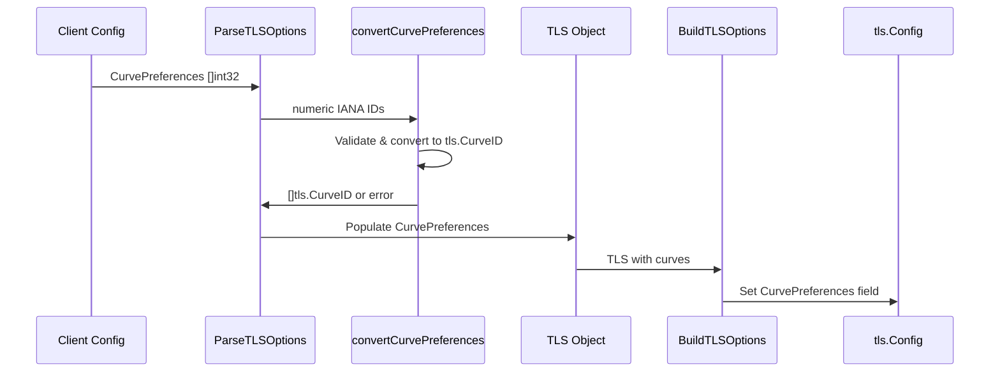

# PR #11832: KEP-8190: add curve support to kueue

**Summary**: KEP-8190: add curve support to kueue

**Sources**: https://github.com/kubernetes-sigs/kueue/pull/11832

**Last updated**: 2026-06-26T14:16:26Z

---

## Metadata

- **State**: open
- **Author**: [@kannon92](https://github.com/kannon92)
- **Branch**: `issue-10698` → `main`
- **Created**: 2026-05-29T15:59:58Z
- **Updated**: 2026-06-26T14:16:26Z
- **Merged**: —
- **Closed**: —
- **Labels**: `kind/feature`, `release-note`, `size/L`, `lgtm`, `approved`, `do-not-merge/hold`, `cncf-cla: yes`
- **Assignees**: [@mimowo](https://github.com/mimowo), [@sohankunkerkar](https://github.com/sohankunkerkar), [@tenzen-y](https://github.com/tenzen-y)
- **Requested reviewers**: [@mwielgus](https://github.com/mwielgus), [@PBundyra](https://github.com/PBundyra)
- **Changed files**: 13   **+277 / -18**

## Description

<!--  Thanks for sending a pull request!  Here are some tips for you:

1. If this is your first time, please read our contributor guidelines: https://git.k8s.io/community/contributors/guide/first-contribution.md#your-first-contribution and developer guide https://git.k8s.io/community/contributors/devel/development.md#development-guide
2. Please label this pull request according to what type of issue you are addressing, especially if this is a release targeted pull request. For reference on required PR/issue labels, read here:
https://git.k8s.io/community/contributors/devel/sig-release/release.md#issuepr-kind-label
3. Ensure you have added or ran the appropriate tests for your PR: https://git.k8s.io/community/contributors/devel/sig-testing/testing.md
4. If you want *faster* PR reviews, read how: https://git.k8s.io/community/contributors/guide/pull-requests.md#best-practices-for-faster-reviews
5. If the PR is unfinished, see how to mark it: https://git.k8s.io/community/contributors/guide/pull-requests.md#marking-unfinished-pull-requests
-->

#### What type of PR is this?
/kind feature
<!--
Add one of the following kinds:
/kind bug
/kind cleanup
/kind documentation
/kind feature
/kind kep

Optionally add one or more of the following kinds if applicable:
/kind api-change
/kind deprecation
/kind failing-test
/kind flake
/kind regression

Please also consider setting the area:
/area tas
/area integrations
/area multikueue
/area dashboard
/area localization
/area testing
/area website
-->

#### What this PR does / why we need it:
Add curve support for TLSOptions for Kueue.
#### Which issue(s) this PR fixes:
<!--
*Automatically closes linked issue when PR is merged.
Usage: `Fixes #<issue number>`, or `Fixes (paste link of issue)`.
_If PR is about `failing-tests or flakes`, please post the related issues/tests in a comment and do not use `Fixes`_*
-->
Fixes #10698 

#### Special notes for your reviewer:

Implementation closely follows https://github.com/kubernetes/kubernetes/pull/137115.

#### Does this PR introduce a user-facing change?
<!--
If no, just write "NONE" in the release-note block below.
If yes, a release note is required:
Enter your extended release note in the block below. If the PR requires additional action from users switching to the new release, include the string "action required".
-->
```release-note
Add curvePreferences support to TLSOptions 
```


<!-- This is an auto-generated comment: release notes by coderabbit.ai -->
## Summary by CodeRabbit

* **New Features**
  * Added `TLSOptions.curvePreferences` to restrict allowed TLS key-exchange curves via numeric IANA TLS Supported Group IDs.
  * Curve preferences are applied to server TLS configuration, including alongside configured cipher suites.
* **Documentation**
  * Updated the v1beta1/v1beta2 API references and the TLS Security Profiles KEP to describe `curvePreferences` and note Go defaults when omitted.
* **Validation & Tests**
  * Extended configuration validation and unit tests for valid/invalid curve preferences.
<!-- end of auto-generated comment: release notes by coderabbit.ai -->

## Discussion

### Comment by [@netlify[bot]](https://github.com/apps/netlify) — 2026-05-29T16:00:13Z

### <span aria-hidden="true">✅</span> Deploy Preview for *kubernetes-sigs-kueue* ready!


|  Name | Link |
|:-:|------------------------|
|<span aria-hidden="true">🔨</span> Latest commit | 985d486c36c718d8b9581cf2b83933a0f7a4cbd1 |
|<span aria-hidden="true">🔍</span> Latest deploy log | https://app.netlify.com/projects/kubernetes-sigs-kueue/deploys/6a3d9c73589bf300088930b8 |
|<span aria-hidden="true">😎</span> Deploy Preview | [https://deploy-preview-11832--kubernetes-sigs-kueue.netlify.app](https://deploy-preview-11832--kubernetes-sigs-kueue.netlify.app) |
|<span aria-hidden="true">📱</span> Preview on mobile | <details><summary> Toggle QR Code... </summary><br /><br /><br /><br />_Use your smartphone camera to open QR code link._</details> |
---
<!-- [kubernetes-sigs-kueue Preview](https://deploy-preview-11832--kubernetes-sigs-kueue.netlify.app) -->
_To edit notification comments on pull requests, go to your [Netlify project configuration](https://app.netlify.com/projects/kubernetes-sigs-kueue/configuration/notifications#deploy-notifications)._

### Comment by [@kannon92](https://github.com/kannon92) — 2026-05-31T14:27:54Z

/retest

### Comment by [@kannon92](https://github.com/kannon92) — 2026-06-04T13:42:45Z

/assign @tenzen-y @mimowo

### Comment by [@kannon92](https://github.com/kannon92) — 2026-06-04T14:04:30Z

@coderabbit review

### Comment by [@coderabbitai[bot]](https://github.com/apps/coderabbitai) — 2026-06-04T14:04:38Z

<!-- This is an auto-generated reply by CodeRabbit -->
<!-- CodeRabbit review command invocation: dca89381-ba94-462c-a2fc-672dc5800e2d -->
<details>
<summary>✅ Action performed</summary>

Review finished.

> Note: CodeRabbit is an incremental review system and does not re-review already reviewed commits. This command is applicable only when automatic reviews are paused.

</details>

### Comment by [@coderabbitai[bot]](https://github.com/apps/coderabbitai) — 2026-06-04T14:04:54Z

<!-- This is an auto-generated comment: summarize by coderabbit.ai -->
<!-- review_stack_entry_start -->

[](https://app.coderabbit.ai/change-stack/kubernetes-sigs/kueue/pull/11832?utm_source=github_walkthrough&utm_medium=github&utm_campaign=change_stack)

<!-- review_stack_entry_end -->
<!-- This is an auto-generated comment: review paused by coderabbit.ai -->

> [!NOTE]
> ## Reviews paused
> 
> It looks like this branch is under active development. To avoid overwhelming you with review comments due to an influx of new commits, CodeRabbit has automatically paused this review. You can configure this behavior by changing the `reviews.auto_review.auto_pause_after_reviewed_commits` setting.
> 
> Use the following commands to manage reviews:
> - `@coderabbitai resume` to resume automatic reviews.
> - `@coderabbitai review` to trigger a single review.
> 
> Use the checkboxes below for quick actions:
> - [ ] <!-- {"checkboxId": "7f6cc2e2-2e4e-497a-8c31-c9e4573e93d1"} --> ▶️ Resume reviews
> - [ ] <!-- {"checkboxId": "e9bb8d72-00e8-4f67-9cb2-caf3b22574fe"} --> 🔍 Trigger review

<!-- end of auto-generated comment: review paused by coderabbit.ai -->
<!-- walkthrough_start -->

<details>
<summary>📝 Walkthrough</summary>

## Walkthrough

This PR adds TLS curve preferences support to Kueue's TLSOptions configuration. New `CurvePreferences []int32` fields are added to v1beta1 and v1beta2 API types, parsed and validated in tlsconfig logic, integrated into the visibility server, and documented across KEP and API reference materials.

## Changes

**TLS Curve Preferences Support**

|Layer / File(s)|Summary|
|---|---|
|**API Type Definitions and Generated Code** <br> `apis/config/v1beta1/configuration_types.go`, `apis/config/v1beta1/zz_generated.deepcopy.go`, `apis/config/v1beta2/configuration_types.go`, `apis/config/v1beta2/zz_generated.deepcopy.go`|v1beta1 and v1beta2 `TLSOptions` types gain `CurvePreferences []int32` field (serialized as `curvePreferences`); deepcopy methods are auto-generated to handle the new field.|
|**TLS Config Parsing and Building** <br> `pkg/util/tlsconfig/tlsconfig.go`|`TLS` struct adds `CurvePreferences []tls.CurveID`; `ParseTLSOptions` converts and validates input curve IDs via new `convertCurvePreferences` helper with error aggregation; `BuildTLSOptions` propagates curves to `tls.Config`.|
|**TLS Config Implementation Tests** <br> `pkg/util/tlsconfig/tlsconfig_test.go`|New `compareErrors` helper and `errInvalidCurvePreference` sentinel; `TestParseTLSOptions` extended for curve parsing, combined cipher+curve scenarios, and invalid curves; new `TestConvertCurvePreferences` covering nil/empty/valid/out-of-range/duplicate inputs; `TestBuildTLSOptions` updated to validate `CurvePreferences` output.|
|**Visibility Server Integration** <br> `pkg/visibility/server.go`|`applyVisibilityServerOptions` applies `CurvePreferences` to secure serving config alongside min TLS version and cipher suites.|
|**Configuration Validation** <br> `pkg/config/validation_test.go`, `pkg/features/kube_features.go`|`TestValidate` adds cases for valid and invalid curve preferences; feature gate documentation updated to mention `CurvePreferences` support.|
|**KEP and API Reference Documentation** <br> `keps/8190-tls-security-profiles/README.md`, `site/content/en/docs/reference/kueue-config.v1beta1.md`, `site/content/en/docs/reference/kueue-config.v1beta2.md`|KEP expanded with new Story 3, Motivation/Goals/Proposal bullets, Configuration API Change snippet, default values, and test plan coverage; API reference docs describe `curvePreferences` as numeric IANA TLS Supported Group IDs.|

## Sequence Diagram



## Estimated code review effort

🎯 3 (Moderate) | ⏱️ ~25 minutes

## Possibly related PRs

- [kubernetes-sigs/kueue#12292](https://github.com/kubernetes-sigs/kueue/pull/12292): Modifies `pkg/util/tlsconfig/tlsconfig.go`'s `ParseTLSOptions` error-aggregation logic in a closely related manner to this PR's curve preferences implementation.

## Suggested reviewers

- mimowo
- PBundyra
- sohankunkerkar

## Poem

> 🐰 Curves and ciphers, now in tune,
> Kueue's TLS gets new keys so soon!
> From v1 to v2, preferences flow,
> IANA numbers make security grow. 🔐

</details>

<!-- walkthrough_end -->
<!-- pre_merge_checks_walkthrough_start -->

<details>
<summary>🚥 Pre-merge checks | ✅ 4 | ❌ 1</summary>

### ❌ Failed checks (1 warning)

|     Check name     | Status     | Explanation                                                                           | Resolution                                                                         |
| :----------------: | :--------- | :------------------------------------------------------------------------------------ | :--------------------------------------------------------------------------------- |
| Docstring Coverage | ⚠️ Warning | Docstring coverage is 43.75% which is insufficient. The required threshold is 80.00%. | Write docstrings for the functions missing them to satisfy the coverage threshold. |

<details>
<summary>✅ Passed checks (4 passed)</summary>

|         Check name         | Status   | Explanation                                                                                                                                                                              |
| :------------------------: | :------- | :--------------------------------------------------------------------------------------------------------------------------------------------------------------------------------------- |
|      Description Check     | ✅ Passed | Check skipped - CodeRabbit’s high-level summary is enabled.                                                                                                                              |
|         Title check        | ✅ Passed | The title 'KEP-8190: add curve support to kueue' clearly and specifically summarizes the main change—adding curve support to Kueue's TLS configuration.                                  |
|     Linked Issues check    | ✅ Passed | The PR fully implements the objective from issue `#10698` to add TLSCurves (curvePreferences) support to Kueue's TLSOptions configuration across both API versions and runtime components. |
| Out of Scope Changes check | ✅ Passed | All changes are directly related to adding curve preferences support to TLSOptions, with no out-of-scope modifications detected beyond the stated objective.                             |

</details>

<sub>✏️ Tip: You can configure your own custom pre-merge checks in the settings.</sub>

</details>

<!-- pre_merge_checks_walkthrough_end -->
<!-- finishing_touch_checkbox_start -->

<details>
<summary>✨ Finishing Touches</summary>

<details>
<summary>🧪 Generate unit tests (beta)</summary>

- [ ] <!-- {"checkboxId": "f47ac10b-58cc-4372-a567-0e02b2c3d479", "radioGroupId": "utg-output-choice-group-unknown_comment_id"} -->   Create PR with unit tests

</details>

</details>

<!-- finishing_touch_checkbox_end -->
<!-- tips_start -->

---

Thanks for using [CodeRabbit](https://coderabbit.ai?utm_source=oss&utm_medium=github&utm_campaign=kubernetes-sigs/kueue&utm_content=11832)! It's free for OSS, and your support helps us grow. If you like it, consider giving us a shout-out.

<details>
<summary>❤️ Share</summary>

- [X](https://twitter.com/intent/tweet?text=I%20just%20used%20%40coderabbitai%20for%20my%20code%20review%2C%20and%20it%27s%20fantastic%21%20It%27s%20free%20for%20OSS%20and%20offers%20a%20free%20trial%20for%20the%20proprietary%20code.%20Check%20it%20out%3A&url=https%3A//coderabbit.ai)
- [Mastodon](https://mastodon.social/share?text=I%20just%20used%20%40coderabbitai%20for%20my%20code%20review%2C%20and%20it%27s%20fantastic%21%20It%27s%20free%20for%20OSS%20and%20offers%20a%20free%20trial%20for%20the%20proprietary%20code.%20Check%20it%20out%3A%20https%3A%2F%2Fcoderabbit.ai)
- [Reddit](https://www.reddit.com/submit?title=Great%20tool%20for%20code%20review%20-%20CodeRabbit&text=I%20just%20used%20CodeRabbit%20for%20my%20code%20review%2C%20and%20it%27s%20fantastic%21%20It%27s%20free%20for%20OSS%20and%20offers%20a%20free%20trial%20for%20proprietary%20code.%20Check%20it%20out%3A%20https%3A//coderabbit.ai)
- [LinkedIn](https://www.linkedin.com/sharing/share-offsite/?url=https%3A%2F%2Fcoderabbit.ai&mini=true&title=Great%20tool%20for%20code%20review%20-%20CodeRabbit&summary=I%20just%20used%20CodeRabbit%20for%20my%20code%20review%2C%20and%20it%27s%20fantastic%21%20It%27s%20free%20for%20OSS%20and%20offers%20a%20free%20trial%20for%20proprietary%20code)

</details>


<sub>Comment `@coderabbitai help` to get the list of available commands.</sub>

<!-- tips_end -->

### Comment by [@k8s-ci-robot](https://github.com/k8s-ci-robot) — 2026-06-05T20:39:15Z

[APPROVALNOTIFIER] This PR is **NOT APPROVED**

This pull-request has been approved by: *<a href="https://github.com/kubernetes-sigs/kueue/pull/11832#" title="Author self-approved">kannon92</a>*
**Once this PR has been reviewed and has the lgtm label**, please ask for approval from [mimowo](https://github.com/mimowo). For more information see [the Code Review Process](https://git.k8s.io/community/contributors/guide/owners.md#the-code-review-process).

The full list of commands accepted by this bot can be found [here](https://go.k8s.io/bot-commands?repo=kubernetes-sigs%2Fkueue).

<details open>
Needs approval from an approver in each of these files:

- **[OWNERS](https://github.com/kubernetes-sigs/kueue/blob/main/OWNERS)**

Approvers can indicate their approval by writing `/approve` in a comment
Approvers can cancel approval by writing `/approve cancel` in a comment
</details>
<!-- META={"approvers":["mimowo"]} -->

### Comment by [@kannon92](https://github.com/kannon92) — 2026-06-15T18:52:27Z

@sohankunkerkar 
could you take a look?

### Comment by [@kannon92](https://github.com/kannon92) — 2026-06-16T19:12:07Z

> JFYI, [this](https://github.com/kubernetes-sigs/kueue/blob/main/pkg/config/config.go#L185) silently drops `ParseTLSOptions` errors for the webhook server while [main.go](https://github.com/kubernetes-sigs/kueue/blob/main/cmd/kueue/main.go#L195) exits on the same error for metrics. which means invalid config would start the webhook with Go defaults silently

https://github.com/kubernetes-sigs/kueue/pull/12293

### Comment by [@kannon92](https://github.com/kannon92) — 2026-06-17T20:58:45Z

/hold

Let's merge https://github.com/kubernetes-sigs/kueue/pull/12293 first and then I'll update this PR to reflect latest cleanups.

### Comment by [@kannon92](https://github.com/kannon92) — 2026-06-19T12:47:08Z

/hold cancel

All prep PRs are merged.

### Comment by [@kannon92](https://github.com/kannon92) — 2026-06-25T20:11:28Z

cc @sohankunkerkar @mimowo @tenzen-y

### Comment by [@kubernetes-prow[bot]](https://github.com/apps/kubernetes-prow) — 2026-06-25T21:46:00Z

LGTM label has been added.  <details>Git tree hash: fc2cbd80a95dc33add72c8ad88467c878460aba5</details>

### Comment by [@kannon92](https://github.com/kannon92) — 2026-06-26T14:08:05Z

/assign @tenzen-y @mimowo

### Comment by [@kubernetes-prow[bot]](https://github.com/apps/kubernetes-prow) — 2026-06-26T14:16:25Z

[APPROVALNOTIFIER] This PR is **APPROVED**

This pull-request has been approved by: *<a href="https://github.com/kubernetes-sigs/kueue/pull/11832#" title="Author self-approved">kannon92</a>*, *<a href="https://github.com/kubernetes-sigs/kueue/pull/11832#pullrequestreview-4580133979" title="Approved">mimowo</a>*

The full list of commands accepted by this bot can be found [here](https://go.k8s.io/bot-commands?repo=kubernetes-sigs%2Fkueue).

The pull request process is described [here](https://git.k8s.io/community/contributors/guide/owners.md#the-code-review-process)

<details >
Needs approval from an approver in each of these files:

- ~~[OWNERS](https://github.com/kubernetes-sigs/kueue/blob/main/OWNERS)~~ [mimowo]

Approvers can indicate their approval by writing `/approve` in a comment
Approvers can cancel approval by writing `/approve cancel` in a comment
</details>
<!-- META={"approvers":[]} -->

## Reviews

### Review by [@mwielgus](https://github.com/mwielgus) (commented) — 2026-06-01T07:53:52Z

- **apis/config/v1beta2/configuration_types.go:467** by [@mwielgus](https://github.com/mwielgus) — 2026-06-01T07:53:24Z
```diff
@@ -443,6 +443,13 @@ type TLSOptions struct {
 	// The default would be to not set this value and inherit golang settings.
 	// +optional
 	CipherSuites []string `json:"cipherSuites,omitempty"`
+
+	// curvePreferences is the list of allowed TLS key exchange mechanisms (curves)
+	// for the server, specified as numeric IANA TLS Supported Group IDs.
+	// See https://pkg.go.dev/crypto/tls#CurveID for values supported by the current Go version.
+	// If omitted, Go defaults are used.
+	// +optional
+	CurvePreferences []int32 `json:"curvePreferences,omitempty"`
```

  Is there a way to have string names here instead of ints? Typing/copying values like 4587 is very error-prone.

### Review by [@kannon92](https://github.com/kannon92) (commented) — 2026-06-01T09:37:28Z

- **apis/config/v1beta2/configuration_types.go:467** by [@kannon92](https://github.com/kannon92) — 2026-06-01T09:37:28Z
```diff
@@ -443,6 +443,13 @@ type TLSOptions struct {
 	// The default would be to not set this value and inherit golang settings.
 	// +optional
 	CipherSuites []string `json:"cipherSuites,omitempty"`
+
+	// curvePreferences is the list of allowed TLS key exchange mechanisms (curves)
+	// for the server, specified as numeric IANA TLS Supported Group IDs.
+	// See https://pkg.go.dev/crypto/tls#CurveID for values supported by the current Go version.
+	// If omitted, Go defaults are used.
+	// +optional
+	CurvePreferences []int32 `json:"curvePreferences,omitempty"`
```

  cc @damdo @liggitt 
  
  The code is directly using the API that is in k/k. This was brought up in a sig-apimachinery but the main concern is putting the burden on k/k to maintain this list.
  
  There isn't a nice function or library in Golang AFAIK to get the list.

### Review by [@coderabbitai[bot]](https://github.com/apps/coderabbitai) (commented) — 2026-06-04T14:18:48Z

**Actionable comments posted: 1**

<details>
<summary>🤖 Prompt for all review comments with AI agents</summary>

```
Verify each finding against current code. Fix only still-valid issues, skip the
rest with a brief reason, keep changes minimal, and validate.

Inline comments:
In `@keps/8190-tls-security-profiles/README.md`:
- Around line 223-224: Update the CurvePreferences IANA group ID examples in the
README: the current example mistakenly swaps the numeric IDs for
X25519/P-256/P-384; change the listed values for the CurvePreferences example so
they read "29 for X25519, 23 for P-256 (secp256r1), 24 for P-384 (secp384r1)".
Locate the example text referencing "Values are numeric IANA TLS Supported Group
IDs" and the CurvePreferences mapping in
keps/8190-tls-security-profiles/README.md and replace the incorrect IDs with the
corrected ones.
```

</details>

<details>
<summary>🪄 Autofix (Beta)</summary>

Fix all unresolved CodeRabbit comments on this PR:

- [ ] <!-- {"checkboxId": "4b0d0e0a-96d7-4f10-b296-3a18ea78f0b9"} --> Push a commit to this branch (recommended)
- [ ] <!-- {"checkboxId": "ff5b1114-7d8c-49e6-8ac1-43f82af23a33"} --> Create a new PR with the fixes

</details>

---

<details>
<summary>ℹ️ Review info</summary>

<details>
<summary>⚙️ Run configuration</summary>

**Configuration used**: defaults

**Review profile**: CHILL

**Plan**: Pro

**Run ID**: `b631cff7-5ba8-41d2-ba53-73557716877d`

</details>

<details>
<summary>📥 Commits</summary>

Reviewing files that changed from the base of the PR and between f22179091ba0b1d6aa82ccfe30d1d6bc82ea83b4 and 739083514e2efb29320e5936b6faa0afcea9ee9b.

</details>

<details>
<summary>📒 Files selected for processing (13)</summary>

* `apis/config/v1beta1/configuration_types.go`
* `apis/config/v1beta1/zz_generated.conversion.go`
* `apis/config/v1beta1/zz_generated.deepcopy.go`
* `apis/config/v1beta2/configuration_types.go`
* `apis/config/v1beta2/zz_generated.deepcopy.go`
* `keps/8190-tls-security-profiles/README.md`
* `pkg/config/validation_test.go`
* `pkg/features/kube_features.go`
* `pkg/util/tlsconfig/tlsconfig.go`
* `pkg/util/tlsconfig/tlsconfig_test.go`
* `pkg/visibility/server.go`
* `site/content/en/docs/reference/kueue-config.v1beta1.md`
* `site/content/en/docs/reference/kueue-config.v1beta2.md`

</details>

</details>

<!-- This is an auto-generated comment by CodeRabbit for review status -->

- **keps/8190-tls-security-profiles/README.md:224** by [@coderabbitai[bot]](https://github.com/apps/coderabbitai) — 2026-06-04T14:18:45Z
```diff
@@ -201,6 +219,11 @@ To maintain backward compatibility and provide secure defaults:
   - For TLS 1.3, cipher suites are not configurable (Go uses the built-in secure set)
   - Valid cipher suite values are defined in Go's crypto/tls package constants
 
+- **CurvePreferences**: nil (uses Go's default curve selection)
+  - Values are numeric IANA TLS Supported Group IDs (e.g., 23 for X25519, 24 for P-256, 29 for P-384)
+  - See https://pkg.go.dev/crypto/tls#CurveID for values supported by the current Go version
```

  _⚠️ Potential issue_ | _🟠 Major_ | _⚡ Quick win_
  
  <details>
  <summary>🧩 Analysis chain</summary>
  
  🌐 Web query:
  
  `What are the IANA TLS Supported Group IDs for X25519, secp256r1 (P-256), and secp384r1 (P-384), and how do they map to Go crypto/tls CurveID values?`
  
  💡 Result:
  
  The IANA TLS Supported Groups (formerly Elliptic Curve groups) registry assigns specific numeric IDs to cryptographic groups [1][2]. For the requested curves, the IANA identifiers are as follows: - secp256r1 (P-256): 23 (0x0017) - secp384r1 (P-384): 24 (0x0018) - X25519: 29 (0x001D) In the Go standard library, the crypto/tls package maps these IANA IDs to a custom type called CurveID (which is a uint16) [3][4]. The following table shows the mapping between these curves and their Go identifiers [3][4]: Curve | IANA ID | Go CurveID Constant --- | --- | --- secp256r1 | 23 | CurveP256 secp384r1 | 24 | CurveP384 X25519 | 29 | X25519 These Go constants are used internally to manage supported key exchange mechanisms and preference orders during the TLS handshake [3][5][4]. Note that while the type was historically named for elliptic curves, it has been extended in modern Go versions to support additional key exchange mechanisms, such as hybrid post-quantum KEMs [4][6].
  
  Citations:
  
  - 1: https://www.rfc-editor.org/rfc/rfc8447.txt
  - 2: https://datatracker.ietf.org/doc/html/rfc8447
  - 3: https://github.com/golang/go/blob/go1.20.12/src/crypto/tls/common.go
  - 4: https://github.com/golang/go/blob/996b9850/src/crypto/tls/common.go
  - 5: https://pkg.go.dev/crypto/tls
  - 6: https://github.com/golang/go/blob/33241d7298e0c621cfc4cc9f878dba9eff2b1c3d/src/crypto/tls/common.go
  
  ---
  
  🏁 Script executed:
  
  ```shell
  #!/bin/bash
  set -euo pipefail
  
  FILE="keps/8190-tls-security-profiles/README.md"
  sed -n '215,230p' "$FILE" | nl -ba
  ```
  
  Repository: kubernetes-sigs/kueue
  
  Length of output: 108
  
  ---
  
  🏁 Script executed:
  
  ```shell
  #!/bin/bash
  set -euo pipefail
  
  FILE="keps/8190-tls-security-profiles/README.md"
  awk 'NR>=215 && NR<=230 {printf "%d:%s\n", NR, $0}' "$FILE"
  ```
  
  Repository: kubernetes-sigs/kueue
  
  Length of output: 906
  
  ---
  
  
  
  </details>
  
  **Fix incorrect CurvePreferences IANA group ID examples**
  
  In `keps/8190-tls-security-profiles/README.md` line 223, the example mapping is wrong (it swaps the X25519/P-256/P-384 numeric IDs). Correct examples are: **29 for X25519, 23 for P-256 (secp256r1), 24 for P-384 (secp384r1)**.
  
  <details>
  <summary>🛠️ Proposed fix</summary>
  
  ```diff
  --  - Values are numeric IANA TLS Supported Group IDs (e.g., 23 for X25519, 24 for P-256, 29 for P-384)
  +-  - Values are numeric IANA TLS Supported Group IDs (e.g., 29 for X25519, 23 for P-256, 24 for P-384)
  ```
  </details>
  
  <details>
  <summary>🤖 Prompt for AI Agents</summary>
  
  ```
  Verify each finding against current code. Fix only still-valid issues, skip the
  rest with a brief reason, keep changes minimal, and validate.
  
  In `@keps/8190-tls-security-profiles/README.md` around lines 223 - 224, Update the
  CurvePreferences IANA group ID examples in the README: the current example
  mistakenly swaps the numeric IDs for X25519/P-256/P-384; change the listed
  values for the CurvePreferences example so they read "29 for X25519, 23 for
  P-256 (secp256r1), 24 for P-384 (secp384r1)". Locate the example text
  referencing "Values are numeric IANA TLS Supported Group IDs" and the
  CurvePreferences mapping in keps/8190-tls-security-profiles/README.md and
  replace the incorrect IDs with the corrected ones.
  ```
  
  </details>
  
  <!-- fingerprinting:phantom:triton:hawk -->
  
  <!-- This is an auto-generated reply by CodeRabbit -->
  
  ✅ Confirmed as addressed by @kannon92
  
  <!-- This is an auto-generated comment by CodeRabbit -->

### Review by [@kannon92](https://github.com/kannon92) (commented) — 2026-06-05T20:39:13Z

- **keps/8190-tls-security-profiles/README.md:224** by [@kannon92](https://github.com/kannon92) — 2026-06-05T20:39:13Z
```diff
@@ -201,6 +219,11 @@ To maintain backward compatibility and provide secure defaults:
   - For TLS 1.3, cipher suites are not configurable (Go uses the built-in secure set)
   - Valid cipher suite values are defined in Go's crypto/tls package constants
 
+- **CurvePreferences**: nil (uses Go's default curve selection)
+  - Values are numeric IANA TLS Supported Group IDs (e.g., 23 for X25519, 24 for P-256, 29 for P-384)
+  - See https://pkg.go.dev/crypto/tls#CurveID for values supported by the current Go version
```

  good call. done.

### Review by [@coderabbitai[bot]](https://github.com/apps/coderabbitai) (commented) — 2026-06-05T20:39:32Z

- **keps/8190-tls-security-profiles/README.md:224** by [@coderabbitai[bot]](https://github.com/apps/coderabbitai) — 2026-06-05T20:39:32Z
```diff
@@ -201,6 +219,11 @@ To maintain backward compatibility and provide secure defaults:
   - For TLS 1.3, cipher suites are not configurable (Go uses the built-in secure set)
   - Valid cipher suite values are defined in Go's crypto/tls package constants
 
+- **CurvePreferences**: nil (uses Go's default curve selection)
+  - Values are numeric IANA TLS Supported Group IDs (e.g., 23 for X25519, 24 for P-256, 29 for P-384)
+  - See https://pkg.go.dev/crypto/tls#CurveID for values supported by the current Go version
```

  `@kannon92`, thanks for the fix! The corrected IANA group ID examples (29 for X25519, 23 for P-256, 24 for P-384) will help prevent user confusion when configuring curve preferences.
  
  (^\_^) ~🐇
  
  <!-- <review_comment_addressed> -->
  
  ---
  
  <details>
  <summary>🧠 Learnings used</summary>
  
  ```
  Learnt from: CR
  Repo: kubernetes-sigs/kueue PR: 0
  File: AGENTS.md:0-0
  Timestamp: 2026-06-04T16:30:37.736Z
  Learning: Apply code review patterns from cmd/experimental/skills/reviewer/README.md proactively when reviewing any Kueue PR or code change
  ```
  
  </details>
  
  
  
  <!-- This is an auto-generated reply by CodeRabbit -->

### Review by [@sohankunkerkar](https://github.com/sohankunkerkar) (commented) — 2026-06-15T19:53:46Z

JFYI, [this](https://github.com/kubernetes-sigs/kueue/blob/main/pkg/config/config.go#L185) silently drops `ParseTLSOptions` errors for the webhook server while [main.go](https://github.com/kubernetes-sigs/kueue/blob/main/cmd/kueue/main.go#L195) exits on the same error for metrics. which means invalid config would start the webhook with Go defaults silently

- **pkg/util/tlsconfig/tlsconfig.go:54** by [@sohankunkerkar](https://github.com/sohankunkerkar) — 2026-06-15T19:23:07Z
```diff
@@ -50,12 +51,23 @@ func ParseTLSOptions(cfg *config.TLSOptions) (*TLS, error) {
 	if len(cfg.CipherSuites) > 0 {
 		cipherSuites, err := convertCipherSuites(cfg.CipherSuites)
 		if err != nil {
-			errRet = errors.Join(err)
+			errRet = errors.Join(errRet, err)
```

  I think this looks like a bug fix. Please create a separate PR for this.

- **keps/8190-tls-security-profiles/README.md:124** by [@sohankunkerkar](https://github.com/sohankunkerkar) — 2026-06-15T19:40:38Z
```diff
@@ -110,6 +115,12 @@ As a security engineer, I need to disable weak cipher suites and enforce strong
 services in my cluster. I want to configure Kueue's TLS settings to align with our organization's security baseline,
 which requires specific cipher suites approved by our security team.
 
+#### Story 3
+
+As a platform administrator, I need to restrict TLS key exchange to specific elliptic curves (e.g., X25519, P-256)
+to comply with organizational cryptographic policies. I want to configure Kueue's curve preferences so that only
+approved key exchange mechanisms are used across all its endpoints.
+
 ### Risks and Mitigations
```

  One question: is there any risk of misconfigured curve preferences causing webhook<->apiserver TLS handshake failures? If the admin sets curves that the apiserver doesn't support, the webhook silently breaks. Same gap exists for cipher suites, but worth a note here.

- **pkg/util/tlsconfig/tlsconfig.go:61** by [@sohankunkerkar](https://github.com/sohankunkerkar) — 2026-06-15T19:49:10Z
```diff
@@ -50,12 +51,23 @@ func ParseTLSOptions(cfg *config.TLSOptions) (*TLS, error) {
 	if len(cfg.CipherSuites) > 0 {
 		cipherSuites, err := convertCipherSuites(cfg.CipherSuites)
 		if err != nil {
-			errRet = errors.Join(err)
+			errRet = errors.Join(errRet, err)
 		}
 		if err == nil && len(cipherSuites) > 0 {
 			ret.CipherSuites = cipherSuites
 		}
 	}
+
+	if len(cfg.CurvePreferences) > 0 {
```

  nit: we could extract a shared helper here. cipher suites block at line 51-57

- **pkg/util/tlsconfig/tlsconfig.go:122** by [@sohankunkerkar](https://github.com/sohankunkerkar) — 2026-06-15T19:50:12Z
```diff
@@ -104,3 +117,14 @@ func convertCipherSuites(cipherSuites []string) ([]uint16, error) {
 	}
 	return suites, nil
 }
+
+func convertCurvePreferences(curveIDs []int32) ([]tls.CurveID, error) {
+	if len(curveIDs) == 0 {
```

  This is redundant as `cliflag.TLSCurvePreferences` already handles empty input and returns nil.

### Review by [@kannon92](https://github.com/kannon92) (commented) — 2026-06-16T16:56:18Z

- **keps/8190-tls-security-profiles/README.md:124** by [@kannon92](https://github.com/kannon92) — 2026-06-16T16:56:18Z
```diff
@@ -110,6 +115,12 @@ As a security engineer, I need to disable weak cipher suites and enforce strong
 services in my cluster. I want to configure Kueue's TLS settings to align with our organization's security baseline,
 which requires specific cipher suites approved by our security team.
 
+#### Story 3
+
+As a platform administrator, I need to restrict TLS key exchange to specific elliptic curves (e.g., X25519, P-256)
+to comply with organizational cryptographic policies. I want to configure Kueue's curve preferences so that only
+approved key exchange mechanisms are used across all its endpoints.
+
 ### Risks and Mitigations
```

  If the configuration is not correct we don't start the kueue-controller-manager. So I think this would cause a failure and an admin would need to configure correctly right?

### Review by [@kannon92](https://github.com/kannon92) (commented) — 2026-06-16T19:06:53Z

- **pkg/util/tlsconfig/tlsconfig.go:54** by [@kannon92](https://github.com/kannon92) — 2026-06-16T19:06:53Z
```diff
@@ -50,12 +51,23 @@ func ParseTLSOptions(cfg *config.TLSOptions) (*TLS, error) {
 	if len(cfg.CipherSuites) > 0 {
 		cipherSuites, err := convertCipherSuites(cfg.CipherSuites)
 		if err != nil {
-			errRet = errors.Join(err)
+			errRet = errors.Join(errRet, err)
```

  https://github.com/kubernetes-sigs/kueue/pull/12292

### Review by [@sohankunkerkar](https://github.com/sohankunkerkar) (commented) — 2026-06-16T20:23:52Z

- **keps/8190-tls-security-profiles/README.md:124** by [@sohankunkerkar](https://github.com/sohankunkerkar) — 2026-06-16T20:23:52Z
```diff
@@ -110,6 +115,12 @@ As a security engineer, I need to disable weak cipher suites and enforce strong
 services in my cluster. I want to configure Kueue's TLS settings to align with our organization's security baseline,
 which requires specific cipher suites approved by our security team.
 
+#### Story 3
+
+As a platform administrator, I need to restrict TLS key exchange to specific elliptic curves (e.g., X25519, P-256)
+to comply with organizational cryptographic policies. I want to configure Kueue's curve preferences so that only
+approved key exchange mechanisms are used across all its endpoints.
+
 ### Risks and Mitigations
```

  Right, the concern isn't about invalid config. Kueue already catches that at startup. It's about a valid curve config that doesn't overlap with what the apiserver supports. Kueue starts fine, but webhook TLS handshakes fail at runtime. Worth noting in the Risks section so admins know to check compatibility.

### Review by [@kannon92](https://github.com/kannon92) (commented) — 2026-06-17T20:54:46Z

- **pkg/util/tlsconfig/tlsconfig.go:61** by [@kannon92](https://github.com/kannon92) — 2026-06-17T20:54:46Z
```diff
@@ -50,12 +51,23 @@ func ParseTLSOptions(cfg *config.TLSOptions) (*TLS, error) {
 	if len(cfg.CipherSuites) > 0 {
 		cipherSuites, err := convertCipherSuites(cfg.CipherSuites)
 		if err != nil {
-			errRet = errors.Join(err)
+			errRet = errors.Join(errRet, err)
 		}
 		if err == nil && len(cipherSuites) > 0 {
 			ret.CipherSuites = cipherSuites
 		}
 	}
+
+	if len(cfg.CurvePreferences) > 0 {
```

  updated.

### Review by [@kannon92](https://github.com/kannon92) (commented) — 2026-06-17T20:54:56Z

- **pkg/util/tlsconfig/tlsconfig.go:122** by [@kannon92](https://github.com/kannon92) — 2026-06-17T20:54:56Z
```diff
@@ -104,3 +117,14 @@ func convertCipherSuites(cipherSuites []string) ([]uint16, error) {
 	}
 	return suites, nil
 }
+
+func convertCurvePreferences(curveIDs []int32) ([]tls.CurveID, error) {
+	if len(curveIDs) == 0 {
```

  updated.

### Review by [@kannon92](https://github.com/kannon92) (commented) — 2026-06-17T20:59:23Z

- **keps/8190-tls-security-profiles/README.md:124** by [@kannon92](https://github.com/kannon92) — 2026-06-17T20:59:23Z
```diff
@@ -110,6 +115,12 @@ As a security engineer, I need to disable weak cipher suites and enforce strong
 services in my cluster. I want to configure Kueue's TLS settings to align with our organization's security baseline,
 which requires specific cipher suites approved by our security team.
 
+#### Story 3
+
+As a platform administrator, I need to restrict TLS key exchange to specific elliptic curves (e.g., X25519, P-256)
+to comply with organizational cryptographic policies. I want to configure Kueue's curve preferences so that only
+approved key exchange mechanisms are used across all its endpoints.
+
 ### Risks and Mitigations
```

  I changed the code in a separate PR to fail if webhooks have bad values also.
  
  So I think this problem won't occur anymore.

### Review by [@coderabbitai[bot]](https://github.com/apps/coderabbitai) (commented) — 2026-06-17T21:04:45Z


> [!CAUTION]
> Some comments are outside the diff and can’t be posted inline due to platform limitations.
> 
> 
> 
> <details>
> <summary>⚠️ Outside diff range comments (1)</summary><blockquote>
> 
> <details>
> <summary>keps/8190-tls-security-profiles/README.md (1)</summary><blockquote>
> 
> `124-147`: _⚠️ Potential issue_ | _🟡 Minor_ | _⚡ Quick win_
> 
> **Document the webhook/apiserver TLS curve compatibility risk.**
> 
> The Risks section covers startup validation failures but omits a runtime scenario: when admins configure curve preferences that are valid but don't overlap with the apiserver's supported curves, webhook TLS handshakes fail silently at runtime while the controller starts successfully. This mirrors the cipher suite gap mentioned in past review feedback.
> 
> Consider adding a mitigation note advising admins to verify curve compatibility between Kueue and their apiserver version as part of deployment validation.
> 
> 
> 
> 
> 
> <details>
> <summary>📝 Suggested addition to Risks section</summary>
> 
> ```diff
>  **Risk**: Overly restrictive TLS settings could break compatibility with existing clients or monitoring tools.
>  
>  **Mitigation**:
>  - Make the feature opt-in with backward-compatible defaults
>  - Document the cipher suites and TLS versions supported by common clients (kubectl, Prometheus, etc.)
>  - Provide migration guide for upgrading from default to custom TLS configurations
>  - Include troubleshooting section in documentation for common TLS connectivity issues
> 
> +**Risk**: Curve preferences that don't overlap with the apiserver's supported curves may cause webhook TLS handshakes to fail silently at runtime.
> +
> +**Mitigation**:
> +- Document which curve IDs are supported by the Kubernetes versions used in the cluster
> +- Recommend verifying curve compatibility between Kueue and the apiserver during deployment
> +- Include curve preference troubleshooting steps in the connectivity diagnostics section
> ```
> </details>
> 
> <details>
> <summary>🤖 Prompt for AI Agents</summary>
> 
> ```
> Verify each finding against current code. Fix only still-valid issues, skip the
> rest with a brief reason, keep changes minimal, and validate.
> 
> In `@keps/8190-tls-security-profiles/README.md` around lines 124 - 147, The Risks
> and Mitigations section in the README.md file currently documents startup
> validation failures and general TLS misconfiguration issues but omits a critical
> runtime scenario involving webhook TLS curve compatibility. Add a new risk item
> that describes the scenario where admins configure valid TLS curves that don't
> overlap with the apiserver's supported curves, causing webhook TLS handshakes to
> fail silently at runtime even though the controller starts successfully. For
> this risk, include a mitigation that advises administrators to verify curve
> compatibility between Kueue and their apiserver version as part of deployment
> validation, documenting which curves are supported across common apiserver
> versions to help admins avoid this silent failure mode.
> ```
> 
> </details>
> 
> <!-- cr-comment:v1:6f23ac3137f21903c15921b6 -->
> 
> </blockquote></details>
> 
> </blockquote></details>

<details>
<summary>🧹 Nitpick comments (1)</summary><blockquote>

<details>
<summary>keps/8190-tls-security-profiles/README.md (1)</summary><blockquote>

`118-122`: _💤 Low value_

**Minor: Reduce repetition in Story 3 opening phrasing.**

Stories 1–3 all open with "As a [role], I need to [action]", creating a repetitive narrative flow. Consider varying the opening structure of Story 3 to improve readability.


<details>
<summary>✏️ Suggested alternative phrasing</summary>

```diff
-#### Story 3
-
-As a platform administrator, I need to restrict TLS key exchange to specific elliptic curves (e.g., X25519, P-256)
-to comply with organizational cryptographic policies. I want to configure Kueue's curve preferences so that only
-approved key exchange mechanisms are used across all its endpoints.
+#### Story 3
+
+As a compliance officer at a financial institution, I must restrict TLS key exchange to specific elliptic curves (e.g., X25519, P-256)
+to meet organizational cryptographic policies. I expect Kueue to provide curve preference configuration so that only
+approved key exchange mechanisms are used across all its endpoints.
```
</details>

<details>
<summary>🤖 Prompt for AI Agents</summary>

```
Verify each finding against current code. Fix only still-valid issues, skip the
rest with a brief reason, keep changes minimal, and validate.

In `@keps/8190-tls-security-profiles/README.md` around lines 118 - 122, The
opening phrasing of Story 3 uses the same "As a [role], I need to [action]"
structure as Stories 1 and 2, creating repetitive narrative flow. Rephrase the
opening of Story 3 to vary the sentence structure while maintaining the user
story format and conveying the same intent about the platform administrator's
need to restrict TLS key exchange to specific elliptic curves. Consider
alternative structures such as starting with the action, constraint, or desired
outcome rather than the role.
```

</details>

<!-- cr-comment:v1:79c1b36522ff2fd5ba72a79e -->

_Source: Linters/SAST tools_

</blockquote></details>

</blockquote></details>

<details>
<summary>🤖 Prompt for all review comments with AI agents</summary>

```
Verify each finding against current code. Fix only still-valid issues, skip the
rest with a brief reason, keep changes minimal, and validate.

Outside diff comments:
In `@keps/8190-tls-security-profiles/README.md`:
- Around line 124-147: The Risks and Mitigations section in the README.md file
currently documents startup validation failures and general TLS misconfiguration
issues but omits a critical runtime scenario involving webhook TLS curve
compatibility. Add a new risk item that describes the scenario where admins
configure valid TLS curves that don't overlap with the apiserver's supported
curves, causing webhook TLS handshakes to fail silently at runtime even though
the controller starts successfully. For this risk, include a mitigation that
advises administrators to verify curve compatibility between Kueue and their
apiserver version as part of deployment validation, documenting which curves are
supported across common apiserver versions to help admins avoid this silent
failure mode.

---

Nitpick comments:
In `@keps/8190-tls-security-profiles/README.md`:
- Around line 118-122: The opening phrasing of Story 3 uses the same "As a
[role], I need to [action]" structure as Stories 1 and 2, creating repetitive
narrative flow. Rephrase the opening of Story 3 to vary the sentence structure
while maintaining the user story format and conveying the same intent about the
platform administrator's need to restrict TLS key exchange to specific elliptic
curves. Consider alternative structures such as starting with the action,
constraint, or desired outcome rather than the role.
```

</details>

---

<details>
<summary>ℹ️ Review info</summary>

<details>
<summary>⚙️ Run configuration</summary>

**Configuration used**: Path: .coderabbit.yaml

**Review profile**: CHILL

**Plan**: Pro

**Run ID**: `47b95740-e3e8-4305-89cd-bf63290a25f9`

</details>

<details>
<summary>📥 Commits</summary>

Reviewing files that changed from the base of the PR and between c946f36bbe2f7dc33249d0aa49a5e18df23bf14d and 959b2c49377777d0acf2577af9d4bf7f1044f0df.

</details>

<details>
<summary>⛔ Files ignored due to path filters (3)</summary>

* `apis/config/v1beta1/zz_generated.conversion.go` is excluded by `!**/*_generated*.go`, `!**/zz_generated.*.go`
* `apis/config/v1beta1/zz_generated.deepcopy.go` is excluded by `!**/*_generated*.go`, `!**/zz_generated.*.go`
* `apis/config/v1beta2/zz_generated.deepcopy.go` is excluded by `!**/*_generated*.go`, `!**/zz_generated.*.go`

</details>

<details>
<summary>📒 Files selected for processing (10)</summary>

* `apis/config/v1beta1/configuration_types.go`
* `apis/config/v1beta2/configuration_types.go`
* `keps/8190-tls-security-profiles/README.md`
* `pkg/config/validation_test.go`
* `pkg/features/kube_features.go`
* `pkg/util/tlsconfig/tlsconfig.go`
* `pkg/util/tlsconfig/tlsconfig_test.go`
* `pkg/visibility/server.go`
* `site/content/en/docs/reference/kueue-config.v1beta1.md`
* `site/content/en/docs/reference/kueue-config.v1beta2.md`

</details>

<details>
<summary>✅ Files skipped from review due to trivial changes (2)</summary>

* pkg/features/kube_features.go
* site/content/en/docs/reference/kueue-config.v1beta1.md

</details>

<details>
<summary>🚧 Files skipped from review as they are similar to previous changes (6)</summary>

* pkg/visibility/server.go
* site/content/en/docs/reference/kueue-config.v1beta2.md
* apis/config/v1beta1/configuration_types.go
* apis/config/v1beta2/configuration_types.go
* pkg/config/validation_test.go
* pkg/util/tlsconfig/tlsconfig_test.go

</details>

</details>

<!-- This is an auto-generated comment by CodeRabbit for review status -->

### Review by [@coderabbitai[bot]](https://github.com/apps/coderabbitai) (commented) — 2026-06-18T02:34:53Z


<details>
<summary>🧹 Nitpick comments (2)</summary><blockquote>

<details>
<summary>keps/8190-tls-security-profiles/README.md (1)</summary><blockquote>

`118-122`: _💤 Low value_

**Vary the persona in Story 3 to improve readability.**

Story 3 opens with "As a platform administrator," which duplicates the opener from Story 1 (line 108). Consider using a different persona or angle to add variety. For example, you could frame it from a security/compliance auditor perspective or describe it as a different admin role.


<details>
<summary>💡 Suggestion for alternative opening</summary>

```diff
-#### Story 3
-
-As a platform administrator, I need to restrict TLS key exchange to specific elliptic curves (e.g., X25519, P-256)
+#### Story 3
+
+As a security/compliance officer, I need to restrict TLS key exchange to specific elliptic curves (e.g., X25519, P-256)
```

Alternatively, frame it differently:
```diff
+#### Story 3
+
+As a platform operator responsible for cryptographic policy enforcement, I need to restrict TLS key exchange to specific elliptic curves (e.g., X25519, P-256)
```
</details>

<details>
<summary>🤖 Prompt for AI Agents</summary>

```
Verify each finding against current code. Fix only still-valid issues, skip the
rest with a brief reason, keep changes minimal, and validate.

In `@keps/8190-tls-security-profiles/README.md` around lines 118 - 122, The
opening persona in Story 3 duplicates the persona used in Story 1, both starting
with "As a platform administrator." To improve readability and add variety to
the user stories, replace the opening persona in Story 3 (starting at line 118)
with a different perspective. Consider using a security/compliance auditor role,
a security officer, or another relevant persona that differs from the platform
administrator to provide better narrative variety while maintaining the same
functional requirements for restricting TLS elliptic curves.
```

</details>

<!-- cr-comment:v1:7dcb8d6bc95ec5d32d25c8e5 -->

_Source: Linters/SAST tools_

</blockquote></details>
<details>
<summary>pkg/util/tlsconfig/tlsconfig_test.go (1)</summary><blockquote>

`401-456`: _⚡ Quick win_

**Align error handling pattern with `TestConvertCipherSuites` for consistency.**

The test struct uses `wantErr error` (singular) and `compareErrors`, while the structurally similar `TestConvertCipherSuites` function at lines 284-338 uses `wantErrs []error` (plural) and `compareAllErrors`. Since both converter functions are invoked through the same `parseAndCollect` mechanism (see context snippet from `tlsconfig.go`), maintaining a consistent test pattern improves maintainability and reduces cognitive overhead for future reviewers.


<details>
<summary>♻️ Suggested refactor to align with existing pattern</summary>

```diff
 func TestConvertCurvePreferences(t *testing.T) {
 	tests := []struct {
 		name     string
 		input    []int32
 		expected []tls.CurveID
-		wantErr  error
+		wantErrs []error
 	}{
 		{
 			name:     "empty input",
 			input:    []int32{},
 			expected: nil,
 		},
 		{
 			name:     "nil input",
 			input:    nil,
 			expected: nil,
 		},
 		{
 			name:  "valid curve preferences",
 			input: []int32{23, 24, 29}, // P256, P384, X25519
 			expected: []tls.CurveID{
 				tls.CurveP256,
 				tls.CurveP384,
 				tls.X25519,
 			},
 		},
 		{
 			name:    "out of range curve ID",
 			input:   []int32{0},
-			wantErr: errInvalidCurvePreference,
+			wantErrs: []error{errInvalidCurvePreference},
 		},
 		{
 			name:    "duplicate curve IDs",
 			input:   []int32{23, 23},
-			wantErr: errInvalidCurvePreference,
+			wantErrs: []error{errInvalidCurvePreference},
 		},
 	}

 	for _, tt := range tests {
 		t.Run(tt.name, func(t *testing.T) {
 			got, err := convertCurvePreferences(tt.input)
-			if !compareErrors(tt.wantErr, err) {
-				t.Errorf("convertCurvePreferences() error = %v, wantErr %v", err, tt.wantErr)
+			if !compareAllErrors(tt.wantErrs, err) {
+				t.Errorf("convertCurvePreferences() error = %v, wantErrs %v", err, tt.wantErrs)
 				return
 			}

 			if err != nil {
 				return
 			}

 			if !cmp.Equal(got, tt.expected) {
 				t.Errorf("convertCurvePreferences() diff: %s", cmp.Diff(tt.expected, got))
 			}
 		})
 	}
 }
```
</details>

<details>
<summary>🤖 Prompt for AI Agents</summary>

```
Verify each finding against current code. Fix only still-valid issues, skip the
rest with a brief reason, keep changes minimal, and validate.

In `@pkg/util/tlsconfig/tlsconfig_test.go` around lines 401 - 456, The error
handling pattern in TestConvertCurvePreferences is inconsistent with the similar
TestConvertCipherSuites test function. Update the test struct field from wantErr
(singular) to wantErrs (plural) as a slice of errors, change all test cases to
use wantErrs instead of wantErr, and replace the compareErrors call with
compareAllErrors to match the pattern used in TestConvertCipherSuites. This
ensures both converter tests follow the same error validation approach through
the parseAndCollect mechanism.
```

</details>

<!-- cr-comment:v1:cfd2a8319c9f04ae1905868b -->

</blockquote></details>

</blockquote></details>

<details>
<summary>🤖 Prompt for all review comments with AI agents</summary>

```
Verify each finding against current code. Fix only still-valid issues, skip the
rest with a brief reason, keep changes minimal, and validate.

Nitpick comments:
In `@keps/8190-tls-security-profiles/README.md`:
- Around line 118-122: The opening persona in Story 3 duplicates the persona
used in Story 1, both starting with "As a platform administrator." To improve
readability and add variety to the user stories, replace the opening persona in
Story 3 (starting at line 118) with a different perspective. Consider using a
security/compliance auditor role, a security officer, or another relevant
persona that differs from the platform administrator to provide better narrative
variety while maintaining the same functional requirements for restricting TLS
elliptic curves.

In `@pkg/util/tlsconfig/tlsconfig_test.go`:
- Around line 401-456: The error handling pattern in TestConvertCurvePreferences
is inconsistent with the similar TestConvertCipherSuites test function. Update
the test struct field from wantErr (singular) to wantErrs (plural) as a slice of
errors, change all test cases to use wantErrs instead of wantErr, and replace
the compareErrors call with compareAllErrors to match the pattern used in
TestConvertCipherSuites. This ensures both converter tests follow the same error
validation approach through the parseAndCollect mechanism.
```

</details>

---

<details>
<summary>ℹ️ Review info</summary>

<details>
<summary>⚙️ Run configuration</summary>

**Configuration used**: Path: .coderabbit.yaml

**Review profile**: CHILL

**Plan**: Pro

**Run ID**: `630ec883-95df-4d45-89cc-b19000f687a1`

</details>

<details>
<summary>📥 Commits</summary>

Reviewing files that changed from the base of the PR and between 959b2c49377777d0acf2577af9d4bf7f1044f0df and c2ff72779be937c6aba1d352cc991d1b20c4918d.

</details>

<details>
<summary>⛔ Files ignored due to path filters (3)</summary>

* `apis/config/v1beta1/zz_generated.conversion.go` is excluded by `!**/*_generated*.go`, `!**/zz_generated.*.go`
* `apis/config/v1beta1/zz_generated.deepcopy.go` is excluded by `!**/*_generated*.go`, `!**/zz_generated.*.go`
* `apis/config/v1beta2/zz_generated.deepcopy.go` is excluded by `!**/*_generated*.go`, `!**/zz_generated.*.go`

</details>

<details>
<summary>📒 Files selected for processing (10)</summary>

* `apis/config/v1beta1/configuration_types.go`
* `apis/config/v1beta2/configuration_types.go`
* `keps/8190-tls-security-profiles/README.md`
* `pkg/config/validation_test.go`
* `pkg/features/kube_features.go`
* `pkg/util/tlsconfig/tlsconfig.go`
* `pkg/util/tlsconfig/tlsconfig_test.go`
* `pkg/visibility/server.go`
* `site/content/en/docs/reference/kueue-config.v1beta1.md`
* `site/content/en/docs/reference/kueue-config.v1beta2.md`

</details>

<details>
<summary>✅ Files skipped from review due to trivial changes (2)</summary>

* site/content/en/docs/reference/kueue-config.v1beta1.md
* site/content/en/docs/reference/kueue-config.v1beta2.md

</details>

<details>
<summary>🚧 Files skipped from review as they are similar to previous changes (4)</summary>

* pkg/visibility/server.go
* pkg/features/kube_features.go
* pkg/config/validation_test.go
* pkg/util/tlsconfig/tlsconfig.go

</details>

</details>

<!-- This is an auto-generated comment by CodeRabbit for review status -->

### Review by [@sohankunkerkar](https://github.com/sohankunkerkar) (commented) — 2026-06-25T20:45:48Z

- **pkg/util/tlsconfig/tlsconfig.go:122** by [@sohankunkerkar](https://github.com/sohankunkerkar) — 2026-06-25T20:45:48Z
```diff
@@ -104,3 +117,14 @@ func convertCipherSuites(cipherSuites []string) ([]uint16, error) {
 	}
 	return suites, nil
 }
+
+func convertCurvePreferences(curveIDs []int32) ([]tls.CurveID, error) {
+	if len(curveIDs) == 0 {
```

  hmm... this hasn't been updated yet.

### Review by [@sohankunkerkar](https://github.com/sohankunkerkar) (commented) — 2026-06-25T21:14:45Z

- **pkg/util/tlsconfig/tlsconfig_test.go:39** by [@sohankunkerkar](https://github.com/sohankunkerkar) — 2026-06-25T21:14:45Z
```diff
@@ -19,13 +19,30 @@ package tlsconfig
 import (
 	"crypto/tls"
 	"errors"
+	"strings"
 	"testing"
 
 	"github.com/google/go-cmp/cmp"
 
 	config "sigs.k8s.io/kueue/apis/config/v1beta2"
 )
 
+// compareAllErrors checks that every error in wantErrs is present in got.
+func compareAllErrors(wantErrs []error, got error) bool {
+	if len(wantErrs) == 0 && got == nil {
+		return true
+	}
+	if len(wantErrs) == 0 || got == nil {
+		return false
+	}
+	for _, want := range wantErrs {
+		if !strings.Contains(got.Error(), want.Error()) {
```

  ```suggestion
  		if !errors.Is(got, want) {
  ```

### Review by [@kannon92](https://github.com/kannon92) (commented) — 2026-06-25T21:24:27Z

- **pkg/util/tlsconfig/tlsconfig_test.go:39** by [@kannon92](https://github.com/kannon92) — 2026-06-25T21:24:27Z
```diff
@@ -19,13 +19,30 @@ package tlsconfig
 import (
 	"crypto/tls"
 	"errors"
+	"strings"
 	"testing"
 
 	"github.com/google/go-cmp/cmp"
 
 	config "sigs.k8s.io/kueue/apis/config/v1beta2"
 )
 
+// compareAllErrors checks that every error in wantErrs is present in got.
+func compareAllErrors(wantErrs []error, got error) bool {
+	if len(wantErrs) == 0 && got == nil {
+		return true
+	}
+	if len(wantErrs) == 0 || got == nil {
+		return false
+	}
+	for _, want := range wantErrs {
+		if !strings.Contains(got.Error(), want.Error()) {
```

  updated.

### Review by [@kannon92](https://github.com/kannon92) (commented) — 2026-06-25T21:24:55Z

- **pkg/util/tlsconfig/tlsconfig.go:122** by [@kannon92](https://github.com/kannon92) — 2026-06-25T21:24:55Z
```diff
@@ -104,3 +117,14 @@ func convertCipherSuites(cipherSuites []string) ([]uint16, error) {
 	}
 	return suites, nil
 }
+
+func convertCurvePreferences(curveIDs []int32) ([]tls.CurveID, error) {
+	if len(curveIDs) == 0 {
```

  For real, updated this now.

### Review by [@sohankunkerkar](https://github.com/sohankunkerkar) (commented) — 2026-06-25T21:44:36Z

- **keps/8190-tls-security-profiles/README.md:163** by [@sohankunkerkar](https://github.com/sohankunkerkar) — 2026-06-25T21:44:36Z
  we don't need to do it now but wanted to note here: The actual API fields are `MinVersion` and `CipherSuites`

### Review by [@sohankunkerkar](https://github.com/sohankunkerkar) (commented) — 2026-06-25T21:45:52Z

Thanks! 
/lgtm

### Review by [@mimowo](https://github.com/mimowo) (commented) — 2026-06-26T14:16:14Z

/approve
Looks great, thank you for maintaining the TLS settings 👍 

/hold
in case @tenzen-y has some comments
