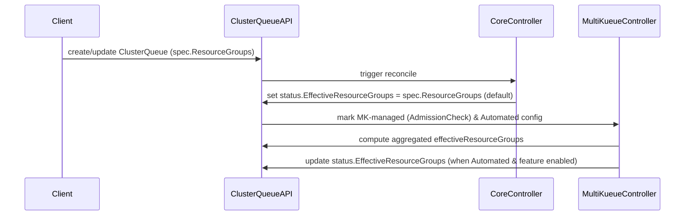

# PR #11865: KEP-11823: EffectiveResourceGroups

**Summary**: KEP-11823: EffectiveResourceGroups

**Sources**: https://github.com/kubernetes-sigs/kueue/pull/11865

**Last updated**: 2026-06-23T18:31:32Z

---

## Metadata

- **State**: open
- **Author**: [@Singularity23x0](https://github.com/Singularity23x0)
- **Branch**: `11823-kep` → `main`
- **Created**: 2026-06-01T09:29:50Z
- **Updated**: 2026-06-23T18:31:32Z
- **Merged**: —
- **Closed**: —
- **Labels**: `size/L`, `do-not-merge/work-in-progress`, `do-not-merge/release-note-label-needed`, `cncf-cla: yes`, `area/multikueue`, `kind/kep`
- **Assignees**: _none_
- **Requested reviewers**: [@pajakd](https://github.com/pajakd)
- **Changed files**: 3   **+289 / -7**

## Description

<!--  Thanks for sending a pull request!  Here are some tips for you:

1. If this is your first time, please read our contributor guidelines: https://git.k8s.io/community/contributors/guide/first-contribution.md#your-first-contribution and developer guide https://git.k8s.io/community/contributors/devel/development.md#development-guide
2. Please label this pull request according to what type of issue you are addressing, especially if this is a release targeted pull request. For reference on required PR/issue labels, read here:
https://git.k8s.io/community/contributors/devel/sig-release/release.md#issuepr-kind-label
3. Ensure you have added or ran the appropriate tests for your PR: https://git.k8s.io/community/contributors/devel/sig-testing/testing.md
4. If you want *faster* PR reviews, read how: https://git.k8s.io/community/contributors/guide/pull-requests.md#best-practices-for-faster-reviews
5. If the PR is unfinished, see how to mark it: https://git.k8s.io/community/contributors/guide/pull-requests.md#marking-unfinished-pull-requests
-->

#### What type of PR is this?
/kind kep

<!--
Add one of the following kinds:
/kind bug
/kind cleanup
/kind documentation
/kind feature
/kind kep

Optionally add one or more of the following kinds if applicable:
/kind api-change
/kind deprecation
/kind failing-test
/kind flake
/kind regression

Please also consider setting the area:
/area tas
/area integrations
/area multikueue
/area dashboard
/area localization
/area testing
/area website
-->

#### What this PR does / why we need it:
See https://github.com/kubernetes-sigs/kueue/issues/11823 .

#### Which issue(s) this PR fixes:
<!--
*Automatically closes linked issue when PR is merged.
Usage: `Fixes #<issue number>`, or `Fixes (paste link of issue)`.
_If PR is about `failing-tests or flakes`, please post the related issues/tests in a comment and do not use `Fixes`_*
-->
Progresses #https://github.com/kubernetes-sigs/kueue/issues/11823

#### Special notes for your reviewer:

ON HOLD until #12382 is resolved.

* Per-flavor auota aggregation will be discussed in https://github.com/kubernetes-sigs/kueue/issues/11862.
* For MultiKueue automation details see: keps/9988-multikueue-manager-quota-automation
* **Implementation draft**: https://github.com/kubernetes-sigs/kueue/pull/11807


<!-- This is an auto-generated comment: release notes by coderabbit.ai -->
## Summary by CodeRabbit

* **Documentation**
  * Added a KEP describing a new ClusterQueue status field for effective resource groups, controller ownership, rollout stages, test plan, graduation criteria, drawbacks, and alternatives.
  * Updated MultiKueue quota automation docs with automated quota-management modes (manual vs dynamic aggregation), new validation requirements, opt-out examples, and a dynamic resource-flavor alternative.
<!-- end of auto-generated comment: release notes by coderabbit.ai -->

## Discussion

### Comment by [@k8s-ci-robot](https://github.com/k8s-ci-robot) — 2026-06-01T09:29:53Z

Skipping CI for Draft Pull Request.
If you want CI signal for your change, please convert it to an actual PR.
You can still manually trigger a test run with `/test all`

### Comment by [@k8s-ci-robot](https://github.com/k8s-ci-robot) — 2026-06-01T09:29:53Z

Adding the "do-not-merge/release-note-label-needed" label because no release-note block was detected, please follow our [release note process](https://git.k8s.io/community/contributors/guide/release-notes.md) to remove it.

<details>

Instructions for interacting with me using PR comments are available [here](https://git.k8s.io/community/contributors/guide/pull-requests.md).  If you have questions or suggestions related to my behavior, please file an issue against the [kubernetes-sigs/prow](https://github.com/kubernetes-sigs/prow/issues/new?title=Prow%20issue:) repository.
</details>

### Comment by [@netlify[bot]](https://github.com/apps/netlify) — 2026-06-01T09:29:55Z

### <span aria-hidden="true">✅</span> Deploy Preview for *kubernetes-sigs-kueue* canceled.


|  Name | Link |
|:-:|------------------------|
|<span aria-hidden="true">🔨</span> Latest commit | a75bdb13239923dcc1dcde808218673c4d32c8df |
|<span aria-hidden="true">🔍</span> Latest deploy log | https://app.netlify.com/projects/kubernetes-sigs-kueue/deploys/6a2a751deeb88b0008d5b421 |

### Comment by [@Singularity23x0](https://github.com/Singularity23x0) — 2026-06-01T10:12:04Z

@tenzen-y, @olekzabl, @mwielgus, @mimowo PTAL

### Comment by [@tenzen-y](https://github.com/tenzen-y) — 2026-06-01T17:28:47Z

/kind kep

### Comment by [@k8s-ci-robot](https://github.com/k8s-ci-robot) — 2026-06-02T08:03:22Z

[APPROVALNOTIFIER] This PR is **NOT APPROVED**

This pull-request has been approved by: *<a href="https://github.com/kubernetes-sigs/kueue/pull/11865#" title="Author self-approved">Singularity23x0</a>*
**Once this PR has been reviewed and has the lgtm label**, please assign [tenzen-y](https://github.com/tenzen-y) for approval. For more information see [the Code Review Process](https://git.k8s.io/community/contributors/guide/owners.md#the-code-review-process).

The full list of commands accepted by this bot can be found [here](https://go.k8s.io/bot-commands?repo=kubernetes-sigs%2Fkueue).

<details open>
Needs approval from an approver in each of these files:

- **[OWNERS](https://github.com/kubernetes-sigs/kueue/blob/main/OWNERS)**

Approvers can indicate their approval by writing `/approve` in a comment
Approvers can cancel approval by writing `/approve cancel` in a comment
</details>
<!-- META={"approvers":["tenzen-y"]} -->

### Comment by [@coderabbitai[bot]](https://github.com/apps/coderabbitai) — 2026-06-08T08:25:27Z

<!-- This is an auto-generated comment: summarize by coderabbit.ai -->
<!-- review_stack_entry_start -->

[](https://app.coderabbit.ai/change-stack/kubernetes-sigs/kueue/pull/11865?utm_source=github_walkthrough&utm_medium=github&utm_campaign=change_stack)

<!-- review_stack_entry_end -->
<!-- This is an auto-generated comment: review paused by coderabbit.ai -->

> [!NOTE]
> ## Reviews paused
> 
> It looks like this branch is under active development. To avoid overwhelming you with review comments due to an influx of new commits, CodeRabbit has automatically paused this review. You can configure this behavior by changing the `reviews.auto_review.auto_pause_after_reviewed_commits` setting.
> 
> Use the following commands to manage reviews:
> - `@coderabbitai resume` to resume automatic reviews.
> - `@coderabbitai review` to trigger a single review.
> 
> Use the checkboxes below for quick actions:
> - [ ] <!-- {"checkboxId": "7f6cc2e2-2e4e-497a-8c31-c9e4573e93d1"} --> ▶️ Resume reviews
> - [ ] <!-- {"checkboxId": "e9bb8d72-00e8-4f67-9cb2-caf3b22574fe"} --> 🔍 Trigger review

<!-- end of auto-generated comment: review paused by coderabbit.ai -->
<!-- walkthrough_start -->

<details>
<summary>📝 Walkthrough</summary>

## Walkthrough

Adds KEP-11823 introducing ClusterQueue.status.EffectiveResourceGroups (contract, selection helper, controller sync rules, tests, graduation) and updates KEP-9988 to integrate MultiKueue automated quota management with the new status field and added MultiKueueConfig API fields.

## Changes

**EffectiveResourceGroups Specification and Integration**

|Layer / File(s)|Summary|
|---|---|
|**KEP metadata and introduction** <br> `keps/11823-effective-resource-groups/kep.yaml`, `keps/11823-effective-resource-groups/README.md`|New KEP YAML and README header present feature metadata, stage targeting, TOC anchors, and motivation for `status.EffectiveResourceGroups`.|
|**Proposal and controller design** <br> `keps/11823-effective-resource-groups/README.md`|Defines the contract between `spec.ResourceGroups` and `status.EffectiveResourceGroups`, feature-gated selection helper pseudocode, default mirroring behavior, and Core controller skip for MultiKueue-managed ClusterQueues; includes risks/mitigations.|
|**MultiKueue quota automation Alpha2 integration** <br> `keps/11823-effective-resource-groups/README.md`, `keps/9988-multikueue-manager-quota-automation/README.md`|Specifies MultiKueue automation conditions (feature gates, MK AdmissionCheck, `Automated` strategy, empty `spec.ResourceGroups`) for computing aggregated effective groups; adds `quotaManagementMode` and `automatedQuotaManagementConfig` fields, `AutomatedQuotaManagementConfig` options (manual `aggregateResourceFlavorRef` and dynamic `aggregateResourceFlavorSpec` alternative), XValidation, and a drawback note about webhook validation complexity.|
|**Tests, graduation, and implementation notes** <br> `keps/11823-effective-resource-groups/README.md`|Alpha test plan, unit/integration/e2e updates, graduation criteria across alpha→beta→stable, implementation history, drawbacks, and alternatives.|

🎯 3 (Moderate) | ⏱️ ~20 minutes



> 🐰 New fields sprout in the status garden,  
> While spec and automation learn to pardon,  
> Effective groups bloom in Alpha's light,  
> Controllers sync and skip just right,  
> Quota petals arranged for future flight.

</details>

<!-- walkthrough_end -->
<!-- pre_merge_checks_walkthrough_start -->

<details>
<summary>🚥 Pre-merge checks | ✅ 5</summary>

<details>
<summary>✅ Passed checks (5 passed)</summary>

|         Check name         | Status   | Explanation                                                                                                                                                                                             |
| :------------------------: | :------- | :------------------------------------------------------------------------------------------------------------------------------------------------------------------------------------------------------ |
|         Title check        | ✅ Passed | The title 'KEP-11823: EffectiveResourceGroups' directly and clearly identifies the main change—a new KEP document introducing the EffectiveResourceGroups feature for ClusterQueue resource management. |
|     Docstring Coverage     | ✅ Passed | No functions found in the changed files to evaluate docstring coverage. Skipping docstring coverage check.                                                                                              |
|     Linked Issues check    | ✅ Passed | Check skipped because no linked issues were found for this pull request.                                                                                                                                |
| Out of Scope Changes check | ✅ Passed | Check skipped because no linked issues were found for this pull request.                                                                                                                                |
|      Description Check     | ✅ Passed | Check skipped - CodeRabbit’s high-level summary is enabled.                                                                                                                                             |

</details>

<sub>✏️ Tip: You can configure your own custom pre-merge checks in the settings.</sub>

</details>

<!-- pre_merge_checks_walkthrough_end -->
<!-- finishing_touch_checkbox_start -->

<details>
<summary>✨ Finishing Touches</summary>

<details>
<summary>🧪 Generate unit tests (beta)</summary>

- [ ] <!-- {"checkboxId": "f47ac10b-58cc-4372-a567-0e02b2c3d479", "radioGroupId": "utg-output-choice-group-unknown_comment_id"} -->   Create PR with unit tests

</details>

</details>

<!-- finishing_touch_checkbox_end -->
<!-- tips_start -->

---

Thanks for using [CodeRabbit](https://coderabbit.ai?utm_source=oss&utm_medium=github&utm_campaign=kubernetes-sigs/kueue&utm_content=11865)! It's free for OSS, and your support helps us grow. If you like it, consider giving us a shout-out.

<details>
<summary>❤️ Share</summary>

- [X](https://twitter.com/intent/tweet?text=I%20just%20used%20%40coderabbitai%20for%20my%20code%20review%2C%20and%20it%27s%20fantastic%21%20It%27s%20free%20for%20OSS%20and%20offers%20a%20free%20trial%20for%20the%20proprietary%20code.%20Check%20it%20out%3A&url=https%3A//coderabbit.ai)
- [Mastodon](https://mastodon.social/share?text=I%20just%20used%20%40coderabbitai%20for%20my%20code%20review%2C%20and%20it%27s%20fantastic%21%20It%27s%20free%20for%20OSS%20and%20offers%20a%20free%20trial%20for%20the%20proprietary%20code.%20Check%20it%20out%3A%20https%3A%2F%2Fcoderabbit.ai)
- [Reddit](https://www.reddit.com/submit?title=Great%20tool%20for%20code%20review%20-%20CodeRabbit&text=I%20just%20used%20CodeRabbit%20for%20my%20code%20review%2C%20and%20it%27s%20fantastic%21%20It%27s%20free%20for%20OSS%20and%20offers%20a%20free%20trial%20for%20proprietary%20code.%20Check%20it%20out%3A%20https%3A//coderabbit.ai)
- [LinkedIn](https://www.linkedin.com/sharing/share-offsite/?url=https%3A%2F%2Fcoderabbit.ai&mini=true&title=Great%20tool%20for%20code%20review%20-%20CodeRabbit&summary=I%20just%20used%20CodeRabbit%20for%20my%20code%20review%2C%20and%20it%27s%20fantastic%21%20It%27s%20free%20for%20OSS%20and%20offers%20a%20free%20trial%20for%20proprietary%20code)

</details>


<sub>Comment `@coderabbitai help` to get the list of available commands.</sub>

<!-- tips_end -->

### Comment by [@coderabbitai[bot]](https://github.com/apps/coderabbitai) — 2026-06-08T14:05:17Z

<!-- This is an auto-generated reply by CodeRabbit -->
<details>
<summary>✅ Action performed</summary>

Reviews resumed.

</details>

### Comment by [@amy](https://github.com/amy) — 2026-06-18T15:14:41Z

@Singularity23x0 interested in reviewing this kep. Adding this comment here so we don't merge before I take a pass. Thank you!

## Reviews

### Review by [@olekzabl](https://github.com/olekzabl) (commented) — 2026-06-01T11:05:15Z

A partial review; sending a few comments I managed to gather so far.
Will come back later.

Though overall looking very nice!

- **keps/11823-effective-resource-groups/README.md:125** by [@olekzabl](https://github.com/olekzabl) — 2026-06-01T10:28:56Z
```diff
@@ -0,0 +1,366 @@
+# KEP-11823: EffectiveResourceGroups
+
+<!--
+This is the title of your KEP. Keep it short, simple, and descriptive. A good
+title can help communicate what the KEP is and should be considered as part of
+any review.
+-->
+
+<!--
+A table of contents is helpful for quickly jumping to sections of a KEP and for
+highlighting any additional information provided beyond the standard KEP
+template.
+
+Ensure the TOC is wrapped with
+  <code>&lt;!-- toc --&rt;&lt;!-- /toc --&rt;</code>
+tags, and then generate with `hack/update-toc.sh`.
+-->
+
+<!-- toc -->
+- [Summary](#summary)
+- [Motivation](#motivation)
+  - [Goals](#goals)
+- [Proposal](#proposal)
+  - [Risks and Mitigations](#risks-and-mitigations)
+- [Design Details](#design-details)
+  - [Default behavior](#default-behavior)
+  - [Core Controller](#core-controller)
+  - [MultiKueue quota automation](#multikueue-quota-automation)
+  - [Test Plan](#test-plan)
+    - [Prerequisite testing updates](#prerequisite-testing-updates)
+    - [Unit tests](#unit-tests)
+    - [Integration tests](#integration-tests)
+    - [e2e tests](#e2e-tests)
+  - [Graduation Criteria](#graduation-criteria)
+- [Implementation History](#implementation-history)
+- [Drawbacks](#drawbacks)
+- [Alternatives](#alternatives)
+  - [Treat MultiKueue automation as priority](#treat-multikueue-automation-as-priority)
+  - [Let spec override effective quota](#let-spec-override-effective-quota)
+<!-- /toc -->
+
+## Summary
+
+<!--
+This section is incredibly important for producing high-quality, user-focused
+documentation such as release notes or a development roadmap. It should be
+possible to collect this information before implementation begins, in order to
+avoid requiring implementors to split their attention between writing release
+notes and implementing the feature itself. KEP editors and SIG Docs
+should help to ensure that the tone and content of the `Summary` section is
+useful for a wide audience.
+
+A good summary is probably at least a paragraph in length.
+
+Both in this section and below, follow the guidelines of the [documentation
+style guide]. In particular, wrap lines to a reasonable length, to make it
+easier for reviewers to cite specific portions, and to minimize diff churn on
+updates.
+
+[documentation style guide]: https://github.com/kubernetes/community/blob/master/contributors/guide/style-guide.md
+-->
+
+This KEP extends the current resource group definition mechanism of Kueue to accommodate automated quota management.
+
+The proposal is to introduce a new ClusterQueue Status field: EffectiveResourceGroups, used to represent and track the ClusterQueue quota as interpreted by the Kueue scheduler.
+
+## Motivation
+
+<!--
+This section is for explicitly listing the motivation, goals, and non-goals of
+this KEP.  Describe why the change is important and the benefits to users. The
+motivation section can optionally provide links to [experience reports] to
+demonstrate the interest in a KEP within the wider Kubernetes community.
+
+[experience reports]: https://github.com/golang/go/wiki/ExperienceReports
+-->
+
+We need a way to track the ClusterQueue quota. In the default case the quota is static and described by the user in spec.ResourceGroups.
+
+When automating effective quota calculation, using spec.ResourceGroups to store the value would mean allowing Kueue to modify spec of objects it's supposed to reconcile (specifically, ClusterQueues). This may be perceived as a design smell because:
+* It blurs the line between configuration (managed by users) and state (managed by controllers).
+* It brings a risk of an infinite reconciling loop.
+
+To resolve this issue, we propose introducing a new ClusterQueue Status field: EffectiveResourceGroups to store the automated quota value.
+
+
+### Goals
+
+1. Implement the EffectiveResourceGroups status field in ClusterQueue API.
+2. Define a clear contract on how EffectiveResourceGroups is managed and utilized by Kueue in cases of:
+    * Default setup: MultiKueue disabled; this case will be the basis for any possible future additions of more automated ClusterQueue quota management schemes,
+    * MultiKueue setup without Quota automation: MultiKueue enabled, MultiKueueManagerQuotaAutomation feature disabled.
+    * MultiKueue with MultiKueueManagerQuotaAutomation enabled.
+
+<!-- ### Non-Goals -->
+
+## Proposal
+
+We introduce the new status.EffectiveResourceGroups field alongside the spec.ResourceGroups field.
+The status.EffectiveResourceGroups will add a layer between the spec.ResourceGroups (set directly by users) and Kueue logic. All internal Kueue logic will use status.EffectiveResourceGroups as the source of truth for resource quota. Setting the value of the effective quota will be handled by the Core-ClusterQueue-Controller and MultiKueue-ClusterQueue-Controller depending on the configuration:
+
+1. By default, EffectiveResourceGroups will always mirror spec.ResourceGroups. EffectiveResourceGroups will be synced to spec.ResourceGroups during reconciliation in the Core ClusterQueue Controller.
+2. When MultiKueue Automated Quota Management is **enabled** and **configured correctly**, effective quota will be calculated by the MultiKueue ClusterQueue controller. The value will be set directly to one representing the aggregated quota across the Manager Queue's Workers, calculated as decided upon in [issue 11862](https://github.com/kubernetes-sigs/kueue/issues/11862).
+
+We consider MultiKueue Automated Quota Management **enabled** and **configured correctly** when:
+1. feature.MultiKueue is enabled.
+2. feature.MultiKueueManagerQuotaAutomation is enabled.
+3. The ClusterQueue is MultiKueue, i.e. it has the MultiKueue Admission Check.
+4. The Quota Management Strategy is present (non-nil) and set to **"Automated"**.
+5. **spec.ResourceGroup is empty.**
+
+We treat spec.ResourceGroup with priority since the parameter is an established, user defined value. If set, it takes precedence over the MultiKueue Manager Queue quota automation. As such, to allow for MultiKueue automated quota management we expect it to be empty.
+
+<!-- ### User Stories (Optional)
+
+#### Story 1 (Optional)
+
+#### Story 2 (Optional)
+
+### Notes/Constraints/Caveats (Optional) -->
+
+
+### Risks and Mitigations
+
+The major risk here is allowing spec.ResourceGroups to be empty.
```

  Nit: AFAIK this is allowed already.

- **keps/11823-effective-resource-groups/README.md:127** by [@olekzabl](https://github.com/olekzabl) — 2026-06-01T10:29:25Z
```diff
@@ -0,0 +1,366 @@
+# KEP-11823: EffectiveResourceGroups
+
+<!--
+This is the title of your KEP. Keep it short, simple, and descriptive. A good
+title can help communicate what the KEP is and should be considered as part of
+any review.
+-->
+
+<!--
+A table of contents is helpful for quickly jumping to sections of a KEP and for
+highlighting any additional information provided beyond the standard KEP
+template.
+
+Ensure the TOC is wrapped with
+  <code>&lt;!-- toc --&rt;&lt;!-- /toc --&rt;</code>
+tags, and then generate with `hack/update-toc.sh`.
+-->
+
+<!-- toc -->
+- [Summary](#summary)
+- [Motivation](#motivation)
+  - [Goals](#goals)
+- [Proposal](#proposal)
+  - [Risks and Mitigations](#risks-and-mitigations)
+- [Design Details](#design-details)
+  - [Default behavior](#default-behavior)
+  - [Core Controller](#core-controller)
+  - [MultiKueue quota automation](#multikueue-quota-automation)
+  - [Test Plan](#test-plan)
+    - [Prerequisite testing updates](#prerequisite-testing-updates)
+    - [Unit tests](#unit-tests)
+    - [Integration tests](#integration-tests)
+    - [e2e tests](#e2e-tests)
+  - [Graduation Criteria](#graduation-criteria)
+- [Implementation History](#implementation-history)
+- [Drawbacks](#drawbacks)
+- [Alternatives](#alternatives)
+  - [Treat MultiKueue automation as priority](#treat-multikueue-automation-as-priority)
+  - [Let spec override effective quota](#let-spec-override-effective-quota)
+<!-- /toc -->
+
+## Summary
+
+<!--
+This section is incredibly important for producing high-quality, user-focused
+documentation such as release notes or a development roadmap. It should be
+possible to collect this information before implementation begins, in order to
+avoid requiring implementors to split their attention between writing release
+notes and implementing the feature itself. KEP editors and SIG Docs
+should help to ensure that the tone and content of the `Summary` section is
+useful for a wide audience.
+
+A good summary is probably at least a paragraph in length.
+
+Both in this section and below, follow the guidelines of the [documentation
+style guide]. In particular, wrap lines to a reasonable length, to make it
+easier for reviewers to cite specific portions, and to minimize diff churn on
+updates.
+
+[documentation style guide]: https://github.com/kubernetes/community/blob/master/contributors/guide/style-guide.md
+-->
+
+This KEP extends the current resource group definition mechanism of Kueue to accommodate automated quota management.
+
+The proposal is to introduce a new ClusterQueue Status field: EffectiveResourceGroups, used to represent and track the ClusterQueue quota as interpreted by the Kueue scheduler.
+
+## Motivation
+
+<!--
+This section is for explicitly listing the motivation, goals, and non-goals of
+this KEP.  Describe why the change is important and the benefits to users. The
+motivation section can optionally provide links to [experience reports] to
+demonstrate the interest in a KEP within the wider Kubernetes community.
+
+[experience reports]: https://github.com/golang/go/wiki/ExperienceReports
+-->
+
+We need a way to track the ClusterQueue quota. In the default case the quota is static and described by the user in spec.ResourceGroups.
+
+When automating effective quota calculation, using spec.ResourceGroups to store the value would mean allowing Kueue to modify spec of objects it's supposed to reconcile (specifically, ClusterQueues). This may be perceived as a design smell because:
+* It blurs the line between configuration (managed by users) and state (managed by controllers).
+* It brings a risk of an infinite reconciling loop.
+
+To resolve this issue, we propose introducing a new ClusterQueue Status field: EffectiveResourceGroups to store the automated quota value.
+
+
+### Goals
+
+1. Implement the EffectiveResourceGroups status field in ClusterQueue API.
+2. Define a clear contract on how EffectiveResourceGroups is managed and utilized by Kueue in cases of:
+    * Default setup: MultiKueue disabled; this case will be the basis for any possible future additions of more automated ClusterQueue quota management schemes,
+    * MultiKueue setup without Quota automation: MultiKueue enabled, MultiKueueManagerQuotaAutomation feature disabled.
+    * MultiKueue with MultiKueueManagerQuotaAutomation enabled.
+
+<!-- ### Non-Goals -->
+
+## Proposal
+
+We introduce the new status.EffectiveResourceGroups field alongside the spec.ResourceGroups field.
+The status.EffectiveResourceGroups will add a layer between the spec.ResourceGroups (set directly by users) and Kueue logic. All internal Kueue logic will use status.EffectiveResourceGroups as the source of truth for resource quota. Setting the value of the effective quota will be handled by the Core-ClusterQueue-Controller and MultiKueue-ClusterQueue-Controller depending on the configuration:
+
+1. By default, EffectiveResourceGroups will always mirror spec.ResourceGroups. EffectiveResourceGroups will be synced to spec.ResourceGroups during reconciliation in the Core ClusterQueue Controller.
+2. When MultiKueue Automated Quota Management is **enabled** and **configured correctly**, effective quota will be calculated by the MultiKueue ClusterQueue controller. The value will be set directly to one representing the aggregated quota across the Manager Queue's Workers, calculated as decided upon in [issue 11862](https://github.com/kubernetes-sigs/kueue/issues/11862).
+
+We consider MultiKueue Automated Quota Management **enabled** and **configured correctly** when:
+1. feature.MultiKueue is enabled.
+2. feature.MultiKueueManagerQuotaAutomation is enabled.
+3. The ClusterQueue is MultiKueue, i.e. it has the MultiKueue Admission Check.
+4. The Quota Management Strategy is present (non-nil) and set to **"Automated"**.
+5. **spec.ResourceGroup is empty.**
+
+We treat spec.ResourceGroup with priority since the parameter is an established, user defined value. If set, it takes precedence over the MultiKueue Manager Queue quota automation. As such, to allow for MultiKueue automated quota management we expect it to be empty.
+
+<!-- ### User Stories (Optional)
+
+#### Story 1 (Optional)
+
+#### Story 2 (Optional)
+
+### Notes/Constraints/Caveats (Optional) -->
+
+
+### Risks and Mitigations
+
+The major risk here is allowing spec.ResourceGroups to be empty.
+Mitigating this requires an expansive sweep of existing logic, ensuring the code is proofed against the cases of:
+* referencing an empty spec.ResourceGroups of spec.EffectiveResourceGroups properties,
```

  I couldn't parse this. Did you mean "or" instead of "of"?

- **keps/11823-effective-resource-groups/README.md:33** by [@olekzabl](https://github.com/olekzabl) — 2026-06-01T10:32:47Z
```diff
@@ -0,0 +1,366 @@
+# KEP-11823: EffectiveResourceGroups
+
+<!--
+This is the title of your KEP. Keep it short, simple, and descriptive. A good
+title can help communicate what the KEP is and should be considered as part of
+any review.
+-->
+
+<!--
+A table of contents is helpful for quickly jumping to sections of a KEP and for
+highlighting any additional information provided beyond the standard KEP
+template.
+
+Ensure the TOC is wrapped with
+  <code>&lt;!-- toc --&rt;&lt;!-- /toc --&rt;</code>
+tags, and then generate with `hack/update-toc.sh`.
+-->
+
+<!-- toc -->
+- [Summary](#summary)
+- [Motivation](#motivation)
+  - [Goals](#goals)
+- [Proposal](#proposal)
+  - [Risks and Mitigations](#risks-and-mitigations)
+- [Design Details](#design-details)
+  - [Default behavior](#default-behavior)
+  - [Core Controller](#core-controller)
+  - [MultiKueue quota automation](#multikueue-quota-automation)
+  - [Test Plan](#test-plan)
+    - [Prerequisite testing updates](#prerequisite-testing-updates)
+    - [Unit tests](#unit-tests)
+    - [Integration tests](#integration-tests)
+    - [e2e tests](#e2e-tests)
+  - [Graduation Criteria](#graduation-criteria)
+- [Implementation History](#implementation-history)
+- [Drawbacks](#drawbacks)
+- [Alternatives](#alternatives)
+  - [Treat MultiKueue automation as priority](#treat-multikueue-automation-as-priority)
+  - [Let spec override effective quota](#let-spec-override-effective-quota)
+<!-- /toc -->
+
+## Summary
+
+<!--
+This section is incredibly important for producing high-quality, user-focused
+documentation such as release notes or a development roadmap. It should be
+possible to collect this information before implementation begins, in order to
+avoid requiring implementors to split their attention between writing release
+notes and implementing the feature itself. KEP editors and SIG Docs
+should help to ensure that the tone and content of the `Summary` section is
+useful for a wide audience.
+
+A good summary is probably at least a paragraph in length.
+
+Both in this section and below, follow the guidelines of the [documentation
+style guide]. In particular, wrap lines to a reasonable length, to make it
+easier for reviewers to cite specific portions, and to minimize diff churn on
+updates.
+
+[documentation style guide]: https://github.com/kubernetes/community/blob/master/contributors/guide/style-guide.md
+-->
+
+This KEP extends the current resource group definition mechanism of Kueue to accommodate automated quota management.
+
+The proposal is to introduce a new ClusterQueue Status field: EffectiveResourceGroups, used to represent and track the ClusterQueue quota as interpreted by the Kueue scheduler.
+
+## Motivation
```

  While it reads nice, I'm missing two bits of context here:
  
  1. (Definitely) [KEP-8826](https://github.com/kubernetes-sigs/kueue/pull/8864), as another motivation for having this mechanism in place, and a potential source of another plugin hooking into it.
  2. (Preferably) [This section](https://github.com/kubernetes-sigs/kueue/tree/main/keps/9988-multikueue-manager-quota-automation#move-the-aggregated-quota-out-of-clusterqueuespec) of KEP-9988, just for easier "archeology" (what's the context behind this KEP).

- **keps/11823-effective-resource-groups/README.md:137** by [@olekzabl](https://github.com/olekzabl) — 2026-06-01T10:34:35Z
```diff
@@ -0,0 +1,366 @@
+# KEP-11823: EffectiveResourceGroups
+
+<!--
+This is the title of your KEP. Keep it short, simple, and descriptive. A good
+title can help communicate what the KEP is and should be considered as part of
+any review.
+-->
+
+<!--
+A table of contents is helpful for quickly jumping to sections of a KEP and for
+highlighting any additional information provided beyond the standard KEP
+template.
+
+Ensure the TOC is wrapped with
+  <code>&lt;!-- toc --&rt;&lt;!-- /toc --&rt;</code>
+tags, and then generate with `hack/update-toc.sh`.
+-->
+
+<!-- toc -->
+- [Summary](#summary)
+- [Motivation](#motivation)
+  - [Goals](#goals)
+- [Proposal](#proposal)
+  - [Risks and Mitigations](#risks-and-mitigations)
+- [Design Details](#design-details)
+  - [Default behavior](#default-behavior)
+  - [Core Controller](#core-controller)
+  - [MultiKueue quota automation](#multikueue-quota-automation)
+  - [Test Plan](#test-plan)
+    - [Prerequisite testing updates](#prerequisite-testing-updates)
+    - [Unit tests](#unit-tests)
+    - [Integration tests](#integration-tests)
+    - [e2e tests](#e2e-tests)
+  - [Graduation Criteria](#graduation-criteria)
+- [Implementation History](#implementation-history)
+- [Drawbacks](#drawbacks)
+- [Alternatives](#alternatives)
+  - [Treat MultiKueue automation as priority](#treat-multikueue-automation-as-priority)
+  - [Let spec override effective quota](#let-spec-override-effective-quota)
+<!-- /toc -->
+
+## Summary
+
+<!--
+This section is incredibly important for producing high-quality, user-focused
+documentation such as release notes or a development roadmap. It should be
+possible to collect this information before implementation begins, in order to
+avoid requiring implementors to split their attention between writing release
+notes and implementing the feature itself. KEP editors and SIG Docs
+should help to ensure that the tone and content of the `Summary` section is
+useful for a wide audience.
+
+A good summary is probably at least a paragraph in length.
+
+Both in this section and below, follow the guidelines of the [documentation
+style guide]. In particular, wrap lines to a reasonable length, to make it
+easier for reviewers to cite specific portions, and to minimize diff churn on
+updates.
+
+[documentation style guide]: https://github.com/kubernetes/community/blob/master/contributors/guide/style-guide.md
+-->
+
+This KEP extends the current resource group definition mechanism of Kueue to accommodate automated quota management.
+
+The proposal is to introduce a new ClusterQueue Status field: EffectiveResourceGroups, used to represent and track the ClusterQueue quota as interpreted by the Kueue scheduler.
+
+## Motivation
+
+<!--
+This section is for explicitly listing the motivation, goals, and non-goals of
+this KEP.  Describe why the change is important and the benefits to users. The
+motivation section can optionally provide links to [experience reports] to
+demonstrate the interest in a KEP within the wider Kubernetes community.
+
+[experience reports]: https://github.com/golang/go/wiki/ExperienceReports
+-->
+
+We need a way to track the ClusterQueue quota. In the default case the quota is static and described by the user in spec.ResourceGroups.
+
+When automating effective quota calculation, using spec.ResourceGroups to store the value would mean allowing Kueue to modify spec of objects it's supposed to reconcile (specifically, ClusterQueues). This may be perceived as a design smell because:
+* It blurs the line between configuration (managed by users) and state (managed by controllers).
+* It brings a risk of an infinite reconciling loop.
+
+To resolve this issue, we propose introducing a new ClusterQueue Status field: EffectiveResourceGroups to store the automated quota value.
+
+
+### Goals
+
+1. Implement the EffectiveResourceGroups status field in ClusterQueue API.
+2. Define a clear contract on how EffectiveResourceGroups is managed and utilized by Kueue in cases of:
+    * Default setup: MultiKueue disabled; this case will be the basis for any possible future additions of more automated ClusterQueue quota management schemes,
+    * MultiKueue setup without Quota automation: MultiKueue enabled, MultiKueueManagerQuotaAutomation feature disabled.
+    * MultiKueue with MultiKueueManagerQuotaAutomation enabled.
+
+<!-- ### Non-Goals -->
+
+## Proposal
+
+We introduce the new status.EffectiveResourceGroups field alongside the spec.ResourceGroups field.
+The status.EffectiveResourceGroups will add a layer between the spec.ResourceGroups (set directly by users) and Kueue logic. All internal Kueue logic will use status.EffectiveResourceGroups as the source of truth for resource quota. Setting the value of the effective quota will be handled by the Core-ClusterQueue-Controller and MultiKueue-ClusterQueue-Controller depending on the configuration:
+
+1. By default, EffectiveResourceGroups will always mirror spec.ResourceGroups. EffectiveResourceGroups will be synced to spec.ResourceGroups during reconciliation in the Core ClusterQueue Controller.
+2. When MultiKueue Automated Quota Management is **enabled** and **configured correctly**, effective quota will be calculated by the MultiKueue ClusterQueue controller. The value will be set directly to one representing the aggregated quota across the Manager Queue's Workers, calculated as decided upon in [issue 11862](https://github.com/kubernetes-sigs/kueue/issues/11862).
+
+We consider MultiKueue Automated Quota Management **enabled** and **configured correctly** when:
+1. feature.MultiKueue is enabled.
+2. feature.MultiKueueManagerQuotaAutomation is enabled.
+3. The ClusterQueue is MultiKueue, i.e. it has the MultiKueue Admission Check.
+4. The Quota Management Strategy is present (non-nil) and set to **"Automated"**.
+5. **spec.ResourceGroup is empty.**
+
+We treat spec.ResourceGroup with priority since the parameter is an established, user defined value. If set, it takes precedence over the MultiKueue Manager Queue quota automation. As such, to allow for MultiKueue automated quota management we expect it to be empty.
+
+<!-- ### User Stories (Optional)
+
+#### Story 1 (Optional)
+
+#### Story 2 (Optional)
+
+### Notes/Constraints/Caveats (Optional) -->
+
+
+### Risks and Mitigations
+
+The major risk here is allowing spec.ResourceGroups to be empty.
+Mitigating this requires an expansive sweep of existing logic, ensuring the code is proofed against the cases of:
+* referencing an empty spec.ResourceGroups of spec.EffectiveResourceGroups properties,
+* a misalignment/delay of spec.EffectiveResourceGroups being synced to spec.ResourceGroups.
+
+## Design Details
+
+status.EffectiveResourceGroups will be managed by either the Core ClusterQueue Controller or the MultiKueue ClusterQueue Controller (mutually exclusive):
+1. status.EffectiveResourceGroups will be managed by the MultiKueue Controller when:
+    * features.MultiKueue is enabled AND
+    * features.MultiKueueManagerQuotaAutomation is enabled AND
+    * ClusterQueue has the MultiKueue admission check assigned.
+2. Otherwise, status.EffectiveResourceGroups will be managed by the Core Controller.
```

  Hmm, doesn't this contradict the content of "Proposal" section?
  
  There, you gave 5 necessary conditions to let the MK CQ Controller manage effective quotas.
  Here, you listed only 3 out of those 5.

- **keps/11823-effective-resource-groups/README.md:139** by [@olekzabl](https://github.com/olekzabl) — 2026-06-01T10:36:04Z
```diff
@@ -0,0 +1,366 @@
+# KEP-11823: EffectiveResourceGroups
+
+<!--
+This is the title of your KEP. Keep it short, simple, and descriptive. A good
+title can help communicate what the KEP is and should be considered as part of
+any review.
+-->
+
+<!--
+A table of contents is helpful for quickly jumping to sections of a KEP and for
+highlighting any additional information provided beyond the standard KEP
+template.
+
+Ensure the TOC is wrapped with
+  <code>&lt;!-- toc --&rt;&lt;!-- /toc --&rt;</code>
+tags, and then generate with `hack/update-toc.sh`.
+-->
+
+<!-- toc -->
+- [Summary](#summary)
+- [Motivation](#motivation)
+  - [Goals](#goals)
+- [Proposal](#proposal)
+  - [Risks and Mitigations](#risks-and-mitigations)
+- [Design Details](#design-details)
+  - [Default behavior](#default-behavior)
+  - [Core Controller](#core-controller)
+  - [MultiKueue quota automation](#multikueue-quota-automation)
+  - [Test Plan](#test-plan)
+    - [Prerequisite testing updates](#prerequisite-testing-updates)
+    - [Unit tests](#unit-tests)
+    - [Integration tests](#integration-tests)
+    - [e2e tests](#e2e-tests)
+  - [Graduation Criteria](#graduation-criteria)
+- [Implementation History](#implementation-history)
+- [Drawbacks](#drawbacks)
+- [Alternatives](#alternatives)
+  - [Treat MultiKueue automation as priority](#treat-multikueue-automation-as-priority)
+  - [Let spec override effective quota](#let-spec-override-effective-quota)
+<!-- /toc -->
+
+## Summary
+
+<!--
+This section is incredibly important for producing high-quality, user-focused
+documentation such as release notes or a development roadmap. It should be
+possible to collect this information before implementation begins, in order to
+avoid requiring implementors to split their attention between writing release
+notes and implementing the feature itself. KEP editors and SIG Docs
+should help to ensure that the tone and content of the `Summary` section is
+useful for a wide audience.
+
+A good summary is probably at least a paragraph in length.
+
+Both in this section and below, follow the guidelines of the [documentation
+style guide]. In particular, wrap lines to a reasonable length, to make it
+easier for reviewers to cite specific portions, and to minimize diff churn on
+updates.
+
+[documentation style guide]: https://github.com/kubernetes/community/blob/master/contributors/guide/style-guide.md
+-->
+
+This KEP extends the current resource group definition mechanism of Kueue to accommodate automated quota management.
+
+The proposal is to introduce a new ClusterQueue Status field: EffectiveResourceGroups, used to represent and track the ClusterQueue quota as interpreted by the Kueue scheduler.
+
+## Motivation
+
+<!--
+This section is for explicitly listing the motivation, goals, and non-goals of
+this KEP.  Describe why the change is important and the benefits to users. The
+motivation section can optionally provide links to [experience reports] to
+demonstrate the interest in a KEP within the wider Kubernetes community.
+
+[experience reports]: https://github.com/golang/go/wiki/ExperienceReports
+-->
+
+We need a way to track the ClusterQueue quota. In the default case the quota is static and described by the user in spec.ResourceGroups.
+
+When automating effective quota calculation, using spec.ResourceGroups to store the value would mean allowing Kueue to modify spec of objects it's supposed to reconcile (specifically, ClusterQueues). This may be perceived as a design smell because:
+* It blurs the line between configuration (managed by users) and state (managed by controllers).
+* It brings a risk of an infinite reconciling loop.
+
+To resolve this issue, we propose introducing a new ClusterQueue Status field: EffectiveResourceGroups to store the automated quota value.
+
+
+### Goals
+
+1. Implement the EffectiveResourceGroups status field in ClusterQueue API.
+2. Define a clear contract on how EffectiveResourceGroups is managed and utilized by Kueue in cases of:
+    * Default setup: MultiKueue disabled; this case will be the basis for any possible future additions of more automated ClusterQueue quota management schemes,
+    * MultiKueue setup without Quota automation: MultiKueue enabled, MultiKueueManagerQuotaAutomation feature disabled.
+    * MultiKueue with MultiKueueManagerQuotaAutomation enabled.
+
+<!-- ### Non-Goals -->
+
+## Proposal
+
+We introduce the new status.EffectiveResourceGroups field alongside the spec.ResourceGroups field.
+The status.EffectiveResourceGroups will add a layer between the spec.ResourceGroups (set directly by users) and Kueue logic. All internal Kueue logic will use status.EffectiveResourceGroups as the source of truth for resource quota. Setting the value of the effective quota will be handled by the Core-ClusterQueue-Controller and MultiKueue-ClusterQueue-Controller depending on the configuration:
+
+1. By default, EffectiveResourceGroups will always mirror spec.ResourceGroups. EffectiveResourceGroups will be synced to spec.ResourceGroups during reconciliation in the Core ClusterQueue Controller.
+2. When MultiKueue Automated Quota Management is **enabled** and **configured correctly**, effective quota will be calculated by the MultiKueue ClusterQueue controller. The value will be set directly to one representing the aggregated quota across the Manager Queue's Workers, calculated as decided upon in [issue 11862](https://github.com/kubernetes-sigs/kueue/issues/11862).
+
+We consider MultiKueue Automated Quota Management **enabled** and **configured correctly** when:
+1. feature.MultiKueue is enabled.
+2. feature.MultiKueueManagerQuotaAutomation is enabled.
+3. The ClusterQueue is MultiKueue, i.e. it has the MultiKueue Admission Check.
+4. The Quota Management Strategy is present (non-nil) and set to **"Automated"**.
+5. **spec.ResourceGroup is empty.**
+
+We treat spec.ResourceGroup with priority since the parameter is an established, user defined value. If set, it takes precedence over the MultiKueue Manager Queue quota automation. As such, to allow for MultiKueue automated quota management we expect it to be empty.
+
+<!-- ### User Stories (Optional)
+
+#### Story 1 (Optional)
+
+#### Story 2 (Optional)
+
+### Notes/Constraints/Caveats (Optional) -->
+
+
+### Risks and Mitigations
+
+The major risk here is allowing spec.ResourceGroups to be empty.
+Mitigating this requires an expansive sweep of existing logic, ensuring the code is proofed against the cases of:
+* referencing an empty spec.ResourceGroups of spec.EffectiveResourceGroups properties,
+* a misalignment/delay of spec.EffectiveResourceGroups being synced to spec.ResourceGroups.
+
+## Design Details
+
+status.EffectiveResourceGroups will be managed by either the Core ClusterQueue Controller or the MultiKueue ClusterQueue Controller (mutually exclusive):
+1. status.EffectiveResourceGroups will be managed by the MultiKueue Controller when:
+    * features.MultiKueue is enabled AND
+    * features.MultiKueueManagerQuotaAutomation is enabled AND
+    * ClusterQueue has the MultiKueue admission check assigned.
+2. Otherwise, status.EffectiveResourceGroups will be managed by the Core Controller.
+
+The status.EffectiveResourceGroups will be used to provide resource quota only when the UseEffectiveResourceGroupsAsSourceOfTruth feature is enabled. Otherwise we will default to using the spec. To make this feasible, all effective calls to retrieve the ResourceGroups will be handled by a dedicated method:
```

  Nit: How about just `EffectiveResourceQuotas` as the FG name?
  I don't see how the additional words help. (And I'm feeling they do clutter).
  In particular, `Use` feels somewhat out of convention, and irrelevant.

- **keps/11823-effective-resource-groups/README.md:154** by [@olekzabl](https://github.com/olekzabl) — 2026-06-01T10:39:15Z
```diff
@@ -0,0 +1,374 @@
+# KEP-11823: *EffectiveResourceGroups*
+
+<!--
+This is the title of your KEP. Keep it short, simple, and descriptive. A good
+title can help communicate what the KEP is and should be considered as part of
+any review.
+-->
+
+<!--
+A table of contents is helpful for quickly jumping to sections of a KEP and for
+highlighting any additional information provided beyond the standard KEP
+template.
+
+Ensure the TOC is wrapped with
+  <code>&lt;!-- toc --&rt;&lt;!-- /toc --&rt;</code>
+tags, and then generate with `hack/update-toc.sh`.
+-->
+
+<!-- toc -->
+- [Summary](#summary)
+- [Motivation](#motivation)
+  - [Goals](#goals)
+- [Proposal](#proposal)
+  - [Risks and Mitigations](#risks-and-mitigations)
+- [Design Details](#design-details)
+  - [Default behavior](#default-behavior)
+  - [Core Controller](#core-controller)
+  - [MultiKueue quota automation](#multikueue-quota-automation)
+  - [Test Plan](#test-plan)
+    - [Prerequisite testing updates](#prerequisite-testing-updates)
+    - [Unit tests](#unit-tests)
+    - [Integration tests](#integration-tests)
+    - [e2e tests](#e2e-tests)
+  - [Graduation Criteria](#graduation-criteria)
+- [Implementation History](#implementation-history)
+- [Drawbacks](#drawbacks)
+- [Alternatives](#alternatives)
+  - [Treat MultiKueue automation as priority](#treat-multikueue-automation-as-priority)
+  - [Let spec override effective quota](#let-spec-override-effective-quota)
+<!-- /toc -->
+
+## Summary
+
+<!--
+This section is incredibly important for producing high-quality, user-focused
+documentation such as release notes or a development roadmap. It should be
+possible to collect this information before implementation begins, in order to
+avoid requiring implementors to split their attention between writing release
+notes and implementing the feature itself. KEP editors and SIG Docs
+should help to ensure that the tone and content of the `Summary` section is
+useful for a wide audience.
+
+A good summary is probably at least a paragraph in length.
+
+Both in this section and below, follow the guidelines of the [documentation
+style guide]. In particular, wrap lines to a reasonable length, to make it
+easier for reviewers to cite specific portions, and to minimize diff churn on
+updates.
+
+[documentation style guide]: https://github.com/kubernetes/community/blob/master/contributors/guide/style-guide.md
+-->
+
+This KEP extends the current resource group definition mechanism of Kueue to accommodate automated quota management.
+
+The proposal is to introduce a new ClusterQueue Status field: *EffectiveResourceGroups*, used to represent and track the ClusterQueue quota as interpreted by the Kueue scheduler.
+
+## Motivation
+
+<!--
+This section is for explicitly listing the motivation, goals, and non-goals of
+this KEP.  Describe why the change is important and the benefits to users. The
+motivation section can optionally provide links to [experience reports] to
+demonstrate the interest in a KEP within the wider Kubernetes community.
+
+[experience reports]: https://github.com/golang/go/wiki/ExperienceReports
+-->
+
+We need a way to track the ClusterQueue quota. In the default case the quota is static and described by the user in *spec.ResourceGroups*.
+
+When automating effective quota calculation, using *spec.ResourceGroups* to store the value would mean allowing Kueue to modify spec of objects it's supposed to reconcile (specifically, ClusterQueues). This may be perceived as a design smell because:
+* It blurs the line between configuration (managed by users) and state (managed by controllers).
+* It brings a risk of an infinite reconciling loop.
+
+To resolve this issue, we propose introducing a new ClusterQueue Status field: *EffectiveResourceGroups* to store the automated quota value.
+
+
+### Goals
+
+1. Implement the *EffectiveResourceGroups* status field in ClusterQueue API.
+2. Define a clear contract on how *EffectiveResourceGroups* is managed and utilized by Kueue in cases of:
+    * Default setup: MultiKueue disabled; this case will be the basis for any possible future additions of more automated ClusterQueue quota management schemes,
+    * MultiKueue setup without Quota automation: MultiKueue enabled, MultiKueueManagerQuotaAutomation feature disabled.
+    * MultiKueue with MultiKueueManagerQuotaAutomation enabled.
+
+<!-- ### Non-Goals -->
+
+## Proposal
+
+We introduce the new *status.EffectiveResourceGroups* field alongside the *spec.ResourceGroups* field.
+The *status.EffectiveResourceGroups* will add a layer between the *spec.ResourceGroups* (set directly by users) and Kueue logic. The field will always be populated. By default it will reflect the value set in spec.
+
+All internal Kueue logic will use either the *spec.ResourceGroups* or the *status.EffectiveResourceGroups* as a source of truth for the ClusterQueue's quota, based on whether the feature is enabled.
+
+Setting the value of the effective quota will be handled by the Core-ClusterQueue-Controller and MultiKueue-ClusterQueue-Controller depending on the configuration:
+
+1. By default, *EffectiveResourceGroups* will always mirror *spec.ResourceGroups*. *EffectiveResourceGroups* will be synced to *spec.ResourceGroups* during reconciliation in the Core ClusterQueue Controller.
+This coveres both the cases when the MultiKueue ClusterQueue Controller is not created, and whe it is but the ClusterQueue is not a MultiKueue CQ (does not have the MK AdmissionCheck).
+2. When MultiKueue Automated Quota Management is **enabled** and **configured correctly**, effective quota will be calculated by the MultiKueue ClusterQueue controller (if avtive). The value will be set directly to one representing the aggregated quota across the Manager Queue's Workers, calculated as decided upon in [issue 11862](https://github.com/kubernetes-sigs/kueue/issues/11862).
+
+The MultiKueue ClusterQueue Controller will be created only when the following features are enabled:
+1. feature.MultiKueue
+2. feature.MultiKueueManagerQuotaAutomation
+3. feature.UseEffectiveResourceGroupsAsSourceOfTruth
+
+We consider MultiKueue Automated Quota Management **enabled** and **configured correctly** when:
+3. The ClusterQueue is MultiKueue, i.e. it has the MultiKueue Admission Check.
+4. The Quota Management Strategy is present (non-nil) and set to **"Automated"**.
+5. **spec.ResourceGroup is empty.**
+
+We treat spec.ResourceGroup with priority since the parameter is an established, user defined value. If set, it takes precedence over the MultiKueue Manager Queue quota automation. As such, to allow for MultiKueue automated quota management we expect it to be empty.
+
+<!-- ### User Stories (Optional)
+
+#### Story 1 (Optional)
+
+#### Story 2 (Optional)
+
+### Notes/Constraints/Caveats (Optional) -->
+
+
+### Risks and Mitigations
+
+The major risk here is allowing *spec.ResourceGroups* to be empty.
+Mitigating this requires an expansive sweep of existing logic, ensuring the code is proofed against the cases of:
+* referencing an empty *spec.ResourceGroups* of spec.EffectiveResourceGroups properties,
+* a misalignment/delay of spec.EffectiveResourceGroups being synced to *spec.ResourceGroups*.
+
+## Design Details
+
+*status.EffectiveResourceGroups* will be managed by either the Core ClusterQueue Controller or the MultiKueue ClusterQueue Controller (mutually exclusive):
+1. *status.EffectiveResourceGroups* will be managed by the MultiKueue Controller when (AND):
+	* The MultiKueue ClusterQueue Controller is active:
+    * features.MultiKueue is enabled
+    * features.MultiKueueManagerQuotaAutomation is enabled
+    * features.MultiKueueManagerQuotaAutomation is enabled
+  * ClusterQueue has the MultiKueue admission check assigned
+2. Otherwise, *status.EffectiveResourceGroups* will be managed by the Core Controller.
+
+The *status.EffectiveResourceGroups* will be used to provide resource quota only when the UseEffectiveResourceGroupsAsSourceOfTruth feature is enabled. Otherwise we will default to using the spec. To make this feasible, all effective calls to retrieve the ResourceGroups will be handled by a dedicated method:
+
+```go
+func GetEffectiveResourceGroup(cq *kueue.ClusterQueue) []kueue.ResourceGroup {
+	if features.Enabled(features.UseEffectiveResourceGroupsAsSourceOfTruth) {
+		return cq.Status.UseEffectiveResourceGroupsAsSourceOfTruth
```

  Search-replace leftover?
  
  ```suggestion
  		return cq.Status.EffectiveResourceGroups
  ```

- **keps/11823-effective-resource-groups/README.md:156** by [@olekzabl](https://github.com/olekzabl) — 2026-06-01T10:39:50Z
```diff
@@ -0,0 +1,374 @@
+# KEP-11823: *EffectiveResourceGroups*
+
+<!--
+This is the title of your KEP. Keep it short, simple, and descriptive. A good
+title can help communicate what the KEP is and should be considered as part of
+any review.
+-->
+
+<!--
+A table of contents is helpful for quickly jumping to sections of a KEP and for
+highlighting any additional information provided beyond the standard KEP
+template.
+
+Ensure the TOC is wrapped with
+  <code>&lt;!-- toc --&rt;&lt;!-- /toc --&rt;</code>
+tags, and then generate with `hack/update-toc.sh`.
+-->
+
+<!-- toc -->
+- [Summary](#summary)
+- [Motivation](#motivation)
+  - [Goals](#goals)
+- [Proposal](#proposal)
+  - [Risks and Mitigations](#risks-and-mitigations)
+- [Design Details](#design-details)
+  - [Default behavior](#default-behavior)
+  - [Core Controller](#core-controller)
+  - [MultiKueue quota automation](#multikueue-quota-automation)
+  - [Test Plan](#test-plan)
+    - [Prerequisite testing updates](#prerequisite-testing-updates)
+    - [Unit tests](#unit-tests)
+    - [Integration tests](#integration-tests)
+    - [e2e tests](#e2e-tests)
+  - [Graduation Criteria](#graduation-criteria)
+- [Implementation History](#implementation-history)
+- [Drawbacks](#drawbacks)
+- [Alternatives](#alternatives)
+  - [Treat MultiKueue automation as priority](#treat-multikueue-automation-as-priority)
+  - [Let spec override effective quota](#let-spec-override-effective-quota)
+<!-- /toc -->
+
+## Summary
+
+<!--
+This section is incredibly important for producing high-quality, user-focused
+documentation such as release notes or a development roadmap. It should be
+possible to collect this information before implementation begins, in order to
+avoid requiring implementors to split their attention between writing release
+notes and implementing the feature itself. KEP editors and SIG Docs
+should help to ensure that the tone and content of the `Summary` section is
+useful for a wide audience.
+
+A good summary is probably at least a paragraph in length.
+
+Both in this section and below, follow the guidelines of the [documentation
+style guide]. In particular, wrap lines to a reasonable length, to make it
+easier for reviewers to cite specific portions, and to minimize diff churn on
+updates.
+
+[documentation style guide]: https://github.com/kubernetes/community/blob/master/contributors/guide/style-guide.md
+-->
+
+This KEP extends the current resource group definition mechanism of Kueue to accommodate automated quota management.
+
+The proposal is to introduce a new ClusterQueue Status field: *EffectiveResourceGroups*, used to represent and track the ClusterQueue quota as interpreted by the Kueue scheduler.
+
+## Motivation
+
+<!--
+This section is for explicitly listing the motivation, goals, and non-goals of
+this KEP.  Describe why the change is important and the benefits to users. The
+motivation section can optionally provide links to [experience reports] to
+demonstrate the interest in a KEP within the wider Kubernetes community.
+
+[experience reports]: https://github.com/golang/go/wiki/ExperienceReports
+-->
+
+We need a way to track the ClusterQueue quota. In the default case the quota is static and described by the user in *spec.ResourceGroups*.
+
+When automating effective quota calculation, using *spec.ResourceGroups* to store the value would mean allowing Kueue to modify spec of objects it's supposed to reconcile (specifically, ClusterQueues). This may be perceived as a design smell because:
+* It blurs the line between configuration (managed by users) and state (managed by controllers).
+* It brings a risk of an infinite reconciling loop.
+
+To resolve this issue, we propose introducing a new ClusterQueue Status field: *EffectiveResourceGroups* to store the automated quota value.
+
+
+### Goals
+
+1. Implement the *EffectiveResourceGroups* status field in ClusterQueue API.
+2. Define a clear contract on how *EffectiveResourceGroups* is managed and utilized by Kueue in cases of:
+    * Default setup: MultiKueue disabled; this case will be the basis for any possible future additions of more automated ClusterQueue quota management schemes,
+    * MultiKueue setup without Quota automation: MultiKueue enabled, MultiKueueManagerQuotaAutomation feature disabled.
+    * MultiKueue with MultiKueueManagerQuotaAutomation enabled.
+
+<!-- ### Non-Goals -->
+
+## Proposal
+
+We introduce the new *status.EffectiveResourceGroups* field alongside the *spec.ResourceGroups* field.
+The *status.EffectiveResourceGroups* will add a layer between the *spec.ResourceGroups* (set directly by users) and Kueue logic. The field will always be populated. By default it will reflect the value set in spec.
+
+All internal Kueue logic will use either the *spec.ResourceGroups* or the *status.EffectiveResourceGroups* as a source of truth for the ClusterQueue's quota, based on whether the feature is enabled.
+
+Setting the value of the effective quota will be handled by the Core-ClusterQueue-Controller and MultiKueue-ClusterQueue-Controller depending on the configuration:
+
+1. By default, *EffectiveResourceGroups* will always mirror *spec.ResourceGroups*. *EffectiveResourceGroups* will be synced to *spec.ResourceGroups* during reconciliation in the Core ClusterQueue Controller.
+This coveres both the cases when the MultiKueue ClusterQueue Controller is not created, and whe it is but the ClusterQueue is not a MultiKueue CQ (does not have the MK AdmissionCheck).
+2. When MultiKueue Automated Quota Management is **enabled** and **configured correctly**, effective quota will be calculated by the MultiKueue ClusterQueue controller (if avtive). The value will be set directly to one representing the aggregated quota across the Manager Queue's Workers, calculated as decided upon in [issue 11862](https://github.com/kubernetes-sigs/kueue/issues/11862).
+
+The MultiKueue ClusterQueue Controller will be created only when the following features are enabled:
+1. feature.MultiKueue
+2. feature.MultiKueueManagerQuotaAutomation
+3. feature.UseEffectiveResourceGroupsAsSourceOfTruth
+
+We consider MultiKueue Automated Quota Management **enabled** and **configured correctly** when:
+3. The ClusterQueue is MultiKueue, i.e. it has the MultiKueue Admission Check.
+4. The Quota Management Strategy is present (non-nil) and set to **"Automated"**.
+5. **spec.ResourceGroup is empty.**
+
+We treat spec.ResourceGroup with priority since the parameter is an established, user defined value. If set, it takes precedence over the MultiKueue Manager Queue quota automation. As such, to allow for MultiKueue automated quota management we expect it to be empty.
+
+<!-- ### User Stories (Optional)
+
+#### Story 1 (Optional)
+
+#### Story 2 (Optional)
+
+### Notes/Constraints/Caveats (Optional) -->
+
+
+### Risks and Mitigations
+
+The major risk here is allowing *spec.ResourceGroups* to be empty.
+Mitigating this requires an expansive sweep of existing logic, ensuring the code is proofed against the cases of:
+* referencing an empty *spec.ResourceGroups* of spec.EffectiveResourceGroups properties,
+* a misalignment/delay of spec.EffectiveResourceGroups being synced to *spec.ResourceGroups*.
+
+## Design Details
+
+*status.EffectiveResourceGroups* will be managed by either the Core ClusterQueue Controller or the MultiKueue ClusterQueue Controller (mutually exclusive):
+1. *status.EffectiveResourceGroups* will be managed by the MultiKueue Controller when (AND):
+	* The MultiKueue ClusterQueue Controller is active:
+    * features.MultiKueue is enabled
+    * features.MultiKueueManagerQuotaAutomation is enabled
+    * features.MultiKueueManagerQuotaAutomation is enabled
+  * ClusterQueue has the MultiKueue admission check assigned
+2. Otherwise, *status.EffectiveResourceGroups* will be managed by the Core Controller.
+
+The *status.EffectiveResourceGroups* will be used to provide resource quota only when the UseEffectiveResourceGroupsAsSourceOfTruth feature is enabled. Otherwise we will default to using the spec. To make this feasible, all effective calls to retrieve the ResourceGroups will be handled by a dedicated method:
+
+```go
+func GetEffectiveResourceGroup(cq *kueue.ClusterQueue) []kueue.ResourceGroup {
+	if features.Enabled(features.UseEffectiveResourceGroupsAsSourceOfTruth) {
+		return cq.Status.UseEffectiveResourceGroupsAsSourceOfTruth
+	}
+	return cq.*spec.ResourceGroups*
```

  Nit: if you tried to use emphasized font, it seems not to render.

- **keps/11823-effective-resource-groups/README.md:160** by [@olekzabl](https://github.com/olekzabl) — 2026-06-01T10:41:45Z
```diff
@@ -0,0 +1,374 @@
+# KEP-11823: *EffectiveResourceGroups*
+
+<!--
+This is the title of your KEP. Keep it short, simple, and descriptive. A good
+title can help communicate what the KEP is and should be considered as part of
+any review.
+-->
+
+<!--
+A table of contents is helpful for quickly jumping to sections of a KEP and for
+highlighting any additional information provided beyond the standard KEP
+template.
+
+Ensure the TOC is wrapped with
+  <code>&lt;!-- toc --&rt;&lt;!-- /toc --&rt;</code>
+tags, and then generate with `hack/update-toc.sh`.
+-->
+
+<!-- toc -->
+- [Summary](#summary)
+- [Motivation](#motivation)
+  - [Goals](#goals)
+- [Proposal](#proposal)
+  - [Risks and Mitigations](#risks-and-mitigations)
+- [Design Details](#design-details)
+  - [Default behavior](#default-behavior)
+  - [Core Controller](#core-controller)
+  - [MultiKueue quota automation](#multikueue-quota-automation)
+  - [Test Plan](#test-plan)
+    - [Prerequisite testing updates](#prerequisite-testing-updates)
+    - [Unit tests](#unit-tests)
+    - [Integration tests](#integration-tests)
+    - [e2e tests](#e2e-tests)
+  - [Graduation Criteria](#graduation-criteria)
+- [Implementation History](#implementation-history)
+- [Drawbacks](#drawbacks)
+- [Alternatives](#alternatives)
+  - [Treat MultiKueue automation as priority](#treat-multikueue-automation-as-priority)
+  - [Let spec override effective quota](#let-spec-override-effective-quota)
+<!-- /toc -->
+
+## Summary
+
+<!--
+This section is incredibly important for producing high-quality, user-focused
+documentation such as release notes or a development roadmap. It should be
+possible to collect this information before implementation begins, in order to
+avoid requiring implementors to split their attention between writing release
+notes and implementing the feature itself. KEP editors and SIG Docs
+should help to ensure that the tone and content of the `Summary` section is
+useful for a wide audience.
+
+A good summary is probably at least a paragraph in length.
+
+Both in this section and below, follow the guidelines of the [documentation
+style guide]. In particular, wrap lines to a reasonable length, to make it
+easier for reviewers to cite specific portions, and to minimize diff churn on
+updates.
+
+[documentation style guide]: https://github.com/kubernetes/community/blob/master/contributors/guide/style-guide.md
+-->
+
+This KEP extends the current resource group definition mechanism of Kueue to accommodate automated quota management.
+
+The proposal is to introduce a new ClusterQueue Status field: *EffectiveResourceGroups*, used to represent and track the ClusterQueue quota as interpreted by the Kueue scheduler.
+
+## Motivation
+
+<!--
+This section is for explicitly listing the motivation, goals, and non-goals of
+this KEP.  Describe why the change is important and the benefits to users. The
+motivation section can optionally provide links to [experience reports] to
+demonstrate the interest in a KEP within the wider Kubernetes community.
+
+[experience reports]: https://github.com/golang/go/wiki/ExperienceReports
+-->
+
+We need a way to track the ClusterQueue quota. In the default case the quota is static and described by the user in *spec.ResourceGroups*.
+
+When automating effective quota calculation, using *spec.ResourceGroups* to store the value would mean allowing Kueue to modify spec of objects it's supposed to reconcile (specifically, ClusterQueues). This may be perceived as a design smell because:
+* It blurs the line between configuration (managed by users) and state (managed by controllers).
+* It brings a risk of an infinite reconciling loop.
+
+To resolve this issue, we propose introducing a new ClusterQueue Status field: *EffectiveResourceGroups* to store the automated quota value.
+
+
+### Goals
+
+1. Implement the *EffectiveResourceGroups* status field in ClusterQueue API.
+2. Define a clear contract on how *EffectiveResourceGroups* is managed and utilized by Kueue in cases of:
+    * Default setup: MultiKueue disabled; this case will be the basis for any possible future additions of more automated ClusterQueue quota management schemes,
+    * MultiKueue setup without Quota automation: MultiKueue enabled, MultiKueueManagerQuotaAutomation feature disabled.
+    * MultiKueue with MultiKueueManagerQuotaAutomation enabled.
+
+<!-- ### Non-Goals -->
+
+## Proposal
+
+We introduce the new *status.EffectiveResourceGroups* field alongside the *spec.ResourceGroups* field.
+The *status.EffectiveResourceGroups* will add a layer between the *spec.ResourceGroups* (set directly by users) and Kueue logic. The field will always be populated. By default it will reflect the value set in spec.
+
+All internal Kueue logic will use either the *spec.ResourceGroups* or the *status.EffectiveResourceGroups* as a source of truth for the ClusterQueue's quota, based on whether the feature is enabled.
+
+Setting the value of the effective quota will be handled by the Core-ClusterQueue-Controller and MultiKueue-ClusterQueue-Controller depending on the configuration:
+
+1. By default, *EffectiveResourceGroups* will always mirror *spec.ResourceGroups*. *EffectiveResourceGroups* will be synced to *spec.ResourceGroups* during reconciliation in the Core ClusterQueue Controller.
+This coveres both the cases when the MultiKueue ClusterQueue Controller is not created, and whe it is but the ClusterQueue is not a MultiKueue CQ (does not have the MK AdmissionCheck).
+2. When MultiKueue Automated Quota Management is **enabled** and **configured correctly**, effective quota will be calculated by the MultiKueue ClusterQueue controller (if avtive). The value will be set directly to one representing the aggregated quota across the Manager Queue's Workers, calculated as decided upon in [issue 11862](https://github.com/kubernetes-sigs/kueue/issues/11862).
+
+The MultiKueue ClusterQueue Controller will be created only when the following features are enabled:
+1. feature.MultiKueue
+2. feature.MultiKueueManagerQuotaAutomation
+3. feature.UseEffectiveResourceGroupsAsSourceOfTruth
+
+We consider MultiKueue Automated Quota Management **enabled** and **configured correctly** when:
+3. The ClusterQueue is MultiKueue, i.e. it has the MultiKueue Admission Check.
+4. The Quota Management Strategy is present (non-nil) and set to **"Automated"**.
+5. **spec.ResourceGroup is empty.**
+
+We treat spec.ResourceGroup with priority since the parameter is an established, user defined value. If set, it takes precedence over the MultiKueue Manager Queue quota automation. As such, to allow for MultiKueue automated quota management we expect it to be empty.
+
+<!-- ### User Stories (Optional)
+
+#### Story 1 (Optional)
+
+#### Story 2 (Optional)
+
+### Notes/Constraints/Caveats (Optional) -->
+
+
+### Risks and Mitigations
+
+The major risk here is allowing *spec.ResourceGroups* to be empty.
+Mitigating this requires an expansive sweep of existing logic, ensuring the code is proofed against the cases of:
+* referencing an empty *spec.ResourceGroups* of spec.EffectiveResourceGroups properties,
+* a misalignment/delay of spec.EffectiveResourceGroups being synced to *spec.ResourceGroups*.
+
+## Design Details
+
+*status.EffectiveResourceGroups* will be managed by either the Core ClusterQueue Controller or the MultiKueue ClusterQueue Controller (mutually exclusive):
+1. *status.EffectiveResourceGroups* will be managed by the MultiKueue Controller when (AND):
+	* The MultiKueue ClusterQueue Controller is active:
+    * features.MultiKueue is enabled
+    * features.MultiKueueManagerQuotaAutomation is enabled
+    * features.MultiKueueManagerQuotaAutomation is enabled
+  * ClusterQueue has the MultiKueue admission check assigned
+2. Otherwise, *status.EffectiveResourceGroups* will be managed by the Core Controller.
+
+The *status.EffectiveResourceGroups* will be used to provide resource quota only when the UseEffectiveResourceGroupsAsSourceOfTruth feature is enabled. Otherwise we will default to using the spec. To make this feasible, all effective calls to retrieve the ResourceGroups will be handled by a dedicated method:
+
+```go
+func GetEffectiveResourceGroup(cq *kueue.ClusterQueue) []kueue.ResourceGroup {
+	if features.Enabled(features.UseEffectiveResourceGroupsAsSourceOfTruth) {
+		return cq.Status.UseEffectiveResourceGroupsAsSourceOfTruth
+	}
+	return cq.*spec.ResourceGroups*
+}
+```
+
+MultiKueue quota automation will require the UseEffectiveResourceGroupsAsSourceOfTruth feature to be enabled alongside its dedicated feature gate.
```

  ```suggestion
  MultiKueue quota automation will, since its Alpha2 stage, require the UseEffectiveResourceGroupsAsSourceOfTruth feature to be enabled alongside its dedicated feature gate.
  ```
  
  Plus optionally link to some section of KEP-9988 (maybe "Graduation Criteria"?) to help the reader understand why.

- **keps/11823-effective-resource-groups/README.md:169** by [@olekzabl](https://github.com/olekzabl) — 2026-06-01T10:42:50Z
```diff
@@ -0,0 +1,374 @@
+# KEP-11823: *EffectiveResourceGroups*
+
+<!--
+This is the title of your KEP. Keep it short, simple, and descriptive. A good
+title can help communicate what the KEP is and should be considered as part of
+any review.
+-->
+
+<!--
+A table of contents is helpful for quickly jumping to sections of a KEP and for
+highlighting any additional information provided beyond the standard KEP
+template.
+
+Ensure the TOC is wrapped with
+  <code>&lt;!-- toc --&rt;&lt;!-- /toc --&rt;</code>
+tags, and then generate with `hack/update-toc.sh`.
+-->
+
+<!-- toc -->
+- [Summary](#summary)
+- [Motivation](#motivation)
+  - [Goals](#goals)
+- [Proposal](#proposal)
+  - [Risks and Mitigations](#risks-and-mitigations)
+- [Design Details](#design-details)
+  - [Default behavior](#default-behavior)
+  - [Core Controller](#core-controller)
+  - [MultiKueue quota automation](#multikueue-quota-automation)
+  - [Test Plan](#test-plan)
+    - [Prerequisite testing updates](#prerequisite-testing-updates)
+    - [Unit tests](#unit-tests)
+    - [Integration tests](#integration-tests)
+    - [e2e tests](#e2e-tests)
+  - [Graduation Criteria](#graduation-criteria)
+- [Implementation History](#implementation-history)
+- [Drawbacks](#drawbacks)
+- [Alternatives](#alternatives)
+  - [Treat MultiKueue automation as priority](#treat-multikueue-automation-as-priority)
+  - [Let spec override effective quota](#let-spec-override-effective-quota)
+<!-- /toc -->
+
+## Summary
+
+<!--
+This section is incredibly important for producing high-quality, user-focused
+documentation such as release notes or a development roadmap. It should be
+possible to collect this information before implementation begins, in order to
+avoid requiring implementors to split their attention between writing release
+notes and implementing the feature itself. KEP editors and SIG Docs
+should help to ensure that the tone and content of the `Summary` section is
+useful for a wide audience.
+
+A good summary is probably at least a paragraph in length.
+
+Both in this section and below, follow the guidelines of the [documentation
+style guide]. In particular, wrap lines to a reasonable length, to make it
+easier for reviewers to cite specific portions, and to minimize diff churn on
+updates.
+
+[documentation style guide]: https://github.com/kubernetes/community/blob/master/contributors/guide/style-guide.md
+-->
+
+This KEP extends the current resource group definition mechanism of Kueue to accommodate automated quota management.
+
+The proposal is to introduce a new ClusterQueue Status field: *EffectiveResourceGroups*, used to represent and track the ClusterQueue quota as interpreted by the Kueue scheduler.
+
+## Motivation
+
+<!--
+This section is for explicitly listing the motivation, goals, and non-goals of
+this KEP.  Describe why the change is important and the benefits to users. The
+motivation section can optionally provide links to [experience reports] to
+demonstrate the interest in a KEP within the wider Kubernetes community.
+
+[experience reports]: https://github.com/golang/go/wiki/ExperienceReports
+-->
+
+We need a way to track the ClusterQueue quota. In the default case the quota is static and described by the user in *spec.ResourceGroups*.
+
+When automating effective quota calculation, using *spec.ResourceGroups* to store the value would mean allowing Kueue to modify spec of objects it's supposed to reconcile (specifically, ClusterQueues). This may be perceived as a design smell because:
+* It blurs the line between configuration (managed by users) and state (managed by controllers).
+* It brings a risk of an infinite reconciling loop.
+
+To resolve this issue, we propose introducing a new ClusterQueue Status field: *EffectiveResourceGroups* to store the automated quota value.
+
+
+### Goals
+
+1. Implement the *EffectiveResourceGroups* status field in ClusterQueue API.
+2. Define a clear contract on how *EffectiveResourceGroups* is managed and utilized by Kueue in cases of:
+    * Default setup: MultiKueue disabled; this case will be the basis for any possible future additions of more automated ClusterQueue quota management schemes,
+    * MultiKueue setup without Quota automation: MultiKueue enabled, MultiKueueManagerQuotaAutomation feature disabled.
+    * MultiKueue with MultiKueueManagerQuotaAutomation enabled.
+
+<!-- ### Non-Goals -->
+
+## Proposal
+
+We introduce the new *status.EffectiveResourceGroups* field alongside the *spec.ResourceGroups* field.
+The *status.EffectiveResourceGroups* will add a layer between the *spec.ResourceGroups* (set directly by users) and Kueue logic. The field will always be populated. By default it will reflect the value set in spec.
+
+All internal Kueue logic will use either the *spec.ResourceGroups* or the *status.EffectiveResourceGroups* as a source of truth for the ClusterQueue's quota, based on whether the feature is enabled.
+
+Setting the value of the effective quota will be handled by the Core-ClusterQueue-Controller and MultiKueue-ClusterQueue-Controller depending on the configuration:
+
+1. By default, *EffectiveResourceGroups* will always mirror *spec.ResourceGroups*. *EffectiveResourceGroups* will be synced to *spec.ResourceGroups* during reconciliation in the Core ClusterQueue Controller.
+This coveres both the cases when the MultiKueue ClusterQueue Controller is not created, and whe it is but the ClusterQueue is not a MultiKueue CQ (does not have the MK AdmissionCheck).
+2. When MultiKueue Automated Quota Management is **enabled** and **configured correctly**, effective quota will be calculated by the MultiKueue ClusterQueue controller (if avtive). The value will be set directly to one representing the aggregated quota across the Manager Queue's Workers, calculated as decided upon in [issue 11862](https://github.com/kubernetes-sigs/kueue/issues/11862).
+
+The MultiKueue ClusterQueue Controller will be created only when the following features are enabled:
+1. feature.MultiKueue
+2. feature.MultiKueueManagerQuotaAutomation
+3. feature.UseEffectiveResourceGroupsAsSourceOfTruth
+
+We consider MultiKueue Automated Quota Management **enabled** and **configured correctly** when:
+3. The ClusterQueue is MultiKueue, i.e. it has the MultiKueue Admission Check.
+4. The Quota Management Strategy is present (non-nil) and set to **"Automated"**.
+5. **spec.ResourceGroup is empty.**
+
+We treat spec.ResourceGroup with priority since the parameter is an established, user defined value. If set, it takes precedence over the MultiKueue Manager Queue quota automation. As such, to allow for MultiKueue automated quota management we expect it to be empty.
+
+<!-- ### User Stories (Optional)
+
+#### Story 1 (Optional)
+
+#### Story 2 (Optional)
+
+### Notes/Constraints/Caveats (Optional) -->
+
+
+### Risks and Mitigations
+
+The major risk here is allowing *spec.ResourceGroups* to be empty.
+Mitigating this requires an expansive sweep of existing logic, ensuring the code is proofed against the cases of:
+* referencing an empty *spec.ResourceGroups* of spec.EffectiveResourceGroups properties,
+* a misalignment/delay of spec.EffectiveResourceGroups being synced to *spec.ResourceGroups*.
+
+## Design Details
+
+*status.EffectiveResourceGroups* will be managed by either the Core ClusterQueue Controller or the MultiKueue ClusterQueue Controller (mutually exclusive):
+1. *status.EffectiveResourceGroups* will be managed by the MultiKueue Controller when (AND):
+	* The MultiKueue ClusterQueue Controller is active:
+    * features.MultiKueue is enabled
+    * features.MultiKueueManagerQuotaAutomation is enabled
+    * features.MultiKueueManagerQuotaAutomation is enabled
+  * ClusterQueue has the MultiKueue admission check assigned
+2. Otherwise, *status.EffectiveResourceGroups* will be managed by the Core Controller.
+
+The *status.EffectiveResourceGroups* will be used to provide resource quota only when the UseEffectiveResourceGroupsAsSourceOfTruth feature is enabled. Otherwise we will default to using the spec. To make this feasible, all effective calls to retrieve the ResourceGroups will be handled by a dedicated method:
+
+```go
+func GetEffectiveResourceGroup(cq *kueue.ClusterQueue) []kueue.ResourceGroup {
+	if features.Enabled(features.UseEffectiveResourceGroupsAsSourceOfTruth) {
+		return cq.Status.UseEffectiveResourceGroupsAsSourceOfTruth
+	}
+	return cq.*spec.ResourceGroups*
+}
+```
+
+MultiKueue quota automation will require the UseEffectiveResourceGroupsAsSourceOfTruth feature to be enabled alongside its dedicated feature gate.
+
+### Default behavior
+
+By default *status.EffectiveResourceGroups* will be synced to the current value *spec.ResourceGroups*.
+
+```go
+// pkg/util/queue/cluster_queue.go
+
+func SyncEffectiveResourceGroupToSpec(cq *kueue.ClusterQueue) (needsUpdate bool) {
```

  ```suggestion
  func SyncEffectiveResourceGroupsToSpec(cq *kueue.ClusterQueue) (needsUpdate bool) {
  ```

- **keps/11823-effective-resource-groups/README.md:169** by [@olekzabl](https://github.com/olekzabl) — 2026-06-01T10:43:03Z
```diff
@@ -0,0 +1,374 @@
+# KEP-11823: *EffectiveResourceGroups*
+
+<!--
+This is the title of your KEP. Keep it short, simple, and descriptive. A good
+title can help communicate what the KEP is and should be considered as part of
+any review.
+-->
+
+<!--
+A table of contents is helpful for quickly jumping to sections of a KEP and for
+highlighting any additional information provided beyond the standard KEP
+template.
+
+Ensure the TOC is wrapped with
+  <code>&lt;!-- toc --&rt;&lt;!-- /toc --&rt;</code>
+tags, and then generate with `hack/update-toc.sh`.
+-->
+
+<!-- toc -->
+- [Summary](#summary)
+- [Motivation](#motivation)
+  - [Goals](#goals)
+- [Proposal](#proposal)
+  - [Risks and Mitigations](#risks-and-mitigations)
+- [Design Details](#design-details)
+  - [Default behavior](#default-behavior)
+  - [Core Controller](#core-controller)
+  - [MultiKueue quota automation](#multikueue-quota-automation)
+  - [Test Plan](#test-plan)
+    - [Prerequisite testing updates](#prerequisite-testing-updates)
+    - [Unit tests](#unit-tests)
+    - [Integration tests](#integration-tests)
+    - [e2e tests](#e2e-tests)
+  - [Graduation Criteria](#graduation-criteria)
+- [Implementation History](#implementation-history)
+- [Drawbacks](#drawbacks)
+- [Alternatives](#alternatives)
+  - [Treat MultiKueue automation as priority](#treat-multikueue-automation-as-priority)
+  - [Let spec override effective quota](#let-spec-override-effective-quota)
+<!-- /toc -->
+
+## Summary
+
+<!--
+This section is incredibly important for producing high-quality, user-focused
+documentation such as release notes or a development roadmap. It should be
+possible to collect this information before implementation begins, in order to
+avoid requiring implementors to split their attention between writing release
+notes and implementing the feature itself. KEP editors and SIG Docs
+should help to ensure that the tone and content of the `Summary` section is
+useful for a wide audience.
+
+A good summary is probably at least a paragraph in length.
+
+Both in this section and below, follow the guidelines of the [documentation
+style guide]. In particular, wrap lines to a reasonable length, to make it
+easier for reviewers to cite specific portions, and to minimize diff churn on
+updates.
+
+[documentation style guide]: https://github.com/kubernetes/community/blob/master/contributors/guide/style-guide.md
+-->
+
+This KEP extends the current resource group definition mechanism of Kueue to accommodate automated quota management.
+
+The proposal is to introduce a new ClusterQueue Status field: *EffectiveResourceGroups*, used to represent and track the ClusterQueue quota as interpreted by the Kueue scheduler.
+
+## Motivation
+
+<!--
+This section is for explicitly listing the motivation, goals, and non-goals of
+this KEP.  Describe why the change is important and the benefits to users. The
+motivation section can optionally provide links to [experience reports] to
+demonstrate the interest in a KEP within the wider Kubernetes community.
+
+[experience reports]: https://github.com/golang/go/wiki/ExperienceReports
+-->
+
+We need a way to track the ClusterQueue quota. In the default case the quota is static and described by the user in *spec.ResourceGroups*.
+
+When automating effective quota calculation, using *spec.ResourceGroups* to store the value would mean allowing Kueue to modify spec of objects it's supposed to reconcile (specifically, ClusterQueues). This may be perceived as a design smell because:
+* It blurs the line between configuration (managed by users) and state (managed by controllers).
+* It brings a risk of an infinite reconciling loop.
+
+To resolve this issue, we propose introducing a new ClusterQueue Status field: *EffectiveResourceGroups* to store the automated quota value.
+
+
+### Goals
+
+1. Implement the *EffectiveResourceGroups* status field in ClusterQueue API.
+2. Define a clear contract on how *EffectiveResourceGroups* is managed and utilized by Kueue in cases of:
+    * Default setup: MultiKueue disabled; this case will be the basis for any possible future additions of more automated ClusterQueue quota management schemes,
+    * MultiKueue setup without Quota automation: MultiKueue enabled, MultiKueueManagerQuotaAutomation feature disabled.
+    * MultiKueue with MultiKueueManagerQuotaAutomation enabled.
+
+<!-- ### Non-Goals -->
+
+## Proposal
+
+We introduce the new *status.EffectiveResourceGroups* field alongside the *spec.ResourceGroups* field.
+The *status.EffectiveResourceGroups* will add a layer between the *spec.ResourceGroups* (set directly by users) and Kueue logic. The field will always be populated. By default it will reflect the value set in spec.
+
+All internal Kueue logic will use either the *spec.ResourceGroups* or the *status.EffectiveResourceGroups* as a source of truth for the ClusterQueue's quota, based on whether the feature is enabled.
+
+Setting the value of the effective quota will be handled by the Core-ClusterQueue-Controller and MultiKueue-ClusterQueue-Controller depending on the configuration:
+
+1. By default, *EffectiveResourceGroups* will always mirror *spec.ResourceGroups*. *EffectiveResourceGroups* will be synced to *spec.ResourceGroups* during reconciliation in the Core ClusterQueue Controller.
+This coveres both the cases when the MultiKueue ClusterQueue Controller is not created, and whe it is but the ClusterQueue is not a MultiKueue CQ (does not have the MK AdmissionCheck).
+2. When MultiKueue Automated Quota Management is **enabled** and **configured correctly**, effective quota will be calculated by the MultiKueue ClusterQueue controller (if avtive). The value will be set directly to one representing the aggregated quota across the Manager Queue's Workers, calculated as decided upon in [issue 11862](https://github.com/kubernetes-sigs/kueue/issues/11862).
+
+The MultiKueue ClusterQueue Controller will be created only when the following features are enabled:
+1. feature.MultiKueue
+2. feature.MultiKueueManagerQuotaAutomation
+3. feature.UseEffectiveResourceGroupsAsSourceOfTruth
+
+We consider MultiKueue Automated Quota Management **enabled** and **configured correctly** when:
+3. The ClusterQueue is MultiKueue, i.e. it has the MultiKueue Admission Check.
+4. The Quota Management Strategy is present (non-nil) and set to **"Automated"**.
+5. **spec.ResourceGroup is empty.**
+
+We treat spec.ResourceGroup with priority since the parameter is an established, user defined value. If set, it takes precedence over the MultiKueue Manager Queue quota automation. As such, to allow for MultiKueue automated quota management we expect it to be empty.
+
+<!-- ### User Stories (Optional)
+
+#### Story 1 (Optional)
+
+#### Story 2 (Optional)
+
+### Notes/Constraints/Caveats (Optional) -->
+
+
+### Risks and Mitigations
+
+The major risk here is allowing *spec.ResourceGroups* to be empty.
+Mitigating this requires an expansive sweep of existing logic, ensuring the code is proofed against the cases of:
+* referencing an empty *spec.ResourceGroups* of spec.EffectiveResourceGroups properties,
+* a misalignment/delay of spec.EffectiveResourceGroups being synced to *spec.ResourceGroups*.
+
+## Design Details
+
+*status.EffectiveResourceGroups* will be managed by either the Core ClusterQueue Controller or the MultiKueue ClusterQueue Controller (mutually exclusive):
+1. *status.EffectiveResourceGroups* will be managed by the MultiKueue Controller when (AND):
+	* The MultiKueue ClusterQueue Controller is active:
+    * features.MultiKueue is enabled
+    * features.MultiKueueManagerQuotaAutomation is enabled
+    * features.MultiKueueManagerQuotaAutomation is enabled
+  * ClusterQueue has the MultiKueue admission check assigned
+2. Otherwise, *status.EffectiveResourceGroups* will be managed by the Core Controller.
+
+The *status.EffectiveResourceGroups* will be used to provide resource quota only when the UseEffectiveResourceGroupsAsSourceOfTruth feature is enabled. Otherwise we will default to using the spec. To make this feasible, all effective calls to retrieve the ResourceGroups will be handled by a dedicated method:
+
+```go
+func GetEffectiveResourceGroup(cq *kueue.ClusterQueue) []kueue.ResourceGroup {
+	if features.Enabled(features.UseEffectiveResourceGroupsAsSourceOfTruth) {
+		return cq.Status.UseEffectiveResourceGroupsAsSourceOfTruth
+	}
+	return cq.*spec.ResourceGroups*
+}
+```
+
+MultiKueue quota automation will require the UseEffectiveResourceGroupsAsSourceOfTruth feature to be enabled alongside its dedicated feature gate.
+
+### Default behavior
+
+By default *status.EffectiveResourceGroups* will be synced to the current value *spec.ResourceGroups*.
+
+```go
+// pkg/util/queue/cluster_queue.go
+
+func SyncEffectiveResourceGroupToSpec(cq *kueue.ClusterQueue) (needsUpdate bool) {
```

  Why taking `needsUpdate` as param? The body computes it anyway.

- **keps/11823-effective-resource-groups/README.md:182** by [@olekzabl](https://github.com/olekzabl) — 2026-06-01T10:45:08Z
```diff
@@ -0,0 +1,374 @@
+# KEP-11823: *EffectiveResourceGroups*
+
+<!--
+This is the title of your KEP. Keep it short, simple, and descriptive. A good
+title can help communicate what the KEP is and should be considered as part of
+any review.
+-->
+
+<!--
+A table of contents is helpful for quickly jumping to sections of a KEP and for
+highlighting any additional information provided beyond the standard KEP
+template.
+
+Ensure the TOC is wrapped with
+  <code>&lt;!-- toc --&rt;&lt;!-- /toc --&rt;</code>
+tags, and then generate with `hack/update-toc.sh`.
+-->
+
+<!-- toc -->
+- [Summary](#summary)
+- [Motivation](#motivation)
+  - [Goals](#goals)
+- [Proposal](#proposal)
+  - [Risks and Mitigations](#risks-and-mitigations)
+- [Design Details](#design-details)
+  - [Default behavior](#default-behavior)
+  - [Core Controller](#core-controller)
+  - [MultiKueue quota automation](#multikueue-quota-automation)
+  - [Test Plan](#test-plan)
+    - [Prerequisite testing updates](#prerequisite-testing-updates)
+    - [Unit tests](#unit-tests)
+    - [Integration tests](#integration-tests)
+    - [e2e tests](#e2e-tests)
+  - [Graduation Criteria](#graduation-criteria)
+- [Implementation History](#implementation-history)
+- [Drawbacks](#drawbacks)
+- [Alternatives](#alternatives)
+  - [Treat MultiKueue automation as priority](#treat-multikueue-automation-as-priority)
+  - [Let spec override effective quota](#let-spec-override-effective-quota)
+<!-- /toc -->
+
+## Summary
+
+<!--
+This section is incredibly important for producing high-quality, user-focused
+documentation such as release notes or a development roadmap. It should be
+possible to collect this information before implementation begins, in order to
+avoid requiring implementors to split their attention between writing release
+notes and implementing the feature itself. KEP editors and SIG Docs
+should help to ensure that the tone and content of the `Summary` section is
+useful for a wide audience.
+
+A good summary is probably at least a paragraph in length.
+
+Both in this section and below, follow the guidelines of the [documentation
+style guide]. In particular, wrap lines to a reasonable length, to make it
+easier for reviewers to cite specific portions, and to minimize diff churn on
+updates.
+
+[documentation style guide]: https://github.com/kubernetes/community/blob/master/contributors/guide/style-guide.md
+-->
+
+This KEP extends the current resource group definition mechanism of Kueue to accommodate automated quota management.
+
+The proposal is to introduce a new ClusterQueue Status field: *EffectiveResourceGroups*, used to represent and track the ClusterQueue quota as interpreted by the Kueue scheduler.
+
+## Motivation
+
+<!--
+This section is for explicitly listing the motivation, goals, and non-goals of
+this KEP.  Describe why the change is important and the benefits to users. The
+motivation section can optionally provide links to [experience reports] to
+demonstrate the interest in a KEP within the wider Kubernetes community.
+
+[experience reports]: https://github.com/golang/go/wiki/ExperienceReports
+-->
+
+We need a way to track the ClusterQueue quota. In the default case the quota is static and described by the user in *spec.ResourceGroups*.
+
+When automating effective quota calculation, using *spec.ResourceGroups* to store the value would mean allowing Kueue to modify spec of objects it's supposed to reconcile (specifically, ClusterQueues). This may be perceived as a design smell because:
+* It blurs the line between configuration (managed by users) and state (managed by controllers).
+* It brings a risk of an infinite reconciling loop.
+
+To resolve this issue, we propose introducing a new ClusterQueue Status field: *EffectiveResourceGroups* to store the automated quota value.
+
+
+### Goals
+
+1. Implement the *EffectiveResourceGroups* status field in ClusterQueue API.
+2. Define a clear contract on how *EffectiveResourceGroups* is managed and utilized by Kueue in cases of:
+    * Default setup: MultiKueue disabled; this case will be the basis for any possible future additions of more automated ClusterQueue quota management schemes,
+    * MultiKueue setup without Quota automation: MultiKueue enabled, MultiKueueManagerQuotaAutomation feature disabled.
+    * MultiKueue with MultiKueueManagerQuotaAutomation enabled.
+
+<!-- ### Non-Goals -->
+
+## Proposal
+
+We introduce the new *status.EffectiveResourceGroups* field alongside the *spec.ResourceGroups* field.
+The *status.EffectiveResourceGroups* will add a layer between the *spec.ResourceGroups* (set directly by users) and Kueue logic. The field will always be populated. By default it will reflect the value set in spec.
+
+All internal Kueue logic will use either the *spec.ResourceGroups* or the *status.EffectiveResourceGroups* as a source of truth for the ClusterQueue's quota, based on whether the feature is enabled.
+
+Setting the value of the effective quota will be handled by the Core-ClusterQueue-Controller and MultiKueue-ClusterQueue-Controller depending on the configuration:
+
+1. By default, *EffectiveResourceGroups* will always mirror *spec.ResourceGroups*. *EffectiveResourceGroups* will be synced to *spec.ResourceGroups* during reconciliation in the Core ClusterQueue Controller.
+This coveres both the cases when the MultiKueue ClusterQueue Controller is not created, and whe it is but the ClusterQueue is not a MultiKueue CQ (does not have the MK AdmissionCheck).
+2. When MultiKueue Automated Quota Management is **enabled** and **configured correctly**, effective quota will be calculated by the MultiKueue ClusterQueue controller (if avtive). The value will be set directly to one representing the aggregated quota across the Manager Queue's Workers, calculated as decided upon in [issue 11862](https://github.com/kubernetes-sigs/kueue/issues/11862).
+
+The MultiKueue ClusterQueue Controller will be created only when the following features are enabled:
+1. feature.MultiKueue
+2. feature.MultiKueueManagerQuotaAutomation
+3. feature.UseEffectiveResourceGroupsAsSourceOfTruth
+
+We consider MultiKueue Automated Quota Management **enabled** and **configured correctly** when:
+3. The ClusterQueue is MultiKueue, i.e. it has the MultiKueue Admission Check.
+4. The Quota Management Strategy is present (non-nil) and set to **"Automated"**.
+5. **spec.ResourceGroup is empty.**
+
+We treat spec.ResourceGroup with priority since the parameter is an established, user defined value. If set, it takes precedence over the MultiKueue Manager Queue quota automation. As such, to allow for MultiKueue automated quota management we expect it to be empty.
+
+<!-- ### User Stories (Optional)
+
+#### Story 1 (Optional)
+
+#### Story 2 (Optional)
+
+### Notes/Constraints/Caveats (Optional) -->
+
+
+### Risks and Mitigations
+
+The major risk here is allowing *spec.ResourceGroups* to be empty.
+Mitigating this requires an expansive sweep of existing logic, ensuring the code is proofed against the cases of:
+* referencing an empty *spec.ResourceGroups* of spec.EffectiveResourceGroups properties,
+* a misalignment/delay of spec.EffectiveResourceGroups being synced to *spec.ResourceGroups*.
+
+## Design Details
+
+*status.EffectiveResourceGroups* will be managed by either the Core ClusterQueue Controller or the MultiKueue ClusterQueue Controller (mutually exclusive):
+1. *status.EffectiveResourceGroups* will be managed by the MultiKueue Controller when (AND):
+	* The MultiKueue ClusterQueue Controller is active:
+    * features.MultiKueue is enabled
+    * features.MultiKueueManagerQuotaAutomation is enabled
+    * features.MultiKueueManagerQuotaAutomation is enabled
+  * ClusterQueue has the MultiKueue admission check assigned
+2. Otherwise, *status.EffectiveResourceGroups* will be managed by the Core Controller.
+
+The *status.EffectiveResourceGroups* will be used to provide resource quota only when the UseEffectiveResourceGroupsAsSourceOfTruth feature is enabled. Otherwise we will default to using the spec. To make this feasible, all effective calls to retrieve the ResourceGroups will be handled by a dedicated method:
+
+```go
+func GetEffectiveResourceGroup(cq *kueue.ClusterQueue) []kueue.ResourceGroup {
+	if features.Enabled(features.UseEffectiveResourceGroupsAsSourceOfTruth) {
+		return cq.Status.UseEffectiveResourceGroupsAsSourceOfTruth
+	}
+	return cq.*spec.ResourceGroups*
+}
+```
+
+MultiKueue quota automation will require the UseEffectiveResourceGroupsAsSourceOfTruth feature to be enabled alongside its dedicated feature gate.
+
+### Default behavior
+
+By default *status.EffectiveResourceGroups* will be synced to the current value *spec.ResourceGroups*.
+
+```go
+// pkg/util/queue/cluster_queue.go
+
+func SyncEffectiveResourceGroupToSpec(cq *kueue.ClusterQueue) (needsUpdate bool) {
+	if needsUpdate = !equality.Semantic.DeepEqual(cq.*status.EffectiveResourceGroups*, cq.*spec.ResourceGroups*); needsUpdate {
+		cq.*status.EffectiveResourceGroups* = cq.*spec.ResourceGroups*
+	}
+	return
+}
+```
+
+### Core Controller
+
+The Core Controller is the default controller handling the new parameter.
+The reconciliation logic will check if the ClusterQueue is subject to the default handling scheme and perform the **Default Behavior** if applicable.
+
+As of right now the only reason for special handling is the MultiKueue Manager ClusterQueue quota automation scheme, but more can be added in the future without modifying the Core Controller.
```

  "without modifying the Core Controller" feels like over-statement; I'd expect a new `else if` branch below would be needed, or so?

- **keps/11823-effective-resource-groups/README.md:128** by [@olekzabl](https://github.com/olekzabl) — 2026-06-01T11:04:08Z
```diff
@@ -0,0 +1,374 @@
+# KEP-11823: *EffectiveResourceGroups*
+
+<!--
+This is the title of your KEP. Keep it short, simple, and descriptive. A good
+title can help communicate what the KEP is and should be considered as part of
+any review.
+-->
+
+<!--
+A table of contents is helpful for quickly jumping to sections of a KEP and for
+highlighting any additional information provided beyond the standard KEP
+template.
+
+Ensure the TOC is wrapped with
+  <code>&lt;!-- toc --&rt;&lt;!-- /toc --&rt;</code>
+tags, and then generate with `hack/update-toc.sh`.
+-->
+
+<!-- toc -->
+- [Summary](#summary)
+- [Motivation](#motivation)
+  - [Goals](#goals)
+- [Proposal](#proposal)
+  - [Risks and Mitigations](#risks-and-mitigations)
+- [Design Details](#design-details)
+  - [Default behavior](#default-behavior)
+  - [Core Controller](#core-controller)
+  - [MultiKueue quota automation](#multikueue-quota-automation)
+  - [Test Plan](#test-plan)
+    - [Prerequisite testing updates](#prerequisite-testing-updates)
+    - [Unit tests](#unit-tests)
+    - [Integration tests](#integration-tests)
+    - [e2e tests](#e2e-tests)
+  - [Graduation Criteria](#graduation-criteria)
+- [Implementation History](#implementation-history)
+- [Drawbacks](#drawbacks)
+- [Alternatives](#alternatives)
+  - [Treat MultiKueue automation as priority](#treat-multikueue-automation-as-priority)
+  - [Let spec override effective quota](#let-spec-override-effective-quota)
+<!-- /toc -->
+
+## Summary
+
+<!--
+This section is incredibly important for producing high-quality, user-focused
+documentation such as release notes or a development roadmap. It should be
+possible to collect this information before implementation begins, in order to
+avoid requiring implementors to split their attention between writing release
+notes and implementing the feature itself. KEP editors and SIG Docs
+should help to ensure that the tone and content of the `Summary` section is
+useful for a wide audience.
+
+A good summary is probably at least a paragraph in length.
+
+Both in this section and below, follow the guidelines of the [documentation
+style guide]. In particular, wrap lines to a reasonable length, to make it
+easier for reviewers to cite specific portions, and to minimize diff churn on
+updates.
+
+[documentation style guide]: https://github.com/kubernetes/community/blob/master/contributors/guide/style-guide.md
+-->
+
+This KEP extends the current resource group definition mechanism of Kueue to accommodate automated quota management.
+
+The proposal is to introduce a new ClusterQueue Status field: *EffectiveResourceGroups*, used to represent and track the ClusterQueue quota as interpreted by the Kueue scheduler.
+
+## Motivation
+
+<!--
+This section is for explicitly listing the motivation, goals, and non-goals of
+this KEP.  Describe why the change is important and the benefits to users. The
+motivation section can optionally provide links to [experience reports] to
+demonstrate the interest in a KEP within the wider Kubernetes community.
+
+[experience reports]: https://github.com/golang/go/wiki/ExperienceReports
+-->
+
+We need a way to track the ClusterQueue quota. In the default case the quota is static and described by the user in *spec.ResourceGroups*.
+
+When automating effective quota calculation, using *spec.ResourceGroups* to store the value would mean allowing Kueue to modify spec of objects it's supposed to reconcile (specifically, ClusterQueues). This may be perceived as a design smell because:
+* It blurs the line between configuration (managed by users) and state (managed by controllers).
+* It brings a risk of an infinite reconciling loop.
+
+To resolve this issue, we propose introducing a new ClusterQueue Status field: *EffectiveResourceGroups* to store the automated quota value.
+
+
+### Goals
+
+1. Implement the *EffectiveResourceGroups* status field in ClusterQueue API.
+2. Define a clear contract on how *EffectiveResourceGroups* is managed and utilized by Kueue in cases of:
+    * Default setup: MultiKueue disabled; this case will be the basis for any possible future additions of more automated ClusterQueue quota management schemes,
+    * MultiKueue setup without Quota automation: MultiKueue enabled, MultiKueueManagerQuotaAutomation feature disabled.
+    * MultiKueue with MultiKueueManagerQuotaAutomation enabled.
+
+<!-- ### Non-Goals -->
+
+## Proposal
+
+We introduce the new *status.EffectiveResourceGroups* field alongside the *spec.ResourceGroups* field.
+The *status.EffectiveResourceGroups* will add a layer between the *spec.ResourceGroups* (set directly by users) and Kueue logic. The field will always be populated. By default it will reflect the value set in spec.
+
+All internal Kueue logic will use either the *spec.ResourceGroups* or the *status.EffectiveResourceGroups* as a source of truth for the ClusterQueue's quota, based on whether the feature is enabled.
+
+Setting the value of the effective quota will be handled by the Core-ClusterQueue-Controller and MultiKueue-ClusterQueue-Controller depending on the configuration:
+
+1. By default, *EffectiveResourceGroups* will always mirror *spec.ResourceGroups*. *EffectiveResourceGroups* will be synced to *spec.ResourceGroups* during reconciliation in the Core ClusterQueue Controller.
+This coveres both the cases when the MultiKueue ClusterQueue Controller is not created, and whe it is but the ClusterQueue is not a MultiKueue CQ (does not have the MK AdmissionCheck).
+2. When MultiKueue Automated Quota Management is **enabled** and **configured correctly**, effective quota will be calculated by the MultiKueue ClusterQueue controller (if avtive). The value will be set directly to one representing the aggregated quota across the Manager Queue's Workers, calculated as decided upon in [issue 11862](https://github.com/kubernetes-sigs/kueue/issues/11862).
+
+The MultiKueue ClusterQueue Controller will be created only when the following features are enabled:
+1. feature.MultiKueue
+2. feature.MultiKueueManagerQuotaAutomation
+3. feature.UseEffectiveResourceGroupsAsSourceOfTruth
+
+We consider MultiKueue Automated Quota Management **enabled** and **configured correctly** when:
+3. The ClusterQueue is MultiKueue, i.e. it has the MultiKueue Admission Check.
+4. The Quota Management Strategy is present (non-nil) and set to **"Automated"**.
+5. **spec.ResourceGroup is empty.**
+
+We treat spec.ResourceGroup with priority since the parameter is an established, user defined value. If set, it takes precedence over the MultiKueue Manager Queue quota automation. As such, to allow for MultiKueue automated quota management we expect it to be empty.
+
+<!-- ### User Stories (Optional)
+
+#### Story 1 (Optional)
+
+#### Story 2 (Optional)
+
+### Notes/Constraints/Caveats (Optional) -->
+
+
+### Risks and Mitigations
+
+The major risk here is allowing *spec.ResourceGroups* to be empty.
+Mitigating this requires an expansive sweep of existing logic, ensuring the code is proofed against the cases of:
+* referencing an empty *spec.ResourceGroups* of spec.EffectiveResourceGroups properties,
+* a misalignment/delay of spec.EffectiveResourceGroups being synced to *spec.ResourceGroups*.
+
+## Design Details
+
+*status.EffectiveResourceGroups* will be managed by either the Core ClusterQueue Controller or the MultiKueue ClusterQueue Controller (mutually exclusive):
+1. *status.EffectiveResourceGroups* will be managed by the MultiKueue Controller when (AND):
+	* The MultiKueue ClusterQueue Controller is active:
+    * features.MultiKueue is enabled
+    * features.MultiKueueManagerQuotaAutomation is enabled
+    * features.MultiKueueManagerQuotaAutomation is enabled
+  * ClusterQueue has the MultiKueue admission check assigned
+2. Otherwise, *status.EffectiveResourceGroups* will be managed by the Core Controller.
+
+The *status.EffectiveResourceGroups* will be used to provide resource quota only when the UseEffectiveResourceGroupsAsSourceOfTruth feature is enabled. Otherwise we will default to using the spec. To make this feasible, all effective calls to retrieve the ResourceGroups will be handled by a dedicated method:
+
+```go
+func GetEffectiveResourceGroup(cq *kueue.ClusterQueue) []kueue.ResourceGroup {
+	if features.Enabled(features.UseEffectiveResourceGroupsAsSourceOfTruth) {
+		return cq.Status.UseEffectiveResourceGroupsAsSourceOfTruth
+	}
+	return cq.*spec.ResourceGroups*
+}
+```
+
+MultiKueue quota automation will require the UseEffectiveResourceGroupsAsSourceOfTruth feature to be enabled alongside its dedicated feature gate.
+
+### Default behavior
+
+By default *status.EffectiveResourceGroups* will be synced to the current value *spec.ResourceGroups*.
+
+```go
+// pkg/util/queue/cluster_queue.go
+
+func SyncEffectiveResourceGroupToSpec(cq *kueue.ClusterQueue) (needsUpdate bool) {
+	if needsUpdate = !equality.Semantic.DeepEqual(cq.*status.EffectiveResourceGroups*, cq.*spec.ResourceGroups*); needsUpdate {
+		cq.*status.EffectiveResourceGroups* = cq.*spec.ResourceGroups*
+	}
+	return
+}
+```
+
+### Core Controller
+
+The Core Controller is the default controller handling the new parameter.
+The reconciliation logic will check if the ClusterQueue is subject to the default handling scheme and perform the **Default Behavior** if applicable.
+
+As of right now the only reason for special handling is the MultiKueue Manager ClusterQueue quota automation scheme, but more can be added in the future without modifying the Core Controller.
+When the controller detects a reason for special handling of quota sync, it will log it and skip the default behavior.
+
+```go
+  // pkg/controller/core/clusterqueue_controller.go
+
+  if isMK, err := admissioncheck.QuotaManagedByMultiKueue(ctx, r.client, &cqObj); err != nil {
+		return ctrl.Result{}, err
+	} else if isMK {
+		log.V(2).Info("Skipping EffectiveResourceGroup sync: MultiKueue Manager ClusterQueue quota is managed by a dedicated MultiKueue controller.")
+	} else if queue.SyncEffectiveResourceGroupToSpec(&cqObj) {
+		log.V(2).Info("Syncing *EffectiveResourceGroups* to spec.")
+		if err := r.client.Status().Update(ctx, &cqObj); err != nil {
+			return ctrl.Result{}, err
+		}
+	}
+```
+
+```go
+// pkg/util/admissioncheck/admissioncheck.go
+
+func QuotaManagedByMultiKueue(ctx context.Context, c client.Client, cq *kueue.ClusterQueue) (isMK bool, err error) {
+	isMK = false
+	err = nil
+	if features.Enabled(features.MultiKueue) && features.Enabled(features.MultiKueueManagerQuotaAutomation) && features.Enabled(features.EffectiveResourceGroups) {
+		_, isMK, err = GetMultiKueueAdmissionCheck(ctx, c, cq)
+	}
+	return
+}
+```
+
+### MultiKueue quota automation
```

  Warning: during the review of my KEP-9988, I got feedback that I went too deep into technical details about the controllers. Even though I stayed far from long code snippets.
  
  For this KEP, my initial gut feeling is that:
  - the snippets above this point are fine; they're short and potentially disambiguating
  - the short snippet right below this point feels to repeat what was already said; I'd consider removing
  - the long snippet does not belong to a KEP; you can bring same value by linking to a draft impl PR

### Review by [@Singularity23x0](https://github.com/Singularity23x0) (commented) — 2026-06-01T11:07:36Z

- **keps/11823-effective-resource-groups/README.md:127** by [@Singularity23x0](https://github.com/Singularity23x0) — 2026-06-01T11:07:35Z
```diff
@@ -0,0 +1,366 @@
+# KEP-11823: EffectiveResourceGroups
+
+<!--
+This is the title of your KEP. Keep it short, simple, and descriptive. A good
+title can help communicate what the KEP is and should be considered as part of
+any review.
+-->
+
+<!--
+A table of contents is helpful for quickly jumping to sections of a KEP and for
+highlighting any additional information provided beyond the standard KEP
+template.
+
+Ensure the TOC is wrapped with
+  <code>&lt;!-- toc --&rt;&lt;!-- /toc --&rt;</code>
+tags, and then generate with `hack/update-toc.sh`.
+-->
+
+<!-- toc -->
+- [Summary](#summary)
+- [Motivation](#motivation)
+  - [Goals](#goals)
+- [Proposal](#proposal)
+  - [Risks and Mitigations](#risks-and-mitigations)
+- [Design Details](#design-details)
+  - [Default behavior](#default-behavior)
+  - [Core Controller](#core-controller)
+  - [MultiKueue quota automation](#multikueue-quota-automation)
+  - [Test Plan](#test-plan)
+    - [Prerequisite testing updates](#prerequisite-testing-updates)
+    - [Unit tests](#unit-tests)
+    - [Integration tests](#integration-tests)
+    - [e2e tests](#e2e-tests)
+  - [Graduation Criteria](#graduation-criteria)
+- [Implementation History](#implementation-history)
+- [Drawbacks](#drawbacks)
+- [Alternatives](#alternatives)
+  - [Treat MultiKueue automation as priority](#treat-multikueue-automation-as-priority)
+  - [Let spec override effective quota](#let-spec-override-effective-quota)
+<!-- /toc -->
+
+## Summary
+
+<!--
+This section is incredibly important for producing high-quality, user-focused
+documentation such as release notes or a development roadmap. It should be
+possible to collect this information before implementation begins, in order to
+avoid requiring implementors to split their attention between writing release
+notes and implementing the feature itself. KEP editors and SIG Docs
+should help to ensure that the tone and content of the `Summary` section is
+useful for a wide audience.
+
+A good summary is probably at least a paragraph in length.
+
+Both in this section and below, follow the guidelines of the [documentation
+style guide]. In particular, wrap lines to a reasonable length, to make it
+easier for reviewers to cite specific portions, and to minimize diff churn on
+updates.
+
+[documentation style guide]: https://github.com/kubernetes/community/blob/master/contributors/guide/style-guide.md
+-->
+
+This KEP extends the current resource group definition mechanism of Kueue to accommodate automated quota management.
+
+The proposal is to introduce a new ClusterQueue Status field: EffectiveResourceGroups, used to represent and track the ClusterQueue quota as interpreted by the Kueue scheduler.
+
+## Motivation
+
+<!--
+This section is for explicitly listing the motivation, goals, and non-goals of
+this KEP.  Describe why the change is important and the benefits to users. The
+motivation section can optionally provide links to [experience reports] to
+demonstrate the interest in a KEP within the wider Kubernetes community.
+
+[experience reports]: https://github.com/golang/go/wiki/ExperienceReports
+-->
+
+We need a way to track the ClusterQueue quota. In the default case the quota is static and described by the user in spec.ResourceGroups.
+
+When automating effective quota calculation, using spec.ResourceGroups to store the value would mean allowing Kueue to modify spec of objects it's supposed to reconcile (specifically, ClusterQueues). This may be perceived as a design smell because:
+* It blurs the line between configuration (managed by users) and state (managed by controllers).
+* It brings a risk of an infinite reconciling loop.
+
+To resolve this issue, we propose introducing a new ClusterQueue Status field: EffectiveResourceGroups to store the automated quota value.
+
+
+### Goals
+
+1. Implement the EffectiveResourceGroups status field in ClusterQueue API.
+2. Define a clear contract on how EffectiveResourceGroups is managed and utilized by Kueue in cases of:
+    * Default setup: MultiKueue disabled; this case will be the basis for any possible future additions of more automated ClusterQueue quota management schemes,
+    * MultiKueue setup without Quota automation: MultiKueue enabled, MultiKueueManagerQuotaAutomation feature disabled.
+    * MultiKueue with MultiKueueManagerQuotaAutomation enabled.
+
+<!-- ### Non-Goals -->
+
+## Proposal
+
+We introduce the new status.EffectiveResourceGroups field alongside the spec.ResourceGroups field.
+The status.EffectiveResourceGroups will add a layer between the spec.ResourceGroups (set directly by users) and Kueue logic. All internal Kueue logic will use status.EffectiveResourceGroups as the source of truth for resource quota. Setting the value of the effective quota will be handled by the Core-ClusterQueue-Controller and MultiKueue-ClusterQueue-Controller depending on the configuration:
+
+1. By default, EffectiveResourceGroups will always mirror spec.ResourceGroups. EffectiveResourceGroups will be synced to spec.ResourceGroups during reconciliation in the Core ClusterQueue Controller.
+2. When MultiKueue Automated Quota Management is **enabled** and **configured correctly**, effective quota will be calculated by the MultiKueue ClusterQueue controller. The value will be set directly to one representing the aggregated quota across the Manager Queue's Workers, calculated as decided upon in [issue 11862](https://github.com/kubernetes-sigs/kueue/issues/11862).
+
+We consider MultiKueue Automated Quota Management **enabled** and **configured correctly** when:
+1. feature.MultiKueue is enabled.
+2. feature.MultiKueueManagerQuotaAutomation is enabled.
+3. The ClusterQueue is MultiKueue, i.e. it has the MultiKueue Admission Check.
+4. The Quota Management Strategy is present (non-nil) and set to **"Automated"**.
+5. **spec.ResourceGroup is empty.**
+
+We treat spec.ResourceGroup with priority since the parameter is an established, user defined value. If set, it takes precedence over the MultiKueue Manager Queue quota automation. As such, to allow for MultiKueue automated quota management we expect it to be empty.
+
+<!-- ### User Stories (Optional)
+
+#### Story 1 (Optional)
+
+#### Story 2 (Optional)
+
+### Notes/Constraints/Caveats (Optional) -->
+
+
+### Risks and Mitigations
+
+The major risk here is allowing spec.ResourceGroups to be empty.
+Mitigating this requires an expansive sweep of existing logic, ensuring the code is proofed against the cases of:
+* referencing an empty spec.ResourceGroups of spec.EffectiveResourceGroups properties,
```

  I'll reword.

### Review by [@Singularity23x0](https://github.com/Singularity23x0) (commented) — 2026-06-01T13:23:07Z

- **keps/11823-effective-resource-groups/README.md:137** by [@Singularity23x0](https://github.com/Singularity23x0) — 2026-06-01T13:23:07Z
```diff
@@ -0,0 +1,366 @@
+# KEP-11823: EffectiveResourceGroups
+
+<!--
+This is the title of your KEP. Keep it short, simple, and descriptive. A good
+title can help communicate what the KEP is and should be considered as part of
+any review.
+-->
+
+<!--
+A table of contents is helpful for quickly jumping to sections of a KEP and for
+highlighting any additional information provided beyond the standard KEP
+template.
+
+Ensure the TOC is wrapped with
+  <code>&lt;!-- toc --&rt;&lt;!-- /toc --&rt;</code>
+tags, and then generate with `hack/update-toc.sh`.
+-->
+
+<!-- toc -->
+- [Summary](#summary)
+- [Motivation](#motivation)
+  - [Goals](#goals)
+- [Proposal](#proposal)
+  - [Risks and Mitigations](#risks-and-mitigations)
+- [Design Details](#design-details)
+  - [Default behavior](#default-behavior)
+  - [Core Controller](#core-controller)
+  - [MultiKueue quota automation](#multikueue-quota-automation)
+  - [Test Plan](#test-plan)
+    - [Prerequisite testing updates](#prerequisite-testing-updates)
+    - [Unit tests](#unit-tests)
+    - [Integration tests](#integration-tests)
+    - [e2e tests](#e2e-tests)
+  - [Graduation Criteria](#graduation-criteria)
+- [Implementation History](#implementation-history)
+- [Drawbacks](#drawbacks)
+- [Alternatives](#alternatives)
+  - [Treat MultiKueue automation as priority](#treat-multikueue-automation-as-priority)
+  - [Let spec override effective quota](#let-spec-override-effective-quota)
+<!-- /toc -->
+
+## Summary
+
+<!--
+This section is incredibly important for producing high-quality, user-focused
+documentation such as release notes or a development roadmap. It should be
+possible to collect this information before implementation begins, in order to
+avoid requiring implementors to split their attention between writing release
+notes and implementing the feature itself. KEP editors and SIG Docs
+should help to ensure that the tone and content of the `Summary` section is
+useful for a wide audience.
+
+A good summary is probably at least a paragraph in length.
+
+Both in this section and below, follow the guidelines of the [documentation
+style guide]. In particular, wrap lines to a reasonable length, to make it
+easier for reviewers to cite specific portions, and to minimize diff churn on
+updates.
+
+[documentation style guide]: https://github.com/kubernetes/community/blob/master/contributors/guide/style-guide.md
+-->
+
+This KEP extends the current resource group definition mechanism of Kueue to accommodate automated quota management.
+
+The proposal is to introduce a new ClusterQueue Status field: EffectiveResourceGroups, used to represent and track the ClusterQueue quota as interpreted by the Kueue scheduler.
+
+## Motivation
+
+<!--
+This section is for explicitly listing the motivation, goals, and non-goals of
+this KEP.  Describe why the change is important and the benefits to users. The
+motivation section can optionally provide links to [experience reports] to
+demonstrate the interest in a KEP within the wider Kubernetes community.
+
+[experience reports]: https://github.com/golang/go/wiki/ExperienceReports
+-->
+
+We need a way to track the ClusterQueue quota. In the default case the quota is static and described by the user in spec.ResourceGroups.
+
+When automating effective quota calculation, using spec.ResourceGroups to store the value would mean allowing Kueue to modify spec of objects it's supposed to reconcile (specifically, ClusterQueues). This may be perceived as a design smell because:
+* It blurs the line between configuration (managed by users) and state (managed by controllers).
+* It brings a risk of an infinite reconciling loop.
+
+To resolve this issue, we propose introducing a new ClusterQueue Status field: EffectiveResourceGroups to store the automated quota value.
+
+
+### Goals
+
+1. Implement the EffectiveResourceGroups status field in ClusterQueue API.
+2. Define a clear contract on how EffectiveResourceGroups is managed and utilized by Kueue in cases of:
+    * Default setup: MultiKueue disabled; this case will be the basis for any possible future additions of more automated ClusterQueue quota management schemes,
+    * MultiKueue setup without Quota automation: MultiKueue enabled, MultiKueueManagerQuotaAutomation feature disabled.
+    * MultiKueue with MultiKueueManagerQuotaAutomation enabled.
+
+<!-- ### Non-Goals -->
+
+## Proposal
+
+We introduce the new status.EffectiveResourceGroups field alongside the spec.ResourceGroups field.
+The status.EffectiveResourceGroups will add a layer between the spec.ResourceGroups (set directly by users) and Kueue logic. All internal Kueue logic will use status.EffectiveResourceGroups as the source of truth for resource quota. Setting the value of the effective quota will be handled by the Core-ClusterQueue-Controller and MultiKueue-ClusterQueue-Controller depending on the configuration:
+
+1. By default, EffectiveResourceGroups will always mirror spec.ResourceGroups. EffectiveResourceGroups will be synced to spec.ResourceGroups during reconciliation in the Core ClusterQueue Controller.
+2. When MultiKueue Automated Quota Management is **enabled** and **configured correctly**, effective quota will be calculated by the MultiKueue ClusterQueue controller. The value will be set directly to one representing the aggregated quota across the Manager Queue's Workers, calculated as decided upon in [issue 11862](https://github.com/kubernetes-sigs/kueue/issues/11862).
+
+We consider MultiKueue Automated Quota Management **enabled** and **configured correctly** when:
+1. feature.MultiKueue is enabled.
+2. feature.MultiKueueManagerQuotaAutomation is enabled.
+3. The ClusterQueue is MultiKueue, i.e. it has the MultiKueue Admission Check.
+4. The Quota Management Strategy is present (non-nil) and set to **"Automated"**.
+5. **spec.ResourceGroup is empty.**
+
+We treat spec.ResourceGroup with priority since the parameter is an established, user defined value. If set, it takes precedence over the MultiKueue Manager Queue quota automation. As such, to allow for MultiKueue automated quota management we expect it to be empty.
+
+<!-- ### User Stories (Optional)
+
+#### Story 1 (Optional)
+
+#### Story 2 (Optional)
+
+### Notes/Constraints/Caveats (Optional) -->
+
+
+### Risks and Mitigations
+
+The major risk here is allowing spec.ResourceGroups to be empty.
+Mitigating this requires an expansive sweep of existing logic, ensuring the code is proofed against the cases of:
+* referencing an empty spec.ResourceGroups of spec.EffectiveResourceGroups properties,
+* a misalignment/delay of spec.EffectiveResourceGroups being synced to spec.ResourceGroups.
+
+## Design Details
+
+status.EffectiveResourceGroups will be managed by either the Core ClusterQueue Controller or the MultiKueue ClusterQueue Controller (mutually exclusive):
+1. status.EffectiveResourceGroups will be managed by the MultiKueue Controller when:
+    * features.MultiKueue is enabled AND
+    * features.MultiKueueManagerQuotaAutomation is enabled AND
+    * ClusterQueue has the MultiKueue admission check assigned.
+2. Otherwise, status.EffectiveResourceGroups will be managed by the Core Controller.
```

  Fixed.

### Review by [@Singularity23x0](https://github.com/Singularity23x0) (commented) — 2026-06-01T13:29:27Z

- **keps/11823-effective-resource-groups/README.md:169** by [@Singularity23x0](https://github.com/Singularity23x0) — 2026-06-01T13:29:27Z
```diff
@@ -0,0 +1,374 @@
+# KEP-11823: *EffectiveResourceGroups*
+
+<!--
+This is the title of your KEP. Keep it short, simple, and descriptive. A good
+title can help communicate what the KEP is and should be considered as part of
+any review.
+-->
+
+<!--
+A table of contents is helpful for quickly jumping to sections of a KEP and for
+highlighting any additional information provided beyond the standard KEP
+template.
+
+Ensure the TOC is wrapped with
+  <code>&lt;!-- toc --&rt;&lt;!-- /toc --&rt;</code>
+tags, and then generate with `hack/update-toc.sh`.
+-->
+
+<!-- toc -->
+- [Summary](#summary)
+- [Motivation](#motivation)
+  - [Goals](#goals)
+- [Proposal](#proposal)
+  - [Risks and Mitigations](#risks-and-mitigations)
+- [Design Details](#design-details)
+  - [Default behavior](#default-behavior)
+  - [Core Controller](#core-controller)
+  - [MultiKueue quota automation](#multikueue-quota-automation)
+  - [Test Plan](#test-plan)
+    - [Prerequisite testing updates](#prerequisite-testing-updates)
+    - [Unit tests](#unit-tests)
+    - [Integration tests](#integration-tests)
+    - [e2e tests](#e2e-tests)
+  - [Graduation Criteria](#graduation-criteria)
+- [Implementation History](#implementation-history)
+- [Drawbacks](#drawbacks)
+- [Alternatives](#alternatives)
+  - [Treat MultiKueue automation as priority](#treat-multikueue-automation-as-priority)
+  - [Let spec override effective quota](#let-spec-override-effective-quota)
+<!-- /toc -->
+
+## Summary
+
+<!--
+This section is incredibly important for producing high-quality, user-focused
+documentation such as release notes or a development roadmap. It should be
+possible to collect this information before implementation begins, in order to
+avoid requiring implementors to split their attention between writing release
+notes and implementing the feature itself. KEP editors and SIG Docs
+should help to ensure that the tone and content of the `Summary` section is
+useful for a wide audience.
+
+A good summary is probably at least a paragraph in length.
+
+Both in this section and below, follow the guidelines of the [documentation
+style guide]. In particular, wrap lines to a reasonable length, to make it
+easier for reviewers to cite specific portions, and to minimize diff churn on
+updates.
+
+[documentation style guide]: https://github.com/kubernetes/community/blob/master/contributors/guide/style-guide.md
+-->
+
+This KEP extends the current resource group definition mechanism of Kueue to accommodate automated quota management.
+
+The proposal is to introduce a new ClusterQueue Status field: *EffectiveResourceGroups*, used to represent and track the ClusterQueue quota as interpreted by the Kueue scheduler.
+
+## Motivation
+
+<!--
+This section is for explicitly listing the motivation, goals, and non-goals of
+this KEP.  Describe why the change is important and the benefits to users. The
+motivation section can optionally provide links to [experience reports] to
+demonstrate the interest in a KEP within the wider Kubernetes community.
+
+[experience reports]: https://github.com/golang/go/wiki/ExperienceReports
+-->
+
+We need a way to track the ClusterQueue quota. In the default case the quota is static and described by the user in *spec.ResourceGroups*.
+
+When automating effective quota calculation, using *spec.ResourceGroups* to store the value would mean allowing Kueue to modify spec of objects it's supposed to reconcile (specifically, ClusterQueues). This may be perceived as a design smell because:
+* It blurs the line between configuration (managed by users) and state (managed by controllers).
+* It brings a risk of an infinite reconciling loop.
+
+To resolve this issue, we propose introducing a new ClusterQueue Status field: *EffectiveResourceGroups* to store the automated quota value.
+
+
+### Goals
+
+1. Implement the *EffectiveResourceGroups* status field in ClusterQueue API.
+2. Define a clear contract on how *EffectiveResourceGroups* is managed and utilized by Kueue in cases of:
+    * Default setup: MultiKueue disabled; this case will be the basis for any possible future additions of more automated ClusterQueue quota management schemes,
+    * MultiKueue setup without Quota automation: MultiKueue enabled, MultiKueueManagerQuotaAutomation feature disabled.
+    * MultiKueue with MultiKueueManagerQuotaAutomation enabled.
+
+<!-- ### Non-Goals -->
+
+## Proposal
+
+We introduce the new *status.EffectiveResourceGroups* field alongside the *spec.ResourceGroups* field.
+The *status.EffectiveResourceGroups* will add a layer between the *spec.ResourceGroups* (set directly by users) and Kueue logic. The field will always be populated. By default it will reflect the value set in spec.
+
+All internal Kueue logic will use either the *spec.ResourceGroups* or the *status.EffectiveResourceGroups* as a source of truth for the ClusterQueue's quota, based on whether the feature is enabled.
+
+Setting the value of the effective quota will be handled by the Core-ClusterQueue-Controller and MultiKueue-ClusterQueue-Controller depending on the configuration:
+
+1. By default, *EffectiveResourceGroups* will always mirror *spec.ResourceGroups*. *EffectiveResourceGroups* will be synced to *spec.ResourceGroups* during reconciliation in the Core ClusterQueue Controller.
+This coveres both the cases when the MultiKueue ClusterQueue Controller is not created, and whe it is but the ClusterQueue is not a MultiKueue CQ (does not have the MK AdmissionCheck).
+2. When MultiKueue Automated Quota Management is **enabled** and **configured correctly**, effective quota will be calculated by the MultiKueue ClusterQueue controller (if avtive). The value will be set directly to one representing the aggregated quota across the Manager Queue's Workers, calculated as decided upon in [issue 11862](https://github.com/kubernetes-sigs/kueue/issues/11862).
+
+The MultiKueue ClusterQueue Controller will be created only when the following features are enabled:
+1. feature.MultiKueue
+2. feature.MultiKueueManagerQuotaAutomation
+3. feature.UseEffectiveResourceGroupsAsSourceOfTruth
+
+We consider MultiKueue Automated Quota Management **enabled** and **configured correctly** when:
+3. The ClusterQueue is MultiKueue, i.e. it has the MultiKueue Admission Check.
+4. The Quota Management Strategy is present (non-nil) and set to **"Automated"**.
+5. **spec.ResourceGroup is empty.**
+
+We treat spec.ResourceGroup with priority since the parameter is an established, user defined value. If set, it takes precedence over the MultiKueue Manager Queue quota automation. As such, to allow for MultiKueue automated quota management we expect it to be empty.
+
+<!-- ### User Stories (Optional)
+
+#### Story 1 (Optional)
+
+#### Story 2 (Optional)
+
+### Notes/Constraints/Caveats (Optional) -->
+
+
+### Risks and Mitigations
+
+The major risk here is allowing *spec.ResourceGroups* to be empty.
+Mitigating this requires an expansive sweep of existing logic, ensuring the code is proofed against the cases of:
+* referencing an empty *spec.ResourceGroups* of spec.EffectiveResourceGroups properties,
+* a misalignment/delay of spec.EffectiveResourceGroups being synced to *spec.ResourceGroups*.
+
+## Design Details
+
+*status.EffectiveResourceGroups* will be managed by either the Core ClusterQueue Controller or the MultiKueue ClusterQueue Controller (mutually exclusive):
+1. *status.EffectiveResourceGroups* will be managed by the MultiKueue Controller when (AND):
+	* The MultiKueue ClusterQueue Controller is active:
+    * features.MultiKueue is enabled
+    * features.MultiKueueManagerQuotaAutomation is enabled
+    * features.MultiKueueManagerQuotaAutomation is enabled
+  * ClusterQueue has the MultiKueue admission check assigned
+2. Otherwise, *status.EffectiveResourceGroups* will be managed by the Core Controller.
+
+The *status.EffectiveResourceGroups* will be used to provide resource quota only when the UseEffectiveResourceGroupsAsSourceOfTruth feature is enabled. Otherwise we will default to using the spec. To make this feasible, all effective calls to retrieve the ResourceGroups will be handled by a dedicated method:
+
+```go
+func GetEffectiveResourceGroup(cq *kueue.ClusterQueue) []kueue.ResourceGroup {
+	if features.Enabled(features.UseEffectiveResourceGroupsAsSourceOfTruth) {
+		return cq.Status.UseEffectiveResourceGroupsAsSourceOfTruth
+	}
+	return cq.*spec.ResourceGroups*
+}
+```
+
+MultiKueue quota automation will require the UseEffectiveResourceGroupsAsSourceOfTruth feature to be enabled alongside its dedicated feature gate.
+
+### Default behavior
+
+By default *status.EffectiveResourceGroups* will be synced to the current value *spec.ResourceGroups*.
+
+```go
+// pkg/util/queue/cluster_queue.go
+
+func SyncEffectiveResourceGroupToSpec(cq *kueue.ClusterQueue) (needsUpdate bool) {
```

  In 
  ```go
  func (r *cqReconciler) syncEffectiveQuotaToSpec(ctx context.Context, cq *kueue.ClusterQueue, reason, message string) error {
  	needsUpdate := queue.SyncEffectiveResourceGroupToSpec(cq)
           // ...
  }
  
  ```

### Review by [@Singularity23x0](https://github.com/Singularity23x0) (commented) — 2026-06-01T13:31:44Z

- **keps/11823-effective-resource-groups/README.md:182** by [@Singularity23x0](https://github.com/Singularity23x0) — 2026-06-01T13:31:44Z
```diff
@@ -0,0 +1,374 @@
+# KEP-11823: *EffectiveResourceGroups*
+
+<!--
+This is the title of your KEP. Keep it short, simple, and descriptive. A good
+title can help communicate what the KEP is and should be considered as part of
+any review.
+-->
+
+<!--
+A table of contents is helpful for quickly jumping to sections of a KEP and for
+highlighting any additional information provided beyond the standard KEP
+template.
+
+Ensure the TOC is wrapped with
+  <code>&lt;!-- toc --&rt;&lt;!-- /toc --&rt;</code>
+tags, and then generate with `hack/update-toc.sh`.
+-->
+
+<!-- toc -->
+- [Summary](#summary)
+- [Motivation](#motivation)
+  - [Goals](#goals)
+- [Proposal](#proposal)
+  - [Risks and Mitigations](#risks-and-mitigations)
+- [Design Details](#design-details)
+  - [Default behavior](#default-behavior)
+  - [Core Controller](#core-controller)
+  - [MultiKueue quota automation](#multikueue-quota-automation)
+  - [Test Plan](#test-plan)
+    - [Prerequisite testing updates](#prerequisite-testing-updates)
+    - [Unit tests](#unit-tests)
+    - [Integration tests](#integration-tests)
+    - [e2e tests](#e2e-tests)
+  - [Graduation Criteria](#graduation-criteria)
+- [Implementation History](#implementation-history)
+- [Drawbacks](#drawbacks)
+- [Alternatives](#alternatives)
+  - [Treat MultiKueue automation as priority](#treat-multikueue-automation-as-priority)
+  - [Let spec override effective quota](#let-spec-override-effective-quota)
+<!-- /toc -->
+
+## Summary
+
+<!--
+This section is incredibly important for producing high-quality, user-focused
+documentation such as release notes or a development roadmap. It should be
+possible to collect this information before implementation begins, in order to
+avoid requiring implementors to split their attention between writing release
+notes and implementing the feature itself. KEP editors and SIG Docs
+should help to ensure that the tone and content of the `Summary` section is
+useful for a wide audience.
+
+A good summary is probably at least a paragraph in length.
+
+Both in this section and below, follow the guidelines of the [documentation
+style guide]. In particular, wrap lines to a reasonable length, to make it
+easier for reviewers to cite specific portions, and to minimize diff churn on
+updates.
+
+[documentation style guide]: https://github.com/kubernetes/community/blob/master/contributors/guide/style-guide.md
+-->
+
+This KEP extends the current resource group definition mechanism of Kueue to accommodate automated quota management.
+
+The proposal is to introduce a new ClusterQueue Status field: *EffectiveResourceGroups*, used to represent and track the ClusterQueue quota as interpreted by the Kueue scheduler.
+
+## Motivation
+
+<!--
+This section is for explicitly listing the motivation, goals, and non-goals of
+this KEP.  Describe why the change is important and the benefits to users. The
+motivation section can optionally provide links to [experience reports] to
+demonstrate the interest in a KEP within the wider Kubernetes community.
+
+[experience reports]: https://github.com/golang/go/wiki/ExperienceReports
+-->
+
+We need a way to track the ClusterQueue quota. In the default case the quota is static and described by the user in *spec.ResourceGroups*.
+
+When automating effective quota calculation, using *spec.ResourceGroups* to store the value would mean allowing Kueue to modify spec of objects it's supposed to reconcile (specifically, ClusterQueues). This may be perceived as a design smell because:
+* It blurs the line between configuration (managed by users) and state (managed by controllers).
+* It brings a risk of an infinite reconciling loop.
+
+To resolve this issue, we propose introducing a new ClusterQueue Status field: *EffectiveResourceGroups* to store the automated quota value.
+
+
+### Goals
+
+1. Implement the *EffectiveResourceGroups* status field in ClusterQueue API.
+2. Define a clear contract on how *EffectiveResourceGroups* is managed and utilized by Kueue in cases of:
+    * Default setup: MultiKueue disabled; this case will be the basis for any possible future additions of more automated ClusterQueue quota management schemes,
+    * MultiKueue setup without Quota automation: MultiKueue enabled, MultiKueueManagerQuotaAutomation feature disabled.
+    * MultiKueue with MultiKueueManagerQuotaAutomation enabled.
+
+<!-- ### Non-Goals -->
+
+## Proposal
+
+We introduce the new *status.EffectiveResourceGroups* field alongside the *spec.ResourceGroups* field.
+The *status.EffectiveResourceGroups* will add a layer between the *spec.ResourceGroups* (set directly by users) and Kueue logic. The field will always be populated. By default it will reflect the value set in spec.
+
+All internal Kueue logic will use either the *spec.ResourceGroups* or the *status.EffectiveResourceGroups* as a source of truth for the ClusterQueue's quota, based on whether the feature is enabled.
+
+Setting the value of the effective quota will be handled by the Core-ClusterQueue-Controller and MultiKueue-ClusterQueue-Controller depending on the configuration:
+
+1. By default, *EffectiveResourceGroups* will always mirror *spec.ResourceGroups*. *EffectiveResourceGroups* will be synced to *spec.ResourceGroups* during reconciliation in the Core ClusterQueue Controller.
+This coveres both the cases when the MultiKueue ClusterQueue Controller is not created, and whe it is but the ClusterQueue is not a MultiKueue CQ (does not have the MK AdmissionCheck).
+2. When MultiKueue Automated Quota Management is **enabled** and **configured correctly**, effective quota will be calculated by the MultiKueue ClusterQueue controller (if avtive). The value will be set directly to one representing the aggregated quota across the Manager Queue's Workers, calculated as decided upon in [issue 11862](https://github.com/kubernetes-sigs/kueue/issues/11862).
+
+The MultiKueue ClusterQueue Controller will be created only when the following features are enabled:
+1. feature.MultiKueue
+2. feature.MultiKueueManagerQuotaAutomation
+3. feature.UseEffectiveResourceGroupsAsSourceOfTruth
+
+We consider MultiKueue Automated Quota Management **enabled** and **configured correctly** when:
+3. The ClusterQueue is MultiKueue, i.e. it has the MultiKueue Admission Check.
+4. The Quota Management Strategy is present (non-nil) and set to **"Automated"**.
+5. **spec.ResourceGroup is empty.**
+
+We treat spec.ResourceGroup with priority since the parameter is an established, user defined value. If set, it takes precedence over the MultiKueue Manager Queue quota automation. As such, to allow for MultiKueue automated quota management we expect it to be empty.
+
+<!-- ### User Stories (Optional)
+
+#### Story 1 (Optional)
+
+#### Story 2 (Optional)
+
+### Notes/Constraints/Caveats (Optional) -->
+
+
+### Risks and Mitigations
+
+The major risk here is allowing *spec.ResourceGroups* to be empty.
+Mitigating this requires an expansive sweep of existing logic, ensuring the code is proofed against the cases of:
+* referencing an empty *spec.ResourceGroups* of spec.EffectiveResourceGroups properties,
+* a misalignment/delay of spec.EffectiveResourceGroups being synced to *spec.ResourceGroups*.
+
+## Design Details
+
+*status.EffectiveResourceGroups* will be managed by either the Core ClusterQueue Controller or the MultiKueue ClusterQueue Controller (mutually exclusive):
+1. *status.EffectiveResourceGroups* will be managed by the MultiKueue Controller when (AND):
+	* The MultiKueue ClusterQueue Controller is active:
+    * features.MultiKueue is enabled
+    * features.MultiKueueManagerQuotaAutomation is enabled
+    * features.MultiKueueManagerQuotaAutomation is enabled
+  * ClusterQueue has the MultiKueue admission check assigned
+2. Otherwise, *status.EffectiveResourceGroups* will be managed by the Core Controller.
+
+The *status.EffectiveResourceGroups* will be used to provide resource quota only when the UseEffectiveResourceGroupsAsSourceOfTruth feature is enabled. Otherwise we will default to using the spec. To make this feasible, all effective calls to retrieve the ResourceGroups will be handled by a dedicated method:
+
+```go
+func GetEffectiveResourceGroup(cq *kueue.ClusterQueue) []kueue.ResourceGroup {
+	if features.Enabled(features.UseEffectiveResourceGroupsAsSourceOfTruth) {
+		return cq.Status.UseEffectiveResourceGroupsAsSourceOfTruth
+	}
+	return cq.*spec.ResourceGroups*
+}
+```
+
+MultiKueue quota automation will require the UseEffectiveResourceGroupsAsSourceOfTruth feature to be enabled alongside its dedicated feature gate.
+
+### Default behavior
+
+By default *status.EffectiveResourceGroups* will be synced to the current value *spec.ResourceGroups*.
+
+```go
+// pkg/util/queue/cluster_queue.go
+
+func SyncEffectiveResourceGroupToSpec(cq *kueue.ClusterQueue) (needsUpdate bool) {
+	if needsUpdate = !equality.Semantic.DeepEqual(cq.*status.EffectiveResourceGroups*, cq.*spec.ResourceGroups*); needsUpdate {
+		cq.*status.EffectiveResourceGroups* = cq.*spec.ResourceGroups*
+	}
+	return
+}
+```
+
+### Core Controller
+
+The Core Controller is the default controller handling the new parameter.
+The reconciliation logic will check if the ClusterQueue is subject to the default handling scheme and perform the **Default Behavior** if applicable.
+
+As of right now the only reason for special handling is the MultiKueue Manager ClusterQueue quota automation scheme, but more can be added in the future without modifying the Core Controller.
```

  That line should have ended before this section. I think this part of the sentence was added by accident. Removing.

### Review by [@Singularity23x0](https://github.com/Singularity23x0) (commented) — 2026-06-01T13:34:09Z

- **keps/11823-effective-resource-groups/README.md:128** by [@Singularity23x0](https://github.com/Singularity23x0) — 2026-06-01T13:34:08Z
```diff
@@ -0,0 +1,374 @@
+# KEP-11823: *EffectiveResourceGroups*
+
+<!--
+This is the title of your KEP. Keep it short, simple, and descriptive. A good
+title can help communicate what the KEP is and should be considered as part of
+any review.
+-->
+
+<!--
+A table of contents is helpful for quickly jumping to sections of a KEP and for
+highlighting any additional information provided beyond the standard KEP
+template.
+
+Ensure the TOC is wrapped with
+  <code>&lt;!-- toc --&rt;&lt;!-- /toc --&rt;</code>
+tags, and then generate with `hack/update-toc.sh`.
+-->
+
+<!-- toc -->
+- [Summary](#summary)
+- [Motivation](#motivation)
+  - [Goals](#goals)
+- [Proposal](#proposal)
+  - [Risks and Mitigations](#risks-and-mitigations)
+- [Design Details](#design-details)
+  - [Default behavior](#default-behavior)
+  - [Core Controller](#core-controller)
+  - [MultiKueue quota automation](#multikueue-quota-automation)
+  - [Test Plan](#test-plan)
+    - [Prerequisite testing updates](#prerequisite-testing-updates)
+    - [Unit tests](#unit-tests)
+    - [Integration tests](#integration-tests)
+    - [e2e tests](#e2e-tests)
+  - [Graduation Criteria](#graduation-criteria)
+- [Implementation History](#implementation-history)
+- [Drawbacks](#drawbacks)
+- [Alternatives](#alternatives)
+  - [Treat MultiKueue automation as priority](#treat-multikueue-automation-as-priority)
+  - [Let spec override effective quota](#let-spec-override-effective-quota)
+<!-- /toc -->
+
+## Summary
+
+<!--
+This section is incredibly important for producing high-quality, user-focused
+documentation such as release notes or a development roadmap. It should be
+possible to collect this information before implementation begins, in order to
+avoid requiring implementors to split their attention between writing release
+notes and implementing the feature itself. KEP editors and SIG Docs
+should help to ensure that the tone and content of the `Summary` section is
+useful for a wide audience.
+
+A good summary is probably at least a paragraph in length.
+
+Both in this section and below, follow the guidelines of the [documentation
+style guide]. In particular, wrap lines to a reasonable length, to make it
+easier for reviewers to cite specific portions, and to minimize diff churn on
+updates.
+
+[documentation style guide]: https://github.com/kubernetes/community/blob/master/contributors/guide/style-guide.md
+-->
+
+This KEP extends the current resource group definition mechanism of Kueue to accommodate automated quota management.
+
+The proposal is to introduce a new ClusterQueue Status field: *EffectiveResourceGroups*, used to represent and track the ClusterQueue quota as interpreted by the Kueue scheduler.
+
+## Motivation
+
+<!--
+This section is for explicitly listing the motivation, goals, and non-goals of
+this KEP.  Describe why the change is important and the benefits to users. The
+motivation section can optionally provide links to [experience reports] to
+demonstrate the interest in a KEP within the wider Kubernetes community.
+
+[experience reports]: https://github.com/golang/go/wiki/ExperienceReports
+-->
+
+We need a way to track the ClusterQueue quota. In the default case the quota is static and described by the user in *spec.ResourceGroups*.
+
+When automating effective quota calculation, using *spec.ResourceGroups* to store the value would mean allowing Kueue to modify spec of objects it's supposed to reconcile (specifically, ClusterQueues). This may be perceived as a design smell because:
+* It blurs the line between configuration (managed by users) and state (managed by controllers).
+* It brings a risk of an infinite reconciling loop.
+
+To resolve this issue, we propose introducing a new ClusterQueue Status field: *EffectiveResourceGroups* to store the automated quota value.
+
+
+### Goals
+
+1. Implement the *EffectiveResourceGroups* status field in ClusterQueue API.
+2. Define a clear contract on how *EffectiveResourceGroups* is managed and utilized by Kueue in cases of:
+    * Default setup: MultiKueue disabled; this case will be the basis for any possible future additions of more automated ClusterQueue quota management schemes,
+    * MultiKueue setup without Quota automation: MultiKueue enabled, MultiKueueManagerQuotaAutomation feature disabled.
+    * MultiKueue with MultiKueueManagerQuotaAutomation enabled.
+
+<!-- ### Non-Goals -->
+
+## Proposal
+
+We introduce the new *status.EffectiveResourceGroups* field alongside the *spec.ResourceGroups* field.
+The *status.EffectiveResourceGroups* will add a layer between the *spec.ResourceGroups* (set directly by users) and Kueue logic. The field will always be populated. By default it will reflect the value set in spec.
+
+All internal Kueue logic will use either the *spec.ResourceGroups* or the *status.EffectiveResourceGroups* as a source of truth for the ClusterQueue's quota, based on whether the feature is enabled.
+
+Setting the value of the effective quota will be handled by the Core-ClusterQueue-Controller and MultiKueue-ClusterQueue-Controller depending on the configuration:
+
+1. By default, *EffectiveResourceGroups* will always mirror *spec.ResourceGroups*. *EffectiveResourceGroups* will be synced to *spec.ResourceGroups* during reconciliation in the Core ClusterQueue Controller.
+This coveres both the cases when the MultiKueue ClusterQueue Controller is not created, and whe it is but the ClusterQueue is not a MultiKueue CQ (does not have the MK AdmissionCheck).
+2. When MultiKueue Automated Quota Management is **enabled** and **configured correctly**, effective quota will be calculated by the MultiKueue ClusterQueue controller (if avtive). The value will be set directly to one representing the aggregated quota across the Manager Queue's Workers, calculated as decided upon in [issue 11862](https://github.com/kubernetes-sigs/kueue/issues/11862).
+
+The MultiKueue ClusterQueue Controller will be created only when the following features are enabled:
+1. feature.MultiKueue
+2. feature.MultiKueueManagerQuotaAutomation
+3. feature.UseEffectiveResourceGroupsAsSourceOfTruth
+
+We consider MultiKueue Automated Quota Management **enabled** and **configured correctly** when:
+3. The ClusterQueue is MultiKueue, i.e. it has the MultiKueue Admission Check.
+4. The Quota Management Strategy is present (non-nil) and set to **"Automated"**.
+5. **spec.ResourceGroup is empty.**
+
+We treat spec.ResourceGroup with priority since the parameter is an established, user defined value. If set, it takes precedence over the MultiKueue Manager Queue quota automation. As such, to allow for MultiKueue automated quota management we expect it to be empty.
+
+<!-- ### User Stories (Optional)
+
+#### Story 1 (Optional)
+
+#### Story 2 (Optional)
+
+### Notes/Constraints/Caveats (Optional) -->
+
+
+### Risks and Mitigations
+
+The major risk here is allowing *spec.ResourceGroups* to be empty.
+Mitigating this requires an expansive sweep of existing logic, ensuring the code is proofed against the cases of:
+* referencing an empty *spec.ResourceGroups* of spec.EffectiveResourceGroups properties,
+* a misalignment/delay of spec.EffectiveResourceGroups being synced to *spec.ResourceGroups*.
+
+## Design Details
+
+*status.EffectiveResourceGroups* will be managed by either the Core ClusterQueue Controller or the MultiKueue ClusterQueue Controller (mutually exclusive):
+1. *status.EffectiveResourceGroups* will be managed by the MultiKueue Controller when (AND):
+	* The MultiKueue ClusterQueue Controller is active:
+    * features.MultiKueue is enabled
+    * features.MultiKueueManagerQuotaAutomation is enabled
+    * features.MultiKueueManagerQuotaAutomation is enabled
+  * ClusterQueue has the MultiKueue admission check assigned
+2. Otherwise, *status.EffectiveResourceGroups* will be managed by the Core Controller.
+
+The *status.EffectiveResourceGroups* will be used to provide resource quota only when the UseEffectiveResourceGroupsAsSourceOfTruth feature is enabled. Otherwise we will default to using the spec. To make this feasible, all effective calls to retrieve the ResourceGroups will be handled by a dedicated method:
+
+```go
+func GetEffectiveResourceGroup(cq *kueue.ClusterQueue) []kueue.ResourceGroup {
+	if features.Enabled(features.UseEffectiveResourceGroupsAsSourceOfTruth) {
+		return cq.Status.UseEffectiveResourceGroupsAsSourceOfTruth
+	}
+	return cq.*spec.ResourceGroups*
+}
+```
+
+MultiKueue quota automation will require the UseEffectiveResourceGroupsAsSourceOfTruth feature to be enabled alongside its dedicated feature gate.
+
+### Default behavior
+
+By default *status.EffectiveResourceGroups* will be synced to the current value *spec.ResourceGroups*.
+
+```go
+// pkg/util/queue/cluster_queue.go
+
+func SyncEffectiveResourceGroupToSpec(cq *kueue.ClusterQueue) (needsUpdate bool) {
+	if needsUpdate = !equality.Semantic.DeepEqual(cq.*status.EffectiveResourceGroups*, cq.*spec.ResourceGroups*); needsUpdate {
+		cq.*status.EffectiveResourceGroups* = cq.*spec.ResourceGroups*
+	}
+	return
+}
+```
+
+### Core Controller
+
+The Core Controller is the default controller handling the new parameter.
+The reconciliation logic will check if the ClusterQueue is subject to the default handling scheme and perform the **Default Behavior** if applicable.
+
+As of right now the only reason for special handling is the MultiKueue Manager ClusterQueue quota automation scheme, but more can be added in the future without modifying the Core Controller.
+When the controller detects a reason for special handling of quota sync, it will log it and skip the default behavior.
+
+```go
+  // pkg/controller/core/clusterqueue_controller.go
+
+  if isMK, err := admissioncheck.QuotaManagedByMultiKueue(ctx, r.client, &cqObj); err != nil {
+		return ctrl.Result{}, err
+	} else if isMK {
+		log.V(2).Info("Skipping EffectiveResourceGroup sync: MultiKueue Manager ClusterQueue quota is managed by a dedicated MultiKueue controller.")
+	} else if queue.SyncEffectiveResourceGroupToSpec(&cqObj) {
+		log.V(2).Info("Syncing *EffectiveResourceGroups* to spec.")
+		if err := r.client.Status().Update(ctx, &cqObj); err != nil {
+			return ctrl.Result{}, err
+		}
+	}
+```
+
+```go
+// pkg/util/admissioncheck/admissioncheck.go
+
+func QuotaManagedByMultiKueue(ctx context.Context, c client.Client, cq *kueue.ClusterQueue) (isMK bool, err error) {
+	isMK = false
+	err = nil
+	if features.Enabled(features.MultiKueue) && features.Enabled(features.MultiKueueManagerQuotaAutomation) && features.Enabled(features.EffectiveResourceGroups) {
+		_, isMK, err = GetMultiKueueAdmissionCheck(ctx, c, cq)
+	}
+	return
+}
+```
+
+### MultiKueue quota automation
```

  Removed.

### Review by [@Singularity23x0](https://github.com/Singularity23x0) (commented) — 2026-06-02T11:41:43Z

- **keps/11823-effective-resource-groups/README.md:125** by [@Singularity23x0](https://github.com/Singularity23x0) — 2026-06-02T11:41:43Z
```diff
@@ -0,0 +1,366 @@
+# KEP-11823: EffectiveResourceGroups
+
+<!--
+This is the title of your KEP. Keep it short, simple, and descriptive. A good
+title can help communicate what the KEP is and should be considered as part of
+any review.
+-->
+
+<!--
+A table of contents is helpful for quickly jumping to sections of a KEP and for
+highlighting any additional information provided beyond the standard KEP
+template.
+
+Ensure the TOC is wrapped with
+  <code>&lt;!-- toc --&rt;&lt;!-- /toc --&rt;</code>
+tags, and then generate with `hack/update-toc.sh`.
+-->
+
+<!-- toc -->
+- [Summary](#summary)
+- [Motivation](#motivation)
+  - [Goals](#goals)
+- [Proposal](#proposal)
+  - [Risks and Mitigations](#risks-and-mitigations)
+- [Design Details](#design-details)
+  - [Default behavior](#default-behavior)
+  - [Core Controller](#core-controller)
+  - [MultiKueue quota automation](#multikueue-quota-automation)
+  - [Test Plan](#test-plan)
+    - [Prerequisite testing updates](#prerequisite-testing-updates)
+    - [Unit tests](#unit-tests)
+    - [Integration tests](#integration-tests)
+    - [e2e tests](#e2e-tests)
+  - [Graduation Criteria](#graduation-criteria)
+- [Implementation History](#implementation-history)
+- [Drawbacks](#drawbacks)
+- [Alternatives](#alternatives)
+  - [Treat MultiKueue automation as priority](#treat-multikueue-automation-as-priority)
+  - [Let spec override effective quota](#let-spec-override-effective-quota)
+<!-- /toc -->
+
+## Summary
+
+<!--
+This section is incredibly important for producing high-quality, user-focused
+documentation such as release notes or a development roadmap. It should be
+possible to collect this information before implementation begins, in order to
+avoid requiring implementors to split their attention between writing release
+notes and implementing the feature itself. KEP editors and SIG Docs
+should help to ensure that the tone and content of the `Summary` section is
+useful for a wide audience.
+
+A good summary is probably at least a paragraph in length.
+
+Both in this section and below, follow the guidelines of the [documentation
+style guide]. In particular, wrap lines to a reasonable length, to make it
+easier for reviewers to cite specific portions, and to minimize diff churn on
+updates.
+
+[documentation style guide]: https://github.com/kubernetes/community/blob/master/contributors/guide/style-guide.md
+-->
+
+This KEP extends the current resource group definition mechanism of Kueue to accommodate automated quota management.
+
+The proposal is to introduce a new ClusterQueue Status field: EffectiveResourceGroups, used to represent and track the ClusterQueue quota as interpreted by the Kueue scheduler.
+
+## Motivation
+
+<!--
+This section is for explicitly listing the motivation, goals, and non-goals of
+this KEP.  Describe why the change is important and the benefits to users. The
+motivation section can optionally provide links to [experience reports] to
+demonstrate the interest in a KEP within the wider Kubernetes community.
+
+[experience reports]: https://github.com/golang/go/wiki/ExperienceReports
+-->
+
+We need a way to track the ClusterQueue quota. In the default case the quota is static and described by the user in spec.ResourceGroups.
+
+When automating effective quota calculation, using spec.ResourceGroups to store the value would mean allowing Kueue to modify spec of objects it's supposed to reconcile (specifically, ClusterQueues). This may be perceived as a design smell because:
+* It blurs the line between configuration (managed by users) and state (managed by controllers).
+* It brings a risk of an infinite reconciling loop.
+
+To resolve this issue, we propose introducing a new ClusterQueue Status field: EffectiveResourceGroups to store the automated quota value.
+
+
+### Goals
+
+1. Implement the EffectiveResourceGroups status field in ClusterQueue API.
+2. Define a clear contract on how EffectiveResourceGroups is managed and utilized by Kueue in cases of:
+    * Default setup: MultiKueue disabled; this case will be the basis for any possible future additions of more automated ClusterQueue quota management schemes,
+    * MultiKueue setup without Quota automation: MultiKueue enabled, MultiKueueManagerQuotaAutomation feature disabled.
+    * MultiKueue with MultiKueueManagerQuotaAutomation enabled.
+
+<!-- ### Non-Goals -->
+
+## Proposal
+
+We introduce the new status.EffectiveResourceGroups field alongside the spec.ResourceGroups field.
+The status.EffectiveResourceGroups will add a layer between the spec.ResourceGroups (set directly by users) and Kueue logic. All internal Kueue logic will use status.EffectiveResourceGroups as the source of truth for resource quota. Setting the value of the effective quota will be handled by the Core-ClusterQueue-Controller and MultiKueue-ClusterQueue-Controller depending on the configuration:
+
+1. By default, EffectiveResourceGroups will always mirror spec.ResourceGroups. EffectiveResourceGroups will be synced to spec.ResourceGroups during reconciliation in the Core ClusterQueue Controller.
+2. When MultiKueue Automated Quota Management is **enabled** and **configured correctly**, effective quota will be calculated by the MultiKueue ClusterQueue controller. The value will be set directly to one representing the aggregated quota across the Manager Queue's Workers, calculated as decided upon in [issue 11862](https://github.com/kubernetes-sigs/kueue/issues/11862).
+
+We consider MultiKueue Automated Quota Management **enabled** and **configured correctly** when:
+1. feature.MultiKueue is enabled.
+2. feature.MultiKueueManagerQuotaAutomation is enabled.
+3. The ClusterQueue is MultiKueue, i.e. it has the MultiKueue Admission Check.
+4. The Quota Management Strategy is present (non-nil) and set to **"Automated"**.
+5. **spec.ResourceGroup is empty.**
+
+We treat spec.ResourceGroup with priority since the parameter is an established, user defined value. If set, it takes precedence over the MultiKueue Manager Queue quota automation. As such, to allow for MultiKueue automated quota management we expect it to be empty.
+
+<!-- ### User Stories (Optional)
+
+#### Story 1 (Optional)
+
+#### Story 2 (Optional)
+
+### Notes/Constraints/Caveats (Optional) -->
+
+
+### Risks and Mitigations
+
+The major risk here is allowing spec.ResourceGroups to be empty.
```

  IIUC there are places, like the scheduler AC populating and checking logic, which could be affected by RG being empty when reached by Kueue. To be investigated in the second stage of implementation, as we adjust code and tests for ERG feature gate to be enabled by default.

### Review by [@olekzabl](https://github.com/olekzabl) (commented) — 2026-06-03T15:08:35Z

- **keps/11823-effective-resource-groups/README.md:17** by [@olekzabl](https://github.com/olekzabl) — 2026-06-03T13:34:44Z
```diff
@@ -0,0 +1,277 @@
+# KEP-11823: *EffectiveResourceGroups*
+
+<!--
+This is the title of your KEP. Keep it short, simple, and descriptive. A good
+title can help communicate what the KEP is and should be considered as part of
+any review.
+-->
+
+<!--
+A table of contents is helpful for quickly jumping to sections of a KEP and for
+highlighting any additional information provided beyond the standard KEP
+template.
+
+Ensure the TOC is wrapped with
+  <code>&lt;!-- toc --&rt;&lt;!-- /toc --&rt;</code>
+tags, and then generate with `hack/update-toc.sh`.
+-->
```

  And similarly below
  
  ```suggestion
  ```

- **keps/11823-effective-resource-groups/README.md:65** by [@olekzabl](https://github.com/olekzabl) — 2026-06-03T13:37:04Z
```diff
@@ -0,0 +1,277 @@
+# KEP-11823: *EffectiveResourceGroups*
+
+<!--
+This is the title of your KEP. Keep it short, simple, and descriptive. A good
+title can help communicate what the KEP is and should be considered as part of
+any review.
+-->
+
+<!--
+A table of contents is helpful for quickly jumping to sections of a KEP and for
+highlighting any additional information provided beyond the standard KEP
+template.
+
+Ensure the TOC is wrapped with
+  <code>&lt;!-- toc --&rt;&lt;!-- /toc --&rt;</code>
+tags, and then generate with `hack/update-toc.sh`.
+-->
+
+<!-- toc -->
+- [Summary](#summary)
+- [Motivation](#motivation)
+  - [Goals](#goals)
+- [Proposal](#proposal)
+  - [Risks and Mitigations](#risks-and-mitigations)
+- [Design Details](#design-details)
+  - [Default behavior](#default-behavior)
+  - [Core Controller](#core-controller)
+  - [MultiKueue quota automation](#multikueue-quota-automation)
+  - [Test Plan](#test-plan)
+    - [Prerequisite testing updates](#prerequisite-testing-updates)
+    - [Unit tests](#unit-tests)
+    - [Integration tests](#integration-tests)
+    - [e2e tests](#e2e-tests)
+  - [Graduation Criteria](#graduation-criteria)
+- [Implementation History](#implementation-history)
+- [Drawbacks](#drawbacks)
+- [Alternatives](#alternatives)
+  - [Treat MultiKueue automation as priority](#treat-multikueue-automation-as-priority)
+  - [Let spec override effective quota](#let-spec-override-effective-quota)
+<!-- /toc -->
+
+## Summary
+
+<!--
+This section is incredibly important for producing high-quality, user-focused
+documentation such as release notes or a development roadmap. It should be
+possible to collect this information before implementation begins, in order to
+avoid requiring implementors to split their attention between writing release
+notes and implementing the feature itself. KEP editors and SIG Docs
+should help to ensure that the tone and content of the `Summary` section is
+useful for a wide audience.
+
+A good summary is probably at least a paragraph in length.
+
+Both in this section and below, follow the guidelines of the [documentation
+style guide]. In particular, wrap lines to a reasonable length, to make it
+easier for reviewers to cite specific portions, and to minimize diff churn on
+updates.
+
+[documentation style guide]: https://github.com/kubernetes/community/blob/master/contributors/guide/style-guide.md
+-->
+
+This KEP extends the current resource group definition mechanism of Kueue to accommodate automated quota management.
+
+The proposal is to introduce a new ClusterQueue Status field: *EffectiveResourceGroups*, used to represent and track the ClusterQueue quota as interpreted by the Kueue scheduler.
```

  Why rendering *EffectiveResourceGroups* and *spec.ResourceGroups* in italics?
  
  It's way more standard to write `EffectiveResourceGroups` and `Spec.ResourceGroups`, with backticks.
  
  (BTW in the KEP title I'd leave it unformatted).

- **keps/11823-effective-resource-groups/README.md:89** by [@olekzabl](https://github.com/olekzabl) — 2026-06-03T13:38:31Z
```diff
@@ -0,0 +1,277 @@
+# KEP-11823: *EffectiveResourceGroups*
+
+<!--
+This is the title of your KEP. Keep it short, simple, and descriptive. A good
+title can help communicate what the KEP is and should be considered as part of
+any review.
+-->
+
+<!--
+A table of contents is helpful for quickly jumping to sections of a KEP and for
+highlighting any additional information provided beyond the standard KEP
+template.
+
+Ensure the TOC is wrapped with
+  <code>&lt;!-- toc --&rt;&lt;!-- /toc --&rt;</code>
+tags, and then generate with `hack/update-toc.sh`.
+-->
+
+<!-- toc -->
+- [Summary](#summary)
+- [Motivation](#motivation)
+  - [Goals](#goals)
+- [Proposal](#proposal)
+  - [Risks and Mitigations](#risks-and-mitigations)
+- [Design Details](#design-details)
+  - [Default behavior](#default-behavior)
+  - [Core Controller](#core-controller)
+  - [MultiKueue quota automation](#multikueue-quota-automation)
+  - [Test Plan](#test-plan)
+    - [Prerequisite testing updates](#prerequisite-testing-updates)
+    - [Unit tests](#unit-tests)
+    - [Integration tests](#integration-tests)
+    - [e2e tests](#e2e-tests)
+  - [Graduation Criteria](#graduation-criteria)
+- [Implementation History](#implementation-history)
+- [Drawbacks](#drawbacks)
+- [Alternatives](#alternatives)
+  - [Treat MultiKueue automation as priority](#treat-multikueue-automation-as-priority)
+  - [Let spec override effective quota](#let-spec-override-effective-quota)
+<!-- /toc -->
+
+## Summary
+
+<!--
+This section is incredibly important for producing high-quality, user-focused
+documentation such as release notes or a development roadmap. It should be
+possible to collect this information before implementation begins, in order to
+avoid requiring implementors to split their attention between writing release
+notes and implementing the feature itself. KEP editors and SIG Docs
+should help to ensure that the tone and content of the `Summary` section is
+useful for a wide audience.
+
+A good summary is probably at least a paragraph in length.
+
+Both in this section and below, follow the guidelines of the [documentation
+style guide]. In particular, wrap lines to a reasonable length, to make it
+easier for reviewers to cite specific portions, and to minimize diff churn on
+updates.
+
+[documentation style guide]: https://github.com/kubernetes/community/blob/master/contributors/guide/style-guide.md
+-->
+
+This KEP extends the current resource group definition mechanism of Kueue to accommodate automated quota management.
+
+The proposal is to introduce a new ClusterQueue Status field: *EffectiveResourceGroups*, used to represent and track the ClusterQueue quota as interpreted by the Kueue scheduler.
+
+## Motivation
+
+<!--
+This section is for explicitly listing the motivation, goals, and non-goals of
+this KEP.  Describe why the change is important and the benefits to users. The
+motivation section can optionally provide links to [experience reports] to
+demonstrate the interest in a KEP within the wider Kubernetes community.
+
+[experience reports]: https://github.com/golang/go/wiki/ExperienceReports
+-->
+
+We need a way to track the ClusterQueue quota. In the default case the quota is static and described by the user in *spec.ResourceGroups*.
+
+When automating effective quota calculation, using *spec.ResourceGroups* to store the value would mean allowing Kueue to modify spec of objects it's supposed to reconcile (specifically, ClusterQueues). This may be perceived as a design smell because:
+* It blurs the line between configuration (managed by users) and state (managed by controllers).
+* It brings a risk of an infinite reconciling loop.
+
+There are two ongoing initiatives aiming to automate ClusterQueue quota management:
+1. [KEP 8826](https://github.com/kubernetes-sigs/kueue/pull/8864)
+1. [KEP 9988](https://github.com/kubernetes-sigs/kueue/tree/main/keps/9988-multikueue-manager-quota-automation#move-the-aggregated-quota-out-of-clusterqueuespec)
+
+To resolve this issue and allow the aforementioned initiatives to be implemented in a robust and clean way, we propose introducing a new ClusterQueue Status field: *EffectiveResourceGroups* to store the automated quota value.
+
```

  I'm feeling this will make things read more "in order", without surprises on the way.
  (Sadly, the displayed diff is too large)
  
  ```suggestion
  We need a way to track the ClusterQueue quota. In the default case the quota is static and described by the user in *spec.ResourceGroups*. However, there are two ongoing initiatives aiming to automate ClusterQueue quota management ([KEP 8826](https://github.com/kubernetes-sigs/kueue/pull/8864)
  and [KEP 9988](https://github.com/kubernetes-sigs/kueue/tree/main/keps/9988-multikueue-manager-quota-automation#move-the-aggregated-quota-out-of-clusterqueuespec)).
  
  When automating effective quota calculation, using *spec.ResourceGroups* to store the value would mean allowing Kueue to modify spec of objects it's supposed to reconcile (specifically, ClusterQueues). This may be perceived as a design smell because:
  * It blurs the line between configuration (managed by users) and state (managed by controllers).
  * It brings a risk of an infinite reconciling loop.
  
  To resolve this issue and allow the aforementioned initiatives to be implemented in a robust and clean way, we propose introducing a new ClusterQueue Status field: *EffectiveResourceGroups* to store the automated quota value.
  
  ```

- **keps/11823-effective-resource-groups/README.md:121** by [@olekzabl](https://github.com/olekzabl) — 2026-06-03T13:44:41Z
```diff
@@ -0,0 +1,277 @@
+# KEP-11823: *EffectiveResourceGroups*
+
+<!--
+This is the title of your KEP. Keep it short, simple, and descriptive. A good
+title can help communicate what the KEP is and should be considered as part of
+any review.
+-->
+
+<!--
+A table of contents is helpful for quickly jumping to sections of a KEP and for
+highlighting any additional information provided beyond the standard KEP
+template.
+
+Ensure the TOC is wrapped with
+  <code>&lt;!-- toc --&rt;&lt;!-- /toc --&rt;</code>
+tags, and then generate with `hack/update-toc.sh`.
+-->
+
+<!-- toc -->
+- [Summary](#summary)
+- [Motivation](#motivation)
+  - [Goals](#goals)
+- [Proposal](#proposal)
+  - [Risks and Mitigations](#risks-and-mitigations)
+- [Design Details](#design-details)
+  - [Default behavior](#default-behavior)
+  - [Core Controller](#core-controller)
+  - [MultiKueue quota automation](#multikueue-quota-automation)
+  - [Test Plan](#test-plan)
+    - [Prerequisite testing updates](#prerequisite-testing-updates)
+    - [Unit tests](#unit-tests)
+    - [Integration tests](#integration-tests)
+    - [e2e tests](#e2e-tests)
+  - [Graduation Criteria](#graduation-criteria)
+- [Implementation History](#implementation-history)
+- [Drawbacks](#drawbacks)
+- [Alternatives](#alternatives)
+  - [Treat MultiKueue automation as priority](#treat-multikueue-automation-as-priority)
+  - [Let spec override effective quota](#let-spec-override-effective-quota)
+<!-- /toc -->
+
+## Summary
+
+<!--
+This section is incredibly important for producing high-quality, user-focused
+documentation such as release notes or a development roadmap. It should be
+possible to collect this information before implementation begins, in order to
+avoid requiring implementors to split their attention between writing release
+notes and implementing the feature itself. KEP editors and SIG Docs
+should help to ensure that the tone and content of the `Summary` section is
+useful for a wide audience.
+
+A good summary is probably at least a paragraph in length.
+
+Both in this section and below, follow the guidelines of the [documentation
+style guide]. In particular, wrap lines to a reasonable length, to make it
+easier for reviewers to cite specific portions, and to minimize diff churn on
+updates.
+
+[documentation style guide]: https://github.com/kubernetes/community/blob/master/contributors/guide/style-guide.md
+-->
+
+This KEP extends the current resource group definition mechanism of Kueue to accommodate automated quota management.
+
+The proposal is to introduce a new ClusterQueue Status field: *EffectiveResourceGroups*, used to represent and track the ClusterQueue quota as interpreted by the Kueue scheduler.
+
+## Motivation
+
+<!--
+This section is for explicitly listing the motivation, goals, and non-goals of
+this KEP.  Describe why the change is important and the benefits to users. The
+motivation section can optionally provide links to [experience reports] to
+demonstrate the interest in a KEP within the wider Kubernetes community.
+
+[experience reports]: https://github.com/golang/go/wiki/ExperienceReports
+-->
+
+We need a way to track the ClusterQueue quota. In the default case the quota is static and described by the user in *spec.ResourceGroups*.
+
+When automating effective quota calculation, using *spec.ResourceGroups* to store the value would mean allowing Kueue to modify spec of objects it's supposed to reconcile (specifically, ClusterQueues). This may be perceived as a design smell because:
+* It blurs the line between configuration (managed by users) and state (managed by controllers).
+* It brings a risk of an infinite reconciling loop.
+
+There are two ongoing initiatives aiming to automate ClusterQueue quota management:
+1. [KEP 8826](https://github.com/kubernetes-sigs/kueue/pull/8864)
+1. [KEP 9988](https://github.com/kubernetes-sigs/kueue/tree/main/keps/9988-multikueue-manager-quota-automation#move-the-aggregated-quota-out-of-clusterqueuespec)
+
+To resolve this issue and allow the aforementioned initiatives to be implemented in a robust and clean way, we propose introducing a new ClusterQueue Status field: *EffectiveResourceGroups* to store the automated quota value.
+
+
+### Goals
+
+1. Implement the *EffectiveResourceGroups* status field in ClusterQueue API.
+2. Define a clear contract on how *EffectiveResourceGroups* is managed and utilized by Kueue in cases of:
+    * Default setup: MultiKueue disabled; this case will be the basis for any possible future additions of more automated ClusterQueue quota management schemes,
+    * MultiKueue setup without Quota automation: MultiKueue enabled, MultiKueueManagerQuotaAutomation feature disabled.
+    * MultiKueue with MultiKueueManagerQuotaAutomation enabled.
+
+<!-- ### Non-Goals -->
+
+## Proposal
+
+We introduce the new *status.EffectiveResourceGroups* field alongside the *spec.ResourceGroups* field.
+The *status.EffectiveResourceGroups* will add a layer between the *spec.ResourceGroups* (set directly by users) and Kueue logic. The field will always be populated. By default it will reflect the value set in spec.
+
+All internal Kueue logic will use either the *spec.ResourceGroups* or the *status.EffectiveResourceGroups* as a source of truth for the ClusterQueue's quota, based on whether the feature is enabled.
+
+Setting the value of the effective quota will be handled by the Core-ClusterQueue-Controller and MultiKueue-ClusterQueue-Controller depending on the configuration:
+
+1. By default, *EffectiveResourceGroups* will always mirror *spec.ResourceGroups*. *EffectiveResourceGroups* will be synced to *spec.ResourceGroups* during reconciliation in the Core ClusterQueue Controller.
+This coveres both the cases when the MultiKueue ClusterQueue Controller is not created, and when it is but the ClusterQueue is not a MultiKueue CQ (does not have the MK AdmissionCheck).
+2. When the MultiKueue ClusterQueue Controller is active, it will handle all ClusterQueues with the Multikueue Admission Check enabled. 
+When the automation is **enabled** and **configured correctly** for a given MK CQ, *EffectiveResourceGroups* will be set directly to a value representing the aggregated quota across the Manager Queue's Workers, calculated as decided upon in [issue 11862](https://github.com/kubernetes-sigs/kueue/issues/11862). Otherwise it will be synced to *spec.ResourceGroups* as well.
+
+The MultiKueue ClusterQueue Controller will be created only when the following features are enabled:
+1. feature.MultiKueue
+1. feature.MultiKueueManagerQuotaAutomation
+1. feature.**EffectiveResourceQuotas**
+
+We consider MultiKueue Automated Quota Management **enabled** and **configured correctly** when:
+1. The Quota Management Strategy is present (non-nil) and set to **"Automated"**.
```

  That way, we'll abstract from the problem of the default value, which belongs to the scope of KEP-9988.
  
  Whatever treatment for defaulting we define there - the phrasing here will remain correct.
  
  ```suggestion
  1. The Quota Management Strategy value is **"Automated"**.
  ```

- **keps/11823-effective-resource-groups/README.md:122** by [@olekzabl](https://github.com/olekzabl) — 2026-06-03T13:45:05Z
```diff
@@ -0,0 +1,277 @@
+# KEP-11823: *EffectiveResourceGroups*
+
+<!--
+This is the title of your KEP. Keep it short, simple, and descriptive. A good
+title can help communicate what the KEP is and should be considered as part of
+any review.
+-->
+
+<!--
+A table of contents is helpful for quickly jumping to sections of a KEP and for
+highlighting any additional information provided beyond the standard KEP
+template.
+
+Ensure the TOC is wrapped with
+  <code>&lt;!-- toc --&rt;&lt;!-- /toc --&rt;</code>
+tags, and then generate with `hack/update-toc.sh`.
+-->
+
+<!-- toc -->
+- [Summary](#summary)
+- [Motivation](#motivation)
+  - [Goals](#goals)
+- [Proposal](#proposal)
+  - [Risks and Mitigations](#risks-and-mitigations)
+- [Design Details](#design-details)
+  - [Default behavior](#default-behavior)
+  - [Core Controller](#core-controller)
+  - [MultiKueue quota automation](#multikueue-quota-automation)
+  - [Test Plan](#test-plan)
+    - [Prerequisite testing updates](#prerequisite-testing-updates)
+    - [Unit tests](#unit-tests)
+    - [Integration tests](#integration-tests)
+    - [e2e tests](#e2e-tests)
+  - [Graduation Criteria](#graduation-criteria)
+- [Implementation History](#implementation-history)
+- [Drawbacks](#drawbacks)
+- [Alternatives](#alternatives)
+  - [Treat MultiKueue automation as priority](#treat-multikueue-automation-as-priority)
+  - [Let spec override effective quota](#let-spec-override-effective-quota)
+<!-- /toc -->
+
+## Summary
+
+<!--
+This section is incredibly important for producing high-quality, user-focused
+documentation such as release notes or a development roadmap. It should be
+possible to collect this information before implementation begins, in order to
+avoid requiring implementors to split their attention between writing release
+notes and implementing the feature itself. KEP editors and SIG Docs
+should help to ensure that the tone and content of the `Summary` section is
+useful for a wide audience.
+
+A good summary is probably at least a paragraph in length.
+
+Both in this section and below, follow the guidelines of the [documentation
+style guide]. In particular, wrap lines to a reasonable length, to make it
+easier for reviewers to cite specific portions, and to minimize diff churn on
+updates.
+
+[documentation style guide]: https://github.com/kubernetes/community/blob/master/contributors/guide/style-guide.md
+-->
+
+This KEP extends the current resource group definition mechanism of Kueue to accommodate automated quota management.
+
+The proposal is to introduce a new ClusterQueue Status field: *EffectiveResourceGroups*, used to represent and track the ClusterQueue quota as interpreted by the Kueue scheduler.
+
+## Motivation
+
+<!--
+This section is for explicitly listing the motivation, goals, and non-goals of
+this KEP.  Describe why the change is important and the benefits to users. The
+motivation section can optionally provide links to [experience reports] to
+demonstrate the interest in a KEP within the wider Kubernetes community.
+
+[experience reports]: https://github.com/golang/go/wiki/ExperienceReports
+-->
+
+We need a way to track the ClusterQueue quota. In the default case the quota is static and described by the user in *spec.ResourceGroups*.
+
+When automating effective quota calculation, using *spec.ResourceGroups* to store the value would mean allowing Kueue to modify spec of objects it's supposed to reconcile (specifically, ClusterQueues). This may be perceived as a design smell because:
+* It blurs the line between configuration (managed by users) and state (managed by controllers).
+* It brings a risk of an infinite reconciling loop.
+
+There are two ongoing initiatives aiming to automate ClusterQueue quota management:
+1. [KEP 8826](https://github.com/kubernetes-sigs/kueue/pull/8864)
+1. [KEP 9988](https://github.com/kubernetes-sigs/kueue/tree/main/keps/9988-multikueue-manager-quota-automation#move-the-aggregated-quota-out-of-clusterqueuespec)
+
+To resolve this issue and allow the aforementioned initiatives to be implemented in a robust and clean way, we propose introducing a new ClusterQueue Status field: *EffectiveResourceGroups* to store the automated quota value.
+
+
+### Goals
+
+1. Implement the *EffectiveResourceGroups* status field in ClusterQueue API.
+2. Define a clear contract on how *EffectiveResourceGroups* is managed and utilized by Kueue in cases of:
+    * Default setup: MultiKueue disabled; this case will be the basis for any possible future additions of more automated ClusterQueue quota management schemes,
+    * MultiKueue setup without Quota automation: MultiKueue enabled, MultiKueueManagerQuotaAutomation feature disabled.
+    * MultiKueue with MultiKueueManagerQuotaAutomation enabled.
+
+<!-- ### Non-Goals -->
+
+## Proposal
+
+We introduce the new *status.EffectiveResourceGroups* field alongside the *spec.ResourceGroups* field.
+The *status.EffectiveResourceGroups* will add a layer between the *spec.ResourceGroups* (set directly by users) and Kueue logic. The field will always be populated. By default it will reflect the value set in spec.
+
+All internal Kueue logic will use either the *spec.ResourceGroups* or the *status.EffectiveResourceGroups* as a source of truth for the ClusterQueue's quota, based on whether the feature is enabled.
+
+Setting the value of the effective quota will be handled by the Core-ClusterQueue-Controller and MultiKueue-ClusterQueue-Controller depending on the configuration:
+
+1. By default, *EffectiveResourceGroups* will always mirror *spec.ResourceGroups*. *EffectiveResourceGroups* will be synced to *spec.ResourceGroups* during reconciliation in the Core ClusterQueue Controller.
+This coveres both the cases when the MultiKueue ClusterQueue Controller is not created, and when it is but the ClusterQueue is not a MultiKueue CQ (does not have the MK AdmissionCheck).
+2. When the MultiKueue ClusterQueue Controller is active, it will handle all ClusterQueues with the Multikueue Admission Check enabled. 
+When the automation is **enabled** and **configured correctly** for a given MK CQ, *EffectiveResourceGroups* will be set directly to a value representing the aggregated quota across the Manager Queue's Workers, calculated as decided upon in [issue 11862](https://github.com/kubernetes-sigs/kueue/issues/11862). Otherwise it will be synced to *spec.ResourceGroups* as well.
+
+The MultiKueue ClusterQueue Controller will be created only when the following features are enabled:
+1. feature.MultiKueue
+1. feature.MultiKueueManagerQuotaAutomation
+1. feature.**EffectiveResourceQuotas**
+
+We consider MultiKueue Automated Quota Management **enabled** and **configured correctly** when:
+1. The Quota Management Strategy is present (non-nil) and set to **"Automated"**.
+1. **spec.ResourceGroup is empty.**
```

  ```suggestion
  1. **spec.ResourceGroups is empty.**
  ```

- **keps/11823-effective-resource-groups/README.md:111** by [@olekzabl](https://github.com/olekzabl) — 2026-06-03T13:47:54Z
```diff
@@ -0,0 +1,277 @@
+# KEP-11823: *EffectiveResourceGroups*
+
+<!--
+This is the title of your KEP. Keep it short, simple, and descriptive. A good
+title can help communicate what the KEP is and should be considered as part of
+any review.
+-->
+
+<!--
+A table of contents is helpful for quickly jumping to sections of a KEP and for
+highlighting any additional information provided beyond the standard KEP
+template.
+
+Ensure the TOC is wrapped with
+  <code>&lt;!-- toc --&rt;&lt;!-- /toc --&rt;</code>
+tags, and then generate with `hack/update-toc.sh`.
+-->
+
+<!-- toc -->
+- [Summary](#summary)
+- [Motivation](#motivation)
+  - [Goals](#goals)
+- [Proposal](#proposal)
+  - [Risks and Mitigations](#risks-and-mitigations)
+- [Design Details](#design-details)
+  - [Default behavior](#default-behavior)
+  - [Core Controller](#core-controller)
+  - [MultiKueue quota automation](#multikueue-quota-automation)
+  - [Test Plan](#test-plan)
+    - [Prerequisite testing updates](#prerequisite-testing-updates)
+    - [Unit tests](#unit-tests)
+    - [Integration tests](#integration-tests)
+    - [e2e tests](#e2e-tests)
+  - [Graduation Criteria](#graduation-criteria)
+- [Implementation History](#implementation-history)
+- [Drawbacks](#drawbacks)
+- [Alternatives](#alternatives)
+  - [Treat MultiKueue automation as priority](#treat-multikueue-automation-as-priority)
+  - [Let spec override effective quota](#let-spec-override-effective-quota)
+<!-- /toc -->
+
+## Summary
+
+<!--
+This section is incredibly important for producing high-quality, user-focused
+documentation such as release notes or a development roadmap. It should be
+possible to collect this information before implementation begins, in order to
+avoid requiring implementors to split their attention between writing release
+notes and implementing the feature itself. KEP editors and SIG Docs
+should help to ensure that the tone and content of the `Summary` section is
+useful for a wide audience.
+
+A good summary is probably at least a paragraph in length.
+
+Both in this section and below, follow the guidelines of the [documentation
+style guide]. In particular, wrap lines to a reasonable length, to make it
+easier for reviewers to cite specific portions, and to minimize diff churn on
+updates.
+
+[documentation style guide]: https://github.com/kubernetes/community/blob/master/contributors/guide/style-guide.md
+-->
+
+This KEP extends the current resource group definition mechanism of Kueue to accommodate automated quota management.
+
+The proposal is to introduce a new ClusterQueue Status field: *EffectiveResourceGroups*, used to represent and track the ClusterQueue quota as interpreted by the Kueue scheduler.
+
+## Motivation
+
+<!--
+This section is for explicitly listing the motivation, goals, and non-goals of
+this KEP.  Describe why the change is important and the benefits to users. The
+motivation section can optionally provide links to [experience reports] to
+demonstrate the interest in a KEP within the wider Kubernetes community.
+
+[experience reports]: https://github.com/golang/go/wiki/ExperienceReports
+-->
+
+We need a way to track the ClusterQueue quota. In the default case the quota is static and described by the user in *spec.ResourceGroups*.
+
+When automating effective quota calculation, using *spec.ResourceGroups* to store the value would mean allowing Kueue to modify spec of objects it's supposed to reconcile (specifically, ClusterQueues). This may be perceived as a design smell because:
+* It blurs the line between configuration (managed by users) and state (managed by controllers).
+* It brings a risk of an infinite reconciling loop.
+
+There are two ongoing initiatives aiming to automate ClusterQueue quota management:
+1. [KEP 8826](https://github.com/kubernetes-sigs/kueue/pull/8864)
+1. [KEP 9988](https://github.com/kubernetes-sigs/kueue/tree/main/keps/9988-multikueue-manager-quota-automation#move-the-aggregated-quota-out-of-clusterqueuespec)
+
+To resolve this issue and allow the aforementioned initiatives to be implemented in a robust and clean way, we propose introducing a new ClusterQueue Status field: *EffectiveResourceGroups* to store the automated quota value.
+
+
+### Goals
+
+1. Implement the *EffectiveResourceGroups* status field in ClusterQueue API.
+2. Define a clear contract on how *EffectiveResourceGroups* is managed and utilized by Kueue in cases of:
+    * Default setup: MultiKueue disabled; this case will be the basis for any possible future additions of more automated ClusterQueue quota management schemes,
+    * MultiKueue setup without Quota automation: MultiKueue enabled, MultiKueueManagerQuotaAutomation feature disabled.
+    * MultiKueue with MultiKueueManagerQuotaAutomation enabled.
+
+<!-- ### Non-Goals -->
+
+## Proposal
+
+We introduce the new *status.EffectiveResourceGroups* field alongside the *spec.ResourceGroups* field.
+The *status.EffectiveResourceGroups* will add a layer between the *spec.ResourceGroups* (set directly by users) and Kueue logic. The field will always be populated. By default it will reflect the value set in spec.
+
+All internal Kueue logic will use either the *spec.ResourceGroups* or the *status.EffectiveResourceGroups* as a source of truth for the ClusterQueue's quota, based on whether the feature is enabled.
+
+Setting the value of the effective quota will be handled by the Core-ClusterQueue-Controller and MultiKueue-ClusterQueue-Controller depending on the configuration:
+
+1. By default, *EffectiveResourceGroups* will always mirror *spec.ResourceGroups*. *EffectiveResourceGroups* will be synced to *spec.ResourceGroups* during reconciliation in the Core ClusterQueue Controller.
+This coveres both the cases when the MultiKueue ClusterQueue Controller is not created, and when it is but the ClusterQueue is not a MultiKueue CQ (does not have the MK AdmissionCheck).
```

  ```suggestion
  This covers both the cases when the MultiKueue ClusterQueue Controller is not created, and when it is but the ClusterQueue is not a MultiKueue CQ (does not have the MK AdmissionCheck).
  ```

- **keps/11823-effective-resource-groups/README.md:118** by [@olekzabl](https://github.com/olekzabl) — 2026-06-03T13:48:32Z
```diff
@@ -0,0 +1,277 @@
+# KEP-11823: *EffectiveResourceGroups*
+
+<!--
+This is the title of your KEP. Keep it short, simple, and descriptive. A good
+title can help communicate what the KEP is and should be considered as part of
+any review.
+-->
+
+<!--
+A table of contents is helpful for quickly jumping to sections of a KEP and for
+highlighting any additional information provided beyond the standard KEP
+template.
+
+Ensure the TOC is wrapped with
+  <code>&lt;!-- toc --&rt;&lt;!-- /toc --&rt;</code>
+tags, and then generate with `hack/update-toc.sh`.
+-->
+
+<!-- toc -->
+- [Summary](#summary)
+- [Motivation](#motivation)
+  - [Goals](#goals)
+- [Proposal](#proposal)
+  - [Risks and Mitigations](#risks-and-mitigations)
+- [Design Details](#design-details)
+  - [Default behavior](#default-behavior)
+  - [Core Controller](#core-controller)
+  - [MultiKueue quota automation](#multikueue-quota-automation)
+  - [Test Plan](#test-plan)
+    - [Prerequisite testing updates](#prerequisite-testing-updates)
+    - [Unit tests](#unit-tests)
+    - [Integration tests](#integration-tests)
+    - [e2e tests](#e2e-tests)
+  - [Graduation Criteria](#graduation-criteria)
+- [Implementation History](#implementation-history)
+- [Drawbacks](#drawbacks)
+- [Alternatives](#alternatives)
+  - [Treat MultiKueue automation as priority](#treat-multikueue-automation-as-priority)
+  - [Let spec override effective quota](#let-spec-override-effective-quota)
+<!-- /toc -->
+
+## Summary
+
+<!--
+This section is incredibly important for producing high-quality, user-focused
+documentation such as release notes or a development roadmap. It should be
+possible to collect this information before implementation begins, in order to
+avoid requiring implementors to split their attention between writing release
+notes and implementing the feature itself. KEP editors and SIG Docs
+should help to ensure that the tone and content of the `Summary` section is
+useful for a wide audience.
+
+A good summary is probably at least a paragraph in length.
+
+Both in this section and below, follow the guidelines of the [documentation
+style guide]. In particular, wrap lines to a reasonable length, to make it
+easier for reviewers to cite specific portions, and to minimize diff churn on
+updates.
+
+[documentation style guide]: https://github.com/kubernetes/community/blob/master/contributors/guide/style-guide.md
+-->
+
+This KEP extends the current resource group definition mechanism of Kueue to accommodate automated quota management.
+
+The proposal is to introduce a new ClusterQueue Status field: *EffectiveResourceGroups*, used to represent and track the ClusterQueue quota as interpreted by the Kueue scheduler.
+
+## Motivation
+
+<!--
+This section is for explicitly listing the motivation, goals, and non-goals of
+this KEP.  Describe why the change is important and the benefits to users. The
+motivation section can optionally provide links to [experience reports] to
+demonstrate the interest in a KEP within the wider Kubernetes community.
+
+[experience reports]: https://github.com/golang/go/wiki/ExperienceReports
+-->
+
+We need a way to track the ClusterQueue quota. In the default case the quota is static and described by the user in *spec.ResourceGroups*.
+
+When automating effective quota calculation, using *spec.ResourceGroups* to store the value would mean allowing Kueue to modify spec of objects it's supposed to reconcile (specifically, ClusterQueues). This may be perceived as a design smell because:
+* It blurs the line between configuration (managed by users) and state (managed by controllers).
+* It brings a risk of an infinite reconciling loop.
+
+There are two ongoing initiatives aiming to automate ClusterQueue quota management:
+1. [KEP 8826](https://github.com/kubernetes-sigs/kueue/pull/8864)
+1. [KEP 9988](https://github.com/kubernetes-sigs/kueue/tree/main/keps/9988-multikueue-manager-quota-automation#move-the-aggregated-quota-out-of-clusterqueuespec)
+
+To resolve this issue and allow the aforementioned initiatives to be implemented in a robust and clean way, we propose introducing a new ClusterQueue Status field: *EffectiveResourceGroups* to store the automated quota value.
+
+
+### Goals
+
+1. Implement the *EffectiveResourceGroups* status field in ClusterQueue API.
+2. Define a clear contract on how *EffectiveResourceGroups* is managed and utilized by Kueue in cases of:
+    * Default setup: MultiKueue disabled; this case will be the basis for any possible future additions of more automated ClusterQueue quota management schemes,
+    * MultiKueue setup without Quota automation: MultiKueue enabled, MultiKueueManagerQuotaAutomation feature disabled.
+    * MultiKueue with MultiKueueManagerQuotaAutomation enabled.
+
+<!-- ### Non-Goals -->
+
+## Proposal
+
+We introduce the new *status.EffectiveResourceGroups* field alongside the *spec.ResourceGroups* field.
+The *status.EffectiveResourceGroups* will add a layer between the *spec.ResourceGroups* (set directly by users) and Kueue logic. The field will always be populated. By default it will reflect the value set in spec.
+
+All internal Kueue logic will use either the *spec.ResourceGroups* or the *status.EffectiveResourceGroups* as a source of truth for the ClusterQueue's quota, based on whether the feature is enabled.
+
+Setting the value of the effective quota will be handled by the Core-ClusterQueue-Controller and MultiKueue-ClusterQueue-Controller depending on the configuration:
+
+1. By default, *EffectiveResourceGroups* will always mirror *spec.ResourceGroups*. *EffectiveResourceGroups* will be synced to *spec.ResourceGroups* during reconciliation in the Core ClusterQueue Controller.
+This coveres both the cases when the MultiKueue ClusterQueue Controller is not created, and when it is but the ClusterQueue is not a MultiKueue CQ (does not have the MK AdmissionCheck).
+2. When the MultiKueue ClusterQueue Controller is active, it will handle all ClusterQueues with the Multikueue Admission Check enabled. 
+When the automation is **enabled** and **configured correctly** for a given MK CQ, *EffectiveResourceGroups* will be set directly to a value representing the aggregated quota across the Manager Queue's Workers, calculated as decided upon in [issue 11862](https://github.com/kubernetes-sigs/kueue/issues/11862). Otherwise it will be synced to *spec.ResourceGroups* as well.
+
+The MultiKueue ClusterQueue Controller will be created only when the following features are enabled:
+1. feature.MultiKueue
+1. feature.MultiKueueManagerQuotaAutomation
+1. feature.**EffectiveResourceQuotas**
```

  ```suggestion
  The MultiKueue ClusterQueue Controller will be created only when the following feature gates are enabled:
  1. MultiKueue
  1. MultiKueueManagerQuotaAutomation
  1. **EffectiveResourceQuotas**
  ```

- **keps/11823-effective-resource-groups/README.md:122** by [@olekzabl](https://github.com/olekzabl) — 2026-06-03T13:50:44Z
```diff
@@ -0,0 +1,277 @@
+# KEP-11823: *EffectiveResourceGroups*
+
+<!--
+This is the title of your KEP. Keep it short, simple, and descriptive. A good
+title can help communicate what the KEP is and should be considered as part of
+any review.
+-->
+
+<!--
+A table of contents is helpful for quickly jumping to sections of a KEP and for
+highlighting any additional information provided beyond the standard KEP
+template.
+
+Ensure the TOC is wrapped with
+  <code>&lt;!-- toc --&rt;&lt;!-- /toc --&rt;</code>
+tags, and then generate with `hack/update-toc.sh`.
+-->
+
+<!-- toc -->
+- [Summary](#summary)
+- [Motivation](#motivation)
+  - [Goals](#goals)
+- [Proposal](#proposal)
+  - [Risks and Mitigations](#risks-and-mitigations)
+- [Design Details](#design-details)
+  - [Default behavior](#default-behavior)
+  - [Core Controller](#core-controller)
+  - [MultiKueue quota automation](#multikueue-quota-automation)
+  - [Test Plan](#test-plan)
+    - [Prerequisite testing updates](#prerequisite-testing-updates)
+    - [Unit tests](#unit-tests)
+    - [Integration tests](#integration-tests)
+    - [e2e tests](#e2e-tests)
+  - [Graduation Criteria](#graduation-criteria)
+- [Implementation History](#implementation-history)
+- [Drawbacks](#drawbacks)
+- [Alternatives](#alternatives)
+  - [Treat MultiKueue automation as priority](#treat-multikueue-automation-as-priority)
+  - [Let spec override effective quota](#let-spec-override-effective-quota)
+<!-- /toc -->
+
+## Summary
+
+<!--
+This section is incredibly important for producing high-quality, user-focused
+documentation such as release notes or a development roadmap. It should be
+possible to collect this information before implementation begins, in order to
+avoid requiring implementors to split their attention between writing release
+notes and implementing the feature itself. KEP editors and SIG Docs
+should help to ensure that the tone and content of the `Summary` section is
+useful for a wide audience.
+
+A good summary is probably at least a paragraph in length.
+
+Both in this section and below, follow the guidelines of the [documentation
+style guide]. In particular, wrap lines to a reasonable length, to make it
+easier for reviewers to cite specific portions, and to minimize diff churn on
+updates.
+
+[documentation style guide]: https://github.com/kubernetes/community/blob/master/contributors/guide/style-guide.md
+-->
+
+This KEP extends the current resource group definition mechanism of Kueue to accommodate automated quota management.
+
+The proposal is to introduce a new ClusterQueue Status field: *EffectiveResourceGroups*, used to represent and track the ClusterQueue quota as interpreted by the Kueue scheduler.
+
+## Motivation
+
+<!--
+This section is for explicitly listing the motivation, goals, and non-goals of
+this KEP.  Describe why the change is important and the benefits to users. The
+motivation section can optionally provide links to [experience reports] to
+demonstrate the interest in a KEP within the wider Kubernetes community.
+
+[experience reports]: https://github.com/golang/go/wiki/ExperienceReports
+-->
+
+We need a way to track the ClusterQueue quota. In the default case the quota is static and described by the user in *spec.ResourceGroups*.
+
+When automating effective quota calculation, using *spec.ResourceGroups* to store the value would mean allowing Kueue to modify spec of objects it's supposed to reconcile (specifically, ClusterQueues). This may be perceived as a design smell because:
+* It blurs the line between configuration (managed by users) and state (managed by controllers).
+* It brings a risk of an infinite reconciling loop.
+
+There are two ongoing initiatives aiming to automate ClusterQueue quota management:
+1. [KEP 8826](https://github.com/kubernetes-sigs/kueue/pull/8864)
+1. [KEP 9988](https://github.com/kubernetes-sigs/kueue/tree/main/keps/9988-multikueue-manager-quota-automation#move-the-aggregated-quota-out-of-clusterqueuespec)
+
+To resolve this issue and allow the aforementioned initiatives to be implemented in a robust and clean way, we propose introducing a new ClusterQueue Status field: *EffectiveResourceGroups* to store the automated quota value.
+
+
+### Goals
+
+1. Implement the *EffectiveResourceGroups* status field in ClusterQueue API.
+2. Define a clear contract on how *EffectiveResourceGroups* is managed and utilized by Kueue in cases of:
+    * Default setup: MultiKueue disabled; this case will be the basis for any possible future additions of more automated ClusterQueue quota management schemes,
+    * MultiKueue setup without Quota automation: MultiKueue enabled, MultiKueueManagerQuotaAutomation feature disabled.
+    * MultiKueue with MultiKueueManagerQuotaAutomation enabled.
+
+<!-- ### Non-Goals -->
+
+## Proposal
+
+We introduce the new *status.EffectiveResourceGroups* field alongside the *spec.ResourceGroups* field.
+The *status.EffectiveResourceGroups* will add a layer between the *spec.ResourceGroups* (set directly by users) and Kueue logic. The field will always be populated. By default it will reflect the value set in spec.
+
+All internal Kueue logic will use either the *spec.ResourceGroups* or the *status.EffectiveResourceGroups* as a source of truth for the ClusterQueue's quota, based on whether the feature is enabled.
+
+Setting the value of the effective quota will be handled by the Core-ClusterQueue-Controller and MultiKueue-ClusterQueue-Controller depending on the configuration:
+
+1. By default, *EffectiveResourceGroups* will always mirror *spec.ResourceGroups*. *EffectiveResourceGroups* will be synced to *spec.ResourceGroups* during reconciliation in the Core ClusterQueue Controller.
+This coveres both the cases when the MultiKueue ClusterQueue Controller is not created, and when it is but the ClusterQueue is not a MultiKueue CQ (does not have the MK AdmissionCheck).
+2. When the MultiKueue ClusterQueue Controller is active, it will handle all ClusterQueues with the Multikueue Admission Check enabled. 
+When the automation is **enabled** and **configured correctly** for a given MK CQ, *EffectiveResourceGroups* will be set directly to a value representing the aggregated quota across the Manager Queue's Workers, calculated as decided upon in [issue 11862](https://github.com/kubernetes-sigs/kueue/issues/11862). Otherwise it will be synced to *spec.ResourceGroups* as well.
+
+The MultiKueue ClusterQueue Controller will be created only when the following features are enabled:
+1. feature.MultiKueue
+1. feature.MultiKueueManagerQuotaAutomation
+1. feature.**EffectiveResourceQuotas**
+
+We consider MultiKueue Automated Quota Management **enabled** and **configured correctly** when:
+1. The Quota Management Strategy is present (non-nil) and set to **"Automated"**.
+1. **spec.ResourceGroup is empty.**
```

  You'll say this again in "Design details", so maybe no need to repeat here?
  Maybe you could just link to there, possibly separating out a subsection, "Responsible controller" or so?

- **keps/11823-effective-resource-groups/README.md:150** by [@olekzabl](https://github.com/olekzabl) — 2026-06-03T13:51:45Z
```diff
@@ -0,0 +1,277 @@
+# KEP-11823: *EffectiveResourceGroups*
+
+<!--
+This is the title of your KEP. Keep it short, simple, and descriptive. A good
+title can help communicate what the KEP is and should be considered as part of
+any review.
+-->
+
+<!--
+A table of contents is helpful for quickly jumping to sections of a KEP and for
+highlighting any additional information provided beyond the standard KEP
+template.
+
+Ensure the TOC is wrapped with
+  <code>&lt;!-- toc --&rt;&lt;!-- /toc --&rt;</code>
+tags, and then generate with `hack/update-toc.sh`.
+-->
+
+<!-- toc -->
+- [Summary](#summary)
+- [Motivation](#motivation)
+  - [Goals](#goals)
+- [Proposal](#proposal)
+  - [Risks and Mitigations](#risks-and-mitigations)
+- [Design Details](#design-details)
+  - [Default behavior](#default-behavior)
+  - [Core Controller](#core-controller)
+  - [MultiKueue quota automation](#multikueue-quota-automation)
+  - [Test Plan](#test-plan)
+    - [Prerequisite testing updates](#prerequisite-testing-updates)
+    - [Unit tests](#unit-tests)
+    - [Integration tests](#integration-tests)
+    - [e2e tests](#e2e-tests)
+  - [Graduation Criteria](#graduation-criteria)
+- [Implementation History](#implementation-history)
+- [Drawbacks](#drawbacks)
+- [Alternatives](#alternatives)
+  - [Treat MultiKueue automation as priority](#treat-multikueue-automation-as-priority)
+  - [Let spec override effective quota](#let-spec-override-effective-quota)
+<!-- /toc -->
+
+## Summary
+
+<!--
+This section is incredibly important for producing high-quality, user-focused
+documentation such as release notes or a development roadmap. It should be
+possible to collect this information before implementation begins, in order to
+avoid requiring implementors to split their attention between writing release
+notes and implementing the feature itself. KEP editors and SIG Docs
+should help to ensure that the tone and content of the `Summary` section is
+useful for a wide audience.
+
+A good summary is probably at least a paragraph in length.
+
+Both in this section and below, follow the guidelines of the [documentation
+style guide]. In particular, wrap lines to a reasonable length, to make it
+easier for reviewers to cite specific portions, and to minimize diff churn on
+updates.
+
+[documentation style guide]: https://github.com/kubernetes/community/blob/master/contributors/guide/style-guide.md
+-->
+
+This KEP extends the current resource group definition mechanism of Kueue to accommodate automated quota management.
+
+The proposal is to introduce a new ClusterQueue Status field: *EffectiveResourceGroups*, used to represent and track the ClusterQueue quota as interpreted by the Kueue scheduler.
+
+## Motivation
+
+<!--
+This section is for explicitly listing the motivation, goals, and non-goals of
+this KEP.  Describe why the change is important and the benefits to users. The
+motivation section can optionally provide links to [experience reports] to
+demonstrate the interest in a KEP within the wider Kubernetes community.
+
+[experience reports]: https://github.com/golang/go/wiki/ExperienceReports
+-->
+
+We need a way to track the ClusterQueue quota. In the default case the quota is static and described by the user in *spec.ResourceGroups*.
+
+When automating effective quota calculation, using *spec.ResourceGroups* to store the value would mean allowing Kueue to modify spec of objects it's supposed to reconcile (specifically, ClusterQueues). This may be perceived as a design smell because:
+* It blurs the line between configuration (managed by users) and state (managed by controllers).
+* It brings a risk of an infinite reconciling loop.
+
+There are two ongoing initiatives aiming to automate ClusterQueue quota management:
+1. [KEP 8826](https://github.com/kubernetes-sigs/kueue/pull/8864)
+1. [KEP 9988](https://github.com/kubernetes-sigs/kueue/tree/main/keps/9988-multikueue-manager-quota-automation#move-the-aggregated-quota-out-of-clusterqueuespec)
+
+To resolve this issue and allow the aforementioned initiatives to be implemented in a robust and clean way, we propose introducing a new ClusterQueue Status field: *EffectiveResourceGroups* to store the automated quota value.
+
+
+### Goals
+
+1. Implement the *EffectiveResourceGroups* status field in ClusterQueue API.
+2. Define a clear contract on how *EffectiveResourceGroups* is managed and utilized by Kueue in cases of:
+    * Default setup: MultiKueue disabled; this case will be the basis for any possible future additions of more automated ClusterQueue quota management schemes,
+    * MultiKueue setup without Quota automation: MultiKueue enabled, MultiKueueManagerQuotaAutomation feature disabled.
+    * MultiKueue with MultiKueueManagerQuotaAutomation enabled.
+
+<!-- ### Non-Goals -->
+
+## Proposal
+
+We introduce the new *status.EffectiveResourceGroups* field alongside the *spec.ResourceGroups* field.
+The *status.EffectiveResourceGroups* will add a layer between the *spec.ResourceGroups* (set directly by users) and Kueue logic. The field will always be populated. By default it will reflect the value set in spec.
+
+All internal Kueue logic will use either the *spec.ResourceGroups* or the *status.EffectiveResourceGroups* as a source of truth for the ClusterQueue's quota, based on whether the feature is enabled.
+
+Setting the value of the effective quota will be handled by the Core-ClusterQueue-Controller and MultiKueue-ClusterQueue-Controller depending on the configuration:
+
+1. By default, *EffectiveResourceGroups* will always mirror *spec.ResourceGroups*. *EffectiveResourceGroups* will be synced to *spec.ResourceGroups* during reconciliation in the Core ClusterQueue Controller.
+This coveres both the cases when the MultiKueue ClusterQueue Controller is not created, and when it is but the ClusterQueue is not a MultiKueue CQ (does not have the MK AdmissionCheck).
+2. When the MultiKueue ClusterQueue Controller is active, it will handle all ClusterQueues with the Multikueue Admission Check enabled. 
+When the automation is **enabled** and **configured correctly** for a given MK CQ, *EffectiveResourceGroups* will be set directly to a value representing the aggregated quota across the Manager Queue's Workers, calculated as decided upon in [issue 11862](https://github.com/kubernetes-sigs/kueue/issues/11862). Otherwise it will be synced to *spec.ResourceGroups* as well.
+
+The MultiKueue ClusterQueue Controller will be created only when the following features are enabled:
+1. feature.MultiKueue
+1. feature.MultiKueueManagerQuotaAutomation
+1. feature.**EffectiveResourceQuotas**
+
+We consider MultiKueue Automated Quota Management **enabled** and **configured correctly** when:
+1. The Quota Management Strategy is present (non-nil) and set to **"Automated"**.
+1. **spec.ResourceGroup is empty.**
+
+We treat spec.ResourceGroup with priority since the parameter is an established, user defined value. If set, it takes precedence over the MultiKueue Manager Queue quota automation. As such, to allow for MultiKueue automated quota management we expect it to be empty.
+
+<!-- ### User Stories (Optional)
+
+#### Story 1 (Optional)
+
+#### Story 2 (Optional)
+
+### Notes/Constraints/Caveats (Optional) -->
+
+
+### Risks and Mitigations
+
+The major risk here is allowing *spec.ResourceGroups* to be empty.
+Mitigating this requires an expansive sweep of existing logic, ensuring the code is made secure against:
+* referencing an empty *spec.ResourceGroups* or *status.EffectiveResourceGroups* properties,
+* a misalignment/delay of *status.EffectiveResourceGroups* being synced to *spec.ResourceGroups*.
+
+## Design Details
+
+*status.EffectiveResourceGroups* will be managed by either the Core ClusterQueue Controller or the MultiKueue ClusterQueue Controller (mutually exclusive):
+1. *status.EffectiveResourceGroups* will be managed by the MultiKueue Controller when (AND):
+	* The MultiKueue ClusterQueue Controller is active:
+    * features.MultiKueue is enabled
+    * features.MultiKueueManagerQuotaAutomation is enabled
+    * features.**EffectiveResourceQuotas** is enabled
+  * ClusterQueue has the MultiKueue admission check assigned
```

  This mis-renders; I guess you need to fix indents for the `*`-items.

- **keps/11823-effective-resource-groups/README.md:184** by [@olekzabl](https://github.com/olekzabl) — 2026-06-03T13:55:51Z
```diff
@@ -0,0 +1,277 @@
+# KEP-11823: *EffectiveResourceGroups*
+
+<!--
+This is the title of your KEP. Keep it short, simple, and descriptive. A good
+title can help communicate what the KEP is and should be considered as part of
+any review.
+-->
+
+<!--
+A table of contents is helpful for quickly jumping to sections of a KEP and for
+highlighting any additional information provided beyond the standard KEP
+template.
+
+Ensure the TOC is wrapped with
+  <code>&lt;!-- toc --&rt;&lt;!-- /toc --&rt;</code>
+tags, and then generate with `hack/update-toc.sh`.
+-->
+
+<!-- toc -->
+- [Summary](#summary)
+- [Motivation](#motivation)
+  - [Goals](#goals)
+- [Proposal](#proposal)
+  - [Risks and Mitigations](#risks-and-mitigations)
+- [Design Details](#design-details)
+  - [Default behavior](#default-behavior)
+  - [Core Controller](#core-controller)
+  - [MultiKueue quota automation](#multikueue-quota-automation)
+  - [Test Plan](#test-plan)
+    - [Prerequisite testing updates](#prerequisite-testing-updates)
+    - [Unit tests](#unit-tests)
+    - [Integration tests](#integration-tests)
+    - [e2e tests](#e2e-tests)
+  - [Graduation Criteria](#graduation-criteria)
+- [Implementation History](#implementation-history)
+- [Drawbacks](#drawbacks)
+- [Alternatives](#alternatives)
+  - [Treat MultiKueue automation as priority](#treat-multikueue-automation-as-priority)
+  - [Let spec override effective quota](#let-spec-override-effective-quota)
+<!-- /toc -->
+
+## Summary
+
+<!--
+This section is incredibly important for producing high-quality, user-focused
+documentation such as release notes or a development roadmap. It should be
+possible to collect this information before implementation begins, in order to
+avoid requiring implementors to split their attention between writing release
+notes and implementing the feature itself. KEP editors and SIG Docs
+should help to ensure that the tone and content of the `Summary` section is
+useful for a wide audience.
+
+A good summary is probably at least a paragraph in length.
+
+Both in this section and below, follow the guidelines of the [documentation
+style guide]. In particular, wrap lines to a reasonable length, to make it
+easier for reviewers to cite specific portions, and to minimize diff churn on
+updates.
+
+[documentation style guide]: https://github.com/kubernetes/community/blob/master/contributors/guide/style-guide.md
+-->
+
+This KEP extends the current resource group definition mechanism of Kueue to accommodate automated quota management.
+
+The proposal is to introduce a new ClusterQueue Status field: *EffectiveResourceGroups*, used to represent and track the ClusterQueue quota as interpreted by the Kueue scheduler.
+
+## Motivation
+
+<!--
+This section is for explicitly listing the motivation, goals, and non-goals of
+this KEP.  Describe why the change is important and the benefits to users. The
+motivation section can optionally provide links to [experience reports] to
+demonstrate the interest in a KEP within the wider Kubernetes community.
+
+[experience reports]: https://github.com/golang/go/wiki/ExperienceReports
+-->
+
+We need a way to track the ClusterQueue quota. In the default case the quota is static and described by the user in *spec.ResourceGroups*.
+
+When automating effective quota calculation, using *spec.ResourceGroups* to store the value would mean allowing Kueue to modify spec of objects it's supposed to reconcile (specifically, ClusterQueues). This may be perceived as a design smell because:
+* It blurs the line between configuration (managed by users) and state (managed by controllers).
+* It brings a risk of an infinite reconciling loop.
+
+There are two ongoing initiatives aiming to automate ClusterQueue quota management:
+1. [KEP 8826](https://github.com/kubernetes-sigs/kueue/pull/8864)
+1. [KEP 9988](https://github.com/kubernetes-sigs/kueue/tree/main/keps/9988-multikueue-manager-quota-automation#move-the-aggregated-quota-out-of-clusterqueuespec)
+
+To resolve this issue and allow the aforementioned initiatives to be implemented in a robust and clean way, we propose introducing a new ClusterQueue Status field: *EffectiveResourceGroups* to store the automated quota value.
+
+
+### Goals
+
+1. Implement the *EffectiveResourceGroups* status field in ClusterQueue API.
+2. Define a clear contract on how *EffectiveResourceGroups* is managed and utilized by Kueue in cases of:
+    * Default setup: MultiKueue disabled; this case will be the basis for any possible future additions of more automated ClusterQueue quota management schemes,
+    * MultiKueue setup without Quota automation: MultiKueue enabled, MultiKueueManagerQuotaAutomation feature disabled.
+    * MultiKueue with MultiKueueManagerQuotaAutomation enabled.
+
+<!-- ### Non-Goals -->
+
+## Proposal
+
+We introduce the new *status.EffectiveResourceGroups* field alongside the *spec.ResourceGroups* field.
+The *status.EffectiveResourceGroups* will add a layer between the *spec.ResourceGroups* (set directly by users) and Kueue logic. The field will always be populated. By default it will reflect the value set in spec.
+
+All internal Kueue logic will use either the *spec.ResourceGroups* or the *status.EffectiveResourceGroups* as a source of truth for the ClusterQueue's quota, based on whether the feature is enabled.
+
+Setting the value of the effective quota will be handled by the Core-ClusterQueue-Controller and MultiKueue-ClusterQueue-Controller depending on the configuration:
+
+1. By default, *EffectiveResourceGroups* will always mirror *spec.ResourceGroups*. *EffectiveResourceGroups* will be synced to *spec.ResourceGroups* during reconciliation in the Core ClusterQueue Controller.
+This coveres both the cases when the MultiKueue ClusterQueue Controller is not created, and when it is but the ClusterQueue is not a MultiKueue CQ (does not have the MK AdmissionCheck).
+2. When the MultiKueue ClusterQueue Controller is active, it will handle all ClusterQueues with the Multikueue Admission Check enabled. 
+When the automation is **enabled** and **configured correctly** for a given MK CQ, *EffectiveResourceGroups* will be set directly to a value representing the aggregated quota across the Manager Queue's Workers, calculated as decided upon in [issue 11862](https://github.com/kubernetes-sigs/kueue/issues/11862). Otherwise it will be synced to *spec.ResourceGroups* as well.
+
+The MultiKueue ClusterQueue Controller will be created only when the following features are enabled:
+1. feature.MultiKueue
+1. feature.MultiKueueManagerQuotaAutomation
+1. feature.**EffectiveResourceQuotas**
+
+We consider MultiKueue Automated Quota Management **enabled** and **configured correctly** when:
+1. The Quota Management Strategy is present (non-nil) and set to **"Automated"**.
+1. **spec.ResourceGroup is empty.**
+
+We treat spec.ResourceGroup with priority since the parameter is an established, user defined value. If set, it takes precedence over the MultiKueue Manager Queue quota automation. As such, to allow for MultiKueue automated quota management we expect it to be empty.
+
+<!-- ### User Stories (Optional)
+
+#### Story 1 (Optional)
+
+#### Story 2 (Optional)
+
+### Notes/Constraints/Caveats (Optional) -->
+
+
+### Risks and Mitigations
+
+The major risk here is allowing *spec.ResourceGroups* to be empty.
+Mitigating this requires an expansive sweep of existing logic, ensuring the code is made secure against:
+* referencing an empty *spec.ResourceGroups* or *status.EffectiveResourceGroups* properties,
+* a misalignment/delay of *status.EffectiveResourceGroups* being synced to *spec.ResourceGroups*.
+
+## Design Details
+
+*status.EffectiveResourceGroups* will be managed by either the Core ClusterQueue Controller or the MultiKueue ClusterQueue Controller (mutually exclusive):
+1. *status.EffectiveResourceGroups* will be managed by the MultiKueue Controller when (AND):
+	* The MultiKueue ClusterQueue Controller is active:
+    * features.MultiKueue is enabled
+    * features.MultiKueueManagerQuotaAutomation is enabled
+    * features.**EffectiveResourceQuotas** is enabled
+  * ClusterQueue has the MultiKueue admission check assigned
+2. Otherwise, *status.EffectiveResourceGroups* will be managed by the Core Controller.
+
+The *status.EffectiveResourceGroups* will be used to provide resource quota only when the **EffectiveResourceQuotas** feature is enabled. Otherwise we will default to using the spec. To make this feasible, all effective calls to retrieve the ResourceGroups will be handled by a dedicated method:
+
+```go
+func GetEffectiveResourceGroup(cq *kueue.ClusterQueue) []kueue.ResourceGroup {
+	if features.Enabled(features.EffectiveResourceQuotas) {
+		return cq.Status.EffectiveResourceGroups
+	}
+	return cq.spec.ResourceGroups
+}
+```
+
+MultiKueue quota automation will, since its [Alpha2](https://github.com/kubernetes-sigs/kueue/tree/main/keps/9988-multikueue-manager-quota-automation#graduation-criteria) stage, require the **EffectiveResourceQuotas** feature to be enabled alongside its dedicated feature gate.
+
+### Default behavior
+
+By default *status.EffectiveResourceGroups* will be synced to the current value *spec.ResourceGroups*.
+
+```go
+// pkg/util/queue/cluster_queue.go
+
+func SyncEffectiveResourceGroupsToSpec(cq *kueue.ClusterQueue) (needsUpdate bool) {
+	if needsUpdate = !equality.Semantic.DeepEqual(cq.*status.EffectiveResourceGroups*, cq.*spec.ResourceGroups*); needsUpdate {
+		cq.*status.EffectiveResourceGroups* = cq.*spec.ResourceGroups*
+	}
+	return
+}
+```
+
+### Core Controller
+
+The Core Controller is the default controller handling the new parameter.
+The reconciliation logic will check if the ClusterQueue is subject to the default handling scheme and perform the **Default Behavior** if applicable.
```

  ```suggestion
  The reconciliation logic will check if the ClusterQueue is subject to the default handling scheme and perform the [Default Behavior](#default-behavior) if applicable.
  ```

- **keps/11823-effective-resource-groups/README.md:169** by [@olekzabl](https://github.com/olekzabl) — 2026-06-03T13:57:59Z
```diff
@@ -0,0 +1,374 @@
+# KEP-11823: *EffectiveResourceGroups*
+
+<!--
+This is the title of your KEP. Keep it short, simple, and descriptive. A good
+title can help communicate what the KEP is and should be considered as part of
+any review.
+-->
+
+<!--
+A table of contents is helpful for quickly jumping to sections of a KEP and for
+highlighting any additional information provided beyond the standard KEP
+template.
+
+Ensure the TOC is wrapped with
+  <code>&lt;!-- toc --&rt;&lt;!-- /toc --&rt;</code>
+tags, and then generate with `hack/update-toc.sh`.
+-->
+
+<!-- toc -->
+- [Summary](#summary)
+- [Motivation](#motivation)
+  - [Goals](#goals)
+- [Proposal](#proposal)
+  - [Risks and Mitigations](#risks-and-mitigations)
+- [Design Details](#design-details)
+  - [Default behavior](#default-behavior)
+  - [Core Controller](#core-controller)
+  - [MultiKueue quota automation](#multikueue-quota-automation)
+  - [Test Plan](#test-plan)
+    - [Prerequisite testing updates](#prerequisite-testing-updates)
+    - [Unit tests](#unit-tests)
+    - [Integration tests](#integration-tests)
+    - [e2e tests](#e2e-tests)
+  - [Graduation Criteria](#graduation-criteria)
+- [Implementation History](#implementation-history)
+- [Drawbacks](#drawbacks)
+- [Alternatives](#alternatives)
+  - [Treat MultiKueue automation as priority](#treat-multikueue-automation-as-priority)
+  - [Let spec override effective quota](#let-spec-override-effective-quota)
+<!-- /toc -->
+
+## Summary
+
+<!--
+This section is incredibly important for producing high-quality, user-focused
+documentation such as release notes or a development roadmap. It should be
+possible to collect this information before implementation begins, in order to
+avoid requiring implementors to split their attention between writing release
+notes and implementing the feature itself. KEP editors and SIG Docs
+should help to ensure that the tone and content of the `Summary` section is
+useful for a wide audience.
+
+A good summary is probably at least a paragraph in length.
+
+Both in this section and below, follow the guidelines of the [documentation
+style guide]. In particular, wrap lines to a reasonable length, to make it
+easier for reviewers to cite specific portions, and to minimize diff churn on
+updates.
+
+[documentation style guide]: https://github.com/kubernetes/community/blob/master/contributors/guide/style-guide.md
+-->
+
+This KEP extends the current resource group definition mechanism of Kueue to accommodate automated quota management.
+
+The proposal is to introduce a new ClusterQueue Status field: *EffectiveResourceGroups*, used to represent and track the ClusterQueue quota as interpreted by the Kueue scheduler.
+
+## Motivation
+
+<!--
+This section is for explicitly listing the motivation, goals, and non-goals of
+this KEP.  Describe why the change is important and the benefits to users. The
+motivation section can optionally provide links to [experience reports] to
+demonstrate the interest in a KEP within the wider Kubernetes community.
+
+[experience reports]: https://github.com/golang/go/wiki/ExperienceReports
+-->
+
+We need a way to track the ClusterQueue quota. In the default case the quota is static and described by the user in *spec.ResourceGroups*.
+
+When automating effective quota calculation, using *spec.ResourceGroups* to store the value would mean allowing Kueue to modify spec of objects it's supposed to reconcile (specifically, ClusterQueues). This may be perceived as a design smell because:
+* It blurs the line between configuration (managed by users) and state (managed by controllers).
+* It brings a risk of an infinite reconciling loop.
+
+To resolve this issue, we propose introducing a new ClusterQueue Status field: *EffectiveResourceGroups* to store the automated quota value.
+
+
+### Goals
+
+1. Implement the *EffectiveResourceGroups* status field in ClusterQueue API.
+2. Define a clear contract on how *EffectiveResourceGroups* is managed and utilized by Kueue in cases of:
+    * Default setup: MultiKueue disabled; this case will be the basis for any possible future additions of more automated ClusterQueue quota management schemes,
+    * MultiKueue setup without Quota automation: MultiKueue enabled, MultiKueueManagerQuotaAutomation feature disabled.
+    * MultiKueue with MultiKueueManagerQuotaAutomation enabled.
+
+<!-- ### Non-Goals -->
+
+## Proposal
+
+We introduce the new *status.EffectiveResourceGroups* field alongside the *spec.ResourceGroups* field.
+The *status.EffectiveResourceGroups* will add a layer between the *spec.ResourceGroups* (set directly by users) and Kueue logic. The field will always be populated. By default it will reflect the value set in spec.
+
+All internal Kueue logic will use either the *spec.ResourceGroups* or the *status.EffectiveResourceGroups* as a source of truth for the ClusterQueue's quota, based on whether the feature is enabled.
+
+Setting the value of the effective quota will be handled by the Core-ClusterQueue-Controller and MultiKueue-ClusterQueue-Controller depending on the configuration:
+
+1. By default, *EffectiveResourceGroups* will always mirror *spec.ResourceGroups*. *EffectiveResourceGroups* will be synced to *spec.ResourceGroups* during reconciliation in the Core ClusterQueue Controller.
+This coveres both the cases when the MultiKueue ClusterQueue Controller is not created, and whe it is but the ClusterQueue is not a MultiKueue CQ (does not have the MK AdmissionCheck).
+2. When MultiKueue Automated Quota Management is **enabled** and **configured correctly**, effective quota will be calculated by the MultiKueue ClusterQueue controller (if avtive). The value will be set directly to one representing the aggregated quota across the Manager Queue's Workers, calculated as decided upon in [issue 11862](https://github.com/kubernetes-sigs/kueue/issues/11862).
+
+The MultiKueue ClusterQueue Controller will be created only when the following features are enabled:
+1. feature.MultiKueue
+2. feature.MultiKueueManagerQuotaAutomation
+3. feature.UseEffectiveResourceGroupsAsSourceOfTruth
+
+We consider MultiKueue Automated Quota Management **enabled** and **configured correctly** when:
+3. The ClusterQueue is MultiKueue, i.e. it has the MultiKueue Admission Check.
+4. The Quota Management Strategy is present (non-nil) and set to **"Automated"**.
+5. **spec.ResourceGroup is empty.**
+
+We treat spec.ResourceGroup with priority since the parameter is an established, user defined value. If set, it takes precedence over the MultiKueue Manager Queue quota automation. As such, to allow for MultiKueue automated quota management we expect it to be empty.
+
+<!-- ### User Stories (Optional)
+
+#### Story 1 (Optional)
+
+#### Story 2 (Optional)
+
+### Notes/Constraints/Caveats (Optional) -->
+
+
+### Risks and Mitigations
+
+The major risk here is allowing *spec.ResourceGroups* to be empty.
+Mitigating this requires an expansive sweep of existing logic, ensuring the code is proofed against the cases of:
+* referencing an empty *spec.ResourceGroups* of spec.EffectiveResourceGroups properties,
+* a misalignment/delay of spec.EffectiveResourceGroups being synced to *spec.ResourceGroups*.
+
+## Design Details
+
+*status.EffectiveResourceGroups* will be managed by either the Core ClusterQueue Controller or the MultiKueue ClusterQueue Controller (mutually exclusive):
+1. *status.EffectiveResourceGroups* will be managed by the MultiKueue Controller when (AND):
+	* The MultiKueue ClusterQueue Controller is active:
+    * features.MultiKueue is enabled
+    * features.MultiKueueManagerQuotaAutomation is enabled
+    * features.MultiKueueManagerQuotaAutomation is enabled
+  * ClusterQueue has the MultiKueue admission check assigned
+2. Otherwise, *status.EffectiveResourceGroups* will be managed by the Core Controller.
+
+The *status.EffectiveResourceGroups* will be used to provide resource quota only when the UseEffectiveResourceGroupsAsSourceOfTruth feature is enabled. Otherwise we will default to using the spec. To make this feasible, all effective calls to retrieve the ResourceGroups will be handled by a dedicated method:
+
+```go
+func GetEffectiveResourceGroup(cq *kueue.ClusterQueue) []kueue.ResourceGroup {
+	if features.Enabled(features.UseEffectiveResourceGroupsAsSourceOfTruth) {
+		return cq.Status.UseEffectiveResourceGroupsAsSourceOfTruth
+	}
+	return cq.*spec.ResourceGroups*
+}
+```
+
+MultiKueue quota automation will require the UseEffectiveResourceGroupsAsSourceOfTruth feature to be enabled alongside its dedicated feature gate.
+
+### Default behavior
+
+By default *status.EffectiveResourceGroups* will be synced to the current value *spec.ResourceGroups*.
+
+```go
+// pkg/util/queue/cluster_queue.go
+
+func SyncEffectiveResourceGroupToSpec(cq *kueue.ClusterQueue) (needsUpdate bool) {
```

  Ahh, `needsUpdate` is output, not input. I see.

- **keps/11823-effective-resource-groups/README.md:211** by [@olekzabl](https://github.com/olekzabl) — 2026-06-03T14:02:13Z
```diff
@@ -0,0 +1,277 @@
+# KEP-11823: *EffectiveResourceGroups*
+
+<!--
+This is the title of your KEP. Keep it short, simple, and descriptive. A good
+title can help communicate what the KEP is and should be considered as part of
+any review.
+-->
+
+<!--
+A table of contents is helpful for quickly jumping to sections of a KEP and for
+highlighting any additional information provided beyond the standard KEP
+template.
+
+Ensure the TOC is wrapped with
+  <code>&lt;!-- toc --&rt;&lt;!-- /toc --&rt;</code>
+tags, and then generate with `hack/update-toc.sh`.
+-->
+
+<!-- toc -->
+- [Summary](#summary)
+- [Motivation](#motivation)
+  - [Goals](#goals)
+- [Proposal](#proposal)
+  - [Risks and Mitigations](#risks-and-mitigations)
+- [Design Details](#design-details)
+  - [Default behavior](#default-behavior)
+  - [Core Controller](#core-controller)
+  - [MultiKueue quota automation](#multikueue-quota-automation)
+  - [Test Plan](#test-plan)
+    - [Prerequisite testing updates](#prerequisite-testing-updates)
+    - [Unit tests](#unit-tests)
+    - [Integration tests](#integration-tests)
+    - [e2e tests](#e2e-tests)
+  - [Graduation Criteria](#graduation-criteria)
+- [Implementation History](#implementation-history)
+- [Drawbacks](#drawbacks)
+- [Alternatives](#alternatives)
+  - [Treat MultiKueue automation as priority](#treat-multikueue-automation-as-priority)
+  - [Let spec override effective quota](#let-spec-override-effective-quota)
+<!-- /toc -->
+
+## Summary
+
+<!--
+This section is incredibly important for producing high-quality, user-focused
+documentation such as release notes or a development roadmap. It should be
+possible to collect this information before implementation begins, in order to
+avoid requiring implementors to split their attention between writing release
+notes and implementing the feature itself. KEP editors and SIG Docs
+should help to ensure that the tone and content of the `Summary` section is
+useful for a wide audience.
+
+A good summary is probably at least a paragraph in length.
+
+Both in this section and below, follow the guidelines of the [documentation
+style guide]. In particular, wrap lines to a reasonable length, to make it
+easier for reviewers to cite specific portions, and to minimize diff churn on
+updates.
+
+[documentation style guide]: https://github.com/kubernetes/community/blob/master/contributors/guide/style-guide.md
+-->
+
+This KEP extends the current resource group definition mechanism of Kueue to accommodate automated quota management.
+
+The proposal is to introduce a new ClusterQueue Status field: *EffectiveResourceGroups*, used to represent and track the ClusterQueue quota as interpreted by the Kueue scheduler.
+
+## Motivation
+
+<!--
+This section is for explicitly listing the motivation, goals, and non-goals of
+this KEP.  Describe why the change is important and the benefits to users. The
+motivation section can optionally provide links to [experience reports] to
+demonstrate the interest in a KEP within the wider Kubernetes community.
+
+[experience reports]: https://github.com/golang/go/wiki/ExperienceReports
+-->
+
+We need a way to track the ClusterQueue quota. In the default case the quota is static and described by the user in *spec.ResourceGroups*.
+
+When automating effective quota calculation, using *spec.ResourceGroups* to store the value would mean allowing Kueue to modify spec of objects it's supposed to reconcile (specifically, ClusterQueues). This may be perceived as a design smell because:
+* It blurs the line between configuration (managed by users) and state (managed by controllers).
+* It brings a risk of an infinite reconciling loop.
+
+There are two ongoing initiatives aiming to automate ClusterQueue quota management:
+1. [KEP 8826](https://github.com/kubernetes-sigs/kueue/pull/8864)
+1. [KEP 9988](https://github.com/kubernetes-sigs/kueue/tree/main/keps/9988-multikueue-manager-quota-automation#move-the-aggregated-quota-out-of-clusterqueuespec)
+
+To resolve this issue and allow the aforementioned initiatives to be implemented in a robust and clean way, we propose introducing a new ClusterQueue Status field: *EffectiveResourceGroups* to store the automated quota value.
+
+
+### Goals
+
+1. Implement the *EffectiveResourceGroups* status field in ClusterQueue API.
+2. Define a clear contract on how *EffectiveResourceGroups* is managed and utilized by Kueue in cases of:
+    * Default setup: MultiKueue disabled; this case will be the basis for any possible future additions of more automated ClusterQueue quota management schemes,
+    * MultiKueue setup without Quota automation: MultiKueue enabled, MultiKueueManagerQuotaAutomation feature disabled.
+    * MultiKueue with MultiKueueManagerQuotaAutomation enabled.
+
+<!-- ### Non-Goals -->
+
+## Proposal
+
+We introduce the new *status.EffectiveResourceGroups* field alongside the *spec.ResourceGroups* field.
+The *status.EffectiveResourceGroups* will add a layer between the *spec.ResourceGroups* (set directly by users) and Kueue logic. The field will always be populated. By default it will reflect the value set in spec.
+
+All internal Kueue logic will use either the *spec.ResourceGroups* or the *status.EffectiveResourceGroups* as a source of truth for the ClusterQueue's quota, based on whether the feature is enabled.
+
+Setting the value of the effective quota will be handled by the Core-ClusterQueue-Controller and MultiKueue-ClusterQueue-Controller depending on the configuration:
+
+1. By default, *EffectiveResourceGroups* will always mirror *spec.ResourceGroups*. *EffectiveResourceGroups* will be synced to *spec.ResourceGroups* during reconciliation in the Core ClusterQueue Controller.
+This coveres both the cases when the MultiKueue ClusterQueue Controller is not created, and when it is but the ClusterQueue is not a MultiKueue CQ (does not have the MK AdmissionCheck).
+2. When the MultiKueue ClusterQueue Controller is active, it will handle all ClusterQueues with the Multikueue Admission Check enabled. 
+When the automation is **enabled** and **configured correctly** for a given MK CQ, *EffectiveResourceGroups* will be set directly to a value representing the aggregated quota across the Manager Queue's Workers, calculated as decided upon in [issue 11862](https://github.com/kubernetes-sigs/kueue/issues/11862). Otherwise it will be synced to *spec.ResourceGroups* as well.
+
+The MultiKueue ClusterQueue Controller will be created only when the following features are enabled:
+1. feature.MultiKueue
+1. feature.MultiKueueManagerQuotaAutomation
+1. feature.**EffectiveResourceQuotas**
+
+We consider MultiKueue Automated Quota Management **enabled** and **configured correctly** when:
+1. The Quota Management Strategy is present (non-nil) and set to **"Automated"**.
+1. **spec.ResourceGroup is empty.**
+
+We treat spec.ResourceGroup with priority since the parameter is an established, user defined value. If set, it takes precedence over the MultiKueue Manager Queue quota automation. As such, to allow for MultiKueue automated quota management we expect it to be empty.
+
+<!-- ### User Stories (Optional)
+
+#### Story 1 (Optional)
+
+#### Story 2 (Optional)
+
+### Notes/Constraints/Caveats (Optional) -->
+
+
+### Risks and Mitigations
+
+The major risk here is allowing *spec.ResourceGroups* to be empty.
+Mitigating this requires an expansive sweep of existing logic, ensuring the code is made secure against:
+* referencing an empty *spec.ResourceGroups* or *status.EffectiveResourceGroups* properties,
+* a misalignment/delay of *status.EffectiveResourceGroups* being synced to *spec.ResourceGroups*.
+
+## Design Details
+
+*status.EffectiveResourceGroups* will be managed by either the Core ClusterQueue Controller or the MultiKueue ClusterQueue Controller (mutually exclusive):
+1. *status.EffectiveResourceGroups* will be managed by the MultiKueue Controller when (AND):
+	* The MultiKueue ClusterQueue Controller is active:
+    * features.MultiKueue is enabled
+    * features.MultiKueueManagerQuotaAutomation is enabled
+    * features.**EffectiveResourceQuotas** is enabled
+  * ClusterQueue has the MultiKueue admission check assigned
+2. Otherwise, *status.EffectiveResourceGroups* will be managed by the Core Controller.
+
+The *status.EffectiveResourceGroups* will be used to provide resource quota only when the **EffectiveResourceQuotas** feature is enabled. Otherwise we will default to using the spec. To make this feasible, all effective calls to retrieve the ResourceGroups will be handled by a dedicated method:
+
+```go
+func GetEffectiveResourceGroup(cq *kueue.ClusterQueue) []kueue.ResourceGroup {
+	if features.Enabled(features.EffectiveResourceQuotas) {
+		return cq.Status.EffectiveResourceGroups
+	}
+	return cq.spec.ResourceGroups
+}
+```
+
+MultiKueue quota automation will, since its [Alpha2](https://github.com/kubernetes-sigs/kueue/tree/main/keps/9988-multikueue-manager-quota-automation#graduation-criteria) stage, require the **EffectiveResourceQuotas** feature to be enabled alongside its dedicated feature gate.
+
+### Default behavior
+
+By default *status.EffectiveResourceGroups* will be synced to the current value *spec.ResourceGroups*.
+
+```go
+// pkg/util/queue/cluster_queue.go
+
+func SyncEffectiveResourceGroupsToSpec(cq *kueue.ClusterQueue) (needsUpdate bool) {
+	if needsUpdate = !equality.Semantic.DeepEqual(cq.*status.EffectiveResourceGroups*, cq.*spec.ResourceGroups*); needsUpdate {
+		cq.*status.EffectiveResourceGroups* = cq.*spec.ResourceGroups*
+	}
+	return
+}
+```
+
+### Core Controller
+
+The Core Controller is the default controller handling the new parameter.
+The reconciliation logic will check if the ClusterQueue is subject to the default handling scheme and perform the **Default Behavior** if applicable.
+
+As of right now the only reason for special handling is the MultiKueue Manager ClusterQueue quota automation scheme, but more can be added in the future.
+When the controller detects a reason for special handling of quota sync, it will log it and skip the default behavior.
+
+```go
+  // pkg/controller/core/clusterqueue_controller.go
+
+  if isMK, err := admissioncheck.QuotaManagedByMultiKueue(ctx, r.client, &cqObj); err != nil {
+		return ctrl.Result{}, err
+	} else if isMK {
+		log.V(2).Info("Skipping EffectiveResourceGroups sync: MultiKueue Manager ClusterQueue quota is managed by a dedicated MultiKueue controller.")
+	} else if queue.SyncEffectiveResourceGroupsToSpec(&cqObj) {
+		log.V(2).Info("Syncing *EffectiveResourceGroups* to spec.")
+		if err := r.client.Status().Update(ctx, &cqObj); err != nil {
+			return ctrl.Result{}, err
+		}
+	}
+```
+
+### MultiKueue quota automation
+
+When feature.MultiKueue and feature.MultiKueueManagerQuotaAutomation are enabled, the MultiKueue Controller will be created. We will delegate the handling of MultiKueue ClusterQueues when it is set up. The Controller itself will:
+1. Check if the ClusterQueue has the MultiKueue admission check assigned. If not: it will skip the CQ as it is not considered an MK CQ.
+1. Check if:
+    1. the ClusterQueue's MultiKueue Config has the **Quota Management Strategy** set to "Automated",
+    1. *spec.ResourceGroups* is empty.
+1. If any of the above conditions are false: it will perform the **Default Behavior**.
```

  Yes, but the 2 cases differ in the treatment of quota management Condition.
  (In the former case, the status is "not requested"; in the latter, it's "unsupported configuration").
  
  I feel it might be worth mentioning - but up to you.

- **keps/11823-effective-resource-groups/README.md:156** by [@olekzabl](https://github.com/olekzabl) — 2026-06-03T14:55:20Z
```diff
@@ -0,0 +1,277 @@
+# KEP-11823: *EffectiveResourceGroups*
+
+<!--
+This is the title of your KEP. Keep it short, simple, and descriptive. A good
+title can help communicate what the KEP is and should be considered as part of
+any review.
+-->
+
+<!--
+A table of contents is helpful for quickly jumping to sections of a KEP and for
+highlighting any additional information provided beyond the standard KEP
+template.
+
+Ensure the TOC is wrapped with
+  <code>&lt;!-- toc --&rt;&lt;!-- /toc --&rt;</code>
+tags, and then generate with `hack/update-toc.sh`.
+-->
+
+<!-- toc -->
+- [Summary](#summary)
+- [Motivation](#motivation)
+  - [Goals](#goals)
+- [Proposal](#proposal)
+  - [Risks and Mitigations](#risks-and-mitigations)
+- [Design Details](#design-details)
+  - [Default behavior](#default-behavior)
+  - [Core Controller](#core-controller)
+  - [MultiKueue quota automation](#multikueue-quota-automation)
+  - [Test Plan](#test-plan)
+    - [Prerequisite testing updates](#prerequisite-testing-updates)
+    - [Unit tests](#unit-tests)
+    - [Integration tests](#integration-tests)
+    - [e2e tests](#e2e-tests)
+  - [Graduation Criteria](#graduation-criteria)
+- [Implementation History](#implementation-history)
+- [Drawbacks](#drawbacks)
+- [Alternatives](#alternatives)
+  - [Treat MultiKueue automation as priority](#treat-multikueue-automation-as-priority)
+  - [Let spec override effective quota](#let-spec-override-effective-quota)
+<!-- /toc -->
+
+## Summary
+
+<!--
+This section is incredibly important for producing high-quality, user-focused
+documentation such as release notes or a development roadmap. It should be
+possible to collect this information before implementation begins, in order to
+avoid requiring implementors to split their attention between writing release
+notes and implementing the feature itself. KEP editors and SIG Docs
+should help to ensure that the tone and content of the `Summary` section is
+useful for a wide audience.
+
+A good summary is probably at least a paragraph in length.
+
+Both in this section and below, follow the guidelines of the [documentation
+style guide]. In particular, wrap lines to a reasonable length, to make it
+easier for reviewers to cite specific portions, and to minimize diff churn on
+updates.
+
+[documentation style guide]: https://github.com/kubernetes/community/blob/master/contributors/guide/style-guide.md
+-->
+
+This KEP extends the current resource group definition mechanism of Kueue to accommodate automated quota management.
+
+The proposal is to introduce a new ClusterQueue Status field: *EffectiveResourceGroups*, used to represent and track the ClusterQueue quota as interpreted by the Kueue scheduler.
+
+## Motivation
+
+<!--
+This section is for explicitly listing the motivation, goals, and non-goals of
+this KEP.  Describe why the change is important and the benefits to users. The
+motivation section can optionally provide links to [experience reports] to
+demonstrate the interest in a KEP within the wider Kubernetes community.
+
+[experience reports]: https://github.com/golang/go/wiki/ExperienceReports
+-->
+
+We need a way to track the ClusterQueue quota. In the default case the quota is static and described by the user in *spec.ResourceGroups*.
+
+When automating effective quota calculation, using *spec.ResourceGroups* to store the value would mean allowing Kueue to modify spec of objects it's supposed to reconcile (specifically, ClusterQueues). This may be perceived as a design smell because:
+* It blurs the line between configuration (managed by users) and state (managed by controllers).
+* It brings a risk of an infinite reconciling loop.
+
+There are two ongoing initiatives aiming to automate ClusterQueue quota management:
+1. [KEP 8826](https://github.com/kubernetes-sigs/kueue/pull/8864)
+1. [KEP 9988](https://github.com/kubernetes-sigs/kueue/tree/main/keps/9988-multikueue-manager-quota-automation#move-the-aggregated-quota-out-of-clusterqueuespec)
+
+To resolve this issue and allow the aforementioned initiatives to be implemented in a robust and clean way, we propose introducing a new ClusterQueue Status field: *EffectiveResourceGroups* to store the automated quota value.
+
+
+### Goals
+
+1. Implement the *EffectiveResourceGroups* status field in ClusterQueue API.
+2. Define a clear contract on how *EffectiveResourceGroups* is managed and utilized by Kueue in cases of:
+    * Default setup: MultiKueue disabled; this case will be the basis for any possible future additions of more automated ClusterQueue quota management schemes,
+    * MultiKueue setup without Quota automation: MultiKueue enabled, MultiKueueManagerQuotaAutomation feature disabled.
+    * MultiKueue with MultiKueueManagerQuotaAutomation enabled.
+
+<!-- ### Non-Goals -->
+
+## Proposal
+
+We introduce the new *status.EffectiveResourceGroups* field alongside the *spec.ResourceGroups* field.
+The *status.EffectiveResourceGroups* will add a layer between the *spec.ResourceGroups* (set directly by users) and Kueue logic. The field will always be populated. By default it will reflect the value set in spec.
+
+All internal Kueue logic will use either the *spec.ResourceGroups* or the *status.EffectiveResourceGroups* as a source of truth for the ClusterQueue's quota, based on whether the feature is enabled.
+
+Setting the value of the effective quota will be handled by the Core-ClusterQueue-Controller and MultiKueue-ClusterQueue-Controller depending on the configuration:
+
+1. By default, *EffectiveResourceGroups* will always mirror *spec.ResourceGroups*. *EffectiveResourceGroups* will be synced to *spec.ResourceGroups* during reconciliation in the Core ClusterQueue Controller.
+This coveres both the cases when the MultiKueue ClusterQueue Controller is not created, and when it is but the ClusterQueue is not a MultiKueue CQ (does not have the MK AdmissionCheck).
+2. When the MultiKueue ClusterQueue Controller is active, it will handle all ClusterQueues with the Multikueue Admission Check enabled. 
+When the automation is **enabled** and **configured correctly** for a given MK CQ, *EffectiveResourceGroups* will be set directly to a value representing the aggregated quota across the Manager Queue's Workers, calculated as decided upon in [issue 11862](https://github.com/kubernetes-sigs/kueue/issues/11862). Otherwise it will be synced to *spec.ResourceGroups* as well.
+
+The MultiKueue ClusterQueue Controller will be created only when the following features are enabled:
+1. feature.MultiKueue
+1. feature.MultiKueueManagerQuotaAutomation
+1. feature.**EffectiveResourceQuotas**
+
+We consider MultiKueue Automated Quota Management **enabled** and **configured correctly** when:
+1. The Quota Management Strategy is present (non-nil) and set to **"Automated"**.
+1. **spec.ResourceGroup is empty.**
+
+We treat spec.ResourceGroup with priority since the parameter is an established, user defined value. If set, it takes precedence over the MultiKueue Manager Queue quota automation. As such, to allow for MultiKueue automated quota management we expect it to be empty.
+
+<!-- ### User Stories (Optional)
+
+#### Story 1 (Optional)
+
+#### Story 2 (Optional)
+
+### Notes/Constraints/Caveats (Optional) -->
+
+
+### Risks and Mitigations
+
+The major risk here is allowing *spec.ResourceGroups* to be empty.
+Mitigating this requires an expansive sweep of existing logic, ensuring the code is made secure against:
+* referencing an empty *spec.ResourceGroups* or *status.EffectiveResourceGroups* properties,
+* a misalignment/delay of *status.EffectiveResourceGroups* being synced to *spec.ResourceGroups*.
+
+## Design Details
+
+*status.EffectiveResourceGroups* will be managed by either the Core ClusterQueue Controller or the MultiKueue ClusterQueue Controller (mutually exclusive):
+1. *status.EffectiveResourceGroups* will be managed by the MultiKueue Controller when (AND):
+	* The MultiKueue ClusterQueue Controller is active:
+    * features.MultiKueue is enabled
+    * features.MultiKueueManagerQuotaAutomation is enabled
+    * features.**EffectiveResourceQuotas** is enabled
+  * ClusterQueue has the MultiKueue admission check assigned
+2. Otherwise, *status.EffectiveResourceGroups* will be managed by the Core Controller.
+
+The *status.EffectiveResourceGroups* will be used to provide resource quota only when the **EffectiveResourceQuotas** feature is enabled. Otherwise we will default to using the spec. To make this feasible, all effective calls to retrieve the ResourceGroups will be handled by a dedicated method:
+
+```go
+func GetEffectiveResourceGroup(cq *kueue.ClusterQueue) []kueue.ResourceGroup {
```

  ```suggestion
  func GetEffectiveResourceGroups(cq *kueue.ClusterQueue) []kueue.ResourceGroup {
  ```

- **keps/11823-effective-resource-groups/README.md:125** by [@olekzabl](https://github.com/olekzabl) — 2026-06-03T15:00:28Z
```diff
@@ -0,0 +1,366 @@
+# KEP-11823: EffectiveResourceGroups
+
+<!--
+This is the title of your KEP. Keep it short, simple, and descriptive. A good
+title can help communicate what the KEP is and should be considered as part of
+any review.
+-->
+
+<!--
+A table of contents is helpful for quickly jumping to sections of a KEP and for
+highlighting any additional information provided beyond the standard KEP
+template.
+
+Ensure the TOC is wrapped with
+  <code>&lt;!-- toc --&rt;&lt;!-- /toc --&rt;</code>
+tags, and then generate with `hack/update-toc.sh`.
+-->
+
+<!-- toc -->
+- [Summary](#summary)
+- [Motivation](#motivation)
+  - [Goals](#goals)
+- [Proposal](#proposal)
+  - [Risks and Mitigations](#risks-and-mitigations)
+- [Design Details](#design-details)
+  - [Default behavior](#default-behavior)
+  - [Core Controller](#core-controller)
+  - [MultiKueue quota automation](#multikueue-quota-automation)
+  - [Test Plan](#test-plan)
+    - [Prerequisite testing updates](#prerequisite-testing-updates)
+    - [Unit tests](#unit-tests)
+    - [Integration tests](#integration-tests)
+    - [e2e tests](#e2e-tests)
+  - [Graduation Criteria](#graduation-criteria)
+- [Implementation History](#implementation-history)
+- [Drawbacks](#drawbacks)
+- [Alternatives](#alternatives)
+  - [Treat MultiKueue automation as priority](#treat-multikueue-automation-as-priority)
+  - [Let spec override effective quota](#let-spec-override-effective-quota)
+<!-- /toc -->
+
+## Summary
+
+<!--
+This section is incredibly important for producing high-quality, user-focused
+documentation such as release notes or a development roadmap. It should be
+possible to collect this information before implementation begins, in order to
+avoid requiring implementors to split their attention between writing release
+notes and implementing the feature itself. KEP editors and SIG Docs
+should help to ensure that the tone and content of the `Summary` section is
+useful for a wide audience.
+
+A good summary is probably at least a paragraph in length.
+
+Both in this section and below, follow the guidelines of the [documentation
+style guide]. In particular, wrap lines to a reasonable length, to make it
+easier for reviewers to cite specific portions, and to minimize diff churn on
+updates.
+
+[documentation style guide]: https://github.com/kubernetes/community/blob/master/contributors/guide/style-guide.md
+-->
+
+This KEP extends the current resource group definition mechanism of Kueue to accommodate automated quota management.
+
+The proposal is to introduce a new ClusterQueue Status field: EffectiveResourceGroups, used to represent and track the ClusterQueue quota as interpreted by the Kueue scheduler.
+
+## Motivation
+
+<!--
+This section is for explicitly listing the motivation, goals, and non-goals of
+this KEP.  Describe why the change is important and the benefits to users. The
+motivation section can optionally provide links to [experience reports] to
+demonstrate the interest in a KEP within the wider Kubernetes community.
+
+[experience reports]: https://github.com/golang/go/wiki/ExperienceReports
+-->
+
+We need a way to track the ClusterQueue quota. In the default case the quota is static and described by the user in spec.ResourceGroups.
+
+When automating effective quota calculation, using spec.ResourceGroups to store the value would mean allowing Kueue to modify spec of objects it's supposed to reconcile (specifically, ClusterQueues). This may be perceived as a design smell because:
+* It blurs the line between configuration (managed by users) and state (managed by controllers).
+* It brings a risk of an infinite reconciling loop.
+
+To resolve this issue, we propose introducing a new ClusterQueue Status field: EffectiveResourceGroups to store the automated quota value.
+
+
+### Goals
+
+1. Implement the EffectiveResourceGroups status field in ClusterQueue API.
+2. Define a clear contract on how EffectiveResourceGroups is managed and utilized by Kueue in cases of:
+    * Default setup: MultiKueue disabled; this case will be the basis for any possible future additions of more automated ClusterQueue quota management schemes,
+    * MultiKueue setup without Quota automation: MultiKueue enabled, MultiKueueManagerQuotaAutomation feature disabled.
+    * MultiKueue with MultiKueueManagerQuotaAutomation enabled.
+
+<!-- ### Non-Goals -->
+
+## Proposal
+
+We introduce the new status.EffectiveResourceGroups field alongside the spec.ResourceGroups field.
+The status.EffectiveResourceGroups will add a layer between the spec.ResourceGroups (set directly by users) and Kueue logic. All internal Kueue logic will use status.EffectiveResourceGroups as the source of truth for resource quota. Setting the value of the effective quota will be handled by the Core-ClusterQueue-Controller and MultiKueue-ClusterQueue-Controller depending on the configuration:
+
+1. By default, EffectiveResourceGroups will always mirror spec.ResourceGroups. EffectiveResourceGroups will be synced to spec.ResourceGroups during reconciliation in the Core ClusterQueue Controller.
+2. When MultiKueue Automated Quota Management is **enabled** and **configured correctly**, effective quota will be calculated by the MultiKueue ClusterQueue controller. The value will be set directly to one representing the aggregated quota across the Manager Queue's Workers, calculated as decided upon in [issue 11862](https://github.com/kubernetes-sigs/kueue/issues/11862).
+
+We consider MultiKueue Automated Quota Management **enabled** and **configured correctly** when:
+1. feature.MultiKueue is enabled.
+2. feature.MultiKueueManagerQuotaAutomation is enabled.
+3. The ClusterQueue is MultiKueue, i.e. it has the MultiKueue Admission Check.
+4. The Quota Management Strategy is present (non-nil) and set to **"Automated"**.
+5. **spec.ResourceGroup is empty.**
+
+We treat spec.ResourceGroup with priority since the parameter is an established, user defined value. If set, it takes precedence over the MultiKueue Manager Queue quota automation. As such, to allow for MultiKueue automated quota management we expect it to be empty.
+
+<!-- ### User Stories (Optional)
+
+#### Story 1 (Optional)
+
+#### Story 2 (Optional)
+
+### Notes/Constraints/Caveats (Optional) -->
+
+
+### Risks and Mitigations
+
+The major risk here is allowing spec.ResourceGroups to be empty.
```

  I'm still feeling this exact risk is relatively minor.
  _Maybe_ there are some places in the code currently assuming otherwise (i.e. that `Spec.ResourceGroups` is not empty). However:
  
  - they shouldn't be too numerous, as generally the validation rules allow that
  - they'll need to be refactored into `GetEffectiveResourceGroups` anyway
  
  TBH I'm more worried about some related-but-still-different risks, that is:
  
  1. The need to refactor `.Spec.ResourceGroups` -> `GetEffectiveResourceGroups` everywhere.
     This feels doable; yet, if we introduce bugs, they'll touch the foundations of Kueue.
     Here, the main mitigation is flipping behind a feature gate.
  
  2. The fact that `.Status.EffectiveResourceGroups` (our _source of truth_) will be _transiently_ empty following CQ creation.
     And it's here where I imagine we'll need to carefully check things don't explode, or misbehave.
     Here I think the main mitigation is to make sure that:
     - `SyncEffectiveResourceGroupsToSpec` happens early enough in the controllers' logic that it can't be derailed by any potential error caused by "effective quotas being empty"
     - the status change triggered by `SyncEffectiveResourceGroupsToSpec` triggers another round of relevant reconcilers (which I hope it will out of the box, but we'll need to verify)
  
  Thoughts?

- **keps/9988-multikueue-manager-quota-automation/README.md:419** by [@olekzabl](https://github.com/olekzabl) — 2026-06-03T15:04:21Z
```diff
@@ -414,12 +414,45 @@ lastTransitionTime: 2026-01-01T00:00:00Z
 
 #### Planned changes in Alpha2 version
 
-Starting from Alpha2 version, we plan to introduce a **new field** in ClusterQueueStatus (provisionally named `effectiveResourceGroups`), which would act as the **new source of truth** about a ClusterQueue capacity (taking over that role from `.spec.resourceGroups`). This is discussed in more detail in [this future work idea](#move-the-aggregated-quota-out-of-clusterqueuespec).
+Starting from Alpha2 version, we plan to introduce a **new field** in ClusterQueueStatus (provisionally named `effectiveResourceGroups`), which would act as the **new source of truth** about a ClusterQueue capacity (taking over that role from `.spec.resourceGroups`). This is discussed in more detail in [KEP 11823](keps/11823-effective-resource-groups).
 
-While this move is mostly independent from the [API for Alpha1](#alpha1-version), it may lead to some slight changes in that API:
+With the introduction of the new requirement for MultiKueue ClusterQueues with quota automation enabled, namely that the spec.ResourceGroups be empty in that case, two major change will be introduced to the quota automation condition:
```

  ```suggestion
  With the introduction of the new requirement for MultiKueue ClusterQueues with quota automation enabled, namely that the spec.ResourceGroups be empty in that case, two major changes will be introduced to the quota automation condition:
  ```

- **keps/9988-multikueue-manager-quota-automation/README.md:451** by [@olekzabl](https://github.com/olekzabl) — 2026-06-03T15:07:05Z
```diff
@@ -414,12 +414,45 @@ lastTransitionTime: 2026-01-01T00:00:00Z
 
 #### Planned changes in Alpha2 version
 
-Starting from Alpha2 version, we plan to introduce a **new field** in ClusterQueueStatus (provisionally named `effectiveResourceGroups`), which would act as the **new source of truth** about a ClusterQueue capacity (taking over that role from `.spec.resourceGroups`). This is discussed in more detail in [this future work idea](#move-the-aggregated-quota-out-of-clusterqueuespec).
+Starting from Alpha2 version, we plan to introduce a **new field** in ClusterQueueStatus (provisionally named `effectiveResourceGroups`), which would act as the **new source of truth** about a ClusterQueue capacity (taking over that role from `.spec.resourceGroups`). This is discussed in more detail in [KEP 11823](keps/11823-effective-resource-groups).
 
-While this move is mostly independent from the [API for Alpha1](#alpha1-version), it may lead to some slight changes in that API:
+With the introduction of the new requirement for MultiKueue ClusterQueues with quota automation enabled, namely that the spec.ResourceGroups be empty in that case, two major change will be introduced to the quota automation condition:
+1. The misconfiguration based on difference between the resources reported in spec and gathered from remote workers will be removed. With spec.ResourceGroups expected to be empty, the resources reported by workers will be considered the source of truth by default.
+2. The "MultiKueue manager quota automation does not support ClusterQueues with multiple ResourceFlavors." condition will be replaced with "ResourceGroups set manually in ClusterQueue spec." when any resources are set in spec.
 
-* We may decide to move the `.quotaAutomation` field from MultiKueueConfig to ClusterQueueSpec.
-* We may make the `MultiKueueManagerQuotaAutomation` Condition more informative, or at least let its `lastTransitionTime` track the time of the most recent quota adjustment.
+Another matter to address will be the aggregated quota flavors. As of Alpha2 we expect only one, collective resource flavor to be used. To allow users to set up the details of said flavor we will add an automated quota config field to the MultiKueue Config: AutomatedQuotaManagementConfig.
+The config will allow to specify the ResourceFlavorSpec the user wants to be applied to aggregate resource flavor created and maintained by MultiKueue.
+
+```go
+// MultiKueueConfigSpec defines the desired state of MultiKueueConfig
+// +kubebuilder:validation:XValidation:rule="has(obj.quotaManagementMode) && obj.quotaManagementMode == 'Automated' ? has(obj.automatedQuotaManagementConfig) : true",message="automatedQuotaManagementConfig is only relevant when quotaManagementMode is set to 'Automated'"
+type MultiKueueConfigSpec struct {
+	
+  // [...]
+
+	// quotaManagementMode specifies the management of ClusterQueue quotas
+	// in the manager cluster.
+	// Supported modes:
+	// - `Manual`: Quota automation is manual.
+	// - `Automated`: Quota automation is enabled (provided that the MultiKueueManagerQuotaAutomation feature gate is enabled).
+	// If unspecified, defaults to `Manual`.
+	// +optional
+	QuotaManagementMode *MultiKueueConfigQuotaManagementMode `json:"quotaManagementMode,omitempty"`
+
+	// automatedQuotaManagementConfig is the configuration for the automated quota management.
+	// It is only relevant when quotaManagementMode is set to `Automated`.
+	// +optional
+	AutomatedQuotaManagementConfig *AutomatedQuotaManagementConfig `json:"automatedQuotaManagementConfig,omitempty"`
+}
+
+// AutomatedQuotaManagementConfig is the configuration for the automated quota management in MultiKueue ClusterQueues.
+type AutomatedQuotaManagementConfig struct {
+	// aggregateResourceFlavorSpec is the specification of the resource flavor MultiKueue creates and maintains for the auto-aggregated resource flavors 
+	AggregateResourceFlavorSpec ResourceFlavorSpec `json:"aggregateResourceFlavorSpec,omitempty"`
```

  Why not just a ResourceFlavorReference?
  
  In my feeling, it would:
  - be more in the spirit of the original `ResourceGroups` format
  - when actually reusing existing flavors, make the configuration simpler (use a single string, don't rewrite topology label names, etc.)

- **keps/9988-multikueue-manager-quota-automation/README.md:417** by [@olekzabl](https://github.com/olekzabl) — 2026-06-03T15:08:16Z
```diff
@@ -414,12 +414,45 @@ lastTransitionTime: 2026-01-01T00:00:00Z
 
 #### Planned changes in Alpha2 version
 
-Starting from Alpha2 version, we plan to introduce a **new field** in ClusterQueueStatus (provisionally named `effectiveResourceGroups`), which would act as the **new source of truth** about a ClusterQueue capacity (taking over that role from `.spec.resourceGroups`). This is discussed in more detail in [this future work idea](#move-the-aggregated-quota-out-of-clusterqueuespec).
+Starting from Alpha2 version, we plan to introduce a **new field** in ClusterQueueStatus (provisionally named `effectiveResourceGroups`), which would act as the **new source of truth** about a ClusterQueue capacity (taking over that role from `.spec.resourceGroups`). This is discussed in more detail in [KEP 11823](keps/11823-effective-resource-groups).
```

  In `#move-the-aggregated-quota-out-of-clusterqueuespec`, please refer to your KEP as well.

### Review by [@Singularity23x0](https://github.com/Singularity23x0) (commented) — 2026-06-08T08:10:11Z

- **keps/11823-effective-resource-groups/README.md:125** by [@Singularity23x0](https://github.com/Singularity23x0) — 2026-06-08T08:10:11Z
```diff
@@ -0,0 +1,366 @@
+# KEP-11823: EffectiveResourceGroups
+
+<!--
+This is the title of your KEP. Keep it short, simple, and descriptive. A good
+title can help communicate what the KEP is and should be considered as part of
+any review.
+-->
+
+<!--
+A table of contents is helpful for quickly jumping to sections of a KEP and for
+highlighting any additional information provided beyond the standard KEP
+template.
+
+Ensure the TOC is wrapped with
+  <code>&lt;!-- toc --&rt;&lt;!-- /toc --&rt;</code>
+tags, and then generate with `hack/update-toc.sh`.
+-->
+
+<!-- toc -->
+- [Summary](#summary)
+- [Motivation](#motivation)
+  - [Goals](#goals)
+- [Proposal](#proposal)
+  - [Risks and Mitigations](#risks-and-mitigations)
+- [Design Details](#design-details)
+  - [Default behavior](#default-behavior)
+  - [Core Controller](#core-controller)
+  - [MultiKueue quota automation](#multikueue-quota-automation)
+  - [Test Plan](#test-plan)
+    - [Prerequisite testing updates](#prerequisite-testing-updates)
+    - [Unit tests](#unit-tests)
+    - [Integration tests](#integration-tests)
+    - [e2e tests](#e2e-tests)
+  - [Graduation Criteria](#graduation-criteria)
+- [Implementation History](#implementation-history)
+- [Drawbacks](#drawbacks)
+- [Alternatives](#alternatives)
+  - [Treat MultiKueue automation as priority](#treat-multikueue-automation-as-priority)
+  - [Let spec override effective quota](#let-spec-override-effective-quota)
+<!-- /toc -->
+
+## Summary
+
+<!--
+This section is incredibly important for producing high-quality, user-focused
+documentation such as release notes or a development roadmap. It should be
+possible to collect this information before implementation begins, in order to
+avoid requiring implementors to split their attention between writing release
+notes and implementing the feature itself. KEP editors and SIG Docs
+should help to ensure that the tone and content of the `Summary` section is
+useful for a wide audience.
+
+A good summary is probably at least a paragraph in length.
+
+Both in this section and below, follow the guidelines of the [documentation
+style guide]. In particular, wrap lines to a reasonable length, to make it
+easier for reviewers to cite specific portions, and to minimize diff churn on
+updates.
+
+[documentation style guide]: https://github.com/kubernetes/community/blob/master/contributors/guide/style-guide.md
+-->
+
+This KEP extends the current resource group definition mechanism of Kueue to accommodate automated quota management.
+
+The proposal is to introduce a new ClusterQueue Status field: EffectiveResourceGroups, used to represent and track the ClusterQueue quota as interpreted by the Kueue scheduler.
+
+## Motivation
+
+<!--
+This section is for explicitly listing the motivation, goals, and non-goals of
+this KEP.  Describe why the change is important and the benefits to users. The
+motivation section can optionally provide links to [experience reports] to
+demonstrate the interest in a KEP within the wider Kubernetes community.
+
+[experience reports]: https://github.com/golang/go/wiki/ExperienceReports
+-->
+
+We need a way to track the ClusterQueue quota. In the default case the quota is static and described by the user in spec.ResourceGroups.
+
+When automating effective quota calculation, using spec.ResourceGroups to store the value would mean allowing Kueue to modify spec of objects it's supposed to reconcile (specifically, ClusterQueues). This may be perceived as a design smell because:
+* It blurs the line between configuration (managed by users) and state (managed by controllers).
+* It brings a risk of an infinite reconciling loop.
+
+To resolve this issue, we propose introducing a new ClusterQueue Status field: EffectiveResourceGroups to store the automated quota value.
+
+
+### Goals
+
+1. Implement the EffectiveResourceGroups status field in ClusterQueue API.
+2. Define a clear contract on how EffectiveResourceGroups is managed and utilized by Kueue in cases of:
+    * Default setup: MultiKueue disabled; this case will be the basis for any possible future additions of more automated ClusterQueue quota management schemes,
+    * MultiKueue setup without Quota automation: MultiKueue enabled, MultiKueueManagerQuotaAutomation feature disabled.
+    * MultiKueue with MultiKueueManagerQuotaAutomation enabled.
+
+<!-- ### Non-Goals -->
+
+## Proposal
+
+We introduce the new status.EffectiveResourceGroups field alongside the spec.ResourceGroups field.
+The status.EffectiveResourceGroups will add a layer between the spec.ResourceGroups (set directly by users) and Kueue logic. All internal Kueue logic will use status.EffectiveResourceGroups as the source of truth for resource quota. Setting the value of the effective quota will be handled by the Core-ClusterQueue-Controller and MultiKueue-ClusterQueue-Controller depending on the configuration:
+
+1. By default, EffectiveResourceGroups will always mirror spec.ResourceGroups. EffectiveResourceGroups will be synced to spec.ResourceGroups during reconciliation in the Core ClusterQueue Controller.
+2. When MultiKueue Automated Quota Management is **enabled** and **configured correctly**, effective quota will be calculated by the MultiKueue ClusterQueue controller. The value will be set directly to one representing the aggregated quota across the Manager Queue's Workers, calculated as decided upon in [issue 11862](https://github.com/kubernetes-sigs/kueue/issues/11862).
+
+We consider MultiKueue Automated Quota Management **enabled** and **configured correctly** when:
+1. feature.MultiKueue is enabled.
+2. feature.MultiKueueManagerQuotaAutomation is enabled.
+3. The ClusterQueue is MultiKueue, i.e. it has the MultiKueue Admission Check.
+4. The Quota Management Strategy is present (non-nil) and set to **"Automated"**.
+5. **spec.ResourceGroup is empty.**
+
+We treat spec.ResourceGroup with priority since the parameter is an established, user defined value. If set, it takes precedence over the MultiKueue Manager Queue quota automation. As such, to allow for MultiKueue automated quota management we expect it to be empty.
+
+<!-- ### User Stories (Optional)
+
+#### Story 1 (Optional)
+
+#### Story 2 (Optional)
+
+### Notes/Constraints/Caveats (Optional) -->
+
+
+### Risks and Mitigations
+
+The major risk here is allowing spec.ResourceGroups to be empty.
```

  Re. 1: a proposal (including the use of the resource flag) is available at https://github.com/kubernetes-sigs/kueue/pull/11807 (WIP)
  
  Re. 2: I am currently working out how to do that safely.
  
  Added a mention on the overall issue in risks and drawbacks.

### Review by [@coderabbitai[bot]](https://github.com/apps/coderabbitai) (commented) — 2026-06-08T08:29:16Z

**Actionable comments posted: 4**

<details>
<summary>🤖 Prompt for all review comments with AI agents</summary>

```
Verify each finding against current code. Fix only still-valid issues, skip the
rest with a brief reason, keep changes minimal, and validate.

Inline comments:
In `@keps/11823-effective-resource-groups/README.md`:
- Around line 122-124: The README uses the singular field name
spec.ResourceGroup on lines referenced, but the API and rest of the KEP use
spec.ResourceGroups; update the two occurrences to spec.ResourceGroups to match
the canonical API field name and avoid mismatched condition logic—search for the
literal "spec.ResourceGroup" in the KEP (README and any examples) and replace
with "spec.ResourceGroups" so code references (e.g., spec.ResourceGroups) and
documentation are consistent.
- Around line 146-150: The nested list under the "MultiKueue Controller"
conditions uses inconsistent indentation; update the block that lists the
MultiKueue activation conditions (the lines referencing features.MultiKueue,
features.MultiKueueManagerQuotaAutomation, and features.EffectiveResourceQuotas)
so all nested items use the same indentation level (e.g., two spaces or four
spaces consistently) and align under the parent bullet for
status.EffectiveResourceGroups / MultiKueue Controller to satisfy Markdown lint
MD005.

In `@keps/9988-multikueue-manager-quota-automation/README.md`:
- Line 417: The markdown link target "(keps/11823-effective-resource-groups)" is
an invalid relative path from this README; update the link in the sentence that
references ClusterQueueStatus and `effectiveResourceGroups` to point to the
correct file location (for example replace the target with
"../11823-effective-resource-groups/README.md" or use the full absolute GitHub
URL to the KEP) so the cross-link resolves correctly.
- Around line 426-446: Add an explicit Alpha2 migration section describing the
field rename from QuotaManagement to QuotaManagementMode in the
MultiKueueConfigSpec: state that v1beta2 used the QuotaManagement field, Alpha2
introduces QuotaManagementMode and AutomatedQuotaManagementConfig, and document
the required migration steps (e.g., API server conversion/webhook must accept
both fields during rollout, map old QuotaManagement values to the new
QuotaManagementMode values, and copy/derive AutomatedQuotaManagementConfig if
present or default to Manual when absent), plus guidance for implementers to
update clients/operators and how to perform a controlled rollout
(dual-write/read support, conversion webhook, and when it can be removed).
Reference the types MultiKueueConfigSpec, QuotaManagementMode, QuotaManagement,
and AutomatedQuotaManagementConfig in the note.
```

</details>

<details>
<summary>🪄 Autofix (Beta)</summary>

Fix all unresolved CodeRabbit comments on this PR:

- [ ] <!-- {"checkboxId": "4b0d0e0a-96d7-4f10-b296-3a18ea78f0b9"} --> Push a commit to this branch (recommended)
- [ ] <!-- {"checkboxId": "ff5b1114-7d8c-49e6-8ac1-43f82af23a33"} --> Create a new PR with the fixes

</details>

---

<details>
<summary>ℹ️ Review info</summary>

<details>
<summary>⚙️ Run configuration</summary>

**Configuration used**: defaults

**Review profile**: CHILL

**Plan**: Pro

**Run ID**: `e649766a-37cc-46af-b79e-fcc9a632c9bd`

</details>

<details>
<summary>📥 Commits</summary>

Reviewing files that changed from the base of the PR and between a4f53d21d1ba45580a0f9a827cb48c30be4ddff2 and b3e7e4bda01567ae08c662a1a1e53e61b70e0583.

</details>

<details>
<summary>📒 Files selected for processing (3)</summary>

* `keps/11823-effective-resource-groups/README.md`
* `keps/11823-effective-resource-groups/kep.yaml`
* `keps/9988-multikueue-manager-quota-automation/README.md`

</details>

</details>

<!-- This is an auto-generated comment by CodeRabbit for review status -->

- **keps/11823-effective-resource-groups/README.md:124** by [@coderabbitai[bot]](https://github.com/apps/coderabbitai) — 2026-06-08T08:29:15Z
```diff
@@ -0,0 +1,278 @@
+# KEP-11823: *EffectiveResourceGroups*
+
+<!--
+This is the title of your KEP. Keep it short, simple, and descriptive. A good
+title can help communicate what the KEP is and should be considered as part of
+any review.
+-->
+
+<!--
+A table of contents is helpful for quickly jumping to sections of a KEP and for
+highlighting any additional information provided beyond the standard KEP
+template.
+
+Ensure the TOC is wrapped with
+  <code>&lt;!-- toc --&rt;&lt;!-- /toc --&rt;</code>
+tags, and then generate with `hack/update-toc.sh`.
+-->
+
+<!-- toc -->
+- [Summary](#summary)
+- [Motivation](#motivation)
+  - [Goals](#goals)
+- [Proposal](#proposal)
+  - [Risks and Mitigations](#risks-and-mitigations)
+- [Design Details](#design-details)
+  - [Default behavior](#default-behavior)
+  - [Core Controller](#core-controller)
+  - [MultiKueue quota automation](#multikueue-quota-automation)
+  - [Test Plan](#test-plan)
+    - [Prerequisite testing updates](#prerequisite-testing-updates)
+    - [Unit tests](#unit-tests)
+    - [Integration tests](#integration-tests)
+    - [e2e tests](#e2e-tests)
+  - [Graduation Criteria](#graduation-criteria)
+- [Implementation History](#implementation-history)
+- [Drawbacks](#drawbacks)
+- [Alternatives](#alternatives)
+  - [Treat MultiKueue automation as priority](#treat-multikueue-automation-as-priority)
+  - [Let spec override effective quota](#let-spec-override-effective-quota)
+<!-- /toc -->
+
+## Summary
+
+<!--
+This section is incredibly important for producing high-quality, user-focused
+documentation such as release notes or a development roadmap. It should be
+possible to collect this information before implementation begins, in order to
+avoid requiring implementors to split their attention between writing release
+notes and implementing the feature itself. KEP editors and SIG Docs
+should help to ensure that the tone and content of the `Summary` section is
+useful for a wide audience.
+
+A good summary is probably at least a paragraph in length.
+
+Both in this section and below, follow the guidelines of the [documentation
+style guide]. In particular, wrap lines to a reasonable length, to make it
+easier for reviewers to cite specific portions, and to minimize diff churn on
+updates.
+
+[documentation style guide]: https://github.com/kubernetes/community/blob/master/contributors/guide/style-guide.md
+-->
+
+This KEP extends the current resource group definition mechanism of Kueue to accommodate automated quota management.
+
+The proposal is to introduce a new ClusterQueue Status field: *EffectiveResourceGroups*, used to represent and track the ClusterQueue quota as interpreted by the Kueue scheduler.
+
+## Motivation
+
+<!--
+This section is for explicitly listing the motivation, goals, and non-goals of
+this KEP.  Describe why the change is important and the benefits to users. The
+motivation section can optionally provide links to [experience reports] to
+demonstrate the interest in a KEP within the wider Kubernetes community.
+
+[experience reports]: https://github.com/golang/go/wiki/ExperienceReports
+-->
+
+We need a way to track the ClusterQueue quota. In the default case the quota is static and described by the user in *spec.ResourceGroups*.
+
+When automating effective quota calculation, using *spec.ResourceGroups* to store the value would mean allowing Kueue to modify spec of objects it's supposed to reconcile (specifically, ClusterQueues). This may be perceived as a design smell because:
+* It blurs the line between configuration (managed by users) and state (managed by controllers).
+* It brings a risk of an infinite reconciling loop.
+
+There are two ongoing initiatives aiming to automate ClusterQueue quota management:
+1. [KEP 8826](https://github.com/kubernetes-sigs/kueue/pull/8864)
+1. [KEP 9988](https://github.com/kubernetes-sigs/kueue/tree/main/keps/9988-multikueue-manager-quota-automation#move-the-aggregated-quota-out-of-clusterqueuespec)
+
+To resolve this issue and allow the aforementioned initiatives to be implemented in a robust and clean way, we propose introducing a new ClusterQueue Status field: *EffectiveResourceGroups* to store the automated quota value.
+
+
+### Goals
+
+1. Implement the *EffectiveResourceGroups* status field in ClusterQueue API.
+2. Define a clear contract on how *EffectiveResourceGroups* is managed and utilized by Kueue in cases of:
+    * Default setup: MultiKueue disabled; this case will be the basis for any possible future additions of more automated ClusterQueue quota management schemes,
+    * MultiKueue setup without Quota automation: MultiKueue enabled, MultiKueueManagerQuotaAutomation feature disabled.
+    * MultiKueue with MultiKueueManagerQuotaAutomation enabled.
+
+<!-- ### Non-Goals -->
+
+## Proposal
+
+We introduce the new *status.EffectiveResourceGroups* field alongside the *spec.ResourceGroups* field.
+The *status.EffectiveResourceGroups* will add a layer between the *spec.ResourceGroups* (set directly by users) and Kueue logic. The field will always be populated. By default it will reflect the value set in spec.
+
+All internal Kueue logic will use either the *spec.ResourceGroups* or the *status.EffectiveResourceGroups* as a source of truth for the ClusterQueue's quota, based on whether the feature is enabled.
+
+Setting the value of the effective quota will be handled by the Core-ClusterQueue-Controller and MultiKueue-ClusterQueue-Controller depending on the configuration:
+
+1. By default, *EffectiveResourceGroups* will always mirror *spec.ResourceGroups*. *EffectiveResourceGroups* will be synced to *spec.ResourceGroups* during reconciliation in the Core ClusterQueue Controller.
+This coveres both the cases when the MultiKueue ClusterQueue Controller is not created, and when it is but the ClusterQueue is not a MultiKueue CQ (does not have the MK AdmissionCheck).
+2. When the MultiKueue ClusterQueue Controller is active, it will handle all ClusterQueues with the Multikueue Admission Check enabled. 
+When the automation is **enabled** and **configured correctly** for a given MK CQ, *EffectiveResourceGroups* will be set directly to a value representing the aggregated quota across the Manager Queue's Workers, calculated as decided upon in [issue 11862](https://github.com/kubernetes-sigs/kueue/issues/11862). Otherwise it will be synced to *spec.ResourceGroups* as well.
+
+The MultiKueue ClusterQueue Controller will be created only when the following features are enabled:
+1. feature.MultiKueue
+1. feature.MultiKueueManagerQuotaAutomation
+1. feature.**EffectiveResourceQuotas**
+
+We consider MultiKueue Automated Quota Management **enabled** and **configured correctly** when:
+1. The Quota Management Strategy is present (non-nil) and set to **"Automated"**.
+1. **spec.ResourceGroup is empty.**
+
+We treat spec.ResourceGroup with priority since the parameter is an established, user defined value. If set, it takes precedence over the MultiKueue Manager Queue quota automation. As such, to allow for MultiKueue automated quota management we expect it to be empty.
```

  _⚠️ Potential issue_ | _🟠 Major_ | _⚡ Quick win_
  
  **Fix the field-name contract mismatch (`ResourceGroup` vs `ResourceGroups`).**
  
  Line 122 and Line 124 use singular `spec.ResourceGroup`, but the rest of this KEP (and API usage) uses `spec.ResourceGroups`. This can cause wrong implementation and condition logic in follow-up PRs.
  
  <details>
  <summary>🧰 Tools</summary>
  
  <details>
  <summary>🪛 LanguageTool</summary>
  
  [grammar] ~124-~124: Use a hyphen to join words.
  Context: ...ce the parameter is an established, user defined value. If set, it takes preceden...
  
  (QB_NEW_EN_HYPHEN)
  
  </details>
  
  </details>
  
  <details>
  <summary>🤖 Prompt for AI Agents</summary>
  
  ```
  Verify each finding against current code. Fix only still-valid issues, skip the
  rest with a brief reason, keep changes minimal, and validate.
  
  In `@keps/11823-effective-resource-groups/README.md` around lines 122 - 124, The
  README uses the singular field name spec.ResourceGroup on lines referenced, but
  the API and rest of the KEP use spec.ResourceGroups; update the two occurrences
  to spec.ResourceGroups to match the canonical API field name and avoid
  mismatched condition logic—search for the literal "spec.ResourceGroup" in the
  KEP (README and any examples) and replace with "spec.ResourceGroups" so code
  references (e.g., spec.ResourceGroups) and documentation are consistent.
  ```
  
  </details>
  
  <!-- fingerprinting:phantom:triton:hawk -->
  
  <!-- cr-comment:v1:146983d419200da03a881168 -->
  
  <!-- This is an auto-generated comment by CodeRabbit -->
  
  ✅ Addressed in commits a5c5509 to 1a32e1e

- **keps/11823-effective-resource-groups/README.md:150** by [@coderabbitai[bot]](https://github.com/apps/coderabbitai) — 2026-06-08T08:29:15Z
```diff
@@ -0,0 +1,278 @@
+# KEP-11823: *EffectiveResourceGroups*
+
+<!--
+This is the title of your KEP. Keep it short, simple, and descriptive. A good
+title can help communicate what the KEP is and should be considered as part of
+any review.
+-->
+
+<!--
+A table of contents is helpful for quickly jumping to sections of a KEP and for
+highlighting any additional information provided beyond the standard KEP
+template.
+
+Ensure the TOC is wrapped with
+  <code>&lt;!-- toc --&rt;&lt;!-- /toc --&rt;</code>
+tags, and then generate with `hack/update-toc.sh`.
+-->
+
+<!-- toc -->
+- [Summary](#summary)
+- [Motivation](#motivation)
+  - [Goals](#goals)
+- [Proposal](#proposal)
+  - [Risks and Mitigations](#risks-and-mitigations)
+- [Design Details](#design-details)
+  - [Default behavior](#default-behavior)
+  - [Core Controller](#core-controller)
+  - [MultiKueue quota automation](#multikueue-quota-automation)
+  - [Test Plan](#test-plan)
+    - [Prerequisite testing updates](#prerequisite-testing-updates)
+    - [Unit tests](#unit-tests)
+    - [Integration tests](#integration-tests)
+    - [e2e tests](#e2e-tests)
+  - [Graduation Criteria](#graduation-criteria)
+- [Implementation History](#implementation-history)
+- [Drawbacks](#drawbacks)
+- [Alternatives](#alternatives)
+  - [Treat MultiKueue automation as priority](#treat-multikueue-automation-as-priority)
+  - [Let spec override effective quota](#let-spec-override-effective-quota)
+<!-- /toc -->
+
+## Summary
+
+<!--
+This section is incredibly important for producing high-quality, user-focused
+documentation such as release notes or a development roadmap. It should be
+possible to collect this information before implementation begins, in order to
+avoid requiring implementors to split their attention between writing release
+notes and implementing the feature itself. KEP editors and SIG Docs
+should help to ensure that the tone and content of the `Summary` section is
+useful for a wide audience.
+
+A good summary is probably at least a paragraph in length.
+
+Both in this section and below, follow the guidelines of the [documentation
+style guide]. In particular, wrap lines to a reasonable length, to make it
+easier for reviewers to cite specific portions, and to minimize diff churn on
+updates.
+
+[documentation style guide]: https://github.com/kubernetes/community/blob/master/contributors/guide/style-guide.md
+-->
+
+This KEP extends the current resource group definition mechanism of Kueue to accommodate automated quota management.
+
+The proposal is to introduce a new ClusterQueue Status field: *EffectiveResourceGroups*, used to represent and track the ClusterQueue quota as interpreted by the Kueue scheduler.
+
+## Motivation
+
+<!--
+This section is for explicitly listing the motivation, goals, and non-goals of
+this KEP.  Describe why the change is important and the benefits to users. The
+motivation section can optionally provide links to [experience reports] to
+demonstrate the interest in a KEP within the wider Kubernetes community.
+
+[experience reports]: https://github.com/golang/go/wiki/ExperienceReports
+-->
+
+We need a way to track the ClusterQueue quota. In the default case the quota is static and described by the user in *spec.ResourceGroups*.
+
+When automating effective quota calculation, using *spec.ResourceGroups* to store the value would mean allowing Kueue to modify spec of objects it's supposed to reconcile (specifically, ClusterQueues). This may be perceived as a design smell because:
+* It blurs the line between configuration (managed by users) and state (managed by controllers).
+* It brings a risk of an infinite reconciling loop.
+
+There are two ongoing initiatives aiming to automate ClusterQueue quota management:
+1. [KEP 8826](https://github.com/kubernetes-sigs/kueue/pull/8864)
+1. [KEP 9988](https://github.com/kubernetes-sigs/kueue/tree/main/keps/9988-multikueue-manager-quota-automation#move-the-aggregated-quota-out-of-clusterqueuespec)
+
+To resolve this issue and allow the aforementioned initiatives to be implemented in a robust and clean way, we propose introducing a new ClusterQueue Status field: *EffectiveResourceGroups* to store the automated quota value.
+
+
+### Goals
+
+1. Implement the *EffectiveResourceGroups* status field in ClusterQueue API.
+2. Define a clear contract on how *EffectiveResourceGroups* is managed and utilized by Kueue in cases of:
+    * Default setup: MultiKueue disabled; this case will be the basis for any possible future additions of more automated ClusterQueue quota management schemes,
+    * MultiKueue setup without Quota automation: MultiKueue enabled, MultiKueueManagerQuotaAutomation feature disabled.
+    * MultiKueue with MultiKueueManagerQuotaAutomation enabled.
+
+<!-- ### Non-Goals -->
+
+## Proposal
+
+We introduce the new *status.EffectiveResourceGroups* field alongside the *spec.ResourceGroups* field.
+The *status.EffectiveResourceGroups* will add a layer between the *spec.ResourceGroups* (set directly by users) and Kueue logic. The field will always be populated. By default it will reflect the value set in spec.
+
+All internal Kueue logic will use either the *spec.ResourceGroups* or the *status.EffectiveResourceGroups* as a source of truth for the ClusterQueue's quota, based on whether the feature is enabled.
+
+Setting the value of the effective quota will be handled by the Core-ClusterQueue-Controller and MultiKueue-ClusterQueue-Controller depending on the configuration:
+
+1. By default, *EffectiveResourceGroups* will always mirror *spec.ResourceGroups*. *EffectiveResourceGroups* will be synced to *spec.ResourceGroups* during reconciliation in the Core ClusterQueue Controller.
+This coveres both the cases when the MultiKueue ClusterQueue Controller is not created, and when it is but the ClusterQueue is not a MultiKueue CQ (does not have the MK AdmissionCheck).
+2. When the MultiKueue ClusterQueue Controller is active, it will handle all ClusterQueues with the Multikueue Admission Check enabled. 
+When the automation is **enabled** and **configured correctly** for a given MK CQ, *EffectiveResourceGroups* will be set directly to a value representing the aggregated quota across the Manager Queue's Workers, calculated as decided upon in [issue 11862](https://github.com/kubernetes-sigs/kueue/issues/11862). Otherwise it will be synced to *spec.ResourceGroups* as well.
+
+The MultiKueue ClusterQueue Controller will be created only when the following features are enabled:
+1. feature.MultiKueue
+1. feature.MultiKueueManagerQuotaAutomation
+1. feature.**EffectiveResourceQuotas**
+
+We consider MultiKueue Automated Quota Management **enabled** and **configured correctly** when:
+1. The Quota Management Strategy is present (non-nil) and set to **"Automated"**.
+1. **spec.ResourceGroup is empty.**
+
+We treat spec.ResourceGroup with priority since the parameter is an established, user defined value. If set, it takes precedence over the MultiKueue Manager Queue quota automation. As such, to allow for MultiKueue automated quota management we expect it to be empty.
+
+<!-- ### User Stories (Optional)
+
+#### Story 1 (Optional)
+
+#### Story 2 (Optional)
+
+### Notes/Constraints/Caveats (Optional) -->
+
+
+### Risks and Mitigations
+
+The major risks here are allowing *spec.ResourceGroups* to be empty and allowing a period of time where *status.EffectiveResourceGroups* might be empty as well.
+
+Mitigating this requires an expansive sweep of existing logic, ensuring the code is made secure against:
+* referencing an empty *spec.ResourceGroups* or *status.EffectiveResourceGroups* properties,
+* a misalignment/delay of *status.EffectiveResourceGroups* being synced to *spec.ResourceGroups*.
+
+## Design Details
+
+*status.EffectiveResourceGroups* will be managed by either the Core ClusterQueue Controller or the MultiKueue ClusterQueue Controller (mutually exclusive):
+1. *status.EffectiveResourceGroups* will be managed by the MultiKueue Controller when (AND):
+	* The MultiKueue ClusterQueue Controller is active:
+    * features.MultiKueue is enabled
+    * features.MultiKueueManagerQuotaAutomation is enabled
+    * features.**EffectiveResourceQuotas** is enabled
```

  _⚠️ Potential issue_ | _🟡 Minor_ | _⚡ Quick win_
  
  **Normalize nested list indentation (Markdown lint MD005).**
  
  The nested list under the MultiKueue controller conditions has inconsistent indentation, which breaks lint consistency and readability.
  
  <details>
  <summary>🧰 Tools</summary>
  
  <details>
  <summary>🪛 markdownlint-cli2 (0.22.1)</summary>
  
  [warning] 148-148: Inconsistent indentation for list items at the same level
  Expected: 1; Actual: 4
  
  (MD005, list-indent)
  
  ---
  
  [warning] 149-149: Inconsistent indentation for list items at the same level
  Expected: 1; Actual: 4
  
  (MD005, list-indent)
  
  ---
  
  [warning] 150-150: Inconsistent indentation for list items at the same level
  Expected: 1; Actual: 4
  
  (MD005, list-indent)
  
  </details>
  
  </details>
  
  <details>
  <summary>🤖 Prompt for AI Agents</summary>
  
  ```
  Verify each finding against current code. Fix only still-valid issues, skip the
  rest with a brief reason, keep changes minimal, and validate.
  
  In `@keps/11823-effective-resource-groups/README.md` around lines 146 - 150, The
  nested list under the "MultiKueue Controller" conditions uses inconsistent
  indentation; update the block that lists the MultiKueue activation conditions
  (the lines referencing features.MultiKueue,
  features.MultiKueueManagerQuotaAutomation, and features.EffectiveResourceQuotas)
  so all nested items use the same indentation level (e.g., two spaces or four
  spaces consistently) and align under the parent bullet for
  status.EffectiveResourceGroups / MultiKueue Controller to satisfy Markdown lint
  MD005.
  ```
  
  </details>
  
  <!-- fingerprinting:phantom:triton:hawk -->
  
  <!-- cr-comment:v1:570a38c1994fd97003a3bbb7 -->
  
  _Source: Linters/SAST tools_
  
  <!-- This is an auto-generated comment by CodeRabbit -->
  
  ✅ Addressed in commits a5c5509 to 1a32e1e

- **keps/9988-multikueue-manager-quota-automation/README.md:417** by [@coderabbitai[bot]](https://github.com/apps/coderabbitai) — 2026-06-08T08:29:15Z
```diff
@@ -414,12 +414,45 @@ lastTransitionTime: 2026-01-01T00:00:00Z
 
 #### Planned changes in Alpha2 version
 
-Starting from Alpha2 version, we plan to introduce a **new field** in ClusterQueueStatus (provisionally named `effectiveResourceGroups`), which would act as the **new source of truth** about a ClusterQueue capacity (taking over that role from `.spec.resourceGroups`). This is discussed in more detail in [this future work idea](#move-the-aggregated-quota-out-of-clusterqueuespec).
+Starting from Alpha2 version, we plan to introduce a **new field** in ClusterQueueStatus (provisionally named `effectiveResourceGroups`), which would act as the **new source of truth** about a ClusterQueue capacity (taking over that role from `.spec.resourceGroups`). This is discussed in more detail in [KEP 11823](keps/11823-effective-resource-groups).
```

  _⚠️ Potential issue_ | _🟡 Minor_ | _⚡ Quick win_
  
  **Fix the KEP-11823 cross-link path.**
  
  From this file’s directory, `(keps/11823-effective-resource-groups)` is not a valid relative target. Use a correct relative path (for example `../11823-effective-resource-groups/README.md`) or an absolute GitHub URL.
  
  <details>
  <summary>🤖 Prompt for AI Agents</summary>
  
  ```
  Verify each finding against current code. Fix only still-valid issues, skip the
  rest with a brief reason, keep changes minimal, and validate.
  
  In `@keps/9988-multikueue-manager-quota-automation/README.md` at line 417, The
  markdown link target "(keps/11823-effective-resource-groups)" is an invalid
  relative path from this README; update the link in the sentence that references
  ClusterQueueStatus and `effectiveResourceGroups` to point to the correct file
  location (for example replace the target with
  "../11823-effective-resource-groups/README.md" or use the full absolute GitHub
  URL to the KEP) so the cross-link resolves correctly.
  ```
  
  </details>
  
  <!-- fingerprinting:phantom:triton:hawk -->
  
  <!-- cr-comment:v1:fa4b7be4a7cbcf88c74b9770 -->
  
  <!-- This is an auto-generated comment by CodeRabbit -->

- **keps/9988-multikueue-manager-quota-automation/README.md:446** by [@coderabbitai[bot]](https://github.com/apps/coderabbitai) — 2026-06-08T08:29:15Z
```diff
@@ -414,12 +414,45 @@ lastTransitionTime: 2026-01-01T00:00:00Z
 
 #### Planned changes in Alpha2 version
 
-Starting from Alpha2 version, we plan to introduce a **new field** in ClusterQueueStatus (provisionally named `effectiveResourceGroups`), which would act as the **new source of truth** about a ClusterQueue capacity (taking over that role from `.spec.resourceGroups`). This is discussed in more detail in [this future work idea](#move-the-aggregated-quota-out-of-clusterqueuespec).
+Starting from Alpha2 version, we plan to introduce a **new field** in ClusterQueueStatus (provisionally named `effectiveResourceGroups`), which would act as the **new source of truth** about a ClusterQueue capacity (taking over that role from `.spec.resourceGroups`). This is discussed in more detail in [KEP 11823](keps/11823-effective-resource-groups).
 
-While this move is mostly independent from the [API for Alpha1](#alpha1-version), it may lead to some slight changes in that API:
+With the introduction of the new requirement for MultiKueue ClusterQueues with quota automation enabled, namely that the spec.ResourceGroups be empty in that case, two major change will be introduced to the quota automation condition:
+1. The misconfiguration based on difference between the resources reported in spec and gathered from remote workers will be removed. With spec.ResourceGroups expected to be empty, the resources reported by workers will be considered the source of truth by default.
+2. The "MultiKueue manager quota automation does not support ClusterQueues with multiple ResourceFlavors." condition will be replaced with "ResourceGroups set manually in ClusterQueue spec." when any resources are set in spec.
 
-* We may decide to move the `.quotaAutomation` field from MultiKueueConfig to ClusterQueueSpec.
-* We may make the `MultiKueueManagerQuotaAutomation` Condition more informative, or at least let its `lastTransitionTime` track the time of the most recent quota adjustment.
+Another matter to address will be the aggregated quota flavors. As of Alpha2 we expect only one, collective resource flavor to be used. To allow users to set up the details of said flavor we will add an automated quota config field to the MultiKueue Config: AutomatedQuotaManagementConfig.
+The config will allow to specify the ResourceFlavorSpec the user wants to be applied to aggregate resource flavor created and maintained by MultiKueue.
+
+```go
+// MultiKueueConfigSpec defines the desired state of MultiKueueConfig
+// +kubebuilder:validation:XValidation:rule="has(obj.quotaManagementMode) && obj.quotaManagementMode == 'Automated' ? has(obj.automatedQuotaManagementConfig) : true",message="automatedQuotaManagementConfig is only relevant when quotaManagementMode is set to 'Automated'"
+type MultiKueueConfigSpec struct {
+	
+  // [...]
+
+	// quotaManagementMode specifies the management of ClusterQueue quotas
+	// in the manager cluster.
+	// Supported modes:
+	// - `Manual`: Quota automation is manual.
+	// - `Automated`: Quota automation is enabled (provided that the MultiKueueManagerQuotaAutomation feature gate is enabled).
+	// If unspecified, defaults to `Manual`.
+	// +optional
+	QuotaManagementMode *MultiKueueConfigQuotaManagementMode `json:"quotaManagementMode,omitempty"`
+
+	// automatedQuotaManagementConfig is the configuration for the automated quota management.
+	// It is only relevant when quotaManagementMode is set to `Automated`.
+	// +optional
+	AutomatedQuotaManagementConfig *AutomatedQuotaManagementConfig `json:"automatedQuotaManagementConfig,omitempty"`
+}
```

  _⚠️ Potential issue_ | _🟠 Major_ | _⚡ Quick win_
  
  **Document the API rename/migration path explicitly for Alpha2.**
  
  This section introduces `QuotaManagementMode` while the current v1beta2 API contract uses `QuotaManagement` (see `apis/kueue/v1beta2/multikueue_types.go`). Please add explicit migration/backward-compat notes so implementers don’t interpret this as an in-place field swap without transition details.
  
  <details>
  <summary>🤖 Prompt for AI Agents</summary>
  
  ```
  Verify each finding against current code. Fix only still-valid issues, skip the
  rest with a brief reason, keep changes minimal, and validate.
  
  In `@keps/9988-multikueue-manager-quota-automation/README.md` around lines 426 -
  446, Add an explicit Alpha2 migration section describing the field rename from
  QuotaManagement to QuotaManagementMode in the MultiKueueConfigSpec: state that
  v1beta2 used the QuotaManagement field, Alpha2 introduces QuotaManagementMode
  and AutomatedQuotaManagementConfig, and document the required migration steps
  (e.g., API server conversion/webhook must accept both fields during rollout, map
  old QuotaManagement values to the new QuotaManagementMode values, and
  copy/derive AutomatedQuotaManagementConfig if present or default to Manual when
  absent), plus guidance for implementers to update clients/operators and how to
  perform a controlled rollout (dual-write/read support, conversion webhook, and
  when it can be removed). Reference the types MultiKueueConfigSpec,
  QuotaManagementMode, QuotaManagement, and AutomatedQuotaManagementConfig in the
  note.
  ```
  
  </details>
  
  <!-- fingerprinting:phantom:triton:hawk -->
  
  <!-- cr-comment:v1:629cfa81a2927747f71be98e -->
  
  <!-- This is an auto-generated comment by CodeRabbit -->

### Review by [@coderabbitai[bot]](https://github.com/apps/coderabbitai) (commented) — 2026-06-08T08:35:23Z

**Actionable comments posted: 1**

> [!CAUTION]
> Some comments are outside the diff and can’t be posted inline due to platform limitations.
> 
> 
> 
> <details>
> <summary>⚠️ Outside diff range comments (2)</summary><blockquote>
> 
> <details>
> <summary>keps/11823-effective-resource-groups/README.md (2)</summary><blockquote>
> 
> `142-147`: _⚠️ Potential issue_ | _🟡 Minor_ | _⚡ Quick win_
> 
> **Fix function naming and Go field access casing.**
> 
> The function name and Go field references have issues:
> 1. Line 142: `GetEffectiveResourceGroup` (singular) should be `GetEffectiveResourceGroups` (plural) since it returns a slice `[]kueue.ResourceGroup`.
> 2. Line 146: Go struct field access should use capitalized names: `cq.Spec.ResourceGroups` instead of `cq.spec.ResourceGroups`.
> 
> 
> <details>
> <summary>📝 Proposed fix</summary>
> 
> ```diff
> -func GetEffectiveResourceGroup(cq *kueue.ClusterQueue) []kueue.ResourceGroup {
> +func GetEffectiveResourceGroups(cq *kueue.ClusterQueue) []kueue.ResourceGroup {
>  	if features.Enabled(features.EffectiveResourceQuotas) {
>  		return cq.Status.EffectiveResourceGroups
>  	}
> -	return cq.spec.ResourceGroups
> +	return cq.Spec.ResourceGroups
>  }
> ```
> </details>
> 
> <details>
> <summary>🤖 Prompt for AI Agents</summary>
> 
> ```
> Verify each finding against current code. Fix only still-valid issues, skip the
> rest with a brief reason, keep changes minimal, and validate.
> 
> In `@keps/11823-effective-resource-groups/README.md` around lines 142 - 147,
> Rename the function GetEffectiveResourceGroup to GetEffectiveResourceGroups to
> match its []kueue.ResourceGroup return type, update the fallback return to use
> the exported field cq.Spec.ResourceGroups (capital S) instead of
> cq.spec.ResourceGroups, and update any callers referencing
> GetEffectiveResourceGroup to the new GetEffectiveResourceGroups name; keep the
> signature (func GetEffectiveResourceGroups(cq *kueue.ClusterQueue)
> []kueue.ResourceGroup) and preserve the features.Enabled check and use of
> cq.Status.EffectiveResourceGroups.
> ```
> 
> </details>
> 
> <!-- cr-comment:v1:1909bf41f9c44d9f43bca83a -->
> 
> ---
> 
> `107-109`: _⚠️ Potential issue_ | _🟡 Minor_ | _⚡ Quick win_
> 
> **Fix field name consistency: use `spec.ResourceGroups` (plural).**
> 
> Lines 107 and 109 use the singular form `spec.ResourceGroup`, but the API field is `spec.ResourceGroups` (plural). This inconsistency was previously flagged and can lead to implementation errors.
> 
> 
> <details>
> <summary>📝 Proposed fix</summary>
> 
> ```diff
> -1. **spec.ResourceGroup is empty.**
> +1. **spec.ResourceGroups is empty.**
> 
> -We treat spec.ResourceGroup with priority since the parameter is an established, user defined value. If set, it takes precedence over the MultiKueue Manager Queue quota automation. As such, to allow for MultiKueue automated quota management we expect it to be empty.
> +We treat spec.ResourceGroups with priority since the parameter is an established, user defined value. If set, it takes precedence over the MultiKueue Manager Queue quota automation. As such, to allow for MultiKueue automated quota management we expect it to be empty.
> ```
> </details>
> 
> <details>
> <summary>🤖 Prompt for AI Agents</summary>
> 
> ```
> Verify each finding against current code. Fix only still-valid issues, skip the
> rest with a brief reason, keep changes minimal, and validate.
> 
> In `@keps/11823-effective-resource-groups/README.md` around lines 107 - 109, The
> README uses the incorrect singular API field name `spec.ResourceGroup`; update
> all occurrences to the correct plural `spec.ResourceGroups` (e.g., in the
> sentence "We treat spec.ResourceGroup with priority..." and any other mentions)
> so documentation matches the API; ensure the surrounding explanation still reads
> correctly after replacing `spec.ResourceGroup` with `spec.ResourceGroups`.
> ```
> 
> </details>
> 
> <!-- cr-comment:v1:2aa940b79e750ca348a7aef0 -->
> 
> </blockquote></details>
> 
> </blockquote></details>

<details>
<summary>♻️ Duplicate comments (1)</summary><blockquote>

<details>
<summary>keps/11823-effective-resource-groups/README.md (1)</summary><blockquote>

`133-135`: _⚠️ Potential issue_ | _🟡 Minor_ | _⚡ Quick win_

**Fix nested list indentation for markdown lint compliance.**

The nested list items have inconsistent indentation (expected 1 or 2 spaces, actual 4 spaces), causing markdown lint MD005 violations.


<details>
<summary>📝 Proposed fix</summary>

```diff
 	* The MultiKueue ClusterQueue Controller is active:
-    * features.MultiKueue is enabled
-    * features.MultiKueueManagerQuotaAutomation is enabled
-    * features.**EffectiveResourceQuotas** is enabled
+  * features.MultiKueue is enabled
+  * features.MultiKueueManagerQuotaAutomation is enabled
+  * features.**EffectiveResourceQuotas** is enabled
```
</details>

<details>
<summary>🤖 Prompt for AI Agents</summary>

```
Verify each finding against current code. Fix only still-valid issues, skip the
rest with a brief reason, keep changes minimal, and validate.

In `@keps/11823-effective-resource-groups/README.md` around lines 133 - 135, The
nested markdown list under the feature checklist (lines containing
"features.MultiKueue", "features.MultiKueueManagerQuotaAutomation", and
"features.**EffectiveResourceQuotas**") uses 4-space indentation and triggers
MD005; adjust the nested items to use consistent 1 or 2 spaces (prefer 1 space
for nested list items) so the three feature bullets are aligned as a proper
list, ensuring the "EffectiveResourceQuotas" line is indented to match the other
feature bullets.
```

</details>

<!-- cr-comment:v1:386921b77a402de20e00d372 -->

_Source: Linters/SAST tools_

</blockquote></details>

</blockquote></details>

<details>
<summary>🤖 Prompt for all review comments with AI agents</summary>

```
Verify each finding against current code. Fix only still-valid issues, skip the
rest with a brief reason, keep changes minimal, and validate.

Inline comments:
In `@keps/11823-effective-resource-groups/README.md`:
- Around line 159-164: The code in SyncEffectiveResourceGroupsToSpec uses
unexported field names cq.status and cq.spec which will not compile; change
these to the exported struct fields cq.Status and cq.Spec everywhere in that
function (compare cq.Status.EffectiveResourceGroups with cq.Spec.ResourceGroups
and assign cq.Status.EffectiveResourceGroups = cq.Spec.ResourceGroups) so the
DeepEqual check and assignment operate on the correct exported fields.

---

Outside diff comments:
In `@keps/11823-effective-resource-groups/README.md`:
- Around line 142-147: Rename the function GetEffectiveResourceGroup to
GetEffectiveResourceGroups to match its []kueue.ResourceGroup return type,
update the fallback return to use the exported field cq.Spec.ResourceGroups
(capital S) instead of cq.spec.ResourceGroups, and update any callers
referencing GetEffectiveResourceGroup to the new GetEffectiveResourceGroups
name; keep the signature (func GetEffectiveResourceGroups(cq
*kueue.ClusterQueue) []kueue.ResourceGroup) and preserve the features.Enabled
check and use of cq.Status.EffectiveResourceGroups.
- Around line 107-109: The README uses the incorrect singular API field name
`spec.ResourceGroup`; update all occurrences to the correct plural
`spec.ResourceGroups` (e.g., in the sentence "We treat spec.ResourceGroup with
priority..." and any other mentions) so documentation matches the API; ensure
the surrounding explanation still reads correctly after replacing
`spec.ResourceGroup` with `spec.ResourceGroups`.

---

Duplicate comments:
In `@keps/11823-effective-resource-groups/README.md`:
- Around line 133-135: The nested markdown list under the feature checklist
(lines containing "features.MultiKueue",
"features.MultiKueueManagerQuotaAutomation", and
"features.**EffectiveResourceQuotas**") uses 4-space indentation and triggers
MD005; adjust the nested items to use consistent 1 or 2 spaces (prefer 1 space
for nested list items) so the three feature bullets are aligned as a proper
list, ensuring the "EffectiveResourceQuotas" line is indented to match the other
feature bullets.
```

</details>

<details>
<summary>🪄 Autofix (Beta)</summary>

Fix all unresolved CodeRabbit comments on this PR:

- [ ] <!-- {"checkboxId": "4b0d0e0a-96d7-4f10-b296-3a18ea78f0b9"} --> Push a commit to this branch (recommended)
- [ ] <!-- {"checkboxId": "ff5b1114-7d8c-49e6-8ac1-43f82af23a33"} --> Create a new PR with the fixes

</details>

---

<details>
<summary>ℹ️ Review info</summary>

<details>
<summary>⚙️ Run configuration</summary>

**Configuration used**: defaults

**Review profile**: CHILL

**Plan**: Pro

**Run ID**: `6ba15800-db52-44f3-8cad-97fe4404c09d`

</details>

<details>
<summary>📥 Commits</summary>

Reviewing files that changed from the base of the PR and between b3e7e4bda01567ae08c662a1a1e53e61b70e0583 and 1a32e1ee7f0afbb086be2389829bf3de14691a59.

</details>

<details>
<summary>📒 Files selected for processing (1)</summary>

* `keps/11823-effective-resource-groups/README.md`

</details>

</details>

<!-- This is an auto-generated comment by CodeRabbit for review status -->

- **keps/11823-effective-resource-groups/README.md:164** by [@coderabbitai[bot]](https://github.com/apps/coderabbitai) — 2026-06-08T08:35:22Z
```diff
@@ -0,0 +1,263 @@
+# KEP-11823: EffectiveResourceGroups
+
+
+<!-- toc -->
+- [Summary](#summary)
+- [Motivation](#motivation)
+  - [Goals](#goals)
+- [Proposal](#proposal)
+  - [Risks and Mitigations](#risks-and-mitigations)
+- [Design Details](#design-details)
+  - [Default behavior](#default-behavior)
+  - [Core Controller](#core-controller)
+  - [MultiKueue quota automation](#multikueue-quota-automation)
+  - [Test Plan](#test-plan)
+    - [Prerequisite testing updates](#prerequisite-testing-updates)
+    - [Unit tests](#unit-tests)
+    - [Integration tests](#integration-tests)
+    - [e2e tests](#e2e-tests)
+  - [Graduation Criteria](#graduation-criteria)
+- [Implementation History](#implementation-history)
+- [Drawbacks](#drawbacks)
+- [Alternatives](#alternatives)
+  - [Treat MultiKueue automation as priority](#treat-multikueue-automation-as-priority)
+  - [Let spec override effective quota](#let-spec-override-effective-quota)
+<!-- /toc -->
+
+## Summary
+
+<!--
+This section is incredibly important for producing high-quality, user-focused
+documentation such as release notes or a development roadmap. It should be
+possible to collect this information before implementation begins, in order to
+avoid requiring implementors to split their attention between writing release
+notes and implementing the feature itself. KEP editors and SIG Docs
+should help to ensure that the tone and content of the `Summary` section is
+useful for a wide audience.
+
+A good summary is probably at least a paragraph in length.
+
+Both in this section and below, follow the guidelines of the [documentation
+style guide]. In particular, wrap lines to a reasonable length, to make it
+easier for reviewers to cite specific portions, and to minimize diff churn on
+updates.
+
+[documentation style guide]: https://github.com/kubernetes/community/blob/master/contributors/guide/style-guide.md
+-->
+
+This KEP extends the current resource group definition mechanism of Kueue to accommodate automated quota management.
+
+The proposal is to introduce a new ClusterQueue Status field: `EffectiveResourceGroups`, used to represent and track the ClusterQueue quota as interpreted by the Kueue scheduler.
+
+## Motivation
+
+<!--
+This section is for explicitly listing the motivation, goals, and non-goals of
+this KEP.  Describe why the change is important and the benefits to users. The
+motivation section can optionally provide links to [experience reports] to
+demonstrate the interest in a KEP within the wider Kubernetes community.
+
+[experience reports]: https://github.com/golang/go/wiki/ExperienceReports
+-->
+
+We need a way to track the ClusterQueue quota. In the default case the quota is static and described by the user in `spec.ResourceGroups`.
+
+When automating effective quota calculation, using `spec.ResourceGroups` to store the value would mean allowing Kueue to modify spec of objects it's supposed to reconcile (specifically, ClusterQueues). This may be perceived as a design smell because:
+* It blurs the line between configuration (managed by users) and state (managed by controllers).
+* It brings a risk of an infinite reconciling loop.
+
+There are two ongoing initiatives aiming to automate ClusterQueue quota management:
+1. [KEP 8826](https://github.com/kubernetes-sigs/kueue/pull/8864)
+1. [KEP 9988](https://github.com/kubernetes-sigs/kueue/tree/main/keps/9988-multikueue-manager-quota-automation#move-the-aggregated-quota-out-of-clusterqueuespec)
+
+To resolve this issue and allow the aforementioned initiatives to be implemented in a robust and clean way, we propose introducing a new ClusterQueue Status field: `EffectiveResourceGroups` to store the automated quota value.
+
+
+### Goals
+
+1. Implement the `EffectiveResourceGroups` status field in ClusterQueue API.
+2. Define a clear contract on how `EffectiveResourceGroups` is managed and utilized by Kueue in cases of:
+    * Default setup: MultiKueue disabled; this case will be the basis for any possible future additions of more automated ClusterQueue quota management schemes,
+    * MultiKueue setup without Quota automation: MultiKueue enabled, MultiKueueManagerQuotaAutomation feature disabled.
+    * MultiKueue with MultiKueueManagerQuotaAutomation enabled.
+
+<!-- ### Non-Goals -->
+
+## Proposal
+
+We introduce the new `status.EffectiveResourceGroups` field alongside the `spec.ResourceGroups` field.
+The `status.EffectiveResourceGroups` will add a layer between the `spec.ResourceGroups` (set directly by users) and Kueue logic. The field will always be populated. By default it will reflect the value set in spec.
+
+All internal Kueue logic will use either the `spec.ResourceGroups` or the `status.EffectiveResourceGroups` as a source of truth for the ClusterQueue's quota, based on whether the feature is enabled.
+
+Setting the value of the effective quota will be handled by the Core-ClusterQueue-Controller and MultiKueue-ClusterQueue-Controller depending on the configuration:
+
+1. By default, `EffectiveResourceGroups` will always mirror `spec.ResourceGroups`. `EffectiveResourceGroups` will be synced to `spec.ResourceGroups` during reconciliation in the Core ClusterQueue Controller.
+This coveres both the cases when the MultiKueue ClusterQueue Controller is not created, and when it is but the ClusterQueue is not a MultiKueue CQ (does not have the MK AdmissionCheck).
+2. When the MultiKueue ClusterQueue Controller is active, it will handle all ClusterQueues with the Multikueue Admission Check enabled. 
+When the automation is **enabled** and **configured correctly** for a given MK CQ, `EffectiveResourceGroups` will be set directly to a value representing the aggregated quota across the Manager Queue's Workers, calculated as decided upon in [issue 11862](https://github.com/kubernetes-sigs/kueue/issues/11862). Otherwise it will be synced to `spec.ResourceGroups` as well.
+
+The MultiKueue ClusterQueue Controller will be created only when the following features are enabled:
+1. feature.MultiKueue
+1. feature.MultiKueueManagerQuotaAutomation
+1. feature.**EffectiveResourceQuotas**
+
+We consider MultiKueue Automated Quota Management **enabled** and **configured correctly** when:
+1. The Quota Management Strategy is present (non-nil) and set to **"Automated"**.
+1. **spec.ResourceGroup is empty.**
+
+We treat spec.ResourceGroup with priority since the parameter is an established, user defined value. If set, it takes precedence over the MultiKueue Manager Queue quota automation. As such, to allow for MultiKueue automated quota management we expect it to be empty.
+
+<!-- ### User Stories (Optional)
+
+#### Story 1 (Optional)
+
+#### Story 2 (Optional)
+
+### Notes/Constraints/Caveats (Optional) -->
+
+
+### Risks and Mitigations
+
+The major risks here are allowing `spec.ResourceGroups` to be empty and allowing a period of time where `status.EffectiveResourceGroups` might be empty as well.
+
+Mitigating this requires an expansive sweep of existing logic, ensuring the code is made secure against:
+* referencing an empty `spec.ResourceGroups` or `status.EffectiveResourceGroups` properties,
+* a misalignment/delay of `status.EffectiveResourceGroups` being synced to `spec.ResourceGroups`.
+
+## Design Details
+
+`status.EffectiveResourceGroups` will be managed by either the Core ClusterQueue Controller or the MultiKueue ClusterQueue Controller (mutually exclusive):
+1. `status.EffectiveResourceGroups` will be managed by the MultiKueue Controller when (AND):
+	* The MultiKueue ClusterQueue Controller is active:
+    * features.MultiKueue is enabled
+    * features.MultiKueueManagerQuotaAutomation is enabled
+    * features.**EffectiveResourceQuotas** is enabled
+  * ClusterQueue has the MultiKueue admission check assigned
+2. Otherwise, `status.EffectiveResourceGroups` will be managed by the Core Controller.
+
+The `status.EffectiveResourceGroups` will be used to provide resource quota only when the **EffectiveResourceQuotas** feature is enabled. Otherwise we will default to using the spec. To make this feasible, all effective calls to retrieve the ResourceGroups will be handled by a dedicated method:
+
+```go
+func GetEffectiveResourceGroup(cq *kueue.ClusterQueue) []kueue.ResourceGroup {
+	if features.Enabled(features.EffectiveResourceQuotas) {
+		return cq.Status.EffectiveResourceGroups
+	}
+	return cq.spec.ResourceGroups
+}
+```
+
+MultiKueue quota automation will, since its [Alpha2](https://github.com/kubernetes-sigs/kueue/tree/main/keps/9988-multikueue-manager-quota-automation#graduation-criteria) stage, require the **EffectiveResourceQuotas** feature to be enabled alongside its dedicated feature gate.
+
+### Default behavior
+
+By default `status.EffectiveResourceGroups` will be synced to the current value `spec.ResourceGroups`.
+
+```go
+// pkg/util/queue/cluster_queue.go
+
+func SyncEffectiveResourceGroupsToSpec(cq *kueue.ClusterQueue) (needsUpdate bool) {
+	if needsUpdate = !equality.Semantic.DeepEqual(cq.status.EffectiveResourceGroups, cq.spec.ResourceGroups); needsUpdate {
+		cq.status.EffectiveResourceGroups = cq.spec.ResourceGroups
+	}
+	return
+}
```

  _⚠️ Potential issue_ | _🟡 Minor_ | _⚡ Quick win_
  
  **Fix Go struct field access casing.**
  
  Go requires exported struct fields to be capitalized. Lines 160-161 use lowercase `status` and `spec`, which should be `Status` and `Spec`.
  
  
  <details>
  <summary>📝 Proposed fix</summary>
  
  ```diff
   func SyncEffectiveResourceGroupsToSpec(cq *kueue.ClusterQueue) (needsUpdate bool) {
  -	if needsUpdate = !equality.Semantic.DeepEqual(cq.status.EffectiveResourceGroups, cq.spec.ResourceGroups); needsUpdate {
  -		cq.status.EffectiveResourceGroups = cq.spec.ResourceGroups
  +	if needsUpdate = !equality.Semantic.DeepEqual(cq.Status.EffectiveResourceGroups, cq.Spec.ResourceGroups); needsUpdate {
  +		cq.Status.EffectiveResourceGroups = cq.Spec.ResourceGroups
   	}
   	return
   }
  ```
  </details>
  
  <!-- suggestion_start -->
  
  <details>
  <summary>📝 Committable suggestion</summary>
  
  > ‼️ **IMPORTANT**
  > Carefully review the code before committing. Ensure that it accurately replaces the highlighted code, contains no missing lines, and has no issues with indentation. Thoroughly test & benchmark the code to ensure it meets the requirements.
  
  ```suggestion
  func SyncEffectiveResourceGroupsToSpec(cq *kueue.ClusterQueue) (needsUpdate bool) {
  	if needsUpdate = !equality.Semantic.DeepEqual(cq.Status.EffectiveResourceGroups, cq.Spec.ResourceGroups); needsUpdate {
  		cq.Status.EffectiveResourceGroups = cq.Spec.ResourceGroups
  	}
  	return
  }
  ```
  
  </details>
  
  <!-- suggestion_end -->
  
  <details>
  <summary>🤖 Prompt for AI Agents</summary>
  
  ```
  Verify each finding against current code. Fix only still-valid issues, skip the
  rest with a brief reason, keep changes minimal, and validate.
  
  In `@keps/11823-effective-resource-groups/README.md` around lines 159 - 164, The
  code in SyncEffectiveResourceGroupsToSpec uses unexported field names cq.status
  and cq.spec which will not compile; change these to the exported struct fields
  cq.Status and cq.Spec everywhere in that function (compare
  cq.Status.EffectiveResourceGroups with cq.Spec.ResourceGroups and assign
  cq.Status.EffectiveResourceGroups = cq.Spec.ResourceGroups) so the DeepEqual
  check and assignment operate on the correct exported fields.
  ```
  
  </details>
  
  <!-- fingerprinting:phantom:triton:puma -->
  
  <!-- cr-comment:v1:3d0cec70e118039627a8699b -->
  
  <!-- This is an auto-generated comment by CodeRabbit -->
  
  ✅ Addressed in commits 5f340ad to 5601828

### Review by [@Singularity23x0](https://github.com/Singularity23x0) (commented) — 2026-06-08T08:54:33Z

- **keps/9988-multikueue-manager-quota-automation/README.md:451** by [@Singularity23x0](https://github.com/Singularity23x0) — 2026-06-08T08:54:33Z
```diff
@@ -414,12 +414,45 @@ lastTransitionTime: 2026-01-01T00:00:00Z
 
 #### Planned changes in Alpha2 version
 
-Starting from Alpha2 version, we plan to introduce a **new field** in ClusterQueueStatus (provisionally named `effectiveResourceGroups`), which would act as the **new source of truth** about a ClusterQueue capacity (taking over that role from `.spec.resourceGroups`). This is discussed in more detail in [this future work idea](#move-the-aggregated-quota-out-of-clusterqueuespec).
+Starting from Alpha2 version, we plan to introduce a **new field** in ClusterQueueStatus (provisionally named `effectiveResourceGroups`), which would act as the **new source of truth** about a ClusterQueue capacity (taking over that role from `.spec.resourceGroups`). This is discussed in more detail in [KEP 11823](keps/11823-effective-resource-groups).
 
-While this move is mostly independent from the [API for Alpha1](#alpha1-version), it may lead to some slight changes in that API:
+With the introduction of the new requirement for MultiKueue ClusterQueues with quota automation enabled, namely that the spec.ResourceGroups be empty in that case, two major change will be introduced to the quota automation condition:
+1. The misconfiguration based on difference between the resources reported in spec and gathered from remote workers will be removed. With spec.ResourceGroups expected to be empty, the resources reported by workers will be considered the source of truth by default.
+2. The "MultiKueue manager quota automation does not support ClusterQueues with multiple ResourceFlavors." condition will be replaced with "ResourceGroups set manually in ClusterQueue spec." when any resources are set in spec.
 
-* We may decide to move the `.quotaAutomation` field from MultiKueueConfig to ClusterQueueSpec.
-* We may make the `MultiKueueManagerQuotaAutomation` Condition more informative, or at least let its `lastTransitionTime` track the time of the most recent quota adjustment.
+Another matter to address will be the aggregated quota flavors. As of Alpha2 we expect only one, collective resource flavor to be used. To allow users to set up the details of said flavor we will add an automated quota config field to the MultiKueue Config: AutomatedQuotaManagementConfig.
+The config will allow to specify the ResourceFlavorSpec the user wants to be applied to aggregate resource flavor created and maintained by MultiKueue.
+
+```go
+// MultiKueueConfigSpec defines the desired state of MultiKueueConfig
+// +kubebuilder:validation:XValidation:rule="has(obj.quotaManagementMode) && obj.quotaManagementMode == 'Automated' ? has(obj.automatedQuotaManagementConfig) : true",message="automatedQuotaManagementConfig is only relevant when quotaManagementMode is set to 'Automated'"
+type MultiKueueConfigSpec struct {
+	
+  // [...]
+
+	// quotaManagementMode specifies the management of ClusterQueue quotas
+	// in the manager cluster.
+	// Supported modes:
+	// - `Manual`: Quota automation is manual.
+	// - `Automated`: Quota automation is enabled (provided that the MultiKueueManagerQuotaAutomation feature gate is enabled).
+	// If unspecified, defaults to `Manual`.
+	// +optional
+	QuotaManagementMode *MultiKueueConfigQuotaManagementMode `json:"quotaManagementMode,omitempty"`
+
+	// automatedQuotaManagementConfig is the configuration for the automated quota management.
+	// It is only relevant when quotaManagementMode is set to `Automated`.
+	// +optional
+	AutomatedQuotaManagementConfig *AutomatedQuotaManagementConfig `json:"automatedQuotaManagementConfig,omitempty"`
+}
+
+// AutomatedQuotaManagementConfig is the configuration for the automated quota management in MultiKueue ClusterQueues.
+type AutomatedQuotaManagementConfig struct {
+	// aggregateResourceFlavorSpec is the specification of the resource flavor MultiKueue creates and maintains for the auto-aggregated resource flavors 
+	AggregateResourceFlavorSpec ResourceFlavorSpec `json:"aggregateResourceFlavorSpec,omitempty"`
```

  1. My worry is about https://github.com/kubernetes-sigs/kueue/issues/11862. In the future, we would have to consider defining multiple flavors on the manager end if we go withe the reference ide. Providing the spec allows to do a copy-paste for all flavors in that case.
  2. Yes, if the user has flavors already in mind for MK then it would be simpler. But if the user wants to create a dedicated flavor for the automated quota, one with a specific specification, we don't need to require the creation of the flavor, just providing us with the bare minimum data they need and automation will handle the rest on its own. In that case the programmatic part of the users job is the same, but we remove the added necessity of users also creating and managing said flavor.
  
  All in all until we have to address [1] the matter is one of preference and I am okay with either approach based on feedback, but for the sake of considering per flavor approach in the followup to this kep I would lean towards the current proposal.

### Review by [@Singularity23x0](https://github.com/Singularity23x0) (commented) — 2026-06-08T09:48:20Z

- **keps/9988-multikueue-manager-quota-automation/README.md:451** by [@Singularity23x0](https://github.com/Singularity23x0) — 2026-06-08T09:48:20Z
```diff
@@ -414,12 +414,45 @@ lastTransitionTime: 2026-01-01T00:00:00Z
 
 #### Planned changes in Alpha2 version
 
-Starting from Alpha2 version, we plan to introduce a **new field** in ClusterQueueStatus (provisionally named `effectiveResourceGroups`), which would act as the **new source of truth** about a ClusterQueue capacity (taking over that role from `.spec.resourceGroups`). This is discussed in more detail in [this future work idea](#move-the-aggregated-quota-out-of-clusterqueuespec).
+Starting from Alpha2 version, we plan to introduce a **new field** in ClusterQueueStatus (provisionally named `effectiveResourceGroups`), which would act as the **new source of truth** about a ClusterQueue capacity (taking over that role from `.spec.resourceGroups`). This is discussed in more detail in [KEP 11823](keps/11823-effective-resource-groups).
 
-While this move is mostly independent from the [API for Alpha1](#alpha1-version), it may lead to some slight changes in that API:
+With the introduction of the new requirement for MultiKueue ClusterQueues with quota automation enabled, namely that the spec.ResourceGroups be empty in that case, two major change will be introduced to the quota automation condition:
+1. The misconfiguration based on difference between the resources reported in spec and gathered from remote workers will be removed. With spec.ResourceGroups expected to be empty, the resources reported by workers will be considered the source of truth by default.
+2. The "MultiKueue manager quota automation does not support ClusterQueues with multiple ResourceFlavors." condition will be replaced with "ResourceGroups set manually in ClusterQueue spec." when any resources are set in spec.
 
-* We may decide to move the `.quotaAutomation` field from MultiKueueConfig to ClusterQueueSpec.
-* We may make the `MultiKueueManagerQuotaAutomation` Condition more informative, or at least let its `lastTransitionTime` track the time of the most recent quota adjustment.
+Another matter to address will be the aggregated quota flavors. As of Alpha2 we expect only one, collective resource flavor to be used. To allow users to set up the details of said flavor we will add an automated quota config field to the MultiKueue Config: AutomatedQuotaManagementConfig.
+The config will allow to specify the ResourceFlavorSpec the user wants to be applied to aggregate resource flavor created and maintained by MultiKueue.
+
+```go
+// MultiKueueConfigSpec defines the desired state of MultiKueueConfig
+// +kubebuilder:validation:XValidation:rule="has(obj.quotaManagementMode) && obj.quotaManagementMode == 'Automated' ? has(obj.automatedQuotaManagementConfig) : true",message="automatedQuotaManagementConfig is only relevant when quotaManagementMode is set to 'Automated'"
+type MultiKueueConfigSpec struct {
+	
+  // [...]
+
+	// quotaManagementMode specifies the management of ClusterQueue quotas
+	// in the manager cluster.
+	// Supported modes:
+	// - `Manual`: Quota automation is manual.
+	// - `Automated`: Quota automation is enabled (provided that the MultiKueueManagerQuotaAutomation feature gate is enabled).
+	// If unspecified, defaults to `Manual`.
+	// +optional
+	QuotaManagementMode *MultiKueueConfigQuotaManagementMode `json:"quotaManagementMode,omitempty"`
+
+	// automatedQuotaManagementConfig is the configuration for the automated quota management.
+	// It is only relevant when quotaManagementMode is set to `Automated`.
+	// +optional
+	AutomatedQuotaManagementConfig *AutomatedQuotaManagementConfig `json:"automatedQuotaManagementConfig,omitempty"`
+}
+
+// AutomatedQuotaManagementConfig is the configuration for the automated quota management in MultiKueue ClusterQueues.
+type AutomatedQuotaManagementConfig struct {
+	// aggregateResourceFlavorSpec is the specification of the resource flavor MultiKueue creates and maintains for the auto-aggregated resource flavors 
+	AggregateResourceFlavorSpec ResourceFlavorSpec `json:"aggregateResourceFlavorSpec,omitempty"`
```

  On the other hand - there remains the matter of admission checks and their supported flavors.
  If the user does not setup their Flavors, and they are added later on (by MK), the MK AC cannot have any flavors set, not even by default (since they do not exist as of yet). This means the logic of the AC setup would have to be updated as well, to account for "dynamic flavors". I will add an explicit mention of this issue to the KEP.

### Review by [@coderabbitai[bot]](https://github.com/apps/coderabbitai) (commented) — 2026-06-08T10:09:03Z

**Actionable comments posted: 1**

> [!CAUTION]
> Some comments are outside the diff and can’t be posted inline due to platform limitations.
> 
> 
> 
> <details>
> <summary>⚠️ Outside diff range comments (1)</summary><blockquote>
> 
> <details>
> <summary>keps/9988-multikueue-manager-quota-automation/README.md (1)</summary><blockquote>
> 
> `564-564`: _⚠️ Potential issue_ | _🟡 Minor_ | _⚡ Quick win_
> 
> **Fix the KEP-11823 cross-link path.**
> 
> The markdown link `(keps/11823-effective-resource-groups)` is an invalid relative path. Use `../11823-effective-resource-groups/README.md` instead.
> 
> <details>
> <summary>🤖 Prompt for AI Agents</summary>
> 
> ```
> Verify each finding against current code. Fix only still-valid issues, skip the
> rest with a brief reason, keep changes minimal, and validate.
> 
> In `@keps/9988-multikueue-manager-quota-automation/README.md` at line 564, Update
> the broken KEP-11823 markdown link in the sentence referencing
> "(keps/11823-effective-resource-groups)" so it points to the correct relative
> README path; replace the current link target with
> "../11823-effective-resource-groups/README.md" in the
> keps/9988-multikueue-manager-quota-automation/README.md content where that link
> appears.
> ```
> 
> </details>
> 
> <!-- cr-comment:v1:3422e5b596d4637d43268419 -->
> 
> </blockquote></details>
> 
> </blockquote></details>

<details>
<summary>🤖 Prompt for all review comments with AI agents</summary>

```
Verify each finding against current code. Fix only still-valid issues, skip the
rest with a brief reason, keep changes minimal, and validate.

Inline comments:
In `@keps/9988-multikueue-manager-quota-automation/README.md`:
- Around line 457-467: The AutomatedQuotaManagementConfig currently allows both
AggregateResourceFlavorRef and AggregateResourceFlavorSpec to be empty or set
together; add a kubebuilder XValidation rule on the
AutomatedQuotaManagementConfig type to enforce mutual exclusivity so exactly one
is provided. Specifically, add an +kubebuilder:validation:XValidation annotation
expressing (required(self.AggregateResourceFlavorRef) XOR
required(self.AggregateResourceFlavorSpec)) or the equivalent JSONSchema rule
that ensures one and only one of AggregateResourceFlavorRef and
AggregateResourceFlavorSpec is set, referencing the
AutomatedQuotaManagementConfig struct and the two field names to locate the
change.

---

Outside diff comments:
In `@keps/9988-multikueue-manager-quota-automation/README.md`:
- Line 564: Update the broken KEP-11823 markdown link in the sentence
referencing "(keps/11823-effective-resource-groups)" so it points to the correct
relative README path; replace the current link target with
"../11823-effective-resource-groups/README.md" in the
keps/9988-multikueue-manager-quota-automation/README.md content where that link
appears.
```

</details>

<details>
<summary>🪄 Autofix (Beta)</summary>

Fix all unresolved CodeRabbit comments on this PR:

- [ ] <!-- {"checkboxId": "4b0d0e0a-96d7-4f10-b296-3a18ea78f0b9"} --> Push a commit to this branch (recommended)
- [ ] <!-- {"checkboxId": "ff5b1114-7d8c-49e6-8ac1-43f82af23a33"} --> Create a new PR with the fixes

</details>

---

<details>
<summary>ℹ️ Review info</summary>

<details>
<summary>⚙️ Run configuration</summary>

**Configuration used**: defaults

**Review profile**: CHILL

**Plan**: Pro

**Run ID**: `dba13dab-b3a9-4708-b7dc-51310ff0a2d7`

</details>

<details>
<summary>📥 Commits</summary>

Reviewing files that changed from the base of the PR and between ab6fb1a1a45877896c2e6ba1f5c02b510ff500a8 and 1bbc93ed40be14133add17de8a957fb1e74c7fb0.

</details>

<details>
<summary>📒 Files selected for processing (2)</summary>

* `keps/11823-effective-resource-groups/README.md`
* `keps/9988-multikueue-manager-quota-automation/README.md`

</details>

<details>
<summary>✅ Files skipped from review due to trivial changes (1)</summary>

* keps/11823-effective-resource-groups/README.md

</details>

</details>

<!-- This is an auto-generated comment by CodeRabbit for review status -->

- **keps/9988-multikueue-manager-quota-automation/README.md:459** by [@coderabbitai[bot]](https://github.com/apps/coderabbitai) — 2026-06-08T10:09:02Z
```diff
@@ -414,12 +414,59 @@ lastTransitionTime: 2026-01-01T00:00:00Z
 
 #### Planned changes in Alpha2 version
 
-Starting from Alpha2 version, we plan to introduce a **new field** in ClusterQueueStatus (provisionally named `effectiveResourceGroups`), which would act as the **new source of truth** about a ClusterQueue capacity (taking over that role from `.spec.resourceGroups`). This is discussed in more detail in [this future work idea](#move-the-aggregated-quota-out-of-clusterqueuespec).
+##### EffectiveResourceGroups
 
-While this move is mostly independent from the [API for Alpha1](#alpha1-version), it may lead to some slight changes in that API:
+Starting from Alpha2 version, we plan to introduce a **new field** in ClusterQueueStatus (provisionally named `effectiveResourceGroups`), which would act as the **new source of truth** about a ClusterQueue capacity (taking over that role from `.spec.resourceGroups`). This is discussed in more detail in [KEP 11823](keps/11823-effective-resource-groups).
 
-* We may decide to move the `.quotaAutomation` field from MultiKueueConfig to ClusterQueueSpec.
-* We may make the `MultiKueueManagerQuotaAutomation` Condition more informative, or at least let its `lastTransitionTime` track the time of the most recent quota adjustment.
+With the introduction of the new requirement for MultiKueue ClusterQueues with quota automation enabled, namely that the spec.ResourceGroups be empty in that case, two major changes will be introduced to the quota automation condition:
+1. The misconfiguration based on difference between the resources reported in spec and gathered from remote workers will be removed. With spec.ResourceGroups expected to be empty, the resources reported by workers will be considered the source of truth by default.
+2. The "MultiKueue manager quota automation does not support ClusterQueues with multiple ResourceFlavors." condition will be replaced with "ResourceGroups set manually in ClusterQueue spec." when any resources are set in spec.
+
+##### Aggregated Quota Resource Flavors: Manual vs Dynamic
+
+Another matter to address will be the aggregated quota flavors. As of Alpha2 we expect only one, collective resource flavor to be used. To allow users to set up the details of said flavor we will add an automated quota config field to the MultiKueue Config: AutomatedQuotaManagementConfig.
+
+We can consider two approaches to implementing the Flavor configuration:
+1. **Manual Resource Flavor**: users create a ResourceFlavor on their own. Then, the reference to that Flavor must be provided in the MK Config. This approach is simpler to implement, especially considering the updates required to ensure Admission Checks can be configured with correct Flavors.
+1. **Dynamic Resource Flavor**: we create and manage the Flavor ourselves. This dynamically created flavor will be defined by the MK CQ Controller. In this case, all components relying on the existence of this Flavor will have to be made aware of how it is handled. That means making sure all components are aware the Flavor might not exist yet and are notified as needed of its creation. This will be especially crucial when considering [per-flavor aggregation](https://github.com/kubernetes-sigs/kueue/issues/11862).
+
+The config will allow to specify the `ResourceFlavorSpec`/`ResourceFlavorReference` the user wants to be applied to aggregate resource flavor created and maintained by MultiKueue.
+
+```go
+// MultiKueueConfigSpec defines the desired state of MultiKueueConfig
+// +kubebuilder:validation:XValidation:rule="has(obj.quotaManagementMode) && obj.quotaManagementMode == 'Automated' ? has(obj.automatedQuotaManagementConfig) : true",message="automatedQuotaManagementConfig is only relevant when quotaManagementMode is set to 'Automated'"
+type MultiKueueConfigSpec struct {
+	
+  // [...]
+
+	// quotaManagementMode specifies the management of ClusterQueue quotas
+	// in the manager cluster.
+	// Supported modes:
+	// - `Manual`: Quota automation is manual.
+	// - `Automated`: Quota automation is enabled (provided that the MultiKueueManagerQuotaAutomation feature gate is enabled).
+	// If unspecified, defaults to `Manual`.
+	// +optional
+	QuotaManagementMode *MultiKueueConfigQuotaManagementMode `json:"quotaManagementMode,omitempty"`
+
+	// automatedQuotaManagementConfig is the configuration for the automated quota management.
+	// It is only relevant when quotaManagementMode is set to `Automated`.
+	// +optional
+	AutomatedQuotaManagementConfig *AutomatedQuotaManagementConfig `json:"automatedQuotaManagementConfig,omitempty"`
+}
+
+// AutomatedQuotaManagementConfig is the configuration for the automated quota management in MultiKueue ClusterQueues.
+type AutomatedQuotaManagementConfig struct {
+	// MANUAL FLAVOR APPROACH
+	// aggregateResourceFlavorRef is the reference to the resource flavor MultiKueue will use as an aggregated flavor for the quotas gathered from Worker Clusters
+	AggregateResourceFlavorRef *ResourceFlavorReference `json:"aggregateResourceFlavorRef,omitempty"`
+
+  // DYNAMIC FLAVOR APPROACH
+	// aggregateResourceFlavorSpec is the specification of the resource flavor MultiKueue creates and maintains for the auto-aggregated resource flavors 
+	AggregateResourceFlavorSpec *ResourceFlavorSpec `json:"aggregateResourceFlavorSpec,omitempty"`
+}
+```
```

  _⚠️ Potential issue_ | _🟠 Major_ | _⚡ Quick win_
  
  **Add mutual exclusivity validation for flavor configuration approaches.**
  
  The `AutomatedQuotaManagementConfig` struct includes both `AggregateResourceFlavorRef` and `AggregateResourceFlavorSpec` without validation enforcing that exactly one must be set. This creates ambiguity: what happens if both are set, or neither?
  
  Add a kubebuilder XValidation rule to `AutomatedQuotaManagementConfig` to enforce mutual exclusivity:
  
  
  
  
  <details>
  <summary>🛡️ Proposed validation rule</summary>
  
  ```diff
   // AutomatedQuotaManagementConfig is the configuration for the automated quota management in MultiKueue ClusterQueues.
  +// +kubebuilder:validation:XValidation:rule="(has(self.aggregateResourceFlavorRef) && !has(self.aggregateResourceFlavorSpec)) || (!has(self.aggregateResourceFlavorRef) && has(self.aggregateResourceFlavorSpec))",message="exactly one of aggregateResourceFlavorRef or aggregateResourceFlavorSpec must be set"
   type AutomatedQuotaManagementConfig struct {
  ```
  
  </details>
  
  <details>
  <summary>🤖 Prompt for AI Agents</summary>
  
  ```
  Verify each finding against current code. Fix only still-valid issues, skip the
  rest with a brief reason, keep changes minimal, and validate.
  
  In `@keps/9988-multikueue-manager-quota-automation/README.md` around lines 457 -
  467, The AutomatedQuotaManagementConfig currently allows both
  AggregateResourceFlavorRef and AggregateResourceFlavorSpec to be empty or set
  together; add a kubebuilder XValidation rule on the
  AutomatedQuotaManagementConfig type to enforce mutual exclusivity so exactly one
  is provided. Specifically, add an +kubebuilder:validation:XValidation annotation
  expressing (required(self.AggregateResourceFlavorRef) XOR
  required(self.AggregateResourceFlavorSpec)) or the equivalent JSONSchema rule
  that ensures one and only one of AggregateResourceFlavorRef and
  AggregateResourceFlavorSpec is set, referencing the
  AutomatedQuotaManagementConfig struct and the two field names to locate the
  change.
  ```
  
  </details>
  
  <!-- fingerprinting:phantom:triton:puma -->
  
  <!-- cr-comment:v1:f0c6230b1e7b9f8de3dbe1fc -->
  
  <!-- This is an auto-generated comment by CodeRabbit -->

### Review by [@coderabbitai[bot]](https://github.com/apps/coderabbitai) (commented) — 2026-06-08T14:12:22Z

**Actionable comments posted: 3**

<details>
<summary>♻️ Duplicate comments (1)</summary><blockquote>

<details>
<summary>keps/9988-multikueue-manager-quota-automation/README.md (1)</summary><blockquote>

`432-452`: _⚠️ Potential issue_ | _🟠 Major_ | _⚡ Quick win_

**Add explicit migration notes for the QuotaManagement → QuotaManagementMode field rename.**

The API field rename from `QuotaManagement` to `QuotaManagementMode` (comparing Alpha1 vs Alpha2 sections) is a breaking change. This Alpha2 section should explicitly document:
- That v1beta2 currently uses the `QuotaManagement` field
- How the migration will be handled (e.g., API conversion webhook, dual-field support during transition)
- Timeline for deprecating the old field name

Without migration guidance, implementers may introduce breaking changes incorrectly.

<details>
<summary>🤖 Prompt for AI Agents</summary>

```
Verify each finding against current code. Fix only still-valid issues, skip the
rest with a brief reason, keep changes minimal, and validate.

In `@keps/9988-multikueue-manager-quota-automation/README.md` around lines 432 -
452, Document that the field QuotaManagement was renamed to QuotaManagementMode
in MultiKueueConfigSpec: add a migration section stating that v1beta2 (Alpha1)
currently uses the QuotaManagement field and Alpha2 introduces
QuotaManagementMode, describe the migration strategy (e.g., implement an API
conversion webhook or temporary dual-field support mapping QuotaManagement ->
QuotaManagementMode during transition), include examples of expected behavior
(which field takes precedence) and a clear timeline/deprecation plan for
removing QuotaManagement; reference the struct and fields MultiKueueConfigSpec,
QuotaManagement, QuotaManagementMode, and AutomatedQuotaManagementConfig so
implementers can locate where to apply conversion or dual-field handling.
```

</details>

<!-- cr-comment:v1:c9a3217eb94e875c69f9cea4 -->

</blockquote></details>

</blockquote></details>

<details>
<summary>🤖 Prompt for all review comments with AI agents</summary>

```
Verify each finding against current code. Fix only still-valid issues, skip the
rest with a brief reason, keep changes minimal, and validate.

Inline comments:
In `@keps/9988-multikueue-manager-quota-automation/README.md`:
- Around line 454-476: Clarify whether AggregateResourceFlavorRef and
AggregateResourceFlavorSpec in AutomatedQuotaManagementConfig are alternative
designs or intended to coexist: if both will be accepted in the same struct, add
a note and implement an XValidation mutual-exclusivity rule validating that only
one of AggregateResourceFlavorRef or AggregateResourceFlavorSpec is set;
otherwise explicitly state that the Dynamic approach
(AggregateResourceFlavorSpec) is deferred/removed and move that paragraph to
"Alternatives" so only the Manual field (AggregateResourceFlavorRef) remains in
the primary design.
- Line 571: Replace the empty markdown link `[KEP-11823]()` with a proper URL or
repo-relative link to the KEP document (e.g.
`[KEP-11823](https://github.com/kubernetes/enhancements/blob/main/keps/NNNN-kep-11823.md)`
or the correct internal path); update the line "This may combine well with the
idea of moving aggregated quotas out of ClusterQueueSpec (see [KEP-11823]())."
to use the valid link so the reference resolves. Ensure the displayed text
remains "KEP-11823" and the parentheses contain the correct target URL or path.
- Line 454: Replace the misspelled word "dunamic" with "dynamic" in the README
sentence describing Flavor configuration approaches (the sentence referencing
ResourceFlavorSpec/ResourceFlavorReference and the Manual/Dynamic setups);
locate the phrase "ResourceFlavorSpec/`ResourceFlavorReference` to be used in
manual/dunamic setups respectively" and correct "dunamic" to "dynamic" so the
text reads "manual/dynamic setups respectively."

---

Duplicate comments:
In `@keps/9988-multikueue-manager-quota-automation/README.md`:
- Around line 432-452: Document that the field QuotaManagement was renamed to
QuotaManagementMode in MultiKueueConfigSpec: add a migration section stating
that v1beta2 (Alpha1) currently uses the QuotaManagement field and Alpha2
introduces QuotaManagementMode, describe the migration strategy (e.g., implement
an API conversion webhook or temporary dual-field support mapping
QuotaManagement -> QuotaManagementMode during transition), include examples of
expected behavior (which field takes precedence) and a clear
timeline/deprecation plan for removing QuotaManagement; reference the struct and
fields MultiKueueConfigSpec, QuotaManagement, QuotaManagementMode, and
AutomatedQuotaManagementConfig so implementers can locate where to apply
conversion or dual-field handling.
```

</details>

<details>
<summary>🪄 Autofix (Beta)</summary>

Fix all unresolved CodeRabbit comments on this PR:

- [ ] <!-- {"checkboxId": "4b0d0e0a-96d7-4f10-b296-3a18ea78f0b9"} --> Push a commit to this branch (recommended)
- [ ] <!-- {"checkboxId": "ff5b1114-7d8c-49e6-8ac1-43f82af23a33"} --> Create a new PR with the fixes

</details>

---

<details>
<summary>ℹ️ Review info</summary>

<details>
<summary>⚙️ Run configuration</summary>

**Configuration used**: defaults

**Review profile**: CHILL

**Plan**: Pro

**Run ID**: `74ed2032-aeb5-430c-8219-3a4c6d9ad66f`

</details>

<details>
<summary>📥 Commits</summary>

Reviewing files that changed from the base of the PR and between ab6fb1a1a45877896c2e6ba1f5c02b510ff500a8 and 4caaeed017f1cea7fb4bd70e5b124b78d4959668.

</details>

<details>
<summary>📒 Files selected for processing (2)</summary>

* `keps/11823-effective-resource-groups/README.md`
* `keps/9988-multikueue-manager-quota-automation/README.md`

</details>

<details>
<summary>✅ Files skipped from review due to trivial changes (1)</summary>

* keps/11823-effective-resource-groups/README.md

</details>

</details>

<!-- This is an auto-generated comment by CodeRabbit for review status -->

- **keps/9988-multikueue-manager-quota-automation/README.md:454** by [@coderabbitai[bot]](https://github.com/apps/coderabbitai) — 2026-06-08T14:12:20Z
```diff
@@ -414,12 +416,64 @@ lastTransitionTime: 2026-01-01T00:00:00Z
 
 #### Planned changes in Alpha2 version
 
-Starting from Alpha2 version, we plan to introduce a **new field** in ClusterQueueStatus (provisionally named `effectiveResourceGroups`), which would act as the **new source of truth** about a ClusterQueue capacity (taking over that role from `.spec.resourceGroups`). This is discussed in more detail in [this future work idea](#move-the-aggregated-quota-out-of-clusterqueuespec).
+##### EffectiveResourceGroups
 
-While this move is mostly independent from the [API for Alpha1](#alpha1-version), it may lead to some slight changes in that API:
+Starting from Alpha2 version, we plan to introduce a **new field** in ClusterQueueStatus (provisionally named `effectiveResourceGroups`), which would act as the **new source of truth** about a ClusterQueue capacity (taking over that role from `.spec.resourceGroups`). This is discussed in more detail in [KEP 11823](../11823-effective-resource-groups/README.md).
 
-* We may decide to move the `.quotaAutomation` field from MultiKueueConfig to ClusterQueueSpec.
-* We may make the `MultiKueueManagerQuotaAutomation` Condition more informative, or at least let its `lastTransitionTime` track the time of the most recent quota adjustment.
+With the introduction of the new requirement for MultiKueue ClusterQueues with quota automation enabled, namely that the spec.ResourceGroups be empty in that case, two major changes will be introduced to the quota automation condition:
+1. The misconfiguration based on difference between the resources reported in spec and gathered from remote workers will be removed. With spec.ResourceGroups expected to be empty, the resources reported by workers will be considered the source of truth by default.
+2. The "MultiKueue manager quota automation does not support ClusterQueues with multiple ResourceFlavors." condition will be replaced with "ResourceGroups set manually in ClusterQueue spec." when any resources are set in spec.
+
+##### Aggregated Quota Resource Flavors: Manual vs Dynamic
+
+Another matter to address will be the aggregated quota flavors. As of Alpha2 we expect only one, collective resource flavor to be used. To allow users to set up the details of said flavor we will add an automated quota config field to the MultiKueue Config: AutomatedQuotaManagementConfig.
+
+```go
+// MultiKueueConfigSpec defines the desired state of MultiKueueConfig
+// +kubebuilder:validation:XValidation:rule="has(obj.quotaManagementMode) && obj.quotaManagementMode == 'Automated' ? has(obj.automatedQuotaManagementConfig) : true",message="automatedQuotaManagementConfig is only relevant when quotaManagementMode is set to 'Automated'"
+type MultiKueueConfigSpec struct {
+	
+  // [...]
+
+	// quotaManagementMode specifies the management of ClusterQueue quotas
+	// in the manager cluster.
+	// Supported modes:
+	// - `Manual`: Quota automation is manual.
+	// - `Automated`: Quota automation is enabled (provided that the MultiKueueManagerQuotaAutomation feature gate is enabled).
+	// If unspecified, defaults to `Manual`.
+	// +optional
+	QuotaManagementMode *MultiKueueConfigQuotaManagementMode `json:"quotaManagementMode,omitempty"`
+
+	// automatedQuotaManagementConfig is the configuration for the automated quota management.
+	// It is only relevant when quotaManagementMode is set to `Automated`.
+	// +optional
+	AutomatedQuotaManagementConfig *AutomatedQuotaManagementConfig `json:"automatedQuotaManagementConfig,omitempty"`
+}
+```
+
+We can consider two approaches to implementing the Flavor configuration: **manual** and **dynamic**. The config will allow users to to specify `ResourceFlavorSpec`/`ResourceFlavorReference` to be used in manual/dunamic setups respectively. The initial proposal is to implement the **Manual Resource Flavor** approach. When considering [per-flavor aggregation of remote resources](https://github.com/kubernetes-sigs/kueue/issues/11862), this decision will be revisited and the **Dynamic** approach considered in a broader context.
```

  _⚠️ Potential issue_ | _🟡 Minor_ | _⚡ Quick win_
  
  **Fix spelling error: "dunamic" → "dynamic".**
  
  
  
  
  
  <details>
  <summary>📝 Proposed fix</summary>
  
  ```diff
  -We can consider two approaches to implementing the Flavor configuration: **manual** and **dynamic**. The config will allow users to to specify `ResourceFlavorSpec`/`ResourceFlavorReference` to be used in manual/dunamic setups respectively. The initial proposal is to implement the **Manual Resource Flavor** approach. When considering [per-flavor aggregation of remote resources](https://github.com/kubernetes-sigs/kueue/issues/11862), this decision will be revisited and the **Dynamic** approach considered in a broader context.
  +We can consider two approaches to implementing the Flavor configuration: **manual** and **dynamic**. The config will allow users to specify `ResourceFlavorSpec`/`ResourceFlavorReference` to be used in manual/dynamic setups respectively. The initial proposal is to implement the **Manual Resource Flavor** approach. When considering [per-flavor aggregation of remote resources](https://github.com/kubernetes-sigs/kueue/issues/11862), this decision will be revisited and the **Dynamic** approach considered in a broader context.
  ```
  
  </details>
  
  <!-- suggestion_start -->
  
  <details>
  <summary>📝 Committable suggestion</summary>
  
  > ‼️ **IMPORTANT**
  > Carefully review the code before committing. Ensure that it accurately replaces the highlighted code, contains no missing lines, and has no issues with indentation. Thoroughly test & benchmark the code to ensure it meets the requirements.
  
  ```suggestion
  We can consider two approaches to implementing the Flavor configuration: **manual** and **dynamic**. The config will allow users to specify `ResourceFlavorSpec`/`ResourceFlavorReference` to be used in manual/dynamic setups respectively. The initial proposal is to implement the **Manual Resource Flavor** approach. When considering [per-flavor aggregation of remote resources](https://github.com/kubernetes-sigs/kueue/issues/11862), this decision will be revisited and the **Dynamic** approach considered in a broader context.
  ```
  
  </details>
  
  <!-- suggestion_end -->
  
  <details>
  <summary>🧰 Tools</summary>
  
  <details>
  <summary>🪛 LanguageTool</summary>
  
  [grammar] ~454-~454: Ensure spelling is correct
  Context: ...ceFlavorReference` to be used in manual/dunamic setups respectively. The initial proposal is t...
  
  (QB_NEW_EN_ORTHOGRAPHY_ERROR_IDS_1)
  
  </details>
  
  </details>
  
  <details>
  <summary>🤖 Prompt for AI Agents</summary>
  
  ```
  Verify each finding against current code. Fix only still-valid issues, skip the
  rest with a brief reason, keep changes minimal, and validate.
  
  In `@keps/9988-multikueue-manager-quota-automation/README.md` at line 454, Replace
  the misspelled word "dunamic" with "dynamic" in the README sentence describing
  Flavor configuration approaches (the sentence referencing
  ResourceFlavorSpec/ResourceFlavorReference and the Manual/Dynamic setups);
  locate the phrase "ResourceFlavorSpec/`ResourceFlavorReference` to be used in
  manual/dunamic setups respectively" and correct "dunamic" to "dynamic" so the
  text reads "manual/dynamic setups respectively."
  ```
  
  </details>
  
  <!-- fingerprinting:phantom:triton:puma -->
  
  <!-- cr-comment:v1:42f84df538f899fa51022f88 -->
  
  _Source: Linters/SAST tools_
  
  <!-- This is an auto-generated comment by CodeRabbit -->
  
  ✅ Addressed in commit f853a3a

- **keps/9988-multikueue-manager-quota-automation/README.md:476** by [@coderabbitai[bot]](https://github.com/apps/coderabbitai) — 2026-06-08T14:12:20Z
```diff
@@ -414,12 +416,64 @@ lastTransitionTime: 2026-01-01T00:00:00Z
 
 #### Planned changes in Alpha2 version
 
-Starting from Alpha2 version, we plan to introduce a **new field** in ClusterQueueStatus (provisionally named `effectiveResourceGroups`), which would act as the **new source of truth** about a ClusterQueue capacity (taking over that role from `.spec.resourceGroups`). This is discussed in more detail in [this future work idea](#move-the-aggregated-quota-out-of-clusterqueuespec).
+##### EffectiveResourceGroups
 
-While this move is mostly independent from the [API for Alpha1](#alpha1-version), it may lead to some slight changes in that API:
+Starting from Alpha2 version, we plan to introduce a **new field** in ClusterQueueStatus (provisionally named `effectiveResourceGroups`), which would act as the **new source of truth** about a ClusterQueue capacity (taking over that role from `.spec.resourceGroups`). This is discussed in more detail in [KEP 11823](../11823-effective-resource-groups/README.md).
 
-* We may decide to move the `.quotaAutomation` field from MultiKueueConfig to ClusterQueueSpec.
-* We may make the `MultiKueueManagerQuotaAutomation` Condition more informative, or at least let its `lastTransitionTime` track the time of the most recent quota adjustment.
+With the introduction of the new requirement for MultiKueue ClusterQueues with quota automation enabled, namely that the spec.ResourceGroups be empty in that case, two major changes will be introduced to the quota automation condition:
+1. The misconfiguration based on difference between the resources reported in spec and gathered from remote workers will be removed. With spec.ResourceGroups expected to be empty, the resources reported by workers will be considered the source of truth by default.
+2. The "MultiKueue manager quota automation does not support ClusterQueues with multiple ResourceFlavors." condition will be replaced with "ResourceGroups set manually in ClusterQueue spec." when any resources are set in spec.
+
+##### Aggregated Quota Resource Flavors: Manual vs Dynamic
+
+Another matter to address will be the aggregated quota flavors. As of Alpha2 we expect only one, collective resource flavor to be used. To allow users to set up the details of said flavor we will add an automated quota config field to the MultiKueue Config: AutomatedQuotaManagementConfig.
+
+```go
+// MultiKueueConfigSpec defines the desired state of MultiKueueConfig
+// +kubebuilder:validation:XValidation:rule="has(obj.quotaManagementMode) && obj.quotaManagementMode == 'Automated' ? has(obj.automatedQuotaManagementConfig) : true",message="automatedQuotaManagementConfig is only relevant when quotaManagementMode is set to 'Automated'"
+type MultiKueueConfigSpec struct {
+	
+  // [...]
+
+	// quotaManagementMode specifies the management of ClusterQueue quotas
+	// in the manager cluster.
+	// Supported modes:
+	// - `Manual`: Quota automation is manual.
+	// - `Automated`: Quota automation is enabled (provided that the MultiKueueManagerQuotaAutomation feature gate is enabled).
+	// If unspecified, defaults to `Manual`.
+	// +optional
+	QuotaManagementMode *MultiKueueConfigQuotaManagementMode `json:"quotaManagementMode,omitempty"`
+
+	// automatedQuotaManagementConfig is the configuration for the automated quota management.
+	// It is only relevant when quotaManagementMode is set to `Automated`.
+	// +optional
+	AutomatedQuotaManagementConfig *AutomatedQuotaManagementConfig `json:"automatedQuotaManagementConfig,omitempty"`
+}
+```
+
+We can consider two approaches to implementing the Flavor configuration: **manual** and **dynamic**. The config will allow users to to specify `ResourceFlavorSpec`/`ResourceFlavorReference` to be used in manual/dunamic setups respectively. The initial proposal is to implement the **Manual Resource Flavor** approach. When considering [per-flavor aggregation of remote resources](https://github.com/kubernetes-sigs/kueue/issues/11862), this decision will be revisited and the **Dynamic** approach considered in a broader context.
+
+###### Manual Resource Flavor
+Users create a ResourceFlavor on their own. Then, the reference to that Flavor must be provided in the MK Config. This approach is simpler to implement, especially considering the updates required to ensure Admission Checks can be configured with correct Flavors.
+
+```go
+// AutomatedQuotaManagementConfig is the configuration for the automated quota management in MultiKueue ClusterQueues.
+type AutomatedQuotaManagementConfig struct {
+	// aggregateResourceFlavorRef is the reference to the resource flavor MultiKueue will use as an aggregated flavor for the quotas gathered from Worker Clusters
+	AggregateResourceFlavorRef *ResourceFlavorReference `json:"aggregateResourceFlavorRef,omitempty"`
+}
+```
+
+###### Dynamic Resource Flavor
+We create and manage the Flavor ourselves. This dynamically created flavor will be defined by the MK CQ Controller. In this case, all components relying on the existence of this Flavor will have to be made aware of how it is handled. That means making sure all components are aware the Flavor might not exist yet and are notified as needed of its creation. This will be especially crucial when considering [per-flavor aggregation](https://github.com/kubernetes-sigs/kueue/issues/11862).
+
+```go
+// AutomatedQuotaManagementConfig is the configuration for the automated quota management in MultiKueue ClusterQueues.
+type AutomatedQuotaManagementConfig struct {
+	// aggregateResourceFlavorSpec is the specification of the resource flavor MultiKueue creates and maintains for the auto-aggregated resource flavors 
+	AggregateResourceFlavorSpec *ResourceFlavorSpec `json:"aggregateResourceFlavorSpec,omitempty"`
+}
+```
```

  _⚠️ Potential issue_ | _🟠 Major_ | _⚖️ Poor tradeoff_
  
  **Clarify whether Manual and Dynamic are alternative designs or coexisting fields.**
  
  The text presents "Manual Resource Flavor" (lines 456-465) and "Dynamic Resource Flavor" (lines 467-476) as two approaches with separate `AutomatedQuotaManagementConfig` struct definitions. However, it's unclear whether:
  
  1. Both `AggregateResourceFlavorRef` and `AggregateResourceFlavorSpec` will coexist as optional fields in the same struct (requiring mutual exclusivity validation), OR
  2. These are alternative designs and only one will be implemented (making the previous comment about mutual exclusivity validation unnecessary)
  
  Line 454 states the initial proposal is to implement the Manual approach, but doesn't explicitly state whether Dynamic will be added later or never.
  
  **Recommendation:** Add a clear statement about the implementation plan:
  - If both fields will coexist, add the XValidation rule for mutual exclusivity as suggested in the previous review comment
  - If only Manual will be implemented, state explicitly that Dynamic is deferred/rejected and consider removing the Dynamic section or moving it to alternatives
  
  <details>
  <summary>🧰 Tools</summary>
  
  <details>
  <summary>🪛 LanguageTool</summary>
  
  [grammar] ~454-~454: Ensure spelling is correct
  Context: ...ceFlavorReference` to be used in manual/dunamic setups respectively. The initial proposal is t...
  
  (QB_NEW_EN_ORTHOGRAPHY_ERROR_IDS_1)
  
  </details>
  
  </details>
  
  <details>
  <summary>🤖 Prompt for AI Agents</summary>
  
  ```
  Verify each finding against current code. Fix only still-valid issues, skip the
  rest with a brief reason, keep changes minimal, and validate.
  
  In `@keps/9988-multikueue-manager-quota-automation/README.md` around lines 454 -
  476, Clarify whether AggregateResourceFlavorRef and AggregateResourceFlavorSpec
  in AutomatedQuotaManagementConfig are alternative designs or intended to
  coexist: if both will be accepted in the same struct, add a note and implement
  an XValidation mutual-exclusivity rule validating that only one of
  AggregateResourceFlavorRef or AggregateResourceFlavorSpec is set; otherwise
  explicitly state that the Dynamic approach (AggregateResourceFlavorSpec) is
  deferred/removed and move that paragraph to "Alternatives" so only the Manual
  field (AggregateResourceFlavorRef) remains in the primary design.
  ```
  
  </details>
  
  <!-- fingerprinting:phantom:triton:puma -->
  
  <!-- cr-comment:v1:f15e59204235ab32e48573f8 -->
  
  <!-- This is an auto-generated comment by CodeRabbit -->

- **keps/9988-multikueue-manager-quota-automation/README.md:571** by [@coderabbitai[bot]](https://github.com/apps/coderabbitai) — 2026-06-08T14:12:20Z
```diff
@@ -514,7 +568,7 @@ Our initial idea was to let it affect the manager-side `nominalQuota`; however,
 
 Another option is to re-use the concept of "effective quota", or "accessible quota" in terms of [KEP-8826](https://github.com/kubernetes-sigs/kueue/pull/8864); that is, leave `nominalQuota` unchanged but apply the mulitplier on the level of "accessible quota" which would be the one actually enforced. This would allow to keep `nominalQuota` serving [User Story 4](#story-4) while letting the multiplier affect the actual dispatching behavior.
 
-This may combine well with the idea of [moving aggregated quotas out of ClusterQueueSpec](#move-the-aggregated-quota-out-of-clusterqueuespec).
+This may combine well with the idea of moving aggregated quotas out of ClusterQueueSpec (see [KEP-11823]()).
```

  _⚠️ Potential issue_ | _🟡 Minor_ | _⚡ Quick win_
  
  **Fix the empty KEP-11823 link.**
  
  The markdown link syntax `[KEP-11823]()` has empty parentheses, creating a broken link.
  
  
  
  
  
  <details>
  <summary>🔗 Proposed fix</summary>
  
  ```diff
  -This may combine well with the idea of moving aggregated quotas out of ClusterQueueSpec (see [KEP-11823]()).
  +This may combine well with the idea of moving aggregated quotas out of ClusterQueueSpec (see [KEP-11823](../11823-effective-resource-groups/README.md)).
  ```
  
  </details>
  
  <!-- suggestion_start -->
  
  <details>
  <summary>📝 Committable suggestion</summary>
  
  > ‼️ **IMPORTANT**
  > Carefully review the code before committing. Ensure that it accurately replaces the highlighted code, contains no missing lines, and has no issues with indentation. Thoroughly test & benchmark the code to ensure it meets the requirements.
  
  ```suggestion
  This may combine well with the idea of moving aggregated quotas out of ClusterQueueSpec (see [KEP-11823](../11823-effective-resource-groups/README.md)).
  ```
  
  </details>
  
  <!-- suggestion_end -->
  
  <details>
  <summary>🧰 Tools</summary>
  
  <details>
  <summary>🪛 markdownlint-cli2 (0.22.1)</summary>
  
  [warning] 571-571: No empty links
  
  (MD042, no-empty-links)
  
  </details>
  
  </details>
  
  <details>
  <summary>🤖 Prompt for AI Agents</summary>
  
  ```
  Verify each finding against current code. Fix only still-valid issues, skip the
  rest with a brief reason, keep changes minimal, and validate.
  
  In `@keps/9988-multikueue-manager-quota-automation/README.md` at line 571, Replace
  the empty markdown link `[KEP-11823]()` with a proper URL or repo-relative link
  to the KEP document (e.g.
  `[KEP-11823](https://github.com/kubernetes/enhancements/blob/main/keps/NNNN-kep-11823.md)`
  or the correct internal path); update the line "This may combine well with the
  idea of moving aggregated quotas out of ClusterQueueSpec (see [KEP-11823]())."
  to use the valid link so the reference resolves. Ensure the displayed text
  remains "KEP-11823" and the parentheses contain the correct target URL or path.
  ```
  
  </details>
  
  <!-- fingerprinting:phantom:triton:puma -->
  
  <!-- cr-comment:v1:b6bc3a541bd27bd913839a02 -->
  
  _Source: Linters/SAST tools_
  
  <!-- This is an auto-generated comment by CodeRabbit -->

### Review by [@olekzabl](https://github.com/olekzabl) (commented) — 2026-06-08T15:43:22Z

- **keps/9988-multikueue-manager-quota-automation/README.md:467** by [@olekzabl](https://github.com/olekzabl) — 2026-06-08T15:30:08Z
```diff
@@ -414,12 +416,64 @@ lastTransitionTime: 2026-01-01T00:00:00Z
 
 #### Planned changes in Alpha2 version
 
-Starting from Alpha2 version, we plan to introduce a **new field** in ClusterQueueStatus (provisionally named `effectiveResourceGroups`), which would act as the **new source of truth** about a ClusterQueue capacity (taking over that role from `.spec.resourceGroups`). This is discussed in more detail in [this future work idea](#move-the-aggregated-quota-out-of-clusterqueuespec).
+##### EffectiveResourceGroups
 
-While this move is mostly independent from the [API for Alpha1](#alpha1-version), it may lead to some slight changes in that API:
+Starting from Alpha2 version, we plan to introduce a **new field** in ClusterQueueStatus (provisionally named `effectiveResourceGroups`), which would act as the **new source of truth** about a ClusterQueue capacity (taking over that role from `.spec.resourceGroups`). This is discussed in more detail in [KEP 11823](../11823-effective-resource-groups/README.md).
 
-* We may decide to move the `.quotaAutomation` field from MultiKueueConfig to ClusterQueueSpec.
-* We may make the `MultiKueueManagerQuotaAutomation` Condition more informative, or at least let its `lastTransitionTime` track the time of the most recent quota adjustment.
+With the introduction of the new requirement for MultiKueue ClusterQueues with quota automation enabled, namely that the spec.ResourceGroups be empty in that case, two major changes will be introduced to the quota automation condition:
+1. The misconfiguration based on difference between the resources reported in spec and gathered from remote workers will be removed. With spec.ResourceGroups expected to be empty, the resources reported by workers will be considered the source of truth by default.
+2. The "MultiKueue manager quota automation does not support ClusterQueues with multiple ResourceFlavors." condition will be replaced with "ResourceGroups set manually in ClusterQueue spec." when any resources are set in spec.
+
+##### Aggregated Quota Resource Flavors: Manual vs Dynamic
+
+Another matter to address will be the aggregated quota flavors. As of Alpha2 we expect only one, collective resource flavor to be used. To allow users to set up the details of said flavor we will add an automated quota config field to the MultiKueue Config: AutomatedQuotaManagementConfig.
+
+```go
+// MultiKueueConfigSpec defines the desired state of MultiKueueConfig
+// +kubebuilder:validation:XValidation:rule="has(obj.quotaManagementMode) && obj.quotaManagementMode == 'Automated' ? has(obj.automatedQuotaManagementConfig) : true",message="automatedQuotaManagementConfig is only relevant when quotaManagementMode is set to 'Automated'"
+type MultiKueueConfigSpec struct {
+	
+  // [...]
+
+	// quotaManagementMode specifies the management of ClusterQueue quotas
+	// in the manager cluster.
+	// Supported modes:
+	// - `Manual`: Quota automation is manual.
+	// - `Automated`: Quota automation is enabled (provided that the MultiKueueManagerQuotaAutomation feature gate is enabled).
+	// If unspecified, defaults to `Manual`.
+	// +optional
+	QuotaManagementMode *MultiKueueConfigQuotaManagementMode `json:"quotaManagementMode,omitempty"`
+
+	// automatedQuotaManagementConfig is the configuration for the automated quota management.
+	// It is only relevant when quotaManagementMode is set to `Automated`.
+	// +optional
+	AutomatedQuotaManagementConfig *AutomatedQuotaManagementConfig `json:"automatedQuotaManagementConfig,omitempty"`
+}
+```
+
+We can consider two approaches to implementing the Flavor configuration: **manual** and **dynamic**. The config will allow users to to specify `ResourceFlavorSpec`/`ResourceFlavorReference` to be used in manual/dunamic setups respectively. The initial proposal is to implement the **Manual Resource Flavor** approach. When considering [per-flavor aggregation of remote resources](https://github.com/kubernetes-sigs/kueue/issues/11862), this decision will be revisited and the **Dynamic** approach considered in a broader context.
+
+###### Manual Resource Flavor
+Users create a ResourceFlavor on their own. Then, the reference to that Flavor must be provided in the MK Config. This approach is simpler to implement, especially considering the updates required to ensure Admission Checks can be configured with correct Flavors.
+
+```go
+// AutomatedQuotaManagementConfig is the configuration for the automated quota management in MultiKueue ClusterQueues.
+type AutomatedQuotaManagementConfig struct {
+	// aggregateResourceFlavorRef is the reference to the resource flavor MultiKueue will use as an aggregated flavor for the quotas gathered from Worker Clusters
+	AggregateResourceFlavorRef *ResourceFlavorReference `json:"aggregateResourceFlavorRef,omitempty"`
+}
+```
+
+###### Dynamic Resource Flavor
```

  I suppose I don't understand your thinking behind this Dynamic option.
  
  1. You mention it being somehow more appealing for per-flavor aggregation; yet, the definition below still deals with just one flavor. Typo in definition? Or how is it supposed to work?
  
  2. In the discussion of this variant, I see you mentioned some added complexity ("all components (...) will have to be made aware(...)") - but I don't see any benefit explicitly called out. (Neither can I clearly see myself what this benefit is :)

- **keps/9988-multikueue-manager-quota-automation/README.md:451** by [@olekzabl](https://github.com/olekzabl) — 2026-06-08T15:42:06Z
```diff
@@ -414,12 +414,45 @@ lastTransitionTime: 2026-01-01T00:00:00Z
 
 #### Planned changes in Alpha2 version
 
-Starting from Alpha2 version, we plan to introduce a **new field** in ClusterQueueStatus (provisionally named `effectiveResourceGroups`), which would act as the **new source of truth** about a ClusterQueue capacity (taking over that role from `.spec.resourceGroups`). This is discussed in more detail in [this future work idea](#move-the-aggregated-quota-out-of-clusterqueuespec).
+Starting from Alpha2 version, we plan to introduce a **new field** in ClusterQueueStatus (provisionally named `effectiveResourceGroups`), which would act as the **new source of truth** about a ClusterQueue capacity (taking over that role from `.spec.resourceGroups`). This is discussed in more detail in [KEP 11823](keps/11823-effective-resource-groups).
 
-While this move is mostly independent from the [API for Alpha1](#alpha1-version), it may lead to some slight changes in that API:
+With the introduction of the new requirement for MultiKueue ClusterQueues with quota automation enabled, namely that the spec.ResourceGroups be empty in that case, two major change will be introduced to the quota automation condition:
+1. The misconfiguration based on difference between the resources reported in spec and gathered from remote workers will be removed. With spec.ResourceGroups expected to be empty, the resources reported by workers will be considered the source of truth by default.
+2. The "MultiKueue manager quota automation does not support ClusterQueues with multiple ResourceFlavors." condition will be replaced with "ResourceGroups set manually in ClusterQueue spec." when any resources are set in spec.
 
-* We may decide to move the `.quotaAutomation` field from MultiKueueConfig to ClusterQueueSpec.
-* We may make the `MultiKueueManagerQuotaAutomation` Condition more informative, or at least let its `lastTransitionTime` track the time of the most recent quota adjustment.
+Another matter to address will be the aggregated quota flavors. As of Alpha2 we expect only one, collective resource flavor to be used. To allow users to set up the details of said flavor we will add an automated quota config field to the MultiKueue Config: AutomatedQuotaManagementConfig.
+The config will allow to specify the ResourceFlavorSpec the user wants to be applied to aggregate resource flavor created and maintained by MultiKueue.
+
+```go
+// MultiKueueConfigSpec defines the desired state of MultiKueueConfig
+// +kubebuilder:validation:XValidation:rule="has(obj.quotaManagementMode) && obj.quotaManagementMode == 'Automated' ? has(obj.automatedQuotaManagementConfig) : true",message="automatedQuotaManagementConfig is only relevant when quotaManagementMode is set to 'Automated'"
+type MultiKueueConfigSpec struct {
+	
+  // [...]
+
+	// quotaManagementMode specifies the management of ClusterQueue quotas
+	// in the manager cluster.
+	// Supported modes:
+	// - `Manual`: Quota automation is manual.
+	// - `Automated`: Quota automation is enabled (provided that the MultiKueueManagerQuotaAutomation feature gate is enabled).
+	// If unspecified, defaults to `Manual`.
+	// +optional
+	QuotaManagementMode *MultiKueueConfigQuotaManagementMode `json:"quotaManagementMode,omitempty"`
+
+	// automatedQuotaManagementConfig is the configuration for the automated quota management.
+	// It is only relevant when quotaManagementMode is set to `Automated`.
+	// +optional
+	AutomatedQuotaManagementConfig *AutomatedQuotaManagementConfig `json:"automatedQuotaManagementConfig,omitempty"`
+}
+
+// AutomatedQuotaManagementConfig is the configuration for the automated quota management in MultiKueue ClusterQueues.
+type AutomatedQuotaManagementConfig struct {
+	// aggregateResourceFlavorSpec is the specification of the resource flavor MultiKueue creates and maintains for the auto-aggregated resource flavors 
+	AggregateResourceFlavorSpec ResourceFlavorSpec `json:"aggregateResourceFlavorSpec,omitempty"`
```

  I'm sorry, I'm not following, in a few ways :|
  (cf. my other comment on the new version, with some other questions)
  
  > In the future, we would have to consider defining multiple flavors on the manager end if we go withe the reference ide. Providing the spec allows to do a copy-paste for all flavors in that case.
  
  By "providing the spec", you mean putting a `ResourceFlavorSpec` somewhere in the quota automation config? If yes, how is it noticeably easier or simpler than defining a new `ResourceFlavor`?
  
  Also, what do you mean by "allows to do a copy-paste"? Copy-paste from where, from workers? If so, then the option with `ResourceFlavor` is the one truly copy-pasting; the "`ResourceFlavorSpec` in MK config" approach would require extracting `Spec`s from worker-side Flavors.
  
  > we don't need to require the creation of the flavor, just providing us with the bare minimum data they need and automation will handle the rest on its own
  
  What is "the bare minimum", and what is "the rest"?
  
  > users also creating and managing said flavor.
  
  What's the "managing" that would be required in "Manual" but not in "Dynamic"?
  
  > If the user does not setup their Flavors, and they are added later on (by MK), the MK AC cannot have any flavors set
  
  The MK AC cannot have any flavors set anyway; it's [enforced by validation](https://github.com/kubernetes-sigs/kueue/blob/d968cfde57b256eefc93e564306222446ce92b87/pkg/cache/scheduler/clusterqueue.go#L331).

### Review by [@Singularity23x0](https://github.com/Singularity23x0) (commented) — 2026-06-09T08:18:39Z

- **keps/9988-multikueue-manager-quota-automation/README.md:467** by [@Singularity23x0](https://github.com/Singularity23x0) — 2026-06-09T08:18:39Z
```diff
@@ -414,12 +416,64 @@ lastTransitionTime: 2026-01-01T00:00:00Z
 
 #### Planned changes in Alpha2 version
 
-Starting from Alpha2 version, we plan to introduce a **new field** in ClusterQueueStatus (provisionally named `effectiveResourceGroups`), which would act as the **new source of truth** about a ClusterQueue capacity (taking over that role from `.spec.resourceGroups`). This is discussed in more detail in [this future work idea](#move-the-aggregated-quota-out-of-clusterqueuespec).
+##### EffectiveResourceGroups
 
-While this move is mostly independent from the [API for Alpha1](#alpha1-version), it may lead to some slight changes in that API:
+Starting from Alpha2 version, we plan to introduce a **new field** in ClusterQueueStatus (provisionally named `effectiveResourceGroups`), which would act as the **new source of truth** about a ClusterQueue capacity (taking over that role from `.spec.resourceGroups`). This is discussed in more detail in [KEP 11823](../11823-effective-resource-groups/README.md).
 
-* We may decide to move the `.quotaAutomation` field from MultiKueueConfig to ClusterQueueSpec.
-* We may make the `MultiKueueManagerQuotaAutomation` Condition more informative, or at least let its `lastTransitionTime` track the time of the most recent quota adjustment.
+With the introduction of the new requirement for MultiKueue ClusterQueues with quota automation enabled, namely that the spec.ResourceGroups be empty in that case, two major changes will be introduced to the quota automation condition:
+1. The misconfiguration based on difference between the resources reported in spec and gathered from remote workers will be removed. With spec.ResourceGroups expected to be empty, the resources reported by workers will be considered the source of truth by default.
+2. The "MultiKueue manager quota automation does not support ClusterQueues with multiple ResourceFlavors." condition will be replaced with "ResourceGroups set manually in ClusterQueue spec." when any resources are set in spec.
+
+##### Aggregated Quota Resource Flavors: Manual vs Dynamic
+
+Another matter to address will be the aggregated quota flavors. As of Alpha2 we expect only one, collective resource flavor to be used. To allow users to set up the details of said flavor we will add an automated quota config field to the MultiKueue Config: AutomatedQuotaManagementConfig.
+
+```go
+// MultiKueueConfigSpec defines the desired state of MultiKueueConfig
+// +kubebuilder:validation:XValidation:rule="has(obj.quotaManagementMode) && obj.quotaManagementMode == 'Automated' ? has(obj.automatedQuotaManagementConfig) : true",message="automatedQuotaManagementConfig is only relevant when quotaManagementMode is set to 'Automated'"
+type MultiKueueConfigSpec struct {
+	
+  // [...]
+
+	// quotaManagementMode specifies the management of ClusterQueue quotas
+	// in the manager cluster.
+	// Supported modes:
+	// - `Manual`: Quota automation is manual.
+	// - `Automated`: Quota automation is enabled (provided that the MultiKueueManagerQuotaAutomation feature gate is enabled).
+	// If unspecified, defaults to `Manual`.
+	// +optional
+	QuotaManagementMode *MultiKueueConfigQuotaManagementMode `json:"quotaManagementMode,omitempty"`
+
+	// automatedQuotaManagementConfig is the configuration for the automated quota management.
+	// It is only relevant when quotaManagementMode is set to `Automated`.
+	// +optional
+	AutomatedQuotaManagementConfig *AutomatedQuotaManagementConfig `json:"automatedQuotaManagementConfig,omitempty"`
+}
+```
+
+We can consider two approaches to implementing the Flavor configuration: **manual** and **dynamic**. The config will allow users to to specify `ResourceFlavorSpec`/`ResourceFlavorReference` to be used in manual/dunamic setups respectively. The initial proposal is to implement the **Manual Resource Flavor** approach. When considering [per-flavor aggregation of remote resources](https://github.com/kubernetes-sigs/kueue/issues/11862), this decision will be revisited and the **Dynamic** approach considered in a broader context.
+
+###### Manual Resource Flavor
+Users create a ResourceFlavor on their own. Then, the reference to that Flavor must be provided in the MK Config. This approach is simpler to implement, especially considering the updates required to ensure Admission Checks can be configured with correct Flavors.
+
+```go
+// AutomatedQuotaManagementConfig is the configuration for the automated quota management in MultiKueue ClusterQueues.
+type AutomatedQuotaManagementConfig struct {
+	// aggregateResourceFlavorRef is the reference to the resource flavor MultiKueue will use as an aggregated flavor for the quotas gathered from Worker Clusters
+	AggregateResourceFlavorRef *ResourceFlavorReference `json:"aggregateResourceFlavorRef,omitempty"`
+}
+```
+
+###### Dynamic Resource Flavor
```

  Updated these sections, ptal.

### Review by [@coderabbitai[bot]](https://github.com/apps/coderabbitai) (commented) — 2026-06-09T08:27:49Z


> [!CAUTION]
> Some comments are outside the diff and can’t be posted inline due to platform limitations.
> 
> 
> 
> <details>
> <summary>⚠️ Outside diff range comments (1)</summary><blockquote>
> 
> <details>
> <summary>keps/9988-multikueue-manager-quota-automation/README.md (1)</summary><blockquote>
> 
> `426-446`: _⚠️ Potential issue_ | _🟠 Major_ | _🏗️ Heavy lift_
> 
> **Document the API field rename migration path.**
> 
> The Alpha2 API introduces `quotaManagementMode` while the current v1beta2 API uses `quotaManagement` (see `apis/kueue/v1beta2/multikueue_types.go`). This field rename requires explicit migration guidance:
> 
> - How will existing MultiKueueConfig objects with `quotaManagement` be handled?
> - Will both fields coexist temporarily, or is a conversion webhook required?
> - What are the rollout steps for operators updating from Alpha1?
> 
> Add a dedicated Alpha2 migration subsection documenting the transition strategy, conversion requirements, and any dual-support period for the renamed field.
> 
> <details>
> <summary>🤖 Prompt for AI Agents</summary>
> 
> ```
> Verify each finding against current code. Fix only still-valid issues, skip the
> rest with a brief reason, keep changes minimal, and validate.
> 
> In `@keps/9988-multikueue-manager-quota-automation/README.md` around lines 426 -
> 446, Add an "Alpha2 migration" subsection to the README documenting how the
> renamed field will be migrated from quotaManagement (v1beta2) to
> quotaManagementMode (Alpha2): describe whether both fields will coexist
> temporarily (and if so how controllers prefer quotaManagementMode over
> quotaManagement), or whether a conversion webhook will be required to translate
> quotaManagement -> quotaManagementMode on read/write; include clear rollout
> steps for operators upgrading from Alpha1 (e.g., backfill existing
> MultiKueueConfig objects, enable conversion webhook, testing/validation steps),
> and reference the API symbols MultiKueueConfigSpec, QuotaManagementMode,
> AutomatedQuotaManagementConfig and the old quotaManagement field so maintainers
> can implement conversion logic and plan any dual-support period.
> ```
> 
> </details>
> 
> <!-- cr-comment:v1:01309e5146187a5af4b2a8b4 -->
> 
> </blockquote></details>
> 
> </blockquote></details>

<details>
<summary>♻️ Duplicate comments (1)</summary><blockquote>

<details>
<summary>keps/9988-multikueue-manager-quota-automation/README.md (1)</summary><blockquote>

`555-555`: _⚠️ Potential issue_ | _🟡 Minor_ | _⚡ Quick win_

**Fix the KEP-11823 link path.**

The link target `../11823-multikueue-quota-aggregation/README.md` uses an incorrect directory name. Based on the PR structure, the correct path is `../11823-effective-resource-groups/README.md`.


<details>
<summary>🔗 Proposed fix</summary>

```diff
-This may combine well with the idea of moving aggregated quotas out of ClusterQueueSpec (see [KEP-11823](../11823-multikueue-quota-aggregation/README.md)).
+This may combine well with the idea of moving aggregated quotas out of ClusterQueueSpec (see [KEP-11823](../11823-effective-resource-groups/README.md)).
```
</details>

<details>
<summary>🤖 Prompt for AI Agents</summary>

```
Verify each finding against current code. Fix only still-valid issues, skip the
rest with a brief reason, keep changes minimal, and validate.

In `@keps/9988-multikueue-manager-quota-automation/README.md` at line 555, Update
the broken KEP-11823 link in the sentence containing "KEP-11823" by replacing
the incorrect target "../11823-multikueue-quota-aggregation/README.md" with the
correct path "../11823-effective-resource-groups/README.md" so the link points
to the right KEP README.
```

</details>

<!-- cr-comment:v1:986f04ab563bfe0286d886c6 -->

</blockquote></details>

</blockquote></details>

<details>
<summary>🤖 Prompt for all review comments with AI agents</summary>

```
Verify each finding against current code. Fix only still-valid issues, skip the
rest with a brief reason, keep changes minimal, and validate.

Outside diff comments:
In `@keps/9988-multikueue-manager-quota-automation/README.md`:
- Around line 426-446: Add an "Alpha2 migration" subsection to the README
documenting how the renamed field will be migrated from quotaManagement
(v1beta2) to quotaManagementMode (Alpha2): describe whether both fields will
coexist temporarily (and if so how controllers prefer quotaManagementMode over
quotaManagement), or whether a conversion webhook will be required to translate
quotaManagement -> quotaManagementMode on read/write; include clear rollout
steps for operators upgrading from Alpha1 (e.g., backfill existing
MultiKueueConfig objects, enable conversion webhook, testing/validation steps),
and reference the API symbols MultiKueueConfigSpec, QuotaManagementMode,
AutomatedQuotaManagementConfig and the old quotaManagement field so maintainers
can implement conversion logic and plan any dual-support period.

---

Duplicate comments:
In `@keps/9988-multikueue-manager-quota-automation/README.md`:
- Line 555: Update the broken KEP-11823 link in the sentence containing
"KEP-11823" by replacing the incorrect target
"../11823-multikueue-quota-aggregation/README.md" with the correct path
"../11823-effective-resource-groups/README.md" so the link points to the right
KEP README.
```

</details>

---

<details>
<summary>ℹ️ Review info</summary>

<details>
<summary>⚙️ Run configuration</summary>

**Configuration used**: defaults

**Review profile**: CHILL

**Plan**: Pro

**Run ID**: `a2b8a71e-2255-452d-9d67-5ed54c33a7e2`

</details>

<details>
<summary>📥 Commits</summary>

Reviewing files that changed from the base of the PR and between f853a3adb031a0a1114517f36e40725c58922c49 and 1038432fa0282c6e2f7e9faba903723ce1d2b470.

</details>

<details>
<summary>📒 Files selected for processing (1)</summary>

* `keps/9988-multikueue-manager-quota-automation/README.md`

</details>

</details>

<!-- This is an auto-generated comment by CodeRabbit for review status -->

### Review by [@coderabbitai[bot]](https://github.com/apps/coderabbitai) (commented) — 2026-06-09T08:56:24Z


<details>
<summary>♻️ Duplicate comments (3)</summary><blockquote>

<details>
<summary>keps/9988-multikueue-manager-quota-automation/README.md (3)</summary><blockquote>

`795-795`: _⚠️ Potential issue_ | _🟡 Minor_ | _⚡ Quick win_

**Fix spelling error: "differnt" → "different".**

The word "differnt" should be "different" in the phrase "creating flavors with differnt taints".


<details>
<summary>📝 Proposed fix</summary>

```diff
-* When considering [per-flavor aggregation of remote resources](https://github.com/kubernetes-sigs/kueue/issues/11862) - this approach would allow users to define a universal blueprint for aggregated resources to be created by MK as needed. This however is a minor benefit, as it does not allow to support creating flavors with differnt taints, tolerations, node labels etc..
+* When considering [per-flavor aggregation of remote resources](https://github.com/kubernetes-sigs/kueue/issues/11862) - this approach would allow users to define a universal blueprint for aggregated resources to be created by MK as needed. This however is a minor benefit, as it does not allow to support creating flavors with different taints, tolerations, node labels etc..
```
</details>

<details>
<summary>🤖 Prompt for AI Agents</summary>

```
Verify each finding against current code. Fix only still-valid issues, skip the
rest with a brief reason, keep changes minimal, and validate.

In `@keps/9988-multikueue-manager-quota-automation/README.md` at line 795, Replace
the misspelled word "differnt" with "different" in the README sentence that
reads "creating flavors with differnt taints, tolerations, node labels etc.."
(search for that exact phrase in
keps/9988-multikueue-manager-quota-automation/README.md) so it reads "creating
flavors with different taints, tolerations, node labels etc.."; ensure only the
spelling is corrected and surrounding punctuation/capitalization remains
unchanged.
```

</details>

<!-- cr-comment:v1:fe30af9bec261476d97d5c47 -->

_Source: Linters/SAST tools_

---

`426-446`: _⚠️ Potential issue_ | _🟠 Major_ | _🏗️ Heavy lift_

**Document the migration path for the QuotaManagement → QuotaManagementMode API field rename.**

The current v1beta2 API uses the `QuotaManagement` field, but this section introduces `QuotaManagementMode` (line 440) without explaining the migration strategy. Since this is a field rename in the same API struct, you must document:

- How existing `MultiKueueConfig` objects with `QuotaManagement` set will be handled during upgrade
- Whether both fields will coexist temporarily (with conversion logic)
- Deprecation timeline for the old field
- Whether this requires API version bump to v1beta3

Add an explicit "API Migration" or "Upgrade Path" subsection in the Alpha2 planned changes section.

<details>
<summary>🤖 Prompt for AI Agents</summary>

```
Verify each finding against current code. Fix only still-valid issues, skip the
rest with a brief reason, keep changes minimal, and validate.

In `@keps/9988-multikueue-manager-quota-automation/README.md` around lines 426 -
446, Document an "API Migration" subsection describing how the QuotaManagement →
QuotaManagementMode rename will be handled: state that existing MultiKueueConfig
objects using the old QuotaManagement field will be converted at upgrade time by
conversion webhook/upgrade logic into the new QuotaManagementMode (mention the
struct MultiKueueConfigSpec and the new field QuotaManagementMode and the old
field QuotaManagement), indicate whether both fields will co-exist temporarily
(yes for one release via conversion code and CRD schema with both fields and
conversion functions) and outline the deprecation timeline for the old
QuotaManagement field (e.g., marked deprecated in v1beta2, removed in v1beta3),
and state explicitly if this change requires bumping the API version to v1beta3
or can be done via in-place conversion in v1beta2; add this subsection under the
Alpha2 planned changes next to the AutomatedQuotaManagementConfig description to
guide operators.
```

</details>

<!-- cr-comment:v1:019dc46e91917fa1603f1142 -->

---

`555-555`: _⚠️ Potential issue_ | _🟡 Minor_ | _⚡ Quick win_

**Fix the incorrect KEP-11823 cross-reference path.**

The link target `../11823-multikueue-quota-aggregation/README.md` uses the wrong directory name. Based on the review context and the correct link at line 418, the path should be `../11823-effective-resource-groups/README.md`.


<details>
<summary>🔗 Proposed fix</summary>

```diff
-This may combine well with the idea of moving aggregated quotas out of ClusterQueueSpec (see [KEP-11823](../11823-multikueue-quota-aggregation/README.md)).
+This may combine well with the idea of moving aggregated quotas out of ClusterQueueSpec (see [KEP-11823](../11823-effective-resource-groups/README.md)).
```
</details>

<details>
<summary>🤖 Prompt for AI Agents</summary>

```
Verify each finding against current code. Fix only still-valid issues, skip the
rest with a brief reason, keep changes minimal, and validate.

In `@keps/9988-multikueue-manager-quota-automation/README.md` at line 555,
Summary: The cross-reference link target is incorrect; replace the wrong path
string "../11823-multikueue-quota-aggregation/README.md" with the correct
"../11823-effective-resource-groups/README.md" in the line that currently reads
"see [KEP-11823](../11823-multikueue-quota-aggregation/README.md)". Locate the
string in keps/9988-multikueue-manager-quota-automation/README.md and update the
markdown link target to the correct directory name so the reference points to
KEP-11823's README.
```

</details>

<!-- cr-comment:v1:000915584b1131025edcef76 -->

</blockquote></details>

</blockquote></details>

<details>
<summary>🤖 Prompt for all review comments with AI agents</summary>

```
Verify each finding against current code. Fix only still-valid issues, skip the
rest with a brief reason, keep changes minimal, and validate.

Duplicate comments:
In `@keps/9988-multikueue-manager-quota-automation/README.md`:
- Line 795: Replace the misspelled word "differnt" with "different" in the
README sentence that reads "creating flavors with differnt taints, tolerations,
node labels etc.." (search for that exact phrase in
keps/9988-multikueue-manager-quota-automation/README.md) so it reads "creating
flavors with different taints, tolerations, node labels etc.."; ensure only the
spelling is corrected and surrounding punctuation/capitalization remains
unchanged.
- Around line 426-446: Document an "API Migration" subsection describing how the
QuotaManagement → QuotaManagementMode rename will be handled: state that
existing MultiKueueConfig objects using the old QuotaManagement field will be
converted at upgrade time by conversion webhook/upgrade logic into the new
QuotaManagementMode (mention the struct MultiKueueConfigSpec and the new field
QuotaManagementMode and the old field QuotaManagement), indicate whether both
fields will co-exist temporarily (yes for one release via conversion code and
CRD schema with both fields and conversion functions) and outline the
deprecation timeline for the old QuotaManagement field (e.g., marked deprecated
in v1beta2, removed in v1beta3), and state explicitly if this change requires
bumping the API version to v1beta3 or can be done via in-place conversion in
v1beta2; add this subsection under the Alpha2 planned changes next to the
AutomatedQuotaManagementConfig description to guide operators.
- Line 555: Summary: The cross-reference link target is incorrect; replace the
wrong path string "../11823-multikueue-quota-aggregation/README.md" with the
correct "../11823-effective-resource-groups/README.md" in the line that
currently reads "see
[KEP-11823](../11823-multikueue-quota-aggregation/README.md)". Locate the string
in keps/9988-multikueue-manager-quota-automation/README.md and update the
markdown link target to the correct directory name so the reference points to
KEP-11823's README.
```

</details>

---

<details>
<summary>ℹ️ Review info</summary>

<details>
<summary>⚙️ Run configuration</summary>

**Configuration used**: defaults

**Review profile**: CHILL

**Plan**: Pro

**Run ID**: `82743143-2a06-4219-898b-71e8dee4f496`

</details>

<details>
<summary>📥 Commits</summary>

Reviewing files that changed from the base of the PR and between 1038432fa0282c6e2f7e9faba903723ce1d2b470 and 5b257e1f4e640b4f84d640b69247a403b7ca8e90.

</details>

<details>
<summary>📒 Files selected for processing (1)</summary>

* `keps/9988-multikueue-manager-quota-automation/README.md`

</details>

</details>

<!-- This is an auto-generated comment by CodeRabbit for review status -->

### Review by [@coderabbitai[bot]](https://github.com/apps/coderabbitai) (commented) — 2026-06-09T09:36:05Z

**Actionable comments posted: 6**

<details>
<summary>♻️ Duplicate comments (2)</summary><blockquote>

<details>
<summary>keps/9988-multikueue-manager-quota-automation/README.md (2)</summary><blockquote>

`426-446`: _⚠️ Potential issue_ | _🟠 Major_ | _🏗️ Heavy lift_

**Add explicit Alpha2 migration guidance for `QuotaManagement` → `QuotaManagementMode`.**

This section introduces a renamed API surface but doesn’t document rollout/conversion behavior from the current v1beta2 `MultiKueueConfigSpec.quotaManagement`, which can cause incompatible implementations.

<details>
<summary>🤖 Prompt for AI Agents</summary>

```
Verify each finding against current code. Fix only still-valid issues, skip the
rest with a brief reason, keep changes minimal, and validate.

In `@keps/9988-multikueue-manager-quota-automation/README.md` around lines 426 -
446, Update the KEP README to add explicit Alpha2 migration guidance for the
renamed field by describing how v1beta2 MultiKueueConfigSpec.quotaManagement
maps to the new QuotaManagementMode field, what conversion/defaulting logic to
implement, and steps operators should take during rollout; reference the types
MultiKueueConfigSpec, QuotaManagementMode, AutomatedQuotaManagementConfig and
explain (1) that controllers/webhooks must convert incoming
v1beta2.quotaManagement to v1alpha2.quotaManagementMode preserving intent (e.g.,
Manual → Manual, existing automated settings → Automated and populate
AutomatedQuotaManagementConfig), (2) recommend implementing a conversion webhook
or defaulting webhook to handle the schema change, and (3) document a migration
plan for cluster operators (backup CRs, apply conversion webhook, rollout
sequence) so existing implementations remain compatible.
```

</details>

<!-- cr-comment:v1:41ffea7c27713494d4c41af0 -->

---

`555-555`: _⚠️ Potential issue_ | _🟡 Minor_ | _⚡ Quick win_

**Fix broken KEP cross-link target.**

`../11823-multikueue-quota-aggregation/README.md` appears incorrect for KEP-11823 in this PR context; it should point to the EffectiveResourceGroups KEP path.
  
<details>
<summary>Proposed fix</summary>

```diff
-This may combine well with the idea of moving aggregated quotas out of ClusterQueueSpec (see [KEP-11823](../11823-multikueue-quota-aggregation/README.md)).
+This may combine well with the idea of moving aggregated quotas out of ClusterQueueSpec (see [KEP-11823](../11823-effective-resource-groups/README.md)).
```
</details>

<details>
<summary>🤖 Prompt for AI Agents</summary>

```
Verify each finding against current code. Fix only still-valid issues, skip the
rest with a brief reason, keep changes minimal, and validate.

In `@keps/9988-multikueue-manager-quota-automation/README.md` at line 555, Update
the broken KEP cross-link in README.md: replace the link target string
"../11823-multikueue-quota-aggregation/README.md" with the
EffectiveResourceGroups KEP path (e.g.
"../11823-effective-resource-groups/README.md") so the sentence "see
[KEP-11823](...)" points to the correct KEP; edit the link text/URL in the line
containing that markdown reference to ensure it resolves to the
EffectiveResourceGroups KEP.
```

</details>

<!-- cr-comment:v1:45f5f7f1ad0441095fcf7573 -->

</blockquote></details>

</blockquote></details>

<details>
<summary>🤖 Prompt for all review comments with AI agents</summary>

```
Verify each finding against current code. Fix only still-valid issues, skip the
rest with a brief reason, keep changes minimal, and validate.

Inline comments:
In `@keps/11823-effective-resource-groups/README.md`:
- Around line 146-147: Fix the two typos in the README text that change meaning:
change "is empt" to "is empty" in the second rule referencing
spec.ResourceGroups, and change "dreason" to "reason" in the first rule where
the MultiKueueManagerQuotaAutomation condition is set; ensure the rule mentions
the ClusterQueue's MultiKueue Config Quota Management Strategy being "Automated"
and that the condition MultiKueueManagerQuotaAutomation is set to false with
reason "Not Requested" or "Unsupported Configuration" respectively so the
controller behavior is unambiguous.
- Around line 110-113: The function name SyncEffectiveResourceGroupsToSpec
conflicts with its implementation which copies cq.Spec.ResourceGroups into
cq.Status.EffectiveResourceGroups; either rename the function to
SyncEffectiveResourceGroupsToStatus (and update any logs/usages) to reflect the
Spec->Status copy, or change the assignment to copy Status -> Spec if the intent
truly was "to spec"; update the function name, signature, any related log
messages, and the other similar occurrence (lines referencing the same pattern)
so names and behavior consistently match (refer to
SyncEffectiveResourceGroupsToSpec, cq.Status.EffectiveResourceGroups, and
cq.Spec.ResourceGroups when making the changes).
- Line 180: The Graduation Criteria line uses the wrong feature-gate name;
replace references to EffectiveResourceGroups/status.EffectiveResourceGroups in
the README with the declared feature gate name EffectiveResourceQuotas (as
defined in kep.yaml) so the feature-gate name is consistent cross-file; update
the sentence to state that the EffectiveResourceQuotas feature is added and
tested and is disabled by default (or alternatively, change the declared gate in
kep.yaml to EffectiveResourceGroups if that was the intended name) and ensure
both kep.yaml and README use the identical feature-gate identifier.
- Around line 93-98: GetEffectiveResourceGroups uses the unexported field name
`cq.spec.ResourceGroups`; change it to the exported `cq.Spec.ResourceGroups` to
match the rest of the pseudocode and Go conventions. In the
GetEffectiveResourceGroups function, replace references to
`cq.spec.ResourceGroups` with `cq.Spec.ResourceGroups` (keeping the feature-flag
branch and return logic intact) so the function consistently uses the exported
Spec field.

In `@keps/9988-multikueue-manager-quota-automation/README.md`:
- Line 795: Fix the typo in the Alternatives paragraph that reads "differnt" —
update the word to "different" in the sentence describing flavors (the sentence
starting with "When considering per-flavor aggregation of remote resources ...
does not allow to support creating flavors with differnt taints, tolerations,
node labels etc.."). Ensure the corrected sentence reads "different taints,
tolerations, node labels etc." and keep the rest of the prose unchanged.
- Line 428: The XValidation rule requires automatedQuotaManagementConfig when
obj.quotaManagementMode == 'Automated' but the message incorrectly says the
field is "only relevant" in that mode; update the message to match the rule
(e.g., "automatedQuotaManagementConfig is required when quotaManagementMode is
set to 'Automated'") or alternatively change the XValidation rule to also forbid
automatedQuotaManagementConfig when quotaManagementMode != 'Automated' depending
on the intended policy; locate the kubebuilder:validation:XValidation annotation
and align the message text or the rule accordingly referencing
obj.quotaManagementMode and obj.automatedQuotaManagementConfig.

---

Duplicate comments:
In `@keps/9988-multikueue-manager-quota-automation/README.md`:
- Around line 426-446: Update the KEP README to add explicit Alpha2 migration
guidance for the renamed field by describing how v1beta2
MultiKueueConfigSpec.quotaManagement maps to the new QuotaManagementMode field,
what conversion/defaulting logic to implement, and steps operators should take
during rollout; reference the types MultiKueueConfigSpec, QuotaManagementMode,
AutomatedQuotaManagementConfig and explain (1) that controllers/webhooks must
convert incoming v1beta2.quotaManagement to v1alpha2.quotaManagementMode
preserving intent (e.g., Manual → Manual, existing automated settings →
Automated and populate AutomatedQuotaManagementConfig), (2) recommend
implementing a conversion webhook or defaulting webhook to handle the schema
change, and (3) document a migration plan for cluster operators (backup CRs,
apply conversion webhook, rollout sequence) so existing implementations remain
compatible.
- Line 555: Update the broken KEP cross-link in README.md: replace the link
target string "../11823-multikueue-quota-aggregation/README.md" with the
EffectiveResourceGroups KEP path (e.g.
"../11823-effective-resource-groups/README.md") so the sentence "see
[KEP-11823](...)" points to the correct KEP; edit the link text/URL in the line
containing that markdown reference to ensure it resolves to the
EffectiveResourceGroups KEP.
```

</details>

<details>
<summary>🪄 Autofix (Beta)</summary>

Fix all unresolved CodeRabbit comments on this PR:

- [ ] <!-- {"checkboxId": "4b0d0e0a-96d7-4f10-b296-3a18ea78f0b9"} --> Push a commit to this branch (recommended)
- [ ] <!-- {"checkboxId": "ff5b1114-7d8c-49e6-8ac1-43f82af23a33"} --> Create a new PR with the fixes

</details>

---

<details>
<summary>ℹ️ Review info</summary>

<details>
<summary>⚙️ Run configuration</summary>

**Configuration used**: defaults

**Review profile**: CHILL

**Plan**: Pro

**Run ID**: `00d56670-e609-4efb-a427-2b40bb44a8ba`

</details>

<details>
<summary>📥 Commits</summary>

Reviewing files that changed from the base of the PR and between 5b257e1f4e640b4f84d640b69247a403b7ca8e90 and 2d0ec9a841cba7ba21dff7d78e69177116b40cb9.

</details>

<details>
<summary>📒 Files selected for processing (3)</summary>

* `keps/11823-effective-resource-groups/README.md`
* `keps/11823-effective-resource-groups/kep.yaml`
* `keps/9988-multikueue-manager-quota-automation/README.md`

</details>

<details>
<summary>✅ Files skipped from review due to trivial changes (1)</summary>

* keps/11823-effective-resource-groups/kep.yaml

</details>

</details>

<!-- This is an auto-generated comment by CodeRabbit for review status -->

- **keps/11823-effective-resource-groups/README.md:98** by [@coderabbitai[bot]](https://github.com/apps/coderabbitai) — 2026-06-09T09:36:04Z
```diff
@@ -0,0 +1,203 @@
+# KEP-11823: EffectiveResourceGroups
+
+
+<!-- toc -->
+- [Summary](#summary)
+- [Motivation](#motivation)
+  - [Goals](#goals)
+- [Proposal](#proposal)
+  - [Risks and Mitigations](#risks-and-mitigations)
+- [Design Details](#design-details)
+  - [Default behavior](#default-behavior)
+  - [Core Controller](#core-controller)
+  - [MultiKueue quota automation](#multikueue-quota-automation)
+  - [Test Plan](#test-plan)
+    - [Prerequisite testing updates](#prerequisite-testing-updates)
+    - [Unit tests](#unit-tests)
+    - [Integration tests](#integration-tests)
+    - [e2e tests](#e2e-tests)
+  - [Graduation Criteria](#graduation-criteria)
+- [Implementation History](#implementation-history)
+- [Drawbacks](#drawbacks)
+- [Alternatives](#alternatives)
+  - [Treat MultiKueue automation as priority](#treat-multikueue-automation-as-priority)
+  - [Let spec override effective quota](#let-spec-override-effective-quota)
+<!-- /toc -->
+
+## Summary
+
+This KEP extends the current resource group definition mechanism of Kueue to accommodate automated quota management.
+
+The proposal is to introduce a new ClusterQueue Status field: `EffectiveResourceGroups`, used to represent and track the ClusterQueue quota as interpreted by the Kueue scheduler.
+
+## Motivation
+
+We need a way to track the ClusterQueue quota. In the default case the quota is static and described by the user in `spec.ResourceGroups`. There are however two ongoing initiatives aiming to automate ClusterQueue quota management:
+1. [KEP 8826](https://github.com/kubernetes-sigs/kueue/pull/8864)
+1. [KEP 9988](https://github.com/kubernetes-sigs/kueue/tree/main/keps/9988-multikueue-manager-quota-automation#move-the-aggregated-quota-out-of-clusterqueuespec)
+
+When automating effective quota calculation, using `spec.ResourceGroups` to store the value would mean allowing Kueue to modify spec of objects it's supposed to reconcile (specifically, ClusterQueues). This may be perceived as a design smell because:
+* It blurs the line between configuration (managed by users) and state (managed by controllers).
+* It brings a risk of an infinite reconciling loop.
+
+To resolve this issue and allow the aforementioned initiatives to be implemented in a robust and clean way, we propose introducing a new ClusterQueue Status field: `EffectiveResourceGroups` to store the automated quota value.
+
+### Goals
+
+1. Implement the `EffectiveResourceGroups` status field in ClusterQueue API.
+2. Define a clear contract on how `EffectiveResourceGroups` is managed and utilized by Kueue in cases of:
+    * Default setup: MultiKueue disabled; this case will be the basis for any possible future additions of more automated ClusterQueue quota management schemes,
+    * MultiKueue setup without Quota automation: MultiKueue enabled, MultiKueueManagerQuotaAutomation feature disabled.
+    * MultiKueue with MultiKueueManagerQuotaAutomation enabled.
+
+## Proposal
+
+We introduce the new `status.EffectiveResourceGroups` field alongside the `spec.ResourceGroups` field.
+The `status.EffectiveResourceGroups` will add a layer between the `spec.ResourceGroups` (set directly by users) and Kueue logic. The field will always be populated. By default it will reflect the value set in spec.
+
+All internal Kueue logic will use either the `spec.ResourceGroups` or the `status.EffectiveResourceGroups` as a source of truth for the ClusterQueue's quota, based on whether the feature is enabled.
+
+Setting the value of the effective quota will be handled by the Core-ClusterQueue-Controller and MultiKueue-ClusterQueue-Controller depending on the configuration:
+
+1. By default, `EffectiveResourceGroups` will always mirror `spec.ResourceGroups`. `EffectiveResourceGroups` will be synced to `spec.ResourceGroups` during reconciliation in the Core ClusterQueue Controller.
+This covers both the cases when the MultiKueue ClusterQueue Controller is not created, and when it is but the ClusterQueue is not a MultiKueue CQ (does not have the MK AdmissionCheck).
+2. When the MultiKueue ClusterQueue Controller is active, it will handle all ClusterQueues with the Multikueue Admission Check enabled. 
+When the automation is **enabled** and **configured correctly** for a given MK CQ, `EffectiveResourceGroups` will be set directly to a value representing the aggregated quota across the Manager Queue's Workers, calculated as decided upon in [issue 11862](https://github.com/kubernetes-sigs/kueue/issues/11862). Otherwise it will be synced to `spec.ResourceGroups` as well.
+
+The MultiKueue ClusterQueue Controller will be created only when the following feature gates are enabled:
+1. MultiKueue
+1. MultiKueueManagerQuotaAutomation
+1. **EffectiveResourceQuotas**
+
+We consider MultiKueue Automated Quota Management **enabled** and **configured correctly** when:
+1. The Quota Management Strategy value is **"Automated"**.
+1. **spec.ResourceGroups is empty.**
+
+We treat spec.ResourceGroup with priority since the parameter is an established, user defined value. If set, it takes precedence over the MultiKueue Manager Queue quota automation. As such, to allow for MultiKueue automated quota management we expect it to be empty.
+
+### Risks and Mitigations
+
+The major risks here are allowing `spec.ResourceGroups` to be empty and allowing a period of time where `status.EffectiveResourceGroups` might be empty as well.
+
+Mitigating this requires an expansive sweep of existing logic, ensuring the code is made secure against:
+* referencing an empty `spec.ResourceGroups` or `status.EffectiveResourceGroups` properties,
+* a misalignment/delay of `status.EffectiveResourceGroups` being synced to `spec.ResourceGroups`.
+
+## Design Details
+
+`status.EffectiveResourceGroups` will be managed by either the Core ClusterQueue Controller or the MultiKueue ClusterQueue Controller (mutually exclusive) as described in the [Proposal](#proposal) section.
+
+The `status.EffectiveResourceGroups` will be used to provide resource quota only when the **EffectiveResourceQuotas** feature is enabled. Otherwise we will default to using the spec. To make this feasible, all effective calls to retrieve the ResourceGroups will be handled by a dedicated method:
+
+```go
+func GetEffectiveResourceGroups(cq *kueue.ClusterQueue) []kueue.ResourceGroup {
+	if features.Enabled(features.EffectiveResourceQuotas) {
+		return cq.Status.EffectiveResourceGroups
+	}
+	return cq.spec.ResourceGroups
+}
```

  _⚠️ Potential issue_ | _🟡 Minor_
  
  <details>
  <summary>🧩 Analysis chain</summary>
  
  🏁 Script executed:
  
  ```shell
  #!/bin/bash
  set -euo pipefail
  
  # Locate the README and show the relevant lines
  sed -n '70,120p' keps/11823-effective-resource-groups/README.md
  
  # Search for the pseudocode function name and similar patterns elsewhere
  rg -n "GetEffectiveResourceGroups\\(" -S .
  rg -n "\\.spec\\.ResourceGroups|\\.spec\\." -S keps/11823-effective-resource-groups/README.md keps
  
  # Check other pseudocode in the same README for casing conventions
  rg -n "\\.spec\\.|\\bSpec\\b" keps/11823-effective-resource-groups/README.md
  ```
  
  Repository: kubernetes-sigs/kueue
  
  Length of output: 9948
  
  ---
  
  🏁 Script executed:
  
  ```shell
  #!/bin/bash
  set -euo pipefail
  
  # Locate the README and show the relevant lines
  sed -n '70,120p' keps/11823-effective-resource-groups/README.md
  
  # Search for the pseudocode function name and similar patterns elsewhere
  rg -n "GetEffectiveResourceGroups\\(" -S .
  rg -n "\\.spec\\.ResourceGroups|\\.spec\\." -S keps/11823-effective-resource-groups/README.md keps
  
  # Check other pseudocode in the same README for casing conventions
  rg -n "\\.spec\\.|\\bSpec\\b" keps/11823-effective-resource-groups/README.md
  ```
  
  Repository: kubernetes-sigs/kueue
  
  Length of output: 9948
  
  ---
  
  🏁 Script executed:
  
  ```shell
  #!/bin/bash
  set -euo pipefail
  
  # Locate the README and show the relevant lines
  sed -n '70,120p' keps/11823-effective-resource-groups/README.md
  
  # Search for the pseudocode function name and similar patterns elsewhere
  rg -n "GetEffectiveResourceGroups\\(" -S .
  rg -n "\\.spec\\.ResourceGroups|\\.spec\\." -S keps/11823-effective-resource-groups/README.md keps
  
  # Check other pseudocode in the same README for casing conventions
  rg -n "\\.spec\\.|\\bSpec\\b" keps/11823-effective-resource-groups/README.md
  ```
  
  Repository: kubernetes-sigs/kueue
  
  Length of output: 9948
  
  ---
  
  🏁 Script executed:
  
  ```shell
  #!/bin/bash
  set -euo pipefail
  
  # Locate the README and show the relevant lines
  sed -n '70,120p' keps/11823-effective-resource-groups/README.md
  
  # Search for the pseudocode function name and similar patterns elsewhere
  rg -n "GetEffectiveResourceGroups\\(" -S .
  rg -n "\\.spec\\.ResourceGroups|\\.spec\\." -S keps/11823-effective-resource-groups/README.md keps
  
  # Check other pseudocode in the same README for casing conventions
  rg -n "\\.spec\\.|\\bSpec\\b" keps/11823-effective-resource-groups/README.md
  ```
  
  Repository: kubernetes-sigs/kueue
  
  Length of output: 9948
  
  ---
  
  🏁 Script executed:
  
  ```shell
  #!/bin/bash
  set -euo pipefail
  sed -n '85,105p' keps/11823-effective-resource-groups/README.md
  rg -n "GetEffectiveResourceGroups\\(" -S . || true
  rg -n "\\.spec\\." -S keps/11823-effective-resource-groups/README.md keps || true
  rg -n "\\.Spec\\.|\\bSpec\\b" keps/11823-effective-resource-groups/README.md || true
  ```
  
  Repository: kubernetes-sigs/kueue
  
  Length of output: 11094
  
  ---
  
  🏁 Script executed:
  
  ```shell
  #!/bin/bash
  set -euo pipefail
  sed -n '85,105p' keps/11823-effective-resource-groups/README.md
  rg -n "GetEffectiveResourceGroups\\(" -S . || true
  rg -n "\\.spec\\." -S keps/11823-effective-resource-groups/README.md keps || true
  rg -n "\\.Spec\\.|\\bSpec\\b" keps/11823-effective-resource-groups/README.md || true
  ```
  
  Repository: kubernetes-sigs/kueue
  
  Length of output: 11094
  
  ---
  
  
  
  </details>
  
  **Fix Go pseudocode field casing in `GetEffectiveResourceGroups`.**
  
  Line 97 returns `cq.spec.ResourceGroups`, but the README’s other pseudocode uses `cq.Spec.ResourceGroups` for the exported `Spec` field—use `cq.Spec.ResourceGroups` here as well.
  
  <details>
  <summary>🤖 Prompt for AI Agents</summary>
  
  ```
  Verify each finding against current code. Fix only still-valid issues, skip the
  rest with a brief reason, keep changes minimal, and validate.
  
  In `@keps/11823-effective-resource-groups/README.md` around lines 93 - 98,
  GetEffectiveResourceGroups uses the unexported field name
  `cq.spec.ResourceGroups`; change it to the exported `cq.Spec.ResourceGroups` to
  match the rest of the pseudocode and Go conventions. In the
  GetEffectiveResourceGroups function, replace references to
  `cq.spec.ResourceGroups` with `cq.Spec.ResourceGroups` (keeping the feature-flag
  branch and return logic intact) so the function consistently uses the exported
  Spec field.
  ```
  
  </details>
  
  <!-- fingerprinting:phantom:triton:hawk -->
  
  <!-- cr-comment:v1:a44762d93f8577412f300e30 -->
  
  <!-- This is an auto-generated comment by CodeRabbit -->
  
  ✅ Addressed in commits c749a53 to 5ef5d99

- **keps/11823-effective-resource-groups/README.md:113** by [@coderabbitai[bot]](https://github.com/apps/coderabbitai) — 2026-06-09T09:36:04Z
```diff
@@ -0,0 +1,203 @@
+# KEP-11823: EffectiveResourceGroups
+
+
+<!-- toc -->
+- [Summary](#summary)
+- [Motivation](#motivation)
+  - [Goals](#goals)
+- [Proposal](#proposal)
+  - [Risks and Mitigations](#risks-and-mitigations)
+- [Design Details](#design-details)
+  - [Default behavior](#default-behavior)
+  - [Core Controller](#core-controller)
+  - [MultiKueue quota automation](#multikueue-quota-automation)
+  - [Test Plan](#test-plan)
+    - [Prerequisite testing updates](#prerequisite-testing-updates)
+    - [Unit tests](#unit-tests)
+    - [Integration tests](#integration-tests)
+    - [e2e tests](#e2e-tests)
+  - [Graduation Criteria](#graduation-criteria)
+- [Implementation History](#implementation-history)
+- [Drawbacks](#drawbacks)
+- [Alternatives](#alternatives)
+  - [Treat MultiKueue automation as priority](#treat-multikueue-automation-as-priority)
+  - [Let spec override effective quota](#let-spec-override-effective-quota)
+<!-- /toc -->
+
+## Summary
+
+This KEP extends the current resource group definition mechanism of Kueue to accommodate automated quota management.
+
+The proposal is to introduce a new ClusterQueue Status field: `EffectiveResourceGroups`, used to represent and track the ClusterQueue quota as interpreted by the Kueue scheduler.
+
+## Motivation
+
+We need a way to track the ClusterQueue quota. In the default case the quota is static and described by the user in `spec.ResourceGroups`. There are however two ongoing initiatives aiming to automate ClusterQueue quota management:
+1. [KEP 8826](https://github.com/kubernetes-sigs/kueue/pull/8864)
+1. [KEP 9988](https://github.com/kubernetes-sigs/kueue/tree/main/keps/9988-multikueue-manager-quota-automation#move-the-aggregated-quota-out-of-clusterqueuespec)
+
+When automating effective quota calculation, using `spec.ResourceGroups` to store the value would mean allowing Kueue to modify spec of objects it's supposed to reconcile (specifically, ClusterQueues). This may be perceived as a design smell because:
+* It blurs the line between configuration (managed by users) and state (managed by controllers).
+* It brings a risk of an infinite reconciling loop.
+
+To resolve this issue and allow the aforementioned initiatives to be implemented in a robust and clean way, we propose introducing a new ClusterQueue Status field: `EffectiveResourceGroups` to store the automated quota value.
+
+### Goals
+
+1. Implement the `EffectiveResourceGroups` status field in ClusterQueue API.
+2. Define a clear contract on how `EffectiveResourceGroups` is managed and utilized by Kueue in cases of:
+    * Default setup: MultiKueue disabled; this case will be the basis for any possible future additions of more automated ClusterQueue quota management schemes,
+    * MultiKueue setup without Quota automation: MultiKueue enabled, MultiKueueManagerQuotaAutomation feature disabled.
+    * MultiKueue with MultiKueueManagerQuotaAutomation enabled.
+
+## Proposal
+
+We introduce the new `status.EffectiveResourceGroups` field alongside the `spec.ResourceGroups` field.
+The `status.EffectiveResourceGroups` will add a layer between the `spec.ResourceGroups` (set directly by users) and Kueue logic. The field will always be populated. By default it will reflect the value set in spec.
+
+All internal Kueue logic will use either the `spec.ResourceGroups` or the `status.EffectiveResourceGroups` as a source of truth for the ClusterQueue's quota, based on whether the feature is enabled.
+
+Setting the value of the effective quota will be handled by the Core-ClusterQueue-Controller and MultiKueue-ClusterQueue-Controller depending on the configuration:
+
+1. By default, `EffectiveResourceGroups` will always mirror `spec.ResourceGroups`. `EffectiveResourceGroups` will be synced to `spec.ResourceGroups` during reconciliation in the Core ClusterQueue Controller.
+This covers both the cases when the MultiKueue ClusterQueue Controller is not created, and when it is but the ClusterQueue is not a MultiKueue CQ (does not have the MK AdmissionCheck).
+2. When the MultiKueue ClusterQueue Controller is active, it will handle all ClusterQueues with the Multikueue Admission Check enabled. 
+When the automation is **enabled** and **configured correctly** for a given MK CQ, `EffectiveResourceGroups` will be set directly to a value representing the aggregated quota across the Manager Queue's Workers, calculated as decided upon in [issue 11862](https://github.com/kubernetes-sigs/kueue/issues/11862). Otherwise it will be synced to `spec.ResourceGroups` as well.
+
+The MultiKueue ClusterQueue Controller will be created only when the following feature gates are enabled:
+1. MultiKueue
+1. MultiKueueManagerQuotaAutomation
+1. **EffectiveResourceQuotas**
+
+We consider MultiKueue Automated Quota Management **enabled** and **configured correctly** when:
+1. The Quota Management Strategy value is **"Automated"**.
+1. **spec.ResourceGroups is empty.**
+
+We treat spec.ResourceGroup with priority since the parameter is an established, user defined value. If set, it takes precedence over the MultiKueue Manager Queue quota automation. As such, to allow for MultiKueue automated quota management we expect it to be empty.
+
+### Risks and Mitigations
+
+The major risks here are allowing `spec.ResourceGroups` to be empty and allowing a period of time where `status.EffectiveResourceGroups` might be empty as well.
+
+Mitigating this requires an expansive sweep of existing logic, ensuring the code is made secure against:
+* referencing an empty `spec.ResourceGroups` or `status.EffectiveResourceGroups` properties,
+* a misalignment/delay of `status.EffectiveResourceGroups` being synced to `spec.ResourceGroups`.
+
+## Design Details
+
+`status.EffectiveResourceGroups` will be managed by either the Core ClusterQueue Controller or the MultiKueue ClusterQueue Controller (mutually exclusive) as described in the [Proposal](#proposal) section.
+
+The `status.EffectiveResourceGroups` will be used to provide resource quota only when the **EffectiveResourceQuotas** feature is enabled. Otherwise we will default to using the spec. To make this feasible, all effective calls to retrieve the ResourceGroups will be handled by a dedicated method:
+
+```go
+func GetEffectiveResourceGroups(cq *kueue.ClusterQueue) []kueue.ResourceGroup {
+	if features.Enabled(features.EffectiveResourceQuotas) {
+		return cq.Status.EffectiveResourceGroups
+	}
+	return cq.spec.ResourceGroups
+}
+```
+
+MultiKueue quota automation will, since its [Alpha2](https://github.com/kubernetes-sigs/kueue/tree/main/keps/9988-multikueue-manager-quota-automation#graduation-criteria) stage, require the **EffectiveResourceQuotas** feature to be enabled alongside its dedicated feature gate.
+
+### Default behavior
+
+By default `status.EffectiveResourceGroups` will be synced to the current value `spec.ResourceGroups`.
+
+```go
+// pkg/util/queue/cluster_queue.go
+
+func SyncEffectiveResourceGroupsToSpec(cq *kueue.ClusterQueue) (needsUpdate bool) {
+	if needsUpdate = !equality.Semantic.DeepEqual(cq.Status.EffectiveResourceGroups, cq.Spec.ResourceGroups); needsUpdate {
+		cq.Status.EffectiveResourceGroups = cq.Spec.ResourceGroups
+	}
```

  _⚠️ Potential issue_ | _🟠 Major_ | _⚡ Quick win_
  
  **Resolve sync direction ambiguity (`ToSpec` vs actual assignment).**
  
  The function name/log say “to spec”, but the body copies `Spec -> Status` (`Status.EffectiveResourceGroups = Spec.ResourceGroups`). This naming/message mismatch can cause implementation drift against the stated contract that status mirrors spec by default.
  
   
  
  
  
  Also applies to: 133-135
  
  <details>
  <summary>🤖 Prompt for AI Agents</summary>
  
  ```
  Verify each finding against current code. Fix only still-valid issues, skip the
  rest with a brief reason, keep changes minimal, and validate.
  
  In `@keps/11823-effective-resource-groups/README.md` around lines 110 - 113, The
  function name SyncEffectiveResourceGroupsToSpec conflicts with its
  implementation which copies cq.Spec.ResourceGroups into
  cq.Status.EffectiveResourceGroups; either rename the function to
  SyncEffectiveResourceGroupsToStatus (and update any logs/usages) to reflect the
  Spec->Status copy, or change the assignment to copy Status -> Spec if the intent
  truly was "to spec"; update the function name, signature, any related log
  messages, and the other similar occurrence (lines referencing the same pattern)
  so names and behavior consistently match (refer to
  SyncEffectiveResourceGroupsToSpec, cq.Status.EffectiveResourceGroups, and
  cq.Spec.ResourceGroups when making the changes).
  ```
  
  </details>
  
  <!-- fingerprinting:phantom:triton:hawk -->
  
  <!-- cr-comment:v1:4bbc7c6aaed1eacaeb2b5559 -->
  
  <!-- This is an auto-generated comment by CodeRabbit -->
  
  ✅ Addressed in commits c749a53 to 5ef5d99

- **keps/11823-effective-resource-groups/README.md:147** by [@coderabbitai[bot]](https://github.com/apps/coderabbitai) — 2026-06-09T09:36:04Z
```diff
@@ -0,0 +1,203 @@
+# KEP-11823: EffectiveResourceGroups
+
+
+<!-- toc -->
+- [Summary](#summary)
+- [Motivation](#motivation)
+  - [Goals](#goals)
+- [Proposal](#proposal)
+  - [Risks and Mitigations](#risks-and-mitigations)
+- [Design Details](#design-details)
+  - [Default behavior](#default-behavior)
+  - [Core Controller](#core-controller)
+  - [MultiKueue quota automation](#multikueue-quota-automation)
+  - [Test Plan](#test-plan)
+    - [Prerequisite testing updates](#prerequisite-testing-updates)
+    - [Unit tests](#unit-tests)
+    - [Integration tests](#integration-tests)
+    - [e2e tests](#e2e-tests)
+  - [Graduation Criteria](#graduation-criteria)
+- [Implementation History](#implementation-history)
+- [Drawbacks](#drawbacks)
+- [Alternatives](#alternatives)
+  - [Treat MultiKueue automation as priority](#treat-multikueue-automation-as-priority)
+  - [Let spec override effective quota](#let-spec-override-effective-quota)
+<!-- /toc -->
+
+## Summary
+
+This KEP extends the current resource group definition mechanism of Kueue to accommodate automated quota management.
+
+The proposal is to introduce a new ClusterQueue Status field: `EffectiveResourceGroups`, used to represent and track the ClusterQueue quota as interpreted by the Kueue scheduler.
+
+## Motivation
+
+We need a way to track the ClusterQueue quota. In the default case the quota is static and described by the user in `spec.ResourceGroups`. There are however two ongoing initiatives aiming to automate ClusterQueue quota management:
+1. [KEP 8826](https://github.com/kubernetes-sigs/kueue/pull/8864)
+1. [KEP 9988](https://github.com/kubernetes-sigs/kueue/tree/main/keps/9988-multikueue-manager-quota-automation#move-the-aggregated-quota-out-of-clusterqueuespec)
+
+When automating effective quota calculation, using `spec.ResourceGroups` to store the value would mean allowing Kueue to modify spec of objects it's supposed to reconcile (specifically, ClusterQueues). This may be perceived as a design smell because:
+* It blurs the line between configuration (managed by users) and state (managed by controllers).
+* It brings a risk of an infinite reconciling loop.
+
+To resolve this issue and allow the aforementioned initiatives to be implemented in a robust and clean way, we propose introducing a new ClusterQueue Status field: `EffectiveResourceGroups` to store the automated quota value.
+
+### Goals
+
+1. Implement the `EffectiveResourceGroups` status field in ClusterQueue API.
+2. Define a clear contract on how `EffectiveResourceGroups` is managed and utilized by Kueue in cases of:
+    * Default setup: MultiKueue disabled; this case will be the basis for any possible future additions of more automated ClusterQueue quota management schemes,
+    * MultiKueue setup without Quota automation: MultiKueue enabled, MultiKueueManagerQuotaAutomation feature disabled.
+    * MultiKueue with MultiKueueManagerQuotaAutomation enabled.
+
+## Proposal
+
+We introduce the new `status.EffectiveResourceGroups` field alongside the `spec.ResourceGroups` field.
+The `status.EffectiveResourceGroups` will add a layer between the `spec.ResourceGroups` (set directly by users) and Kueue logic. The field will always be populated. By default it will reflect the value set in spec.
+
+All internal Kueue logic will use either the `spec.ResourceGroups` or the `status.EffectiveResourceGroups` as a source of truth for the ClusterQueue's quota, based on whether the feature is enabled.
+
+Setting the value of the effective quota will be handled by the Core-ClusterQueue-Controller and MultiKueue-ClusterQueue-Controller depending on the configuration:
+
+1. By default, `EffectiveResourceGroups` will always mirror `spec.ResourceGroups`. `EffectiveResourceGroups` will be synced to `spec.ResourceGroups` during reconciliation in the Core ClusterQueue Controller.
+This covers both the cases when the MultiKueue ClusterQueue Controller is not created, and when it is but the ClusterQueue is not a MultiKueue CQ (does not have the MK AdmissionCheck).
+2. When the MultiKueue ClusterQueue Controller is active, it will handle all ClusterQueues with the Multikueue Admission Check enabled. 
+When the automation is **enabled** and **configured correctly** for a given MK CQ, `EffectiveResourceGroups` will be set directly to a value representing the aggregated quota across the Manager Queue's Workers, calculated as decided upon in [issue 11862](https://github.com/kubernetes-sigs/kueue/issues/11862). Otherwise it will be synced to `spec.ResourceGroups` as well.
+
+The MultiKueue ClusterQueue Controller will be created only when the following feature gates are enabled:
+1. MultiKueue
+1. MultiKueueManagerQuotaAutomation
+1. **EffectiveResourceQuotas**
+
+We consider MultiKueue Automated Quota Management **enabled** and **configured correctly** when:
+1. The Quota Management Strategy value is **"Automated"**.
+1. **spec.ResourceGroups is empty.**
+
+We treat spec.ResourceGroup with priority since the parameter is an established, user defined value. If set, it takes precedence over the MultiKueue Manager Queue quota automation. As such, to allow for MultiKueue automated quota management we expect it to be empty.
+
+### Risks and Mitigations
+
+The major risks here are allowing `spec.ResourceGroups` to be empty and allowing a period of time where `status.EffectiveResourceGroups` might be empty as well.
+
+Mitigating this requires an expansive sweep of existing logic, ensuring the code is made secure against:
+* referencing an empty `spec.ResourceGroups` or `status.EffectiveResourceGroups` properties,
+* a misalignment/delay of `status.EffectiveResourceGroups` being synced to `spec.ResourceGroups`.
+
+## Design Details
+
+`status.EffectiveResourceGroups` will be managed by either the Core ClusterQueue Controller or the MultiKueue ClusterQueue Controller (mutually exclusive) as described in the [Proposal](#proposal) section.
+
+The `status.EffectiveResourceGroups` will be used to provide resource quota only when the **EffectiveResourceQuotas** feature is enabled. Otherwise we will default to using the spec. To make this feasible, all effective calls to retrieve the ResourceGroups will be handled by a dedicated method:
+
+```go
+func GetEffectiveResourceGroups(cq *kueue.ClusterQueue) []kueue.ResourceGroup {
+	if features.Enabled(features.EffectiveResourceQuotas) {
+		return cq.Status.EffectiveResourceGroups
+	}
+	return cq.spec.ResourceGroups
+}
+```
+
+MultiKueue quota automation will, since its [Alpha2](https://github.com/kubernetes-sigs/kueue/tree/main/keps/9988-multikueue-manager-quota-automation#graduation-criteria) stage, require the **EffectiveResourceQuotas** feature to be enabled alongside its dedicated feature gate.
+
+### Default behavior
+
+By default `status.EffectiveResourceGroups` will be synced to the current value `spec.ResourceGroups`.
+
+```go
+// pkg/util/queue/cluster_queue.go
+
+func SyncEffectiveResourceGroupsToSpec(cq *kueue.ClusterQueue) (needsUpdate bool) {
+	if needsUpdate = !equality.Semantic.DeepEqual(cq.Status.EffectiveResourceGroups, cq.Spec.ResourceGroups); needsUpdate {
+		cq.Status.EffectiveResourceGroups = cq.Spec.ResourceGroups
+	}
+	return
+}
+```
+
+### Core Controller
+
+The Core Controller is the default controller handling the new parameter.
+The reconciliation logic will check if the ClusterQueue is subject to the default handling scheme and perform the [Default Behavior](#default-behavior) if applicable.
+
+As of right now the only reason for special handling is the MultiKueue Manager ClusterQueue quota automation scheme, but more can be added in the future.
+When the controller detects a reason for special handling of quota sync, it will log it and skip the default behavior.
+
+```go
+  // pkg/controller/core/clusterqueue_controller.go
+
+  if isMK, err := admissioncheck.QuotaManagedByMultiKueue(ctx, r.client, &cqObj); err != nil {
+		return ctrl.Result{}, err
+	} else if isMK {
+		log.V(2).Info("Skipping EffectiveResourceGroups sync: MultiKueue Manager ClusterQueue quota is managed by a dedicated MultiKueue controller.")
+	} else if queue.SyncEffectiveResourceGroupsToSpec(&cqObj) {
+		log.V(2).Info("Syncing EffectiveResourceGroups to spec.")
+		if err := r.client.Status().Update(ctx, &cqObj); err != nil {
+			return ctrl.Result{}, err
+		}
+	}
+```
+
+### MultiKueue quota automation
+
+When feature.MultiKueue and feature.MultiKueueManagerQuotaAutomation are enabled, the MultiKueue Controller will be created. We will delegate the handling of MultiKueue ClusterQueues when it is set up. The Controller itself will:
+1. Check if the ClusterQueue has the MultiKueue admission check assigned. If not: it will skip the CQ as it is not considered an MK CQ.
+1. Check if:
+    1. the ClusterQueue's MultiKueue Config has the **Quota Management Strategy** set to "Automated"; if not - set the `MultiKueueManagerQuotaAutomation` condition to **false**, reason: "Not Requested",
+    1. `spec.ResourceGroups` is empt; if not - set the `MultiKueueManagerQuotaAutomation` condition to **false**,dreason: "Unsupported Configuration".
```

  _⚠️ Potential issue_ | _🟡 Minor_ | _⚡ Quick win_
  
  **Fix condition text typos that change readability of controller behavior.**
  
  There are textual defects: `is empt` and `dreason`. Please correct them to avoid ambiguity in the configuration contract.
  
  <details>
  <summary>🤖 Prompt for AI Agents</summary>
  
  ```
  Verify each finding against current code. Fix only still-valid issues, skip the
  rest with a brief reason, keep changes minimal, and validate.
  
  In `@keps/11823-effective-resource-groups/README.md` around lines 146 - 147, Fix
  the two typos in the README text that change meaning: change "is empt" to "is
  empty" in the second rule referencing spec.ResourceGroups, and change "dreason"
  to "reason" in the first rule where the MultiKueueManagerQuotaAutomation
  condition is set; ensure the rule mentions the ClusterQueue's MultiKueue Config
  Quota Management Strategy being "Automated" and that the condition
  MultiKueueManagerQuotaAutomation is set to false with reason "Not Requested" or
  "Unsupported Configuration" respectively so the controller behavior is
  unambiguous.
  ```
  
  </details>
  
  <!-- fingerprinting:phantom:triton:hawk -->
  
  <!-- cr-comment:v1:704035025d671418ee8f0c34 -->
  
  _Source: Linters/SAST tools_
  
  <!-- This is an auto-generated comment by CodeRabbit -->
  
  ✅ Addressed in commits c749a53 to a75bdb1

- **keps/11823-effective-resource-groups/README.md:166** by [@coderabbitai[bot]](https://github.com/apps/coderabbitai) — 2026-06-09T09:36:04Z
```diff
@@ -0,0 +1,203 @@
+# KEP-11823: EffectiveResourceGroups
+
+
+<!-- toc -->
+- [Summary](#summary)
+- [Motivation](#motivation)
+  - [Goals](#goals)
+- [Proposal](#proposal)
+  - [Risks and Mitigations](#risks-and-mitigations)
+- [Design Details](#design-details)
+  - [Default behavior](#default-behavior)
+  - [Core Controller](#core-controller)
+  - [MultiKueue quota automation](#multikueue-quota-automation)
+  - [Test Plan](#test-plan)
+    - [Prerequisite testing updates](#prerequisite-testing-updates)
+    - [Unit tests](#unit-tests)
+    - [Integration tests](#integration-tests)
+    - [e2e tests](#e2e-tests)
+  - [Graduation Criteria](#graduation-criteria)
+- [Implementation History](#implementation-history)
+- [Drawbacks](#drawbacks)
+- [Alternatives](#alternatives)
+  - [Treat MultiKueue automation as priority](#treat-multikueue-automation-as-priority)
+  - [Let spec override effective quota](#let-spec-override-effective-quota)
+<!-- /toc -->
+
+## Summary
+
+This KEP extends the current resource group definition mechanism of Kueue to accommodate automated quota management.
+
+The proposal is to introduce a new ClusterQueue Status field: `EffectiveResourceGroups`, used to represent and track the ClusterQueue quota as interpreted by the Kueue scheduler.
+
+## Motivation
+
+We need a way to track the ClusterQueue quota. In the default case the quota is static and described by the user in `spec.ResourceGroups`. There are however two ongoing initiatives aiming to automate ClusterQueue quota management:
+1. [KEP 8826](https://github.com/kubernetes-sigs/kueue/pull/8864)
+1. [KEP 9988](https://github.com/kubernetes-sigs/kueue/tree/main/keps/9988-multikueue-manager-quota-automation#move-the-aggregated-quota-out-of-clusterqueuespec)
+
+When automating effective quota calculation, using `spec.ResourceGroups` to store the value would mean allowing Kueue to modify spec of objects it's supposed to reconcile (specifically, ClusterQueues). This may be perceived as a design smell because:
+* It blurs the line between configuration (managed by users) and state (managed by controllers).
+* It brings a risk of an infinite reconciling loop.
+
+To resolve this issue and allow the aforementioned initiatives to be implemented in a robust and clean way, we propose introducing a new ClusterQueue Status field: `EffectiveResourceGroups` to store the automated quota value.
+
+### Goals
+
+1. Implement the `EffectiveResourceGroups` status field in ClusterQueue API.
+2. Define a clear contract on how `EffectiveResourceGroups` is managed and utilized by Kueue in cases of:
+    * Default setup: MultiKueue disabled; this case will be the basis for any possible future additions of more automated ClusterQueue quota management schemes,
+    * MultiKueue setup without Quota automation: MultiKueue enabled, MultiKueueManagerQuotaAutomation feature disabled.
+    * MultiKueue with MultiKueueManagerQuotaAutomation enabled.
+
+## Proposal
+
+We introduce the new `status.EffectiveResourceGroups` field alongside the `spec.ResourceGroups` field.
+The `status.EffectiveResourceGroups` will add a layer between the `spec.ResourceGroups` (set directly by users) and Kueue logic. The field will always be populated. By default it will reflect the value set in spec.
+
+All internal Kueue logic will use either the `spec.ResourceGroups` or the `status.EffectiveResourceGroups` as a source of truth for the ClusterQueue's quota, based on whether the feature is enabled.
+
+Setting the value of the effective quota will be handled by the Core-ClusterQueue-Controller and MultiKueue-ClusterQueue-Controller depending on the configuration:
+
+1. By default, `EffectiveResourceGroups` will always mirror `spec.ResourceGroups`. `EffectiveResourceGroups` will be synced to `spec.ResourceGroups` during reconciliation in the Core ClusterQueue Controller.
+This covers both the cases when the MultiKueue ClusterQueue Controller is not created, and when it is but the ClusterQueue is not a MultiKueue CQ (does not have the MK AdmissionCheck).
+2. When the MultiKueue ClusterQueue Controller is active, it will handle all ClusterQueues with the Multikueue Admission Check enabled. 
+When the automation is **enabled** and **configured correctly** for a given MK CQ, `EffectiveResourceGroups` will be set directly to a value representing the aggregated quota across the Manager Queue's Workers, calculated as decided upon in [issue 11862](https://github.com/kubernetes-sigs/kueue/issues/11862). Otherwise it will be synced to `spec.ResourceGroups` as well.
+
+The MultiKueue ClusterQueue Controller will be created only when the following feature gates are enabled:
+1. MultiKueue
+1. MultiKueueManagerQuotaAutomation
+1. **EffectiveResourceQuotas**
+
+We consider MultiKueue Automated Quota Management **enabled** and **configured correctly** when:
+1. The Quota Management Strategy value is **"Automated"**.
+1. **spec.ResourceGroups is empty.**
+
+We treat spec.ResourceGroup with priority since the parameter is an established, user defined value. If set, it takes precedence over the MultiKueue Manager Queue quota automation. As such, to allow for MultiKueue automated quota management we expect it to be empty.
+
+### Risks and Mitigations
+
+The major risks here are allowing `spec.ResourceGroups` to be empty and allowing a period of time where `status.EffectiveResourceGroups` might be empty as well.
+
+Mitigating this requires an expansive sweep of existing logic, ensuring the code is made secure against:
+* referencing an empty `spec.ResourceGroups` or `status.EffectiveResourceGroups` properties,
+* a misalignment/delay of `status.EffectiveResourceGroups` being synced to `spec.ResourceGroups`.
+
+## Design Details
+
+`status.EffectiveResourceGroups` will be managed by either the Core ClusterQueue Controller or the MultiKueue ClusterQueue Controller (mutually exclusive) as described in the [Proposal](#proposal) section.
+
+The `status.EffectiveResourceGroups` will be used to provide resource quota only when the **EffectiveResourceQuotas** feature is enabled. Otherwise we will default to using the spec. To make this feasible, all effective calls to retrieve the ResourceGroups will be handled by a dedicated method:
+
+```go
+func GetEffectiveResourceGroups(cq *kueue.ClusterQueue) []kueue.ResourceGroup {
+	if features.Enabled(features.EffectiveResourceQuotas) {
+		return cq.Status.EffectiveResourceGroups
+	}
+	return cq.spec.ResourceGroups
+}
+```
+
+MultiKueue quota automation will, since its [Alpha2](https://github.com/kubernetes-sigs/kueue/tree/main/keps/9988-multikueue-manager-quota-automation#graduation-criteria) stage, require the **EffectiveResourceQuotas** feature to be enabled alongside its dedicated feature gate.
+
+### Default behavior
+
+By default `status.EffectiveResourceGroups` will be synced to the current value `spec.ResourceGroups`.
+
+```go
+// pkg/util/queue/cluster_queue.go
+
+func SyncEffectiveResourceGroupsToSpec(cq *kueue.ClusterQueue) (needsUpdate bool) {
+	if needsUpdate = !equality.Semantic.DeepEqual(cq.Status.EffectiveResourceGroups, cq.Spec.ResourceGroups); needsUpdate {
+		cq.Status.EffectiveResourceGroups = cq.Spec.ResourceGroups
+	}
+	return
+}
+```
+
+### Core Controller
+
+The Core Controller is the default controller handling the new parameter.
+The reconciliation logic will check if the ClusterQueue is subject to the default handling scheme and perform the [Default Behavior](#default-behavior) if applicable.
+
+As of right now the only reason for special handling is the MultiKueue Manager ClusterQueue quota automation scheme, but more can be added in the future.
+When the controller detects a reason for special handling of quota sync, it will log it and skip the default behavior.
+
+```go
+  // pkg/controller/core/clusterqueue_controller.go
+
+  if isMK, err := admissioncheck.QuotaManagedByMultiKueue(ctx, r.client, &cqObj); err != nil {
+		return ctrl.Result{}, err
+	} else if isMK {
+		log.V(2).Info("Skipping EffectiveResourceGroups sync: MultiKueue Manager ClusterQueue quota is managed by a dedicated MultiKueue controller.")
+	} else if queue.SyncEffectiveResourceGroupsToSpec(&cqObj) {
+		log.V(2).Info("Syncing EffectiveResourceGroups to spec.")
+		if err := r.client.Status().Update(ctx, &cqObj); err != nil {
+			return ctrl.Result{}, err
+		}
+	}
+```
+
+### MultiKueue quota automation
+
+When feature.MultiKueue and feature.MultiKueueManagerQuotaAutomation are enabled, the MultiKueue Controller will be created. We will delegate the handling of MultiKueue ClusterQueues when it is set up. The Controller itself will:
+1. Check if the ClusterQueue has the MultiKueue admission check assigned. If not: it will skip the CQ as it is not considered an MK CQ.
+1. Check if:
+    1. the ClusterQueue's MultiKueue Config has the **Quota Management Strategy** set to "Automated"; if not - set the `MultiKueueManagerQuotaAutomation` condition to **false**, reason: "Not Requested",
+    1. `spec.ResourceGroups` is empt; if not - set the `MultiKueueManagerQuotaAutomation` condition to **false**,dreason: "Unsupported Configuration".
+1. If any of the above conditions are false: it will perform the **Default Behavior**.
+1. If both conditions are true: the controller will calculate the aggregated quota across the Manager Queue's Workers and set it as the value of `status.EffectiveResourceGroups`.
+
+### Test Plan
+
+[ ] I/we understand the owners of the involved components may require updates to
+existing tests to make this code solid enough prior to committing the changes necessary
+to implement this enhancement.
+
+#### Prerequisite testing updates
+
+- **Beta** - Existing tests must be adjusted to use `status.EffectiveResourceGroups` instead of `spec.ResourceGroups` as the de-facto source-of-truth for effective quota.
+
+#### Unit tests
+
+- **Alpha** - Tests added/adjusted in pkg/controller/admissionchecks/multikueue/clusterqueue_test.go.
+
+#### Integration tests
+
+- **Alpha** - Tests added to:
+	- test/integration/multikueue
+	- test/integration/singlecluster/controller/core/clusterqueue_controller_test.go
+
+#### e2e tests
+
+- **Alpha** - Dedicated tests are added in:
+	- test/e2e/multikueue/baseline
+	- test/e2e/singlecluster/baseline
+
+
+### Graduation Criteria
+
+- **Alpha** - `status.EffectiveResourceGroups` is added and tested. *`EffectiveResourceGroups`* feature is set to **disabled** by default.
```

  _⚠️ Potential issue_ | _🟠 Major_ | _⚡ Quick win_
  
  **Use the correct feature-gate name in Graduation Criteria.**
  
  This line says `EffectiveResourceGroups` feature is disabled by default, but the declared feature gate is `EffectiveResourceQuotas` (see `keps/11823-effective-resource-groups/kep.yaml`). This is a cross-file contract mismatch.
  
  <details>
  <summary>🤖 Prompt for AI Agents</summary>
  
  ```
  Verify each finding against current code. Fix only still-valid issues, skip the
  rest with a brief reason, keep changes minimal, and validate.
  
  In `@keps/11823-effective-resource-groups/README.md` at line 180, The Graduation
  Criteria line uses the wrong feature-gate name; replace references to
  EffectiveResourceGroups/status.EffectiveResourceGroups in the README with the
  declared feature gate name EffectiveResourceQuotas (as defined in kep.yaml) so
  the feature-gate name is consistent cross-file; update the sentence to state
  that the EffectiveResourceQuotas feature is added and tested and is disabled by
  default (or alternatively, change the declared gate in kep.yaml to
  EffectiveResourceGroups if that was the intended name) and ensure both kep.yaml
  and README use the identical feature-gate identifier.
  ```
  
  </details>
  
  <!-- fingerprinting:phantom:triton:hawk -->
  
  <!-- cr-comment:v1:7e35ce6e908393fdafb1187d -->
  
  <!-- This is an auto-generated comment by CodeRabbit -->
  
  ✅ Addressed in commits c749a53 to 5ef5d99

- **keps/9988-multikueue-manager-quota-automation/README.md:428** by [@coderabbitai[bot]](https://github.com/apps/coderabbitai) — 2026-06-09T09:36:04Z
```diff
@@ -414,12 +415,49 @@ lastTransitionTime: 2026-01-01T00:00:00Z
 
 #### Planned changes in Alpha2 version
 
-Starting from Alpha2 version, we plan to introduce a **new field** in ClusterQueueStatus (provisionally named `effectiveResourceGroups`), which would act as the **new source of truth** about a ClusterQueue capacity (taking over that role from `.spec.resourceGroups`). This is discussed in more detail in [this future work idea](#move-the-aggregated-quota-out-of-clusterqueuespec).
+Starting from Alpha2 version, we plan to introduce a **new field** in ClusterQueueStatus (provisionally named `effectiveResourceGroups`), which would act as the **new source of truth** about a ClusterQueue capacity (taking over that role from `.spec.resourceGroups`). This is discussed in more detail in [KEP 11823](../11823-effective-resource-groups/README.md).
 
-While this move is mostly independent from the [API for Alpha1](#alpha1-version), it may lead to some slight changes in that API:
+With the introduction of the new requirement for MultiKueue ClusterQueues with quota automation enabled, namely that the spec.ResourceGroups be empty in that case, two major changes will be introduced to the quota automation condition:
+1. The misconfiguration based on difference between the resources reported in spec and gathered from remote workers will be removed. With spec.ResourceGroups expected to be empty, the resources reported by workers will be considered the source of truth by default.
+2. The "MultiKueue manager quota automation does not support ClusterQueues with multiple ResourceFlavors." condition will be replaced with "ResourceGroups set manually in ClusterQueue spec." when any resources are set in spec.
+
+Another matter to address will be the aggregated quota flavors. As of Alpha2 we expect only one, collective resource flavor to be used. To allow users to set up the details of said flavor we will add an automated quota config field to the MultiKueue Config: AutomatedQuotaManagementConfig.
+
+```go
+// MultiKueueConfigSpec defines the desired state of MultiKueueConfig
+// +kubebuilder:validation:XValidation:rule="has(obj.quotaManagementMode) && obj.quotaManagementMode == 'Automated' ? has(obj.automatedQuotaManagementConfig) : true",message="automatedQuotaManagementConfig is only relevant when quotaManagementMode is set to 'Automated'"
```

  _⚠️ Potential issue_ | _🟠 Major_ | _⚡ Quick win_
  
  **XValidation rule and message are semantically inconsistent.**
  
  The rule only requires `automatedQuotaManagementConfig` when mode is `Automated`, but the message says the field is “only relevant” in that mode (which implies it should be rejected otherwise). Please align rule + message to one policy.
    
  <details>
  <summary>Suggested clarification (KEP snippet)</summary>
  
  ```diff
  -// +kubebuilder:validation:XValidation:rule="has(obj.quotaManagementMode) && obj.quotaManagementMode == 'Automated' ? has(obj.automatedQuotaManagementConfig) : true",message="automatedQuotaManagementConfig is only relevant when quotaManagementMode is set to 'Automated'"
  +// +kubebuilder:validation:XValidation:rule="(has(self.quotaManagementMode) && self.quotaManagementMode == 'Automated') ? has(self.automatedQuotaManagementConfig) : !has(self.automatedQuotaManagementConfig)",message="automatedQuotaManagementConfig must be set iff quotaManagementMode is 'Automated'"
  ```
  </details>
  
  <details>
  <summary>🤖 Prompt for AI Agents</summary>
  
  ```
  Verify each finding against current code. Fix only still-valid issues, skip the
  rest with a brief reason, keep changes minimal, and validate.
  
  In `@keps/9988-multikueue-manager-quota-automation/README.md` at line 428, The
  XValidation rule requires automatedQuotaManagementConfig when
  obj.quotaManagementMode == 'Automated' but the message incorrectly says the
  field is "only relevant" in that mode; update the message to match the rule
  (e.g., "automatedQuotaManagementConfig is required when quotaManagementMode is
  set to 'Automated'") or alternatively change the XValidation rule to also forbid
  automatedQuotaManagementConfig when quotaManagementMode != 'Automated' depending
  on the intended policy; locate the kubebuilder:validation:XValidation annotation
  and align the message text or the rule accordingly referencing
  obj.quotaManagementMode and obj.automatedQuotaManagementConfig.
  ```
  
  </details>
  
  <!-- fingerprinting:phantom:triton:hawk -->
  
  <!-- cr-comment:v1:9723bd2e0dab6543f7bcdb96 -->
  
  <!-- This is an auto-generated reply by CodeRabbit -->

- **keps/9988-multikueue-manager-quota-automation/README.md:795** by [@coderabbitai[bot]](https://github.com/apps/coderabbitai) — 2026-06-09T09:36:04Z
```diff
@@ -734,3 +776,20 @@ Specifically, when a user creates a ClusterQueue with non-trivial nominal quotas
 where each choice would break the existing v1beta2 contract. Therefore, defaulting to `Automated` can only happen in v1beta3.
 
 While making such a change may be still desired, this is not tightly bound to the lifecycle of the feature gate, and hence out of scope of this KEP.
+
+
+### Dynamic Resource Flavor
+
+Instead of providing a pre-made `ResourceFlavor` for MK Config, we can create and manage the Flavor ourselves. This dynamically created flavor will be defined by the MK CQ Controller. In this case, all components relying on the existence of this Flavor will have to be made aware of how it is handled. That means making sure all components are aware the Flavor might not exist yet and are notified as needed of its creation. This will be especially crucial when considering [per-flavor aggregation](https://github.com/kubernetes-sigs/kueue/issues/11862).
+
+```go
+// AutomatedQuotaManagementConfig is the configuration for the automated quota management in MultiKueue ClusterQueues.
+type AutomatedQuotaManagementConfig struct {
+	// aggregateResourceFlavorSpec is the specification of the resource flavor MultiKueue creates and maintains for the auto-aggregated resource flavors 
+	AggregateResourceFlavorSpec *ResourceFlavorSpec `json:"aggregateResourceFlavorSpec,omitempty"`
+}
+```
+
+**Pros:**
+* Users provide the minimum data they need for the aggregated flavor to exist, without the need to set it up themselves.
+* When considering [per-flavor aggregation of remote resources](https://github.com/kubernetes-sigs/kueue/issues/11862) - this approach would allow users to define a universal blueprint for aggregated resources to be created by MK as needed. This however is a minor benefit, as it does not allow to support creating flavors with differnt taints, tolerations, node labels etc..
```

  _⚠️ Potential issue_ | _🟡 Minor_ | _⚡ Quick win_
  
  **Fix typo in Alternatives prose (`differnt` → `different`).**
  
  <details>
  <summary>🧰 Tools</summary>
  
  <details>
  <summary>🪛 LanguageTool</summary>
  
  [grammar] ~795-~795: Ensure spelling is correct
  Context: ... allow to support creating flavors with differnt taints, tolerations, node labels etc..
  
  (QB_NEW_EN_ORTHOGRAPHY_ERROR_IDS_1)
  
  </details>
  
  </details>
  
  <details>
  <summary>🤖 Prompt for AI Agents</summary>
  
  ```
  Verify each finding against current code. Fix only still-valid issues, skip the
  rest with a brief reason, keep changes minimal, and validate.
  
  In `@keps/9988-multikueue-manager-quota-automation/README.md` at line 795, Fix the
  typo in the Alternatives paragraph that reads "differnt" — update the word to
  "different" in the sentence describing flavors (the sentence starting with "When
  considering per-flavor aggregation of remote resources ... does not allow to
  support creating flavors with differnt taints, tolerations, node labels etc..").
  Ensure the corrected sentence reads "different taints, tolerations, node labels
  etc." and keep the rest of the prose unchanged.
  ```
  
  </details>
  
  <!-- fingerprinting:phantom:triton:hawk -->
  
  <!-- cr-comment:v1:ae1c9107eb0e39285c0f1422 -->
  
  _Source: Linters/SAST tools_
  
  <!-- This is an auto-generated comment by CodeRabbit -->
  
  ✅ Addressed in commits c749a53 to a75bdb1

### Review by [@Singularity23x0](https://github.com/Singularity23x0) (commented) — 2026-06-10T14:51:30Z

- **keps/9988-multikueue-manager-quota-automation/README.md:428** by [@Singularity23x0](https://github.com/Singularity23x0) — 2026-06-10T14:51:30Z
```diff
@@ -414,12 +415,49 @@ lastTransitionTime: 2026-01-01T00:00:00Z
 
 #### Planned changes in Alpha2 version
 
-Starting from Alpha2 version, we plan to introduce a **new field** in ClusterQueueStatus (provisionally named `effectiveResourceGroups`), which would act as the **new source of truth** about a ClusterQueue capacity (taking over that role from `.spec.resourceGroups`). This is discussed in more detail in [this future work idea](#move-the-aggregated-quota-out-of-clusterqueuespec).
+Starting from Alpha2 version, we plan to introduce a **new field** in ClusterQueueStatus (provisionally named `effectiveResourceGroups`), which would act as the **new source of truth** about a ClusterQueue capacity (taking over that role from `.spec.resourceGroups`). This is discussed in more detail in [KEP 11823](../11823-effective-resource-groups/README.md).
 
-While this move is mostly independent from the [API for Alpha1](#alpha1-version), it may lead to some slight changes in that API:
+With the introduction of the new requirement for MultiKueue ClusterQueues with quota automation enabled, namely that the spec.ResourceGroups be empty in that case, two major changes will be introduced to the quota automation condition:
+1. The misconfiguration based on difference between the resources reported in spec and gathered from remote workers will be removed. With spec.ResourceGroups expected to be empty, the resources reported by workers will be considered the source of truth by default.
+2. The "MultiKueue manager quota automation does not support ClusterQueues with multiple ResourceFlavors." condition will be replaced with "ResourceGroups set manually in ClusterQueue spec." when any resources are set in spec.
+
+Another matter to address will be the aggregated quota flavors. As of Alpha2 we expect only one, collective resource flavor to be used. To allow users to set up the details of said flavor we will add an automated quota config field to the MultiKueue Config: AutomatedQuotaManagementConfig.
+
+```go
+// MultiKueueConfigSpec defines the desired state of MultiKueueConfig
+// +kubebuilder:validation:XValidation:rule="has(obj.quotaManagementMode) && obj.quotaManagementMode == 'Automated' ? has(obj.automatedQuotaManagementConfig) : true",message="automatedQuotaManagementConfig is only relevant when quotaManagementMode is set to 'Automated'"
```

  It can be defined in the other case, it will simply not be used.

### Review by [@coderabbitai[bot]](https://github.com/apps/coderabbitai) (commented) — 2026-06-10T14:52:11Z

- **keps/9988-multikueue-manager-quota-automation/README.md:428** by [@coderabbitai[bot]](https://github.com/apps/coderabbitai) — 2026-06-10T14:52:11Z
```diff
@@ -414,12 +415,49 @@ lastTransitionTime: 2026-01-01T00:00:00Z
 
 #### Planned changes in Alpha2 version
 
-Starting from Alpha2 version, we plan to introduce a **new field** in ClusterQueueStatus (provisionally named `effectiveResourceGroups`), which would act as the **new source of truth** about a ClusterQueue capacity (taking over that role from `.spec.resourceGroups`). This is discussed in more detail in [this future work idea](#move-the-aggregated-quota-out-of-clusterqueuespec).
+Starting from Alpha2 version, we plan to introduce a **new field** in ClusterQueueStatus (provisionally named `effectiveResourceGroups`), which would act as the **new source of truth** about a ClusterQueue capacity (taking over that role from `.spec.resourceGroups`). This is discussed in more detail in [KEP 11823](../11823-effective-resource-groups/README.md).
 
-While this move is mostly independent from the [API for Alpha1](#alpha1-version), it may lead to some slight changes in that API:
+With the introduction of the new requirement for MultiKueue ClusterQueues with quota automation enabled, namely that the spec.ResourceGroups be empty in that case, two major changes will be introduced to the quota automation condition:
+1. The misconfiguration based on difference between the resources reported in spec and gathered from remote workers will be removed. With spec.ResourceGroups expected to be empty, the resources reported by workers will be considered the source of truth by default.
+2. The "MultiKueue manager quota automation does not support ClusterQueues with multiple ResourceFlavors." condition will be replaced with "ResourceGroups set manually in ClusterQueue spec." when any resources are set in spec.
+
+Another matter to address will be the aggregated quota flavors. As of Alpha2 we expect only one, collective resource flavor to be used. To allow users to set up the details of said flavor we will add an automated quota config field to the MultiKueue Config: AutomatedQuotaManagementConfig.
+
+```go
+// MultiKueueConfigSpec defines the desired state of MultiKueueConfig
+// +kubebuilder:validation:XValidation:rule="has(obj.quotaManagementMode) && obj.quotaManagementMode == 'Automated' ? has(obj.automatedQuotaManagementConfig) : true",message="automatedQuotaManagementConfig is only relevant when quotaManagementMode is set to 'Automated'"
```

  `@Singularity23x0`, understood — the permissive direction (setting the field when mode isn't `Automated`) is intentional and the field is simply ignored. That's a reasonable design.
  
  The rule itself is then correct. The only remaining nit is the **message text**: "only relevant when quotaManagementMode is set to 'Automated'" subtly implies the field *shouldn't* be set otherwise, which contradicts the intent. A more accurate message would focus on the requirement:
  
  ```diff
  -message="automatedQuotaManagementConfig is only relevant when quotaManagementMode is set to 'Automated'"
  +message="automatedQuotaManagementConfig is required when quotaManagementMode is set to 'Automated'"
  ```
  
  That said, I'll leave this to your discretion since it's just a wording preference in KEP documentation.
  
  🐇 ~~
  
  ---
  
  <details>
  <summary>✏️ Learnings added</summary>
  
  ```
  Learnt from: Singularity23x0
  Repo: kubernetes-sigs/kueue PR: 11865
  File: keps/9988-multikueue-manager-quota-automation/README.md:428-428
  Timestamp: 2026-06-10T14:52:05.094Z
  Learning: In keps/9988-multikueue-manager-quota-automation/README.md, the `automatedQuotaManagementConfig` field in `MultiKueueConfigSpec` is intentionally allowed to be set even when `quotaManagementMode` is not `Automated`; it will simply be ignored in that case. The XValidation rule only enforces that the field is present when mode is `Automated` (one-directional requirement). The field being set when mode is not `Automated` is a deliberate permissive design choice.
  ```
  
  > Note: Learnings are effective only in the context of similar code segments. To apply general coding guidelines, please configure [review instructions](https://docs.coderabbit.ai/guides/review-instructions). You can manage existing learnings in the [app](https://app.coderabbit.ai/learnings).
  
  </details>
  
  
  
  <!-- This is an auto-generated reply by CodeRabbit -->

### Review by [@tenzen-y](https://github.com/tenzen-y) (commented) — 2026-06-10T15:37:20Z

Thank you for moving this forward, I left some comments.

- **keps/11823-effective-resource-groups/kep.yaml:8** by [@tenzen-y](https://github.com/tenzen-y) — 2026-06-10T15:18:01Z
```diff
@@ -0,0 +1,33 @@
+title: Effective Resource Groups
+kep-number: 11823
+authors:
+  - "@dpastuszka"
+status: implementable
+creation-date: 2026-05-29
+reviewers:
+  - TBD
```

  ```suggestion
    - @olekzabl 
    - @tenzen-y
  ```
  
  nit: update KEP reviewers.

- **keps/11823-effective-resource-groups/kep.yaml:10** by [@tenzen-y](https://github.com/tenzen-y) — 2026-06-10T15:18:18Z
```diff
@@ -0,0 +1,33 @@
+title: Effective Resource Groups
+kep-number: 11823
+authors:
+  - "@dpastuszka"
+status: implementable
+creation-date: 2026-05-29
+reviewers:
+  - TBD
+approvers:
+  - TBD
```

  ```suggestion
    - @tenzen-y
  ```

- **keps/11823-effective-resource-groups/kep.yaml:27** by [@tenzen-y](https://github.com/tenzen-y) — 2026-06-10T15:18:49Z
```diff
@@ -0,0 +1,33 @@
+title: Effective Resource Groups
+kep-number: 11823
+authors:
+  - "@dpastuszka"
+status: implementable
+creation-date: 2026-05-29
+reviewers:
+  - TBD
+approvers:
+  - TBD
+
+see-also:
+  - "keps/9988-multikueue-manager-quota-automation"
+
+# The target maturity stage in the current dev cycle for this KEP.
+stage: alpha
+
+# The most recent milestone for which work toward delivery of this KEP has been
+# done. This can be the current (upcoming) milestone, if it is being actively
+# worked on.
+latest-milestone: "v0.19"
+
+# The milestone at which this feature was, or is targeted to be, at each stage.
+milestone:
+  alpha: "v0.19"
+  beta: "v0.19"
```

  Does this mean that you are planning to skip alpha phase?

- **keps/11823-effective-resource-groups/README.md:99** by [@tenzen-y](https://github.com/tenzen-y) — 2026-06-10T15:20:08Z
```diff
@@ -0,0 +1,203 @@
+# KEP-11823: EffectiveResourceGroups
+
+
+<!-- toc -->
+- [Summary](#summary)
+- [Motivation](#motivation)
+  - [Goals](#goals)
+- [Proposal](#proposal)
+  - [Risks and Mitigations](#risks-and-mitigations)
+- [Design Details](#design-details)
+  - [Default behavior](#default-behavior)
+  - [Core Controller](#core-controller)
+  - [MultiKueue quota automation](#multikueue-quota-automation)
+  - [Test Plan](#test-plan)
+    - [Prerequisite testing updates](#prerequisite-testing-updates)
+    - [Unit tests](#unit-tests)
+    - [Integration tests](#integration-tests)
+    - [e2e tests](#e2e-tests)
+  - [Graduation Criteria](#graduation-criteria)
+- [Implementation History](#implementation-history)
+- [Drawbacks](#drawbacks)
+- [Alternatives](#alternatives)
+  - [Treat MultiKueue automation as priority](#treat-multikueue-automation-as-priority)
+  - [Let spec override effective quota](#let-spec-override-effective-quota)
+<!-- /toc -->
+
+## Summary
+
+This KEP extends the current resource group definition mechanism of Kueue to accommodate automated quota management.
+
+The proposal is to introduce a new ClusterQueue Status field: `EffectiveResourceGroups`, used to represent and track the ClusterQueue quota as interpreted by the Kueue scheduler.
+
+## Motivation
+
+We need a way to track the ClusterQueue quota. In the default case the quota is static and described by the user in `spec.ResourceGroups`. There are however two ongoing initiatives aiming to automate ClusterQueue quota management:
+1. [KEP 8826](https://github.com/kubernetes-sigs/kueue/pull/8864)
+1. [KEP 9988](https://github.com/kubernetes-sigs/kueue/tree/main/keps/9988-multikueue-manager-quota-automation#move-the-aggregated-quota-out-of-clusterqueuespec)
+
+When automating effective quota calculation, using `spec.ResourceGroups` to store the value would mean allowing Kueue to modify spec of objects it's supposed to reconcile (specifically, ClusterQueues). This may be perceived as a design smell because:
+* It blurs the line between configuration (managed by users) and state (managed by controllers).
+* It brings a risk of an infinite reconciling loop.
+
+To resolve this issue and allow the aforementioned initiatives to be implemented in a robust and clean way, we propose introducing a new ClusterQueue Status field: `EffectiveResourceGroups` to store the automated quota value.
+
+### Goals
+
+1. Implement the `EffectiveResourceGroups` status field in ClusterQueue API.
+2. Define a clear contract on how `EffectiveResourceGroups` is managed and utilized by Kueue in cases of:
+    * Default setup: MultiKueue disabled; this case will be the basis for any possible future additions of more automated ClusterQueue quota management schemes,
+    * MultiKueue setup without Quota automation: MultiKueue enabled, MultiKueueManagerQuotaAutomation feature disabled.
+    * MultiKueue with MultiKueueManagerQuotaAutomation enabled.
+
+## Proposal
+
+We introduce the new `status.EffectiveResourceGroups` field alongside the `spec.ResourceGroups` field.
+The `status.EffectiveResourceGroups` will add a layer between the `spec.ResourceGroups` (set directly by users) and Kueue logic. The field will always be populated. By default it will reflect the value set in spec.
+
+All internal Kueue logic will use either the `spec.ResourceGroups` or the `status.EffectiveResourceGroups` as a source of truth for the ClusterQueue's quota, based on whether the feature is enabled.
+
+Setting the value of the effective quota will be handled by the Core-ClusterQueue-Controller and MultiKueue-ClusterQueue-Controller depending on the configuration:
+
+1. By default, `EffectiveResourceGroups` will always mirror `spec.ResourceGroups`. `EffectiveResourceGroups` will be synced to `spec.ResourceGroups` during reconciliation in the Core ClusterQueue Controller.
+This covers both the cases when the MultiKueue ClusterQueue Controller is not created, and when it is but the ClusterQueue is not a MultiKueue CQ (does not have the MK AdmissionCheck).
+2. When the MultiKueue ClusterQueue Controller is active, it will handle all ClusterQueues with the Multikueue Admission Check enabled. 
+When the automation is **enabled** and **configured correctly** for a given MK CQ, `EffectiveResourceGroups` will be set directly to a value representing the aggregated quota across the Manager Queue's Workers, calculated as decided upon in [issue 11862](https://github.com/kubernetes-sigs/kueue/issues/11862). Otherwise it will be synced to `spec.ResourceGroups` as well.
+
+The MultiKueue ClusterQueue Controller will be created only when the following feature gates are enabled:
+1. MultiKueue
+1. MultiKueueManagerQuotaAutomation
+1. **EffectiveResourceQuotas**
+
+We consider MultiKueue Automated Quota Management **enabled** and **configured correctly** when:
+1. The Quota Management Strategy value is **"Automated"**.
+1. **spec.ResourceGroups is empty.**
+
+We treat spec.ResourceGroup with priority since the parameter is an established, user defined value. If set, it takes precedence over the MultiKueue Manager Queue quota automation. As such, to allow for MultiKueue automated quota management we expect it to be empty.
+
+### Risks and Mitigations
+
+The major risks here are allowing `spec.ResourceGroups` to be empty and allowing a period of time where `status.EffectiveResourceGroups` might be empty as well.
+
+Mitigating this requires an expansive sweep of existing logic, ensuring the code is made secure against:
+* referencing an empty `spec.ResourceGroups` or `status.EffectiveResourceGroups` properties,
+* a misalignment/delay of `status.EffectiveResourceGroups` being synced to `spec.ResourceGroups`.
+
+## Design Details
+
+`status.EffectiveResourceGroups` will be managed by either the Core ClusterQueue Controller or the MultiKueue ClusterQueue Controller (mutually exclusive) as described in the [Proposal](#proposal) section.
+
+The `status.EffectiveResourceGroups` will be used to provide resource quota only when the **EffectiveResourceQuotas** feature is enabled. Otherwise we will default to using the spec. To make this feasible, all effective calls to retrieve the ResourceGroups will be handled by a dedicated method:
+
+```go
+func GetEffectiveResourceGroups(cq *kueue.ClusterQueue) []kueue.ResourceGroup {
+	if features.Enabled(features.EffectiveResourceQuotas) {
+		return cq.Status.EffectiveResourceGroups
+	}
+	return cq.spec.ResourceGroups
+}
+```
```

  ```suggestion
  ```
  
  Let's focus only on specifications in KEPs to make the KEP long-living reference doc.

- **keps/11823-effective-resource-groups/README.md:58** by [@tenzen-y](https://github.com/tenzen-y) — 2026-06-10T15:23:18Z
```diff
@@ -0,0 +1,203 @@
+# KEP-11823: EffectiveResourceGroups
+
+
+<!-- toc -->
+- [Summary](#summary)
+- [Motivation](#motivation)
+  - [Goals](#goals)
+- [Proposal](#proposal)
+  - [Risks and Mitigations](#risks-and-mitigations)
+- [Design Details](#design-details)
+  - [Default behavior](#default-behavior)
+  - [Core Controller](#core-controller)
+  - [MultiKueue quota automation](#multikueue-quota-automation)
+  - [Test Plan](#test-plan)
+    - [Prerequisite testing updates](#prerequisite-testing-updates)
+    - [Unit tests](#unit-tests)
+    - [Integration tests](#integration-tests)
+    - [e2e tests](#e2e-tests)
+  - [Graduation Criteria](#graduation-criteria)
+- [Implementation History](#implementation-history)
+- [Drawbacks](#drawbacks)
+- [Alternatives](#alternatives)
+  - [Treat MultiKueue automation as priority](#treat-multikueue-automation-as-priority)
+  - [Let spec override effective quota](#let-spec-override-effective-quota)
+<!-- /toc -->
+
+## Summary
+
+This KEP extends the current resource group definition mechanism of Kueue to accommodate automated quota management.
+
+The proposal is to introduce a new ClusterQueue Status field: `EffectiveResourceGroups`, used to represent and track the ClusterQueue quota as interpreted by the Kueue scheduler.
+
+## Motivation
+
+We need a way to track the ClusterQueue quota. In the default case the quota is static and described by the user in `spec.ResourceGroups`. There are however two ongoing initiatives aiming to automate ClusterQueue quota management:
+1. [KEP 8826](https://github.com/kubernetes-sigs/kueue/pull/8864)
+1. [KEP 9988](https://github.com/kubernetes-sigs/kueue/tree/main/keps/9988-multikueue-manager-quota-automation#move-the-aggregated-quota-out-of-clusterqueuespec)
+
+When automating effective quota calculation, using `spec.ResourceGroups` to store the value would mean allowing Kueue to modify spec of objects it's supposed to reconcile (specifically, ClusterQueues). This may be perceived as a design smell because:
+* It blurs the line between configuration (managed by users) and state (managed by controllers).
+* It brings a risk of an infinite reconciling loop.
+
+To resolve this issue and allow the aforementioned initiatives to be implemented in a robust and clean way, we propose introducing a new ClusterQueue Status field: `EffectiveResourceGroups` to store the automated quota value.
+
+### Goals
+
+1. Implement the `EffectiveResourceGroups` status field in ClusterQueue API.
+2. Define a clear contract on how `EffectiveResourceGroups` is managed and utilized by Kueue in cases of:
+    * Default setup: MultiKueue disabled; this case will be the basis for any possible future additions of more automated ClusterQueue quota management schemes,
+    * MultiKueue setup without Quota automation: MultiKueue enabled, MultiKueueManagerQuotaAutomation feature disabled.
+    * MultiKueue with MultiKueueManagerQuotaAutomation enabled.
+
+## Proposal
+
+We introduce the new `status.EffectiveResourceGroups` field alongside the `spec.ResourceGroups` field.
+The `status.EffectiveResourceGroups` will add a layer between the `spec.ResourceGroups` (set directly by users) and Kueue logic. The field will always be populated. By default it will reflect the value set in spec.
+
+All internal Kueue logic will use either the `spec.ResourceGroups` or the `status.EffectiveResourceGroups` as a source of truth for the ClusterQueue's quota, based on whether the feature is enabled.
```

  ```suggestion
  All internal Kueue logic will use either the `spec.ResourceGroups` or the `status.EffectiveResourceGroups` as a source of truth for the ClusterQueue's quota, based on whether the `EffectiveResourceQuotas` featureGate is enabled.
  ```
  
  Does this mean that status will be considered only when EffectiveResourceQuotas feature gate is enabled? Or does this mean you are planning to add another knob to enable this feature?

- **keps/11823-effective-resource-groups/README.md:70** by [@tenzen-y](https://github.com/tenzen-y) — 2026-06-10T15:26:47Z
```diff
@@ -0,0 +1,203 @@
+# KEP-11823: EffectiveResourceGroups
+
+
+<!-- toc -->
+- [Summary](#summary)
+- [Motivation](#motivation)
+  - [Goals](#goals)
+- [Proposal](#proposal)
+  - [Risks and Mitigations](#risks-and-mitigations)
+- [Design Details](#design-details)
+  - [Default behavior](#default-behavior)
+  - [Core Controller](#core-controller)
+  - [MultiKueue quota automation](#multikueue-quota-automation)
+  - [Test Plan](#test-plan)
+    - [Prerequisite testing updates](#prerequisite-testing-updates)
+    - [Unit tests](#unit-tests)
+    - [Integration tests](#integration-tests)
+    - [e2e tests](#e2e-tests)
+  - [Graduation Criteria](#graduation-criteria)
+- [Implementation History](#implementation-history)
+- [Drawbacks](#drawbacks)
+- [Alternatives](#alternatives)
+  - [Treat MultiKueue automation as priority](#treat-multikueue-automation-as-priority)
+  - [Let spec override effective quota](#let-spec-override-effective-quota)
+<!-- /toc -->
+
+## Summary
+
+This KEP extends the current resource group definition mechanism of Kueue to accommodate automated quota management.
+
+The proposal is to introduce a new ClusterQueue Status field: `EffectiveResourceGroups`, used to represent and track the ClusterQueue quota as interpreted by the Kueue scheduler.
+
+## Motivation
+
+We need a way to track the ClusterQueue quota. In the default case the quota is static and described by the user in `spec.ResourceGroups`. There are however two ongoing initiatives aiming to automate ClusterQueue quota management:
+1. [KEP 8826](https://github.com/kubernetes-sigs/kueue/pull/8864)
+1. [KEP 9988](https://github.com/kubernetes-sigs/kueue/tree/main/keps/9988-multikueue-manager-quota-automation#move-the-aggregated-quota-out-of-clusterqueuespec)
+
+When automating effective quota calculation, using `spec.ResourceGroups` to store the value would mean allowing Kueue to modify spec of objects it's supposed to reconcile (specifically, ClusterQueues). This may be perceived as a design smell because:
+* It blurs the line between configuration (managed by users) and state (managed by controllers).
+* It brings a risk of an infinite reconciling loop.
+
+To resolve this issue and allow the aforementioned initiatives to be implemented in a robust and clean way, we propose introducing a new ClusterQueue Status field: `EffectiveResourceGroups` to store the automated quota value.
+
+### Goals
+
+1. Implement the `EffectiveResourceGroups` status field in ClusterQueue API.
+2. Define a clear contract on how `EffectiveResourceGroups` is managed and utilized by Kueue in cases of:
+    * Default setup: MultiKueue disabled; this case will be the basis for any possible future additions of more automated ClusterQueue quota management schemes,
+    * MultiKueue setup without Quota automation: MultiKueue enabled, MultiKueueManagerQuotaAutomation feature disabled.
+    * MultiKueue with MultiKueueManagerQuotaAutomation enabled.
+
+## Proposal
+
+We introduce the new `status.EffectiveResourceGroups` field alongside the `spec.ResourceGroups` field.
+The `status.EffectiveResourceGroups` will add a layer between the `spec.ResourceGroups` (set directly by users) and Kueue logic. The field will always be populated. By default it will reflect the value set in spec.
+
+All internal Kueue logic will use either the `spec.ResourceGroups` or the `status.EffectiveResourceGroups` as a source of truth for the ClusterQueue's quota, based on whether the feature is enabled.
+
+Setting the value of the effective quota will be handled by the Core-ClusterQueue-Controller and MultiKueue-ClusterQueue-Controller depending on the configuration:
+
+1. By default, `EffectiveResourceGroups` will always mirror `spec.ResourceGroups`. `EffectiveResourceGroups` will be synced to `spec.ResourceGroups` during reconciliation in the Core ClusterQueue Controller.
+This covers both the cases when the MultiKueue ClusterQueue Controller is not created, and when it is but the ClusterQueue is not a MultiKueue CQ (does not have the MK AdmissionCheck).
+2. When the MultiKueue ClusterQueue Controller is active, it will handle all ClusterQueues with the Multikueue Admission Check enabled. 
+When the automation is **enabled** and **configured correctly** for a given MK CQ, `EffectiveResourceGroups` will be set directly to a value representing the aggregated quota across the Manager Queue's Workers, calculated as decided upon in [issue 11862](https://github.com/kubernetes-sigs/kueue/issues/11862). Otherwise it will be synced to `spec.ResourceGroups` as well.
+
+The MultiKueue ClusterQueue Controller will be created only when the following feature gates are enabled:
+1. MultiKueue
+1. MultiKueueManagerQuotaAutomation
+1. **EffectiveResourceQuotas**
```

  ```suggestion
  1. MultiKueue
  2. MultiKueueManagerQuotaAutomation
  3. **EffectiveResourceQuotas**
  ```
  
  I know that GH markdown viewer automatically increment item numbers, but I think that it would be better to avoid depending on the non-std markdown specifications.

- **keps/11823-effective-resource-groups/README.md:74** by [@tenzen-y](https://github.com/tenzen-y) — 2026-06-10T15:27:04Z
```diff
@@ -0,0 +1,203 @@
+# KEP-11823: EffectiveResourceGroups
+
+
+<!-- toc -->
+- [Summary](#summary)
+- [Motivation](#motivation)
+  - [Goals](#goals)
+- [Proposal](#proposal)
+  - [Risks and Mitigations](#risks-and-mitigations)
+- [Design Details](#design-details)
+  - [Default behavior](#default-behavior)
+  - [Core Controller](#core-controller)
+  - [MultiKueue quota automation](#multikueue-quota-automation)
+  - [Test Plan](#test-plan)
+    - [Prerequisite testing updates](#prerequisite-testing-updates)
+    - [Unit tests](#unit-tests)
+    - [Integration tests](#integration-tests)
+    - [e2e tests](#e2e-tests)
+  - [Graduation Criteria](#graduation-criteria)
+- [Implementation History](#implementation-history)
+- [Drawbacks](#drawbacks)
+- [Alternatives](#alternatives)
+  - [Treat MultiKueue automation as priority](#treat-multikueue-automation-as-priority)
+  - [Let spec override effective quota](#let-spec-override-effective-quota)
+<!-- /toc -->
+
+## Summary
+
+This KEP extends the current resource group definition mechanism of Kueue to accommodate automated quota management.
+
+The proposal is to introduce a new ClusterQueue Status field: `EffectiveResourceGroups`, used to represent and track the ClusterQueue quota as interpreted by the Kueue scheduler.
+
+## Motivation
+
+We need a way to track the ClusterQueue quota. In the default case the quota is static and described by the user in `spec.ResourceGroups`. There are however two ongoing initiatives aiming to automate ClusterQueue quota management:
+1. [KEP 8826](https://github.com/kubernetes-sigs/kueue/pull/8864)
+1. [KEP 9988](https://github.com/kubernetes-sigs/kueue/tree/main/keps/9988-multikueue-manager-quota-automation#move-the-aggregated-quota-out-of-clusterqueuespec)
+
+When automating effective quota calculation, using `spec.ResourceGroups` to store the value would mean allowing Kueue to modify spec of objects it's supposed to reconcile (specifically, ClusterQueues). This may be perceived as a design smell because:
+* It blurs the line between configuration (managed by users) and state (managed by controllers).
+* It brings a risk of an infinite reconciling loop.
+
+To resolve this issue and allow the aforementioned initiatives to be implemented in a robust and clean way, we propose introducing a new ClusterQueue Status field: `EffectiveResourceGroups` to store the automated quota value.
+
+### Goals
+
+1. Implement the `EffectiveResourceGroups` status field in ClusterQueue API.
+2. Define a clear contract on how `EffectiveResourceGroups` is managed and utilized by Kueue in cases of:
+    * Default setup: MultiKueue disabled; this case will be the basis for any possible future additions of more automated ClusterQueue quota management schemes,
+    * MultiKueue setup without Quota automation: MultiKueue enabled, MultiKueueManagerQuotaAutomation feature disabled.
+    * MultiKueue with MultiKueueManagerQuotaAutomation enabled.
+
+## Proposal
+
+We introduce the new `status.EffectiveResourceGroups` field alongside the `spec.ResourceGroups` field.
+The `status.EffectiveResourceGroups` will add a layer between the `spec.ResourceGroups` (set directly by users) and Kueue logic. The field will always be populated. By default it will reflect the value set in spec.
+
+All internal Kueue logic will use either the `spec.ResourceGroups` or the `status.EffectiveResourceGroups` as a source of truth for the ClusterQueue's quota, based on whether the feature is enabled.
+
+Setting the value of the effective quota will be handled by the Core-ClusterQueue-Controller and MultiKueue-ClusterQueue-Controller depending on the configuration:
+
+1. By default, `EffectiveResourceGroups` will always mirror `spec.ResourceGroups`. `EffectiveResourceGroups` will be synced to `spec.ResourceGroups` during reconciliation in the Core ClusterQueue Controller.
+This covers both the cases when the MultiKueue ClusterQueue Controller is not created, and when it is but the ClusterQueue is not a MultiKueue CQ (does not have the MK AdmissionCheck).
+2. When the MultiKueue ClusterQueue Controller is active, it will handle all ClusterQueues with the Multikueue Admission Check enabled. 
+When the automation is **enabled** and **configured correctly** for a given MK CQ, `EffectiveResourceGroups` will be set directly to a value representing the aggregated quota across the Manager Queue's Workers, calculated as decided upon in [issue 11862](https://github.com/kubernetes-sigs/kueue/issues/11862). Otherwise it will be synced to `spec.ResourceGroups` as well.
+
+The MultiKueue ClusterQueue Controller will be created only when the following feature gates are enabled:
+1. MultiKueue
+1. MultiKueueManagerQuotaAutomation
+1. **EffectiveResourceQuotas**
+
+We consider MultiKueue Automated Quota Management **enabled** and **configured correctly** when:
+1. The Quota Management Strategy value is **"Automated"**.
+1. **spec.ResourceGroups is empty.**
```

  ```suggestion
  1. The Quota Management Strategy value is **"Automated"**.
  2. **spec.ResourceGroups is empty.**
  ```
  
  ditto

- **keps/11823-effective-resource-groups/README.md:70** by [@tenzen-y](https://github.com/tenzen-y) — 2026-06-10T15:27:48Z
```diff
@@ -0,0 +1,203 @@
+# KEP-11823: EffectiveResourceGroups
+
+
+<!-- toc -->
+- [Summary](#summary)
+- [Motivation](#motivation)
+  - [Goals](#goals)
+- [Proposal](#proposal)
+  - [Risks and Mitigations](#risks-and-mitigations)
+- [Design Details](#design-details)
+  - [Default behavior](#default-behavior)
+  - [Core Controller](#core-controller)
+  - [MultiKueue quota automation](#multikueue-quota-automation)
+  - [Test Plan](#test-plan)
+    - [Prerequisite testing updates](#prerequisite-testing-updates)
+    - [Unit tests](#unit-tests)
+    - [Integration tests](#integration-tests)
+    - [e2e tests](#e2e-tests)
+  - [Graduation Criteria](#graduation-criteria)
+- [Implementation History](#implementation-history)
+- [Drawbacks](#drawbacks)
+- [Alternatives](#alternatives)
+  - [Treat MultiKueue automation as priority](#treat-multikueue-automation-as-priority)
+  - [Let spec override effective quota](#let-spec-override-effective-quota)
+<!-- /toc -->
+
+## Summary
+
+This KEP extends the current resource group definition mechanism of Kueue to accommodate automated quota management.
+
+The proposal is to introduce a new ClusterQueue Status field: `EffectiveResourceGroups`, used to represent and track the ClusterQueue quota as interpreted by the Kueue scheduler.
+
+## Motivation
+
+We need a way to track the ClusterQueue quota. In the default case the quota is static and described by the user in `spec.ResourceGroups`. There are however two ongoing initiatives aiming to automate ClusterQueue quota management:
+1. [KEP 8826](https://github.com/kubernetes-sigs/kueue/pull/8864)
+1. [KEP 9988](https://github.com/kubernetes-sigs/kueue/tree/main/keps/9988-multikueue-manager-quota-automation#move-the-aggregated-quota-out-of-clusterqueuespec)
+
+When automating effective quota calculation, using `spec.ResourceGroups` to store the value would mean allowing Kueue to modify spec of objects it's supposed to reconcile (specifically, ClusterQueues). This may be perceived as a design smell because:
+* It blurs the line between configuration (managed by users) and state (managed by controllers).
+* It brings a risk of an infinite reconciling loop.
+
+To resolve this issue and allow the aforementioned initiatives to be implemented in a robust and clean way, we propose introducing a new ClusterQueue Status field: `EffectiveResourceGroups` to store the automated quota value.
+
+### Goals
+
+1. Implement the `EffectiveResourceGroups` status field in ClusterQueue API.
+2. Define a clear contract on how `EffectiveResourceGroups` is managed and utilized by Kueue in cases of:
+    * Default setup: MultiKueue disabled; this case will be the basis for any possible future additions of more automated ClusterQueue quota management schemes,
+    * MultiKueue setup without Quota automation: MultiKueue enabled, MultiKueueManagerQuotaAutomation feature disabled.
+    * MultiKueue with MultiKueueManagerQuotaAutomation enabled.
+
+## Proposal
+
+We introduce the new `status.EffectiveResourceGroups` field alongside the `spec.ResourceGroups` field.
+The `status.EffectiveResourceGroups` will add a layer between the `spec.ResourceGroups` (set directly by users) and Kueue logic. The field will always be populated. By default it will reflect the value set in spec.
+
+All internal Kueue logic will use either the `spec.ResourceGroups` or the `status.EffectiveResourceGroups` as a source of truth for the ClusterQueue's quota, based on whether the feature is enabled.
+
+Setting the value of the effective quota will be handled by the Core-ClusterQueue-Controller and MultiKueue-ClusterQueue-Controller depending on the configuration:
+
+1. By default, `EffectiveResourceGroups` will always mirror `spec.ResourceGroups`. `EffectiveResourceGroups` will be synced to `spec.ResourceGroups` during reconciliation in the Core ClusterQueue Controller.
+This covers both the cases when the MultiKueue ClusterQueue Controller is not created, and when it is but the ClusterQueue is not a MultiKueue CQ (does not have the MK AdmissionCheck).
+2. When the MultiKueue ClusterQueue Controller is active, it will handle all ClusterQueues with the Multikueue Admission Check enabled. 
+When the automation is **enabled** and **configured correctly** for a given MK CQ, `EffectiveResourceGroups` will be set directly to a value representing the aggregated quota across the Manager Queue's Workers, calculated as decided upon in [issue 11862](https://github.com/kubernetes-sigs/kueue/issues/11862). Otherwise it will be synced to `spec.ResourceGroups` as well.
+
+The MultiKueue ClusterQueue Controller will be created only when the following feature gates are enabled:
+1. MultiKueue
+1. MultiKueueManagerQuotaAutomation
+1. **EffectiveResourceQuotas**
```

  What if all FGs are enabled, but MultiKueue is not enabled? Which resource groups (spec vs status) are effective? 
  
  I'm wondering if we should decouple this EffectiveResourceGroups feature from MultiKueue usages, because if the external controller can reflect their requirement (e.g., add or subtract some system overhead), it would be useful. I know such stories in some companies.
  
  But, I'm ok with excluding non-mk usage for this EffectiveResourceGroups in the alpha stage. If you agree with revisiting this non-mk usage in beta stage, please add it to future works section.

- **keps/11823-effective-resource-groups/README.md:74** by [@tenzen-y](https://github.com/tenzen-y) — 2026-06-10T15:29:36Z
```diff
@@ -0,0 +1,203 @@
+# KEP-11823: EffectiveResourceGroups
+
+
+<!-- toc -->
+- [Summary](#summary)
+- [Motivation](#motivation)
+  - [Goals](#goals)
+- [Proposal](#proposal)
+  - [Risks and Mitigations](#risks-and-mitigations)
+- [Design Details](#design-details)
+  - [Default behavior](#default-behavior)
+  - [Core Controller](#core-controller)
+  - [MultiKueue quota automation](#multikueue-quota-automation)
+  - [Test Plan](#test-plan)
+    - [Prerequisite testing updates](#prerequisite-testing-updates)
+    - [Unit tests](#unit-tests)
+    - [Integration tests](#integration-tests)
+    - [e2e tests](#e2e-tests)
+  - [Graduation Criteria](#graduation-criteria)
+- [Implementation History](#implementation-history)
+- [Drawbacks](#drawbacks)
+- [Alternatives](#alternatives)
+  - [Treat MultiKueue automation as priority](#treat-multikueue-automation-as-priority)
+  - [Let spec override effective quota](#let-spec-override-effective-quota)
+<!-- /toc -->
+
+## Summary
+
+This KEP extends the current resource group definition mechanism of Kueue to accommodate automated quota management.
+
+The proposal is to introduce a new ClusterQueue Status field: `EffectiveResourceGroups`, used to represent and track the ClusterQueue quota as interpreted by the Kueue scheduler.
+
+## Motivation
+
+We need a way to track the ClusterQueue quota. In the default case the quota is static and described by the user in `spec.ResourceGroups`. There are however two ongoing initiatives aiming to automate ClusterQueue quota management:
+1. [KEP 8826](https://github.com/kubernetes-sigs/kueue/pull/8864)
+1. [KEP 9988](https://github.com/kubernetes-sigs/kueue/tree/main/keps/9988-multikueue-manager-quota-automation#move-the-aggregated-quota-out-of-clusterqueuespec)
+
+When automating effective quota calculation, using `spec.ResourceGroups` to store the value would mean allowing Kueue to modify spec of objects it's supposed to reconcile (specifically, ClusterQueues). This may be perceived as a design smell because:
+* It blurs the line between configuration (managed by users) and state (managed by controllers).
+* It brings a risk of an infinite reconciling loop.
+
+To resolve this issue and allow the aforementioned initiatives to be implemented in a robust and clean way, we propose introducing a new ClusterQueue Status field: `EffectiveResourceGroups` to store the automated quota value.
+
+### Goals
+
+1. Implement the `EffectiveResourceGroups` status field in ClusterQueue API.
+2. Define a clear contract on how `EffectiveResourceGroups` is managed and utilized by Kueue in cases of:
+    * Default setup: MultiKueue disabled; this case will be the basis for any possible future additions of more automated ClusterQueue quota management schemes,
+    * MultiKueue setup without Quota automation: MultiKueue enabled, MultiKueueManagerQuotaAutomation feature disabled.
+    * MultiKueue with MultiKueueManagerQuotaAutomation enabled.
+
+## Proposal
+
+We introduce the new `status.EffectiveResourceGroups` field alongside the `spec.ResourceGroups` field.
+The `status.EffectiveResourceGroups` will add a layer between the `spec.ResourceGroups` (set directly by users) and Kueue logic. The field will always be populated. By default it will reflect the value set in spec.
+
+All internal Kueue logic will use either the `spec.ResourceGroups` or the `status.EffectiveResourceGroups` as a source of truth for the ClusterQueue's quota, based on whether the feature is enabled.
+
+Setting the value of the effective quota will be handled by the Core-ClusterQueue-Controller and MultiKueue-ClusterQueue-Controller depending on the configuration:
+
+1. By default, `EffectiveResourceGroups` will always mirror `spec.ResourceGroups`. `EffectiveResourceGroups` will be synced to `spec.ResourceGroups` during reconciliation in the Core ClusterQueue Controller.
+This covers both the cases when the MultiKueue ClusterQueue Controller is not created, and when it is but the ClusterQueue is not a MultiKueue CQ (does not have the MK AdmissionCheck).
+2. When the MultiKueue ClusterQueue Controller is active, it will handle all ClusterQueues with the Multikueue Admission Check enabled. 
+When the automation is **enabled** and **configured correctly** for a given MK CQ, `EffectiveResourceGroups` will be set directly to a value representing the aggregated quota across the Manager Queue's Workers, calculated as decided upon in [issue 11862](https://github.com/kubernetes-sigs/kueue/issues/11862). Otherwise it will be synced to `spec.ResourceGroups` as well.
+
+The MultiKueue ClusterQueue Controller will be created only when the following feature gates are enabled:
+1. MultiKueue
+1. MultiKueueManagerQuotaAutomation
+1. **EffectiveResourceQuotas**
+
+We consider MultiKueue Automated Quota Management **enabled** and **configured correctly** when:
+1. The Quota Management Strategy value is **"Automated"**.
+1. **spec.ResourceGroups is empty.**
```

  Does this mean that we will add webhook or marker based valiadations so that users or controllers can not specify `.spec.resourceGroups` under this situation?

- **keps/11823-effective-resource-groups/README.md:116** by [@tenzen-y](https://github.com/tenzen-y) — 2026-06-10T15:30:24Z
```diff
@@ -0,0 +1,203 @@
+# KEP-11823: EffectiveResourceGroups
+
+
+<!-- toc -->
+- [Summary](#summary)
+- [Motivation](#motivation)
+  - [Goals](#goals)
+- [Proposal](#proposal)
+  - [Risks and Mitigations](#risks-and-mitigations)
+- [Design Details](#design-details)
+  - [Default behavior](#default-behavior)
+  - [Core Controller](#core-controller)
+  - [MultiKueue quota automation](#multikueue-quota-automation)
+  - [Test Plan](#test-plan)
+    - [Prerequisite testing updates](#prerequisite-testing-updates)
+    - [Unit tests](#unit-tests)
+    - [Integration tests](#integration-tests)
+    - [e2e tests](#e2e-tests)
+  - [Graduation Criteria](#graduation-criteria)
+- [Implementation History](#implementation-history)
+- [Drawbacks](#drawbacks)
+- [Alternatives](#alternatives)
+  - [Treat MultiKueue automation as priority](#treat-multikueue-automation-as-priority)
+  - [Let spec override effective quota](#let-spec-override-effective-quota)
+<!-- /toc -->
+
+## Summary
+
+This KEP extends the current resource group definition mechanism of Kueue to accommodate automated quota management.
+
+The proposal is to introduce a new ClusterQueue Status field: `EffectiveResourceGroups`, used to represent and track the ClusterQueue quota as interpreted by the Kueue scheduler.
+
+## Motivation
+
+We need a way to track the ClusterQueue quota. In the default case the quota is static and described by the user in `spec.ResourceGroups`. There are however two ongoing initiatives aiming to automate ClusterQueue quota management:
+1. [KEP 8826](https://github.com/kubernetes-sigs/kueue/pull/8864)
+1. [KEP 9988](https://github.com/kubernetes-sigs/kueue/tree/main/keps/9988-multikueue-manager-quota-automation#move-the-aggregated-quota-out-of-clusterqueuespec)
+
+When automating effective quota calculation, using `spec.ResourceGroups` to store the value would mean allowing Kueue to modify spec of objects it's supposed to reconcile (specifically, ClusterQueues). This may be perceived as a design smell because:
+* It blurs the line between configuration (managed by users) and state (managed by controllers).
+* It brings a risk of an infinite reconciling loop.
+
+To resolve this issue and allow the aforementioned initiatives to be implemented in a robust and clean way, we propose introducing a new ClusterQueue Status field: `EffectiveResourceGroups` to store the automated quota value.
+
+### Goals
+
+1. Implement the `EffectiveResourceGroups` status field in ClusterQueue API.
+2. Define a clear contract on how `EffectiveResourceGroups` is managed and utilized by Kueue in cases of:
+    * Default setup: MultiKueue disabled; this case will be the basis for any possible future additions of more automated ClusterQueue quota management schemes,
+    * MultiKueue setup without Quota automation: MultiKueue enabled, MultiKueueManagerQuotaAutomation feature disabled.
+    * MultiKueue with MultiKueueManagerQuotaAutomation enabled.
+
+## Proposal
+
+We introduce the new `status.EffectiveResourceGroups` field alongside the `spec.ResourceGroups` field.
+The `status.EffectiveResourceGroups` will add a layer between the `spec.ResourceGroups` (set directly by users) and Kueue logic. The field will always be populated. By default it will reflect the value set in spec.
+
+All internal Kueue logic will use either the `spec.ResourceGroups` or the `status.EffectiveResourceGroups` as a source of truth for the ClusterQueue's quota, based on whether the feature is enabled.
+
+Setting the value of the effective quota will be handled by the Core-ClusterQueue-Controller and MultiKueue-ClusterQueue-Controller depending on the configuration:
+
+1. By default, `EffectiveResourceGroups` will always mirror `spec.ResourceGroups`. `EffectiveResourceGroups` will be synced to `spec.ResourceGroups` during reconciliation in the Core ClusterQueue Controller.
+This covers both the cases when the MultiKueue ClusterQueue Controller is not created, and when it is but the ClusterQueue is not a MultiKueue CQ (does not have the MK AdmissionCheck).
+2. When the MultiKueue ClusterQueue Controller is active, it will handle all ClusterQueues with the Multikueue Admission Check enabled. 
+When the automation is **enabled** and **configured correctly** for a given MK CQ, `EffectiveResourceGroups` will be set directly to a value representing the aggregated quota across the Manager Queue's Workers, calculated as decided upon in [issue 11862](https://github.com/kubernetes-sigs/kueue/issues/11862). Otherwise it will be synced to `spec.ResourceGroups` as well.
+
+The MultiKueue ClusterQueue Controller will be created only when the following feature gates are enabled:
+1. MultiKueue
+1. MultiKueueManagerQuotaAutomation
+1. **EffectiveResourceQuotas**
+
+We consider MultiKueue Automated Quota Management **enabled** and **configured correctly** when:
+1. The Quota Management Strategy value is **"Automated"**.
+1. **spec.ResourceGroups is empty.**
+
+We treat spec.ResourceGroup with priority since the parameter is an established, user defined value. If set, it takes precedence over the MultiKueue Manager Queue quota automation. As such, to allow for MultiKueue automated quota management we expect it to be empty.
+
+### Risks and Mitigations
+
+The major risks here are allowing `spec.ResourceGroups` to be empty and allowing a period of time where `status.EffectiveResourceGroups` might be empty as well.
+
+Mitigating this requires an expansive sweep of existing logic, ensuring the code is made secure against:
+* referencing an empty `spec.ResourceGroups` or `status.EffectiveResourceGroups` properties,
+* a misalignment/delay of `status.EffectiveResourceGroups` being synced to `spec.ResourceGroups`.
+
+## Design Details
+
+`status.EffectiveResourceGroups` will be managed by either the Core ClusterQueue Controller or the MultiKueue ClusterQueue Controller (mutually exclusive) as described in the [Proposal](#proposal) section.
+
+The `status.EffectiveResourceGroups` will be used to provide resource quota only when the **EffectiveResourceQuotas** feature is enabled. Otherwise we will default to using the spec. To make this feasible, all effective calls to retrieve the ResourceGroups will be handled by a dedicated method:
+
+```go
+func GetEffectiveResourceGroups(cq *kueue.ClusterQueue) []kueue.ResourceGroup {
+	if features.Enabled(features.EffectiveResourceQuotas) {
+		return cq.Status.EffectiveResourceGroups
+	}
+	return cq.spec.ResourceGroups
+}
+```
+
+MultiKueue quota automation will, since its [Alpha2](https://github.com/kubernetes-sigs/kueue/tree/main/keps/9988-multikueue-manager-quota-automation#graduation-criteria) stage, require the **EffectiveResourceQuotas** feature to be enabled alongside its dedicated feature gate.
+
+### Default behavior
+
+By default `status.EffectiveResourceGroups` will be synced to the current value `spec.ResourceGroups`.
+
+```go
+// pkg/util/queue/cluster_queue.go
+
+func SyncEffectiveResourceGroupsToSpec(cq *kueue.ClusterQueue) (needsUpdate bool) {
+	if needsUpdate = !equality.Semantic.DeepEqual(cq.Status.EffectiveResourceGroups, cq.Spec.ResourceGroups); needsUpdate {
+		cq.Status.EffectiveResourceGroups = cq.Spec.ResourceGroups
+	}
+	return
+}
+```
```

  ```suggestion
  ```
  
  ditto: implementations in KEP.

- **keps/11823-effective-resource-groups/README.md:139** by [@tenzen-y](https://github.com/tenzen-y) — 2026-06-10T15:30:47Z
```diff
@@ -0,0 +1,203 @@
+# KEP-11823: EffectiveResourceGroups
+
+
+<!-- toc -->
+- [Summary](#summary)
+- [Motivation](#motivation)
+  - [Goals](#goals)
+- [Proposal](#proposal)
+  - [Risks and Mitigations](#risks-and-mitigations)
+- [Design Details](#design-details)
+  - [Default behavior](#default-behavior)
+  - [Core Controller](#core-controller)
+  - [MultiKueue quota automation](#multikueue-quota-automation)
+  - [Test Plan](#test-plan)
+    - [Prerequisite testing updates](#prerequisite-testing-updates)
+    - [Unit tests](#unit-tests)
+    - [Integration tests](#integration-tests)
+    - [e2e tests](#e2e-tests)
+  - [Graduation Criteria](#graduation-criteria)
+- [Implementation History](#implementation-history)
+- [Drawbacks](#drawbacks)
+- [Alternatives](#alternatives)
+  - [Treat MultiKueue automation as priority](#treat-multikueue-automation-as-priority)
+  - [Let spec override effective quota](#let-spec-override-effective-quota)
+<!-- /toc -->
+
+## Summary
+
+This KEP extends the current resource group definition mechanism of Kueue to accommodate automated quota management.
+
+The proposal is to introduce a new ClusterQueue Status field: `EffectiveResourceGroups`, used to represent and track the ClusterQueue quota as interpreted by the Kueue scheduler.
+
+## Motivation
+
+We need a way to track the ClusterQueue quota. In the default case the quota is static and described by the user in `spec.ResourceGroups`. There are however two ongoing initiatives aiming to automate ClusterQueue quota management:
+1. [KEP 8826](https://github.com/kubernetes-sigs/kueue/pull/8864)
+1. [KEP 9988](https://github.com/kubernetes-sigs/kueue/tree/main/keps/9988-multikueue-manager-quota-automation#move-the-aggregated-quota-out-of-clusterqueuespec)
+
+When automating effective quota calculation, using `spec.ResourceGroups` to store the value would mean allowing Kueue to modify spec of objects it's supposed to reconcile (specifically, ClusterQueues). This may be perceived as a design smell because:
+* It blurs the line between configuration (managed by users) and state (managed by controllers).
+* It brings a risk of an infinite reconciling loop.
+
+To resolve this issue and allow the aforementioned initiatives to be implemented in a robust and clean way, we propose introducing a new ClusterQueue Status field: `EffectiveResourceGroups` to store the automated quota value.
+
+### Goals
+
+1. Implement the `EffectiveResourceGroups` status field in ClusterQueue API.
+2. Define a clear contract on how `EffectiveResourceGroups` is managed and utilized by Kueue in cases of:
+    * Default setup: MultiKueue disabled; this case will be the basis for any possible future additions of more automated ClusterQueue quota management schemes,
+    * MultiKueue setup without Quota automation: MultiKueue enabled, MultiKueueManagerQuotaAutomation feature disabled.
+    * MultiKueue with MultiKueueManagerQuotaAutomation enabled.
+
+## Proposal
+
+We introduce the new `status.EffectiveResourceGroups` field alongside the `spec.ResourceGroups` field.
+The `status.EffectiveResourceGroups` will add a layer between the `spec.ResourceGroups` (set directly by users) and Kueue logic. The field will always be populated. By default it will reflect the value set in spec.
+
+All internal Kueue logic will use either the `spec.ResourceGroups` or the `status.EffectiveResourceGroups` as a source of truth for the ClusterQueue's quota, based on whether the feature is enabled.
+
+Setting the value of the effective quota will be handled by the Core-ClusterQueue-Controller and MultiKueue-ClusterQueue-Controller depending on the configuration:
+
+1. By default, `EffectiveResourceGroups` will always mirror `spec.ResourceGroups`. `EffectiveResourceGroups` will be synced to `spec.ResourceGroups` during reconciliation in the Core ClusterQueue Controller.
+This covers both the cases when the MultiKueue ClusterQueue Controller is not created, and when it is but the ClusterQueue is not a MultiKueue CQ (does not have the MK AdmissionCheck).
+2. When the MultiKueue ClusterQueue Controller is active, it will handle all ClusterQueues with the Multikueue Admission Check enabled. 
+When the automation is **enabled** and **configured correctly** for a given MK CQ, `EffectiveResourceGroups` will be set directly to a value representing the aggregated quota across the Manager Queue's Workers, calculated as decided upon in [issue 11862](https://github.com/kubernetes-sigs/kueue/issues/11862). Otherwise it will be synced to `spec.ResourceGroups` as well.
+
+The MultiKueue ClusterQueue Controller will be created only when the following feature gates are enabled:
+1. MultiKueue
+1. MultiKueueManagerQuotaAutomation
+1. **EffectiveResourceQuotas**
+
+We consider MultiKueue Automated Quota Management **enabled** and **configured correctly** when:
+1. The Quota Management Strategy value is **"Automated"**.
+1. **spec.ResourceGroups is empty.**
+
+We treat spec.ResourceGroup with priority since the parameter is an established, user defined value. If set, it takes precedence over the MultiKueue Manager Queue quota automation. As such, to allow for MultiKueue automated quota management we expect it to be empty.
+
+### Risks and Mitigations
+
+The major risks here are allowing `spec.ResourceGroups` to be empty and allowing a period of time where `status.EffectiveResourceGroups` might be empty as well.
+
+Mitigating this requires an expansive sweep of existing logic, ensuring the code is made secure against:
+* referencing an empty `spec.ResourceGroups` or `status.EffectiveResourceGroups` properties,
+* a misalignment/delay of `status.EffectiveResourceGroups` being synced to `spec.ResourceGroups`.
+
+## Design Details
+
+`status.EffectiveResourceGroups` will be managed by either the Core ClusterQueue Controller or the MultiKueue ClusterQueue Controller (mutually exclusive) as described in the [Proposal](#proposal) section.
+
+The `status.EffectiveResourceGroups` will be used to provide resource quota only when the **EffectiveResourceQuotas** feature is enabled. Otherwise we will default to using the spec. To make this feasible, all effective calls to retrieve the ResourceGroups will be handled by a dedicated method:
+
+```go
+func GetEffectiveResourceGroups(cq *kueue.ClusterQueue) []kueue.ResourceGroup {
+	if features.Enabled(features.EffectiveResourceQuotas) {
+		return cq.Status.EffectiveResourceGroups
+	}
+	return cq.spec.ResourceGroups
+}
+```
+
+MultiKueue quota automation will, since its [Alpha2](https://github.com/kubernetes-sigs/kueue/tree/main/keps/9988-multikueue-manager-quota-automation#graduation-criteria) stage, require the **EffectiveResourceQuotas** feature to be enabled alongside its dedicated feature gate.
+
+### Default behavior
+
+By default `status.EffectiveResourceGroups` will be synced to the current value `spec.ResourceGroups`.
+
+```go
+// pkg/util/queue/cluster_queue.go
+
+func SyncEffectiveResourceGroupsToSpec(cq *kueue.ClusterQueue) (needsUpdate bool) {
+	if needsUpdate = !equality.Semantic.DeepEqual(cq.Status.EffectiveResourceGroups, cq.Spec.ResourceGroups); needsUpdate {
+		cq.Status.EffectiveResourceGroups = cq.Spec.ResourceGroups
+	}
+	return
+}
+```
+
+### Core Controller
+
+The Core Controller is the default controller handling the new parameter.
+The reconciliation logic will check if the ClusterQueue is subject to the default handling scheme and perform the [Default Behavior](#default-behavior) if applicable.
+
+As of right now the only reason for special handling is the MultiKueue Manager ClusterQueue quota automation scheme, but more can be added in the future.
+When the controller detects a reason for special handling of quota sync, it will log it and skip the default behavior.
+
+```go
+  // pkg/controller/core/clusterqueue_controller.go
+
+  if isMK, err := admissioncheck.QuotaManagedByMultiKueue(ctx, r.client, &cqObj); err != nil {
+		return ctrl.Result{}, err
+	} else if isMK {
+		log.V(2).Info("Skipping EffectiveResourceGroups sync: MultiKueue Manager ClusterQueue quota is managed by a dedicated MultiKueue controller.")
+	} else if queue.SyncEffectiveResourceGroupsToSpec(&cqObj) {
+		log.V(2).Info("Syncing EffectiveResourceGroups to spec.")
+		if err := r.client.Status().Update(ctx, &cqObj); err != nil {
+			return ctrl.Result{}, err
+		}
+	}
+```
```

  ```suggestion
  ```
  
  ditto: implementations in KEP.

- **keps/11823-effective-resource-groups/README.md:1** by [@tenzen-y](https://github.com/tenzen-y) — 2026-06-10T15:35:35Z
  Can you add user stories for your current situation?

- **keps/11823-effective-resource-groups/README.md:1** by [@tenzen-y](https://github.com/tenzen-y) — 2026-06-10T15:37:03Z
  Can you add .status.resourceGroups API proposal to the design section?

### Review by [@coderabbitai[bot]](https://github.com/apps/coderabbitai) (commented) — 2026-06-11T08:00:18Z

**Actionable comments posted: 1**

<details>
<summary>🤖 Prompt for all review comments with AI agents</summary>

```
Verify each finding against current code. Fix only still-valid issues, skip the
rest with a brief reason, keep changes minimal, and validate.

Inline comments:
In `@keps/11823-effective-resource-groups/kep.yaml`:
- Around line 8-11: The YAML has unquoted reviewer/approver handles that begin
with "@", causing parse errors; update the reviewers and approvers entries
(replace the plain scalars containing `@olekzabl` and `@tenzen-y`) to be quoted
strings (e.g., "`@olekzabl`", "`@tenzen-y`") so the reviewers and approvers lists in
kep.yaml are valid YAML scalars.
```

</details>

<details>
<summary>🪄 Autofix (Beta)</summary>

Fix all unresolved CodeRabbit comments on this PR:

- [ ] <!-- {"checkboxId": "4b0d0e0a-96d7-4f10-b296-3a18ea78f0b9"} --> Push a commit to this branch (recommended)
- [ ] <!-- {"checkboxId": "ff5b1114-7d8c-49e6-8ac1-43f82af23a33"} --> Create a new PR with the fixes

</details>

---

<details>
<summary>ℹ️ Review info</summary>

<details>
<summary>⚙️ Run configuration</summary>

**Configuration used**: defaults

**Review profile**: CHILL

**Plan**: Pro

**Run ID**: `f25b2587-13f8-4cbf-a20f-fca5aa83532b`

</details>

<details>
<summary>📥 Commits</summary>

Reviewing files that changed from the base of the PR and between 2d0ec9a841cba7ba21dff7d78e69177116b40cb9 and 5ef5d99aba1dfa37ddb46a7fa8427e3836fb15dd.

</details>

<details>
<summary>📒 Files selected for processing (2)</summary>

* `keps/11823-effective-resource-groups/README.md`
* `keps/11823-effective-resource-groups/kep.yaml`

</details>

<details>
<summary>💤 Files with no reviewable changes (1)</summary>

* keps/11823-effective-resource-groups/README.md

</details>

</details>

<!-- This is an auto-generated comment by CodeRabbit for review status -->

- **keps/11823-effective-resource-groups/kep.yaml:11** by [@coderabbitai[bot]](https://github.com/apps/coderabbitai) — 2026-06-11T08:00:17Z
```diff
@@ -0,0 +1,34 @@
+title: Effective Resource Groups
+kep-number: 11823
+authors:
+  - "@dpastuszka"
+status: implementable
+creation-date: 2026-05-29
+reviewers:
+  - @olekzabl 
+  - @tenzen-y
+approvers:
+  - @tenzen-y
```

  _⚠️ Potential issue_ | _🔴 Critical_ | _⚡ Quick win_
  
  **Quote reviewer/approver handles to fix YAML parse failure.**
  
  Lines 8-11 currently use unquoted values starting with `@`, which breaks YAML parsing (`@` cannot start a plain scalar here). This makes the KEP metadata invalid for tooling that reads `kep.yaml`.
  
      
  
  <details>
  <summary>Suggested fix</summary>
  
  ```diff
   reviewers:
  -  - `@olekzabl` 
  -  - `@tenzen-y`
  +  - "`@olekzabl`"
  +  - "`@tenzen-y`"
   approvers:
  -  - `@tenzen-y`
  +  - "`@tenzen-y`"
  ```
  </details>
  
  <details>
  <summary>🧰 Tools</summary>
  
  <details>
  <summary>🪛 YAMLlint (1.37.1)</summary>
  
  [error] 8-8: syntax error: found character '@' that cannot start any token
  
  (syntax)
  
  </details>
  
  </details>
  
  <details>
  <summary>🤖 Prompt for AI Agents</summary>
  
  ```
  Verify each finding against current code. Fix only still-valid issues, skip the
  rest with a brief reason, keep changes minimal, and validate.
  
  In `@keps/11823-effective-resource-groups/kep.yaml` around lines 8 - 11, The YAML
  has unquoted reviewer/approver handles that begin with "@", causing parse
  errors; update the reviewers and approvers entries (replace the plain scalars
  containing `@olekzabl` and `@tenzen-y`) to be quoted strings (e.g., "`@olekzabl`",
  "`@tenzen-y`") so the reviewers and approvers lists in kep.yaml are valid YAML
  scalars.
  ```
  
  </details>
  
  <!-- fingerprinting:phantom:poseidon:hawk -->
  
  <!-- cr-comment:v1:251c559413299ae20974841d -->
  
  _Source: Linters/SAST tools_
  
  <!-- This is an auto-generated comment by CodeRabbit -->

### Review by [@Singularity23x0](https://github.com/Singularity23x0) (commented) — 2026-06-11T08:03:11Z

- **keps/11823-effective-resource-groups/kep.yaml:27** by [@Singularity23x0](https://github.com/Singularity23x0) — 2026-06-11T08:03:10Z
```diff
@@ -0,0 +1,33 @@
+title: Effective Resource Groups
+kep-number: 11823
+authors:
+  - "@dpastuszka"
+status: implementable
+creation-date: 2026-05-29
+reviewers:
+  - TBD
+approvers:
+  - TBD
+
+see-also:
+  - "keps/9988-multikueue-manager-quota-automation"
+
+# The target maturity stage in the current dev cycle for this KEP.
+stage: alpha
+
+# The most recent milestone for which work toward delivery of this KEP has been
+# done. This can be the current (upcoming) milestone, if it is being actively
+# worked on.
+latest-milestone: "v0.19"
+
+# The milestone at which this feature was, or is targeted to be, at each stage.
+milestone:
+  alpha: "v0.19"
+  beta: "v0.19"
```

  The idea here was to split the impl based on the compatibility of the feature gate locked logic with default use cases.
  The main idea was to give us a milestone that would be a failsafe allowing us to ship the feature required by MK Quota Automation and move the work forward there.
  If we manage time-wise - I would like to ship beta by 0.19 as well.
  So, in essence: form the user (release) perspective - yes.

### Review by [@Singularity23x0](https://github.com/Singularity23x0) (commented) — 2026-06-11T08:04:32Z

- **keps/11823-effective-resource-groups/README.md:58** by [@Singularity23x0](https://github.com/Singularity23x0) — 2026-06-11T08:04:32Z
```diff
@@ -0,0 +1,203 @@
+# KEP-11823: EffectiveResourceGroups
+
+
+<!-- toc -->
+- [Summary](#summary)
+- [Motivation](#motivation)
+  - [Goals](#goals)
+- [Proposal](#proposal)
+  - [Risks and Mitigations](#risks-and-mitigations)
+- [Design Details](#design-details)
+  - [Default behavior](#default-behavior)
+  - [Core Controller](#core-controller)
+  - [MultiKueue quota automation](#multikueue-quota-automation)
+  - [Test Plan](#test-plan)
+    - [Prerequisite testing updates](#prerequisite-testing-updates)
+    - [Unit tests](#unit-tests)
+    - [Integration tests](#integration-tests)
+    - [e2e tests](#e2e-tests)
+  - [Graduation Criteria](#graduation-criteria)
+- [Implementation History](#implementation-history)
+- [Drawbacks](#drawbacks)
+- [Alternatives](#alternatives)
+  - [Treat MultiKueue automation as priority](#treat-multikueue-automation-as-priority)
+  - [Let spec override effective quota](#let-spec-override-effective-quota)
+<!-- /toc -->
+
+## Summary
+
+This KEP extends the current resource group definition mechanism of Kueue to accommodate automated quota management.
+
+The proposal is to introduce a new ClusterQueue Status field: `EffectiveResourceGroups`, used to represent and track the ClusterQueue quota as interpreted by the Kueue scheduler.
+
+## Motivation
+
+We need a way to track the ClusterQueue quota. In the default case the quota is static and described by the user in `spec.ResourceGroups`. There are however two ongoing initiatives aiming to automate ClusterQueue quota management:
+1. [KEP 8826](https://github.com/kubernetes-sigs/kueue/pull/8864)
+1. [KEP 9988](https://github.com/kubernetes-sigs/kueue/tree/main/keps/9988-multikueue-manager-quota-automation#move-the-aggregated-quota-out-of-clusterqueuespec)
+
+When automating effective quota calculation, using `spec.ResourceGroups` to store the value would mean allowing Kueue to modify spec of objects it's supposed to reconcile (specifically, ClusterQueues). This may be perceived as a design smell because:
+* It blurs the line between configuration (managed by users) and state (managed by controllers).
+* It brings a risk of an infinite reconciling loop.
+
+To resolve this issue and allow the aforementioned initiatives to be implemented in a robust and clean way, we propose introducing a new ClusterQueue Status field: `EffectiveResourceGroups` to store the automated quota value.
+
+### Goals
+
+1. Implement the `EffectiveResourceGroups` status field in ClusterQueue API.
+2. Define a clear contract on how `EffectiveResourceGroups` is managed and utilized by Kueue in cases of:
+    * Default setup: MultiKueue disabled; this case will be the basis for any possible future additions of more automated ClusterQueue quota management schemes,
+    * MultiKueue setup without Quota automation: MultiKueue enabled, MultiKueueManagerQuotaAutomation feature disabled.
+    * MultiKueue with MultiKueueManagerQuotaAutomation enabled.
+
+## Proposal
+
+We introduce the new `status.EffectiveResourceGroups` field alongside the `spec.ResourceGroups` field.
+The `status.EffectiveResourceGroups` will add a layer between the `spec.ResourceGroups` (set directly by users) and Kueue logic. The field will always be populated. By default it will reflect the value set in spec.
+
+All internal Kueue logic will use either the `spec.ResourceGroups` or the `status.EffectiveResourceGroups` as a source of truth for the ClusterQueue's quota, based on whether the feature is enabled.
```

  Yes, the EffectiveResourceQuotas fg is there to lock all access (set and get alike) to the status.EffectiveResourceGroups field.

### Review by [@Singularity23x0](https://github.com/Singularity23x0) (commented) — 2026-06-11T08:08:35Z

- **keps/11823-effective-resource-groups/README.md:70** by [@Singularity23x0](https://github.com/Singularity23x0) — 2026-06-11T08:08:35Z
```diff
@@ -0,0 +1,203 @@
+# KEP-11823: EffectiveResourceGroups
+
+
+<!-- toc -->
+- [Summary](#summary)
+- [Motivation](#motivation)
+  - [Goals](#goals)
+- [Proposal](#proposal)
+  - [Risks and Mitigations](#risks-and-mitigations)
+- [Design Details](#design-details)
+  - [Default behavior](#default-behavior)
+  - [Core Controller](#core-controller)
+  - [MultiKueue quota automation](#multikueue-quota-automation)
+  - [Test Plan](#test-plan)
+    - [Prerequisite testing updates](#prerequisite-testing-updates)
+    - [Unit tests](#unit-tests)
+    - [Integration tests](#integration-tests)
+    - [e2e tests](#e2e-tests)
+  - [Graduation Criteria](#graduation-criteria)
+- [Implementation History](#implementation-history)
+- [Drawbacks](#drawbacks)
+- [Alternatives](#alternatives)
+  - [Treat MultiKueue automation as priority](#treat-multikueue-automation-as-priority)
+  - [Let spec override effective quota](#let-spec-override-effective-quota)
+<!-- /toc -->
+
+## Summary
+
+This KEP extends the current resource group definition mechanism of Kueue to accommodate automated quota management.
+
+The proposal is to introduce a new ClusterQueue Status field: `EffectiveResourceGroups`, used to represent and track the ClusterQueue quota as interpreted by the Kueue scheduler.
+
+## Motivation
+
+We need a way to track the ClusterQueue quota. In the default case the quota is static and described by the user in `spec.ResourceGroups`. There are however two ongoing initiatives aiming to automate ClusterQueue quota management:
+1. [KEP 8826](https://github.com/kubernetes-sigs/kueue/pull/8864)
+1. [KEP 9988](https://github.com/kubernetes-sigs/kueue/tree/main/keps/9988-multikueue-manager-quota-automation#move-the-aggregated-quota-out-of-clusterqueuespec)
+
+When automating effective quota calculation, using `spec.ResourceGroups` to store the value would mean allowing Kueue to modify spec of objects it's supposed to reconcile (specifically, ClusterQueues). This may be perceived as a design smell because:
+* It blurs the line between configuration (managed by users) and state (managed by controllers).
+* It brings a risk of an infinite reconciling loop.
+
+To resolve this issue and allow the aforementioned initiatives to be implemented in a robust and clean way, we propose introducing a new ClusterQueue Status field: `EffectiveResourceGroups` to store the automated quota value.
+
+### Goals
+
+1. Implement the `EffectiveResourceGroups` status field in ClusterQueue API.
+2. Define a clear contract on how `EffectiveResourceGroups` is managed and utilized by Kueue in cases of:
+    * Default setup: MultiKueue disabled; this case will be the basis for any possible future additions of more automated ClusterQueue quota management schemes,
+    * MultiKueue setup without Quota automation: MultiKueue enabled, MultiKueueManagerQuotaAutomation feature disabled.
+    * MultiKueue with MultiKueueManagerQuotaAutomation enabled.
+
+## Proposal
+
+We introduce the new `status.EffectiveResourceGroups` field alongside the `spec.ResourceGroups` field.
+The `status.EffectiveResourceGroups` will add a layer between the `spec.ResourceGroups` (set directly by users) and Kueue logic. The field will always be populated. By default it will reflect the value set in spec.
+
+All internal Kueue logic will use either the `spec.ResourceGroups` or the `status.EffectiveResourceGroups` as a source of truth for the ClusterQueue's quota, based on whether the feature is enabled.
+
+Setting the value of the effective quota will be handled by the Core-ClusterQueue-Controller and MultiKueue-ClusterQueue-Controller depending on the configuration:
+
+1. By default, `EffectiveResourceGroups` will always mirror `spec.ResourceGroups`. `EffectiveResourceGroups` will be synced to `spec.ResourceGroups` during reconciliation in the Core ClusterQueue Controller.
+This covers both the cases when the MultiKueue ClusterQueue Controller is not created, and when it is but the ClusterQueue is not a MultiKueue CQ (does not have the MK AdmissionCheck).
+2. When the MultiKueue ClusterQueue Controller is active, it will handle all ClusterQueues with the Multikueue Admission Check enabled. 
+When the automation is **enabled** and **configured correctly** for a given MK CQ, `EffectiveResourceGroups` will be set directly to a value representing the aggregated quota across the Manager Queue's Workers, calculated as decided upon in [issue 11862](https://github.com/kubernetes-sigs/kueue/issues/11862). Otherwise it will be synced to `spec.ResourceGroups` as well.
+
+The MultiKueue ClusterQueue Controller will be created only when the following feature gates are enabled:
+1. MultiKueue
+1. MultiKueueManagerQuotaAutomation
+1. **EffectiveResourceQuotas**
```

  `What if all FGs are enabled, but MultiKueue is not enabled?`
  Then the status field will be used via the `Default` behavior.
  
  In short
  
  The FG tells us whether the effective rgs are in the spec or in status (and makes kueue populate them accordingly).
  
  If the FG is enabled, we will also allow the users of MK to enable automation. The EffectiveResourceQuota FG is independent. I is only the MK Automation feature that will become dependent on the ERQ FG.

### Review by [@Singularity23x0](https://github.com/Singularity23x0) (commented) — 2026-06-11T08:09:56Z

- **keps/11823-effective-resource-groups/README.md:74** by [@Singularity23x0](https://github.com/Singularity23x0) — 2026-06-11T08:09:56Z
```diff
@@ -0,0 +1,203 @@
+# KEP-11823: EffectiveResourceGroups
+
+
+<!-- toc -->
+- [Summary](#summary)
+- [Motivation](#motivation)
+  - [Goals](#goals)
+- [Proposal](#proposal)
+  - [Risks and Mitigations](#risks-and-mitigations)
+- [Design Details](#design-details)
+  - [Default behavior](#default-behavior)
+  - [Core Controller](#core-controller)
+  - [MultiKueue quota automation](#multikueue-quota-automation)
+  - [Test Plan](#test-plan)
+    - [Prerequisite testing updates](#prerequisite-testing-updates)
+    - [Unit tests](#unit-tests)
+    - [Integration tests](#integration-tests)
+    - [e2e tests](#e2e-tests)
+  - [Graduation Criteria](#graduation-criteria)
+- [Implementation History](#implementation-history)
+- [Drawbacks](#drawbacks)
+- [Alternatives](#alternatives)
+  - [Treat MultiKueue automation as priority](#treat-multikueue-automation-as-priority)
+  - [Let spec override effective quota](#let-spec-override-effective-quota)
+<!-- /toc -->
+
+## Summary
+
+This KEP extends the current resource group definition mechanism of Kueue to accommodate automated quota management.
+
+The proposal is to introduce a new ClusterQueue Status field: `EffectiveResourceGroups`, used to represent and track the ClusterQueue quota as interpreted by the Kueue scheduler.
+
+## Motivation
+
+We need a way to track the ClusterQueue quota. In the default case the quota is static and described by the user in `spec.ResourceGroups`. There are however two ongoing initiatives aiming to automate ClusterQueue quota management:
+1. [KEP 8826](https://github.com/kubernetes-sigs/kueue/pull/8864)
+1. [KEP 9988](https://github.com/kubernetes-sigs/kueue/tree/main/keps/9988-multikueue-manager-quota-automation#move-the-aggregated-quota-out-of-clusterqueuespec)
+
+When automating effective quota calculation, using `spec.ResourceGroups` to store the value would mean allowing Kueue to modify spec of objects it's supposed to reconcile (specifically, ClusterQueues). This may be perceived as a design smell because:
+* It blurs the line between configuration (managed by users) and state (managed by controllers).
+* It brings a risk of an infinite reconciling loop.
+
+To resolve this issue and allow the aforementioned initiatives to be implemented in a robust and clean way, we propose introducing a new ClusterQueue Status field: `EffectiveResourceGroups` to store the automated quota value.
+
+### Goals
+
+1. Implement the `EffectiveResourceGroups` status field in ClusterQueue API.
+2. Define a clear contract on how `EffectiveResourceGroups` is managed and utilized by Kueue in cases of:
+    * Default setup: MultiKueue disabled; this case will be the basis for any possible future additions of more automated ClusterQueue quota management schemes,
+    * MultiKueue setup without Quota automation: MultiKueue enabled, MultiKueueManagerQuotaAutomation feature disabled.
+    * MultiKueue with MultiKueueManagerQuotaAutomation enabled.
+
+## Proposal
+
+We introduce the new `status.EffectiveResourceGroups` field alongside the `spec.ResourceGroups` field.
+The `status.EffectiveResourceGroups` will add a layer between the `spec.ResourceGroups` (set directly by users) and Kueue logic. The field will always be populated. By default it will reflect the value set in spec.
+
+All internal Kueue logic will use either the `spec.ResourceGroups` or the `status.EffectiveResourceGroups` as a source of truth for the ClusterQueue's quota, based on whether the feature is enabled.
+
+Setting the value of the effective quota will be handled by the Core-ClusterQueue-Controller and MultiKueue-ClusterQueue-Controller depending on the configuration:
+
+1. By default, `EffectiveResourceGroups` will always mirror `spec.ResourceGroups`. `EffectiveResourceGroups` will be synced to `spec.ResourceGroups` during reconciliation in the Core ClusterQueue Controller.
+This covers both the cases when the MultiKueue ClusterQueue Controller is not created, and when it is but the ClusterQueue is not a MultiKueue CQ (does not have the MK AdmissionCheck).
+2. When the MultiKueue ClusterQueue Controller is active, it will handle all ClusterQueues with the Multikueue Admission Check enabled. 
+When the automation is **enabled** and **configured correctly** for a given MK CQ, `EffectiveResourceGroups` will be set directly to a value representing the aggregated quota across the Manager Queue's Workers, calculated as decided upon in [issue 11862](https://github.com/kubernetes-sigs/kueue/issues/11862). Otherwise it will be synced to `spec.ResourceGroups` as well.
+
+The MultiKueue ClusterQueue Controller will be created only when the following feature gates are enabled:
+1. MultiKueue
+1. MultiKueueManagerQuotaAutomation
+1. **EffectiveResourceQuotas**
+
+We consider MultiKueue Automated Quota Management **enabled** and **configured correctly** when:
+1. The Quota Management Strategy value is **"Automated"**.
+1. **spec.ResourceGroups is empty.**
```

  The idea was to use the existing validation scheme, a.k.a. we will refuse to auto aggregate in MK and set the Condition of the CQ to automation false because UnsupportedConfiguration.

### Review by [@Singularity23x0](https://github.com/Singularity23x0) (commented) — 2026-06-11T08:10:10Z

- **keps/11823-effective-resource-groups/README.md:1** by [@Singularity23x0](https://github.com/Singularity23x0) — 2026-06-11T08:10:10Z
  On it

### Review by [@Singularity23x0](https://github.com/Singularity23x0) (commented) — 2026-06-11T08:10:15Z

- **keps/11823-effective-resource-groups/README.md:1** by [@Singularity23x0](https://github.com/Singularity23x0) — 2026-06-11T08:10:15Z
  On it

### Review by [@olekzabl](https://github.com/olekzabl) (commented) — 2026-06-12T15:16:14Z

- **keps/9988-multikueue-manager-quota-automation/README.md:222** by [@olekzabl](https://github.com/olekzabl) — 2026-06-12T14:01:49Z
  This part of the example will need to be updated.
  (Not just in place. We'll have to offer 2 variants of the output, depending on whether ERG FG is enabled).

- **keps/11823-effective-resource-groups/README.md:79** by [@olekzabl](https://github.com/olekzabl) — 2026-06-12T14:16:49Z
```diff
@@ -0,0 +1,189 @@
+# KEP-11823: EffectiveResourceGroups
+
+
+<!-- toc -->
+- [Summary](#summary)
+- [Motivation](#motivation)
+  - [Goals](#goals)
+- [Proposal](#proposal)
+  - [Risks and Mitigations](#risks-and-mitigations)
+- [Design Details](#design-details)
+  - [Default behavior](#default-behavior)
+  - [Core Controller](#core-controller)
+  - [MultiKueue quota automation](#multikueue-quota-automation)
+  - [Test Plan](#test-plan)
+    - [Prerequisite testing updates](#prerequisite-testing-updates)
+    - [Unit tests](#unit-tests)
+    - [Integration tests](#integration-tests)
+    - [e2e tests](#e2e-tests)
+  - [Graduation Criteria](#graduation-criteria)
+- [Implementation History](#implementation-history)
+- [Drawbacks](#drawbacks)
+- [Alternatives](#alternatives)
+  - [Treat MultiKueue automation as priority](#treat-multikueue-automation-as-priority)
+  - [Let spec override effective quota](#let-spec-override-effective-quota)
+<!-- /toc -->
+
+## Summary
+
+This KEP extends the current resource group definition mechanism of Kueue to accommodate automated quota management.
+
+The proposal is to introduce a new ClusterQueue Status field: `EffectiveResourceGroups`, used to represent and track the ClusterQueue quota as interpreted by the Kueue scheduler.
+
+## Motivation
+
+We need a way to track the ClusterQueue quota. In the default case the quota is static and described by the user in `spec.ResourceGroups`. There are however two ongoing initiatives aiming to automate ClusterQueue quota management:
+1. [KEP 8826](https://github.com/kubernetes-sigs/kueue/pull/8864)
+1. [KEP 9988](https://github.com/kubernetes-sigs/kueue/tree/main/keps/9988-multikueue-manager-quota-automation#move-the-aggregated-quota-out-of-clusterqueuespec)
+
+When automating effective quota calculation, using `spec.ResourceGroups` to store the value would mean allowing Kueue to modify spec of objects it's supposed to reconcile (specifically, ClusterQueues). This may be perceived as a design smell because:
+* It blurs the line between configuration (managed by users) and state (managed by controllers).
+* It brings a risk of an infinite reconciling loop.
+
+To resolve this issue and allow the aforementioned initiatives to be implemented in a robust and clean way, we propose introducing a new ClusterQueue Status field: `EffectiveResourceGroups` to store the automated quota value.
+
+### Goals
+
+1. Implement the `EffectiveResourceGroups` status field in ClusterQueue API.
+2. Define a clear contract on how `EffectiveResourceGroups` is managed and utilized by Kueue in cases of:
+    * Default setup: MultiKueue disabled; this case will be the basis for any possible future additions of more automated ClusterQueue quota management schemes,
+    * MultiKueue setup without Quota automation: MultiKueue enabled, MultiKueueManagerQuotaAutomation feature disabled.
+    * MultiKueue with MultiKueueManagerQuotaAutomation enabled.
+
+## Proposal
+
+We introduce the new `status.EffectiveResourceGroups` field alongside the `spec.ResourceGroups` field.
+The `status.EffectiveResourceGroups` will add a layer between the `spec.ResourceGroups` (set directly by users) and Kueue logic. The field will always be populated. By default it will reflect the value set in spec.
+
+```go
+type ClusterQueueStatus struct {
+
+	// [...]
+
+	// effectiveResourceGroups describes the groups of resources as seen by Kueue controllers.
+	// Each resource group defines the list of resources and a list of flavors
+	// that provide quotas for these resources.
+	// Each resource and each flavor can only form part of one resource group.
+	// By default, it's equal to spec.resourceGroups. However, in some scenarios (e.g. MultiKueue)
+	// it may differ from spec.resourceGroups.
+	// +listType=atomic
+	// +kubebuilder:validation:MaxItems=16
+	// +optional
+	EffectiveResourceGroups []ResourceGroup `json:"effectiveResourceGroups,omitempty"`
+
+	// [...]
+
+}
+```
+
+All internal Kueue logic will use either the `spec.ResourceGroups` or the `status.EffectiveResourceGroups` as a source of truth for the ClusterQueue's quota, based on whether the `EffectiveResourceQuotas` featureGate is enabled.
```

  Huh, there's one tricky case for this rule, namely... MultiKueue quota automation :)
  
  Currently, we fetch remote `ClusterQueue` objects and check their `.Spec.NominalQuota`.
  
  Now, we'll sometimes need to switch to effective quotas on the workers.
  (Not even due to MK automation, as MK can't be chained - but possibly due to node capacity reader ([KEP-10270](https://github.com/kubernetes-sigs/kueue/pull/10745)) or hero jobs ([KEP-8826](https://github.com/kubernetes-sigs/kueue/pull/8864)) operating on the workers).
  
  And now fun part: we'll need to use worker's effective quotas if effective quotas are enabled... where?
  I guess on that worker?
  
  I roughly see 2 options:
  
  1. Let the manager check the FG state on each worker, and act accordingly.
     * I'm not sure how feasible, or how easy, this is.
       Keep in mind FGs can be switched not just in the `Configuration` object but also via command-line args.
       (Also, even `Configuration` lives outside `etcd`, right?)
       * Would we need to make a list of FGs an annotation on the `kueue-controller-manager` Pod?
         (Updated by that Pod itself, on its startup).
         So that the manager can read it from workers' `etcd` objects?
         Would such a trick be viable if that Pod is managed e.g. by a Deployment?
  
  2. Let the manager check if `effectiveResourceGroups` field exists on the remote CQ, and fall back to spec if it doesn't.
     * That's easier to implement - but a bit hacky, and potentially unsafe.
       For example, every newly created remote CQ will have no `effectiveResourceGroups` for a short initial period, even if the FG is enabled.
       Then, if [KEP-10270](https://github.com/kubernetes-sigs/kueue/pull/10745) goes for its "Option C" (see [here](https://github.com/kubernetes-sigs/kueue/pull/10745#discussion_r3403835468)), it could lead to a burst of over-booking on the manager side!

### Review by [@tenzen-y](https://github.com/tenzen-y) (commented) — 2026-06-12T15:46:31Z

- **keps/11823-effective-resource-groups/kep.yaml:27** by [@tenzen-y](https://github.com/tenzen-y) — 2026-06-12T15:46:31Z
```diff
@@ -0,0 +1,33 @@
+title: Effective Resource Groups
+kep-number: 11823
+authors:
+  - "@dpastuszka"
+status: implementable
+creation-date: 2026-05-29
+reviewers:
+  - TBD
+approvers:
+  - TBD
+
+see-also:
+  - "keps/9988-multikueue-manager-quota-automation"
+
+# The target maturity stage in the current dev cycle for this KEP.
+stage: alpha
+
+# The most recent milestone for which work toward delivery of this KEP has been
+# done. This can be the current (upcoming) milestone, if it is being actively
+# worked on.
+latest-milestone: "v0.19"
+
+# The milestone at which this feature was, or is targeted to be, at each stage.
+milestone:
+  alpha: "v0.19"
+  beta: "v0.19"
```

  One of the feature gate objectives is avoiding enabling premature features by default.
  It seems that this is not a trivial effort, and obviously has an effect on the user's production.
  
  So, I think that we should start from the alpha stage, and spec should be used by default.
  In 0.20, we can graduate it with MultiKueueManagerQuotaAutomation to beta.

### Review by [@amy](https://github.com/amy) (commented) — 2026-06-23T17:16:34Z

- **keps/11823-effective-resource-groups/README.md:37** by [@amy](https://github.com/amy) — 2026-06-23T17:16:34Z
```diff
@@ -0,0 +1,189 @@
+# KEP-11823: EffectiveResourceGroups
+
+
+<!-- toc -->
+- [Summary](#summary)
+- [Motivation](#motivation)
+  - [Goals](#goals)
+- [Proposal](#proposal)
+  - [Risks and Mitigations](#risks-and-mitigations)
+- [Design Details](#design-details)
+  - [Default behavior](#default-behavior)
+  - [Core Controller](#core-controller)
+  - [MultiKueue quota automation](#multikueue-quota-automation)
+  - [Test Plan](#test-plan)
+    - [Prerequisite testing updates](#prerequisite-testing-updates)
+    - [Unit tests](#unit-tests)
+    - [Integration tests](#integration-tests)
+    - [e2e tests](#e2e-tests)
+  - [Graduation Criteria](#graduation-criteria)
+- [Implementation History](#implementation-history)
+- [Drawbacks](#drawbacks)
+- [Alternatives](#alternatives)
+  - [Treat MultiKueue automation as priority](#treat-multikueue-automation-as-priority)
+  - [Let spec override effective quota](#let-spec-override-effective-quota)
+<!-- /toc -->
+
+## Summary
+
+This KEP extends the current resource group definition mechanism of Kueue to accommodate automated quota management.
+
+The proposal is to introduce a new ClusterQueue Status field: `EffectiveResourceGroups`, used to represent and track the ClusterQueue quota as interpreted by the Kueue scheduler.
+
+## Motivation
+
+We need a way to track the ClusterQueue quota. In the default case the quota is static and described by the user in `spec.ResourceGroups`. There are however two ongoing initiatives aiming to automate ClusterQueue quota management:
+1. [KEP 8826](https://github.com/kubernetes-sigs/kueue/pull/8864)
+1. [KEP 9988](https://github.com/kubernetes-sigs/kueue/tree/main/keps/9988-multikueue-manager-quota-automation#move-the-aggregated-quota-out-of-clusterqueuespec)
```

  Make the visible text for these links to say the name of the keps. Otherwise I have to click something else to get full context. ty!

### Review by [@amy](https://github.com/amy) (commented) — 2026-06-23T17:55:51Z

- **keps/11823-effective-resource-groups/README.md:88** by [@amy](https://github.com/amy) — 2026-06-23T17:55:51Z
```diff
@@ -0,0 +1,189 @@
+# KEP-11823: EffectiveResourceGroups
+
+
+<!-- toc -->
+- [Summary](#summary)
+- [Motivation](#motivation)
+  - [Goals](#goals)
+- [Proposal](#proposal)
+  - [Risks and Mitigations](#risks-and-mitigations)
+- [Design Details](#design-details)
+  - [Default behavior](#default-behavior)
+  - [Core Controller](#core-controller)
+  - [MultiKueue quota automation](#multikueue-quota-automation)
+  - [Test Plan](#test-plan)
+    - [Prerequisite testing updates](#prerequisite-testing-updates)
+    - [Unit tests](#unit-tests)
+    - [Integration tests](#integration-tests)
+    - [e2e tests](#e2e-tests)
+  - [Graduation Criteria](#graduation-criteria)
+- [Implementation History](#implementation-history)
+- [Drawbacks](#drawbacks)
+- [Alternatives](#alternatives)
+  - [Treat MultiKueue automation as priority](#treat-multikueue-automation-as-priority)
+  - [Let spec override effective quota](#let-spec-override-effective-quota)
+<!-- /toc -->
+
+## Summary
+
+This KEP extends the current resource group definition mechanism of Kueue to accommodate automated quota management.
+
+The proposal is to introduce a new ClusterQueue Status field: `EffectiveResourceGroups`, used to represent and track the ClusterQueue quota as interpreted by the Kueue scheduler.
+
+## Motivation
+
+We need a way to track the ClusterQueue quota. In the default case the quota is static and described by the user in `spec.ResourceGroups`. There are however two ongoing initiatives aiming to automate ClusterQueue quota management:
+1. [KEP 8826](https://github.com/kubernetes-sigs/kueue/pull/8864)
+1. [KEP 9988](https://github.com/kubernetes-sigs/kueue/tree/main/keps/9988-multikueue-manager-quota-automation#move-the-aggregated-quota-out-of-clusterqueuespec)
+
+When automating effective quota calculation, using `spec.ResourceGroups` to store the value would mean allowing Kueue to modify spec of objects it's supposed to reconcile (specifically, ClusterQueues). This may be perceived as a design smell because:
+* It blurs the line between configuration (managed by users) and state (managed by controllers).
+* It brings a risk of an infinite reconciling loop.
+
+To resolve this issue and allow the aforementioned initiatives to be implemented in a robust and clean way, we propose introducing a new ClusterQueue Status field: `EffectiveResourceGroups` to store the automated quota value.
+
+### Goals
+
+1. Implement the `EffectiveResourceGroups` status field in ClusterQueue API.
+2. Define a clear contract on how `EffectiveResourceGroups` is managed and utilized by Kueue in cases of:
+    * Default setup: MultiKueue disabled; this case will be the basis for any possible future additions of more automated ClusterQueue quota management schemes,
+    * MultiKueue setup without Quota automation: MultiKueue enabled, MultiKueueManagerQuotaAutomation feature disabled.
+    * MultiKueue with MultiKueueManagerQuotaAutomation enabled.
+
+## Proposal
+
+We introduce the new `status.EffectiveResourceGroups` field alongside the `spec.ResourceGroups` field.
+The `status.EffectiveResourceGroups` will add a layer between the `spec.ResourceGroups` (set directly by users) and Kueue logic. The field will always be populated. By default it will reflect the value set in spec.
+
+```go
+type ClusterQueueStatus struct {
+
+	// [...]
+
+	// effectiveResourceGroups describes the groups of resources as seen by Kueue controllers.
+	// Each resource group defines the list of resources and a list of flavors
+	// that provide quotas for these resources.
+	// Each resource and each flavor can only form part of one resource group.
+	// By default, it's equal to spec.resourceGroups. However, in some scenarios (e.g. MultiKueue)
+	// it may differ from spec.resourceGroups.
+	// +listType=atomic
+	// +kubebuilder:validation:MaxItems=16
+	// +optional
+	EffectiveResourceGroups []ResourceGroup `json:"effectiveResourceGroups,omitempty"`
+
+	// [...]
+
+}
+```
+
+All internal Kueue logic will use either the `spec.ResourceGroups` or the `status.EffectiveResourceGroups` as a source of truth for the ClusterQueue's quota, based on whether the `EffectiveResourceQuotas` featureGate is enabled.
+
+Setting the value of the effective quota will be handled by the Core-ClusterQueue-Controller and MultiKueue-ClusterQueue-Controller depending on the configuration:
+
+1. By default, `EffectiveResourceGroups` will always mirror `spec.ResourceGroups`. `EffectiveResourceGroups` will be synced to `spec.ResourceGroups` during reconciliation in the Core ClusterQueue Controller.
+This covers both the cases when the MultiKueue ClusterQueue Controller is not created, and when it is but the ClusterQueue is not a MultiKueue CQ (does not have the MK AdmissionCheck).
+2. When the MultiKueue ClusterQueue Controller is active, it will handle all ClusterQueues with the Multikueue Admission Check enabled. 
+When the automation is **enabled** and **configured correctly** for a given MK CQ, `EffectiveResourceGroups` will be set directly to a value representing the aggregated quota across the Manager Queue's Workers, calculated as decided upon in [issue 11862](https://github.com/kubernetes-sigs/kueue/issues/11862). Otherwise it will be synced to `spec.ResourceGroups` as well.
+
+The MultiKueue ClusterQueue Controller will be created only when the following feature gates are enabled:
```

  As a high level comment... I think we should go back to the drawing board and build out a full CRD API surface that interacts with this status with an easy override flow.
  
  Looking at: https://github.com/kubernetes-sigs/kueue/issues/12382#issue-4701134859
  
  You have 4 scenarios that need to interact with some "internal" idea of nominalquota that differs from what is set in the user facing nominalQuota: https://github.com/kubernetes-sigs/kueue/issues/12382#issuecomment-4781764553
  
  For MultiKueue and DRA, we should consider overrides. For UberQueue and Temporary Quota Overrides, I assume admins shouldn't be able to interact with this outside of the dedicated new CRD. 
  
  I also want to understand if we turn all of these on, how they interact with each other. So you'll need provenance and interaction descriptions. 
  
  Overall, what kueue does with quota is generally confusing to users. So I'd also like the design to surface dedicate events or conditions where its easy to see from the CQ object that the quota is now being managed by something else.

### Review by [@amy](https://github.com/amy) (commented) — 2026-06-23T18:06:38Z

- **keps/11823-effective-resource-groups/README.md:88** by [@amy](https://github.com/amy) — 2026-06-23T18:06:38Z
```diff
@@ -0,0 +1,189 @@
+# KEP-11823: EffectiveResourceGroups
+
+
+<!-- toc -->
+- [Summary](#summary)
+- [Motivation](#motivation)
+  - [Goals](#goals)
+- [Proposal](#proposal)
+  - [Risks and Mitigations](#risks-and-mitigations)
+- [Design Details](#design-details)
+  - [Default behavior](#default-behavior)
+  - [Core Controller](#core-controller)
+  - [MultiKueue quota automation](#multikueue-quota-automation)
+  - [Test Plan](#test-plan)
+    - [Prerequisite testing updates](#prerequisite-testing-updates)
+    - [Unit tests](#unit-tests)
+    - [Integration tests](#integration-tests)
+    - [e2e tests](#e2e-tests)
+  - [Graduation Criteria](#graduation-criteria)
+- [Implementation History](#implementation-history)
+- [Drawbacks](#drawbacks)
+- [Alternatives](#alternatives)
+  - [Treat MultiKueue automation as priority](#treat-multikueue-automation-as-priority)
+  - [Let spec override effective quota](#let-spec-override-effective-quota)
+<!-- /toc -->
+
+## Summary
+
+This KEP extends the current resource group definition mechanism of Kueue to accommodate automated quota management.
+
+The proposal is to introduce a new ClusterQueue Status field: `EffectiveResourceGroups`, used to represent and track the ClusterQueue quota as interpreted by the Kueue scheduler.
+
+## Motivation
+
+We need a way to track the ClusterQueue quota. In the default case the quota is static and described by the user in `spec.ResourceGroups`. There are however two ongoing initiatives aiming to automate ClusterQueue quota management:
+1. [KEP 8826](https://github.com/kubernetes-sigs/kueue/pull/8864)
+1. [KEP 9988](https://github.com/kubernetes-sigs/kueue/tree/main/keps/9988-multikueue-manager-quota-automation#move-the-aggregated-quota-out-of-clusterqueuespec)
+
+When automating effective quota calculation, using `spec.ResourceGroups` to store the value would mean allowing Kueue to modify spec of objects it's supposed to reconcile (specifically, ClusterQueues). This may be perceived as a design smell because:
+* It blurs the line between configuration (managed by users) and state (managed by controllers).
+* It brings a risk of an infinite reconciling loop.
+
+To resolve this issue and allow the aforementioned initiatives to be implemented in a robust and clean way, we propose introducing a new ClusterQueue Status field: `EffectiveResourceGroups` to store the automated quota value.
+
+### Goals
+
+1. Implement the `EffectiveResourceGroups` status field in ClusterQueue API.
+2. Define a clear contract on how `EffectiveResourceGroups` is managed and utilized by Kueue in cases of:
+    * Default setup: MultiKueue disabled; this case will be the basis for any possible future additions of more automated ClusterQueue quota management schemes,
+    * MultiKueue setup without Quota automation: MultiKueue enabled, MultiKueueManagerQuotaAutomation feature disabled.
+    * MultiKueue with MultiKueueManagerQuotaAutomation enabled.
+
+## Proposal
+
+We introduce the new `status.EffectiveResourceGroups` field alongside the `spec.ResourceGroups` field.
+The `status.EffectiveResourceGroups` will add a layer between the `spec.ResourceGroups` (set directly by users) and Kueue logic. The field will always be populated. By default it will reflect the value set in spec.
+
+```go
+type ClusterQueueStatus struct {
+
+	// [...]
+
+	// effectiveResourceGroups describes the groups of resources as seen by Kueue controllers.
+	// Each resource group defines the list of resources and a list of flavors
+	// that provide quotas for these resources.
+	// Each resource and each flavor can only form part of one resource group.
+	// By default, it's equal to spec.resourceGroups. However, in some scenarios (e.g. MultiKueue)
+	// it may differ from spec.resourceGroups.
+	// +listType=atomic
+	// +kubebuilder:validation:MaxItems=16
+	// +optional
+	EffectiveResourceGroups []ResourceGroup `json:"effectiveResourceGroups,omitempty"`
+
+	// [...]
+
+}
+```
+
+All internal Kueue logic will use either the `spec.ResourceGroups` or the `status.EffectiveResourceGroups` as a source of truth for the ClusterQueue's quota, based on whether the `EffectiveResourceQuotas` featureGate is enabled.
+
+Setting the value of the effective quota will be handled by the Core-ClusterQueue-Controller and MultiKueue-ClusterQueue-Controller depending on the configuration:
+
+1. By default, `EffectiveResourceGroups` will always mirror `spec.ResourceGroups`. `EffectiveResourceGroups` will be synced to `spec.ResourceGroups` during reconciliation in the Core ClusterQueue Controller.
+This covers both the cases when the MultiKueue ClusterQueue Controller is not created, and when it is but the ClusterQueue is not a MultiKueue CQ (does not have the MK AdmissionCheck).
+2. When the MultiKueue ClusterQueue Controller is active, it will handle all ClusterQueues with the Multikueue Admission Check enabled. 
+When the automation is **enabled** and **configured correctly** for a given MK CQ, `EffectiveResourceGroups` will be set directly to a value representing the aggregated quota across the Manager Queue's Workers, calculated as decided upon in [issue 11862](https://github.com/kubernetes-sigs/kueue/issues/11862). Otherwise it will be synced to `spec.ResourceGroups` as well.
+
+The MultiKueue ClusterQueue Controller will be created only when the following feature gates are enabled:
```

  Also. We need a (short) dedicated metrics section. That needs to come out of the box. Because most people I interact with have dashboards built out already that are extremely dependent on today's nominalquota.

### Review by [@Singularity23x0](https://github.com/Singularity23x0) (commented) — 2026-06-23T18:19:17Z

- **keps/11823-effective-resource-groups/README.md:88** by [@Singularity23x0](https://github.com/Singularity23x0) — 2026-06-23T18:19:17Z
```diff
@@ -0,0 +1,189 @@
+# KEP-11823: EffectiveResourceGroups
+
+
+<!-- toc -->
+- [Summary](#summary)
+- [Motivation](#motivation)
+  - [Goals](#goals)
+- [Proposal](#proposal)
+  - [Risks and Mitigations](#risks-and-mitigations)
+- [Design Details](#design-details)
+  - [Default behavior](#default-behavior)
+  - [Core Controller](#core-controller)
+  - [MultiKueue quota automation](#multikueue-quota-automation)
+  - [Test Plan](#test-plan)
+    - [Prerequisite testing updates](#prerequisite-testing-updates)
+    - [Unit tests](#unit-tests)
+    - [Integration tests](#integration-tests)
+    - [e2e tests](#e2e-tests)
+  - [Graduation Criteria](#graduation-criteria)
+- [Implementation History](#implementation-history)
+- [Drawbacks](#drawbacks)
+- [Alternatives](#alternatives)
+  - [Treat MultiKueue automation as priority](#treat-multikueue-automation-as-priority)
+  - [Let spec override effective quota](#let-spec-override-effective-quota)
+<!-- /toc -->
+
+## Summary
+
+This KEP extends the current resource group definition mechanism of Kueue to accommodate automated quota management.
+
+The proposal is to introduce a new ClusterQueue Status field: `EffectiveResourceGroups`, used to represent and track the ClusterQueue quota as interpreted by the Kueue scheduler.
+
+## Motivation
+
+We need a way to track the ClusterQueue quota. In the default case the quota is static and described by the user in `spec.ResourceGroups`. There are however two ongoing initiatives aiming to automate ClusterQueue quota management:
+1. [KEP 8826](https://github.com/kubernetes-sigs/kueue/pull/8864)
+1. [KEP 9988](https://github.com/kubernetes-sigs/kueue/tree/main/keps/9988-multikueue-manager-quota-automation#move-the-aggregated-quota-out-of-clusterqueuespec)
+
+When automating effective quota calculation, using `spec.ResourceGroups` to store the value would mean allowing Kueue to modify spec of objects it's supposed to reconcile (specifically, ClusterQueues). This may be perceived as a design smell because:
+* It blurs the line between configuration (managed by users) and state (managed by controllers).
+* It brings a risk of an infinite reconciling loop.
+
+To resolve this issue and allow the aforementioned initiatives to be implemented in a robust and clean way, we propose introducing a new ClusterQueue Status field: `EffectiveResourceGroups` to store the automated quota value.
+
+### Goals
+
+1. Implement the `EffectiveResourceGroups` status field in ClusterQueue API.
+2. Define a clear contract on how `EffectiveResourceGroups` is managed and utilized by Kueue in cases of:
+    * Default setup: MultiKueue disabled; this case will be the basis for any possible future additions of more automated ClusterQueue quota management schemes,
+    * MultiKueue setup without Quota automation: MultiKueue enabled, MultiKueueManagerQuotaAutomation feature disabled.
+    * MultiKueue with MultiKueueManagerQuotaAutomation enabled.
+
+## Proposal
+
+We introduce the new `status.EffectiveResourceGroups` field alongside the `spec.ResourceGroups` field.
+The `status.EffectiveResourceGroups` will add a layer between the `spec.ResourceGroups` (set directly by users) and Kueue logic. The field will always be populated. By default it will reflect the value set in spec.
+
+```go
+type ClusterQueueStatus struct {
+
+	// [...]
+
+	// effectiveResourceGroups describes the groups of resources as seen by Kueue controllers.
+	// Each resource group defines the list of resources and a list of flavors
+	// that provide quotas for these resources.
+	// Each resource and each flavor can only form part of one resource group.
+	// By default, it's equal to spec.resourceGroups. However, in some scenarios (e.g. MultiKueue)
+	// it may differ from spec.resourceGroups.
+	// +listType=atomic
+	// +kubebuilder:validation:MaxItems=16
+	// +optional
+	EffectiveResourceGroups []ResourceGroup `json:"effectiveResourceGroups,omitempty"`
+
+	// [...]
+
+}
+```
+
+All internal Kueue logic will use either the `spec.ResourceGroups` or the `status.EffectiveResourceGroups` as a source of truth for the ClusterQueue's quota, based on whether the `EffectiveResourceQuotas` featureGate is enabled.
+
+Setting the value of the effective quota will be handled by the Core-ClusterQueue-Controller and MultiKueue-ClusterQueue-Controller depending on the configuration:
+
+1. By default, `EffectiveResourceGroups` will always mirror `spec.ResourceGroups`. `EffectiveResourceGroups` will be synced to `spec.ResourceGroups` during reconciliation in the Core ClusterQueue Controller.
+This covers both the cases when the MultiKueue ClusterQueue Controller is not created, and when it is but the ClusterQueue is not a MultiKueue CQ (does not have the MK AdmissionCheck).
+2. When the MultiKueue ClusterQueue Controller is active, it will handle all ClusterQueues with the Multikueue Admission Check enabled. 
+When the automation is **enabled** and **configured correctly** for a given MK CQ, `EffectiveResourceGroups` will be set directly to a value representing the aggregated quota across the Manager Queue's Workers, calculated as decided upon in [issue 11862](https://github.com/kubernetes-sigs/kueue/issues/11862). Otherwise it will be synced to `spec.ResourceGroups` as well.
+
+The MultiKueue ClusterQueue Controller will be created only when the following feature gates are enabled:
```

  Hi Amy, will do.
  
  For context: this KEP was created before #12382 (and was part of what sparked the considerations leading to the creation of that issue).
  It will be adjusted based on the design we decide upon in #12382. Will make sure to take all feedback from here into account when that happens.

### Review by [@amy](https://github.com/amy) (commented) — 2026-06-23T18:31:32Z

- **keps/11823-effective-resource-groups/README.md:88** by [@amy](https://github.com/amy) — 2026-06-23T18:31:32Z
```diff
@@ -0,0 +1,189 @@
+# KEP-11823: EffectiveResourceGroups
+
+
+<!-- toc -->
+- [Summary](#summary)
+- [Motivation](#motivation)
+  - [Goals](#goals)
+- [Proposal](#proposal)
+  - [Risks and Mitigations](#risks-and-mitigations)
+- [Design Details](#design-details)
+  - [Default behavior](#default-behavior)
+  - [Core Controller](#core-controller)
+  - [MultiKueue quota automation](#multikueue-quota-automation)
+  - [Test Plan](#test-plan)
+    - [Prerequisite testing updates](#prerequisite-testing-updates)
+    - [Unit tests](#unit-tests)
+    - [Integration tests](#integration-tests)
+    - [e2e tests](#e2e-tests)
+  - [Graduation Criteria](#graduation-criteria)
+- [Implementation History](#implementation-history)
+- [Drawbacks](#drawbacks)
+- [Alternatives](#alternatives)
+  - [Treat MultiKueue automation as priority](#treat-multikueue-automation-as-priority)
+  - [Let spec override effective quota](#let-spec-override-effective-quota)
+<!-- /toc -->
+
+## Summary
+
+This KEP extends the current resource group definition mechanism of Kueue to accommodate automated quota management.
+
+The proposal is to introduce a new ClusterQueue Status field: `EffectiveResourceGroups`, used to represent and track the ClusterQueue quota as interpreted by the Kueue scheduler.
+
+## Motivation
+
+We need a way to track the ClusterQueue quota. In the default case the quota is static and described by the user in `spec.ResourceGroups`. There are however two ongoing initiatives aiming to automate ClusterQueue quota management:
+1. [KEP 8826](https://github.com/kubernetes-sigs/kueue/pull/8864)
+1. [KEP 9988](https://github.com/kubernetes-sigs/kueue/tree/main/keps/9988-multikueue-manager-quota-automation#move-the-aggregated-quota-out-of-clusterqueuespec)
+
+When automating effective quota calculation, using `spec.ResourceGroups` to store the value would mean allowing Kueue to modify spec of objects it's supposed to reconcile (specifically, ClusterQueues). This may be perceived as a design smell because:
+* It blurs the line between configuration (managed by users) and state (managed by controllers).
+* It brings a risk of an infinite reconciling loop.
+
+To resolve this issue and allow the aforementioned initiatives to be implemented in a robust and clean way, we propose introducing a new ClusterQueue Status field: `EffectiveResourceGroups` to store the automated quota value.
+
+### Goals
+
+1. Implement the `EffectiveResourceGroups` status field in ClusterQueue API.
+2. Define a clear contract on how `EffectiveResourceGroups` is managed and utilized by Kueue in cases of:
+    * Default setup: MultiKueue disabled; this case will be the basis for any possible future additions of more automated ClusterQueue quota management schemes,
+    * MultiKueue setup without Quota automation: MultiKueue enabled, MultiKueueManagerQuotaAutomation feature disabled.
+    * MultiKueue with MultiKueueManagerQuotaAutomation enabled.
+
+## Proposal
+
+We introduce the new `status.EffectiveResourceGroups` field alongside the `spec.ResourceGroups` field.
+The `status.EffectiveResourceGroups` will add a layer between the `spec.ResourceGroups` (set directly by users) and Kueue logic. The field will always be populated. By default it will reflect the value set in spec.
+
+```go
+type ClusterQueueStatus struct {
+
+	// [...]
+
+	// effectiveResourceGroups describes the groups of resources as seen by Kueue controllers.
+	// Each resource group defines the list of resources and a list of flavors
+	// that provide quotas for these resources.
+	// Each resource and each flavor can only form part of one resource group.
+	// By default, it's equal to spec.resourceGroups. However, in some scenarios (e.g. MultiKueue)
+	// it may differ from spec.resourceGroups.
+	// +listType=atomic
+	// +kubebuilder:validation:MaxItems=16
+	// +optional
+	EffectiveResourceGroups []ResourceGroup `json:"effectiveResourceGroups,omitempty"`
+
+	// [...]
+
+}
+```
+
+All internal Kueue logic will use either the `spec.ResourceGroups` or the `status.EffectiveResourceGroups` as a source of truth for the ClusterQueue's quota, based on whether the `EffectiveResourceQuotas` featureGate is enabled.
+
+Setting the value of the effective quota will be handled by the Core-ClusterQueue-Controller and MultiKueue-ClusterQueue-Controller depending on the configuration:
+
+1. By default, `EffectiveResourceGroups` will always mirror `spec.ResourceGroups`. `EffectiveResourceGroups` will be synced to `spec.ResourceGroups` during reconciliation in the Core ClusterQueue Controller.
+This covers both the cases when the MultiKueue ClusterQueue Controller is not created, and when it is but the ClusterQueue is not a MultiKueue CQ (does not have the MK AdmissionCheck).
+2. When the MultiKueue ClusterQueue Controller is active, it will handle all ClusterQueues with the Multikueue Admission Check enabled. 
+When the automation is **enabled** and **configured correctly** for a given MK CQ, `EffectiveResourceGroups` will be set directly to a value representing the aggregated quota across the Manager Queue's Workers, calculated as decided upon in [issue 11862](https://github.com/kubernetes-sigs/kueue/issues/11862). Otherwise it will be synced to `spec.ResourceGroups` as well.
+
+The MultiKueue ClusterQueue Controller will be created only when the following feature gates are enabled:
```

  solid! Please tag me when its ready.
