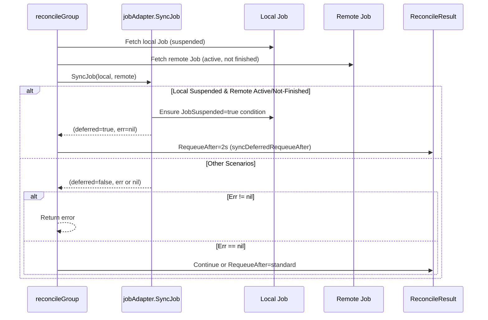

# PR #11867: fix status update for local job

**Summary**: fix status update for local job

**Sources**: https://github.com/kubernetes-sigs/kueue/pull/11867

**Last updated**: 2026-06-23T06:37:09Z

---

## Metadata

- **State**: closed (merged)
- **Author**: [@andrewseif](https://github.com/andrewseif)
- **Branch**: `issue-11115-fix-local-job-suspended-bug` → `main`
- **Created**: 2026-06-01T09:55:03Z
- **Updated**: 2026-06-23T06:37:09Z
- **Merged**: 2026-06-16T18:47:49Z
- **Closed**: 2026-06-16T18:47:49Z
- **Labels**: `kind/bug`, `release-note`, `lgtm`, `kind/flake`, `size/XL`, `approved`, `ok-to-test`, `cncf-cla: yes`
- **Assignees**: [@mimowo](https://github.com/mimowo), [@olekzabl](https://github.com/olekzabl)
- **Requested reviewers**: [@olekzabl](https://github.com/olekzabl), [@kshalot](https://github.com/kshalot), [@PBundyra](https://github.com/PBundyra)
- **Changed files**: 30   **+448 / -141**

## Description

<!--  Thanks for sending a pull request!  Here are some tips for you:

1. If this is your first time, please read our contributor guidelines: https://git.k8s.io/community/contributors/guide/first-contribution.md#your-first-contribution and developer guide https://git.k8s.io/community/contributors/devel/development.md#development-guide
2. Please label this pull request according to what type of issue you are addressing, especially if this is a release targeted pull request. For reference on required PR/issue labels, read here:
https://git.k8s.io/community/contributors/devel/sig-release/release.md#issuepr-kind-label
3. Ensure you have added or ran the appropriate tests for your PR: https://git.k8s.io/community/contributors/devel/sig-testing/testing.md
4. If you want *faster* PR reviews, read how: https://git.k8s.io/community/contributors/guide/pull-requests.md#best-practices-for-faster-reviews
5. If the PR is unfinished, see how to mark it: https://git.k8s.io/community/contributors/guide/pull-requests.md#marking-unfinished-pull-requests
-->

#### What type of PR is this?
/kind failing-test
/kind flake
/kind bug

<!--
Add one of the following kinds:
/kind bug
/kind cleanup
/kind documentation
/kind feature
/kind kep

Optionally add one or more of the following kinds if applicable:
/kind api-change
/kind deprecation
/kind failing-test
/kind flake
/kind regression

Please also consider setting the area:
/area tas
/area integrations
/area multikueue
/area dashboard
/area localization
/area testing
/area website
-->

#### What this PR does / why we need it:
Fix the "remaining case" (local Job is suspended, remote Job is unsuspended but not finished) in pkg/controller/jobs/job/job_multikueue_adapter.go:149, where the worker sends exactly one status update while the the local is still suspended.

#### Which issue(s) this PR fixes:
<!--
*Automatically closes linked issue when PR is merged.
Usage: `Fixes #<issue number>`, or `Fixes (paste link of issue)`.
_If PR is about `failing-tests or flakes`, please post the related issues/tests in a comment and do not use `Fixes`_*
-->
Fixes #11115 

#### Special notes for your reviewer:
ill attach my analysis and logs used in identifying the bug.
I understand that this can but classified as a not-bug but intended use case, in that situation we might want to change the test parameters? 

#### Does this PR introduce a user-facing change?
<!--
If no, just write "NONE" in the release-note block below.
If yes, a release note is required:
Enter your extended release note in the block below. If the PR requires additional action from users switching to the new release, include the string "action required".
-->
```release-note
MultiKueue: Fixed a bug that could leave stale status for Kubernetes Jobs in the manager
cluster when the worker-cluster Job reached steady state quickly and stopped getting
updates while the manager-cluster Job was still suspended.
```


<!-- This is an auto-generated comment: release notes by coderabbit.ai -->
## Summary by CodeRabbit

* **Bug Fixes**
  * Improved multi-queue job status synchronization when a local job is temporarily suspended: the controller now treats this as an intentional deferred sync and retries status reconciliation on a shorter interval instead of waiting for the usual timeout.
  * Updated eviction/reservation reconciliation paths to correctly handle deferred sync behavior without surfacing it as an error.

* **Tests**
  * Added regression coverage to confirm deferred sync results in the shorter requeue timing.
<!-- end of auto-generated comment: release notes by coderabbit.ai -->

## Discussion

### Comment by [@netlify[bot]](https://github.com/apps/netlify) — 2026-06-01T09:55:10Z

### <span aria-hidden="true">✅</span> Deploy Preview for *kubernetes-sigs-kueue* canceled.


|  Name | Link |
|:-:|------------------------|
|<span aria-hidden="true">🔨</span> Latest commit | e1e2966f1ce8d959c22d70a2e18c9fcac0740a78 |
|<span aria-hidden="true">🔍</span> Latest deploy log | https://app.netlify.com/projects/kubernetes-sigs-kueue/deploys/6a31900b6c4c6d0008c14277 |

### Comment by [@k8s-ci-robot](https://github.com/k8s-ci-robot) — 2026-06-01T09:55:14Z

Hi @andrewseif. Thanks for your PR.

I'm waiting for a [kubernetes-sigs](https://github.com/orgs/kubernetes-sigs/people) member to verify that this patch is reasonable to test. If it is, they should reply with `/ok-to-test` on its own line. Until that is done, I will not automatically test new commits in this PR, but the usual testing commands by org members will still work.

>[!TIP]
>**We noticed you've done this a few times! Consider [joining the org](https://git.k8s.io/community/community-membership.md#member) to skip this step and gain `/lgtm` and other bot rights.** We recommend asking approvers on your previous PRs to sponsor you.

Once the patch is verified, the new status will be reflected by the `ok-to-test` label.

I understand the commands that are listed [here](https://go.k8s.io/bot-commands?repo=kubernetes-sigs%2Fkueue).

<details>

Instructions for interacting with me using PR comments are available [here](https://git.k8s.io/community/contributors/guide/pull-requests.md).  If you have questions or suggestions related to my behavior, please file an issue against the [kubernetes-sigs/prow](https://github.com/kubernetes-sigs/prow/issues/new?title=Prow%20issue:) repository.
</details>

### Comment by [@mbobrovskyi](https://github.com/mbobrovskyi) — 2026-06-01T09:57:14Z

/ok-to-test

### Comment by [@andrewseif](https://github.com/andrewseif) — 2026-06-01T09:58:30Z

Here is my analysis 
[issue-11115-analysis.md](https://github.com/user-attachments/files/28460288/issue-11115-analysis.md)

and here are the fail logs used for reference
[mgr-kueue-ml9gk-0.log](https://github.com/user-attachments/files/28460300/mgr-kueue-ml9gk-0.log)
[mgr-kueue-w9r8h-0.log](https://github.com/user-attachments/files/28460302/mgr-kueue-w9r8h-0.log)
[w2-kueue-wl8kx-0.log](https://github.com/user-attachments/files/28460310/w2-kueue-wl8kx-0.log)
[w2-kueue-wzvnq-0.log](https://github.com/user-attachments/files/28460312/w2-kueue-wzvnq-0.log)
[w2-sched-0.log](https://github.com/user-attachments/files/28460315/w2-sched-0.log)
[w2cp-kubelet.log](https://github.com/user-attachments/files/28460316/w2cp-kubelet.log)
[11115-second-fail.txt](https://github.com/user-attachments/files/28460305/11115-second-fail.txt)
[w2-kcm-0.log](https://github.com/user-attachments/files/28460306/w2-kcm-0.log)
[w2-kubelet.log](https://github.com/user-attachments/files/28460307/w2-kubelet.log)


and this is the good run logs for comparison
[build-log.txt](https://github.com/user-attachments/files/28460335/build-log.txt)
[mgr-apiserver.log](https://github.com/user-attachments/files/28460336/mgr-apiserver.log)
[mgr-kueue-z7r8g-0.log](https://github.com/user-attachments/files/28460359/mgr-kueue-z7r8g-0.log)
[mgr-kueue-zjvpj-0.log](https://github.com/user-attachments/files/28460360/mgr-kueue-zjvpj-0.log)
[w2-apiserver.log](https://github.com/user-attachments/files/28460368/w2-apiserver.log)
[w2-kcm-0.log](https://github.com/user-attachments/files/28460377/w2-kcm-0.log)
[w2-kueue-b5kd4-0.log](https://github.com/user-attachments/files/28460379/w2-kueue-b5kd4-0.log)
[w2-kueue-xzcmd-0.log](https://github.com/user-attachments/files/28460385/w2-kueue-xzcmd-0.log)

### Comment by [@mimowo](https://github.com/mimowo) — 2026-06-10T19:57:10Z

@andrewseif @olekzabl let's see if we can finalize the bugfix for the next patch. It is also causing flakes https://github.com/kubernetes-sigs/kueue/issues/11115. If we have doubts about the fix we should probably plumb the tests for now to make the flakes not impacting other branches.

### Comment by [@mimowo](https://github.com/mimowo) — 2026-06-10T19:58:49Z

/test pull-kueue-test-e2e-extended-shard-1-main-1-35
/test pull-kueue-test-e2e-extended-shard-1-main-1-33 
/test pull-kueue-test-e2e-extended-shard-0-main-1-35
These are unrelated failures, retrying

### Comment by [@coderabbitai[bot]](https://github.com/apps/coderabbitai) — 2026-06-12T09:20:15Z

<!-- This is an auto-generated comment: summarize by coderabbit.ai -->
<!-- review_stack_entry_start -->

[](https://app.coderabbit.ai/change-stack/kubernetes-sigs/kueue/pull/11867?utm_source=github_walkthrough&utm_medium=github&utm_campaign=change_stack)

<!-- review_stack_entry_end -->
<!-- This is an auto-generated comment: review paused by coderabbit.ai -->

> [!NOTE]
> ## Reviews paused
> 
> It looks like this branch is under active development. To avoid overwhelming you with review comments due to an influx of new commits, CodeRabbit has automatically paused this review. You can configure this behavior by changing the `reviews.auto_review.auto_pause_after_reviewed_commits` setting.
> 
> Use the following commands to manage reviews:
> - `@coderabbitai resume` to resume automatic reviews.
> - `@coderabbitai review` to trigger a single review.
> 
> Use the checkboxes below for quick actions:
> - [ ] <!-- {"checkboxId": "7f6cc2e2-2e4e-497a-8c31-c9e4573e93d1"} --> ▶️ Resume reviews
> - [ ] <!-- {"checkboxId": "e9bb8d72-00e8-4f67-9cb2-caf3b22574fe"} --> 🔍 Trigger review

<!-- end of auto-generated comment: review paused by coderabbit.ai -->
<!-- walkthrough_start -->

<details>
<summary>📝 Walkthrough</summary>

## Walkthrough

This PR refactors deferred status synchronization for multikueue from a sentinel error model to an explicit boolean return value: `MultiKueueAdapter.SyncJob` now returns `(deferred bool, err error)` instead of only `error`. When a local Job remains suspended while its remote counterpart is active, status propagation is intentionally delayed and the reconciler requeues on a short 2-second interval instead of error paths or standard `workerLostTimeout`.

## Changes

**Deferred Status Sync for Suspended Jobs**

|Layer / File(s)|Summary|
|---|---|
|**MultiKueueAdapter interface contract** <br> `pkg/controller/jobframework/multikueue.go`|Changes `SyncJob` to return `(deferred bool, err error)` instead of `error`, with documentation clarifying that `deferred=true` indicates intentional status propagation skip and callers should requeue on a short timer.|
|**Job adapter deferred sync logic** <br> `pkg/controller/jobs/job/job_multikueue_adapter.go`|`determineStatusUpdate` returns `(*JobStatus, bool)` where bool indicates deferred; when local is suspended and remote is unsuspended but not finished, it sets `JobSuspended` condition and returns `deferred=true`. Other scenarios return `deferred=false`. `SyncJob` threads the deferred flag to callers.|
|**Job adapter tests** <br> `pkg/controller/jobs/job/job_multikueue_adapter_test.go`|`TestMultiKueueAdapter` cases refactored to discard deferred flag. `Test_multiKueueAdapter_SyncJob` now captures both return values, verifying deferred behavior. Added `Test_multiKueueAdapter_SyncJob_DeferredWhenLocalSuspended` regression test to verify deferred behavior when local Job is suspended and remote is active.|
|**All job framework adapters** <br> `pkg/controller/jobs/{appwrapper,jobset,kubeflow,leaderworkerset,mpijob,pod,ray,statefulset,trainjob}/\*multikueue_adapter.go`, `pkg/controller/admissionchecks/multikueue/externalframeworks/adapter.go`|All implementations updated to return `(bool, error)` instead of `error`. Most implementations always return `false` for deferred; only Job adapter returns non-false deferred. All error and success paths adjusted to pair boolean with error result.|
|**All adapter test suites** <br> `pkg/controller/jobs/\*/\*multikueue_adapter_test.go`, `pkg/controller/jobs/kubeflow/jobs/\*/\*multikueue_adapter_test.go`|Test tables across all job framework adapters refactored to handle `(bool, error)` return. Each test operation now captures `_, err := adapter.SyncJob(...)` and returns only `err`, discarding the deferred flag.|
|**Workload reconciliation deferred handling** <br> `pkg/controller/admissionchecks/multikueue/workload.go`|Adds `syncDeferredRequeueAfter` constant (2s) and updates `reconcileGroup` to capture deferred boolean from `SyncJob`. When deferred is true, returns `RequeueAfter: syncDeferredRequeueAfter` instead of error or standard timeout, enabling short-cycle retry for suspended-job scenarios.|
|**Workload integration test** <br> `pkg/controller/admissionchecks/multikueue/workload_test.go`|Adds `deferredSyncStubAdapter` test double and `TestReconcileGroup_SyncDeferred_ShortRequeue` test, verifying that when adapter returns `deferred=true`, `reconcileGroup` schedules short requeue matching `syncDeferredRequeueAfter` instead of `workerLostTimeout`.|

## Sequence Diagram(s)



## Estimated code review effort

🎯 3 (Moderate) | ⏱️ ~25 minutes

## Suggested labels

`area/multikueue`, `lgtm`, `size/L`

## Suggested reviewers

- olekzabl
- sohankunkerkar

## Poem

> 🐰 When local jobs sleep tight, and remotes run free,
> We defer the sync dance, for two seconds, you see,
> No premature waking from suspension's embrace,
> Just a quick requeue *hop* to check back in place! 🎯

</details>

<!-- walkthrough_end -->
<!-- pre_merge_checks_walkthrough_start -->

<details>
<summary>🚥 Pre-merge checks | ✅ 4 | ❌ 1</summary>

### ❌ Failed checks (1 warning)

|     Check name     | Status     | Explanation                                                                           | Resolution                                                                         |
| :----------------: | :--------- | :------------------------------------------------------------------------------------ | :--------------------------------------------------------------------------------- |
| Docstring Coverage | ⚠️ Warning | Docstring coverage is 13.64% which is insufficient. The required threshold is 80.00%. | Write docstrings for the functions missing them to satisfy the coverage threshold. |

<details>
<summary>✅ Passed checks (4 passed)</summary>

|         Check name         | Status   | Explanation                                                                                                                                                                                                                                   |
| :------------------------: | :------- | :-------------------------------------------------------------------------------------------------------------------------------------------------------------------------------------------------------------------------------------------- |
|         Title check        | ✅ Passed | The PR title 'fix status update for local job' is clear, concise, and directly summarizes the main change—a bug fix for job status synchronization in MultiKueue environments.                                                                |
|     Linked Issues check    | ✅ Passed | The PR comprehensively addresses the requirement from issue `#11115`: fixing the race condition in MultiKueue job status synchronization when local jobs are suspended while remote jobs are unsuspended, ensuring correct preemption behavior. |
| Out of Scope Changes check | ✅ Passed | All changes are scoped to MultiKueue job synchronization. Updates to adapter signatures and implementations across multiple job types (Job, AppWrapper, JobSet, Ray, etc.) are all necessary to support the new deferred-sync mechanism.      |
|      Description Check     | ✅ Passed | Check skipped - CodeRabbit’s high-level summary is enabled.                                                                                                                                                                                   |

</details>

<sub>✏️ Tip: You can configure your own custom pre-merge checks in the settings.</sub>

</details>

<!-- pre_merge_checks_walkthrough_end -->
<!-- finishing_touch_checkbox_start -->

<details>
<summary>✨ Finishing Touches</summary>

<details>
<summary>🧪 Generate unit tests (beta)</summary>

- [ ] <!-- {"checkboxId": "f47ac10b-58cc-4372-a567-0e02b2c3d479", "radioGroupId": "utg-output-choice-group-unknown_comment_id"} -->   Create PR with unit tests

</details>

</details>

<!-- finishing_touch_checkbox_end -->
<!-- tips_start -->

---


<sub>Comment `@coderabbitai help` to get the list of available commands and usage tips.</sub>

<!-- tips_end -->
<!-- internal state start -->


<!-- DwQgtGAEAqAWCWBnSTIEMB26CuAXA9mAOYCmGJATmriQCaQDG+Ats2bgFyQAOFk+AIwBWJBrngA3EsgEBPRvlqU0AgfFwA6NPEgQAfACgjoCEYDEZyAAUASpETZWaCrKNxUtyADN4AD2nokALYRChYuLAkkACy2AA24gDS2CQpkEKC9rIYDLAU+BjwAF7U8AWQcfhE8AwV+AzUdGGQAAbcANZEAPRMGLj5cXGUXRkCiCOCEwIA+szx4u0pKdNotGjcNBQaRPgt6LgV8OSQAIwALACcGjCRQSGQzJjwXtK4yEeBiNyizzX2DGRnGUuAB3SJYNB1BpxSAAKUyqAcXzISnoYPgQ0CFBIzHwNDhCOQ2AwSO+GFRdwOGDx3iOSEitAANJAIlEQfgKO1KGEmBRsWI4vJECjkCRfGgBfIClFELhqNgidw1vj0ZjWVC0DD4QJINjHkdkKSUXRrnAoj5fOhaLRsYhhcgIqgqACFOT1GUsB91aN7HLcAqsjk8gViqVygISLgQSQyA9MGhSHxMGiOVy+Aw4grNogNG5bp5UI9OU00MgLUdQkgHFEzCc6ycAKzM9G5FDISFeOJodoVyAAUQATH2Wa8WbBqJAxdx8PaeNicRsPUESOOJGU+F5tJnbc1Ygl4MlUlEyGv8hg2H0czcomg8LAOXP8GuKUxmLwV2REJIorR4AnqbKfyPJsf5xIgzJHBm2C/hgoSQkocoYiWGCarIX7ILQ9SOOw6Dkgob7OKUUh1EQZb5MwQR4rA3hbr2yb2NgDAAnaXjxCOsq6sS7YMPkdoPPM8DcJir7TuQl6QAAFIsR6uv0+CDJQ4H/Ay8SUMyiwRkMuDMgAglYACS9iUFIFAAJS5gYZo4BED4Su01IgkMtCkA644HI6Mgrmga4Pkw8T0NONB9KBgrLowXZ2r8JbvH0xr0FQrJ8BEmCBMERDMvRDhEC5bxjhONAcdwhFsNmDzwEQsBUjG9CrEIWYXgczxjlERybO+fpLr+XgvBQV5WQWfT5LQjEBNSkAKpQYCbgwva5JgLm4fQhbOFyaLqNRLTYkMpYkGA1I0Ht0otKatwWm2FQqCQTnoIaxQkF0AAaAAyEFug04iwQxYxysFmoKEo/B8JhDDYX0YZYHNsHSNcOnIPgXjNRdBUHNgSqNEp6qeOOyD8iQ341VgT0AOLQNE3jkfwQztCUAgwsEBzYgAjtg8A7usvBPn9XgU4g+DjhgiwC5Q7TONcNiiDhyM0Ri2A7h83DxHEYDSSkYDI2AxLqGA+oQnhCuDMrSy7SZzyyNr2hYNG2IshQ5WJk0ciQOQIKMPzC30UzLPW9iyMVhZFiQAA8sIojiFIZEsIcQtLXaKSIEY+mxzW9aNpAwOg7lHZdj2n2DsOUsNMKXAAER7kkRuQGCsZWPOb7iOUILrYEcz7irN60MwVZLrkojtJAADK97+XOMZ11ixKFJ9lQgmAvDruo8jspylSrPwEKV6m3JV+vCAVbPtscgvG/L/gq+oKsne4DQ9AECgByO48KGJhoxd5lEUubhiyCNxEgTiGw+A8DoC8JsU4AAGDQYCwEnCMr0Wg7YDgpVLMKCg9dPRYBaCQAcJBpjI22PgDgJwABsABmAAHGAYhJCLgtGbJEa2KUpyhyaO+BcaCFDEgOD4K69BEBDziPQEgzM/owPprqHEFtkAQOvOxA4YpRB4ACAmSRBwc5KFlF0akSgOASBOBoEhDZIHNEhGXA8Fc86yN7CeVmBQGoWSsryKIggRBiG/OdW+n5ZZRF5PyA4rC65LgjKudcoJwTN3jImK0l92yQF3rAfe89cCL1TCvG++BAhLzTOFLMalEaZO5HMQqtcNi4XkCDPk7BQoUAnr2aeCTD5JOPu0VJDp0ncxjOI3mstmInRaknOMhQXiyhipsS+QVcCCgggRVxn0ADChluCCSukcGUco1BxCPh7IRXtexHHDuIIg4Mwi33VMSJQFBBS9h9LKeUhpsi5DPKGdhzpvEFF/Gg/2lhZksAaoaRwRZXCWXzHYXG+NfTJmcCmTknZ8Au1asoVxBQI4UXVBpSg5ACpgC/KRSA8ywjc1LP0Ri/psS9MgO0MhiAwAzTAPkAQNI6TiE1KFIg85r6I08PRKcXYVk3zcpAE2Ph3pLm5pHSEaKKAYukFi8qyA2DMAjHwEEpZxHM1Zg7EgXgOQ3jwCwRoN9Xi9nZMPDmAI6B0KQuI18F4YKhGSgzEg3wJy9H6PAemHJkC9C/Oc9I+A6SfXVByQ5hQSjsNvocj49K/G2zXEMFyFkFWCHyBIRA7RZA6HZsmpovtPqO2nIBT6LQuj4HaGrQgyNjpv2svePgElkzYhBMKZ4plHzPiaCJbE4IvzEV/P+Gc4hajAUoKBJS1A5S5DorrVC6E4yckwiCLA6cGqSRaFWVWKcGxgHjIKdCGhmC0BaC2zUBRSLwABghLcTRKg4tFRRKN1FP4bM+vRIqkUA2jmqSSXpwoSKGiKlgFu4ghIyjQjQCiIlpTiSkhXF1Awhi9WZIgHuw14NKTRVpXSBkjIUBMsyF1FsCkRMoEeniM45VEaTHhfJ6ZMyykUsyDmz46L4WA/ifoEpzQPnyDSBoE1cLTqQAm+AuJ2STjfNjO6fKoiy1IDkKUCMfAoQ2UUXs6o0pnS1UlW45BfB+OoK2LaJAdqLVieVWAGyKrsvtYjNKjBbyzk7N2JR3VQ69iotyAQVAgzQzKiJ9JmpeYMWyq8bN/Kmq9B8EoHILVwinT8OdYkAJUEW2ZMjT1gCBFhTA9OKgttQq4i6vAbN6T3xSD6N4bOARb0oGmR9UI7mlWpmuJ3PzNs7aUCaIBwSmIsHvw/btT93FeIYWeD1SWo4+GQvbHhZIiqpXIBMl+JFkk9EkJISZ1bDZTLMn2qp/lvM2D8DGMZJoj6vHfw6+NDAW19UmexGAeRIM6vNWYBZetJBG14wRta9QVn0kiS0sxmy+QQjUWxGuD7/AEbMvwr8kzc8Hy/iQwqJbJJmieFrCcAA7CQsBzYm6MMAkOm+wnlnHHhmvd+6SozpLWGhCy/dsDHeZpU2QqXbi3mB66XmGzlTtsUK81g7Bpv0CXewcGzJsTDRmp9HwxFWKDE6X6HEwuoc2fuNy+M7D53hGp6Jho1JCjQg1Gg5AEkWiIHuQAEU1ZQKX4sWcpB0iAygex6ItFMYeJ3awNiUA0P3e52o9jwooNNH8WEGrgxbT/ainmivfeG7S232JouijAh9+hJATpOk1RKAgttPrCcY51i2iEULrKPqqKI74UFrk+gDyMx5fBCS10uCn6oXmuneUueiZ0Eoek1FnmRnOa1I25BmIE3C+X5TyB0sXYN2H3jYBd62PEjN/aCJqTALoJ+20aTH9AEg/W2s3wwdoyqKD0FI3aWedkExRGxGN1PeUDjGsyxGNOo2ajzBZOklCa5DkaALJ5ISBqYVAYRM0nxQsohPAD8i04giBcBmA3c8I0BupWY2ApNYccIvV5Iz0jlZQEoSAiA2cnY8RJ1+BFwCg/pO5qR0wfkcJNNucz1lAPlIAAAJWFEgXDJ2SHSGBaV1YLKXSAYmUmC6TScRXECQTUMlClKlGlOlGkBwZnFIPoKpR1DkdlM7OWLAfWJWNuNWV4DWQoXAc2D4F9RWQ2I8MAQVM2HWWRJSe9WdVaG6VVL2bNV4JSDmAJANbTaqbwLjRvDiR7PANveggGHxVzJFCyfQYwcAKAFENXTnQgWTVg/nIXPoLgXgI7FxMOAIR2Jgc5FQNQTQbQXQMAQwEwKAdwd4abayFIsgNIq/BgzI3UNAF2BwJwFwIIMpAXKgVQdQLQHQWIuI0wAwDoboWDeSeDLoC+LuAoHuM/cYLrNuLoTJVJfBDgAwYuHYgwAOHSfSYgRoog3hf5ZweTV2eaaQBOQaRQEaOokPJTVoS3HIG3Hqe3bZI8Z3TYPYYafvcoL1H6A4CSAcRAFtW+KYmEPhTQtwo8I1MJFoAPHIIPcRHLTONOZPYQl4hgCyAAVTRgKlaH5AWKQiJhB24D2Fvn5loExBaFGB0h902H90D0ED2EABwCJQd4ugQAXAJlxgkOQtioB9JYsog2S9Q8Q2QUlT56BFN6QeSeBqBYB2cogWhOS7c6A9hbQf9UByo6CNVeMf0bl/QMJG8KBaCjlNRlU0JHwzV4FAwHkChAFEBBRcwhSRSmlUlJw1xEUsBqSn1QhPNt8lTWgkSGAUTUAHI7MNgvEaocZIxZZJ44JKIQCUpVTMSNSABuSuMJNUipGOG2NICSSoY3H0e7I0ckJoP4qxb0tBbbRGYknIJCPgH2BM5AFoB3I2b4ygLgbEt49U2gDsr4l3CgYPEkGgVeCnFsyVCgu3DkRDdJI0gMbE86H2W2JocoSEaE1BFkUnLYAwN0xGNknwXqB1WvCsWYjuX7JodY6U3khsmaDZI5IqCIZkRElkgQYPZASMhoaM4QlVC3a3dMg9LMjvUQEk+DclGMbgVyJvJAZ7WcigJPElLAIJbydcAIvgQ3PaDEScPkD1ZkMRbeZ4wCrkg9dxapFqA4KAvkFgmCsgs0v6FoajJ6ftaAUnQBXAPYOA3soCwcp3YcvYJg9sz4/in4iycwSwHSBIVgj0VpRGJQXfcGOGBGKcTQ9cvgBWWmP4dgd0a4/cyAAAOWlCMCehWU9TdjoC4AAGozgBwugwAzgjA+widbtCiH9uCisXZNVNNOAYg6B4BHBtjdj9yxiJiegCg5IFIKALzO5IoFjIgliugVijY1ipTVhcFXhNigrX59jDjUiTiGIuiLj+C9KGSKQWg5CNAyhZjFlHgJ1yAXAugwrP1/57okNIhHhKSFzUY0TAhnYNQYQpZMImchhrhhS5Jpcmg0zSLQz+5/QBAGT1gfiMpWhRgCU2BMkNBPdOzGTXdfQmdsyZwVTQyUTsQ0S6LlyVVczhDzdrq6AABeIlEgQ9BjZNWisgsAfAbgSQiUjEwHAoDKOIK0z1HlZgZAUYdsa2R+e/JkO7eMyVOi7USAImAANUSBhmtGgPEVZWkFR1kVaGgFeHFl6AfJIDJMAW4GmFDL7LzKpprVwD4ueotVbEBOqTEBiWLM1C6HFPxDmKvmvLSt4QBBQgPnGi/F8NWQOtWCWu5HomQUoFyk2jAsbKGHJtRk1PhrR2EsdxIC7JHMnGEUGvSQAteN4pEt1oEskgNHHPoEnPNt7CEuYtYvYrwEPXEr2Mkukv+LRxOVuAUq7G9uUsnGbzUtto0pGu0uCnED0qgDKo8I4lYhyDQS4BaEJtlGJvArJvJKppIv7Lps0MZokgOAACoc0iANBoBTJRzWgwrISZi5i4rvNErkqjxUqT50q8EdgWgTKzLLioZaBrKTgwEGx7KwEnKXL2U3LxEIcvLupNCuBoh/LAqdjX4QqwAjBa6Iq4Nhg1qqANrUwkqBI24sqV6PbIADijiGrbtOiAU1cSr44gUVTtqvjdqtgTrWTZJnRX8VUSq0lxFkLAhpr+y9h6UUyIRKhYJvUbwME7djoZEQ8w804I9xd2FlVFQ+c/7NcvR+UgG8zHqKLPzcJjkdLqC4gdsCgHs8L6C3R2EjhfxhUJarQZa+BU1BJvgAp8gipAC9t3LcR8QkbFy5L1ROatRMgi7ZBFloRQphoqcBqGJkRyQbDNR8D2FWbS8wTrhZlmVFJ0BrZra2aN9PYZINz7B6ady2Akp0lVypRotEYRGCQdRUAuIFQyRUR3b9ivalLf95LRAA6vGKdVLUF1KeAI7agdLo6H6oBF6bJeFdT5RrZUYMGU7n7vdmHmTkTBAJIxBfBmQRHZkNl2BJccQJT8mis+h1ISBSCbzVgDK0A2BmRD5qgMAq7mg2hOhwrbioqph1qPsD6W6Uh8Fu7IBdBIAAAxciFOiSDQaZ0yKZmZ3C/IEcgwYZ6oghVoOZjQWZ6ZzZySO6+gUBshhZhZjkKunu8gcyq4geyAKyk4Oyyhce/+VygXaezyycOe1BBepe5gbKowCAde8Y9puunewQcYUYKYWYI+o2FYV+k+3Y3Ky+powq2+ine+owFoLrL3XWmF9+j8sgl2KcrWiSA55kBClp+iCaOi3BqXQSrsUIarNM0ZFZOa25fEvnLqjEmaAGKuRKRGKRgpLMWEtINA0BFKL6tBP6K6QlGoMAa5e5MavTXAHuOi+x7UQATAI2zBGuKwl1QRJFF6AWhtRmXjTfjRt6NKR/7Wz1nNx08SW+QWnygiZIwugrB9MH0txzssyGtG4f11ALWEb1m9mdsMQWmJIHwWgJJA37S+wIoB1tQ+w7WtXYxJXAJahlzUAQjr5zI0WEJKBaCSAjWFRWXGg9hIyCW2yJJi6BBXXdENBDW/QFQCL8B5Iq78df4qWHqnq9gChQomD1Q2T7HyzUQim+HpMSQXG4pyGuE6Q+F5TAygxszLt1Rpbfc+B4VgpSHpH8BRoaQOYuHGh6zin8QLd62cwdJXEpA4HRnbJFcGsggvMlXJJ7HnGFGh3KJf5B3zVAYfr8RZSZ3aA6zfWy3WgAAyHmkgbUf3E9ripudt2ge6614UOB4Unx0iu9oMiCORMdncYR+oRiw18dissiuBd0coVAVOghrgJqfadAOIbEVYeQcjlIWhO+DEx1alL6orZV3DqEk9hjV16QLoYUXKHVt5EjjADKPCID6zJgbgReGDvZ/Bpjz1xKb1yiv1n224MUOC2pbj8FY0yueToCxT5692owM+qSzYLx32n8XxwiU3NXQJ9lB8TSjZMJqOzj35geOJklbxCyq5t8jJgQLJ3AS0F1MUTQb5WKXTXJ7j0pnAgpvoDQOL8p79kgZLg4DMMpiLhL7SSC+QJJb4HMWp5fIqAEWgYrkgZsQWirhp22Jp30AvIgFpj4NpyYre6Y4FsYKYcF/pnBZdpkru4Z5Z1oBCvYQAJMJ1niXjmzI9hQ2MEMWdrmG9guhVrBAenNqUmsWluatgNI9ayLJTLzm+7SArmrKBwR7KEGwHnhMnmAZwdXnvL56OCzMfm16N7AX2uumIbuvRgIXW4oX+vKAMrZRYWcrJK8rjjr6zjuiUWLKH7U7XhNvFqV29hEn0Z+J9xgMWRwDdpC4VSvqZKCg9gpGq2ljvGpHWhAe373yNmyWYlw3I27cq6kKEzew9J9ISXm9XP1BpGkAGhL9exYOUD4pNa3MMBQpME+RK0DAEfZQ/vy4X7mGc7Au9hwuRQ75kBvhEK8fg7vgxArP0lIJMwAZIQhfkztoMAyUpZvzmU2yqf0mwzMntmWmfySVewnCWgdhcAabqWTNPe8R42RyMo7QFa2yvfA+9hgIH2Wgr4NBlVEvYGJPYyUFFavefeNS4xFXIg2zY/4/NA9nBKHwjMWadp5WrQ7TIRsQcbG67Mf0Who2pXHeZh0/aAAB1cEFi6ERnF9jP+W1BQXhTzthdrAFVzIPUSReR1x68hATESvw948GNv4JGpxsdnvgmegaj39hkCyHSXgl2VEGoW7KWWX3AeXsxRXld5Xpv6YFv9vsgTvzUbvqfsitB8v4rAVZRvnRGRAOpmUAj1EJRrziOQvJQQBOSfnFDkZI05aWAZ9s/1ej7wqgtoOMiOwcavl7eOLWnpHwFYEsyC03P3oPwIamczOHjSzvZ2s4cs/G9nAJiHSCZh0QmWlNzuIAiaedRmiWdhKsFRAp006p/Bbhf02BX9tQN/ICnfwwAP84gT/OKEXUgCl1DUsECus1wwSb1OmMxb7mC1+69doWSvTursDe66DDuAQX+tZQuBgJ7KZCa7sTn+juUZ6bzHyp81/DL1gqfzd7m12UHDAG6qORYu0GWKQtW6avSVJqHW6phxg9vHYFsVPrwt8qUPIqnfTh5otkeTJHFlxR/p+dyYkcAlmL1CiplRu3jdIYWiJZNtDmpLOBlZBKj3gN+sKQUpAHFiupuCAQHDsbi4hEoxAMZHIqHFdJVDIwa5cOLyw5C2hRIJ+MDq0LECpYQC/eQtEZVwBXszklaIUgjFAooDnEocc6LFXFrpQWOa+dHvMN+qLCxAAqP8K0A2E0BxYI7YOLkRmFBwVOSASrix2xLIAB2J7VISiluCDC1wpvbEgW0QCVoz2w2GjjCGfKwBDQ94BdMqXN5GYsAOA6QpmD6Q0dgarQBDkzQM7vtGIzEcYNoRiz0NbsrwxGJL0WYa1kK7jT2qQNkreN1Q/tOzsSOoFolgmLnSOkwI876V+43nLxONAJKWU4RiWSSJCGLrxDiMA8Gntk1kjhckuEVcLjF2hDpdwoWXJLjl2HYlMcuko9gNKKy4VN8uEjaGBVy+AcZyuv/Kru3W1H1NAY5UD4IQQrAtpshE3FoInVqB1ppBPIsyHyMC7BdQuIo3TMKKi65c8m8ozLoqPS6yiaAEo70Yl19F5cWQaoorr/01FlcauHpaUtGMabGjXUsEFtPkPki2tFmCgmuh91cHRV3BHoTwd4P+6+DdM6KAIXvV6achghMLLumcwMF+drKRCeykQnMG3crBD3d5r5UXr2Dvmp9XQUoMioqCQWNVbgCCCoDcAteQ4kcezCB4aCQhBCH5hEMh7sob65xGIVcXh68DUmK7B3iiVf5o8N8UfaiJCH6p0k1uZYjbgJExZ2jRymwRBrBjzw9FjuuyXKDgIK7mgKYOIjkOy3DZTcihZKUoYoDxbqdy28ItMfaxH7cdua8/VoI604rSxtwAQCSEb2gi9h9oU0QBHhD9Kmi4ayFOilqQSBq4WggY/0OIDiAaAXWWfD4ZgNcLfiChaYk5om3dKDCdhciXwHBSvAiCD2KAzCNuxYlwUMOjAOjoSSPGQ5BhLQHSGONb6jites3YVuPggY6djcyIBgElUjBoBEMkYZ7F1isJpASo0tOUEn3ChGZGuIZPXltSIy0AAAQrIEPQmZS2mtYCQFmuFgd0uSXQSSQFp4tNqsOrNyQqQiAEjz6njMgdTj9q2dA6DnGgU53DoMDJw7nGOl5yIAoQfOLIpJiGX5EhdBRroyLjQGi4DUAxOXJUYU1S55SpRwYrkKqMK4aANRpXOgNGOqb6jrh8YrACaKTHTdq6rXDpv2M67BCxxk4scW4J6lSTpxPg5YLOPG6pTHR2zXUc0ljE6jDR9XZqU10kg/iqGGY9qUC2irfd2YvU8cVtMGkUAz+bcTQVuOrEGB9BFzfutZQu5XcDAzlR5pPWeb3dIcj3D5s9wqivcnBALFwZ1I2mDjdpU4nMQNP+kHSAer9YHpoFCHzjweCLAqsuJh7fZYhBgZDifyR6v1mO6oAuDtFcjOoYcLQdATT2d5cVLse49/tyhqA88ykS1ZkeoDjLIUmgkIuOCummBpjIAHAe6kwy3EYCCZR6PCKyHBGa014oUdUAhWzxxkW8zERGAjg0pjp0UauX8L4nULIUeG40pvlRLwmaAZEJVSuCqnZgFM/6fbZcocICArDewgwv6X1IoDclmQbJZcoI0eGpd0AgM82ZbMgDWz7kenAMNVkGFV45GZsrXudA/a0BnZ9EV2TkAEnr4jZXcT6KbMdla9mQrfQWvpCiziBuEFAHSBgH2heNAQtMeUnjxzBmdzOgU4keQLJFhTKRodL9jSMYG6UH6RlcgAd17qGDrmZCeyo5RukT1+cd3Dyk9PbFcAWKIId6aFSzHfSpgoLEFk6whqRhgZR4I6QNznHhCoZkQpcdD2KoIz0WF4xbhzPfJJC4y00fPO/wPHYjd6v/c8fuEvGoziGoeDjA+P4JPiaZCZUMd8Dtkfj9at8GiamOm5V1rggfZzoqS/Kwp1OcIxyW7gganoAYQsnIOhM2BNAEKkkLPOXWZBoi7h0pBSVzVEmGtIwzHeiFhV1Icgce9syoCWlRjTcNGkADiVsKPboLYJWnYZCCKp6ASgOlooBSZiUBxpNhxtIiaEVInkTcgHw9ljJ3y63ADWggfuBgvdnsTtWzwqCUIoEAiLYJ3Ev+bxNlD8S7JOEwBenmF5hzNhkilAdItkV7AsRStEdi5NmRuTpeElAKUSOWzFzQp/jFShFOpGhMYpdIuKdEzKH2AmRCTVkf5ytFLTpBG4rbiuxbSczpmkAM0VQzGmWiORRLPxevL4G8jgl1wZMctPTFtS+x29H6V1wnm4AR5k8mcVWJ0H5yA40QJ4EMgOCjNLUac1CEUEoA1jzpJ3S6fZWum3Sbu90zudYOekdivmA8/5mko64ZLR5x2bJVkqnkjTQZ2gsIXCwXmLimgsMleWuJuIE1EesSzcctQx5AY1Qo4XOYBIp64zsW+MmZiAwpm/lb5AC+mQEFajG0mZCzDRbzPU4ZCGOifMIHRgnIIw5ZocCXgS1XSMMAuKsgmZ0nmAizkp+7c+GON1kkjbgIc2oIbLlSRzQggwrJc7MhViK7Z8KsebgERU2yHhnsqCd7PsZZL/Z//HkgZKRXQqyob6OFVBKyVxyE5ScqKKnPTl4hM55eJyLyVznXAjK/AHllLGvQ1BOeevJziHHZq1cboKfYkVbF86XN/JFnQnj7WCk2dFKVAuxVSLoGVynF1czzrXJIC1LjubIqys3IcrNjWlrY7ubYJEKwpulzgjqekpHldA0UMKEEDaqEBoBfAag51eoOGl9cxlmVCGfPPPoQ8r6S86IbD3mUGAi2VmQRQT29qCU2BxIj4F1ix4YzZwMeFrtwJRnbcqSyYWknjJV53KA0omM5TIHkCkyZoEyI5W72fR4Qkc/PE/OqGPIcQIRmoIVpJ1F6fRu2AilUqN0BWazX+OsorM0RJBwVWc6Aa/J6kxkKATYsELgIcN7DGyo5Ui2EDpAehB5EM9yXsLbOqxz8dFC6pdR/UQk5Bje8JWMPUL+g+hEQhK/9gZPVA/9DsbJQ2WStWGpdeSqFHyEqgkUql45eoxOTpRTlpyM5puQSuvmZGAFoRWcpyFKsLlWK5VFA8kctjLm0CK5ji8JvSKgCartVjcvVS3MNUdzjVs9U1Z2ICrdjHBg8r6dau+52rp4NqoqNaCGBgsqNNJEgO6sLGjKtB3queZMr9XQyohyLeGSGqRmprllAS1ZeqBaCRrwY0apOsSKYLxqNlHELZTb1/LvxBFiQ05Y2qURtkrlduFmWzOzW/KDlJmW5UrQAaPLraRmW2q8vVSShc1dqJTfss2bE8YcaswFc+U2AQwLKK5R1OHJlJF8JQh4lzGICmrKa9kuHNBK9Cggn4tlTBadc+nvUmyoJLrajeB0EArrGyn0QRslplyhBbZuK3Tqer+Rr9L1twJDICFFpwEP1001YF+uCg/qGVHUJFKr2ZUmhClhImVUIxCkKqKRSq8uc50Q2xTImhlYyqdIbl1im5mGtuXdOw0vMTVT3PuRas+lWq+lNq8jbCko2yB88uQWjato5C5ARlnqljSDx9XsaL6i8mZcvNXFQwH6YaqavxtPkbyfi+NHXqJrIH8odlOmlEhmvJCz8dV+rZTTgOxSJSvElHMcqZtlkWbS1Vm7EQkpd7MoQRU9SMsgl1J0U61DqABmcu8YtBpgzHV3udmxHZD/yjyrZKopxHFCEAcqRQL8GFSkd2woKvtcwToxqF5AEoH4VevuRJ4uwVmTZZjNC0HrGG0oSAMBv2YMcytqSSrcnKKz0q/1slEBnjE+igaTQ/YZvMwnoDQ1EwbdLJFYFkDQAttsAARsrhFUK1iR4/D4Ilj87gbLFsqnxu1tg2db4N3W6KUhrikcrHOdAJqj1qYFCgPFEq87fXKO7ob9Vrc5pRYKnqPTcNT3fDQ4NXofTelX3QcUtodXfdcAXgMFgnsY0LAQZe28GWxrB4cbjtpxINTxvO1GBLtWBZGQJqvH3ax10nHGa9o/rvb6Nf8dkIALSA4CCilM4ybWtZj1r+ZqOgnaz1bXi921I3KXoCrOpdgAQy6HtdTv5wDq6dYOxnWRjWXdZRS2JXkkVpFplAzcSEmtadEA33Z+dtfNkJnlaBC7pSIuulb+sZX/rzosui9Y+MYaQkKs/86rG8ss25DQguytJpDvZbhcv6gvWBk/Or1BcCZpulreCvlWUCOtuvLrVFNc5qrmBBgTVd7trGXNrKfurDc0TaVti8NXSnsZHqHmkaY9TOTVBRu+6+AiAoDWUGC1IPkHcAKe+AIdKp5gzQe5nf1Yi1mVnaXICykvTdriVB9EYiauoc9qr17KJpem8VUCo3xY7rYoFWmfQALXUSNNfILTezISG2ayWPMhEjgOM1A6Xln+eWfIFf0Q6t5dmRXI5puCoBnNMskFUJBp1epB19O4dT8Ok3HUt5YAKtsKCvyc6eQ3OgMlRGH5wid90MY/RVtpXVaJddW86Ejhx7r8/DvrdNg1toDAGwp1iy3Wjjg2RT6BMB+3X1tQ2Dafdw2jDQarG0tKJtwemwaHuwNEaeleBhbWRsIP2rbVdR6eGC1j20H6D+SiZVnqO3TLc93GnVfD2U0qLLWb8woStNHLPKzN6QAVs/OY6tQhojEGclzzJn3wChYI7xnQ0P4qhIgPLX1lr00yYFPgJ7T6v3vtLXAyF2i7YYKsUW5Rzcmm+6mzMKBxA3cw5bwJGHqp0t3xzknLi9RY7PkH29w25HbPIVRADFHCkiWRNda8LsJQxztmNTmHnH8Q8isglcf4kydOO3/PXnbPsa3xhJ+LKCcxPUm5QtJbcB4KpOVCQhzcsizbtEzQDfGMwRktssrroBWSu2jEylUlpMykqgTQw3LgYcYXqLERh4jAGUkElLhhZTWixSAeSPgGrdkBm3dAdpHqr9KrigCX9viae76lys7UE6IykRcXRHo2Ll6PynBjPjWXBUUGJlEhjXx4YkrlqNqnVdZpjUhrlhPNGanMmAosLplL1NijNQxUn0RaZNPxcSpFpsqQ/PVERjqp9UqaakjjF1cExjXJJbRI/mpLqj0errrHoaMRh7VzRxo7ClaNp7jpuwSSKChMiU9X6AAbSsD9BoAzIaAAAF03a+cs+sUsGSjhylmISpYKGqUUA0N+Rq6WgcsGTaQ9L0sPYRoj3Eb5tqZ8YNtHOTUYhOXQac5QFnO5KPVM8v3Ads6MsGYZp24NQXtDVeLWg/iu0duJr3pID5wmo+fvU5BbUBNpiII7QCvFdAPcpe8+Ti0/r3iCibsE5S+LVFPzshr8lMSMZSV/jIwbiwY/63DYgSFmYEgapBJQFEw+w0AOCdjvdwSRILDxlpkRS5MtAnopmygGVsoB6KaOdHWgEWtYnDJJIrDMcWuoeGXVPImmEgOZFIVvr7ZiJ6jtQty47GzqzgJRHv3tnYXcLFAfCxQEIsFF5Jray4ySblBknmFUFdjrJ0F79w9ezHTxMZOwuXQwIGisSTVqUpu49GJhUCJJgMlCdnsm3OaR8C7CaRgh2l03NcHKVKZJkvLHyRTzAuEtIL+kBKdqikrEXZAfYMi28AkhM8WmWItTCscwBdAYFRUVmEU07CuZGG/VX7R7sSMG8Ld0p1I9bvSOqqsjnnZU7EwSlqnxDbIyJaHOiXF1Dzr9IJWlOdHui3R2U/U+KMNNBnlRRUhq36aashmrTlU8M7adml1SYzRopqYmMWnZCWuUegcV1wXMUAlz2Sia1NZ22rmtgg3C0T4pKtlXmGFVx0e6b1M1XRRuUlq+aaasBnysREgqSl3athjOrNpqMT1ftMGjHTC0hM+/KKGtNRrXU+cwJamtvXVgi5zeL1GXNMbdtBZ7urkaQMXTrmfZoo4Hoeldyhzvldgi9xwPjn1pNqmaz9bnMo3iwv1ngSuYYPjLIZ2e7o0ixXE7mODiMjBNdoV4rLXcIIkTVrzE3eAY1y2XtrPhlB69yd5epNUTP3PYnIoCUg9ijtU0ESADX4jHRydb2KbjwVDVpo8tuU4C21g+kctcBrgeUnSgs7Pt4kqAOAdwBLLGu/s3kiG7N/y/Cc/tLXsr0kt7KWEwn15UCWG8Zb6jytqBiHf6SVoKSlZg1pXZTGV13YqZQ0DazpX2+sfZRIT9mg90Nso8OYqNjmqjJGmo4OLfDwAwWcdvM9PNnEdHmDnGwNb0dRYy9At83Z89t1f6/1vGB8k8QIECFXm01KPdVnv3Hxb13z+hltW/oAt0SZuTym2gRM7UyJ/x5Q3E6oqMmhQ4CqFxyaBOW5Wsh7TsYNr8Q81ug+9C7bYwq2QzB1tOc6lAbbIkiYX4TsFYZC2gfDkA6AclU1NVFOPMXBhrFmkOxZRNuSYk8VqRdEAMjLqHZ1hgIO+GCAYhX8gtQ+v9ckt6S1Jhk5wG2TA4QdFLogDQDYGJBWA8CDAWQGZKfhMnrJ3jZlP/LlBchqKBkhhYPZtbNWSpbkjyYJQpjqh+qiEGEAS2dtFyoNJc2xR7YcV27et2VkCyqY90FXvFUSnUKVbzuBKHRKsza9Vayk7XPRpp468afn6+n9rhUs6xVKqndWDRvVh07GYGvxnWpz1lM2NeWKLIE7qjwQHNdGmQAlrzDmJdwcpv2iMBXD2q9tZyl8PAzrVwqYdYy5GngzlTUM9aekARm7Teovq/NMGsPXAL9ExR9HcnNJV1HAgfx/HY0d5K0mJ0v2+hvBsB6Wxg5sO50q7GzaXr/SoJ2o+CczBQnl/XG76q6MBqTteevo5wfJvn8DHzHYUCZD+j8HWgj2j0OJp9Ir524dUOjH/Re3CHdNBtx2PDoSknKkdKmqEWjpFs97pyd+sW/qy0PjGQdehokvzIAOYDAVxM4vdU6J6URfwVWB8Dq0xlTqRT0W2dRSpQGJ2xGd50/aEYv3EjIj2cm/diWosAmN19s/ZwIHS1XP9ONzwYXc+zKWpj1MIV52evy0cmtnSZHZ7c4Cd+GWghzkI2LvP21aSQhDa/SQ8g2u3S56Vqh5kZof6UcjET/I6gYhsxPSjHS3ueaoRtR2JzyjpqooBJe0BNH7RvGzk9YPbn89JNn5SiXKBrz9HgmvaruK5unnXWfVSHCXbLvtBrzLLsvV3bfNiBKOVIf+Wg+SXeOTNOhuW9MeAsxN6F9ktRYhxo4nooGpSGKX5FijCEYFctEBRq4cBMRcaCue0sGBDRHIOKr4VZ3wCcJskxo04egKygpq8kJIy5exo64FOpduZ9ANkp6+ddEKa87AV15dUVwBv2GPARQN/CbhgdGLJQuh7whIkwgXgWfAQ1EA9eKBmQObM0r3U97kkKumCytUgF+PZ9QD9gX/rEiuh+yrR9nFVJme1QEUgE1MgBZhM+g9raAjTjfPg8hwHMwRVlGBaqZ86wvzdpImxYqsocqqvbcBqJgm/cV5Wkp8zlOstZYerX2HRj9KR6d1PujvTcQYR9lwOtCO9r+70R/Y46sSOrrUjm6w1NkdOmWpLpoq9aJXdsPNg61zhxu62s8OzHBp/h7Y4PdGKj3J13LmI7DOXWap111xzI/6u3vFpTdpMz46JevXHXZLil2E4KXovkD1zM4KNuidGrYnuL16bAESdKPEPpLx1yh8yesbU7C43Jz0aJt0u9KRe7EUU7PnpqOds4WvVmtadam/lBhmnB/yhGFqoy5a6zeaA73I7753e5tYrL72q2O14SrtW5qsNgq59fEdUE4a+hpYX8I8HyAqF56TPtb+rGZ0AfFPSqkjZDsdxAad2TvqHzi7I77aG0YebmdzJsVi9w84ue5flBJwS8tVI3vuVAWQNzTQCyByPs8qj1Mpo+E24ZBT7O0YewZRAbAQXhfcSboUuX6esHp6zK4mOdv5bn4mGIrj7tmxNDkt/4fU8Yc5D+ZfJ4UGmLgZnHeGFx3IovZoWIxhXLqI4AzNvgsLiC+7V+aCYxDgmKJUHKE/62bfDHm7LTUw7V/tnMSkGPExrxxfFc92hj8I4Beq5YIHsHA+EinIYrlFYPw5qsxUtyGSh8zpPIn1oCYvDmq9Jbxtl0iZ4g0ju2tqVoOlZ4Q02fvbflRV4O+ZGLvXTgB+ZsNcUHEfkn/nwL8F4yezyIlkOpaYmYy8A/fHxL4H/55C9rnCzc3Us8wwrNVmaz9ZqZLtx0qFoLz5Y/lxXZ+KmQezjnqJ+3PQM4a4ndggjUR7h+vX/PUEOjNFSZ+0Z+BYPoHlk8O2bmuNdH6L0jLZ85J9pnP/adoLRm3B+DWMjLkIY/1GGxD8z7xn6WcM5rtZC+lnpKnpsSaCgY1bQxMd5NGe9N130gsX180vB/NHhn9PJp86I6xPvTtIHAQx3B8/tF1ZWiLwAYBWVpaO/HVJ6GOwMnN0szX92u1mT7+16EcZJkJHUHshg0hcrDTZlXE8Nb2Opgk4TUylg/gdUsACwSq1i7Pq3UfTbcEz/Z/Rdk0a/f8GK3r6udyE+vGOtsJrrV1uaLyC+r8ODCEvsgfJsL8hreI3J0RoirbPMOcNlE18Yd61rANu2nv9i6z8i9s8aqBtxAywM2eeCtmKlSmWQF2bJ+g2Cj/uynwOfc9YGvPlRnz593h9BewW/npO8xoo/7bM9adnPZF7mW7m+NSywV6jJBFS+tP8iCgDNDr6G+DbCvjl8OrWoigPuyQghdgy4f0FPJ96kokAMKTjOFOMb7g6oFBt5UUCMLrYqG+ti2yTgPmsAjm+TnLTbsI1vtjrt6J5Pb7Am+wujoaKUnIIp/6qOsWrkyczqyLnQvalPrh+Q6ip4XULOjdhLiwtECAzgVflvreIxmFXDWwILjSrfq4LtZaS6LxvlbAaV+vEYj+ZbuQ7juz3rbrT+b3ggYb+Gplv7B2UNu0oeeI5vT4IeQPkF5nkAICD6mBOCKL6MG65rf4E2bBsTYMeXNhGr4BNTlr51OrTMx63ae1FJoCQWPOAG4s7/hCSy+etk3yYKPNqyYyG3Jv06FugiIsYlqCsvfLCaNAapqK293CrbtqP6FsoIBBntiK/+UOiYbSAAKv1qcq9CPjT22X7JbbsobfiIo4YNQE4iXGpXk7a3eZuqP7QaCLhO4veagdO79a5AJoG6qmLjh4lGodvh4za3nnNq+eg4kaSao8QHOZTBCuEJxI+C1jf7UeNLvk5Z2jHsy4U2rLtTw5qEJAUB7G8Drxa8uZ4k1jE+e1HeKiuLHKl6Tc0PqMat2wOhThyuHdlZA1uHoFXb369qkq6E6y3lgEXIi8Mxb2MRrNMHiCkYHZgYAqrPfDuUq8BJC7sQ/krKksdCEeob2A8MrgK4sinUCEK31I+hm4sIdwyMMMCnATHW7lnqQTCUwuSB7Arbk1wGS69nV74gQIWiGghmoN5ZzeZuLyZoWGIOyyUWyKtiSMWxwr9TTqG5O5CaceENcGVez1Gq6QMa3sJrWOrkhd6G2mgM0GSm5nikYT+yqp0EKm3QTlZzu/2p4opSD7r4qsOL/mtYcOWpsY5Cin7nVY+mAHoI7/uP7o1Ynu5UiB5OOkjtcLSOt1je73WCjjo7FWT7kaFrulVjqamOlobu7Wh/poe52hljqdanu51ue5gel7hB7uhUHp6HpedwSNaA+NqnMEzBTrJmHp4WNv9bzWgzH0GncFPuNpU+eHh55w2b0mMFJOGYaiFZh2SjmELBVgdz4bm6dnk6Z2CMk/6ygZwbwYRA84OzYCG2MorhoBfuMpr/+GDPA7hBfNgmTrkElq/IDOeEJIbi2eAi1yPKBhk8FD6ZhqLKj6abtp5lAAYMbZTOADHkF7AsoLICYg2DEdT76SkDHgcUt+qd7OARABnCa88tHQJCyCuhb56cwIUJx66/fNESKhZnvC4UOKgfKZVycBhoHA2dSrqoNiYAEHaueQwXoH7+dPtWHph8elQBHASeuhEYAF/gDaheVLrz4Z2/PlnZWQmwcU7bBx5rixd27wbXa7CqAIXbYqJ3gLIPK4SuV6MRo3kmYKuoFhK7KuEFmPZM8DEjBaiSMEvZqDAZYFuBFMhOug5VeUFiyb2yqElqhnIsSJmoO07rLaDUhx9myY6g7Fu8Dz2pbv8b6cIJjlycK/XjwqDegzoSxPUQbHECeSeDoIaDApPPy5MWSIbSFRAPoKfbIm6wkihNCwnMiHkcFsCiReStwHiqCAVdrpJkmgnHrwEmcqB6pf2ZJnhjbQvUCZLAOzZjDTMmsot0KbkrNkKicQwUIdgluTii4AFasYJybIh+JuDq8RGDsAB3qCFHoAKCcAQjC8etwNVFXeoOjd7z+EpoBGjuKoeFJqhqgRqHIa73m4pQB0mF4op067lVYmOFoTu57ugHn6JpcoYW1bRh4jl1YXuroVe61cSYR44KOaYQz7JO7GBhGTA+0dhEhO2NvkoQ+AYZu5Bh00QtFWO4YRY4iOUYY6GOOkYnGFrRCYde6bR8jimEpK8HhMFdcR0ZhEWwOEQWHhODnpv4lhxRmWF7+T3JWGEeKEbtE2qAMYdFYRwMTjaUe+EW2G0eUXusH7mXBlsFXiVdpU6LO5ugfKgBinrnZ+h6AaEFV2DagJ6A69UbobvK9doxHCan+sYaFC2AWgS4B65C4HlAcOuEG2+JAbTFpA84Zjpi2rvnAjUSPvu75++m4TUT8ATELLBDY8+up65ymzuvgzqsKvbLQAWEdqBKQJolRZRynCKTi+SSrA86paDwnupha8JJajBRjjHlrP8dZPRDCaoLuIGUAELjpYxSURr5KwACgVKbj+PUVAYZG/UQ7r2eeRo55D0jSjoEYGU2uHYH+Y5oYAGAVRDFITGyRJjHYErRFQAdEp2gUR9ExRIMRlEsRMnHyx58BCC6o6cdajsAXABehIQZYbTD1AfcGwZeYC0LnFFEAxKUTDEFREYBlmAAN7FwzcSQCJyxcBwD9xVxNMBnAZwAwAkIXgCcC0AFwA2BEIRCCcDFwjIMXD/Cw8WvHphuYvFS9wBYqnqt0dUvggrxxcDcioI+gsPGLxq8SiDnxHAGQhnAq8bMobxZVHRTEgz3ibQMALfIzR60xPF5GYAwJKCQto8+M9h7MWKG7JGMIscJgO0azpIok0TZMAigI/gRrTnUGJO8QyEx8W5QWSxZO0DfIb4EMCsSSSBvHTwxcAAC+jIH3EDxQ8SPEDx0wFjhEIZCGQhVsZCAOAXAZCAwBEIx8evEjxNYdvFN0Xgh/b7xKQKrobEOwMfGnxuADfHkIA4FfHkgEiXfEPxy8k/EduWYHRRikOKoLS0ghQH+y8kr5pAHqAsjEuEmYOClIYhSqHOsbvQc5F66MIcQb6z7QimhOB7M50KzCGYsfo1CxYqAHOy5AL8KvEYJWCTgnAY+CbICEJsKCQlkJo8VDCUJYSaQDTAUCHQkkIWOGQiNgDAGcAkIHCYqQbx3CZeSN0+Yvwl0GKVIfEiJD8XKBnxKyMPFnAYCGQjSJtADfFnAJwBcDyJRVBvHIc6oHVJekNQOwgeJwZEuGUsBfKCIpQ9LIkJZkTUA4moAlkUBKfAZjNrSdkltAqCC8PFKRRfxltJl5q4BhowhUMXicXA+JDcX4l4JC8BvGYEBGiEnkJVxBEnUJDYFWxoAs8WgANg0CGQhY4qSREDpJW8ZkkeCCVHwm9cQidKRHxhSc4DiJJSRwANgA4PfHFw18X8kNgySfUkAojSe6Q9OtoMZDnkfNOygtJ/wnhjixxFKbSkUuDpHCIJnrFgAwKvrIBAFBqikLJUMjbq/gIkcycAzkUaQL6zUUtsOogHssCY+TsIkyUOR3a9LE7SygbFAAiu0aOhSl5kCyWJToJAuJglbJLAP4m7JI8fsmOAhyZEmDxtABvHUJYCCQAnAd8QOC0AAgFPFrA9ybACPJCMTwnZJ7yXVLWB+AKIlFJvyeQDDxJCFInApMiX8lWpEKecQbxVkEXgwkGyBxDpsxYoRxrG+6tBAqklVNVTrAN3PVSUAAXs1TGxbAIJw9wnVOsmbJZ+NslacBCSPFEJpCUcnhJ8qVQljxbCdPEcYFwEQgMAAgPKmrxnCZvF6pzyXmKvJe8bkkHxgtMammpPyTfEDg0CHjg2pVSX8mNpzCQ6kuAiiRSDCaezLNTzUZekNSAI2cjtxDADUILwE+J8vjGoyWZIgljJInBgA+AT4cIQOJUwa+Q24WkCQB8hNAKcKhwhDEeKEAX1K+SJw2oClEncVkpizAKsImdSaE5GDA6w07uKjSJAEkON7Ku6oEjRPpMacKm+JYqTsmJpxcMmmhJFCemmyp0wOQheAJCGcACARCF4BEIWOF4AXA2qbqlGBMVPMS8JlaasRGp2gnWnFJFqRwCNpJCCcCVJDaXWAkInaYEkjxcdPqzcCGdCrRZ0FNFfwt8+dKgiM0zHC2DUQQnIqDhIMDohQauCKQLR6iJmJCDUYMqCbyXk/NCLwoCdUpLhcQUzoyn0Z6tF66jupFKAmhyVPAZKCoaJtIYzh+rAKl7UB4gEDvxn8ebTfxX6UoAipcab+kJpFGcXBSpzADKnAZCqWPEkIDAF4ADgAgKwnncLwGcBIZXCahGnix8n0weqXySfFmpEiUCkgpeGWcBNgJ8Qokjxl2pSw9hFEdeKUAiDEAlHIHXtIA8QbqDeC8WWFDApm8OAo5h0sD4GuzisgwEKA9ghsbs6/UOugCa4hRyN7IfODjASo/O9EPfTNes7sNEoqDdkxE5eL8lYy9ZDPEBTm8zMr+JCp5mT+m4J1mXslfMDmcckgZ1CQICzxAgGAhKAFwBKADgdyUWlpJfmQjGbSMcv1LDie0osEhZYidUnWpkWSQDDxDYFjjkZG8Qlk/e7LDgLsRMPgzHTGr1F9RwheQpBb8Ra8IJFSKwkcQomYMyd8rfR3jmrJPyvXlwoQmg3jSH2y4ktwCSS/0iyFmZJABZnYJVmQEmzZXYvNlppTmVDA0JXgPEleA0GQCAnARmL5klpKGQdnHZ/0hOInZovmdlhZfyVjgxZV2cPFs592SPGzIcPI5bhyt+L/AvixtFJFOSd0UGLYO2TMyCgc8/IjnI55sqZAtM2JhZiWwTcN24uwr2XcHDRaORjnxp2OUmnBJKabKknJY8WcCao5Sdjil2tABPFU5NYbTnbSR2Q7ki+p0enrM59aazlEIxGazl3ZsWQ0nxZTgUvpuypKgC7RydOU7L76k4X9qGGOasLF1ClytV5DeMDFLz3BOhtkG9ZrMUYYU8jmhNno5U2eKn/pgGammkAJuYTkbZy2dBlnAaAFAjUItuf5ldcvso7mM5LuVf4Z6OGeanXZhCGAhkZLaTfFD0QKY/H+5E4frJuy66hTCh5TuayrGY3NlHkZ5MeV3qqaclOjoJ55kfLZjGbdvAGtRzMb3qnec6VnmFBCQDrl55f6TZmF5xuYtljx1oAOBoERCAOAnAHmYRm15+2b9KHZAMmHla8iwbWnfJuGR3knAkGV7l4Zv+TFkD5xcIx7D5ocqPlpCOKjPzpuunA3mrsDsXFCT5P6NPm6k0eaEGkBi+Qob60K+UTop5ExmnksxNmjmp75yAYfmip02frkAZhuUBkLZBOVElkIFyaXZXJA4CQh5pPmTtkPJe2TTnP5b+Y3lAyzYaxpt5JGc2kc5+GXWDc5IBQHkuyBspfYxay9r9RwF1Kp+pgu7sZIHLY1+kgWyMnTu6RzpseZgXL5vvpr64FSyRvn6e6eUQXoFJBQCo55uuVjkSpVBSCB45xeefmE5DAAClsJrmWQgNgm2Y/ncFmSmio5KeYQIm4RyPkIV/JtlP/kd5t2RIXiwu8h6hPZrEffKa5P0SYWoBo3MyB7idEPl7OAgoBr4oU97KW63wm+iqQ/BKqCFZgM/HikBZkPsBPzvhS9qEDlBt8J6QiMsFr9S6KoisxIi4iIayYoC2kVm5XQXXoSQ9eRkWCbcKsAJCZ7BsnGIpkFlmRQX2FdmU4VypdBTgjW52OGcDW5+aWthgIvhX9EDKc5sMpM5BSaFnu5eGVjgRZtqacX95cWZIV84uEvPzawWsR0mJFRheDkt2jsGyFMKBAKQA8sB+EgE/4W3jKHnexbDMWY5cxQXnUFReUsUZphOatkuZVqV4C0A9CScAMAOxcf6vWWSoEUf52GV/nt5nOURk95rOdanAFTSRCoyF4cjCrkq9sgioDhaAlx4f0OeHEXCEKBbzbNuHFArDCc8edcqJ5q+XgXLJ5hYIGK4xviCV659hafmOZ0JVEmzx+aQ2AMAFwAIANgFwBcDXZHBTqlcFuxYEWYlAhdf5hFABWAh1JBJQAVD0EhSSWB54BVipj5mkUJy8k/BrSVy+OagyV542qH/TaFGvPwB4A7JfoVclOBX/qpFiAU1Ew4QpTYVH5M2QbmOFRueKWgZXgAvENgbmRGASgRCA2Col2Yo6oBFBxc3n8C2JccXf5w8djjs5FxT/m0Jxpe6RIqEBRRBey0BXIz4q3zs/zWlbHtcIjhOwegUOlYgE6WR5qBayXuleAJ6V/63pcnm+ljUQKUwggZd4nfp5Bfnkn5EJWfnLF0wIvHncy2bQC3ZtAF4BkISZcPKqCqZWipYlghTiUNpZCJ7kGlHeQOC3JRZYeRkl6PCHmWlkYEoXlatAEc4SBYRmjgaFNJWj4hB4ZDvKOlTJf5hThHZbgAel/TgYUyxRhT6V6+fJYQWDljMZKDCldheCVhlNBfjkSlOCDKVD0V+UqkkA0GQICrl+BmmY5mceoOJOqLqpMD4VqMV6ralO5aznd5ohWcUnlYBVCqyFF5SgJEVggJoWvkxMSWz/yUjHbx0luLOZFwwxxkkEsREbHzyQoSsjCnz5UIuZBBlY5cflBJsFZCUl5USeqknAaAGcBLx1oACnsFa8btnU56pemaqCbqoRX6V6TumVc+25VmW4lneSIX5lOZdAjUVpJSPnmlkBQxWGVzFVU68xGAGxUuwHFS+VUxKJDxV9Z/FbiK7MQlQLyMMolfzbiVUFWCUTlslVOUIV0wLUlXJWOGgC3JTEHuWYVMdthWZmxBnhWGVIwIZVblpFWZW95a2JEU5lf+b7mQpI8SaXSF9ldc4WlUmRWV4qhla1k1l++ixVuVHlezGcVdpegV+VctgFWfiQVUhjCVoVXb6x5ElSOWTZUlSGUOFixfJU4IJOVGV0J0ZdgjpVfjrpU5VBFYE6MVRlfmFoxhVedltp5SaVX4ZepbZWmltFeSVyFNWfiA7V15cLoqF4uic7qF8Ri5Xx+Uatsq283laOFGGfVXxXUBAlVWojVp3mFUSeqmhNUbJo5bMXjlMlXNUuFUScpVoVDAHqWuZbOSuUqlyGTpU4VlGhwI0akwHRp41u1cEXzWn+UVWs55xa2kAFBiDEW54LZYlFlOygDCDvVdNl2AKoawHJQulDZRRGqy++RyWtAWBZQH8yG4bwYj6EoL2CHhhmvfInhzQDZDIFdZTmCSV0NdJWhlcNdOVWp1yR5nqVtzBpXFpduQQZZVy2t9wE1DGvjW41JtUTVVpl/hmWmVh1XhmNp+paIW35zacAWI5BTBdQVuc6doUNQkEl4B5F4iIyVluogcoVuxT1ZC6fCXsec4DhkVTDUq14ZbQVxVbCWAhoAzCWAiMJFwF4BrVxLhtVdcsnGtqwAG2nnUFVreWRWnFFFVZUcAVFRVWOpVVcWVnlhJPRW/UudVrqjAtZbJo7QIIsTGfVCmt1WvlrJFXag1mvpJ6AVqRv9VyegVebhYFShtszVF/MrAwto/ZfyU/eVEhTzDlkNVNVK1M1QsVx18FaBmNpS8SoBMQGqQ0CZ1r1tnXjATdV/751+NZtqX1RdW7nZlFlSdVD0+JcSW11tVU871VjdTfXraTFc+WBoble4qdwAdKFCIAP8A+xP6m+eVHS1t8OuGj1/WforkBk9azKQA09QAr++itaCUx1tmXNnb1zhdOUkAAKQwVd5FwLQBxJ6NZpWcF2lWiXJOZ9U1Tf1V9YE4X122lqXF1ZNVTVl1lNT/nlVr9aeXv1Hsp/WbGtsbpxMNDDS1WIFf9bcCd1xMpSxC27MUpEfaqmIbweWxiaJ5CxYlU2rD1vLCM7wN0dcrXYNuObg1QloGSQi0Ai8UQhoAaACQAJlqdSfU0N2NUbX0NBdVrp31RxbbWHlx1QeXDx9tedU1VocsHlaxgwiI2jA91SfqPVHsfZxPlNpYjCd1zAe7WHYXNT9qa0jelECUhvki5oSR2+X1lE6ujZvU4NcFXg1xVE8SQBJVy2WgAkIEoGgC2Ni2vY2DiyeodGJ6J0XtUkVrDW42c5HDTfFc5VdV2kjxLwXb7YkrOkfx1lgEtoWCxneuFVpA9LNA2XKEvrGBUB7lMgG/6fZSBWmFTMX6Uqk0tVIw5NlBWKXx1oGfBm1JR5cYIWN5TVU21GBtbhX/RDTYE51NFtW0au5rjSzm6lllZw3WVRJdcVWQwoJLH9NXAfHQy+P6LE3f8HtdA0N6qOqk0WGkqBk1DO9WHA3ZNGDSKUwVqtXFUDgEGSwXEIySWwmIZGNWqXUN1Tec2IxVzV0A3NLjSakl1XDe01/JgBRIVWQjoJfj2kAzezpt1P6BJCDCWWo1W6c0AKMzL8CBYRzz16DEfz/YYtvzWC1ADLgWTNXFbM5wt0FdFWItoGWbn0JJAIqXD03UDrVaVetZlVEGhtbU0EtRLSw3315lY2kVJnjWIXO17zdvpqmxANfRuylTmvYwcrsTn6qFD5eHXX6vLWV63wfGFeoe10wJADMyyDdLXgtusJo2wtk1bnnTV2zZOURl1CaY22UCZUknXJFwMvFYtVDcmVnNGrRc3jAVBk2wUGkwBm39oxFfc0ktbDR3k44J1ZXXAFoBXFgkBc6Z3XMlrJsgH/lXpYYVYAwtcxyi1GWhLJpBB4aDpHhUteK1AGkrVFWw1hjfNXTAaFWQjlNbmYqVxJmLRQ2qlSbWuX61qbTao5tWbYE7LtNBo03E1+1S02PNP+VAhP1NlV002ZDJJ2462ymp3VxevjamwOVZZVBIPQRABZKZtuANqCaF5PIK24FBikg1sy2zMK1JFwFQzEEFmTbPmWFzKFs2il4bbs3UJJjY2DQIS8edzEIpzQu31GJBmQaPtlBih25tG7ZbUhFYvjbU7tZVeS1U1VxX7nFwvOZcxoFjLgA0XtJZde32y2Wsbh3tD7f2hct4AoRwvtbrXXyftKDdMwz1RmsnkJQpQUd4QVYOgOUJFmzf21YNOzTvVLZZTbQlLlepbBmJlibWq3jAtDWu1od1Bnm0t5erQ2lnVRrU7USF5bRdWaK9dQE1QSaneyZ2tJfqHVMqURpoVV2VbQA0wNFXn/r0snHdLW+lAHVC3kdEASB3idejZJ0FNoGUnUqpZybdmk5x9Up115KndjUtGkwLF23N+ZrPI6lHebmlP1RpYe0bxc6ZGQpufxrAXNqDFSCyLQDTE1LIiJrmxCDCOXcGQluAQPpH8NkcFyaGRWXMZFjFvCpC2Jk6zKMnAAduLVGyRaIn7xF0FFFZHQWRriiKDJiCGBDpI0jZ/TyQD+g6pScnLlnyIwx4q8UtM2uX525NBjfk1GN1CWQhLlZqGgBs5ylQOAId6rfUbxdGZqm2adSXaS05lA4PuWiFtzPuXAFk3qio6g7kXN6vkAxuxWyFXJtN6g5b+oCWmKieQ5KVR3XUrm049RSzB8IY4OYaKkgJoVqHGy5P8KgdCLUO3w1fXLZRgpWOICmp1cGSd1Tm71qjZOs6NmmBNhxlUsHJdpSXmUvNHADfkSFu+Z9yzdWsu2BKJTTs8UYIK3WvkPBCMMLWfi/AVYg5FW+f6xMELRYMLwWiFogoF+m9nVhJ4KAjrzCBqyACZpshoFVnsMKPTZlb1W3cO1gIWOFjjGCZSbr0NgWqZF1P541oT0Y2aNub2k9f1pu35KlPbfH4lohQklUtvkUCU0AIkUQ68150C5bRQ2Ipz0KkrMGLSC8RIco260tHKZo+WflogD7eXKvzDg6/VU1E+Swsut1htMVRG1jxV+RKD0JWOAQ1d5KSSb1+FBPV9aTWRPdNZW9ikDb1YdJNZmWtNtPdT03xl8Rl2D5R/M4EJ+4UDOBUyb9X410VpnSgIk9Ffa/hNwjpriT6QVuLhAPlrdX836Jb7ULZV2MCh+0+tX7dMw/tQFUs0MxInbvkOaXvavWxpmDf53gdUnWPEENpPCQBeFN+ci349n1jOal9V/d9YW9lfXc1adDzScUpdjveXUXAbzcR2GdrlW30ZgHfXpa8Nocu93UUI4nolzesWn33l9mNpP0R5QQQprfVjZUHhz9ktgv1HMyDd+3clxhcs0NRi9Zv0FBdbTv1Q1e/TNUBd23WPFV5tzAhlTx53DGCX9/fZja39Jfff1BFVfVu3adFLWO1P1ciU303FLffjwdV7fZrYxYgA5dXnlvfb9T0DQnCE3BGIdeE3EikTUM1wDSUgk1byyA4sx7CpvJx0YDvZfrQL1YFaJ1b9BA5vnq9g7Vr3o9YGe5lTx2OLKU69haTO2Y1OLd9x3OKTph2P913YW2lJl2eXXRFPA1l2P60xLChpeUri3ZFZ08GK5jJFUdJF/Z5QPYyVdSFgwj5dv1HEPYKofTKSqR0gOpHOR9stpE/G/HEgqKSDwo13sAzXbDm3IK/Wjgje/vdnnBtthQO2SpeTXJXmDa2Q2BkIVjbQBY40Hcd0F96pc4N3Op2c/0P1ldZRVEdlVcXAvBDNuCF/yGALL0SkD2H5a9g/woBLq8B+FYnWGJaqPYYOgPXt7O8r6QAy3wP/OICIAXgAPqK+yRd45rdNQ8GWp9MrdQkqVRCMPQkIMYB0OIll/b0MBOxLfb1Y4zzR00v11xd/3M1aCMHjTZe3EuBUdddRHKUlLzgE4wDOvEoPMiQHSiR4pfQMbQ9ljbXfCS4B3lpgpQG/cpor1xgyn1gdafRB1jxTCWgQNACJQvGk5rwwE4uDCXcnbNN7A3hkXAPuaIUsJBnVIUAjrgUXhjpKDKCNd9V7XVWOVv1Hc4wjU+QK3wDCIx/RIjr8qiOaN6gBiOx92I7gO4jAZfiOXDobYSM3DY8Xr1xJW2VXnE5JCBhXdDjg7HY0jfQ7q0DD5lb/nfDFLYRnsjQ+a30fV3IyrgL4fIyIPIq2Kg1VCNxuF87ctqIKKPIF4o0lKSjuLNKMojyeSvnyjbRIqPHegHRYUokeI3oYmDsdWYP4No7ZPFnAWOKoA351I2k60jHwzd1iFFNSRlAFfwxyOsVo6S6OQuMtXZXd9V1Q3X4gdztIO3lYTWoWPlr1QOGvtEo/GNSjkthco8lkYzyaYjeULGNedIYx71CdLpASOo9qY4U1KptAEPS7dCpS5mX9SHmR6HFBbbX0RFRrQvH09X3Yt7gW/vS+iD+wGmJEywtoIJyldIfO2BtkPwVZSr5j5g8Zc9OhrA0S8/vjAHRo0gCdh0U7Fg7TTwauJV1KyGbrDS6sz2Hm4U0BbgZJSMViOtDcg78WILgObfOtDbp4oWGzYkiE2rQUkpKb8IAKX4ISRiGDaHvhBQRdly7q5LIKjCYgFw2vUhtG9ZQWa9jQ/g11gS5QkkIZNSdO261UXWS7IeFo5uN4dHAPG1P1jadRWiY3zZKxLyAgGlh4YKQsJobNMOBA1mFjEc26Q5NbYLyoWYntUIJkw9onmLNCttOPStaPdOW3MqgHQDxtSleY2rjpHooAFjHg4QjFtenWAgjD1dcXDVV/TZpjEA5JBp6eEGUKz3hq6zb216aQWhTq64QnvCOFabvgAo3GUvD64AKUYx52QNInQrhM1iTaQV6TpgwxNxVOOIqVs5DQA5MDgKJcaPJtg4muNWTPE/b3ncNo3bXY9PjTbJM4mnqVpiB9rdZ2X61+hkUcj0tQqD34XY0lIr5CfWPWYpTwu/AgtAtsQ6pTKY+lNBdpObB244tCWO2X9CPkF79DvEy/2vNaXT7lltrIpSzKawrt1lOdIrUeOLhfOQV54CQHEWQQSYvQhbxDSiIkMHQ8kehL0AlIeCSDZIraUUGuUoZpxUMIFBvZzDbEmhzzsrXhgAMy7xYvWCMguW8byhGg373BDLvDRGaAo0/o0HJBk3FX0J7mXr2XA5wIClzTQXiD6LT9vb/leDNPXjMSFx7comHkd6kxKXGK+lePjAMCsLkAKYoXsBCQAYNKHi5EXNg5/KMCnurr9i9c1HqDxvhDW798LfpOzjoGQwBkIpOWCkyl2CAOBdD9g9i2FTXXEL4s+IPsz4c+5PaTW19VU0a12T60w6P8Dv/Un7WwTNkZ3+NkI1BKKzmwGx1KNepIjA9Ouheo3QMmjb1PTcyY7NWIzoGcxNKADBVjjWgpjZjOyAKs8MDmzQ0k035t9vYqX7tJrV/3ljAg3/1CDGFO6Oll9skHMWysA1bPaoNs3b52z4zQ7MAKTs8n3qjtE5qNuz1CRckXAlwEQjKpXwyc0FT87QrNBeAc6z71z7PsHO29oc4WOEzRrb/nd5Os3wM/9H1bHPMiRs5e0ejAjQfrejf0MnNiNrHanMoAofRnOVtiTdnPclec2slwzpA8O0eZaFZBlKVeU/El+zDc8rPNzzuSHNP9S0w/W3593eXW35a02WO6zfc3TYDzhs9AnGzPfabMoCyc82N3lDrc9XtjtnTPNGJy4bbOLzYNX049TcDfnPUTtQxJ0H9gXUtnWgFyQuUOTMpewk1zWFeMDn+kwBgt0jVtSZUHVfEx0NP19qTwOMeDNVQCDUQzZyNLOrwXC4tOPVdx56a/3fzWL9XHRoDlDq+UUxiySspLJCd3bZr7tTP/KQAuz68+YNjtJANPE1JGqXqXsTqrZxNYLIPld24L27ctNiF9fW2nEIRM6H6At8TbJODAkEgAz+tBVvHO1qARha3cBFfukjm4lnWfptjTrfEb8zRA4LNpTsVaBnylyNXQBizFwIaOVNqCxlXoLJgXClmB/nhYHWTGs2/0092s9cXVVJKq/MPqgwkEsBLJAAGPXCwmhWPULWAIQHYcgirI1qy/dWNX2zxyNM3A9/lQDW6TBc8QPXDxc2PENg1CMlWyljYC0MZ1Pi347xLtQYEv+LrS5YFqzNfXxPIV+7Y5PdNzk/yMjzQo/iAtL3pIksSNesx9VpLXdTb65BXFRrR1t/YxQFFLTs1gP/t8U7gM6LpEmvMwLZA4TnncWY2O3JVbmXj1NLJ/mhAJL5gQkshLPS5mNP1lwD43Udgoze1ejmIPYxjLdQVPP+jky/fOAjbgQQHsVqKTJMLL4M8ssLhw9bxWyeq+UIt7Lw7cnWsJdAC8DUIho37MWB1yx0u3LyiywUO1V8zUlPL4IxSWxLZs+0vjLn862OOtEdSyq/LlC+5UArS4Bku7hKg3PlLLyI0K2rLMLX+3r55mr4jqcsK0SOH9hOdclnJVeVjgMAC5bQPnLr1o2HZhdYbmE4zhY2UknVPg8AVzpr/IRNXkwUy9mc93kyfiS1mvr9nJ5MQ2dOA5oipL3u4RWWPZPjfhlyb0h8QOiE5Dbrqr2POS5Pch1k3skG61BjDNeowF0IK0V0hcq+iGrkRWJCJ+8xIdqikhd0xSHKRcgnDP0Tzi4qkQZ5CExAKliJXYMcTpveMAyrDYXKtk9J8+4MazBHUW3dzprS5HGd3cDDiihPwV8UgWW8GrmSKdbQCUszsocWzRWQwDMinepw1UP8yFwbDNlLji2NMJrY8XKXUItlGO2k5qgJf3ZrgnLmsP9iXYouMjHeY32iFcGfaNaKqjRxBcxiugOH2dsjYFMZZQY6FPuUkQajotcEKwArrOCmqM5r93K2s0GDgpWqOQLVw0XPCzpybZRnFVyRtnTxinbLNztaCzOuNA8wbKuAb9YVisP1qXUa3MjEhcUpcgcTX5N0LPnYrgGLmshe2fNbyDgHbr/BlOqCtkOWesttQtZytD6uywKuwLR/TKV0A08WcVrZ+U7+vKdAGzQBAbOayBvyrpU+3PVLT9WCkaLj9nBs6qNY4pqswNUH5oMtU/ZJAvAMgfuxl+0hLbB/xpkNhvwDuGxgjnrL2X/r8dh3nH2ed7XcyttOn8sRtajhOUQgqVk8cU20JSqUaO0bnE0jHXNKMa4PzrFPYqtFrN2Ya2qr+4xEP7T9AFN0w4BXn7Ule8c6L2mrsEuavXTUQLdOKRAC/I00kijV4a+pKruKFlFtwL24pQZyhoAAAOhgD6Q43YFi1QJM32yDC2kbySfBt8PlG1dIuHTND8daHDBjiR1H/Ry2vJtkKlY+4c6SyA9i+vXlL8xQ0NDr+m1ggTxc8W4VizNGxmuF9hLdZtWbQMTZv0jqHvb1kIFUx3lTbLvaKQn2W7AopzeT6gUW5LTxC0Bu94oc5bcRkkZBZbDjQDg68ldtPoMbbQPTAqEDLWwOuuzr6+QPFNpDWgAbZyJRTmX9lm0Nujb2C9h3qz+C2EvFVT3ZEsAYvgbSS5y9WjUIYwjow/PMoDke8Ew4r8tLUF2KQgxFxj4FZDkIBbrRgClcOcHaiiYehYzIMztGKvnRTr48xGlLT6xqMzj409Qls55jXd1gp7aQm3mbma29sHRI28ztgbVo/PFP1EGzw05bUEpZsRGAxdfAr6iPSzpV4WKOeptV2IhWMk8dkMz2utk3ejsy7Wm/QsG24KwBV0z6Df2tStTi+n36bXhbQDlJc8Tr015Uq3tHDbTO8dEfb1fbh3KLuONNuWpB7dzuCKVi8c5h19Wt7F481NlLuQ7dkLuv+TKuxgBH4QU7LuK+aOxjssg2O/bNm4FAa+Rz1mAxruk7hc+TsdbClcPQkA0CC5kJJD+SbuoZWSRWk5JqxH4JKYfLpWITbhY/cMnVnA74MubkrrcEpF2A/A0WomIJ6t14p3j6t8kaFAKQsclXbuH2MZUd3t3FCwhJZwEka9MK/48GPqgopokQcJuSKE7uliAAkb90SW58Mdgpc9EF6xXCXVWikMAvCmSg5BCW56DtgQNCYExbMQcDncWj4HuzhqIOBVA46LESNOa7dQ9dsU7R/V4DENKgDPFfD0i5Q10bagmNs4LdmzZOPLRrXuV7jRhqKERsQFEN2yRI3bjT9dhqy3blAiCmXxdJrQD0n0s2bnmwfCl2sxzVd+Q39B1Z+nERS72r7MeNfZp46gdAUlJMGCg4iMMmwDoMrJkBI9cPUDNsRPSceiShYCppyL8qbG7IEhYSHQd/AyvW1hCEJoHGvtbOu1ElJJeaRKB6lYi1SPZ765dtV/72HYuvWVl8wTONg9PRgdMsJ7Ngc0xPazDMJYAAeGy2ylbNWx6IdbLcj9FqHAcxqGouMgyxQvCMFITgsHMZw/xFSF8BvIUK/lxQaIjGLtr8/q7tCwCcUJoh4gU0NOwMgv07kAVMjqErIOJxHOwIq515PWuK9xpFigDFPpFEfZ8Ls/GsSHOCOdwXADQBtlMQS5dtkM7g27/uW7s4rjOAphC05v/bOE1hQOJHSQhJPsq/HAJvsHGeeqoOUElvx0AdZAyy5sOhyyysinVQwoy5I7IA5w5FZcZYD8RnMt78rem1EnRtcSe0PItyLf1syLjO5UcKrNk2i1P1q6zwPVVzRwUWvk2h+QBYHoxxhTiyzWbornqP8TQxLgr8jrFMc4Q0oBscqJldMBQeQz0KPHDcGEixGS20yER9BNAQwNMlwj6wOoFLLQfzDU8LpyCMWZE4Q+bL4kFHwnDwnAQECTHDkfiHxIwcvzxG2ZY1iLlI5f07HrGzZO69J1YCmf9ow12G4APYcxzqeayEMDUoxmLSse9DkY0HSTArcOH8LSsst2M8CbLhMe6WbsFX6sBfD0cAMK84syLHlS4TmY9u3dBlD0EoGUcDb6paSddL1uw/W44hraIWEZvw8R20nZ/Cx6X8iQiCJa8hhBxBMUf8aeHeRsu2rxepKwxQc2HBQoJRFYmWNPkK0S3ZDgOJzek37rgMpzduE5rBQuOaopDTGXI1JJ4RXKHVu3gvKLS8eocN9ZwPUcGnZNq8BGnXgftKmn3Li7BMnggXXwN8KbIIK38HfNxwSChHNvJv8mDB+EHArh0PxDzAhwwCqZtQA4nI9Yh5t3P7hOanV5TAIEmc44Fc5GdKHVRwyOWjDfS0MnVi8f0s2Zhp6u78CWZ0uwh8f4eBLVADtiqgh7h69bAe8afJQd+84fMnlitCG794G29EJCIqM4thRDKI1tK0C58f8RoBsHeEDHyaAefBoDx7As1rv1D7Z8nsLVJR0kkqpBrT+uqnJo/4WDnbOw33GCJbUeVEzvFjcjkg7B+5TV8eNMfzcC6ZzwYCCGjsWf38pZ/cey7HAp+x98z2NZhK7TvHpoMKmJ+KEH4Y0HwdZDo/PbEsdFIM7HIhzHcEdepWCjSB9HCRrpvEJtZqMQJEeEBThpxd/pXGtENcddBT09cWfj3+bROdrXyece3FDE5RJUTxEsOOoDTAZ6IgDTAwenQDTAYifJfcXkAGzlfD9w1GX7Nq2XuXRZZwN1AGIPZ8yMTxd3cYJMJ0s1anrYRcYpftD0GTBmApM8e5kxlSlQCk0DW2bQC35LCXqVJVeU+UlZ9tQM5cQAkAIRkV5JDbUnEIXwwWm3ZevRGDtDl0DKWv7ZSfGeuZspRFddxycRBnozLwN7O07qdSQ0BX7Q0qm0JAKY2AENrQzjgqpEGZY06XScYpc/Yp/KpfqX0NppeJEkV1ADvgswJQCSHFaVpdmpLVz3HDcxcEgC2AGOXQA4JDUOA5NOw8TRA2sk10gCBwJkHSlRYy1yBKTXwMAtLfI5TsXk6uSmECHLXE18MzDMf674s/c0Z9UdcAF15ddXXBAHKBxArAtr4kgy11InDcT18XBpLiAK3zrQVuPUALSiAMtcnAP15ACkJkN9dd+OcBQzn8FGp9qUPXkN89eMqb1xMNg3XAERmo3kAH9eY3gNxEDA3DAKDfLXY9E9fQ3v1z/tRnQ56HMo3T12jevX713U7LXZGbjf43H1wDdA3IN4NZY3pwJDeU3l17DfEuGJWmX5rC6yIn03DN8XAvXmoMzem44N4yDs3/14TewAxN6TdcA5N5deC3V13Ru0NO1XlVbVHw1Le/Xstxjec3it8rcE33NyTe83ZNwLdK3VN5xO0NxtbRpm1Cizh3I3kAI9em36N/LeyUltwzd43Ktzbca3kAFrfDMOt3jd63NTTnWON19YXWlTJt0Ldm3/t0iiB30tyHdE3PN41x83Ed1DeO3QtzHd4t8etq1XNxt97fs3qd5jcZ3v11ndq3OdxWB53DtzDfF3i7ch0ad2beh0rtFdz7cp3ftzXfY3hd3XfW32d7be539txTfD30d08nGyO8c3QeqHyR3SCFyd4zdy3g95ADfXQdxzd1Oqt+rd232Ny3dO3jO5IPE9UA3mutzp8+ddV3A9xbdD3Vt5zd73jd5AyT32t9PfC3r1m8NpOvdzfdM3G9zjfb39d/vcT3mt0fdF3nE8VPkuSd5Xfb31d3fenA091ddAPz96RCv3kd+/d0byc4fPC+P97A+33LN/feAPo9w3fj3Td2g8F3rd7Iun+mC9Q+03V96vd43cDwQ8IPD97veh3B9+HdgPut1Q+XLHSxivjLuD9LdMPCt4Q+Z3xD8A9kPoD1PeUPjO9OvZrgj77d/38DwA9iPj9+w8gPnD9I/H3g269uWbCj/3dKPzDyo8j3aj2Pdh3+d8QnDcgt9RMJe7cZJISkNcGxQTIHeStdVek1zGy85vcOLDIBfN2WaQ3fd1deeCFXMtdjDPPL5y9wK8ezeCMy15ZHs3muIlIegIT/1B2ATApiAAA5GdC2yxMr5s5aggGk/nQdJs4B4YJJNJH0QCAbDJ3QdFPYQlUgACgEkILZgaYD4Ncg0W9yOa5PIbo6ZbWIZ4L8heJ7N7aDyQoRAUDLXAM4MCIPeNwVguPxcBfiJkkT9vcNkS6V4g7XQ9uzeNSPpq8nBPJcKk/XZXDzA/S3QT7/whPh3C4SJw1YOZQRPYz8cXGkMT4N1xPXPK3hDPJcMk8sYnaJ+DfgmQtaBICu4Z7Dqoy6NVhroycPWANgXAOWCMMneAkcdPAmr6g6gtstiRtPoaEuBEUdsV360X0/JaivdyL0xevsKlrNC9CSwv4hUEKFH6ccgvT3M/SAAz2gjDPisBc8TPIT9M8Vgsz9LfzP5UIs/Avyz9verPu7us8HPJcE+irQJz3HCww9oIgANQr8Fo+XXAT3jf7PbACE+BwQCBTj9wMnFECkdUl54IMvv19E9cAsT9vfxP4MCE9SUMIB1nn7SGATx/0plrKxBgjyPC86+kAI9nYmr9NqFqmJW86Mgjy2OwEL6WPD6BWmkkNqC6QEkntLMglCsyBt+JLIqw7M5+5WsSwdoCuL7DPVDCRkTICcuRsAkMEgCvYar0Lf9PmYBS9cAIz2Qzs3NLyXB0vsEGm9XXTL8ukuPu1+y+yOaz73AbPeNxxSBwXgAq8E8yry5CCvuNCK87PErxslcv0ryXASPcyNRT34xb3jcavrj5Vy3PLeAk8PPeN/2+hATAEdfQiv+RoAGbAAKRvOrYDqRjs6BDNCKiMiN89Mls+NCSZYqAFNuQIYCCu8kvjL2S+ZviTyXCSSYA/te83Ri6dCY311S9jeMBw0gDHDPQgu9jgtoPeACIl779f5veN4W9EAw78XAcvnj2fi1vxcI+8T3nb+zdSvkzzbhIYtsAS+4oryRB+jvWr9Lc6vWb3jfQfjcar1NAUAN8hKAtjyURV2cSGAAx+V0BJdxGURkB9C3IH1M/OAMzxc9QfPb5M/qI2WQS+iv2t8Ny1mhdwBmEotgKh98fBH39fGCDACtmyfG2QkktDAgARnMjpdq5kqpd+bKVEISpV4CZjM8Q0BeFSZxTkCAa2HPGFHC5atnuZ5SQhkMvon7KC2ATj0MAhPXeb5dMQiNSwUQZYq2qm2UmYwwWeLEsNPGZ97+8kkCALCTjjlNFyeZfmXyNWLMMJt2RGCTrIn9CT+QGObYBLPq11de/gA5MSASf6H2ghEf6X24+ZfZ6KA4YAjn2lxYfmrzc/Ff2XxgDE3c1LncFfVXykAGAlj61dRXA1xYzDXu8SO14QfV/UTTARUBNCjXjQCN/bkIxH3ExsLrBND3mDNN1e0A81+oDfInCDdltfycckSDf9mDghTBvX/QD9fjxJqAjfNAF1drgqOGN8HAE31M974RjdAhKlC43KVgATCWUlgA2PXr1gAH/XqVTQZySQBm51CHFcYVa34pcHfcQEd84I93Gd+9XFREAA -->

<!-- internal state end -->

### Comment by [@andrewseif](https://github.com/andrewseif) — 2026-06-12T09:26:46Z

ill try to go through all comments and the discussion in #11730, and then see where we go, hopefully will get it done today or tomorrow at the maximum

### Comment by [@andrewseif](https://github.com/andrewseif) — 2026-06-14T20:53:15Z

@olekzabl 

> Keep a single "mother comment", e.g. next to syncDeferredRequeueAfter (or in https://github.com/kubernetes-sigs/kueue/issues/11115 ?) and in all other places just say "see the comment on syncDeferredRequeueAfter".

I've consolidated it down to two canonical homes, with everything else reduced to one-line pointers:

syncDeferredRequeueAfter → the canonical explanation within the multikueue package (the race, why a short requeue is needed, and the soft-bounds reasoning). The eviction and main call sites now just say "…See syncDeferredRequeueAfter."

MultiKueueAdapter.SyncJob interface doc  → the contract for the deferred return value, carrying the #11115 + discussion links.

The one place I deviated from a strict single "mother comment": I didn't point the jobframework interface doc or the job adapter at syncDeferredRequeueAfter, because that's an unexported symbol in a downstream package (multikueue imports jobframework, not the reverse), referencing it from there would be a backwards, hard-to-navigate cross-package pointer. So within job, the comments point at MultiKueueAdapter.SyncJob / determineStatusUpdate instead, and the determineStatusUpdate godoc keeps only its own local logic (which branch → deferred) plus the anti-drift note.

Net effect: ~5 full restatements → 2 detailed homes + short pointers. Let me know if you'd prefer the canonical text to live somewhere else (e.g. in [#11115](https://github.com/kubernetes-sigs/kueue/issues/11115) directly) and I'll adjust

### Comment by [@olekzabl](https://github.com/olekzabl) — 2026-06-16T12:12:59Z

Thank you!

/lgtm

Leaving one comment but it's optional

### Comment by [@k8s-ci-robot](https://github.com/k8s-ci-robot) — 2026-06-16T12:13:07Z

LGTM label has been added.  <details>Git tree hash: 2e7361ba31ca57a2681b5b8d751e628ad8d16661</details>

### Comment by [@olekzabl](https://github.com/olekzabl) — 2026-06-16T12:15:26Z

> I've consolidated it down to two canonical homes, with everything else reduced to one-line pointers:

Actually I found 3 homes :) (`SyncJob`, `determineStatusUpdate`, and the new duration).

But I like it now. LGTM. Thank you for the rewording.

### Comment by [@mimowo](https://github.com/mimowo) — 2026-06-16T14:08:35Z

@andrewseif I think you need to rebase the PR and fix the compilation issues which is likely causing the liner errors

### Comment by [@andrewseif](https://github.com/andrewseif) — 2026-06-16T14:10:29Z

@mimowo yah I noticed I need a rebase, thank you!

### Comment by [@mimowo](https://github.com/mimowo) — 2026-06-16T14:10:58Z

As a production code bugfix it warrants a release note, proposal:

/release-note-edit
```release-note
MultiKueue: Fixed a bug that could leave stale status for Kubernetes Jobs in the manager
cluster when the worker-cluster Job reached steady state quickly and stopped getting
updates while the manager-cluster Job was still suspended.
```

### Comment by [@mimowo](https://github.com/mimowo) — 2026-06-16T14:19:46Z

Thank you for nailing down this remaining flake. I think our build is rock solid now ;) 
/approve
lgtm, I would just wait just for the nit comment.

i will try to use the robot to CP but I expect conflicts so please prepare the CPs manually in case the robot fails

/cherrypick release-0.18
/cherrypick release-0.17

### Comment by [@k8s-infra-cherrypick-robot](https://github.com/k8s-infra-cherrypick-robot) — 2026-06-16T14:19:50Z

@mimowo: once the present PR merges, I will cherry-pick it on top of `release-0.17`, `release-0.18` in new PRs and assign them to you.

<details>

In response to [this](https://github.com/kubernetes-sigs/kueue/pull/11867#issuecomment-4719769589):

>Thank you for nailing down this remaining flake. I think our build is rock solid now ;) 
>/approve
>lgtm, I would just wait just for the nit comment.
>
>i will try to use the robot to CP but I expect conflicts so please prepare the CPs manually in case the robot fails
>
>/cherrypick release-0.18
>/cherrypick release-0.17
>


Instructions for interacting with me using PR comments are available [here](https://git.k8s.io/community/contributors/guide/pull-requests.md).  If you have questions or suggestions related to my behavior, please file an issue against the [kubernetes-sigs/prow](https://github.com/kubernetes-sigs/prow/issues/new?title=Prow%20issue:) repository.
</details>

### Comment by [@k8s-ci-robot](https://github.com/k8s-ci-robot) — 2026-06-16T14:19:58Z

[APPROVALNOTIFIER] This PR is **APPROVED**

This pull-request has been approved by: *<a href="https://github.com/kubernetes-sigs/kueue/pull/11867#" title="Author self-approved">andrewseif</a>*, *<a href="https://github.com/kubernetes-sigs/kueue/pull/11867#issuecomment-4719769589" title="Approved">mimowo</a>*, *<a href="https://github.com/kubernetes-sigs/kueue/pull/11867#pullrequestreview-4506154958" title="Approved">olekzabl</a>*

The full list of commands accepted by this bot can be found [here](https://go.k8s.io/bot-commands?repo=kubernetes-sigs%2Fkueue).

The pull request process is described [here](https://git.k8s.io/community/contributors/guide/owners.md#the-code-review-process)

<details >
Needs approval from an approver in each of these files:

- ~~[pkg/controller/OWNERS](https://github.com/kubernetes-sigs/kueue/blob/main/pkg/controller/OWNERS)~~ [mimowo]

Approvers can indicate their approval by writing `/approve` in a comment
Approvers can cancel approval by writing `/approve cancel` in a comment
</details>
<!-- META={"approvers":[]} -->

### Comment by [@andrewseif](https://github.com/andrewseif) — 2026-06-16T15:08:38Z

@mimowo I think the PR is ready now

### Comment by [@mimowo](https://github.com/mimowo) — 2026-06-16T15:13:45Z

Please squash the commits to make CPs easier

### Comment by [@mimowo](https://github.com/mimowo) — 2026-06-16T16:08:18Z

/lgtm

### Comment by [@k8s-ci-robot](https://github.com/k8s-ci-robot) — 2026-06-16T16:08:29Z

LGTM label has been added.  <details>Git tree hash: e6d684317ac8673f3864744770495bb3d90186cb</details>

### Comment by [@BenTheElder](https://github.com/BenTheElder) — 2026-06-16T16:52:42Z

/test all

### Comment by [@mimowo](https://github.com/mimowo) — 2026-06-16T18:11:41Z

/lgtm

### Comment by [@k8s-infra-cherrypick-robot](https://github.com/k8s-infra-cherrypick-robot) — 2026-06-16T18:48:28Z

@mimowo: #11867 failed to apply on top of branch "release-0.18":
```
Applying: Defer MultiKueue Job status sync while local Job is suspended
hint: When you have resolved this problem, run "git am --continue".
hint: If you prefer to skip this patch, run "git am --skip" instead.
hint: To record the empty patch as an empty commit, run "git am --allow-empty".
hint: To restore the original branch and stop patching, run "git am --abort".
hint: Disable this message with "git config set advice.mergeConflict false"
Patch is empty.

```

<details>

In response to [this](https://github.com/kubernetes-sigs/kueue/pull/11867#issuecomment-4719769589):

>Thank you for nailing down this remaining flake. I think our build is rock solid now ;) 
>/approve
>lgtm, I would just wait just for the nit comment.
>
>i will try to use the robot to CP but I expect conflicts so please prepare the CPs manually in case the robot fails
>
>/cherrypick release-0.18
>/cherrypick release-0.17
>


Instructions for interacting with me using PR comments are available [here](https://git.k8s.io/community/contributors/guide/pull-requests.md).  If you have questions or suggestions related to my behavior, please file an issue against the [kubernetes-sigs/prow](https://github.com/kubernetes-sigs/prow/issues/new?title=Prow%20issue:) repository.
</details>

### Comment by [@k8s-infra-cherrypick-robot](https://github.com/k8s-infra-cherrypick-robot) — 2026-06-16T18:49:04Z

@mimowo: #11867 failed to apply on top of branch "release-0.17":
```
Applying: Defer MultiKueue Job status sync while local Job is suspended
Using index info to reconstruct a base tree...
M	pkg/controller/admissionchecks/multikueue/workload.go
M	pkg/controller/admissionchecks/multikueue/workload_test.go
A	pkg/controller/jobframework/multikueue.go
M	pkg/controller/jobs/job/job_multikueue_adapter_test.go
Falling back to patching base and 3-way merge...
Auto-merging pkg/controller/jobs/job/job_multikueue_adapter_test.go
CONFLICT (modify/delete): pkg/controller/jobframework/multikueue.go deleted in HEAD and modified in Defer MultiKueue Job status sync while local Job is suspended. Version Defer MultiKueue Job status sync while local Job is suspended of pkg/controller/jobframework/multikueue.go left in tree.
Auto-merging pkg/controller/admissionchecks/multikueue/workload_test.go
Auto-merging pkg/controller/admissionchecks/multikueue/workload.go
error: Failed to merge in the changes.
hint: Use 'git am --show-current-patch=diff' to see the failed patch
hint: When you have resolved this problem, run "git am --continue".
hint: If you prefer to skip this patch, run "git am --skip" instead.
hint: To restore the original branch and stop patching, run "git am --abort".
hint: Disable this message with "git config set advice.mergeConflict false"
Patch failed at 0001 Defer MultiKueue Job status sync while local Job is suspended

```

<details>

In response to [this](https://github.com/kubernetes-sigs/kueue/pull/11867#issuecomment-4719769589):

>Thank you for nailing down this remaining flake. I think our build is rock solid now ;) 
>/approve
>lgtm, I would just wait just for the nit comment.
>
>i will try to use the robot to CP but I expect conflicts so please prepare the CPs manually in case the robot fails
>
>/cherrypick release-0.18
>/cherrypick release-0.17
>


Instructions for interacting with me using PR comments are available [here](https://git.k8s.io/community/contributors/guide/pull-requests.md).  If you have questions or suggestions related to my behavior, please file an issue against the [kubernetes-sigs/prow](https://github.com/kubernetes-sigs/prow/issues/new?title=Prow%20issue:) repository.
</details>

### Comment by [@mimowo](https://github.com/mimowo) — 2026-06-16T19:05:09Z

@andrewseif please prepare the CPs manually

### Comment by [@mimowo](https://github.com/mimowo) — 2026-06-23T06:37:06Z

/remove-kind failing-test

## Reviews

### Review by [@mimowo](https://github.com/mimowo) (commented) — 2026-06-08T15:40:17Z

cc @olekzabl ptal

### Review by [@olekzabl](https://github.com/olekzabl) (commented) — 2026-06-08T21:07:40Z

Thank you, I like it! 
In fact, it's a change [I hoped to see](https://github.com/kubernetes-sigs/kueue/pull/11730#issuecomment-4566063844) one day :)

Leaving a few minor comments.

---

I'd also have one general remark, about the code comments:

* On one hand, I'm grateful for your effort to explain this logic comprehensively.
  Kudos for that, as I think Kueue code is often missing such explanations :)

* OTOH, I'm feeling such a rich comment would be great to keep in 1 place (or maybe 2).
  While in this PR it's sort-of-repeated 7 times, and this feels too much.
  (I mean, one PR like this doesn't hurt yet - but I'm anxious about some visual clutter which would build up if we encouraged such a trend generally).

To tackle this, I have two ideas:

* Keep a single "mother comment", e.g. next to `syncDeferredRequeueAfter` (or in [#11115](https://github.com/kubernetes-sigs/kueue/issues/11115) ?) and in all other places just say "see the comment on syncDeferredRequeueAfter".

* Use a more consistent language across the layers (cf. [this comment](https://github.com/kubernetes-sigs/kueue/pull/11867/changes#r3374812809))

WDYT?

- **pkg/controller/admissionchecks/multikueue/workload.go:72** by [@olekzabl](https://github.com/olekzabl) — 2026-06-08T16:19:09Z
```diff
@@ -63,6 +63,15 @@ var (
 	singleClusterPreemptionTimeout = 5 * time.Minute
 )
 
+// syncDeferredRequeueAfter is the delay used to re-reconcile a workload after
+// the Job adapter returned jobframework.ErrSyncDeferred (because the local Job
+// was still suspended at the moment SyncJob was called). It must be short
+// enough that the local Job's eventual unsuspend is observed within a typical
+// e2e/operator window, but long enough to not hot-loop on the few hundred ms
+// the unsuspend PATCH normally takes. 2 s sits comfortably between the two.
+// See https://github.com/kubernetes-sigs/kueue/issues/11115.
```

  > It must be short enough (...) but long enough (...)
  
  How strict are these "must"s?
  
  If taking literally, this would feel alarming. (I blindly suspect various K8s latencies like this are quite variable. So if it was indeed a "must", to be longer than "variable around sth" but shorter than "variable around sth else"... I'd hesitate to LGTM such PR and rather start thinking about safer alternatives).
  
  However, in this case, I think actually both "bounds" are quite soft, right?
  Will Kueue seriously misbehave if this duration is a bit too short or too long?
  
  * If too long: users will wait for the "correct" status of the local Job _a bit too long_ - but still shorter than they'd need to wait without this fix. So still an improvement of the current state. (And the current state isn't too bad either; see the discussion in #11730).
  
  * If too short: I understand we may hit this requeueing a few times, but it won't become a deadlocked loop. The loop will stop as soon as the local Job gets unsuspended.
  
  Am I getting this right?
  
  ---
  
  To be clear: I'm not challenging your solution. Nor your choice of 2 seconds.
  I'm challenging only _the comment_ because I think it's _too drastic_ :)
  
  (And **if** the comment isn't too drastic, then I'll be challenging the solution).

- **pkg/controller/jobframework/multikueue.go:39** by [@olekzabl](https://github.com/olekzabl) — 2026-06-08T16:29:10Z
```diff
@@ -27,10 +28,22 @@ import (
 	kueue "sigs.k8s.io/kueue/apis/kueue/v1beta2"
 )
 
+// ErrSyncDeferred is returned by MultiKueueAdapter.SyncJob when the adapter
+// intentionally skipped propagating the remote Job's status to the local Job
+// (typically because the local Job is still suspended and a status patch
+// would violate K8s suspend-validation rules). The caller should treat this
+// as a transient condition and requeue the workload on a short timer so the
+// sync can be retried once the local Job is unsuspended; without that
+// requeue the next reconcile may be up to `workerLostTimeout` (15 min) away
+// and the local Job's status.Active will not catch up — see #11115.
+var ErrSyncDeferred = errors.New("multikueue sync deferred until local job is unsuspended")
```

  I'm hesitating about passing this via an `error`.
  This feels a bit "abusing" (what we encoutered is not really an error).
  I guess you also felt it a bit misleading, judging by the number of longer code comments added.
  
  How about making `SyncJob` return a pair `reconcile.Result, err`? Or maybe `*Duration, err`, like [here](https://github.com/kubernetes-sigs/kueue/blob/a67bac84be2d53bf654c849681c3437290cbcdeb/pkg/controller/admissionchecks/multikueue/multikueuecluster.go#L733-L740)?
  Then, with appropriate variable naming on the caller side, maybe the code would become more self-explanatory.
  (I understand this might involve touching additional lines for non-Job adapters, though in an easy way).
  
  ---
  
  Side note: for my intuition, it'd be nicest to have an auxiliary "combiner" for two `reconcile.Result`s, taking the "more aggressive" requeue spec of either side. (I.e. the shorter `RequeueAfter`, though ignoring `0`). Though I couldn't find any existing use case for that, so maybe it's a poor idea. Just thinking loud.

- **pkg/controller/jobframework/multikueue.go:38** by [@olekzabl](https://github.com/olekzabl) — 2026-06-08T16:32:50Z
```diff
@@ -27,10 +28,22 @@ import (
 	kueue "sigs.k8s.io/kueue/apis/kueue/v1beta2"
 )
 
+// ErrSyncDeferred is returned by MultiKueueAdapter.SyncJob when the adapter
+// intentionally skipped propagating the remote Job's status to the local Job
+// (typically because the local Job is still suspended and a status patch
+// would violate K8s suspend-validation rules). The caller should treat this
+// as a transient condition and requeue the workload on a short timer so the
+// sync can be retried once the local Job is unsuspended; without that
+// requeue the next reconcile may be up to `workerLostTimeout` (15 min) away
+// and the local Job's status.Active will not catch up — see #11115.
```

  Nit: #11115, as I'm looking into it, does not contain much written context directly explaining this PR.
  
  Instead, you can consider referring to [this discussion](https://github.com/kubernetes-sigs/kueue/pull/11730#issuecomment-4566063844), which has more context which I think is relevant.
  
  But I'm leaving this to your judgement.

- **pkg/controller/jobs/job/job_multikueue_adapter.go:123** by [@olekzabl](https://github.com/olekzabl) — 2026-06-08T16:46:18Z
```diff
@@ -102,7 +112,15 @@ func (b *multiKueueAdapter) SyncJob(ctx context.Context, localClient client.Clie
 	return remoteClient.Create(ctx, &remoteJob)
 }
 
-func determineStatusUpdate(ctx context.Context, log logr.Logger, localJob, remoteJob *batchv1.Job) *batchv1.JobStatus {
+// determineStatusUpdate returns the JobStatus that should be written to the
+// local Job, plus a "deferred" flag. deferred is true only for the "local
+// suspended, remote unsuspended, not finished" branch — the one case where
+// the real remote status.Active is intentionally NOT propagated to the local
+// Job. Callers use the flag to schedule a short re-reconcile so the sync can
+// be retried once the local Job is unsuspended (see #11115). Keeping both
+// values in this function ensures the deferred condition can't drift out of
+// sync with the branches it describes.
+func determineStatusUpdate(ctx context.Context, log logr.Logger, localJob, remoteJob *batchv1.Job) (*batchv1.JobStatus, bool) {
```

  Nit: consider naming the result variables, so that the meaning of `bool` is clearer.

- **pkg/controller/admissionchecks/multikueue/workload.go:506** by [@olekzabl](https://github.com/olekzabl) — 2026-06-08T16:51:34Z
```diff
@@ -493,16 +502,32 @@ func (w *wlReconciler) reconcileGroup(ctx context.Context, group *wlGroup) (reco
 			return reconcile.Result{}, err
 		}
 
+		syncDeferred := false
 		if err := group.jobAdapter.SyncJob(ctx, w.client, remoteCl, group.controllerKey, group.local.Name, w.origin); err != nil {
```

  This is one of 3 calls to `SyncJob` in this file. How about the other 2 calls?
  
  * Can we hit the "deferred" case in them?
    * In [this case](https://github.com/kubernetes-sigs/kueue/blob/fd81a84b0080869090c61b4212ebbe221c88cc36/pkg/controller/admissionchecks/multikueue/workload.go#L363), I guess we can't, because "deferred" requires that the remote is not `Finished`.
    * In [this case](https://github.com/kubernetes-sigs/kueue/blob/fd81a84b0080869090c61b4212ebbe221c88cc36/pkg/controller/admissionchecks/multikueue/workload.go#L387), I guess we can?
  
  * What's the outcome of not handling the "deferred" (encoded as an error)?
    I guess not too bad; we'll fail the reconcile and reconcile again after some time.
    Still, in the logs, it may produce some distracting false-alarm messages.
    So I think it'd be nicer to handle "deferred" also there.
  
  WDYT?

### Review by [@olekzabl](https://github.com/olekzabl) (commented) — 2026-06-09T08:16:58Z

- **pkg/controller/admissionchecks/multikueue/workload_test.go:2113** by [@olekzabl](https://github.com/olekzabl) — 2026-06-09T08:10:50Z
```diff
@@ -2006,3 +2007,111 @@ func TestConfigHandlerDelete(t *testing.T) {
 		t.Errorf("expected workload wl1 to be queued, got %s", mockQ.Items[0].Name)
 	}
 }
+
+// deferredSyncStubAdapter is a minimal MultiKueueAdapter used by
+// TestReconcileGroup_SyncDeferred_ShortRequeue. SyncJob returns whatever the
+// configured syncErr is; the other methods are no-ops or trivial.
+type deferredSyncStubAdapter struct {
+	syncErr error
+}
+
+var _ jobframework.MultiKueueAdapter = (*deferredSyncStubAdapter)(nil)
+
+func (s *deferredSyncStubAdapter) SyncJob(_ context.Context, _, _ client.Client, _ types.NamespacedName, _, _ string) error {
+	return s.syncErr
+}
+func (s *deferredSyncStubAdapter) DeleteRemoteObject(_ context.Context, _, _ client.Client, _ types.NamespacedName) error {
+	return nil
+}
+func (s *deferredSyncStubAdapter) IsJobManagedByKueue(_ context.Context, _ client.Client, _ types.NamespacedName) (bool, string, error) {
+	return true, "", nil
+}
+func (s *deferredSyncStubAdapter) GVK() schema.GroupVersionKind {
+	return batchv1.SchemeGroupVersion.WithKind("Job")
+}
+
+// TestReconcileGroup_SyncDeferred_ShortRequeue is a regression test for
+// https://github.com/kubernetes-sigs/kueue/issues/11115.
+//
+// When the manager has just admitted a workload and the worker has just
+// admitted its remote copy, the MultiKueue Job adapter's SyncJob may run
+// while the local manager Job is still suspended. In that case SyncJob
+// declines to propagate the remote Job's Status.Active and returns
+// jobframework.ErrSyncDeferred. The caller (reconcileGroup step 6) must
+// honor that signal and schedule a short re-reconcile — otherwise the
+// next reconcile is workerLostTimeout (15 min) away and the manager Job's
+// Status.Active never catches up within any reasonable test or operator
+// observation window.
+func TestReconcileGroup_SyncDeferred_ShortRequeue(t *testing.T) {
+	ctx, _ := utiltesting.ContextWithLog(t)
+	now := time.Now()
+	fakeClock := testingclock.NewFakeClock(now)
+
+	const (
+		acName     = kueue.AdmissionCheckReference("ac1")
+		workerName = "worker1"
+	)
+
+	// Local manager workload: admitted on worker1, AC=Ready, no Evicted condition.
+	local := utiltestingapi.MakeWorkload("wl1", TestNamespace).
+		ReserveQuotaAt(utiltestingapi.MakeAdmission("cq1").Obj(), now).
+		AdmittedAt(true, now).
+		AdmissionCheck(kueue.AdmissionCheckState{
+			Name:               acName,
+			State:              kueue.CheckStateReady,
+			LastTransitionTime: metav1.NewTime(now),
+		}).
+		ClusterName(workerName).
+		Obj()
+
+	// Remote workload on worker1: WorkloadAdmitted=True.
+	remote := utiltestingapi.MakeWorkload("wl1", TestNamespace).
+		Condition(metav1.Condition{
+			Type:               kueue.WorkloadAdmitted,
+			Status:             metav1.ConditionTrue,
+			Reason:             "Admitted",
+			LastTransitionTime: metav1.NewTime(now),
+		}).
+		Obj()
+
+	managerBuilder := getClientBuilder(ctx)
+	managerBuilder = managerBuilder.WithObjects(local).WithStatusSubresource(local)
+	managerClient := managerBuilder.Build()
+
+	workerBuilder := getClientBuilder(ctx)
+	workerBuilder = workerBuilder.WithObjects(remote).WithStatusSubresource(remote)
+	workerClient := NewNeverCachingClient(workerBuilder.Build())
+
+	group := &wlGroup{
+		local:       local,
+		localClient: managerClient,
+		remotes:     map[string]*kueue.Workload{workerName: remote},
+		remoteClients: map[string]*remoteClient{
+			workerName: {client: workerClient, origin: defaultOrigin},
+		},
+		acName:        acName,
+		jobAdapter:    &deferredSyncStubAdapter{syncErr: jobframework.ErrSyncDeferred},
+		controllerKey: types.NamespacedName{Name: "job1", Namespace: TestNamespace},
+	}
+
+	reconciler := &wlReconciler{
+		client:            managerClient,
+		clock:             fakeClock,
+		workerLostTimeout: defaultWorkerLostTimeout,
+		recorder:          &utiltesting.EventRecorder{},
+		dispatcherName:    config.MultiKueueDispatcherModeAllAtOnce,
+	}
+
+	gotResult, gotErr := reconciler.reconcileGroup(ctx, group)
+	if gotErr != nil {
+		t.Fatalf("reconcileGroup returned unexpected error: %v", gotErr)
+	}
+
+	// The bug under test is that the requeue would otherwise be workerLostTimeout
+	// (15 minutes). A short requeue (≤ 30 s) is the contract we want.
+	const maxAcceptableRequeue = 30 * time.Second
+	if gotResult.RequeueAfter <= 0 || gotResult.RequeueAfter > maxAcceptableRequeue {
```

  Nit: why not expect exactly `syncDeferredRequeueAfter`?

- **pkg/controller/admissionchecks/multikueue/workload_test.go:2013** by [@olekzabl](https://github.com/olekzabl) — 2026-06-09T08:15:11Z
```diff
@@ -2006,3 +2007,111 @@ func TestConfigHandlerDelete(t *testing.T) {
 		t.Errorf("expected workload wl1 to be queued, got %s", mockQ.Items[0].Name)
 	}
 }
+
+// deferredSyncStubAdapter is a minimal MultiKueueAdapter used by
+// TestReconcileGroup_SyncDeferred_ShortRequeue. SyncJob returns whatever the
+// configured syncErr is; the other methods are no-ops or trivial.
```

  Nit: I'd remove this comment; I think this matter is quite simple and in such cases we tend to leave the code speak for itself.
  ```suggestion
  ```

- **pkg/controller/jobs/job/job_multikueue_adapter_test.go:679** by [@olekzabl](https://github.com/olekzabl) — 2026-06-09T08:16:29Z
```diff
@@ -644,3 +650,44 @@ func Test_multiKueueAdapter_SyncJob(t *testing.T) {
 		})
 	}
 }
+
+// Test_multiKueueAdapter_SyncJob_DeferredWhenLocalSuspended covers the race
+// observed in https://github.com/kubernetes-sigs/kueue/issues/11115. When the
+// remote Job is already unsuspended (and not finished) but the local Job is
+// still suspended, SyncJob cannot propagate status.Active to the local Job
+// without violating K8s 1.36 suspend-validation rules. In that case SyncJob
+// must return ErrSyncDeferred so the multikueue reconciler can requeue on a
+// short timer; without that signal the workload reconciler waits its default
+// 15-minute requeue and the manager Job's status.Active never catches up.
+func Test_multiKueueAdapter_SyncJob_DeferredWhenLocalSuspended(t *testing.T) {
+	schema := runtime.NewScheme()
+	_ = scheme.AddToScheme(schema)
+	_ = kueue.AddToScheme(schema)
+
+	newJob := func() *utiltestingjob.JobWrapper {
+		return utiltestingjob.MakeJob("test", TestNamespace).ResourceVersion("1")
+	}
+
+	// Local Job: suspended (manager admission check still being processed).
+	localJob := newJob().Obj() // Suspend defaults to true on JobWrapper
+	// Remote Job: unsuspended, NOT finished, with Status.Active=1 (the value
+	// that the failing test in issue #11115 wanted propagated to the manager
+	// Job's status.Active and never got).
+	remoteJob := newJob().
+		Suspend(false).
+		Active(1).
+		Obj()
```

  Nit: I'd also remove these comments.
  ```suggestion
  	localJob := newJob().Obj() // Suspend defaults to true on JobWrapper
  	remoteJob := newJob().
  		Suspend(false).
  		Active(1).
  		Obj()
  ```

### Review by [@coderabbitai[bot]](https://github.com/apps/coderabbitai) (commented) — 2026-06-12T09:36:18Z


> [!CAUTION]
> Some comments are outside the diff and can’t be posted inline due to platform limitations.
> 
> 
> 
> <details>
> <summary>⚠️ Outside diff range comments (1)</summary><blockquote>
> 
> <details>
> <summary>pkg/controller/jobs/job/job_multikueue_adapter.go (1)</summary><blockquote>
> 
> `77-90`: _⚠️ Potential issue_ | _🟠 Major_ | _⚡ Quick win_
> 
> **Don't swallow `ErrSyncDeferred` on elastic-job sync.**
> 
> When `determineStatusUpdate(...)` returns `deferred=true` and `needElasticJobSync(...)` is also true, the early `return syncElasticJob(...)` exits with `nil` after patching the remote Job. That prevents the caller from seeing `jobframework.ErrSyncDeferred`, so elastic workloads fall back to the long requeue path and can hit the same stale local-status behavior this PR is fixing.
> 
>   
> 
> <details>
> <summary>Proposed fix</summary>
> 
> ```diff
>  		// Sync elastic workload if needed.
>  		if needElasticJobSync(log, workloadName, &localJob, &remoteJob) {
> -			return syncElasticJob(ctx, remoteClient, log, workloadName, &localJob, &remoteJob)
> +			if err := syncElasticJob(ctx, remoteClient, log, workloadName, &localJob, &remoteJob); err != nil {
> +				return err
> +			}
>  		}
>  
>  		// determineStatusUpdate took the "local suspended, remote unsuspended,
> @@
>  		if deferred {
>  			return jobframework.ErrSyncDeferred
>  		}
> ```
> </details>
> 
> <details>
> <summary>🤖 Prompt for AI Agents</summary>
> 
> ```
> Verify each finding against current code. Fix only still-valid issues, skip the
> rest with a brief reason, keep changes minimal, and validate.
> 
> In `@pkg/controller/jobs/job/job_multikueue_adapter.go` around lines 77 - 90, The
> current flow calls syncElasticJob(...) and returns its result immediately, which
> can swallow jobframework.ErrSyncDeferred when determineStatusUpdate set
> deferred=true; change the logic in the block that checks needElasticJobSync(log,
> workloadName, &localJob, &remoteJob) to call syncElasticJob and capture its
> error, then if deferred is true return jobframework.ErrSyncDeferred (regardless
> of syncElasticJob returning nil), otherwise return the captured error; reference
> needElasticJobSync, syncElasticJob, determineStatusUpdate/deferred, and
> jobframework.ErrSyncDeferred when making the change.
> ```
> 
> </details>
> 
> <!-- cr-comment:v1:e987a1754f8b2a7cec13665a -->
> 
> </blockquote></details>
> 
> </blockquote></details>

<details>
<summary>🧹 Nitpick comments (1)</summary><blockquote>

<details>
<summary>pkg/controller/jobs/job/job_multikueue_adapter_test.go (1)</summary><blockquote>

`654-689`: _⚡ Quick win_

**Assert the local `JobSuspended` status patch too.**

This regression test only verifies that `SyncJob` returns `ErrSyncDeferred`. The workaround in production is two-part: patch `JobSuspended=True` on the local Job, *then* defer propagation. If the condition write regresses later, this test still passes.

  

<details>
<summary>Suggested assertion</summary>

```diff
 	err := adapter.SyncJob(ctx, localClient, remoteClient,
 		client.ObjectKeyFromObject(localJob), "" /*workloadName*/, "" /*origin*/)
 
 	if !errors.Is(err, jobframework.ErrSyncDeferred) {
 		t.Fatalf("SyncJob() = %v; want errors.Is(err, ErrSyncDeferred) to be true", err)
 	}
+
+	gotLocal := &batchv1.Job{}
+	if err := localClient.Get(ctx, client.ObjectKeyFromObject(localJob), gotLocal); err != nil {
+		t.Fatalf("Get(localJob) unexpected error: %v", err)
+	}
+	if !isJobStatusConditionTrue(gotLocal.Status.Conditions, batchv1.JobSuspended) {
+		t.Fatalf("expected local job to have JobSuspended=True condition after deferred sync")
+	}
 }
```
</details>

<details>
<summary>🤖 Prompt for AI Agents</summary>

```
Verify each finding against current code. Fix only still-valid issues, skip the
rest with a brief reason, keep changes minimal, and validate.

In `@pkg/controller/jobs/job/job_multikueue_adapter_test.go` around lines 654 -
689, The test currently only asserts SyncJob returns ErrSyncDeferred but must
also verify the local Job's JobSuspended condition was patched to True; after
calling adapter.SyncJob(...) fetch the local Job from localClient (the same
object key used in the call) and assert its Status.Conditions contains the
JobSuspended condition with True (or use the helper on utiltestingjob.JobWrapper
if available) to ensure the code first writes JobSuspended=True before
deferring; update Test_multiKueueAdapter_SyncJob_DeferredWhenLocalSuspended to
perform this additional get-and-assert against the localJob object after SyncJob
returns ErrSyncDeferred.
```

</details>

<!-- cr-comment:v1:fa9fa258c391aa3c077c9fa4 -->

</blockquote></details>

</blockquote></details>

<details>
<summary>🤖 Prompt for all review comments with AI agents</summary>

```
Verify each finding against current code. Fix only still-valid issues, skip the
rest with a brief reason, keep changes minimal, and validate.

Outside diff comments:
In `@pkg/controller/jobs/job/job_multikueue_adapter.go`:
- Around line 77-90: The current flow calls syncElasticJob(...) and returns its
result immediately, which can swallow jobframework.ErrSyncDeferred when
determineStatusUpdate set deferred=true; change the logic in the block that
checks needElasticJobSync(log, workloadName, &localJob, &remoteJob) to call
syncElasticJob and capture its error, then if deferred is true return
jobframework.ErrSyncDeferred (regardless of syncElasticJob returning nil),
otherwise return the captured error; reference needElasticJobSync,
syncElasticJob, determineStatusUpdate/deferred, and jobframework.ErrSyncDeferred
when making the change.

---

Nitpick comments:
In `@pkg/controller/jobs/job/job_multikueue_adapter_test.go`:
- Around line 654-689: The test currently only asserts SyncJob returns
ErrSyncDeferred but must also verify the local Job's JobSuspended condition was
patched to True; after calling adapter.SyncJob(...) fetch the local Job from
localClient (the same object key used in the call) and assert its
Status.Conditions contains the JobSuspended condition with True (or use the
helper on utiltestingjob.JobWrapper if available) to ensure the code first
writes JobSuspended=True before deferring; update
Test_multiKueueAdapter_SyncJob_DeferredWhenLocalSuspended to perform this
additional get-and-assert against the localJob object after SyncJob returns
ErrSyncDeferred.
```

</details>

---

<details>
<summary>ℹ️ Review info</summary>

<details>
<summary>⚙️ Run configuration</summary>

**Configuration used**: defaults

**Review profile**: CHILL

**Plan**: Pro

**Run ID**: `0807b7c0-0278-48d6-9ed6-e974e5df7de7`

</details>

<details>
<summary>📥 Commits</summary>

Reviewing files that changed from the base of the PR and between 0a897437436dc52ef75f2adf0d51db5586e12efb and 757060f57f1b086454ff35ce4974426908222323.

</details>

<details>
<summary>📒 Files selected for processing (5)</summary>

* `pkg/controller/admissionchecks/multikueue/workload.go`
* `pkg/controller/admissionchecks/multikueue/workload_test.go`
* `pkg/controller/jobframework/multikueue.go`
* `pkg/controller/jobs/job/job_multikueue_adapter.go`
* `pkg/controller/jobs/job/job_multikueue_adapter_test.go`

</details>

</details>

<!-- This is an auto-generated comment by CodeRabbit for review status -->

### Review by [@andrewseif](https://github.com/andrewseif) (commented) — 2026-06-14T20:19:13Z

- **pkg/controller/admissionchecks/multikueue/workload.go:72** by [@andrewseif](https://github.com/andrewseif) — 2026-06-14T20:19:12Z
```diff
@@ -63,6 +63,15 @@ var (
 	singleClusterPreemptionTimeout = 5 * time.Minute
 )
 
+// syncDeferredRequeueAfter is the delay used to re-reconcile a workload after
+// the Job adapter returned jobframework.ErrSyncDeferred (because the local Job
+// was still suspended at the moment SyncJob was called). It must be short
+// enough that the local Job's eventual unsuspend is observed within a typical
+// e2e/operator window, but long enough to not hot-loop on the few hundred ms
+// the unsuspend PATCH normally takes. 2 s sits comfortably between the two.
+// See https://github.com/kubernetes-sigs/kueue/issues/11115.
```

  To answer your question I believe the limits are between 0 -5 minutes, so anything below 5 minutes is an upgrade to the user.
  
  why 2? 2s is a soft preference comfortably above the sub-second unsuspend latency, comfortably below anything a user would notice, and bounded below the 5-min fallback either way, I feel like a too-short value (below 2) just burns a few extra workqueue iterations, without gaining value.
  
  However, I changed the wording abit to reflect that.

### Review by [@andrewseif](https://github.com/andrewseif) (commented) — 2026-06-14T20:31:00Z

- **pkg/controller/jobframework/multikueue.go:39** by [@andrewseif](https://github.com/andrewseif) — 2026-06-14T20:31:00Z
```diff
@@ -27,10 +28,22 @@ import (
 	kueue "sigs.k8s.io/kueue/apis/kueue/v1beta2"
 )
 
+// ErrSyncDeferred is returned by MultiKueueAdapter.SyncJob when the adapter
+// intentionally skipped propagating the remote Job's status to the local Job
+// (typically because the local Job is still suspended and a status patch
+// would violate K8s suspend-validation rules). The caller should treat this
+// as a transient condition and requeue the workload on a short timer so the
+// sync can be retried once the local Job is unsuspended; without that
+// requeue the next reconcile may be up to `workerLostTimeout` (15 min) away
+// and the local Job's status.Active will not catch up — see #11115.
+var ErrSyncDeferred = errors.New("multikueue sync deferred until local job is unsuspended")
```

  I agree with you, I wasn't sure about the sentinel error approach myself, but the other option I thought of was overkill, but now that you are questioning this approach, I know it's bad. 
  
  This is in-band signaling, one channel carrying two kinds of message is a smell and I do agree we should change it, however this "duration" approach would like to challenge it:
  
  Putting a timing decision inside the adapter, while the adapter (pkg/controller/jobs/job/) is a low-level translator "given local + remote Job, copy status correctly." It has no business deciding how often the multikueue reconciler should wake up. That cadence (the syncDeferredRequeueAfter = 2s constant) is a policy owned by the reconciler (pkg/controller/admissionchecks/multikueue/workload.go). (feel free to correct me if I am wrong here, or anywhere for that matter)
  
  If the adapter returns reconcile.Result{RequeueAfter: 2*time.Second} or *Duration(2s), then:
  
  - the "2 seconds" magic number leaks into the job package, where it doesn't belong.
  - every adapter now has to produce a reconcile timing, even though only the Job adapter ever defers;
  - to later tune the requeue cadence, you'd edit a jobs/job/ adapter instead of the reconciler, which is a layering inversion(?)
  
  My recommendation a minimal, correctly-layered signal is a boolean:
  `SyncJob(...) (deferred bool, err error)`
  
  This way the adapter reports a fact about what it did ("I deferred the status sync"). 
  
  The reconciler decides what to do about that fact (requeue after its own 2s constant). Facts in the adapter, policy in the reconciler. This also kills "it's not an error" objection (which I agree with): `deferred` is a plain bool, `err` is reserved for real failures, and the `errors.Is` dance disappears at all three call sites.
  
  I skipped the Result-combiner idea since with a bool there's nothing to merge.
  
  I could also implement it so you can see the change incase this feels too theoretical. 
  
  WDYT?

### Review by [@andrewseif](https://github.com/andrewseif) (commented) — 2026-06-14T20:33:52Z

- **pkg/controller/admissionchecks/multikueue/workload.go:506** by [@andrewseif](https://github.com/andrewseif) — 2026-06-14T20:33:52Z
```diff
@@ -493,16 +502,32 @@ func (w *wlReconciler) reconcileGroup(ctx context.Context, group *wlGroup) (reco
 			return reconcile.Result{}, err
 		}
 
+		syncDeferred := false
 		if err := group.jobAdapter.SyncJob(ctx, w.client, remoteCl, group.controllerKey, group.local.Name, w.origin); err != nil {
```

  I agree we should handle it, if we go with the `(bool, error)` signature, each site becomes a clean `deferred` check instead of an `errors.Is` dance repeated twice.

### Review by [@andrewseif](https://github.com/andrewseif) (commented) — 2026-06-14T20:37:20Z

- **pkg/controller/admissionchecks/multikueue/workload_test.go:2113** by [@andrewseif](https://github.com/andrewseif) — 2026-06-14T20:37:20Z
```diff
@@ -2006,3 +2007,111 @@ func TestConfigHandlerDelete(t *testing.T) {
 		t.Errorf("expected workload wl1 to be queued, got %s", mockQ.Items[0].Name)
 	}
 }
+
+// deferredSyncStubAdapter is a minimal MultiKueueAdapter used by
+// TestReconcileGroup_SyncDeferred_ShortRequeue. SyncJob returns whatever the
+// configured syncErr is; the other methods are no-ops or trivial.
+type deferredSyncStubAdapter struct {
+	syncErr error
+}
+
+var _ jobframework.MultiKueueAdapter = (*deferredSyncStubAdapter)(nil)
+
+func (s *deferredSyncStubAdapter) SyncJob(_ context.Context, _, _ client.Client, _ types.NamespacedName, _, _ string) error {
+	return s.syncErr
+}
+func (s *deferredSyncStubAdapter) DeleteRemoteObject(_ context.Context, _, _ client.Client, _ types.NamespacedName) error {
+	return nil
+}
+func (s *deferredSyncStubAdapter) IsJobManagedByKueue(_ context.Context, _ client.Client, _ types.NamespacedName) (bool, string, error) {
+	return true, "", nil
+}
+func (s *deferredSyncStubAdapter) GVK() schema.GroupVersionKind {
+	return batchv1.SchemeGroupVersion.WithKind("Job")
+}
+
+// TestReconcileGroup_SyncDeferred_ShortRequeue is a regression test for
+// https://github.com/kubernetes-sigs/kueue/issues/11115.
+//
+// When the manager has just admitted a workload and the worker has just
+// admitted its remote copy, the MultiKueue Job adapter's SyncJob may run
+// while the local manager Job is still suspended. In that case SyncJob
+// declines to propagate the remote Job's Status.Active and returns
+// jobframework.ErrSyncDeferred. The caller (reconcileGroup step 6) must
+// honor that signal and schedule a short re-reconcile — otherwise the
+// next reconcile is workerLostTimeout (15 min) away and the manager Job's
+// Status.Active never catches up within any reasonable test or operator
+// observation window.
+func TestReconcileGroup_SyncDeferred_ShortRequeue(t *testing.T) {
+	ctx, _ := utiltesting.ContextWithLog(t)
+	now := time.Now()
+	fakeClock := testingclock.NewFakeClock(now)
+
+	const (
+		acName     = kueue.AdmissionCheckReference("ac1")
+		workerName = "worker1"
+	)
+
+	// Local manager workload: admitted on worker1, AC=Ready, no Evicted condition.
+	local := utiltestingapi.MakeWorkload("wl1", TestNamespace).
+		ReserveQuotaAt(utiltestingapi.MakeAdmission("cq1").Obj(), now).
+		AdmittedAt(true, now).
+		AdmissionCheck(kueue.AdmissionCheckState{
+			Name:               acName,
+			State:              kueue.CheckStateReady,
+			LastTransitionTime: metav1.NewTime(now),
+		}).
+		ClusterName(workerName).
+		Obj()
+
+	// Remote workload on worker1: WorkloadAdmitted=True.
+	remote := utiltestingapi.MakeWorkload("wl1", TestNamespace).
+		Condition(metav1.Condition{
+			Type:               kueue.WorkloadAdmitted,
+			Status:             metav1.ConditionTrue,
+			Reason:             "Admitted",
+			LastTransitionTime: metav1.NewTime(now),
+		}).
+		Obj()
+
+	managerBuilder := getClientBuilder(ctx)
+	managerBuilder = managerBuilder.WithObjects(local).WithStatusSubresource(local)
+	managerClient := managerBuilder.Build()
+
+	workerBuilder := getClientBuilder(ctx)
+	workerBuilder = workerBuilder.WithObjects(remote).WithStatusSubresource(remote)
+	workerClient := NewNeverCachingClient(workerBuilder.Build())
+
+	group := &wlGroup{
+		local:       local,
+		localClient: managerClient,
+		remotes:     map[string]*kueue.Workload{workerName: remote},
+		remoteClients: map[string]*remoteClient{
+			workerName: {client: workerClient, origin: defaultOrigin},
+		},
+		acName:        acName,
+		jobAdapter:    &deferredSyncStubAdapter{syncErr: jobframework.ErrSyncDeferred},
+		controllerKey: types.NamespacedName{Name: "job1", Namespace: TestNamespace},
+	}
+
+	reconciler := &wlReconciler{
+		client:            managerClient,
+		clock:             fakeClock,
+		workerLostTimeout: defaultWorkerLostTimeout,
+		recorder:          &utiltesting.EventRecorder{},
+		dispatcherName:    config.MultiKueueDispatcherModeAllAtOnce,
+	}
+
+	gotResult, gotErr := reconciler.reconcileGroup(ctx, group)
+	if gotErr != nil {
+		t.Fatalf("reconcileGroup returned unexpected error: %v", gotErr)
+	}
+
+	// The bug under test is that the requeue would otherwise be workerLostTimeout
+	// (15 minutes). A short requeue (≤ 30 s) is the contract we want.
+	const maxAcceptableRequeue = 30 * time.Second
+	if gotResult.RequeueAfter <= 0 || gotResult.RequeueAfter > maxAcceptableRequeue {
```

  Done, I think exact assertion is better, didn't cross my mind 😄

### Review by [@andrewseif](https://github.com/andrewseif) (commented) — 2026-06-14T20:40:23Z

- **pkg/controller/jobs/job/job_multikueue_adapter.go:123** by [@andrewseif](https://github.com/andrewseif) — 2026-06-14T20:40:23Z
```diff
@@ -102,7 +112,15 @@ func (b *multiKueueAdapter) SyncJob(ctx context.Context, localClient client.Clie
 	return remoteClient.Create(ctx, &remoteJob)
 }
 
-func determineStatusUpdate(ctx context.Context, log logr.Logger, localJob, remoteJob *batchv1.Job) *batchv1.JobStatus {
+// determineStatusUpdate returns the JobStatus that should be written to the
+// local Job, plus a "deferred" flag. deferred is true only for the "local
+// suspended, remote unsuspended, not finished" branch — the one case where
+// the real remote status.Active is intentionally NOT propagated to the local
+// Job. Callers use the flag to schedule a short re-reconcile so the sync can
+// be retried once the local Job is unsuspended (see #11115). Keeping both
+// values in this function ensures the deferred condition can't drift out of
+// sync with the branches it describes.
+func determineStatusUpdate(ctx context.Context, log logr.Logger, localJob, remoteJob *batchv1.Job) (*batchv1.JobStatus, bool) {
```

  done

### Review by [@andrewseif](https://github.com/andrewseif) (commented) — 2026-06-14T20:43:34Z

- **pkg/controller/jobframework/multikueue.go:38** by [@andrewseif](https://github.com/andrewseif) — 2026-06-14T20:43:34Z
```diff
@@ -27,10 +28,22 @@ import (
 	kueue "sigs.k8s.io/kueue/apis/kueue/v1beta2"
 )
 
+// ErrSyncDeferred is returned by MultiKueueAdapter.SyncJob when the adapter
+// intentionally skipped propagating the remote Job's status to the local Job
+// (typically because the local Job is still suspended and a status patch
+// would violate K8s suspend-validation rules). The caller should treat this
+// as a transient condition and requeue the workload on a short timer so the
+// sync can be retried once the local Job is unsuspended; without that
+// requeue the next reconcile may be up to `workerLostTimeout` (15 min) away
+// and the local Job's status.Active will not catch up — see #11115.
```

  since we have few discussions here, I would augment this comment and add the discussion url aswell.

### Review by [@andrewseif](https://github.com/andrewseif) (commented) — 2026-06-14T20:58:38Z

- **pkg/controller/jobframework/multikueue.go:39** by [@andrewseif](https://github.com/andrewseif) — 2026-06-14T20:58:38Z
```diff
@@ -27,10 +28,22 @@ import (
 	kueue "sigs.k8s.io/kueue/apis/kueue/v1beta2"
 )
 
+// ErrSyncDeferred is returned by MultiKueueAdapter.SyncJob when the adapter
+// intentionally skipped propagating the remote Job's status to the local Job
+// (typically because the local Job is still suspended and a status patch
+// would violate K8s suspend-validation rules). The caller should treat this
+// as a transient condition and requeue the workload on a short timer so the
+// sync can be retried once the local Job is unsuspended; without that
+// requeue the next reconcile may be up to `workerLostTimeout` (15 min) away
+// and the local Job's status.Active will not catch up — see #11115.
+var ErrSyncDeferred = errors.New("multikueue sync deferred until local job is unsuspended")
```

  I took the liberty of doing the change, if its not acceptable, I can always revert and do it with the duration and combiner 😃

### Review by [@coderabbitai[bot]](https://github.com/apps/coderabbitai) (commented) — 2026-06-14T21:07:24Z

**Actionable comments posted: 2**

<details>
<summary>🤖 Prompt for all review comments with AI agents</summary>

```
Verify each finding against current code. Fix only still-valid issues, skip the
rest with a brief reason, keep changes minimal, and validate.

Inline comments:
In `@pkg/controller/jobs/job/job_multikueue_adapter_test.go`:
- Around line 624-633: Add a new test case to the table-driven test for SyncJob
in the job_multikueue_adapter_test.go file that specifically covers the scenario
where the local Job is suspended, the remote Job is unsuspended and active (not
finished), and needElasticJobSync returns true (e.g., by configuring different
parallelism values). This new case should expect gotDeferred to be true, unlike
the existing cases in the table which all expect deferred to be false. This will
provide regression protection for the critical bug where the deferred flag is
lost during elastic sync in the adapter logic.

In `@pkg/controller/jobs/job/job_multikueue_adapter.go`:
- Around line 77-80: The return statement in the elastic sync block
unconditionally returns false for the deferred flag, losing the deferred signal
that was determined by determineStatusUpdate on line 67. When the local Job is
suspended while the remote is unsuspended (the deferred case) and elastic sync
is needed, the deferred flag must be propagated to preserve the correct requeue
behavior. Modify the return statement in the needElasticJobSync block to return
the deferred value from line 67 instead of unconditionally returning false,
ensuring the deferred flag is passed back to the caller along with the
syncElasticJob result.
```

</details>

<details>
<summary>🪄 Autofix (Beta)</summary>

Fix all unresolved CodeRabbit comments on this PR:

- [ ] <!-- {"checkboxId": "4b0d0e0a-96d7-4f10-b296-3a18ea78f0b9"} --> Push a commit to this branch (recommended)
- [ ] <!-- {"checkboxId": "ff5b1114-7d8c-49e6-8ac1-43f82af23a33"} --> Create a new PR with the fixes

</details>

---

<details>
<summary>ℹ️ Review info</summary>

<details>
<summary>⚙️ Run configuration</summary>

**Configuration used**: Path: .coderabbit.yaml

**Review profile**: CHILL

**Plan**: Pro

**Run ID**: `191c7af4-265d-4082-8c18-eaae61f250bf`

</details>

<details>
<summary>📥 Commits</summary>

Reviewing files that changed from the base of the PR and between 757060f57f1b086454ff35ce4974426908222323 and d7b66f24f12b5f1a5225e27d2198097a2c08ac8c.

</details>

<details>
<summary>📒 Files selected for processing (30)</summary>

* `pkg/controller/admissionchecks/multikueue/externalframeworks/adapter.go`
* `pkg/controller/admissionchecks/multikueue/workload.go`
* `pkg/controller/admissionchecks/multikueue/workload_test.go`
* `pkg/controller/jobframework/multikueue.go`
* `pkg/controller/jobs/appwrapper/appwrapper_multikueue_adapter.go`
* `pkg/controller/jobs/appwrapper/appwrapper_multikueue_adapter_test.go`
* `pkg/controller/jobs/job/job_multikueue_adapter.go`
* `pkg/controller/jobs/job/job_multikueue_adapter_test.go`
* `pkg/controller/jobs/jobset/jobset_multikueue_adapter.go`
* `pkg/controller/jobs/jobset/jobset_multikueue_adapter_test.go`
* `pkg/controller/jobs/kubeflow/jobs/jaxjob/jaxjob_multikueue_adapter_test.go`
* `pkg/controller/jobs/kubeflow/jobs/paddlejob/paddlejob_multikueue_adapter_test.go`
* `pkg/controller/jobs/kubeflow/jobs/pytorchjob/pytorch_multikueue_adapter_test.go`
* `pkg/controller/jobs/kubeflow/jobs/tfjob/tfjob_multikueue_adapter_test.go`
* `pkg/controller/jobs/kubeflow/jobs/xgboostjob/xgboostjob_multikueue_adapter_test.go`
* `pkg/controller/jobs/kubeflow/kubeflowjob/kubeflowjob_multikueue_adapter.go`
* `pkg/controller/jobs/leaderworkerset/leaderworkerset_multikueue_adapter.go`
* `pkg/controller/jobs/leaderworkerset/leaderworkerset_multikueue_adapter_test.go`
* `pkg/controller/jobs/mpijob/mpijob_multikueue_adapter.go`
* `pkg/controller/jobs/mpijob/mpijob_multikueue_adapter_test.go`
* `pkg/controller/jobs/pod/pod_multikueue_adapter.go`
* `pkg/controller/jobs/pod/pod_multikueue_adapter_test.go`
* `pkg/controller/jobs/ray/ray_multikueue_adapter.go`
* `pkg/controller/jobs/raycluster/raycluster_multikueue_adapter_test.go`
* `pkg/controller/jobs/rayjob/rayjob_multikueue_adapter_test.go`
* `pkg/controller/jobs/rayservice/rayservice_multikueue_adapter_test.go`
* `pkg/controller/jobs/statefulset/statefulset_multikueue_adapter.go`
* `pkg/controller/jobs/statefulset/statefulset_multikueue_adapter_test.go`
* `pkg/controller/jobs/trainjob/trainjob_multikueue_adapter.go`
* `pkg/controller/jobs/trainjob/trainjob_multikueue_adapter_test.go`

</details>

<details>
<summary>✅ Files skipped from review due to trivial changes (5)</summary>

* pkg/controller/jobs/appwrapper/appwrapper_multikueue_adapter_test.go
* pkg/controller/jobs/jobset/jobset_multikueue_adapter_test.go
* pkg/controller/jobs/kubeflow/jobs/paddlejob/paddlejob_multikueue_adapter_test.go
* pkg/controller/jobs/rayservice/rayservice_multikueue_adapter_test.go
* pkg/controller/jobs/mpijob/mpijob_multikueue_adapter_test.go

</details>

<details>
<summary>🚧 Files skipped from review as they are similar to previous changes (1)</summary>

* pkg/controller/admissionchecks/multikueue/workload_test.go

</details>

</details>

<!-- This is an auto-generated comment by CodeRabbit for review status -->

- **pkg/controller/jobs/job/job_multikueue_adapter_test.go:665** by [@coderabbitai[bot]](https://github.com/apps/coderabbitai) — 2026-06-14T21:07:23Z
```diff
@@ -616,9 +621,15 @@ func Test_multiKueueAdapter_SyncJob(t *testing.T) {
 			adapter := &multiKueueAdapter{}
 			ctx, _ := utiltesting.ContextWithLog(t)
 
-			// Function call under test with result (error) assertion.
-			if err := adapter.SyncJob(ctx, tt.args.localClient, tt.args.remoteClient, tt.args.key, tt.args.workloadName, tt.args.origin); (err != nil) != tt.want.err {
-				t.Errorf("SyncJob() error = %v, wantErr %v", err, tt.want.err)
+			// Function call under test with result (deferred, error) assertion.
+			gotDeferred, gotErr := adapter.SyncJob(ctx, tt.args.localClient, tt.args.remoteClient, tt.args.key, tt.args.workloadName, tt.args.origin)
+			if (gotErr != nil) != tt.want.err {
+				t.Errorf("SyncJob() error = %v, wantErr %v", gotErr, tt.want.err)
+			}
+			// SyncJob must never report deferred for cases in this table — the
+			// deferred-sync path has its own dedicated test below.
+			if gotDeferred {
+				t.Errorf("SyncJob() unexpected deferred=true for case %q", name)
 			}
```

  _🛠️ Refactor suggestion_ | _🟠 Major_ | _⚡ Quick win_
  
  **Add test coverage for the elastic workload + deferred sync combination.**
  
  The table test asserts that no case returns `deferred=true`, which is correct for the cases covered. However, there is no test exercising the scenario where:
  - The local Job is suspended,
  - The remote Job is unsuspended and active (not finished),
  - AND `needElasticJobSync` returns true (e.g., parallelism differs).
  
  Given the critical bug flagged in `job_multikueue_adapter.go` line 79 (where the deferred flag is lost during elastic sync), a test case covering this combination would provide important regression protection.
  
  <details>
  <summary>🤖 Prompt for AI Agents</summary>
  
  ```
  Verify each finding against current code. Fix only still-valid issues, skip the
  rest with a brief reason, keep changes minimal, and validate.
  
  In `@pkg/controller/jobs/job/job_multikueue_adapter_test.go` around lines 624 -
  633, Add a new test case to the table-driven test for SyncJob in the
  job_multikueue_adapter_test.go file that specifically covers the scenario where
  the local Job is suspended, the remote Job is unsuspended and active (not
  finished), and needElasticJobSync returns true (e.g., by configuring different
  parallelism values). This new case should expect gotDeferred to be true, unlike
  the existing cases in the table which all expect deferred to be false. This will
  provide regression protection for the critical bug where the deferred flag is
  lost during elastic sync in the adapter logic.
  ```
  
  </details>
  
  <!-- fingerprinting:phantom:poseidon:puma -->
  
  <!-- cr-comment:v1:e3acf0ec3c1437237762ab7e -->
  
  <!-- This is an auto-generated comment by CodeRabbit -->
  
  ✅ Addressed in commit f3142fe

- **pkg/controller/jobs/job/job_multikueue_adapter.go:80** by [@coderabbitai[bot]](https://github.com/apps/coderabbitai) — 2026-06-14T21:07:23Z
```diff
@@ -46,40 +46,42 @@ type multiKueueAdapter struct{}
 
 var _ jobframework.MultiKueueAdapter = (*multiKueueAdapter)(nil)
 
-func (b *multiKueueAdapter) SyncJob(ctx context.Context, localClient client.Client, remoteClient client.Client, key types.NamespacedName, workloadName, origin string) error {
+func (b *multiKueueAdapter) SyncJob(ctx context.Context, localClient client.Client, remoteClient client.Client, key types.NamespacedName, workloadName, origin string) (bool, error) {
 	log := ctrl.LoggerFrom(ctx)
 
 	localJob := batchv1.Job{}
 	err := localClient.Get(ctx, key, &localJob)
 	if err != nil {
 		log.Error(err, "Failed to get local job", "job", key)
-		return err
+		return false, err
 	}
 
 	remoteJob := batchv1.Job{}
 	err = remoteClient.Get(ctx, key, &remoteJob)
 	if client.IgnoreNotFound(err) != nil {
-		return err
+		return false, err
 	}
 
 	// the remote job exists
 	if err == nil {
-		statusUpdate := determineStatusUpdate(ctx, log, &localJob, &remoteJob)
+		statusUpdate, deferred := determineStatusUpdate(ctx, log, &localJob, &remoteJob)
 		if !equality.Semantic.DeepEqual(localJob.Status, *statusUpdate) {
 			if err := clientutil.PatchStatus(ctx, localClient, &localJob, func() (bool, error) {
 				localJob.Status = *statusUpdate
 				return true, nil
 			}); err != nil {
-				return err
+				return false, err
 			}
 		}
 
 		// Sync elastic workload if needed.
 		if needElasticJobSync(log, workloadName, &localJob, &remoteJob) {
-			return syncElasticJob(ctx, remoteClient, log, workloadName, &localJob, &remoteJob)
+			return false, syncElasticJob(ctx, remoteClient, log, workloadName, &localJob, &remoteJob)
 		}
```

  _⚠️ Potential issue_ | _🔴 Critical_ | _⚡ Quick win_
  
  **Propagate the deferred flag when syncing elastic workloads.**
  
  Line 79 unconditionally returns `false` for the deferred flag, but `determineStatusUpdate` on line 67 may have returned `deferred=true`. When the local Job is suspended while the remote is unsuspended (the deferred case) **and** elastic sync is needed, we lose the deferred signal, causing the reconciler to requeue after `workerLostTimeout` instead of `syncDeferredRequeueAfter`. The local Job's `status.Active` will not catch up on the short timer.
  
  This contradicts the comment on lines 82-84: "Surface determineStatusUpdate's deferred flag to the caller."
  
  
  
  
  
  <details>
  <summary>🐛 Proposed fix</summary>
  
  ```diff
   		// Sync elastic workload if needed.
   		if needElasticJobSync(log, workloadName, &localJob, &remoteJob) {
  -			return false, syncElasticJob(ctx, remoteClient, log, workloadName, &localJob, &remoteJob)
  +			return deferred, syncElasticJob(ctx, remoteClient, log, workloadName, &localJob, &remoteJob)
   		}
  ```
  </details>
  
  <!-- suggestion_start -->
  
  <details>
  <summary>📝 Committable suggestion</summary>
  
  > ‼️ **IMPORTANT**
  > Carefully review the code before committing. Ensure that it accurately replaces the highlighted code, contains no missing lines, and has no issues with indentation. Thoroughly test & benchmark the code to ensure it meets the requirements.
  
  ```suggestion
  		// Sync elastic workload if needed.
  		if needElasticJobSync(log, workloadName, &localJob, &remoteJob) {
  			return deferred, syncElasticJob(ctx, remoteClient, log, workloadName, &localJob, &remoteJob)
  		}
  ```
  
  </details>
  
  <!-- suggestion_end -->
  
  <details>
  <summary>🤖 Prompt for AI Agents</summary>
  
  ```
  Verify each finding against current code. Fix only still-valid issues, skip the
  rest with a brief reason, keep changes minimal, and validate.
  
  In `@pkg/controller/jobs/job/job_multikueue_adapter.go` around lines 77 - 80, The
  return statement in the elastic sync block unconditionally returns false for the
  deferred flag, losing the deferred signal that was determined by
  determineStatusUpdate on line 67. When the local Job is suspended while the
  remote is unsuspended (the deferred case) and elastic sync is needed, the
  deferred flag must be propagated to preserve the correct requeue behavior.
  Modify the return statement in the needElasticJobSync block to return the
  deferred value from line 67 instead of unconditionally returning false, ensuring
  the deferred flag is passed back to the caller along with the syncElasticJob
  result.
  ```
  
  </details>
  
  <!-- fingerprinting:phantom:poseidon:puma -->
  
  <!-- cr-comment:v1:8e76e51de5777c2561953829 -->
  
  <!-- This is an auto-generated comment by CodeRabbit -->
  
  ✅ Addressed in commit f3142fe

### Review by [@olekzabl](https://github.com/olekzabl) (approved) — 2026-06-16T12:13:09Z

- **pkg/controller/admissionchecks/multikueue/externalframeworks/adapter.go:60** by [@olekzabl](https://github.com/olekzabl) — 2026-06-16T12:08:11Z
```diff
@@ -57,30 +57,30 @@ func NewAdapter(gvk schema.GroupVersionKind) jobframework.MultiKueueAdapter {
 // SyncJob synchronizes a job resource between the local and remote clusters.
 // It ensures that the remote cluster has a corresponding object for the local job,
 // creating it if necessary, and updates the status of the local object based on the remote object.
-func (a *Adapter) SyncJob(ctx context.Context, localClient client.Client, remoteClient client.Client, key types.NamespacedName, workloadName, origin string) error {
+func (a *Adapter) SyncJob(ctx context.Context, localClient client.Client, remoteClient client.Client, key types.NamespacedName, workloadName, origin string) (bool, error) {
```

  [nit, feel free to ignore]
  
  You could name the output vars also here.

### Review by [@andrewseif](https://github.com/andrewseif) (commented) — 2026-06-16T12:29:01Z

- **pkg/controller/admissionchecks/multikueue/externalframeworks/adapter.go:60** by [@andrewseif](https://github.com/andrewseif) — 2026-06-16T12:29:01Z
```diff
@@ -57,30 +57,30 @@ func NewAdapter(gvk schema.GroupVersionKind) jobframework.MultiKueueAdapter {
 // SyncJob synchronizes a job resource between the local and remote clusters.
 // It ensures that the remote cluster has a corresponding object for the local job,
 // creating it if necessary, and updates the status of the local object based on the remote object.
-func (a *Adapter) SyncJob(ctx context.Context, localClient client.Client, remoteClient client.Client, key types.NamespacedName, workloadName, origin string) error {
+func (a *Adapter) SyncJob(ctx context.Context, localClient client.Client, remoteClient client.Client, key types.NamespacedName, workloadName, origin string) (bool, error) {
```

  ill do it, makes the code more readable and make more sense

### Review by [@andrewseif](https://github.com/andrewseif) (commented) — 2026-06-16T12:34:56Z

- **pkg/controller/admissionchecks/multikueue/externalframeworks/adapter.go:60** by [@andrewseif](https://github.com/andrewseif) — 2026-06-16T12:34:56Z
```diff
@@ -57,30 +57,30 @@ func NewAdapter(gvk schema.GroupVersionKind) jobframework.MultiKueueAdapter {
 // SyncJob synchronizes a job resource between the local and remote clusters.
 // It ensures that the remote cluster has a corresponding object for the local job,
 // creating it if necessary, and updates the status of the local object based on the remote object.
-func (a *Adapter) SyncJob(ctx context.Context, localClient client.Client, remoteClient client.Client, key types.NamespacedName, workloadName, origin string) error {
+func (a *Adapter) SyncJob(ctx context.Context, localClient client.Client, remoteClient client.Client, key types.NamespacedName, workloadName, origin string) (bool, error) {
```

  done

### Review by [@mimowo](https://github.com/mimowo) (commented) — 2026-06-16T14:09:30Z

- **pkg/controller/admissionchecks/multikueue/workload.go:533** by [@mimowo](https://github.com/mimowo) — 2026-06-16T14:09:30Z
```diff
@@ -493,16 +521,26 @@ func (w *wlReconciler) reconcileGroup(ctx context.Context, group *wlGroup) (reco
 			return reconcile.Result{}, err
 		}
 
-		if err := group.jobAdapter.SyncJob(ctx, w.client, remoteCl, group.controllerKey, group.local.Name, w.origin); err != nil {
+		syncDeferred, err := group.jobAdapter.SyncJob(ctx, w.client, remoteCl, group.controllerKey, group.local.Name, w.origin)
+		if err != nil {
 			log.Error(err, "Syncing remote controller object")
 			// We'll retry this in the next reconciling.
 			return reconcile.Result{}, err
 		}
+		if syncDeferred {
+			// The local Job is still suspended; requeue short so the next SyncJob
+			// can propagate the remote status. See syncDeferredRequeueAfter.
+			log.V(3).Info("Sync deferred until local job is unsuspended; requeuing on short timer")
```

  I would rather move the code below around L541, because this is not necessarily true if `syncReservingRemoteState` ends with error

### Review by [@andrewseif](https://github.com/andrewseif) (commented) — 2026-06-16T14:21:56Z

- **pkg/controller/admissionchecks/multikueue/workload.go:533** by [@andrewseif](https://github.com/andrewseif) — 2026-06-16T14:21:56Z
```diff
@@ -493,16 +521,26 @@ func (w *wlReconciler) reconcileGroup(ctx context.Context, group *wlGroup) (reco
 			return reconcile.Result{}, err
 		}
 
-		if err := group.jobAdapter.SyncJob(ctx, w.client, remoteCl, group.controllerKey, group.local.Name, w.origin); err != nil {
+		syncDeferred, err := group.jobAdapter.SyncJob(ctx, w.client, remoteCl, group.controllerKey, group.local.Name, w.origin)
+		if err != nil {
 			log.Error(err, "Syncing remote controller object")
 			// We'll retry this in the next reconciling.
 			return reconcile.Result{}, err
 		}
+		if syncDeferred {
+			// The local Job is still suspended; requeue short so the next SyncJob
+			// can propagate the remote status. See syncDeferredRequeueAfter.
+			log.V(3).Info("Sync deferred until local job is unsuspended; requeuing on short timer")
```

  done
