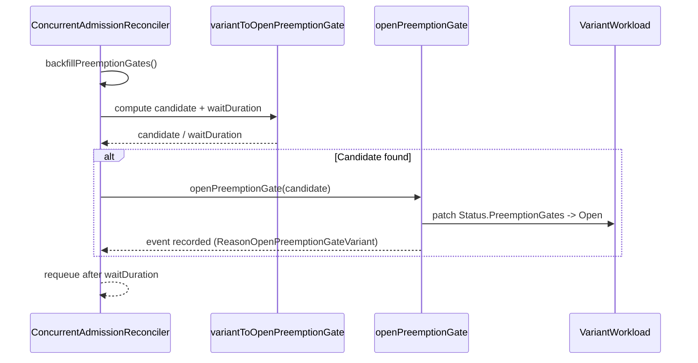

# PR #11872: Add preemptionGates support to ConcurrentAdmission

**Summary**: Add preemptionGates support to ConcurrentAdmission

**Sources**: https://github.com/kubernetes-sigs/kueue/pull/11872

**Last updated**: 2026-06-25T10:56:30Z

---

## Metadata

- **State**: closed (merged)
- **Author**: [@reruno](https://github.com/reruno)
- **Branch**: `feat/10920-ca-preemption-gates` → `main`
- **Created**: 2026-06-01T15:18:55Z
- **Updated**: 2026-06-25T10:56:30Z
- **Merged**: 2026-06-18T16:35:08Z
- **Closed**: 2026-06-18T16:35:08Z
- **Labels**: `kind/feature`, `release-note`, `lgtm`, `size/XL`, `approved`, `cncf-cla: yes`
- **Assignees**: [@mimowo](https://github.com/mimowo)
- **Requested reviewers**: [@kannon92](https://github.com/kannon92), [@PBundyra](https://github.com/PBundyra)
- **Changed files**: 6   **+699 / -9**

## Description

<!--  Thanks for sending a pull request!  Here are some tips for you:

1. If this is your first time, please read our contributor guidelines: https://git.k8s.io/community/contributors/guide/first-contribution.md#your-first-contribution and developer guide https://git.k8s.io/community/contributors/devel/development.md#development-guide
2. Please label this pull request according to what type of issue you are addressing, especially if this is a release targeted pull request. For reference on required PR/issue labels, read here:
https://git.k8s.io/community/contributors/devel/sig-release/release.md#issuepr-kind-label
3. Ensure you have added or ran the appropriate tests for your PR: https://git.k8s.io/community/contributors/devel/sig-testing/testing.md
4. If you want *faster* PR reviews, read how: https://git.k8s.io/community/contributors/guide/pull-requests.md#best-practices-for-faster-reviews
5. If the PR is unfinished, see how to mark it: https://git.k8s.io/community/contributors/guide/pull-requests.md#marking-unfinished-pull-requests
-->

#### What type of PR is this?
/kind feature
<!--
Add one of the following kinds:
/kind bug
/kind cleanup
/kind documentation
/kind feature
/kind kep

Optionally add one or more of the following kinds if applicable:
/kind api-change
/kind deprecation
/kind failing-test
/kind flake
/kind regression

Please also consider setting the area:
/area tas
/area integrations
/area multikueue
/area dashboard
/area localization
/area testing
/area website
-->

#### What this PR does / why we need it:

#### Which issue(s) this PR fixes:
<!--
*Automatically closes linked issue when PR is merged.
Usage: `Fixes #<issue number>`, or `Fixes (paste link of issue)`.
_If PR is about `failing-tests or flakes`, please post the related issues/tests in a comment and do not use `Fixes`_*
-->
Fixes #10920 

#### Special notes for your reviewer:

#### Does this PR introduce a user-facing change?
<!--
If no, just write "NONE" in the release-note block below.
If yes, a release note is required:
Enter your extended release note in the block below. If the PR requires additional action from users switching to the new release, include the string "action required".
-->
```release-note
ConcurrentAdmission: make sure there is at most one preemption variant issuing preemptions at any given time.
This is achieved using the "preemption gates" mechanism.
```


<!-- This is an auto-generated comment: release notes by coderabbit.ai -->
## Summary by CodeRabbit

* **New Features**
  * Variants now include a concurrent-admission preemption gate; existing workloads missing the gate are backfilled during reconciliation.
  * Preemption gate “ungating” is serialized so only one variant opens at a time; the controller schedules retries based on ungating timing and emits an event when a gate opens.
* **Bug Fixes**
  * Scheduler now consistently treats closed concurrent-admission gates as preemption-gated when concurrent admission is enabled.
* **Documentation**
  * Updated implementation history with new dated milestones and behavior notes.
* **Tests**
  * Expanded unit, integration, and e2e coverage for gate stamping, selection/ungating semantics, and admission ordering under preemption.
<!-- end of auto-generated comment: release notes by coderabbit.ai -->

## Discussion

### Comment by [@netlify[bot]](https://github.com/apps/netlify) — 2026-06-01T15:19:21Z

### <span aria-hidden="true">✅</span> Deploy Preview for *kubernetes-sigs-kueue* canceled.


|  Name | Link |
|:-:|------------------------|
|<span aria-hidden="true">🔨</span> Latest commit | 55d4800a4e7aae80e801f8e772bfc7fba8a9a325 |
|<span aria-hidden="true">🔍</span> Latest deploy log | https://app.netlify.com/projects/kubernetes-sigs-kueue/deploys/6a34059ec6a16a0008daceb4 |

### Comment by [@coderabbitai[bot]](https://github.com/apps/coderabbitai) — 2026-06-05T09:10:29Z

<!-- This is an auto-generated comment: summarize by coderabbit.ai -->
<!-- review_stack_entry_start -->

[](https://app.coderabbit.ai/change-stack/kubernetes-sigs/kueue/pull/11872?utm_source=github_walkthrough&utm_medium=github&utm_campaign=change_stack)

<!-- review_stack_entry_end -->
<!-- This is an auto-generated comment: review paused by coderabbit.ai -->

> [!NOTE]
> ## Reviews paused
> 
> It looks like this branch is under active development. To avoid overwhelming you with review comments due to an influx of new commits, CodeRabbit has automatically paused this review. You can configure this behavior by changing the `reviews.auto_review.auto_pause_after_reviewed_commits` setting.
> 
> Use the following commands to manage reviews:
> - `@coderabbitai resume` to resume automatic reviews.
> - `@coderabbitai review` to trigger a single review.
> 
> Use the checkboxes below for quick actions:
> - [ ] <!-- {"checkboxId": "7f6cc2e2-2e4e-497a-8c31-c9e4573e93d1"} --> ▶️ Resume reviews
> - [ ] <!-- {"checkboxId": "e9bb8d72-00e8-4f67-9cb2-caf3b22574fe"} --> 🔍 Trigger review

<!-- end of auto-generated comment: review paused by coderabbit.ai -->
<!-- walkthrough_start -->

<details>
<summary>📝 Walkthrough</summary>

## Walkthrough

This change stamps a concurrent-admission preemption gate onto Variants, backfills missing gates, selects one Variant at a time to open the gate using timing semantics, patches the Variant's admission status to open the gate, and updates scheduler/integration/e2e tests to validate serialized preemption across sibling Variants.

## Changes

**Serialized preemption gating for variants**

|Layer / File(s)|Summary|
|---|---|
|**Preemption gate contract and documentation** <br> `pkg/controller/constants/constants.go`, `keps/8691-concurrent-admission/README.md`|The `ConcurrentAdmissionPreemptionGate` constant defines the gate name used across the system; KEP history documents the feature introduction on 2026-06-01.|
|**Controller preemption gate implementation** <br> `pkg/controller/concurrentadmission/controller.go`|The controller imports `time`, adds constants for gate-opening events and timeout duration, appends the preemption gate to each Variant's `Spec.PreemptionGates` during generation, backfills missing gates on existing Variants, selects a candidate Variant to ungate based on active/blocked status and timing, patches the chosen Variant to open its gate (with retry-on-conflict) and records an event, and requeues after the computed delay.|
|**Controller unit tests and reconcile updates** <br> `pkg/controller/concurrentadmission/controller_preemption_gate_test.go`, `pkg/controller/concurrentadmission/controller_test.go`|Tests verify candidate selection with skipping rules and timing semantics, variant generation stamping without mutating the parent, gate-opening updates and event recording; reconcile tests updated to expect the new preemption gate field and backfilling behavior across all variant creation and deactivation scenarios.|
|**Scheduler preemption gate checking** <br> `pkg/scheduler/scheduler.go`|The scheduler's preemption-gating check now triggers when `features.ConcurrentAdmission` is enabled (in addition to `features.MultiKueueOrchestratedPreemption`), so workloads with a closed concurrent-admission gate are marked preemption-gated.|
|**Integration and e2e tests for preemption gating** <br> `test/integration/singlecluster/controller/concurrentadmission/concurrent_admission_test.go`, `test/e2e/singlecluster/baseline/concurrent_admission_test.go`|Integration test verifies that only the selected Variant's gate opens while others remain closed during its open window; e2e test confirms preemption of lower-priority workloads on the preferred flavor allows the higher-priority Variant to be admitted there.|

## Sequence Diagram(s)



## Estimated code review effort

🎯 4 (Complex) | ⏱️ ~45 minutes

## Suggested labels

`ok-to-test`, `area/testing`

## Suggested reviewers

- kshalot
- mimowo
- PBundyra

## Poem

> 🐰 *I stamp each gate with gentle paws,*  
> *I open one, then wait because,*  
> *Siblings queued in patient rows,*  
> *One hop at time — no chaos grows!* 🥕

</details>

<!-- walkthrough_end -->
<!-- pre_merge_checks_walkthrough_start -->

<details>
<summary>🚥 Pre-merge checks | ✅ 4 | ❌ 1</summary>

### ❌ Failed checks (1 warning)

|     Check name     | Status     | Explanation                                                                          | Resolution                                                                         |
| :----------------: | :--------- | :----------------------------------------------------------------------------------- | :--------------------------------------------------------------------------------- |
| Docstring Coverage | ⚠️ Warning | Docstring coverage is 7.14% which is insufficient. The required threshold is 80.00%. | Write docstrings for the functions missing them to satisfy the coverage threshold. |

<details>
<summary>✅ Passed checks (4 passed)</summary>

|         Check name         | Status   | Explanation                                                                                                                                                                                                                      |
| :------------------------: | :------- | :------------------------------------------------------------------------------------------------------------------------------------------------------------------------------------------------------------------------------- |
|      Description Check     | ✅ Passed | Check skipped - CodeRabbit’s high-level summary is enabled.                                                                                                                                                                      |
|         Title check        | ✅ Passed | The PR title accurately describes the main change: adding preemptionGates support to ConcurrentAdmission feature, which is the core objective of this PR.                                                                        |
|     Linked Issues check    | ✅ Passed | The PR implements the core requirement from `#10920` to restrict eviction capabilities in ConcurrentAdmission by ensuring only one Variant per Parent can issue preemptions at a time using preemption gates mechanism.            |
| Out of Scope Changes check | ✅ Passed | All changes are directly related to implementing preemption gate support for ConcurrentAdmission: controller logic, constants, scheduler integration, tests, and documentation updates—all aligned with issue `#10920` objectives. |

</details>

<sub>✏️ Tip: You can configure your own custom pre-merge checks in the settings.</sub>

</details>

<!-- pre_merge_checks_walkthrough_end -->
<!-- finishing_touch_checkbox_start -->

<details>
<summary>✨ Finishing Touches</summary>

<details>
<summary>🧪 Generate unit tests (beta)</summary>

- [ ] <!-- {"checkboxId": "f47ac10b-58cc-4372-a567-0e02b2c3d479", "radioGroupId": "utg-output-choice-group-unknown_comment_id"} -->   Create PR with unit tests

</details>

</details>

<!-- finishing_touch_checkbox_end -->
<!-- tips_start -->

---

Thanks for using [CodeRabbit](https://coderabbit.ai?utm_source=oss&utm_medium=github&utm_campaign=kubernetes-sigs/kueue&utm_content=11872)! It's free for OSS, and your support helps us grow. If you like it, consider giving us a shout-out.

<details>
<summary>❤️ Share</summary>

- [X](https://twitter.com/intent/tweet?text=I%20just%20used%20%40coderabbitai%20for%20my%20code%20review%2C%20and%20it%27s%20fantastic%21%20It%27s%20free%20for%20OSS%20and%20offers%20a%20free%20trial%20for%20the%20proprietary%20code.%20Check%20it%20out%3A&url=https%3A//coderabbit.ai)
- [Mastodon](https://mastodon.social/share?text=I%20just%20used%20%40coderabbitai%20for%20my%20code%20review%2C%20and%20it%27s%20fantastic%21%20It%27s%20free%20for%20OSS%20and%20offers%20a%20free%20trial%20for%20the%20proprietary%20code.%20Check%20it%20out%3A%20https%3A%2F%2Fcoderabbit.ai)
- [Reddit](https://www.reddit.com/submit?title=Great%20tool%20for%20code%20review%20-%20CodeRabbit&text=I%20just%20used%20CodeRabbit%20for%20my%20code%20review%2C%20and%20it%27s%20fantastic%21%20It%27s%20free%20for%20OSS%20and%20offers%20a%20free%20trial%20for%20proprietary%20code.%20Check%20it%20out%3A%20https%3A//coderabbit.ai)
- [LinkedIn](https://www.linkedin.com/sharing/share-offsite/?url=https%3A%2F%2Fcoderabbit.ai&mini=true&title=Great%20tool%20for%20code%20review%20-%20CodeRabbit&summary=I%20just%20used%20CodeRabbit%20for%20my%20code%20review%2C%20and%20it%27s%20fantastic%21%20It%27s%20free%20for%20OSS%20and%20offers%20a%20free%20trial%20for%20proprietary%20code)

</details>


<sub>Comment `@coderabbitai help` to get the list of available commands and usage tips.</sub>

<!-- tips_end -->

### Comment by [@reruno](https://github.com/reruno) — 2026-06-09T07:40:47Z

/cc @PBundyra

### Comment by [@mimowo](https://github.com/mimowo) — 2026-06-09T07:54:56Z

cc @kshalot who worked on the PreemptionGates mechanism

### Comment by [@mimowo](https://github.com/mimowo) — 2026-06-15T15:41:55Z

/assign
I will take a look EOW, but another review pass from @kshalot or @mbobrovskyi and lgtm would certainly improve my confidence in the PR

### Comment by [@kshalot](https://github.com/kshalot) — 2026-06-15T15:44:57Z

I'm also planning to take another look, but from what I see some comments are not addressed yet (e.g. https://github.com/kubernetes-sigs/kueue/pull/11872#discussion_r3379780844), so I'll wait for the changes to be pushed

### Comment by [@reruno](https://github.com/reruno) — 2026-06-16T11:50:32Z

/retest-required

If pull-kueue-test-e2e-multikueue-baseline-main pass I will create a flake test issue

Upd: https://github.com/kubernetes-sigs/kueue/issues/12286

### Comment by [@mimowo](https://github.com/mimowo) — 2026-06-17T09:11:35Z

Let's make it more user/admin oriented, proposal:
/release-note-edit
```release-note
ConcurrentAdmission: make sure there is at most one preemption variant issuing preemptions at any given time.
This is achieved using the "preemption gates" mechanism.
```

### Comment by [@reruno](https://github.com/reruno) — 2026-06-18T08:42:23Z

https://prow.k8s.io/view/gs/kubernetes-ci-logs/pr-logs/pull/kubernetes-sigs_kueue/11872/pull-kueue-verify-main/2067271243471523840

It was a flake, created issue https://github.com/kubernetes-sigs/kueue/issues/12323

### Comment by [@k8s-ci-robot](https://github.com/k8s-ci-robot) — 2026-06-18T15:42:08Z

LGTM label has been added.  <details>Git tree hash: 522f86f7228c30d90c040fc128c94a89103e17ca</details>

### Comment by [@k8s-ci-robot](https://github.com/k8s-ci-robot) — 2026-06-18T15:42:12Z

[APPROVALNOTIFIER] This PR is **APPROVED**

This pull-request has been approved by: *<a href="https://github.com/kubernetes-sigs/kueue/pull/11872#pullrequestreview-4526449403" title="Approved">mimowo</a>*, *<a href="https://github.com/kubernetes-sigs/kueue/pull/11872#" title="Author self-approved">reruno</a>*

The full list of commands accepted by this bot can be found [here](https://go.k8s.io/bot-commands?repo=kubernetes-sigs%2Fkueue).

The pull request process is described [here](https://git.k8s.io/community/contributors/guide/owners.md#the-code-review-process)

<details >
Needs approval from an approver in each of these files:

- ~~[OWNERS](https://github.com/kubernetes-sigs/kueue/blob/main/OWNERS)~~ [mimowo]

Approvers can indicate their approval by writing `/approve` in a comment
Approvers can cancel approval by writing `/approve cancel` in a comment
</details>
<!-- META={"approvers":[]} -->

## Reviews

### Review by [@kshalot](https://github.com/kshalot) (commented) — 2026-06-03T15:34:13Z

First, quick pass.

- **keps/8691-concurrent-admission/README.md:562** by [@kshalot](https://github.com/kshalot) — 2026-06-03T14:23:36Z
```diff
@@ -557,7 +557,9 @@ While we only issue preemptions coming from one Workload per CQ, what happens is
 3. A sibling Variant is picked up by the scheduler and is preempting some other Workloads
 
 We want to disallow other Variants to preempt if one of the Variants has already preempted some Workloads.
-During the Alpha implementation phase we will evaluate if the mechanism is done based on in-memory tracking, or we use the preemptionGates mechanism [KEP 8303](/keps/8303-multikueue-orchestrated-preemption/README.md).
+This is implemented by reusing the preemptionGates mechanism [KEP 8303](/keps/8303-multikueue-orchestrated-preemption/README.md).
+Every Variant is created with a closed `kueue.x-k8s.io/concurrent-admission` preemption gate, so the scheduler does not let a Variant issue preemptions while its gate is closed.
+The Variant Controller opens the gate for at most one Variant at a time, starting from the most preferred flavor that requires preemption. Before opening the gate for the next Variant it waits for a fixed timeout (5 minutes), giving the ungated Variant a chance to complete its preemptions and get admitted.
```

  I feel that this should also be mentioned in the implementation history section.

- **pkg/controller/concurrentadmission/controller.go:191** by [@kshalot](https://github.com/kshalot) — 2026-06-03T14:31:19Z
```diff
@@ -177,7 +181,14 @@ func (r *variantReconciler) Reconcile(ctx context.Context, req ctrl.Request) (ct
 		log.Error(err, "Failed to sync admission status")
 		return ctrl.Result{}, err
 	}
-	return ctrl.Result{}, nil
+
+	candidate, timeToWait := r.variantToOpenPreemptionGate(ctx, variants)
+	if candidate != nil {
+		if err := r.openPreemptionGate(ctx, candidate); err != nil {
+			return ctrl.Result{}, err
+		}
+	}
+	return ctrl.Result{RequeueAfter: timeToWait}, nil
```

  I think that in the case where there is no candidate, we should not requeue the reconcile, no? Since a variant signaling the need to preempt will trigger a reconciliation anyway.
  
  Right now we'll just have reconciliations spinning every 5 minutes regardless of whether a preemption will happen or not.

- **pkg/controller/concurrentadmission/controller.go:282** by [@kshalot](https://github.com/kshalot) — 2026-06-03T15:27:54Z
```diff
@@ -267,6 +279,7 @@ func generateVariant(parent *kueue.Workload, flavor kueue.ResourceFlavorReferenc
 		Spec:   parent.Spec,
 		Status: parent.Status,
 	}
+	variant.Spec.PreemptionGates = append(slices.Clone(variant.Spec.PreemptionGates), kueue.PreemptionGate{Name: constants.ConcurrentAdmissionPreemptionGate})
```

  I might be missing something, but do we need to `slices.Clone` the preemption gates?

- **pkg/controller/concurrentadmission/controller.go:674** by [@kshalot](https://github.com/kshalot) — 2026-06-03T15:32:59Z
```diff
@@ -631,6 +644,83 @@ func (r *variantReconciler) shouldReconcile(wl *kueue.Workload) bool {
 	return false
 }
 
+func (r *variantReconciler) variantToOpenPreemptionGate(ctx context.Context, variants []kueue.Workload) (*kueue.Workload, time.Duration) {
+	log := ctrl.LoggerFrom(ctx).WithValues("op", "variantToOpenPreemptionGate")
+
+	var candidate *kueue.Workload
+	var lastUngateTime *metav1.Time
+	for i := range variants {
+		wl := &variants[i]
+		wlLog := log.WithValues("variant", klog.KObj(wl), "flavor", concurrentadmission.GetVariantFlavor(wl))
+		if !workload.IsActive(wl) || workload.IsFinished(wl) || workload.IsAdmitted(wl) {
+			wlLog.V(4).Info("Variant is not active, finished, or already admitted")
+			continue
+		}
+		wlOpenedGateIdx := slices.IndexFunc(wl.Status.PreemptionGates, func(gate kueue.PreemptionGateState) bool {
+			return gate.Name == constants.ConcurrentAdmissionPreemptionGate && gate.Position == kueue.PreemptionGatePositionOpen
+		})
+		if wlOpenedGateIdx == -1 {
+			wlLog.V(4).Info("Variant does not have an open preemption gate")
+			preemptionSignalCond := apimeta.FindStatusCondition(wl.Status.Conditions, kueue.WorkloadBlockedOnPreemptionGates)
+			wlRequiresPreemption := preemptionSignalCond != nil && preemptionSignalCond.Status == metav1.ConditionTrue
+			if !wlRequiresPreemption {
+				wlLog.V(4).Info("Variant does not require preemption")
+				continue
+			}
+			// variants are sorted by priority,
+			// we want to open preemption gate for high preference flavors first
+			if candidate == nil {
+				wlLog.V(4).Info("Variant is the candidate for ungating")
+				candidate = wl
```

  If the variants are sorted by priority, then I guess we could break here:
  
  ```suggestion
  			// variants are sorted by priority,
  			// we want to open preemption gate for high preference flavors first
  			if candidate == nil {
  				wlLog.V(4).Info("Variant is the candidate for ungating")
  				candidate = wl
  				break
  ```

### Review by [@reruno](https://github.com/reruno) (commented) — 2026-06-05T08:43:05Z

- **pkg/controller/concurrentadmission/controller.go:191** by [@reruno](https://github.com/reruno) — 2026-06-05T08:43:05Z
```diff
@@ -177,7 +181,14 @@ func (r *variantReconciler) Reconcile(ctx context.Context, req ctrl.Request) (ct
 		log.Error(err, "Failed to sync admission status")
 		return ctrl.Result{}, err
 	}
-	return ctrl.Result{}, nil
+
+	candidate, timeToWait := r.variantToOpenPreemptionGate(ctx, variants)
+	if candidate != nil {
+		if err := r.openPreemptionGate(ctx, candidate); err != nil {
+			return ctrl.Result{}, err
+		}
+	}
+	return ctrl.Result{RequeueAfter: timeToWait}, nil
```

  If there are no candidate timeToWait=0, and when requeueAfter: 0 then requeue will not happen, it is written in the docs for ctrl.Result

### Review by [@reruno](https://github.com/reruno) (commented) — 2026-06-05T08:44:05Z

- **pkg/controller/concurrentadmission/controller.go:282** by [@reruno](https://github.com/reruno) — 2026-06-05T08:44:05Z
```diff
@@ -267,6 +279,7 @@ func generateVariant(parent *kueue.Workload, flavor kueue.ResourceFlavorReferenc
 		Spec:   parent.Spec,
 		Status: parent.Status,
 	}
+	variant.Spec.PreemptionGates = append(slices.Clone(variant.Spec.PreemptionGates), kueue.PreemptionGate{Name: constants.ConcurrentAdmissionPreemptionGate})
```

  variant.Spec is shallow copy of parent, so variant.Spec.PreemptionGates is basically parent array of preemption gates, so we clone it to not change the parent slice

### Review by [@reruno](https://github.com/reruno) (commented) — 2026-06-05T08:46:40Z

- **pkg/controller/concurrentadmission/controller.go:191** by [@reruno](https://github.com/reruno) — 2026-06-05T08:46:40Z
```diff
@@ -177,7 +181,14 @@ func (r *variantReconciler) Reconcile(ctx context.Context, req ctrl.Request) (ct
 		log.Error(err, "Failed to sync admission status")
 		return ctrl.Result{}, err
 	}
-	return ctrl.Result{}, nil
+
+	candidate, timeToWait := r.variantToOpenPreemptionGate(ctx, variants)
+	if candidate != nil {
+		if err := r.openPreemptionGate(ctx, candidate); err != nil {
+			return ctrl.Result{}, err
+		}
+	}
+	return ctrl.Result{RequeueAfter: timeToWait}, nil
```

  > RequeueAfter if greater than 0, tells the Controller to requeue the reconcile key after the Duration. Implies that Requeue is true, there is no need to set Requeue to true at the same time as RequeueAfter.

### Review by [@reruno](https://github.com/reruno) (commented) — 2026-06-05T08:59:00Z

- **pkg/controller/concurrentadmission/controller.go:191** by [@reruno](https://github.com/reruno) — 2026-06-05T08:59:00Z
```diff
@@ -177,7 +181,14 @@ func (r *variantReconciler) Reconcile(ctx context.Context, req ctrl.Request) (ct
 		log.Error(err, "Failed to sync admission status")
 		return ctrl.Result{}, err
 	}
-	return ctrl.Result{}, nil
+
+	candidate, timeToWait := r.variantToOpenPreemptionGate(ctx, variants)
+	if candidate != nil {
+		if err := r.openPreemptionGate(ctx, candidate); err != nil {
+			return ctrl.Result{}, err
+		}
+	}
+	return ctrl.Result{RequeueAfter: timeToWait}, nil
```

  ```
  	if candidate == nil {
  		log.V(4).Info("No candidate variant found for ungating preemptions")
  		return nil, 0
  	} else if lastUngateTime == nil {
  		log.V(4).Info("Found variant to ungate, no gate is currently open", "variantToUngate", klog.KObj(candidate))
  		return candidate, preemptionTimeout
  	}
  	timeToWait := preemptionTimeout - r.clock.Since(lastUngateTime.Time)
  	if timeToWait > 0 {
  		log.V(4).Info("Single preemption timeout did not expire", "timeLeft", timeToWait, "nextVariantToUngate", klog.KObj(candidate))
  		return nil, timeToWait
  	}
  	log.V(4).Info("Found variant to ungate", "variantToUngate", klog.KObj(candidate))
  	return candidate, preemptionTimeout
  ```
  
  If there is no candidate return timeToWait=0 (ie no requeue), 
  if candidate was found and no variant was ungated before, return candidate + 5min requeue. 
  If candidate found, there was ungate before check if 5 min elapsed since, if yes then return no candidate + timeToWait until 5 min elapse, if no then another candidate to ungate + 5min timeout 
  
  let me know if this logic needs correction

### Review by [@reruno](https://github.com/reruno) (commented) — 2026-06-05T09:06:56Z

- **pkg/controller/concurrentadmission/controller.go:674** by [@reruno](https://github.com/reruno) — 2026-06-05T09:06:56Z
```diff
@@ -631,6 +644,83 @@ func (r *variantReconciler) shouldReconcile(wl *kueue.Workload) bool {
 	return false
 }
 
+func (r *variantReconciler) variantToOpenPreemptionGate(ctx context.Context, variants []kueue.Workload) (*kueue.Workload, time.Duration) {
+	log := ctrl.LoggerFrom(ctx).WithValues("op", "variantToOpenPreemptionGate")
+
+	var candidate *kueue.Workload
+	var lastUngateTime *metav1.Time
+	for i := range variants {
+		wl := &variants[i]
+		wlLog := log.WithValues("variant", klog.KObj(wl), "flavor", concurrentadmission.GetVariantFlavor(wl))
+		if !workload.IsActive(wl) || workload.IsFinished(wl) || workload.IsAdmitted(wl) {
+			wlLog.V(4).Info("Variant is not active, finished, or already admitted")
+			continue
+		}
+		wlOpenedGateIdx := slices.IndexFunc(wl.Status.PreemptionGates, func(gate kueue.PreemptionGateState) bool {
+			return gate.Name == constants.ConcurrentAdmissionPreemptionGate && gate.Position == kueue.PreemptionGatePositionOpen
+		})
+		if wlOpenedGateIdx == -1 {
+			wlLog.V(4).Info("Variant does not have an open preemption gate")
+			preemptionSignalCond := apimeta.FindStatusCondition(wl.Status.Conditions, kueue.WorkloadBlockedOnPreemptionGates)
+			wlRequiresPreemption := preemptionSignalCond != nil && preemptionSignalCond.Status == metav1.ConditionTrue
+			if !wlRequiresPreemption {
+				wlLog.V(4).Info("Variant does not require preemption")
+				continue
+			}
+			// variants are sorted by priority,
+			// we want to open preemption gate for high preference flavors first
+			if candidate == nil {
+				wlLog.V(4).Info("Variant is the candidate for ungating")
+				candidate = wl
```

  I think if we break here it would be breaking too early, because in the code 
  ```
  wlLog.V(4).Info("Variant has an open preemption gate")
  			wlOpenedGate := wl.Status.PreemptionGates[wlOpenedGateIdx]
  			if lastUngateTime == nil || wlOpenedGate.LastTransitionTime.After(lastUngateTime.Time) {
  				wlLog.V(4).Info("Variant has the latest preemption ungating time")
  				lastUngateTime = &wlOpenedGate.LastTransitionTime
  			}
  ```
  
  we are searching for the last ungate time in the variants, so to know that we go through each variant item

### Review by [@coderabbitai[bot]](https://github.com/apps/coderabbitai) (commented) — 2026-06-05T09:21:15Z

**Actionable comments posted: 1**

<details>
<summary>🤖 Prompt for all review comments with AI agents</summary>

```
Verify each finding against current code. Fix only still-valid issues, skip the
rest with a brief reason, keep changes minimal, and validate.

Inline comments:
In `@pkg/controller/concurrentadmission/controller.go`:
- Line 281: Existing Variants may never get the ConcurrentAdmission preemption
gate because the code at variant.Spec.PreemptionGates = append(...) only adds it
on creation; change the reconcile/update path for Variant objects to backfill
and dedupe the gate by checking variant.Spec.PreemptionGates for
constants.ConcurrentAdmissionPreemptionGate and, if missing, patch/update the
Variant to include kueue.PreemptionGate{Name:
constants.ConcurrentAdmissionPreemptionGate} (use a cloned slice or set to avoid
duplicates) so existing Variants are updated to enforce the single-preemptor
guarantee.
```

</details>

<details>
<summary>🪄 Autofix (Beta)</summary>

Fix all unresolved CodeRabbit comments on this PR:

- [ ] <!-- {"checkboxId": "4b0d0e0a-96d7-4f10-b296-3a18ea78f0b9"} --> Push a commit to this branch (recommended)
- [ ] <!-- {"checkboxId": "ff5b1114-7d8c-49e6-8ac1-43f82af23a33"} --> Create a new PR with the fixes

</details>

---

<details>
<summary>ℹ️ Review info</summary>

<details>
<summary>⚙️ Run configuration</summary>

**Configuration used**: defaults

**Review profile**: CHILL

**Plan**: Pro

**Run ID**: `62213e51-c34d-4e3b-bd6d-844f15b41048`

</details>

<details>
<summary>📥 Commits</summary>

Reviewing files that changed from the base of the PR and between d86e96ab73fff1c47442ce5af661d56f18377f47 and 786da1b61e5300070d8ccf7760a07627fa89ae9a.

</details>

<details>
<summary>📒 Files selected for processing (8)</summary>

* `keps/8691-concurrent-admission/README.md`
* `pkg/controller/concurrentadmission/controller.go`
* `pkg/controller/concurrentadmission/controller_preemption_gate_test.go`
* `pkg/controller/concurrentadmission/controller_test.go`
* `pkg/controller/constants/constants.go`
* `pkg/scheduler/scheduler.go`
* `test/e2e/singlecluster/baseline/concurrent_admission_test.go`
* `test/integration/singlecluster/controller/concurrentadmission/concurrent_admission_test.go`

</details>

</details>

<!-- This is an auto-generated comment by CodeRabbit for review status -->

- **pkg/controller/concurrentadmission/controller.go:281** by [@coderabbitai[bot]](https://github.com/apps/coderabbitai) — 2026-06-05T09:21:14Z
```diff
@@ -267,6 +278,7 @@ func generateVariant(parent *kueue.Workload, flavor kueue.ResourceFlavorReferenc
 		Spec:   parent.Spec,
 		Status: parent.Status,
 	}
+	variant.Spec.PreemptionGates = append(slices.Clone(variant.Spec.PreemptionGates), kueue.PreemptionGate{Name: constants.ConcurrentAdmissionPreemptionGate})
```

  _⚠️ Potential issue_ | _🟠 Major_ | _⚡ Quick win_
  
  **Backfill and dedupe the ConcurrentAdmission preemption gate on variants.**
  
  At **Line 281**, the gate is only added during variant creation. Existing variants that already lack this gate are never reconciled, so they can bypass gate-based blocking and still issue preemptions in parallel. That breaks the “one Variant per Parent preempting at a time” guarantee.
  
  <details>
  <summary>Suggested fix</summary>
  
  ```diff
   func (r *variantReconciler) Reconcile(ctx context.Context, req ctrl.Request) (ctrl.Result, error) {
  @@
   	variants = sortVariantsByFlavorOrder(variants, flavorOrder)
  +
  +	if err := r.ensureConcurrentAdmissionGateOnVariants(ctx, variants); err != nil {
  +		return ctrl.Result{}, err
  +	}
  @@
   }
  
  +func (r *variantReconciler) ensureConcurrentAdmissionGateOnVariants(ctx context.Context, variants []kueue.Workload) error {
  +	for i := range variants {
  +		v := &variants[i]
  +		if slices.ContainsFunc(v.Spec.PreemptionGates, func(g kueue.PreemptionGate) bool {
  +			return g.Name == constants.ConcurrentAdmissionPreemptionGate
  +		}) {
  +			continue
  +		}
  +		v.Spec.PreemptionGates = append(v.Spec.PreemptionGates, kueue.PreemptionGate{Name: constants.ConcurrentAdmissionPreemptionGate})
  +		if err := r.client.Update(ctx, v); err != nil {
  +			return err
  +		}
  +	}
  +	return nil
  +}
  @@
   func generateVariant(parent *kueue.Workload, flavor kueue.ResourceFlavorReference) *kueue.Workload {
  @@
  -	variant.Spec.PreemptionGates = append(slices.Clone(variant.Spec.PreemptionGates), kueue.PreemptionGate{Name: constants.ConcurrentAdmissionPreemptionGate})
  +	variant.Spec.PreemptionGates = slices.Clone(variant.Spec.PreemptionGates)
  +	if !slices.ContainsFunc(variant.Spec.PreemptionGates, func(g kueue.PreemptionGate) bool {
  +		return g.Name == constants.ConcurrentAdmissionPreemptionGate
  +	}) {
  +		variant.Spec.PreemptionGates = append(variant.Spec.PreemptionGates, kueue.PreemptionGate{Name: constants.ConcurrentAdmissionPreemptionGate})
  +	}
  ```
  </details>
  
  <!-- suggestion_start -->
  
  <details>
  <summary>📝 Committable suggestion</summary>
  
  > ‼️ **IMPORTANT**
  > Carefully review the code before committing. Ensure that it accurately replaces the highlighted code, contains no missing lines, and has no issues with indentation. Thoroughly test & benchmark the code to ensure it meets the requirements.
  
  ```suggestion
  	variant.Spec.PreemptionGates = slices.Clone(variant.Spec.PreemptionGates)
  	if !slices.ContainsFunc(variant.Spec.PreemptionGates, func(g kueue.PreemptionGate) bool {
  		return g.Name == constants.ConcurrentAdmissionPreemptionGate
  	}) {
  		variant.Spec.PreemptionGates = append(variant.Spec.PreemptionGates, kueue.PreemptionGate{Name: constants.ConcurrentAdmissionPreemptionGate})
  	}
  ```
  
  </details>
  
  <!-- suggestion_end -->
  
  <details>
  <summary>🤖 Prompt for AI Agents</summary>
  
  ```
  Verify each finding against current code. Fix only still-valid issues, skip the
  rest with a brief reason, keep changes minimal, and validate.
  
  In `@pkg/controller/concurrentadmission/controller.go` at line 281, Existing
  Variants may never get the ConcurrentAdmission preemption gate because the code
  at variant.Spec.PreemptionGates = append(...) only adds it on creation; change
  the reconcile/update path for Variant objects to backfill and dedupe the gate by
  checking variant.Spec.PreemptionGates for
  constants.ConcurrentAdmissionPreemptionGate and, if missing, patch/update the
  Variant to include kueue.PreemptionGate{Name:
  constants.ConcurrentAdmissionPreemptionGate} (use a cloned slice or set to avoid
  duplicates) so existing Variants are updated to enforce the single-preemptor
  guarantee.
  ```
  
  </details>
  
  <!-- fingerprinting:phantom:poseidon:hawk -->
  
  <!-- This is an auto-generated comment by CodeRabbit -->
  
  ✅ Addressed in commits 1744552 to 8195544

### Review by [@kshalot](https://github.com/kshalot) (commented) — 2026-06-09T10:19:51Z

- **pkg/controller/concurrentadmission/controller.go:749** by [@kshalot](https://github.com/kshalot) — 2026-06-09T09:46:50Z
```diff
@@ -631,6 +649,116 @@ func (r *variantReconciler) shouldReconcile(wl *kueue.Workload) bool {
 	return false
 }
 
+func (r *variantReconciler) variantToOpenPreemptionGate(ctx context.Context, variants []kueue.Workload) (*kueue.Workload, time.Duration) {
+	log := ctrl.LoggerFrom(ctx).WithValues("op", "variantToOpenPreemptionGate")
+
+	var candidate *kueue.Workload
+	var lastUngateTime *metav1.Time
+	for i := range variants {
+		wl := &variants[i]
+		wlLog := log.WithValues("variant", klog.KObj(wl), "flavor", concurrentadmission.GetVariantFlavor(wl))
+		if !workload.IsActive(wl) || workload.IsFinished(wl) || workload.IsAdmitted(wl) {
+			wlLog.V(4).Info("Variant is not active, finished, or already admitted")
+			continue
+		}
+		wlOpenedGateIdx := slices.IndexFunc(wl.Status.PreemptionGates, func(gate kueue.PreemptionGateState) bool {
+			return gate.Name == constants.ConcurrentAdmissionPreemptionGate && gate.Position == kueue.PreemptionGatePositionOpen
+		})
+		if wlOpenedGateIdx == -1 {
+			wlLog.V(4).Info("Variant does not have an open preemption gate")
+			preemptionSignalCond := apimeta.FindStatusCondition(wl.Status.Conditions, kueue.WorkloadBlockedOnPreemptionGates)
+			wlRequiresPreemption := preemptionSignalCond != nil && preemptionSignalCond.Status == metav1.ConditionTrue
+			if !wlRequiresPreemption {
+				wlLog.V(4).Info("Variant does not require preemption")
+				continue
+			}
+			// variants are sorted by priority,
+			// we want to open preemption gate for high preference flavors first
+			if candidate == nil {
+				wlLog.V(4).Info("Variant is the candidate for ungating")
+				candidate = wl
+			} else {
+				wlLog.V(4).Info("A higher-preference variant is already the candidate for ungating")
+			}
+		} else {
+			wlLog.V(4).Info("Variant has an open preemption gate")
+			wlOpenedGate := wl.Status.PreemptionGates[wlOpenedGateIdx]
+			if lastUngateTime == nil || wlOpenedGate.LastTransitionTime.After(lastUngateTime.Time) {
+				wlLog.V(4).Info("Variant has the latest preemption ungating time")
+				lastUngateTime = &wlOpenedGate.LastTransitionTime
+			}
+		}
+	}
+	if candidate == nil {
+		log.V(4).Info("No candidate variant found for ungating preemptions")
+		return nil, 0
+	} else if lastUngateTime == nil {
+		log.V(4).Info("Found variant to ungate, no gate is currently open", "variantToUngate", klog.KObj(candidate))
+		return candidate, preemptionTimeout
+	}
+	timeToWait := preemptionTimeout - r.clock.Since(lastUngateTime.Time)
+	if timeToWait > 0 {
+		log.V(4).Info("Single preemption timeout did not expire", "timeLeft", timeToWait, "nextVariantToUngate", klog.KObj(candidate))
+		return nil, timeToWait
+	}
+	log.V(4).Info("Found variant to ungate", "variantToUngate", klog.KObj(candidate))
+	return candidate, preemptionTimeout
+}
+
+func ensureCAPreemptionGate(gates []kueue.PreemptionGate) ([]kueue.PreemptionGate, bool) {
+	if slices.ContainsFunc(gates, func(g kueue.PreemptionGate) bool {
+		return g.Name == constants.ConcurrentAdmissionPreemptionGate
+	}) {
+		return gates, false
+	}
+	return append(gates, kueue.PreemptionGate{Name: constants.ConcurrentAdmissionPreemptionGate}), true
+}
+
+func (r *variantReconciler) openPreemptionGate(ctx context.Context, variant *kueue.Workload) error {
+	log := ctrl.LoggerFrom(ctx)
+	log.V(2).Info("Opening preemption gate for variant", "variant", klog.KObj(variant), "flavor", concurrentadmission.GetVariantFlavor(variant))
+	var opened bool
+	if err := workload.PatchAdmissionStatus(ctx, r.client, variant, r.clock, func(wl *kueue.Workload) (bool, error) {
+		opened = workload.SetPreemptionGatePosition(
+			wl,
+			constants.ConcurrentAdmissionPreemptionGate,
+			kueue.PreemptionGatePositionOpen,
+			metav1.NewTime(r.clock.Now()),
+		)
+		return opened, nil
+	}, workload.WithRetryOnConflictForPatch()); err != nil {
+		return fmt.Errorf("opening preemption gate on variant %s: %w", klog.KObj(variant), err)
+	}
+	if opened {
+		r.recorder.Eventf(variant, nil, corev1.EventTypeNormal, ReasonOpenPreemptionGateVariant, ReasonOpenPreemptionGateVariant, "Opened preemption gate for variant workload %q", klog.KObj(variant))
+	}
+	return nil
+}
+
+// backfillPreemptionGates adds the ConcurrentAdmission preemption gate to Variants
+// that were created by a controller version predating gate-based preemption
+// serialization. Without it, such Variants are never gated and can issue
+// preemptions in parallel, violating the single-preemptor-per-Parent guarantee.
+//
+// TODO: remove once ConcurrentAdmission graduates beyond alpha and no
+// pre-gate Variants can remain across a supported upgrade skew.
+func (r *variantReconciler) backfillPreemptionGates(ctx context.Context, variants []kueue.Workload) error {
+	log := ctrl.LoggerFrom(ctx)
+	for i := range variants {
+		v := &variants[i]
+		gates, added := ensureCAPreemptionGate(slices.Clone(v.Spec.PreemptionGates))
```

  When creating variants, the clone is indeed necessary for safety. But here, we are already dealing with independent memory, no? Since `variants` here come from `client.List` and is not a shallow clone of the parent.

- **test/e2e/singlecluster/baseline/concurrent_admission_test.go:286** by [@kshalot](https://github.com/kshalot) — 2026-06-09T10:08:49Z
```diff
@@ -228,6 +228,122 @@ var _ = ginkgo.Describe("ConcurrentAdmission", ginkgo.Label("area:singlecluster"
 			})
 		})
 	})
+
+	ginkgo.When("Variants must preempt to be admitted", func() {
+		var (
+			onDemandRF     *kueue.ResourceFlavor
+			spotRF         *kueue.ResourceFlavor
+			cq             *kueue.ClusterQueue
+			lq             *kueue.LocalQueue
+			highWPC        *kueue.WorkloadPriorityClass
+			onDemandFlavor string
+			spotFlavor     string
+		)
+
+		ginkgo.BeforeEach(func() {
+			onDemandFlavor = "on-demand-" + ns.Name
+			spotFlavor = "spot-" + ns.Name
+
+			onDemandRF = utiltestingapi.MakeResourceFlavor(onDemandFlavor).
+				NodeLabel("instance-type", "on-demand").Obj()
+			util.MustCreate(ctx, k8sClient, onDemandRF)
+
+			spotRF = utiltestingapi.MakeResourceFlavor(spotFlavor).
+				NodeLabel("instance-type", "spot").Obj()
+			util.MustCreate(ctx, k8sClient, spotRF)
+
+			// on-demand is listed first, so it is the most preferred flavor. Each
+			// flavor holds quota for a single 1-CPU workload, so a higher-priority
+			// Variant can only be admitted by preempting the flavor's occupant.
+			cq = utiltestingapi.MakeClusterQueue("cq-gate-"+ns.Name).
+				ConcurrentAdmissionPolicy(kueue.ConcurrentAdmissionTryPreferredFlavors).
+				Preemption(kueue.ClusterQueuePreemption{
+					WithinClusterQueue: kueue.PreemptionPolicyLowerPriority,
+				}).
+				ResourceGroup(
+					*utiltestingapi.MakeFlavorQuotas(onDemandFlavor).Resource(corev1.ResourceCPU, "1").Obj(),
+					*utiltestingapi.MakeFlavorQuotas(spotFlavor).Resource(corev1.ResourceCPU, "1").Obj(),
+				).Obj()
+			util.CreateClusterQueuesAndWaitForActive(ctx, k8sClient, cq)
+
+			lq = utiltestingapi.MakeLocalQueue("main", ns.Name).ClusterQueue(cq.Name).Obj()
+			util.CreateLocalQueuesAndWaitForActive(ctx, k8sClient, lq)
+
+			highWPC = utiltestingapi.MakeWorkloadPriorityClass("high-" + ns.Name).PriorityValue(100).Obj()
+			util.MustCreate(ctx, k8sClient, highWPC)
+		})
+
+		ginkgo.AfterEach(func() {
+			gomega.Expect(util.DeleteAllJobsInNamespace(ctx, k8sClient, ns)).Should(gomega.Succeed())
+			gomega.Expect(util.DeleteWorkloadsInNamespace(ctx, k8sClient, ns)).Should(gomega.Succeed())
+			util.ExpectObjectToBeDeleted(ctx, k8sClient, highWPC, true)
+			util.ExpectObjectToBeDeleted(ctx, k8sClient, lq, true)
+			util.ExpectObjectToBeDeleted(ctx, k8sClient, cq, true)
+			util.ExpectObjectToBeDeleted(ctx, k8sClient, onDemandRF, true)
+			util.ExpectObjectToBeDeleted(ctx, k8sClient, spotRF, true)
+		})
+
+		ginkgo.It("Should open the preemption gate for only the most-preferred Variant, preempting a single occupant", func() {
```

  A general concern - is this actually deterministic? In principle, wouldn't it be possible for the less preferred variant to run through a scheduling cycle first, trigger the preemption gate via `kueue.WorkloadBlockedOnPreemptionGates`, be ungated and only then the more preferred variant will get signal the need to preempt?
  
  So it's a race that might result in the more preferred variant waiting to be ungated for 5 minutes. Maybe this is acceptable for alpha, but anyway it could cause flakes of this e2e. cc @mimowo

- **test/integration/singlecluster/controller/concurrentadmission/concurrent_admission_test.go:506** by [@kshalot](https://github.com/kshalot) — 2026-06-09T10:12:30Z
```diff
@@ -500,6 +503,98 @@ var _ = ginkgo.Describe("Concurrent Admission", func() {
 			})
 		})
 	})
+
+	ginkgo.When("Variants require preemption to be admitted", func() {
```

  One case I think is missing in the tests - whether we ungate the second variant after the timeout elapses. This should be easy to add to the integration test.

### Review by [@reruno](https://github.com/reruno) (commented) — 2026-06-09T10:41:45Z

- **test/e2e/singlecluster/baseline/concurrent_admission_test.go:286** by [@reruno](https://github.com/reruno) — 2026-06-09T10:41:45Z
```diff
@@ -228,6 +228,122 @@ var _ = ginkgo.Describe("ConcurrentAdmission", ginkgo.Label("area:singlecluster"
 			})
 		})
 	})
+
+	ginkgo.When("Variants must preempt to be admitted", func() {
+		var (
+			onDemandRF     *kueue.ResourceFlavor
+			spotRF         *kueue.ResourceFlavor
+			cq             *kueue.ClusterQueue
+			lq             *kueue.LocalQueue
+			highWPC        *kueue.WorkloadPriorityClass
+			onDemandFlavor string
+			spotFlavor     string
+		)
+
+		ginkgo.BeforeEach(func() {
+			onDemandFlavor = "on-demand-" + ns.Name
+			spotFlavor = "spot-" + ns.Name
+
+			onDemandRF = utiltestingapi.MakeResourceFlavor(onDemandFlavor).
+				NodeLabel("instance-type", "on-demand").Obj()
+			util.MustCreate(ctx, k8sClient, onDemandRF)
+
+			spotRF = utiltestingapi.MakeResourceFlavor(spotFlavor).
+				NodeLabel("instance-type", "spot").Obj()
+			util.MustCreate(ctx, k8sClient, spotRF)
+
+			// on-demand is listed first, so it is the most preferred flavor. Each
+			// flavor holds quota for a single 1-CPU workload, so a higher-priority
+			// Variant can only be admitted by preempting the flavor's occupant.
+			cq = utiltestingapi.MakeClusterQueue("cq-gate-"+ns.Name).
+				ConcurrentAdmissionPolicy(kueue.ConcurrentAdmissionTryPreferredFlavors).
+				Preemption(kueue.ClusterQueuePreemption{
+					WithinClusterQueue: kueue.PreemptionPolicyLowerPriority,
+				}).
+				ResourceGroup(
+					*utiltestingapi.MakeFlavorQuotas(onDemandFlavor).Resource(corev1.ResourceCPU, "1").Obj(),
+					*utiltestingapi.MakeFlavorQuotas(spotFlavor).Resource(corev1.ResourceCPU, "1").Obj(),
+				).Obj()
+			util.CreateClusterQueuesAndWaitForActive(ctx, k8sClient, cq)
+
+			lq = utiltestingapi.MakeLocalQueue("main", ns.Name).ClusterQueue(cq.Name).Obj()
+			util.CreateLocalQueuesAndWaitForActive(ctx, k8sClient, lq)
+
+			highWPC = utiltestingapi.MakeWorkloadPriorityClass("high-" + ns.Name).PriorityValue(100).Obj()
+			util.MustCreate(ctx, k8sClient, highWPC)
+		})
+
+		ginkgo.AfterEach(func() {
+			gomega.Expect(util.DeleteAllJobsInNamespace(ctx, k8sClient, ns)).Should(gomega.Succeed())
+			gomega.Expect(util.DeleteWorkloadsInNamespace(ctx, k8sClient, ns)).Should(gomega.Succeed())
+			util.ExpectObjectToBeDeleted(ctx, k8sClient, highWPC, true)
+			util.ExpectObjectToBeDeleted(ctx, k8sClient, lq, true)
+			util.ExpectObjectToBeDeleted(ctx, k8sClient, cq, true)
+			util.ExpectObjectToBeDeleted(ctx, k8sClient, onDemandRF, true)
+			util.ExpectObjectToBeDeleted(ctx, k8sClient, spotRF, true)
+		})
+
+		ginkgo.It("Should open the preemption gate for only the most-preferred Variant, preempting a single occupant", func() {
```

  https://github.com/kubernetes-sigs/kueue/pull/11895
  
  keps/8691-concurrent-admission/README.md
  
  >The VariantsController leverages the existing implementation of scheduling logic in Kueue, where Workloads are sorted
  by priorities and creation timestamps and then picked-up by the scheduler one per scheduling cycle (per ClusterQueue).
  This means when creating Variants the controller should ensure more favorable Variants are ahead of less favorable ones in the queue.

### Review by [@reruno](https://github.com/reruno) (commented) — 2026-06-16T10:17:10Z

- **test/integration/singlecluster/controller/concurrentadmission/concurrent_admission_test.go:506** by [@reruno](https://github.com/reruno) — 2026-06-16T10:17:10Z
```diff
@@ -500,6 +503,98 @@ var _ = ginkgo.Describe("Concurrent Admission", func() {
 			})
 		})
 	})
+
+	ginkgo.When("Variants require preemption to be admitted", func() {
```

  pkg/controller/concurrentadmission/controller_test.go
  "ungates the next-preferred variant once the open gate's preemption timeout elapses":
  
  Added new unit test case for `TestReconcile` that tests this case. 
  
  Added to unit test because I think we don't use fake clocks in integration tests, and I don't want to manually subtracting LastTransitionTime in the object for integration tests

### Review by [@mykysha](https://github.com/mykysha) (commented) — 2026-06-16T14:20:41Z

- **pkg/controller/concurrentadmission/controller.go:695** by [@mykysha](https://github.com/mykysha) — 2026-06-16T14:20:41Z
```diff
@@ -631,6 +649,116 @@ func (r *variantReconciler) shouldReconcile(wl *kueue.Workload) bool {
 	return false
 }
 
+func (r *variantReconciler) variantToOpenPreemptionGate(ctx context.Context, variants []kueue.Workload) (*kueue.Workload, time.Duration) {
+	log := ctrl.LoggerFrom(ctx).WithValues("op", "variantToOpenPreemptionGate")
+
+	var candidate *kueue.Workload
+	var lastUngateTime *metav1.Time
+	for i := range variants {
+		wl := &variants[i]
+		wlLog := log.WithValues("variant", klog.KObj(wl), "flavor", concurrentadmission.GetVariantFlavor(wl))
+		if !workload.IsActive(wl) || workload.IsFinished(wl) || workload.IsAdmitted(wl) {
+			wlLog.V(4).Info("Variant is not active, finished, or already admitted")
+			continue
+		}
+		wlOpenedGateIdx := slices.IndexFunc(wl.Status.PreemptionGates, func(gate kueue.PreemptionGateState) bool {
+			return gate.Name == constants.ConcurrentAdmissionPreemptionGate && gate.Position == kueue.PreemptionGatePositionOpen
+		})
+		if wlOpenedGateIdx == -1 {
+			wlLog.V(4).Info("Variant does not have an open preemption gate")
+			preemptionSignalCond := apimeta.FindStatusCondition(wl.Status.Conditions, kueue.WorkloadBlockedOnPreemptionGates)
+			wlRequiresPreemption := preemptionSignalCond != nil && preemptionSignalCond.Status == metav1.ConditionTrue
+			if !wlRequiresPreemption {
+				wlLog.V(4).Info("Variant does not require preemption")
+				continue
+			}
+			// variants are sorted by priority,
+			// we want to open preemption gate for high preference flavors first
+			if candidate == nil {
+				wlLog.V(4).Info("Variant is the candidate for ungating")
+				candidate = wl
+			} else {
+				wlLog.V(4).Info("A higher-preference variant is already the candidate for ungating")
+			}
+		} else {
+			wlLog.V(4).Info("Variant has an open preemption gate")
+			wlOpenedGate := wl.Status.PreemptionGates[wlOpenedGateIdx]
+			if lastUngateTime == nil || wlOpenedGate.LastTransitionTime.After(lastUngateTime.Time) {
+				wlLog.V(4).Info("Variant has the latest preemption ungating time")
+				lastUngateTime = &wlOpenedGate.LastTransitionTime
+			}
+		}
+	}
+	if candidate == nil {
+		log.V(4).Info("No candidate variant found for ungating preemptions")
+		return nil, 0
+	} else if lastUngateTime == nil {
```

  Can we drop `else` as we return in the previous if statement?

### Review by [@mykysha](https://github.com/mykysha) (commented) — 2026-06-16T14:44:41Z

- **pkg/controller/concurrentadmission/controller.go:680** by [@mykysha](https://github.com/mykysha) — 2026-06-16T14:43:34Z
```diff
@@ -631,6 +649,116 @@ func (r *variantReconciler) shouldReconcile(wl *kueue.Workload) bool {
 	return false
 }
 
+func (r *variantReconciler) variantToOpenPreemptionGate(ctx context.Context, variants []kueue.Workload) (*kueue.Workload, time.Duration) {
+	log := ctrl.LoggerFrom(ctx).WithValues("op", "variantToOpenPreemptionGate")
+
+	var candidate *kueue.Workload
+	var lastUngateTime *metav1.Time
+	for i := range variants {
+		wl := &variants[i]
+		wlLog := log.WithValues("variant", klog.KObj(wl), "flavor", concurrentadmission.GetVariantFlavor(wl))
+		if !workload.IsActive(wl) || workload.IsFinished(wl) || workload.IsAdmitted(wl) {
+			wlLog.V(4).Info("Variant is not active, finished, or already admitted")
+			continue
+		}
+		wlOpenedGateIdx := slices.IndexFunc(wl.Status.PreemptionGates, func(gate kueue.PreemptionGateState) bool {
+			return gate.Name == constants.ConcurrentAdmissionPreemptionGate && gate.Position == kueue.PreemptionGatePositionOpen
+		})
+		if wlOpenedGateIdx == -1 {
+			wlLog.V(4).Info("Variant does not have an open preemption gate")
+			preemptionSignalCond := apimeta.FindStatusCondition(wl.Status.Conditions, kueue.WorkloadBlockedOnPreemptionGates)
+			wlRequiresPreemption := preemptionSignalCond != nil && preemptionSignalCond.Status == metav1.ConditionTrue
+			if !wlRequiresPreemption {
+				wlLog.V(4).Info("Variant does not require preemption")
+				continue
+			}
+			// variants are sorted by priority,
+			// we want to open preemption gate for high preference flavors first
+			if candidate == nil {
+				wlLog.V(4).Info("Variant is the candidate for ungating")
+				candidate = wl
+			} else {
```

  I believe we can move the candidate check up in this if statement to skip the evaluation after the first candidate was found, but this way we will trade some observability in logs for exiting the checking process earlier

### Review by [@reruno](https://github.com/reruno) (commented) — 2026-06-17T08:24:21Z

- **pkg/controller/concurrentadmission/controller.go:680** by [@reruno](https://github.com/reruno) — 2026-06-17T08:24:21Z
```diff
@@ -631,6 +649,116 @@ func (r *variantReconciler) shouldReconcile(wl *kueue.Workload) bool {
 	return false
 }
 
+func (r *variantReconciler) variantToOpenPreemptionGate(ctx context.Context, variants []kueue.Workload) (*kueue.Workload, time.Duration) {
+	log := ctrl.LoggerFrom(ctx).WithValues("op", "variantToOpenPreemptionGate")
+
+	var candidate *kueue.Workload
+	var lastUngateTime *metav1.Time
+	for i := range variants {
+		wl := &variants[i]
+		wlLog := log.WithValues("variant", klog.KObj(wl), "flavor", concurrentadmission.GetVariantFlavor(wl))
+		if !workload.IsActive(wl) || workload.IsFinished(wl) || workload.IsAdmitted(wl) {
+			wlLog.V(4).Info("Variant is not active, finished, or already admitted")
+			continue
+		}
+		wlOpenedGateIdx := slices.IndexFunc(wl.Status.PreemptionGates, func(gate kueue.PreemptionGateState) bool {
+			return gate.Name == constants.ConcurrentAdmissionPreemptionGate && gate.Position == kueue.PreemptionGatePositionOpen
+		})
+		if wlOpenedGateIdx == -1 {
+			wlLog.V(4).Info("Variant does not have an open preemption gate")
+			preemptionSignalCond := apimeta.FindStatusCondition(wl.Status.Conditions, kueue.WorkloadBlockedOnPreemptionGates)
+			wlRequiresPreemption := preemptionSignalCond != nil && preemptionSignalCond.Status == metav1.ConditionTrue
+			if !wlRequiresPreemption {
+				wlLog.V(4).Info("Variant does not require preemption")
+				continue
+			}
+			// variants are sorted by priority,
+			// we want to open preemption gate for high preference flavors first
+			if candidate == nil {
+				wlLog.V(4).Info("Variant is the candidate for ungating")
+				candidate = wl
+			} else {
```

  I double checked this piece of code and moving now I think moving candidate to `if wlOpenedGateIdx == -1 {` like this `if wlOpenedGateIdx == -1 && candidate == nil {` is not ideal, because we have `else {` block for `if wlOpenedGateIdx == -1 {` check, we can restructure the boolean checks like that
  
  ```
  if wlOpenedGateIdx == -1 && candidate == nil{
  
  else if wlOpenedGateIdx != -1 { 
  ```  
  
  but I am not sure, if we should change the current code to that. 
  
  I landed on this solution 
  ```
  if wlOpenedGateIdx == -1 {
  			wlLog.V(4).Info("Variant does not have an open preemption gate")
  			// variants are sorted by priority,
  			// if candidate is already exists then this candidate is higher priority than current wl
  			if candidate != nil {
  				wlLog.V(4).Info("A higher-preference variant is already the candidate for ungating")
  				continue
  			}
  			preemptionSignalCond := apimeta.FindStatusCondition(wl.Status.Conditions, kueue.WorkloadBlockedOnPreemptionGates)
  			wlRequiresPreemption := preemptionSignalCond != nil && preemptionSignalCond.Status == metav1.ConditionTrue
  			if !wlRequiresPreemption {
  				wlLog.V(4).Info("Variant does not require preemption")
  				continue
  			}
  			wlLog.V(4).Info("Variant is the candidate for ungating")
  			candidate = wl
  		} else {
  			wlLog.V(4).Info("Variant has an open preemption gate")
  			wlOpenedGate := wl.Status.PreemptionGates[wlOpenedGateIdx]
  			if lastUngateTime == nil || wlOpenedGate.LastTransitionTime.After(lastUngateTime.Time) {
  				wlLog.V(4).Info("Variant has the latest preemption ungating time")
  				lastUngateTime = &wlOpenedGate.LastTransitionTime
  			}
  		}
  ```

### Review by [@mimowo](https://github.com/mimowo) (commented) — 2026-06-17T09:15:05Z

- **pkg/controller/concurrentadmission/controller.go:746** by [@mimowo](https://github.com/mimowo) — 2026-06-17T09:15:05Z
```diff
@@ -631,6 +649,117 @@ func (r *variantReconciler) shouldReconcile(wl *kueue.Workload) bool {
 	return false
 }
 
+func (r *variantReconciler) variantToOpenPreemptionGate(ctx context.Context, variants []kueue.Workload) (*kueue.Workload, time.Duration) {
+	log := ctrl.LoggerFrom(ctx).WithValues("op", "variantToOpenPreemptionGate")
+
+	var candidate *kueue.Workload
+	var lastUngateTime *metav1.Time
+	for i := range variants {
+		wl := &variants[i]
+		wlLog := log.WithValues("variant", klog.KObj(wl), "flavor", concurrentadmission.GetVariantFlavor(wl))
+		if !workload.IsActive(wl) || workload.IsFinished(wl) || workload.IsAdmitted(wl) {
+			wlLog.V(4).Info("Variant is not active, finished, or already admitted")
+			continue
+		}
+		wlOpenedGateIdx := slices.IndexFunc(wl.Status.PreemptionGates, func(gate kueue.PreemptionGateState) bool {
+			return gate.Name == constants.ConcurrentAdmissionPreemptionGate && gate.Position == kueue.PreemptionGatePositionOpen
+		})
+		if wlOpenedGateIdx == -1 {
+			wlLog.V(4).Info("Variant does not have an open preemption gate")
+			// variants are sorted by priority,
+			// if candidate is already exists then this candidate is higher priority than current wl
+			if candidate != nil {
+				wlLog.V(4).Info("A higher-preference variant is already the candidate for ungating")
+				continue
+			}
+			preemptionSignalCond := apimeta.FindStatusCondition(wl.Status.Conditions, kueue.WorkloadBlockedOnPreemptionGates)
+			wlRequiresPreemption := preemptionSignalCond != nil && preemptionSignalCond.Status == metav1.ConditionTrue
+			if !wlRequiresPreemption {
+				wlLog.V(4).Info("Variant does not require preemption")
+				continue
+			}
+			wlLog.V(4).Info("Variant is the candidate for ungating")
+			candidate = wl
+		} else {
+			wlLog.V(4).Info("Variant has an open preemption gate")
+			wlOpenedGate := wl.Status.PreemptionGates[wlOpenedGateIdx]
+			if lastUngateTime == nil || wlOpenedGate.LastTransitionTime.After(lastUngateTime.Time) {
+				wlLog.V(4).Info("Variant has the latest preemption ungating time")
+				lastUngateTime = &wlOpenedGate.LastTransitionTime
+			}
+		}
+	}
+	if candidate == nil {
+		log.V(4).Info("No candidate variant found for ungating preemptions")
+		return nil, 0
+	}
+	if lastUngateTime == nil {
+		log.V(4).Info("Found variant to ungate, no gate is currently open", "variantToUngate", klog.KObj(candidate))
+		return candidate, preemptionTimeout
+	}
+	timeToWait := preemptionTimeout - r.clock.Since(lastUngateTime.Time)
+	if timeToWait > 0 {
+		log.V(4).Info("Single preemption timeout did not expire", "timeLeft", timeToWait, "nextVariantToUngate", klog.KObj(candidate))
+		return nil, timeToWait
+	}
+	log.V(4).Info("Found variant to ungate", "variantToUngate", klog.KObj(candidate))
+	return candidate, preemptionTimeout
+}
+
+func ensureCAPreemptionGate(gates []kueue.PreemptionGate) ([]kueue.PreemptionGate, bool) {
+	if slices.ContainsFunc(gates, func(g kueue.PreemptionGate) bool {
+		return g.Name == constants.ConcurrentAdmissionPreemptionGate
+	}) {
+		return gates, false
+	}
+	return append(gates, kueue.PreemptionGate{Name: constants.ConcurrentAdmissionPreemptionGate}), true
+}
+
+func (r *variantReconciler) openPreemptionGate(ctx context.Context, variant *kueue.Workload) error {
+	log := ctrl.LoggerFrom(ctx)
+	log.V(2).Info("Opening preemption gate for variant", "variant", klog.KObj(variant), "flavor", concurrentadmission.GetVariantFlavor(variant))
+	var opened bool
+	if err := workload.PatchAdmissionStatus(ctx, r.client, variant, r.clock, func(wl *kueue.Workload) (bool, error) {
+		opened = workload.SetPreemptionGatePosition(
+			wl,
+			constants.ConcurrentAdmissionPreemptionGate,
+			kueue.PreemptionGatePositionOpen,
+			metav1.NewTime(r.clock.Now()),
+		)
+		return opened, nil
+	}, workload.WithRetryOnConflictForPatch()); err != nil {
+		return fmt.Errorf("opening preemption gate on variant %s: %w", klog.KObj(variant), err)
+	}
+	if opened {
+		r.recorder.Eventf(variant, nil, corev1.EventTypeNormal, ReasonOpenPreemptionGateVariant, ReasonOpenPreemptionGateVariant, "Opened preemption gate for variant workload %q", klog.KObj(variant))
+	}
+	return nil
+}
+
+// backfillPreemptionGates adds the ConcurrentAdmission preemption gate to Variants
+// that were created by a controller version predating gate-based preemption
+// serialization. Without it, such Variants are never gated and can issue
+// preemptions in parallel, violating the single-preemptor-per-Parent guarantee.
+//
+// TODO: remove once ConcurrentAdmission graduates beyond alpha and no
+// pre-gate Variants can remain across a supported upgrade skew.
+func (r *variantReconciler) backfillPreemptionGates(ctx context.Context, variants []kueue.Workload) error {
```

  Do we have this as an explicit requirement raised by a user? Generally we don't provide any compatibility for Alpha-level features. I think we could drop this code. Providing such a smooth migration could be considered a separete PR and feature if requested by users.

### Review by [@mimowo](https://github.com/mimowo) (commented) — 2026-06-17T09:18:25Z

- **pkg/controller/concurrentadmission/controller.go:660** by [@mimowo](https://github.com/mimowo) — 2026-06-17T09:18:25Z
```diff
@@ -631,6 +649,117 @@ func (r *variantReconciler) shouldReconcile(wl *kueue.Workload) bool {
 	return false
 }
 
+func (r *variantReconciler) variantToOpenPreemptionGate(ctx context.Context, variants []kueue.Workload) (*kueue.Workload, time.Duration) {
+	log := ctrl.LoggerFrom(ctx).WithValues("op", "variantToOpenPreemptionGate")
+
+	var candidate *kueue.Workload
+	var lastUngateTime *metav1.Time
+	for i := range variants {
+		wl := &variants[i]
+		wlLog := log.WithValues("variant", klog.KObj(wl), "flavor", concurrentadmission.GetVariantFlavor(wl))
+		if !workload.IsActive(wl) || workload.IsFinished(wl) || workload.IsAdmitted(wl) {
```

  I think we could check IsAdmissible, which would have a better coverage actually.
  
  For example, there is no point using the mechanism when QuotaReservation=True, but Admitted=False, because when we have QuotaReservation then preemptions are not needed anyway.

### Review by [@mimowo](https://github.com/mimowo) (commented) — 2026-06-17T09:21:30Z

- **pkg/controller/concurrentadmission/controller.go:682** by [@mimowo](https://github.com/mimowo) — 2026-06-17T09:21:30Z
```diff
@@ -631,6 +649,117 @@ func (r *variantReconciler) shouldReconcile(wl *kueue.Workload) bool {
 	return false
 }
 
+func (r *variantReconciler) variantToOpenPreemptionGate(ctx context.Context, variants []kueue.Workload) (*kueue.Workload, time.Duration) {
+	log := ctrl.LoggerFrom(ctx).WithValues("op", "variantToOpenPreemptionGate")
+
+	var candidate *kueue.Workload
+	var lastUngateTime *metav1.Time
+	for i := range variants {
+		wl := &variants[i]
+		wlLog := log.WithValues("variant", klog.KObj(wl), "flavor", concurrentadmission.GetVariantFlavor(wl))
+		if !workload.IsActive(wl) || workload.IsFinished(wl) || workload.IsAdmitted(wl) {
+			wlLog.V(4).Info("Variant is not active, finished, or already admitted")
+			continue
+		}
+		wlOpenedGateIdx := slices.IndexFunc(wl.Status.PreemptionGates, func(gate kueue.PreemptionGateState) bool {
+			return gate.Name == constants.ConcurrentAdmissionPreemptionGate && gate.Position == kueue.PreemptionGatePositionOpen
+		})
+		if wlOpenedGateIdx == -1 {
+			wlLog.V(4).Info("Variant does not have an open preemption gate")
+			// variants are sorted by priority,
+			// if candidate is already exists then this candidate is higher priority than current wl
+			if candidate != nil {
+				wlLog.V(4).Info("A higher-preference variant is already the candidate for ungating")
+				continue
+			}
+			preemptionSignalCond := apimeta.FindStatusCondition(wl.Status.Conditions, kueue.WorkloadBlockedOnPreemptionGates)
+			wlRequiresPreemption := preemptionSignalCond != nil && preemptionSignalCond.Status == metav1.ConditionTrue
+			if !wlRequiresPreemption {
+				wlLog.V(4).Info("Variant does not require preemption")
+				continue
+			}
+			wlLog.V(4).Info("Variant is the candidate for ungating")
+			candidate = wl
```

  Why not just break the loop at the moment we find the candidate, it seems all the downstream looping is no-op at this point, see: https://github.com/kubernetes-sigs/kueue/pull/11872/changes#diff-6fc941f3717c5f64124852f07071a6b02e3e48072b879069fc9bbb4a8d850ddbR671-R674

### Review by [@mimowo](https://github.com/mimowo) (commented) — 2026-06-17T09:24:06Z

- **test/integration/singlecluster/controller/concurrentadmission/concurrent_admission_test.go:595** by [@mimowo](https://github.com/mimowo) — 2026-06-17T09:24:06Z
```diff
@@ -500,6 +503,98 @@ var _ = ginkgo.Describe("Concurrent Admission", func() {
 			})
 		})
 	})
+
+	ginkgo.When("Variants require preemption to be admitted", func() {
+		const (
+			lowPriority  int32 = 0
+			highPriority int32 = 100
+		)
+
+		var cq *kueue.ClusterQueue
+		var lq *kueue.LocalQueue
+		var flavorReservation *kueue.ResourceFlavor
+		var flavorSpot *kueue.ResourceFlavor
+
+		ginkgo.BeforeEach(func() {
+			flavorReservation = utiltestingapi.MakeResourceFlavor("reservation").Obj()
+			util.MustCreate(ctx, k8sClient, flavorReservation)
+
+			flavorSpot = utiltestingapi.MakeResourceFlavor("spot").Obj()
+			util.MustCreate(ctx, k8sClient, flavorSpot)
+
+			// reservation is the most-preferred flavor (index 0). Each flavor holds
+			// exactly 1 CPU, so a single low-priority workload fully occupies it and
+			// any higher-priority variant must preempt to be admitted.
+			cq = utiltestingapi.MakeClusterQueue("cq-preemption-gate").
+				ConcurrentAdmissionPolicy(kueue.ConcurrentAdmissionTryPreferredFlavors).
+				ResourceGroup(
+					*utiltestingapi.MakeFlavorQuotas(flavorReservation.Name).Resource(corev1.ResourceCPU, "1").Obj(),
+					*utiltestingapi.MakeFlavorQuotas(flavorSpot.Name).Resource(corev1.ResourceCPU, "1").Obj(),
+				).
+				Preemption(kueue.ClusterQueuePreemption{
+					WithinClusterQueue: kueue.PreemptionPolicyLowerPriority,
+				}).Obj()
+			util.CreateClusterQueuesAndWaitForActive(ctx, k8sClient, cq)
+
+			lq = utiltestingapi.MakeLocalQueue("lq", ns.Name).ClusterQueue(cq.Name).Obj()
+			util.CreateLocalQueuesAndWaitForActive(ctx, k8sClient, lq)
+		})
+
+		ginkgo.AfterEach(func() {
+			gomega.Expect(util.DeleteWorkloadsInNamespace(ctx, k8sClient, ns)).To(gomega.Succeed())
+			util.ExpectObjectToBeDeleted(ctx, k8sClient, lq, true)
+			util.ExpectObjectToBeDeleted(ctx, k8sClient, cq, true)
+			util.ExpectObjectToBeDeleted(ctx, k8sClient, flavorSpot, true)
+			util.ExpectObjectToBeDeleted(ctx, k8sClient, flavorReservation, true)
+		})
+
+		ginkgo.It("should open the preemption gate for only the most-preferred variant at a time", func() {
+			ginkgo.By("Occupying both flavors with low-priority workloads", func() {
+				for i := range 2 {
+					lowWl := utiltestingapi.MakeWorkload(fmt.Sprintf("low-%d", i), ns.Name).
+						Queue(kueue.LocalQueueName(lq.Name)).
+						Priority(lowPriority).
+						Request(corev1.ResourceCPU, "1").
+						Obj()
+					util.MustCreate(ctx, k8sClient, lowWl)
+					util.ExpectWorkloadsToHaveQuotaReservation(ctx, k8sClient, cq.Name, lowWl)
+				}
+			})
+
+			parentWl := utiltestingapi.MakeWorkload("parent-wl-preemption-gate", ns.Name).
+				Queue(kueue.LocalQueueName(lq.Name)).
+				Priority(highPriority).
+				Request(corev1.ResourceCPU, "1").
+				ParentVariant().
+				Obj()
+
+			ginkgo.By("Creating the high-priority parent workload", func() {
+				util.MustCreate(ctx, k8sClient, parentWl)
+			})
+
+			ginkgo.By("Verifying the preemption gate is opened for the reservation variant", func() {
+				gomega.Eventually(func(g gomega.Gomega) {
+					list := &kueue.WorkloadList{}
+					g.Expect(k8sClient.List(ctx, list, client.InNamespace(ns.Name))).To(gomega.Succeed())
+
+					variantReservation := getVariantByFlavor(list, parentWl.Name, flavorReservation.Name)
+					g.Expect(variantReservation).ToNot(gomega.BeNil(), "Variant for reservation not found")
+					g.Expect(hasOpenConcurrentAdmissionGate(variantReservation)).To(gomega.BeTrue(), "reservation variant should have an open preemption gate")
+				}, util.Timeout, util.Interval).Should(gomega.Succeed())
+			})
+
+			ginkgo.By("Verifying the spot variant gate stays closed while reservation holds the open gate", func() {
+				gomega.Consistently(func(g gomega.Gomega) {
+					list := &kueue.WorkloadList{}
+					g.Expect(k8sClient.List(ctx, list, client.InNamespace(ns.Name))).To(gomega.Succeed())
+
+					variantSpot := getVariantByFlavor(list, parentWl.Name, flavorSpot.Name)
+					g.Expect(variantSpot).ToNot(gomega.BeNil(), "Variant for spot not found")
+					g.Expect(hasOpenConcurrentAdmissionGate(variantSpot)).To(gomega.BeFalse(), "spot variant gate must stay closed until the reservation variant's preemption timeout elapses")
+				}, util.ConsistentDuration, util.Interval).Should(gomega.Succeed())
```

  Could we use the Short consistent duration and that would be also enough to fail if there was bug?

### Review by [@reruno](https://github.com/reruno) (commented) — 2026-06-17T10:20:07Z

- **pkg/controller/concurrentadmission/controller.go:682** by [@reruno](https://github.com/reruno) — 2026-06-17T10:20:06Z
```diff
@@ -631,6 +649,117 @@ func (r *variantReconciler) shouldReconcile(wl *kueue.Workload) bool {
 	return false
 }
 
+func (r *variantReconciler) variantToOpenPreemptionGate(ctx context.Context, variants []kueue.Workload) (*kueue.Workload, time.Duration) {
+	log := ctrl.LoggerFrom(ctx).WithValues("op", "variantToOpenPreemptionGate")
+
+	var candidate *kueue.Workload
+	var lastUngateTime *metav1.Time
+	for i := range variants {
+		wl := &variants[i]
+		wlLog := log.WithValues("variant", klog.KObj(wl), "flavor", concurrentadmission.GetVariantFlavor(wl))
+		if !workload.IsActive(wl) || workload.IsFinished(wl) || workload.IsAdmitted(wl) {
+			wlLog.V(4).Info("Variant is not active, finished, or already admitted")
+			continue
+		}
+		wlOpenedGateIdx := slices.IndexFunc(wl.Status.PreemptionGates, func(gate kueue.PreemptionGateState) bool {
+			return gate.Name == constants.ConcurrentAdmissionPreemptionGate && gate.Position == kueue.PreemptionGatePositionOpen
+		})
+		if wlOpenedGateIdx == -1 {
+			wlLog.V(4).Info("Variant does not have an open preemption gate")
+			// variants are sorted by priority,
+			// if candidate is already exists then this candidate is higher priority than current wl
+			if candidate != nil {
+				wlLog.V(4).Info("A higher-preference variant is already the candidate for ungating")
+				continue
+			}
+			preemptionSignalCond := apimeta.FindStatusCondition(wl.Status.Conditions, kueue.WorkloadBlockedOnPreemptionGates)
+			wlRequiresPreemption := preemptionSignalCond != nil && preemptionSignalCond.Status == metav1.ConditionTrue
+			if !wlRequiresPreemption {
+				wlLog.V(4).Info("Variant does not require preemption")
+				continue
+			}
+			wlLog.V(4).Info("Variant is the candidate for ungating")
+			candidate = wl
```

  ```
  		} else {
  			wlLog.V(4).Info("Variant has an open preemption gate")
  			wlOpenedGate := wl.Status.PreemptionGates[wlOpenedGateIdx]
  			if lastUngateTime == nil || wlOpenedGate.LastTransitionTime.After(lastUngateTime.Time) {
  				wlLog.V(4).Info("Variant has the latest preemption ungating time")
  				lastUngateTime = &wlOpenedGate.LastTransitionTime
  			}
  		}
  ```
  
  We don't break from for loop after finding candidate, because we go through all variants to find the latest ungate time

### Review by [@mimowo](https://github.com/mimowo) (commented) — 2026-06-17T10:33:18Z

- **pkg/controller/concurrentadmission/controller.go:682** by [@mimowo](https://github.com/mimowo) — 2026-06-17T10:33:18Z
```diff
@@ -631,6 +649,117 @@ func (r *variantReconciler) shouldReconcile(wl *kueue.Workload) bool {
 	return false
 }
 
+func (r *variantReconciler) variantToOpenPreemptionGate(ctx context.Context, variants []kueue.Workload) (*kueue.Workload, time.Duration) {
+	log := ctrl.LoggerFrom(ctx).WithValues("op", "variantToOpenPreemptionGate")
+
+	var candidate *kueue.Workload
+	var lastUngateTime *metav1.Time
+	for i := range variants {
+		wl := &variants[i]
+		wlLog := log.WithValues("variant", klog.KObj(wl), "flavor", concurrentadmission.GetVariantFlavor(wl))
+		if !workload.IsActive(wl) || workload.IsFinished(wl) || workload.IsAdmitted(wl) {
+			wlLog.V(4).Info("Variant is not active, finished, or already admitted")
+			continue
+		}
+		wlOpenedGateIdx := slices.IndexFunc(wl.Status.PreemptionGates, func(gate kueue.PreemptionGateState) bool {
+			return gate.Name == constants.ConcurrentAdmissionPreemptionGate && gate.Position == kueue.PreemptionGatePositionOpen
+		})
+		if wlOpenedGateIdx == -1 {
+			wlLog.V(4).Info("Variant does not have an open preemption gate")
+			// variants are sorted by priority,
+			// if candidate is already exists then this candidate is higher priority than current wl
+			if candidate != nil {
+				wlLog.V(4).Info("A higher-preference variant is already the candidate for ungating")
+				continue
+			}
+			preemptionSignalCond := apimeta.FindStatusCondition(wl.Status.Conditions, kueue.WorkloadBlockedOnPreemptionGates)
+			wlRequiresPreemption := preemptionSignalCond != nil && preemptionSignalCond.Status == metav1.ConditionTrue
+			if !wlRequiresPreemption {
+				wlLog.V(4).Info("Variant does not require preemption")
+				continue
+			}
+			wlLog.V(4).Info("Variant is the candidate for ungating")
+			candidate = wl
```

  hmmm that is tricky, could we do this in two passes then? it would not change the asymptotic complexity but will help to make the code more readble I think

### Review by [@reruno](https://github.com/reruno) (commented) — 2026-06-17T10:54:38Z

- **test/integration/singlecluster/controller/concurrentadmission/concurrent_admission_test.go:595** by [@reruno](https://github.com/reruno) — 2026-06-17T10:54:38Z
```diff
@@ -500,6 +503,98 @@ var _ = ginkgo.Describe("Concurrent Admission", func() {
 			})
 		})
 	})
+
+	ginkgo.When("Variants require preemption to be admitted", func() {
+		const (
+			lowPriority  int32 = 0
+			highPriority int32 = 100
+		)
+
+		var cq *kueue.ClusterQueue
+		var lq *kueue.LocalQueue
+		var flavorReservation *kueue.ResourceFlavor
+		var flavorSpot *kueue.ResourceFlavor
+
+		ginkgo.BeforeEach(func() {
+			flavorReservation = utiltestingapi.MakeResourceFlavor("reservation").Obj()
+			util.MustCreate(ctx, k8sClient, flavorReservation)
+
+			flavorSpot = utiltestingapi.MakeResourceFlavor("spot").Obj()
+			util.MustCreate(ctx, k8sClient, flavorSpot)
+
+			// reservation is the most-preferred flavor (index 0). Each flavor holds
+			// exactly 1 CPU, so a single low-priority workload fully occupies it and
+			// any higher-priority variant must preempt to be admitted.
+			cq = utiltestingapi.MakeClusterQueue("cq-preemption-gate").
+				ConcurrentAdmissionPolicy(kueue.ConcurrentAdmissionTryPreferredFlavors).
+				ResourceGroup(
+					*utiltestingapi.MakeFlavorQuotas(flavorReservation.Name).Resource(corev1.ResourceCPU, "1").Obj(),
+					*utiltestingapi.MakeFlavorQuotas(flavorSpot.Name).Resource(corev1.ResourceCPU, "1").Obj(),
+				).
+				Preemption(kueue.ClusterQueuePreemption{
+					WithinClusterQueue: kueue.PreemptionPolicyLowerPriority,
+				}).Obj()
+			util.CreateClusterQueuesAndWaitForActive(ctx, k8sClient, cq)
+
+			lq = utiltestingapi.MakeLocalQueue("lq", ns.Name).ClusterQueue(cq.Name).Obj()
+			util.CreateLocalQueuesAndWaitForActive(ctx, k8sClient, lq)
+		})
+
+		ginkgo.AfterEach(func() {
+			gomega.Expect(util.DeleteWorkloadsInNamespace(ctx, k8sClient, ns)).To(gomega.Succeed())
+			util.ExpectObjectToBeDeleted(ctx, k8sClient, lq, true)
+			util.ExpectObjectToBeDeleted(ctx, k8sClient, cq, true)
+			util.ExpectObjectToBeDeleted(ctx, k8sClient, flavorSpot, true)
+			util.ExpectObjectToBeDeleted(ctx, k8sClient, flavorReservation, true)
+		})
+
+		ginkgo.It("should open the preemption gate for only the most-preferred variant at a time", func() {
+			ginkgo.By("Occupying both flavors with low-priority workloads", func() {
+				for i := range 2 {
+					lowWl := utiltestingapi.MakeWorkload(fmt.Sprintf("low-%d", i), ns.Name).
+						Queue(kueue.LocalQueueName(lq.Name)).
+						Priority(lowPriority).
+						Request(corev1.ResourceCPU, "1").
+						Obj()
+					util.MustCreate(ctx, k8sClient, lowWl)
+					util.ExpectWorkloadsToHaveQuotaReservation(ctx, k8sClient, cq.Name, lowWl)
+				}
+			})
+
+			parentWl := utiltestingapi.MakeWorkload("parent-wl-preemption-gate", ns.Name).
+				Queue(kueue.LocalQueueName(lq.Name)).
+				Priority(highPriority).
+				Request(corev1.ResourceCPU, "1").
+				ParentVariant().
+				Obj()
+
+			ginkgo.By("Creating the high-priority parent workload", func() {
+				util.MustCreate(ctx, k8sClient, parentWl)
+			})
+
+			ginkgo.By("Verifying the preemption gate is opened for the reservation variant", func() {
+				gomega.Eventually(func(g gomega.Gomega) {
+					list := &kueue.WorkloadList{}
+					g.Expect(k8sClient.List(ctx, list, client.InNamespace(ns.Name))).To(gomega.Succeed())
+
+					variantReservation := getVariantByFlavor(list, parentWl.Name, flavorReservation.Name)
+					g.Expect(variantReservation).ToNot(gomega.BeNil(), "Variant for reservation not found")
+					g.Expect(hasOpenConcurrentAdmissionGate(variantReservation)).To(gomega.BeTrue(), "reservation variant should have an open preemption gate")
+				}, util.Timeout, util.Interval).Should(gomega.Succeed())
+			})
+
+			ginkgo.By("Verifying the spot variant gate stays closed while reservation holds the open gate", func() {
+				gomega.Consistently(func(g gomega.Gomega) {
+					list := &kueue.WorkloadList{}
+					g.Expect(k8sClient.List(ctx, list, client.InNamespace(ns.Name))).To(gomega.Succeed())
+
+					variantSpot := getVariantByFlavor(list, parentWl.Name, flavorSpot.Name)
+					g.Expect(variantSpot).ToNot(gomega.BeNil(), "Variant for spot not found")
+					g.Expect(hasOpenConcurrentAdmissionGate(variantSpot)).To(gomega.BeFalse(), "spot variant gate must stay closed until the reservation variant's preemption timeout elapses")
+				}, util.ConsistentDuration, util.Interval).Should(gomega.Succeed())
```

  Yes we can use Short consistent duration (100ms), but it would be safer to check for Consistent duration (1s) if no changes were made on spot variant gate

### Review by [@mimowo](https://github.com/mimowo) (commented) — 2026-06-17T11:00:25Z

- **test/integration/singlecluster/controller/concurrentadmission/concurrent_admission_test.go:595** by [@mimowo](https://github.com/mimowo) — 2026-06-17T11:00:25Z
```diff
@@ -500,6 +503,98 @@ var _ = ginkgo.Describe("Concurrent Admission", func() {
 			})
 		})
 	})
+
+	ginkgo.When("Variants require preemption to be admitted", func() {
+		const (
+			lowPriority  int32 = 0
+			highPriority int32 = 100
+		)
+
+		var cq *kueue.ClusterQueue
+		var lq *kueue.LocalQueue
+		var flavorReservation *kueue.ResourceFlavor
+		var flavorSpot *kueue.ResourceFlavor
+
+		ginkgo.BeforeEach(func() {
+			flavorReservation = utiltestingapi.MakeResourceFlavor("reservation").Obj()
+			util.MustCreate(ctx, k8sClient, flavorReservation)
+
+			flavorSpot = utiltestingapi.MakeResourceFlavor("spot").Obj()
+			util.MustCreate(ctx, k8sClient, flavorSpot)
+
+			// reservation is the most-preferred flavor (index 0). Each flavor holds
+			// exactly 1 CPU, so a single low-priority workload fully occupies it and
+			// any higher-priority variant must preempt to be admitted.
+			cq = utiltestingapi.MakeClusterQueue("cq-preemption-gate").
+				ConcurrentAdmissionPolicy(kueue.ConcurrentAdmissionTryPreferredFlavors).
+				ResourceGroup(
+					*utiltestingapi.MakeFlavorQuotas(flavorReservation.Name).Resource(corev1.ResourceCPU, "1").Obj(),
+					*utiltestingapi.MakeFlavorQuotas(flavorSpot.Name).Resource(corev1.ResourceCPU, "1").Obj(),
+				).
+				Preemption(kueue.ClusterQueuePreemption{
+					WithinClusterQueue: kueue.PreemptionPolicyLowerPriority,
+				}).Obj()
+			util.CreateClusterQueuesAndWaitForActive(ctx, k8sClient, cq)
+
+			lq = utiltestingapi.MakeLocalQueue("lq", ns.Name).ClusterQueue(cq.Name).Obj()
+			util.CreateLocalQueuesAndWaitForActive(ctx, k8sClient, lq)
+		})
+
+		ginkgo.AfterEach(func() {
+			gomega.Expect(util.DeleteWorkloadsInNamespace(ctx, k8sClient, ns)).To(gomega.Succeed())
+			util.ExpectObjectToBeDeleted(ctx, k8sClient, lq, true)
+			util.ExpectObjectToBeDeleted(ctx, k8sClient, cq, true)
+			util.ExpectObjectToBeDeleted(ctx, k8sClient, flavorSpot, true)
+			util.ExpectObjectToBeDeleted(ctx, k8sClient, flavorReservation, true)
+		})
+
+		ginkgo.It("should open the preemption gate for only the most-preferred variant at a time", func() {
+			ginkgo.By("Occupying both flavors with low-priority workloads", func() {
+				for i := range 2 {
+					lowWl := utiltestingapi.MakeWorkload(fmt.Sprintf("low-%d", i), ns.Name).
+						Queue(kueue.LocalQueueName(lq.Name)).
+						Priority(lowPriority).
+						Request(corev1.ResourceCPU, "1").
+						Obj()
+					util.MustCreate(ctx, k8sClient, lowWl)
+					util.ExpectWorkloadsToHaveQuotaReservation(ctx, k8sClient, cq.Name, lowWl)
+				}
+			})
+
+			parentWl := utiltestingapi.MakeWorkload("parent-wl-preemption-gate", ns.Name).
+				Queue(kueue.LocalQueueName(lq.Name)).
+				Priority(highPriority).
+				Request(corev1.ResourceCPU, "1").
+				ParentVariant().
+				Obj()
+
+			ginkgo.By("Creating the high-priority parent workload", func() {
+				util.MustCreate(ctx, k8sClient, parentWl)
+			})
+
+			ginkgo.By("Verifying the preemption gate is opened for the reservation variant", func() {
+				gomega.Eventually(func(g gomega.Gomega) {
+					list := &kueue.WorkloadList{}
+					g.Expect(k8sClient.List(ctx, list, client.InNamespace(ns.Name))).To(gomega.Succeed())
+
+					variantReservation := getVariantByFlavor(list, parentWl.Name, flavorReservation.Name)
+					g.Expect(variantReservation).ToNot(gomega.BeNil(), "Variant for reservation not found")
+					g.Expect(hasOpenConcurrentAdmissionGate(variantReservation)).To(gomega.BeTrue(), "reservation variant should have an open preemption gate")
+				}, util.Timeout, util.Interval).Should(gomega.Succeed())
+			})
+
+			ginkgo.By("Verifying the spot variant gate stays closed while reservation holds the open gate", func() {
+				gomega.Consistently(func(g gomega.Gomega) {
+					list := &kueue.WorkloadList{}
+					g.Expect(k8sClient.List(ctx, list, client.InNamespace(ns.Name))).To(gomega.Succeed())
+
+					variantSpot := getVariantByFlavor(list, parentWl.Name, flavorSpot.Name)
+					g.Expect(variantSpot).ToNot(gomega.BeNil(), "Variant for spot not found")
+					g.Expect(hasOpenConcurrentAdmissionGate(variantSpot)).To(gomega.BeFalse(), "spot variant gate must stay closed until the reservation variant's preemption timeout elapses")
+				}, util.ConsistentDuration, util.Interval).Should(gomega.Succeed())
```

  Hmmm, I think we don't need 1s duration really. wdyt about suing 250ms, this seems like a better default choice. So feel free to keep 1s now, but I will open an issue to reduce the default.

### Review by [@mimowo](https://github.com/mimowo) (commented) — 2026-06-17T14:59:29Z

- **pkg/controller/concurrentadmission/controller.go:696** by [@mimowo](https://github.com/mimowo) — 2026-06-17T14:59:30Z
```diff
@@ -631,6 +653,87 @@ func (r *variantReconciler) shouldReconcile(wl *kueue.Workload) bool {
 	return false
 }
 
+func (r *variantReconciler) variantToOpenPreemptionGate(ctx context.Context, variants []kueue.Workload) (*kueue.Workload, time.Duration) {
+	log := ctrl.LoggerFrom(ctx).WithValues("op", "variantToOpenPreemptionGate")
+
+	// variants are sorted by flavor preference, so the first admissible variant
+	// that still needs preemption is the highest-preference candidate to ungate.
+	var candidate *kueue.Workload
+	for i := range variants {
+		wl := &variants[i]
+		openGateIdx := slices.IndexFunc(wl.Status.PreemptionGates, func(gate kueue.PreemptionGateState) bool {
+			return gate.Name == constants.ConcurrentAdmissionPreemptionGate && gate.Position == kueue.PreemptionGatePositionOpen
+		})
+		if !workload.IsAdmissible(wl) || openGateIdx != -1 {
+			continue
+		}
+		wlLog := log.WithValues("candidateVariant", klog.KObj(wl), "flavor", concurrentadmission.GetVariantFlavor(wl))
+		preemptionSignalCond := apimeta.FindStatusCondition(wl.Status.Conditions, kueue.WorkloadBlockedOnPreemptionGates)
+		wlRequiresPreemption := preemptionSignalCond != nil && preemptionSignalCond.Status == metav1.ConditionTrue
+		if !wlRequiresPreemption {
+			wlLog.V(4).Info("Variant does not require preemption")
+			continue
+		}
+		wlLog.V(4).Info("Variant is the candidate for ungating")
+		candidate = wl
+		break
+	}
+	if candidate == nil {
+		log.V(4).Info("No candidate variant found for ungating preemptions")
+		return nil, 0
+	}
+
+	// Find the most recent ungating time across variants that already hold an open
+	// gate, so we can serialize ungating to one variant per preemptionTimeout.
+	var lastUngateTime *metav1.Time
+	for i := range variants {
+		wl := &variants[i]
+		openGateIdx := slices.IndexFunc(wl.Status.PreemptionGates, func(gate kueue.PreemptionGateState) bool {
+			return gate.Name == constants.ConcurrentAdmissionPreemptionGate && gate.Position == kueue.PreemptionGatePositionOpen
+		})
+		if !workload.IsAdmissible(wl) || openGateIdx == -1 {
+			continue
+		}
```

  Can we de-duplicate the two passes, we could create a list of workload we iterate over, 
  `candidateWorkloads` which would return the filtered list of workloads

### Review by [@reruno](https://github.com/reruno) (commented) — 2026-06-17T15:20:32Z

- **pkg/controller/concurrentadmission/controller.go:696** by [@reruno](https://github.com/reruno) — 2026-06-17T15:20:32Z
```diff
@@ -631,6 +653,87 @@ func (r *variantReconciler) shouldReconcile(wl *kueue.Workload) bool {
 	return false
 }
 
+func (r *variantReconciler) variantToOpenPreemptionGate(ctx context.Context, variants []kueue.Workload) (*kueue.Workload, time.Duration) {
+	log := ctrl.LoggerFrom(ctx).WithValues("op", "variantToOpenPreemptionGate")
+
+	// variants are sorted by flavor preference, so the first admissible variant
+	// that still needs preemption is the highest-preference candidate to ungate.
+	var candidate *kueue.Workload
+	for i := range variants {
+		wl := &variants[i]
+		openGateIdx := slices.IndexFunc(wl.Status.PreemptionGates, func(gate kueue.PreemptionGateState) bool {
+			return gate.Name == constants.ConcurrentAdmissionPreemptionGate && gate.Position == kueue.PreemptionGatePositionOpen
+		})
+		if !workload.IsAdmissible(wl) || openGateIdx != -1 {
+			continue
+		}
+		wlLog := log.WithValues("candidateVariant", klog.KObj(wl), "flavor", concurrentadmission.GetVariantFlavor(wl))
+		preemptionSignalCond := apimeta.FindStatusCondition(wl.Status.Conditions, kueue.WorkloadBlockedOnPreemptionGates)
+		wlRequiresPreemption := preemptionSignalCond != nil && preemptionSignalCond.Status == metav1.ConditionTrue
+		if !wlRequiresPreemption {
+			wlLog.V(4).Info("Variant does not require preemption")
+			continue
+		}
+		wlLog.V(4).Info("Variant is the candidate for ungating")
+		candidate = wl
+		break
+	}
+	if candidate == nil {
+		log.V(4).Info("No candidate variant found for ungating preemptions")
+		return nil, 0
+	}
+
+	// Find the most recent ungating time across variants that already hold an open
+	// gate, so we can serialize ungating to one variant per preemptionTimeout.
+	var lastUngateTime *metav1.Time
+	for i := range variants {
+		wl := &variants[i]
+		openGateIdx := slices.IndexFunc(wl.Status.PreemptionGates, func(gate kueue.PreemptionGateState) bool {
+			return gate.Name == constants.ConcurrentAdmissionPreemptionGate && gate.Position == kueue.PreemptionGatePositionOpen
+		})
+		if !workload.IsAdmissible(wl) || openGateIdx == -1 {
+			continue
+		}
```

  At start I used pkg/util/slices/slices.go Pick() func that is basically filter, so code looked like that 
  ```
  candidates := utilslice.Pick(variants, candidateCheck)
  candidate := candidates[0]
  ```
  But we need only first candidate, we don't need all candidates, that is why I go through variants without helpers. I think `candidateWorkloads` or  `utilslice.Pick(variants, candidateCheck)` is fine too

### Review by [@mimowo](https://github.com/mimowo) (commented) — 2026-06-17T15:24:20Z

- **pkg/controller/concurrentadmission/controller.go:696** by [@mimowo](https://github.com/mimowo) — 2026-06-17T15:24:19Z
```diff
@@ -631,6 +653,87 @@ func (r *variantReconciler) shouldReconcile(wl *kueue.Workload) bool {
 	return false
 }
 
+func (r *variantReconciler) variantToOpenPreemptionGate(ctx context.Context, variants []kueue.Workload) (*kueue.Workload, time.Duration) {
+	log := ctrl.LoggerFrom(ctx).WithValues("op", "variantToOpenPreemptionGate")
+
+	// variants are sorted by flavor preference, so the first admissible variant
+	// that still needs preemption is the highest-preference candidate to ungate.
+	var candidate *kueue.Workload
+	for i := range variants {
+		wl := &variants[i]
+		openGateIdx := slices.IndexFunc(wl.Status.PreemptionGates, func(gate kueue.PreemptionGateState) bool {
+			return gate.Name == constants.ConcurrentAdmissionPreemptionGate && gate.Position == kueue.PreemptionGatePositionOpen
+		})
+		if !workload.IsAdmissible(wl) || openGateIdx != -1 {
+			continue
+		}
+		wlLog := log.WithValues("candidateVariant", klog.KObj(wl), "flavor", concurrentadmission.GetVariantFlavor(wl))
+		preemptionSignalCond := apimeta.FindStatusCondition(wl.Status.Conditions, kueue.WorkloadBlockedOnPreemptionGates)
+		wlRequiresPreemption := preemptionSignalCond != nil && preemptionSignalCond.Status == metav1.ConditionTrue
+		if !wlRequiresPreemption {
+			wlLog.V(4).Info("Variant does not require preemption")
+			continue
+		}
+		wlLog.V(4).Info("Variant is the candidate for ungating")
+		candidate = wl
+		break
+	}
+	if candidate == nil {
+		log.V(4).Info("No candidate variant found for ungating preemptions")
+		return nil, 0
+	}
+
+	// Find the most recent ungating time across variants that already hold an open
+	// gate, so we can serialize ungating to one variant per preemptionTimeout.
+	var lastUngateTime *metav1.Time
+	for i := range variants {
+		wl := &variants[i]
+		openGateIdx := slices.IndexFunc(wl.Status.PreemptionGates, func(gate kueue.PreemptionGateState) bool {
+			return gate.Name == constants.ConcurrentAdmissionPreemptionGate && gate.Position == kueue.PreemptionGatePositionOpen
+		})
+		if !workload.IsAdmissible(wl) || openGateIdx == -1 {
+			continue
+		}
```

  If we only need the first candidate then let's add a helper `firstCandidate`. It is then encapsulated how this is achieved. basially forllowing the Single Layer of Abstraction principle.

### Review by [@reruno](https://github.com/reruno) (commented) — 2026-06-17T15:42:21Z

- **pkg/controller/concurrentadmission/controller.go:696** by [@reruno](https://github.com/reruno) — 2026-06-17T15:42:21Z
```diff
@@ -631,6 +653,87 @@ func (r *variantReconciler) shouldReconcile(wl *kueue.Workload) bool {
 	return false
 }
 
+func (r *variantReconciler) variantToOpenPreemptionGate(ctx context.Context, variants []kueue.Workload) (*kueue.Workload, time.Duration) {
+	log := ctrl.LoggerFrom(ctx).WithValues("op", "variantToOpenPreemptionGate")
+
+	// variants are sorted by flavor preference, so the first admissible variant
+	// that still needs preemption is the highest-preference candidate to ungate.
+	var candidate *kueue.Workload
+	for i := range variants {
+		wl := &variants[i]
+		openGateIdx := slices.IndexFunc(wl.Status.PreemptionGates, func(gate kueue.PreemptionGateState) bool {
+			return gate.Name == constants.ConcurrentAdmissionPreemptionGate && gate.Position == kueue.PreemptionGatePositionOpen
+		})
+		if !workload.IsAdmissible(wl) || openGateIdx != -1 {
+			continue
+		}
+		wlLog := log.WithValues("candidateVariant", klog.KObj(wl), "flavor", concurrentadmission.GetVariantFlavor(wl))
+		preemptionSignalCond := apimeta.FindStatusCondition(wl.Status.Conditions, kueue.WorkloadBlockedOnPreemptionGates)
+		wlRequiresPreemption := preemptionSignalCond != nil && preemptionSignalCond.Status == metav1.ConditionTrue
+		if !wlRequiresPreemption {
+			wlLog.V(4).Info("Variant does not require preemption")
+			continue
+		}
+		wlLog.V(4).Info("Variant is the candidate for ungating")
+		candidate = wl
+		break
+	}
+	if candidate == nil {
+		log.V(4).Info("No candidate variant found for ungating preemptions")
+		return nil, 0
+	}
+
+	// Find the most recent ungating time across variants that already hold an open
+	// gate, so we can serialize ungating to one variant per preemptionTimeout.
+	var lastUngateTime *metav1.Time
+	for i := range variants {
+		wl := &variants[i]
+		openGateIdx := slices.IndexFunc(wl.Status.PreemptionGates, func(gate kueue.PreemptionGateState) bool {
+			return gate.Name == constants.ConcurrentAdmissionPreemptionGate && gate.Position == kueue.PreemptionGatePositionOpen
+		})
+		if !workload.IsAdmissible(wl) || openGateIdx == -1 {
+			continue
+		}
```

  Created two helper func `latestOpenGateTime` and `firstCandidateVariant`

### Review by [@mimowo](https://github.com/mimowo) (commented) — 2026-06-17T15:51:07Z

- **pkg/controller/concurrentadmission/controller.go:707** by [@mimowo](https://github.com/mimowo) — 2026-06-17T15:51:07Z
  This looks too similar with the other place, I would like to have 
  ```golang
  admissibleVariants := // some function or one liner to determine that
  for _, wl := range admissibleVariants {
    _, found := findOpenPreeptionGate(wl)
    if !found {
      continue
    }
    // logic
  }
  ```
  Then in the other place:
  ```golang
  admissibleVariants := // some function or one liner to determine that
  for _, wl := range admissibleVariants {
    openGate, found := findOpenPreeptionGate(wl)
    if found {
      continue
    }
    // logic
  }
  ```

### Review by [@mimowo](https://github.com/mimowo) (commented) — 2026-06-18T08:41:14Z

- **pkg/controller/concurrentadmission/controller.go:185** by [@mimowo](https://github.com/mimowo) — 2026-06-18T08:41:14Z
```diff
@@ -177,7 +181,14 @@ func (r *variantReconciler) Reconcile(ctx context.Context, req ctrl.Request) (ct
 		log.Error(err, "Failed to sync admission status")
 		return ctrl.Result{}, err
 	}
-	return ctrl.Result{}, nil
+
+	candidate, timeToWait := r.variantToOpenPreemptionGate(ctx, variants)
```

  ```suggestion
  	candidate, timeToWait := r.selectVariantToOpenPreemptionGate(ctx, variants)
  ```

### Review by [@mimowo](https://github.com/mimowo) (commented) — 2026-06-18T08:42:08Z

- **pkg/controller/concurrentadmission/controller.go:672** by [@mimowo](https://github.com/mimowo) — 2026-06-18T08:42:09Z
```diff
@@ -631,6 +653,103 @@ func (r *variantReconciler) shouldReconcile(wl *kueue.Workload) bool {
 	return false
 }
 
+func (r *variantReconciler) variantToOpenPreemptionGate(ctx context.Context, variants []kueue.Workload) (*kueue.Workload, time.Duration) {
+	log := ctrl.LoggerFrom(ctx).WithValues("op", "variantToOpenPreemptionGate")
+
+	candidate := firstCandidateVariant(log, variants)
+	if candidate == nil {
+		log.V(4).Info("No candidate variant found for ungating preemptions")
+		return nil, 0
+	}
+
+	lastUngateTime := latestOpenGateTime(log, variants)
+	if lastUngateTime == nil {
+		log.V(4).Info("Found variant to ungate, no gate is currently open", "variantToUngate", klog.KObj(candidate))
+		return candidate, preemptionTimeout
+	}
+	timeToWait := preemptionTimeout - r.clock.Since(lastUngateTime.Time)
+	if timeToWait > 0 {
+		log.V(4).Info("Single preemption timeout did not expire", "timeLeft", timeToWait, "nextVariantToUngate", klog.KObj(candidate))
```

  ```suggestion
  		log.V(4).Info("Single preemption timeout did not expire", "timeToWait", timeToWait, "nextVariantToUngate", klog.KObj(candidate))
  ```
  nit, use consistent vocab as much as possible

### Review by [@mimowo](https://github.com/mimowo) (commented) — 2026-06-18T08:45:26Z

- **pkg/controller/concurrentadmission/controller_preemption_gate_test.go:72** by [@mimowo](https://github.com/mimowo) — 2026-06-18T08:45:26Z
```diff
@@ -0,0 +1,354 @@
+/*
+Copyright The Kubernetes Authors.
+
+Licensed under the Apache License, Version 2.0 (the "License");
+you may not use this file except in compliance with the License.
+You may obtain a copy of the License at
+
+    http://www.apache.org/licenses/LICENSE-2.0
+
+Unless required by applicable law or agreed to in writing, software
+distributed under the License is distributed on an "AS IS" BASIS,
+WITHOUT WARRANTIES OR CONDITIONS OF ANY KIND, either express or implied.
+See the License for the specific language governing permissions and
+limitations under the License.
+*/
+
+package concurrentadmission
+
+import (
+	"slices"
+	"testing"
+	"time"
+
+	"github.com/google/go-cmp/cmp"
+	"github.com/google/go-cmp/cmp/cmpopts"
+	corev1 "k8s.io/api/core/v1"
+	metav1 "k8s.io/apimachinery/pkg/apis/meta/v1"
+	"k8s.io/apimachinery/pkg/types"
+	testingclock "k8s.io/utils/clock/testing"
+	"sigs.k8s.io/controller-runtime/pkg/client"
+
+	kueue "sigs.k8s.io/kueue/apis/kueue/v1beta2"
+	"sigs.k8s.io/kueue/pkg/controller/constants"
+	utiltesting "sigs.k8s.io/kueue/pkg/util/testing"
+	utiltestingapi "sigs.k8s.io/kueue/pkg/util/testing/v1beta2"
+)
+
+// blockedOnPreemptionCondition returns a WorkloadBlockedOnPreemptionGates=True
+// condition with the given signal time. The scheduler stamps this condition when
+// a Variant needs preemption but its gate is still closed.
+func blockedOnPreemptionCondition(t time.Time) metav1.Condition {
+	return metav1.Condition{
+		Type:               kueue.WorkloadBlockedOnPreemptionGates,
+		Status:             metav1.ConditionTrue,
+		Reason:             kueue.PreemptionGated,
+		Message:            "Workload requires preemption, but it's gated",
+		LastTransitionTime: metav1.NewTime(t),
+	}
+}
+
+func admittedCondition() metav1.Condition {
+	return metav1.Condition{
+		Type:    kueue.WorkloadAdmitted,
+		Status:  metav1.ConditionTrue,
+		Reason:  "ByTest",
+		Message: "admitted",
+	}
+}
+
+func caGate() kueue.PreemptionGate {
+	return kueue.PreemptionGate{Name: constants.ConcurrentAdmissionPreemptionGate}
+}
+
+func caGateState(position kueue.PreemptionGatePosition, t time.Time) kueue.PreemptionGateState {
+	return kueue.PreemptionGateState{
+		Name:               constants.ConcurrentAdmissionPreemptionGate,
+		Position:           position,
+		LastTransitionTime: metav1.NewTime(t),
+	}
+}
+
+func TestVariantToOpenPreemptionGate(t *testing.T) {
```

  Instead of testing the individual non-exported functions could we transfer the tests to the Reconcile function? 
  
  Because building tests around internal functions starts to make future refactorings more difficult.

### Review by [@mimowo](https://github.com/mimowo) (commented) — 2026-06-18T08:47:40Z

- **test/e2e/singlecluster/baseline/concurrent_admission_test.go:232** by [@mimowo](https://github.com/mimowo) — 2026-06-18T08:47:40Z
```diff
@@ -228,6 +228,122 @@ var _ = ginkgo.Describe("ConcurrentAdmission", ginkgo.Label("area:singlecluster"
 			})
 		})
 	})
+
+	ginkgo.When("Variants must preempt to be admitted", func() {
```

  I don't see a need for this e2e test. I think it can be fully reliably tested by integration test, because this test does not depend on nodes or pods, or any core k8s controllers.

### Review by [@mimowo](https://github.com/mimowo) (commented) — 2026-06-18T08:55:33Z

- **pkg/controller/concurrentadmission/controller.go:59** by [@mimowo](https://github.com/mimowo) — 2026-06-18T08:55:33Z
```diff
@@ -51,10 +52,13 @@ import (
 )
 
 const (
-	ConcurrentAdmissionController = "concurrent-admission-controller"
-	ReasonCreatedVariant          = "CreatedVariant"
-	ReasonActivatedVariant        = "ActivatedVariant"
-	ReasonDeactivatedVariant      = "DeactivatedVariant"
+	ConcurrentAdmissionController   = "concurrent-admission-controller"
+	ReasonCreatedVariant            = "CreatedVariant"
+	ReasonActivatedVariant          = "ActivatedVariant"
+	ReasonDeactivatedVariant        = "DeactivatedVariant"
+	ReasonOpenPreemptionGateVariant = "OpenPreemptionGateVariant"
```

  ```suggestion
  	ReasonPreempionGateOpen = "PreempionGateOpen"
  ```
  I think `OpenPreemptionGateVariant` does not read well, it is basically a verb "open" which is weird for an event type or reason for something that already happened. 
  
  I think "OpenedPreempionGateForVariant" reads better, but then we lose the "Variant" wording, I think this is fine, but maybe we 
  
  or maybe, `OpenedPreempionGateForCAVariant` , but then maybe we should also say "CAVariant" for other cases.

### Review by [@kshalot](https://github.com/kshalot) (commented) — 2026-06-18T09:22:25Z

- **pkg/controller/concurrentadmission/controller.go:680** by [@kshalot](https://github.com/kshalot) — 2026-06-18T09:10:02Z
```diff
@@ -631,6 +653,103 @@ func (r *variantReconciler) shouldReconcile(wl *kueue.Workload) bool {
 	return false
 }
 
+func (r *variantReconciler) variantToOpenPreemptionGate(ctx context.Context, variants []kueue.Workload) (*kueue.Workload, time.Duration) {
+	log := ctrl.LoggerFrom(ctx).WithValues("op", "variantToOpenPreemptionGate")
+
+	candidate := firstCandidateVariant(log, variants)
+	if candidate == nil {
+		log.V(4).Info("No candidate variant found for ungating preemptions")
+		return nil, 0
+	}
+
+	lastUngateTime := latestOpenGateTime(log, variants)
+	if lastUngateTime == nil {
+		log.V(4).Info("Found variant to ungate, no gate is currently open", "variantToUngate", klog.KObj(candidate))
+		return candidate, preemptionTimeout
+	}
+	timeToWait := preemptionTimeout - r.clock.Since(lastUngateTime.Time)
+	if timeToWait > 0 {
+		log.V(4).Info("Single preemption timeout did not expire", "timeLeft", timeToWait, "nextVariantToUngate", klog.KObj(candidate))
+		return nil, timeToWait
+	}
+	log.V(4).Info("Found variant to ungate", "variantToUngate", klog.KObj(candidate))
+	return candidate, preemptionTimeout
+}
+
+func firstCandidateVariant(log logr.Logger, variants []kueue.Workload) *kueue.Workload {
+	for _, wl := range admissibleVariants(variants) {
```

  AFAICS both `firstCandidateVariant` and `latestOpenGateTime` call `admissibleVariants(variants)` and iterate over that slice.
  
  So a tiny optimization would be to calculate the `admissibleVariants` outside, in `variantToOpenPreemptionGate` and then simply pass it down into those calls.
  
  I think it also makes it easier to see that `variantToOpenPreemptionGate` only considers admissible variants.

- **pkg/controller/concurrentadmission/controller.go:724** by [@kshalot](https://github.com/kshalot) — 2026-06-18T09:22:23Z
```diff
@@ -631,6 +653,103 @@ func (r *variantReconciler) shouldReconcile(wl *kueue.Workload) bool {
 	return false
 }
 
+func (r *variantReconciler) variantToOpenPreemptionGate(ctx context.Context, variants []kueue.Workload) (*kueue.Workload, time.Duration) {
+	log := ctrl.LoggerFrom(ctx).WithValues("op", "variantToOpenPreemptionGate")
+
+	candidate := firstCandidateVariant(log, variants)
+	if candidate == nil {
+		log.V(4).Info("No candidate variant found for ungating preemptions")
+		return nil, 0
+	}
+
+	lastUngateTime := latestOpenGateTime(log, variants)
+	if lastUngateTime == nil {
+		log.V(4).Info("Found variant to ungate, no gate is currently open", "variantToUngate", klog.KObj(candidate))
+		return candidate, preemptionTimeout
+	}
+	timeToWait := preemptionTimeout - r.clock.Since(lastUngateTime.Time)
+	if timeToWait > 0 {
+		log.V(4).Info("Single preemption timeout did not expire", "timeLeft", timeToWait, "nextVariantToUngate", klog.KObj(candidate))
+		return nil, timeToWait
+	}
+	log.V(4).Info("Found variant to ungate", "variantToUngate", klog.KObj(candidate))
+	return candidate, preemptionTimeout
+}
+
+func firstCandidateVariant(log logr.Logger, variants []kueue.Workload) *kueue.Workload {
+	for _, wl := range admissibleVariants(variants) {
+		if openGate := findOpenPreemptionGate(wl); openGate != nil {
+			continue
+		}
+		wlLog := log.WithValues("candidateVariant", klog.KObj(wl), "flavor", concurrentadmission.GetVariantFlavor(wl))
+		preemptionSignalCond := apimeta.FindStatusCondition(wl.Status.Conditions, kueue.WorkloadBlockedOnPreemptionGates)
+		wlRequiresPreemption := preemptionSignalCond != nil && preemptionSignalCond.Status == metav1.ConditionTrue
+		if !wlRequiresPreemption {
+			wlLog.V(4).Info("Variant does not require preemption")
+			continue
+		}
+		wlLog.V(4).Info("Variant is the candidate for ungating")
+		return wl
+	}
+	return nil
+}
+
+func latestOpenGateTime(log logr.Logger, variants []kueue.Workload) *metav1.Time {
+	var lastUngateTime *metav1.Time
+	for _, wl := range admissibleVariants(variants) {
+		openGate := findOpenPreemptionGate(wl)
+		if openGate == nil {
+			continue
+		}
+		if lastUngateTime == nil || openGate.LastTransitionTime.After(lastUngateTime.Time) {
+			log.V(4).Info("Variant has the latest preemption ungating time", "openPreemptionGateVariant", klog.KObj(wl), "flavor", concurrentadmission.GetVariantFlavor(wl))
+			lastUngateTime = &openGate.LastTransitionTime
+		}
+	}
+	return lastUngateTime
+}
+
+func admissibleVariants(variants []kueue.Workload) []*kueue.Workload {
+	var ret []*kueue.Workload
+	for i := range variants {
+		if workload.IsAdmissible(&variants[i]) {
+			ret = append(ret, &variants[i])
+		}
+	}
+	return ret
+}
+
+func findOpenPreemptionGate(wl *kueue.Workload) *kueue.PreemptionGateState {
+	idx := slices.IndexFunc(wl.Status.PreemptionGates, func(gate kueue.PreemptionGateState) bool {
+		return gate.Name == constants.ConcurrentAdmissionPreemptionGate && gate.Position == kueue.PreemptionGatePositionOpen
```

  We already have `HasClosedPreemptionGate` defined. So at least an analogous `HasOpenPreemptionGate` could be added instead of the lambda here. It's also defined in the integration test, so we could get rid of that as well.

### Review by [@kshalot](https://github.com/kshalot) (commented) — 2026-06-18T09:30:33Z

- **pkg/controller/concurrentadmission/controller.go:59** by [@kshalot](https://github.com/kshalot) — 2026-06-18T09:30:33Z
```diff
@@ -51,10 +52,13 @@ import (
 )
 
 const (
-	ConcurrentAdmissionController = "concurrent-admission-controller"
-	ReasonCreatedVariant          = "CreatedVariant"
-	ReasonActivatedVariant        = "ActivatedVariant"
-	ReasonDeactivatedVariant      = "DeactivatedVariant"
+	ConcurrentAdmissionController   = "concurrent-admission-controller"
+	ReasonCreatedVariant            = "CreatedVariant"
+	ReasonActivatedVariant          = "ActivatedVariant"
+	ReasonDeactivatedVariant        = "DeactivatedVariant"
+	ReasonOpenPreemptionGateVariant = "OpenPreemptionGateVariant"
```

  Or `PreemptionUngatedVariant` to try and keep the "Variant" the object/target of the reason, rather than the gate.

### Review by [@reruno](https://github.com/reruno) (commented) — 2026-06-18T09:35:00Z

- **pkg/controller/concurrentadmission/controller.go:59** by [@reruno](https://github.com/reruno) — 2026-06-18T09:34:59Z
```diff
@@ -51,10 +52,13 @@ import (
 )
 
 const (
-	ConcurrentAdmissionController = "concurrent-admission-controller"
-	ReasonCreatedVariant          = "CreatedVariant"
-	ReasonActivatedVariant        = "ActivatedVariant"
-	ReasonDeactivatedVariant      = "DeactivatedVariant"
+	ConcurrentAdmissionController   = "concurrent-admission-controller"
+	ReasonCreatedVariant            = "CreatedVariant"
+	ReasonActivatedVariant          = "ActivatedVariant"
+	ReasonDeactivatedVariant        = "DeactivatedVariant"
+	ReasonOpenPreemptionGateVariant = "OpenPreemptionGateVariant"
```

  `PreemptionUngatedVariant` looks good to me

### Review by [@mimowo](https://github.com/mimowo) (commented) — 2026-06-18T09:48:50Z

- **pkg/controller/concurrentadmission/controller.go:59** by [@mimowo](https://github.com/mimowo) — 2026-06-18T09:48:50Z
```diff
@@ -51,10 +52,13 @@ import (
 )
 
 const (
-	ConcurrentAdmissionController = "concurrent-admission-controller"
-	ReasonCreatedVariant          = "CreatedVariant"
-	ReasonActivatedVariant        = "ActivatedVariant"
-	ReasonDeactivatedVariant      = "DeactivatedVariant"
+	ConcurrentAdmissionController   = "concurrent-admission-controller"
+	ReasonCreatedVariant            = "CreatedVariant"
+	ReasonActivatedVariant          = "ActivatedVariant"
+	ReasonDeactivatedVariant        = "DeactivatedVariant"
+	ReasonOpenPreemptionGateVariant = "OpenPreemptionGateVariant"
```

  sgtm

### Review by [@mimowo](https://github.com/mimowo) (commented) — 2026-06-18T09:55:12Z

- **pkg/controller/concurrentadmission/controller.go:724** by [@mimowo](https://github.com/mimowo) — 2026-06-18T09:55:11Z
```diff
@@ -631,6 +653,103 @@ func (r *variantReconciler) shouldReconcile(wl *kueue.Workload) bool {
 	return false
 }
 
+func (r *variantReconciler) variantToOpenPreemptionGate(ctx context.Context, variants []kueue.Workload) (*kueue.Workload, time.Duration) {
+	log := ctrl.LoggerFrom(ctx).WithValues("op", "variantToOpenPreemptionGate")
+
+	candidate := firstCandidateVariant(log, variants)
+	if candidate == nil {
+		log.V(4).Info("No candidate variant found for ungating preemptions")
+		return nil, 0
+	}
+
+	lastUngateTime := latestOpenGateTime(log, variants)
+	if lastUngateTime == nil {
+		log.V(4).Info("Found variant to ungate, no gate is currently open", "variantToUngate", klog.KObj(candidate))
+		return candidate, preemptionTimeout
+	}
+	timeToWait := preemptionTimeout - r.clock.Since(lastUngateTime.Time)
+	if timeToWait > 0 {
+		log.V(4).Info("Single preemption timeout did not expire", "timeLeft", timeToWait, "nextVariantToUngate", klog.KObj(candidate))
+		return nil, timeToWait
+	}
+	log.V(4).Info("Found variant to ungate", "variantToUngate", klog.KObj(candidate))
+	return candidate, preemptionTimeout
+}
+
+func firstCandidateVariant(log logr.Logger, variants []kueue.Workload) *kueue.Workload {
+	for _, wl := range admissibleVariants(variants) {
+		if openGate := findOpenPreemptionGate(wl); openGate != nil {
+			continue
+		}
+		wlLog := log.WithValues("candidateVariant", klog.KObj(wl), "flavor", concurrentadmission.GetVariantFlavor(wl))
+		preemptionSignalCond := apimeta.FindStatusCondition(wl.Status.Conditions, kueue.WorkloadBlockedOnPreemptionGates)
+		wlRequiresPreemption := preemptionSignalCond != nil && preemptionSignalCond.Status == metav1.ConditionTrue
+		if !wlRequiresPreemption {
+			wlLog.V(4).Info("Variant does not require preemption")
+			continue
+		}
+		wlLog.V(4).Info("Variant is the candidate for ungating")
+		return wl
+	}
+	return nil
+}
+
+func latestOpenGateTime(log logr.Logger, variants []kueue.Workload) *metav1.Time {
+	var lastUngateTime *metav1.Time
+	for _, wl := range admissibleVariants(variants) {
+		openGate := findOpenPreemptionGate(wl)
+		if openGate == nil {
+			continue
+		}
+		if lastUngateTime == nil || openGate.LastTransitionTime.After(lastUngateTime.Time) {
+			log.V(4).Info("Variant has the latest preemption ungating time", "openPreemptionGateVariant", klog.KObj(wl), "flavor", concurrentadmission.GetVariantFlavor(wl))
+			lastUngateTime = &openGate.LastTransitionTime
+		}
+	}
+	return lastUngateTime
+}
+
+func admissibleVariants(variants []kueue.Workload) []*kueue.Workload {
+	var ret []*kueue.Workload
+	for i := range variants {
+		if workload.IsAdmissible(&variants[i]) {
+			ret = append(ret, &variants[i])
+		}
+	}
+	return ret
+}
+
+func findOpenPreemptionGate(wl *kueue.Workload) *kueue.PreemptionGateState {
+	idx := slices.IndexFunc(wl.Status.PreemptionGates, func(gate kueue.PreemptionGateState) bool {
+		return gate.Name == constants.ConcurrentAdmissionPreemptionGate && gate.Position == kueue.PreemptionGatePositionOpen
```

  Moreover, I'm pretty sure a set of similar helper functions has been developed for MultiKueue. I would really like to extract the helper functions to utils, say `pkg/util/preemption_gates` and use from both places. 
  
  We could extract there HasPreemptionGateOpen(gateName), OpenPreemptionGate(gateName), ClosePreemptionGate(gateName).
  
  @reruno let's maybe review the places which could be commonize between the two features so that we can make an informed decision if we do it in this PR or a follow up.

### Review by [@reruno](https://github.com/reruno) (commented) — 2026-06-18T11:57:37Z

- **pkg/controller/concurrentadmission/controller.go:724** by [@reruno](https://github.com/reruno) — 2026-06-18T11:57:37Z
```diff
@@ -631,6 +653,103 @@ func (r *variantReconciler) shouldReconcile(wl *kueue.Workload) bool {
 	return false
 }
 
+func (r *variantReconciler) variantToOpenPreemptionGate(ctx context.Context, variants []kueue.Workload) (*kueue.Workload, time.Duration) {
+	log := ctrl.LoggerFrom(ctx).WithValues("op", "variantToOpenPreemptionGate")
+
+	candidate := firstCandidateVariant(log, variants)
+	if candidate == nil {
+		log.V(4).Info("No candidate variant found for ungating preemptions")
+		return nil, 0
+	}
+
+	lastUngateTime := latestOpenGateTime(log, variants)
+	if lastUngateTime == nil {
+		log.V(4).Info("Found variant to ungate, no gate is currently open", "variantToUngate", klog.KObj(candidate))
+		return candidate, preemptionTimeout
+	}
+	timeToWait := preemptionTimeout - r.clock.Since(lastUngateTime.Time)
+	if timeToWait > 0 {
+		log.V(4).Info("Single preemption timeout did not expire", "timeLeft", timeToWait, "nextVariantToUngate", klog.KObj(candidate))
+		return nil, timeToWait
+	}
+	log.V(4).Info("Found variant to ungate", "variantToUngate", klog.KObj(candidate))
+	return candidate, preemptionTimeout
+}
+
+func firstCandidateVariant(log logr.Logger, variants []kueue.Workload) *kueue.Workload {
+	for _, wl := range admissibleVariants(variants) {
+		if openGate := findOpenPreemptionGate(wl); openGate != nil {
+			continue
+		}
+		wlLog := log.WithValues("candidateVariant", klog.KObj(wl), "flavor", concurrentadmission.GetVariantFlavor(wl))
+		preemptionSignalCond := apimeta.FindStatusCondition(wl.Status.Conditions, kueue.WorkloadBlockedOnPreemptionGates)
+		wlRequiresPreemption := preemptionSignalCond != nil && preemptionSignalCond.Status == metav1.ConditionTrue
+		if !wlRequiresPreemption {
+			wlLog.V(4).Info("Variant does not require preemption")
+			continue
+		}
+		wlLog.V(4).Info("Variant is the candidate for ungating")
+		return wl
+	}
+	return nil
+}
+
+func latestOpenGateTime(log logr.Logger, variants []kueue.Workload) *metav1.Time {
+	var lastUngateTime *metav1.Time
+	for _, wl := range admissibleVariants(variants) {
+		openGate := findOpenPreemptionGate(wl)
+		if openGate == nil {
+			continue
+		}
+		if lastUngateTime == nil || openGate.LastTransitionTime.After(lastUngateTime.Time) {
+			log.V(4).Info("Variant has the latest preemption ungating time", "openPreemptionGateVariant", klog.KObj(wl), "flavor", concurrentadmission.GetVariantFlavor(wl))
+			lastUngateTime = &openGate.LastTransitionTime
+		}
+	}
+	return lastUngateTime
+}
+
+func admissibleVariants(variants []kueue.Workload) []*kueue.Workload {
+	var ret []*kueue.Workload
+	for i := range variants {
+		if workload.IsAdmissible(&variants[i]) {
+			ret = append(ret, &variants[i])
+		}
+	}
+	return ret
+}
+
+func findOpenPreemptionGate(wl *kueue.Workload) *kueue.PreemptionGateState {
+	idx := slices.IndexFunc(wl.Status.PreemptionGates, func(gate kueue.PreemptionGateState) bool {
+		return gate.Name == constants.ConcurrentAdmissionPreemptionGate && gate.Position == kueue.PreemptionGatePositionOpen
```

   I think this is the set of helper functions that will be used in MK and CA
   
   I will create a prep PR, where we will use these helper function in MK, and then I will rebase on it for CA and reuse them for CA 
  ```
  # in pkg/workload/
    FindPreemptionGate(wl, gateName) *kueue.PreemptionGate                                                                                                                
    HasOpenPreemptionGate(wl, gateName) bool                                                                                                                        
    OpenPreemptionGate(wl, gateName string))                                                                                                                                                                                                                                                                            
    EnsurePreemptionGateOnSpec(w *kueue.Workload, gateName string) bool                                                                                             
    RequiresPreemption(w *kueue.Workload) bool
  ```

### Review by [@mimowo](https://github.com/mimowo) (commented) — 2026-06-18T15:42:00Z

/lgtm
/approve
Thank you for working on this important improvement 👍 Happy to see the PreemptionGates getting another use case. Hope we can Beta them soon @kshalot
