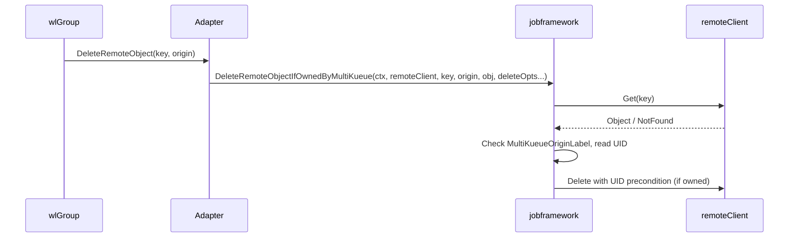

# PR #11877: [Fix] Remove MultiKueue owned Jobs only

**Summary**: [Fix] Remove MultiKueue owned Jobs only

**Sources**: https://github.com/kubernetes-sigs/kueue/pull/11877

**Last updated**: 2026-06-09T07:28:15Z

---

## Metadata

- **State**: open
- **Author**: [@mszadkow](https://github.com/mszadkow)
- **Branch**: `fix/11849-job-deleted-on-worker` → `main`
- **Created**: 2026-06-01T18:25:47Z
- **Updated**: 2026-06-09T07:28:15Z
- **Merged**: —
- **Closed**: —
- **Labels**: `kind/bug`, `release-note`, `size/L`, `ok-to-test`, `cncf-cla: yes`
- **Assignees**: [@vladikkuzn](https://github.com/vladikkuzn)
- **Requested reviewers**: [@pajakd](https://github.com/pajakd), [@sohankunkerkar](https://github.com/sohankunkerkar), [@mochizuki875](https://github.com/mochizuki875), [@vladikkuzn](https://github.com/vladikkuzn), [@tenzen-y](https://github.com/tenzen-y), [@PBundyra](https://github.com/PBundyra)
- **Changed files**: 34   **+391 / -71**

## Description

<!--  Thanks for sending a pull request!  Here are some tips for you:

1. If this is your first time, please read our contributor guidelines: https://git.k8s.io/community/contributors/guide/first-contribution.md#your-first-contribution and developer guide https://git.k8s.io/community/contributors/devel/development.md#development-guide
2. Please label this pull request according to what type of issue you are addressing, especially if this is a release targeted pull request. For reference on required PR/issue labels, read here:
https://git.k8s.io/community/contributors/devel/sig-release/release.md#issuepr-kind-label
3. Ensure you have added or ran the appropriate tests for your PR: https://git.k8s.io/community/contributors/devel/sig-testing/testing.md
4. If you want *faster* PR reviews, read how: https://git.k8s.io/community/contributors/guide/pull-requests.md#best-practices-for-faster-reviews
5. If the PR is unfinished, see how to mark it: https://git.k8s.io/community/contributors/guide/pull-requests.md#marking-unfinished-pull-requests
-->

#### What type of PR is this?
/kind bug
/area multikueue
<!--
Add one of the following kinds:
/kind bug
/kind cleanup
/kind documentation
/kind feature
/kind kep

Optionally add one or more of the following kinds if applicable:
/kind api-change
/kind deprecation
/kind failing-test
/kind flake
/kind regression

Please also consider setting the area:
/area tas
/area integrations
/area multikueue
/area dashboard
/area localization
/area testing
/area website
-->

#### What this PR does / why we need it:
When a Job is created on the manager cluster while a Job with the same NamespacedName already exists on a worker cluster, the pre-existing worker-local Job is deleted.

#### Which issue(s) this PR fixes:
<!--
*Automatically closes linked issue when PR is merged.
Usage: `Fixes #<issue number>`, or `Fixes (paste link of issue)`.
_If PR is about `failing-tests or flakes`, please post the related issues/tests in a comment and do not use `Fixes`_*
-->
Fixes #11849 

#### Special notes for your reviewer:

#### Does this PR introduce a user-facing change?
<!--
If no, just write "NONE" in the release-note block below.
If yes, a release note is required:
Enter your extended release note in the block below. If the PR requires additional action from users switching to the new release, include the string "action required".
-->
```release-note
MultiKueue: Creating a Job on the manager cluster deletes any pre-existing remote worker Job that happens to share the same NamespacedName.
```


<!-- This is an auto-generated comment: release notes by coderabbit.ai -->
## Summary by CodeRabbit

* **Bug Fixes**
  * Remote status sync and deletions now validate object ownership by origin to avoid touching resources not managed by MultiKueue.
  * Prevents accidental deletion of pre-existing worker-local objects with matching names that aren’t owned by MultiKueue.

* **New Features**
  * Safer remote-delete behavior that only removes objects confirmed to be owned by the specified origin.

* **Tests**
  * Added unit and integration tests covering ownership validation and origin-scoped deletions.
<!-- end of auto-generated comment: release notes by coderabbit.ai -->

## Discussion

### Comment by [@k8s-ci-robot](https://github.com/k8s-ci-robot) — 2026-06-01T18:25:51Z

Skipping CI for Draft Pull Request.
If you want CI signal for your change, please convert it to an actual PR.
You can still manually trigger a test run with `/test all`

### Comment by [@netlify[bot]](https://github.com/apps/netlify) — 2026-06-01T18:25:54Z

### <span aria-hidden="true">✅</span> Deploy Preview for *kubernetes-sigs-kueue* canceled.


|  Name | Link |
|:-:|------------------------|
|<span aria-hidden="true">🔨</span> Latest commit | 3d4a9db4bd2aa58437f7605e5db00c3e1279ac5d |
|<span aria-hidden="true">🔍</span> Latest deploy log | https://app.netlify.com/projects/kubernetes-sigs-kueue/deploys/6a27bf2eb542d40008f43c83 |

### Comment by [@mszadkow](https://github.com/mszadkow) — 2026-06-01T18:25:56Z

/ok-to-test

### Comment by [@k8s-ci-robot](https://github.com/k8s-ci-robot) — 2026-06-02T06:21:25Z

[APPROVALNOTIFIER] This PR is **NOT APPROVED**

This pull-request has been approved by: *<a href="https://github.com/kubernetes-sigs/kueue/pull/11877#" title="Author self-approved">mszadkow</a>*
**Once this PR has been reviewed and has the lgtm label**, please assign [mimowo](https://github.com/mimowo) for approval. For more information see [the Code Review Process](https://git.k8s.io/community/contributors/guide/owners.md#the-code-review-process).

The full list of commands accepted by this bot can be found [here](https://go.k8s.io/bot-commands?repo=kubernetes-sigs%2Fkueue).

<details open>
Needs approval from an approver in each of these files:

- **[OWNERS](https://github.com/kubernetes-sigs/kueue/blob/main/OWNERS)**

Approvers can indicate their approval by writing `/approve` in a comment
Approvers can cancel approval by writing `/approve cancel` in a comment
</details>
<!-- META={"approvers":["mimowo"]} -->

### Comment by [@mszadkow](https://github.com/mszadkow) — 2026-06-02T06:25:28Z

/cc @mochizuki875

### Comment by [@vladikkuzn](https://github.com/vladikkuzn) — 2026-06-02T11:59:09Z

/lgtm

### Comment by [@k8s-ci-robot](https://github.com/k8s-ci-robot) — 2026-06-02T11:59:17Z

LGTM label has been added.  <details>Git tree hash: 09347feb249614427a2e3eec0e460b7f16ed21af</details>

### Comment by [@mochizuki875](https://github.com/mochizuki875) — 2026-06-03T17:47:24Z

@mszadkow 
Thank you for your fix.

By adding `DeleteRemoteObjectIfOwnedByMultiKueue()`, it will not delete pre-existing worker-local job with the same NamespacedName and return nil.
However, after skipping deletion, remote workloads may be created onto worker clusters following dispatching algorithm, and one of them will be admitted and remain on the worker cluster without `managedBy` field.

Is this intentional?
IMO, should we prevent remote workload from being created and admitted on the cluster where the job with same NamespacedName exist on?

### Comment by [@mochizuki875](https://github.com/mochizuki875) — 2026-06-07T16:37:18Z

By adding `DeleteRemoteObjectIfOwnedByMultiKueue()`, the possibility of performing `SyncJob()` on Job resources with the same NamespacedName has been reintroduced.
Upon further investigation, I've noticed two problems caused by this:

1. Pre-existing worker-local job will be mistakenly identified as remote Job
It may be the same behavior of previous version before https://github.com/kubernetes-sigs/kueue/pull/9201 was merged.

`jobSync()` is implemented in each multiKueueAdapter.
For example, in case of job, the status of pre-existing worker-local jobs on worker cluster will be reflected in the status of local jobs on the manager cluster.

https://github.com/kubernetes-sigs/kueue/blob/1744552f93d8a886c7265dd81aee3198d79424b6/pkg/controller/jobs/job/job_multikueue_adapter.go#L65-L83

2. The manager cluster may choose an inappropriate worker cluster.
Please assume that, there are two worker cluster, one has the local job resource which has same NamespacedName(call worker-1) and the other does not(call worker-2).
While the remote job should be dispatched on to worker-2 avoiding worker-1, the manager cluster selects the worker cluster containing the first admitted workload from among the worker clusters that contain the admitted workload.
So there is a possibility that worker-1 will be selected.

https://github.com/kubernetes-sigs/kueue/blob/1744552f93d8a886c7265dd81aee3198d79424b6/pkg/controller/admissionchecks/multikueue/workload.go#L113-L130

### Comment by [@mszadkow](https://github.com/mszadkow) — 2026-06-08T10:18:17Z

> @mszadkow Thank you for your fix.
> 
> By adding `DeleteRemoteObjectIfOwnedByMultiKueue()`, it will not delete pre-existing worker-local job with the same NamespacedName and return nil. However, after skipping deletion, remote workloads may be created onto worker clusters following dispatching algorithm, and one of them will be admitted and remain on the worker cluster without `managedBy` field.
> 
> Is this intentional? IMO, should we prevent remote workload from being created and admitted on the cluster where the job with same NamespacedName exist on?

Good question, I think we should reference the [Cluster Role Sharing](https://github.com/kubernetes-sigs/kueue/issues/5704).

We can either:
1. Put the pressure on the customer to not create the same named jobs and update the documentation.
2. Prevent it completely by checking if the job or workload already exists (which I assume is not what we want).
3. Allow for the same named jobs to exist, but add all the guards.

@mimowo @tenzen-y  any thoughts?

### Comment by [@mimowo](https://github.com/mimowo) — 2026-06-08T10:30:11Z

/kind bug

### Comment by [@mimowo](https://github.com/mimowo) — 2026-06-08T10:31:11Z

@mszadkow please update the release note, the prefix should always be the feature / area, not "fix" . The fix is annotated by the PR kind. Updated to "bug"

### Comment by [@mimowo](https://github.com/mimowo) — 2026-06-08T10:44:15Z

@mochizuki875 thank you for reviewing and your comment and findings in https://github.com/kubernetes-sigs/kueue/pull/11877#issuecomment-4643280638

> Pre-existing worker-local job will be mistakenly identified as remote Job
It may be the same behavior of previous version before https://github.com/kubernetes-sigs/kueue/pull/9201 was merged.

Could this be mitigated by checking if the MultiKueueOriginLabel corresponding to "our" MK? 

> jobSync() is implemented in each multiKueueAdapter.
For example, in case of job, the status of pre-existing worker-local jobs on worker cluster will be reflected in the status of local jobs on the manager cluster.

This is a good point, but here we could make the sync only if (1.) MultiKueueOriginLabel corresponds to "our" MK? 

Additionally we could strengthten the check by saving the UUID of the job on the manager in the job on the worker, so that later we can check the UUIDs for skip of the sync. Would that be needed in your case? If not, then maybe we can defer for later, but I think this is needed in the long term.

> The manager cluster may choose an inappropriate worker cluster.
Please assume that, there are two worker cluster, one has the local job resource which has same NamespacedName(call worker-1) and the other does not(call worker-2).
While the remote job should be dispatched on to worker-2 avoiding worker-1, the manager cluster selects the worker cluster containing the first admitted workload from among the worker clusters that contain the admitted workload.
So there is a possibility that worker-1 will be selected.

Yes, but this probably also could be fixed by checking "MultiKueueOriginLabel" for your needs, right?

Similarly as in the other points we could check if the job on worker-1 has the matching UUID (from the manager clusteR) imprinted in the annotation.

### Comment by [@mimowo](https://github.com/mimowo) — 2026-06-08T10:46:46Z

So, I would propose in this PR to check MultiKueueOriginLabel consistently in all places identified by @mochizuki875, and re-evaluate the need for checking also the UUIDs, but that would require imprinting the UUID on the worker workloads, and probably can be done in a follow up, because the scenario is a bit different - it is not about a job submitted to worker outside of MK, but re-creation of a job on the manager cluster.

### Comment by [@mochizuki875](https://github.com/mochizuki875) — 2026-06-08T15:58:04Z

@mimowo 
Thank you for your idea.
I agree your idea to check completely MultiKueueOriginLabel key-value.

> @mochizuki875 thank you for reviewing and your comment and findings in [#11877 (comment)](https://github.com/kubernetes-sigs/kueue/pull/11877#issuecomment-4643280638)
> 
> > Pre-existing worker-local job will be mistakenly identified as remote Job
> > It may be the same behavior of previous version before #9201 was merged.
> 
> Could this be mitigated by checking if the MultiKueueOriginLabel corresponding to "our" MK?
> 
> > jobSync() is implemented in each multiKueueAdapter.
> > For example, in case of job, the status of pre-existing worker-local jobs on worker cluster will be reflected in the status of local jobs on the manager cluster.
> 
> This is a good point, but here we could make the sync only if (1.) MultiKueueOriginLabel corresponds to "our" MK?

As you say, I think this miss-identified problem may be mitigated by identifying remote job using not only NamespacedName, but also MultiKueueOriginLabel when manager cluster will sync the status of the worker-local job.

> > The manager cluster may choose an inappropriate worker cluster.
> > Please assume that, there are two worker cluster, one has the local job resource which has same NamespacedName(call worker-1) and the other does not(call worker-2).
> > While the remote job should be dispatched on to worker-2 avoiding worker-1, the manager cluster selects the worker cluster containing the first admitted workload from among the worker clusters that contain the admitted workload.
> > So there is a possibility that worker-1 will be selected.
> 
> Yes, but this probably also could be fixed by checking "MultiKueueOriginLabel" for your needs, right?

On the other hand, I don't know about second one.
To select appropriate worker in this case, manager need to know which worker has same NamespacedName jobs and try to avoid them.
I can't imagine it can be done by checking MultiKueueOriginLabel.
So could you please tell me your idea more detail?

### Comment by [@mimowo](https://github.com/mimowo) — 2026-06-08T16:30:41Z

> To select appropriate worker in this case, manager need to know which worker has same NamespacedName jobs and try to avoid them.
> So could you please tell me your idea more detail?

Oh I see, I didn't understand fully the problem at the beginning so my idea isn't clear yet.

One relatively simple idea is to use Get just before dispatching to check if the Job already exists or not - and avoid dispatching workloads to such workers in the first place.

However, this may still be racy for TOCTOU as someone may create the workload in the meanwhile.

In that case we probably should mark workloads corresponding to pre-existing Jobs as Finished. We would not delete them to avoid re-creation, but just mark finished so that they don't get admitted.

### Comment by [@k8s-ci-robot](https://github.com/k8s-ci-robot) — 2026-06-08T19:02:19Z

New changes are detected. LGTM label has been removed.

### Comment by [@coderabbitai[bot]](https://github.com/apps/coderabbitai) — 2026-06-08T19:02:34Z

<!-- This is an auto-generated comment: summarize by coderabbit.ai -->
<!-- review_stack_entry_start -->

[](https://app.coderabbit.ai/change-stack/kubernetes-sigs/kueue/pull/11877?utm_source=github_walkthrough&utm_medium=github&utm_campaign=change_stack)

<!-- review_stack_entry_end -->
No actionable comments were generated in the recent review. 🎉

<details>
<summary>ℹ️ Recent review info</summary>

<details>
<summary>⚙️ Run configuration</summary>

**Configuration used**: defaults

**Review profile**: CHILL

**Plan**: Pro

**Run ID**: `f5819583-56d9-4ad1-9b35-ccf646753316`

</details>

<details>
<summary>📥 Commits</summary>

Reviewing files that changed from the base of the PR and between 8424c6500910bae3a759c61670fb61a328cc559f and 3d4a9db4bd2aa58437f7605e5db00c3e1279ac5d.

</details>

<details>
<summary>📒 Files selected for processing (34)</summary>

* `pkg/controller/admissionchecks/multikueue/externalframeworks/adapter.go`
* `pkg/controller/admissionchecks/multikueue/multikueuecluster.go`
* `pkg/controller/admissionchecks/multikueue/multikueuecluster_test.go`
* `pkg/controller/admissionchecks/multikueue/workload.go`
* `pkg/controller/admissionchecks/multikueue/workload_test.go`
* `pkg/controller/jobframework/multikueue.go`
* `pkg/controller/jobframework/multikueue_test.go`
* `pkg/controller/jobs/appwrapper/appwrapper_multikueue_adapter.go`
* `pkg/controller/jobs/appwrapper/appwrapper_multikueue_adapter_test.go`
* `pkg/controller/jobs/job/job_multikueue_adapter.go`
* `pkg/controller/jobs/job/job_multikueue_adapter_test.go`
* `pkg/controller/jobs/jobset/jobset_multikueue_adapter.go`
* `pkg/controller/jobs/jobset/jobset_multikueue_adapter_test.go`
* `pkg/controller/jobs/kubeflow/jobs/jaxjob/jaxjob_multikueue_adapter_test.go`
* `pkg/controller/jobs/kubeflow/jobs/paddlejob/paddlejob_multikueue_adapter_test.go`
* `pkg/controller/jobs/kubeflow/jobs/pytorchjob/pytorch_multikueue_adapter_test.go`
* `pkg/controller/jobs/kubeflow/jobs/tfjob/tfjob_multikueue_adapter_test.go`
* `pkg/controller/jobs/kubeflow/jobs/xgboostjob/xgboostjob_multikueue_adapter_test.go`
* `pkg/controller/jobs/kubeflow/kubeflowjob/kubeflowjob_multikueue_adapter.go`
* `pkg/controller/jobs/leaderworkerset/leaderworkerset_multikueue_adapter.go`
* `pkg/controller/jobs/leaderworkerset/leaderworkerset_multikueue_adapter_test.go`
* `pkg/controller/jobs/mpijob/mpijob_multikueue_adapter.go`
* `pkg/controller/jobs/mpijob/mpijob_multikueue_adapter_test.go`
* `pkg/controller/jobs/pod/pod_multikueue_adapter.go`
* `pkg/controller/jobs/pod/pod_multikueue_adapter_test.go`
* `pkg/controller/jobs/ray/ray_multikueue_adapter.go`
* `pkg/controller/jobs/raycluster/raycluster_multikueue_adapter_test.go`
* `pkg/controller/jobs/rayjob/rayjob_multikueue_adapter_test.go`
* `pkg/controller/jobs/rayservice/rayservice_multikueue_adapter_test.go`
* `pkg/controller/jobs/statefulset/statefulset_multikueue_adapter.go`
* `pkg/controller/jobs/statefulset/statefulset_multikueue_adapter_test.go`
* `pkg/controller/jobs/trainjob/trainjob_multikueue_adapter.go`
* `pkg/controller/jobs/trainjob/trainjob_multikueue_adapter_test.go`
* `test/integration/multikueue/cluster_role_sharing_test.go`

</details>

<details>
<summary>✅ Files skipped from review due to trivial changes (1)</summary>

* pkg/controller/jobs/statefulset/statefulset_multikueue_adapter_test.go

</details>

<details>
<summary>🚧 Files skipped from review as they are similar to previous changes (29)</summary>

* pkg/controller/jobs/leaderworkerset/leaderworkerset_multikueue_adapter_test.go
* pkg/controller/jobs/rayservice/rayservice_multikueue_adapter_test.go
* pkg/controller/jobs/job/job_multikueue_adapter_test.go
* pkg/controller/jobs/kubeflow/jobs/xgboostjob/xgboostjob_multikueue_adapter_test.go
* pkg/controller/jobs/raycluster/raycluster_multikueue_adapter_test.go
* pkg/controller/jobs/jobset/jobset_multikueue_adapter_test.go
* pkg/controller/jobs/appwrapper/appwrapper_multikueue_adapter_test.go
* pkg/controller/jobs/kubeflow/jobs/paddlejob/paddlejob_multikueue_adapter_test.go
* pkg/controller/jobs/kubeflow/jobs/jaxjob/jaxjob_multikueue_adapter_test.go
* pkg/controller/jobs/kubeflow/jobs/tfjob/tfjob_multikueue_adapter_test.go
* pkg/controller/admissionchecks/multikueue/workload.go
* pkg/controller/jobs/kubeflow/kubeflowjob/kubeflowjob_multikueue_adapter.go
* pkg/controller/admissionchecks/multikueue/multikueuecluster.go
* test/integration/multikueue/cluster_role_sharing_test.go
* pkg/controller/admissionchecks/multikueue/multikueuecluster_test.go
* pkg/controller/jobs/kubeflow/jobs/pytorchjob/pytorch_multikueue_adapter_test.go
* pkg/controller/jobs/statefulset/statefulset_multikueue_adapter.go
* pkg/controller/jobs/rayjob/rayjob_multikueue_adapter_test.go
* pkg/controller/jobs/trainjob/trainjob_multikueue_adapter.go
* pkg/controller/admissionchecks/multikueue/externalframeworks/adapter.go
* pkg/controller/jobs/mpijob/mpijob_multikueue_adapter.go
* pkg/controller/jobs/jobset/jobset_multikueue_adapter.go
* pkg/controller/admissionchecks/multikueue/workload_test.go
* pkg/controller/jobs/job/job_multikueue_adapter.go
* pkg/controller/jobframework/multikueue_test.go
* pkg/controller/jobs/ray/ray_multikueue_adapter.go
* pkg/controller/jobs/mpijob/mpijob_multikueue_adapter_test.go
* pkg/controller/jobs/leaderworkerset/leaderworkerset_multikueue_adapter.go
* pkg/controller/jobs/pod/pod_multikueue_adapter.go

</details>

</details>

---
<!-- walkthrough_start -->

<details>
<summary>📝 Walkthrough</summary>

## Walkthrough

MultiKueue now validates that remote objects are owned by the specified MultiKueue origin before deleting or syncing them, preventing deletion of pre-existing worker-local objects with matching NamespacedNames. A new framework layer provides `ValidateRemoteObjectOwnership` and `DeleteRemoteObjectIfOwnedByMultiKueue` helpers that check the `MultiKueueOriginLabel`, and all job type adapters are updated to use these ownership-checked operations.

## Changes

**Remote object ownership validation and enforcement**

|Layer / File(s)|Summary|
|---|---|
|**Ownership validation framework** <br> `pkg/controller/jobframework/multikueue.go`, `pkg/controller/jobframework/multikueue_test.go`|New `ValidateRemoteObjectOwnership()`, `DeleteRemoteObjectIfOwnedByMultiKueue()`, and sentinel error `ErrRemoteObjectNotOwnedByMultiKueue` check the `MultiKueueOriginLabel` and conditionally delete remote objects with UID-pinned deletion to prevent replacing unrelated objects. Tests cover ownership matching, mismatches, missing labels, and UID preconditions.|
|**MultiKueueAdapter interface and Job adapter** <br> `pkg/controller/jobframework/multikueue.go`, `pkg/controller/jobs/job/job_multikueue_adapter.go`, `pkg/controller/jobs/job/job_multikueue_adapter_test.go`|`DeleteRemoteObject` signature updated to accept `origin` parameter. Job adapter validates remote ownership in `SyncJob` and uses ownership-checked deletion, establishing the pattern for all other adapters.|
|**Remaining job type adapters** <br> `pkg/controller/jobs/jobset/...`, `pkg/controller/jobs/appwrapper/...`, `pkg/controller/jobs/kubeflow/kubeflowjob/...`, `pkg/controller/jobs/leaderworkerset/...`, `pkg/controller/jobs/mpijob/...`, `pkg/controller/jobs/pod/...`, `pkg/controller/jobs/ray/...`, `pkg/controller/jobs/statefulset/...`, `pkg/controller/jobs/trainjob/...`|All adapters updated to accept `origin` in `DeleteRemoteObject`, validate ownership before syncing status in `SyncJob`, and use the ownership-checked deletion helper instead of direct deletes. Test cases updated to pass origin.|
|**External framework adapter and GC caller** <br> `pkg/controller/admissionchecks/multikueue/externalframeworks/adapter.go`, `pkg/controller/admissionchecks/multikueue/multikueuecluster.go`, `pkg/controller/admissionchecks/multikueue/multikueuecluster_test.go`|External framework adapter and multikueuecluster GC deletion path updated to validate ownership and pass origin; test fixture adjusted to label jobs with the expected origin.|
|**Workload dispatcher caller** <br> `pkg/controller/admissionchecks/multikueue/workload.go`, `pkg/controller/admissionchecks/multikueue/workload_test.go`|`RemoveRemoteObjects` now passes origin to `DeleteRemoteObject`, and test expectations updated to reflect correct origin labeling.|
|**Integration test** <br> `test/integration/multikueue/cluster_role_sharing_test.go`|New regression test verifies that pre-existing worker-local Jobs with matching NamespacedNames are not deleted when a dispatched remote Job is created, confirming the ownership label prevents unintended deletion.|

## Sequence Diagram(s)



## Estimated code review effort

🎯 3 (Moderate) | ⏱️ ~25 minutes

## Poem

> 🐰 In gardens of clusters, jobs grow with care,
> Now origins labelled so each gets its fair share.
> No more shall pre-existing workloads disappear,
> When dispatched companions attempt to appear!
> Safe labels and validation keep all jobs right here. 🌱

</details>

<!-- walkthrough_end -->
<!-- pre_merge_checks_walkthrough_start -->

<details>
<summary>🚥 Pre-merge checks | ✅ 4 | ❌ 1</summary>

### ❌ Failed checks (1 warning)

|     Check name     | Status     | Explanation                                                                          | Resolution                                                                         |
| :----------------: | :--------- | :----------------------------------------------------------------------------------- | :--------------------------------------------------------------------------------- |
| Docstring Coverage | ⚠️ Warning | Docstring coverage is 8.00% which is insufficient. The required threshold is 80.00%. | Write docstrings for the functions missing them to satisfy the coverage threshold. |

<details>
<summary>✅ Passed checks (4 passed)</summary>

|         Check name         | Status   | Explanation                                                                                                                                                                                                                                                                                                                 |
| :------------------------: | :------- | :-------------------------------------------------------------------------------------------------------------------------------------------------------------------------------------------------------------------------------------------------------------------------------------------------------------------------- |
|      Description Check     | ✅ Passed | Check skipped - CodeRabbit’s high-level summary is enabled.                                                                                                                                                                                                                                                                 |
|         Title check        | ✅ Passed | The title '[Fix] Remove MultiKueue owned Jobs only' directly and clearly describes the main change: restricting job deletion to only MultiKueue-owned objects, which is the core fix for issue `#11849`.                                                                                                                      |
|     Linked Issues check    | ✅ Passed | The PR implements the core objective from `#11849`: adding ownership validation (via MultiKueueOriginLabel checks) to prevent deletion of non-MultiKueue jobs. This is done through ValidateRemoteObjectOwnership and DeleteRemoteObjectIfOwnedByMultiKueue helpers, consistently applied across all adapter implementations. |
| Out of Scope Changes check | ✅ Passed | All changes are narrowly scoped to implementing ownership validation and safe deletion: adding jobframework helpers, updating adapter method signatures, adding origin parameter propagation, and test updates. The integration test validates the fix. No unrelated changes are present.                                   |

</details>

<sub>✏️ Tip: You can configure your own custom pre-merge checks in the settings.</sub>

</details>

<!-- pre_merge_checks_walkthrough_end -->
<!-- finishing_touch_checkbox_start -->

<details>
<summary>✨ Finishing Touches</summary>

<details>
<summary>🧪 Generate unit tests (beta)</summary>

- [ ] <!-- {"checkboxId": "f47ac10b-58cc-4372-a567-0e02b2c3d479", "radioGroupId": "utg-output-choice-group-unknown_comment_id"} -->   Create PR with unit tests

</details>

</details>

<!-- finishing_touch_checkbox_end -->
<!-- This is an auto-generated comment: all tool run failures by coderabbit.ai -->

> [!WARNING]
> Tools execution failed with the following error:
> 
> Failed to run tools: 13 INTERNAL: Received RST_STREAM with code 2 (Internal server error)

<!-- end of auto-generated comment: all tool run failures by coderabbit.ai -->
<!-- tips_start -->

---


<sub>Comment `@coderabbitai help` to get the list of available commands and usage tips.</sub>

<!-- tips_end -->
<!-- internal state start -->


<!-- DwQgtGAEAqAWCWBnSTIEMB26CuAXA9mAOYCmGJATmriQCaQDG+Ats2bgFyQAOFk+AIwBWJBrngA3EsgEBPRvlqU0AgfFwA6NPEgQAfACgjoCEYDEZyAAUASpETZWaCrI4Ho6gDYkuAbQBi8AAeALqQNiTM+FKQALLYnuIA0tgkqfwA7uT0AFKCyPgYnvKAKATWdmYAjJUAHADsdZBykMyIAF5otADW+BmQABQCVBgMsFwAZsEA9NU1ACwAnGBCgmBK3jS0YIVgGfgUXZSQgEmELdoYAJQakAAyKiSeiFxd8Bi0UwLYRAA0kBQPJDQiBIYAw+Bov0Q8DaJCmN1++C6YAIyOkuF+DBG4zADE8aC4smk1wAwv9qHRIAAmAAMlIAbGBqQzqZVrgBlXDUbBPfjcMjXCISeAkDKUHncNBCNBdWiQ/CwTBdbAYQ4HZy/KKjaHYF71ACsvwkeNo8C6SraGF+NAwMIwYFkvysACFlbRZFQNEYACLSBgUeDccSFLgASSw8US8BSaRIvwysDI6EgeQEKGQfsBm34WFwCbOGDQpD4uO5ND4mHoaGTgkgGXUsEguZI9jQbEgADlW9IJQw6J222hPGS3ZASEEkLgClgq3sDkcS4gy1a87wQWOJ68iLX9qqwJ58AxB9XUxkgU0SJvIOsSJtrnBULZGAqMKQZCQFUL9vZ8NniseClkFLNBGySpOkzjNv8URSPQhTbnOxaeKWYq/KuUgYOIL5XgCQZYPg4zoBQai4FQLg8P8YDroul6zru+6Hp4/6NgquD2Aq/zMc2iBdh2XaID2fZdneeaPpMQTSGmDjNlUtSLAKAJAs2YI0FwIFRmBPiQKSmaXlWKbZpx+aFvOSGLkc140MgmDyKulHjtRWFQeCza0Uc+m5tQkAKtwfIYMgBBsRBhncW2/bdmgva0GFAyYMp5KVlZTRfFc5iWAA8sIojiFIyDjBQLCQJ4ryHPQSBSU8BghogUmQDJ8wLH8JDcPsk7MZ5rxxAkoExvYN7YNw/l5swmDGRQYBQkotaeBETAjPA3h8BKubhJE0QkBEUQ0BlIhiIgUw+hs62rVtmViP0FzYYdVkYPIrljQuZbHmcuBalhTa8Ww/ERYJbYCCQ4z7M2GbUJe71OTQ8FdPunTCc2+SUDBo7jOMWVcMDmFbnpNZwe9w0FkWjCmY9h5YBZzaYKO9kY5DlB7geR76f8RDOLQ3jVfwBHxjeCZ8OoaZGaQ9DNEqMaw/wp3Zc2qABWh7CQMqrzWko9AWfAcH4eRa5UzRO60/RDP5LWCZYHjo3jfAk0plZHEml9L0JvQZRkA4HGFH+4OwqbgtgHIYBqdG6SCDtrVBU5iP9PAGgkBovz/Iu/piJdN5qzmP5B1lAHZE08j+xpFy/BW6ASPgFtJ9TzjEaR8j64xcf4NgFC9lONOIchFCIJ6BgWFpLBsBhyAOE4LhuFAxIhlM4z7hkzw1IgOLwGA+UCOCkDKRStBUOMuBTGPkBENgFuYL2ADcLTtJ0PR9MNc70FMiLIoQlm4KfNwAOLQLEtZnp0yucVgYcUjQFvI45A+ijEwK+U+kwCyMTQD5fKEgjz/AAI4HzjugeBa0+B5QKmlAA6u2AAojYNkAxmDwCiHsFKUBNQIDaDqeA+ouBwEVIAvAsB9ix20MCegs1ewUD8m1ViiAXg+UvKrOCQoqwHRvEdTaJBtpZRDOMNKgFaBOlkLnHqJNGqK3yrQbAvZyJqz4FQXsUwLbsHgJMQ8uFJKpAqpASAlQLpWAolRamd06YMSYsNeQf0WhIEsRhaxwoEqNXkf+U+KwBBslkCMc6KBmDcG8H3TkuFkD/EnllFu3ijwxPsOk7kKAMI/i9iZNuGI0DckvK8JgFB/iJ2CeIGxIM4KF0QPEhgnonGUgurEEaBM/FPnwPgYE6AsCvDgbwfAvB4Dkhblwax2YXK63LEOQEI4FSJRCiCAsbB6A1yeoXTA4IeZXnwBJZSy5mzlIoAAcgHgCMQKdCr4CIPABgZx5DUU8IxW2S1RiNh/O9O6tZ6yGSOfpfowJvAvLgtyCS71Jjt1Yp0chuAsy0WhpWKIWE7qIHzjwZyITBx/nReocuETnKQxxeC3M9dWLlPUfISYDxaDNw8qxO6PSWgHjoQw/U9gvivizLLEJjljqrIOHS9GKcpgUuqq8uCD0xRG0oFxLsoIuz0BicgDxnoaHn26L0LgABBERFIuZNkWv8dC1MAXUFGAq2g5ClU4x/A4IFqr2781XCjBpgC3jkVmWMiksyMlcH6C4xqqD4AcURb6tAxdS67O1QcyAeqBi0APES/ofTNb2qvEgQFDZmijFEC8LCHiyBGNso6+2CI+D9AAMwXTJb0FsbZ9kSU+Gi2g9B94sw7gYGhFDej4C4G40NPCnyVsvFo1IaV/QfIwHcP6jEAq2wxgfRADZF0gmZdSiG6ddqQBwcwQildnDV3poxK2Ez6ABVmiaOxnSRgGS5YVe4nhT4OCIKK8NgYU5kvkBQuZEqty40GW5GsABVODIYvTZgCmC7F+BOi5S/PHQoQynUICwv0HRASlABv+LQK4K0mCsDIL/cDqSrFYVmlCMyGFOqRgDgoldrx10PDnQwLoyAOq5gfHYQupHKD+iwghpDSSIPUwClWAGfzehgH6oavlWp6G6jqHqc1RB/gUjxBu/jgnAniGZhDN1zTQm2NeX2yAqC0QpytQmG136N1WX3OQQtctYVZVqQWTBcyFkEtPkCEq56vy4mcLZtpeEsBgv8/CrAYkiSjsCZQn8/RlNTzU9wC4U78rNVnVWKEyTvDmfgJZ15MtKAAwoJeqsr8byZtLOeBrzYG1AsUymlWJb8Ogx/ASoR6ANmdHkB+cmT06zLXersj64VIphV+MpS80A0rEg23Bv430InnEQFAr8ZjpCQhFWiCk18q1blsh4nWMqMMcvQMgQIGAkAOwGK8MynQOZl03BdRAIKEy3UKIATAJWIBIpZiugGnp0lYpMx52xSGvMVE0sirkQ5bMYnHLA9y7qs8Z/aZoTkylAhLZbwxQzYlqwH8j+ZNJcVY4UvGCO0B7M35FPtjpQfAZPIfA1JjGqEKLdYbDWkYQMEwCcQE2s4BxLy3e1vincOKXuvHexSDquXVP9Tp+gAdcdMnfWuvQLxyW7F8MoH5Tu+hjDgCgLR371SUSkHIFQLM1G0lcF4OLYOkhe3yCYDzlQxEtA6FtyYKA94hPXRwC7sgygPe93YFwKgfRB7X38YHqnVBVDqDD7oMAhg7emAMNwLoRApizRIvgP5lAXVuqhIUCt0upjMC6qaDSUwxxlhgXlLstE9qdDgWWDQRBJ0GAAETT67pYM1IZiAJ/dxSDPN7fvgJfNIIwYZIAAAM4kjBTLvm5+uR8gM7YgoqtBySZKlb7nJvQ3d7oDOgZmX3WLvRmUKX+u/9gE4wLvh1oDPYF0rAPlG9m0JeIuFyLlPlJemDHfqeh/kDs2EcoUNHEYLvjIjQBtM5IomIIAaeMgP1NflmAFCgmguTFgL/txgATwM4F2I9IXFujhM2AgZEkgb+GBgRHzKgI/kBDnB3pxmLGwAyvQGCH0NeJZhJBIqnHvjEv3mwLRBoNgXIngRLMoqotkBogesfvLFCFhAIBFBXvlK6CGhKDVoUL8O/psr9iaI0rgH+AxEVFhLvriMKBhCoawYAf0LNg2LviGEQGCP8O2OCP4PXG8LvhdO0nhBLAoH5CRIYlmBelwZAK/AAGpJCdxGCz6QBmqJCJ4px67vRKAxbu5FG/ZjjNQUBZhfjcDYACBFRfJWLiBb4ZaxDcyKD2DVYFi4ANzNgkHxRcC77jDKhfL9BVgABUZq1+gYlAF0qhuBJ0wcRGuAQQ8RNAQQmgxIhQmx6IkAAA+oTB4dsUVOwLHFKsSGcWxu4ewBoFcScb8IcPILgLIHyB3GFF9Mtl2BdJJvsIAR1LvuXpXtXvlHXhQA3mVCnC3oJm3h3iLKkN3lsVboOIoSKDuEPrMaPuPoAacCMWMTFJANMVifMZAIsVKvgbgKsesdXj3vcbsT3r8EcbcZ4Q8ecceiQGyTcdcacY8ZAM8Y2G8USJ8QJFFF2E2v/oUlJkQL8Q0v8UYDcK8BJBvoLFwAANR6hTBgBzBGCELUTDRJ6TR2rCh9D/QNacCQAAAS1WsAU+M+o6pewJVeuxYJC0kJ7qIwUusJ7ekYCJns8JGkPqY+E+0+k+uR8+i+bu8UwqQ88gGsKpbRO+u+HsXJmgFAyor8xIehXMpMzOWEVYHstKj2oOmcl4nBUiEyp+cxFAJ+WBrBSxCiEsgBzhq8naEo1UEkyZ3Sf+q6AJ04A66gtWKBlMG4TGDJWxj6xx7Ae0u+Ip30YpbAu+wkqAgxlkhkzMRExkOItecKdish9Bc2P4X+lihkPZHUl+6QAU70w+1Z2ROR3c+RZY8WxReYpReI5RhQBQBEVRLU4ai0DRTRo4ISrRiARgoR5Ancip5A6Yz4qpkAaplQWplQup+p0ZQekEJAQoIoSM5pqkdA8AjgdpYZDpYARgTpoJO59eiqTenplae0Pp4gfpcJvpgZRMlABxT8wZbgoZ4ZC+ruieK+jgme6+sFiZ1B0AaIDZqZmZeh70T8jAike+k+je92qoRZmGk5TY8amQbuHOAg1sXWrBtAk+hB38tAQgyE9AgOhku+BKVsgBYkfRCawIiUBSuI6B9AKRu+RhwIKYLo80POhBEK70u+eOtBvGnggBwIyBe+pG1SiQ+OvZn2CRthGsNS+ZWAyoxmAI9AdZTUOx3AsgURy5MFECSKeYBSSBiAoOHmDwxBs6W6/oMQ70mZz2wINRFRKOX6iAvYBY/o+Ad54ZBRH5giV5r5og75z5lRQQ1RtR/5jRnyQF4gIFRgUA4FJACpSppVm+tA6pLaSFKF4gBpCOVOjUWFppyMLUeFJohFPFJFZFFezpGErpVFrqUJzeXp9FAZMYUw6GMM4+3FM+D5fFS+0Zq+ZE8ZoloFBgtlngr8ph3AGguBUgDZlJiAgBEh9BHZg0GFkSLJuAJZe+Z5dBisP4u+RAGgMSMxZ+FAXhh0qNTZ6quZGwoMeYhZFF4J9+icKOVYQZMAK4/VxYZKwKe+5J8ilJgBJo4hK8dSSEk0ImyANB/+gBzg+8aSg1Q1T5GSItJRE1DB2tGsP5NRf5PAAFi1LRwo0Na1P4RtmwUw9RC1zRwF8gb5+tFR2GPRXI6CwmCAuU80LkGqT4ZVtAkFW1QdO16piFYAyFBgepR1aFp1xp2FZpV1cQ+Ft19pEApFZej1HNbp1F0Jn1zFjFXef1tAHFaIXFRFvFkZAlVlQla+kNZV0NcG3ApBl2HeKSzYu+Eli4eC00ogze/tzZilVRWUFItlaylQ9le+Rh9sEgrIR+XNrU5asFrNzYDWBpGMUweIsgjKv2IVEV/QfpGgYV/+EVvwcVXUiVrwFwI9fyJSnE2lohHCWw4CSpuqNYnwAVaq1lfM0ygISaOyTU+tku5wRmSpSSBy8yNA5KwCfAu+biJA39iQeCKuj2R9k+GQnglQk+d91woRjYaI54H4Ji/A5YHZHVn5tYgdCZQsJAe9waCtUpSRhU6gygjEu9jKGtD5w1U1Y1hlZRU1htM1v5sE81gFFtbR1t5Am10F4dcFCF1IWp1Ih1FCCdRpmFJpOFqdHRN1zA1d91OdIJLplFEJChVAShO4xdneosAN1dwNtdy+9dsZIlzdmB5Fpj4JUwFjA+1jDFtjqQwZKtA6mcYoCA3AkAl+h8diHSQCuNNK+5CYngfIvqKOB6YAR6VV1wIYrEeiighiEkVYoClMs1K+jGfGfx2CX4gAOASFmcHKQ6UCHsbdSpCAC4BAXHvukYODE2ocsVlFoeEwGA5WMXYl+i+oOYUKBsTqeRLITbvifWfauhFSrW/gkZWWPWIH+ZKf0GCNsJEzmUTbQQCfqskq8USicqLfWRSRoSomojoUIRpCMyMGMyxHvi1rgLvolPUxLJCKIsgPuYc+9JwagCpVhF+MC7QbVf8pcogBgODs9KMAXMGmTPVZeA1qeBQL/GTLyNrSksUlWIhshquBM3uZQP7p5XAYZCjPbOGnERHEEX/lhMpGAADGYXBGTJRnAN3QetTdWX2WWOMN9PM2LeocHIAS/V0VCEEV7VLMQW3dGQFLLdgJNBTErUlRKJY7IrTTkZrYUdQwI9hEIwbd+aI8beI6bY7UtYOdIx2MnWa1mIgv6CoN4MMYQg0gzcHKEbgIMyyroY/UCbnV426b41YwcDYyfTiRlu2Pa2U55aMynMMd01fuSJ6wM4BO3BE/0EHFOZ4ZSRKaulKf9qOHKRQH2Xvp489WYz44IGibRBGxpME9G7G2I+egm8GFc/TTc8HJofc5oo8zGNSRsXSTsRhIyRyambm7yeyQKa8e8RoHOd8WwAWx1PHJuAiMIFOxoPm2XAooGMgBoIe/jXTbImlMBoULKflGWwG5WzXt46G+ieGwE5G/gLvhlmGIK3tpK1ZZ7U5QMQq5sMMbyySbTaK/02dGIEEL8DXKmRcfIrB/yQwxdEXi0+pDGHy6PmB42SsZB9B3eghymTyU8Qwyu5cOW4GyY1W/e7W1q/W8+421GwYFBcqaJbtfBS2jUAdbHahYaRhedTozUddQRQY3dVnQ9ZR3eyGzR340+99akBXYuFXTxY4/xc4zGcJU3ZvtDTMT/rey9eY9J2G10A2zGAp5oDifSg2K/D+ArKxEwFIFQKQFFnwOzg+7RF5A8Kkx3JALkyUjXgYk3EmJyI0SCBvP7uJWiFh5Sb29of2xxk81E+S+MLIKzZ5IWfpPuW7HGQwAwA3MgEC3mPpB4ibl5N/HvoswO0uuFT+hK4Nm9ALdEJYvQHcqfP/ZQ61A+kFN4FvPLKUoYh9gVwkyenEaC1CS+NB8YTjeQ5KdlZ4L8NskmG6gaRWuI//rLgt29pwz+t575z/Irb3bgFF7c76w8/F6Z0S0g6SynNmQgECorJQL2Pu1O7u7ixUc+oUCik1pAES5rFd3BKgNFZOctwmFN3dlhCmITT94c6rBlU0/QD88HDk2io8PTqE3vgd8m702m2IIM5m8MxiFgql6xNE6Qa8gD6InyKbsbKeVC6rY4HLKgJEIGA6CW1e/l9T+wTSkgYTcTdC/zGC1uF+Et/hnQMi/XTlyQHQOz4mO9LN4iyD4ZMeb/MTXebw1rW98Oa7SNV+aU623UWbU7ctZbatXkQOhSPJaMS84m3vpb18gd0dz23c7Fwev0KxJMU/JuBoNAHfTe0G1R1JwIHW/43JyQGZ021ADp+b8Q7b7hMMbbzAJF9c+Lcd32wegcRd40oUK+inK70SR7y+F7z74CXp9W258HyxaZ5xVGxH2b0+tH+2xgHHwSRjz0+3djz6xm8/twLn+785gX97+RyX9R4H7R+XyXZX5XYx8x9tYo5SJUMo4yGo8dZTpo/xynYJ2nfo4Y2J8Y09ZJ/Xnqgqj5BkFQD5FRcf6f6kwcfR6ZzediSGUDXPiDVGVmODXGQRAmdDUmQE5xhh5QBoAfgYBH44wHPNmnfjNQ+Q8El/I4MVxPx39z8fQEnjflGyc9huwcfmPwSFgvEGu3+CesTR8IVld8ZfA4BoEx5t9u26bJ/BEyiJAEOITAQquvQ5KFIYCOtPMEcggHcAoBADWmvzWpzGl64b4UhtFlmRhJmBfRfLvWH3rMMqiTRPmPwTx6RMkBuETuN/0q4kA/+oHJPmKyyiyUhonRH9jKz/b8we8tGc3vTgl6BgjmytMXn9jgiY0pCyAgKEQMM6PsugJ7HAhQLEAxc6Ap3VpiQBu6fIGwqLQyIWQ4FcCz+fALLigB4J5MwmWA1Dpxmc6jZ1WrwJctYH4HchigcAkDugGhxnN14zODlvGiyh/h4w/tFAIy2lIdgwiERegFUxHT3k58fDbWoay17CNTWcbchpa0kbAVje7RfQd0UMH9F5YAHOgMMQd5ZQh2tJLYvSTHZbEmSW7AjpcR5KLCiOiHF4kKQ+J8RRSYUS9v8WSoVs/e+/AzvpSP7cAT+3As4RcIiHX8Q+BxeAbTRxIXQ8SEwiDmsWHYzDR2exBYceyWHwcVhvwtYbO02ELtth85FbNN0LZrsXwew69hHGoJD8A+Q+C/pcOmTXCr+N/eTg8OCYXA5GLHYOuqU1JgA9QS/DRnx20br8LS1pIgLaVE6Okjh+nGtqcLRHQCISLI7gbcIr5YiQOYfexspyf5OMwaDdCGh/yhrb4Iui4YDjTV0Hd1J8hZdkREP5hkxjKgBeSoeHGSY1nCitbEa8M+aWcNmM1WQaxBSEYBKgKtCgGrTuL81UAn/QyPuU5AWjk4WEV4PUVajtkGqw5B4QoGSQQQn0w5NCGrGKQtkv0LASlObzzC89NWjBf/rq1Sh5FmhGvO0XrW17TVOh+vK1lIytrVDZGTHMOnQ0jpcc466jXjmdQpGXUN+ejYTtv3pESdGRh/GJEyM5Hj9uRNNJTo/zyLP8666nRuqKPcYw0f+GkDQQAK6RL0JCIAmXmAMiRFcqYMuKJq30cFvNUBzYfSHwTUTZxFeCCJrlYKSp/ROs3o10bpGDTvoGAUBIpN513wDj0OIHdwX02w46DWyfQCKI9xDjUF8B9BLVkwWDSpNN6ALQoVgEIHEC3Buo7wX6zUFBVloRhATAZlqEvcZkFheLNYRSo/YNYeMbANMxh6Yx4i8cJIhPTnqjAF6GgJen4X3ryCu+xOHhk0PV4GtNeyY9obr3NZdCHaPQo3raw6JiFBhvRYYauTGE28CSgwIkpeNSAaCFiWg8DlSUg4fDti45fYsyR5L3E1hhHE4qsL5LAj52i7H6CQFhG4leJH6fiZMUEnqCQOIkrtsnxw7vDphUkuYTJOUnslFJWOOSQh1UnCkwRS7WMJCNXYkRi2VTQfgyNL75AmRjYzEaH2xFT88xrHQkVqRJHcd46JYpOhdVwqb8qxdI7OoiIP7+SGxMSJsYE2Ck8iq+D/MMip1Bqv9hR7/BRmJXR5ogpR/LWsnKLvwFJUAyokykQ0XAKUNRnaLUXvh1GiS7xBBfURTB/iTMYE2414GaMIiWiMIiE77LBA/5kpak3KSQXgAmRxlaCYsQsgUn3J/QhBFDdqlmGaByViG0sHmP9GAI9VZkzTL9CaNGkXkMCurNXvq1Go0TjW7tDoXrwkbm1ehtrdaniJn48SEKhYnjidVX5liEplYjOsRR36pSThe0PVDeCZHRUspfpe4deL5HtiIyqnIUa4006vhMCgA0cRfnnFrkv0S4vfCmDZA3gTmcPdcZ/k3E/43xu44AvQJS71chuXEM8X52HJHJd8pM8mZ3DrImTtBvUzGk+KagvjhpdBKMaISODiZWCU3QslzMEBky9RUQ5ZLwTiHrj2cAElwcoWAlO8fBcXPwbvlPjUytGAguTAxgwjxZd28Q5jIkReT5kSZCs8mavC7BTAe0XxLrMULEDkpg0PRQGPQG9bhFXQqvSifdJfKCNJqJreiXNW6HvSWJWYtia/Q4mysRh7dNjnzNkTt8ph0k2Yd8MOI2SJpE7AEQ5KBEMNBSaklyRpKL4IjfJw/aGfDG3gwzcACMjSEjNbEWcXh3UyklnKsk5zx2skk4vJL5J2TuSA8xyaXLnbOTPoOw8Uu5KwDQiZSPk2sX5NOGNy4ZN4Zubf2RmvtvpZUtjhqUimkjYpWjZOuWItKgyROmdGsXvzrHpT65a8puUFNbnVleR+UmuujOKmYzexWncUYZDqZ1T65Sooym02al2dFIvwXfF1P5liSKZ3Ev0VjUVqT5iauDFWrHgGm4QjwdPNJBiDXrMz3x0Y31IiniG60WacETacmjIaugjgnFaofwHcxqjFIBQPgJs3SQVEgoUQE0BTkGp3SUxrQ2iZHNtom0mJscm1lmPWoDAwQUcugPbQN7WtXiRrCORUVFB0DWOj9ZhpMG8ApRcx8jfMfBSjox0ixy/BQEDJPkgz06F88GVfLzppTThSoXcVPDhk+M0AQQDKU4symPyHhL8wGgVIFHvzBKn8sqdDWjwgLWpzYfoLvlqmRIpQzimsA1KMomULomoslNqOvG6jwJDYfqQOXQWMRwlSCpqZgqtHctjE0WYWqGOhxPpfaY0+ngXOsr7SWpPTIIhILmx5hYFtgrAGaisDjxQSEUViCjgwkhDECcRIEIDhPHRk/CSYfiKIFsyzyKJ8YqiQ9KTFPTqGIjNMW9MN4iKTeX0rRfiIjq6L/pMUwGeSJMW6MzF1YlKTXKRFTBbF/0exYfwlADpvADYu5azBIBuK7hHivKV4rflFS/FGnL+djMqg5g8wPdSqWoI0GqjiG6o2UYWSsA/xvAK438YdBVHZCaaClB+k4NSVfx5WqckWu6MrJoKQMjEMunfChY2Y2U5YC0VUtYhhLEFtBZBVywFomygxJSjFGQQqX5Lqlw5eSpjSUEyE/xJDchV+HSpQYIxtBcaHyBPE2IUAZOFpMKB1aNDZloc1geHLdpLKXpDE9McxPWXRt0CO8nRX9OjqHyDlpYo5RWJOXJTxO185eXtCuWTxegDiwqgQEbiwBHlsgR1aMA3ktjn5Hyhxj4u+UuNflASn+cCslGgqQOu+eZhEppQOr9goweqQitkQqiQlJ+Lle1KSWdSUlncxmmMshaSlSVsqgYDktpXxLrgSDT8JkJZ7ELk4KqZlWGPKV8FaeFK9WrGPlWPlFVvCxZYImWWvSY5aylagYE2XT9d5BYg1dFOLFGq4pAnM+WasvlnKl5tcy5Q0WuV2rD+uAcYA2NXWvKuROUmmp4p9UdjBRH8gNZ/yDUbrBAHq7dV6sn6vsaphZU9amFiWIqmpKavoK8GLiHBklrYjFWMoyXZ8pm2Smlf/mQWVKsFCjRgTi2cKE0JZ2rWAgVCiHvQ3ZopZ2W2EUwo8SkJYeWiKtzXSrQk//GhWcioUQqGFXQ5hVNSUVgMdqXCkOTwsekKLVVkii1kIt7V9CZGG1LZT9L3l6LDVK/Q5fFOOVb9zVu/KxVDIXV2Ll1/koIEQGXhjJcADYiTVJsXCbrmxF6ssLuv5H7rfF/qnsYGoMCt1sVIVQsgAA0iAToUZIuHhVWzwVLUyFSLRbIQKM1UCnqXqO/X9lf1Q0k0UhnNHjSqVhawDfEsmk0BkJM0v5HNMs5SC3mUG0fLdKo38MaNKqztWqujmMbZFzG7MaxsHV6rONo6wxehWNW8bTV/GmdRaqE0OKbV9i0rb0AbHlaMgim7KU/Pv6fLCpL/H5VpuPUw1cZggDGvjJTZrkEeD+TvhE1fwHYP8OArcSaMIKgCWZ56G8ECi9S9gpeFxJym9gyryAlBryKprQOpx1ctwRyaAuIPPRUslxvM1JYTWlacSOImNZVkoFjxja8FksmspOXUDxq7E+4D5F8iIKNQUk85JZKxAkXeYCYNs9MmekrVjNVarWTgoXG/H7BWglZAIpUJIABzahktT2axDJitckJsoFACjoBDSE9czgkfjJyAmZrHeJ3fWWh1SB6E+lUQw5qRIG3A8JIATMAH6T+AJB0sUWhVdRoWW0b4t9GxiTIszEm8E5UrX9lxNGFpzdR3cvYr3PmF5zARQ85YUpNl0ztx5II9SQuU0ms99hHchzV3IkkWSpd1kxXQXOHl2di5Kk5XeXKnngiZ5vPeeVpN95zqLlVWkTUuuq2CBndtq13QIHPV1b/+FnV3kKXTXSjcRbGodfBSJFRSDFZI3LZOq4DUjaRhWwTcG2sV7RvAnQSgASlhmp6ecGeh+W8q3kNbfVTWzTSKO026boyF40Na2Pa0CBVRP4HlUwM4I06X89MjiP8EW00QJtTA3fDcE2SUA0GCERWSrXGwjhYBvmSDIZC9EpFjxp4lgSjiqqtlWImAqmXmAmUSrRBDOpnSr1N7Kwq8Ki9OR4NMn3i/6WOq6P0siTd7e9FAfvaqEH2pEVZsQymXtJG2/wN9GkWedmmx0gw3oZNQCTePb4gTfBZO/wRdBsKBbeuf3GBOSjyHAYsIG0+QD2ldkVyHtlQlnOCFZYwT6hwc9nTFs51xadeAihjXzo+nxyBhp25ObAqb66TUw+kyvdWWMkZzPB4k8ydnK+F9z85+xY3eweI4bCLdS2SuRruvZ4l4+ekgycJLJJE7Jhuulg9JJ+Gm7bJ8u+yaPJLk8HJ5fBtXaRyLYwiBDi8y1fOqz3p61k0VHepfpz3e6Qp28kPXqvD1cajFPGmPYlLBmrVLFSe4TfoYoA57jDae9w4YfXnuLcpV6gvepr9XdiS9rWpMgdyqllgZRSlQsm4Zz2ALH1lmn7amr+QfrbyX6iFBTBkGfI5BULeeQWoA2ro6Vj9fFR6kMgIb5ySG6OLwMLSBj0wwtKWgvrQ1y02CFSyMQwTu1YHW1HO3Wh2vwMOtBFRBuORsp1WWHwpuykdZHqPlr9T5QnRw0Y0hkOLkk8ABscsZq2IzzDgRtGcEbf5uNv5AKvfNXpu4TjJtsQDpdOInDIAwlkmSAAAF5bjq8eaFEWRXVkHxc47reVU8jEyQWasp/c2HZw3aW9QMWZEzK3C7bkcB2ycTSkNZHIYk1wM1KvGwr77bxEtFoKQeF3nbO0wsp7mqzfERapZKLGWWfppRnGQw+kZWTEIwFrjgIag34EKs7YMHD9Xg3WaBLO7k6xYcyL8BtPfACq+A9hEodngSKA6swFMUk/pELhlRUglYF7gy2CKXgEdroC6MRMWm88m9kTGEg0LjHdGcDvRrnf0ZWU9rktrE9E0MITSi7KD4xag6IaMniHtdEsCXSOxkMy65DRuhQyPLuJjyVDWwy3a5Lt1CG+JVp2g2WHoMH6BZTBmktIasmyGlDcu/4QrpdP7EnJ3ptQxCJt2eStD3k+3boYuVrG3duZr3X4bbkWH0t4x/ecSJsM5aJ1lI2PTaVOVFaXDSx7gCsbzNNn1jLc95QEb3XbGi9IR0qWEYlG4BIjlAaI+EsLL5mEjCap9YRralgI01dmz9RId6nOb9crmo8D5qKN5LG1csfoAGIEF/hSlmwelSuVGFTdMuqTS2adL5BtVKAu07AWwWIZKsRgLRwyOzl555qYxLahMdRNwMpiu16q1ZUaehrrVO4jWrsbsaxnlTg1g5oM8OZvV35xzD6yc0kZCVvGOp859I4uac2ZGXNg0tc4UZGmbmvNAwXc+Wv4Asq6AR5rFQuMMokK8I55t9PQPJjtdzpeYeSo+fQ2tH/jag9/e+blVamvz8y3U3gdTHdqkt/O/tegVDraLSzmWqY+OuPl5ap1BWixbOuzPJ77aigDS+XULO3kUZ3ioIz2fAt/K2iQS9Rf+3bqK1rT0okWj/EgCJCF6f0TkJSDyIdL9CxkTSjaWtAckwAzUJnLRcnLHiwChQaEJbLIWfgeByJ9vp1sfEWDRZN2/E+WDeAFx4GU2+2IwMLK+XPsKBrCAqbeBEoNTivRQPMwq5smuM59Grq11Yht6G4giZUyfqdFbhBufPUbkqnBZ8nYWTR4HhuMa60zjm1wL0A3AVxStQC4BEK7hHHGArgTgafiFn0vAZWuio+68jkO5UEyJIvWxOGqaibzJ5CWsncKQNWvt9ceXffoAADIPYVgRQKRx95AmNirwA+PimCpsC70UwQsseLeSvaujAlsOfIuEt/nEtQxrVVAEF0GCzt5loYjpMtMCSYLFAEMyiftNSGe5rB6XTByLkxn5DcZxQx6eUNlzVD7stXXbuL7nL1LvlrS2Ya3naT8SVBqG6VbEPi6EbkupG/sRRvxm0brpjG+6dZLY2J5yZvG6mbyPpmZS2hrM8VtuWaXfLZNos2+zGMEjdFC/fRQDO43R7qzVpWswJsWOi33g4tnSypu9VqbuzYFkqXsf+WFKoLQ569vQpcpJC+l81p7GRpTmKsjyQyvFZkoJVizRp7KvJqUkD0YW7T4rEqmVP5jTIziQsM5Equ6IvhvAi8KVD5a6L7keqZAWLPTiYZQmaAMdrYNBP6itL7AvVROxcU+0njcFnJoWmireaNHGmq+6xPIApgq9m13CnU+NT6MiX/zhp8SyxqkvbLZ+WpSkBWcToKX7D58us4nv97qWqAsgF62gFkAS3dLr80C2pyMvaakyRxia8SbQE5JFreYL0StY+O34OCcRTa4WCG3dXcBuVN8ZrPx1Gd9rHxw6/1uGYbaDyr0bbXejEEQmCoh2owCbYxXftMV9tsguYOfEw68THR7VpOXsFEnvje9ooNwUx1Ums4fxhIW/qE10mDCW4PHUHxIE6ySduhfzalQ/6flbZVKCebBDiLNAEDFRoxNLJZrOj5py0NwnJMCLBF4dNQ10EuVrvRaWhsW38wlsGMZjiDAuk06DZ/s8TIrjBh058KdP9ysbsZ5yJO0N2JnzduN6eWwD9MMnQzYk0R5ZNzkSPObUjmgDI4TPcGcbPNxR25LTPSkCb1ch3SPYnvj3J72t33a+3bvsaIp5ZrLVHqrOzGVbNIwe+rf8mj2fUNjn1FPZ1udm9bnYue4bYgtf8BzZtkc5Gohh+O2KvMJ7XQCnNWbFK72lpc+mFroXMOmFtJc7dXP/rclnmyldgogSMCEr+qcSI3CQAsWaLVarADTn20FRSHSBuDfTlQ2XbOLPF7DWSs+tzLvrbQ/hQMcIM8Phj2qnMSWZlv6r5b+yxW+49MXKWnDqlkW744nsNjR7bZzeTut1uoywnGMo9WKJ02i7f5hZTZzEuSe0BgFFttgj+Fs2QLGTYZ/Jz+twtFOi1JT9WjUZTVvJN8fARFFN1rw84VHcN8ViUmLh2YcYbzA8+GLhhQsErMy7U+w5/N0SCDvOsZ4DdS2qKKlZlxx6Hpmc93jFiluY+YuWf1nh7wm0e+1SFDmJKXCMT5KHzscUBVNezg9c1tCNHPwjIKmm2GrguRJaXFAal3KytmpPkjfQd0UUxwtZKlKxT4DXLCcEPPVHjmtIUEsvPlV6nJ6ei0OXXLhd3910guEVCCKMCn4hNfciRu1rZqN7IHQmi0v3J+h2GzrSjdgaRdCXOHPOjVcIr7XAXdVMlvZWOvmd93lbA9tW0TeE27b/oCQIw2G9GKPBfDeeos1sf2eHqWtRzivdy6r0jiOtbxnlTvZpQchyQ0bxWU0wUGDb38R90bXTOOk2xJlJob/fYFETP2B4XSJmivbhhxFiu1wVN34KHEYrbRj2tE+xLINGDFMsVgB8c1u3APC4oD0/cTLzc0AC3YOyB9EOgerjYHghUq1tarCoPR+6DzCwAdJ2cY9C/wfOxU8FrFoHCu7XYPWDAD0PAYuV+hltNGwoM0UU7c2JNFnfhvPAhbpAv07bUcOUXIztF5qr7VA3+H5B808C8zn03HTUZ506zY4NumTdcHgx9zdBE+n+DmZrXY87UdQexHMHrR9OzZvSPUbkjpXV6dQ8pnrd/Nsx0LcJuWPQ36SD95G4Y/Rv4ZjL4JgWqsv8tNFUznZWWYj0K3bDStjxwPelu8frDwbujw4qjcRvYZ0nmN7nq3U+6mXuz/S/rfCf+L+zFUkNWm+qk2U4nrM/NzJ4f2NTkLiS1I97dye+37xy57IyeONH4XTRhFylWLG5MPuxwD3Wp0QoqXyVDpGqPcaq7gUhjaC2DsA/SeNllrGF/+PcNIBJzgv4sP7now3b1NN3/r6Lz15Je9fTPZLAnyswG48c3Beg3jkNw4pIjnB11VAV4Fs89X1auzibtl32ZTdHGs3q12WXfh7oVeMAS9fe2sxanUyereAsdzdcZnpW784JknDCaftwnMCGKoWbFeu2AOPxBJvy7Ila/n7oAHXrr4u7PtoPCdVn5k5g7Al528QBd4VXwLIb8nE4ZMH2LIEZ2lywrZDL9L7PIzVDcAgc4NHVcrKbWYSCLr62HaGfPS3XAF1u2nQHcYmwbgHCGwMEDM6fgztprD45vUf67ozJHwj7o+I/aPSPhj8j7zZ+I0eLHal4TaV8q9u6ifGAKr8pvscU3hD0PrtzabpvMHEb4jrg4XJZso+5HZH1XXzclK27tD/Q9ifd8FUnPdmnqMH2VMKyQ+RD0Ni6NXv6CHsNAdusz48B2vn3XBl9rHowaOtZszrUqFMFdfG0nGu96384EvVH1DeQTM+8Qbi6sMHzXH0x4GanTj1FfJPK6jr+V7K9nrGXzL1T3V+L0Ne+xnL7T7T+lG8voTrvi58K+QvWbFfaRyz/D9RPLnSjbmhz0Bo9scmMh9Rh+tC7rXWwvNcoJMf5YF9MLqnJ42dHA58/IBMaCV6EHU91eDggmbOxF4mJdf/uDTYl3hxM7S1hSsvvr7Lb3ZmOLOkpCep+BYjHYGZ4sJnREoE7BKh890sWF8F76+WGWInxl7TrXyTAlNX4xUcfI1AMwxfasaIcBWyA4QJBpa9ViGFWEVyjlGrayPJPehrAWvNUoUCuWrtko20/Iww9nDmiuQrwcWM4G/1ChrAv0QcGHB5AYrn1F5sHiFnJn/MKEAIHMVAEaYl9Gk1KsxYNUTJA1yC/3cQlcLcHJNEsKegxA0AopgUBprZqDeAF0NQUyYYMXIGxhJrAWExxuSSpC/g+3LqhTtpUKGEewbLM/mcADIO6EqAbBaBGmYHOHDSm4vEAANTBfkRiDADC4NvQOwaef/CPAfuCOCjgY4aB3e1GmZUUnJGkAgIoxHXRv2/Nm/YZ1b8AbYD0xdXeNEG2BF3BMmD0ePRRj1Ao6VRlt95Lfvz41B/CxWLxI8ICmmk48QgA01vRL3F2x08Q23LQc8EPHzxtAQvEMB3AoJVQB+pPAG8DgjT3BTxsITkH9pFbRogPAugXs12wtOdcXQpc8UPDCDbcAwF8AAAbzlEyqEMGMoOAMoM3wDiAQDmA9QOoAYA5gSXkqA0AOkDqBJ8b4EnwacSfCqDFjAug+o6KCf1hATBARFRJt3WEnMNOgyfGgIaiZjl6CagFtC6DaMeYI4AagA0BmCSpXoJMomvLe16Yc3Vew2sb7SJgPtS3G7W28JgtX3IEmTDvioFb7E5GXgaiITAIhVtOCCFZ5oWcSLsbNWaVcJjxWd25AlyaYPQonQeiC6AdiDHHHBXibYOgZHASfAABfb4FKDhgUgAqDtg5END5aAFtEqBaASoHGA6gGoAWAagSkBbRpgnoL6DivAYNopW8IKSRJe8cYIJ1MSIs2mDZg3AFWDKgWwOWC3gNkL1A5gLoLf5tg4RxuDorRsGlAJXMWQ+c5YChxIAcdLOycFf9DB1T5DveBV0g0iTIm3IMASYH3hnvZUGwkxAfoiId0BQuHpNIJEwhgl9yOCQPtcII2QFpzvZHT3wb3EIiYdIiF7npNq7OIjGVbPPmFac0Pb+wAQQ6IEKpwQQ9IPBCu6SENkBoQsxXhDEQ6oJRDKgmMND46gSkHqAFgOkD1AsQhgBqBjKLoLJDugikLeoPSDU2GDhgoMnHxmQh0VZClSXoL1A6QXgMnwVgysI4Bqw2sP5CqgwpS9FbXYWkBJjdDQHTIMAGSm/tMnH8C6c98RuA0A3xb+EldXbD2xFocnf/lSUNAAMKUAgwgTBDDvAMMO2Cp4KMKRDyguMPRCDiWgBTDaAOkFoA5gaoAEAkw0kOoBYAbYP6D8wmikLCaQoKUCc8pMsOcAKw8gF6DCQ6kE5DaAVYMJDKQPkK2CqggP1wApKHkhkp5mAAB1lKMbmv8EIdSiexmCBMG0p5BPSgMorZaCJHpgQWsjsp8gQAnYAyITGhQYnsd6GYVw0DNj0ocg7zEvBvKRSD8oD4TwECoArG8GphQqNQRvo10GrhnCr6BKmOYjvCKBPcKFIoB/RcJOiMEB/KRiLnDJebgAKpZAc6AcpggP9gXCug4ENBDVw9cChCqgzcIRDtwzfFRCqgvcIPDA+AQFqA9QSkDqB/oS8NzAbwvMJUpBg6kJD5fqdBn+p8AV8LmCGwyoBbQ6QH8LZCvIwCNjJtgsvUJkWAjYn05l6LO2DEjyGmW6d2aFYRu1pwuUMEBu3PJ2It0/fc3IsKMMpxfBGBFsi6VE4QhXXFd8ZGhBcM4QEJUjAwtSJYBQw9QHDCtI3oC3D4w/SPjD9wk8JbQ5gOkCTDqQRYCzDugq8JsjJPSkIfDHIsuhfk3I98JIBegukAWAlgusK5CGwqaJmiWwyfBmILKMyHKVbkfQRxAFQdXCwguGRaWYDmwMiNNw1kWenwwCJJehqUgVJZkJwN0QAm70f0WX0PYfeFsgAZnAZuDKwQGZfCDoP6Nhh8xtcOsFcIkGJ92v0cUI+mgjsGSoGgj8GRcJIBlwsEKqi1wmqI3D6onSMajdwsqgOI6gNABbRxgFkBqA/oHGJ6icw28LsiqQ70mGjnI8uhfC+Q8sNWC6gFtBmj6wj8I4B6YxaKAjlo8ykspDIb9i2jzgS8D2ielCFjzAjoluFOj56RekzdLonlnYjquW6L3wj6OX2ejhaV6N9R2kXqCjEIYd+izgXCDeh3JegGiKBiGI3ABBiMGB6PBicGKGLKjJ8VSODCEYjSNqjJ8bSOjD0QpqL3C6QEgGpA9QPUCJDAQakBIAagKyOvDyQgaLvDC6IYJpCRo6mJmDaYhsLqA6QRmLmjmYuOLZiAoqoJWiuY3GE2itY/mInt96A6NKZx6Y6PgjaI8WMIlJY4cjYjSrDiJWZ5Yh6MVj76WBE4DVY6cHVjQGb6O1jIGf6INj/gYGMpiwYrBgti8GK2JtiVwu2PXC6ojIAaiXY9GJqDPY3THaiFgSoCMIvIwOP6iCfd0nvCi6COMpjRommLfDVgmoHqAfIhsMPi6gfyMzxtg9OLWjuYrOO2iltbbVzj9ooWMOiZqQuNFiS4/CQlia9b8BsproziLlj7ojdEej5fBuIwQ+QN6IMgPojWLAYfonWKiwVMAGJQdDY+aGNi+4s2IHjIYoeOUjrYiqNtiIQpGInip4ncLRCMYtAAWBMQ6sJxD6YyoEpBV44OPXjBoreIpiHsToF3jo4/eIbCFgekGPjmYrhO8jNg1OI5jVo1lQ2ixCXmJ2iH4veifi+AUiNfitmIuLUoP42AHOjy43+JljyrABIVino0BJVj3o1uK+itYiBj+i9YxBL3xkE1BjQSgE82MwToY8qKXDKo/BM0jHYlGOdjiEgyIxjaAakDQBqQOoE8i6gEyMl46E3MJDjSYoaK3UnIlhKpir1MaL/CawnhImiOAFMObD2Yq+JET+3V+nET7479CkTBYmROFi5ErFBOilElRO/ipYvfD/ia4wBIeBgEpWIfpdEyBP0SFkQxMORO4kxO7jkGI2JNjOgfuIhjLY7BJHj4YxxIdinY3SNjCSEmoLMjPInGL1ABAPUGpBxgBYCCSSY96jJivqcJMjjokvePcjeEhYF5DZo38M4Tdk8+JvRL4zmOvjM4sROzjdox+NyTDIEWLBRikr+KioK4ipK4iqkzwBqSdEpuL0TgQaBPbijE3WIQT2k3uMiSekweNsScE+xLwTqopxJGS0Y8ZNIADiOYDQBqgIBHmAW0bGIEAlk2yJWSwkpTQiS2A1hKjiWQtkK6iz4/ZNJS5gclKWjUkmF3STFATJJzickpIVkTxVQpOLi8JZRKeSf4kKleTNEuuO0TUVRuPATm48ZU+imku+IBT4EqeGBTOkyxOqTrEvpJhi4Y9SPHjnEyeNRjp4hFND5Wg2wMqA44rhIWBzw7FJCTcUphPWSd44lJjjmY+fgaB4k3oNtTqUlJLOS0knmKuTJEvOOfiC4+RPfjOUkpOeS1EquNliHgO6K0SQEoVLATAGH5PFTNYyVJaTjEoFMBie4uVNBT0E3pKwTlUhxJhThklxNGSSAV2Ixi6gOYEzCW0EgEpA9QEgEqA5gWhOzC+o+hOK1GE8OOYTCUqJMU5SwrZPGiHU6oD2SmYhJOqAq045JcBTk4RLpS3Uu+KZTPUvJJfi2Uq1CKS/U7lLKTK4vwWri3ksNNqThUqNIaTfktuOaTfowFJlSk0jpJQSuk38LTTwU4eNwTR4oZORiNU1xL0iZ4xFIYA6gkgDmS6QFGDn4GAE1PXjAJYYODIYkhsLn57UjgEpA9kpaMKVwMFqF6gUsYwRmoKwMwWaMVWbp13x6hQAh7AugdywCgHAHyEgzimFtgYlgQCVEqZS2fpMvTBk7NJvSiE+9O1Tag8YHmAGACyJqBqQLxPGAv01ZxV86OEPj/SO01YIZigMqlMHSHYnTljxUXAjMwgiMq9ge0McNJEVoyBVNg19jggISBRqrARAr95oZtxu1GeM5mWlm3YFjmZFaPlJDT5eTsnwEEQG1DrBxkZTKySsjUtlrBL+RgVEylSWBB9knzFVkvARY2bimBrpSchBZsNV4hIyoUq9PIyqgmEOYBKMsZPcSJkmoDpAos/xIEAlAeZNYyGzH9KCkuM9hO2SEkxYCAzUwgTO2CQwKTOnIIPRgz3csHI2ECFUrCtG+YBldAVlMmWLcBZY2WPKwW0arfVGcBShTvV545eFq2QcuhYXlpYMdQuHw13DWp13ZGlBsAxYWYAoUOhXuahnxZEoH7hJZZrOxB8pw0GgJpYVucKJqyqherJgkOWVgiuBM06FMRinEkLLCz80h9ND45gLyKLSW0E8NPDLI2tOsj60pLN2tZOLdVSySU+aP4Te03oPpicsqoKCi1XcpOhsBWerD2xn0USkKyhQmyxHcXnKVxNFNDIgFQygHUfAOzAso7JzTb0vNILSagmoEl45gBgAWA0wuLOpBP0h7KDjgk79JezjOR+StSOEm1KAyaE5JMEShMwyGC5I7MLnQgtPQ7l3cWTQAwPd8AnSCwghWQ4CYgxlJ1lBNoWBVH0pa0YE1IDtaE5Ha4yyPAGowA8UzA71uYKhRCjGYSIBkCvwP6BVzkAO93QAUrV9URBGBZJlSZ/M2GKzT0ciMP0ZTs7HMRTD4nkLaiagcYAEAW0WwMSzyXJkR29hgthI+ybU4kIZzosv7I5insKCwVDneNQXT4kMS7kWzrufQhVD8aPzge4RZCFjucR8YYRxYI0IohuRpwdrlPNWCXkHukEMq7STB5szPjly1tVBCPBDWJfXS5BASHiQwrclVLHiCE5SkjDNUtxOajkGLxIJCW0OoAWAGAcYFJzeox7Ipy2Mv3JpzNktLM7SOAfVO/CKUgDPn4w8lnKgtZMxV0pJNfW+zZz7zRcD1xBA5LneMYmMngHgKeVzETA3zU5mZ5fgd4KV8mrDrKJwusssj4BeslbhsFZtSXlttO9OXjp0puJXm2ZV0VvJtz7YijO7yqMiLMRSSABYF8SzIw8Liy6Qb3OOEHFBUVSYrhVkSCd7Hf9OZiGgoDL1AFgMPLwRO9UIUgFWRfmAayMdffAzdv4vYIssG9Pe2OCS3dZj69j7cUI0C+oFTI2YbM5ZFeDUsbQEeBfgG6xmQ5tGt0atHrF+Kv8G3BQEKp7afDBALDssAuCyu8u9PCzmo8YBxi6QejLqANCuoCUBkCm+WZEURCIQwKORNj3bS58g+NrDvstYIAiBEi+KqDBQp5zeNsTOKwW98FScgcE1ye0R/0qcv/SKzec/dwS5QDTwIu9HCQPB+CUHbsNUJ8nI3Ke8YcVHLIzbc5QvtyICtQr3DagQnMpAjU4fNmSsUsnLXi2M5EXOFWRUwpuFPfWnPSyHU72IZyai+wpOTWwoFWgj5RYwtSYJzTYEwjglbiSm4nC6BTBd6YMZkdt2YS6T0JBwMsEYEPbeqngzSVW6Fu4GwFopKLuBdooSK7E63MUK1UuFK1SoC0PmpAsQyoAzCjUgJJYyCip7J9z6xN3XJ8lPd7OtSEk9oKyzCC+oqHSqg4goN9G8+9WQBVwUTILUbje40eNIqIlCWsUVaP2V8dvK4LkybgnfO4B8nEKnHDg0SzOEyeCgiE2s+C89AEKO4RItVSO8zYp7y9wvQsqBF4ltEpABAXYp5CDCq1QClLiqYO4yPIxYIZz5gMPN6KlXN405B31Ud2VpZXNjClDgoybX0gLggnX8Kbg4rKVDjQ4wgztCTKbItDLCS0BKQppdfDwdhTFUMeSy47+PExkdJwkiKRwhDxvEL0gLKSKlCzvNSLVCs7Ooy8QlFOLS6QU8IEAagXBhOLJ857JXkLij3zjdL1NtNcjqSm1IJC6Sh4qWid8EKmaL/5d4owimpeOz6o1YWsgVcSo3qVNyIXRLDPA6GEWmHCYS2lSRzFvPgGh48yU7yYEUwBQrRz9S7EsgLmow8FEBh8stL1ANCsfOJjivc4ulyG5euSwLHhN0ssKGwvAuXzcC70vZiXimgLlluZPUUkCjxM8W3IGBZ0Sshl4RaQCgDwXLnu1qCw/EzdgSrd35LN8yMtuChmbvm195EXX1nkfeKQM4LBEChGgZyQfczwhjgsABRL784YRCLfsEQu/yhse+wbAdtM8RzK9StVJOy0i40u2Lag2gA0LqQWgAYBsi7xMWTbSnxwdKay++XrLriunISTGMoDOtKGSmb07QWSsUPiitzTkvFLpQ5AR8KQSy4Kjy9Zf1h5plfaKmVLFZYoLhDUM473fBAXSgH4iTvDcVtDz3ZE1ASv0VCWmZAeb0L4NkDBh39knQ/0NWK2869JSLhOB3POykUltAWAUYK7M8iaEskvnVV5RuXrKA8m4t6DiQntMTiEkpSrDzClP+UiUAFRC02BrnYhjnKIyqK31Fd8aCKQVOin+EARhMrYioAOS/Yi5gyQAAtPcWyMuxXgsMlJGwFPIa6UfLMS2FNzT4U98pUAOo3ENoBKQcYD1AQqqSsd1F1D3QcUolFxWiUCzZ0uCdXSnAr7SWymwvZCnUwRIBz1oyHOcKWyH2m7p/SyJVcVw/ZUU6KbnBMpcyMNIquT9OihKyyjV0RqzmKGC9AV4sJ9HIQdFSAVqF6U/xbyvbzfKzHP8rCygkPxLDwP2ORgJowCqrL/JJ3VuVYVF5Td0nlB5SdLFPDsxSr3StKpqBai7aseKHYgHJ6LiqmlBhV7lEgHM1yqkV2+CH6WcM0E9vKknri+pLAB7wbKkyrqqnPNJFSjGVRAD/BGmQAu0CMSgaoxzBK6jMYzPc9YIEBos/YptLx88nKArrVaKpuV/JaNSdUXVN1VgA5KyovnzMq2oqyqHCyfF9Kmi/Tx4BXVGNWdUyqoygqrpzNyRuqBS5wuPM9NIYsOq3qiULYwyk+0VB1WocB3QEH/b1LmpJSPXQBq+K9VOBr3yltC8S5gJjNsCK0jjkir1LOav8k71KYDvUMa2fMDy0q8lIyqWysDMJrb1NdXJrEVSmpaluimykMrGDPsji9BisvKQzTK2lU6L2jVMpKMXbMo3g1n/Ko36qha/MvSKMYsyNLS8QhYGpBGMr3OmrnfWaoRqxNU4Tk1TNGTTd1I66TUpL/DDaqbKbUuos1rdqn0poDNKmlCM0TNaTXOqgFYJUhVwFU2qhzUAU3MiwbPayqrBpwiu2S5GBXnlkwwlG2sA1MIolGB4VQkphFiWyQd36IPgHk3Ct3aoLOFrXyx3ND4mguLN/KA6hgBuyKyutLtKzi0OtE0Mgd3SnhKtMOs90wKiwrVqu0pfIyqaEogpIKAykcgPzvihpDuMHjTblgDhgUYABK8wHLTnLf9Rcuvs7g7vg9gNy4mi3K4SncuuhQAngvR05SiVHusoMT1DZlS0T3kFrB6l8qNKR6zGLQAh85oJHzR86aNlrhNJ3Sq1V6xevjqmQzaodTCShnN4y9qgULgqYrZ8VQUnatzXcK7tTws/1vCvlUSj2Mva2wrWTA2SoqT3L6rPcckZMi1KYirKwYdQQNA0oKQDfLItllBcBuSLJ8BABpERa5qPMj8c2AoaCqUgnOQaHFOIx8Nt4FRoQhWPJKuwLsGjgA6iss0DI7KD68/R70vDa/UoBb9VAEoLPsJQNWwfwbbLMIqmIlGnKgBWcq619glARCifjR/TvMQ0NgsBNK3LiAp50WBuHcxjxAerEbPat8uaiawqaNHyxa0KuxClGw/nUbVQIwxSaxQWNzWqt5VKoWCNalSoWC069mMZLUTTGgQrSGwp3YKErKhu8AZQjCvnKL7Rhr5ynmPP33Jog6A1qJF3anSYL/88JrzK/KrYuajKgOkAEBfE0SrFr/aomNnq4azw2z1VGmZoMMNGzJqU0lPeSogqu0jYN3qNg7WtqrYjEw1Ubli2gENrWIY2pCpi6umowALarV0TLCasyqaleeacJ3M0osDG5QzwLP32yeK0Ao2L+mnEoxiOo2gAaBsQ2wJIA9CpJv8l8zNvFbNVq5ZqpKk6hJPSr8mxsPbLBEvBHrBASI40JoPYOyEuMmgK+tgBrCUVxPz6CwsjFNsYJgtOD1meKM/rFtKbhRL1tM3yHKwTB8tEa+moaoGbDIxjIYBPykDJMi5gOYFBbThcFvzMN6xsq3q1gneoRaYKghscKiGkUNZLcTMd2nCpQ2ptoayaRpqCKYwPsllL4yeUqSJDxOIHOMawLkpC0xiBPL/U/wXwghQ4iuHX+qPm9Yo7zIGrHKErzIuoKxjzI7EOvx+W+ikhaBACFubNEqrJp2dVahSoXyeQ2ooMbBEgmp2b4Lb1oObOiwutZziGE5qBUe3YWhlgnbP0uZr39fIwnDKYUr1sremr5tZafmnHLdaSAVMMWABAJ9M9atLUm3MKRW4NvwabC/BppS0eTdz9IASZJBwyioM8BRwvmarA7gugWeA0A1YBdR+o4EJAFHbESByxvA0ASkFr1GoANBlygcoNI0SQ0gtqxLvmgsoyKRK3HIhrzInQoDjg6ynNOESbLWy0aGynJt0bxWg5OZiposPIOq8qvoqvJRQtkqSoPbO/Om0GwYmUysyhSrCe95TLipsEIDaZj2ZZkLOyatfLeZgMzIqQO2ly2MLkw6tGmEgFrzslfAXXbjslQsdbqM6/DmBxgSkCPCGAC0qnrq209sUBhWy9qGa7CjKuyypW/GuoJjxArwYgLrWgBRbcwBsmOMuyu/EytR9L7BvNEoSKMwqFyg63kzn6063OtLrTcpVoqW5rMx19UGzJlg7UOWFGIaic5DetlkZEoJlXke/PRLbW3MufLMO4ar3DaQQ+LQBTO0tMI6pqmGsKL7SvaFI7tLc9tWaqihfPqCGclzto7I2yAEzqIYTKx0q6APSrSdsIizyki7qimWcIrUbC1KYjRPfCbqijTovaqLyjWD+hLwMLtNwFpPJk0BmWwtqka9w4fN2SOomoBHyvI6kBI6xbMjoqKg2tZuAzcG1stUrqu9OtOcuOrogztImXzqucC6sBSC7bquP0ZpUAIqEOBzM8H2mLqq7p09DjRGLpGlzK5Cs9stWpEpZU5pdDqBrh6oSvWC9i4tNUBIJattHsbHcjp0bqgPJpva+0/ErDynQAJpkLQTOQrStdop+zG9mneAk8bfmQ4xoLhQtCwfrhOiEuOD+gV+sEA9fDgupalpAQyXcNO7rS060ShbrtyBKpbuoyUU0zrQBMwqeqTC9QTbusdR7HbthacG3aoyqRK2CpSjSm0UPm8FWqbuqa0Kmhtos74Jgpqxa3eptV81WkrPdFFSqwBIhoATVs5AJcFlIjEmCmEl2w6FZ8HYavZF2gzL1/F2TIcQQAHRwkDQrKDB7+K2EMh73ywjupA5G1QEPiNCpHtkB/HBJzbgVaxOtFb2Qr7IRadesPI87Xqs5wnsfUWNqal422pQJbxXJmtuaUyjwvld7NbrvFZGqnKOFpu65ynctKFGRMrpMujdqLat2jGJoTAQMyJUAGAP2OhrKykOtOFznH1pj7Ne8znrbKu9kI2a9er2LXyXUulK87IIdZ31qE1YBS9Eu61VpSjGkC8ByhouzNpzbnqqusJ6EuoLRcJMyiir4B3elyDS7PvFaV97Bq7LsLSi0uoCYziQnLg9aj2oopscqXelxH66XXsHj7wKpzv1SHijKqHz1KnWrvx+XQVzN7kLJNu7ozmvoujLLZdi2fMM223vHdHoQ5hrqJc+MDS478GwAnsyZAV3pcRaMmEl6h6qBqErr8WHvjjKQQ8D1AGACPqmaZq04Tk8mPQz3k9Ue0VvhaDuqsKRa8azspbdIAd93ndkeEAKPrJwQ/ye7ULOc1e6r7ETpXLoSoFVhL4eL+v+7aW0tmFxMKRjEZaWBN6yyoYvItzIkbRD7njQDkR/odbDO72toAGg3YriyZkj2OraAB2T2Y8jPEAeDaF+mroWCl8paOKbGaWbxIbX21ISP6lvJOGVb/LOhtBKaepULDhWGiL156z/UJTGVYdBhzvcaBDWF5odWn1LgGEgRWSYGDOtlu9qP+z2LfT8YkyIAqrO04pQLD+Xge3h3Bqfs3rg2xnIZzAM2jpyqbKI6ohh3BtfuCU024YvG7TROLq9saa1JRd78UFqvWtF9ElX8gOaikF6raLR/siboGvDuxi++yhNgbq20nzd9iff1uhbsmnRpTqEWukDEH2Yxeye7krYmHoHGsEbzW8NvTN3XtgTSaDoLkBZIZoGBtclpakxtU+FPKBC4YXFROalfQHLGZW8tu7mdDAHvjLBw0qw73yuLLxD44oZqnqV4ofps6lasPx9aShqFtq0YW0VqizoK3GoaKTKGVrKaCnV53YLFW1CsUGGnGcPlCecg71KtnnJ6q0z0eDoe/ikCFhsLt0/LCXwcwACsDWBWCa71u8wMIRpYVCgZYYh7n+6jNxCbsvUDQBJeIBDmTihg4f2H3fcoZOGE6hPsvaQM/btWCSR+9pOcM229QOGwhyqqydrqjIyaVaqw/qqba+oVPsyeIL+w+988DvsW6kR98v8SZkxoMJil4joNtLh/e7jH9cIIsKn9a8Gf3YhNwRzvnz2BrLJpADeqtgC5AEREz6AmYQ3FeRyaLfwGpcmVUTeZ0YQgMv8HIOCLogn7DctFxCA9nH0geahbCgC0PF/3mHoMfGEorGAnqq9T6kOOBICxCpgTLoRaAJDNHYIXAIQheAyciGU+OwyBECbRpvOQAfuFck9Jg6cRR/8jKF61EAtA95shS1ivTvtau8kIBLwHcYNCMHYg1l0pwaMDCC4AlAZIO8BUg0EMyD0QmQGzxg8PPE0ACgovAMB3Az3HUADiC2EQADiOKToADiFkPCCSxyAHmAQMwjrmT5e+fiMISADFN0xh8mJt773cmsOxikwnLi9jRKicfcCbs5FPIS6guLMpBTO72MuydCuOM9iX02gGJKSc0tJoSh8iKHCqJxnsftxfA/scHHhxhS1HHHcCPA/HVwa/koBH0z6jHHywt8eKCDAJxEnwkAWwDhi6AcELSQLrNaN6DUSmN2+BoJyAFgnEANKAc5/QM3gwA0JoVgwmsJyfBzQGAeeR2IHOYyA/YUST9wY80JqCacQYJ5ZILDzU/FI2SUqrgGYmWJmCYIBOQTwH8AG+RADQneArCb4nJ8GPiKJWO2AC9ADweeVEmuAVRj4mEQiSewmgK6fLuEXwnifUn+J8EEHBhJq3k/I0JpYL0nsJ6Sc/JZJ+ScomBbJScgAVJlibUnJJzSYmDf00sN0m+J/ScEmjJlLHsmAI8yakmRJ6yYUm7JtCe7tVJzCZcm/+4ovRFz+RYvKKHOnScgBeJySYEnDJkSbEmopryaCnjJvyBCnbJ6UnsnHJpxGcmWJuetcHb5H1swbp7JicCn0poScymuAcSa8mLJ4KfrAbJxSbQmSpyADKnWJmKYpLjhjY0JG/0zyZymGp3yYyQspwKcsn8pjqdCmip7qfUm+pjSYGmZKusvK7uJlKfqmDJxqbyn7JlqZynZpxAAKmup5SeWnsp/qaj74axetirSq6qfumvB1yLGm0p3acmmiiaadancpvydOmwp86cin1JiqcMKbpl3XtUFqx5XBmhp9sxGmPJ7aa+mJppqecRLp8qeOnfpxaf+mnJ5GaBnyS+WpPaSalGqWr8Z91U2miRl6fKmEZ/ac+mjp9qdzBOpv6YcmLpwGembcZvaEVrlakmdGm4Z8abenEZw6cknUZ+acKnNwYqcZnop66eXrw6vaFjqFNGOsk0o6mqeSrSZrmdemfJ3meRmYJgWdpmFp4WaWmAZsWePaU9PZsWa1Go2dSalmgkcDatp1KfJmeZymean1Ztqf2m0ZnWYxnSprGembBW71qem6p+Gdtm/Jqmf5maZuSe1mXwEWb1nyp6Zrs7yOsme8mMpu2aRmZpoObpn0ZhmfDmrpg2Zraz2gNpdKlZ62djm9p/2ftnE5p2cFmzp1OcxmmZgafV6zICEmrmVNDmdhm857CYpnC5hOa+nNZ4OaFnQ53WYrn9Z4fpj6bHBWfYpkppucnwW5qaaLn25pOZDmiAMOd7mI5quYntR+mlyXmJ+hlySnokmOebm/ZiebbnqZkua1mu52eZ7m3ZyufFn3BqYE8GG556eVmbZ1Wfjm+ZlGenmj5uedPm+5vYaOHDhg4e9mt5seZ3mPpyef3mfp0ufpmeplaexnvGRtIcjwkp8MSdRo3+fHmAFvecDmD5zubLmwFrCbKm8xq/o7GoBZyDcQPARwgST0J7CLIm90euEYi4Y2wGInBwUhZgmpaGwGVAbJjkCKniQL0jQnEiWMDImGF5UEIXvANhcrQOF9Mi4X6Fi2EYWMAH0B6p/Qc9gwABFgTBoXSJmCZcISoKqHKgWFtCcnxIIjAC0XII3AF0X9FvRcMXgAZRdHHJTEgD0AdFwxYMWDFiwEsA6oRYFUhuLYZF/8nqrANyRRA5tyrA7R/AanEawBbggCn/V0bCgdF7RasWwl3Re7g+FkgBCX2cZxeLysjNxfjGfER0ep4vFgbD6ysyvxbPAAl5sE58uwEJe7hJFu1xkWQlyYkmJiCzyG8hfIOgDKWOAEJZ3wqwdnDIAhQcAhA0QwcWCpdwxL43ySpCpJYNh9KcFAfoSMIyk8WnoG0S0DP0IaBgxW4GuejGZsCQq7Rcl6AJ4hgAzZFACZxSZdYCKkGue84tFoJQnK8uHfxZg2YHXmtRzkWRN6X//BMYGW2FSgPXET6EJZO69xWGhmgh6BaEAI4IO5EJg24RgAICgxymJQxhsE6J9RZxLRb5hgQSID1xf/B+gfQxlBbDyXfoeQAkGViKuT3xio9vkQB5Iupe0WMAWAExQBoDgCmApgD5FzAGiDQGoxndARBW9zYWecnbYQNIJ9bqwnGN5akkgkIlqPcr8PCrOW0QCTDh8moDQA5gI8JfTKQfDvpB7aHFPYmm0i1MiTgyMwBuBPIykDAB5VjjnqXBodqDHYQkP9QAB+UpcmJLSeCp/Aj3fREKZMdMpa0WoARWUztfAA9BCB+gPFdwACVolZPppWAdqHaR2iidZmIseihgxL5vqG4Bz1KYAuZg0L5cLgwUH1HNWtIP5arACkHtFyoQoLumWBVgNAA+WIxtSiDIiMVNoqUCkeWQEAJiO+guAI17SAWRo1+/xar/FlfR4ge0X7DuhHkMJXjXI7GJDBHDBk2GmXvl2ZdP6aIk+iCBGdN1fwApgJzFSB00fwR5S3mVWWLQ7YdbNQxgVxJw0AM1ku1QBs1lMEGB81kJbNQUrHNeXXQurQPAUl1tAB946wIZfVcg0HxZpRF1wQE3X+YMMe4Dp1tuA0AtFgAE164BSiwBOe5hiCCfRKoQPhPA8kwgdRYoMl1WzUG6BExq0GNxoZETeDK6AJCLVdqW9lipQTJeoSFZFopsc8ETB8mTUdKgsAe1cdXiV+sDJWKVq5SpXLIGlfhqfqeoj+QpgLhJZAhCscoqUZkELkvRyEGkWSMIcSXhfXPySxHIw71nFbKXCEC5vjRCgNJBg27QOy0XVCNiSAc4aKLgAIlPcjQEhjhN+yzFBreCQGpBZNmoA0BqQSxesWwl4AB3pioUxeqhUgPQE6CyJvEEXA5FroAiAHARIHsnfAdSdHmYSMKA0Wil6RbsRzN4za+mxvIRdSAHZusMNERoXCA0XzNutwDBKeXQB7glAHBeIhCaCRtgBovKQEYhdjRngLAQubisCn2FYhawZnAe+Pc2cp4mkHBzNxza4ByJ30Bc2U4MMjTnb5mCYc2uwDRaiXTMHLcknPNrgE4WfNmQX82ytorcKVlqSrHuQAgYIDCBio+Bx6gl9B9Cy57kLQe9leEVPQoA/wK7Ttc/oKbmGgOoBMlTw0QBOGph1pFVtSIMmJfSqoQBMrN88iAjemCAkhMxdqhZgOSAa3yp9LY0XMWbLZ82q8zUP6IFFuhdy3aCfLa9JCt5ua8AJo0WZYn7Nz7Zq2itqCkixVFhxHq2fNprcbBhF1rb83eiDrewnClR8How6AqYamtW3P3BiAUiexYWAuAAaXBYmClEv6AKyaDuJwLoBTtIG2MTLgIhWcP2G4s9Uf2wal0CZiFMIaRSAEfqsB4t0LhVB9dwtyUILCRxwMIclB8hg7dAD9AxkLzFgQchFHbSRnyZSLS2qcW7ay3NwK7ZgnHt6rGe2JgWhZEW3tuQM8ACtoHewmTF2gDB3pAC1BcpEANJHK355pxAB3K0L7cnw0oFUwIg2QRiy0goaCHcCmodlrcCm2t+HcKANF/IkYhbRIKD6p8obBh+RGLOBRl2yBgYZfwUSuJhRhWlPHYHIsIQCQ84UmfndXJdIHIS/tm+2cXx3BeOF2RyjgSUoQlNKRNpPMxYSUZGpglbN2pZggAhhs4MAf4DxAPcD3aChPiu4lV3sJm7aK27tlXYe3B6DUI13/gF7Z13JJvLf13AdtgA0XGUNKHGBXds6TYXm6c3Zi8rdv7dt3Ap6rdn2it5OcvBqJ5QFIAe99hPEFx92Hc+1/doib32Z5hQBomnOVADU2mMgAFJSsu7hJwHAZGByMClMATjRnvXMDjgOERiP5hGM9TepBn9+Xa+m64JCAC2itqAXYYLkF+bZ6N6EScCRWrU73gJPUEGEQBj896Hs4j91o0APAXSA5ym+97CYH2XwE/an2Dd3fewmPVsKeWmsJkIGynHYoEFwBbAZzYDBYD7CbaCLSxMLmBZkyXloyn0jQv2LgW/5vxy442wNEqCSlGHISGAcKuJLrS93LTDTwr/pCr6M0KvmS4444pM22D2wCiWNF6LKZBcO0zvxyBDlGFPCOOLxK9jcQ6sM5bcYuZLvGPY/6HWCJ6mhMWD2QnGOtKjwxoJIAqU5oMqBftuEMnGgJtgEdEDiDUwOJ/x7sfcDncfAAOIJQRFHAnyQFI5qJIJ1g8XAYVQhTNRQI38doAkJ9QB2JlQXAF6DqQEI/fGIALwMSPqkYEBSOaAaI+DQAJqo/u4xgzwHqPQ+Y0hoo0j1iEKDSgk/nYYmolkAWBAQOoJqAwAD/sWCwAXxPxifYFQGxBCSstoEBYCzyLCqA4io/cDWjmBA6OfxoUG6OYjvQCAA== -->

<!-- internal state end -->

## Reviews

### Review by [@mimowo](https://github.com/mimowo) (commented) — 2026-06-08T10:29:57Z

- **pkg/controller/jobframework/multikueue.go:42** by [@mimowo](https://github.com/mimowo) — 2026-06-08T10:29:57Z
```diff
@@ -27,6 +28,22 @@ import (
 	kueue "sigs.k8s.io/kueue/apis/kueue/v1beta2"
 )
 
+// DeleteRemoteObjectIfOwnedByMultiKueue fetches obj from remoteClient, skips deletion if it
+// is not found or lacks the MultiKueueOriginLabel (i.e. not owned by MultiKueue), and
+// otherwise deletes it. The Delete is guarded by a UID precondition pinned to the object
+// observed by Get, so a concurrent delete-and-recreate between Get and Delete cannot
+// cause us to remove an unrelated replacement. deleteOpts are forwarded to the Delete call.
+func DeleteRemoteObjectIfOwnedByMultiKueue(ctx context.Context, remoteClient client.Client, key types.NamespacedName, obj client.Object, deleteOpts ...client.DeleteOption) error {
+	if err := remoteClient.Get(ctx, key, obj); err != nil {
+		return client.IgnoreNotFound(err)
+	}
+	if _, owned := obj.GetLabels()[kueue.MultiKueueOriginLabel]; !owned {
+		return nil
+	}
```

  I think we should not just check if by "MultiKueue" , but also if it matches "our" origin name. so that we don't delete jobs owner by another multiKueue. I know this is a corner case, but it will make the logic more robust.

### Review by [@coderabbitai[bot]](https://github.com/apps/coderabbitai) (commented) — 2026-06-08T19:15:59Z

**Actionable comments posted: 1**

> [!CAUTION]
> Some comments are outside the diff and can’t be posted inline due to platform limitations.
> 
> 
> 
> <details>
> <summary>⚠️ Outside diff range comments (1)</summary><blockquote>
> 
> <details>
> <summary>pkg/controller/jobs/pod/pod_multikueue_adapter.go (1)</summary><blockquote>
> 
> `71-85`: _⚠️ Potential issue_ | _🟠 Major_ | _⚡ Quick win_
> 
> **Add UID-preconditioned deletes for pod cleanup.**
> 
> Line 73 and Lines 82-83 delete by name without UID preconditions. If a pod is replaced between read and delete, this path can delete a different (possibly worker-local) pod with the same NamespacedName.
> 
>   
> 
> <details>
> <summary>Suggested fix</summary>
> 
> ```diff
>  func (b *multiKueueAdapter) DeleteRemoteObject(ctx context.Context, localClient client.Client, remoteClient client.Client, key types.NamespacedName, origin string) error {
>  	pod := corev1.Pod{}
>  	err := remoteClient.Get(ctx, key, &pod)
>  	if err != nil {
>  		return client.IgnoreNotFound(err)
>  	}
>  	podOrigin, hasOriginLabel := pod.Labels[kueue.MultiKueueOriginLabel]
>  	if !hasOriginLabel || podOrigin != origin {
>  		return nil
>  	}
> 
>  	groupName := GetPodGroupName(&pod)
>  	if groupName == "" {
> -		return client.IgnoreNotFound(remoteClient.Delete(ctx, &pod))
> +		return jobframework.DeleteRemoteObjectIfOwnedByMultiKueue(ctx, remoteClient, key, origin, &corev1.Pod{})
>  	}
> 
>  	localPodGroup, err := listLocalPods(ctx, localClient, key.Namespace, groupName)
>  	if err != nil {
>  		return err
>  	}
> 
>  	for _, localPod := range localPodGroup.Items {
> -		if err = client.IgnoreNotFound(remoteClient.Delete(ctx, &localPod)); err != nil {
> +		podKey := types.NamespacedName{Name: localPod.Name, Namespace: localPod.Namespace}
> +		if err = jobframework.DeleteRemoteObjectIfOwnedByMultiKueue(ctx, remoteClient, podKey, origin, &corev1.Pod{}); err != nil {
>  			return err
>  		}
>  	}
> 
>  	return nil
>  }
> ```
> </details>
> 
> <details>
> <summary>🤖 Prompt for AI Agents</summary>
> 
> ```
> Verify each finding against current code. Fix only still-valid issues, skip the
> rest with a brief reason, keep changes minimal, and validate.
> 
> In `@pkg/controller/jobs/pod/pod_multikueue_adapter.go` around lines 71 - 85, The
> current deletes (remoteClient.Delete(ctx, &pod) and remoteClient.Delete(ctx,
> &localPod) inside the loop) remove objects by name only and can accidentally
> delete a replaced pod; update both deletes to use UID preconditions: construct a
> metav1.Preconditions with the object's UID (pod.UID and localPod.UID) and pass
> it via client.DeleteOptions (e.g., remoteClient.Delete(ctx, &pod,
> &client.DeleteOptions{Preconditions: &metav1.Preconditions{UID: &pod.UID}}) and
> similarly for localPod) so the delete will only succeed if the UID matches the
> one read earlier.
> ```
> 
> </details>
> 
> <!-- cr-comment:v1:47715db9d108ea96122241dc -->
> 
> </blockquote></details>
> 
> </blockquote></details>

<details>
<summary>🧹 Nitpick comments (4)</summary><blockquote>

<details>
<summary>pkg/controller/jobs/appwrapper/appwrapper_multikueue_adapter.go (1)</summary><blockquote>

`81-82`: _💤 Low value_

**Consider adding explicit propagation policy for consistency.**

The `job` and `externalframeworks` adapters pass `client.PropagationPolicy(metav1.DeletePropagationBackground)` to ensure child resources are cleaned up, but this adapter omits it. Without an explicit policy, the server default applies, which may result in inconsistent cascading behavior across job types.

```diff
 func (b *multiKueueAdapter) DeleteRemoteObject(ctx context.Context, _ client.Client, remoteClient client.Client, key types.NamespacedName, origin string) error {
-	return jobframework.DeleteRemoteObjectIfOwnedByMultiKueue(ctx, remoteClient, key, origin, &awv1beta2.AppWrapper{})
+	return jobframework.DeleteRemoteObjectIfOwnedByMultiKueue(ctx, remoteClient, key, origin, &awv1beta2.AppWrapper{}, client.PropagationPolicy(metav1.DeletePropagationBackground))
 }
```


Please verify whether the omission of `PropagationPolicy` is intentional for AppWrapper or if it should match the job/externalframeworks adapters.

<details>
<summary>🤖 Prompt for AI Agents</summary>

```
Verify each finding against current code. Fix only still-valid issues, skip the
rest with a brief reason, keep changes minimal, and validate.

In `@pkg/controller/jobs/appwrapper/appwrapper_multikueue_adapter.go` around lines
81 - 82, The DeleteRemoteObject implementation in multiKueueAdapter omits an
explicit deletion propagation policy, which can yield inconsistent cascading
compared to the job and externalframeworks adapters; update the call in
DeleteRemoteObject (the call to
jobframework.DeleteRemoteObjectIfOwnedByMultiKueue with &awv1beta2.AppWrapper{})
to pass client.PropagationPolicy(metav1.DeletePropagationBackground) (or the
chosen policy) so child resources are consistently cleaned up, and add any
needed metav1 import.
```

</details>

<!-- cr-comment:v1:56a0af691514c33f20d62a1e -->

</blockquote></details>
<details>
<summary>pkg/controller/jobs/trainjob/trainjob_multikueue_adapter.go (1)</summary><blockquote>

`86-87`: _💤 Low value_

**Consider adding explicit propagation policy for consistency.**

Same observation: the `job` adapter specifies `PropagationPolicy(Background)` but this adapter does not.

<details>
<summary>🤖 Prompt for AI Agents</summary>

```
Verify each finding against current code. Fix only still-valid issues, skip the
rest with a brief reason, keep changes minimal, and validate.

In `@pkg/controller/jobs/trainjob/trainjob_multikueue_adapter.go` around lines 86
- 87, The DeleteRemoteObject method in multiKueueAdapter calls
jobframework.DeleteRemoteObjectIfOwnedByMultiKueue without specifying a
propagation policy; make it consistent with the job adapter by ensuring
deletions use a Background propagation policy. Update the call in
DeleteRemoteObject (or the jobframework.DeleteRemoteObjectIfOwnedByMultiKueue
signature) to pass a deletion option that sets
PropagationPolicy=metav1.DeletePropagationBackground (or otherwise ensure the
underlying helper uses Background) so remote-owned TrainJob objects are deleted
with the same propagation behavior as the job adapter.
```

</details>

<!-- cr-comment:v1:973d75e7b9f0eaacfe6eec14 -->

</blockquote></details>
<details>
<summary>pkg/controller/jobs/jobset/jobset_multikueue_adapter.go (1)</summary><blockquote>

`80-81`: _💤 Low value_

**Consider adding explicit propagation policy for consistency.**

Same as the AppWrapper adapter: the `job` adapter uses `client.PropagationPolicy(metav1.DeletePropagationBackground)` but this omits it. JobSet creates child Jobs, so background propagation may be important for clean cascading deletion.

<details>
<summary>🤖 Prompt for AI Agents</summary>

```
Verify each finding against current code. Fix only still-valid issues, skip the
rest with a brief reason, keep changes minimal, and validate.

In `@pkg/controller/jobs/jobset/jobset_multikueue_adapter.go` around lines 80 -
81, The DeleteRemoteObject method in multiKueueAdapter (DeleteRemoteObject)
currently calls jobframework.DeleteRemoteObjectIfOwnedByMultiKueue without
specifying a deletion propagation policy; update the call so deletion uses an
explicit propagation policy (metav1.DeletePropagationBackground) like the job
adapter does — either by passing client.DeleteOptions/client.PropagationPolicy
to DeleteRemoteObjectIfOwnedByMultiKueue (update that helper signature if
needed) or by performing the delete with remoteClient.Delete(ctx,
&jobset.JobSet{...},
client.PropagationPolicy(metav1.DeletePropagationBackground)); ensure the change
references DeleteRemoteObject and
jobframework.DeleteRemoteObjectIfOwnedByMultiKueue so child Jobs are cascaded
with background propagation.
```

</details>

<!-- cr-comment:v1:03b3544a0e04333701873eb2 -->

</blockquote></details>
<details>
<summary>pkg/controller/jobs/kubeflow/kubeflowjob/kubeflowjob_multikueue_adapter.go (1)</summary><blockquote>

`132-133`: _💤 Low value_

**Consider adding explicit propagation policy for consistency.**

Same observation as other adapters: the `job` adapter specifies background propagation but this generic adapter does not. Kubeflow jobs typically create child pods and services.

<details>
<summary>🤖 Prompt for AI Agents</summary>

```
Verify each finding against current code. Fix only still-valid issues, skip the
rest with a brief reason, keep changes minimal, and validate.

In `@pkg/controller/jobs/kubeflow/kubeflowjob/kubeflowjob_multikueue_adapter.go`
around lines 132 - 133, The generic adapter's DeleteRemoteObject currently calls
jobframework.DeleteRemoteObjectIfOwnedByMultiKueue without specifying a deletion
propagation policy; update DeleteRemoteObject (in adapter[PtrT, T]) to pass an
explicit propagation policy (e.g. metav1.DeletePropagationBackground) or
equivalent DeleteOptions into jobframework.DeleteRemoteObjectIfOwnedByMultiKueue
so child pods/services are removed consistently (mirror what the job adapter
does); ensure the call still supplies PtrT(new(T)) and adjust the jobframework
helper signature or overload if needed to accept the propagation policy.
```

</details>

<!-- cr-comment:v1:c2af6729de4d43aa718fc7c0 -->

</blockquote></details>

</blockquote></details>

<details>
<summary>🤖 Prompt for all review comments with AI agents</summary>

```
Verify each finding against current code. Fix only still-valid issues, skip the
rest with a brief reason, keep changes minimal, and validate.

Inline comments:
In `@pkg/controller/jobframework/multikueue.go`:
- Line 62: The delete preconditions construction uses invalid syntax
new(obj.GetUID()); instead, materialize the UID value from obj.GetUID() into a
local variable and pass its address to metav1.Preconditions; update the code
that builds opts (which currently appends
client.Preconditions(metav1.Preconditions{UID: new(obj.GetUID())})) to instead
create uid := obj.GetUID() and append
client.Preconditions(metav1.Preconditions{UID: &uid}) so the UID pointer is
valid for deleteOpts.

---

Outside diff comments:
In `@pkg/controller/jobs/pod/pod_multikueue_adapter.go`:
- Around line 71-85: The current deletes (remoteClient.Delete(ctx, &pod) and
remoteClient.Delete(ctx, &localPod) inside the loop) remove objects by name only
and can accidentally delete a replaced pod; update both deletes to use UID
preconditions: construct a metav1.Preconditions with the object's UID (pod.UID
and localPod.UID) and pass it via client.DeleteOptions (e.g.,
remoteClient.Delete(ctx, &pod, &client.DeleteOptions{Preconditions:
&metav1.Preconditions{UID: &pod.UID}}) and similarly for localPod) so the delete
will only succeed if the UID matches the one read earlier.

---

Nitpick comments:
In `@pkg/controller/jobs/appwrapper/appwrapper_multikueue_adapter.go`:
- Around line 81-82: The DeleteRemoteObject implementation in multiKueueAdapter
omits an explicit deletion propagation policy, which can yield inconsistent
cascading compared to the job and externalframeworks adapters; update the call
in DeleteRemoteObject (the call to
jobframework.DeleteRemoteObjectIfOwnedByMultiKueue with &awv1beta2.AppWrapper{})
to pass client.PropagationPolicy(metav1.DeletePropagationBackground) (or the
chosen policy) so child resources are consistently cleaned up, and add any
needed metav1 import.

In `@pkg/controller/jobs/jobset/jobset_multikueue_adapter.go`:
- Around line 80-81: The DeleteRemoteObject method in multiKueueAdapter
(DeleteRemoteObject) currently calls
jobframework.DeleteRemoteObjectIfOwnedByMultiKueue without specifying a deletion
propagation policy; update the call so deletion uses an explicit propagation
policy (metav1.DeletePropagationBackground) like the job adapter does — either
by passing client.DeleteOptions/client.PropagationPolicy to
DeleteRemoteObjectIfOwnedByMultiKueue (update that helper signature if needed)
or by performing the delete with remoteClient.Delete(ctx, &jobset.JobSet{...},
client.PropagationPolicy(metav1.DeletePropagationBackground)); ensure the change
references DeleteRemoteObject and
jobframework.DeleteRemoteObjectIfOwnedByMultiKueue so child Jobs are cascaded
with background propagation.

In `@pkg/controller/jobs/kubeflow/kubeflowjob/kubeflowjob_multikueue_adapter.go`:
- Around line 132-133: The generic adapter's DeleteRemoteObject currently calls
jobframework.DeleteRemoteObjectIfOwnedByMultiKueue without specifying a deletion
propagation policy; update DeleteRemoteObject (in adapter[PtrT, T]) to pass an
explicit propagation policy (e.g. metav1.DeletePropagationBackground) or
equivalent DeleteOptions into jobframework.DeleteRemoteObjectIfOwnedByMultiKueue
so child pods/services are removed consistently (mirror what the job adapter
does); ensure the call still supplies PtrT(new(T)) and adjust the jobframework
helper signature or overload if needed to accept the propagation policy.

In `@pkg/controller/jobs/trainjob/trainjob_multikueue_adapter.go`:
- Around line 86-87: The DeleteRemoteObject method in multiKueueAdapter calls
jobframework.DeleteRemoteObjectIfOwnedByMultiKueue without specifying a
propagation policy; make it consistent with the job adapter by ensuring
deletions use a Background propagation policy. Update the call in
DeleteRemoteObject (or the jobframework.DeleteRemoteObjectIfOwnedByMultiKueue
signature) to pass a deletion option that sets
PropagationPolicy=metav1.DeletePropagationBackground (or otherwise ensure the
underlying helper uses Background) so remote-owned TrainJob objects are deleted
with the same propagation behavior as the job adapter.
```

</details>

<details>
<summary>🪄 Autofix (Beta)</summary>

Fix all unresolved CodeRabbit comments on this PR:

- [ ] <!-- {"checkboxId": "4b0d0e0a-96d7-4f10-b296-3a18ea78f0b9"} --> Push a commit to this branch (recommended)
- [ ] <!-- {"checkboxId": "ff5b1114-7d8c-49e6-8ac1-43f82af23a33"} --> Create a new PR with the fixes

</details>

---

<details>
<summary>ℹ️ Review info</summary>

<details>
<summary>⚙️ Run configuration</summary>

**Configuration used**: defaults

**Review profile**: CHILL

**Plan**: Pro

**Run ID**: `123ce994-83d4-4125-a279-483c152f16dc`

</details>

<details>
<summary>📥 Commits</summary>

Reviewing files that changed from the base of the PR and between f79bd4aa59ea7fe5cc88b3ecdb74b5f40a51c036 and 8424c6500910bae3a759c61670fb61a328cc559f.

</details>

<details>
<summary>📒 Files selected for processing (34)</summary>

* `pkg/controller/admissionchecks/multikueue/externalframeworks/adapter.go`
* `pkg/controller/admissionchecks/multikueue/multikueuecluster.go`
* `pkg/controller/admissionchecks/multikueue/multikueuecluster_test.go`
* `pkg/controller/admissionchecks/multikueue/workload.go`
* `pkg/controller/admissionchecks/multikueue/workload_test.go`
* `pkg/controller/jobframework/multikueue.go`
* `pkg/controller/jobframework/multikueue_test.go`
* `pkg/controller/jobs/appwrapper/appwrapper_multikueue_adapter.go`
* `pkg/controller/jobs/appwrapper/appwrapper_multikueue_adapter_test.go`
* `pkg/controller/jobs/job/job_multikueue_adapter.go`
* `pkg/controller/jobs/job/job_multikueue_adapter_test.go`
* `pkg/controller/jobs/jobset/jobset_multikueue_adapter.go`
* `pkg/controller/jobs/jobset/jobset_multikueue_adapter_test.go`
* `pkg/controller/jobs/kubeflow/jobs/jaxjob/jaxjob_multikueue_adapter_test.go`
* `pkg/controller/jobs/kubeflow/jobs/paddlejob/paddlejob_multikueue_adapter_test.go`
* `pkg/controller/jobs/kubeflow/jobs/pytorchjob/pytorch_multikueue_adapter_test.go`
* `pkg/controller/jobs/kubeflow/jobs/tfjob/tfjob_multikueue_adapter_test.go`
* `pkg/controller/jobs/kubeflow/jobs/xgboostjob/xgboostjob_multikueue_adapter_test.go`
* `pkg/controller/jobs/kubeflow/kubeflowjob/kubeflowjob_multikueue_adapter.go`
* `pkg/controller/jobs/leaderworkerset/leaderworkerset_multikueue_adapter.go`
* `pkg/controller/jobs/leaderworkerset/leaderworkerset_multikueue_adapter_test.go`
* `pkg/controller/jobs/mpijob/mpijob_multikueue_adapter.go`
* `pkg/controller/jobs/mpijob/mpijob_multikueue_adapter_test.go`
* `pkg/controller/jobs/pod/pod_multikueue_adapter.go`
* `pkg/controller/jobs/pod/pod_multikueue_adapter_test.go`
* `pkg/controller/jobs/ray/ray_multikueue_adapter.go`
* `pkg/controller/jobs/raycluster/raycluster_multikueue_adapter_test.go`
* `pkg/controller/jobs/rayjob/rayjob_multikueue_adapter_test.go`
* `pkg/controller/jobs/rayservice/rayservice_multikueue_adapter_test.go`
* `pkg/controller/jobs/statefulset/statefulset_multikueue_adapter.go`
* `pkg/controller/jobs/statefulset/statefulset_multikueue_adapter_test.go`
* `pkg/controller/jobs/trainjob/trainjob_multikueue_adapter.go`
* `pkg/controller/jobs/trainjob/trainjob_multikueue_adapter_test.go`
* `test/integration/multikueue/cluster_role_sharing_test.go`

</details>

</details>

<!-- This is an auto-generated comment by CodeRabbit for review status -->

- **pkg/controller/jobframework/multikueue.go:62** by [@coderabbitai[bot]](https://github.com/apps/coderabbitai) — 2026-06-08T19:15:58Z
```diff
@@ -27,13 +30,46 @@ import (
 	kueue "sigs.k8s.io/kueue/apis/kueue/v1beta2"
 )
 
+var ErrRemoteObjectNotOwnedByMultiKueue = errors.New("remote object is not owned by MultiKueue")
+
+// ValidateRemoteObjectOwnership validates that the object is managed by this MultiKueue controller.
+// A MultiKueue-managed object must have the MultiKueueOriginLabel set to the controller origin.
+func ValidateRemoteObjectOwnership(obj client.Object, origin string) error {
+	if origin == "" {
+		return nil
+	}
+
+	if objOrigin, owned := obj.GetLabels()[kueue.MultiKueueOriginLabel]; owned && objOrigin == origin {
+		return nil
+	}
+
+	return fmt.Errorf("%w: expected %q=%q on %T %q", ErrRemoteObjectNotOwnedByMultiKueue, kueue.MultiKueueOriginLabel, origin, obj, client.ObjectKeyFromObject(obj))
+}
+
+// DeleteRemoteObjectIfOwnedByMultiKueue fetches obj from remoteClient, skips deletion if it
+// is not found, lacks the MultiKueueOriginLabel, or has a different origin value, and
+// otherwise deletes it. The Delete is guarded by a UID precondition pinned to the object
+// observed by Get, so a concurrent delete-and-recreate between Get and Delete cannot
+// cause us to remove an unrelated replacement. deleteOpts are forwarded to the Delete call.
+func DeleteRemoteObjectIfOwnedByMultiKueue(ctx context.Context, remoteClient client.Client, key types.NamespacedName, origin string, obj client.Object, deleteOpts ...client.DeleteOption) error {
+	if err := remoteClient.Get(ctx, key, obj); err != nil {
+		return client.IgnoreNotFound(err)
+	}
+	objOrigin, owned := obj.GetLabels()[kueue.MultiKueueOriginLabel]
+	if !owned || objOrigin != origin {
+		return nil
+	}
+	opts := append(deleteOpts, client.Preconditions(metav1.Preconditions{UID: new(obj.GetUID())}))
```

  _⚠️ Potential issue_ | _🔴 Critical_
  
  <details>
  <summary>🧩 Analysis chain</summary>
  
  🏁 Script executed:
  
  ```shell
  #!/bin/bash
  # Verify the invalid new(...) usage exists (should return one match before fix, none after).
  rg -n 'new\(obj\.GetUID\(\)\)' pkg/controller/jobframework/multikueue.go
  ```
  
  Repository: kubernetes-sigs/kueue
  
  Length of output: 164
  
  ---
  
  
  
  </details>
  
  **Fix invalid UID pointer construction in delete preconditions (line 62).**
  
  `new(obj.GetUID())` is invalid Go syntax (`new` requires a type), so this won’t compile. Construct the UID value and take its address instead.
  
  <details>
  <summary>💡 Suggested fix</summary>
  
  ```diff
  -	opts := append(deleteOpts, client.Preconditions(metav1.Preconditions{UID: new(obj.GetUID())}))
  +	uid := obj.GetUID()
  +	opts := append(deleteOpts, client.Preconditions(metav1.Preconditions{UID: &uid}))
  ```
  </details>
  
  <!-- suggestion_start -->
  
  <details>
  <summary>📝 Committable suggestion</summary>
  
  > ‼️ **IMPORTANT**
  > Carefully review the code before committing. Ensure that it accurately replaces the highlighted code, contains no missing lines, and has no issues with indentation. Thoroughly test & benchmark the code to ensure it meets the requirements.
  
  ```suggestion
  	uid := obj.GetUID()
  	opts := append(deleteOpts, client.Preconditions(metav1.Preconditions{UID: &uid}))
  ```
  
  </details>
  
  <!-- suggestion_end -->
  
  <details>
  <summary>🤖 Prompt for AI Agents</summary>
  
  ```
  Verify each finding against current code. Fix only still-valid issues, skip the
  rest with a brief reason, keep changes minimal, and validate.
  
  In `@pkg/controller/jobframework/multikueue.go` at line 62, The delete
  preconditions construction uses invalid syntax new(obj.GetUID()); instead,
  materialize the UID value from obj.GetUID() into a local variable and pass its
  address to metav1.Preconditions; update the code that builds opts (which
  currently appends client.Preconditions(metav1.Preconditions{UID:
  new(obj.GetUID())})) to instead create uid := obj.GetUID() and append
  client.Preconditions(metav1.Preconditions{UID: &uid}) so the UID pointer is
  valid for deleteOpts.
  ```
  
  </details>
  
  <!-- fingerprinting:phantom:poseidon:hawk -->
  
  <!-- cr-comment:v1:8b6f3f871ed6392b17b21def -->
  
  <!-- This is an auto-generated comment by CodeRabbit -->
  
  ✅ Addressed in commit 3d4a9db
