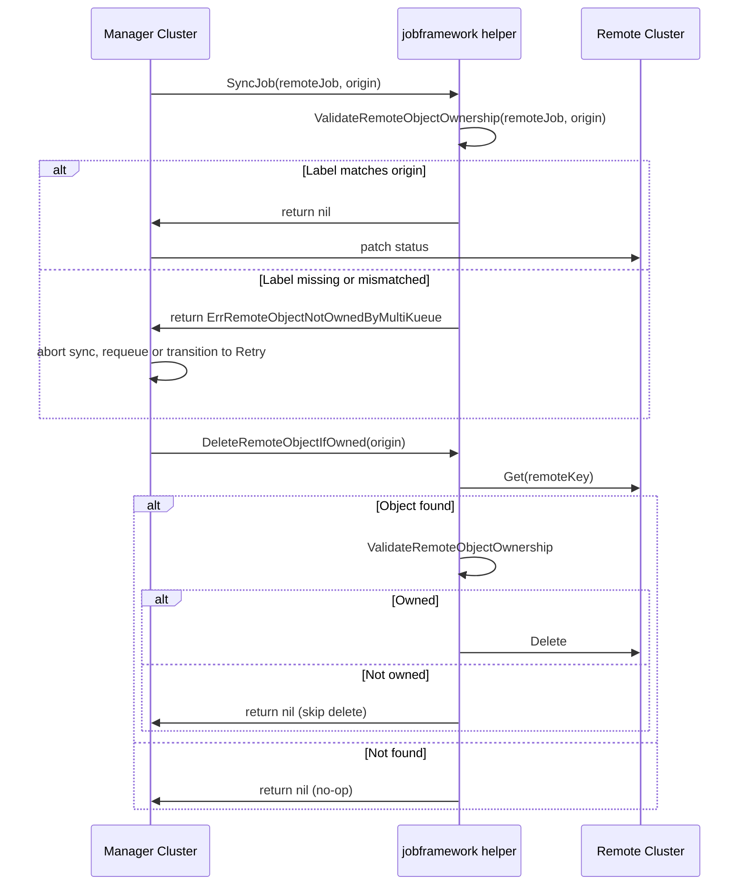

# PR #11877: [Fix] Remove MultiKueue owned Jobs only

**Summary**: [Fix] Remove MultiKueue owned Jobs only

**Sources**: https://github.com/kubernetes-sigs/kueue/pull/11877

**Last updated**: 2026-06-21T17:42:01Z

---

## Metadata

- **State**: closed (merged)
- **Author**: [@mszadkow](https://github.com/mszadkow)
- **Branch**: `fix/11849-job-deleted-on-worker` → `main`
- **Created**: 2026-06-01T18:25:47Z
- **Updated**: 2026-06-21T17:42:01Z
- **Merged**: 2026-06-19T11:46:51Z
- **Closed**: 2026-06-19T11:46:51Z
- **Labels**: `kind/bug`, `release-note`, `lgtm`, `size/XL`, `approved`, `ok-to-test`, `cncf-cla: yes`
- **Assignees**: [@mimowo](https://github.com/mimowo), [@vladikkuzn](https://github.com/vladikkuzn)
- **Requested reviewers**: [@pajakd](https://github.com/pajakd), [@sohankunkerkar](https://github.com/sohankunkerkar), [@vladikkuzn](https://github.com/vladikkuzn), [@tenzen-y](https://github.com/tenzen-y), [@PBundyra](https://github.com/PBundyra)
- **Changed files**: 10   **+528 / -12**

## Description

<!--  Thanks for sending a pull request!  Here are some tips for you:

1. If this is your first time, please read our contributor guidelines: https://git.k8s.io/community/contributors/guide/first-contribution.md#your-first-contribution and developer guide https://git.k8s.io/community/contributors/devel/development.md#development-guide
2. Please label this pull request according to what type of issue you are addressing, especially if this is a release targeted pull request. For reference on required PR/issue labels, read here:
https://git.k8s.io/community/contributors/devel/sig-release/release.md#issuepr-kind-label
3. Ensure you have added or ran the appropriate tests for your PR: https://git.k8s.io/community/contributors/devel/sig-testing/testing.md
4. If you want *faster* PR reviews, read how: https://git.k8s.io/community/contributors/guide/pull-requests.md#best-practices-for-faster-reviews
5. If the PR is unfinished, see how to mark it: https://git.k8s.io/community/contributors/guide/pull-requests.md#marking-unfinished-pull-requests
-->

#### What type of PR is this?
/kind bug
/area multikueue
<!--
Add one of the following kinds:
/kind bug
/kind cleanup
/kind documentation
/kind feature
/kind kep

Optionally add one or more of the following kinds if applicable:
/kind api-change
/kind deprecation
/kind failing-test
/kind flake
/kind regression

Please also consider setting the area:
/area tas
/area integrations
/area multikueue
/area dashboard
/area localization
/area testing
/area website
-->

#### What this PR does / why we need it:
When a Job is created on the manager cluster while a Job with the same NamespacedName already exists on a worker cluster, the pre-existing worker-local Job is deleted.

#### Which issue(s) this PR fixes:
<!--
*Automatically closes linked issue when PR is merged.
Usage: `Fixes #<issue number>`, or `Fixes (paste link of issue)`.
_If PR is about `failing-tests or flakes`, please post the related issues/tests in a comment and do not use `Fixes`_*
-->
Fixes #11849 

#### Special notes for your reviewer:

#### Does this PR introduce a user-facing change?
<!--
If no, just write "NONE" in the release-note block below.
If yes, a release note is required:
Enter your extended release note in the block below. If the PR requires additional action from users switching to the new release, include the string "action required".
-->
```release-note
MultiKueue: Creating a Job on the manager cluster deletes any pre-existing remote worker Job that happens to share the same NamespacedName.
```


<!-- This is an auto-generated comment: release notes by coderabbit.ai -->
## Summary by CodeRabbit

* **New Features**
  * Ownership validation added: remote resources are checked for the expected origin before status sync.
  * If a remote resource isn’t owned by MultiKueue, sync/deletion is skipped; retries now honor a sync timeout.

* **Bug Fixes**
  * Garbage collection avoids deleting worker-local resources that aren’t owned by the controller.

* **Tests**
  * Added/updated unit tests for ownership validation and conditional deletion.
  * Added an integration regression test to ensure pre-existing worker-local jobs are preserved.
<!-- end of auto-generated comment: release notes by coderabbit.ai -->

## Discussion

### Comment by [@k8s-ci-robot](https://github.com/k8s-ci-robot) — 2026-06-01T18:25:51Z

Skipping CI for Draft Pull Request.
If you want CI signal for your change, please convert it to an actual PR.
You can still manually trigger a test run with `/test all`

### Comment by [@netlify[bot]](https://github.com/apps/netlify) — 2026-06-01T18:25:54Z

### <span aria-hidden="true">✅</span> Deploy Preview for *kubernetes-sigs-kueue* canceled.


|  Name | Link |
|:-:|------------------------|
|<span aria-hidden="true">🔨</span> Latest commit | 683e917646f58d15cfea89cde1071f5f7e83e270 |
|<span aria-hidden="true">🔍</span> Latest deploy log | https://app.netlify.com/projects/kubernetes-sigs-kueue/deploys/6a340ef5c2673400080a9a2a |

### Comment by [@mszadkow](https://github.com/mszadkow) — 2026-06-01T18:25:56Z

/ok-to-test

### Comment by [@mszadkow](https://github.com/mszadkow) — 2026-06-02T06:25:28Z

/cc @mochizuki875

### Comment by [@vladikkuzn](https://github.com/vladikkuzn) — 2026-06-02T11:59:09Z

/lgtm

### Comment by [@k8s-ci-robot](https://github.com/k8s-ci-robot) — 2026-06-02T11:59:17Z

LGTM label has been added.  <details>Git tree hash: 09347feb249614427a2e3eec0e460b7f16ed21af</details>

### Comment by [@mochizuki875](https://github.com/mochizuki875) — 2026-06-03T17:47:24Z

@mszadkow 
Thank you for your fix.

By adding `DeleteRemoteObjectIfOwnedByMultiKueue()`, it will not delete pre-existing worker-local job with the same NamespacedName and return nil.
However, after skipping deletion, remote workloads may be created onto worker clusters following dispatching algorithm, and one of them will be admitted and remain on the worker cluster without `managedBy` field.

Is this intentional?
IMO, should we prevent remote workload from being created and admitted on the cluster where the job with same NamespacedName exist on?

### Comment by [@mochizuki875](https://github.com/mochizuki875) — 2026-06-07T16:37:18Z

By adding `DeleteRemoteObjectIfOwnedByMultiKueue()`, the possibility of performing `SyncJob()` on Job resources with the same NamespacedName has been reintroduced.
Upon further investigation, I've noticed two problems caused by this:

1. Pre-existing worker-local job will be mistakenly identified as remote Job
It may be the same behavior of previous version before https://github.com/kubernetes-sigs/kueue/pull/9201 was merged.

`jobSync()` is implemented in each multiKueueAdapter.
For example, in case of job, the status of pre-existing worker-local jobs on worker cluster will be reflected in the status of local jobs on the manager cluster.

https://github.com/kubernetes-sigs/kueue/blob/1744552f93d8a886c7265dd81aee3198d79424b6/pkg/controller/jobs/job/job_multikueue_adapter.go#L65-L83

2. The manager cluster may choose an inappropriate worker cluster.
Please assume that, there are two worker cluster, one has the local job resource which has same NamespacedName(call worker-1) and the other does not(call worker-2).
While the remote job should be dispatched on to worker-2 avoiding worker-1, the manager cluster selects the worker cluster containing the first admitted workload from among the worker clusters that contain the admitted workload.
So there is a possibility that worker-1 will be selected.

https://github.com/kubernetes-sigs/kueue/blob/1744552f93d8a886c7265dd81aee3198d79424b6/pkg/controller/admissionchecks/multikueue/workload.go#L113-L130

### Comment by [@mszadkow](https://github.com/mszadkow) — 2026-06-08T10:18:17Z

> @mszadkow Thank you for your fix.
> 
> By adding `DeleteRemoteObjectIfOwnedByMultiKueue()`, it will not delete pre-existing worker-local job with the same NamespacedName and return nil. However, after skipping deletion, remote workloads may be created onto worker clusters following dispatching algorithm, and one of them will be admitted and remain on the worker cluster without `managedBy` field.
> 
> Is this intentional? IMO, should we prevent remote workload from being created and admitted on the cluster where the job with same NamespacedName exist on?

Good question, I think we should reference the [Cluster Role Sharing](https://github.com/kubernetes-sigs/kueue/issues/5704).

We can either:
1. Put the pressure on the customer to not create the same named jobs and update the documentation.
2. Prevent it completely by checking if the job or workload already exists (which I assume is not what we want).
3. Allow for the same named jobs to exist, but add all the guards.

@mimowo @tenzen-y  any thoughts?

### Comment by [@mimowo](https://github.com/mimowo) — 2026-06-08T10:30:11Z

/kind bug

### Comment by [@mimowo](https://github.com/mimowo) — 2026-06-08T10:31:11Z

@mszadkow please update the release note, the prefix should always be the feature / area, not "fix" . The fix is annotated by the PR kind. Updated to "bug"

### Comment by [@mimowo](https://github.com/mimowo) — 2026-06-08T10:44:15Z

@mochizuki875 thank you for reviewing and your comment and findings in https://github.com/kubernetes-sigs/kueue/pull/11877#issuecomment-4643280638

> Pre-existing worker-local job will be mistakenly identified as remote Job
It may be the same behavior of previous version before https://github.com/kubernetes-sigs/kueue/pull/9201 was merged.

Could this be mitigated by checking if the MultiKueueOriginLabel corresponding to "our" MK? 

> jobSync() is implemented in each multiKueueAdapter.
For example, in case of job, the status of pre-existing worker-local jobs on worker cluster will be reflected in the status of local jobs on the manager cluster.

This is a good point, but here we could make the sync only if (1.) MultiKueueOriginLabel corresponds to "our" MK? 

Additionally we could strengthten the check by saving the UUID of the job on the manager in the job on the worker, so that later we can check the UUIDs for skip of the sync. Would that be needed in your case? If not, then maybe we can defer for later, but I think this is needed in the long term.

> The manager cluster may choose an inappropriate worker cluster.
Please assume that, there are two worker cluster, one has the local job resource which has same NamespacedName(call worker-1) and the other does not(call worker-2).
While the remote job should be dispatched on to worker-2 avoiding worker-1, the manager cluster selects the worker cluster containing the first admitted workload from among the worker clusters that contain the admitted workload.
So there is a possibility that worker-1 will be selected.

Yes, but this probably also could be fixed by checking "MultiKueueOriginLabel" for your needs, right?

Similarly as in the other points we could check if the job on worker-1 has the matching UUID (from the manager clusteR) imprinted in the annotation.

### Comment by [@mimowo](https://github.com/mimowo) — 2026-06-08T10:46:46Z

So, I would propose in this PR to check MultiKueueOriginLabel consistently in all places identified by @mochizuki875, and re-evaluate the need for checking also the UUIDs, but that would require imprinting the UUID on the worker workloads, and probably can be done in a follow up, because the scenario is a bit different - it is not about a job submitted to worker outside of MK, but re-creation of a job on the manager cluster.

### Comment by [@mochizuki875](https://github.com/mochizuki875) — 2026-06-08T15:58:04Z

@mimowo 
Thank you for your idea.
I agree your idea to check completely MultiKueueOriginLabel key-value.

> @mochizuki875 thank you for reviewing and your comment and findings in [#11877 (comment)](https://github.com/kubernetes-sigs/kueue/pull/11877#issuecomment-4643280638)
> 
> > Pre-existing worker-local job will be mistakenly identified as remote Job
> > It may be the same behavior of previous version before #9201 was merged.
> 
> Could this be mitigated by checking if the MultiKueueOriginLabel corresponding to "our" MK?
> 
> > jobSync() is implemented in each multiKueueAdapter.
> > For example, in case of job, the status of pre-existing worker-local jobs on worker cluster will be reflected in the status of local jobs on the manager cluster.
> 
> This is a good point, but here we could make the sync only if (1.) MultiKueueOriginLabel corresponds to "our" MK?

As you say, I think this miss-identified problem may be mitigated by identifying remote job using not only NamespacedName, but also MultiKueueOriginLabel when manager cluster will sync the status of the worker-local job.

> > The manager cluster may choose an inappropriate worker cluster.
> > Please assume that, there are two worker cluster, one has the local job resource which has same NamespacedName(call worker-1) and the other does not(call worker-2).
> > While the remote job should be dispatched on to worker-2 avoiding worker-1, the manager cluster selects the worker cluster containing the first admitted workload from among the worker clusters that contain the admitted workload.
> > So there is a possibility that worker-1 will be selected.
> 
> Yes, but this probably also could be fixed by checking "MultiKueueOriginLabel" for your needs, right?

On the other hand, I don't know about second one.
To select appropriate worker in this case, manager need to know which worker has same NamespacedName jobs and try to avoid them.
I can't imagine it can be done by checking MultiKueueOriginLabel.
So could you please tell me your idea more detail?

### Comment by [@mimowo](https://github.com/mimowo) — 2026-06-08T16:30:41Z

> To select appropriate worker in this case, manager need to know which worker has same NamespacedName jobs and try to avoid them.
> So could you please tell me your idea more detail?

Oh I see, I didn't understand fully the problem at the beginning so my idea isn't clear yet.

One relatively simple idea is to use Get just before dispatching to check if the Job already exists or not - and avoid dispatching workloads to such workers in the first place.

However, this may still be racy for TOCTOU as someone may create the workload in the meanwhile.

In that case we probably should mark workloads corresponding to pre-existing Jobs as Finished. We would not delete them to avoid re-creation, but just mark finished so that they don't get admitted.

### Comment by [@coderabbitai[bot]](https://github.com/apps/coderabbitai) — 2026-06-08T19:02:34Z

<!-- This is an auto-generated comment: summarize by coderabbit.ai -->
<!-- review_stack_entry_start -->

[](https://app.coderabbit.ai/change-stack/kubernetes-sigs/kueue/pull/11877?utm_source=github_walkthrough&utm_medium=github&utm_campaign=change_stack)

<!-- review_stack_entry_end -->
<!-- This is an auto-generated comment: review paused by coderabbit.ai -->

> [!NOTE]
> ## Reviews paused
> 
> It looks like this branch is under active development. To avoid overwhelming you with review comments due to an influx of new commits, CodeRabbit has automatically paused this review. You can configure this behavior by changing the `reviews.auto_review.auto_pause_after_reviewed_commits` setting.
> 
> Use the following commands to manage reviews:
> - `@coderabbitai resume` to resume automatic reviews.
> - `@coderabbitai review` to trigger a single review.
> 
> Use the checkboxes below for quick actions:
> - [ ] <!-- {"checkboxId": "7f6cc2e2-2e4e-497a-8c31-c9e4573e93d1"} --> ▶️ Resume reviews
> - [ ] <!-- {"checkboxId": "e9bb8d72-00e8-4f67-9cb2-caf3b22574fe"} --> 🔍 Trigger review

<!-- end of auto-generated comment: review paused by coderabbit.ai -->
<!-- walkthrough_start -->

<details>
<summary>📝 Walkthrough</summary>

## Walkthrough

The PR enforces origin-label ownership checks across MultiKueue remote sync and delete paths. It adds validation and conditional-delete helpers, applies ownership checks in adapters and GC/workload callers, updates fixtures and mocks, and adds an integration regression preventing deletion of non-owned worker-local Jobs.

## Changes

**Origin-scoped remote object handling**

|Layer / File(s)|Summary|
|---|---|
|**Ownership contract and helper behavior** <br> `pkg/controller/jobframework/multikueue.go`, `pkg/controller/jobframework/multikueue_test.go`|Introduces sentinel errors `ErrRemoteObjectNotOwnedByMultiKueue` and `ErrMultiKueueOriginEmpty`; exports `ValidateRemoteObjectOwnership` and `DeleteRemoteObjectIfOwned`; tests cover empty origin, missing/mismatched labels, NotFound, Get errors, and delete delegation.|
|**Sync-time ownership validation across adapters** <br> `pkg/controller/admissionchecks/multikueue/externalframeworks/adapter.go`, `pkg/controller/jobs/{appwrapper,job,jobset,kubeflow/kubeflowjob,leaderworkerset,mpijob,pod,ray,statefulset,trainjob}/*_multikueue_adapter.go`|Adapters call `ValidateRemoteObjectOwnership(ctx, remoteObj, origin)` when remote objects exist and return validation errors to abort status propagation if ownership mismatches.|
|**Delete-time ownership-gated remote cleanup** <br> `pkg/controller/admissionchecks/multikueue/multikueuecluster.go`, `pkg/controller/admissionchecks/multikueue/workload.go`|GC calls `jobframework.DeleteRemoteObjectIfOwned(...)` with origin; workload removal caches remoteClient and origin, uses it for finalizer updates/deletes, and introduces sync timeout to gate non-ownership failures with requeue or transition to Retry status.|
|**Origin propagation in callers and fixture alignment** <br> `pkg/controller/admissionchecks/multikueue/multikueuecluster_test.go`, `pkg/controller/admissionchecks/multikueue/workload_test.go`|Test fixtures updated to include `MultiKueueOriginLabel` on expected Job objects; method-chaining layout adjusted across workload test cases for readability.|
|**Integration regression for pre-existing worker-local job** <br> `test/integration/multikueue/cluster_role_sharing_test.go`|New regression test ensures a pre-existing worker-local Job with the same NamespacedName is not deleted/recreated when a MultiKueue-managed Job is dispatched.|
|**Mocks and test harness updates** <br> `Makefile`, `internal/mocks/controller/jobframework/interface.go`, `pkg/controller/jobs/job/job_multikueue_adapter_test.go`|Expanded `generate-mocks` inputs and added `MockMultiKueueAdapter` mock; updated adapter tests to normalize/respect resolved origin and ignore ResourceVersion in diffs.|

## Sequence Diagram(s)

When a workload is synced or deleted across clusters, the system now validates ownership:



## Estimated code review effort

🎯 3 (Moderate) | ⏱️ ~20 minutes

## Possibly related PRs

- [kubernetes-sigs/kueue#12262](https://github.com/kubernetes-sigs/kueue/pull/12262): Both PRs modify the Pod multikueue sync path—specifically `syncLocalPodWithRemote` in `pkg/controller/jobs/pod/pod_multikueue_adapter.go` (ownership validation in this PR vs preserving `PodScheduled` reason in the related PR).

## Suggested labels

`lgtm`, `approved`, `area/multikueue`

## Suggested reviewers

- mimowo
- olekzabl

## Poem

> A rabbit guards the labeled door,  
> Checking origins before all more,  
> No jobs deleted from remote shore,  
> Ownership marks keep peace to explore. 🐇✨

</details>

<!-- walkthrough_end -->
<!-- pre_merge_checks_walkthrough_start -->

<details>
<summary>🚥 Pre-merge checks | ✅ 3 | ❌ 2</summary>

### ❌ Failed checks (1 warning, 1 inconclusive)

|      Check name     | Status         | Explanation                                                                                                                                                                                                                                                                                     | Resolution                                                                         |
| :-----------------: | :------------- | :---------------------------------------------------------------------------------------------------------------------------------------------------------------------------------------------------------------------------------------------------------------------------------------------- | :--------------------------------------------------------------------------------- |
|  Docstring Coverage | ⚠️ Warning     | Docstring coverage is 14.81% which is insufficient. The required threshold is 80.00%.                                                                                                                                                                                                           | Write docstrings for the functions missing them to satisfy the coverage threshold. |
| Linked Issues check | ❓ Inconclusive | While the PR addresses the core issue of preventing deletion of non-owned Jobs through ownership validation, reviewers identified concerns about incomplete implementation regarding misidentification of worker-local jobs and inappropriate worker selection that may require follow-up work. |                                                                                    |

<details>
<summary>✅ Passed checks (3 passed)</summary>

|         Check name         | Status   | Explanation                                                                                                                                                                                     |
| :------------------------: | :------- | :---------------------------------------------------------------------------------------------------------------------------------------------------------------------------------------------- |
|      Description Check     | ✅ Passed | Check skipped - CodeRabbit’s high-level summary is enabled.                                                                                                                                     |
|         Title check        | ✅ Passed | The PR title '[Fix] Remove MultiKueue owned Jobs only' directly summarizes the main change: implementing ownership validation to prevent deletion of non-MultiKueue Jobs.                       |
| Out of Scope Changes check | ✅ Passed | All changes directly support the objective of adding ownership validation via MultiKueueOriginLabel checks across all job adapters and deletion paths, with no unrelated modifications present. |

</details>

<sub>✏️ Tip: You can configure your own custom pre-merge checks in the settings.</sub>

</details>

<!-- pre_merge_checks_walkthrough_end -->
<!-- finishing_touch_checkbox_start -->

<details>
<summary>✨ Finishing Touches</summary>

<details>
<summary>🧪 Generate unit tests (beta)</summary>

- [ ] <!-- {"checkboxId": "f47ac10b-58cc-4372-a567-0e02b2c3d479", "radioGroupId": "utg-output-choice-group-unknown_comment_id"} -->   Create PR with unit tests

</details>

</details>

<!-- finishing_touch_checkbox_end -->
<!-- tips_start -->

---

Thanks for using [CodeRabbit](https://coderabbit.ai?utm_source=oss&utm_medium=github&utm_campaign=kubernetes-sigs/kueue&utm_content=11877)! It's free for OSS, and your support helps us grow. If you like it, consider giving us a shout-out.

<details>
<summary>❤️ Share</summary>

- [X](https://twitter.com/intent/tweet?text=I%20just%20used%20%40coderabbitai%20for%20my%20code%20review%2C%20and%20it%27s%20fantastic%21%20It%27s%20free%20for%20OSS%20and%20offers%20a%20free%20trial%20for%20the%20proprietary%20code.%20Check%20it%20out%3A&url=https%3A//coderabbit.ai)
- [Mastodon](https://mastodon.social/share?text=I%20just%20used%20%40coderabbitai%20for%20my%20code%20review%2C%20and%20it%27s%20fantastic%21%20It%27s%20free%20for%20OSS%20and%20offers%20a%20free%20trial%20for%20the%20proprietary%20code.%20Check%20it%20out%3A%20https%3A%2F%2Fcoderabbit.ai)
- [Reddit](https://www.reddit.com/submit?title=Great%20tool%20for%20code%20review%20-%20CodeRabbit&text=I%20just%20used%20CodeRabbit%20for%20my%20code%20review%2C%20and%20it%27s%20fantastic%21%20It%27s%20free%20for%20OSS%20and%20offers%20a%20free%20trial%20for%20proprietary%20code.%20Check%20it%20out%3A%20https%3A//coderabbit.ai)
- [LinkedIn](https://www.linkedin.com/sharing/share-offsite/?url=https%3A%2F%2Fcoderabbit.ai&mini=true&title=Great%20tool%20for%20code%20review%20-%20CodeRabbit&summary=I%20just%20used%20CodeRabbit%20for%20my%20code%20review%2C%20and%20it%27s%20fantastic%21%20It%27s%20free%20for%20OSS%20and%20offers%20a%20free%20trial%20for%20proprietary%20code)

</details>


<sub>Comment `@coderabbitai help` to get the list of available commands and usage tips.</sub>

<!-- tips_end -->

### Comment by [@mszadkow](https://github.com/mszadkow) — 2026-06-09T08:14:34Z

@mimowo @mochizuki875 
As this PR will be accepted I am happy to followup with UUID propagation to tackle "the second problem" with dispatching

### Comment by [@mszadkow](https://github.com/mszadkow) — 2026-06-11T12:57:21Z

@mochizuki875 ptal

### Comment by [@mimowo](https://github.com/mimowo) — 2026-06-11T13:23:43Z

cc @olekzabl @kshalot ptal

### Comment by [@mochizuki875](https://github.com/mochizuki875) — 2026-06-12T14:14:53Z

@mszadkow 

Thank you for your addressing.

By the way, we are currently working to prevent unowned job resources from being deleted, but where should we ultimately land to resolve  #11849 ?
In other words, I think we need to prepare the answer for this question(I should have told sooner, but I'm sorry for the delay.):

"What will happen each on the manager cluster and the worker clusters if user create a job resource when the job resources with same NamespacedName are exist on the worker clusters?"

As we are working now, preventing the pre-existing worker-local Jobs from being deleted is definitely key point of this, but I think we should define how it looks from the user's perspective.
Especially defining how a user of manager cluster notice the situation where remote job cannot be dispatched to any worker cluster by the same NamespacedName job existing is also important.

### Comment by [@mszadkow](https://github.com/mszadkow) — 2026-06-12T15:37:01Z

> "What will happen each on the manager cluster and the worker clusters if user create a job resource when the job resources with same NamespacedName are exist on the worker clusters?"

Let me translate it into concrete scenario:
```
Job xyz/job1 is running on the worker cluster (but not MultiKueue owned), now Multikueue wants to dispatch workload for job xyz/job1 into the worker cluster.
```

Then we have:

Worker side:
 - MultiKueue does not delete that pre-existing non-owned Job.
It does not take ownership of it.

Manager side:
 - SyncJob reads remote object.
 - Ownership validation fails because origin label is missing or mismatched.
- Reconcile retries; if admission check is Ready:
   * currently it will loop until manual intervention happens
   * or if we go [with](https://github.com/kubernetes-sigs/kueue/pull/11877#discussion_r3402179670): after sync timeout it transitions to Retry with timed-out message
   
   
 Or if you ask the other way around:
 ```
 Multikueue dispatched workload admission on the worker cluster creates Job xyz/job1 (multikueue owned)
Now user creates Job xyz/job1 on the worker while the job is slready running.
 ```
 
 Worker side:
 - API server returns AlreadyExists, so no second Job is created
 Manager side:
 - nothing special changes just because of that failed create
 - Sync continues with the existing owned remote Job

### Comment by [@mochizuki875](https://github.com/mochizuki875) — 2026-06-12T16:17:34Z

@mszadkow 
Thank you for explanation.

I've got understand pre-existing non-owned Job will remain on worker cluster and remote job will not be dispatched on it.
To say extremely, nothing change on worker cluster.

On the other hand, how about the status of job and workload on the manager cluster?
Will the job keeps suspended? Will (or should) the workload  be admitted or quota reserved?

### Comment by [@mszadkow](https://github.com/mszadkow) — 2026-06-12T16:34:15Z

> @mszadkow Thank you for explanation.
> 
> I've got understand pre-existing non-owned Job will remain on worker cluster and remote job will not be dispatched on it. To say extremely, nothing change on worker cluster.
> 
> On the other hand, how about the status of job and workload on the manager cluster? Will the job keeps suspended? Will (or should) the workload be admitted or quota reserved?

Well, manager cluster job status can't be synced as there is no MK owned remote job.
Manager workload on the other hand will wait for first reserving workload of the remote workers.
If it choose the worker where we have the job already it will stuck on sync validation.
Then we should order re-admission after some timeout.

That means quota could be reserved in the remote worker which already has the job, but the job will remain suspended.
@kshalot am I correct?

### Comment by [@mochizuki875](https://github.com/mochizuki875) — 2026-06-12T17:32:14Z

> Manager workload on the other hand will wait for first reserving workload of the remote workers.
If it choose the worker where we have the job already it will stuck on sync validation.
Then we should order re-admission after some timeout.

@mszadkow 
At the first place, should the remote workload on the worker with pre-existing non-owned job be able to reserve quota?
Is this a waste of time and effort?

In addition, I think it should not be admitted because it will be reflected to workload on manager and make users confused.
Users may expect that the remote job will actually run on the worker after some time has passed by checking the manager workload status(QuotaReserved=true, Admitted=true).

@mimowo has suggested a idea related to it(https://github.com/kubernetes-sigs/kueue/pull/11877#issuecomment-4651139178).

### Comment by [@mochizuki875](https://github.com/mochizuki875) — 2026-06-13T17:31:01Z

> In addition, I think it should not be admitted because it will be reflected to workload on manager and make users confused.
Users may expect that the remote job will actually run on the worker after some time has passed by checking the manager workload status(QuotaReserved=true, Admitted=true).

Sorry, I may misunderstood this.
While Remote workload should still not be admitted on worker, remote workload status seems not to be reflected to manager workload status unless `SyncJob()` succeeded.
So  my understanding is that users can recognize the situation where remote job is not running on worker, by checking manager workload status(Admitted != True), right?

https://github.com/kubernetes-sigs/kueue/blob/01e576255b55275520ff4ab0ebfdfa443ae7bcc2/pkg/controller/admissionchecks/multikueue/workload.go#L496-L504

### Comment by [@mszadkow](https://github.com/mszadkow) — 2026-06-15T08:23:31Z

> > Manager workload on the other hand will wait for first reserving workload of the remote workers.
> > If it choose the worker where we have the job already it will stuck on sync validation.
> > Then we should order re-admission after some timeout.
> 
> @mszadkow At the first place, should the remote workload on the worker with pre-existing non-owned job be able to reserve quota? Is this a waste of time and effort?
> 
> In addition, I think it should not be admitted because it will be reflected to workload on manager and make users confused. Users may expect that the remote job will actually run on the worker after some time has passed by checking the manager workload status(QuotaReserved=true, Admitted=true).
> 
> @mimowo has suggested a idea related to it([#11877 (comment)](https://github.com/kubernetes-sigs/kueue/pull/11877#issuecomment-4651139178)).

I found this comment confusing:

> In that case we probably should mark workloads corresponding to pre-existing Jobs as Finished. We would not delete them to avoid re-creation, but just mark finished so that they don't get admitted.

We should probably mark the workload we dispatched to that remote worker as Finished.
Not the one related to the pre-existing Job - otherwise I don't see how this helps.

I think the same-name pre-existing Job conflict should be detected on the worker side where the cloned workload is admitted/materialized, since that is the authoritative state and avoids manager-side TOCTOU. Then the manager-side MultiKueue reconciler can react by retrying/re-admitting elsewhere rather than treating it as a finished workload.

But that belongs to another PR, I wouldn't over extend this PR.

However yes, as you asked, the full picture after all effort should behave as you described.

### Comment by [@mszadkow](https://github.com/mszadkow) — 2026-06-15T08:24:56Z

> > In addition, I think it should not be admitted because it will be reflected to workload on manager and make users confused.
> > Users may expect that the remote job will actually run on the worker after some time has passed by checking the manager workload status(QuotaReserved=true, Admitted=true).
> 
> Sorry, I may misunderstood this. While Remote workload should still not be admitted on worker, remote workload status seems not to be reflected to manager workload status unless `SyncJob()` succeeded. So my understanding is that users can recognize the situation where remote job is not running on worker, by checking manager workload status(Admitted != True), right?
> 
> https://github.com/kubernetes-sigs/kueue/blob/01e576255b55275520ff4ab0ebfdfa443ae7bcc2/pkg/controller/admissionchecks/multikueue/workload.go#L496-L504

Yes, exactly, the whole idea of having manager side is also to have one place where you can observe all your jobs statuses.

### Comment by [@mszadkow](https://github.com/mszadkow) — 2026-06-16T07:01:57Z

@mochizuki875 @kshalot any comments?

### Comment by [@kshalot](https://github.com/kshalot) — 2026-06-17T11:16:09Z

> Well, manager cluster job status can't be synced as there is no MK owned remote job.
Manager workload on the other hand will wait for first reserving workload of the remote workers.
If it choose the worker where we have the job already it will stuck on sync validation.
Then we should order re-admission after some timeout.
>
> That means quota could be reserved in the remote worker which already has the job, but the job will remain suspended.
@kshalot am I correct?

IIUC the risk here is that the workload will be admitted in a worker which already has a job with a conflicting name, then the workload will be stuck until the conflicting job is removed. Which in my opinion is an improvement over the status quo, where we remove a non-MK job, but it's still far from ideal.

I'd follow this up with a more user-friendly fix. For example retriggering the whole admission process or deactivating the workload on the manager.

### Comment by [@mszadkow](https://github.com/mszadkow) — 2026-06-17T11:22:43Z

> > Well, manager cluster job status can't be synced as there is no MK owned remote job.
> > Manager workload on the other hand will wait for first reserving workload of the remote workers.
> > If it choose the worker where we have the job already it will stuck on sync validation.
> > Then we should order re-admission after some timeout.
> > That means quota could be reserved in the remote worker which already has the job, but the job will remain suspended.
> > @kshalot am I correct?
> 
> IIUC the risk here is that the workload will be admitted in a worker which already has a job with a conflicting name, then the workload will be stuck until the conflicting job is removed. Which in my opinion is an improvement over the status quo, where we remove a non-MK job, but it's still far from ideal.
> 
> I'd follow this up with a more user-friendly fix. For example retriggering the whole admission process or deactivating the workload on the manager.

I think that sounds like a syncTimeout that I added [here](https://github.com/epam/kubernetes-kueue/blob/1ad6a540932b2263304c022bb8ae04e995c1b2a0/pkg/controller/admissionchecks/multikueue/workload.go#L535).
No need for manual intervention, but logs will show the issue
So when we stuck we can force re-admission, wdyt?

### Comment by [@mszadkow](https://github.com/mszadkow) — 2026-06-17T11:53:54Z

@coderabbitai review

### Comment by [@coderabbitai[bot]](https://github.com/apps/coderabbitai) — 2026-06-17T11:54:01Z

<!-- This is an auto-generated reply by CodeRabbit -->
<!-- CodeRabbit review command invocation: 7daafde6-9d4a-4cf4-8449-d53681f0f7e3 -->
<details>
<summary>✅ Action performed</summary>

Review finished.

> Note: CodeRabbit is an incremental review system and does not re-review already reviewed commits. This command is applicable only when automatic reviews are paused.

</details>

### Comment by [@kshalot](https://github.com/kshalot) — 2026-06-17T12:25:59Z

> I think that sounds like a syncTimeout that I added [here](https://github.com/epam/kubernetes-kueue/blob/1ad6a540932b2263304c022bb8ae04e995c1b2a0/pkg/controller/admissionchecks/multikueue/workload.go#L535). No need for manual intervention, but logs will show the issue So when we stuck we can force re-admission, wdyt?

Yes, I must have missed this when re-reading the diff. Thanks for pointing that out

I have two loose thoughts. I'll write them down here first and then keep thinking:
1. Should this `syncTimeout` be specific to this name conflict issue that we are solving here? I'm thinking about other of classes of issues that might prevent us from creating an object during `SyncJob`. I'm hand-waving here, but I can think of things like `ResourceQuota` being set for the number of objects (say `batch/job`) or maybe there are some cluster-specific validation webhooks. I'm wondering if this should be generalized.
2. We could also flag the conflict more visibly, e.g. by deactivating the workload. This signals to the admin that there are naming conflicts which might be a systemic issue on the user end. We might prefer to push them towards a unique naming scheme or better MultiKueue isolation.

CC @olekzabl who might be interested in chipping in.

### Comment by [@mimowo](https://github.com/mimowo) — 2026-06-18T08:19:41Z

@mszadkow have you had a chance to test the fix on a real cluster? I'm wondering how this behaves in practice, assume you have 2 worker clusters:
- worker 1, empty
- worker 2, with conflicting job and workload

IIUC we will:
1. dispatch the workload to both clusters
2a. admit on worker 1 - then we will delete both workloads, but will keep the pre-existing workload and job in tact
2b. admit on worker 2 - then we will get continues errors?

I guess ideally we would change (1.) and not even dispatch the workload to "worker 2", but IIUC this is out of scope for the PR?

It would be great if you can test and summarize the current behavior because is rather tricky to imagine the scenarios just by static code analysis, at least for me.

### Comment by [@mszadkow](https://github.com/mszadkow) — 2026-06-18T14:31:15Z

> @mszadkow have you had a chance to test the fix on a real cluster? I'm wondering how this behaves in practice, assume you have 2 worker clusters:
> 
> * worker 1, empty
> * worker 2, with conflicting job and workload
> 
> IIUC we will:
> 
> 1. dispatch the workload to both clusters
>    2a. admit on worker 1 - then we will delete both workloads, but will keep the pre-existing workload and job in tact
>    2b. admit on worker 2 - then we will get continues errors?
> 
> I guess ideally we would change (1.) and not even dispatch the workload to "worker 2", but IIUC this is out of scope for the PR?
> 
> It would be great if you can test and summarize the current behavior because is rather tricky to imagine the scenarios just by static code analysis, at least for me.

OK, ready to report both scenarios went exactly as assumed.

In 2a, job1 gets to the worker1 and does not disturb job1 from worker2.
And in 2b, yes we get continues logs of:
```
{"level":"Level(-2)","ts":"2026-06-18T13:50:49.16925678Z","logger":"multikueue-workload","caller":"multikueue/workload.go:182","msg":"Reconcile Workload","replica-role":"leader","namespace":"default","name":"job-job1-dfe89","reconcileID":"faf5b41b-e385-4ed4-abb9-747eb1fbca26"}
{"level":"error","ts":"2026-06-18T13:50:49.194519343Z","logger":"multikueue-workload","caller":"multikueue/workload.go:537","msg":"validating remote controller object","replica-role":"leader","namespace":"default","name":"job-job1-dfe89","reconcileID":"faf5b41b-e385-4ed4-abb9-747eb1fbca26","op":"reconcileGroup","remote":"multikueue-test-worker2","remoteWorkload":{"name":"job-job1-dfe89","namespace":"default"},"cluster":"multikueue-test-worker2","error":"remote object is not owned by MultiKueue: expected \"kueue.x-k8s.io/multikueue-origin\"=\"multikueue\" on *v1.PartialObjectMetadata \"default/job1\"","stacktrace":"sigs.k8s.io/kueue/pkg/controller/admissionchecks/multikueue.(*wlReconciler).reconcileGroup\n\t/workspace/pkg/controller/admissionchecks/multikueue/workload.go:537\nsigs.k8s.io/kueue/pkg/controller/admissionchecks/multikueue.(*wlReconciler).Reconcile\n\t/workspace/pkg/controller/admissionchecks/multikueue/workload.go:262\nsigs.k8s.io/controller-runtime/pkg/internal/controller.(*Controller[...]).Reconcile\n\t/workspace/vendor/sigs.k8s.io/controller-runtime/pkg/internal/controller/controller.go:221\nsigs.k8s.io/controller-runtime/pkg/internal/controller.(*Controller[...]).reconcileHandler\n\t/workspace/vendor/sigs.k8s.io/controller-runtime/pkg/internal/controller/controller.go:478\nsigs.k8s.io/controller-runtime/pkg/internal/controller.(*Controller[...]).processNextWorkItem\n\t/workspace/vendor/sigs.k8s.io/controller-runtime/pkg/internal/controller/controller.go:437\nsigs.k8s.io/controller-runtime/pkg/internal/controller.(*Controller[...]).Start.func1.1\n\t/workspace/vendor/sigs.k8s.io/controller-runtime/pkg/internal/controller/controller.go:312"}
{"level":"error","ts":"2026-06-18T13:50:49.194867124Z","logger":"multikueue-workload","caller":"controller/controller.go:494","msg":"Reconciler error","replica-role":"leader","namespace":"default","name":"job-job1-dfe89","reconcileID":"faf5b41b-e385-4ed4-abb9-747eb1fbca26","error":"remote object is not owned by MultiKueue: expected \"kueue.x-k8s.io/multikueue-origin\"=\"multikueue\" on *v1.PartialObjectMetadata \"default/job1\"","stacktrace":"sigs.k8s.io/controller-runtime/pkg/internal/controller.(*Controller[...]).reconcileHandler\n\t/workspace/vendor/sigs.k8s.io/controller-runtime/pkg/internal/controller/controller.go:494\nsigs.k8s.io/controller-runtime/pkg/internal/controller.(*Controller[...]).processNextWorkItem\n\t/workspace/vendor/sigs.k8s.io/controller-runtime/pkg/internal/controller/controller.go:437\nsigs.k8s.io/controller-runtime/pkg/internal/controller.(*Controller[...]).Start.func1.1\n\t/workspace/vendor/sigs.k8s.io/controller-runtime/pkg/internal/controller/controller.go:312"}
```

### Comment by [@mimowo](https://github.com/mimowo) — 2026-06-18T15:58:45Z

Excellent news 👍  And when the conflicting job ends, then the MultiKueue job gets running, right?

Certainly the sequence of errors is not the ideal UX, but I think we really don't need to over-optimize the scenario. I think admins could use basically another LQ/CQ on the worker to run local jobs. 

Still, in the ideal UX (2b) does not error, but instead we just never admit on worker2, or skip even disaptching to worker 2. However, fixing that would be more involving, so I'm happy to go ahead with the MVP fix just for the disruptive action of delete.

### Comment by [@mochizuki875](https://github.com/mochizuki875) — 2026-06-18T17:30:35Z

@mimowo @mszadkow 
Sorry I couldn't respond these past few days.
I agree with you.

In this PR, I think it's enough to meet them at least:
- avoiding pre-existing job deletion
- letting the manager cluster the remote job is not being executed(like [this](https://github.com/kubernetes-sigs/kueue/pull/11877#issuecomment-4705975212)) 

IMO: Skip dispatching to worker2 is related to not only UX but also effective use of resources.
So it's better to improve it in another PR after it's merged.

### Comment by [@mimowo](https://github.com/mimowo) — 2026-06-19T09:41:43Z

> IMO: Skip dispatching to worker2 is related to not only UX but also effective use of resources.
So it's better to improve it in another PR after it's merged.

Cool, let's track this improvement as a follow up issue. In order to determine the priority we will need more feedback about the use cases for users interacting directly with the worker clusters. Also, I suppose some in-house platform could most of the time fix this issue by suffixing jobs based on the shortened cluster name, etc.

Still, I accept there is a room for improvement. @mochizuki875 would you like to open the follow up issue and present the use cases so that we can triage the issue best?

### Comment by [@mimowo](https://github.com/mimowo) — 2026-06-19T09:46:23Z

/lgtm
/approve
/cherrypick release-0.18
/cherrypick release-0.17
Thank you for the important bugfix, deleting remote jobs created by users was certainly a disruptive operation 👍 


Just to manually confirm the answer to my question "And when the conflicting job ends, then the MultiKueue job gets running, right?", so that the MK job can happily progress once the Job on the worker cluster is deleted.
/hold

### Comment by [@k8s-infra-cherrypick-robot](https://github.com/k8s-infra-cherrypick-robot) — 2026-06-19T09:46:27Z

@mimowo: once the present PR merges, I will cherry-pick it on top of `release-0.17`, `release-0.18` in new PRs and assign them to you.

<details>

In response to [this](https://github.com/kubernetes-sigs/kueue/pull/11877#issuecomment-4750432744):

>/lgtm
>/approve
>/cherrypick release-0.18
>/cherrypick release-0.17
>Thank you for the important bugfix, deleting remote jobs created by users was certainly a disruptive operation 👍 
>
>
>Just to manually confirm the answer to my question "And when the conflicting job ends, then the MultiKueue job gets running, right?", so that the MK job can happily progress once the Job on the worker cluster is deleted.
>/hold


Instructions for interacting with me using PR comments are available [here](https://git.k8s.io/community/contributors/guide/pull-requests.md).  If you have questions or suggestions related to my behavior, please file an issue against the [kubernetes-sigs/prow](https://github.com/kubernetes-sigs/prow/issues/new?title=Prow%20issue:) repository.
</details>

### Comment by [@k8s-ci-robot](https://github.com/k8s-ci-robot) — 2026-06-19T09:46:32Z

LGTM label has been added.  <details>Git tree hash: 132ad19800e23b5739a323369295800bfd2ba608</details>

### Comment by [@k8s-ci-robot](https://github.com/k8s-ci-robot) — 2026-06-19T09:46:34Z

[APPROVALNOTIFIER] This PR is **APPROVED**

This pull-request has been approved by: *<a href="https://github.com/kubernetes-sigs/kueue/pull/11877#issuecomment-4750432744" title="Approved">mimowo</a>*, *<a href="https://github.com/kubernetes-sigs/kueue/pull/11877#" title="Author self-approved">mszadkow</a>*

The full list of commands accepted by this bot can be found [here](https://go.k8s.io/bot-commands?repo=kubernetes-sigs%2Fkueue).

The pull request process is described [here](https://git.k8s.io/community/contributors/guide/owners.md#the-code-review-process)

<details >
Needs approval from an approver in each of these files:

- ~~[OWNERS](https://github.com/kubernetes-sigs/kueue/blob/main/OWNERS)~~ [mimowo]

Approvers can indicate their approval by writing `/approve` in a comment
Approvers can cancel approval by writing `/approve cancel` in a comment
</details>
<!-- META={"approvers":[]} -->

### Comment by [@mszadkow](https://github.com/mszadkow) — 2026-06-19T09:49:55Z

Yes I confirm, after the conflicting job ends, then the MultiKueue job gets running.
/unhold

### Comment by [@mszadkow](https://github.com/mszadkow) — 2026-06-19T10:58:25Z

/test kueue-test-e2e-certmanager-upgrade-main

Seems that CI related:
```
There are no nodes that your pod can schedule to - check your requests, tolerations, and node selectors (skip schedule deleting pod: test-pods/405492db-cf3b-47bc-9a23-e8910bf57f6a)
```

### Comment by [@mszadkow](https://github.com/mszadkow) — 2026-06-19T10:59:05Z

/test pull-kueue-test-e2e-certmanager-upgrade-main

### Comment by [@k8s-infra-cherrypick-robot](https://github.com/k8s-infra-cherrypick-robot) — 2026-06-19T11:47:31Z

@mimowo: new pull request created: #12380

<details>

In response to [this](https://github.com/kubernetes-sigs/kueue/pull/11877#issuecomment-4750432744):

>/lgtm
>/approve
>/cherrypick release-0.18
>/cherrypick release-0.17
>Thank you for the important bugfix, deleting remote jobs created by users was certainly a disruptive operation 👍 
>
>
>Just to manually confirm the answer to my question "And when the conflicting job ends, then the MultiKueue job gets running, right?", so that the MK job can happily progress once the Job on the worker cluster is deleted.
>/hold


Instructions for interacting with me using PR comments are available [here](https://git.k8s.io/community/contributors/guide/pull-requests.md).  If you have questions or suggestions related to my behavior, please file an issue against the [kubernetes-sigs/prow](https://github.com/kubernetes-sigs/prow/issues/new?title=Prow%20issue:) repository.
</details>

### Comment by [@k8s-infra-cherrypick-robot](https://github.com/k8s-infra-cherrypick-robot) — 2026-06-19T11:48:07Z

@mimowo: #11877 failed to apply on top of branch "release-0.17":
```
Applying: Update and remove MultiKueue owned Jobs only
Using index info to reconstruct a base tree...
M	Makefile
M	internal/mocks/controller/jobframework/interface.go
M	pkg/controller/admissionchecks/multikueue/multikueuecluster.go
M	pkg/controller/admissionchecks/multikueue/multikueuecluster_test.go
M	pkg/controller/admissionchecks/multikueue/workload.go
M	pkg/controller/admissionchecks/multikueue/workload_test.go
M	pkg/controller/jobframework/utils.go
M	pkg/controller/jobs/job/job_multikueue_adapter_test.go
M	test/integration/multikueue/cluster_role_sharing_test.go
Falling back to patching base and 3-way merge...
Auto-merging test/integration/multikueue/cluster_role_sharing_test.go
Auto-merging pkg/controller/jobs/job/job_multikueue_adapter_test.go
CONFLICT (content): Merge conflict in pkg/controller/jobs/job/job_multikueue_adapter_test.go
Auto-merging pkg/controller/jobframework/utils.go
CONFLICT (content): Merge conflict in pkg/controller/jobframework/utils.go
Auto-merging pkg/controller/admissionchecks/multikueue/workload_test.go
CONFLICT (content): Merge conflict in pkg/controller/admissionchecks/multikueue/workload_test.go
Auto-merging pkg/controller/admissionchecks/multikueue/workload.go
CONFLICT (content): Merge conflict in pkg/controller/admissionchecks/multikueue/workload.go
Auto-merging pkg/controller/admissionchecks/multikueue/multikueuecluster_test.go
Auto-merging pkg/controller/admissionchecks/multikueue/multikueuecluster.go
Auto-merging internal/mocks/controller/jobframework/interface.go
Auto-merging Makefile
CONFLICT (content): Merge conflict in Makefile
error: Failed to merge in the changes.
hint: Use 'git am --show-current-patch=diff' to see the failed patch
hint: When you have resolved this problem, run "git am --continue".
hint: If you prefer to skip this patch, run "git am --skip" instead.
hint: To restore the original branch and stop patching, run "git am --abort".
hint: Disable this message with "git config set advice.mergeConflict false"
Patch failed at 0001 Update and remove MultiKueue owned Jobs only

```

<details>

In response to [this](https://github.com/kubernetes-sigs/kueue/pull/11877#issuecomment-4750432744):

>/lgtm
>/approve
>/cherrypick release-0.18
>/cherrypick release-0.17
>Thank you for the important bugfix, deleting remote jobs created by users was certainly a disruptive operation 👍 
>
>
>Just to manually confirm the answer to my question "And when the conflicting job ends, then the MultiKueue job gets running, right?", so that the MK job can happily progress once the Job on the worker cluster is deleted.
>/hold


Instructions for interacting with me using PR comments are available [here](https://git.k8s.io/community/contributors/guide/pull-requests.md).  If you have questions or suggestions related to my behavior, please file an issue against the [kubernetes-sigs/prow](https://github.com/kubernetes-sigs/prow/issues/new?title=Prow%20issue:) repository.
</details>

### Comment by [@mimowo](https://github.com/mimowo) — 2026-06-19T11:55:22Z

@mszadkow please prep CP for 0.17

### Comment by [@mochizuki875](https://github.com/mochizuki875) — 2026-06-21T15:45:13Z

@mszadkow 
Thank you for your work!

### Comment by [@mochizuki875](https://github.com/mochizuki875) — 2026-06-21T15:47:15Z

> > IMO: Skip dispatching to worker2 is related to not only UX but also effective use of resources.
> > So it's better to improve it in another PR after it's merged.
> 
> Cool, let's track this improvement as a follow up issue. In order to determine the priority we will need more feedback about the use cases for users interacting directly with the worker clusters. Also, I suppose some in-house platform could most of the time fix this issue by suffixing jobs based on the shortened cluster name, etc.
> 
> Still, I accept there is a room for improvement. @mochizuki875 would you like to open the follow up issue and present the use cases so that we can triage the issue best?

Sure, I'll submit another issue later( #12404 ).

## Reviews

### Review by [@mimowo](https://github.com/mimowo) (commented) — 2026-06-08T10:29:57Z

- **pkg/controller/jobframework/multikueue.go:42** by [@mimowo](https://github.com/mimowo) — 2026-06-08T10:29:57Z
```diff
@@ -27,6 +28,22 @@ import (
 	kueue "sigs.k8s.io/kueue/apis/kueue/v1beta2"
 )
 
+// DeleteRemoteObjectIfOwnedByMultiKueue fetches obj from remoteClient, skips deletion if it
+// is not found or lacks the MultiKueueOriginLabel (i.e. not owned by MultiKueue), and
+// otherwise deletes it. The Delete is guarded by a UID precondition pinned to the object
+// observed by Get, so a concurrent delete-and-recreate between Get and Delete cannot
+// cause us to remove an unrelated replacement. deleteOpts are forwarded to the Delete call.
+func DeleteRemoteObjectIfOwnedByMultiKueue(ctx context.Context, remoteClient client.Client, key types.NamespacedName, obj client.Object, deleteOpts ...client.DeleteOption) error {
+	if err := remoteClient.Get(ctx, key, obj); err != nil {
+		return client.IgnoreNotFound(err)
+	}
+	if _, owned := obj.GetLabels()[kueue.MultiKueueOriginLabel]; !owned {
+		return nil
+	}
```

  I think we should not just check if by "MultiKueue" , but also if it matches "our" origin name. so that we don't delete jobs owner by another multiKueue. I know this is a corner case, but it will make the logic more robust.

### Review by [@coderabbitai[bot]](https://github.com/apps/coderabbitai) (commented) — 2026-06-08T19:15:59Z

**Actionable comments posted: 1**

> [!CAUTION]
> Some comments are outside the diff and can’t be posted inline due to platform limitations.
> 
> 
> 
> <details>
> <summary>⚠️ Outside diff range comments (1)</summary><blockquote>
> 
> <details>
> <summary>pkg/controller/jobs/pod/pod_multikueue_adapter.go (1)</summary><blockquote>
> 
> `71-85`: _⚠️ Potential issue_ | _🟠 Major_ | _⚡ Quick win_
> 
> **Add UID-preconditioned deletes for pod cleanup.**
> 
> Line 73 and Lines 82-83 delete by name without UID preconditions. If a pod is replaced between read and delete, this path can delete a different (possibly worker-local) pod with the same NamespacedName.
> 
>   
> 
> <details>
> <summary>Suggested fix</summary>
> 
> ```diff
>  func (b *multiKueueAdapter) DeleteRemoteObject(ctx context.Context, localClient client.Client, remoteClient client.Client, key types.NamespacedName, origin string) error {
>  	pod := corev1.Pod{}
>  	err := remoteClient.Get(ctx, key, &pod)
>  	if err != nil {
>  		return client.IgnoreNotFound(err)
>  	}
>  	podOrigin, hasOriginLabel := pod.Labels[kueue.MultiKueueOriginLabel]
>  	if !hasOriginLabel || podOrigin != origin {
>  		return nil
>  	}
> 
>  	groupName := GetPodGroupName(&pod)
>  	if groupName == "" {
> -		return client.IgnoreNotFound(remoteClient.Delete(ctx, &pod))
> +		return jobframework.DeleteRemoteObjectIfOwnedByMultiKueue(ctx, remoteClient, key, origin, &corev1.Pod{})
>  	}
> 
>  	localPodGroup, err := listLocalPods(ctx, localClient, key.Namespace, groupName)
>  	if err != nil {
>  		return err
>  	}
> 
>  	for _, localPod := range localPodGroup.Items {
> -		if err = client.IgnoreNotFound(remoteClient.Delete(ctx, &localPod)); err != nil {
> +		podKey := types.NamespacedName{Name: localPod.Name, Namespace: localPod.Namespace}
> +		if err = jobframework.DeleteRemoteObjectIfOwnedByMultiKueue(ctx, remoteClient, podKey, origin, &corev1.Pod{}); err != nil {
>  			return err
>  		}
>  	}
> 
>  	return nil
>  }
> ```
> </details>
> 
> <details>
> <summary>🤖 Prompt for AI Agents</summary>
> 
> ```
> Verify each finding against current code. Fix only still-valid issues, skip the
> rest with a brief reason, keep changes minimal, and validate.
> 
> In `@pkg/controller/jobs/pod/pod_multikueue_adapter.go` around lines 71 - 85, The
> current deletes (remoteClient.Delete(ctx, &pod) and remoteClient.Delete(ctx,
> &localPod) inside the loop) remove objects by name only and can accidentally
> delete a replaced pod; update both deletes to use UID preconditions: construct a
> metav1.Preconditions with the object's UID (pod.UID and localPod.UID) and pass
> it via client.DeleteOptions (e.g., remoteClient.Delete(ctx, &pod,
> &client.DeleteOptions{Preconditions: &metav1.Preconditions{UID: &pod.UID}}) and
> similarly for localPod) so the delete will only succeed if the UID matches the
> one read earlier.
> ```
> 
> </details>
> 
> <!-- cr-comment:v1:47715db9d108ea96122241dc -->
> 
> </blockquote></details>
> 
> </blockquote></details>

<details>
<summary>🧹 Nitpick comments (4)</summary><blockquote>

<details>
<summary>pkg/controller/jobs/appwrapper/appwrapper_multikueue_adapter.go (1)</summary><blockquote>

`81-82`: _💤 Low value_

**Consider adding explicit propagation policy for consistency.**

The `job` and `externalframeworks` adapters pass `client.PropagationPolicy(metav1.DeletePropagationBackground)` to ensure child resources are cleaned up, but this adapter omits it. Without an explicit policy, the server default applies, which may result in inconsistent cascading behavior across job types.

```diff
 func (b *multiKueueAdapter) DeleteRemoteObject(ctx context.Context, _ client.Client, remoteClient client.Client, key types.NamespacedName, origin string) error {
-	return jobframework.DeleteRemoteObjectIfOwnedByMultiKueue(ctx, remoteClient, key, origin, &awv1beta2.AppWrapper{})
+	return jobframework.DeleteRemoteObjectIfOwnedByMultiKueue(ctx, remoteClient, key, origin, &awv1beta2.AppWrapper{}, client.PropagationPolicy(metav1.DeletePropagationBackground))
 }
```


Please verify whether the omission of `PropagationPolicy` is intentional for AppWrapper or if it should match the job/externalframeworks adapters.

<details>
<summary>🤖 Prompt for AI Agents</summary>

```
Verify each finding against current code. Fix only still-valid issues, skip the
rest with a brief reason, keep changes minimal, and validate.

In `@pkg/controller/jobs/appwrapper/appwrapper_multikueue_adapter.go` around lines
81 - 82, The DeleteRemoteObject implementation in multiKueueAdapter omits an
explicit deletion propagation policy, which can yield inconsistent cascading
compared to the job and externalframeworks adapters; update the call in
DeleteRemoteObject (the call to
jobframework.DeleteRemoteObjectIfOwnedByMultiKueue with &awv1beta2.AppWrapper{})
to pass client.PropagationPolicy(metav1.DeletePropagationBackground) (or the
chosen policy) so child resources are consistently cleaned up, and add any
needed metav1 import.
```

</details>

<!-- cr-comment:v1:56a0af691514c33f20d62a1e -->

</blockquote></details>
<details>
<summary>pkg/controller/jobs/trainjob/trainjob_multikueue_adapter.go (1)</summary><blockquote>

`86-87`: _💤 Low value_

**Consider adding explicit propagation policy for consistency.**

Same observation: the `job` adapter specifies `PropagationPolicy(Background)` but this adapter does not.

<details>
<summary>🤖 Prompt for AI Agents</summary>

```
Verify each finding against current code. Fix only still-valid issues, skip the
rest with a brief reason, keep changes minimal, and validate.

In `@pkg/controller/jobs/trainjob/trainjob_multikueue_adapter.go` around lines 86
- 87, The DeleteRemoteObject method in multiKueueAdapter calls
jobframework.DeleteRemoteObjectIfOwnedByMultiKueue without specifying a
propagation policy; make it consistent with the job adapter by ensuring
deletions use a Background propagation policy. Update the call in
DeleteRemoteObject (or the jobframework.DeleteRemoteObjectIfOwnedByMultiKueue
signature) to pass a deletion option that sets
PropagationPolicy=metav1.DeletePropagationBackground (or otherwise ensure the
underlying helper uses Background) so remote-owned TrainJob objects are deleted
with the same propagation behavior as the job adapter.
```

</details>

<!-- cr-comment:v1:973d75e7b9f0eaacfe6eec14 -->

</blockquote></details>
<details>
<summary>pkg/controller/jobs/jobset/jobset_multikueue_adapter.go (1)</summary><blockquote>

`80-81`: _💤 Low value_

**Consider adding explicit propagation policy for consistency.**

Same as the AppWrapper adapter: the `job` adapter uses `client.PropagationPolicy(metav1.DeletePropagationBackground)` but this omits it. JobSet creates child Jobs, so background propagation may be important for clean cascading deletion.

<details>
<summary>🤖 Prompt for AI Agents</summary>

```
Verify each finding against current code. Fix only still-valid issues, skip the
rest with a brief reason, keep changes minimal, and validate.

In `@pkg/controller/jobs/jobset/jobset_multikueue_adapter.go` around lines 80 -
81, The DeleteRemoteObject method in multiKueueAdapter (DeleteRemoteObject)
currently calls jobframework.DeleteRemoteObjectIfOwnedByMultiKueue without
specifying a deletion propagation policy; update the call so deletion uses an
explicit propagation policy (metav1.DeletePropagationBackground) like the job
adapter does — either by passing client.DeleteOptions/client.PropagationPolicy
to DeleteRemoteObjectIfOwnedByMultiKueue (update that helper signature if
needed) or by performing the delete with remoteClient.Delete(ctx,
&jobset.JobSet{...},
client.PropagationPolicy(metav1.DeletePropagationBackground)); ensure the change
references DeleteRemoteObject and
jobframework.DeleteRemoteObjectIfOwnedByMultiKueue so child Jobs are cascaded
with background propagation.
```

</details>

<!-- cr-comment:v1:03b3544a0e04333701873eb2 -->

</blockquote></details>
<details>
<summary>pkg/controller/jobs/kubeflow/kubeflowjob/kubeflowjob_multikueue_adapter.go (1)</summary><blockquote>

`132-133`: _💤 Low value_

**Consider adding explicit propagation policy for consistency.**

Same observation as other adapters: the `job` adapter specifies background propagation but this generic adapter does not. Kubeflow jobs typically create child pods and services.

<details>
<summary>🤖 Prompt for AI Agents</summary>

```
Verify each finding against current code. Fix only still-valid issues, skip the
rest with a brief reason, keep changes minimal, and validate.

In `@pkg/controller/jobs/kubeflow/kubeflowjob/kubeflowjob_multikueue_adapter.go`
around lines 132 - 133, The generic adapter's DeleteRemoteObject currently calls
jobframework.DeleteRemoteObjectIfOwnedByMultiKueue without specifying a deletion
propagation policy; update DeleteRemoteObject (in adapter[PtrT, T]) to pass an
explicit propagation policy (e.g. metav1.DeletePropagationBackground) or
equivalent DeleteOptions into jobframework.DeleteRemoteObjectIfOwnedByMultiKueue
so child pods/services are removed consistently (mirror what the job adapter
does); ensure the call still supplies PtrT(new(T)) and adjust the jobframework
helper signature or overload if needed to accept the propagation policy.
```

</details>

<!-- cr-comment:v1:c2af6729de4d43aa718fc7c0 -->

</blockquote></details>

</blockquote></details>

<details>
<summary>🤖 Prompt for all review comments with AI agents</summary>

```
Verify each finding against current code. Fix only still-valid issues, skip the
rest with a brief reason, keep changes minimal, and validate.

Inline comments:
In `@pkg/controller/jobframework/multikueue.go`:
- Line 62: The delete preconditions construction uses invalid syntax
new(obj.GetUID()); instead, materialize the UID value from obj.GetUID() into a
local variable and pass its address to metav1.Preconditions; update the code
that builds opts (which currently appends
client.Preconditions(metav1.Preconditions{UID: new(obj.GetUID())})) to instead
create uid := obj.GetUID() and append
client.Preconditions(metav1.Preconditions{UID: &uid}) so the UID pointer is
valid for deleteOpts.

---

Outside diff comments:
In `@pkg/controller/jobs/pod/pod_multikueue_adapter.go`:
- Around line 71-85: The current deletes (remoteClient.Delete(ctx, &pod) and
remoteClient.Delete(ctx, &localPod) inside the loop) remove objects by name only
and can accidentally delete a replaced pod; update both deletes to use UID
preconditions: construct a metav1.Preconditions with the object's UID (pod.UID
and localPod.UID) and pass it via client.DeleteOptions (e.g.,
remoteClient.Delete(ctx, &pod, &client.DeleteOptions{Preconditions:
&metav1.Preconditions{UID: &pod.UID}}) and similarly for localPod) so the delete
will only succeed if the UID matches the one read earlier.

---

Nitpick comments:
In `@pkg/controller/jobs/appwrapper/appwrapper_multikueue_adapter.go`:
- Around line 81-82: The DeleteRemoteObject implementation in multiKueueAdapter
omits an explicit deletion propagation policy, which can yield inconsistent
cascading compared to the job and externalframeworks adapters; update the call
in DeleteRemoteObject (the call to
jobframework.DeleteRemoteObjectIfOwnedByMultiKueue with &awv1beta2.AppWrapper{})
to pass client.PropagationPolicy(metav1.DeletePropagationBackground) (or the
chosen policy) so child resources are consistently cleaned up, and add any
needed metav1 import.

In `@pkg/controller/jobs/jobset/jobset_multikueue_adapter.go`:
- Around line 80-81: The DeleteRemoteObject method in multiKueueAdapter
(DeleteRemoteObject) currently calls
jobframework.DeleteRemoteObjectIfOwnedByMultiKueue without specifying a deletion
propagation policy; update the call so deletion uses an explicit propagation
policy (metav1.DeletePropagationBackground) like the job adapter does — either
by passing client.DeleteOptions/client.PropagationPolicy to
DeleteRemoteObjectIfOwnedByMultiKueue (update that helper signature if needed)
or by performing the delete with remoteClient.Delete(ctx, &jobset.JobSet{...},
client.PropagationPolicy(metav1.DeletePropagationBackground)); ensure the change
references DeleteRemoteObject and
jobframework.DeleteRemoteObjectIfOwnedByMultiKueue so child Jobs are cascaded
with background propagation.

In `@pkg/controller/jobs/kubeflow/kubeflowjob/kubeflowjob_multikueue_adapter.go`:
- Around line 132-133: The generic adapter's DeleteRemoteObject currently calls
jobframework.DeleteRemoteObjectIfOwnedByMultiKueue without specifying a deletion
propagation policy; update DeleteRemoteObject (in adapter[PtrT, T]) to pass an
explicit propagation policy (e.g. metav1.DeletePropagationBackground) or
equivalent DeleteOptions into jobframework.DeleteRemoteObjectIfOwnedByMultiKueue
so child pods/services are removed consistently (mirror what the job adapter
does); ensure the call still supplies PtrT(new(T)) and adjust the jobframework
helper signature or overload if needed to accept the propagation policy.

In `@pkg/controller/jobs/trainjob/trainjob_multikueue_adapter.go`:
- Around line 86-87: The DeleteRemoteObject method in multiKueueAdapter calls
jobframework.DeleteRemoteObjectIfOwnedByMultiKueue without specifying a
propagation policy; make it consistent with the job adapter by ensuring
deletions use a Background propagation policy. Update the call in
DeleteRemoteObject (or the jobframework.DeleteRemoteObjectIfOwnedByMultiKueue
signature) to pass a deletion option that sets
PropagationPolicy=metav1.DeletePropagationBackground (or otherwise ensure the
underlying helper uses Background) so remote-owned TrainJob objects are deleted
with the same propagation behavior as the job adapter.
```

</details>

<details>
<summary>🪄 Autofix (Beta)</summary>

Fix all unresolved CodeRabbit comments on this PR:

- [ ] <!-- {"checkboxId": "4b0d0e0a-96d7-4f10-b296-3a18ea78f0b9"} --> Push a commit to this branch (recommended)
- [ ] <!-- {"checkboxId": "ff5b1114-7d8c-49e6-8ac1-43f82af23a33"} --> Create a new PR with the fixes

</details>

---

<details>
<summary>ℹ️ Review info</summary>

<details>
<summary>⚙️ Run configuration</summary>

**Configuration used**: defaults

**Review profile**: CHILL

**Plan**: Pro

**Run ID**: `123ce994-83d4-4125-a279-483c152f16dc`

</details>

<details>
<summary>📥 Commits</summary>

Reviewing files that changed from the base of the PR and between f79bd4aa59ea7fe5cc88b3ecdb74b5f40a51c036 and 8424c6500910bae3a759c61670fb61a328cc559f.

</details>

<details>
<summary>📒 Files selected for processing (34)</summary>

* `pkg/controller/admissionchecks/multikueue/externalframeworks/adapter.go`
* `pkg/controller/admissionchecks/multikueue/multikueuecluster.go`
* `pkg/controller/admissionchecks/multikueue/multikueuecluster_test.go`
* `pkg/controller/admissionchecks/multikueue/workload.go`
* `pkg/controller/admissionchecks/multikueue/workload_test.go`
* `pkg/controller/jobframework/multikueue.go`
* `pkg/controller/jobframework/multikueue_test.go`
* `pkg/controller/jobs/appwrapper/appwrapper_multikueue_adapter.go`
* `pkg/controller/jobs/appwrapper/appwrapper_multikueue_adapter_test.go`
* `pkg/controller/jobs/job/job_multikueue_adapter.go`
* `pkg/controller/jobs/job/job_multikueue_adapter_test.go`
* `pkg/controller/jobs/jobset/jobset_multikueue_adapter.go`
* `pkg/controller/jobs/jobset/jobset_multikueue_adapter_test.go`
* `pkg/controller/jobs/kubeflow/jobs/jaxjob/jaxjob_multikueue_adapter_test.go`
* `pkg/controller/jobs/kubeflow/jobs/paddlejob/paddlejob_multikueue_adapter_test.go`
* `pkg/controller/jobs/kubeflow/jobs/pytorchjob/pytorch_multikueue_adapter_test.go`
* `pkg/controller/jobs/kubeflow/jobs/tfjob/tfjob_multikueue_adapter_test.go`
* `pkg/controller/jobs/kubeflow/jobs/xgboostjob/xgboostjob_multikueue_adapter_test.go`
* `pkg/controller/jobs/kubeflow/kubeflowjob/kubeflowjob_multikueue_adapter.go`
* `pkg/controller/jobs/leaderworkerset/leaderworkerset_multikueue_adapter.go`
* `pkg/controller/jobs/leaderworkerset/leaderworkerset_multikueue_adapter_test.go`
* `pkg/controller/jobs/mpijob/mpijob_multikueue_adapter.go`
* `pkg/controller/jobs/mpijob/mpijob_multikueue_adapter_test.go`
* `pkg/controller/jobs/pod/pod_multikueue_adapter.go`
* `pkg/controller/jobs/pod/pod_multikueue_adapter_test.go`
* `pkg/controller/jobs/ray/ray_multikueue_adapter.go`
* `pkg/controller/jobs/raycluster/raycluster_multikueue_adapter_test.go`
* `pkg/controller/jobs/rayjob/rayjob_multikueue_adapter_test.go`
* `pkg/controller/jobs/rayservice/rayservice_multikueue_adapter_test.go`
* `pkg/controller/jobs/statefulset/statefulset_multikueue_adapter.go`
* `pkg/controller/jobs/statefulset/statefulset_multikueue_adapter_test.go`
* `pkg/controller/jobs/trainjob/trainjob_multikueue_adapter.go`
* `pkg/controller/jobs/trainjob/trainjob_multikueue_adapter_test.go`
* `test/integration/multikueue/cluster_role_sharing_test.go`

</details>

</details>

<!-- This is an auto-generated comment by CodeRabbit for review status -->

- **pkg/controller/jobframework/multikueue.go:62** by [@coderabbitai[bot]](https://github.com/apps/coderabbitai) — 2026-06-08T19:15:58Z
```diff
@@ -27,13 +30,46 @@ import (
 	kueue "sigs.k8s.io/kueue/apis/kueue/v1beta2"
 )
 
+var ErrRemoteObjectNotOwnedByMultiKueue = errors.New("remote object is not owned by MultiKueue")
+
+// ValidateRemoteObjectOwnership validates that the object is managed by this MultiKueue controller.
+// A MultiKueue-managed object must have the MultiKueueOriginLabel set to the controller origin.
+func ValidateRemoteObjectOwnership(obj client.Object, origin string) error {
+	if origin == "" {
+		return nil
+	}
+
+	if objOrigin, owned := obj.GetLabels()[kueue.MultiKueueOriginLabel]; owned && objOrigin == origin {
+		return nil
+	}
+
+	return fmt.Errorf("%w: expected %q=%q on %T %q", ErrRemoteObjectNotOwnedByMultiKueue, kueue.MultiKueueOriginLabel, origin, obj, client.ObjectKeyFromObject(obj))
+}
+
+// DeleteRemoteObjectIfOwnedByMultiKueue fetches obj from remoteClient, skips deletion if it
+// is not found, lacks the MultiKueueOriginLabel, or has a different origin value, and
+// otherwise deletes it. The Delete is guarded by a UID precondition pinned to the object
+// observed by Get, so a concurrent delete-and-recreate between Get and Delete cannot
+// cause us to remove an unrelated replacement. deleteOpts are forwarded to the Delete call.
+func DeleteRemoteObjectIfOwnedByMultiKueue(ctx context.Context, remoteClient client.Client, key types.NamespacedName, origin string, obj client.Object, deleteOpts ...client.DeleteOption) error {
+	if err := remoteClient.Get(ctx, key, obj); err != nil {
+		return client.IgnoreNotFound(err)
+	}
+	objOrigin, owned := obj.GetLabels()[kueue.MultiKueueOriginLabel]
+	if !owned || objOrigin != origin {
+		return nil
+	}
+	opts := append(deleteOpts, client.Preconditions(metav1.Preconditions{UID: new(obj.GetUID())}))
```

  _⚠️ Potential issue_ | _🔴 Critical_
  
  <details>
  <summary>🧩 Analysis chain</summary>
  
  🏁 Script executed:
  
  ```shell
  #!/bin/bash
  # Verify the invalid new(...) usage exists (should return one match before fix, none after).
  rg -n 'new\(obj\.GetUID\(\)\)' pkg/controller/jobframework/multikueue.go
  ```
  
  Repository: kubernetes-sigs/kueue
  
  Length of output: 164
  
  ---
  
  
  
  </details>
  
  **Fix invalid UID pointer construction in delete preconditions (line 62).**
  
  `new(obj.GetUID())` is invalid Go syntax (`new` requires a type), so this won’t compile. Construct the UID value and take its address instead.
  
  <details>
  <summary>💡 Suggested fix</summary>
  
  ```diff
  -	opts := append(deleteOpts, client.Preconditions(metav1.Preconditions{UID: new(obj.GetUID())}))
  +	uid := obj.GetUID()
  +	opts := append(deleteOpts, client.Preconditions(metav1.Preconditions{UID: &uid}))
  ```
  </details>
  
  <!-- suggestion_start -->
  
  <details>
  <summary>📝 Committable suggestion</summary>
  
  > ‼️ **IMPORTANT**
  > Carefully review the code before committing. Ensure that it accurately replaces the highlighted code, contains no missing lines, and has no issues with indentation. Thoroughly test & benchmark the code to ensure it meets the requirements.
  
  ```suggestion
  	uid := obj.GetUID()
  	opts := append(deleteOpts, client.Preconditions(metav1.Preconditions{UID: &uid}))
  ```
  
  </details>
  
  <!-- suggestion_end -->
  
  <details>
  <summary>🤖 Prompt for AI Agents</summary>
  
  ```
  Verify each finding against current code. Fix only still-valid issues, skip the
  rest with a brief reason, keep changes minimal, and validate.
  
  In `@pkg/controller/jobframework/multikueue.go` at line 62, The delete
  preconditions construction uses invalid syntax new(obj.GetUID()); instead,
  materialize the UID value from obj.GetUID() into a local variable and pass its
  address to metav1.Preconditions; update the code that builds opts (which
  currently appends client.Preconditions(metav1.Preconditions{UID:
  new(obj.GetUID())})) to instead create uid := obj.GetUID() and append
  client.Preconditions(metav1.Preconditions{UID: &uid}) so the UID pointer is
  valid for deleteOpts.
  ```
  
  </details>
  
  <!-- fingerprinting:phantom:poseidon:hawk -->
  
  <!-- cr-comment:v1:8b6f3f871ed6392b17b21def -->
  
  <!-- This is an auto-generated comment by CodeRabbit -->
  
  ✅ Addressed in commit 3d4a9db

### Review by [@mimowo](https://github.com/mimowo) (commented) — 2026-06-09T08:22:51Z

- **pkg/controller/jobframework/multikueue.go:44** by [@mimowo](https://github.com/mimowo) — 2026-06-09T08:22:51Z
```diff
@@ -27,13 +30,47 @@ import (
 	kueue "sigs.k8s.io/kueue/apis/kueue/v1beta2"
 )
 
+var ErrRemoteObjectNotOwnedByMultiKueue = errors.New("remote object is not owned by MultiKueue")
+
+// ValidateRemoteObjectOwnership validates that the object is managed by this MultiKueue controller.
+// A MultiKueue-managed object must have the MultiKueueOriginLabel set to the controller origin.
+func ValidateRemoteObjectOwnership(obj client.Object, origin string) error {
+	if origin == "" {
+		return nil
+	}
+
+	if objOrigin, owned := obj.GetLabels()[kueue.MultiKueueOriginLabel]; owned && objOrigin == origin {
+		return nil
+	}
```

  These are rather unexpected scenarios so deserve logging at V2 at least.

### Review by [@mimowo](https://github.com/mimowo) (commented) — 2026-06-09T08:25:09Z

- **pkg/controller/admissionchecks/multikueue/externalframeworks/adapter.go:154** by [@mimowo](https://github.com/mimowo) — 2026-06-09T08:25:09Z
```diff
@@ -145,12 +148,10 @@ func (a *Adapter) copyStatusFromRemote(localObj, remoteObj *unstructured.Unstruc
 
 // DeleteRemoteObject deletes the remote object identified by the given key from the remote cluster.
 // It first attempts to retrieve the object, and if found, deletes it with background propagation policy.
-func (a *Adapter) DeleteRemoteObject(ctx context.Context, _ client.Client, remoteClient client.Client, key types.NamespacedName) error {
+func (a *Adapter) DeleteRemoteObject(ctx context.Context, _ client.Client, remoteClient client.Client, key types.NamespacedName, origin string) error {
 	obj := &unstructured.Unstructured{}
 	obj.SetGroupVersionKind(a.gvk)
-	obj.SetName(key.Name)
-	obj.SetNamespace(key.Namespace)
-	return client.IgnoreNotFound(remoteClient.Delete(ctx, obj, client.PropagationPolicy(metav1.DeletePropagationBackground)))
+	return jobframework.DeleteRemoteObjectIfOwnedByMultiKueue(ctx, remoteClient, key, origin, obj, client.PropagationPolicy(metav1.DeletePropagationBackground))
```

  Have you considered a solution when we check the predonditions for deletion before `DeleteRemoteObject` is called? Doing the checks from within Adapters works, but it makes the adapaters more complex, and ultimtimatly we want other developers to maintain in-house adapters.

### Review by [@mochizuki875](https://github.com/mochizuki875) (commented) — 2026-06-09T15:58:23Z

- **pkg/controller/jobframework/multikueue.go:39** by [@mochizuki875](https://github.com/mochizuki875) — 2026-06-09T15:27:14Z
```diff
@@ -27,13 +30,47 @@ import (
 	kueue "sigs.k8s.io/kueue/apis/kueue/v1beta2"
 )
 
+var ErrRemoteObjectNotOwnedByMultiKueue = errors.New("remote object is not owned by MultiKueue")
+
+// ValidateRemoteObjectOwnership validates that the object is managed by this MultiKueue controller.
+// A MultiKueue-managed object must have the MultiKueueOriginLabel set to the controller origin.
+func ValidateRemoteObjectOwnership(obj client.Object, origin string) error {
+	if origin == "" {
+		return nil
```

  `ValidateRemoteObjectOwnership()` will return `nil` when object satisfies label check.
  Is it appropriate to treat the case where `origin == ""` as equivalent to this?

- **pkg/controller/admissionchecks/multikueue/workload.go:136** by [@mochizuki875](https://github.com/mochizuki875) — 2026-06-09T15:51:24Z
```diff
@@ -133,7 +133,7 @@ func (g *wlGroup) bestMatchByCondition(conditionType string) (*metav1.Condition,
 // The controller object is deleted first to handle cases where GC has already removed
 // the remote workload.
 func (g *wlGroup) RemoveRemoteObjects(ctx context.Context, cluster string) error {
-	if err := g.jobAdapter.DeleteRemoteObject(ctx, g.localClient, g.remoteClients[cluster].client, g.controllerKey); err != nil {
+	if err := g.jobAdapter.DeleteRemoteObject(ctx, g.localClient, g.remoteClients[cluster].client, g.controllerKey, g.remoteClients[cluster].origin); err != nil {
```

  Related to [this](https://github.com/kubernetes-sigs/kueue/pull/11877/changes#r3379018906), can we check the condition of the remote object before this line?
  If it can, we may not need to implement `DeleteRemoteObjectIfOwnedByMultiKueue` and call it in each adapters.

### Review by [@mszadkow](https://github.com/mszadkow) (commented) — 2026-06-10T14:01:54Z

- **pkg/controller/jobframework/multikueue.go:44** by [@mszadkow](https://github.com/mszadkow) — 2026-06-10T14:01:53Z
```diff
@@ -27,13 +30,47 @@ import (
 	kueue "sigs.k8s.io/kueue/apis/kueue/v1beta2"
 )
 
+var ErrRemoteObjectNotOwnedByMultiKueue = errors.New("remote object is not owned by MultiKueue")
+
+// ValidateRemoteObjectOwnership validates that the object is managed by this MultiKueue controller.
+// A MultiKueue-managed object must have the MultiKueueOriginLabel set to the controller origin.
+func ValidateRemoteObjectOwnership(obj client.Object, origin string) error {
+	if origin == "" {
+		return nil
+	}
+
+	if objOrigin, owned := obj.GetLabels()[kueue.MultiKueueOriginLabel]; owned && objOrigin == origin {
+		return nil
+	}
```

  added

### Review by [@mszadkow](https://github.com/mszadkow) (commented) — 2026-06-10T14:02:33Z

- **pkg/controller/admissionchecks/multikueue/externalframeworks/adapter.go:154** by [@mszadkow](https://github.com/mszadkow) — 2026-06-10T14:02:33Z
```diff
@@ -145,12 +148,10 @@ func (a *Adapter) copyStatusFromRemote(localObj, remoteObj *unstructured.Unstruc
 
 // DeleteRemoteObject deletes the remote object identified by the given key from the remote cluster.
 // It first attempts to retrieve the object, and if found, deletes it with background propagation policy.
-func (a *Adapter) DeleteRemoteObject(ctx context.Context, _ client.Client, remoteClient client.Client, key types.NamespacedName) error {
+func (a *Adapter) DeleteRemoteObject(ctx context.Context, _ client.Client, remoteClient client.Client, key types.NamespacedName, origin string) error {
 	obj := &unstructured.Unstructured{}
 	obj.SetGroupVersionKind(a.gvk)
-	obj.SetName(key.Name)
-	obj.SetNamespace(key.Namespace)
-	return client.IgnoreNotFound(remoteClient.Delete(ctx, obj, client.PropagationPolicy(metav1.DeletePropagationBackground)))
+	return jobframework.DeleteRemoteObjectIfOwnedByMultiKueue(ctx, remoteClient, key, origin, obj, client.PropagationPolicy(metav1.DeletePropagationBackground))
```

  That sounds reasonable, I have updated

### Review by [@mszadkow](https://github.com/mszadkow) (commented) — 2026-06-10T14:05:56Z

- **pkg/controller/admissionchecks/multikueue/workload.go:136** by [@mszadkow](https://github.com/mszadkow) — 2026-06-10T14:05:56Z
```diff
@@ -133,7 +133,7 @@ func (g *wlGroup) bestMatchByCondition(conditionType string) (*metav1.Condition,
 // The controller object is deleted first to handle cases where GC has already removed
 // the remote workload.
 func (g *wlGroup) RemoveRemoteObjects(ctx context.Context, cluster string) error {
-	if err := g.jobAdapter.DeleteRemoteObject(ctx, g.localClient, g.remoteClients[cluster].client, g.controllerKey); err != nil {
+	if err := g.jobAdapter.DeleteRemoteObject(ctx, g.localClient, g.remoteClients[cluster].client, g.controllerKey, g.remoteClients[cluster].origin); err != nil {
```

  Yes, we can, I have added that

### Review by [@coderabbitai[bot]](https://github.com/apps/coderabbitai) (commented) — 2026-06-10T14:14:23Z

**Actionable comments posted: 1**

<details>
<summary>🤖 Prompt for all review comments with AI agents</summary>

```
Verify each finding against current code. Fix only still-valid issues, skip the
rest with a brief reason, keep changes minimal, and validate.

Inline comments:
In `@pkg/controller/jobframework/multikueue.go`:
- Around line 52-73: IsRemoteObjectOwnedByMultiKueue currently enforces
ownership even when origin == "", causing asymmetry with
ValidateRemoteObjectOwnership which skips checks for an empty origin; add an
early shortcut at the top of IsRemoteObjectOwnedByMultiKueue that if origin ==
"" returns (true, nil) so the function accepts any remote object when origin is
empty, keeping behavior consistent with ValidateRemoteObjectOwnership (refer to
function IsRemoteObjectOwnedByMultiKueue, parameter origin, and the MultiKueue
origin label check).
```

</details>

<details>
<summary>🪄 Autofix (Beta)</summary>

Fix all unresolved CodeRabbit comments on this PR:

- [ ] <!-- {"checkboxId": "4b0d0e0a-96d7-4f10-b296-3a18ea78f0b9"} --> Push a commit to this branch (recommended)
- [ ] <!-- {"checkboxId": "ff5b1114-7d8c-49e6-8ac1-43f82af23a33"} --> Create a new PR with the fixes

</details>

---

<details>
<summary>ℹ️ Review info</summary>

<details>
<summary>⚙️ Run configuration</summary>

**Configuration used**: defaults

**Review profile**: CHILL

**Plan**: Pro

**Run ID**: `40451667-1227-45da-a894-03594eecab7e`

</details>

<details>
<summary>📥 Commits</summary>

Reviewing files that changed from the base of the PR and between 3d4a9db4bd2aa58437f7605e5db00c3e1279ac5d and 35147103ae05a7f5252d99733b31ff08aa14e3fe.

</details>

<details>
<summary>📒 Files selected for processing (15)</summary>

* `pkg/controller/admissionchecks/multikueue/externalframeworks/adapter.go`
* `pkg/controller/admissionchecks/multikueue/multikueuecluster.go`
* `pkg/controller/admissionchecks/multikueue/workload.go`
* `pkg/controller/jobframework/multikueue.go`
* `pkg/controller/jobframework/multikueue_test.go`
* `pkg/controller/jobs/appwrapper/appwrapper_multikueue_adapter.go`
* `pkg/controller/jobs/job/job_multikueue_adapter.go`
* `pkg/controller/jobs/jobset/jobset_multikueue_adapter.go`
* `pkg/controller/jobs/kubeflow/kubeflowjob/kubeflowjob_multikueue_adapter.go`
* `pkg/controller/jobs/leaderworkerset/leaderworkerset_multikueue_adapter.go`
* `pkg/controller/jobs/mpijob/mpijob_multikueue_adapter.go`
* `pkg/controller/jobs/pod/pod_multikueue_adapter.go`
* `pkg/controller/jobs/ray/ray_multikueue_adapter.go`
* `pkg/controller/jobs/statefulset/statefulset_multikueue_adapter.go`
* `pkg/controller/jobs/trainjob/trainjob_multikueue_adapter.go`

</details>

<details>
<summary>💤 Files with no reviewable changes (1)</summary>

* pkg/controller/jobframework/multikueue_test.go

</details>

<details>
<summary>🚧 Files skipped from review as they are similar to previous changes (1)</summary>

* pkg/controller/admissionchecks/multikueue/workload.go

</details>

</details>

<!-- This is an auto-generated comment by CodeRabbit for review status -->

- **pkg/controller/jobframework/multikueue.go:73** by [@coderabbitai[bot]](https://github.com/apps/coderabbitai) — 2026-06-10T14:14:21Z
```diff
@@ -18,21 +18,86 @@ package jobframework
 
 import (
 	"context"
+	"errors"
+	"fmt"
 
+	"k8s.io/apimachinery/pkg/apis/meta/v1/unstructured"
 	"k8s.io/apimachinery/pkg/runtime"
 	"k8s.io/apimachinery/pkg/runtime/schema"
 	"k8s.io/apimachinery/pkg/types"
+	ctrl "sigs.k8s.io/controller-runtime"
 	"sigs.k8s.io/controller-runtime/pkg/client"
 
 	kueue "sigs.k8s.io/kueue/apis/kueue/v1beta2"
 )
 
+var ErrRemoteObjectNotOwnedByMultiKueue = errors.New("remote object is not owned by MultiKueue")
+
+// ValidateRemoteObjectOwnership validates that the object is managed by this MultiKueue controller.
+// A MultiKueue-managed object must have the MultiKueueOriginLabel set to the controller origin.
+func ValidateRemoteObjectOwnership(obj client.Object, origin string) error {
+	if origin == "" {
+		ctrl.Log.V(2).Info("Skipping remote object ownership validation because origin is empty", "remoteObject", client.ObjectKeyFromObject(obj), "objectType", fmt.Sprintf("%T", obj))
+		return nil
+	}
+
+	if objOrigin, owned := obj.GetLabels()[kueue.MultiKueueOriginLabel]; owned && objOrigin == origin {
+		ctrl.Log.V(2).Info("Remote object ownership validated", "remoteObject", client.ObjectKeyFromObject(obj), "objectType", fmt.Sprintf("%T", obj), "origin", origin)
+		return nil
+	}
+
+	return fmt.Errorf("%w: expected %q=%q on %T %q", ErrRemoteObjectNotOwnedByMultiKueue, kueue.MultiKueueOriginLabel, origin, obj, client.ObjectKeyFromObject(obj))
+}
+
+// IsRemoteObjectOwnedByMultiKueue fetches obj from remoteClient and verifies that it is owned
+// by this MultiKueue origin. It returns (false, nil) when the object does not exist, lacks
+// the origin label, or has a different origin value.
+func IsRemoteObjectOwnedByMultiKueue(ctx context.Context, remoteClient client.Client, key types.NamespacedName, origin string, obj client.Object) (bool, error) {
+	log := ctrl.LoggerFrom(ctx).WithValues("remoteObject", key, "objectType", fmt.Sprintf("%T", obj), "origin", origin)
+
+	if err := remoteClient.Get(ctx, key, obj); err != nil {
+		if client.IgnoreNotFound(err) == nil {
+			log.V(2).Info("Skipping remote object action because object was not found")
+			return false, nil
+		}
+		return false, err
+	}
+
+	objOrigin, owned := obj.GetLabels()[kueue.MultiKueueOriginLabel]
+	if !owned || objOrigin != origin {
+		log.V(2).Info("Skipping remote object action because object is not owned by this MultiKueue origin", "hasOriginLabel", owned, "objectOrigin", objOrigin)
+		return false, nil
+	}
+
+	return true, nil
+}
```

  _⚠️ Potential issue_ | _🟠 Major_ | _⚡ Quick win_
  
  **Add `origin == ""` shortcut for consistency with `ValidateRemoteObjectOwnership`.**
  
  `ValidateRemoteObjectOwnership` skips validation and returns `nil` when `origin == ""` (lines 39-41), but `IsRemoteObjectOwnedByMultiKueue` does not have the same shortcut. This creates an inconsistency:
  
  - **Sync path** (via `ValidateRemoteObjectOwnership`): When `origin == ""`, validation is skipped and any remote object is accepted.
  - **Delete path** (via `IsRemoteObjectOwnedByMultiKueue`): When `origin == ""`, validation still runs and only objects with an explicit empty-string origin label pass.
  
  This asymmetry could cause sync operations to succeed for unowned objects while delete operations fail for the same objects, breaking the contract that both paths enforce the same ownership semantics.
  
  
  
  <details>
  <summary>🔧 Proposed fix</summary>
  
  ```diff
   func IsRemoteObjectOwnedByMultiKueue(ctx context.Context, remoteClient client.Client, key types.NamespacedName, origin string, obj client.Object) (bool, error) {
   	log := ctrl.LoggerFrom(ctx).WithValues("remoteObject", key, "objectType", fmt.Sprintf("%T", obj), "origin", origin)
  +	
  +	if origin == "" {
  +		log.V(2).Info("Skipping remote object ownership check because origin is empty")
  +		return false, nil
  +	}
   
   	if err := remoteClient.Get(ctx, key, obj); err != nil {
  ```
  
  </details>
  
  <details>
  <summary>🤖 Prompt for AI Agents</summary>
  
  ```
  Verify each finding against current code. Fix only still-valid issues, skip the
  rest with a brief reason, keep changes minimal, and validate.
  
  In `@pkg/controller/jobframework/multikueue.go` around lines 52 - 73,
  IsRemoteObjectOwnedByMultiKueue currently enforces ownership even when origin ==
  "", causing asymmetry with ValidateRemoteObjectOwnership which skips checks for
  an empty origin; add an early shortcut at the top of
  IsRemoteObjectOwnedByMultiKueue that if origin == "" returns (true, nil) so the
  function accepts any remote object when origin is empty, keeping behavior
  consistent with ValidateRemoteObjectOwnership (refer to function
  IsRemoteObjectOwnedByMultiKueue, parameter origin, and the MultiKueue origin
  label check).
  ```
  
  </details>
  
  <!-- fingerprinting:phantom:poseidon:puma -->
  
  <!-- cr-comment:v1:c99685d1ec7f438e73b400d1 -->
  
  <!-- This is an auto-generated comment by CodeRabbit -->
  
  ✅ Addressed in commit 8ff36eb

### Review by [@coderabbitai[bot]](https://github.com/apps/coderabbitai) (commented) — 2026-06-10T14:20:18Z


<details>
<summary>🧹 Nitpick comments (3)</summary><blockquote>

<details>
<summary>pkg/controller/jobframework/multikueue.go (3)</summary><blockquote>

`52-73`: _⚡ Quick win_

**Add `origin == ""` shortcut for consistency with `ValidateRemoteObjectOwnership`.**

`ValidateRemoteObjectOwnership` (line 39) skips validation and returns `nil` when `origin == ""`, but `isRemoteObjectOwnedByMultiKueue` does not have the same shortcut. This creates an asymmetry:

- **Sync path** (via `ValidateRemoteObjectOwnership`): When `origin == ""`, validation is skipped and any remote object is accepted.
- **Delete path** (via `isRemoteObjectOwnedByMultiKueue`): When `origin == ""`, the function still fetches and checks labels, returning `(false, nil)` when the label is missing or mismatched.

While the conservative delete behavior is safe, the inconsistency makes the code harder to reason about and maintain.

 

<details>
<summary>🔧 Proposed fix</summary>

```diff
 func isRemoteObjectOwnedByMultiKueue(ctx context.Context, remoteClient client.Client, key types.NamespacedName, origin string, obj client.Object) (bool, error) {
 	log := ctrl.LoggerFrom(ctx).WithValues("remoteObject", key, "objectType", fmt.Sprintf("%T", obj), "origin", origin)
+	
+	if origin == "" {
+		log.V(2).Info("Skipping remote object ownership check because origin is empty")
+		return false, nil
+	}
 
 	if err := remoteClient.Get(ctx, key, obj); err != nil {
```

</details>

<details>
<summary>🤖 Prompt for AI Agents</summary>

```
Verify each finding against current code. Fix only still-valid issues, skip the
rest with a brief reason, keep changes minimal, and validate.

In `@pkg/controller/jobframework/multikueue.go` around lines 52 - 73, The function
isRemoteObjectOwnedByMultiKueue should mirror ValidateRemoteObjectOwnership's
behavior when origin == "" by short-circuiting acceptance instead of fetching
and checking labels; add an early check in isRemoteObjectOwnedByMultiKueue
(before calling remoteClient.Get) that if origin == "" returns (true, nil)
(optionally logging that validation was skipped) so the sync and delete paths
remain consistent.
```

</details>

<!-- cr-comment:v1:c0632dce423f4dd3061799a8 -->

---

`99-101`: _⚡ Quick win_

**Clarify comment to reference the exported wrapper function.**

The comment states "Callers should precheck ownership with `IsRemoteObjectOwnedByMultiKueue`", but `isRemoteObjectOwnedByMultiKueue` is unexported (lowercase). Callers should use `DeleteRemoteObjectIfOwned`, which internally performs the ownership check.

 

<details>
<summary>📝 Proposed fix</summary>

```diff
 	// DeleteRemoteObject deletes the Job in the worker cluster.
-	// Callers should precheck ownership with IsRemoteObjectOwnedByMultiKueue and
-	// invoke adapter deletion only when owned.
+	// Callers should use DeleteRemoteObjectIfOwned, which prechecks ownership
+	// and invokes adapter deletion only when the object is owned by MultiKueue.
 	DeleteRemoteObject(ctx context.Context, localClient client.Client, remoteClient client.Client, key types.NamespacedName) error
```

</details>

<details>
<summary>🤖 Prompt for AI Agents</summary>

```
Verify each finding against current code. Fix only still-valid issues, skip the
rest with a brief reason, keep changes minimal, and validate.

In `@pkg/controller/jobframework/multikueue.go` around lines 99 - 101, The comment
above DeleteRemoteObject references the unexported
isRemoteObjectOwnedByMultiKueue; update it to instruct callers to use the
exported wrapper DeleteRemoteObjectIfOwned which performs the ownership check
and only calls DeleteRemoteObject when appropriate. Replace the reference to
IsRemoteObjectOwnedByMultiKueue with DeleteRemoteObjectIfOwned and clarify that
DeleteRemoteObject is for adapter implementations and expects callers to have
used the exported wrapper.
```

</details>

<!-- cr-comment:v1:06da1df5aed6ea6e0b6b2fdb -->

---

`38-50`: _⚖️ Poor tradeoff_

**Consider adding context parameter for consistent structured logging.**

`ValidateRemoteObjectOwnership` uses the package-level logger (`ctrl.Log`), while `isRemoteObjectOwnedByMultiKueue` uses the context-based logger (`ctrl.LoggerFrom(ctx)`). Adding a `context.Context` parameter to `ValidateRemoteObjectOwnership` would enable trace correlation and consistent structured logging across ownership validation paths.

 

<details>
<summary>💡 Potential signature</summary>

```diff
-func ValidateRemoteObjectOwnership(obj client.Object, origin string) error {
+func ValidateRemoteObjectOwnership(ctx context.Context, obj client.Object, origin string) error {
+	log := ctrl.LoggerFrom(ctx).WithValues("remoteObject", client.ObjectKeyFromObject(obj), "objectType", fmt.Sprintf("%T", obj), "origin", origin)
 	if origin == "" {
-		ctrl.Log.V(2).Info("Skipping remote object ownership validation because origin is empty", ...)
+		log.V(2).Info("Skipping remote object ownership validation because origin is empty")
 		return nil
 	}
```

*Note: This would require updating all call sites in adapter `SyncJob` implementations.*

</details>

<details>
<summary>🤖 Prompt for AI Agents</summary>

```
Verify each finding against current code. Fix only still-valid issues, skip the
rest with a brief reason, keep changes minimal, and validate.

In `@pkg/controller/jobframework/multikueue.go` around lines 38 - 50, The function
ValidateRemoteObjectOwnership currently uses package-level ctrl.Log while other
paths (isRemoteObjectOwnedByMultiKueue) use context-based logging; change
ValidateRemoteObjectOwnership to accept a context.Context parameter, obtain the
logger via ctrl.LoggerFrom(ctx) and replace ctrl.Log.V(2).Info calls with that
logger so logs are correlated, then update all callers (notably SyncJob adapter
implementations) to pass the ctx through; keep the error return
(ErrRemoteObjectNotOwnedByMultiKueue) and label check
(kueue.MultiKueueOriginLabel) unchanged.
```

</details>

<!-- cr-comment:v1:af4f69ad768ad410711f8160 -->

</blockquote></details>

</blockquote></details>

<details>
<summary>🤖 Prompt for all review comments with AI agents</summary>

```
Verify each finding against current code. Fix only still-valid issues, skip the
rest with a brief reason, keep changes minimal, and validate.

Nitpick comments:
In `@pkg/controller/jobframework/multikueue.go`:
- Around line 52-73: The function isRemoteObjectOwnedByMultiKueue should mirror
ValidateRemoteObjectOwnership's behavior when origin == "" by short-circuiting
acceptance instead of fetching and checking labels; add an early check in
isRemoteObjectOwnedByMultiKueue (before calling remoteClient.Get) that if origin
== "" returns (true, nil) (optionally logging that validation was skipped) so
the sync and delete paths remain consistent.
- Around line 99-101: The comment above DeleteRemoteObject references the
unexported isRemoteObjectOwnedByMultiKueue; update it to instruct callers to use
the exported wrapper DeleteRemoteObjectIfOwned which performs the ownership
check and only calls DeleteRemoteObject when appropriate. Replace the reference
to IsRemoteObjectOwnedByMultiKueue with DeleteRemoteObjectIfOwned and clarify
that DeleteRemoteObject is for adapter implementations and expects callers to
have used the exported wrapper.
- Around line 38-50: The function ValidateRemoteObjectOwnership currently uses
package-level ctrl.Log while other paths (isRemoteObjectOwnedByMultiKueue) use
context-based logging; change ValidateRemoteObjectOwnership to accept a
context.Context parameter, obtain the logger via ctrl.LoggerFrom(ctx) and
replace ctrl.Log.V(2).Info calls with that logger so logs are correlated, then
update all callers (notably SyncJob adapter implementations) to pass the ctx
through; keep the error return (ErrRemoteObjectNotOwnedByMultiKueue) and label
check (kueue.MultiKueueOriginLabel) unchanged.
```

</details>

---

<details>
<summary>ℹ️ Review info</summary>

<details>
<summary>⚙️ Run configuration</summary>

**Configuration used**: defaults

**Review profile**: CHILL

**Plan**: Pro

**Run ID**: `0c5dea75-50ee-4b84-8423-23418d19d25e`

</details>

<details>
<summary>📥 Commits</summary>

Reviewing files that changed from the base of the PR and between 35147103ae05a7f5252d99733b31ff08aa14e3fe and 8b7813de04f77a0f40f897c8a0801dbce0ff537b.

</details>

<details>
<summary>📒 Files selected for processing (15)</summary>

* `pkg/controller/admissionchecks/multikueue/externalframeworks/adapter.go`
* `pkg/controller/admissionchecks/multikueue/multikueuecluster.go`
* `pkg/controller/admissionchecks/multikueue/workload.go`
* `pkg/controller/jobframework/multikueue.go`
* `pkg/controller/jobframework/multikueue_test.go`
* `pkg/controller/jobs/appwrapper/appwrapper_multikueue_adapter.go`
* `pkg/controller/jobs/job/job_multikueue_adapter.go`
* `pkg/controller/jobs/jobset/jobset_multikueue_adapter.go`
* `pkg/controller/jobs/kubeflow/kubeflowjob/kubeflowjob_multikueue_adapter.go`
* `pkg/controller/jobs/leaderworkerset/leaderworkerset_multikueue_adapter.go`
* `pkg/controller/jobs/mpijob/mpijob_multikueue_adapter.go`
* `pkg/controller/jobs/pod/pod_multikueue_adapter.go`
* `pkg/controller/jobs/ray/ray_multikueue_adapter.go`
* `pkg/controller/jobs/statefulset/statefulset_multikueue_adapter.go`
* `pkg/controller/jobs/trainjob/trainjob_multikueue_adapter.go`

</details>

<details>
<summary>💤 Files with no reviewable changes (1)</summary>

* pkg/controller/jobframework/multikueue_test.go

</details>

<details>
<summary>🚧 Files skipped from review as they are similar to previous changes (13)</summary>

* pkg/controller/jobs/leaderworkerset/leaderworkerset_multikueue_adapter.go
* pkg/controller/jobs/appwrapper/appwrapper_multikueue_adapter.go
* pkg/controller/jobs/ray/ray_multikueue_adapter.go
* pkg/controller/jobs/mpijob/mpijob_multikueue_adapter.go
* pkg/controller/jobs/kubeflow/kubeflowjob/kubeflowjob_multikueue_adapter.go
* pkg/controller/admissionchecks/multikueue/externalframeworks/adapter.go
* pkg/controller/jobs/statefulset/statefulset_multikueue_adapter.go
* pkg/controller/jobs/job/job_multikueue_adapter.go
* pkg/controller/jobs/pod/pod_multikueue_adapter.go
* pkg/controller/jobs/jobset/jobset_multikueue_adapter.go
* pkg/controller/admissionchecks/multikueue/workload.go
* pkg/controller/jobs/trainjob/trainjob_multikueue_adapter.go
* pkg/controller/admissionchecks/multikueue/multikueuecluster.go

</details>

</details>

<!-- This is an auto-generated comment by CodeRabbit for review status -->

### Review by [@mochizuki875](https://github.com/mochizuki875) (commented) — 2026-06-10T15:50:50Z

- **pkg/controller/jobframework/multikueue.go:91** by [@mochizuki875](https://github.com/mochizuki875) — 2026-06-10T15:50:18Z
```diff
@@ -18,21 +18,86 @@ package jobframework
 
 import (
 	"context"
+	"errors"
+	"fmt"
 
+	"k8s.io/apimachinery/pkg/apis/meta/v1/unstructured"
 	"k8s.io/apimachinery/pkg/runtime"
 	"k8s.io/apimachinery/pkg/runtime/schema"
 	"k8s.io/apimachinery/pkg/types"
+	ctrl "sigs.k8s.io/controller-runtime"
 	"sigs.k8s.io/controller-runtime/pkg/client"
 
 	kueue "sigs.k8s.io/kueue/apis/kueue/v1beta2"
 )
 
+var ErrRemoteObjectNotOwnedByMultiKueue = errors.New("remote object is not owned by MultiKueue")
+
+// ValidateRemoteObjectOwnership validates that the object is managed by this MultiKueue controller.
+// A MultiKueue-managed object must have the MultiKueueOriginLabel set to the controller origin.
+func ValidateRemoteObjectOwnership(obj client.Object, origin string) error {
+	if origin == "" {
+		ctrl.Log.V(2).Info("Skipping remote object ownership validation because origin is empty", "remoteObject", client.ObjectKeyFromObject(obj), "objectType", fmt.Sprintf("%T", obj))
+		return nil
+	}
+
+	if objOrigin, owned := obj.GetLabels()[kueue.MultiKueueOriginLabel]; owned && objOrigin == origin {
+		ctrl.Log.V(2).Info("Remote object ownership validated", "remoteObject", client.ObjectKeyFromObject(obj), "objectType", fmt.Sprintf("%T", obj), "origin", origin)
+		return nil
+	}
+
+	return fmt.Errorf("%w: expected %q=%q on %T %q", ErrRemoteObjectNotOwnedByMultiKueue, kueue.MultiKueueOriginLabel, origin, obj, client.ObjectKeyFromObject(obj))
+}
+
+// isRemoteObjectOwnedByMultiKueue fetches obj from remoteClient and verifies that it is owned
+// by this MultiKueue origin. It returns (false, nil) when the object does not exist, lacks
+// the origin label, or has a different origin value.
+func isRemoteObjectOwnedByMultiKueue(ctx context.Context, remoteClient client.Client, key types.NamespacedName, origin string, obj client.Object) (bool, error) {
+	log := ctrl.LoggerFrom(ctx).WithValues("remoteObject", key, "objectType", fmt.Sprintf("%T", obj), "origin", origin)
+
+	if err := remoteClient.Get(ctx, key, obj); err != nil {
+		if client.IgnoreNotFound(err) == nil {
+			log.V(2).Info("Skipping remote object action because object was not found")
+			return false, nil
+		}
+		return false, err
+	}
+
+	objOrigin, owned := obj.GetLabels()[kueue.MultiKueueOriginLabel]
+	if !owned || objOrigin != origin {
+		log.V(2).Info("Skipping remote object action because object is not owned by this MultiKueue origin", "hasOriginLabel", owned, "objectOrigin", objOrigin)
+		return false, nil
+	}
+
+	return true, nil
+}
+
+// DeleteRemoteObjectIfOwned checks whether the remote object represented
+// by adapter.GVK() is owned by this MultiKueue origin and invokes adapter delete only
+// when ownership matches.
+func DeleteRemoteObjectIfOwned(ctx context.Context, localClient client.Client, remoteClient client.Client, adapter MultiKueueAdapter, key types.NamespacedName, origin string) error {
+	obj := &unstructured.Unstructured{}
+	obj.SetGroupVersionKind(adapter.GVK())
+
+	owned, err := isRemoteObjectOwnedByMultiKueue(ctx, remoteClient, key, origin, obj)
+	if err != nil {
+		return err
+	}
+	if !owned {
+		return nil
+	}
+
+	return adapter.DeleteRemoteObject(ctx, localClient, remoteClient, key)
+}
```

  Should we need to implement `isRemoteObjectOwnedByMultiKueue()` because it seems to be used only in `DeleteRemoteObjectIfOwned()`?
  How about using `ValidateRemoteObjectOwnership()` directly in `DeleteRemoteObjectIfOwned()`?
  
  
  ```suggestion
  // DeleteRemoteObjectIfOwned checks whether the remote object represented
  // by adapter.GVK() is owned by this MultiKueue origin and invokes adapter delete only
  // when ownership matches.
  func DeleteRemoteObjectIfOwned(ctx context.Context, localClient client.Client, remoteClient client.Client, adapter MultiKueueAdapter, key types.NamespacedName, origin string) error {
  	obj := &unstructured.Unstructured{}
  	obj.SetGroupVersionKind(adapter.GVK())
  
  	if err := remoteClient.Get(ctx, key, obj); err != nil {
  		if client.IgnoreNotFound(err) == nil {
  			log.V(2).Info("Skipping remote object deletion because remote object was not found")
  			return nil
  		}
  		return err
  	}
  	if err := ValidateRemoteObjectOwnership(obj, origin); err != nil {
  		objOrigin, owned := obj.GetLabels()[kueue.MultiKueueOriginLabel]
  		log.V(2).Info("Skipping remote object deletion because remote object is not owned by this MultiKueue origin", "hasOriginLabel", owned, "objectOrigin", objOrigin)
  		return nil
  	}
  
  	return adapter.DeleteRemoteObject(ctx, localClient, remoteClient, key)
  }
  ```

### Review by [@mszadkow](https://github.com/mszadkow) (commented) — 2026-06-10T16:03:47Z

- **pkg/controller/jobframework/multikueue.go:39** by [@mszadkow](https://github.com/mszadkow) — 2026-06-10T16:03:46Z
```diff
@@ -27,13 +30,47 @@ import (
 	kueue "sigs.k8s.io/kueue/apis/kueue/v1beta2"
 )
 
+var ErrRemoteObjectNotOwnedByMultiKueue = errors.New("remote object is not owned by MultiKueue")
+
+// ValidateRemoteObjectOwnership validates that the object is managed by this MultiKueue controller.
+// A MultiKueue-managed object must have the MultiKueueOriginLabel set to the controller origin.
+func ValidateRemoteObjectOwnership(obj client.Object, origin string) error {
+	if origin == "" {
+		return nil
```

  This one is problematic, this should return an error probably as the empty originLabel

### Review by [@mszadkow](https://github.com/mszadkow) (commented) — 2026-06-10T16:14:37Z

- **pkg/controller/jobframework/multikueue.go:91** by [@mszadkow](https://github.com/mszadkow) — 2026-06-10T16:14:37Z
```diff
@@ -18,21 +18,86 @@ package jobframework
 
 import (
 	"context"
+	"errors"
+	"fmt"
 
+	"k8s.io/apimachinery/pkg/apis/meta/v1/unstructured"
 	"k8s.io/apimachinery/pkg/runtime"
 	"k8s.io/apimachinery/pkg/runtime/schema"
 	"k8s.io/apimachinery/pkg/types"
+	ctrl "sigs.k8s.io/controller-runtime"
 	"sigs.k8s.io/controller-runtime/pkg/client"
 
 	kueue "sigs.k8s.io/kueue/apis/kueue/v1beta2"
 )
 
+var ErrRemoteObjectNotOwnedByMultiKueue = errors.New("remote object is not owned by MultiKueue")
+
+// ValidateRemoteObjectOwnership validates that the object is managed by this MultiKueue controller.
+// A MultiKueue-managed object must have the MultiKueueOriginLabel set to the controller origin.
+func ValidateRemoteObjectOwnership(obj client.Object, origin string) error {
+	if origin == "" {
+		ctrl.Log.V(2).Info("Skipping remote object ownership validation because origin is empty", "remoteObject", client.ObjectKeyFromObject(obj), "objectType", fmt.Sprintf("%T", obj))
+		return nil
+	}
+
+	if objOrigin, owned := obj.GetLabels()[kueue.MultiKueueOriginLabel]; owned && objOrigin == origin {
+		ctrl.Log.V(2).Info("Remote object ownership validated", "remoteObject", client.ObjectKeyFromObject(obj), "objectType", fmt.Sprintf("%T", obj), "origin", origin)
+		return nil
+	}
+
+	return fmt.Errorf("%w: expected %q=%q on %T %q", ErrRemoteObjectNotOwnedByMultiKueue, kueue.MultiKueueOriginLabel, origin, obj, client.ObjectKeyFromObject(obj))
+}
+
+// isRemoteObjectOwnedByMultiKueue fetches obj from remoteClient and verifies that it is owned
+// by this MultiKueue origin. It returns (false, nil) when the object does not exist, lacks
+// the origin label, or has a different origin value.
+func isRemoteObjectOwnedByMultiKueue(ctx context.Context, remoteClient client.Client, key types.NamespacedName, origin string, obj client.Object) (bool, error) {
+	log := ctrl.LoggerFrom(ctx).WithValues("remoteObject", key, "objectType", fmt.Sprintf("%T", obj), "origin", origin)
+
+	if err := remoteClient.Get(ctx, key, obj); err != nil {
+		if client.IgnoreNotFound(err) == nil {
+			log.V(2).Info("Skipping remote object action because object was not found")
+			return false, nil
+		}
+		return false, err
+	}
+
+	objOrigin, owned := obj.GetLabels()[kueue.MultiKueueOriginLabel]
+	if !owned || objOrigin != origin {
+		log.V(2).Info("Skipping remote object action because object is not owned by this MultiKueue origin", "hasOriginLabel", owned, "objectOrigin", objOrigin)
+		return false, nil
+	}
+
+	return true, nil
+}
+
+// DeleteRemoteObjectIfOwned checks whether the remote object represented
+// by adapter.GVK() is owned by this MultiKueue origin and invokes adapter delete only
+// when ownership matches.
+func DeleteRemoteObjectIfOwned(ctx context.Context, localClient client.Client, remoteClient client.Client, adapter MultiKueueAdapter, key types.NamespacedName, origin string) error {
+	obj := &unstructured.Unstructured{}
+	obj.SetGroupVersionKind(adapter.GVK())
+
+	owned, err := isRemoteObjectOwnedByMultiKueue(ctx, remoteClient, key, origin, obj)
+	if err != nil {
+		return err
+	}
+	if !owned {
+		return nil
+	}
+
+	return adapter.DeleteRemoteObject(ctx, localClient, remoteClient, key)
+}
```

  done

### Review by [@coderabbitai[bot]](https://github.com/apps/coderabbitai) (commented) — 2026-06-10T16:28:19Z

**Actionable comments posted: 2**

<details>
<summary>🧹 Nitpick comments (1)</summary><blockquote>

<details>
<summary>pkg/controller/jobframework/multikueue_test.go (1)</summary><blockquote>

`73-73`: _💤 Low value_

**Consider using `t.Context()` instead of `context.Background()` in tests.**

Using `t.Context()` provides automatic cancellation when tests time out or are interrupted, which is a Go testing best practice.


<details>
<summary>♻️ Suggested change</summary>

```diff
-			err := jobframework.ValidateRemoteObjectOwnership(context.Background(), tc.obj, tc.origin)
+			err := jobframework.ValidateRemoteObjectOwnership(t.Context(), tc.obj, tc.origin)
```

And similarly at line 136:
```diff
-			err := jobframework.DeleteRemoteObjectIfOwned(context.Background(), localClient, remoteClient, adapter, key, origin)
+			err := jobframework.DeleteRemoteObjectIfOwned(t.Context(), localClient, remoteClient, adapter, key, origin)
```

</details>


Also applies to: 136-136

<details>
<summary>🤖 Prompt for AI Agents</summary>

```
Verify each finding against current code. Fix only still-valid issues, skip the
rest with a brief reason, keep changes minimal, and validate.

In `@pkg/controller/jobframework/multikueue_test.go` at line 73, Replace uses of
context.Background() in the test that call
jobframework.ValidateRemoteObjectOwnership with t.Context() so the test's
context is cancelled on timeouts/interruption; locate the test function(s) in
multikueue_test.go where ValidateRemoteObjectOwnership is invoked and change the
first argument from context.Background() to t.Context() for each invocation.
```

</details>

<!-- cr-comment:v1:f38d93c7a949e817614126f4 -->

</blockquote></details>

</blockquote></details>

<details>
<summary>🤖 Prompt for all review comments with AI agents</summary>

```
Verify each finding against current code. Fix only still-valid issues, skip the
rest with a brief reason, keep changes minimal, and validate.

Inline comments:
In `@pkg/controller/jobframework/multikueue_test.go`:
- Around line 81-142: Add a new table test entry in
TestDeleteRemoteObjectIfOwned named "empty origin skips delete" that sets origin
to an empty string and provides a remote object labeled with a different origin
(use makeJob(key, map[string]string{kueue.MultiKueueOriginLabel:
"some-origin"})); ensure the test does not expect adapter.DeleteRemoteObject to
be called (wantDeleted false) and then call
jobframework.DeleteRemoteObjectIfOwned(...) with the empty origin to verify
deletion is skipped. Use the existing key, makeJob helper and
kueue.MultiKueueOriginLabel to locate the correct places to add this case.

In `@pkg/controller/jobframework/multikueue.go`:
- Around line 54-78: Add an early validation at the start of
DeleteRemoteObjectIfOwned to reject an empty origin (matching
ValidateRemoteObjectOwnership): if origin == "" return
kueue.ErrMultiKueueOriginEmpty (and log at V(2) if desired). This prevents the
ownership check (obj.GetLabels()[kueue.MultiKueueOriginLabel] == origin) from
treating two empty origins as a match and ensures behavior is consistent with
ValidateRemoteObjectOwnership and ErrMultiKueueOriginEmpty.

---

Nitpick comments:
In `@pkg/controller/jobframework/multikueue_test.go`:
- Line 73: Replace uses of context.Background() in the test that call
jobframework.ValidateRemoteObjectOwnership with t.Context() so the test's
context is cancelled on timeouts/interruption; locate the test function(s) in
multikueue_test.go where ValidateRemoteObjectOwnership is invoked and change the
first argument from context.Background() to t.Context() for each invocation.
```

</details>

<details>
<summary>🪄 Autofix (Beta)</summary>

Fix all unresolved CodeRabbit comments on this PR:

- [ ] <!-- {"checkboxId": "4b0d0e0a-96d7-4f10-b296-3a18ea78f0b9"} --> Push a commit to this branch (recommended)
- [ ] <!-- {"checkboxId": "ff5b1114-7d8c-49e6-8ac1-43f82af23a33"} --> Create a new PR with the fixes

</details>

---

<details>
<summary>ℹ️ Review info</summary>

<details>
<summary>⚙️ Run configuration</summary>

**Configuration used**: defaults

**Review profile**: CHILL

**Plan**: Pro

**Run ID**: `41de8517-f1b0-4627-86df-6cf33385fd19`

</details>

<details>
<summary>📥 Commits</summary>

Reviewing files that changed from the base of the PR and between 8b7813de04f77a0f40f897c8a0801dbce0ff537b and ae54f30a88d8b28989ab83f6d98b5b3a28482137.

</details>

<details>
<summary>📒 Files selected for processing (18)</summary>

* `Makefile`
* `internal/mocks/controller/jobframework/interface.go`
* `pkg/controller/admissionchecks/multikueue/externalframeworks/adapter.go`
* `pkg/controller/admissionchecks/multikueue/multikueuecluster.go`
* `pkg/controller/admissionchecks/multikueue/workload.go`
* `pkg/controller/jobframework/multikueue.go`
* `pkg/controller/jobframework/multikueue_test.go`
* `pkg/controller/jobs/appwrapper/appwrapper_multikueue_adapter.go`
* `pkg/controller/jobs/job/job_multikueue_adapter.go`
* `pkg/controller/jobs/job/job_multikueue_adapter_test.go`
* `pkg/controller/jobs/jobset/jobset_multikueue_adapter.go`
* `pkg/controller/jobs/kubeflow/kubeflowjob/kubeflowjob_multikueue_adapter.go`
* `pkg/controller/jobs/leaderworkerset/leaderworkerset_multikueue_adapter.go`
* `pkg/controller/jobs/mpijob/mpijob_multikueue_adapter.go`
* `pkg/controller/jobs/pod/pod_multikueue_adapter.go`
* `pkg/controller/jobs/ray/ray_multikueue_adapter.go`
* `pkg/controller/jobs/statefulset/statefulset_multikueue_adapter.go`
* `pkg/controller/jobs/trainjob/trainjob_multikueue_adapter.go`

</details>

<details>
<summary>🚧 Files skipped from review as they are similar to previous changes (12)</summary>

* pkg/controller/jobs/jobset/jobset_multikueue_adapter.go
* pkg/controller/jobs/mpijob/mpijob_multikueue_adapter.go
* pkg/controller/jobs/pod/pod_multikueue_adapter.go
* pkg/controller/jobs/statefulset/statefulset_multikueue_adapter.go
* pkg/controller/admissionchecks/multikueue/externalframeworks/adapter.go
* pkg/controller/jobs/leaderworkerset/leaderworkerset_multikueue_adapter.go
* pkg/controller/jobs/kubeflow/kubeflowjob/kubeflowjob_multikueue_adapter.go
* pkg/controller/jobs/appwrapper/appwrapper_multikueue_adapter.go
* pkg/controller/jobs/ray/ray_multikueue_adapter.go
* pkg/controller/admissionchecks/multikueue/workload.go
* pkg/controller/jobs/job/job_multikueue_adapter.go
* pkg/controller/admissionchecks/multikueue/multikueuecluster.go

</details>

</details>

<!-- This is an auto-generated comment by CodeRabbit for review status -->

- **pkg/controller/jobframework/multikueue_test.go:188** by [@coderabbitai[bot]](https://github.com/apps/coderabbitai) — 2026-06-10T16:28:18Z
```diff
@@ -0,0 +1,142 @@
+/*
+Copyright The Kubernetes Authors.
+
+Licensed under the Apache License, Version 2.0 (the "License");
+you may not use this file except in compliance with the License.
+You may obtain a copy of the License at
+
+    http://www.apache.org/licenses/LICENSE-2.0
+
+Unless required by applicable law or agreed to in writing, software
+distributed under the License is distributed on an "AS IS" BASIS,
+WITHOUT WARRANTIES OR CONDITIONS OF ANY KIND, either express or implied.
+See the License for the specific language governing permissions and
+limitations under the License.
+*/
+
+package jobframework_test
+
+import (
+	"context"
+	"errors"
+	"testing"
+
+	"go.uber.org/mock/gomock"
+
+	batchv1 "k8s.io/api/batch/v1"
+	metav1 "k8s.io/apimachinery/pkg/apis/meta/v1"
+	"k8s.io/apimachinery/pkg/runtime"
+	"sigs.k8s.io/controller-runtime/pkg/client"
+	"sigs.k8s.io/controller-runtime/pkg/client/fake"
+	"sigs.k8s.io/controller-runtime/pkg/client/interceptor"
+
+	kueue "sigs.k8s.io/kueue/apis/kueue/v1beta2"
+	mocks "sigs.k8s.io/kueue/internal/mocks/controller/jobframework"
+	"sigs.k8s.io/kueue/pkg/controller/jobframework"
+	"k8s.io/apimachinery/pkg/types"
+)
+
+func TestValidateRemoteObjectOwnership(t *testing.T) {
+	makeJob := func(labels map[string]string) *batchv1.Job {
+		return &batchv1.Job{ObjectMeta: metav1.ObjectMeta{Name: "test", Namespace: "default", Labels: labels}}
+	}
+
+	tests := map[string]struct {
+		obj     *batchv1.Job
+		origin  string
+		wantErr bool
+	}{
+		"origin not set fails validation": {
+			obj:     makeJob(nil),
+			origin:  "",
+			wantErr: true,
+		},
+		"origin set and label missing": {
+			obj:     makeJob(nil),
+			origin:  "origin-1",
+			wantErr: true,
+		},
+		"origin set and label present": {
+			obj:     makeJob(map[string]string{kueue.MultiKueueOriginLabel: "origin-1"}),
+			origin:  "origin-1",
+			wantErr: false,
+		},
+		"origin set and label mismatched": {
+			obj:     makeJob(map[string]string{kueue.MultiKueueOriginLabel: "origin-2"}),
+			origin:  "origin-1",
+			wantErr: true,
+		},
+	}
+
+	for name, tc := range tests {
+		t.Run(name, func(t *testing.T) {
+			err := jobframework.ValidateRemoteObjectOwnership(context.Background(), tc.obj, tc.origin)
+			if (err != nil) != tc.wantErr {
+				t.Fatalf("ValidateRemoteObjectOwnership() error = %v, wantErr %v", err, tc.wantErr)
+			}
+		})
+	}
+}
+
+func TestDeleteRemoteObjectIfOwned(t *testing.T) {
+	makeJob := func(key types.NamespacedName, labels map[string]string) *batchv1.Job {
+		return &batchv1.Job{ObjectMeta: metav1.ObjectMeta{Name: key.Name, Namespace: key.Namespace, Labels: labels}}
+	}
+
+	key := types.NamespacedName{Name: "test-job", Namespace: "default"}
+	origin := "origin-1"
+
+	tests := map[string]struct {
+		remoteObjects []client.Object
+		remoteClient  func(*runtime.Scheme, ...client.Object) client.Client
+		wantErr       bool
+		wantDeleted   bool
+	}{
+		"not found skips delete": {},
+		"origin mismatch skips delete": {
+			remoteObjects: []client.Object{makeJob(key, map[string]string{kueue.MultiKueueOriginLabel: "other-origin"})},
+		},
+		"remote get error returns error": {
+			remoteClient: func(scheme *runtime.Scheme, objs ...client.Object) client.Client {
+				base := fake.NewClientBuilder().WithScheme(scheme).WithObjects(objs...).Build()
+				return interceptor.NewClient(base, interceptor.Funcs{
+					Get: func(context.Context, client.WithWatch, client.ObjectKey, client.Object, ...client.GetOption) error {
+						return errors.New("boom")
+					},
+				})
+			},
+			wantErr: true,
+		},
+		"owned object triggers adapter delete": {
+			remoteObjects: []client.Object{makeJob(key, map[string]string{kueue.MultiKueueOriginLabel: origin})},
+			wantDeleted:   true,
+		},
+	}
+
+	for name, tc := range tests {
+		t.Run(name, func(t *testing.T) {
+			scheme := runtime.NewScheme()
+			if err := batchv1.AddToScheme(scheme); err != nil {
+				t.Fatalf("adding batch scheme: %v", err)
+			}
+			localClient := fake.NewClientBuilder().WithScheme(scheme).Build()
+			mockCtrl := gomock.NewController(t)
+			adapter := mocks.NewMockMultiKueueAdapter(mockCtrl)
+			adapter.EXPECT().GVK().Return(batchv1.SchemeGroupVersion.WithKind("Job")).AnyTimes()
+
+			remoteClient := client.Client(fake.NewClientBuilder().WithScheme(scheme).WithObjects(tc.remoteObjects...).Build())
+			if tc.remoteClient != nil {
+				remoteClient = tc.remoteClient(scheme, tc.remoteObjects...)
+			}
+
+			if tc.wantDeleted {
+				adapter.EXPECT().DeleteRemoteObject(gomock.Any(), gomock.Any(), gomock.Any(), key).Return(nil).Times(1)
+			}
+
+			err := jobframework.DeleteRemoteObjectIfOwned(context.Background(), localClient, remoteClient, adapter, key, origin)
+			if (err != nil) != tc.wantErr {
+				t.Fatalf("DeleteRemoteObjectIfOwned() error = %v, wantErr %v", err, tc.wantErr)
+			}
+		})
+	}
+}
```

  _🛠️ Refactor suggestion_ | _🟠 Major_ | _⚡ Quick win_
  
  **Add test case for empty origin.**
  
  `TestDeleteRemoteObjectIfOwned` should include a test case verifying that `DeleteRemoteObjectIfOwned` skips deletion when `origin` is empty. This would complement the "origin not set fails validation" case in `TestValidateRemoteObjectOwnership` and ensure consistent handling of empty origins across both validation and deletion paths.
  
  
  
  
  <details>
  <summary>📝 Suggested test case</summary>
  
  ```go
  "empty origin skips delete": {
  	remoteObjects: []client.Object{makeJob(key, map[string]string{kueue.MultiKueueOriginLabel: "some-origin"})},
  	origin:        "",
  },
  ```
  
  </details>
  
  <details>
  <summary>🧰 Tools</summary>
  
  <details>
  <summary>🪛 golangci-lint (2.12.2)</summary>
  
  [error] 136-136: context.Background() could be replaced by t.Context() in TestDeleteRemoteObjectIfOwned
  
  (usetesting)
  
  </details>
  
  </details>
  
  <details>
  <summary>🤖 Prompt for AI Agents</summary>
  
  ```
  Verify each finding against current code. Fix only still-valid issues, skip the
  rest with a brief reason, keep changes minimal, and validate.
  
  In `@pkg/controller/jobframework/multikueue_test.go` around lines 81 - 142, Add a
  new table test entry in TestDeleteRemoteObjectIfOwned named "empty origin skips
  delete" that sets origin to an empty string and provides a remote object labeled
  with a different origin (use makeJob(key,
  map[string]string{kueue.MultiKueueOriginLabel: "some-origin"})); ensure the test
  does not expect adapter.DeleteRemoteObject to be called (wantDeleted false) and
  then call jobframework.DeleteRemoteObjectIfOwned(...) with the empty origin to
  verify deletion is skipped. Use the existing key, makeJob helper and
  kueue.MultiKueueOriginLabel to locate the correct places to add this case.
  ```
  
  </details>
  
  <!-- fingerprinting:phantom:poseidon:puma -->
  
  <!-- cr-comment:v1:5e039f13b21f540137b6fe67 -->
  
  <!-- This is an auto-generated comment by CodeRabbit -->
  
  ✅ Addressed in commit fa4e7b9

- **pkg/controller/jobframework/multikueue.go:78** by [@coderabbitai[bot]](https://github.com/apps/coderabbitai) — 2026-06-10T16:28:18Z
```diff
@@ -18,15 +18,65 @@ package jobframework
 
 import (
 	"context"
+	"errors"
+	"fmt"
 
+	"k8s.io/apimachinery/pkg/apis/meta/v1/unstructured"
 	"k8s.io/apimachinery/pkg/runtime"
 	"k8s.io/apimachinery/pkg/runtime/schema"
 	"k8s.io/apimachinery/pkg/types"
+	ctrl "sigs.k8s.io/controller-runtime"
 	"sigs.k8s.io/controller-runtime/pkg/client"
 
 	kueue "sigs.k8s.io/kueue/apis/kueue/v1beta2"
 )
 
+var ErrRemoteObjectNotOwnedByMultiKueue = errors.New("remote object is not owned by MultiKueue")
+var ErrMultiKueueOriginEmpty = errors.New("multikueue origin is empty")
+
+// ValidateRemoteObjectOwnership validates that the object is managed by this MultiKueue controller.
+// A MultiKueue-managed object must have the MultiKueueOriginLabel set to the controller origin.
+func ValidateRemoteObjectOwnership(ctx context.Context, obj client.Object, origin string) error {
+	log := ctrl.LoggerFrom(ctx).WithValues("remoteObject", client.ObjectKeyFromObject(obj), "objectType", fmt.Sprintf("%T", obj), "origin", origin)
+
+	if origin == "" {
+		log.Error(ErrMultiKueueOriginEmpty, "Remote object ownership validation failed because origin is empty")
+		return ErrMultiKueueOriginEmpty
+	}
+
+	if objOrigin, owned := obj.GetLabels()[kueue.MultiKueueOriginLabel]; owned && objOrigin == origin {
+		return nil
+	}
+
+	return fmt.Errorf("%w: expected %q=%q on %T %q", ErrRemoteObjectNotOwnedByMultiKueue, kueue.MultiKueueOriginLabel, origin, obj, client.ObjectKeyFromObject(obj))
+}
+
+// DeleteRemoteObjectIfOwned fetches the remote object for the given adapter's GVK and key,
+// skips deletion if the object does not exist or is not owned by this MultiKueue origin,
+// and otherwise delegates to adapter.DeleteRemoteObject.
+func DeleteRemoteObjectIfOwned(ctx context.Context, localClient client.Client, remoteClient client.Client, adapter MultiKueueAdapter, key types.NamespacedName, origin string) error {
+	log := ctrl.LoggerFrom(ctx).WithValues("remoteObject", key, "adapterGVK", adapter.GVK().String(), "origin", origin)
+
+	obj := &unstructured.Unstructured{}
+	obj.SetGroupVersionKind(adapter.GVK())
+
+	if err := remoteClient.Get(ctx, key, obj); err != nil {
+		if client.IgnoreNotFound(err) == nil {
+			log.V(2).Info("Skipping remote object action because object was not found")
+			return nil
+		}
+		return err
+	}
+
+	objOrigin, owned := obj.GetLabels()[kueue.MultiKueueOriginLabel]
+	if !owned || objOrigin != origin {
+		log.V(2).Info("Skipping remote object action because object is not owned by this MultiKueue origin", "hasOriginLabel", owned, "objectOrigin", objOrigin)
+		return nil
+	}
+
+	return adapter.DeleteRemoteObject(ctx, localClient, remoteClient, key)
+}
```

  _⚠️ Potential issue_ | _🟠 Major_ | _⚡ Quick win_
  
  **Add early validation for empty origin to ensure consistency.**
  
  `DeleteRemoteObjectIfOwned` should validate that `origin` is not empty before proceeding, matching the behavior of `ValidateRemoteObjectOwnership`. Currently, if both `origin` and the remote object's `kueue.MultiKueueOriginLabel` are empty strings, the ownership check at lines 71-75 would pass (since `objOrigin == origin` evaluates to true), allowing deletion to proceed. This is inconsistent with `ValidateRemoteObjectOwnership`, which returns `ErrMultiKueueOriginEmpty` for empty origins.
  
  An empty origin means we cannot verify which MultiKueue instance owns the remote object, so deletion should be skipped.
  
  
  
  
  <details>
  <summary>🛡️ Proposed fix to add early validation</summary>
  
  ```diff
   func DeleteRemoteObjectIfOwned(ctx context.Context, localClient client.Client, remoteClient client.Client, adapter MultiKueueAdapter, key types.NamespacedName, origin string) error {
   	log := ctrl.LoggerFrom(ctx).WithValues("remoteObject", key, "adapterGVK", adapter.GVK().String(), "origin", origin)
   
  +	if origin == "" {
  +		log.V(2).Info("Skipping remote object action because origin is empty")
  +		return nil
  +	}
  +
   	obj := &unstructured.Unstructured{}
   	obj.SetGroupVersionKind(adapter.GVK())
  ```
  
  </details>
  
  <details>
  <summary>🤖 Prompt for AI Agents</summary>
  
  ```
  Verify each finding against current code. Fix only still-valid issues, skip the
  rest with a brief reason, keep changes minimal, and validate.
  
  In `@pkg/controller/jobframework/multikueue.go` around lines 54 - 78, Add an early
  validation at the start of DeleteRemoteObjectIfOwned to reject an empty origin
  (matching ValidateRemoteObjectOwnership): if origin == "" return
  kueue.ErrMultiKueueOriginEmpty (and log at V(2) if desired). This prevents the
  ownership check (obj.GetLabels()[kueue.MultiKueueOriginLabel] == origin) from
  treating two empty origins as a match and ensures behavior is consistent with
  ValidateRemoteObjectOwnership and ErrMultiKueueOriginEmpty.
  ```
  
  </details>
  
  <!-- fingerprinting:phantom:poseidon:puma -->
  
  <!-- cr-comment:v1:172cd18181c79da99e8091ec -->
  
  <!-- This is an auto-generated comment by CodeRabbit -->
  
  ✅ Addressed in commit 8ff36eb

### Review by [@kshalot](https://github.com/kshalot) (commented) — 2026-06-11T14:45:33Z

- **pkg/controller/jobs/appwrapper/appwrapper_multikueue_adapter.go:58** by [@kshalot](https://github.com/kshalot) — 2026-06-11T14:40:07Z
```diff
@@ -54,6 +54,9 @@ func (b *multiKueueAdapter) SyncJob(ctx context.Context, localClient client.Clie
 
 	// if the remote exists, just copy the status
 	if err == nil {
+		if err := jobframework.ValidateRemoteObjectOwnership(ctx, &remoteAppWrapper, origin); err != nil {
+			return err
```

  Do I see correctly that the reconciler for the workload group will just return this error:
  https://github.com/kubernetes-sigs/kueue/blob/1ba1b7fc37246aa40c756e2ebe5b661d1346c1d7/pkg/controller/admissionchecks/multikueue/workload.go#L496-L500
  
  So it will just keep looping until you notice the log until the remote-local object is removed? Since this workload already has quota reserved, this would lock resources.
  
  Maybe in such cases we should consider something more final. If so, this could be a follow-up, since preventing the unowned objects from being deleted is the priority in my eyes.

- **pkg/controller/jobframework/multikueue.go:57** by [@kshalot](https://github.com/kshalot) — 2026-06-11T14:45:30Z
```diff
@@ -18,15 +18,70 @@ package jobframework
 
 import (
 	"context"
+	"errors"
+	"fmt"
 
+	"k8s.io/apimachinery/pkg/apis/meta/v1/unstructured"
 	"k8s.io/apimachinery/pkg/runtime"
 	"k8s.io/apimachinery/pkg/runtime/schema"
 	"k8s.io/apimachinery/pkg/types"
+	ctrl "sigs.k8s.io/controller-runtime"
 	"sigs.k8s.io/controller-runtime/pkg/client"
 
 	kueue "sigs.k8s.io/kueue/apis/kueue/v1beta2"
 )
 
+var ErrRemoteObjectNotOwnedByMultiKueue = errors.New("remote object is not owned by MultiKueue")
+var ErrMultiKueueOriginEmpty = errors.New("multikueue origin is empty")
+
+// ValidateRemoteObjectOwnership validates that the object is managed by this MultiKueue controller.
+// A MultiKueue-managed object must have the MultiKueueOriginLabel set to the controller origin.
+func ValidateRemoteObjectOwnership(ctx context.Context, obj client.Object, origin string) error {
+	log := ctrl.LoggerFrom(ctx).WithValues("remoteObject", client.ObjectKeyFromObject(obj), "objectType", fmt.Sprintf("%T", obj), "origin", origin)
+
+	if origin == "" {
+		log.Error(ErrMultiKueueOriginEmpty, "Remote object ownership validation failed because origin is empty")
+		return ErrMultiKueueOriginEmpty
+	}
+
+	if objOrigin, owned := obj.GetLabels()[kueue.MultiKueueOriginLabel]; owned && objOrigin == origin {
+		return nil
+	}
+
+	return fmt.Errorf("%w: expected %q=%q on %T %q", ErrRemoteObjectNotOwnedByMultiKueue, kueue.MultiKueueOriginLabel, origin, obj, client.ObjectKeyFromObject(obj))
+}
+
+// DeleteRemoteObjectIfOwned fetches the remote object for the given adapter's GVK and key,
+// skips deletion if the object does not exist or is not owned by this MultiKueue origin,
+// and otherwise delegates to adapter.DeleteRemoteObject.
+func DeleteRemoteObjectIfOwned(ctx context.Context, localClient client.Client, remoteClient client.Client, adapter MultiKueueAdapter, key types.NamespacedName, origin string) error {
```

  This helper has to do a little ping pong with the adapter, i.e. take the GVK and then call `DeleteRemoteObject`.
  
  But I'm wondering if it wouldn't be cleaner to just pass `origin` to the `DeleteRemoteObject` function on the adapter, like in `SyncJob`?  From what I see, we are checking the origin in all cases, so it might as well be part of the adapter contract

### Review by [@mszadkow](https://github.com/mszadkow) (commented) — 2026-06-12T09:27:50Z

- **pkg/controller/jobs/appwrapper/appwrapper_multikueue_adapter.go:58** by [@mszadkow](https://github.com/mszadkow) — 2026-06-12T09:27:50Z
```diff
@@ -54,6 +54,9 @@ func (b *multiKueueAdapter) SyncJob(ctx context.Context, localClient client.Clie
 
 	// if the remote exists, just copy the status
 	if err == nil {
+		if err := jobframework.ValidateRemoteObjectOwnership(ctx, &remoteAppWrapper, origin); err != nil {
+			return err
```

  Yes, right now it will loop.
  We could apply the same thing as the `workerLostTimeout`, then after time expires we could re-admit.

### Review by [@mszadkow](https://github.com/mszadkow) (commented) — 2026-06-12T09:31:17Z

- **pkg/controller/jobframework/multikueue.go:57** by [@mszadkow](https://github.com/mszadkow) — 2026-06-12T09:31:17Z
```diff
@@ -18,15 +18,70 @@ package jobframework
 
 import (
 	"context"
+	"errors"
+	"fmt"
 
+	"k8s.io/apimachinery/pkg/apis/meta/v1/unstructured"
 	"k8s.io/apimachinery/pkg/runtime"
 	"k8s.io/apimachinery/pkg/runtime/schema"
 	"k8s.io/apimachinery/pkg/types"
+	ctrl "sigs.k8s.io/controller-runtime"
 	"sigs.k8s.io/controller-runtime/pkg/client"
 
 	kueue "sigs.k8s.io/kueue/apis/kueue/v1beta2"
 )
 
+var ErrRemoteObjectNotOwnedByMultiKueue = errors.New("remote object is not owned by MultiKueue")
+var ErrMultiKueueOriginEmpty = errors.New("multikueue origin is empty")
+
+// ValidateRemoteObjectOwnership validates that the object is managed by this MultiKueue controller.
+// A MultiKueue-managed object must have the MultiKueueOriginLabel set to the controller origin.
+func ValidateRemoteObjectOwnership(ctx context.Context, obj client.Object, origin string) error {
+	log := ctrl.LoggerFrom(ctx).WithValues("remoteObject", client.ObjectKeyFromObject(obj), "objectType", fmt.Sprintf("%T", obj), "origin", origin)
+
+	if origin == "" {
+		log.Error(ErrMultiKueueOriginEmpty, "Remote object ownership validation failed because origin is empty")
+		return ErrMultiKueueOriginEmpty
+	}
+
+	if objOrigin, owned := obj.GetLabels()[kueue.MultiKueueOriginLabel]; owned && objOrigin == origin {
+		return nil
+	}
+
+	return fmt.Errorf("%w: expected %q=%q on %T %q", ErrRemoteObjectNotOwnedByMultiKueue, kueue.MultiKueueOriginLabel, origin, obj, client.ObjectKeyFromObject(obj))
+}
+
+// DeleteRemoteObjectIfOwned fetches the remote object for the given adapter's GVK and key,
+// skips deletion if the object does not exist or is not owned by this MultiKueue origin,
+// and otherwise delegates to adapter.DeleteRemoteObject.
+func DeleteRemoteObjectIfOwned(ctx context.Context, localClient client.Client, remoteClient client.Client, adapter MultiKueueAdapter, key types.NamespacedName, origin string) error {
```

  We could do that but IIUC @mimowo wanted something to be called before the `DeleteRemoteObject` func, to  separate this logic from the one that is adapters' owned.
  https://github.com/kubernetes-sigs/kueue/pull/11877#discussion_r3379018906

### Review by [@mszadkow](https://github.com/mszadkow) (commented) — 2026-06-12T16:42:49Z

- **pkg/controller/jobs/appwrapper/appwrapper_multikueue_adapter.go:58** by [@mszadkow](https://github.com/mszadkow) — 2026-06-12T16:42:49Z
```diff
@@ -54,6 +54,9 @@ func (b *multiKueueAdapter) SyncJob(ctx context.Context, localClient client.Clie
 
 	// if the remote exists, just copy the status
 	if err == nil {
+		if err := jobframework.ValidateRemoteObjectOwnership(ctx, &remoteAppWrapper, origin); err != nil {
+			return err
```

  we still have eviction and finish handling using SyncJob, but I can't imagine if something can happen with the origin label of the remote jobs

### Review by [@mykysha](https://github.com/mykysha) (commented) — 2026-06-16T12:20:38Z

- **pkg/controller/jobframework/multikueue_test.go:47** by [@mykysha](https://github.com/mykysha) — 2026-06-16T12:20:38Z
```diff
@@ -0,0 +1,154 @@
+/*
+Copyright The Kubernetes Authors.
+
+Licensed under the Apache License, Version 2.0 (the "License");
+you may not use this file except in compliance with the License.
+You may obtain a copy of the License at
+
+    http://www.apache.org/licenses/LICENSE-2.0
+
+Unless required by applicable law or agreed to in writing, software
+distributed under the License is distributed on an "AS IS" BASIS,
+WITHOUT WARRANTIES OR CONDITIONS OF ANY KIND, either express or implied.
+See the License for the specific language governing permissions and
+limitations under the License.
+*/
+
+package jobframework_test
+
+import (
+	"context"
+	"errors"
+	"testing"
+
+	"go.uber.org/mock/gomock"
+	batchv1 "k8s.io/api/batch/v1"
+	metav1 "k8s.io/apimachinery/pkg/apis/meta/v1"
+	"k8s.io/apimachinery/pkg/runtime"
+	"k8s.io/apimachinery/pkg/types"
+	"sigs.k8s.io/controller-runtime/pkg/client"
+	"sigs.k8s.io/controller-runtime/pkg/client/fake"
+	"sigs.k8s.io/controller-runtime/pkg/client/interceptor"
+
+	kueue "sigs.k8s.io/kueue/apis/kueue/v1beta2"
+	mocks "sigs.k8s.io/kueue/internal/mocks/controller/jobframework"
+	"sigs.k8s.io/kueue/pkg/controller/jobframework"
+	utiltesting "sigs.k8s.io/kueue/pkg/util/testing"
+)
+
+func TestValidateRemoteObjectOwnership(t *testing.T) {
+	makeJob := func(labels map[string]string) *batchv1.Job {
+		return &batchv1.Job{ObjectMeta: metav1.ObjectMeta{Name: "test", Namespace: "default", Labels: labels}}
+	}
+
+	tests := map[string]struct {
+		obj     *batchv1.Job
+		origin  string
+		wantErr bool
```

  Nit: can we check the exact error returned, instead of just the presence of an error?

### Review by [@kshalot](https://github.com/kshalot) (commented) — 2026-06-17T11:08:01Z

- **pkg/controller/jobframework/multikueue.go:57** by [@kshalot](https://github.com/kshalot) — 2026-06-17T10:55:28Z
```diff
@@ -18,15 +18,70 @@ package jobframework
 
 import (
 	"context"
+	"errors"
+	"fmt"
 
+	"k8s.io/apimachinery/pkg/apis/meta/v1/unstructured"
 	"k8s.io/apimachinery/pkg/runtime"
 	"k8s.io/apimachinery/pkg/runtime/schema"
 	"k8s.io/apimachinery/pkg/types"
+	ctrl "sigs.k8s.io/controller-runtime"
 	"sigs.k8s.io/controller-runtime/pkg/client"
 
 	kueue "sigs.k8s.io/kueue/apis/kueue/v1beta2"
 )
 
+var ErrRemoteObjectNotOwnedByMultiKueue = errors.New("remote object is not owned by MultiKueue")
+var ErrMultiKueueOriginEmpty = errors.New("multikueue origin is empty")
+
+// ValidateRemoteObjectOwnership validates that the object is managed by this MultiKueue controller.
+// A MultiKueue-managed object must have the MultiKueueOriginLabel set to the controller origin.
+func ValidateRemoteObjectOwnership(ctx context.Context, obj client.Object, origin string) error {
+	log := ctrl.LoggerFrom(ctx).WithValues("remoteObject", client.ObjectKeyFromObject(obj), "objectType", fmt.Sprintf("%T", obj), "origin", origin)
+
+	if origin == "" {
+		log.Error(ErrMultiKueueOriginEmpty, "Remote object ownership validation failed because origin is empty")
+		return ErrMultiKueueOriginEmpty
+	}
+
+	if objOrigin, owned := obj.GetLabels()[kueue.MultiKueueOriginLabel]; owned && objOrigin == origin {
+		return nil
+	}
+
+	return fmt.Errorf("%w: expected %q=%q on %T %q", ErrRemoteObjectNotOwnedByMultiKueue, kueue.MultiKueueOriginLabel, origin, obj, client.ObjectKeyFromObject(obj))
+}
+
+// DeleteRemoteObjectIfOwned fetches the remote object for the given adapter's GVK and key,
+// skips deletion if the object does not exist or is not owned by this MultiKueue origin,
+// and otherwise delegates to adapter.DeleteRemoteObject.
+func DeleteRemoteObjectIfOwned(ctx context.Context, localClient client.Client, remoteClient client.Client, adapter MultiKueueAdapter, key types.NamespacedName, origin string) error {
```

  I see.
  
  On one hand, it makes the adapter leaner, on the other we are already do a similar check in `SyncJob`, it's also responsible of setting the labels etc. So some of this "low-level" logic is already seeping into the adapters.
  
  But I'm not saying that this is a reason why we should continue going in that direction, I'm okay with keeping this as is. Maybe the contract could be revamped at some point so all the necessary checks and updates are on the "MultiKueue side".

- **pkg/controller/jobframework/multikueue.go:76** by [@kshalot](https://github.com/kshalot) — 2026-06-17T10:58:17Z
```diff
@@ -18,15 +18,70 @@ package jobframework
 
 import (
 	"context"
+	"errors"
+	"fmt"
 
+	metav1 "k8s.io/apimachinery/pkg/apis/meta/v1"
 	"k8s.io/apimachinery/pkg/runtime"
 	"k8s.io/apimachinery/pkg/runtime/schema"
 	"k8s.io/apimachinery/pkg/types"
+	ctrl "sigs.k8s.io/controller-runtime"
 	"sigs.k8s.io/controller-runtime/pkg/client"
 
 	kueue "sigs.k8s.io/kueue/apis/kueue/v1beta2"
 )
 
+var ErrRemoteObjectNotOwnedByMultiKueue = errors.New("remote object is not owned by MultiKueue")
+var ErrMultiKueueOriginEmpty = errors.New("multikueue origin is empty")
+
+// ValidateRemoteObjectOwnership validates that the object is managed by this MultiKueue controller.
+// A MultiKueue-managed object must have the MultiKueueOriginLabel set to the controller origin.
+func ValidateRemoteObjectOwnership(ctx context.Context, obj client.Object, origin string) error {
+	log := ctrl.LoggerFrom(ctx).WithValues("remoteObject", client.ObjectKeyFromObject(obj), "objectType", fmt.Sprintf("%T", obj), "origin", origin)
+
+	if origin == "" {
+		log.Error(ErrMultiKueueOriginEmpty, "Remote object ownership validation failed because origin is empty")
+		return ErrMultiKueueOriginEmpty
+	}
+
+	if objOrigin, owned := obj.GetLabels()[kueue.MultiKueueOriginLabel]; owned && objOrigin == origin {
+		return nil
+	}
+
+	return fmt.Errorf("%w: expected %q=%q on %T %q", ErrRemoteObjectNotOwnedByMultiKueue, kueue.MultiKueueOriginLabel, origin, obj, client.ObjectKeyFromObject(obj))
+}
+
+// DeleteRemoteObjectIfOwned fetches the remote object for the given adapter's GVK and key,
+// skips deletion if the object does not exist or is not owned by this MultiKueue origin,
+// and otherwise delegates to adapter.DeleteRemoteObject.
+func DeleteRemoteObjectIfOwned(ctx context.Context, localClient client.Client, remoteClient client.Client, adapter MultiKueueAdapter, key types.NamespacedName, origin string) error {
+	log := ctrl.LoggerFrom(ctx).WithValues("remoteObject", key, "adapterGVK", adapter.GVK().String(), "origin", origin)
+
+	if origin == "" {
+		log.Error(ErrMultiKueueOriginEmpty, "Skipping remote object deletion because origin is empty")
+		return ErrMultiKueueOriginEmpty
+	}
+
+	obj := &metav1.PartialObjectMetadata{}
+	obj.SetGroupVersionKind(adapter.GVK())
+
+	if err := remoteClient.Get(ctx, key, obj); err != nil {
+		if client.IgnoreNotFound(err) == nil {
+			log.V(2).Info("Skipping remote object action because object was not found")
+			return nil
+		}
+		return err
+	}
+
+	objOrigin, owned := obj.GetLabels()[kueue.MultiKueueOriginLabel]
```

  Could we maybe have a single place for this logic, i.e. re-use `ValidateRemoteObjectOwnership` here? It might require some slight changes though.

### Review by [@mszadkow](https://github.com/mszadkow) (commented) — 2026-06-17T11:20:36Z

- **pkg/controller/jobframework/multikueue.go:76** by [@mszadkow](https://github.com/mszadkow) — 2026-06-17T11:20:35Z
```diff
@@ -18,15 +18,70 @@ package jobframework
 
 import (
 	"context"
+	"errors"
+	"fmt"
 
+	metav1 "k8s.io/apimachinery/pkg/apis/meta/v1"
 	"k8s.io/apimachinery/pkg/runtime"
 	"k8s.io/apimachinery/pkg/runtime/schema"
 	"k8s.io/apimachinery/pkg/types"
+	ctrl "sigs.k8s.io/controller-runtime"
 	"sigs.k8s.io/controller-runtime/pkg/client"
 
 	kueue "sigs.k8s.io/kueue/apis/kueue/v1beta2"
 )
 
+var ErrRemoteObjectNotOwnedByMultiKueue = errors.New("remote object is not owned by MultiKueue")
+var ErrMultiKueueOriginEmpty = errors.New("multikueue origin is empty")
+
+// ValidateRemoteObjectOwnership validates that the object is managed by this MultiKueue controller.
+// A MultiKueue-managed object must have the MultiKueueOriginLabel set to the controller origin.
+func ValidateRemoteObjectOwnership(ctx context.Context, obj client.Object, origin string) error {
+	log := ctrl.LoggerFrom(ctx).WithValues("remoteObject", client.ObjectKeyFromObject(obj), "objectType", fmt.Sprintf("%T", obj), "origin", origin)
+
+	if origin == "" {
+		log.Error(ErrMultiKueueOriginEmpty, "Remote object ownership validation failed because origin is empty")
+		return ErrMultiKueueOriginEmpty
+	}
+
+	if objOrigin, owned := obj.GetLabels()[kueue.MultiKueueOriginLabel]; owned && objOrigin == origin {
+		return nil
+	}
+
+	return fmt.Errorf("%w: expected %q=%q on %T %q", ErrRemoteObjectNotOwnedByMultiKueue, kueue.MultiKueueOriginLabel, origin, obj, client.ObjectKeyFromObject(obj))
+}
+
+// DeleteRemoteObjectIfOwned fetches the remote object for the given adapter's GVK and key,
+// skips deletion if the object does not exist or is not owned by this MultiKueue origin,
+// and otherwise delegates to adapter.DeleteRemoteObject.
+func DeleteRemoteObjectIfOwned(ctx context.Context, localClient client.Client, remoteClient client.Client, adapter MultiKueueAdapter, key types.NamespacedName, origin string) error {
+	log := ctrl.LoggerFrom(ctx).WithValues("remoteObject", key, "adapterGVK", adapter.GVK().String(), "origin", origin)
+
+	if origin == "" {
+		log.Error(ErrMultiKueueOriginEmpty, "Skipping remote object deletion because origin is empty")
+		return ErrMultiKueueOriginEmpty
+	}
+
+	obj := &metav1.PartialObjectMetadata{}
+	obj.SetGroupVersionKind(adapter.GVK())
+
+	if err := remoteClient.Get(ctx, key, obj); err != nil {
+		if client.IgnoreNotFound(err) == nil {
+			log.V(2).Info("Skipping remote object action because object was not found")
+			return nil
+		}
+		return err
+	}
+
+	objOrigin, owned := obj.GetLabels()[kueue.MultiKueueOriginLabel]
```

  Yes, I will reuse ValidateRemoteObjectOwnership

### Review by [@mimowo](https://github.com/mimowo) (commented) — 2026-06-17T19:34:13Z

- **pkg/controller/jobs/appwrapper/appwrapper_multikueue_adapter.go:59** by [@mimowo](https://github.com/mimowo) — 2026-06-17T19:34:13Z
```diff
@@ -54,6 +54,9 @@ func (b *multiKueueAdapter) SyncJob(ctx context.Context, localClient client.Clie
 
 	// if the remote exists, just copy the status
 	if err == nil {
+		if err := jobframework.ValidateRemoteObjectOwnership(ctx, &remoteAppWrapper, origin); err != nil {
+			return false, err
+		}
```

  Hm, can we move the code outside of SyncJob to avoid duplicating across of adapers? I suppose the code will always need to be the same which is a sign that it should be outside.

### Review by [@mimowo](https://github.com/mimowo) (commented) — 2026-06-17T19:45:25Z

- **pkg/controller/admissionchecks/multikueue/workload.go:88** by [@mimowo](https://github.com/mimowo) — 2026-06-17T19:45:25Z
```diff
@@ -63,31 +63,38 @@ var (
 	singleClusterPreemptionTimeout = 5 * time.Minute
 )
 
-// syncDeferredRequeueAfter is the delay used to re-reconcile a workload after
-// the Job adapter reports a deferred sync: the local Job was still suspended
-// when SyncJob ran, so the remote status.Active was not propagated. The local
-// Job is unsuspended shortly afterwards by the jobframework reconciler, but
-// that transition does not wake this reconciler (we don't watch local Jobs),
-// so without a short requeue the next reconcile could be up to workerLostTimeout
-// away and status.Active would never catch up.
-//
-// Both directions are soft: the requeue loop self-terminates as soon as the
-// local Job is unsuspended, and any value here is bounded above by
-// workerLostTimeout, so neither too-short nor too-long is a correctness
-// problem. 2 s is just a comfortable middle ground: above the sub-second
-// unsuspend latency (so we don't spin), and well below anything a user would
-// notice. See https://github.com/kubernetes-sigs/kueue/issues/11115.
-//
-// This is the canonical explanation of the deferred-sync handling; other sites
-// in this package point here rather than repeating it.
-const syncDeferredRequeueAfter = 2 * time.Second
+const (
+	// syncDeferredRequeueAfter is the delay used to re-reconcile a workload after
+	// the Job adapter reports a deferred sync: the local Job was still suspended
+	// when SyncJob ran, so the remote status.Active was not propagated. The local
+	// Job is unsuspended shortly afterwards by the jobframework reconciler, but
+	// that transition does not wake this reconciler (we don't watch local Jobs),
+	// so without a short requeue the next reconcile could be up to workerLostTimeout
+	// away and status.Active would never catch up.
+	//
+	// Both directions are soft: the requeue loop self-terminates as soon as the
+	// local Job is unsuspended, and any value here is bounded above by
+	// workerLostTimeout, so neither too-short nor too-long is a correctness
+	// problem. 2 s is just a comfortable middle ground: above the sub-second
+	// unsuspend latency (so we don't spin), and well below anything a user would
+	// notice. See https://github.com/kubernetes-sigs/kueue/issues/11115.
+	//
+	// This is the canonical explanation of the deferred-sync handling; other sites
+	// in this package point here rather than repeating it.
+	syncDeferredRequeueAfter = 2 * time.Second
+
+	// defaultSyncTimeoutDuration is the maximum time to wait for syncing the remote
+	// controller object before timing out and retrying the admission check.
+	defaultSyncTimeoutDuration = 5 * time.Minute
```

  I think the name is misleading because it suggests "we will timeout SyncJob if it takes too long". 
  
  An idea for a better name: `delayForSyncJobDueToRemoteJobConflict`
  
  However, I would not do this at all. I think the situation is quite unusual that there are Jobs. I don't think this PR should be oriented on the UX experience for this case. Before we start overtuning UX for this scenario let's make sure this is really needed. I read the Issue more like "let's avoid destructive job deletion". Using controller-runtime error handling already handles that.
  
  Also, assuming the remote job exists say for 1 day, it is better UX to use controller-runtime backoff because the backoff will grow to 15min. So while improving for short living jobs we may be worsening for long living jobs. TLDR, I wouldn't do any of that at all (at least until proven to be a pain point for users).

### Review by [@mimowo](https://github.com/mimowo) (commented) — 2026-06-17T19:46:25Z

- **pkg/controller/admissionchecks/multikueue/workload.go:88** by [@mimowo](https://github.com/mimowo) — 2026-06-17T19:46:25Z
```diff
@@ -63,31 +63,38 @@ var (
 	singleClusterPreemptionTimeout = 5 * time.Minute
 )
 
-// syncDeferredRequeueAfter is the delay used to re-reconcile a workload after
-// the Job adapter reports a deferred sync: the local Job was still suspended
-// when SyncJob ran, so the remote status.Active was not propagated. The local
-// Job is unsuspended shortly afterwards by the jobframework reconciler, but
-// that transition does not wake this reconciler (we don't watch local Jobs),
-// so without a short requeue the next reconcile could be up to workerLostTimeout
-// away and status.Active would never catch up.
-//
-// Both directions are soft: the requeue loop self-terminates as soon as the
-// local Job is unsuspended, and any value here is bounded above by
-// workerLostTimeout, so neither too-short nor too-long is a correctness
-// problem. 2 s is just a comfortable middle ground: above the sub-second
-// unsuspend latency (so we don't spin), and well below anything a user would
-// notice. See https://github.com/kubernetes-sigs/kueue/issues/11115.
-//
-// This is the canonical explanation of the deferred-sync handling; other sites
-// in this package point here rather than repeating it.
-const syncDeferredRequeueAfter = 2 * time.Second
+const (
+	// syncDeferredRequeueAfter is the delay used to re-reconcile a workload after
+	// the Job adapter reports a deferred sync: the local Job was still suspended
+	// when SyncJob ran, so the remote status.Active was not propagated. The local
+	// Job is unsuspended shortly afterwards by the jobframework reconciler, but
+	// that transition does not wake this reconciler (we don't watch local Jobs),
+	// so without a short requeue the next reconcile could be up to workerLostTimeout
+	// away and status.Active would never catch up.
+	//
+	// Both directions are soft: the requeue loop self-terminates as soon as the
+	// local Job is unsuspended, and any value here is bounded above by
+	// workerLostTimeout, so neither too-short nor too-long is a correctness
+	// problem. 2 s is just a comfortable middle ground: above the sub-second
+	// unsuspend latency (so we don't spin), and well below anything a user would
+	// notice. See https://github.com/kubernetes-sigs/kueue/issues/11115.
+	//
+	// This is the canonical explanation of the deferred-sync handling; other sites
+	// in this package point here rather than repeating it.
+	syncDeferredRequeueAfter = 2 * time.Second
+
+	// defaultSyncTimeoutDuration is the maximum time to wait for syncing the remote
+	// controller object before timing out and retrying the admission check.
+	defaultSyncTimeoutDuration = 5 * time.Minute
```

  cc @mochizuki875 please let me know if this disagree with your assessment here.

### Review by [@mszadkow](https://github.com/mszadkow) (commented) — 2026-06-18T07:11:44Z

- **pkg/controller/jobs/appwrapper/appwrapper_multikueue_adapter.go:59** by [@mszadkow](https://github.com/mszadkow) — 2026-06-18T07:11:44Z
```diff
@@ -54,6 +54,9 @@ func (b *multiKueueAdapter) SyncJob(ctx context.Context, localClient client.Clie
 
 	// if the remote exists, just copy the status
 	if err == nil {
+		if err := jobframework.ValidateRemoteObjectOwnership(ctx, &remoteAppWrapper, origin); err != nil {
+			return false, err
+		}
```

  I will check this
