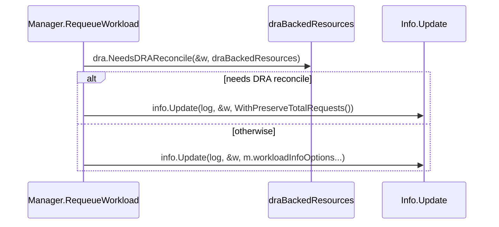

# PR #11927: Fix stale DRA resource requests on requeue after DeviceClass deletion

**Summary**: Fix stale DRA resource requests on requeue after DeviceClass deletion

**Sources**: https://github.com/kubernetes-sigs/kueue/pull/11927

**Last updated**: 2026-06-12T05:38:51Z

---

## Metadata

- **State**: closed (merged)
- **Author**: [@sohankunkerkar](https://github.com/sohankunkerkar)
- **Branch**: `fix-info-update-stale-totalrequests` → `main`
- **Created**: 2026-06-04T05:13:00Z
- **Updated**: 2026-06-12T05:38:51Z
- **Merged**: 2026-06-12T05:38:50Z
- **Closed**: 2026-06-12T05:38:50Z
- **Labels**: `kind/bug`, `release-note`, `size/L`, `lgtm`, `approved`, `cncf-cla: yes`
- **Assignees**: [@mimowo](https://github.com/mimowo)
- **Requested reviewers**: [@kannon92](https://github.com/kannon92), [@olekzabl](https://github.com/olekzabl)
- **Changed files**: 5   **+197 / -21**

## Description


<!--  Thanks for sending a pull request!  Here are some tips for you:

1. If this is your first time, please read our contributor guidelines: https://git.k8s.io/community/contributors/guide/first-contribution.md#your-first-contribution and developer guide https://git.k8s.io/community/contributors/devel/development.md#development-guide
2. Please label this pull request according to what type of issue you are addressing, especially if this is a release targeted pull request. For reference on required PR/issue labels, read here:
https://git.k8s.io/community/contributors/devel/sig-release/release.md#issuepr-kind-label
3. Ensure you have added or ran the appropriate tests for your PR: https://git.k8s.io/community/contributors/devel/sig-testing/testing.md
4. If you want *faster* PR reviews, read how: https://git.k8s.io/community/contributors/guide/pull-requests.md#best-practices-for-faster-reviews
5. If the PR is unfinished, see how to mark it: https://git.k8s.io/community/contributors/guide/pull-requests.md#marking-unfinished-pull-requests
-->

#### What type of PR is this?
/kind bug

#### What this PR does / why we need it:

#### Which issue(s) this PR fixes:
<!--
*Automatically closes linked issue when PR is merged.
Usage: `Fixes #<issue number>`, or `Fixes (paste link of issue)`.
_If PR is about `failing-tests or flakes`, please post the related issues/tests in a comment and do not use `Fixes`_*
-->
Fixes #

#### Special notes for your reviewer:
When a workload is requeued after a DeviceClass deletion, Info.Update keeps the old DRA-translated `TotalRequests` even though the resource is no longer DRA-backed. Rebuild TotalRequests from the raw spec in that case.

#### Does this PR introduce a user-facing change?
<!--
If no, just write "NONE" in the release-note block below.
If yes, a release note is required:
Enter your extended release note in the block below. If the PR requires additional action from users switching to the new release, include the string "action required".
-->
```release-note
DRA: Fix workloads retaining DRA-mapped resource names after their DeviceClass is deleted.
```


<!-- This is an auto-generated comment: release notes by coderabbit.ai -->
## Summary by CodeRabbit

* **Refactor**
  * Improved workload update flow: updates to total-request recomputation now support a conditional preserve mode to retain preprocessed DRA totals when requeuing workloads.

* **Tests**
  * Added unit tests verifying rebuild vs. preservation of total resource requests.
  * Updated integration test setup to use a shared DRA-backed resource cache for consistent reconciliation.
<!-- end of auto-generated comment: release notes by coderabbit.ai -->

## Discussion

### Comment by [@netlify[bot]](https://github.com/apps/netlify) — 2026-06-04T05:13:05Z

### <span aria-hidden="true">✅</span> Deploy Preview for *kubernetes-sigs-kueue* canceled.


|  Name | Link |
|:-:|------------------------|
|<span aria-hidden="true">🔨</span> Latest commit | aa426515f825d8f13d4eeef4500c86985b644371 |
|<span aria-hidden="true">🔍</span> Latest deploy log | https://app.netlify.com/projects/kubernetes-sigs-kueue/deploys/6a29cf5562486f0008442a71 |

### Comment by [@sohankunkerkar](https://github.com/sohankunkerkar) — 2026-06-04T05:59:21Z

/test pull-kueue-test-integration-shard-0-main

### Comment by [@sohankunkerkar](https://github.com/sohankunkerkar) — 2026-06-04T14:40:34Z

> @sohankunkerkar: The following test **failed**, say `/retest` to rerun all failed tests or `/retest-required` to rerun all mandatory failed tests:
> 
> Test name	Commit	Details	Required	Rerun command
> pull-kueue-test-integration-shard-0-main	[17bc8db](https://github.com/kubernetes-sigs/kueue/commit/17bc8db1bedb4f9e713be620a2648a02c504fbf3)	[link](https://prow.k8s.io/view/gs/kubernetes-ci-logs/pr-logs/pull/kubernetes-sigs_kueue/11927/pull-kueue-test-integration-shard-0-main/2062413892377645056)	true	`/test pull-kueue-test-integration-shard-0-main`
> [Full PR test history](https://prow.k8s.io/pr-history?org=kubernetes-sigs&repo=kueue&pr=11927). [Your PR dashboard](https://prow.k8s.io/pr?query=is%3Apr%20state%3Aopen%20author%3Asohankunkerkar). Please help us cut down on flakes by [linking to](https://git.k8s.io/community/contributors/devel/sig-testing/flaky-tests.md#filing-issues-for-flaky-tests) an [open issue](https://github.com/kubernetes-sigs/kueue/issues?q=is:issue+is:open) when you hit one in your PR.
> 
> Details

Need https://github.com/kubernetes-sigs/kueue/pull/11943 to fix this flake

### Comment by [@coderabbitai[bot]](https://github.com/apps/coderabbitai) — 2026-06-06T05:02:08Z

<!-- This is an auto-generated comment: summarize by coderabbit.ai -->
<!-- review_stack_entry_start -->

[](https://app.coderabbit.ai/change-stack/kubernetes-sigs/kueue/pull/11927?utm_source=github_walkthrough&utm_medium=github&utm_campaign=change_stack)

<!-- review_stack_entry_end -->
<!-- This is an auto-generated comment: review paused by coderabbit.ai -->

> [!NOTE]
> ## Reviews paused
> 
> It looks like this branch is under active development. To avoid overwhelming you with review comments due to an influx of new commits, CodeRabbit has automatically paused this review. You can configure this behavior by changing the `reviews.auto_review.auto_pause_after_reviewed_commits` setting.
> 
> Use the following commands to manage reviews:
> - `@coderabbitai resume` to resume automatic reviews.
> - `@coderabbitai review` to trigger a single review.
> 
> Use the checkboxes below for quick actions:
> - [ ] <!-- {"checkboxId": "7f6cc2e2-2e4e-497a-8c31-c9e4573e93d1"} --> ▶️ Resume reviews
> - [ ] <!-- {"checkboxId": "e9bb8d72-00e8-4f67-9cb2-caf3b22574fe"} --> 🔍 Trigger review

<!-- end of auto-generated comment: review paused by coderabbit.ai -->
<!-- walkthrough_start -->

<details>
<summary>📝 Walkthrough</summary>

## Walkthrough

This PR adds a preserve-vs-rebuild update path for workload Info: when DRA reconciliation is required, RequeueWorkload preserves TotalRequests; otherwise, Info.Update rebuilds totals from spec or admission. Tests and queue/controller setup now share a draBackedResources extended resource cache.

## Changes

**Workload Info Update Pathways**

|Layer / File(s)|Summary|
|---|---|
|**Workload Info update contract and rebuild implementation** <br> `pkg/workload/workload.go`, `pkg/workload/workload_test.go`|Add `InfoOptions.preserveTotalRequests` and `WithPreserveTotalRequests()`. Refactor `NewInfo` to call `Info.Update(..., opts...)`. `Info.Update` accepts options and uses an unexported `rebuildTotalRequests` helper to recompute `ClusterQueue`/`TotalRequests` from admission or podsets unless preservation is enabled. Includes `TestUpdateWithRebuild`.|
|**Manager requeue conditional update pathway** <br> `pkg/cache/queue/manager.go`|`RequeueWorkload` calls `dra.NeedsDRAReconcile(&w, m.draBackedResources)` and invokes `info.Update(log, &w, workload.WithPreserveTotalRequests())` when DRA reconciliation is needed; otherwise uses `info.Update(log, &w, m.workloadInfoOptions...)`.|
|**DRA integration test wiring** <br> `test/integration/singlecluster/controller/dra/suite_test.go`|Create a shared `draBackedResources` extended resource cache and pass it into queue options via `qcache.WithDRABackedResources(...)` and into `core.SetupControllersOpts{ DRABackedResources: draBackedResources }` so queue and controllers share the same cache instance.|

### Sequence Diagram



🎯 3 (Moderate) | ⏱️ ~20 minutes

## Suggested reviewers

- kannon92
- mbobrovskyi

> "🐰 Hopping through code with a careful paw,  
> I keep totals safe when DRA makes a call,  
> Rebuild the view when admission says so,  
> Shared cache hums so tests and controllers know,  
> I munch on edge-cases, then bound off with a hola."

</details>

<!-- walkthrough_end -->
<!-- pre_merge_checks_walkthrough_start -->

<details>
<summary>🚥 Pre-merge checks | ✅ 4 | ❌ 1</summary>

### ❌ Failed checks (1 warning)

|     Check name     | Status     | Explanation                                                                           | Resolution                                                                         |
| :----------------: | :--------- | :------------------------------------------------------------------------------------ | :--------------------------------------------------------------------------------- |
| Docstring Coverage | ⚠️ Warning | Docstring coverage is 55.56% which is insufficient. The required threshold is 80.00%. | Write docstrings for the functions missing them to satisfy the coverage threshold. |

<details>
<summary>✅ Passed checks (4 passed)</summary>

|         Check name         | Status   | Explanation                                                                                                                                                   |
| :------------------------: | :------- | :------------------------------------------------------------------------------------------------------------------------------------------------------------ |
|         Title check        | ✅ Passed | The title clearly and specifically describes the main bug fix: preventing stale DRA resource requests when a workload is requeued after DeviceClass deletion. |
|     Linked Issues check    | ✅ Passed | Check skipped because no linked issues were found for this pull request.                                                                                      |
| Out of Scope Changes check | ✅ Passed | Check skipped because no linked issues were found for this pull request.                                                                                      |
|      Description Check     | ✅ Passed | Check skipped - CodeRabbit’s high-level summary is enabled.                                                                                                   |

</details>

<sub>✏️ Tip: You can configure your own custom pre-merge checks in the settings.</sub>

</details>

<!-- pre_merge_checks_walkthrough_end -->
<!-- finishing_touch_checkbox_start -->

<details>
<summary>✨ Finishing Touches</summary>

<details>
<summary>🧪 Generate unit tests (beta)</summary>

- [ ] <!-- {"checkboxId": "f47ac10b-58cc-4372-a567-0e02b2c3d479", "radioGroupId": "utg-output-choice-group-unknown_comment_id"} -->   Create PR with unit tests

</details>

</details>

<!-- finishing_touch_checkbox_end -->
<!-- tips_start -->

---


<sub>Comment `@coderabbitai help` to get the list of available commands and usage tips.</sub>

<!-- tips_end -->
<!-- internal state start -->


<!-- DwQgtGAEAqAWCWBnSTIEMB26CuAXA9mAOYCmGJATmriQCaQDG+Ats2bgFyQAOFk+AIwBWJBrngA3EsgEBPRvlqU0AgfFwA6NPEgQAfACgjoCEYDEZyAAUASpETZWaCrKPR1AGxJcAYvAAe9rhoXpAAIjYAgpAU0vjYFAwkMSQAjtjSuMj4WLHpJBnoAGY0fGEkEvBJAMIeaIjISl7iOZCQBgByjgKUXACMfQCcAEwA7G0GAKo2ADJcsLi43IgcAPSrROqw2AIaTMyrANY7lOQ0iGCI8ESIRxkZq9zYHh6rAyPj7ZF4sPgUXIh8LBMMcMIdKIdnBMAMrxRLJARUDAMWBcIoBMDwDBFQjYbi0agkS7BLxgAgkvIZRBZSCAJMIYM5SLhIIjMCiuMxtFh2tDgrhsCt+NwyBMbBV4CQAO6UQWQjAYHIjAA0/C8hwAXioPBMZioSB5ZVjaKsBNgiCrYl56kSFTQVVd1SRVjMVQxkUUwAw6lxZNIJtVYoT6NQuMMAAzDABsYDD0bDABZoGGAKwcPoAZg4YbDAC0jOVEAwKPBuC0MBwDFArBRBF5mFwAOqwEVoSCSv6HDz4ND0VCUgp0YqlFA08qVGp1BooRr6kg0WgqgCS2PwGkm+MJKWCWMHvHF8UQHnkEUiZKRh6DMHwJLF+WpyAqItwvzNsEgz+SsUBCSS08gCsgLsMFIMoojAAQ0AYcFaA0StIGqYFgO8SAAHlcjSe4SBVeAinfZs2w7Lsez/ACgJA8IwIgqC6AtEhTXgDx6Gga8QlvKkaSKGtmDwz80ElAiKE7bt6EQYUGBQDBqRIYj8FwvdEEoSpgIo08914fAkgaQcJBCKkNEgRdcJPHhYnUzSrmU6kGO1NBuG4DwJWQAAKDoSDoRATzFJhkQYkgAEoVXkxTkg/EySDM6QFJEvkSAAbn4D8KElJBP1EHJqQobAxCvG8MMyZBOJYHj7DE2CoGgfLVmqRcuDgZI0B+P4YkwCSaCIKgy3ffL4tbSl4FiXsMDajr4FaIRBEgIptC8YMMHoUKGufJrbUHVslGFOayAYeRWlsSAzHeeN03ffBJoCdBJrqcEysgMUrQU/9r2QgAiPxAnbQSiNoZBYm3DAsSIFSwE5OzBy/OFfwwNA2GQNASkoHj+vCcUJ3qZBUCaOc6A0Z7zEsaoWDYIbkAcJwXCMKBDgADguBh4DAGsBGvLgAFlnGg4q9vqSAOhQ6BIEiKxbBQgA1ABRMJ9Lq6w7ElbmFI8D1bPUqR6DkYrFt+PgnMBRDQXBQTnD8qX8KZ5l+3vdA7JrKQKAKrjUIbDoxZsaF0Dm9BEEOZACE9q4iCwZgmcRfAJC92R4EC005tkKgVRoDBHQwMB5Dh4dQr22IkkkP0PCIXBmBu6rIFWLr71q/DNaa3BiyIEDByxYbqFGrBzhpJzVjbnhng8MBjgHMlMkxIaSHa5uckuYEKFoGNga5Y2BZSdJ+obkex868aBEm6bB1afZmHUSA+lGAQGCp2gBHi9T+IcsFYY92JMqwLEMqystkGlWIeHwKSYJgSvGp8CNFUS8e0DpDCOiRNySh5qnR7LQL8Pt8JFCuvVB+RIkRlyyDdb4S0+CQXEJUXAsgK71UARJCQ+AOZd0ftgSS7t6AW3nCkSoUoEbUATp1Jy3AAaDjlAqDAIwF7Syrvgr2g4AACTAlBUFUOobQk0mrNg8NwBhS92KrRYRKSURdFAkBsCoNQzInLSOUHI7cflWrKDEC3QU0sCZKAMeYlk15v6/3djgAgxAyDKGYco7gqx96YG+pAGGiA0CkBVEoQsxYej0BRNQNRQSPb4FLLYlUwSFDYn6mwXszJhQUBxBQXJEkiwkCJiSLRUpnK4HbFU/i+x7JzlsSkJg086AL0XMyBy7i0A6QYlqZIySQmZO8uiIgCRx5YAmfAAkyISA3Vcv4ZkUllhcEiLQWg6gW4hCtirEI9siqmR/uoP4qdrahxlIBJAzCsSO2dq7dAX8+oDRNskKaDEAZWPXi3SAm9/zQJ+nEDweBflOTAYdY6sQiiUC2h0lkJAikhXyjwNGWSrhSSGkeWClYwCGAMCYKAZB6CyU8YQUg5AOqDn3uwLgvB+DCFEIQv06tTGyKMVoHQ+gCXgHKggdG98yXeMpZeGlQ0uBUH4qTTkLgWTyDZYY9QnLdB4qMDy0wBhuCHCIIEyCzZVj5AeJyKGIENBEHwBWZ6VqDAWAFouYVvjBzSucDtXCCSkKICMMuSAAADNmJrKAaDYgOBshFhI+oyfDfBtAhACnEMpcGP5pAqh9R9ISPYNDLhxD6yAeICTnCeckBUDSchbLLLs1oPqEFoA0K5dynk0o+S8E5AAZJKFUhdq0ACFILQTFN+eEiA/I+q4JKZsWBjJZxyHTByUyoF0BoiORgIQDS+qxDiNcG4aBOS7OaSAbaVRpq+hoBsWxqzSGCsxXKd4shOT8sO+K15mxJRSthZkDAV3IB9eu1c6580kB3fgPdB7QkaCPcJLN+AUJpPShoODw63lhUqAeXNyJS3bJyLs79K5N3/sA8ByUw7l0vDbNzWIzBLkwTVXjAWHhShTJ9qdUKSgvTOAY/wXCJB/DcD+MwpqTwBAOXEuwbZ0gKY8xyCQIwMwdzIHdaQWgXAADUyZVhgD6EYMWVlOTMNMfUyAiKimcEgCzOg8BHAGCtbjXFYAjBap1eBnsqxHMwXNZa61trIj2opY6kSjgZWusYIhUgnqDA+sg9B9+OaiBck0T6oKFApBXtYnle8OaUERIyR7UKXGeMUGYT609z5z0KUSyQZLHhg1paFJ1BSNJD6+z3FIIavqKtVayOlh2PQvmxHonRyAtAEhfPCzhv9hIc1OV9r9LkYUIpaXoMZFzJ0STZHQoa/yOKfWuUlJBnNcsgVTTEH8QcvsymbhauU0s8gRvZrUR+LAH6SM3d/VugDQkiAaB7VBdq8Q5p3sPSqVJ2D4MRpSBRpSgN1DICa6NAUElb7JCxNskI8BNSdVJT62ocbKAAEVMI+tWD6trqWOtqKxAjmrvzEK0Fvh9owz3cPjcevxSCSRSxfqB8gODmaVyRZbj6+Kh9oVfmbF++AGgULCFB5jGLBbMcgqkhQPHA4CdE5YpVkniAc2NLwHO32rZyD8Tobl3jg4fW9ewAxWgxOb1a8gP4ygWX5rjtaSwJ4cvoQojoM8AGAAJeosAfX6XN3RS3jEbfsTt8rByfoVazLNxFmDGAfWIHtHOL9WPFfK4yJ1oqPreTUAFBoDZB8Gj87bC7oKLWnJPsoMlB6XppJ2xHAFNRFurdfoj/lXP3F898iLyXpAVwch7Zdz2A+iw6CC9wradAtAJ/zjfQNygOdGMrcmg7HjIl0+5osoDIHLcwAIJzlgLjXoBS2M7ueIpOmWmZMwDtJPuzjJqRrOZAGwexs0E982QbtP/eICB4DYaSODsBzr7Zz6xruK+wrRLqoBYiUIcyNynArryDqw+pf4kBB7UaeZ0a+ItK+zMaiB1AjTpQcYGbcam4kp8ACZCYGZDSiahZQAbIwKTR0I2I5BcA+pFDsGQBFawAlaXrq7taIB3oGS85J45p3LxbarOZhpOYuZmr4A+pwSmZLQiTXBQz8hfx5pBhcE8HIiQBOQ6AABUkGlimB+GgEQGFAGgMwQGIEh62oJh/cGQJ68htAlieKbBhhxhkAZhK4Fhr2Vhu6th9hdcjubYzhrhCyoan0wkgO7OkA3OieZYRG0h9mch8RChHhShKhUAvImU2U6I+owYmydAXBxCwo4hOIfO6U0WsW9A8WX4Qh16keLi+AHgUhWAMhDmHhWR6armyh0msmQWmACmym8YfQamfQVMmm2moqei+mhmvGXAvu1wsAlm1qNmdmshLmAxX0AA+m3Eoe5rjJ5t5j4lSn5mTIFvJmJgYCwbDACvxMEIJkSMfs1qhg1pkK1pkJgfwWKH1rQN0b6pkfsS5scZkHkSdJALbDhPIM+IkgzpgXtlsCkMCfYOUpgOIAwECjrnLpBhoF3tVoVNxKFLocwkttSISIhl3EwLbIKE5H0JYhtFsspEtkwmMR6iZIoFlF8pSWbiSR1iqE5MMJYo3s4F8jSaEK/hpJFIOMZGrm0d3vwOhMCaKemJYuPuoFSR4a7swO7nOhfspDqWXpWlYIoNCHOJEGXgHBUkGnEEmpMOEqQBNrPrwKNHwMqSlrbj6q3pkk5PGJYoVmei0WVsKXbuCOFF8ieGeJgBeMwlyTpCCtIPpLaaVu/AoIac4MkLlkytpIgPpO3v1j6Rrn6RXr5CgAHH8MNpabQNabgP2hDGmT4HUJQnbKDpkliOfkoBdHuN5GWr8mQA4MWMpEjuIFhpGTmlskUDCnwGSRQWJMwjxtSAzKHlbnCbpH6EUsugpB/FsPEMyD6oKXUZJNgTgZYJEHgaQfQoQfhCxiQexqSibvlrvDQTsHQSJuIA8cweUfNL8QYRweWL6kBTAP8a9oCRuYxJNv4W3B/tAOkT0eCf0ZCSceaioQYDJuQHJsFhUZAEpn0GGNMTGPMeIDptSksbEKwvxCsflqzGZhZlZhTBqm3KsMgT8jkKsHvl4OforoEjkDXJ0V4BQKsNWtxZbjQFCdSKcVsecVeZcSKsws6rKqSvcaFtLMZBxbeVgqEpgBEgjHVniMzowIGAWpkslF+BdDAiAswlxgnKwYmvCMul7kYVWlQF9n2k6YOv6a1ExvhOtlkuMpMp1JUK2D6qkB+l7ielsCeJ5XQM2UmqIdzsOhkmRFcH2Vxjcl8nuJdp1PmWIAxvpF0ugAaKdIKV+m0gso2XiATENDWC8DKDmgfmQYCFkkJY1c3lnCQDnMVOEmwL6t2r2gld5ZpN0TSfMnhDWK+L6lVRoDVdwHVR1SJYgJFogAAN7c4qhxXDW0CJWDpcBDXUR7WjXSAAC+41NAMkbq6UNcb8XyBuUoFBDlYMp1LlD5K8YgR4EkxULVkkOKl5tG9GWZ95yQj5bGWZL5lBb51B3cgmVQ9B4gP5oWHQkmOK2Ffo9ximBFkYamwwZF8AFF8SVF4oT1dFxmpmWyTF2x3K6qRKKSuEi05KVxixrAtKzUUq/mLqcqCgMiiqmgCi3KhK/88BgqTNDq1x2ZFSh1c4O8xNfZgmGkhw9gXNsqSIIWPNCq5iyqtNAA2utc9OrSQIuLQM9BwIbeMSQIcT2GGD2CQMMFTAwHOfGM9EqM9NwNQLAGbe7bIVFfqutqsMagZbYeaq7c9DSflhjWbZGIMJGG7cSlHRwKMNmG7SpbIN7T6sGhkHEYMTmsWlkkOZhi8PIBVb6oobtiyNaCSlgGOnOM+ipK7k2vAHOn2BhCvNjYfAllIGvrskwsgGFWXbkfwYIRGcIZrneulk1HGeQAuvQC5qnmorXi+g9NHo5L6oXC5qkbYtzqPiKJSR/mHaYl2l2FBATIaV4P4OoOnebbkuZswM9GdUqAbUbSbd7UbYcVMZGLGKMKMLMUUMmGGGHR7c+N7ShdkcaIoaHancEJHTuGbRmGGPHXNInQg6nardfc9M9meXbvnT2SCtEhdM0ReqPSqdVkzJ0dJFgCUYxLCd5B1RXnXQjCia9jmiWSEmWSIUHofXosfUrWfU0pfcQt7V2JKA/U/RbUhK/ebe/U7T2PGBGOfCfCQEA57aA3sahbkVA+HTA7gCg8mMMEg7QCg1/Wg7cd7cuEJYNkkPQK+QVsPeGUlmPRWX9YeggCiFiTSFg0nkWV3eVk45HjmoQZlMkG1Rw5rqw42q/MBculgD0PYIcCWMKNXbmq9kWdw0oLw6fW7hfVfcI/gKI4/c/ZbVIxI6QIcQwMMMmAILQIo1TNmKMCoyA+bWA4MQccJEoWHRHbo3AxwOmBGIY4nemPGPGKYwFt7WKGmmbtthXb7JiRdoacQr6hXZkjLpuBOc3Q5Gjr8r7Mw3hu9p9r2j9nQrQP9m2IkcDhoAhpAJgU0USaibCazuFMyDpMWD2AjV42WCnvaAQF/D6pLkIKDo9jZC8ahrY2bmw9OfbvqAUk7jxOhASckPnl7n/n7gHkHr6hC/46qfnUkPVSjo6LDPPkPofmHGAFvnVtYZsOJLufLtjkrvjoTpC6MuhuWsXfEyWJ3li9Vmw18rXT0fY8Q446Q6TqgHHjAoLsyAcnAnZDHtkN4wikisvsWBDstgckYXg9gOyfvk/tqC/qZG/pFADMbOkyQJk4cPwzk0I+bQgEQF7YU6U8babdI5bdbVNLQIMIML/SQMmMmMo27cA17c0+o+A20z2NJZoFo104nZGMMCM89AnT06MLG6My6uY/VXyZpH8dSACVsECWHiCRku+IMkfsq0+L8Uie+rdUUfVv9JOdqM9hNn9agW2OiXKeZIqVECkAOppK3kC2LqNsESlWic+B4oKXPfqU5Jkk2/WwK6VkK76QEwGR7GjJQJ4z+sSVy6ThhGqwVcwimVSOqzWWOYDD6vWY2ftZpBoG2X0n8Frp0syBqwQx+vuYojQcSj1iTtySFq6FaMe0ECEMkG2wqQtp22E84+qfmxkkS5PuO+AwaUaZ1IuWacPj0ReyQC6QZV2R7F3bGWBDXAmXUEmZrgw/y2GYK348K3bqgHVoFArv2VOnNBhg9s2FBHhIkus7suSGq7OfORvkVLu7uD/LgOuZiVx6uny49GFHO8kH9X+AKNjCa2axa1lVa89LfY4GI0U5I06w64cemAwMRWgD65GCQPGMMH0I04G89GxdpVMtxQDLxQrqUAJem51WJVQBJeoFbehfgJ0zoyg8MIMAMz0xmOmCmy4N7QGNJOZfYFPGbkdV5d29IDmvZcSq9Ul+9WgmUSEg1qdBFZhNgzmgPRFX7bEbFVEPFSdUl8lSDidEyPXclCOzlpfVZMpLlQs8OdxkykVYpyfea9kypxg+p/ffay/Tp+/YMAwDAumFTMMGgHNw0/66o+bTZ2vLefZ8BI53Sy58tZQO52gJ51JT53584N0+QPA2Z8F+d2mJd+Heg97ZgUgoi3NQtUtQ1StWtTmh7fNrQ4Je94ZXOMZVNgUA9KFIAbmU0QlyNdV5dWyIjpJFdSSjdQj9Ww9SC6l5tIwm9aV/DjuDjG7UfX18p4IxgyIw/QALrGC8r0FI9Co+aS1irGZKDbgzS80Ih9cq23HNQ8msp6LspKqC2qrC37zqCHGzKICHHUXaJ0CHFdMqr4rC2DAAPxiDA1MjBFCDCzf/3xijDJjpgQR9ACCjDzdFAmes4Xz6+RhUxFDDDy902QBRgCBUxO9oDny0AwqIqjBFAW9JujDxhKCRjxiRibJO0CAetGdKBUx2/C3ph9Cu9oBhga9oBoCeuRgqDpjpgO3nwVN1NwwRi0DphKB9NO01ORjR/U9jCQR9Aq99C0B9BFAVMN8h8F/EV1ORhx+DBhgCBFC6+x8pgZjiS03C+Eyi/i+S+k3Si0CHHErl8QBhSHFsAUBlNe5QQS9y+03rUGBtDPRIC2Bmt0Bn0VKWm/xm3bwGhYRb+QA7+rW2zFjlEYCn9TTn9KiX/PS0AaQZQAwEy2wGUWMoEeAF4aAp/Tfm0G34tMvoobKfsdy4AgDQB2/MTj4HYLvxT+YXS/nAOehAV34/BMIB/xrgAxEAp/MMGgMgCP1iBPtHVOJQx4wJx+1XDpjAOIHwD1ciA5EMgP6Av84B2/TAbYmwG4Dj2BA/oMQNIHoDVuTcMsBtyIBbd+KdDf7qJXEoOAvO4bOgZAFgHCCmBSA2xKfz6DsCOBGA9QelB4F4k8BwEfgUfEEHaCwBwbVppA1870COBV/BAXoMkin8RmDAq/lwP0GxVeB+AlAYIMv5CCr+piJxEYgbA1gaA1YdwLgC8CP8DkF/bfpOFwAIRRAhwftM8CyCn9daxAlQaAOegr9DgHQaGMoy4DPQIhoQXIa7VcHaNC8Jgu6rEJ0G5Y6gWhFuKf2KH4QkapQ39t9UySiRRAOEEBGy2iRFh4APQJ7npTuSmhAY6IfwHSmooiZLIJIZIJOjep90SOF0JbK3XWzBgo0yMccCQFqBopMYZYfHhUPBggoywp/DAD3HMHZCKMSgZoXLAoD/RgI5QuwYbUbTBVYg0Q5/hUNrKbAoYHgRIVBHyFsBmhbQ5RmYMyEVDchQIwoVfxwGGC/23/ZQKQGeE6CaS/IEwU/wUhXDt+9Q/SmcKKFwjP+ykBkkiMRzIAfWGgZMJGAACklZdxvAUkjYA5yVQCUENEQwvITssAEXJ0V7DIA6mGgbMNSKOEvCThoKHIM0JCFedgC8I/Aa+2KjuD6EpePfDxHJKnRwk4gRAEUERL4QSRVAUgFNWkC/BGIwonQTcJhHPR7hjwogCiPQE/CsQIQAEXkIKHND3+Mo4wbjDgH+C2gWQ7flCOdFFDsKHMRcA0APZlDsRV/NEQKFP41Dwx8bbjA0KmTNDHR7LUGGrFEANQHopELEEgRDF+hP47yX7PQF3LPhRWPcdRNCRtHXC9Edw5wFaMrHb87Rfwx0dCOaG3xoIwYhwNIAzKRQKkHo0AV6OUGQiWOTo4EUUJQh4ByCnuVJMkAQiW1cKSQ+sRGP7zVDgmsY3EY0PFFFDkxXsRJoOB6Afp5OknNsQ3FzEfxYUiiY5nKJLHQ4yxTCE0egLNE1iHhAMRcc9EbEOjhxLYooUeRQhFApxwoWcR6m7ENBex4IuAT6ICGfj/RsI6QIMKTzwRhxr4yMSuIyBrj4xeIpoVuOHEpikmugeCHoiCHqBAAmATIAbWsAMAF4CkDag06f4MgIMhgivjHxRQy0S+NjHvj/hUE0cVfwGHFgk8fYtoGdUv7k9tBz0eIbYALBwT8RV/bvhr0jAMBRgGfJ3kUG749Bhgc3K3kRXTBoA+gevUYAwGTC0BkwVMUzoMGr5Ux/eAgH1sMHTA29a+aASMAZO9YkAbJAgYYNUxRGiT6guAWwCUPNG/0UwnfMMFTD6DB90wJAKmAA3TBUjswrvKYoMCM5mc/ewzWMHORUne9T4F8OgJGD6Y69IItAYPoigYAGcPJgBeIIxDNa2BPhWI1/lsj2p0IJJvEssI6Kqm1C3+syGwHQl8nNSuAMYmqe1PqkaRCi+A7qe+GCYGBBJ9vPcAv0oDL9hxEvGfkLWp5M1DiHteTrLxijrTTudvAwAbTEkZi6AkQJshPwP4j8Ehv2XAGbWTATThay01aQpE2lSUFpQvansgQeEhAHpVtKXih02n5ZtpBtSUMWBoAlNiKgwOiGgCmLgRIIVMMAApMjAehQZ+jMACQEjB6T4w58R2umEGAu1rpL0keG9I8AfTx+lQb6U9L0BAA= -->

<!-- internal state end -->

### Comment by [@sohankunkerkar](https://github.com/sohankunkerkar) — 2026-06-08T18:19:30Z

/test pull-kueue-test-integration-shard-0-main

### Comment by [@sohankunkerkar](https://github.com/sohankunkerkar) — 2026-06-08T19:48:21Z

@coderabbitai help

### Comment by [@coderabbitai[bot]](https://github.com/apps/coderabbitai) — 2026-06-08T19:48:27Z

<!-- This is an auto-generated reply by CodeRabbit -->
### Chat

There are 3 ways to chat with [CodeRabbit](https://coderabbit.ai?utm_source=oss&utm_medium=github&utm_campaign=kubernetes-sigs/kueue&utm_content=11927):

- Review comments: Directly reply to a review comment made by CodeRabbit. Example:
  - `I pushed a fix in commit <commit_id>, please review it.`
  - `Open a follow-up GitHub issue for this discussion.`
- Files and specific lines of code (under the "Files changed" tab): Tag `@coderabbitai` in a new review comment at the desired location with your query.
- PR comments: Tag `@coderabbitai` in a new PR comment to ask questions about the PR branch. For the best results, please provide a very specific query, as very limited context is provided in this mode. Examples:
  - `@coderabbitai gather interesting stats about this repository and render them as a table. Additionally, render a pie chart showing the language distribution in the codebase.`
  - `@coderabbitai read the files in the src/scheduler package and generate a class diagram using mermaid and a README in the markdown format.`

### CodeRabbit commands

> These commands are invoked using PR/Issue comments.

- `@coderabbitai pause` to pause the reviews on a PR.
- `@coderabbitai resume` to resume the paused reviews.
- `@coderabbitai review` to trigger an incremental review. This is useful when automatic reviews are disabled for the repository.
- `@coderabbitai full review` to do a full review from scratch and review all the files again.
- `@coderabbitai rate limit` to show your current review rate limit status.
- `@coderabbitai summary` to regenerate the summary of the PR.
- `@coderabbitai evaluate custom pre-merge check --instructions <custom-checks-instructions> --name <custom-checks-title> [--mode <error|warning>]` to validate the custom pre-merge checks instructions. Defaults to `error` when `--mode` is omitted.
- `@coderabbitai ignore pre-merge checks` to override pre-merge checks and get an approval on PR.
- `@coderabbitai run pre-merge checks` to run pre-merge checks on the pull request.
- `@coderabbitai generate docstrings` to [generate docstrings](https://docs.coderabbit.ai/finishing-touches/docstrings) for this PR.
- `@coderabbitai generate sequence diagram` to generate a sequence diagram of the changes in this PR.
- `@coderabbitai generate unit tests` to generate unit tests for this PR.
- `@coderabbitai emit path instructions` to emit generated path-specific review instructions for this repository.
- `@coderabbitai resolve merge conflict` to automatically resolve merge conflicts.
- `@coderabbitai autofix` to automatically fix issues identified in unresolved review comments.
- `@coderabbitai resolve` to resolve all the CodeRabbit review comments.
- `@coderabbitai configuration` to show the current CodeRabbit configuration for the repository.
- `@coderabbitai generate configuration` to create a PR that adds the current resolved configuration as `.coderabbit.yaml` (or show it if already present).
- `@coderabbitai help` to get help.

### Other keywords and placeholders

- Add `@coderabbitai ignore` or `@coderabbit ignore` anywhere in the PR description to prevent this PR from being reviewed.
- Add `@coderabbitai summary` to generate the high-level summary at a specific location in the PR description.
- Add `@coderabbitai` anywhere in the PR title to generate the title automatically.

### CodeRabbit configuration file (`.coderabbit.yaml`)

- You can programmatically configure CodeRabbit by adding a `.coderabbit.yaml` file to the root of your repository.
- Please see the [configuration documentation](https://docs.coderabbit.ai/guides/configure-coderabbit) for more information.
- You can also validate your configuration using the [online YAML validator](https://docs.coderabbit.ai/configuration/yaml-validator).
- If your editor has YAML language server enabled, you can add the path at the top of this file to enable auto-completion and validation: `# yaml-language-server: $schema=https://coderabbit.ai/integrations/schema.v2.json`


### Status, support, documentation and community

- Visit our [status page](https://status.coderabbit.ai) to check the current availability of CodeRabbit.
- Create a ticket on our [support page](https://www.coderabbit.ai/contact-us/support) for assistance with any issues or questions.
- Visit our [documentation site](https://docs.coderabbit.ai) for detailed information on how to use CodeRabbit.
- Join our [Discord community](http://discord.gg/coderabbit) to connect with other users and get help from the community.
- Follow us on [X/Twitter](https://twitter.com/coderabbitai) for updates and announcements.

### Comment by [@sohankunkerkar](https://github.com/sohankunkerkar) — 2026-06-08T19:48:43Z

@coderabbitai review

### Comment by [@coderabbitai[bot]](https://github.com/apps/coderabbitai) — 2026-06-08T19:48:56Z

<!-- This is an auto-generated reply by CodeRabbit -->
<!-- CodeRabbit review command invocation: da314638-14c5-487c-b066-6ca4a23c62b8 -->
`@sohankunkerkar` Sure! I'll kick off a review of this PR now.

<details>
<summary>✅ Action performed</summary>

Review finished.

> Note: CodeRabbit is an incremental review system and does not re-review already reviewed commits. This command is applicable only when automatic reviews are paused.

</details>

### Comment by [@coderabbitai[bot]](https://github.com/apps/coderabbitai) — 2026-06-08T19:48:58Z

<!-- This is an auto-generated reply by CodeRabbit -->
<!-- CodeRabbit review command invocation: 187a2c9d-523a-49b2-a2b2-82d0a4a53eca -->
<details>
<summary>✅ Action performed</summary>

Review finished.

> Note: CodeRabbit is an incremental review system and does not re-review already reviewed commits. This command is applicable only when automatic reviews are paused.

</details>

### Comment by [@sohankunkerkar](https://github.com/sohankunkerkar) — 2026-06-09T13:05:19Z

@kannon92 PTAL

### Comment by [@sohankunkerkar](https://github.com/sohankunkerkar) — 2026-06-10T19:38:27Z

/test pull-kueue-test-e2e-certmanager-main

### Comment by [@mimowo](https://github.com/mimowo) — 2026-06-10T19:53:14Z

https://prow.k8s.io/view/gs/kubernetes-ci-logs/pr-logs/pull/kubernetes-sigs_kueue/11927/pull-kueue-test-e2e-certmanager-main/2064790741418250240
Does not seem related, let me ticket as we need to stabilize the build more

Opened: https://github.com/kubernetes-sigs/kueue/issues/12091

### Comment by [@sohankunkerkar](https://github.com/sohankunkerkar) — 2026-06-10T21:09:20Z

/test pull-kueue-test-integration-shard-2-main

### Comment by [@k8s-ci-robot](https://github.com/k8s-ci-robot) — 2026-06-12T05:14:40Z

LGTM label has been added.  <details>Git tree hash: b53d397b77f809a27d720772fe23b477b9e9d636</details>

### Comment by [@k8s-ci-robot](https://github.com/k8s-ci-robot) — 2026-06-12T05:14:43Z

[APPROVALNOTIFIER] This PR is **APPROVED**

This pull-request has been approved by: *<a href="https://github.com/kubernetes-sigs/kueue/pull/11927#pullrequestreview-4482690108" title="Approved">mimowo</a>*, *<a href="https://github.com/kubernetes-sigs/kueue/pull/11927#" title="Author self-approved">sohankunkerkar</a>*

The full list of commands accepted by this bot can be found [here](https://go.k8s.io/bot-commands?repo=kubernetes-sigs%2Fkueue).

The pull request process is described [here](https://git.k8s.io/community/contributors/guide/owners.md#the-code-review-process)

<details >
Needs approval from an approver in each of these files:

- ~~[OWNERS](https://github.com/kubernetes-sigs/kueue/blob/main/OWNERS)~~ [mimowo]

Approvers can indicate their approval by writing `/approve` in a comment
Approvers can cancel approval by writing `/approve cancel` in a comment
</details>
<!-- META={"approvers":[]} -->

### Comment by [@mimowo](https://github.com/mimowo) — 2026-06-12T05:15:02Z

/release-note-edit
```release-note
DRA:  Fix workloads retaining DRA-mapped resource names after their DeviceClass is deleted.
```

### Comment by [@mimowo](https://github.com/mimowo) — 2026-06-12T05:15:16Z

/release-note-edit
```release-note
DRA: Fix workloads retaining DRA-mapped resource names after their DeviceClass is deleted.
```

## Reviews

### Review by [@copilot-pull-request-reviewer[bot]](https://github.com/apps/copilot-pull-request-reviewer) (commented) — 2026-06-04T05:14:12Z

## Pull request overview

> [!NOTE]
> Copilot was unable to run its full agentic suite in this review.

This PR adds a targeted refresh path for `workload.Info` to recompute `TotalRequests` when a workload should no longer rely on DRA-preprocessed totals, and wires that behavior into the requeue flow.

**Changes:**
- Add `Info.UpdateAndRebuildTotalRequests` (and helper) to recompute `TotalRequests` from the latest workload state.
- Update `Manager.RequeueWorkload` to choose between preserving vs rebuilding `TotalRequests` based on `dra.NeedsDRAReconcile`.
- Add unit tests covering rebuild behavior for pending, DRA-stale, and admitted workloads.

### Reviewed changes

Copilot reviewed 3 out of 3 changed files in this pull request and generated 4 comments.

| File | Description |
| ---- | ----------- |
| pkg/workload/workload.go | Introduces an update method that recomputes `TotalRequests` (and a helper to rebuild totals). |
| pkg/cache/queue/manager.go | Switches requeue update behavior to rebuild totals when DRA reconcile is not needed. |
| pkg/workload/workload_test.go | Adds test coverage validating that rebuilding clears stale DRA totals and respects admission. |


---

💡 <a href="/kubernetes-sigs/kueue/new/main?filename=.github/instructions/*.instructions.md" class="Link--inTextBlock" target="_blank" rel="noopener noreferrer">Add Copilot custom instructions</a> for smarter, more guided reviews. <a href="https://docs.github.com/en/copilot/customizing-copilot/adding-repository-custom-instructions-for-github-copilot" class="Link--inTextBlock" target="_blank" rel="noopener noreferrer">Learn how to get started</a>.

- **pkg/workload/workload.go:331** by [@Copilot](https://github.com/apps/copilot-pull-request-reviewer) — 2026-06-04T05:14:10Z
```diff
@@ -312,13 +312,36 @@ func (i *Info) UpdateSchedulingHash(log logr.Logger) {
 }
 
 // Update refreshes the object reference and recomputes the scheduling hash
-// to reflect any changes (e.g., priority updates).
+// to reflect any changes (e.g., priority updates). TotalRequests are preserved
+// to retain any DRA preprocessing applied by the workload controller.
 func (i *Info) Update(log logr.Logger, wl *kueue.Workload) {
 	log.V(5).Info("Workload info updated", "workload", klog.KObj(wl))
 	i.Obj = wl
 	i.UpdateSchedulingHash(log)
 }
 
+// UpdateAndRebuildTotalRequests refreshes the object reference AND recomputes
+// TotalRequests from the current workload spec. Use this when the workload is
+// no longer DRA-backed and stale DRA-translated TotalRequests must be cleared.
+func (i *Info) UpdateAndRebuildTotalRequests(log logr.Logger, wl *kueue.Workload, opts ...InfoOption) {
+	log.V(5).Info("Workload info updated with rebuilt TotalRequests", "workload", klog.KObj(wl))
+	i.Obj = wl
+	i.rebuildTotalRequests(opts...)
+	i.UpdateSchedulingHash(log)
+}
```

  `UpdateAndRebuildTotalRequests` rebuilds `TotalRequests` based on `wl.Status.Admission`, but it doesn’t refresh `i.ClusterQueue`. This can break the invariant established by `NewInfo` (where `ClusterQueue` is derived from admission) and may leave `Info` with admission-derived requests but a stale/empty `ClusterQueue`. Consider updating `i.ClusterQueue` consistently (set from `wl.Status.Admission.ClusterQueue` when admitted, and clear it when not admitted).

- **pkg/workload/workload.go:343** by [@Copilot](https://github.com/apps/copilot-pull-request-reviewer) — 2026-06-04T05:14:11Z
```diff
@@ -312,13 +312,36 @@ func (i *Info) UpdateSchedulingHash(log logr.Logger) {
 }
 
 // Update refreshes the object reference and recomputes the scheduling hash
-// to reflect any changes (e.g., priority updates).
+// to reflect any changes (e.g., priority updates). TotalRequests are preserved
+// to retain any DRA preprocessing applied by the workload controller.
 func (i *Info) Update(log logr.Logger, wl *kueue.Workload) {
 	log.V(5).Info("Workload info updated", "workload", klog.KObj(wl))
 	i.Obj = wl
 	i.UpdateSchedulingHash(log)
 }
 
+// UpdateAndRebuildTotalRequests refreshes the object reference AND recomputes
+// TotalRequests from the current workload spec. Use this when the workload is
+// no longer DRA-backed and stale DRA-translated TotalRequests must be cleared.
+func (i *Info) UpdateAndRebuildTotalRequests(log logr.Logger, wl *kueue.Workload, opts ...InfoOption) {
+	log.V(5).Info("Workload info updated with rebuilt TotalRequests", "workload", klog.KObj(wl))
+	i.Obj = wl
+	i.rebuildTotalRequests(opts...)
+	i.UpdateSchedulingHash(log)
+}
+
+func (i *Info) rebuildTotalRequests(opts ...InfoOption) {
+	options := defaultOptions
+	for _, opt := range opts {
+		opt(&options)
+	}
+	if i.Obj.Status.Admission != nil {
+		i.TotalRequests = totalRequestsFromAdmission(i.Obj)
+	} else {
+		i.TotalRequests = totalRequestsFromPodSets(i.Obj, &options)
+	}
+}
```

  The logic in `rebuildTotalRequests` duplicates the `TotalRequests` initialization logic already present in `NewInfo`. To reduce divergence risk, consider centralizing this logic so both `NewInfo` and update paths share a single implementation (e.g., have `NewInfo` construct `Info{Obj:w}` and then call `rebuildTotalRequests(opts...)`).

- **pkg/workload/workload.go:326** by [@Copilot](https://github.com/apps/copilot-pull-request-reviewer) — 2026-06-04T05:14:11Z
```diff
@@ -312,13 +312,36 @@ func (i *Info) UpdateSchedulingHash(log logr.Logger) {
 }
 
 // Update refreshes the object reference and recomputes the scheduling hash
-// to reflect any changes (e.g., priority updates).
+// to reflect any changes (e.g., priority updates). TotalRequests are preserved
+// to retain any DRA preprocessing applied by the workload controller.
 func (i *Info) Update(log logr.Logger, wl *kueue.Workload) {
 	log.V(5).Info("Workload info updated", "workload", klog.KObj(wl))
 	i.Obj = wl
 	i.UpdateSchedulingHash(log)
 }
 
+// UpdateAndRebuildTotalRequests refreshes the object reference AND recomputes
+// TotalRequests from the current workload spec. Use this when the workload is
+// no longer DRA-backed and stale DRA-translated TotalRequests must be cleared.
+func (i *Info) UpdateAndRebuildTotalRequests(log logr.Logger, wl *kueue.Workload, opts ...InfoOption) {
```

  The doc comment is narrower than the method behavior: `rebuildTotalRequests` recomputes from *admission* when `wl.Status.Admission != nil`, not strictly from the spec, and the method is also useful whenever `TotalRequests` must reflect the updated workload (even without DRA). Consider rewording to reflect both paths (admission vs spec-derived) and mention how `opts` affect the rebuild.

- **pkg/workload/workload_test.go:625** by [@Copilot](https://github.com/apps/copilot-pull-request-reviewer) — 2026-06-04T05:14:11Z
```diff
@@ -561,6 +561,82 @@ func TestNewInfo(t *testing.T) {
 	}
 }
 
+func TestUpdateAndRebuildTotalRequests(t *testing.T) {
+	now := time.Now().Truncate(time.Second)
```

  This test uses the current wall-clock time, which can introduce avoidable non-determinism. Consider using a fixed time value (e.g., via `time.Date(...)`) so the test is fully reproducible and independent of the environment.

### Review by [@copilot-pull-request-reviewer[bot]](https://github.com/apps/copilot-pull-request-reviewer) (commented) — 2026-06-08T19:49:32Z

## Pull request overview

Copilot reviewed 5 out of 5 changed files in this pull request and generated 3 comments.

- **pkg/workload/workload.go:325** by [@Copilot](https://github.com/apps/copilot-pull-request-reviewer) — 2026-06-08T19:49:31Z
```diff
@@ -312,13 +312,36 @@ func (i *Info) UpdateSchedulingHash(log logr.Logger) {
 }
 
 // Update refreshes the object reference and recomputes the scheduling hash
-// to reflect any changes (e.g., priority updates).
+// to reflect any changes (e.g., priority updates). TotalRequests are preserved
+// to retain any DRA preprocessing applied by the workload controller.
 func (i *Info) Update(log logr.Logger, wl *kueue.Workload) {
 	log.V(5).Info("Workload info updated", "workload", klog.KObj(wl))
 	i.Obj = wl
 	i.UpdateSchedulingHash(log)
 }
 
+// UpdateAndRebuildTotalRequests refreshes the object reference AND recomputes
+// TotalRequests from the current workload spec. Use this when the workload is
+// no longer DRA-backed and stale DRA-translated TotalRequests must be cleared.
```

  The doc comment says `TotalRequests` are recomputed from the workload spec, but the implementation recomputes from `Status.Admission` when present (and only falls back to podset spec otherwise). Please update the comment to reflect the admission-first behavior so callers don’t misunderstand what will be used.

- **pkg/workload/workload.go:343** by [@Copilot](https://github.com/apps/copilot-pull-request-reviewer) — 2026-06-08T19:49:31Z
```diff
@@ -312,13 +312,36 @@ func (i *Info) UpdateSchedulingHash(log logr.Logger) {
 }
 
 // Update refreshes the object reference and recomputes the scheduling hash
-// to reflect any changes (e.g., priority updates).
+// to reflect any changes (e.g., priority updates). TotalRequests are preserved
+// to retain any DRA preprocessing applied by the workload controller.
 func (i *Info) Update(log logr.Logger, wl *kueue.Workload) {
 	log.V(5).Info("Workload info updated", "workload", klog.KObj(wl))
 	i.Obj = wl
 	i.UpdateSchedulingHash(log)
 }
 
+// UpdateAndRebuildTotalRequests refreshes the object reference AND recomputes
+// TotalRequests from the current workload spec. Use this when the workload is
+// no longer DRA-backed and stale DRA-translated TotalRequests must be cleared.
+func (i *Info) UpdateAndRebuildTotalRequests(log logr.Logger, wl *kueue.Workload, opts ...InfoOption) {
+	log.V(5).Info("Workload info updated with rebuilt TotalRequests", "workload", klog.KObj(wl))
+	i.Obj = wl
+	i.rebuildTotalRequests(opts...)
+	i.UpdateSchedulingHash(log)
+}
+
+func (i *Info) rebuildTotalRequests(opts ...InfoOption) {
+	options := defaultOptions
+	for _, opt := range opts {
+		opt(&options)
+	}
+	if i.Obj.Status.Admission != nil {
+		i.TotalRequests = totalRequestsFromAdmission(i.Obj)
+	} else {
+		i.TotalRequests = totalRequestsFromPodSets(i.Obj, &options)
+	}
+}
```

  `rebuildTotalRequests` updates `TotalRequests` based on admission vs podsets, but it does not keep `Info`’s admission-derived fields in sync (notably `ClusterQueue`, which is set in `NewInfo` when `Status.Admission != nil`). If `Info` is created while pending and later updated with an admitted workload, `TotalRequests` will reflect admission while `ClusterQueue` may remain stale/empty. Consider updating `UpdateAndRebuildTotalRequests` (or `rebuildTotalRequests`) to also set/clear `i.ClusterQueue` based on the current `wl.Status.Admission`, and extend the new admitted test case to assert that behavior.

- **pkg/workload/workload.go:343** by [@Copilot](https://github.com/apps/copilot-pull-request-reviewer) — 2026-06-08T19:49:32Z
```diff
@@ -312,13 +312,36 @@ func (i *Info) UpdateSchedulingHash(log logr.Logger) {
 }
 
 // Update refreshes the object reference and recomputes the scheduling hash
-// to reflect any changes (e.g., priority updates).
+// to reflect any changes (e.g., priority updates). TotalRequests are preserved
+// to retain any DRA preprocessing applied by the workload controller.
 func (i *Info) Update(log logr.Logger, wl *kueue.Workload) {
 	log.V(5).Info("Workload info updated", "workload", klog.KObj(wl))
 	i.Obj = wl
 	i.UpdateSchedulingHash(log)
 }
 
+// UpdateAndRebuildTotalRequests refreshes the object reference AND recomputes
+// TotalRequests from the current workload spec. Use this when the workload is
+// no longer DRA-backed and stale DRA-translated TotalRequests must be cleared.
+func (i *Info) UpdateAndRebuildTotalRequests(log logr.Logger, wl *kueue.Workload, opts ...InfoOption) {
+	log.V(5).Info("Workload info updated with rebuilt TotalRequests", "workload", klog.KObj(wl))
+	i.Obj = wl
+	i.rebuildTotalRequests(opts...)
+	i.UpdateSchedulingHash(log)
+}
+
+func (i *Info) rebuildTotalRequests(opts ...InfoOption) {
+	options := defaultOptions
+	for _, opt := range opts {
+		opt(&options)
+	}
+	if i.Obj.Status.Admission != nil {
+		i.TotalRequests = totalRequestsFromAdmission(i.Obj)
+	} else {
+		i.TotalRequests = totalRequestsFromPodSets(i.Obj, &options)
+	}
+}
```

  `rebuildTotalRequests` duplicates the same admission-vs-podsets branching that already exists in `NewInfo` (and re-applies `InfoOption`s similarly). To reduce the chance of these paths diverging over time, consider refactoring `NewInfo` to initialize `Info` and then call this shared helper (or extract a shared `computeTotalRequests(wl, options)` function used by both).

### Review by [@mimowo](https://github.com/mimowo) (commented) — 2026-06-09T13:07:04Z

- **pkg/dra/extended_resources.go:47** by [@mimowo](https://github.com/mimowo) — 2026-06-09T13:07:04Z
```diff
@@ -44,7 +44,7 @@ func NeedsDRAReconcile(wl *kueue.Workload, erCache *ExtendedResourceCache) bool
 	if workload.HasDRA(wl) {
 		return true
 	}
-	if !features.Enabled(features.KueueDRAIntegrationExtendedResource) {
+	if !features.Enabled(features.KueueDRAIntegrationExtendedResource) || erCache == nil {
```

  Could erCache be even nil on prod? It seems like code just for testing, no?

### Review by [@mimowo](https://github.com/mimowo) (commented) — 2026-06-09T13:09:10Z

- **pkg/cache/queue/manager.go:699** by [@mimowo](https://github.com/mimowo) — 2026-06-09T13:09:10Z
```diff
@@ -693,7 +693,11 @@ func (m *Manager) RequeueWorkload(ctx context.Context, info *workload.Info, reas
 	}
 	log := ctrl.LoggerFrom(ctx)
 	workload.AdjustResources(ctx, m.client, &w)
-	info.Update(log, &w)
+	if dra.NeedsDRAReconcile(&w, m.draBackedResources) {
+		info.Update(log, &w)
+	} else {
+		info.UpdateAndRebuildTotalRequests(log, &w, m.workloadInfoOptions...)
```

  This is a little bit tricky because I don't see actually Update being called from UpdateAndRebuildTotalRequests. 
  
  Also, I'm wondering if could be better to move down the `NeedsDRAReconcile` check so that the manager.go does no need to worry about the intricacies of DRA too much.

### Review by [@mimowo](https://github.com/mimowo) (commented) — 2026-06-09T13:09:44Z

- **pkg/cache/queue/manager.go:699** by [@mimowo](https://github.com/mimowo) — 2026-06-09T13:09:44Z
```diff
@@ -693,7 +693,11 @@ func (m *Manager) RequeueWorkload(ctx context.Context, info *workload.Info, reas
 	}
 	log := ctrl.LoggerFrom(ctx)
 	workload.AdjustResources(ctx, m.client, &w)
-	info.Update(log, &w)
+	if dra.NeedsDRAReconcile(&w, m.draBackedResources) {
+		info.Update(log, &w)
+	} else {
+		info.UpdateAndRebuildTotalRequests(log, &w, m.workloadInfoOptions...)
```

  Or maybe we could simplify and just call UpdateAndRebuildTotalRequests - TBD

### Review by [@sohankunkerkar](https://github.com/sohankunkerkar) (commented) — 2026-06-09T17:26:46Z

- **pkg/dra/extended_resources.go:47** by [@sohankunkerkar](https://github.com/sohankunkerkar) — 2026-06-09T17:26:46Z
```diff
@@ -44,7 +44,7 @@ func NeedsDRAReconcile(wl *kueue.Workload, erCache *ExtendedResourceCache) bool
 	if workload.HasDRA(wl) {
 		return true
 	}
-	if !features.Enabled(features.KueueDRAIntegrationExtendedResource) {
+	if !features.Enabled(features.KueueDRAIntegrationExtendedResource) || erCache == nil {
```

  You're right. The prod always sets it. The nil was from the test not sharing the cache, which the suite_test.go fix addresses. Happy to drop the nil guard so misconfigured tests fail loudly instead of silently returning false.

### Review by [@mimowo](https://github.com/mimowo) (commented) — 2026-06-09T17:28:39Z

- **pkg/dra/extended_resources.go:47** by [@mimowo](https://github.com/mimowo) — 2026-06-09T17:28:39Z
```diff
@@ -44,7 +44,7 @@ func NeedsDRAReconcile(wl *kueue.Workload, erCache *ExtendedResourceCache) bool
 	if workload.HasDRA(wl) {
 		return true
 	}
-	if !features.Enabled(features.KueueDRAIntegrationExtendedResource) {
+	if !features.Enabled(features.KueueDRAIntegrationExtendedResource) || erCache == nil {
```

  Yeah, let's drop and adjust tests. I would rather panic in the code than keep such dangerous skips which may later cause failures when we forget to set it from some code place.

### Review by [@sohankunkerkar](https://github.com/sohankunkerkar) (commented) — 2026-06-09T17:46:22Z

- **pkg/cache/queue/manager.go:699** by [@sohankunkerkar](https://github.com/sohankunkerkar) — 2026-06-09T17:46:21Z
```diff
@@ -693,7 +693,11 @@ func (m *Manager) RequeueWorkload(ctx context.Context, info *workload.Info, reas
 	}
 	log := ctrl.LoggerFrom(ctx)
 	workload.AdjustResources(ctx, m.client, &w)
-	info.Update(log, &w)
+	if dra.NeedsDRAReconcile(&w, m.draBackedResources) {
+		info.Update(log, &w)
+	} else {
+		info.UpdateAndRebuildTotalRequests(log, &w, m.workloadInfoOptions...)
```

  `UpdateAndRebuildTotalRequests` reimplements Update instead of calling it. I'll refactor to have it call Update then rebuildTotalRequests to avoid the duplication.
    
  The manager already has DRA awareness via `AddLocalQueue`. This follows the same pattern. Happy to refactor DRA out of the manager as a follow-up. On the simplification: always rebuilding would lose DRA-translated TotalRequests since that preprocessing isn't in the manager-level options.

### Review by [@mimowo](https://github.com/mimowo) (commented) — 2026-06-10T16:03:05Z

- **pkg/cache/queue/manager.go:700** by [@mimowo](https://github.com/mimowo) — 2026-06-10T16:03:05Z
```diff
@@ -693,7 +693,11 @@ func (m *Manager) RequeueWorkload(ctx context.Context, info *workload.Info, reas
 	}
 	log := ctrl.LoggerFrom(ctx)
 	workload.AdjustResources(ctx, m.client, &w)
-	info.Update(log, &w)
+	if dra.NeedsDRAReconcile(&w, m.draBackedResources) {
+		info.Update(log, &w)
+	} else {
+		info.UpdateAndRebuildTotalRequests(log, &w, m.workloadInfoOptions...)
+	}
```

  Could we drop that "if" we just call `info.rebuildTotalRequests(opts...)` from "Update"?
  
  Then we could call Update from inside NewInfo. wdyt?

### Review by [@tenzen-y](https://github.com/tenzen-y) (commented) — 2026-06-10T17:01:27Z

- **pkg/workload/workload.go:301** by [@tenzen-y](https://github.com/tenzen-y) — 2026-06-10T17:01:23Z
```diff
@@ -289,19 +289,10 @@ func (p *PodSetResources) ScaledTo(newCount int32) *PodSetResources {
 }
 
 func NewInfo(w *kueue.Workload, opts ...InfoOption) *Info {
```

  Instead of adding new `rebuildTotalRequests` function, can we add new InfoOption for request update?

### Review by [@sohankunkerkar](https://github.com/sohankunkerkar) (commented) — 2026-06-10T17:09:33Z

- **pkg/workload/workload.go:301** by [@sohankunkerkar](https://github.com/sohankunkerkar) — 2026-06-10T17:09:33Z
```diff
@@ -289,19 +289,10 @@ func (p *PodSetResources) ScaledTo(newCount int32) *PodSetResources {
 }
 
 func NewInfo(w *kueue.Workload, opts ...InfoOption) *Info {
```

  Would you prefer `WithRebuildTotalRequests()` (opt-in rebuild, preserve by default) or `WithPreserveTotalRequests()` (opt-out, rebuild by default)? Both eliminate rebuildTotalRequests as a separate path. Just need to know which direction you and @mimowo prefer.

### Review by [@mimowo](https://github.com/mimowo) (commented) — 2026-06-10T17:19:23Z

- **pkg/workload/workload.go:301** by [@mimowo](https://github.com/mimowo) — 2026-06-10T17:19:23Z
```diff
@@ -289,19 +289,10 @@ func (p *PodSetResources) ScaledTo(newCount int32) *PodSetResources {
 }
 
 func NewInfo(w *kueue.Workload, opts ...InfoOption) *Info {
```

  `WithRebuildTotalRequests` sounds reasonable, but I still don't understand why we need that conditional path at all. Is it for performance, because we assume `rebuildTotalRequests` is heavy or correctness?
  
  Also asked another comment trying to understand if we can eliminate the conditional logic here: https://github.com/kubernetes-sigs/kueue/pull/11927#discussion_r3389741723

### Review by [@mimowo](https://github.com/mimowo) (commented) — 2026-06-10T17:21:41Z

- **pkg/workload/workload.go:301** by [@mimowo](https://github.com/mimowo) — 2026-06-10T17:21:40Z
```diff
@@ -289,19 +289,10 @@ func (p *PodSetResources) ScaledTo(newCount int32) *PodSetResources {
 }
 
 func NewInfo(w *kueue.Workload, opts ...InfoOption) *Info {
```

  If this is a performance optimization, and we think that `rebuildTotalRequests` is heavy, then maybe I would call it `WithSafeSkipForRebuildTotalRequests` - that will clearly indicate we just skip the rebuild, because we consider it "safe"

### Review by [@sohankunkerkar](https://github.com/sohankunkerkar) (commented) — 2026-06-10T17:41:52Z

- **pkg/workload/workload.go:301** by [@sohankunkerkar](https://github.com/sohankunkerkar) — 2026-06-10T17:41:52Z
```diff
@@ -289,19 +289,10 @@ func (p *PodSetResources) ScaledTo(newCount int32) *PodSetResources {
 }
 
 func NewInfo(w *kueue.Workload, opts ...InfoOption) *Info {
```

  Correctness, not performance. When the workload is still DRA-backed, rebuildTotalRequests would recompute from the raw spec (nvidia.com/gpu: 1), dropping the controller-preprocessed DRA translation (gpu: 1). The manager-level `workloadInfoOptions` don't carry per-workload DRA state, so rebuild can't re-derive it. I've switched to rebuild-by-default in Update() and now call Update() from NewInfo() per the earlier suggestion. The DRA path uses `WithPreserveTotalRequests()` as the explicit opt-out.

### Review by [@sohankunkerkar](https://github.com/sohankunkerkar) (commented) — 2026-06-10T17:45:13Z

- **pkg/workload/workload.go:301** by [@sohankunkerkar](https://github.com/sohankunkerkar) — 2026-06-10T17:45:13Z
```diff
@@ -289,19 +289,10 @@ func (p *PodSetResources) ScaledTo(newCount int32) *PodSetResources {
 }
 
 func NewInfo(w *kueue.Workload, opts ...InfoOption) *Info {
```

  I think opt-out is safer here: if a future caller forgets the opt, they get a rebuild (correct), not stale data.

### Review by [@coderabbitai[bot]](https://github.com/apps/coderabbitai) (commented) — 2026-06-10T17:51:15Z

**Actionable comments posted: 2**

<details>
<summary>🤖 Prompt for all review comments with AI agents</summary>

```
Verify each finding against current code. Fix only still-valid issues, skip the
rest with a brief reason, keep changes minimal, and validate.

Inline comments:
In `@pkg/workload/workload_test.go`:
- Around line 644-706: The two tests that pass preprocessed DRA resources
("stale DRA TotalRequests cleared on rebuild" and "WithPreserveTotalRequests
keeps DRA-translated requests") don't enable the DRA feature gate so
WithPreprocessedDRAResources is ignored; enable features.KueueDRAIntegration for
those cases by adding the feature gate option alongside the existing
initialOptions (and updateOptions if needed) so the test harness recognizes the
preprocessed DRA data (refer to WithPreprocessedDRAResources,
WithPreserveTotalRequests and the test case names to locate the entries to
modify).

In `@pkg/workload/workload.go`:
- Around line 322-338: The current rebuildTotalRequests method short-circuits
when WithPreserveTotalRequests is set, preventing Info.ClusterQueue from being
refreshed; change rebuildTotalRequests (method on Info) so that when
options.preserveTotalRequests is true it still updates i.ClusterQueue from
i.Obj.Status.Admission (i.ClusterQueue = i.Obj.Status.Admission.ClusterQueue
when Admission != nil, otherwise i.ClusterQueue = "") but skips recalculating
i.TotalRequests (do not call totalRequestsFromAdmission or
totalRequestsFromPodSets in the preserve path). Keep the existing branch logic
that computes both ClusterQueue and TotalRequests when not preserving (using
totalRequestsFromAdmission and totalRequestsFromPodSets).
```

</details>

<details>
<summary>🪄 Autofix (Beta)</summary>

Fix all unresolved CodeRabbit comments on this PR:

- [ ] <!-- {"checkboxId": "4b0d0e0a-96d7-4f10-b296-3a18ea78f0b9"} --> Push a commit to this branch (recommended)
- [ ] <!-- {"checkboxId": "ff5b1114-7d8c-49e6-8ac1-43f82af23a33"} --> Create a new PR with the fixes

</details>

---

<details>
<summary>ℹ️ Review info</summary>

<details>
<summary>⚙️ Run configuration</summary>

**Configuration used**: defaults

**Review profile**: CHILL

**Plan**: Pro

**Run ID**: `56031d97-fdb7-4872-b846-a35cc4449766`

</details>

<details>
<summary>📥 Commits</summary>

Reviewing files that changed from the base of the PR and between 31a8a0f9aa976ab33288dc280af02d3de30cfd86 and 27ac1491d1fc2fcddcd3018061a90bf75310513c.

</details>

<details>
<summary>📒 Files selected for processing (4)</summary>

* `pkg/cache/queue/manager.go`
* `pkg/workload/workload.go`
* `pkg/workload/workload_test.go`
* `test/integration/singlecluster/controller/dra/suite_test.go`

</details>

<details>
<summary>🚧 Files skipped from review as they are similar to previous changes (1)</summary>

* test/integration/singlecluster/controller/dra/suite_test.go

</details>

</details>

<!-- This is an auto-generated comment by CodeRabbit for review status -->

- **pkg/workload/workload_test.go:706** by [@coderabbitai[bot]](https://github.com/apps/coderabbitai) — 2026-06-10T17:51:14Z
```diff
@@ -621,6 +621,107 @@ func TestNewInfo(t *testing.T) {
 	}
 }
 
+func TestUpdateWithRebuild(t *testing.T) {
+	now := time.Now().Truncate(time.Second)
+	cases := map[string]struct {
+		initial        *kueue.Workload
+		initialOptions []InfoOption
+		updated        *kueue.Workload
+		updateOptions  []InfoOption
+		wantRequests   []PodSetResources
+	}{
+		"pending workload with changed requests": {
+			initial: utiltestingapi.MakeWorkload("wl", "ns").
+				Request(corev1.ResourceCPU, "100m").Obj(),
+			updated: utiltestingapi.MakeWorkload("wl", "ns").
+				Request(corev1.ResourceCPU, "200m").Obj(),
+			wantRequests: []PodSetResources{{
+				Name:     kueue.DefaultPodSetName,
+				Requests: resources.Requests{corev1.ResourceCPU: 200},
+				Count:    1,
+			}},
+		},
+		"stale DRA TotalRequests cleared on rebuild": {
+			initial: utiltestingapi.MakeWorkload("wl", "ns").
+				Request("example.com/gpu", "1").Obj(),
+			initialOptions: []InfoOption{
+				WithPreprocessedDRAResources(
+					map[kueue.PodSetReference]corev1.ResourceList{
+						kueue.DefaultPodSetName: {
+							"gpu": resource.MustParse("1"),
+						},
+					},
+					map[kueue.PodSetReference]sets.Set[corev1.ResourceName]{
+						kueue.DefaultPodSetName: sets.New[corev1.ResourceName]("example.com/gpu"),
+					},
+				),
+			},
+			updated: utiltestingapi.MakeWorkload("wl", "ns").
+				Request("example.com/gpu", "1").Obj(),
+			wantRequests: []PodSetResources{{
+				Name:     kueue.DefaultPodSetName,
+				Requests: resources.Requests{"example.com/gpu": 1},
+				Count:    1,
+			}},
+		},
+		"admitted workload recomputes from admission": {
+			initial: utiltestingapi.MakeWorkload("wl", "ns").
+				Request(corev1.ResourceCPU, "100m").Obj(),
+			updated: utiltestingapi.MakeWorkload("wl", "ns").
+				Request(corev1.ResourceCPU, "100m").
+				ReserveQuotaAt(utiltestingapi.MakeAdmission("cq").
+					PodSets(kueue.PodSetAssignment{
+						Name:          kueue.DefaultPodSetName,
+						ResourceUsage: corev1.ResourceList{corev1.ResourceCPU: resource.MustParse("200m")},
+						Count:         ptr.To[int32](1),
+					}).Obj(), now).
+				Obj(),
+			wantRequests: []PodSetResources{{
+				Name:     kueue.DefaultPodSetName,
+				Requests: resources.Requests{corev1.ResourceCPU: 200},
+				Count:    1,
+			}},
+		},
+		"WithPreserveTotalRequests keeps DRA-translated requests": {
+			initial: utiltestingapi.MakeWorkload("wl", "ns").
+				Request("example.com/gpu", "1").Obj(),
+			initialOptions: []InfoOption{
+				WithPreprocessedDRAResources(
+					map[kueue.PodSetReference]corev1.ResourceList{
+						kueue.DefaultPodSetName: {"gpu": resource.MustParse("1")},
+					},
+					map[kueue.PodSetReference]sets.Set[corev1.ResourceName]{
+						kueue.DefaultPodSetName: sets.New[corev1.ResourceName]("example.com/gpu"),
+					},
+				),
+			},
+			updated: utiltestingapi.MakeWorkload("wl", "ns").
+				Request("example.com/gpu", "1").Obj(),
+			updateOptions: []InfoOption{WithPreserveTotalRequests()},
+			wantRequests: []PodSetResources{{
+				Name:     kueue.DefaultPodSetName,
+				Requests: resources.Requests{"gpu": 1},
+				Count:    1,
+			}},
+		},
```

  _⚠️ Potential issue_ | _🟠 Major_ | _⚡ Quick win_
  
  **Enable the DRA gate for the DRA rebuild cases.**
  
  `WithPreprocessedDRAResources()` is a no-op unless `features.KueueDRAIntegration` is enabled. As written, these two cases initialize `info.TotalRequests` from the raw spec, so the rebuild precondition trips and the preserve case never exercises the translated `"gpu"` request shape.
  
   
  <details>
  <summary>Suggested fix</summary>
  
  ```diff
   func TestUpdateWithRebuild(t *testing.T) {
  +	features.SetFeatureGateDuringTest(t, features.KueueDRAIntegration, true)
   	now := time.Now().Truncate(time.Second)
   	cases := map[string]struct {
  ```
  </details>
  
  <details>
  <summary>🤖 Prompt for AI Agents</summary>
  
  ```
  Verify each finding against current code. Fix only still-valid issues, skip the
  rest with a brief reason, keep changes minimal, and validate.
  
  In `@pkg/workload/workload_test.go` around lines 644 - 706, The two tests that
  pass preprocessed DRA resources ("stale DRA TotalRequests cleared on rebuild"
  and "WithPreserveTotalRequests keeps DRA-translated requests") don't enable the
  DRA feature gate so WithPreprocessedDRAResources is ignored; enable
  features.KueueDRAIntegration for those cases by adding the feature gate option
  alongside the existing initialOptions (and updateOptions if needed) so the test
  harness recognizes the preprocessed DRA data (refer to
  WithPreprocessedDRAResources, WithPreserveTotalRequests and the test case names
  to locate the entries to modify).
  ```
  
  </details>
  
  <!-- fingerprinting:phantom:medusa:grasshopper -->
  
  <!-- cr-comment:v1:be08e5405c837031d6f818d4 -->
  
  <!-- This is an auto-generated reply by CodeRabbit -->

- **pkg/workload/workload.go:338** by [@coderabbitai[bot]](https://github.com/apps/coderabbitai) — 2026-06-10T17:51:14Z
```diff
@@ -289,36 +299,45 @@ func (p *PodSetResources) ScaledTo(newCount int32) *PodSetResources {
 }
 
 func NewInfo(w *kueue.Workload, opts ...InfoOption) *Info {
-	options := defaultOptions
-	for _, opt := range opts {
-		opt(&options)
-	}
-	info := &Info{
-		Obj: w,
-	}
-	if w.Status.Admission != nil {
-		info.ClusterQueue = w.Status.Admission.ClusterQueue
-		info.TotalRequests = totalRequestsFromAdmission(w)
-	} else {
-		info.TotalRequests = totalRequestsFromPodSets(w, &options)
-	}
+	info := &Info{}
+	info.Update(klog.Background(), w, opts...)
 	return info
 }
 
 // UpdateSchedulingHash computes and sets the scheduling hash using the
-// provided contextual logger. Call this after NewInfo in production code.
+// provided contextual logger. Called internally by Update.
 func (i *Info) UpdateSchedulingHash(log logr.Logger) {
 	i.SchedulingHash = computeSchedulingHash(log, i.Obj, i.TotalRequests)
 }
 
-// Update refreshes the object reference and recomputes the scheduling hash
-// to reflect any changes (e.g., priority updates).
-func (i *Info) Update(log logr.Logger, wl *kueue.Workload) {
-	log.V(5).Info("Workload info updated", "workload", klog.KObj(wl))
+// Update refreshes the object reference, rebuilds TotalRequests, and
+// recomputes the scheduling hash. Pass WithPreserveTotalRequests to skip
+// the TotalRequests rebuild (e.g., to retain DRA preprocessing on requeue).
+func (i *Info) Update(log logr.Logger, wl *kueue.Workload, opts ...InfoOption) {
 	i.Obj = wl
+	i.rebuildTotalRequests(opts...)
 	i.UpdateSchedulingHash(log)
 }
 
+// rebuildTotalRequests recomputes TotalRequests and ClusterQueue from the
+// current workload state. Skipped when WithPreserveTotalRequests is set.
+func (i *Info) rebuildTotalRequests(opts ...InfoOption) {
+	options := defaultOptions
+	for _, opt := range opts {
+		opt(&options)
+	}
+	if options.preserveTotalRequests {
+		return
+	}
+	if i.Obj.Status.Admission != nil {
+		i.ClusterQueue = i.Obj.Status.Admission.ClusterQueue
+		i.TotalRequests = totalRequestsFromAdmission(i.Obj)
+	} else {
+		i.ClusterQueue = ""
+		i.TotalRequests = totalRequestsFromPodSets(i.Obj, &options)
+	}
```

  _⚠️ Potential issue_ | _🟠 Major_ | _⚡ Quick win_
  
  **Refresh `ClusterQueue` even when preserving totals.**
  
  `WithPreserveTotalRequests()` currently short-circuits the whole rebuild path, so `ClusterQueue` is left untouched too. `RequeueWorkload` calls this on the `Info` object that came back from `Heads`, where `ClusterQueue` was set from the previously popped CQ, so the requeued pending item can retain stale CQ metadata. Only the `TotalRequests` rebuild should be skipped here.
  
   
  <details>
  <summary>Suggested fix</summary>
  
  ```diff
   func (i *Info) rebuildTotalRequests(opts ...InfoOption) {
   	options := defaultOptions
   	for _, opt := range opts {
   		opt(&options)
   	}
  +
  +	if i.Obj.Status.Admission != nil {
  +		i.ClusterQueue = i.Obj.Status.Admission.ClusterQueue
  +	} else {
  +		i.ClusterQueue = ""
  +	}
  +
   	if options.preserveTotalRequests {
   		return
   	}
   	if i.Obj.Status.Admission != nil {
  -		i.ClusterQueue = i.Obj.Status.Admission.ClusterQueue
   		i.TotalRequests = totalRequestsFromAdmission(i.Obj)
   	} else {
  -		i.ClusterQueue = ""
   		i.TotalRequests = totalRequestsFromPodSets(i.Obj, &options)
   	}
   }
  ```
  </details>
  
  <!-- suggestion_start -->
  
  <details>
  <summary>📝 Committable suggestion</summary>
  
  > ‼️ **IMPORTANT**
  > Carefully review the code before committing. Ensure that it accurately replaces the highlighted code, contains no missing lines, and has no issues with indentation. Thoroughly test & benchmark the code to ensure it meets the requirements.
  
  ```suggestion
  // rebuildTotalRequests recomputes TotalRequests and ClusterQueue from the
  // current workload state. Skipped when WithPreserveTotalRequests is set.
  func (i *Info) rebuildTotalRequests(opts ...InfoOption) {
  	options := defaultOptions
  	for _, opt := range opts {
  		opt(&options)
  	}
  
  	if i.Obj.Status.Admission != nil {
  		i.ClusterQueue = i.Obj.Status.Admission.ClusterQueue
  	} else {
  		i.ClusterQueue = ""
  	}
  
  	if options.preserveTotalRequests {
  		return
  	}
  	if i.Obj.Status.Admission != nil {
  		i.TotalRequests = totalRequestsFromAdmission(i.Obj)
  	} else {
  		i.TotalRequests = totalRequestsFromPodSets(i.Obj, &options)
  	}
  }
  ```
  
  </details>
  
  <!-- suggestion_end -->
  
  <details>
  <summary>🤖 Prompt for AI Agents</summary>
  
  ```
  Verify each finding against current code. Fix only still-valid issues, skip the
  rest with a brief reason, keep changes minimal, and validate.
  
  In `@pkg/workload/workload.go` around lines 322 - 338, The current
  rebuildTotalRequests method short-circuits when WithPreserveTotalRequests is
  set, preventing Info.ClusterQueue from being refreshed; change
  rebuildTotalRequests (method on Info) so that when options.preserveTotalRequests
  is true it still updates i.ClusterQueue from i.Obj.Status.Admission
  (i.ClusterQueue = i.Obj.Status.Admission.ClusterQueue when Admission != nil,
  otherwise i.ClusterQueue = "") but skips recalculating i.TotalRequests (do not
  call totalRequestsFromAdmission or totalRequestsFromPodSets in the preserve
  path). Keep the existing branch logic that computes both ClusterQueue and
  TotalRequests when not preserving (using totalRequestsFromAdmission and
  totalRequestsFromPodSets).
  ```
  
  </details>
  
  <!-- fingerprinting:phantom:medusa:grasshopper -->
  
  <!-- cr-comment:v1:3e65490e26a57c2b2fb11545 -->
  
  <!-- This is an auto-generated reply by CodeRabbit -->

### Review by [@sohankunkerkar](https://github.com/sohankunkerkar) (commented) — 2026-06-10T18:15:33Z

- **pkg/workload/workload.go:338** by [@sohankunkerkar](https://github.com/sohankunkerkar) — 2026-06-10T18:15:32Z
```diff
@@ -289,36 +299,45 @@ func (p *PodSetResources) ScaledTo(newCount int32) *PodSetResources {
 }
 
 func NewInfo(w *kueue.Workload, opts ...InfoOption) *Info {
-	options := defaultOptions
-	for _, opt := range opts {
-		opt(&options)
-	}
-	info := &Info{
-		Obj: w,
-	}
-	if w.Status.Admission != nil {
-		info.ClusterQueue = w.Status.Admission.ClusterQueue
-		info.TotalRequests = totalRequestsFromAdmission(w)
-	} else {
-		info.TotalRequests = totalRequestsFromPodSets(w, &options)
-	}
+	info := &Info{}
+	info.Update(klog.Background(), w, opts...)
 	return info
 }
 
 // UpdateSchedulingHash computes and sets the scheduling hash using the
-// provided contextual logger. Call this after NewInfo in production code.
+// provided contextual logger. Called internally by Update.
 func (i *Info) UpdateSchedulingHash(log logr.Logger) {
 	i.SchedulingHash = computeSchedulingHash(log, i.Obj, i.TotalRequests)
 }
 
-// Update refreshes the object reference and recomputes the scheduling hash
-// to reflect any changes (e.g., priority updates).
-func (i *Info) Update(log logr.Logger, wl *kueue.Workload) {
-	log.V(5).Info("Workload info updated", "workload", klog.KObj(wl))
+// Update refreshes the object reference, rebuilds TotalRequests, and
+// recomputes the scheduling hash. Pass WithPreserveTotalRequests to skip
+// the TotalRequests rebuild (e.g., to retain DRA preprocessing on requeue).
+func (i *Info) Update(log logr.Logger, wl *kueue.Workload, opts ...InfoOption) {
 	i.Obj = wl
+	i.rebuildTotalRequests(opts...)
 	i.UpdateSchedulingHash(log)
 }
 
+// rebuildTotalRequests recomputes TotalRequests and ClusterQueue from the
+// current workload state. Skipped when WithPreserveTotalRequests is set.
+func (i *Info) rebuildTotalRequests(opts ...InfoOption) {
+	options := defaultOptions
+	for _, opt := range opts {
+		opt(&options)
+	}
+	if options.preserveTotalRequests {
+		return
+	}
+	if i.Obj.Status.Admission != nil {
+		i.ClusterQueue = i.Obj.Status.Admission.ClusterQueue
+		i.TotalRequests = totalRequestsFromAdmission(i.Obj)
+	} else {
+		i.ClusterQueue = ""
+		i.TotalRequests = totalRequestsFromPodSets(i.Obj, &options)
+	}
```

  I agree with this.

### Review by [@sohankunkerkar](https://github.com/sohankunkerkar) (commented) — 2026-06-10T18:15:50Z

- **pkg/workload/workload_test.go:706** by [@sohankunkerkar](https://github.com/sohankunkerkar) — 2026-06-10T18:15:50Z
```diff
@@ -621,6 +621,107 @@ func TestNewInfo(t *testing.T) {
 	}
 }
 
+func TestUpdateWithRebuild(t *testing.T) {
+	now := time.Now().Truncate(time.Second)
+	cases := map[string]struct {
+		initial        *kueue.Workload
+		initialOptions []InfoOption
+		updated        *kueue.Workload
+		updateOptions  []InfoOption
+		wantRequests   []PodSetResources
+	}{
+		"pending workload with changed requests": {
+			initial: utiltestingapi.MakeWorkload("wl", "ns").
+				Request(corev1.ResourceCPU, "100m").Obj(),
+			updated: utiltestingapi.MakeWorkload("wl", "ns").
+				Request(corev1.ResourceCPU, "200m").Obj(),
+			wantRequests: []PodSetResources{{
+				Name:     kueue.DefaultPodSetName,
+				Requests: resources.Requests{corev1.ResourceCPU: 200},
+				Count:    1,
+			}},
+		},
+		"stale DRA TotalRequests cleared on rebuild": {
+			initial: utiltestingapi.MakeWorkload("wl", "ns").
+				Request("example.com/gpu", "1").Obj(),
+			initialOptions: []InfoOption{
+				WithPreprocessedDRAResources(
+					map[kueue.PodSetReference]corev1.ResourceList{
+						kueue.DefaultPodSetName: {
+							"gpu": resource.MustParse("1"),
+						},
+					},
+					map[kueue.PodSetReference]sets.Set[corev1.ResourceName]{
+						kueue.DefaultPodSetName: sets.New[corev1.ResourceName]("example.com/gpu"),
+					},
+				),
+			},
+			updated: utiltestingapi.MakeWorkload("wl", "ns").
+				Request("example.com/gpu", "1").Obj(),
+			wantRequests: []PodSetResources{{
+				Name:     kueue.DefaultPodSetName,
+				Requests: resources.Requests{"example.com/gpu": 1},
+				Count:    1,
+			}},
+		},
+		"admitted workload recomputes from admission": {
+			initial: utiltestingapi.MakeWorkload("wl", "ns").
+				Request(corev1.ResourceCPU, "100m").Obj(),
+			updated: utiltestingapi.MakeWorkload("wl", "ns").
+				Request(corev1.ResourceCPU, "100m").
+				ReserveQuotaAt(utiltestingapi.MakeAdmission("cq").
+					PodSets(kueue.PodSetAssignment{
+						Name:          kueue.DefaultPodSetName,
+						ResourceUsage: corev1.ResourceList{corev1.ResourceCPU: resource.MustParse("200m")},
+						Count:         ptr.To[int32](1),
+					}).Obj(), now).
+				Obj(),
+			wantRequests: []PodSetResources{{
+				Name:     kueue.DefaultPodSetName,
+				Requests: resources.Requests{corev1.ResourceCPU: 200},
+				Count:    1,
+			}},
+		},
+		"WithPreserveTotalRequests keeps DRA-translated requests": {
+			initial: utiltestingapi.MakeWorkload("wl", "ns").
+				Request("example.com/gpu", "1").Obj(),
+			initialOptions: []InfoOption{
+				WithPreprocessedDRAResources(
+					map[kueue.PodSetReference]corev1.ResourceList{
+						kueue.DefaultPodSetName: {"gpu": resource.MustParse("1")},
+					},
+					map[kueue.PodSetReference]sets.Set[corev1.ResourceName]{
+						kueue.DefaultPodSetName: sets.New[corev1.ResourceName]("example.com/gpu"),
+					},
+				),
+			},
+			updated: utiltestingapi.MakeWorkload("wl", "ns").
+				Request("example.com/gpu", "1").Obj(),
+			updateOptions: []InfoOption{WithPreserveTotalRequests()},
+			wantRequests: []PodSetResources{{
+				Name:     kueue.DefaultPodSetName,
+				Requests: resources.Requests{"gpu": 1},
+				Count:    1,
+			}},
+		},
```

  Not agree

### Review by [@coderabbitai[bot]](https://github.com/apps/coderabbitai) (commented) — 2026-06-10T18:17:05Z

- **pkg/workload/workload_test.go:706** by [@coderabbitai[bot]](https://github.com/apps/coderabbitai) — 2026-06-10T18:17:05Z
```diff
@@ -621,6 +621,107 @@ func TestNewInfo(t *testing.T) {
 	}
 }
 
+func TestUpdateWithRebuild(t *testing.T) {
+	now := time.Now().Truncate(time.Second)
+	cases := map[string]struct {
+		initial        *kueue.Workload
+		initialOptions []InfoOption
+		updated        *kueue.Workload
+		updateOptions  []InfoOption
+		wantRequests   []PodSetResources
+	}{
+		"pending workload with changed requests": {
+			initial: utiltestingapi.MakeWorkload("wl", "ns").
+				Request(corev1.ResourceCPU, "100m").Obj(),
+			updated: utiltestingapi.MakeWorkload("wl", "ns").
+				Request(corev1.ResourceCPU, "200m").Obj(),
+			wantRequests: []PodSetResources{{
+				Name:     kueue.DefaultPodSetName,
+				Requests: resources.Requests{corev1.ResourceCPU: 200},
+				Count:    1,
+			}},
+		},
+		"stale DRA TotalRequests cleared on rebuild": {
+			initial: utiltestingapi.MakeWorkload("wl", "ns").
+				Request("example.com/gpu", "1").Obj(),
+			initialOptions: []InfoOption{
+				WithPreprocessedDRAResources(
+					map[kueue.PodSetReference]corev1.ResourceList{
+						kueue.DefaultPodSetName: {
+							"gpu": resource.MustParse("1"),
+						},
+					},
+					map[kueue.PodSetReference]sets.Set[corev1.ResourceName]{
+						kueue.DefaultPodSetName: sets.New[corev1.ResourceName]("example.com/gpu"),
+					},
+				),
+			},
+			updated: utiltestingapi.MakeWorkload("wl", "ns").
+				Request("example.com/gpu", "1").Obj(),
+			wantRequests: []PodSetResources{{
+				Name:     kueue.DefaultPodSetName,
+				Requests: resources.Requests{"example.com/gpu": 1},
+				Count:    1,
+			}},
+		},
+		"admitted workload recomputes from admission": {
+			initial: utiltestingapi.MakeWorkload("wl", "ns").
+				Request(corev1.ResourceCPU, "100m").Obj(),
+			updated: utiltestingapi.MakeWorkload("wl", "ns").
+				Request(corev1.ResourceCPU, "100m").
+				ReserveQuotaAt(utiltestingapi.MakeAdmission("cq").
+					PodSets(kueue.PodSetAssignment{
+						Name:          kueue.DefaultPodSetName,
+						ResourceUsage: corev1.ResourceList{corev1.ResourceCPU: resource.MustParse("200m")},
+						Count:         ptr.To[int32](1),
+					}).Obj(), now).
+				Obj(),
+			wantRequests: []PodSetResources{{
+				Name:     kueue.DefaultPodSetName,
+				Requests: resources.Requests{corev1.ResourceCPU: 200},
+				Count:    1,
+			}},
+		},
+		"WithPreserveTotalRequests keeps DRA-translated requests": {
+			initial: utiltestingapi.MakeWorkload("wl", "ns").
+				Request("example.com/gpu", "1").Obj(),
+			initialOptions: []InfoOption{
+				WithPreprocessedDRAResources(
+					map[kueue.PodSetReference]corev1.ResourceList{
+						kueue.DefaultPodSetName: {"gpu": resource.MustParse("1")},
+					},
+					map[kueue.PodSetReference]sets.Set[corev1.ResourceName]{
+						kueue.DefaultPodSetName: sets.New[corev1.ResourceName]("example.com/gpu"),
+					},
+				),
+			},
+			updated: utiltestingapi.MakeWorkload("wl", "ns").
+				Request("example.com/gpu", "1").Obj(),
+			updateOptions: []InfoOption{WithPreserveTotalRequests()},
+			wantRequests: []PodSetResources{{
+				Name:     kueue.DefaultPodSetName,
+				Requests: resources.Requests{"gpu": 1},
+				Count:    1,
+			}},
+		},
```

  <details>
  <summary>🧩 Analysis chain</summary>
  
  🏁 Script executed:
  
  ```shell
  #!/bin/bash
  # Check the implementation of WithPreprocessedDRAResources
  rg -n "WithPreprocessedDRAResources" --type=go -A 20 -B 2
  
  echo "---"
  # Also check if there's a feature gate guard inside it
  rg -n "KueueDRAIntegration" pkg/workload/workload.go -A 5 -B 5
  ```
  
  Length of output: 14751
  
  ---
  
  🏁 Script executed:
  
  ```shell
  #!/bin/bash
  # Check the default value of KueueDRAIntegration feature gate
  rg -n "KueueDRAIntegration" pkg/features/ -A 3 -B 1
  
  echo "---"
  # Also check how it's defined
  rg -n "KueueDRAIntegration" --type=go -B 1 -A 3 | grep -v "_test.go"
  ```
  
  Length of output: 16361
  
  ---
  
  
  
  </details>
  
  ---
  
  `@sohankunkerkar`, you're right — I was wrong. `KueueDRAIntegration` is a **Beta feature with `Default: true`** since v0.18, so `WithPreprocessedDRAResources()` is fully active in tests without any explicit `SetFeatureGateDuringTest` call. The two DRA cases in `TestUpdateWithRebuild` work correctly as written. Apologies for the noise.
  
  ( ་ ⌓ ་ )
  
  
  
  ---
  
  <details>
  <summary>✏️ Learnings added</summary>
  
  ```
  Learnt from: sohankunkerkar
  Repo: kubernetes-sigs/kueue PR: 11927
  File: pkg/workload/workload_test.go:644-706
  Timestamp: 2026-06-10T18:16:57.904Z
  Learning: In the kueue codebase (kubernetes-sigs/kueue), the `KueueDRAIntegration` feature gate is Beta with `Default: true` since version 0.18 (pkg/features/kube_features.go). Tests that use `WithPreprocessedDRAResources()` do not need an explicit `features.SetFeatureGateDuringTest(t, features.KueueDRAIntegration, true)` call because the gate is already enabled by default.
  ```
  
  > Note: Learnings are effective only in the context of similar code segments. To apply general coding guidelines, please configure [review instructions](https://docs.coderabbit.ai/guides/review-instructions). You can manage existing learnings in the [app](https://app.coderabbit.ai/learnings).
  
  </details>
  
  
  
  <!-- This is an auto-generated reply by CodeRabbit -->

### Review by [@coderabbitai[bot]](https://github.com/apps/coderabbitai) (commented) — 2026-06-10T18:19:52Z

- **pkg/workload/workload.go:338** by [@coderabbitai[bot]](https://github.com/apps/coderabbitai) — 2026-06-10T18:19:52Z
```diff
@@ -289,36 +299,45 @@ func (p *PodSetResources) ScaledTo(newCount int32) *PodSetResources {
 }
 
 func NewInfo(w *kueue.Workload, opts ...InfoOption) *Info {
-	options := defaultOptions
-	for _, opt := range opts {
-		opt(&options)
-	}
-	info := &Info{
-		Obj: w,
-	}
-	if w.Status.Admission != nil {
-		info.ClusterQueue = w.Status.Admission.ClusterQueue
-		info.TotalRequests = totalRequestsFromAdmission(w)
-	} else {
-		info.TotalRequests = totalRequestsFromPodSets(w, &options)
-	}
+	info := &Info{}
+	info.Update(klog.Background(), w, opts...)
 	return info
 }
 
 // UpdateSchedulingHash computes and sets the scheduling hash using the
-// provided contextual logger. Call this after NewInfo in production code.
+// provided contextual logger. Called internally by Update.
 func (i *Info) UpdateSchedulingHash(log logr.Logger) {
 	i.SchedulingHash = computeSchedulingHash(log, i.Obj, i.TotalRequests)
 }
 
-// Update refreshes the object reference and recomputes the scheduling hash
-// to reflect any changes (e.g., priority updates).
-func (i *Info) Update(log logr.Logger, wl *kueue.Workload) {
-	log.V(5).Info("Workload info updated", "workload", klog.KObj(wl))
+// Update refreshes the object reference, rebuilds TotalRequests, and
+// recomputes the scheduling hash. Pass WithPreserveTotalRequests to skip
+// the TotalRequests rebuild (e.g., to retain DRA preprocessing on requeue).
+func (i *Info) Update(log logr.Logger, wl *kueue.Workload, opts ...InfoOption) {
 	i.Obj = wl
+	i.rebuildTotalRequests(opts...)
 	i.UpdateSchedulingHash(log)
 }
 
+// rebuildTotalRequests recomputes TotalRequests and ClusterQueue from the
+// current workload state. Skipped when WithPreserveTotalRequests is set.
+func (i *Info) rebuildTotalRequests(opts ...InfoOption) {
+	options := defaultOptions
+	for _, opt := range opts {
+		opt(&options)
+	}
+	if options.preserveTotalRequests {
+		return
+	}
+	if i.Obj.Status.Admission != nil {
+		i.ClusterQueue = i.Obj.Status.Admission.ClusterQueue
+		i.TotalRequests = totalRequestsFromAdmission(i.Obj)
+	} else {
+		i.ClusterQueue = ""
+		i.TotalRequests = totalRequestsFromPodSets(i.Obj, &options)
+	}
```

  `@sohankunkerkar`, glad we're aligned! Here's the planned fix:
  
  
  
  Update `rebuildTotalRequests` in `pkg/workload/workload.go` to always refresh `ClusterQueue` before checking `preserveTotalRequests`, so only `TotalRequests` recalculation is skipped in the preserve path.
  
  <!-- <requirement>
  [requirement fix_cluster_queue_refresh_1/1]
  In `pkg/workload/workload.go`, update `rebuildTotalRequests` so that `i.ClusterQueue` is always refreshed from `i.Obj.Status.Admission` regardless of the `preserveTotalRequests` flag. Only skip the `totalRequestsFromAdmission` / `totalRequestsFromPodSets` calls when the flag is set.
  
  ```diff
   func (i *Info) rebuildTotalRequests(opts ...InfoOption) {
   	options := defaultOptions
   	for _, opt := range opts {
   		opt(&options)
   	}
  +
  +	if i.Obj.Status.Admission != nil {
  +		i.ClusterQueue = i.Obj.Status.Admission.ClusterQueue
  +	} else {
  +		i.ClusterQueue = ""
  +	}
  +
   	if options.preserveTotalRequests {
   		return
   	}
   	if i.Obj.Status.Admission != nil {
  -		i.ClusterQueue = i.Obj.Status.Admission.ClusterQueue
   		i.TotalRequests = totalRequestsFromAdmission(i.Obj)
   	} else {
  -		i.ClusterQueue = ""
   		i.TotalRequests = totalRequestsFromPodSets(i.Obj, &options)
   	}
   }
  ```
  </requirement> -->
  
  🐇 ✨
  
  ---
  
  Failed to handle agent chat message. Please try again.
  
  
  
  <!-- This is an auto-generated reply by CodeRabbit -->

### Review by [@kannon92](https://github.com/kannon92) (commented) — 2026-06-10T18:26:12Z

- **pkg/workload/workload_test.go:706** by [@kannon92](https://github.com/kannon92) — 2026-06-10T18:26:12Z
```diff
@@ -621,6 +621,107 @@ func TestNewInfo(t *testing.T) {
 	}
 }
 
+func TestUpdateWithRebuild(t *testing.T) {
+	now := time.Now().Truncate(time.Second)
+	cases := map[string]struct {
+		initial        *kueue.Workload
+		initialOptions []InfoOption
+		updated        *kueue.Workload
+		updateOptions  []InfoOption
+		wantRequests   []PodSetResources
+	}{
+		"pending workload with changed requests": {
+			initial: utiltestingapi.MakeWorkload("wl", "ns").
+				Request(corev1.ResourceCPU, "100m").Obj(),
+			updated: utiltestingapi.MakeWorkload("wl", "ns").
+				Request(corev1.ResourceCPU, "200m").Obj(),
+			wantRequests: []PodSetResources{{
+				Name:     kueue.DefaultPodSetName,
+				Requests: resources.Requests{corev1.ResourceCPU: 200},
+				Count:    1,
+			}},
+		},
+		"stale DRA TotalRequests cleared on rebuild": {
+			initial: utiltestingapi.MakeWorkload("wl", "ns").
+				Request("example.com/gpu", "1").Obj(),
+			initialOptions: []InfoOption{
+				WithPreprocessedDRAResources(
+					map[kueue.PodSetReference]corev1.ResourceList{
+						kueue.DefaultPodSetName: {
+							"gpu": resource.MustParse("1"),
+						},
+					},
+					map[kueue.PodSetReference]sets.Set[corev1.ResourceName]{
+						kueue.DefaultPodSetName: sets.New[corev1.ResourceName]("example.com/gpu"),
+					},
+				),
+			},
+			updated: utiltestingapi.MakeWorkload("wl", "ns").
+				Request("example.com/gpu", "1").Obj(),
+			wantRequests: []PodSetResources{{
+				Name:     kueue.DefaultPodSetName,
+				Requests: resources.Requests{"example.com/gpu": 1},
+				Count:    1,
+			}},
+		},
+		"admitted workload recomputes from admission": {
+			initial: utiltestingapi.MakeWorkload("wl", "ns").
+				Request(corev1.ResourceCPU, "100m").Obj(),
+			updated: utiltestingapi.MakeWorkload("wl", "ns").
+				Request(corev1.ResourceCPU, "100m").
+				ReserveQuotaAt(utiltestingapi.MakeAdmission("cq").
+					PodSets(kueue.PodSetAssignment{
+						Name:          kueue.DefaultPodSetName,
+						ResourceUsage: corev1.ResourceList{corev1.ResourceCPU: resource.MustParse("200m")},
+						Count:         ptr.To[int32](1),
+					}).Obj(), now).
+				Obj(),
+			wantRequests: []PodSetResources{{
+				Name:     kueue.DefaultPodSetName,
+				Requests: resources.Requests{corev1.ResourceCPU: 200},
+				Count:    1,
+			}},
+		},
+		"WithPreserveTotalRequests keeps DRA-translated requests": {
+			initial: utiltestingapi.MakeWorkload("wl", "ns").
+				Request("example.com/gpu", "1").Obj(),
+			initialOptions: []InfoOption{
+				WithPreprocessedDRAResources(
+					map[kueue.PodSetReference]corev1.ResourceList{
+						kueue.DefaultPodSetName: {"gpu": resource.MustParse("1")},
+					},
+					map[kueue.PodSetReference]sets.Set[corev1.ResourceName]{
+						kueue.DefaultPodSetName: sets.New[corev1.ResourceName]("example.com/gpu"),
+					},
+				),
+			},
+			updated: utiltestingapi.MakeWorkload("wl", "ns").
+				Request("example.com/gpu", "1").Obj(),
+			updateOptions: []InfoOption{WithPreserveTotalRequests()},
+			wantRequests: []PodSetResources{{
+				Name:     kueue.DefaultPodSetName,
+				Requests: resources.Requests{"gpu": 1},
+				Count:    1,
+			}},
+		},
```

  I agree with your assesment but should we have negative testing here?
  
  ie is there any behavior that is gated under this feature gate. we should make sure to test negative case also.

### Review by [@coderabbitai[bot]](https://github.com/apps/coderabbitai) (commented) — 2026-06-10T18:26:18Z

- **pkg/workload/workload_test.go:706** by [@coderabbitai[bot]](https://github.com/apps/coderabbitai) — 2026-06-10T18:26:18Z
```diff
@@ -621,6 +621,107 @@ func TestNewInfo(t *testing.T) {
 	}
 }
 
+func TestUpdateWithRebuild(t *testing.T) {
+	now := time.Now().Truncate(time.Second)
+	cases := map[string]struct {
+		initial        *kueue.Workload
+		initialOptions []InfoOption
+		updated        *kueue.Workload
+		updateOptions  []InfoOption
+		wantRequests   []PodSetResources
+	}{
+		"pending workload with changed requests": {
+			initial: utiltestingapi.MakeWorkload("wl", "ns").
+				Request(corev1.ResourceCPU, "100m").Obj(),
+			updated: utiltestingapi.MakeWorkload("wl", "ns").
+				Request(corev1.ResourceCPU, "200m").Obj(),
+			wantRequests: []PodSetResources{{
+				Name:     kueue.DefaultPodSetName,
+				Requests: resources.Requests{corev1.ResourceCPU: 200},
+				Count:    1,
+			}},
+		},
+		"stale DRA TotalRequests cleared on rebuild": {
+			initial: utiltestingapi.MakeWorkload("wl", "ns").
+				Request("example.com/gpu", "1").Obj(),
+			initialOptions: []InfoOption{
+				WithPreprocessedDRAResources(
+					map[kueue.PodSetReference]corev1.ResourceList{
+						kueue.DefaultPodSetName: {
+							"gpu": resource.MustParse("1"),
+						},
+					},
+					map[kueue.PodSetReference]sets.Set[corev1.ResourceName]{
+						kueue.DefaultPodSetName: sets.New[corev1.ResourceName]("example.com/gpu"),
+					},
+				),
+			},
+			updated: utiltestingapi.MakeWorkload("wl", "ns").
+				Request("example.com/gpu", "1").Obj(),
+			wantRequests: []PodSetResources{{
+				Name:     kueue.DefaultPodSetName,
+				Requests: resources.Requests{"example.com/gpu": 1},
+				Count:    1,
+			}},
+		},
+		"admitted workload recomputes from admission": {
+			initial: utiltestingapi.MakeWorkload("wl", "ns").
+				Request(corev1.ResourceCPU, "100m").Obj(),
+			updated: utiltestingapi.MakeWorkload("wl", "ns").
+				Request(corev1.ResourceCPU, "100m").
+				ReserveQuotaAt(utiltestingapi.MakeAdmission("cq").
+					PodSets(kueue.PodSetAssignment{
+						Name:          kueue.DefaultPodSetName,
+						ResourceUsage: corev1.ResourceList{corev1.ResourceCPU: resource.MustParse("200m")},
+						Count:         ptr.To[int32](1),
+					}).Obj(), now).
+				Obj(),
+			wantRequests: []PodSetResources{{
+				Name:     kueue.DefaultPodSetName,
+				Requests: resources.Requests{corev1.ResourceCPU: 200},
+				Count:    1,
+			}},
+		},
+		"WithPreserveTotalRequests keeps DRA-translated requests": {
+			initial: utiltestingapi.MakeWorkload("wl", "ns").
+				Request("example.com/gpu", "1").Obj(),
+			initialOptions: []InfoOption{
+				WithPreprocessedDRAResources(
+					map[kueue.PodSetReference]corev1.ResourceList{
+						kueue.DefaultPodSetName: {"gpu": resource.MustParse("1")},
+					},
+					map[kueue.PodSetReference]sets.Set[corev1.ResourceName]{
+						kueue.DefaultPodSetName: sets.New[corev1.ResourceName]("example.com/gpu"),
+					},
+				),
+			},
+			updated: utiltestingapi.MakeWorkload("wl", "ns").
+				Request("example.com/gpu", "1").Obj(),
+			updateOptions: []InfoOption{WithPreserveTotalRequests()},
+			wantRequests: []PodSetResources{{
+				Name:     kueue.DefaultPodSetName,
+				Requests: resources.Requests{"gpu": 1},
+				Count:    1,
+			}},
+		},
```

  > Seems like the humans are having a chat. I'll hop back into my burrow for now. If you need me again, just tag @coderabbitai in a new comment, and I'll come hopping out!
  
  <!-- This is an auto-generated mute comment by CodeRabbit -->

### Review by [@sohankunkerkar](https://github.com/sohankunkerkar) (commented) — 2026-06-10T19:12:55Z

- **pkg/workload/workload_test.go:706** by [@sohankunkerkar](https://github.com/sohankunkerkar) — 2026-06-10T19:12:54Z
```diff
@@ -621,6 +621,107 @@ func TestNewInfo(t *testing.T) {
 	}
 }
 
+func TestUpdateWithRebuild(t *testing.T) {
+	now := time.Now().Truncate(time.Second)
+	cases := map[string]struct {
+		initial        *kueue.Workload
+		initialOptions []InfoOption
+		updated        *kueue.Workload
+		updateOptions  []InfoOption
+		wantRequests   []PodSetResources
+	}{
+		"pending workload with changed requests": {
+			initial: utiltestingapi.MakeWorkload("wl", "ns").
+				Request(corev1.ResourceCPU, "100m").Obj(),
+			updated: utiltestingapi.MakeWorkload("wl", "ns").
+				Request(corev1.ResourceCPU, "200m").Obj(),
+			wantRequests: []PodSetResources{{
+				Name:     kueue.DefaultPodSetName,
+				Requests: resources.Requests{corev1.ResourceCPU: 200},
+				Count:    1,
+			}},
+		},
+		"stale DRA TotalRequests cleared on rebuild": {
+			initial: utiltestingapi.MakeWorkload("wl", "ns").
+				Request("example.com/gpu", "1").Obj(),
+			initialOptions: []InfoOption{
+				WithPreprocessedDRAResources(
+					map[kueue.PodSetReference]corev1.ResourceList{
+						kueue.DefaultPodSetName: {
+							"gpu": resource.MustParse("1"),
+						},
+					},
+					map[kueue.PodSetReference]sets.Set[corev1.ResourceName]{
+						kueue.DefaultPodSetName: sets.New[corev1.ResourceName]("example.com/gpu"),
+					},
+				),
+			},
+			updated: utiltestingapi.MakeWorkload("wl", "ns").
+				Request("example.com/gpu", "1").Obj(),
+			wantRequests: []PodSetResources{{
+				Name:     kueue.DefaultPodSetName,
+				Requests: resources.Requests{"example.com/gpu": 1},
+				Count:    1,
+			}},
+		},
+		"admitted workload recomputes from admission": {
+			initial: utiltestingapi.MakeWorkload("wl", "ns").
+				Request(corev1.ResourceCPU, "100m").Obj(),
+			updated: utiltestingapi.MakeWorkload("wl", "ns").
+				Request(corev1.ResourceCPU, "100m").
+				ReserveQuotaAt(utiltestingapi.MakeAdmission("cq").
+					PodSets(kueue.PodSetAssignment{
+						Name:          kueue.DefaultPodSetName,
+						ResourceUsage: corev1.ResourceList{corev1.ResourceCPU: resource.MustParse("200m")},
+						Count:         ptr.To[int32](1),
+					}).Obj(), now).
+				Obj(),
+			wantRequests: []PodSetResources{{
+				Name:     kueue.DefaultPodSetName,
+				Requests: resources.Requests{corev1.ResourceCPU: 200},
+				Count:    1,
+			}},
+		},
+		"WithPreserveTotalRequests keeps DRA-translated requests": {
+			initial: utiltestingapi.MakeWorkload("wl", "ns").
+				Request("example.com/gpu", "1").Obj(),
+			initialOptions: []InfoOption{
+				WithPreprocessedDRAResources(
+					map[kueue.PodSetReference]corev1.ResourceList{
+						kueue.DefaultPodSetName: {"gpu": resource.MustParse("1")},
+					},
+					map[kueue.PodSetReference]sets.Set[corev1.ResourceName]{
+						kueue.DefaultPodSetName: sets.New[corev1.ResourceName]("example.com/gpu"),
+					},
+				),
+			},
+			updated: utiltestingapi.MakeWorkload("wl", "ns").
+				Request("example.com/gpu", "1").Obj(),
+			updateOptions: []InfoOption{WithPreserveTotalRequests()},
+			wantRequests: []PodSetResources{{
+				Name:     kueue.DefaultPodSetName,
+				Requests: resources.Requests{"gpu": 1},
+				Count:    1,
+			}},
+		},
```

  The preserve/rebuild logic is gate-independent. `WithPreserveTotalRequests` is pure `InfoOption` mechanics. The DRA gate controls whether `WithPreprocessedDRAResources` transforms requests, which is existing behavior unchanged by this PR.

### Review by [@mimowo](https://github.com/mimowo) (commented) — 2026-06-10T19:29:09Z

- **test/integration/singlecluster/controller/dra/suite_test.go:129** by [@mimowo](https://github.com/mimowo) — 2026-06-10T19:29:09Z
```diff
@@ -126,7 +126,11 @@ func managerSetup(modifyConfig func(*config.Configuration)) framework.ManagerSet
 
 		cCache := schdcache.New(mgr.GetClient())
 		preemptionExpectations := preemptexpectations.New()
-		queueOptions := []qcache.Option{qcache.WithPreemptionExpectations(preemptionExpectations)}
+		draBackedResources := dra.NewExtendedResourceCache()
```

  how are the changes to the ntegration test relevant to the issue? Shouldn't we add some dedicated repro test, or the pre-existing tests can already repro when the setup is modified as here?

### Review by [@sohankunkerkar](https://github.com/sohankunkerkar) (commented) — 2026-06-10T19:36:04Z

- **test/integration/singlecluster/controller/dra/suite_test.go:129** by [@sohankunkerkar](https://github.com/sohankunkerkar) — 2026-06-10T19:36:04Z
```diff
@@ -126,7 +126,11 @@ func managerSetup(modifyConfig func(*config.Configuration)) framework.ManagerSet
 
 		cCache := schdcache.New(mgr.GetClient())
 		preemptionExpectations := preemptexpectations.New()
-		queueOptions := []qcache.Option{qcache.WithPreemptionExpectations(preemptionExpectations)}
+		draBackedResources := dra.NewExtendedResourceCache()
```

  This is the fix from the erCache nil [thread](https://github.com/kubernetes-sigs/kueue/pull/11927#discussion_r3380827466) that shares one `draBackedResources` between queue manager and controllers to match prod wiring, so the nil guard can be dropped.

### Review by [@mimowo](https://github.com/mimowo) (commented) — 2026-06-10T20:30:05Z

- **test/integration/singlecluster/controller/dra/suite_test.go:129** by [@mimowo](https://github.com/mimowo) — 2026-06-10T20:30:05Z
```diff
@@ -126,7 +126,11 @@ func managerSetup(modifyConfig func(*config.Configuration)) framework.ManagerSet
 
 		cCache := schdcache.New(mgr.GetClient())
 		preemptionExpectations := preemptexpectations.New()
-		queueOptions := []qcache.Option{qcache.WithPreemptionExpectations(preemptionExpectations)}
+		draBackedResources := dra.NewExtendedResourceCache()
```

  I see, in that case, would it be feasible to add an integration test which reproduces the issue?

### Review by [@sohankunkerkar](https://github.com/sohankunkerkar) (commented) — 2026-06-10T20:55:26Z

- **test/integration/singlecluster/controller/dra/suite_test.go:129** by [@sohankunkerkar](https://github.com/sohankunkerkar) — 2026-06-10T20:55:26Z
```diff
@@ -126,7 +126,11 @@ func managerSetup(modifyConfig func(*config.Configuration)) framework.ManagerSet
 
 		cCache := schdcache.New(mgr.GetClient())
 		preemptionExpectations := preemptexpectations.New()
-		queueOptions := []qcache.Option{qcache.WithPreemptionExpectations(preemptionExpectations)}
+		draBackedResources := dra.NewExtendedResourceCache()
```

  Let me add a test for the visible behavior (stale DRA cleared after DeviceClass deletion). The exact RequeueWorkload path is covered by the unit test (TestUpdateWithRebuild).

### Review by [@mimowo](https://github.com/mimowo) (commented) — 2026-06-12T05:14:33Z

/lgtm
/approve
/cherrypick release-0.18
/cherrypick release-0.17
Thank you for hardening the DRA integration 👍
