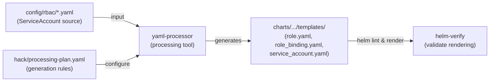

# PR #11974: kueue-priority-booster: generate Helm chart RBAC from config

**Summary**: kueue-priority-booster: generate Helm chart RBAC from config

**Sources**: https://github.com/kubernetes-sigs/kueue/pull/11974

**Last updated**: 2026-06-06T14:36:01Z

---

## Metadata

- **State**: open
- **Author**: [@apullo777](https://github.com/apullo777)
- **Branch**: `cleanup/priority-booster-update-helm` → `main`
- **Created**: 2026-06-05T22:23:36Z
- **Updated**: 2026-06-06T14:36:01Z
- **Merged**: —
- **Closed**: —
- **Labels**: `size/L`, `release-note-none`, `kind/cleanup`, `ok-to-test`, `cncf-cla: yes`
- **Assignees**: _none_
- **Requested reviewers**: [@sohankunkerkar](https://github.com/sohankunkerkar), [@PBundyra](https://github.com/PBundyra)
- **Changed files**: 8   **+156 / -42**

## Description

<!--  Thanks for sending a pull request!  Here are some tips for you:

1. If this is your first time, please read our contributor guidelines: https://git.k8s.io/community/contributors/guide/first-contribution.md#your-first-contribution and developer guide https://git.k8s.io/community/contributors/devel/development.md#development-guide
2. Please label this pull request according to what type of issue you are addressing, especially if this is a release targeted pull request. For reference on required PR/issue labels, read here:
https://git.k8s.io/community/contributors/devel/sig-release/release.md#issuepr-kind-label
3. Ensure you have added or ran the appropriate tests for your PR: https://git.k8s.io/community/contributors/devel/sig-testing/testing.md
4. If you want *faster* PR reviews, read how: https://git.k8s.io/community/contributors/guide/pull-requests.md#best-practices-for-faster-reviews
5. If the PR is unfinished, see how to mark it: https://git.k8s.io/community/contributors/guide/pull-requests.md#marking-unfinished-pull-requests
-->

#### What type of PR is this?

/kind cleanup

#### What this PR does / why we need it:

The `kueue-priority-booster` Helm chart duplicated its RBAC (`ServiceAccount`, `ClusterRole`, `ClusterRoleBinding`) in `templates/manager.yaml`, while the source manifests already live under `config/rbac/*`. This made RBAC updates manual in two places, as seen in #11955.

This PR adds a local Helm generation flow for the priority booster:

- adds `hack/processing-plan.yaml` for generating chart RBAC from `config/rbac/*` via `yaml-processor`
- adds local `update-helm`, Helm validation, and `verify` Makefile targets
- replaces the hand-written RBAC in `templates/manager.yaml` with generated
  templates

#### Which issue(s) this PR fixes:
<!--
*Automatically closes linked issue when PR is merged.
Usage: `Fixes #<issue number>`, or `Fixes (paste link of issue)`.
_If PR is about `failing-tests or flakes`, please post the related issues/tests in a comment and do not use `Fixes`_*
-->
Fixes #11968

#### Special notes for your reviewer:

- `config/rbac/service_account.yaml` now sets `namespace: kueue-system` so the generated template preserves the existing rendered namespace.
- Verified locally that `make manifests` and `make update-helm` are idempotent, and that rendered Helm output is semantically unchanged.
- Scope is local to the priority booster Makefile flow and does not wire the chart into the root `make verify` `PATHS_TO_VERIFY`.

#### Does this PR introduce a user-facing change?
<!--
If no, just write "NONE" in the release-note block below.
If yes, a release note is required:
Enter your extended release note in the block below. If the PR requires additional action from users switching to the new release, include the string "action required".
-->
```release-note
NONE
```


<!-- This is an auto-generated comment: release notes by coderabbit.ai -->

## Summary by CodeRabbit

* **Chores**
  * Updated build verification workflow with enhanced validation targets for the experimental kueue-priority-booster component.
  * Refined Helm chart deployment configuration and role-based access control templates.
  * Updated build toolchain configuration for improved chart processing and verification.

<!-- end of auto-generated comment: release notes by coderabbit.ai -->

## Discussion

### Comment by [@netlify[bot]](https://github.com/apps/netlify) — 2026-06-05T22:23:41Z

### <span aria-hidden="true">✅</span> Deploy Preview for *kubernetes-sigs-kueue* ready!


|  Name | Link |
|:-:|------------------------|
|<span aria-hidden="true">🔨</span> Latest commit | c2cb17f5d5c313edee31929c8a72b1236a66b102 |
|<span aria-hidden="true">🔍</span> Latest deploy log | https://app.netlify.com/projects/kubernetes-sigs-kueue/deploys/6a234c6ab6c7ab000874f1fb |
|<span aria-hidden="true">😎</span> Deploy Preview | [https://deploy-preview-11974--kubernetes-sigs-kueue.netlify.app](https://deploy-preview-11974--kubernetes-sigs-kueue.netlify.app) |
|<span aria-hidden="true">📱</span> Preview on mobile | <details><summary> Toggle QR Code... </summary><br /><br /><br /><br />_Use your smartphone camera to open QR code link._</details> |
---
<!-- [kubernetes-sigs-kueue Preview](https://deploy-preview-11974--kubernetes-sigs-kueue.netlify.app) -->
_To edit notification comments on pull requests, go to your [Netlify project configuration](https://app.netlify.com/projects/kubernetes-sigs-kueue/configuration/notifications#deploy-notifications)._

### Comment by [@k8s-ci-robot](https://github.com/k8s-ci-robot) — 2026-06-05T22:23:45Z

[APPROVALNOTIFIER] This PR is **NOT APPROVED**

This pull-request has been approved by: *<a href="https://github.com/kubernetes-sigs/kueue/pull/11974#" title="Author self-approved">apullo777</a>*
**Once this PR has been reviewed and has the lgtm label**, please assign [tenzen-y](https://github.com/tenzen-y) for approval. For more information see [the Code Review Process](https://git.k8s.io/community/contributors/guide/owners.md#the-code-review-process).

The full list of commands accepted by this bot can be found [here](https://go.k8s.io/bot-commands?repo=kubernetes-sigs%2Fkueue).

<details open>
Needs approval from an approver in each of these files:

- **[OWNERS](https://github.com/kubernetes-sigs/kueue/blob/main/OWNERS)**

Approvers can indicate their approval by writing `/approve` in a comment
Approvers can cancel approval by writing `/approve cancel` in a comment
</details>
<!-- META={"approvers":["tenzen-y"]} -->

### Comment by [@k8s-ci-robot](https://github.com/k8s-ci-robot) — 2026-06-05T22:23:46Z

Hi @apullo777. Thanks for your PR.

I'm waiting for a [kubernetes-sigs](https://github.com/orgs/kubernetes-sigs/people) member to verify that this patch is reasonable to test. If it is, they should reply with `/ok-to-test` on its own line. Until that is done, I will not automatically test new commits in this PR, but the usual testing commands by org members will still work.

Regular contributors should [join the org](https://git.k8s.io/community/community-membership.md#member) to skip this step.

Once the patch is verified, the new status will be reflected by the `ok-to-test` label.

I understand the commands that are listed [here](https://go.k8s.io/bot-commands?repo=kubernetes-sigs%2Fkueue).

<details>

Instructions for interacting with me using PR comments are available [here](https://git.k8s.io/community/contributors/guide/pull-requests.md).  If you have questions or suggestions related to my behavior, please file an issue against the [kubernetes-sigs/prow](https://github.com/kubernetes-sigs/prow/issues/new?title=Prow%20issue:) repository.
</details>

### Comment by [@coderabbitai[bot]](https://github.com/apps/coderabbitai) — 2026-06-05T22:23:53Z

<!-- This is an auto-generated comment: summarize by coderabbit.ai -->
<!-- review_stack_entry_start -->

PR changed again? Review this PR in Change Stack to compare snapshots and stay oriented.

[](https://app.coderabbit.ai/change-stack/kubernetes-sigs/kueue/pull/11974?utm_source=github_walkthrough&utm_medium=github&utm_campaign=change_stack)

<!-- review_stack_entry_end -->
<!-- walkthrough_start -->

<details>
<summary>📝 Walkthrough</summary>

## Walkthrough

This PR introduces automated Helm chart generation for kueue-priority-booster by adding a processing plan, Make infrastructure, and RBAC templates. The component's ServiceAccount, ClusterRole, and ClusterRoleBinding are now generated from source RBAC configs and exposed as standalone Helm templates, with a verify workflow to validate chart integrity.

## Changes

**Helm Chart Generation and RBAC Templates**

| Layer / File(s) | Summary |
|---|---|
| **Processing plan and RBAC source configuration** <br> `cmd/experimental/kueue-priority-booster/hack/processing-plan.yaml`, `cmd/experimental/kueue-priority-booster/config/rbac/service_account.yaml` | Processing plan defines template generation rules: inputs from `./config/rbac/*.yaml`, outputs to `./charts/kueue-priority-booster/templates`, with operations to append release name and namespace to resource metadata. ServiceAccount source now explicitly declares `kueue-system` namespace. |
| **Make toolchain for chart building and verification** <br> `cmd/experimental/kueue-priority-booster/Makefile` | Adds tool variables (`YAML_PROCESSOR`, `HELM`, `YQ`), dependency rules to fetch/build those tools, and verification pipeline: `update-helm` runs yaml-processor, `helm-dep-build` builds dependencies, `helm-lint` validates, `helm-verify` renders with image overrides, and `verify` aggregates `vet` and `helm-verify`. |
| **RBAC and ServiceAccount Helm templates** <br> `cmd/experimental/kueue-priority-booster/charts/kueue-priority-booster/templates/service_account.yaml`, `cmd/experimental/kueue-priority-booster/charts/kueue-priority-booster/templates/role.yaml`, `cmd/experimental/kueue-priority-booster/charts/kueue-priority-booster/templates/role_binding.yaml` | Three new Helm templates render Kubernetes RBAC resources: ServiceAccount with templated release-name suffix and namespace; ClusterRole granting `create`/`patch` on events and `get`/`list`/`patch`/`watch` on kueue workloads; ClusterRoleBinding linking ServiceAccount to ClusterRole with Helm release values. |
| **Top-level Makefile target for chart verification** <br> `Makefile-kueue-priority-booster.mk` | Introduces `kueue-priority-booster-verify` phony target that invokes the component's verify subcommand, exposing chart verification as a repository-level make target. |
| **Manager template cleanup after RBAC migration** <br> `cmd/experimental/kueue-priority-booster/charts/kueue-priority-booster/templates/manager.yaml` | Removes embedded ServiceAccount and RBAC resources (ClusterRole, ClusterRoleBinding) from manager.yaml; these resources are now generated and exposed via dedicated Helm templates. |

## Sequence Diagram



## Estimated code review effort

🎯 3 (Moderate) | ⏱️ ~25 minutes

## Poem

> 🐰 Charts now spring forth from RBAC seeds,  
> Where yaml-processor plants and heeds  
> The processing plan's design—  
> Role, binding, account align!  
> Helm templates bloom in the `templates` vine. 🌿

</details>

<!-- walkthrough_end -->
<!-- pre_merge_checks_walkthrough_start -->

<details>
<summary>🚥 Pre-merge checks | ✅ 5</summary>

<details>
<summary>✅ Passed checks (5 passed)</summary>

|         Check name         | Status   | Explanation                                                                                                                                                                                     |
| :------------------------: | :------- | :---------------------------------------------------------------------------------------------------------------------------------------------------------------------------------------------- |
|         Title check        | ✅ Passed | The title clearly and concisely describes the main change: generating Helm chart RBAC resources from configuration files for the kueue-priority-booster.                                        |
|     Linked Issues check    | ✅ Passed | The PR fully addresses issue `#11968` by adding Make targets to automatically generate Helm charts with RBAC for kueue-priority-booster, achieving parity with existing flows like kueue-manager. |
| Out of Scope Changes check | ✅ Passed | All changes are directly aligned with the PR objectives: generating RBAC from config via yaml-processor, adding Makefile targets, and updating templates. No unrelated changes detected.        |
|     Docstring Coverage     | ✅ Passed | No functions found in the changed files to evaluate docstring coverage. Skipping docstring coverage check.                                                                                      |
|      Description Check     | ✅ Passed | Check skipped - CodeRabbit’s high-level summary is enabled.                                                                                                                                     |

</details>

<sub>✏️ Tip: You can configure your own custom pre-merge checks in the settings.</sub>

</details>

<!-- pre_merge_checks_walkthrough_end -->
<!-- finishing_touch_checkbox_start -->

<details>
<summary>✨ Finishing Touches</summary>

<details>
<summary>🧪 Generate unit tests (beta)</summary>

- [ ] <!-- {"checkboxId": "f47ac10b-58cc-4372-a567-0e02b2c3d479", "radioGroupId": "utg-output-choice-group-unknown_comment_id"} -->   Create PR with unit tests

</details>

</details>

<!-- finishing_touch_checkbox_end -->
<!-- tips_start -->

---


<sub>Comment `@coderabbitai help` to get the list of available commands and usage tips.</sub>

<!-- tips_end -->
<!-- internal state start -->


<!-- DwQgtGAEAqAWCWBnSTIEMB26CuAXA9mAOYCmGJATmriQCaQDG+Ats2bgFyQAOFk+AIwBWJBrngA3EsgEBPRvlqU0AgfFwA6NPEgQAfACgjoCEYDEZyAAUASpETZWaCrKPR1AGxJcA1thL+YLzw+BTqsmAC+PiINBRcpORUNJAAEiQezIywzriQNgBCAIIAwpAAZhQsChjl8ESQkAYAco4ClFwAjJ0AnADsACyQABT43GQAlJCAKASQAMr42BQMJJACVBgMsFwMXpjY3AD0waHhkdGxlGAHtNQkYLAZWYBJhDDOpJyQzNpYTUV4sFCXDQ3GwHg8+D6UMaBhKFBId1oXAATAAGZEANjAqKxqIArNBkciOMiAMwcUkYgBaMIAqjYADJcWC4XDcRAcQ6HIjqWDYAQaJjMQ5+doUcg0RBgRD1RAi/z+Y5gjyHbr9AZuBDIWyQeHMfBSZC0A4eeAMREAGkgOQwtDAAHcwqyyPlimV4FhcI9IH4AvcTk6IlEYnE0k9srk1vJEspxBgGltI4VShUqlkvasSAAPJBxhrfDDwcrSXDIbC2yg1OpEQ4UARoBiHABUGkgJRtpGQHtwVWNKyRRigRVotGQOQYPmOVRWiBl8aCHkwGlkaGYHkgBEgtDCUkgMeSISw+HKEYoeWTZQk8DQkBXa6C0+kiFCGgMQ5HyAh5vXAFk0D4SDqLwN3eEhSy4G47geJ4rXSTJIAkNBTVucR8AwK1MHoKQwnKeRylCDdvQDcI1guUNyghe1XygGwSG4RcZ3mSgrxWIoGCYctcCtEoPGwS4KBsfAvAw20214/jBK8AoPVoD0Gg9DcSGYei7jlAs0FIChl1Xdd7V5PcyFjOhFOUxdJWopjS0gDBV2kbgG28H0FXuRBZEuLIFKYWp6lretG0QZizRIAB9BsOIwTQ73XZ8DKSRETJUyUeHhAKKF3DNIGzXM5N1MglHhegbLYRB7JWCySjQuoKGYT98G/BDKCLM1qEPQjqC+f9VgLIsS2QTCOoAyBIJoaD4OcVZ4CUZT8BoCL0FE+EKwKsN4MWNk8BQZAAoLcRvw8eRy0TeM6AsuYmHGTbIFNZh1GMzcMuI3B5GDfjID/ACgNWCj8Hteb6FQDAZsgPTlu7fBCNWeFuBidRQnkKoge+QbsKLeQrCKaBUjmYLoAAeWCgA1ABRGwAEkADEAE1XwMcn4CzaQuDMNUMQADhhWi9gC6yZsc5pceaInzEsXHhFEcRDVTapTQwAD/tnfxECMUmFdWZnejZ3KAEdFastARxym93tWXBQLyTc0DwFgWr26NDOSVY4KyRMz2QfC+AesJTie0iQ0oK19Ql+K5HQIbUv4ARUsQ1DPRyPJ4R1+BlovCoCN9QJHqDMjK3tNBkEBvIPV2bAlH+2PVhdvJ+pyehN3adBuHo+BjILbAkP21s4FWJQZWWwQRDESQJuQezA2B/SstiHLvvtZBhhIDQiA0K10/udTNKmEPeANSbDbezqQIoD42ryfdVIh08q7PIsGys4Yi942T41dUopkqaooZhggXA6wti1iLa4MMqVxQJsR+0htbYCTsZKoXg+qiTULaOSyA9JejWr/Nu0UaDsk7t6JADhVgFwgV6dq3YSBEAPM/L0qAz4x1Afdb0CM8gozqOaOhM8OrPVWOg489hzpfQIhleArA6DXhSEdUgNN9DGHAFAPK/ATyWwIMQe28UhRsAilwXgEcB4SwgSHJg+UVBqE0NoXQYBDAmCgHAVAqBMA4GUbQ4y6j2BcCoL9BwTgf4GMUMoVQ6gtA6GkTI0wBhjafTAKvB8IRAznD9lpZgPgOAGAAERpIMBYSARRSYqLijQegnjvg/14RI6QRhhyl1DuQX6AADKJmc4n8TACw2QNSBomzNiMfqTAKApWhkg5+NSNBWFSALSmbSlC7GcC1NCUwSHx3LMgGpSNVhgDKAwZgtBDjZnGGEDRpsVT1K9rEl6oYWlDMgETHMU8qElkPh8ZAeofhDU2B2E6RhhZZI8HEGZGBkAMO7qIRcB40LIF4Ts0I+T+B8FBAIU0DBMoRXUM3JWb594fXgMBU2R8wLoBHHQLgdTnLRO9lneJzTGq4TaQpGp4TMX3COTEs4pzKAaESW014FBFmQBqQAEmGD+IoABpImUw1mME2dsrMuzhHsCQvKP0JKTnZz4OcmEjRhioNgDy4ZozmjjK3EC6ZMcJhGAZB6CBpSkSQAANQDEONiIwRMp7fChYYyGJArwkF+oBd2nwGQ/VSekt8oSNlbJ2Y1fZ8rGWksaXEQ4dKvDJLSSkjJlhsm5KMgUxwRT5AlLeairu6LAL0p5r9JQdRyD/OiB4RMClEJhBUHA1OfBK6HC8tWZKdUnxyUJZTIoP4GTBVsLjEoRM5hzFxjYNpmr9IdvqEsJtqwan9sHcOmwo7x2TpsMFBkuMADiu6ibEwZDUiYVp6J8R5akImDIfxtP6iugAihc0mVcPAxX1qOYt9ywL/LjoarwRA7gbiAYwuiX84aAEwCJZUUHzdtnKEGpVoamPEyMhv6PLZBazaQIKBHgtm0B+hgCE+t7D8jACswBENuYECEn1eE6BEKYqXegI0dE8pkAYCimmBNKXNTofaUIPgOG52QNmWalStUrWYNKcY3HWG/vAjy4a9w0PMDaU45ATtL4JTMhA9+WRUMNknNvGcc4iALiXFFNpfEco1Lg2Zp8SGADcPL1NgCUNwSI+HaAYdQ08MAMtcAYcfR5tVeHMX0BAV5zjmwUVWi5VgAL8FguhYWpxj2SlEoQPvmAkuhssDCI0tw7CYQlBzPBmQBwjGMzw0ywoXp4sO5ZJ5Wq7Fx9Aa/SS0sqQIWeDiXc4F85NNPlFG+bGQ81aL6TOBb8sFJ4IVnmMgRWF8LEXiHEGUtFBNnDXjhRAr9xkaVhqlTKqNhziUNJZRQBNnVPo1L7QOodI6x0Tqnf51dL2N1ve3bug9R6T3+ZvXez7L60XGyU31fFZceWnYjXsuVl3FXXZVXdjFXhHs8v5V99dm73s2AmP5/lIOfxE5Qzjp95OVPcBQmpp4/mPNeZ81FxngW0sofC5S1pKHzlmotcgK1XAbWklJA61ETqXVqN8blL1Pryh+q4D+URjgg2ppDWAIw8PpWRqRwqjOxzmVo8rnKGNyr4mHBoKZVShx16sqism9JmSM1OOzV4vNJ5SmFu9Dpq3OWy38BulZDKNS5iBVYuxRYEU2mXr6oh7j8UU4pUWMsXLNSeJ8TiJJEgD7RLp/ElnoSJBpIDKIGek+yVPUhD4vtSv/Y7rem+ApITFAfCkdoK2IofVcoOG+VaDKVVYiQCFfySgEoIFEYYI4dgoCL6LXyitvAoJzYbBlDHI00CxC14BTyiq3kiB/m4DO6TGU9hPwaDUkE8A+MUBlGhLgEhOhtK6w3eisgcoMPaunyq9RD9nqtPaAgFit6A4JHCQDrDPt/vvn/phjUgACJ0QQiyD7ITIlqFjr65RN5YC8DSDsCjZppfI/IYE76zbGpTYKKZTSqQorYwr8jrbsDIrbZQDNBVZUHLZbJrZmgKBKAbaMFdixyoBfZ6Ygb2iUCrBHa0CJZKQGh0BWgEQ1z2D1A2S4BLCWpvId785VoRjHTWo2qogOoDDIiS7iCurOIy7why6ZQK6QpcCpD1CwBq6DihqSoI6yoRTRpXaG5PRxqUDto5Cuz67+heFkr8SW7Zb6ZyiwILwO6OHO45Ku7kbu4UFe7lIw6hw6YgIpx+76aGqVp7wj5ijj5LIZ4SRF7P62T0A1IADeVRkAGgnMCIAUGgzQtkkAAAvm0ZEp4Uyt4TdmAFERckWlEXuBsFZDUgwPCHcLnpUfZLgFsDHpQDdLOOQe7Dyp6uwIgDOj0qsEUFYKTCMYsNwFMP1BQpgGMR8P5qaLEP5rMfMSJJUbnHMbAAsdVPgisQRDUi3m3vgPrJsbPiHqvBoFmF0X6BoCEG0rsfsRQocfgc7hNiCn8qBjNkagiQtpQdDOwdCjwHQVwQwVtqiualoULragMPoY6gYM6iYdLjwRYc3PLormkPYY4Rrlri4Troju4cjgbj0SEfGiboEUqkbhbtkTblEcFIguftpGuI7qmnEZmg7G7rmskQWqkZUjeL7uESBvMrFEZN3gUWPmBBAvnpnpQNniXufm0qsQCd0bGjdm0kKP0ngTAN6BKXJDBjymwKbChGgBoEVDnrAaAbon8cMGHmlEFGxOFHkH6Zhn6SVA5McYxqPLZHEPAAAF7GRXg3hDINF5wLwtFsDTE6o5lNH5l2QOTpb/R5ASn/qrChksQkARlR7mxgYVyhB9JoTn674F6mllHWQVE8o1F1HFl5mtEdEgncm2kqr9FlGwnprwnzZIkZSkGokUFLZQqrY4kIp4koqDiQAsHkAjBOyHBCEiniJoSzS4BuaAzonUHRYy7bnSCmoGCElqGYCkC6GkhkkS4UlS5urmFV7epWEMkBr2jMkQCa4GDa7nZ65m5CmhH8mwW9Fo6nnSCHBRxBShSR6cRSkeAykEEu6qJQqFLOAe7aGdiaioAanW4pAv7lDKjyAVoC6hz6niiGlLJ1nhlYXR6/w9SxBWgPwFbPxFClTejIgaCohXRBR/KrCPD6yVj9Q3hfbwbmYEQFxBS4KrDoUrDoBcWFz5z9l2ZUI+7hjwhcyEKtEOAK70w8rjlBE8k+EUCFmoCID8K1wtkya5RmV9nFSlSrCZnCEpANr7ZwKzmEGTagqLnejLkLngpsHrm0Fwq4lIr4m7n7mrDDAoW5RLR6mj6sVJSh7h4Nm6VtLJ5LArBXngzupBbrHricEIqQm8H4noCMbLnHYCFuz0oTD4EEF/h/x3J0zARFA2T7TpkUCaGvk6HC5kji7GHFZ/k0kAX0k2GQAgVgXOHhrsluEHICmo4W7zo1h1gNhoWFWYWRk4V4VykJHEXFKe4qkGBFocUR6Rk8qIW8mUDP4/T2DyZNRGmen6zUA+mxm+W+DEquTuTUp/I0Bka8J7BXhGXmU+UOQvIlSiA/UaEfJwlEHkEkEokxWLZxU0HYmJVbnJU7loppXjWC7qHC6dAzU/lUnzUeqWG+rLWrUppOEQVQW66ck7XBEOWHDjimaPjLHzgqQYDnWxHprxGEXGTXWkUpEGBFDWSAU1JOYi2WZi04WWmlq2IRS9jYD9i5Eegf6ak0B+GRi0KtRjDr6thvr2B/qhw1JRD0oUA5ZWDUDPFWgo0KYoqgLL4vxlBCFEAQgCAjBDLto/4HV+TNha3nqYb7WqFgpL4bSbjh0IU2nm6hEoWbEaUDb2JkBLqC4sD7KYEGhIRWheRxiKz8BYCUBVAUBWjZjFw9wvWZ4sBpm/Ja33FG1aFjDhWIkWyNzyIZQ6amWNEI0mzgx/XeneXiELRF5oX8i6Kz2IAXqDaqZfBgT/Wmwr2+WYaBniy70OTTYj0mUZDj1H1lQfL4XznEHuXRUYGxUYnxVE30Gk1MF7loTpUJ0IkVClqlJPkvlU1vkEq2rIh4h02UlzVmELXM3WFnhK4q7MBrWGAGBWKIr0C8JKKEAJEuKaK6hoAeI5okVRjcF+ImKBLmKWKyLOm2LwIOI4My13kiL4NKCmz0p3k8Fwp1Q+CJFKkbCdikPupUD+KmJBIWJGAADaVRKSAjJApMtAKSHAsjIDwUPQrMqIrMnQyIDAnQpIDA+jKSFoKSsxsASjKSiaDKGdcFcQbKPgRjKSsQuQL5SjyIAwxjeULjJIfQxjct5jpMetigBtDey6r1DlFKOErSPAgIGA8gHWuK/UIMx2zZoCEg+Ag0IeaqoB6i/UJ2bJ0FPNYTdpGgDj7qBQX4PgFUpkWUT05jlEKSbRFoMjcjCj5jcjwUfQaAnQ5QAglIbjpI5QGIDjpj5jXNHJ21RTaOljDjTjZ4Xj4DHjto8zrMvjxDLg5jFS+cgFdG64iCJDQVhdLaF8baOzOUXxHCwwK6z2eOv2H2Fdkdi6B2V0+ADQXgUgHgKGpOFZPKlML6Uw0M3YH+rBogeAhz5Y+U2OwwBQpMzQwUcBpMhOQypTvi5TPDVT9ENTsgdTP0DTTTKjx0rTyj7TyItAGIGI4DPQeIGIJAJAQzxjIzyjYzW1HhKOfNN26OJaXgMz2KuAXjGIqIiztAfLKzjjazWLyjATPYQTjEsWFYmw8MYIBmBEkWBGckhwRG9oJGPxnZGU1SoGQkawHoe2aejmwtz4jlnODOKG2G5eIcHoaTPgH+3oPS7ZpeoG3mbzGQHpnUbS8TVkhmkLG6uM0AcLCLROJTxjZTFT6LXgOYtTyj9TjTzTIDhL+LpAwUnQDAtAqIAgeIPQPQyIUIAgwzHtoz+T3NEz1jSFFu0zvjPLXj2jeIgrDbAw7jor7u5jCBlah2MmkQuZ0W/heQqmhwwWhwLSPA8A4wMsjkNSqmo0Gmuo3KGUQhat5r6AwGHoQ+xmE4U4CGFmVm4tNmlrmQnmdELOBGuGvmwDZ4hq4wcr3G0gx7smaWklEUNZl8T7ETqMJVmW/yptuWAlnZ9ixWpAuU0MluGk/AZWk0JAcdj6aqGkFC5C58NSfWMeg2KWsmI2yLSgqLE4MbmL5jbAskjguLybBLijRLqjAwAgqIqINHBjOImjJbXoZbG1BTlbrL9l7L6dXHk5wp/7akmAJWWkUU3LzjFqSjnQzbknJIqzHbyjtE+oUgtceC6B1464BVYZT1TZhZKclzJRhemOKGhnPZUkMkck5e3U/8/raYF8KFbmGUBAHrNVPKV+N+d+GAD+T+W4dU0+c0slEL2pOBV4iwiAteLlfdqnMQHqz4ZVECL+kX4w77UB1YMB2p+E4IP0iAEbKSUbaLLAGLcb4rKSibeLLTlHabIUnQAgAwKgpIPQ2brMVLLHZjjL5b4zLLE5mdfJg7puVbb1t22dtYReOF4nczsn0nKSnjsnpJ8nua/jgTfYPberKcxppRmOAVqwJ+QmPAixbxaEi7wE3DE4HImUUgc0pVqeXwoLGBCkwCoQOxexBxBwmGXx7euU+sxw1AWwhwjxWwe3rxyxEV933oRKoJwJgJ4JWSz30JBwuX+X+HhXsb4Q2L9oZHVXqb7TpJ5QaAeIfQBjZIPQ5QrXbHZ2FbXXdl/H8FfXvN3HyFgnI3Xg4pFn8YY3dbEn5AUnMnXPFIAr7bC3yjcICISUp98EICmV2p8+lA3e63RnxerPZer7jr8NrdfHPX71TE2nRVz1m46gxR3ZAkZRAB+kyyW93p/mURtE5Q3zNSB9Ygfx0MoI+m9AAbo959uZCESEisCPKL0byPhHCbOLSbmPlX7TDAqIJAeIrMaAbMAzAwnQpP7X7HFPXJVPGvt2vH3XNjvhw3WlIUYUTZ7Pjj9bk3PPJArjpI83JFGzaRD31TKQdvJ1hf2FNmHlmVld7A/FS3Bte8Wn9ZjZnEP7cX13J+/7lR09ANvptkhZZvXpU/QN5Za9V6ruI7Ul3MgXlYeDpYvvuH/v1TxXaPGPFXbTqjtLeP5QeItAyIWjCuSfeXHXzLafgp1b8FkdvkR1+fp1RfYnHPE3vPTbabks1k6AC/GyjCpCEw9Lm8F+tkOMisG1oZA3KF8fvpxUjLD8U8ZUHDsXn35FdUeQfdHiHxP5UdjowUDEK21JBuN1GfQcoI13v5MsLsdPanvGkFq7tzMckA9sX1ma8sy+QAoVrJwWYC8a+4Aj8FUkAqrscoYtKsAul/qrFLaz8CXoJylhZAU4QhT6KvVATN0coztLwK7RyJ8QSschZOrgEOAeh/apjdQdv1LqIQPmmUXpPIUwgywiAjdLMMXE85HdH2mGJ2GABQqeYdwLoSfqbCZ4kBF6YsMQLPRjKwC96PYTAIgHdiuopsu/bAQVwP54DSuwfAALohI5EokLBlbHlLS4WGnwNhtoC8CcNVgJ3XhnLQIbHQZA8gYRsYgCRmJpE6DdROoGCiTREAwUWkt6joDBQuBVDLIYwB0YCBOg1Aq/niAMZ6M6ANLUkL0GRA9AGAMfPoMiBGFkgMQsfDECMPRADC0GNDVobgHaGjguhi1XofImaE0McCwUNgDimChbBRAPgTof0OCRVEDAjQFJEgFsB4c5YVTfZFYD9iUcKgSEAKBaFeGQB3hiAXGNB3xQYAlGgIj9CQBBFvDJ8sQMIPGAqjYQSskrMfEhDmCmwaAsIqoo01BF5dfENgBobgAADqVQGgFYAoDuBcAXLLgLj3hGIiwRi4WIO2HuG0Re8pYWEZI1BGNAXhjQYUWCLuEThSysIlJPSOAhij7GrIkUSX2oB8RYRPYfwPKOFHTdpUi4ZQoeElFFpNsMovYBQFrzdI0I3GAKLXh7gTF4A7Qd9lgTIqOQ5BDQDIoOwDo94MBBmOzj/V+R/1m0Vpb0JM3iQRsBRGo/UEoElG5xxQckIxiGLeHwgf6FfJkUCIRGxiwRpwHkMNU5HijbIkog0RXxDFEiRRQokUaKMeDZi2AkowknLEgAqwCEVNe4TGJLFginGKhRACqK5QpimxmosWr8j1HegdQdFcEPIC/QpQAoXYVWJAHVg9BNYIcL9DlEhx+tps2DeIbbB1IOwPKJuceF6DdGrFAx/EDCFsGbhw0Ggo8EiNJknh5gKglET8PAEGhRI7cWkRsSWJSRhjExYIyMYWHjBPiFR8Yh5vCFhHMjgRqYlJOmKNYeAsxPgCUVwFK4eg5YtYxWF3jHGIB9kqaEUYWOFHFiFRsoqCWCNxgbReEZ0Pum2ALTZAGx6ot4S2OVFcBVRnY58Tsm1G9joJ42dcF7mardxN8DI4caaCIDkB6AJ+fsXYH7jiwh4Z3J0TuK9GR0EI14W8DpGUrOYG6eKTspYyhzd1hoJtaitIFbAsEXkplNRCRLYbiwTo340Mb4gjHOBPxRAYyXGNEB/i3xgE2iQqNAmZiyxkEnMdBLWi4xyghE8YO2BAaIBEJT4FCQWPVGYSNR2EtyWCLgJ1QUROUdEcoFIBWTmxeIqiRuA7HkSwR9E4TjHElHaS6KmwDAvhHBb/FnW6hX0cQiqzWC24KQZET2ByhMAMRkieYI60bg5QapqIhMDISoCgdZRwYrscnl4jZToJVI26L5wYAxT4wbsQRN6DymDwIqSxCzBDHTDgxEALUWIXE2dadSSshEFKICAIy9Tnxr4syVGK/HpSQJYQDMUhAgk4SUkbU5BKhOFHoTBRwE8KRWOgkIEXKYQbgHQggmJTFRrY9sWqOAmZSdRaESURBPsDNTxg9AKABVCUBkjRG7pBAEQFgDVV3mfDEhqgALoHYO8v0w6dBI/HRjTpTky6S5OulWjPp2UgsaCPSGsjSuecXALYHenWivpuo6CQ2Hx4E9emtAHoKiGLDksDGDAfNtf0GaogegFA1mKSQECdMtG2jEgH0DoAYhL+fQKlrQHx7lBr+/QfEOUD6Ckg0AMfJ8XTNiC2BpRb4lJKiAoGks6uXTacRiFoBZsI+qIPWSQAEAMA8QXTCgRiE6CohqBubRYaSAGDmgVhLsqEF7MFk5tBZusgxkW0pYGzEAgIMELQC+G2AAJyY2mbJFoA2BywTMimYeB+lJiWRxI9OZnIwAmy85qUwGUiMmjFyopDAXEe1MQBlyaJBgNooMMuHXD02sozoWcIkboNsGwUeyHxBCgtih5PLHYTI3ZEMzLYAUWgEUFwC0Q5cdAH4eoAqicQlGqIFubsIgAMN+5U8keXcGCjdzqGW8shOKCQh9C8RIUWkp53PmRhnhKSR0LdFTaohegJARrhMMiACBygAwMADrOJ5gBWYbjcoGAC9nlBkQgEPEKoEWEk8N56DE+cNRvk0BjhV4a+YfKAA== -->

<!-- internal state end -->

### Comment by [@kannon92](https://github.com/kannon92) — 2026-06-06T01:10:21Z

/ok-to-test
