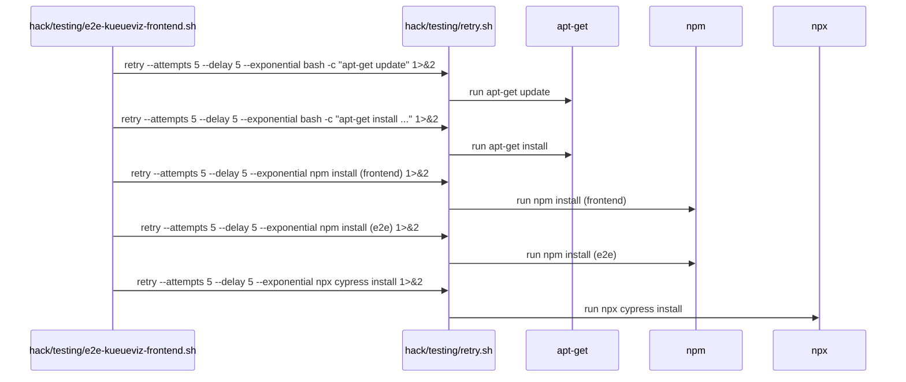

# PR #11992: Retry network-dependent install steps in kueueviz e2e frontend script…

**Summary**: Retry network-dependent install steps in kueueviz e2e frontend script…

**Sources**: https://github.com/kubernetes-sigs/kueue/pull/11992

**Last updated**: 2026-06-09T07:25:15Z

---

## Metadata

- **State**: closed (merged)
- **Author**: [@reruno](https://github.com/reruno)
- **Branch**: `flake/11984-kueueviz-npm-flake` → `main`
- **Created**: 2026-06-08T11:56:26Z
- **Updated**: 2026-06-09T07:25:15Z
- **Merged**: 2026-06-08T16:41:55Z
- **Closed**: 2026-06-08T16:41:55Z
- **Labels**: `lgtm`, `kind/flake`, `release-note-none`, `approved`, `size/M`, `cncf-cla: yes`
- **Assignees**: [@mimowo](https://github.com/mimowo)
- **Requested reviewers**: [@PBundyra](https://github.com/PBundyra)
- **Changed files**: 2   **+28 / -6**

## Description

… to tolerate transient npm/apt failures

<!--  Thanks for sending a pull request!  Here are some tips for you:

1. If this is your first time, please read our contributor guidelines: https://git.k8s.io/community/contributors/guide/first-contribution.md#your-first-contribution and developer guide https://git.k8s.io/community/contributors/devel/development.md#development-guide
2. Please label this pull request according to what type of issue you are addressing, especially if this is a release targeted pull request. For reference on required PR/issue labels, read here:
https://git.k8s.io/community/contributors/devel/sig-release/release.md#issuepr-kind-label
3. Ensure you have added or ran the appropriate tests for your PR: https://git.k8s.io/community/contributors/devel/sig-testing/testing.md
4. If you want *faster* PR reviews, read how: https://git.k8s.io/community/contributors/guide/pull-requests.md#best-practices-for-faster-reviews
5. If the PR is unfinished, see how to mark it: https://git.k8s.io/community/contributors/guide/pull-requests.md#marking-unfinished-pull-requests
-->

#### What type of PR is this?
/kind flake
<!--
Add one of the following kinds:
/kind bug
/kind cleanup
/kind documentation
/kind feature
/kind kep

Optionally add one or more of the following kinds if applicable:
/kind api-change
/kind deprecation
/kind failing-test
/kind flake
/kind regression

Please also consider setting the area:
/area tas
/area integrations
/area multikueue
/area dashboard
/area localization
/area testing
/area website
-->

#### What this PR does / why we need it:

#### Which issue(s) this PR fixes:
<!--
*Automatically closes linked issue when PR is merged.
Usage: `Fixes #<issue number>`, or `Fixes (paste link of issue)`.
_If PR is about `failing-tests or flakes`, please post the related issues/tests in a comment and do not use `Fixes`_*
-->
Fixes #11984

#### Special notes for your reviewer:
```
$ make kind-image-build test-e2e-kueueviz
<...>
retry [1/5]: bash -c npx cypress install 1>&2
[STARTED] [12:36:59]  Downloading Cypress    
[FAILED] [12:36:59] getaddrinfo EAI_AGAIN download.cypress.io
getaddrinfo EAI_AGAIN download.cypress.io
retry [1/5] failed, retrying in 5s...
retry [2/5]: bash -c npx cypress install 1>&2
[STARTED] [12:37:04]  Downloading Cypress    
[FAILED] [12:37:04] getaddrinfo EAI_AGAIN download.cypress.io
getaddrinfo EAI_AGAIN download.cypress.io
retry [2/5] failed, retrying in 10s...
retry [3/5]: bash -c npx cypress install 1>&2
[STARTED] [12:37:14]  Downloading Cypress    
[FAILED] [12:37:14] getaddrinfo EAI_AGAIN download.cypress.io
getaddrinfo EAI_AGAIN download.cypress.io
retry [3/5] failed, retrying in 20s...
retry [4/5]: bash -c npx cypress install 1>&2
[STARTED] [12:37:34]  Downloading Cypress    
[FAILED] [12:37:34] getaddrinfo EAI_AGAIN download.cypress.io
getaddrinfo EAI_AGAIN download.cypress.io
retry [4/5] failed, retrying in 40s...
retry [5/5]: bash -c npx cypress install 1>&2
[STARTED] [12:38:15]  Downloading Cypress    
[FAILED] [12:38:15] getaddrinfo EAI_AGAIN download.cypress.io
getaddrinfo EAI_AGAIN download.cypress.io
retry [5/5] failed
<...>
```
#### Does this PR introduce a user-facing change?
<!--
If no, just write "NONE" in the release-note block below.
If yes, a release note is required:
Enter your extended release note in the block below. If the PR requires additional action from users switching to the new release, include the string "action required".
-->
```release-note
NONE
```


<!-- This is an auto-generated comment: release notes by coderabbit.ai -->
## Summary by CodeRabbit

* **Tests**
  * Added retry logic with exponential backoff to network- and registry-dependent installation steps in the e2e test setup for improved resilience.
  * Routed all install commands through the retry wrapper so dependency installs are retried automatically (5 attempts, backoff).
  * Note: successful command stdout is no longer re-printed by the retry wrapper.
  * Test execution order (start frontend, run tests) is unchanged.
<!-- end of auto-generated comment: release notes by coderabbit.ai -->

## Discussion

### Comment by [@coderabbitai[bot]](https://github.com/apps/coderabbitai) — 2026-06-08T11:56:45Z

<!-- This is an auto-generated comment: summarize by coderabbit.ai -->
<!-- review_stack_entry_start -->

[](https://app.coderabbit.ai/change-stack/kubernetes-sigs/kueue/pull/11992?utm_source=github_walkthrough&utm_medium=github&utm_campaign=change_stack)

<!-- review_stack_entry_end -->
<!-- This is an auto-generated comment: review paused by coderabbit.ai -->

> [!NOTE]
> ## Reviews paused
> 
> It looks like this branch is under active development. To avoid overwhelming you with review comments due to an influx of new commits, CodeRabbit has automatically paused this review. You can configure this behavior by changing the `reviews.auto_review.auto_pause_after_reviewed_commits` setting.
> 
> Use the following commands to manage reviews:
> - `@coderabbitai resume` to resume automatic reviews.
> - `@coderabbitai review` to trigger a single review.
> 
> Use the checkboxes below for quick actions:
> - [ ] <!-- {"checkboxId": "7f6cc2e2-2e4e-497a-8c31-c9e4573e93d1"} --> ▶️ Resume reviews
> - [ ] <!-- {"checkboxId": "e9bb8d72-00e8-4f67-9cb2-caf3b22574fe"} --> 🔍 Trigger review

<!-- end of auto-generated comment: review paused by coderabbit.ai -->
<!-- walkthrough_start -->

<details>
<summary>📝 Walkthrough</summary>

## Walkthrough

This PR wraps network- and registry-dependent install commands in `hack/testing/e2e-kueueviz-frontend.sh` with the retry helper `hack/testing/retry.sh` using `--attempts 5 --delay 5 --exponential`, and adjusts the retry helper so a successful invocation no longer captures/echoes the wrapped command's stdout; test start and Cypress run ordering are unchanged.

## Changes

**E2E Frontend Test Resilience**

|Layer / File(s)|Summary|
|---|---|
|**Retry wrapper and helper behavior** <br> `hack/testing/e2e-kueueviz-frontend.sh`, `hack/testing/retry.sh`|Adds `RETRY=hack/testing/retry.sh` and runs `apt-get update`/`apt-get install`, frontend `npm install`, e2e `npm install`, and `npx cypress install` via the retry wrapper with `--attempts 5 --delay 5 --exponential` (install output redirected to stderr). Updates `hack/testing/retry.sh` success path to execute the command directly (`if "$@"; then`) without capturing or echoing stdout.|

## Sequence Diagram(s)



## Estimated code review effort

🎯 3 (Moderate) | ⏱️ ~20 minutes

## Poem

> 🐰 I hop through logs where installs may fail,  
> I try again with patience on the trail—  
> Apt, npm, Cypress all in queue,  
> Five gentle tries to see them through.  
> A floppy-eared retry, steady and true.

</details>

<!-- walkthrough_end -->
<!-- pre_merge_checks_walkthrough_start -->

<details>
<summary>🚥 Pre-merge checks | ✅ 5</summary>

<details>
<summary>✅ Passed checks (5 passed)</summary>

|         Check name         | Status   | Explanation                                                                                                                                                                                               |
| :------------------------: | :------- | :-------------------------------------------------------------------------------------------------------------------------------------------------------------------------------------------------------- |
|      Description Check     | ✅ Passed | Check skipped - CodeRabbit’s high-level summary is enabled.                                                                                                                                               |
|         Title check        | ✅ Passed | The title clearly and concisely describes the main change: adding retry logic to network-dependent install steps in the kueueviz e2e frontend script.                                                     |
|     Linked Issues check    | ✅ Passed | The PR addresses the core objective of issue `#11984` by adding retry logic with exponential backoff for network-dependent install steps (npm/apt/Cypress), directly mitigating transient network failures. |
| Out of Scope Changes check | ✅ Passed | All changes are scoped to adding retry functionality for network-dependent steps in the e2e frontend script, directly addressing the flakiness issue without unrelated modifications.                     |
|     Docstring Coverage     | ✅ Passed | Docstring coverage is 100.00% which is sufficient. The required threshold is 80.00%.                                                                                                                      |

</details>

<sub>✏️ Tip: You can configure your own custom pre-merge checks in the settings.</sub>

</details>

<!-- pre_merge_checks_walkthrough_end -->
<!-- finishing_touch_checkbox_start -->

<details>
<summary>✨ Finishing Touches</summary>

<details>
<summary>🧪 Generate unit tests (beta)</summary>

- [ ] <!-- {"checkboxId": "f47ac10b-58cc-4372-a567-0e02b2c3d479", "radioGroupId": "utg-output-choice-group-unknown_comment_id"} -->   Create PR with unit tests

</details>

</details>

<!-- finishing_touch_checkbox_end -->
<!-- tips_start -->

---


<sub>Comment `@coderabbitai help` to get the list of available commands and usage tips.</sub>

<!-- tips_end -->
<!-- internal state start -->


<!-- DwQgtGAEAqAWCWBnSTIEMB26CuAXA9mAOYCmGJATmriQCaQDG+Ats2bgFyQAOFk+AIwBWJBrngA3EsgEBPRvlqU0AgfFwA6NPEgQAfACgjoCEYDEZyAAUASpETZWaCrKPR1AGxJcbJXC8hyXAB3fAoAazAlbjIlDFwUDERcNA8PexpuZHgscOwSfIl4AC9IEgAmEkgAMwp8eNj7Bgp4blxAMgIDADlHAUouAEYBgE5h8oMAVRsAGS5YXFwsjgB6ZaJ1WGwBDSZmZby+iiDpMER4IkR9/Pzl7mw05aHR8YnEfsgKSmwMfAMAZXw2AoDCqAioGAYsC41Q8aHCJEeIwAHAAWMB5AokIrFMAYbjMMAwuEkAzQZykBJgzCQrjMbQYf4pXDYRBcfAxBm+IokYKUVmQZjwZj4UIAGmsACFvrRZFQDNMVCQPPzwjlaMsifDxZ8vGg3rj8DQDeRxQwIdUwAxYVxZNJxWdigi/gYAMKfah0dCcSDlAAM5QAbGBfUHfUjoEMOABWAMcQMALSMABFpM1WuJ6hwDFAALKKeDVeDSSC4WBVDGFEplDC0MAEMCNWr1Gg1potNol/AfPwBIKhCJREgcuIJHLJVLpZJD5AACjxezQbQAlJ3O14qDQS+CzuwatoPEDpBps5AU8Kkv4PchPv55H1YGgimFIMENmUAB7cerseCpSACNAGHCfBqmqGpnwAAzxd9GFkXhpGyC8Jwg+1YBFHIiG7GIPXoJMuj+btEHwA8Mywap90PWcIIpNBaFoFoMGqLsAFEAEEAEkAH1WIAcQ4rpIFoEUMA8fBaJ2ODPkQRANHgfAIJXQC6mkmpJCqagaGYNpkFfUtEmaEg9QwwSlTQWRZyjRBxQGX0rJ9WzxRRWzFNbLF2GwP9yPgA9PnQaoaD4KNu38IsZJPHNnHCZBSyqWx0GQfY1RqWF4WPKAADF4HfYskAcKozCeVE0sgXxdTeQJDW8SAugAeS6ZjjwMCxIBq4RRHEKRkCbZhIA8HJ4XoXL8kQIx0rqHqhvywqUUgGcziIU5IToe4MNuSg5NoeAGHRa4SDraRcAbSodsxbEwDpHIlyzKB2JHAt5EwehBXEIgPWSuEcgQvzqna4yYp4db8wYSAXXYyAhEEexzkWstaBWjAiDWlogZO/J9uSI69orLESnO+litYuipMQgLnpbBIvJ84s4YYzCKiqChvmQBg0BZT05C3TAd3iQI/H7cJbkA8I0FIRJxzSag5KwSbZ3nZZF1wZYXUkr6hOCESxNoRAl2K9itLqKQPkEFlcHIFSQJLMsykqHhWiVT7/weujjJvFpiyYvg+zCSJoliXcxxSNIMmnVdPjhkEQbBzVi0evdvMo4rpn6z1KeM0HwcEOYFiWVZeBFDRwiRGS5OWblgjWS4DkoY5EEteAwFEi5lkby4YmRzbtux9HDvp1GcZxC6MGWP0AwAZgAdhRJEowGANx+GJzx/HgYisgaZ8Auew0OCEtDIoNWsDQfzKDKCg6goZBY7QSAIvhQsvF35IS3JPw476hGXzfZiz+fAYo3KWazEAAa7FoCcQAGqsWmBMZiABecoOtzCWBdCwNg8RkAOCcC4IwUBC61wYPXOoAhDQ8HwFOegmB0DcDzhIVIBpxCFhPrsNBCRxziA/v9OKqAABEtVoCQFYlYWwNVwHMSTNw4qcBQQkJ+DQaKVs4rBD1PYJUFpFw0PZvIf6rNSzPhnJ8RmPwVwCDwN2AAjtgeAUluxl3QK2f6HgiC4B6rCPo6Q+ge3UtJc4GBjLqINifZgxCwT4AkIgcIsgdAeyoTQ1I4o26WyqCgpQJUcY8msHUEE0lJFW2IQkPqyR5HUBiQbP8qByB0BTuNOxJTQknxyJAB8QFlhyPYYjGqAB1eqNgCKx3flFS2xTOndIIvfEgOSqjMP9hCA8ShL69X6quQCII2jsxIcwx6l9WxsBSLQag181RbUlh/T4FirGen8XUigc0rqQAANrcKCYIA24TIncIALqNX0MYcAUBGgWx0YQUg5ANyeimfELgvB+BtTEGpGQ8gmBKCoKodQWgdDfJMFAOAqBUCUMBcQMgygaD0HBd6KgO9MF0gCBzRFygUWaG0LoMAhgfmmAME0gWrTVq92xmdJsDQawaEQFCAw3CxVNUsBxAlIKcL2EcFS+QFtISYFICNUkVtEBpg7D8ClfhkAQRsMxaANgACaEFVwQQ5S0g6q1XayCFbAc1sc2bZASAQD43xeYhG9mAZYnx1jJBcIOYc0zxaTkyDpN8EEIAaRIFpXAyAgoQCULCeQSaGyfm/PEX8HhzUASAiBaoGhIDsQSJ8bgsIsmJMEucsQkAIIKwJQkbA3A9k0AgssBtbQm1i0DrmxgE5I16VdkWegXbDoUnNTkCQ+AWakRkiWhIqQiIvioFkat/KWxjvnL25C4p/q93HKLKC+Jd1pBQnY7d3AYIMBVipAOyFP56X+ogNAbBgoBGCGutu4pggIAfvCIcf0NVAjqNKYyJ6eqtIvZuxo+bwhEDA62ccFBcDiljsreCKlDEqIsWQCOL633jKMCRiVAiPABUlvUaKXZ/pKCtM4KjSR+BgRIJm1Dnpnx3AEH1YGP5xDSBwdVb8Rgk5m0YA+BGdAuAAGphjLDACiIwzFkhCllbSmxRYd4kFAmEb0OY6DwEcKK8V2Y2VWq5QjP1PZ7XCqzGK7hZGpXAqJZ6SlzhFVgWVVJtV7EsCWqFta1TVm7UOovf9O1vV8DsgqlFqTfAWZtEotWhwDAsmIGqPcBQTgayAEwCDBuAhKmNjp8MAvAcgJpQJoEtF5DK0H3RqrVCQdX8BEgissQF5GTNQY9fLH51AZGoCyWaEECyQG4QAEgAALcIANyJIwApVc9H4ApL/X4MsfB3VsYG6l9LmW0iyFNJJ9YHDGvtlwH1wEixTH3kfHJPg9Q5Vpa+n+7yVRdRFDOwzGzGp9yEj1IrK0hkMAtuWIgLwQ4ovrGBoaTbr5yoVcApoUjzVWIUaJVLGj1b6Owg3FjljH4vwcfoFxrYvHqziAE2qqAXQRPyk+szE70nIAyYGAp8YBgVPiDpMShQKTPi2J0x7fThnjMOZwcy1lfzWwArwECwloKSWoPYFwclcqsF3gRYoOlagGXoql5imACBshbJwPWFzSvsssK4EoFI73lcpJ47O8IGuFUfBVcWGlOvkV67RUylldyADe3DwSkFutwjgofPecQENUcetABBRgYDZaoyfuGim4dwagsBI/cIszaqzPLdp8rqAK2gDqM/cJQ7gMTJBI/lCjJn2IdfI+jwGJn9zLg8+Ey1ugethrjVmsgLQloKgH5fgq39LsAXmmWcRqF4VTrWzlsrcWCLaAd6NopCZENEJ5APqDm8PDEIqi6VgCloj1vNkflEHgT0pYwNEAvxFmzq71EnxZMZIKsb412UsiZKmuhq5JmuQNmn+PBoWhoFXrShKKJEBCglpF4O+OoLIHnqJMENwgAL6igh5h4kAR5R74GcTVBpYBjlAojjxoCzwCAMBV7Z6lh54F7BaIzF6nS4ywaCrCpV416t4cAogd7cIt6fSR5Ri+id7yoeZ54dJrpdY1Bl5br1o7qH79qxwHo2y+w1j4byBvDMjcDBzroziQZnr9oNLqFVCbSfBiBhAPStgno3p3qIRhpLbn7VqRZfof58Bf7fb2BX6QGgQ8CMY7J8jiifbAZVAOACDH75A8zGHQbiicH0A17LDwaIaAg1gYTAH0CYbEwepYBhBIqJApBiDQGZ6wHwHhCIEVo7a4BoFR4YHYG4HR5SaEHNGkCcQjB7JoCjBzyjwCDDD0E55MGBbz7Wa3iV6d4pCoZ8FRjDDN41gzFzHV6SHd5R5SLPbpZlY54KAZGkR/jeakD0DdQDpJa0wZBFYJBGHXawITYzgAA6k2U2DxS4y+9A5W2aH86gK47qlh7UHg8gbGd+bS1aGyrYRhY2Dx02Dx82MUi2K45+12JxzIZxz4ogaExkyQFxpR3C5RLuVRyBqB6BIo2B7y0u1YpOYE+Klu6mKuEKJk9uXgjuoIFRbuHmHuPmjs/OuuqKjKGKvy1u6gnEq2iAnEguWmdAnENeAeZJKIaeJA48fRyeLMwwUYSIaAOmy8o8Ywwwc88eAYAYaASIAwtEtAIYAhACfJEAkAo8JAvo48SeUYtAo8vofQDATkvoo8o8KIY8KIo8aAUYKI5QwwJAceUYo8DAAYAwnpSIwMlpfyo8tADASI5B48UYaA48JAE81QAgtAYhNkNkgYKIKIuZCe/81Q5Q48DAlZsZhu/J5Q5QK8QwDAAZEZogxpwwvonZy8AgSIhkdAAgjeUY/RSISgAYKIww480pBgRuzCgpwpopaSvItAnEjQcZPAnwnEbAFA7RS0nWkpUxCQ3yBgQeBgkA42SAtgcBLudAiBLCVgZCxKkee4yoJAoop555iANUUgZ8q2cQT55EL5b5Z53CQkDAgaGEKC35IsBBDQRwqQfwTI9eXAJ5Z5wFzBbSywbBlYOIiRleyF75qF42BAgc6U3wsK1GT5HeBFqF3CmWEI86HSGwSYs64FCMiAlF1FWB75OB75OJOuNgKgeuMhlUVgFA7guAXg/5y6r5vFwqgIHgtAV5QEtgUlgFvFm0tANg3wzFDACFtMiALoHW4QT5/g+QQF42GlWlGA4lXghlogxlXAplMlwFll2lqYF2UsdlQEqlbw5l3C/SdA7E0kw0elT53CdxGAEVdxuA0VsVMV8VwAAVy5k0egUV8VcVcVFglgBUyIKIXA80MMy078iMbcG0W0fc3cmMfcZ0g8UVkV6VDV0VzUNlJAdVBVmqsM8MJVgMHcFVrSVVvKuMtVkVGAzUKYmqHl9QdVmKEVVgZUVQbMlsqAmkFab00S5aemxkmoWiB0MkEVYmAy7qiAMQBChYwMlMyWDSolIo6Avk/iogv4xKGgEV+gdVAAVG9R0ggJCI/KOF1ClBhAAPwfUcARVQwLQdVFWrSlUoxdz9VYX9x4w5DvVvUHWriUyejpwQwCD8B8BTjrrurlp1DhwfazoTiyAg11XzCLCsi5x1DBAFxFyyT4ClxaYVxXCHA1x1wNwbyXAtxIxlWdy7SVUI01X0jDwhgTxTwzxzwLx2nLyogRUfXpQUS+RsDSTQW43Q6ICU2LYQQQQRUyaQDLBoRsC3D01rAs2IDAgc3Vx+AnDzSVy7Qm0jGF6IwaAaDLAe0pE5CJQgHE75K83G383OAMLI7IAQAYBX6qg1gRXMTsbAktzgQJYHhTh8APEx20APGdig1Dwh2oYFjh2G2QBVxiAeCcTkiICwIzhLjF3wF/hgDXyl0SUV3bmIDF13J3K6BYAADkPdkA7y7yxdzd6Q35ZwT2EApyw0h0POJA1xzp7dGARtI9JkE18AfQpCfeuIJdwtiA5kmkw9Wwfxq9aYG9X4WsxdVoJslAnEwOmALaJdaoddZN6QV9adnEUdbAsCmdz9LM6QdI74C5IU0gsCUYv9f4dqnEKaZksCAwhtRtx+kAAwkAYDS9ydXoK1o4WAtxiDyDkJADQDbs7d3CtdaD9d6Q12dwMVS9RtJtLACIec5cRAVtNtVcRw9ttcjtVwmILtc+btXtnt3tagQ8mdgB9tjAqdAUTKn95YT9aDlDeAsCPdKYXgwJb9UjGdT93CkAHtz1GAKj9t9APwcyXAdymjNYYA/MlA5Q2d5jtYVjFAtj3CmdlozYdQHgZWsI5ADx7yPdxdaJXYyjSofgxk6jJ8dj2dujEVBjfOxj0gpjdjlj3s1jTjLjDjqTaorj8Q7jnjmArVHyfj+jwTajkj4TzjWjOjHt0TxTnocT/IZj5TFjDjNj2jiT6TrTjTtYTA2TxEuT3jHyxdN4QIWAvoEVdI8IXAH1b19yt8Om723cGgzA4QHAAYC8jlB0A1JeJQ7ykA3858SD/8xdwCoCECUCMC8CxduhrOXY74l4IIEVLouoviH8D9R8UjoF8IfADSHzlAej+tBtI1H1rEGAsgpYxkSo5UvIvMD+XY4QOqwNb1uddVGVjVuAwAzcycyVwVJAegGevFsIyQXl4QvgDgFG7Fpj1FKFhF42u54QXQRGYV41TWUsIMRleL1L42bCLIJljMzl1LQhn4XjTGYVRL9gqo1CnoUAySJAAl9KfWCAz+Dcbkk4KxB+yAZA4+dApR1FwFwoSgYVSiRwGE7L/LYQ5wOQqQRL9LbAYVcyzL9QjmhFPFhFVLhFOJRl1rSF42LVEm9lJrbrXL5LW4ZlOr42bGq1UdpEYV6xVOD8d9FA/xl6OxBCbwibdrLQfQchg8EmnuXAJpLsb+jcW0q4XsA4mhI4JhBhiE1ag1pQ9M8hzYjQa9bQ2rHLjyOuBrzgzzRA/rNFVh9QhYRAh4PlfLbrZrp2lrHrDLXA3Csb9enF5lZ5rrNFtLnrYVB1noQVeUTOfri7NFgbPLIbbb4bQrUbM76xcUJpxM6+VsTAvkggIgsKhsFsk0kAOVwwqInJ+bJyhbG8xbrh4bWa4gEBQsha6DpbPsQ4fsPMKhVbs0csCsSsjhS44ovxZd8gz05wxymEl4SQRYPMEHb8CcvburHbM7hr3bJH42/bjE5ww70I0le7wF47FrHgVr0742SVW7w0rE0kCELCjrqFzrqFy7wFq7HH3CNUpiFsfwTAMQrLnuO73lTHnLTI3LjlvLKnArEbwrM76Or9zOl8vkmq7IML6AzsP7t4NQZFexfUtR4HfMPq5bu4+N1b5hDb5ebY6YqHtaElTs9ECE4R70MdX0r7CJpi3wOosqerBYRy86rb/LerXr3CFHxrWnNHg79Hz5vlob3CLHUdbHU7NrM712NU1QsnpnhlinvHbw0kAnC7lLuX4nxX42OlrFmEkFygpAVH1eanQbTlWnJ7mAunrXLFIUH8TAUFosqANkvoGgnZAApC+N9RfqgA4KBFtPh9VusVPecvQI/tIGhApSgMgEiHN4twl260l520awjD1/l5O/ZWuzO6Be1+xZxe+e8n5QS7gLYEy5NRgGFQGdUEiLQf6AGEmcnk5JUAIHaRPCzBmeRNULQAMNUEWTabQDqb6GgLRAOQvJPL6QMBQfKaiO2ePAGFGCa/5YDrYC1WFeqcMNUP6IJb6EoCQMMFGW6emasxPAaf0faf6AIAGLQBWQIKmUWcLlGCQOORmePL6AwKMKGRUNj9UI5lxdOfyfBJuZQDuUZSKaubWVaYCpxNnmzPuR6Ob6hlOSHj91YKzG8LQKxLgFyOKbQLeeoCgt8LgKIer0bsb6b28ObzQCua2GuRVtXKkEHyQAuUUOPRgJb4eVLseSly0DQK0b6CMIZPPAMGAHmTn0vLQWALQaPEGAIQwImWgAGCD+WZT77/yeH3BeXWwtH2KXHyH/QPoEAA -->

<!-- internal state end -->

### Comment by [@netlify[bot]](https://github.com/apps/netlify) — 2026-06-08T11:59:21Z

### <span aria-hidden="true">✅</span> Deploy Preview for *kubernetes-sigs-kueue* canceled.


|  Name | Link |
|:-:|------------------------|
|<span aria-hidden="true">🔨</span> Latest commit | 0a13c25da8000bce7cd210231b53a71016eb4d85 |
|<span aria-hidden="true">🔍</span> Latest deploy log | https://app.netlify.com/projects/kubernetes-sigs-kueue/deploys/6a26cd1d21659a0008399731 |

### Comment by [@k8s-ci-robot](https://github.com/k8s-ci-robot) — 2026-06-08T15:16:39Z

LGTM label has been added.  <details>Git tree hash: d373d2dccfa5f20c5207d2b253559245dd54a2d1</details>

### Comment by [@k8s-ci-robot](https://github.com/k8s-ci-robot) — 2026-06-08T15:16:41Z

[APPROVALNOTIFIER] This PR is **APPROVED**

This pull-request has been approved by: *<a href="https://github.com/kubernetes-sigs/kueue/pull/11992#pullrequestreview-4450853108" title="Approved">mimowo</a>*, *<a href="https://github.com/kubernetes-sigs/kueue/pull/11992#" title="Author self-approved">reruno</a>*

The full list of commands accepted by this bot can be found [here](https://go.k8s.io/bot-commands?repo=kubernetes-sigs%2Fkueue).

The pull request process is described [here](https://git.k8s.io/community/contributors/guide/owners.md#the-code-review-process)

<details >
Needs approval from an approver in each of these files:

- ~~[hack/testing/OWNERS](https://github.com/kubernetes-sigs/kueue/blob/main/hack/testing/OWNERS)~~ [mimowo]

Approvers can indicate their approval by writing `/approve` in a comment
Approvers can cancel approval by writing `/approve cancel` in a comment
</details>
<!-- META={"approvers":[]} -->

## Reviews

### Review by [@coderabbitai[bot]](https://github.com/apps/coderabbitai) (commented) — 2026-06-08T11:59:27Z

**Actionable comments posted: 1**

<details>
<summary>🤖 Prompt for all review comments with AI agents</summary>

```
Verify each finding against current code. Fix only still-valid issues, skip the
rest with a brief reason, keep changes minimal, and validate.

Inline comments:
In `@hack/testing/e2e-kueueviz-frontend.sh`:
- Around line 30-31: The retry wrapper currently buffers the command output,
hiding live progress for long installs; update the retry usage or the retry.sh
implementation so commands run in a streaming mode (forward stdout/stderr
incrementally) instead of capturing and printing only on success: either
add/consume a --stream/--passthrough flag on "${retry}" or modify retry.sh to
exec the child process and pipe its stdout/stderr line-by-line (or via
stdbuf/unbuffer) so logs are emitted live; apply this change to the "${retry}"
invocations used for apt-get (the lines running apt-get update/install), npm
install, and the cypress install calls so those commands stream output to CI.
```

</details>

<details>
<summary>🪄 Autofix (Beta)</summary>

Fix all unresolved CodeRabbit comments on this PR:

- [ ] <!-- {"checkboxId": "4b0d0e0a-96d7-4f10-b296-3a18ea78f0b9"} --> Push a commit to this branch (recommended)
- [ ] <!-- {"checkboxId": "ff5b1114-7d8c-49e6-8ac1-43f82af23a33"} --> Create a new PR with the fixes

</details>

---

<details>
<summary>ℹ️ Review info</summary>

<details>
<summary>⚙️ Run configuration</summary>

**Configuration used**: defaults

**Review profile**: CHILL

**Plan**: Pro

**Run ID**: `1f3c156f-0a92-45b0-bc4c-2f7214c9e4b8`

</details>

<details>
<summary>📥 Commits</summary>

Reviewing files that changed from the base of the PR and between d968cfde57b256eefc93e564306222446ce92b87 and 4f5e73b5cca958aef71392967f766a81add06412.

</details>

<details>
<summary>📒 Files selected for processing (1)</summary>

* `hack/testing/e2e-kueueviz-frontend.sh`

</details>

</details>

<!-- This is an auto-generated comment by CodeRabbit for review status -->

- **hack/testing/e2e-kueueviz-frontend.sh:31** by [@coderabbitai[bot]](https://github.com/apps/coderabbitai) — 2026-06-08T11:59:26Z
```diff
@@ -22,8 +22,13 @@ if [ -n "${CI}" ] && [ -n "${PROW_JOB_ID}" ]; then
   echo "Running in prow: Disabling color to have readable logs: NO_COLOR=${NO_COLOR}"
 fi
 
+# Retry network-dependent install steps to tolerate transient registry/network
+# failures (e.g. ECONNRESET) that would otherwise flake the e2e job.
+retry="${PROJECT_DIR}/hack/testing/retry.sh"
+
 # Install missing dependencies
-apt-get update && apt-get install -y curl make xdg-utils
+"${retry}" --attempts 5 --delay 5 --exponential -- apt-get update
+"${retry}" --attempts 5 --delay 5 --exponential -- apt-get install -y curl make xdg-utils
```

  _⚠️ Potential issue_ | _🟠 Major_ | _⚡ Quick win_
  
  **Retry wrapper currently buffers install output; stream logs to avoid silent long steps.**
  
  Line 30, Line 31, Line 41, Line 49, and Line 50 call `retry.sh`, which captures command stdout and prints only after success. For `apt-get`/`npm`/`cypress install`, this can hide live progress and buffer large output, hurting CI reliability.
  
    
  
  <details>
  <summary>Suggested patch (preserve retries, keep live logs)</summary>
  
  ```diff
  -"${retry}" --attempts 5 --delay 5 --exponential -- apt-get update
  -"${retry}" --attempts 5 --delay 5 --exponential -- apt-get install -y curl make xdg-utils
  +"${retry}" --attempts 5 --delay 5 --exponential -- bash -ec 'apt-get update 1>&2'
  +"${retry}" --attempts 5 --delay 5 --exponential -- bash -ec 'apt-get install -y curl make xdg-utils 1>&2'
  @@
  -"${retry}" --attempts 5 --delay 5 --exponential -- npm install
  +"${retry}" --attempts 5 --delay 5 --exponential -- bash -ec 'npm install 1>&2'
  @@
  -"${retry}" --attempts 5 --delay 5 --exponential -- npm install
  -"${retry}" --attempts 5 --delay 5 --exponential -- npx cypress install
  +"${retry}" --attempts 5 --delay 5 --exponential -- bash -ec 'npm install 1>&2'
  +"${retry}" --attempts 5 --delay 5 --exponential -- bash -ec 'npx cypress install 1>&2'
  ```
  </details>
  
  
  Also applies to: 41-41, 49-50
  
  <details>
  <summary>🤖 Prompt for AI Agents</summary>
  
  ```
  Verify each finding against current code. Fix only still-valid issues, skip the
  rest with a brief reason, keep changes minimal, and validate.
  
  In `@hack/testing/e2e-kueueviz-frontend.sh` around lines 30 - 31, The retry
  wrapper currently buffers the command output, hiding live progress for long
  installs; update the retry usage or the retry.sh implementation so commands run
  in a streaming mode (forward stdout/stderr incrementally) instead of capturing
  and printing only on success: either add/consume a --stream/--passthrough flag
  on "${retry}" or modify retry.sh to exec the child process and pipe its
  stdout/stderr line-by-line (or via stdbuf/unbuffer) so logs are emitted live;
  apply this change to the "${retry}" invocations used for apt-get (the lines
  running apt-get update/install), npm install, and the cypress install calls so
  those commands stream output to CI.
  ```
  
  </details>
  
  <!-- fingerprinting:phantom:poseidon:hawk -->
  
  <!-- cr-comment:v1:26dbe96a7d32ce0a7e53fecb -->
  
  <!-- This is an auto-generated comment by CodeRabbit -->
  
  ✅ Addressed in commit 0a13c25

### Review by [@coderabbitai[bot]](https://github.com/apps/coderabbitai) (commented) — 2026-06-08T13:57:19Z

**Actionable comments posted: 1**

> [!CAUTION]
> Some comments are outside the diff and can’t be posted inline due to platform limitations.
> 
> 
> 
> <details>
> <summary>⚠️ Outside diff range comments (1)</summary><blockquote>
> 
> <details>
> <summary>hack/testing/retry.sh (1)</summary><blockquote>
> 
> `16-18`: _⚠️ Potential issue_ | _🟡 Minor_ | _⚡ Quick win_
> 
> **Header comments no longer match implementation.**
> 
> The doc says stdout is captured and echoed on success, but current code streams command output directly. Please update the header to avoid misleading future callers/maintainers.
> 
> <details>
> <summary>🤖 Prompt for AI Agents</summary>
> 
> ```
> Verify each finding against current code. Fix only still-valid issues, skip the
> rest with a brief reason, keep changes minimal, and validate.
> 
> In `@hack/testing/retry.sh` around lines 16 - 18, Update the top-of-file header in
> retry.sh to reflect the actual behavior: replace the claim that the script
> "captures the command's stdout on success and echoes it; stderr passes through"
> with a concise description that the script streams the command's stdout and
> stderr directly to the caller (no capture), and is intended to retry a command
> until success or max attempts, returning the command's exit status on failure;
> reference the script name retry.sh and the retry behavior in the header so
> future callers/maintainers are not misled.
> ```
> 
> </details>
> 
> <!-- cr-comment:v1:5b3b7c9db2f02ac09ea7f4e3 -->
> 
> </blockquote></details>
> 
> </blockquote></details>

<details>
<summary>🤖 Prompt for all review comments with AI agents</summary>

```
Verify each finding against current code. Fix only still-valid issues, skip the
rest with a brief reason, keep changes minimal, and validate.

Inline comments:
In `@hack/testing/retry.sh`:
- Line 59: The retry script currently runs the command with if "$@"; then which
forwards stdout from every attempt and can corrupt callers that capture retry.sh
output; change the invocation so each attempt captures the command's stdout
(e.g., to a temp file or variable) and only emit that stdout to stdout when the
attempt exits successfully; on failure emit the error to stderr (or keep it
buffered) and continue retries, and optionally add a new --stream flag to
preserve the current streaming behavior as an opt‑in mode; update the invocation
around the if "$@"; then check and the surrounding retry loop in retry.sh to use
the captured-output approach and to print captured stdout only on the final
successful attempt.

---

Outside diff comments:
In `@hack/testing/retry.sh`:
- Around line 16-18: Update the top-of-file header in retry.sh to reflect the
actual behavior: replace the claim that the script "captures the command's
stdout on success and echoes it; stderr passes through" with a concise
description that the script streams the command's stdout and stderr directly to
the caller (no capture), and is intended to retry a command until success or max
attempts, returning the command's exit status on failure; reference the script
name retry.sh and the retry behavior in the header so future callers/maintainers
are not misled.
```

</details>

<details>
<summary>🪄 Autofix (Beta)</summary>

Fix all unresolved CodeRabbit comments on this PR:

- [ ] <!-- {"checkboxId": "4b0d0e0a-96d7-4f10-b296-3a18ea78f0b9"} --> Push a commit to this branch (recommended)
- [ ] <!-- {"checkboxId": "ff5b1114-7d8c-49e6-8ac1-43f82af23a33"} --> Create a new PR with the fixes

</details>

---

<details>
<summary>ℹ️ Review info</summary>

<details>
<summary>⚙️ Run configuration</summary>

**Configuration used**: defaults

**Review profile**: CHILL

**Plan**: Pro

**Run ID**: `c9b92b59-9e82-4313-a732-b97701abc1fa`

</details>

<details>
<summary>📥 Commits</summary>

Reviewing files that changed from the base of the PR and between 221811c54c6ec1a900071b8eaedb255b98de6497 and ebd5d9fbd7a9ad624edcda98ad2c1ffafcc37ebf.

</details>

<details>
<summary>📒 Files selected for processing (2)</summary>

* `hack/testing/e2e-kueueviz-frontend.sh`
* `hack/testing/retry.sh`

</details>

</details>

<!-- This is an auto-generated comment by CodeRabbit for review status -->

- **hack/testing/retry.sh:59** by [@coderabbitai[bot]](https://github.com/apps/coderabbitai) — 2026-06-08T13:57:18Z
```diff
@@ -56,8 +56,7 @@ fi
 
 for i in $(seq 1 "$attempts"); do
     echo "retry [$i/$attempts]: $*" 1>&2
-    if out=$("$@"); then
-        printf '%s' "$out"
+    if "$@"; then
```

  _⚠️ Potential issue_ | _🟠 Major_ | _🏗️ Heavy lift_
  
  **Retry stdout contract changed and can corrupt `$(shell ...)` consumers on retried failures.**
  
  Running `"$@"` directly forwards stdout from failed attempts too. Callers like `cmd/experimental/kueue-populator/Makefile` capture retry.sh stdout into variables; failed-attempt stdout can pollute the final value even when a later retry succeeds. Please preserve “success-only stdout” behavior (or add an explicit `--stream` mode and keep current behavior opt-in).
  
    
  
  <details>
  <summary>Suggested direction</summary>
  
  ```diff
   for i in $(seq 1 "$attempts"); do
       echo "retry [$i/$attempts]: $*" 1>&2
  -    if "$@"; then
  +    cmd_output=$("$@") || cmd_status=$?
  +    cmd_status=${cmd_status:-0}
  +    if [ "$cmd_status" -eq 0 ]; then
  +        printf '%s\n' "$cmd_output"
           exit 0
       fi
  +    unset cmd_status
  ```
  
  </details>
  
  <details>
  <summary>🤖 Prompt for AI Agents</summary>
  
  ```
  Verify each finding against current code. Fix only still-valid issues, skip the
  rest with a brief reason, keep changes minimal, and validate.
  
  In `@hack/testing/retry.sh` at line 59, The retry script currently runs the
  command with if "$@"; then which forwards stdout from every attempt and can
  corrupt callers that capture retry.sh output; change the invocation so each
  attempt captures the command's stdout (e.g., to a temp file or variable) and
  only emit that stdout to stdout when the attempt exits successfully; on failure
  emit the error to stderr (or keep it buffered) and continue retries, and
  optionally add a new --stream flag to preserve the current streaming behavior as
  an opt‑in mode; update the invocation around the if "$@"; then check and the
  surrounding retry loop in retry.sh to use the captured-output approach and to
  print captured stdout only on the final successful attempt.
  ```
  
  </details>
  
  <!-- fingerprinting:phantom:poseidon:hawk -->
  
  <!-- cr-comment:v1:48e8e97a05a429cdcbb22b33 -->
  
  <!-- This is an auto-generated comment by CodeRabbit -->
  
  ✅ Addressed in commit 0a13c25

### Review by [@mimowo](https://github.com/mimowo) (commented) — 2026-06-08T15:16:31Z

/lgtm
/approve
/cherrypick release-0.18
/cherrypick release-0.17
Thank you for the stabilitizing of the CI 👍
