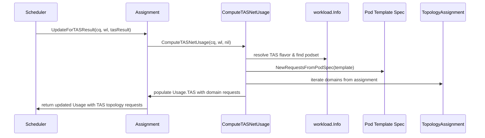

# PR #12006: TAS: Use PodSpec resources for node capacity tracking

**Summary**: TAS: Use PodSpec resources for node capacity tracking

**Sources**: https://github.com/kubernetes-sigs/kueue/pull/12006

**Last updated**: 2026-06-09T06:58:41Z

---

## Metadata

- **State**: open
- **Author**: [@wafrelka](https://github.com/wafrelka)
- **Branch**: `wafrelka/tas-node-capacity-calc-fix` → `main`
- **Created**: 2026-06-09T03:23:29Z
- **Updated**: 2026-06-09T06:58:41Z
- **Merged**: —
- **Closed**: —
- **Labels**: `kind/bug`, `release-note`, `size/L`, `ok-to-test`, `cncf-cla: yes`, `area/tas`
- **Assignees**: _none_
- **Requested reviewers**: [@kannon92](https://github.com/kannon92), [@tenzen-y](https://github.com/tenzen-y)
- **Changed files**: 6   **+260 / -31**

## Description

<!--  Thanks for sending a pull request!  Here are some tips for you:

1. If this is your first time, please read our contributor guidelines: https://git.k8s.io/community/contributors/guide/first-contribution.md#your-first-contribution and developer guide https://git.k8s.io/community/contributors/devel/development.md#development-guide
2. Please label this pull request according to what type of issue you are addressing, especially if this is a release targeted pull request. For reference on required PR/issue labels, read here:
https://git.k8s.io/community/contributors/devel/sig-release/release.md#issuepr-kind-label
3. Ensure you have added or ran the appropriate tests for your PR: https://git.k8s.io/community/contributors/devel/sig-testing/testing.md
4. If you want *faster* PR reviews, read how: https://git.k8s.io/community/contributors/guide/pull-requests.md#best-practices-for-faster-reviews
5. If the PR is unfinished, see how to mark it: https://git.k8s.io/community/contributors/guide/pull-requests.md#marking-unfinished-pull-requests
-->

#### What type of PR is this?

<!--
Add one of the following kinds:
/kind bug
/kind cleanup
/kind documentation
/kind feature
/kind kep

Optionally add one or more of the following kinds if applicable:
/kind api-change
/kind deprecation
/kind failing-test
/kind flake
/kind regression

Please also consider setting the area:
/area tas
/area integrations
/area multikueue
/area dashboard
/area localization
/area testing
/area website
-->

/kind bug

/area tas

#### What this PR does / why we need it:

#### Which issue(s) this PR fixes:
<!--
*Automatically closes linked issue when PR is merged.
Usage: `Fixes #<issue number>`, or `Fixes (paste link of issue)`.
_If PR is about `failing-tests or flakes`, please post the related issues/tests in a comment and do not use `Fixes`_*
-->
Fixes #12005

#### Special notes for your reviewer:

I'm not yet sure whether this PR addresses all cases where nominal and actual resource requests are mixed up.

#### Does this PR introduce a user-facing change?
<!--
If no, just write "NONE" in the release-note block below.
If yes, a release note is required:
Enter your extended release note in the block below. If the PR requires additional action from users switching to the new release, include the string "action required".
-->
```release-note
TAS: Fix a bug where TAS ignores excluded or transformed resources in node capacity tracking.
```


<!-- This is an auto-generated comment: release notes by coderabbit.ai -->

## Summary by CodeRabbit

* **Bug Fixes**
  * Improved accuracy of topology-aware scheduling resource usage computation by deriving requests directly from pod specifications rather than pre-computed values.
  * Enhanced excluded resource handling in topology-aware scheduling to correctly respect per-node capacity constraints.

* **Tests**
  * Added test coverage for resource usage computation with resource transformations in topology-aware scheduling.
  * Added integration test verifying excluded resources are properly accounted for in scheduling decisions.

<!-- end of auto-generated comment: release notes by coderabbit.ai -->

## Discussion

### Comment by [@netlify[bot]](https://github.com/apps/netlify) — 2026-06-09T03:23:36Z

### <span aria-hidden="true">✅</span> Deploy Preview for *kubernetes-sigs-kueue* canceled.


|  Name | Link |
|:-:|------------------------|
|<span aria-hidden="true">🔨</span> Latest commit | 8f10b619b157cb7507861c5952e8d018b1a5bc0d |
|<span aria-hidden="true">🔍</span> Latest deploy log | https://app.netlify.com/projects/kubernetes-sigs-kueue/deploys/6a278735d2f4d40007e6b599 |

### Comment by [@k8s-ci-robot](https://github.com/k8s-ci-robot) — 2026-06-09T03:23:39Z

[APPROVALNOTIFIER] This PR is **NOT APPROVED**

This pull-request has been approved by: *<a href="https://github.com/kubernetes-sigs/kueue/pull/12006#" title="Author self-approved">wafrelka</a>*
**Once this PR has been reviewed and has the lgtm label**, please assign [tenzen-y](https://github.com/tenzen-y) for approval. For more information see [the Code Review Process](https://git.k8s.io/community/contributors/guide/owners.md#the-code-review-process).

The full list of commands accepted by this bot can be found [here](https://go.k8s.io/bot-commands?repo=kubernetes-sigs%2Fkueue).

<details open>
Needs approval from an approver in each of these files:

- **[OWNERS](https://github.com/kubernetes-sigs/kueue/blob/main/OWNERS)**

Approvers can indicate their approval by writing `/approve` in a comment
Approvers can cancel approval by writing `/approve cancel` in a comment
</details>
<!-- META={"approvers":["tenzen-y"]} -->

### Comment by [@k8s-ci-robot](https://github.com/k8s-ci-robot) — 2026-06-09T03:23:40Z

Hi @wafrelka. Thanks for your PR.

I'm waiting for a [kubernetes-sigs](https://github.com/orgs/kubernetes-sigs/people) member to verify that this patch is reasonable to test. If it is, they should reply with `/ok-to-test` on its own line. Until that is done, I will not automatically test new commits in this PR, but the usual testing commands by org members will still work.

Regular contributors should [join the org](https://git.k8s.io/community/community-membership.md#member) to skip this step.

Once the patch is verified, the new status will be reflected by the `ok-to-test` label.

I understand the commands that are listed [here](https://go.k8s.io/bot-commands?repo=kubernetes-sigs%2Fkueue).

<details>

Instructions for interacting with me using PR comments are available [here](https://git.k8s.io/community/contributors/guide/pull-requests.md).  If you have questions or suggestions related to my behavior, please file an issue against the [kubernetes-sigs/prow](https://github.com/kubernetes-sigs/prow/issues/new?title=Prow%20issue:) repository.
</details>

### Comment by [@coderabbitai[bot]](https://github.com/apps/coderabbitai) — 2026-06-09T03:23:53Z

<!-- This is an auto-generated comment: summarize by coderabbit.ai -->
<!-- review_stack_entry_start -->

[](https://app.coderabbit.ai/change-stack/kubernetes-sigs/kueue/pull/12006?utm_source=github_walkthrough&utm_medium=github&utm_campaign=change_stack)

<!-- review_stack_entry_end -->
No actionable comments were generated in the recent review. 🎉

<details>
<summary>ℹ️ Recent review info</summary>

<details>
<summary>⚙️ Run configuration</summary>

**Configuration used**: defaults

**Review profile**: CHILL

**Plan**: Pro

**Run ID**: `b0b23886-8157-47c6-b6ca-02d17279865a`

</details>

<details>
<summary>📥 Commits</summary>

Reviewing files that changed from the base of the PR and between f79bd4aa59ea7fe5cc88b3ecdb74b5f40a51c036 and 8f10b619b157cb7507861c5952e8d018b1a5bc0d.

</details>

<details>
<summary>📒 Files selected for processing (6)</summary>

* `pkg/scheduler/flavorassigner/flavorassigner.go`
* `pkg/scheduler/flavorassigner/flavorassigner_test.go`
* `pkg/scheduler/scheduler.go`
* `pkg/workload/workload.go`
* `pkg/workload/workload_test.go`
* `test/integration/singlecluster/scheduler/excluderesources/scheduler_test.go`

</details>

</details>

---
<!-- walkthrough_start -->

<details>
<summary>📝 Walkthrough</summary>

## Walkthrough

TAS net usage computation is refactored to accept workload context and derive resource requests from pod template specs. Method signatures are updated to thread workload info through the scheduler's topology-aware path, and domain requests are now computed from actual pod spec resources rather than pre-computed aggregates.

## Changes

**TAS Resource Computation from Workload Pod Specs**

| Layer / File(s) | Summary |
|---|---|
| **TAS net usage computation methods** <br> `pkg/scheduler/flavorassigner/flavorassigner.go` | `Assignment.UpdateForTASResult` and `Assignment.ComputeTASNetUsage` now accept workload context; ComputeTASNetUsage resolves pod sets from workload spec, derives single-pod requests from pod template specs using `resources.NewRequestsFromPodSpec`, and builds topology domain requests—while skipping when prior admission already has topology assignment. Podset utility import added. |
| **Scheduler integration of updated TAS methods** <br> `pkg/scheduler/scheduler.go` | `netUsage` and `updateAssignmentForTAS` pass workload context (`&e.Info` and `wl`) when calling the refactored TAS computation methods, threading workload info through the TAS pipeline. |
| **Workload pod spec-based topology domain request computation** <br> `pkg/workload/workload.go` | `totalRequestsFromAdmission` now computes single-pod requests once from the first pod set, then overrides with pod template spec when the pod set is found in workload spec, ensuring all topology domain requests reflect actual pod resources. |
| **Unit and integration tests for TAS resource computation** <br> `pkg/scheduler/flavorassigner/flavorassigner_test.go`, `pkg/workload/workload_test.go`, `test/integration/singlecluster/scheduler/excluderesources/scheduler_test.go` | `TestAssignment_ComputeTASNetUsage` validates computation with workload context and prior admission skipping. `TestNewInfo` includes TAS with resource transformation case. Integration test verifies excluded resources remain within node capacity constraints and are absent from admission resource usage during TAS placement. |

## Sequence Diagram



## Estimated code review effort

🎯 3 (Moderate) | ⏱️ ~25 minutes

## Poem

> 🐰 From pod specs to domains we weave,
> TAS now sees what pods truly need—
> Excluded resources no longer hide,
> Topology nodes embrace them with pride,
> Capacity tracked with rabbit-eared sight! 🌿

</details>

<!-- walkthrough_end -->
<!-- pre_merge_checks_walkthrough_start -->

<details>
<summary>🚥 Pre-merge checks | ✅ 4 | ❌ 1</summary>

### ❌ Failed checks (1 warning)

|     Check name     | Status     | Explanation                                                                           | Resolution                                                                         |
| :----------------: | :--------- | :------------------------------------------------------------------------------------ | :--------------------------------------------------------------------------------- |
| Docstring Coverage | ⚠️ Warning | Docstring coverage is 14.29% which is insufficient. The required threshold is 80.00%. | Write docstrings for the functions missing them to satisfy the coverage threshold. |

<details>
<summary>✅ Passed checks (4 passed)</summary>

|         Check name         | Status   | Explanation                                                                                                                                                                               |
| :------------------------: | :------- | :---------------------------------------------------------------------------------------------------------------------------------------------------------------------------------------- |
|      Description Check     | ✅ Passed | Check skipped - CodeRabbit’s high-level summary is enabled.                                                                                                                               |
|         Title check        | ✅ Passed | The PR title clearly summarizes the main change: using PodSpec resources for TAS node capacity tracking to fix a bug where excluded/transformed resources were ignored.                   |
|     Linked Issues check    | ✅ Passed | Code changes address the core requirement from `#12005`: TAS now uses actual PodSpec resources (respecting exclusions/transformations) for node capacity tracking instead of ignoring them. |
| Out of Scope Changes check | ✅ Passed | All changes are directly related to fixing TAS node capacity tracking to account for excluded/transformed resources as specified in `#12005`.                                               |

</details>

<sub>✏️ Tip: You can configure your own custom pre-merge checks in the settings.</sub>

</details>

<!-- pre_merge_checks_walkthrough_end -->
<!-- finishing_touch_checkbox_start -->

<details>
<summary>✨ Finishing Touches</summary>

<details>
<summary>🧪 Generate unit tests (beta)</summary>

- [ ] <!-- {"checkboxId": "f47ac10b-58cc-4372-a567-0e02b2c3d479", "radioGroupId": "utg-output-choice-group-unknown_comment_id"} -->   Create PR with unit tests

</details>

</details>

<!-- finishing_touch_checkbox_end -->
<!-- tips_start -->

---


<sub>Comment `@coderabbitai help` to get the list of available commands and usage tips.</sub>

<!-- tips_end -->
<!-- internal state start -->


<!-- DwQgtGAEAqAWCWBnSTIEMB26CuAXA9mAOYCmGJATmriQCaQDG+Ats2bgFyQAOFk+AIwBWJBrngA3EsgEBPRvlqU0AgfFwA6NPEgQAfACgjoCEYDEZyAAUASpETZWaCrIPR1AGxJdoAQQDKXACqiCTWiv7copAU0vjYFAzSkABm+HwYimEMaNxoDOryuFQMANbwGESQkAYAco4ClFwAjABMAAztAGzVBr54sOlcAO5oKbEepWi9AEJUGAywI2MTUwD0uGiIYJlKYDl5Bbiy+2geDGAp8AAekIBJhJDM2lg1/pu42Ihc+FEvBkE2AAyXFguFw3C+azWRHUsGwAg0TGYa1K8Mo5Bo20Q8CIiBR2BIBLW3GwHg8azanR6NQA0hVaFwBNgqgAKFH0yBMogASl6vliaC4m2QbOcJGmwt5NQAYjdpFwzJT2gBWIwAEWkDAo8G44nwGB8CGQtlScuQfn8kF22Vy+UKkGK+XKlXs+AdsGoVqykE+aFIjDODFJ1Hg+uQnzCuFgYXyHzOMTiCSSyHGLHCtEi0RZFQYHmwtAqVViiHiiWSJGuufzdE58grVaUNkTZassSu12S6Qd80QaQobHocm7mF76SeeowiG5Ghg0cYHsqMdotGLoWQ0y5kGG0diMACKCImVi9HreaU9C7jsnfYHCZLSeS27ICmYJPELtiTwqha9SgDh0KAAaLcEEWBRSXoLw0HoAh7EWOhSR/bhFGQfVYOtZBhlhFBJ2wFIrgKdgEy/DAf2LUtkxnXwEyg0IvRoHCCxyTEuAAIgtLhZVuDdmRAygwgtA8j3LSszxrS8exvGtyIfZAKl/G0AOOYcykLDRWNnGMBi7TJMR9BZKE2CplKfKNKHQMkAzXR4bh/TJmAqeNMHoWNsHjGSywTABHAlEFwdddyYKRjxnaBpH8rd+PQZcaxZUJshYBzcEeaRED9aRp3MSwAHlhFEcQpBTCg0w8CpShrJAHGkAwAElECqyBFQ6FUfH3HFhOQU9qwvPgr1HftpObZMcIU/87WUx1VMqIwoFbQQvGYVrLVofBkl09AGCYbAMGSvs7wokSGxrCR4GmLrGyGkhWxIdtOz4ZhFHgK5jtO4drzHEMwz4rAcnOYN3yqa0xqOeQI0HeRoKSmh6GGdJSg8fBoMQDQDCgABhMMSB8sgkiWx40HkRB4NoUklwLCd42Q2hUJ2t0MJA/A6M/Z4yMukUxhoPh8i2nafz2yH1Ghrc4YRpHeTFHCHHw+BCJ24Cck+Vn708/BgqRJL+D4InoxJ0qXRSbQ82LFGoAAUWuKIxE+g090tRBBggnCjosjx9ofbzfIi1yzg8eQmFw28hwFsEa1hih4cR6nABQCYtLYByAuuxL7nLe/rx1DSco6fLBJudQHvQOcbZBNyAMZ2itOGsbUuzD0pIGzeqCUagAOZuumVcWQ9fIWJmoGtbsQYCmWSwT/ffAkYLddr0jCDzhrB2toqh0ORcjuSsBLNgrOkGcmw8Pv6EqgkFVbgBmZuS6bXhFGwMQM54fBjMoL4HXC9AKHEA2xHXDAXKwCs0Cvi8AmZC2ICAuDWK/Py28eDFROueReZkQHpE5pAJQD1JyOnjkgg28AjZhDyFGFGBgLCl0SuoFK9V0rIAcE4Fw9d9S+xQCkH0oQUikm5KjSAvgYp/xwjQIgVAJxQOSrBCQZx4C0D7pABctA9ZVHwCw86g1lbDXkoJbg+8khsB2iXLiNZBJA0LiDAMf197CNghGDacZXZzzCL6f0LIrAREtmAJQ2opC0F5EInc7pMBegchgM4axp7HjdmWZGM0wCGAMCYKAZALwsLQHgQgpByBCJrOrdgXBeD8DynfQqi8mDuJUGoTQ2hdDRNieAKAcBUCoH8ckggxAyDKCFlknaXAqDDHsI4J49ChzFOUKodQWgdD6CMNU0wBhuClCIGsbWCEvAUDWCkfeEh0hbGxIeSgqz1mbPqu1SgGgiD4A4AYVilySGWF8DVFp6SD69LofIRR85MCkEQEYAABrM+Zizda7LWWgDZVBDk7JWUCkFWyjkUBOfgL5XoelIjfMkQxJBkoOPsdiF0SDa6i1oIATAJkBU3sOi1+QC+7IB8eZKM/ikG8BICdeIiAmHIrwDWKIFAwBU1CMlL5TZsZ+UQAilOXzpT7IoMK/GEJQpzi+b4MFGAdGaCCNwKRNBpTpAtE2BwHhcAIrYFGRQiKNpJF1MgXFq9oL1y+cMDwXzxa/x9GqylkAvloA0CEdKGgLQIsGT7H8XyMavnZRaWo6KvWkBZAwLywE7XAVIh4bkXyZwYwoLHfUBZKi+2AkGlgKKw0RrSqQBFmQembHKsgW19rgLuMkMkJBExGWYBHvuSFXZUzMAfvQXl6BFXKuQCdaYXzGGyAtOK4F6QvnAQRvgUo4ZuDujCOORYgaeXooRfJatGhcpCA0JmBgGhnEZnRcKoe2A8HUzddiogXhj0Cs9lKztS7u3ks0dIxAlsbV2ORuG4YD7wqIGlMVZgx6D0OuAinMyWBkIknMai/cBBkIIyIPIFaJEPaAdSCBt1EIPXQB+PgFDsgFXbKVewDQaoWDPDPfYco3BuA/jZe8e+2dcOxAkDwhyhz9Qio8AKWg8gPTrgdIR4jfayPKtSJeOcaUt4kt7fSCsxC1QJB/Ehoj+BUNgDQKMXc/zEKVGAkg36rswFhC3dCw8E6QVStGAu9VNZYJ5Hqm6j1drN20zc/2ijqrHOaooNq6QpJ9XEMmaQ3weq2kZwtW6JBShczOGtqhJRFsUHiT4CSAQpUGAJ15uIaqXCACy6LBg9vatQBI9iXXQy4F89hCx67TAAFSkfasq3kfm+4BaC7q3A0avKQGa9rWgOR4IaDRnmPylAACKBICT+CCRCQYuBgLFhC3BWAo38jRh9QENrh4B06pC8m+4bqGu5ZZC1g75GdqdZqyQHrARjt6oG0NkbY3duTc+JzObhISCLdyPbfAq2tyu2a3iyOGgaoYDSGt4LerNvbfGxaG7R2Ee4FO1u35CziakwhRKqz6S9mTtBWR45pyvnFdK8asjlXdzYAewyc721LvXZ83dshIaaCFtwJGkgb3huLGR19qbv35sA6W8D0HDLOO0G40nLAzXUT/Y0FxyqGdTsPHq6zprQ20fsF5MGgtARw18+LQLmN73hefZIBNsXs2JeA+WyDuN4PIfQWh7D/AwFZfq540rlXBI1fy41/qLHWAflzNxzrfHJOoWKsBYTxPsLKdGEBBUZIix3l0C4AAalaK0NYYBWjNyMKbPy8BxyZO9Bx+AJAek3T7JXAAEjiWAFyrmo2mTjgzyz48HPJwT0nRPKAAH1MSaFOecy5rFrncLuWktpNZaH9JeSw7Pi5PluCNCI00wCy0oFfCgqt2zkalGbsjUM+J/vEmj3gPBGwtjTryyoeRttRPIa0xDJ16HngSfayIi2UMhi2IWonIHLTfi+TCj8gNx2jH2N1DVNyLXSgRXs2inPBnBqmSmCienryrTgM0EQJ52QPN1QPOSgFiCYAoCvQrDjgMUQzE2/zQWo3kliEFQimzAWDPFZg4NThvGtjWAcnTXSD5hww93oHXWSk/VEHXlgkEkxV5DYyJyk3YMfXQCdQkMwyFTQSehSEoAAG4uFEB6NzR9xMVIAl8hFWNowc4mDUNWF0oLIBM6xrgkAIp5J6U4FJEOU69mUl4w8MAwt59ItOZktRMX0Et95rCvpXk6D0seoeB4Qcs8txACtt8oAeEEFJ9UhWcJw6sLsYBwpCCED80kD/Azd+cWRkpmtJ81JoAI9cNo8+8k8R8U8B8ycYUJ9wo4UqdJl58itMAno35ZRgFfAglfYAAvSgdPTPZATfUgZnPPNoU+YvdocvSvavegIZBME6BvBOfCFBLgErAsRwTvOfbvMAIwXvPHfvFo1PM5c4kIxfVpDJHtPpZwdfN5LfIwGHN1DEfnF/JBDTYjHTPTASfcDERw/0Zja2E1UzKtYgkgXnQErcbCaCcmDOeMLQseCuG1AAMjtxhzSAdQsn1FxB8JfSrGmz4GxibkQClxWw0JclDwD3sHeE+GAkZ3VR/EGB6QUItxQGQDrU8SwMj25L7kIKe38CBLnEEnW0R1QEP1yE0Xr3oCHW80k18we2lJe36xjTd2My2D1OTXlgXBhBxTnFM3sAqw+F3FghzDEhfS0JZGrVJLYwlOwTnBUKImfS+WFD1JTX6IiyixiMnAiPi1EGiPCLiLSw/gyySOyxllSPUHwKMFqH1Asxzl3yuC8GIQz3IHmPNNz0gAL2L1aA2PEC2IUD/Dr32KbyOMgBOPgDONnyiSuJmWjwkLWAkLhRnyuQixeIeSFlX0+P4A32LO3z+P9JBzOAAyFWAxYH90VxfzYyZEvUDQIy/1Q3nM0CoxIl3KfUvHsJOF0wlj70LGMznE5TcVYMj38ELDvUUEPIRXETzAs2QEyEgARkXD4BFJrALCoNwCYT9N5R1X3UfKumfKxkfRZFOz2kZUoAhgYwSQArvLFOm2gmAgoVQGY3EgMj7WvXRXAofOzSgtoEPLgtlLICjieipPSAzV/iQlpzJRyCwEaGk22kPkjztX3UtiPQiFPS+VouSlQFVkoG1BiiwEVhdC+R/Q0D/UPMXNAxcVEBZHxJlTCgpRoD4tEGTVlQSm5xrC+RvSfIopgsA03QtVsITAXgQp2xYIwzULfhVNQvoD9OFC905gmP8CxmUpZDwx9RPMIP0uDJuVDPCNgkjMSzDJSwTjjKFi7CyxSPYFTMKwzPIHzLmO+MWPz2VGL2aErKr0eR2LrMb0OI/mOLoBbOYCeMuOuK7KtVoB7Kau6L8j7KeMHPuWX3eOeXHJysK2gPCj/WJPhRNUdOrB/gwNTP1HjEABwCYOIWLCKMD/KDSSMcFRA6RAQAXAI98chQhZVcKtgEpMEKBb4vYsBFqV5w58U0SVrBIU5pg1D4AwlBg/Igkt4QTmDnK/I40dxZ5LptCPDuDqwND4rAFNE7ckRIAABxKwIIeKmgX+Ta92TRT4K0dFWuNSABIBKGlgNYCQbgQ9TSeK+g+gL5Ua18iRRzayz0YE9agaFkhXe+a+EmYadtMJOxIGzCf6l9HGyGxEfGogEkIUkBYsdgGsLYN1fmvMpENYFDGWM4YgEkBFFkZa2Aei9NaQZCJi/WCVaVRjSobkXNDELGyoDQGWvG5EQmhgKy+Ko6dynDemkcKScmgjTYDwF8yDJ1JBaAk83chFP/CoBZSC7lY1H6iKSvSyNsLwMQF9UQi0ymSgMO+gCO4lKbT/TTBw4qEHEUO3IgDQBNLIHTJQ7CEzBi/KcCHaZk0ueGoQkgB6ehImCRc2sK7hCKicWLSIqMpLTu/q+I+MxI5K5M1K9ImaSADKkgWYwsgapYrodoNYoq6s0qxlevcq5vKq042qts+qgwSfEJcuQRQQ0yqMn7XZe4tYZRH9GPJZcfSfDqtsrqqwx5Uc+hV5BYwrLI4ylIZgfVCMucKvZCD+H+bi4oG+JIFyDGnpJ+I+ixN+Li8yaA/cdWyAc2I6HVA6a6AeBFWlZKLUcUPSNIBIYWG6teBmOiMDL9NOsG5RVOy6AyvfXA56EUZoXkHld+AhLRUOWETwucWhsALm4xe0f2PyKgYyGQP2aMKaKoIOn6eIHaEBp5QJKoUfSQlCHgcyIGP0GjZKcUMCa0IlF2fAZiN/MIWh8JJIb2+gFkVoXkJBcxrmpUkHZBQekaPRjWiQwxgWNk/lS6VE7cPBMINGeG0WhlUIXRfokIjumLf+sIKI3umJ2MoBxKzLZIke/LNMrhSerKmej+pYgAFmbkXoMAryrJKtr1XvrIqsrmbNbK7wmSmXiSdVeSaVSVePKdYGyRiF0yUbHMGSyCoBGXKXGSqTiVnHqSmtae6reJfGVS4CUCMi8G2O9Gy2MbrlfvkHmA+SKQGdKVGQqQaYAG0ABvViLZkgGqWgViDgM5nPMfLoHIZcZuZoAAdgeYEC6FYkAlYkIVgGuZ+eaNuNaITyHw6NHweK+dYj8mcFwALJIGufyfye+YSThYRaRahY+JcH+ayJEwgKP2Sekz4BMpxHP0vw0GvyDxIDv3mQf3JCkJf2erCSHCQU9IYMtAsNhInHUm+aGRmARjKGNy8DcOOH+YRmGFYgAF9AJTnznLn/nzn7nT4SBT4ABOEgFVgQNAZUMYSF35/5m42PfvDm8FsFlPOFSF6Fj+VFjgZuVoZF3+a1lV5ob5jZ/5rrPSeVDnFVHUrVZ7DHHBt0bmEgXUdAN1DzHgJLQ1cyFOKgwMf6ZId1T1C3PbGUyADUvNIylEi3AbQ0q0PBCPTCxJCNw5F0UdKkh3WkiXewRkkHbl1iXl/l0oQVisQof5gcGqyV6V25xcOVm5hV5odoZofJ1oRodoF5sbXV6gP5m5g12+4fEFmFU1ofc1l1zYK1zPa5lV0+e12ga15oZoZuF1zF2Qf5tGSct1QgibMokgiolAktCIxlsIN0qxiyTmayghZOqQj/DlsMYoc6jOLgChQ/ciDwQpJBQSDmu6jWkdDAX2cdCVF/K4X+d9hQLWz9TNZintMlLdXi3dXSw9MDIS89S9U/SC+9CyoVBFZ9elY1GgbSsIGQhgF9kRv97+MNpqoK7c2Qfc54F87DNMH5NKTjrOkjL1yjO8qVGSqoGjmCBu99GgNxSgetOhjgkUAJ4BKOszejQ2qoNjH5DjZcjOPjFwmRKWr6hwn0hR6cSFhttZ5t4Vk9m5hAIgP5qVmVnPXt7t0gMfF5/JpVl59oZuFV2gFIVofJydqMfVwFw14FwfRd41s105C1td2FjdjgF58+Hd61jLw9jF55N1h7FD8z088EzbJZJCKdiI6091MT91x7X1/wPUq7REWNdADQeNO8E7TzQt/qmrrU3ROr3UjHZrg0zrvVfSmzrIPluz/NIV1tm5sVzt9zntq5vtu5lVlVlIV5joZUU+JQU+CL6dgFv5IF+duL8FJdro++pL1dmF611VrLtLh7vLtfbF5cXF/YhQ8QUqZSQBlBG1M/DQC/K/fAG/IkHHWlp/YVOxt0BwBjf7i0ARkgeDSeLjgAw7IiOg/KcI3h1AHI3Mu3SbpQabgV2bltkVhb/AcVtzrzi51b2nsfZuQLkgfJ15lIBgZoFVl5w7qLk7mLs7zoi7hLofNqqffAZLu7tLxF0+doR78gBF5UZUWXl7z4/5mHMBtmhNmA3AEopErN1A2tG6b8F0AUpwnI/a6QbCjADZPON1PX0g/x9EyPQgl/YdXsymyDO3itv7BbGt/VF9/xH4CmV2fT1e5lQz3jAP+qEAy0gGvrQNXsi0VEldaMTqC2bHvurghsH8fxOT5SBU5KNjXgUMLmVkxXZw8UQTBQHaGjTO8TSzzHOt2z0n3Ghztt6qxwJb2nzz/tgQdoLn0+BgF5/CJVnnmd6Ludm+gFCF279d+XjgLoU+F5uX+Fhf/J5X11m5gAdRsuK7BPPNuJ/FQDIFMdoBNrvZIARVZeQD5LdQL5TbtrwvBmLZvTdUJK9xJP4TdAzZN1vbIPvYCp+FPgTCMttSVQR0kGOfvGut43L7QsPgmEKKNfHgR0BrOPLKbo23s7zdWIi3GnrK3p4KsboN0DoKoC6DNwGAKQMfsdyn5x57iK7KFil2y4vNcuKLNLkwOdYq8sW2/XfieX367hR417OEqgE5Su0oOL6TIBgDAB595A/pY0v6wjZRgryCUP8NfxfQN8ikAaWSg309Q+tAsfrPrGgTLpzgXSbpcWLwlibvwiAjgIiKVGgSACw+wAv2D7G4ZGo8AYbe1KgPrboCZurfLATgK7Z4D5WdzFILQGbi0B2grQF5sqAEDKgSAAgSgTjm7K9kbu9AyXvP3bjosWBaQroOwM36sQ6usWLjrwKXDM19QpnX+O/lgh4U3UpFW9ORT476gkgNdWIFYgoT5BiormH2OgBQrI03aJ5HjhUBfIGFpqwfEAcFEkoNoPQOBM4E3Go7XkWKoiOTvBnsBfo2MMnUlKJRTDyMz+ksGgNaleRSciKuAEimR2gqqcqKOEPWGEHspgRZGTfLwS30hpt8bm7bTvrgI874C7mqgNAPkDQCnxlQXQLVq0HiGNVSG0EFqqCNoCi86BlrVLvP1aBdA7WrETIav1PitAchx7N7ggmmB4shqfkEat7hwamNUi9CfmJdVDwhwYYTVPxLow7CJAkACGS0AQFIBmQ+AKDLmn1AEJcsSaORXlAuhIYRxrUX7ahlnx4IuhLagtZEMLWwA11TacMbGtcAhqy18aNtY2gETZJfsG+IoCalmiqAPUvWijYruj1uyY4o+oQYBi+gL6BpKaTsMSBagZoDgOixld2nOQo7+RVa4ouWlKLOwej8aCtX6MrWwDARzodkTGnKPNo+jraRNR1JA1gzxtehXHAOqINkYE1phZjdPlbD7opxqCQFJhM3SWY2kyKKdbmjXR5j+Q7hxPDAWTyeGsQXhzALvgELW6Lgx8+EToM3H+EMAwh+TBgJQP3owMwyIdMimAPPqndL6okasNfXuJQjkhMI61h0BX7XM0RR7fLjcxqjH5zRvtH+n/UOBTB/QsEOHgS05FLUqRH1H8AvGZZzg8W99IniQBJ5NsqxvgqnvWPeGBCmxQXRFsP0LwkAguFA75nqxua9jD6/Yk+kOJWQX0r6bMagcsinHi9Z+sIlETL3nEcAl+yoJca9xuY4tQ2OIi0nMnwDQ4/6ORXBowAFB6RmAIWHUMAgkJUpXROff+GOIQSUNogdiRQZdWj7miNEXDKTNC1kCYQeGtEh2kj1USKQi49cDUoaNkZV0IoTwFCpPAUhTga6hEmAffF8aCTUSyiFDhHRrAONAa/MSyPg0eSUTyxN4ysT4Ip41iO+dYiVgAF1jANSPLEWymbP12kiULpgs0Ng14/wqzMoL03oTnMJGNZYZGUjGSVJDAYzdWOoDHySJEAY+MqnQDHwwjgpNkiAJAGbhbd2gHzTngIGaDKhx2AgSIWOzbjNAGAyoFVsqFaBfiwhB7TKVqwEAMB2g9ABpqFPIS4AIp1MaKZU2GCxSEkCUsZgyjHxsAKA3neCGUCinxSGmxzAwNUFYhIBbAt4ugMGmVTOJpsq3VIGcFCCAQJpkAKaYgGyhjDJESgDANcxWkeA1pG01iCtAYCiNCwGMYKOlHV7ogzgbwPuIdPGnVBJps7afpBIpzi8uAL016ZNIIAe1pQeRGLIdLtYbS/prEC7J3S36wgqMF04oIWEQCHTCqf0qVuDM2kJCmq4IgUbQHNY/T0Z/02ch4CBkLBO6yM9aX9MmlQyYsMMqMHDMumVAkZXAdYqjIpmvSqBF9YXvF2Twi9ru30yAL9IhkAyzgJMu+GGEOnbsCZm06mWGFpmwB6ZCMxmYdJZmvS0ZEMzGRCOxn4poJz0qWaxGFnEzgZ4sloGzIhkyzJwcshWdqCVnMz0ZErDaWrM2lDIbAezXAFv2Kg0BWw7gYCqvyOknTJpwOCCLeNsCHSDYx0kgGzLOmSIbA20OGW8Gtm4gz2ogUoIdL/YRzTpBYCittG9leAk5ZQVOWdXTmTTM5McjABqCJjahdQGcPOSnK4Bhz/Zm0vWOVFoB1QqoiAeOYdNYgAAdDAD3K7m4B+5g8gecPOABNzYpR8EgHoD7nDyh5Q8iwJYCaidBlQeMUJIdDEiJEORG1OhoJPXijQhGE0EoHnD7m9yZ5p8/uaQhzkkBj5gkVeWnwdqax+CW8ixskHkhGJbQJiXOIWGPmkJy5WoHUBOGPnNZmsO/T0B6G6F0AgFHAa+fuBWhrRnGIjHwnwB/T2115i8L5MogwYPgsGZoBFBJBdpPyhw/pe0cljQI2VfoQYcxHZALjvzCgGgHuYJCeCEwgW3aLuvTBQYVApYBEevNXWZjG8iwbMOhb3IwBmBW47cUlA3S7oYlVw7oCZlVHPSto7Y33V2LfOfnhhQgz/K6pSIhHIxj5vcWrC3GbjnxIAgC4BZMMgCyB4gpNfKE5jdBgLfgkC6BXbAdgeBlmk4RBS7GfnFiWm5Io8dosJZ7yaFB8p0JeRtH5glYW1FBd1AfmbzGaginuUApbxU8H2wbYqJrxQDJQrsyAQJMVTJA/5JCVBekUwilqgJsQ2WEgNyAcVCLQQ4ISENCFhDwgJRPZFYMj3WBcgBA+Aa4BsFiBUsSADzU+G0FoCs8UgzcEgC81Lyl4UgSvfQqXk2inwxgXQFICq3yAqgbop8AQMfOqUQgOAUIGEFGAaVy1Rg4wFpWgDB5UtVmAgNYF0BeYqAmeqI3pR8xugvMSpqrWgKfABGjYER7QO5bQEV4Ii3lSvDYOFAPoCIgJkFECZ9JWTgSd5EK6CWYEBCnx+lYAeFZEJMXjFZAUYH8MjzogdSMaNiyAKUDLQAB+SpfEuaymxreL1fUMqkqVQAaQaICgBiGSDBRy+LIKxF8lRCNAxArsZlUZ25BQKXgUAXMNwsrgSBmgGgP4RoGVA9zqgUAM0cFC4CirxVyoDQM0B7m0qq2PK0oayrohfJdlaCTUNqA4oQBNguISpIBWUgQAzgowbiQ6n5UyrIA7QFVRfHaBqrS4CMfMLAlVjuKuwHoGgqV39hXBLBYZflVAGyiWgWQ+dOrMxEgCX1cADANYIzCR60RL+fK11TSHRDI964+dGcF8m2iAIwgOmW1a6phzQtLIBAIjF8FdXZQWRlak+bPNPnAB5aZUceY3EnlfNTp+8PyDXL1JMzIAhzdGYLPZlDTSgtQfNZ3N/mVzhENc9tZTM2lwDPgBcgkKbPZl0F94QSCcJ3Jrl0YdQUQeqWQkbCuzDGznWAGAC8BSAzMx7UWifzKW4yZ1lMmsVkE7l6ZSIlQO9RDITqOQPANc0dWwE7lKAK5/8jOHPlZkDq9Zw6n9b7PYieBsgUjFOcuoDkcle1ac+DZtNXWYBrYncuAGEBNBpFgEuYcUBQFzGYt4A0xFDhhg/pcADhDE3LMgr2iGJqFSkIoIfPUxuh2wobTcE+F3C0Mul+Cxmqosii7hV5t6lDQ+qUBPrnAL6ogG+vZlUF9QgaqrKHNWlFz71H6iYt+rHVsRcN8LO2cusHWTTwNGmzaQWWbmQBW5vkecMnOk0IbKsSGwuSJrQ3rqgNbEDGH+A/rrhlw0i8uruEfZSZn0i8lqB/kPwRh1wYgNyK7Go38aWQscfKJirHGK48QMS9OGGF5B7Q35jGlSLbw4W7Ci2oSdTNGGYDcs9ZD0MTWxGfWFgrNm02TbDhxAKa65SmkTaprODqbf1bEMeS3NbWIBSMqUZVMBtVm6awNsGiDZ3OyiuDXk/gJgFEFLjnth1FWlIfAMXXKaIZDmjDWxEiyuw3NHDXQjmM2bI9HksEdsD+Ho2ubAlTG4JTikDabR5Gu0LsNxsS0o0IkhFRjngQqhYB/Nyq2bcVsg1lbX1ImqrfJtiCKbw5DW7UInS/WDbDNrEeILgGygpBxtPwEgGexzydbo+9UHrTptA2zr624OlrZtKtk/hrpygUgLNvnW9r65i2ldRbDXUrbcdxjBmVUCCiE6PykAIdhoFaAqsAApCBBlga16kuEaWLLE0Ak1H2MEWAMWEGAuLRaTPDQJ0HZ2FbMdIHB/PqE7nuz1AcTWnYrNNV7QcERs8MszVj5do9xIYXsEUCtLiUqAu40XdIHF3Caitj60rRJvK3A6cQn65rZBvOl06kZdsjaZZMjmdrcAtgCdYBqV1sQBASgYLi8zGURCXm6rAQCMuVCTKUg/S9Vs0BSAvMwhrQBgK0EGXRCBA6/P4fk1oBdBohsQ0+KF2bhdj24SQEgEOwYCnxwuvurYP7psCXzO5OQcdmFzSljBWgwQgQCqy6CiAtuzQeemMAPbigVApAxoMEO70vNVASytAAeyiH97Ihayzbsqy/GFN2gc+e2Y01gQkA+plAQabBqildSJkYzVpmPjyARg4p7wPfaNKqQGBTmfuqwMknUW+Ajh7UuaU1IxjbRcA1zdoNvrP0pIL9L+2/TfrHwn7Rmtkp+AyrODX6+4bUk6IrjgMfwEpD+1iMMG1A0BPOg7NVt8IC5gBguqrMAG8wy46ZU9JASQcqCZ4CBhl7QNAEz3C4AGoD5cGAx4DgM0AEDSADOOAadT6AgAA= -->

<!-- internal state end -->

### Comment by [@mimowo](https://github.com/mimowo) — 2026-06-09T06:37:18Z

/ok-to-test

## Reviews

### Review by [@mimowo](https://github.com/mimowo) (commented) — 2026-06-09T06:57:59Z

- **pkg/scheduler/flavorassigner/flavorassigner.go:103** by [@mimowo](https://github.com/mimowo) — 2026-06-09T06:58:00Z
```diff
@@ -78,50 +79,43 @@ type Assignment struct {
 }
 
 // UpdateForTASResult updates the Assignment with the TAS result
-func (a *Assignment) UpdateForTASResult(cq *schdcache.ClusterQueueSnapshot, result schdcache.TASAssignmentsResult) {
+func (a *Assignment) UpdateForTASResult(cq *schdcache.ClusterQueueSnapshot, wl *workload.Info, result schdcache.TASAssignmentsResult) {
 	for psName, psResult := range result {
 		psAssignment := a.podSetAssignmentByName(psName)
 		psAssignment.TopologyAssignment = psResult.TopologyAssignment
 		if psResult.TopologyAssignment != nil && psAssignment.DelayedTopologyRequest != nil {
 			psAssignment.DelayedTopologyRequest = ptr.To(kueue.DelayedTopologyRequestStateReady)
 		}
 	}
-	a.Usage.TAS = a.ComputeTASNetUsage(cq, nil)
+	a.Usage.TAS = a.ComputeTASNetUsage(cq, wl, nil)
 }
 
 // ComputeTASNetUsage computes the net TAS usage for the assignment
-func (a *Assignment) ComputeTASNetUsage(cq *schdcache.ClusterQueueSnapshot, prevAdmission *kueue.Admission) workload.TASUsage {
+func (a *Assignment) ComputeTASNetUsage(cq *schdcache.ClusterQueueSnapshot, wl *workload.Info, prevAdmission *kueue.Admission) workload.TASUsage {
 	result := make(workload.TASUsage)
 	for i, psa := range a.PodSets {
 		if psa.TopologyAssignment != nil {
 			if prevAdmission != nil && prevAdmission.PodSetAssignments[i].TopologyAssignment != nil {
 				continue
 			}
-			tasRequests := make(corev1.ResourceList, len(psa.Requests))
-			for resourceName, quantity := range psa.Requests {
-				flv := psa.Flavors[resourceName]
-				if flv == nil || cq.TASFlavors[flv.Name] == nil {
-					// This is the quota-only resources, skip when computing TAS usage.
-					continue
-				}
-				tasRequests[resourceName] = quantity
+			podSet := podset.FindPodSetByName(wl.Obj.Spec.PodSets, psa.Name)
+			if podSet == nil {
+				continue
```

  I think it would be better to add logging here, and when `err != nil ` for `onlyTASFlavor`, because both are unexpected. 
  
  I know there is currently no logger in the function, but I think it is reasonable to pass it as part of the PR. We could also consider including logger in the Assignment struct. 
  
  I don't have an opinion here, but probably passing as an argument is less changes.

### Review by [@mimowo](https://github.com/mimowo) (commented) — 2026-06-09T06:58:41Z

LGTM, this is an excellent finding. Thank you for making TAS more robust 👍
