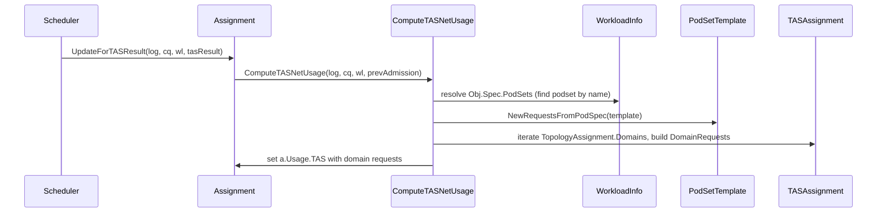

# PR #12006: TAS: Use PodSpec resources for node capacity tracking

**Summary**: TAS: Use PodSpec resources for node capacity tracking

**Sources**: https://github.com/kubernetes-sigs/kueue/pull/12006

**Last updated**: 2026-06-09T13:02:52Z

---

## Metadata

- **State**: closed (merged)
- **Author**: [@wafrelka](https://github.com/wafrelka)
- **Branch**: `wafrelka/tas-node-capacity-calc-fix` → `main`
- **Created**: 2026-06-09T03:23:29Z
- **Updated**: 2026-06-09T13:02:52Z
- **Merged**: 2026-06-09T12:43:52Z
- **Closed**: 2026-06-09T12:43:52Z
- **Labels**: `kind/bug`, `release-note`, `size/L`, `lgtm`, `approved`, `ok-to-test`, `cncf-cla: yes`, `area/tas`
- **Assignees**: [@mimowo](https://github.com/mimowo)
- **Requested reviewers**: [@kannon92](https://github.com/kannon92), [@tenzen-y](https://github.com/tenzen-y)
- **Changed files**: 8   **+276 / -40**

## Description

<!--  Thanks for sending a pull request!  Here are some tips for you:

1. If this is your first time, please read our contributor guidelines: https://git.k8s.io/community/contributors/guide/first-contribution.md#your-first-contribution and developer guide https://git.k8s.io/community/contributors/devel/development.md#development-guide
2. Please label this pull request according to what type of issue you are addressing, especially if this is a release targeted pull request. For reference on required PR/issue labels, read here:
https://git.k8s.io/community/contributors/devel/sig-release/release.md#issuepr-kind-label
3. Ensure you have added or ran the appropriate tests for your PR: https://git.k8s.io/community/contributors/devel/sig-testing/testing.md
4. If you want *faster* PR reviews, read how: https://git.k8s.io/community/contributors/guide/pull-requests.md#best-practices-for-faster-reviews
5. If the PR is unfinished, see how to mark it: https://git.k8s.io/community/contributors/guide/pull-requests.md#marking-unfinished-pull-requests
-->

#### What type of PR is this?

<!--
Add one of the following kinds:
/kind bug
/kind cleanup
/kind documentation
/kind feature
/kind kep

Optionally add one or more of the following kinds if applicable:
/kind api-change
/kind deprecation
/kind failing-test
/kind flake
/kind regression

Please also consider setting the area:
/area tas
/area integrations
/area multikueue
/area dashboard
/area localization
/area testing
/area website
-->

/kind bug

/area tas

#### What this PR does / why we need it:

#### Which issue(s) this PR fixes:
<!--
*Automatically closes linked issue when PR is merged.
Usage: `Fixes #<issue number>`, or `Fixes (paste link of issue)`.
_If PR is about `failing-tests or flakes`, please post the related issues/tests in a comment and do not use `Fixes`_*
-->
Fixes #12005

#### Special notes for your reviewer:

I'm not yet sure whether this PR addresses all cases where nominal and actual resource requests are mixed up.

#### Does this PR introduce a user-facing change?
<!--
If no, just write "NONE" in the release-note block below.
If yes, a release note is required:
Enter your extended release note in the block below. If the PR requires additional action from users switching to the new release, include the string "action required".
-->
```release-note
TAS: Fix a bug where TAS ignores excluded or transformed resources in node capacity tracking.
```


<!-- This is an auto-generated comment: release notes by coderabbit.ai -->
## Summary by CodeRabbit

* **Bug Fixes**
  * Derive topology-aware scheduling (TAS) resource requests from pod templates to improve TAS net-usage accuracy and avoid double-counting.
  * Skip redundant TAS computation when a prior admission already contains a topology assignment.
  * Thread contextual logging into usage and TAS update paths for clearer diagnostics.
  * Ensure excluded resources respect per-node capacity during TAS.

* **Tests**
  * Added unit tests validating TAS net-usage generation and skipping logic.
  * Added integration test for TAS with excluded-resource handling.
<!-- end of auto-generated comment: release notes by coderabbit.ai -->

## Discussion

### Comment by [@netlify[bot]](https://github.com/apps/netlify) — 2026-06-09T03:23:36Z

### <span aria-hidden="true">✅</span> Deploy Preview for *kubernetes-sigs-kueue* canceled.


|  Name | Link |
|:-:|------------------------|
|<span aria-hidden="true">🔨</span> Latest commit | 8550162e299b26ad78cf5c9495a871a832940276 |
|<span aria-hidden="true">🔍</span> Latest deploy log | https://app.netlify.com/projects/kubernetes-sigs-kueue/deploys/6a27d9457b5bb90008104cb0 |

### Comment by [@k8s-ci-robot](https://github.com/k8s-ci-robot) — 2026-06-09T03:23:40Z

Hi @wafrelka. Thanks for your PR.

I'm waiting for a [kubernetes-sigs](https://github.com/orgs/kubernetes-sigs/people) member to verify that this patch is reasonable to test. If it is, they should reply with `/ok-to-test` on its own line. Until that is done, I will not automatically test new commits in this PR, but the usual testing commands by org members will still work.

Regular contributors should [join the org](https://git.k8s.io/community/community-membership.md#member) to skip this step.

Once the patch is verified, the new status will be reflected by the `ok-to-test` label.

I understand the commands that are listed [here](https://go.k8s.io/bot-commands?repo=kubernetes-sigs%2Fkueue).

<details>

Instructions for interacting with me using PR comments are available [here](https://git.k8s.io/community/contributors/guide/pull-requests.md).  If you have questions or suggestions related to my behavior, please file an issue against the [kubernetes-sigs/prow](https://github.com/kubernetes-sigs/prow/issues/new?title=Prow%20issue:) repository.
</details>

### Comment by [@coderabbitai[bot]](https://github.com/apps/coderabbitai) — 2026-06-09T03:23:53Z

<!-- This is an auto-generated comment: summarize by coderabbit.ai -->
<!-- review_stack_entry_start -->

[](https://app.coderabbit.ai/change-stack/kubernetes-sigs/kueue/pull/12006?utm_source=github_walkthrough&utm_medium=github&utm_campaign=change_stack)

<!-- review_stack_entry_end -->
No actionable comments were generated in the recent review. 🎉

<details>
<summary>ℹ️ Recent review info</summary>

<details>
<summary>⚙️ Run configuration</summary>

**Configuration used**: defaults

**Review profile**: CHILL

**Plan**: Pro

**Run ID**: `2b83e431-9952-4754-8f6d-3d9e95310e5f`

</details>

<details>
<summary>📥 Commits</summary>

Reviewing files that changed from the base of the PR and between 8f10b619b157cb7507861c5952e8d018b1a5bc0d and 8550162e299b26ad78cf5c9495a871a832940276.

</details>

<details>
<summary>📒 Files selected for processing (5)</summary>

* `pkg/scheduler/fair_sharing_iterator.go`
* `pkg/scheduler/flavorassigner/flavorassigner.go`
* `pkg/scheduler/flavorassigner/flavorassigner_test.go`
* `pkg/scheduler/scheduler.go`
* `pkg/scheduler/scheduler_test.go`

</details>

<details>
<summary>🚧 Files skipped from review as they are similar to previous changes (2)</summary>

* pkg/scheduler/flavorassigner/flavorassigner_test.go
* pkg/scheduler/flavorassigner/flavorassigner.go

</details>

</details>

---
<!-- walkthrough_start -->

<details>
<summary>📝 Walkthrough</summary>

## Walkthrough

TAS net usage now derives single-pod requests from workload pod templates and threads workload.Info and a logger through scheduler and flavor-assigner call paths; topology domain requests are built from those template-derived requests. Tests validate transformed and excluded-resource behavior.

## Changes

**TAS Resource Computation from Workload Pod Specs**

|Layer / File(s)|Summary|
|---|---|
|**Flavor assigner: TAS usage derivation** <br> `pkg/scheduler/flavorassigner/flavorassigner.go`|`Assignment.UpdateForTASResult` and `Assignment.ComputeTASNetUsage` accept `log` and `wl`; ComputeTASNetUsage finds the podset in `wl.Obj.Spec.PodSets`, derives single-pod requests via `resources.NewRequestsFromPodSpec`, builds per-domain TAS requests, skips when prior admission already had topology, and logs missing data.|
|**Scheduler wiring & logger propagation** <br> `pkg/scheduler/scheduler.go`, `pkg/scheduler/fair_sharing_iterator.go`, `pkg/scheduler/scheduler_test.go`|Scheduler call sites and helpers now pass a `logr.Logger` and `workload.Info` into assignment usage, `netUsage`, `resourcesToReserve`, and TAS update paths; `entryComparer.computeDRS` builds a scoped logger and forwards it. Test updated to pass `logr.Discard()`.|
|**Workload topology domain request construction** <br> `pkg/workload/workload.go`, `pkg/workload/workload_test.go`|`totalRequestsFromAdmission` computes `SinglePodRequests` once and, when the pod set is found in `wl.Spec.PodSets`, overrides it from the pod template spec; `TestNewInfo` adds a case exercising TAS with resource transformation and verifies transformed TotalRequests and TopologyRequest contents.|
|**Unit and integration tests** <br> `pkg/scheduler/flavorassigner/flavorassigner_test.go`, `test/integration/singlecluster/scheduler/excluderesources/scheduler_test.go`|Adds `TestAssignment_ComputeTASNetUsage` to validate TAS usage derivation and prior-admission skipping. Integration test exercises excluded-resource workloads and asserts placement respects excluded-resource capacity and admissions exclude the excluded resource from ResourceUsage.|

## Sequence Diagram



## Estimated code review effort

🎯 3 (Moderate) | ⏱️ ~25 minutes

## Suggested labels

`area/testing`

## Suggested reviewers

- mbobrovskyi

## Poem

> 🐰 From pod specs to domains I hop and sing,  
> TAS now reads what each single-pod will bring.  
> Excluded bits hidden? No—now they're seen,  
> Topology counts match nodes, neat and clean.  
> A carrot for tests, and a hop for the king! 🥕

</details>

<!-- walkthrough_end -->
<!-- pre_merge_checks_walkthrough_start -->

<details>
<summary>🚥 Pre-merge checks | ✅ 4 | ❌ 1</summary>

### ❌ Failed checks (1 warning)

|     Check name     | Status     | Explanation                                                                           | Resolution                                                                         |
| :----------------: | :--------- | :------------------------------------------------------------------------------------ | :--------------------------------------------------------------------------------- |
| Docstring Coverage | ⚠️ Warning | Docstring coverage is 20.00% which is insufficient. The required threshold is 80.00%. | Write docstrings for the functions missing them to satisfy the coverage threshold. |

<details>
<summary>✅ Passed checks (4 passed)</summary>

|         Check name         | Status   | Explanation                                                                                                                                                                        |
| :------------------------: | :------- | :--------------------------------------------------------------------------------------------------------------------------------------------------------------------------------- |
|      Description Check     | ✅ Passed | Check skipped - CodeRabbit’s high-level summary is enabled.                                                                                                                        |
|         Title check        | ✅ Passed | The title clearly summarizes the main change: TAS now uses PodSpec resources for node capacity tracking instead of ignoring excluded/transformed resources.                        |
|     Linked Issues check    | ✅ Passed | The PR addresses all requirements from issue `#12005` by computing TAS node usage from actual PodSpec resources, accounting for excluded/transformed resources in capacity tracking. |
| Out of Scope Changes check | ✅ Passed | All changes are directly related to the objective of using PodSpec resources for TAS node capacity tracking; no unrelated modifications detected.                                  |

</details>

<sub>✏️ Tip: You can configure your own custom pre-merge checks in the settings.</sub>

</details>

<!-- pre_merge_checks_walkthrough_end -->
<!-- finishing_touch_checkbox_start -->

<details>
<summary>✨ Finishing Touches</summary>

<details>
<summary>🧪 Generate unit tests (beta)</summary>

- [ ] <!-- {"checkboxId": "f47ac10b-58cc-4372-a567-0e02b2c3d479", "radioGroupId": "utg-output-choice-group-unknown_comment_id"} -->   Create PR with unit tests

</details>

</details>

<!-- finishing_touch_checkbox_end -->
<!-- tips_start -->

---


<sub>Comment `@coderabbitai help` to get the list of available commands and usage tips.</sub>

<!-- tips_end -->
<!-- internal state start -->


<!-- DwQgtGAEAqAWCWBnSTIEMB26CuAXA9mAOYCmGJATmriQCaQDG+Ats2bgFyQAOFk+AIwBWJBrngA3EsgEBPRvlqU0AgfFwA6NPEgQAfACgjoCEYDEZyAAUASpETZWaCrIPR1AGxJdoAQQDKXACqiCTWiv7copAU0vjYFAzSkABm+HwYimEMaNxoDOryuFQMANbwGESQABS2kGYAjABMAAwtAGwAlJCQBr54sOlcAO5oKbEepWg9Bv641NiIXPhRGAA0kPMUpLiQAlQYDLBczNrr9vGJYfuYRyNjE1MA9POIYJlKYDl5BbiyX2gPAwwCl4AAPGYAGRUJA8S0g5QwtCeAmwRA2ExIaFC73wNA2iHgAC8SE9IRt8KUwARqdJcBsGIcUl8PGguLJpBtnFiXtiZgAxcHSLiNVotACsMwAItIGBR4NxxPgMD4EMg6kdMKRkH5/JAPtlcvlCpsSoiqgRIIswvlcNhATE4gkkshxixwrRItFhrAyApmNw8BUqgarYg0KQCfhNrBqI7EJcXZASGCGB5sEp6BJ4NMU2mMyQbE6rlZYqCwcl0pBmIp4KC6HsigdEGkKKclRhkNyFJ34EpYrQNDBfYxY5UbfBmMhLbwSFIMLtdakKO74ERMvLKsnU+nM/w+MVMC30mx6LEE87kj6/TkgdhWeIt7FThVg/qsowjb95Jh6LhfbEcjoBI+B9vYRx0Peb7cIoyDKpaBrIMM6iwCgnbYCkoIFOwjovhgb7nom0hDnANoDFWmQ0Mg2CHJQ8wVH8kDXv+lDoB4HifqEyDMOCb6ZDxGAOr+6BiPaHGEZejoAI7YHSXaxAoUgDkORZeNiYSUd4kAAES6lwgoQtMqJVNeClLmuG7JHmu4NlWh6dq2p7xkRyAVO+Sifj8JqHmUwYaNp5iWAA8sIojiFIrorswkAeBUpQNkgDjSAYACSiBJfUzRtJKgAoBDAAQoOu6RWTuBb0HZzaOQ2ElXK5WCht8xqMT55ocAYUCloIXjMD4BW0PgySUWh+YeTVSbWWVjbbiNhbFkkpYkOWlYHpVJ4NkB9nHm21DwMqSG+lgt4MPeO1bg1X4mta9BAWgtA8bgND0MM6SlB4+C3YgQ69FAADCe0kDJZBJL1eo5FgiAQbQ942rQtDqLtgkcTBtBwQu0aIUxgyhLhZwEXNyTVGMNB8PkTA0Y+VStugd3qI9TEvW9H3dN2FQOJh8DYQuDJoIsb74EpTCsOo+7gb6UOxVuKTaOm55fe1kAAKJglEYg7cqIP2IM970KT8QLqkVaAuJ+PSbJiC4F2olG/ITDoU5N00w9DbPRQr3vSjGwVCNeMXrV002eVK1HlVtAbNeWAtXxH6Nd+cu/fBKacNY8pVhM1DOy9NSJbJ9QABy5+04rM07AZ00tMh4Plerm/A7GFZZZ749RoTXT+jt0y7bsfWhFxsJx0gANyOg+dAivnADMudx5ARa8Io2BiAjXCz+kxM8Cu2Z7tMAmTg6sRz+gSJoTQRBUB2mx0jwoELpQyBKDWnaHhTMZhFLtcJGEeT/hogWQH9rDsGQA4JwLh5alFzm8AoYAVwCDxFwOoqAhq5DnlIWgQ9NJdnInwUIHhmTII3g2YSrNigLwtjGOMyokiOmzCQYYhCj6sgELCLw9APBEFwMwLkWB8H81YtUGgGASQYDALIboiAtYeGujadKFk6BDxQX2ZIsDdiC1OEffqx02ALjVtwo+QUADqAA5BWNg9Q8KUqbeAz5AHT3AZA+A0DBBwJngDM2ZDpilGwEwig5AqJgEJEQbiJBmDeM2NGJSdYigji/kcFAyBYjYmVCoLwYSL7m0Pn+aM+8PDyGQv+SAAADJ4lJqSECorgApqSyDJLIgQdsHM0kU2njxGsz0uD/y0XTIpJSaTlIKRsapAgJZVB+ilRpfkjD6GMOAKAZByopBwDSUg5Az4NlUewLgvB+ChUXhFKaTB+wqDUJobQugwCGBMFAOAqBUCYEWYQZZyg6brIXFwKgwx7COFOC4fZWQqCqHUFoHQUzpmmAMNwUoRAngQzFtDCgTwUishAlQGR65KAIqRekbEASVkaCIPgNq2kiUGAsJAXwKViBkCeQ2YB3z5D4AWZqcciAjApSwAUiFUKYWQS8PCxFaBkXYtkXyzFKKcWUDxfgfpVd9QkFwGARYEZsgsEDPMc+qAyy2mKpkyA/ZJBhDGga1xcllzuhYvTV2jNaCAEwCZAyN7ByovgGEe8TqAAXIVgN00UogUDAMjUIuwClFkBubRARSCn8lFWG3VlB9X0ChpuSmor0CoowJ0ocBTfCpvTUEbgtB078nSLqIsDgPAVPfB8+Y8UuyFLeqfDQkJ8BEFIBQSpwlzWdytTUApwwPAFM6BsbAeb07ICxLE+1AbbWFOgCsfAdbZBZpxZ0ttR9Nrwz2oUmUrIOS0BnTBedwa3GVMtAk2guSDroG4NwWKOQhkkC4fQANyACloA0CEJVGhdSVOzNMAp/9VUkF1IYuV77SDVDrQyKSYcPAbHwh4ToBSf4GEzdm9gGh/14EAwEYDuBQMkEqZkStaBq21qbRQBtTaW0rvoD2vtQ5C18DHahCdjq8moWmJkYRcHp2zvnYuiyy7Pa7EQOUbgyBBaqp0ZjP0HLYgSF8DTGRyo20eFPTbeCZwa0FL3XOptC7UMLjbbsc14Y+4sd2BUJQYIhxBRYhQZCoQhPOQ8Hs81mIJCYEXAVflyKDYHmiYoB1uxeZbgKcqHJupI0CvSNK0ESJpwjnbEcaCgWA091oxoEKQgNBegYBoKwEQ5XRqAoJNgD69jYFrijQphJKheAK7QQ9clKlepflfP8wTr3p3sCrSAP7CmGs+sB4YTXQ38iig13LiHIApWMxemCgYXVtaXAQfdendUsDOKbE1rWOXhk/bxvT/H1zpqlJt1m0qQsWhHDQZ16cwB6tQTV4M9XFCjYttR5M+RUL9TwlOv9esKlPAKQANUBGbabCsKArj4DkLiNQeIyK3OZjYiPatVCXD59IzMFJ1tIDrVdAXH2OtQCJhUURBxGClAkN8q3dNEH+GgUYCluXi2DBsc1L7U1ReRdG28HFCQ0DiVaYddMZzYtI0QaVL6NAMCktL19vbpXCQKeee85aGLRi50utDub800AY8W6Q6vENGDN6S3wZankI2nNGc1Sg0zOB0XBBZKYYIUDplWQMQyGnsHhsleWABZOVgxH0WQWApId+vR6FJSDRBgNRpgACpjtpvYN0PXBai0BBLer6ocvIBJ5hbQHIEF0PpnNpQAAirJWS/hBJicGPSeM6vRYl++yQT9ARU+dMQLnstCHICACTCWP8fE+F57+nyAmeDfZ/8P33A4Gm0xTIxR5tlBIOF+L6X305fFjExryQOvDfxF4mg4Xzt7sNBsrSBiY3Za287877qSfC4+/39wIPtyHLIXQshnCjFaLMVYVQAwVVNCVfFApIPEPVLcPO0SPUXGPApOPQ4cfFPAzT/P+FVTDIDEDcMMDAvIvI4dvMvH6CvA/WvEgevXIU/ZvWceTRTQkZUQvTxI/TvBTNHBGQfEfZAsfQmCfDA7oDDGgXA3DfAkgJfKoOtcjRtdfCgTfIg2AEg3fMg/favSg6gxvM/JiDiJPS/W6a/DAW/deOcDgxKBGFgygjQMwpTDAL/dlTlP/WFXlUArFcAkVIAoVNFcjSAowSECoZIJlfHLgAAaiaAABYngwAmhc4jAFYa52w1kPw5N4BaFkxMJV4uAAAJNcWAAwIlAKdqMFRw1nAArHYA7w1wiolZAAfXKUlUJWJQtwpUeVWUfS+WcHpUZTHG1CMFIkaVSFrg0nwA+UnHdzIQKQCU+jsQ0F2ieFYNkieEcKDA8F5GjUtFRCqyrn8RVjrF92VjCmdyQ18FlUrUvm0zpFf1wBqOEKw38Bwzw0qVGC7FhgbEtA81imj0KSuPQ2wJEOwzwKVUqXiFwFVTaigH0QvV1GgVhHTh1gwO21DV1TrBSFYlaw7QZndinX9UdUNURItic1iCYAoGqzdzCgbB7UxIMN1EeJ7Honwi3BW0OwZw2zwnxMQE9kOF3DxhDWM1Wm2g7GQGqE7yIA0DDipJoxTDQGdU70FieCIEDCKV8U7jfAkG4ATzHFoGGUdERXJPoDcnNTJLEAbCXHRy8D9UC1iF5MQE6B/ghIvXNQUT3Fk1MMYIRhUzUzpM03QDCTWxZK8LT31ipgxMtXdnayC0JLlQSE7EPmTFLnkEpNDOpICFpOqDJyvTfFaKkwZVOJlUVVIFtLNxJUsEt2Jmd1SXt1EFZDPht34Fd2VlXlsj4G9xvWTAXH9xZXlgUz3HKVSHjw7C4F4NQOgEuIwJuL+LuIePEP4UL3KT8mgHsMKRKP/xcPKIDPRTXPcLqLpElSgKLOLMgED0wDrEvkFBSV8ERlkBJAoD8ICPEx6JjxCOaHHiiJaDiISLhIUFGjnFSI+UWlbCTmDzhkcHyOJSKLACMGXOcPRVKN5QaNAoCmaMpRWU/NpU6LrNHC1ADzZSXJXBdEQAVgXBcGlX0Mbl9ioXzMNDvAfAsMI0/HYmfU7wDM6Tw0kPsMr1ugwoKSYowNYoQw51gFPTfGmDx1Yk1za0ov9Ek3Pi/lgAzWYvYFpOeJF2jx1gYGJLhjq1kHK3NRon7ByTfBkjxDQCeCXHPEoA83Pl9A8B9SQkoCNSljEG1VSVJhIEVBjFQAKTrUqTyCoDYGJiQ0hL9Dp3nTACZ27FgrfFQEGRYQ2AKV8VpLook0wx1AKl8TDCVX2SNjfABwDBwIBLEKVUkIGVl3IPULYM0NoI2AADJO8b98ASqsscs1VFhrC3TlR+LqZNKqhlFUJzVRKSYj5SK0I0g6TE4KyRwlx0rJLkq1ULCKhVUkMcLzUlwo9utZLu01qaArjDcAh+0BKwglwFL9Y1cH9EERjL1r1UjW56LtTtcBNddEDdr58P9irGAoMdCOdsQF92KaBOKcz7qTtHro9nqF988PrXgfrpVE45lacRwtqqKOJLQvYbI2thrqhaN+0MkV85DjjYZ11EYckDqTDOtz5AAcAnMooCkGckvEQEAFwCHGhpOilcFKmMFmogVCVXJuGdEtCyiQiDZMSDQfaoYhLEeZAbbm/AXmqmiQ+9d6hDAdasagZLLcXSxA+gayn1ewOAj+ZuBsKmXUJ4Iy+YeMCyqTI6E6QUpDc3Esq3GsjdS0Ssx3e2mMnMt3RswOHgLxVsv3cQAPQxZUMIA0tUQYrwJDfw8ge8rC2gUIgATiiNjvfPEESPoAOSNRoT/IyI92yNyIQsmWKN/1IqeFIvgoKIPPJWQupXaJAS6MwuZVZXZQIHmA8He0QHGxYBsKYIwBIovU2MkRyp0wPWNXNg0DOzwlbpazsmZMZ2ZzCEisqGJp9Qe3O3ZX8BexIAawnr63ByDuQEyBX3HD4EewbDhiJNwByVNWikmLlRLRy3Xs3uHotmqEHypjnEoB/CvTmRPpXqHDZQ4tDhQAs3EwnPKlohTRqxvuIjXrqw3re0fsQGfulRYgwByjrDa2JPPBgiRBS2JxUTuSYQNj0vS17RyxVny0Kw+1QaAf4CUnlFeKwCuwlvIuImG1bvbuYEmxVmqGqrE0/U6xHlIdEAQxIhHFmopLNNgca3gcqVQGQcdCuj8y+1iV+y2ytLcUuq/voF21eEMOJkRn8ABnYeqDE1fUHqO0ENNxtrJTtvLMdpHAd2rPLLdobI9ybK9p9wT19tSM7IDvIHDrvLruCMgBCPFCiIaCTt3meWSJ/LSP/MyMPLoHgBArLvAsgsLolOLolO3JHvxUaMQpLJaKpTaM+RrowqCIDwuPNmG3qoIwupRoLC7G4Xxo7AdDJtunug7hQhlXbX5KckGwZt7Lh072HFQCGZ7HNgoFIUaepg6YziTKei6aOqPmmDUasQbCxlwFKzCBCvWzUbpDDgAiNWYfZOGlRruSlJlNl3dAAHErAghtwBE9w8Tr1FhZVcAVTKgNALnr1ZSWAng1S8thwwgjSukant7PiR1yE5ttnenCF2qsA54oYkxyjqoTY9mkTTJtmRxvmw65SFTsBhd95zKb54TCkcXfnmAng60OZARiBFSag2N0H0hMHlRurUhk1TgMzKhFb4q5UPnRTyWrnKWAWZHR1So9x0SbtYWaMZ1m6J6dKRxtNp73tKkVGKhoV16LTG5rT7BxA64ywvAxA2t0g1wKgHQl77V0WyEXnbc/T5AVw8QhSRSxT3ISAwruhGXzUMGwoFByZsafo7mng2AawfkIZAQJkrHSzrcHa7d7GqyndBSML3bXHPaWzfd2y/bOyoBfGSBbzI7AnHz2gWhXyImU6vz07fz0iAKuAgKknmA87UmDBykngGISBT4dENWYH8xK94VYL0UJp+wm4nCeVKBsnNBcm86kKsy6Y0KfkczynOzuyKSUhmBy07Gg6AxV5Gn9SiL54kgdZczW323z5ey9LWJtMCpGWlYZoS0iIFpy5j1YwVEEkqJCG+BSL9p8BsZOHogrXpmB3UXmGRHtnL4Il6whSGhuh/V0AFIut92mIUJg7gXxW6AYTjmY4TRbYJmzgyEgIIJfItw1XDpAdt2SmBIqh1z6BoOtbQwIxNNdgmNXWp0jZ8Ach5g71/ZJpDVytqgmhuhDSUOyKiJhchp94Pae5GPSLmP4XClb3LwlKEAUkA37nUBZxQgFxrbf4o2Xbbc2sHGE3aznHxi3G03PGM3vHJlIAc3/H83ymY7gnwjc4S2DB4jk7Py07qFK24ns6EngL62UmIAILwVf8+2+VtAKAajxFnBgwaj1Anl0hS6miCnK7inZ3a6F2jAZ8KT2AXB/1uRyMxGpRTFj1oxEWF4wgQ2wglB6IWEeBKAwBhq8c3wE03wx6zWFw5Orh/BYwFJZqdF6MqxGO/0yqKBD9j8aCm9KkcvtKmWPI6K+7qsRLKNWJGXEyu5aBPsClu2KC2CWtUjJFSO8h0pkhhZxLuKiLZAtBeLpyNBbvhb6DdpFgL7+dnYUIQSfSBrFaEwmW8qulKLKkwY9gqvY0nsfQhjPxodZA4bRmE4wQ7QHQ60RqTx+uiyLcbHE312Y1nanH6zjPU3vb03xBM3LOc283AiHz7OQmwnS33PomM6q34na3kmwLAu0muUVyYKOeIv6iJ2y6p2inUKOi53uisLOyf92foLe2uex3dyK0UBN2Pdn0iAUIvEhX5TCBpCqWyNpscLKncBOuXQebpA+akGbs6Qp1+dUkubmHEAjfQgZbRWVLPzxd0pJdyMpQkAcgSTEHwG7lnAiBHB2AGQei3xBhK0RxKbUE0PhOLaaLmDNaxK6oQJ4pKdI30fazMf9OdOk2XHPdmyCezOieLODBSeDAI7yfo7QimhqeXOPyonvz6fvPALEnmfCiQVLk2zxaeYlkBeomAFXkYgmcyP0K8O/kjlAVTkpkO/rlXJpnu+Hle+kj++k5qvpYkiPIhlWPShh+fkDhtRflDkAUTlgVzkjAABtAAb20j35IBSloG0g4Gv6wpqJSFoFzloBaCaAAHZxQBBxQSABA2kNYNpFkoP8QB6TeZpk3maSogB2kc2M4FwDl8H+hccIsALmRICOA7QdoA0GAFpcwBWXW1vThnrdh2m5hePr+G1KWgxGhSaBkQFexSNrSwJMBsJFiDWhAGIkFcK7yNgaMkQFJMxgzjHpnAJ6Q8W6HDBabsR6UtDRRAljjAfEc4krT+KlkdS3YusQuRAL1nDhtZzMwuNIHpU5L/0MKjDa+vrygb304G1pH3hUAlivxBu32VkmcH8jAC06AAITehlB/0XgMEIUDAGng622kAAL5rAr+N/O/mAJv41FVAaAfIGgHHjih2gaAcUE0FgGgDH+jhIuqRRl74pYB8Aj3BgKaDtAmgaApEBgPHhNAcBcAoXrIDAFLsD25AD5Hr2qZGEpUmwGpG2WKDyAqYfvduHM3W5QttwlAAoPDiZI7B3UjLPEptEcj9cgWAxJ9CLgtS9CcSuwP9lnC5IZg3wgrPFoGGxrKkXofkDYX8wBaK1SBthdrGlmOpkIRaqwtlkdQwKkcdm/pQQuVmxR0QEsRzdXDlTBb1MlA04aVlUT4HGUW60jGoPsMpb4th824aUj8zV7UtbwdLbAAMnFZ8Q+Wuwz5iCP+bqlmYyzK+Itk/JKs7WKrBDvkiI7/Md624FWHNQ3TCRvWYgC+mG1q4SMtWJzKkSR0cHaQXBbg0oB4JTDeDH+vgxwAEKCFP9xwoQx/uEMwhtBc4cQhgB/3CIMBkhbqMAc2yPYu1O2dAqsmoSl6S8ngAHQbMO3Fijsee+AbIVsEQEBEH+rQIobQDyHlC8Bj/FKArzISc4V25aH4FMFICpIHAV6VeH5nbAdwJS+oaUm+AUYbQRwdQxpKyPZFb8uRXgv4GALejDABRwQrCiKKFGkAaiucWOuEXCJf8UgTQJoCQAzEpB5R/4RUXSBbY3xj2CMVUYaxG56iACOoodqF0yFGjcBJokoePBaCWiShP/XAZUOqGwwa0YYgpMrwwCQp8A1+NdpfH/Bxg5QWIV9swHeE/N5hVqeJI/WEpYAAO9AH9gnm44vxuEx3RXjKjg7BIcI8A2QEhEQ4bjBO0fSSBh0YjVB+s9w+QER19Zv4lan9HVIhExF/gn2MzMgeygN4kBaSAHV4fiQbCbiaaVwRRtwNnGfkP2EYrIK4KjEqpPBPI7SHyOYCJjUxt/e/qKOf6lCGgqgLEA0BIAkBwi7QYsbADAFQUR2YXKxJFx64xc4uZ8BLlkNbEIC8hHYrsWaI4BNBx4qAioTXTAFbcJyRXfwLUw+RYcSEYgLTN5XAgrBXu+SNblak27bdyqskIzMUHgCohX2r9OwTgj1J/wq8bQn5MJGtCuRdgmg/nDlWm5XcdcC4VinWl+pi0ym2VULLZPOF8Unib3SuL5WlJypb4CEpQEhPcEoTuRsY3kS30wmBCkxwo3CdhJqLtAcgsMXOA0C/5JSBAFE4ASkPAES9aJVRdch4TALiofCLYuAW2J4lZjuJ5AB/lVMEl0p+xi3Q9g6O7RTENAMxOYgsVJDLE9WSxWCHKixqWhPR4xcMmljeiUgh0l9NGv6PUGiA9ibHCwi10ZJpVHUM1P4v11gGRjQpMpGMVUMf7xisJIQ+KeEPaDjwSA48WOiQFjoCAEhYwSidRJC5c8Cp7hZ6SVJgHsTchPE3OIUO0joCeJsdG0X2Mf4EDviGBN9E9TnwL4SuIkJIO5S8pNpNuSucrOZJfjRQT0ogCcoUlfR4Yu84krKuxByq3FRCjkptJBmgywZa4CGIeNyJrjI56uyMfxMoOnopp7JuwYSEoG3RvFmZVrR0LdDvLIBNS2pZ8N6SQ5O8y4/ZBGEFJIAhTORYU3aT4KimHTkxx05/p/xIDtBY64ocIi0ALHig5R2UhUakMelajNyJU16cKnenlSOJ/08eNVJIAP8sovYoSY/yLCdxn0PxImQVVpKWg2Bw1bQSoJdRcBhYhEFzMkBWreZk0q3cLLIEiyipYslmUCd63UGsscGQWYhh4EyzCBBGeWSbEVmlTH1n0EjB+owKmmOlAsAc7rLNITwY1BsGgVhvA3Ybbj9q2NBbqlT1BPj7BbkZYbthMYHY7WPxQQRdiHjBy5U3pc1CsGTrEgpMQ00TNJgcJyZO67pNiJ6VjA1oO55wxRiZn8mjSScvAsEOVjrSIAngtsR8GbH4BYBOCyOJQbsCrCXyMcEcoAlLJlnRi0JCADmkrLilhDn+2stAPmPaBf8v+0oguPdKNl5T9RRUtwmbNNkWy2JVsz6TVI4Bf9tZdsh/kgs7H1TOi/YoQPvlAlPiwqs9UWDymghupUklvQGoGU0BZdQar1AWq+jlxcgNAvaO/KWk/wyNH4LknMo6RSLxBn05w8GSDUhmvU6FH1U6qwu1rrgI8neTaYhI5EvyIp2kA6TFOwkpjwhsdWOikDSmtBxQ48JQOPBAW5S6xq5UVIVPNneFmxxo62QgoukoKOA1ijBS4EanTMxi3ogGm1I6n4B5ilBJYr/hWJrFKkwYqJBpDSKrVxC4Y6RcFNkVyy0JiiwUUdK/njgaitADWUWx1mnTFoLQfRTRPAWmKVkOSg0TuVgU5DTRCCrMVxN+nFDKp4ocUIDOdnaQ2UxQPdskD15XFxyv3ScoCVIDSomAESVWs9HAjVIU4roKsChlZm/E2lxM8QgUi4DTsLCRnQycpKvw0lJlc8lmQ9QXBQDehywuGJhD4RfDac0rcMniWWGsxFEdXX1C+IZGWt4GRwo+MNPPBd0MKISzKiCVVQrKXSDBTgspmXli15AXw5INMHXlgzwl0syJTtLQkYSP5pAFRc/wYDqKGgGitAA0FzhSwMlBsksaAsMWc9JelsopRgPCIxEbF+K3OE7IamP9ZMrHaQARQu4SSpKrNApP93xl3UeKrMkmUQEHxnx3U049lMyrWWFUwMnVI7ujjazz0pCy3PgOJV0qhLY+UmRFCMSfmgqfm8s/aSMUhU4T4laY8ULnHxXqKSATQTVRKEyXGz8poXHFRVJKX5xCVFq+xXtLqURx4aGAIkqyF3gcdZwpNCwpHykyyViaoXOXvzmfRy42qtAVioNjt5803qctOXJ0EHzfc3MxvKmubXWnnwiSJAfVKBIGryrkJYK+RTEtilQqVZCSsoe0CzFNAS8WYtoIarAUAETVhSs1fbI4Dih0pNihtV/xJWYLH+/Rc7u0Lsm8raS/lUPOIsEjwFhiHyVyoqFkkIyeATufyqxGEithmc1WYWJaF5Z8r8MwfLUHDSCW7BjaJlMynGssoWE+u6qG+BQEcpSKnBMizNYquiUqqlFcSvCQko/5Yh+J48AQC0HUWoqQBhsgxaF0xWlSLF8CutadJ+l/SEFRa9BbaO0jW8XIoah3tjWXVKV7KYsrmTDLcpszJcPlKdQFPkLY08F4VMyCtOCyhKkqRsRit2qBoadPZ9xDpfzVJnJhSqGosblQRPxN4aqdVJoY1SzlzAFgn0ReR1WVz40twvVNrANWxrDUKgo1DGrVUMJpBBpsbQ6gRoyruiFqeAT6MCuflRL5Fb8qibeuVnqqSANRfialNjrtAUg7QD/siorW/rf1pqyxXWq/6pSbF9mmpaSu0hBUGGouYSrcKmliN6Au6lhRyXQbcC6Kfy59HJPbQjh0amNboP1nIU5oIZFAI3Cwrer0LPqLQ9/Cwucn/UFkRgvhVQsEVJaUtkND/MIzU0KrUJmm3IqquhUJKsxKQFoLQHSloBjNsdL/pZp/VNjDR/64pXWoJXlKrRPE3rRBu7KgThxKvAQGr3xRgBNe0hGRi1Mx4+reyoIMOqVsvXlabVOa5RfmrTEtAGgZmlIOPAYANqyh9stFVRIxXtbpenWj6d1tQU/9yhIGuzXdtbUOLgZiBZ9CGqlp7r8MaEECAtOYLf4Ry5sQCbb0+328pA0MwVW71Hqe9nAtAH3iLS+YutzUCfDIBdRBY1oRN/vQPvrGDqjNuBguEgLaRW3bSr18iiFf4IAC6oKWZEfBzLz8UutPZflwFX5DFU6H4TfmUB372tReB/ZQEfyBRnILkMyf0PdFi4owaiKRWhHQEi4mjBd1OyAMioaAtBMpDQa6Q0AbUMABAP/FoPZuwGHbNZ+Y9/jttzgCAGgCQgQAwHq1y6O+ko8UDtoKG6q1FAgfIbdHs0MAUgeszMZrLQC5wv+Zu3OKUMzGf90pcugwB31UTqAxdiACXTEzoS0Aaicya3cLtnA1E2A2wfTfh1KDR6iloei/gYB6DaQkAtgGWXQA6TsACsleXCakEBCOZ89OkJAEFCkH0MH+1euEPejr3aQNEEzYMH9CUhKp6llAfRmqjrWQA89PQAvVkqrVc8YBXAMfePoL1N1AQ/ICWXtBb2oC698+7SCgUXh7R9EKEM7AwG72VBEALepoBvsgCBDz9Bi9IRKRn2j7z9C+gEcvsOCCkW9OAh/TpG32Ck99/4A/UfsCQt63y8+y/Zvsn1GLPCL06BWYs62z6P92kRfR4Gf077OwLe22XAa/024f9sAP/VpOP2AHz9IB8fdfoyYZCYD9++fY/ubpIHX9XAd/RQc/0r7OwWBnA4mhP1cAgD4+wgxPqNXZKOtBSo0bAfoPwGn9jBtg5ADoMUGt9oh5g6x3/1iGODPQfwXXsINsisgNgcfrgH0QrgaApYdwOfRH1Sw29awDvafm1gyzbALeww7XoL1wxGsNEA/XMFYM/RfQZQFvSQnb02G+wNgGiHoa8DOHRApQNw5Mw8M6RbD3hjADKAhjyhFQCMfw64a4BWGQjCiuKHQDShJREAjhlvdpAAA6GAXI9kdwAFGijhRko8AAlgp9Yu6UWSHoHyMlHijxRiwJYFFDZQNYFkYqGKxmie0Jha0ITrTR7jnQvIzUM0MGHyN5G6j4xgo6Sl8MkBRj5kIqOeE457gKowcHo5BKTBuQBjTUJsPkHNCjHSUkRuUAqA7CjGk8SeSEnGFjCf1yAtAU4xwFmN9QBoe9PEOM0UR8BBsix9aAmQA6AT72QoaNMsYcirGgIBSbowKRtxPEL00q5+Jsdji5GlwpweQH21OGpIMYjLVmBhCwipETqwSXGE+CbgaA9j+cQuA6mCS6dRB9yjyrPySgbAdJMqGuHXDaMLH3jASv8U7CegSlPooxtOI9DHgB7c4kAE42cd/GyB4gZIwyZaEuOrBbj9x6uBIjZ29h+wbEY2Mc2WF07uh7J+ZkMtR0eQ7x2xgjuiFOZrC8TNvD410elYEm8jGAU41kQuroyyuVCYWITG4ivhTgEg7GrOEGGwgfwdqL9oSDvSdBpTlp2AA9DEwcAng8pMbWr1GDjBYQzwYyLAjBAvBYgpIdWQwHHjNBaA4ReFbnBIBf8YiMRD3S0FRIxF1K48MYCZtjr5AJQi0F9aMeDOgklg4Z5Xv+FV5ylozjwEyl1JRBvQBATwf+SoFzgtBSh6szKYtC/6ayLptAcePEJLwFChz+Y2gFUoKHTm7dLwMscqI7YSM1Jmo/KQ2Jt6/rmxZgSEOPHTNgBjzP/QUxeVkD/h1hbepiEEuQ2lBCMAAfkDO5HTjhFbMCuAoWBmoAAAaS8SD6ApyAJSA8uqBsCCkniJhDSL6y3x3SnQO41gF0CMBYoGyPrA0A0CxCNA4oXIz0CgBg7KAXACQBhawsNBcj/5ygrBYoBgWILzZmNFEe0lhAIA8wQJGclPqMQIAgIUYOeP7SIW8LkAFoBoCRUaAWg5Fv+G9AzDrx+YrxkWD11oAELbYoIAPi7UQtQAgoeoYUnikHJsdIA2o3AAwGKRvBMQ6kXi2Jb/NAWOIml0UoUhojbywqpl4RDNkfjcCCAc6JYGJdswAR3LYx+o+MeABUsUj8e7OCQD0BACO9rIc2HEdKAL4xDZ/c/XPs32Z7DE/krIwceiPnworYVoQ/ALtBiH3DxhoQ27lZCDqEYWRqK/YFEwU5kLf0JQOoaP5TotNU2t+gLkqHC4YqdARwXAZrBKAsjzOBkkQCyuSGTWI4wEFFeStsAsj3ww4zEeVABRgDBV8fQlaINJWUrXAXSJ4GyAuHAjC1zfTlcWBBHZIO1og0VcwA6Isj/RInikjTBYgKAtIoXsSDDmJYts5TDWHRRRnbi1jyQKmDCe8jDGtwotLLfXBNZbhNxSZlY22EA4uROrQhkOUGFmtcAMA94GDF1ayC9XnA/Vwa5vqJLKglLH8SwzXpCOb7hrZrDwGNdWs6RLr9sgg0daWsF6VrE1taxHRT4zYqj5PAI5jaIN7W8rwRo6wXpOslX4bOkfonUHJOUr/l+rVxGs17xTTgrmUMUJKFH6/c3wU1D8JJVay2gxIHoXLJ9YC26xyYb4V+oJzBuAmIbvRv2G5F1OmgdjfkDmwXthsdgW9iN9iLzZ0jdWR92kPq8GFts6RsbRhNcHjYSME2Xb2kYm4jDJsM2dI5R1I6zcQCLpKVnSOa5wZptwH6b7toKJXBzL+AmAUQP+A+XvLs3g7XNg64TeOvKxirZ1ta5bg4gLsYOVXNZjSPtawkxccm7ZCIF2RhAcyjDD6+8YNppVo4F0IY9bcqDoJowNEbkw2G6vzTyy1XPUtDckP23SrCNpG8Hbdto2fEXt4O77dxuxB8bRhuA6HdGtbXxr7tkEkFBSBZ2FJzh0XnHfSgJ3qb8VlO0ffJvaQWDb4XvcoFIDe2rZuV3e9YckP82K7OkV+1uG6Uf3d6kAVoCJZaAABSTGBzFQg3J0I7MTmJoGmGrMBwbNaQIMEkTC5BzUD6B3PaxtxB0wDtta1obi4bZD9uB1i8GRHAYGN0d81GR6J2gthAlikMB5g9PySJCHRB1e2tc9uVAv7B90m0/Yjud7ZD1Dk/QQbr0U6FrCi7ELgFsBpWjji9nSAICUCx0GteZ7/l/yukCAcz4oD3ftpIkAyUgX/D/k0AYAlrwif/AQNrNiHhEklf/AAePFzFaqGAhcJICQAaCyj+Jg1+R+bFsDTGsjOQQBREWV1jAmgr/AQMZtEAaLdtLQMYEiqxAqB2gJuxaLQCidf9VAlZxFZKNHM/8X1Oqs6VqsHMBQlDYe5PbEFT2UA0xme6PYnqn7C75+NRPINaBl3pwOnHuXPQE8Uc8wW4vgEwRnVL0sB7of0cmA/xaAVOO+LTtp6EA6c0AE9R8JpxAGPiD7AQCz/TSkS7pdPdgIKK/sMHlA0AUxO2y6UcnHhgBpzBQsAHmdzjAgAZX/FoDc8HOf81Fh2mIuKACHy7W2PiDZzla2c/kdnjT85EAA -->

<!-- internal state end -->

### Comment by [@mimowo](https://github.com/mimowo) — 2026-06-09T06:37:18Z

/ok-to-test

### Comment by [@mimowo](https://github.com/mimowo) — 2026-06-09T12:18:41Z

/lgtm
/approve
/cherrypick release-0.18
/cherrypick release-0.17
Thank you for the important TAS bugfix 👍

### Comment by [@k8s-infra-cherrypick-robot](https://github.com/k8s-infra-cherrypick-robot) — 2026-06-09T12:18:45Z

@mimowo: once the present PR merges, I will cherry-pick it on top of `release-0.17`, `release-0.18` in new PRs and assign them to you.

<details>

In response to [this](https://github.com/kubernetes-sigs/kueue/pull/12006#issuecomment-4659632311):

>/lgtm
>/approve
>/cherrypick release-0.18
>/cherrypick release-0.17
>Thank you for the important TAS bugfix 👍 


Instructions for interacting with me using PR comments are available [here](https://git.k8s.io/community/contributors/guide/pull-requests.md).  If you have questions or suggestions related to my behavior, please file an issue against the [kubernetes-sigs/prow](https://github.com/kubernetes-sigs/prow/issues/new?title=Prow%20issue:) repository.
</details>

### Comment by [@k8s-ci-robot](https://github.com/k8s-ci-robot) — 2026-06-09T12:18:50Z

LGTM label has been added.  <details>Git tree hash: 8f3a52e1ede5ab48fd4a92d9ea5f79a0f04512c0</details>

### Comment by [@k8s-ci-robot](https://github.com/k8s-ci-robot) — 2026-06-09T12:18:52Z

[APPROVALNOTIFIER] This PR is **APPROVED**

This pull-request has been approved by: *<a href="https://github.com/kubernetes-sigs/kueue/pull/12006#issuecomment-4659632311" title="Approved">mimowo</a>*, *<a href="https://github.com/kubernetes-sigs/kueue/pull/12006#" title="Author self-approved">wafrelka</a>*

The full list of commands accepted by this bot can be found [here](https://go.k8s.io/bot-commands?repo=kubernetes-sigs%2Fkueue).

The pull request process is described [here](https://git.k8s.io/community/contributors/guide/owners.md#the-code-review-process)

<details >
Needs approval from an approver in each of these files:

- ~~[OWNERS](https://github.com/kubernetes-sigs/kueue/blob/main/OWNERS)~~ [mimowo]

Approvers can indicate their approval by writing `/approve` in a comment
Approvers can cancel approval by writing `/approve cancel` in a comment
</details>
<!-- META={"approvers":[]} -->

### Comment by [@k8s-infra-cherrypick-robot](https://github.com/k8s-infra-cherrypick-robot) — 2026-06-09T12:44:34Z

@mimowo: new pull request created: #12034

<details>

In response to [this](https://github.com/kubernetes-sigs/kueue/pull/12006#issuecomment-4659632311):

>/lgtm
>/approve
>/cherrypick release-0.18
>/cherrypick release-0.17
>Thank you for the important TAS bugfix 👍 


Instructions for interacting with me using PR comments are available [here](https://git.k8s.io/community/contributors/guide/pull-requests.md).  If you have questions or suggestions related to my behavior, please file an issue against the [kubernetes-sigs/prow](https://github.com/kubernetes-sigs/prow/issues/new?title=Prow%20issue:) repository.
</details>

### Comment by [@k8s-infra-cherrypick-robot](https://github.com/k8s-infra-cherrypick-robot) — 2026-06-09T12:45:09Z

@mimowo: #12006 failed to apply on top of branch "release-0.17":
```
Applying: Add a test to check excluded resources in TAS placement
Applying: Fix TAS node capacity calculation to use actual resource usage
Using index info to reconstruct a base tree...
M	pkg/scheduler/flavorassigner/flavorassigner.go
M	pkg/scheduler/flavorassigner/flavorassigner_test.go
M	pkg/scheduler/scheduler.go
M	pkg/workload/workload.go
M	pkg/workload/workload_test.go
Falling back to patching base and 3-way merge...
Auto-merging pkg/workload/workload_test.go
Auto-merging pkg/workload/workload.go
Auto-merging pkg/scheduler/scheduler.go
Auto-merging pkg/scheduler/flavorassigner/flavorassigner_test.go
Auto-merging pkg/scheduler/flavorassigner/flavorassigner.go
Applying: Log unexpected failures while computing TAS net usage
Using index info to reconstruct a base tree...
M	pkg/scheduler/fair_sharing_iterator.go
M	pkg/scheduler/flavorassigner/flavorassigner.go
M	pkg/scheduler/flavorassigner/flavorassigner_test.go
M	pkg/scheduler/scheduler.go
M	pkg/scheduler/scheduler_test.go
Falling back to patching base and 3-way merge...
Auto-merging pkg/scheduler/scheduler_test.go
Auto-merging pkg/scheduler/scheduler.go
CONFLICT (content): Merge conflict in pkg/scheduler/scheduler.go
Auto-merging pkg/scheduler/flavorassigner/flavorassigner_test.go
Auto-merging pkg/scheduler/flavorassigner/flavorassigner.go
Auto-merging pkg/scheduler/fair_sharing_iterator.go
error: Failed to merge in the changes.
hint: Use 'git am --show-current-patch=diff' to see the failed patch
hint: When you have resolved this problem, run "git am --continue".
hint: If you prefer to skip this patch, run "git am --skip" instead.
hint: To restore the original branch and stop patching, run "git am --abort".
hint: Disable this message with "git config set advice.mergeConflict false"
Patch failed at 0003 Log unexpected failures while computing TAS net usage

```

<details>

In response to [this](https://github.com/kubernetes-sigs/kueue/pull/12006#issuecomment-4659632311):

>/lgtm
>/approve
>/cherrypick release-0.18
>/cherrypick release-0.17
>Thank you for the important TAS bugfix 👍 


Instructions for interacting with me using PR comments are available [here](https://git.k8s.io/community/contributors/guide/pull-requests.md).  If you have questions or suggestions related to my behavior, please file an issue against the [kubernetes-sigs/prow](https://github.com/kubernetes-sigs/prow/issues/new?title=Prow%20issue:) repository.
</details>

### Comment by [@mimowo](https://github.com/mimowo) — 2026-06-09T13:02:52Z

@wafrelka please prepare the cherrypick for 0.17, you can make this semi-automated by ./hack/cherry_pick_pull.sh script

## Reviews

### Review by [@mimowo](https://github.com/mimowo) (commented) — 2026-06-09T06:57:59Z

- **pkg/scheduler/flavorassigner/flavorassigner.go:104** by [@mimowo](https://github.com/mimowo) — 2026-06-09T06:58:00Z
```diff
@@ -78,50 +79,43 @@ type Assignment struct {
 }
 
 // UpdateForTASResult updates the Assignment with the TAS result
-func (a *Assignment) UpdateForTASResult(cq *schdcache.ClusterQueueSnapshot, result schdcache.TASAssignmentsResult) {
+func (a *Assignment) UpdateForTASResult(cq *schdcache.ClusterQueueSnapshot, wl *workload.Info, result schdcache.TASAssignmentsResult) {
 	for psName, psResult := range result {
 		psAssignment := a.podSetAssignmentByName(psName)
 		psAssignment.TopologyAssignment = psResult.TopologyAssignment
 		if psResult.TopologyAssignment != nil && psAssignment.DelayedTopologyRequest != nil {
 			psAssignment.DelayedTopologyRequest = ptr.To(kueue.DelayedTopologyRequestStateReady)
 		}
 	}
-	a.Usage.TAS = a.ComputeTASNetUsage(cq, nil)
+	a.Usage.TAS = a.ComputeTASNetUsage(cq, wl, nil)
 }
 
 // ComputeTASNetUsage computes the net TAS usage for the assignment
-func (a *Assignment) ComputeTASNetUsage(cq *schdcache.ClusterQueueSnapshot, prevAdmission *kueue.Admission) workload.TASUsage {
+func (a *Assignment) ComputeTASNetUsage(cq *schdcache.ClusterQueueSnapshot, wl *workload.Info, prevAdmission *kueue.Admission) workload.TASUsage {
 	result := make(workload.TASUsage)
 	for i, psa := range a.PodSets {
 		if psa.TopologyAssignment != nil {
 			if prevAdmission != nil && prevAdmission.PodSetAssignments[i].TopologyAssignment != nil {
 				continue
 			}
-			tasRequests := make(corev1.ResourceList, len(psa.Requests))
-			for resourceName, quantity := range psa.Requests {
-				flv := psa.Flavors[resourceName]
-				if flv == nil || cq.TASFlavors[flv.Name] == nil {
-					// This is the quota-only resources, skip when computing TAS usage.
-					continue
-				}
-				tasRequests[resourceName] = quantity
+			podSet := podset.FindPodSetByName(wl.Obj.Spec.PodSets, psa.Name)
+			if podSet == nil {
+				continue
```

  I think it would be better to add logging here, and when `err != nil ` for `onlyTASFlavor`, because both are unexpected. 
  
  I know there is currently no logger in the function, but I think it is reasonable to pass it as part of the PR. We could also consider including logger in the Assignment struct. 
  
  I don't have an opinion here, but probably passing as an argument is less changes.

### Review by [@mimowo](https://github.com/mimowo) (commented) — 2026-06-09T06:58:41Z

LGTM, this is an excellent finding. Thank you for making TAS more robust 👍

### Review by [@wafrelka](https://github.com/wafrelka) (commented) — 2026-06-09T09:20:21Z

- **pkg/scheduler/flavorassigner/flavorassigner.go:104** by [@wafrelka](https://github.com/wafrelka) — 2026-06-09T09:20:21Z
```diff
@@ -78,50 +79,43 @@ type Assignment struct {
 }
 
 // UpdateForTASResult updates the Assignment with the TAS result
-func (a *Assignment) UpdateForTASResult(cq *schdcache.ClusterQueueSnapshot, result schdcache.TASAssignmentsResult) {
+func (a *Assignment) UpdateForTASResult(cq *schdcache.ClusterQueueSnapshot, wl *workload.Info, result schdcache.TASAssignmentsResult) {
 	for psName, psResult := range result {
 		psAssignment := a.podSetAssignmentByName(psName)
 		psAssignment.TopologyAssignment = psResult.TopologyAssignment
 		if psResult.TopologyAssignment != nil && psAssignment.DelayedTopologyRequest != nil {
 			psAssignment.DelayedTopologyRequest = ptr.To(kueue.DelayedTopologyRequestStateReady)
 		}
 	}
-	a.Usage.TAS = a.ComputeTASNetUsage(cq, nil)
+	a.Usage.TAS = a.ComputeTASNetUsage(cq, wl, nil)
 }
 
 // ComputeTASNetUsage computes the net TAS usage for the assignment
-func (a *Assignment) ComputeTASNetUsage(cq *schdcache.ClusterQueueSnapshot, prevAdmission *kueue.Admission) workload.TASUsage {
+func (a *Assignment) ComputeTASNetUsage(cq *schdcache.ClusterQueueSnapshot, wl *workload.Info, prevAdmission *kueue.Admission) workload.TASUsage {
 	result := make(workload.TASUsage)
 	for i, psa := range a.PodSets {
 		if psa.TopologyAssignment != nil {
 			if prevAdmission != nil && prevAdmission.PodSetAssignments[i].TopologyAssignment != nil {
 				continue
 			}
-			tasRequests := make(corev1.ResourceList, len(psa.Requests))
-			for resourceName, quantity := range psa.Requests {
-				flv := psa.Flavors[resourceName]
-				if flv == nil || cq.TASFlavors[flv.Name] == nil {
-					// This is the quota-only resources, skip when computing TAS usage.
-					continue
-				}
-				tasRequests[resourceName] = quantity
+			podSet := podset.FindPodSetByName(wl.Obj.Spec.PodSets, psa.Name)
+			if podSet == nil {
+				continue
```

  I agree.
  Added `log.Error` in 8550162e299b26ad78cf5c9495a871a832940276.
