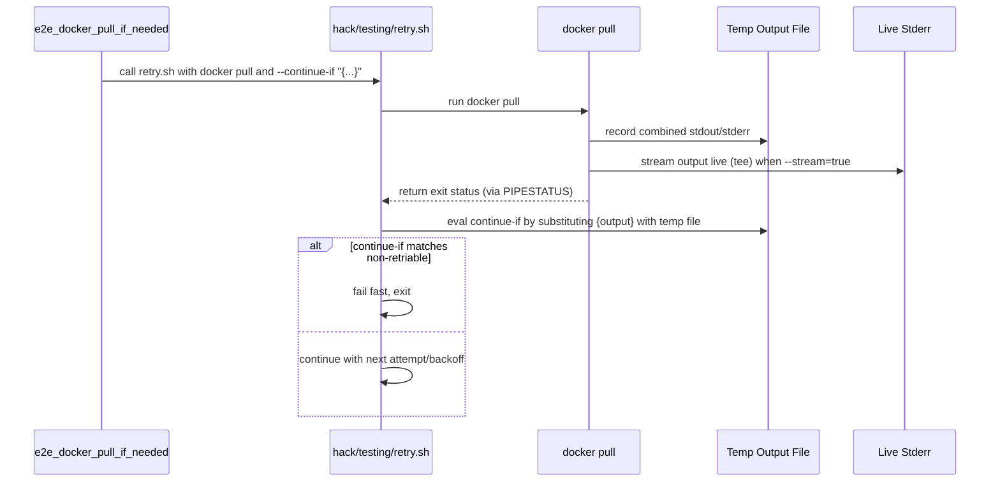

# PR #12033: cleanup: use retry.sh in e2e_docker_pull_if_needed

**Summary**: cleanup: use retry.sh in e2e_docker_pull_if_needed

**Sources**: https://github.com/kubernetes-sigs/kueue/pull/12033

**Last updated**: 2026-06-10T12:00:33Z

---

## Metadata

- **State**: closed (merged)
- **Author**: [@ivnovakov](https://github.com/ivnovakov)
- **Branch**: `cleanup/e2e-docker-pull-use-retry-sh` → `main`
- **Created**: 2026-06-09T12:30:43Z
- **Updated**: 2026-06-10T12:00:33Z
- **Merged**: 2026-06-10T10:50:06Z
- **Closed**: 2026-06-10T10:50:06Z
- **Labels**: `lgtm`, `release-note-none`, `approved`, `size/M`, `kind/cleanup`, `cncf-cla: yes`
- **Assignees**: [@reruno](https://github.com/reruno)
- **Requested reviewers**: [@kannon92](https://github.com/kannon92), [@tenzen-y](https://github.com/tenzen-y), [@reruno](https://github.com/reruno)
- **Changed files**: 2   **+48 / -40**

## Description

<!--  Thanks for sending a pull request!  Here are some tips for you:

1. If this is your first time, please read our contributor guidelines: https://git.k8s.io/community/contributors/guide/first-contribution.md#your-first-contribution and developer guide https://git.k8s.io/community/contributors/devel/development.md#development-guide
2. Please label this pull request according to what type of issue you are addressing, especially if this is a release targeted pull request. For reference on required PR/issue labels, read here:
https://git.k8s.io/community/contributors/devel/sig-release/release.md#issuepr-kind-label
3. Ensure you have added or ran the appropriate tests for your PR: https://git.k8s.io/community/contributors/devel/sig-testing/testing.md
4. If you want *faster* PR reviews, read how: https://git.k8s.io/community/contributors/guide/pull-requests.md#best-practices-for-faster-reviews
5. If the PR is unfinished, see how to mark it: https://git.k8s.io/community/contributors/guide/pull-requests.md#marking-unfinished-pull-requests
-->

#### What type of PR is this?
/kind cleanup
<!--
Add one of the following kinds:
/kind bug
/kind cleanup
/kind documentation
/kind feature
/kind kep

Optionally add one or more of the following kinds if applicable:
/kind api-change
/kind deprecation
/kind failing-test
/kind flake
/kind regression

Please also consider setting the area:
/area tas
/area integrations
/area multikueue
/area dashboard
/area localization
/area testing
/area website
-->

#### What this PR does / why we need it:

Uses generalized `retry.sh` script in `e2e_docker_pull_if_needed`  func in `e2e-common.sh`.
To improve readability and consistency across all retries used in the scripts.

#### Which issue(s) this PR fixes:
<!--
*Automatically closes linked issue when PR is merged.
Usage: `Fixes #<issue number>`, or `Fixes (paste link of issue)`.
_If PR is about `failing-tests or flakes`, please post the related issues/tests in a comment and do not use `Fixes`_*
-->
Fixes #11887

#### Special notes for your reviewer:

Success
```bash
retry [1/7]: docker pull quay.io/prometheus-operator/prometheus-operator:v0.89.0
v0.89.0: Pulling from prometheus-operator/prometheus-operator
Digest: sha256:fea93ca9be807eee2f51f4d997b7a2bf073d4051d9012b45b3c84a7b9e8b3f25
Status: Image is up to date for quay.io/prometheus-operator/prometheus-operator:v0.89.0
quay.io/prometheus-operator/prometheus-operator:v0.89.0
```

Fail-fast
```bash
retry [1/7]: docker pull quay.io/prometheus-operator/prometheus-operator:v0.0.0-nonexistent
Error response from daemon: failed to resolve reference "quay.io/prometheus-operator/prometheus-operator:v0.0.0-nonexistent": quay.io/prometheus-operator/prometheus-operator:v0.0.0-nonexistent: not found
retry [1/7] failed
retry: aborting early as continue-if condition failed (fail-fast)
```

Recovered
```bash
retry [1/7]: docker pull quay.io/prometheus-operator/prometheus-operator:recover
Error response from daemon: net/http: TLS handshake timeout
retry [1/7] failed, retrying in 2s...
retry [2/7]: docker pull quay.io/prometheus-operator/prometheus-operator:recover
Error response from daemon: net/http: TLS handshake timeout
retry [2/7] failed, retrying in 4s...
retry [3/7]: docker pull quay.io/prometheus-operator/prometheus-operator:recover
Error response from daemon: net/http: TLS handshake timeout
retry [3/7] failed, retrying in 8s...
retry [4/7]: docker pull quay.io/prometheus-operator/prometheus-operator:recover
Status: Downloaded newer image for quay.io/prometheus-operator/prometheus-operator:recover
```

Eventually failed
```bash
retry [1/7]: docker pull quay.io/prometheus-operator/prometheus-operator:fail
Error response from daemon: net/http: TLS handshake timeout
retry [1/7] failed, retrying in 2s...
retry [2/7]: docker pull quay.io/prometheus-operator/prometheus-operator:fail
Error response from daemon: net/http: TLS handshake timeout
retry [2/7] failed, retrying in 4s...
retry [3/7]: docker pull quay.io/prometheus-operator/prometheus-operator:fail
Error response from daemon: net/http: TLS handshake timeout
retry [3/7] failed, retrying in 8s...
retry [4/7]: docker pull quay.io/prometheus-operator/prometheus-operator:fail
Error response from daemon: net/http: TLS handshake timeout
retry [4/7] failed, retrying in 16s...
retry [5/7]: docker pull quay.io/prometheus-operator/prometheus-operator:fail
Error response from daemon: net/http: TLS handshake timeout
retry [5/7] failed, retrying in 32s...
retry [6/7]: docker pull quay.io/prometheus-operator/prometheus-operator:fail
Error response from daemon: net/http: TLS handshake timeout
retry [6/7] failed, retrying in 64s...
retry [7/7]: docker pull quay.io/prometheus-operator/prometheus-operator:fail
Error response from daemon: net/http: TLS handshake timeout
retry [7/7] failed
```
#### Does this PR introduce a user-facing change?
<!--
If no, just write "NONE" in the release-note block below.
If yes, a release note is required:
Enter your extended release note in the block below. If the PR requires additional action from users switching to the new release, include the string "action required".
-->
```release-note
NONE
```


<!-- This is an auto-generated comment: release notes by coderabbit.ai -->
## Summary by CodeRabbit

* **Refactor**
  * Consolidated and simplified image-pull retry behavior to use a shared retry utility with improved exit handling.

* **Tests**
  * More robust image download retries (up to 7 attempts, exponential backoff, streaming).
  * Added fail-fast checks to detect and stop on non-retriable pull errors and capture per-attempt output for diagnostics.
<!-- end of auto-generated comment: release notes by coderabbit.ai -->

## Discussion

### Comment by [@netlify[bot]](https://github.com/apps/netlify) — 2026-06-09T12:30:49Z

### <span aria-hidden="true">✅</span> Deploy Preview for *kubernetes-sigs-kueue* ready!


|  Name | Link |
|:-:|------------------------|
|<span aria-hidden="true">🔨</span> Latest commit | 94f69bbf7aebe8897efcd669179be953c271e0da |
|<span aria-hidden="true">🔍</span> Latest deploy log | https://app.netlify.com/projects/kubernetes-sigs-kueue/deploys/6a293c34a481ca000828b99a |
|<span aria-hidden="true">😎</span> Deploy Preview | [https://deploy-preview-12033--kubernetes-sigs-kueue.netlify.app](https://deploy-preview-12033--kubernetes-sigs-kueue.netlify.app) |
|<span aria-hidden="true">📱</span> Preview on mobile | <details><summary> Toggle QR Code... </summary><br /><br /><br /><br />_Use your smartphone camera to open QR code link._</details> |
---
<!-- [kubernetes-sigs-kueue Preview](https://deploy-preview-12033--kubernetes-sigs-kueue.netlify.app) -->
_To edit notification comments on pull requests, go to your [Netlify project configuration](https://app.netlify.com/projects/kubernetes-sigs-kueue/configuration/notifications#deploy-notifications)._

### Comment by [@coderabbitai[bot]](https://github.com/apps/coderabbitai) — 2026-06-09T12:31:03Z

<!-- This is an auto-generated comment: summarize by coderabbit.ai -->
<!-- review_stack_entry_start -->

[](https://app.coderabbit.ai/change-stack/kubernetes-sigs/kueue/pull/12033?utm_source=github_walkthrough&utm_medium=github&utm_campaign=change_stack)

<!-- review_stack_entry_end -->
No actionable comments were generated in the recent review. 🎉

<details>
<summary>ℹ️ Recent review info</summary>

<details>
<summary>⚙️ Run configuration</summary>

**Configuration used**: defaults

**Review profile**: CHILL

**Plan**: Pro

**Run ID**: `30526e35-9f5a-4982-8c2e-825fc2c2dd5d`

</details>

<details>
<summary>📥 Commits</summary>

Reviewing files that changed from the base of the PR and between 678a322e45e2f6683be9e5f3d726391f63b73906 and 94f69bbf7aebe8897efcd669179be953c271e0da.

</details>

<details>
<summary>📒 Files selected for processing (2)</summary>

* `hack/testing/e2e-common.sh`
* `hack/testing/retry.sh`

</details>

<details>
<summary>🚧 Files skipped from review as they are similar to previous changes (2)</summary>

* hack/testing/e2e-common.sh
* hack/testing/retry.sh

</details>

</details>

---
<!-- walkthrough_start -->

<details>
<summary>📝 Walkthrough</summary>

## Walkthrough

The PR enhances `retry.sh` to capture each attempt’s combined output for `--continue-if` evaluation and refactors `e2e_docker_pull_if_needed` to use `retry.sh` with a non-retriable-error regex and configured backoff/streaming.

## Changes

**Centralized retry mechanism with intelligent failure handling**

|Layer / File(s)|Summary|
|---|---|
|**Enhanced `--continue-if` with output file inspection** <br> `hack/testing/retry.sh`|The `--continue-if` parameter now captures each attempt's combined stdout/stderr to a temp file, substitutes `{output}` with that file path for the condition command, optionally streams live output when `--stream` is set, derives attempt exit status from the pipeline, evaluates the condition on intermediate failures, and simplifies loop exit handling.|
|**Docker pull retry refactoring with non-retriable errors** <br> `hack/testing/e2e-common.sh`|`e2e_docker_pull_if_needed` replaces its manual retry loop with `retry.sh`, defines `non_retriable_errors` regexes, and invokes `retry.sh` with `--attempts 7 --delay 2 --exponential --stream --continue-if` that greps `{output}` to abort on non-retriable pull errors.|

## Sequence Diagram(s)



## Estimated code review effort

🎯 3 (Moderate) | ⏱️ ~25 minutes

## Possibly related PRs

- [kubernetes-sigs/kueue#11992](https://github.com/kubernetes-sigs/kueue/pull/11992): Modifies `hack/testing/retry.sh`'s retry-loop behavior and relates to output/continue-if handling.

## Suggested reviewers

- kannon92

> 🐰 I watched the retries dance and sing,  
> Each try writes its tale into a ring,  
> Non-retriable lines now stop the spin,  
> Docker pulls retry with a wiser grin,  
> Hooray, quiet logs — success hops in!

</details>

<!-- walkthrough_end -->
<!-- pre_merge_checks_walkthrough_start -->

<details>
<summary>🚥 Pre-merge checks | ✅ 4 | ❌ 1</summary>

### ❌ Failed checks (1 warning)

|     Check name     | Status     | Explanation                                                                           | Resolution                                                                         |
| :----------------: | :--------- | :------------------------------------------------------------------------------------ | :--------------------------------------------------------------------------------- |
| Docstring Coverage | ⚠️ Warning | Docstring coverage is 50.00% which is insufficient. The required threshold is 80.00%. | Write docstrings for the functions missing them to satisfy the coverage threshold. |

<details>
<summary>✅ Passed checks (4 passed)</summary>

|         Check name         | Status   | Explanation                                                                                                                                                  |
| :------------------------: | :------- | :----------------------------------------------------------------------------------------------------------------------------------------------------------- |
|      Description Check     | ✅ Passed | Check skipped - CodeRabbit’s high-level summary is enabled.                                                                                                  |
|         Title check        | ✅ Passed | The title clearly describes the main change: replacing retry logic in e2e_docker_pull_if_needed with the retry.sh helper script.                             |
|     Linked Issues check    | ✅ Passed | Both objectives from issue `#11887` are met: e2e_docker_pull_if_needed now uses retry.sh instead of custom retry logic, improving readability and consistency. |
| Out of Scope Changes check | ✅ Passed | All changes are scoped to the stated objective: modifications to e2e-common.sh and retry.sh are directly related to consolidating retry logic as required.   |

</details>

<sub>✏️ Tip: You can configure your own custom pre-merge checks in the settings.</sub>

</details>

<!-- pre_merge_checks_walkthrough_end -->
<!-- finishing_touch_checkbox_start -->

<details>
<summary>✨ Finishing Touches</summary>

<details>
<summary>🧪 Generate unit tests (beta)</summary>

- [ ] <!-- {"checkboxId": "f47ac10b-58cc-4372-a567-0e02b2c3d479", "radioGroupId": "utg-output-choice-group-unknown_comment_id"} -->   Create PR with unit tests

</details>

</details>

<!-- finishing_touch_checkbox_end -->
<!-- tips_start -->

---


<sub>Comment `@coderabbitai help` to get the list of available commands and usage tips.</sub>

<!-- tips_end -->
<!-- internal state start -->


<!-- DwQgtGAEAqAWCWBnSTIEMB26CuAXA9mAOYCmGJATmriQCaQDG+Ats2bgFyQAOFk+AIwBWJBrngA3EsgEBPRvlqU0AgfFwA6NPEgQAfACgjoCEYDEZyAAUASpETZWaCrKPR1AGxJcGXzNm4ubEQSSAoSXBcNRFgULBIAJhIAfVp8BgBrSmTubA8PZPgAM2TyOjpISAMAOUcBSi4ARgSABgBmNsqDAFUbABkuWFxcbkQOAHpxonVYbAENJmZxjLnKchpEMER4IkRl7BID8dz88eb2zqrukIouSQx8CTQMx66AZXxsCgZQgSoMBiwHx+DABcaJEhgNKZShgE4eMDBSHhSKyLaxQBJhDBnKRcJA/phAVxmNosFU3rhqMEuPhuGRIAAKBjhagVVoJABsYBaXJaAE5oM0OG0WhwACxtABaAEoujYSBJ4CQAO6UMaQDKYB4YPkJAA0kBoGAAXmQwLIDeEKNgHl0+ioSB51eE/CEwA8aO78OQDWhuLxHnQDdtTeMALIGjLwDC0ca+Ej+bgGhgAopgXxoLiyaRGAAi0mZ8G44m9HAMUHl3A8aB+yFwsFCKJckA8+GmDDi2yUhobkAhqXSWQoOTyBWKpRI5XoRRtYng3rikFgNYy4w24gwRHBSXTLGY3uisWVMx7oVI5CoHngpvoTdkh/sheLhvwKGYAakYQTtBU8CvuHkTB6CYDBtkQI0GEA5l8EQZBECfXBEA0ctrAoR54CUZASAADzQd8vH4PBckQyAlH3UDImoaMiHxEhl0VfAKHVBwGFrRAZw8HhRwNIptARXjwMgZUGywNAFAwDcDjAYpxNodR5ywXi/0QS1REDcJbwiCglWQNAihoPhKNApUJL7Cg0KY30Yz7KQJOwNBOKUjwvlCPSDL7bDl2CDcaKbHTkIrEgikoMha0gAAxeBsOkSAzEaRoAA4EoAdgCyB5VdUIPW8SBqgAeWqABRZCDAsSA8uEURxCkZAijQ5gW2jLJ6CQBwcwMcL6pQWCDli+KkuSstAqrGtQnrRstPkGcARLDAHPUeRo1PPskgHGFh3hQoSjKJRp1nWbFwhXdWAPGIhJPcbIHIZVIHPZQrxvL9UQfeDtOLNKAEl3zQz8WR/NR/0A6yQLAiCoLQ2D0HyJ7m2CNBSGQJbLvCbgYPURjZAAcjghCZHkEH8CvH8fJh+RW3bOICGWmJnAqO8HzwP8FpKsqAGE93YODHBJFwjCgZh4H3ZV8C4eVFRVCogPQf0foqBlxj9D8SGlA1svoMTECjBrW3wZrbvwRR0GspRgvMioimjBzID6ABxaAwxfSAAAErRtfAAG4vwARwOcCKkBSgXG4eBMlqxiv0y7kNESo3NMjlpo9SlCMgSzZozqtB0wbczZGDzIwDQgR8E4SAKVZFq8WPaGA5zuEQ4yZbbEdl0EzdBPGmS2OI9byF24S9B9MoSA2AoUgu7QWCdiwcIHA8EnbDrV8BaF/A0pTzYGHgAvBGLrgrBgmh1dEmXHitj1ihDqiFwZABBKxbDygA1G++ny6APvCj7CpsWVozkhgqKbkbnYVAitZZH3oFeP26sT5SCYnEXw2A5JAMumgPAsBw4MnuKfF4EhZRS2XvgYWnsPwYQqFeDAGRF74mLgoJwMZdLWSbgGNipF0iOHYFfDAaUwwRDQMTTMMBexN1QDzPWYDAz0DkF+cWqp4FSzQQQEkh8aGIU9oQ4W3UrrF0lnWXsEi4GQCKOHZcmQ1zSB8uMPKAB1IqNg3iMGzkHeuS4gIUKICVfQxhwBQDIPQfARQcAEGIGQZQKjFhsAklwXg/BKpzhqvifGihlCqHUFoHQXiTBQDgKgUBok8CEDulQcJHMolhDQDdBwThmzSKYEoKgqTNDaF0GAQw3jTAGFMaudc1FtyQgiadIEBgABEozSqWBvh9EJF5y72G5s4eQATHGYARkYAABv2aEQ4Rz5C2hOKcayvwjTCuoGQ0hUZZEgGs4xFA1njDWYgLwJBuBrLAAICeFQ1lbKHvCQ5d4WwG24Odes6BGAOU4lTS6NMNJXK6eY8CvT6YxEOQ2DwdIKAaCEaEaac4FwPBuibaMMUxJrO1MkPyKgvDJEDoxRAfySCkGwo1QSUtuATxCLpK5EAQKSUhMUQ5IE5IHSpmspFsBDmIFfH5GK4FaRCREsteEZkLKERGHgYe1AA56Jgllb0BctLwEpaENlww1hIXSpNWi9F5x8FQOEECFsiAuXoCKiA1AaDvhIp3CAShqzyASC0nCqNyASUNZxCA4EWTMDWVZegXzBw/NHJAYZAASQW8MSDDMOagHCog8AVEVCSsVhyFwJkBKTdAprPWYrgMa7S4cSSgitu6kgnrxifDVXiZcMZ3EGmVM4DA1EAVEGmJuWNHkqwh3UNojA+rIiGoEARBMFAPBohwtO8mId0DhC/PuKQtASpGHMBMueYSFLUMukoDMxTz38ECUGxiKjw65EXVu9g8l2pQGqN6EgJU+hEuQICFZdAuAAGoACs4wwAJHA0YQqCLlH+2STIpUN0go3JLrwuSjgRljPLB0uFPTNzjDFWWUZwzxmQEmdMsJFQqk80WYEoDm52prMIxYxFk1DyHICMTGKrzdyhtBHyoohz6jWvDlTABxYXJ9hrLEFtnrACYBIBlgahyD0HAmkPA4wtOB0pq+MSHqgUWwIlLFG1YfhXIAN4duIgAX2zVgS6pDdpGL4mAASeJWZhlzMC2I9ZqCGlbSZv8xrqCwBrb2VFQKaDYTxPithDAOEST0UF6TuBnWquIloj0PBtISUltZZg3laKdjpGIAthqbN2bwI5xkUsbn9ooG5q8n5C1cq2JEBM0bpSYo+s53s/ydZJnlfSATPLoxSX5VokIeIoUIS/EwFryBavzdfJdYzRiwuexkgJyNPWAC8kQDjZt0k6V8c2UDzcnHo0Iix1MVDW47PT5lGqfmEmF+w4hobKm0iTadkLexbdMyQcd076mSBiqgqtz5114nAlSWqXUXNFkdESxkayrAfSsIVN40Ab7QG6G8NZfXypYGjAZNgclWTub/C5FS12bIOXshsZaDIHACARZlw+soJvel5dJUTE6Z7bAXB1jZTwPCHIUUXCgJFl2rv8x5addTQhrMaNmwJl1BXyQXE5c1taAW0hU32GMYAAlgBG64ntQ7UDbHwhfOjG3eyABwCasLLYd4icnQQAuATD2kIgDNWjeCU4qNGLsY1ezW6lgtt6eJZzeiFQpcF8gNnYWnZrge7lwWVuMyRJyh6j1lRvqem93oL29ivdWcvoE70TsfU9vgL6rwdnfeIT9uVXwPvl3QY4cxW9m/EB35AHPUWcVekWXAntbQ4tmuMMPFBeJWe2EQOamWZ7LJY7QPrRh/3kEA920gtAwMSig40WDBh4PiEQ8BZD4RZF9iKBhrgAAJHYsBcMUfw20rJZv/GBKKKFKhLFJIasDsBcBUCVLzI1JJL1IqBqBNIZKtIGB/45KIyMJBLAEzIlLgFlJKCUhhZ37diLqDhzLVLyD/AIyJIKDwGNLpItJtIADa1mwyVBJAH0tAwyHAbBwGyQbQCQDARQbQfIbQRQHIyUaAmaeowyJqsA3Bwy7GCKxGR0Ay3CMQwyMhiO8u++maHAyUfIMhfiuh3BCUYoWhMBsgChGyq03yG0o4eyO0dATmkQig2AYUJKZKFKi6KQNKTE9KjKzKeI5mzylm0OvYja9knEw2gKyuRaXGyKcQEg6QXC4kjqWWx4IKAmimxYyA3qUIjoaA/qga2Ewa76VsEa3WeEayu2eI1ode8a60XE0MAAOqmumqQG0TxjGEPKKgkeKl3EiMgPzkJtNsLpkbEGskQCjLoF7PAIVCWoYmsrZkRHVoclTLwAqOwEYl8ONHwNKsgMJPSJdM9solqjOnOtpEas0Y5HxLJiagZKBBoJocMmrgAEKtiZDsz4Tw5WE8HU7wCODDL2Z6isHsGcEKHsHJAJRoB8hoDxTgYJQMACDtAvFyEKFKGWJiovHaG4AmHCiNBGExj4kdAWEUEKGFTxZ+J3adaTbCZC4lrFgKRJYpaUjCqviYSFj1BgoyYFY0RloKZe6m4PZEr+KrHragog5hbBhzDc6MwoK9jLFrb1YEBZBYATE9hBag48ARbjrhA+zwB8mdYHbVEvaTjZbqpta/ovHvGfEZDfFVi/EKGtjKjAmgm8EsYQk8FQktAtBFC0CNC0AMC0AShFB8hokRYYkrjwpYn9E4mUg6FErcHJQtBEm0D4nnBkkMYKE3y0C0B1ghaeZfYZb3HOTMDqY0Q3K0kC5TYiYxoILOTII0RbbMgJgHQalrKFQAAaH00AAqIIAQyYamop322muAumuA9SfAf28kY6/ATJ3oVsVpRijEzWTZkAEuNAJAhyRxWA+2VRzAx21o25jIGpiOmWdYzw9IdULAVy2OuO+OhOxOpO46TknmE8eICoLOqRC4i+AJtOTkDONB9Rg6QCkuDkMug8+xoRNYQ6Sp4p9WGpm2IW22BEchzxMhtpg4DpXgGeAEGJH+bpYJwGXpHppAyQyURQyU9Q9QHI4G4hDAEZ9YUZZiRGW42JWhCZeJSZHAjQbQ5hwyxhPFfFCUWZCyChrMR+4RE0qIxu3AwpLAjpB04maADEfAkqy0Fsc0/EdxO6bAsEweOaAspqLUxk3Yl0Me1kceU+UM/asgwx8OkAWebkQ8FlsR1JGFrxySHx2FiluFC0zpRCwJAAuu0r4tZEskATRqAXfngSXAQXxEhiQXaeQQxuUixnjLQSkogQwZkj4nQsZYUPmeSgqKhnQMkLiYwWFZAC0GKAxS0IIf6RyC0MlLQMlAwByCGYlOIXpG0AlJOGgCoCKAIAlAkEkGKFVX/hITCQIeNeBokOIRyAlG0PUHyCQPRW0G1ZyCIY0OIStclCITyJNflXyHVRyHyKoFRVIfUElHyMlEFMGRyOdR3BdSQHyOBm0AwAkMlI0CQC0D+FVagflREuoEVYgCVbIuVX4sdRAPlikCPORQHKHBVVxYDdZgYJUMMkgLYD5TCLQN8ZErgPvNAtwe5k6GDhjcmkgHlHAtpHmWQKTbxOTXqJTcMtCJGtROzHAhmgNo8Q5GXDQKTejZUJjZib0qoXuIMkLZTSLcmgQJSB4OFPtOeqTfqDLSLcMnPuetYjMLmOkBzZuIgKTY0OrfZpTSCazWrjYAgeoNYmhDQFYBQO4LgF4IzQ5CECzZjTEJ8B4LQLjRkLYG7czazXJLQDYDaHrQwBSHyYgJJaIBkKTSdhTZjaHeHRgM7V4HHZkInceZ7cmqnRHQWPHgpFnQnVwEzR7azRQs1B9D1NINHaTcMi0RgM3S0bgG3R3e3V3cANXeVa1AcHoK3V3Z3Z3RYJYHFIlClKLJavGImIuDYSkHYTsmONtJOLtIcjivPRLSdOoeKq3S3cPYfW3WVBnSQPvfKLJbPaCECktAvWtNsptOOE4bQBvbOFvTuGodxvvWVPmJPguS3QA3/lYJlPwBgErkiD2KgMZtWDQCuepXMMZSTFfZAAEN7L7CRPoPvQAFRYPWLLiVw+30CyCfCNSXJUzclX10A4McDN2b131L2P2r0HLv39KS270ooTygr/Ja2LmAyal4gAJYDckWajT0AakQNLLXS3QgHzSPR9HPSJF/2aDYO4OwCLR6KoDP3UPN3QCviCxKxfj8K/h8NSwgxIBgzoDQSQy54HEoMhCmXUy4waBD0j2H3ADjC920CFB116CaFV0fml3yizyISk1MHq3C2y3JpI0ZDVB4R6HJq/0ITMml1+ORPJrnnBA50HB52y2CWlHVjr4KSN2l32BRj+gVBQDsxKDW2NKm4IBECwBW5bET6WFaJkBGoHqpORPDL7hKCN3NagVEBdO5OMQ7CWweCl2xNsCN2cnF3egUay0W2y0RO5PRNTPxPDKn2OLx3DMa0ZNG1cBJ05Ma1BoFNcKN1G7D4ESz0rryCzPwD1A0kkhLTMakCQEwWbxAIxEUxLSbIJr2G7JP1r0VBIVDb9FLiOjoqPjx4YXq2Y29MbMDPUS7OY32rejpHhBB2V1pPDKjOjoOSTNxON1XOZqm3HMrMa1rNEtcDDL756y11tSH47PHNe1smZOHO51wvJqnOYDnM0tvHFyxCCAiDxIxQ3kNT92hAT0DTbqhBsAlx/PrTL2OHAv0CJZDGkwPgR40D8L17JayoNTfMhwGj6M/RDp/TGMLRdxmN+wAj3govJoIv9MDrIssvJposYAYvxMV3J3dN4vjOEvTM0ueMMu+w3ywSB6E0LMi1LMi0UuY1UtBvJp5TqpLJvBMB0iQCSXAZMvZ1uvDL7NZO+u5M8uFPzM0ul6cSvPEo7rwS0gVBA6hDnlPZxLVQ5S9MXwAKzTULb3kQPghEKMKY7pyT2ou2UGFEqJSYV6EwYSAK+SWqbodicP6nYCGl0Cws4tOs0tIubgOtsFqSes7AuRYvFsa3+vaWBsbMdp5RFDpv1vZsZXhscqIBRtkvhNcuvENiZDrON2R0G00Rc3KCkB7uFvl3u2nuY2lt8sJP63zpAJMDc1jyoDgYJy+kACk8qIcsQuSoE2Az+U67AUWE0BpMK9YM8GCvtWiCUqHLQaHG73TM8hMjM5byadt6goQ7NcHuwcDmlytFew8rUQ640DUVMQe4g7E8gOu6kweZH0gFHnT+bW7yaO7Qz+b57BLX7MT1L+dsHMd0blQZtlQwVedwyHuRNNgiTczGAjdDAyUYoCUVFwZ4GiUrV/pCQd19FI1KgwhJAI1T181YoyUHI/FfIDVtADnDAtVohfIDAbQLnkXLQ1HjQHIYoAgXTpnH5tgp9jdjQDAYo4GCQEop1YoHIghAgYoDAfIKX8JMJP1FXYofFyUCQKJAgRQLVVXo181bQwX4G5XAgfIcJtARQ9FnVHIHcCQFGZtQNsNmxyQCNKQ0T4N0NeVsNQBOQaCIQKNrIW38uaNGX4EVgG3dAN8uAYsZV+Ne46g7MNouA3BLQU3f+a3bKSIW3NA1K1kK3UAi+2lr3KQD+SACkO3eIXiBgrBM5NApFLQjQa1Ag8UXIhXYofIYAKZkhYAoXbXYA1HCQKUJA0PFXdnwJ1V33Dkv3ENAP3o739A+gQAA== -->

<!-- internal state end -->

### Comment by [@mimowo](https://github.com/mimowo) — 2026-06-09T13:01:32Z

Thank you 👍 I skimmed through and it lgtm, but I would like another pair of eyes on it, so leaving lgtm to @reruno 
/approve
/cherrypick release-0.18
/cherrypick release-0.17

### Comment by [@k8s-infra-cherrypick-robot](https://github.com/k8s-infra-cherrypick-robot) — 2026-06-09T13:01:35Z

@mimowo: once the present PR merges, I will cherry-pick it on top of `release-0.17`, `release-0.18` in new PRs and assign them to you.

<details>

In response to [this](https://github.com/kubernetes-sigs/kueue/pull/12033#issuecomment-4659973346):

>Thank you 👍 I skimmed through and it lgtm, but I would like another pair of eyes on it, so leaving lgtm to @reruno 
>/approve
>/cherrypick release-0.18
>/cherrypick release-0.17
>


Instructions for interacting with me using PR comments are available [here](https://git.k8s.io/community/contributors/guide/pull-requests.md).  If you have questions or suggestions related to my behavior, please file an issue against the [kubernetes-sigs/prow](https://github.com/kubernetes-sigs/prow/issues/new?title=Prow%20issue:) repository.
</details>

### Comment by [@k8s-ci-robot](https://github.com/k8s-ci-robot) — 2026-06-09T13:01:43Z

[APPROVALNOTIFIER] This PR is **APPROVED**

This pull-request has been approved by: *<a href="https://github.com/kubernetes-sigs/kueue/pull/12033#" title="Author self-approved">ivnovakov</a>*, *<a href="https://github.com/kubernetes-sigs/kueue/pull/12033#issuecomment-4659973346" title="Approved">mimowo</a>*

The full list of commands accepted by this bot can be found [here](https://go.k8s.io/bot-commands?repo=kubernetes-sigs%2Fkueue).

The pull request process is described [here](https://git.k8s.io/community/contributors/guide/owners.md#the-code-review-process)

<details >
Needs approval from an approver in each of these files:

- ~~[hack/testing/OWNERS](https://github.com/kubernetes-sigs/kueue/blob/main/hack/testing/OWNERS)~~ [mimowo]

Approvers can indicate their approval by writing `/approve` in a comment
Approvers can cancel approval by writing `/approve cancel` in a comment
</details>
<!-- META={"approvers":[]} -->

### Comment by [@reruno](https://github.com/reruno) — 2026-06-10T10:33:51Z

/lgtm 

Thank you!

### Comment by [@k8s-ci-robot](https://github.com/k8s-ci-robot) — 2026-06-10T10:33:59Z

LGTM label has been added.  <details>Git tree hash: d213ccfc7652b743194a668533d863df4b231bb1</details>

### Comment by [@k8s-infra-cherrypick-robot](https://github.com/k8s-infra-cherrypick-robot) — 2026-06-10T10:50:46Z

@mimowo: new pull request created: #12060

<details>

In response to [this](https://github.com/kubernetes-sigs/kueue/pull/12033#issuecomment-4659973346):

>Thank you 👍 I skimmed through and it lgtm, but I would like another pair of eyes on it, so leaving lgtm to @reruno 
>/approve
>/cherrypick release-0.18
>/cherrypick release-0.17
>


Instructions for interacting with me using PR comments are available [here](https://git.k8s.io/community/contributors/guide/pull-requests.md).  If you have questions or suggestions related to my behavior, please file an issue against the [kubernetes-sigs/prow](https://github.com/kubernetes-sigs/prow/issues/new?title=Prow%20issue:) repository.
</details>

### Comment by [@k8s-infra-cherrypick-robot](https://github.com/k8s-infra-cherrypick-robot) — 2026-06-10T10:51:24Z

@mimowo: new pull request created: #12061

<details>

In response to [this](https://github.com/kubernetes-sigs/kueue/pull/12033#issuecomment-4659973346):

>Thank you 👍 I skimmed through and it lgtm, but I would like another pair of eyes on it, so leaving lgtm to @reruno 
>/approve
>/cherrypick release-0.18
>/cherrypick release-0.17
>


Instructions for interacting with me using PR comments are available [here](https://git.k8s.io/community/contributors/guide/pull-requests.md).  If you have questions or suggestions related to my behavior, please file an issue against the [kubernetes-sigs/prow](https://github.com/kubernetes-sigs/prow/issues/new?title=Prow%20issue:) repository.
</details>

## Reviews

### Review by [@reruno](https://github.com/reruno) (commented) — 2026-06-09T13:07:03Z

- **hack/testing/e2e-common.sh:84** by [@reruno](https://github.com/reruno) — 2026-06-09T13:07:03Z
```diff
@@ -76,32 +76,12 @@ function e2e_docker_pull_if_needed {
         return 0
     fi
 
-    local max_retries=7
-    local retry_delay=2
-    local attempt output
-    for attempt in $(seq 1 "$max_retries"); do
-        if output=$(docker pull "$image" 2>&1); then
-            echo "$output"
-            return 0
-        fi
-        echo "$output"
-
-        if echo "$output" | grep -qiE 'manifest (unknown|for .* not found)|repository does not exist|not found|pull access denied|unauthorized|denied: requested access|no space left on device'; then
-            echo "ERROR: docker pull '$image' failed with a non-retriable error."
-            return 1
-        fi
-
-        if [ "$attempt" -eq "$max_retries" ]; then
-            break
-        fi
-
-        echo "WARNING: docker pull '$image' failed (attempt $attempt/$max_retries). Retrying in ${retry_delay}s..."
-        sleep "$retry_delay"
-        retry_delay=$((retry_delay * 2))
-    done
+    local non_retriable_errors="manifest (unknown|for .* not found)|repository does not exist|not found|pull access denied|unauthorized|denied: requested access|no space left on device"
 
-    echo "ERROR: Failed to pull '$image' after $max_retries attempts."
-    return 1
+    "${ROOT_DIR}/hack/testing/retry.sh" \
+        --attempts 7 --delay 2 --exponential \
+        --continue-if "! grep -qiE '${non_retriable_errors}' {}" \
+        -- docker pull "$image"
```

  There is no value assignment from stdout, please add `--stream` flag

### Review by [@reruno](https://github.com/reruno) (commented) — 2026-06-09T13:13:45Z

- **hack/testing/retry.sh:107** by [@reruno](https://github.com/reruno) — 2026-06-09T13:13:45Z
```diff
@@ -64,34 +66,49 @@ if [ $# -eq 0 ]; then
     exit 2
 fi
 
+# When a continue-if check is provided, capture each attempt's combined output to
+# a temp file so the check can inspect why the attempt failed (via the '{}' token),
+# while still streaming the output live to stderr.
+out=""
+out_file=""
+if [ -n "$continue_if" ]; then
+    out_file=$(mktemp) || exit 2
+    trap 'rm -f "$out_file"' EXIT
+fi
+
 for i in $(seq 1 "$attempts"); do
     echo "retry [$i/$attempts]: $*" 1>&2
-    if [ "$stream" = "true" ]; then
+    if [ -n "$out_file" ]; then
+        # continue-if needs the output: stream it live to stderr AND capture it to
+        # the temp file so the check can inspect it via the '{}' token.
+        "$@" 2>&1 | tee "$out_file" >&2
+        status=${PIPESTATUS[0]}
+    elif [ "$stream" = "true" ]; then
         # Forward stdout/stderr live; nothing is captured or echoed.
-        if "$@"; then
-            exit 0
-        fi
-    elif out=$("$@"); then
+        "$@"
+        status=$?
+    else
         # Capture stdout and echo it only on success, so failed-attempt output
         # never pollutes a $(shell ...) caller that captures the result.
-        printf '%s' "$out"
-        exit 0
+        out=$("$@")
+        status=$?
     fi
-    if [ "$i" -lt "$attempts" ]; then
-        echo "retry [$i/$attempts] failed, retrying in ${delay}s..." 1>&2
-    else
-        echo "retry [$i/$attempts] failed" 1>&2
+    if [ "$status" -eq 0 ]; then
+        [ -n "$out_file" ] || [ "$stream" = "true" ] || printf '%s' "$out"
+        exit 0
```

  nit: 
  maybe add [ -n "$out_file" ] || [ "$stream" = "true" ] conditions to the if [ "$status" -eq 0 ] section 
  
  something like this: [ "$status" -eq 0 ] && [ -z "$out_file" ] && [ "$stream" != "true" ]

### Review by [@reruno](https://github.com/reruno) (commented) — 2026-06-09T13:16:34Z

- **hack/testing/retry.sh:85** by [@reruno](https://github.com/reruno) — 2026-06-09T13:16:34Z
```diff
@@ -64,34 +66,49 @@ if [ $# -eq 0 ]; then
     exit 2
 fi
 
+# When a continue-if check is provided, capture each attempt's combined output to
+# a temp file so the check can inspect why the attempt failed (via the '{}' token),
+# while still streaming the output live to stderr.
+out=""
+out_file=""
+if [ -n "$continue_if" ]; then
+    out_file=$(mktemp) || exit 2
+    trap 'rm -f "$out_file"' EXIT
+fi
+
 for i in $(seq 1 "$attempts"); do
     echo "retry [$i/$attempts]: $*" 1>&2
-    if [ "$stream" = "true" ]; then
+    if [ -n "$out_file" ]; then
+        # continue-if needs the output: stream it live to stderr AND capture it to
+        # the temp file so the check can inspect it via the '{}' token.
+        "$@" 2>&1 | tee "$out_file" >&2
+        status=${PIPESTATUS[0]}
```

  Why do we need $out_file?

### Review by [@ivnovakov](https://github.com/ivnovakov) (commented) — 2026-06-09T15:38:10Z

- **hack/testing/retry.sh:85** by [@ivnovakov](https://github.com/ivnovakov) — 2026-06-09T15:38:09Z
```diff
@@ -64,34 +66,49 @@ if [ $# -eq 0 ]; then
     exit 2
 fi
 
+# When a continue-if check is provided, capture each attempt's combined output to
+# a temp file so the check can inspect why the attempt failed (via the '{}' token),
+# while still streaming the output live to stderr.
+out=""
+out_file=""
+if [ -n "$continue_if" ]; then
+    out_file=$(mktemp) || exit 2
+    trap 'rm -f "$out_file"' EXIT
+fi
+
 for i in $(seq 1 "$attempts"); do
     echo "retry [$i/$attempts]: $*" 1>&2
-    if [ "$stream" = "true" ]; then
+    if [ -n "$out_file" ]; then
+        # continue-if needs the output: stream it live to stderr AND capture it to
+        # the temp file so the check can inspect it via the '{}' token.
+        "$@" 2>&1 | tee "$out_file" >&2
+        status=${PIPESTATUS[0]}
```

  It was introduced so --continue-if can inspect the failed attempt's output, where {} is replaced with "$out_file". The check greps it to fail fast on non-retriable errors.
  Capturing it here keeps every caller that needs fail-fast from doing its own output checking.

### Review by [@ivnovakov](https://github.com/ivnovakov) (commented) — 2026-06-09T16:13:28Z

- **hack/testing/retry.sh:107** by [@ivnovakov](https://github.com/ivnovakov) — 2026-06-09T16:13:28Z
```diff
@@ -64,34 +66,49 @@ if [ $# -eq 0 ]; then
     exit 2
 fi
 
+# When a continue-if check is provided, capture each attempt's combined output to
+# a temp file so the check can inspect why the attempt failed (via the '{}' token),
+# while still streaming the output live to stderr.
+out=""
+out_file=""
+if [ -n "$continue_if" ]; then
+    out_file=$(mktemp) || exit 2
+    trap 'rm -f "$out_file"' EXIT
+fi
+
 for i in $(seq 1 "$attempts"); do
     echo "retry [$i/$attempts]: $*" 1>&2
-    if [ "$stream" = "true" ]; then
+    if [ -n "$out_file" ]; then
+        # continue-if needs the output: stream it live to stderr AND capture it to
+        # the temp file so the check can inspect it via the '{}' token.
+        "$@" 2>&1 | tee "$out_file" >&2
+        status=${PIPESTATUS[0]}
+    elif [ "$stream" = "true" ]; then
         # Forward stdout/stderr live; nothing is captured or echoed.
-        if "$@"; then
-            exit 0
-        fi
-    elif out=$("$@"); then
+        "$@"
+        status=$?
+    else
         # Capture stdout and echo it only on success, so failed-attempt output
         # never pollutes a $(shell ...) caller that captures the result.
-        printf '%s' "$out"
-        exit 0
+        out=$("$@")
+        status=$?
     fi
-    if [ "$i" -lt "$attempts" ]; then
-        echo "retry [$i/$attempts] failed, retrying in ${delay}s..." 1>&2
-    else
-        echo "retry [$i/$attempts] failed" 1>&2
+    if [ "$status" -eq 0 ]; then
+        [ -n "$out_file" ] || [ "$stream" = "true" ] || printf '%s' "$out"
+        exit 0
```

  I'd keep them separate. Folding them into the [ "$status" -eq 0 ] check would skip exit 0 on success in continue-if and stream modes, so a successful command would be retried and reported as failed.

### Review by [@ivnovakov](https://github.com/ivnovakov) (commented) — 2026-06-09T17:10:25Z

- **hack/testing/e2e-common.sh:84** by [@ivnovakov](https://github.com/ivnovakov) — 2026-06-09T17:10:25Z
```diff
@@ -76,32 +76,12 @@ function e2e_docker_pull_if_needed {
         return 0
     fi
 
-    local max_retries=7
-    local retry_delay=2
-    local attempt output
-    for attempt in $(seq 1 "$max_retries"); do
-        if output=$(docker pull "$image" 2>&1); then
-            echo "$output"
-            return 0
-        fi
-        echo "$output"
-
-        if echo "$output" | grep -qiE 'manifest (unknown|for .* not found)|repository does not exist|not found|pull access denied|unauthorized|denied: requested access|no space left on device'; then
-            echo "ERROR: docker pull '$image' failed with a non-retriable error."
-            return 1
-        fi
-
-        if [ "$attempt" -eq "$max_retries" ]; then
-            break
-        fi
-
-        echo "WARNING: docker pull '$image' failed (attempt $attempt/$max_retries). Retrying in ${retry_delay}s..."
-        sleep "$retry_delay"
-        retry_delay=$((retry_delay * 2))
-    done
+    local non_retriable_errors="manifest (unknown|for .* not found)|repository does not exist|not found|pull access denied|unauthorized|denied: requested access|no space left on device"
 
-    echo "ERROR: Failed to pull '$image' after $max_retries attempts."
-    return 1
+    "${ROOT_DIR}/hack/testing/retry.sh" \
+        --attempts 7 --delay 2 --exponential \
+        --continue-if "! grep -qiE '${non_retriable_errors}' {}" \
+        -- docker pull "$image"
```

  Done. Made `--continue-if` and `--stream` orthogonal and added `--stream` here.
