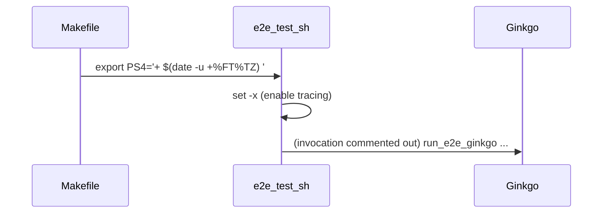

# PR #12071: Optimize test-multikueue-e2e-extended target.

**Summary**: Optimize test-multikueue-e2e-extended target.

**Sources**: https://github.com/kubernetes-sigs/kueue/pull/12071

**Last updated**: 2026-06-11T18:49:47Z

---

## Metadata

- **State**: closed (merged)
- **Author**: [@mbobrovskyi](https://github.com/mbobrovskyi)
- **Branch**: `cleanup/optimize-test-e2e-tas-extended-shard-0-main` → `main`
- **Created**: 2026-06-10T14:02:44Z
- **Updated**: 2026-06-11T18:49:47Z
- **Merged**: 2026-06-11T17:34:56Z
- **Closed**: 2026-06-11T17:34:56Z
- **Labels**: `lgtm`, `release-note-none`, `approved`, `kind/cleanup`, `size/XS`, `cncf-cla: yes`
- **Assignees**: [@mimowo](https://github.com/mimowo)
- **Requested reviewers**: [@mimowo](https://github.com/mimowo), [@kshalot](https://github.com/kshalot), [@tenzen-y](https://github.com/tenzen-y)
- **Changed files**: 1   **+1 / -3**

## Description

<!--  Thanks for sending a pull request!  Here are some tips for you:

1. If this is your first time, please read our contributor guidelines: https://git.k8s.io/community/contributors/guide/first-contribution.md#your-first-contribution and developer guide https://git.k8s.io/community/contributors/devel/development.md#development-guide
2. Please label this pull request according to what type of issue you are addressing, especially if this is a release targeted pull request. For reference on required PR/issue labels, read here:
https://git.k8s.io/community/contributors/devel/sig-release/release.md#issuepr-kind-label
3. Ensure you have added or ran the appropriate tests for your PR: https://git.k8s.io/community/contributors/devel/sig-testing/testing.md
4. If you want *faster* PR reviews, read how: https://git.k8s.io/community/contributors/guide/pull-requests.md#best-practices-for-faster-reviews
5. If the PR is unfinished, see how to mark it: https://git.k8s.io/community/contributors/guide/pull-requests.md#marking-unfinished-pull-requests
-->

#### What type of PR is this?
/kind cleanup

<!--
Add one of the following kinds:
/kind bug
/kind cleanup
/kind documentation
/kind feature
/kind kep

Optionally add one or more of the following kinds if applicable:
/kind api-change
/kind deprecation
/kind failing-test
/kind flake
/kind regression

Please also consider setting the area:
/area tas
/area integrations
/area multikueue
/area dashboard
/area localization
/area testing
/area website
-->

#### What this PR does / why we need it:
Optmize periodic-kueue-test-e2e-tas-extended-shard-0-main

#### Which issue(s) this PR fixes:
<!--
*Automatically closes linked issue when PR is merged.
Usage: `Fixes #<issue number>`, or `Fixes (paste link of issue)`.
_If PR is about `failing-tests or flakes`, please post the related issues/tests in a comment and do not use `Fixes`_*
-->
Fixes #12103

#### Special notes for your reviewer:

#### Does this PR introduce a user-facing change?
<!--
If no, just write "NONE" in the release-note block below.
If yes, a release note is required:
Enter your extended release note in the block below. If the PR requires additional action from users switching to the new release, include the string "action required".
-->
```release-note
NONE
```


<!-- This is an auto-generated comment: release notes by coderabbit.ai -->
## Summary by CodeRabbit

* **Tests**
  * Test scripts now emit verbose, timestamped command traces for clearer logs.
  * Automated end-to-end test execution and top-report generation have been disabled in the test workflow.
<!-- end of auto-generated comment: release notes by coderabbit.ai -->

## Discussion

### Comment by [@coderabbitai[bot]](https://github.com/apps/coderabbitai) — 2026-06-10T14:03:45Z

<!-- This is an auto-generated comment: summarize by coderabbit.ai -->
<!-- review_stack_entry_start -->

[](https://app.coderabbit.ai/change-stack/kubernetes-sigs/kueue/pull/12071?utm_source=github_walkthrough&utm_medium=github&utm_campaign=change_stack)

<!-- review_stack_entry_end -->
<!-- This is an auto-generated comment: review paused by coderabbit.ai -->

> [!NOTE]
> ## Reviews paused
> 
> It looks like this branch is under active development. To avoid overwhelming you with review comments due to an influx of new commits, CodeRabbit has automatically paused this review. You can configure this behavior by changing the `reviews.auto_review.auto_pause_after_reviewed_commits` setting.
> 
> Use the following commands to manage reviews:
> - `@coderabbitai resume` to resume automatic reviews.
> - `@coderabbitai review` to trigger a single review.
> 
> Use the checkboxes below for quick actions:
> - [ ] <!-- {"checkboxId": "7f6cc2e2-2e4e-497a-8c31-c9e4573e93d1"} --> ▶️ Resume reviews
> - [ ] <!-- {"checkboxId": "e9bb8d72-00e8-4f67-9cb2-caf3b22574fe"} --> 🔍 Trigger review

<!-- end of auto-generated comment: review paused by coderabbit.ai -->
<!-- walkthrough_start -->

<details>
<summary>📝 Walkthrough</summary>

## Walkthrough

Makefile-test.mk sets SHELL to /bin/bash, exports a timestamped PS4, and enables `.SHELLFLAGS := -xe -c`. hack/testing/e2e-test.sh sets a timestamped PS4, enables `set -x`, and comments out the `run_e2e_ginkgo` invocation and `ginkgo-top` report generation.

## Changes

**E2E Test Execution Control**

|Layer / File(s)|Summary|
|---|---|
|**Makefile: set shell and PS4** <br> `Makefile-test.mk`|Sets `SHELL := /bin/bash`, exports a timestamped `PS4`, and sets `.SHELLFLAGS := -xe -c` for traced, fail-fast make recipes.|
|**e2e script: enable tracing** <br> `hack/testing/e2e-test.sh`|Adds timestamped `PS4` including `BASH_SOURCE` and `LINENO`, and enables `set -x` to trace executed shell commands.|
|**e2e script: disable ginkgo run and top report** <br> `hack/testing/e2e-test.sh`|Comments out the `run_e2e_ginkgo` invocation and the `ginkgo-top` step that would produce `e2e-top.yaml`, preventing automatic e2e execution and top-report generation.|

## Sequence Diagram(s)



## Estimated code review effort

🎯 3 (Moderate) | ⏱️ ~20 minutes

## Suggested labels

`area/testing`, `area/tas`

## Suggested reviewers

- kshalot

## Poem

> 🐰 I stamp each trace with time and hop,  
> > Lines and sources in my log I crop.  
> > The test-run sleeps, the output stays,  
> > Quiet builds mark my busy days.  
> > Hooray for calm before the next top!

</details>

<!-- walkthrough_end -->
<!-- pre_merge_checks_walkthrough_start -->

<details>
<summary>🚥 Pre-merge checks | ✅ 3 | ❌ 2</summary>

### ❌ Failed checks (1 warning, 1 inconclusive)

|      Check name     | Status         | Explanation                                                                                                                                                                                                                                                                                                                           | Resolution                                                                                                                                                                                                               |
| :-----------------: | :------------- | :------------------------------------------------------------------------------------------------------------------------------------------------------------------------------------------------------------------------------------------------------------------------------------------------------------------------------------ | :----------------------------------------------------------------------------------------------------------------------------------------------------------------------------------------------------------------------- |
|     Title check     | ⚠️ Warning     | The title 'Optimize test-multikueue-e2e-extended target' does not accurately reflect the actual changes. The PR modifies hack/testing/e2e-test.sh and Makefile-test.mk by adding shell tracing and commenting out e2e test execution, but the title references 'test-multikueue-e2e-extended' which does not appear in the changeset. | Revise the title to accurately reflect the actual changes, such as 'Enable shell tracing and comment out e2e test execution in test scripts' or refer to the actual target name if modifying a specific Makefile target. |
| Linked Issues check | ❓ Inconclusive | Changes partially address the linked issue `#11989` objective to optimize the CI job by enabling debugging/tracing and commenting out e2e execution, but do not implement the suggested sharding extraction approach.                                                                                                                   | Clarify whether the debugging/tracing changes and commented-out tests represent the intended optimization strategy, or if additional sharding extraction is still needed to meet the sub-18-minute build time goal.      |

<details>
<summary>✅ Passed checks (3 passed)</summary>

|         Check name         | Status   | Explanation                                                                                                                                                                        |
| :------------------------: | :------- | :--------------------------------------------------------------------------------------------------------------------------------------------------------------------------------- |
| Out of Scope Changes check | ✅ Passed | All changes (shell tracing and commented-out e2e execution) are directly related to optimizing the periodic CI job as specified in issue `#11989`; no out-of-scope changes detected. |
|     Docstring Coverage     | ✅ Passed | No functions found in the changed files to evaluate docstring coverage. Skipping docstring coverage check.                                                                         |
|      Description Check     | ✅ Passed | Check skipped - CodeRabbit’s high-level summary is enabled.                                                                                                                        |

</details>

<sub>✏️ Tip: You can configure your own custom pre-merge checks in the settings.</sub>

</details>

<!-- pre_merge_checks_walkthrough_end -->
<!-- finishing_touch_checkbox_start -->

<details>
<summary>✨ Finishing Touches</summary>

<details>
<summary>🧪 Generate unit tests (beta)</summary>

- [ ] <!-- {"checkboxId": "f47ac10b-58cc-4372-a567-0e02b2c3d479", "radioGroupId": "utg-output-choice-group-unknown_comment_id"} -->   Create PR with unit tests

</details>

</details>

<!-- finishing_touch_checkbox_end -->
<!-- tips_start -->

---


<sub>Comment `@coderabbitai help` to get the list of available commands and usage tips.</sub>

<!-- tips_end -->
<!-- internal state start -->


<!-- DwQgtGAEAqAWCWBnSTIEMB26CuAXA9mAOYCmGJATmriQCaQDG+Ats2bgFyQAOFk+AIwBWJBrngA3EsgEBPRvlqU0AgfFwA6NPEgQAfACgjoCEYDEZyAAUASpETZWaCrIPR1AGxJcA6gEkrLgB5blxmeAAvEh5KeEV4BjAAa2wSVLAaRFwwEgAmEgy0RByADxoMJVowRFhnKoAGMGZtLEgDADlHAUouAEZc+oB2Xsg2gFUbABkuWFxcbkQOAHolonVYbAENJmYllO6Kckzq+CJEPdTUpe5sDw8l/qGRtoBBPFh8Ci5mAUEKfAkiCSsh0bQAyvhsBQGNEBFQMAxYFwGF5MNhuEt8KF4OEohlpNk8gVcEVSuVKtVahQGk0WpBAEmEMGcpFwkDhmER3zp4JJuGwi343DIowMkxUJA8AooEpIRQKGHwNDACvIABp0NxeAC6OqkvAKksUbKMOj1bRCArsmwKKQlgB3T5JMD6sBaojSxCIdUMBEAMzAKLQXFk0nViEiJCWYJFNhIEngJDtlAFSRqaA8ivV5SiGDA8jaAGFpdQ6FwBrkAGxgepV3r1aC9AAsHHquQ4jcbAC0jAARaQMCjwbH4DBcAuok3cax2AiC8S46K4WDRAt+SBCQSQABEQsH8USKTSxIJOXyhWKJDKZApaep1dp+q3Ghgy+nkGlvsoZBhyF98BK+pECgnqpJAZi9L0ACcAAckHoBUKAVAkJbIEu0REPg6bAZAs5YvOEY4bUrK7nEtAJOugjPu0+D2EKDDwFhlrSPwfD8pQYC+mg9EYEBiKYKQiAANzvjKcrKoq3iQO0QTtAAoho5iWEEwiiOIUi/v8zCQB4+pJHQwEONIoq6fpSCGWBEEwXB0oAI6pFkyB4TikSAYR0QkfukCrhRAjbh5ZEHpcx5ZKexKkpe5J0JSdT3s0j7PnA0QOEQAk0PQaCav8XGwNhs4RVQYjwegtBkeII5Ybe9AABS+lCaF8JVgEAJSQL6nyEdQPkJa+WQlvQggiGIkjRKgs7SrQ2Awu+2AYPOi40dlCZSGy2DwB49BzTIEr4HakC9NBkDhCamTqh+X4Iq5vBxHwu5tRQzQIuhmGSpAVVmaB4G9BWNZNd1i5FEk2EMCWGGDlE6XIGgjATuirX4AwbH9Vg42Ta53kUDNc1svIaC0EI/LiDxOEEksG6+Y1PEKQYFheSwbCzcgDhOC4BhQEk0HFPRYD/L8xH4Fk+mYBqWoSIxirwH+wNlVgzQUHqRNoW+RSQC8Vi2EEABqsk9s+bRQIlwv/KLHjYdKTDUoLkP2BK/oZSLWFyG5OBLu1VU/H8AJAiCv0ivrr684d0iIGgpCISi2BKMgOkYKmOE0QHOwPfQ5oI/TvJxFgmAba+0rcPz6ifLIADkyBMEoInxomPD/D+iC66zL6woqkBMZDmXanwtmrdKacaSwkBBD4ck2NGf5eJDCFndKj0T4bHeQOwLive7cKe8C8AtXdTv0WlA9D7JI+tWtJBU/oxjgFA178L6zuEKQ5BULvifsFwvD8CpQ3qdjChKFQqjqFoHQZ8TB+1QKgIWaA8B3zIMoJ+dMX7vjQLtJmst5COzLsof+mhtC6DAIYc+pgDC1AYEkJYmRCZECWESfEWQNA1A4AYLcTDqaWBeH4YgMDH76RQc4eQ+Ab58R4kZAwfgsAAANiGkPIYBKhZ5yF0NgGIrMPUBxDlZAqXaZAVDjwUE4BCuACquSqmIxAJBWRgBKGIlqdp1joBwjiAkaBmBCnoGIqwYJGxiOriQP8JRnwvBKuoDO6YPCyGUdEAA4rpDCC98jEyyAvEoog8AZ1emIjGGAAD6RJMlrBjjEjQhSrHwWzklTYpi7LsEgGIvJSQMIZCxF4++sDUn8OqdQgg3ANCyCcR4LxzhojP1mvpSEuAww0UVogVRoQW40QzEIzuM1UKviJPYVaNAWLV0UJNZiitzYejzkhBWWIRJ5woKyNAvoaANTMeiKmRhFIqw8Nc6gGdUITNfEoQMj83nX0SWc3e7UbgCB0gwBes0gnCOknJIwkx9TMUEaQWgXAADU0ElhgFyEYWSWQcR9R/tEaUldNG+jupwSAABZOg8BHCMOYazQhFK0B6THsFTQzAkgMKYVuFhKt2HNK4fQHhS82mIuEWIplLLj40PZUkLxGi4bQmYiEkS9EhS6KTu86aWAZq/2qUsNQGADVFEUWGMxyA3EeK8bOKGm0STOP0sbUCW8agShNgYri0RRk3DGSU8F2jmICBNRqrOOFDE8SWJxNaHEiisnjFDMRGgwQAAlZKTEmAAMUmC8CJ0YOAAF5dBJN0AwRNDzeUvGeS0kcWrFZfI8M4V5Na/mXgBSMm6mxQXgvEOIYRUANbOAYiC6IRRwxEHILQTEUgKCDhKmQLgYiU1psmJAAtkADX6mNTULx+pqmSp8dK+RHKxEN1kiUNt9BRaDgDdbcllrGyQELUXFFkAAAkVVaAlm3IUjQW4WpFy8fG9p57PisncY2fNP6d3iP3aymVGhj0NzBHRBiJsr1Dq8LehdSbU3pqzTmvNhaLHRADNBvdzKD1eHg4h4y5BS61CEciyAKLGwYvqNi3FzQ4HlyJQmElZKuBUrIrS7lRgz4GBAeC/qN9IEEA4Q/fFQzyVUGQY4VB38MF/zUNgoBeCJMXxfGA2esnoEKbgawBBSgSTH3oBgtkGYSFrOZvIeEAkNOKEwdpwBuD8EAG0ADeW5XMkD8LQLcHAgv8RIJktAkEKy5GgtBQYgx4swS3KqHc1BYDha3LBw9BIENJHS1uXq5y4XkHC70AArBl685WSCVeghl4VsgctjG4J+3eis8teEAJgEyAzZDiSsuO4SwlACGwLxEcf4iBQibVgR2pi5iuUXbhyY1qaJiI3UaoN271SttA65W1DjeoOtceBrxWpnGsi3h6qa3q8DqlDUoP8GAVs4eXfh3NG3/XDuqcRrxNilz/dLb+jLGCABCDmkgFhYNwLwAFcCtYixmO0W4AC+qpAvBdCzl4LmTaCQQAMy9CJ76CsVW0CNhII2Yr3Ass5ckWQgkMiOkFZqMV0ruB6uVcGLVioPOOC5FyM1tTvCcsBNoFbO1TiXHVIu1s67iquMdVZPqcOkdqkQ5eCmzJYIggTALLJfpCExGTD8HJaSSi/V8kOI5LArq7ghv0eGoCQOcomLMUWxNxXIfQ9h84hH6hkdblRxjrHkWhG44i/j0lAh+i0FyL0WgROqu9DpwziLTPpERrZ7QjnzWSRlfheFwYTWtx1ZLxwQYkFRfOZywH3u/A8BO1WVE/JNF9QSHhvN1XkAHS3HoAKr9YiiQaCEIgEcJv6C8DjOwUuxZpZ/NH3IrE3TemAYYtU2p9TOk+/Bx5qH8MYdw6D0jnLYf0cAF0CGXwQm0kz8nYH6SU1wKz2gvC2Y8/Z4/Tn1PBZkHkE0xUC8xwWAQM0TnUEyXgCl0yV40TDoEyS5x81v0gHqDJ0GAEArFEArGq1oArEbBJ16AYHwIYEbEgipypyJxKgYBrFoEGHQKq3qBvnAIgEYCq0gjT3qCq0GBIDoB4LQErArF9FyCqxICqyYMJ19C+jQGgiDRJ2oIECJ3qBQMk16AEAYF9CJ1yF9HqGIMbF9EbAYGqzyEbArEgkgl4JICJ2MJUFoAYCJz4KJwp0ghYL00kzMLQDJ1lEGFyDJyq2ggYGgiMIECq1yDizQEEOCMgk/RINoF6BICS0iIrBQP0zYMgNwGgNgPgKTFoGyQQlYKgFn0yWtFIEyURFEFTCQKL3MT0wMH8wMFGC3CQFsCPxIToEb3YCsH5jSnC1anTFMVVEaO3CQCCGnVnSUAwD6M4klBICGKaJTiyEHB4lh2nRDhC2GUOHTDBF5Aay4H80x2GK3AwRsBAPUB8H+BoCsAoHcFwC8GmIGLmKOIbSyALGXBIVjAcGeUQD6N82GNGAaNGCBO3AqJIXaCcT2O3HKz0noD8BAgRXeKK3mOBO3F6j5B+K4BmMGP+KBIr3PQbQwHmz6K3DeKi2QHp3OVQ1CWKloA9GWWiGjhhIMg+kslgnfkGjUnmjnGciiCdm8jJm/i0RBVcnG0mzyUoTuyOwQiU1clGViWiEvGSWlnVAm1ZHNFmTV0DxIDTidmSlSm4SpDIiJnyi4iXztiykRDBxxKaI9HwA8BSRHGJPHEHV9HkDtGXHqidlFJShkUlKJjFQni/ws2GSqDlPIQGxIFn1MVmidn1Ein6mxFxF7yWJBjCU2QlhpKCXKhNgpiAhNKGhHGwlxSd3IDoH0lnDYC90mU2DAH2iaH1DwFhFWnWnsTYEgAwnTCtJRO3GYA82JLtGcDex4nS2tO3DNmm1OChEhIMVSGROBK3E+FOH1HTDeMqPBLYGJMZLoDhMMkQBeE9CDjTh5WBMOOBMBJROOMRPXMhK3CCBbzaTBCYHVVJKEXo0qJHO7JK15H5D6JnKeM/NbQJKJK4C3ErRNgDNekd3dVdz9SUyijlNWUVIRmlhagGUgDIjNjuJcwlHxVwkTJcgVlfH8nIn5M3GVkQBQz/FMiwHemiE+ismEgVGb2yH4WqCfMGQYzcys1UjoC7IvN7KUH7MHMAg/IvPHIwBmynIeNmLnNxMXLyRXKvIhOJNGSCF9EfKxBIBfIEn3NMU9CPJxNPKBPPPnNBKSGvOJJ7HhiWLRg7nWNEvnLRJ/K4D/NkqaMAswGAu3GolahmgLIwF/EhAQl3T2U4v0lZS1TjHTGwC/UWIMVciYDWNIGfDBD1E1BFOsviv9LstDjMr4vnNtPtOlmJIuPUGiDiuWLOEVSdlqgRGlmQHCE9FcjQi0lnGDnEEQFdO3hysXFgA9A+HWnytxIEpvIHMOBErcu3HkuXI8FXLBOUpAoqsAh+MMtkpMtxLMospAtuMwzMoctxKcoxP6JktHLxPh08uKu2tfB7UwyLhCHwl5PISaFuHEEPHSGoQimvHLOZDMSLnQvwGYktHQAYARi4WpI/C8EKkVlNJivArCrrkbjfAEolgTGQGzxZ1zzkXZxylDR6zZUK2/lxiNKAigrDS4ilKDLTllJb1WXIUSSVIzhVJb0VhusJR8XOh/EgCLieuYBevgDeoKA+qvAqDoD+vdISBynNEBubjtllD4BCtfADLMSGptOkDtIdKmJAtjHjFMSdlZrjmBtBpLHBp8UhtZGhrEFhsYHhrDEmhxuQCLlkkJL+1Jr9KAlDSU2YvlPiVZCQo1sQh9vsGmVwEQD+vaingNotr5CwiLxZBbghJQBvmRtdKO1olEBRrBTxpwh+s0H2qaJGqEvGuHMmqC1EAnNm2lGkuxM/OmsJNmqUo3JAtZuPKBKMoBNOs2oWu3D7CmUHGHCwDmqRNOsOt/Ixn/IvI8sJMuu3EHvsDSrlygFhyUFOKwX60gAQCIFgDAC8CkBzLFyXlQCFM/xVp7L7JArGqHKIDzqmsHAUvrrXK7q3EjmDozhbtGHR2GKv2RND1jVsB7pfsdJAuF0pwYKGFyEbDCMgjIOTyq2p1oIrGoJKmELIOcNEMbECNEN0PJwEF0NoHqB8Ugm4LiwEAS2gnwMbHqFEp/qyFsB2pvIEAMMGFixIN6DQArGCPINoES1yHiKUIYBrzJ2MIEGS3sLQGsNoBIaYZwaJzYcglyF4KbHJwobMNYcIaoZqEhHWjaKSFsCrvHqfpgJsBmn/r7ulkHr0e/rIloCMYwDofMZcrHsscMeMfhh2MqsQHsbDVSAMA/rSKKOlBKMoDKLMsQHyPoEKNvkyXpzYmqJLFifOVSMCxeNwCsEgVMVoBeFwG1r4w6LpnUFh0xnCyq18ckxMyibSeizROiyvgibjMoDrtiZoDgLjCQAznidqPwUCztEHBoGjy3D0MghIGEfAYDCJxrzAF8MggEDAFixKjAAoKYYSPi19Cqy4Yx1QLqa2I8Eaei143DBHDCZ8yAA== -->

<!-- internal state end -->

### Comment by [@netlify[bot]](https://github.com/apps/netlify) — 2026-06-10T14:49:02Z

### <span aria-hidden="true">✅</span> Deploy Preview for *kubernetes-sigs-kueue* canceled.


|  Name | Link |
|:-:|------------------------|
|<span aria-hidden="true">🔨</span> Latest commit | 03f7b6ec615d64311cd6c49a4a43ddc06d70350f |
|<span aria-hidden="true">🔍</span> Latest deploy log | https://app.netlify.com/projects/kubernetes-sigs-kueue/deploys/6a296e876ef05b0008c5b10c |

### Comment by [@netlify[bot]](https://github.com/apps/netlify) — 2026-06-10T15:03:38Z

### <span aria-hidden="true">✅</span> Deploy Preview for *kubernetes-sigs-kueue* canceled.


|  Name | Link |
|:-:|------------------------|
|<span aria-hidden="true">🔨</span> Latest commit | c5951057eed57a266f25e550d9f16a8ba313db30 |
|<span aria-hidden="true">🔍</span> Latest deploy log | https://app.netlify.com/projects/kubernetes-sigs-kueue/deploys/6a297409c2681d000822235b |

### Comment by [@netlify[bot]](https://github.com/apps/netlify) — 2026-06-10T15:04:18Z

### <span aria-hidden="true">✅</span> Deploy Preview for *kubernetes-sigs-kueue* canceled.


|  Name | Link |
|:-:|------------------------|
|<span aria-hidden="true">🔨</span> Latest commit | 1bcf32f01c4f4c15e246997ee3c1abdc3ee3659f |
|<span aria-hidden="true">🔍</span> Latest deploy log | https://app.netlify.com/projects/kubernetes-sigs-kueue/deploys/6a2974bba0ffa60008d3ff2d |

### Comment by [@netlify[bot]](https://github.com/apps/netlify) — 2026-06-10T15:10:53Z

### <span aria-hidden="true">✅</span> Deploy Preview for *kubernetes-sigs-kueue* canceled.


|  Name | Link |
|:-:|------------------------|
|<span aria-hidden="true">🔨</span> Latest commit | 46a3fea723f58c84cb5296aa2849dacdd1e87aa6 |
|<span aria-hidden="true">🔍</span> Latest deploy log | https://app.netlify.com/projects/kubernetes-sigs-kueue/deploys/6a29794513296000081f0d0a |

### Comment by [@netlify[bot]](https://github.com/apps/netlify) — 2026-06-10T15:14:29Z

### <span aria-hidden="true">✅</span> Deploy Preview for *kubernetes-sigs-kueue* canceled.


|  Name | Link |
|:-:|------------------------|
|<span aria-hidden="true">🔨</span> Latest commit | f422cdd768cdee484fe084403c7c47f31e494eb1 |
|<span aria-hidden="true">🔍</span> Latest deploy log | https://app.netlify.com/projects/kubernetes-sigs-kueue/deploys/6a297b265d854f000862a22c |

### Comment by [@netlify[bot]](https://github.com/apps/netlify) — 2026-06-10T15:20:06Z

### <span aria-hidden="true">✅</span> Deploy Preview for *kubernetes-sigs-kueue* canceled.


|  Name | Link |
|:-:|------------------------|
|<span aria-hidden="true">🔨</span> Latest commit | bf31d1f647ac714a92832efe41ebf244a1ddd501 |
|<span aria-hidden="true">🔍</span> Latest deploy log | https://app.netlify.com/projects/kubernetes-sigs-kueue/deploys/6a297c0e8fc1ac0008e4d026 |

### Comment by [@netlify[bot]](https://github.com/apps/netlify) — 2026-06-10T15:21:56Z

### <span aria-hidden="true">✅</span> Deploy Preview for *kubernetes-sigs-kueue* canceled.


|  Name | Link |
|:-:|------------------------|
|<span aria-hidden="true">🔨</span> Latest commit | 5b17057c500b38899bc626492fe72e1fbc8ebcb6 |
|<span aria-hidden="true">🔍</span> Latest deploy log | https://app.netlify.com/projects/kubernetes-sigs-kueue/deploys/6a2ac9d13572bb00088ed7e5 |

### Comment by [@mbobrovskyi](https://github.com/mbobrovskyi) — 2026-06-11T14:44:59Z

/cc @mimowo

### Comment by [@mimowo](https://github.com/mimowo) — 2026-06-11T14:50:33Z

/lgtm
/approve
/cherrypick release-0.18
/cherrypick release-0.17
Thank you for spotting and fixing the issue !

### Comment by [@k8s-infra-cherrypick-robot](https://github.com/k8s-infra-cherrypick-robot) — 2026-06-11T14:50:38Z

@mimowo: once the present PR merges, I will cherry-pick it on top of `release-0.17`, `release-0.18` in new PRs and assign them to you.

<details>

In response to [this](https://github.com/kubernetes-sigs/kueue/pull/12071#issuecomment-4681844153):

>/lgtm
>/approve
>/cherrypick release-0.18
>/cherrypick release-0.17
>Thank you for spotting and fixing the issue !


Instructions for interacting with me using PR comments are available [here](https://git.k8s.io/community/contributors/guide/pull-requests.md).  If you have questions or suggestions related to my behavior, please file an issue against the [kubernetes-sigs/prow](https://github.com/kubernetes-sigs/prow/issues/new?title=Prow%20issue:) repository.
</details>

### Comment by [@k8s-ci-robot](https://github.com/k8s-ci-robot) — 2026-06-11T14:50:44Z

LGTM label has been added.  <details>Git tree hash: 69181cb370500645179218fcccf243f80c9171e5</details>

### Comment by [@k8s-ci-robot](https://github.com/k8s-ci-robot) — 2026-06-11T14:50:48Z

[APPROVALNOTIFIER] This PR is **APPROVED**

This pull-request has been approved by: *<a href="https://github.com/kubernetes-sigs/kueue/pull/12071#" title="Author self-approved">mbobrovskyi</a>*, *<a href="https://github.com/kubernetes-sigs/kueue/pull/12071#issuecomment-4681844153" title="Approved">mimowo</a>*

The full list of commands accepted by this bot can be found [here](https://go.k8s.io/bot-commands?repo=kubernetes-sigs%2Fkueue).

The pull request process is described [here](https://git.k8s.io/community/contributors/guide/owners.md#the-code-review-process)

<details >
Needs approval from an approver in each of these files:

- ~~[OWNERS](https://github.com/kubernetes-sigs/kueue/blob/main/OWNERS)~~ [mbobrovskyi,mimowo]

Approvers can indicate their approval by writing `/approve` in a comment
Approvers can cancel approval by writing `/approve cancel` in a comment
</details>
<!-- META={"approvers":[]} -->

### Comment by [@k8s-ci-robot](https://github.com/k8s-ci-robot) — 2026-06-11T17:11:21Z

@mbobrovskyi: The following test **failed**, say `/retest` to rerun all failed tests or `/retest-required` to rerun all mandatory failed tests:

Test name | Commit | Details | Required | Rerun command
--- | --- | --- | --- | ---
pull-kueue-test-e2e-baseline-main-1-34 | 5b17057c500b38899bc626492fe72e1fbc8ebcb6 | [link](https://prow.k8s.io/view/gs/kubernetes-ci-logs/pr-logs/pull/kubernetes-sigs_kueue/12071/pull-kueue-test-e2e-baseline-main-1-34/2065115042600194048) | unknown | `/test pull-kueue-test-e2e-baseline-main-1-34`

[Full PR test history](https://prow.k8s.io/pr-history?org=kubernetes-sigs&repo=kueue&pr=12071). [Your PR dashboard](https://prow.k8s.io/pr?query=is%3Apr%20state%3Aopen%20author%3Ambobrovskyi). Please help us cut down on flakes by [linking to](https://git.k8s.io/community/contributors/devel/sig-testing/flaky-tests.md#filing-issues-for-flaky-tests) an [open issue](https://github.com/kubernetes-sigs/kueue/issues?q=is:issue+is:open) when you hit one in your PR.

<details>

Instructions for interacting with me using PR comments are available [here](https://git.k8s.io/community/contributors/guide/pull-requests.md).  If you have questions or suggestions related to my behavior, please file an issue against the [kubernetes-sigs/prow](https://github.com/kubernetes-sigs/prow/issues/new?title=Prow%20issue:) repository. I understand the commands that are listed [here](https://go.k8s.io/bot-commands).
</details>
<!-- test report -->

### Comment by [@mimowo](https://github.com/mimowo) — 2026-06-11T17:25:30Z

https://prow.k8s.io/view/gs/kubernetes-ci-logs/pr-logs/pull/kubernetes-sigs_kueue/12071/pull-kueue-test-e2e-baseline-main-1-34/2065115042600194048
This is surely unrelated, let me open issue

### Comment by [@mimowo](https://github.com/mimowo) — 2026-06-11T17:25:37Z

/test pull-kueue-test-e2e-baseline-main-1-34

### Comment by [@k8s-infra-cherrypick-robot](https://github.com/k8s-infra-cherrypick-robot) — 2026-06-11T17:35:36Z

@mimowo: new pull request created: #12125

<details>

In response to [this](https://github.com/kubernetes-sigs/kueue/pull/12071#issuecomment-4681844153):

>/lgtm
>/approve
>/cherrypick release-0.18
>/cherrypick release-0.17
>Thank you for spotting and fixing the issue !


Instructions for interacting with me using PR comments are available [here](https://git.k8s.io/community/contributors/guide/pull-requests.md).  If you have questions or suggestions related to my behavior, please file an issue against the [kubernetes-sigs/prow](https://github.com/kubernetes-sigs/prow/issues/new?title=Prow%20issue:) repository.
</details>

### Comment by [@k8s-infra-cherrypick-robot](https://github.com/k8s-infra-cherrypick-robot) — 2026-06-11T17:36:14Z

@mimowo: new pull request created: #12128

<details>

In response to [this](https://github.com/kubernetes-sigs/kueue/pull/12071#issuecomment-4681844153):

>/lgtm
>/approve
>/cherrypick release-0.18
>/cherrypick release-0.17
>Thank you for spotting and fixing the issue !


Instructions for interacting with me using PR comments are available [here](https://git.k8s.io/community/contributors/guide/pull-requests.md).  If you have questions or suggestions related to my behavior, please file an issue against the [kubernetes-sigs/prow](https://github.com/kubernetes-sigs/prow/issues/new?title=Prow%20issue:) repository.
</details>

## Reviews

### Review by [@coderabbitai[bot]](https://github.com/apps/coderabbitai) (commented) — 2026-06-10T14:07:03Z

**Actionable comments posted: 1**

<details>
<summary>🤖 Prompt for all review comments with AI agents</summary>

```
Verify each finding against current code. Fix only still-valid issues, skip the
rest with a brief reason, keep changes minimal, and validate.

Inline comments:
In `@hack/testing/e2e-test.sh`:
- Around line 72-73: The script currently comments out the run_e2e_ginkgo
invocation and the ginkgo-top postprocessing, which makes the CI job a
false-green; restore the calls for run_e2e_ginkgo (with
--json-report="$ARTIFACTS/e2e.json" and output-dir="$ARTIFACTS") and the
ginkgo-top processing that produces e2e-top.yaml, but guard them behind an
explicit environment flag (e.g., RUN_E2E=true or SKIP_E2E=false) so default
behavior runs tests and produces e2e.json/e2e-top.yaml; update the condition
around the run_e2e_ginkgo invocation and the subsequent ginkgo-top invocation to
check that flag and still allow sharding/filtering via E2E_TARGET_FOLDER and
ARTIFACTS variables.
```

</details>

<details>
<summary>🪄 Autofix (Beta)</summary>

Fix all unresolved CodeRabbit comments on this PR:

- [ ] <!-- {"checkboxId": "4b0d0e0a-96d7-4f10-b296-3a18ea78f0b9"} --> Push a commit to this branch (recommended)
- [ ] <!-- {"checkboxId": "ff5b1114-7d8c-49e6-8ac1-43f82af23a33"} --> Create a new PR with the fixes

</details>

---

<details>
<summary>ℹ️ Review info</summary>

<details>
<summary>⚙️ Run configuration</summary>

**Configuration used**: defaults

**Review profile**: CHILL

**Plan**: Pro

**Run ID**: `b6834918-40ad-4e9e-980d-23e4c59a123b`

</details>

<details>
<summary>📥 Commits</summary>

Reviewing files that changed from the base of the PR and between 4d6958adcde0b968113c484c7284218ae3acf1ae and 03f7b6ec615d64311cd6c49a4a43ddc06d70350f.

</details>

<details>
<summary>📒 Files selected for processing (1)</summary>

* `hack/testing/e2e-test.sh`

</details>

</details>

<!-- This is an auto-generated comment by CodeRabbit for review status -->

- **hack/testing/e2e-test.sh:73** by [@coderabbitai[bot]](https://github.com/apps/coderabbitai) — 2026-06-10T14:07:01Z
```diff
@@ -69,5 +69,5 @@ if [ "$E2E_RUN_ONLY_ENV" = "true" ]; then
   exit 0
 fi
 
-run_e2e_ginkgo --json-report=e2e.json --output-dir="$ARTIFACTS" -v ./test/e2e/"${E2E_TARGET_FOLDER}"/...
-"$ROOT_DIR/bin/ginkgo-top" -i "$ARTIFACTS/e2e.json" > "$ARTIFACTS/e2e-top.yaml"
+#run_e2e_ginkgo --json-report=e2e.json --output-dir="$ARTIFACTS" -v ./test/e2e/"${E2E_TARGET_FOLDER}"/...
+#"$ROOT_DIR/bin/ginkgo-top" -i "$ARTIFACTS/e2e.json" > "$ARTIFACTS/e2e-top.yaml"
```

  _⚠️ Potential issue_ | _🔴 Critical_ | _⚡ Quick win_
  
  **Unconditionally disabling `run_e2e_ginkgo` turns this CI job into a false-green.**
  
  Line 72 removes all e2e assertions for this path, so the job can pass after setup/deploy without validating behavior. Line 73 also removes `e2e.json`/`e2e-top.yaml` generation used for failure analysis. If optimization is needed, gate this behind an explicit opt-in/opt-out env flag or reduce scope via sharding/filtering, but keep default execution enabled for periodic test jobs.
  
  <details>
  <summary>Suggested safe pattern</summary>
  
  ```diff
  -#run_e2e_ginkgo --json-report=e2e.json --output-dir="$ARTIFACTS" -v ./test/e2e/"${E2E_TARGET_FOLDER}"/...
  -#"$ROOT_DIR/bin/ginkgo-top" -i "$ARTIFACTS/e2e.json" > "$ARTIFACTS/e2e-top.yaml"
  +if [[ "${E2E_SKIP_TEST_EXECUTION:-false}" != "true" ]]; then
  +  run_e2e_ginkgo --json-report=e2e.json --output-dir="$ARTIFACTS" -v ./test/e2e/"${E2E_TARGET_FOLDER}"/...
  +  "$ROOT_DIR/bin/ginkgo-top" -i "$ARTIFACTS/e2e.json" > "$ARTIFACTS/e2e-top.yaml"
  +else
  +  echo "Skipping e2e execution because E2E_SKIP_TEST_EXECUTION=true"
  +fi
  ```
  </details>
  
  <!-- suggestion_start -->
  
  <details>
  <summary>📝 Committable suggestion</summary>
  
  > ‼️ **IMPORTANT**
  > Carefully review the code before committing. Ensure that it accurately replaces the highlighted code, contains no missing lines, and has no issues with indentation. Thoroughly test & benchmark the code to ensure it meets the requirements.
  
  ```suggestion
  if [[ "${E2E_SKIP_TEST_EXECUTION:-false}" != "true" ]]; then
    run_e2e_ginkgo --json-report=e2e.json --output-dir="$ARTIFACTS" -v ./test/e2e/"${E2E_TARGET_FOLDER}"/...
    "$ROOT_DIR/bin/ginkgo-top" -i "$ARTIFACTS/e2e.json" > "$ARTIFACTS/e2e-top.yaml"
  else
    echo "Skipping e2e execution because E2E_SKIP_TEST_EXECUTION=true"
  fi
  ```
  
  </details>
  
  <!-- suggestion_end -->
  
  <details>
  <summary>🤖 Prompt for AI Agents</summary>
  
  ```
  Verify each finding against current code. Fix only still-valid issues, skip the
  rest with a brief reason, keep changes minimal, and validate.
  
  In `@hack/testing/e2e-test.sh` around lines 72 - 73, The script currently comments
  out the run_e2e_ginkgo invocation and the ginkgo-top postprocessing, which makes
  the CI job a false-green; restore the calls for run_e2e_ginkgo (with
  --json-report="$ARTIFACTS/e2e.json" and output-dir="$ARTIFACTS") and the
  ginkgo-top processing that produces e2e-top.yaml, but guard them behind an
  explicit environment flag (e.g., RUN_E2E=true or SKIP_E2E=false) so default
  behavior runs tests and produces e2e.json/e2e-top.yaml; update the condition
  around the run_e2e_ginkgo invocation and the subsequent ginkgo-top invocation to
  check that flag and still allow sharding/filtering via E2E_TARGET_FOLDER and
  ARTIFACTS variables.
  ```
  
  </details>
  
  <!-- fingerprinting:phantom:poseidon:hawk -->
  
  <!-- cr-comment:v1:923d6c0810f1003533449c32 -->
  
  <!-- This is an auto-generated comment by CodeRabbit -->

### Review by [@coderabbitai[bot]](https://github.com/apps/coderabbitai) (commented) — 2026-06-10T14:34:00Z

**Actionable comments posted: 1**

<details>
<summary>🤖 Prompt for all review comments with AI agents</summary>

```
Verify each finding against current code. Fix only still-valid issues, skip the
rest with a brief reason, keep changes minimal, and validate.

Inline comments:
In `@Makefile-test.mk`:
- Around line 15-17: The Makefile change enables verbose shell tracing (via
.SHELLFLAGS := -xe -c) and a timestamped PS4 which will echo every command and
add overhead, while downstream script hack/testing/e2e-test.sh has test
invocation helpers (run_e2e_ginkgo, ginkgo-top) commented out so CI will produce
huge logs but run no tests; revert or gate the instrumentation by removing or
not exporting PS4 and reverting .SHELLFLAGS to the previous value (or wrap the
-x/-v flags behind a DEBUG/CI_DEBUG variable), and restore or re-enable the
actual test invocation lines in hack/testing/e2e-test.sh (uncomment or
conditionally run run_e2e_ginkgo/ginkgo-top) so tests execute when CI runs;
ensure any debugging instrumentation is only enabled when an explicit debug flag
is set and not present in merged/WIP-to-merge branches.
```

</details>

<details>
<summary>🪄 Autofix (Beta)</summary>

Fix all unresolved CodeRabbit comments on this PR:

- [ ] <!-- {"checkboxId": "4b0d0e0a-96d7-4f10-b296-3a18ea78f0b9"} --> Push a commit to this branch (recommended)
- [ ] <!-- {"checkboxId": "ff5b1114-7d8c-49e6-8ac1-43f82af23a33"} --> Create a new PR with the fixes

</details>

---

<details>
<summary>ℹ️ Review info</summary>

<details>
<summary>⚙️ Run configuration</summary>

**Configuration used**: defaults

**Review profile**: CHILL

**Plan**: Pro

**Run ID**: `aee9f2a5-48ee-44ae-83a1-f2d3e183705f`

</details>

<details>
<summary>📥 Commits</summary>

Reviewing files that changed from the base of the PR and between c5951057eed57a266f25e550d9f16a8ba313db30 and 1bcf32f01c4f4c15e246997ee3c1abdc3ee3659f.

</details>

<details>
<summary>📒 Files selected for processing (2)</summary>

* `Makefile-test.mk`
* `hack/testing/e2e-test.sh`

</details>

<details>
<summary>🚧 Files skipped from review as they are similar to previous changes (1)</summary>

* hack/testing/e2e-test.sh

</details>

</details>

<!-- This is an auto-generated comment by CodeRabbit for review status -->

- **Makefile-test.mk:17** by [@coderabbitai[bot]](https://github.com/apps/coderabbitai) — 2026-06-10T14:33:59Z
```diff
@@ -12,6 +12,10 @@
 # See the License for the specific language governing permissions and
 # limitations under the License.
 
+SHELL := /bin/bash
+export PS4='+ $$(date "+%Y-%m-%d %H:%M:%S.%3N") '
+.SHELLFLAGS := -xe -c
```

  _⚠️ Potential issue_ | _🔴 Critical_ | _⚡ Quick win_
  
  **WIP debugging configuration breaks production CI behavior.**
  
  These changes enable extensive shell tracing and coordinate with downstream changes that disable actual test execution. This contradicts the PR objective to "optimize" the CI job:
  
  1. **Line 17**: `.SHELLFLAGS := -xe -c` causes every command in every recipe to be echoed (xtrace), generating massive log output across this 730-line Makefile
  2. **Line 16**: The timestamped `PS4` adds processing overhead to every traced line
  3. **Downstream impact**: Context shows `hack/testing/e2e-test.sh` has `run_e2e_ginkgo` and `ginkgo-top` generation commented out (lines 75-76), meaning no tests actually run
  
  **Result**: The CI job will produce verbose trace logs but execute no tests—breaking rather than optimizing the job.
  
  Since the PR is marked "WIP" and "do-not-merge/work-in-progress", you may be aware these are temporary diagnostics. Confirm whether this instrumentation is intentional for debugging the optimization approach, and ensure it's removed before merging.
  
  <details>
  <summary>🤖 Prompt for AI Agents</summary>
  
  ```
  Verify each finding against current code. Fix only still-valid issues, skip the
  rest with a brief reason, keep changes minimal, and validate.
  
  In `@Makefile-test.mk` around lines 15 - 17, The Makefile change enables verbose
  shell tracing (via .SHELLFLAGS := -xe -c) and a timestamped PS4 which will echo
  every command and add overhead, while downstream script hack/testing/e2e-test.sh
  has test invocation helpers (run_e2e_ginkgo, ginkgo-top) commented out so CI
  will produce huge logs but run no tests; revert or gate the instrumentation by
  removing or not exporting PS4 and reverting .SHELLFLAGS to the previous value
  (or wrap the -x/-v flags behind a DEBUG/CI_DEBUG variable), and restore or
  re-enable the actual test invocation lines in hack/testing/e2e-test.sh
  (uncomment or conditionally run run_e2e_ginkgo/ginkgo-top) so tests execute when
  CI runs; ensure any debugging instrumentation is only enabled when an explicit
  debug flag is set and not present in merged/WIP-to-merge branches.
  ```
  
  </details>
  
  <!-- fingerprinting:phantom:poseidon:puma -->
  
  <!-- cr-comment:v1:ceb1e71ee8ba23a354b726ec -->
  
  <!-- This is an auto-generated comment by CodeRabbit -->
  
  ✅ Addressed in commits fc267c1 to e510cfa

### Review by [@coderabbitai[bot]](https://github.com/apps/coderabbitai) (commented) — 2026-06-10T14:53:07Z

**Actionable comments posted: 1**

<details>
<summary>🤖 Prompt for all review comments with AI agents</summary>

```
Verify each finding against current code. Fix only still-valid issues, skip the
rest with a brief reason, keep changes minimal, and validate.

Inline comments:
In `@Makefile-test.mk`:
- Line 244: The Makefile target test-tas-e2e-extended-shard-0 currently only
depends on kind-ray-project-mini-image-build so it no longer sets up the
environment or runs TAS e2e tests; update the test-tas-e2e-extended-shard-0
target to include the same prerequisites and recipe used by the working shard
target (compare test-tas-e2e-extended-shard-1) so it invokes the env setup and
e2e test execution steps (restore any env-setup targets, test-run targets, and
phony dependencies referenced by shard-1).
```

</details>

<details>
<summary>🪄 Autofix (Beta)</summary>

Fix all unresolved CodeRabbit comments on this PR:

- [ ] <!-- {"checkboxId": "4b0d0e0a-96d7-4f10-b296-3a18ea78f0b9"} --> Push a commit to this branch (recommended)
- [ ] <!-- {"checkboxId": "ff5b1114-7d8c-49e6-8ac1-43f82af23a33"} --> Create a new PR with the fixes

</details>

---

<details>
<summary>ℹ️ Review info</summary>

<details>
<summary>⚙️ Run configuration</summary>

**Configuration used**: defaults

**Review profile**: CHILL

**Plan**: Pro

**Run ID**: `75862562-a1fb-4600-8ab0-abbe7ce74ebc`

</details>

<details>
<summary>📥 Commits</summary>

Reviewing files that changed from the base of the PR and between 1bcf32f01c4f4c15e246997ee3c1abdc3ee3659f and 46a3fea723f58c84cb5296aa2849dacdd1e87aa6.

</details>

<details>
<summary>📒 Files selected for processing (2)</summary>

* `Makefile-test.mk`
* `hack/testing/e2e-test.sh`

</details>

<details>
<summary>🚧 Files skipped from review as they are similar to previous changes (1)</summary>

* hack/testing/e2e-test.sh

</details>

</details>

<!-- This is an auto-generated comment by CodeRabbit for review status -->

- **Makefile-test.mk:244** by [@coderabbitai[bot]](https://github.com/apps/coderabbitai) — 2026-06-10T14:53:07Z
```diff
@@ -237,7 +241,7 @@ test-tas-e2e-extended: run-test-tas-e2e-extended-$(E2E_KIND_VERSION:kindest/node
 
 .PHONY: test-tas-e2e-extended-shard-0
 test-tas-e2e-extended-shard-0: GINKGO_ARGS=--label-filter=feature:kuberay
-test-tas-e2e-extended-shard-0: setup-e2e-env kind-ray-project-mini-image-build run-test-tas-e2e-extended-$(E2E_KIND_VERSION:kindest/node:v%=%)
+test-tas-e2e-extended-shard-0: kind-ray-project-mini-image-build
```

  _⚠️ Potential issue_ | _🟠 Major_ | _⚡ Quick win_
  
  **`test-tas-e2e-extended-shard-0` no longer runs tests**
  
  At **Line 244**, the shard-0 target only depends on `kind-ray-project-mini-image-build`, so invoking this `test-*` target does not set up env or execute TAS e2e tests anymore (unlike shard-1 at Line 248). That undermines the shard’s CI purpose.
  
   
  
  
  <details>
  <summary>Suggested fix</summary>
  
  ```diff
   test-tas-e2e-extended-shard-0: GINKGO_ARGS=--label-filter=feature:kuberay
  -test-tas-e2e-extended-shard-0: kind-ray-project-mini-image-build
  +test-tas-e2e-extended-shard-0: setup-e2e-env kind-ray-project-mini-image-build run-test-tas-e2e-extended-$(E2E_KIND_VERSION:kindest/node:v%=%)
  ```
  </details>
  
  <!-- suggestion_start -->
  
  <details>
  <summary>📝 Committable suggestion</summary>
  
  > ‼️ **IMPORTANT**
  > Carefully review the code before committing. Ensure that it accurately replaces the highlighted code, contains no missing lines, and has no issues with indentation. Thoroughly test & benchmark the code to ensure it meets the requirements.
  
  ```suggestion
  test-tas-e2e-extended-shard-0: setup-e2e-env kind-ray-project-mini-image-build run-test-tas-e2e-extended-$(E2E_KIND_VERSION:kindest/node:v%=%)
  ```
  
  </details>
  
  <!-- suggestion_end -->
  
  <details>
  <summary>🤖 Prompt for AI Agents</summary>
  
  ```
  Verify each finding against current code. Fix only still-valid issues, skip the
  rest with a brief reason, keep changes minimal, and validate.
  
  In `@Makefile-test.mk` at line 244, The Makefile target
  test-tas-e2e-extended-shard-0 currently only depends on
  kind-ray-project-mini-image-build so it no longer sets up the environment or
  runs TAS e2e tests; update the test-tas-e2e-extended-shard-0 target to include
  the same prerequisites and recipe used by the working shard target (compare
  test-tas-e2e-extended-shard-1) so it invokes the env setup and e2e test
  execution steps (restore any env-setup targets, test-run targets, and phony
  dependencies referenced by shard-1).
  ```
  
  </details>
  
  <!-- fingerprinting:phantom:poseidon:hawk -->
  
  <!-- cr-comment:v1:f76dbc312a3cb24f8863d72a -->
  
  <!-- This is an auto-generated comment by CodeRabbit -->
  
  ✅ Addressed in commits fc267c1 to e510cfa
