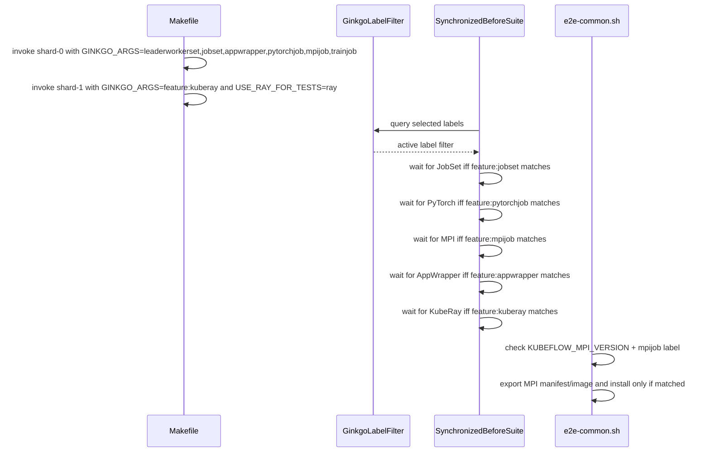

# PR #12096: Optimize the multikueue/extended e2e test suite by sharding

**Summary**: Optimize the multikueue/extended e2e test suite by sharding

**Sources**: https://github.com/kubernetes-sigs/kueue/pull/12096

**Last updated**: 2026-06-12T16:36:41Z

---

## Metadata

- **State**: closed (merged)
- **Author**: [@apullo777](https://github.com/apullo777)
- **Branch**: `ci/11988-shard-multikueue-extended` → `main`
- **Created**: 2026-06-10T22:26:34Z
- **Updated**: 2026-06-12T16:36:41Z
- **Merged**: 2026-06-12T13:41:02Z
- **Closed**: 2026-06-12T13:41:02Z
- **Labels**: `size/L`, `lgtm`, `release-note-none`, `approved`, `kind/cleanup`, `ok-to-test`, `cncf-cla: yes`, `area/testing`
- **Assignees**: [@mimowo](https://github.com/mimowo)
- **Requested reviewers**: [@olekzabl](https://github.com/olekzabl)
- **Changed files**: 9   **+213 / -45**

## Description

<!--  Thanks for sending a pull request!  Here are some tips for you:

1. If this is your first time, please read our contributor guidelines: https://git.k8s.io/community/contributors/guide/first-contribution.md#your-first-contribution and developer guide https://git.k8s.io/community/contributors/devel/development.md#development-guide
2. Please label this pull request according to what type of issue you are addressing, especially if this is a release targeted pull request. For reference on required PR/issue labels, read here:
https://git.k8s.io/community/contributors/devel/sig-release/release.md#issuepr-kind-label
3. Ensure you have added or ran the appropriate tests for your PR: https://git.k8s.io/community/contributors/devel/sig-testing/testing.md
4. If you want *faster* PR reviews, read how: https://git.k8s.io/community/contributors/guide/pull-requests.md#best-practices-for-faster-reviews
5. If the PR is unfinished, see how to mark it: https://git.k8s.io/community/contributors/guide/pull-requests.md#marking-unfinished-pull-requests
-->

#### What type of PR is this?

/kind cleanup
/area testing

#### What this PR does / why we need it:

Shards the `multikueue/extended` e2e suite to isolate the KubeRay setup into its own shard.
Split into two shards:

  - shard-0 (`feature:leaderworkerset,jobset,appwrapper,pytorchjob,mpijob,trainjob`): 7 specs; installs JobSet, LeaderWorkerSet, AppWrapper, Kubeflow Training-Operator, Kubeflow MPI and Kubeflow Trainer.
  - shard-1 (`feature:kuberay`): 3 specs; installs only KubeRay + the Ray image.


#### Which issue(s) this PR fixes:
<!--
*Automatically closes linked issue when PR is merged.
Usage: `Fixes #<issue number>`, or `Fixes (paste link of issue)`.
_If PR is about `failing-tests or flakes`, please post the related issues/tests in a comment and do not use `Fixes`_*
-->
Part of #11988

#### Special notes for your reviewer:

- This PR also gates the MPI operator install on the `feature:mpijob` label (in `e2e-common.sh`), aligning it with the other operators so sharding is self-consistent; a side effect is that `test-e2e-extended-shard-1` no longer installs an unused MPI operator.

#### Does this PR introduce a user-facing change?
<!--
If no, just write "NONE" in the release-note block below.
If yes, a release note is required:
Enter your extended release note in the block below. If the PR requires additional action from users switching to the new release, include the string "action required".
-->
```release-note
None
```


<!-- This is an auto-generated comment: release notes by coderabbit.ai -->
## Summary by CodeRabbit

* **Tests**
  * E2E extended suite split into two sharded subtargets for balanced parallel execution and focused feature filtering.
  * Tests labeled by feature so each shard runs only relevant scenarios; suite setup only waits for optional operators when selected.
  * Ray cleanup now removes all RayService resources across namespaces.

* **Chores**
  * Test env wiring refined to separate Ray-related settings from other operator-version settings.

* **Infrastructure**
  * Added per-shard controller-manager configurations and kustomize overlays to tailor integrations and feature gates.
<!-- end of auto-generated comment: release notes by coderabbit.ai -->

## Discussion

### Comment by [@netlify[bot]](https://github.com/apps/netlify) — 2026-06-10T22:26:45Z

### <span aria-hidden="true">✅</span> Deploy Preview for *kubernetes-sigs-kueue* ready!


|  Name | Link |
|:-:|------------------------|
|<span aria-hidden="true">🔨</span> Latest commit | df76309194129e2f717b90d8ec5fa3ba89977a1b |
|<span aria-hidden="true">🔍</span> Latest deploy log | https://app.netlify.com/projects/kubernetes-sigs-kueue/deploys/6a2be00e5ca0ec00088102a7 |
|<span aria-hidden="true">😎</span> Deploy Preview | [https://deploy-preview-12096--kubernetes-sigs-kueue.netlify.app](https://deploy-preview-12096--kubernetes-sigs-kueue.netlify.app) |
|<span aria-hidden="true">📱</span> Preview on mobile | <details><summary> Toggle QR Code... </summary><br /><br /><br /><br />_Use your smartphone camera to open QR code link._</details> |
---
<!-- [kubernetes-sigs-kueue Preview](https://deploy-preview-12096--kubernetes-sigs-kueue.netlify.app) -->
_To edit notification comments on pull requests, go to your [Netlify project configuration](https://app.netlify.com/projects/kubernetes-sigs-kueue/configuration/notifications#deploy-notifications)._

### Comment by [@k8s-ci-robot](https://github.com/k8s-ci-robot) — 2026-06-10T22:26:45Z

Hi @apullo777. Thanks for your PR.

I'm waiting for a [kubernetes-sigs](https://github.com/orgs/kubernetes-sigs/people) member to verify that this patch is reasonable to test. If it is, they should reply with `/ok-to-test` on its own line. Until that is done, I will not automatically test new commits in this PR, but the usual testing commands by org members will still work.

>[!TIP]
>**We noticed you've done this a few times! Consider [joining the org](https://git.k8s.io/community/community-membership.md#member) to skip this step and gain `/lgtm` and other bot rights.** We recommend asking approvers on your previous PRs to sponsor you.

Once the patch is verified, the new status will be reflected by the `ok-to-test` label.

I understand the commands that are listed [here](https://go.k8s.io/bot-commands?repo=kubernetes-sigs%2Fkueue).

<details>

Instructions for interacting with me using PR comments are available [here](https://git.k8s.io/community/contributors/guide/pull-requests.md).  If you have questions or suggestions related to my behavior, please file an issue against the [kubernetes-sigs/prow](https://github.com/kubernetes-sigs/prow/issues/new?title=Prow%20issue:) repository.
</details>

### Comment by [@coderabbitai[bot]](https://github.com/apps/coderabbitai) — 2026-06-10T22:26:54Z

<!-- This is an auto-generated comment: summarize by coderabbit.ai -->
<!-- review_stack_entry_start -->

[](https://app.coderabbit.ai/change-stack/kubernetes-sigs/kueue/pull/12096?utm_source=github_walkthrough&utm_medium=github&utm_campaign=change_stack)

<!-- review_stack_entry_end -->
No actionable comments were generated in the recent review. 🎉

<details>
<summary>ℹ️ Recent review info</summary>

<details>
<summary>⚙️ Run configuration</summary>

**Configuration used**: Path: .coderabbit.yaml

**Review profile**: CHILL

**Plan**: Pro

**Run ID**: `7b406a81-ebf3-4ec4-a8c5-b9715a4a2f28`

</details>

<details>
<summary>📥 Commits</summary>

Reviewing files that changed from the base of the PR and between 54720830d68af163c575eb0b42806d20cb2856cb and df76309194129e2f717b90d8ec5fa3ba89977a1b.

</details>

<details>
<summary>📒 Files selected for processing (9)</summary>

* `Makefile-test.mk`
* `hack/testing/e2e-common.sh`
* `test/e2e/config/multikueue/extended-shard-0/controller_manager_config.yaml`
* `test/e2e/config/multikueue/extended-shard-0/kustomization.yaml`
* `test/e2e/config/multikueue/extended-shard-1/controller_manager_config.yaml`
* `test/e2e/config/multikueue/extended-shard-1/kustomization.yaml`
* `test/e2e/multikueue/extended/e2e_test.go`
* `test/e2e/multikueue/extended/suite_test.go`
* `test/util/util.go`

</details>

<details>
<summary>✅ Files skipped from review due to trivial changes (2)</summary>

* test/e2e/config/multikueue/extended-shard-0/kustomization.yaml
* test/e2e/config/multikueue/extended-shard-1/kustomization.yaml

</details>

<details>
<summary>🚧 Files skipped from review as they are similar to previous changes (2)</summary>

* hack/testing/e2e-common.sh
* test/e2e/multikueue/extended/suite_test.go

</details>

<details>
<summary>👮 Files not reviewed due to content moderation or server errors (5)</summary>

* test/e2e/multikueue/extended/e2e_test.go
* Makefile-test.mk
* test/e2e/config/multikueue/extended-shard-0/controller_manager_config.yaml
* test/e2e/config/multikueue/extended-shard-1/controller_manager_config.yaml
* test/util/util.go

</details>

</details>

---
<!-- walkthrough_start -->

<details>
<summary>📝 Walkthrough</summary>

## Walkthrough

Split extended multikueue e2e into two Ginkgo label-filtered shards, tag tests with feature labels, conditionally initialize optional operators based on active labels, and gate MPI operator setup by label selection; per-shard operator-version exports and USE_RAY_FOR_TESTS wiring updated.

## Changes

**E2E Test Sharding via Label Filtering**

|Layer / File(s)|Summary|
|---|---|
|**Test case labeling** <br> `test/e2e/multikueue/extended/e2e_test.go`|LeaderWorkerSet, JobSet, AppWrapper, PyTorchJob, MPIJob, TrainJob, and Ray integration tests are registered with `ginkgo.Label()` feature metadata; Ray cleanup now uses `DeleteAllRayServicesInNamespace`.|
|**Suite initialization with label-based component gating** <br> `test/e2e/multikueue/extended/suite_test.go`|`SynchronizedBeforeSuite` derives the active Ginkgo label filter and conditionally waits for JobSet/TrainJob, PyTorch operator, MPI operator, AppWrapper, KubeRay operator, and LeaderWorkerSet only when their labels match the filter.|
|**Conditional MPI operator setup based on label selection** <br> `hack/testing/e2e-common.sh`|MPI operator manifest/image exports, docker image pulling/loading, and installation during kind setup are now gated by `KUBEFLOW_MPI_VERSION` plus the `mpijob` feature being selected (or absence of `--label-filter`).|
|**Makefile targets and environment sharding** <br> `Makefile-test.mk`|Parent `test-multikueue-e2e-extended` now delegates to `test-multikueue-e2e-extended-shard-0` (non-KubeRay features, exports non-KubeRay operator versions) and `test-multikueue-e2e-extended-shard-1` (KubeRay feature, exports KubeRay/Ray versions); `USE_RAY_FOR_TESTS` passed as a standalone env line to the e2e runner.|
|**Shard controller-manager configs** <br> `test/e2e/config/multikueue/extended-shard-0/*`, `test/e2e/config/multikueue/extended-shard-1/*`|Add shard-specific `controller_manager_config.yaml` and `kustomization.yaml` overlays that enable/disable integrations per shard and merge into `kueue-manager-config`.|
|**RayService cleanup helper** <br> `test/util/util.go`|Add `DeleteAllRayServicesInNamespace` to remove RayService CRs from a namespace via shared deletion helper.|

## Sequence Diagram



## Estimated code review effort

🎯 3 (Moderate) | ⏱️ ~25 minutes

## Possibly related PRs

- [kubernetes-sigs/kueue#11976](https://github.com/kubernetes-sigs/kueue/pull/11976): Similar Makefile sharding and routing of KubeRay/Ray-related tests to a specific shard with per-shard version exports.  
- [kubernetes-sigs/kueue#11964](https://github.com/kubernetes-sigs/kueue/pull/11964): Related changes gating e2e setup and sharding via Ginkgo label-based filtering and Makefile adjustments.

## Suggested reviewers

- olekzabl  
- PBundyra  
- mimowo

## Poem

> 🐰 I split the tests into two neat lanes,  
> Labels beckon only what each shard contains,  
> MPI sleeps unless its tag is shown,  
> Ray wakes up where its flag is flown,  
> A hopping rabbit claps—two shards, no pains.

</details>

<!-- walkthrough_end -->
<!-- pre_merge_checks_walkthrough_start -->

<details>
<summary>🚥 Pre-merge checks | ✅ 4 | ❌ 1</summary>

### ❌ Failed checks (1 warning)

|     Check name     | Status     | Explanation                                                                           | Resolution                                                                         |
| :----------------: | :--------- | :------------------------------------------------------------------------------------ | :--------------------------------------------------------------------------------- |
| Docstring Coverage | ⚠️ Warning | Docstring coverage is 20.00% which is insufficient. The required threshold is 80.00%. | Write docstrings for the functions missing them to satisfy the coverage threshold. |

<details>
<summary>✅ Passed checks (4 passed)</summary>

|         Check name         | Status   | Explanation                                                                                                                                                                             |
| :------------------------: | :------- | :-------------------------------------------------------------------------------------------------------------------------------------------------------------------------------------- |
|      Description Check     | ✅ Passed | Check skipped - CodeRabbit’s high-level summary is enabled.                                                                                                                             |
|         Title check        | ✅ Passed | The title clearly summarizes the main change: sharding the multikueue/extended e2e test suite to optimize it. The title accurately reflects the primary objective and change in the PR. |
|     Linked Issues check    | ✅ Passed | Check skipped because no linked issues were found for this pull request.                                                                                                                |
| Out of Scope Changes check | ✅ Passed | Check skipped because no linked issues were found for this pull request.                                                                                                                |

</details>

<sub>✏️ Tip: You can configure your own custom pre-merge checks in the settings.</sub>

</details>

<!-- pre_merge_checks_walkthrough_end -->
<!-- finishing_touch_checkbox_start -->

<details>
<summary>✨ Finishing Touches</summary>

<details>
<summary>🧪 Generate unit tests (beta)</summary>

- [ ] <!-- {"checkboxId": "f47ac10b-58cc-4372-a567-0e02b2c3d479", "radioGroupId": "utg-output-choice-group-unknown_comment_id"} -->   Create PR with unit tests

</details>

</details>

<!-- finishing_touch_checkbox_end -->
<!-- tips_start -->

---


<sub>Comment `@coderabbitai help` to get the list of available commands and usage tips.</sub>

<!-- tips_end -->
<!-- internal state start -->


<!-- DwQgtGAEAqAWCWBnSTIEMB26CuAXA9mAOYCmGJATmriQCaQDG+Ats2bgFyQAOFk+AIwBWJBrngA3EsgEBPRvlqU0AgfFwA6NPEgQAfACgjoCEYDEZyAAUASpETZWaCrKPR1AGxJcA8t3HM8ABeJJC4sKHM2B7iANbYJAkA9CQAHjQYSvQkAEyhNIi49tjqoXL2sM608BhEkJAGAHKOApRcAIw5AAwAnABs9QYAqjYAMlywuLjciBxJSUTqsNgCGkzMSfGtFOQFYIjwRIibCcnc0R5Jnb0DDQCCeLD4FFxo5x4e+ADsP4MAyvhsBQGGUqBgGLAuAx4Fd2j0ABzw/aVCi0MBRGLweKJEhgNIZLKQQBJhJBmNosA0AMIUEjUOhcbo5PpgLrM9pdaA5HIcJkcADMABYAFr/XDUbCzfjcMiDUYqEgeSUHEJJUYAGkgNK8aEQuIw+BoYH15A15DoiDANIEOpIGtiNVoSQY2ow2G4GvwsTABG90lwGoY4IAZmBnWguLJpBrnLSkgVxLVBjYSBJ4CQAO6USX4LyxIIqDxuBDIWwVKrIcKRaJxU4kFLpMiExvewiNsJ+4qlML4FCIHN0yAAaRWJBsaHkutwbvQmU1dGwIMg2Aw5BBiEQznk+GlVAIfBqhTQH0QGkglMqtWkKHBHmwSg4Rigf24HnUYQinZo14IYXTPcQKK0LMBj1FAAFVCykAABRBrSU40lw2pKBQf4ULEWYkP6kBCIIk7Rtw3DplQBGUBq3CyHuEI4QIGrMNw8DURquBUDU1EAJRcF89jSgwiAANzXoex6QAAUoIfyYRqoy0shADqzzoRQElYXcBGycRO4asOrRBp86YwCxGA1EQYB+Moe5aSOun4PpACyVgAJIzvQ2kkNZ+nQIZlAaCBuhlqiYDtNBsHighkBbMosgcZAfLcaI/GCWKwn4BgHjyK5Y7yJg9CVpAmUoGSpA+VAADiA72U527mc8iVHh41DwCl/BYLlIXwd4dEMYIkD1a0HjXpAuS4uszApRoAH2D2VW7jVB5JYq6CvkQWDpks/n0EG8AxFmAngQFQX6j1KWkPuGBCQtmBLq6ur0BVUrVRQxWQHcQY0KdUiFIcDWJvGkBBtot40ogTEfmgjyzXRXhsBgND0DuyJVAoGCbXUQY5shyC6l4Yh0JAqZoJAACiOSEwA+pSPiNAAYg5JWk1TPijAAIoTdgwTmenGe+VaYtiyTWljNShNw1BvRgbHdoNZ1AqEw44r2kBKC++CRvQq3hM1aVSwWuM1DQRC7o1Z08JQ61PbZaBKJ+uJeFI/XOrSrrcN2XhgkU+BBqSSAHImlI2EzyBQZlEkUKmi5KF44gpRLP5oBI+DwPQjT4IODoW7gEKExQFA1U1e1AZA6tPHgeXjme/snkYVjOO7nvewkkBmO0cKIqeybarqkD6jQXDJ+QPkGBYZ4sNDuCY44ZIuI+4Xwha0KWoIBq9wauO5aWqDd+gBE51ItACWD4Q1VjIZvLw+C7wJc0UAuUfG+E1DoK9ps0qmGbOT1RC4Mw3PWHYAGAh4egOoDjLR4AIZctBZBUD+jVU+O8jwmz4D4WSjRWZ/AEq+DAsQZAGgUE4WctB8C8SerEWeoZ4ALwEEvPKJAACOCRCi4wJhFHYmFpD7EOMgNgzBtiSykBQeAQZ5C5RFhnWACsaQ6hSjrSWv1sqSxpC+eQRdIBJE9C2X0hRJZkBkQfFgDUGDtk+rUJ6gRRp/i4FYfAjD6BqK9D6eMpj4DmPwFwO4iB0I5VBuDPgP4rQ2nfjUD64giADl+v9LaMtK5QFIXPChOcqFFF+oo54nAYAfhpPQ+ANJ6DUR4BcMAfNcTxjxHkdE1YsS1jxA2TIdB0Tkj+gDXGaNfEfhGuoASZ9UyEjPvpT4dRMGxHfjSa+WARryKgnGDs7wPCFKqSUoa5TeZVPxI2OpZIahsX3rQVMN0/pbS5vXK8LS/r1XQsgeRgzcall+sWPcsgnpvAuN8X4UED5PAoNFByGBglfVho0yJQN35owgZAWyFS5YNxpKNL8zo0ww0gIBMAESFrpgiFgHRAgvD0D1iQA2DUUoXJpF7dcXM/YBwDGDH2dRnQSjehWf8Yp5DfLQGISQoR5F3FoIEUlKVzyiCGX4kgGysDJyGBuLFJBKS3kYRQE8z1FQ9kTuwQRaZ6AO0wNOF6b1CasvEcAxwuN8rkuQGkJAmhfJQCsDnbg1jV5/n2akaQXAoLtAlvDfOSMUYwMAVmSWStPjpVrIXNaKUtZzTqrrGGeLDaEoElBHIEsI0fBJdS8uAcQ2HxLtNagzx5XuM8TAvgsE6DWgYLEUxVCBA7w8bIeAXBKQpU2hQNgXiH7gsxJC0ImSShApNbVD4TDZw0hGms+guoRa7lCEwZGhwgQEqwDudaGoHBEFIMYuoEpQgeyJiTcmlMaZ0wZszVmTiXFuINiQXGHrAJes4egYlvA3LKElQoty2Mihbr4JON0CVu5DsWmLBqUgFYEwYHSlgd66j3yKNUCVXhkDdzAMm7F34Y0LuiVvZ5PwvhuMIf4a9lAEaoigz6jGeN4AE2JmTCm1Nab00ZizOw8jLaEgJptVIksyToUYC6acBBXaYFrqmslFdoI0glFzM1G7EUKiXaIsWbEB53DZU1UozBkBJHsGKKc2Z7GEF+vi6Ne8jFj01JdeRKVu10N7bjDENYcTVIJLjaj2FuootxkhLmP4gl+j+UbfePiCovmFewQjFBiPqqbfe+RGqnaOukAJTaGAEFwPPqbJdyDUE2D+NBbg4DMhQLQBLT6KazSEhOWliQCD3ID30MYcAUA2w7r0cQMg5lcajphlwXg/BhCiHEB9SA5QmDIRUGoTQ2hdBgEMCYKAcBUCoAs3gQgpByBTqi6wdgXAqD6QcE4Fww35CjZfRNrQOh6sNdMAYC26FNpeE0ZoZgsQHwACJ3uD0sHcBybX1t0nHRPTc/BPYQkwOuowAADEp9nKmOcWas2ptAIeFx1IwC8pAco9lGegCsDqJ3OAHPnXGDgBBigoKQMzUEod+iWQ5hIpTcQI6yJFlkyP5HU8KLT2H9P4c1OZ/nQKEOk1nRoJbYHg0nXgYTHUAm1KvAS+cwD0op4/hIq6JqZcyAVEQ+o6TRotgfCUlyxwAAvJAAArBD6MkAIclQco0QcJUfCkzuDYEqfxkdtRlj1eU/V7tvQUPwrmEOkKUFQopScSRqKR9PkRU+lAkjkUorAaiSROqp+YuSaiVvhmiBIOyxDKUwAZTLjmvceMsxGylqmHOGBR542cJRyVgcRI+AAEJ/EJtAVUhM7hMdkj4Gwg40Fd6SHcKwVhZI2HH1YVmSRBxDDb4TKmoxkHz8X8v1fslSYVXX0vlfyDSbQGn/b1mSnICq4gkFUZWu1o673frmwhvjdm8t9b239vHfO9d+75HvUFT7LbR8CviBD/I/gQ5e4IQsLjg57yIjr55DYl6yBJCZSWgKj/b3QzR8D8IHBNRkA14pT17VYCI6yBwL5L7T4ACaKBdw1BVBtk9uDk5+3yP8EOoyj2XORSDOTmY6YAAApMjiOvANKBqBDkMJ3qTFQQxjYEfoTH8NAH8CbgACRQTiFkxSEMwyHQByEKFsTI7pio6jS7zNQ+ZmY2QYo/LZKEHsBgDAKHB17sA9RCzDZuTPChD35kzQA/5d4MYno2AQ5JAeH7p0ZHqMaswQ4DzmBfZAEYayIfhKBhixrGw7ppC2oUD/I1TnBYrwCGIqriDSDTzQDOAU4uGVCpg1Sg6Xi0BcAc64CcErJlJM50DI41A263ZuRbTFJ+gaDPbI76j6QRx4p0gMo27Q4VJcG86K4s5dBs6zi1H1Fw6NF851IC7tAtEi4yTi7VAjq4BayjJGSJgQ4/rcDcH4Ea4YAcEw4TFLFTEqG66Dj25MykwABqaCDklMHA9otShQSQ+o94EgfBJufBehma4iQRj+z+kApuFuERBg82xRmEFytAWQSQCR9UOSD4oEoxNOVxDRjOyxaIAuMx0Ek4yA4JBuRuUJr+OeH+DuTuLubuHuksoeKECkGEuAUeuEmESQseGkCeSezwVEggae9EGehkeSkBUY78QRtGh6vhTGJuuJOI9YUxRJOelYWAN+NuxxpxPy5xlx4xeJPBiOYAdxe6DxjQTxrxOW7xjQnxDofovxig3gAJQJehSmlq2JnOSpPONxvBqxyOUEpJNuuuEJlJ0Jb+NududJ3+jJyO4BEA/+sy/ulAJukpnxI4VAsgsBcxuusp9Gx6CpPpdYTRhJSKaxIMMoWpRxmEboupEg+pYxyyix+JtxUE9xjxLxbxHxXxSgPxfxLpgJwJQuT0hMqQaRRQdhy0o8SJWQmJfkVMNUEO2h8hO+Qwow0ADkC+hMQwZMuuhMAAGtoZaYTE8X8AABKu5PFdBH7eEKGBlm7zHFmnEEnTFC41Gt4d4+HWl/C2k0mjC9796D7D45bfndmNA0kz5T4z6sxdk2mUw0nkGb6H4/l/miFIUH7b4VRwW/kIXoUb6YVH4n7ZY4V/k+RYmLl8DLk6Frkblbm7m7mkz7lHmEwnlnmXn+ykztC3lu5d5MlQSPlNl06M5+kmkBnRQQ5IVSGoV4U27SXgU0n0GMGkUIUDyjBCzICVEY5cAADUfIfISQYA8IRghMn0ZI/yJ2c4r8+kbkLSaStkdA8AjgBg72r2j412lQ5aUyG6KQZSI0Y0AEb2H2Q832v2HWAOB2W4IO6OBRBgEOnlsQ3l0uvlw0I8AVsAfRNkkAoSBQQ4VkekYKjkkAZkWB9gtZzsTUklBFW+O+jkKlEFkAAAVI1S+BKM1VGZ/vST/kyZKWVR+kbFwBVGgfVP8mSEZLBD8c4mgKQBLhOcDIrEQopAVNNcLBcEkJ8JbNGLOLlBDihqTJ1MjgGirPXows7P0ecZrMouih1TGQyb/trM3qwenoIJ7nBN7jVGijKLSV/ndUyRvLgjOoUF5PQOUBDomb7siltG9IGYovVNCImJdMuDOtULfAglVfvjVdhTJRBWAGGvIDlSQB6UYJ9gqm9LET+LlGiQTrfMgCkeOakrjJkSsK+LkTDOoGmIgNPMnLNQzY6FkSzX9EjbfPwKdG9P9IuCAilu1FrpQNOjFbQGpRpWjmDvSJAHpYZXyCZWZRgZZS/GmDZUGHZYNY5c5a5e5WAEYPGClWnoacqaWSlaTI4kQK4i5cFV9j9mtuFcUJFeLlpbFSwblPlENLxo7NOFTtqpQLqhCELpWaZl3FlVuhcumi2IJgihEB4EulTngFtBoEzAqGwncB8MHJQGHNIN8o0GgGwIgCLCCELv6vnV+MXaHDkdZn2ECGuANLlGNStXwPIokuIuHqbCllXTXVKXNJsTutsQNlrIMdLugHFNCJtIYmweOBIO0BoE3aXcjoICIGIAPBJJOnSGlLHckniuakkaSJhJbNQOxjVDDiFmhvisLfGMgKgKWaCTbosFgs7RoHKH1FBBoIAyCb1WKEcFwNJJbJQPJGhJQMpBqGJAIHA89GpHyRQBqFYLINAIKbAAgxqBVLgwZOSAQ/IoHWXLik/VXr9FiotdBBDl/bED/bJOinXTGItP1EmcTj2JWMdpdK0IAW9LjOUJKZEcTSFTETTXEaEFTUkbTZ7KkbzSLfktkazeIPkZzXCZAH3KEFBCUnjcrZeH+j2PI+kXQInszTkZACVD2NI7EW6LQP9kTepeQJpfLbpZ0IZZ0FrQEDrc6VZfrYNIbaksbdUKbR9nCddlbUNDbc2ckPbQ4KUI7d0c7UFW5SFR7e1htt7ZPFFfo+DgYCwRDn8LIOCLALXsEHQG3q4TSH8CUDQBDoAJgEmMogKUOKRk4gR45TaDP88TX451yEBe89IevuVMUNlAyO+Mn9NQDD+AGgJUUzztf9CoIzQBUEIJsWLT7N0iHwyi2gZmJy24qN/U4eG1joZeFRLAtq5AMMtNqUV1MouUM6KMMsOUHYSZXC1AEIXACDykSQnkRDgg6DmD2DYQhkXMZzXTd04LGoqk3A6k8eXTSBmBuaXT8iEDckbJSkmEp4cAoQ0mc9SNGzhzKO6gyAJyTAxKXa6A1WW0KgByuA8grRXdmAPd78g9fAtKsqyA0K5IGoaKnRP8BzRsCC4LVLAMtLr49LaOAqFYlQRQmYj6etgIiAWsaQogeAuMBLmQmzKW2z6ADAOc64P83dJ078/dhcGLvGdKfqrD51ceJErTkz39MzizHgADQDGg6cEI0gLryzb0UESZvrlAIJ1D5alcxNURpN5kRsIxlNog6JsRdNE5jNfA/NFjeRHNXNVmRgTjV4ft1RatfIfQhlXIXjU1Flvjetb8tlQTYKJtzArtbl4TFtBgkTeQTo0WRA0TwlKp/pau7bMMOcg6FA+1zLJ0pMjzhwGgsgldHgKTJNoVntmT+22TvtMV6jC2yAlBdwtkowgB2jEOM6zEHMlAI7KWY7E7RAU7M7nuNUHa4glLgAOASlnTGAC4BEmrOaY3rDnLQAuLjComBhc5HLLMGoe4O67PUme6bBe/OrfKeA5EUJighpa7KmAPQvLEDICMCJEJhAIrxAGB21Ej1DJKbPnaphgCuoiYgsQDnHWb2UjOBtnGQAwPICASSxqEoMlsctoN+iiFzE+sKv4FXkDXSIsFKfIsGXCo4TOquMLQAIpWB/BJDgJyqaDpKhD3ahDV2iCqpXiy5IpaeL0WO7XRoUOEoaBBhUBsDh6IBs4fA2SvhaJQRMBB6Ji6j8IIKp7HP4Bi7kMyOssKQnNIxHtDuIASx8vy6pEs2eDyBpC0rVCHFZkaCNRJCNWe6WcZgKTyrweLR9gPVIf33y69UE2ByfAMAIJocNxsDMQ5HzXoGfSGLR4UYExedi7Kst3zUzoMc0gIqWw8q4Hkfvz0IGgEx6LmVGxsRbVRazpECEfQCjC5aBBGRRDfw4FV5QRze5br2Jof2XSRc5FviTi+3CERDfq1PSCngNCiPRFk0SMU3xFxvU3Rvi7GMZEpvmMqPs2xVQCNBvyuSsK5XQcX070DboDImq21HW0Xtdvc4lmvlEn9vBeuyns93jsdtXvMAeCBmUsHto9FIaCpCFKzxJf4BJBr2tBig5DI6gfHsRbGtQcEdJFsThsk0WzjUdjLOhB3A6uyAhAUDZtK15u6Xm4CiGVdClvmWdYVspj+PVvpHBNOX1tm1NuW2OlRNQ/Fk9tiV9vxCFAsDBALro+zsNvzvpN/b/LLtA47p+3rvFh5W6+BAhBQYwdV4aco4fsbQ1Q7XPtqmDR5BlVTjcBwewYdHOOsHDj2/6+3zI69kag1BxdXi5R7S4wREaBJCAOoluRgwxCCHSCYdriTfZUZPDGDNcF08RYXvI6NrTcWzOyMsfgQ5cGICyCMLMB9GV3SCj1HaX3k6HJYA48Ds0/I/nto/TsY/jOUY24Xs18lRF97iwlXeRt+d3dSMPd+eJsKNM3KNSyqMZsaM/f6Su+sbg+tt1jq+22xNw/a8QYO8G+j+Y/QTh8EAO/uGP96/5hR+kiYCCJ+hM/htDys/f8tEHPZ6Nz15789Q+gvNWu4xZDi8fGVsStgbSNqQBRgNkY3srxbaq822Z/GJrD1VLlkEeYHE9mX1R7TdDec7NJmFSXaA5DsVvNdkYC5SEh++iPIgaOxPYXtDeN7VpKECfaX8r8L7MFBChA4pRmBj0NTl3DfiA8F0eXK8FV1w7zUWSg0fqilAL4SdhBhAvgAbEBAnE6OnXIEN12Y5OFQCpLI+CmGUD9RKWGHduvkFkDSgsuRQQHlx2yT+Q+ONIATsLWE76wOaAYV8FJxSgycq88nRTsp0KAaggY1XMQMgDvbwBKWvncmj2CQLDUMCFndvtZx4AyoFAxKFrnzUUBBd1BtXFLI9QK7qc3qxKYrtBDj63h4uAyIhOV2DSyCauGoOruIAa64Qmu5rNCIFza7596Oegxwr129hGwC+Q3MUDgCf4LoJu78YMhty9hLdHAFeOVJQx7DTCtuO3DFOOSi72DjupsHphyjs7pgHOFqBfoXRu5Pdl+isVfgmzkb00TG9ATfgLXTZfdNGVmaCJIOFqH9kS2rS6r/xzYuMVa+bHSgKC+Ci9YB5beAdLyraBM5etbEJorzCYQBm2J/ftijGh5FJNe/OfATryf6R8jYZA43hQMXYYELeNA6KirRt6oB3hBcAmK/2f5O8L6VOakdiJSh10TkXvXgftG3r8J6oDySANlxmSv0WoH4AWK3Tz7HIc438FPmn1T4ccs+uAWYlNyeZAoCY/fFGNP1n7PB4ysrbvuukL5m9Je0aBFHrB7AEwq+Kot4F3Hb70AG+VSMvqGA7brFWCjfZvjQFb7miR6rKW0JNCsEbQxRk/NQYP2IHsC7+8/CNscKjaEpJG5wxIpcJ5o3DFGqbD7moyMBaNFaEA1xlAJyDAiDAplbxqCOszWUAmSAlAemDQHwiVePxbOpcArEaBkmeI92pQMJHUCcm1vegWDyATiD9Iw9Dvu6JDqapnY6dJdBDjzpAdC6HgTeu13Lrt9q67ojUQ/Fnq6cU0Y4xcOBnt5zg26WHfkT/EWBSAsAnYqcYuHKCDEcq3mLhh+DxbB45xI4nwP1giETi3RtdJcOIAlbKI78WZNehvXHAhxS6AAbwAC+wY+duI1OEniV+UYiRuv1jF3C02bNRMRoyphC0q8R/fNoOIbokARxi4suhgArp3iSATnXAJxkPb4gNAVfGgOkADC8Z4UmgaVBRNNDIBGq5LFMOvSwldiQQEsSgDnAoD2iIeFYpIFWOdoQ5wBubNMQCMzHZiy2kvMEfmNl72U62JYmbFdiayzgWsK2eseWy2zdZzMe2RsV3xOxUBVA6gc7NNlmyNZ0ki2C5FgFawEjVJo8LgEoDFCdEosVsENkMiJHyAwQ2okbM6V0lnYpsl2AANpfjXsbkkgA5FoCvYOAgUlWqTFoACABQtAPkAwD5Dm5/oXQeEK9jVCvZREsAMKa9naIadHsPRWIGlNeyHh0iObMKe0HNzwh0pjYMqRwHaCIh0pLk7KcmBfDuivEmnYyPLifLn8RKrZMdMjlVZS4q8/7HgDGARRk4SiMGa8PHHOTtj1okEcTuWTCAIkx40YVsfNIM6qpl6oZCkkyXZzRkfq3VP/L7n4ZZhowpKZaOFkiwhk90+ZUIn4XGZHgGEBfVaDkiRbl5VueBSwrXiIKN5SCEYoGDxEGyadb0E0yjhM2oqrlbI65TctuUYrMVjyLMdileVJg3kvCvFe8oERXLQBaKsMhinuT3SHlEZp5UmBeRRncV0ZJUPihESKknY28pXWII2khhmp6W2U1tAr1ew/i1QAUoKSFOylBTSYOQAUCCC+B9A0APQPkLSD5BFTMp2U3KZ0XynPYipJU3ALVL5A9Aeg1UzILVIFBdB2gjUxsdlK5RCArW7Um3OwSEow8XyUxAQngjGrZBvp1hBFC0nMpz1cuYhCQhoUHyyF5CihFQmoUkK0FpCPs3Qi0VNSgEMiWAElvwHTBYBMEoQcemLh3StAuYBWWgKhhUS5QRWn0rAMQSbwIYNAtM50vTMWpMyQsqQdQLIGyl6ROZ3MiKZeD5nhSBZ8IPkF8ERB8ggwAoeEHFPaAyzqAWU8KQlSSrGQUqto1gOlWVlk5VZQsMKULL6BazaAtUueQbMirZScWhVSqDuGRaf82ek1QqLi2uFFAnJCsc6sjW1bCs++GFTGnVWxrxl8AFOE7h/W+pdU4yeXYPM9QEDb0+Am8cyhCGDzg0+okNIAjnlhqspvMH4XgI1CopXzD8WNBSrjVubZVsAVQQuelLpkMyy5XgCuazPCk1yuZPMlWo3PrmkBSYAgPkClL6AJESAAgDWX3PCDZSh58YEeYsn8oYBxoWUxqVPNqnm5heC87hbwuKmGzwp68yFlvPLyEJy0psKajNRmTrVvO46GgLX0Lz6QCaINYRB+A3BsBZq2UZPjAqwo3yFKatG3B/ICJg0wASZIBdDSRgo0q8ic24Z7HRrIV9FDkeqrZysyoLXs6C0uYBxZlVzcFNkWuQQobmhSm5kU2CEGAYA5BzcPQMhZ0GlnpTZZg81lIlSYW1BR5rC9hZPJri1S+gQsvhTPI4C5KBQK87JmvPr57UDqjAOqIrCBBcw6OxxE+VlWp6Do1FP8VIjostF6LaqLi2+UYohwmLAiAChUJYrGbWLPhu4R+ffAFHCxFWEoG3F0rgXwUcaejL1uWg8VeLy0mC3xdXICX4LiFwUkJfstRkMB2QkS+EDkHaB9Avg8SjKf3OymIjsB3bb3n22aVI8AxI/GdlktKkFL9Zr2GqQUoEVNTwp3yI9j+w7rsYLguQmnhBxZavCq8W7HdkWgEGdpg0zyiCF0Ao5TAuYry+nuCF6HghZAtEHDg0KI6QM+ApHW+BqAiQ8dG8iYfjnRHcGZ5PBUpSTgimk4DYq8rHVaRtKYDSgHZOsVpvrAvrJCrOmXaCLF0qFcxEujUCYUV2GIF9phi3ZxHMJzlpC5l7GeAE6nVRbDTuXYA4esuLkYKfF2Cvxa9jwV1zeZhygWV8CDBdAugaAYXnyCyA5A6FA817A8o7YojawaIlYlfwj7v8cRd/L5dPPIDlT8loauqTkBKWbgjZyJJOusBCxfgrR/q2/teyRUQ40VAUYklNJpCwR9BV4CUen2lHVg5RjASRAUDTyUBtRSo0vqwPL52jh41fM0RZ0gxMD1BQ/NgR8rH72BeVq8YCTbkdEt82+2Eg1UoBLmbLjVlcnZemECX7KiFAsgUCQA7kChVAHc2gF8B6Cur7lmA0/p6o16Zq0Q7QAgf6LrUkCUYhvYNbVN+X/KI1gI6NS4Gykgrv2v7GVup0hU4raeda5Ffe2DQIrd2cK5Qf7znpl4hW/UAgGuiQ5QR6hvEdasR3JVKDxY+HPFYxwJXApuOxGVOSQDKJQLvBFEpGP4Kahcr5qIqjLmhEfoX1EOoWBFGENw5gF+1+cRpgOlQzgtiNJQ0IMVwVXzcgNxkQOIt3mH9d34e3aEJsO4CPydhoXUdSQHHWMzJ1OCs1bsotWEKrVkUhgEGAqnm4yFaAShQKCDBbrwpHq6bl6rtpsjD1JwFNbByDWcLslPy8NSQHKlRrBFq84FQPzBW6c5pDIx3mNUAFFBNpQicBduk5Flxx8DkUnpXiajs4PNC6aPg6DWlVCbc6fItZnxLU4556lgrDsNhtAF8OONQLmEqKn5vAZ+ZvdUR/TYDk4ygWGuOFAslj6s4I7hWtZB3rXTdOJg650Wl1bUfqO1w7QMde0k3SatlJq6dbOstX8zIp/QeEHrPsaRLKp5uPTe6p3VGaL+iuB2k7XwCXqClQshzTers08gBQ5ue9aavQk9j4srRCHBHQoBR0MquTUUZBlnq5b7AnU9wq+PXroTt614pJD2DK4fA7t5KFOsoDTpyZTYU0ucRcgXEfiS67XUEq0VpAQhkOAeXcZ3yg1fq+6BoAehiwk1Fyx1Rq5mQNvCnszHAQ2pTSNsvCkw0AXwAQDar6BLqugQYPoF0Fm2Ij91BJZbUk1W1WbvlEanIKLNs2zyudjm0peFLRZQMMWykOcC+ByJoB9gxTZevQx/rwcc+iwDwVXlCQHhBmMu51r7iggAAdV7OmRZJstJw2uvQgJF+j9ILG3LFXYn3b69asd5cqdf4pnV7LhtoS4nebguW9BugKU4WS6oSV3L9N82xnUtqGiJNCg1Y1ncVK4UFLC2GKv5drMj2079t2UwXRQGgaKQRdcGURDDrobzMZmcuucArqZVK7yQSdLPU61/oa7tduuuDfrswiG6Icxu15vfLN3Coi93TK3Rjqk026sFdu+TQ7sU3BKidJCvIK7q02SyNNtAXTT7voV+6fiUTAPWOmZ0h7naa229QKD5Dc6OAAoVfQnvCnfNMIjraZhoFz00h89F9ZXcbCVFq6y9/9CvWxo4DR4a9r2I3XHVN2GJzdd8DRW3rQWGrvF2O7veaqCWkB51kUh1WgE7k5BQDJACqZusn1uqGdPUn1Y6CD0rbl92213Wvpj2LyAVOQdA0Ctewws4WJECLEXDAB5IS9B+o/WfUV1NQz9xey/S6y1067b9vJeFrXvr1aIX9c4EVK+vsCf7PF3+idb/rk3/651ym4nV8CSkMAGAfQQULTrQBoB6d/u+A/bSQMs6UDYU83BuvX0aHNZfOmNeFIwZYNgQODbqGQdl2yi8959KQTQdV3Z6r9CoBg+mQFJGHqIrB5/Y3tf3N6LdH+tgNbp/226hDCmgAwcoH0kBSYPwIMAIByDj7aAeQHIBPtuVT65tM+ttnPsRwL7NAS+tnSGu23SGvg6+3I9vpymOQEG++sw/LssPC1rDF+2w/QZv2hQOoopQQK4ZN3uHODLey3T4fb19bZNpq4Q07qOVtyGAXQL4LQHNz6USAlOhQ8kbrCpGUSKhxfWHpVk5KEQ+RlY7oYfXCLDIJR0wznvMPH6KjhelXdUdL21HGD9RjgJnlYhNHH9detw4sA8NcHW9nRr/Zjr8Nd6AjveoI0AeJ3tBaAcICJWgD1l9AgwXwKYxyVn1KGmd8xjI4sYj0RqvgTIdfQifnnrHTV68/KLEOFo7GNATDMgMjmPn7GqDWAaw9idOPploCsgWvdBHQgkB6IhxS/T4FRCy0kcWyILuSFXgN77jbRrw5p14MbKZNgh3o4EZEMhGuKAgc3LSAEDwghjCU+I4kqSPgmUjkJpbTsOD0wm1DHAFuevubhVTUTsaguEMz6iBs+A0JS/XMydY+tRmFAVZqWrtamo9UUoIluC3bZ0QrMPXalr1DpY7M3wUEXfRyT+Y1ACGBh4FpcYOJ1AoWG896c8GhYoN4WlkVoPlAjNJ6U9sDTCMLhtyCJsqNRjXYAw0BKZPWEQRAJaZWYBsrTIJXLofE7gGFo52OPRicixgDZPMENX+REE2yXN2AFyfVtYneYNb/OMDdljKnpS+GBD/h01XjuYAE7+9zukhV8AYA8LIjWm1lDkAYBgmeJj4tcznUyPh7rNEavkFEvX17ndTuBp9YoF/aWihxBdIumDubprhbxzEkgLATmkvdcY/YwHZqOhTpYQd/UFerIDfEva+su9PZj6IJjw7uxEzRPiiGT4XiPgV4wC4gDvN7iHzl9SokgGYDDmBTo5wbT+IAC68kqWPYtGGrZZ+kvNSWklslNIHJZQBmVkyBxBSZAx2TyeNn0k+S5Jc2O2eoFJiJxEApMBAXQFJgqzDJeFnIAIHH0CB2gusvoFcv0rwgdNPQEgAidAMMBaAAoVlA6q+Baaeg7QcWYlLJ2CW2LwvBEylPIW0A+g8IUA5cvikaGJTAgLoDFJyDjbKF3QBgJEfhDm4+gzlvS8ZPH2izyFmlnoAKE6ByW4jXwdoGTp6BdBaA8IUQElLQB8hrQ8IDWT8DQDtABAglgwGxfaS4BOLQEHi+CMzC0BSYbYerGxafT7Uq1oR1Zdgn4tTy0rX43yK9iQC2BpNdAJmaPCsQ2IwpjSRULaHqtIAfA/CARGDwwCdX/o3VtUPVYkVA1jIjadzoAejQ7AjwfwHTNtsgB1X6g9QV7Iwr8xpKWFaVNhQBE6trX1rG1ggElDgnggaanVqNb5GOs674JhKWSEsCZhEIprtQRAJ1faA3XIAXMr6wqY3OVjHxoew619ZOvDcPA51sju9a4Br6QbkAO6xdejaPXwgz13iNVzeudWxex1n8b5B+sbWTsY4PSbgHUgrxrU7gXYitdGu6hxrG1/+NEFoDSbbAI1o8FTYmuJwbAy4FG0tYERvX+U5aTq8xASDU24b1QWgOzYwBk2vAvNwqVwAFs9WNrItsW3nUQD6thCt8KW0zbGv1WrktAByOuAYRc3Or72IW2ap1C4ApbyYBwDEChuQBfJX1o67dcqtMTDbStlW4Jyajq2hbt1w8Lpn5vXw5bx1uG5F2Za3xDbUt+wPaHtZ+RG0SgAmxNkY0IAiAsAcxaYP6guSFYlGhWmlNhuvZRoSgQ2wYR2DGQs7AduG88EOA1AjwUtp21wFex9lXbIdr67jfWv231rniiIOWmrtw2JbctAVMXYDvbmfbMtv257dbtB2paRsQ2+vNUby4NUFALWESPKbcGRUV2rgPnH82khlTY6X3vkA7A7DJYgrGkfpLEHT2OUkhmDgqFcnvoBs3ByBSu2B5soQMsWGKp3Q/C2BUF2d3OytdewF2wzfd26yOgZ4U3mb/t262Xa/qV327sQTu+6s8B2bG7I9lu3jcgfQOUbr1uoDNeUCkA/7rd72xKA1ss2S7fy9YcHYns13UHaNmlOlioAzVUA3QDQHar4KFwEAMOxbNLENr7d2A2LDJDZmySrxSm0gJ4IAgVjjb6HXQPgu/cIcYdbwIdmu+pC7CTWKHxgrgYLQRvhi+u/m7+D+A3DiBEAQiH+M50wf5B+H/8QBBI/7uf387zgX+yPY2tgOK7HgKu+30NsKPubRwNyljYQfZ3HbTjmu040LS62HAgk3uzY7hu4PrbstkJ0Q9anj2UoodyB+HeEJ8qXCZXLdPHScJYJdYetq8PK3U6AhZwLI23jMjnBocQ92DjaxY5rs/2i7kTuxzq0cdsBDb2tgJwwncS6h1wo8dx+tabv1BEHcN7xw05rs+Bs0nsP4L2rPBrspWfNyJ2E99uC3s7Y9hdHE4FQJPI7rQFJ53EOja3ewgTmWsShBT5PPehTyFT2m6JlO4bFTuG1U9qBnPXstTiBwKmgeAhcAPgIMKM6qjnhSRrT6QIgA6eN3fI2F42/VEKC2AXbAiN28NZrtBgcgPQc3HFKiNloErWltAGZYiX1Tx9sEanbC8p0SzJDcISJZFdoBldqFi69S+biUsabWg/xvoMLz7sm3gXNgbu4bYiX+XaAEV60OyDQACguQ1oXoM5a+ACgJZZl8KxFdhedzbVDANud5dyMhXsXYlgUH0B6DOWErQYPkK5bcrY30rxk0q6VpIWVXuLRV1i8ZL0SkwRYW6aq3SHNfpFardL3ANXC3S0A7guAZMNZRasjx1AjaZcLgDCldANXbF416a91DmuaAhV2cMVeMm4oFrHgIN6Eb1r9dLXRQS7AFKIilAiFesuS6oFMtgBRjogMAAidilGUVAEumSx3IxcaH1LoJ31+G/ms6to3uV3ZEbBDf0B9AQAA -->

<!-- internal state end -->

### Comment by [@mimowo](https://github.com/mimowo) — 2026-06-11T06:42:48Z

/ok-to-test

### Comment by [@mimowo](https://github.com/mimowo) — 2026-06-11T17:56:45Z

@apullo777 please rebase and check for the failures reason

### Comment by [@apullo777](https://github.com/apullo777) — 2026-06-11T23:58:45Z

Hi, @mimowo @mbobrovskyi

I dug into the failures. The issue seems to be that I treated the MultiKueue e2e setup like the single-cluster one, but missing framework CRDs are not tolerated the same way there.

In MultiKueue, the remote client hard-fails if any enabled integration is missing its CRD, so the clusters stay `Inactive` and the AdmissionCheck remains `NoUsableClusters`. In shard-0 we skip KubeRay, but still deploy Kueue with `ray.io/*` enabled; shard-1 has the inverse issue.

There is also a cleanup issue where `AfterEach` assumes Ray CRDs exist.

I see two possible fixes:

1. Per-shard config folders (similar to `multikueue/baseline`): each shard deploys Kueue with only the integrations it actually installs. This keeps the config consistent with the test environment, but introduces additional config variants that need to stay in sync, and cleanup would still need to tolerate missing CRDs.

2. Install only the missing CRDs (without the operators): smaller change, localized to the multikueue e2e setup, and it also avoids the cleanup issue since the CRDs exist. The downside is that the deployed config would still enable integrations whose operators are not installed, and the CRD list would need to stay aligned with the shard filters.

I’m open to either approach, or another direction if preferred. WDYT?

### Comment by [@mbobrovskyi](https://github.com/mbobrovskyi) — 2026-06-12T04:40:33Z

> In MultiKueue, the remote client hard-fails if any enabled integration is missing its CRD, so the clusters stay Inactive and the AdmissionCheck remains NoUsableClusters. In shard-0 we skip KubeRay, but still deploy Kueue with ray.io/* enabled; shard-1 has the inverse issue.

Yeah, if we're using MultiKueue, the CRDs must be installed. 

```
2026-06-11T18:32:35.029112234Z stderr F 2026-06-11T18:32:35.028943103Z	ERROR	multikueue/multikueuecluster.go:284	Unable to start the watcher	{"clusterName": "worker1-pclb7", "kind": "ray.io/v1, Kind=RayCluster", "error": "no matches for kind \"RayCluster\" in version \"ray.io/v1\""}
2026-06-11T18:32:35.029137915Z stderr F sigs.k8s.io/kueue/pkg/controller/admissionchecks/multikueue.(*remoteClient).setConfig
2026-06-11T18:32:35.029142895Z stderr F 	/workspace/pkg/controller/admissionchecks/multikueue/multikueuecluster.go:284
2026-06-11T18:32:35.029147815Z stderr F sigs.k8s.io/kueue/pkg/controller/admissionchecks/multikueue.(*clustersReconciler).setRemoteClientConfig
2026-06-11T18:32:35.029151905Z stderr F 	/workspace/pkg/controller/admissionchecks/multikueue/multikueuecluster.go:684
2026-06-11T18:32:35.029156005Z stderr F sigs.k8s.io/kueue/pkg/controller/admissionchecks/multikueue.(*clustersReconciler).Reconcile
2026-06-11T18:32:35.029160065Z stderr F 	/workspace/pkg/controller/admissionchecks/multikueue/multikueuecluster.go:733
2026-06-11T18:32:35.029163955Z stderr F sigs.k8s.io/controller-runtime/pkg/internal/controller.(*Controller[...]).Reconcile
2026-06-11T18:32:35.029168345Z stderr F 	/workspace/vendor/sigs.k8s.io/controller-runtime/pkg/internal/controller/controller.go:221
2026-06-11T18:32:35.029172715Z stderr F sigs.k8s.io/controller-runtime/pkg/internal/controller.(*Controller[...]).reconcileHandler
2026-06-11T18:32:35.029176515Z stderr F 	/workspace/vendor/sigs.k8s.io/controller-runtime/pkg/internal/controller/controller.go:478
2026-06-11T18:32:35.029179755Z stderr F sigs.k8s.io/controller-runtime/pkg/internal/controller.(*Controller[...]).processNextWorkItem
2026-06-11T18:32:35.029193005Z stderr F 	/workspace/vendor/sigs.k8s.io/controller-runtime/pkg/internal/controller/controller.go:437
2026-06-11T18:32:35.029196405Z stderr F sigs.k8s.io/controller-runtime/pkg/internal/controller.(*Controller[...]).Start.func1.1
2026-06-11T18:32:35.029199735Z stderr F 	/workspace/vendor/sigs.k8s.io/controller-runtime/pkg/internal/controller/controller.go:312

```

I would propose creating a separate configuration for each shard. You can use E2E_CONFIG_FOLDER to select the configuration you want to use.

@mimowo WDYT?

### Comment by [@mimowo](https://github.com/mimowo) — 2026-06-12T04:47:32Z

Yes, per shard configs is better out of the two. We prefer to use in our e2e testing the setup which will be used by users. Most users will expect Kueue works well even if full operators are installed.

Another alternative would be to have a custom config which does not enable the not-installed integrations, right? Then such a config could be working for all integrations.

I don't have a view here, whatever is simpler.

### Comment by [@apullo777](https://github.com/apullo777) — 2026-06-12T10:30:59Z

Thanks! Agreed. Going with per-shard config folders selected via `E2E_CONFIG_FOLDER`, following the existing `multikueue/baseline` pattern.

One additional fix turned out to be needed: the suite-level `AfterEach` unconditionally deletes RayService objects on all three clusters, which fails with `NoKindMatchError` on the shard without the Ray CRDs. I made that cleanup tolerant of missing CRDs (reusing the existing `deleteAllObjectsInNamespace` helper pattern).

### Comment by [@k8s-ci-robot](https://github.com/k8s-ci-robot) — 2026-06-12T13:14:45Z

[APPROVALNOTIFIER] This PR is **APPROVED**

This pull-request has been approved by: *<a href="https://github.com/kubernetes-sigs/kueue/pull/12096#" title="Author self-approved">apullo777</a>*, *<a href="https://github.com/kubernetes-sigs/kueue/pull/12096#pullrequestreview-4485930969" title="Approved">mimowo</a>*

The full list of commands accepted by this bot can be found [here](https://go.k8s.io/bot-commands?repo=kubernetes-sigs%2Fkueue).

The pull request process is described [here](https://git.k8s.io/community/contributors/guide/owners.md#the-code-review-process)

<details >
Needs approval from an approver in each of these files:

- ~~[OWNERS](https://github.com/kubernetes-sigs/kueue/blob/main/OWNERS)~~ [mimowo]

Approvers can indicate their approval by writing `/approve` in a comment
Approvers can cancel approval by writing `/approve cancel` in a comment
</details>
<!-- META={"approvers":[]} -->

### Comment by [@k8s-ci-robot](https://github.com/k8s-ci-robot) — 2026-06-12T13:14:45Z

LGTM label has been added.  <details>Git tree hash: bf10556d1e1d72ee48cf01ff79294de9d3b6f4f1</details>

### Comment by [@mbobrovskyi](https://github.com/mbobrovskyi) — 2026-06-12T14:30:46Z

/cherrypick release-0.18
/cherrypick release-0.17

### Comment by [@k8s-infra-cherrypick-robot](https://github.com/k8s-infra-cherrypick-robot) — 2026-06-12T14:31:22Z

@mbobrovskyi: #12096 failed to apply on top of branch "release-0.17":
```
Applying: Optimize the multikueue/extended e2e test suite by sharding
Using index info to reconstruct a base tree...
M	Makefile-test.mk
M	test/e2e/multikueue/extended/e2e_test.go
Falling back to patching base and 3-way merge...
Auto-merging test/e2e/multikueue/extended/e2e_test.go
Auto-merging Makefile-test.mk
CONFLICT (content): Merge conflict in Makefile-test.mk
error: Failed to merge in the changes.
hint: Use 'git am --show-current-patch=diff' to see the failed patch
hint: When you have resolved this problem, run "git am --continue".
hint: If you prefer to skip this patch, run "git am --skip" instead.
hint: To restore the original branch and stop patching, run "git am --abort".
hint: Disable this message with "git config set advice.mergeConflict false"
Patch failed at 0001 Optimize the multikueue/extended e2e test suite by sharding

```

<details>

In response to [this](https://github.com/kubernetes-sigs/kueue/pull/12096#issuecomment-4692210980):

>/cherrypick release-0.18
>/cherrypick release-0.17


Instructions for interacting with me using PR comments are available [here](https://git.k8s.io/community/contributors/guide/pull-requests.md).  If you have questions or suggestions related to my behavior, please file an issue against the [kubernetes-sigs/prow](https://github.com/kubernetes-sigs/prow/issues/new?title=Prow%20issue:) repository.
</details>

### Comment by [@k8s-infra-cherrypick-robot](https://github.com/k8s-infra-cherrypick-robot) — 2026-06-12T14:31:59Z

@mbobrovskyi: new pull request created: #12208

<details>

In response to [this](https://github.com/kubernetes-sigs/kueue/pull/12096#issuecomment-4692210980):

>/cherrypick release-0.18
>/cherrypick release-0.17


Instructions for interacting with me using PR comments are available [here](https://git.k8s.io/community/contributors/guide/pull-requests.md).  If you have questions or suggestions related to my behavior, please file an issue against the [kubernetes-sigs/prow](https://github.com/kubernetes-sigs/prow/issues/new?title=Prow%20issue:) repository.
</details>

### Comment by [@mbobrovskyi](https://github.com/mbobrovskyi) — 2026-06-12T14:35:58Z

@apullo777 could you please prepare cherry-pick for release-0.17?

## Reviews

### Review by [@mbobrovskyi](https://github.com/mbobrovskyi) (commented) — 2026-06-11T06:55:42Z

- **Makefile-test.mk:184** by [@mbobrovskyi](https://github.com/mbobrovskyi) — 2026-06-11T06:55:42Z
```diff
@@ -155,10 +155,36 @@ test-e2e-extended-helm: test-e2e-extended
 test-multikueue-e2e-baseline: E2E_NPROCS := 5
 test-multikueue-e2e-baseline: setup-e2e-env run-test-multikueue-e2e-baseline-$(E2E_KIND_VERSION:kindest/node:v%=%)
 
+# Assign shard-0 operator versions (all operators except KubeRay) to the shard-0 target
+TEST_MULTIKUEUE_E2E_EXTENDED_SHARD_0_TARGETS := test-multikueue-e2e-extended-shard-0
+$(TEST_MULTIKUEUE_E2E_EXTENDED_SHARD_0_TARGETS): export JOBSET_VERSION := $(JOBSET_VERSION)
+$(TEST_MULTIKUEUE_E2E_EXTENDED_SHARD_0_TARGETS): export LEADERWORKERSET_VERSION := $(LEADERWORKERSET_VERSION)
+$(TEST_MULTIKUEUE_E2E_EXTENDED_SHARD_0_TARGETS): export APPWRAPPER_VERSION := $(APPWRAPPER_VERSION)
+$(TEST_MULTIKUEUE_E2E_EXTENDED_SHARD_0_TARGETS): export KUBEFLOW_VERSION := $(KUBEFLOW_VERSION)
+$(TEST_MULTIKUEUE_E2E_EXTENDED_SHARD_0_TARGETS): export KUBEFLOW_MPI_VERSION := $(KUBEFLOW_MPI_VERSION)
+$(TEST_MULTIKUEUE_E2E_EXTENDED_SHARD_0_TARGETS): export KUBEFLOW_TRAINER_VERSION := $(KUBEFLOW_TRAINER_VERSION)
+
+# Assign shard-1 operator versions (KubeRay + Ray) to the shard-1 target
+TEST_MULTIKUEUE_E2E_EXTENDED_SHARD_1_TARGETS := test-multikueue-e2e-extended-shard-1
+$(TEST_MULTIKUEUE_E2E_EXTENDED_SHARD_1_TARGETS): export KUBERAY_VERSION := $(KUBERAY_VERSION)
+$(TEST_MULTIKUEUE_E2E_EXTENDED_SHARD_1_TARGETS): export RAY_VERSION := $(RAY_VERSION)
+$(TEST_MULTIKUEUE_E2E_EXTENDED_SHARD_1_TARGETS): export RAYMINI_VERSION := $(RAYMINI_VERSION)
+
 .PHONY: test-multikueue-e2e-extended
-test-multikueue-e2e-extended: export USE_RAY_FOR_TESTS="ray"
-test-multikueue-e2e-extended: E2E_NPROCS := 5
-test-multikueue-e2e-extended: setup-e2e-env run-test-multikueue-e2e-extended-$(E2E_KIND_VERSION:kindest/node:v%=%)
+test-multikueue-e2e-extended:
+	$(MAKE) test-multikueue-e2e-extended-shard-0
+	$(MAKE) test-multikueue-e2e-extended-shard-1
+
+.PHONY: test-multikueue-e2e-extended-shard-0
+test-multikueue-e2e-extended-shard-0: E2E_NPROCS := 5
+test-multikueue-e2e-extended-shard-0: GINKGO_ARGS=--label-filter=feature:leaderworkerset,feature:jobset,feature:appwrapper,feature:pytorchjob,feature:mpijob,feature:trainjob
+test-multikueue-e2e-extended-shard-0: setup-e2e-env run-test-multikueue-e2e-extended-$(E2E_KIND_VERSION:kindest/node:v%=%)
+
+.PHONY: test-multikueue-e2e-extended-shard-1
+test-multikueue-e2e-extended-shard-1: export USE_RAY_FOR_TESTS="ray"
```

  We already have it in run-test-multikueue-e2e-extended-* target, right?

### Review by [@mbobrovskyi](https://github.com/mbobrovskyi) (commented) — 2026-06-11T06:58:12Z

- **Makefile-test.mk:159** by [@mbobrovskyi](https://github.com/mbobrovskyi) — 2026-06-11T06:58:12Z
```diff
@@ -155,10 +155,36 @@ test-e2e-extended-helm: test-e2e-extended
 test-multikueue-e2e-baseline: E2E_NPROCS := 5
 test-multikueue-e2e-baseline: setup-e2e-env run-test-multikueue-e2e-baseline-$(E2E_KIND_VERSION:kindest/node:v%=%)
 
+# Assign shard-0 operator versions (all operators except KubeRay) to the shard-0 target
+TEST_MULTIKUEUE_E2E_EXTENDED_SHARD_0_TARGETS := test-multikueue-e2e-extended-shard-0
+$(TEST_MULTIKUEUE_E2E_EXTENDED_SHARD_0_TARGETS): export JOBSET_VERSION := $(JOBSET_VERSION)
+$(TEST_MULTIKUEUE_E2E_EXTENDED_SHARD_0_TARGETS): export LEADERWORKERSET_VERSION := $(LEADERWORKERSET_VERSION)
+$(TEST_MULTIKUEUE_E2E_EXTENDED_SHARD_0_TARGETS): export APPWRAPPER_VERSION := $(APPWRAPPER_VERSION)
+$(TEST_MULTIKUEUE_E2E_EXTENDED_SHARD_0_TARGETS): export KUBEFLOW_VERSION := $(KUBEFLOW_VERSION)
+$(TEST_MULTIKUEUE_E2E_EXTENDED_SHARD_0_TARGETS): export KUBEFLOW_MPI_VERSION := $(KUBEFLOW_MPI_VERSION)
+$(TEST_MULTIKUEUE_E2E_EXTENDED_SHARD_0_TARGETS): export KUBEFLOW_TRAINER_VERSION := $(KUBEFLOW_TRAINER_VERSION)
+
+# Assign shard-1 operator versions (KubeRay + Ray) to the shard-1 target
+TEST_MULTIKUEUE_E2E_EXTENDED_SHARD_1_TARGETS := test-multikueue-e2e-extended-shard-1
+$(TEST_MULTIKUEUE_E2E_EXTENDED_SHARD_1_TARGETS): export KUBERAY_VERSION := $(KUBERAY_VERSION)
+$(TEST_MULTIKUEUE_E2E_EXTENDED_SHARD_1_TARGETS): export RAY_VERSION := $(RAY_VERSION)
+$(TEST_MULTIKUEUE_E2E_EXTENDED_SHARD_1_TARGETS): export RAYMINI_VERSION := $(RAYMINI_VERSION)
+
 .PHONY: test-multikueue-e2e-extended
-test-multikueue-e2e-extended: export USE_RAY_FOR_TESTS="ray"
```

  Ah, I see. We already had this variable.

### Review by [@mbobrovskyi](https://github.com/mbobrovskyi) (commented) — 2026-06-11T06:59:10Z

- **Makefile-test.mk:159** by [@mbobrovskyi](https://github.com/mbobrovskyi) — 2026-06-11T06:59:10Z
```diff
@@ -155,10 +155,36 @@ test-e2e-extended-helm: test-e2e-extended
 test-multikueue-e2e-baseline: E2E_NPROCS := 5
 test-multikueue-e2e-baseline: setup-e2e-env run-test-multikueue-e2e-baseline-$(E2E_KIND_VERSION:kindest/node:v%=%)
 
+# Assign shard-0 operator versions (all operators except KubeRay) to the shard-0 target
+TEST_MULTIKUEUE_E2E_EXTENDED_SHARD_0_TARGETS := test-multikueue-e2e-extended-shard-0
+$(TEST_MULTIKUEUE_E2E_EXTENDED_SHARD_0_TARGETS): export JOBSET_VERSION := $(JOBSET_VERSION)
+$(TEST_MULTIKUEUE_E2E_EXTENDED_SHARD_0_TARGETS): export LEADERWORKERSET_VERSION := $(LEADERWORKERSET_VERSION)
+$(TEST_MULTIKUEUE_E2E_EXTENDED_SHARD_0_TARGETS): export APPWRAPPER_VERSION := $(APPWRAPPER_VERSION)
+$(TEST_MULTIKUEUE_E2E_EXTENDED_SHARD_0_TARGETS): export KUBEFLOW_VERSION := $(KUBEFLOW_VERSION)
+$(TEST_MULTIKUEUE_E2E_EXTENDED_SHARD_0_TARGETS): export KUBEFLOW_MPI_VERSION := $(KUBEFLOW_MPI_VERSION)
+$(TEST_MULTIKUEUE_E2E_EXTENDED_SHARD_0_TARGETS): export KUBEFLOW_TRAINER_VERSION := $(KUBEFLOW_TRAINER_VERSION)
+
+# Assign shard-1 operator versions (KubeRay + Ray) to the shard-1 target
+TEST_MULTIKUEUE_E2E_EXTENDED_SHARD_1_TARGETS := test-multikueue-e2e-extended-shard-1
+$(TEST_MULTIKUEUE_E2E_EXTENDED_SHARD_1_TARGETS): export KUBERAY_VERSION := $(KUBERAY_VERSION)
+$(TEST_MULTIKUEUE_E2E_EXTENDED_SHARD_1_TARGETS): export RAY_VERSION := $(RAY_VERSION)
+$(TEST_MULTIKUEUE_E2E_EXTENDED_SHARD_1_TARGETS): export RAYMINI_VERSION := $(RAYMINI_VERSION)
+
 .PHONY: test-multikueue-e2e-extended
-test-multikueue-e2e-extended: export USE_RAY_FOR_TESTS="ray"
```

  Hmm. Than maybe we should delete it to use raymini in presubmits?

### Review by [@mimowo](https://github.com/mimowo) (commented) — 2026-06-11T07:04:26Z

- **Makefile-test.mk:159** by [@mimowo](https://github.com/mimowo) — 2026-06-11T07:04:26Z
```diff
@@ -155,10 +155,36 @@ test-e2e-extended-helm: test-e2e-extended
 test-multikueue-e2e-baseline: E2E_NPROCS := 5
 test-multikueue-e2e-baseline: setup-e2e-env run-test-multikueue-e2e-baseline-$(E2E_KIND_VERSION:kindest/node:v%=%)
 
+# Assign shard-0 operator versions (all operators except KubeRay) to the shard-0 target
+TEST_MULTIKUEUE_E2E_EXTENDED_SHARD_0_TARGETS := test-multikueue-e2e-extended-shard-0
+$(TEST_MULTIKUEUE_E2E_EXTENDED_SHARD_0_TARGETS): export JOBSET_VERSION := $(JOBSET_VERSION)
+$(TEST_MULTIKUEUE_E2E_EXTENDED_SHARD_0_TARGETS): export LEADERWORKERSET_VERSION := $(LEADERWORKERSET_VERSION)
+$(TEST_MULTIKUEUE_E2E_EXTENDED_SHARD_0_TARGETS): export APPWRAPPER_VERSION := $(APPWRAPPER_VERSION)
+$(TEST_MULTIKUEUE_E2E_EXTENDED_SHARD_0_TARGETS): export KUBEFLOW_VERSION := $(KUBEFLOW_VERSION)
+$(TEST_MULTIKUEUE_E2E_EXTENDED_SHARD_0_TARGETS): export KUBEFLOW_MPI_VERSION := $(KUBEFLOW_MPI_VERSION)
+$(TEST_MULTIKUEUE_E2E_EXTENDED_SHARD_0_TARGETS): export KUBEFLOW_TRAINER_VERSION := $(KUBEFLOW_TRAINER_VERSION)
+
+# Assign shard-1 operator versions (KubeRay + Ray) to the shard-1 target
+TEST_MULTIKUEUE_E2E_EXTENDED_SHARD_1_TARGETS := test-multikueue-e2e-extended-shard-1
+$(TEST_MULTIKUEUE_E2E_EXTENDED_SHARD_1_TARGETS): export KUBERAY_VERSION := $(KUBERAY_VERSION)
+$(TEST_MULTIKUEUE_E2E_EXTENDED_SHARD_1_TARGETS): export RAY_VERSION := $(RAY_VERSION)
+$(TEST_MULTIKUEUE_E2E_EXTENDED_SHARD_1_TARGETS): export RAYMINI_VERSION := $(RAYMINI_VERSION)
+
 .PHONY: test-multikueue-e2e-extended
-test-multikueue-e2e-extended: export USE_RAY_FOR_TESTS="ray"
```

  We want to use raymini in presubmits consistently, but it does not seem the role of the PR to change it. Maybe this is why we observe so long Kuberay builds for presubmits recently? 
  
  In any case fixing this does not seem reponsibility of this PR.

### Review by [@mimowo](https://github.com/mimowo) (commented) — 2026-06-11T07:04:48Z

- **Makefile-test.mk:159** by [@mimowo](https://github.com/mimowo) — 2026-06-11T07:04:48Z
```diff
@@ -155,10 +155,36 @@ test-e2e-extended-helm: test-e2e-extended
 test-multikueue-e2e-baseline: E2E_NPROCS := 5
 test-multikueue-e2e-baseline: setup-e2e-env run-test-multikueue-e2e-baseline-$(E2E_KIND_VERSION:kindest/node:v%=%)
 
+# Assign shard-0 operator versions (all operators except KubeRay) to the shard-0 target
+TEST_MULTIKUEUE_E2E_EXTENDED_SHARD_0_TARGETS := test-multikueue-e2e-extended-shard-0
+$(TEST_MULTIKUEUE_E2E_EXTENDED_SHARD_0_TARGETS): export JOBSET_VERSION := $(JOBSET_VERSION)
+$(TEST_MULTIKUEUE_E2E_EXTENDED_SHARD_0_TARGETS): export LEADERWORKERSET_VERSION := $(LEADERWORKERSET_VERSION)
+$(TEST_MULTIKUEUE_E2E_EXTENDED_SHARD_0_TARGETS): export APPWRAPPER_VERSION := $(APPWRAPPER_VERSION)
+$(TEST_MULTIKUEUE_E2E_EXTENDED_SHARD_0_TARGETS): export KUBEFLOW_VERSION := $(KUBEFLOW_VERSION)
+$(TEST_MULTIKUEUE_E2E_EXTENDED_SHARD_0_TARGETS): export KUBEFLOW_MPI_VERSION := $(KUBEFLOW_MPI_VERSION)
+$(TEST_MULTIKUEUE_E2E_EXTENDED_SHARD_0_TARGETS): export KUBEFLOW_TRAINER_VERSION := $(KUBEFLOW_TRAINER_VERSION)
+
+# Assign shard-1 operator versions (KubeRay + Ray) to the shard-1 target
+TEST_MULTIKUEUE_E2E_EXTENDED_SHARD_1_TARGETS := test-multikueue-e2e-extended-shard-1
+$(TEST_MULTIKUEUE_E2E_EXTENDED_SHARD_1_TARGETS): export KUBERAY_VERSION := $(KUBERAY_VERSION)
+$(TEST_MULTIKUEUE_E2E_EXTENDED_SHARD_1_TARGETS): export RAY_VERSION := $(RAY_VERSION)
+$(TEST_MULTIKUEUE_E2E_EXTENDED_SHARD_1_TARGETS): export RAYMINI_VERSION := $(RAYMINI_VERSION)
+
 .PHONY: test-multikueue-e2e-extended
-test-multikueue-e2e-extended: export USE_RAY_FOR_TESTS="ray"
```

  @mbobrovskyi do you have cycles maybe to fix that?

### Review by [@mimowo](https://github.com/mimowo) (commented) — 2026-06-11T07:29:03Z

- **Makefile-test.mk:159** by [@mimowo](https://github.com/mimowo) — 2026-06-11T07:29:03Z
```diff
@@ -155,10 +155,36 @@ test-e2e-extended-helm: test-e2e-extended
 test-multikueue-e2e-baseline: E2E_NPROCS := 5
 test-multikueue-e2e-baseline: setup-e2e-env run-test-multikueue-e2e-baseline-$(E2E_KIND_VERSION:kindest/node:v%=%)
 
+# Assign shard-0 operator versions (all operators except KubeRay) to the shard-0 target
+TEST_MULTIKUEUE_E2E_EXTENDED_SHARD_0_TARGETS := test-multikueue-e2e-extended-shard-0
+$(TEST_MULTIKUEUE_E2E_EXTENDED_SHARD_0_TARGETS): export JOBSET_VERSION := $(JOBSET_VERSION)
+$(TEST_MULTIKUEUE_E2E_EXTENDED_SHARD_0_TARGETS): export LEADERWORKERSET_VERSION := $(LEADERWORKERSET_VERSION)
+$(TEST_MULTIKUEUE_E2E_EXTENDED_SHARD_0_TARGETS): export APPWRAPPER_VERSION := $(APPWRAPPER_VERSION)
+$(TEST_MULTIKUEUE_E2E_EXTENDED_SHARD_0_TARGETS): export KUBEFLOW_VERSION := $(KUBEFLOW_VERSION)
+$(TEST_MULTIKUEUE_E2E_EXTENDED_SHARD_0_TARGETS): export KUBEFLOW_MPI_VERSION := $(KUBEFLOW_MPI_VERSION)
+$(TEST_MULTIKUEUE_E2E_EXTENDED_SHARD_0_TARGETS): export KUBEFLOW_TRAINER_VERSION := $(KUBEFLOW_TRAINER_VERSION)
+
+# Assign shard-1 operator versions (KubeRay + Ray) to the shard-1 target
+TEST_MULTIKUEUE_E2E_EXTENDED_SHARD_1_TARGETS := test-multikueue-e2e-extended-shard-1
+$(TEST_MULTIKUEUE_E2E_EXTENDED_SHARD_1_TARGETS): export KUBERAY_VERSION := $(KUBERAY_VERSION)
+$(TEST_MULTIKUEUE_E2E_EXTENDED_SHARD_1_TARGETS): export RAY_VERSION := $(RAY_VERSION)
+$(TEST_MULTIKUEUE_E2E_EXTENDED_SHARD_1_TARGETS): export RAYMINI_VERSION := $(RAYMINI_VERSION)
+
 .PHONY: test-multikueue-e2e-extended
-test-multikueue-e2e-extended: export USE_RAY_FOR_TESTS="ray"
```

  In any case, I confirmed we have a regression currently, opened https://github.com/kubernetes-sigs/kueue/issues/12103 to track it

### Review by [@apullo777](https://github.com/apullo777) (commented) — 2026-06-11T14:48:40Z

- **Makefile-test.mk:159** by [@apullo777](https://github.com/apullo777) — 2026-06-11T14:48:39Z
```diff
@@ -155,10 +155,36 @@ test-e2e-extended-helm: test-e2e-extended
 test-multikueue-e2e-baseline: E2E_NPROCS := 5
 test-multikueue-e2e-baseline: setup-e2e-env run-test-multikueue-e2e-baseline-$(E2E_KIND_VERSION:kindest/node:v%=%)
 
+# Assign shard-0 operator versions (all operators except KubeRay) to the shard-0 target
+TEST_MULTIKUEUE_E2E_EXTENDED_SHARD_0_TARGETS := test-multikueue-e2e-extended-shard-0
+$(TEST_MULTIKUEUE_E2E_EXTENDED_SHARD_0_TARGETS): export JOBSET_VERSION := $(JOBSET_VERSION)
+$(TEST_MULTIKUEUE_E2E_EXTENDED_SHARD_0_TARGETS): export LEADERWORKERSET_VERSION := $(LEADERWORKERSET_VERSION)
+$(TEST_MULTIKUEUE_E2E_EXTENDED_SHARD_0_TARGETS): export APPWRAPPER_VERSION := $(APPWRAPPER_VERSION)
+$(TEST_MULTIKUEUE_E2E_EXTENDED_SHARD_0_TARGETS): export KUBEFLOW_VERSION := $(KUBEFLOW_VERSION)
+$(TEST_MULTIKUEUE_E2E_EXTENDED_SHARD_0_TARGETS): export KUBEFLOW_MPI_VERSION := $(KUBEFLOW_MPI_VERSION)
+$(TEST_MULTIKUEUE_E2E_EXTENDED_SHARD_0_TARGETS): export KUBEFLOW_TRAINER_VERSION := $(KUBEFLOW_TRAINER_VERSION)
+
+# Assign shard-1 operator versions (KubeRay + Ray) to the shard-1 target
+TEST_MULTIKUEUE_E2E_EXTENDED_SHARD_1_TARGETS := test-multikueue-e2e-extended-shard-1
+$(TEST_MULTIKUEUE_E2E_EXTENDED_SHARD_1_TARGETS): export KUBERAY_VERSION := $(KUBERAY_VERSION)
+$(TEST_MULTIKUEUE_E2E_EXTENDED_SHARD_1_TARGETS): export RAY_VERSION := $(RAY_VERSION)
+$(TEST_MULTIKUEUE_E2E_EXTENDED_SHARD_1_TARGETS): export RAYMINI_VERSION := $(RAYMINI_VERSION)
+
 .PHONY: test-multikueue-e2e-extended
-test-multikueue-e2e-extended: export USE_RAY_FOR_TESTS="ray"
```

  Thanks for the review and for digging into the raymini/ray topic 🙏
  
  Agreed this is out of scope. I will keep ="ray" on shard-1 to preserve current behavior. Please let me know if anything else is needed.

### Review by [@apullo777](https://github.com/apullo777) (commented) — 2026-06-11T14:49:30Z

- **Makefile-test.mk:184** by [@apullo777](https://github.com/apullo777) — 2026-06-11T14:49:29Z
```diff
@@ -155,10 +155,36 @@ test-e2e-extended-helm: test-e2e-extended
 test-multikueue-e2e-baseline: E2E_NPROCS := 5
 test-multikueue-e2e-baseline: setup-e2e-env run-test-multikueue-e2e-baseline-$(E2E_KIND_VERSION:kindest/node:v%=%)
 
+# Assign shard-0 operator versions (all operators except KubeRay) to the shard-0 target
+TEST_MULTIKUEUE_E2E_EXTENDED_SHARD_0_TARGETS := test-multikueue-e2e-extended-shard-0
+$(TEST_MULTIKUEUE_E2E_EXTENDED_SHARD_0_TARGETS): export JOBSET_VERSION := $(JOBSET_VERSION)
+$(TEST_MULTIKUEUE_E2E_EXTENDED_SHARD_0_TARGETS): export LEADERWORKERSET_VERSION := $(LEADERWORKERSET_VERSION)
+$(TEST_MULTIKUEUE_E2E_EXTENDED_SHARD_0_TARGETS): export APPWRAPPER_VERSION := $(APPWRAPPER_VERSION)
+$(TEST_MULTIKUEUE_E2E_EXTENDED_SHARD_0_TARGETS): export KUBEFLOW_VERSION := $(KUBEFLOW_VERSION)
+$(TEST_MULTIKUEUE_E2E_EXTENDED_SHARD_0_TARGETS): export KUBEFLOW_MPI_VERSION := $(KUBEFLOW_MPI_VERSION)
+$(TEST_MULTIKUEUE_E2E_EXTENDED_SHARD_0_TARGETS): export KUBEFLOW_TRAINER_VERSION := $(KUBEFLOW_TRAINER_VERSION)
+
+# Assign shard-1 operator versions (KubeRay + Ray) to the shard-1 target
+TEST_MULTIKUEUE_E2E_EXTENDED_SHARD_1_TARGETS := test-multikueue-e2e-extended-shard-1
+$(TEST_MULTIKUEUE_E2E_EXTENDED_SHARD_1_TARGETS): export KUBERAY_VERSION := $(KUBERAY_VERSION)
+$(TEST_MULTIKUEUE_E2E_EXTENDED_SHARD_1_TARGETS): export RAY_VERSION := $(RAY_VERSION)
+$(TEST_MULTIKUEUE_E2E_EXTENDED_SHARD_1_TARGETS): export RAYMINI_VERSION := $(RAYMINI_VERSION)
+
 .PHONY: test-multikueue-e2e-extended
-test-multikueue-e2e-extended: export USE_RAY_FOR_TESTS="ray"
-test-multikueue-e2e-extended: E2E_NPROCS := 5
-test-multikueue-e2e-extended: setup-e2e-env run-test-multikueue-e2e-extended-$(E2E_KIND_VERSION:kindest/node:v%=%)
+test-multikueue-e2e-extended:
+	$(MAKE) test-multikueue-e2e-extended-shard-0
+	$(MAKE) test-multikueue-e2e-extended-shard-1
+
+.PHONY: test-multikueue-e2e-extended-shard-0
+test-multikueue-e2e-extended-shard-0: E2E_NPROCS := 5
+test-multikueue-e2e-extended-shard-0: GINKGO_ARGS=--label-filter=feature:leaderworkerset,feature:jobset,feature:appwrapper,feature:pytorchjob,feature:mpijob,feature:trainjob
+test-multikueue-e2e-extended-shard-0: setup-e2e-env run-test-multikueue-e2e-extended-$(E2E_KIND_VERSION:kindest/node:v%=%)
+
+.PHONY: test-multikueue-e2e-extended-shard-1
+test-multikueue-e2e-extended-shard-1: export USE_RAY_FOR_TESTS="ray"
```

  run-test-multikueue-e2e-extended-% only passes it through but does not set it. USE_RAY_FOR_TESTS only matters for feature:kuberay (shard-1), so I scoped it here with the other ray vars, which also keeps shard-0 from pulling the ray image.

### Review by [@mimowo](https://github.com/mimowo) (commented) — 2026-06-11T14:51:23Z

- **Makefile-test.mk:159** by [@mimowo](https://github.com/mimowo) — 2026-06-11T14:51:23Z
```diff
@@ -155,10 +155,36 @@ test-e2e-extended-helm: test-e2e-extended
 test-multikueue-e2e-baseline: E2E_NPROCS := 5
 test-multikueue-e2e-baseline: setup-e2e-env run-test-multikueue-e2e-baseline-$(E2E_KIND_VERSION:kindest/node:v%=%)
 
+# Assign shard-0 operator versions (all operators except KubeRay) to the shard-0 target
+TEST_MULTIKUEUE_E2E_EXTENDED_SHARD_0_TARGETS := test-multikueue-e2e-extended-shard-0
+$(TEST_MULTIKUEUE_E2E_EXTENDED_SHARD_0_TARGETS): export JOBSET_VERSION := $(JOBSET_VERSION)
+$(TEST_MULTIKUEUE_E2E_EXTENDED_SHARD_0_TARGETS): export LEADERWORKERSET_VERSION := $(LEADERWORKERSET_VERSION)
+$(TEST_MULTIKUEUE_E2E_EXTENDED_SHARD_0_TARGETS): export APPWRAPPER_VERSION := $(APPWRAPPER_VERSION)
+$(TEST_MULTIKUEUE_E2E_EXTENDED_SHARD_0_TARGETS): export KUBEFLOW_VERSION := $(KUBEFLOW_VERSION)
+$(TEST_MULTIKUEUE_E2E_EXTENDED_SHARD_0_TARGETS): export KUBEFLOW_MPI_VERSION := $(KUBEFLOW_MPI_VERSION)
+$(TEST_MULTIKUEUE_E2E_EXTENDED_SHARD_0_TARGETS): export KUBEFLOW_TRAINER_VERSION := $(KUBEFLOW_TRAINER_VERSION)
+
+# Assign shard-1 operator versions (KubeRay + Ray) to the shard-1 target
+TEST_MULTIKUEUE_E2E_EXTENDED_SHARD_1_TARGETS := test-multikueue-e2e-extended-shard-1
+$(TEST_MULTIKUEUE_E2E_EXTENDED_SHARD_1_TARGETS): export KUBERAY_VERSION := $(KUBERAY_VERSION)
+$(TEST_MULTIKUEUE_E2E_EXTENDED_SHARD_1_TARGETS): export RAY_VERSION := $(RAY_VERSION)
+$(TEST_MULTIKUEUE_E2E_EXTENDED_SHARD_1_TARGETS): export RAYMINI_VERSION := $(RAYMINI_VERSION)
+
 .PHONY: test-multikueue-e2e-extended
-test-multikueue-e2e-extended: export USE_RAY_FOR_TESTS="ray"
```

  We are merging https://github.com/kubernetes-sigs/kueue/pull/12071 right now, so just rebase when merged.

### Review by [@mimowo](https://github.com/mimowo) (commented) — 2026-06-12T13:14:33Z

/lgtm
/approve
/cherrypick release-0.18
/cherrypick release-0.17
Thank you for the build improvement for the current longest CI job 👍

### Review by [@mbobrovskyi](https://github.com/mbobrovskyi) (commented) — 2026-06-12T16:36:41Z

- **Makefile-test.mk:176** by [@mbobrovskyi](https://github.com/mbobrovskyi) — 2026-06-12T16:36:41Z
```diff
@@ -155,8 +155,37 @@ test-e2e-extended-helm: test-e2e-extended
 test-multikueue-e2e-baseline: E2E_NPROCS := 5
 test-multikueue-e2e-baseline: setup-e2e-env run-test-multikueue-e2e-baseline-$(E2E_KIND_VERSION:kindest/node:v%=%)
 
-test-multikueue-e2e-extended: E2E_NPROCS := 5
-test-multikueue-e2e-extended: setup-e2e-env run-test-multikueue-e2e-extended-$(E2E_KIND_VERSION:kindest/node:v%=%)
+# Assign shard-0 operator versions (all operators except KubeRay) to the shard-0 target
+TEST_MULTIKUEUE_E2E_EXTENDED_SHARD_0_TARGETS := test-multikueue-e2e-extended-shard-0
+$(TEST_MULTIKUEUE_E2E_EXTENDED_SHARD_0_TARGETS): export JOBSET_VERSION := $(JOBSET_VERSION)
+$(TEST_MULTIKUEUE_E2E_EXTENDED_SHARD_0_TARGETS): export LEADERWORKERSET_VERSION := $(LEADERWORKERSET_VERSION)
+$(TEST_MULTIKUEUE_E2E_EXTENDED_SHARD_0_TARGETS): export APPWRAPPER_VERSION := $(APPWRAPPER_VERSION)
+$(TEST_MULTIKUEUE_E2E_EXTENDED_SHARD_0_TARGETS): export KUBEFLOW_VERSION := $(KUBEFLOW_VERSION)
+$(TEST_MULTIKUEUE_E2E_EXTENDED_SHARD_0_TARGETS): export KUBEFLOW_MPI_VERSION := $(KUBEFLOW_MPI_VERSION)
+$(TEST_MULTIKUEUE_E2E_EXTENDED_SHARD_0_TARGETS): export KUBEFLOW_TRAINER_VERSION := $(KUBEFLOW_TRAINER_VERSION)
+
+# Assign shard-1 operator versions (KubeRay + Ray) to the shard-1 target
+TEST_MULTIKUEUE_E2E_EXTENDED_SHARD_1_TARGETS := test-multikueue-e2e-extended-shard-1
+$(TEST_MULTIKUEUE_E2E_EXTENDED_SHARD_1_TARGETS): export KUBERAY_VERSION := $(KUBERAY_VERSION)
+$(TEST_MULTIKUEUE_E2E_EXTENDED_SHARD_1_TARGETS): export RAY_VERSION := $(RAY_VERSION)
+$(TEST_MULTIKUEUE_E2E_EXTENDED_SHARD_1_TARGETS): export RAYMINI_VERSION := $(RAYMINI_VERSION)
+
+.PHONY: test-multikueue-e2e-extended
+test-multikueue-e2e-extended:
+	$(MAKE) test-multikueue-e2e-extended-shard-0
+	$(MAKE) test-multikueue-e2e-extended-shard-1
```

  @apullo777 could you please prepare PR to revert this target and update [README.md](https://github.com/kubernetes-sigs/kueue/blob/e916236b3235d95906e09e4fd98766762732100c/README.md?plain=1#L80)?
