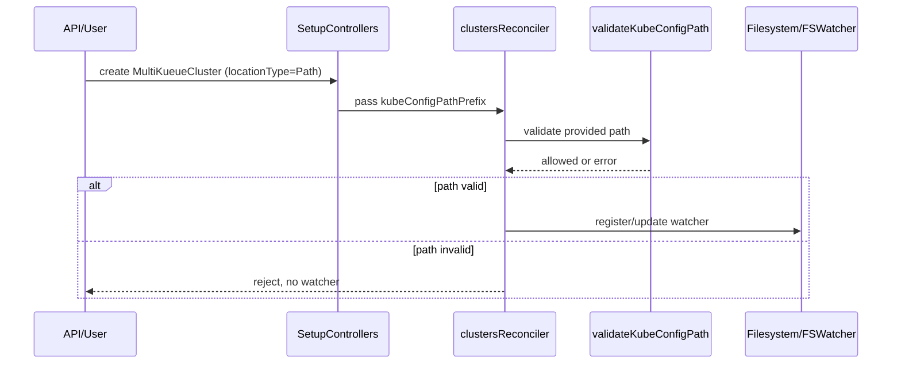

# PR #12223: secure path to avoid path traversal issues

**Summary**: secure path to avoid path traversal issues

**Sources**: https://github.com/kubernetes-sigs/kueue/pull/12223

**Last updated**: 2026-06-26T14:24:25Z

---

## Metadata

- **State**: closed (merged)
- **Author**: [@kannon92](https://github.com/kannon92)
- **Branch**: `fix-path-issues-mk` → `main`
- **Created**: 2026-06-12T19:01:35Z
- **Updated**: 2026-06-26T14:24:25Z
- **Merged**: 2026-06-25T21:18:30Z
- **Closed**: 2026-06-25T21:18:30Z
- **Labels**: `kind/feature`, `size/L`, `lgtm`, `release-note-action-required`, `approved`, `cncf-cla: yes`, `area/multikueue`
- **Assignees**: [@mimowo](https://github.com/mimowo), [@olekzabl](https://github.com/olekzabl), [@tenzen-y](https://github.com/tenzen-y)
- **Requested reviewers**: [@mwielgus](https://github.com/mwielgus), [@pajakd](https://github.com/pajakd), [@kshalot](https://github.com/kshalot), [@tenzen-y](https://github.com/tenzen-y)
- **Changed files**: 12   **+456 / -25**

## Description

<!--  Thanks for sending a pull request!  Here are some tips for you:

1. If this is your first time, please read our contributor guidelines: https://git.k8s.io/community/contributors/guide/first-contribution.md#your-first-contribution and developer guide https://git.k8s.io/community/contributors/devel/development.md#development-guide
2. Please label this pull request according to what type of issue you are addressing, especially if this is a release targeted pull request. For reference on required PR/issue labels, read here:
https://git.k8s.io/community/contributors/devel/sig-release/release.md#issuepr-kind-label
3. Ensure you have added or ran the appropriate tests for your PR: https://git.k8s.io/community/contributors/devel/sig-testing/testing.md
4. If you want *faster* PR reviews, read how: https://git.k8s.io/community/contributors/guide/pull-requests.md#best-practices-for-faster-reviews
5. If the PR is unfinished, see how to mark it: https://git.k8s.io/community/contributors/guide/pull-requests.md#marking-unfinished-pull-requests
-->

#### What type of PR is this?
/kind feature
/area multikueue
<!--
Add one of the following kinds:
/kind bug
/kind cleanup
/kind documentation
/kind feature
/kind kep

Optionally add one or more of the following kinds if applicable:
/kind api-change
/kind deprecation
/kind failing-test
/kind flake
/kind regression

Please also consider setting the area:
/area tas
/area integrations
/area multikueue
/area dashboard
/area localization
/area testing
/area website
-->

#### What this PR does / why we need it:

#### Which issue(s) this PR fixes:
<!--
*Automatically closes linked issue when PR is merged.
Usage: `Fixes #<issue number>`, or `Fixes (paste link of issue)`.
_If PR is about `failing-tests or flakes`, please post the related issues/tests in a comment and do not use `Fixes`_*
-->
Fixes #12144 

#### Special notes for your reviewer:

https://owasp.org/www-community/attacks/Path_Traversal

#### Does this PR introduce a user-facing change?
<!--
If no, just write "NONE" in the release-note block below.
If yes, a release note is required:
Enter your extended release note in the block below. If the PR requires additional action from users switching to the new release, include the string "action required".
-->
```release-note
MultiKueue: Fixed a security vulnerability in `locationType=Path` kubeconfig handling
that could allow users with `MultiKueueCluster` create or update access to make the
controller read arbitrary files. Kueue now validates path-based kubeconfigs to stay under
`/etc/multikueue/kubeconfigs`.

ACTION REQUIRED: If you use `locationType=Path`, plan to move kubeconfig files under
`/etc/multikueue/kubeconfigs`, or switch to `locationType=Secret` or `ClusterProfile`.
This prepares your setup for future releases where `MultiKueueKubeConfigPathValidation`
is expected to be enabled by default.
```


<!-- This is an auto-generated comment: release notes by coderabbit.ai -->
## Summary by CodeRabbit

* **New Features**
  * Added the `SafeMultiKueueConfigPath` feature gate (enabled by default) to enforce safe `locationType=Path` kubeconfig handling: rejects empty/relative/`..` paths, blocks symlink escapes, confines reads to `/etc/multikueue/kubeconfigs/`, and avoids filesystem watcher registration for invalid paths. Disable the gate to restore legacy behavior.
* **Documentation**
  * Added security considerations and setup guidance for using `Path` kubeconfigs, including recommended `Secret`/`ClusterProfile` alternatives.
* **Tests**
  * Added kubeconfig path validation coverage and updated integration setup for test-specific path prefixing.
<!-- end of auto-generated comment: release notes by coderabbit.ai -->

## Discussion

### Comment by [@netlify[bot]](https://github.com/apps/netlify) — 2026-06-12T19:01:41Z

### <span aria-hidden="true">✅</span> Deploy Preview for *kubernetes-sigs-kueue* ready!


|  Name | Link |
|:-:|------------------------|
|<span aria-hidden="true">🔨</span> Latest commit | 164b6db54990cb180e40abf891458d6bd53e5ac7 |
|<span aria-hidden="true">🔍</span> Latest deploy log | https://app.netlify.com/projects/kubernetes-sigs-kueue/deploys/6a3d2c35c75d42000822b926 |
|<span aria-hidden="true">😎</span> Deploy Preview | [https://deploy-preview-12223--kubernetes-sigs-kueue.netlify.app](https://deploy-preview-12223--kubernetes-sigs-kueue.netlify.app) |
|<span aria-hidden="true">📱</span> Preview on mobile | <details><summary> Toggle QR Code... </summary><br /><br /><br /><br />_Use your smartphone camera to open QR code link._</details> |
---
<!-- [kubernetes-sigs-kueue Preview](https://deploy-preview-12223--kubernetes-sigs-kueue.netlify.app) -->
_To edit notification comments on pull requests, go to your [Netlify project configuration](https://app.netlify.com/projects/kubernetes-sigs-kueue/configuration/notifications#deploy-notifications)._

### Comment by [@k8s-ci-robot](https://github.com/k8s-ci-robot) — 2026-06-12T19:01:45Z

[APPROVALNOTIFIER] This PR is **NOT APPROVED**

This pull-request has been approved by: *<a href="https://github.com/kubernetes-sigs/kueue/pull/12223#" title="Author self-approved">kannon92</a>*
**Once this PR has been reviewed and has the lgtm label**, please assign [tenzen-y](https://github.com/tenzen-y) for approval. For more information see [the Code Review Process](https://git.k8s.io/community/contributors/guide/owners.md#the-code-review-process).

The full list of commands accepted by this bot can be found [here](https://go.k8s.io/bot-commands?repo=kubernetes-sigs%2Fkueue).

<details open>
Needs approval from an approver in each of these files:

- **[OWNERS](https://github.com/kubernetes-sigs/kueue/blob/main/OWNERS)**

Approvers can indicate their approval by writing `/approve` in a comment
Approvers can cancel approval by writing `/approve cancel` in a comment
</details>
<!-- META={"approvers":["tenzen-y"]} -->

### Comment by [@coderabbitai[bot]](https://github.com/apps/coderabbitai) — 2026-06-12T19:01:51Z

<!-- This is an auto-generated comment: summarize by coderabbit.ai -->
<!-- review_stack_entry_start -->

[](https://app.coderabbit.ai/change-stack/kubernetes-sigs/kueue/pull/12223?utm_source=github_walkthrough&utm_medium=github&utm_campaign=change_stack)

<!-- review_stack_entry_end -->
<!-- This is an auto-generated comment: review paused by coderabbit.ai -->

> [!NOTE]
> ## Reviews paused
> 
> It looks like this branch is under active development. To avoid overwhelming you with review comments due to an influx of new commits, CodeRabbit has automatically paused this review. You can configure this behavior by changing the `reviews.auto_review.auto_pause_after_reviewed_commits` setting.
> 
> Use the following commands to manage reviews:
> - `@coderabbitai resume` to resume automatic reviews.
> - `@coderabbitai review` to trigger a single review.
> 
> Use the checkboxes below for quick actions:
> - [ ] <!-- {"checkboxId": "7f6cc2e2-2e4e-497a-8c31-c9e4573e93d1"} --> ▶️ Resume reviews
> - [ ] <!-- {"checkboxId": "e9bb8d72-00e8-4f67-9cb2-caf3b22574fe"} --> 🔍 Trigger review

<!-- end of auto-generated comment: review paused by coderabbit.ai -->
<!-- walkthrough_start -->

<details>
<summary>📝 Walkthrough</summary>

## Walkthrough

This PR adds security controls for MultiKueue's filesystem-based kubeconfig support: a feature gate enables canonicalization, symlink resolution, and prefix containment checks by default, restricting Path kubeconfig reads to a configured directory and rejecting traversal or symlink escapes.

## Changes

**KubeConfig Path Security Controls**

|Layer / File(s)|Summary|
|---|---|
|**Feature Gate Definition & Setup Configuration** <br> `pkg/features/kube_features.go`, `pkg/controller/admissionchecks/multikueue/controllers.go`, `site/data/featuregates/versioned_feature_list.yaml`, `test/compatibility_lifecycle/reference/versioned_feature_list.yaml`|`SafeMultiKueueConfigPath` feature gate is introduced and enabled by default in v0.19 Beta. New `WithKubeConfigPathPrefixForTest` setup option and `kubeConfigPathPrefix` field in `SetupOptions` allow configuring the allowed prefix path. Feature gate is registered in versioned specs. `SetupControllers` wires the prefix into the reconciler.|
|**Path Validation Implementation** <br> `pkg/controller/admissionchecks/multikueue/multikueuecluster.go`|Adds `DefaultKubeConfigPathPrefix` constant (`/etc/multikueue/kubeconfigs`), `validateKubeConfigPath` function, and validation logic that rejects empty/relative paths, prevents `..` escapes after cleaning, resolves symlinks safely via `filepath.EvalSymlinks`, and verifies resolved paths remain under the configured prefix boundary. `getKubeConfigFromPath` now validates and resolves before reading.|
|**Reconciler Integration & Event Handlers** <br> `pkg/controller/admissionchecks/multikueue/multikueuecluster.go`|`clustersReconciler` stores `kubeConfigPathPrefix`; `newClustersReconciler` initializes it with `DefaultKubeConfigPathPrefix`. During Create/Update for `PathLocationType`, filesystem watcher registration/update occurs only after successful path validation; invalid paths are rejected without adding/updating watchers.|
|**Test Infrastructure & Validation Tests** <br> `pkg/controller/admissionchecks/multikueue/multikueuecluster_test.go`|`TestUpdateConfig` gains `overrideKubeConfigPrefix` flag allowing test-specific prefix override and updated error assertions for invalid empty paths. New comprehensive `TestValidateKubeConfigPath` table-driven test covers empty/relative paths, `..` traversal, paths outside prefix, symlink escapes, service account token paths, prefix-name collisions, and verifies legacy behavior when feature gate is disabled.|
|**User-Facing Documentation & KEP Mitigation** <br> `keps/693-multikueue/README.md`, `site/content/en/docs/concepts/multikueue.md`, `site/content/en/docs/tasks/manage/setup_multikueue.md`|KEP-693 gains new risk/mitigation entry for arbitrary file read. Concepts doc adds "Security Considerations" section documenting `ClusterProfile`/`Secret` as production-recommended while `Path` is development-only, detailing default path validation rules. Setup guide includes optional section explaining how to enable `locationType=Path` with default `SafeMultiKueueConfigPath` constraints and feature-gate disabling for legacy behavior.|
|**Integration Test Setup Wiring** <br> `test/integration/multikueue/suite_test.go`, `test/integration/multikueue/setup_test.go`|`managerAndMultiKueueSetup` signature gains variadic `extraOpts` parameter to accept additional setup options. MultiKueue controller options are refactored into a slice allowing option appending. Integration tests now pass `WithKubeConfigPathPrefixForTest(os.TempDir())` for test-scoped path validation.|

## Sequence Diagram



## Estimated code review effort

🎯 3 (Moderate) | ⏱️ ~25 minutes

## Suggested labels

`kind/kep`, `size/M`, `ok-to-test`

## Suggested reviewers

- kshalot

## Poem

> 🐰 A rabbit hops through paths so bright,
> Symlinks curl and dots try to bite,
> A safe prefix fences every way,
> No `..` may wander or stray.
> Guards in code keep kubeconfigs tight.

</details>

<!-- walkthrough_end -->
<!-- pre_merge_checks_walkthrough_start -->

<details>
<summary>🚥 Pre-merge checks | ✅ 4 | ❌ 1</summary>

### ❌ Failed checks (1 warning)

|     Check name     | Status     | Explanation                                                                           | Resolution                                                                         |
| :----------------: | :--------- | :------------------------------------------------------------------------------------ | :--------------------------------------------------------------------------------- |
| Docstring Coverage | ⚠️ Warning | Docstring coverage is 50.00% which is insufficient. The required threshold is 80.00%. | Write docstrings for the functions missing them to satisfy the coverage threshold. |

<details>
<summary>✅ Passed checks (4 passed)</summary>

|         Check name         | Status   | Explanation                                                                                                                                                                                                                                     |
| :------------------------: | :------- | :---------------------------------------------------------------------------------------------------------------------------------------------------------------------------------------------------------------------------------------------- |
|         Title check        | ✅ Passed | The title 'secure path to avoid path traversal issues' directly addresses the main objective of the PR: implementing path traversal security validations for KubeConfig Path-based configuration in MultiKueue.                                 |
|     Linked Issues check    | ✅ Passed | The PR implements comprehensive path validation and security controls [`#12144`], including SafeMultiKueueConfigPath feature gate, path traversal prevention, symlink resolution, and documentation recommending ClusterProfile/Secret over Path. |
| Out of Scope Changes check | ✅ Passed | All changes are directly related to securing path-based KubeConfig handling: validation logic, feature gate, test coverage, and documentation updates. No unrelated changes detected.                                                           |
|      Description Check     | ✅ Passed | Check skipped - CodeRabbit’s high-level summary is enabled.                                                                                                                                                                                     |

</details>

<sub>✏️ Tip: You can configure your own custom pre-merge checks in the settings.</sub>

</details>

<!-- pre_merge_checks_walkthrough_end -->
<!-- finishing_touch_checkbox_start -->

<details>
<summary>✨ Finishing Touches</summary>

<details>
<summary>🧪 Generate unit tests (beta)</summary>

- [ ] <!-- {"checkboxId": "f47ac10b-58cc-4372-a567-0e02b2c3d479", "radioGroupId": "utg-output-choice-group-unknown_comment_id"} -->   Create PR with unit tests

</details>

</details>

<!-- finishing_touch_checkbox_end -->
<!-- tips_start -->

---

Thanks for using [CodeRabbit](https://coderabbit.ai?utm_source=oss&utm_medium=github&utm_campaign=kubernetes-sigs/kueue&utm_content=12223)! It's free for OSS, and your support helps us grow. If you like it, consider giving us a shout-out.

<details>
<summary>❤️ Share</summary>

- [X](https://twitter.com/intent/tweet?text=I%20just%20used%20%40coderabbitai%20for%20my%20code%20review%2C%20and%20it%27s%20fantastic%21%20It%27s%20free%20for%20OSS%20and%20offers%20a%20free%20trial%20for%20the%20proprietary%20code.%20Check%20it%20out%3A&url=https%3A//coderabbit.ai)
- [Mastodon](https://mastodon.social/share?text=I%20just%20used%20%40coderabbitai%20for%20my%20code%20review%2C%20and%20it%27s%20fantastic%21%20It%27s%20free%20for%20OSS%20and%20offers%20a%20free%20trial%20for%20the%20proprietary%20code.%20Check%20it%20out%3A%20https%3A%2F%2Fcoderabbit.ai)
- [Reddit](https://www.reddit.com/submit?title=Great%20tool%20for%20code%20review%20-%20CodeRabbit&text=I%20just%20used%20CodeRabbit%20for%20my%20code%20review%2C%20and%20it%27s%20fantastic%21%20It%27s%20free%20for%20OSS%20and%20offers%20a%20free%20trial%20for%20proprietary%20code.%20Check%20it%20out%3A%20https%3A//coderabbit.ai)
- [LinkedIn](https://www.linkedin.com/sharing/share-offsite/?url=https%3A%2F%2Fcoderabbit.ai&mini=true&title=Great%20tool%20for%20code%20review%20-%20CodeRabbit&summary=I%20just%20used%20CodeRabbit%20for%20my%20code%20review%2C%20and%20it%27s%20fantastic%21%20It%27s%20free%20for%20OSS%20and%20offers%20a%20free%20trial%20for%20proprietary%20code)

</details>


<sub>Comment `@coderabbitai help` to get the list of available commands.</sub>

<!-- tips_end -->

### Comment by [@linux-foundation-easycla[bot]](https://github.com/apps/linux-foundation-easycla) — 2026-06-15T16:07:45Z

<a href="https://easycla.lfx.linuxfoundation.org/#/?version=2"></a><br >The committers listed above are authorized under a signed CLA.<ul><li>:white_check_mark: login: kannon92 / name: Kevin Hannon (8c005afbbb959d348e60bda966ae25adf18e96b5)</li></ul>

### Comment by [@kannon92](https://github.com/kannon92) — 2026-06-15T16:19:09Z

@mimowo 

The one thing I don't like about this PR is the reliant on the feature gate as a permanent flag.

If we merge this if we GA this feature gate we are essentially deprecating the insecure Path field.

Should we go with a new API field (SecurePath) so that we can not rely on feature gate?

### Comment by [@mimowo](https://github.com/mimowo) — 2026-06-15T16:34:45Z

> The one thing I don't like about this PR is the reliant on the feature gate as a permanent flag.

No, we will GA the FG if no-one complains for a couple of releases (which I assume will be the case). That is what we did historically for MultiKueueAllowInsecureKubeconfigs, just forgot to remove it.

> If we merge this if we GA this feature gate we are essentially deprecating the insecure Path field.

No, we will still support the path, but are restricted to the safe prefix.

> Should we go with a new API field (SecurePath) so that we can not rely on feature gate?

I think that was the reason for my original comment - I don't see the need to maintain larger API surface for the custom prefixes.

### Comment by [@kannon92](https://github.com/kannon92) — 2026-06-16T15:17:01Z

/assign @olekzabl

### Comment by [@mimowo](https://github.com/mimowo) — 2026-06-16T19:21:27Z

/release-note-edit
```release-note
MultiKueue: Fixed a security vulnerability in `locationType=Path` kubeconfig handling
that could allow users with `MultiKueueCluster` create or update access to make the
controller read arbitrary files. Kueue now validates path-based kubeconfigs to stay under
`/etc/multikueue/kubeconfigs`.
```

### Comment by [@mimowo](https://github.com/mimowo) — 2026-06-17T18:28:37Z

/release-note-edit
```release-note
MultiKueue: Fixed a security vulnerability in `locationType=Path` kubeconfig handling
that could allow users with `MultiKueueCluster` create or update access to make the
controller read arbitrary files. Kueue now validates path-based kubeconfigs to stay under
`/etc/multikueue/kubeconfigs`.

ACTION REQUIRED: If you use `locationType=Path`, move kubeconfig files under
`/etc/multikueue/kubeconfigs` before upgrading, or switch to `locationType=Secret` or
`ClusterProfile`. As a temporary measure, you can disable the
`MultiKueueKubeConfigPathValidation` feature gate, but plan to migrate as soon as possible.
```

### Comment by [@mimowo](https://github.com/mimowo) — 2026-06-17T18:29:56Z

/release-note-edit
```release-note
MultiKueue: Fixed a security vulnerability in `locationType=Path` kubeconfig handling
that could allow users with `MultiKueueCluster` create or update access to make the
controller read arbitrary files. Kueue now validates path-based kubeconfigs to stay under
`/etc/multikueue/kubeconfigs`.

ACTION REQUIRED: If you use `locationType=Path`, move kubeconfig files under
`/etc/multikueue/kubeconfigs` before upgrading, or switch to `locationType=Secret` or
`ClusterProfile`. As a temporary measure, you can disable the
`MultiKueueKubeConfigPathValidation` feature gate, but plan to migrate to one of these
supported options as soon as possible.
```

### Comment by [@olekzabl](https://github.com/olekzabl) — 2026-06-18T14:58:11Z

/lgtm

### Comment by [@k8s-ci-robot](https://github.com/k8s-ci-robot) — 2026-06-18T14:58:24Z

LGTM label has been added.  <details>Git tree hash: b39410b2b6efd01f9a698769197965e05e9b130e</details>

### Comment by [@k8s-ci-robot](https://github.com/k8s-ci-robot) — 2026-06-19T00:57:24Z

New changes are detected. LGTM label has been removed.

### Comment by [@k8s-ci-robot](https://github.com/k8s-ci-robot) — 2026-06-20T04:45:59Z

PR needs rebase.

<details>

Instructions for interacting with me using PR comments are available [here](https://git.k8s.io/community/contributors/guide/pull-requests.md).  If you have questions or suggestions related to my behavior, please file an issue against the [kubernetes-sigs/prow](https://github.com/kubernetes-sigs/prow/issues/new?title=Prow%20issue:) repository.
</details>

### Comment by [@kannon92](https://github.com/kannon92) — 2026-06-22T13:44:38Z

@mimowo @tenzen-y this is ready for review again.

### Comment by [@olekzabl](https://github.com/olekzabl) — 2026-06-25T14:45:10Z

/lgtm

### Comment by [@kubernetes-prow[bot]](https://github.com/apps/kubernetes-prow) — 2026-06-25T14:45:18Z

LGTM label has been added.  <details>Git tree hash: 2e44a3229a569bdbe0bfc14fa4f994f0c80bd0b0</details>

### Comment by [@kannon92](https://github.com/kannon92) — 2026-06-25T20:10:47Z

/assign @mimowo @tenzen-y

### Comment by [@mimowo](https://github.com/mimowo) — 2026-06-25T20:58:57Z

/release-note-edit
```release-note
MultiKueue: Fixed a security vulnerability in `locationType=Path` kubeconfig handling
that could allow users with `MultiKueueCluster` create or update access to make the
controller read arbitrary files. Kueue now validates path-based kubeconfigs to stay under
`/etc/multikueue/kubeconfigs`.

ACTION REQUIRED: If you use `locationType=Path`, plan to move kubeconfig files under
`/etc/multikueue/kubeconfigs`, or switch to `locationType=Secret` or `ClusterProfile`.
This prepares your setup for future releases where `MultiKueueKubeConfigPathValidation`
is expected to be enabled by default.
```

### Comment by [@mimowo](https://github.com/mimowo) — 2026-06-25T20:59:38Z

/lgtm
/approve
Thank you for the PR, please prepare CP in case the robot fails on conflicts.
/cherrypick release-0.18
/cherrypick release-0.17

### Comment by [@k8s-infra-cherrypick-robot](https://github.com/k8s-infra-cherrypick-robot) — 2026-06-25T20:59:41Z

@mimowo: once the present PR merges, I will cherry-pick it on top of `release-0.17`, `release-0.18` in new PRs and assign them to you.

<details>

In response to [this](https://github.com/kubernetes-sigs/kueue/pull/12223#issuecomment-4804096852):

>/lgtm
>/approve
>Thank you for the PR, please prepare CP in case the robot fails on conflicts.
>/cherrypick release-0.18
>/cherrypick release-0.17


Instructions for interacting with me using PR comments are available [here](https://git.k8s.io/community/contributors/guide/pull-requests.md).  If you have questions or suggestions related to my behavior, please file an issue against the [kubernetes-sigs/prow](https://github.com/kubernetes-sigs/prow/issues/new?title=Prow%20issue:) repository.
</details>

### Comment by [@kubernetes-prow[bot]](https://github.com/apps/kubernetes-prow) — 2026-06-25T20:59:49Z

[APPROVALNOTIFIER] This PR is **APPROVED**

This pull-request has been approved by: *<a href="https://github.com/kubernetes-sigs/kueue/pull/12223#" title="Author self-approved">kannon92</a>*, *<a href="https://github.com/kubernetes-sigs/kueue/pull/12223#issuecomment-4804096852" title="Approved">mimowo</a>*, *<a href="https://github.com/kubernetes-sigs/kueue/pull/12223#pullrequestreview-4574688387" title="Approved">olekzabl</a>*

The full list of commands accepted by this bot can be found [here](https://go.k8s.io/bot-commands?repo=kubernetes-sigs%2Fkueue).

The pull request process is described [here](https://git.k8s.io/community/contributors/guide/owners.md#the-code-review-process)

<details >
Needs approval from an approver in each of these files:

- ~~[OWNERS](https://github.com/kubernetes-sigs/kueue/blob/main/OWNERS)~~ [mimowo]

Approvers can indicate their approval by writing `/approve` in a comment
Approvers can cancel approval by writing `/approve cancel` in a comment
</details>
<!-- META={"approvers":[]} -->

### Comment by [@k8s-infra-cherrypick-robot](https://github.com/k8s-infra-cherrypick-robot) — 2026-06-25T21:19:09Z

@mimowo: #12223 failed to apply on top of branch "release-0.18":
```
Applying: secure path to avoid path traversal issues
Using index info to reconstruct a base tree...
M	keps/693-multikueue/README.md
M	pkg/controller/admissionchecks/multikueue/controllers.go
M	pkg/controller/admissionchecks/multikueue/multikueuecluster.go
M	pkg/controller/admissionchecks/multikueue/multikueuecluster_test.go
M	pkg/features/kube_features.go
M	site/content/en/docs/concepts/multikueue.md
M	site/content/en/docs/tasks/manage/setup_multikueue.md
M	site/data/featuregates/versioned_feature_list.yaml
M	test/compatibility_lifecycle/reference/versioned_feature_list.yaml
M	test/integration/multikueue/setup_test.go
Falling back to patching base and 3-way merge...
Auto-merging keps/693-multikueue/README.md
Auto-merging pkg/controller/admissionchecks/multikueue/controllers.go
CONFLICT (content): Merge conflict in pkg/controller/admissionchecks/multikueue/controllers.go
Auto-merging pkg/controller/admissionchecks/multikueue/multikueuecluster.go
CONFLICT (content): Merge conflict in pkg/controller/admissionchecks/multikueue/multikueuecluster.go
Auto-merging pkg/controller/admissionchecks/multikueue/multikueuecluster_test.go
CONFLICT (content): Merge conflict in pkg/controller/admissionchecks/multikueue/multikueuecluster_test.go
Auto-merging pkg/features/kube_features.go
Auto-merging site/content/en/docs/concepts/multikueue.md
Auto-merging site/content/en/docs/tasks/manage/setup_multikueue.md
Auto-merging site/data/featuregates/versioned_feature_list.yaml
CONFLICT (content): Merge conflict in site/data/featuregates/versioned_feature_list.yaml
Auto-merging test/compatibility_lifecycle/reference/versioned_feature_list.yaml
CONFLICT (content): Merge conflict in test/compatibility_lifecycle/reference/versioned_feature_list.yaml
Auto-merging test/integration/multikueue/setup_test.go
CONFLICT (content): Merge conflict in test/integration/multikueue/setup_test.go
error: Failed to merge in the changes.
hint: Use 'git am --show-current-patch=diff' to see the failed patch
hint: When you have resolved this problem, run "git am --continue".
hint: If you prefer to skip this patch, run "git am --skip" instead.
hint: To restore the original branch and stop patching, run "git am --abort".
hint: Disable this message with "git config set advice.mergeConflict false"
Patch failed at 0001 secure path to avoid path traversal issues

```

<details>

In response to [this](https://github.com/kubernetes-sigs/kueue/pull/12223#issuecomment-4804096852):

>/lgtm
>/approve
>Thank you for the PR, please prepare CP in case the robot fails on conflicts.
>/cherrypick release-0.18
>/cherrypick release-0.17


Instructions for interacting with me using PR comments are available [here](https://git.k8s.io/community/contributors/guide/pull-requests.md).  If you have questions or suggestions related to my behavior, please file an issue against the [kubernetes-sigs/prow](https://github.com/kubernetes-sigs/prow/issues/new?title=Prow%20issue:) repository.
</details>

### Comment by [@k8s-infra-cherrypick-robot](https://github.com/k8s-infra-cherrypick-robot) — 2026-06-25T21:19:45Z

@mimowo: #12223 failed to apply on top of branch "release-0.17":
```
Applying: secure path to avoid path traversal issues
Using index info to reconstruct a base tree...
M	keps/693-multikueue/README.md
A	pkg/controller/admissionchecks/multikueue/clusterqueue_test.go
M	pkg/controller/admissionchecks/multikueue/controllers.go
M	pkg/controller/admissionchecks/multikueue/multikueuecluster.go
M	pkg/controller/admissionchecks/multikueue/multikueuecluster_test.go
M	pkg/controller/admissionchecks/multikueue/workload_test.go
M	pkg/features/kube_features.go
M	site/content/en/docs/concepts/multikueue.md
M	site/content/en/docs/tasks/manage/setup_multikueue.md
M	site/data/featuregates/versioned_feature_list.yaml
M	test/compatibility_lifecycle/reference/versioned_feature_list.yaml
M	test/integration/multikueue/setup_test.go
Falling back to patching base and 3-way merge...
Auto-merging keps/693-multikueue/README.md
CONFLICT (modify/delete): pkg/controller/admissionchecks/multikueue/clusterqueue_test.go deleted in HEAD and modified in secure path to avoid path traversal issues.  Version secure path to avoid path traversal issues of pkg/controller/admissionchecks/multikueue/clusterqueue_test.go left in tree.
Auto-merging pkg/controller/admissionchecks/multikueue/controllers.go
CONFLICT (content): Merge conflict in pkg/controller/admissionchecks/multikueue/controllers.go
Auto-merging pkg/controller/admissionchecks/multikueue/multikueuecluster.go
CONFLICT (content): Merge conflict in pkg/controller/admissionchecks/multikueue/multikueuecluster.go
Auto-merging pkg/controller/admissionchecks/multikueue/multikueuecluster_test.go
CONFLICT (content): Merge conflict in pkg/controller/admissionchecks/multikueue/multikueuecluster_test.go
Auto-merging pkg/controller/admissionchecks/multikueue/workload_test.go
Auto-merging pkg/features/kube_features.go
Auto-merging site/content/en/docs/concepts/multikueue.md
Auto-merging site/content/en/docs/tasks/manage/setup_multikueue.md
Auto-merging site/data/featuregates/versioned_feature_list.yaml
CONFLICT (content): Merge conflict in site/data/featuregates/versioned_feature_list.yaml
Auto-merging test/compatibility_lifecycle/reference/versioned_feature_list.yaml
CONFLICT (content): Merge conflict in test/compatibility_lifecycle/reference/versioned_feature_list.yaml
Auto-merging test/integration/multikueue/setup_test.go
CONFLICT (content): Merge conflict in test/integration/multikueue/setup_test.go
error: Failed to merge in the changes.
hint: Use 'git am --show-current-patch=diff' to see the failed patch
hint: When you have resolved this problem, run "git am --continue".
hint: If you prefer to skip this patch, run "git am --skip" instead.
hint: To restore the original branch and stop patching, run "git am --abort".
hint: Disable this message with "git config set advice.mergeConflict false"
Patch failed at 0001 secure path to avoid path traversal issues

```

<details>

In response to [this](https://github.com/kubernetes-sigs/kueue/pull/12223#issuecomment-4804096852):

>/lgtm
>/approve
>Thank you for the PR, please prepare CP in case the robot fails on conflicts.
>/cherrypick release-0.18
>/cherrypick release-0.17


Instructions for interacting with me using PR comments are available [here](https://git.k8s.io/community/contributors/guide/pull-requests.md).  If you have questions or suggestions related to my behavior, please file an issue against the [kubernetes-sigs/prow](https://github.com/kubernetes-sigs/prow/issues/new?title=Prow%20issue:) repository.
</details>

### Comment by [@kannon92](https://github.com/kannon92) — 2026-06-25T21:22:13Z

> /lgtm /approve Thank you for the PR, please prepare CP in case the robot fails on conflicts. /cherrypick release-0.18 /cherrypick release-0.17

I'm not sure if I really like the idea of cherry-pick an alpha feature gate into release branches.

### Comment by [@mimowo](https://github.com/mimowo) — 2026-06-26T14:20:19Z

The ideas is to early notify users by the release note so that they would have more time to adapt their env. 

However, I don't have a strong view here.

### Comment by [@kannon92](https://github.com/kannon92) — 2026-06-26T14:24:25Z

The feature is alpha so early notice is in 0.19. I just want to avoid carrying alpha features as that makes it hard to rationalize support of release branches.

## Reviews

### Review by [@coderabbitai[bot]](https://github.com/apps/coderabbitai) (commented) — 2026-06-12T19:14:19Z

**Actionable comments posted: 3**

> [!CAUTION]
> Some comments are outside the diff and can’t be posted inline due to platform limitations.
> 
> 
> 
> <details>
> <summary>⚠️ Outside diff range comments (2)</summary><blockquote>
> 
> <details>
> <summary>keps/693-multikueue/README.md (1)</summary><blockquote>
> 
> `393-415`: _⚠️ Potential issue_ | _🟡 Minor_ | _⚡ Quick win_
> 
> **Align the KEP config snippet/description with the actual `MultiKueue` field name.**
> 
> The KEP section still refers to `ClusterProfileConfig`, but the API uses `ClusterProfile`. This creates config guidance drift in the same block where `KubeConfigPathPrefix` was added.
> 
> <details>
> <summary>Suggested doc fix</summary>
> 
> ```diff
>  type MultiKueue struct {
>  	GCInterval *metav1.Duration `json:"gcInterval"`
>  	Origin *string `json:"origin,omitempty"`
>  	WorkerLostTimeout *metav1.Duration `json:"workerLostTimeout,omitempty"`
> -	ClusterProfileConfig *ClusterProfileConfig `json:"clusterProfileConfig,omitempty"`
> +	ClusterProfile *ClusterProfile `json:"clusterProfile,omitempty"`
>  	KubeConfigPathPrefix *string `json:"kubeConfigPathPrefix,omitempty"`
>  }
>  ...
> -- `ClusterProfileConfig` - defines the configuration for the ClusterProfile API.
> +- `ClusterProfile` - defines the configuration for the ClusterProfile API.
> ```
> </details>
> 
> <details>
> <summary>🤖 Prompt for AI Agents</summary>
> 
> ```
> Verify each finding against current code. Fix only still-valid issues, skip the
> rest with a brief reason, keep changes minimal, and validate.
> 
> In `@keps/693-multikueue/README.md` around lines 393 - 415, The README docs refer
> to a non-existent field `ClusterProfileConfig` while the API defines
> `ClusterProfile` on the MultiKueue struct; update the config snippet and the
> explanatory bullet to use the actual field name `ClusterProfile` everywhere
> (including the struct example and the descriptive line "ClusterProfile - defines
> the configuration for the ClusterProfile API"), and remove or rename any mention
> of `ClusterProfileConfig` so the KEP text and the MultiKueue struct
> (`MultiKueue`, `KubeConfigPathPrefix`, `WorkerLostTimeout`, `GCInterval`,
> `Origin`) are consistent.
> ```
> 
> </details>
> 
> <!-- cr-comment:v1:efb9733f7f4efde89cd459e3 -->
> 
> </blockquote></details>
> <details>
> <summary>pkg/controller/admissionchecks/multikueue/multikueuecluster.go (1)</summary><blockquote>
> 
> `1130-1142`: _⚠️ Potential issue_ | _🟠 Major_ | _⚡ Quick win_
> 
> **Remove stale FS watcher when a Path update becomes invalid.**
> 
> When a cluster stays on `locationType=Path` but updates to an invalid path, the old watcher is left in place. That can keep reconciling on outdated files and leaks watcher intent.
> 
> <details>
> <summary>Suggested fix</summary>
> 
> ```diff
>  	clusterNewHasKubeConfigPath := clusterNew.Spec.ClusterSource.KubeConfig != nil && clusterNew.Spec.ClusterSource.KubeConfig.LocationType == kueue.PathLocationType
>  	clusterOldHasKubeConfigPath := clusterOld.Spec.ClusterSource.KubeConfig != nil && clusterOld.Spec.ClusterSource.KubeConfig.LocationType == kueue.PathLocationType
> -	if clusterOldHasKubeConfigPath && !clusterNewHasKubeConfigPath {
> +	oldPath := ""
> +	if clusterOldHasKubeConfigPath {
> +		oldPath = clusterOld.Spec.ClusterSource.KubeConfig.Location
> +	}
> +	newPath := ""
> +	if clusterNewHasKubeConfigPath {
> +		newPath = clusterNew.Spec.ClusterSource.KubeConfig.Location
> +	}
> +	if clusterOldHasKubeConfigPath && (!clusterNewHasKubeConfigPath || oldPath != newPath) {
>  		err := c.fsWatcher.Remove(clusterOld.Name)
>  		if err != nil {
>  			log.Error(err, "Remove FS watch")
>  		}
>  	}
> ```
> </details>
> 
> As per coding guidelines, `pkg/controller/**/*.go` changes should preserve reconciliation correctness and idempotency.
> 
> <details>
> <summary>🤖 Prompt for AI Agents</summary>
> 
> ```
> Verify each finding against current code. Fix only still-valid issues, skip the
> rest with a brief reason, keep changes minimal, and validate.
> 
> In `@pkg/controller/admissionchecks/multikueue/multikueuecluster.go` around lines
> 1130 - 1142, If a cluster remains locationType=Path but the updated kubeconfig
> path is invalid, the old FS watcher must be removed to avoid stale watches; in
> the update handling around clusterOldHasKubeConfigPath /
> clusterNewHasKubeConfigPath add logic so that when
> validateKubeConfigPath(clusterNew.Spec.ClusterSource.KubeConfig.Location,
> c.kubeConfigPathPrefix) returns an error you call
> c.fsWatcher.Remove(clusterOld.Name) (or Remove using clusterNew.Name if the name
> is stable) and log any removal error, otherwise proceed with
> c.fsWatcher.AddOrUpdate with the validated path; ensure you reference
> clusterOldHasKubeConfigPath, clusterNewHasKubeConfigPath,
> validateKubeConfigPath, c.fsWatcher.Remove and c.fsWatcher.AddOrUpdate so the
> change is localized and keeps reconciliation idempotent.
> ```
> 
> </details>
> 
> <!-- cr-comment:v1:9cdb18e3ad4e065c7ea56e1f -->
> 
> _Source: Coding guidelines_
> 
> </blockquote></details>
> 
> </blockquote></details>

<details>
<summary>🧹 Nitpick comments (1)</summary><blockquote>

<details>
<summary>site/content/en/docs/tasks/manage/setup_multikueue.md (1)</summary><blockquote>

`100-105`: _⚡ Quick win_

**Clarify ConfigMap context for the Configuration example.**

The YAML at lines 100–105 shows the Configuration schema but lacks context on how users should actually deploy it. Based on the example at lines 376–396, Kueue configuration is typically embedded in a ConfigMap's `data.controller_manager_config.yaml` field. Consider clarifying whether this example is meant to be standalone or should reference the ConfigMap wrapper, to avoid confusing users unfamiliar with Kueue's config deployment model.

<details>
<summary>🤖 Prompt for AI Agents</summary>

```
Verify each finding against current code. Fix only still-valid issues, skip the
rest with a brief reason, keep changes minimal, and validate.

In `@site/content/en/docs/tasks/manage/setup_multikueue.md` around lines 100 -
105, The Configuration example showing "apiVersion:
config.kueue.x-k8s.io/v1beta2 / kind: Configuration / multiKueue:
kubeConfigPathPrefix: /etc/kueue/multikueue/" lacks context about how it is
deployed; update the docs to state whether this snippet is standalone or must be
embedded in a ConfigMap under the key data.controller_manager_config.yaml (as
used in the later example), and either replace the snippet with the full
ConfigMap wrapper or add a short note above the "Configuration" block clarifying
that users should place the YAML as the value of
data.controller_manager_config.yaml in the controller manager ConfigMap so Kueue
picks it up (referencing the Configuration resource and
multiKueue.kubeConfigPathPrefix symbols).
```

</details>

<!-- cr-comment:v1:f3e8038b4853d08de4ee9c61 -->

</blockquote></details>

</blockquote></details>

<details>
<summary>🤖 Prompt for all review comments with AI agents</summary>

```
Verify each finding against current code. Fix only still-valid issues, skip the
rest with a brief reason, keep changes minimal, and validate.

Inline comments:
In `@pkg/controller/admissionchecks/multikueue/multikueuecluster_test.go`:
- Around line 1463-1493: The tests in multikueuecluster_test.go hard-code
Unix-style paths (cases "path outside prefix", "relative path rejected",
"symlink escape rejected", "SA token path rejected", "prefix name collision")
which makes them brittle on non-Unix platforms; update the test cases to
construct platform-agnostic paths using filepath.Join / filepath.FromSlash and
os.PathSeparator (instead of string literals like "/var/..."), generate the
allowedDir and test paths via filepath.Abs or filepath.Join(tempDir, ...) so
they are absolute on all OSes, create or skip symlink setup conditionally using
os.Symlink only when supported (runtime.GOOS != "windows" or check os.Symlink
availability), and relax the asserted error matching to accept either the
absolute-path error or the "not under" message (e.g., check for both substrings)
so the tests (variables like allowedDir, symlink and the named test cases)
behave consistently across platforms.

In `@pkg/controller/admissionchecks/multikueue/multikueuecluster.go`:
- Around line 938-944: The current EvalSymlinks call swallows all errors by
falling back to cleaned; change the error handling so that only
os.IsNotExist(err) falls back to using cleaned, and for any other error from
filepath.EvalSymlinks return or propagate the error (wrap it with context)
instead of assigning resolved = cleaned; update the block around
filepath.EvalSymlinks, err and resolved to use os.IsNotExist(err) to decide the
fallback and otherwise return the error to the caller.
- Around line 928-930: The current substring check strings.Contains(cleaned,
"..") is too broad and rejects valid filenames (e.g., "kube..config"); instead
after calling filepath.Clean examine path components and only reject when a path
element is exactly the parent-segment "..". Replace the substring test with
splitting cleaned by filepath.Separator (or using filepath.Split repeatedly) and
return fmt.Errorf("%w: path contains \"..\"", errPathNotAllowed) only if any
component == ".."; keep using the same cleaned variable and errPathNotAllowed
symbol so the change is local and preserves existing error behavior.

---

Outside diff comments:
In `@keps/693-multikueue/README.md`:
- Around line 393-415: The README docs refer to a non-existent field
`ClusterProfileConfig` while the API defines `ClusterProfile` on the MultiKueue
struct; update the config snippet and the explanatory bullet to use the actual
field name `ClusterProfile` everywhere (including the struct example and the
descriptive line "ClusterProfile - defines the configuration for the
ClusterProfile API"), and remove or rename any mention of `ClusterProfileConfig`
so the KEP text and the MultiKueue struct (`MultiKueue`, `KubeConfigPathPrefix`,
`WorkerLostTimeout`, `GCInterval`, `Origin`) are consistent.

In `@pkg/controller/admissionchecks/multikueue/multikueuecluster.go`:
- Around line 1130-1142: If a cluster remains locationType=Path but the updated
kubeconfig path is invalid, the old FS watcher must be removed to avoid stale
watches; in the update handling around clusterOldHasKubeConfigPath /
clusterNewHasKubeConfigPath add logic so that when
validateKubeConfigPath(clusterNew.Spec.ClusterSource.KubeConfig.Location,
c.kubeConfigPathPrefix) returns an error you call
c.fsWatcher.Remove(clusterOld.Name) (or Remove using clusterNew.Name if the name
is stable) and log any removal error, otherwise proceed with
c.fsWatcher.AddOrUpdate with the validated path; ensure you reference
clusterOldHasKubeConfigPath, clusterNewHasKubeConfigPath,
validateKubeConfigPath, c.fsWatcher.Remove and c.fsWatcher.AddOrUpdate so the
change is localized and keeps reconciliation idempotent.

---

Nitpick comments:
In `@site/content/en/docs/tasks/manage/setup_multikueue.md`:
- Around line 100-105: The Configuration example showing "apiVersion:
config.kueue.x-k8s.io/v1beta2 / kind: Configuration / multiKueue:
kubeConfigPathPrefix: /etc/kueue/multikueue/" lacks context about how it is
deployed; update the docs to state whether this snippet is standalone or must be
embedded in a ConfigMap under the key data.controller_manager_config.yaml (as
used in the later example), and either replace the snippet with the full
ConfigMap wrapper or add a short note above the "Configuration" block clarifying
that users should place the YAML as the value of
data.controller_manager_config.yaml in the controller manager ConfigMap so Kueue
picks it up (referencing the Configuration resource and
multiKueue.kubeConfigPathPrefix symbols).
```

</details>

<details>
<summary>🪄 Autofix (Beta)</summary>

Fix all unresolved CodeRabbit comments on this PR:

- [ ] <!-- {"checkboxId": "4b0d0e0a-96d7-4f10-b296-3a18ea78f0b9"} --> Push a commit to this branch (recommended)
- [ ] <!-- {"checkboxId": "ff5b1114-7d8c-49e6-8ac1-43f82af23a33"} --> Create a new PR with the fixes

</details>

---

<details>
<summary>ℹ️ Review info</summary>

<details>
<summary>⚙️ Run configuration</summary>

**Configuration used**: Path: .coderabbit.yaml

**Review profile**: CHILL

**Plan**: Pro

**Run ID**: `55e90705-623e-4d2c-9c7f-f8d8cae3e058`

</details>

<details>
<summary>📥 Commits</summary>

Reviewing files that changed from the base of the PR and between 3a50293c1c46d3a0177d4b531fcf7470a2b51e86 and 565b8d51306cf75f430246f171ec70eb5e1f1b7f.

</details>

<details>
<summary>⛔ Files ignored due to path filters (2)</summary>

* `apis/config/v1beta1/zz_generated.conversion.go` is excluded by `!**/*_generated*.go`, `!**/zz_generated.*.go`
* `apis/config/v1beta2/zz_generated.deepcopy.go` is excluded by `!**/*_generated*.go`, `!**/zz_generated.*.go`

</details>

<details>
<summary>📒 Files selected for processing (11)</summary>

* `apis/config/v1beta2/configuration_types.go`
* `cmd/kueue/main.go`
* `keps/693-multikueue/README.md`
* `pkg/controller/admissionchecks/multikueue/clusterqueue_test.go`
* `pkg/controller/admissionchecks/multikueue/controllers.go`
* `pkg/controller/admissionchecks/multikueue/multikueuecluster.go`
* `pkg/controller/admissionchecks/multikueue/multikueuecluster_test.go`
* `pkg/controller/admissionchecks/multikueue/workload_test.go`
* `site/content/en/docs/concepts/multikueue.md`
* `site/content/en/docs/reference/kueue-config.v1beta2.md`
* `site/content/en/docs/tasks/manage/setup_multikueue.md`

</details>

</details>

<!-- This is an auto-generated comment by CodeRabbit for review status -->

- **pkg/controller/admissionchecks/multikueue/multikueuecluster_test.go:1524** by [@coderabbitai[bot]](https://github.com/apps/coderabbitai) — 2026-06-12T19:14:18Z
```diff
@@ -1411,3 +1413,99 @@ func TestSetRemoteClientConfigDoesNotBlockOtherClusters(t *testing.T) {
 		t.Fatal("slow goroutine did not exit after release")
 	}
 }
+
+func TestValidateKubeConfigPath(t *testing.T) {
+	allowedDir := t.TempDir()
+	// Create a real file under the allowed dir to test symlink resolution.
+	validFile := filepath.Join(allowedDir, "worker.kubeconfig")
+	if err := os.WriteFile(validFile, []byte("test"), 0644); err != nil {
+		t.Fatalf("setup: %v", err)
+	}
+
+	// Create a symlink inside allowedDir that points outside.
+	externalFile := filepath.Join(t.TempDir(), "external-secret")
+	if err := os.WriteFile(externalFile, []byte("token"), 0644); err != nil {
+		t.Fatalf("setup: %v", err)
+	}
+	symlink := filepath.Join(allowedDir, "escape-symlink")
+	if err := os.Symlink(externalFile, symlink); err != nil {
+		t.Fatalf("setup: %v", err)
+	}
+
+	cases := map[string]struct {
+		path          string
+		allowedPrefix string
+		wantErr       bool
+		errContains   string
+	}{
+		"valid path under prefix": {
+			path:          validFile,
+			allowedPrefix: allowedDir,
+		},
+		"empty allowed prefix rejects all": {
+			path:          validFile,
+			allowedPrefix: "",
+			wantErr:       true,
+			errContains:   "no allowed path prefix configured",
+		},
+		"empty path": {
+			path:          "",
+			allowedPrefix: allowedDir,
+			wantErr:       true,
+			errContains:   "must not be empty",
+		},
+		"path with dot-dot traversal": {
+			path:          filepath.Join(allowedDir, "..", "etc", "passwd"),
+			allowedPrefix: allowedDir,
+			wantErr:       true,
+			errContains:   "not under",
+		},
+		"path outside prefix": {
+			path:          "/var/run/secrets/kubernetes.io/serviceaccount/token",
+			allowedPrefix: allowedDir,
+			wantErr:       true,
+			errContains:   "not under",
+		},
+		"relative path rejected": {
+			path:          "relative/path/file",
+			allowedPrefix: allowedDir,
+			wantErr:       true,
+			errContains:   "must be absolute",
+		},
+		"symlink escape rejected": {
+			path:          symlink,
+			allowedPrefix: allowedDir,
+			wantErr:       true,
+			errContains:   "not under",
+		},
+		"SA token path rejected": {
+			path:          "/var/run/secrets/kubernetes.io/serviceaccount/token",
+			allowedPrefix: "/etc/kueue/multikueue",
+			wantErr:       true,
+			errContains:   "not under",
+		},
+		"prefix name collision": {
+			// /etc/kueue-other should not match prefix /etc/kueue
+			path:          "/etc/kueue-other/file",
+			allowedPrefix: "/etc/kueue",
+			wantErr:       true,
+			errContains:   "not under",
+		},
```

  _⚠️ Potential issue_ | _🟡 Minor_ | _⚡ Quick win_
  
  **Make path-validation cases OS-agnostic to avoid platform-specific failures.**
  
  These cases hard-code Unix paths and assert `"not under"`. On non-Unix environments they can fail earlier with different errors (for example absolute-path checks), making this test brittle.
  
     
  
  <details>
  <summary>Suggested patch</summary>
  
  ```diff
   func TestValidateKubeConfigPath(t *testing.T) {
   	allowedDir := t.TempDir()
  +	outsideDir := t.TempDir()
  +	collisionBase := t.TempDir()
  +	allowedCollisionPrefix := filepath.Join(collisionBase, "kueue")
  +	outsidePath := filepath.Join(outsideDir, "serviceaccount", "token")
  +	collisionPath := filepath.Join(collisionBase, "kueue-other", "file")
  @@
   		"path outside prefix": {
  -			path:          "/var/run/secrets/kubernetes.io/serviceaccount/token",
  +			path:          outsidePath,
   			allowedPrefix: allowedDir,
   			wantErr:       true,
   			errContains:   "not under",
   		},
  @@
   		"SA token path rejected": {
  -			path:          "/var/run/secrets/kubernetes.io/serviceaccount/token",
  -			allowedPrefix: "/etc/kueue/multikueue",
  +			path:          outsidePath,
  +			allowedPrefix: allowedDir,
   			wantErr:       true,
   			errContains:   "not under",
   		},
   		"prefix name collision": {
  -			// /etc/kueue-other should not match prefix /etc/kueue
  -			path:          "/etc/kueue-other/file",
  -			allowedPrefix: "/etc/kueue",
  +			// ".../kueue-other" should not match prefix ".../kueue"
  +			path:          collisionPath,
  +			allowedPrefix: allowedCollisionPrefix,
   			wantErr:       true,
   			errContains:   "not under",
   		},
   	}
  ```
  </details>
  
  <!-- suggestion_start -->
  
  <details>
  <summary>📝 Committable suggestion</summary>
  
  > ‼️ **IMPORTANT**
  > Carefully review the code before committing. Ensure that it accurately replaces the highlighted code, contains no missing lines, and has no issues with indentation. Thoroughly test & benchmark the code to ensure it meets the requirements.
  
  ```suggestion
  func TestValidateKubeConfigPath(t *testing.T) {
  	allowedDir := t.TempDir()
  	outsideDir := t.TempDir()
  	collisionBase := t.TempDir()
  	allowedCollisionPrefix := filepath.Join(collisionBase, "kueue")
  	outsidePath := filepath.Join(outsideDir, "serviceaccount", "token")
  	collisionPath := filepath.Join(collisionBase, "kueue-other", "file")
  
  	tests := map[string]struct {
  		path          string
  		allowedPrefix string
  		wantErr       bool
  		errContains   string
  	}{
  		"path outside prefix": {
  			path:          outsidePath,
  			allowedPrefix: allowedDir,
  			wantErr:       true,
  			errContains:   "not under",
  		},
  		"relative path rejected": {
  			path:          "relative/path/file",
  			allowedPrefix: allowedDir,
  			wantErr:       true,
  			errContains:   "must be absolute",
  		},
  		"symlink escape rejected": {
  			path:          symlink,
  			allowedPrefix: allowedDir,
  			wantErr:       true,
  			errContains:   "not under",
  		},
  		"SA token path rejected": {
  			path:          outsidePath,
  			allowedPrefix: allowedDir,
  			wantErr:       true,
  			errContains:   "not under",
  		},
  		"prefix name collision": {
  			// ".../kueue-other" should not match prefix ".../kueue"
  			path:          collisionPath,
  			allowedPrefix: allowedCollisionPrefix,
  			wantErr:       true,
  			errContains:   "not under",
  		},
  	}
  ```
  
  </details>
  
  <!-- suggestion_end -->
  
  <details>
  <summary>🤖 Prompt for AI Agents</summary>
  
  ```
  Verify each finding against current code. Fix only still-valid issues, skip the
  rest with a brief reason, keep changes minimal, and validate.
  
  In `@pkg/controller/admissionchecks/multikueue/multikueuecluster_test.go` around
  lines 1463 - 1493, The tests in multikueuecluster_test.go hard-code Unix-style
  paths (cases "path outside prefix", "relative path rejected", "symlink escape
  rejected", "SA token path rejected", "prefix name collision") which makes them
  brittle on non-Unix platforms; update the test cases to construct
  platform-agnostic paths using filepath.Join / filepath.FromSlash and
  os.PathSeparator (instead of string literals like "/var/..."), generate the
  allowedDir and test paths via filepath.Abs or filepath.Join(tempDir, ...) so
  they are absolute on all OSes, create or skip symlink setup conditionally using
  os.Symlink only when supported (runtime.GOOS != "windows" or check os.Symlink
  availability), and relax the asserted error matching to accept either the
  absolute-path error or the "not under" message (e.g., check for both substrings)
  so the tests (variables like allowedDir, symlink and the named test cases)
  behave consistently across platforms.
  ```
  
  </details>
  
  <!-- fingerprinting:phantom:poseidon:hawk -->
  
  <!-- cr-comment:v1:2d1c0d37dd36a4f0ba5a0580 -->
  
  <!-- This is an auto-generated reply by CodeRabbit -->
  
  ✅ Addressed in commit 8cb0fb9
  
  <!-- This is an auto-generated comment by CodeRabbit -->

- **pkg/controller/admissionchecks/multikueue/multikueuecluster.go:930** by [@coderabbitai[bot]](https://github.com/apps/coderabbitai) — 2026-06-12T19:14:18Z
```diff
@@ -905,8 +907,63 @@ func (c *clustersReconciler) getKubeConfigFromSecret(ctx context.Context, secret
 	return kconfigBytes, nil
 }
 
-func (c *clustersReconciler) getKubeConfigFromPath(path string) ([]byte, error) {
-	return os.ReadFile(path)
+// errPathNotAllowed is returned when the resolved kubeconfig path escapes the
+// configured allowed prefix directory.
+var errPathNotAllowed = errors.New("kubeconfig path is not under the allowed prefix")
+
+// validateKubeConfigPath resolves symlinks and ensures the resulting absolute
+// path is located under allowedPrefix.  It rejects empty paths, paths that
+// contain ".." after cleaning, and any path that resolves outside the prefix.
+func validateKubeConfigPath(rawPath, allowedPrefix string) (string, error) {
+	if allowedPrefix == "" {
+		return "", fmt.Errorf("kubeconfig path location type is not allowed: no allowed path prefix configured")
+	}
+	if rawPath == "" {
+		return "", fmt.Errorf("kubeconfig path must not be empty")
+	}
+
+	cleaned := filepath.Clean(rawPath)
+
+	// Reject paths that still contain ".." after cleaning.
+	if strings.Contains(cleaned, "..") {
+		return "", fmt.Errorf("%w: path contains \"..\"", errPathNotAllowed)
+	}
```

  _⚠️ Potential issue_ | _🟡 Minor_ | _⚡ Quick win_
  
  **`strings.Contains(cleaned, "..")` is over-broad and blocks valid filenames.**
  
  After `filepath.Clean`, traversal segments are normalized; this check mostly rejects legitimate names like `kube..config` without adding meaningful protection.
  
  <details>
  <summary>Suggested fix</summary>
  
  ```diff
  -	// Reject paths that still contain ".." after cleaning.
  -	if strings.Contains(cleaned, "..") {
  -		return "", fmt.Errorf("%w: path contains \"..\"", errPathNotAllowed)
  -	}
  ```
  </details>
  
  <!-- suggestion_start -->
  
  <details>
  <summary>📝 Committable suggestion</summary>
  
  > ‼️ **IMPORTANT**
  > Carefully review the code before committing. Ensure that it accurately replaces the highlighted code, contains no missing lines, and has no issues with indentation. Thoroughly test & benchmark the code to ensure it meets the requirements.
  
  ```suggestion
  
  ```
  
  </details>
  
  <!-- suggestion_end -->
  
  <details>
  <summary>🤖 Prompt for AI Agents</summary>
  
  ```
  Verify each finding against current code. Fix only still-valid issues, skip the
  rest with a brief reason, keep changes minimal, and validate.
  
  In `@pkg/controller/admissionchecks/multikueue/multikueuecluster.go` around lines
  928 - 930, The current substring check strings.Contains(cleaned, "..") is too
  broad and rejects valid filenames (e.g., "kube..config"); instead after calling
  filepath.Clean examine path components and only reject when a path element is
  exactly the parent-segment "..". Replace the substring test with splitting
  cleaned by filepath.Separator (or using filepath.Split repeatedly) and return
  fmt.Errorf("%w: path contains \"..\"", errPathNotAllowed) only if any component
  == ".."; keep using the same cleaned variable and errPathNotAllowed symbol so
  the change is local and preserves existing error behavior.
  ```
  
  </details>
  
  <!-- fingerprinting:phantom:poseidon:hawk -->
  
  <!-- cr-comment:v1:ec72c3839fb8ad824b10a291 -->
  
  <!-- This is an auto-generated comment by CodeRabbit -->
  
  ✅ Addressed in commit b2a1740

- **pkg/controller/admissionchecks/multikueue/multikueuecluster.go:944** by [@coderabbitai[bot]](https://github.com/apps/coderabbitai) — 2026-06-12T19:14:18Z
```diff
@@ -905,8 +907,63 @@ func (c *clustersReconciler) getKubeConfigFromSecret(ctx context.Context, secret
 	return kconfigBytes, nil
 }
 
-func (c *clustersReconciler) getKubeConfigFromPath(path string) ([]byte, error) {
-	return os.ReadFile(path)
+// errPathNotAllowed is returned when the resolved kubeconfig path escapes the
+// configured allowed prefix directory.
+var errPathNotAllowed = errors.New("kubeconfig path is not under the allowed prefix")
+
+// validateKubeConfigPath resolves symlinks and ensures the resulting absolute
+// path is located under allowedPrefix.  It rejects empty paths, paths that
+// contain ".." after cleaning, and any path that resolves outside the prefix.
+func validateKubeConfigPath(rawPath, allowedPrefix string) (string, error) {
+	if allowedPrefix == "" {
+		return "", fmt.Errorf("kubeconfig path location type is not allowed: no allowed path prefix configured")
+	}
+	if rawPath == "" {
+		return "", fmt.Errorf("kubeconfig path must not be empty")
+	}
+
+	cleaned := filepath.Clean(rawPath)
+
+	// Reject paths that still contain ".." after cleaning.
+	if strings.Contains(cleaned, "..") {
+		return "", fmt.Errorf("%w: path contains \"..\"", errPathNotAllowed)
+	}
+
+	// Require an absolute path.
+	if !filepath.IsAbs(cleaned) {
+		return "", fmt.Errorf("%w: path must be absolute", errPathNotAllowed)
+	}
+
+	// Resolve symlinks so an attacker cannot use a symlink to escape.
+	resolved, err := filepath.EvalSymlinks(cleaned)
+	if err != nil {
+		// If the file doesn't exist yet we still validate the cleaned path
+		// against the prefix (the file will be read later and os.ReadFile
+		// will return a proper error).
+		resolved = cleaned
+	}
```

  _⚠️ Potential issue_ | _🟠 Major_ | _⚡ Quick win_
  
  **Don’t silently ignore non-`NotExist` errors from `filepath.EvalSymlinks`.**
  
  Current logic falls back to `cleaned` for *any* symlink-resolution error (`EACCES`, loops, malformed links), which weakens the path-safety guarantee and hides real failures.
  
  <details>
  <summary>Suggested fix</summary>
  
  ```diff
  +import "io/fs"
  ...
   	resolved, err := filepath.EvalSymlinks(cleaned)
   	if err != nil {
  -		// If the file doesn't exist yet we still validate the cleaned path
  -		// against the prefix (the file will be read later and os.ReadFile
  -		// will return a proper error).
  -		resolved = cleaned
  +		// If the file doesn't exist yet we still validate the cleaned path
  +		// against the prefix (the file will be read later and os.ReadFile
  +		// will return a proper error).
  +		if errors.Is(err, fs.ErrNotExist) {
  +			resolved = cleaned
  +		} else {
  +			return "", fmt.Errorf("cannot resolve kubeconfig path symlinks: %w", err)
  +		}
   	}
  ```
  </details>
  
  <!-- suggestion_start -->
  
  <details>
  <summary>📝 Committable suggestion</summary>
  
  > ‼️ **IMPORTANT**
  > Carefully review the code before committing. Ensure that it accurately replaces the highlighted code, contains no missing lines, and has no issues with indentation. Thoroughly test & benchmark the code to ensure it meets the requirements.
  
  ```suggestion
  	resolved, err := filepath.EvalSymlinks(cleaned)
  	if err != nil {
  		// If the file doesn't exist yet we still validate the cleaned path
  		// against the prefix (the file will be read later and os.ReadFile
  		// will return a proper error).
  		if errors.Is(err, fs.ErrNotExist) {
  			resolved = cleaned
  		} else {
  			return "", fmt.Errorf("cannot resolve kubeconfig path symlinks: %w", err)
  		}
  	}
  ```
  
  </details>
  
  <!-- suggestion_end -->
  
  <details>
  <summary>🤖 Prompt for AI Agents</summary>
  
  ```
  Verify each finding against current code. Fix only still-valid issues, skip the
  rest with a brief reason, keep changes minimal, and validate.
  
  In `@pkg/controller/admissionchecks/multikueue/multikueuecluster.go` around lines
  938 - 944, The current EvalSymlinks call swallows all errors by falling back to
  cleaned; change the error handling so that only os.IsNotExist(err) falls back to
  using cleaned, and for any other error from filepath.EvalSymlinks return or
  propagate the error (wrap it with context) instead of assigning resolved =
  cleaned; update the block around filepath.EvalSymlinks, err and resolved to use
  os.IsNotExist(err) to decide the fallback and otherwise return the error to the
  caller.
  ```
  
  </details>
  
  <!-- fingerprinting:phantom:poseidon:hawk -->
  
  <!-- cr-comment:v1:e5eceacc68c3c5265b67ad16 -->
  
  <!-- This is an auto-generated comment by CodeRabbit -->
  
  ✅ Addressed in commits 15111f7 to 67f52c2

### Review by [@kannon92](https://github.com/kannon92) (commented) — 2026-06-12T19:47:34Z

- **pkg/controller/admissionchecks/multikueue/multikueuecluster_test.go:1524** by [@kannon92](https://github.com/kannon92) — 2026-06-12T19:47:34Z
```diff
@@ -1411,3 +1413,99 @@ func TestSetRemoteClientConfigDoesNotBlockOtherClusters(t *testing.T) {
 		t.Fatal("slow goroutine did not exit after release")
 	}
 }
+
+func TestValidateKubeConfigPath(t *testing.T) {
+	allowedDir := t.TempDir()
+	// Create a real file under the allowed dir to test symlink resolution.
+	validFile := filepath.Join(allowedDir, "worker.kubeconfig")
+	if err := os.WriteFile(validFile, []byte("test"), 0644); err != nil {
+		t.Fatalf("setup: %v", err)
+	}
+
+	// Create a symlink inside allowedDir that points outside.
+	externalFile := filepath.Join(t.TempDir(), "external-secret")
+	if err := os.WriteFile(externalFile, []byte("token"), 0644); err != nil {
+		t.Fatalf("setup: %v", err)
+	}
+	symlink := filepath.Join(allowedDir, "escape-symlink")
+	if err := os.Symlink(externalFile, symlink); err != nil {
+		t.Fatalf("setup: %v", err)
+	}
+
+	cases := map[string]struct {
+		path          string
+		allowedPrefix string
+		wantErr       bool
+		errContains   string
+	}{
+		"valid path under prefix": {
+			path:          validFile,
+			allowedPrefix: allowedDir,
+		},
+		"empty allowed prefix rejects all": {
+			path:          validFile,
+			allowedPrefix: "",
+			wantErr:       true,
+			errContains:   "no allowed path prefix configured",
+		},
+		"empty path": {
+			path:          "",
+			allowedPrefix: allowedDir,
+			wantErr:       true,
+			errContains:   "must not be empty",
+		},
+		"path with dot-dot traversal": {
+			path:          filepath.Join(allowedDir, "..", "etc", "passwd"),
+			allowedPrefix: allowedDir,
+			wantErr:       true,
+			errContains:   "not under",
+		},
+		"path outside prefix": {
+			path:          "/var/run/secrets/kubernetes.io/serviceaccount/token",
+			allowedPrefix: allowedDir,
+			wantErr:       true,
+			errContains:   "not under",
+		},
+		"relative path rejected": {
+			path:          "relative/path/file",
+			allowedPrefix: allowedDir,
+			wantErr:       true,
+			errContains:   "must be absolute",
+		},
+		"symlink escape rejected": {
+			path:          symlink,
+			allowedPrefix: allowedDir,
+			wantErr:       true,
+			errContains:   "not under",
+		},
+		"SA token path rejected": {
+			path:          "/var/run/secrets/kubernetes.io/serviceaccount/token",
+			allowedPrefix: "/etc/kueue/multikueue",
+			wantErr:       true,
+			errContains:   "not under",
+		},
+		"prefix name collision": {
+			// /etc/kueue-other should not match prefix /etc/kueue
+			path:          "/etc/kueue-other/file",
+			allowedPrefix: "/etc/kueue",
+			wantErr:       true,
+			errContains:   "not under",
+		},
```

  We don't really test on windows for kueue.

### Review by [@coderabbitai[bot]](https://github.com/apps/coderabbitai) (commented) — 2026-06-12T19:47:51Z

- **pkg/controller/admissionchecks/multikueue/multikueuecluster_test.go:1524** by [@coderabbitai[bot]](https://github.com/apps/coderabbitai) — 2026-06-12T19:47:51Z
```diff
@@ -1411,3 +1413,99 @@ func TestSetRemoteClientConfigDoesNotBlockOtherClusters(t *testing.T) {
 		t.Fatal("slow goroutine did not exit after release")
 	}
 }
+
+func TestValidateKubeConfigPath(t *testing.T) {
+	allowedDir := t.TempDir()
+	// Create a real file under the allowed dir to test symlink resolution.
+	validFile := filepath.Join(allowedDir, "worker.kubeconfig")
+	if err := os.WriteFile(validFile, []byte("test"), 0644); err != nil {
+		t.Fatalf("setup: %v", err)
+	}
+
+	// Create a symlink inside allowedDir that points outside.
+	externalFile := filepath.Join(t.TempDir(), "external-secret")
+	if err := os.WriteFile(externalFile, []byte("token"), 0644); err != nil {
+		t.Fatalf("setup: %v", err)
+	}
+	symlink := filepath.Join(allowedDir, "escape-symlink")
+	if err := os.Symlink(externalFile, symlink); err != nil {
+		t.Fatalf("setup: %v", err)
+	}
+
+	cases := map[string]struct {
+		path          string
+		allowedPrefix string
+		wantErr       bool
+		errContains   string
+	}{
+		"valid path under prefix": {
+			path:          validFile,
+			allowedPrefix: allowedDir,
+		},
+		"empty allowed prefix rejects all": {
+			path:          validFile,
+			allowedPrefix: "",
+			wantErr:       true,
+			errContains:   "no allowed path prefix configured",
+		},
+		"empty path": {
+			path:          "",
+			allowedPrefix: allowedDir,
+			wantErr:       true,
+			errContains:   "must not be empty",
+		},
+		"path with dot-dot traversal": {
+			path:          filepath.Join(allowedDir, "..", "etc", "passwd"),
+			allowedPrefix: allowedDir,
+			wantErr:       true,
+			errContains:   "not under",
+		},
+		"path outside prefix": {
+			path:          "/var/run/secrets/kubernetes.io/serviceaccount/token",
+			allowedPrefix: allowedDir,
+			wantErr:       true,
+			errContains:   "not under",
+		},
+		"relative path rejected": {
+			path:          "relative/path/file",
+			allowedPrefix: allowedDir,
+			wantErr:       true,
+			errContains:   "must be absolute",
+		},
+		"symlink escape rejected": {
+			path:          symlink,
+			allowedPrefix: allowedDir,
+			wantErr:       true,
+			errContains:   "not under",
+		},
+		"SA token path rejected": {
+			path:          "/var/run/secrets/kubernetes.io/serviceaccount/token",
+			allowedPrefix: "/etc/kueue/multikueue",
+			wantErr:       true,
+			errContains:   "not under",
+		},
+		"prefix name collision": {
+			// /etc/kueue-other should not match prefix /etc/kueue
+			path:          "/etc/kueue-other/file",
+			allowedPrefix: "/etc/kueue",
+			wantErr:       true,
+			errContains:   "not under",
+		},
```

  Fair point, `@kannon92` — since Kueue doesn't run tests on Windows, the Unix-specific paths in these test cases are perfectly fine. Withdrawing this suggestion.
  
  <!-- <review_comment_withdrawn> -->
  
  ---
  
  <details>
  <summary>🧠 Learnings used</summary>
  
  ```
  Learnt from: sohankunkerkar
  Repo: kubernetes-sigs/kueue PR: 11927
  File: pkg/workload/workload_test.go:644-706
  Timestamp: 2026-06-10T18:16:57.904Z
  Learning: In this repo, the `KueueDRAIntegration` feature gate is Beta and is enabled by default (see `pkg/features/kube_features.go`). Therefore, in Go tests that call `WithPreprocessedDRAResources()`, you generally do NOT need to explicitly enable it via `features.SetFeatureGateDuringTest(t, features.KueueDRAIntegration, true)` because the default gate state already provides the required behavior. Only add the explicit `SetFeatureGateDuringTest` if the test intentionally changes feature-gate defaults (e.g., disables it elsewhere) and needs to re-enable for correctness.
  ```
  
  ---
  
  ```
  Learnt from: weizhoublue
  Repo: kubernetes-sigs/kueue PR: 12143
  File: pkg/controller/core/clusterqueue_controller_test.go:442-442
  Timestamp: 2026-06-12T02:56:19.024Z
  Learning: When the repository targets Go 1.26+ (e.g., the module’s `go` directive is `>= 1.26`), do not mark `new(<value-expression>)` as invalid syntax. Starting in Go 1.26, the built-in `new` accepts a value expression (not only a type) and initializes the allocated variable to the expression’s value (e.g., `new(resource.MustParse("3"))` returns `*resource.Quantity` initialized to "3"). If the repo’s minimum Go version is 1.25 or lower, then flag `new(<value-expression>)` as invalid.
  ```
  
  </details>
  
  
  
  <!-- This is an auto-generated reply by CodeRabbit -->

### Review by [@mimowo](https://github.com/mimowo) (commented) — 2026-06-12T20:20:30Z

- **apis/config/v1beta2/configuration_types.go:345** by [@mimowo](https://github.com/mimowo) — 2026-06-12T20:20:30Z
```diff
@@ -335,6 +335,14 @@ type MultiKueue struct {
 	// ClusterProfile defines configuration for using the ClusterProfile API.
 	// +optional
 	ClusterProfile *ClusterProfile `json:"clusterProfile,omitempty"`
+
+	// KubeConfigPathPrefix defines the allowed directory prefix for kubeconfig
+	// files referenced by MultiKueueCluster objects using locationType=Path.
+	// Paths outside this directory are rejected. If empty (the default),
+	// locationType=Path is not allowed and only Secret or ClusterProfile
+	// sources may be used.
+	// +optional
+	KubeConfigPathPrefix *string `json:"kubeConfigPathPrefix,omitempty"`
```

  I'm proposing to hardcode the path, and using FG for safety. To avoid maintaining the extended API surface for this mode. The path could probably be something like: `/etc/multikueue/kubeconfigs/`
  
  
  Also commented here: https://github.com/kubernetes-sigs/kueue/issues/12144#issuecomment-4695010023
  
  cc @olekzabl @tenzen-y in case you have some other opinion.

### Review by [@kannon92](https://github.com/kannon92) (commented) — 2026-06-12T20:38:12Z

- **apis/config/v1beta2/configuration_types.go:345** by [@kannon92](https://github.com/kannon92) — 2026-06-12T20:38:11Z
```diff
@@ -335,6 +335,14 @@ type MultiKueue struct {
 	// ClusterProfile defines configuration for using the ClusterProfile API.
 	// +optional
 	ClusterProfile *ClusterProfile `json:"clusterProfile,omitempty"`
+
+	// KubeConfigPathPrefix defines the allowed directory prefix for kubeconfig
+	// files referenced by MultiKueueCluster objects using locationType=Path.
+	// Paths outside this directory are rejected. If empty (the default),
+	// locationType=Path is not allowed and only Secret or ClusterProfile
+	// sources may be used.
+	// +optional
+	KubeConfigPathPrefix *string `json:"kubeConfigPathPrefix,omitempty"`
```

  The problem with hard coding a path is that its not platform agnostic. `/etc/multikueue/kubeconfigs/` wouldn't work on windows and kube does support windows.

### Review by [@mimowo](https://github.com/mimowo) (commented) — 2026-06-12T20:46:14Z

- **apis/config/v1beta2/configuration_types.go:345** by [@mimowo](https://github.com/mimowo) — 2026-06-12T20:46:14Z
```diff
@@ -335,6 +335,14 @@ type MultiKueue struct {
 	// ClusterProfile defines configuration for using the ClusterProfile API.
 	// +optional
 	ClusterProfile *ClusterProfile `json:"clusterProfile,omitempty"`
+
+	// KubeConfigPathPrefix defines the allowed directory prefix for kubeconfig
+	// files referenced by MultiKueueCluster objects using locationType=Path.
+	// Paths outside this directory are rejected. If empty (the default),
+	// locationType=Path is not allowed and only Secret or ClusterProfile
+	// sources may be used.
+	// +optional
+	KubeConfigPathPrefix *string `json:"kubeConfigPathPrefix,omitempty"`
```

  We could have a dedicated hard coded  path for windows, and choose the one depending on OS detected, no?
  
   But tbh I think Windows on k8s makes more sense for running applications which require Windows. I cannot imagine any use case for deploying kueue on windows ;)
  
  So I would also be ok to just limit the path for Linux like systems

### Review by [@kannon92](https://github.com/kannon92) (commented) — 2026-06-12T20:54:43Z

- **apis/config/v1beta2/configuration_types.go:345** by [@kannon92](https://github.com/kannon92) — 2026-06-12T20:54:42Z
```diff
@@ -335,6 +335,14 @@ type MultiKueue struct {
 	// ClusterProfile defines configuration for using the ClusterProfile API.
 	// +optional
 	ClusterProfile *ClusterProfile `json:"clusterProfile,omitempty"`
+
+	// KubeConfigPathPrefix defines the allowed directory prefix for kubeconfig
+	// files referenced by MultiKueueCluster objects using locationType=Path.
+	// Paths outside this directory are rejected. If empty (the default),
+	// locationType=Path is not allowed and only Secret or ClusterProfile
+	// sources may be used.
+	// +optional
+	KubeConfigPathPrefix *string `json:"kubeConfigPathPrefix,omitempty"`
```

  > But tbh I think Windows on k8s makes more sense for running applications which require Windows. I cannot imagine any use case for deploying kueue on windows ;)
  
  There are HPC software that runs on windows. NVIDIA does also support windows but honestly it is probably a stretch as it doesn't look like we support DRA on windows atm.

### Review by [@kannon92](https://github.com/kannon92) (commented) — 2026-06-12T20:55:52Z

- **apis/config/v1beta2/configuration_types.go:345** by [@kannon92](https://github.com/kannon92) — 2026-06-12T20:55:52Z
```diff
@@ -335,6 +335,14 @@ type MultiKueue struct {
 	// ClusterProfile defines configuration for using the ClusterProfile API.
 	// +optional
 	ClusterProfile *ClusterProfile `json:"clusterProfile,omitempty"`
+
+	// KubeConfigPathPrefix defines the allowed directory prefix for kubeconfig
+	// files referenced by MultiKueueCluster objects using locationType=Path.
+	// Paths outside this directory are rejected. If empty (the default),
+	// locationType=Path is not allowed and only Secret or ClusterProfile
+	// sources may be used.
+	// +optional
+	KubeConfigPathPrefix *string `json:"kubeConfigPathPrefix,omitempty"`
```

  I'll go with hard coding to a path and we can review that.

### Review by [@kannon92](https://github.com/kannon92) (commented) — 2026-06-13T02:12:34Z

- **apis/config/v1beta2/configuration_types.go:345** by [@kannon92](https://github.com/kannon92) — 2026-06-13T02:12:34Z
```diff
@@ -335,6 +335,14 @@ type MultiKueue struct {
 	// ClusterProfile defines configuration for using the ClusterProfile API.
 	// +optional
 	ClusterProfile *ClusterProfile `json:"clusterProfile,omitempty"`
+
+	// KubeConfigPathPrefix defines the allowed directory prefix for kubeconfig
+	// files referenced by MultiKueueCluster objects using locationType=Path.
+	// Paths outside this directory are rejected. If empty (the default),
+	// locationType=Path is not allowed and only Secret or ClusterProfile
+	// sources may be used.
+	// +optional
+	KubeConfigPathPrefix *string `json:"kubeConfigPathPrefix,omitempty"`
```

  fixed.

### Review by [@coderabbitai[bot]](https://github.com/apps/coderabbitai) (commented) — 2026-06-13T02:19:03Z

**Actionable comments posted: 1**

<details>
<summary>🧹 Nitpick comments (1)</summary><blockquote>

<details>
<summary>site/content/en/docs/tasks/manage/setup_multikueue.md (1)</summary><blockquote>

`107-109`: _⚡ Quick win_

**Add language specifier to fenced code block.**

The code block is missing a language identifier, which triggers a markdown lint warning.


<details>
<summary>🔧 Proposed fix</summary>

```diff
-```
+```bash
 --feature-gates=SafeMultiKueueConfigPath=false
 ```
```
</details>

<details>
<summary>🤖 Prompt for AI Agents</summary>

```
Verify each finding against current code. Fix only still-valid issues, skip the
rest with a brief reason, keep changes minimal, and validate.

In `@site/content/en/docs/tasks/manage/setup_multikueue.md` around lines 107 -
109, The fenced code block containing the flag string
"--feature-gates=SafeMultiKueueConfigPath=false" is missing a language
specifier; update the markdown fenced block that wraps that string to include a
language tag (e.g., bash) immediately after the opening triple backticks so the
block becomes a bash code block and satisfies the markdown linter.
```

</details>

<!-- cr-comment:v1:57f4163e86aba301ad855156 -->

_Source: Linters/SAST tools_

</blockquote></details>

</blockquote></details>

<details>
<summary>🤖 Prompt for all review comments with AI agents</summary>

```
Verify each finding against current code. Fix only still-valid issues, skip the
rest with a brief reason, keep changes minimal, and validate.

Inline comments:
In `@site/content/en/docs/tasks/manage/setup_multikueue.md`:
- Around line 89-94: The wording "disabled by default" is inaccurate — update
the alert text to say that `locationType=Path` is "restricted by default" and
briefly note the actual constraint enforced by the `SafeMultiKueueConfigPath`
feature gate (i.e. Path mode is allowed but limited to the safe directory
`/etc/multikueue/kubeconfigs/`); keep the recommendation to use
`locationType=Secret` or `ClusterProfile` for production. Locate and edit the
alert block that mentions `locationType=Path` and replace the phrase and
surrounding sentence to reflect the restriction, referencing
`SafeMultiKueueConfigPath`, `locationType=Path`, `locationType=Secret`, and
`ClusterProfile` so readers see the correct behavior and the safe directory
constraint.

---

Nitpick comments:
In `@site/content/en/docs/tasks/manage/setup_multikueue.md`:
- Around line 107-109: The fenced code block containing the flag string
"--feature-gates=SafeMultiKueueConfigPath=false" is missing a language
specifier; update the markdown fenced block that wraps that string to include a
language tag (e.g., bash) immediately after the opening triple backticks so the
block becomes a bash code block and satisfies the markdown linter.
```

</details>

<details>
<summary>🪄 Autofix (Beta)</summary>

Fix all unresolved CodeRabbit comments on this PR:

- [ ] <!-- {"checkboxId": "4b0d0e0a-96d7-4f10-b296-3a18ea78f0b9"} --> Push a commit to this branch (recommended)
- [ ] <!-- {"checkboxId": "ff5b1114-7d8c-49e6-8ac1-43f82af23a33"} --> Create a new PR with the fixes

</details>

---

<details>
<summary>ℹ️ Review info</summary>

<details>
<summary>⚙️ Run configuration</summary>

**Configuration used**: Path: .coderabbit.yaml

**Review profile**: CHILL

**Plan**: Pro

**Run ID**: `f9c4d755-e8b4-4b99-91fa-00d58e20e5be`

</details>

<details>
<summary>📥 Commits</summary>

Reviewing files that changed from the base of the PR and between 565b8d51306cf75f430246f171ec70eb5e1f1b7f and e2471db6f1276a3d53acd3e85672abbdaad62748.

</details>

<details>
<summary>📒 Files selected for processing (9)</summary>

* `keps/693-multikueue/README.md`
* `pkg/controller/admissionchecks/multikueue/controllers.go`
* `pkg/controller/admissionchecks/multikueue/multikueuecluster.go`
* `pkg/controller/admissionchecks/multikueue/multikueuecluster_test.go`
* `pkg/features/kube_features.go`
* `site/content/en/docs/concepts/multikueue.md`
* `site/content/en/docs/tasks/manage/setup_multikueue.md`
* `test/integration/multikueue/setup_test.go`
* `test/integration/multikueue/suite_test.go`

</details>

<details>
<summary>✅ Files skipped from review due to trivial changes (1)</summary>

* keps/693-multikueue/README.md

</details>

<details>
<summary>🚧 Files skipped from review as they are similar to previous changes (5)</summary>

* test/integration/multikueue/setup_test.go
* site/content/en/docs/concepts/multikueue.md
* pkg/controller/admissionchecks/multikueue/multikueuecluster.go
* test/integration/multikueue/suite_test.go
* pkg/controller/admissionchecks/multikueue/multikueuecluster_test.go

</details>

</details>

<!-- This is an auto-generated comment by CodeRabbit for review status -->

- **site/content/en/docs/tasks/manage/setup_multikueue.md:92** by [@coderabbitai[bot]](https://github.com/apps/coderabbitai) — 2026-06-13T02:19:02Z
```diff
@@ -86,6 +86,43 @@ For the next example, having the `worker1` cluster Kubeconfig stored in a file c
 
 Check the [worker](#multikueue-specific-kubeconfig) section for details on Kubeconfig generation.
 
+### (Optional) Enable `locationType=Path` for kubeconfig files
+
+{}
+`locationType=Path` is **disabled by default** for security reasons. In production, use
+`locationType=Secret` or `ClusterProfile` instead.
+{}
```

  _🛠️ Refactor suggestion_ | _🟠 Major_ | _⚡ Quick win_
  
  **Clarify "disabled by default" wording for accuracy.**
  
  The statement "`locationType=Path` is **disabled by default**" is misleading. The `SafeMultiKueueConfigPath` feature gate is enabled by default (as documented in lines 96-98), which means `locationType=Path` IS supported by default but restricted to `/etc/multikueue/kubeconfigs/`. 
  
  Consider revising to:
  
  "`locationType=Path` is **restricted by default** for security. In production, use `locationType=Secret` or `ClusterProfile` instead."
  
  This more accurately reflects that Path mode is supported but constrained to a safe directory by default.
  
  
  
  
  <details>
  <summary>📝 Proposed wording fix</summary>
  
  ```diff
  -{}
  -`locationType=Path` is **disabled by default** for security reasons. In production, use
  -`locationType=Secret` or `ClusterProfile` instead.
  -{}
  +{}
  +`locationType=Path` is **restricted by default** for security. By default, kubeconfig
  +file paths are constrained to `/etc/multikueue/kubeconfigs/`. In production, use
  +`locationType=Secret` or `ClusterProfile` instead.
  +{}
  ```
  </details>
  
  <!-- suggestion_start -->
  
  <details>
  <summary>📝 Committable suggestion</summary>
  
  > ‼️ **IMPORTANT**
  > Carefully review the code before committing. Ensure that it accurately replaces the highlighted code, contains no missing lines, and has no issues with indentation. Thoroughly test & benchmark the code to ensure it meets the requirements.
  
  ```suggestion
  ### (Optional) Enable `locationType=Path` for kubeconfig files
  
  {}
  `locationType=Path` is **restricted by default** for security. By default, kubeconfig
  file paths are constrained to `/etc/multikueue/kubeconfigs/`. In production, use
  `locationType=Secret` or `ClusterProfile` instead.
  {}
  ```
  
  </details>
  
  <!-- suggestion_end -->
  
  <details>
  <summary>🤖 Prompt for AI Agents</summary>
  
  ```
  Verify each finding against current code. Fix only still-valid issues, skip the
  rest with a brief reason, keep changes minimal, and validate.
  
  In `@site/content/en/docs/tasks/manage/setup_multikueue.md` around lines 89 - 94,
  The wording "disabled by default" is inaccurate — update the alert text to say
  that `locationType=Path` is "restricted by default" and briefly note the actual
  constraint enforced by the `SafeMultiKueueConfigPath` feature gate (i.e. Path
  mode is allowed but limited to the safe directory
  `/etc/multikueue/kubeconfigs/`); keep the recommendation to use
  `locationType=Secret` or `ClusterProfile` for production. Locate and edit the
  alert block that mentions `locationType=Path` and replace the phrase and
  surrounding sentence to reflect the restriction, referencing
  `SafeMultiKueueConfigPath`, `locationType=Path`, `locationType=Secret`, and
  `ClusterProfile` so readers see the correct behavior and the safe directory
  constraint.
  ```
  
  </details>
  
  <!-- fingerprinting:phantom:poseidon:puma -->
  
  <!-- cr-comment:v1:80f53bc1e8bdc1b38df3e265 -->
  
  _Source: Coding guidelines_
  
  <!-- This is an auto-generated comment by CodeRabbit -->
  
  ✅ Addressed in commit dfd3c75

### Review by [@coderabbitai[bot]](https://github.com/apps/coderabbitai) (commented) — 2026-06-13T03:49:43Z

**Actionable comments posted: 1**

<details>
<summary>🤖 Prompt for all review comments with AI agents</summary>

````
Verify each finding against current code. Fix only still-valid issues, skip the
rest with a brief reason, keep changes minimal, and validate.

Inline comments:
In `@site/content/en/docs/tasks/manage/setup_multikueue.md`:
- Around line 107-109: The markdown fenced code block containing the flag string
"--feature-gates=SafeMultiKueueConfigPath=false" is missing a language
identifier; update that fence to include a language (e.g., change the opening
backticks to "```bash") so the block is typed and MD040 is resolved.
````

</details>

<details>
<summary>🪄 Autofix (Beta)</summary>

Fix all unresolved CodeRabbit comments on this PR:

- [ ] <!-- {"checkboxId": "4b0d0e0a-96d7-4f10-b296-3a18ea78f0b9"} --> Push a commit to this branch (recommended)
- [ ] <!-- {"checkboxId": "ff5b1114-7d8c-49e6-8ac1-43f82af23a33"} --> Create a new PR with the fixes

</details>

---

<details>
<summary>ℹ️ Review info</summary>

<details>
<summary>⚙️ Run configuration</summary>

**Configuration used**: Path: .coderabbit.yaml

**Review profile**: CHILL

**Plan**: Pro

**Run ID**: `c854daf6-46f0-4957-8a5c-d2b8cfefd86d`

</details>

<details>
<summary>📥 Commits</summary>

Reviewing files that changed from the base of the PR and between 8cb0fb9ff00ef75d4feb7e8db8e682c76c9bdf39 and b2a17401b83a0059bbe7cb74e3bee4d07ec8f029.

</details>

<details>
<summary>📒 Files selected for processing (11)</summary>

* `keps/693-multikueue/README.md`
* `pkg/controller/admissionchecks/multikueue/controllers.go`
* `pkg/controller/admissionchecks/multikueue/multikueuecluster.go`
* `pkg/controller/admissionchecks/multikueue/multikueuecluster_test.go`
* `pkg/features/kube_features.go`
* `site/content/en/docs/concepts/multikueue.md`
* `site/content/en/docs/tasks/manage/setup_multikueue.md`
* `site/data/featuregates/versioned_feature_list.yaml`
* `test/compatibility_lifecycle/reference/versioned_feature_list.yaml`
* `test/integration/multikueue/setup_test.go`
* `test/integration/multikueue/suite_test.go`

</details>

<details>
<summary>✅ Files skipped from review due to trivial changes (3)</summary>

* test/compatibility_lifecycle/reference/versioned_feature_list.yaml
* site/content/en/docs/concepts/multikueue.md
* keps/693-multikueue/README.md

</details>

<details>
<summary>🚧 Files skipped from review as they are similar to previous changes (5)</summary>

* pkg/controller/admissionchecks/multikueue/controllers.go
* test/integration/multikueue/setup_test.go
* test/integration/multikueue/suite_test.go
* pkg/controller/admissionchecks/multikueue/multikueuecluster_test.go
* pkg/controller/admissionchecks/multikueue/multikueuecluster.go

</details>

</details>

<!-- This is an auto-generated comment by CodeRabbit for review status -->

- **site/content/en/docs/tasks/manage/setup_multikueue.md:106** by [@coderabbitai[bot]](https://github.com/apps/coderabbitai) — 2026-06-13T03:49:42Z
```diff
@@ -86,6 +86,43 @@ For the next example, having the `worker1` cluster Kubeconfig stored in a file c
 
 Check the [worker](#multikueue-specific-kubeconfig) section for details on Kubeconfig generation.
 
+### (Optional) Enable `locationType=Path` for kubeconfig files
+
+{}
+`locationType=Path` is **disabled by default** for security reasons. In production, use
+`locationType=Secret` or `ClusterProfile` instead.
+{}
+
+By default, the `SafeMultiKueueConfigPath` feature gate is enabled, which
+restricts kubeconfig file paths to the hardcoded prefix
+`/etc/multikueue/kubeconfigs/`. The controller will:
+
+- Reject empty or relative paths.
+- Reject paths containing `..` segments after cleaning.
+- Resolve symlinks and reject any path that resolves outside the prefix.
+
+To revert to the legacy behavior that allows any path (not recommended for
+production), disable the feature gate:
+
+```
+--feature-gates=SafeMultiKueueConfigPath=false
+```
```

  _⚠️ Potential issue_ | _🟡 Minor_ | _⚡ Quick win_
  
  **Add a language identifier to the fenced code block.**
  
  Line 107 uses an untyped fenced block; this triggers MD040 and weakens markdown clarity/tooling.
   
  
  
  <details>
  <summary>Suggested patch</summary>
  
  ```diff
  -```
  +```bash
   --feature-gates=SafeMultiKueueConfigPath=false
   ```
  ```
  </details>
  
  <details>
  <summary>🧰 Tools</summary>
  
  <details>
  <summary>🪛 markdownlint-cli2 (0.22.1)</summary>
  
  [warning] 107-107: Fenced code blocks should have a language specified
  
  (MD040, fenced-code-language)
  
  </details>
  
  </details>
  
  <details>
  <summary>🤖 Prompt for AI Agents</summary>
  
  ````
  Verify each finding against current code. Fix only still-valid issues, skip the
  rest with a brief reason, keep changes minimal, and validate.
  
  In `@site/content/en/docs/tasks/manage/setup_multikueue.md` around lines 107 -
  109, The markdown fenced code block containing the flag string
  "--feature-gates=SafeMultiKueueConfigPath=false" is missing a language
  identifier; update that fence to include a language (e.g., change the opening
  backticks to "```bash") so the block is typed and MD040 is resolved.
  ````
  
  </details>
  
  <!-- fingerprinting:phantom:poseidon:hawk -->
  
  <!-- cr-comment:v1:4a610d164d0b22cd0d99fa34 -->
  
  _Source: Linters/SAST tools_
  
  <!-- This is an auto-generated comment by CodeRabbit -->

### Review by [@mimowo](https://github.com/mimowo) (commented) — 2026-06-15T16:14:55Z

- **pkg/features/kube_features.go:248** by [@mimowo](https://github.com/mimowo) — 2026-06-15T16:14:56Z
```diff
@@ -238,6 +238,15 @@ const (
 	// Deprecated: planned to be removed in 0.17
 	MultiKueueAllowInsecureKubeconfigs featuregate.Feature = "MultiKueueAllowInsecureKubeconfigs"
 
+	// owner: @kannon92
+	// issue: https://github.com/kubernetes-sigs/kueue/issues/12144
+	//
+	// Enforce safe path validation for locationType=Path MultiKueueCluster
+	// kubeconfig references. When enabled (the default), only paths under
+	// /etc/multikueue/kubeconfigs/ are accepted. When disabled, the
+	// controller falls back to the legacy behavior of allowing any path.
+	SafeMultiKueueConfigPath featuregate.Feature = "SafeMultiKueueConfigPath"
```

  ```suggestion
  	MultiKueueRestrictedKubeconfigLocation featuregate.Feature = "MultiKueueRestrictedKubeconfigLocation"
  ```
  Mostly to make sure all MK features have the consistent prefix

### Review by [@mimowo](https://github.com/mimowo) (commented) — 2026-06-15T16:18:59Z

- **pkg/features/kube_features.go:248** by [@mimowo](https://github.com/mimowo) — 2026-06-15T16:18:59Z
```diff
@@ -238,6 +238,15 @@ const (
 	// Deprecated: planned to be removed in 0.17
 	MultiKueueAllowInsecureKubeconfigs featuregate.Feature = "MultiKueueAllowInsecureKubeconfigs"
 
+	// owner: @kannon92
+	// issue: https://github.com/kubernetes-sigs/kueue/issues/12144
+	//
+	// Enforce safe path validation for locationType=Path MultiKueueCluster
+	// kubeconfig references. When enabled (the default), only paths under
+	// /etc/multikueue/kubeconfigs/ are accepted. When disabled, the
+	// controller falls back to the legacy behavior of allowing any path.
+	SafeMultiKueueConfigPath featuregate.Feature = "SafeMultiKueueConfigPath"
```

  Or better name is maybe MultiKueueKubeConfigPathValidation

### Review by [@mimowo](https://github.com/mimowo) (commented) — 2026-06-15T16:37:07Z

- **pkg/controller/admissionchecks/multikueue/multikueuecluster_test.go:200** by [@mimowo](https://github.com/mimowo) — 2026-06-15T16:37:07Z
```diff
@@ -191,12 +191,13 @@ func TestUpdateConfig(t *testing.T) {
 		clusterprofiles []inventoryv1alpha1.ClusterProfile
 		cpCreds         clusterProfileCreds
 
-		wantRemoteClients      map[string]*remoteClient
-		wantClusters           []kueue.MultiKueueCluster
-		wantRequeueAfter       time.Duration
-		wantCancelCalled       int
-		wantErr                error
-		skipInsecureKubeconfig bool
+		wantRemoteClients        map[string]*remoteClient
+		wantClusters             []kueue.MultiKueueCluster
+		wantRequeueAfter         time.Duration
+		wantCancelCalled         int
+		wantErr                  error
+		skipInsecureKubeconfig   bool
+		overrideKubeConfigPrefix bool
```

  Why parametrizing and pumping it trough so many layers. If hardcoded then we only need it inside pkg/controller/admissionchecks/multikueue/multikueuecluster.go as a non-exported value.

### Review by [@kannon92](https://github.com/kannon92) (commented) — 2026-06-15T20:51:54Z

- **pkg/controller/admissionchecks/multikueue/multikueuecluster_test.go:200** by [@kannon92](https://github.com/kannon92) — 2026-06-15T20:51:54Z
```diff
@@ -191,12 +191,13 @@ func TestUpdateConfig(t *testing.T) {
 		clusterprofiles []inventoryv1alpha1.ClusterProfile
 		cpCreds         clusterProfileCreds
 
-		wantRemoteClients      map[string]*remoteClient
-		wantClusters           []kueue.MultiKueueCluster
-		wantRequeueAfter       time.Duration
-		wantCancelCalled       int
-		wantErr                error
-		skipInsecureKubeconfig bool
+		wantRemoteClients        map[string]*remoteClient
+		wantClusters             []kueue.MultiKueueCluster
+		wantRequeueAfter         time.Duration
+		wantCancelCalled         int
+		wantErr                  error
+		skipInsecureKubeconfig   bool
+		overrideKubeConfigPrefix bool
```

  updated.

### Review by [@kannon92](https://github.com/kannon92) (commented) — 2026-06-15T20:52:03Z

- **pkg/features/kube_features.go:248** by [@kannon92](https://github.com/kannon92) — 2026-06-15T20:52:03Z
```diff
@@ -238,6 +238,15 @@ const (
 	// Deprecated: planned to be removed in 0.17
 	MultiKueueAllowInsecureKubeconfigs featuregate.Feature = "MultiKueueAllowInsecureKubeconfigs"
 
+	// owner: @kannon92
+	// issue: https://github.com/kubernetes-sigs/kueue/issues/12144
+	//
+	// Enforce safe path validation for locationType=Path MultiKueueCluster
+	// kubeconfig references. When enabled (the default), only paths under
+	// /etc/multikueue/kubeconfigs/ are accepted. When disabled, the
+	// controller falls back to the legacy behavior of allowing any path.
+	SafeMultiKueueConfigPath featuregate.Feature = "SafeMultiKueueConfigPath"
```

  done.

### Review by [@mwielgus](https://github.com/mwielgus) (commented) — 2026-06-16T21:45:32Z

- **keps/693-multikueue/README.md:161** by [@mwielgus](https://github.com/mwielgus) — 2026-06-16T21:45:23Z
```diff
@@ -152,6 +152,23 @@ deployments with very high job throughput (above 1M jobs per day).
     learning the state of the world from the worker clusters (not covered
     by this KEP).
 
+* **Arbitrary file read via `locationType=Path`**: When `KubeConfig.LocationType`
+  is set to `Path`, the controller reads the file at the user-supplied location
+  using `os.ReadFile`. Without path restrictions, any principal with
+  `create`/`update` access to `MultiKueueCluster` resources could read arbitrary
+  files from the controller pod's filesystem (e.g. the projected service account
+  token). This is mitigated by:
+  * Gating safe path validation behind the `MultiKueueKubeConfigPathValidation` feature
```

  This is potentially a breaking change. How can we ensure that the need for either disabling the feature gate or relocating configs are discoverable for the users who upgrade to the newest version?

### Review by [@olekzabl](https://github.com/olekzabl) (commented) — 2026-06-16T22:42:28Z

Nice, thank you!

A few minor comments.

- **pkg/controller/admissionchecks/multikueue/multikueuecluster.go:952** by [@olekzabl](https://github.com/olekzabl) — 2026-06-16T21:52:19Z
```diff
@@ -905,8 +913,69 @@ func (c *clustersReconciler) getKubeConfigFromSecret(ctx context.Context, secret
 	return kconfigBytes, nil
 }
 
-func (c *clustersReconciler) getKubeConfigFromPath(path string) ([]byte, error) {
-	return os.ReadFile(path)
+// errPathNotAllowed is returned when the resolved kubeconfig path escapes the
+// configured allowed prefix directory.
+var errPathNotAllowed = errors.New("kubeconfig path is not under the allowed prefix")
+
+// validateKubeConfigPath resolves symlinks and ensures the resulting absolute
+// path is located under allowedPrefix when the MultiKueueKubeConfigPathValidation
+// feature gate is enabled (the default). When the gate is disabled, any
+// path is accepted (legacy unsafe behavior).
+func validateKubeConfigPath(rawPath, allowedPrefix string) (string, error) {
+	if !features.Enabled(features.MultiKueueKubeConfigPathValidation) {
+		// Legacy unsafe behavior: accept any path.
+		return rawPath, nil
+	}
+	if rawPath == "" {
+		return "", errors.New("kubeconfig path must not be empty")
+	}
+
+	cleaned := filepath.Clean(rawPath)
+
+	// Reject paths where any component is exactly ".." after cleaning.
+	if slices.Contains(strings.Split(cleaned, string(filepath.Separator)), "..") {
+		return "", fmt.Errorf("%w: path contains \"..\"", errPathNotAllowed)
+	}
+
+	// Require an absolute path.
+	if !filepath.IsAbs(cleaned) {
+		return "", fmt.Errorf("%w: path must be absolute", errPathNotAllowed)
+	}
+
+	// Resolve symlinks so an attacker cannot use a symlink to escape.
+	resolved, err := filepath.EvalSymlinks(cleaned)
+	if err != nil {
+		if errors.Is(err, fs.ErrNotExist) {
+			// If the file doesn't exist yet we still validate the cleaned path
+			// against the prefix (the file will be read later and os.ReadFile
+			// will return a proper error).
+			resolved = cleaned
```

  Why not return error right away?
  Is your intent here to support some cases when "not found" would have been mitigated at the time of `os.ReadFile`?
  
  But if so, it feels risky. What if the "not found, soon found" thing is itself an escaping symlink? We'd fail to catch it then?

- **pkg/controller/admissionchecks/multikueue/multikueuecluster.go:951** by [@olekzabl](https://github.com/olekzabl) — 2026-06-16T21:57:06Z
```diff
@@ -905,8 +913,69 @@ func (c *clustersReconciler) getKubeConfigFromSecret(ctx context.Context, secret
 	return kconfigBytes, nil
 }
 
-func (c *clustersReconciler) getKubeConfigFromPath(path string) ([]byte, error) {
-	return os.ReadFile(path)
+// errPathNotAllowed is returned when the resolved kubeconfig path escapes the
+// configured allowed prefix directory.
+var errPathNotAllowed = errors.New("kubeconfig path is not under the allowed prefix")
+
+// validateKubeConfigPath resolves symlinks and ensures the resulting absolute
+// path is located under allowedPrefix when the MultiKueueKubeConfigPathValidation
+// feature gate is enabled (the default). When the gate is disabled, any
+// path is accepted (legacy unsafe behavior).
+func validateKubeConfigPath(rawPath, allowedPrefix string) (string, error) {
+	if !features.Enabled(features.MultiKueueKubeConfigPathValidation) {
+		// Legacy unsafe behavior: accept any path.
+		return rawPath, nil
+	}
+	if rawPath == "" {
+		return "", errors.New("kubeconfig path must not be empty")
+	}
+
+	cleaned := filepath.Clean(rawPath)
+
+	// Reject paths where any component is exactly ".." after cleaning.
+	if slices.Contains(strings.Split(cleaned, string(filepath.Separator)), "..") {
+		return "", fmt.Errorf("%w: path contains \"..\"", errPathNotAllowed)
+	}
+
+	// Require an absolute path.
+	if !filepath.IsAbs(cleaned) {
+		return "", fmt.Errorf("%w: path must be absolute", errPathNotAllowed)
+	}
```

  How about checking this after `EvalSymlinks`?
  Then, we wouldn't need to call `.Abs` subsequently.
  
  Is there value in allowing an "absolute path containing with a relative symlink"?

- **pkg/controller/admissionchecks/multikueue/multikueuecluster.go:958** by [@olekzabl](https://github.com/olekzabl) — 2026-06-16T22:20:44Z
```diff
@@ -905,8 +913,69 @@ func (c *clustersReconciler) getKubeConfigFromSecret(ctx context.Context, secret
 	return kconfigBytes, nil
 }
 
-func (c *clustersReconciler) getKubeConfigFromPath(path string) ([]byte, error) {
-	return os.ReadFile(path)
+// errPathNotAllowed is returned when the resolved kubeconfig path escapes the
+// configured allowed prefix directory.
+var errPathNotAllowed = errors.New("kubeconfig path is not under the allowed prefix")
+
+// validateKubeConfigPath resolves symlinks and ensures the resulting absolute
+// path is located under allowedPrefix when the MultiKueueKubeConfigPathValidation
+// feature gate is enabled (the default). When the gate is disabled, any
+// path is accepted (legacy unsafe behavior).
+func validateKubeConfigPath(rawPath, allowedPrefix string) (string, error) {
+	if !features.Enabled(features.MultiKueueKubeConfigPathValidation) {
+		// Legacy unsafe behavior: accept any path.
+		return rawPath, nil
+	}
+	if rawPath == "" {
+		return "", errors.New("kubeconfig path must not be empty")
+	}
+
+	cleaned := filepath.Clean(rawPath)
+
+	// Reject paths where any component is exactly ".." after cleaning.
+	if slices.Contains(strings.Split(cleaned, string(filepath.Separator)), "..") {
+		return "", fmt.Errorf("%w: path contains \"..\"", errPathNotAllowed)
+	}
+
+	// Require an absolute path.
+	if !filepath.IsAbs(cleaned) {
+		return "", fmt.Errorf("%w: path must be absolute", errPathNotAllowed)
+	}
+
+	// Resolve symlinks so an attacker cannot use a symlink to escape.
+	resolved, err := filepath.EvalSymlinks(cleaned)
+	if err != nil {
+		if errors.Is(err, fs.ErrNotExist) {
+			// If the file doesn't exist yet we still validate the cleaned path
+			// against the prefix (the file will be read later and os.ReadFile
+			// will return a proper error).
+			resolved = cleaned
+		} else {
+			return "", fmt.Errorf("cannot resolve kubeconfig path symlinks: %w", err)
+		}
+	}
+
+	allowedAbs, err := filepath.Abs(filepath.Clean(allowedPrefix))
```

  Nits:
  
  1. Given that `Abs` calls `Clean` on its result, I'm not sure calling `Clean` before `Abs` has value.
   
  2. Shall we also `EvalSymLinks` on `allowedPrefix`?
     (Right now, IIUC, if the `allowedPrefix` itself contains a symlink, we'll reject every `path` here - is that intended?)

- **pkg/controller/admissionchecks/multikueue/multikueuecluster.go:966** by [@olekzabl](https://github.com/olekzabl) — 2026-06-16T22:23:21Z
```diff
@@ -905,8 +913,69 @@ func (c *clustersReconciler) getKubeConfigFromSecret(ctx context.Context, secret
 	return kconfigBytes, nil
 }
 
-func (c *clustersReconciler) getKubeConfigFromPath(path string) ([]byte, error) {
-	return os.ReadFile(path)
+// errPathNotAllowed is returned when the resolved kubeconfig path escapes the
+// configured allowed prefix directory.
+var errPathNotAllowed = errors.New("kubeconfig path is not under the allowed prefix")
+
+// validateKubeConfigPath resolves symlinks and ensures the resulting absolute
+// path is located under allowedPrefix when the MultiKueueKubeConfigPathValidation
+// feature gate is enabled (the default). When the gate is disabled, any
+// path is accepted (legacy unsafe behavior).
+func validateKubeConfigPath(rawPath, allowedPrefix string) (string, error) {
+	if !features.Enabled(features.MultiKueueKubeConfigPathValidation) {
+		// Legacy unsafe behavior: accept any path.
+		return rawPath, nil
+	}
+	if rawPath == "" {
+		return "", errors.New("kubeconfig path must not be empty")
+	}
+
+	cleaned := filepath.Clean(rawPath)
+
+	// Reject paths where any component is exactly ".." after cleaning.
+	if slices.Contains(strings.Split(cleaned, string(filepath.Separator)), "..") {
+		return "", fmt.Errorf("%w: path contains \"..\"", errPathNotAllowed)
+	}
+
+	// Require an absolute path.
+	if !filepath.IsAbs(cleaned) {
+		return "", fmt.Errorf("%w: path must be absolute", errPathNotAllowed)
+	}
+
+	// Resolve symlinks so an attacker cannot use a symlink to escape.
+	resolved, err := filepath.EvalSymlinks(cleaned)
+	if err != nil {
+		if errors.Is(err, fs.ErrNotExist) {
+			// If the file doesn't exist yet we still validate the cleaned path
+			// against the prefix (the file will be read later and os.ReadFile
+			// will return a proper error).
+			resolved = cleaned
+		} else {
+			return "", fmt.Errorf("cannot resolve kubeconfig path symlinks: %w", err)
+		}
+	}
+
+	allowedAbs, err := filepath.Abs(filepath.Clean(allowedPrefix))
+	if err != nil {
+		return "", fmt.Errorf("cannot resolve allowed prefix: %w", err)
+	}
+
+	// Ensure the prefix directory boundary is respected.
+	// Add a trailing separator so "/etc/kueue" does not match "/etc/kueue-other".
+	prefixWithSep := allowedAbs + string(filepath.Separator)
+	if !strings.HasPrefix(resolved+string(filepath.Separator), prefixWithSep) && resolved != allowedAbs {
```

  Nit: every string is a prefix of itself, so I think the latter condition is redundant.
  
  ```suggestion
  	if !strings.HasPrefix(resolved+string(filepath.Separator), prefixWithSep) {
  ```

- **test/integration/multikueue/suite_test.go:389** by [@olekzabl](https://github.com/olekzabl) — 2026-06-16T22:41:27Z
```diff
@@ -386,6 +386,7 @@ func managerAndMultiKueueSetup(
 	gcInterval time.Duration,
 	enabledIntegrations sets.Set[string],
 	dispatcherName string,
+	extraOpts ...multikueue.SetupOption,
```

  Is this used?
  (I don't see changes affecting any call to `managerAndMultiKueueSetup` in this PR)

### Review by [@kannon92](https://github.com/kannon92) (commented) — 2026-06-17T17:43:15Z

- **keps/693-multikueue/README.md:161** by [@kannon92](https://github.com/kannon92) — 2026-06-17T17:43:15Z
```diff
@@ -152,6 +152,23 @@ deployments with very high job throughput (above 1M jobs per day).
     learning the state of the world from the worker clusters (not covered
     by this KEP).
 
+* **Arbitrary file read via `locationType=Path`**: When `KubeConfig.LocationType`
+  is set to `Path`, the controller reads the file at the user-supplied location
+  using `os.ReadFile`. Without path restrictions, any principal with
+  `create`/`update` access to `MultiKueueCluster` resources could read arbitrary
+  files from the controller pod's filesystem (e.g. the projected service account
+  token). This is mitigated by:
+  * Gating safe path validation behind the `MultiKueueKubeConfigPathValidation` feature
```

  https://github.com/kubernetes-sigs/kueue/issues/12144
  
  This was reported to us as a security issue and we are trying to figure out how to balance securing this insecure option while keeping an option for people to migrate?
  
  It seems the recommendation is to move to use Secret or ClusterProfile. My thought would be to just deprecate this option but we thought maybe we should keep it around.

### Review by [@kannon92](https://github.com/kannon92) (commented) — 2026-06-17T17:43:19Z

- **keps/693-multikueue/README.md:161** by [@kannon92](https://github.com/kannon92) — 2026-06-17T17:43:19Z
```diff
@@ -152,6 +152,23 @@ deployments with very high job throughput (above 1M jobs per day).
     learning the state of the world from the worker clusters (not covered
     by this KEP).
 
+* **Arbitrary file read via `locationType=Path`**: When `KubeConfig.LocationType`
+  is set to `Path`, the controller reads the file at the user-supplied location
+  using `os.ReadFile`. Without path restrictions, any principal with
+  `create`/`update` access to `MultiKueueCluster` resources could read arbitrary
+  files from the controller pod's filesystem (e.g. the projected service account
+  token). This is mitigated by:
+  * Gating safe path validation behind the `MultiKueueKubeConfigPathValidation` feature
```

  https://github.com/kubernetes-sigs/kueue/issues/12144
  
  This was reported to us as a security issue and we are trying to figure out how to balance securing this insecure option while keeping an option for people to migrate?
  
  It seems the recommendation is to move to use Secret or ClusterProfile. My thought would be to just deprecate this option but we thought maybe we should keep it around.

### Review by [@mimowo](https://github.com/mimowo) (commented) — 2026-06-17T18:00:18Z

- **keps/693-multikueue/README.md:161** by [@mimowo](https://github.com/mimowo) — 2026-06-17T18:00:18Z
```diff
@@ -152,6 +152,23 @@ deployments with very high job throughput (above 1M jobs per day).
     learning the state of the world from the worker clusters (not covered
     by this KEP).
 
+* **Arbitrary file read via `locationType=Path`**: When `KubeConfig.LocationType`
+  is set to `Path`, the controller reads the file at the user-supplied location
+  using `os.ReadFile`. Without path restrictions, any principal with
+  `create`/`update` access to `MultiKueueCluster` resources could read arbitrary
+  files from the controller pod's filesystem (e.g. the projected service account
+  token). This is mitigated by:
+  * Gating safe path validation behind the `MultiKueueKubeConfigPathValidation` feature
```

  We need to reflect on that in the release note with the ACTION REQUIRED section. Feel free to propose something, I may also propose something later.

### Review by [@kannon92](https://github.com/kannon92) (commented) — 2026-06-18T03:20:45Z

- **pkg/controller/admissionchecks/multikueue/multikueuecluster.go:951** by [@kannon92](https://github.com/kannon92) — 2026-06-18T03:20:45Z
```diff
@@ -905,8 +913,69 @@ func (c *clustersReconciler) getKubeConfigFromSecret(ctx context.Context, secret
 	return kconfigBytes, nil
 }
 
-func (c *clustersReconciler) getKubeConfigFromPath(path string) ([]byte, error) {
-	return os.ReadFile(path)
+// errPathNotAllowed is returned when the resolved kubeconfig path escapes the
+// configured allowed prefix directory.
+var errPathNotAllowed = errors.New("kubeconfig path is not under the allowed prefix")
+
+// validateKubeConfigPath resolves symlinks and ensures the resulting absolute
+// path is located under allowedPrefix when the MultiKueueKubeConfigPathValidation
+// feature gate is enabled (the default). When the gate is disabled, any
+// path is accepted (legacy unsafe behavior).
+func validateKubeConfigPath(rawPath, allowedPrefix string) (string, error) {
+	if !features.Enabled(features.MultiKueueKubeConfigPathValidation) {
+		// Legacy unsafe behavior: accept any path.
+		return rawPath, nil
+	}
+	if rawPath == "" {
+		return "", errors.New("kubeconfig path must not be empty")
+	}
+
+	cleaned := filepath.Clean(rawPath)
+
+	// Reject paths where any component is exactly ".." after cleaning.
+	if slices.Contains(strings.Split(cleaned, string(filepath.Separator)), "..") {
+		return "", fmt.Errorf("%w: path contains \"..\"", errPathNotAllowed)
+	}
+
+	// Require an absolute path.
+	if !filepath.IsAbs(cleaned) {
+		return "", fmt.Errorf("%w: path must be absolute", errPathNotAllowed)
+	}
```

  I did try to move this but the tests started failing.
  
  > Is there value in allowing an "absolute path containing with a relative symlink"?
  
   ### The realistic scenario: Kubernetes Secret volume mounts                                                                                                                                                                                                                              
                                                                                                                                                                                                                                                                                            
   In production, the most common deployment pattern for MultiKueue kubeconfigs is mounting them via Kubernetes Secrets. When Kubernetes mounts a Secret as a volume, it creates a directory structure like this:                                                                           
                                                                                                                                                                                                                                                                                            
   ```                                                                                                                                                                                                                                                                                      
     /etc/multikueue/kubeconfigs/                                                                                                                                                                                                                                                           
     ├── ..data -> ..2026_06_17_12_00_00.123456789     # relative symlink to timestamped dir                                                                                                                                                                                                
     ├── ..2026_06_17_12_00_00.123456789/                                                                                                                                                                                                                                                   
     │   └── worker.kubeconfig                         # actual file                                                                                                                                                                                                                        
     └── worker.kubeconfig -> ..data/worker.kubeconfig  # relative symlink                                                                                                                                                                                                                  
   ```                                                                                                                                                                                                                                                                                      
                                                                                                                                                                                                                                                                                            
   So when a user specifies the path /etc/multikueue/kubeconfigs/worker.kubeconfig, they're giving an absolute path containing relative symlinks. The chain is:                                                                                                                             
                                                                                                                                                                                                                                                                                            
   1. worker.kubeconfig → ..data/worker.kubeconfig (relative symlink)                                                                                                                                                                                                                       
   2. ..data → ..2026_06_17_12_00_00.123456789 (relative symlink)                                                                                                                                                                                                                           
                                                                                                                                                                                                                                                                                            
   filepath.EvalSymlinks resolves all of this and produces the final real path, e.g., /etc/multikueue/kubeconfigs/..2026_06_17_12_00_00.123456789/worker.kubeconfig, which is still under the allowed prefix — so it passes validation correctly.                                           
                                                                                                                                                                                                                                                                                            
   ### What the code guards against                                                                                                                                                                                                                                                         
                                                                                                                                                                                                                                                                                            
   The distinction is:                                                                                                                                                                                                                                                                      
   - Relative symlink within the prefix (like Kubernetes Secret mounts): ✅ Allowed — EvalSymlinks resolves it and the final path is still under the prefix.                                                                                                                                
   - Symlink that escapes the prefix (e.g., escape-symlink → /tmp/other-dir/secret): ❌ Rejected — EvalSymlinks resolves it to a path outside the prefix, and the strings.HasPrefix check catches it.                                                                                       
                                                                                                                                                                                                                                                                                            
   If you rejected all paths containing symlinks, you'd break the most common real-world deployment pattern (Secret-mounted kubeconfigs). The security goal isn't "no symlinks" — it's "the resolved final path must be under the allowed prefix." That's exactly what EvalSymlinks +       
   prefix check achieves.

### Review by [@olekzabl](https://github.com/olekzabl) (commented) — 2026-06-18T14:57:41Z

- **pkg/controller/admissionchecks/multikueue/multikueuecluster.go:951** by [@olekzabl](https://github.com/olekzabl) — 2026-06-18T14:57:41Z
```diff
@@ -905,8 +913,69 @@ func (c *clustersReconciler) getKubeConfigFromSecret(ctx context.Context, secret
 	return kconfigBytes, nil
 }
 
-func (c *clustersReconciler) getKubeConfigFromPath(path string) ([]byte, error) {
-	return os.ReadFile(path)
+// errPathNotAllowed is returned when the resolved kubeconfig path escapes the
+// configured allowed prefix directory.
+var errPathNotAllowed = errors.New("kubeconfig path is not under the allowed prefix")
+
+// validateKubeConfigPath resolves symlinks and ensures the resulting absolute
+// path is located under allowedPrefix when the MultiKueueKubeConfigPathValidation
+// feature gate is enabled (the default). When the gate is disabled, any
+// path is accepted (legacy unsafe behavior).
+func validateKubeConfigPath(rawPath, allowedPrefix string) (string, error) {
+	if !features.Enabled(features.MultiKueueKubeConfigPathValidation) {
+		// Legacy unsafe behavior: accept any path.
+		return rawPath, nil
+	}
+	if rawPath == "" {
+		return "", errors.New("kubeconfig path must not be empty")
+	}
+
+	cleaned := filepath.Clean(rawPath)
+
+	// Reject paths where any component is exactly ".." after cleaning.
+	if slices.Contains(strings.Split(cleaned, string(filepath.Separator)), "..") {
+		return "", fmt.Errorf("%w: path contains \"..\"", errPathNotAllowed)
+	}
+
+	// Require an absolute path.
+	if !filepath.IsAbs(cleaned) {
+		return "", fmt.Errorf("%w: path must be absolute", errPathNotAllowed)
+	}
```

  > Is there value in allowing an "absolute path containing with a relative symlink"?
  
  Ah, this question from me didn't make sense. 
  `EvalSymlinks` will always return an absolute path when given an absolute path on its input. (Right?)
  
  But, if so, then I guess calling `filepath.Abs(resolvedPrefix)` (on the result of `EvalSymlinks`) is a no-op?
  (But that's a nit now; feel free to ignore).

### Review by [@mimowo](https://github.com/mimowo) (commented) — 2026-06-18T15:45:05Z

- **pkg/features/kube_features.go:588** by [@mimowo](https://github.com/mimowo) — 2026-06-18T15:45:05Z
```diff
@@ -574,6 +583,10 @@ var defaultVersionedFeatureGates = map[featuregate.Feature]featuregate.Versioned
 		{Version: version.MustParse("0.15"), Default: false, PreRelease: featuregate.Alpha},
 		{Version: version.MustParse("0.17"), Default: false, PreRelease: featuregate.Deprecated}, // remove in 0.19
 	},
+
+	MultiKueueKubeConfigPathValidation: {
+		{Version: version.MustParse("0.19"), Default: true, PreRelease: featuregate.Beta},
```

  @tenzen-y I think during the wg-batch meeting you said you prefer starting with Alpha here, but since this is a vulnerability and we consider it a bugfix, maybe it is better to keep as beta and cherry-pick, wdyt? Yes, it is affecting the ootb and could potentially break some installation, but we could mitigate with the ACTION REQUIRED release note as proposed, wdyt?

### Review by [@tenzen-y](https://github.com/tenzen-y) (commented) — 2026-06-18T16:00:22Z

- **pkg/features/kube_features.go:588** by [@tenzen-y](https://github.com/tenzen-y) — 2026-06-18T16:00:22Z
```diff
@@ -574,6 +583,10 @@ var defaultVersionedFeatureGates = map[featuregate.Feature]featuregate.Versioned
 		{Version: version.MustParse("0.15"), Default: false, PreRelease: featuregate.Alpha},
 		{Version: version.MustParse("0.17"), Default: false, PreRelease: featuregate.Deprecated}, // remove in 0.19
 	},
+
+	MultiKueueKubeConfigPathValidation: {
+		{Version: version.MustParse("0.19"), Default: true, PreRelease: featuregate.Beta},
```

  I still think that we should start with the Alpha phase. Otherwise, I think we should have the v1beta3 API.
  
  Yes, this is actually due to less consideration when we introduced that.
  
  But even with bug fixes, we should carefully handle API breaking, since I think this is the most impactful API break since Kueue launched. If we fully follow the K8S API guideline, we should make validations strong regardless of bug or security fix (e.g., gitRepo volume). 
  
  We occasionally do that flexibly, but we should not change the behavior immediately as a default. We should provide a migration period. The webhook warning messages can inform us so dangerously.

### Review by [@mimowo](https://github.com/mimowo) (commented) — 2026-06-18T16:14:28Z

- **pkg/features/kube_features.go:588** by [@mimowo](https://github.com/mimowo) — 2026-06-18T16:14:27Z
```diff
@@ -574,6 +583,10 @@ var defaultVersionedFeatureGates = map[featuregate.Feature]featuregate.Versioned
 		{Version: version.MustParse("0.15"), Default: false, PreRelease: featuregate.Alpha},
 		{Version: version.MustParse("0.17"), Default: false, PreRelease: featuregate.Deprecated}, // remove in 0.19
 	},
+
+	MultiKueueKubeConfigPathValidation: {
+		{Version: version.MustParse("0.19"), Default: true, PreRelease: featuregate.Beta},
```

  > I think this is the most impactful API break since Kueue launched. 
  
  Hm, we chose the same approach here (FG: https://github.com/kubernetes-sigs/kueue/pull/7439, and went directly by validating by default. This case I would argue was a stronger break because it impacted KubeConfigs in secrets. Kubeconfigs in path is really niche use, I don't expect any user using it, as mentioned during the meeting I don't know about such a user from my end.
  
  That being said I'm ok to go via Alpha, just wanted to clarify why I think it is ok to go directly with Beta too.

### Review by [@kannon92](https://github.com/kannon92) (commented) — 2026-06-18T16:18:21Z

- **pkg/features/kube_features.go:588** by [@kannon92](https://github.com/kannon92) — 2026-06-18T16:18:21Z
```diff
@@ -574,6 +583,10 @@ var defaultVersionedFeatureGates = map[featuregate.Feature]featuregate.Versioned
 		{Version: version.MustParse("0.15"), Default: false, PreRelease: featuregate.Alpha},
 		{Version: version.MustParse("0.17"), Default: false, PreRelease: featuregate.Deprecated}, // remove in 0.19
 	},
+
+	MultiKueueKubeConfigPathValidation: {
+		{Version: version.MustParse("0.19"), Default: true, PreRelease: featuregate.Beta},
```

  Security issues do push us to do things we wouldn't normally do. Deprecating nginx-ingress.
  
  Let me ask some folks in SRC what we do around this area.

### Review by [@tenzen-y](https://github.com/tenzen-y) (commented) — 2026-06-18T16:39:35Z

- **pkg/features/kube_features.go:588** by [@tenzen-y](https://github.com/tenzen-y) — 2026-06-18T16:39:35Z
```diff
@@ -574,6 +583,10 @@ var defaultVersionedFeatureGates = map[featuregate.Feature]featuregate.Versioned
 		{Version: version.MustParse("0.15"), Default: false, PreRelease: featuregate.Alpha},
 		{Version: version.MustParse("0.17"), Default: false, PreRelease: featuregate.Deprecated}, // remove in 0.19
 	},
+
+	MultiKueueKubeConfigPathValidation: {
+		{Version: version.MustParse("0.19"), Default: true, PreRelease: featuregate.Beta},
```

  Yes, I understand that security issues do push us to think differently than we would normally. So, I approved validation changes. But, as much as possible, we should handle that carefully.
  
  You can check gitRepo volume handling as an example.

### Review by [@mimowo](https://github.com/mimowo) (commented) — 2026-06-18T16:54:13Z

- **pkg/features/kube_features.go:588** by [@mimowo](https://github.com/mimowo) — 2026-06-18T16:54:13Z
```diff
@@ -574,6 +583,10 @@ var defaultVersionedFeatureGates = map[featuregate.Feature]featuregate.Versioned
 		{Version: version.MustParse("0.15"), Default: false, PreRelease: featuregate.Alpha},
 		{Version: version.MustParse("0.17"), Default: false, PreRelease: featuregate.Deprecated}, // remove in 0.19
 	},
+
+	MultiKueueKubeConfigPathValidation: {
+		{Version: version.MustParse("0.19"), Default: true, PreRelease: featuregate.Beta},
```

  As mentioned I'm good with Alpha, I would just like to also cherrypick so that admins have more time to adjust their clusters it case it is affecting their clusters. 
  
  > You can check gitRepo volume handling as an example.
  
  Can you elaborate on this example? Was there a similar vulnerability story?

### Review by [@olekzabl](https://github.com/olekzabl) (approved) — 2026-06-25T20:24:42Z

### Review by [@mimowo](https://github.com/mimowo) (commented) — 2026-06-25T20:42:31Z

- **pkg/controller/admissionchecks/multikueue/multikueuecluster.go:730** by [@mimowo](https://github.com/mimowo) — 2026-06-25T20:42:31Z
```diff
@@ -711,6 +720,15 @@ func (c *clustersReconciler) Reconcile(ctx context.Context, req reconcile.Reques
 	log := ctrl.LoggerFrom(ctx)
 	log.V(2).Info("Reconcile MultiKueueCluster")
 
+	// Warn about deprecated Path usage when the validation feature gate is off.
+	if cluster.Spec.ClusterSource.KubeConfig != nil &&
+		cluster.Spec.ClusterSource.KubeConfig.LocationType == kueue.PathLocationType &&
+		!features.Enabled(features.MultiKueueKubeConfigPathValidation) {
+		c.recorder.Event(cluster, corev1.EventTypeWarning, "DeprecatedPathUsage",
+			"Using locationType=Path without MultiKueueKubeConfigPathValidation feature gate is deprecated and will be removed in a future release. "+
+				"Enable the MultiKueueKubeConfigPathValidation feature gate and place kubeconfig files under /etc/multikueue/kubeconfigs/.")
+	}
```

  Hm, I thought we decided not to deprecate the "Path" as such for now, just restrict to the allowed prefix. If we deprecate then it means removal at some point, which I think we wanted to avoid.
  
  Let me know if something has changed, but if so then it should be mentioned in the KEP update too.

### Review by [@kannon92](https://github.com/kannon92) (commented) — 2026-06-25T20:45:53Z

- **pkg/controller/admissionchecks/multikueue/multikueuecluster.go:730** by [@kannon92](https://github.com/kannon92) — 2026-06-25T20:45:53Z
```diff
@@ -711,6 +720,15 @@ func (c *clustersReconciler) Reconcile(ctx context.Context, req reconcile.Reques
 	log := ctrl.LoggerFrom(ctx)
 	log.V(2).Info("Reconcile MultiKueueCluster")
 
+	// Warn about deprecated Path usage when the validation feature gate is off.
+	if cluster.Spec.ClusterSource.KubeConfig != nil &&
+		cluster.Spec.ClusterSource.KubeConfig.LocationType == kueue.PathLocationType &&
+		!features.Enabled(features.MultiKueueKubeConfigPathValidation) {
+		c.recorder.Event(cluster, corev1.EventTypeWarning, "DeprecatedPathUsage",
+			"Using locationType=Path without MultiKueueKubeConfigPathValidation feature gate is deprecated and will be removed in a future release. "+
+				"Enable the MultiKueueKubeConfigPathValidation feature gate and place kubeconfig files under /etc/multikueue/kubeconfigs/.")
+	}
```

  Hmm this is sorta the issue with having an API field on an option we don't really want to support. Its impossible.
  
  I think we still want to say that Path is insecure and not recommended for production. I hope that if we agree that Path isn't the solution we want to support maybe we should consider removal when we go to V1.
  
  I'm fine to leave it in v1beta2 but I thought we agree that Path is not recommended approach for production and we recommend either Secret or ClusterProfile.

### Review by [@olekzabl](https://github.com/olekzabl) (commented) — 2026-06-25T20:46:43Z

- **pkg/controller/admissionchecks/multikueue/multikueuecluster.go:730** by [@olekzabl](https://github.com/olekzabl) — 2026-06-25T20:46:43Z
```diff
@@ -711,6 +720,15 @@ func (c *clustersReconciler) Reconcile(ctx context.Context, req reconcile.Reques
 	log := ctrl.LoggerFrom(ctx)
 	log.V(2).Info("Reconcile MultiKueueCluster")
 
+	// Warn about deprecated Path usage when the validation feature gate is off.
+	if cluster.Spec.ClusterSource.KubeConfig != nil &&
+		cluster.Spec.ClusterSource.KubeConfig.LocationType == kueue.PathLocationType &&
+		!features.Enabled(features.MultiKueueKubeConfigPathValidation) {
+		c.recorder.Event(cluster, corev1.EventTypeWarning, "DeprecatedPathUsage",
+			"Using locationType=Path without MultiKueueKubeConfigPathValidation feature gate is deprecated and will be removed in a future release. "+
+				"Enable the MultiKueueKubeConfigPathValidation feature gate and place kubeconfig files under /etc/multikueue/kubeconfigs/.")
+	}
```

  The proposed message here says
  
  > Using locationType=Path **without MultiKueueKubeConfigPathValidation feature gate** is deprecated and will be removed in a future release
  
  So my understanding is that the plan is to keep support for `Path` but eventually only with FG enabled.
  So that we'll eventually forbid insecure values of `Path`.
  Which feels to make sense and comply with the decision not to deprecate `Path` (completely).
  
  WDYT?

### Review by [@mimowo](https://github.com/mimowo) (commented) — 2026-06-25T20:53:50Z

- **pkg/controller/admissionchecks/multikueue/multikueuecluster.go:730** by [@mimowo](https://github.com/mimowo) — 2026-06-25T20:53:50Z
```diff
@@ -711,6 +720,15 @@ func (c *clustersReconciler) Reconcile(ctx context.Context, req reconcile.Reques
 	log := ctrl.LoggerFrom(ctx)
 	log.V(2).Info("Reconcile MultiKueueCluster")
 
+	// Warn about deprecated Path usage when the validation feature gate is off.
+	if cluster.Spec.ClusterSource.KubeConfig != nil &&
+		cluster.Spec.ClusterSource.KubeConfig.LocationType == kueue.PathLocationType &&
+		!features.Enabled(features.MultiKueueKubeConfigPathValidation) {
+		c.recorder.Event(cluster, corev1.EventTypeWarning, "DeprecatedPathUsage",
+			"Using locationType=Path without MultiKueueKubeConfigPathValidation feature gate is deprecated and will be removed in a future release. "+
+				"Enable the MultiKueueKubeConfigPathValidation feature gate and place kubeconfig files under /etc/multikueue/kubeconfigs/.")
+	}
```

  Ah, ok, so when the MultiKueueKubeConfigPathValidation is evanetally stable "locked to true", then this block of valiadtion will be removed completely. That makes sense.

### Review by [@kannon92](https://github.com/kannon92) (commented) — 2026-06-25T21:23:00Z

- **pkg/controller/admissionchecks/multikueue/multikueuecluster.go:730** by [@kannon92](https://github.com/kannon92) — 2026-06-25T21:23:00Z
```diff
@@ -711,6 +720,15 @@ func (c *clustersReconciler) Reconcile(ctx context.Context, req reconcile.Reques
 	log := ctrl.LoggerFrom(ctx)
 	log.V(2).Info("Reconcile MultiKueueCluster")
 
+	// Warn about deprecated Path usage when the validation feature gate is off.
+	if cluster.Spec.ClusterSource.KubeConfig != nil &&
+		cluster.Spec.ClusterSource.KubeConfig.LocationType == kueue.PathLocationType &&
+		!features.Enabled(features.MultiKueueKubeConfigPathValidation) {
+		c.recorder.Event(cluster, corev1.EventTypeWarning, "DeprecatedPathUsage",
+			"Using locationType=Path without MultiKueueKubeConfigPathValidation feature gate is deprecated and will be removed in a future release. "+
+				"Enable the MultiKueueKubeConfigPathValidation feature gate and place kubeconfig files under /etc/multikueue/kubeconfigs/.")
+	}
```

  Ah thanks olekzabl. Missed the negative feature gate in the review.
