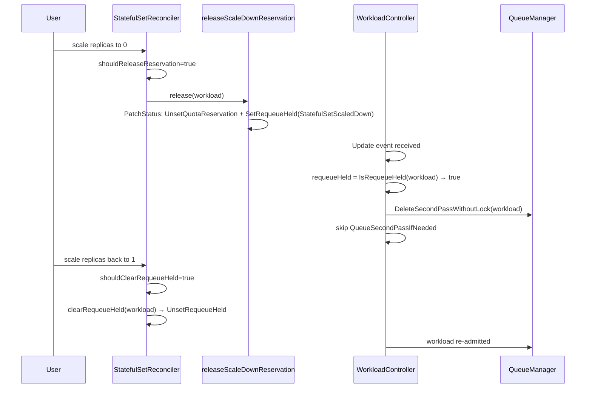

# PR #12233: Fix StatefulSet scale-to-zero workloads holding quota and requeue jitter

**Summary**: Fix StatefulSet scale-to-zero workloads holding quota and requeue jitter

**Sources**: https://github.com/kubernetes-sigs/kueue/pull/12233

**Last updated**: 2026-06-27T04:13:36Z

---

## Metadata

- **State**: open
- **Author**: [@gola](https://github.com/gola)
- **Branch**: `fix/statefulset-scale-to-zero-workload-quota` → `main`
- **Created**: 2026-06-14T13:09:42Z
- **Updated**: 2026-06-27T04:13:36Z
- **Merged**: —
- **Closed**: —
- **Labels**: `kind/bug`, `release-note`, `size/XL`, `ok-to-test`, `cncf-cla: yes`, `area/integrations`, `area/testing`
- **Assignees**: [@mimowo](https://github.com/mimowo)
- **Requested reviewers**: [@kannon92](https://github.com/kannon92), [@mimowo](https://github.com/mimowo), [@mbobrovskyi](https://github.com/mbobrovskyi), [@tenzen-y](https://github.com/tenzen-y)
- **Changed files**: 14   **+542 / -12**

## Description

#### What type of PR is this?

/kind bug
/area integrations
/area testing

#### What this PR does / why we need it:

Fix StatefulSet scale-to-zero behavior so that when `spec.replicas=0`, the old Workload can release its active quota reservation and avoid short-lived re-admission jitter during the terminating-pod window.

Instead of introducing a new condition type, the implementation now uses the existing `WorkloadQuotaReserved=False` condition with reason `OnHold` to represent the temporary scale-to-zero hold, keeping the behavior extensible and aligned with the current workload status model.

#### Which issue(s) this PR fixes:

Fixes #12232

#### Special notes for your reviewer:

This PR does not introduce a new Workload condition type. For the StatefulSet scale-to-zero case, the reconciler marks the Workload as `WorkloadQuotaReserved=False` with reason `OnHold`, and the workload controller/helper logic treats on-hold workloads as not eligible for immediate requeue.

The on-hold checks are pushed down into helpers such as `NeedsSecondPass()` and `NeedsDRAReconcile()`, so the behavior remains consistent across different code paths and stays extensible for future integrations that may also need an on-hold style transition.

#### Does this PR introduce a user-facing change?

```release-note
StatefulSet: Fixed a bug where scaling a StatefulSet to zero caused its Workload to be incorrectly requeued for scheduling during the terminating-pod window, competing for quota it should no longer hold.
```

<!-- This is an auto-generated comment: release notes by coderabbit.ai -->
## Summary by CodeRabbit

* **New Features**
  * Added requeue hold mechanism to prevent unnecessary workload requeuing when quota is released during StatefulSet scale-to-zero operations.

* **Bug Fixes**
  * Improved workload re-admission and condition management when scaling StatefulSets back to normal replica counts.

* **Tests**
  * Added comprehensive test coverage for StatefulSet scale-down and scale-up workload transitions, including quota reservation release and re-admission scenarios.
<!-- end of auto-generated comment: release notes by coderabbit.ai -->

## Discussion

### Comment by [@netlify[bot]](https://github.com/apps/netlify) — 2026-06-14T13:09:47Z

### <span aria-hidden="true">✅</span> Deploy Preview for *kubernetes-sigs-kueue* canceled.


|  Name | Link |
|:-:|------------------------|
|<span aria-hidden="true">🔨</span> Latest commit | c189c0f63d48447ccc33097616f5409a85b25fc0 |
|<span aria-hidden="true">🔍</span> Latest deploy log | https://app.netlify.com/projects/kubernetes-sigs-kueue/deploys/6a3e19d5f6768f0008b9db83 |

### Comment by [@linux-foundation-easycla[bot]](https://github.com/apps/linux-foundation-easycla) — 2026-06-14T13:09:49Z

<a href="https://easycla.lfx.linuxfoundation.org/#/?version=2"></a><br >The committers listed above are authorized under a signed CLA.<ul><li>:white_check_mark: login: gola / name: gola (01d4fb546a95c7bd96c3427f3ed94b508c29f489, 9aeba13a021709a4f4914e1008ca2d7558d840c0, aede55ee30832d187f745fe01185cb649cbfbb7b, d5e26851d1ffd9979225cb26eca7ce2b011a051e, f4914bf3df0c5ec370ec5847299d475e6add92f3)</li></ul>

### Comment by [@k8s-ci-robot](https://github.com/k8s-ci-robot) — 2026-06-14T13:09:51Z

Welcome @gola! <br><br>It looks like this is your first PR to <a href='https://github.com/kubernetes-sigs/kueue'>kubernetes-sigs/kueue</a> 🎉. Please refer to our [pull request process documentation](https://www.kubernetes.dev/docs/guide/pull-requests/) to help your PR have a smooth ride to approval. <br><br>You will be prompted by a bot to use commands during the review process. Do not be afraid to follow the prompts! It is okay to experiment. [Here is the bot commands documentation](https://go.k8s.io/bot-commands). <br><br>You can also check if kubernetes-sigs/kueue has [its own contribution guidelines](https://github.com/kubernetes-sigs/kueue/tree/master/CONTRIBUTING.md). <br><br>You may want to refer to our [testing guide](https://git.k8s.io/community/contributors/devel/sig-testing/testing.md) if you run into trouble with your tests not passing. <br><br>If you are having difficulty getting your pull request seen, please follow the [recommended escalation practices](https://www.kubernetes.dev/docs/guide/pull-requests/#why-is-my-pull-request-not-getting-reviewed). Also, for tips and tricks in the contribution process you may want to read the [Kubernetes contributor cheat sheet](https://www.kubernetes.dev/docs/contributor-cheatsheet/). We want to make sure your contribution gets all the attention it needs! <br><br>Thank you, and welcome to Kubernetes. :smiley:

### Comment by [@k8s-ci-robot](https://github.com/k8s-ci-robot) — 2026-06-14T13:09:52Z

Hi @gola. Thanks for your PR.

I'm waiting for a [kubernetes-sigs](https://github.com/orgs/kubernetes-sigs/people) member to verify that this patch is reasonable to test. If it is, they should reply with `/ok-to-test` on its own line. Until that is done, I will not automatically test new commits in this PR, but the usual testing commands by org members will still work.

Regular contributors should [join the org](https://git.k8s.io/community/community-membership.md#member) to skip this step.

Once the patch is verified, the new status will be reflected by the `ok-to-test` label.

I understand the commands that are listed [here](https://go.k8s.io/bot-commands?repo=kubernetes-sigs%2Fkueue).

<details>

Instructions for interacting with me using PR comments are available [here](https://git.k8s.io/community/contributors/guide/pull-requests.md).  If you have questions or suggestions related to my behavior, please file an issue against the [kubernetes-sigs/prow](https://github.com/kubernetes-sigs/prow/issues/new?title=Prow%20issue:) repository.
</details>

### Comment by [@coderabbitai[bot]](https://github.com/apps/coderabbitai) — 2026-06-14T13:09:55Z

<!-- This is an auto-generated comment: summarize by coderabbit.ai -->
<!-- review_stack_entry_start -->

[](https://app.coderabbit.ai/change-stack/kubernetes-sigs/kueue/pull/12233?utm_source=github_walkthrough&utm_medium=github&utm_campaign=change_stack)

<!-- review_stack_entry_end -->
<!-- This is an auto-generated comment: review paused by coderabbit.ai -->

> [!NOTE]
> ## Reviews paused
> 
> It looks like this branch is under active development. To avoid overwhelming you with review comments due to an influx of new commits, CodeRabbit has automatically paused this review. You can configure this behavior by changing the `reviews.auto_review.auto_pause_after_reviewed_commits` setting.
> 
> Use the following commands to manage reviews:
> - `@coderabbitai resume` to resume automatic reviews.
> - `@coderabbitai review` to trigger a single review.
> 
> Use the checkboxes below for quick actions:
> - [ ] <!-- {"checkboxId": "7f6cc2e2-2e4e-497a-8c31-c9e4573e93d1"} --> ▶️ Resume reviews
> - [ ] <!-- {"checkboxId": "e9bb8d72-00e8-4f67-9cb2-caf3b22574fe"} --> 🔍 Trigger review

<!-- end of auto-generated comment: review paused by coderabbit.ai -->
<!-- walkthrough_start -->

<details>
<summary>📝 Walkthrough</summary>

## Walkthrough

Adds handling for StatefulSet scale-to-zero events in Kueue. A new `WorkloadRequeueHeld` condition constant is introduced in v1beta1/v1beta2 APIs. The StatefulSet reconciler releases quota reservation and sets a requeue-held condition when replicas reach zero. The workload controller skips second-pass requeuing when the requeue-held condition is present.

## Changes

**StatefulSet Scale-to-Zero Quota Release**

|Layer / File(s)|Summary|
|---|---|
|**`WorkloadRequeueHeld` condition constant** <br> `apis/kueue/v1beta1/workload_types.go`, `apis/kueue/v1beta2/workload_types.go`|Adds `WorkloadRequeueHeld = "RequeueHeld"` condition constant to both API versions with documentation referencing the `StatefulSetScaledDown` reason.|
|**`IsStatefulSetScaledDownRelease` detection helper** <br> `pkg/workload/workload.go`, `pkg/workload/workload_test.go`|Adds `IsStatefulSetScaledDownRelease` returning true when `WorkloadQuotaReserved` is `False` with reason `StatefulSetScaledDown`. Unit tests cover absent condition, matching reason, other reasons, and true-status case.|
|**StatefulSet reconciler scale-to-zero reservation release** <br> `pkg/controller/jobs/statefulset/statefulset_reconciler.go`, `pkg/controller/jobs/statefulset/statefulset_release_test.go`|Adds `shouldReleaseReservation` and `shouldClearRequeueHeld` flags in `reconcileWorkload`. New `releaseScaleDownReservation` patches workload status to unset quota reservation and set requeue-held; new `clearRequeueHeld` unsets requeue-held on scale-up. Both are invoked on no-update and update-required paths. Unit tests cover admitted, non-reserved, and finished workload variants.|
|**Workload controller skip-requeue guard** <br> `pkg/controller/core/workload_controller.go`, `pkg/controller/core/workload_controller_test.go`|Computes `requeueHeld` in `WorkloadReconciler.Update`. When true, calls `DeleteSecondPassWithoutLock` and returns early from the transition-to-Pending callback; skips `QueueSecondPassIfNeeded` after the update switch. Tests add a `TestReconcile` case for zero-queue assertion and `TestUpdateStatefulSetScaleDown` for state-transition scenarios.|
|**E2E and integration test coverage** <br> `test/e2e/singlecluster/baseline/statefulset_test.go`, `test/integration/singlecluster/controller/jobs/statefulset/statefulset_controller_test.go`|E2E regression test verifies `WorkloadRequeueHeld` and `WorkloadQuotaReserved` condition transitions during scale-down and re-admission after scale-up. Integration test asserts condition status/reason transitions, consistent `RequeueHeld=True` during scale-down, and re-admission after scale-up, with a `findWorkloadCondition` helper.|

## Sequence Diagram(s)



## Estimated code review effort

🎯 4 (Complex) | ⏱️ ~45 minutes

## Suggested labels

`size/L`, `lgtm`, `approved`

## Suggested reviewers

- kannon92
- olekzabl
- PBundyra

## Poem

> 🐇 Hoppity-hop, the replicas hit zero,
> But quota's released — no ghost, no hero!
> `RequeueHeld` waves a flag in the queue,
> "Don't schedule me yet, I'm just passing through!"
> Scale back to one and I'm ready to go,
> ✨ Admitted again, watch the workloads flow!

</details>

<!-- walkthrough_end -->
<!-- pre_merge_checks_walkthrough_start -->

<details>
<summary>🚥 Pre-merge checks | ✅ 4 | ❌ 1</summary>

### ❌ Failed checks (1 warning)

|     Check name     | Status     | Explanation                                                                           | Resolution                                                                         |
| :----------------: | :--------- | :------------------------------------------------------------------------------------ | :--------------------------------------------------------------------------------- |
| Docstring Coverage | ⚠️ Warning | Docstring coverage is 35.29% which is insufficient. The required threshold is 80.00%. | Write docstrings for the functions missing them to satisfy the coverage threshold. |

<details>
<summary>✅ Passed checks (4 passed)</summary>

|         Check name         | Status   | Explanation                                                                                                                                                                                                                                                                                |
| :------------------------: | :------- | :----------------------------------------------------------------------------------------------------------------------------------------------------------------------------------------------------------------------------------------------------------------------------------------- |
|         Title check        | ✅ Passed | The title accurately summarizes the main changes: fixing StatefulSet scale-to-zero workloads holding quota and addressing requeue jitter, which aligns with the primary objectives in the PR.                                                                                              |
|     Linked Issues check    | ✅ Passed | The PR fully addresses all coding requirements from issue `#12232`: releases quota reservation when StatefulSet scales to zero, clears workload admission via WorkloadRequeueHeld condition, prevents quota consumption after scale-down, and eliminates webhook rejections during scale-up. |
| Out of Scope Changes check | ✅ Passed | All changes are directly related to the StatefulSet scale-to-zero quota release objective, including workload condition helpers, reconciler logic, and comprehensive test coverage for the specific issue.                                                                                 |
|      Description Check     | ✅ Passed | Check skipped - CodeRabbit’s high-level summary is enabled.                                                                                                                                                                                                                                |

</details>

</details>

<!-- pre_merge_checks_walkthrough_end -->
<!-- finishing_touch_checkbox_start -->

<details>
<summary>✨ Finishing Touches</summary>

<details>
<summary>🧪 Generate unit tests (beta)</summary>

- [ ] <!-- {"checkboxId": "f47ac10b-58cc-4372-a567-0e02b2c3d479", "radioGroupId": "utg-output-choice-group-unknown_comment_id"} -->   Create PR with unit tests

</details>

</details>

<!-- finishing_touch_checkbox_end -->
<!-- tips_start -->

---

Thanks for using [CodeRabbit](https://coderabbit.ai?utm_source=oss&utm_medium=github&utm_campaign=kubernetes-sigs/kueue&utm_content=12233)! It's free for OSS, and your support helps us grow. If you like it, consider giving us a shout-out.

<details>
<summary>❤️ Share</summary>

- [X](https://twitter.com/intent/tweet?text=I%20just%20used%20%40coderabbitai%20for%20my%20code%20review%2C%20and%20it%27s%20fantastic%21%20It%27s%20free%20for%20OSS%20and%20offers%20a%20free%20trial%20for%20the%20proprietary%20code.%20Check%20it%20out%3A&url=https%3A//coderabbit.ai)
- [Mastodon](https://mastodon.social/share?text=I%20just%20used%20%40coderabbitai%20for%20my%20code%20review%2C%20and%20it%27s%20fantastic%21%20It%27s%20free%20for%20OSS%20and%20offers%20a%20free%20trial%20for%20the%20proprietary%20code.%20Check%20it%20out%3A%20https%3A%2F%2Fcoderabbit.ai)
- [Reddit](https://www.reddit.com/submit?title=Great%20tool%20for%20code%20review%20-%20CodeRabbit&text=I%20just%20used%20CodeRabbit%20for%20my%20code%20review%2C%20and%20it%27s%20fantastic%21%20It%27s%20free%20for%20OSS%20and%20offers%20a%20free%20trial%20for%20proprietary%20code.%20Check%20it%20out%3A%20https%3A//coderabbit.ai)
- [LinkedIn](https://www.linkedin.com/sharing/share-offsite/?url=https%3A%2F%2Fcoderabbit.ai&mini=true&title=Great%20tool%20for%20code%20review%20-%20CodeRabbit&summary=I%20just%20used%20CodeRabbit%20for%20my%20code%20review%2C%20and%20it%27s%20fantastic%21%20It%27s%20free%20for%20OSS%20and%20offers%20a%20free%20trial%20for%20proprietary%20code)

</details>


<sub>Comment `@coderabbitai help` to get the list of available commands.</sub>

<!-- tips_end -->

### Comment by [@kannon92](https://github.com/kannon92) — 2026-06-14T15:34:09Z

/ok-to-test

### Comment by [@kannon92](https://github.com/kannon92) — 2026-06-14T15:56:06Z

The repro for this seems pretty simple. Could we add some integration or e2e on this to not regress?

I'd like a e2e for this to be honest.

Do you know if we see a similar problem for LWS?

### Comment by [@kannon92](https://github.com/kannon92) — 2026-06-14T21:04:53Z

Please follow the template. We will need a release note for this bug.

### Comment by [@k8s-ci-robot](https://github.com/k8s-ci-robot) — 2026-06-15T08:01:18Z

[APPROVALNOTIFIER] This PR is **NOT APPROVED**

This pull-request has been approved by: *<a href="https://github.com/kubernetes-sigs/kueue/pull/12233#" title="Author self-approved">gola</a>*
**Once this PR has been reviewed and has the lgtm label**, please assign [tenzen-y](https://github.com/tenzen-y) for approval. For more information see [the Code Review Process](https://git.k8s.io/community/contributors/guide/owners.md#the-code-review-process).

The full list of commands accepted by this bot can be found [here](https://go.k8s.io/bot-commands?repo=kubernetes-sigs%2Fkueue).

<details open>
Needs approval from an approver in each of these files:

- **[OWNERS](https://github.com/kubernetes-sigs/kueue/blob/main/OWNERS)**

Approvers can indicate their approval by writing `/approve` in a comment
Approvers can cancel approval by writing `/approve cancel` in a comment
</details>
<!-- META={"approvers":["tenzen-y"]} -->

### Comment by [@gola](https://github.com/gola) — 2026-06-15T08:03:08Z

> The repro for this seems pretty simple. Could we add some integration or e2e on this to not regress?
> 
> I'd like a e2e for this to be honest.
> 
> Do you know if we see a similar problem for LWS?

**On whether LWS has the same scale-to-zero requeue issue:**


I checked the LWS integration and it does **not** have the same problem. The architectures are fundamentally different:


- **StatefulSet**: When `spec.replicas=0`, the StatefulSet reconciler **keeps the Workload** and only releases the quota reservation (setting `QuotaReserved=False`). This creates an intermediate state where the Workload transitions from Admitted → Pending, which triggers the workload_controller's Update handler to requeue it — that's the bug this PR fixes.


- **LWS**: When `spec.replicas=0`, the LWS reconciler's [`filterWorkloads()`](https://github.com/kubernetes-sigs/kueue/blob/main/pkg/controller/jobs/leaderworkerset/leaderworkerset_reconciler.go#L252) places **all existing Workloads into the `toDelete` list** and deletes them directly. There is no "Workload preserved with quota released" intermediate state. The workload_controller's `Delete()` handler correctly cleans up cache and queues.


So LWS never encounters the `QuotaReserved=False` + `Pending` combination that causes the spurious requeue, and therefore does not need the `WorkloadRequeueHeld` condition.

### Comment by [@mimowo](https://github.com/mimowo) — 2026-06-16T15:52:05Z

/assign 
I will try to review EOW, but I would like to have review from @mbobrovskyi first who worked on the STS integration a lot before.

### Comment by [@kannon92](https://github.com/kannon92) — 2026-06-20T02:55:36Z

looks like this PR has conflicts.

### Comment by [@k8s-ci-robot](https://github.com/k8s-ci-robot) — 2026-06-20T02:55:44Z

PR needs rebase.

<details>

Instructions for interacting with me using PR comments are available [here](https://git.k8s.io/community/contributors/guide/pull-requests.md).  If you have questions or suggestions related to my behavior, please file an issue against the [kubernetes-sigs/prow](https://github.com/kubernetes-sigs/prow/issues/new?title=Prow%20issue:) repository.
</details>

### Comment by [@sohankunkerkar](https://github.com/sohankunkerkar) — 2026-06-20T21:09:51Z

Thanks for raising this, the root cause is real. One concern on the approach: introducing `WorkloadRequeueHeld` adds API surface that's hard to remove, worth considering whether `WorkloadEvicted` with a new reason could do the same within the existing lifecycle. Also the requeue suppression may need to cover all queue-entry paths in the workload controller, not just the admission transition, to fully prevent the held workload from being re-enqueued

### Comment by [@kubernetes-prow[bot]](https://github.com/apps/kubernetes-prow) — 2026-06-22T04:24:26Z

[APPROVALNOTIFIER] This PR is **NOT APPROVED**

This pull-request has been approved by: *<a href="https://github.com/kubernetes-sigs/kueue/pull/12233#" title="Author self-approved">gola</a>*
**Once this PR has been reviewed and has the lgtm label**, please ask for approval from [mimowo](https://github.com/mimowo). For more information see [the Code Review Process](https://git.k8s.io/community/contributors/guide/owners.md#the-code-review-process).

The full list of commands accepted by this bot can be found [here](https://go.k8s.io/bot-commands?repo=kubernetes-sigs%2Fkueue).

<details open>
Needs approval from an approver in each of these files:

- **[OWNERS](https://github.com/kubernetes-sigs/kueue/blob/main/OWNERS)**

Approvers can indicate their approval by writing `/approve` in a comment
Approvers can cancel approval by writing `/approve cancel` in a comment
</details>
<!-- META={"approvers":["mimowo"]} -->

### Comment by [@gola](https://github.com/gola) — 2026-06-22T05:59:16Z

> Thanks for raising this, the root cause is real. One concern on the approach: introducing `WorkloadRequeueHeld` adds API surface that's hard to remove, worth considering whether `WorkloadEvicted` with a new reason could do the same within the existing lifecycle. Also the requeue suppression may need to cover all queue-entry paths in the workload controller, not just the admission transition, to fully prevent the held workload from being re-enqueued

@sohankunkerkar Thanks for the thoughtful review! Let me address both concerns:
1. WorkloadRequeueHeld vs WorkloadEvicted with a new reason
I considered using WorkloadEvicted with a new reason, but it has semantic and behavioral issues:
• WorkloadEvicted triggers eviction-specific logic in the workload controller Reconcile path (e.g., eviction latency metrics, pods-ready timeout handling, admission check eviction). A scale-down-to-zero is not an eviction — the workload should remain active and pending, not enter the evicted lifecycle.
• Using WorkloadEvicted would incorrectly report eviction latency metrics and could interfere with other eviction handlers that check the eviction condition.
• The semantic of RequeueHeld is fundamentally different: the workload is not evicted, it is temporarily held from requeueing while remaining a valid pending workload.
2. Requeue suppression covering all queue-entry paths
You are absolutely right — this was a gap in the initial implementation. I have now added !workload.IsRequeueHeld() checks in all queue-entry paths in the workload controller (Create handler, addLocalQueueLocked, resourceUpdatesHandler, deviceClassHandler, Reconcile DRA path, and Update Pending→Pending path). This is covered by the new test case TestUpdateStatefulSetScaleDown/requeue-held_workload_with_pending-to-pending_update_should_not_be_requeued.

### Comment by [@gola](https://github.com/gola) — 2026-06-22T06:14:37Z

@mimowo  Gentle ping — all CI checks are now passing and I've addressed the review feedback. PTAL when you get a chance.

### Comment by [@mimowo](https://github.com/mimowo) — 2026-06-22T06:19:52Z

Cool putting into my ToDo towards EOD. It would be great if @mbobrovskyi can give it a pass in the meanwhile

### Comment by [@gola](https://github.com/gola) — 2026-06-24T02:41:03Z

Thanks @mimowo for the thorough review! All your feedback has been addressed in the latest commits. Here's a summary of the changes:

Use QuotaReserved=False with reason OnHold instead of a new condition type — Removed WorkloadRequeueHeld condition. Now using QuotaReserved=False with reason WorkloadOnHold, consistent with the granular reasons approach from #10852.

Merge IsOnHold() into IsAdmissible() — On-hold workloads are automatically inadmissible. No scattered IsOnHold checks at queue entry points; IsAdmissible() includes the !IsOnHold(w) check internally.

Rename RequeueHeld → OnHold — Consistent with CQ/LQ "on hold" terminology. All constants, functions, and references updated.

Check IsActive in shouldReleaseReservation — Added workload.IsActive(wl) to prevent setting the OnHold condition on deactivated workloads.

Generalize second-pass and requeue checks — Both the QueueSecondPassIfNeeded and DeleteSecondPassWithoutLock paths now use IsAdmissible() instead of custom OnHold checks.

PTAL when you get a chance.

### Comment by [@gola](https://github.com/gola) — 2026-06-25T11:06:00Z

> Basically it looks good to me, but I'm thinking if we really need any changes to the workload controller. I would like to consider the alternative where the checks are pushed down to the helpers so that the code is resilient no matter from which code path the helpers are called.

Thanks for the suggestions — I addressed this direction in the latest updates.

What changed:
- I renamed the user-facing concept from `RequeueHeld` to `OnHold`.
- I reused `QuotaReserved=False` with reason `OnHold` instead of introducing a new condition type.
- I moved the generic on-hold handling into workload helpers:
  - `workload.IsAdmissible()`
  - `workload.NeedsSecondPass()`
  - `dra.NeedsDRAReconcile()`

So on-hold workloads are now treated generically as inadmissible, and the helper-level checks make the behavior more resilient across call sites.

I still keep a small amount of explicit handling in `WorkloadReconciler.Update()`, because the admitted/quotaReserved -> pending transition must first clear the scheduler cache entry before we skip the immediate requeue path. That part is event-path-specific, but the on-hold semantics themselves are now generic.

I also added/updated tests to cover the OnHold lifecycle and the Update-path behavior. PTAL.

### Comment by [@mimowo](https://github.com/mimowo) — 2026-06-25T20:12:10Z

I think the PR is overall in a good shape, but some of the places puzzle me, so I asked questions

### Comment by [@gola](https://github.com/gola) — 2026-06-26T06:01:33Z

> I think the PR is overall in a good shape, but some of the places puzzle me, so I asked questions

@mimowo Thanks for the careful review and for calling out the places that felt a bit odd.


I addressed the latest feedback by pushing the on-hold handling further down into the helpers, so the behavior is now consistent across code paths:
- `NeedsSecondPass()` now returns false for on-hold workloads, and the controller calls `QueueSecondPassIfNeeded()` unconditionally.
- `NeedsDRAReconcile()` now also skips on-hold workloads directly.
- I also simplified the second-pass cleanup to use `NeedsSecondPass()` and removed the redundant outer guard, and dropped the unnecessary v1beta1-only change.


So the current behavior should be:
- we still clean the workload out of cache when it transitions back to Pending,
- we do not immediately requeue it during the terminating-pod window,
- and we do not keep it in second-pass unless it actually needs it again.


Please let me know if you'd still prefer a different factoring, but I hope this version is closer to the helper-centric approach you had in mind.

## Reviews

### Review by [@coderabbitai[bot]](https://github.com/apps/coderabbitai) (commented) — 2026-06-14T13:18:46Z

**Actionable comments posted: 3**

> [!CAUTION]
> Some comments are outside the diff and can’t be posted inline due to platform limitations.
> 
> 
> 
> <details>
> <summary>⚠️ Outside diff range comments (1)</summary><blockquote>
> 
> <details>
> <summary>pkg/controller/core/workload_controller.go (1)</summary><blockquote>
> 
> `1333-1349`: _⚠️ Potential issue_ | _🟠 Major_ | _⚡ Quick win_
> 
> **Scaled-down guard is neutralized by unconditional second-pass enqueue**
> 
> `scaledDown` short-circuits only the inner callback (Line 1346), but `Update` still executes `QueueSecondPassIfNeeded` unconditionally at Line 1383. That can re-add the same workload to second-pass immediately after `DeleteSecondPassWithoutLock`, defeating the “do not requeue during terminating-pod window” behavior.
> 
> <details>
> <summary>Suggested fix</summary>
> 
> ```diff
> @@
> -		immediate := backoff <= 0
> +		immediate := backoff <= 0
> +		skipSecondPass := false
>  		scaledDown := workload.IsStatefulSetScaledDownRelease(wlCopy)
> @@
>  			if scaledDown {
> +				skipSecondPass = true
>  				r.queues.DeleteSecondPassWithoutLock(wlKey)
>  				return
>  			}
> @@
> -	r.queues.QueueSecondPassIfNeeded(ctx, wlCopy, 0)
> +	if !skipSecondPass {
> +		r.queues.QueueSecondPassIfNeeded(ctx, wlCopy, 0)
> +	}
>  	return true
>  }
> ```
> </details>
> 
>    
> 
> 
> Also applies to: 1383-1383
> 
> <details>
> <summary>🤖 Prompt for AI Agents</summary>
> 
> ```
> Verify each finding against current code. Fix only still-valid issues, skip the
> rest with a brief reason, keep changes minimal, and validate.
> 
> In `@pkg/controller/core/workload_controller.go` around lines 1333 - 1349, The
> scaledDown guard currently only prevents re-queueing within the inner callback
> of QueueAssociatedInadmissibleWorkloadsAfter, where DeleteSecondPassWithoutLock
> is called. However, the Update method unconditionally calls
> QueueSecondPassIfNeeded at line 1383, which can immediately re-add the workload
> to the second-pass queue after it was just deleted, defeating the guard's
> purpose. Fix this by ensuring QueueSecondPassIfNeeded at line 1383 is also
> guarded by the scaledDown condition, so that scaled-down workloads are not
> re-queued during the terminating-pod window.
> ```
> 
> </details>
> 
> <!-- cr-comment:v1:1b3445765f5b019dd6f2aa90 -->
> 
> </blockquote></details>
> 
> </blockquote></details>

<details>
<summary>🤖 Prompt for all review comments with AI agents</summary>

```
Verify each finding against current code. Fix only still-valid issues, skip the
rest with a brief reason, keep changes minimal, and validate.

Inline comments:
In `@pkg/controller/core/workload_controller_test.go`:
- Around line 1848-1864: The test case for "scale-to-zero released workload
should not be requeued while transitioning back to pending" is currently under
TestReconcile, but the actual implementation of the scale-to-zero guard is in
the WorkloadReconciler.Update method (lines 1333-1349 in
pkg/controller/core/workload_controller.go), not the Reconcile path. Create or
move this test to a test function that exercises the Update method to ensure the
event-handler logic is properly tested and will catch regressions in the
WorkloadReconciler.Update code path.

In `@pkg/controller/jobs/statefulset/statefulset_reconciler.go`:
- Around line 217-223: The shouldReleaseReservation flag is only set within the
hasOwnerReference && replicas == 0 case branch. If owner removal succeeds but
releaseScaleDownReservation fails, the next reconcile iteration skips this
branch because the owner reference is already gone, leaving quota stuck. Fix
this by determining shouldReleaseReservation based on the workload's actual
quota reservation state (using workload.HasActiveQuotaReservation and
workload.IsFinished checks) independently of owner reference presence, making
the release logic idempotent across reconciliation retries. This needs to be
corrected at the initial switch case location (line 217-223) and also at the
consolidated site referenced at line 247-260 in the same file.

In `@pkg/controller/jobs/statefulset/statefulset_release_test.go`:
- Around line 76-81: The test currently only validates the QuotaReserved
condition when tc.wantQuotaReservedStatus is not empty, skipping the check
entirely when it is empty. Add an explicit assertion after the existing if block
to verify that when tc.wantQuotaReservedStatus is empty, the QuotaReserved
condition is absent by confirming that apimeta.FindStatusCondition returns nil
for kueue.WorkloadQuotaReserved in the got.Status.Conditions. This ensures the
test explicitly validates both the presence and absence of the condition based
on the test case expectations.

---

Outside diff comments:
In `@pkg/controller/core/workload_controller.go`:
- Around line 1333-1349: The scaledDown guard currently only prevents
re-queueing within the inner callback of
QueueAssociatedInadmissibleWorkloadsAfter, where DeleteSecondPassWithoutLock is
called. However, the Update method unconditionally calls QueueSecondPassIfNeeded
at line 1383, which can immediately re-add the workload to the second-pass queue
after it was just deleted, defeating the guard's purpose. Fix this by ensuring
QueueSecondPassIfNeeded at line 1383 is also guarded by the scaledDown
condition, so that scaled-down workloads are not re-queued during the
terminating-pod window.
```

</details>

<details>
<summary>🪄 Autofix (Beta)</summary>

Fix all unresolved CodeRabbit comments on this PR:

- [ ] <!-- {"checkboxId": "4b0d0e0a-96d7-4f10-b296-3a18ea78f0b9"} --> Push a commit to this branch (recommended)
- [ ] <!-- {"checkboxId": "ff5b1114-7d8c-49e6-8ac1-43f82af23a33"} --> Create a new PR with the fixes

</details>

---

<details>
<summary>ℹ️ Review info</summary>

<details>
<summary>⚙️ Run configuration</summary>

**Configuration used**: Path: .coderabbit.yaml

**Review profile**: CHILL

**Plan**: Pro

**Run ID**: `343feeb9-2021-4ed6-bec7-f9e838f546b9`

</details>

<details>
<summary>📥 Commits</summary>

Reviewing files that changed from the base of the PR and between 01e576255b55275520ff4ab0ebfdfa443ae7bcc2 and 0cdd493537674ac5e0cf3ddf8d3dccbf9d66c37f.

</details>

<details>
<summary>📒 Files selected for processing (6)</summary>

* `pkg/controller/core/workload_controller.go`
* `pkg/controller/core/workload_controller_test.go`
* `pkg/controller/jobs/statefulset/statefulset_reconciler.go`
* `pkg/controller/jobs/statefulset/statefulset_release_test.go`
* `pkg/workload/workload.go`
* `pkg/workload/workload_test.go`

</details>

</details>

<!-- This is an auto-generated comment by CodeRabbit for review status -->

- **pkg/controller/core/workload_controller_test.go:1864** by [@coderabbitai[bot]](https://github.com/apps/coderabbitai) — 2026-06-14T13:18:45Z
```diff
@@ -1845,6 +1845,23 @@ func TestReconcile(t *testing.T) {
 				}).
 				Obj(),
 		},
+		"scale-to-zero released workload should not be requeued while transitioning back to pending": {
+			workload: utiltestingapi.MakeWorkload("wl", "ns").
+				Queue("lq").
+				Active(true).
+				ReserveQuotaAt(utiltestingapi.MakeAdmission("cq").Obj(), now).
+				AdmittedAt(true, now).
+				Condition(metav1.Condition{
+					Type:    kueue.WorkloadQuotaReserved,
+					Status:  metav1.ConditionFalse,
+					Reason:  "StatefulSetScaledDown",
+					Message: "StatefulSet scaled to zero; releasing previous quota reservation",
+				}).
+				Obj(),
+			cq: utiltestingapi.MakeClusterQueue("cq").Obj(),
+			lq: utiltestingapi.MakeLocalQueue("lq", "ns").ClusterQueue("cq").Obj(),
+			wantWorkloadsInQueue: ptr.To(0),
+		},
```

  _⚠️ Potential issue_ | _🟠 Major_ | _⚡ Quick win_
  
  **New test case does not cover the changed `Update` code path**
  
  This case is under `TestReconcile`, but the new scale-to-zero guard was added in `WorkloadReconciler.Update` (Lines 1333-1349 in `pkg/controller/core/workload_controller.go`). As written, this won’t catch regressions in the event-handler logic.
  
  <details>
  <summary>🤖 Prompt for AI Agents</summary>
  
  ```
  Verify each finding against current code. Fix only still-valid issues, skip the
  rest with a brief reason, keep changes minimal, and validate.
  
  In `@pkg/controller/core/workload_controller_test.go` around lines 1848 - 1864,
  The test case for "scale-to-zero released workload should not be requeued while
  transitioning back to pending" is currently under TestReconcile, but the actual
  implementation of the scale-to-zero guard is in the WorkloadReconciler.Update
  method (lines 1333-1349 in pkg/controller/core/workload_controller.go), not the
  Reconcile path. Create or move this test to a test function that exercises the
  Update method to ensure the event-handler logic is properly tested and will
  catch regressions in the WorkloadReconciler.Update code path.
  ```
  
  </details>
  
  <!-- fingerprinting:phantom:poseidon:hawk -->
  
  <!-- cr-comment:v1:fe54fe4f00a1df8a87eec6a3 -->
  
  _Source: Coding guidelines_
  
  <!-- This is an auto-generated comment by CodeRabbit -->
  
  ✅ Addressed in commit 588c6b8

- **pkg/controller/jobs/statefulset/statefulset_reconciler.go:223** by [@coderabbitai[bot]](https://github.com/apps/coderabbitai) — 2026-06-14T13:18:45Z
```diff
@@ -214,11 +214,13 @@ func (r *Reconciler) reconcileWorkload(ctx context.Context, sts *appsv1.Stateful
 	}
 
 	var shouldUpdate bool
+	shouldReleaseReservation := false
 
 	switch {
 	case hasOwnerReference && replicas == 0:
 		shouldUpdate = true
 		err = controllerutil.RemoveOwnerReference(sts, wl, r.client.Scheme())
+		shouldReleaseReservation = workload.HasActiveQuotaReservation(wl) && !workload.IsFinished(wl)
```

  _⚠️ Potential issue_ | _🟠 Major_ | _⚡ Quick win_
  
  **Release retry is not idempotent after owner-reference removal.**
  
  `shouldReleaseReservation` is only set in the `hasOwnerReference && replicas == 0` branch (Line 223). If owner removal/update succeeds but `releaseScaleDownReservation` fails once, the next reconcile sees no owner reference and skips release, leaving quota stuck.
  
  <details>
  <summary>💡 Suggested fix</summary>
  
  ```diff
  -	shouldReleaseReservation := false
  +	shouldReleaseReservation := replicas == 0 && workload.HasActiveQuotaReservation(wl)
  
   	switch {
   	case hasOwnerReference && replicas == 0:
   		shouldUpdate = true
   		err = controllerutil.RemoveOwnerReference(sts, wl, r.client.Scheme())
  -		shouldReleaseReservation = workload.HasActiveQuotaReservation(wl) && !workload.IsFinished(wl)
   	case !hasOwnerReference && replicas > 0:
   		shouldUpdate = true
   		err = controllerutil.SetOwnerReference(sts, wl, r.client.Scheme())
   		if wl.Annotations == nil {
   			wl.Annotations = make(map[string]string, 2)
   		}
  ```
  </details>
  
  As per coding guidelines, `pkg/controller/**/*.go` reconciliation logic should be correct, idempotent, and handle errors robustly.  
      
  
  
  Also applies to: 247-260
  
  <details>
  <summary>🤖 Prompt for AI Agents</summary>
  
  ```
  Verify each finding against current code. Fix only still-valid issues, skip the
  rest with a brief reason, keep changes minimal, and validate.
  
  In `@pkg/controller/jobs/statefulset/statefulset_reconciler.go` around lines 217 -
  223, The shouldReleaseReservation flag is only set within the hasOwnerReference
  && replicas == 0 case branch. If owner removal succeeds but
  releaseScaleDownReservation fails, the next reconcile iteration skips this
  branch because the owner reference is already gone, leaving quota stuck. Fix
  this by determining shouldReleaseReservation based on the workload's actual
  quota reservation state (using workload.HasActiveQuotaReservation and
  workload.IsFinished checks) independently of owner reference presence, making
  the release logic idempotent across reconciliation retries. This needs to be
  corrected at the initial switch case location (line 217-223) and also at the
  consolidated site referenced at line 247-260 in the same file.
  ```
  
  </details>
  
  <!-- fingerprinting:phantom:poseidon:hawk -->
  
  <!-- cr-comment:v1:64872135a928854f8750501d -->
  
  _Source: Coding guidelines_
  
  <!-- This is an auto-generated comment by CodeRabbit -->
  
  ✅ Addressed in commit 588c6b8

- **pkg/controller/jobs/statefulset/statefulset_release_test.go:81** by [@coderabbitai[bot]](https://github.com/apps/coderabbitai) — 2026-06-14T13:18:45Z
```diff
@@ -0,0 +1,87 @@
+/*
+Copyright The Kubernetes Authors.
+
+Licensed under the Apache License, Version 2.0 (the "License");
+you may not use this file except in compliance with the License.
+You may obtain a copy of the License at
+
+    http://www.apache.org/licenses/LICENSE-2.0
+
+Unless required by applicable law or agreed to in writing, software
+distributed under the License is distributed on an "AS IS" BASIS,
+WITHOUT WARRANTIES OR CONDITIONS OF ANY KIND, either express or implied.
+See the License for the specific language governing permissions and
+limitations under the License.
+*/
+
+package statefulset
+
+import (
+	"context"
+	"testing"
+	"time"
+
+	apimeta "k8s.io/apimachinery/pkg/api/meta"
+	metav1 "k8s.io/apimachinery/pkg/apis/meta/v1"
+	"sigs.k8s.io/controller-runtime/pkg/client"
+
+	kueue "sigs.k8s.io/kueue/apis/kueue/v1beta2"
+	utiltesting "sigs.k8s.io/kueue/pkg/util/testing"
+	utiltestingapi "sigs.k8s.io/kueue/pkg/util/testing/v1beta2"
+)
+
+func TestReleaseScaleDownReservation(t *testing.T) {
+	now := time.Now()
+
+	cases := map[string]struct {
+		workload                *kueue.Workload
+		wantQuotaReservedStatus metav1.ConditionStatus
+		wantQuotaReservedReason string
+		wantAdmissionNil        bool
+	}{
+		"releases admitted workload": {
+			workload: utiltestingapi.MakeWorkload(GetWorkloadName("sts-uid", "sts"), "ns").
+				Queue("lq").
+				ReserveQuotaAt(utiltestingapi.MakeAdmission("cq").Obj(), now).
+				AdmittedAt(true, now).
+				Obj(),
+			wantQuotaReservedStatus: metav1.ConditionFalse,
+			wantQuotaReservedReason: "StatefulSetScaledDown",
+			wantAdmissionNil:        true,
+		},
+		"ignores workload without active reservation": {
+			workload: utiltestingapi.MakeWorkload(GetWorkloadName("sts-uid", "sts"), "ns").
+				Queue("lq").
+				Obj(),
+			wantQuotaReservedStatus: "",
+			wantAdmissionNil:        true,
+		},
+	}
+
+	for name, tc := range cases {
+		t.Run(name, func(t *testing.T) {
+			ctx := context.Background()
+			c := utiltesting.NewFakeClient(tc.workload.DeepCopy())
+			r := &Reconciler{client: c}
+
+			if err := r.releaseScaleDownReservation(ctx, tc.workload); err != nil {
+				t.Fatalf("releaseScaleDownReservation() error = %v", err)
+			}
+
+			got := &kueue.Workload{}
+			if err := c.Get(ctx, client.ObjectKeyFromObject(tc.workload), got); err != nil {
+				t.Fatalf("failed to get workload: %v", err)
+			}
+
+			if tc.wantQuotaReservedStatus != "" {
+				cond := apimeta.FindStatusCondition(got.Status.Conditions, kueue.WorkloadQuotaReserved)
+				if cond == nil || cond.Status != tc.wantQuotaReservedStatus || cond.Reason != tc.wantQuotaReservedReason {
+					t.Fatalf("unexpected quota reserved condition: %+v", cond)
+				}
+			}
```

  _⚠️ Potential issue_ | _🟡 Minor_ | _⚡ Quick win_
  
  **Assert condition absence in the no-reservation case.**
  
  For the `"ignores workload without active reservation"` case, the test currently skips condition checks entirely. Add an explicit assertion that `QuotaReserved` is absent.
  
  <details>
  <summary>✅ Suggested assertion</summary>
  
  ```diff
   			if tc.wantQuotaReservedStatus != "" {
   				cond := apimeta.FindStatusCondition(got.Status.Conditions, kueue.WorkloadQuotaReserved)
   				if cond == nil || cond.Status != tc.wantQuotaReservedStatus || cond.Reason != tc.wantQuotaReservedReason {
   					t.Fatalf("unexpected quota reserved condition: %+v", cond)
   				}
  +			} else {
  +				if cond := apimeta.FindStatusCondition(got.Status.Conditions, kueue.WorkloadQuotaReserved); cond != nil {
  +					t.Fatalf("expected no quota reserved condition, got %+v", cond)
  +				}
   			}
  ```
  </details>
  
  <!-- suggestion_start -->
  
  <details>
  <summary>📝 Committable suggestion</summary>
  
  > ‼️ **IMPORTANT**
  > Carefully review the code before committing. Ensure that it accurately replaces the highlighted code, contains no missing lines, and has no issues with indentation. Thoroughly test & benchmark the code to ensure it meets the requirements.
  
  ```suggestion
  			if tc.wantQuotaReservedStatus != "" {
  				cond := apimeta.FindStatusCondition(got.Status.Conditions, kueue.WorkloadQuotaReserved)
  				if cond == nil || cond.Status != tc.wantQuotaReservedStatus || cond.Reason != tc.wantQuotaReservedReason {
  					t.Fatalf("unexpected quota reserved condition: %+v", cond)
  				}
  			} else {
  				if cond := apimeta.FindStatusCondition(got.Status.Conditions, kueue.WorkloadQuotaReserved); cond != nil {
  					t.Fatalf("expected no quota reserved condition, got %+v", cond)
  				}
  			}
  ```
  
  </details>
  
  <!-- suggestion_end -->
  
  <details>
  <summary>🤖 Prompt for AI Agents</summary>
  
  ```
  Verify each finding against current code. Fix only still-valid issues, skip the
  rest with a brief reason, keep changes minimal, and validate.
  
  In `@pkg/controller/jobs/statefulset/statefulset_release_test.go` around lines 76
  - 81, The test currently only validates the QuotaReserved condition when
  tc.wantQuotaReservedStatus is not empty, skipping the check entirely when it is
  empty. Add an explicit assertion after the existing if block to verify that when
  tc.wantQuotaReservedStatus is empty, the QuotaReserved condition is absent by
  confirming that apimeta.FindStatusCondition returns nil for
  kueue.WorkloadQuotaReserved in the got.Status.Conditions. This ensures the test
  explicitly validates both the presence and absence of the condition based on the
  test case expectations.
  ```
  
  </details>
  
  <!-- fingerprinting:phantom:poseidon:hawk -->
  
  <!-- cr-comment:v1:11f4394b316cfe057fa68a3b -->
  
  <!-- This is an auto-generated comment by CodeRabbit -->
  
  ✅ Addressed in commit 588c6b8

### Review by [@kannon92](https://github.com/kannon92) (commented) — 2026-06-14T19:22:52Z

- **pkg/controller/core/workload_controller.go:1333** by [@kannon92](https://github.com/kannon92) — 2026-06-14T19:22:52Z
```diff
@@ -1330,6 +1330,7 @@ func (r *WorkloadReconciler) Update(e event.TypedUpdateEvent[*kueue.Workload]) b
 			backoff = time.Until(e.ObjectNew.Status.RequeueState.RequeueAt.Time)
 		}
 		immediate := backoff <= 0
+		scaledDown := workload.IsStatefulSetScaledDownRelease(wlCopy)
```

  We have a job library so we don't have to change anything in workload controller.
  
  I think we should look into ways to avoid having to add "hacks" for statefulset behavior in the workload controller.
  
  Ideally this logic can go to jobs/statefulset.

### Review by [@gola](https://github.com/gola) (commented) — 2026-06-15T04:58:44Z

- **pkg/controller/core/workload_controller.go:1333** by [@gola](https://github.com/gola) — 2026-06-15T04:58:44Z
```diff
@@ -1330,6 +1330,7 @@ func (r *WorkloadReconciler) Update(e event.TypedUpdateEvent[*kueue.Workload]) b
 			backoff = time.Until(e.ObjectNew.Status.RequeueState.RequeueAt.Time)
 		}
 		immediate := backoff <= 0
+		scaledDown := workload.IsStatefulSetScaledDownRelease(wlCopy)
```

  Thanks for the review @kannon92! You make a great point — we shouldn't add StatefulSet-specific logic in workload_controller.go. I agree this should live in the job framework layer.
  
  I've been thinking about how to leverage the job framework for this. Here's my assessment of possible approaches, with my preferred one first:
  
  Approach B (Preferred): Job framework callback/hook
  
  The core idea is to let the job integration influence workload requeue behavior without the workload controller knowing about specific job types. There are a few concrete variants:
  
  B1: Add ShouldSkipRequeue callback to IntegrationCallbacks — The workload controller queries the integration manager for the workload's owning integration, and the StatefulSet reconciler implements the callback to return true when the workload has a scale-to-zero release condition. This requires wiring the integration manager into the workload reconciler.
  
  B2: Generic Workload condition (e.g., WorkloadRequeueHeld) — The StatefulSet reconciler sets a generic condition on the Workload when doing scale-to-zero release. The workload controller checks this condition generically (not tied to any job type). Any integration can set this condition to prevent requeue. This is a lighter variant of B that doesn't require the workload controller to reference the integration manager.
  
  B3: Extend JobReconcilerInterface — Add a method like ShouldSkipWorkloadRequeue(wl *kueue.Workload) bool. The workload controller uses the workload's owner reference to find the corresponding reconciler and queries it. This requires all JobReconcilerInterface implementations to add the method (defaulting to false).
  
  I'm leaning toward B2 as a good balance — it's architecturally clean (the job reconciler is responsible for setting the condition, the workload controller checks it generically), it doesn't require major structural changes to the controller wiring, and it's extensible for other integrations (e.g., LWS could set the same condition).
  
  Approach A: Generic annotation — Less preferred because annotations are less structured than conditions and harder to evolve.
  
  Approach C: Mark Workload as inactive — Not recommended because it has unintended side effects on eviction and UI.
  
  What do you think? Is B2 a reasonable direction, or would you prefer one of the other B variants?
  
  Regarding your other points:
  
  e2e/integration test: I'll add one. I see the existing integration test suite at test/integration/singlecluster/controller/jobs/statefulset/ — I'll add a scale-to-zero quota release test there.
  LWS: I'll investigate and report back.
  Release note: Adding now.

### Review by [@coderabbitai[bot]](https://github.com/apps/coderabbitai) (commented) — 2026-06-15T08:10:46Z

**Actionable comments posted: 2**

<details>
<summary>🤖 Prompt for all review comments with AI agents</summary>

```
Verify each finding against current code. Fix only still-valid issues, skip the
rest with a brief reason, keep changes minimal, and validate.

Inline comments:
In `@pkg/controller/jobs/statefulset/statefulset_reconciler.go`:
- Around line 218-233: The `shouldClearRequeueHeld` flag is only set to true in
the `!hasOwnerReference && replicas > 0` case, meaning if the clearing operation
fails once, subsequent reconciles in other branches will skip retrying the clear
operation, leaving `WorkloadRequeueHeld=True` stuck. To fix this, move the logic
that determines whether to clear the `RequeueHeld` flag outside of the switch
statement so that `shouldClearRequeueHeld = workload.IsRequeueHeld(wl)` is
evaluated independently in all cases, not just in the specific branch. This
applies to the switch block starting at line 218-233 (anchor location) and the
corresponding logic around lines 253-270 (sibling location) to ensure the
operation is idempotent across all reconcile scenarios.

In `@pkg/controller/jobs/statefulset/statefulset_release_test.go`:
- Around line 109-111: The test currently only asserts that admission is nil
when wantAdmissionNil is true, but lacks validation for the case when admission
should be preserved. Add a complementary assertion after the existing if block
that checks when wantAdmissionNil is false (using an else clause or separate if
statement), ensuring that got.Status.Admission is not nil in those cases. This
prevents regressions where admission gets accidentally cleared for test cases
expecting it to be preserved.
```

</details>

<details>
<summary>🪄 Autofix (Beta)</summary>

Fix all unresolved CodeRabbit comments on this PR:

- [ ] <!-- {"checkboxId": "4b0d0e0a-96d7-4f10-b296-3a18ea78f0b9"} --> Push a commit to this branch (recommended)
- [ ] <!-- {"checkboxId": "ff5b1114-7d8c-49e6-8ac1-43f82af23a33"} --> Create a new PR with the fixes

</details>

---

<details>
<summary>ℹ️ Review info</summary>

<details>
<summary>⚙️ Run configuration</summary>

**Configuration used**: Path: .coderabbit.yaml

**Review profile**: CHILL

**Plan**: Pro

**Run ID**: `1484dd07-8f37-418b-acef-ff48719e50f6`

</details>

<details>
<summary>📥 Commits</summary>

Reviewing files that changed from the base of the PR and between 0cdd493537674ac5e0cf3ddf8d3dccbf9d66c37f and 588c6b843666e6f5c0742290f6b53a7a3265412b.

</details>

<details>
<summary>📒 Files selected for processing (8)</summary>

* `apis/kueue/v1beta1/workload_types.go`
* `apis/kueue/v1beta2/workload_types.go`
* `pkg/controller/core/workload_controller.go`
* `pkg/controller/core/workload_controller_test.go`
* `pkg/controller/jobs/statefulset/statefulset_reconciler.go`
* `pkg/controller/jobs/statefulset/statefulset_release_test.go`
* `pkg/workload/workload.go`
* `pkg/workload/workload_test.go`

</details>

<details>
<summary>🚧 Files skipped from review as they are similar to previous changes (2)</summary>

* pkg/controller/core/workload_controller.go
* pkg/workload/workload.go

</details>

</details>

<!-- This is an auto-generated comment by CodeRabbit for review status -->

- **pkg/controller/jobs/statefulset/statefulset_reconciler.go:233** by [@coderabbitai[bot]](https://github.com/apps/coderabbitai) — 2026-06-15T08:10:45Z
```diff
@@ -214,14 +214,22 @@ func (r *Reconciler) reconcileWorkload(ctx context.Context, sts *appsv1.Stateful
 	}
 
 	var shouldUpdate bool
+	shouldReleaseReservation := false
+	shouldClearRequeueHeld := false
 
 	switch {
 	case hasOwnerReference && replicas == 0:
 		shouldUpdate = true
 		err = controllerutil.RemoveOwnerReference(sts, wl, r.client.Scheme())
+		shouldReleaseReservation = workload.HasActiveQuotaReservation(wl) && !workload.IsFinished(wl)
+	case !hasOwnerReference && replicas == 0:
+		// Owner reference was already removed in a previous reconcile, but quota
+		// reservation release may have failed. Retry the release if still active.
+		shouldReleaseReservation = workload.HasActiveQuotaReservation(wl) && !workload.IsFinished(wl)
 	case !hasOwnerReference && replicas > 0:
 		shouldUpdate = true
 		err = controllerutil.SetOwnerReference(sts, wl, r.client.Scheme())
+		shouldClearRequeueHeld = workload.IsRequeueHeld(wl)
 		if wl.Annotations == nil {
```

  _⚠️ Potential issue_ | _🟠 Major_ | _⚡ Quick win_
  
  **Make `RequeueHeld` clearing retry-idempotent across reconciles.**
  
  If `r.client.Update` succeeds but `clearRequeueHeld` fails once, later reconciles skip clearing because `shouldClearRequeueHeld` is only set in the `!hasOwnerReference && replicas > 0` branch. This can leave `WorkloadRequeueHeld=True` stuck and suppress requeue behavior unexpectedly.
  
  <details>
  <summary>💡 Suggested fix</summary>
  
  ```diff
  -	shouldReleaseReservation := false
  -	shouldClearRequeueHeld := false
  +	shouldReleaseReservation := false
  +	shouldClearRequeueHeld := replicas > 0 && workload.IsRequeueHeld(wl)
  
   	switch {
   	case hasOwnerReference && replicas == 0:
   		shouldUpdate = true
   		err = controllerutil.RemoveOwnerReference(sts, wl, r.client.Scheme())
   		shouldReleaseReservation = workload.HasActiveQuotaReservation(wl) && !workload.IsFinished(wl)
   	case !hasOwnerReference && replicas == 0:
   		// Owner reference was already removed in a previous reconcile, but quota
   		// reservation release may have failed. Retry the release if still active.
   		shouldReleaseReservation = workload.HasActiveQuotaReservation(wl) && !workload.IsFinished(wl)
   	case !hasOwnerReference && replicas > 0:
   		shouldUpdate = true
   		err = controllerutil.SetOwnerReference(sts, wl, r.client.Scheme())
  -		shouldClearRequeueHeld = workload.IsRequeueHeld(wl)
   		if wl.Annotations == nil {
   			wl.Annotations = make(map[string]string, 2)
   		}
   		wl.Annotations[controllerconstants.JobOwnerGVKAnnotation] = gvk.String()
   		wl.Annotations[controllerconstants.JobOwnerNameAnnotation] = sts.Name
   	}
  
   	if !shouldUpdate {
   		if shouldReleaseReservation {
   			return r.releaseScaleDownReservation(ctx, wl)
   		}
  +		if shouldClearRequeueHeld {
  +			return r.clearRequeueHeld(ctx, wl)
  +		}
   		return nil
   	}
  ```
  </details>
  
  As per coding guidelines, `pkg/controller/**/*.go` reconciliation logic should be idempotent with robust error handling.
  
  
  
  
  
  
  Also applies to: 253-270
  
  <details>
  <summary>🤖 Prompt for AI Agents</summary>
  
  ```
  Verify each finding against current code. Fix only still-valid issues, skip the
  rest with a brief reason, keep changes minimal, and validate.
  
  In `@pkg/controller/jobs/statefulset/statefulset_reconciler.go` around lines 218 -
  233, The `shouldClearRequeueHeld` flag is only set to true in the
  `!hasOwnerReference && replicas > 0` case, meaning if the clearing operation
  fails once, subsequent reconciles in other branches will skip retrying the clear
  operation, leaving `WorkloadRequeueHeld=True` stuck. To fix this, move the logic
  that determines whether to clear the `RequeueHeld` flag outside of the switch
  statement so that `shouldClearRequeueHeld = workload.IsRequeueHeld(wl)` is
  evaluated independently in all cases, not just in the specific branch. This
  applies to the switch block starting at line 218-233 (anchor location) and the
  corresponding logic around lines 253-270 (sibling location) to ensure the
  operation is idempotent across all reconcile scenarios.
  ```
  
  </details>
  
  <!-- fingerprinting:phantom:poseidon:hawk -->
  
  <!-- cr-comment:v1:554d2ff69218113040d8f84e -->
  
  _Source: Coding guidelines_
  
  <!-- This is an auto-generated comment by CodeRabbit -->
  
  ✅ Addressed in commit 9d83dbf

- **pkg/controller/jobs/statefulset/statefulset_release_test.go:111** by [@coderabbitai[bot]](https://github.com/apps/coderabbitai) — 2026-06-15T08:10:45Z
```diff
@@ -0,0 +1,122 @@
+/*
+Copyright The Kubernetes Authors.
+
+Licensed under the Apache License, Version 2.0 (the "License");
+you may not use this file except in compliance with the License.
+You may obtain a copy of the License at
+
+    http://www.apache.org/licenses/LICENSE-2.0
+
+Unless required by applicable law or agreed to in writing, software
+distributed under the License is distributed on an "AS IS" BASIS,
+WITHOUT WARRANTIES OR CONDITIONS OF ANY KIND, either express or implied.
+See the License for the specific language governing permissions and
+limitations under the License.
+*/
+
+package statefulset
+
+import (
+	"context"
+	"testing"
+	"time"
+
+	apimeta "k8s.io/apimachinery/pkg/api/meta"
+	metav1 "k8s.io/apimachinery/pkg/apis/meta/v1"
+	"sigs.k8s.io/controller-runtime/pkg/client"
+
+	kueue "sigs.k8s.io/kueue/apis/kueue/v1beta2"
+	utiltesting "sigs.k8s.io/kueue/pkg/util/testing"
+	utiltestingapi "sigs.k8s.io/kueue/pkg/util/testing/v1beta2"
+)
+
+func TestReleaseScaleDownReservation(t *testing.T) {
+	now := time.Now()
+
+	cases := map[string]struct {
+		workload                 *kueue.Workload
+		wantQuotaReservedStatus  metav1.ConditionStatus
+		wantQuotaReservedReason  string
+		wantAdmissionNil         bool
+		wantRequeueHeld          bool
+		wantRequeueHeldReason    string
+	}{
+		"releases admitted workload": {
+			workload: utiltestingapi.MakeWorkload(GetWorkloadName("sts-uid", "sts"), "ns").
+				Queue("lq").
+				ReserveQuotaAt(utiltestingapi.MakeAdmission("cq").Obj(), now).
+				AdmittedAt(true, now).
+				Obj(),
+			wantQuotaReservedStatus: metav1.ConditionFalse,
+			wantQuotaReservedReason: "StatefulSetScaledDown",
+			wantAdmissionNil:        true,
+			wantRequeueHeld:         true,
+			wantRequeueHeldReason:   "StatefulSetScaledDown",
+		},
+		"ignores workload without active reservation": {
+			workload: utiltestingapi.MakeWorkload(GetWorkloadName("sts-uid", "sts"), "ns").
+				Queue("lq").
+				Obj(),
+			wantQuotaReservedStatus: "",
+			wantAdmissionNil:        true,
+			wantRequeueHeld:         false,
+		},
+		"ignores finished workload": {
+			workload: utiltestingapi.MakeWorkload(GetWorkloadName("sts-uid", "sts"), "ns").
+				Queue("lq").
+				ReserveQuotaAt(utiltestingapi.MakeAdmission("cq").Obj(), now).
+				AdmittedAt(true, now).
+				Condition(metav1.Condition{
+					Type:    kueue.WorkloadFinished,
+					Status:  metav1.ConditionTrue,
+					Reason:  "Succeeded",
+					Message: "Job finished successfully",
+				}).
+				Obj(),
+			wantQuotaReservedStatus: metav1.ConditionTrue,
+			wantQuotaReservedReason: "AdmittedByTest",
+			wantAdmissionNil:        false,
+			wantRequeueHeld:         false,
+		},
+	}
+
+	for name, tc := range cases {
+		t.Run(name, func(t *testing.T) {
+			ctx := context.Background()
+			c := utiltesting.NewFakeClient(tc.workload.DeepCopy())
+			r := &Reconciler{client: c}
+
+			if err := r.releaseScaleDownReservation(ctx, tc.workload); err != nil {
+				t.Fatalf("releaseScaleDownReservation() error = %v", err)
+			}
+
+			got := &kueue.Workload{}
+			if err := c.Get(ctx, client.ObjectKeyFromObject(tc.workload), got); err != nil {
+				t.Fatalf("failed to get workload: %v", err)
+			}
+
+			if tc.wantQuotaReservedStatus != "" {
+				cond := apimeta.FindStatusCondition(got.Status.Conditions, kueue.WorkloadQuotaReserved)
+				if cond == nil || cond.Status != tc.wantQuotaReservedStatus || cond.Reason != tc.wantQuotaReservedReason {
+					t.Fatalf("unexpected quota reserved condition: %+v", cond)
+				}
+			} else {
+				cond := apimeta.FindStatusCondition(got.Status.Conditions, kueue.WorkloadQuotaReserved)
+				if cond != nil {
+					t.Fatalf("expected no QuotaReserved condition, got %+v", cond)
+				}
+			}
+			if tc.wantAdmissionNil && got.Status.Admission != nil {
+				t.Fatalf("expected admission to be nil, got %+v", got.Status.Admission)
+			}
```

  _⚠️ Potential issue_ | _🟡 Minor_ | _⚡ Quick win_
  
  **Assert the non-nil admission path as well.**
  
  The test validates admission only when `wantAdmissionNil` is true. Add the inverse assertion so cases expecting preserved admission (for example, finished workload) fail if admission is accidentally cleared.
  
  <details>
  <summary>✅ Suggested assertion</summary>
  
  ```diff
  -			if tc.wantAdmissionNil && got.Status.Admission != nil {
  -				t.Fatalf("expected admission to be nil, got %+v", got.Status.Admission)
  -			}
  +			if tc.wantAdmissionNil {
  +				if got.Status.Admission != nil {
  +					t.Fatalf("expected admission to be nil, got %+v", got.Status.Admission)
  +				}
  +			} else if got.Status.Admission == nil {
  +				t.Fatal("expected admission to be present")
  +			}
  ```
  </details>
  
  <!-- suggestion_start -->
  
  <details>
  <summary>📝 Committable suggestion</summary>
  
  > ‼️ **IMPORTANT**
  > Carefully review the code before committing. Ensure that it accurately replaces the highlighted code, contains no missing lines, and has no issues with indentation. Thoroughly test & benchmark the code to ensure it meets the requirements.
  
  ```suggestion
  			if tc.wantAdmissionNil {
  				if got.Status.Admission != nil {
  					t.Fatalf("expected admission to be nil, got %+v", got.Status.Admission)
  				}
  			} else if got.Status.Admission == nil {
  				t.Fatal("expected admission to be present")
  			}
  ```
  
  </details>
  
  <!-- suggestion_end -->
  
  <details>
  <summary>🤖 Prompt for AI Agents</summary>
  
  ```
  Verify each finding against current code. Fix only still-valid issues, skip the
  rest with a brief reason, keep changes minimal, and validate.
  
  In `@pkg/controller/jobs/statefulset/statefulset_release_test.go` around lines 109
  - 111, The test currently only asserts that admission is nil when
  wantAdmissionNil is true, but lacks validation for the case when admission
  should be preserved. Add a complementary assertion after the existing if block
  that checks when wantAdmissionNil is false (using an else clause or separate if
  statement), ensuring that got.Status.Admission is not nil in those cases. This
  prevents regressions where admission gets accidentally cleared for test cases
  expecting it to be preserved.
  ```
  
  </details>
  
  <!-- fingerprinting:phantom:poseidon:hawk -->
  
  <!-- cr-comment:v1:d9a4b0a17e049d04e0a33571 -->
  
  <!-- This is an auto-generated comment by CodeRabbit -->
  
  ✅ Addressed in commit 9d83dbf

### Review by [@gola](https://github.com/gola) (commented) — 2026-06-15T10:08:14Z

- **pkg/controller/core/workload_controller.go:1333** by [@gola](https://github.com/gola) — 2026-06-15T10:08:14Z
```diff
@@ -1330,6 +1330,7 @@ func (r *WorkloadReconciler) Update(e event.TypedUpdateEvent[*kueue.Workload]) b
 			backoff = time.Until(e.ObjectNew.Status.RequeueState.RequeueAt.Time)
 		}
 		immediate := backoff <= 0
+		scaledDown := workload.IsStatefulSetScaledDownRelease(wlCopy)
```

  @kannon92 Thanks for the follow-up! Here's a summary of all the changes since my last update:
  
  Remove StatefulSet-specific logic from workload_controller.go — Done in previous commit (generic WorkloadRequeueHeld condition).
  
  Add e2e/integration tests — Added both:
  
  Integration test in test/integration/singlecluster/controller/jobs/statefulset/statefulset_controller_test.go: verifies the full RequeueHeld lifecycle (scale-to-zero sets the condition, scale-up clears it and re-admits).
  e2e test in test/e2e/singlecluster/baseline/statefulset_test.go: end-to-end test that creates a StatefulSet, scales to zero, verifies QuotaReserved=False + RequeueHeld=True, scales back up, and verifies re-admission with RequeueHeld cleared.
  Add release note — Added to CHANGELOG/CHANGELOG-0.18.md. I've also updated the PR description with the standard release-note block.
  
  Idempotency fix — Addressed a review comment from CodeRabbit: if client.Update succeeds but clearRequeueHeld fails, a subsequent reconcile could skip clearing the condition. Now the !shouldUpdate path also retries clearRequeueHeld when replicas > 0 and the condition is still present.
  
  Changes pushed — PTAL when you get a chance.

### Review by [@coderabbitai[bot]](https://github.com/apps/coderabbitai) (commented) — 2026-06-15T10:13:26Z

**Actionable comments posted: 1**

<details>
<summary>🤖 Prompt for all review comments with AI agents</summary>

```
Verify each finding against current code. Fix only still-valid issues, skip the
rest with a brief reason, keep changes minimal, and validate.

Inline comments:
In
`@test/integration/singlecluster/controller/jobs/statefulset/statefulset_controller_test.go`:
- Around line 180-181: The replica change updates at lines 180-181 and lines
207-209 use single-shot Update calls without retry logic, which causes test
flakes when controllers are actively reconciling and transient resourceVersion
conflicts occur. Wrap both instances where Replicas are modified and
k8sClient.Update is called in Eventually retry blocks, using the same pattern
already employed in the e2e test to handle these transient conflicts gracefully
and make the test more reliable.
```

</details>

<details>
<summary>🪄 Autofix (Beta)</summary>

Fix all unresolved CodeRabbit comments on this PR:

- [ ] <!-- {"checkboxId": "4b0d0e0a-96d7-4f10-b296-3a18ea78f0b9"} --> Push a commit to this branch (recommended)
- [ ] <!-- {"checkboxId": "ff5b1114-7d8c-49e6-8ac1-43f82af23a33"} --> Create a new PR with the fixes

</details>

---

<details>
<summary>ℹ️ Review info</summary>

<details>
<summary>⚙️ Run configuration</summary>

**Configuration used**: Path: .coderabbit.yaml

**Review profile**: CHILL

**Plan**: Pro

**Run ID**: `5a354ad1-ddb3-45b7-b705-3f78b13ede80`

</details>

<details>
<summary>📥 Commits</summary>

Reviewing files that changed from the base of the PR and between 588c6b843666e6f5c0742290f6b53a7a3265412b and 9d83dbfbb13bcd0fd4d1891305b0119afe2cb8fe.

</details>

<details>
<summary>📒 Files selected for processing (5)</summary>

* `CHANGELOG/CHANGELOG-0.18.md`
* `pkg/controller/jobs/statefulset/statefulset_reconciler.go`
* `pkg/controller/jobs/statefulset/statefulset_release_test.go`
* `test/e2e/singlecluster/baseline/statefulset_test.go`
* `test/integration/singlecluster/controller/jobs/statefulset/statefulset_controller_test.go`

</details>

<details>
<summary>✅ Files skipped from review due to trivial changes (1)</summary>

* CHANGELOG/CHANGELOG-0.18.md

</details>

<details>
<summary>🚧 Files skipped from review as they are similar to previous changes (2)</summary>

* pkg/controller/jobs/statefulset/statefulset_release_test.go
* pkg/controller/jobs/statefulset/statefulset_reconciler.go

</details>

</details>

<!-- This is an auto-generated comment by CodeRabbit for review status -->

- **test/integration/singlecluster/controller/jobs/statefulset/statefulset_controller_test.go:181** by [@coderabbitai[bot]](https://github.com/apps/coderabbitai) — 2026-06-15T10:13:26Z
```diff
@@ -150,4 +153,84 @@ var _ = ginkgo.Describe("StatefulSet controller", ginkgo.Label("job:statefulset"
 			util.MustHaveOwnerReference(g, workloads.Items[0].OwnerReferences, createdSTS, k8sClient.Scheme())
 		}, util.Timeout, util.Interval).Should(gomega.Succeed())
 	})
+
+	ginkgo.It("Should set RequeueHeld condition when StatefulSet scales to zero and clear it on scale-up", func() {
+		ginkgo.By("Creating a StatefulSet with replicas=1")
+		sts := testingstatefulset.MakeStatefulSet("test-sts", ns.Name).
+			Queue("lq").
+			Replicas(1).
+			Request(corev1.ResourceCPU, "100m").
+			Obj()
+		util.MustCreate(ctx, k8sClient, sts)
+
+		ginkgo.By("Waiting for the workload to be admitted")
+		createdSTS := &appsv1.StatefulSet{}
+		gomega.Eventually(func(g gomega.Gomega) {
+			g.Expect(k8sClient.Get(ctx, client.ObjectKeyFromObject(sts), createdSTS)).Should(gomega.Succeed())
+		}, util.Timeout, util.Interval).Should(gomega.Succeed())
+
+		wlName := statefulset.GetWorkloadName(createdSTS.UID, createdSTS.Name)
+		wl := &kueue.Workload{}
+		gomega.Eventually(func(g gomega.Gomega) {
+			g.Expect(k8sClient.Get(ctx, types.NamespacedName{Name: wlName, Namespace: ns.Name}, wl)).Should(gomega.Succeed())
+			g.Expect(wl.Status.Admission).ShouldNot(gomega.BeNil())
+		}, util.Timeout, util.Interval).Should(gomega.Succeed())
+
+		ginkgo.By("Scaling the StatefulSet to zero")
+		createdSTS.Spec.Replicas = ptr.To[int32](0)
+		gomega.Expect(k8sClient.Update(ctx, createdSTS)).Should(gomega.Succeed())
```

  _⚠️ Potential issue_ | _🟡 Minor_ | _⚡ Quick win_
  
  **Use retry-wrapped updates for replica changes to reduce test flakes.**
  
  Line 180 and Line 208 perform single-shot `Update` calls while controllers are actively reconciling; transient resourceVersion conflicts can fail this test nondeterministically. Wrap these updates in `Eventually` retry blocks (same pattern used in your e2e test).
  
  <details>
  <summary>Suggested patch</summary>
  
  ```diff
  -		createdSTS.Spec.Replicas = ptr.To[int32](0)
  -		gomega.Expect(k8sClient.Update(ctx, createdSTS)).Should(gomega.Succeed())
  +		gomega.Eventually(func(g gomega.Gomega) {
  +			g.Expect(k8sClient.Get(ctx, client.ObjectKeyFromObject(sts), createdSTS)).Should(gomega.Succeed())
  +			createdSTS.Spec.Replicas = ptr.To[int32](0)
  +			g.Expect(k8sClient.Update(ctx, createdSTS)).Should(gomega.Succeed())
  +		}, util.Timeout, util.Interval).Should(gomega.Succeed())
  @@
  -		gomega.Expect(k8sClient.Get(ctx, client.ObjectKeyFromObject(sts), createdSTS)).Should(gomega.Succeed())
  -		createdSTS.Spec.Replicas = ptr.To[int32](1)
  -		gomega.Expect(k8sClient.Update(ctx, createdSTS)).Should(gomega.Succeed())
  +		gomega.Eventually(func(g gomega.Gomega) {
  +			g.Expect(k8sClient.Get(ctx, client.ObjectKeyFromObject(sts), createdSTS)).Should(gomega.Succeed())
  +			createdSTS.Spec.Replicas = ptr.To[int32](1)
  +			g.Expect(k8sClient.Update(ctx, createdSTS)).Should(gomega.Succeed())
  +		}, util.Timeout, util.Interval).Should(gomega.Succeed())
  ```
  </details>
  
  
  
  
  
  
  
  Also applies to: 207-209
  
  <details>
  <summary>🤖 Prompt for AI Agents</summary>
  
  ```
  Verify each finding against current code. Fix only still-valid issues, skip the
  rest with a brief reason, keep changes minimal, and validate.
  
  In
  `@test/integration/singlecluster/controller/jobs/statefulset/statefulset_controller_test.go`
  around lines 180 - 181, The replica change updates at lines 180-181 and lines
  207-209 use single-shot Update calls without retry logic, which causes test
  flakes when controllers are actively reconciling and transient resourceVersion
  conflicts occur. Wrap both instances where Replicas are modified and
  k8sClient.Update is called in Eventually retry blocks, using the same pattern
  already employed in the e2e test to handle these transient conflicts gracefully
  and make the test more reliable.
  ```
  
  </details>
  
  <!-- fingerprinting:phantom:poseidon:hawk -->
  
  <!-- cr-comment:v1:52b320bd0d77a250281454fd -->
  
  <!-- This is an auto-generated comment by CodeRabbit -->
  
  ✅ Addressed in commit e9558d8

### Review by [@kannon92](https://github.com/kannon92) (commented) — 2026-06-15T13:13:20Z

- **pkg/controller/core/workload_controller.go:1333** by [@kannon92](https://github.com/kannon92) — 2026-06-15T13:13:20Z
```diff
@@ -1330,6 +1330,7 @@ func (r *WorkloadReconciler) Update(e event.TypedUpdateEvent[*kueue.Workload]) b
 			backoff = time.Until(e.ObjectNew.Status.RequeueState.RequeueAt.Time)
 		}
 		immediate := backoff <= 0
+		scaledDown := workload.IsStatefulSetScaledDownRelease(wlCopy)
```

  cc @mimowo @tenzen-y 
  
  WDYT?

### Review by [@kannon92](https://github.com/kannon92) (commented) — 2026-06-15T13:15:14Z

- **CHANGELOG/CHANGELOG-0.18.md:15** by [@kannon92](https://github.com/kannon92) — 2026-06-15T13:15:14Z
```diff
@@ -12,6 +12,7 @@ Changes since `v0.18.0`:
 
 ### Bug or Regression
 
+- StatefulSet: Fixed a bug where scaling a StatefulSet to zero caused its Workload to be incorrectly requeued for scheduling during the terminating-pod window, competing for quota it should no longer hold. The core workload controller now uses a generic `WorkloadRequeueHeld` condition instead of StatefulSet-specific logic, making the mechanism extensible for future integrations. (#12233, @gola)
```

  Is this a regression for 0.18 or a problem that has been in code for a while?
  
  If its a problem we will probably carry to 0.17 also. 
  
  I don't usually see people modifying the change log in main so I would revert this for now.

### Review by [@gola](https://github.com/gola) (commented) — 2026-06-16T03:37:25Z

- **CHANGELOG/CHANGELOG-0.18.md:15** by [@gola](https://github.com/gola) — 2026-06-16T03:37:25Z
```diff
@@ -12,6 +12,7 @@ Changes since `v0.18.0`:
 
 ### Bug or Regression
 
+- StatefulSet: Fixed a bug where scaling a StatefulSet to zero caused its Workload to be incorrectly requeued for scheduling during the terminating-pod window, competing for quota it should no longer hold. The core workload controller now uses a generic `WorkloadRequeueHeld` condition instead of StatefulSet-specific logic, making the mechanism extensible for future integrations. (#12233, @gola)
```

  This is not a regression in v0.18 — it's a bug that has existed since the StatefulSet integration was first introduced. When a StatefulSet scales to zero, its Workload releases the quota reservation (QuotaReserved=False) but remains as an object. The workload controller's Update handler then sees this transition from Admitted→Pending and requeues the Workload for scheduling, causing it to briefly re-acquire quota before the terminating-pod window closes. This has been the behavior all along; it just wasn't reported until #12232.
  
  I've reverted the CHANGELOG modification as requested. The release note remains in the PR description's release-note block.

### Review by [@mimowo](https://github.com/mimowo) (commented) — 2026-06-22T14:01:35Z

- **pkg/controller/core/workload_controller.go:472** by [@mimowo](https://github.com/mimowo) — 2026-06-22T14:01:35Z
```diff
@@ -469,7 +469,7 @@ func (r *WorkloadReconciler) Reconcile(ctx context.Context, req ctrl.Request) (c
 			queueOptions = append(queueOptions, workload.WithPreprocessedDRAResources(draResources, replacedExtendedResources))
 		}
 
-		if workload.IsAdmissible(&wl) {
+		if workload.IsAdmissible(&wl) && !workload.IsRequeueHeld(&wl) {
```

  Why not wind this check `&& !workload.IsRequeueHeld(&wl)` under `workload.IsAdmissible(&wl)`? It makes the workload inadmissible, so it seems to match the definition.

### Review by [@mimowo](https://github.com/mimowo) (commented) — 2026-06-22T19:07:31Z

- **apis/kueue/v1beta1/workload_types.go:674** by [@mimowo](https://github.com/mimowo) — 2026-06-22T19:07:31Z
```diff
@@ -665,6 +665,13 @@ const (
 	// WorkloadDeactivationTarget means that the Workload should be deactivated.
 	// This condition is temporary, so it should be removed after deactivation.
 	WorkloadDeactivationTarget = "DeactivationTarget"
+
+	// WorkloadRequeueHeld means that the Workload should not be requeued
+	// after its quota reservation is released. The possible reasons for this
+	// condition are:
+	// - "StatefulSetScaledDown": the owning StatefulSet scaled to zero
+	// Other integrations may use additional reasons in the future.
+	WorkloadRequeueHeld = "RequeueHeld"
```

  Maybe rename to OnHold?
  
  I think this would read better. Seems like "Requeue" is more of a technical detail from user perspective. We already also have a concept of putting CQ / LQ On Hold. So that would feel consistent to me.

### Review by [@mimowo](https://github.com/mimowo) (commented) — 2026-06-22T19:08:35Z

- **apis/kueue/v1beta1/workload_types.go:669** by [@mimowo](https://github.com/mimowo) — 2026-06-22T19:08:35Z
```diff
@@ -665,6 +665,13 @@ const (
 	// WorkloadDeactivationTarget means that the Workload should be deactivated.
 	// This condition is temporary, so it should be removed after deactivation.
 	WorkloadDeactivationTarget = "DeactivationTarget"
+
+	// WorkloadRequeueHeld means that the Workload should not be requeued
```

  Any reason for using a new condition rather than just "OnHold" for the QuotaReserved=False? This would feel more consistent with the new approach recently developed by @j-skiba as part of https://github.com/kubernetes-sigs/kueue/issues/10852

### Review by [@mimowo](https://github.com/mimowo) (commented) — 2026-06-22T19:12:36Z

- **pkg/controller/core/workload_controller.go:1388** by [@mimowo](https://github.com/mimowo) — 2026-06-22T19:12:36Z
```diff
@@ -1372,7 +1383,9 @@ func (r *WorkloadReconciler) Update(e event.TypedUpdateEvent[*kueue.Workload]) b
 		// and are not supposed to actually change anything.
 		r.cache.AddOrUpdateWorkload(log, wlCopy)
 	}
-	r.queues.QueueSecondPassIfNeeded(ctx, wlCopy, 0)
+	if !requeueHeld {
+		r.queues.QueueSecondPassIfNeeded(ctx, wlCopy, 0)
+	}
```

  Hm, I think this is something we could check inside `QueueSecondPassIfNeeded`. Also, I would rather make the check more generic using IsAdmissible, wdyt?

### Review by [@mimowo](https://github.com/mimowo) (commented) — 2026-06-22T19:15:31Z

- **pkg/controller/core/workload_controller.go:1352** by [@mimowo](https://github.com/mimowo) — 2026-06-22T19:15:31Z
```diff
@@ -1339,6 +1343,13 @@ func (r *WorkloadReconciler) Update(e event.TypedUpdateEvent[*kueue.Workload]) b
 			if err := r.cache.DeleteWorkload(log, wlKey); err != nil {
 				log.Error(err, "Failed to delete workload from cache")
 			}
+			// Requeue-held workloads (e.g. StatefulSet scale-to-zero) have already
+			// unreserved quota and should not be put back into the scheduling queue
+			// during the terminating-pod window. Keep the cache cleanup, but stop here.
+			if requeueHeld {
+				r.queues.DeleteSecondPassWithoutLock(wlKey)
+				return
+			}
```

  Here, I'm also wondering if we could generalize the check using IsAdmissible, or maybe we are missing a helper like `workload.NeedsSecondPass`, if not, then delete. Then, workload.NeedsSecondPass could check the necessary thing.

### Review by [@mimowo](https://github.com/mimowo) (commented) — 2026-06-22T19:17:34Z

I think the approach is reasonable, my comments are mostly:
1. do we need an entire new condition, by using reason for QuotaReserved=False we are more consistent with the new granular approach to reasons. It would be tier "Suspended" from the Inadmissible workloads KEP
2. Try to generalize the checks to avoid scattering the custom checks. For example, I'm pretty sure the check could be winded under IsAdmissible, or SecondCheck (...) helpers.

### Review by [@mimowo](https://github.com/mimowo) (commented) — 2026-06-22T19:19:29Z

- **pkg/controller/core/workload_controller.go:1333** by [@mimowo](https://github.com/mimowo) — 2026-06-22T19:19:29Z
```diff
@@ -1330,6 +1330,7 @@ func (r *WorkloadReconciler) Update(e event.TypedUpdateEvent[*kueue.Workload]) b
 			backoff = time.Until(e.ObjectNew.Status.RequeueState.RequeueAt.Time)
 		}
 		immediate := backoff <= 0
+		scaledDown := workload.IsStatefulSetScaledDownRelease(wlCopy)
```

  I think my perspective is captured by the comment https://github.com/kubernetes-sigs/kueue/pull/12233#pullrequestreview-4547406388, but let me know if that does not cover something discussed so far.

### Review by [@mimowo](https://github.com/mimowo) (commented) — 2026-06-23T11:36:06Z

- **pkg/controller/jobs/statefulset/statefulset_reconciler.go:220** by [@mimowo](https://github.com/mimowo) — 2026-06-23T11:36:06Z
```diff
@@ -214,11 +214,21 @@ func (r *Reconciler) reconcileWorkload(ctx context.Context, sts *appsv1.Stateful
 	}
 
 	var shouldUpdate bool
+	// Initialize retry-idempotent flags early so that a partial failure in a
+	// previous reconcile (e.g. owner-ref update succeeded but status patch
+	// failed) does not leave the workload stuck.
+	shouldReleaseReservation := replicas == 0 && workload.HasActiveQuotaReservation(wl) && !workload.IsFinished(wl)
```

  That should also check if not deactivated

### Review by [@gola](https://github.com/gola) (commented) — 2026-06-23T12:05:35Z

- **pkg/controller/jobs/statefulset/statefulset_reconciler.go:220** by [@gola](https://github.com/gola) — 2026-06-23T12:05:35Z
```diff
@@ -214,11 +214,21 @@ func (r *Reconciler) reconcileWorkload(ctx context.Context, sts *appsv1.Stateful
 	}
 
 	var shouldUpdate bool
+	// Initialize retry-idempotent flags early so that a partial failure in a
+	// previous reconcile (e.g. owner-ref update succeeded but status patch
+	// failed) does not leave the workload stuck.
+	shouldReleaseReservation := replicas == 0 && workload.HasActiveQuotaReservation(wl) && !workload.IsFinished(wl)
```

  Thanks @mimowo for the review! Good catch on the deactivated check.
  
  I've addressed the latest comment:
  
  shouldReleaseReservation not checking deactivated workloads: Fixed in the latest push. Added workload.IsActive(wl) to the condition so that a deactivated workload (e.g., one with spec.active=false) will not trigger the OnHold quota-release path:
  
  shouldReleaseReservation := replicas == 0 && workload.HasActiveQuotaReservation(wl) && !workload.IsFinished(wl) && workload.IsActive(wl)
  
  This ensures that if a user deactivates a StatefulSet's workload while it's scaled to zero, we don't interfere with the deactivation lifecycle by setting the OnHold condition.
  
  To summarize, all your review comments have now been addressed:
  
  ✅ Use QuotaReserved=False with reason OnHold instead of a new condition type — consistent with the granular reasons approach from #10852
  ✅ Merge IsOnHold into IsAdmissible() — no scattered custom checks; on-hold workloads are automatically inadmissible
  ✅ Rename RequeueHeld → OnHold — consistent with CQ/LQ "on hold" terminology
  ✅ Check IsActive in shouldReleaseReservation — skip deactivated workloads
  PTAL when you get a chance.

### Review by [@mimowo](https://github.com/mimowo) (commented) — 2026-06-24T14:37:44Z

- **pkg/controller/core/workload_controller.go:1387** by [@mimowo](https://github.com/mimowo) — 2026-06-24T14:37:36Z
```diff
@@ -1372,7 +1383,9 @@ func (r *WorkloadReconciler) Update(e event.TypedUpdateEvent[*kueue.Workload]) b
 		// and are not supposed to actually change anything.
 		r.cache.AddOrUpdateWorkload(log, wlCopy)
 	}
-	r.queues.QueueSecondPassIfNeeded(ctx, wlCopy, 0)
+	if !onHold {
+		r.queues.QueueSecondPassIfNeeded(ctx, wlCopy, 0)
```

  I think here we could check the new condition inside the function, wdyt? that would also make the code more resilient if the function is called from another place

### Review by [@mimowo](https://github.com/mimowo) (commented) — 2026-06-24T14:39:07Z

- **pkg/controller/core/workload_controller.go:1311** by [@mimowo](https://github.com/mimowo) — 2026-06-24T14:39:02Z
```diff
@@ -1306,6 +1308,8 @@ func (r *WorkloadReconciler) Update(e event.TypedUpdateEvent[*kueue.Workload]) b
 		})
 	case prevStatus == workload.StatusPending && status == workload.StatusPending:
 		switch {
+		case onHold:
```

  Here I'm also wondering if we could move the check inside the NeedsDRAReconcile, so that we skip from all code paths

### Review by [@mimowo](https://github.com/mimowo) (commented) — 2026-06-24T14:43:06Z

Basically it looks good to me, but I'm thinking if we really need any changes to the workload controller. I would like to consider the alternative where the checks are pushed down to the helpers so that the code is resilient no matter from which code path the helpers are called.

- **pkg/controller/core/workload_controller.go:1349** by [@mimowo](https://github.com/mimowo) — 2026-06-24T14:41:47Z
```diff
@@ -1339,6 +1343,13 @@ func (r *WorkloadReconciler) Update(e event.TypedUpdateEvent[*kueue.Workload]) b
 			if err := r.cache.DeleteWorkload(log, wlKey); err != nil {
 				log.Error(err, "Failed to delete workload from cache")
 			}
+			// Workloads on hold (e.g. StatefulSet scale-to-zero) have already
+			// unreserved quota and should not be put back into the scheduling queue
+			// during the terminating-pod window. Keep the cache cleanup, but stop here.
+			if onHold {
```

  Maybe here we could have a new helper with the IfNeeded suffic which would check the new condition. Iiuc the only is is then to stop add oOrUpdate, but I think there too we could check inside the function .

### Review by [@mbobrovskyi](https://github.com/mbobrovskyi) (commented) — 2026-06-25T05:53:04Z

- **pkg/controller/core/workload_controller.go:1353** by [@mbobrovskyi](https://github.com/mbobrovskyi) — 2026-06-25T05:53:04Z
```diff
@@ -1346,6 +1350,8 @@ func (r *WorkloadReconciler) Update(e event.TypedUpdateEvent[*kueue.Workload]) b
 			// reconciler, we would execute it on every run, which might mess up the state.
 			if immediate {
 				switch {
+				case workload.IsOnHold(wlCopy):
```

  ```suggestion
  				case onHold:
  ```

### Review by [@mbobrovskyi](https://github.com/mbobrovskyi) (commented) — 2026-06-25T05:53:14Z

- **pkg/controller/core/workload_controller.go:1366** by [@mbobrovskyi](https://github.com/mbobrovskyi) — 2026-06-25T05:53:14Z
```diff
@@ -1355,6 +1361,11 @@ func (r *WorkloadReconciler) Update(e event.TypedUpdateEvent[*kueue.Workload]) b
 					r.queues.DeleteSecondPassWithoutLock(wlKey)
 				}
 			}
+			// Clean up second pass for on-hold workloads since NeedsSecondPass
+			// returns false for them and they should not be re-queued.
+			if workload.IsOnHold(wlCopy) {
```

  ```suggestion
  			if onHold {
  ```

### Review by [@mbobrovskyi](https://github.com/mbobrovskyi) (commented) — 2026-06-25T06:01:48Z

- **pkg/controller/jobs/statefulset/statefulset_reconciler.go:267** by [@mbobrovskyi](https://github.com/mbobrovskyi) — 2026-06-25T06:01:48Z
```diff
@@ -244,10 +253,63 @@ func (r *Reconciler) reconcileWorkload(ctx context.Context, sts *appsv1.Stateful
 	}
 
 	if !shouldUpdate {
+		if shouldReleaseReservation {
+			return r.releaseScaleDownReservation(ctx, wl)
+		}
+		if shouldClearOnHold {
+			return r.clearOnHold(ctx, wl)
+		}
+		return nil
+	}
+
+	if err := r.client.Update(ctx, wl); err != nil {
+		return err
+	}
+
+	if shouldReleaseReservation {
+		return r.releaseScaleDownReservation(ctx, wl)
+	}
+
+	if shouldClearOnHold {
+		return r.clearOnHold(ctx, wl)
+	}
```

  It looks like we duplicate this logic.

### Review by [@mbobrovskyi](https://github.com/mbobrovskyi) (commented) — 2026-06-25T06:03:14Z

- **pkg/controller/jobs/statefulset/statefulset_reconciler.go:267** by [@mbobrovskyi](https://github.com/mbobrovskyi) — 2026-06-25T06:03:14Z
```diff
@@ -244,10 +253,63 @@ func (r *Reconciler) reconcileWorkload(ctx context.Context, sts *appsv1.Stateful
 	}
 
 	if !shouldUpdate {
+		if shouldReleaseReservation {
+			return r.releaseScaleDownReservation(ctx, wl)
+		}
+		if shouldClearOnHold {
+			return r.clearOnHold(ctx, wl)
+		}
+		return nil
+	}
+
+	if err := r.client.Update(ctx, wl); err != nil {
+		return err
+	}
```

  ```suggestion
  	if !shouldUpdate {
  		return r.client.Update(ctx, wl)
  	}
  ```

### Review by [@gola](https://github.com/gola) (commented) — 2026-06-25T11:07:05Z

- **pkg/controller/jobs/statefulset/statefulset_reconciler.go:267** by [@gola](https://github.com/gola) — 2026-06-25T11:07:05Z
```diff
@@ -244,10 +253,63 @@ func (r *Reconciler) reconcileWorkload(ctx context.Context, sts *appsv1.Stateful
 	}
 
 	if !shouldUpdate {
+		if shouldReleaseReservation {
+			return r.releaseScaleDownReservation(ctx, wl)
+		}
+		if shouldClearOnHold {
+			return r.clearOnHold(ctx, wl)
+		}
+		return nil
+	}
+
+	if err := r.client.Update(ctx, wl); err != nil {
+		return err
+	}
+
+	if shouldReleaseReservation {
+		return r.releaseScaleDownReservation(ctx, wl)
+	}
+
+	if shouldClearOnHold {
+		return r.clearOnHold(ctx, wl)
+	}
```

  Good point, thanks.
  
  I refactored this to avoid duplicating the release/clear flow:
  - compute `shouldReleaseReservation` / `shouldClearOnHold` up front
  - do a single `if shouldUpdate { ... }` update block
  - then run release / clear unconditionally afterward when needed
  
  That keeps the reconcile path simpler and also preserves retry-idempotency if a partial update succeeds but the status patch fails.

### Review by [@gola](https://github.com/gola) (commented) — 2026-06-25T11:12:38Z

- **pkg/controller/core/workload_controller.go:1333** by [@gola](https://github.com/gola) — 2026-06-25T11:12:38Z
```diff
@@ -1330,6 +1330,7 @@ func (r *WorkloadReconciler) Update(e event.TypedUpdateEvent[*kueue.Workload]) b
 			backoff = time.Until(e.ObjectNew.Status.RequeueState.RequeueAt.Time)
 		}
 		immediate := backoff <= 0
+		scaledDown := workload.IsStatefulSetScaledDownRelease(wlCopy)
```

  @kannon92  Thanks again for pushing on the architecture here.
  
  I aligned the implementation with that direction in the latest revision:
  - no new StatefulSet-specific condition type was kept in the workload controller
  - the user-facing state is now expressed as `QuotaReserved=False` with reason `OnHold`
  - the generic on-hold behavior was moved into shared workload helpers (`IsAdmissible`, `NeedsSecondPass`, `NeedsDRAReconcile`)
  - StatefulSet remains responsible for setting/clearing the OnHold state during scale-to-zero / scale-up
  
  So the workload controller now handles the generic semantics, while the StatefulSet integration owns when that state should be applied.
  
  I also added integration/e2e coverage and fixed the retry-idempotency issue around clearing/releasing state. PTAL when you have a chance.

### Review by [@mimowo](https://github.com/mimowo) (commented) — 2026-06-25T20:02:54Z

- **pkg/controller/core/workload_controller.go:1387** by [@mimowo](https://github.com/mimowo) — 2026-06-25T20:02:54Z
```diff
@@ -1372,7 +1383,9 @@ func (r *WorkloadReconciler) Update(e event.TypedUpdateEvent[*kueue.Workload]) b
 		// and are not supposed to actually change anything.
 		r.cache.AddOrUpdateWorkload(log, wlCopy)
 	}
-	r.queues.QueueSecondPassIfNeeded(ctx, wlCopy, 0)
+	if !onHold {
+		r.queues.QueueSecondPassIfNeeded(ctx, wlCopy, 0)
```

  Why do you still maintain this check `if !skipSecondPass {` since the check IsOnHold is already moved down to QueueSecondPassIfNeeded? Seems like an unnecessary check on both, then we also wouldn't need the  `skipSecondPass` variable.

### Review by [@mimowo](https://github.com/mimowo) (commented) — 2026-06-25T20:05:33Z

- **apis/kueue/v1beta1/workload_types.go:698** by [@mimowo](https://github.com/mimowo) — 2026-06-25T20:05:33Z
```diff
@@ -691,6 +691,12 @@ const (
 	// due to LocalQueue or ClusterQueue doesn't exist or inactive.
 	WorkloadInadmissible = "Inadmissible"
 
+	// WorkloadOnHold is the QuotaReserved=False reason used when a Workload's
+	// quota reservation is intentionally released and the workload should not be
+	// requeued. It is currently used by StatefulSet scale-to-zero, and other
+	// integrations may reuse the same reason in the future.
+	WorkloadOnHold = "OnHold"
```

  Is this really in use? We only maintain v1beta2 at this point

### Review by [@mimowo](https://github.com/mimowo) (commented) — 2026-06-25T20:10:32Z

- **pkg/controller/core/workload_controller.go:1368** by [@mimowo](https://github.com/mimowo) — 2026-06-25T20:10:32Z
```diff
@@ -1355,6 +1362,12 @@ func (r *WorkloadReconciler) Update(e event.TypedUpdateEvent[*kueue.Workload]) b
 					r.queues.DeleteSecondPassWithoutLock(wlKey)
 				}
 			}
+			// Clean up second pass for on-hold workloads since NeedsSecondPass
+			// returns false for them and they should not be re-queued.
+			if onHold {
+				skipSecondPass = true
```

  Instead of OnHold I think we should rather call NeedsSecondPass, so:
  
  if !workload.NeedsSecondPass(w) {
    r.queues.DeleteSecondPassWithoutLock(wlKey)
  }

### Review by [@gola](https://github.com/gola) (commented) — 2026-06-27T03:09:30Z

- **apis/kueue/v1beta1/workload_types.go:698** by [@gola](https://github.com/gola) — 2026-06-27T03:09:30Z
```diff
@@ -691,6 +691,12 @@ const (
 	// due to LocalQueue or ClusterQueue doesn't exist or inactive.
 	WorkloadInadmissible = "Inadmissible"
 
+	// WorkloadOnHold is the QuotaReserved=False reason used when a Workload's
+	// quota reservation is intentionally released and the workload should not be
+	// requeued. It is currently used by StatefulSet scale-to-zero, and other
+	// integrations may reuse the same reason in the future.
+	WorkloadOnHold = "OnHold"
```

  Done — removed OnHold code from v1beta1 workload_types.go, only v1beta2 has it now.

### Review by [@gola](https://github.com/gola) (commented) — 2026-06-27T03:28:00Z

- **pkg/controller/core/workload_controller.go:1368** by [@gola](https://github.com/gola) — 2026-06-27T03:28:00Z
```diff
@@ -1355,6 +1362,12 @@ func (r *WorkloadReconciler) Update(e event.TypedUpdateEvent[*kueue.Workload]) b
 					r.queues.DeleteSecondPassWithoutLock(wlKey)
 				}
 			}
+			// Clean up second pass for on-hold workloads since NeedsSecondPass
+			// returns false for them and they should not be re-queued.
+			if onHold {
+				skipSecondPass = true
```

  Done in c189c0f — second-pass cleanup now uses NeedsSecondPass() as suggested.

### Review by [@gola](https://github.com/gola) (commented) — 2026-06-27T03:33:33Z

- **pkg/controller/core/workload_controller.go:1387** by [@gola](https://github.com/gola) — 2026-06-27T03:33:33Z
```diff
@@ -1372,7 +1383,9 @@ func (r *WorkloadReconciler) Update(e event.TypedUpdateEvent[*kueue.Workload]) b
 		// and are not supposed to actually change anything.
 		r.cache.AddOrUpdateWorkload(log, wlCopy)
 	}
-	r.queues.QueueSecondPassIfNeeded(ctx, wlCopy, 0)
+	if !onHold {
+		r.queues.QueueSecondPassIfNeeded(ctx, wlCopy, 0)
```

  Done in c189c0f — removed skipSecondPass variable entirely, QueueSecondPassIfNeeded is now called unconditionally, and second-pass cleanup uses NeedsSecondPass() directly.

### Review by [@gola](https://github.com/gola) (commented) — 2026-06-27T03:39:58Z

- **pkg/controller/core/workload_controller.go:1311** by [@gola](https://github.com/gola) — 2026-06-27T03:39:58Z
```diff
@@ -1306,6 +1308,8 @@ func (r *WorkloadReconciler) Update(e event.TypedUpdateEvent[*kueue.Workload]) b
 		})
 	case prevStatus == workload.StatusPending && status == workload.StatusPending:
 		switch {
+		case onHold:
```

  Done — IsOnHold check is now inside NeedsDRAReconcile() (pkg/dra/extended_resources.go:41), so all code paths calling it automatically skip on-hold workloads.

### Review by [@gola](https://github.com/gola) (commented) — 2026-06-27T04:07:52Z

- **pkg/controller/core/workload_controller.go:472** by [@gola](https://github.com/gola) — 2026-06-27T04:07:52Z
```diff
@@ -469,7 +469,7 @@ func (r *WorkloadReconciler) Reconcile(ctx context.Context, req ctrl.Request) (c
 			queueOptions = append(queueOptions, workload.WithPreprocessedDRAResources(draResources, replacedExtendedResources))
 		}
 
-		if workload.IsAdmissible(&wl) {
+		if workload.IsAdmissible(&wl) && !workload.IsRequeueHeld(&wl) {
```

  Done — IsOnHold is now checked inside IsAdmissible(), so on-hold workloads are automatically inadmissible.

### Review by [@gola](https://github.com/gola) (commented) — 2026-06-27T04:08:13Z

- **apis/kueue/v1beta1/workload_types.go:674** by [@gola](https://github.com/gola) — 2026-06-27T04:08:12Z
```diff
@@ -665,6 +665,13 @@ const (
 	// WorkloadDeactivationTarget means that the Workload should be deactivated.
 	// This condition is temporary, so it should be removed after deactivation.
 	WorkloadDeactivationTarget = "DeactivationTarget"
+
+	// WorkloadRequeueHeld means that the Workload should not be requeued
+	// after its quota reservation is released. The possible reasons for this
+	// condition are:
+	// - "StatefulSetScaledDown": the owning StatefulSet scaled to zero
+	// Other integrations may use additional reasons in the future.
+	WorkloadRequeueHeld = "RequeueHeld"
```

  Done — renamed to OnHold, consistent with CQ/LQ On Hold terminology.

### Review by [@gola](https://github.com/gola) (commented) — 2026-06-27T04:08:30Z

- **apis/kueue/v1beta1/workload_types.go:669** by [@gola](https://github.com/gola) — 2026-06-27T04:08:30Z
```diff
@@ -665,6 +665,13 @@ const (
 	// WorkloadDeactivationTarget means that the Workload should be deactivated.
 	// This condition is temporary, so it should be removed after deactivation.
 	WorkloadDeactivationTarget = "DeactivationTarget"
+
+	// WorkloadRequeueHeld means that the Workload should not be requeued
```

  Done — now using QuotaReserved=False with reason "OnHold" instead of a new condition type, consistent with the granular reasons approach from #10852.

### Review by [@gola](https://github.com/gola) (commented) — 2026-06-27T04:09:33Z

- **pkg/controller/core/workload_controller.go:1388** by [@gola](https://github.com/gola) — 2026-06-27T04:09:33Z
```diff
@@ -1372,7 +1383,9 @@ func (r *WorkloadReconciler) Update(e event.TypedUpdateEvent[*kueue.Workload]) b
 		// and are not supposed to actually change anything.
 		r.cache.AddOrUpdateWorkload(log, wlCopy)
 	}
-	r.queues.QueueSecondPassIfNeeded(ctx, wlCopy, 0)
+	if !requeueHeld {
+		r.queues.QueueSecondPassIfNeeded(ctx, wlCopy, 0)
+	}
```

  Done — on-hold check is now inside NeedsSecondPass() (returns false) and IsAdmissible() (returns false), so the behavior is consistent from all call sites.

### Review by [@gola](https://github.com/gola) (commented) — 2026-06-27T04:10:06Z

- **pkg/controller/core/workload_controller.go:1352** by [@gola](https://github.com/gola) — 2026-06-27T04:10:06Z
```diff
@@ -1339,6 +1343,13 @@ func (r *WorkloadReconciler) Update(e event.TypedUpdateEvent[*kueue.Workload]) b
 			if err := r.cache.DeleteWorkload(log, wlKey); err != nil {
 				log.Error(err, "Failed to delete workload from cache")
 			}
+			// Requeue-held workloads (e.g. StatefulSet scale-to-zero) have already
+			// unreserved quota and should not be put back into the scheduling queue
+			// during the terminating-pod window. Keep the cache cleanup, but stop here.
+			if requeueHeld {
+				r.queues.DeleteSecondPassWithoutLock(wlKey)
+				return
+			}
```

  Done — NeedsSecondPass() helper now exists and includes the IsOnHold check internally, returning false for on-hold workloads.

### Review by [@gola](https://github.com/gola) (commented) — 2026-06-27T04:11:31Z

- **pkg/controller/core/workload_controller.go:1349** by [@gola](https://github.com/gola) — 2026-06-27T04:11:31Z
```diff
@@ -1339,6 +1343,13 @@ func (r *WorkloadReconciler) Update(e event.TypedUpdateEvent[*kueue.Workload]) b
 			if err := r.cache.DeleteWorkload(log, wlKey); err != nil {
 				log.Error(err, "Failed to delete workload from cache")
 			}
+			// Workloads on hold (e.g. StatefulSet scale-to-zero) have already
+			// unreserved quota and should not be put back into the scheduling queue
+			// during the terminating-pod window. Keep the cache cleanup, but stop here.
+			if onHold {
```

  Done — on-hold workloads are caught by the onHold switch case before reaching AddOrUpdate, and IsAdmissible() also returns false for them.

### Review by [@gola](https://github.com/gola) (commented) — 2026-06-27T04:12:11Z

- **pkg/controller/core/workload_controller.go:1353** by [@gola](https://github.com/gola) — 2026-06-27T04:12:11Z
```diff
@@ -1346,6 +1350,8 @@ func (r *WorkloadReconciler) Update(e event.TypedUpdateEvent[*kueue.Workload]) b
 			// reconciler, we would execute it on every run, which might mess up the state.
 			if immediate {
 				switch {
+				case workload.IsOnHold(wlCopy):
```

  Done — applied the suggestion, using case onHold: now.

### Review by [@gola](https://github.com/gola) (commented) — 2026-06-27T04:12:25Z

- **pkg/controller/core/workload_controller.go:1366** by [@gola](https://github.com/gola) — 2026-06-27T04:12:25Z
```diff
@@ -1355,6 +1361,11 @@ func (r *WorkloadReconciler) Update(e event.TypedUpdateEvent[*kueue.Workload]) b
 					r.queues.DeleteSecondPassWithoutLock(wlKey)
 				}
 			}
+			// Clean up second pass for on-hold workloads since NeedsSecondPass
+			// returns false for them and they should not be re-queued.
+			if workload.IsOnHold(wlCopy) {
```

  Done — used the switch case form as suggested in your other comment.

### Review by [@gola](https://github.com/gola) (commented) — 2026-06-27T04:13:36Z

- **pkg/controller/jobs/statefulset/statefulset_reconciler.go:267** by [@gola](https://github.com/gola) — 2026-06-27T04:13:36Z
```diff
@@ -244,10 +253,63 @@ func (r *Reconciler) reconcileWorkload(ctx context.Context, sts *appsv1.Stateful
 	}
 
 	if !shouldUpdate {
+		if shouldReleaseReservation {
+			return r.releaseScaleDownReservation(ctx, wl)
+		}
+		if shouldClearOnHold {
+			return r.clearOnHold(ctx, wl)
+		}
+		return nil
+	}
+
+	if err := r.client.Update(ctx, wl); err != nil {
+		return err
+	}
```

  Thanks — I restructured the update logic to use a single shouldUpdate block, computing shouldReleaseReservation/shouldClearOnHold upfront, then doing one Update + conditional release/clear. This achieves the same deduplication goal while preserving the retry-idempotent flow.
