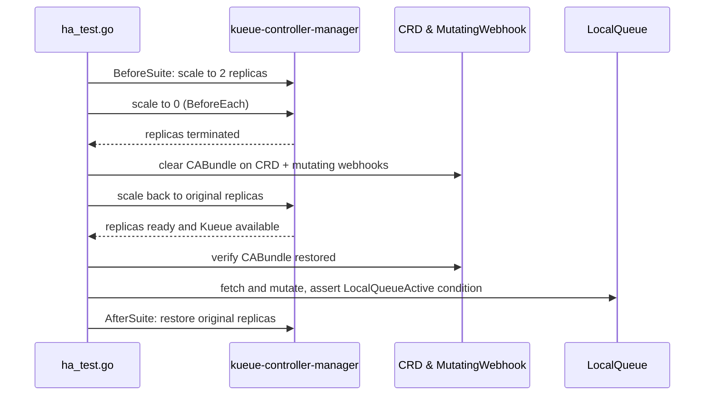

# PR #12271: Use one replica for sequential baseline tests

**Summary**: Use one replica for sequential baseline tests

**Sources**: https://github.com/kubernetes-sigs/kueue/pull/12271

**Last updated**: 2026-06-15T19:39:18Z

---

## Metadata

- **State**: closed (merged)
- **Author**: [@ikchifo](https://github.com/ikchifo)
- **Branch**: `worktree-sequential-single-replica` → `main`
- **Created**: 2026-06-15T18:12:44Z
- **Updated**: 2026-06-15T19:39:18Z
- **Merged**: 2026-06-15T19:33:30Z
- **Closed**: 2026-06-15T19:33:30Z
- **Labels**: `lgtm`, `release-note-none`, `size/XL`, `approved`, `kind/cleanup`, `ok-to-test`, `cncf-cla: yes`, `area/testing`
- **Assignees**: [@mimowo](https://github.com/mimowo)
- **Requested reviewers**: [@mimowo](https://github.com/mimowo), [@olekzabl](https://github.com/olekzabl), [@PBundyra](https://github.com/PBundyra)
- **Changed files**: 4   **+341 / -203**

## Description

<!--  Thanks for sending a pull request!  Here are some tips for you:

1. If this is your first time, please read our contributor guidelines: https://git.k8s.io/community/contributors/guide/first-contribution.md#your-first-contribution and developer guide https://git.k8s.io/community/contributors/devel/development.md#development-guide
2. Please label this pull request according to what type of issue you are addressing, especially if this is a release targeted pull request. For reference on required PR/issue labels, read here:
https://git.k8s.io/community/contributors/devel/sig-release/release.md#issuepr-kind-label
3. Ensure you have added or ran the appropriate tests for your PR: https://git.k8s.io/community/contributors/devel/sig-testing/testing.md
4. If you want *faster* PR reviews, read how: https://git.k8s.io/community/contributors/guide/pull-requests.md#best-practices-for-faster-reviews
5. If the PR is unfinished, see how to mark it: https://git.k8s.io/community/contributors/guide/pull-requests.md#marking-unfinished-pull-requests
-->

#### What type of PR is this?

<!--
Add one of the following kinds:
/kind bug
/kind cleanup
/kind documentation
/kind feature
/kind kep

Optionally add one or more of the following kinds if applicable:
/kind api-change
/kind deprecation
/kind failing-test
/kind flake
/kind regression

Please also consider setting the area:
/area tas
/area integrations
/area multikueue
/area dashboard
/area localization
/area testing
/area website
-->

/kind cleanup
/area testing

#### What this PR does / why we need it:

Run sequential baseline e2e tests with one Kueue controller-manager replica.

The HA specs stay in shard-0. They scale the controller manager to two
replicas for the HA block, then restore the old count. This keeps failover
coverage without adding a new prow job.

#### Which issue(s) this PR fixes:
<!--
*Automatically closes linked issue when PR is merged.
Usage: `Fixes #<issue number>`, or `Fixes (paste link of issue)`.
_If PR is about `failing-tests or flakes`, please post the related issues/tests in a comment and do not use `Fixes`_*
-->
Fixes #12259

#### Special notes for your reviewer:

/cc @mimowo 

Local test:
- `test-e2e-sequential-baseline-shard-0`: main `570.44s`, this branch `453.87s` 🤞 

#### Does this PR introduce a user-facing change?
<!--
If no, just write "NONE" in the release-note block below.
If yes, a release note is required:
Enter your extended release note in the block below. If the PR requires additional action from users switching to the new release, include the string "action required".
-->
```release-note
NONE
```


<!-- This is an auto-generated comment: release notes by coderabbit.ai -->
## Summary by CodeRabbit

## Release Notes

* **Tests**
  * Added new high availability e2e coverage for certificate bootstrap with replica recovery and leader failover behavior.
  * Updated the default configuration e2e suite by removing the legacy certificate bootstrap scenario.
  * Improved e2e test execution for sequential baseline runs by ensuring the expected baseline configuration folder is passed to the test runner.
  * Adjusted e2e LocalQueue metrics assertions around ClusterQueue/LocalQueue deletions.
<!-- end of auto-generated comment: release notes by coderabbit.ai -->

## Discussion

### Comment by [@netlify[bot]](https://github.com/apps/netlify) — 2026-06-15T18:12:51Z

### <span aria-hidden="true">✅</span> Deploy Preview for *kubernetes-sigs-kueue* canceled.


|  Name | Link |
|:-:|------------------------|
|<span aria-hidden="true">🔨</span> Latest commit | 50064278dc05e5ccff58a9b9998d28d99347a4c8 |
|<span aria-hidden="true">🔍</span> Latest deploy log | https://app.netlify.com/projects/kubernetes-sigs-kueue/deploys/6a304c5a301aad0008ee2a69 |

### Comment by [@k8s-ci-robot](https://github.com/k8s-ci-robot) — 2026-06-15T18:12:55Z

Hi @ikchifo. Thanks for your PR.

I'm waiting for a [kubernetes-sigs](https://github.com/orgs/kubernetes-sigs/people) member to verify that this patch is reasonable to test. If it is, they should reply with `/ok-to-test` on its own line. Until that is done, I will not automatically test new commits in this PR, but the usual testing commands by org members will still work.

>[!TIP]
>**We noticed you've done this a few times! Consider [joining the org](https://git.k8s.io/community/community-membership.md#member) to skip this step and gain `/lgtm` and other bot rights.** We recommend asking approvers on your previous PRs to sponsor you.

Once the patch is verified, the new status will be reflected by the `ok-to-test` label.

I understand the commands that are listed [here](https://go.k8s.io/bot-commands?repo=kubernetes-sigs%2Fkueue).

<details>

Instructions for interacting with me using PR comments are available [here](https://git.k8s.io/community/contributors/guide/pull-requests.md).  If you have questions or suggestions related to my behavior, please file an issue against the [kubernetes-sigs/prow](https://github.com/kubernetes-sigs/prow/issues/new?title=Prow%20issue:) repository.
</details>

### Comment by [@coderabbitai[bot]](https://github.com/apps/coderabbitai) — 2026-06-15T18:13:04Z

<!-- This is an auto-generated comment: summarize by coderabbit.ai -->
<!-- review_stack_entry_start -->

[](https://app.coderabbit.ai/change-stack/kubernetes-sigs/kueue/pull/12271?utm_source=github_walkthrough&utm_medium=github&utm_campaign=change_stack)

<!-- review_stack_entry_end -->
No actionable comments were generated in the recent review. 🎉

<details>
<summary>ℹ️ Recent review info</summary>

<details>
<summary>⚙️ Run configuration</summary>

**Configuration used**: Path: .coderabbit.yaml

**Review profile**: CHILL

**Plan**: Pro

**Run ID**: `6932fa9a-da87-4205-aa29-f6a4aa3f5332`

</details>

<details>
<summary>📥 Commits</summary>

Reviewing files that changed from the base of the PR and between 7e732fcc3c5e114a57ebc1f8bed4161dfa98464d and 50064278dc05e5ccff58a9b9998d28d99347a4c8.

</details>

<details>
<summary>📒 Files selected for processing (4)</summary>

* `Makefile-test.mk`
* `test/e2e/sequential/baseline/default_config_test.go`
* `test/e2e/sequential/baseline/ha_test.go`
* `test/e2e/sequential/baseline/metrics_test.go`

</details>

<details>
<summary>💤 Files with no reviewable changes (1)</summary>

* test/e2e/sequential/baseline/default_config_test.go

</details>

<details>
<summary>🚧 Files skipped from review as they are similar to previous changes (1)</summary>

* Makefile-test.mk

</details>

</details>

---
<!-- walkthrough_start -->

<details>
<summary>📝 Walkthrough</summary>

## Walkthrough

The cert-bootstrap scale-down/scale-up test is removed from `default_config_test.go` and re-implemented in a new `ha_test.go` suite that also adds HA failover workload admission and preemption scenarios. The Makefile target for sequential baseline e2e tests gains `E2E_CONFIG_FOLDER="baseline"`. Metrics test expectations are updated to reflect which LocalQueue metrics persist and are deleted after ClusterQueue and LocalQueue removal.

## Changes

**HA Test Extraction and Baseline Suite Updates**

| Layer / File(s) | Summary |
|---|---|
| **Makefile wiring and cert test removal** <br> `Makefile-test.mk`, `test/e2e/sequential/baseline/default_config_test.go` | Adds `E2E_CONFIG_FOLDER="baseline"` to the `run-test-e2e-sequential-baseline-%` recipe. Removes the `ginkgo.It("Should allow to bootstrap certificates", ...)` block from the default config suite, eliminating the inline scale-down/scale-up and CA bundle verification logic. |
| **HA suite wiring, cert bootstrap, and helpers** <br> `test/e2e/sequential/baseline/ha_test.go` | Introduces the HA Ginkgo suite with `BeforeSuite`/`AfterSuite` that scale `kueue-controller-manager` to 2 replicas. Adds the "Cert bootstrap with replica recovery" context reproducing the removed cert-bootstrap test with queue resource provisioning, CA bundle clearing, scale-to-zero, scale-back-up, and CA bundle/LocalQueue verification. Adds `currentReplicas` and `scaleControllerManager` helper functions. |
| **HA Failover scenarios** <br> `test/e2e/sequential/baseline/ha_test.go` | Adds the "HA Failover" context with two workload scenarios: populating leader/follower caches via initial admissions, deleting workloads, forcing a leader failover, then verifying the new leader admits a subsequent workload and preempts a lower-priority workload before admitting a higher-priority one. |
| **Metrics lifecycle validation** <br> `test/e2e/sequential/baseline/metrics_test.go` | Adjusts expected metrics after ClusterQueue deletion to only remove "reserving active" and "admitted active" gauge metrics while counter and timing metrics persist. Extends the test to delete the LocalQueue and verify that pending and quota/admission-related metrics are removed, with status metrics intentionally excluded from LocalQueue deletion checks. |

## Sequence Diagram(s)



## Estimated code review effort

🎯 3 (Moderate) | ⏱️ ~28 minutes

## Possibly related PRs

- [kubernetes-sigs/kueue#12196](https://github.com/kubernetes-sigs/kueue/pull/12196): Sets `E2E_CONFIG_FOLDER="baseline"` in Makefile targets for the baseline and TAS baseline suites, directly aligned with this PR's Makefile change.

## Suggested labels

`lgtm`, `size/M`

## Suggested reviewers

- olekzabl
- PBundyra

## Poem

> 🐇 Hop hop, the certs now live in HA's lair,
> Two replicas scale up with utmost care,
> The failover tested, the leader replaced,
> CA bundles restored, no webhook disgraced,
> The Makefile now whispers "baseline" with flair! 🌟

</details>

<!-- walkthrough_end -->
<!-- pre_merge_checks_walkthrough_start -->

<details>
<summary>🚥 Pre-merge checks | ✅ 4 | ❌ 1</summary>

### ❌ Failed checks (1 warning)

|     Check name     | Status     | Explanation                                                                          | Resolution                                                                         |
| :----------------: | :--------- | :----------------------------------------------------------------------------------- | :--------------------------------------------------------------------------------- |
| Docstring Coverage | ⚠️ Warning | Docstring coverage is 0.00% which is insufficient. The required threshold is 80.00%. | Write docstrings for the functions missing them to satisfy the coverage threshold. |

<details>
<summary>✅ Passed checks (4 passed)</summary>

|         Check name         | Status   | Explanation                                                                                                                                                                                                                   |
| :------------------------: | :------- | :---------------------------------------------------------------------------------------------------------------------------------------------------------------------------------------------------------------------------- |
|      Description Check     | ✅ Passed | Check skipped - CodeRabbit’s high-level summary is enabled.                                                                                                                                                                   |
|         Title check        | ✅ Passed | The title accurately describes the main change: using one replica for sequential baseline tests instead of the previous two replicas.                                                                                         |
|     Linked Issues check    | ✅ Passed | The PR addresses issue `#12259` by configuring sequential baseline tests to run with one Kueue controller-manager replica while maintaining HA coverage through dedicated HA test blocks that scale to two replicas.            |
| Out of Scope Changes check | ✅ Passed | All changes directly support the objective: Makefile modification passes correct E2E_CONFIG_FOLDER, removed certificate bootstrap test, added new HA test suite with replica scaling, and adjusted metrics test expectations. |

</details>

<sub>✏️ Tip: You can configure your own custom pre-merge checks in the settings.</sub>

</details>

<!-- pre_merge_checks_walkthrough_end -->
<!-- finishing_touch_checkbox_start -->

<details>
<summary>✨ Finishing Touches</summary>

<details>
<summary>🧪 Generate unit tests (beta)</summary>

- [ ] <!-- {"checkboxId": "f47ac10b-58cc-4372-a567-0e02b2c3d479", "radioGroupId": "utg-output-choice-group-unknown_comment_id"} -->   Create PR with unit tests

</details>

</details>

<!-- finishing_touch_checkbox_end -->
<!-- tips_start -->

---


<sub>Comment `@coderabbitai help` to get the list of available commands and usage tips.</sub>

<!-- tips_end -->
<!-- internal state start -->


<!-- DwQgtGAEAqAWCWBnSTIEMB26CuAXA9mAOYCmGJATmriQCaQDG+Ats2bgFyQAOFk+AIwBWJBrngA3EsgEBPRvlqU0AgfFwA6NPEgQAfACgjoCEYDEZyAAUASpETZWaCrKNxUtyM0XwAZvGl7EgBHbHZ4NAAbSAE0RBJI+HJIEgAmEkgaRFxkAkgKbCwAd3VYfmSAaTCwhQxcCnxIyMowZkw0Uj4KEm5EhjQUDGySNHp8X0yi/A0YWAyEIjK0CW1IlXhE3Hks3HtuUT94fvF8IfySNqTB+1hnWjAABnQMeiSGSOwldHt+xIwifj7KgnLC4W67GjMbj4KgUDbyN7dOKBMEZJh1BpNShedqdTL4SYE7q9I5xSC0bBw/6ZOaQAASAEFMtJdgJIvgGABrAA0NLI52yMMC6nx5QyxL6AzQvhoFCKdxm7mQaG4vHwaAYZUudW0Z18q3wUj4OwURo6GRKYPweHOoXgVIBA3IRR4DRdQkEitpmswpHJF1O2WBgSBvhhbQwDAy8ChDSkbDqiF5lrKJpIAA9RHh4KdMjHxXRsFH6L4GsxIABWADsDw0ABY60F0bRkLnUTirgIqJHUwS6xWAMwaAAcVabpxb5RpqC7mE1XoynlQxxIRBh8AAXnR0MrGM1MNhuClfGGKLswwxsPExqCWUkAUlS3F6kXcJSMvhuOJmJvqDmMBo5iWAA8sIojiFIyCliwkB/Jy25IA40hGAAkogSGQGYACMqSpBWACctphNkyBXve3yIPezTnCS/SQKe6BNEEoThFEzIkZAAAUAj4GCKTpjQLzbpg9CxPEfwkAAlPxUZfvRML+rQpI0PQjLsTkC6ujGzjyIIIhiJI0a5ASn7fpuGQCNgGz0N+gQMfELF1BE0Qmg46jSF6qAkCeMK7Kg3DOLs4zfGsFB4u8IwYIegzqBEEEZJxiE1NhWEAGwPKl0kifJTT4EUu68CQEg5legJmRuf65ol6HJThOF1pJmlqtCiBsQ4RCkBxZHUqcBa0VKuS0ko+rYJEuzov4RCUpVWDZSqvSyORAVUGw9S/iC5SRPIDHtkoSkrqpTKubcFC0MmCCagoo30NCgniFEW32DGJK+NstKuS+YjvpARQINR2q4Lq5HkFG6E6ZACxLCsGzrJs8hMGapCafNDQamUZAqM0UF4N9ShMIefwAnjSD/kmjHsiU1JqTsxkxBk3hSDZBIDPEy3UGipziFF1rIEkNBEMC/6QB6Ag/aU1p+VCGpcwC7ZiQkSQZGmmaXiCgEGBYkAAMIsAmOT2I4bQuG4tKeN0UaGfQKOGmx0Hlt0xUkEU2I/t4UznQSRDLBkmCQAAMgA4tAACyzxW6qcbbu2Pr/B5kA2EVATO3wvgkHQsRchD8CLIkiwqegEcHDN8nGrSF5XsJEfqpqvKIPsDCHL8j0YLx5FgtQfLWHY6JRhi7OtlgbScuRvFzMaLKkfEFFUX1ko/X9GTwT0bdDQclFtgSePWr0SsT6KLM9M47PayhwuCCX9E490tSUUogunJ5yCs0fG3BT3lBnPKyCO87N34JR8VHpkhFA9PKg1Z6knOBSAyuZsomi3gTcixN15nDyAIeYIlmivCEvsISdQtrqxQhgWKbETQFDOMSXy259QbHfLzUEUx1IG3cogLgAADbgo1IhgE5NUEgYAjR+FkK0XUbCw6QA4VwnhfCwA7DAGkfhDkwhOSiGAeWEkwCIBOvcLCIikhsJmMHGMeUCRqmKntEKSROSil2iQQGGwo4snoqsb67IiBQQUnLZEEkbh3DAFhdSvJugsWyORB2Sd+ATHbDQj43RNKeC/juSiRByBM3OD/SgrZmicgqmycRVgABChRaCyCoBfUYSkQS2zTrQDOnJ1ZwEXHYW4Mg06D2cPBegKZYIqASPQ94nxyJsMiEQXAzA2G8jYdbRmEyJH4E5LIwgOxZnZTYQwSMvgwDvDQFwWQ0hZlJH2n+ak7c/K7ACuhYSeAWDs3oJqUQnJlQvBQMgJEJSL47HvDMBOGS+CuxMYxRABIkgkPzvcigLgwDcCONY4JxF9Y7W9LcWOtN0EFxJFHIkCQRhT1nD2QItYsJjmyoS4cvJDnKRXmiZFnV0DX3RLfSg24VgfExhkBidToRnjbgSbIbLzj7niIgGYTIHACCUewSAh5aDHzyO2M2AZGad0DiHHp6DogUiVgSZ0jAaWBHQUgux4E6Dq30MYcAUAyBjAmGga5xAyDKDBbrdgXBeD8DAgZSCMR4aKGUKodQWgdBmpMFAJULzng4AIPa8gwY7nOrqFwKgLoHBOBcN6hQd8VBqE0NoXQYBDDmtMAYYOaB4L+GaLIlkGhmCcg4AYAARI2jWlgGQoWjY67cKaja6QmDHTqqFQS0jYeQyt2R5HpE0SEZR91uHqMVmAAApGI828B9i8nbGQYqDQMB6x4HEa8ooDEAHpbhciPZ8/4R6FGjs0FosRLcXQZlouoR6bwPhKGQGwgAoqkL9AB9LWwEAByAAxFCAc/0geAn7AAIl+mwABeetc7yD1oMbMLyQw6GdwlSo6IKGMgKPyIUV0hp4Afs7k+41caMCTTAGGSId9IAspqHK96TjEAMDhF+dWRggKQAZGNR1pMbGr22ffM4wUn1ULGHwThbIjgpCcuIZCBgoBAd6kYP2itkB9roFwAA1FhI9jwjBftCW0J1XxwlO2PKeTgkBg50HgI4BtTa1NFp2Fe9IR7cMzqPQRo9w1bVjT/RNbOf6dgaDXHWxt9bm0CbbaQGNtyDapp7bq30qnGkpHSJAQAOAQwe8iF8apxJrTQ2jTQAuATMJoJAFusFTh4jfZ8FEQ6iBWLXBoFCuBOL1oAMqwGtIx8meVRQ8V4kGFUjBKDiH8CuRA9beQaBW5JMRUXZgd26AzRx2RXSJx5o9TjUQo5Dt4SQMIWzOaYmaBQERGBzQUDEUoXo+BZC7toHlUEBItwNF5BFZw242FawZEUl4zQxFtiHeyX4LFiIaHO2EDQ6YeHDmFTmMRWsbAwfEcwPAxyATOwEEN+ZZNjtYM7i99k73JV1KldwZM2h84MQlKSVFogWAFlGPIbKVQLs+2hmsNQcNeSCP8EDkHYPaAQ5+mSboULPyjVSxy0encsc4+ykTknjzeRwLmFgeXLLyOpbYX7DkUQACKfCxF48BsL9QPPnmm/N5EK3/OGSepIGIvlb5hUCZlNiDdzhEjYny1rWbiAav3K5MgK167aTkAEkw9ENAk98rPMgJS5tcCPW6WwjrGBORdZ1nUDMvX60ADUSb262JAfrlAjRLcgCtjQa3eN8c1oJ2UM1aa2PEz3yJ/EuX5wUvJvoSnxAqcQEYdTvUuJKRPGAU4j1ts22iFJvLJo3GKauGwrzCjfNTtYpEAL3jFZBeK6NXAYWysRai2uNhABuerBJpNnjoEesfim8ahQH3p2gjUWmOmmWsctAhmDwJmWE+EVYZmFmqWTA1mictm3k9mXATmSkrmcWM+nmLI3mJAh+jk/mgWtwkWVaMWbm8WneSWDqsaaW3ag+em0+BgDItAFiToyBLwiy8izyAcnW+AR6AcnOXs9IR0HGVkdWu+xBaApB2Q0W+AYinE5CQQcID0sgR6MId8dA0kpyRE9ogQak6CtwxUCk3S7YfONQKeN2LQEYj2PwJ2aSqQNEkofuOWbkdW0q/ckA5hHMtG2cFWQs2U3Q6eOQQSHOp04C/AcIBebElhjQt292thrOdE+MdQtcvwwoEIBIjhiKu8e25CuuzyQRBAQRnc640R0QSRAwKRfkt4dwX2hCNR9QigRYKIjCaknGGMcI/8daUAAAVL0WHrNjEPgJNvUNNt0pUecAjJQLIFVv0a6nGCTIGN8A9mwHXBqCQJMgnECpSFGCBmsBIDCLMsDh8MMBQG7mECsk7mbr8BcV7s/uTm1hkGwojvwrEViHdjYZ0M9j0NTrunkL9szM8vKOoB4nJooIgEepMdUbTEiJdA8M/gDhQBEc7rcdbtrNjrUEaCgj9CQMTiMdYiDjEMUtRNlEicqExLbgTrififMtrEyJZODtIA8ekREe8fEV8diHTmxhkLwDmF0L8ZAtUeIiCQigpG8jpk8vQN4egILrDA7s/mLgEBEUSYydLoEIDjRIrmsCpM/qiFgEqRqRIjcZbuif0FgGiqnLgPcmdF4PjvnJxPEPrGwv1gQNwFYI0EcLIGwpJAUTZOCCgM6Saa7nwh7vFGIs2LFLmKgPqJEPEIBH0QMWpCBgaEaHMb0QsWRigruKsdIAFFGGLHxHPicVeLKHcWwkeqiaafzmItlBmJQA3EKrBCMExjEoaFyTzrQD+LgDLD9DCJyOyKMPQnkPuHfEegxhTNiP0PcmTEoM0L2SQKUNiL7KMN2fnFMBQAOeqLJiFHlC0HyeuLXhuVuaMLyKeA3NSKOdiG2UaH6XyLNJctyicgnrZleXwIYcsPyVxKuYhELMFCzNgOKkfnUH2ZuYOVbC8OSoOhkPEM2IEvthcF+H+Tao1snFCl0XCEef2eBXTKeD7F2eoL2QMJDPuRhQ7mKIAcwXGczKwcgHMJEECJfJGCCLCS2Z3JeBCpKuydYbiNiNCdaCBXbJTr8W9runXKIOInkI8exddnETxQ9niHkAMIDGFHYk4UKQJbsL9A4rLrFNSAxGqALNIJRJessKsPKbXtHo8u3nxgll3sJssTyf6P3ixYPm/iPnJoBePuEFPjPpABpskJxA1u5R/l/gwJAIIfYO9jxHGbifSnqrQEehUloerNpuQLpglYZgOFhAOCZg8LAd+PAb6ukhEigb5FwHSNnLABQdgWAEYPvj5n5s5KfuJOfqtHCAwIgDIZoOQVgVQe2rQV2uDG/HqkwWGiaKMEIKWREVRmINuMGXcV4HYh1cgIkKnAwLIBFHSgJfQEEdaBQAWXOXYqTCKgHnwEdb2e2FrKcWWXwuSrsA+kPuBAPEdvXI3AVtLIZDVl7NgH6O1UcMgIodIA3veElQRT2cJJ7qBSeS2NoQSGiqvozOdDpdUZQOevmL5oDL7ktWtJ1XSoRumPXPnHkNtrqLKeZWyCQJpCaL4JSKiHwGXlarpu2VQH6HIP6POVSv7C7otaCQkDas8vqUkrNivB3O2KTSCtSAtXwjjStVxC1kpNSLgorY6M8vEGaNEKELxGgGDT+OhP+GAN0DqduKjciSKUzrIvmLLQDVlNfA1uyLHHwGZTDJTegGdfKKdHqbSD7qVP9eFagHzOEKcKoS/rsPurNtuBSA6NOMgNLfznuJFIeO3p3kJhJr3mJr/q5VJoTTJpETwF5Ypj5cqX5QFSQEAelSAaQGAZAAZqkFWCZqlAVdpFZgWD/HZuVY5s5pge5magYCGkptapGoQMlh2nGqwC6vkGgMmobODOzQgX6tmoGnmoYP3WGqgCuXaiPbQUwOPQmv6PYhTvPTEDDtYkNWmt2LSnPb6lQP6jmkGvmkYAANoADe9aF9JAKEtA9aHAb9WWYWA4FYw4tAdYaAWEDAqUDYS29aAUYI399aJaZaDiN61anIUDwRaVJA39DYZK9aVqGDWDdYODZ9sgcDw6hQN646iiwFM6aiZ+5Ai696Y2Tpn6P6/6gGoG4GkG0GcGNg62BIbCBGYiVwG6GAW6pwu6KwKhlNyAFyB6eQx6p6nI56d4l616UWd6GgUD89BSJ9OsUIzQ6YDucDFM9aAAvtyK/e/Z/XA+/X+g8Ogr4MOAIAwAOKlPhBWAIFAzA7AHAw1fgU1VEC1QrOQBfiNKFuFkQN1XIWgypbgPgxwGlFhNyLgy8PE2lKkMk8Q3AwnDtv6YRk5NfPnnwd1r1gADoDZDbXSjYuhoIjE5BjFHhRjcrzb9zlPLarZiJsgcjWJCUpjCO0iDEZ5R6cxl68gKw/gPaXXeiyUfEJF4iPFgCfZFAYC+bpFgDRS+AUyTKS4kle4J3OCg2UKcI6kBGPmuU5Hc1onx3q6472nkRa4Elkx64wWAV+bGk83olUkgiY3UClRWWIBe0ZD5ZV6UQ17yD14UBpm1Cp4PVjYTlgJu2yidwS3ELUhNP6xRZaO+o6PdN6M7yGNbDGN5RmMWO/2xzWM/22MPC+BYQPB0skCjgMsVhePUA+M/1+MEHTrNVSFRNrgxOBRpPJN4OKzf0Vh1iZMz0uBwMsGTjtjUxiHuRizR2cRFOF5dZFacZwjoI24dJA4QvOQVlsLASnRMq0A+niJuH8LNBSDRBOmHjKN1HLM0gdweFZBQksiBTIDeH/YqhvglHRwzMcm8XnUiU04gX8WFC4BpEna8yZGQDZGeK0j5HiJFFCgRFlFJBsQRsgXShIs707xqxYtKA4tch4sGNGM/1sAYHMAkuWNZYUtkukB/q+ADh1j4QMDOMkD4SsFoAsuwPsu4EH4BMn48v374D8tnjxMVipRCupMisJOjgSvpZwMoT6MXDsARGDOsh1NTZHgTGCl0Tmws2zE/CdE5hcBcYjBZD1ZoBrH5k+zPJw4Fg7EHXSDRtYzQtWGfHBuiiAnm2gkXyVHKMUATPUnZsYvw0ZCAn/b7hm2qm7MDzKofPx3ojYlCwPN0k3PZS5hfP3N4na61DlZp3vuBDcXfsKVckajWKHiM4Acs4tmSniIynO1C4bAO6i6UCHCBDwdMnKjXxHNK4qTx78iGm7hx0WG+yWl2I2lHpfPbiOl2Kfqumfgel9DelZSC0BlVkhnu6e4RkThRkWkc5rHOJxlU1FskAluchlsZgVv1qQy1uNsf1f2Ut/3oJVipR4QuNRgDgDh9tsv1ocvDtBMSQnrSFjsTtxPztYTDj4Szu0DxOpD4QPBLvdortrt6ybvJmpmUA1YdEPZdGsKMBIjXu5nrFRjusvugySX67EaoKMJvn0Y5d3a0BwhSCzQEX62nCf7dCIUbSbNgKAAoBJxFhFlODbuMeeBbyBdRkWeTCNV2+c4hsCzXeeFiB7uGKm85N9ueGj+RDbQM/pxKkGN92bkIwlOqogeZhfINt0OdN9ite9EvaNkHN6+6tS2dec1xx3COLjI711CK/FEkmxcEDJeXuXdld+Rbd7aWSbfut+gJ1zif+VnIsKRfyVD9hduZo8k9o7oywPi3Zw5+Y3W+Sy5053+lWKkMOBWHS24w8GgP2P5744O41dQ9y3Q/gSQRF5k7E4l/hBkykwl/O9lQOKlzpNK7RRDAkIxbTcxSJnkFaZdAGxiHJeR7YVTqJewIAJgEumlI3Q4bB7VRmlklvK6RzruwGvYbcbylzgpAuw4H88Olop5EBlDQRl+tplcpYLuqDywqFnVnNnBLJDlbXdNbxPTnDbtjvg07eJNYDAdYWEtAw4TPA72QeBnLx+IXbVy1ANvL47PPAr0XqUVY8XaTqURDkrwf9aOWbCM3tATmuNiAYis1WNQsTp4a3Q0CmKm0b0QLQRIN1In1UgNW2U+We3+cQ/JANWftyoZ12sN1lAi1F1/4oRDMI89Nlz1ZNQftN7JnQl7Y+WWiw2okGQdfNWiQsh/vePa7QfcDVbLmYfpLVjZPtjw4w4qQA4AgA4vgNYaAVYyfyTbxszzT5Ds2egTQLDPzz6Rc0mVYOLoL0S60sxeUrH+jXxbi4Ais85OgA3xWpiIL+fkWPITREgf5ugRQTCoJFFAK0MgWtQGLrV/KnBDaCQIqpG2XKC0Yw5EGfjwFOI4YsavtHPuFU4jdJkqY9TLv6E1bwA1AStTJEgEEgFlI2GwTfjpxqDL9TgjUWYLkQhC1cKkOZWzMMCPA6EZuERcTg+ythnNBo/8XklIOGD0AOBnEZWuRGyjUCdaP5LrhgAYHG1rBfAsmBmAGQq17APAxALbQyD20msy5L3s0Gx71pceuLfHuW0JYh9q2ZjAALqFpLUzyf8pvRoJFVd6DmJQAfRNrFUummcYhpPRRTpp56N9RermmDQWoFArAdQH+nIxdUbMv8P9MEWXopDIAVYEgFWAHCpBfADAbzhWBIBYQsIIDasHiQYBYRHG6CYBok1oD6h8Iw4OsBA3oDVCIAlYWnnWDrpAMGADwIYRWAGEnhAGaAfCAIHwjnCgGVPWgOcNbZVgGeDAYcO0L7o1Cd63ZBoS2D/TNC6Af6K1O0P7qFQ/0bAVSmFjmAx5WhsTJ4c/QMCQBIA9aJALYCs50A9GesD0lYO/qmd4g3IaEbCKQDAQjQcIVgmQHRGxlMR2I+tJ9k6prR/gOsRGB/VLwUAHskQV0uzHRFQiYRMIwLiz38ZgCR2HPMLlAK4Bsj2RHIggIDEiAgZCgMCIYOiIybYjhR9aWXlKMQAAB1UoDBg5BBh7wi2LgPlWFGmNsR5jMkfPRsBZp1AyohoDQCsAUBoAL6TBlwBJGbEyRR/a6FZ1sDEiogpIjkUpFoA2BCg6ohgK6QdCIAtYoI1BlwBfCOivR5GX0RgBtE54SAIYh5OiIjFYioxPov0dIC4yroQQiYrkO6LM6pjYRcEOgGhCQiIBAx6I+tKUwwDVjSmuAOsQ2PrFNjgAxY2gA0JqgkA9AtYpsY2MbEWBLA2EXCARC4AABVKeCZSIDURJiDEB6MxC5ZsROIjNISPQAABkMQDntJG8E9BzwCkPaMpG3DysSItYmsT2NPF1jNYcY5oMeLHEwUZ46lOiDOKYjDsuIS4ixGuIIybj0wskHcSGyOT5xDxOQY8ZrA1ZZikKpwY8f3SsCCoPwGAR6BXBjrMh9Gx8eyIBTXLkQAcWAaKHCj3j6Bjx/RZUQGSmBVNZA1oWCPAHgjjY0Q+4VJPMWvHji7x04hSLOOfGLiBIVqbcO+I3EyRtxF8PcQdBELqREAx4kDHETGzRQ8gsAHstwFYRHoj0HWMEIBQ0A70j0vCdBAyKNSIBNE2cSEq8SPRJRpAR6OqKkDrDHirAgUQfJJNwDSSOAsk+SbAEUnKTVJH8DSVpPcQqS+EekjsZCRGHpRUox40+ERJGxqhYgbIeQDtk7gATaYAwPiali0R3BxEy+eQO30cKVEwSOGbRBoGPGCYgU91LwFVVZAZAsYyAY8qKHgkBJJiZIYLFfjvKJTyQBIdsGzH+oVR+uibVADFPzhxTTomUmsRgHwmwAEQg0VAOQDoB0BaJPUohJESYx5BTIbArcJ3EsjWQ8we/BSM+IWmMY/c3Y3saeOABHpWx7YpCHoCWxki1g2QXMZyG2JX5tRkAR+nKMgBCj5RVlIDLeztGwiQJ3GDaGdKOnCiORPtK6SmNukcin0awSZv+ErFnT7Aw8VUNuCgA6wlAJo2+jrxR6wAwA1rBIHQXBiYY2UtAbHgDNhHeAlAlYj2qiyIBfTvp9aDNoyLOlPS2AlYj9KBJBDxY9RhYmEfdPZGRDQx1Ml6dX1tE+88xzMtmb9OTEFBIxZMoGe0AZlcBq+70HmRqA4rsxHodMrVk8Q7BYA9MXAbqACDnyMS+Aq0jnoJMGDDBRgg+BqeEh5iEh7xcQHGd9Lxm+pCZzgYmaTPlFHtfCU0boPmM9FkyKZUQKmc9MrGT5mgjM9kYaOFGsyORj032ZLLSqdJIApY4iLzNQb8yfp/goWWEETmwixZIM04JWJyyeAKkQRJsvpMwg4Q8IhEK+i7MpDkRdZrVZIDTFFBKFukc+GUmRzmZ8VDejvf6LqHsTEyBJ0xVmkrFgANBfqZQdqQeNEJ7ZChjyc3nYWohypGEqUq2WTPxlcyiZ94R2WzOdlEcXpDotOeTKiKZtIgPsmmZLNbGxzpADIS5OhD1iByYRwc9kaHNhHhyj5sI4CDaGCj9YmA+wbWKNXjlryk5vzP6cLJ3kZyZolYwTNEEYLkg9CYgI7IeGHylEPU8UNAqWm8g6V8ZjcYuLI1I4whs8kAVhgBmAxgYIMUGWDPBlX7tk7kItFpnVgmz1MqAeglkLrkJH0AdUAE2rBaFKAWzp594O8pNVLLbgOBysImj3gXnyil5dshkavJ3kby/Cbs+0R6JFnyivZB8jmRHNhESxgIvgd+Z+ATGjVz5QqRAFfNum3yWZuM9mQ8k5mVj/Rmo6kDSOUCkBf5sIwWXIoLGmLgFEs16RqKpEAhe55ocNLWDpYLpHel0AOlhhPBHAAgdQTSHCj0L+kgiQ2EbKgGHD+KHgC6ERevOkCNBswWcyWeaMVYUjrF7iD5GXElGuU9aE4vkOWCkp/hEAr0GSrSJpBxLGg2MhxfWjEWSyV5/wFpUosPlcz8lXixbEYuxGJDCx9aE6bgFsBvTsxoMyWalCgJVg6wvnPCL4FoAeNYuNLXzvVAeD4Rlhw4Vxr4AECpR5hOEf/lhAIgHD9lqUEgHWDuEMAPGDwXoXS1UD4QBw9y0maMufC2BLxXMmliQAHDDCHgUYYcCcI1C0Bi+NYYybQCwjAqAGw4RPg8FoC9DUosys4V0LQBoqKwrBKsBiuWFf9UovgVKAIEp4IqHg8WfUc8PWEAigRTbf5j8OeRrCoAtqAgH+gCgVxwR7MNlWeEhHvLsgZkiuLQAZC4AfkScJEbrHUA6xI239B4GSv7qMr8AzK21PEDZU0BaVqwh+v3UDoMiogSqkgJ8MTgoIOVuwXuq/VIHuQG2DwKAqIH6D8J8IVy+4Fipi5gB3GIDMAFWFoDgNYBw4BgFioHBVgzGHQjVYyO1W6rio+q34foCAA=== -->

<!-- internal state end -->

### Comment by [@mimowo](https://github.com/mimowo) — 2026-06-15T18:21:36Z

/ok-to-test

### Comment by [@mimowo](https://github.com/mimowo) — 2026-06-15T18:25:14Z

/lgtm
/approve
/cherrypick release-0.18
/cherrypick release-0.17
Thank you for making the PR so nice - focus only on making the other tests using 1 replica. This way the decision to decouple the tests to separate CI job can be de-coupled.

### Comment by [@k8s-infra-cherrypick-robot](https://github.com/k8s-infra-cherrypick-robot) — 2026-06-15T18:25:17Z

@mimowo: once the present PR merges, I will cherry-pick it on top of `release-0.17`, `release-0.18` in new PRs and assign them to you.

<details>

In response to [this](https://github.com/kubernetes-sigs/kueue/pull/12271#issuecomment-4711065571):

>/lgtm
>/approve
>/cherrypick release-0.18
>/cherrypick release-0.17
>Thank you for making the PR so nice - focus only on making the other tests using 1 replica. This way the decision to decouple the tests to separate CI job can be de-coupled.


Instructions for interacting with me using PR comments are available [here](https://git.k8s.io/community/contributors/guide/pull-requests.md).  If you have questions or suggestions related to my behavior, please file an issue against the [kubernetes-sigs/prow](https://github.com/kubernetes-sigs/prow/issues/new?title=Prow%20issue:) repository.
</details>

### Comment by [@k8s-ci-robot](https://github.com/k8s-ci-robot) — 2026-06-15T18:25:23Z

LGTM label has been added.  <details>Git tree hash: fd372fc97b7312609f1412444bc2ab10332b4b8c</details>

### Comment by [@k8s-ci-robot](https://github.com/k8s-ci-robot) — 2026-06-15T18:25:25Z

[APPROVALNOTIFIER] This PR is **APPROVED**

This pull-request has been approved by: *<a href="https://github.com/kubernetes-sigs/kueue/pull/12271#" title="Author self-approved">ikchifo</a>*, *<a href="https://github.com/kubernetes-sigs/kueue/pull/12271#issuecomment-4711065571" title="Approved">mimowo</a>*

The full list of commands accepted by this bot can be found [here](https://go.k8s.io/bot-commands?repo=kubernetes-sigs%2Fkueue).

The pull request process is described [here](https://git.k8s.io/community/contributors/guide/owners.md#the-code-review-process)

<details >
Needs approval from an approver in each of these files:

- ~~[OWNERS](https://github.com/kubernetes-sigs/kueue/blob/main/OWNERS)~~ [mimowo]

Approvers can indicate their approval by writing `/approve` in a comment
Approvers can cancel approval by writing `/approve cancel` in a comment
</details>
<!-- META={"approvers":[]} -->

### Comment by [@mimowo](https://github.com/mimowo) — 2026-06-15T18:48:53Z

https://prow.k8s.io/view/gs/kubernetes-ci-logs/pr-logs/pull/kubernetes-sigs_kueue/12271/pull-kueue-test-e2e-sequential-baseline-shard-1-main/2066586983433506816 
ptal

### Comment by [@mimowo](https://github.com/mimowo) — 2026-06-15T19:28:15Z

/lgtm

### Comment by [@k8s-ci-robot](https://github.com/k8s-ci-robot) — 2026-06-15T19:28:22Z

LGTM label has been added.  <details>Git tree hash: d3f9308c352f648a9bf41d7cc1e6cd3bcc6ef16a</details>

### Comment by [@k8s-infra-cherrypick-robot](https://github.com/k8s-infra-cherrypick-robot) — 2026-06-15T19:34:09Z

@mimowo: #12271 failed to apply on top of branch "release-0.17":
```
Applying: Use one replica for sequential baseline tests
Using index info to reconstruct a base tree...
M	Makefile-test.mk
M	test/e2e/sequential/baseline/default_config_test.go
Falling back to patching base and 3-way merge...
Auto-merging test/e2e/sequential/baseline/default_config_test.go
CONFLICT (content): Merge conflict in test/e2e/sequential/baseline/default_config_test.go
Auto-merging Makefile-test.mk
error: Failed to merge in the changes.
hint: Use 'git am --show-current-patch=diff' to see the failed patch
hint: When you have resolved this problem, run "git am --continue".
hint: If you prefer to skip this patch, run "git am --skip" instead.
hint: To restore the original branch and stop patching, run "git am --abort".
hint: Disable this message with "git config set advice.mergeConflict false"
Patch failed at 0001 Use one replica for sequential baseline tests

```

<details>

In response to [this](https://github.com/kubernetes-sigs/kueue/pull/12271#issuecomment-4711065571):

>/lgtm
>/approve
>/cherrypick release-0.18
>/cherrypick release-0.17
>Thank you for making the PR so nice - focus only on making the other tests using 1 replica. This way the decision to decouple the tests to separate CI job can be de-coupled.


Instructions for interacting with me using PR comments are available [here](https://git.k8s.io/community/contributors/guide/pull-requests.md).  If you have questions or suggestions related to my behavior, please file an issue against the [kubernetes-sigs/prow](https://github.com/kubernetes-sigs/prow/issues/new?title=Prow%20issue:) repository.
</details>

### Comment by [@k8s-infra-cherrypick-robot](https://github.com/k8s-infra-cherrypick-robot) — 2026-06-15T19:34:46Z

@mimowo: new pull request created: #12275

<details>

In response to [this](https://github.com/kubernetes-sigs/kueue/pull/12271#issuecomment-4711065571):

>/lgtm
>/approve
>/cherrypick release-0.18
>/cherrypick release-0.17
>Thank you for making the PR so nice - focus only on making the other tests using 1 replica. This way the decision to decouple the tests to separate CI job can be de-coupled.


Instructions for interacting with me using PR comments are available [here](https://git.k8s.io/community/contributors/guide/pull-requests.md).  If you have questions or suggestions related to my behavior, please file an issue against the [kubernetes-sigs/prow](https://github.com/kubernetes-sigs/prow/issues/new?title=Prow%20issue:) repository.
</details>

### Comment by [@mimowo](https://github.com/mimowo) — 2026-06-15T19:39:18Z

@ikchifo please prep the CP for 0.17

## Reviews

### Review by [@coderabbitai[bot]](https://github.com/apps/coderabbitai) (commented) — 2026-06-15T18:58:51Z


<details>
<summary>🧹 Nitpick comments (1)</summary><blockquote>

<details>
<summary>test/e2e/sequential/baseline/ha_test.go (1)</summary><blockquote>

`219-225`: _💤 Low value_

**Redundant LocalQueue deletion after namespace deletion.**

The `lq` (LocalQueue) is a namespaced resource that will be cascade-deleted when the namespace is deleted. Explicitly deleting it afterward is redundant and inconsistent with the pattern in the "Cert bootstrap" context's AfterEach (lines 88-92), which only explicitly deletes cluster-scoped resources.


<details>
<summary>♻️ Suggested fix</summary>

```diff
 ginkgo.AfterEach(func() {
 	gomega.Expect(util.DeleteNamespace(ctx, k8sClient, ns)).To(gomega.Succeed())
-	util.ExpectObjectToBeDeleted(ctx, k8sClient, lq, true)
-	util.ExpectObjectToBeDeleted(ctx, k8sClient, cq, true)
-	util.ExpectObjectToBeDeleted(ctx, k8sClient, rf, true)
+	util.ExpectObjectToBeDeletedWithTimeout(ctx, k8sClient, cq, true, util.MediumTimeout)
+	util.ExpectObjectToBeDeletedWithTimeout(ctx, k8sClient, rf, true, util.MediumTimeout)
 	util.WaitForKueueAvailabilityNoRestartCountCheck(ctx, k8sClient)
 })
```
</details>

<details>
<summary>🤖 Prompt for AI Agents</summary>

```
Verify each finding against current code. Fix only still-valid issues, skip the
rest with a brief reason, keep changes minimal, and validate.

In `@test/e2e/sequential/baseline/ha_test.go` around lines 219 - 225, The
AfterEach block in the ha_test.go file contains a redundant explicit deletion of
the LocalQueue (lq) object after the namespace is already deleted. Since lq is a
namespaced resource, it will be automatically cascade-deleted when the namespace
is deleted via util.DeleteNamespace(). Remove the line that calls
util.ExpectObjectToBeDeleted(ctx, k8sClient, lq, true) to match the pattern used
in the Cert bootstrap context's AfterEach, which only explicitly deletes
cluster-scoped resources like cq (ClusterQueue) and rf. Keep the explicit
deletions for cq and rf since they are cluster-scoped resources that need manual
cleanup.
```

</details>

<!-- cr-comment:v1:a4b6b7b1496aa419d5ffa093 -->

</blockquote></details>

</blockquote></details>

<details>
<summary>🤖 Prompt for all review comments with AI agents</summary>

```
Verify each finding against current code. Fix only still-valid issues, skip the
rest with a brief reason, keep changes minimal, and validate.

Nitpick comments:
In `@test/e2e/sequential/baseline/ha_test.go`:
- Around line 219-225: The AfterEach block in the ha_test.go file contains a
redundant explicit deletion of the LocalQueue (lq) object after the namespace is
already deleted. Since lq is a namespaced resource, it will be automatically
cascade-deleted when the namespace is deleted via util.DeleteNamespace(). Remove
the line that calls util.ExpectObjectToBeDeleted(ctx, k8sClient, lq, true) to
match the pattern used in the Cert bootstrap context's AfterEach, which only
explicitly deletes cluster-scoped resources like cq (ClusterQueue) and rf. Keep
the explicit deletions for cq and rf since they are cluster-scoped resources
that need manual cleanup.
```

</details>

---

<details>
<summary>ℹ️ Review info</summary>

<details>
<summary>⚙️ Run configuration</summary>

**Configuration used**: Path: .coderabbit.yaml

**Review profile**: CHILL

**Plan**: Pro

**Run ID**: `f9c06ab4-8ed0-4eb2-8bf0-57f5f8dcb893`

</details>

<details>
<summary>📥 Commits</summary>

Reviewing files that changed from the base of the PR and between 723b66dcf421d8bdfa8fa709350dbf32d581282c and 7e732fcc3c5e114a57ebc1f8bed4161dfa98464d.

</details>

<details>
<summary>📒 Files selected for processing (3)</summary>

* `Makefile-test.mk`
* `test/e2e/sequential/baseline/default_config_test.go`
* `test/e2e/sequential/baseline/ha_test.go`

</details>

<details>
<summary>💤 Files with no reviewable changes (1)</summary>

* test/e2e/sequential/baseline/default_config_test.go

</details>

</details>

<!-- This is an auto-generated comment by CodeRabbit for review status -->
