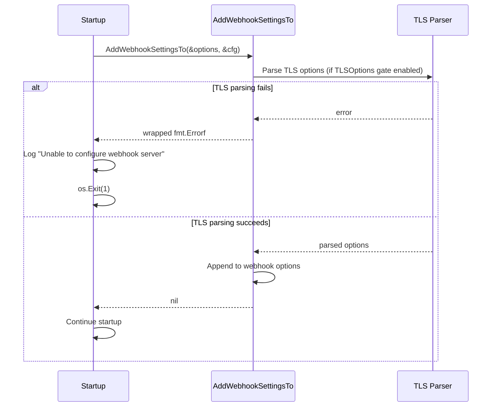

# PR #12293: Fix webhook server silently dropping TLS parse errors

**Summary**: Fix webhook server silently dropping TLS parse errors

**Sources**: https://github.com/kubernetes-sigs/kueue/pull/12293

**Last updated**: 2026-06-19T12:47:59Z

---

## Metadata

- **State**: closed (merged)
- **Author**: [@kannon92](https://github.com/kannon92)
- **Branch**: `fix-webhook-tls-error-handling` → `main`
- **Created**: 2026-06-16T19:10:48Z
- **Updated**: 2026-06-19T12:47:59Z
- **Merged**: 2026-06-19T09:20:49Z
- **Closed**: 2026-06-19T09:20:49Z
- **Labels**: `kind/bug`, `release-note`, `size/L`, `lgtm`, `approved`, `cncf-cla: yes`
- **Assignees**: [@mszadkow](https://github.com/mszadkow), [@mimowo](https://github.com/mimowo), [@sohankunkerkar](https://github.com/sohankunkerkar)
- **Requested reviewers**: [@mszadkow](https://github.com/mszadkow), [@mimowo](https://github.com/mimowo), [@olekzabl](https://github.com/olekzabl), [@sohankunkerkar](https://github.com/sohankunkerkar), [@tenzen-y](https://github.com/tenzen-y), [@PBundyra](https://github.com/PBundyra)
- **Changed files**: 5   **+126 / -49**

## Description

/kind bug

#### What this PR does / why we need it:

`AddWebhookSettingsTo` silently ignored `ParseTLSOptions` errors (`if err == nil`), causing the webhook server to start with Go TLS defaults on invalid config. This is inconsistent with `main.go` which calls `os.Exit(1)` on the same error for the metrics server.

This changes `AddWebhookSettingsTo` to return an error, and the call site in `main.go` now exits with a clear error message, matching the metrics server behavior.

Found by @sohankunkerkar during review of #11832.

#### Which issue(s) this PR fixes:

Partial #10698

#### Special notes for your reviewer:

AI was used to help create this PR.

#### Does this PR introduce a user-facing change?

```release-note
ConfigAPI: TLS: Fixed a bug where invalid webhook server TLS settings could be silently ignored,
causing the webhook server to start with Go TLS defaults. Kueue now fails startup with a
clear configuration error, matching metrics server TLS validation behavior.
```

<!-- This is an auto-generated comment: release notes by coderabbit.ai -->
## Summary by CodeRabbit

* **Bug Fixes**
  * Improved webhook server startup validation by treating webhook settings application as fallible, surfacing TLS parsing errors when the TLS options feature gate is enabled.
  * Startup now fails fast with a clear error message if webhook settings cannot be configured, preventing silent misconfiguration.
* **Tests**
  * Expanded TLS feature-gate coverage with a new invalid TLS fixture and updated assertions to verify error behavior differs correctly between enabled vs. disabled modes.
<!-- end of auto-generated comment: release notes by coderabbit.ai -->

## Discussion

### Comment by [@netlify[bot]](https://github.com/apps/netlify) — 2026-06-16T19:10:55Z

### <span aria-hidden="true">✅</span> Deploy Preview for *kubernetes-sigs-kueue* canceled.


|  Name | Link |
|:-:|------------------------|
|<span aria-hidden="true">🔨</span> Latest commit | 6af965b5b1625286c84870e41a4f3b1b010f2608 |
|<span aria-hidden="true">🔍</span> Latest deploy log | https://app.netlify.com/projects/kubernetes-sigs-kueue/deploys/6a32fcdc6cfef600075c9df9 |

### Comment by [@coderabbitai[bot]](https://github.com/apps/coderabbitai) — 2026-06-16T19:11:11Z

<!-- This is an auto-generated comment: summarize by coderabbit.ai -->
<!-- review_stack_entry_start -->

[](https://app.coderabbit.ai/change-stack/kubernetes-sigs/kueue/pull/12293?utm_source=github_walkthrough&utm_medium=github&utm_campaign=change_stack)

<!-- review_stack_entry_end -->
<!-- This is an auto-generated comment: review paused by coderabbit.ai -->

> [!NOTE]
> ## Reviews paused
> 
> It looks like this branch is under active development. To avoid overwhelming you with review comments due to an influx of new commits, CodeRabbit has automatically paused this review. You can configure this behavior by changing the `reviews.auto_review.auto_pause_after_reviewed_commits` setting.
> 
> Use the following commands to manage reviews:
> - `@coderabbitai resume` to resume automatic reviews.
> - `@coderabbitai review` to trigger a single review.
> 
> Use the checkboxes below for quick actions:
> - [ ] <!-- {"checkboxId": "7f6cc2e2-2e4e-497a-8c31-c9e4573e93d1"} --> ▶️ Resume reviews
> - [ ] <!-- {"checkboxId": "e9bb8d72-00e8-4f67-9cb2-caf3b22574fe"} --> 🔍 Trigger review

<!-- end of auto-generated comment: review paused by coderabbit.ai -->
<!-- walkthrough_start -->

<details>
<summary>📝 Walkthrough</summary>

## Walkthrough

`AddWebhookSettingsTo` in `pkg/config/config.go` is updated to return an `error`. TLS option parsing failures now propagate as a wrapped error instead of being silently ignored. The call site in `cmd/kueue/main.go` handles the error by logging and calling `os.Exit(1)`, and the test is extended with new cases to assert both error and non-error conditions.

## Changes

**Webhook TLS Error Propagation**

| Layer / File(s) | Summary |
|---|---|
| **`AddWebhookSettingsTo` error return and TLS failure propagation** <br> `pkg/config/config.go` | Function signature changes to return `error`. Under the `TLSOptions` feature gate, TLS parsing errors now return a wrapped `fmt.Errorf` instead of being silently discarded; successful execution returns `nil`. |
| **Main.go error handling** <br> `cmd/kueue/main.go` | Startup checks the error return from `AddWebhookSettingsTo`, logs "Unable to configure webhook server" on failure, and calls `os.Exit(1)` to terminate the process. |
| **Test cases and error validation** <br> `pkg/config/config_test.go` | Adds `fmt` import and `tls-invalid.yaml` fixture; extends `TestTLSOptionsFeatureGate` with a `wantError` field. Two new test cases cover invalid TLS config behavior: error expected with the feature gate enabled, and invalid settings ignored without error when disabled. Test loop captures and validates the error return value. |

## Sequence Diagram



## Estimated code review effort

🎯 2 (Simple) | ⏱️ ~12 minutes

## Poem

> 🐇 A webhook once swallowed its errors with glee,
> Now it speaks up and says "something's wrong, come see!"
> The TLS mis-parse once slipped through the night,
> But `os.Exit(1)` now shines a bright light.
> No silent failures for this bunny's delight! 🌟

</details>

<!-- walkthrough_end -->
<!-- pre_merge_checks_walkthrough_start -->

<details>
<summary>🚥 Pre-merge checks | ✅ 3 | ❌ 2</summary>

### ❌ Failed checks (2 warnings)

|      Check name     | Status     | Explanation                                                                                                                                       | Resolution                                                                                                                                        |
| :-----------------: | :--------- | :------------------------------------------------------------------------------------------------------------------------------------------------ | :------------------------------------------------------------------------------------------------------------------------------------------------ |
| Linked Issues check | ⚠️ Warning | The PR partially addresses issue `#10698` by fixing TLS error handling, but does not implement the TLSCurves feature requested in the linked issue. | Implement TLSCurves support as outlined in issue `#10698`, or clarify if this PR is intended only as a bug fix independent of that feature request. |
|  Docstring Coverage | ⚠️ Warning | Docstring coverage is 25.00% which is insufficient. The required threshold is 80.00%.                                                             | Write docstrings for the functions missing them to satisfy the coverage threshold.                                                                |

<details>
<summary>✅ Passed checks (3 passed)</summary>

|         Check name         | Status   | Explanation                                                                                                                               |
| :------------------------: | :------- | :---------------------------------------------------------------------------------------------------------------------------------------- |
|         Title check        | ✅ Passed | The title accurately describes the main fix: preventing webhook server from silently dropping TLS parse errors.                           |
| Out of Scope Changes check | ✅ Passed | All changes are scoped to fixing TLS error handling in webhook configuration, directly addressing the bug described in the PR objectives. |
|      Description Check     | ✅ Passed | Check skipped - CodeRabbit’s high-level summary is enabled.                                                                               |

</details>

<sub>✏️ Tip: You can configure your own custom pre-merge checks in the settings.</sub>

</details>

<!-- pre_merge_checks_walkthrough_end -->
<!-- finishing_touch_checkbox_start -->

<details>
<summary>✨ Finishing Touches</summary>

<details>
<summary>🧪 Generate unit tests (beta)</summary>

- [ ] <!-- {"checkboxId": "f47ac10b-58cc-4372-a567-0e02b2c3d479", "radioGroupId": "utg-output-choice-group-unknown_comment_id"} -->   Create PR with unit tests

</details>

</details>

<!-- finishing_touch_checkbox_end -->
<!-- tips_start -->

---


<sub>Comment `@coderabbitai help` to get the list of available commands and usage tips.</sub>

<!-- tips_end -->
<!-- internal state start -->


<!-- DwQgtGAEAqAWCWBnSTIEMB26CuAXA9mAOYCmGJATmriQCaQDG+Ats2bgFyQAOFk+AIwBWJBrngA3EsgEBPRvlqU0AgfFwA6NPEgQAfACgjoCEYDEZyAAUASpETZWaCrKNxUtyADN4AD2nokALYRJAA7rCUJJC4keEkArD4+ADW9pRSfIjwADbsOfLwRBj4FHQwADIAyjzOiNGUFKXIXk3MMXEABlZ1JNDVAPLc4vgYiJ3e2Bhi8KMaMF0AgrS0AOoJSalVJLjiGESI0PgTXlMzo5CwaPRoChi06rMYaDmMkQxpsdQ8ZVIYNPRGqUfvhuGgiNQngAadA5HL4MLwfYdaJhDbJNL1CiZGL4ey4Zy4cLqWCQADieP6NSUXjQ2ByuGQETIKAwEhe8HoVLuPiI2CoIywYTQyF4+AknLoGjccR8vkgzEU8B8AU6yzW6K2Oz2ByOEwIkDKuH5WEwkCBfCRiBo134XnsuXyhWKpSRoTBFGyyNpuX50nmcGiDBer2yNFZkE6zG0GA0RGOkBKYUumFoeWQsVQRpN5Qt6Hu5t86iZJMCDDyznNFCafDYiEQ4JIAYQyAYV320WjKQCsVRmsxGUoAHJkNz2TlOZCLgISFcJcCmGMkDR/sTYpcESiFTsKPAGMgsTj22mAtzF7z+VOsBbkEjI9GkXHjtKDIGgiFwiLIA9EExMuU5HsfB2xSKZuwoFJK1ofk3UNEgJRIZN8HtTwzAARjQgAOABmAAmZtok8JFy2wJRkFuMoK3qRN8HDWh8AYRx2Fg3tIGwLEwFpBhYLbTBSC4AAiABhUZeUWKwAEkuCpLgADE/HKW5glCZkylZcdOXiRIMXSbFKEqGp6l2N1W3wel6BnB08n+AoUBdMpaBhYN2JYuI0W01JdJxA1rUJNdSQpAzvxIWl6UZeYAGlsBIaKaOTH0cgPAkKGNbh/LLCs+HPIpL0FKsaxhaNcDbWC2FwXd9y8/Sxw5WgryCWc0HnCgNAEmVCLsVAchUEg8hucj31COV0rYB5HDAbIAC9yl4jtEAI6w7GFVsymocpEXXEVsl86ZolaFhIEWCTcXwCd9hhL8SgBIJ5FYulYlKF8LEgAZhFEcQpBaNpIDO7t6CQBxpCMCT61i9CAAYADYAE5MPQFYynrAJrgeZEqSE/lPvsbBuG4UoiQNKKYqbBZogB2KyIYXdhieOCvCiXbyKwHHrVW9oopnChyBoZBPC+IkUfKdHMYCBxcfx/N/vuPc1ozK4iWFvSDxxvGUvsJJzIa+GlHoQnoti0YGGiDnKG5gJMmyC40I0bDIZQZXxZSqVScYfkylXIjkCu8oDVGWyPXEEN5GG8noghmHMIWwQRBmKR+DwM7yjvVjfqT0GyYzPF4GYbg8jYVdFaxsXVaJO8idiu8OWKfOiQ20kWfKkg0HZ7BObN1s0DBNQJ3EAJmSwViLdpsoAEdsHgMoa/t7dNHMSwRNYdhlacFx2sWuCjckcpmDC+Bc+iTuxXHZBoN3ZFWN+eBEJBI363mKpgMwUCMHAyC+EPpopF1uJbAugtWJSJhRAYBuJgCaAIWi2sfZxAqGSaAABZH6PUchOVEhPZgrkD640/i8fE1B2ILU8MtBUzg/roGQAAKgoeJWwAwABqABRAAIlQ9KED1yQQwCUDA0NcKQAABT3SSBQAAlJLICIEwKUDfj9ZcilyLYPFJQeaRh4HZwRHiBwRBSDWkUnBKiJAwDezAHQdQqCMA+AoBg8+cQ0AMEYlQBg8hkJbkok3ai3sT7SCpvANQNi9p+G8MCbI1lcC2SKCUByWlNgDj0nwbkRkdTzRdm4kU0RvZ3BXLXL8pjrqpnQIor+N1XHwSvmiFqRgH6SJftIys3tv7fFYp4K4FkSAsmTnENgFBSA8GSK8LwwIlHvywBrCgMIxQ5x1AqdRYQ8QGhrrTfmKI1LlLJhYqgrNsBiD9PbQGctvi+Sdt/aIvBSlmRPmgWQMIyj03dtxZEtwTZcx2AEKo3UPjfiQIxesTxmyoCRA8YMPMtxEK/KtWgwdgRdJ6cEbJMh4QfAAvIEgvgaBc1wUiVoIpypbONGpUOyABSRD4F8LATAlBwQQsmRcRsuYqIMFUVu9Qx5OhhOQal7YdHxDUkoGgYhygXCaTYGEEQ9yknKkUUgUSAFAJAfAMBghIEGknkorcsCEFIJnCguCY8J6wTKGADSdU8ouNYrNHRfzlbaOkIyLcQioXXAPisR4oxcFMFYMWbWiMvShEvtfemdABB2JSGy0Q0gwyQgeVdYlhozIFhcfdFga16BtlECkelz0F4YKJHWBsXKHAr1cK+OIPq8gKA9Tm8NjZWSAtlh0Rpti8DCK9eG8ofr4ptNoEGj5gEyi5zsbBW4nRhT/AYdWRlAhWZugmFO5E7qPRIAuHXQIw7MC4DHTWCYeZ53OEXVgMEuxTaWreHxA+E5ihy2iDzIkB60VjHSii5cPFRh/EFLeLAnRspEAAPrXqfJ0GEShFRjHKpG310g8ZLj+OG3ElKyn6QDV24N4jFzbRXE49KZrFAJDSSOGINrYK8DseIW+L59DGHAFAMg9AE14EIKQcgAoZosBrlwXg/A3qxwCIBclyhVDqC0DocjJgoDuFvEzHABBiBkGUNdd1rHDRoGTAW6MLhim8aoPxzQ2hdBgEMBR0wBgGDMFoAAelAsTUzD5Yzxg4AYASDmDDPSOtJxjybsaFrtCeuaRgowxgmEmGIq1bWfrQUQDQ6p1geRSNsYy+xDj4H4QAMlBG+mESWGBeCICIiYX5aRwl8XkLg6g3hpsvXBPF5BATVlKDCeEBxIwCQAKrPAEGWg0X6dnuRiVVCgAkJgXASn6P+utKDWLrYc1K6VOj4HmgwosuB+FoRy/MKwl9zkFBhKxU40w8rEKRBIVI60SRmSJKmj4g7rw1b4NmLmL4jBz0OgyWTTxM5biUOWZwV5kAuJRSXAVfBuCtwnAwc0/xHhAwMFAAAcqMEgRgKhIgCOaugXAADUAAWUzYA0JGAYdabO7neNweviFAZKUuDwNMY4ezjmoeGe4CkIgpmv0s7C0+OzDm2rOYkq52T5QVPOGcfaFHiBfORf7LFpJepp6BbNH9/G5QdvnAHvLCrJoJOdAtJ0eYqxIiq+iJ0KkQw30nCbni6IEJwyoDICoPq4jP1ZY0FSCYqBuFGNyDCbkqXaYeh9d4bQOQ/Re03NnUa8A1q2Vu6acIVBcblE6F4ZgmgN2lC8K7kDTcaP2hnLBCJpQ6AAG5+BYAcPY8NW24jBFyArao/AaajHImpQ+1GfZzLcv2XrgBMAmQEbwYwxxjzAkvaEo0SdKHn0qgKm5vyhTCUCSyI1FFwPDS1uZXeVo+94wLkXLBM4jUfu05ywixnsCle7B1iH3upn8b15hXRz+CA+B3uMH4he5i6h5AKoET8FqRR/Qfhe/AEERLgNUFYKLGJKXEyI4fhPEChMQCgHIDQE3V7JyLLSAeAsLTueADQESCxHKG/DAHLCMToRnZnVnL9f9SAQAJMJIwJdosoD4sYC4CECkCUDG80DQhMD8CIRuAcC8CLxCCxFtcSCyC2ceDxDeR/0EckdWxOVUdIA0dIZscMc8cCcipmMKV21zQvBydOBIAqcxpmBac2p6cwAjAxCKCwtf0bUOcTCj9DpecGN+d6BBc1MXFRdfNoAbVjcG8xhZJzc/QyQ1oJhiEcZjU29tZAh2V8Mc5SghdIwwlgEDtaoNBZBm4cgJgv1vA/ALdxEUUVxjkeBKAQE0l8NrRvxqBbhl15drtCxuB3p6oVQchaAFpr04pWQSIyIYhZltYXVnhXhgx6hEAuB+4tw+8qh2Cxgzdf9Lc1pp5bc2s6AYQwCNQGDtRoCEwbdfAGj+VdY8Ro98x8pgRycjiUiJx6BOgkiNBrE6FlEngJhBEkYH9AIUViNjisgJVkQSAx4ORcBZARFi8xjWIrcM5PkGwljHItxzjNIzwwtp588ol8kU58BHUU1RhypTo8h4k69Og1EMA7jPQHi4JrMDwdgL84gYT6BxxooRVSxR88w/t3oldvpViICMRGDdRnwXY2TJcNimCti2QGJ6piF/9YNgxhgdlPVDi8x8kBAqBphxVbFni30gg0kaMDdExr4GiKBSjqJV1R1rsTgr4Wi2ibUOjs4S5e8k9cB9Q8RUMcUxAtwmS9iPjD9HsT80VvsKTogr8vtVTfsdjFcaMn82sX9mJ38jAYc4cZDyA5DT1aB0cAB2aGbHXHAwfHcQDQ9ErQ0pUnXQ/GSnanYwrnKMvTAzKjeNe0RNPnJjdExef4LgKgZTRwVTeQHjbDTTNQbTITcskTBYf5CTGs5wus8tBTXlQPTQ6INrBiTEVshIhUrlDs+fFQbswTXTfTAAbQAG8BJFySAJJaABIOA9zT1v00BwYu00JIZcJaAGABBcIBABIoQBID1YBjyBJjMzMLNoorMYwnxnyBJJtEdyBjzcJwYkyXzqMQKSAwK0JwYXy3DZAPzVg49ytutx9+SGtOtCDGAQwH06jjwzoiBi8LgLQYRJscYfp8AGt8lH1bUaiaIMAwBpomg8FjR5pALeMAAhBFFIBefeBbZCk8+EMIASAAXyhF3P3MPI/P3O/UwiTIxzQBIDQjwiTPBkwjQkArfI/MsLC0kKKAAsQuSlwBguPOvMgoEmgqRwsshisqQo/LfF5PWLiy5JODODylQHCPc32naFuBKDAR2BNEmF20WTxDh3Vy5lgi1yNJhEWOIrwrhGUVg0EAnwMlMwws8iREeA5EmiaMD2D1ahfJ4r4oEryCEo/NEokqktPI7FkpPPkrQDQibgSAAFYBBMI0BsI2qdLqB3yTz9KJDKD4xALgLbKOAsI2qoL7hzLJroYMdEL5yXAUKSQOlDdfDTdvBAi1JQSvc68/dYIbwgk+BHdwsXcOjnJqJ5dnBbIwg48GjqsawoqMBSLS8tlb5EBThXhDrzo19PLaZq8WjRw68fdb98kW97hL12gDRh18Bnd+9GQAMUQsAcrA4Jxpp0LO8J9hl6BN9Ixt9MjirPzsNeLZzyr6LhKBJw9HAarpLT0Gq6rSBv1lLIYBAMdeFIZaA0Jrg+rYg9KmdDLyDrC/1RqTLCQ5rcI0IZraBJbpagLlqqb1RrTk87ToS4iUo3ti4JYHSKBcVMF6jmSuQDq6gjq6j2Ik5NT6ZZjiB5i/0uLSayqWBBL1AqbqrJL6b6qjzGqzzsI0I2q8IMcHzgwkyjyXzdLBrBarCeCbDrRjKgLTK5roY0IrKbLQKOBoYeqlrC1VrMwP1vDrRNrXsAjZjgiaBkakRMToJb5ojr4rjEowAqS0iMjjTUUutSwzQqTEjEobikRCTLYMBcsCwfLgVWJr09TohNknSDRiIg8KUh0R110jScjep6BTidSJ66DwC+S3KEst06iXSCQ31ibSrybnaKrXaPyabmA6amaDzva77v0vAoZoYBBrzMJcIky2rcI+aBrXyo6DKv1Y7NAxaE6JaJr4KcIZa5qMJsJFqFac6Tz5tCje8C7cAi7G8S6Lcy6SB9RzShi+5SxcBeiYjfxbddxZsFBMg882RaogpsiZw5xZgKAuBD7B17BdjlQX8/cGg6ixiJipjxgFjWs+oRtDaZhkQGS6j+Fl1675pbj7jRgJhTkJ8pYSkHAGRYJvc/DEAxFgTZQdq5jrcT4kA7cpQHalAyaPgKbKqTzr7b6ZKH75LIZn6VBk7cIcIlBf6BbhbhqRbbDQHxr06MIFroGIHwLIZs62yPybASB+0a7WJTl5x2I2JphRgV8ng3V8LYb6DICsK96CKawwAlNnBogiK3QuAtoIlyto9cw6jYbGgh7+osRbUSASR9I3inTGTfie55BwQYwKiriGANBF7U8KBHixij5JRaAxETjA9bxqzmZyAdijaPj+B7F+RkAZH9dEjhnRnl63dcgRET7Haz6c4L7/ir7iyJKABdCssHbPSTejGTUc+TdgLgCcx0HM6cvijzNsxTOadTTs1cgTHTYTSjMc9Qb9TkRAb9dtOgb9SbDc+5pM3CDHNCDHLwTCSGbCNAIO9xjHJMkgcGNqtqyGTCTCLwNCWgRStCLwWgcGXCEKBarS5F/s0OjqmlslkgNmgQLm+yzCexPFzLAQJMtASltxtq1FtqjCFMjHNliFpMhgal7q4llqxStANAXCNF9F6GI2LwNqjHVSjHBl6lz+5O22XCO2cFiASAAVh8qGXCbCBgRS8lz+8V2kTStANqkgTO7+jx7CWgBau8xStq5Fgwfs+TKFmFuFvMtEWgb9ajBV2105b9aFEgb9c7dNRF0y8N7cgwSASAASJAWwKxv6LNdgKwWbAEY8gPRKEgKEAtotpAAYTIXcFYMgWt/LeoRtwtgSeifcL4ogESTIRsCSf4U2F4KoI+2CrgfNwtvtoa3kIWgCudpthdotggAkHIWSAGxvWt3CXtjdot9fV7VYEkJhBiWdA4Wt3HDdyS9dotr88zfWEgP8x8Uatd49zd2iF4XdsK/drgaWx9vt09xvc92IS9wds+G9rgcGR9h9jd/+3x5doB0W/AWt+d49gSLdv9vdsYW9o9pDsDsYCD2AKD69xAWt+D+9ptxDp97DGwEF3AVC2iEgNbaAdQPILtl4HtptgSbqa0ISd4FIWJjRxkWtzcx9rDpDrN6HZuWdotzjsJIMET58kDot3yDi2tnFBtjT6ynY7qZ4QUWtgSN8N/MtOxBxSPeQSmXcGccrazHI3wNjX4ZiZELK2JHEPyqyJ0b8JoXGLRk2z0XhmsTiojhd6m7DUz4UaK/YdT79vc0QMLP0Hj+tiLvt10IgJEF4YTtNeTtgUziz2ChDiLmTyLuThT0zkCshEGPZUrD4BL7DrT9iNLvjxLv7Izq8Uzt8TwAOCPOEPphGVtcTQGSAcOWGYpOUILmoPMcpv62Fb8fAAIK6FAc5kgKeViQuAIa2vI0eaKXRNRlOJEMhUOYq/TxGU6PAJ4UziSdbqebbh2EucheOMJJHNR0Ocb+CiOGEBca/ZUQoe0TMXmTqd9QogVDAWyL8JSD8EOe4OJ1vVcU1NXXbnZfb2wprpDxULxwSWL7feLjLotsoHCxT7tvTxLrLnLnIPLj4ArxTgTk7ugOrg7xYJGesGuNqe9sr/TyrwrwSAYPALzKoJgBoyAYT09OQtNTHyLlrqjrgXTwngz/tYzm7wSE/QY+QpvSekXyI6btGOvOb1MRKu8TznkAgq8QDCed6KH4bn5fxQaYKX8ezy2kFOwaOd6LecL/T7H+nvHt0aXvt4nlLsoNr8n7DyngYmnlIOn0z07AYLwYX0EEgcXuaVn4YxADn0r6TnnkTmPwSCjodsXoZRsAPzTo+1rrgMnxXzrzAbr/Pq9wvv8ZQHpVAXCNqjQcGcGAAUnCAQDbARLGGwF0L3Cvn+AWn26t+/kRiSBaOnkwnBg7+7/O8S8u6DxM8ElQvUF9Ib5g5aGBG23w+QAwTt9CF7Bhs0UhC+tujiCb6oB6ViGn9OlaNL6i5x6Lb94J/04j9y9z6q8EgHco6c8F29HQtuVz7a896eTCbxNTDyhR8X+svHTnrTD5Ica+KvUYKZyj72AUge8R6roCL5KAmOWmHvJcCKCwAwAeQKQKGEVrCMzGz/RXj7xi7OB8eRAF/t/2p6/8+eRbOznvBM4Icm2NzI9gJ2xS2AoBTvHgaryLZit6YGOZ1g+S1ZoBoYJATCBzTQBeATWkMNqtDGuAMBHyXgIlgwBkHgxuqaLN+h430EtUUy4MDmkmS8DQwcWJAIOkmW0qCDBOuAWwMp246CQrWAgBgGSxcaCs0AodWgHoNwj3kVW4MDCG1Uwg8tsIydPQUmSTICBv6zre8veQxyEsSASrQlh1RJa6EvAAgWgOiya5AUNYLRMtrYFD6CCHgtAGwFMFEE+I/CcAyvrxzD79tOQtQjAB4OT5qd5eSAqoe0LqEMRp2u/JoUFmigGBxK9zVNum0zYidYWSbG1lAETTfowQFtHNmtHWFqxyMBgXcq4J6AW1aAiwXALEypR0As06gESFMFwDHk2qkwiNhC2WGrD6g6wmgImwLCLDWQd6F4C8IzaXwB6mwokNsN3L3Ut+jNCIYoNoCosBAJiS8thDABKVBWYAPluDGhECAvAt5SGBhCtbYRRAEle5pXUnY5AfhsbCUP8IWF6YgAA== -->

<!-- internal state end -->

### Comment by [@mimowo](https://github.com/mimowo) — 2026-06-16T19:16:02Z

/release-note-edit
```release-note
ConfigAPI: TLS: Fixed a bug where invalid webhook server TLS settings could be silently ignored,
causing the webhook server to start with Go TLS defaults. Kueue now fails startup with a
clear configuration error, matching metrics server TLS validation behavior.
```

### Comment by [@mszadkow](https://github.com/mszadkow) — 2026-06-17T08:41:12Z

/lgtm

### Comment by [@k8s-ci-robot](https://github.com/k8s-ci-robot) — 2026-06-17T08:41:21Z

LGTM label has been added.  <details>Git tree hash: 0c0ce60c6ee87c56d3f3252b243d876b03249e63</details>

### Comment by [@sohankunkerkar](https://github.com/sohankunkerkar) — 2026-06-17T14:51:24Z

@mimowo FYI, This PR has been in the merge pool for over an hour now.

### Comment by [@mimowo](https://github.com/mimowo) — 2026-06-17T15:00:50Z

Yeah, we have some issue, started yesterday, ptal: https://kubernetes.slack.com/archives/C09QZ4DQB/p1781628001783129

### Comment by [@mimowo](https://github.com/mimowo) — 2026-06-17T18:50:20Z

This needs rebase

### Comment by [@kannon92](https://github.com/kannon92) — 2026-06-17T20:08:45Z

PR is up dated.

### Comment by [@mimowo](https://github.com/mimowo) — 2026-06-19T08:57:50Z

/lgtm
/approve
/cherrypick release-0.18
/cherrypick release-0.17
Thank you for improving the error handling, this is very important for prod systems which often need debugging

### Comment by [@k8s-infra-cherrypick-robot](https://github.com/k8s-infra-cherrypick-robot) — 2026-06-19T08:57:52Z

@mimowo: once the present PR merges, I will cherry-pick it on top of `release-0.17`, `release-0.18` in new PRs and assign them to you.

<details>

In response to [this](https://github.com/kubernetes-sigs/kueue/pull/12293#issuecomment-4750088764):

>/lgtm
>/approve
>/cherrypick release-0.18
>/cherrypick release-0.17
>Thank you for improving the error handling, this is very important for prod systems which often need debugging 


Instructions for interacting with me using PR comments are available [here](https://git.k8s.io/community/contributors/guide/pull-requests.md).  If you have questions or suggestions related to my behavior, please file an issue against the [kubernetes-sigs/prow](https://github.com/kubernetes-sigs/prow/issues/new?title=Prow%20issue:) repository.
</details>

### Comment by [@k8s-ci-robot](https://github.com/k8s-ci-robot) — 2026-06-19T08:57:58Z

LGTM label has been added.  <details>Git tree hash: 1edfaefd291bb0b802de6ba1b0a639ad09926acc</details>

### Comment by [@k8s-ci-robot](https://github.com/k8s-ci-robot) — 2026-06-19T08:57:59Z

[APPROVALNOTIFIER] This PR is **APPROVED**

This pull-request has been approved by: *<a href="https://github.com/kubernetes-sigs/kueue/pull/12293#" title="Author self-approved">kannon92</a>*, *<a href="https://github.com/kubernetes-sigs/kueue/pull/12293#issuecomment-4750088764" title="Approved">mimowo</a>*, *<a href="https://github.com/kubernetes-sigs/kueue/pull/12293#pullrequestreview-4515959928" title="LGTM">sohankunkerkar</a>*

The full list of commands accepted by this bot can be found [here](https://go.k8s.io/bot-commands?repo=kubernetes-sigs%2Fkueue).

The pull request process is described [here](https://git.k8s.io/community/contributors/guide/owners.md#the-code-review-process)

<details >
Needs approval from an approver in each of these files:

- ~~[OWNERS](https://github.com/kubernetes-sigs/kueue/blob/main/OWNERS)~~ [mimowo,sohankunkerkar]

Approvers can indicate their approval by writing `/approve` in a comment
Approvers can cancel approval by writing `/approve cancel` in a comment
</details>
<!-- META={"approvers":[]} -->

### Comment by [@k8s-infra-cherrypick-robot](https://github.com/k8s-infra-cherrypick-robot) — 2026-06-19T09:21:28Z

@mimowo: #12293 failed to apply on top of branch "release-0.18":
```
Applying: Fix webhook server silently dropping TLS parse errors
Using index info to reconstruct a base tree...
M	pkg/util/tlsconfig/tlsconfig.go
M	pkg/util/tlsconfig/tlsconfig_test.go
Falling back to patching base and 3-way merge...
Auto-merging pkg/util/tlsconfig/tlsconfig_test.go
CONFLICT (content): Merge conflict in pkg/util/tlsconfig/tlsconfig_test.go
Auto-merging pkg/util/tlsconfig/tlsconfig.go
error: Failed to merge in the changes.
hint: Use 'git am --show-current-patch=diff' to see the failed patch
hint: When you have resolved this problem, run "git am --continue".
hint: If you prefer to skip this patch, run "git am --skip" instead.
hint: To restore the original branch and stop patching, run "git am --abort".
hint: Disable this message with "git config set advice.mergeConflict false"
Patch failed at 0001 Fix webhook server silently dropping TLS parse errors

```

<details>

In response to [this](https://github.com/kubernetes-sigs/kueue/pull/12293#issuecomment-4750088764):

>/lgtm
>/approve
>/cherrypick release-0.18
>/cherrypick release-0.17
>Thank you for improving the error handling, this is very important for prod systems which often need debugging 


Instructions for interacting with me using PR comments are available [here](https://git.k8s.io/community/contributors/guide/pull-requests.md).  If you have questions or suggestions related to my behavior, please file an issue against the [kubernetes-sigs/prow](https://github.com/kubernetes-sigs/prow/issues/new?title=Prow%20issue:) repository.
</details>

### Comment by [@k8s-infra-cherrypick-robot](https://github.com/k8s-infra-cherrypick-robot) — 2026-06-19T09:22:03Z

@mimowo: #12293 failed to apply on top of branch "release-0.17":
```
Applying: Fix webhook server silently dropping TLS parse errors
Using index info to reconstruct a base tree...
M	cmd/kueue/main.go
M	pkg/config/config.go
M	pkg/config/config_test.go
M	pkg/util/tlsconfig/tlsconfig.go
M	pkg/util/tlsconfig/tlsconfig_test.go
Falling back to patching base and 3-way merge...
Auto-merging pkg/util/tlsconfig/tlsconfig_test.go
CONFLICT (content): Merge conflict in pkg/util/tlsconfig/tlsconfig_test.go
Auto-merging pkg/util/tlsconfig/tlsconfig.go
Auto-merging pkg/config/config_test.go
Auto-merging pkg/config/config.go
Auto-merging cmd/kueue/main.go
error: Failed to merge in the changes.
hint: Use 'git am --show-current-patch=diff' to see the failed patch
hint: When you have resolved this problem, run "git am --continue".
hint: If you prefer to skip this patch, run "git am --skip" instead.
hint: To restore the original branch and stop patching, run "git am --abort".
hint: Disable this message with "git config set advice.mergeConflict false"
Patch failed at 0001 Fix webhook server silently dropping TLS parse errors

```

<details>

In response to [this](https://github.com/kubernetes-sigs/kueue/pull/12293#issuecomment-4750088764):

>/lgtm
>/approve
>/cherrypick release-0.18
>/cherrypick release-0.17
>Thank you for improving the error handling, this is very important for prod systems which often need debugging 


Instructions for interacting with me using PR comments are available [here](https://git.k8s.io/community/contributors/guide/pull-requests.md).  If you have questions or suggestions related to my behavior, please file an issue against the [kubernetes-sigs/prow](https://github.com/kubernetes-sigs/prow/issues/new?title=Prow%20issue:) repository.
</details>

### Comment by [@kannon92](https://github.com/kannon92) — 2026-06-19T12:47:59Z

We don't really have any reason to carry this. I'm fine to fix this forward.

## Reviews

### Review by [@coderabbitai[bot]](https://github.com/apps/coderabbitai) (commented) — 2026-06-16T19:15:47Z


<details>
<summary>🧹 Nitpick comments (1)</summary><blockquote>

<details>
<summary>pkg/config/config_test.go (1)</summary><blockquote>

`916-923`: _⚡ Quick win_

**Add one negative TLS testcase to cover the new error-return path.**

The updated assertion checks for unexpected errors, but the table currently has only valid TLS inputs. Add an invalid TLS config case (with `features.TLSOptions=true`) and assert `AddWebhookSettingsTo` returns an error, so this bug fix is regression-protected.

<details>
<summary>Suggested test extension</summary>

```diff
@@
 	testcases := []struct {
 		name              string
 		configFile        string
 		featureGates      map[featuregate.Feature]bool
 		wantConfiguration configapi.Configuration
 		verifyTLSApplied  bool
+		wantWebhookErr    bool
 	}{
+		{
+			name:           "invalid TLS config returns error when feature gate enabled",
+			configFile:     invalidTLSConfig,
+			featureGates:   map[featuregate.Feature]bool{features.TLSOptions: true},
+			wantWebhookErr: true,
+		},
@@
-			if err := AddWebhookSettingsTo(&options, &cfg); err != nil {
-				t.Fatalf("Unexpected error from AddWebhookSettingsTo: %v", err)
-			}
+			err = AddWebhookSettingsTo(&options, &cfg)
+			if tc.wantWebhookErr {
+				if err == nil {
+					t.Fatal("Expected error from AddWebhookSettingsTo, got nil")
+				}
+				return
+			}
+			if err != nil {
+				t.Fatalf("Unexpected error from AddWebhookSettingsTo: %v", err)
+			}
```
</details>

As per coding guidelines, “Prefer table-driven tests for multiple scenarios.”  
    


Also applies to: 1127-1130

<details>
<summary>🤖 Prompt for AI Agents</summary>

```
Verify each finding against current code. Fix only still-valid issues, skip the
rest with a brief reason, keep changes minimal, and validate.

In `@pkg/config/config_test.go` around lines 916 - 923, Add a negative test case
to the testcases table in the struct that includes invalid TLS configuration.
Create a new test case entry with features.TLSOptions enabled but with invalid
TLS settings that will cause AddWebhookSettingsTo to return an error. Configure
the test case to expect and assert that an error is returned, ensuring the
error-return path for invalid TLS configurations is covered and
regression-protected by the test suite.
```

</details>

<!-- cr-comment:v1:3e34d11dbc542267dd3fc037 -->

_Source: Coding guidelines_

</blockquote></details>

</blockquote></details>

<details>
<summary>🤖 Prompt for all review comments with AI agents</summary>

```
Verify each finding against current code. Fix only still-valid issues, skip the
rest with a brief reason, keep changes minimal, and validate.

Nitpick comments:
In `@pkg/config/config_test.go`:
- Around line 916-923: Add a negative test case to the testcases table in the
struct that includes invalid TLS configuration. Create a new test case entry
with features.TLSOptions enabled but with invalid TLS settings that will cause
AddWebhookSettingsTo to return an error. Configure the test case to expect and
assert that an error is returned, ensuring the error-return path for invalid TLS
configurations is covered and regression-protected by the test suite.
```

</details>

---

<details>
<summary>ℹ️ Review info</summary>

<details>
<summary>⚙️ Run configuration</summary>

**Configuration used**: Path: .coderabbit.yaml

**Review profile**: CHILL

**Plan**: Pro

**Run ID**: `45d9a32f-fe5d-4c58-b670-535c8fa700e4`

</details>

<details>
<summary>📥 Commits</summary>

Reviewing files that changed from the base of the PR and between cb133140751e1131fea662944aefb26c05f41ac6 and 72414f863a4b91247e055688f1d871fd02ef9481.

</details>

<details>
<summary>📒 Files selected for processing (3)</summary>

* `cmd/kueue/main.go`
* `pkg/config/config.go`
* `pkg/config/config_test.go`

</details>

</details>

<!-- This is an auto-generated comment by CodeRabbit for review status -->

### Review by [@mimowo](https://github.com/mimowo) (commented) — 2026-06-16T19:17:12Z

- **pkg/config/config_test.go:1128** by [@mimowo](https://github.com/mimowo) — 2026-06-16T19:17:12Z
```diff
@@ -1125,7 +1125,9 @@ webhook:
 			}
 
 			// Call AddWebhookSettingsTo to configure webhook server with TLS options
-			AddWebhookSettingsTo(&options, &cfg)
+			if err := AddWebhookSettingsTo(&options, &cfg); err != nil {
```

  Would it be feasible to add a unit test for the change?

### Review by [@mimowo](https://github.com/mimowo) (commented) — 2026-06-16T19:57:41Z

- **pkg/config/config_test.go:934** by [@mimowo](https://github.com/mimowo) — 2026-06-16T19:57:41Z
```diff
@@ -913,12 +913,25 @@ webhook:
 		t.Fatal(err)
 	}
 
+	tlsConfigInvalid := filepath.Join(tmpDir, "tls-invalid.yaml")
+	if err := os.WriteFile(tlsConfigInvalid, []byte(`apiVersion: config.kueue.x-k8s.io/v1beta2
+kind: Configuration
+namespace: kueue-system
+tls:
+  minVersion: InvalidVersion
+webhook:
+  port: 9443
+`), os.FileMode(0600)); err != nil {
+		t.Fatal(err)
+	}
+
 	testcases := []struct {
 		name              string
 		configFile        string
 		featureGates      map[featuregate.Feature]bool
 		wantConfiguration configapi.Configuration
 		verifyTLSApplied  bool
+		wantErr           bool
```

  Let's use some more info than just bool, either full error, full message or at least substring

### Review by [@kannon92](https://github.com/kannon92) (commented) — 2026-06-16T20:04:37Z

- **pkg/config/config_test.go:934** by [@kannon92](https://github.com/kannon92) — 2026-06-16T20:04:37Z
```diff
@@ -913,12 +913,25 @@ webhook:
 		t.Fatal(err)
 	}
 
+	tlsConfigInvalid := filepath.Join(tmpDir, "tls-invalid.yaml")
+	if err := os.WriteFile(tlsConfigInvalid, []byte(`apiVersion: config.kueue.x-k8s.io/v1beta2
+kind: Configuration
+namespace: kueue-system
+tls:
+  minVersion: InvalidVersion
+webhook:
+  port: 9443
+`), os.FileMode(0600)); err != nil {
+		t.Fatal(err)
+	}
+
 	testcases := []struct {
 		name              string
 		configFile        string
 		featureGates      map[featuregate.Feature]bool
 		wantConfiguration configapi.Configuration
 		verifyTLSApplied  bool
+		wantErr           bool
```

  done.

### Review by [@sohankunkerkar](https://github.com/sohankunkerkar) (approved) — 2026-06-17T13:19:30Z

/lgtm

### Review by [@tenzen-y](https://github.com/tenzen-y) (commented) — 2026-06-17T15:10:47Z

- **pkg/config/config_test.go:935** by [@tenzen-y](https://github.com/tenzen-y) — 2026-06-17T15:09:03Z
```diff
@@ -913,12 +914,25 @@ webhook:
 		t.Fatal(err)
 	}
 
+	tlsConfigInvalid := filepath.Join(tmpDir, "tls-invalid.yaml")
+	if err := os.WriteFile(tlsConfigInvalid, []byte(`apiVersion: config.kueue.x-k8s.io/v1beta2
+kind: Configuration
+namespace: kueue-system
+tls:
+  minVersion: InvalidVersion
+webhook:
+  port: 9443
+`), os.FileMode(0600)); err != nil {
+		t.Fatal(err)
+	}
+
 	testcases := []struct {
 		name              string
 		configFile        string
 		featureGates      map[featuregate.Feature]bool
 		wantConfiguration configapi.Configuration
 		verifyTLSApplied  bool
+		wantErrSubstring  string
```

  This is untipattern. So, can you use error comparision pattern? We can introduce `wantError error` instead of `wantErrSubstring string`.

### Review by [@kannon92](https://github.com/kannon92) (commented) — 2026-06-17T15:29:06Z

- **pkg/config/config_test.go:935** by [@kannon92](https://github.com/kannon92) — 2026-06-17T15:29:06Z
```diff
@@ -913,12 +914,25 @@ webhook:
 		t.Fatal(err)
 	}
 
+	tlsConfigInvalid := filepath.Join(tmpDir, "tls-invalid.yaml")
+	if err := os.WriteFile(tlsConfigInvalid, []byte(`apiVersion: config.kueue.x-k8s.io/v1beta2
+kind: Configuration
+namespace: kueue-system
+tls:
+  minVersion: InvalidVersion
+webhook:
+  port: 9443
+`), os.FileMode(0600)); err != nil {
+		t.Fatal(err)
+	}
+
 	testcases := []struct {
 		name              string
 		configFile        string
 		featureGates      map[featuregate.Feature]bool
 		wantConfiguration configapi.Configuration
 		verifyTLSApplied  bool
+		wantErrSubstring  string
```

  This PR is in the merge pool. I can address as a followup. I'm thinking this will merge any minute now...

### Review by [@tenzen-y](https://github.com/tenzen-y) (commented) — 2026-06-17T15:59:31Z

- **pkg/config/config_test.go:935** by [@tenzen-y](https://github.com/tenzen-y) — 2026-06-17T15:59:31Z
```diff
@@ -913,12 +914,25 @@ webhook:
 		t.Fatal(err)
 	}
 
+	tlsConfigInvalid := filepath.Join(tmpDir, "tls-invalid.yaml")
+	if err := os.WriteFile(tlsConfigInvalid, []byte(`apiVersion: config.kueue.x-k8s.io/v1beta2
+kind: Configuration
+namespace: kueue-system
+tls:
+  minVersion: InvalidVersion
+webhook:
+  port: 9443
+`), os.FileMode(0600)); err != nil {
+		t.Fatal(err)
+	}
+
 	testcases := []struct {
 		name              string
 		configFile        string
 		featureGates      map[featuregate.Feature]bool
 		wantConfiguration configapi.Configuration
 		verifyTLSApplied  bool
+		wantErrSubstring  string
```

  I'm ok with a follow-up, thank you.

### Review by [@kannon92](https://github.com/kannon92) (commented) — 2026-06-17T16:00:46Z

- **pkg/config/config_test.go:935** by [@kannon92](https://github.com/kannon92) — 2026-06-17T16:00:46Z
```diff
@@ -913,12 +914,25 @@ webhook:
 		t.Fatal(err)
 	}
 
+	tlsConfigInvalid := filepath.Join(tmpDir, "tls-invalid.yaml")
+	if err := os.WriteFile(tlsConfigInvalid, []byte(`apiVersion: config.kueue.x-k8s.io/v1beta2
+kind: Configuration
+namespace: kueue-system
+tls:
+  minVersion: InvalidVersion
+webhook:
+  port: 9443
+`), os.FileMode(0600)); err != nil {
+		t.Fatal(err)
+	}
+
 	testcases := []struct {
 		name              string
 		configFile        string
 		featureGates      map[featuregate.Feature]bool
 		wantConfiguration configapi.Configuration
 		verifyTLSApplied  bool
+		wantErrSubstring  string
```

  who knows now. I'll push up a change.

### Review by [@kannon92](https://github.com/kannon92) (commented) — 2026-06-17T16:04:23Z

- **pkg/config/config_test.go:935** by [@kannon92](https://github.com/kannon92) — 2026-06-17T16:04:23Z
```diff
@@ -913,12 +914,25 @@ webhook:
 		t.Fatal(err)
 	}
 
+	tlsConfigInvalid := filepath.Join(tmpDir, "tls-invalid.yaml")
+	if err := os.WriteFile(tlsConfigInvalid, []byte(`apiVersion: config.kueue.x-k8s.io/v1beta2
+kind: Configuration
+namespace: kueue-system
+tls:
+  minVersion: InvalidVersion
+webhook:
+  port: 9443
+`), os.FileMode(0600)); err != nil {
+		t.Fatal(err)
+	}
+
 	testcases := []struct {
 		name              string
 		configFile        string
 		featureGates      map[featuregate.Feature]bool
 		wantConfiguration configapi.Configuration
 		verifyTLSApplied  bool
+		wantErrSubstring  string
```

  updated.

### Review by [@tenzen-y](https://github.com/tenzen-y) (commented) — 2026-06-17T16:32:48Z

- **pkg/config/config_test.go:1087** by [@tenzen-y](https://github.com/tenzen-y) — 2026-06-17T16:32:48Z
```diff
@@ -1066,6 +1080,58 @@ webhook:
 			},
 			verifyTLSApplied: true,
 		},
+		{
+			name:         "invalid TLS config returns error when feature gate enabled",
+			configFile:   tlsConfigInvalid,
+			featureGates: map[featuregate.Feature]bool{features.TLSOptions: true},
+			wantError:    fmt.Errorf("unable to parse TLS options for webhook server: invalid minVersion: unknown tls version %q. Please use VersionTLS12 or VersionTLS13", "InvalidVersion"),
```

  This is the same as previously. But, I think that we have to extra work for error comparision pattern here.
  The root cause is https://github.com/kubernetes-sigs/kueue/blob/5446b2a38eeec3615d95b3e06ecd0ec311ce7d38/pkg/util/tlsconfig/tlsconfig_test.go#L42-L46
  
  We shouldn't define errors in test. Instead of that, we should define these errors in prod codes and use them, and verify it in tests.
  
  But, as I said, it seems extra work from this PR PoV. So, I'm ok with a follow-up.

### Review by [@kannon92](https://github.com/kannon92) (commented) — 2026-06-17T20:08:34Z

- **pkg/config/config_test.go:1087** by [@kannon92](https://github.com/kannon92) — 2026-06-17T20:08:34Z
```diff
@@ -1066,6 +1080,58 @@ webhook:
 			},
 			verifyTLSApplied: true,
 		},
+		{
+			name:         "invalid TLS config returns error when feature gate enabled",
+			configFile:   tlsConfigInvalid,
+			featureGates: map[featuregate.Feature]bool{features.TLSOptions: true},
+			wantError:    fmt.Errorf("unable to parse TLS options for webhook server: invalid minVersion: unknown tls version %q. Please use VersionTLS12 or VersionTLS13", "InvalidVersion"),
```

  Pushed up a fix for this.
