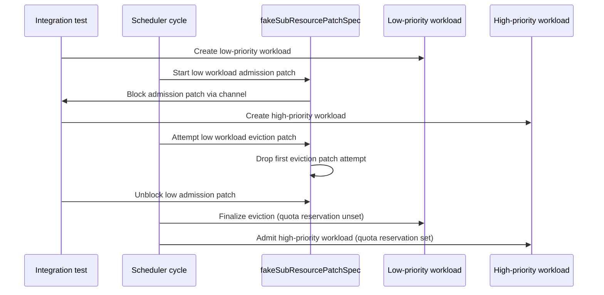

# PR #12331: Replace admission race condition repro with integration test

**Summary**: Replace admission race condition repro with integration test

**Sources**: https://github.com/kubernetes-sigs/kueue/pull/12331

**Last updated**: 2026-06-26T15:25:46Z

---

## Metadata

- **State**: closed (merged)
- **Author**: [@kshalot](https://github.com/kshalot)
- **Branch**: `push-mwxtmpqptrnw` → `main`
- **Created**: 2026-06-18T12:26:21Z
- **Updated**: 2026-06-26T15:25:46Z
- **Merged**: 2026-06-26T15:24:26Z
- **Closed**: 2026-06-26T15:24:26Z
- **Labels**: `size/L`, `lgtm`, `release-note-none`, `approved`, `kind/cleanup`, `cncf-cla: yes`, `area/testing`
- **Assignees**: [@mimowo](https://github.com/mimowo)
- **Requested reviewers**: [@kannon92](https://github.com/kannon92), [@mimowo](https://github.com/mimowo), [@olekzabl](https://github.com/olekzabl)
- **Changed files**: 4   **+223 / -167**

## Description

#### What type of PR is this?
/kind cleanup
/area testing

#### What this PR does / why we need it:
The non-deterministic, hacky e2e test that requires changes in `pkg/` to reproduce the issue is not ideal, as it mostly served documentation purposes. This integration test is deterministic and always fails without the changes from https://github.com/kubernetes-sigs/kueue/pull/11502.

#### Which issue(s) this PR fixes:
Fixes #11643

#### Special notes for your reviewer:
AI Assisted - I told Gemini the flow of the test and generated the code.

#### Does this PR introduce a user-facing change?
```release-note
NONE
```


<!-- This is an auto-generated comment: release notes by coderabbit.ai -->
## Summary by CodeRabbit

* **Tests**
  * Added an integration test that deterministically reproduces a scheduler race between admission updates and within-cluster preemption, validating eviction then successful admission with correct quota reservation behavior.
  * Removed an e2e baseline test that previously covered the same admission race condition scenario.
<!-- end of auto-generated comment: release notes by coderabbit.ai -->

## Discussion

### Comment by [@netlify[bot]](https://github.com/apps/netlify) — 2026-06-18T12:26:28Z

### <span aria-hidden="true">✅</span> Deploy Preview for *kubernetes-sigs-kueue* canceled.


|  Name | Link |
|:-:|------------------------|
|<span aria-hidden="true">🔨</span> Latest commit | c548989c584bc453ddd81163a806267863a84533 |
|<span aria-hidden="true">🔍</span> Latest deploy log | https://app.netlify.com/projects/kubernetes-sigs-kueue/deploys/6a3e3559e030350008740832 |

### Comment by [@k8s-ci-robot](https://github.com/k8s-ci-robot) — 2026-06-18T12:26:34Z

[APPROVALNOTIFIER] This PR is **NOT APPROVED**

This pull-request has been approved by: *<a href="https://github.com/kubernetes-sigs/kueue/pull/12331#" title="Author self-approved">kshalot</a>*
**Once this PR has been reviewed and has the lgtm label**, please assign [mbobrovskyi](https://github.com/mbobrovskyi) for approval. For more information see [the Code Review Process](https://git.k8s.io/community/contributors/guide/owners.md#the-code-review-process).

The full list of commands accepted by this bot can be found [here](https://go.k8s.io/bot-commands?repo=kubernetes-sigs%2Fkueue).

<details open>
Needs approval from an approver in each of these files:

- **[test/OWNERS](https://github.com/kubernetes-sigs/kueue/blob/main/test/OWNERS)**

Approvers can indicate their approval by writing `/approve` in a comment
Approvers can cancel approval by writing `/approve cancel` in a comment
</details>
<!-- META={"approvers":["mbobrovskyi"]} -->

### Comment by [@coderabbitai[bot]](https://github.com/apps/coderabbitai) — 2026-06-18T12:26:52Z

<!-- This is an auto-generated comment: summarize by coderabbit.ai -->
<!-- review_stack_entry_start -->

[](https://app.coderabbit.ai/change-stack/kubernetes-sigs/kueue/pull/12331?utm_source=github_walkthrough&utm_medium=github&utm_campaign=change_stack)

<!-- review_stack_entry_end -->
<!-- This is an auto-generated comment: review paused by coderabbit.ai -->

> [!NOTE]
> ## Reviews paused
> 
> It looks like this branch is under active development. To avoid overwhelming you with review comments due to an influx of new commits, CodeRabbit has automatically paused this review. You can configure this behavior by changing the `reviews.auto_review.auto_pause_after_reviewed_commits` setting.
> 
> Use the following commands to manage reviews:
> - `@coderabbitai resume` to resume automatic reviews.
> - `@coderabbitai review` to trigger a single review.
> 
> Use the checkboxes below for quick actions:
> - [ ] <!-- {"checkboxId": "7f6cc2e2-2e4e-497a-8c31-c9e4573e93d1"} --> ▶️ Resume reviews
> - [ ] <!-- {"checkboxId": "e9bb8d72-00e8-4f67-9cb2-caf3b22574fe"} --> 🔍 Trigger review

<!-- end of auto-generated comment: review paused by coderabbit.ai -->
<!-- walkthrough_start -->

<details>
<summary>📝 Walkthrough</summary>

## Walkthrough

Removes an existing e2e baseline test file (`admission_routine_race_condition_test.go`, 147 lines) that was unreliable due to its dependence on injected sleeps. Replaces it with a new deterministic integration test (134 lines) added to the scheduler suite, using channel-based synchronization and `fakeSubResourcePatchSpec` hooks to reproducibly trigger and assert the admission/preemption race condition.

## Changes

**Admission/Preemption Race Condition Test Migration**

| Layer / File(s) | Summary |
|---|---|
| **Remove e2e race condition test** <br> `test/e2e/singlecluster/baseline/admission_routine_race_condition_test.go` | Deletes the 147-line e2e Ginkgo spec that attempted to reproduce the admission race condition using sleep-dependent timing, which was insufficiently sensitive to reliably trigger the bug. |
| **When block and test fixture setup** <br> `test/integration/singlecluster/scheduler/scheduler_test.go` | Adds a `ginkgo.When` block for the admission goroutine race scenario, declares test-scoped low/high `WorkloadPriorityClass`, preempting `ClusterQueue`, and `LocalQueue` variables, and provides `BeforeEach`/`AfterEach` to create and clean up the queue configuration. |
| **Synchronized race condition test and convergence validation** <br> `test/integration/singlecluster/scheduler/scheduler_test.go` | Implements the deterministic race by overriding `fakeSubResourcePatchSpec` to pause the low-priority workload's admission patch, drop the first eviction patch when the high-priority workload triggers preemption, unblock the admission patch, and assert that the low workload is evicted and the high workload is admitted with correct quota reservation states. |

## Sequence Diagram



## Estimated code review effort

🎯 3 (Moderate) | ⏱️ ~25 minutes

## Suggested labels

`kind/flake`, `size/S`

## Suggested reviewers

- olekzabl
- mbobrovskyi

## Poem

> 🐇 Hoppity-hop through the scheduling lane,
> The e2e test had too much to explain—
> With channels and hooks, I set the right pace,
> A deterministic dance to reproduce the race!
> Low priority evicted, high priority wins,
> The rabbit's convinced: reliable testing begins. 🎉

</details>

<!-- walkthrough_end -->
<!-- pre_merge_checks_walkthrough_start -->

<details>
<summary>🚥 Pre-merge checks | ✅ 5</summary>

<details>
<summary>✅ Passed checks (5 passed)</summary>

|         Check name         | Status   | Explanation                                                                                                                                                           |
| :------------------------: | :------- | :-------------------------------------------------------------------------------------------------------------------------------------------------------------------- |
|      Description Check     | ✅ Passed | Check skipped - CodeRabbit’s high-level summary is enabled.                                                                                                           |
|         Title check        | ✅ Passed | The title accurately and concisely summarizes the main change: replacing an e2e test with an integration test for admission race condition reproduction.              |
|     Linked Issues check    | ✅ Passed | The PR fulfills issue `#11643`'s objective to replace the e2e test with a more reliable integration test that can reproducibly detect the admission race condition bug. |
| Out of Scope Changes check | ✅ Passed | All changes are directly related to the objective: removing the unreliable e2e test and adding the deterministic integration test for the same issue.                 |
|     Docstring Coverage     | ✅ Passed | No functions found in the changed files to evaluate docstring coverage. Skipping docstring coverage check.                                                            |

</details>

<sub>✏️ Tip: You can configure your own custom pre-merge checks in the settings.</sub>

</details>

<!-- pre_merge_checks_walkthrough_end -->
<!-- finishing_touch_checkbox_start -->

<details>
<summary>✨ Finishing Touches</summary>

<details>
<summary>🧪 Generate unit tests (beta)</summary>

- [ ] <!-- {"checkboxId": "f47ac10b-58cc-4372-a567-0e02b2c3d479", "radioGroupId": "utg-output-choice-group-unknown_comment_id"} -->   Create PR with unit tests

</details>

</details>

<!-- finishing_touch_checkbox_end -->
<!-- tips_start -->

---

Thanks for using [CodeRabbit](https://coderabbit.ai?utm_source=oss&utm_medium=github&utm_campaign=kubernetes-sigs/kueue&utm_content=12331)! It's free for OSS, and your support helps us grow. If you like it, consider giving us a shout-out.

<details>
<summary>❤️ Share</summary>

- [X](https://twitter.com/intent/tweet?text=I%20just%20used%20%40coderabbitai%20for%20my%20code%20review%2C%20and%20it%27s%20fantastic%21%20It%27s%20free%20for%20OSS%20and%20offers%20a%20free%20trial%20for%20the%20proprietary%20code.%20Check%20it%20out%3A&url=https%3A//coderabbit.ai)
- [Mastodon](https://mastodon.social/share?text=I%20just%20used%20%40coderabbitai%20for%20my%20code%20review%2C%20and%20it%27s%20fantastic%21%20It%27s%20free%20for%20OSS%20and%20offers%20a%20free%20trial%20for%20the%20proprietary%20code.%20Check%20it%20out%3A%20https%3A%2F%2Fcoderabbit.ai)
- [Reddit](https://www.reddit.com/submit?title=Great%20tool%20for%20code%20review%20-%20CodeRabbit&text=I%20just%20used%20CodeRabbit%20for%20my%20code%20review%2C%20and%20it%27s%20fantastic%21%20It%27s%20free%20for%20OSS%20and%20offers%20a%20free%20trial%20for%20proprietary%20code.%20Check%20it%20out%3A%20https%3A//coderabbit.ai)
- [LinkedIn](https://www.linkedin.com/sharing/share-offsite/?url=https%3A%2F%2Fcoderabbit.ai&mini=true&title=Great%20tool%20for%20code%20review%20-%20CodeRabbit&summary=I%20just%20used%20CodeRabbit%20for%20my%20code%20review%2C%20and%20it%27s%20fantastic%21%20It%27s%20free%20for%20OSS%20and%20offers%20a%20free%20trial%20for%20proprietary%20code)

</details>


<sub>Comment `@coderabbitai help` to get the list of available commands.</sub>

<!-- tips_end -->

### Comment by [@coderabbitai[bot]](https://github.com/apps/coderabbitai) — 2026-06-19T09:31:29Z

> [!CAUTION]
> Failed to replace (edit) comment. This is likely due to insufficient permissions or the comment being deleted.
> 
> <details>
> <summary>Error details</summary>
> 
> ```
> {"name":"HttpError","status":500,"request":{"method":"PATCH","url":"https://api.github.com/repos/kubernetes-sigs/kueue/issues/comments/4741915443","headers":{"accept":"application/vnd.github.v3+json","user-agent":"octokit.js/0.0.0-development octokit-core.js/7.0.6 Node.js/24","authorization":"token [REDACTED]","content-type":"application/json; charset=utf-8"},"body":{"body":"<!-- This is an auto-generated comment: summarize by coderabbit.ai -->\n<!-- review_stack_entry_start -->\n\n[](https://app.coderabbit.ai/change-stack/kubernetes-sigs/kueue/pull/12331?utm_source=github_walkthrough&utm_medium=github&utm_campaign=change_stack)\n\n<!-- review_stack_entry_end -->\n<!-- This is an auto-generated comment: review in progress by coderabbit.ai -->\n\n> [!NOTE]\n> Currently processing new changes in this PR. This may take a few minutes, please wait...\n> \n> <details>\n> <summary>⚙️ Run configuration</summary>\n> \n> **Configuration used**: Path: .coderabbit.yaml\n> \n> **Review profile**: CHILL\n> \n> **Plan**: Pro\n> \n> **Run ID**: `0b44312a-507b-4fe8-94f2-790224fc772c`\n> \n> </details>\n> \n> <details>\n> <summary>📥 Commits</summary>\n> \n> Reviewing files that changed from the base of the PR and between da0e690b888527b312ce1e0a9aa487d1aad10f45 and 498105f4912862456f6c9aaedaeb79237553e8ab.\n> \n> </details>\n> \n> <details>\n> <summary>📒 Files selected for processing (2)</summary>\n> \n> * `test/e2e/singlecluster/baseline/admission_routine_race_condition_test.go`\n> * `test/integration/singlecluster/scheduler/scheduler_test.go`\n> \n> </details>\n> \n> ```ascii\n>  ______________________________________________________________________________________________________________________\n> < Measuring programming progress by lines of code is like measuring aircraft building progress by weight. - Bill Gates >\n>  ----------------------------------------------------------------------------------------------------------------------\n>   \\\n>    \\   \\\n>         \\ /\\\n>         ( )\n>       .( o ).\n> ```\n\n<!-- end of auto-generated comment: review in progress by coderabbit.ai -->\n\n<!-- walkthrough_start -->\n\n<details>\n<summary>📝 Walkthrough</summary>\n\n## Walkthrough\n\nRemoves an existing e2e baseline test file (`admission_routine_race_condition_test.go`, 147 lines) that was unreliable due to its dependence on injected sleeps. Replaces it with a new deterministic integration test (137 lines) added to the scheduler suite, using channel-based synchronization and `fakeSubResourcePatchSpec` hooks to reproducibly trigger and assert the admission/preemption race condition.\n\n## Changes\n\n**Admission/Preemption Race Condition Test Migration**\n\n| Layer / File(s) | Summary |\n|---|---|\n| **Remove e2e race condition test** <br> `test/e2e/singlecluster/baseline/admission_routine_race_condition_test.go` | Deletes the 147-line e2e Ginkgo spec that attempted to reproduce the admission race condition using sleep-dependent timing, which was insufficiently sensitive to reliably trigger the bug. |\n| **When block and test fixture setup** <br> `test/integration/singlecluster/scheduler/scheduler_test.go` | Adds a `ginkgo.When` block for the admission goroutine race scenario, declares test-scoped low/high `WorkloadPriorityClass`, preempting `ClusterQueue`, and `LocalQueue` variables, and provides `BeforeEach`/`AfterEach` to create and clean up the queue configuration. |\n| **Synchronized race condition test and convergence validation** <br> `test/integration/singlecluster/scheduler/scheduler_test.go` | Implements the deterministic race by overriding `fakeSubResourcePatchSpec` to pause the low-priority workload's admission patch, drop the first eviction patch when the high-priority workload triggers preemption, unblock the admission patch, and assert that the low workload is evicted and the high workload is admitted with correct quota reservation states. |\n\n## Estimated code review effort\n\n🎯 3 (Moderate) | ⏱️ ~22 minutes\n\n## Suggested labels\n\n`kind/flake`, `approved`, `size/S`, `ok-to-test`\n\n## Suggested reviewers\n\n- olekzabl\n- mbobrovskyi\n\n## Poem\n\n> 🐇 Hoppity-hop through the scheduling lane,\n> The e2e test had too much to explain—\n> With channels and hooks, I set the right pace,\n> A deterministic dance to reproduce the race!\n> Low priority evicted, high priority wins,\n> The rabbit's convinced: reliable testing begins. 🎉\n\n</details>\n\n<!-- walkthrough_end -->\n<!-- pre_merge_checks_walkthrough_start -->\n\n<details>\n<summary>🚥 Pre-merge checks | ✅ 5</summary>\n\n<details>\n<summary>✅ Passed checks (5 passed)</summary>\n\n|         Check name         | Status   | Explanation                                                                                                                                                                                                                             |\n| :------------------------: | :------- | :-------------------------------------------------------------------------------------------------------------------------------------------------------------------------------------------------------------------------------------- |\n|      Description Check     | ✅ Passed | Check skipped - CodeRabbit’s high-level summary is enabled.                                                                                                                                                                             |\n|         Title check        | ✅ Passed | The title accurately summarizes the main change: replacing an e2e test with an integration test for the admission race condition.                                                                                                       |\n|     Linked Issues check    | ✅ Passed | The PR successfully addresses issue `#11643` by removing the non-deterministic e2e test and adding a deterministic integration test that reliably reproduces the race condition without requiring invasive production code modifications. |\n| Out of Scope Changes check | ✅ Passed | All changes are directly within scope: the e2e test removal and integration test addition both address the specific objective of replacing the race condition reproduction approach.                                                    |\n|     Docstring Coverage     | ✅ Passed | No functions found in the changed files to evaluate docstring coverage. Skipping docstring coverage check.                                                                                                                              |\n\n</details>\n\n<sub>✏️ Tip: You can configure your own custom pre-merge checks in the settings.</sub>\n\n</details>\n\n<!-- pre_merge_checks_walkthrough_end -->\n<!-- finishing_touch_checkbox_start -->\n\n<details>\n<summary>✨ Finishing Touches</summary>\n\n<details>\n<summary>🧪 Generate unit tests (beta)</summary>\n\n- [ ] <!-- {\"checkboxId\": \"f47ac10b-58cc-4372-a567-0e02b2c3d479\", \"radioGroupId\": \"utg-output-choice-group-unknown_comment_id\"} -->   Create PR with unit tests\n\n</details>\n\n</details>\n\n<!-- finishing_touch_checkbox_end -->\n<!-- This is an auto-generated comment: resource warnings by coderabbit.ai -->\n\n> [!WARNING]\n> ## Review ran into problems\n> \n> <details>\n> <summary>🔥 Problems</summary>\n> \n> Git: Failed to clone repository. Please run the `@coderabbitai full review` command to re-trigger a full review. If the issue persists, set `path_filters` to include or exclude specific files.\n> \n> </details>\n\n<!-- end of auto-generated comment: resource warnings by coderabbit.ai -->\n<!-- tips_start -->\n\n---\n\nThanks for using [CodeRabbit](https://coderabbit.ai?utm_source=oss&utm_medium=github&utm_campaign=kubernetes-sigs/kueue&utm_content=12331)! It's free for OSS, and your support helps us grow. If you like it, consider giving us a shout-out.\n\n<details>\n<summary>❤️ Share</summary>\n\n- [X](https://twitter.com/intent/tweet?text=I%20just%20used%20%40coderabbitai%20for%20my%20code%20review%2C%20and%20it%27s%20fantastic%21%20It%27s%20free%20for%20OSS%20and%20offers%20a%20free%20trial%20for%20the%20proprietary%20code.%20Check%20it%20out%3A&url=https%3A//coderabbit.ai)\n- [Mastodon](https://mastodon.social/share?text=I%20just%20used%20%40coderabbitai%20for%20my%20code%20review%2C%20and%20it%27s%20fantastic%21%20It%27s%20free%20for%20OSS%20and%20offers%20a%20free%20trial%20for%20the%20proprietary%20code.%20Check%20it%20out%3A%20https%3A%2F%2Fcoderabbit.ai)\n- [Reddit](https://www.reddit.com/submit?title=Great%20tool%20for%20code%20review%20-%20CodeRabbit&text=I%20just%20used%20CodeRabbit%20for%20my%20code%20review%2C%20and%20it%27s%20fantastic%21%20It%27s%20free%20for%20OSS%20and%20offers%20a%20free%20trial%20for%20proprietary%20code.%20Check%20it%20out%3A%20https%3A//coderabbit.ai)\n- [LinkedIn](https://www.linkedin.com/sharing/share-offsite/?url=https%3A%2F%2Fcoderabbit.ai&mini=true&title=Great%20tool%20for%20code%20review%20-%20CodeRabbit&summary=I%20just%20used%20CodeRabbit%20for%20my%20code%20review%2C%20and%20it%27s%20fantastic%21%20It%27s%20free%20for%20OSS%20and%20offers%20a%20free%20trial%20for%20proprietary%20code)\n\n</details>\n\n\n<sub>Comment `@coderabbitai help` to get the list of available commands and usage tips.</sub>\n\n<!-- tips_end -->"},"request":{"retryCount":3,"signal":{},"retries":3,"retryAfter":16}}}
> ```
> 
> </details>

### Comment by [@kshalot](https://github.com/kshalot) — 2026-06-25T12:26:28Z

@mimowo A proposal from me: https://github.com/kubernetes-sigs/kueue/pull/12331/changes/4ac6a027cc4ca89c6a2eb118eee1e31f4e486bab

This has 0 impact on the production code and other suites.

### Comment by [@mimowo](https://github.com/mimowo) — 2026-06-25T19:38:17Z

I think this is probably one of the most complex race conditions we had in Kueue so far, so awesome work in documenting the scenario, wholeheartedly 🥇

Also,  I think it is possible we may return to such deliberations if we extend one day the preemptionExpectations to cover other types of evictions or defrag migrations. 

/lgtm
/approve
/cherrypick release-0.18
/cherrypick release-0.17

### Comment by [@k8s-infra-cherrypick-robot](https://github.com/k8s-infra-cherrypick-robot) — 2026-06-25T19:47:41Z

@mimowo: once the present PR merges, I will cherry-pick it on top of `release-0.17`, `release-0.18` in new PRs and assign them to you.

<details>

In response to [this](https://github.com/kubernetes-sigs/kueue/pull/12331#issuecomment-4803510681):

>I think this is probably one of the most complex race conditions we had in Kueue so far, so awesome work in documenting the scenario, wholeheartedly 🥇
>
>Also,  I think it is possible we may return to such deliberations if we extend one day the preemptionExpectations to cover other types of evictions or defrag migrations. 
>
>/lgtm
>/approve
>/cherrypick release-0.18
>/cherrypick release-0.17


Instructions for interacting with me using PR comments are available [here](https://git.k8s.io/community/contributors/guide/pull-requests.md).  If you have questions or suggestions related to my behavior, please file an issue against the [kubernetes-sigs/prow](https://github.com/kubernetes-sigs/prow/issues/new?title=Prow%20issue:) repository.
</details>

### Comment by [@kubernetes-prow[bot]](https://github.com/apps/kubernetes-prow) — 2026-06-25T19:47:49Z

[APPROVALNOTIFIER] This PR is **APPROVED**

This pull-request has been approved by: *<a href="https://github.com/kubernetes-sigs/kueue/pull/12331#" title="Author self-approved">kshalot</a>*, *<a href="https://github.com/kubernetes-sigs/kueue/pull/12331#issuecomment-4803510681" title="Approved">mimowo</a>*

The full list of commands accepted by this bot can be found [here](https://go.k8s.io/bot-commands?repo=kubernetes-sigs%2Fkueue).

The pull request process is described [here](https://git.k8s.io/community/contributors/guide/owners.md#the-code-review-process)

<details >
Needs approval from an approver in each of these files:

- ~~[test/OWNERS](https://github.com/kubernetes-sigs/kueue/blob/main/test/OWNERS)~~ [mimowo]

Approvers can indicate their approval by writing `/approve` in a comment
Approvers can cancel approval by writing `/approve cancel` in a comment
</details>
<!-- META={"approvers":[]} -->

### Comment by [@mimowo](https://github.com/mimowo) — 2026-06-25T20:24:37Z


That one is weird, all tests passed green: https://prow.k8s.io/view/gs/kubernetes-ci-logs/pr-logs/pull/kubernetes-sigs_kueue/12331/pull-kueue-test-integration-shard-1-main/2070232659472158720

I'm wondering if this is maybe due to some secondary checks like for leaking goroutines, which makes me wonder - maybe we should use ginkgo.DeferCleanup() rather than "defer".

Let me hold for a couple tries at least, becasue I've never seen this before, and the newly added test was part of the failed suite
/hold
/test pull-kueue-test-integration-shard-1-main

### Comment by [@kshalot](https://github.com/kshalot) — 2026-06-26T08:03:21Z

> Let me hold for a couple tries at least, becasue I've never seen this before, and the newly added test was part of the failed suite

AFAICS it's a data race caused by setting the interceptor functions:

```
  WARNING: DATA RACE
  Write at 0x000006057ea8 by goroutine 9216:
    sigs.k8s.io/kueue/test/integration/singlecluster/scheduler.init.func6()
        /home/prow/go/src/sigs.k8s.io/kueue/test/integration/singlecluster/scheduler/suite_test.go:86 +0x53
    github.com/onsi/ginkgo/v2/internal.extractBodyFunction.func3()
        /home/prow/go/src/sigs.k8s.io/kueue/vendor/github.com/onsi/ginkgo/v2/internal/node.go:585 +0x2e
    github.com/onsi/ginkgo/v2/internal.(*Suite).runNode.func3()
        /home/prow/go/src/sigs.k8s.io/kueue/vendor/github.com/onsi/ginkgo/v2/internal/suite.go:946 +0x699

  Previous read at 0x000006057ea8 by goroutine 607:
    sigs.k8s.io/kueue/test/integration/singlecluster/scheduler.newInterceptedClient.fakeSubResourcePatchFrom.func1()
        /home/prow/go/src/sigs.k8s.io/kueue/test/integration/singlecluster/scheduler/suite_test.go:172 +0x197
    sigs.k8s.io/controller-runtime/pkg/client/interceptor.subResourceInterceptor.Patch()
        /home/prow/go/src/sigs.k8s.io/kueue/vendor/sigs.k8s.io/controller-runtime/pkg/client/interceptor/intercept.go:173 +0xfd
    sigs.k8s.io/controller-runtime/pkg/client/interceptor.(*subResourceInterceptor).Patch()
        <autogenerated>:1 +0x1c4
    sigs.k8s.io/kueue/pkg/workload.patchStatus()
        /home/prow/go/src/sigs.k8s.io/kueue/pkg/workload/workload.go:1298 +0x4e6
    sigs.k8s.io/kueue/pkg/workload.PatchAdmissionStatus()
        /home/prow/go/src/sigs.k8s.io/kueue/pkg/workload/workload.go:1320 +0x145
    sigs.k8s.io/kueue/pkg/controller/core.(*WorkloadReconciler).Reconcile()
        /home/prow/go/src/sigs.k8s.io/kueue/pkg/controller/core/workload_controller.go:740 +0x68a4
    sigs.k8s.io/kueue/pkg/controller/core.(*WorkloadReconciler).Reconcile()
        /home/prow/go/src/sigs.k8s.io/kueue/pkg/controller/core/workload_controller.go:618 +0x455d
    sigs.k8s.io/kueue/pkg/controller/core.(*WorkloadReconciler).Reconcile()
        /home/prow/go/src/sigs.k8s.io/kueue/pkg/controller/core/workload_controller.go:233 +0x171
    sigs.k8s.io/kueue/pkg/controller/core.(*leaderAwareReconciler).Reconcile()
    ...
 ```
 
 My guess is that maybe the subresource patch is executed in the workload controller, while simultaneously we `nil` the interceptor in `BeforeEach`:
 https://github.com/kubernetes-sigs/kueue/blob/8ea8b61e68788f42509f36da212c4b61840aafb4/test/integration/singlecluster/scheduler/suite_test.go#L82-L84
 
 If I'm right, then:
 1. This isn't necessarily caused by this PR. But maybe this PR makes it easier to trigger this race, although I'm not certain.
 2. We can fix it by adding a mutex on the BeforeEach and in the interceptor here:
 https://github.com/kubernetes-sigs/kueue/blob/8ea8b61e68788f42509f36da212c4b61840aafb4/test/integration/singlecluster/scheduler/suite_test.go#L155-L173

### Comment by [@mimowo](https://github.com/mimowo) — 2026-06-26T08:15:45Z

Please check - I've never seen this error before so I assume the PR indeed makes it more likely to happen. Maybe try looping the test locally 50 times or so to see if you can repro, and if the problem goes away after the mutex

### Comment by [@kshalot](https://github.com/kshalot) — 2026-06-26T08:17:31Z

> Please check - I've never seen this error before so I assume the PR indeed makes it more likely to happen. Maybe try looping the test locally 50 times or so to see if you can repro, and if the problem goes away after the mutex

Yep, I'm checking. I pushed https://github.com/kubernetes-sigs/kueue/pull/12331/changes/c548989c584bc453ddd81163a806267863a84533 already, but let's hold to see whether I can repro this

### Comment by [@kshalot](https://github.com/kshalot) — 2026-06-26T09:09:44Z

@mimowo

1. I was able to trigger this on this PR without https://github.com/kubernetes-sigs/kueue/commit/c548989c584bc453ddd81163a806267863a84533.
2. After https://github.com/kubernetes-sigs/kueue/commit/c548989c584bc453ddd81163a806267863a84533 I wasn't able to trigger this.
3. I wasn't able to trigger this on main.

This is somewhat expected, because this PR originally added:
```go
		case "status":
			response := baseK8sClient.Status().Patch(ctx, obj, patch, opts...) <- SLOW
			if *g != nil { <- DATA RACE
				fakeUsage, err := (*g)(obj, response)
				if fakeUsage == emitResponse {
					return err
				}
			}
			return response
```
The patch is relatively slow, which gives more time for overlapping changes to `g` before `*g != nil` is called. On main a data race can still happen [here](https://github.com/kubernetes-sigs/kueue/blob/42fc89c89364afad6dc64112ef8bb3d0c60389ca/test/integration/singlecluster/scheduler/suite_test.go#L160), but the chances of that happening are extremely low. That's why it never popped up.

As an alternative "fix", we could just add smth like `gSpec = *g` at the beginning of this function, but that is still _technically_ a data race, just less likely. I'd keep https://github.com/kubernetes-sigs/kueue/commit/c548989c584bc453ddd81163a806267863a84533 to make this robust.

### Comment by [@mimowo](https://github.com/mimowo) — 2026-06-26T14:25:28Z

/unhold
/lgtm
/cherrypick release-0.18
/cherrypick release-0.17
Please make sure it gets cherrypicked in case the robot fails

### Comment by [@k8s-infra-cherrypick-robot](https://github.com/k8s-infra-cherrypick-robot) — 2026-06-26T14:25:31Z

@mimowo: once the present PR merges, I will cherry-pick it on top of `release-0.17`, `release-0.18` in new PRs and assign them to you.

<details>

In response to [this](https://github.com/kubernetes-sigs/kueue/pull/12331#issuecomment-4810476713):

>/unhold
>/lgtm
>/cherrypick release-0.18
>/cherrypick release-0.17
>Please make sure it gets cherrypicked in case the robot fails 


Instructions for interacting with me using PR comments are available [here](https://git.k8s.io/community/contributors/guide/pull-requests.md).  If you have questions or suggestions related to my behavior, please file an issue against the [kubernetes-sigs/prow](https://github.com/kubernetes-sigs/prow/issues/new?title=Prow%20issue:) repository.
</details>

### Comment by [@kubernetes-prow[bot]](https://github.com/apps/kubernetes-prow) — 2026-06-26T14:25:35Z

LGTM label has been added.  <details>Git tree hash: f9c4f8a39d34f4f7c9a138de84da0d5fba9a76db</details>

### Comment by [@kshalot](https://github.com/kshalot) — 2026-06-26T15:02:49Z

I guess the failures should be resolved by https://github.com/kubernetes-sigs/kueue/commit/7b5e7de0bd5080f03d20949eb3330e30b6654dc7?

/retest

### Comment by [@mimowo](https://github.com/mimowo) — 2026-06-26T15:05:53Z

/retest
Due to kuberay temp outage

### Comment by [@mimowo](https://github.com/mimowo) — 2026-06-26T15:07:03Z

/retest
Due to kuberay temp outage

### Comment by [@k8s-infra-cherrypick-robot](https://github.com/k8s-infra-cherrypick-robot) — 2026-06-26T15:25:08Z

@mimowo: new pull request created: #12584

<details>

In response to [this](https://github.com/kubernetes-sigs/kueue/pull/12331#issuecomment-4810476713):

>/unhold
>/lgtm
>/cherrypick release-0.18
>/cherrypick release-0.17
>Please make sure it gets cherrypicked in case the robot fails 


Instructions for interacting with me using PR comments are available [here](https://git.k8s.io/community/contributors/guide/pull-requests.md).  If you have questions or suggestions related to my behavior, please file an issue against the [kubernetes-sigs/prow](https://github.com/kubernetes-sigs/prow/issues/new?title=Prow%20issue:) repository.
</details>

### Comment by [@k8s-infra-cherrypick-robot](https://github.com/k8s-infra-cherrypick-robot) — 2026-06-26T15:25:46Z

@mimowo: new pull request created: #12585

<details>

In response to [this](https://github.com/kubernetes-sigs/kueue/pull/12331#issuecomment-4810476713):

>/unhold
>/lgtm
>/cherrypick release-0.18
>/cherrypick release-0.17
>Please make sure it gets cherrypicked in case the robot fails 


Instructions for interacting with me using PR comments are available [here](https://git.k8s.io/community/contributors/guide/pull-requests.md).  If you have questions or suggestions related to my behavior, please file an issue against the [kubernetes-sigs/prow](https://github.com/kubernetes-sigs/prow/issues/new?title=Prow%20issue:) repository.
</details>

## Reviews

### Review by [@coderabbitai[bot]](https://github.com/apps/coderabbitai) (commented) — 2026-06-18T12:39:38Z

**Actionable comments posted: 2**

<details>
<summary>🤖 Prompt for all review comments with AI agents</summary>

```
Verify each finding against current code. Fix only still-valid issues, skip the
rest with a brief reason, keep changes minimal, and validate.

Inline comments:
In `@test/integration/singlecluster/scheduler/scheduler_test.go`:
- Around line 3299-3303: The test uses unbuffered channels
(admissionPatchStarted, allowAdmissionPatch, evictionPatchAttempted) for
synchronization which can cause indefinite blocking if patches are retried or
not reached as expected. Convert these three channels to buffered channels with
appropriate capacity, ensure the admission signal is emitted once, add cleanup
logic to release the paused patch in the test cleanup function, and replace all
bare channel receives throughout the test (at lines also applying to 3324-3328,
3331-3338, 3346-3348, 3353-3363) with Eventually assertions that poll the
evictionPatchCount atomic variable to reliably detect when patches occur rather
than blocking on unbuffered channels.
- Around line 3370-3373: The error returned by the workload.PatchAdmissionStatus
call is being ignored using a blank identifier assignment, which can hide API
failures and lead to confusing timeouts. In the conditional block checking if
meta.IsStatusConditionTrue for kueue.WorkloadEvicted, capture the error returned
from workload.PatchAdmissionStatus instead of discarding it with underscore, and
assert that the error is nil to ensure the quota-unreservation patch succeeds
and provide clear diagnostics for any transient failures during retry.
```

</details>

<details>
<summary>🪄 Autofix (Beta)</summary>

Fix all unresolved CodeRabbit comments on this PR:

- [ ] <!-- {"checkboxId": "4b0d0e0a-96d7-4f10-b296-3a18ea78f0b9"} --> Push a commit to this branch (recommended)
- [ ] <!-- {"checkboxId": "ff5b1114-7d8c-49e6-8ac1-43f82af23a33"} --> Create a new PR with the fixes

</details>

---

<details>
<summary>ℹ️ Review info</summary>

<details>
<summary>⚙️ Run configuration</summary>

**Configuration used**: defaults

**Review profile**: CHILL

**Plan**: Pro

**Run ID**: `e06bca0b-3007-46cc-92b2-f7cf94445217`

</details>

<details>
<summary>📥 Commits</summary>

Reviewing files that changed from the base of the PR and between 84906a84288259ffe85b82f7de79bfd3d060b5af and 9bd7de54d0dac981e630b1f098d86e19c6dcbde6.

</details>

<details>
<summary>📒 Files selected for processing (2)</summary>

* `test/e2e/singlecluster/baseline/admission_routine_race_condition_test.go`
* `test/integration/singlecluster/scheduler/scheduler_test.go`

</details>

<details>
<summary>💤 Files with no reviewable changes (1)</summary>

* test/e2e/singlecluster/baseline/admission_routine_race_condition_test.go

</details>

</details>

<!-- This is an auto-generated comment by CodeRabbit for review status -->

- **test/integration/singlecluster/scheduler/scheduler_test.go:3303** by [@coderabbitai[bot]](https://github.com/apps/coderabbitai) — 2026-06-18T12:39:37Z
```diff
@@ -3256,6 +3256,134 @@ var _ = ginkgo.Describe("Scheduler", func() {
 			}, util.ConsistentDuration, util.ShortInterval).Should(gomega.Succeed())
 		})
 	})
+
+	// See: https://github.com/kubernetes-sigs/kueue/issues/11480
+	ginkgo.When("The admission goroutine races with preemptions in the next scheduling cycle", func() {
+		var (
+			cq      *kueue.ClusterQueue
+			q       *kueue.LocalQueue
+			lowWPC  *kueue.WorkloadPriorityClass
+			highWPC *kueue.WorkloadPriorityClass
+		)
+
+		ginkgo.BeforeEach(func() {
+			lowWPC = utiltestingapi.MakeWorkloadPriorityClass("low-wpc").PriorityValue(-10).Obj()
+			gomega.Expect(k8sClient.Create(ctx, lowWPC)).To(gomega.Succeed())
+
+			highWPC = utiltestingapi.MakeWorkloadPriorityClass("high-wpc").PriorityValue(10).Obj()
+			gomega.Expect(k8sClient.Create(ctx, highWPC)).To(gomega.Succeed())
+
+			cq = utiltestingapi.MakeClusterQueue("cq-race").
+				ResourceGroup(*utiltestingapi.MakeFlavorQuotas("on-demand").Resource(corev1.ResourceCPU, "1").Obj()).
+				Preemption(kueue.ClusterQueuePreemption{
+					WithinClusterQueue: kueue.PreemptionPolicyLowerPriority,
+				}).
+				Obj()
+			gomega.Expect(k8sClient.Create(ctx, cq)).To(gomega.Succeed())
+
+			q = utiltestingapi.MakeLocalQueue("q-race", ns.Name).ClusterQueue(cq.Name).Obj()
+			gomega.Expect(k8sClient.Create(ctx, q)).To(gomega.Succeed())
+
+			ginkgo.By("Waiting for cluster queue to become active")
+			util.ExpectClusterQueuesToBeActive(ctx, k8sClient, cq)
+		})
+
+		ginkgo.AfterEach(func() {
+			util.ExpectObjectToBeDeleted(ctx, k8sClient, cq, true)
+			util.ExpectObjectToBeDeleted(ctx, k8sClient, lowWPC, true)
+			util.ExpectObjectToBeDeleted(ctx, k8sClient, highWPC, true)
+			util.ExpectObjectToBeDeleted(ctx, k8sClient, q, true)
+		})
+
+		ginkgo.It("Should not deadlock the preempting workloads", func() {
+			admissionPatchStarted := make(chan struct{})
+			allowAdmissionPatch := make(chan struct{})
+			evictionPatchAttempted := make(chan struct{})
+
+			var evictionPatchCount atomic.Int32
```

  _⚠️ Potential issue_ | _🟠 Major_ | _⚡ Quick win_
  
  **Bound the hook synchronization so this test fails instead of hanging.**
  
  The fake patch hook uses unbuffered sends and the test waits with bare receives. If the expected patch is not reached—or if `wl1` admission is retried after the single receive—the scheduler goroutine can block indefinitely. Buffer the signal channels, emit the admission signal once, release the paused patch in cleanup, and wait with `Eventually`.
  
  
  
  
  
  <details>
  <summary>Suggested fix</summary>
  
  ```diff
  -			admissionPatchStarted := make(chan struct{})
  +			admissionPatchStarted := make(chan struct{}, 1)
   			allowAdmissionPatch := make(chan struct{})
  -			evictionPatchAttempted := make(chan struct{})
  +			evictionPatchAttempted := make(chan struct{}, 1)
  +			admissionPatchReleased := false
   
  +			var admissionPatchCount atomic.Int32
   			var evictionPatchCount atomic.Int32
  @@
   				// Intercept wl1 admission patch
   				if wl.Name == wl1.Name && meta.IsStatusConditionTrue(wl.Status.Conditions, kueue.WorkloadQuotaReserved) && !meta.IsStatusConditionTrue(wl.Status.Conditions, kueue.WorkloadEvicted) {
  -					admissionPatchStarted <- struct{}{}
  +					if admissionPatchCount.Add(1) == 1 {
  +						admissionPatchStarted <- struct{}{}
  +					}
   					<-allowAdmissionPatch
   					return fallThrough, nil
   				}
  @@
   			}
   			defer func() {
  +				if !admissionPatchReleased {
  +					close(allowAdmissionPatch)
  +				}
   				fakeSubResourcePatchSpec = nil
   			}()
  @@
   			ginkgo.By("Waiting for the async admission patch to start and get paused")
  -			<-admissionPatchStarted
  +			gomega.Eventually(admissionPatchStarted, util.Timeout, util.Interval).Should(gomega.Receive())
  @@
   			ginkgo.By("Waiting for wl2 to issue the eviction patch against wl1")
  -			<-evictionPatchAttempted
  +			gomega.Eventually(evictionPatchAttempted, util.Timeout, util.Interval).Should(gomega.Receive())
   
   			ginkgo.By("Unblocking wl1 admission patch to overwrite the simulated eviction")
  +			admissionPatchReleased = true
   			close(allowAdmissionPatch)
  ```
  
  </details>
  
  
  Also applies to: 3324-3328, 3331-3338, 3346-3348, 3353-3363
  
  <details>
  <summary>🤖 Prompt for AI Agents</summary>
  
  ```
  Verify each finding against current code. Fix only still-valid issues, skip the
  rest with a brief reason, keep changes minimal, and validate.
  
  In `@test/integration/singlecluster/scheduler/scheduler_test.go` around lines 3299
  - 3303, The test uses unbuffered channels (admissionPatchStarted,
  allowAdmissionPatch, evictionPatchAttempted) for synchronization which can cause
  indefinite blocking if patches are retried or not reached as expected. Convert
  these three channels to buffered channels with appropriate capacity, ensure the
  admission signal is emitted once, add cleanup logic to release the paused patch
  in the test cleanup function, and replace all bare channel receives throughout
  the test (at lines also applying to 3324-3328, 3331-3338, 3346-3348, 3353-3363)
  with Eventually assertions that poll the evictionPatchCount atomic variable to
  reliably detect when patches occur rather than blocking on unbuffered channels.
  ```
  
  </details>
  
  <!-- cr-comment:v1:f55dbe659a80755a0bd87099 -->
  
  <!-- This is an auto-generated reply by CodeRabbit -->
  
  ✅ Addressed in commit 07c59b9

- **test/integration/singlecluster/scheduler/scheduler_test.go:3373** by [@coderabbitai[bot]](https://github.com/apps/coderabbitai) — 2026-06-18T12:39:37Z
```diff
@@ -3256,6 +3256,134 @@ var _ = ginkgo.Describe("Scheduler", func() {
 			}, util.ConsistentDuration, util.ShortInterval).Should(gomega.Succeed())
 		})
 	})
+
+	// See: https://github.com/kubernetes-sigs/kueue/issues/11480
+	ginkgo.When("The admission goroutine races with preemptions in the next scheduling cycle", func() {
+		var (
+			cq      *kueue.ClusterQueue
+			q       *kueue.LocalQueue
+			lowWPC  *kueue.WorkloadPriorityClass
+			highWPC *kueue.WorkloadPriorityClass
+		)
+
+		ginkgo.BeforeEach(func() {
+			lowWPC = utiltestingapi.MakeWorkloadPriorityClass("low-wpc").PriorityValue(-10).Obj()
+			gomega.Expect(k8sClient.Create(ctx, lowWPC)).To(gomega.Succeed())
+
+			highWPC = utiltestingapi.MakeWorkloadPriorityClass("high-wpc").PriorityValue(10).Obj()
+			gomega.Expect(k8sClient.Create(ctx, highWPC)).To(gomega.Succeed())
+
+			cq = utiltestingapi.MakeClusterQueue("cq-race").
+				ResourceGroup(*utiltestingapi.MakeFlavorQuotas("on-demand").Resource(corev1.ResourceCPU, "1").Obj()).
+				Preemption(kueue.ClusterQueuePreemption{
+					WithinClusterQueue: kueue.PreemptionPolicyLowerPriority,
+				}).
+				Obj()
+			gomega.Expect(k8sClient.Create(ctx, cq)).To(gomega.Succeed())
+
+			q = utiltestingapi.MakeLocalQueue("q-race", ns.Name).ClusterQueue(cq.Name).Obj()
+			gomega.Expect(k8sClient.Create(ctx, q)).To(gomega.Succeed())
+
+			ginkgo.By("Waiting for cluster queue to become active")
+			util.ExpectClusterQueuesToBeActive(ctx, k8sClient, cq)
+		})
+
+		ginkgo.AfterEach(func() {
+			util.ExpectObjectToBeDeleted(ctx, k8sClient, cq, true)
+			util.ExpectObjectToBeDeleted(ctx, k8sClient, lowWPC, true)
+			util.ExpectObjectToBeDeleted(ctx, k8sClient, highWPC, true)
+			util.ExpectObjectToBeDeleted(ctx, k8sClient, q, true)
+		})
+
+		ginkgo.It("Should not deadlock the preempting workloads", func() {
+			admissionPatchStarted := make(chan struct{})
+			allowAdmissionPatch := make(chan struct{})
+			evictionPatchAttempted := make(chan struct{})
+
+			var evictionPatchCount atomic.Int32
+
+			wl1 := utiltestingapi.MakeWorkload("wl1", ns.Name).
+				Queue(kueue.LocalQueueName(q.Name)).
+				WorkloadPriorityClassRef(lowWPC.Name).
+				Priority(-10).
+				Request(corev1.ResourceCPU, "1").
+				Obj()
+			wl2 := utiltestingapi.MakeWorkload("wl2", ns.Name).
+				Queue(kueue.LocalQueueName(q.Name)).
+				WorkloadPriorityClassRef(highWPC.Name).
+				Priority(10).
+				Request(corev1.ResourceCPU, "1").
+				Obj()
+
+			fakeSubResourcePatchSpec = func(obj client.Object) (fakeClientUsage, error) {
+				wl, ok := obj.(*kueue.Workload)
+				if !ok {
+					return fallThrough, nil
+				}
+
+				// Intercept wl1 admission patch
+				if wl.Name == wl1.Name && meta.IsStatusConditionTrue(wl.Status.Conditions, kueue.WorkloadQuotaReserved) && !meta.IsStatusConditionTrue(wl.Status.Conditions, kueue.WorkloadEvicted) {
+					admissionPatchStarted <- struct{}{}
+					<-allowAdmissionPatch
+					return fallThrough, nil
+				}
+
+				// Intercept wl1 eviction patch (triggered by wl2)
+				if wl.Name == wl1.Name && meta.IsStatusConditionTrue(wl.Status.Conditions, kueue.WorkloadEvicted) {
+					count := evictionPatchCount.Add(1)
+					if count == 1 {
+						// Drop the first eviction patch to simulate it being immediately overwritten
+						// by the async admission patch before the cache can process it.
+						evictionPatchAttempted <- struct{}{}
+						return emitResponse, nil
+					}
+					// Allow subsequent eviction patches
+					return fallThrough, nil
+				}
+
+				return fallThrough, nil
+			}
+			defer func() {
+				fakeSubResourcePatchSpec = nil
+			}()
+
+			ginkgo.By("Creating a low priority workload wl1")
+			gomega.Expect(k8sClient.Create(ctx, wl1)).To(gomega.Succeed())
+
+			ginkgo.By("Waiting for the async admission patch to start and get paused")
+			<-admissionPatchStarted
+
+			ginkgo.By("Creating a high priority workload wl2")
+			gomega.Expect(k8sClient.Create(ctx, wl2)).To(gomega.Succeed())
+
+			ginkgo.By("Waiting for wl2 to issue the eviction patch against wl1")
+			<-evictionPatchAttempted
+
+			ginkgo.By("Unblocking wl1 admission patch to overwrite the simulated eviction")
+			close(allowAdmissionPatch)
+
+			ginkgo.By("Waiting for wl1 to be evicted and simulating the job controller unsetting QuotaReserved after eviction")
+			gomega.Eventually(func(g gomega.Gomega) {
+				wl1Created := &kueue.Workload{}
+				g.Expect(k8sClient.Get(ctx, client.ObjectKeyFromObject(wl1), wl1Created)).To(gomega.Succeed())
+				// Subsequent scheduling cycles for wl2 should re-trigger the eviction after the first one was lost due to the race condition.
+				if meta.IsStatusConditionTrue(wl1Created.Status.Conditions, kueue.WorkloadEvicted) {
+					_ = workload.PatchAdmissionStatus(ctx, k8sClient, wl1Created, nil, func(wl *kueue.Workload) (bool, error) {
+						return workload.UnsetQuotaReservationWithCondition(wl, "Pending", "Evicted", metav1.Now().Time), nil
+					})
```

  _⚠️ Potential issue_ | _🟡 Minor_ | _⚡ Quick win_
  
  **Assert the quota-unreservation patch succeeds.**
  
  `PatchAdmissionStatus` mutates the local object before/while writing; ignoring its error can hide the real API failure and turn this into a later timeout. Assert it inside the `Eventually` closure so transient failures are retried with useful diagnostics.
  
  
  
  
  
  <details>
  <summary>Suggested fix</summary>
  
  ```diff
   				// Subsequent scheduling cycles for wl2 should re-trigger the eviction after the first one was lost due to the race condition.
   				if meta.IsStatusConditionTrue(wl1Created.Status.Conditions, kueue.WorkloadEvicted) {
  -					_ = workload.PatchAdmissionStatus(ctx, k8sClient, wl1Created, nil, func(wl *kueue.Workload) (bool, error) {
  +					g.Expect(workload.PatchAdmissionStatus(ctx, k8sClient, wl1Created, nil, func(wl *kueue.Workload) (bool, error) {
   						return workload.UnsetQuotaReservationWithCondition(wl, "Pending", "Evicted", metav1.Now().Time), nil
  -					})
  +					})).To(gomega.Succeed())
   				}
  ```
  
  </details>
  
  <details>
  <summary>🤖 Prompt for AI Agents</summary>
  
  ```
  Verify each finding against current code. Fix only still-valid issues, skip the
  rest with a brief reason, keep changes minimal, and validate.
  
  In `@test/integration/singlecluster/scheduler/scheduler_test.go` around lines 3370
  - 3373, The error returned by the workload.PatchAdmissionStatus call is being
  ignored using a blank identifier assignment, which can hide API failures and
  lead to confusing timeouts. In the conditional block checking if
  meta.IsStatusConditionTrue for kueue.WorkloadEvicted, capture the error returned
  from workload.PatchAdmissionStatus instead of discarding it with underscore, and
  assert that the error is nil to ensure the quota-unreservation patch succeeds
  and provide clear diagnostics for any transient failures during retry.
  ```
  
  </details>
  
  <!-- cr-comment:v1:43794c7eff683c945d82d0bb -->
  
  <!-- This is an auto-generated reply by CodeRabbit -->
  
  ✅ Confirmed as addressed by @kshalot
  
  <!-- This is an auto-generated comment by CodeRabbit -->

### Review by [@kshalot](https://github.com/kshalot) (commented) — 2026-06-18T13:24:27Z

- **test/integration/singlecluster/scheduler/scheduler_test.go:3373** by [@kshalot](https://github.com/kshalot) — 2026-06-18T13:24:27Z
```diff
@@ -3256,6 +3256,134 @@ var _ = ginkgo.Describe("Scheduler", func() {
 			}, util.ConsistentDuration, util.ShortInterval).Should(gomega.Succeed())
 		})
 	})
+
+	// See: https://github.com/kubernetes-sigs/kueue/issues/11480
+	ginkgo.When("The admission goroutine races with preemptions in the next scheduling cycle", func() {
+		var (
+			cq      *kueue.ClusterQueue
+			q       *kueue.LocalQueue
+			lowWPC  *kueue.WorkloadPriorityClass
+			highWPC *kueue.WorkloadPriorityClass
+		)
+
+		ginkgo.BeforeEach(func() {
+			lowWPC = utiltestingapi.MakeWorkloadPriorityClass("low-wpc").PriorityValue(-10).Obj()
+			gomega.Expect(k8sClient.Create(ctx, lowWPC)).To(gomega.Succeed())
+
+			highWPC = utiltestingapi.MakeWorkloadPriorityClass("high-wpc").PriorityValue(10).Obj()
+			gomega.Expect(k8sClient.Create(ctx, highWPC)).To(gomega.Succeed())
+
+			cq = utiltestingapi.MakeClusterQueue("cq-race").
+				ResourceGroup(*utiltestingapi.MakeFlavorQuotas("on-demand").Resource(corev1.ResourceCPU, "1").Obj()).
+				Preemption(kueue.ClusterQueuePreemption{
+					WithinClusterQueue: kueue.PreemptionPolicyLowerPriority,
+				}).
+				Obj()
+			gomega.Expect(k8sClient.Create(ctx, cq)).To(gomega.Succeed())
+
+			q = utiltestingapi.MakeLocalQueue("q-race", ns.Name).ClusterQueue(cq.Name).Obj()
+			gomega.Expect(k8sClient.Create(ctx, q)).To(gomega.Succeed())
+
+			ginkgo.By("Waiting for cluster queue to become active")
+			util.ExpectClusterQueuesToBeActive(ctx, k8sClient, cq)
+		})
+
+		ginkgo.AfterEach(func() {
+			util.ExpectObjectToBeDeleted(ctx, k8sClient, cq, true)
+			util.ExpectObjectToBeDeleted(ctx, k8sClient, lowWPC, true)
+			util.ExpectObjectToBeDeleted(ctx, k8sClient, highWPC, true)
+			util.ExpectObjectToBeDeleted(ctx, k8sClient, q, true)
+		})
+
+		ginkgo.It("Should not deadlock the preempting workloads", func() {
+			admissionPatchStarted := make(chan struct{})
+			allowAdmissionPatch := make(chan struct{})
+			evictionPatchAttempted := make(chan struct{})
+
+			var evictionPatchCount atomic.Int32
+
+			wl1 := utiltestingapi.MakeWorkload("wl1", ns.Name).
+				Queue(kueue.LocalQueueName(q.Name)).
+				WorkloadPriorityClassRef(lowWPC.Name).
+				Priority(-10).
+				Request(corev1.ResourceCPU, "1").
+				Obj()
+			wl2 := utiltestingapi.MakeWorkload("wl2", ns.Name).
+				Queue(kueue.LocalQueueName(q.Name)).
+				WorkloadPriorityClassRef(highWPC.Name).
+				Priority(10).
+				Request(corev1.ResourceCPU, "1").
+				Obj()
+
+			fakeSubResourcePatchSpec = func(obj client.Object) (fakeClientUsage, error) {
+				wl, ok := obj.(*kueue.Workload)
+				if !ok {
+					return fallThrough, nil
+				}
+
+				// Intercept wl1 admission patch
+				if wl.Name == wl1.Name && meta.IsStatusConditionTrue(wl.Status.Conditions, kueue.WorkloadQuotaReserved) && !meta.IsStatusConditionTrue(wl.Status.Conditions, kueue.WorkloadEvicted) {
+					admissionPatchStarted <- struct{}{}
+					<-allowAdmissionPatch
+					return fallThrough, nil
+				}
+
+				// Intercept wl1 eviction patch (triggered by wl2)
+				if wl.Name == wl1.Name && meta.IsStatusConditionTrue(wl.Status.Conditions, kueue.WorkloadEvicted) {
+					count := evictionPatchCount.Add(1)
+					if count == 1 {
+						// Drop the first eviction patch to simulate it being immediately overwritten
+						// by the async admission patch before the cache can process it.
+						evictionPatchAttempted <- struct{}{}
+						return emitResponse, nil
+					}
+					// Allow subsequent eviction patches
+					return fallThrough, nil
+				}
+
+				return fallThrough, nil
+			}
+			defer func() {
+				fakeSubResourcePatchSpec = nil
+			}()
+
+			ginkgo.By("Creating a low priority workload wl1")
+			gomega.Expect(k8sClient.Create(ctx, wl1)).To(gomega.Succeed())
+
+			ginkgo.By("Waiting for the async admission patch to start and get paused")
+			<-admissionPatchStarted
+
+			ginkgo.By("Creating a high priority workload wl2")
+			gomega.Expect(k8sClient.Create(ctx, wl2)).To(gomega.Succeed())
+
+			ginkgo.By("Waiting for wl2 to issue the eviction patch against wl1")
+			<-evictionPatchAttempted
+
+			ginkgo.By("Unblocking wl1 admission patch to overwrite the simulated eviction")
+			close(allowAdmissionPatch)
+
+			ginkgo.By("Waiting for wl1 to be evicted and simulating the job controller unsetting QuotaReserved after eviction")
+			gomega.Eventually(func(g gomega.Gomega) {
+				wl1Created := &kueue.Workload{}
+				g.Expect(k8sClient.Get(ctx, client.ObjectKeyFromObject(wl1), wl1Created)).To(gomega.Succeed())
+				// Subsequent scheduling cycles for wl2 should re-trigger the eviction after the first one was lost due to the race condition.
+				if meta.IsStatusConditionTrue(wl1Created.Status.Conditions, kueue.WorkloadEvicted) {
+					_ = workload.PatchAdmissionStatus(ctx, k8sClient, wl1Created, nil, func(wl *kueue.Workload) (bool, error) {
+						return workload.UnsetQuotaReservationWithCondition(wl, "Pending", "Evicted", metav1.Now().Time), nil
+					})
```

  SGTM

### Review by [@coderabbitai[bot]](https://github.com/apps/coderabbitai) (commented) — 2026-06-18T13:26:00Z

- **test/integration/singlecluster/scheduler/scheduler_test.go:3373** by [@coderabbitai[bot]](https://github.com/apps/coderabbitai) — 2026-06-18T13:26:00Z
```diff
@@ -3256,6 +3256,134 @@ var _ = ginkgo.Describe("Scheduler", func() {
 			}, util.ConsistentDuration, util.ShortInterval).Should(gomega.Succeed())
 		})
 	})
+
+	// See: https://github.com/kubernetes-sigs/kueue/issues/11480
+	ginkgo.When("The admission goroutine races with preemptions in the next scheduling cycle", func() {
+		var (
+			cq      *kueue.ClusterQueue
+			q       *kueue.LocalQueue
+			lowWPC  *kueue.WorkloadPriorityClass
+			highWPC *kueue.WorkloadPriorityClass
+		)
+
+		ginkgo.BeforeEach(func() {
+			lowWPC = utiltestingapi.MakeWorkloadPriorityClass("low-wpc").PriorityValue(-10).Obj()
+			gomega.Expect(k8sClient.Create(ctx, lowWPC)).To(gomega.Succeed())
+
+			highWPC = utiltestingapi.MakeWorkloadPriorityClass("high-wpc").PriorityValue(10).Obj()
+			gomega.Expect(k8sClient.Create(ctx, highWPC)).To(gomega.Succeed())
+
+			cq = utiltestingapi.MakeClusterQueue("cq-race").
+				ResourceGroup(*utiltestingapi.MakeFlavorQuotas("on-demand").Resource(corev1.ResourceCPU, "1").Obj()).
+				Preemption(kueue.ClusterQueuePreemption{
+					WithinClusterQueue: kueue.PreemptionPolicyLowerPriority,
+				}).
+				Obj()
+			gomega.Expect(k8sClient.Create(ctx, cq)).To(gomega.Succeed())
+
+			q = utiltestingapi.MakeLocalQueue("q-race", ns.Name).ClusterQueue(cq.Name).Obj()
+			gomega.Expect(k8sClient.Create(ctx, q)).To(gomega.Succeed())
+
+			ginkgo.By("Waiting for cluster queue to become active")
+			util.ExpectClusterQueuesToBeActive(ctx, k8sClient, cq)
+		})
+
+		ginkgo.AfterEach(func() {
+			util.ExpectObjectToBeDeleted(ctx, k8sClient, cq, true)
+			util.ExpectObjectToBeDeleted(ctx, k8sClient, lowWPC, true)
+			util.ExpectObjectToBeDeleted(ctx, k8sClient, highWPC, true)
+			util.ExpectObjectToBeDeleted(ctx, k8sClient, q, true)
+		})
+
+		ginkgo.It("Should not deadlock the preempting workloads", func() {
+			admissionPatchStarted := make(chan struct{})
+			allowAdmissionPatch := make(chan struct{})
+			evictionPatchAttempted := make(chan struct{})
+
+			var evictionPatchCount atomic.Int32
+
+			wl1 := utiltestingapi.MakeWorkload("wl1", ns.Name).
+				Queue(kueue.LocalQueueName(q.Name)).
+				WorkloadPriorityClassRef(lowWPC.Name).
+				Priority(-10).
+				Request(corev1.ResourceCPU, "1").
+				Obj()
+			wl2 := utiltestingapi.MakeWorkload("wl2", ns.Name).
+				Queue(kueue.LocalQueueName(q.Name)).
+				WorkloadPriorityClassRef(highWPC.Name).
+				Priority(10).
+				Request(corev1.ResourceCPU, "1").
+				Obj()
+
+			fakeSubResourcePatchSpec = func(obj client.Object) (fakeClientUsage, error) {
+				wl, ok := obj.(*kueue.Workload)
+				if !ok {
+					return fallThrough, nil
+				}
+
+				// Intercept wl1 admission patch
+				if wl.Name == wl1.Name && meta.IsStatusConditionTrue(wl.Status.Conditions, kueue.WorkloadQuotaReserved) && !meta.IsStatusConditionTrue(wl.Status.Conditions, kueue.WorkloadEvicted) {
+					admissionPatchStarted <- struct{}{}
+					<-allowAdmissionPatch
+					return fallThrough, nil
+				}
+
+				// Intercept wl1 eviction patch (triggered by wl2)
+				if wl.Name == wl1.Name && meta.IsStatusConditionTrue(wl.Status.Conditions, kueue.WorkloadEvicted) {
+					count := evictionPatchCount.Add(1)
+					if count == 1 {
+						// Drop the first eviction patch to simulate it being immediately overwritten
+						// by the async admission patch before the cache can process it.
+						evictionPatchAttempted <- struct{}{}
+						return emitResponse, nil
+					}
+					// Allow subsequent eviction patches
+					return fallThrough, nil
+				}
+
+				return fallThrough, nil
+			}
+			defer func() {
+				fakeSubResourcePatchSpec = nil
+			}()
+
+			ginkgo.By("Creating a low priority workload wl1")
+			gomega.Expect(k8sClient.Create(ctx, wl1)).To(gomega.Succeed())
+
+			ginkgo.By("Waiting for the async admission patch to start and get paused")
+			<-admissionPatchStarted
+
+			ginkgo.By("Creating a high priority workload wl2")
+			gomega.Expect(k8sClient.Create(ctx, wl2)).To(gomega.Succeed())
+
+			ginkgo.By("Waiting for wl2 to issue the eviction patch against wl1")
+			<-evictionPatchAttempted
+
+			ginkgo.By("Unblocking wl1 admission patch to overwrite the simulated eviction")
+			close(allowAdmissionPatch)
+
+			ginkgo.By("Waiting for wl1 to be evicted and simulating the job controller unsetting QuotaReserved after eviction")
+			gomega.Eventually(func(g gomega.Gomega) {
+				wl1Created := &kueue.Workload{}
+				g.Expect(k8sClient.Get(ctx, client.ObjectKeyFromObject(wl1), wl1Created)).To(gomega.Succeed())
+				// Subsequent scheduling cycles for wl2 should re-trigger the eviction after the first one was lost due to the race condition.
+				if meta.IsStatusConditionTrue(wl1Created.Status.Conditions, kueue.WorkloadEvicted) {
+					_ = workload.PatchAdmissionStatus(ctx, k8sClient, wl1Created, nil, func(wl *kueue.Workload) (bool, error) {
+						return workload.UnsetQuotaReservationWithCondition(wl, "Pending", "Evicted", metav1.Now().Time), nil
+					})
```

  `@kshalot`, glad it works for you! The fix is already reflected in the current file — the `PatchAdmissionStatus` call is now properly asserted with `g.Expect(...).To(gomega.Succeed())`, ensuring transient API failures surface as clear diagnostics instead of silent timeouts.
  
  (ฅ^•ﻌ•^ฅ)
  
  <!-- <review_comment_addressed> -->
  
  ---
  
  <details>
  <summary>🧠 Learnings used</summary>
  
  ```
  Learnt from: weizhoublue
  Repo: kubernetes-sigs/kueue PR: 12143
  File: pkg/controller/core/clusterqueue_controller_test.go:442-442
  Timestamp: 2026-06-12T02:56:19.024Z
  Learning: When the repository targets Go 1.26+ (e.g., the module’s `go` directive is `>= 1.26`), do not mark `new(<value-expression>)` as invalid syntax. Starting in Go 1.26, the built-in `new` accepts a value expression (not only a type) and initializes the allocated variable to the expression’s value (e.g., `new(resource.MustParse("3"))` returns `*resource.Quantity` initialized to "3"). If the repo’s minimum Go version is 1.25 or lower, then flag `new(<value-expression>)` as invalid.
  ```
  
  </details>
  
  
  
  <!-- This is an auto-generated reply by CodeRabbit -->

### Review by [@kshalot](https://github.com/kshalot) (commented) — 2026-06-18T13:30:39Z

- **test/integration/singlecluster/scheduler/scheduler_test.go:3303** by [@kshalot](https://github.com/kshalot) — 2026-06-18T13:30:39Z
```diff
@@ -3256,6 +3256,134 @@ var _ = ginkgo.Describe("Scheduler", func() {
 			}, util.ConsistentDuration, util.ShortInterval).Should(gomega.Succeed())
 		})
 	})
+
+	// See: https://github.com/kubernetes-sigs/kueue/issues/11480
+	ginkgo.When("The admission goroutine races with preemptions in the next scheduling cycle", func() {
+		var (
+			cq      *kueue.ClusterQueue
+			q       *kueue.LocalQueue
+			lowWPC  *kueue.WorkloadPriorityClass
+			highWPC *kueue.WorkloadPriorityClass
+		)
+
+		ginkgo.BeforeEach(func() {
+			lowWPC = utiltestingapi.MakeWorkloadPriorityClass("low-wpc").PriorityValue(-10).Obj()
+			gomega.Expect(k8sClient.Create(ctx, lowWPC)).To(gomega.Succeed())
+
+			highWPC = utiltestingapi.MakeWorkloadPriorityClass("high-wpc").PriorityValue(10).Obj()
+			gomega.Expect(k8sClient.Create(ctx, highWPC)).To(gomega.Succeed())
+
+			cq = utiltestingapi.MakeClusterQueue("cq-race").
+				ResourceGroup(*utiltestingapi.MakeFlavorQuotas("on-demand").Resource(corev1.ResourceCPU, "1").Obj()).
+				Preemption(kueue.ClusterQueuePreemption{
+					WithinClusterQueue: kueue.PreemptionPolicyLowerPriority,
+				}).
+				Obj()
+			gomega.Expect(k8sClient.Create(ctx, cq)).To(gomega.Succeed())
+
+			q = utiltestingapi.MakeLocalQueue("q-race", ns.Name).ClusterQueue(cq.Name).Obj()
+			gomega.Expect(k8sClient.Create(ctx, q)).To(gomega.Succeed())
+
+			ginkgo.By("Waiting for cluster queue to become active")
+			util.ExpectClusterQueuesToBeActive(ctx, k8sClient, cq)
+		})
+
+		ginkgo.AfterEach(func() {
+			util.ExpectObjectToBeDeleted(ctx, k8sClient, cq, true)
+			util.ExpectObjectToBeDeleted(ctx, k8sClient, lowWPC, true)
+			util.ExpectObjectToBeDeleted(ctx, k8sClient, highWPC, true)
+			util.ExpectObjectToBeDeleted(ctx, k8sClient, q, true)
+		})
+
+		ginkgo.It("Should not deadlock the preempting workloads", func() {
+			admissionPatchStarted := make(chan struct{})
+			allowAdmissionPatch := make(chan struct{})
+			evictionPatchAttempted := make(chan struct{})
+
+			var evictionPatchCount atomic.Int32
```

  SGTM

### Review by [@coderabbitai[bot]](https://github.com/apps/coderabbitai) (commented) — 2026-06-18T13:31:04Z

- **test/integration/singlecluster/scheduler/scheduler_test.go:3303** by [@coderabbitai[bot]](https://github.com/apps/coderabbitai) — 2026-06-18T13:31:04Z
```diff
@@ -3256,6 +3256,134 @@ var _ = ginkgo.Describe("Scheduler", func() {
 			}, util.ConsistentDuration, util.ShortInterval).Should(gomega.Succeed())
 		})
 	})
+
+	// See: https://github.com/kubernetes-sigs/kueue/issues/11480
+	ginkgo.When("The admission goroutine races with preemptions in the next scheduling cycle", func() {
+		var (
+			cq      *kueue.ClusterQueue
+			q       *kueue.LocalQueue
+			lowWPC  *kueue.WorkloadPriorityClass
+			highWPC *kueue.WorkloadPriorityClass
+		)
+
+		ginkgo.BeforeEach(func() {
+			lowWPC = utiltestingapi.MakeWorkloadPriorityClass("low-wpc").PriorityValue(-10).Obj()
+			gomega.Expect(k8sClient.Create(ctx, lowWPC)).To(gomega.Succeed())
+
+			highWPC = utiltestingapi.MakeWorkloadPriorityClass("high-wpc").PriorityValue(10).Obj()
+			gomega.Expect(k8sClient.Create(ctx, highWPC)).To(gomega.Succeed())
+
+			cq = utiltestingapi.MakeClusterQueue("cq-race").
+				ResourceGroup(*utiltestingapi.MakeFlavorQuotas("on-demand").Resource(corev1.ResourceCPU, "1").Obj()).
+				Preemption(kueue.ClusterQueuePreemption{
+					WithinClusterQueue: kueue.PreemptionPolicyLowerPriority,
+				}).
+				Obj()
+			gomega.Expect(k8sClient.Create(ctx, cq)).To(gomega.Succeed())
+
+			q = utiltestingapi.MakeLocalQueue("q-race", ns.Name).ClusterQueue(cq.Name).Obj()
+			gomega.Expect(k8sClient.Create(ctx, q)).To(gomega.Succeed())
+
+			ginkgo.By("Waiting for cluster queue to become active")
+			util.ExpectClusterQueuesToBeActive(ctx, k8sClient, cq)
+		})
+
+		ginkgo.AfterEach(func() {
+			util.ExpectObjectToBeDeleted(ctx, k8sClient, cq, true)
+			util.ExpectObjectToBeDeleted(ctx, k8sClient, lowWPC, true)
+			util.ExpectObjectToBeDeleted(ctx, k8sClient, highWPC, true)
+			util.ExpectObjectToBeDeleted(ctx, k8sClient, q, true)
+		})
+
+		ginkgo.It("Should not deadlock the preempting workloads", func() {
+			admissionPatchStarted := make(chan struct{})
+			allowAdmissionPatch := make(chan struct{})
+			evictionPatchAttempted := make(chan struct{})
+
+			var evictionPatchCount atomic.Int32
```

  `@kshalot`, glad it works for you! The buffered channels and cleanup guard look solid in the committed code. 🐇✨
  
  <!-- <review_comment_addressed> -->
  
  ---
  
  <details>
  <summary>🧠 Learnings used</summary>
  
  ```
  Learnt from: weizhoublue
  Repo: kubernetes-sigs/kueue PR: 12143
  File: pkg/controller/core/clusterqueue_controller_test.go:442-442
  Timestamp: 2026-06-12T02:56:19.024Z
  Learning: When the repository targets Go 1.26+ (e.g., the module’s `go` directive is `>= 1.26`), do not mark `new(<value-expression>)` as invalid syntax. Starting in Go 1.26, the built-in `new` accepts a value expression (not only a type) and initializes the allocated variable to the expression’s value (e.g., `new(resource.MustParse("3"))` returns `*resource.Quantity` initialized to "3"). If the repo’s minimum Go version is 1.25 or lower, then flag `new(<value-expression>)` as invalid.
  ```
  
  </details>
  
  
  
  <!-- This is an auto-generated reply by CodeRabbit -->

### Review by [@mimowo](https://github.com/mimowo) (commented) — 2026-06-18T17:06:57Z

- **test/integration/singlecluster/scheduler/scheduler_test.go:3261** by [@mimowo](https://github.com/mimowo) — 2026-06-18T17:06:58Z
```diff
@@ -3257,6 +3256,143 @@ var _ = ginkgo.Describe("Scheduler", func() {
 			}, util.ConsistentDuration, util.ShortInterval).Should(gomega.Succeed())
 		})
 	})
+
+	// See: https://github.com/kubernetes-sigs/kueue/issues/11480
+	ginkgo.When("The admission goroutine races with preemptions in the next scheduling cycle", func() {
```

  Could you maybe add a bit more context in the comment, specifically:
  1. how reliable the repro is when the fix is reverted, at least estimation
  2. which assert is expected to fail when the fix is reverted
  
  nit, but also wind the comment under the ginkgo.When (as the first line) so that the comment does not drift away when we move the tests around potentially in the future

### Review by [@mimowo](https://github.com/mimowo) (commented) — 2026-06-18T17:07:19Z

- **test/integration/singlecluster/scheduler/scheduler_test.go:3354** by [@mimowo](https://github.com/mimowo) — 2026-06-18T17:07:19Z
```diff
@@ -3257,6 +3256,143 @@ var _ = ginkgo.Describe("Scheduler", func() {
 			}, util.ConsistentDuration, util.ShortInterval).Should(gomega.Succeed())
 		})
 	})
+
+	// See: https://github.com/kubernetes-sigs/kueue/issues/11480
+	ginkgo.When("The admission goroutine races with preemptions in the next scheduling cycle", func() {
+		var (
+			cq      *kueue.ClusterQueue
+			q       *kueue.LocalQueue
+			lowWPC  *kueue.WorkloadPriorityClass
+			highWPC *kueue.WorkloadPriorityClass
+		)
+
+		ginkgo.BeforeEach(func() {
+			lowWPC = utiltestingapi.MakeWorkloadPriorityClass("low-wpc").PriorityValue(-10).Obj()
+			gomega.Expect(k8sClient.Create(ctx, lowWPC)).To(gomega.Succeed())
+
+			highWPC = utiltestingapi.MakeWorkloadPriorityClass("high-wpc").PriorityValue(10).Obj()
+			gomega.Expect(k8sClient.Create(ctx, highWPC)).To(gomega.Succeed())
+
+			cq = utiltestingapi.MakeClusterQueue("cq-race").
+				ResourceGroup(*utiltestingapi.MakeFlavorQuotas("on-demand").Resource(corev1.ResourceCPU, "1").Obj()).
+				Preemption(kueue.ClusterQueuePreemption{
+					WithinClusterQueue: kueue.PreemptionPolicyLowerPriority,
+				}).
+				Obj()
+			gomega.Expect(k8sClient.Create(ctx, cq)).To(gomega.Succeed())
+
+			q = utiltestingapi.MakeLocalQueue("q-race", ns.Name).ClusterQueue(cq.Name).Obj()
+			gomega.Expect(k8sClient.Create(ctx, q)).To(gomega.Succeed())
+
+			ginkgo.By("Waiting for cluster queue to become active")
+			util.ExpectClusterQueuesToBeActive(ctx, k8sClient, cq)
+		})
+
+		ginkgo.AfterEach(func() {
+			util.ExpectObjectToBeDeleted(ctx, k8sClient, cq, true)
+			util.ExpectObjectToBeDeleted(ctx, k8sClient, lowWPC, true)
+			util.ExpectObjectToBeDeleted(ctx, k8sClient, highWPC, true)
+			util.ExpectObjectToBeDeleted(ctx, k8sClient, q, true)
+		})
+
+		ginkgo.It("Should not deadlock the preempting workloads", func() {
+			admissionPatchStarted := make(chan struct{}, 1)
+			allowAdmissionPatch := make(chan struct{})
+			evictionPatchAttempted := make(chan struct{}, 1)
+			admissionPatchReleased := false
+
+			var admissionPatchCount atomic.Int32
+			var evictionPatchCount atomic.Int32
+
+			wl1 := utiltestingapi.MakeWorkload("wl1", ns.Name).
+				Queue(kueue.LocalQueueName(q.Name)).
+				WorkloadPriorityClassRef(lowWPC.Name).
+				Priority(-10).
+				Request(corev1.ResourceCPU, "1").
+				Obj()
+			wl2 := utiltestingapi.MakeWorkload("wl2", ns.Name).
+				Queue(kueue.LocalQueueName(q.Name)).
+				WorkloadPriorityClassRef(highWPC.Name).
+				Priority(10).
+				Request(corev1.ResourceCPU, "1").
+				Obj()
+
+			fakeSubResourcePatchSpec = func(obj client.Object) (fakeClientUsage, error) {
+				wl, ok := obj.(*kueue.Workload)
+				if !ok {
+					return fallThrough, nil
+				}
+
+				// Intercept wl1 admission patch
+				if wl.Name == wl1.Name && meta.IsStatusConditionTrue(wl.Status.Conditions, kueue.WorkloadQuotaReserved) && !meta.IsStatusConditionTrue(wl.Status.Conditions, kueue.WorkloadEvicted) {
+					if admissionPatchCount.Add(1) == 1 {
+						admissionPatchStarted <- struct{}{}
+					}
+					<-allowAdmissionPatch
+					return fallThrough, nil
+				}
+
+				// Intercept wl1 eviction patch (triggered by wl2)
+				if wl.Name == wl1.Name && meta.IsStatusConditionTrue(wl.Status.Conditions, kueue.WorkloadEvicted) {
+					count := evictionPatchCount.Add(1)
+					if count == 1 {
+						// Drop the first eviction patch to simulate it being immediately overwritten
+						// by the async admission patch before the cache can process it.
+						evictionPatchAttempted <- struct{}{}
+						return emitResponse, nil
+					}
+					// Allow subsequent eviction patches
+					return fallThrough, nil
+				}
+
+				return fallThrough, nil
+			}
+			defer func() {
+				if !admissionPatchReleased {
+					close(allowAdmissionPatch)
+				}
+				fakeSubResourcePatchSpec = nil
```

  nit, This doesn't see to do anything

### Review by [@mimowo](https://github.com/mimowo) (commented) — 2026-06-18T17:16:00Z

- **test/integration/singlecluster/scheduler/scheduler_test.go:3386** by [@mimowo](https://github.com/mimowo) — 2026-06-18T17:16:00Z
```diff
@@ -3257,6 +3256,143 @@ var _ = ginkgo.Describe("Scheduler", func() {
 			}, util.ConsistentDuration, util.ShortInterval).Should(gomega.Succeed())
 		})
 	})
+
+	// See: https://github.com/kubernetes-sigs/kueue/issues/11480
+	ginkgo.When("The admission goroutine races with preemptions in the next scheduling cycle", func() {
+		var (
+			cq      *kueue.ClusterQueue
+			q       *kueue.LocalQueue
+			lowWPC  *kueue.WorkloadPriorityClass
+			highWPC *kueue.WorkloadPriorityClass
+		)
+
+		ginkgo.BeforeEach(func() {
+			lowWPC = utiltestingapi.MakeWorkloadPriorityClass("low-wpc").PriorityValue(-10).Obj()
+			gomega.Expect(k8sClient.Create(ctx, lowWPC)).To(gomega.Succeed())
+
+			highWPC = utiltestingapi.MakeWorkloadPriorityClass("high-wpc").PriorityValue(10).Obj()
+			gomega.Expect(k8sClient.Create(ctx, highWPC)).To(gomega.Succeed())
+
+			cq = utiltestingapi.MakeClusterQueue("cq-race").
+				ResourceGroup(*utiltestingapi.MakeFlavorQuotas("on-demand").Resource(corev1.ResourceCPU, "1").Obj()).
+				Preemption(kueue.ClusterQueuePreemption{
+					WithinClusterQueue: kueue.PreemptionPolicyLowerPriority,
+				}).
+				Obj()
+			gomega.Expect(k8sClient.Create(ctx, cq)).To(gomega.Succeed())
+
+			q = utiltestingapi.MakeLocalQueue("q-race", ns.Name).ClusterQueue(cq.Name).Obj()
+			gomega.Expect(k8sClient.Create(ctx, q)).To(gomega.Succeed())
+
+			ginkgo.By("Waiting for cluster queue to become active")
+			util.ExpectClusterQueuesToBeActive(ctx, k8sClient, cq)
+		})
+
+		ginkgo.AfterEach(func() {
+			util.ExpectObjectToBeDeleted(ctx, k8sClient, cq, true)
+			util.ExpectObjectToBeDeleted(ctx, k8sClient, lowWPC, true)
+			util.ExpectObjectToBeDeleted(ctx, k8sClient, highWPC, true)
+			util.ExpectObjectToBeDeleted(ctx, k8sClient, q, true)
+		})
+
+		ginkgo.It("Should not deadlock the preempting workloads", func() {
+			admissionPatchStarted := make(chan struct{}, 1)
+			allowAdmissionPatch := make(chan struct{})
+			evictionPatchAttempted := make(chan struct{}, 1)
+			admissionPatchReleased := false
+
+			var admissionPatchCount atomic.Int32
+			var evictionPatchCount atomic.Int32
+
+			wl1 := utiltestingapi.MakeWorkload("wl1", ns.Name).
+				Queue(kueue.LocalQueueName(q.Name)).
+				WorkloadPriorityClassRef(lowWPC.Name).
+				Priority(-10).
+				Request(corev1.ResourceCPU, "1").
+				Obj()
+			wl2 := utiltestingapi.MakeWorkload("wl2", ns.Name).
+				Queue(kueue.LocalQueueName(q.Name)).
+				WorkloadPriorityClassRef(highWPC.Name).
+				Priority(10).
+				Request(corev1.ResourceCPU, "1").
+				Obj()
+
+			fakeSubResourcePatchSpec = func(obj client.Object) (fakeClientUsage, error) {
+				wl, ok := obj.(*kueue.Workload)
+				if !ok {
+					return fallThrough, nil
+				}
+
+				// Intercept wl1 admission patch
+				if wl.Name == wl1.Name && meta.IsStatusConditionTrue(wl.Status.Conditions, kueue.WorkloadQuotaReserved) && !meta.IsStatusConditionTrue(wl.Status.Conditions, kueue.WorkloadEvicted) {
+					if admissionPatchCount.Add(1) == 1 {
+						admissionPatchStarted <- struct{}{}
+					}
+					<-allowAdmissionPatch
+					return fallThrough, nil
+				}
+
+				// Intercept wl1 eviction patch (triggered by wl2)
+				if wl.Name == wl1.Name && meta.IsStatusConditionTrue(wl.Status.Conditions, kueue.WorkloadEvicted) {
+					count := evictionPatchCount.Add(1)
+					if count == 1 {
+						// Drop the first eviction patch to simulate it being immediately overwritten
+						// by the async admission patch before the cache can process it.
+						evictionPatchAttempted <- struct{}{}
+						return emitResponse, nil
+					}
+					// Allow subsequent eviction patches
+					return fallThrough, nil
+				}
+
+				return fallThrough, nil
+			}
+			defer func() {
+				if !admissionPatchReleased {
+					close(allowAdmissionPatch)
+				}
```

  I'm not sure if this is relevant here, but it seems to me we might be calling close() twice on the allowAdmissionPatch channel, now? If we enter this code when `admissionPatchReleased=false`, then we will enter the test code in L3371 unconditionally.

### Review by [@mimowo](https://github.com/mimowo) (commented) — 2026-06-18T17:16:51Z

- **test/integration/singlecluster/scheduler/scheduler_test.go:3386** by [@mimowo](https://github.com/mimowo) — 2026-06-18T17:16:51Z
```diff
@@ -3257,6 +3256,143 @@ var _ = ginkgo.Describe("Scheduler", func() {
 			}, util.ConsistentDuration, util.ShortInterval).Should(gomega.Succeed())
 		})
 	})
+
+	// See: https://github.com/kubernetes-sigs/kueue/issues/11480
+	ginkgo.When("The admission goroutine races with preemptions in the next scheduling cycle", func() {
+		var (
+			cq      *kueue.ClusterQueue
+			q       *kueue.LocalQueue
+			lowWPC  *kueue.WorkloadPriorityClass
+			highWPC *kueue.WorkloadPriorityClass
+		)
+
+		ginkgo.BeforeEach(func() {
+			lowWPC = utiltestingapi.MakeWorkloadPriorityClass("low-wpc").PriorityValue(-10).Obj()
+			gomega.Expect(k8sClient.Create(ctx, lowWPC)).To(gomega.Succeed())
+
+			highWPC = utiltestingapi.MakeWorkloadPriorityClass("high-wpc").PriorityValue(10).Obj()
+			gomega.Expect(k8sClient.Create(ctx, highWPC)).To(gomega.Succeed())
+
+			cq = utiltestingapi.MakeClusterQueue("cq-race").
+				ResourceGroup(*utiltestingapi.MakeFlavorQuotas("on-demand").Resource(corev1.ResourceCPU, "1").Obj()).
+				Preemption(kueue.ClusterQueuePreemption{
+					WithinClusterQueue: kueue.PreemptionPolicyLowerPriority,
+				}).
+				Obj()
+			gomega.Expect(k8sClient.Create(ctx, cq)).To(gomega.Succeed())
+
+			q = utiltestingapi.MakeLocalQueue("q-race", ns.Name).ClusterQueue(cq.Name).Obj()
+			gomega.Expect(k8sClient.Create(ctx, q)).To(gomega.Succeed())
+
+			ginkgo.By("Waiting for cluster queue to become active")
+			util.ExpectClusterQueuesToBeActive(ctx, k8sClient, cq)
+		})
+
+		ginkgo.AfterEach(func() {
+			util.ExpectObjectToBeDeleted(ctx, k8sClient, cq, true)
+			util.ExpectObjectToBeDeleted(ctx, k8sClient, lowWPC, true)
+			util.ExpectObjectToBeDeleted(ctx, k8sClient, highWPC, true)
+			util.ExpectObjectToBeDeleted(ctx, k8sClient, q, true)
+		})
+
+		ginkgo.It("Should not deadlock the preempting workloads", func() {
+			admissionPatchStarted := make(chan struct{}, 1)
+			allowAdmissionPatch := make(chan struct{})
+			evictionPatchAttempted := make(chan struct{}, 1)
+			admissionPatchReleased := false
+
+			var admissionPatchCount atomic.Int32
+			var evictionPatchCount atomic.Int32
+
+			wl1 := utiltestingapi.MakeWorkload("wl1", ns.Name).
+				Queue(kueue.LocalQueueName(q.Name)).
+				WorkloadPriorityClassRef(lowWPC.Name).
+				Priority(-10).
+				Request(corev1.ResourceCPU, "1").
+				Obj()
+			wl2 := utiltestingapi.MakeWorkload("wl2", ns.Name).
+				Queue(kueue.LocalQueueName(q.Name)).
+				WorkloadPriorityClassRef(highWPC.Name).
+				Priority(10).
+				Request(corev1.ResourceCPU, "1").
+				Obj()
+
+			fakeSubResourcePatchSpec = func(obj client.Object) (fakeClientUsage, error) {
+				wl, ok := obj.(*kueue.Workload)
+				if !ok {
+					return fallThrough, nil
+				}
+
+				// Intercept wl1 admission patch
+				if wl.Name == wl1.Name && meta.IsStatusConditionTrue(wl.Status.Conditions, kueue.WorkloadQuotaReserved) && !meta.IsStatusConditionTrue(wl.Status.Conditions, kueue.WorkloadEvicted) {
+					if admissionPatchCount.Add(1) == 1 {
+						admissionPatchStarted <- struct{}{}
+					}
+					<-allowAdmissionPatch
+					return fallThrough, nil
+				}
+
+				// Intercept wl1 eviction patch (triggered by wl2)
+				if wl.Name == wl1.Name && meta.IsStatusConditionTrue(wl.Status.Conditions, kueue.WorkloadEvicted) {
+					count := evictionPatchCount.Add(1)
+					if count == 1 {
+						// Drop the first eviction patch to simulate it being immediately overwritten
+						// by the async admission patch before the cache can process it.
+						evictionPatchAttempted <- struct{}{}
+						return emitResponse, nil
+					}
+					// Allow subsequent eviction patches
+					return fallThrough, nil
+				}
+
+				return fallThrough, nil
+			}
+			defer func() {
+				if !admissionPatchReleased {
+					close(allowAdmissionPatch)
+				}
```

  It might not be able to happen for some non-trivial reason, but maybe it would be safer to do a safeguard using sync.Once, wdyt?

### Review by [@kshalot](https://github.com/kshalot) (commented) — 2026-06-19T09:25:33Z

- **test/integration/singlecluster/scheduler/scheduler_test.go:3354** by [@kshalot](https://github.com/kshalot) — 2026-06-19T09:25:33Z
```diff
@@ -3257,6 +3256,143 @@ var _ = ginkgo.Describe("Scheduler", func() {
 			}, util.ConsistentDuration, util.ShortInterval).Should(gomega.Succeed())
 		})
 	})
+
+	// See: https://github.com/kubernetes-sigs/kueue/issues/11480
+	ginkgo.When("The admission goroutine races with preemptions in the next scheduling cycle", func() {
+		var (
+			cq      *kueue.ClusterQueue
+			q       *kueue.LocalQueue
+			lowWPC  *kueue.WorkloadPriorityClass
+			highWPC *kueue.WorkloadPriorityClass
+		)
+
+		ginkgo.BeforeEach(func() {
+			lowWPC = utiltestingapi.MakeWorkloadPriorityClass("low-wpc").PriorityValue(-10).Obj()
+			gomega.Expect(k8sClient.Create(ctx, lowWPC)).To(gomega.Succeed())
+
+			highWPC = utiltestingapi.MakeWorkloadPriorityClass("high-wpc").PriorityValue(10).Obj()
+			gomega.Expect(k8sClient.Create(ctx, highWPC)).To(gomega.Succeed())
+
+			cq = utiltestingapi.MakeClusterQueue("cq-race").
+				ResourceGroup(*utiltestingapi.MakeFlavorQuotas("on-demand").Resource(corev1.ResourceCPU, "1").Obj()).
+				Preemption(kueue.ClusterQueuePreemption{
+					WithinClusterQueue: kueue.PreemptionPolicyLowerPriority,
+				}).
+				Obj()
+			gomega.Expect(k8sClient.Create(ctx, cq)).To(gomega.Succeed())
+
+			q = utiltestingapi.MakeLocalQueue("q-race", ns.Name).ClusterQueue(cq.Name).Obj()
+			gomega.Expect(k8sClient.Create(ctx, q)).To(gomega.Succeed())
+
+			ginkgo.By("Waiting for cluster queue to become active")
+			util.ExpectClusterQueuesToBeActive(ctx, k8sClient, cq)
+		})
+
+		ginkgo.AfterEach(func() {
+			util.ExpectObjectToBeDeleted(ctx, k8sClient, cq, true)
+			util.ExpectObjectToBeDeleted(ctx, k8sClient, lowWPC, true)
+			util.ExpectObjectToBeDeleted(ctx, k8sClient, highWPC, true)
+			util.ExpectObjectToBeDeleted(ctx, k8sClient, q, true)
+		})
+
+		ginkgo.It("Should not deadlock the preempting workloads", func() {
+			admissionPatchStarted := make(chan struct{}, 1)
+			allowAdmissionPatch := make(chan struct{})
+			evictionPatchAttempted := make(chan struct{}, 1)
+			admissionPatchReleased := false
+
+			var admissionPatchCount atomic.Int32
+			var evictionPatchCount atomic.Int32
+
+			wl1 := utiltestingapi.MakeWorkload("wl1", ns.Name).
+				Queue(kueue.LocalQueueName(q.Name)).
+				WorkloadPriorityClassRef(lowWPC.Name).
+				Priority(-10).
+				Request(corev1.ResourceCPU, "1").
+				Obj()
+			wl2 := utiltestingapi.MakeWorkload("wl2", ns.Name).
+				Queue(kueue.LocalQueueName(q.Name)).
+				WorkloadPriorityClassRef(highWPC.Name).
+				Priority(10).
+				Request(corev1.ResourceCPU, "1").
+				Obj()
+
+			fakeSubResourcePatchSpec = func(obj client.Object) (fakeClientUsage, error) {
+				wl, ok := obj.(*kueue.Workload)
+				if !ok {
+					return fallThrough, nil
+				}
+
+				// Intercept wl1 admission patch
+				if wl.Name == wl1.Name && meta.IsStatusConditionTrue(wl.Status.Conditions, kueue.WorkloadQuotaReserved) && !meta.IsStatusConditionTrue(wl.Status.Conditions, kueue.WorkloadEvicted) {
+					if admissionPatchCount.Add(1) == 1 {
+						admissionPatchStarted <- struct{}{}
+					}
+					<-allowAdmissionPatch
+					return fallThrough, nil
+				}
+
+				// Intercept wl1 eviction patch (triggered by wl2)
+				if wl.Name == wl1.Name && meta.IsStatusConditionTrue(wl.Status.Conditions, kueue.WorkloadEvicted) {
+					count := evictionPatchCount.Add(1)
+					if count == 1 {
+						// Drop the first eviction patch to simulate it being immediately overwritten
+						// by the async admission patch before the cache can process it.
+						evictionPatchAttempted <- struct{}{}
+						return emitResponse, nil
+					}
+					// Allow subsequent eviction patches
+					return fallThrough, nil
+				}
+
+				return fallThrough, nil
+			}
+			defer func() {
+				if !admissionPatchReleased {
+					close(allowAdmissionPatch)
+				}
+				fakeSubResourcePatchSpec = nil
```

  `fakeSubResourcePatchSpec` is global for this suite, so it has to be `nil` to not leak into other tests. It's already set in `BeforeEach`, but this is in the `defer` just in case the `AfterEach` cleanup triggers it.
  
  I think it would work without it... But we can keep it just in case.

### Review by [@kshalot](https://github.com/kshalot) (commented) — 2026-06-19T09:27:51Z

- **test/integration/singlecluster/scheduler/scheduler_test.go:3261** by [@kshalot](https://github.com/kshalot) — 2026-06-19T09:27:51Z
```diff
@@ -3257,6 +3256,143 @@ var _ = ginkgo.Describe("Scheduler", func() {
 			}, util.ConsistentDuration, util.ShortInterval).Should(gomega.Succeed())
 		})
 	})
+
+	// See: https://github.com/kubernetes-sigs/kueue/issues/11480
+	ginkgo.When("The admission goroutine races with preemptions in the next scheduling cycle", func() {
```

  Done

### Review by [@kshalot](https://github.com/kshalot) (commented) — 2026-06-19T09:32:02Z

- **test/integration/singlecluster/scheduler/scheduler_test.go:3386** by [@kshalot](https://github.com/kshalot) — 2026-06-19T09:32:02Z
```diff
@@ -3257,6 +3256,143 @@ var _ = ginkgo.Describe("Scheduler", func() {
 			}, util.ConsistentDuration, util.ShortInterval).Should(gomega.Succeed())
 		})
 	})
+
+	// See: https://github.com/kubernetes-sigs/kueue/issues/11480
+	ginkgo.When("The admission goroutine races with preemptions in the next scheduling cycle", func() {
+		var (
+			cq      *kueue.ClusterQueue
+			q       *kueue.LocalQueue
+			lowWPC  *kueue.WorkloadPriorityClass
+			highWPC *kueue.WorkloadPriorityClass
+		)
+
+		ginkgo.BeforeEach(func() {
+			lowWPC = utiltestingapi.MakeWorkloadPriorityClass("low-wpc").PriorityValue(-10).Obj()
+			gomega.Expect(k8sClient.Create(ctx, lowWPC)).To(gomega.Succeed())
+
+			highWPC = utiltestingapi.MakeWorkloadPriorityClass("high-wpc").PriorityValue(10).Obj()
+			gomega.Expect(k8sClient.Create(ctx, highWPC)).To(gomega.Succeed())
+
+			cq = utiltestingapi.MakeClusterQueue("cq-race").
+				ResourceGroup(*utiltestingapi.MakeFlavorQuotas("on-demand").Resource(corev1.ResourceCPU, "1").Obj()).
+				Preemption(kueue.ClusterQueuePreemption{
+					WithinClusterQueue: kueue.PreemptionPolicyLowerPriority,
+				}).
+				Obj()
+			gomega.Expect(k8sClient.Create(ctx, cq)).To(gomega.Succeed())
+
+			q = utiltestingapi.MakeLocalQueue("q-race", ns.Name).ClusterQueue(cq.Name).Obj()
+			gomega.Expect(k8sClient.Create(ctx, q)).To(gomega.Succeed())
+
+			ginkgo.By("Waiting for cluster queue to become active")
+			util.ExpectClusterQueuesToBeActive(ctx, k8sClient, cq)
+		})
+
+		ginkgo.AfterEach(func() {
+			util.ExpectObjectToBeDeleted(ctx, k8sClient, cq, true)
+			util.ExpectObjectToBeDeleted(ctx, k8sClient, lowWPC, true)
+			util.ExpectObjectToBeDeleted(ctx, k8sClient, highWPC, true)
+			util.ExpectObjectToBeDeleted(ctx, k8sClient, q, true)
+		})
+
+		ginkgo.It("Should not deadlock the preempting workloads", func() {
+			admissionPatchStarted := make(chan struct{}, 1)
+			allowAdmissionPatch := make(chan struct{})
+			evictionPatchAttempted := make(chan struct{}, 1)
+			admissionPatchReleased := false
+
+			var admissionPatchCount atomic.Int32
+			var evictionPatchCount atomic.Int32
+
+			wl1 := utiltestingapi.MakeWorkload("wl1", ns.Name).
+				Queue(kueue.LocalQueueName(q.Name)).
+				WorkloadPriorityClassRef(lowWPC.Name).
+				Priority(-10).
+				Request(corev1.ResourceCPU, "1").
+				Obj()
+			wl2 := utiltestingapi.MakeWorkload("wl2", ns.Name).
+				Queue(kueue.LocalQueueName(q.Name)).
+				WorkloadPriorityClassRef(highWPC.Name).
+				Priority(10).
+				Request(corev1.ResourceCPU, "1").
+				Obj()
+
+			fakeSubResourcePatchSpec = func(obj client.Object) (fakeClientUsage, error) {
+				wl, ok := obj.(*kueue.Workload)
+				if !ok {
+					return fallThrough, nil
+				}
+
+				// Intercept wl1 admission patch
+				if wl.Name == wl1.Name && meta.IsStatusConditionTrue(wl.Status.Conditions, kueue.WorkloadQuotaReserved) && !meta.IsStatusConditionTrue(wl.Status.Conditions, kueue.WorkloadEvicted) {
+					if admissionPatchCount.Add(1) == 1 {
+						admissionPatchStarted <- struct{}{}
+					}
+					<-allowAdmissionPatch
+					return fallThrough, nil
+				}
+
+				// Intercept wl1 eviction patch (triggered by wl2)
+				if wl.Name == wl1.Name && meta.IsStatusConditionTrue(wl.Status.Conditions, kueue.WorkloadEvicted) {
+					count := evictionPatchCount.Add(1)
+					if count == 1 {
+						// Drop the first eviction patch to simulate it being immediately overwritten
+						// by the async admission patch before the cache can process it.
+						evictionPatchAttempted <- struct{}{}
+						return emitResponse, nil
+					}
+					// Allow subsequent eviction patches
+					return fallThrough, nil
+				}
+
+				return fallThrough, nil
+			}
+			defer func() {
+				if !admissionPatchReleased {
+					close(allowAdmissionPatch)
+				}
```

  Maybe the flow is unintuitive, but I think it will only be called once.
  
  If `defer` is called and `admissionPatchReleased` is false, then it means we did not close the channel yet, since we have this:
  ```go
  			admissionPatchReleased = true
  			close(allowAdmissionPatch)
  ```
  
  So the channel would only be closed if `admissionPatchReleased` was true.

### Review by [@kshalot](https://github.com/kshalot) (commented) — 2026-06-19T09:34:35Z

- **test/integration/singlecluster/scheduler/scheduler_test.go:3354** by [@kshalot](https://github.com/kshalot) — 2026-06-19T09:34:34Z
```diff
@@ -3257,6 +3256,143 @@ var _ = ginkgo.Describe("Scheduler", func() {
 			}, util.ConsistentDuration, util.ShortInterval).Should(gomega.Succeed())
 		})
 	})
+
+	// See: https://github.com/kubernetes-sigs/kueue/issues/11480
+	ginkgo.When("The admission goroutine races with preemptions in the next scheduling cycle", func() {
+		var (
+			cq      *kueue.ClusterQueue
+			q       *kueue.LocalQueue
+			lowWPC  *kueue.WorkloadPriorityClass
+			highWPC *kueue.WorkloadPriorityClass
+		)
+
+		ginkgo.BeforeEach(func() {
+			lowWPC = utiltestingapi.MakeWorkloadPriorityClass("low-wpc").PriorityValue(-10).Obj()
+			gomega.Expect(k8sClient.Create(ctx, lowWPC)).To(gomega.Succeed())
+
+			highWPC = utiltestingapi.MakeWorkloadPriorityClass("high-wpc").PriorityValue(10).Obj()
+			gomega.Expect(k8sClient.Create(ctx, highWPC)).To(gomega.Succeed())
+
+			cq = utiltestingapi.MakeClusterQueue("cq-race").
+				ResourceGroup(*utiltestingapi.MakeFlavorQuotas("on-demand").Resource(corev1.ResourceCPU, "1").Obj()).
+				Preemption(kueue.ClusterQueuePreemption{
+					WithinClusterQueue: kueue.PreemptionPolicyLowerPriority,
+				}).
+				Obj()
+			gomega.Expect(k8sClient.Create(ctx, cq)).To(gomega.Succeed())
+
+			q = utiltestingapi.MakeLocalQueue("q-race", ns.Name).ClusterQueue(cq.Name).Obj()
+			gomega.Expect(k8sClient.Create(ctx, q)).To(gomega.Succeed())
+
+			ginkgo.By("Waiting for cluster queue to become active")
+			util.ExpectClusterQueuesToBeActive(ctx, k8sClient, cq)
+		})
+
+		ginkgo.AfterEach(func() {
+			util.ExpectObjectToBeDeleted(ctx, k8sClient, cq, true)
+			util.ExpectObjectToBeDeleted(ctx, k8sClient, lowWPC, true)
+			util.ExpectObjectToBeDeleted(ctx, k8sClient, highWPC, true)
+			util.ExpectObjectToBeDeleted(ctx, k8sClient, q, true)
+		})
+
+		ginkgo.It("Should not deadlock the preempting workloads", func() {
+			admissionPatchStarted := make(chan struct{}, 1)
+			allowAdmissionPatch := make(chan struct{})
+			evictionPatchAttempted := make(chan struct{}, 1)
+			admissionPatchReleased := false
+
+			var admissionPatchCount atomic.Int32
+			var evictionPatchCount atomic.Int32
+
+			wl1 := utiltestingapi.MakeWorkload("wl1", ns.Name).
+				Queue(kueue.LocalQueueName(q.Name)).
+				WorkloadPriorityClassRef(lowWPC.Name).
+				Priority(-10).
+				Request(corev1.ResourceCPU, "1").
+				Obj()
+			wl2 := utiltestingapi.MakeWorkload("wl2", ns.Name).
+				Queue(kueue.LocalQueueName(q.Name)).
+				WorkloadPriorityClassRef(highWPC.Name).
+				Priority(10).
+				Request(corev1.ResourceCPU, "1").
+				Obj()
+
+			fakeSubResourcePatchSpec = func(obj client.Object) (fakeClientUsage, error) {
+				wl, ok := obj.(*kueue.Workload)
+				if !ok {
+					return fallThrough, nil
+				}
+
+				// Intercept wl1 admission patch
+				if wl.Name == wl1.Name && meta.IsStatusConditionTrue(wl.Status.Conditions, kueue.WorkloadQuotaReserved) && !meta.IsStatusConditionTrue(wl.Status.Conditions, kueue.WorkloadEvicted) {
+					if admissionPatchCount.Add(1) == 1 {
+						admissionPatchStarted <- struct{}{}
+					}
+					<-allowAdmissionPatch
+					return fallThrough, nil
+				}
+
+				// Intercept wl1 eviction patch (triggered by wl2)
+				if wl.Name == wl1.Name && meta.IsStatusConditionTrue(wl.Status.Conditions, kueue.WorkloadEvicted) {
+					count := evictionPatchCount.Add(1)
+					if count == 1 {
+						// Drop the first eviction patch to simulate it being immediately overwritten
+						// by the async admission patch before the cache can process it.
+						evictionPatchAttempted <- struct{}{}
+						return emitResponse, nil
+					}
+					// Allow subsequent eviction patches
+					return fallThrough, nil
+				}
+
+				return fallThrough, nil
+			}
+			defer func() {
+				if !admissionPatchReleased {
+					close(allowAdmissionPatch)
+				}
+				fakeSubResourcePatchSpec = nil
```

  We overwrite it explicitly with `nil` in another place as well:
  https://github.com/kubernetes-sigs/kueue/blob/a09a6e1cf2b490e7b5dc0b150126b75d8e3f82b6/test/integration/singlecluster/scheduler/scheduler_test.go#L858-L861
  
  this time in `AfterEach`, which makes less sense than a defer to me.

### Review by [@mimowo](https://github.com/mimowo) (commented) — 2026-06-19T10:05:37Z

- **test/integration/singlecluster/scheduler/scheduler_test.go:3354** by [@mimowo](https://github.com/mimowo) — 2026-06-19T10:05:37Z
```diff
@@ -3257,6 +3256,143 @@ var _ = ginkgo.Describe("Scheduler", func() {
 			}, util.ConsistentDuration, util.ShortInterval).Should(gomega.Succeed())
 		})
 	})
+
+	// See: https://github.com/kubernetes-sigs/kueue/issues/11480
+	ginkgo.When("The admission goroutine races with preemptions in the next scheduling cycle", func() {
+		var (
+			cq      *kueue.ClusterQueue
+			q       *kueue.LocalQueue
+			lowWPC  *kueue.WorkloadPriorityClass
+			highWPC *kueue.WorkloadPriorityClass
+		)
+
+		ginkgo.BeforeEach(func() {
+			lowWPC = utiltestingapi.MakeWorkloadPriorityClass("low-wpc").PriorityValue(-10).Obj()
+			gomega.Expect(k8sClient.Create(ctx, lowWPC)).To(gomega.Succeed())
+
+			highWPC = utiltestingapi.MakeWorkloadPriorityClass("high-wpc").PriorityValue(10).Obj()
+			gomega.Expect(k8sClient.Create(ctx, highWPC)).To(gomega.Succeed())
+
+			cq = utiltestingapi.MakeClusterQueue("cq-race").
+				ResourceGroup(*utiltestingapi.MakeFlavorQuotas("on-demand").Resource(corev1.ResourceCPU, "1").Obj()).
+				Preemption(kueue.ClusterQueuePreemption{
+					WithinClusterQueue: kueue.PreemptionPolicyLowerPriority,
+				}).
+				Obj()
+			gomega.Expect(k8sClient.Create(ctx, cq)).To(gomega.Succeed())
+
+			q = utiltestingapi.MakeLocalQueue("q-race", ns.Name).ClusterQueue(cq.Name).Obj()
+			gomega.Expect(k8sClient.Create(ctx, q)).To(gomega.Succeed())
+
+			ginkgo.By("Waiting for cluster queue to become active")
+			util.ExpectClusterQueuesToBeActive(ctx, k8sClient, cq)
+		})
+
+		ginkgo.AfterEach(func() {
+			util.ExpectObjectToBeDeleted(ctx, k8sClient, cq, true)
+			util.ExpectObjectToBeDeleted(ctx, k8sClient, lowWPC, true)
+			util.ExpectObjectToBeDeleted(ctx, k8sClient, highWPC, true)
+			util.ExpectObjectToBeDeleted(ctx, k8sClient, q, true)
+		})
+
+		ginkgo.It("Should not deadlock the preempting workloads", func() {
+			admissionPatchStarted := make(chan struct{}, 1)
+			allowAdmissionPatch := make(chan struct{})
+			evictionPatchAttempted := make(chan struct{}, 1)
+			admissionPatchReleased := false
+
+			var admissionPatchCount atomic.Int32
+			var evictionPatchCount atomic.Int32
+
+			wl1 := utiltestingapi.MakeWorkload("wl1", ns.Name).
+				Queue(kueue.LocalQueueName(q.Name)).
+				WorkloadPriorityClassRef(lowWPC.Name).
+				Priority(-10).
+				Request(corev1.ResourceCPU, "1").
+				Obj()
+			wl2 := utiltestingapi.MakeWorkload("wl2", ns.Name).
+				Queue(kueue.LocalQueueName(q.Name)).
+				WorkloadPriorityClassRef(highWPC.Name).
+				Priority(10).
+				Request(corev1.ResourceCPU, "1").
+				Obj()
+
+			fakeSubResourcePatchSpec = func(obj client.Object) (fakeClientUsage, error) {
+				wl, ok := obj.(*kueue.Workload)
+				if !ok {
+					return fallThrough, nil
+				}
+
+				// Intercept wl1 admission patch
+				if wl.Name == wl1.Name && meta.IsStatusConditionTrue(wl.Status.Conditions, kueue.WorkloadQuotaReserved) && !meta.IsStatusConditionTrue(wl.Status.Conditions, kueue.WorkloadEvicted) {
+					if admissionPatchCount.Add(1) == 1 {
+						admissionPatchStarted <- struct{}{}
+					}
+					<-allowAdmissionPatch
+					return fallThrough, nil
+				}
+
+				// Intercept wl1 eviction patch (triggered by wl2)
+				if wl.Name == wl1.Name && meta.IsStatusConditionTrue(wl.Status.Conditions, kueue.WorkloadEvicted) {
+					count := evictionPatchCount.Add(1)
+					if count == 1 {
+						// Drop the first eviction patch to simulate it being immediately overwritten
+						// by the async admission patch before the cache can process it.
+						evictionPatchAttempted <- struct{}{}
+						return emitResponse, nil
+					}
+					// Allow subsequent eviction patches
+					return fallThrough, nil
+				}
+
+				return fallThrough, nil
+			}
+			defer func() {
+				if !admissionPatchReleased {
+					close(allowAdmissionPatch)
+				}
+				fakeSubResourcePatchSpec = nil
```

  Actually, I also found it in BeforeEach: https://github.com/kubernetes-sigs/kueue/blob/e03d45371ab2cc55be9596086772e036c0f74375/test/integration/singlecluster/scheduler/suite_test.go#L83
  
  I see this is just one harmless line, but I think it is confusing to put it in many places. I would stick to BeforeEach or AfterEach only.

### Review by [@kshalot](https://github.com/kshalot) (commented) — 2026-06-19T10:11:25Z

- **test/integration/singlecluster/scheduler/scheduler_test.go:3354** by [@kshalot](https://github.com/kshalot) — 2026-06-19T10:11:25Z
```diff
@@ -3257,6 +3256,143 @@ var _ = ginkgo.Describe("Scheduler", func() {
 			}, util.ConsistentDuration, util.ShortInterval).Should(gomega.Succeed())
 		})
 	})
+
+	// See: https://github.com/kubernetes-sigs/kueue/issues/11480
+	ginkgo.When("The admission goroutine races with preemptions in the next scheduling cycle", func() {
+		var (
+			cq      *kueue.ClusterQueue
+			q       *kueue.LocalQueue
+			lowWPC  *kueue.WorkloadPriorityClass
+			highWPC *kueue.WorkloadPriorityClass
+		)
+
+		ginkgo.BeforeEach(func() {
+			lowWPC = utiltestingapi.MakeWorkloadPriorityClass("low-wpc").PriorityValue(-10).Obj()
+			gomega.Expect(k8sClient.Create(ctx, lowWPC)).To(gomega.Succeed())
+
+			highWPC = utiltestingapi.MakeWorkloadPriorityClass("high-wpc").PriorityValue(10).Obj()
+			gomega.Expect(k8sClient.Create(ctx, highWPC)).To(gomega.Succeed())
+
+			cq = utiltestingapi.MakeClusterQueue("cq-race").
+				ResourceGroup(*utiltestingapi.MakeFlavorQuotas("on-demand").Resource(corev1.ResourceCPU, "1").Obj()).
+				Preemption(kueue.ClusterQueuePreemption{
+					WithinClusterQueue: kueue.PreemptionPolicyLowerPriority,
+				}).
+				Obj()
+			gomega.Expect(k8sClient.Create(ctx, cq)).To(gomega.Succeed())
+
+			q = utiltestingapi.MakeLocalQueue("q-race", ns.Name).ClusterQueue(cq.Name).Obj()
+			gomega.Expect(k8sClient.Create(ctx, q)).To(gomega.Succeed())
+
+			ginkgo.By("Waiting for cluster queue to become active")
+			util.ExpectClusterQueuesToBeActive(ctx, k8sClient, cq)
+		})
+
+		ginkgo.AfterEach(func() {
+			util.ExpectObjectToBeDeleted(ctx, k8sClient, cq, true)
+			util.ExpectObjectToBeDeleted(ctx, k8sClient, lowWPC, true)
+			util.ExpectObjectToBeDeleted(ctx, k8sClient, highWPC, true)
+			util.ExpectObjectToBeDeleted(ctx, k8sClient, q, true)
+		})
+
+		ginkgo.It("Should not deadlock the preempting workloads", func() {
+			admissionPatchStarted := make(chan struct{}, 1)
+			allowAdmissionPatch := make(chan struct{})
+			evictionPatchAttempted := make(chan struct{}, 1)
+			admissionPatchReleased := false
+
+			var admissionPatchCount atomic.Int32
+			var evictionPatchCount atomic.Int32
+
+			wl1 := utiltestingapi.MakeWorkload("wl1", ns.Name).
+				Queue(kueue.LocalQueueName(q.Name)).
+				WorkloadPriorityClassRef(lowWPC.Name).
+				Priority(-10).
+				Request(corev1.ResourceCPU, "1").
+				Obj()
+			wl2 := utiltestingapi.MakeWorkload("wl2", ns.Name).
+				Queue(kueue.LocalQueueName(q.Name)).
+				WorkloadPriorityClassRef(highWPC.Name).
+				Priority(10).
+				Request(corev1.ResourceCPU, "1").
+				Obj()
+
+			fakeSubResourcePatchSpec = func(obj client.Object) (fakeClientUsage, error) {
+				wl, ok := obj.(*kueue.Workload)
+				if !ok {
+					return fallThrough, nil
+				}
+
+				// Intercept wl1 admission patch
+				if wl.Name == wl1.Name && meta.IsStatusConditionTrue(wl.Status.Conditions, kueue.WorkloadQuotaReserved) && !meta.IsStatusConditionTrue(wl.Status.Conditions, kueue.WorkloadEvicted) {
+					if admissionPatchCount.Add(1) == 1 {
+						admissionPatchStarted <- struct{}{}
+					}
+					<-allowAdmissionPatch
+					return fallThrough, nil
+				}
+
+				// Intercept wl1 eviction patch (triggered by wl2)
+				if wl.Name == wl1.Name && meta.IsStatusConditionTrue(wl.Status.Conditions, kueue.WorkloadEvicted) {
+					count := evictionPatchCount.Add(1)
+					if count == 1 {
+						// Drop the first eviction patch to simulate it being immediately overwritten
+						// by the async admission patch before the cache can process it.
+						evictionPatchAttempted <- struct{}{}
+						return emitResponse, nil
+					}
+					// Allow subsequent eviction patches
+					return fallThrough, nil
+				}
+
+				return fallThrough, nil
+			}
+			defer func() {
+				if !admissionPatchReleased {
+					close(allowAdmissionPatch)
+				}
+				fakeSubResourcePatchSpec = nil
```

  I know it's there, see:
  
  > fakeSubResourcePatchSpec is global for this suite, so it has to be nil to not leak into other tests. It's already set in BeforeEach, but this is in the defer just in case the AfterEach cleanup triggers it.
  
  Having said that, I think in this case we can rely on that. I dropped the explicit niling.

### Review by [@mimowo](https://github.com/mimowo) (commented) — 2026-06-19T10:13:25Z

- **test/integration/singlecluster/scheduler/scheduler_test.go:3386** by [@mimowo](https://github.com/mimowo) — 2026-06-19T10:13:25Z
```diff
@@ -3257,6 +3256,143 @@ var _ = ginkgo.Describe("Scheduler", func() {
 			}, util.ConsistentDuration, util.ShortInterval).Should(gomega.Succeed())
 		})
 	})
+
+	// See: https://github.com/kubernetes-sigs/kueue/issues/11480
+	ginkgo.When("The admission goroutine races with preemptions in the next scheduling cycle", func() {
+		var (
+			cq      *kueue.ClusterQueue
+			q       *kueue.LocalQueue
+			lowWPC  *kueue.WorkloadPriorityClass
+			highWPC *kueue.WorkloadPriorityClass
+		)
+
+		ginkgo.BeforeEach(func() {
+			lowWPC = utiltestingapi.MakeWorkloadPriorityClass("low-wpc").PriorityValue(-10).Obj()
+			gomega.Expect(k8sClient.Create(ctx, lowWPC)).To(gomega.Succeed())
+
+			highWPC = utiltestingapi.MakeWorkloadPriorityClass("high-wpc").PriorityValue(10).Obj()
+			gomega.Expect(k8sClient.Create(ctx, highWPC)).To(gomega.Succeed())
+
+			cq = utiltestingapi.MakeClusterQueue("cq-race").
+				ResourceGroup(*utiltestingapi.MakeFlavorQuotas("on-demand").Resource(corev1.ResourceCPU, "1").Obj()).
+				Preemption(kueue.ClusterQueuePreemption{
+					WithinClusterQueue: kueue.PreemptionPolicyLowerPriority,
+				}).
+				Obj()
+			gomega.Expect(k8sClient.Create(ctx, cq)).To(gomega.Succeed())
+
+			q = utiltestingapi.MakeLocalQueue("q-race", ns.Name).ClusterQueue(cq.Name).Obj()
+			gomega.Expect(k8sClient.Create(ctx, q)).To(gomega.Succeed())
+
+			ginkgo.By("Waiting for cluster queue to become active")
+			util.ExpectClusterQueuesToBeActive(ctx, k8sClient, cq)
+		})
+
+		ginkgo.AfterEach(func() {
+			util.ExpectObjectToBeDeleted(ctx, k8sClient, cq, true)
+			util.ExpectObjectToBeDeleted(ctx, k8sClient, lowWPC, true)
+			util.ExpectObjectToBeDeleted(ctx, k8sClient, highWPC, true)
+			util.ExpectObjectToBeDeleted(ctx, k8sClient, q, true)
+		})
+
+		ginkgo.It("Should not deadlock the preempting workloads", func() {
+			admissionPatchStarted := make(chan struct{}, 1)
+			allowAdmissionPatch := make(chan struct{})
+			evictionPatchAttempted := make(chan struct{}, 1)
+			admissionPatchReleased := false
+
+			var admissionPatchCount atomic.Int32
+			var evictionPatchCount atomic.Int32
+
+			wl1 := utiltestingapi.MakeWorkload("wl1", ns.Name).
+				Queue(kueue.LocalQueueName(q.Name)).
+				WorkloadPriorityClassRef(lowWPC.Name).
+				Priority(-10).
+				Request(corev1.ResourceCPU, "1").
+				Obj()
+			wl2 := utiltestingapi.MakeWorkload("wl2", ns.Name).
+				Queue(kueue.LocalQueueName(q.Name)).
+				WorkloadPriorityClassRef(highWPC.Name).
+				Priority(10).
+				Request(corev1.ResourceCPU, "1").
+				Obj()
+
+			fakeSubResourcePatchSpec = func(obj client.Object) (fakeClientUsage, error) {
+				wl, ok := obj.(*kueue.Workload)
+				if !ok {
+					return fallThrough, nil
+				}
+
+				// Intercept wl1 admission patch
+				if wl.Name == wl1.Name && meta.IsStatusConditionTrue(wl.Status.Conditions, kueue.WorkloadQuotaReserved) && !meta.IsStatusConditionTrue(wl.Status.Conditions, kueue.WorkloadEvicted) {
+					if admissionPatchCount.Add(1) == 1 {
+						admissionPatchStarted <- struct{}{}
+					}
+					<-allowAdmissionPatch
+					return fallThrough, nil
+				}
+
+				// Intercept wl1 eviction patch (triggered by wl2)
+				if wl.Name == wl1.Name && meta.IsStatusConditionTrue(wl.Status.Conditions, kueue.WorkloadEvicted) {
+					count := evictionPatchCount.Add(1)
+					if count == 1 {
+						// Drop the first eviction patch to simulate it being immediately overwritten
+						// by the async admission patch before the cache can process it.
+						evictionPatchAttempted <- struct{}{}
+						return emitResponse, nil
+					}
+					// Allow subsequent eviction patches
+					return fallThrough, nil
+				}
+
+				return fallThrough, nil
+			}
+			defer func() {
+				if !admissionPatchReleased {
+					close(allowAdmissionPatch)
+				}
```

  Yes, you are right, I somehow assumed the two places could be called from different goroutines

### Review by [@mimowo](https://github.com/mimowo) (commented) — 2026-06-19T10:14:50Z

- **test/integration/singlecluster/scheduler/scheduler_test.go:3384** by [@mimowo](https://github.com/mimowo) — 2026-06-19T10:14:51Z
```diff
@@ -3257,6 +3256,145 @@ var _ = ginkgo.Describe("Scheduler", func() {
 			}, util.ConsistentDuration, util.ShortInterval).Should(gomega.Succeed())
 		})
 	})
+
+	ginkgo.When("The admission goroutine races with preemptions in the next scheduling cycle", func() {
+		// This deterministically reproduces a race condition in the scheduler, where the asynchronous
+		// admission goroutine does not finish before the next scheduling cycle starts.
+		// Reverting https://github.com/kubernetes-sigs/kueue/pull/11502 makes this test fail.
+		// See: https://github.com/kubernetes-sigs/kueue/issues/11480
+		var (
+			cq      *kueue.ClusterQueue
+			q       *kueue.LocalQueue
+			lowWPC  *kueue.WorkloadPriorityClass
+			highWPC *kueue.WorkloadPriorityClass
+		)
+
+		ginkgo.BeforeEach(func() {
+			lowWPC = utiltestingapi.MakeWorkloadPriorityClass("low-wpc").PriorityValue(-10).Obj()
+			gomega.Expect(k8sClient.Create(ctx, lowWPC)).To(gomega.Succeed())
+
+			highWPC = utiltestingapi.MakeWorkloadPriorityClass("high-wpc").PriorityValue(10).Obj()
+			gomega.Expect(k8sClient.Create(ctx, highWPC)).To(gomega.Succeed())
+
+			cq = utiltestingapi.MakeClusterQueue("cq-race").
+				ResourceGroup(*utiltestingapi.MakeFlavorQuotas("on-demand").Resource(corev1.ResourceCPU, "1").Obj()).
+				Preemption(kueue.ClusterQueuePreemption{
+					WithinClusterQueue: kueue.PreemptionPolicyLowerPriority,
+				}).
+				Obj()
+			gomega.Expect(k8sClient.Create(ctx, cq)).To(gomega.Succeed())
+
+			q = utiltestingapi.MakeLocalQueue("q-race", ns.Name).ClusterQueue(cq.Name).Obj()
+			gomega.Expect(k8sClient.Create(ctx, q)).To(gomega.Succeed())
+
+			ginkgo.By("Waiting for cluster queue to become active")
+			util.ExpectClusterQueuesToBeActive(ctx, k8sClient, cq)
+		})
+
+		ginkgo.AfterEach(func() {
+			util.ExpectObjectToBeDeleted(ctx, k8sClient, cq, true)
+			util.ExpectObjectToBeDeleted(ctx, k8sClient, lowWPC, true)
+			util.ExpectObjectToBeDeleted(ctx, k8sClient, highWPC, true)
+			util.ExpectObjectToBeDeleted(ctx, k8sClient, q, true)
+		})
+
+		ginkgo.It("Should not deadlock the preempting workloads", func() {
+			admissionPatchStarted := make(chan struct{}, 1)
+			allowAdmissionPatch := make(chan struct{})
+			evictionPatchAttempted := make(chan struct{}, 1)
+			admissionPatchReleased := false
+
+			var admissionPatchCount atomic.Int32
+			var evictionPatchCount atomic.Int32
+
+			wl1 := utiltestingapi.MakeWorkload("wl1", ns.Name).
+				Queue(kueue.LocalQueueName(q.Name)).
+				WorkloadPriorityClassRef(lowWPC.Name).
+				Priority(-10).
+				Request(corev1.ResourceCPU, "1").
+				Obj()
+			wl2 := utiltestingapi.MakeWorkload("wl2", ns.Name).
+				Queue(kueue.LocalQueueName(q.Name)).
+				WorkloadPriorityClassRef(highWPC.Name).
+				Priority(10).
+				Request(corev1.ResourceCPU, "1").
+				Obj()
+
+			fakeSubResourcePatchSpec = func(obj client.Object) (fakeClientUsage, error) {
+				wl, ok := obj.(*kueue.Workload)
+				if !ok {
+					return fallThrough, nil
+				}
+
+				// Intercept wl1 admission patch
+				if wl.Name == wl1.Name && meta.IsStatusConditionTrue(wl.Status.Conditions, kueue.WorkloadQuotaReserved) && !meta.IsStatusConditionTrue(wl.Status.Conditions, kueue.WorkloadEvicted) {
+					if admissionPatchCount.Add(1) == 1 {
+						admissionPatchStarted <- struct{}{}
+					}
+					<-allowAdmissionPatch
+					return fallThrough, nil
+				}
+
+				// Intercept wl1 eviction patch (triggered by wl2)
+				if wl.Name == wl1.Name && meta.IsStatusConditionTrue(wl.Status.Conditions, kueue.WorkloadEvicted) {
+					count := evictionPatchCount.Add(1)
+					if count == 1 {
+						// Drop the first eviction patch to simulate it being immediately overwritten
+						// by the async admission patch before the cache can process it.
+						evictionPatchAttempted <- struct{}{}
+						return emitResponse, nil
+					}
+					// Allow subsequent eviction patches
+					return fallThrough, nil
+				}
+
+				return fallThrough, nil
+			}
+			defer func() {
+				if !admissionPatchReleased {
+					close(allowAdmissionPatch)
+				}
+			}()
+
+			ginkgo.By("Creating a low priority workload wl1")
+			gomega.Expect(k8sClient.Create(ctx, wl1)).To(gomega.Succeed())
+
+			ginkgo.By("Waiting for the async admission patch to start and get paused")
+			gomega.Eventually(admissionPatchStarted, util.Timeout, util.Interval).Should(gomega.Receive())
+
+			ginkgo.By("Creating a high priority workload wl2")
+			gomega.Expect(k8sClient.Create(ctx, wl2)).To(gomega.Succeed())
+
+			ginkgo.By("Waiting for wl2 to issue the eviction patch against wl1")
+			gomega.Eventually(evictionPatchAttempted, util.Timeout, util.Interval).Should(gomega.Receive())
+
+			ginkgo.By("Unblocking wl1 admission patch to overwrite the simulated eviction")
+			admissionPatchReleased = true
+			close(allowAdmissionPatch)
+
+			ginkgo.By("Waiting for wl1 to be evicted and simulating the job controller unsetting QuotaReserved after eviction")
+			gomega.Eventually(func(g gomega.Gomega) {
+				wl1Created := &kueue.Workload{}
+				g.Expect(k8sClient.Get(ctx, client.ObjectKeyFromObject(wl1), wl1Created)).To(gomega.Succeed())
+				// Subsequent scheduling cycles for wl2 should re-trigger the eviction after the first one was lost due to the race condition.
+				if meta.IsStatusConditionTrue(wl1Created.Status.Conditions, kueue.WorkloadEvicted) {
+					g.Expect(workload.PatchAdmissionStatus(ctx, k8sClient, wl1Created, nil, func(wl *kueue.Workload) (bool, error) {
+						return workload.UnsetQuotaReservationWithCondition(wl, "Pending", "Evicted", metav1.Now().Time), nil
+					})).To(gomega.Succeed())
+				}
```

  Can we split this into two Eventually blocks to make it easier to follow?

### Review by [@mimowo](https://github.com/mimowo) (commented) — 2026-06-19T10:25:53Z

- **test/integration/singlecluster/scheduler/scheduler_test.go:3343** by [@mimowo](https://github.com/mimowo) — 2026-06-19T10:25:53Z
```diff
@@ -3257,6 +3256,145 @@ var _ = ginkgo.Describe("Scheduler", func() {
 			}, util.ConsistentDuration, util.ShortInterval).Should(gomega.Succeed())
 		})
 	})
+
+	ginkgo.When("The admission goroutine races with preemptions in the next scheduling cycle", func() {
+		// This deterministically reproduces a race condition in the scheduler, where the asynchronous
+		// admission goroutine does not finish before the next scheduling cycle starts.
+		// Reverting https://github.com/kubernetes-sigs/kueue/pull/11502 makes this test fail.
+		// See: https://github.com/kubernetes-sigs/kueue/issues/11480
+		var (
+			cq      *kueue.ClusterQueue
+			q       *kueue.LocalQueue
+			lowWPC  *kueue.WorkloadPriorityClass
+			highWPC *kueue.WorkloadPriorityClass
+		)
+
+		ginkgo.BeforeEach(func() {
+			lowWPC = utiltestingapi.MakeWorkloadPriorityClass("low-wpc").PriorityValue(-10).Obj()
+			gomega.Expect(k8sClient.Create(ctx, lowWPC)).To(gomega.Succeed())
+
+			highWPC = utiltestingapi.MakeWorkloadPriorityClass("high-wpc").PriorityValue(10).Obj()
+			gomega.Expect(k8sClient.Create(ctx, highWPC)).To(gomega.Succeed())
+
+			cq = utiltestingapi.MakeClusterQueue("cq-race").
+				ResourceGroup(*utiltestingapi.MakeFlavorQuotas("on-demand").Resource(corev1.ResourceCPU, "1").Obj()).
+				Preemption(kueue.ClusterQueuePreemption{
+					WithinClusterQueue: kueue.PreemptionPolicyLowerPriority,
+				}).
+				Obj()
+			gomega.Expect(k8sClient.Create(ctx, cq)).To(gomega.Succeed())
+
+			q = utiltestingapi.MakeLocalQueue("q-race", ns.Name).ClusterQueue(cq.Name).Obj()
+			gomega.Expect(k8sClient.Create(ctx, q)).To(gomega.Succeed())
+
+			ginkgo.By("Waiting for cluster queue to become active")
+			util.ExpectClusterQueuesToBeActive(ctx, k8sClient, cq)
+		})
+
+		ginkgo.AfterEach(func() {
+			util.ExpectObjectToBeDeleted(ctx, k8sClient, cq, true)
+			util.ExpectObjectToBeDeleted(ctx, k8sClient, lowWPC, true)
+			util.ExpectObjectToBeDeleted(ctx, k8sClient, highWPC, true)
+			util.ExpectObjectToBeDeleted(ctx, k8sClient, q, true)
+		})
+
+		ginkgo.It("Should not deadlock the preempting workloads", func() {
+			admissionPatchStarted := make(chan struct{}, 1)
+			allowAdmissionPatch := make(chan struct{})
+			evictionPatchAttempted := make(chan struct{}, 1)
+			admissionPatchReleased := false
+
+			var admissionPatchCount atomic.Int32
+			var evictionPatchCount atomic.Int32
+
+			wl1 := utiltestingapi.MakeWorkload("wl1", ns.Name).
+				Queue(kueue.LocalQueueName(q.Name)).
+				WorkloadPriorityClassRef(lowWPC.Name).
+				Priority(-10).
+				Request(corev1.ResourceCPU, "1").
+				Obj()
+			wl2 := utiltestingapi.MakeWorkload("wl2", ns.Name).
+				Queue(kueue.LocalQueueName(q.Name)).
+				WorkloadPriorityClassRef(highWPC.Name).
+				Priority(10).
+				Request(corev1.ResourceCPU, "1").
+				Obj()
+
+			fakeSubResourcePatchSpec = func(obj client.Object) (fakeClientUsage, error) {
+				wl, ok := obj.(*kueue.Workload)
+				if !ok {
+					return fallThrough, nil
+				}
+
+				// Intercept wl1 admission patch
+				if wl.Name == wl1.Name && meta.IsStatusConditionTrue(wl.Status.Conditions, kueue.WorkloadQuotaReserved) && !meta.IsStatusConditionTrue(wl.Status.Conditions, kueue.WorkloadEvicted) {
+					if admissionPatchCount.Add(1) == 1 {
+						admissionPatchStarted <- struct{}{}
+					}
+					<-allowAdmissionPatch
+					return fallThrough, nil
+				}
+
+				// Intercept wl1 eviction patch (triggered by wl2)
+				if wl.Name == wl1.Name && meta.IsStatusConditionTrue(wl.Status.Conditions, kueue.WorkloadEvicted) {
+					count := evictionPatchCount.Add(1)
+					if count == 1 {
+						// Drop the first eviction patch to simulate it being immediately overwritten
+						// by the async admission patch before the cache can process it.
```

  Dropping the request is a bit disruptive to the flow, even if we can reproduce the workload getting stuck, because this would not happen on prod. I think it is ok to manipulate time by delaying some requests, but dropping is a bit too disruptive.
  
  So, before I accept I need to at least understand well if alternatives are feasible or not. 
  
  I would assume (but without thinking very carefully about it yet), that what we need is to intercept admission (this is already done here)https://github.com/kubernetes-sigs/kueue/pull/12331/changes#diff-8fc55df1e8578a6eb073960491a7de3ee974e604745ac3c93a99a068176b9c8bR3334, then proceed with eviction (which would add the preemptionExpectations), and only then resume the admission.
  
  IIUC this is not done this way in order to make the test deterministic (asking to double check my understanding).
  
  If this is the case, then what would be the ratio of reproducing the problem if we didn't drop the Evict request?

### Review by [@kshalot](https://github.com/kshalot) (commented) — 2026-06-19T10:26:35Z

- **test/integration/singlecluster/scheduler/scheduler_test.go:3384** by [@kshalot](https://github.com/kshalot) — 2026-06-19T10:26:35Z
```diff
@@ -3257,6 +3256,145 @@ var _ = ginkgo.Describe("Scheduler", func() {
 			}, util.ConsistentDuration, util.ShortInterval).Should(gomega.Succeed())
 		})
 	})
+
+	ginkgo.When("The admission goroutine races with preemptions in the next scheduling cycle", func() {
+		// This deterministically reproduces a race condition in the scheduler, where the asynchronous
+		// admission goroutine does not finish before the next scheduling cycle starts.
+		// Reverting https://github.com/kubernetes-sigs/kueue/pull/11502 makes this test fail.
+		// See: https://github.com/kubernetes-sigs/kueue/issues/11480
+		var (
+			cq      *kueue.ClusterQueue
+			q       *kueue.LocalQueue
+			lowWPC  *kueue.WorkloadPriorityClass
+			highWPC *kueue.WorkloadPriorityClass
+		)
+
+		ginkgo.BeforeEach(func() {
+			lowWPC = utiltestingapi.MakeWorkloadPriorityClass("low-wpc").PriorityValue(-10).Obj()
+			gomega.Expect(k8sClient.Create(ctx, lowWPC)).To(gomega.Succeed())
+
+			highWPC = utiltestingapi.MakeWorkloadPriorityClass("high-wpc").PriorityValue(10).Obj()
+			gomega.Expect(k8sClient.Create(ctx, highWPC)).To(gomega.Succeed())
+
+			cq = utiltestingapi.MakeClusterQueue("cq-race").
+				ResourceGroup(*utiltestingapi.MakeFlavorQuotas("on-demand").Resource(corev1.ResourceCPU, "1").Obj()).
+				Preemption(kueue.ClusterQueuePreemption{
+					WithinClusterQueue: kueue.PreemptionPolicyLowerPriority,
+				}).
+				Obj()
+			gomega.Expect(k8sClient.Create(ctx, cq)).To(gomega.Succeed())
+
+			q = utiltestingapi.MakeLocalQueue("q-race", ns.Name).ClusterQueue(cq.Name).Obj()
+			gomega.Expect(k8sClient.Create(ctx, q)).To(gomega.Succeed())
+
+			ginkgo.By("Waiting for cluster queue to become active")
+			util.ExpectClusterQueuesToBeActive(ctx, k8sClient, cq)
+		})
+
+		ginkgo.AfterEach(func() {
+			util.ExpectObjectToBeDeleted(ctx, k8sClient, cq, true)
+			util.ExpectObjectToBeDeleted(ctx, k8sClient, lowWPC, true)
+			util.ExpectObjectToBeDeleted(ctx, k8sClient, highWPC, true)
+			util.ExpectObjectToBeDeleted(ctx, k8sClient, q, true)
+		})
+
+		ginkgo.It("Should not deadlock the preempting workloads", func() {
+			admissionPatchStarted := make(chan struct{}, 1)
+			allowAdmissionPatch := make(chan struct{})
+			evictionPatchAttempted := make(chan struct{}, 1)
+			admissionPatchReleased := false
+
+			var admissionPatchCount atomic.Int32
+			var evictionPatchCount atomic.Int32
+
+			wl1 := utiltestingapi.MakeWorkload("wl1", ns.Name).
+				Queue(kueue.LocalQueueName(q.Name)).
+				WorkloadPriorityClassRef(lowWPC.Name).
+				Priority(-10).
+				Request(corev1.ResourceCPU, "1").
+				Obj()
+			wl2 := utiltestingapi.MakeWorkload("wl2", ns.Name).
+				Queue(kueue.LocalQueueName(q.Name)).
+				WorkloadPriorityClassRef(highWPC.Name).
+				Priority(10).
+				Request(corev1.ResourceCPU, "1").
+				Obj()
+
+			fakeSubResourcePatchSpec = func(obj client.Object) (fakeClientUsage, error) {
+				wl, ok := obj.(*kueue.Workload)
+				if !ok {
+					return fallThrough, nil
+				}
+
+				// Intercept wl1 admission patch
+				if wl.Name == wl1.Name && meta.IsStatusConditionTrue(wl.Status.Conditions, kueue.WorkloadQuotaReserved) && !meta.IsStatusConditionTrue(wl.Status.Conditions, kueue.WorkloadEvicted) {
+					if admissionPatchCount.Add(1) == 1 {
+						admissionPatchStarted <- struct{}{}
+					}
+					<-allowAdmissionPatch
+					return fallThrough, nil
+				}
+
+				// Intercept wl1 eviction patch (triggered by wl2)
+				if wl.Name == wl1.Name && meta.IsStatusConditionTrue(wl.Status.Conditions, kueue.WorkloadEvicted) {
+					count := evictionPatchCount.Add(1)
+					if count == 1 {
+						// Drop the first eviction patch to simulate it being immediately overwritten
+						// by the async admission patch before the cache can process it.
+						evictionPatchAttempted <- struct{}{}
+						return emitResponse, nil
+					}
+					// Allow subsequent eviction patches
+					return fallThrough, nil
+				}
+
+				return fallThrough, nil
+			}
+			defer func() {
+				if !admissionPatchReleased {
+					close(allowAdmissionPatch)
+				}
+			}()
+
+			ginkgo.By("Creating a low priority workload wl1")
+			gomega.Expect(k8sClient.Create(ctx, wl1)).To(gomega.Succeed())
+
+			ginkgo.By("Waiting for the async admission patch to start and get paused")
+			gomega.Eventually(admissionPatchStarted, util.Timeout, util.Interval).Should(gomega.Receive())
+
+			ginkgo.By("Creating a high priority workload wl2")
+			gomega.Expect(k8sClient.Create(ctx, wl2)).To(gomega.Succeed())
+
+			ginkgo.By("Waiting for wl2 to issue the eviction patch against wl1")
+			gomega.Eventually(evictionPatchAttempted, util.Timeout, util.Interval).Should(gomega.Receive())
+
+			ginkgo.By("Unblocking wl1 admission patch to overwrite the simulated eviction")
+			admissionPatchReleased = true
+			close(allowAdmissionPatch)
+
+			ginkgo.By("Waiting for wl1 to be evicted and simulating the job controller unsetting QuotaReserved after eviction")
+			gomega.Eventually(func(g gomega.Gomega) {
+				wl1Created := &kueue.Workload{}
+				g.Expect(k8sClient.Get(ctx, client.ObjectKeyFromObject(wl1), wl1Created)).To(gomega.Succeed())
+				// Subsequent scheduling cycles for wl2 should re-trigger the eviction after the first one was lost due to the race condition.
+				if meta.IsStatusConditionTrue(wl1Created.Status.Conditions, kueue.WorkloadEvicted) {
+					g.Expect(workload.PatchAdmissionStatus(ctx, k8sClient, wl1Created, nil, func(wl *kueue.Workload) (bool, error) {
+						return workload.UnsetQuotaReservationWithCondition(wl, "Pending", "Evicted", metav1.Now().Time), nil
+					})).To(gomega.Succeed())
+				}
```

  done

### Review by [@kshalot](https://github.com/kshalot) (commented) — 2026-06-19T10:33:13Z

- **test/integration/singlecluster/scheduler/scheduler_test.go:3343** by [@kshalot](https://github.com/kshalot) — 2026-06-19T10:33:13Z
```diff
@@ -3257,6 +3256,145 @@ var _ = ginkgo.Describe("Scheduler", func() {
 			}, util.ConsistentDuration, util.ShortInterval).Should(gomega.Succeed())
 		})
 	})
+
+	ginkgo.When("The admission goroutine races with preemptions in the next scheduling cycle", func() {
+		// This deterministically reproduces a race condition in the scheduler, where the asynchronous
+		// admission goroutine does not finish before the next scheduling cycle starts.
+		// Reverting https://github.com/kubernetes-sigs/kueue/pull/11502 makes this test fail.
+		// See: https://github.com/kubernetes-sigs/kueue/issues/11480
+		var (
+			cq      *kueue.ClusterQueue
+			q       *kueue.LocalQueue
+			lowWPC  *kueue.WorkloadPriorityClass
+			highWPC *kueue.WorkloadPriorityClass
+		)
+
+		ginkgo.BeforeEach(func() {
+			lowWPC = utiltestingapi.MakeWorkloadPriorityClass("low-wpc").PriorityValue(-10).Obj()
+			gomega.Expect(k8sClient.Create(ctx, lowWPC)).To(gomega.Succeed())
+
+			highWPC = utiltestingapi.MakeWorkloadPriorityClass("high-wpc").PriorityValue(10).Obj()
+			gomega.Expect(k8sClient.Create(ctx, highWPC)).To(gomega.Succeed())
+
+			cq = utiltestingapi.MakeClusterQueue("cq-race").
+				ResourceGroup(*utiltestingapi.MakeFlavorQuotas("on-demand").Resource(corev1.ResourceCPU, "1").Obj()).
+				Preemption(kueue.ClusterQueuePreemption{
+					WithinClusterQueue: kueue.PreemptionPolicyLowerPriority,
+				}).
+				Obj()
+			gomega.Expect(k8sClient.Create(ctx, cq)).To(gomega.Succeed())
+
+			q = utiltestingapi.MakeLocalQueue("q-race", ns.Name).ClusterQueue(cq.Name).Obj()
+			gomega.Expect(k8sClient.Create(ctx, q)).To(gomega.Succeed())
+
+			ginkgo.By("Waiting for cluster queue to become active")
+			util.ExpectClusterQueuesToBeActive(ctx, k8sClient, cq)
+		})
+
+		ginkgo.AfterEach(func() {
+			util.ExpectObjectToBeDeleted(ctx, k8sClient, cq, true)
+			util.ExpectObjectToBeDeleted(ctx, k8sClient, lowWPC, true)
+			util.ExpectObjectToBeDeleted(ctx, k8sClient, highWPC, true)
+			util.ExpectObjectToBeDeleted(ctx, k8sClient, q, true)
+		})
+
+		ginkgo.It("Should not deadlock the preempting workloads", func() {
+			admissionPatchStarted := make(chan struct{}, 1)
+			allowAdmissionPatch := make(chan struct{})
+			evictionPatchAttempted := make(chan struct{}, 1)
+			admissionPatchReleased := false
+
+			var admissionPatchCount atomic.Int32
+			var evictionPatchCount atomic.Int32
+
+			wl1 := utiltestingapi.MakeWorkload("wl1", ns.Name).
+				Queue(kueue.LocalQueueName(q.Name)).
+				WorkloadPriorityClassRef(lowWPC.Name).
+				Priority(-10).
+				Request(corev1.ResourceCPU, "1").
+				Obj()
+			wl2 := utiltestingapi.MakeWorkload("wl2", ns.Name).
+				Queue(kueue.LocalQueueName(q.Name)).
+				WorkloadPriorityClassRef(highWPC.Name).
+				Priority(10).
+				Request(corev1.ResourceCPU, "1").
+				Obj()
+
+			fakeSubResourcePatchSpec = func(obj client.Object) (fakeClientUsage, error) {
+				wl, ok := obj.(*kueue.Workload)
+				if !ok {
+					return fallThrough, nil
+				}
+
+				// Intercept wl1 admission patch
+				if wl.Name == wl1.Name && meta.IsStatusConditionTrue(wl.Status.Conditions, kueue.WorkloadQuotaReserved) && !meta.IsStatusConditionTrue(wl.Status.Conditions, kueue.WorkloadEvicted) {
+					if admissionPatchCount.Add(1) == 1 {
+						admissionPatchStarted <- struct{}{}
+					}
+					<-allowAdmissionPatch
+					return fallThrough, nil
+				}
+
+				// Intercept wl1 eviction patch (triggered by wl2)
+				if wl.Name == wl1.Name && meta.IsStatusConditionTrue(wl.Status.Conditions, kueue.WorkloadEvicted) {
+					count := evictionPatchCount.Add(1)
+					if count == 1 {
+						// Drop the first eviction patch to simulate it being immediately overwritten
+						// by the async admission patch before the cache can process it.
```

  I can try to run it in a loop without it, but my hunch is that the ratio might be low.
  
  My thinking here was - I want to simulate a scenario, where the admission and eviction requests are spaced so closely in time, that:
  1. Eviction arrives.
  2. It is **immediately** overwritten by the admission.
  3. From Kueue's perspective, the eviction is invisible - when handling the event after the update, Kueue never sees the eviction update because the events got deduped etc.
  
  Dropping the first eviction seemed cleanest to me, but it still warranted a comment, that's why added it.

### Review by [@kshalot](https://github.com/kshalot) (commented) — 2026-06-19T10:49:23Z

- **test/integration/singlecluster/scheduler/scheduler_test.go:3343** by [@kshalot](https://github.com/kshalot) — 2026-06-19T10:49:23Z
```diff
@@ -3257,6 +3256,145 @@ var _ = ginkgo.Describe("Scheduler", func() {
 			}, util.ConsistentDuration, util.ShortInterval).Should(gomega.Succeed())
 		})
 	})
+
+	ginkgo.When("The admission goroutine races with preemptions in the next scheduling cycle", func() {
+		// This deterministically reproduces a race condition in the scheduler, where the asynchronous
+		// admission goroutine does not finish before the next scheduling cycle starts.
+		// Reverting https://github.com/kubernetes-sigs/kueue/pull/11502 makes this test fail.
+		// See: https://github.com/kubernetes-sigs/kueue/issues/11480
+		var (
+			cq      *kueue.ClusterQueue
+			q       *kueue.LocalQueue
+			lowWPC  *kueue.WorkloadPriorityClass
+			highWPC *kueue.WorkloadPriorityClass
+		)
+
+		ginkgo.BeforeEach(func() {
+			lowWPC = utiltestingapi.MakeWorkloadPriorityClass("low-wpc").PriorityValue(-10).Obj()
+			gomega.Expect(k8sClient.Create(ctx, lowWPC)).To(gomega.Succeed())
+
+			highWPC = utiltestingapi.MakeWorkloadPriorityClass("high-wpc").PriorityValue(10).Obj()
+			gomega.Expect(k8sClient.Create(ctx, highWPC)).To(gomega.Succeed())
+
+			cq = utiltestingapi.MakeClusterQueue("cq-race").
+				ResourceGroup(*utiltestingapi.MakeFlavorQuotas("on-demand").Resource(corev1.ResourceCPU, "1").Obj()).
+				Preemption(kueue.ClusterQueuePreemption{
+					WithinClusterQueue: kueue.PreemptionPolicyLowerPriority,
+				}).
+				Obj()
+			gomega.Expect(k8sClient.Create(ctx, cq)).To(gomega.Succeed())
+
+			q = utiltestingapi.MakeLocalQueue("q-race", ns.Name).ClusterQueue(cq.Name).Obj()
+			gomega.Expect(k8sClient.Create(ctx, q)).To(gomega.Succeed())
+
+			ginkgo.By("Waiting for cluster queue to become active")
+			util.ExpectClusterQueuesToBeActive(ctx, k8sClient, cq)
+		})
+
+		ginkgo.AfterEach(func() {
+			util.ExpectObjectToBeDeleted(ctx, k8sClient, cq, true)
+			util.ExpectObjectToBeDeleted(ctx, k8sClient, lowWPC, true)
+			util.ExpectObjectToBeDeleted(ctx, k8sClient, highWPC, true)
+			util.ExpectObjectToBeDeleted(ctx, k8sClient, q, true)
+		})
+
+		ginkgo.It("Should not deadlock the preempting workloads", func() {
+			admissionPatchStarted := make(chan struct{}, 1)
+			allowAdmissionPatch := make(chan struct{})
+			evictionPatchAttempted := make(chan struct{}, 1)
+			admissionPatchReleased := false
+
+			var admissionPatchCount atomic.Int32
+			var evictionPatchCount atomic.Int32
+
+			wl1 := utiltestingapi.MakeWorkload("wl1", ns.Name).
+				Queue(kueue.LocalQueueName(q.Name)).
+				WorkloadPriorityClassRef(lowWPC.Name).
+				Priority(-10).
+				Request(corev1.ResourceCPU, "1").
+				Obj()
+			wl2 := utiltestingapi.MakeWorkload("wl2", ns.Name).
+				Queue(kueue.LocalQueueName(q.Name)).
+				WorkloadPriorityClassRef(highWPC.Name).
+				Priority(10).
+				Request(corev1.ResourceCPU, "1").
+				Obj()
+
+			fakeSubResourcePatchSpec = func(obj client.Object) (fakeClientUsage, error) {
+				wl, ok := obj.(*kueue.Workload)
+				if !ok {
+					return fallThrough, nil
+				}
+
+				// Intercept wl1 admission patch
+				if wl.Name == wl1.Name && meta.IsStatusConditionTrue(wl.Status.Conditions, kueue.WorkloadQuotaReserved) && !meta.IsStatusConditionTrue(wl.Status.Conditions, kueue.WorkloadEvicted) {
+					if admissionPatchCount.Add(1) == 1 {
+						admissionPatchStarted <- struct{}{}
+					}
+					<-allowAdmissionPatch
+					return fallThrough, nil
+				}
+
+				// Intercept wl1 eviction patch (triggered by wl2)
+				if wl.Name == wl1.Name && meta.IsStatusConditionTrue(wl.Status.Conditions, kueue.WorkloadEvicted) {
+					count := evictionPatchCount.Add(1)
+					if count == 1 {
+						// Drop the first eviction patch to simulate it being immediately overwritten
+						// by the async admission patch before the cache can process it.
```

  Alternatively, we can try holding off both requests like:
  1. Hold admission update until eviction signals that it wants to happen.
  2. Eviction signals.
  3. In a rapid succession both requests are ungated.
  
  But maybe that's not required, we'll see.

### Review by [@mimowo](https://github.com/mimowo) (commented) — 2026-06-19T11:01:32Z

- **test/integration/singlecluster/scheduler/scheduler_test.go:3343** by [@mimowo](https://github.com/mimowo) — 2026-06-19T11:01:32Z
```diff
@@ -3257,6 +3256,145 @@ var _ = ginkgo.Describe("Scheduler", func() {
 			}, util.ConsistentDuration, util.ShortInterval).Should(gomega.Succeed())
 		})
 	})
+
+	ginkgo.When("The admission goroutine races with preemptions in the next scheduling cycle", func() {
+		// This deterministically reproduces a race condition in the scheduler, where the asynchronous
+		// admission goroutine does not finish before the next scheduling cycle starts.
+		// Reverting https://github.com/kubernetes-sigs/kueue/pull/11502 makes this test fail.
+		// See: https://github.com/kubernetes-sigs/kueue/issues/11480
+		var (
+			cq      *kueue.ClusterQueue
+			q       *kueue.LocalQueue
+			lowWPC  *kueue.WorkloadPriorityClass
+			highWPC *kueue.WorkloadPriorityClass
+		)
+
+		ginkgo.BeforeEach(func() {
+			lowWPC = utiltestingapi.MakeWorkloadPriorityClass("low-wpc").PriorityValue(-10).Obj()
+			gomega.Expect(k8sClient.Create(ctx, lowWPC)).To(gomega.Succeed())
+
+			highWPC = utiltestingapi.MakeWorkloadPriorityClass("high-wpc").PriorityValue(10).Obj()
+			gomega.Expect(k8sClient.Create(ctx, highWPC)).To(gomega.Succeed())
+
+			cq = utiltestingapi.MakeClusterQueue("cq-race").
+				ResourceGroup(*utiltestingapi.MakeFlavorQuotas("on-demand").Resource(corev1.ResourceCPU, "1").Obj()).
+				Preemption(kueue.ClusterQueuePreemption{
+					WithinClusterQueue: kueue.PreemptionPolicyLowerPriority,
+				}).
+				Obj()
+			gomega.Expect(k8sClient.Create(ctx, cq)).To(gomega.Succeed())
+
+			q = utiltestingapi.MakeLocalQueue("q-race", ns.Name).ClusterQueue(cq.Name).Obj()
+			gomega.Expect(k8sClient.Create(ctx, q)).To(gomega.Succeed())
+
+			ginkgo.By("Waiting for cluster queue to become active")
+			util.ExpectClusterQueuesToBeActive(ctx, k8sClient, cq)
+		})
+
+		ginkgo.AfterEach(func() {
+			util.ExpectObjectToBeDeleted(ctx, k8sClient, cq, true)
+			util.ExpectObjectToBeDeleted(ctx, k8sClient, lowWPC, true)
+			util.ExpectObjectToBeDeleted(ctx, k8sClient, highWPC, true)
+			util.ExpectObjectToBeDeleted(ctx, k8sClient, q, true)
+		})
+
+		ginkgo.It("Should not deadlock the preempting workloads", func() {
+			admissionPatchStarted := make(chan struct{}, 1)
+			allowAdmissionPatch := make(chan struct{})
+			evictionPatchAttempted := make(chan struct{}, 1)
+			admissionPatchReleased := false
+
+			var admissionPatchCount atomic.Int32
+			var evictionPatchCount atomic.Int32
+
+			wl1 := utiltestingapi.MakeWorkload("wl1", ns.Name).
+				Queue(kueue.LocalQueueName(q.Name)).
+				WorkloadPriorityClassRef(lowWPC.Name).
+				Priority(-10).
+				Request(corev1.ResourceCPU, "1").
+				Obj()
+			wl2 := utiltestingapi.MakeWorkload("wl2", ns.Name).
+				Queue(kueue.LocalQueueName(q.Name)).
+				WorkloadPriorityClassRef(highWPC.Name).
+				Priority(10).
+				Request(corev1.ResourceCPU, "1").
+				Obj()
+
+			fakeSubResourcePatchSpec = func(obj client.Object) (fakeClientUsage, error) {
+				wl, ok := obj.(*kueue.Workload)
+				if !ok {
+					return fallThrough, nil
+				}
+
+				// Intercept wl1 admission patch
+				if wl.Name == wl1.Name && meta.IsStatusConditionTrue(wl.Status.Conditions, kueue.WorkloadQuotaReserved) && !meta.IsStatusConditionTrue(wl.Status.Conditions, kueue.WorkloadEvicted) {
+					if admissionPatchCount.Add(1) == 1 {
+						admissionPatchStarted <- struct{}{}
+					}
+					<-allowAdmissionPatch
+					return fallThrough, nil
+				}
+
+				// Intercept wl1 eviction patch (triggered by wl2)
+				if wl.Name == wl1.Name && meta.IsStatusConditionTrue(wl.Status.Conditions, kueue.WorkloadEvicted) {
+					count := evictionPatchCount.Add(1)
+					if count == 1 {
+						// Drop the first eviction patch to simulate it being immediately overwritten
+						// by the async admission patch before the cache can process it.
```

  Hm, but why we need to override the eviction immediately by the admission to repro the case? So suppose there is a 10s gap between the eviction and the ongoing admission, is Kueue going to clean the preemption expectations during that gap?

### Review by [@kshalot](https://github.com/kshalot) (commented) — 2026-06-19T11:10:10Z

- **test/integration/singlecluster/scheduler/scheduler_test.go:3343** by [@kshalot](https://github.com/kshalot) — 2026-06-19T11:10:10Z
```diff
@@ -3257,6 +3256,145 @@ var _ = ginkgo.Describe("Scheduler", func() {
 			}, util.ConsistentDuration, util.ShortInterval).Should(gomega.Succeed())
 		})
 	})
+
+	ginkgo.When("The admission goroutine races with preemptions in the next scheduling cycle", func() {
+		// This deterministically reproduces a race condition in the scheduler, where the asynchronous
+		// admission goroutine does not finish before the next scheduling cycle starts.
+		// Reverting https://github.com/kubernetes-sigs/kueue/pull/11502 makes this test fail.
+		// See: https://github.com/kubernetes-sigs/kueue/issues/11480
+		var (
+			cq      *kueue.ClusterQueue
+			q       *kueue.LocalQueue
+			lowWPC  *kueue.WorkloadPriorityClass
+			highWPC *kueue.WorkloadPriorityClass
+		)
+
+		ginkgo.BeforeEach(func() {
+			lowWPC = utiltestingapi.MakeWorkloadPriorityClass("low-wpc").PriorityValue(-10).Obj()
+			gomega.Expect(k8sClient.Create(ctx, lowWPC)).To(gomega.Succeed())
+
+			highWPC = utiltestingapi.MakeWorkloadPriorityClass("high-wpc").PriorityValue(10).Obj()
+			gomega.Expect(k8sClient.Create(ctx, highWPC)).To(gomega.Succeed())
+
+			cq = utiltestingapi.MakeClusterQueue("cq-race").
+				ResourceGroup(*utiltestingapi.MakeFlavorQuotas("on-demand").Resource(corev1.ResourceCPU, "1").Obj()).
+				Preemption(kueue.ClusterQueuePreemption{
+					WithinClusterQueue: kueue.PreemptionPolicyLowerPriority,
+				}).
+				Obj()
+			gomega.Expect(k8sClient.Create(ctx, cq)).To(gomega.Succeed())
+
+			q = utiltestingapi.MakeLocalQueue("q-race", ns.Name).ClusterQueue(cq.Name).Obj()
+			gomega.Expect(k8sClient.Create(ctx, q)).To(gomega.Succeed())
+
+			ginkgo.By("Waiting for cluster queue to become active")
+			util.ExpectClusterQueuesToBeActive(ctx, k8sClient, cq)
+		})
+
+		ginkgo.AfterEach(func() {
+			util.ExpectObjectToBeDeleted(ctx, k8sClient, cq, true)
+			util.ExpectObjectToBeDeleted(ctx, k8sClient, lowWPC, true)
+			util.ExpectObjectToBeDeleted(ctx, k8sClient, highWPC, true)
+			util.ExpectObjectToBeDeleted(ctx, k8sClient, q, true)
+		})
+
+		ginkgo.It("Should not deadlock the preempting workloads", func() {
+			admissionPatchStarted := make(chan struct{}, 1)
+			allowAdmissionPatch := make(chan struct{})
+			evictionPatchAttempted := make(chan struct{}, 1)
+			admissionPatchReleased := false
+
+			var admissionPatchCount atomic.Int32
+			var evictionPatchCount atomic.Int32
+
+			wl1 := utiltestingapi.MakeWorkload("wl1", ns.Name).
+				Queue(kueue.LocalQueueName(q.Name)).
+				WorkloadPriorityClassRef(lowWPC.Name).
+				Priority(-10).
+				Request(corev1.ResourceCPU, "1").
+				Obj()
+			wl2 := utiltestingapi.MakeWorkload("wl2", ns.Name).
+				Queue(kueue.LocalQueueName(q.Name)).
+				WorkloadPriorityClassRef(highWPC.Name).
+				Priority(10).
+				Request(corev1.ResourceCPU, "1").
+				Obj()
+
+			fakeSubResourcePatchSpec = func(obj client.Object) (fakeClientUsage, error) {
+				wl, ok := obj.(*kueue.Workload)
+				if !ok {
+					return fallThrough, nil
+				}
+
+				// Intercept wl1 admission patch
+				if wl.Name == wl1.Name && meta.IsStatusConditionTrue(wl.Status.Conditions, kueue.WorkloadQuotaReserved) && !meta.IsStatusConditionTrue(wl.Status.Conditions, kueue.WorkloadEvicted) {
+					if admissionPatchCount.Add(1) == 1 {
+						admissionPatchStarted <- struct{}{}
+					}
+					<-allowAdmissionPatch
+					return fallThrough, nil
+				}
+
+				// Intercept wl1 eviction patch (triggered by wl2)
+				if wl.Name == wl1.Name && meta.IsStatusConditionTrue(wl.Status.Conditions, kueue.WorkloadEvicted) {
+					count := evictionPatchCount.Add(1)
+					if count == 1 {
+						// Drop the first eviction patch to simulate it being immediately overwritten
+						// by the async admission patch before the cache can process it.
```

  Yes. Consider the case with two workloads - `lowPrio` and `highPrio`. Let's suppose there is a 10s gap between them so:
  1. `lowPrio` is evicted.
  2. 10s elapsed.
  3. `lowPrio` is admitted.
  
  When `highPrio` evicts `lowPrio`, it sets the expectations and updates `lowPrio` with `Evicted` (Point 1). 
  
  **In the next scheduling cycle**, if the `Evicted` condition was not overriden by the admission (in our scenario it wasn't, because the next scheduling cycle starts faster than the 10s), the preemption expectation will be satisfied here:
  https://github.com/kubernetes-sigs/kueue/blob/1c7c8c6a340560c048d0f3b7bdea3316badacbe3/pkg/scheduler/preemption/preemption.go#L209-L214
  
  Now if this happens very quickly, i.e. Kueue never sees `lowPrio` with `Evicted` condition, then we will fall here in the next cycles, forever:
  https://github.com/kubernetes-sigs/kueue/blob/1c7c8c6a340560c048d0f3b7bdea3316badacbe3/pkg/scheduler/preemption/preemption.go#L215-L221
  
  It might be helpful to see both those conditions at once:
  https://github.com/kubernetes-sigs/kueue/blob/1c7c8c6a340560c048d0f3b7bdea3316badacbe3/pkg/scheduler/preemption/preemption.go#L209-L221

### Review by [@mimowo](https://github.com/mimowo) (commented) — 2026-06-19T13:51:30Z

- **test/integration/singlecluster/scheduler/scheduler_test.go:3343** by [@mimowo](https://github.com/mimowo) — 2026-06-19T13:51:29Z
```diff
@@ -3257,6 +3256,145 @@ var _ = ginkgo.Describe("Scheduler", func() {
 			}, util.ConsistentDuration, util.ShortInterval).Should(gomega.Succeed())
 		})
 	})
+
+	ginkgo.When("The admission goroutine races with preemptions in the next scheduling cycle", func() {
+		// This deterministically reproduces a race condition in the scheduler, where the asynchronous
+		// admission goroutine does not finish before the next scheduling cycle starts.
+		// Reverting https://github.com/kubernetes-sigs/kueue/pull/11502 makes this test fail.
+		// See: https://github.com/kubernetes-sigs/kueue/issues/11480
+		var (
+			cq      *kueue.ClusterQueue
+			q       *kueue.LocalQueue
+			lowWPC  *kueue.WorkloadPriorityClass
+			highWPC *kueue.WorkloadPriorityClass
+		)
+
+		ginkgo.BeforeEach(func() {
+			lowWPC = utiltestingapi.MakeWorkloadPriorityClass("low-wpc").PriorityValue(-10).Obj()
+			gomega.Expect(k8sClient.Create(ctx, lowWPC)).To(gomega.Succeed())
+
+			highWPC = utiltestingapi.MakeWorkloadPriorityClass("high-wpc").PriorityValue(10).Obj()
+			gomega.Expect(k8sClient.Create(ctx, highWPC)).To(gomega.Succeed())
+
+			cq = utiltestingapi.MakeClusterQueue("cq-race").
+				ResourceGroup(*utiltestingapi.MakeFlavorQuotas("on-demand").Resource(corev1.ResourceCPU, "1").Obj()).
+				Preemption(kueue.ClusterQueuePreemption{
+					WithinClusterQueue: kueue.PreemptionPolicyLowerPriority,
+				}).
+				Obj()
+			gomega.Expect(k8sClient.Create(ctx, cq)).To(gomega.Succeed())
+
+			q = utiltestingapi.MakeLocalQueue("q-race", ns.Name).ClusterQueue(cq.Name).Obj()
+			gomega.Expect(k8sClient.Create(ctx, q)).To(gomega.Succeed())
+
+			ginkgo.By("Waiting for cluster queue to become active")
+			util.ExpectClusterQueuesToBeActive(ctx, k8sClient, cq)
+		})
+
+		ginkgo.AfterEach(func() {
+			util.ExpectObjectToBeDeleted(ctx, k8sClient, cq, true)
+			util.ExpectObjectToBeDeleted(ctx, k8sClient, lowWPC, true)
+			util.ExpectObjectToBeDeleted(ctx, k8sClient, highWPC, true)
+			util.ExpectObjectToBeDeleted(ctx, k8sClient, q, true)
+		})
+
+		ginkgo.It("Should not deadlock the preempting workloads", func() {
+			admissionPatchStarted := make(chan struct{}, 1)
+			allowAdmissionPatch := make(chan struct{})
+			evictionPatchAttempted := make(chan struct{}, 1)
+			admissionPatchReleased := false
+
+			var admissionPatchCount atomic.Int32
+			var evictionPatchCount atomic.Int32
+
+			wl1 := utiltestingapi.MakeWorkload("wl1", ns.Name).
+				Queue(kueue.LocalQueueName(q.Name)).
+				WorkloadPriorityClassRef(lowWPC.Name).
+				Priority(-10).
+				Request(corev1.ResourceCPU, "1").
+				Obj()
+			wl2 := utiltestingapi.MakeWorkload("wl2", ns.Name).
+				Queue(kueue.LocalQueueName(q.Name)).
+				WorkloadPriorityClassRef(highWPC.Name).
+				Priority(10).
+				Request(corev1.ResourceCPU, "1").
+				Obj()
+
+			fakeSubResourcePatchSpec = func(obj client.Object) (fakeClientUsage, error) {
+				wl, ok := obj.(*kueue.Workload)
+				if !ok {
+					return fallThrough, nil
+				}
+
+				// Intercept wl1 admission patch
+				if wl.Name == wl1.Name && meta.IsStatusConditionTrue(wl.Status.Conditions, kueue.WorkloadQuotaReserved) && !meta.IsStatusConditionTrue(wl.Status.Conditions, kueue.WorkloadEvicted) {
+					if admissionPatchCount.Add(1) == 1 {
+						admissionPatchStarted <- struct{}{}
+					}
+					<-allowAdmissionPatch
+					return fallThrough, nil
+				}
+
+				// Intercept wl1 eviction patch (triggered by wl2)
+				if wl.Name == wl1.Name && meta.IsStatusConditionTrue(wl.Status.Conditions, kueue.WorkloadEvicted) {
+					count := evictionPatchCount.Add(1)
+					if count == 1 {
+						// Drop the first eviction patch to simulate it being immediately overwritten
+						// by the async admission patch before the cache can process it.
```

  I have synced with @kshalot and tried to debug the test to make it reproducing the issue just by time manipulations to avoid silencing a request, so far no success. The plan is to continue the path, but deeper understanding of the interactions is needed.

### Review by [@kshalot](https://github.com/kshalot) (commented) — 2026-06-19T14:38:32Z

- **test/integration/singlecluster/scheduler/scheduler_test.go:3343** by [@kshalot](https://github.com/kshalot) — 2026-06-19T14:38:32Z
```diff
@@ -3257,6 +3256,145 @@ var _ = ginkgo.Describe("Scheduler", func() {
 			}, util.ConsistentDuration, util.ShortInterval).Should(gomega.Succeed())
 		})
 	})
+
+	ginkgo.When("The admission goroutine races with preemptions in the next scheduling cycle", func() {
+		// This deterministically reproduces a race condition in the scheduler, where the asynchronous
+		// admission goroutine does not finish before the next scheduling cycle starts.
+		// Reverting https://github.com/kubernetes-sigs/kueue/pull/11502 makes this test fail.
+		// See: https://github.com/kubernetes-sigs/kueue/issues/11480
+		var (
+			cq      *kueue.ClusterQueue
+			q       *kueue.LocalQueue
+			lowWPC  *kueue.WorkloadPriorityClass
+			highWPC *kueue.WorkloadPriorityClass
+		)
+
+		ginkgo.BeforeEach(func() {
+			lowWPC = utiltestingapi.MakeWorkloadPriorityClass("low-wpc").PriorityValue(-10).Obj()
+			gomega.Expect(k8sClient.Create(ctx, lowWPC)).To(gomega.Succeed())
+
+			highWPC = utiltestingapi.MakeWorkloadPriorityClass("high-wpc").PriorityValue(10).Obj()
+			gomega.Expect(k8sClient.Create(ctx, highWPC)).To(gomega.Succeed())
+
+			cq = utiltestingapi.MakeClusterQueue("cq-race").
+				ResourceGroup(*utiltestingapi.MakeFlavorQuotas("on-demand").Resource(corev1.ResourceCPU, "1").Obj()).
+				Preemption(kueue.ClusterQueuePreemption{
+					WithinClusterQueue: kueue.PreemptionPolicyLowerPriority,
+				}).
+				Obj()
+			gomega.Expect(k8sClient.Create(ctx, cq)).To(gomega.Succeed())
+
+			q = utiltestingapi.MakeLocalQueue("q-race", ns.Name).ClusterQueue(cq.Name).Obj()
+			gomega.Expect(k8sClient.Create(ctx, q)).To(gomega.Succeed())
+
+			ginkgo.By("Waiting for cluster queue to become active")
+			util.ExpectClusterQueuesToBeActive(ctx, k8sClient, cq)
+		})
+
+		ginkgo.AfterEach(func() {
+			util.ExpectObjectToBeDeleted(ctx, k8sClient, cq, true)
+			util.ExpectObjectToBeDeleted(ctx, k8sClient, lowWPC, true)
+			util.ExpectObjectToBeDeleted(ctx, k8sClient, highWPC, true)
+			util.ExpectObjectToBeDeleted(ctx, k8sClient, q, true)
+		})
+
+		ginkgo.It("Should not deadlock the preempting workloads", func() {
+			admissionPatchStarted := make(chan struct{}, 1)
+			allowAdmissionPatch := make(chan struct{})
+			evictionPatchAttempted := make(chan struct{}, 1)
+			admissionPatchReleased := false
+
+			var admissionPatchCount atomic.Int32
+			var evictionPatchCount atomic.Int32
+
+			wl1 := utiltestingapi.MakeWorkload("wl1", ns.Name).
+				Queue(kueue.LocalQueueName(q.Name)).
+				WorkloadPriorityClassRef(lowWPC.Name).
+				Priority(-10).
+				Request(corev1.ResourceCPU, "1").
+				Obj()
+			wl2 := utiltestingapi.MakeWorkload("wl2", ns.Name).
+				Queue(kueue.LocalQueueName(q.Name)).
+				WorkloadPriorityClassRef(highWPC.Name).
+				Priority(10).
+				Request(corev1.ResourceCPU, "1").
+				Obj()
+
+			fakeSubResourcePatchSpec = func(obj client.Object) (fakeClientUsage, error) {
+				wl, ok := obj.(*kueue.Workload)
+				if !ok {
+					return fallThrough, nil
+				}
+
+				// Intercept wl1 admission patch
+				if wl.Name == wl1.Name && meta.IsStatusConditionTrue(wl.Status.Conditions, kueue.WorkloadQuotaReserved) && !meta.IsStatusConditionTrue(wl.Status.Conditions, kueue.WorkloadEvicted) {
+					if admissionPatchCount.Add(1) == 1 {
+						admissionPatchStarted <- struct{}{}
+					}
+					<-allowAdmissionPatch
+					return fallThrough, nil
+				}
+
+				// Intercept wl1 eviction patch (triggered by wl2)
+				if wl.Name == wl1.Name && meta.IsStatusConditionTrue(wl.Status.Conditions, kueue.WorkloadEvicted) {
+					count := evictionPatchCount.Add(1)
+					if count == 1 {
+						// Drop the first eviction patch to simulate it being immediately overwritten
+						// by the async admission patch before the cache can process it.
```

  Note to self: to me, the immediate difference between dropping the first eviction request completely and trying to induce a race via timing is that it's missing a transition from "pending" state to "admitted" (the eviction request will set QuotaReserved, Admitted and Evicted to true on wl1), so this code ends up being executed upon eviction:
  https://github.com/kubernetes-sigs/kueue/blob/9cd3329e7514719240dc102a6a7d4a0b4aa73063/pkg/controller/core/workload_controller.go#L1316-L1323
  
  Then afterwards, the update with the admission will overwrite Evicted to false, which is an "admitted" -> "admitted" transition, executing this code:
  https://github.com/kubernetes-sigs/kueue/blob/9cd3329e7514719240dc102a6a7d4a0b4aa73063/pkg/controller/core/workload_controller.go#L1370-L1373
  
  In our reproduction attempts, the observation was done here:
  https://github.com/kubernetes-sigs/kueue/blob/9cd3329e7514719240dc102a6a7d4a0b4aa73063/pkg/controller/core/workload_controller.go#L1352-L1354
  
  When the workload transitioned from QuotaReserved/Admitted to Pending.

### Review by [@kshalot](https://github.com/kshalot) (commented) — 2026-06-23T10:09:30Z

- **test/integration/singlecluster/scheduler/scheduler_test.go:3343** by [@kshalot](https://github.com/kshalot) — 2026-06-23T10:09:30Z
```diff
@@ -3257,6 +3256,145 @@ var _ = ginkgo.Describe("Scheduler", func() {
 			}, util.ConsistentDuration, util.ShortInterval).Should(gomega.Succeed())
 		})
 	})
+
+	ginkgo.When("The admission goroutine races with preemptions in the next scheduling cycle", func() {
+		// This deterministically reproduces a race condition in the scheduler, where the asynchronous
+		// admission goroutine does not finish before the next scheduling cycle starts.
+		// Reverting https://github.com/kubernetes-sigs/kueue/pull/11502 makes this test fail.
+		// See: https://github.com/kubernetes-sigs/kueue/issues/11480
+		var (
+			cq      *kueue.ClusterQueue
+			q       *kueue.LocalQueue
+			lowWPC  *kueue.WorkloadPriorityClass
+			highWPC *kueue.WorkloadPriorityClass
+		)
+
+		ginkgo.BeforeEach(func() {
+			lowWPC = utiltestingapi.MakeWorkloadPriorityClass("low-wpc").PriorityValue(-10).Obj()
+			gomega.Expect(k8sClient.Create(ctx, lowWPC)).To(gomega.Succeed())
+
+			highWPC = utiltestingapi.MakeWorkloadPriorityClass("high-wpc").PriorityValue(10).Obj()
+			gomega.Expect(k8sClient.Create(ctx, highWPC)).To(gomega.Succeed())
+
+			cq = utiltestingapi.MakeClusterQueue("cq-race").
+				ResourceGroup(*utiltestingapi.MakeFlavorQuotas("on-demand").Resource(corev1.ResourceCPU, "1").Obj()).
+				Preemption(kueue.ClusterQueuePreemption{
+					WithinClusterQueue: kueue.PreemptionPolicyLowerPriority,
+				}).
+				Obj()
+			gomega.Expect(k8sClient.Create(ctx, cq)).To(gomega.Succeed())
+
+			q = utiltestingapi.MakeLocalQueue("q-race", ns.Name).ClusterQueue(cq.Name).Obj()
+			gomega.Expect(k8sClient.Create(ctx, q)).To(gomega.Succeed())
+
+			ginkgo.By("Waiting for cluster queue to become active")
+			util.ExpectClusterQueuesToBeActive(ctx, k8sClient, cq)
+		})
+
+		ginkgo.AfterEach(func() {
+			util.ExpectObjectToBeDeleted(ctx, k8sClient, cq, true)
+			util.ExpectObjectToBeDeleted(ctx, k8sClient, lowWPC, true)
+			util.ExpectObjectToBeDeleted(ctx, k8sClient, highWPC, true)
+			util.ExpectObjectToBeDeleted(ctx, k8sClient, q, true)
+		})
+
+		ginkgo.It("Should not deadlock the preempting workloads", func() {
+			admissionPatchStarted := make(chan struct{}, 1)
+			allowAdmissionPatch := make(chan struct{})
+			evictionPatchAttempted := make(chan struct{}, 1)
+			admissionPatchReleased := false
+
+			var admissionPatchCount atomic.Int32
+			var evictionPatchCount atomic.Int32
+
+			wl1 := utiltestingapi.MakeWorkload("wl1", ns.Name).
+				Queue(kueue.LocalQueueName(q.Name)).
+				WorkloadPriorityClassRef(lowWPC.Name).
+				Priority(-10).
+				Request(corev1.ResourceCPU, "1").
+				Obj()
+			wl2 := utiltestingapi.MakeWorkload("wl2", ns.Name).
+				Queue(kueue.LocalQueueName(q.Name)).
+				WorkloadPriorityClassRef(highWPC.Name).
+				Priority(10).
+				Request(corev1.ResourceCPU, "1").
+				Obj()
+
+			fakeSubResourcePatchSpec = func(obj client.Object) (fakeClientUsage, error) {
+				wl, ok := obj.(*kueue.Workload)
+				if !ok {
+					return fallThrough, nil
+				}
+
+				// Intercept wl1 admission patch
+				if wl.Name == wl1.Name && meta.IsStatusConditionTrue(wl.Status.Conditions, kueue.WorkloadQuotaReserved) && !meta.IsStatusConditionTrue(wl.Status.Conditions, kueue.WorkloadEvicted) {
+					if admissionPatchCount.Add(1) == 1 {
+						admissionPatchStarted <- struct{}{}
+					}
+					<-allowAdmissionPatch
+					return fallThrough, nil
+				}
+
+				// Intercept wl1 eviction patch (triggered by wl2)
+				if wl.Name == wl1.Name && meta.IsStatusConditionTrue(wl.Status.Conditions, kueue.WorkloadEvicted) {
+					count := evictionPatchCount.Add(1)
+					if count == 1 {
+						// Drop the first eviction patch to simulate it being immediately overwritten
+						// by the async admission patch before the cache can process it.
```

  @mimowo The part that is crucial for the repro to work is simulating/forcing event deduplication in the Kueue informers - we need the events to:
  1. Evict wl1.
  2. Admit wl2.
  
  Be squished into one event, so that our reconcilers do not fire for the eviction event. That's what the "drop first update" approach is trying to emulate, but I can't think of any other way to do it... yet.

### Review by [@mimowo](https://github.com/mimowo) (commented) — 2026-06-23T10:19:53Z

- **test/integration/singlecluster/scheduler/scheduler_test.go:3343** by [@mimowo](https://github.com/mimowo) — 2026-06-23T10:19:53Z
```diff
@@ -3257,6 +3256,145 @@ var _ = ginkgo.Describe("Scheduler", func() {
 			}, util.ConsistentDuration, util.ShortInterval).Should(gomega.Succeed())
 		})
 	})
+
+	ginkgo.When("The admission goroutine races with preemptions in the next scheduling cycle", func() {
+		// This deterministically reproduces a race condition in the scheduler, where the asynchronous
+		// admission goroutine does not finish before the next scheduling cycle starts.
+		// Reverting https://github.com/kubernetes-sigs/kueue/pull/11502 makes this test fail.
+		// See: https://github.com/kubernetes-sigs/kueue/issues/11480
+		var (
+			cq      *kueue.ClusterQueue
+			q       *kueue.LocalQueue
+			lowWPC  *kueue.WorkloadPriorityClass
+			highWPC *kueue.WorkloadPriorityClass
+		)
+
+		ginkgo.BeforeEach(func() {
+			lowWPC = utiltestingapi.MakeWorkloadPriorityClass("low-wpc").PriorityValue(-10).Obj()
+			gomega.Expect(k8sClient.Create(ctx, lowWPC)).To(gomega.Succeed())
+
+			highWPC = utiltestingapi.MakeWorkloadPriorityClass("high-wpc").PriorityValue(10).Obj()
+			gomega.Expect(k8sClient.Create(ctx, highWPC)).To(gomega.Succeed())
+
+			cq = utiltestingapi.MakeClusterQueue("cq-race").
+				ResourceGroup(*utiltestingapi.MakeFlavorQuotas("on-demand").Resource(corev1.ResourceCPU, "1").Obj()).
+				Preemption(kueue.ClusterQueuePreemption{
+					WithinClusterQueue: kueue.PreemptionPolicyLowerPriority,
+				}).
+				Obj()
+			gomega.Expect(k8sClient.Create(ctx, cq)).To(gomega.Succeed())
+
+			q = utiltestingapi.MakeLocalQueue("q-race", ns.Name).ClusterQueue(cq.Name).Obj()
+			gomega.Expect(k8sClient.Create(ctx, q)).To(gomega.Succeed())
+
+			ginkgo.By("Waiting for cluster queue to become active")
+			util.ExpectClusterQueuesToBeActive(ctx, k8sClient, cq)
+		})
+
+		ginkgo.AfterEach(func() {
+			util.ExpectObjectToBeDeleted(ctx, k8sClient, cq, true)
+			util.ExpectObjectToBeDeleted(ctx, k8sClient, lowWPC, true)
+			util.ExpectObjectToBeDeleted(ctx, k8sClient, highWPC, true)
+			util.ExpectObjectToBeDeleted(ctx, k8sClient, q, true)
+		})
+
+		ginkgo.It("Should not deadlock the preempting workloads", func() {
+			admissionPatchStarted := make(chan struct{}, 1)
+			allowAdmissionPatch := make(chan struct{})
+			evictionPatchAttempted := make(chan struct{}, 1)
+			admissionPatchReleased := false
+
+			var admissionPatchCount atomic.Int32
+			var evictionPatchCount atomic.Int32
+
+			wl1 := utiltestingapi.MakeWorkload("wl1", ns.Name).
+				Queue(kueue.LocalQueueName(q.Name)).
+				WorkloadPriorityClassRef(lowWPC.Name).
+				Priority(-10).
+				Request(corev1.ResourceCPU, "1").
+				Obj()
+			wl2 := utiltestingapi.MakeWorkload("wl2", ns.Name).
+				Queue(kueue.LocalQueueName(q.Name)).
+				WorkloadPriorityClassRef(highWPC.Name).
+				Priority(10).
+				Request(corev1.ResourceCPU, "1").
+				Obj()
+
+			fakeSubResourcePatchSpec = func(obj client.Object) (fakeClientUsage, error) {
+				wl, ok := obj.(*kueue.Workload)
+				if !ok {
+					return fallThrough, nil
+				}
+
+				// Intercept wl1 admission patch
+				if wl.Name == wl1.Name && meta.IsStatusConditionTrue(wl.Status.Conditions, kueue.WorkloadQuotaReserved) && !meta.IsStatusConditionTrue(wl.Status.Conditions, kueue.WorkloadEvicted) {
+					if admissionPatchCount.Add(1) == 1 {
+						admissionPatchStarted <- struct{}{}
+					}
+					<-allowAdmissionPatch
+					return fallThrough, nil
+				}
+
+				// Intercept wl1 eviction patch (triggered by wl2)
+				if wl.Name == wl1.Name && meta.IsStatusConditionTrue(wl.Status.Conditions, kueue.WorkloadEvicted) {
+					count := evictionPatchCount.Add(1)
+					if count == 1 {
+						// Drop the first eviction patch to simulate it being immediately overwritten
+						// by the async admission patch before the cache can process it.
```

  This is surprising, because we had a repro using e2e tests by injecting custom sleeps. So, I assume in the integration test we just need to reproduce the same flow of requests. Maybe worth recording what is the sequence of requests in e2e as the initial step.

### Review by [@kshalot](https://github.com/kshalot) (commented) — 2026-06-23T12:48:28Z

- **test/integration/singlecluster/scheduler/scheduler_test.go:3343** by [@kshalot](https://github.com/kshalot) — 2026-06-23T12:48:27Z
```diff
@@ -3257,6 +3256,145 @@ var _ = ginkgo.Describe("Scheduler", func() {
 			}, util.ConsistentDuration, util.ShortInterval).Should(gomega.Succeed())
 		})
 	})
+
+	ginkgo.When("The admission goroutine races with preemptions in the next scheduling cycle", func() {
+		// This deterministically reproduces a race condition in the scheduler, where the asynchronous
+		// admission goroutine does not finish before the next scheduling cycle starts.
+		// Reverting https://github.com/kubernetes-sigs/kueue/pull/11502 makes this test fail.
+		// See: https://github.com/kubernetes-sigs/kueue/issues/11480
+		var (
+			cq      *kueue.ClusterQueue
+			q       *kueue.LocalQueue
+			lowWPC  *kueue.WorkloadPriorityClass
+			highWPC *kueue.WorkloadPriorityClass
+		)
+
+		ginkgo.BeforeEach(func() {
+			lowWPC = utiltestingapi.MakeWorkloadPriorityClass("low-wpc").PriorityValue(-10).Obj()
+			gomega.Expect(k8sClient.Create(ctx, lowWPC)).To(gomega.Succeed())
+
+			highWPC = utiltestingapi.MakeWorkloadPriorityClass("high-wpc").PriorityValue(10).Obj()
+			gomega.Expect(k8sClient.Create(ctx, highWPC)).To(gomega.Succeed())
+
+			cq = utiltestingapi.MakeClusterQueue("cq-race").
+				ResourceGroup(*utiltestingapi.MakeFlavorQuotas("on-demand").Resource(corev1.ResourceCPU, "1").Obj()).
+				Preemption(kueue.ClusterQueuePreemption{
+					WithinClusterQueue: kueue.PreemptionPolicyLowerPriority,
+				}).
+				Obj()
+			gomega.Expect(k8sClient.Create(ctx, cq)).To(gomega.Succeed())
+
+			q = utiltestingapi.MakeLocalQueue("q-race", ns.Name).ClusterQueue(cq.Name).Obj()
+			gomega.Expect(k8sClient.Create(ctx, q)).To(gomega.Succeed())
+
+			ginkgo.By("Waiting for cluster queue to become active")
+			util.ExpectClusterQueuesToBeActive(ctx, k8sClient, cq)
+		})
+
+		ginkgo.AfterEach(func() {
+			util.ExpectObjectToBeDeleted(ctx, k8sClient, cq, true)
+			util.ExpectObjectToBeDeleted(ctx, k8sClient, lowWPC, true)
+			util.ExpectObjectToBeDeleted(ctx, k8sClient, highWPC, true)
+			util.ExpectObjectToBeDeleted(ctx, k8sClient, q, true)
+		})
+
+		ginkgo.It("Should not deadlock the preempting workloads", func() {
+			admissionPatchStarted := make(chan struct{}, 1)
+			allowAdmissionPatch := make(chan struct{})
+			evictionPatchAttempted := make(chan struct{}, 1)
+			admissionPatchReleased := false
+
+			var admissionPatchCount atomic.Int32
+			var evictionPatchCount atomic.Int32
+
+			wl1 := utiltestingapi.MakeWorkload("wl1", ns.Name).
+				Queue(kueue.LocalQueueName(q.Name)).
+				WorkloadPriorityClassRef(lowWPC.Name).
+				Priority(-10).
+				Request(corev1.ResourceCPU, "1").
+				Obj()
+			wl2 := utiltestingapi.MakeWorkload("wl2", ns.Name).
+				Queue(kueue.LocalQueueName(q.Name)).
+				WorkloadPriorityClassRef(highWPC.Name).
+				Priority(10).
+				Request(corev1.ResourceCPU, "1").
+				Obj()
+
+			fakeSubResourcePatchSpec = func(obj client.Object) (fakeClientUsage, error) {
+				wl, ok := obj.(*kueue.Workload)
+				if !ok {
+					return fallThrough, nil
+				}
+
+				// Intercept wl1 admission patch
+				if wl.Name == wl1.Name && meta.IsStatusConditionTrue(wl.Status.Conditions, kueue.WorkloadQuotaReserved) && !meta.IsStatusConditionTrue(wl.Status.Conditions, kueue.WorkloadEvicted) {
+					if admissionPatchCount.Add(1) == 1 {
+						admissionPatchStarted <- struct{}{}
+					}
+					<-allowAdmissionPatch
+					return fallThrough, nil
+				}
+
+				// Intercept wl1 eviction patch (triggered by wl2)
+				if wl.Name == wl1.Name && meta.IsStatusConditionTrue(wl.Status.Conditions, kueue.WorkloadEvicted) {
+					count := evictionPatchCount.Add(1)
+					if count == 1 {
+						// Drop the first eviction patch to simulate it being immediately overwritten
+						// by the async admission patch before the cache can process it.
```

  The "meat" of the reproduction were channels, not sleeps. AFAIR the reproduction works without sleeps and it's non deterministic.
  
  The original e2e repro can be seen in full [here](https://github.com/kubernetes-sigs/kueue/commit/6db3082613caa25111f5d72a625855bd85b22f05#diff-cd44f6e671ae7fdc7882224c13986f4b1b98e1ea45f65bdbcc9ae185d8e91496). But in short, it used channels to force the admission patch to happen right after the eviction patch, by closing a channel when issuing the preemption which resumes the admission. So the two requests are sent very close together in time, which sometimes produces this race condition via event deduplication.
  
  That's why the reproduction was non-deterministic. This is my current understanding of the whole issue.

### Review by [@kshalot](https://github.com/kshalot) (commented) — 2026-06-24T15:08:32Z

- **test/integration/singlecluster/scheduler/scheduler_test.go:3343** by [@kshalot](https://github.com/kshalot) — 2026-06-24T15:08:32Z
```diff
@@ -3257,6 +3256,145 @@ var _ = ginkgo.Describe("Scheduler", func() {
 			}, util.ConsistentDuration, util.ShortInterval).Should(gomega.Succeed())
 		})
 	})
+
+	ginkgo.When("The admission goroutine races with preemptions in the next scheduling cycle", func() {
+		// This deterministically reproduces a race condition in the scheduler, where the asynchronous
+		// admission goroutine does not finish before the next scheduling cycle starts.
+		// Reverting https://github.com/kubernetes-sigs/kueue/pull/11502 makes this test fail.
+		// See: https://github.com/kubernetes-sigs/kueue/issues/11480
+		var (
+			cq      *kueue.ClusterQueue
+			q       *kueue.LocalQueue
+			lowWPC  *kueue.WorkloadPriorityClass
+			highWPC *kueue.WorkloadPriorityClass
+		)
+
+		ginkgo.BeforeEach(func() {
+			lowWPC = utiltestingapi.MakeWorkloadPriorityClass("low-wpc").PriorityValue(-10).Obj()
+			gomega.Expect(k8sClient.Create(ctx, lowWPC)).To(gomega.Succeed())
+
+			highWPC = utiltestingapi.MakeWorkloadPriorityClass("high-wpc").PriorityValue(10).Obj()
+			gomega.Expect(k8sClient.Create(ctx, highWPC)).To(gomega.Succeed())
+
+			cq = utiltestingapi.MakeClusterQueue("cq-race").
+				ResourceGroup(*utiltestingapi.MakeFlavorQuotas("on-demand").Resource(corev1.ResourceCPU, "1").Obj()).
+				Preemption(kueue.ClusterQueuePreemption{
+					WithinClusterQueue: kueue.PreemptionPolicyLowerPriority,
+				}).
+				Obj()
+			gomega.Expect(k8sClient.Create(ctx, cq)).To(gomega.Succeed())
+
+			q = utiltestingapi.MakeLocalQueue("q-race", ns.Name).ClusterQueue(cq.Name).Obj()
+			gomega.Expect(k8sClient.Create(ctx, q)).To(gomega.Succeed())
+
+			ginkgo.By("Waiting for cluster queue to become active")
+			util.ExpectClusterQueuesToBeActive(ctx, k8sClient, cq)
+		})
+
+		ginkgo.AfterEach(func() {
+			util.ExpectObjectToBeDeleted(ctx, k8sClient, cq, true)
+			util.ExpectObjectToBeDeleted(ctx, k8sClient, lowWPC, true)
+			util.ExpectObjectToBeDeleted(ctx, k8sClient, highWPC, true)
+			util.ExpectObjectToBeDeleted(ctx, k8sClient, q, true)
+		})
+
+		ginkgo.It("Should not deadlock the preempting workloads", func() {
+			admissionPatchStarted := make(chan struct{}, 1)
+			allowAdmissionPatch := make(chan struct{})
+			evictionPatchAttempted := make(chan struct{}, 1)
+			admissionPatchReleased := false
+
+			var admissionPatchCount atomic.Int32
+			var evictionPatchCount atomic.Int32
+
+			wl1 := utiltestingapi.MakeWorkload("wl1", ns.Name).
+				Queue(kueue.LocalQueueName(q.Name)).
+				WorkloadPriorityClassRef(lowWPC.Name).
+				Priority(-10).
+				Request(corev1.ResourceCPU, "1").
+				Obj()
+			wl2 := utiltestingapi.MakeWorkload("wl2", ns.Name).
+				Queue(kueue.LocalQueueName(q.Name)).
+				WorkloadPriorityClassRef(highWPC.Name).
+				Priority(10).
+				Request(corev1.ResourceCPU, "1").
+				Obj()
+
+			fakeSubResourcePatchSpec = func(obj client.Object) (fakeClientUsage, error) {
+				wl, ok := obj.(*kueue.Workload)
+				if !ok {
+					return fallThrough, nil
+				}
+
+				// Intercept wl1 admission patch
+				if wl.Name == wl1.Name && meta.IsStatusConditionTrue(wl.Status.Conditions, kueue.WorkloadQuotaReserved) && !meta.IsStatusConditionTrue(wl.Status.Conditions, kueue.WorkloadEvicted) {
+					if admissionPatchCount.Add(1) == 1 {
+						admissionPatchStarted <- struct{}{}
+					}
+					<-allowAdmissionPatch
+					return fallThrough, nil
+				}
+
+				// Intercept wl1 eviction patch (triggered by wl2)
+				if wl.Name == wl1.Name && meta.IsStatusConditionTrue(wl.Status.Conditions, kueue.WorkloadEvicted) {
+					count := evictionPatchCount.Add(1)
+					if count == 1 {
+						// Drop the first eviction patch to simulate it being immediately overwritten
+						// by the async admission patch before the cache can process it.
```

  ^ Nevermind, @mimowo the approach we tested on Friday worked the entire time. What we missed:
  
  1. The `KeepGoing` signal goes around backoff.
  2. `FinishEvictionForWorkloads` was called too soon. We had to wait for the condition to be overwritten first.
  
  Added a new commit to discuss what's the best way to inject a delay into the scheduling cycle (temporary added a sleep for demonstration purposes).

### Review by [@kshalot](https://github.com/kshalot) (commented) — 2026-06-25T12:37:07Z

- **test/integration/singlecluster/scheduler/scheduler_test.go:3348** by [@kshalot](https://github.com/kshalot) — 2026-06-25T12:37:03Z
```diff
@@ -3257,6 +3257,146 @@ var _ = ginkgo.Describe("Scheduler", func() {
 			}, util.ConsistentDuration, util.ShortInterval).Should(gomega.Succeed())
 		})
 	})
+
+	ginkgo.When("The admission goroutine races with preemptions in the next scheduling cycle", func() {
+		// This deterministically reproduces a race condition in the scheduler, where the asynchronous
+		// admission goroutine does not finish before the next scheduling cycle starts.
+		// Reverting https://github.com/kubernetes-sigs/kueue/pull/11502 makes this test fail.
+		// See: https://github.com/kubernetes-sigs/kueue/issues/11480
+		var (
+			cq      *kueue.ClusterQueue
+			q       *kueue.LocalQueue
+			lowWPC  *kueue.WorkloadPriorityClass
+			highWPC *kueue.WorkloadPriorityClass
+		)
+
+		ginkgo.BeforeEach(func() {
+			lowWPC = utiltestingapi.MakeWorkloadPriorityClass("low-wpc").PriorityValue(-10).Obj()
+			gomega.Expect(k8sClient.Create(ctx, lowWPC)).To(gomega.Succeed())
+
+			highWPC = utiltestingapi.MakeWorkloadPriorityClass("high-wpc").PriorityValue(10).Obj()
+			gomega.Expect(k8sClient.Create(ctx, highWPC)).To(gomega.Succeed())
+
+			cq = utiltestingapi.MakeClusterQueue("cq-race").
+				ResourceGroup(*utiltestingapi.MakeFlavorQuotas("on-demand").Resource(corev1.ResourceCPU, "1").Obj()).
+				Preemption(kueue.ClusterQueuePreemption{
+					WithinClusterQueue: kueue.PreemptionPolicyLowerPriority,
+				}).
+				Obj()
+			gomega.Expect(k8sClient.Create(ctx, cq)).To(gomega.Succeed())
+
+			q = utiltestingapi.MakeLocalQueue("q-race", ns.Name).ClusterQueue(cq.Name).Obj()
+			gomega.Expect(k8sClient.Create(ctx, q)).To(gomega.Succeed())
+
+			ginkgo.By("Waiting for cluster queue to become active")
+			util.ExpectClusterQueuesToBeActive(ctx, k8sClient, cq)
+		})
+
+		ginkgo.AfterEach(func() {
+			util.ExpectObjectToBeDeleted(ctx, k8sClient, cq, true)
+			util.ExpectObjectToBeDeleted(ctx, k8sClient, lowWPC, true)
+			util.ExpectObjectToBeDeleted(ctx, k8sClient, highWPC, true)
+			util.ExpectObjectToBeDeleted(ctx, k8sClient, q, true)
+		})
+
+		ginkgo.It("Should not deadlock the preempting workloads", func() {
+			admissionPatchStarted := make(chan struct{}, 1)
+			allowAdmissionPatch := make(chan struct{})
+			admissionPatchReleased := false
+
+			var admissionPatchCount atomic.Int32
+
+			wl1 := utiltestingapi.MakeWorkload("wl1", ns.Name).
+				Queue(kueue.LocalQueueName(q.Name)).
+				WorkloadPriorityClassRef(lowWPC.Name).
+				Priority(-10).
+				Request(corev1.ResourceCPU, "1").
+				Obj()
+			wl2 := utiltestingapi.MakeWorkload("wl2", ns.Name).
+				Queue(kueue.LocalQueueName(q.Name)).
+				WorkloadPriorityClassRef(highWPC.Name).
+				Priority(10).
+				Request(corev1.ResourceCPU, "1").
+				Obj()
+
+			fakeSubResourcePatchSpec = func(obj client.Object) (fakeClientUsage, error) {
+				wl, ok := obj.(*kueue.Workload)
+				if !ok {
+					return fallThrough, nil
+				}
+
+				// Intercept wl1 admission patch
+				if wl.Name == wl1.Name && meta.IsStatusConditionTrue(wl.Status.Conditions, kueue.WorkloadQuotaReserved) && !meta.IsStatusConditionTrue(wl.Status.Conditions, kueue.WorkloadEvicted) {
+					if admissionPatchCount.Add(1) == 1 {
+						admissionPatchStarted <- struct{}{}
+					}
+					<-allowAdmissionPatch
+					return fallThrough, nil
+				}
+
+				return fallThrough, nil
+			}
+
+			fakeSubResourcePatchResponseHookSpec = func(obj client.Object, err error) (fakeClientUsage, error) {
+				wl, ok := obj.(*kueue.Workload)
+				if !ok {
+					return fallThrough, nil
+				}
+				if wl.Name == wl1.Name && meta.IsStatusConditionTrue(wl.Status.Conditions, kueue.WorkloadQuotaReserved) && meta.IsStatusConditionTrue(wl.Status.Conditions, kueue.WorkloadEvicted) {
+					// The first request evicting wl1 will set both the quota reservation and eviction, as this status is assumed in the cache.
+					// We sleep here in order to lag the next scheduling cycle.
+					time.Sleep(time.Second * 3)
```

  Actually, I think we can even replace this sleep with some channels

### Review by [@mimowo](https://github.com/mimowo) (commented) — 2026-06-25T12:46:55Z

- **test/integration/singlecluster/scheduler/scheduler_test.go:3348** by [@mimowo](https://github.com/mimowo) — 2026-06-25T12:46:55Z
```diff
@@ -3257,6 +3257,146 @@ var _ = ginkgo.Describe("Scheduler", func() {
 			}, util.ConsistentDuration, util.ShortInterval).Should(gomega.Succeed())
 		})
 	})
+
+	ginkgo.When("The admission goroutine races with preemptions in the next scheduling cycle", func() {
+		// This deterministically reproduces a race condition in the scheduler, where the asynchronous
+		// admission goroutine does not finish before the next scheduling cycle starts.
+		// Reverting https://github.com/kubernetes-sigs/kueue/pull/11502 makes this test fail.
+		// See: https://github.com/kubernetes-sigs/kueue/issues/11480
+		var (
+			cq      *kueue.ClusterQueue
+			q       *kueue.LocalQueue
+			lowWPC  *kueue.WorkloadPriorityClass
+			highWPC *kueue.WorkloadPriorityClass
+		)
+
+		ginkgo.BeforeEach(func() {
+			lowWPC = utiltestingapi.MakeWorkloadPriorityClass("low-wpc").PriorityValue(-10).Obj()
+			gomega.Expect(k8sClient.Create(ctx, lowWPC)).To(gomega.Succeed())
+
+			highWPC = utiltestingapi.MakeWorkloadPriorityClass("high-wpc").PriorityValue(10).Obj()
+			gomega.Expect(k8sClient.Create(ctx, highWPC)).To(gomega.Succeed())
+
+			cq = utiltestingapi.MakeClusterQueue("cq-race").
+				ResourceGroup(*utiltestingapi.MakeFlavorQuotas("on-demand").Resource(corev1.ResourceCPU, "1").Obj()).
+				Preemption(kueue.ClusterQueuePreemption{
+					WithinClusterQueue: kueue.PreemptionPolicyLowerPriority,
+				}).
+				Obj()
+			gomega.Expect(k8sClient.Create(ctx, cq)).To(gomega.Succeed())
+
+			q = utiltestingapi.MakeLocalQueue("q-race", ns.Name).ClusterQueue(cq.Name).Obj()
+			gomega.Expect(k8sClient.Create(ctx, q)).To(gomega.Succeed())
+
+			ginkgo.By("Waiting for cluster queue to become active")
+			util.ExpectClusterQueuesToBeActive(ctx, k8sClient, cq)
+		})
+
+		ginkgo.AfterEach(func() {
+			util.ExpectObjectToBeDeleted(ctx, k8sClient, cq, true)
+			util.ExpectObjectToBeDeleted(ctx, k8sClient, lowWPC, true)
+			util.ExpectObjectToBeDeleted(ctx, k8sClient, highWPC, true)
+			util.ExpectObjectToBeDeleted(ctx, k8sClient, q, true)
+		})
+
+		ginkgo.It("Should not deadlock the preempting workloads", func() {
+			admissionPatchStarted := make(chan struct{}, 1)
+			allowAdmissionPatch := make(chan struct{})
+			admissionPatchReleased := false
+
+			var admissionPatchCount atomic.Int32
+
+			wl1 := utiltestingapi.MakeWorkload("wl1", ns.Name).
+				Queue(kueue.LocalQueueName(q.Name)).
+				WorkloadPriorityClassRef(lowWPC.Name).
+				Priority(-10).
+				Request(corev1.ResourceCPU, "1").
+				Obj()
+			wl2 := utiltestingapi.MakeWorkload("wl2", ns.Name).
+				Queue(kueue.LocalQueueName(q.Name)).
+				WorkloadPriorityClassRef(highWPC.Name).
+				Priority(10).
+				Request(corev1.ResourceCPU, "1").
+				Obj()
+
+			fakeSubResourcePatchSpec = func(obj client.Object) (fakeClientUsage, error) {
+				wl, ok := obj.(*kueue.Workload)
+				if !ok {
+					return fallThrough, nil
+				}
+
+				// Intercept wl1 admission patch
+				if wl.Name == wl1.Name && meta.IsStatusConditionTrue(wl.Status.Conditions, kueue.WorkloadQuotaReserved) && !meta.IsStatusConditionTrue(wl.Status.Conditions, kueue.WorkloadEvicted) {
+					if admissionPatchCount.Add(1) == 1 {
+						admissionPatchStarted <- struct{}{}
+					}
+					<-allowAdmissionPatch
+					return fallThrough, nil
+				}
+
+				return fallThrough, nil
+			}
+
+			fakeSubResourcePatchResponseHookSpec = func(obj client.Object, err error) (fakeClientUsage, error) {
+				wl, ok := obj.(*kueue.Workload)
+				if !ok {
+					return fallThrough, nil
+				}
+				if wl.Name == wl1.Name && meta.IsStatusConditionTrue(wl.Status.Conditions, kueue.WorkloadQuotaReserved) && meta.IsStatusConditionTrue(wl.Status.Conditions, kueue.WorkloadEvicted) {
+					// The first request evicting wl1 will set both the quota reservation and eviction, as this status is assumed in the cache.
+					// We sleep here in order to lag the next scheduling cycle.
+					time.Sleep(time.Second * 3)
```

  Maybe but I think isn't really necessary

### Review by [@mimowo](https://github.com/mimowo) (commented) — 2026-06-25T12:50:33Z

- **test/integration/singlecluster/scheduler/scheduler_test.go:3263** by [@mimowo](https://github.com/mimowo) — 2026-06-25T12:50:33Z
```diff
@@ -3257,6 +3257,146 @@ var _ = ginkgo.Describe("Scheduler", func() {
 			}, util.ConsistentDuration, util.ShortInterval).Should(gomega.Succeed())
 		})
 	})
+
+	ginkgo.When("The admission goroutine races with preemptions in the next scheduling cycle", func() {
+		// This deterministically reproduces a race condition in the scheduler, where the asynchronous
+		// admission goroutine does not finish before the next scheduling cycle starts.
+		// Reverting https://github.com/kubernetes-sigs/kueue/pull/11502 makes this test fail.
+		// See: https://github.com/kubernetes-sigs/kueue/issues/11480
```

  I would suggest to also provide a detailed description of the scenario (ie. the timline-like of the requests, and commonents issueing them) .It took us quite some time to figure out the scenario so let's record it if someone ever needs to understand this again it will be super useful.
  
  Then, please add also a note why the fix in https://github.com/kubernetes-sigs/kueue/pull/11502 breaks the scenario as if the test was part of that PR and we want to explain to the reader why the scenario is no longer problematic. 
  
  Don't worry about making comment 3x longer, I think it is still a time saver to read it vs debug on your own.

### Review by [@kshalot](https://github.com/kshalot) (commented) — 2026-06-25T13:04:18Z

- **test/integration/singlecluster/scheduler/scheduler_test.go:3348** by [@kshalot](https://github.com/kshalot) — 2026-06-25T13:04:17Z
```diff
@@ -3257,6 +3257,146 @@ var _ = ginkgo.Describe("Scheduler", func() {
 			}, util.ConsistentDuration, util.ShortInterval).Should(gomega.Succeed())
 		})
 	})
+
+	ginkgo.When("The admission goroutine races with preemptions in the next scheduling cycle", func() {
+		// This deterministically reproduces a race condition in the scheduler, where the asynchronous
+		// admission goroutine does not finish before the next scheduling cycle starts.
+		// Reverting https://github.com/kubernetes-sigs/kueue/pull/11502 makes this test fail.
+		// See: https://github.com/kubernetes-sigs/kueue/issues/11480
+		var (
+			cq      *kueue.ClusterQueue
+			q       *kueue.LocalQueue
+			lowWPC  *kueue.WorkloadPriorityClass
+			highWPC *kueue.WorkloadPriorityClass
+		)
+
+		ginkgo.BeforeEach(func() {
+			lowWPC = utiltestingapi.MakeWorkloadPriorityClass("low-wpc").PriorityValue(-10).Obj()
+			gomega.Expect(k8sClient.Create(ctx, lowWPC)).To(gomega.Succeed())
+
+			highWPC = utiltestingapi.MakeWorkloadPriorityClass("high-wpc").PriorityValue(10).Obj()
+			gomega.Expect(k8sClient.Create(ctx, highWPC)).To(gomega.Succeed())
+
+			cq = utiltestingapi.MakeClusterQueue("cq-race").
+				ResourceGroup(*utiltestingapi.MakeFlavorQuotas("on-demand").Resource(corev1.ResourceCPU, "1").Obj()).
+				Preemption(kueue.ClusterQueuePreemption{
+					WithinClusterQueue: kueue.PreemptionPolicyLowerPriority,
+				}).
+				Obj()
+			gomega.Expect(k8sClient.Create(ctx, cq)).To(gomega.Succeed())
+
+			q = utiltestingapi.MakeLocalQueue("q-race", ns.Name).ClusterQueue(cq.Name).Obj()
+			gomega.Expect(k8sClient.Create(ctx, q)).To(gomega.Succeed())
+
+			ginkgo.By("Waiting for cluster queue to become active")
+			util.ExpectClusterQueuesToBeActive(ctx, k8sClient, cq)
+		})
+
+		ginkgo.AfterEach(func() {
+			util.ExpectObjectToBeDeleted(ctx, k8sClient, cq, true)
+			util.ExpectObjectToBeDeleted(ctx, k8sClient, lowWPC, true)
+			util.ExpectObjectToBeDeleted(ctx, k8sClient, highWPC, true)
+			util.ExpectObjectToBeDeleted(ctx, k8sClient, q, true)
+		})
+
+		ginkgo.It("Should not deadlock the preempting workloads", func() {
+			admissionPatchStarted := make(chan struct{}, 1)
+			allowAdmissionPatch := make(chan struct{})
+			admissionPatchReleased := false
+
+			var admissionPatchCount atomic.Int32
+
+			wl1 := utiltestingapi.MakeWorkload("wl1", ns.Name).
+				Queue(kueue.LocalQueueName(q.Name)).
+				WorkloadPriorityClassRef(lowWPC.Name).
+				Priority(-10).
+				Request(corev1.ResourceCPU, "1").
+				Obj()
+			wl2 := utiltestingapi.MakeWorkload("wl2", ns.Name).
+				Queue(kueue.LocalQueueName(q.Name)).
+				WorkloadPriorityClassRef(highWPC.Name).
+				Priority(10).
+				Request(corev1.ResourceCPU, "1").
+				Obj()
+
+			fakeSubResourcePatchSpec = func(obj client.Object) (fakeClientUsage, error) {
+				wl, ok := obj.(*kueue.Workload)
+				if !ok {
+					return fallThrough, nil
+				}
+
+				// Intercept wl1 admission patch
+				if wl.Name == wl1.Name && meta.IsStatusConditionTrue(wl.Status.Conditions, kueue.WorkloadQuotaReserved) && !meta.IsStatusConditionTrue(wl.Status.Conditions, kueue.WorkloadEvicted) {
+					if admissionPatchCount.Add(1) == 1 {
+						admissionPatchStarted <- struct{}{}
+					}
+					<-allowAdmissionPatch
+					return fallThrough, nil
+				}
+
+				return fallThrough, nil
+			}
+
+			fakeSubResourcePatchResponseHookSpec = func(obj client.Object, err error) (fakeClientUsage, error) {
+				wl, ok := obj.(*kueue.Workload)
+				if !ok {
+					return fallThrough, nil
+				}
+				if wl.Name == wl1.Name && meta.IsStatusConditionTrue(wl.Status.Conditions, kueue.WorkloadQuotaReserved) && meta.IsStatusConditionTrue(wl.Status.Conditions, kueue.WorkloadEvicted) {
+					// The first request evicting wl1 will set both the quota reservation and eviction, as this status is assumed in the cache.
+					// We sleep here in order to lag the next scheduling cycle.
+					time.Sleep(time.Second * 3)
```

  It would look something like this: https://github.com/kubernetes-sigs/kueue/pull/12331/changes/03cb40eb7a16e2b6527b24e656a2a45352307196
  
  I think it's more self-documenting, but it can be potentially flaky (unlikely but possible) if the informer is not updated but the poll to check the status of the workload already passes.

### Review by [@kshalot](https://github.com/kshalot) (commented) — 2026-06-25T13:04:41Z

- **test/integration/singlecluster/scheduler/scheduler_test.go:3263** by [@kshalot](https://github.com/kshalot) — 2026-06-25T13:04:41Z
```diff
@@ -3257,6 +3257,146 @@ var _ = ginkgo.Describe("Scheduler", func() {
 			}, util.ConsistentDuration, util.ShortInterval).Should(gomega.Succeed())
 		})
 	})
+
+	ginkgo.When("The admission goroutine races with preemptions in the next scheduling cycle", func() {
+		// This deterministically reproduces a race condition in the scheduler, where the asynchronous
+		// admission goroutine does not finish before the next scheduling cycle starts.
+		// Reverting https://github.com/kubernetes-sigs/kueue/pull/11502 makes this test fail.
+		// See: https://github.com/kubernetes-sigs/kueue/issues/11480
```

  Yes, good point.
  
  WDYT? https://github.com/kubernetes-sigs/kueue/pull/12331/changes/89cb6ae31c98fd2a9387cc9c4c0430ac80dbacfd

### Review by [@mimowo](https://github.com/mimowo) (commented) — 2026-06-25T13:20:27Z

- **test/integration/singlecluster/scheduler/scheduler_test.go:3263** by [@mimowo](https://github.com/mimowo) — 2026-06-25T13:20:26Z
```diff
@@ -3257,6 +3257,146 @@ var _ = ginkgo.Describe("Scheduler", func() {
 			}, util.ConsistentDuration, util.ShortInterval).Should(gomega.Succeed())
 		})
 	})
+
+	ginkgo.When("The admission goroutine races with preemptions in the next scheduling cycle", func() {
+		// This deterministically reproduces a race condition in the scheduler, where the asynchronous
+		// admission goroutine does not finish before the next scheduling cycle starts.
+		// Reverting https://github.com/kubernetes-sigs/kueue/pull/11502 makes this test fail.
+		// See: https://github.com/kubernetes-sigs/kueue/issues/11480
```

  In general it looks ok, but I would also like to correlate the points to the code (the channels). In particular some questions worth clarifying
  1. how `<-continueSchedulingAfterAdmissionPatch` defers the scheduling cycles - this is non-obvious because that is doing at the code level is just deferring the Eviction request for wl1
  2. How  is the `quota releasing for wll1 fitting into  the picture. For example iiuc it is important that it is deferred beyond point (8.) so because otherwise it would re-add the wl1 in to the heap again and so remove the preemptionExpectations

### Review by [@kshalot](https://github.com/kshalot) (commented) — 2026-06-25T13:40:26Z

- **test/integration/singlecluster/scheduler/scheduler_test.go:3263** by [@kshalot](https://github.com/kshalot) — 2026-06-25T13:40:26Z
```diff
@@ -3257,6 +3257,146 @@ var _ = ginkgo.Describe("Scheduler", func() {
 			}, util.ConsistentDuration, util.ShortInterval).Should(gomega.Succeed())
 		})
 	})
+
+	ginkgo.When("The admission goroutine races with preemptions in the next scheduling cycle", func() {
+		// This deterministically reproduces a race condition in the scheduler, where the asynchronous
+		// admission goroutine does not finish before the next scheduling cycle starts.
+		// Reverting https://github.com/kubernetes-sigs/kueue/pull/11502 makes this test fail.
+		// See: https://github.com/kubernetes-sigs/kueue/issues/11480
```

  https://github.com/kubernetes-sigs/kueue/pull/12331/changes/33d85c449116c98dbedfe3d7954bc24e07fec8b0 <- I added comments that describe what blocks where.
  
  It's a little hard to describe this in a textual comment. We can consider adding a link to a mermaid sequence diagram at some point if necessary.

### Review by [@mimowo](https://github.com/mimowo) (commented) — 2026-06-25T19:34:56Z

- **test/integration/singlecluster/scheduler/scheduler_test.go:3263** by [@mimowo](https://github.com/mimowo) — 2026-06-25T19:34:56Z
```diff
@@ -3257,6 +3257,146 @@ var _ = ginkgo.Describe("Scheduler", func() {
 			}, util.ConsistentDuration, util.ShortInterval).Should(gomega.Succeed())
 		})
 	})
+
+	ginkgo.When("The admission goroutine races with preemptions in the next scheduling cycle", func() {
+		// This deterministically reproduces a race condition in the scheduler, where the asynchronous
+		// admission goroutine does not finish before the next scheduling cycle starts.
+		// Reverting https://github.com/kubernetes-sigs/kueue/pull/11502 makes this test fail.
+		// See: https://github.com/kubernetes-sigs/kueue/issues/11480
```

  
  No need, I followed along with the caveman style :) . Thank you for explaining. I also tied this to the code and it makes perfect sense. I think this level of detail is really needed to build the mental model of the complex interactions.
