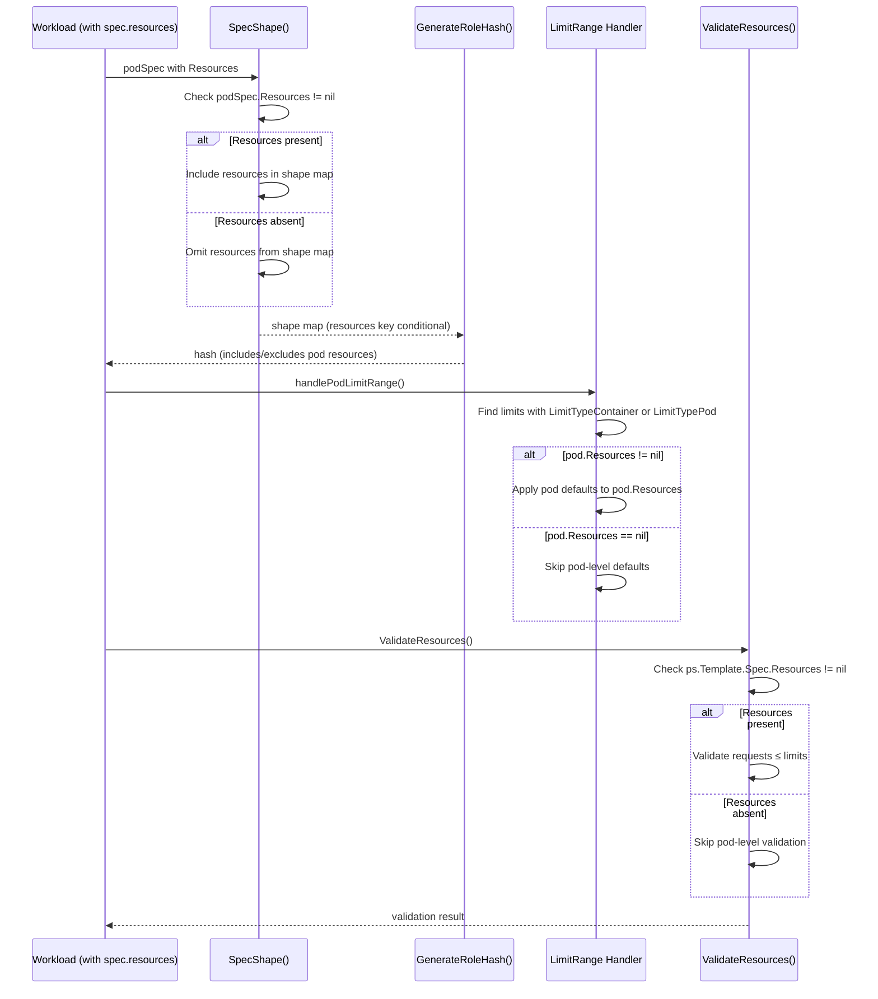

# PR #12334: bug: support for pod level resources

**Summary**: bug: support for pod level resources

**Sources**: https://github.com/kubernetes-sigs/kueue/pull/12334

**Last updated**: 2026-06-25T07:09:42Z

---

## Metadata

- **State**: open
- **Author**: [@anuragdalvi](https://github.com/anuragdalvi)
- **Branch**: `support-pod-level-resources` → `main`
- **Created**: 2026-06-18T13:35:01Z
- **Updated**: 2026-06-25T07:09:42Z
- **Merged**: —
- **Closed**: —
- **Labels**: `kind/bug`, `release-note`, `size/XL`, `ok-to-test`, `cncf-cla: yes`, `area/website`
- **Assignees**: [@kannon92](https://github.com/kannon92), [@mimowo](https://github.com/mimowo)
- **Requested reviewers**: [@kannon92](https://github.com/kannon92), [@mimowo](https://github.com/mimowo), [@olekzabl](https://github.com/olekzabl), [@sohankunkerkar](https://github.com/sohankunkerkar)
- **Changed files**: 10   **+531 / -28**

## Description

<!--  Thanks for sending a pull request!  Here are some tips for you:

1. If this is your first time, please read our contributor guidelines: https://git.k8s.io/community/contributors/guide/first-contribution.md#your-first-contribution and developer guide https://git.k8s.io/community/contributors/devel/development.md#development-guide
2. Please label this pull request according to what type of issue you are addressing, especially if this is a release targeted pull request. For reference on required PR/issue labels, read here:
https://git.k8s.io/community/contributors/devel/sig-release/release.md#issuepr-kind-label
3. Ensure you have added or ran the appropriate tests for your PR: https://git.k8s.io/community/contributors/devel/sig-testing/testing.md
4. If you want *faster* PR reviews, read how: https://git.k8s.io/community/contributors/guide/pull-requests.md#best-practices-for-faster-reviews
5. If the PR is unfinished, see how to mark it: https://git.k8s.io/community/contributors/guide/pull-requests.md#marking-unfinished-pull-requests
-->

#### What type of PR is this?
/kind bug

/area website

<!--
Add one of the following kinds:
/kind bug
/kind cleanup
/kind documentation
/kind feature
/kind kep

Optionally add one or more of the following kinds if applicable:
/kind api-change
/kind deprecation
/kind failing-test
/kind flake
/kind regression

Please also consider setting the area:
/area tas
/area integrations
/area multikueue
/area dashboard
/area localization
/area testing
/area website
-->

#### What this PR does / why we need it:
This PR adds support for pod-level resources ([KEP-2837](https://kubernetes.io/docs/concepts/workloads/pods/#pod-level-resources), GA-track on Kubernetes 1.32+), where a pod declares CPU/memory requests and limits at the pod level via pod.spec.resources instead of, or in addition to, per-container requests. Previously Kueue only looked at container-level resources, so pod-level declarations were ignored in role hashing, request adjustment, and validation. This PR makes Kueue's workload resource handling pod-level-aware across all four of those paths:

Role hashing `pod.SpecShape` : pod-level requests now contribute to the pod-spec shape used to compute role hashes. They are only added to the shape when podSpec.Resources is non-nil, so role hashes for pods without pod-level resources stay stable across upgrades.
LimitRange defaulting `handlePodLimitRange` : LimitRange Default/DefaultRequest values are now also merged into pod.spec.resources, mirroring the existing container behavior.
Limits-as-missing-requests `UseLimitsAsMissingRequestsInPod`: when only pod-level limits are set, they are treated as the pod-level requests, consistent with how container limits are handled.
Validation `ValidateResources` : pod-level requests are validated not to exceed pod-level limits, producing the same requests must not exceed its limits error (scoped to spec.podSets[*].template.spec.resources) already emitted for containers.
All pod-level handling is guarded by an if pod.Resources != nil check, since the field is an optional pointer only populated when the cluster's PodLevelResources feature gate is enabled and used — so behavior is unchanged for clusters not using the feature.

Also adds PodLevelRequest/PodLevelLimit test wrappers, unit tests for the new paths, and documents pod-level resource accounting in the Workload concepts page.


#### Which issue(s) this PR fixes:
<!--
*Automatically closes linked issue when PR is merged.
Usage: `Fixes #<issue number>`, or `Fixes (paste link of issue)`.
_If PR is about `failing-tests or flakes`, please post the related issues/tests in a comment and do not use `Fixes`_*
-->
Fixes [#4233](https://github.com/kubernetes-sigs/kueue/issues/4233)

#### Special notes for your reviewer:
- Not sure if adding limits to `SpecShape()` or `ContainersShape` function would result in fragmentation of multiple PodSets, so did not add it in this PR. 
- Will add Integration tests in a follow up PR. 
- AI tools were used to assist in preparing this change.

#### Does this PR introduce a user-facing change?
<!--
If no, just write "NONE" in the release-note block below.
If yes, a release note is required:
Enter your extended release note in the block below. If the PR requires additional action from users switching to the new release, include the string "action required".
-->
```release-note
Workloads: Fixed resource accounting and validation for Pods using Kubernetes pod-level
resources (`pod.spec.resources`), including LimitRange defaulting and request/limit
validation.
```


<!-- This is an auto-generated comment: release notes by coderabbit.ai -->
## Summary by CodeRabbit

## Summary by CodeRabbit

* **New Features**
  * Added Kubernetes 1.32+ pod-level resources (`pod.spec.resources`) support for request/limit adjustment, validation, and quota accounting.
* **Bug Fixes**
  * Ensure stable role hashing when pod-level resources are omitted.
  * Apply LimitRange defaults for pod-type limits, adjust pod requests from pod limits, and validate pod-level requests vs pod-level limits.
* **Tests**
  * Expanded unit, integration, and end-to-end coverage for pod-level quota and gating behavior.
* **Documentation**
  * Updated workload docs with “Pod-level resources” guidance and validation details.
<!-- end of auto-generated comment: release notes by coderabbit.ai -->

## Discussion

### Comment by [@netlify[bot]](https://github.com/apps/netlify) — 2026-06-18T13:35:08Z

### <span aria-hidden="true">✅</span> Deploy Preview for *kubernetes-sigs-kueue* canceled.


|  Name | Link |
|:-:|------------------------|
|<span aria-hidden="true">🔨</span> Latest commit | 0254c8e6f034e7d306f75ff9cb6c90293b92db72 |
|<span aria-hidden="true">🔍</span> Latest deploy log | https://app.netlify.com/projects/kubernetes-sigs-kueue/deploys/6a3cd2c5b46734000875932a |

### Comment by [@linux-foundation-easycla[bot]](https://github.com/apps/linux-foundation-easycla) — 2026-06-18T13:35:10Z

<a href="https://easycla.lfx.linuxfoundation.org/#/?version=2"></a><br >The committers listed above are authorized under a signed CLA.<ul><li>:white_check_mark: login: anuragdalvi / name: Anurag Dalvi (5bc7f2be0c1a142f1ae954e6ec7877b34d7fc8e2)</li></ul>

### Comment by [@k8s-ci-robot](https://github.com/k8s-ci-robot) — 2026-06-18T13:35:11Z

Welcome @anuragdalvi! <br><br>It looks like this is your first PR to <a href='https://github.com/kubernetes-sigs/kueue'>kubernetes-sigs/kueue</a> 🎉. Please refer to our [pull request process documentation](https://www.kubernetes.dev/docs/guide/pull-requests/) to help your PR have a smooth ride to approval. <br><br>You will be prompted by a bot to use commands during the review process. Do not be afraid to follow the prompts! It is okay to experiment. [Here is the bot commands documentation](https://go.k8s.io/bot-commands). <br><br>You can also check if kubernetes-sigs/kueue has [its own contribution guidelines](https://github.com/kubernetes-sigs/kueue/tree/master/CONTRIBUTING.md). <br><br>You may want to refer to our [testing guide](https://git.k8s.io/community/contributors/devel/sig-testing/testing.md) if you run into trouble with your tests not passing. <br><br>If you are having difficulty getting your pull request seen, please follow the [recommended escalation practices](https://www.kubernetes.dev/docs/guide/pull-requests/#why-is-my-pull-request-not-getting-reviewed). Also, for tips and tricks in the contribution process you may want to read the [Kubernetes contributor cheat sheet](https://www.kubernetes.dev/docs/contributor-cheatsheet/). We want to make sure your contribution gets all the attention it needs! <br><br>Thank you, and welcome to Kubernetes. :smiley:

### Comment by [@k8s-ci-robot](https://github.com/k8s-ci-robot) — 2026-06-18T13:35:12Z

Hi @anuragdalvi. Thanks for your PR.

I'm waiting for a [kubernetes-sigs](https://github.com/orgs/kubernetes-sigs/people) member to verify that this patch is reasonable to test. If it is, they should reply with `/ok-to-test` on its own line. Until that is done, I will not automatically test new commits in this PR, but the usual testing commands by org members will still work.

Regular contributors should [join the org](https://git.k8s.io/community/community-membership.md#member) to skip this step.

Once the patch is verified, the new status will be reflected by the `ok-to-test` label.

I understand the commands that are listed [here](https://go.k8s.io/bot-commands?repo=kubernetes-sigs%2Fkueue).

<details>

Instructions for interacting with me using PR comments are available [here](https://git.k8s.io/community/contributors/guide/pull-requests.md).  If you have questions or suggestions related to my behavior, please file an issue against the [kubernetes-sigs/prow](https://github.com/kubernetes-sigs/prow/issues/new?title=Prow%20issue:) repository.
</details>

### Comment by [@k8s-ci-robot](https://github.com/k8s-ci-robot) — 2026-06-18T13:35:12Z

[APPROVALNOTIFIER] This PR is **NOT APPROVED**

This pull-request has been approved by: *<a href="https://github.com/kubernetes-sigs/kueue/pull/12334#" title="Author self-approved">anuragdalvi</a>*
**Once this PR has been reviewed and has the lgtm label**, please assign [mimowo](https://github.com/mimowo), [pbundyra](https://github.com/pbundyra), [sohankunkerkar](https://github.com/sohankunkerkar) for approval. For more information see [the Code Review Process](https://git.k8s.io/community/contributors/guide/owners.md#the-code-review-process).

The full list of commands accepted by this bot can be found [here](https://go.k8s.io/bot-commands?repo=kubernetes-sigs%2Fkueue).

<details open>
Needs approval from an approver in each of these files:

- **[OWNERS](https://github.com/kubernetes-sigs/kueue/blob/main/OWNERS)**

Approvers can indicate their approval by writing `/approve` in a comment
Approvers can cancel approval by writing `/approve cancel` in a comment
</details>
<!-- META={"approvers":["mimowo","pbundyra","sohankunkerkar"]} -->

### Comment by [@coderabbitai[bot]](https://github.com/apps/coderabbitai) — 2026-06-18T13:35:19Z

<!-- This is an auto-generated comment: summarize by coderabbit.ai -->
<!-- review_stack_entry_start -->

[](https://app.coderabbit.ai/change-stack/kubernetes-sigs/kueue/pull/12334?utm_source=github_walkthrough&utm_medium=github&utm_campaign=change_stack)

<!-- review_stack_entry_end -->
<!-- This is an auto-generated comment: review paused by coderabbit.ai -->

> [!NOTE]
> ## Reviews paused
> 
> It looks like this branch is under active development. To avoid overwhelming you with review comments due to an influx of new commits, CodeRabbit has automatically paused this review. You can configure this behavior by changing the `reviews.auto_review.auto_pause_after_reviewed_commits` setting.
> 
> Use the following commands to manage reviews:
> - `@coderabbitai resume` to resume automatic reviews.
> - `@coderabbitai review` to trigger a single review.
> 
> Use the checkboxes below for quick actions:
> - [ ] <!-- {"checkboxId": "7f6cc2e2-2e4e-497a-8c31-c9e4573e93d1"} --> ▶️ Resume reviews
> - [ ] <!-- {"checkboxId": "e9bb8d72-00e8-4f67-9cb2-caf3b22574fe"} --> 🔍 Trigger review

<!-- end of auto-generated comment: review paused by coderabbit.ai -->
<!-- walkthrough_start -->

<details>
<summary>📝 Walkthrough</summary>

## Walkthrough

The PR adds pod-level `spec.resources` support to Kueue. `SpecShape` conditionally includes pod-level resource requests in the role hash when present. The LimitRange indexer expands to detect both container and pod types. Resource handling in `handlePodLimitRange`, `UseLimitsAsMissingRequestsInPod`, and `ValidateResources` gains nil-guards for optional pod-level resources. Test helpers and comprehensive unit/integration/E2E tests validate the feature. Documentation updates describe pod-level resource behavior and interaction with quota management.

## Changes

**Pod-level resources support**

|Layer / File(s)|Summary|
|---|---|
|**LimitRange indexer expansion for pod types** <br> `pkg/controller/core/indexer/indexer.go`, `pkg/controller/core/indexer/indexer_test.go`|Index key constant changes from `spec.hasContainerType` to `spec.hasContainerOrPodType`. Indexer implementation now detects both `LimitTypeContainer` and `LimitTypePod` types. `Setup` registers the expanded indexer with the new key. Test coverage renamed and updated to validate both type behaviors.|
|**SpecShape and workload resource nil-guards** <br> `pkg/util/pod/pod.go`, `pkg/workload/resources.go`|`SpecShape` builds a local `shape` map and conditionally adds `resources` key from `podSpec.Resources.Requests` only when non-nil. `handlePodLimitRange` processes both container and pod LimitRange defaults, applying pod defaults only when `pod.Resources != nil`. `UseLimitsAsMissingRequestsInPod` and `ValidateResources` add nil-guards to skip pod-level processing when pod-level resources are unset.|
|**Test helpers for pod-level resources** <br> `pkg/util/testing/v1beta2/wrappers.go`|`PodSetWrapper.PodLevelRequest` and `PodSetWrapper.PodLevelLimit` fluent methods added with lazy initialization of `Template.Spec.Resources`, `Requests`, and `Limits` using `resource.MustParse`.|
|**Unit tests for pod-level resources** <br> `pkg/util/pod/pod_test.go`, `pkg/workload/resources_test.go`|`TestSpecShape` and `TestGenerateRoleHash` verify resources key presence and role hash stability. New `TestAdjustResources` and `TestValidateResources` scenarios cover pod-level limit-to-request synthesis and request-exceeds-limit validation. Test client indexing updated to use container-or-pod LimitRange indexer.|
|**Integration and E2E test coverage** <br> `test/e2e/singlecluster/baseline/pod_test.go`, `test/integration/singlecluster/scheduler/scheduler_test.go`, `test/integration/singlecluster/scheduler/workload_controller_test.go`|E2E test covers pod-level resource exhaustion with gating and insufficient quota. Scheduler integration tests validate pod-level request/limit constraints and LimitRange behavior override container values for admission. Workload controller integration tests verify pod-level limit-to-request conversion for quota and consistent resource accounting.|
|**Workload documentation** <br> `site/content/en/docs/concepts/workload.md`|Adds "Pod-level resources" subsection under "Resource requests" for Kubernetes 1.32+ support. Extends adjustment and validation guidance to cover `pod.spec.resources` alongside container resources. Minor formatting fixes: trailing whitespace removal, max execution time label configuration, SSA vs Merge Patch spacing normalization.|

## Sequence Diagram(s)



## Estimated code review effort

🎯 3 (Moderate) | ⏱️ ~25 minutes

## Suggested labels

`size/L`

## Suggested reviewers

- kannon92
- sohankunkerkar
- mimowo

## Poem

> 🐇 A pod now holds resources of its own,
> Through `spec.resources` seeds we've sown.
> With nil-guards placed, we skip with care,
> Pod-level quotas are handled fair.
> From hash to limits, requests aligned,
> A pod-level feature, thoughtfully designed!

</details>

<!-- walkthrough_end -->
<!-- pre_merge_checks_walkthrough_start -->

<details>
<summary>🚥 Pre-merge checks | ✅ 4 | ❌ 1</summary>

### ❌ Failed checks (1 warning)

|     Check name     | Status     | Explanation                                                                           | Resolution                                                                         |
| :----------------: | :--------- | :------------------------------------------------------------------------------------ | :--------------------------------------------------------------------------------- |
| Docstring Coverage | ⚠️ Warning | Docstring coverage is 23.53% which is insufficient. The required threshold is 80.00%. | Write docstrings for the functions missing them to satisfy the coverage threshold. |

<details>
<summary>✅ Passed checks (4 passed)</summary>

|         Check name         | Status   | Explanation                                                                                                                                                                                                                                  |
| :------------------------: | :------- | :------------------------------------------------------------------------------------------------------------------------------------------------------------------------------------------------------------------------------------------- |
|      Description Check     | ✅ Passed | Check skipped - CodeRabbit’s high-level summary is enabled.                                                                                                                                                                                  |
|         Title check        | ✅ Passed | The title 'bug: support for pod level resources' is partially related to the changeset, referring to a real aspect of the changes but not capturing the main point comprehensively.                                                          |
|     Linked Issues check    | ✅ Passed | The PR implements pod-level resource support across role hashing, LimitRange defaulting, limits-as-missing-requests, and validation, addressing coding requirements from issue `#4233` with comprehensive resource handling and test coverage. |
| Out of Scope Changes check | ✅ Passed | All changes directly support pod-level resource handling requirements from issue `#4233`, with no extraneous modifications detected beyond the implementation scope.                                                                           |

</details>

<sub>✏️ Tip: You can configure your own custom pre-merge checks in the settings.</sub>

</details>

<!-- pre_merge_checks_walkthrough_end -->
<!-- finishing_touch_checkbox_start -->

<details>
<summary>✨ Finishing Touches</summary>

<details>
<summary>🧪 Generate unit tests (beta)</summary>

- [ ] <!-- {"checkboxId": "f47ac10b-58cc-4372-a567-0e02b2c3d479", "radioGroupId": "utg-output-choice-group-unknown_comment_id"} -->   Create PR with unit tests

</details>

</details>

<!-- finishing_touch_checkbox_end -->
<!-- tips_start -->

---

Thanks for using [CodeRabbit](https://coderabbit.ai?utm_source=oss&utm_medium=github&utm_campaign=kubernetes-sigs/kueue&utm_content=12334)! It's free for OSS, and your support helps us grow. If you like it, consider giving us a shout-out.

<details>
<summary>❤️ Share</summary>

- [X](https://twitter.com/intent/tweet?text=I%20just%20used%20%40coderabbitai%20for%20my%20code%20review%2C%20and%20it%27s%20fantastic%21%20It%27s%20free%20for%20OSS%20and%20offers%20a%20free%20trial%20for%20the%20proprietary%20code.%20Check%20it%20out%3A&url=https%3A//coderabbit.ai)
- [Mastodon](https://mastodon.social/share?text=I%20just%20used%20%40coderabbitai%20for%20my%20code%20review%2C%20and%20it%27s%20fantastic%21%20It%27s%20free%20for%20OSS%20and%20offers%20a%20free%20trial%20for%20the%20proprietary%20code.%20Check%20it%20out%3A%20https%3A%2F%2Fcoderabbit.ai)
- [Reddit](https://www.reddit.com/submit?title=Great%20tool%20for%20code%20review%20-%20CodeRabbit&text=I%20just%20used%20CodeRabbit%20for%20my%20code%20review%2C%20and%20it%27s%20fantastic%21%20It%27s%20free%20for%20OSS%20and%20offers%20a%20free%20trial%20for%20proprietary%20code.%20Check%20it%20out%3A%20https%3A//coderabbit.ai)
- [LinkedIn](https://www.linkedin.com/sharing/share-offsite/?url=https%3A%2F%2Fcoderabbit.ai&mini=true&title=Great%20tool%20for%20code%20review%20-%20CodeRabbit&summary=I%20just%20used%20CodeRabbit%20for%20my%20code%20review%2C%20and%20it%27s%20fantastic%21%20It%27s%20free%20for%20OSS%20and%20offers%20a%20free%20trial%20for%20proprietary%20code)

</details>


<sub>Comment `@coderabbitai help` to get the list of available commands.</sub>

<!-- tips_end -->

### Comment by [@kannon92](https://github.com/kannon92) — 2026-06-18T13:47:24Z

/ok-to-test

### Comment by [@sohankunkerkar](https://github.com/sohankunkerkar) — 2026-06-18T13:47:55Z

Thanks for the PR. I'd encourage you to open a KEP PR first to discuss the design.

### Comment by [@kannon92](https://github.com/kannon92) — 2026-06-18T13:49:18Z

> Thanks for the PR. I'd encourage you to open a KEP PR first to discuss the design.

I don't think a KEP is really needed.

https://github.com/kubernetes-sigs/kueue/issues/4233

Turns out that we have support for this already but there are a few bugs we have to address.

### Comment by [@kannon92](https://github.com/kannon92) — 2026-06-18T13:49:40Z

@coderabbitai review

### Comment by [@coderabbitai[bot]](https://github.com/apps/coderabbitai) — 2026-06-18T13:49:47Z

<!-- This is an auto-generated reply by CodeRabbit -->
<!-- CodeRabbit review command invocation: bd3a0064-e28f-4a6a-9094-a0e2f8f373c7 -->
<details>
<summary>✅ Action performed</summary>

Review finished.

> Note: CodeRabbit is an incremental review system and does not re-review already reviewed commits. This command is applicable only when automatic reviews are paused.

</details>

### Comment by [@sohankunkerkar](https://github.com/sohankunkerkar) — 2026-06-18T13:57:53Z

> > Thanks for the PR. I'd encourage you to open a KEP PR first to discuss the design.
> 
> I don't think a KEP is really needed.
> 
> #4233
> 
> Turns out that we have support for this already but there are a few bugs we have to address.

I see, so the label is misleading here. It should be `/kind bug`?

### Comment by [@anuragdalvi](https://github.com/anuragdalvi) — 2026-06-18T14:02:26Z

Thanks, changed label to /kind bug.

### Comment by [@anuragdalvi](https://github.com/anuragdalvi) — 2026-06-18T14:06:28Z

/kind bug

### Comment by [@anuragdalvi](https://github.com/anuragdalvi) — 2026-06-18T14:07:12Z

/remove-kind feature

### Comment by [@kannon92](https://github.com/kannon92) — 2026-06-18T15:31:25Z

> Will add Integration tests in a follow up PR.

I would prefer integration tests in this PR actually.

### Comment by [@mimowo](https://github.com/mimowo) — 2026-06-18T15:39:13Z

Yes, for an integration tests I think it makes sense to cover a scanario when the first Pod is scheduled, but for the second we don't have enough quota (due to the PodLevel resources). 

I think we don't need e2e tests for the feature.

### Comment by [@mimowo](https://github.com/mimowo) — 2026-06-18T19:13:14Z

injected a proposed release note, since this is certainly a bug

### Comment by [@kannon92](https://github.com/kannon92) — 2026-06-22T16:11:00Z

/lgtm

/assign @mimowo

### Comment by [@kubernetes-prow[bot]](https://github.com/apps/kubernetes-prow) — 2026-06-22T16:11:10Z

LGTM label has been added.  <details>Git tree hash: e23d3163478d677a89fd56bf0a1e9689ef41696a</details>

### Comment by [@kubernetes-prow[bot]](https://github.com/apps/kubernetes-prow) — 2026-06-25T07:03:35Z

New changes are detected. LGTM label has been removed.

### Comment by [@kubernetes-prow[bot]](https://github.com/apps/kubernetes-prow) — 2026-06-25T07:03:42Z

[APPROVALNOTIFIER] This PR is **NOT APPROVED**

This pull-request has been approved by: *<a href="https://github.com/kubernetes-sigs/kueue/pull/12334#" title="Author self-approved">anuragdalvi</a>*
**Once this PR has been reviewed and has the lgtm label**, please ask for approval from [mimowo](https://github.com/mimowo). For more information see [the Code Review Process](https://git.k8s.io/community/contributors/guide/owners.md#the-code-review-process).

The full list of commands accepted by this bot can be found [here](https://go.k8s.io/bot-commands?repo=kubernetes-sigs%2Fkueue).

<details open>
Needs approval from an approver in each of these files:

- **[OWNERS](https://github.com/kubernetes-sigs/kueue/blob/main/OWNERS)**

Approvers can indicate their approval by writing `/approve` in a comment
Approvers can cancel approval by writing `/approve cancel` in a comment
</details>
<!-- META={"approvers":["mimowo"]} -->

## Reviews

### Review by [@kannon92](https://github.com/kannon92) (commented) — 2026-06-21T17:24:07Z

- **pkg/util/pod/pod_test.go:289** by [@kannon92](https://github.com/kannon92) — 2026-06-21T17:24:07Z
```diff
@@ -251,3 +252,70 @@ func TestIsTerminated(t *testing.T) {
 		})
 	}
 }
+
+func TestSpecShape(t *testing.T) {
+	podResources := &corev1.ResourceRequirements{
+		Requests: corev1.ResourceList{corev1.ResourceCPU: resource.MustParse("1")},
+		Limits:   corev1.ResourceList{corev1.ResourceCPU: resource.MustParse("2")},
+	}
+	cases := map[string]struct {
+		podSpec       *corev1.PodSpec
+		wantResources any
+		wantPresent   bool
+	}{
+		"pod-level resources omitted when unset": {
+			podSpec:     &corev1.PodSpec{Containers: []corev1.Container{{Name: "c"}}},
+			wantPresent: false,
+		},
+		"pod-level resources included when set": {
+			podSpec:       &corev1.PodSpec{Containers: []corev1.Container{{Name: "c"}}, Resources: podResources},
+			wantResources: podResources.Requests,
+			wantPresent:   true,
+		},
+	}
+	for name, tc := range cases {
+		t.Run(name, func(t *testing.T) {
+			got, present := SpecShape(tc.podSpec)["resources"]
+			if present != tc.wantPresent {
+				t.Fatalf("Unexpected presence of \"resources\" key: want %v, got %v", tc.wantPresent, present)
+			}
+			if diff := cmp.Diff(tc.wantResources, got); diff != "" {
+				t.Errorf("Unexpected resources shape (-want,+got):\n%s", diff)
+			}
+		})
+	}
+}
+
+func TestGenerateRoleHash(t *testing.T) {
```

                                                                                                                                                                                                                                                          
                                                                                                                                                                                                                                                                                            In pkg/util/pod/pod_test.go, the new TestGenerateRoleHash function covers multiple test scenarios inline as a sequential block (base hash, changed pod-resources hash, identically stable empty hash). Please refactor this to use table-driven style (cases := map[string]struct{...})  
   to match established patterns and make adding future cases easier.

### Review by [@kannon92](https://github.com/kannon92) (commented) — 2026-06-21T17:28:25Z

- **pkg/controller/core/indexer/indexer.go:280** by [@kannon92](https://github.com/kannon92) — 2026-06-21T17:28:25Z
```diff
@@ -277,8 +291,8 @@ func Setup(ctx context.Context, indexer client.FieldIndexer) error {
 	if err := indexer.IndexField(ctx, &kueue.LocalQueue{}, QueueClusterQueueKey, IndexQueueClusterQueue); err != nil {
 		return fmt.Errorf("setting index on clusterQueue for localQueue: %w", err)
 	}
-	if err := indexer.IndexField(ctx, &corev1.LimitRange{}, LimitRangeHasContainerType, IndexLimitRangeHasContainerType); err != nil {
```

  With this change, I think LimitRangeHasContainerType is no longer used. 
  
  Can we remove this function then?

### Review by [@kannon92](https://github.com/kannon92) (commented) — 2026-06-21T17:29:10Z

- **pkg/util/testing/v1beta2/wrappers.go:1560** by [@kannon92](https://github.com/kannon92) — 2026-06-21T17:29:11Z
```diff
@@ -1536,10 +1558,12 @@ type WorkloadPriorityClassWrapper struct {
 
 // MakeWorkloadPriorityClass creates a wrapper for a WorkloadPriorityClass.
 func MakeWorkloadPriorityClass(name string) *WorkloadPriorityClassWrapper {
```

  Can you revert these changes?

### Review by [@anuragdalvi](https://github.com/anuragdalvi) (commented) — 2026-06-22T01:16:42Z

- **pkg/util/testing/v1beta2/wrappers.go:1560** by [@anuragdalvi](https://github.com/anuragdalvi) — 2026-06-22T01:16:41Z
```diff
@@ -1536,10 +1558,12 @@ type WorkloadPriorityClassWrapper struct {
 
 // MakeWorkloadPriorityClass creates a wrapper for a WorkloadPriorityClass.
 func MakeWorkloadPriorityClass(name string) *WorkloadPriorityClassWrapper {
```

  Apologies—this was an unintended change from running gofumpt. I’ve reverted it.

### Review by [@anuragdalvi](https://github.com/anuragdalvi) (commented) — 2026-06-22T01:18:39Z

- **pkg/controller/core/indexer/indexer.go:280** by [@anuragdalvi](https://github.com/anuragdalvi) — 2026-06-22T01:18:39Z
```diff
@@ -277,8 +291,8 @@ func Setup(ctx context.Context, indexer client.FieldIndexer) error {
 	if err := indexer.IndexField(ctx, &kueue.LocalQueue{}, QueueClusterQueueKey, IndexQueueClusterQueue); err != nil {
 		return fmt.Errorf("setting index on clusterQueue for localQueue: %w", err)
 	}
-	if err := indexer.IndexField(ctx, &corev1.LimitRange{}, LimitRangeHasContainerType, IndexLimitRangeHasContainerType); err != nil {
```

  Done—removed `LimitRangeHasContainerType` and updated the tests to cover the replacement function.

### Review by [@mimowo](https://github.com/mimowo) (commented) — 2026-06-22T14:30:50Z

- **test/e2e/singlecluster/baseline/pod_test.go:144** by [@mimowo](https://github.com/mimowo) — 2026-06-22T14:30:50Z
```diff
@@ -140,6 +141,64 @@ var _ = ginkgo.Describe("Pod groups", ginkgo.Label("area:singlecluster", "featur
 			})
 		})
 
+		ginkgo.It("should keep a second Pod gated when Pod-level resources exhaust quota", func() {
```

  I think we don't really need the e2e test, because this feature does not depend on k8s core controllers in a direct way. It only matters what we put into the quota requests.

### Review by [@anuragdalvi](https://github.com/anuragdalvi) (commented) — 2026-06-22T15:47:28Z

- **test/e2e/singlecluster/baseline/pod_test.go:144** by [@anuragdalvi](https://github.com/anuragdalvi) — 2026-06-22T15:47:28Z
```diff
@@ -140,6 +141,64 @@ var _ = ginkgo.Describe("Pod groups", ginkgo.Label("area:singlecluster", "featur
 			})
 		})
 
+		ginkgo.It("should keep a second Pod gated when Pod-level resources exhaust quota", func() {
```

  understood. I have it removed.

### Review by [@mimowo](https://github.com/mimowo) (commented) — 2026-06-23T07:32:25Z

- **test/integration/singlecluster/scheduler/scheduler_test.go:2360** by [@mimowo](https://github.com/mimowo) — 2026-06-23T07:32:25Z
```diff
@@ -2258,6 +2258,181 @@ var _ = ginkgo.Describe("Scheduler", func() {
 		)
 	})
 
+	ginkgo.When("The workload's podSet pod-level resource requests are not valid", func() {
+		var (
+			cq    *kueue.ClusterQueue
+			queue *kueue.LocalQueue
+		)
+
+		ginkgo.BeforeEach(func() {
+			cq = utiltestingapi.MakeClusterQueue("cluster-queue").
+				ResourceGroup(
+					*utiltestingapi.MakeFlavorQuotas("on-demand").Resource(corev1.ResourceCPU, "5").Obj(),
+				).
+				Obj()
+			util.MustCreate(ctx, k8sClient, cq)
+			queue = utiltestingapi.MakeLocalQueue("queue", ns.Name).ClusterQueue(cq.Name).Obj()
+			util.MustCreate(ctx, k8sClient, queue)
+		})
+
+		ginkgo.AfterEach(func() {
+			util.ExpectObjectToBeDeleted(ctx, k8sClient, cq, true)
+		})
+
+		type testParams struct {
+			podReqCPU         string
+			podLimitCPU       string
+			containerReqCPU   string
+			containerLimitCPU string
+			minCPU            string
+			maxCPU            string
+			wantedStatus      string
+			shouldBeAdmitted  bool
+		}
+
+		ginkgo.DescribeTable(
+			"",
+			func(tp testParams) {
+				var lr *corev1.LimitRange
+				if tp.minCPU != "" || tp.maxCPU != "" {
+					lrBuilder := utiltesting.MakeLimitRange("limit", ns.Name).WithType(corev1.LimitTypePod)
+					if tp.maxCPU != "" {
+						lrBuilder.WithValue("Max", corev1.ResourceCPU, tp.maxCPU)
+					}
+					if tp.minCPU != "" {
+						lrBuilder.WithValue("Min", corev1.ResourceCPU, tp.minCPU)
+					}
+					lr = lrBuilder.Obj()
+					util.MustCreate(ctx, k8sClient, lr)
+				}
+
+				psBuilder := utiltestingapi.MakePodSet(kueue.DefaultPodSetName, 1).
+					Request(corev1.ResourceCPU, tp.containerReqCPU).
+					Limit(corev1.ResourceCPU, tp.containerLimitCPU)
+				if tp.podReqCPU != "" {
+					psBuilder.PodLevelRequest(corev1.ResourceCPU, tp.podReqCPU)
+				}
+				if tp.podLimitCPU != "" {
+					psBuilder.PodLevelLimit(corev1.ResourceCPU, tp.podLimitCPU)
+				}
+
+				wl := utiltestingapi.MakeWorkload("workload", ns.Name).
+					Queue(kueue.LocalQueueName(queue.Name)).
+					PodSets(*psBuilder.Obj()).
+					Obj()
+				util.MustCreate(ctx, k8sClient, wl)
+
+				if tp.shouldBeAdmitted {
+					util.ExpectWorkloadsToHaveQuotaReservation(ctx, k8sClient, cq.Name, wl)
+				} else {
+					gomega.Eventually(func(g gomega.Gomega) {
+						rwl := kueue.Workload{}
+						g.Expect(k8sClient.Get(ctx, client.ObjectKeyFromObject(wl), &rwl)).Should(gomega.Succeed())
+						cond := meta.FindStatusCondition(rwl.Status.Conditions, kueue.WorkloadQuotaReserved)
+						g.Expect(cond).ShouldNot(gomega.BeNil())
+						g.Expect(cond.Message).Should(gomega.ContainSubstring(tp.wantedStatus))
+					}, util.Timeout, util.Interval).Should(gomega.Succeed())
+				}
+				gomega.Expect(util.DeleteObject(ctx, k8sClient, wl)).To(gomega.Succeed())
+				if lr != nil {
+					gomega.Expect(k8sClient.Delete(ctx, lr)).To(gomega.Succeed())
+				}
+			},
+			// Container-level: req=1, limit=2 (valid). Pod-level: req=3, limit=2 → pod req>limit fails.
+			ginkgo.Entry(
+				"pod-level requests exceed pod-level limits",
+				testParams{containerReqCPU: "1", containerLimitCPU: "2", podReqCPU: "3", podLimitCPU: "2", wantedStatus: "resources validation failed:"},
+			),
+			// Container-level: req=500m, limit=500m (within max=1). Pod-level: req=2 > max=1 fails.
+			ginkgo.Entry(
+				"pod-level requests over pod LimitRange max",
+				testParams{containerReqCPU: "500m", containerLimitCPU: "500m", podReqCPU: "2", podLimitCPU: "3", maxCPU: "1", wantedStatus: "resources didn't satisfy LimitRange constraints:"},
+			),
+			// Container-level: req=500m, limit=500m (valid on their own). Pod-level: req=2 < min=3 fails.
+			ginkgo.Entry(
+				"pod-level requests under pod LimitRange min",
+				testParams{containerReqCPU: "500m", containerLimitCPU: "500m", podReqCPU: "2", podLimitCPU: "3", minCPU: "3", wantedStatus: "resources didn't satisfy LimitRange constraints:"},
+			),
+			// Container-level: req=500m, limit=500m. Pod-level: req=2, limit=3, within [min=1, max=4] → admitted.
+			ginkgo.Entry(
+				"valid pod-level resources supersede container-level",
+				testParams{containerReqCPU: "500m", containerLimitCPU: "500m", podReqCPU: "2", podLimitCPU: "3", minCPU: "1", maxCPU: "4", shouldBeAdmitted: true},
+			),
```

  nit, but could you unwind the test cases. Making them programmatic requires sometimes awkward options to them. In my practice table driven tests are great for unit tests, but are hard to follow in the integration context.

### Review by [@mimowo](https://github.com/mimowo) (commented) — 2026-06-23T07:38:07Z

- **test/integration/singlecluster/scheduler/scheduler_test.go:2432** by [@mimowo](https://github.com/mimowo) — 2026-06-23T07:38:07Z
```diff
@@ -2258,6 +2258,181 @@ var _ = ginkgo.Describe("Scheduler", func() {
 		)
 	})
 
+	ginkgo.When("The workload's podSet pod-level resource requests are not valid", func() {
+		var (
+			cq    *kueue.ClusterQueue
+			queue *kueue.LocalQueue
+		)
+
+		ginkgo.BeforeEach(func() {
+			cq = utiltestingapi.MakeClusterQueue("cluster-queue").
+				ResourceGroup(
+					*utiltestingapi.MakeFlavorQuotas("on-demand").Resource(corev1.ResourceCPU, "5").Obj(),
+				).
+				Obj()
+			util.MustCreate(ctx, k8sClient, cq)
+			queue = utiltestingapi.MakeLocalQueue("queue", ns.Name).ClusterQueue(cq.Name).Obj()
+			util.MustCreate(ctx, k8sClient, queue)
+		})
+
+		ginkgo.AfterEach(func() {
+			util.ExpectObjectToBeDeleted(ctx, k8sClient, cq, true)
+		})
+
+		type testParams struct {
+			podReqCPU         string
+			podLimitCPU       string
+			containerReqCPU   string
+			containerLimitCPU string
+			minCPU            string
+			maxCPU            string
+			wantedStatus      string
+			shouldBeAdmitted  bool
+		}
+
+		ginkgo.DescribeTable(
+			"",
+			func(tp testParams) {
+				var lr *corev1.LimitRange
+				if tp.minCPU != "" || tp.maxCPU != "" {
+					lrBuilder := utiltesting.MakeLimitRange("limit", ns.Name).WithType(corev1.LimitTypePod)
+					if tp.maxCPU != "" {
+						lrBuilder.WithValue("Max", corev1.ResourceCPU, tp.maxCPU)
+					}
+					if tp.minCPU != "" {
+						lrBuilder.WithValue("Min", corev1.ResourceCPU, tp.minCPU)
+					}
+					lr = lrBuilder.Obj()
+					util.MustCreate(ctx, k8sClient, lr)
+				}
+
+				psBuilder := utiltestingapi.MakePodSet(kueue.DefaultPodSetName, 1).
+					Request(corev1.ResourceCPU, tp.containerReqCPU).
+					Limit(corev1.ResourceCPU, tp.containerLimitCPU)
+				if tp.podReqCPU != "" {
+					psBuilder.PodLevelRequest(corev1.ResourceCPU, tp.podReqCPU)
+				}
+				if tp.podLimitCPU != "" {
+					psBuilder.PodLevelLimit(corev1.ResourceCPU, tp.podLimitCPU)
+				}
+
+				wl := utiltestingapi.MakeWorkload("workload", ns.Name).
+					Queue(kueue.LocalQueueName(queue.Name)).
+					PodSets(*psBuilder.Obj()).
+					Obj()
+				util.MustCreate(ctx, k8sClient, wl)
+
+				if tp.shouldBeAdmitted {
+					util.ExpectWorkloadsToHaveQuotaReservation(ctx, k8sClient, cq.Name, wl)
+				} else {
+					gomega.Eventually(func(g gomega.Gomega) {
+						rwl := kueue.Workload{}
+						g.Expect(k8sClient.Get(ctx, client.ObjectKeyFromObject(wl), &rwl)).Should(gomega.Succeed())
+						cond := meta.FindStatusCondition(rwl.Status.Conditions, kueue.WorkloadQuotaReserved)
+						g.Expect(cond).ShouldNot(gomega.BeNil())
+						g.Expect(cond.Message).Should(gomega.ContainSubstring(tp.wantedStatus))
+					}, util.Timeout, util.Interval).Should(gomega.Succeed())
+				}
+				gomega.Expect(util.DeleteObject(ctx, k8sClient, wl)).To(gomega.Succeed())
+				if lr != nil {
+					gomega.Expect(k8sClient.Delete(ctx, lr)).To(gomega.Succeed())
+				}
+			},
+			// Container-level: req=1, limit=2 (valid). Pod-level: req=3, limit=2 → pod req>limit fails.
+			ginkgo.Entry(
+				"pod-level requests exceed pod-level limits",
+				testParams{containerReqCPU: "1", containerLimitCPU: "2", podReqCPU: "3", podLimitCPU: "2", wantedStatus: "resources validation failed:"},
+			),
+			// Container-level: req=500m, limit=500m (within max=1). Pod-level: req=2 > max=1 fails.
+			ginkgo.Entry(
+				"pod-level requests over pod LimitRange max",
+				testParams{containerReqCPU: "500m", containerLimitCPU: "500m", podReqCPU: "2", podLimitCPU: "3", maxCPU: "1", wantedStatus: "resources didn't satisfy LimitRange constraints:"},
+			),
+			// Container-level: req=500m, limit=500m (valid on their own). Pod-level: req=2 < min=3 fails.
+			ginkgo.Entry(
+				"pod-level requests under pod LimitRange min",
+				testParams{containerReqCPU: "500m", containerLimitCPU: "500m", podReqCPU: "2", podLimitCPU: "3", minCPU: "3", wantedStatus: "resources didn't satisfy LimitRange constraints:"},
+			),
+			// Container-level: req=500m, limit=500m. Pod-level: req=2, limit=3, within [min=1, max=4] → admitted.
+			ginkgo.Entry(
+				"valid pod-level resources supersede container-level",
+				testParams{containerReqCPU: "500m", containerLimitCPU: "500m", podReqCPU: "2", podLimitCPU: "3", minCPU: "1", maxCPU: "4", shouldBeAdmitted: true},
+			),
+		)
+	})
+
+	ginkgo.When("Pod-level resources are counted against ClusterQueue quota", func() {
+		var (
+			cq    *kueue.ClusterQueue
+			queue *kueue.LocalQueue
+		)
+
+		ginkgo.BeforeEach(func() {
+			cq = utiltestingapi.MakeClusterQueue("cluster-queue").
+				ResourceGroup(
+					*utiltestingapi.MakeFlavorQuotas("on-demand").Resource(corev1.ResourceCPU, "3").Obj(),
+				).
+				Obj()
+			util.MustCreate(ctx, k8sClient, cq)
+			queue = utiltestingapi.MakeLocalQueue("queue", ns.Name).ClusterQueue(cq.Name).Obj()
+			util.MustCreate(ctx, k8sClient, queue)
+		})
+
+		ginkgo.AfterEach(func() {
+			util.ExpectObjectToBeDeleted(ctx, k8sClient, cq, true)
+		})
+
+		// Each workload has container-level req=500m (both would fit in 3 CPU if the
+		// scheduler used container values) and pod-level req=2 CPU (only one fits in 3
+		// CPU). The test verifies the scheduler accounts for the pod-level value.
+		ginkgo.It("Should block a second workload when pod-level requests exhaust quota", func() {
+			ginkgo.By("creating the first workload with pod-level CPU request of 2")
+			wl1 := utiltestingapi.MakeWorkload("wl1", ns.Name).
+				Queue(kueue.LocalQueueName(queue.Name)).
+				PodSets(
+					*utiltestingapi.MakePodSet(kueue.DefaultPodSetName, 1).
+						Request(corev1.ResourceCPU, "500m").
+						Limit(corev1.ResourceCPU, "500m").
+						PodLevelRequest(corev1.ResourceCPU, "2").
+						PodLevelLimit(corev1.ResourceCPU, "2").
+						Obj(),
+				).
+				Obj()
+			util.MustCreate(ctx, k8sClient, wl1)
+			defer func() {
+				gomega.Expect(util.DeleteObject(ctx, k8sClient, wl1)).To(gomega.Succeed())
+			}()
+
+			ginkgo.By("verifying the first workload is admitted")
+			util.ExpectWorkloadsToHaveQuotaReservation(ctx, k8sClient, cq.Name, wl1)
+
+			ginkgo.By("creating the second workload with the same pod-level CPU request")
+			wl2 := utiltestingapi.MakeWorkload("wl2", ns.Name).
+				Queue(kueue.LocalQueueName(queue.Name)).
+				PodSets(
+					*utiltestingapi.MakePodSet(kueue.DefaultPodSetName, 1).
+						Request(corev1.ResourceCPU, "500m").
+						Limit(corev1.ResourceCPU, "500m").
+						PodLevelRequest(corev1.ResourceCPU, "2").
+						PodLevelLimit(corev1.ResourceCPU, "2").
+						Obj(),
+				).
+				Obj()
+			util.MustCreate(ctx, k8sClient, wl2)
+			defer func() {
+				gomega.Expect(util.DeleteObject(ctx, k8sClient, wl2)).To(gomega.Succeed())
+			}()
+
+			ginkgo.By("verifying the second workload is pending due to insufficient quota")
+			util.ExpectWorkloadsToBePending(ctx, k8sClient, wl2)
+			createdWl2 := kueue.Workload{}
+			gomega.Consistently(func(g gomega.Gomega) {
+				g.Expect(k8sClient.Get(ctx, client.ObjectKeyFromObject(wl2), &createdWl2)).Should(gomega.Succeed())
+				g.Expect(workload.HasQuotaReservation(&createdWl2)).Should(gomega.BeFalse())
+			}, util.ConsistentDuration, util.ShortInterval).Should(gomega.Succeed())
```

  Instead of using ConsistentDuration you can check the metric for kueue_pending_worklaods {inadmissible=1}, that would save 1s here, and in other cases I suppose.

### Review by [@anuragdalvi](https://github.com/anuragdalvi) (commented) — 2026-06-25T07:09:42Z

- **test/integration/singlecluster/scheduler/scheduler_test.go:2360** by [@anuragdalvi](https://github.com/anuragdalvi) — 2026-06-25T07:09:42Z
```diff
@@ -2258,6 +2258,181 @@ var _ = ginkgo.Describe("Scheduler", func() {
 		)
 	})
 
+	ginkgo.When("The workload's podSet pod-level resource requests are not valid", func() {
+		var (
+			cq    *kueue.ClusterQueue
+			queue *kueue.LocalQueue
+		)
+
+		ginkgo.BeforeEach(func() {
+			cq = utiltestingapi.MakeClusterQueue("cluster-queue").
+				ResourceGroup(
+					*utiltestingapi.MakeFlavorQuotas("on-demand").Resource(corev1.ResourceCPU, "5").Obj(),
+				).
+				Obj()
+			util.MustCreate(ctx, k8sClient, cq)
+			queue = utiltestingapi.MakeLocalQueue("queue", ns.Name).ClusterQueue(cq.Name).Obj()
+			util.MustCreate(ctx, k8sClient, queue)
+		})
+
+		ginkgo.AfterEach(func() {
+			util.ExpectObjectToBeDeleted(ctx, k8sClient, cq, true)
+		})
+
+		type testParams struct {
+			podReqCPU         string
+			podLimitCPU       string
+			containerReqCPU   string
+			containerLimitCPU string
+			minCPU            string
+			maxCPU            string
+			wantedStatus      string
+			shouldBeAdmitted  bool
+		}
+
+		ginkgo.DescribeTable(
+			"",
+			func(tp testParams) {
+				var lr *corev1.LimitRange
+				if tp.minCPU != "" || tp.maxCPU != "" {
+					lrBuilder := utiltesting.MakeLimitRange("limit", ns.Name).WithType(corev1.LimitTypePod)
+					if tp.maxCPU != "" {
+						lrBuilder.WithValue("Max", corev1.ResourceCPU, tp.maxCPU)
+					}
+					if tp.minCPU != "" {
+						lrBuilder.WithValue("Min", corev1.ResourceCPU, tp.minCPU)
+					}
+					lr = lrBuilder.Obj()
+					util.MustCreate(ctx, k8sClient, lr)
+				}
+
+				psBuilder := utiltestingapi.MakePodSet(kueue.DefaultPodSetName, 1).
+					Request(corev1.ResourceCPU, tp.containerReqCPU).
+					Limit(corev1.ResourceCPU, tp.containerLimitCPU)
+				if tp.podReqCPU != "" {
+					psBuilder.PodLevelRequest(corev1.ResourceCPU, tp.podReqCPU)
+				}
+				if tp.podLimitCPU != "" {
+					psBuilder.PodLevelLimit(corev1.ResourceCPU, tp.podLimitCPU)
+				}
+
+				wl := utiltestingapi.MakeWorkload("workload", ns.Name).
+					Queue(kueue.LocalQueueName(queue.Name)).
+					PodSets(*psBuilder.Obj()).
+					Obj()
+				util.MustCreate(ctx, k8sClient, wl)
+
+				if tp.shouldBeAdmitted {
+					util.ExpectWorkloadsToHaveQuotaReservation(ctx, k8sClient, cq.Name, wl)
+				} else {
+					gomega.Eventually(func(g gomega.Gomega) {
+						rwl := kueue.Workload{}
+						g.Expect(k8sClient.Get(ctx, client.ObjectKeyFromObject(wl), &rwl)).Should(gomega.Succeed())
+						cond := meta.FindStatusCondition(rwl.Status.Conditions, kueue.WorkloadQuotaReserved)
+						g.Expect(cond).ShouldNot(gomega.BeNil())
+						g.Expect(cond.Message).Should(gomega.ContainSubstring(tp.wantedStatus))
+					}, util.Timeout, util.Interval).Should(gomega.Succeed())
+				}
+				gomega.Expect(util.DeleteObject(ctx, k8sClient, wl)).To(gomega.Succeed())
+				if lr != nil {
+					gomega.Expect(k8sClient.Delete(ctx, lr)).To(gomega.Succeed())
+				}
+			},
+			// Container-level: req=1, limit=2 (valid). Pod-level: req=3, limit=2 → pod req>limit fails.
+			ginkgo.Entry(
+				"pod-level requests exceed pod-level limits",
+				testParams{containerReqCPU: "1", containerLimitCPU: "2", podReqCPU: "3", podLimitCPU: "2", wantedStatus: "resources validation failed:"},
+			),
+			// Container-level: req=500m, limit=500m (within max=1). Pod-level: req=2 > max=1 fails.
+			ginkgo.Entry(
+				"pod-level requests over pod LimitRange max",
+				testParams{containerReqCPU: "500m", containerLimitCPU: "500m", podReqCPU: "2", podLimitCPU: "3", maxCPU: "1", wantedStatus: "resources didn't satisfy LimitRange constraints:"},
+			),
+			// Container-level: req=500m, limit=500m (valid on their own). Pod-level: req=2 < min=3 fails.
+			ginkgo.Entry(
+				"pod-level requests under pod LimitRange min",
+				testParams{containerReqCPU: "500m", containerLimitCPU: "500m", podReqCPU: "2", podLimitCPU: "3", minCPU: "3", wantedStatus: "resources didn't satisfy LimitRange constraints:"},
+			),
+			// Container-level: req=500m, limit=500m. Pod-level: req=2, limit=3, within [min=1, max=4] → admitted.
+			ginkgo.Entry(
+				"valid pod-level resources supersede container-level",
+				testParams{containerReqCPU: "500m", containerLimitCPU: "500m", podReqCPU: "2", podLimitCPU: "3", minCPU: "1", maxCPU: "4", shouldBeAdmitted: true},
+			),
```

  Should I do the same for this test as well ?
  https://github.com/anuragdalvi/kueue/blob/0254c8e6f034e7d306f75ff9cb6c90293b92db72/test/integration/singlecluster/scheduler/scheduler_test.go#L2173
