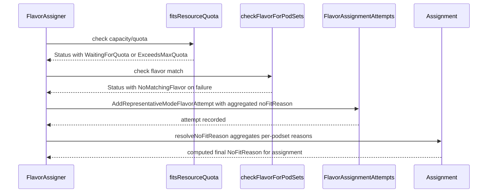

# PR #12378: Add flavor assigner diagnostic reasons for NoFit results

**Summary**: Add flavor assigner diagnostic reasons for NoFit results

**Sources**: https://github.com/kubernetes-sigs/kueue/pull/12378

**Last updated**: 2026-06-22T10:31:43Z

---

## Metadata

- **State**: closed (merged)
- **Author**: [@j-skiba](https://github.com/j-skiba)
- **Branch**: `flavor-assigner-diagnostic-reasons` → `main`
- **Created**: 2026-06-19T10:43:35Z
- **Updated**: 2026-06-22T10:31:43Z
- **Merged**: 2026-06-22T10:31:41Z
- **Closed**: 2026-06-22T10:31:41Z
- **Labels**: `kind/feature`, `lgtm`, `size/XXL`, `release-note-none`, `approved`, `cncf-cla: yes`
- **Assignees**: [@mimowo](https://github.com/mimowo)
- **Requested reviewers**: [@kannon92](https://github.com/kannon92), [@mwielgus](https://github.com/mwielgus), [@sohankunkerkar](https://github.com/sohankunkerkar), [@kshalot](https://github.com/kshalot)
- **Changed files**: 9   **+1056 / -233**

## Description

#### What type of PR is this?
/kind feature

#### What this PR does / why we need it:

This PR implements the scheduler-side logic specified in [KEP-10852](https://github.com/kubernetes-sigs/kueue/blob/main/keps/10852-inadmissible-workloads-observability) to track why a workload cannot fit within any resource flavors. It satisfies the following points from the KEP:

- Distinguish configuration faults vs. normal capacity wait
     - Adds `NoFitReason` tracking to the individual flavor assignment attempts.
     - Classifies attempts as:
          - `NoMatchingFlavor` for structural mismatches (node selectors, taints, or topology constraints).
          - `ExceedsMaxQuota` when exceeding absolute limits (cohort max capacity, or `ClusterQueue` nominal + borrowingLimit).
          - `WaitingForQuota` when waiting for preemption or cohort quota availability.
          - `TopologyPlacementFailed` when TAS placement requirements cannot be satisfied.
- Tiered Reason Precedence & Multi-PodSet Resolution
   - Implements the precedence tiers outlined in [Nominated Flavor Reasons](https://github.com/kubernetes-sigs/kueue/tree/main/keps/10852-inadmissible-workloads-observability#2-nominated-flavor-reasons) using a `reasonSeverity` ranking.
   - Provides `Assignment.resolveNoFitReason()` to calculate the final `NoFitReason` for the workload:
        - Alternatives (within a Resource Group): Resolves to the minimum severity blocker (best chance of success).
        - Co-requisites (across Resource Groups): Resolves to the maximum severity blocker (worst-case blocker).

#### Which issue(s) this PR fixes:
Part of #10852

#### Special notes for your reviewer:

#### Does this PR introduce a user-facing change?
```release-note
NONE
```

> AI assistance disclosure: this change was developed with the assistance of an AI coding tool.

<!-- This is an auto-generated comment: release notes by coderabbit.ai -->
## Summary by CodeRabbit

## Release Notes

* **New Features**
  * Added the `UnadmittedWorkloadsObservability` feature gate to enable more detailed scheduling “no-fit” diagnostics.

* **Bug Fixes**
  * Expanded “no-fit” reason reporting for quota/resource flavor matching and topology placement failures.
  * Improved flavor attribution in topology assignment failure details so returned diagnostics are labeled with the correct flavor.

* **Tests**
  * Updated scheduling diagnostics tests to validate top-level and per-flavor reason fields, including feature-gate on/off behavior.
<!-- end of auto-generated comment: release notes by coderabbit.ai -->

## Discussion

### Comment by [@netlify[bot]](https://github.com/apps/netlify) — 2026-06-19T10:43:40Z

### <span aria-hidden="true">✅</span> Deploy Preview for *kubernetes-sigs-kueue* canceled.


|  Name | Link |
|:-:|------------------------|
|<span aria-hidden="true">🔨</span> Latest commit | 0ab979f265fc2a5c34ea514392aba82cc6ceff4d |
|<span aria-hidden="true">🔍</span> Latest deploy log | https://app.netlify.com/projects/kubernetes-sigs-kueue/deploys/6a390afc7578eb0008de3002 |

### Comment by [@k8s-ci-robot](https://github.com/k8s-ci-robot) — 2026-06-19T10:43:44Z

[APPROVALNOTIFIER] This PR is **NOT APPROVED**

This pull-request has been approved by: *<a href="https://github.com/kubernetes-sigs/kueue/pull/12378#" title="Author self-approved">j-skiba</a>*
**Once this PR has been reviewed and has the lgtm label**, please assign [mbobrovskyi](https://github.com/mbobrovskyi), [mimowo](https://github.com/mimowo), [sohankunkerkar](https://github.com/sohankunkerkar) for approval. For more information see [the Code Review Process](https://git.k8s.io/community/contributors/guide/owners.md#the-code-review-process).

The full list of commands accepted by this bot can be found [here](https://go.k8s.io/bot-commands?repo=kubernetes-sigs%2Fkueue).

<details open>
Needs approval from an approver in each of these files:

- **[OWNERS](https://github.com/kubernetes-sigs/kueue/blob/main/OWNERS)**

Approvers can indicate their approval by writing `/approve` in a comment
Approvers can cancel approval by writing `/approve cancel` in a comment
</details>
<!-- META={"approvers":["mbobrovskyi","mimowo","sohankunkerkar"]} -->

### Comment by [@coderabbitai[bot]](https://github.com/apps/coderabbitai) — 2026-06-19T10:43:49Z

<!-- This is an auto-generated comment: summarize by coderabbit.ai -->
<!-- review_stack_entry_start -->

[](https://app.coderabbit.ai/change-stack/kubernetes-sigs/kueue/pull/12378?utm_source=github_walkthrough&utm_medium=github&utm_campaign=change_stack)

<!-- review_stack_entry_end -->
<!-- This is an auto-generated comment: review paused by coderabbit.ai -->

> [!NOTE]
> ## Reviews paused
> 
> It looks like this branch is under active development. To avoid overwhelming you with review comments due to an influx of new commits, CodeRabbit has automatically paused this review. You can configure this behavior by changing the `reviews.auto_review.auto_pause_after_reviewed_commits` setting.
> 
> Use the following commands to manage reviews:
> - `@coderabbitai resume` to resume automatic reviews.
> - `@coderabbitai review` to trigger a single review.
> 
> Use the checkboxes below for quick actions:
> - [ ] <!-- {"checkboxId": "7f6cc2e2-2e4e-497a-8c31-c9e4573e93d1"} --> ▶️ Resume reviews
> - [ ] <!-- {"checkboxId": "e9bb8d72-00e8-4f67-9cb2-caf3b22574fe"} --> 🔍 Trigger review

<!-- end of auto-generated comment: review paused by coderabbit.ai -->
<!-- walkthrough_start -->

<details>
<summary>📝 Walkthrough</summary>

## Walkthrough

Adds four `WorkloadQuotaReservedReason` constants for structured no-fit diagnostics and one feature gate `UnadmittedWorkloadsObservability`. Extends TAS snapshots with `Flavor` field to carry flavor context through topology failures. Propagates `NoFitReason` through `FlavorAssignmentAttempt` aggregation and flavorassigner core via severity-ranked `mostSevereReason` helpers, computing final `Assignment.NoFitReason` by aggregating per-pod-set and per-resource-group reasons. Comprehensive test updates assert `NoFitReason` across quota, capacity, topology, and structural mismatch scenarios.

## Changes

**NoFitReason observability for unadmitted workloads**

|Layer / File(s)|Summary|
|---|---|
|**API constants and feature gates** <br> `apis/kueue/v1beta2/workload_types.go`, `pkg/features/kube_features.go`, `site/data/featuregates/versioned_feature_list.yaml`, `test/compatibility_lifecycle/reference/versioned_feature_list.yaml`|Adds four exported `WorkloadQuotaReservedReason*` constants: `NoMatchingFlavor`, `WaitingForQuota`, `ExceedsMaxQuota`, and `TopologyPlacementFailed`. Introduces `UnadmittedWorkloadsObservability` feature gate registered as Beta at version 0.19 with `Default: false` and `PreRelease: featuregate.Beta` across feature-gate definitions and documentation.|
|**TAS snapshot Flavor field propagation** <br> `pkg/cache/scheduler/clusterqueue_snapshot.go`, `pkg/cache/scheduler/tas_flavor_snapshot.go`|Replaces `maps.Copy` with explicit loop to stamp each TAS result entry with its source flavor. Extends `FailureInfo` and `tasPodSetAssignmentResult` structs with `Flavor` field so topology placement failures carry flavor context downstream through assignment pipeline.|
|**FlavorAssignmentAttempt NoFitReason and merging** <br> `pkg/scheduler/flavorassigner/flavor_assigner_attempts.go`|Adds `NoFitReason string` field to `FlavorAssignmentAttempt`; conditionally populates it in `AddNoFitFlavorAttempt` and updated `AddRepresentativeModeFlavorAttempt` signature under feature gate. Propagates `NoFitReason` through resource-level merge logic via `mostSevereReason` severity ranking when merging existing and incoming attempts.|
|**Flavorassigner core: Status, Assignment, and NoFitReason aggregation** <br> `pkg/scheduler/flavorassigner/flavorassigner.go`|Extends `Assignment` and `Status` with `NoFitReason` field. Adds `reasonSeverity`/`mostSevereReason` severity-ranking helpers. Updates `fitsResourceQuota` to initialize `WaitingForQuota` and set `ExceedsMaxQuota` on capacity breach. Introduces `resolveNoFitReason`/`findRGIndicesByFlavor` for cross-pod-set aggregation with synthetic negative group fallback. Marks `TopologyPlacementFailed` on specific failing flavor attempts during TAS simulation. Adds `markFlavorAttempt` to propagate reasons into flavor-attempt tracking.|
|**Test updates and TestIsNoFitDueToCapacityAndLimits** <br> `pkg/scheduler/flavorassigner/flavorassigner_test.go`|Refactors `flexAssertConsidered` and `assertPodSetConsideredFlexible` helpers to accept variadic `cmp.Option` for selective field comparison. Updates all `TestAssignFlavors` and `TestDeletedFlavors` expected results to include `NoFitReason` values across quota exhaustion, waiting-for-quota, no-matching-flavor, and TAS placement scenarios, with feature-gate conditional field ignoring when gate is disabled. Adds new table-driven `TestIsNoFitDueToCapacityAndLimits` covering TAS support, topology placement, workload slices, allowed flavor filtering, and sibling cohort capacity cases.|

## Sequence Diagram(s)



## Estimated code review effort

🎯 4 (Complex) | ⏱️ ~75 minutes

## Possibly related PRs

- [kubernetes-sigs/kueue#11720](https://github.com/kubernetes-sigs/kueue/pull/11720): The main PR implements the foundational `WorkloadQuotaReserved` and `WorkloadAdmitted` reason constants for "Inadmissible Workloads Observability" that this PR extends with observability collection and propagation through the scheduler pipeline.

## Suggested labels

`release-note`, `size/L`

## Suggested reviewers

- kannon92
- sohankunkerkar
- tenzen-y
- kshalot

## Poem

> 🐇 A rabbit hops through quota land,
> Checking flavors, reason in hand,
> "No matching!" the bunny cries,
> "ExceedsMaxQuota!" under cloudy skies,
> With TopologyFailed and WaitingForQuota too—
> Every NoFit now has a reason true! 🌸

</details>

<!-- walkthrough_end -->
<!-- pre_merge_checks_walkthrough_start -->

<details>
<summary>🚥 Pre-merge checks | ✅ 4 | ❌ 1</summary>

### ❌ Failed checks (1 warning)

|     Check name     | Status     | Explanation                                                                           | Resolution                                                                         |
| :----------------: | :--------- | :------------------------------------------------------------------------------------ | :--------------------------------------------------------------------------------- |
| Docstring Coverage | ⚠️ Warning | Docstring coverage is 13.33% which is insufficient. The required threshold is 80.00%. | Write docstrings for the functions missing them to satisfy the coverage threshold. |

<details>
<summary>✅ Passed checks (4 passed)</summary>

|         Check name         | Status   | Explanation                                                                                                                                                                                                      |
| :------------------------: | :------- | :--------------------------------------------------------------------------------------------------------------------------------------------------------------------------------------------------------------- |
|      Description Check     | ✅ Passed | Check skipped - CodeRabbit’s high-level summary is enabled.                                                                                                                                                      |
|         Title check        | ✅ Passed | The title 'Add flavor assigner diagnostic reasons for NoFit results' accurately describes the main change: introducing NoFitReason tracking to flavor assignment attempts to diagnose why workloads fail to fit. |
|     Linked Issues check    | ✅ Passed | Check skipped because no linked issues were found for this pull request.                                                                                                                                         |
| Out of Scope Changes check | ✅ Passed | Check skipped because no linked issues were found for this pull request.                                                                                                                                         |

</details>

<sub>✏️ Tip: You can configure your own custom pre-merge checks in the settings.</sub>

</details>

<!-- pre_merge_checks_walkthrough_end -->
<!-- finishing_touch_checkbox_start -->

<details>
<summary>✨ Finishing Touches</summary>

<details>
<summary>🧪 Generate unit tests (beta)</summary>

- [ ] <!-- {"checkboxId": "f47ac10b-58cc-4372-a567-0e02b2c3d479", "radioGroupId": "utg-output-choice-group-unknown_comment_id"} -->   Create PR with unit tests

</details>

</details>

<!-- finishing_touch_checkbox_end -->
<!-- tips_start -->

---

Thanks for using [CodeRabbit](https://coderabbit.ai?utm_source=oss&utm_medium=github&utm_campaign=kubernetes-sigs/kueue&utm_content=12378)! It's free for OSS, and your support helps us grow. If you like it, consider giving us a shout-out.

<details>
<summary>❤️ Share</summary>

- [X](https://twitter.com/intent/tweet?text=I%20just%20used%20%40coderabbitai%20for%20my%20code%20review%2C%20and%20it%27s%20fantastic%21%20It%27s%20free%20for%20OSS%20and%20offers%20a%20free%20trial%20for%20the%20proprietary%20code.%20Check%20it%20out%3A&url=https%3A//coderabbit.ai)
- [Mastodon](https://mastodon.social/share?text=I%20just%20used%20%40coderabbitai%20for%20my%20code%20review%2C%20and%20it%27s%20fantastic%21%20It%27s%20free%20for%20OSS%20and%20offers%20a%20free%20trial%20for%20the%20proprietary%20code.%20Check%20it%20out%3A%20https%3A%2F%2Fcoderabbit.ai)
- [Reddit](https://www.reddit.com/submit?title=Great%20tool%20for%20code%20review%20-%20CodeRabbit&text=I%20just%20used%20CodeRabbit%20for%20my%20code%20review%2C%20and%20it%27s%20fantastic%21%20It%27s%20free%20for%20OSS%20and%20offers%20a%20free%20trial%20for%20proprietary%20code.%20Check%20it%20out%3A%20https%3A//coderabbit.ai)
- [LinkedIn](https://www.linkedin.com/sharing/share-offsite/?url=https%3A%2F%2Fcoderabbit.ai&mini=true&title=Great%20tool%20for%20code%20review%20-%20CodeRabbit&summary=I%20just%20used%20CodeRabbit%20for%20my%20code%20review%2C%20and%20it%27s%20fantastic%21%20It%27s%20free%20for%20OSS%20and%20offers%20a%20free%20trial%20for%20proprietary%20code)

</details>


<sub>Comment `@coderabbitai help` to get the list of available commands and usage tips.</sub>

<!-- tips_end -->

### Comment by [@mimowo](https://github.com/mimowo) — 2026-06-22T10:27:33Z

/lgtm 
/approve
Thank you for the first foundation PR.

### Comment by [@kubernetes-prow[bot]](https://github.com/apps/kubernetes-prow) — 2026-06-22T10:27:42Z

LGTM label has been added.  <details>Git tree hash: 591c728f0e98b1e716b1a20ffbf5f51ea1a62066</details>

### Comment by [@kubernetes-prow[bot]](https://github.com/apps/kubernetes-prow) — 2026-06-22T10:27:45Z

[APPROVALNOTIFIER] This PR is **APPROVED**

This pull-request has been approved by: *<a href="https://github.com/kubernetes-sigs/kueue/pull/12378#" title="Author self-approved">j-skiba</a>*, *<a href="https://github.com/kubernetes-sigs/kueue/pull/12378#issuecomment-4767318386" title="Approved">mimowo</a>*

The full list of commands accepted by this bot can be found [here](https://go.k8s.io/bot-commands?repo=kubernetes-sigs%2Fkueue).

The pull request process is described [here](https://git.k8s.io/community/contributors/guide/owners.md#the-code-review-process)

<details >
Needs approval from an approver in each of these files:

- ~~[OWNERS](https://github.com/kubernetes-sigs/kueue/blob/main/OWNERS)~~ [mimowo]

Approvers can indicate their approval by writing `/approve` in a comment
Approvers can cancel approval by writing `/approve cancel` in a comment
</details>
<!-- META={"approvers":[]} -->

## Reviews

### Review by [@mimowo](https://github.com/mimowo) (commented) — 2026-06-19T10:53:02Z

- **pkg/scheduler/flavorassigner/flavorassigner.go:824** by [@mimowo](https://github.com/mimowo) — 2026-06-19T10:53:02Z
```diff
@@ -761,9 +814,57 @@ func (a *FlavorAssigner) assignFlavors(log logr.Logger, counts []int32) Assignme
 			}
 		}
 	}
+	assignment.resolveNoFitReason(a.cq)
 	return assignment
 }
 
+func (a *Assignment) resolveNoFitReason(cq *schdcache.ClusterQueueSnapshot) {
```

  This logic is already pretty haevy, could we wind it under the new FG?  Also, the new reasons seem like already part of the KEP.

### Review by [@coderabbitai[bot]](https://github.com/apps/coderabbitai) (commented) — 2026-06-19T10:53:47Z

**Actionable comments posted: 1**

<details>
<summary>🤖 Prompt for all review comments with AI agents</summary>

```
Verify each finding against current code. Fix only still-valid issues, skip the
rest with a brief reason, keep changes minimal, and validate.

Inline comments:
In `@pkg/scheduler/flavorassigner/flavorassigner.go`:
- Around line 821-865: The issue is that findRGIndexByFlavor returns only the
first matching ResourceGroup when a flavor spans multiple groups, causing loss
of co-requisite group information during flavor attempt merging in
resolveNoFitReason. This results in less severe overall NoFitReason reporting.
To fix this, either enhance the FlavorAssignmentAttempt structure to carry
ResourceGroup and resource identity information instead of relying on a separate
lookup, or resolve flavor-to-group mappings before merging attempts by flavor to
preserve all relevant group associations and their blockers.
```

</details>

<details>
<summary>🪄 Autofix (Beta)</summary>

Fix all unresolved CodeRabbit comments on this PR:

- [ ] <!-- {"checkboxId": "4b0d0e0a-96d7-4f10-b296-3a18ea78f0b9"} --> Push a commit to this branch (recommended)
- [ ] <!-- {"checkboxId": "ff5b1114-7d8c-49e6-8ac1-43f82af23a33"} --> Create a new PR with the fixes

</details>

---

<details>
<summary>ℹ️ Review info</summary>

<details>
<summary>⚙️ Run configuration</summary>

**Configuration used**: Path: .coderabbit.yaml

**Review profile**: CHILL

**Plan**: Pro

**Run ID**: `0044227c-b97f-4d9d-8b96-d34c7607e554`

</details>

<details>
<summary>📥 Commits</summary>

Reviewing files that changed from the base of the PR and between cff0eca138aa0645c02ad9e84a406bae779ea30c and 973784fa322579e071f9d655e6d07f091db5bff7.

</details>

<details>
<summary>📒 Files selected for processing (6)</summary>

* `apis/kueue/v1beta2/workload_types.go`
* `pkg/cache/scheduler/clusterqueue_snapshot.go`
* `pkg/cache/scheduler/tas_flavor_snapshot.go`
* `pkg/scheduler/flavorassigner/flavor_assigner_attempts.go`
* `pkg/scheduler/flavorassigner/flavorassigner.go`
* `pkg/scheduler/flavorassigner/flavorassigner_test.go`

</details>

</details>

<!-- This is an auto-generated comment by CodeRabbit for review status -->

- **pkg/scheduler/flavorassigner/flavorassigner.go:865** by [@coderabbitai[bot]](https://github.com/apps/coderabbitai) — 2026-06-19T10:53:47Z
```diff
@@ -761,9 +814,57 @@ func (a *FlavorAssigner) assignFlavors(log logr.Logger, counts []int32) Assignme
 			}
 		}
 	}
+	assignment.resolveNoFitReason(a.cq)
 	return assignment
 }
 
+func (a *Assignment) resolveNoFitReason(cq *schdcache.ClusterQueueSnapshot) {
+	if a.RepresentativeMode() != NoFit {
+		return
+	}
+
+	var overallReason string
+
+	for _, ps := range a.PodSets {
+		if len(ps.FlavorAssignmentAttempts) == 0 {
+			overallReason = worstReason(overallReason, kueue.WorkloadQuotaReservedReasonNoMatchingFlavor)
+			continue
+		}
+
+		// Map from resource group index to the minimum severity blocker (alternative flavors) for that group.
+		rgMinReason := make(map[int]string)
+
+		for i, att := range ps.FlavorAssignmentAttempts {
+			r := att.NoFitReason
+			rgIdx := findRGIndexByFlavor(cq, att.Flavor)
+			if rgIdx == -1 {
+				// Special case: flavor not found in any group (e.g. deleted).
+				// Treat it as a unique independent group using a negative index.
+				rgIdx = -1 - i
+			}
+
+			if existing, ok := rgMinReason[rgIdx]; !ok || reasonSeverity(r) < reasonSeverity(existing) {
+				rgMinReason[rgIdx] = r
+			}
+		}
+
+		// Across groups, we take the maximum severity (co-requisites).
+		var podSetReason string
+		for _, reason := range rgMinReason {
+			podSetReason = worstReason(podSetReason, reason)
+		}
+
+		overallReason = worstReason(overallReason, podSetReason)
+	}
+	a.NoFitReason = overallReason
+}
+
+func findRGIndexByFlavor(cq *schdcache.ClusterQueueSnapshot, flavor kueue.ResourceFlavorReference) int {
+	return slices.IndexFunc(cq.ResourceGroups, func(rg schdcache.ResourceGroup) bool {
+		return slices.Contains(rg.Flavors, flavor)
+	})
```

  _⚠️ Potential issue_ | _🟠 Major_ | _🏗️ Heavy lift_
  
  **Preserve ResourceGroup identity when resolving NoFitReason.**
  
  `findRGIndexByFlavor` assigns a flavor to its first ResourceGroup. Since attempts are already merged by flavor, a flavor reused across multiple ResourceGroups can lose a co-requisite group's blocker and report a less severe overall `NoFitReason`. Carry the ResourceGroup/resource identity in `FlavorAssignmentAttempt`, or resolve before merging attempts by flavor. As per coding guidelines, `pkg/scheduler/**/*.go`: “Verify proper handling of resource flavors, cohort borrowing, and preemption policies.”
  
  <details>
  <summary>🤖 Prompt for AI Agents</summary>
  
  ```
  Verify each finding against current code. Fix only still-valid issues, skip the
  rest with a brief reason, keep changes minimal, and validate.
  
  In `@pkg/scheduler/flavorassigner/flavorassigner.go` around lines 821 - 865, The
  issue is that findRGIndexByFlavor returns only the first matching ResourceGroup
  when a flavor spans multiple groups, causing loss of co-requisite group
  information during flavor attempt merging in resolveNoFitReason. This results in
  less severe overall NoFitReason reporting. To fix this, either enhance the
  FlavorAssignmentAttempt structure to carry ResourceGroup and resource identity
  information instead of relying on a separate lookup, or resolve flavor-to-group
  mappings before merging attempts by flavor to preserve all relevant group
  associations and their blockers.
  ```
  
  </details>
  
  <!-- cr-comment:v1:990cb27bf6dd7ea2057f48e6 -->
  
  _Source: Coding guidelines_
  
  <!-- This is an auto-generated comment by CodeRabbit -->
  
  ✅ Addressed in commit 9318f87

### Review by [@j-skiba](https://github.com/j-skiba) (commented) — 2026-06-19T10:54:59Z

- **pkg/scheduler/flavorassigner/flavorassigner.go:824** by [@j-skiba](https://github.com/j-skiba) — 2026-06-19T10:54:59Z
```diff
@@ -761,9 +814,57 @@ func (a *FlavorAssigner) assignFlavors(log logr.Logger, counts []int32) Assignme
 			}
 		}
 	}
+	assignment.resolveNoFitReason(a.cq)
 	return assignment
 }
 
+func (a *Assignment) resolveNoFitReason(cq *schdcache.ClusterQueueSnapshot) {
```

  👍 sounds good, I wasn't sure if introducing FG when the feature is not completely implemented is ok. I will change that

### Review by [@kshalot](https://github.com/kshalot) (commented) — 2026-06-19T11:24:32Z

- **pkg/scheduler/flavorassigner/flavorassigner.go:252** by [@kshalot](https://github.com/kshalot) — 2026-06-19T11:12:40Z
```diff
@@ -246,9 +249,46 @@ func IgnoreUndeclaredResources(quotaCheckStrategy configapi.QuotaCheckStrategy)
 	return features.Enabled(features.QuotaCheckStrategy) && quotaCheckStrategy == configapi.QuotaCheckIgnoreUndeclared
 }
 
+func worstReason(a, b string) string {
```

  I'd consider renaming to something like `mostSevereReason`, because `worst` is not very precise.

- **pkg/scheduler/flavorassigner/flavorassigner.go:285** by [@kshalot](https://github.com/kshalot) — 2026-06-19T11:17:57Z
```diff
@@ -246,9 +249,46 @@ func IgnoreUndeclaredResources(quotaCheckStrategy configapi.QuotaCheckStrategy)
 	return features.Enabled(features.QuotaCheckStrategy) && quotaCheckStrategy == configapi.QuotaCheckIgnoreUndeclared
 }
 
+func worstReason(a, b string) string {
+	if reasonSeverity(a) >= reasonSeverity(b) {
+		return a
+	}
+	return b
+}
+
+func reasonSeverity(reason string) int {
+	switch reason {
+	case kueue.WorkloadQuotaReservedReasonNoMatchingFlavor:
+		return 4
+	case kueue.WorkloadQuotaReservedReasonExceedsMaxQuota:
+		return 3
+	case kueue.WorkloadQuotaReservedReasonWaitingForQuota:
+		return 2
+	case kueue.WorkloadQuotaReservedReasonTopologyPlacementFailed:
+		return 1
+	default:
+		return 0
+	}
+}
+
 type Status struct {
-	reasons []string
-	err     error
+	reasons     []string
+	err         error
+	NoFitReason string
+}
+
+func (s *Status) MarkNoMatchingFlavor() *Status {
+	if s != nil {
+		s.NoFitReason = kueue.WorkloadQuotaReservedReasonNoMatchingFlavor
+	}
+	return s
+}
```

  Nit: We can consider inlining this in the one call-site where it's used. We are currently doing:
  ```
  			flavorStatus.MarkNoMatchingFlavor()
  ```
  which discards the return value and performs the nil check on something that is never nil. If this is useful in the next steps of implementation that feel free to ignore this comment.

### Review by [@j-skiba](https://github.com/j-skiba) (commented) — 2026-06-19T12:50:32Z

- **pkg/scheduler/flavorassigner/flavorassigner.go:285** by [@j-skiba](https://github.com/j-skiba) — 2026-06-19T12:50:32Z
```diff
@@ -246,9 +249,46 @@ func IgnoreUndeclaredResources(quotaCheckStrategy configapi.QuotaCheckStrategy)
 	return features.Enabled(features.QuotaCheckStrategy) && quotaCheckStrategy == configapi.QuotaCheckIgnoreUndeclared
 }
 
+func worstReason(a, b string) string {
+	if reasonSeverity(a) >= reasonSeverity(b) {
+		return a
+	}
+	return b
+}
+
+func reasonSeverity(reason string) int {
+	switch reason {
+	case kueue.WorkloadQuotaReservedReasonNoMatchingFlavor:
+		return 4
+	case kueue.WorkloadQuotaReservedReasonExceedsMaxQuota:
+		return 3
+	case kueue.WorkloadQuotaReservedReasonWaitingForQuota:
+		return 2
+	case kueue.WorkloadQuotaReservedReasonTopologyPlacementFailed:
+		return 1
+	default:
+		return 0
+	}
+}
+
 type Status struct {
-	reasons []string
-	err     error
+	reasons     []string
+	err         error
+	NoFitReason string
+}
+
+func (s *Status) MarkNoMatchingFlavor() *Status {
+	if s != nil {
+		s.NoFitReason = kueue.WorkloadQuotaReservedReasonNoMatchingFlavor
+	}
+	return s
+}
```

  we can drop this function. I removed that

### Review by [@j-skiba](https://github.com/j-skiba) (commented) — 2026-06-19T12:50:52Z

- **pkg/scheduler/flavorassigner/flavorassigner.go:252** by [@j-skiba](https://github.com/j-skiba) — 2026-06-19T12:50:52Z
```diff
@@ -246,9 +249,46 @@ func IgnoreUndeclaredResources(quotaCheckStrategy configapi.QuotaCheckStrategy)
 	return features.Enabled(features.QuotaCheckStrategy) && quotaCheckStrategy == configapi.QuotaCheckIgnoreUndeclared
 }
 
+func worstReason(a, b string) string {
```

  I agree, it sounds better, renamed

### Review by [@j-skiba](https://github.com/j-skiba) (commented) — 2026-06-19T12:51:41Z

- **pkg/scheduler/flavorassigner/flavorassigner.go:824** by [@j-skiba](https://github.com/j-skiba) — 2026-06-19T12:51:41Z
```diff
@@ -761,9 +814,57 @@ func (a *FlavorAssigner) assignFlavors(log logr.Logger, counts []int32) Assignme
 			}
 		}
 	}
+	assignment.resolveNoFitReason(a.cq)
 	return assignment
 }
 
+func (a *Assignment) resolveNoFitReason(cq *schdcache.ClusterQueueSnapshot) {
```

  I added the FGs. I disabled them by default for now as the feature is not fully implemented, is that ok?

### Review by [@coderabbitai[bot]](https://github.com/apps/coderabbitai) (commented) — 2026-06-19T12:58:38Z


> [!CAUTION]
> Some comments are outside the diff and can’t be posted inline due to platform limitations.
> 
> 
> 
> <details>
> <summary>⚠️ Outside diff range comments (1)</summary><blockquote>
> 
> <details>
> <summary>pkg/scheduler/flavorassigner/flavorassigner.go (1)</summary><blockquote>
> 
> `822-853`: _⚠️ Potential issue_ | _🟠 Major_ | _⚡ Quick win_
> 
> **Exclude non-blocking pod sets/attempts from `resolveNoFitReason` aggregation.**
> 
> At **Line 822** and **Line 831**, aggregation currently includes pod sets/attempts that are not actually `NoFit` blockers. Because preempt/fit paths can still carry reason strings, `mostSevereReason` can select a higher-severity reason unrelated to why the assignment ended as `NoFit`.
> 
> 
> 
> 
> <details>
> <summary>Suggested fix</summary>
> 
> ```diff
>  func (a *Assignment) resolveNoFitReason(cq *schdcache.ClusterQueueSnapshot) {
>  	if a.RepresentativeMode() != NoFit {
>  		return
>  	}
> 
>  	var overallReason string
> 
>  	for _, ps := range a.PodSets {
> +		// Only podsets that actually contribute a NoFit decision should participate.
> +		psBlocks := len(ps.Flavors) == 0
> +		if !psBlocks {
> +			for _, fa := range ps.Flavors {
> +				if fa != nil && fa.Mode == NoFit {
> +					psBlocks = true
> +					break
> +				}
> +			}
> +		}
> +		if !psBlocks {
> +			continue
> +		}
> +
>  		if len(ps.FlavorAssignmentAttempts) == 0 {
>  			overallReason = mostSevereReason(overallReason, kueue.WorkloadQuotaReservedReasonNoMatchingFlavor)
>  			continue
>  		}
> 
>  		rgMinReason := make(map[int]string)
> 
>  		for i, att := range ps.FlavorAssignmentAttempts {
> +			if att.Mode != NoFit || att.NoFitReason == "" {
> +				continue
> +			}
>  			r := att.NoFitReason
>  			rgIndices := findRGIndicesByFlavor(cq, att.Flavor)
>  			if len(rgIndices) == 0 {
>  				rgIndices = []int{-1 - i}
>  			}
> ```
> </details>
> As per coding guidelines, `pkg/scheduler/**/*.go` requires scheduling correctness validation around flavor handling and preemption outcomes.
> 
> <details>
> <summary>🤖 Prompt for AI Agents</summary>
> 
> ```
> Verify each finding against current code. Fix only still-valid issues, skip the
> rest with a brief reason, keep changes minimal, and validate.
> 
> In `@pkg/scheduler/flavorassigner/flavorassigner.go` around lines 822 - 853, The
> aggregation logic in the loop starting at line 822 that iterates through PodSets
> and line 831 that processes FlavorAssignmentAttempts includes reasons from
> attempts that may not be actual NoFit blockers, allowing unrelated
> higher-severity reasons from preempt or fit paths to incorrectly influence the
> final outcome. Add a check to skip pod sets and attempts that are not NoFit
> blockers before aggregating their reasons into rgMinReason and podSetReason
> using mostSevereReason, similar to how empty FlavorAssignmentAttempts are
> already skipped at line 824.
> ```
> 
> </details>
> 
> <!-- cr-comment:v1:dd7ad0eea173c3fa877e83d8 -->
> 
> _Source: Coding guidelines_
> 
> </blockquote></details>
> 
> </blockquote></details>

<details>
<summary>🤖 Prompt for all review comments with AI agents</summary>

```
Verify each finding against current code. Fix only still-valid issues, skip the
rest with a brief reason, keep changes minimal, and validate.

Outside diff comments:
In `@pkg/scheduler/flavorassigner/flavorassigner.go`:
- Around line 822-853: The aggregation logic in the loop starting at line 822
that iterates through PodSets and line 831 that processes
FlavorAssignmentAttempts includes reasons from attempts that may not be actual
NoFit blockers, allowing unrelated higher-severity reasons from preempt or fit
paths to incorrectly influence the final outcome. Add a check to skip pod sets
and attempts that are not NoFit blockers before aggregating their reasons into
rgMinReason and podSetReason using mostSevereReason, similar to how empty
FlavorAssignmentAttempts are already skipped at line 824.
```

</details>

---

<details>
<summary>ℹ️ Review info</summary>

<details>
<summary>⚙️ Run configuration</summary>

**Configuration used**: Path: .coderabbit.yaml

**Review profile**: CHILL

**Plan**: Pro

**Run ID**: `76c4d555-f92d-4b21-9fed-f1c4bc23687c`

</details>

<details>
<summary>📥 Commits</summary>

Reviewing files that changed from the base of the PR and between 973784fa322579e071f9d655e6d07f091db5bff7 and 9318f87c257da51e8057943746eba4394e4938f0.

</details>

<details>
<summary>📒 Files selected for processing (5)</summary>

* `apis/kueue/v1beta2/workload_types.go`
* `pkg/features/kube_features.go`
* `pkg/scheduler/flavorassigner/flavor_assigner_attempts.go`
* `pkg/scheduler/flavorassigner/flavorassigner.go`
* `pkg/scheduler/flavorassigner/flavorassigner_test.go`

</details>

<details>
<summary>🚧 Files skipped from review as they are similar to previous changes (1)</summary>

* pkg/scheduler/flavorassigner/flavorassigner_test.go

</details>

</details>

<!-- This is an auto-generated comment by CodeRabbit for review status -->

### Review by [@mimowo](https://github.com/mimowo) (commented) — 2026-06-19T13:55:46Z

- **pkg/scheduler/flavorassigner/flavorassigner.go:824** by [@mimowo](https://github.com/mimowo) — 2026-06-19T13:55:46Z
```diff
@@ -761,9 +814,57 @@ func (a *FlavorAssigner) assignFlavors(log logr.Logger, counts []int32) Assignme
 			}
 		}
 	}
+	assignment.resolveNoFitReason(a.cq)
 	return assignment
 }
 
+func (a *Assignment) resolveNoFitReason(cq *schdcache.ClusterQueueSnapshot) {
```

  sgtm, we can update to Beta once the feature is fully done, before 0.19

### Review by [@kshalot](https://github.com/kshalot) (commented) — 2026-06-19T15:12:23Z

- **pkg/features/kube_features.go:703** by [@kshalot](https://github.com/kshalot) — 2026-06-19T15:12:24Z
```diff
@@ -680,6 +695,12 @@ var defaultVersionedFeatureGates = map[featuregate.Feature]featuregate.Versioned
 	TASHandleOverlappingFlavors: {
 		{Version: version.MustParse("0.18"), Default: true, PreRelease: featuregate.Beta},
 	},
+	UnadmittedWorkloadsObservability: {
+		{Version: version.MustParse("0.19"), Default: false, PreRelease: featuregate.Beta},
+	},
+	UnadmittedWorkloadsExplicitStatus: {
+		{Version: version.MustParse("0.19"), Default: false, PreRelease: featuregate.Beta},
+	},
```

  Should we start with alpha or beta?

### Review by [@mimowo](https://github.com/mimowo) (commented) — 2026-06-19T17:17:01Z

- **pkg/scheduler/flavorassigner/flavorassigner.go:270** by [@mimowo](https://github.com/mimowo) — 2026-06-19T17:17:01Z
```diff
@@ -246,9 +249,32 @@ func IgnoreUndeclaredResources(quotaCheckStrategy configapi.QuotaCheckStrategy)
 	return features.Enabled(features.QuotaCheckStrategy) && quotaCheckStrategy == configapi.QuotaCheckIgnoreUndeclared
 }
 
+func mostSevereReason(a, b string) string {
+	if reasonSeverity(a) >= reasonSeverity(b) {
+		return a
+	}
+	return b
+}
+
+func reasonSeverity(reason string) int {
+	switch reason {
+	case kueue.WorkloadQuotaReservedReasonNoMatchingFlavor:
+		return 4
+	case kueue.WorkloadQuotaReservedReasonExceedsMaxQuota:
+		return 3
+	case kueue.WorkloadQuotaReservedReasonWaitingForQuota:
+		return 2
+	case kueue.WorkloadQuotaReservedReasonTopologyPlacementFailed:
+		return 1
+	default:
+		return 0
```

  Maybe we can use iota for the named constants representing the numbers?

### Review by [@mimowo](https://github.com/mimowo) (commented) — 2026-06-19T17:22:18Z

- **apis/kueue/v1beta2/workload_types.go:941** by [@mimowo](https://github.com/mimowo) — 2026-06-19T17:22:18Z
```diff
@@ -938,6 +938,53 @@ const (
 	// WorkloadQuotaReserved means that the Workload has reserved quota a ClusterQueue.
 	WorkloadQuotaReserved = "QuotaReserved"
 
+	// Reasons for the WorkloadQuotaReserved condition.
```

  Would it be feasible to break it down into smaller PRs to make the review easier? We can keep this full PR, but I'm wondering about such steps:
  
  1. UnadmittedWorkloadsExplicitStatus together with support
  2. UnadmittedWorkloadsObservability exdended for flavor nominated reaons
  3. UnadmittedWorkloadsObservability introduced for flavor-independent reasons
  
  Another order would also be fine. wdyt? I think it it much easier for bugs to slip in larger PRs

### Review by [@mwielgus](https://github.com/mwielgus) (commented) — 2026-06-19T18:56:51Z

- **apis/kueue/v1beta2/workload_types.go:961** by [@mwielgus](https://github.com/mwielgus) — 2026-06-19T18:56:46Z
```diff
@@ -938,6 +938,53 @@ const (
 	// WorkloadQuotaReserved means that the Workload has reserved quota a ClusterQueue.
 	WorkloadQuotaReserved = "QuotaReserved"
 
+	// Reasons for the WorkloadQuotaReserved condition.
+
+	// WorkloadQuotaReservedReasonNoMatchingFlavor indicates that the workload cannot be scheduled
+	// because no resource flavor matches its nodeSelector or taints.
+	WorkloadQuotaReservedReasonNoMatchingFlavor = "NoMatchingFlavor"
+
+	// WorkloadQuotaReservedReasonWaitingForQuota indicates that the workload is waiting for
+	// sufficient unused quota to become available in the ClusterQueue/Cohort.
+	WorkloadQuotaReservedReasonWaitingForQuota = "WaitingForQuota"
+
+	// WorkloadQuotaReservedReasonExceedsMaxQuota indicates that the workload requests resources
+	// exceeding the maximum capacity limits of the ClusterQueue or Cohort.
+	// This also includes exceeding ClusterQueue nominal + borrowingLimit constraints.
+	WorkloadQuotaReservedReasonExceedsMaxQuota = "ExceedsMaxQuota"
+
+	// WorkloadQuotaReservedReasonTopologyPlacementFailed indicates that the workload has topology
+	// requirements that cannot be satisfied with the current cluster topology usage.
+	WorkloadQuotaReservedReasonTopologyPlacementFailed = "TopologyPlacementFailed"
+
+	// WorkloadQuotaReservedReasonWaitingForPreemptedWorkloads indicates that the workload is waiting
+	// for preempted workloads to release their quota.
```

  What about waiting for Topology (for topology-driven preemptions)?

### Review by [@j-skiba](https://github.com/j-skiba) (commented) — 2026-06-22T07:44:19Z

- **apis/kueue/v1beta2/workload_types.go:941** by [@j-skiba](https://github.com/j-skiba) — 2026-06-22T07:44:19Z
```diff
@@ -938,6 +938,53 @@ const (
 	// WorkloadQuotaReserved means that the Workload has reserved quota a ClusterQueue.
 	WorkloadQuotaReserved = "QuotaReserved"
 
+	// Reasons for the WorkloadQuotaReserved condition.
```

  I was thinking to do something like this in separate PRs:
  1. this branch - just assigning `NoFit` reasons for flavor dependent causes
  2. surfacing the reasons introduced in this PR. It will be mostly changes in scheduler.go and adjustment to unit tests of the scheduler. The tests would be run with the `UnadmittedWorkloadsObservability` FG disabled and then enabled.
  3. handling the rest of the reasons. That will be mostly changes in workload_controller.go and tests - both unit and integration tests
  4. add support for `UnadmittedWorkloadsExplicitStatus`
  5. add metrics
  6. enabled FGs by default

### Review by [@j-skiba](https://github.com/j-skiba) (commented) — 2026-06-22T08:00:48Z

- **apis/kueue/v1beta2/workload_types.go:941** by [@j-skiba](https://github.com/j-skiba) — 2026-06-22T08:00:48Z
```diff
@@ -938,6 +938,53 @@ const (
 	// WorkloadQuotaReserved means that the Workload has reserved quota a ClusterQueue.
 	WorkloadQuotaReserved = "QuotaReserved"
 
+	// Reasons for the WorkloadQuotaReserved condition.
```

  and
  7. backport to 0.18

### Review by [@mimowo](https://github.com/mimowo) (commented) — 2026-06-22T08:01:46Z

- **apis/kueue/v1beta2/workload_types.go:941** by [@mimowo](https://github.com/mimowo) — 2026-06-22T08:01:46Z
```diff
@@ -938,6 +938,53 @@ const (
 	// WorkloadQuotaReserved means that the Workload has reserved quota a ClusterQueue.
 	WorkloadQuotaReserved = "QuotaReserved"
 
+	// Reasons for the WorkloadQuotaReserved condition.
```

  This sounds reasonable. So, IIUC in this PR we just introduce the reason and the logic for their aggregation, but without surfacing them to the user level yet, right?
  
  So my questions would be:
  - does the PR have some  user-observable impact already? 
  - what is the testing plan for the various cases, could we test them already by asserting on messages?

### Review by [@mimowo](https://github.com/mimowo) (commented) — 2026-06-22T08:09:03Z

- **apis/kueue/v1beta2/workload_types.go:966** by [@mimowo](https://github.com/mimowo) — 2026-06-22T08:09:03Z
```diff
@@ -938,6 +938,53 @@ const (
 	// WorkloadQuotaReserved means that the Workload has reserved quota a ClusterQueue.
 	WorkloadQuotaReserved = "QuotaReserved"
 
+	// Reasons for the WorkloadQuotaReserved condition.
+
+	// WorkloadQuotaReservedReasonNoMatchingFlavor indicates that the workload cannot be scheduled
+	// because no resource flavor matches its nodeSelector or taints.
+	WorkloadQuotaReservedReasonNoMatchingFlavor = "NoMatchingFlavor"
+
+	// WorkloadQuotaReservedReasonWaitingForQuota indicates that the workload is waiting for
+	// sufficient unused quota to become available in the ClusterQueue/Cohort.
+	WorkloadQuotaReservedReasonWaitingForQuota = "WaitingForQuota"
+
+	// WorkloadQuotaReservedReasonExceedsMaxQuota indicates that the workload requests resources
+	// exceeding the maximum capacity limits of the ClusterQueue or Cohort.
+	// This also includes exceeding ClusterQueue nominal + borrowingLimit constraints.
+	WorkloadQuotaReservedReasonExceedsMaxQuota = "ExceedsMaxQuota"
+
+	// WorkloadQuotaReservedReasonTopologyPlacementFailed indicates that the workload has topology
+	// requirements that cannot be satisfied with the current cluster topology usage.
+	WorkloadQuotaReservedReasonTopologyPlacementFailed = "TopologyPlacementFailed"
+
+	// WorkloadQuotaReservedReasonWaitingForPreemptedWorkloads indicates that the workload is waiting
+	// for preempted workloads to release their quota.
+	WorkloadQuotaReservedReasonWaitingForPreemptedWorkloads = "WaitingForPreemptedWorkloads"
+
+	// WorkloadQuotaReservedReasonMisconfigured indicates that the workload is inadmissible due to
+	// misconfiguration, such as missing LocalQueue or ClusterQueue.
+	WorkloadQuotaReservedReasonMisconfigured = "Misconfigured"
```

  This looks unused for now. Let's drop the unused ones out, so that we don't forget to add tests for them once they become used.

### Review by [@j-skiba](https://github.com/j-skiba) (commented) — 2026-06-22T08:12:19Z

- **apis/kueue/v1beta2/workload_types.go:941** by [@j-skiba](https://github.com/j-skiba) — 2026-06-22T08:12:19Z
```diff
@@ -938,6 +938,53 @@ const (
 	// WorkloadQuotaReserved means that the Workload has reserved quota a ClusterQueue.
 	WorkloadQuotaReserved = "QuotaReserved"
 
+	// Reasons for the WorkloadQuotaReserved condition.
```

  > This sounds reasonable. So, IIUC in this PR we just introduce the reason and the logic for their aggregation, but without surfacing them to the user level yet, right?
  
  that's correct.
  
  > does the PR have some user-observable impact already?
  
  no, there's no yet
  
  > what is the testing plan for the various cases, could we test them already by asserting on messages?
  
  I have a plan for PRs 2 and 3 to include a separate field `wantConditionsWithUnadmittedWorkloadsFG` (or something like this) for the already existing unit tests we have and run them once with enabled and once with disabled. It would be kind of similar what we do with `WorkloadRequestUseMergePatch`. For integration tests I think we could modify the already existing ones and implement some new ones to improve coverage.

### Review by [@j-skiba](https://github.com/j-skiba) (commented) — 2026-06-22T08:28:12Z

- **apis/kueue/v1beta2/workload_types.go:961** by [@j-skiba](https://github.com/j-skiba) — 2026-06-22T08:28:12Z
```diff
@@ -938,6 +938,53 @@ const (
 	// WorkloadQuotaReserved means that the Workload has reserved quota a ClusterQueue.
 	WorkloadQuotaReserved = "QuotaReserved"
 
+	// Reasons for the WorkloadQuotaReserved condition.
+
+	// WorkloadQuotaReservedReasonNoMatchingFlavor indicates that the workload cannot be scheduled
+	// because no resource flavor matches its nodeSelector or taints.
+	WorkloadQuotaReservedReasonNoMatchingFlavor = "NoMatchingFlavor"
+
+	// WorkloadQuotaReservedReasonWaitingForQuota indicates that the workload is waiting for
+	// sufficient unused quota to become available in the ClusterQueue/Cohort.
+	WorkloadQuotaReservedReasonWaitingForQuota = "WaitingForQuota"
+
+	// WorkloadQuotaReservedReasonExceedsMaxQuota indicates that the workload requests resources
+	// exceeding the maximum capacity limits of the ClusterQueue or Cohort.
+	// This also includes exceeding ClusterQueue nominal + borrowingLimit constraints.
+	WorkloadQuotaReservedReasonExceedsMaxQuota = "ExceedsMaxQuota"
+
+	// WorkloadQuotaReservedReasonTopologyPlacementFailed indicates that the workload has topology
+	// requirements that cannot be satisfied with the current cluster topology usage.
+	WorkloadQuotaReservedReasonTopologyPlacementFailed = "TopologyPlacementFailed"
+
+	// WorkloadQuotaReservedReasonWaitingForPreemptedWorkloads indicates that the workload is waiting
+	// for preempted workloads to release their quota.
```

  yes, it should be there. For now I removed that completely as it wasn't used in the PR. I will update it in the following PRs

### Review by [@j-skiba](https://github.com/j-skiba) (commented) — 2026-06-22T08:29:14Z

- **apis/kueue/v1beta2/workload_types.go:966** by [@j-skiba](https://github.com/j-skiba) — 2026-06-22T08:29:13Z
```diff
@@ -938,6 +938,53 @@ const (
 	// WorkloadQuotaReserved means that the Workload has reserved quota a ClusterQueue.
 	WorkloadQuotaReserved = "QuotaReserved"
 
+	// Reasons for the WorkloadQuotaReserved condition.
+
+	// WorkloadQuotaReservedReasonNoMatchingFlavor indicates that the workload cannot be scheduled
+	// because no resource flavor matches its nodeSelector or taints.
+	WorkloadQuotaReservedReasonNoMatchingFlavor = "NoMatchingFlavor"
+
+	// WorkloadQuotaReservedReasonWaitingForQuota indicates that the workload is waiting for
+	// sufficient unused quota to become available in the ClusterQueue/Cohort.
+	WorkloadQuotaReservedReasonWaitingForQuota = "WaitingForQuota"
+
+	// WorkloadQuotaReservedReasonExceedsMaxQuota indicates that the workload requests resources
+	// exceeding the maximum capacity limits of the ClusterQueue or Cohort.
+	// This also includes exceeding ClusterQueue nominal + borrowingLimit constraints.
+	WorkloadQuotaReservedReasonExceedsMaxQuota = "ExceedsMaxQuota"
+
+	// WorkloadQuotaReservedReasonTopologyPlacementFailed indicates that the workload has topology
+	// requirements that cannot be satisfied with the current cluster topology usage.
+	WorkloadQuotaReservedReasonTopologyPlacementFailed = "TopologyPlacementFailed"
+
+	// WorkloadQuotaReservedReasonWaitingForPreemptedWorkloads indicates that the workload is waiting
+	// for preempted workloads to release their quota.
+	WorkloadQuotaReservedReasonWaitingForPreemptedWorkloads = "WaitingForPreemptedWorkloads"
+
+	// WorkloadQuotaReservedReasonMisconfigured indicates that the workload is inadmissible due to
+	// misconfiguration, such as missing LocalQueue or ClusterQueue.
+	WorkloadQuotaReservedReasonMisconfigured = "Misconfigured"
```

  removed unused reasons and `UnadmittedWorkloadsExplicitStatus` FG

### Review by [@j-skiba](https://github.com/j-skiba) (commented) — 2026-06-22T08:29:29Z

- **pkg/scheduler/flavorassigner/flavorassigner.go:270** by [@j-skiba](https://github.com/j-skiba) — 2026-06-22T08:29:29Z
```diff
@@ -246,9 +249,32 @@ func IgnoreUndeclaredResources(quotaCheckStrategy configapi.QuotaCheckStrategy)
 	return features.Enabled(features.QuotaCheckStrategy) && quotaCheckStrategy == configapi.QuotaCheckIgnoreUndeclared
 }
 
+func mostSevereReason(a, b string) string {
+	if reasonSeverity(a) >= reasonSeverity(b) {
+		return a
+	}
+	return b
+}
+
+func reasonSeverity(reason string) int {
+	switch reason {
+	case kueue.WorkloadQuotaReservedReasonNoMatchingFlavor:
+		return 4
+	case kueue.WorkloadQuotaReservedReasonExceedsMaxQuota:
+		return 3
+	case kueue.WorkloadQuotaReservedReasonWaitingForQuota:
+		return 2
+	case kueue.WorkloadQuotaReservedReasonTopologyPlacementFailed:
+		return 1
+	default:
+		return 0
```

  done

### Review by [@j-skiba](https://github.com/j-skiba) (commented) — 2026-06-22T08:30:29Z

- **pkg/features/kube_features.go:703** by [@j-skiba](https://github.com/j-skiba) — 2026-06-22T08:30:29Z
```diff
@@ -680,6 +695,12 @@ var defaultVersionedFeatureGates = map[featuregate.Feature]featuregate.Versioned
 	TASHandleOverlappingFlavors: {
 		{Version: version.MustParse("0.18"), Default: true, PreRelease: featuregate.Beta},
 	},
+	UnadmittedWorkloadsObservability: {
+		{Version: version.MustParse("0.19"), Default: false, PreRelease: featuregate.Beta},
+	},
+	UnadmittedWorkloadsExplicitStatus: {
+		{Version: version.MustParse("0.19"), Default: false, PreRelease: featuregate.Beta},
+	},
```

  we start with beta - https://github.com/kubernetes-sigs/kueue/tree/main/keps/10852-inadmissible-workloads-observability#api-and-backwards-compatibility
  
  but later we backport as alpha to 0.18

### Review by [@mimowo](https://github.com/mimowo) (commented) — 2026-06-22T09:55:26Z

- **pkg/scheduler/flavorassigner/flavorassigner_test.go:5177** by [@mimowo](https://github.com/mimowo) — 2026-06-22T09:55:27Z
```diff
@@ -4934,3 +5090,473 @@ func TestAssignFlavorsWithAllowedFlavors(t *testing.T) {
 		})
 	}
 }
+
+func TestIsNoFitDueToCapacityAndLimits(t *testing.T) {
+	resourceFlavors := map[kueue.ResourceFlavorReference]*kueue.ResourceFlavor{
+		"flavor-a": utiltestingapi.MakeResourceFlavor("flavor-a").NodeLabel("type", "a").Obj(),
+		"flavor-b": utiltestingapi.MakeResourceFlavor("flavor-b").
+			Taint(corev1.Taint{
+				Key:    "key",
+				Value:  "val",
+				Effect: corev1.TaintEffectNoSchedule,
+			}).Obj(),
+		"flavor-tas": utiltestingapi.MakeResourceFlavor("flavor-tas").TopologyName("topology-tas").Obj(),
+	}
+
+	cq := *utiltestingapi.MakeClusterQueue("cq").
+		ResourceGroup(
+			*utiltestingapi.MakeFlavorQuotas("flavor-a").Resource(corev1.ResourceCPU, "2", "4").Obj(),
+			*utiltestingapi.MakeFlavorQuotas("flavor-b").Resource(corev1.ResourceCPU, "2", "4").Obj(),
+		).Obj()
+
+	tasCQ := utiltestingapi.MakeClusterQueue("cq-tas").
+		ResourceGroup(
+			*utiltestingapi.MakeFlavorQuotas("flavor-a").Resource(corev1.ResourceCPU, "2", "2").Obj(),
+			*utiltestingapi.MakeFlavorQuotas("flavor-b").Resource(corev1.ResourceCPU, "2", "2").Obj(),
+			*utiltestingapi.MakeFlavorQuotas("flavor-tas").Resource(corev1.ResourceCPU, "2", "2").Obj(),
+		).Obj()
+	tasFlavors := map[kueue.ResourceFlavorReference]*kueue.ResourceFlavor{
+		"flavor-a":   resourceFlavors["flavor-a"],
+		"flavor-b":   resourceFlavors["flavor-b"],
+		"flavor-tas": resourceFlavors["flavor-tas"],
+	}
+
+	sharedCQ := *utiltestingapi.MakeClusterQueue("shared-cq").
+		Cohort("cohort").
+		ResourceGroup(
+			*utiltestingapi.MakeFlavorQuotas("flavor-shared").Resource(corev1.ResourceCPU, "2", "4").Obj(),
+			*utiltestingapi.MakeFlavorQuotas("flavor-a").Resource(corev1.ResourceCPU, "2", "4").Obj(),
+		).
+		ResourceGroup(
+			*utiltestingapi.MakeFlavorQuotas("flavor-shared").Resource(corev1.ResourceMemory, "2Gi", "4Gi").Obj(),
+		).Obj()
+
+	siblingCQ := utiltestingapi.MakeClusterQueue("sibling").
+		Cohort("cohort").
+		ResourceGroup(
+			*utiltestingapi.MakeFlavorQuotas("flavor-shared").Resource(corev1.ResourceCPU, "2", "2").Obj(),
+			*utiltestingapi.MakeFlavorQuotas("flavor-a").Resource(corev1.ResourceCPU, "2", "2").Obj(),
+		).
+		ResourceGroup(
+			*utiltestingapi.MakeFlavorQuotas("flavor-shared").Resource(corev1.ResourceMemory, "2Gi", "2Gi").Obj(),
+		).Obj()
+
+	sharedFlavors := map[kueue.ResourceFlavorReference]*kueue.ResourceFlavor{
+		"flavor-shared": utiltestingapi.MakeResourceFlavor("flavor-shared").NodeLabel("type", "shared").Obj(),
+		"flavor-a":      utiltestingapi.MakeResourceFlavor("flavor-a").NodeLabel("type", "a").Obj(),
+	}
+
+	tests := map[string]struct {
+		podSet             kueue.PodSet
+		cq                 *kueue.ClusterQueue
+		siblingCQs         []*kueue.ClusterQueue
+		resourceFlavors    map[kueue.ResourceFlavorReference]*kueue.ResourceFlavor
+		cqUsage            resources.FlavorResourceQuantities
+		siblingCQUsage     map[kueue.ClusterQueueReference]resources.FlavorResourceQuantities
+		replaceWl          *workload.Info
+		topologies         []*kueue.Topology
+		allowedFlavors     []kueue.ResourceFlavorReference
+		featureGates       map[featuregate.Feature]bool
+		simulationResult   map[resources.FlavorResource]simulationResultForFlavor
+		wantNoFitReason    string
+		wantFlavorAttempts map[kueue.ResourceFlavorReference]string
+	}{
+		"succeeds to schedule on flavor-a": {
+			podSet:          *utiltestingapi.MakePodSet("main", 1).Request(corev1.ResourceCPU, "1").Obj(),
+			wantNoFitReason: "",
+			wantFlavorAttempts: map[kueue.ResourceFlavorReference]string{
+				"flavor-a": "",
+				"flavor-b": "NoMatchingFlavor",
+			},
+		},
+		"insufficient quota": {
+			podSet:          *utiltestingapi.MakePodSet("main", 1).Request(corev1.ResourceCPU, "3").Obj(),
+			wantNoFitReason: "ExceedsMaxQuota",
+			wantFlavorAttempts: map[kueue.ResourceFlavorReference]string{
+				"flavor-a": "ExceedsMaxQuota",
+				"flavor-b": "NoMatchingFlavor",
```

  This makes me wonder there is something off with "NoMatchingFlavor" - because "NoMatchingFlavor" is surfaced per flavor, but it only makes sense as a global property.
  
  Maybe we we need two reasons:
  - NonMatchingFlavor - per flavor
  - NoMatchingFlavor / Misconfigured - aggregated reason when all are NonMatchingFlavor
  
  wdyt?

### Review by [@mimowo](https://github.com/mimowo) (commented) — 2026-06-22T09:56:20Z

- **pkg/scheduler/flavorassigner/flavorassigner_test.go:3505** by [@mimowo](https://github.com/mimowo) — 2026-06-22T09:56:20Z
```diff
@@ -3369,90 +3415,186 @@ func TestAssignFlavors(t *testing.T) {
 				}},
 			},
 		},
-	}
-	for name, tc := range cases {
-		t.Run(name, func(t *testing.T) {
-			ctx, log := utiltesting.ContextWithLog(t)
-			for fg, enabled := range tc.featureGates {
-				features.SetFeatureGateDuringTest(t, fg, enabled)
-			}
-			wlInfo := workload.NewInfo(&kueue.Workload{
-				Spec: kueue.WorkloadSpec{
-					PodSets: tc.wlPods,
+		"multi-podset, one fits and another fails, fitting podset attempts skipped in resolveNoFitReason": {
+			wlPods: []kueue.PodSet{
+				*utiltestingapi.MakePodSet("fitting-podset", 1).
+					Request(corev1.ResourceCPU, "1").
+					NodeSelector(map[string]string{"type": "one"}).
+					Obj(),
+				*utiltestingapi.MakePodSet("blocking-podset", 1).
+					Request(corev1.ResourceCPU, "5").
+					Obj(),
+			},
+			clusterQueue: *utiltestingapi.MakeClusterQueue("test-clusterqueue").
+				ResourceGroup(
+					*utiltestingapi.MakeFlavorQuotas("one").
+						Resource(corev1.ResourceCPU, "2").
+						Obj(),
+					*utiltestingapi.MakeFlavorQuotas("two").
+						Resource(corev1.ResourceCPU, "2").
+						Obj(),
+				).Obj(),
+			wantRepMode: NoFit,
+			wantAssignment: Assignment{
+				NoFitReason: "ExceedsMaxQuota",
+				PodSets: []PodSetAssignment{
+					{
+						Name: "fitting-podset",
+						Flavors: ResourceAssignment{
+							corev1.ResourceCPU: {Name: "one", Mode: Fit, TriedFlavorIdx: 0},
+						},
+						Requests: corev1.ResourceList{
+							corev1.ResourceCPU: resource.MustParse("1"),
+						},
+						Count: 1,
+						FlavorAssignmentAttempts: []FlavorAssignmentAttempt{
+							{
+								Flavor: "one",
+								Mode:   Fit,
+							},
+							{
+								Flavor:      "two",
+								Mode:        NoFit,
+								NoFitReason: "NoMatchingFlavor",
+							},
+						},
+					},
+					{
+						Name: "blocking-podset",
+						Status: Status{
+							reasons: []string{
+								"insufficient quota for cpu in flavor one, previously considered podsets requests (1) + current podset request (5) > maximum capacity (2)",
+								"insufficient quota for cpu in flavor two, previously considered podsets requests (0) + current podset request (5) > maximum capacity (2)",
+							},
+						},
+						Requests: corev1.ResourceList{
+							corev1.ResourceCPU: resource.MustParse("5"),
+						},
+						Count: 1,
+						FlavorAssignmentAttempts: []FlavorAssignmentAttempt{
+							{
+								Flavor:      "one",
+								Mode:        NoFit,
+								Borrow:      0,
+								NoFitReason: "ExceedsMaxQuota",
+								Reasons: []string{
+									"insufficient quota for cpu in flavor one, previously considered podsets requests (1) + current podset request (5) > maximum capacity (2)",
+								},
+							},
+							{
+								Flavor:      "two",
+								Mode:        NoFit,
+								Borrow:      0,
+								NoFitReason: "ExceedsMaxQuota",
+								Reasons: []string{
+									"insufficient quota for cpu in flavor two, previously considered podsets requests (0) + current podset request (5) > maximum capacity (2)",
+								},
+							},
+						},
+					},
 				},
-				Status: kueue.WorkloadStatus{
-					ReclaimablePods: tc.wlReclaimablePods,
+				Usage: workload.Usage{
+					Quota: resources.FlavorResourceQuantities{
+						{Flavor: "one", Resource: corev1.ResourceCPU}: resources.NewAmount(1000),
+					},
 				},
-			})
+			},
+		},
+	}
+	for name, tc := range cases {
+		for _, enabled := range []bool{false, true} {
```

  Make the name more informative, maybe `unadmittedWorkloadsObservabilityEnabled`

### Review by [@mimowo](https://github.com/mimowo) (commented) — 2026-06-22T09:59:18Z

- **apis/kueue/v1beta2/workload_types.go:941** by [@mimowo](https://github.com/mimowo) — 2026-06-22T09:59:18Z
```diff
@@ -938,6 +938,53 @@ const (
 	// WorkloadQuotaReserved means that the Workload has reserved quota a ClusterQueue.
 	WorkloadQuotaReserved = "QuotaReserved"
 
+	// Reasons for the WorkloadQuotaReserved condition.
```

  I see, thanks for explaining, I think the plan is reasonable. 
  
  > I have a plan for PRs 2 and 3 to include a separate field wantConditionsWithUnadmittedWorkloadsFG (or something like this) for the already existing unit tests we have and run them once with enabled and once with disabled. It would be kind of similar what we do with WorkloadRequestUseMergePatch.
  
  This sounds ok, but maybe in case of the new feature we would write the "wantReason" as the new already, but if the FG is disabled, then assert on the old "Pending" / "Inadmissible".

### Review by [@j-skiba](https://github.com/j-skiba) (commented) — 2026-06-22T10:12:24Z

- **pkg/scheduler/flavorassigner/flavorassigner_test.go:5177** by [@j-skiba](https://github.com/j-skiba) — 2026-06-22T10:12:24Z
```diff
@@ -4934,3 +5090,473 @@ func TestAssignFlavorsWithAllowedFlavors(t *testing.T) {
 		})
 	}
 }
+
+func TestIsNoFitDueToCapacityAndLimits(t *testing.T) {
+	resourceFlavors := map[kueue.ResourceFlavorReference]*kueue.ResourceFlavor{
+		"flavor-a": utiltestingapi.MakeResourceFlavor("flavor-a").NodeLabel("type", "a").Obj(),
+		"flavor-b": utiltestingapi.MakeResourceFlavor("flavor-b").
+			Taint(corev1.Taint{
+				Key:    "key",
+				Value:  "val",
+				Effect: corev1.TaintEffectNoSchedule,
+			}).Obj(),
+		"flavor-tas": utiltestingapi.MakeResourceFlavor("flavor-tas").TopologyName("topology-tas").Obj(),
+	}
+
+	cq := *utiltestingapi.MakeClusterQueue("cq").
+		ResourceGroup(
+			*utiltestingapi.MakeFlavorQuotas("flavor-a").Resource(corev1.ResourceCPU, "2", "4").Obj(),
+			*utiltestingapi.MakeFlavorQuotas("flavor-b").Resource(corev1.ResourceCPU, "2", "4").Obj(),
+		).Obj()
+
+	tasCQ := utiltestingapi.MakeClusterQueue("cq-tas").
+		ResourceGroup(
+			*utiltestingapi.MakeFlavorQuotas("flavor-a").Resource(corev1.ResourceCPU, "2", "2").Obj(),
+			*utiltestingapi.MakeFlavorQuotas("flavor-b").Resource(corev1.ResourceCPU, "2", "2").Obj(),
+			*utiltestingapi.MakeFlavorQuotas("flavor-tas").Resource(corev1.ResourceCPU, "2", "2").Obj(),
+		).Obj()
+	tasFlavors := map[kueue.ResourceFlavorReference]*kueue.ResourceFlavor{
+		"flavor-a":   resourceFlavors["flavor-a"],
+		"flavor-b":   resourceFlavors["flavor-b"],
+		"flavor-tas": resourceFlavors["flavor-tas"],
+	}
+
+	sharedCQ := *utiltestingapi.MakeClusterQueue("shared-cq").
+		Cohort("cohort").
+		ResourceGroup(
+			*utiltestingapi.MakeFlavorQuotas("flavor-shared").Resource(corev1.ResourceCPU, "2", "4").Obj(),
+			*utiltestingapi.MakeFlavorQuotas("flavor-a").Resource(corev1.ResourceCPU, "2", "4").Obj(),
+		).
+		ResourceGroup(
+			*utiltestingapi.MakeFlavorQuotas("flavor-shared").Resource(corev1.ResourceMemory, "2Gi", "4Gi").Obj(),
+		).Obj()
+
+	siblingCQ := utiltestingapi.MakeClusterQueue("sibling").
+		Cohort("cohort").
+		ResourceGroup(
+			*utiltestingapi.MakeFlavorQuotas("flavor-shared").Resource(corev1.ResourceCPU, "2", "2").Obj(),
+			*utiltestingapi.MakeFlavorQuotas("flavor-a").Resource(corev1.ResourceCPU, "2", "2").Obj(),
+		).
+		ResourceGroup(
+			*utiltestingapi.MakeFlavorQuotas("flavor-shared").Resource(corev1.ResourceMemory, "2Gi", "2Gi").Obj(),
+		).Obj()
+
+	sharedFlavors := map[kueue.ResourceFlavorReference]*kueue.ResourceFlavor{
+		"flavor-shared": utiltestingapi.MakeResourceFlavor("flavor-shared").NodeLabel("type", "shared").Obj(),
+		"flavor-a":      utiltestingapi.MakeResourceFlavor("flavor-a").NodeLabel("type", "a").Obj(),
+	}
+
+	tests := map[string]struct {
+		podSet             kueue.PodSet
+		cq                 *kueue.ClusterQueue
+		siblingCQs         []*kueue.ClusterQueue
+		resourceFlavors    map[kueue.ResourceFlavorReference]*kueue.ResourceFlavor
+		cqUsage            resources.FlavorResourceQuantities
+		siblingCQUsage     map[kueue.ClusterQueueReference]resources.FlavorResourceQuantities
+		replaceWl          *workload.Info
+		topologies         []*kueue.Topology
+		allowedFlavors     []kueue.ResourceFlavorReference
+		featureGates       map[featuregate.Feature]bool
+		simulationResult   map[resources.FlavorResource]simulationResultForFlavor
+		wantNoFitReason    string
+		wantFlavorAttempts map[kueue.ResourceFlavorReference]string
+	}{
+		"succeeds to schedule on flavor-a": {
+			podSet:          *utiltestingapi.MakePodSet("main", 1).Request(corev1.ResourceCPU, "1").Obj(),
+			wantNoFitReason: "",
+			wantFlavorAttempts: map[kueue.ResourceFlavorReference]string{
+				"flavor-a": "",
+				"flavor-b": "NoMatchingFlavor",
+			},
+		},
+		"insufficient quota": {
+			podSet:          *utiltestingapi.MakePodSet("main", 1).Request(corev1.ResourceCPU, "3").Obj(),
+			wantNoFitReason: "ExceedsMaxQuota",
+			wantFlavorAttempts: map[kueue.ResourceFlavorReference]string{
+				"flavor-a": "ExceedsMaxQuota",
+				"flavor-b": "NoMatchingFlavor",
```

  I would say it's ok as it is. First we take the least severe problem within flavors for specific resource group (the closest to succeeding) and then across all resource groups and podsets we choose the strongest reason and set it as a underlying reason of `NoFit` result.
  
  I think `NonMatchingFlavor` doesn't give us any extra info over `NoMatchingFlavor`.

### Review by [@j-skiba](https://github.com/j-skiba) (commented) — 2026-06-22T10:14:29Z

- **pkg/scheduler/flavorassigner/flavorassigner_test.go:3505** by [@j-skiba](https://github.com/j-skiba) — 2026-06-22T10:14:29Z
```diff
@@ -3369,90 +3415,186 @@ func TestAssignFlavors(t *testing.T) {
 				}},
 			},
 		},
-	}
-	for name, tc := range cases {
-		t.Run(name, func(t *testing.T) {
-			ctx, log := utiltesting.ContextWithLog(t)
-			for fg, enabled := range tc.featureGates {
-				features.SetFeatureGateDuringTest(t, fg, enabled)
-			}
-			wlInfo := workload.NewInfo(&kueue.Workload{
-				Spec: kueue.WorkloadSpec{
-					PodSets: tc.wlPods,
+		"multi-podset, one fits and another fails, fitting podset attempts skipped in resolveNoFitReason": {
+			wlPods: []kueue.PodSet{
+				*utiltestingapi.MakePodSet("fitting-podset", 1).
+					Request(corev1.ResourceCPU, "1").
+					NodeSelector(map[string]string{"type": "one"}).
+					Obj(),
+				*utiltestingapi.MakePodSet("blocking-podset", 1).
+					Request(corev1.ResourceCPU, "5").
+					Obj(),
+			},
+			clusterQueue: *utiltestingapi.MakeClusterQueue("test-clusterqueue").
+				ResourceGroup(
+					*utiltestingapi.MakeFlavorQuotas("one").
+						Resource(corev1.ResourceCPU, "2").
+						Obj(),
+					*utiltestingapi.MakeFlavorQuotas("two").
+						Resource(corev1.ResourceCPU, "2").
+						Obj(),
+				).Obj(),
+			wantRepMode: NoFit,
+			wantAssignment: Assignment{
+				NoFitReason: "ExceedsMaxQuota",
+				PodSets: []PodSetAssignment{
+					{
+						Name: "fitting-podset",
+						Flavors: ResourceAssignment{
+							corev1.ResourceCPU: {Name: "one", Mode: Fit, TriedFlavorIdx: 0},
+						},
+						Requests: corev1.ResourceList{
+							corev1.ResourceCPU: resource.MustParse("1"),
+						},
+						Count: 1,
+						FlavorAssignmentAttempts: []FlavorAssignmentAttempt{
+							{
+								Flavor: "one",
+								Mode:   Fit,
+							},
+							{
+								Flavor:      "two",
+								Mode:        NoFit,
+								NoFitReason: "NoMatchingFlavor",
+							},
+						},
+					},
+					{
+						Name: "blocking-podset",
+						Status: Status{
+							reasons: []string{
+								"insufficient quota for cpu in flavor one, previously considered podsets requests (1) + current podset request (5) > maximum capacity (2)",
+								"insufficient quota for cpu in flavor two, previously considered podsets requests (0) + current podset request (5) > maximum capacity (2)",
+							},
+						},
+						Requests: corev1.ResourceList{
+							corev1.ResourceCPU: resource.MustParse("5"),
+						},
+						Count: 1,
+						FlavorAssignmentAttempts: []FlavorAssignmentAttempt{
+							{
+								Flavor:      "one",
+								Mode:        NoFit,
+								Borrow:      0,
+								NoFitReason: "ExceedsMaxQuota",
+								Reasons: []string{
+									"insufficient quota for cpu in flavor one, previously considered podsets requests (1) + current podset request (5) > maximum capacity (2)",
+								},
+							},
+							{
+								Flavor:      "two",
+								Mode:        NoFit,
+								Borrow:      0,
+								NoFitReason: "ExceedsMaxQuota",
+								Reasons: []string{
+									"insufficient quota for cpu in flavor two, previously considered podsets requests (0) + current podset request (5) > maximum capacity (2)",
+								},
+							},
+						},
+					},
 				},
-				Status: kueue.WorkloadStatus{
-					ReclaimablePods: tc.wlReclaimablePods,
+				Usage: workload.Usage{
+					Quota: resources.FlavorResourceQuantities{
+						{Flavor: "one", Resource: corev1.ResourceCPU}: resources.NewAmount(1000),
+					},
 				},
-			})
+			},
+		},
+	}
+	for name, tc := range cases {
+		for _, enabled := range []bool{false, true} {
```

  renamed as advised

### Review by [@mimowo](https://github.com/mimowo) (commented) — 2026-06-22T10:26:05Z

- **pkg/scheduler/flavorassigner/flavorassigner_test.go:5177** by [@mimowo](https://github.com/mimowo) — 2026-06-22T10:26:05Z
```diff
@@ -4934,3 +5090,473 @@ func TestAssignFlavorsWithAllowedFlavors(t *testing.T) {
 		})
 	}
 }
+
+func TestIsNoFitDueToCapacityAndLimits(t *testing.T) {
+	resourceFlavors := map[kueue.ResourceFlavorReference]*kueue.ResourceFlavor{
+		"flavor-a": utiltestingapi.MakeResourceFlavor("flavor-a").NodeLabel("type", "a").Obj(),
+		"flavor-b": utiltestingapi.MakeResourceFlavor("flavor-b").
+			Taint(corev1.Taint{
+				Key:    "key",
+				Value:  "val",
+				Effect: corev1.TaintEffectNoSchedule,
+			}).Obj(),
+		"flavor-tas": utiltestingapi.MakeResourceFlavor("flavor-tas").TopologyName("topology-tas").Obj(),
+	}
+
+	cq := *utiltestingapi.MakeClusterQueue("cq").
+		ResourceGroup(
+			*utiltestingapi.MakeFlavorQuotas("flavor-a").Resource(corev1.ResourceCPU, "2", "4").Obj(),
+			*utiltestingapi.MakeFlavorQuotas("flavor-b").Resource(corev1.ResourceCPU, "2", "4").Obj(),
+		).Obj()
+
+	tasCQ := utiltestingapi.MakeClusterQueue("cq-tas").
+		ResourceGroup(
+			*utiltestingapi.MakeFlavorQuotas("flavor-a").Resource(corev1.ResourceCPU, "2", "2").Obj(),
+			*utiltestingapi.MakeFlavorQuotas("flavor-b").Resource(corev1.ResourceCPU, "2", "2").Obj(),
+			*utiltestingapi.MakeFlavorQuotas("flavor-tas").Resource(corev1.ResourceCPU, "2", "2").Obj(),
+		).Obj()
+	tasFlavors := map[kueue.ResourceFlavorReference]*kueue.ResourceFlavor{
+		"flavor-a":   resourceFlavors["flavor-a"],
+		"flavor-b":   resourceFlavors["flavor-b"],
+		"flavor-tas": resourceFlavors["flavor-tas"],
+	}
+
+	sharedCQ := *utiltestingapi.MakeClusterQueue("shared-cq").
+		Cohort("cohort").
+		ResourceGroup(
+			*utiltestingapi.MakeFlavorQuotas("flavor-shared").Resource(corev1.ResourceCPU, "2", "4").Obj(),
+			*utiltestingapi.MakeFlavorQuotas("flavor-a").Resource(corev1.ResourceCPU, "2", "4").Obj(),
+		).
+		ResourceGroup(
+			*utiltestingapi.MakeFlavorQuotas("flavor-shared").Resource(corev1.ResourceMemory, "2Gi", "4Gi").Obj(),
+		).Obj()
+
+	siblingCQ := utiltestingapi.MakeClusterQueue("sibling").
+		Cohort("cohort").
+		ResourceGroup(
+			*utiltestingapi.MakeFlavorQuotas("flavor-shared").Resource(corev1.ResourceCPU, "2", "2").Obj(),
+			*utiltestingapi.MakeFlavorQuotas("flavor-a").Resource(corev1.ResourceCPU, "2", "2").Obj(),
+		).
+		ResourceGroup(
+			*utiltestingapi.MakeFlavorQuotas("flavor-shared").Resource(corev1.ResourceMemory, "2Gi", "2Gi").Obj(),
+		).Obj()
+
+	sharedFlavors := map[kueue.ResourceFlavorReference]*kueue.ResourceFlavor{
+		"flavor-shared": utiltestingapi.MakeResourceFlavor("flavor-shared").NodeLabel("type", "shared").Obj(),
+		"flavor-a":      utiltestingapi.MakeResourceFlavor("flavor-a").NodeLabel("type", "a").Obj(),
+	}
+
+	tests := map[string]struct {
+		podSet             kueue.PodSet
+		cq                 *kueue.ClusterQueue
+		siblingCQs         []*kueue.ClusterQueue
+		resourceFlavors    map[kueue.ResourceFlavorReference]*kueue.ResourceFlavor
+		cqUsage            resources.FlavorResourceQuantities
+		siblingCQUsage     map[kueue.ClusterQueueReference]resources.FlavorResourceQuantities
+		replaceWl          *workload.Info
+		topologies         []*kueue.Topology
+		allowedFlavors     []kueue.ResourceFlavorReference
+		featureGates       map[featuregate.Feature]bool
+		simulationResult   map[resources.FlavorResource]simulationResultForFlavor
+		wantNoFitReason    string
+		wantFlavorAttempts map[kueue.ResourceFlavorReference]string
+	}{
+		"succeeds to schedule on flavor-a": {
+			podSet:          *utiltestingapi.MakePodSet("main", 1).Request(corev1.ResourceCPU, "1").Obj(),
+			wantNoFitReason: "",
+			wantFlavorAttempts: map[kueue.ResourceFlavorReference]string{
+				"flavor-a": "",
+				"flavor-b": "NoMatchingFlavor",
+			},
+		},
+		"insufficient quota": {
+			podSet:          *utiltestingapi.MakePodSet("main", 1).Request(corev1.ResourceCPU, "3").Obj(),
+			wantNoFitReason: "ExceedsMaxQuota",
+			wantFlavorAttempts: map[kueue.ResourceFlavorReference]string{
+				"flavor-a": "ExceedsMaxQuota",
+				"flavor-b": "NoMatchingFlavor",
```

  Ack, let's start with that. I makes code simpler and the internal No matching flavor per flavor is not surfacing to users anyway
