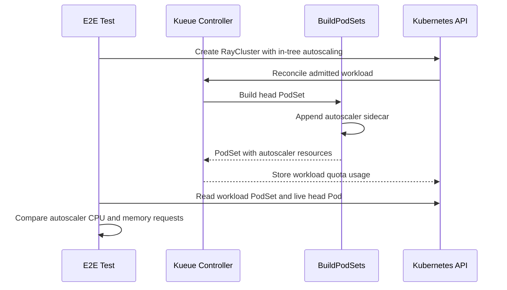

# PR #12405: [ElasticWorkloadSlicing] Account for the autoscaler sidecar in RayCluster head PodSet quota

**Summary**: [ElasticWorkloadSlicing] Account for the autoscaler sidecar in RayCluster head PodSet quota

**Sources**: https://github.com/kubernetes-sigs/kueue/pull/12405

**Last updated**: 2026-06-29T09:46:04Z

---

## Metadata

- **State**: open
- **Author**: [@kevin85421](https://github.com/kevin85421)
- **Branch**: `raycluster-autoscaler-quota` → `main`
- **Created**: 2026-06-22T05:23:53Z
- **Updated**: 2026-06-29T09:46:04Z
- **Merged**: —
- **Closed**: —
- **Labels**: `kind/bug`, `release-note`, `size/L`, `ok-to-test`, `cncf-cla: yes`, `area/integrations`
- **Assignees**: _none_
- **Requested reviewers**: [@kannon92](https://github.com/kannon92), [@mbobrovskyi](https://github.com/mbobrovskyi), [@sohankunkerkar](https://github.com/sohankunkerkar)
- **Changed files**: 5   **+249 / -13**

## Description

#### What type of PR is this?

/kind bug
/area integrations

#### What this PR does / why we need it:

When a Kueue-managed `RayCluster` enables in-tree autoscaling (`enableInTreeAutoscaling: true`, only allowed for elastic jobs via the `ElasticJobsViaWorkloadSlices` feature gate), KubeRay injects an **[autoscaler sidecar container](https://docs.ray.io/en/latest/cluster/kubernetes/user-guides/configuring-autoscaling.html#autoscaler-sidecar-container)** into the head Pod. This container is added at Pod-build time and is **not** part of `HeadGroupSpec.Template`, so Kueue never saw it when building the head `PodSet`.

As a result the head `PodSet` was under-counted against quota by the autoscaler's resources — KubeRay's [default `500m` CPU / `512Mi` memory (request and limit)](https://docs.ray.io/en/latest/cluster/kubernetes/user-guides/configuring-autoscaling.html#autoscaler-sidecar-container), or `spec.autoscalerOptions.resources` when set. A head Pod that actually needs `head + autoscaler` could be admitted against quota sized only for `head`, letting a ClusterQueue overcommit.

This PR mirrors KubeRay's behavior in `BuildPodSets`: when in-tree autoscaling is enabled, an `autoscaler` container is appended to the head `PodSet` using `AutoscalerOptions.Resources` when provided, otherwise KubeRay's documented defaults (matching `ray-operator/controllers/ray/common/pod.go: BuildAutoscalerContainer`). The change lives in the shared `BuildPodSets`, so both the `RayCluster` and `RayJob` integrations (both call `BuildPodSets`) get the fix from one place.

#### Manual test

* Gist: [autoscaling-raycluster.yaml](https://gist.github.com/kevin85421/5ba40fc3adbf25e9fbb3ddb6f96b668e#file-autoscaling-raycluster-yaml)

* Step 1: Create the RayCluster CR:
  * 1 head Pod (ray container: 1 CPU, autoscaler container: 500m CPU + 512 MB memory) + 1 worker Pod (400m CPU) = 1900m CPU + 512 MB memory
    ```sh
    kubectl apply -f autoscaling-raycluster.yaml
    ```
* Step 2: Check the Workload CR
  


#### Which issue(s) this PR fixes:

There is no existing tracked issue for this specific gap.

#### Special notes for your reviewer:

AI usage disclosure: This change was developed with the assistance of an AI coding tool (Claude Code). All code and tests were reviewed by the author before submission.

#### Does this PR introduce a user-facing change?

```release-note
RayCluster: Fixed a bug where the Ray autoscaler sidecar container's resources were not counted against quota when in-tree autoscaling was enabled, causing the head PodSet to be under-counted. The head PodSet now includes the autoscaler sidecar (KubeRay's default `500m` CPU / `512Mi` memory, or `spec.autoscalerOptions.resources` when set).
```


<!-- This is an auto-generated comment: release notes by coderabbit.ai -->
## Summary by CodeRabbit

## Release Notes

* **New Features**
  * In-tree autoscaling quota calculations for RayCluster head pods now include the autoscaler sidecar’s CPU and memory resource requests, using defaults or user-specified overrides.

* **Tests**
  * Expanded unit tests to validate autoscaler sidecar injection and resource override behavior.
  * Updated end-to-end and integration tests to add memory to quota configurations and verify autoscaler CPU/memory consistency via drift checks.
<!-- end of auto-generated comment: release notes by coderabbit.ai -->

## Discussion

### Comment by [@netlify[bot]](https://github.com/apps/netlify) — 2026-06-22T05:23:59Z

### <span aria-hidden="true">✅</span> Deploy Preview for *kubernetes-sigs-kueue* canceled.


|  Name | Link |
|:-:|------------------------|
|<span aria-hidden="true">🔨</span> Latest commit | 7e976c21d3336c9a31532a16db8592a1b1c32c7a |
|<span aria-hidden="true">🔍</span> Latest deploy log | https://app.netlify.com/projects/kubernetes-sigs-kueue/deploys/6a3b635396d3610008447f74 |

### Comment by [@kubernetes-prow[bot]](https://github.com/apps/kubernetes-prow) — 2026-06-22T05:24:01Z

[APPROVALNOTIFIER] This PR is **NOT APPROVED**

This pull-request has been approved by: *<a href="https://github.com/kubernetes-sigs/kueue/pull/12405#" title="Author self-approved">kevin85421</a>*
**Once this PR has been reviewed and has the lgtm label**, please assign [sohankunkerkar](https://github.com/sohankunkerkar) for approval. For more information see [the Code Review Process](https://git.k8s.io/community/contributors/guide/owners.md#the-code-review-process).

The full list of commands accepted by this bot can be found [here](https://go.k8s.io/bot-commands?repo=kubernetes-sigs%2Fkueue).

<details open>
Needs approval from an approver in each of these files:

- **[pkg/controller/OWNERS](https://github.com/kubernetes-sigs/kueue/blob/main/pkg/controller/OWNERS)**
- **[test/OWNERS](https://github.com/kubernetes-sigs/kueue/blob/main/test/OWNERS)**

Approvers can indicate their approval by writing `/approve` in a comment
Approvers can cancel approval by writing `/approve cancel` in a comment
</details>
<!-- META={"approvers":["sohankunkerkar"]} -->

### Comment by [@coderabbitai[bot]](https://github.com/apps/coderabbitai) — 2026-06-22T05:24:02Z

<!-- This is an auto-generated comment: summarize by coderabbit.ai -->
<!-- review_stack_entry_start -->

[](https://app.coderabbit.ai/change-stack/kubernetes-sigs/kueue/pull/12405?utm_source=github_walkthrough&utm_medium=github&utm_campaign=change_stack)

<!-- review_stack_entry_end -->
No actionable comments were generated in the recent review. 🎉

<details>
<summary>ℹ️ Recent review info</summary>

<details>
<summary>⚙️ Run configuration</summary>

**Configuration used**: Path: .coderabbit.yaml

**Review profile**: CHILL

**Plan**: Pro

**Run ID**: `ac20aba6-df1e-431a-9395-0c36e9ae284e`

</details>

<details>
<summary>📥 Commits</summary>

Reviewing files that changed from the base of the PR and between 47f265bfa479fcb5f6f490da6ce62985b846050a and 7e976c21d3336c9a31532a16db8592a1b1c32c7a.

</details>

<details>
<summary>📒 Files selected for processing (5)</summary>

* `pkg/controller/jobs/raycluster/common.go`
* `pkg/controller/jobs/raycluster/common_test.go`
* `pkg/controller/jobs/rayservice/rayservice_controller_test.go`
* `test/e2e/singlecluster/extended/kuberay_test.go`
* `test/integration/singlecluster/controller/jobs/raycluster/raycluster_controller_test.go`

</details>

<details>
<summary>🚧 Files skipped from review as they are similar to previous changes (5)</summary>

* test/e2e/singlecluster/extended/kuberay_test.go
* pkg/controller/jobs/raycluster/common.go
* pkg/controller/jobs/raycluster/common_test.go
* pkg/controller/jobs/rayservice/rayservice_controller_test.go
* test/integration/singlecluster/controller/jobs/raycluster/raycluster_controller_test.go

</details>

</details>

---
<!-- walkthrough_start -->

<details>
<summary>📝 Walkthrough</summary>

## Walkthrough

`BuildPodSets` now adds an autoscaler sidecar to RayCluster head PodSets when in-tree autoscaling is enabled. Related tests and quota assertions were updated to include the sidecar’s CPU and memory resources.

## Changes

**Autoscaler sidecar quota accounting**

|Layer / File(s)|Summary|
|---|---|
|**Autoscaler sidecar utilities and injection** <br> `pkg/controller/jobs/raycluster/common.go`|Defines autoscaler sidecar resource helpers and appends the sidecar to the head PodSet when in-tree autoscaling is enabled.|
|**RayCluster PodSet tests** <br> `pkg/controller/jobs/raycluster/common_test.go`|Adds table cases for the injected autoscaler sidecar with default resources and with overridden AutoscalerOptions resources.|
|**RayService PodSet expectations** <br> `pkg/controller/jobs/rayservice/rayservice_controller_test.go`|Introduces a helper that appends an autoscaler container to the expected head PodSpec and updates autoscaling-enabled PodSet assertions to use it.|
|**E2E quota drift check** <br> `test/e2e/singlecluster/extended/kuberay_test.go`|Adds memory quota to the ClusterQueue setup and a Ginkgo test that compares autoscaler sidecar requests in the admitted workload with the live Ray head Pod.|
|**Integration quota assertions** <br> `test/integration/singlecluster/controller/jobs/raycluster/raycluster_controller_test.go`|Updates ClusterQueue quotas and FlavorsUsage assertions to include memory and revised CPU totals across the scaling phases.|

## Sequence Diagram(s)



## Estimated code review effort

🎯 3 (Moderate) | ⏱️ ~25 minutes

## Suggested reviewers

- kshalot
- sohankunkerkar
- yaroslava-serdiuk

## Poem

> 🐇 Hoppity hop, the sidecar joined the throng,
> CPU and memory now counted all along.
> The workload and the live pod both agree,
> Quota stays tidy for the cluster tree.

</details>

<!-- walkthrough_end -->
<!-- pre_merge_checks_walkthrough_start -->

<details>
<summary>🚥 Pre-merge checks | ✅ 4 | ❌ 1</summary>

### ❌ Failed checks (1 warning)

|     Check name     | Status     | Explanation                                                                           | Resolution                                                                         |
| :----------------: | :--------- | :------------------------------------------------------------------------------------ | :--------------------------------------------------------------------------------- |
| Docstring Coverage | ⚠️ Warning | Docstring coverage is 50.00% which is insufficient. The required threshold is 80.00%. | Write docstrings for the functions missing them to satisfy the coverage threshold. |

<details>
<summary>✅ Passed checks (4 passed)</summary>

|         Check name         | Status   | Explanation                                                                                                 |
| :------------------------: | :------- | :---------------------------------------------------------------------------------------------------------- |
|      Description Check     | ✅ Passed | Check skipped - CodeRabbit’s high-level summary is enabled.                                                 |
|         Title check        | ✅ Passed | The title clearly summarizes the main fix: counting the autoscaler sidecar in RayCluster head PodSet quota. |
|     Linked Issues check    | ✅ Passed | Check skipped because no linked issues were found for this pull request.                                    |
| Out of Scope Changes check | ✅ Passed | Check skipped because no linked issues were found for this pull request.                                    |

</details>

<sub>✏️ Tip: You can configure your own custom pre-merge checks in the settings.</sub>

</details>

<!-- pre_merge_checks_walkthrough_end -->
<!-- finishing_touch_checkbox_start -->

<details>
<summary>✨ Finishing Touches</summary>

<details>
<summary>🧪 Generate unit tests (beta)</summary>

- [ ] <!-- {"checkboxId": "f47ac10b-58cc-4372-a567-0e02b2c3d479", "radioGroupId": "utg-output-choice-group-unknown_comment_id"} -->   Create PR with unit tests

</details>

</details>

<!-- finishing_touch_checkbox_end -->
<!-- tips_start -->

---

Thanks for using [CodeRabbit](https://coderabbit.ai?utm_source=oss&utm_medium=github&utm_campaign=kubernetes-sigs/kueue&utm_content=12405)! It's free for OSS, and your support helps us grow. If you like it, consider giving us a shout-out.

<details>
<summary>❤️ Share</summary>

- [X](https://twitter.com/intent/tweet?text=I%20just%20used%20%40coderabbitai%20for%20my%20code%20review%2C%20and%20it%27s%20fantastic%21%20It%27s%20free%20for%20OSS%20and%20offers%20a%20free%20trial%20for%20the%20proprietary%20code.%20Check%20it%20out%3A&url=https%3A//coderabbit.ai)
- [Mastodon](https://mastodon.social/share?text=I%20just%20used%20%40coderabbitai%20for%20my%20code%20review%2C%20and%20it%27s%20fantastic%21%20It%27s%20free%20for%20OSS%20and%20offers%20a%20free%20trial%20for%20the%20proprietary%20code.%20Check%20it%20out%3A%20https%3A%2F%2Fcoderabbit.ai)
- [Reddit](https://www.reddit.com/submit?title=Great%20tool%20for%20code%20review%20-%20CodeRabbit&text=I%20just%20used%20CodeRabbit%20for%20my%20code%20review%2C%20and%20it%27s%20fantastic%21%20It%27s%20free%20for%20OSS%20and%20offers%20a%20free%20trial%20for%20proprietary%20code.%20Check%20it%20out%3A%20https%3A//coderabbit.ai)
- [LinkedIn](https://www.linkedin.com/sharing/share-offsite/?url=https%3A%2F%2Fcoderabbit.ai&mini=true&title=Great%20tool%20for%20code%20review%20-%20CodeRabbit&summary=I%20just%20used%20CodeRabbit%20for%20my%20code%20review%2C%20and%20it%27s%20fantastic%21%20It%27s%20free%20for%20OSS%20and%20offers%20a%20free%20trial%20for%20proprietary%20code)

</details>


<sub>Comment `@coderabbitai help` to get the list of available commands.</sub>

<!-- tips_end -->

### Comment by [@kubernetes-prow[bot]](https://github.com/apps/kubernetes-prow) — 2026-06-22T05:24:05Z

Hi @kevin85421. Thanks for your PR.

I'm waiting for a [kubernetes-sigs](https://github.com/orgs/kubernetes-sigs/people) member to verify that this patch is reasonable to test. If it is, they should reply with `/ok-to-test` on its own line. Until that is done, I will not automatically test new commits in this PR, but the usual testing commands by org members will still work.

>[!TIP]
>**We noticed you've done this a few times! Consider [joining the org](https://git.k8s.io/community/community-membership.md#member) to skip this step and gain `/lgtm` and other bot rights.** We recommend asking approvers on your previous PRs to sponsor you.

Once the patch is verified, the new status will be reflected by the `ok-to-test` label.

I understand the commands that are listed [here](https://go.k8s.io/bot-commands?repo=kubernetes-sigs%2Fkueue).

<details>

Instructions for interacting with me using PR comments are available [here](https://git.k8s.io/community/contributors/guide/pull-requests.md).  If you have questions or suggestions related to my behavior, please file an issue against the [kubernetes-sigs/prow](https://github.com/kubernetes-sigs/prow/issues/new?title=Prow%20issue:) repository.
</details>

### Comment by [@kevin85421](https://github.com/kevin85421) — 2026-06-22T05:33:24Z

@mimowo thank you for the fast reply! I am still polishing this PR and I will let you know when it is ready for review.

### Comment by [@kevin85421](https://github.com/kevin85421) — 2026-06-24T06:14:35Z

Hi @mimowo, this PR should be ready for review. Thanks.

### Comment by [@mimowo](https://github.com/mimowo) — 2026-06-29T09:46:04Z

cc @yaroslava-serdiuk ptal

## Reviews

### Review by [@mimowo](https://github.com/mimowo) (commented) — 2026-06-22T05:29:00Z

/ok-to-test
Thank you 👍

### Review by [@coderabbitai[bot]](https://github.com/apps/coderabbitai) (commented) — 2026-06-23T07:54:24Z

**Actionable comments posted: 1**

<details>
<summary>🤖 Prompt for all review comments with AI agents</summary>

```
Verify each finding against current code. Fix only still-valid issues, skip the
rest with a brief reason, keep changes minimal, and validate.

Inline comments:
In
`@test/integration/singlecluster/controller/jobs/raycluster/raycluster_controller_test.go`:
- Around line 779-780: Replace all brittle positional resource assertions in the
test that use `FlavorsUsage[0].Resources[0]` and `FlavorsUsage[0].Resources[1]`
with assertions that first identify the resource by its Name field (checking for
CPU or Memory resource names) before accessing the Total property. Additionally,
update the stale comment near line 828 that incorrectly states "3 cores" to
accurately reflect that the 3500m expectation includes the autoscaler CPU
allocation.
```

</details>

<details>
<summary>🪄 Autofix (Beta)</summary>

Fix all unresolved CodeRabbit comments on this PR:

- [ ] <!-- {"checkboxId": "4b0d0e0a-96d7-4f10-b296-3a18ea78f0b9"} --> Push a commit to this branch (recommended)
- [ ] <!-- {"checkboxId": "ff5b1114-7d8c-49e6-8ac1-43f82af23a33"} --> Create a new PR with the fixes

</details>

---

<details>
<summary>ℹ️ Review info</summary>

<details>
<summary>⚙️ Run configuration</summary>

**Configuration used**: Path: .coderabbit.yaml

**Review profile**: CHILL

**Plan**: Pro

**Run ID**: `c2062dce-bff3-4814-844e-0070b6ab7768`

</details>

<details>
<summary>📥 Commits</summary>

Reviewing files that changed from the base of the PR and between 7a1032e6dab9c407efe606e89071277a9d334f15 and 47f265bfa479fcb5f6f490da6ce62985b846050a.

</details>

<details>
<summary>📒 Files selected for processing (5)</summary>

* `pkg/controller/jobs/raycluster/common.go`
* `pkg/controller/jobs/raycluster/common_test.go`
* `pkg/controller/jobs/rayservice/rayservice_controller_test.go`
* `test/e2e/singlecluster/extended/kuberay_test.go`
* `test/integration/singlecluster/controller/jobs/raycluster/raycluster_controller_test.go`

</details>

<details>
<summary>🚧 Files skipped from review as they are similar to previous changes (4)</summary>

* pkg/controller/jobs/raycluster/common.go
* pkg/controller/jobs/raycluster/common_test.go
* pkg/controller/jobs/rayservice/rayservice_controller_test.go
* test/e2e/singlecluster/extended/kuberay_test.go

</details>

</details>

<!-- This is an auto-generated comment by CodeRabbit for review status -->

- **test/integration/singlecluster/controller/jobs/raycluster/raycluster_controller_test.go:780** by [@coderabbitai[bot]](https://github.com/apps/coderabbitai) — 2026-06-23T07:54:24Z
```diff
@@ -776,8 +776,8 @@ var _ = ginkgo.Describe("RayCluster with elastic jobs via workload-slices suppor
 			cq := &kueue.ClusterQueue{}
 			g.Expect(k8sClient.Get(ctx, client.ObjectKeyFromObject(clusterQueue), cq)).Should(gomega.Succeed())
 			g.Expect(len(cq.Status.FlavorsUsage)).Should(gomega.BeEquivalentTo(1))
-			g.Expect(len(cq.Status.FlavorsUsage[0].Resources)).Should(gomega.BeEquivalentTo(1))
-			g.Expect(cq.Status.FlavorsUsage[0].Resources[0].Total).Should(gomega.BeEquivalentTo(resource.MustParse("3")))
+			g.Expect(len(cq.Status.FlavorsUsage[0].Resources)).Should(gomega.BeEquivalentTo(2))
+			g.Expect(cq.Status.FlavorsUsage[0].Resources[0].Total).Should(gomega.BeEquivalentTo(resource.MustParse("3500m")))
```

  _🎯 Functional Correctness_ | _🟡 Minor_ | _⚡ Quick win_
  
  **Avoid positional resource assertions and fix stale CPU comment.**
  
  `cq.Status.FlavorsUsage[0].Resources[0]` is brittle now that two resources are present; assert by `Name` (CPU/Memory) before checking totals. Also, Line 828’s comment says 3 cores, but the expectation is `3500m` (includes autoscaler CPU).
  
  <details>
  <summary>Suggested test hardening</summary>
  
  ```diff
  -			g.Expect(len(cq.Status.FlavorsUsage[0].Resources)).Should(gomega.BeEquivalentTo(2))
  -			g.Expect(cq.Status.FlavorsUsage[0].Resources[0].Total).Should(gomega.BeEquivalentTo(resource.MustParse("3500m")))
  +			g.Expect(len(cq.Status.FlavorsUsage[0].Resources)).Should(gomega.BeEquivalentTo(2))
  +			var cpuTotal, memTotal *resource.Quantity
  +			for i := range cq.Status.FlavorsUsage[0].Resources {
  +				r := cq.Status.FlavorsUsage[0].Resources[i]
  +				switch r.Name {
  +				case corev1.ResourceCPU:
  +					cpuTotal = &r.Total
  +				case corev1.ResourceMemory:
  +					memTotal = &r.Total
  +				}
  +			}
  +			g.Expect(cpuTotal).NotTo(gomega.BeNil())
  +			g.Expect(memTotal).NotTo(gomega.BeNil())
  +			g.Expect(*cpuTotal).Should(gomega.BeEquivalentTo(resource.MustParse("3500m")))
  ```
  
  ```diff
  -			// 1 core for the head node, and 1 for each of the 2 workers
  +			// 1 core for head + 500m autoscaler + 1 core for each of the 2 workers
  ```
  </details>
  
     
  
  
  Also applies to: 795-796, 827-829
  
  <details>
  <summary>🤖 Prompt for AI Agents</summary>
  
  ```
  Verify each finding against current code. Fix only still-valid issues, skip the
  rest with a brief reason, keep changes minimal, and validate.
  
  In
  `@test/integration/singlecluster/controller/jobs/raycluster/raycluster_controller_test.go`
  around lines 779 - 780, Replace all brittle positional resource assertions in
  the test that use `FlavorsUsage[0].Resources[0]` and
  `FlavorsUsage[0].Resources[1]` with assertions that first identify the resource
  by its Name field (checking for CPU or Memory resource names) before accessing
  the Total property. Additionally, update the stale comment near line 828 that
  incorrectly states "3 cores" to accurately reflect that the 3500m expectation
  includes the autoscaler CPU allocation.
  ```
  
  </details>
  
  <!-- fingerprinting:phantom:poseidon:hawk -->
  
  <!-- cr-indicator-types:potential_issue -->
  
  <!-- cr-comment:v1:c4fbfbe897896ce4a9c8c7d9 -->
  
  <!-- This is an auto-generated comment by CodeRabbit -->
