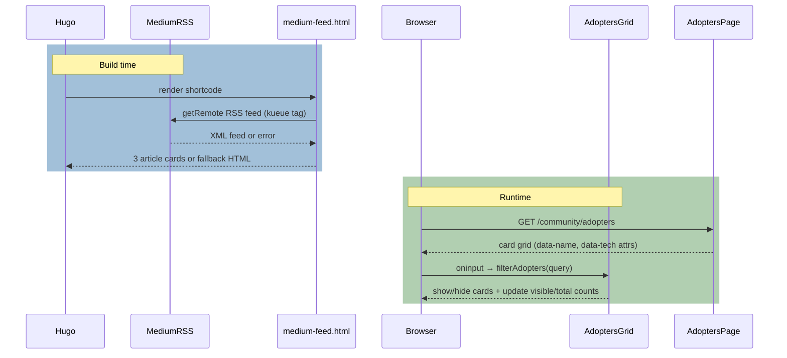

# PR #12412: Kueue homepage modernization

**Summary**: Kueue homepage modernization

**Sources**: https://github.com/kubernetes-sigs/kueue/pull/12412

**Last updated**: 2026-06-26T17:33:55Z

---

## Metadata

- **State**: closed (merged)
- **Author**: [@MichalZylinski](https://github.com/MichalZylinski)
- **Branch**: `style-homepage-adopters` → `main`
- **Created**: 2026-06-22T14:09:28Z
- **Updated**: 2026-06-26T17:33:55Z
- **Merged**: 2026-06-26T17:26:28Z
- **Closed**: 2026-06-26T17:26:28Z
- **Labels**: `release-note`, `lgtm`, `size/XXL`, `approved`, `ok-to-test`, `kind/documentation`, `cncf-cla: yes`, `area/website`
- **Assignees**: [@mimowo](https://github.com/mimowo)
- **Requested reviewers**: [@pajakd](https://github.com/pajakd), [@windsonsea](https://github.com/windsonsea)
- **Changed files**: 91   **+2509 / -676**

## Description

<!--  Thanks for sending a pull request!  Here are some tips for you:

1. If this is your first time, please read our contributor guidelines: https://git.k8s.io/community/contributors/guide/first-contribution.md#your-first-contribution and developer guide https://git.k8s.io/community/contributors/devel/development.md#development-guide
2. Please label this pull request according to what type of issue you are addressing, especially if this is a release targeted pull request. For reference on required PR/issue labels, read here:
https://git.k8s.io/community/contributors/devel/sig-release/release.md#issuepr-kind-label
3. Ensure you have added or ran the appropriate tests for your PR: https://git.k8s.io/community/contributors/devel/sig-testing/testing.md
4. If you want *faster* PR reviews, read how: https://git.k8s.io/community/contributors/guide/pull-requests.md#best-practices-for-faster-reviews
5. If the PR is unfinished, see how to mark it: https://git.k8s.io/community/contributors/guide/pull-requests.md#marking-unfinished-pull-requests
-->

#### What type of PR is this?
/kind documentation
/area website

#### What this PR does / why we need it:
Delivers a modern, minimalist Kueue webpage refresh:

- **Homepage Redesign**: Modernizes the landing page layout with a banner, GitHub star/fork badges, capability cards and a streamlined architecture diagram.
- **New Adopters Directory:** Restructures the Adopters page (community/adopters/index.md), discarding the un-synchronized static markdown table in favor of a dynamic, client-side searchable and filterable alternative.
- **Medium blog integration**: Introduces Medium article feed (https://medium.com/tag/kueue) as part of the Community page.
- **Homepage i18n & Chinese Localization**: Refactors index.html to eliminate hardcoded English text. Establishes complete translation databases in en.yaml and zh-CN.yaml. Toggling to Chinese now instantly localizes the entire front page.

#### Special notes for your reviewer:
This PR is strictly focused on layouts, styles, and internationalization. It has no impact on Kueue's core controllers. 

**AI Disclosure**
This PR's layout refactoring, CSS adjustments, and translation cataloging were co-developed with the assistance of an AI pair-programming assistant in compliance with the Kubernetes AI Tool Usage Policy.
#### Does this PR introduce a user-facing change?

<!--
If no, just write "NONE" in the release-note block below.
If yes, a release note is required:
Enter your extended release note in the block below. If the PR requires additional action from users switching to the new release, include the string "action required".
-->
```release-note
Documentation: the Kueue webpage is redesigned and modernized.
```


<!-- This is an auto-generated comment: release notes by coderabbit.ai -->
## Summary by CodeRabbit

## Release Notes
* **New Features**
  * Added a Kueue Community landing page with Core Pillars, community content cards, “Latest from Medium”, and an interactive adopters directory with live search and visible/total counters.
  * Added a Slack link to the main navigation and updated community join cards.
* **Design Updates**
  * Refreshed the site theme and homepage UI (navbar styling, Inter typography, homepage cards, and sidebar navigation/search appearance).
  * Enabled Mermaid rendering on the homepage.
* **Documentation**
  * Added EN/ZH Adopters pages, updated the installation “What’s next” guidance, and removed outdated adopters documentation pages.
* **Chores**
  * Updated Hugo to generate homepage HTML/RSS/JSON outputs.
<!-- end of auto-generated comment: release notes by coderabbit.ai -->

## Discussion

### Comment by [@netlify[bot]](https://github.com/apps/netlify) — 2026-06-22T14:09:34Z

### <span aria-hidden="true">✅</span> Deploy Preview for *kubernetes-sigs-kueue* ready!


|  Name | Link |
|:-:|------------------------|
|<span aria-hidden="true">🔨</span> Latest commit | bf1f74d165b0314c761b9dfe639c2e25bbfa2ed8 |
|<span aria-hidden="true">🔍</span> Latest deploy log | https://app.netlify.com/projects/kubernetes-sigs-kueue/deploys/6a3ea8da68ac890008cb0f01 |
|<span aria-hidden="true">😎</span> Deploy Preview | [https://deploy-preview-12412--kubernetes-sigs-kueue.netlify.app](https://deploy-preview-12412--kubernetes-sigs-kueue.netlify.app) |
|<span aria-hidden="true">📱</span> Preview on mobile | <details><summary> Toggle QR Code... </summary><br /><br /><br /><br />_Use your smartphone camera to open QR code link._</details> |
---
<!-- [kubernetes-sigs-kueue Preview](https://deploy-preview-12412--kubernetes-sigs-kueue.netlify.app) -->
_To edit notification comments on pull requests, go to your [Netlify project configuration](https://app.netlify.com/projects/kubernetes-sigs-kueue/configuration/notifications#deploy-notifications)._

### Comment by [@linux-foundation-easycla[bot]](https://github.com/apps/linux-foundation-easycla) — 2026-06-22T14:09:37Z

<a href="https://easycla.lfx.linuxfoundation.org/#/?version=2"></a><br >The committers listed above are authorized under a signed CLA.<ul><li>:white_check_mark: login: MichalZylinski / name: Michał Żyliński (048fb7a4e73d52b9f0c32afe846bfc4528bea5ff, 07a260d1809805e6d25c86c107e24bf1e0f69d80, 26b000fb501065a8a8bbe5cf2b38c193c3ecc0a3, 41935a14966e4d9a7d084386bc12ae82ce6216c1, 4a5737e981cb6651cda31a3e45cf8404a6c182b9, 639b403f2ec81dfbf8f4009daad2234971c8930b, 714e151af9fdee159179fe206ecbddf4d17dda7b, 8ddd45a51a7d41b97d56cb261b640c6a271558cf, 9708c1c0f65990bc47cb8751a47d28546aedf5cf, 987d4bcd0fc3aa4ecf6e7e8cf0ab31d4f4948cdb, 9e47d362cb4e14210342845554aa90b8bc45f16a, a09d47f1b50343d504550616f46b0531e89897b3, dde6c0a4f3278b79cc00856912dd58922c43befc, e0bfe648950bd10ab417ca604583336eefff1b2c, f4f94d0a88fea7e6ef165f6f94f0c9e995673dff)</li></ul>

### Comment by [@kubernetes-prow[bot]](https://github.com/apps/kubernetes-prow) — 2026-06-22T14:09:38Z

Welcome @MichalZylinski! <br><br>It looks like this is your first PR to <a href='https://github.com/kubernetes-sigs/kueue'>kubernetes-sigs/kueue</a> 🎉. Please refer to our [pull request process documentation](https://www.kubernetes.dev/docs/guide/pull-requests/) to help your PR have a smooth ride to approval. <br><br>You will be prompted by a bot to use commands during the review process. Do not be afraid to follow the prompts! It is okay to experiment. [Here is the bot commands documentation](https://go.k8s.io/bot-commands). <br><br>You can also check if kubernetes-sigs/kueue has [its own contribution guidelines](https://github.com/kubernetes-sigs/kueue/tree/master/CONTRIBUTING.md). <br><br>You may want to refer to our [testing guide](https://git.k8s.io/community/contributors/devel/sig-testing/testing.md) if you run into trouble with your tests not passing. <br><br>If you are having difficulty getting your pull request seen, please follow the [recommended escalation practices](https://www.kubernetes.dev/docs/guide/pull-requests/#why-is-my-pull-request-not-getting-reviewed). Also, for tips and tricks in the contribution process you may want to read the [Kubernetes contributor cheat sheet](https://www.kubernetes.dev/docs/contributor-cheatsheet/). We want to make sure your contribution gets all the attention it needs! <br><br>Thank you, and welcome to Kubernetes. :smiley:

### Comment by [@kubernetes-prow[bot]](https://github.com/apps/kubernetes-prow) — 2026-06-22T14:09:40Z

Hi @MichalZylinski. Thanks for your PR.

I'm waiting for a [kubernetes-sigs](https://github.com/orgs/kubernetes-sigs/people) member to verify that this patch is reasonable to test. If it is, they should reply with `/ok-to-test` on its own line. Until that is done, I will not automatically test new commits in this PR, but the usual testing commands by org members will still work.

Regular contributors should [join the org](https://git.k8s.io/community/community-membership.md#member) to skip this step.

Once the patch is verified, the new status will be reflected by the `ok-to-test` label.

I understand the commands that are listed [here](https://go.k8s.io/bot-commands?repo=kubernetes-sigs%2Fkueue).

<details>

Instructions for interacting with me using PR comments are available [here](https://git.k8s.io/community/contributors/guide/pull-requests.md).  If you have questions or suggestions related to my behavior, please file an issue against the [kubernetes-sigs/prow](https://github.com/kubernetes-sigs/prow/issues/new?title=Prow%20issue:) repository.
</details>

### Comment by [@coderabbitai[bot]](https://github.com/apps/coderabbitai) — 2026-06-22T14:09:48Z

<!-- This is an auto-generated comment: summarize by coderabbit.ai -->
<!-- review_stack_entry_start -->

[](https://app.coderabbit.ai/change-stack/kubernetes-sigs/kueue/pull/12412?utm_source=github_walkthrough&utm_medium=github&utm_campaign=change_stack)

<!-- review_stack_entry_end -->
<!-- This is an auto-generated comment: review paused by coderabbit.ai -->

> [!NOTE]
> ## Reviews paused
> 
> It looks like this branch is under active development. To avoid overwhelming you with review comments due to an influx of new commits, CodeRabbit has automatically paused this review. You can configure this behavior by changing the `reviews.auto_review.auto_pause_after_reviewed_commits` setting.
> 
> Use the following commands to manage reviews:
> - `@coderabbitai resume` to resume automatic reviews.
> - `@coderabbitai review` to trigger a single review.
> 
> Use the checkboxes below for quick actions:
> - [ ] <!-- {"checkboxId": "7f6cc2e2-2e4e-497a-8c31-c9e4573e93d1"} --> ▶️ Resume reviews
> - [ ] <!-- {"checkboxId": "e9bb8d72-00e8-4f67-9cb2-caf3b22574fe"} --> 🔍 Trigger review

<!-- end of auto-generated comment: review paused by coderabbit.ai -->
<!-- walkthrough_start -->

<details>
<summary>📝 Walkthrough</summary>

## Walkthrough

The Kueue project website is redesigned with a new Hugo homepage template (hero, capabilities, architecture, community sections), a new community landing page with Medium feed integration, an adopters directory moved from docs into the community section with client-side search, updated SCSS design tokens and navbar styling, EN and zh-CN i18n strings, and Hugo config updates for outputs, navigation, and version params.

## Changes

**Kueue Site Redesign**

|Layer / File(s)|Summary|
|---|---|
|**Site config and SCSS design system** <br> `site/hugo.toml`, `site/assets/scss/_variables_project.scss`, `site/assets/scss/_styles_project.scss`|`hugo.toml` adds homepage HTML/RSS/JSON outputs, a Slack nav item (weight 98), and static `github_stars`/`github_forks` params. SCSS replaces color palette with "Slate & Sky" tokens, switches to Inter font, rewrites navbar styling with translucent blurred background and flex-aligned brand, constrains sidebar height on desktop, adds `hero-grid-bg`, `feature-card`, and `community-card` component classes, and overrides sidebar search button colors/alignment.|
|**Homepage template and internationalization** <br> `site/layouts/index.html`, `site/content/en/_index.html`, `site/i18n/en.yaml`, `site/i18n/zh-CN.yaml`|Full homepage template defines hero section with SVG logo, social proof badges (Latest/Stars/Forks), and CTA buttons, five capability cards with icons, architecture SVG section, and community cards linking to Slack/GitHub/Mail. Comprehensive EN and zh-CN translation keys cover hero text, all capability descriptions, architecture labels, community section content, adopters page strings, and additional UI layout text. Front matter enables `mermaid = true`.|
|**Adopters directory: data, shortcode, and pages** <br> `site/data/adopters.yaml`, `site/layouts/shortcodes/adopters-grid.html`, `site/content/en/community/adopters/index.md`, `site/content/zh-CN/community/adopters/index.md`|Adds `adopters.yaml` with 16 adopter records (name, url, type, description, integrations, contact). `adopters-grid` shortcode renders a searchable directory with real-time client-side filtering (matching query against card `data-name` and `data-tech` attributes), type-based badge variants (End User/Provider), integration pills, optional contact footer links, and hover/input CSS styling. EN and zh-CN adopters pages added under `community/` with `/adopters` alias. Old `docs/adopters/` pages removed in both locales.|
|**Community landing page and feeds** <br> `site/layouts/community/list.html`, `site/content/en/community/_index.md`, `site/content/zh-CN/community/_index.md`, `site/layouts/shortcodes/medium-feed.html`, `site/layouts/shortcodes/community-content.html`, `site/layouts/partials/community-content.html`, `site/data/community_content.yaml`, `site/content/en/community/talks_and_presentations/_index.md`|Community list layout wraps pages in navbar-offset and centered header sections. EN and zh-CN `_index.md` add three pillar cards (Adopters Showcase, Talks & Case Studies, Contributor Zone), build-time Medium RSS feed shortcode (fetches first 3 articles for kueue tag with unavailable/empty feed fallbacks), and "Connect with Community" footer with Slack/mail links. Community-content partial and shortcode render `community_content.yaml` cards with icons, platform badges, author/date metadata. Talks page front matter moves `description` to top-level.|
|**Documentation updates** <br> `site/content/en/docs/getting-started/installation.md`|Adds a Cloud Providers "What's next" bullet pointing to deployment and optimization documentation for GKE, EKS, and other platforms.|

## Sequence Diagram(s)



## Estimated code review effort

🎯 4 (Complex) | ⏱️ ~60 minutes

## Poem

> 🐇 A new coat of paint for the Kueue abode,
> Slate & Sky colors light up the node.
> Adopters now line the community hall,
> Medium whispers of Kueue to all.
> The navbar gleams with Inter and grace —
> A sprightly new warren, a welcoming place! 🏠✨

</details>

<!-- walkthrough_end -->
<!-- pre_merge_checks_walkthrough_start -->

<details>
<summary>🚥 Pre-merge checks | ✅ 5</summary>

<details>
<summary>✅ Passed checks (5 passed)</summary>

|         Check name         | Status   | Explanation                                                                                                                                                                                           |
| :------------------------: | :------- | :---------------------------------------------------------------------------------------------------------------------------------------------------------------------------------------------------- |
|         Title check        | ✅ Passed | The title "Kueue homepage modernization" clearly and concisely summarizes the primary change: a comprehensive redesign of the Kueue project homepage with new layouts, styles, and content structure. |
|     Docstring Coverage     | ✅ Passed | No functions found in the changed files to evaluate docstring coverage. Skipping docstring coverage check.                                                                                            |
|     Linked Issues check    | ✅ Passed | Check skipped because no linked issues were found for this pull request.                                                                                                                              |
| Out of Scope Changes check | ✅ Passed | Check skipped because no linked issues were found for this pull request.                                                                                                                              |
|      Description Check     | ✅ Passed | Check skipped - CodeRabbit’s high-level summary is enabled.                                                                                                                                           |

</details>

<sub>✏️ Tip: You can configure your own custom pre-merge checks in the settings.</sub>

</details>

<!-- pre_merge_checks_walkthrough_end -->
<!-- finishing_touch_checkbox_start -->

<details>
<summary>✨ Finishing Touches</summary>

<details>
<summary>🧪 Generate unit tests (beta)</summary>

- [ ] <!-- {"checkboxId": "f47ac10b-58cc-4372-a567-0e02b2c3d479", "radioGroupId": "utg-output-choice-group-unknown_comment_id"} -->   Create PR with unit tests

</details>

</details>

<!-- finishing_touch_checkbox_end -->
<!-- tips_start -->

---

Thanks for using [CodeRabbit](https://coderabbit.ai?utm_source=oss&utm_medium=github&utm_campaign=kubernetes-sigs/kueue&utm_content=12412)! It's free for OSS, and your support helps us grow. If you like it, consider giving us a shout-out.

<details>
<summary>❤️ Share</summary>

- [X](https://twitter.com/intent/tweet?text=I%20just%20used%20%40coderabbitai%20for%20my%20code%20review%2C%20and%20it%27s%20fantastic%21%20It%27s%20free%20for%20OSS%20and%20offers%20a%20free%20trial%20for%20the%20proprietary%20code.%20Check%20it%20out%3A&url=https%3A//coderabbit.ai)
- [Mastodon](https://mastodon.social/share?text=I%20just%20used%20%40coderabbitai%20for%20my%20code%20review%2C%20and%20it%27s%20fantastic%21%20It%27s%20free%20for%20OSS%20and%20offers%20a%20free%20trial%20for%20the%20proprietary%20code.%20Check%20it%20out%3A%20https%3A%2F%2Fcoderabbit.ai)
- [Reddit](https://www.reddit.com/submit?title=Great%20tool%20for%20code%20review%20-%20CodeRabbit&text=I%20just%20used%20CodeRabbit%20for%20my%20code%20review%2C%20and%20it%27s%20fantastic%21%20It%27s%20free%20for%20OSS%20and%20offers%20a%20free%20trial%20for%20proprietary%20code.%20Check%20it%20out%3A%20https%3A//coderabbit.ai)
- [LinkedIn](https://www.linkedin.com/sharing/share-offsite/?url=https%3A%2F%2Fcoderabbit.ai&mini=true&title=Great%20tool%20for%20code%20review%20-%20CodeRabbit&summary=I%20just%20used%20CodeRabbit%20for%20my%20code%20review%2C%20and%20it%27s%20fantastic%21%20It%27s%20free%20for%20OSS%20and%20offers%20a%20free%20trial%20for%20proprietary%20code)

</details>


<sub>Comment `@coderabbitai help` to get the list of available commands.</sub>

<!-- tips_end -->

### Comment by [@mbobrovskyi](https://github.com/mbobrovskyi) — 2026-06-22T14:20:59Z

@MichalZylinski, could you please rebase?

### Comment by [@mimowo](https://github.com/mimowo) — 2026-06-22T14:24:15Z

/ok-to-test

### Comment by [@amy](https://github.com/amy) — 2026-06-22T16:46:31Z

@MichalZylinski Sorta tangentially related to this PR. I get a lot of feedback that overall... we need a product manager and a technical writer take a pass for the content in Kueue docs.

### Comment by [@MichalZylinski](https://github.com/MichalZylinski) — 2026-06-22T17:20:10Z

> @MichalZylinski Sorta tangentially related to this PR. I get a lot of feedback that overall... we need a product manager and a technical writer take a pass for the content in Kueue docs.

At your service :) - I do have some improvement ideas as well and would love to discuss what you find missing...

### Comment by [@amy](https://github.com/amy) — 2026-06-22T17:52:00Z

> At your service :) - I do have some improvement ideas as well and would love to discuss what you find missing...

@MichalZylinski Brain dumped here a bit of areas I noticed people finding confusing 🙏 : https://github.com/kubernetes-sigs/kueue/issues/12418

Thank you! Feel free to close the issue if there's a better way to organize.

### Comment by [@mimowo](https://github.com/mimowo) — 2026-06-22T18:04:34Z

This left side menu appears a bit broken, becuase some terms are getting hidden behind the blue footer:


### Comment by [@Nilsachy](https://github.com/Nilsachy) — 2026-06-23T07:53:41Z

It would seem that the `Join Slack` button hides text on hover. Can we change text to white on hover or not fill the button with same color as text?


### Comment by [@MichalZylinski](https://github.com/MichalZylinski) — 2026-06-23T10:46:32Z

Hi @mimowo, @Nilsachy - I've just pushed the set of visual polishes to address your feedback. Looking forward to your thoughts!

### Comment by [@MichalZylinski](https://github.com/MichalZylinski) — 2026-06-23T15:24:52Z

@mimowo: I just fixed the search and Chinese bar experience

### Comment by [@mimowo](https://github.com/mimowo) — 2026-06-23T15:28:22Z

Cool, but the Community page link appears broken now - it just loops on itself. Related to https://github.com/kubernetes-sigs/kueue/pull/12412#discussion_r3459130748

### Comment by [@mimowo](https://github.com/mimowo) — 2026-06-24T16:14:42Z

@MichalZylinski - please make sure all comments are addressed - a small comment "done/fixed" will do for the simpler ones, and marking as resolved. For more challanging comments you may keep them open for context for other reviewers.

Also, let's squash the commits into one, this will make the cherrypicking to the website branch much simpler.

### Comment by [@mimowo](https://github.com/mimowo) — 2026-06-24T16:16:29Z

We rarely add release notes to website PRs, but this seems relevant enough to draw the users' attention, wdyt?

Proposal
/release-note-edit
```release-note
Documentation: the Kueue webpage is redesigned and modernized.
```

### Comment by [@Nilsachy](https://github.com/Nilsachy) — 2026-06-24T17:13:27Z

The search bar disappears when hovered. Could we make sure it stays visible?


### Comment by [@MichalZylinski](https://github.com/MichalZylinski) — 2026-06-25T07:50:12Z

> The search bar disappears when hovered. Could we make sure it stays visible?


Ack, fixed

### Comment by [@MichalZylinski](https://github.com/MichalZylinski) — 2026-06-25T08:35:59Z

> We rarely add release notes to website PRs, but this seems relevant enough to draw the users' attention, wdyt?
> 
> Proposal /release-note-edit
> 
> ```
> Documentation: the Kueue webpage is redesigned and modernized.
> ```

Sure, makes sense to me!

### Comment by [@mimowo](https://github.com/mimowo) — 2026-06-26T07:36:03Z

@MichalZylinski is there any work pending here or we can merge? I'm happy to make it live today, wdyt?

The main remaining ask from me is to make sure we don't hard-code any banners

### Comment by [@MichalZylinski](https://github.com/MichalZylinski) — 2026-06-26T09:23:09Z

> @MichalZylinski is there any work pending here or we can merge? I'm happy to make it live today, wdyt?
> 
> The main remaining ask from me is to make sure we don't hard-code any banners

Yes, I think we're ready to go - the github stats should be dynamically pulled now.

### Comment by [@MichalZylinski](https://github.com/MichalZylinski) — 2026-06-26T09:26:28Z

/retest

### Comment by [@mimowo](https://github.com/mimowo) — 2026-06-26T15:50:55Z

/test pull-kueue-verify-website-links-preview-main
Let's check the links in the preview with the new job

### Comment by [@mimowo](https://github.com/mimowo) — 2026-06-26T15:51:13Z

kudos to @apullo777

### Comment by [@mimowo](https://github.com/mimowo) — 2026-06-26T16:04:43Z

Looks like the  scanner found two issues:
```
URL        `https://deploy-preview-12412--kubernetes-sigs-kueue.netlify.app/index.json'
Parent URL https://deploy-preview-12412--kubernetes-sigs-kueue.netlify.app/, line 19, col 1
Real URL   https://deploy-preview-12412--kubernetes-sigs-kueue.netlify.app/index.json
Check time 0.346 seconds
Result     Error: 404 Not Found
10 threads active,     9 links queued,   53 links in  72 URLs checked, runtime 6 seconds
URL        `https://deploy-preview-12412--kubernetes-sigs-kueue.netlify.app/zh-cn/index.json'
Parent URL https://deploy-preview-12412--kubernetes-sigs-kueue.netlify.app/zh-cn/, line 19, col 1
Real URL   https://deploy-preview-12412--kubernetes-sigs-kueue.netlify.app/zh-cn/index.json
Check time 3.541 seconds
Result     Error: 404 Not Found
```
please fix that and I'm happy to go

### Comment by [@MichalZylinski](https://github.com/MichalZylinski) — 2026-06-26T16:30:22Z

/retest

### Comment by [@mimowo](https://github.com/mimowo) — 2026-06-26T16:34:51Z

/test pull-kueue-verify-website-links-preview-main

### Comment by [@mimowo](https://github.com/mimowo) — 2026-06-26T16:53:10Z

/lgtm
/approve
/cherrypick website
Nice, let's make it live Friday evening 👍

### Comment by [@k8s-infra-cherrypick-robot](https://github.com/k8s-infra-cherrypick-robot) — 2026-06-26T16:53:13Z

@mimowo: once the present PR merges, I will cherry-pick it on top of `website` in a new PR and assign it to you.

<details>

In response to [this](https://github.com/kubernetes-sigs/kueue/pull/12412#issuecomment-4811611088):

>/lgtm
>/approve
>/cherrypick website
>Nice, let's make it live Friday evening 👍 


Instructions for interacting with me using PR comments are available [here](https://git.k8s.io/community/contributors/guide/pull-requests.md).  If you have questions or suggestions related to my behavior, please file an issue against the [kubernetes-sigs/prow](https://github.com/kubernetes-sigs/prow/issues/new?title=Prow%20issue:) repository.
</details>

### Comment by [@kubernetes-prow[bot]](https://github.com/apps/kubernetes-prow) — 2026-06-26T16:53:18Z

LGTM label has been added.  <details>Git tree hash: 7476c6cfd93048368ca0b53c132e135af2433746</details>

### Comment by [@kubernetes-prow[bot]](https://github.com/apps/kubernetes-prow) — 2026-06-26T16:53:22Z

[APPROVALNOTIFIER] This PR is **APPROVED**

This pull-request has been approved by: *<a href="https://github.com/kubernetes-sigs/kueue/pull/12412#" title="Author self-approved">MichalZylinski</a>*, *<a href="https://github.com/kubernetes-sigs/kueue/pull/12412#issuecomment-4811611088" title="Approved">mimowo</a>*

The full list of commands accepted by this bot can be found [here](https://go.k8s.io/bot-commands?repo=kubernetes-sigs%2Fkueue).

The pull request process is described [here](https://git.k8s.io/community/contributors/guide/owners.md#the-code-review-process)

<details >
Needs approval from an approver in each of these files:

- ~~[OWNERS](https://github.com/kubernetes-sigs/kueue/blob/main/OWNERS)~~ [mimowo]

Approvers can indicate their approval by writing `/approve` in a comment
Approvers can cancel approval by writing `/approve cancel` in a comment
</details>
<!-- META={"approvers":[]} -->

### Comment by [@k8s-infra-cherrypick-robot](https://github.com/k8s-infra-cherrypick-robot) — 2026-06-26T17:27:08Z

@mimowo: #12412 failed to apply on top of branch "website":
```
Applying: style: address reviewer feedback and polish homepage/community
Applying: chore: add Quality Assurance & Definition of Done protocol to AGENTS.md
Applying: style: reduce remote resource cache maxAge to 1h in hugo.toml
Applying: style: fix Hugo cache block name from getremote to getresource
Applying: docs: final polish of links, layouts, and menu text - Fix broken relative links in contribution guidelines - Enforce 'type: docs' layout for contribution docs inside community folder - Rename 'Talks and presentations' menu item to 'Talks & Case Studies'
Applying: Fix search modal UI, remove duplicate search, and fix Chinese layout issues
Applying: Fix all broken links across en and zh-CN docs
Applying: docs(zh-CN): add type docs to contribution guidelines for sidebar
Applying: Fix skillsaw linting warning in AGENTS.md
Applying: Address review comments: rename quick start, fix 404 links, style cursors and search bar
Applying: style: fix search button hover visibility and revert experimental agents.md rules
Applying: community: refactor talks page to structured data and add filterable grid
Applying: fix: make tutorial primary button text and icon dynamic
Applying: fix: correct search box hover css and remove AGENTS.md
Using index info to reconstruct a base tree...
M	AGENTS.md
Falling back to patching base and 3-way merge...
CONFLICT (modify/delete): AGENTS.md deleted in fix: correct search box hover css and remove AGENTS.md and modified in HEAD.  Version HEAD of AGENTS.md left in tree.
error: Failed to merge in the changes.
hint: Use 'git am --show-current-patch=diff' to see the failed patch
hint: When you have resolved this problem, run "git am --continue".
hint: If you prefer to skip this patch, run "git am --skip" instead.
hint: To restore the original branch and stop patching, run "git am --abort".
hint: Disable this message with "git config set advice.mergeConflict false"
Patch failed at 0014 fix: correct search box hover css and remove AGENTS.md

```

<details>

In response to [this](https://github.com/kubernetes-sigs/kueue/pull/12412#issuecomment-4811611088):

>/lgtm
>/approve
>/cherrypick website
>Nice, let's make it live Friday evening 👍 


Instructions for interacting with me using PR comments are available [here](https://git.k8s.io/community/contributors/guide/pull-requests.md).  If you have questions or suggestions related to my behavior, please file an issue against the [kubernetes-sigs/prow](https://github.com/kubernetes-sigs/prow/issues/new?title=Prow%20issue:) repository.
</details>

### Comment by [@mimowo](https://github.com/mimowo) — 2026-06-26T17:32:58Z

oh no we have a conflict, please cherrypick manually to website to make it live

### Comment by [@mimowo](https://github.com/mimowo) — 2026-06-26T17:33:55Z

and actuallly the conflict happens probably in one of the interim commits

## Reviews

### Review by [@mimowo](https://github.com/mimowo) (commented) — 2026-06-22T14:14:58Z

- **site/hugo.toml:108** by [@mimowo](https://github.com/mimowo) — 2026-06-22T14:14:54Z
```diff
@@ -96,10 +107,16 @@ ignoreFiles = []
   # The major.minor version tag for the version of the docs represented in this
   # branch of the repository. Used in the "version-banner" partial to display a
   # version number for this doc set.
-  version = "v0.18.0"
+  version = "v0.18.1"
```

  This looks like an omission in our release scripting, cc @mbobrovskyi ptal

### Review by [@coderabbitai[bot]](https://github.com/apps/coderabbitai) (commented) — 2026-06-22T14:16:30Z

**Actionable comments posted: 6**

<details>
<summary>🤖 Prompt for all review comments with AI agents</summary>

```
Verify each finding against current code. Fix only still-valid issues, skip the
rest with a brief reason, keep changes minimal, and validate.

Inline comments:
In `@site/data/community_content.yaml`:
- Around line 18-20: The url field for the KubeCon Talk entry with title
"KubeCon Talk: Multi-Tenant Batch Scheduling at Scale with Kueue" in the
community_content.yaml file contains a placeholder YouTube URL. Replace this
placeholder URL with the actual URL to the corresponding KubeCon talk video to
ensure users are directed to the correct content.

In `@site/layouts/community/list.html`:
- Around line 7-12: The h1 element containing "Kueue Community" and the p
element with the description text are hardcoded in English, preventing
localization for non-English pages. Replace these hardcoded strings with i18n
function calls using appropriate translation keys. For the h1 with text "Kueue
Community" and the p element containing the community description starting with
"Kueue is an open", use Hugo's i18n templating mechanism to look up translated
strings from the appropriate i18n configuration files instead of embedding
English text directly.

In `@site/layouts/index.html`:
- Line 20: The badge labels "Latest", "Stars", and "Forks" on the homepage are
hard-coded in English text within the HTML template at lines 20, 27, and 34,
preventing localization for other languages. Add three translation entries
(homepage_badge_latest, homepage_badge_stars, homepage_badge_forks) to both
site/i18n/en.yaml and site/i18n/zh-CN.yaml with appropriate English and Chinese
translations, then replace each hard-coded string in the template with the
corresponding i18n function call using the template's localization syntax to
reference these translation IDs.
- Line 6: The default version fallback in the index.html file is set to v0.18.0,
but the current release version in hugo.toml is v0.18.1, causing a mismatch.
Update the default value in the site.Params.version assignment from v0.18.0 to
v0.18.1 to keep the homepage version aligned with the current release.
- Around line 67-71: The anchor tags in the homepage layout use hard-coded
`/docs/...` URLs which do not respect the active locale and will always route to
the default language version. Wrap both href attributes (the ones pointing to
`/docs/getting-started/installation/` and `/docs/getting-started/quick-start/`)
with a locale-aware URL function such as Hugo's relLangURL to ensure the links
dynamically adjust to the current language context instead of using hard-coded
paths.

In `@site/layouts/shortcodes/medium-feed.html`:
- Around line 2-67: The resources.GetRemote call is not wrapped with error
handling, causing Hugo builds to fail on network errors or timeouts instead of
gracefully falling back to the error message. Wrap the resources.GetRemote call
for the Medium feed URL with the try() function to capture errors
programmatically. Store the result in a variable that can be checked for success
or failure, allowing the existing fallback blocks to execute properly when
remote fetch errors occur.
```

</details>

<details>
<summary>🪄 Autofix (Beta)</summary>

Fix all unresolved CodeRabbit comments on this PR:

- [ ] <!-- {"checkboxId": "4b0d0e0a-96d7-4f10-b296-3a18ea78f0b9"} --> Push a commit to this branch (recommended)
- [ ] <!-- {"checkboxId": "ff5b1114-7d8c-49e6-8ac1-43f82af23a33"} --> Create a new PR with the fixes

</details>

---

<details>
<summary>ℹ️ Review info</summary>

<details>
<summary>⚙️ Run configuration</summary>

**Configuration used**: Path: .coderabbit.yaml

**Review profile**: CHILL

**Plan**: Pro

**Run ID**: `9b5a065f-cbc2-4697-8b77-c1c526b64342`

</details>

<details>
<summary>📥 Commits</summary>

Reviewing files that changed from the base of the PR and between 38c962f6af181667c8a0440733ed0f83d98448f7 and 07a260d1809805e6d25c86c107e24bf1e0f69d80.

</details>

<details>
<summary>⛔ Files ignored due to path filters (1)</summary>

* `site/static/images/kueue-architecture.svg` is excluded by `!**/*.svg`

</details>

<details>
<summary>📒 Files selected for processing (24)</summary>

* `site/assets/scss/_styles_project.scss`
* `site/assets/scss/_variables_project.scss`
* `site/content/en/_index.html`
* `site/content/en/community/_index.md`
* `site/content/en/community/adopters/index.md`
* `site/content/en/community/contribution_guidelines/_index.md`
* `site/content/en/community/contribution_guidelines/development.md`
* `site/content/en/community/contribution_guidelines/testing.md`
* `site/content/en/community/talks_and_presentations/_index.md`
* `site/content/en/docs/adopters/index.md`
* `site/content/en/docs/getting-started/installation.md`
* `site/content/zh-CN/community/adopters/index.md`
* `site/content/zh-CN/docs/adopters/index.md`
* `site/data/adopters.yaml`
* `site/data/community_content.yaml`
* `site/hugo.toml`
* `site/i18n/en.yaml`
* `site/i18n/zh-CN.yaml`
* `site/layouts/community/list.html`
* `site/layouts/index.html`
* `site/layouts/partials/community-content.html`
* `site/layouts/shortcodes/adopters-grid.html`
* `site/layouts/shortcodes/community-content.html`
* `site/layouts/shortcodes/medium-feed.html`

</details>

<details>
<summary>💤 Files with no reviewable changes (2)</summary>

* site/content/zh-CN/docs/adopters/index.md
* site/content/en/docs/adopters/index.md

</details>

<details>
<summary>👮 Files not reviewed due to content moderation or server errors (6)</summary>

* site/data/adopters.yaml
* site/layouts/shortcodes/adopters-grid.html
* site/content/en/community/adopters/index.md
* site/content/zh-CN/community/adopters/index.md
* site/content/en/community/_index.md
* site/content/en/community/talks_and_presentations/_index.md

</details>

</details>

<!-- This is an auto-generated comment by CodeRabbit for review status -->

- **site/data/community_content.yaml:20** by [@coderabbitai[bot]](https://github.com/apps/coderabbitai) — 2026-06-22T14:16:28Z
```diff
@@ -0,0 +1,24 @@
+- title: "Orchestrate jobs with Kueue on GKE"
+  url: "https://cloud.google.com/kubernetes-engine/docs/concepts/kueue"
+  author: "Google Cloud Docs"
+  platform: "GKE Documentation"
+  date: "2025-11-20"
+  description: "Learn how GKE integrates natively with Kueue to manage resource sharing and queuing for batch, AI, and ML workloads."
+  icon: "fas fa-cloud"
+
+- title: "Scheduling AI Workloads on Kubernetes with Kueue"
+  url: "https://medium.com/kubernetes-sigs/scheduling-ai-workloads-on-kubernetes-with-kueue-a3bf92a5d2e"
+  author: "Kueue Maintainers"
+  platform: "Community Blog"
+  date: "2026-02-15"
+  description: "A deep dive into how Kueue manages GPU quotas, preemption, and fair-sharing for large-scale training and inference jobs."
+  icon: "fas fa-pen-nib"
+
+
+- title: "KubeCon Talk: Multi-Tenant Batch Scheduling at Scale with Kueue"
+  url: "https://www.youtube.com/watch?v=dQw4w9WgXcQ" # Placeholder
+  author: "Kueue Community"
```

  _⚠️ Potential issue_ | _🟡 Minor_ | _⚡ Quick win_
  
  **Replace the placeholder KubeCon video URL before merge.**
  
  This card currently points to a placeholder link, so users will be sent to non-representative content.
  
  <details>
  <summary>Suggested fix</summary>
  
  ```diff
   - title: "KubeCon Talk: Multi-Tenant Batch Scheduling at Scale with Kueue"
  -  url: "https://www.youtube.com/watch?v=dQw4w9WgXcQ" # Placeholder
  +  url: "https://www.youtube.com/watch?v=<actual-kubecon-talk-id>"
     author: "Kueue Community"
  ```
  </details>
  
  <details>
  <summary>🤖 Prompt for AI Agents</summary>
  
  ```
  Verify each finding against current code. Fix only still-valid issues, skip the
  rest with a brief reason, keep changes minimal, and validate.
  
  In `@site/data/community_content.yaml` around lines 18 - 20, The url field for the
  KubeCon Talk entry with title "KubeCon Talk: Multi-Tenant Batch Scheduling at
  Scale with Kueue" in the community_content.yaml file contains a placeholder
  YouTube URL. Replace this placeholder URL with the actual URL to the
  corresponding KubeCon talk video to ensure users are directed to the correct
  content.
  ```
  
  </details>
  
  <!-- fingerprinting:phantom:poseidon:hawk -->
  
  <!-- cr-comment:v1:99dea9feea9e3c8f55d87dcd -->
  
  <!-- This is an auto-generated comment by CodeRabbit -->
  
  ✅ Addressed in commits e894a2b to f1d6bf7

- **site/layouts/community/list.html:12** by [@coderabbitai[bot]](https://github.com/apps/coderabbitai) — 2026-06-22T14:16:28Z
```diff
@@ -0,0 +1,27 @@
+{{ define "main" }}
+<!-- Clean, minimalist wrapper with Navbar Offset that bypasses Docsy's redundant community template -->
+<div class="bg-light border-bottom" style="padding-top: 5.5rem !important; padding-bottom: 2.5rem !important;">
+  <div class="container text-center">
+    <div class="mx-auto" style="max-width: 800px;">
+
+      <h1 class="display-5 fw-bold text-primary mb-2" style="letter-spacing: -0.03em;">
+        Kueue Community
+      </h1>
+      <p class="lead text-muted fs-5 mb-0" style="font-weight: 400; line-height: 1.5;">
+        Kueue is an open, collaborative, CNCF sandbox project. Join our community of users, operators, and contributors.
+      </p>
```

  _⚠️ Potential issue_ | _🟠 Major_ | _⚡ Quick win_
  
  **Avoid hardcoded English strings in the shared community layout.**
  
  This template-level header text is fixed in English, which breaks localized rendering for non-English community pages.
  
  <details>
  <summary>Suggested i18n-oriented change</summary>
  
  ```diff
  -      <h1 class="display-5 fw-bold text-primary mb-2" style="letter-spacing: -0.03em;">
  -        Kueue Community
  -      </h1>
  +      <h1 class="display-5 fw-bold text-primary mb-2" style="letter-spacing: -0.03em;">
  +        {{ i18n "communityPageTitle" }}
  +      </h1>
         <p class="lead text-muted fs-5 mb-0" style="font-weight: 400; line-height: 1.5;">
  -        Kueue is an open, collaborative, CNCF sandbox project. Join our community of users, operators, and contributors.
  +        {{ i18n "communityPageSubtitle" }}
         </p>
  ```
  </details>
  
  <details>
  <summary>🤖 Prompt for AI Agents</summary>
  
  ```
  Verify each finding against current code. Fix only still-valid issues, skip the
  rest with a brief reason, keep changes minimal, and validate.
  
  In `@site/layouts/community/list.html` around lines 7 - 12, The h1 element
  containing "Kueue Community" and the p element with the description text are
  hardcoded in English, preventing localization for non-English pages. Replace
  these hardcoded strings with i18n function calls using appropriate translation
  keys. For the h1 with text "Kueue Community" and the p element containing the
  community description starting with "Kueue is an open", use Hugo's i18n
  templating mechanism to look up translated strings from the appropriate i18n
  configuration files instead of embedding English text directly.
  ```
  
  </details>
  
  <!-- fingerprinting:phantom:poseidon:hawk -->
  
  <!-- cr-comment:v1:4aeb3a283cc9d70ebdac0e3b -->
  
  <!-- This is an auto-generated comment by CodeRabbit -->
  
  ✅ Addressed in commits e894a2b to f1d6bf7

- **site/layouts/index.html:6** by [@coderabbitai[bot]](https://github.com/apps/coderabbitai) — 2026-06-22T14:16:28Z
```diff
@@ -0,0 +1,274 @@
+{{ define "main" }}
+
+<!-- LOCAL STATIC PARAMETERS (No network dependencies, 100% reliable builds) -->
+{{ $stars := site.Params.github_stars | default "1.5k+" }}
+{{ $forks := site.Params.github_forks | default "300+" }}
+{{ $version := site.Params.version | default "v0.18.0" }}
```

  _⚠️ Potential issue_ | _🟡 Minor_ | _⚡ Quick win_
  
  **Align the fallback homepage version with the current release.**
  
  Line 6 still defaults to `v0.18.0`, which is inconsistent with `site/hugo.toml` (`v0.18.1`).
  
  <details>
  <summary>Suggested fix</summary>
  
  ```diff
  - {{ $version := site.Params.version | default "v0.18.0" }}
  + {{ $version := site.Params.version | default "v0.18.1" }}
  ```
  </details>
  
  <!-- suggestion_start -->
  
  <details>
  <summary>📝 Committable suggestion</summary>
  
  > ‼️ **IMPORTANT**
  > Carefully review the code before committing. Ensure that it accurately replaces the highlighted code, contains no missing lines, and has no issues with indentation. Thoroughly test & benchmark the code to ensure it meets the requirements.
  
  ```suggestion
  {{ $version := site.Params.version | default "v0.18.1" }}
  ```
  
  </details>
  
  <!-- suggestion_end -->
  
  <details>
  <summary>🤖 Prompt for AI Agents</summary>
  
  ```
  Verify each finding against current code. Fix only still-valid issues, skip the
  rest with a brief reason, keep changes minimal, and validate.
  
  In `@site/layouts/index.html` at line 6, The default version fallback in the
  index.html file is set to v0.18.0, but the current release version in hugo.toml
  is v0.18.1, causing a mismatch. Update the default value in the
  site.Params.version assignment from v0.18.0 to v0.18.1 to keep the homepage
  version aligned with the current release.
  ```
  
  </details>
  
  <!-- fingerprinting:phantom:poseidon:hawk -->
  
  <!-- cr-comment:v1:16423bbac5ca40835f287fa7 -->
  
  <!-- This is an auto-generated comment by CodeRabbit -->
  
  ✅ Addressed in commits fc267c1 to a0f1255

- **site/layouts/index.html:20** by [@coderabbitai[bot]](https://github.com/apps/coderabbitai) — 2026-06-22T14:16:29Z
```diff
@@ -0,0 +1,274 @@
+{{ define "main" }}
+
+<!-- LOCAL STATIC PARAMETERS (No network dependencies, 100% reliable builds) -->
+{{ $stars := site.Params.github_stars | default "1.5k+" }}
+{{ $forks := site.Params.github_forks | default "300+" }}
+{{ $version := site.Params.version | default "v0.18.0" }}
+
+
+<!-- 1. HERO SECTION (Streamlined & Polished with Navbar Offset) -->
+<section class="hero-grid-bg bg-white border-bottom" style="padding-top: 5.5rem !important; padding-bottom: 2.5rem !important;">
+  <div class="container text-center">
+    <div class="mx-auto" style="max-width: 800px;">
+      
+      <!-- Highlighted Social Proof Badges (Inline styled for 100% rendering reliability) -->
+      <div style="display: flex; justify-content: center; align-items: center; gap: 8px; margin-bottom: 16px; flex-wrap: wrap;">
+        
+        <!-- Version Badge -->
+        <a href="https://github.com/kubernetes-sigs/kueue/releases" target="_blank" rel="noopener" style="text-decoration: none; display: inline-block;">
+          <span style="display: inline-block; padding: 4px 12px; background-color: #0ea5e9; color: white; border-radius: 50rem; font-size: 0.8rem; font-weight: 600; box-shadow: 0 1px 3px rgba(0,0,0,0.1);">
+            <i class="fas fa-tag" style="margin-right: 4px;"></i> Latest: <span style="font-weight: 700;">{{ $version }}</span>
```

  _⚠️ Potential issue_ | _🟠 Major_ | _⚡ Quick win_
  
  **Localize the remaining badge labels on the homepage.**
  
  `Latest`, `Stars`, and `Forks` are hard-coded in English, so Chinese mode cannot fully localize the front page.
  
  <details>
  <summary>Suggested fix</summary>
  
  ```diff
  - <i class="fas fa-tag" style="margin-right: 4px;"></i> Latest: <span style="font-weight: 700;">{{ $version }}</span>
  + <i class="fas fa-tag" style="margin-right: 4px;"></i> {{ T "homepage_badge_latest" }}: <span style="font-weight: 700;">{{ $version }}</span>
  
  - <i class="fab fa-github" style="margin-right: 4px; color: `#0ea5e9`;"></i> <span style="font-weight: 700; color: `#0f172a`;">{{ $stars }}</span> Stars
  + <i class="fab fa-github" style="margin-right: 4px; color: `#0ea5e9`;"></i> <span style="font-weight: 700; color: `#0f172a`;">{{ $stars }}</span> {{ T "homepage_badge_stars" }}
  
  - <i class="fas fa-code-branch" style="margin-right: 4px; color: `#0ea5e9`;"></i> <span style="font-weight: 700; color: `#0f172a`;">{{ $forks }}</span> Forks
  + <i class="fas fa-code-branch" style="margin-right: 4px; color: `#0ea5e9`;"></i> <span style="font-weight: 700; color: `#0f172a`;">{{ $forks }}</span> {{ T "homepage_badge_forks" }}
  ```
  
  ```yaml
  # site/i18n/en.yaml
  - id: homepage_badge_latest
    translation: "Latest"
  - id: homepage_badge_stars
    translation: "Stars"
  - id: homepage_badge_forks
    translation: "Forks"
  ```
  
  ```yaml
  # site/i18n/zh-CN.yaml
  - id: homepage_badge_latest
    translation: "最新"
  - id: homepage_badge_stars
    translation: "Stars"
  - id: homepage_badge_forks
    translation: "Forks"
  ```
  </details>
   
  
  
  
  
  Also applies to: 27-27, 34-34
  
  <details>
  <summary>🤖 Prompt for AI Agents</summary>
  
  ```
  Verify each finding against current code. Fix only still-valid issues, skip the
  rest with a brief reason, keep changes minimal, and validate.
  
  In `@site/layouts/index.html` at line 20, The badge labels "Latest", "Stars", and
  "Forks" on the homepage are hard-coded in English text within the HTML template
  at lines 20, 27, and 34, preventing localization for other languages. Add three
  translation entries (homepage_badge_latest, homepage_badge_stars,
  homepage_badge_forks) to both site/i18n/en.yaml and site/i18n/zh-CN.yaml with
  appropriate English and Chinese translations, then replace each hard-coded
  string in the template with the corresponding i18n function call using the
  template's localization syntax to reference these translation IDs.
  ```
  
  </details>
  
  <!-- fingerprinting:phantom:poseidon:hawk -->
  
  <!-- cr-comment:v1:536cc6428bae9fef690a250f -->
  
  <!-- This is an auto-generated comment by CodeRabbit -->
  
  ✅ Addressed in commits e894a2b to f1d6bf7

- **site/layouts/index.html:71** by [@coderabbitai[bot]](https://github.com/apps/coderabbitai) — 2026-06-22T14:16:29Z
```diff
@@ -0,0 +1,274 @@
+{{ define "main" }}
+
+<!-- LOCAL STATIC PARAMETERS (No network dependencies, 100% reliable builds) -->
+{{ $stars := site.Params.github_stars | default "1.5k+" }}
+{{ $forks := site.Params.github_forks | default "300+" }}
+{{ $version := site.Params.version | default "v0.18.0" }}
+
+
+<!-- 1. HERO SECTION (Streamlined & Polished with Navbar Offset) -->
+<section class="hero-grid-bg bg-white border-bottom" style="padding-top: 5.5rem !important; padding-bottom: 2.5rem !important;">
+  <div class="container text-center">
+    <div class="mx-auto" style="max-width: 800px;">
+      
+      <!-- Highlighted Social Proof Badges (Inline styled for 100% rendering reliability) -->
+      <div style="display: flex; justify-content: center; align-items: center; gap: 8px; margin-bottom: 16px; flex-wrap: wrap;">
+        
+        <!-- Version Badge -->
+        <a href="https://github.com/kubernetes-sigs/kueue/releases" target="_blank" rel="noopener" style="text-decoration: none; display: inline-block;">
+          <span style="display: inline-block; padding: 4px 12px; background-color: #0ea5e9; color: white; border-radius: 50rem; font-size: 0.8rem; font-weight: 600; box-shadow: 0 1px 3px rgba(0,0,0,0.1);">
+            <i class="fas fa-tag" style="margin-right: 4px;"></i> Latest: <span style="font-weight: 700;">{{ $version }}</span>
+          </span>
+        </a>
+        
+        <!-- Stars Badge -->
+        <a href="https://github.com/kubernetes-sigs/kueue/stargazers" target="_blank" rel="noopener" style="text-decoration: none; display: inline-block;">
+          <span style="display: inline-block; padding: 4px 12px; background-color: white; color: #334155; border: 1px solid #0ea5e9; border-radius: 50rem; font-size: 0.8rem; font-weight: 600; box-shadow: 0 1px 3px rgba(0,0,0,0.1);">
+            <i class="fab fa-github" style="margin-right: 4px; color: #0ea5e9;"></i> <span style="font-weight: 700; color: #0f172a;">{{ $stars }}</span> Stars
+          </span>
+        </a>
+        
+        <!-- Forks Badge -->
+        <a href="https://github.com/kubernetes-sigs/kueue/forks" target="_blank" rel="noopener" style="text-decoration: none; display: inline-block;">
+          <span style="display: inline-block; padding: 4px 12px; background-color: white; color: #334155; border: 1px solid #0ea5e9; border-radius: 50rem; font-size: 0.8rem; font-weight: 600; box-shadow: 0 1px 3px rgba(0,0,0,0.1);">
+            <i class="fas fa-code-branch" style="margin-right: 4px; color: #0ea5e9;"></i> <span style="font-weight: 700; color: #0f172a;">{{ $forks }}</span> Forks
+          </span>
+        </a>
+        
+      </div>
+
+
+      <!-- Centered Hero Brand Mark (Idea 1 - Static Floating Emblem) -->
+      <div style="display: flex; justify-content: center; margin-bottom: 24px;">
+        <div class="brand-logo-emblem" style="display: flex; align-items: center; justify-content: center; border: 1.5px solid #0ea5e9; border-radius: 50%; width: 90px; height: 90px; box-shadow: 0 12px 28px rgba(14, 165, 233, 0.22), 0 8px 10px rgba(14, 165, 233, 0.12); background-color: white;">
+          {{ with resources.Get "icons/logo.svg" }}
+            {{ .Content | safeHTML }}
+          {{ else }}
+            <span style="font-weight: 700; color: #0ea5e9; font-size: 1.2rem;">K</span>
+          {{ end }}
+        </div>
+      </div>
+
+
+
+
+      <h1 class="hero-title fw-bold text-primary mb-2" style="letter-spacing: -0.03em; line-height: 1.15;">
+        <span style="color: #0ea5e9;">Kueue</span>: {{ T "homepage_hero_tagline" | default "Kubernetes-native Job Queueing" }}
+      </h1>
+
+
+      
+      <p class="lead text-muted fs-5 mb-4" style="font-weight: 400; line-height: 1.5;">
+        {{ T "homepage_hero_description" }}
+      </p>
+      
+      <!-- Streamlined CTAs (Install Kueue -> Get Started -> Join Slack) -->
+      <div class="d-flex justify-content-center gap-2 mb-2">
+        <a class="btn btn-info text-white px-4 py-2.5 fw-semibold" href="/docs/getting-started/installation/">
+          {{ T "homepage_btn_install" }} <i class="fas fa-download ms-2 small"></i>
+        </a>
+        <a class="btn btn-outline-dark px-4 py-2.5 fw-semibold" href="/docs/getting-started/quick-start/">
+          {{ T "homepage_btn_get_started" }} <i class="fas fa-arrow-right ms-2 small"></i>
```

  _⚠️ Potential issue_ | _🟠 Major_ | _⚡ Quick win_
  
  **Use locale-aware links for docs CTAs.**
  
  Hard-coded `/docs/...` URLs can route users to the default language instead of the active locale.
  
  <details>
  <summary>Suggested fix</summary>
  
  ```diff
  - <a class="btn btn-info text-white px-4 py-2.5 fw-semibold" href="/docs/getting-started/installation/">
  + <a class="btn btn-info text-white px-4 py-2.5 fw-semibold" href="{{ "/docs/getting-started/installation/" | relLangURL }}">
  
  - <a class="btn btn-outline-dark px-4 py-2.5 fw-semibold" href="/docs/getting-started/quick-start/">
  + <a class="btn btn-outline-dark px-4 py-2.5 fw-semibold" href="{{ "/docs/getting-started/quick-start/" | relLangURL }}">
  ```
  </details>
  
  <details>
  <summary>🤖 Prompt for AI Agents</summary>
  
  ```
  Verify each finding against current code. Fix only still-valid issues, skip the
  rest with a brief reason, keep changes minimal, and validate.
  
  In `@site/layouts/index.html` around lines 67 - 71, The anchor tags in the
  homepage layout use hard-coded `/docs/...` URLs which do not respect the active
  locale and will always route to the default language version. Wrap both href
  attributes (the ones pointing to `/docs/getting-started/installation/` and
  `/docs/getting-started/quick-start/`) with a locale-aware URL function such as
  Hugo's relLangURL to ensure the links dynamically adjust to the current language
  context instead of using hard-coded paths.
  ```
  
  </details>
  
  <!-- fingerprinting:phantom:poseidon:hawk -->
  
  <!-- cr-comment:v1:6e2374506ae69c7ccad9b276 -->
  
  <!-- This is an auto-generated comment by CodeRabbit -->
  
  ✅ Addressed in commits e894a2b to f1d6bf7

- **site/layouts/shortcodes/medium-feed.html:67** by [@coderabbitai[bot]](https://github.com/apps/coderabbitai) — 2026-06-22T14:16:29Z
```diff
@@ -0,0 +1,77 @@
+{{/* Fetch Medium RSS feed for tag "kueue" at build time */}}
+{{ $rss := resources.GetRemote "https://medium.com/feed/tag/kueue" }}
+
+<div class="row g-4 mt-2">
+  {{ with $rss }}
+    {{ $xml := . | transform.Unmarshal }}
+    
+    {{/* Verify we have items in the channel */}}
+    {{ if and $xml (index $xml "channel") (index $xml.channel "item") }}
+      
+      {{/* Loop through the first 3 items */}}
+      {{ range first 3 $xml.channel.item }}
+        
+        {{/* Format the publication date */}}
+        {{ $date := "" }}
+        {{ if .pubDate }}
+          {{ $date = .pubDate | time.Format "Jan 2, 2006" }}
+        {{ end }}
+        
+        <div class="col-md-4">
+          <div class="card h-100 community-card shadow-sm bg-white rounded-3">
+            <div class="card-body d-flex flex-column p-3">
+              <div class="d-flex align-items-center mb-2.5">
+                <div class="bg-light text-info rounded-circle d-flex align-items-center justify-content-center me-2.5" style="width: 32px; height: 32px;">
+                  <i class="fas fa-pen-nib fa-sm"></i>
+                </div>
+                <div>
+                  <span class="badge bg-light text-muted border fw-semibold" style="font-size: 0.75rem; padding: 0.25em 0.5em;">Community Blog</span>
+                </div>
+              </div>
+              
+              <h6 class="card-title fw-bold mb-3" style="font-size: 0.9rem; line-height: 1.4;">
+                <a href="{{ .link }}" target="_blank" rel="noopener" class="text-dark text-decoration-none hover-teal">
+                  {{ .title }}
+                </a>
+              </h6>
+              
+              <div class="d-flex align-items-center justify-content-between mt-auto pt-2.5 border-top text-muted" style="font-size: 0.75rem;">
+                <div>
+                  <i class="fas fa-external-link-alt me-1"></i> Read Article
+                </div>
+
+                {{ if $date }}
+                <div>
+                  <i class="fas fa-calendar-alt me-1"></i> {{ $date }}
+                </div>
+                {{ end }}
+              </div>
+            </div>
+          </div>
+        </div>
+
+      {{ end }}
+      
+    {{ else }}
+      <!-- Fallback if feed format is unexpected -->
+      <div class="col-12 text-center py-4">
+        <p class="text-muted">No recent articles found. Check back later!</p>
+      </div>
+    {{ end }}
+    
+  {{ else }}
+    <!-- Fallback if feed is offline or rate-limited during build -->
+    <div class="col-12 text-center py-4">
+      <p class="text-muted">Medium feed temporarily unavailable. Check back later!</p>
+    </div>
+  {{ end }}
```

  _⚠️ Potential issue_ | _🟠 Major_
  
  <details>
  <summary>🧩 Analysis chain</summary>
  
  🏁 Script executed:
  
  ```shell
  # Check Hugo version in repo config
  find . -name "config.*" -o -name "hugo.toml" -o -name "package.json" | head -20
  ```
  
  Repository: kubernetes-sigs/kueue
  
  Length of output: 1004
  
  ---
  
  🌐 Web query:
  
  `Hugo resources.GetRemote error handling behavior documentation`
  
  💡 Result:
  
  In Hugo, the `resources.GetRemote` function's error handling behavior involves a specific pattern designed to capture HTTP request errors while distinguishing them from "not found" states [1][2]. As of Hugo v0.141.0, the `Err` method previously available on resources has been removed [1][2]. Developers are now required to use the `try` function to handle errors [1][2]. Key behaviors include: 1. Use of the `try` function: The `try` function returns a result object containing two fields: `.Value` (the successful result) and `.Err` (any error encountered) [1][3]. If you do not handle these errors, Hugo will fail the build upon encountering an issue [1][2]. 2. Handling HTTP 404: Hugo does not classify an HTTP 404 (Not Found) response as an error [1][3]. In this case, `resources.GetRemote` returns `nil`, which is consistent with how local resource lookups function [1][4]. When using `try`, both `.Err` and `.Value` will be `nil` in a 404 scenario [3]. 3. Recommended pattern: The official documentation recommends the following structure for robust error handling: {{ $url:= "https://example.org/images/a.jpg" }} {{ with try (resources.GetRemote $url) }} {{ with.Err }} {{ errorf "%s". }} {{ else with.Value }}  {{ else }} {{ errorf "Unable to get remote resource %q" $url }} {{ end }} {{ end }} 4. Logging: You can use `warnf` instead of `errorf` if you prefer to log errors as warnings rather than failing the build [1][2]. Additionally, if the function is unable to resolve the media type to an entry in Hugo's allowlist, it will throw an error [1][5].
  
  Citations:
  
  - 1: https://gohugo.io/functions/resources/getremote/
  - 2: https://github.com/gohugoio/hugoDocs/blob/master/content/en/functions/resources/GetRemote.md
  - 3: https://discourse.gohugo.io/t/question-about-error-on-fetching-remote-data-file/56662
  - 4: https://github.com/gohugoio/hugo/blob/d0dca656250d0a04f3a5051ec067022df4b37738/resources/resource_factories/create/remote.go
  - 5: https://www.hugodoc.com/functions/resources/getremote/
  
  ---
  
  🌐 Web query:
  
  `Hugo try function template syntax`
  
  💡 Result:
  
  In Hugo, the try function is a non-standard extension to Go's text/template package used for handling errors during template execution [1]. It evaluates a given expression and returns a TryValue object, which allows you to programmatically manage potential errors instead of causing the build to fail [1][2]. Syntax {{ try EXPRESSION }} The resulting TryValue object provides two primary methods [1]:.Err: Returns the error message as a string if an error occurred, or nil if the execution was successful [1]..Value: Returns the result of the expression if it succeeded, or nil if an error occurred [1]. Common Pattern The try function is typically used with the with statement to check for errors or successful results [1][2]: {{ with try (someFunction) }} {{ with.Err }} {{ warnf "Error: %s". }} {{ else }} {{ printf "Result: %v".Value }} {{ end }} {{ end }} This pattern is especially useful when performing operations that might fail, such as calling resources.GetRemote, where an unhandled error would otherwise cause the Hugo build to stop [1][2]. Note that within the with block, the context (.) refers to the TryValue object; if you need to access the outer template context, you should use the $ dollar sign [1].
  
  Citations:
  
  - 1: https://gohugo.io/functions/go-template/try/
  - 2: https://gohugo.io/functions/resources/getremote/
  
  ---
  
  🏁 Script executed:
  
  ```shell
  cat ./site/hugo.toml
  ```
  
  Repository: kubernetes-sigs/kueue
  
  Length of output: 9708
  
  ---
  
  🏁 Script executed:
  
  ```shell
  cat ./site/package.json
  ```
  
  Repository: kubernetes-sigs/kueue
  
  Length of output: 184
  
  ---
  
  
  
  </details>
  
  **Wrap `resources.GetRemote` with `try()` to prevent build failures on remote fetch errors.**
  
  The current code assumes error-free fetches or HTTP 404 responses. However, Hugo will fail the build if `resources.GetRemote` encounters network timeouts, Medium service unavailability, or other non-404 errors. Without explicit error handling via `try()`, the fallback blocks never execute because the build stops before reaching them.
  
  As of Hugo v0.141.0, the `try` function is required to programmatically handle these errors. Use the pattern below to capture both network errors and missing feeds gracefully:
  
  <details>
  <summary>Suggested fix</summary>
  
  ```diff
  -{{ $rss := resources.GetRemote "https://medium.com/feed/tag/kueue" }}
  +{{ $remote := try (resources.GetRemote "https://medium.com/feed/tag/kueue") }}
   
   <div class="row g-4 mt-2">
  -  {{ with $rss }}
  -    {{ $xml := . | transform.Unmarshal }}
  -    
  -    {{/* Verify we have items in the channel */}}
  -    {{ if and $xml (index $xml "channel") (index $xml.channel "item") }}
  +  {{ with $remote }}
  +    {{ if .Err }}
  +      <div class="col-12 text-center py-4">
  +        <p class="text-muted">Medium feed temporarily unavailable. Check back later!</p>
  +      </div>
  +    {{ else if .Value }}
  +      {{ $xml := .Value | transform.Unmarshal }}
  +      {{/* Verify we have items in the channel */}}
  +      {{ if and $xml (index $xml "channel") (index $xml.channel "item") }}
         {{/* Loop through the first 3 items */}}
         {{ range first 3 $xml.channel.item }}
           <!-- existing card rendering -->
         {{ end }}
  +      {{ else }}
  +        <div class="col-12 text-center py-4">
  +          <p class="text-muted">No recent articles found. Check back later!</p>
  +        </div>
  +      {{ end }}
  +    {{ end }}
     {{ else }}
       <div class="col-12 text-center py-4">
         <p class="text-muted">Medium feed temporarily unavailable. Check back later!</p>
       </div>
     {{ end }}
  ```
  
  </details>
  
  <details>
  <summary>🤖 Prompt for AI Agents</summary>
  
  ```
  Verify each finding against current code. Fix only still-valid issues, skip the
  rest with a brief reason, keep changes minimal, and validate.
  
  In `@site/layouts/shortcodes/medium-feed.html` around lines 2 - 67, The
  resources.GetRemote call is not wrapped with error handling, causing Hugo builds
  to fail on network errors or timeouts instead of gracefully falling back to the
  error message. Wrap the resources.GetRemote call for the Medium feed URL with
  the try() function to capture errors programmatically. Store the result in a
  variable that can be checked for success or failure, allowing the existing
  fallback blocks to execute properly when remote fetch errors occur.
  ```
  
  </details>
  
  <!-- fingerprinting:phantom:poseidon:hawk -->
  
  <!-- cr-comment:v1:32c94a67a762f19915f2cd78 -->
  
  <!-- This is an auto-generated comment by CodeRabbit -->
  
  ✅ Addressed in commits e894a2b to f1d6bf7

### Review by [@mbobrovskyi](https://github.com/mbobrovskyi) (commented) — 2026-06-22T14:19:34Z

- **site/hugo.toml:108** by [@mbobrovskyi](https://github.com/mbobrovskyi) — 2026-06-22T14:19:34Z
```diff
@@ -96,10 +107,16 @@ ignoreFiles = []
   # The major.minor version tag for the version of the docs represented in this
   # branch of the repository. Used in the "version-banner" partial to display a
   # version number for this doc set.
-  version = "v0.18.0"
+  version = "v0.18.1"
```

  Actually, we already have it here: https://github.com/kubernetes-sigs/kueue/blob/38c962f6af181667c8a0440733ed0f83d98448f7/Makefile#L367-L368. I think the problem is a conflict.

### Review by [@coderabbitai[bot]](https://github.com/apps/coderabbitai) (commented) — 2026-06-22T14:42:13Z


<details>
<summary>♻️ Duplicate comments (5)</summary><blockquote>

<details>
<summary>site/layouts/index.html (3)</summary><blockquote>

`6-6`: _⚠️ Potential issue_ | _🟡 Minor_ | _⚡ Quick win_

**Align the fallback homepage version with the current release.**

Line 6 still defaults to `v0.18.0`, which is inconsistent with `site/hugo.toml` (`v0.18.1`).


<details>
<summary>Suggested fix</summary>

```diff
- {{ $version := site.Params.version | default "v0.18.0" }}
+ {{ $version := site.Params.version | default "v0.18.1" }}
```
</details>

<details>
<summary>🤖 Prompt for AI Agents</summary>

```
Verify each finding against current code. Fix only still-valid issues, skip the
rest with a brief reason, keep changes minimal, and validate.

In `@site/layouts/index.html` at line 6, The default version fallback in the
index.html template is set to v0.18.0, but this is out of sync with the current
release version v0.18.1 defined in site/hugo.toml. Update the default parameter
value in the $version variable assignment from v0.18.0 to v0.18.1 to ensure
consistency across configuration files.
```

</details>

<!-- cr-comment:v1:7590710540ebf01df0ea3d01 -->

---

`67-71`: _⚠️ Potential issue_ | _🟠 Major_ | _⚡ Quick win_

**Use locale-aware links for docs CTAs.**

Hard-coded `/docs/...` URLs can route users to the default language instead of the active locale, breaking the Chinese localization experience.


<details>
<summary>Suggested fix</summary>

```diff
- <a class="btn btn-info text-white px-4 py-2.5 fw-semibold" href="/docs/getting-started/installation/">
+ <a class="btn btn-info text-white px-4 py-2.5 fw-semibold" href="{{ "/docs/getting-started/installation/" | relLangURL }}">

- <a class="btn btn-outline-dark px-4 py-2.5 fw-semibold" href="/docs/getting-started/quick-start/">
+ <a class="btn btn-outline-dark px-4 py-2.5 fw-semibold" href="{{ "/docs/getting-started/quick-start/" | relLangURL }}">
```
</details>

<details>
<summary>🤖 Prompt for AI Agents</summary>

```
Verify each finding against current code. Fix only still-valid issues, skip the
rest with a brief reason, keep changes minimal, and validate.

In `@site/layouts/index.html` around lines 67 - 71, The hard-coded `/docs/...`
href URLs in the two anchor elements for the installation and quick-start
buttons do not account for the active locale, causing users on non-default
language versions to be routed to the default language docs. Replace the
hard-coded href paths with locale-aware URL generation (such as using Hugo's
absLangURL function or the current locale prefix) for both the installation
button link and the quick-start button link to ensure users are directed to
documentation in their active locale.
```

</details>

<!-- cr-comment:v1:c1d648a43c1d4e9f12a67527 -->

---

`20-20`: _⚠️ Potential issue_ | _🟠 Major_ | _⚡ Quick win_

**Localize the remaining badge labels on the homepage.**

`Latest`, `Stars`, and `Forks` are hard-coded in English, so Chinese mode cannot fully localize the front page as stated in the PR objectives.


Also applies to: 27-27, 34-34

<details>
<summary>Suggested fix</summary>

```diff
- <i class="fas fa-tag" style="margin-right: 4px;"></i> Latest: <span style="font-weight: 700;">{{ $version }}</span>
+ <i class="fas fa-tag" style="margin-right: 4px;"></i> {{ T "homepage_badge_latest" }}: <span style="font-weight: 700;">{{ $version }}</span>

- <i class="fab fa-github" style="margin-right: 4px; color: `#0ea5e9`;"></i> <span style="font-weight: 700; color: `#0f172a`;">{{ $stars }}</span> Stars
+ <i class="fab fa-github" style="margin-right: 4px; color: `#0ea5e9`;"></i> <span style="font-weight: 700; color: `#0f172a`;">{{ $stars }}</span> {{ T "homepage_badge_stars" }}

- <i class="fas fa-code-branch" style="margin-right: 4px; color: `#0ea5e9`;"></i> <span style="font-weight: 700; color: `#0f172a`;">{{ $forks }}</span> Forks
+ <i class="fas fa-code-branch" style="margin-right: 4px; color: `#0ea5e9`;"></i> <span style="font-weight: 700; color: `#0f172a`;">{{ $forks }}</span> {{ T "homepage_badge_forks" }}
```

Add corresponding entries to `site/i18n/en.yaml` and `site/i18n/zh-CN.yaml`:

```yaml
# site/i18n/en.yaml
- id: homepage_badge_latest
  translation: "Latest"
- id: homepage_badge_stars
  translation: "Stars"
- id: homepage_badge_forks
  translation: "Forks"
```

```yaml
# site/i18n/zh-CN.yaml
- id: homepage_badge_latest
  translation: "最新"
- id: homepage_badge_stars
  translation: "Stars"
- id: homepage_badge_forks
  translation: "Forks"
```
</details>

<details>
<summary>🤖 Prompt for AI Agents</summary>

```
Verify each finding against current code. Fix only still-valid issues, skip the
rest with a brief reason, keep changes minimal, and validate.

In `@site/layouts/index.html` at line 20, The badge labels "Latest", "Stars", and
"Forks" are hard-coded in English on the homepage template, preventing full
localization. Add translation entries to both site/i18n/en.yaml and
site/i18n/zh-CN.yaml with corresponding translation IDs (such as
homepage_badge_latest, homepage_badge_stars, and homepage_badge_forks), then
replace each hard-coded label string in the index.html template with a
localization function call that references the appropriate translation ID for
each badge.
```

</details>

<!-- cr-comment:v1:44c624512c9d24eb4170532a -->

</blockquote></details>
<details>
<summary>site/layouts/community/list.html (1)</summary><blockquote>

`7-12`: _⚠️ Potential issue_ | _🟠 Major_ | _⚡ Quick win_

**Avoid hardcoded English strings in the shared community layout.**

This template-level header text is fixed in English, which breaks localized rendering for non-English community pages.


<details>
<summary>Suggested i18n-oriented change</summary>

```diff
-      <h1 class="display-5 fw-bold text-primary mb-2" style="letter-spacing: -0.03em;">
-        Kueue Community
-      </h1>
+      <h1 class="display-5 fw-bold text-primary mb-2" style="letter-spacing: -0.03em;">
+        {{ i18n "communityPageTitle" }}
+      </h1>
       <p class="lead text-muted fs-5 mb-0" style="font-weight: 400; line-height: 1.5;">
-        Kueue is an open, collaborative, CNCF sandbox project. Join our community of users, operators, and contributors.
+        {{ i18n "communityPageSubtitle" }}
       </p>
```
</details>

<details>
<summary>🤖 Prompt for AI Agents</summary>

```
Verify each finding against current code. Fix only still-valid issues, skip the
rest with a brief reason, keep changes minimal, and validate.

In `@site/layouts/community/list.html` around lines 7 - 12, The hardcoded English
text in the community layout list template (the h1 heading "Kueue Community" and
the p paragraph starting with "Kueue is an open, collaborative...") prevents
proper localization for non-English pages. Replace these hardcoded strings with
i18n translation keys using the appropriate template syntax for your static site
generator. This will allow the heading and description text to be dynamically
rendered in different languages based on the page locale.
```

</details>

<!-- cr-comment:v1:8581d8a3877ee16f91e08a79 -->

</blockquote></details>
<details>
<summary>site/layouts/shortcodes/medium-feed.html (1)</summary><blockquote>

`2-67`: _⚠️ Potential issue_ | _🟠 Major_ | _⚡ Quick win_

**Wrap `resources.GetRemote` with `try()` to prevent build failures on remote fetch errors.**

The current code assumes error-free fetches or HTTP 404 responses. However, Hugo will fail the build if `resources.GetRemote` encounters network timeouts, Medium service unavailability, or other non-404 errors. Without explicit error handling via `try()`, the fallback blocks never execute because the build stops before reaching them.


<details>
<summary>Suggested fix</summary>

```diff
-{{ $rss := resources.GetRemote "https://medium.com/feed/tag/kueue" }}
+{{ $remote := try (resources.GetRemote "https://medium.com/feed/tag/kueue") }}
 
 <div class="row g-4 mt-2">
-  {{ with $rss }}
-    {{ $xml := . | transform.Unmarshal }}
-    
-    {{/* Verify we have items in the channel */}}
-    {{ if and $xml (index $xml "channel") (index $xml.channel "item") }}
+  {{ with $remote }}
+    {{ if .Err }}
+      <div class="col-12 text-center py-4">
+        <p class="text-muted">Medium feed temporarily unavailable. Check back later!</p>
+      </div>
+    {{ else if .Value }}
+      {{ $xml := .Value | transform.Unmarshal }}
+      {{/* Verify we have items in the channel */}}
+      {{ if and $xml (index $xml "channel") (index $xml.channel "item") }}
       {{/* Loop through the first 3 items */}}
       {{ range first 3 $xml.channel.item }}
         <!-- existing card rendering -->
       {{ end }}
+      {{ else }}
+        <div class="col-12 text-center py-4">
+          <p class="text-muted">No recent articles found. Check back later!</p>
+        </div>
+      {{ end }}
+    {{ end }}
   {{ else }}
     <div class="col-12 text-center py-4">
       <p class="text-muted">Medium feed temporarily unavailable. Check back later!</p>
     </div>
   {{ end }}
```
</details>

<details>
<summary>🤖 Prompt for AI Agents</summary>

```
Verify each finding against current code. Fix only still-valid issues, skip the
rest with a brief reason, keep changes minimal, and validate.

In `@site/layouts/shortcodes/medium-feed.html` around lines 2 - 67, Wrap the
resources.GetRemote call that fetches from the Medium feed URL with the try()
function to prevent build failures on network errors or service unavailability.
The try() function will allow errors to be caught gracefully, enabling the
existing fallback blocks in the template to execute instead of terminating the
build when network timeouts or HTTP errors occur.
```

</details>

<!-- cr-comment:v1:a40783e8d0f118c1d7e863a0 -->

</blockquote></details>

</blockquote></details>

<details>
<summary>🧹 Nitpick comments (1)</summary><blockquote>

<details>
<summary>site/content/zh-CN/community/adopters/index.md (1)</summary><blockquote>

`26-28`: _🧹 Nitpick_ | _🔵 Trivial_ | _⚡ Quick win_

**Remove unused link reference definitions.**

These three link references are defined but never used in the page content, creating unnecessary clutter.


<details>
<summary>🧹 Proposed cleanup</summary>

```diff
-[gcmldemo]: https://cloud.google.com/blog/products/compute/the-worlds-largest-distributed-llm-training-job-on-tpu-v5e
-[mlbatch]: https://github.com/project-codeflare/mlbatch
-[octue-sdk]: https://github.com/octue/octue-sdk-python
```
</details>

<details>
<summary>🤖 Prompt for AI Agents</summary>

```
Verify each finding against current code. Fix only still-valid issues, skip the
rest with a brief reason, keep changes minimal, and validate.

In `@site/content/zh-CN/community/adopters/index.md` around lines 26 - 28, The
file contains three unused link reference definitions: gcmldemo, mlbatch, and
octue-sdk that are defined but never referenced anywhere in the page content.
Remove these three link reference definition lines entirely from the file to
eliminate unnecessary clutter and keep the markdown file clean.
```

</details>

<!-- cr-comment:v1:ff0fda2091214d6e50ba882d -->

</blockquote></details>

</blockquote></details>

<details>
<summary>🤖 Prompt for all review comments with AI agents</summary>

```
Verify each finding against current code. Fix only still-valid issues, skip the
rest with a brief reason, keep changes minimal, and validate.

Duplicate comments:
In `@site/layouts/community/list.html`:
- Around line 7-12: The hardcoded English text in the community layout list
template (the h1 heading "Kueue Community" and the p paragraph starting with
"Kueue is an open, collaborative...") prevents proper localization for
non-English pages. Replace these hardcoded strings with i18n translation keys
using the appropriate template syntax for your static site generator. This will
allow the heading and description text to be dynamically rendered in different
languages based on the page locale.

In `@site/layouts/index.html`:
- Line 6: The default version fallback in the index.html template is set to
v0.18.0, but this is out of sync with the current release version v0.18.1
defined in site/hugo.toml. Update the default parameter value in the $version
variable assignment from v0.18.0 to v0.18.1 to ensure consistency across
configuration files.
- Around line 67-71: The hard-coded `/docs/...` href URLs in the two anchor
elements for the installation and quick-start buttons do not account for the
active locale, causing users on non-default language versions to be routed to
the default language docs. Replace the hard-coded href paths with locale-aware
URL generation (such as using Hugo's absLangURL function or the current locale
prefix) for both the installation button link and the quick-start button link to
ensure users are directed to documentation in their active locale.
- Line 20: The badge labels "Latest", "Stars", and "Forks" are hard-coded in
English on the homepage template, preventing full localization. Add translation
entries to both site/i18n/en.yaml and site/i18n/zh-CN.yaml with corresponding
translation IDs (such as homepage_badge_latest, homepage_badge_stars, and
homepage_badge_forks), then replace each hard-coded label string in the
index.html template with a localization function call that references the
appropriate translation ID for each badge.

In `@site/layouts/shortcodes/medium-feed.html`:
- Around line 2-67: Wrap the resources.GetRemote call that fetches from the
Medium feed URL with the try() function to prevent build failures on network
errors or service unavailability. The try() function will allow errors to be
caught gracefully, enabling the existing fallback blocks in the template to
execute instead of terminating the build when network timeouts or HTTP errors
occur.

---

Nitpick comments:
In `@site/content/zh-CN/community/adopters/index.md`:
- Around line 26-28: The file contains three unused link reference definitions:
gcmldemo, mlbatch, and octue-sdk that are defined but never referenced anywhere
in the page content. Remove these three link reference definition lines entirely
from the file to eliminate unnecessary clutter and keep the markdown file clean.
```

</details>

---

<details>
<summary>ℹ️ Review info</summary>

<details>
<summary>⚙️ Run configuration</summary>

**Configuration used**: Path: .coderabbit.yaml

**Review profile**: CHILL

**Plan**: Pro

**Run ID**: `c559b50c-4659-4e36-aacf-a964d80621b3`

</details>

<details>
<summary>📥 Commits</summary>

Reviewing files that changed from the base of the PR and between 07a260d1809805e6d25c86c107e24bf1e0f69d80 and a0f1255f1eee7009f0033517c1d04ec8c3e474ed.

</details>

<details>
<summary>⛔ Files ignored due to path filters (1)</summary>

* `site/static/images/kueue-architecture.svg` is excluded by `!**/*.svg`

</details>

<details>
<summary>📒 Files selected for processing (24)</summary>

* `site/assets/scss/_styles_project.scss`
* `site/assets/scss/_variables_project.scss`
* `site/content/en/_index.html`
* `site/content/en/community/_index.md`
* `site/content/en/community/adopters/index.md`
* `site/content/en/community/contribution_guidelines/_index.md`
* `site/content/en/community/contribution_guidelines/development.md`
* `site/content/en/community/contribution_guidelines/testing.md`
* `site/content/en/community/talks_and_presentations/_index.md`
* `site/content/en/docs/adopters/index.md`
* `site/content/en/docs/getting-started/installation.md`
* `site/content/zh-CN/community/adopters/index.md`
* `site/content/zh-CN/docs/adopters/index.md`
* `site/data/adopters.yaml`
* `site/data/community_content.yaml`
* `site/hugo.toml`
* `site/i18n/en.yaml`
* `site/i18n/zh-CN.yaml`
* `site/layouts/community/list.html`
* `site/layouts/index.html`
* `site/layouts/partials/community-content.html`
* `site/layouts/shortcodes/adopters-grid.html`
* `site/layouts/shortcodes/community-content.html`
* `site/layouts/shortcodes/medium-feed.html`

</details>

<details>
<summary>💤 Files with no reviewable changes (2)</summary>

* site/content/zh-CN/docs/adopters/index.md
* site/content/en/docs/adopters/index.md

</details>

<details>
<summary>✅ Files skipped from review due to trivial changes (7)</summary>

* site/content/en/community/adopters/index.md
* site/content/en/_index.html
* site/data/community_content.yaml
* site/content/en/community/_index.md
* site/content/en/docs/getting-started/installation.md
* site/i18n/en.yaml
* site/i18n/zh-CN.yaml

</details>

<details>
<summary>🚧 Files skipped from review as they are similar to previous changes (5)</summary>

* site/content/en/community/talks_and_presentations/_index.md
* site/data/adopters.yaml
* site/assets/scss/_variables_project.scss
* site/assets/scss/_styles_project.scss
* site/hugo.toml

</details>

</details>

<!-- This is an auto-generated comment by CodeRabbit for review status -->

### Review by [@mimowo](https://github.com/mimowo) (commented) — 2026-06-22T16:06:54Z

- **site/hugo.toml:108** by [@mimowo](https://github.com/mimowo) — 2026-06-22T16:06:54Z
```diff
@@ -96,10 +107,16 @@ ignoreFiles = []
   # The major.minor version tag for the version of the docs represented in this
   # branch of the repository. Used in the "version-banner" partial to display a
   # version number for this doc set.
-  version = "v0.18.0"
+  version = "v0.18.1"
```

  I see, seems like this is gone from the latest diff

### Review by [@mimowo](https://github.com/mimowo) (commented) — 2026-06-22T16:13:59Z

- **site/i18n/en.yaml:67** by [@mimowo](https://github.com/mimowo) — 2026-06-22T16:13:59Z
```diff
@@ -43,3 +43,102 @@
     This annotation is intended to be set directly on Workloads by external controllers (not propagated from Jobs).
     If the value is missing or empty, it is treated as `0`.
     If the value is invalid, Workload create or update is **rejected** by the admission webhook.
+
+# ==============================================================================
+# Homepage Strings
+# ==============================================================================
+
+# Hero Section
+- id: homepage_hero_tagline
+  translation: "Kubernetes-native Job Queueing"
+- id: homepage_hero_description
+  translation: "Manage quotas and resource sharing for batch, HPC, and AI/ML workloads. Kueue decides when and where jobs should run, integrating seamlessly with your existing ecosystem."
+- id: homepage_btn_install
+  translation: "Install Kueue"
+- id: homepage_btn_get_started
+  translation: "Get Started"
+- id: homepage_btn_join_slack
+  translation: "Join Slack"
+
+# Core Capabilities Section
+- id: homepage_capabilities_title
+  translation: "Core Capabilities"
+- id: homepage_capabilities_subtitle
+  translation: "Kueue governs resource admission natively for standard APIs (including **Job, JobSet, RayJob, and PyTorchJob**) using these five core architectural pillars:"
```

  I think we should include LWS. If we say RayJob, then likely also RayServive, or KubeRay.
  
  We also have AppWrapper, and Spark, and Kubeflow Trainer V2, but I think we can skip them from the title page.

### Review by [@mimowo](https://github.com/mimowo) (commented) — 2026-06-22T16:14:52Z

- **site/i18n/en.yaml:73** by [@mimowo](https://github.com/mimowo) — 2026-06-22T16:14:52Z
```diff
@@ -43,3 +43,102 @@
     This annotation is intended to be set directly on Workloads by external controllers (not propagated from Jobs).
     If the value is missing or empty, it is treated as `0`.
     If the value is invalid, Workload create or update is **rejected** by the admission webhook.
+
+# ==============================================================================
+# Homepage Strings
+# ==============================================================================
+
+# Hero Section
+- id: homepage_hero_tagline
+  translation: "Kubernetes-native Job Queueing"
+- id: homepage_hero_description
+  translation: "Manage quotas and resource sharing for batch, HPC, and AI/ML workloads. Kueue decides when and where jobs should run, integrating seamlessly with your existing ecosystem."
+- id: homepage_btn_install
+  translation: "Install Kueue"
+- id: homepage_btn_get_started
+  translation: "Get Started"
+- id: homepage_btn_join_slack
+  translation: "Join Slack"
+
+# Core Capabilities Section
+- id: homepage_capabilities_title
+  translation: "Core Capabilities"
+- id: homepage_capabilities_subtitle
+  translation: "Kueue governs resource admission natively for standard APIs (including **Job, JobSet, RayJob, and PyTorchJob**) using these five core architectural pillars:"
+
+# Capabilities Cards
+- id: homepage_cap_multitenant_title
+  translation: "Multi-Tenant Quotas"
+- id: homepage_cap_multitenant_desc
+  translation: "Define resource quotas globally at the cluster level and share them securely across different teams and namespaces. Govern resource allocations, queue priorities, and limits using native Kubernetes APIs."
```

  When I hover above the tiles then I see a cursor to write, should we rather use hand cursor if clickable. If non-clickable, then probably regular cursor.

### Review by [@MichalZylinski](https://github.com/MichalZylinski) (commented) — 2026-06-22T17:37:09Z

- **site/i18n/en.yaml:67** by [@MichalZylinski](https://github.com/MichalZylinski) — 2026-06-22T17:37:09Z
```diff
@@ -43,3 +43,102 @@
     This annotation is intended to be set directly on Workloads by external controllers (not propagated from Jobs).
     If the value is missing or empty, it is treated as `0`.
     If the value is invalid, Workload create or update is **rejected** by the admission webhook.
+
+# ==============================================================================
+# Homepage Strings
+# ==============================================================================
+
+# Hero Section
+- id: homepage_hero_tagline
+  translation: "Kubernetes-native Job Queueing"
+- id: homepage_hero_description
+  translation: "Manage quotas and resource sharing for batch, HPC, and AI/ML workloads. Kueue decides when and where jobs should run, integrating seamlessly with your existing ecosystem."
+- id: homepage_btn_install
+  translation: "Install Kueue"
+- id: homepage_btn_get_started
+  translation: "Get Started"
+- id: homepage_btn_join_slack
+  translation: "Join Slack"
+
+# Core Capabilities Section
+- id: homepage_capabilities_title
+  translation: "Core Capabilities"
+- id: homepage_capabilities_subtitle
+  translation: "Kueue governs resource admission natively for standard APIs (including **Job, JobSet, RayJob, and PyTorchJob**) using these five core architectural pillars:"
```

  Makes sense, I replaced RayJob with KubeRay and added Kubeflow and LWS as suggested

### Review by [@coderabbitai[bot]](https://github.com/apps/coderabbitai) (commented) — 2026-06-23T09:50:05Z

**Actionable comments posted: 2**

> [!CAUTION]
> Some comments are outside the diff and can’t be posted inline due to platform limitations.
> 
> 
> 
> <details>
> <summary>⚠️ Outside diff range comments (2)</summary><blockquote>
> 
> <details>
> <summary>site/assets/scss/_styles_project.scss (1)</summary><blockquote>
> 
> `41-44`: _🎯 Functional Correctness_ | _🟡 Minor_ | _⚡ Quick win_
> 
> **Add fallback for `backdrop-filter` to support older browsers.**
> 
> The `backdrop-filter: blur(8px)` property has limited browser support, particularly in older versions of Firefox and Safari. Consider adding a solid fallback background for browsers that don't support this property.
> 
> 
> 
> 
> 
> <details>
> <summary>🎨 Proposed fallback approach</summary>
> 
> ```diff
>  .td-navbar {
>    min-height: 3.5rem;
> -  background-color: rgba(255, 255, 255, 0.96) !important;
> +  background-color: rgba(255, 255, 255, 0.98) !important; // Slightly more opaque fallback
>    backdrop-filter: blur(8px);
> +  `@supports` not (backdrop-filter: blur(8px)) {
> +    background-color: rgba(255, 255, 255, 1) !important; // Solid white fallback
> +  }
>    border-bottom: 1px solid `#e2e8f0` !important;
> ```
> 
> </details>
> 
> <details>
> <summary>🤖 Prompt for AI Agents</summary>
> 
> ```
> Verify each finding against current code. Fix only still-valid issues, skip the
> rest with a brief reason, keep changes minimal, and validate.
> 
> In `@site/assets/scss/_styles_project.scss` around lines 41 - 44, The
> backdrop-filter property with blur(8px) lacks browser support in older Firefox
> and Safari versions. Add a solid fallback background color before the
> backdrop-filter property declaration to ensure older browsers that don't support
> backdrop-filter will display a solid semi-transparent background instead of no
> effect. The fallback should be a solid rgba or hex color value that matches the
> visual intent of the blurred backdrop effect while gracefully degrading in
> unsupported browsers.
> ```
> 
> </details>
> 
> <!-- cr-comment:v1:576cee1865fd29266cb5b231 -->
> 
> </blockquote></details>
> <details>
> <summary>site/layouts/shortcodes/medium-feed.html (1)</summary><blockquote>
> 
> `73-77`: _📐 Maintainability & Code Quality_ | _🟡 Minor_ | _⚡ Quick win_
> 
> **Remove unreachable fallback block.**
> 
> The `try()` function always returns a non-nil TryValue object, so the outer `{{ with $remote }}` condition on line 5 is always truthy. This `{{ else }}` clause can never execute—all error scenarios are already handled within the `{{ with }}` block (`.Err` for fetch errors, `.Value` nil for 404).
> 
> 
> 
> 
> <details>
> <summary>🧹 Proposed fix to remove dead code</summary>
> 
> ```diff
>        </div>
>      {{ end }}
>    {{ end }}
> -{{ else }}
> -  <div class="col-12 text-center py-4">
> -    <p class="text-muted">Medium feed temporarily unavailable. Check back later!</p>
> -  </div>
> -{{ end }}
> +{{ end }}
>  </div>
> ```
> 
> </details>
> 
> <details>
> <summary>🤖 Prompt for AI Agents</summary>
> 
> ```
> Verify each finding against current code. Fix only still-valid issues, skip the
> rest with a brief reason, keep changes minimal, and validate.
> 
> In `@site/layouts/shortcodes/medium-feed.html` around lines 73 - 77, The `{{ else
> }}` block displaying "Medium feed temporarily unavailable" is unreachable dead
> code because the `try()` function always returns a non-nil TryValue object,
> making the outer `{{ with $remote }}` condition always truthy. Since all error
> scenarios are already handled within the `{{ with }}` block via checks for
> `.Err` (fetch errors) and `.Value` nil (404 responses), remove the entire
> unreachable `{{ else }}` clause (including the div with the text-muted message)
> while keeping the final `{{ end }}` that closes the outer `{{ with $remote }}`
> block.
> ```
> 
> </details>
> 
> <!-- cr-comment:v1:f3bcf057a4cdcea7e319d8a8 -->
> 
> </blockquote></details>
> 
> </blockquote></details>

<details>
<summary>🤖 Prompt for all review comments with AI agents</summary>

```
Verify each finding against current code. Fix only still-valid issues, skip the
rest with a brief reason, keep changes minimal, and validate.

Inline comments:
In `@site/content/zh-CN/community/_index.md`:
- Line 100: The mb-0.5 class is not a valid Bootstrap spacing utility since
Bootstrap only supports whole number scales. Replace all instances of the mb-0.5
class with the standard mb-1 class to ensure proper margin-bottom styling is
applied. This change needs to be made in the h6 element containing "Slack 频道"
and in the other location referenced in the comment where mb-0.5 is used.
- Line 21: The class mb-1.5 is not a valid Bootstrap spacing utility since
Bootstrap only supports whole number scale values (mb-0, mb-1, mb-2, mb-3, mb-4,
mb-5). Replace mb-1.5 with mb-2, which is the nearest standard Bootstrap spacing
class representing 0.5rem of margin-bottom. Apply this same correction to the h5
element and any other occurrences of mb-1.5 in this file.

---

Outside diff comments:
In `@site/assets/scss/_styles_project.scss`:
- Around line 41-44: The backdrop-filter property with blur(8px) lacks browser
support in older Firefox and Safari versions. Add a solid fallback background
color before the backdrop-filter property declaration to ensure older browsers
that don't support backdrop-filter will display a solid semi-transparent
background instead of no effect. The fallback should be a solid rgba or hex
color value that matches the visual intent of the blurred backdrop effect while
gracefully degrading in unsupported browsers.

In `@site/layouts/shortcodes/medium-feed.html`:
- Around line 73-77: The `{{ else }}` block displaying "Medium feed temporarily
unavailable" is unreachable dead code because the `try()` function always
returns a non-nil TryValue object, making the outer `{{ with $remote }}`
condition always truthy. Since all error scenarios are already handled within
the `{{ with }}` block via checks for `.Err` (fetch errors) and `.Value` nil
(404 responses), remove the entire unreachable `{{ else }}` clause (including
the div with the text-muted message) while keeping the final `{{ end }}` that
closes the outer `{{ with $remote }}` block.
```

</details>

<details>
<summary>🪄 Autofix (Beta)</summary>

Fix all unresolved CodeRabbit comments on this PR:

- [ ] <!-- {"checkboxId": "4b0d0e0a-96d7-4f10-b296-3a18ea78f0b9"} --> Push a commit to this branch (recommended)
- [ ] <!-- {"checkboxId": "ff5b1114-7d8c-49e6-8ac1-43f82af23a33"} --> Create a new PR with the fixes

</details>

---

<details>
<summary>ℹ️ Review info</summary>

<details>
<summary>⚙️ Run configuration</summary>

**Configuration used**: Path: .coderabbit.yaml

**Review profile**: CHILL

**Plan**: Pro

**Run ID**: `544ff694-2ce2-424e-983d-bd286c3b2be0`

</details>

<details>
<summary>📥 Commits</summary>

Reviewing files that changed from the base of the PR and between fc34ab20a37ec6647467dc4399059621096bf026 and f1d6bf7f6758fbb87b789113a8700dabf1b9722a.

</details>

<details>
<summary>📒 Files selected for processing (9)</summary>

* `site/assets/scss/_styles_project.scss`
* `site/content/en/community/_index.md`
* `site/content/zh-CN/community/_index.md`
* `site/data/community_content.yaml`
* `site/i18n/en.yaml`
* `site/i18n/zh-CN.yaml`
* `site/layouts/community/list.html`
* `site/layouts/index.html`
* `site/layouts/shortcodes/medium-feed.html`

</details>

<details>
<summary>✅ Files skipped from review due to trivial changes (3)</summary>

* site/data/community_content.yaml
* site/i18n/zh-CN.yaml
* site/i18n/en.yaml

</details>

<details>
<summary>🚧 Files skipped from review as they are similar to previous changes (3)</summary>

* site/content/en/community/_index.md
* site/layouts/community/list.html
* site/layouts/index.html

</details>

</details>

<!-- This is an auto-generated comment by CodeRabbit for review status -->

- **site/content/zh-CN/community/_index.md:21** by [@coderabbitai[bot]](https://github.com/apps/coderabbitai) — 2026-06-23T09:50:04Z
```diff
@@ -0,0 +1,132 @@
+---
+title: "Kueue 社区"
+linkTitle: "社区"
+weight: 30
+menu:
+  main:
+    weight: 30
+---
+
+
+<!-- 1. 核心支柱卡片 (三栏布局) -->
+<div class="row g-3 mb-5">
+  
+  <!-- 采用者展示卡片 -->
+  <div class="col-md-4">
+    <div class="card h-100 feature-card bg-light border-0 rounded-3">
+      <div class="card-body p-3 d-flex flex-column">
+        <div class="text-info mb-2">
+          <i class="fas fa-users fa-lg"></i>
+        </div>
+        <h5 class="fw-bold text-primary mb-1.5">采用者展示</h5>
```

  _🎯 Functional Correctness_ | _🟡 Minor_ | _⚡ Quick win_
  
  **Use standard Bootstrap spacing classes instead of decimal values.**
  
  Bootstrap spacing utilities only support whole number scales (e.g., `mb-0`, `mb-1`, `mb-2`, `mb-3`, `mb-4`, `mb-5`). The class `mb-1.5` is not a valid Bootstrap utility and will not apply any margin styling.
  
  
  
  
  
  
  <details>
  <summary>🔧 Suggested fix</summary>
  
  Replace `mb-1.5` with the nearest standard Bootstrap spacing class. Since `mb-1.5` appears to be between `mb-1` (0.25rem) and `mb-2` (0.5rem), consider using `mb-2`:
  
  ```diff
  -        <h5 class="fw-bold text-primary mb-1.5">采用者展示</h5>
  +        <h5 class="fw-bold text-primary mb-2">采用者展示</h5>
  ```
  
  Apply the same change on lines 39 and 57.
  
  </details>
  
  
  Also applies to: 39-39, 57-57
  
  <details>
  <summary>🤖 Prompt for AI Agents</summary>
  
  ```
  Verify each finding against current code. Fix only still-valid issues, skip the
  rest with a brief reason, keep changes minimal, and validate.
  
  In `@site/content/zh-CN/community/_index.md` at line 21, The class mb-1.5 is not a
  valid Bootstrap spacing utility since Bootstrap only supports whole number scale
  values (mb-0, mb-1, mb-2, mb-3, mb-4, mb-5). Replace mb-1.5 with mb-2, which is
  the nearest standard Bootstrap spacing class representing 0.5rem of
  margin-bottom. Apply this same correction to the h5 element and any other
  occurrences of mb-1.5 in this file.
  ```
  
  </details>
  
  <!-- fingerprinting:phantom:poseidon:puma -->
  
  <!-- cr-indicator-types:potential_issue -->
  
  <!-- cr-comment:v1:1d18854a37a5c9fc7eda1606 -->
  
  _Source: Path instructions_
  
  <!-- This is an auto-generated comment by CodeRabbit -->
  
  ✅ Addressed in commit b65d363

- **site/content/zh-CN/community/_index.md:100** by [@coderabbitai[bot]](https://github.com/apps/coderabbitai) — 2026-06-23T09:50:04Z
```diff
@@ -0,0 +1,132 @@
+---
+title: "Kueue 社区"
+linkTitle: "社区"
+weight: 30
+menu:
+  main:
+    weight: 30
+---
+
+
+<!-- 1. 核心支柱卡片 (三栏布局) -->
+<div class="row g-3 mb-5">
+  
+  <!-- 采用者展示卡片 -->
+  <div class="col-md-4">
+    <div class="card h-100 feature-card bg-light border-0 rounded-3">
+      <div class="card-body p-3 d-flex flex-column">
+        <div class="text-info mb-2">
+          <i class="fas fa-users fa-lg"></i>
+        </div>
+        <h5 class="fw-bold text-primary mb-1.5">采用者展示</h5>
+        <p class="text-muted small mb-3 flex-grow-1">
+          探索在生产运行环境中部署 Kueue 以管理大规模 AI/ML 和批处理工作负载的组织列表。
+        </p>
+        <a href="adopters/" class="btn btn-sm btn-outline-info mt-auto align-self-start fw-semibold">
+          查看采用者 ➔
+        </a>
+      </div>
+    </div>
+  </div>
+
+  <!-- 演讲与案例卡片 -->
+  <div class="col-md-4">
+    <div class="card h-100 feature-card bg-light border-0 rounded-3">
+      <div class="card-body p-3 d-flex flex-column">
+        <div class="text-info mb-2">
+          <i class="fas fa-video fa-lg"></i>
+        </div>
+        <h5 class="fw-bold text-primary mb-1.5">演讲与案例研究</h5>
+        <p class="text-muted small mb-3 flex-grow-1">
+          观看 KubeCon 演讲、主题演讲和技术演示，并阅读 Kueue 采用者精心撰写的工程案例研究。
+        </p>
+        <a href="talks_and_presentations/" class="btn btn-sm btn-outline-info mt-auto align-self-start fw-semibold">
+          观看与阅读 ➔
+        </a>
+      </div>
+    </div>
+  </div>
+
+  <!-- 贡献者专区卡片 -->
+  <div class="col-md-4">
+    <div class="card h-100 feature-card bg-light border-0 rounded-3">
+      <div class="card-body p-3 d-flex flex-column">
+        <div class="text-info mb-2">
+          <i class="fas fa-tools fa-lg"></i>
+        </div>
+        <h5 class="fw-bold text-primary mb-1.5">贡献者专区</h5>
+        <p class="text-muted small mb-3 flex-grow-1">
+          准备好帮助塑造批处理调度的未来了吗？阅读我们的指南，了解如何设置开发环境并提交您的第一个 PR。
+        </p>
+        <a href="contribution_guidelines/" class="btn btn-sm btn-outline-info mt-auto align-self-start fw-semibold">
+          如何参与贡献 ➔
+        </a>
+      </div>
+    </div>
+  </div>
+
+</div>
+
+<!-- 2. 自动集成的 MEDIUM 博客动态 -->
+<div class="mb-5 border-top pt-4">
+  <div class="text-center mb-3">
+    <h4 class="fw-bold text-primary mb-1">Medium 最新动态</h4>
+    <p class="text-muted small">深度剖析、教程和社区文章。</p>
+  </div>
+  
+  
+  
+  <p class="text-end small mt-3 mb-0">
+    <a href="https://medium.com/tag/kueue" target="_blank" rel="noopener" class="text-info text-decoration-none fw-semibold">
+      在 Medium 上查看所有 Kueue 文章 <i class="fas fa-external-link-alt ms-1 small"></i>
+    </a>
+  </p>
+</div>
+
+<!-- 3. 社区联系页脚 -->
+<div class="border-top pt-4">
+  <div class="text-center mb-4">
+    <h4 class="fw-bold text-primary mb-1">与社区互动</h4>
+    <p class="text-muted small">获取帮助、参与讨论并获取最新动态。</p>
+  </div>
+  
+  <div class="row g-3 justify-content-center">
+    <div class="col-md-4">
+      <div class="d-flex align-items-center bg-light border rounded-3 p-3">
+        <div class="text-info me-3">
+          <i class="fab fa-slack fa-lg"></i>
+        </div>
+        <div>
+          <h6 class="fw-bold mb-0.5">Slack 频道</h6>
```

  _🎯 Functional Correctness_ | _🟡 Minor_ | _⚡ Quick win_
  
  **Use standard Bootstrap spacing classes instead of decimal values.**
  
  Bootstrap spacing utilities only support whole number scales. The class `mb-0.5` is not a valid Bootstrap utility and will not apply any margin styling.
  
  
  
  
  
  
  <details>
  <summary>🔧 Suggested fix</summary>
  
  Replace `mb-0.5` with the standard `mb-1` class:
  
  ```diff
  -          <h6 class="fw-bold mb-0.5">Slack 频道</h6>
  +          <h6 class="fw-bold mb-1">Slack 频道</h6>
  ```
  
  Apply the same change on line 113.
  
  </details>
  
  
  Also applies to: 113-113
  
  <details>
  <summary>🤖 Prompt for AI Agents</summary>
  
  ```
  Verify each finding against current code. Fix only still-valid issues, skip the
  rest with a brief reason, keep changes minimal, and validate.
  
  In `@site/content/zh-CN/community/_index.md` at line 100, The mb-0.5 class is not
  a valid Bootstrap spacing utility since Bootstrap only supports whole number
  scales. Replace all instances of the mb-0.5 class with the standard mb-1 class
  to ensure proper margin-bottom styling is applied. This change needs to be made
  in the h6 element containing "Slack 频道" and in the other location referenced in
  the comment where mb-0.5 is used.
  ```
  
  </details>
  
  <!-- fingerprinting:phantom:poseidon:puma -->
  
  <!-- cr-indicator-types:potential_issue -->
  
  <!-- cr-comment:v1:c15fce17e308adf66199fdf4 -->
  
  _Source: Path instructions_
  
  <!-- This is an auto-generated comment by CodeRabbit -->
  
  ✅ Addressed in commit b65d363

### Review by [@coderabbitai[bot]](https://github.com/apps/coderabbitai) (commented) — 2026-06-23T10:38:55Z

**Actionable comments posted: 1**

<details>
<summary>🤖 Prompt for all review comments with AI agents</summary>

```
Verify each finding against current code. Fix only still-valid issues, skip the
rest with a brief reason, keep changes minimal, and validate.

Inline comments:
In `@site/layouts/shortcodes/medium-feed.html`:
- Around line 9-10: The medium-feed.html shortcode contains hardcoded English
strings at multiple locations (including lines 9-10 with "Medium feed
temporarily unavailable. Check back later!" and others at lines 34-35, 46-47,
64-65, 70-71, 75-76) that prevent proper localization for non-English locales
like zh-CN. Replace all these hardcoded English strings with calls to the i18n
template function, creating unique i18n keys for each string (such as keys for
the badge label, CTA label, and fallback messages). Then add corresponding
translations for each new i18n key in both site/i18n/en.yaml (with English
values) and site/i18n/zh-CN.yaml (with Chinese translations).
```

</details>

<details>
<summary>🪄 Autofix (Beta)</summary>

Fix all unresolved CodeRabbit comments on this PR:

- [ ] <!-- {"checkboxId": "4b0d0e0a-96d7-4f10-b296-3a18ea78f0b9"} --> Push a commit to this branch (recommended)
- [ ] <!-- {"checkboxId": "ff5b1114-7d8c-49e6-8ac1-43f82af23a33"} --> Create a new PR with the fixes

</details>

---

<details>
<summary>ℹ️ Review info</summary>

<details>
<summary>⚙️ Run configuration</summary>

**Configuration used**: Path: .coderabbit.yaml

**Review profile**: CHILL

**Plan**: Pro

**Run ID**: `5afb465e-7a78-4e69-95f2-6a76c1a3071c`

</details>

<details>
<summary>📥 Commits</summary>

Reviewing files that changed from the base of the PR and between f1d6bf7f6758fbb87b789113a8700dabf1b9722a and b65d3638e6500d219873bbac1f196da771d4239d.

</details>

<details>
<summary>📒 Files selected for processing (9)</summary>

* `site/assets/scss/_styles_project.scss`
* `site/content/en/community/_index.md`
* `site/content/zh-CN/community/_index.md`
* `site/data/community_content.yaml`
* `site/i18n/en.yaml`
* `site/i18n/zh-CN.yaml`
* `site/layouts/community/list.html`
* `site/layouts/index.html`
* `site/layouts/shortcodes/medium-feed.html`

</details>

<details>
<summary>✅ Files skipped from review due to trivial changes (4)</summary>

* site/data/community_content.yaml
* site/i18n/en.yaml
* site/i18n/zh-CN.yaml
* site/content/en/community/_index.md

</details>

<details>
<summary>🚧 Files skipped from review as they are similar to previous changes (4)</summary>

* site/layouts/community/list.html
* site/content/zh-CN/community/_index.md
* site/assets/scss/_styles_project.scss
* site/layouts/index.html

</details>

</details>

<!-- This is an auto-generated comment by CodeRabbit for review status -->

- **site/layouts/shortcodes/medium-feed.html:10** by [@coderabbitai[bot]](https://github.com/apps/coderabbitai) — 2026-06-23T10:38:54Z
```diff
@@ -0,0 +1,87 @@
+{{/* Fetch Medium RSS feed for tag "kueue" at build time with try() safeguard */}}
+{{ $remote := try (resources.GetRemote "https://medium.com/feed/tag/kueue") }}
+
+<div class="row g-4 mt-2">
+  {{ with $remote }}
+    {{ if .Err }}
+      <!-- Fallback if network or remote fetch error occurs -->
+      <div class="col-12 text-center py-4">
+        <p class="text-muted">Medium feed temporarily unavailable. Check back later!</p>
+      </div>
```

  _🎯 Functional Correctness_ | _🟠 Major_ | _⚡ Quick win_
  
  **Hardcoded English strings in a shared shortcode break locale parity.**
  
  This shortcode renders user-facing text directly in English, so zh-CN pages won’t fully localize. Move these literals to i18n keys (badge label, CTA label, and fallback messages) and render via `i18n` calls.
  
     
  <details>
  <summary>Suggested patch direction</summary>
  
  ```diff
  -<p class="text-muted">Medium feed temporarily unavailable. Check back later!</p>
  +<p class="text-muted">{{ i18n "community_medium_unavailable" }}</p>
  
  -<span class="badge bg-light text-muted border fw-semibold" style="font-size: 0.75rem; padding: 0.25em 0.5em;">Community Blog</span>
  +<span class="badge bg-light text-muted border fw-semibold" style="font-size: 0.75rem; padding: 0.25em 0.5em;">{{ i18n "community_medium_badge" }}</span>
  
  -<i class="fas fa-external-link-alt me-1"></i> Read Article
  +<i class="fas fa-external-link-alt me-1"></i> {{ i18n "community_medium_read_article" }}
  
  -<p class="text-muted">No recent articles found. Check back later!</p>
  +<p class="text-muted">{{ i18n "community_medium_empty" }}</p>
  ```
  
  And add corresponding keys in both:
  - `site/i18n/en.yaml`
  - `site/i18n/zh-CN.yaml`
  </details>
  
  
  Also applies to: 34-35, 46-47, 64-65, 70-71, 75-76
  
  <details>
  <summary>🤖 Prompt for AI Agents</summary>
  
  ```
  Verify each finding against current code. Fix only still-valid issues, skip the
  rest with a brief reason, keep changes minimal, and validate.
  
  In `@site/layouts/shortcodes/medium-feed.html` around lines 9 - 10, The
  medium-feed.html shortcode contains hardcoded English strings at multiple
  locations (including lines 9-10 with "Medium feed temporarily unavailable. Check
  back later!" and others at lines 34-35, 46-47, 64-65, 70-71, 75-76) that prevent
  proper localization for non-English locales like zh-CN. Replace all these
  hardcoded English strings with calls to the i18n template function, creating
  unique i18n keys for each string (such as keys for the badge label, CTA label,
  and fallback messages). Then add corresponding translations for each new i18n
  key in both site/i18n/en.yaml (with English values) and site/i18n/zh-CN.yaml
  (with Chinese translations).
  ```
  
  </details>
  
  <!-- fingerprinting:phantom:poseidon:hawk -->
  
  <!-- cr-indicator-types:potential_issue -->
  
  <!-- cr-comment:v1:e7ff4578b2d7705dfaa25fd2 -->
  
  <!-- This is an auto-generated comment by CodeRabbit -->
  
  ✅ Addressed in commit bbf04b7

### Review by [@mimowo](https://github.com/mimowo) (commented) — 2026-06-23T10:56:32Z

- **site/content/en/community/_index.md:2** by [@mimowo](https://github.com/mimowo) — 2026-06-23T10:56:32Z
```diff
@@ -0,0 +1,132 @@
+---
+title: "Kueue Community"
```

  The "Kueue community" page appears to have multiple links ending with 404, for example for "Running and debugging" tests.

### Review by [@mimowo](https://github.com/mimowo) (commented) — 2026-06-23T10:58:27Z

- **site/content/en/community/_index.md:73** by [@mimowo](https://github.com/mimowo) — 2026-06-23T10:58:27Z
```diff
@@ -0,0 +1,132 @@
+---
+title: "Kueue Community"
+linkTitle: "Community"
+weight: 30
+menu:
+  main:
+    weight: 30
+---
+
+
+<!-- 1. CORE PILLARS (compelling content at first glance) -->
+<div class="row g-3 mb-5">
+  
+  <!-- Adopters Card -->
+  <div class="col-md-4">
+    <div class="card h-100 feature-card bg-light border-0 rounded-3">
+      <div class="card-body p-3 d-flex flex-column">
+        <div class="text-info mb-2">
+          <i class="fas fa-users fa-lg"></i>
+        </div>
+        <h5 class="fw-bold text-primary mb-2">Adopters Showcase</h5>
+        <p class="text-muted small mb-3 flex-grow-1">
+          Explore the list of organizations running Kueue in production for large-scale AI/ML and batch workloads.
+        </p>
+        <a href="adopters/" class="btn btn-sm btn-outline-info mt-auto align-self-start fw-semibold">
+          View Adopters ➔
+        </a>
+      </div>
+    </div>
+  </div>
+
+  <!-- Talks Card -->
+  <div class="col-md-4">
+    <div class="card h-100 feature-card bg-light border-0 rounded-3">
+      <div class="card-body p-3 d-flex flex-column">
+        <div class="text-info mb-2">
+          <i class="fas fa-video fa-lg"></i>
+        </div>
+        <h5 class="fw-bold text-primary mb-2">Talks & Case Studies</h5>
+        <p class="text-muted small mb-3 flex-grow-1">
+          Watch KubeCon talks, keynotes, and technical demos, and read curated engineering case studies from Kueue adopters.
+        </p>
+        <a href="talks_and_presentations/" class="btn btn-sm btn-outline-info mt-auto align-self-start fw-semibold">
+          Watch & Read ➔
+        </a>
+      </div>
+    </div>
+  </div>
+
+  <!-- Contribute Card -->
+  <div class="col-md-4">
+    <div class="card h-100 feature-card bg-light border-0 rounded-3">
+      <div class="card-body p-3 d-flex flex-column">
+        <div class="text-info mb-2">
+          <i class="fas fa-tools fa-lg"></i>
+        </div>
+        <h5 class="fw-bold text-primary mb-2">Contributor Zone</h5>
+        <p class="text-muted small mb-3 flex-grow-1">
+          Ready to help shape the future of batch scheduling? Read our guide on how to set up your dev environment and submit your first PR.
+        </p>
+        <a href="contribution_guidelines/" class="btn btn-sm btn-outline-info mt-auto align-self-start fw-semibold">
+          How to Contribute ➔
+        </a>
+      </div>
+    </div>
+  </div>
+
+</div>
+
+<!-- 2. AUTOMATED MEDIUM FEED -->
+<div class="mb-5 border-top pt-4">
+  <div class="text-center mb-3">
+    <h4 class="fw-bold text-primary mb-1">Latest from Medium</h4>
```

  Let's include that one: https://medium.com/netflix-techblog/how-netflix-simplified-batch-compute-with-kueue-87860682629c

### Review by [@MichalZylinski](https://github.com/MichalZylinski) (commented) — 2026-06-23T12:01:34Z

- **site/content/en/community/_index.md:73** by [@MichalZylinski](https://github.com/MichalZylinski) — 2026-06-23T12:01:34Z
```diff
@@ -0,0 +1,132 @@
+---
+title: "Kueue Community"
+linkTitle: "Community"
+weight: 30
+menu:
+  main:
+    weight: 30
+---
+
+
+<!-- 1. CORE PILLARS (compelling content at first glance) -->
+<div class="row g-3 mb-5">
+  
+  <!-- Adopters Card -->
+  <div class="col-md-4">
+    <div class="card h-100 feature-card bg-light border-0 rounded-3">
+      <div class="card-body p-3 d-flex flex-column">
+        <div class="text-info mb-2">
+          <i class="fas fa-users fa-lg"></i>
+        </div>
+        <h5 class="fw-bold text-primary mb-2">Adopters Showcase</h5>
+        <p class="text-muted small mb-3 flex-grow-1">
+          Explore the list of organizations running Kueue in production for large-scale AI/ML and batch workloads.
+        </p>
+        <a href="adopters/" class="btn btn-sm btn-outline-info mt-auto align-self-start fw-semibold">
+          View Adopters ➔
+        </a>
+      </div>
+    </div>
+  </div>
+
+  <!-- Talks Card -->
+  <div class="col-md-4">
+    <div class="card h-100 feature-card bg-light border-0 rounded-3">
+      <div class="card-body p-3 d-flex flex-column">
+        <div class="text-info mb-2">
+          <i class="fas fa-video fa-lg"></i>
+        </div>
+        <h5 class="fw-bold text-primary mb-2">Talks & Case Studies</h5>
+        <p class="text-muted small mb-3 flex-grow-1">
+          Watch KubeCon talks, keynotes, and technical demos, and read curated engineering case studies from Kueue adopters.
+        </p>
+        <a href="talks_and_presentations/" class="btn btn-sm btn-outline-info mt-auto align-self-start fw-semibold">
+          Watch & Read ➔
+        </a>
+      </div>
+    </div>
+  </div>
+
+  <!-- Contribute Card -->
+  <div class="col-md-4">
+    <div class="card h-100 feature-card bg-light border-0 rounded-3">
+      <div class="card-body p-3 d-flex flex-column">
+        <div class="text-info mb-2">
+          <i class="fas fa-tools fa-lg"></i>
+        </div>
+        <h5 class="fw-bold text-primary mb-2">Contributor Zone</h5>
+        <p class="text-muted small mb-3 flex-grow-1">
+          Ready to help shape the future of batch scheduling? Read our guide on how to set up your dev environment and submit your first PR.
+        </p>
+        <a href="contribution_guidelines/" class="btn btn-sm btn-outline-info mt-auto align-self-start fw-semibold">
+          How to Contribute ➔
+        </a>
+      </div>
+    </div>
+  </div>
+
+</div>
+
+<!-- 2. AUTOMATED MEDIUM FEED -->
+<div class="mb-5 border-top pt-4">
+  <div class="text-center mb-3">
+    <h4 class="fw-bold text-primary mb-1">Latest from Medium</h4>
```

  It should be included already - I've reduced the getresource cache to 1h for faster content updates

### Review by [@mimowo](https://github.com/mimowo) (commented) — 2026-06-23T13:21:41Z

- **site/i18n/zh-CN.yaml:47** by [@mimowo](https://github.com/mimowo) — 2026-06-23T13:21:41Z
```diff
@@ -42,3 +42,137 @@
     有效优先级同时用于调度排序和抢占候选排序。
     此注解由外部控制器直接设置在 Workload 上（不从 Job 传播）。
     如果值缺失或非法，会按 `0` 处理。
+
+# ==============================================================================
+# Homepage Strings (Chinese)
```

  Not sure if the commend is in the right place, but the Chinese style for the top bar looks pretty different than English:
  
  

### Review by [@mimowo](https://github.com/mimowo) (commented) — 2026-06-23T13:24:14Z

- **site/layouts/shortcodes/adopters-grid.html:1** by [@mimowo](https://github.com/mimowo) — 2026-06-23T13:24:14Z
```diff
@@ -0,0 +1,143 @@
+<!-- 1. SEARCH BAR (Real-time filtering by Name or Tech Stack) -->
```

  This seach looks broken: 
  
  

### Review by [@tenzen-y](https://github.com/tenzen-y) (commented) — 2026-06-23T15:54:54Z

Thank you for working on this improvement!
Can you also recheck if there are no outdated links in README.md and other markdowns?

- **site/hugo.toml:294** by [@tenzen-y](https://github.com/tenzen-y) — 2026-06-23T15:39:51Z
```diff
@@ -246,3 +264,31 @@ ignoreFiles = []
 
 [security.node.permissions]
   allowRead = ["*"]
+
+# Complete & Safe Cache Configuration (Overrides getresource to 1h while preserving all defaults)
+[caches]
+  [caches.assets]
+    dir = ":cacheDir/assets"
+    maxAge = -1
+  [caches.getresource]
+    dir = ":cacheDir/getresource"
+    maxAge = "1h"
+  [caches.images]
+    dir = ":cacheDir/images"
+    maxAge = -1
+  [caches.misc]
+    dir = ":cacheDir/misc"
+    maxAge = -1
+  [caches.modulegitinfo]
+    dir = ":cacheDir/modules"
+    maxAge = -1
+  [caches.modulequeries]
+    dir = ":cacheDir/modules"
+    maxAge = -1
+  [caches.modules]
+    dir = ":cacheDir/modules"
+    maxAge = -1
+
+
+
+
```

  ```suggestion
  ```
  
  Could we remove unnecessary empty lines?

- **site/layouts/index.html:78** by [@tenzen-y](https://github.com/tenzen-y) — 2026-06-23T15:46:46Z
```diff
@@ -0,0 +1,288 @@
+{{ define "main" }}
+
+<!-- LOCAL STATIC PARAMETERS (No network dependencies, 100% reliable builds) -->
+{{ $stars := site.Params.github_stars | default "1.5k+" }}
+{{ $forks := site.Params.github_forks | default "300+" }}
+{{ $version := site.Params.version | default "v0.18.1" }}
+
+
+<!-- 1. HERO SECTION (Streamlined & Polished with Navbar Offset) -->
+<section class="hero-grid-bg bg-white border-bottom" style="padding-top: 5.5rem !important; padding-bottom: 2.5rem !important;">
+  <div class="container text-center">
+    <div class="mx-auto" style="max-width: 800px;">
+      
+      <!-- Highlighted Social Proof Badges (Inline styled for 100% rendering reliability) -->
+      <div style="display: flex; justify-content: center; align-items: center; gap: 8px; margin-bottom: 16px; flex-wrap: wrap;">
+        
+        <!-- Version Badge -->
+        <a href="https://github.com/kubernetes-sigs/kueue/releases" target="_blank" rel="noopener" style="text-decoration: none; display: inline-block;">
+          <span style="display: inline-block; padding: 4px 12px; background-color: #0ea5e9; color: white; border-radius: 50rem; font-size: 0.8rem; font-weight: 600; box-shadow: 0 1px 3px rgba(0,0,0,0.1);">
+            <i class="fas fa-tag" style="margin-right: 4px;"></i> {{ T "homepage_badge_latest" | default "Latest" }}: <span style="font-weight: 700;">{{ $version }}</span>
+          </span>
+        </a>
+        
+        <!-- Stars Badge -->
+        <a href="https://github.com/kubernetes-sigs/kueue/stargazers" target="_blank" rel="noopener" style="text-decoration: none; display: inline-block;">
+          <span style="display: inline-block; padding: 4px 12px; background-color: white; color: #334155; border: 1px solid #0ea5e9; border-radius: 50rem; font-size: 0.8rem; font-weight: 600; box-shadow: 0 1px 3px rgba(0,0,0,0.1);">
+            <i class="fab fa-github" style="margin-right: 4px; color: #0ea5e9;"></i> <span style="font-weight: 700; color: #0f172a;">{{ $stars }}</span> {{ T "homepage_badge_stars" | default "Stars" }}
+          </span>
+        </a>
+        
+        <!-- Forks Badge -->
+        <a href="https://github.com/kubernetes-sigs/kueue/forks" target="_blank" rel="noopener" style="text-decoration: none; display: inline-block;">
+          <span style="display: inline-block; padding: 4px 12px; background-color: white; color: #334155; border: 1px solid #0ea5e9; border-radius: 50rem; font-size: 0.8rem; font-weight: 600; box-shadow: 0 1px 3px rgba(0,0,0,0.1);">
+            <i class="fas fa-code-branch" style="margin-right: 4px; color: #0ea5e9;"></i> <span style="font-weight: 700; color: #0f172a;">{{ $forks }}</span> {{ T "homepage_badge_forks" | default "Forks" }}
+          </span>
+        </a>
+        
+      </div>
+
+
+      <!-- Centered Hero Brand Mark (Idea 1 - Static Floating Emblem) -->
+      <div style="display: flex; justify-content: center; margin-bottom: 24px;">
+        <div class="brand-logo-emblem" style="display: flex; align-items: center; justify-content: center; border: 1.5px solid #0ea5e9; border-radius: 50%; width: 90px; height: 90px; box-shadow: 0 12px 28px rgba(14, 165, 233, 0.22), 0 8px 10px rgba(14, 165, 233, 0.12); background-color: white;">
+          {{ with resources.Get "icons/logo.svg" }}
+            {{ .Content | safeHTML }}
+          {{ else }}
+            <span style="font-weight: 700; color: #0ea5e9; font-size: 1.2rem;">K</span>
+          {{ end }}
+        </div>
+      </div>
+
+
+
+
+      <h1 class="hero-title fw-bold text-primary mb-2" style="letter-spacing: -0.03em; line-height: 1.15;">
+        <span style="color: #0ea5e9;">Kueue</span>: {{ T "homepage_hero_tagline" | default "Kubernetes-native Job Queueing" }}
+      </h1>
+
+
+      
+      <p class="lead text-muted fs-5 mb-4" style="font-weight: 400; line-height: 1.5;">
+        {{ T "homepage_hero_description" }}
+      </p>
+      
+      <!-- Streamlined CTAs (Install Kueue -> Get Started -> Join Slack) -->
+      <div class="d-flex justify-content-center gap-2 mb-2">
+        {{ $defaultSite := index site.Sites 0 }}
+        
+        {{ $url_install := T "homepage_url_install" | default "/docs/getting-started/installation" }}
+        {{ $page_install := site.GetPage $url_install }}
+        {{ if not $page_install }}
+          {{ $page_install = $defaultSite.GetPage $url_install }}
+        {{ end }}
+        <a class="btn btn-info text-white px-4 py-2.5 fw-semibold" href="{{ $page_install.Permalink }}">
+          {{ T "homepage_btn_install" }} <i class="fas fa-download ms-2 small"></i>
+        </a>
+
+        {{ $url_get_started := T "homepage_url_get_started" | default "/docs/getting-started/quick-start" }}
```

  Can we rename such `get_started` variable name with `quick_started`? Because we have both "Get Started" and "Quick Start" pages and these variable points to "Quick Start" page.
  
  Also, can you rename the top page "Get Started" botton name with "Quick Start"?
  
  

- **site/content/en/community/talks_and_presentations/_index.md:1** by [@tenzen-y](https://github.com/tenzen-y) — 2026-06-23T15:50:10Z
  Can you update the README.md link as well? 
  
  https://github.com/kubernetes-sigs/kueue/blob/a6af4d05e7faf7f0da85756303e512da98cbbe03/README.md?plain=1#L17

- **site/content/en/community/adopters/index.md:1** by [@tenzen-y](https://github.com/tenzen-y) — 2026-06-23T15:51:37Z
  ditto about README.md: https://github.com/kubernetes-sigs/kueue/blob/a6af4d05e7faf7f0da85756303e512da98cbbe03/README.md?plain=1#L92

### Review by [@MichalZylinski](https://github.com/MichalZylinski) (commented) — 2026-06-25T07:50:49Z

- **site/content/en/community/_index.md:73** by [@MichalZylinski](https://github.com/MichalZylinski) — 2026-06-25T07:50:49Z
```diff
@@ -0,0 +1,132 @@
+---
+title: "Kueue Community"
+linkTitle: "Community"
+weight: 30
+menu:
+  main:
+    weight: 30
+---
+
+
+<!-- 1. CORE PILLARS (compelling content at first glance) -->
+<div class="row g-3 mb-5">
+  
+  <!-- Adopters Card -->
+  <div class="col-md-4">
+    <div class="card h-100 feature-card bg-light border-0 rounded-3">
+      <div class="card-body p-3 d-flex flex-column">
+        <div class="text-info mb-2">
+          <i class="fas fa-users fa-lg"></i>
+        </div>
+        <h5 class="fw-bold text-primary mb-2">Adopters Showcase</h5>
+        <p class="text-muted small mb-3 flex-grow-1">
+          Explore the list of organizations running Kueue in production for large-scale AI/ML and batch workloads.
+        </p>
+        <a href="adopters/" class="btn btn-sm btn-outline-info mt-auto align-self-start fw-semibold">
+          View Adopters ➔
+        </a>
+      </div>
+    </div>
+  </div>
+
+  <!-- Talks Card -->
+  <div class="col-md-4">
+    <div class="card h-100 feature-card bg-light border-0 rounded-3">
+      <div class="card-body p-3 d-flex flex-column">
+        <div class="text-info mb-2">
+          <i class="fas fa-video fa-lg"></i>
+        </div>
+        <h5 class="fw-bold text-primary mb-2">Talks & Case Studies</h5>
+        <p class="text-muted small mb-3 flex-grow-1">
+          Watch KubeCon talks, keynotes, and technical demos, and read curated engineering case studies from Kueue adopters.
+        </p>
+        <a href="talks_and_presentations/" class="btn btn-sm btn-outline-info mt-auto align-self-start fw-semibold">
+          Watch & Read ➔
+        </a>
+      </div>
+    </div>
+  </div>
+
+  <!-- Contribute Card -->
+  <div class="col-md-4">
+    <div class="card h-100 feature-card bg-light border-0 rounded-3">
+      <div class="card-body p-3 d-flex flex-column">
+        <div class="text-info mb-2">
+          <i class="fas fa-tools fa-lg"></i>
+        </div>
+        <h5 class="fw-bold text-primary mb-2">Contributor Zone</h5>
+        <p class="text-muted small mb-3 flex-grow-1">
+          Ready to help shape the future of batch scheduling? Read our guide on how to set up your dev environment and submit your first PR.
+        </p>
+        <a href="contribution_guidelines/" class="btn btn-sm btn-outline-info mt-auto align-self-start fw-semibold">
+          How to Contribute ➔
+        </a>
+      </div>
+    </div>
+  </div>
+
+</div>
+
+<!-- 2. AUTOMATED MEDIUM FEED -->
+<div class="mb-5 border-top pt-4">
+  <div class="text-center mb-3">
+    <h4 class="fw-bold text-primary mb-1">Latest from Medium</h4>
```

  Done

### Review by [@MichalZylinski](https://github.com/MichalZylinski) (commented) — 2026-06-25T07:52:16Z

- **site/content/en/community/_index.md:2** by [@MichalZylinski](https://github.com/MichalZylinski) — 2026-06-25T07:52:16Z
```diff
@@ -0,0 +1,132 @@
+---
+title: "Kueue Community"
```

  It should all work now

### Review by [@MichalZylinski](https://github.com/MichalZylinski) (commented) — 2026-06-25T07:52:50Z

- **site/i18n/en.yaml:73** by [@MichalZylinski](https://github.com/MichalZylinski) — 2026-06-25T07:52:50Z
```diff
@@ -43,3 +43,102 @@
     This annotation is intended to be set directly on Workloads by external controllers (not propagated from Jobs).
     If the value is missing or empty, it is treated as `0`.
     If the value is invalid, Workload create or update is **rejected** by the admission webhook.
+
+# ==============================================================================
+# Homepage Strings
+# ==============================================================================
+
+# Hero Section
+- id: homepage_hero_tagline
+  translation: "Kubernetes-native Job Queueing"
+- id: homepage_hero_description
+  translation: "Manage quotas and resource sharing for batch, HPC, and AI/ML workloads. Kueue decides when and where jobs should run, integrating seamlessly with your existing ecosystem."
+- id: homepage_btn_install
+  translation: "Install Kueue"
+- id: homepage_btn_get_started
+  translation: "Get Started"
+- id: homepage_btn_join_slack
+  translation: "Join Slack"
+
+# Core Capabilities Section
+- id: homepage_capabilities_title
+  translation: "Core Capabilities"
+- id: homepage_capabilities_subtitle
+  translation: "Kueue governs resource admission natively for standard APIs (including **Job, JobSet, RayJob, and PyTorchJob**) using these five core architectural pillars:"
+
+# Capabilities Cards
+- id: homepage_cap_multitenant_title
+  translation: "Multi-Tenant Quotas"
+- id: homepage_cap_multitenant_desc
+  translation: "Define resource quotas globally at the cluster level and share them securely across different teams and namespaces. Govern resource allocations, queue priorities, and limits using native Kubernetes APIs."
```

  Fixed

### Review by [@MichalZylinski](https://github.com/MichalZylinski) (commented) — 2026-06-25T07:53:01Z

- **site/i18n/zh-CN.yaml:47** by [@MichalZylinski](https://github.com/MichalZylinski) — 2026-06-25T07:53:01Z
```diff
@@ -42,3 +42,137 @@
     有效优先级同时用于调度排序和抢占候选排序。
     此注解由外部控制器直接设置在 Workload 上（不从 Job 传播）。
     如果值缺失或非法，会按 `0` 处理。
+
+# ==============================================================================
+# Homepage Strings (Chinese)
```

  Fixed

### Review by [@MichalZylinski](https://github.com/MichalZylinski) (commented) — 2026-06-25T07:53:08Z

- **site/layouts/shortcodes/adopters-grid.html:1** by [@MichalZylinski](https://github.com/MichalZylinski) — 2026-06-25T07:53:08Z
```diff
@@ -0,0 +1,143 @@
+<!-- 1. SEARCH BAR (Real-time filtering by Name or Tech Stack) -->
```

  Fixed

### Review by [@MichalZylinski](https://github.com/MichalZylinski) (commented) — 2026-06-25T08:02:49Z

- **site/content/en/community/adopters/index.md:1** by [@MichalZylinski](https://github.com/MichalZylinski) — 2026-06-25T08:02:48Z
  done

### Review by [@MichalZylinski](https://github.com/MichalZylinski) (commented) — 2026-06-25T08:03:09Z

- **site/content/en/community/talks_and_presentations/_index.md:1** by [@MichalZylinski](https://github.com/MichalZylinski) — 2026-06-25T08:03:09Z
  fixed

### Review by [@mimowo](https://github.com/mimowo) (commented) — 2026-06-26T07:26:34Z

- **site/hugo.toml:121** by [@mimowo](https://github.com/mimowo) — 2026-06-26T07:26:34Z
```diff
@@ -98,9 +109,16 @@ ignoreFiles = []
   # version number for this doc set.
   version = "v0.18.1"
 
+  # Static GitHub stats for reliable, network-free builds (updated at release time)
+  github_stars = "1.6k"
+  github_forks = "350"
+
   # Version of Kueue without the leading "v", as used for Helm charts.
   chart_version = "0.18.1"
 
+
+
+
```

  nit remove the empty lines

### Review by [@mimowo](https://github.com/mimowo) (commented) — 2026-06-26T07:34:00Z

- **site/hugo.toml:114** by [@mimowo](https://github.com/mimowo) — 2026-06-26T07:34:00Z
```diff
@@ -98,9 +109,16 @@ ignoreFiles = []
   # version number for this doc set.
   version = "v0.18.1"
 
+  # Static GitHub stats for reliable, network-free builds (updated at release time)
+  github_stars = "1.6k"
+  github_forks = "350"
```

  I prefer to drop the hard-coded values as much as possible, because I will forget to update during the release process, if not scripted. 
  
  I think there are however ways that allow stable build (no build-time fetch), but fetch is at render time. THis is how we solve it in our README.md with the banners. 
  
  I llmed and it suggests embedding
  
  ```
  <a href="https://github.com/kubernetes-sigs/kueue">
    
  </a>
  <a href="https://github.com/kubernetes-sigs/kueue/fork">
    
  </a>
  ```
  so I would very much like to avoid this hardcododing if possible

### Review by [@mimowo](https://github.com/mimowo) (commented) — 2026-06-26T07:35:10Z

- **site/layouts/index.html:6** by [@mimowo](https://github.com/mimowo) — 2026-06-26T07:35:10Z
```diff
@@ -0,0 +1,288 @@
+{{ define "main" }}
+
+<!-- LOCAL STATIC PARAMETERS (No network dependencies, 100% reliable builds) -->
+{{ $stars := site.Params.github_stars | default "1.5k+" }}
+{{ $forks := site.Params.github_forks | default "300+" }}
+{{ $version := site.Params.version | default "v0.18.1" }}
```

  This is related to another comment. Let's avoid any hard coding. Use the embeddable snippets which allow to fetch the information at render time.
