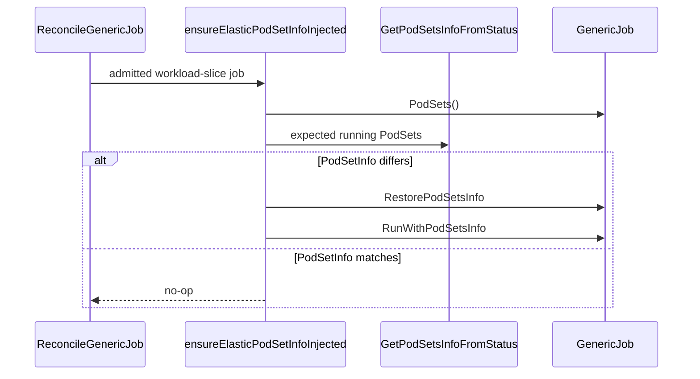
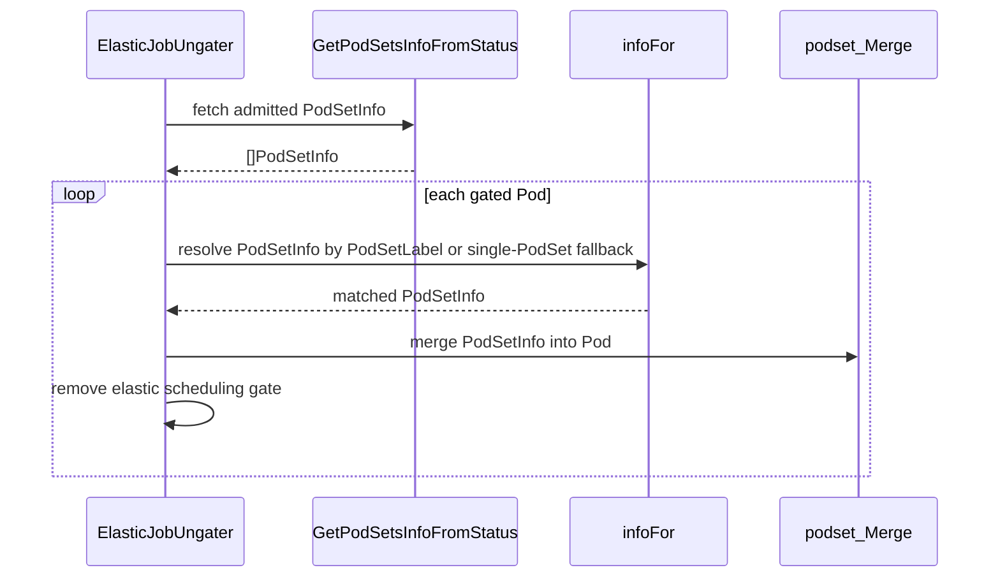

# PR #12421: Apply admission to elastic job templates

**Summary**: Apply admission to elastic job templates

**Sources**: https://github.com/kubernetes-sigs/kueue/pull/12421

**Last updated**: 2026-06-27T01:22:00Z

---

## Metadata

- **State**: open
- **Author**: [@ikchifo](https://github.com/ikchifo)
- **Branch**: `fix-12350-elastic-via-startjob` → `main`
- **Created**: 2026-06-22T20:36:26Z
- **Updated**: 2026-06-27T01:22:00Z
- **Merged**: —
- **Closed**: —
- **Labels**: `kind/bug`, `release-note`, `size/XL`, `ok-to-test`, `cncf-cla: yes`, `area/integrations`
- **Assignees**: _none_
- **Requested reviewers**: [@sohankunkerkar](https://github.com/sohankunkerkar)
- **Changed files**: 6   **+621 / -20**

## Description

<!--  Thanks for sending a pull request!  Here are some tips for you:

1. If this is your first time, please read our contributor guidelines: https://git.k8s.io/community/contributors/guide/first-contribution.md#your-first-contribution and developer guide https://git.k8s.io/community/contributors/devel/development.md#development-guide
2. Please label this pull request according to what type of issue you are addressing, especially if this is a release targeted pull request. For reference on required PR/issue labels, read here:
https://git.k8s.io/community/contributors/devel/sig-release/release.md#issuepr-kind-label
3. Ensure you have added or ran the appropriate tests for your PR: https://git.k8s.io/community/contributors/devel/sig-testing/testing.md
4. If you want *faster* PR reviews, read how: https://git.k8s.io/community/contributors/guide/pull-requests.md#best-practices-for-faster-reviews
5. If the PR is unfinished, see how to mark it: https://git.k8s.io/community/contributors/guide/pull-requests.md#marking-unfinished-pull-requests
-->

#### What type of PR is this?

<!--
Add one of the following kinds:
/kind bug
/kind cleanup
/kind documentation
/kind feature
/kind kep

Optionally add one or more of the following kinds if applicable:
/kind api-change
/kind deprecation
/kind failing-test
/kind flake
/kind regression

Please also consider setting the area:
/area tas
/area integrations
/area multikueue
/area dashboard
/area localization
/area testing
/area website
-->

/kind bug
/area integrations

#### What this PR does / why we need it:

Elastic jobs that are already unsuspended when their Workload is admitted
bypass the normal suspended-job `startJob` path. Their owner PodTemplates
therefore do not receive the admitted ResourceFlavor node labels and
tolerations. Pods created later by an autoscaler inherit the unmodified
template.

This PR routes that already-unsuspended elastic path through `startJob`.
`startJob` applies the admitted `PodSetInfo` to the owner PodTemplates, so
future Pods inherit the selected flavor. The owner template retains
`ElasticJobSchedulingGate`; `ElasticJobUngater` removes it from concrete Pods
when their Workload is admitted and repairs Pods that existed before the
template update.

For a replacement Workload slice, the reconciler restores canonical
`PodSetInfo` before merging the current admission. This removes stale
slice-specific metadata without removing the elastic gate. ResourceFlavor
selection remains stable across slice replacements.

#### Which issue(s) this PR fixes:
<!--
*Automatically closes linked issue when PR is merged.
Usage: `Fixes #<issue number>`, or `Fixes (paste link of issue)`.
_If PR is about `failing-tests or flakes`, please post the related issues/tests in a comment and do not use `Fixes`_*
-->
Fixes #12350

#### Special notes for your reviewer:

This is the alternative `startJob` design requested during review of #12403.
It retains the per-Pod ungater repair for already-materialized Pods. If
accepted, it supersedes #12403.

Used an AI tool to generate the tests for thoroughnes.

#### Does this PR introduce a user-facing change?
<!--
If no, just write "NONE" in the release-note block below.
If yes, a release note is required:
Enter your extended release note in the block below. If the PR requires additional action from users switching to the new release, include the string "action required".
-->
```release-note
Elastic jobs now apply admitted ResourceFlavor node labels and tolerations to
their owner PodTemplates, so Pods created after admission inherit the selected flavor.
```

/cc @mimowo @sohankunkerkar 

<!-- This is an auto-generated comment: release notes by coderabbit.ai -->
## Summary by CodeRabbit

## Summary by CodeRabbit

* **New Features**
  * Ungating Elastic jobs now injects pod-specific scheduling details during reconciliation, including PodSet-scoped flavor data when available.
  * Workload-sliced Elastic jobs refresh the running job’s PodSet info upon admission to keep templates in sync.

* **Bug Fixes**
  * Improved multi-PodSet matching and safe handling when PodSet/flavor data is missing.
  * RayCluster now correctly retains ResourceFlavor-derived node selector and toleration across admission and scale-up.

* **Tests**
  * Expanded unit and integration coverage for flavor-driven injection and ungating scenarios.
<!-- end of auto-generated comment: release notes by coderabbit.ai -->

## Discussion

### Comment by [@netlify[bot]](https://github.com/apps/netlify) — 2026-06-22T20:36:32Z

### <span aria-hidden="true">✅</span> Deploy Preview for *kubernetes-sigs-kueue* canceled.


|  Name | Link |
|:-:|------------------------|
|<span aria-hidden="true">🔨</span> Latest commit | 53ae383abef8c905852eab8f20a0d057d914f062 |
|<span aria-hidden="true">🔍</span> Latest deploy log | https://app.netlify.com/projects/kubernetes-sigs-kueue/deploys/6a3f1a3c7830c1000817dac5 |

### Comment by [@kubernetes-prow[bot]](https://github.com/apps/kubernetes-prow) — 2026-06-22T20:36:37Z

Hi @ikchifo. Thanks for your PR.

I'm waiting for a [kubernetes-sigs](https://github.com/orgs/kubernetes-sigs/people) member to verify that this patch is reasonable to test. If it is, they should reply with `/ok-to-test` on its own line. Until that is done, I will not automatically test new commits in this PR, but the usual testing commands by org members will still work.

>[!TIP]
>**We noticed you've done this a few times! Consider [joining the org](https://git.k8s.io/community/community-membership.md#member) to skip this step and gain `/lgtm` and other bot rights.** We recommend asking approvers on your previous PRs to sponsor you.

Once the patch is verified, the new status will be reflected by the `ok-to-test` label.

I understand the commands that are listed [here](https://go.k8s.io/bot-commands?repo=kubernetes-sigs%2Fkueue).

<details>

Instructions for interacting with me using PR comments are available [here](https://git.k8s.io/community/contributors/guide/pull-requests.md).  If you have questions or suggestions related to my behavior, please file an issue against the [kubernetes-sigs/prow](https://github.com/kubernetes-sigs/prow/issues/new?title=Prow%20issue:) repository.
</details>

### Comment by [@coderabbitai[bot]](https://github.com/apps/coderabbitai) — 2026-06-22T20:36:40Z

<!-- This is an auto-generated comment: summarize by coderabbit.ai -->
<!-- review_stack_entry_start -->

[](https://app.coderabbit.ai/change-stack/kubernetes-sigs/kueue/pull/12421?utm_source=github_walkthrough&utm_medium=github&utm_campaign=change_stack)

<!-- review_stack_entry_end -->
No actionable comments were generated in the recent review. 🎉

<details>
<summary>ℹ️ Recent review info</summary>

<details>
<summary>⚙️ Run configuration</summary>

**Configuration used**: Path: .coderabbit.yaml

**Review profile**: CHILL

**Plan**: Pro

**Run ID**: `68d6bcef-fb95-49e9-9d6a-687187398938`

</details>

<details>
<summary>📥 Commits</summary>

Reviewing files that changed from the base of the PR and between 4565dcebfd046224cfc0868ee2459cbcf7bd2f30 and 53ae383abef8c905852eab8f20a0d057d914f062.

</details>

<details>
<summary>📒 Files selected for processing (2)</summary>

* `pkg/controller/jobframework/reconciler.go`
* `pkg/controller/jobframework/reconciler_test.go`

</details>

<details>
<summary>🚧 Files skipped from review as they are similar to previous changes (1)</summary>

* pkg/controller/jobframework/reconciler.go

</details>

</details>

---
<!-- walkthrough_start -->

<details>
<summary>📝 Walkthrough</summary>

## Walkthrough

Elastic job reconciliation now injects admitted PodSetInfo into workload-sliced jobs, and the elastic ungater merges matching PodSet data into pods before removing scheduling gates. Tests and RayCluster integration coverage were expanded for flavor-derived labels and tolerations.

## Changes

**Elastic Job ResourceFlavor Injection**

|Layer / File(s)|Summary|
|---|---|
|**Export PodSetInfo helper and update elastic start path** <br> `pkg/controller/jobframework/reconciler.go`, `pkg/controller/jobframework/reconciler_test.go`|`GetPodSetsInfoFromStatus` is exported and used in expected-running PodSet computation and job start logic. Workload-slicing jobs now restore PodSetsInfo from the workload before running, scale-up slice replacement copies user-authored PodSet templates when PodSet keys match, and the new test covers admitted and non-admitted workloads with missing, current, and stale slice metadata.|
|**Merge PodSetInfo during ungating** <br> `pkg/controller/elasticjobs/elastic_job_ungater.go`|`ElasticJobUngater` now fetches PodSetInfo for the admitted workload, resolves the matching PodSetInfo per pod using `PodSetLabel` or the single-PodSet fallback, and merges the derived data into each ungated pod while logging merge outcomes.|
|**Ungater tests for flavor-driven injection** <br> `pkg/controller/elasticjobs/elastic_job_ungater_test.go`, `pkg/util/testingjobs/pod/wrappers.go`|`TestReconcile` now supplies `resourceFlavors`, disables `AssignQueueLabelsForPods`, and updates existing expectations to include `PodSetLabel`. New cases cover single-PodSet node label and toleration injection, multi-PodSet flavor selection, missing `PodSetLabel`, missing `ResourceFlavor`, and client setup for flavor objects. `PodWrapper.Toleration` is added for test construction.|
|**RayCluster integration coverage for ResourceFlavor injection** <br> `test/integration/singlecluster/controller/jobs/raycluster/raycluster_controller_test.go`|The RayCluster integration test adds a dedicated toleration and a ResourceFlavor with node labels and tolerations, then verifies admitted elastic RayCluster templates receive the injected scheduling data and keep the elastic gate through admission and scale-up.|

## Sequence Diagram(s)





## Estimated code review effort

🎯 4 (Complex) | ⏱️ ~60 minutes

## Possibly related PRs

- [kubernetes-sigs/kueue#12137](https://github.com/kubernetes-sigs/kueue/pull/12137) — touches the same jobframework reconciliation path and related elastic workload-slice behavior in `pkg/controller/jobframework/reconciler.go`.

## Suggested reviewers

- kshalot
- mimowo

## Poem

> 🐇 Hop, hop, the gates now glide,  
> PodSet flavors ride inside.  
> Labels, taints, and slices align,  
> Elastic pods in tidy line.  
> A carrot salute to the merge 🍃

</details>

<!-- walkthrough_end -->
<!-- pre_merge_checks_walkthrough_start -->

<details>
<summary>🚥 Pre-merge checks | ✅ 4 | ❌ 1</summary>

### ❌ Failed checks (1 warning)

|     Check name     | Status     | Explanation                                                                           | Resolution                                                                         |
| :----------------: | :--------- | :------------------------------------------------------------------------------------ | :--------------------------------------------------------------------------------- |
| Docstring Coverage | ⚠️ Warning | Docstring coverage is 37.50% which is insufficient. The required threshold is 80.00%. | Write docstrings for the functions missing them to satisfy the coverage threshold. |

<details>
<summary>✅ Passed checks (4 passed)</summary>

|         Check name         | Status   | Explanation                                                                                                                                     |
| :------------------------: | :------- | :---------------------------------------------------------------------------------------------------------------------------------------------- |
|      Description Check     | ✅ Passed | Check skipped - CodeRabbit’s high-level summary is enabled.                                                                                     |
|         Title check        | ✅ Passed | The title is concise and matches the main change: applying admitted flavor metadata to elastic job templates.                                   |
|     Linked Issues check    | ✅ Passed | The changes inject admitted PodSetInfo into elastic job pods before ungating, matching `#12350`'s required ResourceFlavor labels and tolerations. |
| Out of Scope Changes check | ✅ Passed | The reconciler, helper, test, and RayCluster updates all support the same elastic admission fix and do not appear unrelated.                    |

</details>

</details>

<!-- pre_merge_checks_walkthrough_end -->
<!-- finishing_touch_checkbox_start -->

<details>
<summary>✨ Finishing Touches</summary>

<details>
<summary>🧪 Generate unit tests (beta)</summary>

- [ ] <!-- {"checkboxId": "f47ac10b-58cc-4372-a567-0e02b2c3d479", "radioGroupId": "utg-output-choice-group-unknown_comment_id"} -->   Create PR with unit tests

</details>

</details>

<!-- finishing_touch_checkbox_end -->
<!-- tips_start -->

---

Thanks for using [CodeRabbit](https://coderabbit.ai?utm_source=oss&utm_medium=github&utm_campaign=kubernetes-sigs/kueue&utm_content=12421)! It's free for OSS, and your support helps us grow. If you like it, consider giving us a shout-out.

<details>
<summary>❤️ Share</summary>

- [X](https://twitter.com/intent/tweet?text=I%20just%20used%20%40coderabbitai%20for%20my%20code%20review%2C%20and%20it%27s%20fantastic%21%20It%27s%20free%20for%20OSS%20and%20offers%20a%20free%20trial%20for%20the%20proprietary%20code.%20Check%20it%20out%3A&url=https%3A//coderabbit.ai)
- [Mastodon](https://mastodon.social/share?text=I%20just%20used%20%40coderabbitai%20for%20my%20code%20review%2C%20and%20it%27s%20fantastic%21%20It%27s%20free%20for%20OSS%20and%20offers%20a%20free%20trial%20for%20the%20proprietary%20code.%20Check%20it%20out%3A%20https%3A%2F%2Fcoderabbit.ai)
- [Reddit](https://www.reddit.com/submit?title=Great%20tool%20for%20code%20review%20-%20CodeRabbit&text=I%20just%20used%20CodeRabbit%20for%20my%20code%20review%2C%20and%20it%27s%20fantastic%21%20It%27s%20free%20for%20OSS%20and%20offers%20a%20free%20trial%20for%20proprietary%20code.%20Check%20it%20out%3A%20https%3A//coderabbit.ai)
- [LinkedIn](https://www.linkedin.com/sharing/share-offsite/?url=https%3A%2F%2Fcoderabbit.ai&mini=true&title=Great%20tool%20for%20code%20review%20-%20CodeRabbit&summary=I%20just%20used%20CodeRabbit%20for%20my%20code%20review%2C%20and%20it%27s%20fantastic%21%20It%27s%20free%20for%20OSS%20and%20offers%20a%20free%20trial%20for%20proprietary%20code)

</details>


<sub>Comment `@coderabbitai help` to get the list of available commands.</sub>

<!-- tips_end -->

### Comment by [@kubernetes-prow[bot]](https://github.com/apps/kubernetes-prow) — 2026-06-22T20:37:09Z

[APPROVALNOTIFIER] This PR is **NOT APPROVED**

This pull-request has been approved by: *<a href="https://github.com/kubernetes-sigs/kueue/pull/12421#" title="Author self-approved">ikchifo</a>*
**Once this PR has been reviewed and has the lgtm label**, please assign [sohankunkerkar](https://github.com/sohankunkerkar) for approval. For more information see [the Code Review Process](https://git.k8s.io/community/contributors/guide/owners.md#the-code-review-process).

The full list of commands accepted by this bot can be found [here](https://go.k8s.io/bot-commands?repo=kubernetes-sigs%2Fkueue).

<details open>
Needs approval from an approver in each of these files:

- **[pkg/controller/OWNERS](https://github.com/kubernetes-sigs/kueue/blob/main/pkg/controller/OWNERS)**
- **[pkg/util/testingjobs/OWNERS](https://github.com/kubernetes-sigs/kueue/blob/main/pkg/util/testingjobs/OWNERS)**
- **[test/OWNERS](https://github.com/kubernetes-sigs/kueue/blob/main/test/OWNERS)**

Approvers can indicate their approval by writing `/approve` in a comment
Approvers can cancel approval by writing `/approve cancel` in a comment
</details>
<!-- META={"approvers":["sohankunkerkar"]} -->

### Comment by [@ikchifo](https://github.com/ikchifo) — 2026-06-22T20:42:39Z

This PR keeps per-pod injection for pods that already exist at admission, while also routing admitted elastic jobs through `startJob`. This updates the owner PodTemplate so autoscaler-created pods inherit the ResourceFlavor placement. Replacement slices restore canonical Workload PodSets before applying their new admission.

Locally validated with some targeted Job and RayCluster integration tests.
If the design here looks right, I'll close the other PR  in favor of this.
cc: @mimowo @sohankunkerkar

### Comment by [@mimowo](https://github.com/mimowo) — 2026-06-22T20:44:41Z

/ok-to-test

### Comment by [@k8s-triage-robot](https://github.com/k8s-triage-robot) — 2026-06-22T23:52:02Z

Unknown CLA label state. Rechecking for CLA labels.

Send feedback to sig-contributor-experience at [kubernetes/community](https://github.com/kubernetes/community).

/check-cla
/easycla

### Comment by [@ikchifo](https://github.com/ikchifo) — 2026-06-27T00:38:39Z

Also, visit [pull-kueue-test-integration-shard-2-main/2070659213809422336/build-log.txt](https://storage.googleapis.com/kubernetes-ci-logs/pr-logs/pull/kubernetes-sigs_kueue/12421/pull-kueue-test-integration-shard-2-main/2070659213809422336/build-log.txt) and search for this error:
```
field is immutable
```
That's what 53ae383 addresses; when a Batch Job scale-up repeatedly attempts to mutate immutable spec.template

## Reviews

### Review by [@mimowo](https://github.com/mimowo) (commented) — 2026-06-22T20:51:11Z

- **pkg/controller/jobframework/reconciler.go:663** by [@mimowo](https://github.com/mimowo) — 2026-06-22T20:51:07Z
```diff
@@ -619,12 +620,85 @@ func (r *JobReconciler) ReconcileGenericJob(ctx context.Context, req ctrl.Reques
 		return ctrl.Result{}, err
 	}
 
+	// workload is admitted. For elastic (workload-slice-enabled) jobs, ensure
+	// the parent's PodTemplate carries the admitted PodSetInfo so that future
+	// pods (e.g. autoscaler-created) inherit flavor info without relying on
+	// per-pod injection by the ElasticJobUngater. Existing gated pods that
+	// predate this patch are still handled per-pod by the ungater; Merge is
+	// idempotent for pods that already have the info.
+	if WorkloadSliceEnabled(job) {
+		if err := r.ensureElasticPodSetInfoInjected(ctx, job, object, wl, log); err != nil {
+			return ctrl.Result{}, err
+		}
+		return ctrl.Result{}, nil
+	}
+
 	// workload is admitted and job is running, nothing to do.
-	// For elastic jobs, pod ungating is handled by the ElasticJobUngater controller.
 	log.V(3).Info("Job running with admitted workload, nothing to do")
 	return ctrl.Result{}, nil
 }
 
+// ensureElasticPodSetInfoInjected patches the parent job's PodTemplate with the
+// admitted PodSetInfo when it differs from the current workload assignment.
+func (r *JobReconciler) ensureElasticPodSetInfoInjected(ctx context.Context, job GenericJob, object client.Object, wl *kueue.Workload, log logr.Logger) error {
+	jobPodSets, err := JobPodSets(ctx, job, r.client)
+	if err != nil {
+		return fmt.Errorf("getting PodSets for elastic job: %w", err)
+	}
+	runningPodSets := expectedRunningPodSets(ctx, r.client, wl)
+	// Remove the elastic gate only from desired state. Keeping it in jobPodSets
+	// makes a still-gated owner template differ and trigger injection.
+	for i := range runningPodSets {
+		runningPodSets[i].Template.Spec.SchedulingGates = withoutElasticJobSchedulingGate(runningPodSets[i].Template.Spec.SchedulingGates)
+	}
+	if runningPodSets != nil && podSetInfoFieldsEqual(jobPodSets, runningPodSets) {
+		return nil
+	}
+
+	log.V(2).Info("Injecting PodSet info into elastic job template after admission")
+	// Workload PodSets are canonical for PodSetInfo-managed fields. Restoring
+	// them intentionally replaces out-of-band changes to those fields.
+	restoreInfo := GetPodSetsInfoFromWorkload(wl)
+	for i := range restoreInfo {
+		restoreInfo[i].SchedulingGates = withoutElasticJobSchedulingGate(restoreInfo[i].SchedulingGates)
```

  I was rather thinking about injecting the scheduling gate inside start job, probably next to setting the PodSetLavel or injecting the Topology scheduling gate. Any reason to do this outside of startJob?

### Review by [@ikchifo](https://github.com/ikchifo) (commented) — 2026-06-22T21:16:14Z

- **pkg/controller/jobframework/reconciler.go:663** by [@ikchifo](https://github.com/ikchifo) — 2026-06-22T21:16:14Z
```diff
@@ -619,12 +620,85 @@ func (r *JobReconciler) ReconcileGenericJob(ctx context.Context, req ctrl.Reques
 		return ctrl.Result{}, err
 	}
 
+	// workload is admitted. For elastic (workload-slice-enabled) jobs, ensure
+	// the parent's PodTemplate carries the admitted PodSetInfo so that future
+	// pods (e.g. autoscaler-created) inherit flavor info without relying on
+	// per-pod injection by the ElasticJobUngater. Existing gated pods that
+	// predate this patch are still handled per-pod by the ungater; Merge is
+	// idempotent for pods that already have the info.
+	if WorkloadSliceEnabled(job) {
+		if err := r.ensureElasticPodSetInfoInjected(ctx, job, object, wl, log); err != nil {
+			return ctrl.Result{}, err
+		}
+		return ctrl.Result{}, nil
+	}
+
 	// workload is admitted and job is running, nothing to do.
-	// For elastic jobs, pod ungating is handled by the ElasticJobUngater controller.
 	log.V(3).Info("Job running with admitted workload, nothing to do")
 	return ctrl.Result{}, nil
 }
 
+// ensureElasticPodSetInfoInjected patches the parent job's PodTemplate with the
+// admitted PodSetInfo when it differs from the current workload assignment.
+func (r *JobReconciler) ensureElasticPodSetInfoInjected(ctx context.Context, job GenericJob, object client.Object, wl *kueue.Workload, log logr.Logger) error {
+	jobPodSets, err := JobPodSets(ctx, job, r.client)
+	if err != nil {
+		return fmt.Errorf("getting PodSets for elastic job: %w", err)
+	}
+	runningPodSets := expectedRunningPodSets(ctx, r.client, wl)
+	// Remove the elastic gate only from desired state. Keeping it in jobPodSets
+	// makes a still-gated owner template differ and trigger injection.
+	for i := range runningPodSets {
+		runningPodSets[i].Template.Spec.SchedulingGates = withoutElasticJobSchedulingGate(runningPodSets[i].Template.Spec.SchedulingGates)
+	}
+	if runningPodSets != nil && podSetInfoFieldsEqual(jobPodSets, runningPodSets) {
+		return nil
+	}
+
+	log.V(2).Info("Injecting PodSet info into elastic job template after admission")
+	// Workload PodSets are canonical for PodSetInfo-managed fields. Restoring
+	// them intentionally replaces out-of-band changes to those fields.
+	restoreInfo := GetPodSetsInfoFromWorkload(wl)
+	for i := range restoreInfo {
+		restoreInfo[i].SchedulingGates = withoutElasticJobSchedulingGate(restoreInfo[i].SchedulingGates)
```

  Ahh, I put the logic outside because already-running elastic jobs bypass the 'suspended' code branch, and I wanted to avoid patching and emitting start events on every reconcile.
  
  I’ll just move that mutation into `startJob` then.

### Review by [@coderabbitai[bot]](https://github.com/apps/coderabbitai) (commented) — 2026-06-22T21:36:51Z

**Actionable comments posted: 1**

<details>
<summary>🤖 Prompt for all review comments with AI agents</summary>

```
Verify each finding against current code. Fix only still-valid issues, skip the
rest with a brief reason, keep changes minimal, and validate.

Inline comments:
In `@pkg/controller/elasticjobs/elastic_job_ungater.go`:
- Around line 170-185: The code currently ungates pods even when the
podset.Merge operation fails, which can result in flavor injection being
skipped. When mergeErr is not nil in the podset.Merge call, the function should
return false to prevent the pod from being ungated, instead of logging the error
and continuing to return true. Replace the error logging block to return false
and the merge error immediately when the merge operation fails, ensuring pods
are only ungated after successful flavor injection.
```

</details>

<details>
<summary>🪄 Autofix (Beta)</summary>

Fix all unresolved CodeRabbit comments on this PR:

- [ ] <!-- {"checkboxId": "4b0d0e0a-96d7-4f10-b296-3a18ea78f0b9"} --> Push a commit to this branch (recommended)
- [ ] <!-- {"checkboxId": "ff5b1114-7d8c-49e6-8ac1-43f82af23a33"} --> Create a new PR with the fixes

</details>

---

<details>
<summary>ℹ️ Review info</summary>

<details>
<summary>⚙️ Run configuration</summary>

**Configuration used**: Path: .coderabbit.yaml

**Review profile**: CHILL

**Plan**: Pro

**Run ID**: `eedf4872-696b-43b1-aba1-78106cef8390`

</details>

<details>
<summary>📥 Commits</summary>

Reviewing files that changed from the base of the PR and between 50f6b7f1c3376f81109eb1d01841682255eef495 and 963357b7538dc515059b4f1b294cf5501501684a.

</details>

<details>
<summary>📒 Files selected for processing (6)</summary>

* `pkg/controller/elasticjobs/elastic_job_ungater.go`
* `pkg/controller/elasticjobs/elastic_job_ungater_test.go`
* `pkg/controller/jobframework/reconciler.go`
* `pkg/controller/jobframework/reconciler_test.go`
* `pkg/util/testingjobs/pod/wrappers.go`
* `test/integration/singlecluster/controller/jobs/raycluster/raycluster_controller_test.go`

</details>

</details>

<!-- This is an auto-generated comment by CodeRabbit for review status -->

- **pkg/controller/elasticjobs/elastic_job_ungater.go:185** by [@coderabbitai[bot]](https://github.com/apps/coderabbitai) — 2026-06-22T21:36:50Z
```diff
@@ -135,10 +167,22 @@ func (r *elasticJobUngater) Reconcile(ctx context.Context, req reconcile.Request
 		var ungated bool
 		e := utilclient.Patch(ctx, r.client, pod, func() (bool, error) {
 			ungated = utilpod.Ungate(pod, kueue.ElasticJobSchedulingGate)
-			if ungated {
-				log.V(3).Info("ungating elastic pod", "pod", klog.KObj(pod))
+			if !ungated {
+				return false, nil
+			}
+			if info, ok := infoFor(pod); ok {
+				if mergeErr := podset.Merge(&pod.ObjectMeta, &pod.Spec, info); mergeErr != nil {
+					log.Error(mergeErr, "failed merging PodSet info after ungating; pod released without flavor injection",
+						"pod", klog.KObj(pod))
+				} else {
+					log.V(3).Info("ungating elastic pod with assigned flavor info",
+						"pod", klog.KObj(pod), "flavors", flavorsByPodSet[info.Name])
+				}
+			} else {
+				log.V(0).Info("ungating elastic pod without flavor info; no matching PodSet",
+					"pod", klog.KObj(pod))
 			}
-			return ungated, nil
+			return true, nil
```

  _🎯 Functional Correctness_ | _🟠 Major_ | _⚡ Quick win_
  
  **Do not ungate pods when PodSetInfo merge fails.**
  
  Right now, `utilpod.Ungate` runs before `podset.Merge`, and merge failures are only logged. This can persist gate removal while skipping flavor injection.
  
  <details>
  <summary>Suggested fix</summary>
  
  ```diff
   		e := utilclient.Patch(ctx, r.client, pod, func() (bool, error) {
  -			ungated = utilpod.Ungate(pod, kueue.ElasticJobSchedulingGate)
  -			if !ungated {
  -				return false, nil
  -			}
   			if info, ok := infoFor(pod); ok {
   				if mergeErr := podset.Merge(&pod.ObjectMeta, &pod.Spec, info); mergeErr != nil {
  -					log.Error(mergeErr, "failed merging PodSet info after ungating; pod released without flavor injection",
  -						"pod", klog.KObj(pod))
  +					return false, fmt.Errorf("merging PodSet info for pod %s: %w", klog.KObj(pod), mergeErr)
   				} else {
   					log.V(3).Info("ungating elastic pod with assigned flavor info",
   						"pod", klog.KObj(pod), "flavors", flavorsByPodSet[info.Name])
   				}
   			} else {
   				log.V(0).Info("ungating elastic pod without flavor info; no matching PodSet",
   					"pod", klog.KObj(pod))
   			}
  +			ungated = utilpod.Ungate(pod, kueue.ElasticJobSchedulingGate)
  +			if !ungated {
  +				return false, nil
  +			}
   			return true, nil
   		})
  ```
  </details>
  
      
  
  As per path instructions, `pkg/controller/**/*.go` reconciliation should ensure correctness and proper error handling.
  
  <!-- suggestion_start -->
  
  <details>
  <summary>📝 Committable suggestion</summary>
  
  > ‼️ **IMPORTANT**
  > Carefully review the code before committing. Ensure that it accurately replaces the highlighted code, contains no missing lines, and has no issues with indentation. Thoroughly test & benchmark the code to ensure it meets the requirements.
  
  ```suggestion
  		e := utilclient.Patch(ctx, r.client, pod, func() (bool, error) {
  			if info, ok := infoFor(pod); ok {
  				if mergeErr := podset.Merge(&pod.ObjectMeta, &pod.Spec, info); mergeErr != nil {
  					return false, fmt.Errorf("merging PodSet info for pod %s: %w", klog.KObj(pod), mergeErr)
  				} else {
  					log.V(3).Info("ungating elastic pod with assigned flavor info",
  						"pod", klog.KObj(pod), "flavors", flavorsByPodSet[info.Name])
  				}
  			} else {
  				log.V(0).Info("ungating elastic pod without flavor info; no matching PodSet",
  					"pod", klog.KObj(pod))
  			}
  			ungated = utilpod.Ungate(pod, kueue.ElasticJobSchedulingGate)
  			if !ungated {
  				return false, nil
  			}
  			return true, nil
  		})
  ```
  
  </details>
  
  <!-- suggestion_end -->
  
  <details>
  <summary>🤖 Prompt for AI Agents</summary>
  
  ```
  Verify each finding against current code. Fix only still-valid issues, skip the
  rest with a brief reason, keep changes minimal, and validate.
  
  In `@pkg/controller/elasticjobs/elastic_job_ungater.go` around lines 170 - 185,
  The code currently ungates pods even when the podset.Merge operation fails,
  which can result in flavor injection being skipped. When mergeErr is not nil in
  the podset.Merge call, the function should return false to prevent the pod from
  being ungated, instead of logging the error and continuing to return true.
  Replace the error logging block to return false and the merge error immediately
  when the merge operation fails, ensuring pods are only ungated after successful
  flavor injection.
  ```
  
  </details>
  
  <!-- fingerprinting:phantom:poseidon:hawk -->
  
  <!-- cr-indicator-types:potential_issue -->
  
  <!-- cr-comment:v1:d27eb674467a1e34edd79275 -->
  
  _Source: Path instructions_
  
  <!-- This is an auto-generated reply by CodeRabbit -->

### Review by [@ikchifo](https://github.com/ikchifo) (commented) — 2026-06-22T21:44:15Z

- **pkg/controller/elasticjobs/elastic_job_ungater.go:185** by [@ikchifo](https://github.com/ikchifo) — 2026-06-22T21:44:15Z
```diff
@@ -135,10 +167,22 @@ func (r *elasticJobUngater) Reconcile(ctx context.Context, req reconcile.Request
 		var ungated bool
 		e := utilclient.Patch(ctx, r.client, pod, func() (bool, error) {
 			ungated = utilpod.Ungate(pod, kueue.ElasticJobSchedulingGate)
-			if ungated {
-				log.V(3).Info("ungating elastic pod", "pod", klog.KObj(pod))
+			if !ungated {
+				return false, nil
+			}
+			if info, ok := infoFor(pod); ok {
+				if mergeErr := podset.Merge(&pod.ObjectMeta, &pod.Spec, info); mergeErr != nil {
+					log.Error(mergeErr, "failed merging PodSet info after ungating; pod released without flavor injection",
+						"pod", klog.KObj(pod))
+				} else {
+					log.V(3).Info("ungating elastic pod with assigned flavor info",
+						"pod", klog.KObj(pod), "flavors", flavorsByPodSet[info.Name])
+				}
+			} else {
+				log.V(0).Info("ungating elastic pod without flavor info; no matching PodSet",
+					"pod", klog.KObj(pod))
 			}
-			return ungated, nil
+			return true, nil
```

  This is intentional. Merge conflicts are deterministic, so retrying would leave an admitted pod gated indefinitely. We log the error and ungate to avoid that regression; future pods inherit the corrected owner template.

### Review by [@coderabbitai[bot]](https://github.com/apps/coderabbitai) (commented) — 2026-06-22T21:44:48Z

- **pkg/controller/elasticjobs/elastic_job_ungater.go:185** by [@coderabbitai[bot]](https://github.com/apps/coderabbitai) — 2026-06-22T21:44:48Z
```diff
@@ -135,10 +167,22 @@ func (r *elasticJobUngater) Reconcile(ctx context.Context, req reconcile.Request
 		var ungated bool
 		e := utilclient.Patch(ctx, r.client, pod, func() (bool, error) {
 			ungated = utilpod.Ungate(pod, kueue.ElasticJobSchedulingGate)
-			if ungated {
-				log.V(3).Info("ungating elastic pod", "pod", klog.KObj(pod))
+			if !ungated {
+				return false, nil
+			}
+			if info, ok := infoFor(pod); ok {
+				if mergeErr := podset.Merge(&pod.ObjectMeta, &pod.Spec, info); mergeErr != nil {
+					log.Error(mergeErr, "failed merging PodSet info after ungating; pod released without flavor injection",
+						"pod", klog.KObj(pod))
+				} else {
+					log.V(3).Info("ungating elastic pod with assigned flavor info",
+						"pod", klog.KObj(pod), "flavors", flavorsByPodSet[info.Name])
+				}
+			} else {
+				log.V(0).Info("ungating elastic pod without flavor info; no matching PodSet",
+					"pod", klog.KObj(pod))
 			}
-			return ungated, nil
+			return true, nil
```

  `@ikchifo`, that's a well-reasoned tradeoff — deterministic merge failures mean retrying would permanently gate an otherwise-admitted pod, which is a worse outcome than releasing it without flavor injection. The owner-template patching via `startJob` covers future pods from autoscalers, so the degraded-injection path is limited to pre-existing pods with conflicting metadata. Withdrawing the concern.
  
  
  
  <!-- <review_comment_withdrawn> -->
  
  ---
  
  <details>
  <summary>✏️ Learnings added</summary>
  
  ```
  Learnt from: ikchifo
  Repo: kubernetes-sigs/kueue PR: 12421
  File: pkg/controller/elasticjobs/elastic_job_ungater.go:170-185
  Timestamp: 2026-06-22T21:44:40.168Z
  Learning: In `pkg/controller/elasticjobs/elastic_job_ungater.go`, when `podset.Merge` fails during elastic pod ungating, the code intentionally proceeds to ungate the pod anyway (logging the error) rather than returning an error that would block the patch. This is a deliberate design choice: merge conflicts are deterministic, so returning an error would leave an admitted pod gated indefinitely. Future pods created by autoscalers after admission inherit flavor info from the owner PodTemplate (patched via `startJob`), so the ungated-without-flavor-injection failure mode is limited to pre-existing pods with conflicting metadata.
  ```
  
  > Note: Learnings are effective only in the context of similar code segments. To apply general coding guidelines, please configure [review instructions](https://docs.coderabbit.ai/guides/review-instructions). You can manage existing learnings in the [app](https://app.coderabbit.ai/learnings).
  
  </details>
  
  
  
  ---
  
  <details>
  <summary>🧠 Learnings used</summary>
  
  ```
  Learnt from: weizhoublue
  Repo: kubernetes-sigs/kueue PR: 12143
  File: pkg/controller/core/clusterqueue_controller_test.go:442-442
  Timestamp: 2026-06-12T02:56:19.024Z
  Learning: When the repository targets Go 1.26+ (e.g., the module’s `go` directive is `>= 1.26`), do not mark `new(<value-expression>)` as invalid syntax. Starting in Go 1.26, the built-in `new` accepts a value expression (not only a type) and initializes the allocated variable to the expression’s value (e.g., `new(resource.MustParse("3"))` returns `*resource.Quantity` initialized to "3"). If the repo’s minimum Go version is 1.25 or lower, then flag `new(<value-expression>)` as invalid.
  ```
  
  </details>
  
  
  
  <!-- This is an auto-generated reply by CodeRabbit -->

### Review by [@mimowo](https://github.com/mimowo) (commented) — 2026-06-23T07:10:08Z

- **pkg/controller/jobframework/reconciler.go:654** by [@mimowo](https://github.com/mimowo) — 2026-06-23T07:10:08Z
```diff
@@ -619,12 +620,79 @@ func (r *JobReconciler) ReconcileGenericJob(ctx context.Context, req ctrl.Reques
 		return ctrl.Result{}, err
 	}
 
+	// workload is admitted. For elastic (workload-slice-enabled) jobs, ensure
+	// the parent's PodTemplate carries the admitted PodSetInfo so that future
+	// pods (e.g. autoscaler-created) inherit flavor info without relying on
+	// per-pod injection by the ElasticJobUngater. Existing gated pods that
+	// predate this patch are still handled per-pod by the ungater; Merge is
+	// idempotent for pods that already have the info.
+	if WorkloadSliceEnabled(job) {
+		if err := r.ensureElasticPodSetInfoInjected(ctx, job, object, wl, log); err != nil {
+			return ctrl.Result{}, err
+		}
+		return ctrl.Result{}, nil
+	}
+
 	// workload is admitted and job is running, nothing to do.
-	// For elastic jobs, pod ungating is handled by the ElasticJobUngater controller.
 	log.V(3).Info("Job running with admitted workload, nothing to do")
 	return ctrl.Result{}, nil
 }
 
+// ensureElasticPodSetInfoInjected patches the parent job's PodTemplate with the
+// admitted PodSetInfo when it differs from the current workload assignment.
+func (r *JobReconciler) ensureElasticPodSetInfoInjected(ctx context.Context, job GenericJob, object client.Object, wl *kueue.Workload, log logr.Logger) error {
+	jobPodSets, err := JobPodSets(ctx, job, r.client)
+	if err != nil {
+		return fmt.Errorf("getting PodSets for elastic job: %w", err)
+	}
+	runningPodSets := expectedRunningPodSets(ctx, r.client, wl)
+	// Remove the elastic gate only from desired state. Keeping it in jobPodSets
+	// makes a still-gated owner template differ and trigger injection.
+	for i := range runningPodSets {
+		runningPodSets[i].Template.Spec.SchedulingGates = withoutElasticJobSchedulingGate(runningPodSets[i].Template.Spec.SchedulingGates)
+	}
+	if runningPodSets != nil && podSetInfoFieldsEqual(jobPodSets, runningPodSets) {
+		return nil
+	}
+
+	log.V(2).Info("Injecting PodSet info into elastic job template after admission")
+	if err := r.startJob(ctx, job, object, wl); err != nil {
```

  Maybe I'm missing something, but I'm still wondering why we need a separete call to startJob, and cannot reuse the existing path which already takes case of the flavor injection. 
  
  I think in this case maybe a short call over slack could help to align (and walk together trough the code), feel free to reach out over slack.

### Review by [@coderabbitai[bot]](https://github.com/apps/coderabbitai) (commented) — 2026-06-26T22:19:03Z


<details>
<summary>🧹 Nitpick comments (2)</summary><blockquote>

<details>
<summary>test/integration/singlecluster/controller/jobs/raycluster/raycluster_controller_test.go (2)</summary><blockquote>

`776-799`: _📐 Maintainability & Code Quality_ | _🔵 Trivial_ | _⚡ Quick win_

**Assert the templates are still unpatched before admission.**

This test only checks the post-admission state. If the controller starts injecting `PodSetInfo` while the `ClusterQueue` is still held, this would still pass. Please add a pre-admission assertion that head/worker templates do **not** yet have the flavor nodeSelector/toleration while the workload remains pending. As per path instructions, `test/integration/**/*.go` should cover both positive and negative scenarios.

<details>
<summary>🤖 Prompt for AI Agents</summary>

```
Verify each finding against current code. Fix only still-valid issues, skip the
rest with a brief reason, keep changes minimal, and validate.

In
`@test/integration/singlecluster/controller/jobs/raycluster/raycluster_controller_test.go`
around lines 776 - 799, The RayCluster admission test only verifies the patched
template state after the workload is admitted, so it can miss premature
PodSetInfo injection; add a pre-admission check in this test around the existing
workload creation and before resuming the ClusterQueue. Use the existing
RayCluster and testRayClusterWorkload flow in this test to assert that the head
and worker templates still do not contain the flavor-derived nodeSelector and
toleration while the Workload remains pending, then keep the current
post-admission assertions as the positive case.
```

</details>

<!-- cr-comment:v1:e4bc3b32f8d32df5b84aaeef -->

_Source: Path instructions_

---

`950-962`: _📐 Maintainability & Code Quality_ | _🔵 Trivial_ | _⚡ Quick win_

**Keep asserting the elastic scheduling gate after scale-up.**

This block only checks nodeSelector/tolerations, so a scale-up regression that drops `kueue.ElasticJobSchedulingGate` would slip through. The admission test already covers the gate once; the scale-up path should too.

<details>
<summary>Suggested diff</summary>

```diff
 		gomega.Eventually(func(g gomega.Gomega) {
 			g.Expect(k8sClient.Get(ctx, client.ObjectKeyFromObject(testRayCluster), testRayCluster)).Should(gomega.Succeed())
 			g.Expect(testRayCluster.Spec.HeadGroupSpec.Template.Spec.NodeSelector).
 				Should(gomega.HaveKeyWithValue(instanceKey, "elastic"))
 			g.Expect(testRayCluster.Spec.HeadGroupSpec.Template.Spec.Tolerations).
 				Should(gomega.ContainElement(flavorToleration))
+			g.Expect(testRayCluster.Spec.HeadGroupSpec.Template.Spec.SchedulingGates).
+				Should(gomega.ContainElement(corev1.PodSchedulingGate{Name: kueue.ElasticJobSchedulingGate}))
 			g.Expect(testRayCluster.Spec.WorkerGroupSpecs[0].Template.Spec.NodeSelector).
 				Should(gomega.HaveKeyWithValue(instanceKey, "elastic"))
 			g.Expect(testRayCluster.Spec.WorkerGroupSpecs[0].Template.Spec.Tolerations).
 				Should(gomega.ContainElement(flavorToleration))
+			g.Expect(testRayCluster.Spec.WorkerGroupSpecs[0].Template.Spec.SchedulingGates).
+				Should(gomega.ContainElement(corev1.PodSchedulingGate{Name: kueue.ElasticJobSchedulingGate}))
 		}, util.Timeout, util.Interval).Should(gomega.Succeed())
```
</details>

As per path instructions, `test/integration/**/*.go` should cover both positive and negative scenarios, and this PR’s contract includes retaining the elastic gate through scale-up.

<details>
<summary>🤖 Prompt for AI Agents</summary>

```
Verify each finding against current code. Fix only still-valid issues, skip the
rest with a brief reason, keep changes minimal, and validate.

In
`@test/integration/singlecluster/controller/jobs/raycluster/raycluster_controller_test.go`
around lines 950 - 962, The scale-up assertion in the RayCluster controller test
currently verifies only nodeSelector and tolerations, so it can miss regressions
where the elastic scheduling gate is dropped. Update the existing scale-up check
around the RayCluster object to also assert that kueue.ElasticJobSchedulingGate
is still present after scale-up, alongside the existing checks on HeadGroupSpec
and WorkerGroupSpecs, so the test covers the full elastic scheduling contract.
```

</details>

<!-- cr-comment:v1:eabc3a4312ec71d03b59d3da -->

_Source: Path instructions_

</blockquote></details>

</blockquote></details>

<details>
<summary>🤖 Prompt for all review comments with AI agents</summary>

```
Verify each finding against current code. Fix only still-valid issues, skip the
rest with a brief reason, keep changes minimal, and validate.

Nitpick comments:
In
`@test/integration/singlecluster/controller/jobs/raycluster/raycluster_controller_test.go`:
- Around line 776-799: The RayCluster admission test only verifies the patched
template state after the workload is admitted, so it can miss premature
PodSetInfo injection; add a pre-admission check in this test around the existing
workload creation and before resuming the ClusterQueue. Use the existing
RayCluster and testRayClusterWorkload flow in this test to assert that the head
and worker templates still do not contain the flavor-derived nodeSelector and
toleration while the Workload remains pending, then keep the current
post-admission assertions as the positive case.
- Around line 950-962: The scale-up assertion in the RayCluster controller test
currently verifies only nodeSelector and tolerations, so it can miss regressions
where the elastic scheduling gate is dropped. Update the existing scale-up check
around the RayCluster object to also assert that kueue.ElasticJobSchedulingGate
is still present after scale-up, alongside the existing checks on HeadGroupSpec
and WorkerGroupSpecs, so the test covers the full elastic scheduling contract.
```

</details>

---

<details>
<summary>ℹ️ Review info</summary>

<details>
<summary>⚙️ Run configuration</summary>

**Configuration used**: Path: .coderabbit.yaml

**Review profile**: CHILL

**Plan**: Pro

**Run ID**: `4fb338bd-a161-4074-9f95-7605b03e5433`

</details>

<details>
<summary>📥 Commits</summary>

Reviewing files that changed from the base of the PR and between 963357b7538dc515059b4f1b294cf5501501684a and d80d91c901f197ec715b695340db43d88cdf0058.

</details>

<details>
<summary>📒 Files selected for processing (3)</summary>

* `pkg/controller/jobframework/reconciler.go`
* `pkg/controller/jobframework/reconciler_test.go`
* `test/integration/singlecluster/controller/jobs/raycluster/raycluster_controller_test.go`

</details>

</details>

<!-- This is an auto-generated comment by CodeRabbit for review status -->

### Review by [@ikchifo](https://github.com/ikchifo) (commented) — 2026-06-27T01:22:00Z

- **pkg/controller/jobframework/reconciler.go:654** by [@ikchifo](https://github.com/ikchifo) — 2026-06-27T01:21:59Z
```diff
@@ -619,12 +620,79 @@ func (r *JobReconciler) ReconcileGenericJob(ctx context.Context, req ctrl.Reques
 		return ctrl.Result{}, err
 	}
 
+	// workload is admitted. For elastic (workload-slice-enabled) jobs, ensure
+	// the parent's PodTemplate carries the admitted PodSetInfo so that future
+	// pods (e.g. autoscaler-created) inherit flavor info without relying on
+	// per-pod injection by the ElasticJobUngater. Existing gated pods that
+	// predate this patch are still handled per-pod by the ungater; Merge is
+	// idempotent for pods that already have the info.
+	if WorkloadSliceEnabled(job) {
+		if err := r.ensureElasticPodSetInfoInjected(ctx, job, object, wl, log); err != nil {
+			return ctrl.Result{}, err
+		}
+		return ctrl.Result{}, nil
+	}
+
 	// workload is admitted and job is running, nothing to do.
-	// For elastic jobs, pod ungating is handled by the ElasticJobUngater controller.
 	log.V(3).Info("Job running with admitted workload, nothing to do")
 	return ctrl.Result{}, nil
 }
 
+// ensureElasticPodSetInfoInjected patches the parent job's PodTemplate with the
+// admitted PodSetInfo when it differs from the current workload assignment.
+func (r *JobReconciler) ensureElasticPodSetInfoInjected(ctx context.Context, job GenericJob, object client.Object, wl *kueue.Workload, log logr.Logger) error {
+	jobPodSets, err := JobPodSets(ctx, job, r.client)
+	if err != nil {
+		return fmt.Errorf("getting PodSets for elastic job: %w", err)
+	}
+	runningPodSets := expectedRunningPodSets(ctx, r.client, wl)
+	// Remove the elastic gate only from desired state. Keeping it in jobPodSets
+	// makes a still-gated owner template differ and trigger injection.
+	for i := range runningPodSets {
+		runningPodSets[i].Template.Spec.SchedulingGates = withoutElasticJobSchedulingGate(runningPodSets[i].Template.Spec.SchedulingGates)
+	}
+	if runningPodSets != nil && podSetInfoFieldsEqual(jobPodSets, runningPodSets) {
+		return nil
+	}
+
+	log.V(2).Info("Injecting PodSet info into elastic job template after admission")
+	if err := r.startJob(ctx, job, object, wl); err != nil {
```

  Thanks for the call. 
  
  Two incorrect assumptions were clarified: 
  - ResourceFlavor does not change between slices
  - Suspended batch Jobs cannot create Pods before `startJob` injects `PodSetInfo`. 
  
  We agreed to reuse `startJob` for injection and avoid reinjecting on replacement slices. I’ve updated the PR accordingly.
