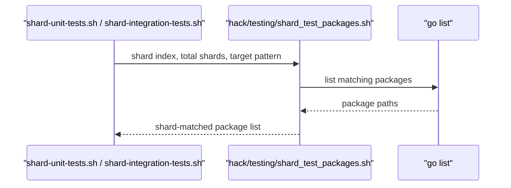

# PR #12517: test: Optimize the CI job for unit tests

**Summary**: test: Optimize the CI job for unit tests

**Sources**: https://github.com/kubernetes-sigs/kueue/pull/12517

**Last updated**: 2026-06-29T08:35:29Z

---

## Metadata

- **State**: closed (merged)
- **Author**: [@ekam-walia](https://github.com/ekam-walia)
- **Branch**: `optimize-ci-time-for-unit-tests` → `main`
- **Created**: 2026-06-26T05:37:05Z
- **Updated**: 2026-06-29T08:35:29Z
- **Merged**: 2026-06-29T08:34:09Z
- **Closed**: 2026-06-29T08:34:09Z
- **Labels**: `kind/feature`, `size/L`, `lgtm`, `release-note-none`, `approved`, `kind/cleanup`, `ok-to-test`, `cncf-cla: yes`, `area/testing`
- **Assignees**: [@mimowo](https://github.com/mimowo)
- **Requested reviewers**: [@mimowo](https://github.com/mimowo), [@pajakd](https://github.com/pajakd), [@tenzen-y](https://github.com/tenzen-y)
- **Changed files**: 4   **+135 / -60**

## Description

#### What type of PR is this?

/kind cleanup
/kind feature
/area testing


#### What this PR does / why we need it:
This PR helps in optimising the CI job for unit tests.

#### Which issue(s) this PR fixes:

Fixes #12504

#### Special notes for your reviewer:
This PR adds a new file in hack/testing named shard-unit-tests.sh and some minimal changes in makefile-test.mk

#### Does this PR introduce a user-facing change?

```release-note
NONE
```

```

================================================================================
Test Sharding Summary (Total Packages = 259)
================================================================================
[*] [Shard 0] sigs.k8s.io/kueue/apis/config/v1beta1
[ ] [Shard 1] sigs.k8s.io/kueue/apis/config/v1beta2
[ ] [Shard 2] sigs.k8s.io/kueue/apis/kueue/v1alpha1
sigs.k8s.io/kueue/apis/config/v1beta1
[ ] [Shard 3] sigs.k8s.io/kueue/apis/kueue/v1beta1
[*] [Shard 0] sigs.k8s.io/kueue/apis/kueue/v1beta2
sigs.k8s.io/kueue/apis/kueue/v1beta2
[ ] [Shard 1] sigs.k8s.io/kueue/apis/visibility/openapi
[ ] [Shard 2] sigs.k8s.io/kueue/apis/visibility/v1beta1
[ ] [Shard 3] sigs.k8s.io/kueue/apis/visibility/v1beta2
[*] [Shard 0] sigs.k8s.io/kueue/client-go/applyconfiguration
sigs.k8s.io/kueue/client-go/applyconfiguration
[ ] [Shard 1] sigs.k8s.io/kueue/client-go/applyconfiguration/internal
[ ] [Shard 2] sigs.k8s.io/kueue/client-go/applyconfiguration/kueue/v1beta1
[ ] [Shard 3] sigs.k8s.io/kueue/client-go/applyconfiguration/kueue/v1beta2
[*] [Shard 0] sigs.k8s.io/kueue/client-go/applyconfiguration/visibility/v1beta1
sigs.k8s.io/kueue/client-go/applyconfiguration/visibility/v1beta1
[ ] [Shard 1] sigs.k8s.io/kueue/client-go/applyconfiguration/visibility/v1beta2
[ ] [Shard 2] sigs.k8s.io/kueue/client-go/clientset/versioned
[ ] [Shard 3] sigs.k8s.io/kueue/client-go/clientset/versioned/fake
[*] [Shard 0] sigs.k8s.io/kueue/client-go/clientset/versioned/scheme
sigs.k8s.io/kueue/client-go/clientset/versioned/scheme
[ ] [Shard 1] sigs.k8s.io/kueue/client-go/clientset/versioned/typed/kueue/v1alpha1
[ ] [Shard 2] sigs.k8s.io/kueue/client-go/clientset/versioned/typed/kueue/v1alpha1/fake
[ ] [Shard 3] sigs.k8s.io/kueue/client-go/clientset/versioned/typed/kueue/v1beta1
[*] [Shard 0] sigs.k8s.io/kueue/client-go/clientset/versioned/typed/kueue/v1beta1/fake
sigs.k8s.io/kueue/client-go/clientset/versioned/typed/kueue/v1beta1/fake
[ ] [Shard 1] sigs.k8s.io/kueue/client-go/clientset/versioned/typed/kueue/v1beta2
[ ] [Shard 2] sigs.k8s.io/kueue/client-go/clientset/versioned/typed/kueue/v1beta2/fake
[ ] [Shard 3] sigs.k8s.io/kueue/client-go/clientset/versioned/typed/visibility/v1beta1
[*] [Shard 0] sigs.k8s.io/kueue/client-go/clientset/versioned/typed/visibility/v1beta1/fake
sigs.k8s.io/kueue/client-go/clientset/versioned/typed/visibility/v1beta1/fake
[ ] [Shard 1] sigs.k8s.io/kueue/client-go/clientset/versioned/typed/visibility/v1beta2
[ ] [Shard 2] sigs.k8s.io/kueue/client-go/clientset/versioned/typed/visibility/v1beta2/fake
[ ] [Shard 3] sigs.k8s.io/kueue/client-go/informers/externalversions
[*] [Shard 0] sigs.k8s.io/kueue/client-go/informers/externalversions/internalinterfaces
sigs.k8s.io/kueue/client-go/informers/externalversions/internalinterfaces
[ ] [Shard 1] sigs.k8s.io/kueue/client-go/informers/externalversions/kueue
[ ] [Shard 2] sigs.k8s.io/kueue/client-go/informers/externalversions/kueue/v1beta1
[ ] [Shard 3] sigs.k8s.io/kueue/client-go/informers/externalversions/kueue/v1beta2
[*] [Shard 0] sigs.k8s.io/kueue/client-go/informers/externalversions/visibility
sigs.k8s.io/kueue/client-go/informers/externalversions/visibility
[ ] [Shard 1] sigs.k8s.io/kueue/client-go/informers/externalversions/visibility/v1beta1
[ ] [Shard 2] sigs.k8s.io/kueue/client-go/informers/externalversions/visibility/v1beta2
[ ] [Shard 3] sigs.k8s.io/kueue/client-go/listers/kueue/v1beta1
[*] [Shard 0] sigs.k8s.io/kueue/client-go/listers/kueue/v1beta2
sigs.k8s.io/kueue/client-go/listers/kueue/v1beta2
[ ] [Shard 1] sigs.k8s.io/kueue/client-go/listers/visibility/v1beta1
[ ] [Shard 2] sigs.k8s.io/kueue/client-go/listers/visibility/v1beta2
[ ] [Shard 3] sigs.k8s.io/kueue/cmd/experimental/kueue-populator
[*] [Shard 0] sigs.k8s.io/kueue/cmd/experimental/kueue-populator/pkg/config
sigs.k8s.io/kueue/cmd/experimental/kueue-populator/pkg/config
[ ] [Shard 1] sigs.k8s.io/kueue/cmd/experimental/kueue-populator/pkg/constants
[ ] [Shard 2] sigs.k8s.io/kueue/cmd/experimental/kueue-populator/pkg/controller
[ ] [Shard 3] sigs.k8s.io/kueue/cmd/experimental/kueue-populator/test/e2e
[*] [Shard 0] sigs.k8s.io/kueue/cmd/experimental/kueue-populator/test/integration
[ ] [Shard 1] sigs.k8s.io/kueue/cmd/experimental/kueue-priority-booster
[ ] [Shard 2] sigs.k8s.io/kueue/cmd/experimental/kueue-priority-booster/pkg/config
[ ] [Shard 3] sigs.k8s.io/kueue/cmd/experimental/kueue-priority-booster/pkg/constants
[*] [Shard 0] sigs.k8s.io/kueue/cmd/experimental/kueue-priority-booster/pkg/controller
sigs.k8s.io/kueue/cmd/experimental/kueue-priority-booster/pkg/controller
[ ] [Shard 1] sigs.k8s.io/kueue/cmd/experimental/kueue-priority-booster/test/integration
[ ] [Shard 2] sigs.k8s.io/kueue/cmd/importer
[ ] [Shard 3] sigs.k8s.io/kueue/cmd/importer/cache
[*] [Shard 0] sigs.k8s.io/kueue/cmd/importer/mapping
sigs.k8s.io/kueue/cmd/importer/mapping
[ ] [Shard 1] sigs.k8s.io/kueue/cmd/importer/pod
[ ] [Shard 2] sigs.k8s.io/kueue/cmd/kueue
[ ] [Shard 3] sigs.k8s.io/kueue/cmd/kueuectl
[*] [Shard 0] sigs.k8s.io/kueue/cmd/kueuectl/app
sigs.k8s.io/kueue/cmd/kueuectl/app
[ ] [Shard 1] sigs.k8s.io/kueue/cmd/kueuectl/app/clientgetter
[ ] [Shard 2] sigs.k8s.io/kueue/cmd/kueuectl/app/completion
[ ] [Shard 3] sigs.k8s.io/kueue/cmd/kueuectl/app/create
[*] [Shard 0] sigs.k8s.io/kueue/cmd/kueuectl/app/delete
sigs.k8s.io/kueue/cmd/kueuectl/app/delete
[ ] [Shard 1] sigs.k8s.io/kueue/cmd/kueuectl/app/dryrun
[ ] [Shard 2] sigs.k8s.io/kueue/cmd/kueuectl/app/flags
[ ] [Shard 3] sigs.k8s.io/kueue/cmd/kueuectl/app/list
[*] [Shard 0] sigs.k8s.io/kueue/cmd/kueuectl/app/options
sigs.k8s.io/kueue/cmd/kueuectl/app/options
[ ] [Shard 1] sigs.k8s.io/kueue/cmd/kueuectl/app/passthrough
[ ] [Shard 2] sigs.k8s.io/kueue/cmd/kueuectl/app/resume
[ ] [Shard 3] sigs.k8s.io/kueue/cmd/kueuectl/app/stop
[*] [Shard 0] sigs.k8s.io/kueue/cmd/kueuectl/app/testing
sigs.k8s.io/kueue/cmd/kueuectl/app/testing
[ ] [Shard 1] sigs.k8s.io/kueue/cmd/kueuectl/app/version
[ ] [Shard 2] sigs.k8s.io/kueue/cmd/kueuectl-docs
[ ] [Shard 3] sigs.k8s.io/kueue/cmd/kueuectl-docs/generators
[*] [Shard 0] sigs.k8s.io/kueue/internal/mocks/controller/core
sigs.k8s.io/kueue/internal/mocks/controller/core
[ ] [Shard 1] sigs.k8s.io/kueue/internal/mocks/controller/jobframework
[ ] [Shard 2] sigs.k8s.io/kueue/pkg/cache/hierarchy
[ ] [Shard 3] sigs.k8s.io/kueue/pkg/cache/queue
[*] [Shard 0] sigs.k8s.io/kueue/pkg/cache/queue/afs
sigs.k8s.io/kueue/pkg/cache/queue/afs
[ ] [Shard 1] sigs.k8s.io/kueue/pkg/cache/scheduler
[ ] [Shard 2] sigs.k8s.io/kueue/pkg/config
[ ] [Shard 3] sigs.k8s.io/kueue/pkg/constants
[*] [Shard 0] sigs.k8s.io/kueue/pkg/controller/admissionchecks/multikueue
sigs.k8s.io/kueue/pkg/controller/admissionchecks/multikueue
[ ] [Shard 1] sigs.k8s.io/kueue/pkg/controller/admissionchecks/multikueue/externalframeworks
[ ] [Shard 2] sigs.k8s.io/kueue/pkg/controller/admissionchecks/provisioning
[ ] [Shard 3] sigs.k8s.io/kueue/pkg/controller/concurrentadmission
[*] [Shard 0] sigs.k8s.io/kueue/pkg/controller/constants
sigs.k8s.io/kueue/pkg/controller/constants
[ ] [Shard 1] sigs.k8s.io/kueue/pkg/controller/core
[ ] [Shard 2] sigs.k8s.io/kueue/pkg/controller/core/indexer
[ ] [Shard 3] sigs.k8s.io/kueue/pkg/controller/elasticjobs
[*] [Shard 0] sigs.k8s.io/kueue/pkg/controller/failurerecovery
sigs.k8s.io/kueue/pkg/controller/failurerecovery
[ ] [Shard 1] sigs.k8s.io/kueue/pkg/controller/jobframework
[ ] [Shard 2] sigs.k8s.io/kueue/pkg/controller/jobs
[ ] [Shard 3] sigs.k8s.io/kueue/pkg/controller/jobs/appwrapper
[*] [Shard 0] sigs.k8s.io/kueue/pkg/controller/jobs/deployment
sigs.k8s.io/kueue/pkg/controller/jobs/deployment
[ ] [Shard 1] sigs.k8s.io/kueue/pkg/controller/jobs/job
[ ] [Shard 2] sigs.k8s.io/kueue/pkg/controller/jobs/jobset
[ ] [Shard 3] sigs.k8s.io/kueue/pkg/controller/jobs/kubeflow/jobs
[*] [Shard 0] sigs.k8s.io/kueue/pkg/controller/jobs/kubeflow/jobs/jaxjob
sigs.k8s.io/kueue/pkg/controller/jobs/kubeflow/jobs/jaxjob
[ ] [Shard 1] sigs.k8s.io/kueue/pkg/controller/jobs/kubeflow/jobs/paddlejob
[ ] [Shard 2] sigs.k8s.io/kueue/pkg/controller/jobs/kubeflow/jobs/pytorchjob
[ ] [Shard 3] sigs.k8s.io/kueue/pkg/controller/jobs/kubeflow/jobs/tfjob
[*] [Shard 0] sigs.k8s.io/kueue/pkg/controller/jobs/kubeflow/jobs/xgboostjob
sigs.k8s.io/kueue/pkg/controller/jobs/kubeflow/jobs/xgboostjob
[ ] [Shard 1] sigs.k8s.io/kueue/pkg/controller/jobs/kubeflow/kubeflowjob
[ ] [Shard 2] sigs.k8s.io/kueue/pkg/controller/jobs/leaderworkerset
[ ] [Shard 3] sigs.k8s.io/kueue/pkg/controller/jobs/mpijob
[*] [Shard 0] sigs.k8s.io/kueue/pkg/controller/jobs/pod
sigs.k8s.io/kueue/pkg/controller/jobs/pod
[ ] [Shard 1] sigs.k8s.io/kueue/pkg/controller/jobs/pod/constants
[ ] [Shard 2] sigs.k8s.io/kueue/pkg/controller/jobs/ray
[ ] [Shard 3] sigs.k8s.io/kueue/pkg/controller/jobs/raycluster
[*] [Shard 0] sigs.k8s.io/kueue/pkg/controller/jobs/rayjob
sigs.k8s.io/kueue/pkg/controller/jobs/rayjob
[ ] [Shard 1] sigs.k8s.io/kueue/pkg/controller/jobs/rayservice
[ ] [Shard 2] sigs.k8s.io/kueue/pkg/controller/jobs/sparkapplication
[ ] [Shard 3] sigs.k8s.io/kueue/pkg/controller/jobs/statefulset
[*] [Shard 0] sigs.k8s.io/kueue/pkg/controller/jobs/trainjob
sigs.k8s.io/kueue/pkg/controller/jobs/trainjob
[ ] [Shard 1] sigs.k8s.io/kueue/pkg/controller/tas
[ ] [Shard 2] sigs.k8s.io/kueue/pkg/controller/tas/indexer
[ ] [Shard 3] sigs.k8s.io/kueue/pkg/controller/workloaddispatcher
[*] [Shard 0] sigs.k8s.io/kueue/pkg/debugger
sigs.k8s.io/kueue/pkg/debugger
[ ] [Shard 1] sigs.k8s.io/kueue/pkg/dra
[ ] [Shard 2] sigs.k8s.io/kueue/pkg/features
[ ] [Shard 3] sigs.k8s.io/kueue/pkg/metrics
[*] [Shard 0] sigs.k8s.io/kueue/pkg/podset
[ ] [Shard 1] sigs.k8s.io/kueue/pkg/resources
[ ] [Shard 2] sigs.k8s.io/kueue/pkg/scheduler
sigs.k8s.io/kueue/pkg/podset
[ ] [Shard 3] sigs.k8s.io/kueue/pkg/scheduler/flavorassigner
[*] [Shard 0] sigs.k8s.io/kueue/pkg/scheduler/preemption
sigs.k8s.io/kueue/pkg/scheduler/preemption
[ ] [Shard 1] sigs.k8s.io/kueue/pkg/scheduler/preemption/classical
[ ] [Shard 2] sigs.k8s.io/kueue/pkg/scheduler/preemption/common
[ ] [Shard 3] sigs.k8s.io/kueue/pkg/scheduler/preemption/expectations
[*] [Shard 0] sigs.k8s.io/kueue/pkg/scheduler/preemption/fairsharing
sigs.k8s.io/kueue/pkg/scheduler/preemption/fairsharing
[ ] [Shard 1] sigs.k8s.io/kueue/pkg/util/admissioncheck
[ ] [Shard 2] sigs.k8s.io/kueue/pkg/util/admissionfairsharing
[ ] [Shard 3] sigs.k8s.io/kueue/pkg/util/api
[*] [Shard 0] sigs.k8s.io/kueue/pkg/util/cert
sigs.k8s.io/kueue/pkg/util/cert
[ ] [Shard 1] sigs.k8s.io/kueue/pkg/util/client
[ ] [Shard 2] sigs.k8s.io/kueue/pkg/util/cmp
[ ] [Shard 3] sigs.k8s.io/kueue/pkg/util/csv
[*] [Shard 0] sigs.k8s.io/kueue/pkg/util/equality
sigs.k8s.io/kueue/pkg/util/equality
[ ] [Shard 1] sigs.k8s.io/kueue/pkg/util/expectations
[ ] [Shard 2] sigs.k8s.io/kueue/pkg/util/heap
[ ] [Shard 3] sigs.k8s.io/kueue/pkg/util/kubeversion
[*] [Shard 0] sigs.k8s.io/kueue/pkg/util/limitrange
sigs.k8s.io/kueue/pkg/util/limitrange
[ ] [Shard 1] sigs.k8s.io/kueue/pkg/util/logging
[ ] [Shard 2] sigs.k8s.io/kueue/pkg/util/maps
[ ] [Shard 3] sigs.k8s.io/kueue/pkg/util/math
[*] [Shard 0] sigs.k8s.io/kueue/pkg/util/orderedgroups
sigs.k8s.io/kueue/pkg/util/orderedgroups
[ ] [Shard 1] sigs.k8s.io/kueue/pkg/util/parallelize
[ ] [Shard 2] sigs.k8s.io/kueue/pkg/util/pod
[ ] [Shard 3] sigs.k8s.io/kueue/pkg/util/podset
[*] [Shard 0] sigs.k8s.io/kueue/pkg/util/priority
sigs.k8s.io/kueue/pkg/util/priority
[ ] [Shard 1] sigs.k8s.io/kueue/pkg/util/ptr
[ ] [Shard 2] sigs.k8s.io/kueue/pkg/util/queue
[ ] [Shard 3] sigs.k8s.io/kueue/pkg/util/resource
[*] [Shard 0] sigs.k8s.io/kueue/pkg/util/roletracker
sigs.k8s.io/kueue/pkg/util/roletracker
[ ] [Shard 1] sigs.k8s.io/kueue/pkg/util/routine
[ ] [Shard 2] sigs.k8s.io/kueue/pkg/util/slices
[ ] [Shard 3] sigs.k8s.io/kueue/pkg/util/statefulset
[*] [Shard 0] sigs.k8s.io/kueue/pkg/util/strings
sigs.k8s.io/kueue/pkg/util/strings
[ ] [Shard 1] sigs.k8s.io/kueue/pkg/util/taints
[ ] [Shard 2] sigs.k8s.io/kueue/pkg/util/tas
[ ] [Shard 3] sigs.k8s.io/kueue/pkg/util/testing
[*] [Shard 0] sigs.k8s.io/kueue/pkg/util/testing/metrics
sigs.k8s.io/kueue/pkg/util/testing/metrics
[ ] [Shard 1] sigs.k8s.io/kueue/pkg/util/testing/v1beta1
[ ] [Shard 2] sigs.k8s.io/kueue/pkg/util/testing/v1beta2
[ ] [Shard 3] sigs.k8s.io/kueue/pkg/util/testingjobs
[*] [Shard 0] sigs.k8s.io/kueue/pkg/util/testingjobs/appwrapper
sigs.k8s.io/kueue/pkg/util/testingjobs/appwrapper
[ ] [Shard 1] sigs.k8s.io/kueue/pkg/util/testingjobs/deployment
[ ] [Shard 2] sigs.k8s.io/kueue/pkg/util/testingjobs/jaxjob
[ ] [Shard 3] sigs.k8s.io/kueue/pkg/util/testingjobs/job
[*] [Shard 0] sigs.k8s.io/kueue/pkg/util/testingjobs/jobset
sigs.k8s.io/kueue/pkg/util/testingjobs/jobset
[ ] [Shard 1] sigs.k8s.io/kueue/pkg/util/testingjobs/leaderworkerset
[ ] [Shard 2] sigs.k8s.io/kueue/pkg/util/testingjobs/mpijob
[ ] [Shard 3] sigs.k8s.io/kueue/pkg/util/testingjobs/node
[*] [Shard 0] sigs.k8s.io/kueue/pkg/util/testingjobs/paddlejob
sigs.k8s.io/kueue/pkg/util/testingjobs/paddlejob
[ ] [Shard 1] sigs.k8s.io/kueue/pkg/util/testingjobs/pod
[ ] [Shard 2] sigs.k8s.io/kueue/pkg/util/testingjobs/pytorchjob
[ ] [Shard 3] sigs.k8s.io/kueue/pkg/util/testingjobs/raycluster
[*] [Shard 0] sigs.k8s.io/kueue/pkg/util/testingjobs/rayjob
sigs.k8s.io/kueue/pkg/util/testingjobs/rayjob
[ ] [Shard 1] sigs.k8s.io/kueue/pkg/util/testingjobs/rayservice
[ ] [Shard 2] sigs.k8s.io/kueue/pkg/util/testingjobs/sparkapplication
[ ] [Shard 3] sigs.k8s.io/kueue/pkg/util/testingjobs/statefulset
[*] [Shard 0] sigs.k8s.io/kueue/pkg/util/testingjobs/tfjob
sigs.k8s.io/kueue/pkg/util/testingjobs/tfjob
[ ] [Shard 1] sigs.k8s.io/kueue/pkg/util/testingjobs/trainjob
[ ] [Shard 2] sigs.k8s.io/kueue/pkg/util/testingjobs/xgboostjob
[ ] [Shard 3] sigs.k8s.io/kueue/pkg/util/tlsconfig
[*] [Shard 0] sigs.k8s.io/kueue/pkg/util/tolerations
sigs.k8s.io/kueue/pkg/util/tolerations
[ ] [Shard 1] sigs.k8s.io/kueue/pkg/util/useragent
[ ] [Shard 2] sigs.k8s.io/kueue/pkg/util/wait
[ ] [Shard 3] sigs.k8s.io/kueue/pkg/util/waitforpodsready
[*] [Shard 0] sigs.k8s.io/kueue/pkg/util/webhook
sigs.k8s.io/kueue/pkg/util/webhook
[ ] [Shard 1] sigs.k8s.io/kueue/pkg/version
[ ] [Shard 2] sigs.k8s.io/kueue/pkg/visibility
[ ] [Shard 3] sigs.k8s.io/kueue/pkg/visibility/storage
[*] [Shard 0] sigs.k8s.io/kueue/pkg/webhooks
sigs.k8s.io/kueue/pkg/webhooks
[ ] [Shard 1] sigs.k8s.io/kueue/pkg/workload
[ ] [Shard 2] sigs.k8s.io/kueue/pkg/workload/concurrentadmission
[ ] [Shard 3] sigs.k8s.io/kueue/pkg/workloadslicing
[*] [Shard 0] sigs.k8s.io/kueue/test/e2e/certmanager
[ ] [Shard 1] sigs.k8s.io/kueue/test/e2e/dra/counter
[ ] [Shard 2] sigs.k8s.io/kueue/test/e2e/dra/whole-device
[ ] [Shard 3] sigs.k8s.io/kueue/test/e2e/multikueue/baseline
[*] [Shard 0] sigs.k8s.io/kueue/test/e2e/multikueue/dra
[ ] [Shard 1] sigs.k8s.io/kueue/test/e2e/multikueue/extended
[ ] [Shard 2] sigs.k8s.io/kueue/test/e2e/multikueue/sequential
[ ] [Shard 3] sigs.k8s.io/kueue/test/e2e/sequential/baseline
[*] [Shard 0] sigs.k8s.io/kueue/test/e2e/sequential/extended
[ ] [Shard 1] sigs.k8s.io/kueue/test/e2e/singlecluster/baseline
[ ] [Shard 2] sigs.k8s.io/kueue/test/e2e/singlecluster/extended
[ ] [Shard 3] sigs.k8s.io/kueue/test/e2e/tas/baseline
[*] [Shard 0] sigs.k8s.io/kueue/test/e2e/tas/extended
[ ] [Shard 1] sigs.k8s.io/kueue/test/e2e/upgrade
[ ] [Shard 2] sigs.k8s.io/kueue/test/integration/framework
[ ] [Shard 3] sigs.k8s.io/kueue/test/integration/multikueue
[*] [Shard 0] sigs.k8s.io/kueue/test/integration/multikueue/scheduler
[ ] [Shard 1] sigs.k8s.io/kueue/test/integration/multikueue/tas
[ ] [Shard 2] sigs.k8s.io/kueue/test/integration/singlecluster/controller/admissionchecks/provisioning
[ ] [Shard 3] sigs.k8s.io/kueue/test/integration/singlecluster/controller/concurrentadmission
[*] [Shard 0] sigs.k8s.io/kueue/test/integration/singlecluster/controller/core
[ ] [Shard 1] sigs.k8s.io/kueue/test/integration/singlecluster/controller/dra
[ ] [Shard 2] sigs.k8s.io/kueue/test/integration/singlecluster/controller/failurerecovery
[ ] [Shard 3] sigs.k8s.io/kueue/test/integration/singlecluster/controller/jobframework/setup
[*] [Shard 0] sigs.k8s.io/kueue/test/integration/singlecluster/controller/jobs/appwrapper
[ ] [Shard 1] sigs.k8s.io/kueue/test/integration/singlecluster/controller/jobs/jaxjob
[ ] [Shard 2] sigs.k8s.io/kueue/test/integration/singlecluster/controller/jobs/job
[ ] [Shard 3] sigs.k8s.io/kueue/test/integration/singlecluster/controller/jobs/jobset
[*] [Shard 0] sigs.k8s.io/kueue/test/integration/singlecluster/controller/jobs/kubeflow
[ ] [Shard 1] sigs.k8s.io/kueue/test/integration/singlecluster/controller/jobs/mpijob
[ ] [Shard 2] sigs.k8s.io/kueue/test/integration/singlecluster/controller/jobs/paddlejob
[ ] [Shard 3] sigs.k8s.io/kueue/test/integration/singlecluster/controller/jobs/pod
[*] [Shard 0] sigs.k8s.io/kueue/test/integration/singlecluster/controller/jobs/pytorchjob
[ ] [Shard 1] sigs.k8s.io/kueue/test/integration/singlecluster/controller/jobs/raycluster
[ ] [Shard 2] sigs.k8s.io/kueue/test/integration/singlecluster/controller/jobs/rayjob
[ ] [Shard 3] sigs.k8s.io/kueue/test/integration/singlecluster/controller/jobs/sparkapplication
[*] [Shard 0] sigs.k8s.io/kueue/test/integration/singlecluster/controller/jobs/statefulset
[ ] [Shard 1] sigs.k8s.io/kueue/test/integration/singlecluster/controller/jobs/tfjob
[ ] [Shard 2] sigs.k8s.io/kueue/test/integration/singlecluster/controller/jobs/trainjob
[ ] [Shard 3] sigs.k8s.io/kueue/test/integration/singlecluster/controller/jobs/xgboostjob
[*] [Shard 0] sigs.k8s.io/kueue/test/integration/singlecluster/conversion
[ ] [Shard 1] sigs.k8s.io/kueue/test/integration/singlecluster/importer
[ ] [Shard 2] sigs.k8s.io/kueue/test/integration/singlecluster/kueuectl
[ ] [Shard 3] sigs.k8s.io/kueue/test/integration/singlecluster/scheduler
[*] [Shard 0] sigs.k8s.io/kueue/test/integration/singlecluster/scheduler/delayedadmission
[ ] [Shard 1] sigs.k8s.io/kueue/test/integration/singlecluster/scheduler/excluderesources
[ ] [Shard 2] sigs.k8s.io/kueue/test/integration/singlecluster/scheduler/fairsharing
[ ] [Shard 3] sigs.k8s.io/kueue/test/integration/singlecluster/scheduler/inadmissible
[*] [Shard 0] sigs.k8s.io/kueue/test/integration/singlecluster/scheduler/podsready
[ ] [Shard 1] sigs.k8s.io/kueue/test/integration/singlecluster/scheduler/quotacheckstrategy
[ ] [Shard 2] sigs.k8s.io/kueue/test/integration/singlecluster/scheduler/resourcetransformations
[ ] [Shard 3] sigs.k8s.io/kueue/test/integration/singlecluster/tas
[*] [Shard 0] sigs.k8s.io/kueue/test/integration/singlecluster/webhook/core
[ ] [Shard 1] sigs.k8s.io/kueue/test/integration/singlecluster/webhook/jobs
[ ] [Shard 2] sigs.k8s.io/kueue/test/performance/scheduler/checker
[ ] [Shard 3] sigs.k8s.io/kueue/test/performance/scheduler/minimalkueue
[*] [Shard 0] sigs.k8s.io/kueue/test/performance/scheduler/runner
[ ] [Shard 1] sigs.k8s.io/kueue/test/performance/scheduler/runner/controller
[ ] [Shard 2] sigs.k8s.io/kueue/test/performance/scheduler/runner/generator
[ ] [Shard 3] sigs.k8s.io/kueue/test/performance/scheduler/runner/recorder
[*] [Shard 0] sigs.k8s.io/kueue/test/performance/scheduler/runner/scraper
[ ] [Shard 1] sigs.k8s.io/kueue/test/performance/scheduler/runner/stats
[ ] [Shard 2] sigs.k8s.io/kueue/test/util
================================================================================

```
<!-- This is an auto-generated comment: release notes by coderabbit.ai -->
## Summary by CodeRabbit

## Summary by CodeRabbit

* **New Features**
  * Added sharding-aware selection for both unit and integration test packages to improve parallel CI runs.
  * When sharding is enabled, test execution now targets only the packages assigned to the current shard.

* **Bug Fixes**
  * Improved handling for invalid sharding parameters and for runs where no eligible test packages are found.

* **Documentation**
  * Updated the `test` target help text to document the new sharding knobs and usage.


<!-- end of auto-generated comment: release notes by coderabbit.ai -->

## Discussion

### Comment by [@netlify[bot]](https://github.com/apps/netlify) — 2026-06-26T05:37:10Z

### <span aria-hidden="true">✅</span> Deploy Preview for *kubernetes-sigs-kueue* canceled.


|  Name | Link |
|:-:|------------------------|
|<span aria-hidden="true">🔨</span> Latest commit | d01d8c10debd21ce38a65c3567580964c6fe9948 |
|<span aria-hidden="true">🔍</span> Latest deploy log | https://app.netlify.com/projects/kubernetes-sigs-kueue/deploys/6a421fb63b4fc5000832ab3d |

### Comment by [@kubernetes-prow[bot]](https://github.com/apps/kubernetes-prow) — 2026-06-26T05:37:17Z

Hi @ekam-walia. Thanks for your PR.

I'm waiting for a [kubernetes-sigs](https://github.com/orgs/kubernetes-sigs/people) member to verify that this patch is reasonable to test. If it is, they should reply with `/ok-to-test` on its own line. Until that is done, I will not automatically test new commits in this PR, but the usual testing commands by org members will still work.

>[!TIP]
>**We noticed you've done this a few times! Consider [joining the org](https://git.k8s.io/community/community-membership.md#member) to skip this step and gain `/lgtm` and other bot rights.** We recommend asking approvers on your previous PRs to sponsor you.

Once the patch is verified, the new status will be reflected by the `ok-to-test` label.

I understand the commands that are listed [here](https://go.k8s.io/bot-commands?repo=kubernetes-sigs%2Fkueue).

<details>

Instructions for interacting with me using PR comments are available [here](https://git.k8s.io/community/contributors/guide/pull-requests.md).  If you have questions or suggestions related to my behavior, please file an issue against the [kubernetes-sigs/prow](https://github.com/kubernetes-sigs/prow/issues/new?title=Prow%20issue:) repository.
</details>

### Comment by [@coderabbitai[bot]](https://github.com/apps/coderabbitai) — 2026-06-26T05:37:20Z

<!-- This is an auto-generated comment: summarize by coderabbit.ai -->
<!-- review_stack_entry_start -->

[](https://app.coderabbit.ai/change-stack/kubernetes-sigs/kueue/pull/12517?utm_source=github_walkthrough&utm_medium=github&utm_campaign=change_stack)

<!-- review_stack_entry_end -->
<!-- This is an auto-generated comment: review paused by coderabbit.ai -->

> [!NOTE]
> ## Reviews paused
> 
> It looks like this branch is under active development. To avoid overwhelming you with review comments due to an influx of new commits, CodeRabbit has automatically paused this review. You can configure this behavior by changing the `reviews.auto_review.auto_pause_after_reviewed_commits` setting.
> 
> Use the following commands to manage reviews:
> - `@coderabbitai resume` to resume automatic reviews.
> - `@coderabbitai review` to trigger a single review.
> 
> Use the checkboxes below for quick actions:
> - [ ] <!-- {"checkboxId": "7f6cc2e2-2e4e-497a-8c31-c9e4573e93d1"} --> ▶️ Resume reviews
> - [ ] <!-- {"checkboxId": "e9bb8d72-00e8-4f67-9cb2-caf3b22574fe"} --> 🔍 Trigger review

<!-- end of auto-generated comment: review paused by coderabbit.ai -->
<!-- walkthrough_start -->

<details>
<summary>📝 Walkthrough</summary>

## Walkthrough

Makefile-test.mk now derives unit test packages from shard-aware helper scripts when configured, with a fallback to direct package listing. The unit and integration shard scripts both delegate package selection to a shared helper, and the shared helper now handles validation, discovery, and shard assignment.

## Changes

**Test package sharding**

|Layer / File(s)|Summary|
|---|---|
|**Shared sharding engine** <br> `hack/testing/shard_test_packages.sh`|Validates shard inputs, discovers matching Go packages, assigns packages to shards by modulo, and prints shard status to stderr.|
|**Unit test wrapper** <br> `hack/testing/shard-unit-tests.sh`|Forwards unit shard settings to the shared helper and filters out packages under `/test/`.|
|**Integration test wrapper** <br> `hack/testing/shard-integration-tests.sh`|Delegates package selection to the shared helper and rewrites module-path output to relative paths.|
|**Makefile test wiring** <br> `Makefile-test.mk`|Computes `UNIT_TEST_PACKAGES` through the unit shard helper when enabled, falls back to direct package listing otherwise, and runs `gotestsum` from that variable.|

## Sequence Diagram(s)



## Estimated code review effort

🎯 3 (Moderate) | ⏱️ ~20 minutes

## Suggested reviewers

- kshalot
- tenzen-y
- mimowo

## Poem

> A rabbit split the tests in twain,  
> With shardy hops and bashy brain.  
> One package here, one package there,  
> Then gotestsum ran with cheerful flair.  
> 🐇✨

</details>

<!-- walkthrough_end -->
<!-- pre_merge_checks_walkthrough_start -->

<details>
<summary>🚥 Pre-merge checks | ✅ 5</summary>

<details>
<summary>✅ Passed checks (5 passed)</summary>

|         Check name         | Status   | Explanation                                                                                                           |
| :------------------------: | :------- | :-------------------------------------------------------------------------------------------------------------------- |
|      Description Check     | ✅ Passed | Check skipped - CodeRabbit’s high-level summary is enabled.                                                           |
|         Title check        | ✅ Passed | The title clearly summarizes the main change: optimizing CI unit tests.                                               |
|     Linked Issues check    | ✅ Passed | The PR shards unit tests across CI jobs, matching the issue's request to improve unit test execution via parallelism. |
| Out of Scope Changes check | ✅ Passed | The changes stay focused on test sharding and shared package discovery, with no unrelated behavior changes.           |
|     Docstring Coverage     | ✅ Passed | No functions found in the changed files to evaluate docstring coverage. Skipping docstring coverage check.            |

</details>

</details>

<!-- pre_merge_checks_walkthrough_end -->
<!-- finishing_touch_checkbox_start -->

<details>
<summary>✨ Finishing Touches</summary>

<details>
<summary>🧪 Generate unit tests (beta)</summary>

- [ ] <!-- {"checkboxId": "f47ac10b-58cc-4372-a567-0e02b2c3d479", "radioGroupId": "utg-output-choice-group-unknown_comment_id"} -->   Create PR with unit tests

</details>

</details>

<!-- finishing_touch_checkbox_end -->
<!-- tips_start -->

---

Thanks for using [CodeRabbit](https://coderabbit.ai?utm_source=oss&utm_medium=github&utm_campaign=kubernetes-sigs/kueue&utm_content=12517)! It's free for OSS, and your support helps us grow. If you like it, consider giving us a shout-out.

<details>
<summary>❤️ Share</summary>

- [X](https://twitter.com/intent/tweet?text=I%20just%20used%20%40coderabbitai%20for%20my%20code%20review%2C%20and%20it%27s%20fantastic%21%20It%27s%20free%20for%20OSS%20and%20offers%20a%20free%20trial%20for%20the%20proprietary%20code.%20Check%20it%20out%3A&url=https%3A//coderabbit.ai)
- [Mastodon](https://mastodon.social/share?text=I%20just%20used%20%40coderabbitai%20for%20my%20code%20review%2C%20and%20it%27s%20fantastic%21%20It%27s%20free%20for%20OSS%20and%20offers%20a%20free%20trial%20for%20the%20proprietary%20code.%20Check%20it%20out%3A%20https%3A%2F%2Fcoderabbit.ai)
- [Reddit](https://www.reddit.com/submit?title=Great%20tool%20for%20code%20review%20-%20CodeRabbit&text=I%20just%20used%20CodeRabbit%20for%20my%20code%20review%2C%20and%20it%27s%20fantastic%21%20It%27s%20free%20for%20OSS%20and%20offers%20a%20free%20trial%20for%20proprietary%20code.%20Check%20it%20out%3A%20https%3A//coderabbit.ai)
- [LinkedIn](https://www.linkedin.com/sharing/share-offsite/?url=https%3A%2F%2Fcoderabbit.ai&mini=true&title=Great%20tool%20for%20code%20review%20-%20CodeRabbit&summary=I%20just%20used%20CodeRabbit%20for%20my%20code%20review%2C%20and%20it%27s%20fantastic%21%20It%27s%20free%20for%20OSS%20and%20offers%20a%20free%20trial%20for%20proprietary%20code)

</details>


<sub>Comment `@coderabbitai help` to get the list of available commands.</sub>

<!-- tips_end -->

### Comment by [@ekam-walia](https://github.com/ekam-walia) — 2026-06-26T05:37:23Z

cc @mimowo @mbobrovskyi

### Comment by [@kubernetes-prow[bot]](https://github.com/apps/kubernetes-prow) — 2026-06-26T05:38:28Z

@ekam-walia: Cannot trigger testing until a trusted user reviews the PR and leaves an `/ok-to-test` message.

<details>

In response to [this](https://github.com/kubernetes-sigs/kueue/pull/12517#issuecomment-4806681016):

>/retest
>


Instructions for interacting with me using PR comments are available [here](https://git.k8s.io/community/contributors/guide/pull-requests.md).  If you have questions or suggestions related to my behavior, please file an issue against the [kubernetes-sigs/prow](https://github.com/kubernetes-sigs/prow/issues/new?title=Prow%20issue:) repository.
</details>

### Comment by [@mbobrovskyi](https://github.com/mbobrovskyi) — 2026-06-26T05:38:52Z

/ok-to-test

### Comment by [@mimowo](https://github.com/mimowo) — 2026-06-26T07:09:02Z

It would be good to commonize the two scripts, because they essentially just shard packages which are later passed to the test runners. We could probably call that `shard_test_packages.sh`. 

However, I'm ok to keep it as a follow up - let me know your preference.

Could you also post in the PR description the example run of the scripts when executed locally?

### Comment by [@ekam-walia](https://github.com/ekam-walia) — 2026-06-26T09:51:13Z

> It would be good to commonize the two scripts, because they essentially just shard packages which are later passed to the test runners. We could probably call that `shard_test_packages.sh`.
> 
> However, I'm ok to keep it as a follow up - let me know your preference.
> 
> Could you also post in the PR description the example run of the scripts when executed locally?

Sure, I'll commonise in this PR only, would be easier for us

### Comment by [@mimowo](https://github.com/mimowo) — 2026-06-26T16:51:12Z

/lgtm
/approve
/cherrypick release-0.18
/cherrypick release-0.17
Thank you ! Next please prepare the CI job, let's use 2 shards for now. I think we may not need more for a while.

### Comment by [@k8s-infra-cherrypick-robot](https://github.com/k8s-infra-cherrypick-robot) — 2026-06-26T16:51:15Z

@mimowo: once the present PR merges, I will cherry-pick it on top of `release-0.17`, `release-0.18` in new PRs and assign them to you.

<details>

In response to [this](https://github.com/kubernetes-sigs/kueue/pull/12517#issuecomment-4811597030):

>/lgtm
>/approve
>/cherrypick release-0.18
>/cherrypick release-0.17
>Thank you ! Next please prepare the CI job, let's use 2 shards for now. I think we may not need more for a while.


Instructions for interacting with me using PR comments are available [here](https://git.k8s.io/community/contributors/guide/pull-requests.md).  If you have questions or suggestions related to my behavior, please file an issue against the [kubernetes-sigs/prow](https://github.com/kubernetes-sigs/prow/issues/new?title=Prow%20issue:) repository.
</details>

### Comment by [@kubernetes-prow[bot]](https://github.com/apps/kubernetes-prow) — 2026-06-26T16:51:21Z

LGTM label has been added.  <details>Git tree hash: f14c248eaaab8decb6d1121c1f46c02d558afee0</details>

### Comment by [@kubernetes-prow[bot]](https://github.com/apps/kubernetes-prow) — 2026-06-26T16:51:23Z

[APPROVALNOTIFIER] This PR is **APPROVED**

This pull-request has been approved by: *<a href="https://github.com/kubernetes-sigs/kueue/pull/12517#" title="Author self-approved">ekam-walia</a>*, *<a href="https://github.com/kubernetes-sigs/kueue/pull/12517#issuecomment-4811597030" title="Approved">mimowo</a>*

The full list of commands accepted by this bot can be found [here](https://go.k8s.io/bot-commands?repo=kubernetes-sigs%2Fkueue).

The pull request process is described [here](https://git.k8s.io/community/contributors/guide/owners.md#the-code-review-process)

<details >
Needs approval from an approver in each of these files:

- ~~[OWNERS](https://github.com/kubernetes-sigs/kueue/blob/main/OWNERS)~~ [mimowo]

Approvers can indicate their approval by writing `/approve` in a comment
Approvers can cancel approval by writing `/approve cancel` in a comment
</details>
<!-- META={"approvers":[]} -->

### Comment by [@mimowo](https://github.com/mimowo) — 2026-06-29T07:38:06Z

/lgtm
Thank you for this preparatory PR 👍

### Comment by [@kubernetes-prow[bot]](https://github.com/apps/kubernetes-prow) — 2026-06-29T07:38:14Z

LGTM label has been added.  <details>Git tree hash: f14c248eaaab8decb6d1121c1f46c02d558afee0</details>

### Comment by [@k8s-infra-cherrypick-robot](https://github.com/k8s-infra-cherrypick-robot) — 2026-06-29T08:34:51Z

@mimowo: new pull request created: #12622

<details>

In response to [this](https://github.com/kubernetes-sigs/kueue/pull/12517#issuecomment-4811597030):

>/lgtm
>/approve
>/cherrypick release-0.18
>/cherrypick release-0.17
>Thank you ! Next please prepare the CI job, let's use 2 shards for now. I think we may not need more for a while.


Instructions for interacting with me using PR comments are available [here](https://git.k8s.io/community/contributors/guide/pull-requests.md).  If you have questions or suggestions related to my behavior, please file an issue against the [kubernetes-sigs/prow](https://github.com/kubernetes-sigs/prow/issues/new?title=Prow%20issue:) repository.
</details>

### Comment by [@k8s-infra-cherrypick-robot](https://github.com/k8s-infra-cherrypick-robot) — 2026-06-29T08:35:29Z

@mimowo: new pull request created: #12625

<details>

In response to [this](https://github.com/kubernetes-sigs/kueue/pull/12517#issuecomment-4811597030):

>/lgtm
>/approve
>/cherrypick release-0.18
>/cherrypick release-0.17
>Thank you ! Next please prepare the CI job, let's use 2 shards for now. I think we may not need more for a while.


Instructions for interacting with me using PR comments are available [here](https://git.k8s.io/community/contributors/guide/pull-requests.md).  If you have questions or suggestions related to my behavior, please file an issue against the [kubernetes-sigs/prow](https://github.com/kubernetes-sigs/prow/issues/new?title=Prow%20issue:) repository.
</details>

## Reviews

### Review by [@coderabbitai[bot]](https://github.com/apps/coderabbitai) (commented) — 2026-06-26T05:41:10Z

**Actionable comments posted: 3**

<details>
<summary>🤖 Prompt for all review comments with AI agents</summary>

```
Verify each finding against current code. Fix only still-valid issues, skip the
rest with a brief reason, keep changes minimal, and validate.

Inline comments:
In `@hack/testing/shard-unit-tests.sh`:
- Around line 36-42: The shard argument checks in shard-unit-tests.sh currently
assume UNIT_TOTAL_SHARDS and UNIT_SHARD_INDEX are numeric, so non-integer values
can slip past the `[` comparisons and fail later in arithmetic. Update the
validation near the UNIT_TOTAL_SHARDS/UNIT_SHARD_INDEX checks to explicitly
reject non-integer input with a regex before any numeric comparisons. Keep the
existing range checks after the integer-type guard so the script fails fast with
a clear validation error instead of an “integer expression expected” or
division-related crash.
- Around line 49-53: The package sharding logic in shard-unit-tests.sh can hide
a failed go list because the while/read loop over process substitution only sees
EOF and still exits cleanly. Update the package collection flow around the go
list | grep -v '/test/' pipeline to capture the output first, check the go list
exit status immediately, and abort the script on failure before populating
packages. Keep the fix localized to the shard-unit-tests.sh package-loading
block so the script never proceeds with a partial package list.

In `@Makefile-test.mk`:
- Line 85: The unit test sharding invocation in UNIT_TEST_PACKAGES is missing
the GO_TEST_TARGET argument, so it always shards from the default target instead
of the scoped test path. Update the call to shard-unit-tests.sh in the
UNIT_TEST_PACKAGES assignment to pass $(GO_TEST_TARGET) just like the later test
path handling does, so shard selection stays consistent for scoped runs.
```

</details>

<details>
<summary>🪄 Autofix (Beta)</summary>

Fix all unresolved CodeRabbit comments on this PR:

- [ ] <!-- {"checkboxId": "4b0d0e0a-96d7-4f10-b296-3a18ea78f0b9"} --> Push a commit to this branch (recommended)
- [ ] <!-- {"checkboxId": "ff5b1114-7d8c-49e6-8ac1-43f82af23a33"} --> Create a new PR with the fixes

</details>

---

<details>
<summary>ℹ️ Review info</summary>

<details>
<summary>⚙️ Run configuration</summary>

**Configuration used**: Path: .coderabbit.yaml

**Review profile**: CHILL

**Plan**: Pro

**Run ID**: `a56a3e0f-a1c4-4943-b1b2-cd7684629c37`

</details>

<details>
<summary>📥 Commits</summary>

Reviewing files that changed from the base of the PR and between 8ea8b61e68788f42509f36da212c4b61840aafb4 and ec2818ac60ef61b59c36b87c3c0009b0414c1b01.

</details>

<details>
<summary>📒 Files selected for processing (2)</summary>

* `Makefile-test.mk`
* `hack/testing/shard-unit-tests.sh`

</details>

</details>

<!-- This is an auto-generated comment by CodeRabbit for review status -->

- **hack/testing/shard-unit-tests.sh:42** by [@coderabbitai[bot]](https://github.com/apps/coderabbitai) — 2026-06-26T05:41:09Z
```diff
@@ -0,0 +1,78 @@
+#!/bin/bash
+
+# Copyright 2026 The Kubernetes Authors.
+#
+# Licensed under the Apache License, Version 2.0 (the "License");
+# you may not use this file except in compliance with the License.
+# You may obtain a copy of the License at
+#
+#     http://www.apache.org/licenses/LICENSE-2.0
+#
+# Unless required by applicable law or agreed to in writing, software
+# distributed under the License is distributed on an "AS IS" BASIS,
+# WITHOUT WARRANTIES OR CONDITIONS OF ANY KIND, either express or implied.
+# See the License for the specific language governing permissions and
+# limitations under the License.
+
+# ==============================================================================
+# Dynamic Round-Robin Unit Test Sharding Helper Script
+# ==============================================================================
+# Discovers all Go unit-test packages (excluding ./test/) and assigns them to
+# a specific shard using round-robin distribution.
+# All debug information is written to stderr so stdout stays clean for Make.
+# ==============================================================================
+
+MAX_SHARDS=16
+UNIT_SHARD_INDEX=$1
+UNIT_TOTAL_SHARDS=$2
+GO_TEST_TARGET=${3:-.}
+
+if [ -z "$UNIT_SHARD_INDEX" ] || [ -z "$UNIT_TOTAL_SHARDS" ]; then
+    echo "Error: UNIT_SHARD_INDEX and UNIT_TOTAL_SHARDS are required arguments." >&2
+    echo "Usage: $0 <shard_index> <total_shards> [go_test_target]" >&2
+    exit 1
+fi
+
+if [ "$UNIT_TOTAL_SHARDS" -le 0 ] || [ "$UNIT_TOTAL_SHARDS" -gt "$MAX_SHARDS" ]; then
+    echo "Error: UNIT_TOTAL_SHARDS ($UNIT_TOTAL_SHARDS) must be between 1 and $MAX_SHARDS." >&2
+    exit 1
+fi
+
+if [ "$UNIT_SHARD_INDEX" -lt 0 ] || [ "$UNIT_SHARD_INDEX" -ge "$UNIT_TOTAL_SHARDS" ]; then
+    echo "Error: UNIT_SHARD_INDEX ($UNIT_SHARD_INDEX) must be between 0 and $((UNIT_TOTAL_SHARDS - 1))." >&2
```

  _🎯 Functional Correctness_ | _🟡 Minor_
  
  <details>
  <summary>🧩 Analysis chain</summary>
  
  🏁 Script executed:
  
  ```shell
  #!/bin/bash
  bash -lc '
  UNIT_SHARD_INDEX=0
  UNIT_TOTAL_SHARDS=foo
  
  if [ "$UNIT_TOTAL_SHARDS" -le 0 ] || [ "$UNIT_TOTAL_SHARDS" -gt 16 ]; then
    echo rejected
  else
    echo validation_fell_through
  fi
  
  i=1
  current_modulus=$(( i % UNIT_TOTAL_SHARDS ))
  '
  ```
  
  Repository: kubernetes-sigs/kueue
  
  Length of output: 473
  
  ---
  
  
  
  </details>
  
  **Validate shard arguments as integers before numeric comparisons.**
  
  Non-numeric inputs (e.g., `UNIT_TOTAL_SHARDS=foo`) trigger Bash "integer expression expected" errors in the `[` test but evaluate to false, allowing execution to fall through to subsequent arithmetic operations. This results in a confusing "division by 0" crash or logic errors later in the script rather than a clean validation failure at the entry point.
  
  Add an explicit regex check to reject non-integer inputs early:
  
  ```diff
  +if ! [[ "$UNIT_SHARD_INDEX" =~ ^[0-9]+$ && "$UNIT_TOTAL_SHARDS" =~ ^[0-9]+$ ]]; then
  +    echo "Error: UNIT_SHARD_INDEX and UNIT_TOTAL_SHARDS must be integers." >&2
  +    exit 1
  +fi
  +
   if [ "$UNIT_TOTAL_SHARDS" -le 0 ] || [ "$UNIT_TOTAL_SHARDS" -gt "$MAX_SHARDS" ]; then
       echo "Error: UNIT_TOTAL_SHARDS ($UNIT_TOTAL_SHARDS) must be between 1 and $MAX_SHARDS." >&2
       exit 1
   fi
  ```
  
  <!-- suggestion_start -->
  
  <details>
  <summary>📝 Committable suggestion</summary>
  
  > ‼️ **IMPORTANT**
  > Carefully review the code before committing. Ensure that it accurately replaces the highlighted code, contains no missing lines, and has no issues with indentation. Thoroughly test & benchmark the code to ensure it meets the requirements.
  
  ```suggestion
  if ! [[ "$UNIT_SHARD_INDEX" =~ ^[0-9]+$ && "$UNIT_TOTAL_SHARDS" =~ ^[0-9]+$ ]]; then
      echo "Error: UNIT_SHARD_INDEX and UNIT_TOTAL_SHARDS must be integers." >&2
      exit 1
  fi
  
  if [ "$UNIT_TOTAL_SHARDS" -le 0 ] || [ "$UNIT_TOTAL_SHARDS" -gt "$MAX_SHARDS" ]; then
      echo "Error: UNIT_TOTAL_SHARDS ($UNIT_TOTAL_SHARDS) must be between 1 and $MAX_SHARDS." >&2
      exit 1
  fi
  
  if [ "$UNIT_SHARD_INDEX" -lt 0 ] || [ "$UNIT_SHARD_INDEX" -ge "$UNIT_TOTAL_SHARDS" ]; then
      echo "Error: UNIT_SHARD_INDEX ($UNIT_SHARD_INDEX) must be between 0 and $((UNIT_TOTAL_SHARDS - 1))." >&2
  ```
  
  </details>
  
  <!-- suggestion_end -->
  
  <details>
  <summary>🤖 Prompt for AI Agents</summary>
  
  ```
  Verify each finding against current code. Fix only still-valid issues, skip the
  rest with a brief reason, keep changes minimal, and validate.
  
  In `@hack/testing/shard-unit-tests.sh` around lines 36 - 42, The shard argument
  checks in shard-unit-tests.sh currently assume UNIT_TOTAL_SHARDS and
  UNIT_SHARD_INDEX are numeric, so non-integer values can slip past the `[`
  comparisons and fail later in arithmetic. Update the validation near the
  UNIT_TOTAL_SHARDS/UNIT_SHARD_INDEX checks to explicitly reject non-integer input
  with a regex before any numeric comparisons. Keep the existing range checks
  after the integer-type guard so the script fails fast with a clear validation
  error instead of an “integer expression expected” or division-related crash.
  ```
  
  </details>
  
  <!-- fingerprinting:phantom:poseidon:grasshopper -->
  
  <!-- cr-indicator-types:potential_issue -->
  
  <!-- cr-comment:v1:36fec6e76d450e5a2eba4f1a -->
  
  <!-- This is an auto-generated reply by CodeRabbit -->

- **hack/testing/shard-unit-tests.sh:53** by [@coderabbitai[bot]](https://github.com/apps/coderabbitai) — 2026-06-26T05:41:09Z
```diff
@@ -0,0 +1,78 @@
+#!/bin/bash
+
+# Copyright 2026 The Kubernetes Authors.
+#
+# Licensed under the Apache License, Version 2.0 (the "License");
+# you may not use this file except in compliance with the License.
+# You may obtain a copy of the License at
+#
+#     http://www.apache.org/licenses/LICENSE-2.0
+#
+# Unless required by applicable law or agreed to in writing, software
+# distributed under the License is distributed on an "AS IS" BASIS,
+# WITHOUT WARRANTIES OR CONDITIONS OF ANY KIND, either express or implied.
+# See the License for the specific language governing permissions and
+# limitations under the License.
+
+# ==============================================================================
+# Dynamic Round-Robin Unit Test Sharding Helper Script
+# ==============================================================================
+# Discovers all Go unit-test packages (excluding ./test/) and assigns them to
+# a specific shard using round-robin distribution.
+# All debug information is written to stderr so stdout stays clean for Make.
+# ==============================================================================
+
+MAX_SHARDS=16
+UNIT_SHARD_INDEX=$1
+UNIT_TOTAL_SHARDS=$2
+GO_TEST_TARGET=${3:-.}
+
+if [ -z "$UNIT_SHARD_INDEX" ] || [ -z "$UNIT_TOTAL_SHARDS" ]; then
+    echo "Error: UNIT_SHARD_INDEX and UNIT_TOTAL_SHARDS are required arguments." >&2
+    echo "Usage: $0 <shard_index> <total_shards> [go_test_target]" >&2
+    exit 1
+fi
+
+if [ "$UNIT_TOTAL_SHARDS" -le 0 ] || [ "$UNIT_TOTAL_SHARDS" -gt "$MAX_SHARDS" ]; then
+    echo "Error: UNIT_TOTAL_SHARDS ($UNIT_TOTAL_SHARDS) must be between 1 and $MAX_SHARDS." >&2
+    exit 1
+fi
+
+if [ "$UNIT_SHARD_INDEX" -lt 0 ] || [ "$UNIT_SHARD_INDEX" -ge "$UNIT_TOTAL_SHARDS" ]; then
+    echo "Error: UNIT_SHARD_INDEX ($UNIT_SHARD_INDEX) must be between 0 and $((UNIT_TOTAL_SHARDS - 1))." >&2
+    exit 1
+fi
+
+# Collect all packages, excluding anything under ./test/.
+# 'go list' output is deterministic (lexicographic), guaranteeing stable shard assignment.
+packages=()
+while read -r pkg; do
+    if [ -n "$pkg" ]; then
+        packages+=("$pkg")
+    fi
+done < <(go list "${GO_TEST_TARGET}/..." | grep -v '/test/')
```

  _🩺 Stability & Availability_ | _🟠 Major_
  
  <details>
  <summary>🧩 Analysis chain</summary>
  
  🏁 Script executed:
  
  ```shell
  #!/bin/bash
  bash -lc '
  items=()
  while read -r line; do
    items+=("$line")
  done < <(printf "pkg1\n"; exit 1)
  
  printf "count=%s\n" "${`#items`[@]}"
  echo "loop_status=$?"
  '
  ```
  
  Repository: kubernetes-sigs/kueue
  
  Length of output: 332
  
  ---
  
  
  
  </details>
  
  **Fail immediately if `go list` fails instead of silently sharding a partial package list.**
  
  The current `while` loop reads from process substitution `<(go list ...)`. If `go list` emits partial output and then exits with a non-zero status, the loop consumes the output and exits successfully (status 0) because the `read` command hits EOF cleanly, masking the underlying failure. This can lead to CI proceeding with an incomplete or invalid package list.
  
  The suggested fix captures the output first, checks the exit status of `go list` immediately, and exits the script if it fails before processing any packages.
  
  ```diff
  -set -o pipefail
  -packages=()
  +set -o pipefail
  +package_list=$(go list "${GO_TEST_TARGET}/..." | grep -v '/test/') || {
  +    echo "Error: failed to list Go packages under '$GO_TEST_TARGET'." >&2
  +    exit 1
  +}
  +
  +packages=()
   while read -r pkg; do
       if [ -n "$pkg" ]; then
           packages+=("$pkg")
       fi
  -done < <(go list "${GO_TEST_TARGET}/..." | grep -v '/test/')
  +done <<< "$package_list"
  ```
  
  <details>
  <summary>🤖 Prompt for AI Agents</summary>
  
  ```
  Verify each finding against current code. Fix only still-valid issues, skip the
  rest with a brief reason, keep changes minimal, and validate.
  
  In `@hack/testing/shard-unit-tests.sh` around lines 49 - 53, The package sharding
  logic in shard-unit-tests.sh can hide a failed go list because the while/read
  loop over process substitution only sees EOF and still exits cleanly. Update the
  package collection flow around the go list | grep -v '/test/' pipeline to
  capture the output first, check the go list exit status immediately, and abort
  the script on failure before populating packages. Keep the fix localized to the
  shard-unit-tests.sh package-loading block so the script never proceeds with a
  partial package list.
  ```
  
  </details>
  
  <!-- fingerprinting:phantom:poseidon:grasshopper -->
  
  <!-- cr-indicator-types:potential_issue -->
  
  <!-- cr-comment:v1:751107ec3c55954173249344 -->
  
  <!-- This is an auto-generated comment by CodeRabbit -->

- **Makefile-test.mk:85** by [@coderabbitai[bot]](https://github.com/apps/coderabbitai) — 2026-06-26T05:41:09Z
```diff
@@ -78,6 +78,18 @@ E2E_GINKGO_ARGS = $(GINKGO_ARGS) $(if $(filter-out 1,$(E2E_NPROCS)),-procs=$(E2E
 # For restricting to a specific directory
 GO_TEST_TARGET ?= .
 
+# Unit test sharding: set UNIT_TOTAL_SHARDS to split packages across parallel CI jobs.
+# UNIT_SHARD_INDEX selects which shard this job runs (0-based).
+# When UNIT_TOTAL_SHARDS is not set, all packages run in a single job (existing behaviour).
+ifdef UNIT_TOTAL_SHARDS
+UNIT_TEST_PACKAGES := $(shell ./hack/testing/shard-unit-tests.sh $(UNIT_SHARD_INDEX) $(UNIT_TOTAL_SHARDS))
```

  _🎯 Functional Correctness_ | _🟠 Major_ | _⚡ Quick win_
  
  **Pass `$(GO_TEST_TARGET)` into the sharding helper.**
  
  Line 85 always shards from `.` because the third helper argument is omitted, while Line 90 still respects `$(GO_TEST_TARGET)`. Any scoped test run will therefore execute different packages depending on whether sharding is enabled.
  
    
  
  <details>
  <summary>Suggested fix</summary>
  
  ```diff
  -UNIT_TEST_PACKAGES := $(shell ./hack/testing/shard-unit-tests.sh $(UNIT_SHARD_INDEX) $(UNIT_TOTAL_SHARDS))
  +UNIT_TEST_PACKAGES := $(shell ./hack/testing/shard-unit-tests.sh $(UNIT_SHARD_INDEX) $(UNIT_TOTAL_SHARDS) $(GO_TEST_TARGET))
  ```
  </details>
  
  <!-- suggestion_start -->
  
  <details>
  <summary>📝 Committable suggestion</summary>
  
  > ‼️ **IMPORTANT**
  > Carefully review the code before committing. Ensure that it accurately replaces the highlighted code, contains no missing lines, and has no issues with indentation. Thoroughly test & benchmark the code to ensure it meets the requirements.
  
  ```suggestion
  UNIT_TEST_PACKAGES := $(shell ./hack/testing/shard-unit-tests.sh $(UNIT_SHARD_INDEX) $(UNIT_TOTAL_SHARDS) $(GO_TEST_TARGET))
  ```
  
  </details>
  
  <!-- suggestion_end -->
  
  <details>
  <summary>🤖 Prompt for AI Agents</summary>
  
  ```
  Verify each finding against current code. Fix only still-valid issues, skip the
  rest with a brief reason, keep changes minimal, and validate.
  
  In `@Makefile-test.mk` at line 85, The unit test sharding invocation in
  UNIT_TEST_PACKAGES is missing the GO_TEST_TARGET argument, so it always shards
  from the default target instead of the scoped test path. Update the call to
  shard-unit-tests.sh in the UNIT_TEST_PACKAGES assignment to pass
  $(GO_TEST_TARGET) just like the later test path handling does, so shard
  selection stays consistent for scoped runs.
  ```
  
  </details>
  
  <!-- fingerprinting:phantom:poseidon:grasshopper -->
  
  <!-- cr-indicator-types:potential_issue -->
  
  <!-- cr-comment:v1:434d6a0abf53d7c92d4baeea -->
  
  <!-- This is an auto-generated comment by CodeRabbit -->
  
  ✅ Addressed in commits 31cf0a7 to 88d217c

### Review by [@ekam-walia](https://github.com/ekam-walia) (commented) — 2026-06-26T05:44:51Z

- **hack/testing/shard-unit-tests.sh:42** by [@ekam-walia](https://github.com/ekam-walia) — 2026-06-26T05:44:51Z
```diff
@@ -0,0 +1,78 @@
+#!/bin/bash
+
+# Copyright 2026 The Kubernetes Authors.
+#
+# Licensed under the Apache License, Version 2.0 (the "License");
+# you may not use this file except in compliance with the License.
+# You may obtain a copy of the License at
+#
+#     http://www.apache.org/licenses/LICENSE-2.0
+#
+# Unless required by applicable law or agreed to in writing, software
+# distributed under the License is distributed on an "AS IS" BASIS,
+# WITHOUT WARRANTIES OR CONDITIONS OF ANY KIND, either express or implied.
+# See the License for the specific language governing permissions and
+# limitations under the License.
+
+# ==============================================================================
+# Dynamic Round-Robin Unit Test Sharding Helper Script
+# ==============================================================================
+# Discovers all Go unit-test packages (excluding ./test/) and assigns them to
+# a specific shard using round-robin distribution.
+# All debug information is written to stderr so stdout stays clean for Make.
+# ==============================================================================
+
+MAX_SHARDS=16
+UNIT_SHARD_INDEX=$1
+UNIT_TOTAL_SHARDS=$2
+GO_TEST_TARGET=${3:-.}
+
+if [ -z "$UNIT_SHARD_INDEX" ] || [ -z "$UNIT_TOTAL_SHARDS" ]; then
+    echo "Error: UNIT_SHARD_INDEX and UNIT_TOTAL_SHARDS are required arguments." >&2
+    echo "Usage: $0 <shard_index> <total_shards> [go_test_target]" >&2
+    exit 1
+fi
+
+if [ "$UNIT_TOTAL_SHARDS" -le 0 ] || [ "$UNIT_TOTAL_SHARDS" -gt "$MAX_SHARDS" ]; then
+    echo "Error: UNIT_TOTAL_SHARDS ($UNIT_TOTAL_SHARDS) must be between 1 and $MAX_SHARDS." >&2
+    exit 1
+fi
+
+if [ "$UNIT_SHARD_INDEX" -lt 0 ] || [ "$UNIT_SHARD_INDEX" -ge "$UNIT_TOTAL_SHARDS" ]; then
+    echo "Error: UNIT_SHARD_INDEX ($UNIT_SHARD_INDEX) must be between 0 and $((UNIT_TOTAL_SHARDS - 1))." >&2
```

  Okay Coderabbit

### Review by [@coderabbitai[bot]](https://github.com/apps/coderabbitai) (commented) — 2026-06-26T05:45:05Z

- **hack/testing/shard-unit-tests.sh:42** by [@coderabbitai[bot]](https://github.com/apps/coderabbitai) — 2026-06-26T05:45:04Z
```diff
@@ -0,0 +1,78 @@
+#!/bin/bash
+
+# Copyright 2026 The Kubernetes Authors.
+#
+# Licensed under the Apache License, Version 2.0 (the "License");
+# you may not use this file except in compliance with the License.
+# You may obtain a copy of the License at
+#
+#     http://www.apache.org/licenses/LICENSE-2.0
+#
+# Unless required by applicable law or agreed to in writing, software
+# distributed under the License is distributed on an "AS IS" BASIS,
+# WITHOUT WARRANTIES OR CONDITIONS OF ANY KIND, either express or implied.
+# See the License for the specific language governing permissions and
+# limitations under the License.
+
+# ==============================================================================
+# Dynamic Round-Robin Unit Test Sharding Helper Script
+# ==============================================================================
+# Discovers all Go unit-test packages (excluding ./test/) and assigns them to
+# a specific shard using round-robin distribution.
+# All debug information is written to stderr so stdout stays clean for Make.
+# ==============================================================================
+
+MAX_SHARDS=16
+UNIT_SHARD_INDEX=$1
+UNIT_TOTAL_SHARDS=$2
+GO_TEST_TARGET=${3:-.}
+
+if [ -z "$UNIT_SHARD_INDEX" ] || [ -z "$UNIT_TOTAL_SHARDS" ]; then
+    echo "Error: UNIT_SHARD_INDEX and UNIT_TOTAL_SHARDS are required arguments." >&2
+    echo "Usage: $0 <shard_index> <total_shards> [go_test_target]" >&2
+    exit 1
+fi
+
+if [ "$UNIT_TOTAL_SHARDS" -le 0 ] || [ "$UNIT_TOTAL_SHARDS" -gt "$MAX_SHARDS" ]; then
+    echo "Error: UNIT_TOTAL_SHARDS ($UNIT_TOTAL_SHARDS) must be between 1 and $MAX_SHARDS." >&2
+    exit 1
+fi
+
+if [ "$UNIT_SHARD_INDEX" -lt 0 ] || [ "$UNIT_SHARD_INDEX" -ge "$UNIT_TOTAL_SHARDS" ]; then
+    echo "Error: UNIT_SHARD_INDEX ($UNIT_SHARD_INDEX) must be between 0 and $((UNIT_TOTAL_SHARDS - 1))." >&2
```

  `@ekam-walia` Sounds good — thanks for taking a look.
  
  🐇👍
  
  <!-- This is an auto-generated reply by CodeRabbit -->

### Review by [@coderabbitai[bot]](https://github.com/apps/coderabbitai) (commented) — 2026-06-26T10:07:28Z

**Actionable comments posted: 2**

<details>
<summary>🤖 Prompt for all review comments with AI agents</summary>

```
Verify each finding against current code. Fix only still-valid issues, skip the
rest with a brief reason, keep changes minimal, and validate.

Inline comments:
In `@hack/testing/shard_test_packages.sh`:
- Around line 55-60: The shard helper in shard_test_packages.sh currently only
rejects the zero-package case, but it should also fail fast when TOTAL_SHARDS is
greater than the discovered package count. Update the package-discovery flow
around the total_packages check to validate TOTAL_SHARDS against total_packages
and exit with a clear error before any shard selection happens. Keep the fix
localized to the shard selection logic that consumes packages and TOTAL_SHARDS
so impossible shard splits are rejected immediately.

In `@hack/testing/shard-unit-tests.sh`:
- Around line 28-32: The sharding pipeline in shard-unit-tests.sh is filtering
out /test/ packages after shard assignment, which causes shard math to include
excluded packages and can leave some shards empty. Move the exclusion into the
package discovery step used by shard_test_packages.sh so it only shards the
final unit-test package set, and keep the filtering logic aligned with the shard
assignment flow.
```

</details>

<details>
<summary>🪄 Autofix (Beta)</summary>

Fix all unresolved CodeRabbit comments on this PR:

- [ ] <!-- {"checkboxId": "4b0d0e0a-96d7-4f10-b296-3a18ea78f0b9"} --> Push a commit to this branch (recommended)
- [ ] <!-- {"checkboxId": "ff5b1114-7d8c-49e6-8ac1-43f82af23a33"} --> Create a new PR with the fixes

</details>

---

<details>
<summary>ℹ️ Review info</summary>

<details>
<summary>⚙️ Run configuration</summary>

**Configuration used**: Path: .coderabbit.yaml

**Review profile**: CHILL

**Plan**: Pro

**Run ID**: `728de8ad-8cdd-4f03-96ee-e3bba5817c62`

</details>

<details>
<summary>📥 Commits</summary>

Reviewing files that changed from the base of the PR and between c0090114f0946740ef986e4d5264af233eaf16ef and 5ade99663716bbce56cf8924920a8da067ee7d1f.

</details>

<details>
<summary>📒 Files selected for processing (3)</summary>

* `hack/testing/shard-integration-tests.sh`
* `hack/testing/shard-unit-tests.sh`
* `hack/testing/shard_test_packages.sh`

</details>

</details>

<!-- This is an auto-generated comment by CodeRabbit for review status -->

- **hack/testing/shard_test_packages.sh:60** by [@coderabbitai[bot]](https://github.com/apps/coderabbitai) — 2026-06-26T10:07:27Z
```diff
@@ -0,0 +1,78 @@
+#!/bin/bash
+
+# Copyright 2026 The Kubernetes Authors.
+#
+# Licensed under the Apache License, Version 2.0 (the "License");
+# you may not use this file except in compliance with the License.
+# You may obtain a copy of the License at
+#
+#     http://www.apache.org/licenses/LICENSE-2.0
+#
+# Unless required by applicable law or agreed to in writing, software
+# distributed under the License is distributed on an "AS IS" BASIS,
+# WITHOUT WARRANTIES OR CONDITIONS OF ANY KIND, either express or implied.
+# See the License for the specific language governing permissions and
+# limitations under the License.
+
+# ==============================================================================
+# Dynamic Round-Robin Test Package Sharding Script
+# ==============================================================================
+# Discovers Go test packages matching a given pattern and assigns them to a
+# specific shard using round-robin distribution.
+# All debug information is written to stderr so stdout stays clean for callers.
+#
+# Usage: shard_test_packages.sh <shard_index> <total_shards> <go_list_pattern>
+# ==============================================================================
+
+MAX_SHARDS=16
+SHARD_INDEX=$1
+TOTAL_SHARDS=$2
+TARGET_PATTERN=$3
+
+if [ -z "$SHARD_INDEX" ] || [ -z "$TOTAL_SHARDS" ] || [ -z "$TARGET_PATTERN" ]; then
+    echo "Error: SHARD_INDEX, TOTAL_SHARDS and TARGET_PATTERN are required arguments." >&2
+    echo "Usage: $0 <shard_index> <total_shards> <go_list_pattern>" >&2
+    exit 1
+fi
+
+if [ "$TOTAL_SHARDS" -le 0 ] || [ "$TOTAL_SHARDS" -gt "$MAX_SHARDS" ]; then
+    echo "Error: TOTAL_SHARDS ($TOTAL_SHARDS) must be between 1 and $MAX_SHARDS." >&2
+    exit 1
+fi
+
+if [ "$SHARD_INDEX" -lt 0 ] || [ "$SHARD_INDEX" -ge "$TOTAL_SHARDS" ]; then
+    echo "Error: SHARD_INDEX ($SHARD_INDEX) must be between 0 and $((TOTAL_SHARDS - 1))." >&2
+    exit 1
+fi
+
+packages=()
+while read -r pkg; do
+    if [ -n "$pkg" ]; then
+        packages+=("$pkg")
+    fi
+done < <(go list "$TARGET_PATTERN")
+
+total_packages=${#packages[@]}
+
+if [ "$total_packages" -eq 0 ]; then
+    echo "Error: Discovered 0 packages matching pattern '$TARGET_PATTERN'." >&2
+    exit 1
+fi
```

  _🎯 Functional Correctness_ | _🟠 Major_ | _⚡ Quick win_
  
  **Reject shard counts that exceed the discovered package count.**
  
  `Makefile-test.mk` aborts when a shard script returns no packages. If `TOTAL_SHARDS > total_packages`, higher-index shards deterministically emit empty stdout even though discovery succeeded, so some CI jobs fail purely because this helper accepted an impossible split. Fail fast here with a specific error instead of leaving it to downstream empty-output checks.  
    
  
  
  <details>
  <summary>Suggested fix</summary>
  
  ```diff
   total_packages=${`#packages`[@]}
  
   if [ "$total_packages" -eq 0 ]; then
       echo "Error: Discovered 0 packages matching pattern '$TARGET_PATTERN'." >&2
       exit 1
   fi
  +
  +if [ "$TOTAL_SHARDS" -gt "$total_packages" ]; then
  +    echo "Error: TOTAL_SHARDS ($TOTAL_SHARDS) exceeds discovered packages ($total_packages)." >&2
  +    exit 1
  +fi
  ```
  </details>
  
  <!-- suggestion_start -->
  
  <details>
  <summary>📝 Committable suggestion</summary>
  
  > ‼️ **IMPORTANT**
  > Carefully review the code before committing. Ensure that it accurately replaces the highlighted code, contains no missing lines, and has no issues with indentation. Thoroughly test & benchmark the code to ensure it meets the requirements.
  
  ```suggestion
  total_packages=${`#packages`[@]}
  
  if [ "$total_packages" -eq 0 ]; then
      echo "Error: Discovered 0 packages matching pattern '$TARGET_PATTERN'." >&2
      exit 1
  fi
  
  if [ "$TOTAL_SHARDS" -gt "$total_packages" ]; then
      echo "Error: TOTAL_SHARDS ($TOTAL_SHARDS) exceeds discovered packages ($total_packages)." >&2
      exit 1
  fi
  ```
  
  </details>
  
  <!-- suggestion_end -->
  
  <details>
  <summary>🤖 Prompt for AI Agents</summary>
  
  ```
  Verify each finding against current code. Fix only still-valid issues, skip the
  rest with a brief reason, keep changes minimal, and validate.
  
  In `@hack/testing/shard_test_packages.sh` around lines 55 - 60, The shard helper
  in shard_test_packages.sh currently only rejects the zero-package case, but it
  should also fail fast when TOTAL_SHARDS is greater than the discovered package
  count. Update the package-discovery flow around the total_packages check to
  validate TOTAL_SHARDS against total_packages and exit with a clear error before
  any shard selection happens. Keep the fix localized to the shard selection logic
  that consumes packages and TOTAL_SHARDS so impossible shard splits are rejected
  immediately.
  ```
  
  </details>
  
  <!-- fingerprinting:phantom:poseidon:grasshopper -->
  
  <!-- cr-indicator-types:potential_issue -->
  
  <!-- cr-comment:v1:e36a1ce57316fa0e688a0247 -->
  
  <!-- This is an auto-generated comment by CodeRabbit -->

- **hack/testing/shard-unit-tests.sh:32** by [@coderabbitai[bot]](https://github.com/apps/coderabbitai) — 2026-06-26T10:07:27Z
```diff
@@ -0,0 +1,32 @@
+#!/bin/bash
+
+# Copyright 2026 The Kubernetes Authors.
+#
+# Licensed under the Apache License, Version 2.0 (the "License");
+# you may not use this file except in compliance with the License.
+# You may obtain a copy of the License at
+#
+#     http://www.apache.org/licenses/LICENSE-2.0
+#
+# Unless required by applicable law or agreed to in writing, software
+# distributed under the License is distributed on an "AS IS" BASIS,
+# WITHOUT WARRANTIES OR CONDITIONS OF ANY KIND, either express or implied.
+# See the License for the specific language governing permissions and
+# limitations under the License.
+
+# Wrapper around shard_test_packages.sh for unit tests.
+# Excludes packages under ./test/ which are integration/e2e tests.
+#
+# Usage: shard-unit-tests.sh <shard_index> <total_shards> [go_test_target]
+
+UNIT_SHARD_INDEX=$1
+UNIT_TOTAL_SHARDS=$2
+GO_TEST_TARGET=${3:-.}
+
+SCRIPT_DIR="$(cd "$(dirname "${BASH_SOURCE[0]}")" && pwd)"
+
+"$SCRIPT_DIR/shard_test_packages.sh" \
+    "$UNIT_SHARD_INDEX" \
+    "$UNIT_TOTAL_SHARDS" \
+    "${GO_TEST_TARGET}/..." \
+    | grep -v '/test/'
```

  _🎯 Functional Correctness_ | _🟠 Major_ | _🏗️ Heavy lift_
  
  **Exclude `./test/` packages before sharding, not after.**
  
  Right now `shard_test_packages.sh` assigns shards across all packages under the target and `grep -v '/test/'` removes integration/e2e packages afterward. That means excluded packages still affect the modulo math, so shard balance depends on where `/test/` packages land; some shards can end up empty, and `Makefile-test.mk` treats that as a hard failure. Move the exclusion into package discovery so the sharding step runs over the final unit-test package set.
  
  <details>
  <summary>🤖 Prompt for AI Agents</summary>
  
  ```
  Verify each finding against current code. Fix only still-valid issues, skip the
  rest with a brief reason, keep changes minimal, and validate.
  
  In `@hack/testing/shard-unit-tests.sh` around lines 28 - 32, The sharding pipeline
  in shard-unit-tests.sh is filtering out /test/ packages after shard assignment,
  which causes shard math to include excluded packages and can leave some shards
  empty. Move the exclusion into the package discovery step used by
  shard_test_packages.sh so it only shards the final unit-test package set, and
  keep the filtering logic aligned with the shard assignment flow.
  ```
  
  </details>
  
  <!-- fingerprinting:phantom:poseidon:grasshopper -->
  
  <!-- cr-indicator-types:potential_issue -->
  
  <!-- cr-comment:v1:0239e1bdce42cb4ab93dad3b -->
  
  <!-- This is an auto-generated comment by CodeRabbit -->

### Review by [@ekam-walia](https://github.com/ekam-walia) (commented) — 2026-06-27T12:02:29Z

- **hack/testing/shard-unit-tests.sh:42** by [@ekam-walia](https://github.com/ekam-walia) — 2026-06-27T12:02:29Z
```diff
@@ -0,0 +1,78 @@
+#!/bin/bash
+
+# Copyright 2026 The Kubernetes Authors.
+#
+# Licensed under the Apache License, Version 2.0 (the "License");
+# you may not use this file except in compliance with the License.
+# You may obtain a copy of the License at
+#
+#     http://www.apache.org/licenses/LICENSE-2.0
+#
+# Unless required by applicable law or agreed to in writing, software
+# distributed under the License is distributed on an "AS IS" BASIS,
+# WITHOUT WARRANTIES OR CONDITIONS OF ANY KIND, either express or implied.
+# See the License for the specific language governing permissions and
+# limitations under the License.
+
+# ==============================================================================
+# Dynamic Round-Robin Unit Test Sharding Helper Script
+# ==============================================================================
+# Discovers all Go unit-test packages (excluding ./test/) and assigns them to
+# a specific shard using round-robin distribution.
+# All debug information is written to stderr so stdout stays clean for Make.
+# ==============================================================================
+
+MAX_SHARDS=16
+UNIT_SHARD_INDEX=$1
+UNIT_TOTAL_SHARDS=$2
+GO_TEST_TARGET=${3:-.}
+
+if [ -z "$UNIT_SHARD_INDEX" ] || [ -z "$UNIT_TOTAL_SHARDS" ]; then
+    echo "Error: UNIT_SHARD_INDEX and UNIT_TOTAL_SHARDS are required arguments." >&2
+    echo "Usage: $0 <shard_index> <total_shards> [go_test_target]" >&2
+    exit 1
+fi
+
+if [ "$UNIT_TOTAL_SHARDS" -le 0 ] || [ "$UNIT_TOTAL_SHARDS" -gt "$MAX_SHARDS" ]; then
+    echo "Error: UNIT_TOTAL_SHARDS ($UNIT_TOTAL_SHARDS) must be between 1 and $MAX_SHARDS." >&2
+    exit 1
+fi
+
+if [ "$UNIT_SHARD_INDEX" -lt 0 ] || [ "$UNIT_SHARD_INDEX" -ge "$UNIT_TOTAL_SHARDS" ]; then
+    echo "Error: UNIT_SHARD_INDEX ($UNIT_SHARD_INDEX) must be between 0 and $((UNIT_TOTAL_SHARDS - 1))." >&2
```

  why are you not reviewing my PR, how can i retest you

### Review by [@coderabbitai[bot]](https://github.com/apps/coderabbitai) (commented) — 2026-06-27T12:03:17Z

- **hack/testing/shard-unit-tests.sh:42** by [@coderabbitai[bot]](https://github.com/apps/coderabbitai) — 2026-06-27T12:03:17Z
```diff
@@ -0,0 +1,78 @@
+#!/bin/bash
+
+# Copyright 2026 The Kubernetes Authors.
+#
+# Licensed under the Apache License, Version 2.0 (the "License");
+# you may not use this file except in compliance with the License.
+# You may obtain a copy of the License at
+#
+#     http://www.apache.org/licenses/LICENSE-2.0
+#
+# Unless required by applicable law or agreed to in writing, software
+# distributed under the License is distributed on an "AS IS" BASIS,
+# WITHOUT WARRANTIES OR CONDITIONS OF ANY KIND, either express or implied.
+# See the License for the specific language governing permissions and
+# limitations under the License.
+
+# ==============================================================================
+# Dynamic Round-Robin Unit Test Sharding Helper Script
+# ==============================================================================
+# Discovers all Go unit-test packages (excluding ./test/) and assigns them to
+# a specific shard using round-robin distribution.
+# All debug information is written to stderr so stdout stays clean for Make.
+# ==============================================================================
+
+MAX_SHARDS=16
+UNIT_SHARD_INDEX=$1
+UNIT_TOTAL_SHARDS=$2
+GO_TEST_TARGET=${3:-.}
+
+if [ -z "$UNIT_SHARD_INDEX" ] || [ -z "$UNIT_TOTAL_SHARDS" ]; then
+    echo "Error: UNIT_SHARD_INDEX and UNIT_TOTAL_SHARDS are required arguments." >&2
+    echo "Usage: $0 <shard_index> <total_shards> [go_test_target]" >&2
+    exit 1
+fi
+
+if [ "$UNIT_TOTAL_SHARDS" -le 0 ] || [ "$UNIT_TOTAL_SHARDS" -gt "$MAX_SHARDS" ]; then
+    echo "Error: UNIT_TOTAL_SHARDS ($UNIT_TOTAL_SHARDS) must be between 1 and $MAX_SHARDS." >&2
+    exit 1
+fi
+
+if [ "$UNIT_SHARD_INDEX" -lt 0 ] || [ "$UNIT_SHARD_INDEX" -ge "$UNIT_TOTAL_SHARDS" ]; then
+    echo "Error: UNIT_SHARD_INDEX ($UNIT_SHARD_INDEX) must be between 0 and $((UNIT_TOTAL_SHARDS - 1))." >&2
```

  <details>
  <summary>🧩 Analysis chain</summary>
  
  ⚙️ CodeRabbit configuration inspected
  
  Length of output: 7913
  
  ---
  
  🏁 Script executed:
  
  ```shell
  #!/bin/bash
  set -euo pipefail
  
  repo="kubernetes-sigs/kueue"
  pr="12517"
  
  echo "== PR summary =="
  gh pr view "$pr" --repo "$repo" --json number,title,state,isDraft,baseRefName,headRefName,author,reviewDecision,mergeStateStatus,labels,url \
    | jq '{number,title,state,isDraft,baseRefName,headRefName,author: .author.login,reviewDecision,mergeStateStatus,labels: [.labels[].name],url}'
  
  echo
  echo "== Recent bot comments/reviews =="
  gh api "repos/$repo/issues/$pr/comments?per_page=100" \
    | jq -r '.[] | select(.user.login=="coderabbitai[bot]") | "\(.created_at) ISSUE_COMMENT\n\(.body)\n---"' | tail -n 40
  
  echo
  gh api "repos/$repo/pulls/$pr/reviews?per_page=100" \
    | jq -r '.[] | select(.user.login=="coderabbitai[bot]") | "\(.submitted_at) REVIEW state=\(.state)\n\(.body // "")\n---"' | tail -n 60
  
  echo
  echo "== Commits on PR =="
  gh pr view "$pr" --repo "$repo" --json commits \
    | jq -r '.commits[] | "\(.committedDate) \(.oid[0:12]) \(.messageHeadline)"' | tail -n 20
  ```
  
  Length of output: 5660
  
  ---
  
  
  
  </details>
  
  ---
  
  `@ekam-walia` I checked the repo settings and this PR’s state.
  
  CodeRabbit **is enabled and did review this PR** — I can see a recent run on `#12517` with a comment on `hack/testing/shard-unit-tests.sh`.
  
  Why it may have stopped auto-reviewing:
  - auto-review is enabled
  - incremental review is enabled
  - but the repo is configured with `auto_pause_after_reviewed_commits: 5`
  
  Your PR currently has **6 commits**, so the most likely explanation is that automatic incremental reviews paused after the configured threshold.
  
  How to retrigger it:
  1. Add a new **top-level PR comment**:
     `@coderabbitai review`
  
  2. If you want to see the available commands first, comment:
     `@coderabbitai help`
  
  3. Pushing another commit can also retrigger review in many cases, but with the pause threshold reached, the manual `@coderabbitai review` comment is the best option.
  
  So in short: nothing looks wrong with your PR eligibility; it most likely hit the repo’s **5-reviewed-commits auto-pause** setting.
  
  ( /)_(\  sorry for the confusion.
  
  
  
  <!-- This is an auto-generated reply by CodeRabbit -->

### Review by [@ShaanveerS](https://github.com/ShaanveerS) (commented) — 2026-06-29T06:03:16Z

- **hack/testing/shard_test_packages.sh:7** by [@ShaanveerS](https://github.com/ShaanveerS) — 2026-06-29T06:03:16Z
```diff
@@ -0,0 +1,78 @@
+#!/bin/bash
+
+# Copyright 2026 The Kubernetes Authors.
+#
+# Licensed under the Apache License, Version 2.0 (the "License");
+# you may not use this file except in compliance with the License.
+# You may obtain a copy of the License  at
```

  ```suggestion
  # You may obtain a copy of the License at
  ```
  typo?

### Review by [@ekam-walia](https://github.com/ekam-walia) (commented) — 2026-06-29T06:06:54Z

- **hack/testing/shard_test_packages.sh:7** by [@ekam-walia](https://github.com/ekam-walia) — 2026-06-29T06:06:54Z
```diff
@@ -0,0 +1,78 @@
+#!/bin/bash
+
+# Copyright 2026 The Kubernetes Authors.
+#
+# Licensed under the Apache License, Version 2.0 (the "License");
+# you may not use this file except in compliance with the License.
+# You may obtain a copy of the License  at
```

  I had to do this because coderabbit was putting my earlier commits into "review queued" option

### Review by [@ShaanveerS](https://github.com/ShaanveerS) (commented) — 2026-06-29T06:25:08Z

- **hack/testing/shard_test_packages.sh:7** by [@ShaanveerS](https://github.com/ShaanveerS) — 2026-06-29T06:25:08Z
```diff
@@ -0,0 +1,78 @@
+#!/bin/bash
+
+# Copyright 2026 The Kubernetes Authors.
+#
+# Licensed under the Apache License, Version 2.0 (the "License");
+# you may not use this file except in compliance with the License.
+# You may obtain a copy of the License  at
```

  oh, gotcha. thanks for the context. Can we revert the whitespace now?
  Also, next time you should be able to use `@ coderabbitai review` for this ;)

### Review by [@ekam-walia](https://github.com/ekam-walia) (commented) — 2026-06-29T06:36:52Z

- **hack/testing/shard_test_packages.sh:7** by [@ekam-walia](https://github.com/ekam-walia) — 2026-06-29T06:36:52Z
```diff
@@ -0,0 +1,78 @@
+#!/bin/bash
+
+# Copyright 2026 The Kubernetes Authors.
+#
+# Licensed under the Apache License, Version 2.0 (the "License");
+# you may not use this file except in compliance with the License.
+# You may obtain a copy of the License  at
```

  Sure, I'll revert

### Review by [@ekam-walia](https://github.com/ekam-walia) (commented) — 2026-06-29T07:33:23Z

- **hack/testing/shard_test_packages.sh:7** by [@ekam-walia](https://github.com/ekam-walia) — 2026-06-29T07:33:23Z
```diff
@@ -0,0 +1,78 @@
+#!/bin/bash
+
+# Copyright 2026 The Kubernetes Authors.
+#
+# Licensed under the Apache License, Version 2.0 (the "License");
+# you may not use this file except in compliance with the License.
+# You may obtain a copy of the License  at
```

  Done made the change
