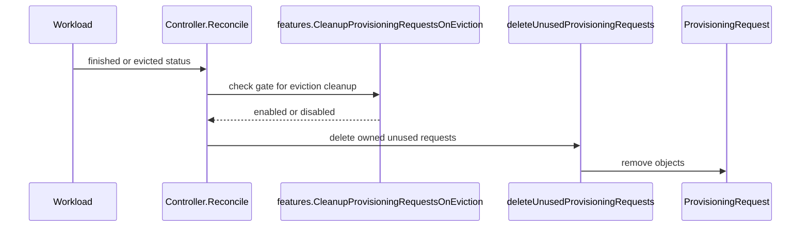

# PR #12522: Clean up ProvisioningRequests on Workload eviction

**Summary**: Clean up ProvisioningRequests on Workload eviction

**Sources**: https://github.com/kubernetes-sigs/kueue/pull/12522

**Last updated**: 2026-06-29T10:34:13Z

---

## Metadata

- **State**: closed (merged)
- **Author**: [@MatteoFari](https://github.com/MatteoFari)
- **Branch**: `fix/11677-cleanup-provisioning-request` → `main`
- **Created**: 2026-06-26T08:54:09Z
- **Updated**: 2026-06-29T10:34:13Z
- **Merged**: 2026-06-29T10:34:11Z
- **Closed**: 2026-06-29T10:34:11Z
- **Labels**: `kind/bug`, `release-note`, `size/L`, `lgtm`, `approved`, `cncf-cla: yes`
- **Assignees**: [@mimowo](https://github.com/mimowo)
- **Requested reviewers**: [@sohankunkerkar](https://github.com/sohankunkerkar), [@kshalot](https://github.com/kshalot)
- **Changed files**: 6   **+236 / -14**

## Description

<!--  Thanks for sending a pull request!  Here are some tips for you:

1. If this is your first time, please read our contributor guidelines: https://git.k8s.io/community/contributors/guide/first-contribution.md#your-first-contribution and developer guide https://git.k8s.io/community/contributors/devel/development.md#development-guide
2. Please label this pull request according to what type of issue you are addressing, especially if this is a release targeted pull request. For reference on required PR/issue labels, read here:
https://git.k8s.io/community/contributors/devel/sig-release/release.md#issuepr-kind-label
3. Ensure you have added or ran the appropriate tests for your PR: https://git.k8s.io/community/contributors/devel/sig-testing/testing.md
4. If you want *faster* PR reviews, read how: https://git.k8s.io/community/contributors/guide/pull-requests.md#best-practices-for-faster-reviews
5. If the PR is unfinished, see how to mark it: https://git.k8s.io/community/contributors/guide/pull-requests.md#marking-unfinished-pull-requests
-->

#### What type of PR is this?
/kind bug

<!--
Add one of the following kinds:
/kind bug
/kind cleanup
/kind documentation
/kind feature
/kind kep

Optionally add one or more of the following kinds if applicable:
/kind api-change
/kind deprecation
/kind failing-test
/kind flake
/kind regression

Please also consider setting the area:
/area tas
/area integrations
/area multikueue
/area dashboard
/area localization
/area testing
/area website
-->

#### What this PR does / why we need it:
Deletes old `ProvisioningRequest`s when a `Workload` is marked as finished or evicted.

Before, the controller stopped too early and left old requests behind. Retry info is still kept on the `Workload`, and a default-on feature gate can turn off eviction cleanup.
#### Which issue(s) this PR fixes:
<!--
*Automatically closes linked issue when PR is merged.
Usage: `Fixes #<issue number>`, or `Fixes (paste link of issue)`.
_If PR is about `failing-tests or flakes`, please post the related issues/tests in a comment and do not use `Fixes`_*
-->
Fixes #11677

#### Special notes for your reviewer:

#### Does this PR introduce a user-facing change?
<!--
If no, just write "NONE" in the release-note block below.
If yes, a release note is required:
Enter your extended release note in the block below. If the PR requires additional action from users switching to the new release, include the string "action required".
-->
```release-note
ProvisioningRequests owned by finished or evicted Workloads are now cleaned up by default. Added the CleanupProvisioningRequestsOnEviction feature gate to allow disabling cleanup on eviction.
```


<!-- This is an auto-generated comment: release notes by coderabbit.ai -->
## Summary by CodeRabbit

* **New Features**
  * Added a feature gate to automatically clean up provisioning requests when a workload is evicted (enabled by default).
* **Bug Fixes**
  * Improved reconcile behavior to distinguish completion vs. eviction and only clean up on eviction when the setting is enabled.
  * Preserves retry context when creating new provisioning requests after cleanup.
* **Tests**
  * Updated unit and integration coverage for Finished/Evicted lifecycle and retry/backoff scenarios, including validation of deletion when cleanup on eviction is enabled/disabled.
<!-- end of auto-generated comment: release notes by coderabbit.ai -->

## Discussion

### Comment by [@netlify[bot]](https://github.com/apps/netlify) — 2026-06-26T08:54:14Z

### <span aria-hidden="true">✅</span> Deploy Preview for *kubernetes-sigs-kueue* ready!


|  Name | Link |
|:-:|------------------------|
|<span aria-hidden="true">🔨</span> Latest commit | cea39a1267a534d7ef5e996ef94ae11586da5546 |
|<span aria-hidden="true">🔍</span> Latest deploy log | https://app.netlify.com/projects/kubernetes-sigs-kueue/deploys/6a422d772fcffe00089af9f7 |
|<span aria-hidden="true">😎</span> Deploy Preview | [https://deploy-preview-12522--kubernetes-sigs-kueue.netlify.app](https://deploy-preview-12522--kubernetes-sigs-kueue.netlify.app) |
|<span aria-hidden="true">📱</span> Preview on mobile | <details><summary> Toggle QR Code... </summary><br /><br /><br /><br />_Use your smartphone camera to open QR code link._</details> |
---
<!-- [kubernetes-sigs-kueue Preview](https://deploy-preview-12522--kubernetes-sigs-kueue.netlify.app) -->
_To edit notification comments on pull requests, go to your [Netlify project configuration](https://app.netlify.com/projects/kubernetes-sigs-kueue/configuration/notifications#deploy-notifications)._

### Comment by [@coderabbitai[bot]](https://github.com/apps/coderabbitai) — 2026-06-26T08:54:26Z

<!-- This is an auto-generated comment: summarize by coderabbit.ai -->
<!-- review_stack_entry_start -->

[](https://app.coderabbit.ai/change-stack/kubernetes-sigs/kueue/pull/12522?utm_source=github_walkthrough&utm_medium=github&utm_campaign=change_stack)

<!-- review_stack_entry_end -->
<!-- walkthrough_start -->

<details>
<summary>📝 Walkthrough</summary>

## Walkthrough

The PR adds a beta feature gate for cleaning up owned `ProvisioningRequest` objects when workloads finish or are evicted. The provisioning controller now skips normal sync in those cases and uses the current admission-check retry count when naming new requests. Tests and feature metadata were updated.

## Changes

**ProvisioningRequest cleanup and retry naming**

|Layer / File(s)|Summary|
|---|---|
|**Feature gate wiring** <br> `pkg/features/kube_features.go`, `site/data/featuregates/versioned_feature_list.yaml`, `test/compatibility_lifecycle/reference/versioned_feature_list.yaml`|`CleanupProvisioningRequestsOnEviction` is added to the feature constants and versioned feature lists with a beta 0.19 spec.|
|**Cleanup on finished or evicted** <br> `pkg/controller/admissionchecks/provisioning/controller.go`, `pkg/controller/admissionchecks/provisioning/controller_test.go`, `test/integration/singlecluster/controller/admissionchecks/provisioning/provisioning_test.go`|`Reconcile` now distinguishes finished and evicted workloads, deletes unused owned `ProvisioningRequest`s in the enabled cleanup path, and the tests cover the new finished/evicted deletion cases and gate toggling.|
|**Retry count naming** <br> `pkg/controller/admissionchecks/provisioning/controller.go`, `pkg/controller/admissionchecks/provisioning/controller_test.go`, `test/integration/singlecluster/controller/admissionchecks/provisioning/provisioning_test.go`|`syncOwnedProvisionRequest` now seeds new request attempts from `AdmissionCheckState.RetryCount`, and the tests cover retry preservation plus backoff deletions of failed requests.|

## Sequence Diagram(s)



## Estimated code review effort

🎯 4 (Complex) | ⏱️ ~45 minutes

## Possibly related PRs

- [kubernetes-sigs/kueue#12401](https://github.com/kubernetes-sigs/kueue/pull/12401) — Also adjusts `TestReconcile` expectations around `ProvisioningRequest` deletion when a workload reaches `Finished`.

## Suggested reviewers

- mimowo
- sohankunkerkar

## Poem

> 🐇 I hopped through finished workloads bright,  
> and swept their spare requests from sight.  
> Retry counts twinkled, neat and true,  
> with cleanup gate lit up anew.  
> Thump-thump—Kueue’s burrow feels tidy tonight.

</details>

<!-- walkthrough_end -->
<!-- pre_merge_checks_walkthrough_start -->

<details>
<summary>🚥 Pre-merge checks | ✅ 4 | ❌ 1</summary>

### ❌ Failed checks (1 warning)

|     Check name     | Status     | Explanation                                                                          | Resolution                                                                         |
| :----------------: | :--------- | :----------------------------------------------------------------------------------- | :--------------------------------------------------------------------------------- |
| Docstring Coverage | ⚠️ Warning | Docstring coverage is 0.00% which is insufficient. The required threshold is 80.00%. | Write docstrings for the functions missing them to satisfy the coverage threshold. |

<details>
<summary>✅ Passed checks (4 passed)</summary>

|         Check name         | Status   | Explanation                                                                                                              |
| :------------------------: | :------- | :----------------------------------------------------------------------------------------------------------------------- |
|      Description Check     | ✅ Passed | Check skipped - CodeRabbit’s high-level summary is enabled.                                                              |
|         Title check        | ✅ Passed | The title clearly summarizes the main change: cleaning up ProvisioningRequests on Workload eviction.                     |
|     Linked Issues check    | ✅ Passed | The controller now deletes owned ProvisioningRequests after eviction, matching issue `#11677`'s expected cleanup behavior. |
| Out of Scope Changes check | ✅ Passed | The finished-workload handling and feature gate are directly tied to the same cleanup fix, not unrelated scope.          |

</details>

</details>

<!-- pre_merge_checks_walkthrough_end -->
<!-- finishing_touch_checkbox_start -->

<details>
<summary>✨ Finishing Touches</summary>

<details>
<summary>🧪 Generate unit tests (beta)</summary>

- [ ] <!-- {"checkboxId": "f47ac10b-58cc-4372-a567-0e02b2c3d479", "radioGroupId": "utg-output-choice-group-unknown_comment_id"} -->   Create PR with unit tests

</details>

</details>

<!-- finishing_touch_checkbox_end -->
<!-- tips_start -->

---

Thanks for using [CodeRabbit](https://coderabbit.ai?utm_source=oss&utm_medium=github&utm_campaign=kubernetes-sigs/kueue&utm_content=12522)! It's free for OSS, and your support helps us grow. If you like it, consider giving us a shout-out.

<details>
<summary>❤️ Share</summary>

- [X](https://twitter.com/intent/tweet?text=I%20just%20used%20%40coderabbitai%20for%20my%20code%20review%2C%20and%20it%27s%20fantastic%21%20It%27s%20free%20for%20OSS%20and%20offers%20a%20free%20trial%20for%20the%20proprietary%20code.%20Check%20it%20out%3A&url=https%3A//coderabbit.ai)
- [Mastodon](https://mastodon.social/share?text=I%20just%20used%20%40coderabbitai%20for%20my%20code%20review%2C%20and%20it%27s%20fantastic%21%20It%27s%20free%20for%20OSS%20and%20offers%20a%20free%20trial%20for%20the%20proprietary%20code.%20Check%20it%20out%3A%20https%3A%2F%2Fcoderabbit.ai)
- [Reddit](https://www.reddit.com/submit?title=Great%20tool%20for%20code%20review%20-%20CodeRabbit&text=I%20just%20used%20CodeRabbit%20for%20my%20code%20review%2C%20and%20it%27s%20fantastic%21%20It%27s%20free%20for%20OSS%20and%20offers%20a%20free%20trial%20for%20proprietary%20code.%20Check%20it%20out%3A%20https%3A//coderabbit.ai)
- [LinkedIn](https://www.linkedin.com/sharing/share-offsite/?url=https%3A%2F%2Fcoderabbit.ai&mini=true&title=Great%20tool%20for%20code%20review%20-%20CodeRabbit&summary=I%20just%20used%20CodeRabbit%20for%20my%20code%20review%2C%20and%20it%27s%20fantastic%21%20It%27s%20free%20for%20OSS%20and%20offers%20a%20free%20trial%20for%20proprietary%20code)

</details>


<sub>Comment `@coderabbitai help` to get the list of available commands.</sub>

<!-- tips_end -->

### Comment by [@kubernetes-prow[bot]](https://github.com/apps/kubernetes-prow) — 2026-06-29T10:07:33Z

LGTM label has been added.  <details>Git tree hash: e7e37df5d07821e623a773e8a1f003f6adbb28e0</details>

### Comment by [@kubernetes-prow[bot]](https://github.com/apps/kubernetes-prow) — 2026-06-29T10:07:35Z

[APPROVALNOTIFIER] This PR is **APPROVED**

This pull-request has been approved by: *<a href="https://github.com/kubernetes-sigs/kueue/pull/12522#" title="Author self-approved">MatteoFari</a>*, *<a href="https://github.com/kubernetes-sigs/kueue/pull/12522#pullrequestreview-4590853293" title="Approved">mimowo</a>*

The full list of commands accepted by this bot can be found [here](https://go.k8s.io/bot-commands?repo=kubernetes-sigs%2Fkueue).

The pull request process is described [here](https://git.k8s.io/community/contributors/guide/owners.md#the-code-review-process)

<details >
Needs approval from an approver in each of these files:

- ~~[pkg/controller/OWNERS](https://github.com/kubernetes-sigs/kueue/blob/main/pkg/controller/OWNERS)~~ [mimowo]
- ~~[pkg/features/OWNERS](https://github.com/kubernetes-sigs/kueue/blob/main/pkg/features/OWNERS)~~ [mimowo]
- ~~[site/OWNERS](https://github.com/kubernetes-sigs/kueue/blob/main/site/OWNERS)~~ [mimowo]
- ~~[test/OWNERS](https://github.com/kubernetes-sigs/kueue/blob/main/test/OWNERS)~~ [mimowo]

Approvers can indicate their approval by writing `/approve` in a comment
Approvers can cancel approval by writing `/approve cancel` in a comment
</details>
<!-- META={"approvers":[]} -->

## Reviews

### Review by [@coderabbitai[bot]](https://github.com/apps/coderabbitai) (commented) — 2026-06-26T09:01:29Z

**Actionable comments posted: 2**

<details>
<summary>🤖 Prompt for all review comments with AI agents</summary>

```
Verify each finding against current code. Fix only still-valid issues, skip the
rest with a brief reason, keep changes minimal, and validate.

Inline comments:
In `@pkg/controller/admissionchecks/provisioning/controller.go`:
- Around line 147-153: The reconciliation in deleteUnusedProvisioningRequests is
acting on the entire provReqs.Items result, but RequestsOwnedByWorkloadKey can
return ProvisioningRequests matched only by ownerReference name and not by the
current Workload identity. Update the caller in the provisioning controller so
it only deletes requests actually owned by the current Workload by filtering on
kind, APIVersion, and UID before calling deleteUnusedProvisioningRequests, or
adjust the RequestsOwnedByWorkloadKey indexer to return only true Workload-owned
requests. Keep the existing error handling in reconcile, but make sure the
deletion set is narrowed to the intended ownership scope.

In
`@test/integration/singlecluster/controller/admissionchecks/provisioning/provisioning_test.go`:
- Around line 248-274: Add an integration spec for the feature-gate-off eviction
path in this provisioning suite, since the current `Should delete provisioning
requests when workload is evicted` case only covers the default-on cleanup
behavior. Extend `provisioning_test.go` with a sibling `ginkgo.It` that disables
the relevant feature gate before calling `util.SetQuotaReservation` and
`workload.SetConditionAndUpdate`, then verify the provisioning request remains
present after eviction. Use the existing symbols `provReqKey`, `createdRequest`,
`updatedWl`, and `WorkloadEvicted` to keep the test aligned with the current
setup.
```

</details>

<details>
<summary>🪄 Autofix (Beta)</summary>

Fix all unresolved CodeRabbit comments on this PR:

- [ ] <!-- {"checkboxId": "4b0d0e0a-96d7-4f10-b296-3a18ea78f0b9"} --> Push a commit to this branch (recommended)
- [ ] <!-- {"checkboxId": "ff5b1114-7d8c-49e6-8ac1-43f82af23a33"} --> Create a new PR with the fixes

</details>

---

<details>
<summary>ℹ️ Review info</summary>

<details>
<summary>⚙️ Run configuration</summary>

**Configuration used**: Path: .coderabbit.yaml

**Review profile**: CHILL

**Plan**: Pro

**Run ID**: `5ca0bb77-29aa-4667-9c57-5b0cfecf15b8`

</details>

<details>
<summary>📥 Commits</summary>

Reviewing files that changed from the base of the PR and between 42fc89c89364afad6dc64112ef8bb3d0c60389ca and 9cf8cbe7a5f849deca7ff50987409adb026c0805.

</details>

<details>
<summary>📒 Files selected for processing (6)</summary>

* `pkg/controller/admissionchecks/provisioning/controller.go`
* `pkg/controller/admissionchecks/provisioning/controller_test.go`
* `pkg/features/kube_features.go`
* `site/data/featuregates/versioned_feature_list.yaml`
* `test/compatibility_lifecycle/reference/versioned_feature_list.yaml`
* `test/integration/singlecluster/controller/admissionchecks/provisioning/provisioning_test.go`

</details>

</details>

<!-- This is an auto-generated comment by CodeRabbit for review status -->

- **pkg/controller/admissionchecks/provisioning/controller.go:153** by [@coderabbitai[bot]](https://github.com/apps/coderabbitai) — 2026-06-26T09:01:28Z
```diff
@@ -136,6 +144,15 @@ func (c *Controller) Reconcile(ctx context.Context, req reconcile.Request) (reco
 		return reconcile.Result{}, err
 	}
 
+	if shouldDeleteProvReqs {
+		err = c.deleteUnusedProvisioningRequests(ctx, provReqs.Items, nil)
+		if err != nil {
+			log.V(2).Error(err, "failed to delete stale provisioning requests")
+			return reconcile.Result{}, err
+		}
+		return reconcile.Result{}, nil
```

  _🗄️ Data Integrity & Integration_ | _🟠 Major_ | _🏗️ Heavy lift_
  
  **Don’t delete every name-matched ProvisioningRequest here.**
  
  Lines 147-153 delete the full `provReqs.Items` set, but that list is populated via `RequestsOwnedByWorkloadKey`, whose indexer keys off every ownerReference name rather than verified Workload ownership. A finished/evicted workload can therefore remove an unrelated `ProvisioningRequest` in the same namespace if another ownerReference shares the same name. Filter by the current Workload’s kind/APIVersion/UID before deletion, or tighten the indexer to only return true Workload-owned requests. As per path instructions, `pkg/controller/**/*.go`: Review reconciliation logic for correctness, idempotency, and proper error handling.
  
  <details>
  <summary>🤖 Prompt for AI Agents</summary>
  
  ```
  Verify each finding against current code. Fix only still-valid issues, skip the
  rest with a brief reason, keep changes minimal, and validate.
  
  In `@pkg/controller/admissionchecks/provisioning/controller.go` around lines 147 -
  153, The reconciliation in deleteUnusedProvisioningRequests is acting on the
  entire provReqs.Items result, but RequestsOwnedByWorkloadKey can return
  ProvisioningRequests matched only by ownerReference name and not by the current
  Workload identity. Update the caller in the provisioning controller so it only
  deletes requests actually owned by the current Workload by filtering on kind,
  APIVersion, and UID before calling deleteUnusedProvisioningRequests, or adjust
  the RequestsOwnedByWorkloadKey indexer to return only true Workload-owned
  requests. Keep the existing error handling in reconcile, but make sure the
  deletion set is narrowed to the intended ownership scope.
  ```
  
  </details>
  
  <!-- fingerprinting:phantom:poseidon:grasshopper -->
  
  <!-- cr-indicator-types:potential_issue -->
  
  <!-- cr-comment:v1:3d7ad6118b6b8a5482fdace0 -->
  
  _Source: Path instructions_
  
  <!-- This is an auto-generated comment by CodeRabbit -->

- **test/integration/singlecluster/controller/admissionchecks/provisioning/provisioning_test.go:274** by [@coderabbitai[bot]](https://github.com/apps/coderabbitai) — 2026-06-26T09:01:28Z
```diff
@@ -245,6 +245,33 @@ var _ = ginkgo.Describe("Provisioning", ginkgo.Label("controller:provisioning",
 			})
 		})
 
+		ginkgo.It("Should delete provisioning requests when workload is evicted", framework.SlowSpec, func() {
+			ginkgo.By("Setting the quota reservation to the workload", func() {
+				util.SetQuotaReservation(ctx, k8sClient, wlKey, admission)
+			})
+
+			ginkgo.By("Checking that the provision request is created", func() {
+				gomega.Eventually(func(g gomega.Gomega) {
+					g.Expect(k8sClient.Get(ctx, provReqKey, &createdRequest)).Should(gomega.Succeed())
+				}, util.Timeout, util.Interval).Should(gomega.Succeed())
+			})
+
+			ginkgo.By("Evicting the workload", func() {
+				gomega.Eventually(func(g gomega.Gomega) {
+					g.Expect(k8sClient.Get(ctx, wlKey, &updatedWl)).To(gomega.Succeed())
+					g.Expect(workload.SetConditionAndUpdate(ctx, k8sClient, &updatedWl, kueue.WorkloadEvicted, metav1.ConditionTrue,
+						kueue.WorkloadEvictedByPreemption, "By test", "evict", util.RealClock)).
+						To(gomega.Succeed())
+				}, util.Timeout, util.Interval).Should(gomega.Succeed())
+			})
+
+			ginkgo.By("Checking that the provision request is deleted", func() {
+				gomega.Eventually(func(g gomega.Gomega) {
+					g.Expect(k8sClient.Get(ctx, provReqKey, &createdRequest)).Should(utiltesting.BeNotFoundError())
+				}, util.Timeout, util.Interval).Should(gomega.Succeed())
+			})
+		})
+
```

  _📐 Maintainability & Code Quality_ | _🟠 Major_ | _⚡ Quick win_
  
  **Add the feature-gate-off eviction case to this suite.**
  
  These new specs only exercise the default-on cleanup path. The controller’s opt-out branch is part of the user-facing feature contract, and a wiring regression there would still pass end-to-end because the negative path is only unit-tested. As per path instructions, `test/integration/**/*.go`: Ensure new test cases cover both positive and negative scenarios.
  
  <details>
  <summary>🤖 Prompt for AI Agents</summary>
  
  ```
  Verify each finding against current code. Fix only still-valid issues, skip the
  rest with a brief reason, keep changes minimal, and validate.
  
  In
  `@test/integration/singlecluster/controller/admissionchecks/provisioning/provisioning_test.go`
  around lines 248 - 274, Add an integration spec for the feature-gate-off
  eviction path in this provisioning suite, since the current `Should delete
  provisioning requests when workload is evicted` case only covers the default-on
  cleanup behavior. Extend `provisioning_test.go` with a sibling `ginkgo.It` that
  disables the relevant feature gate before calling `util.SetQuotaReservation` and
  `workload.SetConditionAndUpdate`, then verify the provisioning request remains
  present after eviction. Use the existing symbols `provReqKey`, `createdRequest`,
  `updatedWl`, and `WorkloadEvicted` to keep the test aligned with the current
  setup.
  ```
  
  </details>
  
  <!-- fingerprinting:phantom:poseidon:grasshopper -->
  
  <!-- cr-indicator-types:refactor_suggestion -->
  
  <!-- cr-comment:v1:cb9ff1119e98ab8daf90a531 -->
  
  _Source: Path instructions_
  
  <!-- This is an auto-generated comment by CodeRabbit -->

### Review by [@mimowo](https://github.com/mimowo) (commented) — 2026-06-26T17:08:08Z

- **pkg/controller/admissionchecks/provisioning/controller.go:147** by [@mimowo](https://github.com/mimowo) — 2026-06-26T17:08:08Z
```diff
@@ -136,6 +144,15 @@ func (c *Controller) Reconcile(ctx context.Context, req reconcile.Request) (reco
 		return reconcile.Result{}, err
 	}
 
+	if shouldDeleteProvReqs {
```

  Instead of communiacting the two places in the function by shouldDeleteProvReqs why not just do this new snippet (moved up):
  
  ``golang
  if features.Enabled(features.CleanupProvisioningRequestsOnEviction) && (IsEvicted() || IsFinished()) {
  		err = c.deleteUnusedProvisioningRequests(ctx, provReqs.Items, nil)
  		if err != nil {
  			log.V(2).Error(err, "failed to delete stale provisioning requests")
  			return reconcile.Result{}, err
  		}
  		return reconcile.Result{}, nil 
  	}
  ```
  Seems like it could be more readable, because also the use of negations with !feature() makes it hard to follow

### Review by [@mimowo](https://github.com/mimowo) (commented) — 2026-06-26T17:09:29Z

- **pkg/controller/admissionchecks/provisioning/controller.go:274** by [@mimowo](https://github.com/mimowo) — 2026-06-26T17:09:30Z
```diff
@@ -251,6 +268,9 @@ func (c *Controller) syncOwnedProvisionRequest(
 
 		req, exists := activeOrLastPRForChecks[checkName]
 		attempt := int32(1)
+		if ac != nil {
+			attempt = ptr.Deref(ac.RetryCount, 0) + 1
+		}
```

  how is this related to the fix? It does not seem at the first sight, maybe it is a bugfix for a separate issue, tracked separately. If this is integral required part of the fix then please add some commentary because this is far from obvious

### Review by [@mimowo](https://github.com/mimowo) (commented) — 2026-06-26T17:10:55Z

- **pkg/controller/admissionchecks/provisioning/controller_test.go:320** by [@mimowo](https://github.com/mimowo) — 2026-06-26T17:10:55Z
```diff
@@ -316,6 +316,8 @@ func TestReconcile(t *testing.T) {
 		wantTemplates        map[string]*corev1.PodTemplate
 		wantRequestsNotFound []string
 		wantEvents           []utiltesting.EventRecord
+
+		cleanupProvReqsOnEviction *bool
```

  introuce the more generic featureGates map for the feature gate enablement. We go with this approach as  much more scalable. Also, move this up because ":want" section should be at the bottom typically

### Review by [@MatteoFari](https://github.com/MatteoFari) (commented) — 2026-06-29T08:31:40Z

- **pkg/controller/admissionchecks/provisioning/controller.go:274** by [@MatteoFari](https://github.com/MatteoFari) — 2026-06-29T08:31:40Z
```diff
@@ -251,6 +268,9 @@ func (c *Controller) syncOwnedProvisionRequest(
 
 		req, exists := activeOrLastPRForChecks[checkName]
 		attempt := int32(1)
+		if ac != nil {
+			attempt = ptr.Deref(ac.RetryCount, 0) + 1
+		}
```

  once cleanup removes the previous request, the next attempt must come from `Workload.status.admissionChecks[].retryCount`, otherwise we restart at attempt 1.

### Review by [@coderabbitai[bot]](https://github.com/apps/coderabbitai) (commented) — 2026-06-29T08:47:45Z

**Actionable comments posted: 1**

<details>
<summary>🤖 Prompt for all review comments with AI agents</summary>

```
Verify each finding against current code. Fix only still-valid issues, skip the
rest with a brief reason, keep changes minimal, and validate.

Inline comments:
In `@pkg/controller/admissionchecks/provisioning/controller_test.go`:
- Around line 593-613: The disabled-gate evicted-workload test only checks that
an existing ProvisioningRequest is preserved, so it misses the no-request path
in Controller.Reconcile. Add a separate case in controller_test.go for an
evicted workload with CleanupProvisioningRequestsOnEviction set to false and no
seeded ProvisioningRequest in requests, then assert that reconcile does not
create any new request and that the resulting request set remains empty. Use the
existing Controller.Reconcile and cleanup feature-gate setup in the test table
to locate the right scenario.
```

</details>

<details>
<summary>🪄 Autofix (Beta)</summary>

Fix all unresolved CodeRabbit comments on this PR:

- [ ] <!-- {"checkboxId": "4b0d0e0a-96d7-4f10-b296-3a18ea78f0b9"} --> Push a commit to this branch (recommended)
- [ ] <!-- {"checkboxId": "ff5b1114-7d8c-49e6-8ac1-43f82af23a33"} --> Create a new PR with the fixes

</details>

---

<details>
<summary>ℹ️ Review info</summary>

<details>
<summary>⚙️ Run configuration</summary>

**Configuration used**: defaults

**Review profile**: CHILL

**Plan**: Pro

**Run ID**: `c3968b73-06bb-4ad0-a9f9-301a80888683`

</details>

<details>
<summary>📥 Commits</summary>

Reviewing files that changed from the base of the PR and between 9cf8cbe7a5f849deca7ff50987409adb026c0805 and cea39a1267a534d7ef5e996ef94ae11586da5546.

</details>

<details>
<summary>📒 Files selected for processing (6)</summary>

* `pkg/controller/admissionchecks/provisioning/controller.go`
* `pkg/controller/admissionchecks/provisioning/controller_test.go`
* `pkg/features/kube_features.go`
* `site/data/featuregates/versioned_feature_list.yaml`
* `test/compatibility_lifecycle/reference/versioned_feature_list.yaml`
* `test/integration/singlecluster/controller/admissionchecks/provisioning/provisioning_test.go`

</details>

<details>
<summary>✅ Files skipped from review due to trivial changes (1)</summary>

* test/compatibility_lifecycle/reference/versioned_feature_list.yaml

</details>

<details>
<summary>🚧 Files skipped from review as they are similar to previous changes (4)</summary>

* pkg/features/kube_features.go
* site/data/featuregates/versioned_feature_list.yaml
* pkg/controller/admissionchecks/provisioning/controller.go
* test/integration/singlecluster/controller/admissionchecks/provisioning/provisioning_test.go

</details>

</details>

<!-- This is an auto-generated comment by CodeRabbit for review status -->

- **pkg/controller/admissionchecks/provisioning/controller_test.go:613** by [@coderabbitai[bot]](https://github.com/apps/coderabbitai) — 2026-06-29T08:47:44Z
```diff
@@ -541,23 +543,140 @@ func TestReconcile(t *testing.T) {
 				},
 			},
 		},
-		"request not removed on workload finished": {
+		"request removed on workload finished": {
 			workload: (&utiltestingapi.WorkloadWrapper{Workload: *baseWorkload.DeepCopy()}).
 				Condition(metav1.Condition{
 					Type:   kueue.WorkloadFinished,
 					Status: metav1.ConditionTrue,
 				}).
 				Obj(),
 
+			checks:               []kueue.AdmissionCheck{*baseCheck.DeepCopy()},
+			flavors:              []kueue.ResourceFlavor{*baseFlavor1.DeepCopy(), *baseFlavor2.DeepCopy()},
+			configs:              []kueue.ProvisioningRequestConfig{*baseConfigWithRetryStrategy.DeepCopy()},
+			requests:             []autoscaling.ProvisioningRequest{*baseRequest.DeepCopy()},
+			templates:            []corev1.PodTemplate{*baseTemplate1.DeepCopy(), *baseTemplate2.DeepCopy()},
+			wantRequestsNotFound: []string{baseRequest.Name},
+		},
+		"request removed on workload evicted": {
+			workload: (&utiltestingapi.WorkloadWrapper{Workload: *baseWorkload.DeepCopy()}).
+				Condition(metav1.Condition{
+					Type:   kueue.WorkloadEvicted,
+					Status: metav1.ConditionTrue,
+					Reason: kueue.WorkloadEvictedByPreemption,
+				}).
+				Obj(),
+
+			checks:               []kueue.AdmissionCheck{*baseCheck.DeepCopy()},
+			flavors:              []kueue.ResourceFlavor{*baseFlavor1.DeepCopy(), *baseFlavor2.DeepCopy()},
+			configs:              []kueue.ProvisioningRequestConfig{*baseConfigWithRetryStrategy.DeepCopy()},
+			requests:             []autoscaling.ProvisioningRequest{*baseRequest.DeepCopy()},
+			templates:            []corev1.PodTemplate{*baseTemplate1.DeepCopy(), *baseTemplate2.DeepCopy()},
+			wantRequestsNotFound: []string{baseRequest.Name},
+		},
+		"request removed on workload evicted by admission check": {
+			workload: (&utiltestingapi.WorkloadWrapper{Workload: *baseWorkload.DeepCopy()}).
+				Condition(metav1.Condition{
+					Type:   kueue.WorkloadEvicted,
+					Status: metav1.ConditionTrue,
+					Reason: kueue.WorkloadEvictedByAdmissionCheck,
+				}).
+				Obj(),
+
+			checks:               []kueue.AdmissionCheck{*baseCheck.DeepCopy()},
+			flavors:              []kueue.ResourceFlavor{*baseFlavor1.DeepCopy(), *baseFlavor2.DeepCopy()},
+			configs:              []kueue.ProvisioningRequestConfig{*baseConfigWithRetryStrategy.DeepCopy()},
+			requests:             []autoscaling.ProvisioningRequest{*baseRequest.DeepCopy()},
+			templates:            []corev1.PodTemplate{*baseTemplate1.DeepCopy(), *baseTemplate2.DeepCopy()},
+			wantRequestsNotFound: []string{baseRequest.Name},
+		},
+		"request preserved on workload evicted when cleanup is disabled": {
+			workload: (&utiltestingapi.WorkloadWrapper{Workload: *baseWorkload.DeepCopy()}).
+				Condition(metav1.Condition{
+					Type:   kueue.WorkloadEvicted,
+					Status: metav1.ConditionTrue,
+					Reason: kueue.WorkloadEvictedByAdmissionCheck,
+				}).
+				Obj(),
+
 			checks:    []kueue.AdmissionCheck{*baseCheck.DeepCopy()},
 			flavors:   []kueue.ResourceFlavor{*baseFlavor1.DeepCopy(), *baseFlavor2.DeepCopy()},
 			configs:   []kueue.ProvisioningRequestConfig{*baseConfigWithRetryStrategy.DeepCopy()},
 			requests:  []autoscaling.ProvisioningRequest{*baseRequest.DeepCopy()},
 			templates: []corev1.PodTemplate{*baseTemplate1.DeepCopy(), *baseTemplate2.DeepCopy()},
+			featureGates: map[featuregate.Feature]bool{
+				features.CleanupProvisioningRequestsOnEviction: false,
+			},
 			wantRequests: map[string]*autoscaling.ProvisioningRequest{
 				baseRequest.Name: baseRequest.DeepCopy(),
 			},
 		},
```

  _🎯 Functional Correctness_ | _🟠 Major_ | _⚡ Quick win_
  
  **Cover the disabled-gate/no-request path.**
  
  When `CleanupProvisioningRequestsOnEviction` is `false`, `Controller.Reconcile` falls through to the normal sync path for evicted workloads instead of returning early (`pkg/controller/admissionchecks/provisioning/controller.go:121-150`). This case only proves an existing request is preserved, so it would miss a regression where an evicted workload with **no** owned `ProvisioningRequest` gets a brand-new stale one created. Please add a case with an evicted workload, the gate disabled, and no seeded request, and assert that nothing new is created.
  
  <details>
  <summary>🤖 Prompt for AI Agents</summary>
  
  ```
  Verify each finding against current code. Fix only still-valid issues, skip the
  rest with a brief reason, keep changes minimal, and validate.
  
  In `@pkg/controller/admissionchecks/provisioning/controller_test.go` around lines
  593 - 613, The disabled-gate evicted-workload test only checks that an existing
  ProvisioningRequest is preserved, so it misses the no-request path in
  Controller.Reconcile. Add a separate case in controller_test.go for an evicted
  workload with CleanupProvisioningRequestsOnEviction set to false and no seeded
  ProvisioningRequest in requests, then assert that reconcile does not create any
  new request and that the resulting request set remains empty. Use the existing
  Controller.Reconcile and cleanup feature-gate setup in the test table to locate
  the right scenario.
  ```
  
  </details>
  
  <!-- fingerprinting:phantom:poseidon:grasshopper -->
  
  <!-- cr-indicator-types:potential_issue -->
  
  <!-- cr-comment:v1:87fa6022d846b788c11eaf3a -->
  
  <!-- This is an auto-generated comment by CodeRabbit -->

### Review by [@mimowo](https://github.com/mimowo) (commented) — 2026-06-29T09:17:02Z

- **pkg/controller/admissionchecks/provisioning/controller.go:274** by [@mimowo](https://github.com/mimowo) — 2026-06-29T09:17:02Z
```diff
@@ -251,6 +268,9 @@ func (c *Controller) syncOwnedProvisionRequest(
 
 		req, exists := activeOrLastPRForChecks[checkName]
 		attempt := int32(1)
+		if ac != nil {
+			attempt = ptr.Deref(ac.RetryCount, 0) + 1
+		}
```

  Ah, an in the past we didn't have to use retryCount because we could rely on the `attempt` parsed from the Provreq name?

### Review by [@MatteoFari](https://github.com/MatteoFari) (commented) — 2026-06-29T09:36:36Z

- **pkg/controller/admissionchecks/provisioning/controller.go:274** by [@MatteoFari](https://github.com/MatteoFari) — 2026-06-29T09:36:35Z
```diff
@@ -251,6 +268,9 @@ func (c *Controller) syncOwnedProvisionRequest(
 
 		req, exists := activeOrLastPRForChecks[checkName]
 		attempt := int32(1)
+		if ac != nil {
+			attempt = ptr.Deref(ac.RetryCount, 0) + 1
+		}
```

  Yes exactly

### Review by [@mimowo](https://github.com/mimowo) (commented) — 2026-06-29T10:07:25Z

/lgtm
/approve
Thank you for the ProvReq integration improvement, looks great to me. Please prepare the cherrypicks manually, updating the FG to the version corresponding to the branch versions.
