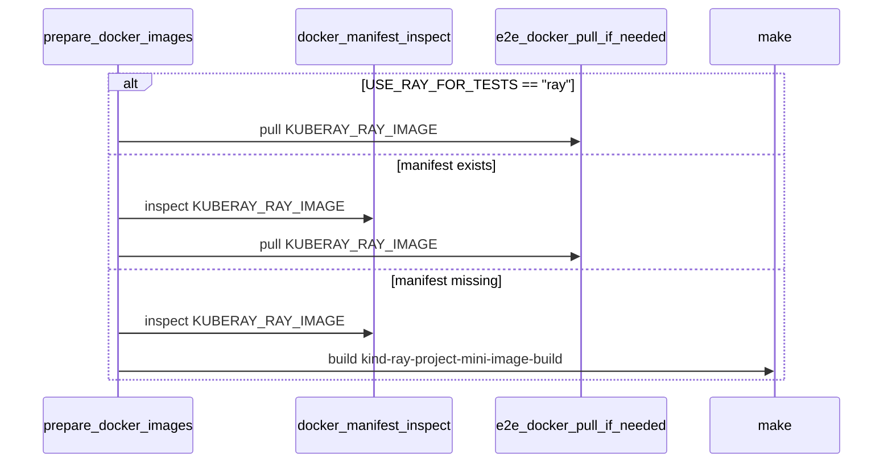

# PR #12605: Re-enable raymini for presubmit e2e tests

**Summary**: Re-enable raymini for presubmit e2e tests

**Sources**: https://github.com/kubernetes-sigs/kueue/pull/12605

**Last updated**: 2026-06-29T09:50:22Z

---

## Metadata

- **State**: open
- **Author**: [@sohankunkerkar](https://github.com/sohankunkerkar)
- **Branch**: `reenable-raymini` → `main`
- **Created**: 2026-06-26T19:00:42Z
- **Updated**: 2026-06-29T09:50:22Z
- **Merged**: —
- **Closed**: —
- **Labels**: `release-note-none`, `size/M`, `cncf-cla: yes`
- **Assignees**: _none_
- **Requested reviewers**: [@amy](https://github.com/amy), [@kshalot](https://github.com/kshalot)
- **Changed files**: 5   **+20 / -12**

## Description

<!--  Thanks for sending a pull request!  Here are some tips for you:

1. If this is your first time, please read our contributor guidelines: https://git.k8s.io/community/contributors/guide/first-contribution.md#your-first-contribution and developer guide https://git.k8s.io/community/contributors/devel/development.md#development-guide
2. Please label this pull request according to what type of issue you are addressing, especially if this is a release targeted pull request. For reference on required PR/issue labels, read here:
https://git.k8s.io/community/contributors/devel/sig-release/release.md#issuepr-kind-label
3. Ensure you have added or ran the appropriate tests for your PR: https://git.k8s.io/community/contributors/devel/sig-testing/testing.md
4. If you want *faster* PR reviews, read how: https://git.k8s.io/community/contributors/guide/pull-requests.md#best-practices-for-faster-reviews
5. If the PR is unfinished, see how to mark it: https://git.k8s.io/community/contributors/guide/pull-requests.md#marking-unfinished-pull-requests
-->

#### What type of PR is this?
/kind cleanup

#### What this PR does / why we need it:

#### Which issue(s) this PR fixes:
<!--
*Automatically closes linked issue when PR is merged.
Usage: `Fixes #<issue number>`, or `Fixes (paste link of issue)`.
_If PR is about `failing-tests or flakes`, please post the related issues/tests in a comment and do not use `Fixes`_*
-->
Fixes #

#### Special notes for your reviewer:
I went with option 2 from https://github.com/kubernetes-sigs/kueue/pull/12589#discussion_r3482520508


#### Does this PR introduce a user-facing change?
<!--
If no, just write "NONE" in the release-note block below.
If yes, a release note is required:
Enter your extended release note in the block below. If the PR requires additional action from users switching to the new release, include the string "action required".
-->
```release-note
NONE
```


<!-- This is an auto-generated comment: release notes by coderabbit.ai -->
## Summary by CodeRabbit

* **Bug Fixes**
  * Updated test image handling so smaller Ray images are used when available, with a local build fallback if needed.
  * Excluded a set of tests that require the full Ray image from smaller-image test runs to avoid failures.

* **Chores**
  * Bumped the default Ray mini image version used in builds.

* **Tests**
  * Marked several RayService end-to-end tests as requiring the full Ray image for more accurate test selection.
<!-- end of auto-generated comment: release notes by coderabbit.ai -->

## Discussion

### Comment by [@netlify[bot]](https://github.com/apps/netlify) — 2026-06-26T19:00:49Z

### <span aria-hidden="true">✅</span> Deploy Preview for *kubernetes-sigs-kueue* canceled.


|  Name | Link |
|:-:|------------------------|
|<span aria-hidden="true">🔨</span> Latest commit | ffc256fc01f5f431f38a49b577e77f45d003d7aa |
|<span aria-hidden="true">🔍</span> Latest deploy log | https://app.netlify.com/projects/kubernetes-sigs-kueue/deploys/6a3eedadf337620008a19f49 |

### Comment by [@coderabbitai[bot]](https://github.com/apps/coderabbitai) — 2026-06-26T19:01:04Z

<!-- This is an auto-generated comment: summarize by coderabbit.ai -->
<!-- review_stack_entry_start -->

[](https://app.coderabbit.ai/change-stack/kubernetes-sigs/kueue/pull/12605?utm_source=github_walkthrough&utm_medium=github&utm_campaign=change_stack)

<!-- review_stack_entry_end -->
<!-- This is an auto-generated comment: review paused by coderabbit.ai -->

> [!NOTE]
> ## Reviews paused
> 
> It looks like this branch is under active development. To avoid overwhelming you with review comments due to an influx of new commits, CodeRabbit has automatically paused this review. You can configure this behavior by changing the `reviews.auto_review.auto_pause_after_reviewed_commits` setting.
> 
> Use the following commands to manage reviews:
> - `@coderabbitai resume` to resume automatic reviews.
> - `@coderabbitai review` to trigger a single review.
> 
> Use the checkboxes below for quick actions:
> - [ ] <!-- {"checkboxId": "7f6cc2e2-2e4e-497a-8c31-c9e4573e93d1"} --> ▶️ Resume reviews
> - [ ] <!-- {"checkboxId": "e9bb8d72-00e8-4f67-9cb2-caf3b22574fe"} --> 🔍 Trigger review

<!-- end of auto-generated comment: review paused by coderabbit.ai -->
<!-- walkthrough_start -->

<details>
<summary>📝 Walkthrough</summary>

## Walkthrough

Non-periodic test jobs now use `raymini`, `RAYMINI_VERSION` is bumped, selected RayService e2e cases gain `requires:fullray`, shard label filters exclude those tests under raymini, and image preparation now either pulls `KUBERAY_RAY_IMAGE` or builds the mini image locally.

## Changes

**Raymini test image selection**

|Layer / File(s)|Summary|
|---|---|
|**Raymini defaults** <br> `Makefile-test.mk`, `Makefile`|`USE_RAY_FOR_TESTS` is set to `raymini` for non-periodic jobs, `FULLRAY_EXCLUDE` is defined for that mode, and `RAYMINI_VERSION` is bumped to `0.0.4`.|
|**Full-ray labels and shard filters** <br> `test/e2e/multikueue/extended/e2e_test.go`, `test/e2e/singlecluster/extended/kuberay_test.go`, `Makefile-test.mk`|`requires:fullray` is added to selected RayService e2e tests, and the kuberay shard `GINKGO_ARGS` append `FULLRAY_EXCLUDE`.|
|**Conditional Ray image prep** <br> `hack/testing/e2e-common.sh`|`prepare_docker_images` now pulls `KUBERAY_RAY_IMAGE` directly for `ray`, otherwise inspects the registry and builds the Raymini image locally when needed.|

## Sequence Diagram(s)



## Estimated code review effort

🎯 3 (Moderate) | ⏱️ ~20 minutes

## Possibly related issues

- kubernetes-sigs/kueue issue 12588: The PR changes the `USE_RAY_FOR_TESTS` flow to `raymini`, updates e2e test selection, and alters Ray image preparation.

## Possibly related PRs

- [kubernetes-sigs/kueue#12581](https://github.com/kubernetes-sigs/kueue/pull/12581): Both PRs modify the same `Makefile-test.mk` conditional that controls `USE_RAY_FOR_TESTS`.
- [kubernetes-sigs/kueue#12151](https://github.com/kubernetes-sigs/kueue/pull/12151): Both PRs touch the Ray/miniray image selection path in `hack/testing/e2e-common.sh` and related Makefile wiring.
- [kubernetes-sigs/kueue#11976](https://github.com/kubernetes-sigs/kueue/pull/11976): Both PRs change Kuberay shard label filtering and the same e2e test-label selection path.

## Suggested labels

`kind/cleanup`, `area/testing`

## Suggested reviewers

- olekzabl
- PBundyra
- kshalot

## Poem

> 🐰 I hopped through raymini paths at dawn,  
> with fullray labels neatly drawn.  
> A manifest peek, then a mini build bloom,  
> and shard-bound tests all found their room.

</details>

<!-- walkthrough_end -->
<!-- pre_merge_checks_walkthrough_start -->

<details>
<summary>🚥 Pre-merge checks | ✅ 4 | ❌ 1</summary>

### ❌ Failed checks (1 warning)

|     Check name     | Status     | Explanation                                                                          | Resolution                                                                         |
| :----------------: | :--------- | :----------------------------------------------------------------------------------- | :--------------------------------------------------------------------------------- |
| Docstring Coverage | ⚠️ Warning | Docstring coverage is 0.00% which is insufficient. The required threshold is 80.00%. | Write docstrings for the functions missing them to satisfy the coverage threshold. |

<details>
<summary>✅ Passed checks (4 passed)</summary>

|         Check name         | Status   | Explanation                                                                           |
| :------------------------: | :------- | :------------------------------------------------------------------------------------ |
|      Description Check     | ✅ Passed | Check skipped - CodeRabbit’s high-level summary is enabled.                           |
|         Title check        | ✅ Passed | The title clearly matches the main change: presubmit e2e tests now use raymini again. |
|     Linked Issues check    | ✅ Passed | Check skipped because no linked issues were found for this pull request.              |
| Out of Scope Changes check | ✅ Passed | Check skipped because no linked issues were found for this pull request.              |

</details>

</details>

<!-- pre_merge_checks_walkthrough_end -->
<!-- finishing_touch_checkbox_start -->

<details>
<summary>✨ Finishing Touches</summary>

<details>
<summary>🧪 Generate unit tests (beta)</summary>

- [ ] <!-- {"checkboxId": "f47ac10b-58cc-4372-a567-0e02b2c3d479", "radioGroupId": "utg-output-choice-group-unknown_comment_id"} -->   Create PR with unit tests

</details>

</details>

<!-- finishing_touch_checkbox_end -->
<!-- tips_start -->

---

Thanks for using [CodeRabbit](https://coderabbit.ai?utm_source=oss&utm_medium=github&utm_campaign=kubernetes-sigs/kueue&utm_content=12605)! It's free for OSS, and your support helps us grow. If you like it, consider giving us a shout-out.

<details>
<summary>❤️ Share</summary>

- [X](https://twitter.com/intent/tweet?text=I%20just%20used%20%40coderabbitai%20for%20my%20code%20review%2C%20and%20it%27s%20fantastic%21%20It%27s%20free%20for%20OSS%20and%20offers%20a%20free%20trial%20for%20the%20proprietary%20code.%20Check%20it%20out%3A&url=https%3A//coderabbit.ai)
- [Mastodon](https://mastodon.social/share?text=I%20just%20used%20%40coderabbitai%20for%20my%20code%20review%2C%20and%20it%27s%20fantastic%21%20It%27s%20free%20for%20OSS%20and%20offers%20a%20free%20trial%20for%20the%20proprietary%20code.%20Check%20it%20out%3A%20https%3A%2F%2Fcoderabbit.ai)
- [Reddit](https://www.reddit.com/submit?title=Great%20tool%20for%20code%20review%20-%20CodeRabbit&text=I%20just%20used%20CodeRabbit%20for%20my%20code%20review%2C%20and%20it%27s%20fantastic%21%20It%27s%20free%20for%20OSS%20and%20offers%20a%20free%20trial%20for%20proprietary%20code.%20Check%20it%20out%3A%20https%3A//coderabbit.ai)
- [LinkedIn](https://www.linkedin.com/sharing/share-offsite/?url=https%3A%2F%2Fcoderabbit.ai&mini=true&title=Great%20tool%20for%20code%20review%20-%20CodeRabbit&summary=I%20just%20used%20CodeRabbit%20for%20my%20code%20review%2C%20and%20it%27s%20fantastic%21%20It%27s%20free%20for%20OSS%20and%20offers%20a%20free%20trial%20for%20proprietary%20code)

</details>


<sub>Comment `@coderabbitai help` to get the list of available commands.</sub>

<!-- tips_end -->

### Comment by [@kubernetes-prow[bot]](https://github.com/apps/kubernetes-prow) — 2026-06-26T19:12:51Z

[APPROVALNOTIFIER] This PR is **NOT APPROVED**

This pull-request has been approved by: *<a href="https://github.com/kubernetes-sigs/kueue/pull/12605#" title="Author self-approved">sohankunkerkar</a>*
**Once this PR has been reviewed and has the lgtm label**, please assign [olekzabl](https://github.com/olekzabl), [pbundyra](https://github.com/pbundyra), [tenzen-y](https://github.com/tenzen-y) for approval. For more information see [the Code Review Process](https://git.k8s.io/community/contributors/guide/owners.md#the-code-review-process).

The full list of commands accepted by this bot can be found [here](https://go.k8s.io/bot-commands?repo=kubernetes-sigs%2Fkueue).

<details open>
Needs approval from an approver in each of these files:

- **[OWNERS](https://github.com/kubernetes-sigs/kueue/blob/main/OWNERS)** [sohankunkerkar]
  > Need more approvers for rest parts.

Approvers can indicate their approval by writing `/approve` in a comment
Approvers can cancel approval by writing `/approve cancel` in a comment
</details>
<!-- META={"approvers":["olekzabl","pbundyra","tenzen-y"]} -->

### Comment by [@sohankunkerkar](https://github.com/sohankunkerkar) — 2026-06-26T19:25:16Z

/retest

## Reviews

### Review by [@copilot-pull-request-reviewer[bot]](https://github.com/apps/copilot-pull-request-reviewer) (commented) — 2026-06-26T19:05:30Z

## Pull request overview

This PR re-enables using the smaller `raymini` image for presubmit e2e runs, while keeping periodic jobs on the full Ray image. It also adjusts e2e environment setup and image preparation so presubmits build/load raymini locally and avoid pulling the Ray image from a registry.

**Changes:**
- Switch non-periodic (presubmit) e2e runs back to `USE_RAY_FOR_TESTS=raymini`.
- Ensure `setup-e2e-env` conditionally builds/loads the raymini image when raymini is selected.
- Skip registry pulls of the Ray image when the tests are configured to use raymini.

### Reviewed changes

Copilot reviewed 2 out of 2 changed files in this pull request and generated 3 comments.

| File | Description |
| ---- | ----------- |
| Makefile-test.mk | Re-enables `raymini` for non-periodic runs and adds conditional build dependency for the raymini image. |
| hack/testing/e2e-common.sh | Avoids pulling the Ray image from a registry when raymini is expected to be available locally. |


---

💡 <a href="/kubernetes-sigs/kueue/new/main?filename=.github/instructions/*.instructions.md" class="Link--inTextBlock" target="_blank" rel="noopener noreferrer">Add Copilot custom instructions</a> for smarter, more guided reviews. <a href="https://docs.github.com/en/copilot/customizing-copilot/adding-repository-custom-instructions-for-github-copilot" class="Link--inTextBlock" target="_blank" rel="noopener noreferrer">Learn how to get started</a>.

- **Makefile-test.mk:88** by [@Copilot](https://github.com/apps/copilot-pull-request-reviewer) — 2026-06-26T19:05:30Z
```diff
@@ -84,10 +84,7 @@ GO_TEST_TARGET ?= .
 ifeq ($(JOB_TYPE),periodic)
     export USE_RAY_FOR_TESTS="ray"
 else
-	export USE_RAY_FOR_TESTS="ray"
-# Use full ray temporarily for presubmit jobs until we figure out the issue with raymini
-# See: https://github.com/kubernetes-sigs/kueue/issues/12579
-# export USE_RAY_FOR_TESTS="raymini"
+	export USE_RAY_FOR_TESTS="raymini"
 endif
```

  The Makefile assigns USE_RAY_FOR_TESTS with embedded quotes (e.g. "raymini"). That makes downstream make logic sensitive to whether the value was set via this assignment or overridden from the environment (e.g. `make USE_RAY_FOR_TESTS=raymini`), which will not include quotes. It’s safer and more interoperable to store the raw value without quotes.

- **Makefile-test.mk:754** by [@Copilot](https://github.com/apps/copilot-pull-request-reviewer) — 2026-06-26T19:05:30Z
```diff
@@ -754,7 +751,7 @@ ginkgo-top:
 	$(GO_BUILD_ENV) $(GO_CMD) build -ldflags="$(LD_FLAGS)" -o $(BIN_DIR)/ginkgo-top ./ginkgo-top
 
 .PHONY: setup-e2e-env
-setup-e2e-env: kustomize yq dep-crds kind helm ginkgo ginkgo-top ## Setup environment for e2e tests without running tests.
+setup-e2e-env: kustomize yq dep-crds kind helm ginkgo ginkgo-top $(if $(filter "raymini",$(USE_RAY_FOR_TESTS)),kind-ray-project-mini-image-build) ## Setup environment for e2e tests without running tests.
```

  This prerequisite check only matches when USE_RAY_FOR_TESTS literally contains quotes (pattern is "raymini"). If USE_RAY_FOR_TESTS is set/overridden without quotes (common for env or CLI overrides), the raymini image build won’t run even though the e2e scripts may assume the image exists locally.

- **hack/testing/e2e-common.sh:623** by [@Copilot](https://github.com/apps/copilot-pull-request-reviewer) — 2026-06-26T19:05:30Z
```diff
@@ -613,7 +613,9 @@ function prepare_docker_images {
     if [[ -n ${KUBERAY_VERSION:-} && ("$GINKGO_ARGS" =~ feature:kuberay || ! "$GINKGO_ARGS" =~ "--label-filter") ]]; then
         e2e_docker_pull_if_needed "${KUBERAY_IMAGE}"
         determine_kuberay_ray_image
-        e2e_docker_pull_if_needed "${KUBERAY_RAY_IMAGE}"
+        if [[ "${USE_RAY_FOR_TESTS:-}" == "ray" ]]; then
+            e2e_docker_pull_if_needed "${KUBERAY_RAY_IMAGE}"
+        fi
```

  When USE_RAY_FOR_TESTS is not "ray", this now skips pulling KUBERAY_RAY_IMAGE entirely. If the raymini image wasn’t built/loaded locally (e.g. someone runs the script without the make prerequisite, or a build step is skipped), later `cluster_kind_load_image` will fail due to a missing local image. Consider a local-presence check and fall back to pulling when needed.

### Review by [@mimowo](https://github.com/mimowo) (commented) — 2026-06-26T19:06:41Z

- **hack/testing/e2e-common.sh:616** by [@mimowo](https://github.com/mimowo) — 2026-06-26T19:06:36Z
```diff
@@ -613,7 +613,9 @@ function prepare_docker_images {
     if [[ -n ${KUBERAY_VERSION:-} && ("$GINKGO_ARGS" =~ feature:kuberay || ! "$GINKGO_ARGS" =~ "--label-filter") ]]; then
         e2e_docker_pull_if_needed "${KUBERAY_IMAGE}"
         determine_kuberay_ray_image
-        e2e_docker_pull_if_needed "${KUBERAY_RAY_IMAGE}"
+        if [[ "${USE_RAY_FOR_TESTS:-}" == "ray" ]]; then
```

  Hm I think the logic should be: for 'ray' pull the image, for miniray check if the image exists ready to pull, if so then use. Otherwise build it locally. Because most of the time the image will already be pushed and ready by the periodic job. If we have this logic then we could solve the today's incident just by fixing the dependency and bumping to 0.0.4

### Review by [@sohankunkerkar](https://github.com/sohankunkerkar) (commented) — 2026-06-26T19:14:28Z

- **hack/testing/e2e-common.sh:616** by [@sohankunkerkar](https://github.com/sohankunkerkar) — 2026-06-26T19:14:28Z
```diff
@@ -613,7 +613,9 @@ function prepare_docker_images {
     if [[ -n ${KUBERAY_VERSION:-} && ("$GINKGO_ARGS" =~ feature:kuberay || ! "$GINKGO_ARGS" =~ "--label-filter") ]]; then
         e2e_docker_pull_if_needed "${KUBERAY_IMAGE}"
         determine_kuberay_ray_image
-        e2e_docker_pull_if_needed "${KUBERAY_RAY_IMAGE}"
+        if [[ "${USE_RAY_FOR_TESTS:-}" == "ray" ]]; then
```

  I added some code. Let me know if that addresses your concern.

### Review by [@coderabbitai[bot]](https://github.com/apps/coderabbitai) (commented) — 2026-06-26T19:16:02Z

**Actionable comments posted: 1**

<details>
<summary>🤖 Prompt for all review comments with AI agents</summary>

```
Verify each finding against current code. Fix only still-valid issues, skip the
rest with a brief reason, keep changes minimal, and validate.

Inline comments:
In `@hack/testing/e2e-common.sh`:
- Around line 618-619: The raymini remote-image branch in e2e_common.sh is
bypassing the existing e2e_docker_pull_if_needed helper, so it misses the
dev-cache skip and retry behavior. Update the raymini path to call
e2e_docker_pull_if_needed for KUBERAY_RAY_IMAGE instead of invoking docker pull
directly, keeping the existing manifest check flow but centralizing the pull
behavior through that helper.
```

</details>

<details>
<summary>🪄 Autofix (Beta)</summary>

Fix all unresolved CodeRabbit comments on this PR:

- [ ] <!-- {"checkboxId": "4b0d0e0a-96d7-4f10-b296-3a18ea78f0b9"} --> Push a commit to this branch (recommended)
- [ ] <!-- {"checkboxId": "ff5b1114-7d8c-49e6-8ac1-43f82af23a33"} --> Create a new PR with the fixes

</details>

---

<details>
<summary>ℹ️ Review info</summary>

<details>
<summary>⚙️ Run configuration</summary>

**Configuration used**: Path: .coderabbit.yaml

**Review profile**: CHILL

**Plan**: Pro

**Run ID**: `a4b26c25-e86d-4f69-a800-ad789983b065`

</details>

<details>
<summary>📥 Commits</summary>

Reviewing files that changed from the base of the PR and between 8bc6b59caad80a34264453a9e745fc214cf8b843 and 51d752a1a4d84bd1702a4b19cacf5b93e7fa20fd.

</details>

<details>
<summary>📒 Files selected for processing (3)</summary>

* `Makefile`
* `Makefile-test.mk`
* `hack/testing/e2e-common.sh`

</details>

</details>

<!-- This is an auto-generated comment by CodeRabbit for review status -->

- **hack/testing/e2e-common.sh:619** by [@coderabbitai[bot]](https://github.com/apps/coderabbitai) — 2026-06-26T19:16:01Z
```diff
@@ -613,7 +613,14 @@ function prepare_docker_images {
     if [[ -n ${KUBERAY_VERSION:-} && ("$GINKGO_ARGS" =~ feature:kuberay || ! "$GINKGO_ARGS" =~ "--label-filter") ]]; then
         e2e_docker_pull_if_needed "${KUBERAY_IMAGE}"
         determine_kuberay_ray_image
-        e2e_docker_pull_if_needed "${KUBERAY_RAY_IMAGE}"
+        if [[ "${USE_RAY_FOR_TESTS:-}" == "ray" ]]; then
+            e2e_docker_pull_if_needed "${KUBERAY_RAY_IMAGE}"
+        elif docker manifest inspect "${KUBERAY_RAY_IMAGE}" >/dev/null 2>&1; then
+            docker pull "${KUBERAY_RAY_IMAGE}"
```

  _🩺 Stability & Availability_ | _🟠 Major_ | _⚡ Quick win_
  
  **Use the existing pull helper in the raymini remote-image path.**
  
  Lines 618-619 bypass `e2e_docker_pull_if_needed`, so raymini runs lose the dev-cache skip and retry behavior defined at Lines 79-92. In `E2E_MODE=dev`, a cached local image will now be pulled again—or fail offline—even though the helper would have skipped it.
  
  <details>
  <summary>Suggested fix</summary>
  
  ```diff
  -        elif docker manifest inspect "${KUBERAY_RAY_IMAGE}" >/dev/null 2>&1; then
  -            docker pull "${KUBERAY_RAY_IMAGE}"
  +        elif docker manifest inspect "${KUBERAY_RAY_IMAGE}" >/dev/null 2>&1; then
  +            e2e_docker_pull_if_needed "${KUBERAY_RAY_IMAGE}"
  ```
  </details>
  
  <!-- suggestion_start -->
  
  <details>
  <summary>📝 Committable suggestion</summary>
  
  > ‼️ **IMPORTANT**
  > Carefully review the code before committing. Ensure that it accurately replaces the highlighted code, contains no missing lines, and has no issues with indentation. Thoroughly test & benchmark the code to ensure it meets the requirements.
  
  ```suggestion
          elif docker manifest inspect "${KUBERAY_RAY_IMAGE}" >/dev/null 2>&1; then
              e2e_docker_pull_if_needed "${KUBERAY_RAY_IMAGE}"
  ```
  
  </details>
  
  <!-- suggestion_end -->
  
  <details>
  <summary>🤖 Prompt for AI Agents</summary>
  
  ```
  Verify each finding against current code. Fix only still-valid issues, skip the
  rest with a brief reason, keep changes minimal, and validate.
  
  In `@hack/testing/e2e-common.sh` around lines 618 - 619, The raymini remote-image
  branch in e2e_common.sh is bypassing the existing e2e_docker_pull_if_needed
  helper, so it misses the dev-cache skip and retry behavior. Update the raymini
  path to call e2e_docker_pull_if_needed for KUBERAY_RAY_IMAGE instead of invoking
  docker pull directly, keeping the existing manifest check flow but centralizing
  the pull behavior through that helper.
  ```
  
  </details>
  
  <!-- fingerprinting:phantom:poseidon:grasshopper -->
  
  <!-- cr-indicator-types:potential_issue -->
  
  <!-- cr-comment:v1:adc6148193f05f3c3469b81b -->
  
  <!-- This is an auto-generated comment by CodeRabbit -->
  
  ✅ Addressed in commit cef5476

### Review by [@coderabbitai[bot]](https://github.com/apps/coderabbitai) (commented) — 2026-06-26T21:27:21Z

**Actionable comments posted: 1**

<details>
<summary>🤖 Prompt for all review comments with AI agents</summary>

```
Verify each finding against current code. Fix only still-valid issues, skip the
rest with a brief reason, keep changes minimal, and validate.

Inline comments:
In `@Makefile-test.mk`:
- Around line 87-92: The raymini handling in FULLRAY_EXCLUDE is quote-sensitive,
so the make override path can still leave requires:fullray tests enabled while
selecting the mini image. Update the USE_RAY_FOR_TESTS check in Makefile-test.mk
to match raymini without relying on quoted literals, or remove the quotes from
the export so the export and override paths use the same comparison and stay
aligned.
```

</details>

<details>
<summary>🪄 Autofix (Beta)</summary>

Fix all unresolved CodeRabbit comments on this PR:

- [ ] <!-- {"checkboxId": "4b0d0e0a-96d7-4f10-b296-3a18ea78f0b9"} --> Push a commit to this branch (recommended)
- [ ] <!-- {"checkboxId": "ff5b1114-7d8c-49e6-8ac1-43f82af23a33"} --> Create a new PR with the fixes

</details>

---

<details>
<summary>ℹ️ Review info</summary>

<details>
<summary>⚙️ Run configuration</summary>

**Configuration used**: Path: .coderabbit.yaml

**Review profile**: CHILL

**Plan**: Pro

**Run ID**: `b71989a3-32a9-4c57-aed5-073daa3ea4f3`

</details>

<details>
<summary>📥 Commits</summary>

Reviewing files that changed from the base of the PR and between 6b7e677b27e72c3b951bc3b9b5ef2b54de480c7e and ffc256fc01f5f431f38a49b577e77f45d003d7aa.

</details>

<details>
<summary>📒 Files selected for processing (5)</summary>

* `Makefile`
* `Makefile-test.mk`
* `hack/testing/e2e-common.sh`
* `test/e2e/multikueue/extended/e2e_test.go`
* `test/e2e/singlecluster/extended/kuberay_test.go`

</details>

<details>
<summary>✅ Files skipped from review due to trivial changes (2)</summary>

* test/e2e/singlecluster/extended/kuberay_test.go
* test/e2e/multikueue/extended/e2e_test.go

</details>

<details>
<summary>🚧 Files skipped from review as they are similar to previous changes (2)</summary>

* Makefile
* hack/testing/e2e-common.sh

</details>

</details>

<!-- This is an auto-generated comment by CodeRabbit for review status -->

- **Makefile-test.mk:92** by [@coderabbitai[bot]](https://github.com/apps/coderabbitai) — 2026-06-26T21:27:21Z
```diff
@@ -84,12 +84,13 @@ GO_TEST_TARGET ?= .
 ifeq ($(JOB_TYPE),periodic)
     export USE_RAY_FOR_TESTS="ray"
 else
-	export USE_RAY_FOR_TESTS="ray"
-# Use full ray temporarily for presubmit jobs until we figure out the issue with raymini
-# See: https://github.com/kubernetes-sigs/kueue/issues/12579
-# export USE_RAY_FOR_TESTS="raymini"
+	export USE_RAY_FOR_TESTS="raymini"
 endif
 
+# When using raymini, exclude tests that require the full ray image (e.g. RayService).
+# Workaround until upstream Ray fixes protobuf 7.35+ compatibility (ray-project/ray#64362).
+FULLRAY_EXCLUDE := $(if $(filter "raymini",$(USE_RAY_FOR_TESTS)), && !requires:fullray)
```

  _🎯 Functional Correctness_ | _🟡 Minor_ | _⚡ Quick win_
  
  <details>
  <summary>🧩 Analysis chain</summary>
  
  🏁 Script executed:
  
  ```shell
  #!/bin/bash
  set -euo pipefail
  
  echo '--- Makefile-test.mk relevant lines ---'
  sed -n '87,93p;189p;240p;250p' Makefile-test.mk
  
  echo
  echo '--- Downstream image selection contract ---'
  sed -n '1457,1476p' hack/testing/e2e-common.sh
  
  echo
  echo '--- Full-ray labels referenced by the filter ---'
  rg -n -C1 'requires:fullray' test/e2e/singlecluster/extended/kuberay_test.go test/e2e/multikueue/extended/e2e_test.go
  ```
  
  Repository: kubernetes-sigs/kueue
  
  Length of output: 2489
  
  ---
  
  
  
  </details>
  
  **Make the raymini check quote-independent.** `FULLRAY_EXCLUDE` only matches the quoted literal, so a normal `make USE_RAY_FOR_TESTS=raymini ...` override still selects the mini image but leaves `requires:fullray` tests enabled. Match `raymini` without quotes (or drop the quotes from the export) so both paths stay aligned.
  
  <details>
  <summary>🤖 Prompt for AI Agents</summary>
  
  ```
  Verify each finding against current code. Fix only still-valid issues, skip the
  rest with a brief reason, keep changes minimal, and validate.
  
  In `@Makefile-test.mk` around lines 87 - 92, The raymini handling in
  FULLRAY_EXCLUDE is quote-sensitive, so the make override path can still leave
  requires:fullray tests enabled while selecting the mini image. Update the
  USE_RAY_FOR_TESTS check in Makefile-test.mk to match raymini without relying on
  quoted literals, or remove the quotes from the export so the export and override
  paths use the same comparison and stay aligned.
  ```
  
  </details>
  
  <!-- fingerprinting:phantom:poseidon:grasshopper -->
  
  <!-- cr-indicator-types:potential_issue -->
  
  <!-- cr-comment:v1:3165ac18cd8c3e97afb4e553 -->
  
  <!-- This is an auto-generated comment by CodeRabbit -->

### Review by [@mimowo](https://github.com/mimowo) (commented) — 2026-06-29T09:50:22Z

- **Makefile-test.mk:92** by [@mimowo](https://github.com/mimowo) — 2026-06-29T09:50:22Z
```diff
@@ -84,12 +84,13 @@ GO_TEST_TARGET ?= .
 ifeq ($(JOB_TYPE),periodic)
     export USE_RAY_FOR_TESTS="ray"
 else
-	export USE_RAY_FOR_TESTS="ray"
-# Use full ray temporarily for presubmit jobs until we figure out the issue with raymini
-# See: https://github.com/kubernetes-sigs/kueue/issues/12579
-# export USE_RAY_FOR_TESTS="raymini"
+	export USE_RAY_FOR_TESTS="raymini"
 endif
 
+# When using raymini, exclude tests that require the full ray image (e.g. RayService).
+# Workaround until upstream Ray fixes protobuf 7.35+ compatibility (ray-project/ray#64362).
+FULLRAY_EXCLUDE := $(if $(filter "raymini",$(USE_RAY_FOR_TESTS)), && !requires:fullray)
```

  Why would the RayService require full ray? I think we didn't use that before and it was ok.
