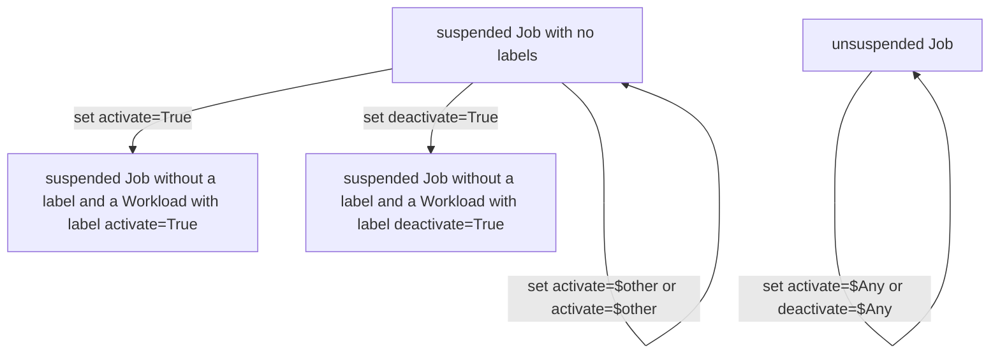
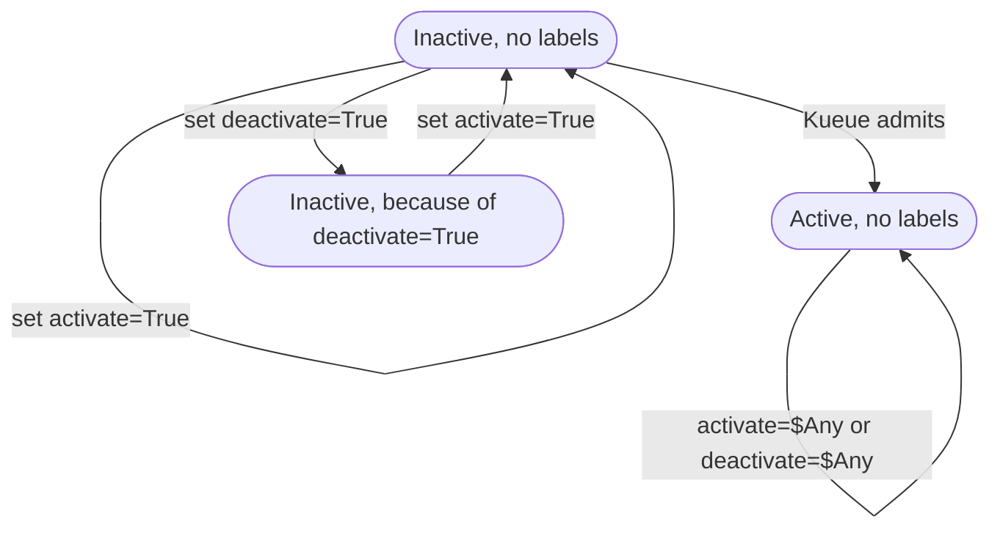

# PR #7295: KEP-6915: mechanism to prevent admission immediately after creation

**Summary**: KEP-6915: mechanism to prevent admission immediately after creation

**Sources**: https://github.com/kubernetes-sigs/kueue/pull/7295

**Last updated**: 2026-03-12T15:54:23Z

---

## Metadata

- **State**: closed (merged)
- **Author**: [@VassilisVassiliadis](https://github.com/VassilisVassiliadis)
- **Branch**: `6915-job-label-to-control-workload-activeness` → `main`
- **Created**: 2025-10-16T11:29:20Z
- **Updated**: 2026-03-12T15:54:23Z
- **Merged**: 2026-03-11T18:53:35Z
- **Closed**: 2026-03-11T18:53:36Z
- **Labels**: `lgtm`, `release-note-none`, `size/XL`, `approved`, `ok-to-test`, `kind/documentation`, `cncf-cla: yes`, `kind/kep`
- **Assignees**: [@kannon92](https://github.com/kannon92), [@mimowo](https://github.com/mimowo), [@tenzen-y](https://github.com/tenzen-y)
- **Requested reviewers**: [@PBundyra](https://github.com/PBundyra)
- **Changed files**: 2   **+593 / -0**

## Description

<!--  Thanks for sending a pull request!  Here are some tips for you:

1. If this is your first time, please read our contributor guidelines: https://git.k8s.io/community/contributors/guide/first-contribution.md#your-first-contribution and developer guide https://git.k8s.io/community/contributors/devel/development.md#development-guide
2. Please label this pull request according to what type of issue you are addressing, especially if this is a release targeted pull request. For reference on required PR/issue labels, read here:
https://git.k8s.io/community/contributors/devel/sig-release/release.md#issuepr-kind-label
3. Ensure you have added or ran the appropriate tests for your PR: https://git.k8s.io/community/contributors/devel/sig-testing/testing.md
4. If you want *faster* PR reviews, read how: https://git.k8s.io/community/contributors/guide/pull-requests.md#best-practices-for-faster-reviews
5. If the PR is unfinished, see how to mark it: https://git.k8s.io/community/contributors/guide/pull-requests.md#marking-unfinished-pull-requests
-->

#### What type of PR is this?

<!--
Add one of the following kinds:
/kind bug
/kind cleanup
/kind documentation
/kind feature

Optionally add one or more of the following kinds if applicable:
/kind api-change
/kind deprecation
/kind failing-test
/kind flake
/kind regression
-->

/kind documentation

#### What this PR does / why we need it:

#### Which issue(s) this PR fixes:
<!--
*Automatically closes linked issue when PR is merged.
Usage: `Fixes #<issue number>`, or `Fixes (paste link of issue)`.
_If PR is about `failing-tests or flakes`, please post the related issues/tests in a comment and do not use `Fixes`_*
-->
Fixes #6915

#### Special notes for your reviewer:

#### Does this PR introduce a user-facing change?
<!--
If no, just write "NONE" in the release-note block below.
If yes, a release note is required:
Enter your extended release note in the block below. If the PR requires additional action from users switching to the new release, include the string "action required".
-->
```release-note
NONE
```

## Discussion

### Comment by [@netlify[bot]](https://github.com/apps/netlify) — 2025-10-16T11:29:28Z

### <span aria-hidden="true">✅</span> Deploy Preview for *kubernetes-sigs-kueue* ready!


|  Name | Link |
|:-:|------------------------|
|<span aria-hidden="true">🔨</span> Latest commit | 4c46e52976a3692feee235b3d5422859a01f4649 |
|<span aria-hidden="true">🔍</span> Latest deploy log | https://app.netlify.com/projects/kubernetes-sigs-kueue/deploys/69ae92b7d4201300082c94bb |
|<span aria-hidden="true">😎</span> Deploy Preview | [https://deploy-preview-7295--kubernetes-sigs-kueue.netlify.app](https://deploy-preview-7295--kubernetes-sigs-kueue.netlify.app) |
|<span aria-hidden="true">📱</span> Preview on mobile | <details><summary> Toggle QR Code... </summary><br /><br /><br /><br />_Use your smartphone camera to open QR code link._</details> |
---
<!-- [kubernetes-sigs-kueue Preview](https://deploy-preview-7295--kubernetes-sigs-kueue.netlify.app) -->
_To edit notification comments on pull requests, go to your [Netlify project configuration](https://app.netlify.com/projects/kubernetes-sigs-kueue/configuration/notifications#deploy-notifications)._

### Comment by [@k8s-ci-robot](https://github.com/k8s-ci-robot) — 2025-10-16T11:29:30Z

Hi @VassilisVassiliadis. Thanks for your PR.

I'm waiting for a [kubernetes-sigs](https://github.com/orgs/kubernetes-sigs/people) member to verify that this patch is reasonable to test. If it is, they should reply with `/ok-to-test` on its own line. Until that is done, I will not automatically test new commits in this PR, but the usual testing commands by org members will still work. Regular contributors should [join the org](https://git.k8s.io/community/community-membership.md#member) to skip this step.

Once the patch is verified, the new status will be reflected by the `ok-to-test` label.

I understand the commands that are listed [here](https://go.k8s.io/bot-commands?repo=kubernetes-sigs%2Fkueue).

<details>

Instructions for interacting with me using PR comments are available [here](https://git.k8s.io/community/contributors/guide/pull-requests.md).  If you have questions or suggestions related to my behavior, please file an issue against the [kubernetes-sigs/prow](https://github.com/kubernetes-sigs/prow/issues/new?title=Prow%20issue:) repository.
</details>

### Comment by [@mimowo](https://github.com/mimowo) — 2025-10-16T11:30:26Z

/ok-to-test

### Comment by [@kannon92](https://github.com/kannon92) — 2025-10-16T20:48:37Z

/cc @Copilot

I want to try out if I have copilot review. Ignore for now.

### Comment by [@mimowo](https://github.com/mimowo) — 2025-10-17T13:14:30Z

Folks, thanks for working on the KEP, I will try my best to land here next week.

### Comment by [@VassilisVassiliadis](https://github.com/VassilisVassiliadis) — 2025-11-11T14:10:31Z

@mimowo I'm thinking of putting together an image that explains the state transitions and then updating the KEP based with the logic I describe above. Before I do that I'd just like to ask about the goal of this KEP.

## Feature request

I'd like the ability to create a Job object (RayCluster, batch v1/job, etc) in a Kueue-managed namespace in a way that it remains suspended till I change my mind. I cannot currently do this without interacting with Kueue CustomResource objects (e.g. a Workload CR).

Currently, this is not feasible because Kueue manages the "suspension" logic of Objects (e.g. the `.suspend` field of RayCluster and batch.v1/Job objects).

## Extended context of feature request

1. a user cannot "force" the Job object to be scheduled without going through all the regular checks of Kueue (e.g. admission controllers, capacity check, etc)
2. a user cannot "override" Kueue's decision to suspend a Job (i.e. some internal component of Kueue, or some external entity, setting `.active=False` in the associated Workload object

## Question

Does it make sense for an end-user to be able to mark a Job as ineligible for scheduling and at a later point reverting it back to being eligible for scheduling all without interacting with Kueue CRs ?

### Comment by [@VassilisVassiliadis](https://github.com/VassilisVassiliadis) — 2025-12-10T10:05:34Z

@mimowo @tenzen-y would a state transition graph help us reason on this KEP ?

### Comment by [@VassilisVassiliadis](https://github.com/VassilisVassiliadis) — 2026-01-12T09:27:00Z

@mimowo @tenzen-y would you like me to pick this back up? I'm thinking of updating the KEP to reflect the points @mimowo made the other day. 

Let me know what you think!

### Comment by [@VassilisVassiliadis](https://github.com/VassilisVassiliadis) — 2026-02-12T13:40:15Z

Here's a way to design this kep:

A user can interact directly with a managed Job object (where Job is a CR that Kueue manages like Job, PyTorchJob, Deployment, etc) to declare their intent that Kueue should "deactivate" it. They do this by using 2 labels:

-  `kueue.x-k8s.io/activate=true`: Instructs Kueue to track this Job. The Job will flow through the normal Kueue path for admission checks and scheduling decisions
- `kueue.x-k8s.io/deactivate=true`: Instructs Kueue to forget about this job. Kueue will not consider this job eligible for admission.

To keep things simple, a user can only manually activate/deactivate a suspended job.


This boils down to the following 2 state diagrams:

The GenericJob controller in Kueue propagates the `activate=True` and `deactivate=True` labels to the workload. If the labels have a value other than truth-y it disregards them. Regardless of the value of the label, it removes the label from the Job object.

Here's that state-transition diagram for the Job object and the changes it makes to the associated Workload:




Below is how the Workload controller will use the labels to:

- mark an already Inactive Workload as unschedulable: Place the inactive workload in a state which guides Kueue to ignore during admission checks
- mark an unschedulable Workload as "schedulable": Leave the inactive workload in its inactive state, but allow Kueue to move it into the Active state using its regular admission checks



The idea is to:

- Use `deactivate=True` to place a suspended Job into an inactive state and stopping Kueue from ever scheduling this Job
- Use `activate=True` to place a suspended and "ignored" Job back into an "inactive" state and allowing Kueue to eventually unsuspend it whenever it chooses so.

### Comment by [@mimowo](https://github.com/mimowo) — 2026-02-12T13:43:35Z

@VassilisVassiliadis will the labels be ephemenral - deleted by Kueue after the operation or "stable"? Also, nit, why labels, not annotations?

After some clarifications I'm ok to move forward with the KEP in alpha, and for beta re-evaluete the design assumptions. 

It would be great if you can show the design in wg-batch.

### Comment by [@VassilisVassiliadis](https://github.com/VassilisVassiliadis) — 2026-02-12T13:52:27Z

Hi @mimowo, I'll answer your questions in reverse!

> Also, nit, why labels, not annotations?

I honestly don't have an answer to that! I just thought of labels first just because `kueue.x-k8s.io/queue-name` is also a label. Maybe use `labels` at the level of the Job for consistency but propagate `annotations` to the Workload ? What would you like ?

> @VassilisVassiliadis will the labels be ephemenral - deleted by Kueue after the operation or "stable"? 

Great question. In the writeup above the labels are removed as soon as Kueue propagates the signal (label, annotation, etc) to the Workload or decides that the user's signal is invalid i.e. they asked to deactivate a job that's already running.

I see the utility of removing the label **after** the operation is stable as a way of telling the user that the action they requested is "applied". I think this would just mean that the Workload state machine updates the label of the Job after it applies the desired action.

I'd be slightly leaning towards the first just because it's a bit simpler to implement, but I don't mind going with the route of removing the Job labels/annotations after the system is stable. What would you prefer ?

### Comment by [@VassilisVassiliadis](https://github.com/VassilisVassiliadis) — 2026-02-12T14:04:34Z

> It would be great if you can show the design in wg-batch.

I'm talking about it today actually!

### Comment by [@mimowo](https://github.com/mimowo) — 2026-02-12T15:58:55Z

As discussed at the wg-batch, I suggest to introduce a new annotation, called `kueue.x-k8s.io/scheduling-gated-by` which will require to specify the controller name gating the scheduling. 

The annotation will have validations (at least for alpha):
- preventing adding it after Job creation, it can only be removed
- it needs to conform to the domain-like format (as the `spec.managedBy` field in the Job), something like `example.com/mygate`


Please move the activation-based approach to Alternatives section, and add to Graduation criteria two points:
1. re-evaluate the activation based approach
2. re-evaluate adding the annotation later in the lifetime of a Job

### Comment by [@VassilisVassiliadis](https://github.com/VassilisVassiliadis) — 2026-02-12T16:01:10Z

Sounds good to me, I'll update the KEP and drop a message here when it's ready for review. Thanks!

### Comment by [@VassilisVassiliadis](https://github.com/VassilisVassiliadis) — 2026-02-18T13:17:42Z

Hi @mimowo I just pushed a new version of the KEP. For the implementation details section I suggested follow the same approach as the `JobWithSkip` interface. If the annotation is in the Job object, then exit the reconciler early before creating the Workload object at all.

Could you have a look at the PR and let me know what you think?

### Comment by [@VassilisVassiliadis](https://github.com/VassilisVassiliadis) — 2026-02-19T16:12:25Z

Thanks @mimowo I updated the KEP to address your comments!

### Comment by [@VassilisVassiliadis](https://github.com/VassilisVassiliadis) — 2026-02-20T15:39:29Z

> LGTM!

Thank you for the feedback, I'll update the PR !

### Comment by [@mimowo](https://github.com/mimowo) — 2026-02-20T18:36:10Z

cc @tenzen-y ptal

### Comment by [@tenzen-y](https://github.com/tenzen-y) — 2026-02-20T20:04:14Z

> cc @tenzen-y ptal

Thank you for driving and moving this disscussions. I checked this one.

### Comment by [@VassilisVassiliadis](https://github.com/VassilisVassiliadis) — 2026-02-24T16:27:42Z

@tenzen-y @mimowo @kannon92 I updated the KEP to reflect your comments!

### Comment by [@k8s-ci-robot](https://github.com/k8s-ci-robot) — 2026-02-24T16:53:04Z

LGTM label has been added.  <details>Git tree hash: ccaec74a17daf4162e1f980ab6938aada00d6f9a</details>

### Comment by [@tenzen-y](https://github.com/tenzen-y) — 2026-02-25T11:20:05Z

@VassilisVassiliadis could you fix toc verification errors?

### Comment by [@VassilisVassiliadis](https://github.com/VassilisVassiliadis) — 2026-02-25T11:48:33Z

Ah yes, sorry about that I forgot to run `./hack/update-toc.sh` earier

### Comment by [@mimowo](https://github.com/mimowo) — 2026-02-27T14:33:20Z

/title KEP-6915: a mechanism to prevent admission immediately after creation

### Comment by [@mimowo](https://github.com/mimowo) — 2026-02-27T14:42:15Z

To make the title abstract out the name
/retitle KEP-6915: mechanism to prevent admission immediately after creation

### Comment by [@mimowo](https://github.com/mimowo) — 2026-02-27T16:39:34Z

/kind kep
Adding new label for the ease of filtering PRs which are KEPs  / designs are require special handling

### Comment by [@VassilisVassiliadis](https://github.com/VassilisVassiliadis) — 2026-03-06T12:07:25Z

@mimowo thank you for your detailed review! I updated the KEP to reflect your comments.

### Comment by [@mimowo](https://github.com/mimowo) — 2026-03-06T12:23:07Z

> @mimowo thank you for your detailed review! I updated the KEP to reflect your comments.

Cool I will give it another reading today. Please mark all addressed comments as resolved so that I know where to put attention.

### Comment by [@mimowo](https://github.com/mimowo) — 2026-03-06T19:36:24Z

LGTM, I'm happy with the current shape of the KEP

Left some nits to improve design details with the observability information.

Have you had a chance to start prototyping? To meet 0.17 release the timeline will be tight.

/approve
Let me also ask  if @tenzen-y has some extra comments

### Comment by [@VassilisVassiliadis](https://github.com/VassilisVassiliadis) — 2026-03-09T09:33:53Z

> LGTM, I'm happy with the current shape of the KEP
> 
> Left some nits to improve design details with the observability information.
> 
> Have you had a chance to start prototyping? To meet 0.17 release the timeline will be tight.
> 
> /approve Let me also ask if @tenzen-y has some extra comments

Thank you, I haven't looked into this yet but I'll take a stab at it. 

I think that the code shouldn't be too complex so if I implement the tests that @kannon92 suggested and make sure they pass we should be confident the code works properly.

I'll look into this, maybe even today and will shoot for a PR ready for Thursday, March 12th 2026.

### Comment by [@mimowo](https://github.com/mimowo) — 2026-03-09T10:00:32Z

Thank you! Lets try to make the code complete this week, so that we still have some buffer for last minute fixes.

### Comment by [@VassilisVassiliadis](https://github.com/VassilisVassiliadis) — 2026-03-10T14:41:02Z

@mimowo I've got a prototype of the feature in a branch I started off of latest commit in the head commit. This PR is a bit old (e.g. doesn't have the IsAdmissible() code in it). 

Would you rather I merged my other branch into this one, or I open a 2nd PR for the implementation of the KEP ?

### Comment by [@kannon92](https://github.com/kannon92) — 2026-03-10T14:47:53Z

Please open up a separate PR for implementation.

### Comment by [@kannon92](https://github.com/kannon92) — 2026-03-10T14:49:33Z

/lgtm

Thank you for your patience through this review cycle.

### Comment by [@k8s-ci-robot](https://github.com/k8s-ci-robot) — 2026-03-10T14:49:42Z

LGTM label has been added.  <details>Git tree hash: f1945f492d5cb310a9ed689fd90057c745b7582e</details>

### Comment by [@VassilisVassiliadis](https://github.com/VassilisVassiliadis) — 2026-03-10T14:50:00Z

I learned tons of things, thanks for all the help!

### Comment by [@mimowo](https://github.com/mimowo) — 2026-03-10T14:53:42Z

let's keep two separate PRs - for the KEP and impl

### Comment by [@VassilisVassiliadis](https://github.com/VassilisVassiliadis) — 2026-03-10T16:58:02Z

I opened a PR here: https://github.com/kubernetes-sigs/kueue/pull/9792

It's not fully done yet but I think that it's at a decent point to start collecting feedback on it. 

Let me know what you think!

### Comment by [@k8s-ci-robot](https://github.com/k8s-ci-robot) — 2026-03-11T18:35:51Z

[APPROVALNOTIFIER] This PR is **APPROVED**

This pull-request has been approved by: *<a href="https://github.com/kubernetes-sigs/kueue/pull/7295#issuecomment-4013715477" title="Approved">mimowo</a>*, *<a href="https://github.com/kubernetes-sigs/kueue/pull/7295#pullrequestreview-3931657674" title="Approved">tenzen-y</a>*, *<a href="https://github.com/kubernetes-sigs/kueue/pull/7295#" title="Author self-approved">VassilisVassiliadis</a>*

The full list of commands accepted by this bot can be found [here](https://go.k8s.io/bot-commands?repo=kubernetes-sigs%2Fkueue).

The pull request process is described [here](https://git.k8s.io/community/contributors/guide/owners.md#the-code-review-process)

<details >
Needs approval from an approver in each of these files:

- ~~[OWNERS](https://github.com/kubernetes-sigs/kueue/blob/main/OWNERS)~~ [mimowo,tenzen-y]

Approvers can indicate their approval by writing `/approve` in a comment
Approvers can cancel approval by writing `/approve cancel` in a comment
</details>
<!-- META={"approvers":[]} -->

## Reviews

### Review by [@kannon92](https://github.com/kannon92) (commented) — 2025-10-16T15:37:29Z

- **keps/6915-job-label-to-control-workload-activeness/README.md:192** by [@kannon92](https://github.com/kannon92) — 2025-10-16T15:37:29Z
```diff
@@ -0,0 +1,332 @@
+# KEP-6915: Label based switch to control Workload activeness  
+
+<!--
+This is the title of your KEP. Keep it short, simple, and descriptive. A good
+title can help communicate what the KEP is and should be considered as part of
+any review.
+-->
+
+<!--
+A table of contents is helpful for quickly jumping to sections of a KEP and for
+highlighting any additional information provided beyond the standard KEP
+template.
+
+Ensure the TOC is wrapped with
+  <code>&lt;!-- toc --&rt;&lt;!-- /toc --&rt;</code>
+tags, and then generate with `hack/update-toc.sh`.
+-->
+
+<!-- toc -->
+- [Summary](#summary)
+- [Motivation](#motivation)
+  - [Goals](#goals)
+  - [Non-Goals](#non-goals)
+- [Proposal](#proposal)
+  - [Behavior](#behavior)
+  - [User Stories](#user-stories)
+    - [Story 1](#story-1)
+    - [Story 2](#story-2)
+  - [Notes/Constraints/Caveats](#notesconstraintscaveats)
+  - [Risks and Mitigations](#risks-and-mitigations)
+- [Design Details](#design-details)
+  - [Test Plan](#test-plan)
+      - [Prerequisite testing updates](#prerequisite-testing-updates)
+    - [Unit Tests](#unit-tests)
+    - [Integration tests](#integration-tests)
+      - [Activate Workload via Label Flip](#activate-workload-via-label-flip)
+      - [Deactivate Workload via Label Flip](#deactivate-workload-via-label-flip)
+  - [Graduation Criteria](#graduation-criteria)
+- [Implementation History](#implementation-history)
+- [Drawbacks](#drawbacks)
+- [Alternatives](#alternatives)
+  - [Annotation instead of label](#annotation-instead-of-label)
+  - [Admission policy-based activation or queue-level configuration](#admission-policy-based-activation-or-queue-level-configuration)
+  - [Direct Workload Interaction](#direct-workload-interaction)
+<!-- /toc -->
+
+## Summary
+
+<!--
+This section is incredibly important for producing high-quality, user-focused
+documentation such as release notes or a development roadmap. It should be
+possible to collect this information before implementation begins, in order to
+avoid requiring implementors to split their attention between writing release
+notes and implementing the feature itself. KEP editors and SIG Docs
+should help to ensure that the tone and content of the `Summary` section is
+useful for a wide audience.
+
+A good summary is probably at least a paragraph in length.
+
+Both in this section and below, follow the guidelines of the [documentation
+style guide]. In particular, wrap lines to a reasonable length, to make it
+easier for reviewers to cite specific portions, and to minimize diff churn on
+updates.
+
+[documentation style guide]: https://github.com/kubernetes/community/blob/master/contributors/guide/style-guide.md
+-->
+
+Introduce label `kueue.x-k8s.io/active={true|false}` on supported Job-like objects. If `false`, Kueue creates the Workload with `spec.active=false`. Removing the label or setting `true` updates the Workload to `spec.active=true`. Missing label defaults to active.
+
+## Motivation
+
+<!--
+This section is for explicitly listing the motivation, goals, and non-goals of
+this KEP.  Describe why the change is important and the benefits to users. The
+motivation section can optionally provide links to [experience reports] to
+demonstrate the interest in a KEP within the wider Kubernetes community.
+
+[experience reports]: https://github.com/golang/go/wiki/ExperienceReports
+-->
+
+Provide explicit user control over activation by interacting directly with the Job objects.
+
+### Goals
+
+<!--
+List the specific goals of the KEP. What is it trying to achieve? How will we
+know that this has succeeded?
+-->
+
+- Respect label at create and update
+- Ensure consistent transitions without breaking queue semantics
+
+### Non-Goals
+
+<!--
+What is out of scope for this KEP? Listing non-goals helps to focus discussion
+and make progress.
+-->
+
+- New CRDs or scheduler policy changes
+
+## Proposal
+
+<!--
+This is where we get down to the specifics of what the proposal actually is.
+This should have enough detail that reviewers can understand exactly what
+you're proposing, but should not include things like API designs or
+implementation. What is the desired outcome and how do we measure success?.
+The "Design Details" section below is for the real
+nitty-gritty.
+-->
+
+### Behavior
+
+- Kueue managed Jobs can have a label `kueue.x-k8s.io/active` with default value `true`
+- Create: label false sets the field `Workload.spec.active` to `false`
+- Update: remove or set true sets the field `Workload.spec.active` to `true`
+- If a Job is unsuspended while Workload inactive, controller re-suspends  
+
+
+### User Stories
+
+<!--
+Detail the things that people will be able to do if this KEP is implemented.
+Include as much detail as possible so that people can understand the "how" of
+the system. The goal here is to make this feel real for users without getting
+bogged down.
+-->
+
+#### Story 1
+
+A user submits a Job they do not want to start queueing immediately. They add the label  
+`kueue.x-k8s.io/active: "false"`. Kueue creates the associated Workload as inactive. 
+The Job is now effectively suspended and will not queue while the label remains `false`.
+
+Later, the user decides the Job is ready to queue. They either set the label to  
+`kueue.x-k8s.io/active: "true"` or remove it entirely.
+
+Kueue updates the Workload to active and treats the Job like any other queued job.
+
+#### Story 2
+
+A user submits a Job without the `kueue.x-k8s.io/active` label. Kueue creates a regular 
+active Workload. However, the user realizes they do not want the Job to start executing, 
+so they add the label `kueue.x-k8s.io/active: "false"`.
+
+Kueue marks the associated Workload as inactive. The Job is now effectively suspended 
+and will not queue while the label remains `false`.
+
+Later, the user decides the Job is ready to queue. They either set the label to  
+`kueue.x-k8s.io/active: "true"` or remove it entirely.
+
+Kueue updates the Workload to active and treats the Job like any other queued job.
+
+### Notes/Constraints/Caveats
+
+<!--
+What are the caveats to the proposal?
+What are some important details that didn't come across above?
+Go in to as much detail as necessary here.
+This might be a good place to talk about core concepts and how they relate.
+-->
+
+This feature enables users to force the value of `spec.active` in the `Workload` object that is associated with the user's Job.
+
+### Risks and Mitigations
+
+<!--
+What are the risks of this proposal, and how do we mitigate? Think broadly.
+For example, consider both security and how this will impact the larger
+Kubernetes ecosystem.
+
+How will security be reviewed, and by whom?
+
+How will UX be reviewed, and by whom?
+
+Consider including folks who also work outside the SIG or subproject.
+-->
+
+## Design Details
+
+<!--
+This section should contain enough information that the specifics of your
+change are understandable. This may include API specs (though not always
+required) or even code snippets. If there's any ambiguity about HOW your
+proposal will be implemented, this is the place to discuss them.
+-->
+
+- No new fields; reuse `Workload.spec.active`  
+- Label contract: `kueue.x-k8s.io/active` values `true` or `false`  
+- Invalid values are ignored and assumed to be `true`
+- Feature gate: `WorkloadActiveLabel` (Alpha, default off)  
```

  How are you planning to implement this so that all workloads can leverage this functionality?

### Review by [@kannon92](https://github.com/kannon92) (commented) — 2025-10-16T15:38:03Z

- **keps/6915-job-label-to-control-workload-activeness/kep.yaml:24** by [@kannon92](https://github.com/kannon92) — 2025-10-16T15:38:02Z
```diff
@@ -0,0 +1,39 @@
+title: Label based switch to control Workload activeness
+kep-number: 6915
+authors:
+  - "@VassilisVassiliadis"
+  - "@tg123"
+status: provisional
+creation-date: 2025-10-16
+reviewers:
+  - "@mimowo"
+
+approvers:
+  - TBD
+
+see-also: []
+
+replaces: []
+
+# The target maturity stage in the current dev cycle for this KEP.
+stage: alpha
+
+# The most recent milestone for which work toward delivery of this KEP has been
+# done. This can be the current (upcoming) milestone, if it is being actively
+# worked on.
+latest-milestone: "v0.2"
```

  ```suggestion
  latest-milestone: "v0.15"
  ```

### Review by [@kannon92](https://github.com/kannon92) (commented) — 2025-10-16T15:38:15Z

- **keps/6915-job-label-to-control-workload-activeness/kep.yaml:6** by [@kannon92](https://github.com/kannon92) — 2025-10-16T15:38:14Z
```diff
@@ -0,0 +1,39 @@
+title: Label based switch to control Workload activeness
+kep-number: 6915
+authors:
+  - "@VassilisVassiliadis"
+  - "@tg123"
+status: provisional
```

  ```suggestion
  status: implementable
  ```

### Review by [@VassilisVassiliadis](https://github.com/VassilisVassiliadis) (commented) — 2025-10-17T13:07:55Z

- **keps/6915-job-label-to-control-workload-activeness/README.md:192** by [@VassilisVassiliadis](https://github.com/VassilisVassiliadis) — 2025-10-17T13:07:55Z
```diff
@@ -0,0 +1,332 @@
+# KEP-6915: Label based switch to control Workload activeness  
+
+<!--
+This is the title of your KEP. Keep it short, simple, and descriptive. A good
+title can help communicate what the KEP is and should be considered as part of
+any review.
+-->
+
+<!--
+A table of contents is helpful for quickly jumping to sections of a KEP and for
+highlighting any additional information provided beyond the standard KEP
+template.
+
+Ensure the TOC is wrapped with
+  <code>&lt;!-- toc --&rt;&lt;!-- /toc --&rt;</code>
+tags, and then generate with `hack/update-toc.sh`.
+-->
+
+<!-- toc -->
+- [Summary](#summary)
+- [Motivation](#motivation)
+  - [Goals](#goals)
+  - [Non-Goals](#non-goals)
+- [Proposal](#proposal)
+  - [Behavior](#behavior)
+  - [User Stories](#user-stories)
+    - [Story 1](#story-1)
+    - [Story 2](#story-2)
+  - [Notes/Constraints/Caveats](#notesconstraintscaveats)
+  - [Risks and Mitigations](#risks-and-mitigations)
+- [Design Details](#design-details)
+  - [Test Plan](#test-plan)
+      - [Prerequisite testing updates](#prerequisite-testing-updates)
+    - [Unit Tests](#unit-tests)
+    - [Integration tests](#integration-tests)
+      - [Activate Workload via Label Flip](#activate-workload-via-label-flip)
+      - [Deactivate Workload via Label Flip](#deactivate-workload-via-label-flip)
+  - [Graduation Criteria](#graduation-criteria)
+- [Implementation History](#implementation-history)
+- [Drawbacks](#drawbacks)
+- [Alternatives](#alternatives)
+  - [Annotation instead of label](#annotation-instead-of-label)
+  - [Admission policy-based activation or queue-level configuration](#admission-policy-based-activation-or-queue-level-configuration)
+  - [Direct Workload Interaction](#direct-workload-interaction)
+<!-- /toc -->
+
+## Summary
+
+<!--
+This section is incredibly important for producing high-quality, user-focused
+documentation such as release notes or a development roadmap. It should be
+possible to collect this information before implementation begins, in order to
+avoid requiring implementors to split their attention between writing release
+notes and implementing the feature itself. KEP editors and SIG Docs
+should help to ensure that the tone and content of the `Summary` section is
+useful for a wide audience.
+
+A good summary is probably at least a paragraph in length.
+
+Both in this section and below, follow the guidelines of the [documentation
+style guide]. In particular, wrap lines to a reasonable length, to make it
+easier for reviewers to cite specific portions, and to minimize diff churn on
+updates.
+
+[documentation style guide]: https://github.com/kubernetes/community/blob/master/contributors/guide/style-guide.md
+-->
+
+Introduce label `kueue.x-k8s.io/active={true|false}` on supported Job-like objects. If `false`, Kueue creates the Workload with `spec.active=false`. Removing the label or setting `true` updates the Workload to `spec.active=true`. Missing label defaults to active.
+
+## Motivation
+
+<!--
+This section is for explicitly listing the motivation, goals, and non-goals of
+this KEP.  Describe why the change is important and the benefits to users. The
+motivation section can optionally provide links to [experience reports] to
+demonstrate the interest in a KEP within the wider Kubernetes community.
+
+[experience reports]: https://github.com/golang/go/wiki/ExperienceReports
+-->
+
+Provide explicit user control over activation by interacting directly with the Job objects.
+
+### Goals
+
+<!--
+List the specific goals of the KEP. What is it trying to achieve? How will we
+know that this has succeeded?
+-->
+
+- Respect label at create and update
+- Ensure consistent transitions without breaking queue semantics
+
+### Non-Goals
+
+<!--
+What is out of scope for this KEP? Listing non-goals helps to focus discussion
+and make progress.
+-->
+
+- New CRDs or scheduler policy changes
+
+## Proposal
+
+<!--
+This is where we get down to the specifics of what the proposal actually is.
+This should have enough detail that reviewers can understand exactly what
+you're proposing, but should not include things like API designs or
+implementation. What is the desired outcome and how do we measure success?.
+The "Design Details" section below is for the real
+nitty-gritty.
+-->
+
+### Behavior
+
+- Kueue managed Jobs can have a label `kueue.x-k8s.io/active` with default value `true`
+- Create: label false sets the field `Workload.spec.active` to `false`
+- Update: remove or set true sets the field `Workload.spec.active` to `true`
+- If a Job is unsuspended while Workload inactive, controller re-suspends  
+
+
+### User Stories
+
+<!--
+Detail the things that people will be able to do if this KEP is implemented.
+Include as much detail as possible so that people can understand the "how" of
+the system. The goal here is to make this feel real for users without getting
+bogged down.
+-->
+
+#### Story 1
+
+A user submits a Job they do not want to start queueing immediately. They add the label  
+`kueue.x-k8s.io/active: "false"`. Kueue creates the associated Workload as inactive. 
+The Job is now effectively suspended and will not queue while the label remains `false`.
+
+Later, the user decides the Job is ready to queue. They either set the label to  
+`kueue.x-k8s.io/active: "true"` or remove it entirely.
+
+Kueue updates the Workload to active and treats the Job like any other queued job.
+
+#### Story 2
+
+A user submits a Job without the `kueue.x-k8s.io/active` label. Kueue creates a regular 
+active Workload. However, the user realizes they do not want the Job to start executing, 
+so they add the label `kueue.x-k8s.io/active: "false"`.
+
+Kueue marks the associated Workload as inactive. The Job is now effectively suspended 
+and will not queue while the label remains `false`.
+
+Later, the user decides the Job is ready to queue. They either set the label to  
+`kueue.x-k8s.io/active: "true"` or remove it entirely.
+
+Kueue updates the Workload to active and treats the Job like any other queued job.
+
+### Notes/Constraints/Caveats
+
+<!--
+What are the caveats to the proposal?
+What are some important details that didn't come across above?
+Go in to as much detail as necessary here.
+This might be a good place to talk about core concepts and how they relate.
+-->
+
+This feature enables users to force the value of `spec.active` in the `Workload` object that is associated with the user's Job.
+
+### Risks and Mitigations
+
+<!--
+What are the risks of this proposal, and how do we mitigate? Think broadly.
+For example, consider both security and how this will impact the larger
+Kubernetes ecosystem.
+
+How will security be reviewed, and by whom?
+
+How will UX be reviewed, and by whom?
+
+Consider including folks who also work outside the SIG or subproject.
+-->
+
+## Design Details
+
+<!--
+This section should contain enough information that the specifics of your
+change are understandable. This may include API specs (though not always
+required) or even code snippets. If there's any ambiguity about HOW your
+proposal will be implemented, this is the place to discuss them.
+-->
+
+- No new fields; reuse `Workload.spec.active`  
+- Label contract: `kueue.x-k8s.io/active` values `true` or `false`  
+- Invalid values are ignored and assumed to be `true`
+- Feature gate: `WorkloadActiveLabel` (Alpha, default off)  
```

  That's a good question, I think that we should only change reconciler.go (and unit/integration tests code) when implementing the feature.
  
  So there are 3 questions to answer:
  
  1. Which Workloads do we patch ?
  2. What changes do we make ?
  3. Which parts of reconciler.go do we change?
  
  For question 1: In the interest of simplicity we should only patch the Workloads of non-composable jobs.
  
  For question 2: The intention of this KEP is to force a Workload to the `inactive` state.
  
  To this end, in the places that we patch the Workload object for a Job we should:
  
  1. get the `kueue.x-k8s.io/active` label of the Job object
  2. if it is a false-y value then we set `workload.spec.active` to False
  3. if it is a truth-y value, we do nothing. Basically, this is as if this feature does not exist
  
  This means that the User can only force a Workload to transition from `active` to `inactive` but not the other way around. This reduces the chances of someone abusing this feature.
  
  For question 3:
  
  First, I'd create a utility function that works like this:
  
  ```go
  func shouldDeactivateJob(job GenericJob) bool {
  	// inspect the WorkloadActiveLabel feature gate, if it is off return false
  	// if this is a composable job, return false
  	// grab the value of the `kueue.x-k8s.io/active` label, 
  	// 	if it is false-y return true
  	// 	else, return false
  }
  ```
  
  There is at least 1 place, the part of the code that creates the Workload:
  
  https://github.com/kubernetes-sigs/kueue/blob/bb2b22ff2e83246ab0d3b0f3f29fede4c5512ac2/pkg/controller/jobframework/reconciler.go#L1369-L1377
  
  Something like this:
  
  ```go
  func (r *JobReconciler) prepareWorkload(ctx context.Context, job GenericJob, wl *kueue.Workload) error {
  	priorityClassName, source, p, err := r.extractPriority(ctx, wl.Spec.PodSets, job)
  	if err != nil {
  		return err
  	}
  
  	wl.Spec.PriorityClassName = priorityClassName
  	wl.Spec.Priority = &p
  	wl.Spec.PriorityClassSource = source
  	wl.Spec.PodSets = clearMinCountsIfFeatureDisabled(wl.Spec.PodSets)
  
      // ***** start new code ***
      if shouldDeactivateJob(job) && wl.Spec.Active {
          wl.Spec.Active = false
          // Optionally, record an event in Job and/or Workload explaining why the Workload got deactivated
      }
      // ***** end new code ***
  
  	if workloadSliceEnabled(job) {
  		return prepareWorkloadSlice(ctx, r.client, job, wl)
  	}
  	return nil
  }
  ```
  
  That covers the scenario in which a user creates a Job that contains the `kueue.x-k8s.io/active=false` label. However, I don't think this change is enough to cover the scenario in which a user labels a Job object that Kueue has already created a Workload for. 
  
  I think for this case we need to add some code here:
  
  https://github.com/kubernetes-sigs/kueue/blob/bb2b22ff2e83246ab0d3b0f3f29fede4c5512ac2/pkg/controller/jobframework/reconciler.go#L396-L400
  
  So I'm thinking of something like this:
  
  ```go
  wl, err := r.ensureOneWorkload(ctx, job, object)
  if err != nil {
  	return ctrl.Result{}, err
  }
  
  // ***** start new code ***
  if wl != nil shouldDeactivateJob(job) && wl.Spec.Active {
  	wl.Spec.Active = false
  	// Optionally, record an event in Job and/or Workload explaining why the Workload got deactivated
  }
  // ***** end new code ***
  ```
  
  Let me know what you think and I can update the KEP to reflect this!

### Review by [@VassilisVassiliadis](https://github.com/VassilisVassiliadis) (commented) — 2025-10-17T13:16:51Z

- **keps/6915-job-label-to-control-workload-activeness/README.md:192** by [@VassilisVassiliadis](https://github.com/VassilisVassiliadis) — 2025-10-17T13:16:51Z
```diff
@@ -0,0 +1,332 @@
+# KEP-6915: Label based switch to control Workload activeness  
+
+<!--
+This is the title of your KEP. Keep it short, simple, and descriptive. A good
+title can help communicate what the KEP is and should be considered as part of
+any review.
+-->
+
+<!--
+A table of contents is helpful for quickly jumping to sections of a KEP and for
+highlighting any additional information provided beyond the standard KEP
+template.
+
+Ensure the TOC is wrapped with
+  <code>&lt;!-- toc --&rt;&lt;!-- /toc --&rt;</code>
+tags, and then generate with `hack/update-toc.sh`.
+-->
+
+<!-- toc -->
+- [Summary](#summary)
+- [Motivation](#motivation)
+  - [Goals](#goals)
+  - [Non-Goals](#non-goals)
+- [Proposal](#proposal)
+  - [Behavior](#behavior)
+  - [User Stories](#user-stories)
+    - [Story 1](#story-1)
+    - [Story 2](#story-2)
+  - [Notes/Constraints/Caveats](#notesconstraintscaveats)
+  - [Risks and Mitigations](#risks-and-mitigations)
+- [Design Details](#design-details)
+  - [Test Plan](#test-plan)
+      - [Prerequisite testing updates](#prerequisite-testing-updates)
+    - [Unit Tests](#unit-tests)
+    - [Integration tests](#integration-tests)
+      - [Activate Workload via Label Flip](#activate-workload-via-label-flip)
+      - [Deactivate Workload via Label Flip](#deactivate-workload-via-label-flip)
+  - [Graduation Criteria](#graduation-criteria)
+- [Implementation History](#implementation-history)
+- [Drawbacks](#drawbacks)
+- [Alternatives](#alternatives)
+  - [Annotation instead of label](#annotation-instead-of-label)
+  - [Admission policy-based activation or queue-level configuration](#admission-policy-based-activation-or-queue-level-configuration)
+  - [Direct Workload Interaction](#direct-workload-interaction)
+<!-- /toc -->
+
+## Summary
+
+<!--
+This section is incredibly important for producing high-quality, user-focused
+documentation such as release notes or a development roadmap. It should be
+possible to collect this information before implementation begins, in order to
+avoid requiring implementors to split their attention between writing release
+notes and implementing the feature itself. KEP editors and SIG Docs
+should help to ensure that the tone and content of the `Summary` section is
+useful for a wide audience.
+
+A good summary is probably at least a paragraph in length.
+
+Both in this section and below, follow the guidelines of the [documentation
+style guide]. In particular, wrap lines to a reasonable length, to make it
+easier for reviewers to cite specific portions, and to minimize diff churn on
+updates.
+
+[documentation style guide]: https://github.com/kubernetes/community/blob/master/contributors/guide/style-guide.md
+-->
+
+Introduce label `kueue.x-k8s.io/active={true|false}` on supported Job-like objects. If `false`, Kueue creates the Workload with `spec.active=false`. Removing the label or setting `true` updates the Workload to `spec.active=true`. Missing label defaults to active.
+
+## Motivation
+
+<!--
+This section is for explicitly listing the motivation, goals, and non-goals of
+this KEP.  Describe why the change is important and the benefits to users. The
+motivation section can optionally provide links to [experience reports] to
+demonstrate the interest in a KEP within the wider Kubernetes community.
+
+[experience reports]: https://github.com/golang/go/wiki/ExperienceReports
+-->
+
+Provide explicit user control over activation by interacting directly with the Job objects.
+
+### Goals
+
+<!--
+List the specific goals of the KEP. What is it trying to achieve? How will we
+know that this has succeeded?
+-->
+
+- Respect label at create and update
+- Ensure consistent transitions without breaking queue semantics
+
+### Non-Goals
+
+<!--
+What is out of scope for this KEP? Listing non-goals helps to focus discussion
+and make progress.
+-->
+
+- New CRDs or scheduler policy changes
+
+## Proposal
+
+<!--
+This is where we get down to the specifics of what the proposal actually is.
+This should have enough detail that reviewers can understand exactly what
+you're proposing, but should not include things like API designs or
+implementation. What is the desired outcome and how do we measure success?.
+The "Design Details" section below is for the real
+nitty-gritty.
+-->
+
+### Behavior
+
+- Kueue managed Jobs can have a label `kueue.x-k8s.io/active` with default value `true`
+- Create: label false sets the field `Workload.spec.active` to `false`
+- Update: remove or set true sets the field `Workload.spec.active` to `true`
+- If a Job is unsuspended while Workload inactive, controller re-suspends  
+
+
+### User Stories
+
+<!--
+Detail the things that people will be able to do if this KEP is implemented.
+Include as much detail as possible so that people can understand the "how" of
+the system. The goal here is to make this feel real for users without getting
+bogged down.
+-->
+
+#### Story 1
+
+A user submits a Job they do not want to start queueing immediately. They add the label  
+`kueue.x-k8s.io/active: "false"`. Kueue creates the associated Workload as inactive. 
+The Job is now effectively suspended and will not queue while the label remains `false`.
+
+Later, the user decides the Job is ready to queue. They either set the label to  
+`kueue.x-k8s.io/active: "true"` or remove it entirely.
+
+Kueue updates the Workload to active and treats the Job like any other queued job.
+
+#### Story 2
+
+A user submits a Job without the `kueue.x-k8s.io/active` label. Kueue creates a regular 
+active Workload. However, the user realizes they do not want the Job to start executing, 
+so they add the label `kueue.x-k8s.io/active: "false"`.
+
+Kueue marks the associated Workload as inactive. The Job is now effectively suspended 
+and will not queue while the label remains `false`.
+
+Later, the user decides the Job is ready to queue. They either set the label to  
+`kueue.x-k8s.io/active: "true"` or remove it entirely.
+
+Kueue updates the Workload to active and treats the Job like any other queued job.
+
+### Notes/Constraints/Caveats
+
+<!--
+What are the caveats to the proposal?
+What are some important details that didn't come across above?
+Go in to as much detail as necessary here.
+This might be a good place to talk about core concepts and how they relate.
+-->
+
+This feature enables users to force the value of `spec.active` in the `Workload` object that is associated with the user's Job.
+
+### Risks and Mitigations
+
+<!--
+What are the risks of this proposal, and how do we mitigate? Think broadly.
+For example, consider both security and how this will impact the larger
+Kubernetes ecosystem.
+
+How will security be reviewed, and by whom?
+
+How will UX be reviewed, and by whom?
+
+Consider including folks who also work outside the SIG or subproject.
+-->
+
+## Design Details
+
+<!--
+This section should contain enough information that the specifics of your
+change are understandable. This may include API specs (though not always
+required) or even code snippets. If there's any ambiguity about HOW your
+proposal will be implemented, this is the place to discuss them.
+-->
+
+- No new fields; reuse `Workload.spec.active`  
+- Label contract: `kueue.x-k8s.io/active` values `true` or `false`  
+- Invalid values are ignored and assumed to be `true`
+- Feature gate: `WorkloadActiveLabel` (Alpha, default off)  
```

  I forgot to mention that whenever I set `wl.Spec.active` = false I'm also patching the workload object to persist the changes.

### Review by [@VassilisVassiliadis](https://github.com/VassilisVassiliadis) (commented) — 2025-10-17T13:19:58Z

- **keps/6915-job-label-to-control-workload-activeness/README.md:192** by [@VassilisVassiliadis](https://github.com/VassilisVassiliadis) — 2025-10-17T13:19:58Z
```diff
@@ -0,0 +1,332 @@
+# KEP-6915: Label based switch to control Workload activeness  
+
+<!--
+This is the title of your KEP. Keep it short, simple, and descriptive. A good
+title can help communicate what the KEP is and should be considered as part of
+any review.
+-->
+
+<!--
+A table of contents is helpful for quickly jumping to sections of a KEP and for
+highlighting any additional information provided beyond the standard KEP
+template.
+
+Ensure the TOC is wrapped with
+  <code>&lt;!-- toc --&rt;&lt;!-- /toc --&rt;</code>
+tags, and then generate with `hack/update-toc.sh`.
+-->
+
+<!-- toc -->
+- [Summary](#summary)
+- [Motivation](#motivation)
+  - [Goals](#goals)
+  - [Non-Goals](#non-goals)
+- [Proposal](#proposal)
+  - [Behavior](#behavior)
+  - [User Stories](#user-stories)
+    - [Story 1](#story-1)
+    - [Story 2](#story-2)
+  - [Notes/Constraints/Caveats](#notesconstraintscaveats)
+  - [Risks and Mitigations](#risks-and-mitigations)
+- [Design Details](#design-details)
+  - [Test Plan](#test-plan)
+      - [Prerequisite testing updates](#prerequisite-testing-updates)
+    - [Unit Tests](#unit-tests)
+    - [Integration tests](#integration-tests)
+      - [Activate Workload via Label Flip](#activate-workload-via-label-flip)
+      - [Deactivate Workload via Label Flip](#deactivate-workload-via-label-flip)
+  - [Graduation Criteria](#graduation-criteria)
+- [Implementation History](#implementation-history)
+- [Drawbacks](#drawbacks)
+- [Alternatives](#alternatives)
+  - [Annotation instead of label](#annotation-instead-of-label)
+  - [Admission policy-based activation or queue-level configuration](#admission-policy-based-activation-or-queue-level-configuration)
+  - [Direct Workload Interaction](#direct-workload-interaction)
+<!-- /toc -->
+
+## Summary
+
+<!--
+This section is incredibly important for producing high-quality, user-focused
+documentation such as release notes or a development roadmap. It should be
+possible to collect this information before implementation begins, in order to
+avoid requiring implementors to split their attention between writing release
+notes and implementing the feature itself. KEP editors and SIG Docs
+should help to ensure that the tone and content of the `Summary` section is
+useful for a wide audience.
+
+A good summary is probably at least a paragraph in length.
+
+Both in this section and below, follow the guidelines of the [documentation
+style guide]. In particular, wrap lines to a reasonable length, to make it
+easier for reviewers to cite specific portions, and to minimize diff churn on
+updates.
+
+[documentation style guide]: https://github.com/kubernetes/community/blob/master/contributors/guide/style-guide.md
+-->
+
+Introduce label `kueue.x-k8s.io/active={true|false}` on supported Job-like objects. If `false`, Kueue creates the Workload with `spec.active=false`. Removing the label or setting `true` updates the Workload to `spec.active=true`. Missing label defaults to active.
+
+## Motivation
+
+<!--
+This section is for explicitly listing the motivation, goals, and non-goals of
+this KEP.  Describe why the change is important and the benefits to users. The
+motivation section can optionally provide links to [experience reports] to
+demonstrate the interest in a KEP within the wider Kubernetes community.
+
+[experience reports]: https://github.com/golang/go/wiki/ExperienceReports
+-->
+
+Provide explicit user control over activation by interacting directly with the Job objects.
+
+### Goals
+
+<!--
+List the specific goals of the KEP. What is it trying to achieve? How will we
+know that this has succeeded?
+-->
+
+- Respect label at create and update
+- Ensure consistent transitions without breaking queue semantics
+
+### Non-Goals
+
+<!--
+What is out of scope for this KEP? Listing non-goals helps to focus discussion
+and make progress.
+-->
+
+- New CRDs or scheduler policy changes
+
+## Proposal
+
+<!--
+This is where we get down to the specifics of what the proposal actually is.
+This should have enough detail that reviewers can understand exactly what
+you're proposing, but should not include things like API designs or
+implementation. What is the desired outcome and how do we measure success?.
+The "Design Details" section below is for the real
+nitty-gritty.
+-->
+
+### Behavior
+
+- Kueue managed Jobs can have a label `kueue.x-k8s.io/active` with default value `true`
+- Create: label false sets the field `Workload.spec.active` to `false`
+- Update: remove or set true sets the field `Workload.spec.active` to `true`
+- If a Job is unsuspended while Workload inactive, controller re-suspends  
+
+
+### User Stories
+
+<!--
+Detail the things that people will be able to do if this KEP is implemented.
+Include as much detail as possible so that people can understand the "how" of
+the system. The goal here is to make this feel real for users without getting
+bogged down.
+-->
+
+#### Story 1
+
+A user submits a Job they do not want to start queueing immediately. They add the label  
+`kueue.x-k8s.io/active: "false"`. Kueue creates the associated Workload as inactive. 
+The Job is now effectively suspended and will not queue while the label remains `false`.
+
+Later, the user decides the Job is ready to queue. They either set the label to  
+`kueue.x-k8s.io/active: "true"` or remove it entirely.
+
+Kueue updates the Workload to active and treats the Job like any other queued job.
+
+#### Story 2
+
+A user submits a Job without the `kueue.x-k8s.io/active` label. Kueue creates a regular 
+active Workload. However, the user realizes they do not want the Job to start executing, 
+so they add the label `kueue.x-k8s.io/active: "false"`.
+
+Kueue marks the associated Workload as inactive. The Job is now effectively suspended 
+and will not queue while the label remains `false`.
+
+Later, the user decides the Job is ready to queue. They either set the label to  
+`kueue.x-k8s.io/active: "true"` or remove it entirely.
+
+Kueue updates the Workload to active and treats the Job like any other queued job.
+
+### Notes/Constraints/Caveats
+
+<!--
+What are the caveats to the proposal?
+What are some important details that didn't come across above?
+Go in to as much detail as necessary here.
+This might be a good place to talk about core concepts and how they relate.
+-->
+
+This feature enables users to force the value of `spec.active` in the `Workload` object that is associated with the user's Job.
+
+### Risks and Mitigations
+
+<!--
+What are the risks of this proposal, and how do we mitigate? Think broadly.
+For example, consider both security and how this will impact the larger
+Kubernetes ecosystem.
+
+How will security be reviewed, and by whom?
+
+How will UX be reviewed, and by whom?
+
+Consider including folks who also work outside the SIG or subproject.
+-->
+
+## Design Details
+
+<!--
+This section should contain enough information that the specifics of your
+change are understandable. This may include API specs (though not always
+required) or even code snippets. If there's any ambiguity about HOW your
+proposal will be implemented, this is the place to discuss them.
+-->
+
+- No new fields; reuse `Workload.spec.active`  
+- Label contract: `kueue.x-k8s.io/active` values `true` or `false`  
+- Invalid values are ignored and assumed to be `true`
+- Feature gate: `WorkloadActiveLabel` (Alpha, default off)  
```

  I also need to double check whether this covers the case of removing the label or setting it to a truth-y value. This is going to be easier with a couple of actual unit tests ...

### Review by [@mimowo](https://github.com/mimowo) (commented) — 2025-10-17T13:20:29Z

- **keps/6915-job-label-to-control-workload-activeness/README.md:180** by [@mimowo](https://github.com/mimowo) — 2025-10-17T13:20:29Z
```diff
@@ -0,0 +1,332 @@
+# KEP-6915: Label based switch to control Workload activeness  
+
+<!--
+This is the title of your KEP. Keep it short, simple, and descriptive. A good
+title can help communicate what the KEP is and should be considered as part of
+any review.
+-->
+
+<!--
+A table of contents is helpful for quickly jumping to sections of a KEP and for
+highlighting any additional information provided beyond the standard KEP
+template.
+
+Ensure the TOC is wrapped with
+  <code>&lt;!-- toc --&rt;&lt;!-- /toc --&rt;</code>
+tags, and then generate with `hack/update-toc.sh`.
+-->
+
+<!-- toc -->
+- [Summary](#summary)
+- [Motivation](#motivation)
+  - [Goals](#goals)
+  - [Non-Goals](#non-goals)
+- [Proposal](#proposal)
+  - [Behavior](#behavior)
+  - [User Stories](#user-stories)
+    - [Story 1](#story-1)
+    - [Story 2](#story-2)
+  - [Notes/Constraints/Caveats](#notesconstraintscaveats)
+  - [Risks and Mitigations](#risks-and-mitigations)
+- [Design Details](#design-details)
+  - [Test Plan](#test-plan)
+      - [Prerequisite testing updates](#prerequisite-testing-updates)
+    - [Unit Tests](#unit-tests)
+    - [Integration tests](#integration-tests)
+      - [Activate Workload via Label Flip](#activate-workload-via-label-flip)
+      - [Deactivate Workload via Label Flip](#deactivate-workload-via-label-flip)
+  - [Graduation Criteria](#graduation-criteria)
+- [Implementation History](#implementation-history)
+- [Drawbacks](#drawbacks)
+- [Alternatives](#alternatives)
+  - [Annotation instead of label](#annotation-instead-of-label)
+  - [Admission policy-based activation or queue-level configuration](#admission-policy-based-activation-or-queue-level-configuration)
+  - [Direct Workload Interaction](#direct-workload-interaction)
+<!-- /toc -->
+
+## Summary
+
+<!--
+This section is incredibly important for producing high-quality, user-focused
+documentation such as release notes or a development roadmap. It should be
+possible to collect this information before implementation begins, in order to
+avoid requiring implementors to split their attention between writing release
+notes and implementing the feature itself. KEP editors and SIG Docs
+should help to ensure that the tone and content of the `Summary` section is
+useful for a wide audience.
+
+A good summary is probably at least a paragraph in length.
+
+Both in this section and below, follow the guidelines of the [documentation
+style guide]. In particular, wrap lines to a reasonable length, to make it
+easier for reviewers to cite specific portions, and to minimize diff churn on
+updates.
+
+[documentation style guide]: https://github.com/kubernetes/community/blob/master/contributors/guide/style-guide.md
+-->
+
+Introduce label `kueue.x-k8s.io/active={true|false}` on supported Job-like objects. If `false`, Kueue creates the Workload with `spec.active=false`. Removing the label or setting `true` updates the Workload to `spec.active=true`. Missing label defaults to active.
+
+## Motivation
+
+<!--
+This section is for explicitly listing the motivation, goals, and non-goals of
+this KEP.  Describe why the change is important and the benefits to users. The
+motivation section can optionally provide links to [experience reports] to
+demonstrate the interest in a KEP within the wider Kubernetes community.
+
+[experience reports]: https://github.com/golang/go/wiki/ExperienceReports
+-->
+
+Provide explicit user control over activation by interacting directly with the Job objects.
+
+### Goals
+
+<!--
+List the specific goals of the KEP. What is it trying to achieve? How will we
+know that this has succeeded?
+-->
+
+- Respect label at create and update
+- Ensure consistent transitions without breaking queue semantics
+
+### Non-Goals
+
+<!--
+What is out of scope for this KEP? Listing non-goals helps to focus discussion
+and make progress.
+-->
+
+- New CRDs or scheduler policy changes
+
+## Proposal
+
+<!--
+This is where we get down to the specifics of what the proposal actually is.
+This should have enough detail that reviewers can understand exactly what
+you're proposing, but should not include things like API designs or
+implementation. What is the desired outcome and how do we measure success?.
+The "Design Details" section below is for the real
+nitty-gritty.
+-->
+
+### Behavior
+
+- Kueue managed Jobs can have a label `kueue.x-k8s.io/active` with default value `true`
+- Create: label false sets the field `Workload.spec.active` to `false`
+- Update: remove or set true sets the field `Workload.spec.active` to `true`
+- If a Job is unsuspended while Workload inactive, controller re-suspends  
+
+
+### User Stories
+
+<!--
+Detail the things that people will be able to do if this KEP is implemented.
+Include as much detail as possible so that people can understand the "how" of
+the system. The goal here is to make this feel real for users without getting
+bogged down.
+-->
+
+#### Story 1
+
+A user submits a Job they do not want to start queueing immediately. They add the label  
+`kueue.x-k8s.io/active: "false"`. Kueue creates the associated Workload as inactive. 
+The Job is now effectively suspended and will not queue while the label remains `false`.
+
+Later, the user decides the Job is ready to queue. They either set the label to  
+`kueue.x-k8s.io/active: "true"` or remove it entirely.
+
+Kueue updates the Workload to active and treats the Job like any other queued job.
+
+#### Story 2
+
+A user submits a Job without the `kueue.x-k8s.io/active` label. Kueue creates a regular 
+active Workload. However, the user realizes they do not want the Job to start executing, 
+so they add the label `kueue.x-k8s.io/active: "false"`.
+
+Kueue marks the associated Workload as inactive. The Job is now effectively suspended 
+and will not queue while the label remains `false`.
+
+Later, the user decides the Job is ready to queue. They either set the label to  
+`kueue.x-k8s.io/active: "true"` or remove it entirely.
+
+Kueue updates the Workload to active and treats the Job like any other queued job.
+
+### Notes/Constraints/Caveats
+
+<!--
+What are the caveats to the proposal?
+What are some important details that didn't come across above?
+Go in to as much detail as necessary here.
+This might be a good place to talk about core concepts and how they relate.
+-->
+
+This feature enables users to force the value of `spec.active` in the `Workload` object that is associated with the user's Job.
+
+### Risks and Mitigations
+
+<!--
+What are the risks of this proposal, and how do we mitigate? Think broadly.
+For example, consider both security and how this will impact the larger
+Kubernetes ecosystem.
+
+How will security be reviewed, and by whom?
+
+How will UX be reviewed, and by whom?
+
+Consider including folks who also work outside the SIG or subproject.
+-->
+
+## Design Details
```

  I think the main thing I would like to see discussed in this section is how to prevent the situation that:
  1. user deactivates a workload setting  `kueue.x-k8s.io/active: false`
  2. users sets `kueue.x-k8s.io/active: true` to re-activate a workload
  3. Kueue tries to de-activate the workload due to for example PodsReady backoff exceeded
  4. Kueue immediately re-activates the workload due to  `kueue.x-k8s.io/active: true`
  
  Basically how to handle conflicting intentions set by the user and Kueue.
  
  I'm open to proposals, one could be that user cannot set `kueue.x-k8s.io/active: true`, no label means "active". Then Kueue can always re-activate. However, maybe there are alternatives.

### Review by [@kannon92](https://github.com/kannon92) (commented) — 2025-10-17T13:23:08Z

- **keps/6915-job-label-to-control-workload-activeness/README.md:192** by [@kannon92](https://github.com/kannon92) — 2025-10-17T13:23:08Z
```diff
@@ -0,0 +1,332 @@
+# KEP-6915: Label based switch to control Workload activeness  
+
+<!--
+This is the title of your KEP. Keep it short, simple, and descriptive. A good
+title can help communicate what the KEP is and should be considered as part of
+any review.
+-->
+
+<!--
+A table of contents is helpful for quickly jumping to sections of a KEP and for
+highlighting any additional information provided beyond the standard KEP
+template.
+
+Ensure the TOC is wrapped with
+  <code>&lt;!-- toc --&rt;&lt;!-- /toc --&rt;</code>
+tags, and then generate with `hack/update-toc.sh`.
+-->
+
+<!-- toc -->
+- [Summary](#summary)
+- [Motivation](#motivation)
+  - [Goals](#goals)
+  - [Non-Goals](#non-goals)
+- [Proposal](#proposal)
+  - [Behavior](#behavior)
+  - [User Stories](#user-stories)
+    - [Story 1](#story-1)
+    - [Story 2](#story-2)
+  - [Notes/Constraints/Caveats](#notesconstraintscaveats)
+  - [Risks and Mitigations](#risks-and-mitigations)
+- [Design Details](#design-details)
+  - [Test Plan](#test-plan)
+      - [Prerequisite testing updates](#prerequisite-testing-updates)
+    - [Unit Tests](#unit-tests)
+    - [Integration tests](#integration-tests)
+      - [Activate Workload via Label Flip](#activate-workload-via-label-flip)
+      - [Deactivate Workload via Label Flip](#deactivate-workload-via-label-flip)
+  - [Graduation Criteria](#graduation-criteria)
+- [Implementation History](#implementation-history)
+- [Drawbacks](#drawbacks)
+- [Alternatives](#alternatives)
+  - [Annotation instead of label](#annotation-instead-of-label)
+  - [Admission policy-based activation or queue-level configuration](#admission-policy-based-activation-or-queue-level-configuration)
+  - [Direct Workload Interaction](#direct-workload-interaction)
+<!-- /toc -->
+
+## Summary
+
+<!--
+This section is incredibly important for producing high-quality, user-focused
+documentation such as release notes or a development roadmap. It should be
+possible to collect this information before implementation begins, in order to
+avoid requiring implementors to split their attention between writing release
+notes and implementing the feature itself. KEP editors and SIG Docs
+should help to ensure that the tone and content of the `Summary` section is
+useful for a wide audience.
+
+A good summary is probably at least a paragraph in length.
+
+Both in this section and below, follow the guidelines of the [documentation
+style guide]. In particular, wrap lines to a reasonable length, to make it
+easier for reviewers to cite specific portions, and to minimize diff churn on
+updates.
+
+[documentation style guide]: https://github.com/kubernetes/community/blob/master/contributors/guide/style-guide.md
+-->
+
+Introduce label `kueue.x-k8s.io/active={true|false}` on supported Job-like objects. If `false`, Kueue creates the Workload with `spec.active=false`. Removing the label or setting `true` updates the Workload to `spec.active=true`. Missing label defaults to active.
+
+## Motivation
+
+<!--
+This section is for explicitly listing the motivation, goals, and non-goals of
+this KEP.  Describe why the change is important and the benefits to users. The
+motivation section can optionally provide links to [experience reports] to
+demonstrate the interest in a KEP within the wider Kubernetes community.
+
+[experience reports]: https://github.com/golang/go/wiki/ExperienceReports
+-->
+
+Provide explicit user control over activation by interacting directly with the Job objects.
+
+### Goals
+
+<!--
+List the specific goals of the KEP. What is it trying to achieve? How will we
+know that this has succeeded?
+-->
+
+- Respect label at create and update
+- Ensure consistent transitions without breaking queue semantics
+
+### Non-Goals
+
+<!--
+What is out of scope for this KEP? Listing non-goals helps to focus discussion
+and make progress.
+-->
+
+- New CRDs or scheduler policy changes
+
+## Proposal
+
+<!--
+This is where we get down to the specifics of what the proposal actually is.
+This should have enough detail that reviewers can understand exactly what
+you're proposing, but should not include things like API designs or
+implementation. What is the desired outcome and how do we measure success?.
+The "Design Details" section below is for the real
+nitty-gritty.
+-->
+
+### Behavior
+
+- Kueue managed Jobs can have a label `kueue.x-k8s.io/active` with default value `true`
+- Create: label false sets the field `Workload.spec.active` to `false`
+- Update: remove or set true sets the field `Workload.spec.active` to `true`
+- If a Job is unsuspended while Workload inactive, controller re-suspends  
+
+
+### User Stories
+
+<!--
+Detail the things that people will be able to do if this KEP is implemented.
+Include as much detail as possible so that people can understand the "how" of
+the system. The goal here is to make this feel real for users without getting
+bogged down.
+-->
+
+#### Story 1
+
+A user submits a Job they do not want to start queueing immediately. They add the label  
+`kueue.x-k8s.io/active: "false"`. Kueue creates the associated Workload as inactive. 
+The Job is now effectively suspended and will not queue while the label remains `false`.
+
+Later, the user decides the Job is ready to queue. They either set the label to  
+`kueue.x-k8s.io/active: "true"` or remove it entirely.
+
+Kueue updates the Workload to active and treats the Job like any other queued job.
+
+#### Story 2
+
+A user submits a Job without the `kueue.x-k8s.io/active` label. Kueue creates a regular 
+active Workload. However, the user realizes they do not want the Job to start executing, 
+so they add the label `kueue.x-k8s.io/active: "false"`.
+
+Kueue marks the associated Workload as inactive. The Job is now effectively suspended 
+and will not queue while the label remains `false`.
+
+Later, the user decides the Job is ready to queue. They either set the label to  
+`kueue.x-k8s.io/active: "true"` or remove it entirely.
+
+Kueue updates the Workload to active and treats the Job like any other queued job.
+
+### Notes/Constraints/Caveats
+
+<!--
+What are the caveats to the proposal?
+What are some important details that didn't come across above?
+Go in to as much detail as necessary here.
+This might be a good place to talk about core concepts and how they relate.
+-->
+
+This feature enables users to force the value of `spec.active` in the `Workload` object that is associated with the user's Job.
+
+### Risks and Mitigations
+
+<!--
+What are the risks of this proposal, and how do we mitigate? Think broadly.
+For example, consider both security and how this will impact the larger
+Kubernetes ecosystem.
+
+How will security be reviewed, and by whom?
+
+How will UX be reviewed, and by whom?
+
+Consider including folks who also work outside the SIG or subproject.
+-->
+
+## Design Details
+
+<!--
+This section should contain enough information that the specifics of your
+change are understandable. This may include API specs (though not always
+required) or even code snippets. If there's any ambiguity about HOW your
+proposal will be implemented, this is the place to discuss them.
+-->
+
+- No new fields; reuse `Workload.spec.active`  
+- Label contract: `kueue.x-k8s.io/active` values `true` or `false`  
+- Invalid values are ignored and assumed to be `true`
+- Feature gate: `WorkloadActiveLabel` (Alpha, default off)  
```

  I'm not that well versed here but I just wanted to make sure we have a plan for how to incorporate this for all frameworks and not just batch job.
  
  I'll leave this to the kueue maintainers but I think this is a good step forward on this KEP.

### Review by [@VassilisVassiliadis](https://github.com/VassilisVassiliadis) (commented) — 2025-10-20T09:16:49Z

- **keps/6915-job-label-to-control-workload-activeness/README.md:192** by [@VassilisVassiliadis](https://github.com/VassilisVassiliadis) — 2025-10-20T09:16:49Z
```diff
@@ -0,0 +1,332 @@
+# KEP-6915: Label based switch to control Workload activeness  
+
+<!--
+This is the title of your KEP. Keep it short, simple, and descriptive. A good
+title can help communicate what the KEP is and should be considered as part of
+any review.
+-->
+
+<!--
+A table of contents is helpful for quickly jumping to sections of a KEP and for
+highlighting any additional information provided beyond the standard KEP
+template.
+
+Ensure the TOC is wrapped with
+  <code>&lt;!-- toc --&rt;&lt;!-- /toc --&rt;</code>
+tags, and then generate with `hack/update-toc.sh`.
+-->
+
+<!-- toc -->
+- [Summary](#summary)
+- [Motivation](#motivation)
+  - [Goals](#goals)
+  - [Non-Goals](#non-goals)
+- [Proposal](#proposal)
+  - [Behavior](#behavior)
+  - [User Stories](#user-stories)
+    - [Story 1](#story-1)
+    - [Story 2](#story-2)
+  - [Notes/Constraints/Caveats](#notesconstraintscaveats)
+  - [Risks and Mitigations](#risks-and-mitigations)
+- [Design Details](#design-details)
+  - [Test Plan](#test-plan)
+      - [Prerequisite testing updates](#prerequisite-testing-updates)
+    - [Unit Tests](#unit-tests)
+    - [Integration tests](#integration-tests)
+      - [Activate Workload via Label Flip](#activate-workload-via-label-flip)
+      - [Deactivate Workload via Label Flip](#deactivate-workload-via-label-flip)
+  - [Graduation Criteria](#graduation-criteria)
+- [Implementation History](#implementation-history)
+- [Drawbacks](#drawbacks)
+- [Alternatives](#alternatives)
+  - [Annotation instead of label](#annotation-instead-of-label)
+  - [Admission policy-based activation or queue-level configuration](#admission-policy-based-activation-or-queue-level-configuration)
+  - [Direct Workload Interaction](#direct-workload-interaction)
+<!-- /toc -->
+
+## Summary
+
+<!--
+This section is incredibly important for producing high-quality, user-focused
+documentation such as release notes or a development roadmap. It should be
+possible to collect this information before implementation begins, in order to
+avoid requiring implementors to split their attention between writing release
+notes and implementing the feature itself. KEP editors and SIG Docs
+should help to ensure that the tone and content of the `Summary` section is
+useful for a wide audience.
+
+A good summary is probably at least a paragraph in length.
+
+Both in this section and below, follow the guidelines of the [documentation
+style guide]. In particular, wrap lines to a reasonable length, to make it
+easier for reviewers to cite specific portions, and to minimize diff churn on
+updates.
+
+[documentation style guide]: https://github.com/kubernetes/community/blob/master/contributors/guide/style-guide.md
+-->
+
+Introduce label `kueue.x-k8s.io/active={true|false}` on supported Job-like objects. If `false`, Kueue creates the Workload with `spec.active=false`. Removing the label or setting `true` updates the Workload to `spec.active=true`. Missing label defaults to active.
+
+## Motivation
+
+<!--
+This section is for explicitly listing the motivation, goals, and non-goals of
+this KEP.  Describe why the change is important and the benefits to users. The
+motivation section can optionally provide links to [experience reports] to
+demonstrate the interest in a KEP within the wider Kubernetes community.
+
+[experience reports]: https://github.com/golang/go/wiki/ExperienceReports
+-->
+
+Provide explicit user control over activation by interacting directly with the Job objects.
+
+### Goals
+
+<!--
+List the specific goals of the KEP. What is it trying to achieve? How will we
+know that this has succeeded?
+-->
+
+- Respect label at create and update
+- Ensure consistent transitions without breaking queue semantics
+
+### Non-Goals
+
+<!--
+What is out of scope for this KEP? Listing non-goals helps to focus discussion
+and make progress.
+-->
+
+- New CRDs or scheduler policy changes
+
+## Proposal
+
+<!--
+This is where we get down to the specifics of what the proposal actually is.
+This should have enough detail that reviewers can understand exactly what
+you're proposing, but should not include things like API designs or
+implementation. What is the desired outcome and how do we measure success?.
+The "Design Details" section below is for the real
+nitty-gritty.
+-->
+
+### Behavior
+
+- Kueue managed Jobs can have a label `kueue.x-k8s.io/active` with default value `true`
+- Create: label false sets the field `Workload.spec.active` to `false`
+- Update: remove or set true sets the field `Workload.spec.active` to `true`
+- If a Job is unsuspended while Workload inactive, controller re-suspends  
+
+
+### User Stories
+
+<!--
+Detail the things that people will be able to do if this KEP is implemented.
+Include as much detail as possible so that people can understand the "how" of
+the system. The goal here is to make this feel real for users without getting
+bogged down.
+-->
+
+#### Story 1
+
+A user submits a Job they do not want to start queueing immediately. They add the label  
+`kueue.x-k8s.io/active: "false"`. Kueue creates the associated Workload as inactive. 
+The Job is now effectively suspended and will not queue while the label remains `false`.
+
+Later, the user decides the Job is ready to queue. They either set the label to  
+`kueue.x-k8s.io/active: "true"` or remove it entirely.
+
+Kueue updates the Workload to active and treats the Job like any other queued job.
+
+#### Story 2
+
+A user submits a Job without the `kueue.x-k8s.io/active` label. Kueue creates a regular 
+active Workload. However, the user realizes they do not want the Job to start executing, 
+so they add the label `kueue.x-k8s.io/active: "false"`.
+
+Kueue marks the associated Workload as inactive. The Job is now effectively suspended 
+and will not queue while the label remains `false`.
+
+Later, the user decides the Job is ready to queue. They either set the label to  
+`kueue.x-k8s.io/active: "true"` or remove it entirely.
+
+Kueue updates the Workload to active and treats the Job like any other queued job.
+
+### Notes/Constraints/Caveats
+
+<!--
+What are the caveats to the proposal?
+What are some important details that didn't come across above?
+Go in to as much detail as necessary here.
+This might be a good place to talk about core concepts and how they relate.
+-->
+
+This feature enables users to force the value of `spec.active` in the `Workload` object that is associated with the user's Job.
+
+### Risks and Mitigations
+
+<!--
+What are the risks of this proposal, and how do we mitigate? Think broadly.
+For example, consider both security and how this will impact the larger
+Kubernetes ecosystem.
+
+How will security be reviewed, and by whom?
+
+How will UX be reviewed, and by whom?
+
+Consider including folks who also work outside the SIG or subproject.
+-->
+
+## Design Details
+
+<!--
+This section should contain enough information that the specifics of your
+change are understandable. This may include API specs (though not always
+required) or even code snippets. If there's any ambiguity about HOW your
+proposal will be implemented, this is the place to discuss them.
+-->
+
+- No new fields; reuse `Workload.spec.active`  
+- Label contract: `kueue.x-k8s.io/active` values `true` or `false`  
+- Invalid values are ignored and assumed to be `true`
+- Feature gate: `WorkloadActiveLabel` (Alpha, default off)  
```

  Thank you. At a high level, the main idea is to operate at the level of `GenericJob` and `Workload` objects. I'm currently concretizing exactly how to configure Kueue to use this label as a hint for activating/deactivating workloads in a way that the user's intentions are not conflicting with Kueue's.

### Review by [@VassilisVassiliadis](https://github.com/VassilisVassiliadis) (commented) — 2025-10-20T12:33:29Z

- **keps/6915-job-label-to-control-workload-activeness/README.md:180** by [@VassilisVassiliadis](https://github.com/VassilisVassiliadis) — 2025-10-20T12:33:29Z
```diff
@@ -0,0 +1,332 @@
+# KEP-6915: Label based switch to control Workload activeness  
+
+<!--
+This is the title of your KEP. Keep it short, simple, and descriptive. A good
+title can help communicate what the KEP is and should be considered as part of
+any review.
+-->
+
+<!--
+A table of contents is helpful for quickly jumping to sections of a KEP and for
+highlighting any additional information provided beyond the standard KEP
+template.
+
+Ensure the TOC is wrapped with
+  <code>&lt;!-- toc --&rt;&lt;!-- /toc --&rt;</code>
+tags, and then generate with `hack/update-toc.sh`.
+-->
+
+<!-- toc -->
+- [Summary](#summary)
+- [Motivation](#motivation)
+  - [Goals](#goals)
+  - [Non-Goals](#non-goals)
+- [Proposal](#proposal)
+  - [Behavior](#behavior)
+  - [User Stories](#user-stories)
+    - [Story 1](#story-1)
+    - [Story 2](#story-2)
+  - [Notes/Constraints/Caveats](#notesconstraintscaveats)
+  - [Risks and Mitigations](#risks-and-mitigations)
+- [Design Details](#design-details)
+  - [Test Plan](#test-plan)
+      - [Prerequisite testing updates](#prerequisite-testing-updates)
+    - [Unit Tests](#unit-tests)
+    - [Integration tests](#integration-tests)
+      - [Activate Workload via Label Flip](#activate-workload-via-label-flip)
+      - [Deactivate Workload via Label Flip](#deactivate-workload-via-label-flip)
+  - [Graduation Criteria](#graduation-criteria)
+- [Implementation History](#implementation-history)
+- [Drawbacks](#drawbacks)
+- [Alternatives](#alternatives)
+  - [Annotation instead of label](#annotation-instead-of-label)
+  - [Admission policy-based activation or queue-level configuration](#admission-policy-based-activation-or-queue-level-configuration)
+  - [Direct Workload Interaction](#direct-workload-interaction)
+<!-- /toc -->
+
+## Summary
+
+<!--
+This section is incredibly important for producing high-quality, user-focused
+documentation such as release notes or a development roadmap. It should be
+possible to collect this information before implementation begins, in order to
+avoid requiring implementors to split their attention between writing release
+notes and implementing the feature itself. KEP editors and SIG Docs
+should help to ensure that the tone and content of the `Summary` section is
+useful for a wide audience.
+
+A good summary is probably at least a paragraph in length.
+
+Both in this section and below, follow the guidelines of the [documentation
+style guide]. In particular, wrap lines to a reasonable length, to make it
+easier for reviewers to cite specific portions, and to minimize diff churn on
+updates.
+
+[documentation style guide]: https://github.com/kubernetes/community/blob/master/contributors/guide/style-guide.md
+-->
+
+Introduce label `kueue.x-k8s.io/active={true|false}` on supported Job-like objects. If `false`, Kueue creates the Workload with `spec.active=false`. Removing the label or setting `true` updates the Workload to `spec.active=true`. Missing label defaults to active.
+
+## Motivation
+
+<!--
+This section is for explicitly listing the motivation, goals, and non-goals of
+this KEP.  Describe why the change is important and the benefits to users. The
+motivation section can optionally provide links to [experience reports] to
+demonstrate the interest in a KEP within the wider Kubernetes community.
+
+[experience reports]: https://github.com/golang/go/wiki/ExperienceReports
+-->
+
+Provide explicit user control over activation by interacting directly with the Job objects.
+
+### Goals
+
+<!--
+List the specific goals of the KEP. What is it trying to achieve? How will we
+know that this has succeeded?
+-->
+
+- Respect label at create and update
+- Ensure consistent transitions without breaking queue semantics
+
+### Non-Goals
+
+<!--
+What is out of scope for this KEP? Listing non-goals helps to focus discussion
+and make progress.
+-->
+
+- New CRDs or scheduler policy changes
+
+## Proposal
+
+<!--
+This is where we get down to the specifics of what the proposal actually is.
+This should have enough detail that reviewers can understand exactly what
+you're proposing, but should not include things like API designs or
+implementation. What is the desired outcome and how do we measure success?.
+The "Design Details" section below is for the real
+nitty-gritty.
+-->
+
+### Behavior
+
+- Kueue managed Jobs can have a label `kueue.x-k8s.io/active` with default value `true`
+- Create: label false sets the field `Workload.spec.active` to `false`
+- Update: remove or set true sets the field `Workload.spec.active` to `true`
+- If a Job is unsuspended while Workload inactive, controller re-suspends  
+
+
+### User Stories
+
+<!--
+Detail the things that people will be able to do if this KEP is implemented.
+Include as much detail as possible so that people can understand the "how" of
+the system. The goal here is to make this feel real for users without getting
+bogged down.
+-->
+
+#### Story 1
+
+A user submits a Job they do not want to start queueing immediately. They add the label  
+`kueue.x-k8s.io/active: "false"`. Kueue creates the associated Workload as inactive. 
+The Job is now effectively suspended and will not queue while the label remains `false`.
+
+Later, the user decides the Job is ready to queue. They either set the label to  
+`kueue.x-k8s.io/active: "true"` or remove it entirely.
+
+Kueue updates the Workload to active and treats the Job like any other queued job.
+
+#### Story 2
+
+A user submits a Job without the `kueue.x-k8s.io/active` label. Kueue creates a regular 
+active Workload. However, the user realizes they do not want the Job to start executing, 
+so they add the label `kueue.x-k8s.io/active: "false"`.
+
+Kueue marks the associated Workload as inactive. The Job is now effectively suspended 
+and will not queue while the label remains `false`.
+
+Later, the user decides the Job is ready to queue. They either set the label to  
+`kueue.x-k8s.io/active: "true"` or remove it entirely.
+
+Kueue updates the Workload to active and treats the Job like any other queued job.
+
+### Notes/Constraints/Caveats
+
+<!--
+What are the caveats to the proposal?
+What are some important details that didn't come across above?
+Go in to as much detail as necessary here.
+This might be a good place to talk about core concepts and how they relate.
+-->
+
+This feature enables users to force the value of `spec.active` in the `Workload` object that is associated with the user's Job.
+
+### Risks and Mitigations
+
+<!--
+What are the risks of this proposal, and how do we mitigate? Think broadly.
+For example, consider both security and how this will impact the larger
+Kubernetes ecosystem.
+
+How will security be reviewed, and by whom?
+
+How will UX be reviewed, and by whom?
+
+Consider including folks who also work outside the SIG or subproject.
+-->
+
+## Design Details
```

  @mimowo this makes a lot of sense to me. 
  
  Actually, your comment prompted me to rethink how I was going to implement this. I wrote down a couple of different ways to go about about implementing this feature and I'm leaning towards the approach below. If it also makes sense to you I'd like to update the KEP to reflect it.
  
  Overall, I think that a user can use the label `kueue.x-k8s.io/active` in GenericJobs to only perform the following 2 actions:
  
  1. ask Kueue to not consider the GenericJob as eligible for scheduling
  2. for a GenericJob that they had previously asked Kueue to not consider eligible for scheduling, inform Kueue that the user has now changed their mind and now Kueue may again consider the GenericJob eligible for scheduling
  
  In other words, this label offers a way to temporarily suspend a GenericJob. It cannot override Kueue's decision to mark the Workload of a GenericJob as inactive.
  
  Therefore, I think that the GenericJob reconciler should provide this label as a hint to the Workload reconciler and leave the final decision to the latter. 
  
  We want to give Kueue's decisions to deactivate a workload higher priority than this "user hint". Therefore, we need to track the reason why a workload got deactivated. If it was due to the `kueue.x-k8s.io/active=false` label then it's safe to undo the deactivation when this label gets removed or its value is set to `true`.
  
  There already exists a `DeactivationTarget` condition that the Workload reconciler uses to deactivate a Workload under certain conditions. I didn't find code that flips `spec.Active` back to true in the Workload reconciler's logic though. I only found the newly added code in the Job Reconciler for the `JobWithCustomWorkloadActivation` interface. 
  
  Therefore, my current assumption is that when the Workload reconciler deactivates a Workload, that workload stays deactivated till a human or external controller intervenes.
  
  So there're a couple of different ways to track the reason why a workload got deactivated: A new Condition, a label, an annotation, a new field in the CRD of Workload. 
  
  I think it would be overkill to introduce a new field to the Workload CRD so we should opt for one of the other options. Looking at the code of the Workload reconciler I see a few places where the reconciler keeps the state of Workloads using to Conditions. Therefore my below suggestion opts for a Condition. That said, it's very easy to adapt to any of the alternatives.
  
  So I think we can add the following two conditions to Workloads:
  
  1. `DeactivatedByJob`: It acts similarly to `DeactivationTarget`. The difference is that it does not get deleted when setting `spec.Active` to false. The Workload reconciler deletes the `DeactivatedByJob` condition when it "undoes" a deactivation (see next bullet)
  2. `ActivationTarget`: It is an ephemeral Condition that is the opposite of `DeactivationTarget`. It only takes effect if an Active Workload has the `DeactivatedByJob` condition. Specifically:
      1. If the workload is inactive AND has the condition `DeactivationTarget` with a status `True`, THEN the workload is activated and the reconciler deletes the `DeactivationTarget` condition (i.e. "undoing" the deactivation).
      2. if the workload is active AND has the condition `ActivationTarget` then the reconciler deletes the `ActivationTarget` condition.
  
  To be perfectly honest I'm not completely sold on the name `DeactivatedByJob` but I cannot think of a better one at the moment so I will use it as a placeholder till we find a more appropriate one.
  
  The logic for the GenericJob reconciler:
  
  1. if there is a label `kueue.x-k8s.io/active` with value `false` THEN ensure that there is a condition `DeactivatedByJob` in the associated Workload with the status `True`.
  2. if there is no label `kueue.x-k8s.io/active` or its value is `true` AND there is a `DeactivatedByJob` condition in the associated Workload with the status `True` THEN ensure there is a condition `ActivationTarget` with the status `True`.
  
  The logic for the Workload reconciler:
  
  1. if the workload is active
      1. if there is a condition `DeactivatedByJob` with a status `True` AND there is no `DeactivationTarget` condition THEN set the condition `DeactivationTarget` with reason `DeactivatedByJob` and message `owner job has label kueue.x-k8s.io/active=false`
      2. if there is a condition `ActivationTarget` with status `True` then delete this condition and exit
  2. if the workload is inactive AND there is a condition `ActivationTarget` with status `True` AND a condition `DeactivatedByJob` with status `True`:
      1. set spec.Active to `True` and delete the `DeactivatedByJob` condition

### Review by [@mimowo](https://github.com/mimowo) (commented) — 2025-11-12T19:21:23Z

- **keps/6915-job-label-to-control-workload-activeness/README.md:180** by [@mimowo](https://github.com/mimowo) — 2025-11-12T19:21:23Z
```diff
@@ -0,0 +1,332 @@
+# KEP-6915: Label based switch to control Workload activeness  
+
+<!--
+This is the title of your KEP. Keep it short, simple, and descriptive. A good
+title can help communicate what the KEP is and should be considered as part of
+any review.
+-->
+
+<!--
+A table of contents is helpful for quickly jumping to sections of a KEP and for
+highlighting any additional information provided beyond the standard KEP
+template.
+
+Ensure the TOC is wrapped with
+  <code>&lt;!-- toc --&rt;&lt;!-- /toc --&rt;</code>
+tags, and then generate with `hack/update-toc.sh`.
+-->
+
+<!-- toc -->
+- [Summary](#summary)
+- [Motivation](#motivation)
+  - [Goals](#goals)
+  - [Non-Goals](#non-goals)
+- [Proposal](#proposal)
+  - [Behavior](#behavior)
+  - [User Stories](#user-stories)
+    - [Story 1](#story-1)
+    - [Story 2](#story-2)
+  - [Notes/Constraints/Caveats](#notesconstraintscaveats)
+  - [Risks and Mitigations](#risks-and-mitigations)
+- [Design Details](#design-details)
+  - [Test Plan](#test-plan)
+      - [Prerequisite testing updates](#prerequisite-testing-updates)
+    - [Unit Tests](#unit-tests)
+    - [Integration tests](#integration-tests)
+      - [Activate Workload via Label Flip](#activate-workload-via-label-flip)
+      - [Deactivate Workload via Label Flip](#deactivate-workload-via-label-flip)
+  - [Graduation Criteria](#graduation-criteria)
+- [Implementation History](#implementation-history)
+- [Drawbacks](#drawbacks)
+- [Alternatives](#alternatives)
+  - [Annotation instead of label](#annotation-instead-of-label)
+  - [Admission policy-based activation or queue-level configuration](#admission-policy-based-activation-or-queue-level-configuration)
+  - [Direct Workload Interaction](#direct-workload-interaction)
+<!-- /toc -->
+
+## Summary
+
+<!--
+This section is incredibly important for producing high-quality, user-focused
+documentation such as release notes or a development roadmap. It should be
+possible to collect this information before implementation begins, in order to
+avoid requiring implementors to split their attention between writing release
+notes and implementing the feature itself. KEP editors and SIG Docs
+should help to ensure that the tone and content of the `Summary` section is
+useful for a wide audience.
+
+A good summary is probably at least a paragraph in length.
+
+Both in this section and below, follow the guidelines of the [documentation
+style guide]. In particular, wrap lines to a reasonable length, to make it
+easier for reviewers to cite specific portions, and to minimize diff churn on
+updates.
+
+[documentation style guide]: https://github.com/kubernetes/community/blob/master/contributors/guide/style-guide.md
+-->
+
+Introduce label `kueue.x-k8s.io/active={true|false}` on supported Job-like objects. If `false`, Kueue creates the Workload with `spec.active=false`. Removing the label or setting `true` updates the Workload to `spec.active=true`. Missing label defaults to active.
+
+## Motivation
+
+<!--
+This section is for explicitly listing the motivation, goals, and non-goals of
+this KEP.  Describe why the change is important and the benefits to users. The
+motivation section can optionally provide links to [experience reports] to
+demonstrate the interest in a KEP within the wider Kubernetes community.
+
+[experience reports]: https://github.com/golang/go/wiki/ExperienceReports
+-->
+
+Provide explicit user control over activation by interacting directly with the Job objects.
+
+### Goals
+
+<!--
+List the specific goals of the KEP. What is it trying to achieve? How will we
+know that this has succeeded?
+-->
+
+- Respect label at create and update
+- Ensure consistent transitions without breaking queue semantics
+
+### Non-Goals
+
+<!--
+What is out of scope for this KEP? Listing non-goals helps to focus discussion
+and make progress.
+-->
+
+- New CRDs or scheduler policy changes
+
+## Proposal
+
+<!--
+This is where we get down to the specifics of what the proposal actually is.
+This should have enough detail that reviewers can understand exactly what
+you're proposing, but should not include things like API designs or
+implementation. What is the desired outcome and how do we measure success?.
+The "Design Details" section below is for the real
+nitty-gritty.
+-->
+
+### Behavior
+
+- Kueue managed Jobs can have a label `kueue.x-k8s.io/active` with default value `true`
+- Create: label false sets the field `Workload.spec.active` to `false`
+- Update: remove or set true sets the field `Workload.spec.active` to `true`
+- If a Job is unsuspended while Workload inactive, controller re-suspends  
+
+
+### User Stories
+
+<!--
+Detail the things that people will be able to do if this KEP is implemented.
+Include as much detail as possible so that people can understand the "how" of
+the system. The goal here is to make this feel real for users without getting
+bogged down.
+-->
+
+#### Story 1
+
+A user submits a Job they do not want to start queueing immediately. They add the label  
+`kueue.x-k8s.io/active: "false"`. Kueue creates the associated Workload as inactive. 
+The Job is now effectively suspended and will not queue while the label remains `false`.
+
+Later, the user decides the Job is ready to queue. They either set the label to  
+`kueue.x-k8s.io/active: "true"` or remove it entirely.
+
+Kueue updates the Workload to active and treats the Job like any other queued job.
+
+#### Story 2
+
+A user submits a Job without the `kueue.x-k8s.io/active` label. Kueue creates a regular 
+active Workload. However, the user realizes they do not want the Job to start executing, 
+so they add the label `kueue.x-k8s.io/active: "false"`.
+
+Kueue marks the associated Workload as inactive. The Job is now effectively suspended 
+and will not queue while the label remains `false`.
+
+Later, the user decides the Job is ready to queue. They either set the label to  
+`kueue.x-k8s.io/active: "true"` or remove it entirely.
+
+Kueue updates the Workload to active and treats the Job like any other queued job.
+
+### Notes/Constraints/Caveats
+
+<!--
+What are the caveats to the proposal?
+What are some important details that didn't come across above?
+Go in to as much detail as necessary here.
+This might be a good place to talk about core concepts and how they relate.
+-->
+
+This feature enables users to force the value of `spec.active` in the `Workload` object that is associated with the user's Job.
+
+### Risks and Mitigations
+
+<!--
+What are the risks of this proposal, and how do we mitigate? Think broadly.
+For example, consider both security and how this will impact the larger
+Kubernetes ecosystem.
+
+How will security be reviewed, and by whom?
+
+How will UX be reviewed, and by whom?
+
+Consider including folks who also work outside the SIG or subproject.
+-->
+
+## Design Details
```

  Yeah, I'm not sure if being just a hint is the direction I want to go. It feels like the field should be almost in Job spec, but since it is not in spec we put it into metadata. 
  
  So in this model I think `kueue.x-k8s.io/active` should be the desired state. The only issue I see is when user set `kueue.x-k8s.io/active=true`, but Kueue wants to deactivate. It feels like the deactivation request should be ignored, but this feels wrong. 
  
  Which leads me to alternative where we have the annotation `kueue.x-k8s.io/active` which is ephemeral, and removed by Kueue at the end of the process of activation or deactivation. This will work well, the only thing is that it could be tricky that the annotation they added gets deleted. To better reflect  ephemeral nature, I'm considering two annotations: `kueue.x-k8s.io/activate=true` and `kueue.x-k8s.io/deactivate=true` which would be mutually exclusive, and deleted by Kueue at the end of the process.

### Review by [@mimowo](https://github.com/mimowo) (commented) — 2025-11-12T19:23:23Z

- **keps/6915-job-label-to-control-workload-activeness/README.md:180** by [@mimowo](https://github.com/mimowo) — 2025-11-12T19:23:23Z
```diff
@@ -0,0 +1,332 @@
+# KEP-6915: Label based switch to control Workload activeness  
+
+<!--
+This is the title of your KEP. Keep it short, simple, and descriptive. A good
+title can help communicate what the KEP is and should be considered as part of
+any review.
+-->
+
+<!--
+A table of contents is helpful for quickly jumping to sections of a KEP and for
+highlighting any additional information provided beyond the standard KEP
+template.
+
+Ensure the TOC is wrapped with
+  <code>&lt;!-- toc --&rt;&lt;!-- /toc --&rt;</code>
+tags, and then generate with `hack/update-toc.sh`.
+-->
+
+<!-- toc -->
+- [Summary](#summary)
+- [Motivation](#motivation)
+  - [Goals](#goals)
+  - [Non-Goals](#non-goals)
+- [Proposal](#proposal)
+  - [Behavior](#behavior)
+  - [User Stories](#user-stories)
+    - [Story 1](#story-1)
+    - [Story 2](#story-2)
+  - [Notes/Constraints/Caveats](#notesconstraintscaveats)
+  - [Risks and Mitigations](#risks-and-mitigations)
+- [Design Details](#design-details)
+  - [Test Plan](#test-plan)
+      - [Prerequisite testing updates](#prerequisite-testing-updates)
+    - [Unit Tests](#unit-tests)
+    - [Integration tests](#integration-tests)
+      - [Activate Workload via Label Flip](#activate-workload-via-label-flip)
+      - [Deactivate Workload via Label Flip](#deactivate-workload-via-label-flip)
+  - [Graduation Criteria](#graduation-criteria)
+- [Implementation History](#implementation-history)
+- [Drawbacks](#drawbacks)
+- [Alternatives](#alternatives)
+  - [Annotation instead of label](#annotation-instead-of-label)
+  - [Admission policy-based activation or queue-level configuration](#admission-policy-based-activation-or-queue-level-configuration)
+  - [Direct Workload Interaction](#direct-workload-interaction)
+<!-- /toc -->
+
+## Summary
+
+<!--
+This section is incredibly important for producing high-quality, user-focused
+documentation such as release notes or a development roadmap. It should be
+possible to collect this information before implementation begins, in order to
+avoid requiring implementors to split their attention between writing release
+notes and implementing the feature itself. KEP editors and SIG Docs
+should help to ensure that the tone and content of the `Summary` section is
+useful for a wide audience.
+
+A good summary is probably at least a paragraph in length.
+
+Both in this section and below, follow the guidelines of the [documentation
+style guide]. In particular, wrap lines to a reasonable length, to make it
+easier for reviewers to cite specific portions, and to minimize diff churn on
+updates.
+
+[documentation style guide]: https://github.com/kubernetes/community/blob/master/contributors/guide/style-guide.md
+-->
+
+Introduce label `kueue.x-k8s.io/active={true|false}` on supported Job-like objects. If `false`, Kueue creates the Workload with `spec.active=false`. Removing the label or setting `true` updates the Workload to `spec.active=true`. Missing label defaults to active.
+
+## Motivation
+
+<!--
+This section is for explicitly listing the motivation, goals, and non-goals of
+this KEP.  Describe why the change is important and the benefits to users. The
+motivation section can optionally provide links to [experience reports] to
+demonstrate the interest in a KEP within the wider Kubernetes community.
+
+[experience reports]: https://github.com/golang/go/wiki/ExperienceReports
+-->
+
+Provide explicit user control over activation by interacting directly with the Job objects.
+
+### Goals
+
+<!--
+List the specific goals of the KEP. What is it trying to achieve? How will we
+know that this has succeeded?
+-->
+
+- Respect label at create and update
+- Ensure consistent transitions without breaking queue semantics
+
+### Non-Goals
+
+<!--
+What is out of scope for this KEP? Listing non-goals helps to focus discussion
+and make progress.
+-->
+
+- New CRDs or scheduler policy changes
+
+## Proposal
+
+<!--
+This is where we get down to the specifics of what the proposal actually is.
+This should have enough detail that reviewers can understand exactly what
+you're proposing, but should not include things like API designs or
+implementation. What is the desired outcome and how do we measure success?.
+The "Design Details" section below is for the real
+nitty-gritty.
+-->
+
+### Behavior
+
+- Kueue managed Jobs can have a label `kueue.x-k8s.io/active` with default value `true`
+- Create: label false sets the field `Workload.spec.active` to `false`
+- Update: remove or set true sets the field `Workload.spec.active` to `true`
+- If a Job is unsuspended while Workload inactive, controller re-suspends  
+
+
+### User Stories
+
+<!--
+Detail the things that people will be able to do if this KEP is implemented.
+Include as much detail as possible so that people can understand the "how" of
+the system. The goal here is to make this feel real for users without getting
+bogged down.
+-->
+
+#### Story 1
+
+A user submits a Job they do not want to start queueing immediately. They add the label  
+`kueue.x-k8s.io/active: "false"`. Kueue creates the associated Workload as inactive. 
+The Job is now effectively suspended and will not queue while the label remains `false`.
+
+Later, the user decides the Job is ready to queue. They either set the label to  
+`kueue.x-k8s.io/active: "true"` or remove it entirely.
+
+Kueue updates the Workload to active and treats the Job like any other queued job.
+
+#### Story 2
+
+A user submits a Job without the `kueue.x-k8s.io/active` label. Kueue creates a regular 
+active Workload. However, the user realizes they do not want the Job to start executing, 
+so they add the label `kueue.x-k8s.io/active: "false"`.
+
+Kueue marks the associated Workload as inactive. The Job is now effectively suspended 
+and will not queue while the label remains `false`.
+
+Later, the user decides the Job is ready to queue. They either set the label to  
+`kueue.x-k8s.io/active: "true"` or remove it entirely.
+
+Kueue updates the Workload to active and treats the Job like any other queued job.
+
+### Notes/Constraints/Caveats
+
+<!--
+What are the caveats to the proposal?
+What are some important details that didn't come across above?
+Go in to as much detail as necessary here.
+This might be a good place to talk about core concepts and how they relate.
+-->
+
+This feature enables users to force the value of `spec.active` in the `Workload` object that is associated with the user's Job.
+
+### Risks and Mitigations
+
+<!--
+What are the risks of this proposal, and how do we mitigate? Think broadly.
+For example, consider both security and how this will impact the larger
+Kubernetes ecosystem.
+
+How will security be reviewed, and by whom?
+
+How will UX be reviewed, and by whom?
+
+Consider including folks who also work outside the SIG or subproject.
+-->
+
+## Design Details
```

  Let me know what you think, I would also love to hear @tenzen-y's opinion

### Review by [@VassilisVassiliadis](https://github.com/VassilisVassiliadis) (commented) — 2025-11-13T08:48:25Z

- **keps/6915-job-label-to-control-workload-activeness/README.md:180** by [@VassilisVassiliadis](https://github.com/VassilisVassiliadis) — 2025-11-13T08:48:25Z
```diff
@@ -0,0 +1,332 @@
+# KEP-6915: Label based switch to control Workload activeness  
+
+<!--
+This is the title of your KEP. Keep it short, simple, and descriptive. A good
+title can help communicate what the KEP is and should be considered as part of
+any review.
+-->
+
+<!--
+A table of contents is helpful for quickly jumping to sections of a KEP and for
+highlighting any additional information provided beyond the standard KEP
+template.
+
+Ensure the TOC is wrapped with
+  <code>&lt;!-- toc --&rt;&lt;!-- /toc --&rt;</code>
+tags, and then generate with `hack/update-toc.sh`.
+-->
+
+<!-- toc -->
+- [Summary](#summary)
+- [Motivation](#motivation)
+  - [Goals](#goals)
+  - [Non-Goals](#non-goals)
+- [Proposal](#proposal)
+  - [Behavior](#behavior)
+  - [User Stories](#user-stories)
+    - [Story 1](#story-1)
+    - [Story 2](#story-2)
+  - [Notes/Constraints/Caveats](#notesconstraintscaveats)
+  - [Risks and Mitigations](#risks-and-mitigations)
+- [Design Details](#design-details)
+  - [Test Plan](#test-plan)
+      - [Prerequisite testing updates](#prerequisite-testing-updates)
+    - [Unit Tests](#unit-tests)
+    - [Integration tests](#integration-tests)
+      - [Activate Workload via Label Flip](#activate-workload-via-label-flip)
+      - [Deactivate Workload via Label Flip](#deactivate-workload-via-label-flip)
+  - [Graduation Criteria](#graduation-criteria)
+- [Implementation History](#implementation-history)
+- [Drawbacks](#drawbacks)
+- [Alternatives](#alternatives)
+  - [Annotation instead of label](#annotation-instead-of-label)
+  - [Admission policy-based activation or queue-level configuration](#admission-policy-based-activation-or-queue-level-configuration)
+  - [Direct Workload Interaction](#direct-workload-interaction)
+<!-- /toc -->
+
+## Summary
+
+<!--
+This section is incredibly important for producing high-quality, user-focused
+documentation such as release notes or a development roadmap. It should be
+possible to collect this information before implementation begins, in order to
+avoid requiring implementors to split their attention between writing release
+notes and implementing the feature itself. KEP editors and SIG Docs
+should help to ensure that the tone and content of the `Summary` section is
+useful for a wide audience.
+
+A good summary is probably at least a paragraph in length.
+
+Both in this section and below, follow the guidelines of the [documentation
+style guide]. In particular, wrap lines to a reasonable length, to make it
+easier for reviewers to cite specific portions, and to minimize diff churn on
+updates.
+
+[documentation style guide]: https://github.com/kubernetes/community/blob/master/contributors/guide/style-guide.md
+-->
+
+Introduce label `kueue.x-k8s.io/active={true|false}` on supported Job-like objects. If `false`, Kueue creates the Workload with `spec.active=false`. Removing the label or setting `true` updates the Workload to `spec.active=true`. Missing label defaults to active.
+
+## Motivation
+
+<!--
+This section is for explicitly listing the motivation, goals, and non-goals of
+this KEP.  Describe why the change is important and the benefits to users. The
+motivation section can optionally provide links to [experience reports] to
+demonstrate the interest in a KEP within the wider Kubernetes community.
+
+[experience reports]: https://github.com/golang/go/wiki/ExperienceReports
+-->
+
+Provide explicit user control over activation by interacting directly with the Job objects.
+
+### Goals
+
+<!--
+List the specific goals of the KEP. What is it trying to achieve? How will we
+know that this has succeeded?
+-->
+
+- Respect label at create and update
+- Ensure consistent transitions without breaking queue semantics
+
+### Non-Goals
+
+<!--
+What is out of scope for this KEP? Listing non-goals helps to focus discussion
+and make progress.
+-->
+
+- New CRDs or scheduler policy changes
+
+## Proposal
+
+<!--
+This is where we get down to the specifics of what the proposal actually is.
+This should have enough detail that reviewers can understand exactly what
+you're proposing, but should not include things like API designs or
+implementation. What is the desired outcome and how do we measure success?.
+The "Design Details" section below is for the real
+nitty-gritty.
+-->
+
+### Behavior
+
+- Kueue managed Jobs can have a label `kueue.x-k8s.io/active` with default value `true`
+- Create: label false sets the field `Workload.spec.active` to `false`
+- Update: remove or set true sets the field `Workload.spec.active` to `true`
+- If a Job is unsuspended while Workload inactive, controller re-suspends  
+
+
+### User Stories
+
+<!--
+Detail the things that people will be able to do if this KEP is implemented.
+Include as much detail as possible so that people can understand the "how" of
+the system. The goal here is to make this feel real for users without getting
+bogged down.
+-->
+
+#### Story 1
+
+A user submits a Job they do not want to start queueing immediately. They add the label  
+`kueue.x-k8s.io/active: "false"`. Kueue creates the associated Workload as inactive. 
+The Job is now effectively suspended and will not queue while the label remains `false`.
+
+Later, the user decides the Job is ready to queue. They either set the label to  
+`kueue.x-k8s.io/active: "true"` or remove it entirely.
+
+Kueue updates the Workload to active and treats the Job like any other queued job.
+
+#### Story 2
+
+A user submits a Job without the `kueue.x-k8s.io/active` label. Kueue creates a regular 
+active Workload. However, the user realizes they do not want the Job to start executing, 
+so they add the label `kueue.x-k8s.io/active: "false"`.
+
+Kueue marks the associated Workload as inactive. The Job is now effectively suspended 
+and will not queue while the label remains `false`.
+
+Later, the user decides the Job is ready to queue. They either set the label to  
+`kueue.x-k8s.io/active: "true"` or remove it entirely.
+
+Kueue updates the Workload to active and treats the Job like any other queued job.
+
+### Notes/Constraints/Caveats
+
+<!--
+What are the caveats to the proposal?
+What are some important details that didn't come across above?
+Go in to as much detail as necessary here.
+This might be a good place to talk about core concepts and how they relate.
+-->
+
+This feature enables users to force the value of `spec.active` in the `Workload` object that is associated with the user's Job.
+
+### Risks and Mitigations
+
+<!--
+What are the risks of this proposal, and how do we mitigate? Think broadly.
+For example, consider both security and how this will impact the larger
+Kubernetes ecosystem.
+
+How will security be reviewed, and by whom?
+
+How will UX be reviewed, and by whom?
+
+Consider including folks who also work outside the SIG or subproject.
+-->
+
+## Design Details
```

  > Yeah, I'm not sure if being just a hint is the direction I want to go. It feels like the field should be almost in Job spec, but since it is not in spec we put it into metadata.
  
  That's basically where I started too! 
  
  For example, in a non-Kueue managed spaced I could just use the `spec.suspend` field in a batch.v1/Job (or the equivalent field for other Jobs like RayCluster etc) to get the behaviour that I want. However that field is what Kueue uses to stop the K8s scheduler from scheduling a Job before Kueue clears it (e.g. reserve resources in ClusterQueue, run admission checks etc).
  
  > To better reflect ephemeral nature, I'm considering two annotations: kueue.x-k8s.io/activate=true and kueue.x-k8s.io/deactivate=true which would be mutually exclusive, and deleted by Kueue at the end of the process.
  
  That makes sense to me. Actually, it sounds to me like `kueue.x-k8s.io/deactivate=true` basically maps to the existing (and ephemeral) `DeactivationTarget` condition in Workload objects which makes the proposed `kueue.x-k8s.io/activate=true` label map to a new ephemeral condition called `ActivationTarget`.
  
  Then we need to decide what happens when `Kueue` - or some external entity - decides to activate the workload by setting `.active=false`. What if someone then sets `kueue.x-k8s.io/activate=true` in the Job object ? Should Kueue trust that "directive" and activate the Workload object ?

### Review by [@VassilisVassiliadis](https://github.com/VassilisVassiliadis) (commented) — 2025-12-03T11:43:58Z

- **keps/6915-job-label-to-control-workload-activeness/README.md:180** by [@VassilisVassiliadis](https://github.com/VassilisVassiliadis) — 2025-12-03T11:43:58Z
```diff
@@ -0,0 +1,332 @@
+# KEP-6915: Label based switch to control Workload activeness  
+
+<!--
+This is the title of your KEP. Keep it short, simple, and descriptive. A good
+title can help communicate what the KEP is and should be considered as part of
+any review.
+-->
+
+<!--
+A table of contents is helpful for quickly jumping to sections of a KEP and for
+highlighting any additional information provided beyond the standard KEP
+template.
+
+Ensure the TOC is wrapped with
+  <code>&lt;!-- toc --&rt;&lt;!-- /toc --&rt;</code>
+tags, and then generate with `hack/update-toc.sh`.
+-->
+
+<!-- toc -->
+- [Summary](#summary)
+- [Motivation](#motivation)
+  - [Goals](#goals)
+  - [Non-Goals](#non-goals)
+- [Proposal](#proposal)
+  - [Behavior](#behavior)
+  - [User Stories](#user-stories)
+    - [Story 1](#story-1)
+    - [Story 2](#story-2)
+  - [Notes/Constraints/Caveats](#notesconstraintscaveats)
+  - [Risks and Mitigations](#risks-and-mitigations)
+- [Design Details](#design-details)
+  - [Test Plan](#test-plan)
+      - [Prerequisite testing updates](#prerequisite-testing-updates)
+    - [Unit Tests](#unit-tests)
+    - [Integration tests](#integration-tests)
+      - [Activate Workload via Label Flip](#activate-workload-via-label-flip)
+      - [Deactivate Workload via Label Flip](#deactivate-workload-via-label-flip)
+  - [Graduation Criteria](#graduation-criteria)
+- [Implementation History](#implementation-history)
+- [Drawbacks](#drawbacks)
+- [Alternatives](#alternatives)
+  - [Annotation instead of label](#annotation-instead-of-label)
+  - [Admission policy-based activation or queue-level configuration](#admission-policy-based-activation-or-queue-level-configuration)
+  - [Direct Workload Interaction](#direct-workload-interaction)
+<!-- /toc -->
+
+## Summary
+
+<!--
+This section is incredibly important for producing high-quality, user-focused
+documentation such as release notes or a development roadmap. It should be
+possible to collect this information before implementation begins, in order to
+avoid requiring implementors to split their attention between writing release
+notes and implementing the feature itself. KEP editors and SIG Docs
+should help to ensure that the tone and content of the `Summary` section is
+useful for a wide audience.
+
+A good summary is probably at least a paragraph in length.
+
+Both in this section and below, follow the guidelines of the [documentation
+style guide]. In particular, wrap lines to a reasonable length, to make it
+easier for reviewers to cite specific portions, and to minimize diff churn on
+updates.
+
+[documentation style guide]: https://github.com/kubernetes/community/blob/master/contributors/guide/style-guide.md
+-->
+
+Introduce label `kueue.x-k8s.io/active={true|false}` on supported Job-like objects. If `false`, Kueue creates the Workload with `spec.active=false`. Removing the label or setting `true` updates the Workload to `spec.active=true`. Missing label defaults to active.
+
+## Motivation
+
+<!--
+This section is for explicitly listing the motivation, goals, and non-goals of
+this KEP.  Describe why the change is important and the benefits to users. The
+motivation section can optionally provide links to [experience reports] to
+demonstrate the interest in a KEP within the wider Kubernetes community.
+
+[experience reports]: https://github.com/golang/go/wiki/ExperienceReports
+-->
+
+Provide explicit user control over activation by interacting directly with the Job objects.
+
+### Goals
+
+<!--
+List the specific goals of the KEP. What is it trying to achieve? How will we
+know that this has succeeded?
+-->
+
+- Respect label at create and update
+- Ensure consistent transitions without breaking queue semantics
+
+### Non-Goals
+
+<!--
+What is out of scope for this KEP? Listing non-goals helps to focus discussion
+and make progress.
+-->
+
+- New CRDs or scheduler policy changes
+
+## Proposal
+
+<!--
+This is where we get down to the specifics of what the proposal actually is.
+This should have enough detail that reviewers can understand exactly what
+you're proposing, but should not include things like API designs or
+implementation. What is the desired outcome and how do we measure success?.
+The "Design Details" section below is for the real
+nitty-gritty.
+-->
+
+### Behavior
+
+- Kueue managed Jobs can have a label `kueue.x-k8s.io/active` with default value `true`
+- Create: label false sets the field `Workload.spec.active` to `false`
+- Update: remove or set true sets the field `Workload.spec.active` to `true`
+- If a Job is unsuspended while Workload inactive, controller re-suspends  
+
+
+### User Stories
+
+<!--
+Detail the things that people will be able to do if this KEP is implemented.
+Include as much detail as possible so that people can understand the "how" of
+the system. The goal here is to make this feel real for users without getting
+bogged down.
+-->
+
+#### Story 1
+
+A user submits a Job they do not want to start queueing immediately. They add the label  
+`kueue.x-k8s.io/active: "false"`. Kueue creates the associated Workload as inactive. 
+The Job is now effectively suspended and will not queue while the label remains `false`.
+
+Later, the user decides the Job is ready to queue. They either set the label to  
+`kueue.x-k8s.io/active: "true"` or remove it entirely.
+
+Kueue updates the Workload to active and treats the Job like any other queued job.
+
+#### Story 2
+
+A user submits a Job without the `kueue.x-k8s.io/active` label. Kueue creates a regular 
+active Workload. However, the user realizes they do not want the Job to start executing, 
+so they add the label `kueue.x-k8s.io/active: "false"`.
+
+Kueue marks the associated Workload as inactive. The Job is now effectively suspended 
+and will not queue while the label remains `false`.
+
+Later, the user decides the Job is ready to queue. They either set the label to  
+`kueue.x-k8s.io/active: "true"` or remove it entirely.
+
+Kueue updates the Workload to active and treats the Job like any other queued job.
+
+### Notes/Constraints/Caveats
+
+<!--
+What are the caveats to the proposal?
+What are some important details that didn't come across above?
+Go in to as much detail as necessary here.
+This might be a good place to talk about core concepts and how they relate.
+-->
+
+This feature enables users to force the value of `spec.active` in the `Workload` object that is associated with the user's Job.
+
+### Risks and Mitigations
+
+<!--
+What are the risks of this proposal, and how do we mitigate? Think broadly.
+For example, consider both security and how this will impact the larger
+Kubernetes ecosystem.
+
+How will security be reviewed, and by whom?
+
+How will UX be reviewed, and by whom?
+
+Consider including folks who also work outside the SIG or subproject.
+-->
+
+## Design Details
```

  @tenzen-y would you like me to update the KEP with the above ?

### Review by [@mimowo](https://github.com/mimowo) (commented) — 2026-02-19T08:07:18Z

- **keps/6915-scheduling-gated-by-annotation/kep.yaml:1** by [@mimowo](https://github.com/mimowo) — 2026-02-19T08:07:18Z
```diff
@@ -0,0 +1,39 @@
+title: SchedulingGatedBy annotation to control Workload creation
```

  ```suggestion
  title: SchedulingGatedBy annotation to prevent scheduling immediately after creation
  ```
  I think we could abstract out the "Workload creation" in title - I'm not sure we need to gate workload creation. Techanically, both will work, we can decide later which is better:
  1. defer workload creation
  2. create workload, but defer scheduling

### Review by [@mimowo](https://github.com/mimowo) (commented) — 2026-02-19T08:08:17Z

- **keps/6915-scheduling-gated-by-annotation/README.md:74** by [@mimowo](https://github.com/mimowo) — 2026-02-19T08:08:17Z
```diff
@@ -0,0 +1,435 @@
+# KEP-6915: SchedulingGatedBy annotation to control Workload creation
+
+<!--
+This is the title of your KEP. Keep it short, simple, and descriptive. A good
+title can help communicate what the KEP is and should be considered as part of
+any review.
+-->
+
+<!--
+A table of contents is helpful for quickly jumping to sections of a KEP and for
+highlighting any additional information provided beyond the standard KEP
+template.
+
+Ensure the TOC is wrapped with
+  <code>&lt;!-- toc --&rt;&lt;!-- /toc --&rt;</code>
+tags, and then generate with `hack/update-toc.sh`.
+-->
+
+<!-- toc -->
+- [Summary](#summary)
+- [Motivation](#motivation)
+  - [Goals](#goals)
+  - [Non-Goals](#non-goals)
+- [Proposal](#proposal)
+  - [Behavior](#behavior)
+  - [User Stories](#user-stories)
+    - [Story 1](#story-1)
+  - [Notes/Constraints/Caveats](#notesconstraintscaveats)
+  - [Risks and Mitigations](#risks-and-mitigations)
+- [Design Details](#design-details)
+  - [Implementation](#implementation)
+  - [Test Plan](#test-plan)
+      - [Prerequisite testing updates](#prerequisite-testing-updates)
+    - [Unit Tests](#unit-tests)
+    - [Integration tests](#integration-tests)
+      - [Toggle Workload Creation via Annotation Removal](#toggle-workload-creation-via-annotation-removal)
+      - [Forbid adding SchedulingGatedBy post creation](#forbid-adding-schedulinggatedby-post-creation)
+      - [Forbid using a SchedulingGatedBy that is not domain-like](#forbid-using-a-schedulinggatedby-that-is-not-domain-like)
+  - [Graduation Criteria](#graduation-criteria)
+- [Implementation History](#implementation-history)
+- [Drawbacks](#drawbacks)
+- [Alternatives](#alternatives)
+  - [Label-based Activation/Deactivation Approach](#label-based-activationdeactivation-approach)
+    - [Job Controller State Transitions](#job-controller-state-transitions)
+    - [Workload Controller State Transitions](#workload-controller-state-transitions)
+    - [Usage Pattern](#usage-pattern)
+    - [Why This Approach is Deferred](#why-this-approach-is-deferred)
+    - [What are the benefit of this approach over SchedulingGatedBy](#what-are-the-benefit-of-this-approach-over-schedulinggatedby)
+  - [Admission policy-based activation or queue-level configuration](#admission-policy-based-activation-or-queue-level-configuration)
+  - [Direct Workload Interaction](#direct-workload-interaction)
+<!-- /toc -->
+
+## Summary
+
+<!--
+This section is incredibly important for producing high-quality, user-focused
+documentation such as release notes or a development roadmap. It should be
+possible to collect this information before implementation begins, in order to
+avoid requiring implementors to split their attention between writing release
+notes and implementing the feature itself. KEP editors and SIG Docs
+should help to ensure that the tone and content of the `Summary` section is
+useful for a wide audience.
+
+A good summary is probably at least a paragraph in length.
+
+Both in this section and below, follow the guidelines of the [documentation
+style guide]. In particular, wrap lines to a reasonable length, to make it
+easier for reviewers to cite specific portions, and to minimize diff churn on
+updates.
+
+[documentation style guide]: https://github.com/kubernetes/community/blob/master/contributors/guide/style-guide.md
+-->
+
+Introduce annotation `kueue.x-k8s.io/scheduling-gated-by` on supported Job-like objects to defer Workload creation. The annotation value must specify a controller name in domain-like format (e.g., `example.com/mygate`), similar to the `spec.managedBy` field in Jobs. When present, Kueue does not create a Workload object for the Job, consistent with the existing `JobWithSkip` interface behavior. Removing the annotation enables Kueue to create the Workload and proceed with normal admission and scheduling flow. For the alpha release, the annotation can only be set at Job creation time and cannot be added later; it can only be removed.
```

  ```suggestion
  Introduce annotation `kueue.x-k8s.io/scheduling-gated-by` on supported Job-like objects to defer Workload scheduling. The annotation value must specify a controller name in domain-like format (e.g., `example.com/mygate`), similar to the `spec.managedBy` field in Jobs. When present, Kueue does not create a Workload object for the Job, consistent with the existing `JobWithSkip` interface behavior. Removing the annotation enables Kueue to create the Workload and proceed with normal admission and scheduling flow. For the alpha release, the annotation can only be set at Job creation time and cannot be added later; it can only be removed.
  ```

### Review by [@mimowo](https://github.com/mimowo) (commented) — 2026-02-19T08:12:19Z

- **keps/6915-scheduling-gated-by-annotation/README.md:340** by [@mimowo](https://github.com/mimowo) — 2026-02-19T08:12:19Z
```diff
@@ -0,0 +1,435 @@
+# KEP-6915: SchedulingGatedBy annotation to control Workload creation
+
+<!--
+This is the title of your KEP. Keep it short, simple, and descriptive. A good
+title can help communicate what the KEP is and should be considered as part of
+any review.
+-->
+
+<!--
+A table of contents is helpful for quickly jumping to sections of a KEP and for
+highlighting any additional information provided beyond the standard KEP
+template.
+
+Ensure the TOC is wrapped with
+  <code>&lt;!-- toc --&rt;&lt;!-- /toc --&rt;</code>
+tags, and then generate with `hack/update-toc.sh`.
+-->
+
+<!-- toc -->
+- [Summary](#summary)
+- [Motivation](#motivation)
+  - [Goals](#goals)
+  - [Non-Goals](#non-goals)
+- [Proposal](#proposal)
+  - [Behavior](#behavior)
+  - [User Stories](#user-stories)
+    - [Story 1](#story-1)
+  - [Notes/Constraints/Caveats](#notesconstraintscaveats)
+  - [Risks and Mitigations](#risks-and-mitigations)
+- [Design Details](#design-details)
+  - [Implementation](#implementation)
+  - [Test Plan](#test-plan)
+      - [Prerequisite testing updates](#prerequisite-testing-updates)
+    - [Unit Tests](#unit-tests)
+    - [Integration tests](#integration-tests)
+      - [Toggle Workload Creation via Annotation Removal](#toggle-workload-creation-via-annotation-removal)
+      - [Forbid adding SchedulingGatedBy post creation](#forbid-adding-schedulinggatedby-post-creation)
+      - [Forbid using a SchedulingGatedBy that is not domain-like](#forbid-using-a-schedulinggatedby-that-is-not-domain-like)
+  - [Graduation Criteria](#graduation-criteria)
+- [Implementation History](#implementation-history)
+- [Drawbacks](#drawbacks)
+- [Alternatives](#alternatives)
+  - [Label-based Activation/Deactivation Approach](#label-based-activationdeactivation-approach)
+    - [Job Controller State Transitions](#job-controller-state-transitions)
+    - [Workload Controller State Transitions](#workload-controller-state-transitions)
+    - [Usage Pattern](#usage-pattern)
+    - [Why This Approach is Deferred](#why-this-approach-is-deferred)
+    - [What are the benefit of this approach over SchedulingGatedBy](#what-are-the-benefit-of-this-approach-over-schedulinggatedby)
+  - [Admission policy-based activation or queue-level configuration](#admission-policy-based-activation-or-queue-level-configuration)
+  - [Direct Workload Interaction](#direct-workload-interaction)
+<!-- /toc -->
+
+## Summary
+
+<!--
+This section is incredibly important for producing high-quality, user-focused
+documentation such as release notes or a development roadmap. It should be
+possible to collect this information before implementation begins, in order to
+avoid requiring implementors to split their attention between writing release
+notes and implementing the feature itself. KEP editors and SIG Docs
+should help to ensure that the tone and content of the `Summary` section is
+useful for a wide audience.
+
+A good summary is probably at least a paragraph in length.
+
+Both in this section and below, follow the guidelines of the [documentation
+style guide]. In particular, wrap lines to a reasonable length, to make it
+easier for reviewers to cite specific portions, and to minimize diff churn on
+updates.
+
+[documentation style guide]: https://github.com/kubernetes/community/blob/master/contributors/guide/style-guide.md
+-->
+
+Introduce annotation `kueue.x-k8s.io/scheduling-gated-by` on supported Job-like objects to defer Workload creation. The annotation value must specify a controller name in domain-like format (e.g., `example.com/mygate`), similar to the `spec.managedBy` field in Jobs. When present, Kueue does not create a Workload object for the Job, consistent with the existing `JobWithSkip` interface behavior. Removing the annotation enables Kueue to create the Workload and proceed with normal admission and scheduling flow. For the alpha release, the annotation can only be set at Job creation time and cannot be added later; it can only be removed.
+
+## Motivation
+
+<!--
+This section is for explicitly listing the motivation, goals, and non-goals of
+this KEP.  Describe why the change is important and the benefits to users. The
+motivation section can optionally provide links to [experience reports] to
+demonstrate the interest in a KEP within the wider Kubernetes community.
+
+[experience reports]: https://github.com/golang/go/wiki/ExperienceReports
+-->
+
+Provide explicit user control over activation by interacting directly with the Job objects.
+
+### Goals
+
+<!--
+List the specific goals of the KEP. What is it trying to achieve? How will we
+know that this has succeeded?
+-->
+
+- Respect annotation at Job creation time
+- Prevent adding annotation after Job creation (validation for alpha)
+- Enforce domain-like format for annotation value (e.g., `example.com/mygate`)
+- Ensure consistent behavior without breaking queue semantics
+
+### Non-Goals
+
+<!--
+What is out of scope for this KEP? Listing non-goals helps to focus discussion
+and make progress.
+-->
+
+- New CRDs or scheduler policy changes
+- Supporting multiple SchedulingGatedBy annotations for 1 Job
+
+## Proposal
+
+<!--
+This is where we get down to the specifics of what the proposal actually is.
+This should have enough detail that reviewers can understand exactly what
+you're proposing, but should not include things like API designs or
+implementation. What is the desired outcome and how do we measure success?.
+The "Design Details" section below is for the real
+nitty-gritty.
+-->
+
+### Behavior
+
+- Kueue managed Jobs can have an annotation `kueue.x-k8s.io/scheduling-gated-by` at creation time
+- The annotation value must conform to a domain-like format (e.g., `example.com/mygate`), similar to the `spec.managedBy` field in Kubernetes Jobs
+- **Validation rules (alpha):**
+  - The annotation can only be set at Job creation time
+  - Adding the annotation after Job creation is prevented by validation
+  - The annotation can only be removed, not modified
+- **When annotation is present:** Kueue does not create a Workload object for the Job, consistent with the existing `JobWithSkip` interface behavior when `Skip(ctx)` returns true
+- **When annotation is removed:** Jobs follow the standard Kueue workflow (Workload created immediately)
+- Jobs without the annotation follow the standard Kueue workflow (Workload created immediately)
+
+
+### User Stories
+
+<!--
+Detail the things that people will be able to do if this KEP is implemented.
+Include as much detail as possible so that people can understand the "how" of
+the system. The goal here is to make this feel real for users without getting
+bogged down.
+-->
+
+#### Story 1
+
+A user is preparing a Job but does not want Kueue to admit it yet. They create the Job
+with the annotation `kueue.x-k8s.io/scheduling-gated-by: "example.com/mygate"`.
+
+Kueue detects the annotation and does not create a Workload object for this Job. The Job
+remains in a gated state, not subject to Kueue's admission checks or scheduling decisions.
+
+Later, when the user is ready for Kueue to manage the Job, they remove the annotation.
+
+Kueue detects the annotation removal, creates the Workload object, and proceeds with
+normal admission checks and scheduling. The Job now flows through the standard Kueue
+workflow.
+
+
+### Notes/Constraints/Caveats
+
+<!--
+What are the caveats to the proposal?
+What are some important details that didn't come across above?
+Go in to as much detail as necessary here.
+This might be a good place to talk about core concepts and how they relate.
+-->
+
+This feature enables users to defer Workload creation for their Jobs by using an annotation at Job creation time. The annotation acts as a scheduling gate, preventing Kueue from creating the associated Workload object until the annotation is removed. This is consistent with the existing `JobWithSkip` interface pattern in Kueue.
+
+### Risks and Mitigations
+
+<!--
+What are the risks of this proposal, and how do we mitigate? Think broadly.
+For example, consider both security and how this will impact the larger
+Kubernetes ecosystem.
+
+How will security be reviewed, and by whom?
+
+How will UX be reviewed, and by whom?
+
+Consider including folks who also work outside the SIG or subproject.
+-->
+
+- Risk: Uncontrolled accumulation of SchedulingGatedBy Jobs.
+  - Mitigation: Document best practices and warn in status conditions (future).
+- Risk: Users may not understand the implications of using the annotation.
+  - Mitigation: Document the feature and provide examples.
+
+
+## Design Details
+
+<!--
+This section should contain enough information that the specifics of your
+change are understandable. This may include API specs (though not always
+required) or even code snippets. If there's any ambiguity about HOW your
+proposal will be implemented, this is the place to discuss them.
+-->
+
+- No new API fields required
+- Annotation contract: `kueue.x-k8s.io/scheduling-gated-by` with domain-like format value (e.g., `example.com/mygate`)
+- Validation enforces:
+  - Annotation can only be set at Job creation time
+  - Annotation cannot be added after creation (only removed)
+  - Value must conform to domain-like format (similar to `spec.managedBy`)
+- Feature gate: `SchedulingGatedBy` (Alpha, default off)
+
+### Implementation
+
+When the `kueue.x-k8s.io/scheduling-gated-by` annotation is present on a Job, the reconciler
+skips creating the Workload object for that Job. This behavior is consistent with Jobs that
+implement the `JobWithSkip` interface, where the `Skip(ctx)` method returns `true`.
+
+The Kueue reconciler already continuously monitors Jobs for annotation changes. Therefore, when the annotation is removed:
+1. The reconciler detects the change
+2. The Workload enters the standard Kueue admission and scheduling flow because the SchedulingByGate annotation is no longer present
+
+This approach leverages the existing Kueue patterns for conditional Workload creation.
+
+
+### Test Plan
+
+<!--
+**Note:** *Not required until targeted at a release.*
+The goal is to ensure that we don't accept enhancements with inadequate testing.
+
+All code is expected to have adequate tests (eventually with coverage
+expectations). Please adhere to the [Kubernetes testing guidelines][testing-guidelines]
+when drafting this test plan.
+
+[testing-guidelines]: https://git.k8s.io/community/contributors/devel/sig-testing/testing.md
+-->
+
+[x] I/we understand the owners of the involved components may require updates to
+existing tests to make this code solid enough prior to committing the changes necessary
+to implement this enhancement.
+
+##### Prerequisite testing updates
+
+<!--
+Based on reviewers feedback describe what additional tests need to be added prior
+implementing this enhancement to ensure the enhancements have also solid foundations.
+-->
+
+#### Unit Tests
+
+<!--
+In principle every added code should have complete unit test coverage, so providing
+the exact set of tests will not bring additional value.
+However, if complete unit test coverage is not possible, explain the reason of it
+together with explanation why this is acceptable.
+-->
+
+<!--
+Additionally, try to enumerate the core package you will be touching
+to implement this enhancement and provide the current unit coverage for those
+in the form of:
+- <package>: <date> - <current test coverage>
+
+This can inform certain test coverage improvements that we want to do before
+extending the production code to implement this enhancement.
+-->
+
+- `<package>`: `<date>` - `<test coverage>`
+
+#### Integration tests
+
+<!--
+Describe what tests will be added to ensure proper quality of the enhancement.
+
+After the implementation PR is merged, add the names of the tests here.
+-->
+
+##### Toggle Workload Creation via Annotation Removal
+
+1. Create Job with scheduling gate annotation requesting 0.1 CPU cores
+   - Create a `batch/v1 Job` manifest with annotation `kueue.x-k8s.io/scheduling-gated-by: "example.com/mygate"`
+2. Verify no Workload is created
+   - Confirm that no corresponding `Workload` resource exists
+   - Job remains in gated state
+3. Patch the Job
+   - Change its resource requirements to request 0.2 CPU cores
+   - Remove the `kueue.x-k8s.io/scheduling-gated-by` annotation from the Job object
+4. Observe Workload creation and activation
+   - Wait for corresponding `Workload` resource to be created
+   - Verify the Workload reflects the updated resource requirements
+   - Verify the Workload enters the normal Kueue admission flow
+
+##### Forbid adding SchedulingGatedBy post creation
+
+1. Create Job without annotation
+   - Create a `batch/v1 Job` manifest without the SchedulingGatedBy annotation
+2. Attempt to add annotation after creation
+   - Try to add `kueue.x-k8s.io/scheduling-gated-by` annotation to the existing Job
+3. Verify validation prevents addition
+   - Confirm the annotation addition is rejected by validation
+   - Verify appropriate error message is returned
+
+##### Forbid using a SchedulingGatedBy that is not domain-like
+
+1. Create Job with non domain-like annotation value
+   - Try to create a `batch/v1 Job` manifest with the annotation `kueue.x-k8s.io/scheduling-gated-by="not a domain"`
+2. Verify validation prevents creation
+   - Confirm the object creation is rejected by validation
+   - Verify appropriate error message is returned
+
+### Graduation Criteria
+
+<!--
+
+Clearly define what it means for the feature to be implemented and
+considered stable.
+
+If the feature you are introducing has high complexity, consider adding graduation
+milestones with these graduation criteria:
+- [Maturity levels (`alpha`, `beta`, `stable`)][maturity-levels]
+- [Feature gate][feature gate] lifecycle
+- [Deprecation policy][deprecation-policy]
+
+[feature gate]: https://git.k8s.io/community/contributors/devel/sig-architecture/feature-gates.md
+[maturity-levels]: https://git.k8s.io/community/contributors/devel/sig-architecture/api_changes.md#alpha-beta-and-stable-versions
+[deprecation-policy]: https://kubernetes.io/docs/reference/using-api/deprecation-policy/
+-->
+
+- Re-evaluate the activation-based approach (label-based design described in Alternatives)
```

  Put this under Beta section

### Review by [@mimowo](https://github.com/mimowo) (commented) — 2026-02-19T08:13:06Z

- **keps/6915-scheduling-gated-by-annotation/README.md:331** by [@mimowo](https://github.com/mimowo) — 2026-02-19T08:13:06Z
```diff
@@ -0,0 +1,435 @@
+# KEP-6915: SchedulingGatedBy annotation to control Workload creation
+
+<!--
+This is the title of your KEP. Keep it short, simple, and descriptive. A good
+title can help communicate what the KEP is and should be considered as part of
+any review.
+-->
+
+<!--
+A table of contents is helpful for quickly jumping to sections of a KEP and for
+highlighting any additional information provided beyond the standard KEP
+template.
+
+Ensure the TOC is wrapped with
+  <code>&lt;!-- toc --&rt;&lt;!-- /toc --&rt;</code>
+tags, and then generate with `hack/update-toc.sh`.
+-->
+
+<!-- toc -->
+- [Summary](#summary)
+- [Motivation](#motivation)
+  - [Goals](#goals)
+  - [Non-Goals](#non-goals)
+- [Proposal](#proposal)
+  - [Behavior](#behavior)
+  - [User Stories](#user-stories)
+    - [Story 1](#story-1)
+  - [Notes/Constraints/Caveats](#notesconstraintscaveats)
+  - [Risks and Mitigations](#risks-and-mitigations)
+- [Design Details](#design-details)
+  - [Implementation](#implementation)
+  - [Test Plan](#test-plan)
+      - [Prerequisite testing updates](#prerequisite-testing-updates)
+    - [Unit Tests](#unit-tests)
+    - [Integration tests](#integration-tests)
+      - [Toggle Workload Creation via Annotation Removal](#toggle-workload-creation-via-annotation-removal)
+      - [Forbid adding SchedulingGatedBy post creation](#forbid-adding-schedulinggatedby-post-creation)
+      - [Forbid using a SchedulingGatedBy that is not domain-like](#forbid-using-a-schedulinggatedby-that-is-not-domain-like)
+  - [Graduation Criteria](#graduation-criteria)
+- [Implementation History](#implementation-history)
+- [Drawbacks](#drawbacks)
+- [Alternatives](#alternatives)
+  - [Label-based Activation/Deactivation Approach](#label-based-activationdeactivation-approach)
+    - [Job Controller State Transitions](#job-controller-state-transitions)
+    - [Workload Controller State Transitions](#workload-controller-state-transitions)
+    - [Usage Pattern](#usage-pattern)
+    - [Why This Approach is Deferred](#why-this-approach-is-deferred)
+    - [What are the benefit of this approach over SchedulingGatedBy](#what-are-the-benefit-of-this-approach-over-schedulinggatedby)
+  - [Admission policy-based activation or queue-level configuration](#admission-policy-based-activation-or-queue-level-configuration)
+  - [Direct Workload Interaction](#direct-workload-interaction)
+<!-- /toc -->
+
+## Summary
+
+<!--
+This section is incredibly important for producing high-quality, user-focused
+documentation such as release notes or a development roadmap. It should be
+possible to collect this information before implementation begins, in order to
+avoid requiring implementors to split their attention between writing release
+notes and implementing the feature itself. KEP editors and SIG Docs
+should help to ensure that the tone and content of the `Summary` section is
+useful for a wide audience.
+
+A good summary is probably at least a paragraph in length.
+
+Both in this section and below, follow the guidelines of the [documentation
+style guide]. In particular, wrap lines to a reasonable length, to make it
+easier for reviewers to cite specific portions, and to minimize diff churn on
+updates.
+
+[documentation style guide]: https://github.com/kubernetes/community/blob/master/contributors/guide/style-guide.md
+-->
+
+Introduce annotation `kueue.x-k8s.io/scheduling-gated-by` on supported Job-like objects to defer Workload creation. The annotation value must specify a controller name in domain-like format (e.g., `example.com/mygate`), similar to the `spec.managedBy` field in Jobs. When present, Kueue does not create a Workload object for the Job, consistent with the existing `JobWithSkip` interface behavior. Removing the annotation enables Kueue to create the Workload and proceed with normal admission and scheduling flow. For the alpha release, the annotation can only be set at Job creation time and cannot be added later; it can only be removed.
+
+## Motivation
+
+<!--
+This section is for explicitly listing the motivation, goals, and non-goals of
+this KEP.  Describe why the change is important and the benefits to users. The
+motivation section can optionally provide links to [experience reports] to
+demonstrate the interest in a KEP within the wider Kubernetes community.
+
+[experience reports]: https://github.com/golang/go/wiki/ExperienceReports
+-->
+
+Provide explicit user control over activation by interacting directly with the Job objects.
+
+### Goals
+
+<!--
+List the specific goals of the KEP. What is it trying to achieve? How will we
+know that this has succeeded?
+-->
+
+- Respect annotation at Job creation time
+- Prevent adding annotation after Job creation (validation for alpha)
+- Enforce domain-like format for annotation value (e.g., `example.com/mygate`)
+- Ensure consistent behavior without breaking queue semantics
+
+### Non-Goals
+
+<!--
+What is out of scope for this KEP? Listing non-goals helps to focus discussion
+and make progress.
+-->
+
+- New CRDs or scheduler policy changes
+- Supporting multiple SchedulingGatedBy annotations for 1 Job
+
+## Proposal
+
+<!--
+This is where we get down to the specifics of what the proposal actually is.
+This should have enough detail that reviewers can understand exactly what
+you're proposing, but should not include things like API designs or
+implementation. What is the desired outcome and how do we measure success?.
+The "Design Details" section below is for the real
+nitty-gritty.
+-->
+
+### Behavior
+
+- Kueue managed Jobs can have an annotation `kueue.x-k8s.io/scheduling-gated-by` at creation time
+- The annotation value must conform to a domain-like format (e.g., `example.com/mygate`), similar to the `spec.managedBy` field in Kubernetes Jobs
+- **Validation rules (alpha):**
+  - The annotation can only be set at Job creation time
+  - Adding the annotation after Job creation is prevented by validation
+  - The annotation can only be removed, not modified
+- **When annotation is present:** Kueue does not create a Workload object for the Job, consistent with the existing `JobWithSkip` interface behavior when `Skip(ctx)` returns true
+- **When annotation is removed:** Jobs follow the standard Kueue workflow (Workload created immediately)
+- Jobs without the annotation follow the standard Kueue workflow (Workload created immediately)
+
+
+### User Stories
+
+<!--
+Detail the things that people will be able to do if this KEP is implemented.
+Include as much detail as possible so that people can understand the "how" of
+the system. The goal here is to make this feel real for users without getting
+bogged down.
+-->
+
+#### Story 1
+
+A user is preparing a Job but does not want Kueue to admit it yet. They create the Job
+with the annotation `kueue.x-k8s.io/scheduling-gated-by: "example.com/mygate"`.
+
+Kueue detects the annotation and does not create a Workload object for this Job. The Job
+remains in a gated state, not subject to Kueue's admission checks or scheduling decisions.
+
+Later, when the user is ready for Kueue to manage the Job, they remove the annotation.
+
+Kueue detects the annotation removal, creates the Workload object, and proceeds with
+normal admission checks and scheduling. The Job now flows through the standard Kueue
+workflow.
+
+
+### Notes/Constraints/Caveats
+
+<!--
+What are the caveats to the proposal?
+What are some important details that didn't come across above?
+Go in to as much detail as necessary here.
+This might be a good place to talk about core concepts and how they relate.
+-->
+
+This feature enables users to defer Workload creation for their Jobs by using an annotation at Job creation time. The annotation acts as a scheduling gate, preventing Kueue from creating the associated Workload object until the annotation is removed. This is consistent with the existing `JobWithSkip` interface pattern in Kueue.
+
+### Risks and Mitigations
+
+<!--
+What are the risks of this proposal, and how do we mitigate? Think broadly.
+For example, consider both security and how this will impact the larger
+Kubernetes ecosystem.
+
+How will security be reviewed, and by whom?
+
+How will UX be reviewed, and by whom?
+
+Consider including folks who also work outside the SIG or subproject.
+-->
+
+- Risk: Uncontrolled accumulation of SchedulingGatedBy Jobs.
+  - Mitigation: Document best practices and warn in status conditions (future).
+- Risk: Users may not understand the implications of using the annotation.
+  - Mitigation: Document the feature and provide examples.
+
+
+## Design Details
+
+<!--
+This section should contain enough information that the specifics of your
+change are understandable. This may include API specs (though not always
+required) or even code snippets. If there's any ambiguity about HOW your
+proposal will be implemented, this is the place to discuss them.
+-->
+
+- No new API fields required
+- Annotation contract: `kueue.x-k8s.io/scheduling-gated-by` with domain-like format value (e.g., `example.com/mygate`)
+- Validation enforces:
+  - Annotation can only be set at Job creation time
+  - Annotation cannot be added after creation (only removed)
+  - Value must conform to domain-like format (similar to `spec.managedBy`)
+- Feature gate: `SchedulingGatedBy` (Alpha, default off)
+
+### Implementation
+
+When the `kueue.x-k8s.io/scheduling-gated-by` annotation is present on a Job, the reconciler
+skips creating the Workload object for that Job. This behavior is consistent with Jobs that
+implement the `JobWithSkip` interface, where the `Skip(ctx)` method returns `true`.
+
+The Kueue reconciler already continuously monitors Jobs for annotation changes. Therefore, when the annotation is removed:
+1. The reconciler detects the change
+2. The Workload enters the standard Kueue admission and scheduling flow because the SchedulingByGate annotation is no longer present
+
+This approach leverages the existing Kueue patterns for conditional Workload creation.
+
+
+### Test Plan
+
+<!--
+**Note:** *Not required until targeted at a release.*
+The goal is to ensure that we don't accept enhancements with inadequate testing.
+
+All code is expected to have adequate tests (eventually with coverage
+expectations). Please adhere to the [Kubernetes testing guidelines][testing-guidelines]
+when drafting this test plan.
+
+[testing-guidelines]: https://git.k8s.io/community/contributors/devel/sig-testing/testing.md
+-->
+
+[x] I/we understand the owners of the involved components may require updates to
+existing tests to make this code solid enough prior to committing the changes necessary
+to implement this enhancement.
+
+##### Prerequisite testing updates
+
+<!--
+Based on reviewers feedback describe what additional tests need to be added prior
+implementing this enhancement to ensure the enhancements have also solid foundations.
+-->
+
+#### Unit Tests
+
+<!--
+In principle every added code should have complete unit test coverage, so providing
+the exact set of tests will not bring additional value.
+However, if complete unit test coverage is not possible, explain the reason of it
+together with explanation why this is acceptable.
+-->
+
+<!--
+Additionally, try to enumerate the core package you will be touching
+to implement this enhancement and provide the current unit coverage for those
+in the form of:
+- <package>: <date> - <current test coverage>
+
+This can inform certain test coverage improvements that we want to do before
+extending the production code to implement this enhancement.
+-->
+
+- `<package>`: `<date>` - `<test coverage>`
+
+#### Integration tests
+
+<!--
+Describe what tests will be added to ensure proper quality of the enhancement.
+
+After the implementation PR is merged, add the names of the tests here.
+-->
+
+##### Toggle Workload Creation via Annotation Removal
+
+1. Create Job with scheduling gate annotation requesting 0.1 CPU cores
+   - Create a `batch/v1 Job` manifest with annotation `kueue.x-k8s.io/scheduling-gated-by: "example.com/mygate"`
+2. Verify no Workload is created
+   - Confirm that no corresponding `Workload` resource exists
+   - Job remains in gated state
+3. Patch the Job
+   - Change its resource requirements to request 0.2 CPU cores
+   - Remove the `kueue.x-k8s.io/scheduling-gated-by` annotation from the Job object
+4. Observe Workload creation and activation
+   - Wait for corresponding `Workload` resource to be created
+   - Verify the Workload reflects the updated resource requirements
+   - Verify the Workload enters the normal Kueue admission flow
+
+##### Forbid adding SchedulingGatedBy post creation
+
+1. Create Job without annotation
+   - Create a `batch/v1 Job` manifest without the SchedulingGatedBy annotation
+2. Attempt to add annotation after creation
+   - Try to add `kueue.x-k8s.io/scheduling-gated-by` annotation to the existing Job
+3. Verify validation prevents addition
+   - Confirm the annotation addition is rejected by validation
+   - Verify appropriate error message is returned
+
+##### Forbid using a SchedulingGatedBy that is not domain-like
+
+1. Create Job with non domain-like annotation value
+   - Try to create a `batch/v1 Job` manifest with the annotation `kueue.x-k8s.io/scheduling-gated-by="not a domain"`
+2. Verify validation prevents creation
+   - Confirm the object creation is rejected by validation
+   - Verify appropriate error message is returned
+
+### Graduation Criteria
+
+<!--
+
+Clearly define what it means for the feature to be implemented and
+considered stable.
+
+If the feature you are introducing has high complexity, consider adding graduation
+milestones with these graduation criteria:
+- [Maturity levels (`alpha`, `beta`, `stable`)][maturity-levels]
+- [Feature gate][feature gate] lifecycle
+- [Deprecation policy][deprecation-policy]
+
+[feature gate]: https://git.k8s.io/community/contributors/devel/sig-architecture/feature-gates.md
+[maturity-levels]: https://git.k8s.io/community/contributors/devel/sig-architecture/api_changes.md#alpha-beta-and-stable-versions
+[deprecation-policy]: https://kubernetes.io/docs/reference/using-api/deprecation-policy/
+-->
+
```

  Add alpha section with points like:
  - support the `SchedulingGatedBy` feature gate, disabled by default
  - implement gating of scheduling by defering Workload creation

### Review by [@mimowo](https://github.com/mimowo) (commented) — 2026-02-19T08:13:26Z

- **keps/6915-scheduling-gated-by-annotation/README.md:340** by [@mimowo](https://github.com/mimowo) — 2026-02-19T08:13:26Z
```diff
@@ -0,0 +1,435 @@
+# KEP-6915: SchedulingGatedBy annotation to control Workload creation
+
+<!--
+This is the title of your KEP. Keep it short, simple, and descriptive. A good
+title can help communicate what the KEP is and should be considered as part of
+any review.
+-->
+
+<!--
+A table of contents is helpful for quickly jumping to sections of a KEP and for
+highlighting any additional information provided beyond the standard KEP
+template.
+
+Ensure the TOC is wrapped with
+  <code>&lt;!-- toc --&rt;&lt;!-- /toc --&rt;</code>
+tags, and then generate with `hack/update-toc.sh`.
+-->
+
+<!-- toc -->
+- [Summary](#summary)
+- [Motivation](#motivation)
+  - [Goals](#goals)
+  - [Non-Goals](#non-goals)
+- [Proposal](#proposal)
+  - [Behavior](#behavior)
+  - [User Stories](#user-stories)
+    - [Story 1](#story-1)
+  - [Notes/Constraints/Caveats](#notesconstraintscaveats)
+  - [Risks and Mitigations](#risks-and-mitigations)
+- [Design Details](#design-details)
+  - [Implementation](#implementation)
+  - [Test Plan](#test-plan)
+      - [Prerequisite testing updates](#prerequisite-testing-updates)
+    - [Unit Tests](#unit-tests)
+    - [Integration tests](#integration-tests)
+      - [Toggle Workload Creation via Annotation Removal](#toggle-workload-creation-via-annotation-removal)
+      - [Forbid adding SchedulingGatedBy post creation](#forbid-adding-schedulinggatedby-post-creation)
+      - [Forbid using a SchedulingGatedBy that is not domain-like](#forbid-using-a-schedulinggatedby-that-is-not-domain-like)
+  - [Graduation Criteria](#graduation-criteria)
+- [Implementation History](#implementation-history)
+- [Drawbacks](#drawbacks)
+- [Alternatives](#alternatives)
+  - [Label-based Activation/Deactivation Approach](#label-based-activationdeactivation-approach)
+    - [Job Controller State Transitions](#job-controller-state-transitions)
+    - [Workload Controller State Transitions](#workload-controller-state-transitions)
+    - [Usage Pattern](#usage-pattern)
+    - [Why This Approach is Deferred](#why-this-approach-is-deferred)
+    - [What are the benefit of this approach over SchedulingGatedBy](#what-are-the-benefit-of-this-approach-over-schedulinggatedby)
+  - [Admission policy-based activation or queue-level configuration](#admission-policy-based-activation-or-queue-level-configuration)
+  - [Direct Workload Interaction](#direct-workload-interaction)
+<!-- /toc -->
+
+## Summary
+
+<!--
+This section is incredibly important for producing high-quality, user-focused
+documentation such as release notes or a development roadmap. It should be
+possible to collect this information before implementation begins, in order to
+avoid requiring implementors to split their attention between writing release
+notes and implementing the feature itself. KEP editors and SIG Docs
+should help to ensure that the tone and content of the `Summary` section is
+useful for a wide audience.
+
+A good summary is probably at least a paragraph in length.
+
+Both in this section and below, follow the guidelines of the [documentation
+style guide]. In particular, wrap lines to a reasonable length, to make it
+easier for reviewers to cite specific portions, and to minimize diff churn on
+updates.
+
+[documentation style guide]: https://github.com/kubernetes/community/blob/master/contributors/guide/style-guide.md
+-->
+
+Introduce annotation `kueue.x-k8s.io/scheduling-gated-by` on supported Job-like objects to defer Workload creation. The annotation value must specify a controller name in domain-like format (e.g., `example.com/mygate`), similar to the `spec.managedBy` field in Jobs. When present, Kueue does not create a Workload object for the Job, consistent with the existing `JobWithSkip` interface behavior. Removing the annotation enables Kueue to create the Workload and proceed with normal admission and scheduling flow. For the alpha release, the annotation can only be set at Job creation time and cannot be added later; it can only be removed.
+
+## Motivation
+
+<!--
+This section is for explicitly listing the motivation, goals, and non-goals of
+this KEP.  Describe why the change is important and the benefits to users. The
+motivation section can optionally provide links to [experience reports] to
+demonstrate the interest in a KEP within the wider Kubernetes community.
+
+[experience reports]: https://github.com/golang/go/wiki/ExperienceReports
+-->
+
+Provide explicit user control over activation by interacting directly with the Job objects.
+
+### Goals
+
+<!--
+List the specific goals of the KEP. What is it trying to achieve? How will we
+know that this has succeeded?
+-->
+
+- Respect annotation at Job creation time
+- Prevent adding annotation after Job creation (validation for alpha)
+- Enforce domain-like format for annotation value (e.g., `example.com/mygate`)
+- Ensure consistent behavior without breaking queue semantics
+
+### Non-Goals
+
+<!--
+What is out of scope for this KEP? Listing non-goals helps to focus discussion
+and make progress.
+-->
+
+- New CRDs or scheduler policy changes
+- Supporting multiple SchedulingGatedBy annotations for 1 Job
+
+## Proposal
+
+<!--
+This is where we get down to the specifics of what the proposal actually is.
+This should have enough detail that reviewers can understand exactly what
+you're proposing, but should not include things like API designs or
+implementation. What is the desired outcome and how do we measure success?.
+The "Design Details" section below is for the real
+nitty-gritty.
+-->
+
+### Behavior
+
+- Kueue managed Jobs can have an annotation `kueue.x-k8s.io/scheduling-gated-by` at creation time
+- The annotation value must conform to a domain-like format (e.g., `example.com/mygate`), similar to the `spec.managedBy` field in Kubernetes Jobs
+- **Validation rules (alpha):**
+  - The annotation can only be set at Job creation time
+  - Adding the annotation after Job creation is prevented by validation
+  - The annotation can only be removed, not modified
+- **When annotation is present:** Kueue does not create a Workload object for the Job, consistent with the existing `JobWithSkip` interface behavior when `Skip(ctx)` returns true
+- **When annotation is removed:** Jobs follow the standard Kueue workflow (Workload created immediately)
+- Jobs without the annotation follow the standard Kueue workflow (Workload created immediately)
+
+
+### User Stories
+
+<!--
+Detail the things that people will be able to do if this KEP is implemented.
+Include as much detail as possible so that people can understand the "how" of
+the system. The goal here is to make this feel real for users without getting
+bogged down.
+-->
+
+#### Story 1
+
+A user is preparing a Job but does not want Kueue to admit it yet. They create the Job
+with the annotation `kueue.x-k8s.io/scheduling-gated-by: "example.com/mygate"`.
+
+Kueue detects the annotation and does not create a Workload object for this Job. The Job
+remains in a gated state, not subject to Kueue's admission checks or scheduling decisions.
+
+Later, when the user is ready for Kueue to manage the Job, they remove the annotation.
+
+Kueue detects the annotation removal, creates the Workload object, and proceeds with
+normal admission checks and scheduling. The Job now flows through the standard Kueue
+workflow.
+
+
+### Notes/Constraints/Caveats
+
+<!--
+What are the caveats to the proposal?
+What are some important details that didn't come across above?
+Go in to as much detail as necessary here.
+This might be a good place to talk about core concepts and how they relate.
+-->
+
+This feature enables users to defer Workload creation for their Jobs by using an annotation at Job creation time. The annotation acts as a scheduling gate, preventing Kueue from creating the associated Workload object until the annotation is removed. This is consistent with the existing `JobWithSkip` interface pattern in Kueue.
+
+### Risks and Mitigations
+
+<!--
+What are the risks of this proposal, and how do we mitigate? Think broadly.
+For example, consider both security and how this will impact the larger
+Kubernetes ecosystem.
+
+How will security be reviewed, and by whom?
+
+How will UX be reviewed, and by whom?
+
+Consider including folks who also work outside the SIG or subproject.
+-->
+
+- Risk: Uncontrolled accumulation of SchedulingGatedBy Jobs.
+  - Mitigation: Document best practices and warn in status conditions (future).
+- Risk: Users may not understand the implications of using the annotation.
+  - Mitigation: Document the feature and provide examples.
+
+
+## Design Details
+
+<!--
+This section should contain enough information that the specifics of your
+change are understandable. This may include API specs (though not always
+required) or even code snippets. If there's any ambiguity about HOW your
+proposal will be implemented, this is the place to discuss them.
+-->
+
+- No new API fields required
+- Annotation contract: `kueue.x-k8s.io/scheduling-gated-by` with domain-like format value (e.g., `example.com/mygate`)
+- Validation enforces:
+  - Annotation can only be set at Job creation time
+  - Annotation cannot be added after creation (only removed)
+  - Value must conform to domain-like format (similar to `spec.managedBy`)
+- Feature gate: `SchedulingGatedBy` (Alpha, default off)
+
+### Implementation
+
+When the `kueue.x-k8s.io/scheduling-gated-by` annotation is present on a Job, the reconciler
+skips creating the Workload object for that Job. This behavior is consistent with Jobs that
+implement the `JobWithSkip` interface, where the `Skip(ctx)` method returns `true`.
+
+The Kueue reconciler already continuously monitors Jobs for annotation changes. Therefore, when the annotation is removed:
+1. The reconciler detects the change
+2. The Workload enters the standard Kueue admission and scheduling flow because the SchedulingByGate annotation is no longer present
+
+This approach leverages the existing Kueue patterns for conditional Workload creation.
+
+
+### Test Plan
+
+<!--
+**Note:** *Not required until targeted at a release.*
+The goal is to ensure that we don't accept enhancements with inadequate testing.
+
+All code is expected to have adequate tests (eventually with coverage
+expectations). Please adhere to the [Kubernetes testing guidelines][testing-guidelines]
+when drafting this test plan.
+
+[testing-guidelines]: https://git.k8s.io/community/contributors/devel/sig-testing/testing.md
+-->
+
+[x] I/we understand the owners of the involved components may require updates to
+existing tests to make this code solid enough prior to committing the changes necessary
+to implement this enhancement.
+
+##### Prerequisite testing updates
+
+<!--
+Based on reviewers feedback describe what additional tests need to be added prior
+implementing this enhancement to ensure the enhancements have also solid foundations.
+-->
+
+#### Unit Tests
+
+<!--
+In principle every added code should have complete unit test coverage, so providing
+the exact set of tests will not bring additional value.
+However, if complete unit test coverage is not possible, explain the reason of it
+together with explanation why this is acceptable.
+-->
+
+<!--
+Additionally, try to enumerate the core package you will be touching
+to implement this enhancement and provide the current unit coverage for those
+in the form of:
+- <package>: <date> - <current test coverage>
+
+This can inform certain test coverage improvements that we want to do before
+extending the production code to implement this enhancement.
+-->
+
+- `<package>`: `<date>` - `<test coverage>`
+
+#### Integration tests
+
+<!--
+Describe what tests will be added to ensure proper quality of the enhancement.
+
+After the implementation PR is merged, add the names of the tests here.
+-->
+
+##### Toggle Workload Creation via Annotation Removal
+
+1. Create Job with scheduling gate annotation requesting 0.1 CPU cores
+   - Create a `batch/v1 Job` manifest with annotation `kueue.x-k8s.io/scheduling-gated-by: "example.com/mygate"`
+2. Verify no Workload is created
+   - Confirm that no corresponding `Workload` resource exists
+   - Job remains in gated state
+3. Patch the Job
+   - Change its resource requirements to request 0.2 CPU cores
+   - Remove the `kueue.x-k8s.io/scheduling-gated-by` annotation from the Job object
+4. Observe Workload creation and activation
+   - Wait for corresponding `Workload` resource to be created
+   - Verify the Workload reflects the updated resource requirements
+   - Verify the Workload enters the normal Kueue admission flow
+
+##### Forbid adding SchedulingGatedBy post creation
+
+1. Create Job without annotation
+   - Create a `batch/v1 Job` manifest without the SchedulingGatedBy annotation
+2. Attempt to add annotation after creation
+   - Try to add `kueue.x-k8s.io/scheduling-gated-by` annotation to the existing Job
+3. Verify validation prevents addition
+   - Confirm the annotation addition is rejected by validation
+   - Verify appropriate error message is returned
+
+##### Forbid using a SchedulingGatedBy that is not domain-like
+
+1. Create Job with non domain-like annotation value
+   - Try to create a `batch/v1 Job` manifest with the annotation `kueue.x-k8s.io/scheduling-gated-by="not a domain"`
+2. Verify validation prevents creation
+   - Confirm the object creation is rejected by validation
+   - Verify appropriate error message is returned
+
+### Graduation Criteria
+
+<!--
+
+Clearly define what it means for the feature to be implemented and
+considered stable.
+
+If the feature you are introducing has high complexity, consider adding graduation
+milestones with these graduation criteria:
+- [Maturity levels (`alpha`, `beta`, `stable`)][maturity-levels]
+- [Feature gate][feature gate] lifecycle
+- [Deprecation policy][deprecation-policy]
+
+[feature gate]: https://git.k8s.io/community/contributors/devel/sig-architecture/feature-gates.md
+[maturity-levels]: https://git.k8s.io/community/contributors/devel/sig-architecture/api_changes.md#alpha-beta-and-stable-versions
+[deprecation-policy]: https://kubernetes.io/docs/reference/using-api/deprecation-policy/
+-->
+
+- Re-evaluate the activation-based approach (label-based design described in Alternatives)
```

  for beta please also add:
  - SchedulingGatedBy enabled by default
  - Re-evaluate deferring workload scheduling instead of creation

### Review by [@mimowo](https://github.com/mimowo) (commented) — 2026-02-19T08:13:49Z

LGTM, mostly editorial nits

cc @tenzen-y

### Review by [@VassilisVassiliadis](https://github.com/VassilisVassiliadis) (commented) — 2026-02-19T15:54:37Z

- **keps/6915-scheduling-gated-by-annotation/README.md:1** by [@VassilisVassiliadis](https://github.com/VassilisVassiliadis) — 2026-02-19T15:54:37Z
```diff
@@ -0,0 +1,435 @@
+# KEP-6915: SchedulingGatedBy annotation to control Workload creation
```

  ```suggestion
  # KEP-6915: SchedulingGatedBy annotation to prevent scheduling immediately after creation
  ```

### Review by [@kannon92](https://github.com/kannon92) (commented) — 2026-02-19T16:37:36Z

- **keps/6915-scheduling-gated-by-annotation/kep.yaml:28** by [@kannon92](https://github.com/kannon92) — 2026-02-19T16:37:36Z
```diff
@@ -0,0 +1,39 @@
+title: SchedulingGatedBy annotation to prevent scheduling immediately after creation
+kep-number: 6915
+authors:
+  - "@VassilisVassiliadis"
+
+status: implementable
+creation-date: 2025-10-16
+reviewers:
+  - "@mimowo"
+
+approvers:
+  - TBD
+
+see-also: []
+
+replaces: []
+
+# The target maturity stage in the current dev cycle for this KEP.
+stage: alpha
+
+# The most recent milestone for which work toward delivery of this KEP has been
+# done. This can be the current (upcoming) milestone, if it is being actively
+# worked on.
+latest-milestone: "v0.17"
+
+# The milestone at which this feature was, or is targeted to be, at each stage.
+# milestone:
+#   alpha: "v0.2"
```

  ```suggestion
  #   alpha: "v0.17"
  ```

### Review by [@kannon92](https://github.com/kannon92) (commented) — 2026-02-19T16:37:53Z

- **keps/6915-scheduling-gated-by-annotation/kep.yaml:29** by [@kannon92](https://github.com/kannon92) — 2026-02-19T16:37:53Z
```diff
@@ -0,0 +1,39 @@
+title: SchedulingGatedBy annotation to prevent scheduling immediately after creation
+kep-number: 6915
+authors:
+  - "@VassilisVassiliadis"
+
+status: implementable
+creation-date: 2025-10-16
+reviewers:
+  - "@mimowo"
+
+approvers:
+  - TBD
+
+see-also: []
+
+replaces: []
+
+# The target maturity stage in the current dev cycle for this KEP.
+stage: alpha
+
+# The most recent milestone for which work toward delivery of this KEP has been
+# done. This can be the current (upcoming) milestone, if it is being actively
+# worked on.
+latest-milestone: "v0.17"
+
+# The milestone at which this feature was, or is targeted to be, at each stage.
+# milestone:
+#   alpha: "v0.2"
+#   beta: "v0.3"
```

  Please update this with real values.

### Review by [@kannon92](https://github.com/kannon92) (commented) — 2026-02-19T16:38:33Z

- **keps/6915-scheduling-gated-by-annotation/README.md:89** by [@kannon92](https://github.com/kannon92) — 2026-02-19T16:38:33Z
```diff
@@ -0,0 +1,446 @@
+# KEP-6915: SchedulingGatedBy annotation to prevent scheduling immediately after creation
+
+<!--
+This is the title of your KEP. Keep it short, simple, and descriptive. A good
+title can help communicate what the KEP is and should be considered as part of
+any review.
+-->
+
+<!--
+A table of contents is helpful for quickly jumping to sections of a KEP and for
+highlighting any additional information provided beyond the standard KEP
+template.
+
+Ensure the TOC is wrapped with
+  <code>&lt;!-- toc --&rt;&lt;!-- /toc --&rt;</code>
+tags, and then generate with `hack/update-toc.sh`.
+-->
+
+<!-- toc -->
+- [Summary](#summary)
+- [Motivation](#motivation)
+  - [Goals](#goals)
+  - [Non-Goals](#non-goals)
+- [Proposal](#proposal)
+  - [Behavior](#behavior)
+  - [User Stories](#user-stories)
+    - [Story 1](#story-1)
+  - [Notes/Constraints/Caveats](#notesconstraintscaveats)
+  - [Risks and Mitigations](#risks-and-mitigations)
+- [Design Details](#design-details)
+  - [Implementation](#implementation)
+  - [Test Plan](#test-plan)
+      - [Prerequisite testing updates](#prerequisite-testing-updates)
+    - [Unit Tests](#unit-tests)
+    - [Integration tests](#integration-tests)
+      - [Toggle Workload Creation via Annotation Removal](#toggle-workload-creation-via-annotation-removal)
+      - [Forbid adding SchedulingGatedBy post creation](#forbid-adding-schedulinggatedby-post-creation)
+      - [Forbid using a SchedulingGatedBy that is not domain-like](#forbid-using-a-schedulinggatedby-that-is-not-domain-like)
+  - [Graduation Criteria](#graduation-criteria)
+    - [Alpha](#alpha)
+    - [Beta](#beta)
+- [Implementation History](#implementation-history)
+- [Drawbacks](#drawbacks)
+- [Alternatives](#alternatives)
+  - [Label-based Activation/Deactivation Approach](#label-based-activationdeactivation-approach)
+    - [Job Controller State Transitions](#job-controller-state-transitions)
+    - [Workload Controller State Transitions](#workload-controller-state-transitions)
+    - [Usage Pattern](#usage-pattern)
+    - [Why This Approach is Deferred](#why-this-approach-is-deferred)
+    - [What are the benefit of this approach over SchedulingGatedBy](#what-are-the-benefit-of-this-approach-over-schedulinggatedby)
+  - [Admission policy-based activation or queue-level configuration](#admission-policy-based-activation-or-queue-level-configuration)
+  - [Direct Workload Interaction](#direct-workload-interaction)
+<!-- /toc -->
+
+## Summary
+
+<!--
+This section is incredibly important for producing high-quality, user-focused
+documentation such as release notes or a development roadmap. It should be
+possible to collect this information before implementation begins, in order to
+avoid requiring implementors to split their attention between writing release
+notes and implementing the feature itself. KEP editors and SIG Docs
+should help to ensure that the tone and content of the `Summary` section is
+useful for a wide audience.
+
+A good summary is probably at least a paragraph in length.
+
+Both in this section and below, follow the guidelines of the [documentation
+style guide]. In particular, wrap lines to a reasonable length, to make it
+easier for reviewers to cite specific portions, and to minimize diff churn on
+updates.
+
+[documentation style guide]: https://github.com/kubernetes/community/blob/master/contributors/guide/style-guide.md
+-->
+
+Introduce annotation `kueue.x-k8s.io/scheduling-gated-by` on supported Job-like objects to defer Workload scheduling. The annotation value must specify a controller name in domain-like format (e.g., `example.com/mygate`), similar to the `spec.managedBy` field in Jobs. When present, Kueue does not create a Workload object for the Job, consistent with the existing `JobWithSkip` interface behavior. Removing the annotation enables Kueue to create the Workload and proceed with normal admission and scheduling flow. For the alpha release, the annotation can only be set at Job creation time and cannot be added later; it can only be removed.
+
+## Motivation
+
+<!--
+This section is for explicitly listing the motivation, goals, and non-goals of
+this KEP.  Describe why the change is important and the benefits to users. The
+motivation section can optionally provide links to [experience reports] to
+demonstrate the interest in a KEP within the wider Kubernetes community.
+
+[experience reports]: https://github.com/golang/go/wiki/ExperienceReports
+-->
+
+Provide explicit user control over activation by interacting directly with the Job objects.
```

  nit: this is not a motiviation. This is mostly what it does.
  
  Why should we accept this?

### Review by [@kannon92](https://github.com/kannon92) (commented) — 2026-02-19T16:39:43Z

- **keps/6915-scheduling-gated-by-annotation/README.md:365** by [@kannon92](https://github.com/kannon92) — 2026-02-19T16:39:43Z
```diff
@@ -0,0 +1,446 @@
+# KEP-6915: SchedulingGatedBy annotation to prevent scheduling immediately after creation
+
+<!--
+This is the title of your KEP. Keep it short, simple, and descriptive. A good
+title can help communicate what the KEP is and should be considered as part of
+any review.
+-->
+
+<!--
+A table of contents is helpful for quickly jumping to sections of a KEP and for
+highlighting any additional information provided beyond the standard KEP
+template.
+
+Ensure the TOC is wrapped with
+  <code>&lt;!-- toc --&rt;&lt;!-- /toc --&rt;</code>
+tags, and then generate with `hack/update-toc.sh`.
+-->
+
+<!-- toc -->
+- [Summary](#summary)
+- [Motivation](#motivation)
+  - [Goals](#goals)
+  - [Non-Goals](#non-goals)
+- [Proposal](#proposal)
+  - [Behavior](#behavior)
+  - [User Stories](#user-stories)
+    - [Story 1](#story-1)
+  - [Notes/Constraints/Caveats](#notesconstraintscaveats)
+  - [Risks and Mitigations](#risks-and-mitigations)
+- [Design Details](#design-details)
+  - [Implementation](#implementation)
+  - [Test Plan](#test-plan)
+      - [Prerequisite testing updates](#prerequisite-testing-updates)
+    - [Unit Tests](#unit-tests)
+    - [Integration tests](#integration-tests)
+      - [Toggle Workload Creation via Annotation Removal](#toggle-workload-creation-via-annotation-removal)
+      - [Forbid adding SchedulingGatedBy post creation](#forbid-adding-schedulinggatedby-post-creation)
+      - [Forbid using a SchedulingGatedBy that is not domain-like](#forbid-using-a-schedulinggatedby-that-is-not-domain-like)
+  - [Graduation Criteria](#graduation-criteria)
+    - [Alpha](#alpha)
+    - [Beta](#beta)
+- [Implementation History](#implementation-history)
+- [Drawbacks](#drawbacks)
+- [Alternatives](#alternatives)
+  - [Label-based Activation/Deactivation Approach](#label-based-activationdeactivation-approach)
+    - [Job Controller State Transitions](#job-controller-state-transitions)
+    - [Workload Controller State Transitions](#workload-controller-state-transitions)
+    - [Usage Pattern](#usage-pattern)
+    - [Why This Approach is Deferred](#why-this-approach-is-deferred)
+    - [What are the benefit of this approach over SchedulingGatedBy](#what-are-the-benefit-of-this-approach-over-schedulinggatedby)
+  - [Admission policy-based activation or queue-level configuration](#admission-policy-based-activation-or-queue-level-configuration)
+  - [Direct Workload Interaction](#direct-workload-interaction)
+<!-- /toc -->
+
+## Summary
+
+<!--
+This section is incredibly important for producing high-quality, user-focused
+documentation such as release notes or a development roadmap. It should be
+possible to collect this information before implementation begins, in order to
+avoid requiring implementors to split their attention between writing release
+notes and implementing the feature itself. KEP editors and SIG Docs
+should help to ensure that the tone and content of the `Summary` section is
+useful for a wide audience.
+
+A good summary is probably at least a paragraph in length.
+
+Both in this section and below, follow the guidelines of the [documentation
+style guide]. In particular, wrap lines to a reasonable length, to make it
+easier for reviewers to cite specific portions, and to minimize diff churn on
+updates.
+
+[documentation style guide]: https://github.com/kubernetes/community/blob/master/contributors/guide/style-guide.md
+-->
+
+Introduce annotation `kueue.x-k8s.io/scheduling-gated-by` on supported Job-like objects to defer Workload scheduling. The annotation value must specify a controller name in domain-like format (e.g., `example.com/mygate`), similar to the `spec.managedBy` field in Jobs. When present, Kueue does not create a Workload object for the Job, consistent with the existing `JobWithSkip` interface behavior. Removing the annotation enables Kueue to create the Workload and proceed with normal admission and scheduling flow. For the alpha release, the annotation can only be set at Job creation time and cannot be added later; it can only be removed.
+
+## Motivation
+
+<!--
+This section is for explicitly listing the motivation, goals, and non-goals of
+this KEP.  Describe why the change is important and the benefits to users. The
+motivation section can optionally provide links to [experience reports] to
+demonstrate the interest in a KEP within the wider Kubernetes community.
+
+[experience reports]: https://github.com/golang/go/wiki/ExperienceReports
+-->
+
+Provide explicit user control over activation by interacting directly with the Job objects.
+
+### Goals
+
+<!--
+List the specific goals of the KEP. What is it trying to achieve? How will we
+know that this has succeeded?
+-->
+
+- Respect annotation at Job creation time
+- Prevent adding annotation after Job creation (validation for alpha)
+- Enforce domain-like format for annotation value (e.g., `example.com/mygate`)
+- Ensure consistent behavior without breaking queue semantics
+
+### Non-Goals
+
+<!--
+What is out of scope for this KEP? Listing non-goals helps to focus discussion
+and make progress.
+-->
+
+- New CRDs or scheduler policy changes
+- Supporting multiple SchedulingGatedBy annotations for 1 Job
+
+## Proposal
+
+<!--
+This is where we get down to the specifics of what the proposal actually is.
+This should have enough detail that reviewers can understand exactly what
+you're proposing, but should not include things like API designs or
+implementation. What is the desired outcome and how do we measure success?.
+The "Design Details" section below is for the real
+nitty-gritty.
+-->
+
+### Behavior
+
+- Kueue managed Jobs can have an annotation `kueue.x-k8s.io/scheduling-gated-by` at creation time
+- The annotation value must conform to a domain-like format (e.g., `example.com/mygate`), similar to the `spec.managedBy` field in Kubernetes Jobs
+- **Validation rules (alpha):**
+  - The annotation can only be set at Job creation time
+  - Adding the annotation after Job creation is prevented by validation
+  - The annotation can only be removed, not modified
+- **When annotation is present:** Kueue does not create a Workload object for the Job, consistent with the existing `JobWithSkip` interface behavior when `Skip(ctx)` returns true
+- **When annotation is removed:** Jobs follow the standard Kueue workflow (Workload created immediately)
+- Jobs without the annotation follow the standard Kueue workflow (Workload created immediately)
+
+
+### User Stories
+
+<!--
+Detail the things that people will be able to do if this KEP is implemented.
+Include as much detail as possible so that people can understand the "how" of
+the system. The goal here is to make this feel real for users without getting
+bogged down.
+-->
+
+#### Story 1
+
+A user is preparing a Job but does not want Kueue to admit it yet. They create the Job
+with the annotation `kueue.x-k8s.io/scheduling-gated-by: "example.com/mygate"`.
+
+Kueue detects the annotation and does not create a Workload object for this Job. The Job
+remains in a gated state, not subject to Kueue's admission checks or scheduling decisions.
+
+Later, when the user is ready for Kueue to manage the Job, they remove the annotation.
+
+Kueue detects the annotation removal, creates the Workload object, and proceeds with
+normal admission checks and scheduling. The Job now flows through the standard Kueue
+workflow.
+
+
+### Notes/Constraints/Caveats
+
+<!--
+What are the caveats to the proposal?
+What are some important details that didn't come across above?
+Go in to as much detail as necessary here.
+This might be a good place to talk about core concepts and how they relate.
+-->
+
+This feature enables users to defer Workload creation for their Jobs by using an annotation at Job creation time. The annotation acts as a scheduling gate, preventing Kueue from creating the associated Workload object until the annotation is removed. This is consistent with the existing `JobWithSkip` interface pattern in Kueue.
+
+### Risks and Mitigations
+
+<!--
+What are the risks of this proposal, and how do we mitigate? Think broadly.
+For example, consider both security and how this will impact the larger
+Kubernetes ecosystem.
+
+How will security be reviewed, and by whom?
+
+How will UX be reviewed, and by whom?
+
+Consider including folks who also work outside the SIG or subproject.
+-->
+
+- Risk: Uncontrolled accumulation of SchedulingGatedBy Jobs.
+  - Mitigation: Document best practices and warn in status conditions (future).
+- Risk: Users may not understand the implications of using the annotation.
+  - Mitigation: Document the feature and provide examples.
+
+
+## Design Details
+
+<!--
+This section should contain enough information that the specifics of your
+change are understandable. This may include API specs (though not always
+required) or even code snippets. If there's any ambiguity about HOW your
+proposal will be implemented, this is the place to discuss them.
+-->
+
+- No new API fields required
+- Annotation contract: `kueue.x-k8s.io/scheduling-gated-by` with domain-like format value (e.g., `example.com/mygate`)
+- Validation enforces:
+  - Annotation can only be set at Job creation time
+  - Annotation cannot be added after creation (only removed)
+  - Value must conform to domain-like format (similar to `spec.managedBy`)
+- Feature gate: `SchedulingGatedBy` (Alpha, default off)
+
+### Implementation
+
+When the `kueue.x-k8s.io/scheduling-gated-by` annotation is present on a Job, the reconciler
+skips creating the Workload object for that Job. This behavior is consistent with Jobs that
+implement the `JobWithSkip` interface, where the `Skip(ctx)` method returns `true`.
+
+The Kueue reconciler already continuously monitors Jobs for annotation changes. Therefore, when the annotation is removed:
+1. The reconciler detects the change
+2. The Workload enters the standard Kueue admission and scheduling flow because the SchedulingByGate annotation is no longer present
+
+This approach leverages the existing Kueue patterns for conditional Workload creation.
+
+
+### Test Plan
+
+<!--
+**Note:** *Not required until targeted at a release.*
+The goal is to ensure that we don't accept enhancements with inadequate testing.
+
+All code is expected to have adequate tests (eventually with coverage
+expectations). Please adhere to the [Kubernetes testing guidelines][testing-guidelines]
+when drafting this test plan.
+
+[testing-guidelines]: https://git.k8s.io/community/contributors/devel/sig-testing/testing.md
+-->
+
+[x] I/we understand the owners of the involved components may require updates to
+existing tests to make this code solid enough prior to committing the changes necessary
+to implement this enhancement.
+
+##### Prerequisite testing updates
+
+<!--
+Based on reviewers feedback describe what additional tests need to be added prior
+implementing this enhancement to ensure the enhancements have also solid foundations.
+-->
+
+#### Unit Tests
+
+<!--
+In principle every added code should have complete unit test coverage, so providing
+the exact set of tests will not bring additional value.
+However, if complete unit test coverage is not possible, explain the reason of it
+together with explanation why this is acceptable.
+-->
+
+<!--
+Additionally, try to enumerate the core package you will be touching
+to implement this enhancement and provide the current unit coverage for those
+in the form of:
+- <package>: <date> - <current test coverage>
+
+This can inform certain test coverage improvements that we want to do before
+extending the production code to implement this enhancement.
+-->
+
+- `<package>`: `<date>` - `<test coverage>`
+
+#### Integration tests
+
+<!--
+Describe what tests will be added to ensure proper quality of the enhancement.
+
+After the implementation PR is merged, add the names of the tests here.
+-->
+
+##### Toggle Workload Creation via Annotation Removal
+
+1. Create Job with scheduling gate annotation requesting 0.1 CPU cores
+   - Create a `batch/v1 Job` manifest with annotation `kueue.x-k8s.io/scheduling-gated-by: "example.com/mygate"`
+2. Verify no Workload is created
+   - Confirm that no corresponding `Workload` resource exists
+   - Job remains in gated state
+3. Patch the Job
+   - Change its resource requirements to request 0.2 CPU cores
+   - Remove the `kueue.x-k8s.io/scheduling-gated-by` annotation from the Job object
+4. Observe Workload creation and activation
+   - Wait for corresponding `Workload` resource to be created
+   - Verify the Workload reflects the updated resource requirements
+   - Verify the Workload enters the normal Kueue admission flow
+
+##### Forbid adding SchedulingGatedBy post creation
+
+1. Create Job without annotation
+   - Create a `batch/v1 Job` manifest without the SchedulingGatedBy annotation
+2. Attempt to add annotation after creation
+   - Try to add `kueue.x-k8s.io/scheduling-gated-by` annotation to the existing Job
+3. Verify validation prevents addition
+   - Confirm the annotation addition is rejected by validation
+   - Verify appropriate error message is returned
+
+##### Forbid using a SchedulingGatedBy that is not domain-like
+
+1. Create Job with non domain-like annotation value
+   - Try to create a `batch/v1 Job` manifest with the annotation `kueue.x-k8s.io/scheduling-gated-by="not a domain"`
+2. Verify validation prevents creation
+   - Confirm the object creation is rejected by validation
+   - Verify appropriate error message is returned
+
+### Graduation Criteria
+
+<!--
+
+Clearly define what it means for the feature to be implemented and
+considered stable.
+
+If the feature you are introducing has high complexity, consider adding graduation
+milestones with these graduation criteria:
+- [Maturity levels (`alpha`, `beta`, `stable`)][maturity-levels]
+- [Feature gate][feature gate] lifecycle
+- [Deprecation policy][deprecation-policy]
+
+[feature gate]: https://git.k8s.io/community/contributors/devel/sig-architecture/feature-gates.md
+[maturity-levels]: https://git.k8s.io/community/contributors/devel/sig-architecture/api_changes.md#alpha-beta-and-stable-versions
+[deprecation-policy]: https://kubernetes.io/docs/reference/using-api/deprecation-policy/
+-->
+
+#### Alpha
+
+- support the `SchedulingGatedBy` feature gate, disabled by default
+- implement gating of scheduling by defering Workload creation
+
+#### Beta
+
+- `SchedulingGatedBy` enabled by default
+- Re-evaluate deferring workload scheduling instead of creation
+- Re-evaluate the activation-based approach (label-based design described in Alternatives)
+- Re-evaluate adding the annotation later in the lifetime of a Job
+
+## Implementation History
+
+<!--
+Major milestones in the lifecycle of a KEP should be tracked in this section.
+Major milestones might include:
+- the `Summary` and `Motivation` sections being merged, signaling SIG acceptance
+- the `Proposal` section being merged, signaling agreement on a proposed design
+- the date implementation started
+- the first Kubernetes release where an initial version of the KEP was available
+- the version of Kubernetes where the KEP graduated to general availability
+- when the KEP was retired or superseded
+-->
+
+## Drawbacks
+
+<!--
+Why should this KEP _not_ be implemented?
+-->
+
+- Adds another control surface that can be misused  
+
+## Alternatives
```

  Could we mention an alternative of Job readiness gates also?
  
  https://github.com/kubernetes/kubernetes/issues/121681

### Review by [@kannon92](https://github.com/kannon92) (commented) — 2026-02-19T16:42:36Z

- **keps/6915-scheduling-gated-by-annotation/README.md:275** by [@kannon92](https://github.com/kannon92) — 2026-02-19T16:42:36Z
```diff
@@ -0,0 +1,446 @@
+# KEP-6915: SchedulingGatedBy annotation to prevent scheduling immediately after creation
+
+<!--
+This is the title of your KEP. Keep it short, simple, and descriptive. A good
+title can help communicate what the KEP is and should be considered as part of
+any review.
+-->
+
+<!--
+A table of contents is helpful for quickly jumping to sections of a KEP and for
+highlighting any additional information provided beyond the standard KEP
+template.
+
+Ensure the TOC is wrapped with
+  <code>&lt;!-- toc --&rt;&lt;!-- /toc --&rt;</code>
+tags, and then generate with `hack/update-toc.sh`.
+-->
+
+<!-- toc -->
+- [Summary](#summary)
+- [Motivation](#motivation)
+  - [Goals](#goals)
+  - [Non-Goals](#non-goals)
+- [Proposal](#proposal)
+  - [Behavior](#behavior)
+  - [User Stories](#user-stories)
+    - [Story 1](#story-1)
+  - [Notes/Constraints/Caveats](#notesconstraintscaveats)
+  - [Risks and Mitigations](#risks-and-mitigations)
+- [Design Details](#design-details)
+  - [Implementation](#implementation)
+  - [Test Plan](#test-plan)
+      - [Prerequisite testing updates](#prerequisite-testing-updates)
+    - [Unit Tests](#unit-tests)
+    - [Integration tests](#integration-tests)
+      - [Toggle Workload Creation via Annotation Removal](#toggle-workload-creation-via-annotation-removal)
+      - [Forbid adding SchedulingGatedBy post creation](#forbid-adding-schedulinggatedby-post-creation)
+      - [Forbid using a SchedulingGatedBy that is not domain-like](#forbid-using-a-schedulinggatedby-that-is-not-domain-like)
+  - [Graduation Criteria](#graduation-criteria)
+    - [Alpha](#alpha)
+    - [Beta](#beta)
+- [Implementation History](#implementation-history)
+- [Drawbacks](#drawbacks)
+- [Alternatives](#alternatives)
+  - [Label-based Activation/Deactivation Approach](#label-based-activationdeactivation-approach)
+    - [Job Controller State Transitions](#job-controller-state-transitions)
+    - [Workload Controller State Transitions](#workload-controller-state-transitions)
+    - [Usage Pattern](#usage-pattern)
+    - [Why This Approach is Deferred](#why-this-approach-is-deferred)
+    - [What are the benefit of this approach over SchedulingGatedBy](#what-are-the-benefit-of-this-approach-over-schedulinggatedby)
+  - [Admission policy-based activation or queue-level configuration](#admission-policy-based-activation-or-queue-level-configuration)
+  - [Direct Workload Interaction](#direct-workload-interaction)
+<!-- /toc -->
+
+## Summary
+
+<!--
+This section is incredibly important for producing high-quality, user-focused
+documentation such as release notes or a development roadmap. It should be
+possible to collect this information before implementation begins, in order to
+avoid requiring implementors to split their attention between writing release
+notes and implementing the feature itself. KEP editors and SIG Docs
+should help to ensure that the tone and content of the `Summary` section is
+useful for a wide audience.
+
+A good summary is probably at least a paragraph in length.
+
+Both in this section and below, follow the guidelines of the [documentation
+style guide]. In particular, wrap lines to a reasonable length, to make it
+easier for reviewers to cite specific portions, and to minimize diff churn on
+updates.
+
+[documentation style guide]: https://github.com/kubernetes/community/blob/master/contributors/guide/style-guide.md
+-->
+
+Introduce annotation `kueue.x-k8s.io/scheduling-gated-by` on supported Job-like objects to defer Workload scheduling. The annotation value must specify a controller name in domain-like format (e.g., `example.com/mygate`), similar to the `spec.managedBy` field in Jobs. When present, Kueue does not create a Workload object for the Job, consistent with the existing `JobWithSkip` interface behavior. Removing the annotation enables Kueue to create the Workload and proceed with normal admission and scheduling flow. For the alpha release, the annotation can only be set at Job creation time and cannot be added later; it can only be removed.
+
+## Motivation
+
+<!--
+This section is for explicitly listing the motivation, goals, and non-goals of
+this KEP.  Describe why the change is important and the benefits to users. The
+motivation section can optionally provide links to [experience reports] to
+demonstrate the interest in a KEP within the wider Kubernetes community.
+
+[experience reports]: https://github.com/golang/go/wiki/ExperienceReports
+-->
+
+Provide explicit user control over activation by interacting directly with the Job objects.
+
+### Goals
+
+<!--
+List the specific goals of the KEP. What is it trying to achieve? How will we
+know that this has succeeded?
+-->
+
+- Respect annotation at Job creation time
+- Prevent adding annotation after Job creation (validation for alpha)
+- Enforce domain-like format for annotation value (e.g., `example.com/mygate`)
+- Ensure consistent behavior without breaking queue semantics
+
+### Non-Goals
+
+<!--
+What is out of scope for this KEP? Listing non-goals helps to focus discussion
+and make progress.
+-->
+
+- New CRDs or scheduler policy changes
+- Supporting multiple SchedulingGatedBy annotations for 1 Job
+
+## Proposal
+
+<!--
+This is where we get down to the specifics of what the proposal actually is.
+This should have enough detail that reviewers can understand exactly what
+you're proposing, but should not include things like API designs or
+implementation. What is the desired outcome and how do we measure success?.
+The "Design Details" section below is for the real
+nitty-gritty.
+-->
+
+### Behavior
+
+- Kueue managed Jobs can have an annotation `kueue.x-k8s.io/scheduling-gated-by` at creation time
+- The annotation value must conform to a domain-like format (e.g., `example.com/mygate`), similar to the `spec.managedBy` field in Kubernetes Jobs
+- **Validation rules (alpha):**
+  - The annotation can only be set at Job creation time
+  - Adding the annotation after Job creation is prevented by validation
+  - The annotation can only be removed, not modified
+- **When annotation is present:** Kueue does not create a Workload object for the Job, consistent with the existing `JobWithSkip` interface behavior when `Skip(ctx)` returns true
+- **When annotation is removed:** Jobs follow the standard Kueue workflow (Workload created immediately)
+- Jobs without the annotation follow the standard Kueue workflow (Workload created immediately)
+
+
+### User Stories
+
+<!--
+Detail the things that people will be able to do if this KEP is implemented.
+Include as much detail as possible so that people can understand the "how" of
+the system. The goal here is to make this feel real for users without getting
+bogged down.
+-->
+
+#### Story 1
+
+A user is preparing a Job but does not want Kueue to admit it yet. They create the Job
+with the annotation `kueue.x-k8s.io/scheduling-gated-by: "example.com/mygate"`.
+
+Kueue detects the annotation and does not create a Workload object for this Job. The Job
+remains in a gated state, not subject to Kueue's admission checks or scheduling decisions.
+
+Later, when the user is ready for Kueue to manage the Job, they remove the annotation.
+
+Kueue detects the annotation removal, creates the Workload object, and proceeds with
+normal admission checks and scheduling. The Job now flows through the standard Kueue
+workflow.
+
+
+### Notes/Constraints/Caveats
+
+<!--
+What are the caveats to the proposal?
+What are some important details that didn't come across above?
+Go in to as much detail as necessary here.
+This might be a good place to talk about core concepts and how they relate.
+-->
+
+This feature enables users to defer Workload creation for their Jobs by using an annotation at Job creation time. The annotation acts as a scheduling gate, preventing Kueue from creating the associated Workload object until the annotation is removed. This is consistent with the existing `JobWithSkip` interface pattern in Kueue.
+
+### Risks and Mitigations
+
+<!--
+What are the risks of this proposal, and how do we mitigate? Think broadly.
+For example, consider both security and how this will impact the larger
+Kubernetes ecosystem.
+
+How will security be reviewed, and by whom?
+
+How will UX be reviewed, and by whom?
+
+Consider including folks who also work outside the SIG or subproject.
+-->
+
+- Risk: Uncontrolled accumulation of SchedulingGatedBy Jobs.
+  - Mitigation: Document best practices and warn in status conditions (future).
+- Risk: Users may not understand the implications of using the annotation.
+  - Mitigation: Document the feature and provide examples.
+
+
+## Design Details
+
+<!--
+This section should contain enough information that the specifics of your
+change are understandable. This may include API specs (though not always
+required) or even code snippets. If there's any ambiguity about HOW your
+proposal will be implemented, this is the place to discuss them.
+-->
+
+- No new API fields required
+- Annotation contract: `kueue.x-k8s.io/scheduling-gated-by` with domain-like format value (e.g., `example.com/mygate`)
+- Validation enforces:
+  - Annotation can only be set at Job creation time
+  - Annotation cannot be added after creation (only removed)
+  - Value must conform to domain-like format (similar to `spec.managedBy`)
+- Feature gate: `SchedulingGatedBy` (Alpha, default off)
+
+### Implementation
+
+When the `kueue.x-k8s.io/scheduling-gated-by` annotation is present on a Job, the reconciler
+skips creating the Workload object for that Job. This behavior is consistent with Jobs that
+implement the `JobWithSkip` interface, where the `Skip(ctx)` method returns `true`.
+
+The Kueue reconciler already continuously monitors Jobs for annotation changes. Therefore, when the annotation is removed:
+1. The reconciler detects the change
+2. The Workload enters the standard Kueue admission and scheduling flow because the SchedulingByGate annotation is no longer present
+
+This approach leverages the existing Kueue patterns for conditional Workload creation.
+
+
+### Test Plan
+
+<!--
+**Note:** *Not required until targeted at a release.*
+The goal is to ensure that we don't accept enhancements with inadequate testing.
+
+All code is expected to have adequate tests (eventually with coverage
+expectations). Please adhere to the [Kubernetes testing guidelines][testing-guidelines]
+when drafting this test plan.
+
+[testing-guidelines]: https://git.k8s.io/community/contributors/devel/sig-testing/testing.md
+-->
+
+[x] I/we understand the owners of the involved components may require updates to
+existing tests to make this code solid enough prior to committing the changes necessary
+to implement this enhancement.
+
+##### Prerequisite testing updates
+
+<!--
+Based on reviewers feedback describe what additional tests need to be added prior
+implementing this enhancement to ensure the enhancements have also solid foundations.
+-->
+
+#### Unit Tests
+
+<!--
+In principle every added code should have complete unit test coverage, so providing
+the exact set of tests will not bring additional value.
+However, if complete unit test coverage is not possible, explain the reason of it
+together with explanation why this is acceptable.
+-->
+
+<!--
+Additionally, try to enumerate the core package you will be touching
+to implement this enhancement and provide the current unit coverage for those
+in the form of:
+- <package>: <date> - <current test coverage>
+
+This can inform certain test coverage improvements that we want to do before
+extending the production code to implement this enhancement.
+-->
+
+- `<package>`: `<date>` - `<test coverage>`
+
+#### Integration tests
+
+<!--
+Describe what tests will be added to ensure proper quality of the enhancement.
+
+After the implementation PR is merged, add the names of the tests here.
+-->
+
+##### Toggle Workload Creation via Annotation Removal
```

  It would be worth considering add integration for each workload type to make sure we don't have any regressions.
  
  We should at least cover suspend based workloads (Job, JobSet, Ray) and scheduling gate workloads (Pod, deployment, statefulset, lws).

### Review by [@kannon92](https://github.com/kannon92) (commented) — 2026-02-19T16:43:05Z

- **keps/6915-scheduling-gated-by-annotation/README.md:275** by [@kannon92](https://github.com/kannon92) — 2026-02-19T16:43:05Z
```diff
@@ -0,0 +1,446 @@
+# KEP-6915: SchedulingGatedBy annotation to prevent scheduling immediately after creation
+
+<!--
+This is the title of your KEP. Keep it short, simple, and descriptive. A good
+title can help communicate what the KEP is and should be considered as part of
+any review.
+-->
+
+<!--
+A table of contents is helpful for quickly jumping to sections of a KEP and for
+highlighting any additional information provided beyond the standard KEP
+template.
+
+Ensure the TOC is wrapped with
+  <code>&lt;!-- toc --&rt;&lt;!-- /toc --&rt;</code>
+tags, and then generate with `hack/update-toc.sh`.
+-->
+
+<!-- toc -->
+- [Summary](#summary)
+- [Motivation](#motivation)
+  - [Goals](#goals)
+  - [Non-Goals](#non-goals)
+- [Proposal](#proposal)
+  - [Behavior](#behavior)
+  - [User Stories](#user-stories)
+    - [Story 1](#story-1)
+  - [Notes/Constraints/Caveats](#notesconstraintscaveats)
+  - [Risks and Mitigations](#risks-and-mitigations)
+- [Design Details](#design-details)
+  - [Implementation](#implementation)
+  - [Test Plan](#test-plan)
+      - [Prerequisite testing updates](#prerequisite-testing-updates)
+    - [Unit Tests](#unit-tests)
+    - [Integration tests](#integration-tests)
+      - [Toggle Workload Creation via Annotation Removal](#toggle-workload-creation-via-annotation-removal)
+      - [Forbid adding SchedulingGatedBy post creation](#forbid-adding-schedulinggatedby-post-creation)
+      - [Forbid using a SchedulingGatedBy that is not domain-like](#forbid-using-a-schedulinggatedby-that-is-not-domain-like)
+  - [Graduation Criteria](#graduation-criteria)
+    - [Alpha](#alpha)
+    - [Beta](#beta)
+- [Implementation History](#implementation-history)
+- [Drawbacks](#drawbacks)
+- [Alternatives](#alternatives)
+  - [Label-based Activation/Deactivation Approach](#label-based-activationdeactivation-approach)
+    - [Job Controller State Transitions](#job-controller-state-transitions)
+    - [Workload Controller State Transitions](#workload-controller-state-transitions)
+    - [Usage Pattern](#usage-pattern)
+    - [Why This Approach is Deferred](#why-this-approach-is-deferred)
+    - [What are the benefit of this approach over SchedulingGatedBy](#what-are-the-benefit-of-this-approach-over-schedulinggatedby)
+  - [Admission policy-based activation or queue-level configuration](#admission-policy-based-activation-or-queue-level-configuration)
+  - [Direct Workload Interaction](#direct-workload-interaction)
+<!-- /toc -->
+
+## Summary
+
+<!--
+This section is incredibly important for producing high-quality, user-focused
+documentation such as release notes or a development roadmap. It should be
+possible to collect this information before implementation begins, in order to
+avoid requiring implementors to split their attention between writing release
+notes and implementing the feature itself. KEP editors and SIG Docs
+should help to ensure that the tone and content of the `Summary` section is
+useful for a wide audience.
+
+A good summary is probably at least a paragraph in length.
+
+Both in this section and below, follow the guidelines of the [documentation
+style guide]. In particular, wrap lines to a reasonable length, to make it
+easier for reviewers to cite specific portions, and to minimize diff churn on
+updates.
+
+[documentation style guide]: https://github.com/kubernetes/community/blob/master/contributors/guide/style-guide.md
+-->
+
+Introduce annotation `kueue.x-k8s.io/scheduling-gated-by` on supported Job-like objects to defer Workload scheduling. The annotation value must specify a controller name in domain-like format (e.g., `example.com/mygate`), similar to the `spec.managedBy` field in Jobs. When present, Kueue does not create a Workload object for the Job, consistent with the existing `JobWithSkip` interface behavior. Removing the annotation enables Kueue to create the Workload and proceed with normal admission and scheduling flow. For the alpha release, the annotation can only be set at Job creation time and cannot be added later; it can only be removed.
+
+## Motivation
+
+<!--
+This section is for explicitly listing the motivation, goals, and non-goals of
+this KEP.  Describe why the change is important and the benefits to users. The
+motivation section can optionally provide links to [experience reports] to
+demonstrate the interest in a KEP within the wider Kubernetes community.
+
+[experience reports]: https://github.com/golang/go/wiki/ExperienceReports
+-->
+
+Provide explicit user control over activation by interacting directly with the Job objects.
+
+### Goals
+
+<!--
+List the specific goals of the KEP. What is it trying to achieve? How will we
+know that this has succeeded?
+-->
+
+- Respect annotation at Job creation time
+- Prevent adding annotation after Job creation (validation for alpha)
+- Enforce domain-like format for annotation value (e.g., `example.com/mygate`)
+- Ensure consistent behavior without breaking queue semantics
+
+### Non-Goals
+
+<!--
+What is out of scope for this KEP? Listing non-goals helps to focus discussion
+and make progress.
+-->
+
+- New CRDs or scheduler policy changes
+- Supporting multiple SchedulingGatedBy annotations for 1 Job
+
+## Proposal
+
+<!--
+This is where we get down to the specifics of what the proposal actually is.
+This should have enough detail that reviewers can understand exactly what
+you're proposing, but should not include things like API designs or
+implementation. What is the desired outcome and how do we measure success?.
+The "Design Details" section below is for the real
+nitty-gritty.
+-->
+
+### Behavior
+
+- Kueue managed Jobs can have an annotation `kueue.x-k8s.io/scheduling-gated-by` at creation time
+- The annotation value must conform to a domain-like format (e.g., `example.com/mygate`), similar to the `spec.managedBy` field in Kubernetes Jobs
+- **Validation rules (alpha):**
+  - The annotation can only be set at Job creation time
+  - Adding the annotation after Job creation is prevented by validation
+  - The annotation can only be removed, not modified
+- **When annotation is present:** Kueue does not create a Workload object for the Job, consistent with the existing `JobWithSkip` interface behavior when `Skip(ctx)` returns true
+- **When annotation is removed:** Jobs follow the standard Kueue workflow (Workload created immediately)
+- Jobs without the annotation follow the standard Kueue workflow (Workload created immediately)
+
+
+### User Stories
+
+<!--
+Detail the things that people will be able to do if this KEP is implemented.
+Include as much detail as possible so that people can understand the "how" of
+the system. The goal here is to make this feel real for users without getting
+bogged down.
+-->
+
+#### Story 1
+
+A user is preparing a Job but does not want Kueue to admit it yet. They create the Job
+with the annotation `kueue.x-k8s.io/scheduling-gated-by: "example.com/mygate"`.
+
+Kueue detects the annotation and does not create a Workload object for this Job. The Job
+remains in a gated state, not subject to Kueue's admission checks or scheduling decisions.
+
+Later, when the user is ready for Kueue to manage the Job, they remove the annotation.
+
+Kueue detects the annotation removal, creates the Workload object, and proceeds with
+normal admission checks and scheduling. The Job now flows through the standard Kueue
+workflow.
+
+
+### Notes/Constraints/Caveats
+
+<!--
+What are the caveats to the proposal?
+What are some important details that didn't come across above?
+Go in to as much detail as necessary here.
+This might be a good place to talk about core concepts and how they relate.
+-->
+
+This feature enables users to defer Workload creation for their Jobs by using an annotation at Job creation time. The annotation acts as a scheduling gate, preventing Kueue from creating the associated Workload object until the annotation is removed. This is consistent with the existing `JobWithSkip` interface pattern in Kueue.
+
+### Risks and Mitigations
+
+<!--
+What are the risks of this proposal, and how do we mitigate? Think broadly.
+For example, consider both security and how this will impact the larger
+Kubernetes ecosystem.
+
+How will security be reviewed, and by whom?
+
+How will UX be reviewed, and by whom?
+
+Consider including folks who also work outside the SIG or subproject.
+-->
+
+- Risk: Uncontrolled accumulation of SchedulingGatedBy Jobs.
+  - Mitigation: Document best practices and warn in status conditions (future).
+- Risk: Users may not understand the implications of using the annotation.
+  - Mitigation: Document the feature and provide examples.
+
+
+## Design Details
+
+<!--
+This section should contain enough information that the specifics of your
+change are understandable. This may include API specs (though not always
+required) or even code snippets. If there's any ambiguity about HOW your
+proposal will be implemented, this is the place to discuss them.
+-->
+
+- No new API fields required
+- Annotation contract: `kueue.x-k8s.io/scheduling-gated-by` with domain-like format value (e.g., `example.com/mygate`)
+- Validation enforces:
+  - Annotation can only be set at Job creation time
+  - Annotation cannot be added after creation (only removed)
+  - Value must conform to domain-like format (similar to `spec.managedBy`)
+- Feature gate: `SchedulingGatedBy` (Alpha, default off)
+
+### Implementation
+
+When the `kueue.x-k8s.io/scheduling-gated-by` annotation is present on a Job, the reconciler
+skips creating the Workload object for that Job. This behavior is consistent with Jobs that
+implement the `JobWithSkip` interface, where the `Skip(ctx)` method returns `true`.
+
+The Kueue reconciler already continuously monitors Jobs for annotation changes. Therefore, when the annotation is removed:
+1. The reconciler detects the change
+2. The Workload enters the standard Kueue admission and scheduling flow because the SchedulingByGate annotation is no longer present
+
+This approach leverages the existing Kueue patterns for conditional Workload creation.
+
+
+### Test Plan
+
+<!--
+**Note:** *Not required until targeted at a release.*
+The goal is to ensure that we don't accept enhancements with inadequate testing.
+
+All code is expected to have adequate tests (eventually with coverage
+expectations). Please adhere to the [Kubernetes testing guidelines][testing-guidelines]
+when drafting this test plan.
+
+[testing-guidelines]: https://git.k8s.io/community/contributors/devel/sig-testing/testing.md
+-->
+
+[x] I/we understand the owners of the involved components may require updates to
+existing tests to make this code solid enough prior to committing the changes necessary
+to implement this enhancement.
+
+##### Prerequisite testing updates
+
+<!--
+Based on reviewers feedback describe what additional tests need to be added prior
+implementing this enhancement to ensure the enhancements have also solid foundations.
+-->
+
+#### Unit Tests
+
+<!--
+In principle every added code should have complete unit test coverage, so providing
+the exact set of tests will not bring additional value.
+However, if complete unit test coverage is not possible, explain the reason of it
+together with explanation why this is acceptable.
+-->
+
+<!--
+Additionally, try to enumerate the core package you will be touching
+to implement this enhancement and provide the current unit coverage for those
+in the form of:
+- <package>: <date> - <current test coverage>
+
+This can inform certain test coverage improvements that we want to do before
+extending the production code to implement this enhancement.
+-->
+
+- `<package>`: `<date>` - `<test coverage>`
+
+#### Integration tests
+
+<!--
+Describe what tests will be added to ensure proper quality of the enhancement.
+
+After the implementation PR is merged, add the names of the tests here.
+-->
+
+##### Toggle Workload Creation via Annotation Removal
```

  I also would like a e2e verifying this.

### Review by [@kannon92](https://github.com/kannon92) (commented) — 2026-02-19T16:43:32Z

LGTM!

### Review by [@VassilisVassiliadis](https://github.com/VassilisVassiliadis) (commented) — 2026-02-20T15:30:26Z

- **keps/6915-scheduling-gated-by-annotation/README.md:275** by [@VassilisVassiliadis](https://github.com/VassilisVassiliadis) — 2026-02-20T15:30:26Z
```diff
@@ -0,0 +1,446 @@
+# KEP-6915: SchedulingGatedBy annotation to prevent scheduling immediately after creation
+
+<!--
+This is the title of your KEP. Keep it short, simple, and descriptive. A good
+title can help communicate what the KEP is and should be considered as part of
+any review.
+-->
+
+<!--
+A table of contents is helpful for quickly jumping to sections of a KEP and for
+highlighting any additional information provided beyond the standard KEP
+template.
+
+Ensure the TOC is wrapped with
+  <code>&lt;!-- toc --&rt;&lt;!-- /toc --&rt;</code>
+tags, and then generate with `hack/update-toc.sh`.
+-->
+
+<!-- toc -->
+- [Summary](#summary)
+- [Motivation](#motivation)
+  - [Goals](#goals)
+  - [Non-Goals](#non-goals)
+- [Proposal](#proposal)
+  - [Behavior](#behavior)
+  - [User Stories](#user-stories)
+    - [Story 1](#story-1)
+  - [Notes/Constraints/Caveats](#notesconstraintscaveats)
+  - [Risks and Mitigations](#risks-and-mitigations)
+- [Design Details](#design-details)
+  - [Implementation](#implementation)
+  - [Test Plan](#test-plan)
+      - [Prerequisite testing updates](#prerequisite-testing-updates)
+    - [Unit Tests](#unit-tests)
+    - [Integration tests](#integration-tests)
+      - [Toggle Workload Creation via Annotation Removal](#toggle-workload-creation-via-annotation-removal)
+      - [Forbid adding SchedulingGatedBy post creation](#forbid-adding-schedulinggatedby-post-creation)
+      - [Forbid using a SchedulingGatedBy that is not domain-like](#forbid-using-a-schedulinggatedby-that-is-not-domain-like)
+  - [Graduation Criteria](#graduation-criteria)
+    - [Alpha](#alpha)
+    - [Beta](#beta)
+- [Implementation History](#implementation-history)
+- [Drawbacks](#drawbacks)
+- [Alternatives](#alternatives)
+  - [Label-based Activation/Deactivation Approach](#label-based-activationdeactivation-approach)
+    - [Job Controller State Transitions](#job-controller-state-transitions)
+    - [Workload Controller State Transitions](#workload-controller-state-transitions)
+    - [Usage Pattern](#usage-pattern)
+    - [Why This Approach is Deferred](#why-this-approach-is-deferred)
+    - [What are the benefit of this approach over SchedulingGatedBy](#what-are-the-benefit-of-this-approach-over-schedulinggatedby)
+  - [Admission policy-based activation or queue-level configuration](#admission-policy-based-activation-or-queue-level-configuration)
+  - [Direct Workload Interaction](#direct-workload-interaction)
+<!-- /toc -->
+
+## Summary
+
+<!--
+This section is incredibly important for producing high-quality, user-focused
+documentation such as release notes or a development roadmap. It should be
+possible to collect this information before implementation begins, in order to
+avoid requiring implementors to split their attention between writing release
+notes and implementing the feature itself. KEP editors and SIG Docs
+should help to ensure that the tone and content of the `Summary` section is
+useful for a wide audience.
+
+A good summary is probably at least a paragraph in length.
+
+Both in this section and below, follow the guidelines of the [documentation
+style guide]. In particular, wrap lines to a reasonable length, to make it
+easier for reviewers to cite specific portions, and to minimize diff churn on
+updates.
+
+[documentation style guide]: https://github.com/kubernetes/community/blob/master/contributors/guide/style-guide.md
+-->
+
+Introduce annotation `kueue.x-k8s.io/scheduling-gated-by` on supported Job-like objects to defer Workload scheduling. The annotation value must specify a controller name in domain-like format (e.g., `example.com/mygate`), similar to the `spec.managedBy` field in Jobs. When present, Kueue does not create a Workload object for the Job, consistent with the existing `JobWithSkip` interface behavior. Removing the annotation enables Kueue to create the Workload and proceed with normal admission and scheduling flow. For the alpha release, the annotation can only be set at Job creation time and cannot be added later; it can only be removed.
+
+## Motivation
+
+<!--
+This section is for explicitly listing the motivation, goals, and non-goals of
+this KEP.  Describe why the change is important and the benefits to users. The
+motivation section can optionally provide links to [experience reports] to
+demonstrate the interest in a KEP within the wider Kubernetes community.
+
+[experience reports]: https://github.com/golang/go/wiki/ExperienceReports
+-->
+
+Provide explicit user control over activation by interacting directly with the Job objects.
+
+### Goals
+
+<!--
+List the specific goals of the KEP. What is it trying to achieve? How will we
+know that this has succeeded?
+-->
+
+- Respect annotation at Job creation time
+- Prevent adding annotation after Job creation (validation for alpha)
+- Enforce domain-like format for annotation value (e.g., `example.com/mygate`)
+- Ensure consistent behavior without breaking queue semantics
+
+### Non-Goals
+
+<!--
+What is out of scope for this KEP? Listing non-goals helps to focus discussion
+and make progress.
+-->
+
+- New CRDs or scheduler policy changes
+- Supporting multiple SchedulingGatedBy annotations for 1 Job
+
+## Proposal
+
+<!--
+This is where we get down to the specifics of what the proposal actually is.
+This should have enough detail that reviewers can understand exactly what
+you're proposing, but should not include things like API designs or
+implementation. What is the desired outcome and how do we measure success?.
+The "Design Details" section below is for the real
+nitty-gritty.
+-->
+
+### Behavior
+
+- Kueue managed Jobs can have an annotation `kueue.x-k8s.io/scheduling-gated-by` at creation time
+- The annotation value must conform to a domain-like format (e.g., `example.com/mygate`), similar to the `spec.managedBy` field in Kubernetes Jobs
+- **Validation rules (alpha):**
+  - The annotation can only be set at Job creation time
+  - Adding the annotation after Job creation is prevented by validation
+  - The annotation can only be removed, not modified
+- **When annotation is present:** Kueue does not create a Workload object for the Job, consistent with the existing `JobWithSkip` interface behavior when `Skip(ctx)` returns true
+- **When annotation is removed:** Jobs follow the standard Kueue workflow (Workload created immediately)
+- Jobs without the annotation follow the standard Kueue workflow (Workload created immediately)
+
+
+### User Stories
+
+<!--
+Detail the things that people will be able to do if this KEP is implemented.
+Include as much detail as possible so that people can understand the "how" of
+the system. The goal here is to make this feel real for users without getting
+bogged down.
+-->
+
+#### Story 1
+
+A user is preparing a Job but does not want Kueue to admit it yet. They create the Job
+with the annotation `kueue.x-k8s.io/scheduling-gated-by: "example.com/mygate"`.
+
+Kueue detects the annotation and does not create a Workload object for this Job. The Job
+remains in a gated state, not subject to Kueue's admission checks or scheduling decisions.
+
+Later, when the user is ready for Kueue to manage the Job, they remove the annotation.
+
+Kueue detects the annotation removal, creates the Workload object, and proceeds with
+normal admission checks and scheduling. The Job now flows through the standard Kueue
+workflow.
+
+
+### Notes/Constraints/Caveats
+
+<!--
+What are the caveats to the proposal?
+What are some important details that didn't come across above?
+Go in to as much detail as necessary here.
+This might be a good place to talk about core concepts and how they relate.
+-->
+
+This feature enables users to defer Workload creation for their Jobs by using an annotation at Job creation time. The annotation acts as a scheduling gate, preventing Kueue from creating the associated Workload object until the annotation is removed. This is consistent with the existing `JobWithSkip` interface pattern in Kueue.
+
+### Risks and Mitigations
+
+<!--
+What are the risks of this proposal, and how do we mitigate? Think broadly.
+For example, consider both security and how this will impact the larger
+Kubernetes ecosystem.
+
+How will security be reviewed, and by whom?
+
+How will UX be reviewed, and by whom?
+
+Consider including folks who also work outside the SIG or subproject.
+-->
+
+- Risk: Uncontrolled accumulation of SchedulingGatedBy Jobs.
+  - Mitigation: Document best practices and warn in status conditions (future).
+- Risk: Users may not understand the implications of using the annotation.
+  - Mitigation: Document the feature and provide examples.
+
+
+## Design Details
+
+<!--
+This section should contain enough information that the specifics of your
+change are understandable. This may include API specs (though not always
+required) or even code snippets. If there's any ambiguity about HOW your
+proposal will be implemented, this is the place to discuss them.
+-->
+
+- No new API fields required
+- Annotation contract: `kueue.x-k8s.io/scheduling-gated-by` with domain-like format value (e.g., `example.com/mygate`)
+- Validation enforces:
+  - Annotation can only be set at Job creation time
+  - Annotation cannot be added after creation (only removed)
+  - Value must conform to domain-like format (similar to `spec.managedBy`)
+- Feature gate: `SchedulingGatedBy` (Alpha, default off)
+
+### Implementation
+
+When the `kueue.x-k8s.io/scheduling-gated-by` annotation is present on a Job, the reconciler
+skips creating the Workload object for that Job. This behavior is consistent with Jobs that
+implement the `JobWithSkip` interface, where the `Skip(ctx)` method returns `true`.
+
+The Kueue reconciler already continuously monitors Jobs for annotation changes. Therefore, when the annotation is removed:
+1. The reconciler detects the change
+2. The Workload enters the standard Kueue admission and scheduling flow because the SchedulingByGate annotation is no longer present
+
+This approach leverages the existing Kueue patterns for conditional Workload creation.
+
+
+### Test Plan
+
+<!--
+**Note:** *Not required until targeted at a release.*
+The goal is to ensure that we don't accept enhancements with inadequate testing.
+
+All code is expected to have adequate tests (eventually with coverage
+expectations). Please adhere to the [Kubernetes testing guidelines][testing-guidelines]
+when drafting this test plan.
+
+[testing-guidelines]: https://git.k8s.io/community/contributors/devel/sig-testing/testing.md
+-->
+
+[x] I/we understand the owners of the involved components may require updates to
+existing tests to make this code solid enough prior to committing the changes necessary
+to implement this enhancement.
+
+##### Prerequisite testing updates
+
+<!--
+Based on reviewers feedback describe what additional tests need to be added prior
+implementing this enhancement to ensure the enhancements have also solid foundations.
+-->
+
+#### Unit Tests
+
+<!--
+In principle every added code should have complete unit test coverage, so providing
+the exact set of tests will not bring additional value.
+However, if complete unit test coverage is not possible, explain the reason of it
+together with explanation why this is acceptable.
+-->
+
+<!--
+Additionally, try to enumerate the core package you will be touching
+to implement this enhancement and provide the current unit coverage for those
+in the form of:
+- <package>: <date> - <current test coverage>
+
+This can inform certain test coverage improvements that we want to do before
+extending the production code to implement this enhancement.
+-->
+
+- `<package>`: `<date>` - `<test coverage>`
+
+#### Integration tests
+
+<!--
+Describe what tests will be added to ensure proper quality of the enhancement.
+
+After the implementation PR is merged, add the names of the tests here.
+-->
+
+##### Toggle Workload Creation via Annotation Removal
```

  good point. The suggested implementation is meant to cover all Job types because it operates at the level of the Reconciler. The idea being that if the Workload creation is deferred and Kueue needs a Workload before it can schedule the Job associated with it then Kueue won't schedule the Job.
  
  I'll update the integration tests to include more Job types

### Review by [@VassilisVassiliadis](https://github.com/VassilisVassiliadis) (commented) — 2026-02-20T15:31:45Z

- **keps/6915-scheduling-gated-by-annotation/README.md:89** by [@VassilisVassiliadis](https://github.com/VassilisVassiliadis) — 2026-02-20T15:31:45Z
```diff
@@ -0,0 +1,446 @@
+# KEP-6915: SchedulingGatedBy annotation to prevent scheduling immediately after creation
+
+<!--
+This is the title of your KEP. Keep it short, simple, and descriptive. A good
+title can help communicate what the KEP is and should be considered as part of
+any review.
+-->
+
+<!--
+A table of contents is helpful for quickly jumping to sections of a KEP and for
+highlighting any additional information provided beyond the standard KEP
+template.
+
+Ensure the TOC is wrapped with
+  <code>&lt;!-- toc --&rt;&lt;!-- /toc --&rt;</code>
+tags, and then generate with `hack/update-toc.sh`.
+-->
+
+<!-- toc -->
+- [Summary](#summary)
+- [Motivation](#motivation)
+  - [Goals](#goals)
+  - [Non-Goals](#non-goals)
+- [Proposal](#proposal)
+  - [Behavior](#behavior)
+  - [User Stories](#user-stories)
+    - [Story 1](#story-1)
+  - [Notes/Constraints/Caveats](#notesconstraintscaveats)
+  - [Risks and Mitigations](#risks-and-mitigations)
+- [Design Details](#design-details)
+  - [Implementation](#implementation)
+  - [Test Plan](#test-plan)
+      - [Prerequisite testing updates](#prerequisite-testing-updates)
+    - [Unit Tests](#unit-tests)
+    - [Integration tests](#integration-tests)
+      - [Toggle Workload Creation via Annotation Removal](#toggle-workload-creation-via-annotation-removal)
+      - [Forbid adding SchedulingGatedBy post creation](#forbid-adding-schedulinggatedby-post-creation)
+      - [Forbid using a SchedulingGatedBy that is not domain-like](#forbid-using-a-schedulinggatedby-that-is-not-domain-like)
+  - [Graduation Criteria](#graduation-criteria)
+    - [Alpha](#alpha)
+    - [Beta](#beta)
+- [Implementation History](#implementation-history)
+- [Drawbacks](#drawbacks)
+- [Alternatives](#alternatives)
+  - [Label-based Activation/Deactivation Approach](#label-based-activationdeactivation-approach)
+    - [Job Controller State Transitions](#job-controller-state-transitions)
+    - [Workload Controller State Transitions](#workload-controller-state-transitions)
+    - [Usage Pattern](#usage-pattern)
+    - [Why This Approach is Deferred](#why-this-approach-is-deferred)
+    - [What are the benefit of this approach over SchedulingGatedBy](#what-are-the-benefit-of-this-approach-over-schedulinggatedby)
+  - [Admission policy-based activation or queue-level configuration](#admission-policy-based-activation-or-queue-level-configuration)
+  - [Direct Workload Interaction](#direct-workload-interaction)
+<!-- /toc -->
+
+## Summary
+
+<!--
+This section is incredibly important for producing high-quality, user-focused
+documentation such as release notes or a development roadmap. It should be
+possible to collect this information before implementation begins, in order to
+avoid requiring implementors to split their attention between writing release
+notes and implementing the feature itself. KEP editors and SIG Docs
+should help to ensure that the tone and content of the `Summary` section is
+useful for a wide audience.
+
+A good summary is probably at least a paragraph in length.
+
+Both in this section and below, follow the guidelines of the [documentation
+style guide]. In particular, wrap lines to a reasonable length, to make it
+easier for reviewers to cite specific portions, and to minimize diff churn on
+updates.
+
+[documentation style guide]: https://github.com/kubernetes/community/blob/master/contributors/guide/style-guide.md
+-->
+
+Introduce annotation `kueue.x-k8s.io/scheduling-gated-by` on supported Job-like objects to defer Workload scheduling. The annotation value must specify a controller name in domain-like format (e.g., `example.com/mygate`), similar to the `spec.managedBy` field in Jobs. When present, Kueue does not create a Workload object for the Job, consistent with the existing `JobWithSkip` interface behavior. Removing the annotation enables Kueue to create the Workload and proceed with normal admission and scheduling flow. For the alpha release, the annotation can only be set at Job creation time and cannot be added later; it can only be removed.
+
+## Motivation
+
+<!--
+This section is for explicitly listing the motivation, goals, and non-goals of
+this KEP.  Describe why the change is important and the benefits to users. The
+motivation section can optionally provide links to [experience reports] to
+demonstrate the interest in a KEP within the wider Kubernetes community.
+
+[experience reports]: https://github.com/golang/go/wiki/ExperienceReports
+-->
+
+Provide explicit user control over activation by interacting directly with the Job objects.
```

  That makes sense. I thought I had some text here about Kueue managing the "suspend" field and that necessitates a new way to declare that a Job shouldn't be started on a Kueue-managed cluster.
  
  I'll update the text to reflect that.

### Review by [@VassilisVassiliadis](https://github.com/VassilisVassiliadis) (commented) — 2026-02-20T15:32:18Z

- **keps/6915-scheduling-gated-by-annotation/README.md:365** by [@VassilisVassiliadis](https://github.com/VassilisVassiliadis) — 2026-02-20T15:32:17Z
```diff
@@ -0,0 +1,446 @@
+# KEP-6915: SchedulingGatedBy annotation to prevent scheduling immediately after creation
+
+<!--
+This is the title of your KEP. Keep it short, simple, and descriptive. A good
+title can help communicate what the KEP is and should be considered as part of
+any review.
+-->
+
+<!--
+A table of contents is helpful for quickly jumping to sections of a KEP and for
+highlighting any additional information provided beyond the standard KEP
+template.
+
+Ensure the TOC is wrapped with
+  <code>&lt;!-- toc --&rt;&lt;!-- /toc --&rt;</code>
+tags, and then generate with `hack/update-toc.sh`.
+-->
+
+<!-- toc -->
+- [Summary](#summary)
+- [Motivation](#motivation)
+  - [Goals](#goals)
+  - [Non-Goals](#non-goals)
+- [Proposal](#proposal)
+  - [Behavior](#behavior)
+  - [User Stories](#user-stories)
+    - [Story 1](#story-1)
+  - [Notes/Constraints/Caveats](#notesconstraintscaveats)
+  - [Risks and Mitigations](#risks-and-mitigations)
+- [Design Details](#design-details)
+  - [Implementation](#implementation)
+  - [Test Plan](#test-plan)
+      - [Prerequisite testing updates](#prerequisite-testing-updates)
+    - [Unit Tests](#unit-tests)
+    - [Integration tests](#integration-tests)
+      - [Toggle Workload Creation via Annotation Removal](#toggle-workload-creation-via-annotation-removal)
+      - [Forbid adding SchedulingGatedBy post creation](#forbid-adding-schedulinggatedby-post-creation)
+      - [Forbid using a SchedulingGatedBy that is not domain-like](#forbid-using-a-schedulinggatedby-that-is-not-domain-like)
+  - [Graduation Criteria](#graduation-criteria)
+    - [Alpha](#alpha)
+    - [Beta](#beta)
+- [Implementation History](#implementation-history)
+- [Drawbacks](#drawbacks)
+- [Alternatives](#alternatives)
+  - [Label-based Activation/Deactivation Approach](#label-based-activationdeactivation-approach)
+    - [Job Controller State Transitions](#job-controller-state-transitions)
+    - [Workload Controller State Transitions](#workload-controller-state-transitions)
+    - [Usage Pattern](#usage-pattern)
+    - [Why This Approach is Deferred](#why-this-approach-is-deferred)
+    - [What are the benefit of this approach over SchedulingGatedBy](#what-are-the-benefit-of-this-approach-over-schedulinggatedby)
+  - [Admission policy-based activation or queue-level configuration](#admission-policy-based-activation-or-queue-level-configuration)
+  - [Direct Workload Interaction](#direct-workload-interaction)
+<!-- /toc -->
+
+## Summary
+
+<!--
+This section is incredibly important for producing high-quality, user-focused
+documentation such as release notes or a development roadmap. It should be
+possible to collect this information before implementation begins, in order to
+avoid requiring implementors to split their attention between writing release
+notes and implementing the feature itself. KEP editors and SIG Docs
+should help to ensure that the tone and content of the `Summary` section is
+useful for a wide audience.
+
+A good summary is probably at least a paragraph in length.
+
+Both in this section and below, follow the guidelines of the [documentation
+style guide]. In particular, wrap lines to a reasonable length, to make it
+easier for reviewers to cite specific portions, and to minimize diff churn on
+updates.
+
+[documentation style guide]: https://github.com/kubernetes/community/blob/master/contributors/guide/style-guide.md
+-->
+
+Introduce annotation `kueue.x-k8s.io/scheduling-gated-by` on supported Job-like objects to defer Workload scheduling. The annotation value must specify a controller name in domain-like format (e.g., `example.com/mygate`), similar to the `spec.managedBy` field in Jobs. When present, Kueue does not create a Workload object for the Job, consistent with the existing `JobWithSkip` interface behavior. Removing the annotation enables Kueue to create the Workload and proceed with normal admission and scheduling flow. For the alpha release, the annotation can only be set at Job creation time and cannot be added later; it can only be removed.
+
+## Motivation
+
+<!--
+This section is for explicitly listing the motivation, goals, and non-goals of
+this KEP.  Describe why the change is important and the benefits to users. The
+motivation section can optionally provide links to [experience reports] to
+demonstrate the interest in a KEP within the wider Kubernetes community.
+
+[experience reports]: https://github.com/golang/go/wiki/ExperienceReports
+-->
+
+Provide explicit user control over activation by interacting directly with the Job objects.
+
+### Goals
+
+<!--
+List the specific goals of the KEP. What is it trying to achieve? How will we
+know that this has succeeded?
+-->
+
+- Respect annotation at Job creation time
+- Prevent adding annotation after Job creation (validation for alpha)
+- Enforce domain-like format for annotation value (e.g., `example.com/mygate`)
+- Ensure consistent behavior without breaking queue semantics
+
+### Non-Goals
+
+<!--
+What is out of scope for this KEP? Listing non-goals helps to focus discussion
+and make progress.
+-->
+
+- New CRDs or scheduler policy changes
+- Supporting multiple SchedulingGatedBy annotations for 1 Job
+
+## Proposal
+
+<!--
+This is where we get down to the specifics of what the proposal actually is.
+This should have enough detail that reviewers can understand exactly what
+you're proposing, but should not include things like API designs or
+implementation. What is the desired outcome and how do we measure success?.
+The "Design Details" section below is for the real
+nitty-gritty.
+-->
+
+### Behavior
+
+- Kueue managed Jobs can have an annotation `kueue.x-k8s.io/scheduling-gated-by` at creation time
+- The annotation value must conform to a domain-like format (e.g., `example.com/mygate`), similar to the `spec.managedBy` field in Kubernetes Jobs
+- **Validation rules (alpha):**
+  - The annotation can only be set at Job creation time
+  - Adding the annotation after Job creation is prevented by validation
+  - The annotation can only be removed, not modified
+- **When annotation is present:** Kueue does not create a Workload object for the Job, consistent with the existing `JobWithSkip` interface behavior when `Skip(ctx)` returns true
+- **When annotation is removed:** Jobs follow the standard Kueue workflow (Workload created immediately)
+- Jobs without the annotation follow the standard Kueue workflow (Workload created immediately)
+
+
+### User Stories
+
+<!--
+Detail the things that people will be able to do if this KEP is implemented.
+Include as much detail as possible so that people can understand the "how" of
+the system. The goal here is to make this feel real for users without getting
+bogged down.
+-->
+
+#### Story 1
+
+A user is preparing a Job but does not want Kueue to admit it yet. They create the Job
+with the annotation `kueue.x-k8s.io/scheduling-gated-by: "example.com/mygate"`.
+
+Kueue detects the annotation and does not create a Workload object for this Job. The Job
+remains in a gated state, not subject to Kueue's admission checks or scheduling decisions.
+
+Later, when the user is ready for Kueue to manage the Job, they remove the annotation.
+
+Kueue detects the annotation removal, creates the Workload object, and proceeds with
+normal admission checks and scheduling. The Job now flows through the standard Kueue
+workflow.
+
+
+### Notes/Constraints/Caveats
+
+<!--
+What are the caveats to the proposal?
+What are some important details that didn't come across above?
+Go in to as much detail as necessary here.
+This might be a good place to talk about core concepts and how they relate.
+-->
+
+This feature enables users to defer Workload creation for their Jobs by using an annotation at Job creation time. The annotation acts as a scheduling gate, preventing Kueue from creating the associated Workload object until the annotation is removed. This is consistent with the existing `JobWithSkip` interface pattern in Kueue.
+
+### Risks and Mitigations
+
+<!--
+What are the risks of this proposal, and how do we mitigate? Think broadly.
+For example, consider both security and how this will impact the larger
+Kubernetes ecosystem.
+
+How will security be reviewed, and by whom?
+
+How will UX be reviewed, and by whom?
+
+Consider including folks who also work outside the SIG or subproject.
+-->
+
+- Risk: Uncontrolled accumulation of SchedulingGatedBy Jobs.
+  - Mitigation: Document best practices and warn in status conditions (future).
+- Risk: Users may not understand the implications of using the annotation.
+  - Mitigation: Document the feature and provide examples.
+
+
+## Design Details
+
+<!--
+This section should contain enough information that the specifics of your
+change are understandable. This may include API specs (though not always
+required) or even code snippets. If there's any ambiguity about HOW your
+proposal will be implemented, this is the place to discuss them.
+-->
+
+- No new API fields required
+- Annotation contract: `kueue.x-k8s.io/scheduling-gated-by` with domain-like format value (e.g., `example.com/mygate`)
+- Validation enforces:
+  - Annotation can only be set at Job creation time
+  - Annotation cannot be added after creation (only removed)
+  - Value must conform to domain-like format (similar to `spec.managedBy`)
+- Feature gate: `SchedulingGatedBy` (Alpha, default off)
+
+### Implementation
+
+When the `kueue.x-k8s.io/scheduling-gated-by` annotation is present on a Job, the reconciler
+skips creating the Workload object for that Job. This behavior is consistent with Jobs that
+implement the `JobWithSkip` interface, where the `Skip(ctx)` method returns `true`.
+
+The Kueue reconciler already continuously monitors Jobs for annotation changes. Therefore, when the annotation is removed:
+1. The reconciler detects the change
+2. The Workload enters the standard Kueue admission and scheduling flow because the SchedulingByGate annotation is no longer present
+
+This approach leverages the existing Kueue patterns for conditional Workload creation.
+
+
+### Test Plan
+
+<!--
+**Note:** *Not required until targeted at a release.*
+The goal is to ensure that we don't accept enhancements with inadequate testing.
+
+All code is expected to have adequate tests (eventually with coverage
+expectations). Please adhere to the [Kubernetes testing guidelines][testing-guidelines]
+when drafting this test plan.
+
+[testing-guidelines]: https://git.k8s.io/community/contributors/devel/sig-testing/testing.md
+-->
+
+[x] I/we understand the owners of the involved components may require updates to
+existing tests to make this code solid enough prior to committing the changes necessary
+to implement this enhancement.
+
+##### Prerequisite testing updates
+
+<!--
+Based on reviewers feedback describe what additional tests need to be added prior
+implementing this enhancement to ensure the enhancements have also solid foundations.
+-->
+
+#### Unit Tests
+
+<!--
+In principle every added code should have complete unit test coverage, so providing
+the exact set of tests will not bring additional value.
+However, if complete unit test coverage is not possible, explain the reason of it
+together with explanation why this is acceptable.
+-->
+
+<!--
+Additionally, try to enumerate the core package you will be touching
+to implement this enhancement and provide the current unit coverage for those
+in the form of:
+- <package>: <date> - <current test coverage>
+
+This can inform certain test coverage improvements that we want to do before
+extending the production code to implement this enhancement.
+-->
+
+- `<package>`: `<date>` - `<test coverage>`
+
+#### Integration tests
+
+<!--
+Describe what tests will be added to ensure proper quality of the enhancement.
+
+After the implementation PR is merged, add the names of the tests here.
+-->
+
+##### Toggle Workload Creation via Annotation Removal
+
+1. Create Job with scheduling gate annotation requesting 0.1 CPU cores
+   - Create a `batch/v1 Job` manifest with annotation `kueue.x-k8s.io/scheduling-gated-by: "example.com/mygate"`
+2. Verify no Workload is created
+   - Confirm that no corresponding `Workload` resource exists
+   - Job remains in gated state
+3. Patch the Job
+   - Change its resource requirements to request 0.2 CPU cores
+   - Remove the `kueue.x-k8s.io/scheduling-gated-by` annotation from the Job object
+4. Observe Workload creation and activation
+   - Wait for corresponding `Workload` resource to be created
+   - Verify the Workload reflects the updated resource requirements
+   - Verify the Workload enters the normal Kueue admission flow
+
+##### Forbid adding SchedulingGatedBy post creation
+
+1. Create Job without annotation
+   - Create a `batch/v1 Job` manifest without the SchedulingGatedBy annotation
+2. Attempt to add annotation after creation
+   - Try to add `kueue.x-k8s.io/scheduling-gated-by` annotation to the existing Job
+3. Verify validation prevents addition
+   - Confirm the annotation addition is rejected by validation
+   - Verify appropriate error message is returned
+
+##### Forbid using a SchedulingGatedBy that is not domain-like
+
+1. Create Job with non domain-like annotation value
+   - Try to create a `batch/v1 Job` manifest with the annotation `kueue.x-k8s.io/scheduling-gated-by="not a domain"`
+2. Verify validation prevents creation
+   - Confirm the object creation is rejected by validation
+   - Verify appropriate error message is returned
+
+### Graduation Criteria
+
+<!--
+
+Clearly define what it means for the feature to be implemented and
+considered stable.
+
+If the feature you are introducing has high complexity, consider adding graduation
+milestones with these graduation criteria:
+- [Maturity levels (`alpha`, `beta`, `stable`)][maturity-levels]
+- [Feature gate][feature gate] lifecycle
+- [Deprecation policy][deprecation-policy]
+
+[feature gate]: https://git.k8s.io/community/contributors/devel/sig-architecture/feature-gates.md
+[maturity-levels]: https://git.k8s.io/community/contributors/devel/sig-architecture/api_changes.md#alpha-beta-and-stable-versions
+[deprecation-policy]: https://kubernetes.io/docs/reference/using-api/deprecation-policy/
+-->
+
+#### Alpha
+
+- support the `SchedulingGatedBy` feature gate, disabled by default
+- implement gating of scheduling by defering Workload creation
+
+#### Beta
+
+- `SchedulingGatedBy` enabled by default
+- Re-evaluate deferring workload scheduling instead of creation
+- Re-evaluate the activation-based approach (label-based design described in Alternatives)
+- Re-evaluate adding the annotation later in the lifetime of a Job
+
+## Implementation History
+
+<!--
+Major milestones in the lifecycle of a KEP should be tracked in this section.
+Major milestones might include:
+- the `Summary` and `Motivation` sections being merged, signaling SIG acceptance
+- the `Proposal` section being merged, signaling agreement on a proposed design
+- the date implementation started
+- the first Kubernetes release where an initial version of the KEP was available
+- the version of Kubernetes where the KEP graduated to general availability
+- when the KEP was retired or superseded
+-->
+
+## Drawbacks
+
+<!--
+Why should this KEP _not_ be implemented?
+-->
+
+- Adds another control surface that can be misused  
+
+## Alternatives
```

  I'll familiarize myself with it and add a subsection here.

### Review by [@VassilisVassiliadis](https://github.com/VassilisVassiliadis) (commented) — 2026-02-20T15:32:57Z

- **keps/6915-scheduling-gated-by-annotation/kep.yaml:28** by [@VassilisVassiliadis](https://github.com/VassilisVassiliadis) — 2026-02-20T15:32:57Z
```diff
@@ -0,0 +1,39 @@
+title: SchedulingGatedBy annotation to prevent scheduling immediately after creation
+kep-number: 6915
+authors:
+  - "@VassilisVassiliadis"
+
+status: implementable
+creation-date: 2025-10-16
+reviewers:
+  - "@mimowo"
+
+approvers:
+  - TBD
+
+see-also: []
+
+replaces: []
+
+# The target maturity stage in the current dev cycle for this KEP.
+stage: alpha
+
+# The most recent milestone for which work toward delivery of this KEP has been
+# done. This can be the current (upcoming) milestone, if it is being actively
+# worked on.
+latest-milestone: "v0.17"
+
+# The milestone at which this feature was, or is targeted to be, at each stage.
+# milestone:
+#   alpha: "v0.2"
```

  Do I leave these fields commented out but with appropriate values?

### Review by [@tenzen-y](https://github.com/tenzen-y) (commented) — 2026-02-20T20:02:02Z

@VassilisVassiliadis Thank you for working on this enhancement, mostly lgtm.
My previous concern was 2-way activating / inactivating Jobs, but the new approach satisfied my previous concern.

- **keps/6915-scheduling-gated-by-annotation/kep.yaml:28** by [@tenzen-y](https://github.com/tenzen-y) — 2026-02-20T19:24:14Z
```diff
@@ -0,0 +1,39 @@
+title: SchedulingGatedBy annotation to prevent scheduling immediately after creation
+kep-number: 6915
+authors:
+  - "@VassilisVassiliadis"
+
+status: implementable
+creation-date: 2025-10-16
+reviewers:
+  - "@mimowo"
+
+approvers:
+  - TBD
+
+see-also: []
+
+replaces: []
+
+# The target maturity stage in the current dev cycle for this KEP.
+stage: alpha
+
+# The most recent milestone for which work toward delivery of this KEP has been
+# done. This can be the current (upcoming) milestone, if it is being actively
+# worked on.
+latest-milestone: "v0.17"
+
+# The milestone at which this feature was, or is targeted to be, at each stage.
+# milestone:
+#   alpha: "v0.2"
```

  ```suggestion
  milestone:
    alpha: "v0.17"
  ```
  
  @mimowo @gabesaba Are we confident that we can finalize all impls until v0.17 release?

- **keps/6915-scheduling-gated-by-annotation/README.md:76** by [@tenzen-y](https://github.com/tenzen-y) — 2026-02-20T19:28:54Z
```diff
@@ -0,0 +1,446 @@
+# KEP-6915: SchedulingGatedBy annotation to prevent scheduling immediately after creation
+
+<!--
+This is the title of your KEP. Keep it short, simple, and descriptive. A good
+title can help communicate what the KEP is and should be considered as part of
+any review.
+-->
+
+<!--
+A table of contents is helpful for quickly jumping to sections of a KEP and for
+highlighting any additional information provided beyond the standard KEP
+template.
+
+Ensure the TOC is wrapped with
+  <code>&lt;!-- toc --&rt;&lt;!-- /toc --&rt;</code>
+tags, and then generate with `hack/update-toc.sh`.
+-->
+
+<!-- toc -->
+- [Summary](#summary)
+- [Motivation](#motivation)
+  - [Goals](#goals)
+  - [Non-Goals](#non-goals)
+- [Proposal](#proposal)
+  - [Behavior](#behavior)
+  - [User Stories](#user-stories)
+    - [Story 1](#story-1)
+  - [Notes/Constraints/Caveats](#notesconstraintscaveats)
+  - [Risks and Mitigations](#risks-and-mitigations)
+- [Design Details](#design-details)
+  - [Implementation](#implementation)
+  - [Test Plan](#test-plan)
+      - [Prerequisite testing updates](#prerequisite-testing-updates)
+    - [Unit Tests](#unit-tests)
+    - [Integration tests](#integration-tests)
+      - [Toggle Workload Creation via Annotation Removal](#toggle-workload-creation-via-annotation-removal)
+      - [Forbid adding SchedulingGatedBy post creation](#forbid-adding-schedulinggatedby-post-creation)
+      - [Forbid using a SchedulingGatedBy that is not domain-like](#forbid-using-a-schedulinggatedby-that-is-not-domain-like)
+  - [Graduation Criteria](#graduation-criteria)
+    - [Alpha](#alpha)
+    - [Beta](#beta)
+- [Implementation History](#implementation-history)
+- [Drawbacks](#drawbacks)
+- [Alternatives](#alternatives)
+  - [Label-based Activation/Deactivation Approach](#label-based-activationdeactivation-approach)
+    - [Job Controller State Transitions](#job-controller-state-transitions)
+    - [Workload Controller State Transitions](#workload-controller-state-transitions)
+    - [Usage Pattern](#usage-pattern)
+    - [Why This Approach is Deferred](#why-this-approach-is-deferred)
+    - [What are the benefit of this approach over SchedulingGatedBy](#what-are-the-benefit-of-this-approach-over-schedulinggatedby)
+  - [Admission policy-based activation or queue-level configuration](#admission-policy-based-activation-or-queue-level-configuration)
+  - [Direct Workload Interaction](#direct-workload-interaction)
+<!-- /toc -->
+
+## Summary
+
+<!--
+This section is incredibly important for producing high-quality, user-focused
+documentation such as release notes or a development roadmap. It should be
+possible to collect this information before implementation begins, in order to
+avoid requiring implementors to split their attention between writing release
+notes and implementing the feature itself. KEP editors and SIG Docs
+should help to ensure that the tone and content of the `Summary` section is
+useful for a wide audience.
+
+A good summary is probably at least a paragraph in length.
+
+Both in this section and below, follow the guidelines of the [documentation
+style guide]. In particular, wrap lines to a reasonable length, to make it
+easier for reviewers to cite specific portions, and to minimize diff churn on
+updates.
+
+[documentation style guide]: https://github.com/kubernetes/community/blob/master/contributors/guide/style-guide.md
+-->
+
+Introduce annotation `kueue.x-k8s.io/scheduling-gated-by` on supported Job-like objects to defer Workload scheduling. The annotation value must specify a controller name in domain-like format (e.g., `example.com/mygate`), similar to the `spec.managedBy` field in Jobs. When present, Kueue does not create a Workload object for the Job, consistent with the existing `JobWithSkip` interface behavior. Removing the annotation enables Kueue to create the Workload and proceed with normal admission and scheduling flow. For the alpha release, the annotation can only be set at Job creation time and cannot be added later; it can only be removed.
```

  ```suggestion
  Introduce annotation `kueue.x-k8s.io/scheduling-gated-by` on supported Job-like objects to defer Workload scheduling. The annotation value must specify a controller name in a domain-prefixed path (e.g., `example.com/mygate`), similar to the `spec.managedBy` field in Jobs, which requires that all characters before the first "/" must be a valid subdomain as defined by RFC 1123 and all characters trailing the first "/" must follow RFC 3986.
  When present, Kueue does not create a Workload object for the Job, consistent with the existing `JobWithSkip` interface behavior. Removing the annotation enables Kueue to create the Workload and proceed with normal admission and scheduling flow. For the alpha release, the annotation can only be set at Job creation time and cannot be added later; it can only be removed.
  ```
  
  Let me describe the valid name format in more detail.

- **keps/6915-scheduling-gated-by-annotation/README.md:111** by [@tenzen-y](https://github.com/tenzen-y) — 2026-02-20T19:33:48Z
```diff
@@ -0,0 +1,446 @@
+# KEP-6915: SchedulingGatedBy annotation to prevent scheduling immediately after creation
+
+<!--
+This is the title of your KEP. Keep it short, simple, and descriptive. A good
+title can help communicate what the KEP is and should be considered as part of
+any review.
+-->
+
+<!--
+A table of contents is helpful for quickly jumping to sections of a KEP and for
+highlighting any additional information provided beyond the standard KEP
+template.
+
+Ensure the TOC is wrapped with
+  <code>&lt;!-- toc --&rt;&lt;!-- /toc --&rt;</code>
+tags, and then generate with `hack/update-toc.sh`.
+-->
+
+<!-- toc -->
+- [Summary](#summary)
+- [Motivation](#motivation)
+  - [Goals](#goals)
+  - [Non-Goals](#non-goals)
+- [Proposal](#proposal)
+  - [Behavior](#behavior)
+  - [User Stories](#user-stories)
+    - [Story 1](#story-1)
+  - [Notes/Constraints/Caveats](#notesconstraintscaveats)
+  - [Risks and Mitigations](#risks-and-mitigations)
+- [Design Details](#design-details)
+  - [Implementation](#implementation)
+  - [Test Plan](#test-plan)
+      - [Prerequisite testing updates](#prerequisite-testing-updates)
+    - [Unit Tests](#unit-tests)
+    - [Integration tests](#integration-tests)
+      - [Toggle Workload Creation via Annotation Removal](#toggle-workload-creation-via-annotation-removal)
+      - [Forbid adding SchedulingGatedBy post creation](#forbid-adding-schedulinggatedby-post-creation)
+      - [Forbid using a SchedulingGatedBy that is not domain-like](#forbid-using-a-schedulinggatedby-that-is-not-domain-like)
+  - [Graduation Criteria](#graduation-criteria)
+    - [Alpha](#alpha)
+    - [Beta](#beta)
+- [Implementation History](#implementation-history)
+- [Drawbacks](#drawbacks)
+- [Alternatives](#alternatives)
+  - [Label-based Activation/Deactivation Approach](#label-based-activationdeactivation-approach)
+    - [Job Controller State Transitions](#job-controller-state-transitions)
+    - [Workload Controller State Transitions](#workload-controller-state-transitions)
+    - [Usage Pattern](#usage-pattern)
+    - [Why This Approach is Deferred](#why-this-approach-is-deferred)
+    - [What are the benefit of this approach over SchedulingGatedBy](#what-are-the-benefit-of-this-approach-over-schedulinggatedby)
+  - [Admission policy-based activation or queue-level configuration](#admission-policy-based-activation-or-queue-level-configuration)
+  - [Direct Workload Interaction](#direct-workload-interaction)
+<!-- /toc -->
+
+## Summary
+
+<!--
+This section is incredibly important for producing high-quality, user-focused
+documentation such as release notes or a development roadmap. It should be
+possible to collect this information before implementation begins, in order to
+avoid requiring implementors to split their attention between writing release
+notes and implementing the feature itself. KEP editors and SIG Docs
+should help to ensure that the tone and content of the `Summary` section is
+useful for a wide audience.
+
+A good summary is probably at least a paragraph in length.
+
+Both in this section and below, follow the guidelines of the [documentation
+style guide]. In particular, wrap lines to a reasonable length, to make it
+easier for reviewers to cite specific portions, and to minimize diff churn on
+updates.
+
+[documentation style guide]: https://github.com/kubernetes/community/blob/master/contributors/guide/style-guide.md
+-->
+
+Introduce annotation `kueue.x-k8s.io/scheduling-gated-by` on supported Job-like objects to defer Workload scheduling. The annotation value must specify a controller name in domain-like format (e.g., `example.com/mygate`), similar to the `spec.managedBy` field in Jobs. When present, Kueue does not create a Workload object for the Job, consistent with the existing `JobWithSkip` interface behavior. Removing the annotation enables Kueue to create the Workload and proceed with normal admission and scheduling flow. For the alpha release, the annotation can only be set at Job creation time and cannot be added later; it can only be removed.
+
+## Motivation
+
+<!--
+This section is for explicitly listing the motivation, goals, and non-goals of
+this KEP.  Describe why the change is important and the benefits to users. The
+motivation section can optionally provide links to [experience reports] to
+demonstrate the interest in a KEP within the wider Kubernetes community.
+
+[experience reports]: https://github.com/golang/go/wiki/ExperienceReports
+-->
+
+Provide explicit user control over activation by interacting directly with the Job objects.
+
+### Goals
+
+<!--
+List the specific goals of the KEP. What is it trying to achieve? How will we
+know that this has succeeded?
+-->
+
+- Respect annotation at Job creation time
+- Prevent adding annotation after Job creation (validation for alpha)
+- Enforce domain-like format for annotation value (e.g., `example.com/mygate`)
+- Ensure consistent behavior without breaking queue semantics
+
+### Non-Goals
+
+<!--
+What is out of scope for this KEP? Listing non-goals helps to focus discussion
+and make progress.
+-->
+
+- New CRDs or scheduler policy changes
+- Supporting multiple SchedulingGatedBy annotations for 1 Job
```

  > - Supporting multiple SchedulingGatedBy annotations for 1 Job
  
  If we decide on this limitation for `kueue.x-k8s.io/scheduling-gated-by` annotation, we can not change this limitation in the future. Don't we really need to support multiple gates like 
  
  ```yaml
  metadata:
    annotations:
      kueue.x-k8s.io/scheduling-gated-by:
        [
          {"name": "example.com/alpha"},
          {"name": "example.com/beta"}
        ]
  ```

- **keps/6915-scheduling-gated-by-annotation/README.md:123** by [@tenzen-y](https://github.com/tenzen-y) — 2026-02-20T19:40:47Z
```diff
@@ -0,0 +1,446 @@
+# KEP-6915: SchedulingGatedBy annotation to prevent scheduling immediately after creation
+
+<!--
+This is the title of your KEP. Keep it short, simple, and descriptive. A good
+title can help communicate what the KEP is and should be considered as part of
+any review.
+-->
+
+<!--
+A table of contents is helpful for quickly jumping to sections of a KEP and for
+highlighting any additional information provided beyond the standard KEP
+template.
+
+Ensure the TOC is wrapped with
+  <code>&lt;!-- toc --&rt;&lt;!-- /toc --&rt;</code>
+tags, and then generate with `hack/update-toc.sh`.
+-->
+
+<!-- toc -->
+- [Summary](#summary)
+- [Motivation](#motivation)
+  - [Goals](#goals)
+  - [Non-Goals](#non-goals)
+- [Proposal](#proposal)
+  - [Behavior](#behavior)
+  - [User Stories](#user-stories)
+    - [Story 1](#story-1)
+  - [Notes/Constraints/Caveats](#notesconstraintscaveats)
+  - [Risks and Mitigations](#risks-and-mitigations)
+- [Design Details](#design-details)
+  - [Implementation](#implementation)
+  - [Test Plan](#test-plan)
+      - [Prerequisite testing updates](#prerequisite-testing-updates)
+    - [Unit Tests](#unit-tests)
+    - [Integration tests](#integration-tests)
+      - [Toggle Workload Creation via Annotation Removal](#toggle-workload-creation-via-annotation-removal)
+      - [Forbid adding SchedulingGatedBy post creation](#forbid-adding-schedulinggatedby-post-creation)
+      - [Forbid using a SchedulingGatedBy that is not domain-like](#forbid-using-a-schedulinggatedby-that-is-not-domain-like)
+  - [Graduation Criteria](#graduation-criteria)
+    - [Alpha](#alpha)
+    - [Beta](#beta)
+- [Implementation History](#implementation-history)
+- [Drawbacks](#drawbacks)
+- [Alternatives](#alternatives)
+  - [Label-based Activation/Deactivation Approach](#label-based-activationdeactivation-approach)
+    - [Job Controller State Transitions](#job-controller-state-transitions)
+    - [Workload Controller State Transitions](#workload-controller-state-transitions)
+    - [Usage Pattern](#usage-pattern)
+    - [Why This Approach is Deferred](#why-this-approach-is-deferred)
+    - [What are the benefit of this approach over SchedulingGatedBy](#what-are-the-benefit-of-this-approach-over-schedulinggatedby)
+  - [Admission policy-based activation or queue-level configuration](#admission-policy-based-activation-or-queue-level-configuration)
+  - [Direct Workload Interaction](#direct-workload-interaction)
+<!-- /toc -->
+
+## Summary
+
+<!--
+This section is incredibly important for producing high-quality, user-focused
+documentation such as release notes or a development roadmap. It should be
+possible to collect this information before implementation begins, in order to
+avoid requiring implementors to split their attention between writing release
+notes and implementing the feature itself. KEP editors and SIG Docs
+should help to ensure that the tone and content of the `Summary` section is
+useful for a wide audience.
+
+A good summary is probably at least a paragraph in length.
+
+Both in this section and below, follow the guidelines of the [documentation
+style guide]. In particular, wrap lines to a reasonable length, to make it
+easier for reviewers to cite specific portions, and to minimize diff churn on
+updates.
+
+[documentation style guide]: https://github.com/kubernetes/community/blob/master/contributors/guide/style-guide.md
+-->
+
+Introduce annotation `kueue.x-k8s.io/scheduling-gated-by` on supported Job-like objects to defer Workload scheduling. The annotation value must specify a controller name in domain-like format (e.g., `example.com/mygate`), similar to the `spec.managedBy` field in Jobs. When present, Kueue does not create a Workload object for the Job, consistent with the existing `JobWithSkip` interface behavior. Removing the annotation enables Kueue to create the Workload and proceed with normal admission and scheduling flow. For the alpha release, the annotation can only be set at Job creation time and cannot be added later; it can only be removed.
+
+## Motivation
+
+<!--
+This section is for explicitly listing the motivation, goals, and non-goals of
+this KEP.  Describe why the change is important and the benefits to users. The
+motivation section can optionally provide links to [experience reports] to
+demonstrate the interest in a KEP within the wider Kubernetes community.
+
+[experience reports]: https://github.com/golang/go/wiki/ExperienceReports
+-->
+
+Provide explicit user control over activation by interacting directly with the Job objects.
+
+### Goals
+
+<!--
+List the specific goals of the KEP. What is it trying to achieve? How will we
+know that this has succeeded?
+-->
+
+- Respect annotation at Job creation time
+- Prevent adding annotation after Job creation (validation for alpha)
+- Enforce domain-like format for annotation value (e.g., `example.com/mygate`)
+- Ensure consistent behavior without breaking queue semantics
+
+### Non-Goals
+
+<!--
+What is out of scope for this KEP? Listing non-goals helps to focus discussion
+and make progress.
+-->
+
+- New CRDs or scheduler policy changes
+- Supporting multiple SchedulingGatedBy annotations for 1 Job
+
```

  Could you add the following item?
  
  ```suggestion
  - Supporting adding SchedulingGatedBy annotations, excluding Job creation time.
  
  ```

- **keps/6915-scheduling-gated-by-annotation/README.md:174** by [@tenzen-y](https://github.com/tenzen-y) — 2026-02-20T20:00:39Z
```diff
@@ -0,0 +1,446 @@
+# KEP-6915: SchedulingGatedBy annotation to prevent scheduling immediately after creation
+
+<!--
+This is the title of your KEP. Keep it short, simple, and descriptive. A good
+title can help communicate what the KEP is and should be considered as part of
+any review.
+-->
+
+<!--
+A table of contents is helpful for quickly jumping to sections of a KEP and for
+highlighting any additional information provided beyond the standard KEP
+template.
+
+Ensure the TOC is wrapped with
+  <code>&lt;!-- toc --&rt;&lt;!-- /toc --&rt;</code>
+tags, and then generate with `hack/update-toc.sh`.
+-->
+
+<!-- toc -->
+- [Summary](#summary)
+- [Motivation](#motivation)
+  - [Goals](#goals)
+  - [Non-Goals](#non-goals)
+- [Proposal](#proposal)
+  - [Behavior](#behavior)
+  - [User Stories](#user-stories)
+    - [Story 1](#story-1)
+  - [Notes/Constraints/Caveats](#notesconstraintscaveats)
+  - [Risks and Mitigations](#risks-and-mitigations)
+- [Design Details](#design-details)
+  - [Implementation](#implementation)
+  - [Test Plan](#test-plan)
+      - [Prerequisite testing updates](#prerequisite-testing-updates)
+    - [Unit Tests](#unit-tests)
+    - [Integration tests](#integration-tests)
+      - [Toggle Workload Creation via Annotation Removal](#toggle-workload-creation-via-annotation-removal)
+      - [Forbid adding SchedulingGatedBy post creation](#forbid-adding-schedulinggatedby-post-creation)
+      - [Forbid using a SchedulingGatedBy that is not domain-like](#forbid-using-a-schedulinggatedby-that-is-not-domain-like)
+  - [Graduation Criteria](#graduation-criteria)
+    - [Alpha](#alpha)
+    - [Beta](#beta)
+- [Implementation History](#implementation-history)
+- [Drawbacks](#drawbacks)
+- [Alternatives](#alternatives)
+  - [Label-based Activation/Deactivation Approach](#label-based-activationdeactivation-approach)
+    - [Job Controller State Transitions](#job-controller-state-transitions)
+    - [Workload Controller State Transitions](#workload-controller-state-transitions)
+    - [Usage Pattern](#usage-pattern)
+    - [Why This Approach is Deferred](#why-this-approach-is-deferred)
+    - [What are the benefit of this approach over SchedulingGatedBy](#what-are-the-benefit-of-this-approach-over-schedulinggatedby)
+  - [Admission policy-based activation or queue-level configuration](#admission-policy-based-activation-or-queue-level-configuration)
+  - [Direct Workload Interaction](#direct-workload-interaction)
+<!-- /toc -->
+
+## Summary
+
+<!--
+This section is incredibly important for producing high-quality, user-focused
+documentation such as release notes or a development roadmap. It should be
+possible to collect this information before implementation begins, in order to
+avoid requiring implementors to split their attention between writing release
+notes and implementing the feature itself. KEP editors and SIG Docs
+should help to ensure that the tone and content of the `Summary` section is
+useful for a wide audience.
+
+A good summary is probably at least a paragraph in length.
+
+Both in this section and below, follow the guidelines of the [documentation
+style guide]. In particular, wrap lines to a reasonable length, to make it
+easier for reviewers to cite specific portions, and to minimize diff churn on
+updates.
+
+[documentation style guide]: https://github.com/kubernetes/community/blob/master/contributors/guide/style-guide.md
+-->
+
+Introduce annotation `kueue.x-k8s.io/scheduling-gated-by` on supported Job-like objects to defer Workload scheduling. The annotation value must specify a controller name in domain-like format (e.g., `example.com/mygate`), similar to the `spec.managedBy` field in Jobs. When present, Kueue does not create a Workload object for the Job, consistent with the existing `JobWithSkip` interface behavior. Removing the annotation enables Kueue to create the Workload and proceed with normal admission and scheduling flow. For the alpha release, the annotation can only be set at Job creation time and cannot be added later; it can only be removed.
+
+## Motivation
+
+<!--
+This section is for explicitly listing the motivation, goals, and non-goals of
+this KEP.  Describe why the change is important and the benefits to users. The
+motivation section can optionally provide links to [experience reports] to
+demonstrate the interest in a KEP within the wider Kubernetes community.
+
+[experience reports]: https://github.com/golang/go/wiki/ExperienceReports
+-->
+
+Provide explicit user control over activation by interacting directly with the Job objects.
+
+### Goals
+
+<!--
+List the specific goals of the KEP. What is it trying to achieve? How will we
+know that this has succeeded?
+-->
+
+- Respect annotation at Job creation time
+- Prevent adding annotation after Job creation (validation for alpha)
+- Enforce domain-like format for annotation value (e.g., `example.com/mygate`)
+- Ensure consistent behavior without breaking queue semantics
+
+### Non-Goals
+
+<!--
+What is out of scope for this KEP? Listing non-goals helps to focus discussion
+and make progress.
+-->
+
+- New CRDs or scheduler policy changes
+- Supporting multiple SchedulingGatedBy annotations for 1 Job
+
+## Proposal
+
+<!--
+This is where we get down to the specifics of what the proposal actually is.
+This should have enough detail that reviewers can understand exactly what
+you're proposing, but should not include things like API designs or
+implementation. What is the desired outcome and how do we measure success?.
+The "Design Details" section below is for the real
+nitty-gritty.
+-->
+
+### Behavior
+
+- Kueue managed Jobs can have an annotation `kueue.x-k8s.io/scheduling-gated-by` at creation time
+- The annotation value must conform to a domain-like format (e.g., `example.com/mygate`), similar to the `spec.managedBy` field in Kubernetes Jobs
+- **Validation rules (alpha):**
+  - The annotation can only be set at Job creation time
+  - Adding the annotation after Job creation is prevented by validation
+  - The annotation can only be removed, not modified
+- **When annotation is present:** Kueue does not create a Workload object for the Job, consistent with the existing `JobWithSkip` interface behavior when `Skip(ctx)` returns true
+- **When annotation is removed:** Jobs follow the standard Kueue workflow (Workload created immediately)
+- Jobs without the annotation follow the standard Kueue workflow (Workload created immediately)
+
+
+### User Stories
+
+<!--
+Detail the things that people will be able to do if this KEP is implemented.
+Include as much detail as possible so that people can understand the "how" of
+the system. The goal here is to make this feel real for users without getting
+bogged down.
+-->
+
+#### Story 1
+
+A user is preparing a Job but does not want Kueue to admit it yet. They create the Job
+with the annotation `kueue.x-k8s.io/scheduling-gated-by: "example.com/mygate"`.
+
+Kueue detects the annotation and does not create a Workload object for this Job. The Job
+remains in a gated state, not subject to Kueue's admission checks or scheduling decisions.
+
+Later, when the user is ready for Kueue to manage the Job, they remove the annotation.
+
+Kueue detects the annotation removal, creates the Workload object, and proceeds with
+normal admission checks and scheduling. The Job now flows through the standard Kueue
+workflow.
+
+
+### Notes/Constraints/Caveats
+
+<!--
+What are the caveats to the proposal?
+What are some important details that didn't come across above?
+Go in to as much detail as necessary here.
+This might be a good place to talk about core concepts and how they relate.
+-->
+
```

  Could you mention about Job readinesGates?
  cc @mimowo 
  
  ```suggestion
  
  #### batch/v1 Job readinessGates discussion
  In Kubernetes, we are discussing about Job level `schedulingGate` field in https://github.com/kubernetes/kubernetes/issues/121681.
  But it is still under discussion, and it will take lots of time to release the feature to the production cluster (enabled by default).
  
  So, we decided to introduce `SchedulingGatedBy` annotations as a Kueue level. We will revisit this annotation support if job-level readiness gates are accepted.
  
  #### Adding SchedulingGatedBy is only possible in Job creations
  ```

### Review by [@VassilisVassiliadis](https://github.com/VassilisVassiliadis) (commented) — 2026-02-23T13:08:18Z

- **keps/6915-scheduling-gated-by-annotation/README.md:111** by [@VassilisVassiliadis](https://github.com/VassilisVassiliadis) — 2026-02-23T13:08:18Z
```diff
@@ -0,0 +1,446 @@
+# KEP-6915: SchedulingGatedBy annotation to prevent scheduling immediately after creation
+
+<!--
+This is the title of your KEP. Keep it short, simple, and descriptive. A good
+title can help communicate what the KEP is and should be considered as part of
+any review.
+-->
+
+<!--
+A table of contents is helpful for quickly jumping to sections of a KEP and for
+highlighting any additional information provided beyond the standard KEP
+template.
+
+Ensure the TOC is wrapped with
+  <code>&lt;!-- toc --&rt;&lt;!-- /toc --&rt;</code>
+tags, and then generate with `hack/update-toc.sh`.
+-->
+
+<!-- toc -->
+- [Summary](#summary)
+- [Motivation](#motivation)
+  - [Goals](#goals)
+  - [Non-Goals](#non-goals)
+- [Proposal](#proposal)
+  - [Behavior](#behavior)
+  - [User Stories](#user-stories)
+    - [Story 1](#story-1)
+  - [Notes/Constraints/Caveats](#notesconstraintscaveats)
+  - [Risks and Mitigations](#risks-and-mitigations)
+- [Design Details](#design-details)
+  - [Implementation](#implementation)
+  - [Test Plan](#test-plan)
+      - [Prerequisite testing updates](#prerequisite-testing-updates)
+    - [Unit Tests](#unit-tests)
+    - [Integration tests](#integration-tests)
+      - [Toggle Workload Creation via Annotation Removal](#toggle-workload-creation-via-annotation-removal)
+      - [Forbid adding SchedulingGatedBy post creation](#forbid-adding-schedulinggatedby-post-creation)
+      - [Forbid using a SchedulingGatedBy that is not domain-like](#forbid-using-a-schedulinggatedby-that-is-not-domain-like)
+  - [Graduation Criteria](#graduation-criteria)
+    - [Alpha](#alpha)
+    - [Beta](#beta)
+- [Implementation History](#implementation-history)
+- [Drawbacks](#drawbacks)
+- [Alternatives](#alternatives)
+  - [Label-based Activation/Deactivation Approach](#label-based-activationdeactivation-approach)
+    - [Job Controller State Transitions](#job-controller-state-transitions)
+    - [Workload Controller State Transitions](#workload-controller-state-transitions)
+    - [Usage Pattern](#usage-pattern)
+    - [Why This Approach is Deferred](#why-this-approach-is-deferred)
+    - [What are the benefit of this approach over SchedulingGatedBy](#what-are-the-benefit-of-this-approach-over-schedulinggatedby)
+  - [Admission policy-based activation or queue-level configuration](#admission-policy-based-activation-or-queue-level-configuration)
+  - [Direct Workload Interaction](#direct-workload-interaction)
+<!-- /toc -->
+
+## Summary
+
+<!--
+This section is incredibly important for producing high-quality, user-focused
+documentation such as release notes or a development roadmap. It should be
+possible to collect this information before implementation begins, in order to
+avoid requiring implementors to split their attention between writing release
+notes and implementing the feature itself. KEP editors and SIG Docs
+should help to ensure that the tone and content of the `Summary` section is
+useful for a wide audience.
+
+A good summary is probably at least a paragraph in length.
+
+Both in this section and below, follow the guidelines of the [documentation
+style guide]. In particular, wrap lines to a reasonable length, to make it
+easier for reviewers to cite specific portions, and to minimize diff churn on
+updates.
+
+[documentation style guide]: https://github.com/kubernetes/community/blob/master/contributors/guide/style-guide.md
+-->
+
+Introduce annotation `kueue.x-k8s.io/scheduling-gated-by` on supported Job-like objects to defer Workload scheduling. The annotation value must specify a controller name in domain-like format (e.g., `example.com/mygate`), similar to the `spec.managedBy` field in Jobs. When present, Kueue does not create a Workload object for the Job, consistent with the existing `JobWithSkip` interface behavior. Removing the annotation enables Kueue to create the Workload and proceed with normal admission and scheduling flow. For the alpha release, the annotation can only be set at Job creation time and cannot be added later; it can only be removed.
+
+## Motivation
+
+<!--
+This section is for explicitly listing the motivation, goals, and non-goals of
+this KEP.  Describe why the change is important and the benefits to users. The
+motivation section can optionally provide links to [experience reports] to
+demonstrate the interest in a KEP within the wider Kubernetes community.
+
+[experience reports]: https://github.com/golang/go/wiki/ExperienceReports
+-->
+
+Provide explicit user control over activation by interacting directly with the Job objects.
+
+### Goals
+
+<!--
+List the specific goals of the KEP. What is it trying to achieve? How will we
+know that this has succeeded?
+-->
+
+- Respect annotation at Job creation time
+- Prevent adding annotation after Job creation (validation for alpha)
+- Enforce domain-like format for annotation value (e.g., `example.com/mygate`)
+- Ensure consistent behavior without breaking queue semantics
+
+### Non-Goals
+
+<!--
+What is out of scope for this KEP? Listing non-goals helps to focus discussion
+and make progress.
+-->
+
+- New CRDs or scheduler policy changes
+- Supporting multiple SchedulingGatedBy annotations for 1 Job
```

  That's a good point. The scheduling gates feature supports [multiple gates](https://kubernetes.io/docs/concepts/scheduling-eviction/pod-scheduling-readiness/#configuring-pod-schedulinggates) so we could borrow a page from them here. 
  
  I think the changes are minimal, so would you like me to update the KEP to:
  
  1. support multiple Gates
  2. update the validation logic for updates to a Job post-creation to:
     * allow removing gates, and 
     * forbid adding new gates?

### Review by [@VassilisVassiliadis](https://github.com/VassilisVassiliadis) (commented) — 2026-02-23T13:17:49Z

- **keps/6915-scheduling-gated-by-annotation/kep.yaml:28** by [@VassilisVassiliadis](https://github.com/VassilisVassiliadis) — 2026-02-23T13:17:48Z
```diff
@@ -0,0 +1,39 @@
+title: SchedulingGatedBy annotation to prevent scheduling immediately after creation
+kep-number: 6915
+authors:
+  - "@VassilisVassiliadis"
+
+status: implementable
+creation-date: 2025-10-16
+reviewers:
+  - "@mimowo"
+
+approvers:
+  - TBD
+
+see-also: []
+
+replaces: []
+
+# The target maturity stage in the current dev cycle for this KEP.
+stage: alpha
+
+# The most recent milestone for which work toward delivery of this KEP has been
+# done. This can be the current (upcoming) milestone, if it is being actively
+# worked on.
+latest-milestone: "v0.17"
+
+# The milestone at which this feature was, or is targeted to be, at each stage.
+# milestone:
+#   alpha: "v0.2"
```

  I can take a stab at it, regardless of whether this makes in into 0.17 or not.

### Review by [@mimowo](https://github.com/mimowo) (commented) — 2026-02-23T13:52:38Z

- **keps/6915-scheduling-gated-by-annotation/README.md:111** by [@mimowo](https://github.com/mimowo) — 2026-02-23T13:52:38Z
```diff
@@ -0,0 +1,446 @@
+# KEP-6915: SchedulingGatedBy annotation to prevent scheduling immediately after creation
+
+<!--
+This is the title of your KEP. Keep it short, simple, and descriptive. A good
+title can help communicate what the KEP is and should be considered as part of
+any review.
+-->
+
+<!--
+A table of contents is helpful for quickly jumping to sections of a KEP and for
+highlighting any additional information provided beyond the standard KEP
+template.
+
+Ensure the TOC is wrapped with
+  <code>&lt;!-- toc --&rt;&lt;!-- /toc --&rt;</code>
+tags, and then generate with `hack/update-toc.sh`.
+-->
+
+<!-- toc -->
+- [Summary](#summary)
+- [Motivation](#motivation)
+  - [Goals](#goals)
+  - [Non-Goals](#non-goals)
+- [Proposal](#proposal)
+  - [Behavior](#behavior)
+  - [User Stories](#user-stories)
+    - [Story 1](#story-1)
+  - [Notes/Constraints/Caveats](#notesconstraintscaveats)
+  - [Risks and Mitigations](#risks-and-mitigations)
+- [Design Details](#design-details)
+  - [Implementation](#implementation)
+  - [Test Plan](#test-plan)
+      - [Prerequisite testing updates](#prerequisite-testing-updates)
+    - [Unit Tests](#unit-tests)
+    - [Integration tests](#integration-tests)
+      - [Toggle Workload Creation via Annotation Removal](#toggle-workload-creation-via-annotation-removal)
+      - [Forbid adding SchedulingGatedBy post creation](#forbid-adding-schedulinggatedby-post-creation)
+      - [Forbid using a SchedulingGatedBy that is not domain-like](#forbid-using-a-schedulinggatedby-that-is-not-domain-like)
+  - [Graduation Criteria](#graduation-criteria)
+    - [Alpha](#alpha)
+    - [Beta](#beta)
+- [Implementation History](#implementation-history)
+- [Drawbacks](#drawbacks)
+- [Alternatives](#alternatives)
+  - [Label-based Activation/Deactivation Approach](#label-based-activationdeactivation-approach)
+    - [Job Controller State Transitions](#job-controller-state-transitions)
+    - [Workload Controller State Transitions](#workload-controller-state-transitions)
+    - [Usage Pattern](#usage-pattern)
+    - [Why This Approach is Deferred](#why-this-approach-is-deferred)
+    - [What are the benefit of this approach over SchedulingGatedBy](#what-are-the-benefit-of-this-approach-over-schedulinggatedby)
+  - [Admission policy-based activation or queue-level configuration](#admission-policy-based-activation-or-queue-level-configuration)
+  - [Direct Workload Interaction](#direct-workload-interaction)
+<!-- /toc -->
+
+## Summary
+
+<!--
+This section is incredibly important for producing high-quality, user-focused
+documentation such as release notes or a development roadmap. It should be
+possible to collect this information before implementation begins, in order to
+avoid requiring implementors to split their attention between writing release
+notes and implementing the feature itself. KEP editors and SIG Docs
+should help to ensure that the tone and content of the `Summary` section is
+useful for a wide audience.
+
+A good summary is probably at least a paragraph in length.
+
+Both in this section and below, follow the guidelines of the [documentation
+style guide]. In particular, wrap lines to a reasonable length, to make it
+easier for reviewers to cite specific portions, and to minimize diff churn on
+updates.
+
+[documentation style guide]: https://github.com/kubernetes/community/blob/master/contributors/guide/style-guide.md
+-->
+
+Introduce annotation `kueue.x-k8s.io/scheduling-gated-by` on supported Job-like objects to defer Workload scheduling. The annotation value must specify a controller name in domain-like format (e.g., `example.com/mygate`), similar to the `spec.managedBy` field in Jobs. When present, Kueue does not create a Workload object for the Job, consistent with the existing `JobWithSkip` interface behavior. Removing the annotation enables Kueue to create the Workload and proceed with normal admission and scheduling flow. For the alpha release, the annotation can only be set at Job creation time and cannot be added later; it can only be removed.
+
+## Motivation
+
+<!--
+This section is for explicitly listing the motivation, goals, and non-goals of
+this KEP.  Describe why the change is important and the benefits to users. The
+motivation section can optionally provide links to [experience reports] to
+demonstrate the interest in a KEP within the wider Kubernetes community.
+
+[experience reports]: https://github.com/golang/go/wiki/ExperienceReports
+-->
+
+Provide explicit user control over activation by interacting directly with the Job objects.
+
+### Goals
+
+<!--
+List the specific goals of the KEP. What is it trying to achieve? How will we
+know that this has succeeded?
+-->
+
+- Respect annotation at Job creation time
+- Prevent adding annotation after Job creation (validation for alpha)
+- Enforce domain-like format for annotation value (e.g., `example.com/mygate`)
+- Ensure consistent behavior without breaking queue semantics
+
+### Non-Goals
+
+<!--
+What is out of scope for this KEP? Listing non-goals helps to focus discussion
+and make progress.
+-->
+
+- New CRDs or scheduler policy changes
+- Supporting multiple SchedulingGatedBy annotations for 1 Job
```

  @tenzen-y @VassilisVassiliadis I'm ok-ish to support the JSON, but I find it complex to use for the simple use case.
  
  I was rather thinking about supporting this use case by just comma-separeted list of gates. Wdyt?
  This would make the interation very simple for single gate, yet enabling multiple gate use-case by just splitting by ",". 
  
  Ie: `kueue.x-k8s.io/scheduling-gated-by: example.com/alpha,example.com/beta`
  
  Then we could also move the support for multiple gates to Beta phase easily without breaking backwards compatibility. 
  
  I don't expect we need more that just a list of names for gates. Wdyt?

### Review by [@VassilisVassiliadis](https://github.com/VassilisVassiliadis) (commented) — 2026-02-23T14:03:13Z

- **keps/6915-scheduling-gated-by-annotation/README.md:111** by [@VassilisVassiliadis](https://github.com/VassilisVassiliadis) — 2026-02-23T14:03:12Z
```diff
@@ -0,0 +1,446 @@
+# KEP-6915: SchedulingGatedBy annotation to prevent scheduling immediately after creation
+
+<!--
+This is the title of your KEP. Keep it short, simple, and descriptive. A good
+title can help communicate what the KEP is and should be considered as part of
+any review.
+-->
+
+<!--
+A table of contents is helpful for quickly jumping to sections of a KEP and for
+highlighting any additional information provided beyond the standard KEP
+template.
+
+Ensure the TOC is wrapped with
+  <code>&lt;!-- toc --&rt;&lt;!-- /toc --&rt;</code>
+tags, and then generate with `hack/update-toc.sh`.
+-->
+
+<!-- toc -->
+- [Summary](#summary)
+- [Motivation](#motivation)
+  - [Goals](#goals)
+  - [Non-Goals](#non-goals)
+- [Proposal](#proposal)
+  - [Behavior](#behavior)
+  - [User Stories](#user-stories)
+    - [Story 1](#story-1)
+  - [Notes/Constraints/Caveats](#notesconstraintscaveats)
+  - [Risks and Mitigations](#risks-and-mitigations)
+- [Design Details](#design-details)
+  - [Implementation](#implementation)
+  - [Test Plan](#test-plan)
+      - [Prerequisite testing updates](#prerequisite-testing-updates)
+    - [Unit Tests](#unit-tests)
+    - [Integration tests](#integration-tests)
+      - [Toggle Workload Creation via Annotation Removal](#toggle-workload-creation-via-annotation-removal)
+      - [Forbid adding SchedulingGatedBy post creation](#forbid-adding-schedulinggatedby-post-creation)
+      - [Forbid using a SchedulingGatedBy that is not domain-like](#forbid-using-a-schedulinggatedby-that-is-not-domain-like)
+  - [Graduation Criteria](#graduation-criteria)
+    - [Alpha](#alpha)
+    - [Beta](#beta)
+- [Implementation History](#implementation-history)
+- [Drawbacks](#drawbacks)
+- [Alternatives](#alternatives)
+  - [Label-based Activation/Deactivation Approach](#label-based-activationdeactivation-approach)
+    - [Job Controller State Transitions](#job-controller-state-transitions)
+    - [Workload Controller State Transitions](#workload-controller-state-transitions)
+    - [Usage Pattern](#usage-pattern)
+    - [Why This Approach is Deferred](#why-this-approach-is-deferred)
+    - [What are the benefit of this approach over SchedulingGatedBy](#what-are-the-benefit-of-this-approach-over-schedulinggatedby)
+  - [Admission policy-based activation or queue-level configuration](#admission-policy-based-activation-or-queue-level-configuration)
+  - [Direct Workload Interaction](#direct-workload-interaction)
+<!-- /toc -->
+
+## Summary
+
+<!--
+This section is incredibly important for producing high-quality, user-focused
+documentation such as release notes or a development roadmap. It should be
+possible to collect this information before implementation begins, in order to
+avoid requiring implementors to split their attention between writing release
+notes and implementing the feature itself. KEP editors and SIG Docs
+should help to ensure that the tone and content of the `Summary` section is
+useful for a wide audience.
+
+A good summary is probably at least a paragraph in length.
+
+Both in this section and below, follow the guidelines of the [documentation
+style guide]. In particular, wrap lines to a reasonable length, to make it
+easier for reviewers to cite specific portions, and to minimize diff churn on
+updates.
+
+[documentation style guide]: https://github.com/kubernetes/community/blob/master/contributors/guide/style-guide.md
+-->
+
+Introduce annotation `kueue.x-k8s.io/scheduling-gated-by` on supported Job-like objects to defer Workload scheduling. The annotation value must specify a controller name in domain-like format (e.g., `example.com/mygate`), similar to the `spec.managedBy` field in Jobs. When present, Kueue does not create a Workload object for the Job, consistent with the existing `JobWithSkip` interface behavior. Removing the annotation enables Kueue to create the Workload and proceed with normal admission and scheduling flow. For the alpha release, the annotation can only be set at Job creation time and cannot be added later; it can only be removed.
+
+## Motivation
+
+<!--
+This section is for explicitly listing the motivation, goals, and non-goals of
+this KEP.  Describe why the change is important and the benefits to users. The
+motivation section can optionally provide links to [experience reports] to
+demonstrate the interest in a KEP within the wider Kubernetes community.
+
+[experience reports]: https://github.com/golang/go/wiki/ExperienceReports
+-->
+
+Provide explicit user control over activation by interacting directly with the Job objects.
+
+### Goals
+
+<!--
+List the specific goals of the KEP. What is it trying to achieve? How will we
+know that this has succeeded?
+-->
+
+- Respect annotation at Job creation time
+- Prevent adding annotation after Job creation (validation for alpha)
+- Enforce domain-like format for annotation value (e.g., `example.com/mygate`)
+- Ensure consistent behavior without breaking queue semantics
+
+### Non-Goals
+
+<!--
+What is out of scope for this KEP? Listing non-goals helps to focus discussion
+and make progress.
+-->
+
+- New CRDs or scheduler policy changes
+- Supporting multiple SchedulingGatedBy annotations for 1 Job
```

  Works for me. The annotation value must be a string anyway so we can use a comma separator to support multiple gates. We're only recording the name of the manager so I think that's OK for now.
  
  In the future if we find that we need more information we can go for a string-encoded JSON to support more fields.

### Review by [@mimowo](https://github.com/mimowo) (commented) — 2026-02-23T14:10:59Z

- **keps/6915-scheduling-gated-by-annotation/kep.yaml:12** by [@mimowo](https://github.com/mimowo) — 2026-02-23T14:10:59Z
```diff
@@ -0,0 +1,39 @@
+title: SchedulingGatedBy annotation to prevent scheduling immediately after creation
+kep-number: 6915
+authors:
+  - "@VassilisVassiliadis"
+
+status: implementable
+creation-date: 2025-10-16
+reviewers:
+  - "@mimowo"
+
+approvers:
+  - TBD
```

  please add @tenzen-y  and me

### Review by [@mimowo](https://github.com/mimowo) (commented) — 2026-02-23T14:12:38Z

- **keps/6915-scheduling-gated-by-annotation/README.md:339** by [@mimowo](https://github.com/mimowo) — 2026-02-23T14:12:38Z
```diff
@@ -0,0 +1,455 @@
+# KEP-6915: SchedulingGatedBy annotation to prevent scheduling immediately after creation
+
+<!--
+This is the title of your KEP. Keep it short, simple, and descriptive. A good
+title can help communicate what the KEP is and should be considered as part of
+any review.
+-->
+
+<!--
+A table of contents is helpful for quickly jumping to sections of a KEP and for
+highlighting any additional information provided beyond the standard KEP
+template.
+
+Ensure the TOC is wrapped with
+  <code>&lt;!-- toc --&rt;&lt;!-- /toc --&rt;</code>
+tags, and then generate with `hack/update-toc.sh`.
+-->
+
+<!-- toc -->
+- [Summary](#summary)
+- [Motivation](#motivation)
+  - [Goals](#goals)
+  - [Non-Goals](#non-goals)
+- [Proposal](#proposal)
+  - [Behavior](#behavior)
+  - [User Stories](#user-stories)
+    - [Story 1](#story-1)
+  - [Notes/Constraints/Caveats](#notesconstraintscaveats)
+  - [Risks and Mitigations](#risks-and-mitigations)
+- [Design Details](#design-details)
+  - [Implementation](#implementation)
+  - [Test Plan](#test-plan)
+      - [Prerequisite testing updates](#prerequisite-testing-updates)
+    - [Unit Tests](#unit-tests)
+    - [Integration tests](#integration-tests)
+      - [Toggle Workload Creation via Annotation Removal](#toggle-workload-creation-via-annotation-removal)
+      - [Forbid adding SchedulingGatedBy post creation](#forbid-adding-schedulinggatedby-post-creation)
+      - [Forbid using a SchedulingGatedBy that is not domain-like](#forbid-using-a-schedulinggatedby-that-is-not-domain-like)
+  - [Graduation Criteria](#graduation-criteria)
+    - [Alpha](#alpha)
+    - [Beta](#beta)
+- [Implementation History](#implementation-history)
+- [Drawbacks](#drawbacks)
+- [Alternatives](#alternatives)
+  - [Label-based Activation/Deactivation Approach](#label-based-activationdeactivation-approach)
+    - [Job Controller State Transitions](#job-controller-state-transitions)
+    - [Workload Controller State Transitions](#workload-controller-state-transitions)
+    - [Usage Pattern](#usage-pattern)
+    - [Why This Approach is Deferred](#why-this-approach-is-deferred)
+    - [What are the benefit of this approach over SchedulingGatedBy](#what-are-the-benefit-of-this-approach-over-schedulinggatedby)
+  - [Admission policy-based activation or queue-level configuration](#admission-policy-based-activation-or-queue-level-configuration)
+  - [Direct Workload Interaction](#direct-workload-interaction)
+<!-- /toc -->
+
+## Summary
+
+<!--
+This section is incredibly important for producing high-quality, user-focused
+documentation such as release notes or a development roadmap. It should be
+possible to collect this information before implementation begins, in order to
+avoid requiring implementors to split their attention between writing release
+notes and implementing the feature itself. KEP editors and SIG Docs
+should help to ensure that the tone and content of the `Summary` section is
+useful for a wide audience.
+
+A good summary is probably at least a paragraph in length.
+
+Both in this section and below, follow the guidelines of the [documentation
+style guide]. In particular, wrap lines to a reasonable length, to make it
+easier for reviewers to cite specific portions, and to minimize diff churn on
+updates.
+
+[documentation style guide]: https://github.com/kubernetes/community/blob/master/contributors/guide/style-guide.md
+-->
+
+Introduce annotation `kueue.x-k8s.io/scheduling-gated-by` on supported Job-like objects to defer Workload scheduling. The annotation value must specify a controller name in a domain-prefixed path (e.g., `example.com/mygate`), similar to the `spec.managedBy` field in Jobs, which requires that all characters before the first "/" must be a valid subdomain as defined by RFC 1123 and all characters trailing the first "/" must follow RFC 3986.
+When present, Kueue does not create a Workload object for the Job, consistent with the existing `JobWithSkip` interface behavior. Removing the annotation enables Kueue to create the Workload and proceed with normal admission and scheduling flow. For the alpha release, the annotation can only be set at Job creation time and cannot be added later; it can only be removed.
+
+## Motivation
+
+<!--
+This section is for explicitly listing the motivation, goals, and non-goals of
+this KEP.  Describe why the change is important and the benefits to users. The
+motivation section can optionally provide links to [experience reports] to
+demonstrate the interest in a KEP within the wider Kubernetes community.
+
+[experience reports]: https://github.com/golang/go/wiki/ExperienceReports
+-->
+
+Provide explicit user control over activation by interacting directly with the Job objects.
+
+### Goals
+
+<!--
+List the specific goals of the KEP. What is it trying to achieve? How will we
+know that this has succeeded?
+-->
+
+- Respect annotation at Job creation time
+- Prevent adding annotation after Job creation (validation for alpha)
+- Enforce domain-like format for annotation value (e.g., `example.com/mygate`)
+- Ensure consistent behavior without breaking queue semantics
+
+### Non-Goals
+
+<!--
+What is out of scope for this KEP? Listing non-goals helps to focus discussion
+and make progress.
+-->
+
+- New CRDs or scheduler policy changes
+- Supporting multiple SchedulingGatedBy annotations for 1 Job
+- Supporting adding SchedulingGatedBy annotations, excluding Job creation time.
+
+## Proposal
+
+<!--
+This is where we get down to the specifics of what the proposal actually is.
+This should have enough detail that reviewers can understand exactly what
+you're proposing, but should not include things like API designs or
+implementation. What is the desired outcome and how do we measure success?.
+The "Design Details" section below is for the real
+nitty-gritty.
+-->
+
+### Behavior
+
+- Kueue managed Jobs can have an annotation `kueue.x-k8s.io/scheduling-gated-by` at creation time
+- The annotation value must conform to a domain-like format (e.g., `example.com/mygate`), similar to the `spec.managedBy` field in Kubernetes Jobs
+- **Validation rules (alpha):**
+  - The annotation can only be set at Job creation time
+  - Adding the annotation after Job creation is prevented by validation
+  - The annotation can only be removed, not modified
+- **When annotation is present:** Kueue does not create a Workload object for the Job, consistent with the existing `JobWithSkip` interface behavior when `Skip(ctx)` returns true
+- **When annotation is removed:** Jobs follow the standard Kueue workflow (Workload created immediately)
+- Jobs without the annotation follow the standard Kueue workflow (Workload created immediately)
+
+
+### User Stories
+
+<!--
+Detail the things that people will be able to do if this KEP is implemented.
+Include as much detail as possible so that people can understand the "how" of
+the system. The goal here is to make this feel real for users without getting
+bogged down.
+-->
+
+#### Story 1
+
+A user is preparing a Job but does not want Kueue to admit it yet. They create the Job
+with the annotation `kueue.x-k8s.io/scheduling-gated-by: "example.com/mygate"`.
+
+Kueue detects the annotation and does not create a Workload object for this Job. The Job
+remains in a gated state, not subject to Kueue's admission checks or scheduling decisions.
+
+Later, when the user is ready for Kueue to manage the Job, they remove the annotation.
+
+Kueue detects the annotation removal, creates the Workload object, and proceeds with
+normal admission checks and scheduling. The Job now flows through the standard Kueue
+workflow.
+
+
+### Notes/Constraints/Caveats
+
+<!--
+What are the caveats to the proposal?
+What are some important details that didn't come across above?
+Go in to as much detail as necessary here.
+This might be a good place to talk about core concepts and how they relate.
+-->
+
+#### batch/v1 Job readinessGates discussion
+In Kubernetes, we are discussing about Job level `schedulingGate` field in https://github.com/kubernetes/kubernetes/issues/121681.
+But it is still under discussion, and it will take lots of time to release the feature to the production cluster (enabled by default).
+
+So, we decided to introduce `SchedulingGatedBy` annotations as a Kueue level. We will revisit this annotation support if job-level readiness gates are accepted.
+
+#### Adding SchedulingGatedBy is only possible in Job creations
+This feature enables users to defer Workload creation for their Jobs by using an annotation at Job creation time. The annotation acts as a scheduling gate, preventing Kueue from creating the associated Workload object until the annotation is removed. This is consistent with the existing `JobWithSkip` interface pattern in Kueue.
+
+### Risks and Mitigations
+
+<!--
+What are the risks of this proposal, and how do we mitigate? Think broadly.
+For example, consider both security and how this will impact the larger
+Kubernetes ecosystem.
+
+How will security be reviewed, and by whom?
+
+How will UX be reviewed, and by whom?
+
+Consider including folks who also work outside the SIG or subproject.
+-->
+
+- Risk: Uncontrolled accumulation of SchedulingGatedBy Jobs.
+  - Mitigation: Document best practices and warn in status conditions (future).
+- Risk: Users may not understand the implications of using the annotation.
+  - Mitigation: Document the feature and provide examples.
+
+
+## Design Details
+
+<!--
+This section should contain enough information that the specifics of your
+change are understandable. This may include API specs (though not always
+required) or even code snippets. If there's any ambiguity about HOW your
+proposal will be implemented, this is the place to discuss them.
+-->
+
+- No new API fields required
+- Annotation contract: `kueue.x-k8s.io/scheduling-gated-by` with domain-like format value (e.g., `example.com/mygate`)
+- Validation enforces:
+  - Annotation can only be set at Job creation time
+  - Annotation cannot be added after creation (only removed)
+  - Value must conform to domain-like format (similar to `spec.managedBy`)
+- Feature gate: `SchedulingGatedBy` (Alpha, default off)
+
+### Implementation
+
+When the `kueue.x-k8s.io/scheduling-gated-by` annotation is present on a Job, the reconciler
+skips creating the Workload object for that Job. This behavior is consistent with Jobs that
+implement the `JobWithSkip` interface, where the `Skip(ctx)` method returns `true`.
+
+The Kueue reconciler already continuously monitors Jobs for annotation changes. Therefore, when the annotation is removed:
+1. The reconciler detects the change
+2. The Workload enters the standard Kueue admission and scheduling flow because the SchedulingByGate annotation is no longer present
+
+This approach leverages the existing Kueue patterns for conditional Workload creation.
+
+
+### Test Plan
+
+<!--
+**Note:** *Not required until targeted at a release.*
+The goal is to ensure that we don't accept enhancements with inadequate testing.
+
+All code is expected to have adequate tests (eventually with coverage
+expectations). Please adhere to the [Kubernetes testing guidelines][testing-guidelines]
+when drafting this test plan.
+
+[testing-guidelines]: https://git.k8s.io/community/contributors/devel/sig-testing/testing.md
+-->
+
+[x] I/we understand the owners of the involved components may require updates to
+existing tests to make this code solid enough prior to committing the changes necessary
+to implement this enhancement.
+
+##### Prerequisite testing updates
+
+<!--
+Based on reviewers feedback describe what additional tests need to be added prior
+implementing this enhancement to ensure the enhancements have also solid foundations.
+-->
+
+#### Unit Tests
+
+<!--
+In principle every added code should have complete unit test coverage, so providing
+the exact set of tests will not bring additional value.
+However, if complete unit test coverage is not possible, explain the reason of it
+together with explanation why this is acceptable.
+-->
+
+<!--
+Additionally, try to enumerate the core package you will be touching
+to implement this enhancement and provide the current unit coverage for those
+in the form of:
+- <package>: <date> - <current test coverage>
+
+This can inform certain test coverage improvements that we want to do before
+extending the production code to implement this enhancement.
+-->
+
+- `<package>`: `<date>` - `<test coverage>`
+
+#### Integration tests
+
+<!--
+Describe what tests will be added to ensure proper quality of the enhancement.
+
+After the implementation PR is merged, add the names of the tests here.
+-->
+
+##### Toggle Workload Creation via Annotation Removal
+
+1. Create Job with scheduling gate annotation requesting 0.1 CPU cores
+   - Create a `batch/v1 Job` manifest with annotation `kueue.x-k8s.io/scheduling-gated-by: "example.com/mygate"`
+2. Verify no Workload is created
+   - Confirm that no corresponding `Workload` resource exists
+   - Job remains in gated state
+3. Patch the Job
+   - Change its resource requirements to request 0.2 CPU cores
+   - Remove the `kueue.x-k8s.io/scheduling-gated-by` annotation from the Job object
+4. Observe Workload creation and activation
+   - Wait for corresponding `Workload` resource to be created
+   - Verify the Workload reflects the updated resource requirements
+   - Verify the Workload enters the normal Kueue admission flow
+
+##### Forbid adding SchedulingGatedBy post creation
+
+1. Create Job without annotation
+   - Create a `batch/v1 Job` manifest without the SchedulingGatedBy annotation
+2. Attempt to add annotation after creation
+   - Try to add `kueue.x-k8s.io/scheduling-gated-by` annotation to the existing Job
+3. Verify validation prevents addition
+   - Confirm the annotation addition is rejected by validation
+   - Verify appropriate error message is returned
+
+##### Forbid using a SchedulingGatedBy that is not domain-like
+
+1. Create Job with non domain-like annotation value
+   - Try to create a `batch/v1 Job` manifest with the annotation `kueue.x-k8s.io/scheduling-gated-by="not a domain"`
+2. Verify validation prevents creation
+   - Confirm the object creation is rejected by validation
+   - Verify appropriate error message is returned
+
+### Graduation Criteria
+
+<!--
+
+Clearly define what it means for the feature to be implemented and
+considered stable.
+
+If the feature you are introducing has high complexity, consider adding graduation
+milestones with these graduation criteria:
+- [Maturity levels (`alpha`, `beta`, `stable`)][maturity-levels]
+- [Feature gate][feature gate] lifecycle
+- [Deprecation policy][deprecation-policy]
+
+[feature gate]: https://git.k8s.io/community/contributors/devel/sig-architecture/feature-gates.md
+[maturity-levels]: https://git.k8s.io/community/contributors/devel/sig-architecture/api_changes.md#alpha-beta-and-stable-versions
+[deprecation-policy]: https://kubernetes.io/docs/reference/using-api/deprecation-policy/
+-->
+
+#### Alpha
+
+- support the `SchedulingGatedBy` feature gate, disabled by default
+- implement gating of scheduling by defering Workload creation
+
+#### Beta
+
+- `SchedulingGatedBy` enabled by default
+- Re-evaluate deferring workload scheduling instead of creation
```

  Please also add a point to re-evaluate the JSON-style annotation.

### Review by [@mimowo](https://github.com/mimowo) (commented) — 2026-02-23T14:14:25Z

- **keps/6915-scheduling-gated-by-annotation/README.md:216** by [@mimowo](https://github.com/mimowo) — 2026-02-23T14:14:25Z
```diff
@@ -0,0 +1,455 @@
+# KEP-6915: SchedulingGatedBy annotation to prevent scheduling immediately after creation
+
+<!--
+This is the title of your KEP. Keep it short, simple, and descriptive. A good
+title can help communicate what the KEP is and should be considered as part of
+any review.
+-->
+
+<!--
+A table of contents is helpful for quickly jumping to sections of a KEP and for
+highlighting any additional information provided beyond the standard KEP
+template.
+
+Ensure the TOC is wrapped with
+  <code>&lt;!-- toc --&rt;&lt;!-- /toc --&rt;</code>
+tags, and then generate with `hack/update-toc.sh`.
+-->
+
+<!-- toc -->
+- [Summary](#summary)
+- [Motivation](#motivation)
+  - [Goals](#goals)
+  - [Non-Goals](#non-goals)
+- [Proposal](#proposal)
+  - [Behavior](#behavior)
+  - [User Stories](#user-stories)
+    - [Story 1](#story-1)
+  - [Notes/Constraints/Caveats](#notesconstraintscaveats)
+  - [Risks and Mitigations](#risks-and-mitigations)
+- [Design Details](#design-details)
+  - [Implementation](#implementation)
+  - [Test Plan](#test-plan)
+      - [Prerequisite testing updates](#prerequisite-testing-updates)
+    - [Unit Tests](#unit-tests)
+    - [Integration tests](#integration-tests)
+      - [Toggle Workload Creation via Annotation Removal](#toggle-workload-creation-via-annotation-removal)
+      - [Forbid adding SchedulingGatedBy post creation](#forbid-adding-schedulinggatedby-post-creation)
+      - [Forbid using a SchedulingGatedBy that is not domain-like](#forbid-using-a-schedulinggatedby-that-is-not-domain-like)
+  - [Graduation Criteria](#graduation-criteria)
+    - [Alpha](#alpha)
+    - [Beta](#beta)
+- [Implementation History](#implementation-history)
+- [Drawbacks](#drawbacks)
+- [Alternatives](#alternatives)
+  - [Label-based Activation/Deactivation Approach](#label-based-activationdeactivation-approach)
+    - [Job Controller State Transitions](#job-controller-state-transitions)
+    - [Workload Controller State Transitions](#workload-controller-state-transitions)
+    - [Usage Pattern](#usage-pattern)
+    - [Why This Approach is Deferred](#why-this-approach-is-deferred)
+    - [What are the benefit of this approach over SchedulingGatedBy](#what-are-the-benefit-of-this-approach-over-schedulinggatedby)
+  - [Admission policy-based activation or queue-level configuration](#admission-policy-based-activation-or-queue-level-configuration)
+  - [Direct Workload Interaction](#direct-workload-interaction)
+<!-- /toc -->
+
+## Summary
+
+<!--
+This section is incredibly important for producing high-quality, user-focused
+documentation such as release notes or a development roadmap. It should be
+possible to collect this information before implementation begins, in order to
+avoid requiring implementors to split their attention between writing release
+notes and implementing the feature itself. KEP editors and SIG Docs
+should help to ensure that the tone and content of the `Summary` section is
+useful for a wide audience.
+
+A good summary is probably at least a paragraph in length.
+
+Both in this section and below, follow the guidelines of the [documentation
+style guide]. In particular, wrap lines to a reasonable length, to make it
+easier for reviewers to cite specific portions, and to minimize diff churn on
+updates.
+
+[documentation style guide]: https://github.com/kubernetes/community/blob/master/contributors/guide/style-guide.md
+-->
+
+Introduce annotation `kueue.x-k8s.io/scheduling-gated-by` on supported Job-like objects to defer Workload scheduling. The annotation value must specify a controller name in a domain-prefixed path (e.g., `example.com/mygate`), similar to the `spec.managedBy` field in Jobs, which requires that all characters before the first "/" must be a valid subdomain as defined by RFC 1123 and all characters trailing the first "/" must follow RFC 3986.
+When present, Kueue does not create a Workload object for the Job, consistent with the existing `JobWithSkip` interface behavior. Removing the annotation enables Kueue to create the Workload and proceed with normal admission and scheduling flow. For the alpha release, the annotation can only be set at Job creation time and cannot be added later; it can only be removed.
+
+## Motivation
+
+<!--
+This section is for explicitly listing the motivation, goals, and non-goals of
+this KEP.  Describe why the change is important and the benefits to users. The
+motivation section can optionally provide links to [experience reports] to
+demonstrate the interest in a KEP within the wider Kubernetes community.
+
+[experience reports]: https://github.com/golang/go/wiki/ExperienceReports
+-->
+
+Provide explicit user control over activation by interacting directly with the Job objects.
+
+### Goals
+
+<!--
+List the specific goals of the KEP. What is it trying to achieve? How will we
+know that this has succeeded?
+-->
+
+- Respect annotation at Job creation time
+- Prevent adding annotation after Job creation (validation for alpha)
+- Enforce domain-like format for annotation value (e.g., `example.com/mygate`)
+- Ensure consistent behavior without breaking queue semantics
+
+### Non-Goals
+
+<!--
+What is out of scope for this KEP? Listing non-goals helps to focus discussion
+and make progress.
+-->
+
+- New CRDs or scheduler policy changes
+- Supporting multiple SchedulingGatedBy annotations for 1 Job
+- Supporting adding SchedulingGatedBy annotations, excluding Job creation time.
+
+## Proposal
+
+<!--
+This is where we get down to the specifics of what the proposal actually is.
+This should have enough detail that reviewers can understand exactly what
+you're proposing, but should not include things like API designs or
+implementation. What is the desired outcome and how do we measure success?.
+The "Design Details" section below is for the real
+nitty-gritty.
+-->
+
+### Behavior
+
+- Kueue managed Jobs can have an annotation `kueue.x-k8s.io/scheduling-gated-by` at creation time
+- The annotation value must conform to a domain-like format (e.g., `example.com/mygate`), similar to the `spec.managedBy` field in Kubernetes Jobs
+- **Validation rules (alpha):**
+  - The annotation can only be set at Job creation time
+  - Adding the annotation after Job creation is prevented by validation
+  - The annotation can only be removed, not modified
+- **When annotation is present:** Kueue does not create a Workload object for the Job, consistent with the existing `JobWithSkip` interface behavior when `Skip(ctx)` returns true
+- **When annotation is removed:** Jobs follow the standard Kueue workflow (Workload created immediately)
+- Jobs without the annotation follow the standard Kueue workflow (Workload created immediately)
+
+
+### User Stories
+
+<!--
+Detail the things that people will be able to do if this KEP is implemented.
+Include as much detail as possible so that people can understand the "how" of
+the system. The goal here is to make this feel real for users without getting
+bogged down.
+-->
+
+#### Story 1
+
+A user is preparing a Job but does not want Kueue to admit it yet. They create the Job
+with the annotation `kueue.x-k8s.io/scheduling-gated-by: "example.com/mygate"`.
+
+Kueue detects the annotation and does not create a Workload object for this Job. The Job
+remains in a gated state, not subject to Kueue's admission checks or scheduling decisions.
+
+Later, when the user is ready for Kueue to manage the Job, they remove the annotation.
+
+Kueue detects the annotation removal, creates the Workload object, and proceeds with
+normal admission checks and scheduling. The Job now flows through the standard Kueue
+workflow.
+
+
+### Notes/Constraints/Caveats
+
+<!--
+What are the caveats to the proposal?
+What are some important details that didn't come across above?
+Go in to as much detail as necessary here.
+This might be a good place to talk about core concepts and how they relate.
+-->
+
+#### batch/v1 Job readinessGates discussion
+In Kubernetes, we are discussing about Job level `schedulingGate` field in https://github.com/kubernetes/kubernetes/issues/121681.
+But it is still under discussion, and it will take lots of time to release the feature to the production cluster (enabled by default).
+
+So, we decided to introduce `SchedulingGatedBy` annotations as a Kueue level. We will revisit this annotation support if job-level readiness gates are accepted.
+
+#### Adding SchedulingGatedBy is only possible in Job creations
+This feature enables users to defer Workload creation for their Jobs by using an annotation at Job creation time. The annotation acts as a scheduling gate, preventing Kueue from creating the associated Workload object until the annotation is removed. This is consistent with the existing `JobWithSkip` interface pattern in Kueue.
+
+### Risks and Mitigations
+
+<!--
+What are the risks of this proposal, and how do we mitigate? Think broadly.
+For example, consider both security and how this will impact the larger
+Kubernetes ecosystem.
+
+How will security be reviewed, and by whom?
+
+How will UX be reviewed, and by whom?
+
+Consider including folks who also work outside the SIG or subproject.
+-->
+
+- Risk: Uncontrolled accumulation of SchedulingGatedBy Jobs.
+  - Mitigation: Document best practices and warn in status conditions (future).
+- Risk: Users may not understand the implications of using the annotation.
+  - Mitigation: Document the feature and provide examples.
+
+
+## Design Details
+
+<!--
+This section should contain enough information that the specifics of your
+change are understandable. This may include API specs (though not always
+required) or even code snippets. If there's any ambiguity about HOW your
+proposal will be implemented, this is the place to discuss them.
+-->
+
+- No new API fields required
+- Annotation contract: `kueue.x-k8s.io/scheduling-gated-by` with domain-like format value (e.g., `example.com/mygate`)
+- Validation enforces:
+  - Annotation can only be set at Job creation time
+  - Annotation cannot be added after creation (only removed)
+  - Value must conform to domain-like format (similar to `spec.managedBy`)
+- Feature gate: `SchedulingGatedBy` (Alpha, default off)
```

  Please also add a note that in alpha the annotation will be comma-separeted list of gate names, and we will re-evaluate this before beta.

### Review by [@mimowo](https://github.com/mimowo) (commented) — 2026-02-23T14:14:41Z

- **keps/6915-scheduling-gated-by-annotation/README.md:111** by [@mimowo](https://github.com/mimowo) — 2026-02-23T14:14:41Z
```diff
@@ -0,0 +1,446 @@
+# KEP-6915: SchedulingGatedBy annotation to prevent scheduling immediately after creation
+
+<!--
+This is the title of your KEP. Keep it short, simple, and descriptive. A good
+title can help communicate what the KEP is and should be considered as part of
+any review.
+-->
+
+<!--
+A table of contents is helpful for quickly jumping to sections of a KEP and for
+highlighting any additional information provided beyond the standard KEP
+template.
+
+Ensure the TOC is wrapped with
+  <code>&lt;!-- toc --&rt;&lt;!-- /toc --&rt;</code>
+tags, and then generate with `hack/update-toc.sh`.
+-->
+
+<!-- toc -->
+- [Summary](#summary)
+- [Motivation](#motivation)
+  - [Goals](#goals)
+  - [Non-Goals](#non-goals)
+- [Proposal](#proposal)
+  - [Behavior](#behavior)
+  - [User Stories](#user-stories)
+    - [Story 1](#story-1)
+  - [Notes/Constraints/Caveats](#notesconstraintscaveats)
+  - [Risks and Mitigations](#risks-and-mitigations)
+- [Design Details](#design-details)
+  - [Implementation](#implementation)
+  - [Test Plan](#test-plan)
+      - [Prerequisite testing updates](#prerequisite-testing-updates)
+    - [Unit Tests](#unit-tests)
+    - [Integration tests](#integration-tests)
+      - [Toggle Workload Creation via Annotation Removal](#toggle-workload-creation-via-annotation-removal)
+      - [Forbid adding SchedulingGatedBy post creation](#forbid-adding-schedulinggatedby-post-creation)
+      - [Forbid using a SchedulingGatedBy that is not domain-like](#forbid-using-a-schedulinggatedby-that-is-not-domain-like)
+  - [Graduation Criteria](#graduation-criteria)
+    - [Alpha](#alpha)
+    - [Beta](#beta)
+- [Implementation History](#implementation-history)
+- [Drawbacks](#drawbacks)
+- [Alternatives](#alternatives)
+  - [Label-based Activation/Deactivation Approach](#label-based-activationdeactivation-approach)
+    - [Job Controller State Transitions](#job-controller-state-transitions)
+    - [Workload Controller State Transitions](#workload-controller-state-transitions)
+    - [Usage Pattern](#usage-pattern)
+    - [Why This Approach is Deferred](#why-this-approach-is-deferred)
+    - [What are the benefit of this approach over SchedulingGatedBy](#what-are-the-benefit-of-this-approach-over-schedulinggatedby)
+  - [Admission policy-based activation or queue-level configuration](#admission-policy-based-activation-or-queue-level-configuration)
+  - [Direct Workload Interaction](#direct-workload-interaction)
+<!-- /toc -->
+
+## Summary
+
+<!--
+This section is incredibly important for producing high-quality, user-focused
+documentation such as release notes or a development roadmap. It should be
+possible to collect this information before implementation begins, in order to
+avoid requiring implementors to split their attention between writing release
+notes and implementing the feature itself. KEP editors and SIG Docs
+should help to ensure that the tone and content of the `Summary` section is
+useful for a wide audience.
+
+A good summary is probably at least a paragraph in length.
+
+Both in this section and below, follow the guidelines of the [documentation
+style guide]. In particular, wrap lines to a reasonable length, to make it
+easier for reviewers to cite specific portions, and to minimize diff churn on
+updates.
+
+[documentation style guide]: https://github.com/kubernetes/community/blob/master/contributors/guide/style-guide.md
+-->
+
+Introduce annotation `kueue.x-k8s.io/scheduling-gated-by` on supported Job-like objects to defer Workload scheduling. The annotation value must specify a controller name in domain-like format (e.g., `example.com/mygate`), similar to the `spec.managedBy` field in Jobs. When present, Kueue does not create a Workload object for the Job, consistent with the existing `JobWithSkip` interface behavior. Removing the annotation enables Kueue to create the Workload and proceed with normal admission and scheduling flow. For the alpha release, the annotation can only be set at Job creation time and cannot be added later; it can only be removed.
+
+## Motivation
+
+<!--
+This section is for explicitly listing the motivation, goals, and non-goals of
+this KEP.  Describe why the change is important and the benefits to users. The
+motivation section can optionally provide links to [experience reports] to
+demonstrate the interest in a KEP within the wider Kubernetes community.
+
+[experience reports]: https://github.com/golang/go/wiki/ExperienceReports
+-->
+
+Provide explicit user control over activation by interacting directly with the Job objects.
+
+### Goals
+
+<!--
+List the specific goals of the KEP. What is it trying to achieve? How will we
+know that this has succeeded?
+-->
+
+- Respect annotation at Job creation time
+- Prevent adding annotation after Job creation (validation for alpha)
+- Enforce domain-like format for annotation value (e.g., `example.com/mygate`)
+- Ensure consistent behavior without breaking queue semantics
+
+### Non-Goals
+
+<!--
+What is out of scope for this KEP? Listing non-goals helps to focus discussion
+and make progress.
+-->
+
+- New CRDs or scheduler policy changes
+- Supporting multiple SchedulingGatedBy annotations for 1 Job
```

  sgtm, added to follow up comments to make that clear

### Review by [@tenzen-y](https://github.com/tenzen-y) (commented) — 2026-02-24T03:36:11Z

- **keps/6915-scheduling-gated-by-annotation/README.md:111** by [@tenzen-y](https://github.com/tenzen-y) — 2026-02-24T03:36:11Z
```diff
@@ -0,0 +1,446 @@
+# KEP-6915: SchedulingGatedBy annotation to prevent scheduling immediately after creation
+
+<!--
+This is the title of your KEP. Keep it short, simple, and descriptive. A good
+title can help communicate what the KEP is and should be considered as part of
+any review.
+-->
+
+<!--
+A table of contents is helpful for quickly jumping to sections of a KEP and for
+highlighting any additional information provided beyond the standard KEP
+template.
+
+Ensure the TOC is wrapped with
+  <code>&lt;!-- toc --&rt;&lt;!-- /toc --&rt;</code>
+tags, and then generate with `hack/update-toc.sh`.
+-->
+
+<!-- toc -->
+- [Summary](#summary)
+- [Motivation](#motivation)
+  - [Goals](#goals)
+  - [Non-Goals](#non-goals)
+- [Proposal](#proposal)
+  - [Behavior](#behavior)
+  - [User Stories](#user-stories)
+    - [Story 1](#story-1)
+  - [Notes/Constraints/Caveats](#notesconstraintscaveats)
+  - [Risks and Mitigations](#risks-and-mitigations)
+- [Design Details](#design-details)
+  - [Implementation](#implementation)
+  - [Test Plan](#test-plan)
+      - [Prerequisite testing updates](#prerequisite-testing-updates)
+    - [Unit Tests](#unit-tests)
+    - [Integration tests](#integration-tests)
+      - [Toggle Workload Creation via Annotation Removal](#toggle-workload-creation-via-annotation-removal)
+      - [Forbid adding SchedulingGatedBy post creation](#forbid-adding-schedulinggatedby-post-creation)
+      - [Forbid using a SchedulingGatedBy that is not domain-like](#forbid-using-a-schedulinggatedby-that-is-not-domain-like)
+  - [Graduation Criteria](#graduation-criteria)
+    - [Alpha](#alpha)
+    - [Beta](#beta)
+- [Implementation History](#implementation-history)
+- [Drawbacks](#drawbacks)
+- [Alternatives](#alternatives)
+  - [Label-based Activation/Deactivation Approach](#label-based-activationdeactivation-approach)
+    - [Job Controller State Transitions](#job-controller-state-transitions)
+    - [Workload Controller State Transitions](#workload-controller-state-transitions)
+    - [Usage Pattern](#usage-pattern)
+    - [Why This Approach is Deferred](#why-this-approach-is-deferred)
+    - [What are the benefit of this approach over SchedulingGatedBy](#what-are-the-benefit-of-this-approach-over-schedulinggatedby)
+  - [Admission policy-based activation or queue-level configuration](#admission-policy-based-activation-or-queue-level-configuration)
+  - [Direct Workload Interaction](#direct-workload-interaction)
+<!-- /toc -->
+
+## Summary
+
+<!--
+This section is incredibly important for producing high-quality, user-focused
+documentation such as release notes or a development roadmap. It should be
+possible to collect this information before implementation begins, in order to
+avoid requiring implementors to split their attention between writing release
+notes and implementing the feature itself. KEP editors and SIG Docs
+should help to ensure that the tone and content of the `Summary` section is
+useful for a wide audience.
+
+A good summary is probably at least a paragraph in length.
+
+Both in this section and below, follow the guidelines of the [documentation
+style guide]. In particular, wrap lines to a reasonable length, to make it
+easier for reviewers to cite specific portions, and to minimize diff churn on
+updates.
+
+[documentation style guide]: https://github.com/kubernetes/community/blob/master/contributors/guide/style-guide.md
+-->
+
+Introduce annotation `kueue.x-k8s.io/scheduling-gated-by` on supported Job-like objects to defer Workload scheduling. The annotation value must specify a controller name in domain-like format (e.g., `example.com/mygate`), similar to the `spec.managedBy` field in Jobs. When present, Kueue does not create a Workload object for the Job, consistent with the existing `JobWithSkip` interface behavior. Removing the annotation enables Kueue to create the Workload and proceed with normal admission and scheduling flow. For the alpha release, the annotation can only be set at Job creation time and cannot be added later; it can only be removed.
+
+## Motivation
+
+<!--
+This section is for explicitly listing the motivation, goals, and non-goals of
+this KEP.  Describe why the change is important and the benefits to users. The
+motivation section can optionally provide links to [experience reports] to
+demonstrate the interest in a KEP within the wider Kubernetes community.
+
+[experience reports]: https://github.com/golang/go/wiki/ExperienceReports
+-->
+
+Provide explicit user control over activation by interacting directly with the Job objects.
+
+### Goals
+
+<!--
+List the specific goals of the KEP. What is it trying to achieve? How will we
+know that this has succeeded?
+-->
+
+- Respect annotation at Job creation time
+- Prevent adding annotation after Job creation (validation for alpha)
+- Enforce domain-like format for annotation value (e.g., `example.com/mygate`)
+- Ensure consistent behavior without breaking queue semantics
+
+### Non-Goals
+
+<!--
+What is out of scope for this KEP? Listing non-goals helps to focus discussion
+and make progress.
+-->
+
+- New CRDs or scheduler policy changes
+- Supporting multiple SchedulingGatedBy annotations for 1 Job
```

  Thank you for discussing how we can support multiple gates.
  
  I'm ok with comma separated multiple gates.
  
  In any case, I believe that this approach could be replaced with KCM native readiness gates.
  
  We can simplify the mechanism here.

### Review by [@tenzen-y](https://github.com/tenzen-y) (commented) — 2026-02-24T03:38:12Z

- **keps/6915-scheduling-gated-by-annotation/kep.yaml:29** by [@tenzen-y](https://github.com/tenzen-y) — 2026-02-24T03:38:12Z
```diff
@@ -0,0 +1,39 @@
+title: SchedulingGatedBy annotation to prevent scheduling immediately after creation
+kep-number: 6915
+authors:
+  - "@VassilisVassiliadis"
+
+status: implementable
+creation-date: 2025-10-16
+reviewers:
+  - "@mimowo"
+
+approvers:
+  - TBD
+
+see-also: []
+
+replaces: []
+
+# The target maturity stage in the current dev cycle for this KEP.
+stage: alpha
+
+# The most recent milestone for which work toward delivery of this KEP has been
+# done. This can be the current (upcoming) milestone, if it is being actively
+# worked on.
+latest-milestone: "v0.17"
+
+# The milestone at which this feature was, or is targeted to be, at each stage.
+# milestone:
+#   alpha: "v0.2"
+#   beta: "v0.3"
```

  I think that we can just remove beta and ga comment because I have no exactly plan for graduation yet

### Review by [@VassilisVassiliadis](https://github.com/VassilisVassiliadis) (commented) — 2026-02-24T16:26:31Z

- **keps/6915-scheduling-gated-by-annotation/README.md:365** by [@VassilisVassiliadis](https://github.com/VassilisVassiliadis) — 2026-02-24T16:26:30Z
```diff
@@ -0,0 +1,446 @@
+# KEP-6915: SchedulingGatedBy annotation to prevent scheduling immediately after creation
+
+<!--
+This is the title of your KEP. Keep it short, simple, and descriptive. A good
+title can help communicate what the KEP is and should be considered as part of
+any review.
+-->
+
+<!--
+A table of contents is helpful for quickly jumping to sections of a KEP and for
+highlighting any additional information provided beyond the standard KEP
+template.
+
+Ensure the TOC is wrapped with
+  <code>&lt;!-- toc --&rt;&lt;!-- /toc --&rt;</code>
+tags, and then generate with `hack/update-toc.sh`.
+-->
+
+<!-- toc -->
+- [Summary](#summary)
+- [Motivation](#motivation)
+  - [Goals](#goals)
+  - [Non-Goals](#non-goals)
+- [Proposal](#proposal)
+  - [Behavior](#behavior)
+  - [User Stories](#user-stories)
+    - [Story 1](#story-1)
+  - [Notes/Constraints/Caveats](#notesconstraintscaveats)
+  - [Risks and Mitigations](#risks-and-mitigations)
+- [Design Details](#design-details)
+  - [Implementation](#implementation)
+  - [Test Plan](#test-plan)
+      - [Prerequisite testing updates](#prerequisite-testing-updates)
+    - [Unit Tests](#unit-tests)
+    - [Integration tests](#integration-tests)
+      - [Toggle Workload Creation via Annotation Removal](#toggle-workload-creation-via-annotation-removal)
+      - [Forbid adding SchedulingGatedBy post creation](#forbid-adding-schedulinggatedby-post-creation)
+      - [Forbid using a SchedulingGatedBy that is not domain-like](#forbid-using-a-schedulinggatedby-that-is-not-domain-like)
+  - [Graduation Criteria](#graduation-criteria)
+    - [Alpha](#alpha)
+    - [Beta](#beta)
+- [Implementation History](#implementation-history)
+- [Drawbacks](#drawbacks)
+- [Alternatives](#alternatives)
+  - [Label-based Activation/Deactivation Approach](#label-based-activationdeactivation-approach)
+    - [Job Controller State Transitions](#job-controller-state-transitions)
+    - [Workload Controller State Transitions](#workload-controller-state-transitions)
+    - [Usage Pattern](#usage-pattern)
+    - [Why This Approach is Deferred](#why-this-approach-is-deferred)
+    - [What are the benefit of this approach over SchedulingGatedBy](#what-are-the-benefit-of-this-approach-over-schedulinggatedby)
+  - [Admission policy-based activation or queue-level configuration](#admission-policy-based-activation-or-queue-level-configuration)
+  - [Direct Workload Interaction](#direct-workload-interaction)
+<!-- /toc -->
+
+## Summary
+
+<!--
+This section is incredibly important for producing high-quality, user-focused
+documentation such as release notes or a development roadmap. It should be
+possible to collect this information before implementation begins, in order to
+avoid requiring implementors to split their attention between writing release
+notes and implementing the feature itself. KEP editors and SIG Docs
+should help to ensure that the tone and content of the `Summary` section is
+useful for a wide audience.
+
+A good summary is probably at least a paragraph in length.
+
+Both in this section and below, follow the guidelines of the [documentation
+style guide]. In particular, wrap lines to a reasonable length, to make it
+easier for reviewers to cite specific portions, and to minimize diff churn on
+updates.
+
+[documentation style guide]: https://github.com/kubernetes/community/blob/master/contributors/guide/style-guide.md
+-->
+
+Introduce annotation `kueue.x-k8s.io/scheduling-gated-by` on supported Job-like objects to defer Workload scheduling. The annotation value must specify a controller name in domain-like format (e.g., `example.com/mygate`), similar to the `spec.managedBy` field in Jobs. When present, Kueue does not create a Workload object for the Job, consistent with the existing `JobWithSkip` interface behavior. Removing the annotation enables Kueue to create the Workload and proceed with normal admission and scheduling flow. For the alpha release, the annotation can only be set at Job creation time and cannot be added later; it can only be removed.
+
+## Motivation
+
+<!--
+This section is for explicitly listing the motivation, goals, and non-goals of
+this KEP.  Describe why the change is important and the benefits to users. The
+motivation section can optionally provide links to [experience reports] to
+demonstrate the interest in a KEP within the wider Kubernetes community.
+
+[experience reports]: https://github.com/golang/go/wiki/ExperienceReports
+-->
+
+Provide explicit user control over activation by interacting directly with the Job objects.
+
+### Goals
+
+<!--
+List the specific goals of the KEP. What is it trying to achieve? How will we
+know that this has succeeded?
+-->
+
+- Respect annotation at Job creation time
+- Prevent adding annotation after Job creation (validation for alpha)
+- Enforce domain-like format for annotation value (e.g., `example.com/mygate`)
+- Ensure consistent behavior without breaking queue semantics
+
+### Non-Goals
+
+<!--
+What is out of scope for this KEP? Listing non-goals helps to focus discussion
+and make progress.
+-->
+
+- New CRDs or scheduler policy changes
+- Supporting multiple SchedulingGatedBy annotations for 1 Job
+
+## Proposal
+
+<!--
+This is where we get down to the specifics of what the proposal actually is.
+This should have enough detail that reviewers can understand exactly what
+you're proposing, but should not include things like API designs or
+implementation. What is the desired outcome and how do we measure success?.
+The "Design Details" section below is for the real
+nitty-gritty.
+-->
+
+### Behavior
+
+- Kueue managed Jobs can have an annotation `kueue.x-k8s.io/scheduling-gated-by` at creation time
+- The annotation value must conform to a domain-like format (e.g., `example.com/mygate`), similar to the `spec.managedBy` field in Kubernetes Jobs
+- **Validation rules (alpha):**
+  - The annotation can only be set at Job creation time
+  - Adding the annotation after Job creation is prevented by validation
+  - The annotation can only be removed, not modified
+- **When annotation is present:** Kueue does not create a Workload object for the Job, consistent with the existing `JobWithSkip` interface behavior when `Skip(ctx)` returns true
+- **When annotation is removed:** Jobs follow the standard Kueue workflow (Workload created immediately)
+- Jobs without the annotation follow the standard Kueue workflow (Workload created immediately)
+
+
+### User Stories
+
+<!--
+Detail the things that people will be able to do if this KEP is implemented.
+Include as much detail as possible so that people can understand the "how" of
+the system. The goal here is to make this feel real for users without getting
+bogged down.
+-->
+
+#### Story 1
+
+A user is preparing a Job but does not want Kueue to admit it yet. They create the Job
+with the annotation `kueue.x-k8s.io/scheduling-gated-by: "example.com/mygate"`.
+
+Kueue detects the annotation and does not create a Workload object for this Job. The Job
+remains in a gated state, not subject to Kueue's admission checks or scheduling decisions.
+
+Later, when the user is ready for Kueue to manage the Job, they remove the annotation.
+
+Kueue detects the annotation removal, creates the Workload object, and proceeds with
+normal admission checks and scheduling. The Job now flows through the standard Kueue
+workflow.
+
+
+### Notes/Constraints/Caveats
+
+<!--
+What are the caveats to the proposal?
+What are some important details that didn't come across above?
+Go in to as much detail as necessary here.
+This might be a good place to talk about core concepts and how they relate.
+-->
+
+This feature enables users to defer Workload creation for their Jobs by using an annotation at Job creation time. The annotation acts as a scheduling gate, preventing Kueue from creating the associated Workload object until the annotation is removed. This is consistent with the existing `JobWithSkip` interface pattern in Kueue.
+
+### Risks and Mitigations
+
+<!--
+What are the risks of this proposal, and how do we mitigate? Think broadly.
+For example, consider both security and how this will impact the larger
+Kubernetes ecosystem.
+
+How will security be reviewed, and by whom?
+
+How will UX be reviewed, and by whom?
+
+Consider including folks who also work outside the SIG or subproject.
+-->
+
+- Risk: Uncontrolled accumulation of SchedulingGatedBy Jobs.
+  - Mitigation: Document best practices and warn in status conditions (future).
+- Risk: Users may not understand the implications of using the annotation.
+  - Mitigation: Document the feature and provide examples.
+
+
+## Design Details
+
+<!--
+This section should contain enough information that the specifics of your
+change are understandable. This may include API specs (though not always
+required) or even code snippets. If there's any ambiguity about HOW your
+proposal will be implemented, this is the place to discuss them.
+-->
+
+- No new API fields required
+- Annotation contract: `kueue.x-k8s.io/scheduling-gated-by` with domain-like format value (e.g., `example.com/mygate`)
+- Validation enforces:
+  - Annotation can only be set at Job creation time
+  - Annotation cannot be added after creation (only removed)
+  - Value must conform to domain-like format (similar to `spec.managedBy`)
+- Feature gate: `SchedulingGatedBy` (Alpha, default off)
+
+### Implementation
+
+When the `kueue.x-k8s.io/scheduling-gated-by` annotation is present on a Job, the reconciler
+skips creating the Workload object for that Job. This behavior is consistent with Jobs that
+implement the `JobWithSkip` interface, where the `Skip(ctx)` method returns `true`.
+
+The Kueue reconciler already continuously monitors Jobs for annotation changes. Therefore, when the annotation is removed:
+1. The reconciler detects the change
+2. The Workload enters the standard Kueue admission and scheduling flow because the SchedulingByGate annotation is no longer present
+
+This approach leverages the existing Kueue patterns for conditional Workload creation.
+
+
+### Test Plan
+
+<!--
+**Note:** *Not required until targeted at a release.*
+The goal is to ensure that we don't accept enhancements with inadequate testing.
+
+All code is expected to have adequate tests (eventually with coverage
+expectations). Please adhere to the [Kubernetes testing guidelines][testing-guidelines]
+when drafting this test plan.
+
+[testing-guidelines]: https://git.k8s.io/community/contributors/devel/sig-testing/testing.md
+-->
+
+[x] I/we understand the owners of the involved components may require updates to
+existing tests to make this code solid enough prior to committing the changes necessary
+to implement this enhancement.
+
+##### Prerequisite testing updates
+
+<!--
+Based on reviewers feedback describe what additional tests need to be added prior
+implementing this enhancement to ensure the enhancements have also solid foundations.
+-->
+
+#### Unit Tests
+
+<!--
+In principle every added code should have complete unit test coverage, so providing
+the exact set of tests will not bring additional value.
+However, if complete unit test coverage is not possible, explain the reason of it
+together with explanation why this is acceptable.
+-->
+
+<!--
+Additionally, try to enumerate the core package you will be touching
+to implement this enhancement and provide the current unit coverage for those
+in the form of:
+- <package>: <date> - <current test coverage>
+
+This can inform certain test coverage improvements that we want to do before
+extending the production code to implement this enhancement.
+-->
+
+- `<package>`: `<date>` - `<test coverage>`
+
+#### Integration tests
+
+<!--
+Describe what tests will be added to ensure proper quality of the enhancement.
+
+After the implementation PR is merged, add the names of the tests here.
+-->
+
+##### Toggle Workload Creation via Annotation Removal
+
+1. Create Job with scheduling gate annotation requesting 0.1 CPU cores
+   - Create a `batch/v1 Job` manifest with annotation `kueue.x-k8s.io/scheduling-gated-by: "example.com/mygate"`
+2. Verify no Workload is created
+   - Confirm that no corresponding `Workload` resource exists
+   - Job remains in gated state
+3. Patch the Job
+   - Change its resource requirements to request 0.2 CPU cores
+   - Remove the `kueue.x-k8s.io/scheduling-gated-by` annotation from the Job object
+4. Observe Workload creation and activation
+   - Wait for corresponding `Workload` resource to be created
+   - Verify the Workload reflects the updated resource requirements
+   - Verify the Workload enters the normal Kueue admission flow
+
+##### Forbid adding SchedulingGatedBy post creation
+
+1. Create Job without annotation
+   - Create a `batch/v1 Job` manifest without the SchedulingGatedBy annotation
+2. Attempt to add annotation after creation
+   - Try to add `kueue.x-k8s.io/scheduling-gated-by` annotation to the existing Job
+3. Verify validation prevents addition
+   - Confirm the annotation addition is rejected by validation
+   - Verify appropriate error message is returned
+
+##### Forbid using a SchedulingGatedBy that is not domain-like
+
+1. Create Job with non domain-like annotation value
+   - Try to create a `batch/v1 Job` manifest with the annotation `kueue.x-k8s.io/scheduling-gated-by="not a domain"`
+2. Verify validation prevents creation
+   - Confirm the object creation is rejected by validation
+   - Verify appropriate error message is returned
+
+### Graduation Criteria
+
+<!--
+
+Clearly define what it means for the feature to be implemented and
+considered stable.
+
+If the feature you are introducing has high complexity, consider adding graduation
+milestones with these graduation criteria:
+- [Maturity levels (`alpha`, `beta`, `stable`)][maturity-levels]
+- [Feature gate][feature gate] lifecycle
+- [Deprecation policy][deprecation-policy]
+
+[feature gate]: https://git.k8s.io/community/contributors/devel/sig-architecture/feature-gates.md
+[maturity-levels]: https://git.k8s.io/community/contributors/devel/sig-architecture/api_changes.md#alpha-beta-and-stable-versions
+[deprecation-policy]: https://kubernetes.io/docs/reference/using-api/deprecation-policy/
+-->
+
+#### Alpha
+
+- support the `SchedulingGatedBy` feature gate, disabled by default
+- implement gating of scheduling by defering Workload creation
+
+#### Beta
+
+- `SchedulingGatedBy` enabled by default
+- Re-evaluate deferring workload scheduling instead of creation
+- Re-evaluate the activation-based approach (label-based design described in Alternatives)
+- Re-evaluate adding the annotation later in the lifetime of a Job
+
+## Implementation History
+
+<!--
+Major milestones in the lifecycle of a KEP should be tracked in this section.
+Major milestones might include:
+- the `Summary` and `Motivation` sections being merged, signaling SIG acceptance
+- the `Proposal` section being merged, signaling agreement on a proposed design
+- the date implementation started
+- the first Kubernetes release where an initial version of the KEP was available
+- the version of Kubernetes where the KEP graduated to general availability
+- when the KEP was retired or superseded
+-->
+
+## Drawbacks
+
+<!--
+Why should this KEP _not_ be implemented?
+-->
+
+- Adds another control surface that can be misused  
+
+## Alternatives
```

  There's now a section for Job readiness gates.

### Review by [@mimowo](https://github.com/mimowo) (commented) — 2026-02-24T16:50:26Z

- **keps/6915-scheduling-gated-by-annotation/kep.yaml:9** by [@mimowo](https://github.com/mimowo) — 2026-02-24T16:50:26Z
```diff
@@ -0,0 +1,38 @@
+title: SchedulingGatedBy annotation to prevent scheduling immediately after creation
+kep-number: 6915
+authors:
+  - "@VassilisVassiliadis"
+
+status: implementable
+creation-date: 2025-10-16
+reviewers:
+  - "@mimowo"
```

  please also add @kannon92 here would left multiple comments

### Review by [@mimowo](https://github.com/mimowo) (commented) — 2026-02-24T16:52:56Z

Thank you 👍 
/lgtm
/approve
/hold
Leaving to @tenzen-y in case of additional comments

### Review by [@tenzen-y](https://github.com/tenzen-y) (commented) — 2026-02-25T01:52:54Z

Otherwise, LGTM
Thank you!

- **keps/6915-scheduling-gated-by-annotation/README.md:342** by [@tenzen-y](https://github.com/tenzen-y) — 2026-02-25T01:52:27Z
```diff
@@ -0,0 +1,517 @@
+# KEP-6915: SchedulingGatedBy annotation to prevent scheduling immediately after creation
+
+<!--
+This is the title of your KEP. Keep it short, simple, and descriptive. A good
+title can help communicate what the KEP is and should be considered as part of
+any review.
+-->
+
+<!--
+A table of contents is helpful for quickly jumping to sections of a KEP and for
+highlighting any additional information provided beyond the standard KEP
+template.
+
+Ensure the TOC is wrapped with
+  <code>&lt;!-- toc --&rt;&lt;!-- /toc --&rt;</code>
+tags, and then generate with `hack/update-toc.sh`.
+-->
+
+<!-- toc -->
+- [Summary](#summary)
+- [Motivation](#motivation)
+  - [Goals](#goals)
+  - [Non-Goals](#non-goals)
+- [Proposal](#proposal)
+  - [Behavior](#behavior)
+  - [User Stories](#user-stories)
+    - [Story 1](#story-1)
+  - [Notes/Constraints/Caveats](#notesconstraintscaveats)
+    - [batch/v1 Job readinessGates discussion](#batchv1-job-readinessgates-discussion)
+    - [Adding SchedulingGatedBy is only possible in Job creations](#adding-schedulinggatedby-is-only-possible-in-job-creations)
+  - [Risks and Mitigations](#risks-and-mitigations)
+- [Design Details](#design-details)
+  - [Implementation](#implementation)
+  - [Test Plan](#test-plan)
+      - [Prerequisite testing updates](#prerequisite-testing-updates)
+    - [Unit Tests](#unit-tests)
+    - [Integration tests](#integration-tests)
+      - [Toggle Workload Creation via Annotation Removal](#toggle-workload-creation-via-annotation-removal)
+      - [Forbid adding SchedulingGatedBy post creation](#forbid-adding-schedulinggatedby-post-creation)
+      - [Forbid modifying SchedulingGatedBy to add controller names post creation](#forbid-modifying-schedulinggatedby-to-add-controller-names-post-creation)
+      - [Forbid modifying SchedulingGatedBy to swap controller names post creation](#forbid-modifying-schedulinggatedby-to-swap-controller-names-post-creation)
+      - [Allow removing 1 SchedulingGatedBy controller name post creation](#allow-removing-1-schedulinggatedby-controller-name-post-creation)
+      - [Forbid using a SchedulingGatedBy that is not domain-like](#forbid-using-a-schedulinggatedby-that-is-not-domain-like)
+  - [Graduation Criteria](#graduation-criteria)
+    - [Alpha](#alpha)
+    - [Beta](#beta)
+- [Implementation History](#implementation-history)
+- [Drawbacks](#drawbacks)
+- [Alternatives](#alternatives)
+  - [Label-based Activation/Deactivation Approach](#label-based-activationdeactivation-approach)
+    - [Job Controller State Transitions](#job-controller-state-transitions)
+    - [Workload Controller State Transitions](#workload-controller-state-transitions)
+    - [Usage Pattern](#usage-pattern)
+    - [Why This Approach is Deferred](#why-this-approach-is-deferred)
+    - [What are the benefit of this approach over SchedulingGatedBy](#what-are-the-benefit-of-this-approach-over-schedulinggatedby)
+  - [Admission policy-based activation or queue-level configuration](#admission-policy-based-activation-or-queue-level-configuration)
+  - [Direct Workload Interaction](#direct-workload-interaction)
+<!-- /toc -->
+
+## Summary
+
+<!--
+This section is incredibly important for producing high-quality, user-focused
+documentation such as release notes or a development roadmap. It should be
+possible to collect this information before implementation begins, in order to
+avoid requiring implementors to split their attention between writing release
+notes and implementing the feature itself. KEP editors and SIG Docs
+should help to ensure that the tone and content of the `Summary` section is
+useful for a wide audience.
+
+A good summary is probably at least a paragraph in length.
+
+Both in this section and below, follow the guidelines of the [documentation
+style guide]. In particular, wrap lines to a reasonable length, to make it
+easier for reviewers to cite specific portions, and to minimize diff churn on
+updates.
+
+[documentation style guide]: https://github.com/kubernetes/community/blob/master/contributors/guide/style-guide.md
+-->
+
+Introduce annotation `kueue.x-k8s.io/scheduling-gated-by` on supported Job-like objects to defer Workload scheduling. The annotation value must specify a controller name in a domain-prefixed path (e.g., `example.com/mygate`), similar to the `spec.managedBy` field in Jobs, which requires that all characters before the first "/" must be a valid subdomain as defined by RFC 1123 and all characters trailing the first "/" must follow RFC 3986. Multiple controllers can be listed by separating them with commas, for example: `kueue.x-k8s.io/scheduling-gated-by: example.com/alpha,example.com/beta`.
+
+When present, Kueue does not create a Workload object for the Job, consistent with the existing `JobWithSkip` interface behavior. Removing the annotation enables Kueue to create the Workload and proceed with normal admission and scheduling flow. For the alpha release, the annotation can only be set at Job creation time and cannot be added later; it can only be removed or modified to remove 1 or more controller names.
+
+## Motivation
+
+<!--
+This section is for explicitly listing the motivation, goals, and non-goals of
+this KEP.  Describe why the change is important and the benefits to users. The
+motivation section can optionally provide links to [experience reports] to
+demonstrate the interest in a KEP within the wider Kubernetes community.
+
+[experience reports]: https://github.com/golang/go/wiki/ExperienceReports
+-->
+
+Kueue’s mutating webhook immediately suspends any Job it manages. For Job types that support native suspension (e.g., `Job`, `PyTorchJob`, etc), Kueue enforces this by setting `spec.suspend=true`. By taking ownership of the suspension fields in the Job APIs it manages, Kueue ensures that all such Jobs remain suspended until they pass its standard admission checks. Once Kueue observes the creation of a managed Job, it creates the corresponding Workload object and begins considering the Job for admission.
+
+This behavior, however, stops users from creating a Job and deferring when Kueue should start considering it for admission. Even if a user initially sets `spec.suspend=true`, Kueue will still consider it for admission and override it after admitting the Job. As a result, there is currently no clean mechanism for users to express the following intent:
+
+> Create this Job now, but do not admit it until I explicitly release it.
+
+The proposed `SchedulingGatedBy` annotation fills this gap. 
+
+`SchedulingGatedBy` enables users to declare, only at Job creation time, that the Job’s scheduling should be gated (i.e., ignored by Kueue for admission) while there is at least 1 gate enabled. By removing the gate(s) later, users gain explicit control over when Kueue should begin its standard admission workflow. 
+
+### Goals
+
+<!--
+List the specific goals of the KEP. What is it trying to achieve? How will we
+know that this has succeeded?
+-->
+
+- Respect annotation at Job creation time
+- Prevent adding annotation after Job creation (validation for alpha)
+- Enforce domain-like format for annotation value (e.g., `example.com/mygate`)
+- Ensure consistent behavior without breaking queue semantics
+
+### Non-Goals
+
+<!--
+What is out of scope for this KEP? Listing non-goals helps to focus discussion
+and make progress.
+-->
+
+- New CRDs or scheduler policy changes
+- Supporting adding `SchedulingGatedBy` annotations, excluding Job creation time.
+
+## Proposal
+
+<!--
+This is where we get down to the specifics of what the proposal actually is.
+This should have enough detail that reviewers can understand exactly what
+you're proposing, but should not include things like API designs or
+implementation. What is the desired outcome and how do we measure success?.
+The "Design Details" section below is for the real
+nitty-gritty.
+-->
+
+### Behavior
+
+- Kueue managed Jobs can have an annotation `kueue.x-k8s.io/scheduling-gated-by` at creation time
+- The annotation value must conform to a domain-like format (e.g., `example.com/mygate`), similar to the `spec.managedBy` field in Kubernetes Jobs
+- **Validation rules (alpha):**
+  - Adding the annotation after Job creation is prevented by validation
+  - After creation, the annotation can only be completely removed, or modified to remove one or more controller names
+  - For each controller name, the characters before the first "/" must be a valid subdomain as defined by RFC 1123 and all characters trailing the first "/" must follow RFC 3986.
+- **When annotation is present:** Kueue does not create a Workload object for the Job, consistent with the existing `JobWithSkip` interface behavior when `Skip(ctx)` returns true
+- **When annotation is removed:** Jobs follow the standard Kueue workflow (Workload created immediately)
+- Jobs without the annotation follow the standard Kueue workflow (Workload created immediately)
+
+
+### User Stories
+
+<!--
+Detail the things that people will be able to do if this KEP is implemented.
+Include as much detail as possible so that people can understand the "how" of
+the system. The goal here is to make this feel real for users without getting
+bogged down.
+-->
+
+#### Story 1
+
+A user is preparing a Job but does not want Kueue to admit it yet. They create the Job
+with the annotation `kueue.x-k8s.io/scheduling-gated-by: "example.com/mygate"`.
+
+Kueue detects the annotation and does not create a Workload object for this Job. The Job
+remains in a gated state, not subject to Kueue's admission checks or scheduling decisions.
+
+Later, when the user is ready for Kueue to manage the Job, they remove the annotation.
+
+Kueue detects the annotation removal, creates the Workload object, and proceeds with
+normal admission checks and scheduling. The Job now flows through the standard Kueue
+workflow.
+
+
+### Notes/Constraints/Caveats
+
+<!--
+What are the caveats to the proposal?
+What are some important details that didn't come across above?
+Go in to as much detail as necessary here.
+This might be a good place to talk about core concepts and how they relate.
+-->
+
+#### batch/v1 Job readinessGates discussion
+In Kubernetes, we are discussing about Job level `schedulingGate` field in https://github.com/kubernetes/kubernetes/issues/121681.
+But it is still under discussion, and it will take lots of time to release the feature to the production cluster (enabled by default).
+
+So, we decided to introduce `SchedulingGatedBy` annotations as a Kueue level. We will revisit this annotation support if job-level readiness gates are accepted.
+
+#### Adding SchedulingGatedBy is only possible in Job creations
+This feature enables users to defer Workload creation for their Jobs by using an annotation at Job creation time. The annotation acts as a scheduling gate, preventing Kueue from creating the associated Workload object until the annotation is removed. This is consistent with the existing `JobWithSkip` interface pattern in Kueue.
+
+### Risks and Mitigations
+
+<!--
+What are the risks of this proposal, and how do we mitigate? Think broadly.
+For example, consider both security and how this will impact the larger
+Kubernetes ecosystem.
+
+How will security be reviewed, and by whom?
+
+How will UX be reviewed, and by whom?
+
+Consider including folks who also work outside the SIG or subproject.
+-->
+
+- Risk: Uncontrolled accumulation of SchedulingGatedBy Jobs.
+  - Mitigation: Document best practices and warn in status conditions (future).
+- Risk: Users may not understand the implications of using the annotation.
+  - Mitigation: Document the feature and provide examples.
+
+
+## Design Details
+
+<!--
+This section should contain enough information that the specifics of your
+change are understandable. This may include API specs (though not always
+required) or even code snippets. If there's any ambiguity about HOW your
+proposal will be implemented, this is the place to discuss them.
+-->
+
+- No new API fields required
+- Annotation contract: `kueue.x-k8s.io/scheduling-gated-by` is a comma separated string of controller names (e.g., `example.com/mygate,example.com/mygate2`)
+- Validation enforces:
+  - Annotation cannot be added after creation
+  - Annotation can be updated after creation to remove one or more controller names
+  - Annotation cannot be updated after creation to add new controller names
+  - Controller names are validated against a set of rules.
+- Feature gate: `SchedulingGatedBy` (Alpha, default off)
+
+### Implementation
+
+When the `kueue.x-k8s.io/scheduling-gated-by` annotation is present on a Job, the reconciler
+skips creating the Workload object for that Job. This behavior is consistent with Jobs that
+implement the `JobWithSkip` interface, where the `Skip(ctx)` method returns `true`.
+
+The Kueue reconciler already continuously monitors Jobs for annotation changes. Therefore, when the annotation is removed:
+1. The reconciler detects the change
+2. The Workload enters the standard Kueue admission and scheduling flow because the SchedulingByGate annotation is no longer present
+
+This approach leverages the existing Kueue patterns for conditional Workload creation.
+
+
+### Test Plan
+
+<!--
+**Note:** *Not required until targeted at a release.*
+The goal is to ensure that we don't accept enhancements with inadequate testing.
+
+All code is expected to have adequate tests (eventually with coverage
+expectations). Please adhere to the [Kubernetes testing guidelines][testing-guidelines]
+when drafting this test plan.
+
+[testing-guidelines]: https://git.k8s.io/community/contributors/devel/sig-testing/testing.md
+-->
+
+[x] I/we understand the owners of the involved components may require updates to
+existing tests to make this code solid enough prior to committing the changes necessary
+to implement this enhancement.
+
+##### Prerequisite testing updates
+
+<!--
+Based on reviewers feedback describe what additional tests need to be added prior
+implementing this enhancement to ensure the enhancements have also solid foundations.
+-->
+
+#### Unit Tests
+
+<!--
+In principle every added code should have complete unit test coverage, so providing
+the exact set of tests will not bring additional value.
+However, if complete unit test coverage is not possible, explain the reason of it
+together with explanation why this is acceptable.
+-->
+
+<!--
+Additionally, try to enumerate the core package you will be touching
+to implement this enhancement and provide the current unit coverage for those
+in the form of:
+- <package>: <date> - <current test coverage>
+
+This can inform certain test coverage improvements that we want to do before
+extending the production code to implement this enhancement.
+-->
+
+- `<package>`: `<date>` - `<test coverage>`
+
+#### Integration tests
+
+<!--
+Describe what tests will be added to ensure proper quality of the enhancement.
+
+After the implementation PR is merged, add the names of the tests here.
+-->
+
+The `SchedulingGatedBy` mechanism configures Kueue to not consider a Job it manages as eligible for admission for as long as there is at least one scheduling gate. It should work for any kind of Job that Kueue supports.
+
+Therefore, we should repeat the tests for the following Job types:
+
+- Job
+- JobSet
+- RayCluster
+- RayJob
+- Pod
+- Deployment
+- Statefulset
+- LeaderWorkerSet
+
+##### Toggle Workload Creation via Annotation Removal
+
+1. Create Job with scheduling gate annotation requesting 0.1 CPU cores
+   - Create a `batch/v1 Job` manifest with annotation `kueue.x-k8s.io/scheduling-gated-by: "example.com/mygate"`
+2. Verify no Workload is created
+   - Confirm that no corresponding `Workload` resource exists
+   - Job remains in gated state
+3. Patch the Job
+   - Change its resource requirements to request 0.2 CPU cores
+   - Remove the `kueue.x-k8s.io/scheduling-gated-by` annotation from the Job object
+4. Observe Workload creation and activation
+   - Wait for corresponding `Workload` resource to be created
+   - Verify the Workload reflects the updated resource requirements
+   - Verify the Workload enters the normal Kueue admission flow
+
+
+##### Forbid adding SchedulingGatedBy post creation
+
+1. Create Job without annotation
+   - Create a `batch/v1 Job` manifest without the SchedulingGatedBy annotation
+2. Attempt to add annotation after creation
+   - Try to add `kueue.x-k8s.io/scheduling-gated-by` annotation to the existing Job
+3. Verify validation prevents addition
+   - Confirm the annotation addition is rejected by validation
+   - Verify appropriate error message is returned
+
+##### Forbid modifying SchedulingGatedBy to add controller names post creation
+
+1. Create Job without annotation
+   - Create a `batch/v1 Job` manifest with annotation `kueue.x-k8s.io/scheduling-gated-by: "example.com/mygate"`
+2. Attempt to add annotation after creation
+   - Try to set `kueue.x-k8s.io/scheduling-gated-by=example.com/mygate,example.com/mygate2` annotation to the existing Job
+3. Verify validation prevents modification
+   - Confirm the annotation modification is rejected by validation
+   - Verify appropriate error message is returned
+
+##### Forbid modifying SchedulingGatedBy to swap controller names post creation
+
+1. Create Job without annotation
+   - Create a `batch/v1 Job` manifest with annotation `kueue.x-k8s.io/scheduling-gated-by=example.com/mygate,example.com/mygate2`
+2. Attempt to add annotation after creation
+   - Try to set `kueue.x-k8s.io/scheduling-gated-by=example.com/mygate2,example.com/mygate3` annotation to the existing Job
+3. Verify validation prevents modification
+   - Confirm the annotation modification is rejected by validation
+   - Verify appropriate error message is returned
+
+##### Allow removing 1 SchedulingGatedBy controller name post creation
+
+1. Create Job without annotation
+   - Create a `batch/v1 Job` manifest with annotation `kueue.x-k8s.io/scheduling-gated-by=example.com/mygate,example.com/mygate2`
+2. Attempt to add annotation after creation
+   - Try to set `kueue.x-k8s.io/scheduling-gated-by=example.com/mygate2` annotation to the existing Job
+3. Verify validation permits modification
+   - Confirm the annotation modification is applied
+   - Verify appropriate error message is returned
+4. Verify no Workload is created
+   - Confirm that no corresponding `Workload` resource exists
+   - Job remains in gated state
+
+##### Forbid using a SchedulingGatedBy that is not domain-like
+
+1. Create Job with non domain-like annotation value
+   - Try to create a `batch/v1 Job` manifest with the annotation `kueue.x-k8s.io/scheduling-gated-by="not a domain"`
+2. Verify validation prevents creation
+   - Confirm the object creation is rejected by validation
+   - Verify appropriate error message is returned
+
+### Graduation Criteria
+
+<!--
+
+Clearly define what it means for the feature to be implemented and
+considered stable.
+
+If the feature you are introducing has high complexity, consider adding graduation
+milestones with these graduation criteria:
+- [Maturity levels (`alpha`, `beta`, `stable`)][maturity-levels]
+- [Feature gate][feature gate] lifecycle
+- [Deprecation policy][deprecation-policy]
+
+[feature gate]: https://git.k8s.io/community/contributors/devel/sig-architecture/feature-gates.md
+[maturity-levels]: https://git.k8s.io/community/contributors/devel/sig-architecture/api_changes.md#alpha-beta-and-stable-versions
+[deprecation-policy]: https://kubernetes.io/docs/reference/using-api/deprecation-policy/
+-->
+
+#### Alpha
+
+- support the `SchedulingGatedBy` feature gate, disabled by default
+- implement gating of scheduling by deferring Workload creation
+
+#### Beta
+
+- `SchedulingGatedBy` enabled by default
+- Re-evaluate deferring workload scheduling instead of creation
+- Re-evaluate the activation-based approach (label-based design described in Alternatives)
+- Re-evaluate adding the annotation later in the lifetime of a Job
+- Re-evaluate support for JSON-style annotation
```

  It would be better to explain about JAON-style details in alternative section.
  If we decide to introduce that in the Beta stage, we can move it outside of the alternative; otherwise, we will keep it inside the alternative.

### Review by [@VassilisVassiliadis](https://github.com/VassilisVassiliadis) (commented) — 2026-02-25T10:26:30Z

- **keps/6915-scheduling-gated-by-annotation/kep.yaml:9** by [@VassilisVassiliadis](https://github.com/VassilisVassiliadis) — 2026-02-25T10:26:30Z
```diff
@@ -0,0 +1,38 @@
+title: SchedulingGatedBy annotation to prevent scheduling immediately after creation
+kep-number: 6915
+authors:
+  - "@VassilisVassiliadis"
+
+status: implementable
+creation-date: 2025-10-16
+reviewers:
+  - "@mimowo"
```

  That was an oversight from my end! @kannon92 I'm sorry for forgetting to update this field. I've fixed it now.

### Review by [@VassilisVassiliadis](https://github.com/VassilisVassiliadis) (commented) — 2026-02-25T10:27:13Z

- **keps/6915-scheduling-gated-by-annotation/README.md:342** by [@VassilisVassiliadis](https://github.com/VassilisVassiliadis) — 2026-02-25T10:27:13Z
```diff
@@ -0,0 +1,517 @@
+# KEP-6915: SchedulingGatedBy annotation to prevent scheduling immediately after creation
+
+<!--
+This is the title of your KEP. Keep it short, simple, and descriptive. A good
+title can help communicate what the KEP is and should be considered as part of
+any review.
+-->
+
+<!--
+A table of contents is helpful for quickly jumping to sections of a KEP and for
+highlighting any additional information provided beyond the standard KEP
+template.
+
+Ensure the TOC is wrapped with
+  <code>&lt;!-- toc --&rt;&lt;!-- /toc --&rt;</code>
+tags, and then generate with `hack/update-toc.sh`.
+-->
+
+<!-- toc -->
+- [Summary](#summary)
+- [Motivation](#motivation)
+  - [Goals](#goals)
+  - [Non-Goals](#non-goals)
+- [Proposal](#proposal)
+  - [Behavior](#behavior)
+  - [User Stories](#user-stories)
+    - [Story 1](#story-1)
+  - [Notes/Constraints/Caveats](#notesconstraintscaveats)
+    - [batch/v1 Job readinessGates discussion](#batchv1-job-readinessgates-discussion)
+    - [Adding SchedulingGatedBy is only possible in Job creations](#adding-schedulinggatedby-is-only-possible-in-job-creations)
+  - [Risks and Mitigations](#risks-and-mitigations)
+- [Design Details](#design-details)
+  - [Implementation](#implementation)
+  - [Test Plan](#test-plan)
+      - [Prerequisite testing updates](#prerequisite-testing-updates)
+    - [Unit Tests](#unit-tests)
+    - [Integration tests](#integration-tests)
+      - [Toggle Workload Creation via Annotation Removal](#toggle-workload-creation-via-annotation-removal)
+      - [Forbid adding SchedulingGatedBy post creation](#forbid-adding-schedulinggatedby-post-creation)
+      - [Forbid modifying SchedulingGatedBy to add controller names post creation](#forbid-modifying-schedulinggatedby-to-add-controller-names-post-creation)
+      - [Forbid modifying SchedulingGatedBy to swap controller names post creation](#forbid-modifying-schedulinggatedby-to-swap-controller-names-post-creation)
+      - [Allow removing 1 SchedulingGatedBy controller name post creation](#allow-removing-1-schedulinggatedby-controller-name-post-creation)
+      - [Forbid using a SchedulingGatedBy that is not domain-like](#forbid-using-a-schedulinggatedby-that-is-not-domain-like)
+  - [Graduation Criteria](#graduation-criteria)
+    - [Alpha](#alpha)
+    - [Beta](#beta)
+- [Implementation History](#implementation-history)
+- [Drawbacks](#drawbacks)
+- [Alternatives](#alternatives)
+  - [Label-based Activation/Deactivation Approach](#label-based-activationdeactivation-approach)
+    - [Job Controller State Transitions](#job-controller-state-transitions)
+    - [Workload Controller State Transitions](#workload-controller-state-transitions)
+    - [Usage Pattern](#usage-pattern)
+    - [Why This Approach is Deferred](#why-this-approach-is-deferred)
+    - [What are the benefit of this approach over SchedulingGatedBy](#what-are-the-benefit-of-this-approach-over-schedulinggatedby)
+  - [Admission policy-based activation or queue-level configuration](#admission-policy-based-activation-or-queue-level-configuration)
+  - [Direct Workload Interaction](#direct-workload-interaction)
+<!-- /toc -->
+
+## Summary
+
+<!--
+This section is incredibly important for producing high-quality, user-focused
+documentation such as release notes or a development roadmap. It should be
+possible to collect this information before implementation begins, in order to
+avoid requiring implementors to split their attention between writing release
+notes and implementing the feature itself. KEP editors and SIG Docs
+should help to ensure that the tone and content of the `Summary` section is
+useful for a wide audience.
+
+A good summary is probably at least a paragraph in length.
+
+Both in this section and below, follow the guidelines of the [documentation
+style guide]. In particular, wrap lines to a reasonable length, to make it
+easier for reviewers to cite specific portions, and to minimize diff churn on
+updates.
+
+[documentation style guide]: https://github.com/kubernetes/community/blob/master/contributors/guide/style-guide.md
+-->
+
+Introduce annotation `kueue.x-k8s.io/scheduling-gated-by` on supported Job-like objects to defer Workload scheduling. The annotation value must specify a controller name in a domain-prefixed path (e.g., `example.com/mygate`), similar to the `spec.managedBy` field in Jobs, which requires that all characters before the first "/" must be a valid subdomain as defined by RFC 1123 and all characters trailing the first "/" must follow RFC 3986. Multiple controllers can be listed by separating them with commas, for example: `kueue.x-k8s.io/scheduling-gated-by: example.com/alpha,example.com/beta`.
+
+When present, Kueue does not create a Workload object for the Job, consistent with the existing `JobWithSkip` interface behavior. Removing the annotation enables Kueue to create the Workload and proceed with normal admission and scheduling flow. For the alpha release, the annotation can only be set at Job creation time and cannot be added later; it can only be removed or modified to remove 1 or more controller names.
+
+## Motivation
+
+<!--
+This section is for explicitly listing the motivation, goals, and non-goals of
+this KEP.  Describe why the change is important and the benefits to users. The
+motivation section can optionally provide links to [experience reports] to
+demonstrate the interest in a KEP within the wider Kubernetes community.
+
+[experience reports]: https://github.com/golang/go/wiki/ExperienceReports
+-->
+
+Kueue’s mutating webhook immediately suspends any Job it manages. For Job types that support native suspension (e.g., `Job`, `PyTorchJob`, etc), Kueue enforces this by setting `spec.suspend=true`. By taking ownership of the suspension fields in the Job APIs it manages, Kueue ensures that all such Jobs remain suspended until they pass its standard admission checks. Once Kueue observes the creation of a managed Job, it creates the corresponding Workload object and begins considering the Job for admission.
+
+This behavior, however, stops users from creating a Job and deferring when Kueue should start considering it for admission. Even if a user initially sets `spec.suspend=true`, Kueue will still consider it for admission and override it after admitting the Job. As a result, there is currently no clean mechanism for users to express the following intent:
+
+> Create this Job now, but do not admit it until I explicitly release it.
+
+The proposed `SchedulingGatedBy` annotation fills this gap. 
+
+`SchedulingGatedBy` enables users to declare, only at Job creation time, that the Job’s scheduling should be gated (i.e., ignored by Kueue for admission) while there is at least 1 gate enabled. By removing the gate(s) later, users gain explicit control over when Kueue should begin its standard admission workflow. 
+
+### Goals
+
+<!--
+List the specific goals of the KEP. What is it trying to achieve? How will we
+know that this has succeeded?
+-->
+
+- Respect annotation at Job creation time
+- Prevent adding annotation after Job creation (validation for alpha)
+- Enforce domain-like format for annotation value (e.g., `example.com/mygate`)
+- Ensure consistent behavior without breaking queue semantics
+
+### Non-Goals
+
+<!--
+What is out of scope for this KEP? Listing non-goals helps to focus discussion
+and make progress.
+-->
+
+- New CRDs or scheduler policy changes
+- Supporting adding `SchedulingGatedBy` annotations, excluding Job creation time.
+
+## Proposal
+
+<!--
+This is where we get down to the specifics of what the proposal actually is.
+This should have enough detail that reviewers can understand exactly what
+you're proposing, but should not include things like API designs or
+implementation. What is the desired outcome and how do we measure success?.
+The "Design Details" section below is for the real
+nitty-gritty.
+-->
+
+### Behavior
+
+- Kueue managed Jobs can have an annotation `kueue.x-k8s.io/scheduling-gated-by` at creation time
+- The annotation value must conform to a domain-like format (e.g., `example.com/mygate`), similar to the `spec.managedBy` field in Kubernetes Jobs
+- **Validation rules (alpha):**
+  - Adding the annotation after Job creation is prevented by validation
+  - After creation, the annotation can only be completely removed, or modified to remove one or more controller names
+  - For each controller name, the characters before the first "/" must be a valid subdomain as defined by RFC 1123 and all characters trailing the first "/" must follow RFC 3986.
+- **When annotation is present:** Kueue does not create a Workload object for the Job, consistent with the existing `JobWithSkip` interface behavior when `Skip(ctx)` returns true
+- **When annotation is removed:** Jobs follow the standard Kueue workflow (Workload created immediately)
+- Jobs without the annotation follow the standard Kueue workflow (Workload created immediately)
+
+
+### User Stories
+
+<!--
+Detail the things that people will be able to do if this KEP is implemented.
+Include as much detail as possible so that people can understand the "how" of
+the system. The goal here is to make this feel real for users without getting
+bogged down.
+-->
+
+#### Story 1
+
+A user is preparing a Job but does not want Kueue to admit it yet. They create the Job
+with the annotation `kueue.x-k8s.io/scheduling-gated-by: "example.com/mygate"`.
+
+Kueue detects the annotation and does not create a Workload object for this Job. The Job
+remains in a gated state, not subject to Kueue's admission checks or scheduling decisions.
+
+Later, when the user is ready for Kueue to manage the Job, they remove the annotation.
+
+Kueue detects the annotation removal, creates the Workload object, and proceeds with
+normal admission checks and scheduling. The Job now flows through the standard Kueue
+workflow.
+
+
+### Notes/Constraints/Caveats
+
+<!--
+What are the caveats to the proposal?
+What are some important details that didn't come across above?
+Go in to as much detail as necessary here.
+This might be a good place to talk about core concepts and how they relate.
+-->
+
+#### batch/v1 Job readinessGates discussion
+In Kubernetes, we are discussing about Job level `schedulingGate` field in https://github.com/kubernetes/kubernetes/issues/121681.
+But it is still under discussion, and it will take lots of time to release the feature to the production cluster (enabled by default).
+
+So, we decided to introduce `SchedulingGatedBy` annotations as a Kueue level. We will revisit this annotation support if job-level readiness gates are accepted.
+
+#### Adding SchedulingGatedBy is only possible in Job creations
+This feature enables users to defer Workload creation for their Jobs by using an annotation at Job creation time. The annotation acts as a scheduling gate, preventing Kueue from creating the associated Workload object until the annotation is removed. This is consistent with the existing `JobWithSkip` interface pattern in Kueue.
+
+### Risks and Mitigations
+
+<!--
+What are the risks of this proposal, and how do we mitigate? Think broadly.
+For example, consider both security and how this will impact the larger
+Kubernetes ecosystem.
+
+How will security be reviewed, and by whom?
+
+How will UX be reviewed, and by whom?
+
+Consider including folks who also work outside the SIG or subproject.
+-->
+
+- Risk: Uncontrolled accumulation of SchedulingGatedBy Jobs.
+  - Mitigation: Document best practices and warn in status conditions (future).
+- Risk: Users may not understand the implications of using the annotation.
+  - Mitigation: Document the feature and provide examples.
+
+
+## Design Details
+
+<!--
+This section should contain enough information that the specifics of your
+change are understandable. This may include API specs (though not always
+required) or even code snippets. If there's any ambiguity about HOW your
+proposal will be implemented, this is the place to discuss them.
+-->
+
+- No new API fields required
+- Annotation contract: `kueue.x-k8s.io/scheduling-gated-by` is a comma separated string of controller names (e.g., `example.com/mygate,example.com/mygate2`)
+- Validation enforces:
+  - Annotation cannot be added after creation
+  - Annotation can be updated after creation to remove one or more controller names
+  - Annotation cannot be updated after creation to add new controller names
+  - Controller names are validated against a set of rules.
+- Feature gate: `SchedulingGatedBy` (Alpha, default off)
+
+### Implementation
+
+When the `kueue.x-k8s.io/scheduling-gated-by` annotation is present on a Job, the reconciler
+skips creating the Workload object for that Job. This behavior is consistent with Jobs that
+implement the `JobWithSkip` interface, where the `Skip(ctx)` method returns `true`.
+
+The Kueue reconciler already continuously monitors Jobs for annotation changes. Therefore, when the annotation is removed:
+1. The reconciler detects the change
+2. The Workload enters the standard Kueue admission and scheduling flow because the SchedulingByGate annotation is no longer present
+
+This approach leverages the existing Kueue patterns for conditional Workload creation.
+
+
+### Test Plan
+
+<!--
+**Note:** *Not required until targeted at a release.*
+The goal is to ensure that we don't accept enhancements with inadequate testing.
+
+All code is expected to have adequate tests (eventually with coverage
+expectations). Please adhere to the [Kubernetes testing guidelines][testing-guidelines]
+when drafting this test plan.
+
+[testing-guidelines]: https://git.k8s.io/community/contributors/devel/sig-testing/testing.md
+-->
+
+[x] I/we understand the owners of the involved components may require updates to
+existing tests to make this code solid enough prior to committing the changes necessary
+to implement this enhancement.
+
+##### Prerequisite testing updates
+
+<!--
+Based on reviewers feedback describe what additional tests need to be added prior
+implementing this enhancement to ensure the enhancements have also solid foundations.
+-->
+
+#### Unit Tests
+
+<!--
+In principle every added code should have complete unit test coverage, so providing
+the exact set of tests will not bring additional value.
+However, if complete unit test coverage is not possible, explain the reason of it
+together with explanation why this is acceptable.
+-->
+
+<!--
+Additionally, try to enumerate the core package you will be touching
+to implement this enhancement and provide the current unit coverage for those
+in the form of:
+- <package>: <date> - <current test coverage>
+
+This can inform certain test coverage improvements that we want to do before
+extending the production code to implement this enhancement.
+-->
+
+- `<package>`: `<date>` - `<test coverage>`
+
+#### Integration tests
+
+<!--
+Describe what tests will be added to ensure proper quality of the enhancement.
+
+After the implementation PR is merged, add the names of the tests here.
+-->
+
+The `SchedulingGatedBy` mechanism configures Kueue to not consider a Job it manages as eligible for admission for as long as there is at least one scheduling gate. It should work for any kind of Job that Kueue supports.
+
+Therefore, we should repeat the tests for the following Job types:
+
+- Job
+- JobSet
+- RayCluster
+- RayJob
+- Pod
+- Deployment
+- Statefulset
+- LeaderWorkerSet
+
+##### Toggle Workload Creation via Annotation Removal
+
+1. Create Job with scheduling gate annotation requesting 0.1 CPU cores
+   - Create a `batch/v1 Job` manifest with annotation `kueue.x-k8s.io/scheduling-gated-by: "example.com/mygate"`
+2. Verify no Workload is created
+   - Confirm that no corresponding `Workload` resource exists
+   - Job remains in gated state
+3. Patch the Job
+   - Change its resource requirements to request 0.2 CPU cores
+   - Remove the `kueue.x-k8s.io/scheduling-gated-by` annotation from the Job object
+4. Observe Workload creation and activation
+   - Wait for corresponding `Workload` resource to be created
+   - Verify the Workload reflects the updated resource requirements
+   - Verify the Workload enters the normal Kueue admission flow
+
+
+##### Forbid adding SchedulingGatedBy post creation
+
+1. Create Job without annotation
+   - Create a `batch/v1 Job` manifest without the SchedulingGatedBy annotation
+2. Attempt to add annotation after creation
+   - Try to add `kueue.x-k8s.io/scheduling-gated-by` annotation to the existing Job
+3. Verify validation prevents addition
+   - Confirm the annotation addition is rejected by validation
+   - Verify appropriate error message is returned
+
+##### Forbid modifying SchedulingGatedBy to add controller names post creation
+
+1. Create Job without annotation
+   - Create a `batch/v1 Job` manifest with annotation `kueue.x-k8s.io/scheduling-gated-by: "example.com/mygate"`
+2. Attempt to add annotation after creation
+   - Try to set `kueue.x-k8s.io/scheduling-gated-by=example.com/mygate,example.com/mygate2` annotation to the existing Job
+3. Verify validation prevents modification
+   - Confirm the annotation modification is rejected by validation
+   - Verify appropriate error message is returned
+
+##### Forbid modifying SchedulingGatedBy to swap controller names post creation
+
+1. Create Job without annotation
+   - Create a `batch/v1 Job` manifest with annotation `kueue.x-k8s.io/scheduling-gated-by=example.com/mygate,example.com/mygate2`
+2. Attempt to add annotation after creation
+   - Try to set `kueue.x-k8s.io/scheduling-gated-by=example.com/mygate2,example.com/mygate3` annotation to the existing Job
+3. Verify validation prevents modification
+   - Confirm the annotation modification is rejected by validation
+   - Verify appropriate error message is returned
+
+##### Allow removing 1 SchedulingGatedBy controller name post creation
+
+1. Create Job without annotation
+   - Create a `batch/v1 Job` manifest with annotation `kueue.x-k8s.io/scheduling-gated-by=example.com/mygate,example.com/mygate2`
+2. Attempt to add annotation after creation
+   - Try to set `kueue.x-k8s.io/scheduling-gated-by=example.com/mygate2` annotation to the existing Job
+3. Verify validation permits modification
+   - Confirm the annotation modification is applied
+   - Verify appropriate error message is returned
+4. Verify no Workload is created
+   - Confirm that no corresponding `Workload` resource exists
+   - Job remains in gated state
+
+##### Forbid using a SchedulingGatedBy that is not domain-like
+
+1. Create Job with non domain-like annotation value
+   - Try to create a `batch/v1 Job` manifest with the annotation `kueue.x-k8s.io/scheduling-gated-by="not a domain"`
+2. Verify validation prevents creation
+   - Confirm the object creation is rejected by validation
+   - Verify appropriate error message is returned
+
+### Graduation Criteria
+
+<!--
+
+Clearly define what it means for the feature to be implemented and
+considered stable.
+
+If the feature you are introducing has high complexity, consider adding graduation
+milestones with these graduation criteria:
+- [Maturity levels (`alpha`, `beta`, `stable`)][maturity-levels]
+- [Feature gate][feature gate] lifecycle
+- [Deprecation policy][deprecation-policy]
+
+[feature gate]: https://git.k8s.io/community/contributors/devel/sig-architecture/feature-gates.md
+[maturity-levels]: https://git.k8s.io/community/contributors/devel/sig-architecture/api_changes.md#alpha-beta-and-stable-versions
+[deprecation-policy]: https://kubernetes.io/docs/reference/using-api/deprecation-policy/
+-->
+
+#### Alpha
+
+- support the `SchedulingGatedBy` feature gate, disabled by default
+- implement gating of scheduling by deferring Workload creation
+
+#### Beta
+
+- `SchedulingGatedBy` enabled by default
+- Re-evaluate deferring workload scheduling instead of creation
+- Re-evaluate the activation-based approach (label-based design described in Alternatives)
+- Re-evaluate adding the annotation later in the lifetime of a Job
+- Re-evaluate support for JSON-style annotation
```

  That makes sense. I added a small discussion regarding the JSON arrays in the alternative section.

### Review by [@mimowo](https://github.com/mimowo) (commented) — 2026-02-25T11:46:30Z

- **keps/6915-scheduling-gated-by-annotation/README.md:165** by [@mimowo](https://github.com/mimowo) — 2026-02-25T11:46:31Z
```diff
@@ -0,0 +1,540 @@
+# KEP-6915: SchedulingGatedBy annotation to prevent scheduling immediately after creation
+
+<!--
+This is the title of your KEP. Keep it short, simple, and descriptive. A good
+title can help communicate what the KEP is and should be considered as part of
+any review.
+-->
+
+<!--
+A table of contents is helpful for quickly jumping to sections of a KEP and for
+highlighting any additional information provided beyond the standard KEP
+template.
+
+Ensure the TOC is wrapped with
+  <code>&lt;!-- toc --&rt;&lt;!-- /toc --&rt;</code>
+tags, and then generate with `hack/update-toc.sh`.
+-->
+
+<!-- toc -->
+- [Summary](#summary)
+- [Motivation](#motivation)
+  - [Goals](#goals)
+  - [Non-Goals](#non-goals)
+- [Proposal](#proposal)
+  - [Behavior](#behavior)
+  - [User Stories](#user-stories)
+    - [Story 1](#story-1)
+  - [Notes/Constraints/Caveats](#notesconstraintscaveats)
+    - [batch/v1 Job readinessGates discussion](#batchv1-job-readinessgates-discussion)
+    - [Adding SchedulingGatedBy is only possible in Job creations](#adding-schedulinggatedby-is-only-possible-in-job-creations)
+  - [Risks and Mitigations](#risks-and-mitigations)
+- [Design Details](#design-details)
+  - [Implementation](#implementation)
+  - [Test Plan](#test-plan)
+      - [Prerequisite testing updates](#prerequisite-testing-updates)
+    - [Unit Tests](#unit-tests)
+    - [Integration tests](#integration-tests)
+      - [Toggle Workload Creation via Annotation Removal](#toggle-workload-creation-via-annotation-removal)
+      - [Forbid adding SchedulingGatedBy post creation](#forbid-adding-schedulinggatedby-post-creation)
+      - [Forbid modifying SchedulingGatedBy to add controller names post creation](#forbid-modifying-schedulinggatedby-to-add-controller-names-post-creation)
+      - [Forbid modifying SchedulingGatedBy to swap controller names post creation](#forbid-modifying-schedulinggatedby-to-swap-controller-names-post-creation)
+      - [Allow removing 1 SchedulingGatedBy controller name post creation](#allow-removing-1-schedulinggatedby-controller-name-post-creation)
+      - [Forbid using a SchedulingGatedBy that is not domain-like](#forbid-using-a-schedulinggatedby-that-is-not-domain-like)
+  - [Graduation Criteria](#graduation-criteria)
+    - [Alpha](#alpha)
+    - [Beta](#beta)
+- [Implementation History](#implementation-history)
+- [Drawbacks](#drawbacks)
+- [Alternatives](#alternatives)
+  - [JSON values for SchedulingGatedBy annotation](#json-values-for-schedulinggatedby-annotation)
+  - [Label-based Activation/Deactivation Approach](#label-based-activationdeactivation-approach)
+    - [Job Controller State Transitions](#job-controller-state-transitions)
+    - [Workload Controller State Transitions](#workload-controller-state-transitions)
+    - [Usage Pattern](#usage-pattern)
+    - [Why This Approach is Deferred](#why-this-approach-is-deferred)
+    - [What are the benefit of this approach over SchedulingGatedBy](#what-are-the-benefit-of-this-approach-over-schedulinggatedby)
+  - [Admission policy-based activation or queue-level configuration](#admission-policy-based-activation-or-queue-level-configuration)
+  - [Direct Workload Interaction](#direct-workload-interaction)
+<!-- /toc -->
+
+## Summary
+
+<!--
+This section is incredibly important for producing high-quality, user-focused
+documentation such as release notes or a development roadmap. It should be
+possible to collect this information before implementation begins, in order to
+avoid requiring implementors to split their attention between writing release
+notes and implementing the feature itself. KEP editors and SIG Docs
+should help to ensure that the tone and content of the `Summary` section is
+useful for a wide audience.
+
+A good summary is probably at least a paragraph in length.
+
+Both in this section and below, follow the guidelines of the [documentation
+style guide]. In particular, wrap lines to a reasonable length, to make it
+easier for reviewers to cite specific portions, and to minimize diff churn on
+updates.
+
+[documentation style guide]: https://github.com/kubernetes/community/blob/master/contributors/guide/style-guide.md
+-->
+
+Introduce annotation `kueue.x-k8s.io/scheduling-gated-by` on supported Job-like objects to defer Workload scheduling. The annotation value must specify a controller name in a domain-prefixed path (e.g., `example.com/mygate`), similar to the `spec.managedBy` field in Jobs, which requires that all characters before the first "/" must be a valid subdomain as defined by RFC 1123 and all characters trailing the first "/" must follow RFC 3986. Multiple controllers can be listed by separating them with commas, for example: `kueue.x-k8s.io/scheduling-gated-by: example.com/alpha,example.com/beta`.
+
+When present, Kueue does not create a Workload object for the Job, consistent with the existing `JobWithSkip` interface behavior. Removing the annotation enables Kueue to create the Workload and proceed with normal admission and scheduling flow. For the alpha release, the annotation can only be set at Job creation time and cannot be added later; it can only be removed or modified to remove 1 or more controller names.
+
+## Motivation
+
+<!--
+This section is for explicitly listing the motivation, goals, and non-goals of
+this KEP.  Describe why the change is important and the benefits to users. The
+motivation section can optionally provide links to [experience reports] to
+demonstrate the interest in a KEP within the wider Kubernetes community.
+
+[experience reports]: https://github.com/golang/go/wiki/ExperienceReports
+-->
+
+Kueue’s mutating webhook immediately suspends any Job it manages. For Job types that support native suspension (e.g., `Job`, `PyTorchJob`, etc), Kueue enforces this by setting `spec.suspend=true`. By taking ownership of the suspension fields in the Job APIs it manages, Kueue ensures that all such Jobs remain suspended until they pass its standard admission checks. Once Kueue observes the creation of a managed Job, it creates the corresponding Workload object and begins considering the Job for admission.
+
+This behavior, however, stops users from creating a Job and deferring when Kueue should start considering it for admission. Even if a user initially sets `spec.suspend=true`, Kueue will still consider it for admission and override it after admitting the Job. As a result, there is currently no clean mechanism for users to express the following intent:
+
+> Create this Job now, but do not admit it until I explicitly release it.
+
+The proposed `SchedulingGatedBy` annotation fills this gap. 
+
+`SchedulingGatedBy` enables users to declare, only at Job creation time, that the Job’s scheduling should be gated (i.e., ignored by Kueue for admission) while there is at least 1 gate enabled. By removing the gate(s) later, users gain explicit control over when Kueue should begin its standard admission workflow. 
+
+### Goals
+
+<!--
+List the specific goals of the KEP. What is it trying to achieve? How will we
+know that this has succeeded?
+-->
+
+- Respect annotation at Job creation time
+- Prevent adding annotation after Job creation (validation for alpha)
+- Enforce domain-like format for annotation value (e.g., `example.com/mygate`)
+- Ensure consistent behavior without breaking queue semantics
+
+### Non-Goals
+
+<!--
+What is out of scope for this KEP? Listing non-goals helps to focus discussion
+and make progress.
+-->
+
+- New CRDs or scheduler policy changes
+- Supporting adding `SchedulingGatedBy` annotations, excluding Job creation time.
+
+## Proposal
+
+<!--
+This is where we get down to the specifics of what the proposal actually is.
+This should have enough detail that reviewers can understand exactly what
+you're proposing, but should not include things like API designs or
+implementation. What is the desired outcome and how do we measure success?.
+The "Design Details" section below is for the real
+nitty-gritty.
+-->
+
+### Behavior
+
+- Kueue managed Jobs can have an annotation `kueue.x-k8s.io/scheduling-gated-by` at creation time
+- The annotation value must conform to a domain-like format (e.g., `example.com/mygate`), similar to the `spec.managedBy` field in Kubernetes Jobs
+- **Validation rules (alpha):**
+  - Adding the annotation after Job creation is prevented by validation
+  - After creation, the annotation can only be completely removed, or modified to remove one or more controller names
+  - For each controller name, the characters before the first "/" must be a valid subdomain as defined by RFC 1123 and all characters trailing the first "/" must follow RFC 3986.
+- **When annotation is present:** Kueue does not create a Workload object for the Job, consistent with the existing `JobWithSkip` interface behavior when `Skip(ctx)` returns true
+- **When annotation is removed:** Jobs follow the standard Kueue workflow (Workload created immediately)
+- Jobs without the annotation follow the standard Kueue workflow (Workload created immediately)
+
+
+### User Stories
+
+<!--
+Detail the things that people will be able to do if this KEP is implemented.
+Include as much detail as possible so that people can understand the "how" of
+the system. The goal here is to make this feel real for users without getting
+bogged down.
+-->
+
+#### Story 1
+
+A user is preparing a Job but does not want Kueue to admit it yet. They create the Job
+with the annotation `kueue.x-k8s.io/scheduling-gated-by: "example.com/mygate"`.
```

  Could you expand maybe a bit more about the example use-case why a user would prefer holding a Job? Some ideas I see: 
  1. the Job execution depends on another Job
  2. some external controller needs to prepare infra for the Job first
  
  In case of (1.) we may also consider some core feature like "depends-on" inside Kueue. Actually, we have this case recently when some users need to prevent scheduling of "worker" Jobs in JobSet before the coordinator is admitted. For this use case we may need to introduce the "depends-on" annotation into Kueue. Once we have it, I'm wondering if it could also support your use-case here.

### Review by [@VassilisVassiliadis](https://github.com/VassilisVassiliadis) (commented) — 2026-02-25T11:52:44Z

- **keps/6915-scheduling-gated-by-annotation/README.md:165** by [@VassilisVassiliadis](https://github.com/VassilisVassiliadis) — 2026-02-25T11:52:44Z
```diff
@@ -0,0 +1,540 @@
+# KEP-6915: SchedulingGatedBy annotation to prevent scheduling immediately after creation
+
+<!--
+This is the title of your KEP. Keep it short, simple, and descriptive. A good
+title can help communicate what the KEP is and should be considered as part of
+any review.
+-->
+
+<!--
+A table of contents is helpful for quickly jumping to sections of a KEP and for
+highlighting any additional information provided beyond the standard KEP
+template.
+
+Ensure the TOC is wrapped with
+  <code>&lt;!-- toc --&rt;&lt;!-- /toc --&rt;</code>
+tags, and then generate with `hack/update-toc.sh`.
+-->
+
+<!-- toc -->
+- [Summary](#summary)
+- [Motivation](#motivation)
+  - [Goals](#goals)
+  - [Non-Goals](#non-goals)
+- [Proposal](#proposal)
+  - [Behavior](#behavior)
+  - [User Stories](#user-stories)
+    - [Story 1](#story-1)
+  - [Notes/Constraints/Caveats](#notesconstraintscaveats)
+    - [batch/v1 Job readinessGates discussion](#batchv1-job-readinessgates-discussion)
+    - [Adding SchedulingGatedBy is only possible in Job creations](#adding-schedulinggatedby-is-only-possible-in-job-creations)
+  - [Risks and Mitigations](#risks-and-mitigations)
+- [Design Details](#design-details)
+  - [Implementation](#implementation)
+  - [Test Plan](#test-plan)
+      - [Prerequisite testing updates](#prerequisite-testing-updates)
+    - [Unit Tests](#unit-tests)
+    - [Integration tests](#integration-tests)
+      - [Toggle Workload Creation via Annotation Removal](#toggle-workload-creation-via-annotation-removal)
+      - [Forbid adding SchedulingGatedBy post creation](#forbid-adding-schedulinggatedby-post-creation)
+      - [Forbid modifying SchedulingGatedBy to add controller names post creation](#forbid-modifying-schedulinggatedby-to-add-controller-names-post-creation)
+      - [Forbid modifying SchedulingGatedBy to swap controller names post creation](#forbid-modifying-schedulinggatedby-to-swap-controller-names-post-creation)
+      - [Allow removing 1 SchedulingGatedBy controller name post creation](#allow-removing-1-schedulinggatedby-controller-name-post-creation)
+      - [Forbid using a SchedulingGatedBy that is not domain-like](#forbid-using-a-schedulinggatedby-that-is-not-domain-like)
+  - [Graduation Criteria](#graduation-criteria)
+    - [Alpha](#alpha)
+    - [Beta](#beta)
+- [Implementation History](#implementation-history)
+- [Drawbacks](#drawbacks)
+- [Alternatives](#alternatives)
+  - [JSON values for SchedulingGatedBy annotation](#json-values-for-schedulinggatedby-annotation)
+  - [Label-based Activation/Deactivation Approach](#label-based-activationdeactivation-approach)
+    - [Job Controller State Transitions](#job-controller-state-transitions)
+    - [Workload Controller State Transitions](#workload-controller-state-transitions)
+    - [Usage Pattern](#usage-pattern)
+    - [Why This Approach is Deferred](#why-this-approach-is-deferred)
+    - [What are the benefit of this approach over SchedulingGatedBy](#what-are-the-benefit-of-this-approach-over-schedulinggatedby)
+  - [Admission policy-based activation or queue-level configuration](#admission-policy-based-activation-or-queue-level-configuration)
+  - [Direct Workload Interaction](#direct-workload-interaction)
+<!-- /toc -->
+
+## Summary
+
+<!--
+This section is incredibly important for producing high-quality, user-focused
+documentation such as release notes or a development roadmap. It should be
+possible to collect this information before implementation begins, in order to
+avoid requiring implementors to split their attention between writing release
+notes and implementing the feature itself. KEP editors and SIG Docs
+should help to ensure that the tone and content of the `Summary` section is
+useful for a wide audience.
+
+A good summary is probably at least a paragraph in length.
+
+Both in this section and below, follow the guidelines of the [documentation
+style guide]. In particular, wrap lines to a reasonable length, to make it
+easier for reviewers to cite specific portions, and to minimize diff churn on
+updates.
+
+[documentation style guide]: https://github.com/kubernetes/community/blob/master/contributors/guide/style-guide.md
+-->
+
+Introduce annotation `kueue.x-k8s.io/scheduling-gated-by` on supported Job-like objects to defer Workload scheduling. The annotation value must specify a controller name in a domain-prefixed path (e.g., `example.com/mygate`), similar to the `spec.managedBy` field in Jobs, which requires that all characters before the first "/" must be a valid subdomain as defined by RFC 1123 and all characters trailing the first "/" must follow RFC 3986. Multiple controllers can be listed by separating them with commas, for example: `kueue.x-k8s.io/scheduling-gated-by: example.com/alpha,example.com/beta`.
+
+When present, Kueue does not create a Workload object for the Job, consistent with the existing `JobWithSkip` interface behavior. Removing the annotation enables Kueue to create the Workload and proceed with normal admission and scheduling flow. For the alpha release, the annotation can only be set at Job creation time and cannot be added later; it can only be removed or modified to remove 1 or more controller names.
+
+## Motivation
+
+<!--
+This section is for explicitly listing the motivation, goals, and non-goals of
+this KEP.  Describe why the change is important and the benefits to users. The
+motivation section can optionally provide links to [experience reports] to
+demonstrate the interest in a KEP within the wider Kubernetes community.
+
+[experience reports]: https://github.com/golang/go/wiki/ExperienceReports
+-->
+
+Kueue’s mutating webhook immediately suspends any Job it manages. For Job types that support native suspension (e.g., `Job`, `PyTorchJob`, etc), Kueue enforces this by setting `spec.suspend=true`. By taking ownership of the suspension fields in the Job APIs it manages, Kueue ensures that all such Jobs remain suspended until they pass its standard admission checks. Once Kueue observes the creation of a managed Job, it creates the corresponding Workload object and begins considering the Job for admission.
+
+This behavior, however, stops users from creating a Job and deferring when Kueue should start considering it for admission. Even if a user initially sets `spec.suspend=true`, Kueue will still consider it for admission and override it after admitting the Job. As a result, there is currently no clean mechanism for users to express the following intent:
+
+> Create this Job now, but do not admit it until I explicitly release it.
+
+The proposed `SchedulingGatedBy` annotation fills this gap. 
+
+`SchedulingGatedBy` enables users to declare, only at Job creation time, that the Job’s scheduling should be gated (i.e., ignored by Kueue for admission) while there is at least 1 gate enabled. By removing the gate(s) later, users gain explicit control over when Kueue should begin its standard admission workflow. 
+
+### Goals
+
+<!--
+List the specific goals of the KEP. What is it trying to achieve? How will we
+know that this has succeeded?
+-->
+
+- Respect annotation at Job creation time
+- Prevent adding annotation after Job creation (validation for alpha)
+- Enforce domain-like format for annotation value (e.g., `example.com/mygate`)
+- Ensure consistent behavior without breaking queue semantics
+
+### Non-Goals
+
+<!--
+What is out of scope for this KEP? Listing non-goals helps to focus discussion
+and make progress.
+-->
+
+- New CRDs or scheduler policy changes
+- Supporting adding `SchedulingGatedBy` annotations, excluding Job creation time.
+
+## Proposal
+
+<!--
+This is where we get down to the specifics of what the proposal actually is.
+This should have enough detail that reviewers can understand exactly what
+you're proposing, but should not include things like API designs or
+implementation. What is the desired outcome and how do we measure success?.
+The "Design Details" section below is for the real
+nitty-gritty.
+-->
+
+### Behavior
+
+- Kueue managed Jobs can have an annotation `kueue.x-k8s.io/scheduling-gated-by` at creation time
+- The annotation value must conform to a domain-like format (e.g., `example.com/mygate`), similar to the `spec.managedBy` field in Kubernetes Jobs
+- **Validation rules (alpha):**
+  - Adding the annotation after Job creation is prevented by validation
+  - After creation, the annotation can only be completely removed, or modified to remove one or more controller names
+  - For each controller name, the characters before the first "/" must be a valid subdomain as defined by RFC 1123 and all characters trailing the first "/" must follow RFC 3986.
+- **When annotation is present:** Kueue does not create a Workload object for the Job, consistent with the existing `JobWithSkip` interface behavior when `Skip(ctx)` returns true
+- **When annotation is removed:** Jobs follow the standard Kueue workflow (Workload created immediately)
+- Jobs without the annotation follow the standard Kueue workflow (Workload created immediately)
+
+
+### User Stories
+
+<!--
+Detail the things that people will be able to do if this KEP is implemented.
+Include as much detail as possible so that people can understand the "how" of
+the system. The goal here is to make this feel real for users without getting
+bogged down.
+-->
+
+#### Story 1
+
+A user is preparing a Job but does not want Kueue to admit it yet. They create the Job
+with the annotation `kueue.x-k8s.io/scheduling-gated-by: "example.com/mygate"`.
```

  Good idea. I agree that "depends-on" sounds the way to go for 1. I've always been thinking about scenarions relevant to the 2nd option:
  
  - A controller wants to modify the job before it starts executing
  - A controller wants to stop the job from executing till some condition, for example:
      - set up the infrastructure
  
  I'll add a bit more context and let you know!

### Review by [@mimowo](https://github.com/mimowo) (commented) — 2026-02-25T11:57:09Z

- **keps/6915-scheduling-gated-by-annotation/README.md:165** by [@mimowo](https://github.com/mimowo) — 2026-02-25T11:57:09Z
```diff
@@ -0,0 +1,540 @@
+# KEP-6915: SchedulingGatedBy annotation to prevent scheduling immediately after creation
+
+<!--
+This is the title of your KEP. Keep it short, simple, and descriptive. A good
+title can help communicate what the KEP is and should be considered as part of
+any review.
+-->
+
+<!--
+A table of contents is helpful for quickly jumping to sections of a KEP and for
+highlighting any additional information provided beyond the standard KEP
+template.
+
+Ensure the TOC is wrapped with
+  <code>&lt;!-- toc --&rt;&lt;!-- /toc --&rt;</code>
+tags, and then generate with `hack/update-toc.sh`.
+-->
+
+<!-- toc -->
+- [Summary](#summary)
+- [Motivation](#motivation)
+  - [Goals](#goals)
+  - [Non-Goals](#non-goals)
+- [Proposal](#proposal)
+  - [Behavior](#behavior)
+  - [User Stories](#user-stories)
+    - [Story 1](#story-1)
+  - [Notes/Constraints/Caveats](#notesconstraintscaveats)
+    - [batch/v1 Job readinessGates discussion](#batchv1-job-readinessgates-discussion)
+    - [Adding SchedulingGatedBy is only possible in Job creations](#adding-schedulinggatedby-is-only-possible-in-job-creations)
+  - [Risks and Mitigations](#risks-and-mitigations)
+- [Design Details](#design-details)
+  - [Implementation](#implementation)
+  - [Test Plan](#test-plan)
+      - [Prerequisite testing updates](#prerequisite-testing-updates)
+    - [Unit Tests](#unit-tests)
+    - [Integration tests](#integration-tests)
+      - [Toggle Workload Creation via Annotation Removal](#toggle-workload-creation-via-annotation-removal)
+      - [Forbid adding SchedulingGatedBy post creation](#forbid-adding-schedulinggatedby-post-creation)
+      - [Forbid modifying SchedulingGatedBy to add controller names post creation](#forbid-modifying-schedulinggatedby-to-add-controller-names-post-creation)
+      - [Forbid modifying SchedulingGatedBy to swap controller names post creation](#forbid-modifying-schedulinggatedby-to-swap-controller-names-post-creation)
+      - [Allow removing 1 SchedulingGatedBy controller name post creation](#allow-removing-1-schedulinggatedby-controller-name-post-creation)
+      - [Forbid using a SchedulingGatedBy that is not domain-like](#forbid-using-a-schedulinggatedby-that-is-not-domain-like)
+  - [Graduation Criteria](#graduation-criteria)
+    - [Alpha](#alpha)
+    - [Beta](#beta)
+- [Implementation History](#implementation-history)
+- [Drawbacks](#drawbacks)
+- [Alternatives](#alternatives)
+  - [JSON values for SchedulingGatedBy annotation](#json-values-for-schedulinggatedby-annotation)
+  - [Label-based Activation/Deactivation Approach](#label-based-activationdeactivation-approach)
+    - [Job Controller State Transitions](#job-controller-state-transitions)
+    - [Workload Controller State Transitions](#workload-controller-state-transitions)
+    - [Usage Pattern](#usage-pattern)
+    - [Why This Approach is Deferred](#why-this-approach-is-deferred)
+    - [What are the benefit of this approach over SchedulingGatedBy](#what-are-the-benefit-of-this-approach-over-schedulinggatedby)
+  - [Admission policy-based activation or queue-level configuration](#admission-policy-based-activation-or-queue-level-configuration)
+  - [Direct Workload Interaction](#direct-workload-interaction)
+<!-- /toc -->
+
+## Summary
+
+<!--
+This section is incredibly important for producing high-quality, user-focused
+documentation such as release notes or a development roadmap. It should be
+possible to collect this information before implementation begins, in order to
+avoid requiring implementors to split their attention between writing release
+notes and implementing the feature itself. KEP editors and SIG Docs
+should help to ensure that the tone and content of the `Summary` section is
+useful for a wide audience.
+
+A good summary is probably at least a paragraph in length.
+
+Both in this section and below, follow the guidelines of the [documentation
+style guide]. In particular, wrap lines to a reasonable length, to make it
+easier for reviewers to cite specific portions, and to minimize diff churn on
+updates.
+
+[documentation style guide]: https://github.com/kubernetes/community/blob/master/contributors/guide/style-guide.md
+-->
+
+Introduce annotation `kueue.x-k8s.io/scheduling-gated-by` on supported Job-like objects to defer Workload scheduling. The annotation value must specify a controller name in a domain-prefixed path (e.g., `example.com/mygate`), similar to the `spec.managedBy` field in Jobs, which requires that all characters before the first "/" must be a valid subdomain as defined by RFC 1123 and all characters trailing the first "/" must follow RFC 3986. Multiple controllers can be listed by separating them with commas, for example: `kueue.x-k8s.io/scheduling-gated-by: example.com/alpha,example.com/beta`.
+
+When present, Kueue does not create a Workload object for the Job, consistent with the existing `JobWithSkip` interface behavior. Removing the annotation enables Kueue to create the Workload and proceed with normal admission and scheduling flow. For the alpha release, the annotation can only be set at Job creation time and cannot be added later; it can only be removed or modified to remove 1 or more controller names.
+
+## Motivation
+
+<!--
+This section is for explicitly listing the motivation, goals, and non-goals of
+this KEP.  Describe why the change is important and the benefits to users. The
+motivation section can optionally provide links to [experience reports] to
+demonstrate the interest in a KEP within the wider Kubernetes community.
+
+[experience reports]: https://github.com/golang/go/wiki/ExperienceReports
+-->
+
+Kueue’s mutating webhook immediately suspends any Job it manages. For Job types that support native suspension (e.g., `Job`, `PyTorchJob`, etc), Kueue enforces this by setting `spec.suspend=true`. By taking ownership of the suspension fields in the Job APIs it manages, Kueue ensures that all such Jobs remain suspended until they pass its standard admission checks. Once Kueue observes the creation of a managed Job, it creates the corresponding Workload object and begins considering the Job for admission.
+
+This behavior, however, stops users from creating a Job and deferring when Kueue should start considering it for admission. Even if a user initially sets `spec.suspend=true`, Kueue will still consider it for admission and override it after admitting the Job. As a result, there is currently no clean mechanism for users to express the following intent:
+
+> Create this Job now, but do not admit it until I explicitly release it.
+
+The proposed `SchedulingGatedBy` annotation fills this gap. 
+
+`SchedulingGatedBy` enables users to declare, only at Job creation time, that the Job’s scheduling should be gated (i.e., ignored by Kueue for admission) while there is at least 1 gate enabled. By removing the gate(s) later, users gain explicit control over when Kueue should begin its standard admission workflow. 
+
+### Goals
+
+<!--
+List the specific goals of the KEP. What is it trying to achieve? How will we
+know that this has succeeded?
+-->
+
+- Respect annotation at Job creation time
+- Prevent adding annotation after Job creation (validation for alpha)
+- Enforce domain-like format for annotation value (e.g., `example.com/mygate`)
+- Ensure consistent behavior without breaking queue semantics
+
+### Non-Goals
+
+<!--
+What is out of scope for this KEP? Listing non-goals helps to focus discussion
+and make progress.
+-->
+
+- New CRDs or scheduler policy changes
+- Supporting adding `SchedulingGatedBy` annotations, excluding Job creation time.
+
+## Proposal
+
+<!--
+This is where we get down to the specifics of what the proposal actually is.
+This should have enough detail that reviewers can understand exactly what
+you're proposing, but should not include things like API designs or
+implementation. What is the desired outcome and how do we measure success?.
+The "Design Details" section below is for the real
+nitty-gritty.
+-->
+
+### Behavior
+
+- Kueue managed Jobs can have an annotation `kueue.x-k8s.io/scheduling-gated-by` at creation time
+- The annotation value must conform to a domain-like format (e.g., `example.com/mygate`), similar to the `spec.managedBy` field in Kubernetes Jobs
+- **Validation rules (alpha):**
+  - Adding the annotation after Job creation is prevented by validation
+  - After creation, the annotation can only be completely removed, or modified to remove one or more controller names
+  - For each controller name, the characters before the first "/" must be a valid subdomain as defined by RFC 1123 and all characters trailing the first "/" must follow RFC 3986.
+- **When annotation is present:** Kueue does not create a Workload object for the Job, consistent with the existing `JobWithSkip` interface behavior when `Skip(ctx)` returns true
+- **When annotation is removed:** Jobs follow the standard Kueue workflow (Workload created immediately)
+- Jobs without the annotation follow the standard Kueue workflow (Workload created immediately)
+
+
+### User Stories
+
+<!--
+Detail the things that people will be able to do if this KEP is implemented.
+Include as much detail as possible so that people can understand the "how" of
+the system. The goal here is to make this feel real for users without getting
+bogged down.
+-->
+
+#### Story 1
+
+A user is preparing a Job but does not want Kueue to admit it yet. They create the Job
+with the annotation `kueue.x-k8s.io/scheduling-gated-by: "example.com/mygate"`.
```

  Thank you 👍 Yes, the "A controller wants to modify the job before it starts executing" sounds like something that makes the "gated-by" still relevant.

### Review by [@tenzen-y](https://github.com/tenzen-y) (commented) — 2026-02-25T11:58:45Z

- **keps/6915-scheduling-gated-by-annotation/README.md:165** by [@tenzen-y](https://github.com/tenzen-y) — 2026-02-25T11:58:45Z
```diff
@@ -0,0 +1,540 @@
+# KEP-6915: SchedulingGatedBy annotation to prevent scheduling immediately after creation
+
+<!--
+This is the title of your KEP. Keep it short, simple, and descriptive. A good
+title can help communicate what the KEP is and should be considered as part of
+any review.
+-->
+
+<!--
+A table of contents is helpful for quickly jumping to sections of a KEP and for
+highlighting any additional information provided beyond the standard KEP
+template.
+
+Ensure the TOC is wrapped with
+  <code>&lt;!-- toc --&rt;&lt;!-- /toc --&rt;</code>
+tags, and then generate with `hack/update-toc.sh`.
+-->
+
+<!-- toc -->
+- [Summary](#summary)
+- [Motivation](#motivation)
+  - [Goals](#goals)
+  - [Non-Goals](#non-goals)
+- [Proposal](#proposal)
+  - [Behavior](#behavior)
+  - [User Stories](#user-stories)
+    - [Story 1](#story-1)
+  - [Notes/Constraints/Caveats](#notesconstraintscaveats)
+    - [batch/v1 Job readinessGates discussion](#batchv1-job-readinessgates-discussion)
+    - [Adding SchedulingGatedBy is only possible in Job creations](#adding-schedulinggatedby-is-only-possible-in-job-creations)
+  - [Risks and Mitigations](#risks-and-mitigations)
+- [Design Details](#design-details)
+  - [Implementation](#implementation)
+  - [Test Plan](#test-plan)
+      - [Prerequisite testing updates](#prerequisite-testing-updates)
+    - [Unit Tests](#unit-tests)
+    - [Integration tests](#integration-tests)
+      - [Toggle Workload Creation via Annotation Removal](#toggle-workload-creation-via-annotation-removal)
+      - [Forbid adding SchedulingGatedBy post creation](#forbid-adding-schedulinggatedby-post-creation)
+      - [Forbid modifying SchedulingGatedBy to add controller names post creation](#forbid-modifying-schedulinggatedby-to-add-controller-names-post-creation)
+      - [Forbid modifying SchedulingGatedBy to swap controller names post creation](#forbid-modifying-schedulinggatedby-to-swap-controller-names-post-creation)
+      - [Allow removing 1 SchedulingGatedBy controller name post creation](#allow-removing-1-schedulinggatedby-controller-name-post-creation)
+      - [Forbid using a SchedulingGatedBy that is not domain-like](#forbid-using-a-schedulinggatedby-that-is-not-domain-like)
+  - [Graduation Criteria](#graduation-criteria)
+    - [Alpha](#alpha)
+    - [Beta](#beta)
+- [Implementation History](#implementation-history)
+- [Drawbacks](#drawbacks)
+- [Alternatives](#alternatives)
+  - [JSON values for SchedulingGatedBy annotation](#json-values-for-schedulinggatedby-annotation)
+  - [Label-based Activation/Deactivation Approach](#label-based-activationdeactivation-approach)
+    - [Job Controller State Transitions](#job-controller-state-transitions)
+    - [Workload Controller State Transitions](#workload-controller-state-transitions)
+    - [Usage Pattern](#usage-pattern)
+    - [Why This Approach is Deferred](#why-this-approach-is-deferred)
+    - [What are the benefit of this approach over SchedulingGatedBy](#what-are-the-benefit-of-this-approach-over-schedulinggatedby)
+  - [Admission policy-based activation or queue-level configuration](#admission-policy-based-activation-or-queue-level-configuration)
+  - [Direct Workload Interaction](#direct-workload-interaction)
+<!-- /toc -->
+
+## Summary
+
+<!--
+This section is incredibly important for producing high-quality, user-focused
+documentation such as release notes or a development roadmap. It should be
+possible to collect this information before implementation begins, in order to
+avoid requiring implementors to split their attention between writing release
+notes and implementing the feature itself. KEP editors and SIG Docs
+should help to ensure that the tone and content of the `Summary` section is
+useful for a wide audience.
+
+A good summary is probably at least a paragraph in length.
+
+Both in this section and below, follow the guidelines of the [documentation
+style guide]. In particular, wrap lines to a reasonable length, to make it
+easier for reviewers to cite specific portions, and to minimize diff churn on
+updates.
+
+[documentation style guide]: https://github.com/kubernetes/community/blob/master/contributors/guide/style-guide.md
+-->
+
+Introduce annotation `kueue.x-k8s.io/scheduling-gated-by` on supported Job-like objects to defer Workload scheduling. The annotation value must specify a controller name in a domain-prefixed path (e.g., `example.com/mygate`), similar to the `spec.managedBy` field in Jobs, which requires that all characters before the first "/" must be a valid subdomain as defined by RFC 1123 and all characters trailing the first "/" must follow RFC 3986. Multiple controllers can be listed by separating them with commas, for example: `kueue.x-k8s.io/scheduling-gated-by: example.com/alpha,example.com/beta`.
+
+When present, Kueue does not create a Workload object for the Job, consistent with the existing `JobWithSkip` interface behavior. Removing the annotation enables Kueue to create the Workload and proceed with normal admission and scheduling flow. For the alpha release, the annotation can only be set at Job creation time and cannot be added later; it can only be removed or modified to remove 1 or more controller names.
+
+## Motivation
+
+<!--
+This section is for explicitly listing the motivation, goals, and non-goals of
+this KEP.  Describe why the change is important and the benefits to users. The
+motivation section can optionally provide links to [experience reports] to
+demonstrate the interest in a KEP within the wider Kubernetes community.
+
+[experience reports]: https://github.com/golang/go/wiki/ExperienceReports
+-->
+
+Kueue’s mutating webhook immediately suspends any Job it manages. For Job types that support native suspension (e.g., `Job`, `PyTorchJob`, etc), Kueue enforces this by setting `spec.suspend=true`. By taking ownership of the suspension fields in the Job APIs it manages, Kueue ensures that all such Jobs remain suspended until they pass its standard admission checks. Once Kueue observes the creation of a managed Job, it creates the corresponding Workload object and begins considering the Job for admission.
+
+This behavior, however, stops users from creating a Job and deferring when Kueue should start considering it for admission. Even if a user initially sets `spec.suspend=true`, Kueue will still consider it for admission and override it after admitting the Job. As a result, there is currently no clean mechanism for users to express the following intent:
+
+> Create this Job now, but do not admit it until I explicitly release it.
+
+The proposed `SchedulingGatedBy` annotation fills this gap. 
+
+`SchedulingGatedBy` enables users to declare, only at Job creation time, that the Job’s scheduling should be gated (i.e., ignored by Kueue for admission) while there is at least 1 gate enabled. By removing the gate(s) later, users gain explicit control over when Kueue should begin its standard admission workflow. 
+
+### Goals
+
+<!--
+List the specific goals of the KEP. What is it trying to achieve? How will we
+know that this has succeeded?
+-->
+
+- Respect annotation at Job creation time
+- Prevent adding annotation after Job creation (validation for alpha)
+- Enforce domain-like format for annotation value (e.g., `example.com/mygate`)
+- Ensure consistent behavior without breaking queue semantics
+
+### Non-Goals
+
+<!--
+What is out of scope for this KEP? Listing non-goals helps to focus discussion
+and make progress.
+-->
+
+- New CRDs or scheduler policy changes
+- Supporting adding `SchedulingGatedBy` annotations, excluding Job creation time.
+
+## Proposal
+
+<!--
+This is where we get down to the specifics of what the proposal actually is.
+This should have enough detail that reviewers can understand exactly what
+you're proposing, but should not include things like API designs or
+implementation. What is the desired outcome and how do we measure success?.
+The "Design Details" section below is for the real
+nitty-gritty.
+-->
+
+### Behavior
+
+- Kueue managed Jobs can have an annotation `kueue.x-k8s.io/scheduling-gated-by` at creation time
+- The annotation value must conform to a domain-like format (e.g., `example.com/mygate`), similar to the `spec.managedBy` field in Kubernetes Jobs
+- **Validation rules (alpha):**
+  - Adding the annotation after Job creation is prevented by validation
+  - After creation, the annotation can only be completely removed, or modified to remove one or more controller names
+  - For each controller name, the characters before the first "/" must be a valid subdomain as defined by RFC 1123 and all characters trailing the first "/" must follow RFC 3986.
+- **When annotation is present:** Kueue does not create a Workload object for the Job, consistent with the existing `JobWithSkip` interface behavior when `Skip(ctx)` returns true
+- **When annotation is removed:** Jobs follow the standard Kueue workflow (Workload created immediately)
+- Jobs without the annotation follow the standard Kueue workflow (Workload created immediately)
+
+
+### User Stories
+
+<!--
+Detail the things that people will be able to do if this KEP is implemented.
+Include as much detail as possible so that people can understand the "how" of
+the system. The goal here is to make this feel real for users without getting
+bogged down.
+-->
+
+#### Story 1
+
+A user is preparing a Job but does not want Kueue to admit it yet. They create the Job
+with the annotation `kueue.x-k8s.io/scheduling-gated-by: "example.com/mygate"`.
```

  > For this use case we may need to introduce the "depends-on" annotation into Kueue. Once we have it, I'm wondering if it could also support your use-case here.
  
  I am strongly worried about `depends-on` annotation since that could bring Kueue workflow management functionality.
  
  I don't see strong reasons why multiple gate names can not satisfy multiple controller interactions.
  The ungating order should be handled by the workflow manager.

### Review by [@mimowo](https://github.com/mimowo) (commented) — 2026-02-25T12:10:31Z

- **keps/6915-scheduling-gated-by-annotation/README.md:165** by [@mimowo](https://github.com/mimowo) — 2026-02-25T12:10:31Z
```diff
@@ -0,0 +1,540 @@
+# KEP-6915: SchedulingGatedBy annotation to prevent scheduling immediately after creation
+
+<!--
+This is the title of your KEP. Keep it short, simple, and descriptive. A good
+title can help communicate what the KEP is and should be considered as part of
+any review.
+-->
+
+<!--
+A table of contents is helpful for quickly jumping to sections of a KEP and for
+highlighting any additional information provided beyond the standard KEP
+template.
+
+Ensure the TOC is wrapped with
+  <code>&lt;!-- toc --&rt;&lt;!-- /toc --&rt;</code>
+tags, and then generate with `hack/update-toc.sh`.
+-->
+
+<!-- toc -->
+- [Summary](#summary)
+- [Motivation](#motivation)
+  - [Goals](#goals)
+  - [Non-Goals](#non-goals)
+- [Proposal](#proposal)
+  - [Behavior](#behavior)
+  - [User Stories](#user-stories)
+    - [Story 1](#story-1)
+  - [Notes/Constraints/Caveats](#notesconstraintscaveats)
+    - [batch/v1 Job readinessGates discussion](#batchv1-job-readinessgates-discussion)
+    - [Adding SchedulingGatedBy is only possible in Job creations](#adding-schedulinggatedby-is-only-possible-in-job-creations)
+  - [Risks and Mitigations](#risks-and-mitigations)
+- [Design Details](#design-details)
+  - [Implementation](#implementation)
+  - [Test Plan](#test-plan)
+      - [Prerequisite testing updates](#prerequisite-testing-updates)
+    - [Unit Tests](#unit-tests)
+    - [Integration tests](#integration-tests)
+      - [Toggle Workload Creation via Annotation Removal](#toggle-workload-creation-via-annotation-removal)
+      - [Forbid adding SchedulingGatedBy post creation](#forbid-adding-schedulinggatedby-post-creation)
+      - [Forbid modifying SchedulingGatedBy to add controller names post creation](#forbid-modifying-schedulinggatedby-to-add-controller-names-post-creation)
+      - [Forbid modifying SchedulingGatedBy to swap controller names post creation](#forbid-modifying-schedulinggatedby-to-swap-controller-names-post-creation)
+      - [Allow removing 1 SchedulingGatedBy controller name post creation](#allow-removing-1-schedulinggatedby-controller-name-post-creation)
+      - [Forbid using a SchedulingGatedBy that is not domain-like](#forbid-using-a-schedulinggatedby-that-is-not-domain-like)
+  - [Graduation Criteria](#graduation-criteria)
+    - [Alpha](#alpha)
+    - [Beta](#beta)
+- [Implementation History](#implementation-history)
+- [Drawbacks](#drawbacks)
+- [Alternatives](#alternatives)
+  - [JSON values for SchedulingGatedBy annotation](#json-values-for-schedulinggatedby-annotation)
+  - [Label-based Activation/Deactivation Approach](#label-based-activationdeactivation-approach)
+    - [Job Controller State Transitions](#job-controller-state-transitions)
+    - [Workload Controller State Transitions](#workload-controller-state-transitions)
+    - [Usage Pattern](#usage-pattern)
+    - [Why This Approach is Deferred](#why-this-approach-is-deferred)
+    - [What are the benefit of this approach over SchedulingGatedBy](#what-are-the-benefit-of-this-approach-over-schedulinggatedby)
+  - [Admission policy-based activation or queue-level configuration](#admission-policy-based-activation-or-queue-level-configuration)
+  - [Direct Workload Interaction](#direct-workload-interaction)
+<!-- /toc -->
+
+## Summary
+
+<!--
+This section is incredibly important for producing high-quality, user-focused
+documentation such as release notes or a development roadmap. It should be
+possible to collect this information before implementation begins, in order to
+avoid requiring implementors to split their attention between writing release
+notes and implementing the feature itself. KEP editors and SIG Docs
+should help to ensure that the tone and content of the `Summary` section is
+useful for a wide audience.
+
+A good summary is probably at least a paragraph in length.
+
+Both in this section and below, follow the guidelines of the [documentation
+style guide]. In particular, wrap lines to a reasonable length, to make it
+easier for reviewers to cite specific portions, and to minimize diff churn on
+updates.
+
+[documentation style guide]: https://github.com/kubernetes/community/blob/master/contributors/guide/style-guide.md
+-->
+
+Introduce annotation `kueue.x-k8s.io/scheduling-gated-by` on supported Job-like objects to defer Workload scheduling. The annotation value must specify a controller name in a domain-prefixed path (e.g., `example.com/mygate`), similar to the `spec.managedBy` field in Jobs, which requires that all characters before the first "/" must be a valid subdomain as defined by RFC 1123 and all characters trailing the first "/" must follow RFC 3986. Multiple controllers can be listed by separating them with commas, for example: `kueue.x-k8s.io/scheduling-gated-by: example.com/alpha,example.com/beta`.
+
+When present, Kueue does not create a Workload object for the Job, consistent with the existing `JobWithSkip` interface behavior. Removing the annotation enables Kueue to create the Workload and proceed with normal admission and scheduling flow. For the alpha release, the annotation can only be set at Job creation time and cannot be added later; it can only be removed or modified to remove 1 or more controller names.
+
+## Motivation
+
+<!--
+This section is for explicitly listing the motivation, goals, and non-goals of
+this KEP.  Describe why the change is important and the benefits to users. The
+motivation section can optionally provide links to [experience reports] to
+demonstrate the interest in a KEP within the wider Kubernetes community.
+
+[experience reports]: https://github.com/golang/go/wiki/ExperienceReports
+-->
+
+Kueue’s mutating webhook immediately suspends any Job it manages. For Job types that support native suspension (e.g., `Job`, `PyTorchJob`, etc), Kueue enforces this by setting `spec.suspend=true`. By taking ownership of the suspension fields in the Job APIs it manages, Kueue ensures that all such Jobs remain suspended until they pass its standard admission checks. Once Kueue observes the creation of a managed Job, it creates the corresponding Workload object and begins considering the Job for admission.
+
+This behavior, however, stops users from creating a Job and deferring when Kueue should start considering it for admission. Even if a user initially sets `spec.suspend=true`, Kueue will still consider it for admission and override it after admitting the Job. As a result, there is currently no clean mechanism for users to express the following intent:
+
+> Create this Job now, but do not admit it until I explicitly release it.
+
+The proposed `SchedulingGatedBy` annotation fills this gap. 
+
+`SchedulingGatedBy` enables users to declare, only at Job creation time, that the Job’s scheduling should be gated (i.e., ignored by Kueue for admission) while there is at least 1 gate enabled. By removing the gate(s) later, users gain explicit control over when Kueue should begin its standard admission workflow. 
+
+### Goals
+
+<!--
+List the specific goals of the KEP. What is it trying to achieve? How will we
+know that this has succeeded?
+-->
+
+- Respect annotation at Job creation time
+- Prevent adding annotation after Job creation (validation for alpha)
+- Enforce domain-like format for annotation value (e.g., `example.com/mygate`)
+- Ensure consistent behavior without breaking queue semantics
+
+### Non-Goals
+
+<!--
+What is out of scope for this KEP? Listing non-goals helps to focus discussion
+and make progress.
+-->
+
+- New CRDs or scheduler policy changes
+- Supporting adding `SchedulingGatedBy` annotations, excluding Job creation time.
+
+## Proposal
+
+<!--
+This is where we get down to the specifics of what the proposal actually is.
+This should have enough detail that reviewers can understand exactly what
+you're proposing, but should not include things like API designs or
+implementation. What is the desired outcome and how do we measure success?.
+The "Design Details" section below is for the real
+nitty-gritty.
+-->
+
+### Behavior
+
+- Kueue managed Jobs can have an annotation `kueue.x-k8s.io/scheduling-gated-by` at creation time
+- The annotation value must conform to a domain-like format (e.g., `example.com/mygate`), similar to the `spec.managedBy` field in Kubernetes Jobs
+- **Validation rules (alpha):**
+  - Adding the annotation after Job creation is prevented by validation
+  - After creation, the annotation can only be completely removed, or modified to remove one or more controller names
+  - For each controller name, the characters before the first "/" must be a valid subdomain as defined by RFC 1123 and all characters trailing the first "/" must follow RFC 3986.
+- **When annotation is present:** Kueue does not create a Workload object for the Job, consistent with the existing `JobWithSkip` interface behavior when `Skip(ctx)` returns true
+- **When annotation is removed:** Jobs follow the standard Kueue workflow (Workload created immediately)
+- Jobs without the annotation follow the standard Kueue workflow (Workload created immediately)
+
+
+### User Stories
+
+<!--
+Detail the things that people will be able to do if this KEP is implemented.
+Include as much detail as possible so that people can understand the "how" of
+the system. The goal here is to make this feel real for users without getting
+bogged down.
+-->
+
+#### Story 1
+
+A user is preparing a Job but does not want Kueue to admit it yet. They create the Job
+with the annotation `kueue.x-k8s.io/scheduling-gated-by: "example.com/mygate"`.
```

  > I am strongly worried about depends-on annotation since that could bring Kueue workflow management functionality.
  
  Instead of the annotation we could rely on the JobSets built-in dependsOn probably. 
  
  
  > I don't see strong reasons why multiple gate names can not satisfy multiple controller interactions.
  The ungating order should be handled by the workflow manager.
  
  The reason is that JobSet does not operate on Kueue's scheduling-gated-by annotation. So, there is another in-house controller needed to ungate individual Jobs. So the problem is solveable by external controller, for sure, but I'm thinking it would be better to make it "core Kueue scheduling" responsibility, so that users don't need to re-implement that.
  
  I think sooner or later Kueue will need to understand workflows, I'm not sure why this is worrying, but we can move the discussion to another issue / KEP / offline.

### Review by [@mwielgus](https://github.com/mwielgus) (commented) — 2026-02-25T12:38:56Z

- **keps/6915-scheduling-gated-by-annotation/README.md:82** by [@mwielgus](https://github.com/mwielgus) — 2026-02-25T12:35:37Z
```diff
@@ -0,0 +1,540 @@
+# KEP-6915: SchedulingGatedBy annotation to prevent scheduling immediately after creation
+
+<!--
+This is the title of your KEP. Keep it short, simple, and descriptive. A good
+title can help communicate what the KEP is and should be considered as part of
+any review.
+-->
+
+<!--
+A table of contents is helpful for quickly jumping to sections of a KEP and for
+highlighting any additional information provided beyond the standard KEP
+template.
+
+Ensure the TOC is wrapped with
+  <code>&lt;!-- toc --&rt;&lt;!-- /toc --&rt;</code>
+tags, and then generate with `hack/update-toc.sh`.
+-->
+
+<!-- toc -->
+- [Summary](#summary)
+- [Motivation](#motivation)
+  - [Goals](#goals)
+  - [Non-Goals](#non-goals)
+- [Proposal](#proposal)
+  - [Behavior](#behavior)
+  - [User Stories](#user-stories)
+    - [Story 1](#story-1)
+  - [Notes/Constraints/Caveats](#notesconstraintscaveats)
+    - [batch/v1 Job readinessGates discussion](#batchv1-job-readinessgates-discussion)
+    - [Adding SchedulingGatedBy is only possible in Job creations](#adding-schedulinggatedby-is-only-possible-in-job-creations)
+  - [Risks and Mitigations](#risks-and-mitigations)
+- [Design Details](#design-details)
+  - [Implementation](#implementation)
+  - [Test Plan](#test-plan)
+      - [Prerequisite testing updates](#prerequisite-testing-updates)
+    - [Unit Tests](#unit-tests)
+    - [Integration tests](#integration-tests)
+      - [Toggle Workload Creation via Annotation Removal](#toggle-workload-creation-via-annotation-removal)
+      - [Forbid adding SchedulingGatedBy post creation](#forbid-adding-schedulinggatedby-post-creation)
+      - [Forbid modifying SchedulingGatedBy to add controller names post creation](#forbid-modifying-schedulinggatedby-to-add-controller-names-post-creation)
+      - [Forbid modifying SchedulingGatedBy to swap controller names post creation](#forbid-modifying-schedulinggatedby-to-swap-controller-names-post-creation)
+      - [Allow removing 1 SchedulingGatedBy controller name post creation](#allow-removing-1-schedulinggatedby-controller-name-post-creation)
+      - [Forbid using a SchedulingGatedBy that is not domain-like](#forbid-using-a-schedulinggatedby-that-is-not-domain-like)
+  - [Graduation Criteria](#graduation-criteria)
+    - [Alpha](#alpha)
+    - [Beta](#beta)
+- [Implementation History](#implementation-history)
+- [Drawbacks](#drawbacks)
+- [Alternatives](#alternatives)
+  - [JSON values for SchedulingGatedBy annotation](#json-values-for-schedulinggatedby-annotation)
+  - [Label-based Activation/Deactivation Approach](#label-based-activationdeactivation-approach)
+    - [Job Controller State Transitions](#job-controller-state-transitions)
+    - [Workload Controller State Transitions](#workload-controller-state-transitions)
+    - [Usage Pattern](#usage-pattern)
+    - [Why This Approach is Deferred](#why-this-approach-is-deferred)
+    - [What are the benefit of this approach over SchedulingGatedBy](#what-are-the-benefit-of-this-approach-over-schedulinggatedby)
+  - [Admission policy-based activation or queue-level configuration](#admission-policy-based-activation-or-queue-level-configuration)
+  - [Direct Workload Interaction](#direct-workload-interaction)
+<!-- /toc -->
+
+## Summary
+
+<!--
+This section is incredibly important for producing high-quality, user-focused
+documentation such as release notes or a development roadmap. It should be
+possible to collect this information before implementation begins, in order to
+avoid requiring implementors to split their attention between writing release
+notes and implementing the feature itself. KEP editors and SIG Docs
+should help to ensure that the tone and content of the `Summary` section is
+useful for a wide audience.
+
+A good summary is probably at least a paragraph in length.
+
+Both in this section and below, follow the guidelines of the [documentation
+style guide]. In particular, wrap lines to a reasonable length, to make it
+easier for reviewers to cite specific portions, and to minimize diff churn on
+updates.
+
+[documentation style guide]: https://github.com/kubernetes/community/blob/master/contributors/guide/style-guide.md
+-->
+
+Introduce annotation `kueue.x-k8s.io/scheduling-gated-by` on supported Job-like objects to defer Workload scheduling. The annotation value must specify a controller name in a domain-prefixed path (e.g., `example.com/mygate`), similar to the `spec.managedBy` field in Jobs, which requires that all characters before the first "/" must be a valid subdomain as defined by RFC 1123 and all characters trailing the first "/" must follow RFC 3986. Multiple controllers can be listed by separating them with commas, for example: `kueue.x-k8s.io/scheduling-gated-by: example.com/alpha,example.com/beta`.
```

  Maybe it should be named as admission-gate? Kueue itself doesn't directly "schedule" jobs (at least not without TAS).

### Review by [@VassilisVassiliadis](https://github.com/VassilisVassiliadis) (commented) — 2026-02-25T12:59:57Z

- **keps/6915-scheduling-gated-by-annotation/README.md:82** by [@VassilisVassiliadis](https://github.com/VassilisVassiliadis) — 2026-02-25T12:59:56Z
```diff
@@ -0,0 +1,540 @@
+# KEP-6915: SchedulingGatedBy annotation to prevent scheduling immediately after creation
+
+<!--
+This is the title of your KEP. Keep it short, simple, and descriptive. A good
+title can help communicate what the KEP is and should be considered as part of
+any review.
+-->
+
+<!--
+A table of contents is helpful for quickly jumping to sections of a KEP and for
+highlighting any additional information provided beyond the standard KEP
+template.
+
+Ensure the TOC is wrapped with
+  <code>&lt;!-- toc --&rt;&lt;!-- /toc --&rt;</code>
+tags, and then generate with `hack/update-toc.sh`.
+-->
+
+<!-- toc -->
+- [Summary](#summary)
+- [Motivation](#motivation)
+  - [Goals](#goals)
+  - [Non-Goals](#non-goals)
+- [Proposal](#proposal)
+  - [Behavior](#behavior)
+  - [User Stories](#user-stories)
+    - [Story 1](#story-1)
+  - [Notes/Constraints/Caveats](#notesconstraintscaveats)
+    - [batch/v1 Job readinessGates discussion](#batchv1-job-readinessgates-discussion)
+    - [Adding SchedulingGatedBy is only possible in Job creations](#adding-schedulinggatedby-is-only-possible-in-job-creations)
+  - [Risks and Mitigations](#risks-and-mitigations)
+- [Design Details](#design-details)
+  - [Implementation](#implementation)
+  - [Test Plan](#test-plan)
+      - [Prerequisite testing updates](#prerequisite-testing-updates)
+    - [Unit Tests](#unit-tests)
+    - [Integration tests](#integration-tests)
+      - [Toggle Workload Creation via Annotation Removal](#toggle-workload-creation-via-annotation-removal)
+      - [Forbid adding SchedulingGatedBy post creation](#forbid-adding-schedulinggatedby-post-creation)
+      - [Forbid modifying SchedulingGatedBy to add controller names post creation](#forbid-modifying-schedulinggatedby-to-add-controller-names-post-creation)
+      - [Forbid modifying SchedulingGatedBy to swap controller names post creation](#forbid-modifying-schedulinggatedby-to-swap-controller-names-post-creation)
+      - [Allow removing 1 SchedulingGatedBy controller name post creation](#allow-removing-1-schedulinggatedby-controller-name-post-creation)
+      - [Forbid using a SchedulingGatedBy that is not domain-like](#forbid-using-a-schedulinggatedby-that-is-not-domain-like)
+  - [Graduation Criteria](#graduation-criteria)
+    - [Alpha](#alpha)
+    - [Beta](#beta)
+- [Implementation History](#implementation-history)
+- [Drawbacks](#drawbacks)
+- [Alternatives](#alternatives)
+  - [JSON values for SchedulingGatedBy annotation](#json-values-for-schedulinggatedby-annotation)
+  - [Label-based Activation/Deactivation Approach](#label-based-activationdeactivation-approach)
+    - [Job Controller State Transitions](#job-controller-state-transitions)
+    - [Workload Controller State Transitions](#workload-controller-state-transitions)
+    - [Usage Pattern](#usage-pattern)
+    - [Why This Approach is Deferred](#why-this-approach-is-deferred)
+    - [What are the benefit of this approach over SchedulingGatedBy](#what-are-the-benefit-of-this-approach-over-schedulinggatedby)
+  - [Admission policy-based activation or queue-level configuration](#admission-policy-based-activation-or-queue-level-configuration)
+  - [Direct Workload Interaction](#direct-workload-interaction)
+<!-- /toc -->
+
+## Summary
+
+<!--
+This section is incredibly important for producing high-quality, user-focused
+documentation such as release notes or a development roadmap. It should be
+possible to collect this information before implementation begins, in order to
+avoid requiring implementors to split their attention between writing release
+notes and implementing the feature itself. KEP editors and SIG Docs
+should help to ensure that the tone and content of the `Summary` section is
+useful for a wide audience.
+
+A good summary is probably at least a paragraph in length.
+
+Both in this section and below, follow the guidelines of the [documentation
+style guide]. In particular, wrap lines to a reasonable length, to make it
+easier for reviewers to cite specific portions, and to minimize diff churn on
+updates.
+
+[documentation style guide]: https://github.com/kubernetes/community/blob/master/contributors/guide/style-guide.md
+-->
+
+Introduce annotation `kueue.x-k8s.io/scheduling-gated-by` on supported Job-like objects to defer Workload scheduling. The annotation value must specify a controller name in a domain-prefixed path (e.g., `example.com/mygate`), similar to the `spec.managedBy` field in Jobs, which requires that all characters before the first "/" must be a valid subdomain as defined by RFC 1123 and all characters trailing the first "/" must follow RFC 3986. Multiple controllers can be listed by separating them with commas, for example: `kueue.x-k8s.io/scheduling-gated-by: example.com/alpha,example.com/beta`.
```

  Thank you, I'm ashamed to say I don't have a clear preference on this. On the one hand "scheduling gates" is a term that people familiar with k8s would understand. On the other what you're saying is true. Unfortunately, the devil is in the details so I think it makes sense to ask the other reviewers for feedback.
  
  @kannon92 @tenzen-y @mimowo would you like me to update the KEP to be about a feature called `AdmissionGatedBy` ? If so, I'll make sure the overall text reflects that this is a gate for the admission check of Kueue, not the scheduling decisions of the k8s scheduler.

### Review by [@mimowo](https://github.com/mimowo) (commented) — 2026-02-25T13:35:03Z

- **keps/6915-scheduling-gated-by-annotation/README.md:82** by [@mimowo](https://github.com/mimowo) — 2026-02-25T13:35:03Z
```diff
@@ -0,0 +1,540 @@
+# KEP-6915: SchedulingGatedBy annotation to prevent scheduling immediately after creation
+
+<!--
+This is the title of your KEP. Keep it short, simple, and descriptive. A good
+title can help communicate what the KEP is and should be considered as part of
+any review.
+-->
+
+<!--
+A table of contents is helpful for quickly jumping to sections of a KEP and for
+highlighting any additional information provided beyond the standard KEP
+template.
+
+Ensure the TOC is wrapped with
+  <code>&lt;!-- toc --&rt;&lt;!-- /toc --&rt;</code>
+tags, and then generate with `hack/update-toc.sh`.
+-->
+
+<!-- toc -->
+- [Summary](#summary)
+- [Motivation](#motivation)
+  - [Goals](#goals)
+  - [Non-Goals](#non-goals)
+- [Proposal](#proposal)
+  - [Behavior](#behavior)
+  - [User Stories](#user-stories)
+    - [Story 1](#story-1)
+  - [Notes/Constraints/Caveats](#notesconstraintscaveats)
+    - [batch/v1 Job readinessGates discussion](#batchv1-job-readinessgates-discussion)
+    - [Adding SchedulingGatedBy is only possible in Job creations](#adding-schedulinggatedby-is-only-possible-in-job-creations)
+  - [Risks and Mitigations](#risks-and-mitigations)
+- [Design Details](#design-details)
+  - [Implementation](#implementation)
+  - [Test Plan](#test-plan)
+      - [Prerequisite testing updates](#prerequisite-testing-updates)
+    - [Unit Tests](#unit-tests)
+    - [Integration tests](#integration-tests)
+      - [Toggle Workload Creation via Annotation Removal](#toggle-workload-creation-via-annotation-removal)
+      - [Forbid adding SchedulingGatedBy post creation](#forbid-adding-schedulinggatedby-post-creation)
+      - [Forbid modifying SchedulingGatedBy to add controller names post creation](#forbid-modifying-schedulinggatedby-to-add-controller-names-post-creation)
+      - [Forbid modifying SchedulingGatedBy to swap controller names post creation](#forbid-modifying-schedulinggatedby-to-swap-controller-names-post-creation)
+      - [Allow removing 1 SchedulingGatedBy controller name post creation](#allow-removing-1-schedulinggatedby-controller-name-post-creation)
+      - [Forbid using a SchedulingGatedBy that is not domain-like](#forbid-using-a-schedulinggatedby-that-is-not-domain-like)
+  - [Graduation Criteria](#graduation-criteria)
+    - [Alpha](#alpha)
+    - [Beta](#beta)
+- [Implementation History](#implementation-history)
+- [Drawbacks](#drawbacks)
+- [Alternatives](#alternatives)
+  - [JSON values for SchedulingGatedBy annotation](#json-values-for-schedulinggatedby-annotation)
+  - [Label-based Activation/Deactivation Approach](#label-based-activationdeactivation-approach)
+    - [Job Controller State Transitions](#job-controller-state-transitions)
+    - [Workload Controller State Transitions](#workload-controller-state-transitions)
+    - [Usage Pattern](#usage-pattern)
+    - [Why This Approach is Deferred](#why-this-approach-is-deferred)
+    - [What are the benefit of this approach over SchedulingGatedBy](#what-are-the-benefit-of-this-approach-over-schedulinggatedby)
+  - [Admission policy-based activation or queue-level configuration](#admission-policy-based-activation-or-queue-level-configuration)
+  - [Direct Workload Interaction](#direct-workload-interaction)
+<!-- /toc -->
+
+## Summary
+
+<!--
+This section is incredibly important for producing high-quality, user-focused
+documentation such as release notes or a development roadmap. It should be
+possible to collect this information before implementation begins, in order to
+avoid requiring implementors to split their attention between writing release
+notes and implementing the feature itself. KEP editors and SIG Docs
+should help to ensure that the tone and content of the `Summary` section is
+useful for a wide audience.
+
+A good summary is probably at least a paragraph in length.
+
+Both in this section and below, follow the guidelines of the [documentation
+style guide]. In particular, wrap lines to a reasonable length, to make it
+easier for reviewers to cite specific portions, and to minimize diff churn on
+updates.
+
+[documentation style guide]: https://github.com/kubernetes/community/blob/master/contributors/guide/style-guide.md
+-->
+
+Introduce annotation `kueue.x-k8s.io/scheduling-gated-by` on supported Job-like objects to defer Workload scheduling. The annotation value must specify a controller name in a domain-prefixed path (e.g., `example.com/mygate`), similar to the `spec.managedBy` field in Jobs, which requires that all characters before the first "/" must be a valid subdomain as defined by RFC 1123 and all characters trailing the first "/" must follow RFC 3986. Multiple controllers can be listed by separating them with commas, for example: `kueue.x-k8s.io/scheduling-gated-by: example.com/alpha,example.com/beta`.
```

  No strong view here, I find "admission gate" acceptable, but let me discuss my thinking:
  
  > Maybe it should be named as admission-gate?
  
  I was also thinking about "admission-gate", but then I thought it could be confusing for users who use AdmissionChecks - this gate will not only gate "admission", but also "quota-reservation", and the entire "queueing".
  
  > Kueue itself doesn't directly "schedule" jobs (at least not without TAS).
  
  If we want to be precise about the phase, then maybe "queuing-gate"/"queuing-gated-by", wdyt ?

### Review by [@mimowo](https://github.com/mimowo) (commented) — 2026-02-25T16:06:43Z

- **keps/6915-scheduling-gated-by-annotation/README.md:82** by [@mimowo](https://github.com/mimowo) — 2026-02-25T16:06:43Z
```diff
@@ -0,0 +1,540 @@
+# KEP-6915: SchedulingGatedBy annotation to prevent scheduling immediately after creation
+
+<!--
+This is the title of your KEP. Keep it short, simple, and descriptive. A good
+title can help communicate what the KEP is and should be considered as part of
+any review.
+-->
+
+<!--
+A table of contents is helpful for quickly jumping to sections of a KEP and for
+highlighting any additional information provided beyond the standard KEP
+template.
+
+Ensure the TOC is wrapped with
+  <code>&lt;!-- toc --&rt;&lt;!-- /toc --&rt;</code>
+tags, and then generate with `hack/update-toc.sh`.
+-->
+
+<!-- toc -->
+- [Summary](#summary)
+- [Motivation](#motivation)
+  - [Goals](#goals)
+  - [Non-Goals](#non-goals)
+- [Proposal](#proposal)
+  - [Behavior](#behavior)
+  - [User Stories](#user-stories)
+    - [Story 1](#story-1)
+  - [Notes/Constraints/Caveats](#notesconstraintscaveats)
+    - [batch/v1 Job readinessGates discussion](#batchv1-job-readinessgates-discussion)
+    - [Adding SchedulingGatedBy is only possible in Job creations](#adding-schedulinggatedby-is-only-possible-in-job-creations)
+  - [Risks and Mitigations](#risks-and-mitigations)
+- [Design Details](#design-details)
+  - [Implementation](#implementation)
+  - [Test Plan](#test-plan)
+      - [Prerequisite testing updates](#prerequisite-testing-updates)
+    - [Unit Tests](#unit-tests)
+    - [Integration tests](#integration-tests)
+      - [Toggle Workload Creation via Annotation Removal](#toggle-workload-creation-via-annotation-removal)
+      - [Forbid adding SchedulingGatedBy post creation](#forbid-adding-schedulinggatedby-post-creation)
+      - [Forbid modifying SchedulingGatedBy to add controller names post creation](#forbid-modifying-schedulinggatedby-to-add-controller-names-post-creation)
+      - [Forbid modifying SchedulingGatedBy to swap controller names post creation](#forbid-modifying-schedulinggatedby-to-swap-controller-names-post-creation)
+      - [Allow removing 1 SchedulingGatedBy controller name post creation](#allow-removing-1-schedulinggatedby-controller-name-post-creation)
+      - [Forbid using a SchedulingGatedBy that is not domain-like](#forbid-using-a-schedulinggatedby-that-is-not-domain-like)
+  - [Graduation Criteria](#graduation-criteria)
+    - [Alpha](#alpha)
+    - [Beta](#beta)
+- [Implementation History](#implementation-history)
+- [Drawbacks](#drawbacks)
+- [Alternatives](#alternatives)
+  - [JSON values for SchedulingGatedBy annotation](#json-values-for-schedulinggatedby-annotation)
+  - [Label-based Activation/Deactivation Approach](#label-based-activationdeactivation-approach)
+    - [Job Controller State Transitions](#job-controller-state-transitions)
+    - [Workload Controller State Transitions](#workload-controller-state-transitions)
+    - [Usage Pattern](#usage-pattern)
+    - [Why This Approach is Deferred](#why-this-approach-is-deferred)
+    - [What are the benefit of this approach over SchedulingGatedBy](#what-are-the-benefit-of-this-approach-over-schedulinggatedby)
+  - [Admission policy-based activation or queue-level configuration](#admission-policy-based-activation-or-queue-level-configuration)
+  - [Direct Workload Interaction](#direct-workload-interaction)
+<!-- /toc -->
+
+## Summary
+
+<!--
+This section is incredibly important for producing high-quality, user-focused
+documentation such as release notes or a development roadmap. It should be
+possible to collect this information before implementation begins, in order to
+avoid requiring implementors to split their attention between writing release
+notes and implementing the feature itself. KEP editors and SIG Docs
+should help to ensure that the tone and content of the `Summary` section is
+useful for a wide audience.
+
+A good summary is probably at least a paragraph in length.
+
+Both in this section and below, follow the guidelines of the [documentation
+style guide]. In particular, wrap lines to a reasonable length, to make it
+easier for reviewers to cite specific portions, and to minimize diff churn on
+updates.
+
+[documentation style guide]: https://github.com/kubernetes/community/blob/master/contributors/guide/style-guide.md
+-->
+
+Introduce annotation `kueue.x-k8s.io/scheduling-gated-by` on supported Job-like objects to defer Workload scheduling. The annotation value must specify a controller name in a domain-prefixed path (e.g., `example.com/mygate`), similar to the `spec.managedBy` field in Jobs, which requires that all characters before the first "/" must be a valid subdomain as defined by RFC 1123 and all characters trailing the first "/" must follow RFC 3986. Multiple controllers can be listed by separating them with commas, for example: `kueue.x-k8s.io/scheduling-gated-by: example.com/alpha,example.com/beta`.
```

  @mwielgus @tenzen-y @VassilisVassiliadis wdyt about "queuing-gated-by" / "admission-gated-by" / "scheduling-gated-by"?

### Review by [@kannon92](https://github.com/kannon92) (commented) — 2026-02-25T16:22:04Z

- **keps/6915-scheduling-gated-by-annotation/README.md:82** by [@kannon92](https://github.com/kannon92) — 2026-02-25T16:22:04Z
```diff
@@ -0,0 +1,540 @@
+# KEP-6915: SchedulingGatedBy annotation to prevent scheduling immediately after creation
+
+<!--
+This is the title of your KEP. Keep it short, simple, and descriptive. A good
+title can help communicate what the KEP is and should be considered as part of
+any review.
+-->
+
+<!--
+A table of contents is helpful for quickly jumping to sections of a KEP and for
+highlighting any additional information provided beyond the standard KEP
+template.
+
+Ensure the TOC is wrapped with
+  <code>&lt;!-- toc --&rt;&lt;!-- /toc --&rt;</code>
+tags, and then generate with `hack/update-toc.sh`.
+-->
+
+<!-- toc -->
+- [Summary](#summary)
+- [Motivation](#motivation)
+  - [Goals](#goals)
+  - [Non-Goals](#non-goals)
+- [Proposal](#proposal)
+  - [Behavior](#behavior)
+  - [User Stories](#user-stories)
+    - [Story 1](#story-1)
+  - [Notes/Constraints/Caveats](#notesconstraintscaveats)
+    - [batch/v1 Job readinessGates discussion](#batchv1-job-readinessgates-discussion)
+    - [Adding SchedulingGatedBy is only possible in Job creations](#adding-schedulinggatedby-is-only-possible-in-job-creations)
+  - [Risks and Mitigations](#risks-and-mitigations)
+- [Design Details](#design-details)
+  - [Implementation](#implementation)
+  - [Test Plan](#test-plan)
+      - [Prerequisite testing updates](#prerequisite-testing-updates)
+    - [Unit Tests](#unit-tests)
+    - [Integration tests](#integration-tests)
+      - [Toggle Workload Creation via Annotation Removal](#toggle-workload-creation-via-annotation-removal)
+      - [Forbid adding SchedulingGatedBy post creation](#forbid-adding-schedulinggatedby-post-creation)
+      - [Forbid modifying SchedulingGatedBy to add controller names post creation](#forbid-modifying-schedulinggatedby-to-add-controller-names-post-creation)
+      - [Forbid modifying SchedulingGatedBy to swap controller names post creation](#forbid-modifying-schedulinggatedby-to-swap-controller-names-post-creation)
+      - [Allow removing 1 SchedulingGatedBy controller name post creation](#allow-removing-1-schedulinggatedby-controller-name-post-creation)
+      - [Forbid using a SchedulingGatedBy that is not domain-like](#forbid-using-a-schedulinggatedby-that-is-not-domain-like)
+  - [Graduation Criteria](#graduation-criteria)
+    - [Alpha](#alpha)
+    - [Beta](#beta)
+- [Implementation History](#implementation-history)
+- [Drawbacks](#drawbacks)
+- [Alternatives](#alternatives)
+  - [JSON values for SchedulingGatedBy annotation](#json-values-for-schedulinggatedby-annotation)
+  - [Label-based Activation/Deactivation Approach](#label-based-activationdeactivation-approach)
+    - [Job Controller State Transitions](#job-controller-state-transitions)
+    - [Workload Controller State Transitions](#workload-controller-state-transitions)
+    - [Usage Pattern](#usage-pattern)
+    - [Why This Approach is Deferred](#why-this-approach-is-deferred)
+    - [What are the benefit of this approach over SchedulingGatedBy](#what-are-the-benefit-of-this-approach-over-schedulinggatedby)
+  - [Admission policy-based activation or queue-level configuration](#admission-policy-based-activation-or-queue-level-configuration)
+  - [Direct Workload Interaction](#direct-workload-interaction)
+<!-- /toc -->
+
+## Summary
+
+<!--
+This section is incredibly important for producing high-quality, user-focused
+documentation such as release notes or a development roadmap. It should be
+possible to collect this information before implementation begins, in order to
+avoid requiring implementors to split their attention between writing release
+notes and implementing the feature itself. KEP editors and SIG Docs
+should help to ensure that the tone and content of the `Summary` section is
+useful for a wide audience.
+
+A good summary is probably at least a paragraph in length.
+
+Both in this section and below, follow the guidelines of the [documentation
+style guide]. In particular, wrap lines to a reasonable length, to make it
+easier for reviewers to cite specific portions, and to minimize diff churn on
+updates.
+
+[documentation style guide]: https://github.com/kubernetes/community/blob/master/contributors/guide/style-guide.md
+-->
+
+Introduce annotation `kueue.x-k8s.io/scheduling-gated-by` on supported Job-like objects to defer Workload scheduling. The annotation value must specify a controller name in a domain-prefixed path (e.g., `example.com/mygate`), similar to the `spec.managedBy` field in Jobs, which requires that all characters before the first "/" must be a valid subdomain as defined by RFC 1123 and all characters trailing the first "/" must follow RFC 3986. Multiple controllers can be listed by separating them with commas, for example: `kueue.x-k8s.io/scheduling-gated-by: example.com/alpha,example.com/beta`.
```

  I don't really like scheduling-gated-by as pods have a concept of SchedulingGates.
  
  But in this case we are saying that external controller should control the patch of suspend before Kueue. This doesn't actually related at all to scheduling gates.
  
  But if we are supporting TAS then I believe we would have scheduling gates.

### Review by [@kannon92](https://github.com/kannon92) (commented) — 2026-02-25T16:24:48Z

- **keps/6915-scheduling-gated-by-annotation/README.md:165** by [@kannon92](https://github.com/kannon92) — 2026-02-25T16:24:48Z
```diff
@@ -0,0 +1,540 @@
+# KEP-6915: SchedulingGatedBy annotation to prevent scheduling immediately after creation
+
+<!--
+This is the title of your KEP. Keep it short, simple, and descriptive. A good
+title can help communicate what the KEP is and should be considered as part of
+any review.
+-->
+
+<!--
+A table of contents is helpful for quickly jumping to sections of a KEP and for
+highlighting any additional information provided beyond the standard KEP
+template.
+
+Ensure the TOC is wrapped with
+  <code>&lt;!-- toc --&rt;&lt;!-- /toc --&rt;</code>
+tags, and then generate with `hack/update-toc.sh`.
+-->
+
+<!-- toc -->
+- [Summary](#summary)
+- [Motivation](#motivation)
+  - [Goals](#goals)
+  - [Non-Goals](#non-goals)
+- [Proposal](#proposal)
+  - [Behavior](#behavior)
+  - [User Stories](#user-stories)
+    - [Story 1](#story-1)
+  - [Notes/Constraints/Caveats](#notesconstraintscaveats)
+    - [batch/v1 Job readinessGates discussion](#batchv1-job-readinessgates-discussion)
+    - [Adding SchedulingGatedBy is only possible in Job creations](#adding-schedulinggatedby-is-only-possible-in-job-creations)
+  - [Risks and Mitigations](#risks-and-mitigations)
+- [Design Details](#design-details)
+  - [Implementation](#implementation)
+  - [Test Plan](#test-plan)
+      - [Prerequisite testing updates](#prerequisite-testing-updates)
+    - [Unit Tests](#unit-tests)
+    - [Integration tests](#integration-tests)
+      - [Toggle Workload Creation via Annotation Removal](#toggle-workload-creation-via-annotation-removal)
+      - [Forbid adding SchedulingGatedBy post creation](#forbid-adding-schedulinggatedby-post-creation)
+      - [Forbid modifying SchedulingGatedBy to add controller names post creation](#forbid-modifying-schedulinggatedby-to-add-controller-names-post-creation)
+      - [Forbid modifying SchedulingGatedBy to swap controller names post creation](#forbid-modifying-schedulinggatedby-to-swap-controller-names-post-creation)
+      - [Allow removing 1 SchedulingGatedBy controller name post creation](#allow-removing-1-schedulinggatedby-controller-name-post-creation)
+      - [Forbid using a SchedulingGatedBy that is not domain-like](#forbid-using-a-schedulinggatedby-that-is-not-domain-like)
+  - [Graduation Criteria](#graduation-criteria)
+    - [Alpha](#alpha)
+    - [Beta](#beta)
+- [Implementation History](#implementation-history)
+- [Drawbacks](#drawbacks)
+- [Alternatives](#alternatives)
+  - [JSON values for SchedulingGatedBy annotation](#json-values-for-schedulinggatedby-annotation)
+  - [Label-based Activation/Deactivation Approach](#label-based-activationdeactivation-approach)
+    - [Job Controller State Transitions](#job-controller-state-transitions)
+    - [Workload Controller State Transitions](#workload-controller-state-transitions)
+    - [Usage Pattern](#usage-pattern)
+    - [Why This Approach is Deferred](#why-this-approach-is-deferred)
+    - [What are the benefit of this approach over SchedulingGatedBy](#what-are-the-benefit-of-this-approach-over-schedulinggatedby)
+  - [Admission policy-based activation or queue-level configuration](#admission-policy-based-activation-or-queue-level-configuration)
+  - [Direct Workload Interaction](#direct-workload-interaction)
+<!-- /toc -->
+
+## Summary
+
+<!--
+This section is incredibly important for producing high-quality, user-focused
+documentation such as release notes or a development roadmap. It should be
+possible to collect this information before implementation begins, in order to
+avoid requiring implementors to split their attention between writing release
+notes and implementing the feature itself. KEP editors and SIG Docs
+should help to ensure that the tone and content of the `Summary` section is
+useful for a wide audience.
+
+A good summary is probably at least a paragraph in length.
+
+Both in this section and below, follow the guidelines of the [documentation
+style guide]. In particular, wrap lines to a reasonable length, to make it
+easier for reviewers to cite specific portions, and to minimize diff churn on
+updates.
+
+[documentation style guide]: https://github.com/kubernetes/community/blob/master/contributors/guide/style-guide.md
+-->
+
+Introduce annotation `kueue.x-k8s.io/scheduling-gated-by` on supported Job-like objects to defer Workload scheduling. The annotation value must specify a controller name in a domain-prefixed path (e.g., `example.com/mygate`), similar to the `spec.managedBy` field in Jobs, which requires that all characters before the first "/" must be a valid subdomain as defined by RFC 1123 and all characters trailing the first "/" must follow RFC 3986. Multiple controllers can be listed by separating them with commas, for example: `kueue.x-k8s.io/scheduling-gated-by: example.com/alpha,example.com/beta`.
+
+When present, Kueue does not create a Workload object for the Job, consistent with the existing `JobWithSkip` interface behavior. Removing the annotation enables Kueue to create the Workload and proceed with normal admission and scheduling flow. For the alpha release, the annotation can only be set at Job creation time and cannot be added later; it can only be removed or modified to remove 1 or more controller names.
+
+## Motivation
+
+<!--
+This section is for explicitly listing the motivation, goals, and non-goals of
+this KEP.  Describe why the change is important and the benefits to users. The
+motivation section can optionally provide links to [experience reports] to
+demonstrate the interest in a KEP within the wider Kubernetes community.
+
+[experience reports]: https://github.com/golang/go/wiki/ExperienceReports
+-->
+
+Kueue’s mutating webhook immediately suspends any Job it manages. For Job types that support native suspension (e.g., `Job`, `PyTorchJob`, etc), Kueue enforces this by setting `spec.suspend=true`. By taking ownership of the suspension fields in the Job APIs it manages, Kueue ensures that all such Jobs remain suspended until they pass its standard admission checks. Once Kueue observes the creation of a managed Job, it creates the corresponding Workload object and begins considering the Job for admission.
+
+This behavior, however, stops users from creating a Job and deferring when Kueue should start considering it for admission. Even if a user initially sets `spec.suspend=true`, Kueue will still consider it for admission and override it after admitting the Job. As a result, there is currently no clean mechanism for users to express the following intent:
+
+> Create this Job now, but do not admit it until I explicitly release it.
+
+The proposed `SchedulingGatedBy` annotation fills this gap. 
+
+`SchedulingGatedBy` enables users to declare, only at Job creation time, that the Job’s scheduling should be gated (i.e., ignored by Kueue for admission) while there is at least 1 gate enabled. By removing the gate(s) later, users gain explicit control over when Kueue should begin its standard admission workflow. 
+
+### Goals
+
+<!--
+List the specific goals of the KEP. What is it trying to achieve? How will we
+know that this has succeeded?
+-->
+
+- Respect annotation at Job creation time
+- Prevent adding annotation after Job creation (validation for alpha)
+- Enforce domain-like format for annotation value (e.g., `example.com/mygate`)
+- Ensure consistent behavior without breaking queue semantics
+
+### Non-Goals
+
+<!--
+What is out of scope for this KEP? Listing non-goals helps to focus discussion
+and make progress.
+-->
+
+- New CRDs or scheduler policy changes
+- Supporting adding `SchedulingGatedBy` annotations, excluding Job creation time.
+
+## Proposal
+
+<!--
+This is where we get down to the specifics of what the proposal actually is.
+This should have enough detail that reviewers can understand exactly what
+you're proposing, but should not include things like API designs or
+implementation. What is the desired outcome and how do we measure success?.
+The "Design Details" section below is for the real
+nitty-gritty.
+-->
+
+### Behavior
+
+- Kueue managed Jobs can have an annotation `kueue.x-k8s.io/scheduling-gated-by` at creation time
+- The annotation value must conform to a domain-like format (e.g., `example.com/mygate`), similar to the `spec.managedBy` field in Kubernetes Jobs
+- **Validation rules (alpha):**
+  - Adding the annotation after Job creation is prevented by validation
+  - After creation, the annotation can only be completely removed, or modified to remove one or more controller names
+  - For each controller name, the characters before the first "/" must be a valid subdomain as defined by RFC 1123 and all characters trailing the first "/" must follow RFC 3986.
+- **When annotation is present:** Kueue does not create a Workload object for the Job, consistent with the existing `JobWithSkip` interface behavior when `Skip(ctx)` returns true
+- **When annotation is removed:** Jobs follow the standard Kueue workflow (Workload created immediately)
+- Jobs without the annotation follow the standard Kueue workflow (Workload created immediately)
+
+
+### User Stories
+
+<!--
+Detail the things that people will be able to do if this KEP is implemented.
+Include as much detail as possible so that people can understand the "how" of
+the system. The goal here is to make this feel real for users without getting
+bogged down.
+-->
+
+#### Story 1
+
+A user is preparing a Job but does not want Kueue to admit it yet. They create the Job
+with the annotation `kueue.x-k8s.io/scheduling-gated-by: "example.com/mygate"`.
```

  I agree with @tenzen-y.
  
  DependsOn has been quite challenging to implement over time in JobSet.
  
  @VassilisVassiliadis I believe is interested in leveraging JobSet eventually so I wonder if your use case could be handled via the workload controller.
  
  Kueue has support for Tekton (via external controllers) so I wonder if workload handling could be done via a dedicated workload solution rather than trying to make Kueue speak workflows.

### Review by [@kannon92](https://github.com/kannon92) (commented) — 2026-02-25T16:26:16Z

LGTM!

I don't see anything that should block this from merge. We have some discussions on naming but I think that can be solved in implementation.

### Review by [@mimowo](https://github.com/mimowo) (commented) — 2026-02-25T16:34:06Z

- **keps/6915-scheduling-gated-by-annotation/README.md:82** by [@mimowo](https://github.com/mimowo) — 2026-02-25T16:34:06Z
```diff
@@ -0,0 +1,540 @@
+# KEP-6915: SchedulingGatedBy annotation to prevent scheduling immediately after creation
+
+<!--
+This is the title of your KEP. Keep it short, simple, and descriptive. A good
+title can help communicate what the KEP is and should be considered as part of
+any review.
+-->
+
+<!--
+A table of contents is helpful for quickly jumping to sections of a KEP and for
+highlighting any additional information provided beyond the standard KEP
+template.
+
+Ensure the TOC is wrapped with
+  <code>&lt;!-- toc --&rt;&lt;!-- /toc --&rt;</code>
+tags, and then generate with `hack/update-toc.sh`.
+-->
+
+<!-- toc -->
+- [Summary](#summary)
+- [Motivation](#motivation)
+  - [Goals](#goals)
+  - [Non-Goals](#non-goals)
+- [Proposal](#proposal)
+  - [Behavior](#behavior)
+  - [User Stories](#user-stories)
+    - [Story 1](#story-1)
+  - [Notes/Constraints/Caveats](#notesconstraintscaveats)
+    - [batch/v1 Job readinessGates discussion](#batchv1-job-readinessgates-discussion)
+    - [Adding SchedulingGatedBy is only possible in Job creations](#adding-schedulinggatedby-is-only-possible-in-job-creations)
+  - [Risks and Mitigations](#risks-and-mitigations)
+- [Design Details](#design-details)
+  - [Implementation](#implementation)
+  - [Test Plan](#test-plan)
+      - [Prerequisite testing updates](#prerequisite-testing-updates)
+    - [Unit Tests](#unit-tests)
+    - [Integration tests](#integration-tests)
+      - [Toggle Workload Creation via Annotation Removal](#toggle-workload-creation-via-annotation-removal)
+      - [Forbid adding SchedulingGatedBy post creation](#forbid-adding-schedulinggatedby-post-creation)
+      - [Forbid modifying SchedulingGatedBy to add controller names post creation](#forbid-modifying-schedulinggatedby-to-add-controller-names-post-creation)
+      - [Forbid modifying SchedulingGatedBy to swap controller names post creation](#forbid-modifying-schedulinggatedby-to-swap-controller-names-post-creation)
+      - [Allow removing 1 SchedulingGatedBy controller name post creation](#allow-removing-1-schedulinggatedby-controller-name-post-creation)
+      - [Forbid using a SchedulingGatedBy that is not domain-like](#forbid-using-a-schedulinggatedby-that-is-not-domain-like)
+  - [Graduation Criteria](#graduation-criteria)
+    - [Alpha](#alpha)
+    - [Beta](#beta)
+- [Implementation History](#implementation-history)
+- [Drawbacks](#drawbacks)
+- [Alternatives](#alternatives)
+  - [JSON values for SchedulingGatedBy annotation](#json-values-for-schedulinggatedby-annotation)
+  - [Label-based Activation/Deactivation Approach](#label-based-activationdeactivation-approach)
+    - [Job Controller State Transitions](#job-controller-state-transitions)
+    - [Workload Controller State Transitions](#workload-controller-state-transitions)
+    - [Usage Pattern](#usage-pattern)
+    - [Why This Approach is Deferred](#why-this-approach-is-deferred)
+    - [What are the benefit of this approach over SchedulingGatedBy](#what-are-the-benefit-of-this-approach-over-schedulinggatedby)
+  - [Admission policy-based activation or queue-level configuration](#admission-policy-based-activation-or-queue-level-configuration)
+  - [Direct Workload Interaction](#direct-workload-interaction)
+<!-- /toc -->
+
+## Summary
+
+<!--
+This section is incredibly important for producing high-quality, user-focused
+documentation such as release notes or a development roadmap. It should be
+possible to collect this information before implementation begins, in order to
+avoid requiring implementors to split their attention between writing release
+notes and implementing the feature itself. KEP editors and SIG Docs
+should help to ensure that the tone and content of the `Summary` section is
+useful for a wide audience.
+
+A good summary is probably at least a paragraph in length.
+
+Both in this section and below, follow the guidelines of the [documentation
+style guide]. In particular, wrap lines to a reasonable length, to make it
+easier for reviewers to cite specific portions, and to minimize diff churn on
+updates.
+
+[documentation style guide]: https://github.com/kubernetes/community/blob/master/contributors/guide/style-guide.md
+-->
+
+Introduce annotation `kueue.x-k8s.io/scheduling-gated-by` on supported Job-like objects to defer Workload scheduling. The annotation value must specify a controller name in a domain-prefixed path (e.g., `example.com/mygate`), similar to the `spec.managedBy` field in Jobs, which requires that all characters before the first "/" must be a valid subdomain as defined by RFC 1123 and all characters trailing the first "/" must follow RFC 3986. Multiple controllers can be listed by separating them with commas, for example: `kueue.x-k8s.io/scheduling-gated-by: example.com/alpha,example.com/beta`.
```

  Actually, if we fix the bug you open @kannon92 https://github.com/kubernetes-sigs/kueue/issues/9482 by skipping "considering by Kueue" while the Pod's schedulingGate is present, then this is actually the same behavior we are doing here. So, I think the name "scheduling-gates" fits well. 
  
  If you think the Pod's spec.schedulingGates should be ignored by Kueue, then the issue isn't really a bug (I think).

### Review by [@mimowo](https://github.com/mimowo) (commented) — 2026-02-25T19:03:38Z

- **keps/6915-scheduling-gated-by-annotation/README.md:82** by [@mimowo](https://github.com/mimowo) — 2026-02-25T19:03:38Z
```diff
@@ -0,0 +1,540 @@
+# KEP-6915: SchedulingGatedBy annotation to prevent scheduling immediately after creation
+
+<!--
+This is the title of your KEP. Keep it short, simple, and descriptive. A good
+title can help communicate what the KEP is and should be considered as part of
+any review.
+-->
+
+<!--
+A table of contents is helpful for quickly jumping to sections of a KEP and for
+highlighting any additional information provided beyond the standard KEP
+template.
+
+Ensure the TOC is wrapped with
+  <code>&lt;!-- toc --&rt;&lt;!-- /toc --&rt;</code>
+tags, and then generate with `hack/update-toc.sh`.
+-->
+
+<!-- toc -->
+- [Summary](#summary)
+- [Motivation](#motivation)
+  - [Goals](#goals)
+  - [Non-Goals](#non-goals)
+- [Proposal](#proposal)
+  - [Behavior](#behavior)
+  - [User Stories](#user-stories)
+    - [Story 1](#story-1)
+  - [Notes/Constraints/Caveats](#notesconstraintscaveats)
+    - [batch/v1 Job readinessGates discussion](#batchv1-job-readinessgates-discussion)
+    - [Adding SchedulingGatedBy is only possible in Job creations](#adding-schedulinggatedby-is-only-possible-in-job-creations)
+  - [Risks and Mitigations](#risks-and-mitigations)
+- [Design Details](#design-details)
+  - [Implementation](#implementation)
+  - [Test Plan](#test-plan)
+      - [Prerequisite testing updates](#prerequisite-testing-updates)
+    - [Unit Tests](#unit-tests)
+    - [Integration tests](#integration-tests)
+      - [Toggle Workload Creation via Annotation Removal](#toggle-workload-creation-via-annotation-removal)
+      - [Forbid adding SchedulingGatedBy post creation](#forbid-adding-schedulinggatedby-post-creation)
+      - [Forbid modifying SchedulingGatedBy to add controller names post creation](#forbid-modifying-schedulinggatedby-to-add-controller-names-post-creation)
+      - [Forbid modifying SchedulingGatedBy to swap controller names post creation](#forbid-modifying-schedulinggatedby-to-swap-controller-names-post-creation)
+      - [Allow removing 1 SchedulingGatedBy controller name post creation](#allow-removing-1-schedulinggatedby-controller-name-post-creation)
+      - [Forbid using a SchedulingGatedBy that is not domain-like](#forbid-using-a-schedulinggatedby-that-is-not-domain-like)
+  - [Graduation Criteria](#graduation-criteria)
+    - [Alpha](#alpha)
+    - [Beta](#beta)
+- [Implementation History](#implementation-history)
+- [Drawbacks](#drawbacks)
+- [Alternatives](#alternatives)
+  - [JSON values for SchedulingGatedBy annotation](#json-values-for-schedulinggatedby-annotation)
+  - [Label-based Activation/Deactivation Approach](#label-based-activationdeactivation-approach)
+    - [Job Controller State Transitions](#job-controller-state-transitions)
+    - [Workload Controller State Transitions](#workload-controller-state-transitions)
+    - [Usage Pattern](#usage-pattern)
+    - [Why This Approach is Deferred](#why-this-approach-is-deferred)
+    - [What are the benefit of this approach over SchedulingGatedBy](#what-are-the-benefit-of-this-approach-over-schedulinggatedby)
+  - [Admission policy-based activation or queue-level configuration](#admission-policy-based-activation-or-queue-level-configuration)
+  - [Direct Workload Interaction](#direct-workload-interaction)
+<!-- /toc -->
+
+## Summary
+
+<!--
+This section is incredibly important for producing high-quality, user-focused
+documentation such as release notes or a development roadmap. It should be
+possible to collect this information before implementation begins, in order to
+avoid requiring implementors to split their attention between writing release
+notes and implementing the feature itself. KEP editors and SIG Docs
+should help to ensure that the tone and content of the `Summary` section is
+useful for a wide audience.
+
+A good summary is probably at least a paragraph in length.
+
+Both in this section and below, follow the guidelines of the [documentation
+style guide]. In particular, wrap lines to a reasonable length, to make it
+easier for reviewers to cite specific portions, and to minimize diff churn on
+updates.
+
+[documentation style guide]: https://github.com/kubernetes/community/blob/master/contributors/guide/style-guide.md
+-->
+
+Introduce annotation `kueue.x-k8s.io/scheduling-gated-by` on supported Job-like objects to defer Workload scheduling. The annotation value must specify a controller name in a domain-prefixed path (e.g., `example.com/mygate`), similar to the `spec.managedBy` field in Jobs, which requires that all characters before the first "/" must be a valid subdomain as defined by RFC 1123 and all characters trailing the first "/" must follow RFC 3986. Multiple controllers can be listed by separating them with commas, for example: `kueue.x-k8s.io/scheduling-gated-by: example.com/alpha,example.com/beta`.
```

  Ok I synced with Marcin who suggests admission-getes, I also hear from Kevin scheduling gates would be confusing. So I'm good with "admission-getes". Are you ok with that name @tenzen-y? if so then we can update the doc accordingly

### Review by [@tenzen-y](https://github.com/tenzen-y) (commented) — 2026-02-26T00:44:43Z

- **keps/6915-scheduling-gated-by-annotation/README.md:82** by [@tenzen-y](https://github.com/tenzen-y) — 2026-02-26T00:44:43Z
```diff
@@ -0,0 +1,540 @@
+# KEP-6915: SchedulingGatedBy annotation to prevent scheduling immediately after creation
+
+<!--
+This is the title of your KEP. Keep it short, simple, and descriptive. A good
+title can help communicate what the KEP is and should be considered as part of
+any review.
+-->
+
+<!--
+A table of contents is helpful for quickly jumping to sections of a KEP and for
+highlighting any additional information provided beyond the standard KEP
+template.
+
+Ensure the TOC is wrapped with
+  <code>&lt;!-- toc --&rt;&lt;!-- /toc --&rt;</code>
+tags, and then generate with `hack/update-toc.sh`.
+-->
+
+<!-- toc -->
+- [Summary](#summary)
+- [Motivation](#motivation)
+  - [Goals](#goals)
+  - [Non-Goals](#non-goals)
+- [Proposal](#proposal)
+  - [Behavior](#behavior)
+  - [User Stories](#user-stories)
+    - [Story 1](#story-1)
+  - [Notes/Constraints/Caveats](#notesconstraintscaveats)
+    - [batch/v1 Job readinessGates discussion](#batchv1-job-readinessgates-discussion)
+    - [Adding SchedulingGatedBy is only possible in Job creations](#adding-schedulinggatedby-is-only-possible-in-job-creations)
+  - [Risks and Mitigations](#risks-and-mitigations)
+- [Design Details](#design-details)
+  - [Implementation](#implementation)
+  - [Test Plan](#test-plan)
+      - [Prerequisite testing updates](#prerequisite-testing-updates)
+    - [Unit Tests](#unit-tests)
+    - [Integration tests](#integration-tests)
+      - [Toggle Workload Creation via Annotation Removal](#toggle-workload-creation-via-annotation-removal)
+      - [Forbid adding SchedulingGatedBy post creation](#forbid-adding-schedulinggatedby-post-creation)
+      - [Forbid modifying SchedulingGatedBy to add controller names post creation](#forbid-modifying-schedulinggatedby-to-add-controller-names-post-creation)
+      - [Forbid modifying SchedulingGatedBy to swap controller names post creation](#forbid-modifying-schedulinggatedby-to-swap-controller-names-post-creation)
+      - [Allow removing 1 SchedulingGatedBy controller name post creation](#allow-removing-1-schedulinggatedby-controller-name-post-creation)
+      - [Forbid using a SchedulingGatedBy that is not domain-like](#forbid-using-a-schedulinggatedby-that-is-not-domain-like)
+  - [Graduation Criteria](#graduation-criteria)
+    - [Alpha](#alpha)
+    - [Beta](#beta)
+- [Implementation History](#implementation-history)
+- [Drawbacks](#drawbacks)
+- [Alternatives](#alternatives)
+  - [JSON values for SchedulingGatedBy annotation](#json-values-for-schedulinggatedby-annotation)
+  - [Label-based Activation/Deactivation Approach](#label-based-activationdeactivation-approach)
+    - [Job Controller State Transitions](#job-controller-state-transitions)
+    - [Workload Controller State Transitions](#workload-controller-state-transitions)
+    - [Usage Pattern](#usage-pattern)
+    - [Why This Approach is Deferred](#why-this-approach-is-deferred)
+    - [What are the benefit of this approach over SchedulingGatedBy](#what-are-the-benefit-of-this-approach-over-schedulinggatedby)
+  - [Admission policy-based activation or queue-level configuration](#admission-policy-based-activation-or-queue-level-configuration)
+  - [Direct Workload Interaction](#direct-workload-interaction)
+<!-- /toc -->
+
+## Summary
+
+<!--
+This section is incredibly important for producing high-quality, user-focused
+documentation such as release notes or a development roadmap. It should be
+possible to collect this information before implementation begins, in order to
+avoid requiring implementors to split their attention between writing release
+notes and implementing the feature itself. KEP editors and SIG Docs
+should help to ensure that the tone and content of the `Summary` section is
+useful for a wide audience.
+
+A good summary is probably at least a paragraph in length.
+
+Both in this section and below, follow the guidelines of the [documentation
+style guide]. In particular, wrap lines to a reasonable length, to make it
+easier for reviewers to cite specific portions, and to minimize diff churn on
+updates.
+
+[documentation style guide]: https://github.com/kubernetes/community/blob/master/contributors/guide/style-guide.md
+-->
+
+Introduce annotation `kueue.x-k8s.io/scheduling-gated-by` on supported Job-like objects to defer Workload scheduling. The annotation value must specify a controller name in a domain-prefixed path (e.g., `example.com/mygate`), similar to the `spec.managedBy` field in Jobs, which requires that all characters before the first "/" must be a valid subdomain as defined by RFC 1123 and all characters trailing the first "/" must follow RFC 3986. Multiple controllers can be listed by separating them with commas, for example: `kueue.x-k8s.io/scheduling-gated-by: example.com/alpha,example.com/beta`.
```

  > Ok I synced with Marcin who suggests admission-getes, I also hear from Kevin scheduling gates would be confusing. So I'm good with "admission-getes". Are you ok with that name @tenzen-y? if so then we can update the doc accordingly
  
  Why not `queuing-gated-by`? IIUC, the primary motivation for this feature is to prevent it from automatically queuing, right? This is a sibling feature as `.spec.active` in Workload.
  
  I still think that they should use PodSpec level schedulingGates if they want to control the behavior after enqueued.

### Review by [@tenzen-y](https://github.com/tenzen-y) (commented) — 2026-02-26T00:58:07Z

- **keps/6915-scheduling-gated-by-annotation/README.md:165** by [@tenzen-y](https://github.com/tenzen-y) — 2026-02-26T00:58:06Z
```diff
@@ -0,0 +1,540 @@
+# KEP-6915: SchedulingGatedBy annotation to prevent scheduling immediately after creation
+
+<!--
+This is the title of your KEP. Keep it short, simple, and descriptive. A good
+title can help communicate what the KEP is and should be considered as part of
+any review.
+-->
+
+<!--
+A table of contents is helpful for quickly jumping to sections of a KEP and for
+highlighting any additional information provided beyond the standard KEP
+template.
+
+Ensure the TOC is wrapped with
+  <code>&lt;!-- toc --&rt;&lt;!-- /toc --&rt;</code>
+tags, and then generate with `hack/update-toc.sh`.
+-->
+
+<!-- toc -->
+- [Summary](#summary)
+- [Motivation](#motivation)
+  - [Goals](#goals)
+  - [Non-Goals](#non-goals)
+- [Proposal](#proposal)
+  - [Behavior](#behavior)
+  - [User Stories](#user-stories)
+    - [Story 1](#story-1)
+  - [Notes/Constraints/Caveats](#notesconstraintscaveats)
+    - [batch/v1 Job readinessGates discussion](#batchv1-job-readinessgates-discussion)
+    - [Adding SchedulingGatedBy is only possible in Job creations](#adding-schedulinggatedby-is-only-possible-in-job-creations)
+  - [Risks and Mitigations](#risks-and-mitigations)
+- [Design Details](#design-details)
+  - [Implementation](#implementation)
+  - [Test Plan](#test-plan)
+      - [Prerequisite testing updates](#prerequisite-testing-updates)
+    - [Unit Tests](#unit-tests)
+    - [Integration tests](#integration-tests)
+      - [Toggle Workload Creation via Annotation Removal](#toggle-workload-creation-via-annotation-removal)
+      - [Forbid adding SchedulingGatedBy post creation](#forbid-adding-schedulinggatedby-post-creation)
+      - [Forbid modifying SchedulingGatedBy to add controller names post creation](#forbid-modifying-schedulinggatedby-to-add-controller-names-post-creation)
+      - [Forbid modifying SchedulingGatedBy to swap controller names post creation](#forbid-modifying-schedulinggatedby-to-swap-controller-names-post-creation)
+      - [Allow removing 1 SchedulingGatedBy controller name post creation](#allow-removing-1-schedulinggatedby-controller-name-post-creation)
+      - [Forbid using a SchedulingGatedBy that is not domain-like](#forbid-using-a-schedulinggatedby-that-is-not-domain-like)
+  - [Graduation Criteria](#graduation-criteria)
+    - [Alpha](#alpha)
+    - [Beta](#beta)
+- [Implementation History](#implementation-history)
+- [Drawbacks](#drawbacks)
+- [Alternatives](#alternatives)
+  - [JSON values for SchedulingGatedBy annotation](#json-values-for-schedulinggatedby-annotation)
+  - [Label-based Activation/Deactivation Approach](#label-based-activationdeactivation-approach)
+    - [Job Controller State Transitions](#job-controller-state-transitions)
+    - [Workload Controller State Transitions](#workload-controller-state-transitions)
+    - [Usage Pattern](#usage-pattern)
+    - [Why This Approach is Deferred](#why-this-approach-is-deferred)
+    - [What are the benefit of this approach over SchedulingGatedBy](#what-are-the-benefit-of-this-approach-over-schedulinggatedby)
+  - [Admission policy-based activation or queue-level configuration](#admission-policy-based-activation-or-queue-level-configuration)
+  - [Direct Workload Interaction](#direct-workload-interaction)
+<!-- /toc -->
+
+## Summary
+
+<!--
+This section is incredibly important for producing high-quality, user-focused
+documentation such as release notes or a development roadmap. It should be
+possible to collect this information before implementation begins, in order to
+avoid requiring implementors to split their attention between writing release
+notes and implementing the feature itself. KEP editors and SIG Docs
+should help to ensure that the tone and content of the `Summary` section is
+useful for a wide audience.
+
+A good summary is probably at least a paragraph in length.
+
+Both in this section and below, follow the guidelines of the [documentation
+style guide]. In particular, wrap lines to a reasonable length, to make it
+easier for reviewers to cite specific portions, and to minimize diff churn on
+updates.
+
+[documentation style guide]: https://github.com/kubernetes/community/blob/master/contributors/guide/style-guide.md
+-->
+
+Introduce annotation `kueue.x-k8s.io/scheduling-gated-by` on supported Job-like objects to defer Workload scheduling. The annotation value must specify a controller name in a domain-prefixed path (e.g., `example.com/mygate`), similar to the `spec.managedBy` field in Jobs, which requires that all characters before the first "/" must be a valid subdomain as defined by RFC 1123 and all characters trailing the first "/" must follow RFC 3986. Multiple controllers can be listed by separating them with commas, for example: `kueue.x-k8s.io/scheduling-gated-by: example.com/alpha,example.com/beta`.
+
+When present, Kueue does not create a Workload object for the Job, consistent with the existing `JobWithSkip` interface behavior. Removing the annotation enables Kueue to create the Workload and proceed with normal admission and scheduling flow. For the alpha release, the annotation can only be set at Job creation time and cannot be added later; it can only be removed or modified to remove 1 or more controller names.
+
+## Motivation
+
+<!--
+This section is for explicitly listing the motivation, goals, and non-goals of
+this KEP.  Describe why the change is important and the benefits to users. The
+motivation section can optionally provide links to [experience reports] to
+demonstrate the interest in a KEP within the wider Kubernetes community.
+
+[experience reports]: https://github.com/golang/go/wiki/ExperienceReports
+-->
+
+Kueue’s mutating webhook immediately suspends any Job it manages. For Job types that support native suspension (e.g., `Job`, `PyTorchJob`, etc), Kueue enforces this by setting `spec.suspend=true`. By taking ownership of the suspension fields in the Job APIs it manages, Kueue ensures that all such Jobs remain suspended until they pass its standard admission checks. Once Kueue observes the creation of a managed Job, it creates the corresponding Workload object and begins considering the Job for admission.
+
+This behavior, however, stops users from creating a Job and deferring when Kueue should start considering it for admission. Even if a user initially sets `spec.suspend=true`, Kueue will still consider it for admission and override it after admitting the Job. As a result, there is currently no clean mechanism for users to express the following intent:
+
+> Create this Job now, but do not admit it until I explicitly release it.
+
+The proposed `SchedulingGatedBy` annotation fills this gap. 
+
+`SchedulingGatedBy` enables users to declare, only at Job creation time, that the Job’s scheduling should be gated (i.e., ignored by Kueue for admission) while there is at least 1 gate enabled. By removing the gate(s) later, users gain explicit control over when Kueue should begin its standard admission workflow. 
+
+### Goals
+
+<!--
+List the specific goals of the KEP. What is it trying to achieve? How will we
+know that this has succeeded?
+-->
+
+- Respect annotation at Job creation time
+- Prevent adding annotation after Job creation (validation for alpha)
+- Enforce domain-like format for annotation value (e.g., `example.com/mygate`)
+- Ensure consistent behavior without breaking queue semantics
+
+### Non-Goals
+
+<!--
+What is out of scope for this KEP? Listing non-goals helps to focus discussion
+and make progress.
+-->
+
+- New CRDs or scheduler policy changes
+- Supporting adding `SchedulingGatedBy` annotations, excluding Job creation time.
+
+## Proposal
+
+<!--
+This is where we get down to the specifics of what the proposal actually is.
+This should have enough detail that reviewers can understand exactly what
+you're proposing, but should not include things like API designs or
+implementation. What is the desired outcome and how do we measure success?.
+The "Design Details" section below is for the real
+nitty-gritty.
+-->
+
+### Behavior
+
+- Kueue managed Jobs can have an annotation `kueue.x-k8s.io/scheduling-gated-by` at creation time
+- The annotation value must conform to a domain-like format (e.g., `example.com/mygate`), similar to the `spec.managedBy` field in Kubernetes Jobs
+- **Validation rules (alpha):**
+  - Adding the annotation after Job creation is prevented by validation
+  - After creation, the annotation can only be completely removed, or modified to remove one or more controller names
+  - For each controller name, the characters before the first "/" must be a valid subdomain as defined by RFC 1123 and all characters trailing the first "/" must follow RFC 3986.
+- **When annotation is present:** Kueue does not create a Workload object for the Job, consistent with the existing `JobWithSkip` interface behavior when `Skip(ctx)` returns true
+- **When annotation is removed:** Jobs follow the standard Kueue workflow (Workload created immediately)
+- Jobs without the annotation follow the standard Kueue workflow (Workload created immediately)
+
+
+### User Stories
+
+<!--
+Detail the things that people will be able to do if this KEP is implemented.
+Include as much detail as possible so that people can understand the "how" of
+the system. The goal here is to make this feel real for users without getting
+bogged down.
+-->
+
+#### Story 1
+
+A user is preparing a Job but does not want Kueue to admit it yet. They create the Job
+with the annotation `kueue.x-k8s.io/scheduling-gated-by: "example.com/mygate"`.
```

  > Instead of the annotation we could rely on the JobSets built-in dependsOn probably.
  
  > The reason is that JobSet does not operate on Kueue's scheduling-gated-by annotation. So, there is another in-house controller needed to ungate individual Jobs. So the problem is solveable by external controller, for sure, but I'm thinking it would be better to make it "core Kueue scheduling" responsibility, so that users don't need to re-implement that.
  
  I don't have any objection to support JobSet dependsOn feature, natively. IIRC, Kueue doesn't have native mechanism, and the only mitigation way is enqueue JobSet w/ dependsOn via Job integrations.
  
  But, I think that is completely out of scope here since that is a JobSet integration-specific one.
  
  > I think sooner or later Kueue will need to understand workflows, I'm not sure why this is worrying, but we can move the discussion to another issue / KEP / offline.
  
  I didn't want to mention workflow support. I still think that supporting workflow-style Workloads in Kueue would be helpful.
  I meant that Kueue shouldn't handle the admission (or queueing or ungate) "order". Such orders should be handled by the workflow manager, and Kueue just checks if each Workflow step could be admissible (or should be queued or should be ungated) based on quota / TAS.

### Review by [@mimowo](https://github.com/mimowo) (commented) — 2026-02-26T06:03:48Z

- **keps/6915-scheduling-gated-by-annotation/README.md:165** by [@mimowo](https://github.com/mimowo) — 2026-02-26T06:03:47Z
```diff
@@ -0,0 +1,540 @@
+# KEP-6915: SchedulingGatedBy annotation to prevent scheduling immediately after creation
+
+<!--
+This is the title of your KEP. Keep it short, simple, and descriptive. A good
+title can help communicate what the KEP is and should be considered as part of
+any review.
+-->
+
+<!--
+A table of contents is helpful for quickly jumping to sections of a KEP and for
+highlighting any additional information provided beyond the standard KEP
+template.
+
+Ensure the TOC is wrapped with
+  <code>&lt;!-- toc --&rt;&lt;!-- /toc --&rt;</code>
+tags, and then generate with `hack/update-toc.sh`.
+-->
+
+<!-- toc -->
+- [Summary](#summary)
+- [Motivation](#motivation)
+  - [Goals](#goals)
+  - [Non-Goals](#non-goals)
+- [Proposal](#proposal)
+  - [Behavior](#behavior)
+  - [User Stories](#user-stories)
+    - [Story 1](#story-1)
+  - [Notes/Constraints/Caveats](#notesconstraintscaveats)
+    - [batch/v1 Job readinessGates discussion](#batchv1-job-readinessgates-discussion)
+    - [Adding SchedulingGatedBy is only possible in Job creations](#adding-schedulinggatedby-is-only-possible-in-job-creations)
+  - [Risks and Mitigations](#risks-and-mitigations)
+- [Design Details](#design-details)
+  - [Implementation](#implementation)
+  - [Test Plan](#test-plan)
+      - [Prerequisite testing updates](#prerequisite-testing-updates)
+    - [Unit Tests](#unit-tests)
+    - [Integration tests](#integration-tests)
+      - [Toggle Workload Creation via Annotation Removal](#toggle-workload-creation-via-annotation-removal)
+      - [Forbid adding SchedulingGatedBy post creation](#forbid-adding-schedulinggatedby-post-creation)
+      - [Forbid modifying SchedulingGatedBy to add controller names post creation](#forbid-modifying-schedulinggatedby-to-add-controller-names-post-creation)
+      - [Forbid modifying SchedulingGatedBy to swap controller names post creation](#forbid-modifying-schedulinggatedby-to-swap-controller-names-post-creation)
+      - [Allow removing 1 SchedulingGatedBy controller name post creation](#allow-removing-1-schedulinggatedby-controller-name-post-creation)
+      - [Forbid using a SchedulingGatedBy that is not domain-like](#forbid-using-a-schedulinggatedby-that-is-not-domain-like)
+  - [Graduation Criteria](#graduation-criteria)
+    - [Alpha](#alpha)
+    - [Beta](#beta)
+- [Implementation History](#implementation-history)
+- [Drawbacks](#drawbacks)
+- [Alternatives](#alternatives)
+  - [JSON values for SchedulingGatedBy annotation](#json-values-for-schedulinggatedby-annotation)
+  - [Label-based Activation/Deactivation Approach](#label-based-activationdeactivation-approach)
+    - [Job Controller State Transitions](#job-controller-state-transitions)
+    - [Workload Controller State Transitions](#workload-controller-state-transitions)
+    - [Usage Pattern](#usage-pattern)
+    - [Why This Approach is Deferred](#why-this-approach-is-deferred)
+    - [What are the benefit of this approach over SchedulingGatedBy](#what-are-the-benefit-of-this-approach-over-schedulinggatedby)
+  - [Admission policy-based activation or queue-level configuration](#admission-policy-based-activation-or-queue-level-configuration)
+  - [Direct Workload Interaction](#direct-workload-interaction)
+<!-- /toc -->
+
+## Summary
+
+<!--
+This section is incredibly important for producing high-quality, user-focused
+documentation such as release notes or a development roadmap. It should be
+possible to collect this information before implementation begins, in order to
+avoid requiring implementors to split their attention between writing release
+notes and implementing the feature itself. KEP editors and SIG Docs
+should help to ensure that the tone and content of the `Summary` section is
+useful for a wide audience.
+
+A good summary is probably at least a paragraph in length.
+
+Both in this section and below, follow the guidelines of the [documentation
+style guide]. In particular, wrap lines to a reasonable length, to make it
+easier for reviewers to cite specific portions, and to minimize diff churn on
+updates.
+
+[documentation style guide]: https://github.com/kubernetes/community/blob/master/contributors/guide/style-guide.md
+-->
+
+Introduce annotation `kueue.x-k8s.io/scheduling-gated-by` on supported Job-like objects to defer Workload scheduling. The annotation value must specify a controller name in a domain-prefixed path (e.g., `example.com/mygate`), similar to the `spec.managedBy` field in Jobs, which requires that all characters before the first "/" must be a valid subdomain as defined by RFC 1123 and all characters trailing the first "/" must follow RFC 3986. Multiple controllers can be listed by separating them with commas, for example: `kueue.x-k8s.io/scheduling-gated-by: example.com/alpha,example.com/beta`.
+
+When present, Kueue does not create a Workload object for the Job, consistent with the existing `JobWithSkip` interface behavior. Removing the annotation enables Kueue to create the Workload and proceed with normal admission and scheduling flow. For the alpha release, the annotation can only be set at Job creation time and cannot be added later; it can only be removed or modified to remove 1 or more controller names.
+
+## Motivation
+
+<!--
+This section is for explicitly listing the motivation, goals, and non-goals of
+this KEP.  Describe why the change is important and the benefits to users. The
+motivation section can optionally provide links to [experience reports] to
+demonstrate the interest in a KEP within the wider Kubernetes community.
+
+[experience reports]: https://github.com/golang/go/wiki/ExperienceReports
+-->
+
+Kueue’s mutating webhook immediately suspends any Job it manages. For Job types that support native suspension (e.g., `Job`, `PyTorchJob`, etc), Kueue enforces this by setting `spec.suspend=true`. By taking ownership of the suspension fields in the Job APIs it manages, Kueue ensures that all such Jobs remain suspended until they pass its standard admission checks. Once Kueue observes the creation of a managed Job, it creates the corresponding Workload object and begins considering the Job for admission.
+
+This behavior, however, stops users from creating a Job and deferring when Kueue should start considering it for admission. Even if a user initially sets `spec.suspend=true`, Kueue will still consider it for admission and override it after admitting the Job. As a result, there is currently no clean mechanism for users to express the following intent:
+
+> Create this Job now, but do not admit it until I explicitly release it.
+
+The proposed `SchedulingGatedBy` annotation fills this gap. 
+
+`SchedulingGatedBy` enables users to declare, only at Job creation time, that the Job’s scheduling should be gated (i.e., ignored by Kueue for admission) while there is at least 1 gate enabled. By removing the gate(s) later, users gain explicit control over when Kueue should begin its standard admission workflow. 
+
+### Goals
+
+<!--
+List the specific goals of the KEP. What is it trying to achieve? How will we
+know that this has succeeded?
+-->
+
+- Respect annotation at Job creation time
+- Prevent adding annotation after Job creation (validation for alpha)
+- Enforce domain-like format for annotation value (e.g., `example.com/mygate`)
+- Ensure consistent behavior without breaking queue semantics
+
+### Non-Goals
+
+<!--
+What is out of scope for this KEP? Listing non-goals helps to focus discussion
+and make progress.
+-->
+
+- New CRDs or scheduler policy changes
+- Supporting adding `SchedulingGatedBy` annotations, excluding Job creation time.
+
+## Proposal
+
+<!--
+This is where we get down to the specifics of what the proposal actually is.
+This should have enough detail that reviewers can understand exactly what
+you're proposing, but should not include things like API designs or
+implementation. What is the desired outcome and how do we measure success?.
+The "Design Details" section below is for the real
+nitty-gritty.
+-->
+
+### Behavior
+
+- Kueue managed Jobs can have an annotation `kueue.x-k8s.io/scheduling-gated-by` at creation time
+- The annotation value must conform to a domain-like format (e.g., `example.com/mygate`), similar to the `spec.managedBy` field in Kubernetes Jobs
+- **Validation rules (alpha):**
+  - Adding the annotation after Job creation is prevented by validation
+  - After creation, the annotation can only be completely removed, or modified to remove one or more controller names
+  - For each controller name, the characters before the first "/" must be a valid subdomain as defined by RFC 1123 and all characters trailing the first "/" must follow RFC 3986.
+- **When annotation is present:** Kueue does not create a Workload object for the Job, consistent with the existing `JobWithSkip` interface behavior when `Skip(ctx)` returns true
+- **When annotation is removed:** Jobs follow the standard Kueue workflow (Workload created immediately)
+- Jobs without the annotation follow the standard Kueue workflow (Workload created immediately)
+
+
+### User Stories
+
+<!--
+Detail the things that people will be able to do if this KEP is implemented.
+Include as much detail as possible so that people can understand the "how" of
+the system. The goal here is to make this feel real for users without getting
+bogged down.
+-->
+
+#### Story 1
+
+A user is preparing a Job but does not want Kueue to admit it yet. They create the Job
+with the annotation `kueue.x-k8s.io/scheduling-gated-by: "example.com/mygate"`.
```

  Yeah, sounds good. We still dont have a design for workflow support. It is certainly out of scope for the KEP.

### Review by [@mimowo](https://github.com/mimowo) (commented) — 2026-02-26T06:13:10Z

- **keps/6915-scheduling-gated-by-annotation/README.md:82** by [@mimowo](https://github.com/mimowo) — 2026-02-26T06:13:10Z
```diff
@@ -0,0 +1,540 @@
+# KEP-6915: SchedulingGatedBy annotation to prevent scheduling immediately after creation
+
+<!--
+This is the title of your KEP. Keep it short, simple, and descriptive. A good
+title can help communicate what the KEP is and should be considered as part of
+any review.
+-->
+
+<!--
+A table of contents is helpful for quickly jumping to sections of a KEP and for
+highlighting any additional information provided beyond the standard KEP
+template.
+
+Ensure the TOC is wrapped with
+  <code>&lt;!-- toc --&rt;&lt;!-- /toc --&rt;</code>
+tags, and then generate with `hack/update-toc.sh`.
+-->
+
+<!-- toc -->
+- [Summary](#summary)
+- [Motivation](#motivation)
+  - [Goals](#goals)
+  - [Non-Goals](#non-goals)
+- [Proposal](#proposal)
+  - [Behavior](#behavior)
+  - [User Stories](#user-stories)
+    - [Story 1](#story-1)
+  - [Notes/Constraints/Caveats](#notesconstraintscaveats)
+    - [batch/v1 Job readinessGates discussion](#batchv1-job-readinessgates-discussion)
+    - [Adding SchedulingGatedBy is only possible in Job creations](#adding-schedulinggatedby-is-only-possible-in-job-creations)
+  - [Risks and Mitigations](#risks-and-mitigations)
+- [Design Details](#design-details)
+  - [Implementation](#implementation)
+  - [Test Plan](#test-plan)
+      - [Prerequisite testing updates](#prerequisite-testing-updates)
+    - [Unit Tests](#unit-tests)
+    - [Integration tests](#integration-tests)
+      - [Toggle Workload Creation via Annotation Removal](#toggle-workload-creation-via-annotation-removal)
+      - [Forbid adding SchedulingGatedBy post creation](#forbid-adding-schedulinggatedby-post-creation)
+      - [Forbid modifying SchedulingGatedBy to add controller names post creation](#forbid-modifying-schedulinggatedby-to-add-controller-names-post-creation)
+      - [Forbid modifying SchedulingGatedBy to swap controller names post creation](#forbid-modifying-schedulinggatedby-to-swap-controller-names-post-creation)
+      - [Allow removing 1 SchedulingGatedBy controller name post creation](#allow-removing-1-schedulinggatedby-controller-name-post-creation)
+      - [Forbid using a SchedulingGatedBy that is not domain-like](#forbid-using-a-schedulinggatedby-that-is-not-domain-like)
+  - [Graduation Criteria](#graduation-criteria)
+    - [Alpha](#alpha)
+    - [Beta](#beta)
+- [Implementation History](#implementation-history)
+- [Drawbacks](#drawbacks)
+- [Alternatives](#alternatives)
+  - [JSON values for SchedulingGatedBy annotation](#json-values-for-schedulinggatedby-annotation)
+  - [Label-based Activation/Deactivation Approach](#label-based-activationdeactivation-approach)
+    - [Job Controller State Transitions](#job-controller-state-transitions)
+    - [Workload Controller State Transitions](#workload-controller-state-transitions)
+    - [Usage Pattern](#usage-pattern)
+    - [Why This Approach is Deferred](#why-this-approach-is-deferred)
+    - [What are the benefit of this approach over SchedulingGatedBy](#what-are-the-benefit-of-this-approach-over-schedulinggatedby)
+  - [Admission policy-based activation or queue-level configuration](#admission-policy-based-activation-or-queue-level-configuration)
+  - [Direct Workload Interaction](#direct-workload-interaction)
+<!-- /toc -->
+
+## Summary
+
+<!--
+This section is incredibly important for producing high-quality, user-focused
+documentation such as release notes or a development roadmap. It should be
+possible to collect this information before implementation begins, in order to
+avoid requiring implementors to split their attention between writing release
+notes and implementing the feature itself. KEP editors and SIG Docs
+should help to ensure that the tone and content of the `Summary` section is
+useful for a wide audience.
+
+A good summary is probably at least a paragraph in length.
+
+Both in this section and below, follow the guidelines of the [documentation
+style guide]. In particular, wrap lines to a reasonable length, to make it
+easier for reviewers to cite specific portions, and to minimize diff churn on
+updates.
+
+[documentation style guide]: https://github.com/kubernetes/community/blob/master/contributors/guide/style-guide.md
+-->
+
+Introduce annotation `kueue.x-k8s.io/scheduling-gated-by` on supported Job-like objects to defer Workload scheduling. The annotation value must specify a controller name in a domain-prefixed path (e.g., `example.com/mygate`), similar to the `spec.managedBy` field in Jobs, which requires that all characters before the first "/" must be a valid subdomain as defined by RFC 1123 and all characters trailing the first "/" must follow RFC 3986. Multiple controllers can be listed by separating them with commas, for example: `kueue.x-k8s.io/scheduling-gated-by: example.com/alpha,example.com/beta`.
```

  I have no argument against queueing-gated-by. +1 for that from me. it is the most "precise" option pointing out at which phase is gated.

### Review by [@tenzen-y](https://github.com/tenzen-y) (commented) — 2026-02-26T08:30:58Z

- **keps/6915-scheduling-gated-by-annotation/README.md:82** by [@tenzen-y](https://github.com/tenzen-y) — 2026-02-26T08:30:58Z
```diff
@@ -0,0 +1,540 @@
+# KEP-6915: SchedulingGatedBy annotation to prevent scheduling immediately after creation
+
+<!--
+This is the title of your KEP. Keep it short, simple, and descriptive. A good
+title can help communicate what the KEP is and should be considered as part of
+any review.
+-->
+
+<!--
+A table of contents is helpful for quickly jumping to sections of a KEP and for
+highlighting any additional information provided beyond the standard KEP
+template.
+
+Ensure the TOC is wrapped with
+  <code>&lt;!-- toc --&rt;&lt;!-- /toc --&rt;</code>
+tags, and then generate with `hack/update-toc.sh`.
+-->
+
+<!-- toc -->
+- [Summary](#summary)
+- [Motivation](#motivation)
+  - [Goals](#goals)
+  - [Non-Goals](#non-goals)
+- [Proposal](#proposal)
+  - [Behavior](#behavior)
+  - [User Stories](#user-stories)
+    - [Story 1](#story-1)
+  - [Notes/Constraints/Caveats](#notesconstraintscaveats)
+    - [batch/v1 Job readinessGates discussion](#batchv1-job-readinessgates-discussion)
+    - [Adding SchedulingGatedBy is only possible in Job creations](#adding-schedulinggatedby-is-only-possible-in-job-creations)
+  - [Risks and Mitigations](#risks-and-mitigations)
+- [Design Details](#design-details)
+  - [Implementation](#implementation)
+  - [Test Plan](#test-plan)
+      - [Prerequisite testing updates](#prerequisite-testing-updates)
+    - [Unit Tests](#unit-tests)
+    - [Integration tests](#integration-tests)
+      - [Toggle Workload Creation via Annotation Removal](#toggle-workload-creation-via-annotation-removal)
+      - [Forbid adding SchedulingGatedBy post creation](#forbid-adding-schedulinggatedby-post-creation)
+      - [Forbid modifying SchedulingGatedBy to add controller names post creation](#forbid-modifying-schedulinggatedby-to-add-controller-names-post-creation)
+      - [Forbid modifying SchedulingGatedBy to swap controller names post creation](#forbid-modifying-schedulinggatedby-to-swap-controller-names-post-creation)
+      - [Allow removing 1 SchedulingGatedBy controller name post creation](#allow-removing-1-schedulinggatedby-controller-name-post-creation)
+      - [Forbid using a SchedulingGatedBy that is not domain-like](#forbid-using-a-schedulinggatedby-that-is-not-domain-like)
+  - [Graduation Criteria](#graduation-criteria)
+    - [Alpha](#alpha)
+    - [Beta](#beta)
+- [Implementation History](#implementation-history)
+- [Drawbacks](#drawbacks)
+- [Alternatives](#alternatives)
+  - [JSON values for SchedulingGatedBy annotation](#json-values-for-schedulinggatedby-annotation)
+  - [Label-based Activation/Deactivation Approach](#label-based-activationdeactivation-approach)
+    - [Job Controller State Transitions](#job-controller-state-transitions)
+    - [Workload Controller State Transitions](#workload-controller-state-transitions)
+    - [Usage Pattern](#usage-pattern)
+    - [Why This Approach is Deferred](#why-this-approach-is-deferred)
+    - [What are the benefit of this approach over SchedulingGatedBy](#what-are-the-benefit-of-this-approach-over-schedulinggatedby)
+  - [Admission policy-based activation or queue-level configuration](#admission-policy-based-activation-or-queue-level-configuration)
+  - [Direct Workload Interaction](#direct-workload-interaction)
+<!-- /toc -->
+
+## Summary
+
+<!--
+This section is incredibly important for producing high-quality, user-focused
+documentation such as release notes or a development roadmap. It should be
+possible to collect this information before implementation begins, in order to
+avoid requiring implementors to split their attention between writing release
+notes and implementing the feature itself. KEP editors and SIG Docs
+should help to ensure that the tone and content of the `Summary` section is
+useful for a wide audience.
+
+A good summary is probably at least a paragraph in length.
+
+Both in this section and below, follow the guidelines of the [documentation
+style guide]. In particular, wrap lines to a reasonable length, to make it
+easier for reviewers to cite specific portions, and to minimize diff churn on
+updates.
+
+[documentation style guide]: https://github.com/kubernetes/community/blob/master/contributors/guide/style-guide.md
+-->
+
+Introduce annotation `kueue.x-k8s.io/scheduling-gated-by` on supported Job-like objects to defer Workload scheduling. The annotation value must specify a controller name in a domain-prefixed path (e.g., `example.com/mygate`), similar to the `spec.managedBy` field in Jobs, which requires that all characters before the first "/" must be a valid subdomain as defined by RFC 1123 and all characters trailing the first "/" must follow RFC 3986. Multiple controllers can be listed by separating them with commas, for example: `kueue.x-k8s.io/scheduling-gated-by: example.com/alpha,example.com/beta`.
```

  @mwielgus This feature aims to block the first `Enqueue` phase. So, I think that `queueing-gated-by` sounds more proper. Please let us know if you still think `admission-gate` is more proper in this case.
  
  Enqueue -> Quota Check -> TAS -> Admission Checks -> Admitted

### Review by [@tenzen-y](https://github.com/tenzen-y) (commented) — 2026-02-26T08:31:27Z

- **keps/6915-scheduling-gated-by-annotation/README.md:165** by [@tenzen-y](https://github.com/tenzen-y) — 2026-02-26T08:31:27Z
```diff
@@ -0,0 +1,540 @@
+# KEP-6915: SchedulingGatedBy annotation to prevent scheduling immediately after creation
+
+<!--
+This is the title of your KEP. Keep it short, simple, and descriptive. A good
+title can help communicate what the KEP is and should be considered as part of
+any review.
+-->
+
+<!--
+A table of contents is helpful for quickly jumping to sections of a KEP and for
+highlighting any additional information provided beyond the standard KEP
+template.
+
+Ensure the TOC is wrapped with
+  <code>&lt;!-- toc --&rt;&lt;!-- /toc --&rt;</code>
+tags, and then generate with `hack/update-toc.sh`.
+-->
+
+<!-- toc -->
+- [Summary](#summary)
+- [Motivation](#motivation)
+  - [Goals](#goals)
+  - [Non-Goals](#non-goals)
+- [Proposal](#proposal)
+  - [Behavior](#behavior)
+  - [User Stories](#user-stories)
+    - [Story 1](#story-1)
+  - [Notes/Constraints/Caveats](#notesconstraintscaveats)
+    - [batch/v1 Job readinessGates discussion](#batchv1-job-readinessgates-discussion)
+    - [Adding SchedulingGatedBy is only possible in Job creations](#adding-schedulinggatedby-is-only-possible-in-job-creations)
+  - [Risks and Mitigations](#risks-and-mitigations)
+- [Design Details](#design-details)
+  - [Implementation](#implementation)
+  - [Test Plan](#test-plan)
+      - [Prerequisite testing updates](#prerequisite-testing-updates)
+    - [Unit Tests](#unit-tests)
+    - [Integration tests](#integration-tests)
+      - [Toggle Workload Creation via Annotation Removal](#toggle-workload-creation-via-annotation-removal)
+      - [Forbid adding SchedulingGatedBy post creation](#forbid-adding-schedulinggatedby-post-creation)
+      - [Forbid modifying SchedulingGatedBy to add controller names post creation](#forbid-modifying-schedulinggatedby-to-add-controller-names-post-creation)
+      - [Forbid modifying SchedulingGatedBy to swap controller names post creation](#forbid-modifying-schedulinggatedby-to-swap-controller-names-post-creation)
+      - [Allow removing 1 SchedulingGatedBy controller name post creation](#allow-removing-1-schedulinggatedby-controller-name-post-creation)
+      - [Forbid using a SchedulingGatedBy that is not domain-like](#forbid-using-a-schedulinggatedby-that-is-not-domain-like)
+  - [Graduation Criteria](#graduation-criteria)
+    - [Alpha](#alpha)
+    - [Beta](#beta)
+- [Implementation History](#implementation-history)
+- [Drawbacks](#drawbacks)
+- [Alternatives](#alternatives)
+  - [JSON values for SchedulingGatedBy annotation](#json-values-for-schedulinggatedby-annotation)
+  - [Label-based Activation/Deactivation Approach](#label-based-activationdeactivation-approach)
+    - [Job Controller State Transitions](#job-controller-state-transitions)
+    - [Workload Controller State Transitions](#workload-controller-state-transitions)
+    - [Usage Pattern](#usage-pattern)
+    - [Why This Approach is Deferred](#why-this-approach-is-deferred)
+    - [What are the benefit of this approach over SchedulingGatedBy](#what-are-the-benefit-of-this-approach-over-schedulinggatedby)
+  - [Admission policy-based activation or queue-level configuration](#admission-policy-based-activation-or-queue-level-configuration)
+  - [Direct Workload Interaction](#direct-workload-interaction)
+<!-- /toc -->
+
+## Summary
+
+<!--
+This section is incredibly important for producing high-quality, user-focused
+documentation such as release notes or a development roadmap. It should be
+possible to collect this information before implementation begins, in order to
+avoid requiring implementors to split their attention between writing release
+notes and implementing the feature itself. KEP editors and SIG Docs
+should help to ensure that the tone and content of the `Summary` section is
+useful for a wide audience.
+
+A good summary is probably at least a paragraph in length.
+
+Both in this section and below, follow the guidelines of the [documentation
+style guide]. In particular, wrap lines to a reasonable length, to make it
+easier for reviewers to cite specific portions, and to minimize diff churn on
+updates.
+
+[documentation style guide]: https://github.com/kubernetes/community/blob/master/contributors/guide/style-guide.md
+-->
+
+Introduce annotation `kueue.x-k8s.io/scheduling-gated-by` on supported Job-like objects to defer Workload scheduling. The annotation value must specify a controller name in a domain-prefixed path (e.g., `example.com/mygate`), similar to the `spec.managedBy` field in Jobs, which requires that all characters before the first "/" must be a valid subdomain as defined by RFC 1123 and all characters trailing the first "/" must follow RFC 3986. Multiple controllers can be listed by separating them with commas, for example: `kueue.x-k8s.io/scheduling-gated-by: example.com/alpha,example.com/beta`.
+
+When present, Kueue does not create a Workload object for the Job, consistent with the existing `JobWithSkip` interface behavior. Removing the annotation enables Kueue to create the Workload and proceed with normal admission and scheduling flow. For the alpha release, the annotation can only be set at Job creation time and cannot be added later; it can only be removed or modified to remove 1 or more controller names.
+
+## Motivation
+
+<!--
+This section is for explicitly listing the motivation, goals, and non-goals of
+this KEP.  Describe why the change is important and the benefits to users. The
+motivation section can optionally provide links to [experience reports] to
+demonstrate the interest in a KEP within the wider Kubernetes community.
+
+[experience reports]: https://github.com/golang/go/wiki/ExperienceReports
+-->
+
+Kueue’s mutating webhook immediately suspends any Job it manages. For Job types that support native suspension (e.g., `Job`, `PyTorchJob`, etc), Kueue enforces this by setting `spec.suspend=true`. By taking ownership of the suspension fields in the Job APIs it manages, Kueue ensures that all such Jobs remain suspended until they pass its standard admission checks. Once Kueue observes the creation of a managed Job, it creates the corresponding Workload object and begins considering the Job for admission.
+
+This behavior, however, stops users from creating a Job and deferring when Kueue should start considering it for admission. Even if a user initially sets `spec.suspend=true`, Kueue will still consider it for admission and override it after admitting the Job. As a result, there is currently no clean mechanism for users to express the following intent:
+
+> Create this Job now, but do not admit it until I explicitly release it.
+
+The proposed `SchedulingGatedBy` annotation fills this gap. 
+
+`SchedulingGatedBy` enables users to declare, only at Job creation time, that the Job’s scheduling should be gated (i.e., ignored by Kueue for admission) while there is at least 1 gate enabled. By removing the gate(s) later, users gain explicit control over when Kueue should begin its standard admission workflow. 
+
+### Goals
+
+<!--
+List the specific goals of the KEP. What is it trying to achieve? How will we
+know that this has succeeded?
+-->
+
+- Respect annotation at Job creation time
+- Prevent adding annotation after Job creation (validation for alpha)
+- Enforce domain-like format for annotation value (e.g., `example.com/mygate`)
+- Ensure consistent behavior without breaking queue semantics
+
+### Non-Goals
+
+<!--
+What is out of scope for this KEP? Listing non-goals helps to focus discussion
+and make progress.
+-->
+
+- New CRDs or scheduler policy changes
+- Supporting adding `SchedulingGatedBy` annotations, excluding Job creation time.
+
+## Proposal
+
+<!--
+This is where we get down to the specifics of what the proposal actually is.
+This should have enough detail that reviewers can understand exactly what
+you're proposing, but should not include things like API designs or
+implementation. What is the desired outcome and how do we measure success?.
+The "Design Details" section below is for the real
+nitty-gritty.
+-->
+
+### Behavior
+
+- Kueue managed Jobs can have an annotation `kueue.x-k8s.io/scheduling-gated-by` at creation time
+- The annotation value must conform to a domain-like format (e.g., `example.com/mygate`), similar to the `spec.managedBy` field in Kubernetes Jobs
+- **Validation rules (alpha):**
+  - Adding the annotation after Job creation is prevented by validation
+  - After creation, the annotation can only be completely removed, or modified to remove one or more controller names
+  - For each controller name, the characters before the first "/" must be a valid subdomain as defined by RFC 1123 and all characters trailing the first "/" must follow RFC 3986.
+- **When annotation is present:** Kueue does not create a Workload object for the Job, consistent with the existing `JobWithSkip` interface behavior when `Skip(ctx)` returns true
+- **When annotation is removed:** Jobs follow the standard Kueue workflow (Workload created immediately)
+- Jobs without the annotation follow the standard Kueue workflow (Workload created immediately)
+
+
+### User Stories
+
+<!--
+Detail the things that people will be able to do if this KEP is implemented.
+Include as much detail as possible so that people can understand the "how" of
+the system. The goal here is to make this feel real for users without getting
+bogged down.
+-->
+
+#### Story 1
+
+A user is preparing a Job but does not want Kueue to admit it yet. They create the Job
+with the annotation `kueue.x-k8s.io/scheduling-gated-by: "example.com/mygate"`.
```

  > Yeah, sounds good. We still dont have a design for workflow support. It is certainly out of scope for the KEP.
  
  Awesome, thank you 👍

### Review by [@mimowo](https://github.com/mimowo) (commented) — 2026-02-26T08:37:37Z

- **keps/6915-scheduling-gated-by-annotation/README.md:82** by [@mimowo](https://github.com/mimowo) — 2026-02-26T08:37:37Z
```diff
@@ -0,0 +1,540 @@
+# KEP-6915: SchedulingGatedBy annotation to prevent scheduling immediately after creation
+
+<!--
+This is the title of your KEP. Keep it short, simple, and descriptive. A good
+title can help communicate what the KEP is and should be considered as part of
+any review.
+-->
+
+<!--
+A table of contents is helpful for quickly jumping to sections of a KEP and for
+highlighting any additional information provided beyond the standard KEP
+template.
+
+Ensure the TOC is wrapped with
+  <code>&lt;!-- toc --&rt;&lt;!-- /toc --&rt;</code>
+tags, and then generate with `hack/update-toc.sh`.
+-->
+
+<!-- toc -->
+- [Summary](#summary)
+- [Motivation](#motivation)
+  - [Goals](#goals)
+  - [Non-Goals](#non-goals)
+- [Proposal](#proposal)
+  - [Behavior](#behavior)
+  - [User Stories](#user-stories)
+    - [Story 1](#story-1)
+  - [Notes/Constraints/Caveats](#notesconstraintscaveats)
+    - [batch/v1 Job readinessGates discussion](#batchv1-job-readinessgates-discussion)
+    - [Adding SchedulingGatedBy is only possible in Job creations](#adding-schedulinggatedby-is-only-possible-in-job-creations)
+  - [Risks and Mitigations](#risks-and-mitigations)
+- [Design Details](#design-details)
+  - [Implementation](#implementation)
+  - [Test Plan](#test-plan)
+      - [Prerequisite testing updates](#prerequisite-testing-updates)
+    - [Unit Tests](#unit-tests)
+    - [Integration tests](#integration-tests)
+      - [Toggle Workload Creation via Annotation Removal](#toggle-workload-creation-via-annotation-removal)
+      - [Forbid adding SchedulingGatedBy post creation](#forbid-adding-schedulinggatedby-post-creation)
+      - [Forbid modifying SchedulingGatedBy to add controller names post creation](#forbid-modifying-schedulinggatedby-to-add-controller-names-post-creation)
+      - [Forbid modifying SchedulingGatedBy to swap controller names post creation](#forbid-modifying-schedulinggatedby-to-swap-controller-names-post-creation)
+      - [Allow removing 1 SchedulingGatedBy controller name post creation](#allow-removing-1-schedulinggatedby-controller-name-post-creation)
+      - [Forbid using a SchedulingGatedBy that is not domain-like](#forbid-using-a-schedulinggatedby-that-is-not-domain-like)
+  - [Graduation Criteria](#graduation-criteria)
+    - [Alpha](#alpha)
+    - [Beta](#beta)
+- [Implementation History](#implementation-history)
+- [Drawbacks](#drawbacks)
+- [Alternatives](#alternatives)
+  - [JSON values for SchedulingGatedBy annotation](#json-values-for-schedulinggatedby-annotation)
+  - [Label-based Activation/Deactivation Approach](#label-based-activationdeactivation-approach)
+    - [Job Controller State Transitions](#job-controller-state-transitions)
+    - [Workload Controller State Transitions](#workload-controller-state-transitions)
+    - [Usage Pattern](#usage-pattern)
+    - [Why This Approach is Deferred](#why-this-approach-is-deferred)
+    - [What are the benefit of this approach over SchedulingGatedBy](#what-are-the-benefit-of-this-approach-over-schedulinggatedby)
+  - [Admission policy-based activation or queue-level configuration](#admission-policy-based-activation-or-queue-level-configuration)
+  - [Direct Workload Interaction](#direct-workload-interaction)
+<!-- /toc -->
+
+## Summary
+
+<!--
+This section is incredibly important for producing high-quality, user-focused
+documentation such as release notes or a development roadmap. It should be
+possible to collect this information before implementation begins, in order to
+avoid requiring implementors to split their attention between writing release
+notes and implementing the feature itself. KEP editors and SIG Docs
+should help to ensure that the tone and content of the `Summary` section is
+useful for a wide audience.
+
+A good summary is probably at least a paragraph in length.
+
+Both in this section and below, follow the guidelines of the [documentation
+style guide]. In particular, wrap lines to a reasonable length, to make it
+easier for reviewers to cite specific portions, and to minimize diff churn on
+updates.
+
+[documentation style guide]: https://github.com/kubernetes/community/blob/master/contributors/guide/style-guide.md
+-->
+
+Introduce annotation `kueue.x-k8s.io/scheduling-gated-by` on supported Job-like objects to defer Workload scheduling. The annotation value must specify a controller name in a domain-prefixed path (e.g., `example.com/mygate`), similar to the `spec.managedBy` field in Jobs, which requires that all characters before the first "/" must be a valid subdomain as defined by RFC 1123 and all characters trailing the first "/" must follow RFC 3986. Multiple controllers can be listed by separating them with commas, for example: `kueue.x-k8s.io/scheduling-gated-by: example.com/alpha,example.com/beta`.
```

  One alternative I could also see would be `kueue.x-k8s.io/orchestration-gated-by` to say "we gate any orchestration by Kueue", and Kueue is the Workload Orchestrator (rather than Workload Scheduler). However, I prefer  `kueue.x-k8s.io/queueing-gated-by` as more direct

### Review by [@kannon92](https://github.com/kannon92) (commented) — 2026-02-26T21:32:25Z

- **keps/6915-scheduling-gated-by-annotation/README.md:82** by [@kannon92](https://github.com/kannon92) — 2026-02-26T21:32:25Z
```diff
@@ -0,0 +1,540 @@
+# KEP-6915: SchedulingGatedBy annotation to prevent scheduling immediately after creation
+
+<!--
+This is the title of your KEP. Keep it short, simple, and descriptive. A good
+title can help communicate what the KEP is and should be considered as part of
+any review.
+-->
+
+<!--
+A table of contents is helpful for quickly jumping to sections of a KEP and for
+highlighting any additional information provided beyond the standard KEP
+template.
+
+Ensure the TOC is wrapped with
+  <code>&lt;!-- toc --&rt;&lt;!-- /toc --&rt;</code>
+tags, and then generate with `hack/update-toc.sh`.
+-->
+
+<!-- toc -->
+- [Summary](#summary)
+- [Motivation](#motivation)
+  - [Goals](#goals)
+  - [Non-Goals](#non-goals)
+- [Proposal](#proposal)
+  - [Behavior](#behavior)
+  - [User Stories](#user-stories)
+    - [Story 1](#story-1)
+  - [Notes/Constraints/Caveats](#notesconstraintscaveats)
+    - [batch/v1 Job readinessGates discussion](#batchv1-job-readinessgates-discussion)
+    - [Adding SchedulingGatedBy is only possible in Job creations](#adding-schedulinggatedby-is-only-possible-in-job-creations)
+  - [Risks and Mitigations](#risks-and-mitigations)
+- [Design Details](#design-details)
+  - [Implementation](#implementation)
+  - [Test Plan](#test-plan)
+      - [Prerequisite testing updates](#prerequisite-testing-updates)
+    - [Unit Tests](#unit-tests)
+    - [Integration tests](#integration-tests)
+      - [Toggle Workload Creation via Annotation Removal](#toggle-workload-creation-via-annotation-removal)
+      - [Forbid adding SchedulingGatedBy post creation](#forbid-adding-schedulinggatedby-post-creation)
+      - [Forbid modifying SchedulingGatedBy to add controller names post creation](#forbid-modifying-schedulinggatedby-to-add-controller-names-post-creation)
+      - [Forbid modifying SchedulingGatedBy to swap controller names post creation](#forbid-modifying-schedulinggatedby-to-swap-controller-names-post-creation)
+      - [Allow removing 1 SchedulingGatedBy controller name post creation](#allow-removing-1-schedulinggatedby-controller-name-post-creation)
+      - [Forbid using a SchedulingGatedBy that is not domain-like](#forbid-using-a-schedulinggatedby-that-is-not-domain-like)
+  - [Graduation Criteria](#graduation-criteria)
+    - [Alpha](#alpha)
+    - [Beta](#beta)
+- [Implementation History](#implementation-history)
+- [Drawbacks](#drawbacks)
+- [Alternatives](#alternatives)
+  - [JSON values for SchedulingGatedBy annotation](#json-values-for-schedulinggatedby-annotation)
+  - [Label-based Activation/Deactivation Approach](#label-based-activationdeactivation-approach)
+    - [Job Controller State Transitions](#job-controller-state-transitions)
+    - [Workload Controller State Transitions](#workload-controller-state-transitions)
+    - [Usage Pattern](#usage-pattern)
+    - [Why This Approach is Deferred](#why-this-approach-is-deferred)
+    - [What are the benefit of this approach over SchedulingGatedBy](#what-are-the-benefit-of-this-approach-over-schedulinggatedby)
+  - [Admission policy-based activation or queue-level configuration](#admission-policy-based-activation-or-queue-level-configuration)
+  - [Direct Workload Interaction](#direct-workload-interaction)
+<!-- /toc -->
+
+## Summary
+
+<!--
+This section is incredibly important for producing high-quality, user-focused
+documentation such as release notes or a development roadmap. It should be
+possible to collect this information before implementation begins, in order to
+avoid requiring implementors to split their attention between writing release
+notes and implementing the feature itself. KEP editors and SIG Docs
+should help to ensure that the tone and content of the `Summary` section is
+useful for a wide audience.
+
+A good summary is probably at least a paragraph in length.
+
+Both in this section and below, follow the guidelines of the [documentation
+style guide]. In particular, wrap lines to a reasonable length, to make it
+easier for reviewers to cite specific portions, and to minimize diff churn on
+updates.
+
+[documentation style guide]: https://github.com/kubernetes/community/blob/master/contributors/guide/style-guide.md
+-->
+
+Introduce annotation `kueue.x-k8s.io/scheduling-gated-by` on supported Job-like objects to defer Workload scheduling. The annotation value must specify a controller name in a domain-prefixed path (e.g., `example.com/mygate`), similar to the `spec.managedBy` field in Jobs, which requires that all characters before the first "/" must be a valid subdomain as defined by RFC 1123 and all characters trailing the first "/" must follow RFC 3986. Multiple controllers can be listed by separating them with commas, for example: `kueue.x-k8s.io/scheduling-gated-by: example.com/alpha,example.com/beta`.
```

  +1 to queueing-gated-by.

### Review by [@VassilisVassiliadis](https://github.com/VassilisVassiliadis) (commented) — 2026-02-27T10:32:20Z

- **keps/6915-scheduling-gated-by-annotation/README.md:82** by [@VassilisVassiliadis](https://github.com/VassilisVassiliadis) — 2026-02-27T10:32:20Z
```diff
@@ -0,0 +1,540 @@
+# KEP-6915: SchedulingGatedBy annotation to prevent scheduling immediately after creation
+
+<!--
+This is the title of your KEP. Keep it short, simple, and descriptive. A good
+title can help communicate what the KEP is and should be considered as part of
+any review.
+-->
+
+<!--
+A table of contents is helpful for quickly jumping to sections of a KEP and for
+highlighting any additional information provided beyond the standard KEP
+template.
+
+Ensure the TOC is wrapped with
+  <code>&lt;!-- toc --&rt;&lt;!-- /toc --&rt;</code>
+tags, and then generate with `hack/update-toc.sh`.
+-->
+
+<!-- toc -->
+- [Summary](#summary)
+- [Motivation](#motivation)
+  - [Goals](#goals)
+  - [Non-Goals](#non-goals)
+- [Proposal](#proposal)
+  - [Behavior](#behavior)
+  - [User Stories](#user-stories)
+    - [Story 1](#story-1)
+  - [Notes/Constraints/Caveats](#notesconstraintscaveats)
+    - [batch/v1 Job readinessGates discussion](#batchv1-job-readinessgates-discussion)
+    - [Adding SchedulingGatedBy is only possible in Job creations](#adding-schedulinggatedby-is-only-possible-in-job-creations)
+  - [Risks and Mitigations](#risks-and-mitigations)
+- [Design Details](#design-details)
+  - [Implementation](#implementation)
+  - [Test Plan](#test-plan)
+      - [Prerequisite testing updates](#prerequisite-testing-updates)
+    - [Unit Tests](#unit-tests)
+    - [Integration tests](#integration-tests)
+      - [Toggle Workload Creation via Annotation Removal](#toggle-workload-creation-via-annotation-removal)
+      - [Forbid adding SchedulingGatedBy post creation](#forbid-adding-schedulinggatedby-post-creation)
+      - [Forbid modifying SchedulingGatedBy to add controller names post creation](#forbid-modifying-schedulinggatedby-to-add-controller-names-post-creation)
+      - [Forbid modifying SchedulingGatedBy to swap controller names post creation](#forbid-modifying-schedulinggatedby-to-swap-controller-names-post-creation)
+      - [Allow removing 1 SchedulingGatedBy controller name post creation](#allow-removing-1-schedulinggatedby-controller-name-post-creation)
+      - [Forbid using a SchedulingGatedBy that is not domain-like](#forbid-using-a-schedulinggatedby-that-is-not-domain-like)
+  - [Graduation Criteria](#graduation-criteria)
+    - [Alpha](#alpha)
+    - [Beta](#beta)
+- [Implementation History](#implementation-history)
+- [Drawbacks](#drawbacks)
+- [Alternatives](#alternatives)
+  - [JSON values for SchedulingGatedBy annotation](#json-values-for-schedulinggatedby-annotation)
+  - [Label-based Activation/Deactivation Approach](#label-based-activationdeactivation-approach)
+    - [Job Controller State Transitions](#job-controller-state-transitions)
+    - [Workload Controller State Transitions](#workload-controller-state-transitions)
+    - [Usage Pattern](#usage-pattern)
+    - [Why This Approach is Deferred](#why-this-approach-is-deferred)
+    - [What are the benefit of this approach over SchedulingGatedBy](#what-are-the-benefit-of-this-approach-over-schedulinggatedby)
+  - [Admission policy-based activation or queue-level configuration](#admission-policy-based-activation-or-queue-level-configuration)
+  - [Direct Workload Interaction](#direct-workload-interaction)
+<!-- /toc -->
+
+## Summary
+
+<!--
+This section is incredibly important for producing high-quality, user-focused
+documentation such as release notes or a development roadmap. It should be
+possible to collect this information before implementation begins, in order to
+avoid requiring implementors to split their attention between writing release
+notes and implementing the feature itself. KEP editors and SIG Docs
+should help to ensure that the tone and content of the `Summary` section is
+useful for a wide audience.
+
+A good summary is probably at least a paragraph in length.
+
+Both in this section and below, follow the guidelines of the [documentation
+style guide]. In particular, wrap lines to a reasonable length, to make it
+easier for reviewers to cite specific portions, and to minimize diff churn on
+updates.
+
+[documentation style guide]: https://github.com/kubernetes/community/blob/master/contributors/guide/style-guide.md
+-->
+
+Introduce annotation `kueue.x-k8s.io/scheduling-gated-by` on supported Job-like objects to defer Workload scheduling. The annotation value must specify a controller name in a domain-prefixed path (e.g., `example.com/mygate`), similar to the `spec.managedBy` field in Jobs, which requires that all characters before the first "/" must be a valid subdomain as defined by RFC 1123 and all characters trailing the first "/" must follow RFC 3986. Multiple controllers can be listed by separating them with commas, for example: `kueue.x-k8s.io/scheduling-gated-by: example.com/alpha,example.com/beta`.
```

  I'm happy with `queueing-gated-by`, what do you think @mwielgus ?

### Review by [@mwielgus](https://github.com/mwielgus) (commented) — 2026-02-27T12:50:26Z

- **keps/6915-scheduling-gated-by-annotation/README.md:165** by [@mwielgus](https://github.com/mwielgus) — 2026-02-27T12:50:25Z
```diff
@@ -0,0 +1,540 @@
+# KEP-6915: SchedulingGatedBy annotation to prevent scheduling immediately after creation
+
+<!--
+This is the title of your KEP. Keep it short, simple, and descriptive. A good
+title can help communicate what the KEP is and should be considered as part of
+any review.
+-->
+
+<!--
+A table of contents is helpful for quickly jumping to sections of a KEP and for
+highlighting any additional information provided beyond the standard KEP
+template.
+
+Ensure the TOC is wrapped with
+  <code>&lt;!-- toc --&rt;&lt;!-- /toc --&rt;</code>
+tags, and then generate with `hack/update-toc.sh`.
+-->
+
+<!-- toc -->
+- [Summary](#summary)
+- [Motivation](#motivation)
+  - [Goals](#goals)
+  - [Non-Goals](#non-goals)
+- [Proposal](#proposal)
+  - [Behavior](#behavior)
+  - [User Stories](#user-stories)
+    - [Story 1](#story-1)
+  - [Notes/Constraints/Caveats](#notesconstraintscaveats)
+    - [batch/v1 Job readinessGates discussion](#batchv1-job-readinessgates-discussion)
+    - [Adding SchedulingGatedBy is only possible in Job creations](#adding-schedulinggatedby-is-only-possible-in-job-creations)
+  - [Risks and Mitigations](#risks-and-mitigations)
+- [Design Details](#design-details)
+  - [Implementation](#implementation)
+  - [Test Plan](#test-plan)
+      - [Prerequisite testing updates](#prerequisite-testing-updates)
+    - [Unit Tests](#unit-tests)
+    - [Integration tests](#integration-tests)
+      - [Toggle Workload Creation via Annotation Removal](#toggle-workload-creation-via-annotation-removal)
+      - [Forbid adding SchedulingGatedBy post creation](#forbid-adding-schedulinggatedby-post-creation)
+      - [Forbid modifying SchedulingGatedBy to add controller names post creation](#forbid-modifying-schedulinggatedby-to-add-controller-names-post-creation)
+      - [Forbid modifying SchedulingGatedBy to swap controller names post creation](#forbid-modifying-schedulinggatedby-to-swap-controller-names-post-creation)
+      - [Allow removing 1 SchedulingGatedBy controller name post creation](#allow-removing-1-schedulinggatedby-controller-name-post-creation)
+      - [Forbid using a SchedulingGatedBy that is not domain-like](#forbid-using-a-schedulinggatedby-that-is-not-domain-like)
+  - [Graduation Criteria](#graduation-criteria)
+    - [Alpha](#alpha)
+    - [Beta](#beta)
+- [Implementation History](#implementation-history)
+- [Drawbacks](#drawbacks)
+- [Alternatives](#alternatives)
+  - [JSON values for SchedulingGatedBy annotation](#json-values-for-schedulinggatedby-annotation)
+  - [Label-based Activation/Deactivation Approach](#label-based-activationdeactivation-approach)
+    - [Job Controller State Transitions](#job-controller-state-transitions)
+    - [Workload Controller State Transitions](#workload-controller-state-transitions)
+    - [Usage Pattern](#usage-pattern)
+    - [Why This Approach is Deferred](#why-this-approach-is-deferred)
+    - [What are the benefit of this approach over SchedulingGatedBy](#what-are-the-benefit-of-this-approach-over-schedulinggatedby)
+  - [Admission policy-based activation or queue-level configuration](#admission-policy-based-activation-or-queue-level-configuration)
+  - [Direct Workload Interaction](#direct-workload-interaction)
+<!-- /toc -->
+
+## Summary
+
+<!--
+This section is incredibly important for producing high-quality, user-focused
+documentation such as release notes or a development roadmap. It should be
+possible to collect this information before implementation begins, in order to
+avoid requiring implementors to split their attention between writing release
+notes and implementing the feature itself. KEP editors and SIG Docs
+should help to ensure that the tone and content of the `Summary` section is
+useful for a wide audience.
+
+A good summary is probably at least a paragraph in length.
+
+Both in this section and below, follow the guidelines of the [documentation
+style guide]. In particular, wrap lines to a reasonable length, to make it
+easier for reviewers to cite specific portions, and to minimize diff churn on
+updates.
+
+[documentation style guide]: https://github.com/kubernetes/community/blob/master/contributors/guide/style-guide.md
+-->
+
+Introduce annotation `kueue.x-k8s.io/scheduling-gated-by` on supported Job-like objects to defer Workload scheduling. The annotation value must specify a controller name in a domain-prefixed path (e.g., `example.com/mygate`), similar to the `spec.managedBy` field in Jobs, which requires that all characters before the first "/" must be a valid subdomain as defined by RFC 1123 and all characters trailing the first "/" must follow RFC 3986. Multiple controllers can be listed by separating them with commas, for example: `kueue.x-k8s.io/scheduling-gated-by: example.com/alpha,example.com/beta`.
+
+When present, Kueue does not create a Workload object for the Job, consistent with the existing `JobWithSkip` interface behavior. Removing the annotation enables Kueue to create the Workload and proceed with normal admission and scheduling flow. For the alpha release, the annotation can only be set at Job creation time and cannot be added later; it can only be removed or modified to remove 1 or more controller names.
+
+## Motivation
+
+<!--
+This section is for explicitly listing the motivation, goals, and non-goals of
+this KEP.  Describe why the change is important and the benefits to users. The
+motivation section can optionally provide links to [experience reports] to
+demonstrate the interest in a KEP within the wider Kubernetes community.
+
+[experience reports]: https://github.com/golang/go/wiki/ExperienceReports
+-->
+
+Kueue’s mutating webhook immediately suspends any Job it manages. For Job types that support native suspension (e.g., `Job`, `PyTorchJob`, etc), Kueue enforces this by setting `spec.suspend=true`. By taking ownership of the suspension fields in the Job APIs it manages, Kueue ensures that all such Jobs remain suspended until they pass its standard admission checks. Once Kueue observes the creation of a managed Job, it creates the corresponding Workload object and begins considering the Job for admission.
+
+This behavior, however, stops users from creating a Job and deferring when Kueue should start considering it for admission. Even if a user initially sets `spec.suspend=true`, Kueue will still consider it for admission and override it after admitting the Job. As a result, there is currently no clean mechanism for users to express the following intent:
+
+> Create this Job now, but do not admit it until I explicitly release it.
+
+The proposed `SchedulingGatedBy` annotation fills this gap. 
+
+`SchedulingGatedBy` enables users to declare, only at Job creation time, that the Job’s scheduling should be gated (i.e., ignored by Kueue for admission) while there is at least 1 gate enabled. By removing the gate(s) later, users gain explicit control over when Kueue should begin its standard admission workflow. 
+
+### Goals
+
+<!--
+List the specific goals of the KEP. What is it trying to achieve? How will we
+know that this has succeeded?
+-->
+
+- Respect annotation at Job creation time
+- Prevent adding annotation after Job creation (validation for alpha)
+- Enforce domain-like format for annotation value (e.g., `example.com/mygate`)
+- Ensure consistent behavior without breaking queue semantics
+
+### Non-Goals
+
+<!--
+What is out of scope for this KEP? Listing non-goals helps to focus discussion
+and make progress.
+-->
+
+- New CRDs or scheduler policy changes
+- Supporting adding `SchedulingGatedBy` annotations, excluding Job creation time.
+
+## Proposal
+
+<!--
+This is where we get down to the specifics of what the proposal actually is.
+This should have enough detail that reviewers can understand exactly what
+you're proposing, but should not include things like API designs or
+implementation. What is the desired outcome and how do we measure success?.
+The "Design Details" section below is for the real
+nitty-gritty.
+-->
+
+### Behavior
+
+- Kueue managed Jobs can have an annotation `kueue.x-k8s.io/scheduling-gated-by` at creation time
+- The annotation value must conform to a domain-like format (e.g., `example.com/mygate`), similar to the `spec.managedBy` field in Kubernetes Jobs
+- **Validation rules (alpha):**
+  - Adding the annotation after Job creation is prevented by validation
+  - After creation, the annotation can only be completely removed, or modified to remove one or more controller names
+  - For each controller name, the characters before the first "/" must be a valid subdomain as defined by RFC 1123 and all characters trailing the first "/" must follow RFC 3986.
+- **When annotation is present:** Kueue does not create a Workload object for the Job, consistent with the existing `JobWithSkip` interface behavior when `Skip(ctx)` returns true
+- **When annotation is removed:** Jobs follow the standard Kueue workflow (Workload created immediately)
+- Jobs without the annotation follow the standard Kueue workflow (Workload created immediately)
+
+
+### User Stories
+
+<!--
+Detail the things that people will be able to do if this KEP is implemented.
+Include as much detail as possible so that people can understand the "how" of
+the system. The goal here is to make this feel real for users without getting
+bogged down.
+-->
+
+#### Story 1
+
+A user is preparing a Job but does not want Kueue to admit it yet. They create the Job
+with the annotation `kueue.x-k8s.io/scheduling-gated-by: "example.com/mygate"`.
```

  Please make the use case description more business-oriented. Currently the description describe the implementation, not the need. Moreover, I have  doubts that infrastructure preparation or dependency should be completed before even adding the workload to CQ.

### Review by [@mwielgus](https://github.com/mwielgus) (commented) — 2026-02-27T12:53:27Z

- **keps/6915-scheduling-gated-by-annotation/README.md:82** by [@mwielgus](https://github.com/mwielgus) — 2026-02-27T12:53:27Z
```diff
@@ -0,0 +1,540 @@
+# KEP-6915: SchedulingGatedBy annotation to prevent scheduling immediately after creation
+
+<!--
+This is the title of your KEP. Keep it short, simple, and descriptive. A good
+title can help communicate what the KEP is and should be considered as part of
+any review.
+-->
+
+<!--
+A table of contents is helpful for quickly jumping to sections of a KEP and for
+highlighting any additional information provided beyond the standard KEP
+template.
+
+Ensure the TOC is wrapped with
+  <code>&lt;!-- toc --&rt;&lt;!-- /toc --&rt;</code>
+tags, and then generate with `hack/update-toc.sh`.
+-->
+
+<!-- toc -->
+- [Summary](#summary)
+- [Motivation](#motivation)
+  - [Goals](#goals)
+  - [Non-Goals](#non-goals)
+- [Proposal](#proposal)
+  - [Behavior](#behavior)
+  - [User Stories](#user-stories)
+    - [Story 1](#story-1)
+  - [Notes/Constraints/Caveats](#notesconstraintscaveats)
+    - [batch/v1 Job readinessGates discussion](#batchv1-job-readinessgates-discussion)
+    - [Adding SchedulingGatedBy is only possible in Job creations](#adding-schedulinggatedby-is-only-possible-in-job-creations)
+  - [Risks and Mitigations](#risks-and-mitigations)
+- [Design Details](#design-details)
+  - [Implementation](#implementation)
+  - [Test Plan](#test-plan)
+      - [Prerequisite testing updates](#prerequisite-testing-updates)
+    - [Unit Tests](#unit-tests)
+    - [Integration tests](#integration-tests)
+      - [Toggle Workload Creation via Annotation Removal](#toggle-workload-creation-via-annotation-removal)
+      - [Forbid adding SchedulingGatedBy post creation](#forbid-adding-schedulinggatedby-post-creation)
+      - [Forbid modifying SchedulingGatedBy to add controller names post creation](#forbid-modifying-schedulinggatedby-to-add-controller-names-post-creation)
+      - [Forbid modifying SchedulingGatedBy to swap controller names post creation](#forbid-modifying-schedulinggatedby-to-swap-controller-names-post-creation)
+      - [Allow removing 1 SchedulingGatedBy controller name post creation](#allow-removing-1-schedulinggatedby-controller-name-post-creation)
+      - [Forbid using a SchedulingGatedBy that is not domain-like](#forbid-using-a-schedulinggatedby-that-is-not-domain-like)
+  - [Graduation Criteria](#graduation-criteria)
+    - [Alpha](#alpha)
+    - [Beta](#beta)
+- [Implementation History](#implementation-history)
+- [Drawbacks](#drawbacks)
+- [Alternatives](#alternatives)
+  - [JSON values for SchedulingGatedBy annotation](#json-values-for-schedulinggatedby-annotation)
+  - [Label-based Activation/Deactivation Approach](#label-based-activationdeactivation-approach)
+    - [Job Controller State Transitions](#job-controller-state-transitions)
+    - [Workload Controller State Transitions](#workload-controller-state-transitions)
+    - [Usage Pattern](#usage-pattern)
+    - [Why This Approach is Deferred](#why-this-approach-is-deferred)
+    - [What are the benefit of this approach over SchedulingGatedBy](#what-are-the-benefit-of-this-approach-over-schedulinggatedby)
+  - [Admission policy-based activation or queue-level configuration](#admission-policy-based-activation-or-queue-level-configuration)
+  - [Direct Workload Interaction](#direct-workload-interaction)
+<!-- /toc -->
+
+## Summary
+
+<!--
+This section is incredibly important for producing high-quality, user-focused
+documentation such as release notes or a development roadmap. It should be
+possible to collect this information before implementation begins, in order to
+avoid requiring implementors to split their attention between writing release
+notes and implementing the feature itself. KEP editors and SIG Docs
+should help to ensure that the tone and content of the `Summary` section is
+useful for a wide audience.
+
+A good summary is probably at least a paragraph in length.
+
+Both in this section and below, follow the guidelines of the [documentation
+style guide]. In particular, wrap lines to a reasonable length, to make it
+easier for reviewers to cite specific portions, and to minimize diff churn on
+updates.
+
+[documentation style guide]: https://github.com/kubernetes/community/blob/master/contributors/guide/style-guide.md
+-->
+
+Introduce annotation `kueue.x-k8s.io/scheduling-gated-by` on supported Job-like objects to defer Workload scheduling. The annotation value must specify a controller name in a domain-prefixed path (e.g., `example.com/mygate`), similar to the `spec.managedBy` field in Jobs, which requires that all characters before the first "/" must be a valid subdomain as defined by RFC 1123 and all characters trailing the first "/" must follow RFC 3986. Multiple controllers can be listed by separating them with commas, for example: `kueue.x-k8s.io/scheduling-gated-by: example.com/alpha,example.com/beta`.
```

  I have higher level concerns. While  `queueing-gated-by` matches the implementation details, I'm not confident that the KEP approaches the right problem from the right angle. Please take a look at: https://github.com/kubernetes-sigs/kueue/pull/7295#discussion_r2864197692

### Review by [@VassilisVassiliadis](https://github.com/VassilisVassiliadis) (commented) — 2026-02-27T12:59:57Z

- **keps/6915-scheduling-gated-by-annotation/README.md:165** by [@VassilisVassiliadis](https://github.com/VassilisVassiliadis) — 2026-02-27T12:59:57Z
```diff
@@ -0,0 +1,540 @@
+# KEP-6915: SchedulingGatedBy annotation to prevent scheduling immediately after creation
+
+<!--
+This is the title of your KEP. Keep it short, simple, and descriptive. A good
+title can help communicate what the KEP is and should be considered as part of
+any review.
+-->
+
+<!--
+A table of contents is helpful for quickly jumping to sections of a KEP and for
+highlighting any additional information provided beyond the standard KEP
+template.
+
+Ensure the TOC is wrapped with
+  <code>&lt;!-- toc --&rt;&lt;!-- /toc --&rt;</code>
+tags, and then generate with `hack/update-toc.sh`.
+-->
+
+<!-- toc -->
+- [Summary](#summary)
+- [Motivation](#motivation)
+  - [Goals](#goals)
+  - [Non-Goals](#non-goals)
+- [Proposal](#proposal)
+  - [Behavior](#behavior)
+  - [User Stories](#user-stories)
+    - [Story 1](#story-1)
+  - [Notes/Constraints/Caveats](#notesconstraintscaveats)
+    - [batch/v1 Job readinessGates discussion](#batchv1-job-readinessgates-discussion)
+    - [Adding SchedulingGatedBy is only possible in Job creations](#adding-schedulinggatedby-is-only-possible-in-job-creations)
+  - [Risks and Mitigations](#risks-and-mitigations)
+- [Design Details](#design-details)
+  - [Implementation](#implementation)
+  - [Test Plan](#test-plan)
+      - [Prerequisite testing updates](#prerequisite-testing-updates)
+    - [Unit Tests](#unit-tests)
+    - [Integration tests](#integration-tests)
+      - [Toggle Workload Creation via Annotation Removal](#toggle-workload-creation-via-annotation-removal)
+      - [Forbid adding SchedulingGatedBy post creation](#forbid-adding-schedulinggatedby-post-creation)
+      - [Forbid modifying SchedulingGatedBy to add controller names post creation](#forbid-modifying-schedulinggatedby-to-add-controller-names-post-creation)
+      - [Forbid modifying SchedulingGatedBy to swap controller names post creation](#forbid-modifying-schedulinggatedby-to-swap-controller-names-post-creation)
+      - [Allow removing 1 SchedulingGatedBy controller name post creation](#allow-removing-1-schedulinggatedby-controller-name-post-creation)
+      - [Forbid using a SchedulingGatedBy that is not domain-like](#forbid-using-a-schedulinggatedby-that-is-not-domain-like)
+  - [Graduation Criteria](#graduation-criteria)
+    - [Alpha](#alpha)
+    - [Beta](#beta)
+- [Implementation History](#implementation-history)
+- [Drawbacks](#drawbacks)
+- [Alternatives](#alternatives)
+  - [JSON values for SchedulingGatedBy annotation](#json-values-for-schedulinggatedby-annotation)
+  - [Label-based Activation/Deactivation Approach](#label-based-activationdeactivation-approach)
+    - [Job Controller State Transitions](#job-controller-state-transitions)
+    - [Workload Controller State Transitions](#workload-controller-state-transitions)
+    - [Usage Pattern](#usage-pattern)
+    - [Why This Approach is Deferred](#why-this-approach-is-deferred)
+    - [What are the benefit of this approach over SchedulingGatedBy](#what-are-the-benefit-of-this-approach-over-schedulinggatedby)
+  - [Admission policy-based activation or queue-level configuration](#admission-policy-based-activation-or-queue-level-configuration)
+  - [Direct Workload Interaction](#direct-workload-interaction)
+<!-- /toc -->
+
+## Summary
+
+<!--
+This section is incredibly important for producing high-quality, user-focused
+documentation such as release notes or a development roadmap. It should be
+possible to collect this information before implementation begins, in order to
+avoid requiring implementors to split their attention between writing release
+notes and implementing the feature itself. KEP editors and SIG Docs
+should help to ensure that the tone and content of the `Summary` section is
+useful for a wide audience.
+
+A good summary is probably at least a paragraph in length.
+
+Both in this section and below, follow the guidelines of the [documentation
+style guide]. In particular, wrap lines to a reasonable length, to make it
+easier for reviewers to cite specific portions, and to minimize diff churn on
+updates.
+
+[documentation style guide]: https://github.com/kubernetes/community/blob/master/contributors/guide/style-guide.md
+-->
+
+Introduce annotation `kueue.x-k8s.io/scheduling-gated-by` on supported Job-like objects to defer Workload scheduling. The annotation value must specify a controller name in a domain-prefixed path (e.g., `example.com/mygate`), similar to the `spec.managedBy` field in Jobs, which requires that all characters before the first "/" must be a valid subdomain as defined by RFC 1123 and all characters trailing the first "/" must follow RFC 3986. Multiple controllers can be listed by separating them with commas, for example: `kueue.x-k8s.io/scheduling-gated-by: example.com/alpha,example.com/beta`.
+
+When present, Kueue does not create a Workload object for the Job, consistent with the existing `JobWithSkip` interface behavior. Removing the annotation enables Kueue to create the Workload and proceed with normal admission and scheduling flow. For the alpha release, the annotation can only be set at Job creation time and cannot be added later; it can only be removed or modified to remove 1 or more controller names.
+
+## Motivation
+
+<!--
+This section is for explicitly listing the motivation, goals, and non-goals of
+this KEP.  Describe why the change is important and the benefits to users. The
+motivation section can optionally provide links to [experience reports] to
+demonstrate the interest in a KEP within the wider Kubernetes community.
+
+[experience reports]: https://github.com/golang/go/wiki/ExperienceReports
+-->
+
+Kueue’s mutating webhook immediately suspends any Job it manages. For Job types that support native suspension (e.g., `Job`, `PyTorchJob`, etc), Kueue enforces this by setting `spec.suspend=true`. By taking ownership of the suspension fields in the Job APIs it manages, Kueue ensures that all such Jobs remain suspended until they pass its standard admission checks. Once Kueue observes the creation of a managed Job, it creates the corresponding Workload object and begins considering the Job for admission.
+
+This behavior, however, stops users from creating a Job and deferring when Kueue should start considering it for admission. Even if a user initially sets `spec.suspend=true`, Kueue will still consider it for admission and override it after admitting the Job. As a result, there is currently no clean mechanism for users to express the following intent:
+
+> Create this Job now, but do not admit it until I explicitly release it.
+
+The proposed `SchedulingGatedBy` annotation fills this gap. 
+
+`SchedulingGatedBy` enables users to declare, only at Job creation time, that the Job’s scheduling should be gated (i.e., ignored by Kueue for admission) while there is at least 1 gate enabled. By removing the gate(s) later, users gain explicit control over when Kueue should begin its standard admission workflow. 
+
+### Goals
+
+<!--
+List the specific goals of the KEP. What is it trying to achieve? How will we
+know that this has succeeded?
+-->
+
+- Respect annotation at Job creation time
+- Prevent adding annotation after Job creation (validation for alpha)
+- Enforce domain-like format for annotation value (e.g., `example.com/mygate`)
+- Ensure consistent behavior without breaking queue semantics
+
+### Non-Goals
+
+<!--
+What is out of scope for this KEP? Listing non-goals helps to focus discussion
+and make progress.
+-->
+
+- New CRDs or scheduler policy changes
+- Supporting adding `SchedulingGatedBy` annotations, excluding Job creation time.
+
+## Proposal
+
+<!--
+This is where we get down to the specifics of what the proposal actually is.
+This should have enough detail that reviewers can understand exactly what
+you're proposing, but should not include things like API designs or
+implementation. What is the desired outcome and how do we measure success?.
+The "Design Details" section below is for the real
+nitty-gritty.
+-->
+
+### Behavior
+
+- Kueue managed Jobs can have an annotation `kueue.x-k8s.io/scheduling-gated-by` at creation time
+- The annotation value must conform to a domain-like format (e.g., `example.com/mygate`), similar to the `spec.managedBy` field in Kubernetes Jobs
+- **Validation rules (alpha):**
+  - Adding the annotation after Job creation is prevented by validation
+  - After creation, the annotation can only be completely removed, or modified to remove one or more controller names
+  - For each controller name, the characters before the first "/" must be a valid subdomain as defined by RFC 1123 and all characters trailing the first "/" must follow RFC 3986.
+- **When annotation is present:** Kueue does not create a Workload object for the Job, consistent with the existing `JobWithSkip` interface behavior when `Skip(ctx)` returns true
+- **When annotation is removed:** Jobs follow the standard Kueue workflow (Workload created immediately)
+- Jobs without the annotation follow the standard Kueue workflow (Workload created immediately)
+
+
+### User Stories
+
+<!--
+Detail the things that people will be able to do if this KEP is implemented.
+Include as much detail as possible so that people can understand the "how" of
+the system. The goal here is to make this feel real for users without getting
+bogged down.
+-->
+
+#### Story 1
+
+A user is preparing a Job but does not want Kueue to admit it yet. They create the Job
+with the annotation `kueue.x-k8s.io/scheduling-gated-by: "example.com/mygate"`.
```

  > Please make the use case description more business-oriented. Currently the description describe the implementation, not the need. 
  
  Thank you @mwielgus, I'm going to update the KEP to better reflect the user story that sparked this KEP in #6915 and then ping you for your feedback.
  
  Since I'll be editing the KEP anyway I'm going to rename it to "queueing-gated-by". I'll try to do this today but I have to take care of something else first so we might have to wait till Monday.
  
  The idea in #6915 is to block Kueue from even considering to admit a Job if I want that job to be mutated by an external controller first. 
  
  > Moreover, I have doubts that infrastructure preparation or dependency should be completed before even adding the workload to CQ.
  
  My use case that would benefit from this feature, is the automatic patching of the resource requirements in Jobs before Kueue considers them as candidates for admission.
  
  At its core, the goal of the KEP is to lift the restriction that Kueue introduces when it manages a Job type. It takes ownership of the Job's API for "suspending" it.

### Review by [@mimowo](https://github.com/mimowo) (commented) — 2026-02-27T14:48:03Z

- **keps/6915-scheduling-gated-by-annotation/README.md:165** by [@mimowo](https://github.com/mimowo) — 2026-02-27T14:48:03Z
```diff
@@ -0,0 +1,540 @@
+# KEP-6915: SchedulingGatedBy annotation to prevent scheduling immediately after creation
+
+<!--
+This is the title of your KEP. Keep it short, simple, and descriptive. A good
+title can help communicate what the KEP is and should be considered as part of
+any review.
+-->
+
+<!--
+A table of contents is helpful for quickly jumping to sections of a KEP and for
+highlighting any additional information provided beyond the standard KEP
+template.
+
+Ensure the TOC is wrapped with
+  <code>&lt;!-- toc --&rt;&lt;!-- /toc --&rt;</code>
+tags, and then generate with `hack/update-toc.sh`.
+-->
+
+<!-- toc -->
+- [Summary](#summary)
+- [Motivation](#motivation)
+  - [Goals](#goals)
+  - [Non-Goals](#non-goals)
+- [Proposal](#proposal)
+  - [Behavior](#behavior)
+  - [User Stories](#user-stories)
+    - [Story 1](#story-1)
+  - [Notes/Constraints/Caveats](#notesconstraintscaveats)
+    - [batch/v1 Job readinessGates discussion](#batchv1-job-readinessgates-discussion)
+    - [Adding SchedulingGatedBy is only possible in Job creations](#adding-schedulinggatedby-is-only-possible-in-job-creations)
+  - [Risks and Mitigations](#risks-and-mitigations)
+- [Design Details](#design-details)
+  - [Implementation](#implementation)
+  - [Test Plan](#test-plan)
+      - [Prerequisite testing updates](#prerequisite-testing-updates)
+    - [Unit Tests](#unit-tests)
+    - [Integration tests](#integration-tests)
+      - [Toggle Workload Creation via Annotation Removal](#toggle-workload-creation-via-annotation-removal)
+      - [Forbid adding SchedulingGatedBy post creation](#forbid-adding-schedulinggatedby-post-creation)
+      - [Forbid modifying SchedulingGatedBy to add controller names post creation](#forbid-modifying-schedulinggatedby-to-add-controller-names-post-creation)
+      - [Forbid modifying SchedulingGatedBy to swap controller names post creation](#forbid-modifying-schedulinggatedby-to-swap-controller-names-post-creation)
+      - [Allow removing 1 SchedulingGatedBy controller name post creation](#allow-removing-1-schedulinggatedby-controller-name-post-creation)
+      - [Forbid using a SchedulingGatedBy that is not domain-like](#forbid-using-a-schedulinggatedby-that-is-not-domain-like)
+  - [Graduation Criteria](#graduation-criteria)
+    - [Alpha](#alpha)
+    - [Beta](#beta)
+- [Implementation History](#implementation-history)
+- [Drawbacks](#drawbacks)
+- [Alternatives](#alternatives)
+  - [JSON values for SchedulingGatedBy annotation](#json-values-for-schedulinggatedby-annotation)
+  - [Label-based Activation/Deactivation Approach](#label-based-activationdeactivation-approach)
+    - [Job Controller State Transitions](#job-controller-state-transitions)
+    - [Workload Controller State Transitions](#workload-controller-state-transitions)
+    - [Usage Pattern](#usage-pattern)
+    - [Why This Approach is Deferred](#why-this-approach-is-deferred)
+    - [What are the benefit of this approach over SchedulingGatedBy](#what-are-the-benefit-of-this-approach-over-schedulinggatedby)
+  - [Admission policy-based activation or queue-level configuration](#admission-policy-based-activation-or-queue-level-configuration)
+  - [Direct Workload Interaction](#direct-workload-interaction)
+<!-- /toc -->
+
+## Summary
+
+<!--
+This section is incredibly important for producing high-quality, user-focused
+documentation such as release notes or a development roadmap. It should be
+possible to collect this information before implementation begins, in order to
+avoid requiring implementors to split their attention between writing release
+notes and implementing the feature itself. KEP editors and SIG Docs
+should help to ensure that the tone and content of the `Summary` section is
+useful for a wide audience.
+
+A good summary is probably at least a paragraph in length.
+
+Both in this section and below, follow the guidelines of the [documentation
+style guide]. In particular, wrap lines to a reasonable length, to make it
+easier for reviewers to cite specific portions, and to minimize diff churn on
+updates.
+
+[documentation style guide]: https://github.com/kubernetes/community/blob/master/contributors/guide/style-guide.md
+-->
+
+Introduce annotation `kueue.x-k8s.io/scheduling-gated-by` on supported Job-like objects to defer Workload scheduling. The annotation value must specify a controller name in a domain-prefixed path (e.g., `example.com/mygate`), similar to the `spec.managedBy` field in Jobs, which requires that all characters before the first "/" must be a valid subdomain as defined by RFC 1123 and all characters trailing the first "/" must follow RFC 3986. Multiple controllers can be listed by separating them with commas, for example: `kueue.x-k8s.io/scheduling-gated-by: example.com/alpha,example.com/beta`.
+
+When present, Kueue does not create a Workload object for the Job, consistent with the existing `JobWithSkip` interface behavior. Removing the annotation enables Kueue to create the Workload and proceed with normal admission and scheduling flow. For the alpha release, the annotation can only be set at Job creation time and cannot be added later; it can only be removed or modified to remove 1 or more controller names.
+
+## Motivation
+
+<!--
+This section is for explicitly listing the motivation, goals, and non-goals of
+this KEP.  Describe why the change is important and the benefits to users. The
+motivation section can optionally provide links to [experience reports] to
+demonstrate the interest in a KEP within the wider Kubernetes community.
+
+[experience reports]: https://github.com/golang/go/wiki/ExperienceReports
+-->
+
+Kueue’s mutating webhook immediately suspends any Job it manages. For Job types that support native suspension (e.g., `Job`, `PyTorchJob`, etc), Kueue enforces this by setting `spec.suspend=true`. By taking ownership of the suspension fields in the Job APIs it manages, Kueue ensures that all such Jobs remain suspended until they pass its standard admission checks. Once Kueue observes the creation of a managed Job, it creates the corresponding Workload object and begins considering the Job for admission.
+
+This behavior, however, stops users from creating a Job and deferring when Kueue should start considering it for admission. Even if a user initially sets `spec.suspend=true`, Kueue will still consider it for admission and override it after admitting the Job. As a result, there is currently no clean mechanism for users to express the following intent:
+
+> Create this Job now, but do not admit it until I explicitly release it.
+
+The proposed `SchedulingGatedBy` annotation fills this gap. 
+
+`SchedulingGatedBy` enables users to declare, only at Job creation time, that the Job’s scheduling should be gated (i.e., ignored by Kueue for admission) while there is at least 1 gate enabled. By removing the gate(s) later, users gain explicit control over when Kueue should begin its standard admission workflow. 
+
+### Goals
+
+<!--
+List the specific goals of the KEP. What is it trying to achieve? How will we
+know that this has succeeded?
+-->
+
+- Respect annotation at Job creation time
+- Prevent adding annotation after Job creation (validation for alpha)
+- Enforce domain-like format for annotation value (e.g., `example.com/mygate`)
+- Ensure consistent behavior without breaking queue semantics
+
+### Non-Goals
+
+<!--
+What is out of scope for this KEP? Listing non-goals helps to focus discussion
+and make progress.
+-->
+
+- New CRDs or scheduler policy changes
+- Supporting adding `SchedulingGatedBy` annotations, excluding Job creation time.
+
+## Proposal
+
+<!--
+This is where we get down to the specifics of what the proposal actually is.
+This should have enough detail that reviewers can understand exactly what
+you're proposing, but should not include things like API designs or
+implementation. What is the desired outcome and how do we measure success?.
+The "Design Details" section below is for the real
+nitty-gritty.
+-->
+
+### Behavior
+
+- Kueue managed Jobs can have an annotation `kueue.x-k8s.io/scheduling-gated-by` at creation time
+- The annotation value must conform to a domain-like format (e.g., `example.com/mygate`), similar to the `spec.managedBy` field in Kubernetes Jobs
+- **Validation rules (alpha):**
+  - Adding the annotation after Job creation is prevented by validation
+  - After creation, the annotation can only be completely removed, or modified to remove one or more controller names
+  - For each controller name, the characters before the first "/" must be a valid subdomain as defined by RFC 1123 and all characters trailing the first "/" must follow RFC 3986.
+- **When annotation is present:** Kueue does not create a Workload object for the Job, consistent with the existing `JobWithSkip` interface behavior when `Skip(ctx)` returns true
+- **When annotation is removed:** Jobs follow the standard Kueue workflow (Workload created immediately)
+- Jobs without the annotation follow the standard Kueue workflow (Workload created immediately)
+
+
+### User Stories
+
+<!--
+Detail the things that people will be able to do if this KEP is implemented.
+Include as much detail as possible so that people can understand the "how" of
+the system. The goal here is to make this feel real for users without getting
+bogged down.
+-->
+
+#### Story 1
+
+A user is preparing a Job but does not want Kueue to admit it yet. They create the Job
+with the annotation `kueue.x-k8s.io/scheduling-gated-by: "example.com/mygate"`.
```

  > Since I'll be editing the KEP anyway I'm going to rename it to "queueing-gated-by". I'll try to do this today but I have to take care of something else first so we might have to wait till Monday.
  
  Hold on here. On the second thought, and after discussing with Marcin, I think "admission-gated-by" is the better name, because "QuotaReservation" is part of the admission process (phase 1), check: https://kueue.sigs.k8s.io/docs/concepts/admission/. So, I think it fits nicely actually. "queuing-gated-by" is ok-ish, but a user using kueuectl may already see the workload being "queued". Also, the workload has already assign "creationTimestamp" which positions it in the queue.
  
  cc @tenzen-y
  
  > My use case that would benefit from this feature, is the automatic patching of the resource requirements in Jobs before Kueue considers them as candidates for admission.
  
  It would be great if you can expand here why you need to patch the Job post-creation, and not in the creation time.
  
  Here, I will also want to add a use case we have:
  We would like to defer scheduling until the Job is modified. However, the modification of the Job nodeAffinity in our case requires the Workload to be created.

### Review by [@mimowo](https://github.com/mimowo) (commented) — 2026-02-27T14:49:15Z

- **keps/6915-scheduling-gated-by-annotation/README.md:82** by [@mimowo](https://github.com/mimowo) — 2026-02-27T14:49:15Z
```diff
@@ -0,0 +1,540 @@
+# KEP-6915: SchedulingGatedBy annotation to prevent scheduling immediately after creation
+
+<!--
+This is the title of your KEP. Keep it short, simple, and descriptive. A good
+title can help communicate what the KEP is and should be considered as part of
+any review.
+-->
+
+<!--
+A table of contents is helpful for quickly jumping to sections of a KEP and for
+highlighting any additional information provided beyond the standard KEP
+template.
+
+Ensure the TOC is wrapped with
+  <code>&lt;!-- toc --&rt;&lt;!-- /toc --&rt;</code>
+tags, and then generate with `hack/update-toc.sh`.
+-->
+
+<!-- toc -->
+- [Summary](#summary)
+- [Motivation](#motivation)
+  - [Goals](#goals)
+  - [Non-Goals](#non-goals)
+- [Proposal](#proposal)
+  - [Behavior](#behavior)
+  - [User Stories](#user-stories)
+    - [Story 1](#story-1)
+  - [Notes/Constraints/Caveats](#notesconstraintscaveats)
+    - [batch/v1 Job readinessGates discussion](#batchv1-job-readinessgates-discussion)
+    - [Adding SchedulingGatedBy is only possible in Job creations](#adding-schedulinggatedby-is-only-possible-in-job-creations)
+  - [Risks and Mitigations](#risks-and-mitigations)
+- [Design Details](#design-details)
+  - [Implementation](#implementation)
+  - [Test Plan](#test-plan)
+      - [Prerequisite testing updates](#prerequisite-testing-updates)
+    - [Unit Tests](#unit-tests)
+    - [Integration tests](#integration-tests)
+      - [Toggle Workload Creation via Annotation Removal](#toggle-workload-creation-via-annotation-removal)
+      - [Forbid adding SchedulingGatedBy post creation](#forbid-adding-schedulinggatedby-post-creation)
+      - [Forbid modifying SchedulingGatedBy to add controller names post creation](#forbid-modifying-schedulinggatedby-to-add-controller-names-post-creation)
+      - [Forbid modifying SchedulingGatedBy to swap controller names post creation](#forbid-modifying-schedulinggatedby-to-swap-controller-names-post-creation)
+      - [Allow removing 1 SchedulingGatedBy controller name post creation](#allow-removing-1-schedulinggatedby-controller-name-post-creation)
+      - [Forbid using a SchedulingGatedBy that is not domain-like](#forbid-using-a-schedulinggatedby-that-is-not-domain-like)
+  - [Graduation Criteria](#graduation-criteria)
+    - [Alpha](#alpha)
+    - [Beta](#beta)
+- [Implementation History](#implementation-history)
+- [Drawbacks](#drawbacks)
+- [Alternatives](#alternatives)
+  - [JSON values for SchedulingGatedBy annotation](#json-values-for-schedulinggatedby-annotation)
+  - [Label-based Activation/Deactivation Approach](#label-based-activationdeactivation-approach)
+    - [Job Controller State Transitions](#job-controller-state-transitions)
+    - [Workload Controller State Transitions](#workload-controller-state-transitions)
+    - [Usage Pattern](#usage-pattern)
+    - [Why This Approach is Deferred](#why-this-approach-is-deferred)
+    - [What are the benefit of this approach over SchedulingGatedBy](#what-are-the-benefit-of-this-approach-over-schedulinggatedby)
+  - [Admission policy-based activation or queue-level configuration](#admission-policy-based-activation-or-queue-level-configuration)
+  - [Direct Workload Interaction](#direct-workload-interaction)
+<!-- /toc -->
+
+## Summary
+
+<!--
+This section is incredibly important for producing high-quality, user-focused
+documentation such as release notes or a development roadmap. It should be
+possible to collect this information before implementation begins, in order to
+avoid requiring implementors to split their attention between writing release
+notes and implementing the feature itself. KEP editors and SIG Docs
+should help to ensure that the tone and content of the `Summary` section is
+useful for a wide audience.
+
+A good summary is probably at least a paragraph in length.
+
+Both in this section and below, follow the guidelines of the [documentation
+style guide]. In particular, wrap lines to a reasonable length, to make it
+easier for reviewers to cite specific portions, and to minimize diff churn on
+updates.
+
+[documentation style guide]: https://github.com/kubernetes/community/blob/master/contributors/guide/style-guide.md
+-->
+
+Introduce annotation `kueue.x-k8s.io/scheduling-gated-by` on supported Job-like objects to defer Workload scheduling. The annotation value must specify a controller name in a domain-prefixed path (e.g., `example.com/mygate`), similar to the `spec.managedBy` field in Jobs, which requires that all characters before the first "/" must be a valid subdomain as defined by RFC 1123 and all characters trailing the first "/" must follow RFC 3986. Multiple controllers can be listed by separating them with commas, for example: `kueue.x-k8s.io/scheduling-gated-by: example.com/alpha,example.com/beta`.
```

  On the second thought I agree "admission-gated-by" is better. We gate essentially "QuotaReservation" and that is part of the Admission process already (phase 2).

### Review by [@kannon92](https://github.com/kannon92) (commented) — 2026-02-28T05:02:58Z

- **keps/6915-scheduling-gated-by-annotation/README.md:165** by [@kannon92](https://github.com/kannon92) — 2026-02-28T05:02:58Z
```diff
@@ -0,0 +1,540 @@
+# KEP-6915: SchedulingGatedBy annotation to prevent scheduling immediately after creation
+
+<!--
+This is the title of your KEP. Keep it short, simple, and descriptive. A good
+title can help communicate what the KEP is and should be considered as part of
+any review.
+-->
+
+<!--
+A table of contents is helpful for quickly jumping to sections of a KEP and for
+highlighting any additional information provided beyond the standard KEP
+template.
+
+Ensure the TOC is wrapped with
+  <code>&lt;!-- toc --&rt;&lt;!-- /toc --&rt;</code>
+tags, and then generate with `hack/update-toc.sh`.
+-->
+
+<!-- toc -->
+- [Summary](#summary)
+- [Motivation](#motivation)
+  - [Goals](#goals)
+  - [Non-Goals](#non-goals)
+- [Proposal](#proposal)
+  - [Behavior](#behavior)
+  - [User Stories](#user-stories)
+    - [Story 1](#story-1)
+  - [Notes/Constraints/Caveats](#notesconstraintscaveats)
+    - [batch/v1 Job readinessGates discussion](#batchv1-job-readinessgates-discussion)
+    - [Adding SchedulingGatedBy is only possible in Job creations](#adding-schedulinggatedby-is-only-possible-in-job-creations)
+  - [Risks and Mitigations](#risks-and-mitigations)
+- [Design Details](#design-details)
+  - [Implementation](#implementation)
+  - [Test Plan](#test-plan)
+      - [Prerequisite testing updates](#prerequisite-testing-updates)
+    - [Unit Tests](#unit-tests)
+    - [Integration tests](#integration-tests)
+      - [Toggle Workload Creation via Annotation Removal](#toggle-workload-creation-via-annotation-removal)
+      - [Forbid adding SchedulingGatedBy post creation](#forbid-adding-schedulinggatedby-post-creation)
+      - [Forbid modifying SchedulingGatedBy to add controller names post creation](#forbid-modifying-schedulinggatedby-to-add-controller-names-post-creation)
+      - [Forbid modifying SchedulingGatedBy to swap controller names post creation](#forbid-modifying-schedulinggatedby-to-swap-controller-names-post-creation)
+      - [Allow removing 1 SchedulingGatedBy controller name post creation](#allow-removing-1-schedulinggatedby-controller-name-post-creation)
+      - [Forbid using a SchedulingGatedBy that is not domain-like](#forbid-using-a-schedulinggatedby-that-is-not-domain-like)
+  - [Graduation Criteria](#graduation-criteria)
+    - [Alpha](#alpha)
+    - [Beta](#beta)
+- [Implementation History](#implementation-history)
+- [Drawbacks](#drawbacks)
+- [Alternatives](#alternatives)
+  - [JSON values for SchedulingGatedBy annotation](#json-values-for-schedulinggatedby-annotation)
+  - [Label-based Activation/Deactivation Approach](#label-based-activationdeactivation-approach)
+    - [Job Controller State Transitions](#job-controller-state-transitions)
+    - [Workload Controller State Transitions](#workload-controller-state-transitions)
+    - [Usage Pattern](#usage-pattern)
+    - [Why This Approach is Deferred](#why-this-approach-is-deferred)
+    - [What are the benefit of this approach over SchedulingGatedBy](#what-are-the-benefit-of-this-approach-over-schedulinggatedby)
+  - [Admission policy-based activation or queue-level configuration](#admission-policy-based-activation-or-queue-level-configuration)
+  - [Direct Workload Interaction](#direct-workload-interaction)
+<!-- /toc -->
+
+## Summary
+
+<!--
+This section is incredibly important for producing high-quality, user-focused
+documentation such as release notes or a development roadmap. It should be
+possible to collect this information before implementation begins, in order to
+avoid requiring implementors to split their attention between writing release
+notes and implementing the feature itself. KEP editors and SIG Docs
+should help to ensure that the tone and content of the `Summary` section is
+useful for a wide audience.
+
+A good summary is probably at least a paragraph in length.
+
+Both in this section and below, follow the guidelines of the [documentation
+style guide]. In particular, wrap lines to a reasonable length, to make it
+easier for reviewers to cite specific portions, and to minimize diff churn on
+updates.
+
+[documentation style guide]: https://github.com/kubernetes/community/blob/master/contributors/guide/style-guide.md
+-->
+
+Introduce annotation `kueue.x-k8s.io/scheduling-gated-by` on supported Job-like objects to defer Workload scheduling. The annotation value must specify a controller name in a domain-prefixed path (e.g., `example.com/mygate`), similar to the `spec.managedBy` field in Jobs, which requires that all characters before the first "/" must be a valid subdomain as defined by RFC 1123 and all characters trailing the first "/" must follow RFC 3986. Multiple controllers can be listed by separating them with commas, for example: `kueue.x-k8s.io/scheduling-gated-by: example.com/alpha,example.com/beta`.
+
+When present, Kueue does not create a Workload object for the Job, consistent with the existing `JobWithSkip` interface behavior. Removing the annotation enables Kueue to create the Workload and proceed with normal admission and scheduling flow. For the alpha release, the annotation can only be set at Job creation time and cannot be added later; it can only be removed or modified to remove 1 or more controller names.
+
+## Motivation
+
+<!--
+This section is for explicitly listing the motivation, goals, and non-goals of
+this KEP.  Describe why the change is important and the benefits to users. The
+motivation section can optionally provide links to [experience reports] to
+demonstrate the interest in a KEP within the wider Kubernetes community.
+
+[experience reports]: https://github.com/golang/go/wiki/ExperienceReports
+-->
+
+Kueue’s mutating webhook immediately suspends any Job it manages. For Job types that support native suspension (e.g., `Job`, `PyTorchJob`, etc), Kueue enforces this by setting `spec.suspend=true`. By taking ownership of the suspension fields in the Job APIs it manages, Kueue ensures that all such Jobs remain suspended until they pass its standard admission checks. Once Kueue observes the creation of a managed Job, it creates the corresponding Workload object and begins considering the Job for admission.
+
+This behavior, however, stops users from creating a Job and deferring when Kueue should start considering it for admission. Even if a user initially sets `spec.suspend=true`, Kueue will still consider it for admission and override it after admitting the Job. As a result, there is currently no clean mechanism for users to express the following intent:
+
+> Create this Job now, but do not admit it until I explicitly release it.
+
+The proposed `SchedulingGatedBy` annotation fills this gap. 
+
+`SchedulingGatedBy` enables users to declare, only at Job creation time, that the Job’s scheduling should be gated (i.e., ignored by Kueue for admission) while there is at least 1 gate enabled. By removing the gate(s) later, users gain explicit control over when Kueue should begin its standard admission workflow. 
+
+### Goals
+
+<!--
+List the specific goals of the KEP. What is it trying to achieve? How will we
+know that this has succeeded?
+-->
+
+- Respect annotation at Job creation time
+- Prevent adding annotation after Job creation (validation for alpha)
+- Enforce domain-like format for annotation value (e.g., `example.com/mygate`)
+- Ensure consistent behavior without breaking queue semantics
+
+### Non-Goals
+
+<!--
+What is out of scope for this KEP? Listing non-goals helps to focus discussion
+and make progress.
+-->
+
+- New CRDs or scheduler policy changes
+- Supporting adding `SchedulingGatedBy` annotations, excluding Job creation time.
+
+## Proposal
+
+<!--
+This is where we get down to the specifics of what the proposal actually is.
+This should have enough detail that reviewers can understand exactly what
+you're proposing, but should not include things like API designs or
+implementation. What is the desired outcome and how do we measure success?.
+The "Design Details" section below is for the real
+nitty-gritty.
+-->
+
+### Behavior
+
+- Kueue managed Jobs can have an annotation `kueue.x-k8s.io/scheduling-gated-by` at creation time
+- The annotation value must conform to a domain-like format (e.g., `example.com/mygate`), similar to the `spec.managedBy` field in Kubernetes Jobs
+- **Validation rules (alpha):**
+  - Adding the annotation after Job creation is prevented by validation
+  - After creation, the annotation can only be completely removed, or modified to remove one or more controller names
+  - For each controller name, the characters before the first "/" must be a valid subdomain as defined by RFC 1123 and all characters trailing the first "/" must follow RFC 3986.
+- **When annotation is present:** Kueue does not create a Workload object for the Job, consistent with the existing `JobWithSkip` interface behavior when `Skip(ctx)` returns true
+- **When annotation is removed:** Jobs follow the standard Kueue workflow (Workload created immediately)
+- Jobs without the annotation follow the standard Kueue workflow (Workload created immediately)
+
+
+### User Stories
+
+<!--
+Detail the things that people will be able to do if this KEP is implemented.
+Include as much detail as possible so that people can understand the "how" of
+the system. The goal here is to make this feel real for users without getting
+bogged down.
+-->
+
+#### Story 1
+
+A user is preparing a Job but does not want Kueue to admit it yet. They create the Job
+with the annotation `kueue.x-k8s.io/scheduling-gated-by: "example.com/mygate"`.
```

  For patching Jobs post creation, I know that @VassilisVassiliadis first aimed to add this as a webhook but the predictive service can take some time. So adding into a webhook could cause loads of problems.
  
  And one other area is if users create a job and then it sits in a queue for a longtime. I imagine someone may want to run this service periodically or maybe consider the cluster capacity in its resource scheduling decisions.

### Review by [@tenzen-y](https://github.com/tenzen-y) (commented) — 2026-03-01T07:42:47Z

- **keps/6915-scheduling-gated-by-annotation/README.md:165** by [@tenzen-y](https://github.com/tenzen-y) — 2026-03-01T07:42:47Z
```diff
@@ -0,0 +1,540 @@
+# KEP-6915: SchedulingGatedBy annotation to prevent scheduling immediately after creation
+
+<!--
+This is the title of your KEP. Keep it short, simple, and descriptive. A good
+title can help communicate what the KEP is and should be considered as part of
+any review.
+-->
+
+<!--
+A table of contents is helpful for quickly jumping to sections of a KEP and for
+highlighting any additional information provided beyond the standard KEP
+template.
+
+Ensure the TOC is wrapped with
+  <code>&lt;!-- toc --&rt;&lt;!-- /toc --&rt;</code>
+tags, and then generate with `hack/update-toc.sh`.
+-->
+
+<!-- toc -->
+- [Summary](#summary)
+- [Motivation](#motivation)
+  - [Goals](#goals)
+  - [Non-Goals](#non-goals)
+- [Proposal](#proposal)
+  - [Behavior](#behavior)
+  - [User Stories](#user-stories)
+    - [Story 1](#story-1)
+  - [Notes/Constraints/Caveats](#notesconstraintscaveats)
+    - [batch/v1 Job readinessGates discussion](#batchv1-job-readinessgates-discussion)
+    - [Adding SchedulingGatedBy is only possible in Job creations](#adding-schedulinggatedby-is-only-possible-in-job-creations)
+  - [Risks and Mitigations](#risks-and-mitigations)
+- [Design Details](#design-details)
+  - [Implementation](#implementation)
+  - [Test Plan](#test-plan)
+      - [Prerequisite testing updates](#prerequisite-testing-updates)
+    - [Unit Tests](#unit-tests)
+    - [Integration tests](#integration-tests)
+      - [Toggle Workload Creation via Annotation Removal](#toggle-workload-creation-via-annotation-removal)
+      - [Forbid adding SchedulingGatedBy post creation](#forbid-adding-schedulinggatedby-post-creation)
+      - [Forbid modifying SchedulingGatedBy to add controller names post creation](#forbid-modifying-schedulinggatedby-to-add-controller-names-post-creation)
+      - [Forbid modifying SchedulingGatedBy to swap controller names post creation](#forbid-modifying-schedulinggatedby-to-swap-controller-names-post-creation)
+      - [Allow removing 1 SchedulingGatedBy controller name post creation](#allow-removing-1-schedulinggatedby-controller-name-post-creation)
+      - [Forbid using a SchedulingGatedBy that is not domain-like](#forbid-using-a-schedulinggatedby-that-is-not-domain-like)
+  - [Graduation Criteria](#graduation-criteria)
+    - [Alpha](#alpha)
+    - [Beta](#beta)
+- [Implementation History](#implementation-history)
+- [Drawbacks](#drawbacks)
+- [Alternatives](#alternatives)
+  - [JSON values for SchedulingGatedBy annotation](#json-values-for-schedulinggatedby-annotation)
+  - [Label-based Activation/Deactivation Approach](#label-based-activationdeactivation-approach)
+    - [Job Controller State Transitions](#job-controller-state-transitions)
+    - [Workload Controller State Transitions](#workload-controller-state-transitions)
+    - [Usage Pattern](#usage-pattern)
+    - [Why This Approach is Deferred](#why-this-approach-is-deferred)
+    - [What are the benefit of this approach over SchedulingGatedBy](#what-are-the-benefit-of-this-approach-over-schedulinggatedby)
+  - [Admission policy-based activation or queue-level configuration](#admission-policy-based-activation-or-queue-level-configuration)
+  - [Direct Workload Interaction](#direct-workload-interaction)
+<!-- /toc -->
+
+## Summary
+
+<!--
+This section is incredibly important for producing high-quality, user-focused
+documentation such as release notes or a development roadmap. It should be
+possible to collect this information before implementation begins, in order to
+avoid requiring implementors to split their attention between writing release
+notes and implementing the feature itself. KEP editors and SIG Docs
+should help to ensure that the tone and content of the `Summary` section is
+useful for a wide audience.
+
+A good summary is probably at least a paragraph in length.
+
+Both in this section and below, follow the guidelines of the [documentation
+style guide]. In particular, wrap lines to a reasonable length, to make it
+easier for reviewers to cite specific portions, and to minimize diff churn on
+updates.
+
+[documentation style guide]: https://github.com/kubernetes/community/blob/master/contributors/guide/style-guide.md
+-->
+
+Introduce annotation `kueue.x-k8s.io/scheduling-gated-by` on supported Job-like objects to defer Workload scheduling. The annotation value must specify a controller name in a domain-prefixed path (e.g., `example.com/mygate`), similar to the `spec.managedBy` field in Jobs, which requires that all characters before the first "/" must be a valid subdomain as defined by RFC 1123 and all characters trailing the first "/" must follow RFC 3986. Multiple controllers can be listed by separating them with commas, for example: `kueue.x-k8s.io/scheduling-gated-by: example.com/alpha,example.com/beta`.
+
+When present, Kueue does not create a Workload object for the Job, consistent with the existing `JobWithSkip` interface behavior. Removing the annotation enables Kueue to create the Workload and proceed with normal admission and scheduling flow. For the alpha release, the annotation can only be set at Job creation time and cannot be added later; it can only be removed or modified to remove 1 or more controller names.
+
+## Motivation
+
+<!--
+This section is for explicitly listing the motivation, goals, and non-goals of
+this KEP.  Describe why the change is important and the benefits to users. The
+motivation section can optionally provide links to [experience reports] to
+demonstrate the interest in a KEP within the wider Kubernetes community.
+
+[experience reports]: https://github.com/golang/go/wiki/ExperienceReports
+-->
+
+Kueue’s mutating webhook immediately suspends any Job it manages. For Job types that support native suspension (e.g., `Job`, `PyTorchJob`, etc), Kueue enforces this by setting `spec.suspend=true`. By taking ownership of the suspension fields in the Job APIs it manages, Kueue ensures that all such Jobs remain suspended until they pass its standard admission checks. Once Kueue observes the creation of a managed Job, it creates the corresponding Workload object and begins considering the Job for admission.
+
+This behavior, however, stops users from creating a Job and deferring when Kueue should start considering it for admission. Even if a user initially sets `spec.suspend=true`, Kueue will still consider it for admission and override it after admitting the Job. As a result, there is currently no clean mechanism for users to express the following intent:
+
+> Create this Job now, but do not admit it until I explicitly release it.
+
+The proposed `SchedulingGatedBy` annotation fills this gap. 
+
+`SchedulingGatedBy` enables users to declare, only at Job creation time, that the Job’s scheduling should be gated (i.e., ignored by Kueue for admission) while there is at least 1 gate enabled. By removing the gate(s) later, users gain explicit control over when Kueue should begin its standard admission workflow. 
+
+### Goals
+
+<!--
+List the specific goals of the KEP. What is it trying to achieve? How will we
+know that this has succeeded?
+-->
+
+- Respect annotation at Job creation time
+- Prevent adding annotation after Job creation (validation for alpha)
+- Enforce domain-like format for annotation value (e.g., `example.com/mygate`)
+- Ensure consistent behavior without breaking queue semantics
+
+### Non-Goals
+
+<!--
+What is out of scope for this KEP? Listing non-goals helps to focus discussion
+and make progress.
+-->
+
+- New CRDs or scheduler policy changes
+- Supporting adding `SchedulingGatedBy` annotations, excluding Job creation time.
+
+## Proposal
+
+<!--
+This is where we get down to the specifics of what the proposal actually is.
+This should have enough detail that reviewers can understand exactly what
+you're proposing, but should not include things like API designs or
+implementation. What is the desired outcome and how do we measure success?.
+The "Design Details" section below is for the real
+nitty-gritty.
+-->
+
+### Behavior
+
+- Kueue managed Jobs can have an annotation `kueue.x-k8s.io/scheduling-gated-by` at creation time
+- The annotation value must conform to a domain-like format (e.g., `example.com/mygate`), similar to the `spec.managedBy` field in Kubernetes Jobs
+- **Validation rules (alpha):**
+  - Adding the annotation after Job creation is prevented by validation
+  - After creation, the annotation can only be completely removed, or modified to remove one or more controller names
+  - For each controller name, the characters before the first "/" must be a valid subdomain as defined by RFC 1123 and all characters trailing the first "/" must follow RFC 3986.
+- **When annotation is present:** Kueue does not create a Workload object for the Job, consistent with the existing `JobWithSkip` interface behavior when `Skip(ctx)` returns true
+- **When annotation is removed:** Jobs follow the standard Kueue workflow (Workload created immediately)
+- Jobs without the annotation follow the standard Kueue workflow (Workload created immediately)
+
+
+### User Stories
+
+<!--
+Detail the things that people will be able to do if this KEP is implemented.
+Include as much detail as possible so that people can understand the "how" of
+the system. The goal here is to make this feel real for users without getting
+bogged down.
+-->
+
+#### Story 1
+
+A user is preparing a Job but does not want Kueue to admit it yet. They create the Job
+with the annotation `kueue.x-k8s.io/scheduling-gated-by: "example.com/mygate"`.
```

  > but a user using kueuectl may already see the workload being "queued". Also, the workload has already assign "creationTimestamp" which positions it in the queue.
  
  Uhm, that sounds reasonable because this annotation is batch-users facing one. And they typically assume that submitting Jobs equals queuing, and actually, workload activation is the Kueue's internal mechanism.
  
  The `admission-gated-by` sounds reasonable. I believe that we can fill the annotations reference documentation or API comments to fill the gaps between the annotation name and the actual Kueue internal behavior.

### Review by [@tenzen-y](https://github.com/tenzen-y) (commented) — 2026-03-01T07:43:21Z

- **keps/6915-scheduling-gated-by-annotation/README.md:82** by [@tenzen-y](https://github.com/tenzen-y) — 2026-03-01T07:43:21Z
```diff
@@ -0,0 +1,540 @@
+# KEP-6915: SchedulingGatedBy annotation to prevent scheduling immediately after creation
+
+<!--
+This is the title of your KEP. Keep it short, simple, and descriptive. A good
+title can help communicate what the KEP is and should be considered as part of
+any review.
+-->
+
+<!--
+A table of contents is helpful for quickly jumping to sections of a KEP and for
+highlighting any additional information provided beyond the standard KEP
+template.
+
+Ensure the TOC is wrapped with
+  <code>&lt;!-- toc --&rt;&lt;!-- /toc --&rt;</code>
+tags, and then generate with `hack/update-toc.sh`.
+-->
+
+<!-- toc -->
+- [Summary](#summary)
+- [Motivation](#motivation)
+  - [Goals](#goals)
+  - [Non-Goals](#non-goals)
+- [Proposal](#proposal)
+  - [Behavior](#behavior)
+  - [User Stories](#user-stories)
+    - [Story 1](#story-1)
+  - [Notes/Constraints/Caveats](#notesconstraintscaveats)
+    - [batch/v1 Job readinessGates discussion](#batchv1-job-readinessgates-discussion)
+    - [Adding SchedulingGatedBy is only possible in Job creations](#adding-schedulinggatedby-is-only-possible-in-job-creations)
+  - [Risks and Mitigations](#risks-and-mitigations)
+- [Design Details](#design-details)
+  - [Implementation](#implementation)
+  - [Test Plan](#test-plan)
+      - [Prerequisite testing updates](#prerequisite-testing-updates)
+    - [Unit Tests](#unit-tests)
+    - [Integration tests](#integration-tests)
+      - [Toggle Workload Creation via Annotation Removal](#toggle-workload-creation-via-annotation-removal)
+      - [Forbid adding SchedulingGatedBy post creation](#forbid-adding-schedulinggatedby-post-creation)
+      - [Forbid modifying SchedulingGatedBy to add controller names post creation](#forbid-modifying-schedulinggatedby-to-add-controller-names-post-creation)
+      - [Forbid modifying SchedulingGatedBy to swap controller names post creation](#forbid-modifying-schedulinggatedby-to-swap-controller-names-post-creation)
+      - [Allow removing 1 SchedulingGatedBy controller name post creation](#allow-removing-1-schedulinggatedby-controller-name-post-creation)
+      - [Forbid using a SchedulingGatedBy that is not domain-like](#forbid-using-a-schedulinggatedby-that-is-not-domain-like)
+  - [Graduation Criteria](#graduation-criteria)
+    - [Alpha](#alpha)
+    - [Beta](#beta)
+- [Implementation History](#implementation-history)
+- [Drawbacks](#drawbacks)
+- [Alternatives](#alternatives)
+  - [JSON values for SchedulingGatedBy annotation](#json-values-for-schedulinggatedby-annotation)
+  - [Label-based Activation/Deactivation Approach](#label-based-activationdeactivation-approach)
+    - [Job Controller State Transitions](#job-controller-state-transitions)
+    - [Workload Controller State Transitions](#workload-controller-state-transitions)
+    - [Usage Pattern](#usage-pattern)
+    - [Why This Approach is Deferred](#why-this-approach-is-deferred)
+    - [What are the benefit of this approach over SchedulingGatedBy](#what-are-the-benefit-of-this-approach-over-schedulinggatedby)
+  - [Admission policy-based activation or queue-level configuration](#admission-policy-based-activation-or-queue-level-configuration)
+  - [Direct Workload Interaction](#direct-workload-interaction)
+<!-- /toc -->
+
+## Summary
+
+<!--
+This section is incredibly important for producing high-quality, user-focused
+documentation such as release notes or a development roadmap. It should be
+possible to collect this information before implementation begins, in order to
+avoid requiring implementors to split their attention between writing release
+notes and implementing the feature itself. KEP editors and SIG Docs
+should help to ensure that the tone and content of the `Summary` section is
+useful for a wide audience.
+
+A good summary is probably at least a paragraph in length.
+
+Both in this section and below, follow the guidelines of the [documentation
+style guide]. In particular, wrap lines to a reasonable length, to make it
+easier for reviewers to cite specific portions, and to minimize diff churn on
+updates.
+
+[documentation style guide]: https://github.com/kubernetes/community/blob/master/contributors/guide/style-guide.md
+-->
+
+Introduce annotation `kueue.x-k8s.io/scheduling-gated-by` on supported Job-like objects to defer Workload scheduling. The annotation value must specify a controller name in a domain-prefixed path (e.g., `example.com/mygate`), similar to the `spec.managedBy` field in Jobs, which requires that all characters before the first "/" must be a valid subdomain as defined by RFC 1123 and all characters trailing the first "/" must follow RFC 3986. Multiple controllers can be listed by separating them with commas, for example: `kueue.x-k8s.io/scheduling-gated-by: example.com/alpha,example.com/beta`.
```

  As I described in https://github.com/kubernetes-sigs/kueue/pull/7295#discussion_r2868612783, `admission-gated-by` sounds good to me.

### Review by [@VassilisVassiliadis](https://github.com/VassilisVassiliadis) (commented) — 2026-03-02T09:38:20Z

- **keps/6915-scheduling-gated-by-annotation/README.md:165** by [@VassilisVassiliadis](https://github.com/VassilisVassiliadis) — 2026-03-02T09:38:20Z
```diff
@@ -0,0 +1,540 @@
+# KEP-6915: SchedulingGatedBy annotation to prevent scheduling immediately after creation
+
+<!--
+This is the title of your KEP. Keep it short, simple, and descriptive. A good
+title can help communicate what the KEP is and should be considered as part of
+any review.
+-->
+
+<!--
+A table of contents is helpful for quickly jumping to sections of a KEP and for
+highlighting any additional information provided beyond the standard KEP
+template.
+
+Ensure the TOC is wrapped with
+  <code>&lt;!-- toc --&rt;&lt;!-- /toc --&rt;</code>
+tags, and then generate with `hack/update-toc.sh`.
+-->
+
+<!-- toc -->
+- [Summary](#summary)
+- [Motivation](#motivation)
+  - [Goals](#goals)
+  - [Non-Goals](#non-goals)
+- [Proposal](#proposal)
+  - [Behavior](#behavior)
+  - [User Stories](#user-stories)
+    - [Story 1](#story-1)
+  - [Notes/Constraints/Caveats](#notesconstraintscaveats)
+    - [batch/v1 Job readinessGates discussion](#batchv1-job-readinessgates-discussion)
+    - [Adding SchedulingGatedBy is only possible in Job creations](#adding-schedulinggatedby-is-only-possible-in-job-creations)
+  - [Risks and Mitigations](#risks-and-mitigations)
+- [Design Details](#design-details)
+  - [Implementation](#implementation)
+  - [Test Plan](#test-plan)
+      - [Prerequisite testing updates](#prerequisite-testing-updates)
+    - [Unit Tests](#unit-tests)
+    - [Integration tests](#integration-tests)
+      - [Toggle Workload Creation via Annotation Removal](#toggle-workload-creation-via-annotation-removal)
+      - [Forbid adding SchedulingGatedBy post creation](#forbid-adding-schedulinggatedby-post-creation)
+      - [Forbid modifying SchedulingGatedBy to add controller names post creation](#forbid-modifying-schedulinggatedby-to-add-controller-names-post-creation)
+      - [Forbid modifying SchedulingGatedBy to swap controller names post creation](#forbid-modifying-schedulinggatedby-to-swap-controller-names-post-creation)
+      - [Allow removing 1 SchedulingGatedBy controller name post creation](#allow-removing-1-schedulinggatedby-controller-name-post-creation)
+      - [Forbid using a SchedulingGatedBy that is not domain-like](#forbid-using-a-schedulinggatedby-that-is-not-domain-like)
+  - [Graduation Criteria](#graduation-criteria)
+    - [Alpha](#alpha)
+    - [Beta](#beta)
+- [Implementation History](#implementation-history)
+- [Drawbacks](#drawbacks)
+- [Alternatives](#alternatives)
+  - [JSON values for SchedulingGatedBy annotation](#json-values-for-schedulinggatedby-annotation)
+  - [Label-based Activation/Deactivation Approach](#label-based-activationdeactivation-approach)
+    - [Job Controller State Transitions](#job-controller-state-transitions)
+    - [Workload Controller State Transitions](#workload-controller-state-transitions)
+    - [Usage Pattern](#usage-pattern)
+    - [Why This Approach is Deferred](#why-this-approach-is-deferred)
+    - [What are the benefit of this approach over SchedulingGatedBy](#what-are-the-benefit-of-this-approach-over-schedulinggatedby)
+  - [Admission policy-based activation or queue-level configuration](#admission-policy-based-activation-or-queue-level-configuration)
+  - [Direct Workload Interaction](#direct-workload-interaction)
+<!-- /toc -->
+
+## Summary
+
+<!--
+This section is incredibly important for producing high-quality, user-focused
+documentation such as release notes or a development roadmap. It should be
+possible to collect this information before implementation begins, in order to
+avoid requiring implementors to split their attention between writing release
+notes and implementing the feature itself. KEP editors and SIG Docs
+should help to ensure that the tone and content of the `Summary` section is
+useful for a wide audience.
+
+A good summary is probably at least a paragraph in length.
+
+Both in this section and below, follow the guidelines of the [documentation
+style guide]. In particular, wrap lines to a reasonable length, to make it
+easier for reviewers to cite specific portions, and to minimize diff churn on
+updates.
+
+[documentation style guide]: https://github.com/kubernetes/community/blob/master/contributors/guide/style-guide.md
+-->
+
+Introduce annotation `kueue.x-k8s.io/scheduling-gated-by` on supported Job-like objects to defer Workload scheduling. The annotation value must specify a controller name in a domain-prefixed path (e.g., `example.com/mygate`), similar to the `spec.managedBy` field in Jobs, which requires that all characters before the first "/" must be a valid subdomain as defined by RFC 1123 and all characters trailing the first "/" must follow RFC 3986. Multiple controllers can be listed by separating them with commas, for example: `kueue.x-k8s.io/scheduling-gated-by: example.com/alpha,example.com/beta`.
+
+When present, Kueue does not create a Workload object for the Job, consistent with the existing `JobWithSkip` interface behavior. Removing the annotation enables Kueue to create the Workload and proceed with normal admission and scheduling flow. For the alpha release, the annotation can only be set at Job creation time and cannot be added later; it can only be removed or modified to remove 1 or more controller names.
+
+## Motivation
+
+<!--
+This section is for explicitly listing the motivation, goals, and non-goals of
+this KEP.  Describe why the change is important and the benefits to users. The
+motivation section can optionally provide links to [experience reports] to
+demonstrate the interest in a KEP within the wider Kubernetes community.
+
+[experience reports]: https://github.com/golang/go/wiki/ExperienceReports
+-->
+
+Kueue’s mutating webhook immediately suspends any Job it manages. For Job types that support native suspension (e.g., `Job`, `PyTorchJob`, etc), Kueue enforces this by setting `spec.suspend=true`. By taking ownership of the suspension fields in the Job APIs it manages, Kueue ensures that all such Jobs remain suspended until they pass its standard admission checks. Once Kueue observes the creation of a managed Job, it creates the corresponding Workload object and begins considering the Job for admission.
+
+This behavior, however, stops users from creating a Job and deferring when Kueue should start considering it for admission. Even if a user initially sets `spec.suspend=true`, Kueue will still consider it for admission and override it after admitting the Job. As a result, there is currently no clean mechanism for users to express the following intent:
+
+> Create this Job now, but do not admit it until I explicitly release it.
+
+The proposed `SchedulingGatedBy` annotation fills this gap. 
+
+`SchedulingGatedBy` enables users to declare, only at Job creation time, that the Job’s scheduling should be gated (i.e., ignored by Kueue for admission) while there is at least 1 gate enabled. By removing the gate(s) later, users gain explicit control over when Kueue should begin its standard admission workflow. 
+
+### Goals
+
+<!--
+List the specific goals of the KEP. What is it trying to achieve? How will we
+know that this has succeeded?
+-->
+
+- Respect annotation at Job creation time
+- Prevent adding annotation after Job creation (validation for alpha)
+- Enforce domain-like format for annotation value (e.g., `example.com/mygate`)
+- Ensure consistent behavior without breaking queue semantics
+
+### Non-Goals
+
+<!--
+What is out of scope for this KEP? Listing non-goals helps to focus discussion
+and make progress.
+-->
+
+- New CRDs or scheduler policy changes
+- Supporting adding `SchedulingGatedBy` annotations, excluding Job creation time.
+
+## Proposal
+
+<!--
+This is where we get down to the specifics of what the proposal actually is.
+This should have enough detail that reviewers can understand exactly what
+you're proposing, but should not include things like API designs or
+implementation. What is the desired outcome and how do we measure success?.
+The "Design Details" section below is for the real
+nitty-gritty.
+-->
+
+### Behavior
+
+- Kueue managed Jobs can have an annotation `kueue.x-k8s.io/scheduling-gated-by` at creation time
+- The annotation value must conform to a domain-like format (e.g., `example.com/mygate`), similar to the `spec.managedBy` field in Kubernetes Jobs
+- **Validation rules (alpha):**
+  - Adding the annotation after Job creation is prevented by validation
+  - After creation, the annotation can only be completely removed, or modified to remove one or more controller names
+  - For each controller name, the characters before the first "/" must be a valid subdomain as defined by RFC 1123 and all characters trailing the first "/" must follow RFC 3986.
+- **When annotation is present:** Kueue does not create a Workload object for the Job, consistent with the existing `JobWithSkip` interface behavior when `Skip(ctx)` returns true
+- **When annotation is removed:** Jobs follow the standard Kueue workflow (Workload created immediately)
+- Jobs without the annotation follow the standard Kueue workflow (Workload created immediately)
+
+
+### User Stories
+
+<!--
+Detail the things that people will be able to do if this KEP is implemented.
+Include as much detail as possible so that people can understand the "how" of
+the system. The goal here is to make this feel real for users without getting
+bogged down.
+-->
+
+#### Story 1
+
+A user is preparing a Job but does not want Kueue to admit it yet. They create the Job
+with the annotation `kueue.x-k8s.io/scheduling-gated-by: "example.com/mygate"`.
```

  @mimowo 
  > It would be great if you can expand here why you need to patch the Job post-creation, and not in the creation time.
  
  Thank you @kannon92 this is exactly right!
  
  > For patching Jobs post creation, I know that @​VassilisVassiliadis first aimed to add this as a webhook but the predictive service can take some time. So adding into a webhook could cause loads of problems.
  
  We’ve been building predictive models that recommend resource requirements for Jobs based on their characteristics. Our vision is to run external controllers inside Kubernetes that understand the behavior of different workloads. Users can then create Jobs that "opt in" to automatic patching by these controllers.
  
  We intentionally avoid mutation webhooks because the decision process can take time. For example, the controllers  can call a REST API that runs an AI model, or even run a short canary job to validate a recommendation. While this may sound a little scary, we believe that spending O(1) seconds (or even O(1) minutes in edge cases) to optimize a Job that may run for days or weeks is a reasonable tradeoff. Using mutation webhooks could increase the critical path in storing objects to etcd and maybe even cause cluster-wide timeouts.
  
  We’ve already built a prototype controller for AI tuning jobs (specifically Jobs using the Transformers API with PyTorch), and our users run on a Kueue-managed cluster. Because Kueue doesn’t allow offer a way to create a Job that is managed by Kueue but that doesn't start get admitted till "we say it's ready to be admitted", we implemented a workaround:
  
  - Users create an "invalid" Job that references a non‑existent LocalQueue and includes metadata to opt in our controller.
      - (workaround) The invalid LocalQueue prevents Kueue from considering the Job for admission.
  - (workaround) Once our controller finalizes the resource requirements, it **creates a new Job** instead of patching the original, because modifying the queue reference is disallowed.
     - (this KEP) Ideally, the user would create a Job with some "do not admit me" metadata and the controller would just remove this metadata
  
  The good news is that there's interest in the community for this kind of functionality. I’ve discussed this idea recently with Kubeflow maintainers (https://github.com/kubeflow/trainer/issues/2599#issuecomment-3908875212). They’ve confirmed that scientists do find they're using sub-optimal resource requirements and that this creates hardware pressure on multi tenant clusters primarily due to scarcity/cost of GPUs (https://github.com/kubeflow/trainer/issues/2599#issuecomment-3900155599). We talked this over a Trainer WG meeting, and we’re exploring early ideas for potential contributions there. Longer term, a plugin architecture for "resource requirement recommenders" seems like a good direction, and Kubeflow might be a good ecosystem to drive that.
  
  The capability I'm looking for in this KEP is:
  
  **Kueue should allow a Job to remain non‑admissible until an external controller marks it as eligible for admission**
  
  One idea is that Kueue could simply skip reconciling a Job that carries some kind of "do not admit me" metadata. As long as that metadata is present:
  
  - The Job would not be considered for admission.
  - Effectively, Kueue would behave as if it “hasn’t seen the Job yet”
  
  I suggested we defer the workload creation because I think that Kueue's admission logic requires a Workload to be present and the Workload is not immediately tied to the Job lifecycle i.e. there exists a valid scenario in which the Job exists but Kueue hasn't observed it yet and as such it hasn't had a chance to create a workload. So then, the proposed KEP should align with the existing behavior of Kueue.
  
  Then I think that this KEP is also compatible with:
  
  >  We would like to defer scheduling until the Job is modified. However, the modification of the Job nodeAffinity in our case requires the Workload to be created.
  
  If Kueue simply avoids creating a Workload until the "do not admit me" metadata is gone, then once that metadata is removed, Kueue can treat the Job as newly created. It can then freely create the Workload and apply nodeAffinity mutations as usual.
  
  If the above is accurate then the remaining decision is how to call this new feature and which metadata to use. Based on the discussion we've had thus far, I think the consensus is "admission-gated-by" and I see no problem with that.
  
  @mwielgus basically, the workflow we want to support looks like this:
  
  1. A user has an AI tuning Job.
  2. They choose some default resource requests but trust an intelligent system to optimize/correct them.
  3. They create the Job with metadata that:
      - opts in for automatic patching by an external controller
      - instructs Kueue not to consider it as eligible for admission, thus the user knows that this job will not start running before the external controller is done deciding the proper resource requirements for it
  4. The external controller picks up the Job and computes the recommended resource configuration.
  5. The controller patches the Job to update resource requirements and remove the "do not admit me" metadata that the user put in.
  6. Kueue then treats the Job eligible for admission.
  
  Do you think the KEP would benefit from moving this user story into it as a means of motivating the implementation of this new functionality ?

### Review by [@VassilisVassiliadis](https://github.com/VassilisVassiliadis) (commented) — 2026-03-02T16:56:49Z

- **keps/6915-scheduling-gated-by-annotation/README.md:165** by [@VassilisVassiliadis](https://github.com/VassilisVassiliadis) — 2026-03-02T16:56:49Z
```diff
@@ -0,0 +1,540 @@
+# KEP-6915: SchedulingGatedBy annotation to prevent scheduling immediately after creation
+
+<!--
+This is the title of your KEP. Keep it short, simple, and descriptive. A good
+title can help communicate what the KEP is and should be considered as part of
+any review.
+-->
+
+<!--
+A table of contents is helpful for quickly jumping to sections of a KEP and for
+highlighting any additional information provided beyond the standard KEP
+template.
+
+Ensure the TOC is wrapped with
+  <code>&lt;!-- toc --&rt;&lt;!-- /toc --&rt;</code>
+tags, and then generate with `hack/update-toc.sh`.
+-->
+
+<!-- toc -->
+- [Summary](#summary)
+- [Motivation](#motivation)
+  - [Goals](#goals)
+  - [Non-Goals](#non-goals)
+- [Proposal](#proposal)
+  - [Behavior](#behavior)
+  - [User Stories](#user-stories)
+    - [Story 1](#story-1)
+  - [Notes/Constraints/Caveats](#notesconstraintscaveats)
+    - [batch/v1 Job readinessGates discussion](#batchv1-job-readinessgates-discussion)
+    - [Adding SchedulingGatedBy is only possible in Job creations](#adding-schedulinggatedby-is-only-possible-in-job-creations)
+  - [Risks and Mitigations](#risks-and-mitigations)
+- [Design Details](#design-details)
+  - [Implementation](#implementation)
+  - [Test Plan](#test-plan)
+      - [Prerequisite testing updates](#prerequisite-testing-updates)
+    - [Unit Tests](#unit-tests)
+    - [Integration tests](#integration-tests)
+      - [Toggle Workload Creation via Annotation Removal](#toggle-workload-creation-via-annotation-removal)
+      - [Forbid adding SchedulingGatedBy post creation](#forbid-adding-schedulinggatedby-post-creation)
+      - [Forbid modifying SchedulingGatedBy to add controller names post creation](#forbid-modifying-schedulinggatedby-to-add-controller-names-post-creation)
+      - [Forbid modifying SchedulingGatedBy to swap controller names post creation](#forbid-modifying-schedulinggatedby-to-swap-controller-names-post-creation)
+      - [Allow removing 1 SchedulingGatedBy controller name post creation](#allow-removing-1-schedulinggatedby-controller-name-post-creation)
+      - [Forbid using a SchedulingGatedBy that is not domain-like](#forbid-using-a-schedulinggatedby-that-is-not-domain-like)
+  - [Graduation Criteria](#graduation-criteria)
+    - [Alpha](#alpha)
+    - [Beta](#beta)
+- [Implementation History](#implementation-history)
+- [Drawbacks](#drawbacks)
+- [Alternatives](#alternatives)
+  - [JSON values for SchedulingGatedBy annotation](#json-values-for-schedulinggatedby-annotation)
+  - [Label-based Activation/Deactivation Approach](#label-based-activationdeactivation-approach)
+    - [Job Controller State Transitions](#job-controller-state-transitions)
+    - [Workload Controller State Transitions](#workload-controller-state-transitions)
+    - [Usage Pattern](#usage-pattern)
+    - [Why This Approach is Deferred](#why-this-approach-is-deferred)
+    - [What are the benefit of this approach over SchedulingGatedBy](#what-are-the-benefit-of-this-approach-over-schedulinggatedby)
+  - [Admission policy-based activation or queue-level configuration](#admission-policy-based-activation-or-queue-level-configuration)
+  - [Direct Workload Interaction](#direct-workload-interaction)
+<!-- /toc -->
+
+## Summary
+
+<!--
+This section is incredibly important for producing high-quality, user-focused
+documentation such as release notes or a development roadmap. It should be
+possible to collect this information before implementation begins, in order to
+avoid requiring implementors to split their attention between writing release
+notes and implementing the feature itself. KEP editors and SIG Docs
+should help to ensure that the tone and content of the `Summary` section is
+useful for a wide audience.
+
+A good summary is probably at least a paragraph in length.
+
+Both in this section and below, follow the guidelines of the [documentation
+style guide]. In particular, wrap lines to a reasonable length, to make it
+easier for reviewers to cite specific portions, and to minimize diff churn on
+updates.
+
+[documentation style guide]: https://github.com/kubernetes/community/blob/master/contributors/guide/style-guide.md
+-->
+
+Introduce annotation `kueue.x-k8s.io/scheduling-gated-by` on supported Job-like objects to defer Workload scheduling. The annotation value must specify a controller name in a domain-prefixed path (e.g., `example.com/mygate`), similar to the `spec.managedBy` field in Jobs, which requires that all characters before the first "/" must be a valid subdomain as defined by RFC 1123 and all characters trailing the first "/" must follow RFC 3986. Multiple controllers can be listed by separating them with commas, for example: `kueue.x-k8s.io/scheduling-gated-by: example.com/alpha,example.com/beta`.
+
+When present, Kueue does not create a Workload object for the Job, consistent with the existing `JobWithSkip` interface behavior. Removing the annotation enables Kueue to create the Workload and proceed with normal admission and scheduling flow. For the alpha release, the annotation can only be set at Job creation time and cannot be added later; it can only be removed or modified to remove 1 or more controller names.
+
+## Motivation
+
+<!--
+This section is for explicitly listing the motivation, goals, and non-goals of
+this KEP.  Describe why the change is important and the benefits to users. The
+motivation section can optionally provide links to [experience reports] to
+demonstrate the interest in a KEP within the wider Kubernetes community.
+
+[experience reports]: https://github.com/golang/go/wiki/ExperienceReports
+-->
+
+Kueue’s mutating webhook immediately suspends any Job it manages. For Job types that support native suspension (e.g., `Job`, `PyTorchJob`, etc), Kueue enforces this by setting `spec.suspend=true`. By taking ownership of the suspension fields in the Job APIs it manages, Kueue ensures that all such Jobs remain suspended until they pass its standard admission checks. Once Kueue observes the creation of a managed Job, it creates the corresponding Workload object and begins considering the Job for admission.
+
+This behavior, however, stops users from creating a Job and deferring when Kueue should start considering it for admission. Even if a user initially sets `spec.suspend=true`, Kueue will still consider it for admission and override it after admitting the Job. As a result, there is currently no clean mechanism for users to express the following intent:
+
+> Create this Job now, but do not admit it until I explicitly release it.
+
+The proposed `SchedulingGatedBy` annotation fills this gap. 
+
+`SchedulingGatedBy` enables users to declare, only at Job creation time, that the Job’s scheduling should be gated (i.e., ignored by Kueue for admission) while there is at least 1 gate enabled. By removing the gate(s) later, users gain explicit control over when Kueue should begin its standard admission workflow. 
+
+### Goals
+
+<!--
+List the specific goals of the KEP. What is it trying to achieve? How will we
+know that this has succeeded?
+-->
+
+- Respect annotation at Job creation time
+- Prevent adding annotation after Job creation (validation for alpha)
+- Enforce domain-like format for annotation value (e.g., `example.com/mygate`)
+- Ensure consistent behavior without breaking queue semantics
+
+### Non-Goals
+
+<!--
+What is out of scope for this KEP? Listing non-goals helps to focus discussion
+and make progress.
+-->
+
+- New CRDs or scheduler policy changes
+- Supporting adding `SchedulingGatedBy` annotations, excluding Job creation time.
+
+## Proposal
+
+<!--
+This is where we get down to the specifics of what the proposal actually is.
+This should have enough detail that reviewers can understand exactly what
+you're proposing, but should not include things like API designs or
+implementation. What is the desired outcome and how do we measure success?.
+The "Design Details" section below is for the real
+nitty-gritty.
+-->
+
+### Behavior
+
+- Kueue managed Jobs can have an annotation `kueue.x-k8s.io/scheduling-gated-by` at creation time
+- The annotation value must conform to a domain-like format (e.g., `example.com/mygate`), similar to the `spec.managedBy` field in Kubernetes Jobs
+- **Validation rules (alpha):**
+  - Adding the annotation after Job creation is prevented by validation
+  - After creation, the annotation can only be completely removed, or modified to remove one or more controller names
+  - For each controller name, the characters before the first "/" must be a valid subdomain as defined by RFC 1123 and all characters trailing the first "/" must follow RFC 3986.
+- **When annotation is present:** Kueue does not create a Workload object for the Job, consistent with the existing `JobWithSkip` interface behavior when `Skip(ctx)` returns true
+- **When annotation is removed:** Jobs follow the standard Kueue workflow (Workload created immediately)
+- Jobs without the annotation follow the standard Kueue workflow (Workload created immediately)
+
+
+### User Stories
+
+<!--
+Detail the things that people will be able to do if this KEP is implemented.
+Include as much detail as possible so that people can understand the "how" of
+the system. The goal here is to make this feel real for users without getting
+bogged down.
+-->
+
+#### Story 1
+
+A user is preparing a Job but does not want Kueue to admit it yet. They create the Job
+with the annotation `kueue.x-k8s.io/scheduling-gated-by: "example.com/mygate"`.
```

  Actually, I should mention that I'm happy with any alternative mechanism in Kueue that would allow me to apply patches to my AI tuning Jobs "safely" by:
  
  - ensuring the Jobs cannot start before my controller has completed its setup, and
  - avoiding any need for my controller to interact with resources other than the Job it owns
  
  The first "constraint" is to avoid patching a Job after it has started executing which could result in the Job being pre-empted and restarted with a potentially "now-incompatible" checkpoint due to the GPU count changing.
  
  The second "constraint" is mainly to avoid granting RBAC permissions for Kueue‑internal CRs like Workload. This helps reduce the risk of my controller mistakenly modifying a Workload in a way that negatively impacts Kueue’s behaviour or performance.

### Review by [@mimowo](https://github.com/mimowo) (commented) — 2026-03-02T17:04:47Z

- **keps/6915-scheduling-gated-by-annotation/README.md:165** by [@mimowo](https://github.com/mimowo) — 2026-03-02T17:04:46Z
```diff
@@ -0,0 +1,540 @@
+# KEP-6915: SchedulingGatedBy annotation to prevent scheduling immediately after creation
+
+<!--
+This is the title of your KEP. Keep it short, simple, and descriptive. A good
+title can help communicate what the KEP is and should be considered as part of
+any review.
+-->
+
+<!--
+A table of contents is helpful for quickly jumping to sections of a KEP and for
+highlighting any additional information provided beyond the standard KEP
+template.
+
+Ensure the TOC is wrapped with
+  <code>&lt;!-- toc --&rt;&lt;!-- /toc --&rt;</code>
+tags, and then generate with `hack/update-toc.sh`.
+-->
+
+<!-- toc -->
+- [Summary](#summary)
+- [Motivation](#motivation)
+  - [Goals](#goals)
+  - [Non-Goals](#non-goals)
+- [Proposal](#proposal)
+  - [Behavior](#behavior)
+  - [User Stories](#user-stories)
+    - [Story 1](#story-1)
+  - [Notes/Constraints/Caveats](#notesconstraintscaveats)
+    - [batch/v1 Job readinessGates discussion](#batchv1-job-readinessgates-discussion)
+    - [Adding SchedulingGatedBy is only possible in Job creations](#adding-schedulinggatedby-is-only-possible-in-job-creations)
+  - [Risks and Mitigations](#risks-and-mitigations)
+- [Design Details](#design-details)
+  - [Implementation](#implementation)
+  - [Test Plan](#test-plan)
+      - [Prerequisite testing updates](#prerequisite-testing-updates)
+    - [Unit Tests](#unit-tests)
+    - [Integration tests](#integration-tests)
+      - [Toggle Workload Creation via Annotation Removal](#toggle-workload-creation-via-annotation-removal)
+      - [Forbid adding SchedulingGatedBy post creation](#forbid-adding-schedulinggatedby-post-creation)
+      - [Forbid modifying SchedulingGatedBy to add controller names post creation](#forbid-modifying-schedulinggatedby-to-add-controller-names-post-creation)
+      - [Forbid modifying SchedulingGatedBy to swap controller names post creation](#forbid-modifying-schedulinggatedby-to-swap-controller-names-post-creation)
+      - [Allow removing 1 SchedulingGatedBy controller name post creation](#allow-removing-1-schedulinggatedby-controller-name-post-creation)
+      - [Forbid using a SchedulingGatedBy that is not domain-like](#forbid-using-a-schedulinggatedby-that-is-not-domain-like)
+  - [Graduation Criteria](#graduation-criteria)
+    - [Alpha](#alpha)
+    - [Beta](#beta)
+- [Implementation History](#implementation-history)
+- [Drawbacks](#drawbacks)
+- [Alternatives](#alternatives)
+  - [JSON values for SchedulingGatedBy annotation](#json-values-for-schedulinggatedby-annotation)
+  - [Label-based Activation/Deactivation Approach](#label-based-activationdeactivation-approach)
+    - [Job Controller State Transitions](#job-controller-state-transitions)
+    - [Workload Controller State Transitions](#workload-controller-state-transitions)
+    - [Usage Pattern](#usage-pattern)
+    - [Why This Approach is Deferred](#why-this-approach-is-deferred)
+    - [What are the benefit of this approach over SchedulingGatedBy](#what-are-the-benefit-of-this-approach-over-schedulinggatedby)
+  - [Admission policy-based activation or queue-level configuration](#admission-policy-based-activation-or-queue-level-configuration)
+  - [Direct Workload Interaction](#direct-workload-interaction)
+<!-- /toc -->
+
+## Summary
+
+<!--
+This section is incredibly important for producing high-quality, user-focused
+documentation such as release notes or a development roadmap. It should be
+possible to collect this information before implementation begins, in order to
+avoid requiring implementors to split their attention between writing release
+notes and implementing the feature itself. KEP editors and SIG Docs
+should help to ensure that the tone and content of the `Summary` section is
+useful for a wide audience.
+
+A good summary is probably at least a paragraph in length.
+
+Both in this section and below, follow the guidelines of the [documentation
+style guide]. In particular, wrap lines to a reasonable length, to make it
+easier for reviewers to cite specific portions, and to minimize diff churn on
+updates.
+
+[documentation style guide]: https://github.com/kubernetes/community/blob/master/contributors/guide/style-guide.md
+-->
+
+Introduce annotation `kueue.x-k8s.io/scheduling-gated-by` on supported Job-like objects to defer Workload scheduling. The annotation value must specify a controller name in a domain-prefixed path (e.g., `example.com/mygate`), similar to the `spec.managedBy` field in Jobs, which requires that all characters before the first "/" must be a valid subdomain as defined by RFC 1123 and all characters trailing the first "/" must follow RFC 3986. Multiple controllers can be listed by separating them with commas, for example: `kueue.x-k8s.io/scheduling-gated-by: example.com/alpha,example.com/beta`.
+
+When present, Kueue does not create a Workload object for the Job, consistent with the existing `JobWithSkip` interface behavior. Removing the annotation enables Kueue to create the Workload and proceed with normal admission and scheduling flow. For the alpha release, the annotation can only be set at Job creation time and cannot be added later; it can only be removed or modified to remove 1 or more controller names.
+
+## Motivation
+
+<!--
+This section is for explicitly listing the motivation, goals, and non-goals of
+this KEP.  Describe why the change is important and the benefits to users. The
+motivation section can optionally provide links to [experience reports] to
+demonstrate the interest in a KEP within the wider Kubernetes community.
+
+[experience reports]: https://github.com/golang/go/wiki/ExperienceReports
+-->
+
+Kueue’s mutating webhook immediately suspends any Job it manages. For Job types that support native suspension (e.g., `Job`, `PyTorchJob`, etc), Kueue enforces this by setting `spec.suspend=true`. By taking ownership of the suspension fields in the Job APIs it manages, Kueue ensures that all such Jobs remain suspended until they pass its standard admission checks. Once Kueue observes the creation of a managed Job, it creates the corresponding Workload object and begins considering the Job for admission.
+
+This behavior, however, stops users from creating a Job and deferring when Kueue should start considering it for admission. Even if a user initially sets `spec.suspend=true`, Kueue will still consider it for admission and override it after admitting the Job. As a result, there is currently no clean mechanism for users to express the following intent:
+
+> Create this Job now, but do not admit it until I explicitly release it.
+
+The proposed `SchedulingGatedBy` annotation fills this gap. 
+
+`SchedulingGatedBy` enables users to declare, only at Job creation time, that the Job’s scheduling should be gated (i.e., ignored by Kueue for admission) while there is at least 1 gate enabled. By removing the gate(s) later, users gain explicit control over when Kueue should begin its standard admission workflow. 
+
+### Goals
+
+<!--
+List the specific goals of the KEP. What is it trying to achieve? How will we
+know that this has succeeded?
+-->
+
+- Respect annotation at Job creation time
+- Prevent adding annotation after Job creation (validation for alpha)
+- Enforce domain-like format for annotation value (e.g., `example.com/mygate`)
+- Ensure consistent behavior without breaking queue semantics
+
+### Non-Goals
+
+<!--
+What is out of scope for this KEP? Listing non-goals helps to focus discussion
+and make progress.
+-->
+
+- New CRDs or scheduler policy changes
+- Supporting adding `SchedulingGatedBy` annotations, excluding Job creation time.
+
+## Proposal
+
+<!--
+This is where we get down to the specifics of what the proposal actually is.
+This should have enough detail that reviewers can understand exactly what
+you're proposing, but should not include things like API designs or
+implementation. What is the desired outcome and how do we measure success?.
+The "Design Details" section below is for the real
+nitty-gritty.
+-->
+
+### Behavior
+
+- Kueue managed Jobs can have an annotation `kueue.x-k8s.io/scheduling-gated-by` at creation time
+- The annotation value must conform to a domain-like format (e.g., `example.com/mygate`), similar to the `spec.managedBy` field in Kubernetes Jobs
+- **Validation rules (alpha):**
+  - Adding the annotation after Job creation is prevented by validation
+  - After creation, the annotation can only be completely removed, or modified to remove one or more controller names
+  - For each controller name, the characters before the first "/" must be a valid subdomain as defined by RFC 1123 and all characters trailing the first "/" must follow RFC 3986.
+- **When annotation is present:** Kueue does not create a Workload object for the Job, consistent with the existing `JobWithSkip` interface behavior when `Skip(ctx)` returns true
+- **When annotation is removed:** Jobs follow the standard Kueue workflow (Workload created immediately)
+- Jobs without the annotation follow the standard Kueue workflow (Workload created immediately)
+
+
+### User Stories
+
+<!--
+Detail the things that people will be able to do if this KEP is implemented.
+Include as much detail as possible so that people can understand the "how" of
+the system. The goal here is to make this feel real for users without getting
+bogged down.
+-->
+
+#### Story 1
+
+A user is preparing a Job but does not want Kueue to admit it yet. They create the Job
+with the annotation `kueue.x-k8s.io/scheduling-gated-by: "example.com/mygate"`.
```

  > Do you think the KEP would benefit from moving this user story into it as a means of motivating the implementation of this new functionality ?
  
  Yes, the KEP will greatly benefit by the details of the description. This very much belongs to the "User stories" section. I really like the constrains you mention:
  1. users create the Jobs, and they don't need to worry about setting the resources  requests precisely
  2. you have an external system for estimating the requires time to set the resource requests, so doing the expensive computations in webhook is not ideal.
  
  > The second "constraint" is mainly to avoid granting RBAC permissions for Kueue‑internal CRs like Workload. This helps reduce the risk of my controller mistakenly modifying a Workload in a way that negatively impact Kueue’s behaviour or performance.
  
  Sure, even if we allow the Workload object to be created, the user does not need to interact with it directly. Once the annotation is removed from the Job, then I imagine the Kueue's Job controller could react and remove the counterpart annotation also on the Workload, triggeting te Kueue's workload_controller to put the Workload onto the heap.

### Review by [@VassilisVassiliadis](https://github.com/VassilisVassiliadis) (commented) — 2026-03-03T09:38:03Z

- **keps/6915-scheduling-gated-by-annotation/README.md:165** by [@VassilisVassiliadis](https://github.com/VassilisVassiliadis) — 2026-03-03T09:38:03Z
```diff
@@ -0,0 +1,540 @@
+# KEP-6915: SchedulingGatedBy annotation to prevent scheduling immediately after creation
+
+<!--
+This is the title of your KEP. Keep it short, simple, and descriptive. A good
+title can help communicate what the KEP is and should be considered as part of
+any review.
+-->
+
+<!--
+A table of contents is helpful for quickly jumping to sections of a KEP and for
+highlighting any additional information provided beyond the standard KEP
+template.
+
+Ensure the TOC is wrapped with
+  <code>&lt;!-- toc --&rt;&lt;!-- /toc --&rt;</code>
+tags, and then generate with `hack/update-toc.sh`.
+-->
+
+<!-- toc -->
+- [Summary](#summary)
+- [Motivation](#motivation)
+  - [Goals](#goals)
+  - [Non-Goals](#non-goals)
+- [Proposal](#proposal)
+  - [Behavior](#behavior)
+  - [User Stories](#user-stories)
+    - [Story 1](#story-1)
+  - [Notes/Constraints/Caveats](#notesconstraintscaveats)
+    - [batch/v1 Job readinessGates discussion](#batchv1-job-readinessgates-discussion)
+    - [Adding SchedulingGatedBy is only possible in Job creations](#adding-schedulinggatedby-is-only-possible-in-job-creations)
+  - [Risks and Mitigations](#risks-and-mitigations)
+- [Design Details](#design-details)
+  - [Implementation](#implementation)
+  - [Test Plan](#test-plan)
+      - [Prerequisite testing updates](#prerequisite-testing-updates)
+    - [Unit Tests](#unit-tests)
+    - [Integration tests](#integration-tests)
+      - [Toggle Workload Creation via Annotation Removal](#toggle-workload-creation-via-annotation-removal)
+      - [Forbid adding SchedulingGatedBy post creation](#forbid-adding-schedulinggatedby-post-creation)
+      - [Forbid modifying SchedulingGatedBy to add controller names post creation](#forbid-modifying-schedulinggatedby-to-add-controller-names-post-creation)
+      - [Forbid modifying SchedulingGatedBy to swap controller names post creation](#forbid-modifying-schedulinggatedby-to-swap-controller-names-post-creation)
+      - [Allow removing 1 SchedulingGatedBy controller name post creation](#allow-removing-1-schedulinggatedby-controller-name-post-creation)
+      - [Forbid using a SchedulingGatedBy that is not domain-like](#forbid-using-a-schedulinggatedby-that-is-not-domain-like)
+  - [Graduation Criteria](#graduation-criteria)
+    - [Alpha](#alpha)
+    - [Beta](#beta)
+- [Implementation History](#implementation-history)
+- [Drawbacks](#drawbacks)
+- [Alternatives](#alternatives)
+  - [JSON values for SchedulingGatedBy annotation](#json-values-for-schedulinggatedby-annotation)
+  - [Label-based Activation/Deactivation Approach](#label-based-activationdeactivation-approach)
+    - [Job Controller State Transitions](#job-controller-state-transitions)
+    - [Workload Controller State Transitions](#workload-controller-state-transitions)
+    - [Usage Pattern](#usage-pattern)
+    - [Why This Approach is Deferred](#why-this-approach-is-deferred)
+    - [What are the benefit of this approach over SchedulingGatedBy](#what-are-the-benefit-of-this-approach-over-schedulinggatedby)
+  - [Admission policy-based activation or queue-level configuration](#admission-policy-based-activation-or-queue-level-configuration)
+  - [Direct Workload Interaction](#direct-workload-interaction)
+<!-- /toc -->
+
+## Summary
+
+<!--
+This section is incredibly important for producing high-quality, user-focused
+documentation such as release notes or a development roadmap. It should be
+possible to collect this information before implementation begins, in order to
+avoid requiring implementors to split their attention between writing release
+notes and implementing the feature itself. KEP editors and SIG Docs
+should help to ensure that the tone and content of the `Summary` section is
+useful for a wide audience.
+
+A good summary is probably at least a paragraph in length.
+
+Both in this section and below, follow the guidelines of the [documentation
+style guide]. In particular, wrap lines to a reasonable length, to make it
+easier for reviewers to cite specific portions, and to minimize diff churn on
+updates.
+
+[documentation style guide]: https://github.com/kubernetes/community/blob/master/contributors/guide/style-guide.md
+-->
+
+Introduce annotation `kueue.x-k8s.io/scheduling-gated-by` on supported Job-like objects to defer Workload scheduling. The annotation value must specify a controller name in a domain-prefixed path (e.g., `example.com/mygate`), similar to the `spec.managedBy` field in Jobs, which requires that all characters before the first "/" must be a valid subdomain as defined by RFC 1123 and all characters trailing the first "/" must follow RFC 3986. Multiple controllers can be listed by separating them with commas, for example: `kueue.x-k8s.io/scheduling-gated-by: example.com/alpha,example.com/beta`.
+
+When present, Kueue does not create a Workload object for the Job, consistent with the existing `JobWithSkip` interface behavior. Removing the annotation enables Kueue to create the Workload and proceed with normal admission and scheduling flow. For the alpha release, the annotation can only be set at Job creation time and cannot be added later; it can only be removed or modified to remove 1 or more controller names.
+
+## Motivation
+
+<!--
+This section is for explicitly listing the motivation, goals, and non-goals of
+this KEP.  Describe why the change is important and the benefits to users. The
+motivation section can optionally provide links to [experience reports] to
+demonstrate the interest in a KEP within the wider Kubernetes community.
+
+[experience reports]: https://github.com/golang/go/wiki/ExperienceReports
+-->
+
+Kueue’s mutating webhook immediately suspends any Job it manages. For Job types that support native suspension (e.g., `Job`, `PyTorchJob`, etc), Kueue enforces this by setting `spec.suspend=true`. By taking ownership of the suspension fields in the Job APIs it manages, Kueue ensures that all such Jobs remain suspended until they pass its standard admission checks. Once Kueue observes the creation of a managed Job, it creates the corresponding Workload object and begins considering the Job for admission.
+
+This behavior, however, stops users from creating a Job and deferring when Kueue should start considering it for admission. Even if a user initially sets `spec.suspend=true`, Kueue will still consider it for admission and override it after admitting the Job. As a result, there is currently no clean mechanism for users to express the following intent:
+
+> Create this Job now, but do not admit it until I explicitly release it.
+
+The proposed `SchedulingGatedBy` annotation fills this gap. 
+
+`SchedulingGatedBy` enables users to declare, only at Job creation time, that the Job’s scheduling should be gated (i.e., ignored by Kueue for admission) while there is at least 1 gate enabled. By removing the gate(s) later, users gain explicit control over when Kueue should begin its standard admission workflow. 
+
+### Goals
+
+<!--
+List the specific goals of the KEP. What is it trying to achieve? How will we
+know that this has succeeded?
+-->
+
+- Respect annotation at Job creation time
+- Prevent adding annotation after Job creation (validation for alpha)
+- Enforce domain-like format for annotation value (e.g., `example.com/mygate`)
+- Ensure consistent behavior without breaking queue semantics
+
+### Non-Goals
+
+<!--
+What is out of scope for this KEP? Listing non-goals helps to focus discussion
+and make progress.
+-->
+
+- New CRDs or scheduler policy changes
+- Supporting adding `SchedulingGatedBy` annotations, excluding Job creation time.
+
+## Proposal
+
+<!--
+This is where we get down to the specifics of what the proposal actually is.
+This should have enough detail that reviewers can understand exactly what
+you're proposing, but should not include things like API designs or
+implementation. What is the desired outcome and how do we measure success?.
+The "Design Details" section below is for the real
+nitty-gritty.
+-->
+
+### Behavior
+
+- Kueue managed Jobs can have an annotation `kueue.x-k8s.io/scheduling-gated-by` at creation time
+- The annotation value must conform to a domain-like format (e.g., `example.com/mygate`), similar to the `spec.managedBy` field in Kubernetes Jobs
+- **Validation rules (alpha):**
+  - Adding the annotation after Job creation is prevented by validation
+  - After creation, the annotation can only be completely removed, or modified to remove one or more controller names
+  - For each controller name, the characters before the first "/" must be a valid subdomain as defined by RFC 1123 and all characters trailing the first "/" must follow RFC 3986.
+- **When annotation is present:** Kueue does not create a Workload object for the Job, consistent with the existing `JobWithSkip` interface behavior when `Skip(ctx)` returns true
+- **When annotation is removed:** Jobs follow the standard Kueue workflow (Workload created immediately)
+- Jobs without the annotation follow the standard Kueue workflow (Workload created immediately)
+
+
+### User Stories
+
+<!--
+Detail the things that people will be able to do if this KEP is implemented.
+Include as much detail as possible so that people can understand the "how" of
+the system. The goal here is to make this feel real for users without getting
+bogged down.
+-->
+
+#### Story 1
+
+A user is preparing a Job but does not want Kueue to admit it yet. They create the Job
+with the annotation `kueue.x-k8s.io/scheduling-gated-by: "example.com/mygate"`.
```

  > Yes, the KEP will greatly benefit by the details of the description. This very much belongs to the "User stories" section. I really like the constrains you mention: ...
  
  Awesome! I'll enhance the KEP to capture the user story and the "constraints".
  
  > Sure, even if we allow the Workload object to be created, the user does not need to interact with it directly. Once the annotation is removed from the Job, then I imagine the Kueue's Job controller could react and remove the counterpart annotation also on the Workload, triggeting te Kueue's workload_controller to put the Workload onto the heap.
  
  I think this sounds similar to the Activation/Deactivation so I'll add just a couple of sentences in the "Alternatives" sections.
  
  thanks for the feedback!
  
  P.S. Also changing the KEP to use the "admission-gated-by" terminology

### Review by [@VassilisVassiliadis](https://github.com/VassilisVassiliadis) (commented) — 2026-03-03T13:50:40Z

- **keps/6915-scheduling-gated-by-annotation/README.md:165** by [@VassilisVassiliadis](https://github.com/VassilisVassiliadis) — 2026-03-03T13:50:40Z
```diff
@@ -0,0 +1,540 @@
+# KEP-6915: SchedulingGatedBy annotation to prevent scheduling immediately after creation
+
+<!--
+This is the title of your KEP. Keep it short, simple, and descriptive. A good
+title can help communicate what the KEP is and should be considered as part of
+any review.
+-->
+
+<!--
+A table of contents is helpful for quickly jumping to sections of a KEP and for
+highlighting any additional information provided beyond the standard KEP
+template.
+
+Ensure the TOC is wrapped with
+  <code>&lt;!-- toc --&rt;&lt;!-- /toc --&rt;</code>
+tags, and then generate with `hack/update-toc.sh`.
+-->
+
+<!-- toc -->
+- [Summary](#summary)
+- [Motivation](#motivation)
+  - [Goals](#goals)
+  - [Non-Goals](#non-goals)
+- [Proposal](#proposal)
+  - [Behavior](#behavior)
+  - [User Stories](#user-stories)
+    - [Story 1](#story-1)
+  - [Notes/Constraints/Caveats](#notesconstraintscaveats)
+    - [batch/v1 Job readinessGates discussion](#batchv1-job-readinessgates-discussion)
+    - [Adding SchedulingGatedBy is only possible in Job creations](#adding-schedulinggatedby-is-only-possible-in-job-creations)
+  - [Risks and Mitigations](#risks-and-mitigations)
+- [Design Details](#design-details)
+  - [Implementation](#implementation)
+  - [Test Plan](#test-plan)
+      - [Prerequisite testing updates](#prerequisite-testing-updates)
+    - [Unit Tests](#unit-tests)
+    - [Integration tests](#integration-tests)
+      - [Toggle Workload Creation via Annotation Removal](#toggle-workload-creation-via-annotation-removal)
+      - [Forbid adding SchedulingGatedBy post creation](#forbid-adding-schedulinggatedby-post-creation)
+      - [Forbid modifying SchedulingGatedBy to add controller names post creation](#forbid-modifying-schedulinggatedby-to-add-controller-names-post-creation)
+      - [Forbid modifying SchedulingGatedBy to swap controller names post creation](#forbid-modifying-schedulinggatedby-to-swap-controller-names-post-creation)
+      - [Allow removing 1 SchedulingGatedBy controller name post creation](#allow-removing-1-schedulinggatedby-controller-name-post-creation)
+      - [Forbid using a SchedulingGatedBy that is not domain-like](#forbid-using-a-schedulinggatedby-that-is-not-domain-like)
+  - [Graduation Criteria](#graduation-criteria)
+    - [Alpha](#alpha)
+    - [Beta](#beta)
+- [Implementation History](#implementation-history)
+- [Drawbacks](#drawbacks)
+- [Alternatives](#alternatives)
+  - [JSON values for SchedulingGatedBy annotation](#json-values-for-schedulinggatedby-annotation)
+  - [Label-based Activation/Deactivation Approach](#label-based-activationdeactivation-approach)
+    - [Job Controller State Transitions](#job-controller-state-transitions)
+    - [Workload Controller State Transitions](#workload-controller-state-transitions)
+    - [Usage Pattern](#usage-pattern)
+    - [Why This Approach is Deferred](#why-this-approach-is-deferred)
+    - [What are the benefit of this approach over SchedulingGatedBy](#what-are-the-benefit-of-this-approach-over-schedulinggatedby)
+  - [Admission policy-based activation or queue-level configuration](#admission-policy-based-activation-or-queue-level-configuration)
+  - [Direct Workload Interaction](#direct-workload-interaction)
+<!-- /toc -->
+
+## Summary
+
+<!--
+This section is incredibly important for producing high-quality, user-focused
+documentation such as release notes or a development roadmap. It should be
+possible to collect this information before implementation begins, in order to
+avoid requiring implementors to split their attention between writing release
+notes and implementing the feature itself. KEP editors and SIG Docs
+should help to ensure that the tone and content of the `Summary` section is
+useful for a wide audience.
+
+A good summary is probably at least a paragraph in length.
+
+Both in this section and below, follow the guidelines of the [documentation
+style guide]. In particular, wrap lines to a reasonable length, to make it
+easier for reviewers to cite specific portions, and to minimize diff churn on
+updates.
+
+[documentation style guide]: https://github.com/kubernetes/community/blob/master/contributors/guide/style-guide.md
+-->
+
+Introduce annotation `kueue.x-k8s.io/scheduling-gated-by` on supported Job-like objects to defer Workload scheduling. The annotation value must specify a controller name in a domain-prefixed path (e.g., `example.com/mygate`), similar to the `spec.managedBy` field in Jobs, which requires that all characters before the first "/" must be a valid subdomain as defined by RFC 1123 and all characters trailing the first "/" must follow RFC 3986. Multiple controllers can be listed by separating them with commas, for example: `kueue.x-k8s.io/scheduling-gated-by: example.com/alpha,example.com/beta`.
+
+When present, Kueue does not create a Workload object for the Job, consistent with the existing `JobWithSkip` interface behavior. Removing the annotation enables Kueue to create the Workload and proceed with normal admission and scheduling flow. For the alpha release, the annotation can only be set at Job creation time and cannot be added later; it can only be removed or modified to remove 1 or more controller names.
+
+## Motivation
+
+<!--
+This section is for explicitly listing the motivation, goals, and non-goals of
+this KEP.  Describe why the change is important and the benefits to users. The
+motivation section can optionally provide links to [experience reports] to
+demonstrate the interest in a KEP within the wider Kubernetes community.
+
+[experience reports]: https://github.com/golang/go/wiki/ExperienceReports
+-->
+
+Kueue’s mutating webhook immediately suspends any Job it manages. For Job types that support native suspension (e.g., `Job`, `PyTorchJob`, etc), Kueue enforces this by setting `spec.suspend=true`. By taking ownership of the suspension fields in the Job APIs it manages, Kueue ensures that all such Jobs remain suspended until they pass its standard admission checks. Once Kueue observes the creation of a managed Job, it creates the corresponding Workload object and begins considering the Job for admission.
+
+This behavior, however, stops users from creating a Job and deferring when Kueue should start considering it for admission. Even if a user initially sets `spec.suspend=true`, Kueue will still consider it for admission and override it after admitting the Job. As a result, there is currently no clean mechanism for users to express the following intent:
+
+> Create this Job now, but do not admit it until I explicitly release it.
+
+The proposed `SchedulingGatedBy` annotation fills this gap. 
+
+`SchedulingGatedBy` enables users to declare, only at Job creation time, that the Job’s scheduling should be gated (i.e., ignored by Kueue for admission) while there is at least 1 gate enabled. By removing the gate(s) later, users gain explicit control over when Kueue should begin its standard admission workflow. 
+
+### Goals
+
+<!--
+List the specific goals of the KEP. What is it trying to achieve? How will we
+know that this has succeeded?
+-->
+
+- Respect annotation at Job creation time
+- Prevent adding annotation after Job creation (validation for alpha)
+- Enforce domain-like format for annotation value (e.g., `example.com/mygate`)
+- Ensure consistent behavior without breaking queue semantics
+
+### Non-Goals
+
+<!--
+What is out of scope for this KEP? Listing non-goals helps to focus discussion
+and make progress.
+-->
+
+- New CRDs or scheduler policy changes
+- Supporting adding `SchedulingGatedBy` annotations, excluding Job creation time.
+
+## Proposal
+
+<!--
+This is where we get down to the specifics of what the proposal actually is.
+This should have enough detail that reviewers can understand exactly what
+you're proposing, but should not include things like API designs or
+implementation. What is the desired outcome and how do we measure success?.
+The "Design Details" section below is for the real
+nitty-gritty.
+-->
+
+### Behavior
+
+- Kueue managed Jobs can have an annotation `kueue.x-k8s.io/scheduling-gated-by` at creation time
+- The annotation value must conform to a domain-like format (e.g., `example.com/mygate`), similar to the `spec.managedBy` field in Kubernetes Jobs
+- **Validation rules (alpha):**
+  - Adding the annotation after Job creation is prevented by validation
+  - After creation, the annotation can only be completely removed, or modified to remove one or more controller names
+  - For each controller name, the characters before the first "/" must be a valid subdomain as defined by RFC 1123 and all characters trailing the first "/" must follow RFC 3986.
+- **When annotation is present:** Kueue does not create a Workload object for the Job, consistent with the existing `JobWithSkip` interface behavior when `Skip(ctx)` returns true
+- **When annotation is removed:** Jobs follow the standard Kueue workflow (Workload created immediately)
+- Jobs without the annotation follow the standard Kueue workflow (Workload created immediately)
+
+
+### User Stories
+
+<!--
+Detail the things that people will be able to do if this KEP is implemented.
+Include as much detail as possible so that people can understand the "how" of
+the system. The goal here is to make this feel real for users without getting
+bogged down.
+-->
+
+#### Story 1
+
+A user is preparing a Job but does not want Kueue to admit it yet. They create the Job
+with the annotation `kueue.x-k8s.io/scheduling-gated-by: "example.com/mygate"`.
```

  @mimowo @tenzen-y @mwielgus I updated the KEP to reflect:
  
  - User story regarding automatic resource patching: [Section "Story 2"](https://github.com/VassilisVassiliadis/kueue/blob/6915-job-label-to-control-workload-activeness/keps/6915-scheduling-gated-by-annotation/README.md#story-2)
  - RBAC constraint: [the "Alternatives section" "Direct Workload Interaction"](https://github.com/VassilisVassiliadis/kueue/blob/6915-job-label-to-control-workload-activeness/keps/6915-scheduling-gated-by-annotation/README.md#direct-workload-interaction)
  - Webhooks alternative: [Section "Mutating Webhook to Patch Jobs at Creation Time"](https://github.com/VassilisVassiliadis/kueue/blob/6915-job-label-to-control-workload-activeness/keps/6915-scheduling-gated-by-annotation/README.md#mutating-webhook-to-patch-jobs-at-creation-time)
  - Renamed the mechanism as `AdmissionGatedBy` which uses the annotation `kueue.x-k8s.io/admission-gated-by`
  - Decoupling the idea of deferring the workload creation from gating the admission of Jobs: Alternative section ["Decoupling Workload Creation from Admission Gating"](https://github.com/VassilisVassiliadis/kueue/blob/6915-job-label-to-control-workload-activeness/keps/6915-scheduling-gated-by-annotation/README.md#decoupling-workload-creation-from-admission-gating)

### Review by [@mimowo](https://github.com/mimowo) (commented) — 2026-03-05T14:20:30Z

- **keps/6915-scheduling-gated-by-annotation/README.md:102** by [@mimowo](https://github.com/mimowo) — 2026-03-05T14:20:31Z
```diff
@@ -0,0 +1,718 @@
+# KEP-6915: AdmissionGatedBy annotation to prevent admission immediately after creation
+
+<!--
+This is the title of your KEP. Keep it short, simple, and descriptive. A good
+title can help communicate what the KEP is and should be considered as part of
+any review.
+-->
+
+<!--
+A table of contents is helpful for quickly jumping to sections of a KEP and for
+highlighting any additional information provided beyond the standard KEP
+template.
+
+Ensure the TOC is wrapped with
+  <code>&lt;!-- toc --&rt;&lt;!-- /toc --&rt;</code>
+tags, and then generate with `hack/update-toc.sh`.
+-->
+
+<!-- toc -->
+- [Summary](#summary)
+- [Motivation](#motivation)
+  - [Goals](#goals)
+  - [Non-Goals](#non-goals)
+- [Proposal](#proposal)
+  - [Behavior](#behavior)
+  - [User Stories](#user-stories)
+    - [Story 1](#story-1)
+    - [Story 2](#story-2)
+  - [Notes/Constraints/Caveats](#notesconstraintscaveats)
+    - [batch/v1 Job readinessGates discussion](#batchv1-job-readinessgates-discussion)
+    - [Adding AdmissionGatedBy is only possible in Job creations](#adding-admissiongatedby-is-only-possible-in-job-creations)
+  - [Risks and Mitigations](#risks-and-mitigations)
+- [Design Details](#design-details)
+  - [Implementation](#implementation)
+  - [Test Plan](#test-plan)
+      - [Prerequisite testing updates](#prerequisite-testing-updates)
+    - [Unit Tests](#unit-tests)
+    - [Integration tests](#integration-tests)
+      - [Toggle Workload Creation via Annotation Removal](#toggle-workload-creation-via-annotation-removal)
+      - [Forbid adding AdmissionGatedBy post creation](#forbid-adding-admissiongatedby-post-creation)
+      - [Forbid modifying AdmissionGatedBy to add controller names post creation](#forbid-modifying-admissiongatedby-to-add-controller-names-post-creation)
+      - [Forbid modifying AdmissionGatedBy to swap controller names post creation](#forbid-modifying-admissiongatedby-to-swap-controller-names-post-creation)
+      - [Allow removing 1 AdmissionGatedBy controller name post creation](#allow-removing-1-admissiongatedby-controller-name-post-creation)
+      - [Forbid using an AdmissionGatedBy that is not domain-like](#forbid-using-an-admissiongatedby-that-is-not-domain-like)
+  - [Graduation Criteria](#graduation-criteria)
+    - [Alpha](#alpha)
+    - [Beta](#beta)
+- [Implementation History](#implementation-history)
+- [Drawbacks](#drawbacks)
+- [Alternatives](#alternatives)
+  - [JSON values for AdmissionGatedBy annotation](#json-values-for-admissiongatedby-annotation)
+  - [Decoupling Workload Creation from Admission Gating](#decoupling-workload-creation-from-admission-gating)
+    - [Example Implementation: Annotation-based Activation](#example-implementation-annotation-based-activation)
+      - [Job Controller State Transitions](#job-controller-state-transitions)
+      - [Workload Controller State Transitions](#workload-controller-state-transitions)
+      - [Usage Pattern](#usage-pattern)
+    - [Why This Approach is Deferred](#why-this-approach-is-deferred)
+    - [Benefits of This Approach over AdmissionGatedBy](#benefits-of-this-approach-over-admissiongatedby)
+    - [Complexity of the Mechanism](#complexity-of-the-mechanism)
+    - [Recommendation for Beta](#recommendation-for-beta)
+  - [Admission policy-based activation or queue-level configuration](#admission-policy-based-activation-or-queue-level-configuration)
+  - [Direct Workload Interaction](#direct-workload-interaction)
+  - [Mutating Webhook to Patch Jobs at Creation Time](#mutating-webhook-to-patch-jobs-at-creation-time)
+<!-- /toc -->
+
+## Summary
+
+<!--
+This section is incredibly important for producing high-quality, user-focused
+documentation such as release notes or a development roadmap. It should be
+possible to collect this information before implementation begins, in order to
+avoid requiring implementors to split their attention between writing release
+notes and implementing the feature itself. KEP editors and SIG Docs
+should help to ensure that the tone and content of the `Summary` section is
+useful for a wide audience.
+
+A good summary is probably at least a paragraph in length.
+
+Both in this section and below, follow the guidelines of the [documentation
+style guide]. In particular, wrap lines to a reasonable length, to make it
+easier for reviewers to cite specific portions, and to minimize diff churn on
+updates.
+
+[documentation style guide]: https://github.com/kubernetes/community/blob/master/contributors/guide/style-guide.md
+-->
+
+Introduce annotation `kueue.x-k8s.io/admission-gated-by` on supported Job-like
+objects to defer Kueue's admission logic. The annotation value must specify a
+controller name in a domain-prefixed path (e.g., `example.com/mygate`), similar
+to the `spec.managedBy` field in Jobs, which requires that all characters
+before the first "/" must be a valid subdomain as defined by RFC 1123 and all
+characters trailing the first "/" must follow RFC 3986. Multiple controllers
+can be listed by separating them with commas, for example: 
+
+`kueue.x-k8s.io/admission-gated-by: example.com/alpha,example.com/beta`.
+
+When present, Kueue does not create a Workload object for the Job, consistent
+with the existing `JobWithSkip` interface behavior. Removing the annotation
+enables Kueue to create the Workload and proceed with normal admission and
+scheduling flow. For the alpha release, the annotation can only be set at Job
+creation time and cannot be added later; it can only be removed or modified to
+remove 1 or more controller names.
```

  I would skip the mechanics from the summary. This is more about the Design details.

### Review by [@mimowo](https://github.com/mimowo) (commented) — 2026-03-05T14:21:13Z

- **keps/6915-scheduling-gated-by-annotation/README.md:95** by [@mimowo](https://github.com/mimowo) — 2026-03-05T14:21:13Z
```diff
@@ -0,0 +1,718 @@
+# KEP-6915: AdmissionGatedBy annotation to prevent admission immediately after creation
+
+<!--
+This is the title of your KEP. Keep it short, simple, and descriptive. A good
+title can help communicate what the KEP is and should be considered as part of
+any review.
+-->
+
+<!--
+A table of contents is helpful for quickly jumping to sections of a KEP and for
+highlighting any additional information provided beyond the standard KEP
+template.
+
+Ensure the TOC is wrapped with
+  <code>&lt;!-- toc --&rt;&lt;!-- /toc --&rt;</code>
+tags, and then generate with `hack/update-toc.sh`.
+-->
+
+<!-- toc -->
+- [Summary](#summary)
+- [Motivation](#motivation)
+  - [Goals](#goals)
+  - [Non-Goals](#non-goals)
+- [Proposal](#proposal)
+  - [Behavior](#behavior)
+  - [User Stories](#user-stories)
+    - [Story 1](#story-1)
+    - [Story 2](#story-2)
+  - [Notes/Constraints/Caveats](#notesconstraintscaveats)
+    - [batch/v1 Job readinessGates discussion](#batchv1-job-readinessgates-discussion)
+    - [Adding AdmissionGatedBy is only possible in Job creations](#adding-admissiongatedby-is-only-possible-in-job-creations)
+  - [Risks and Mitigations](#risks-and-mitigations)
+- [Design Details](#design-details)
+  - [Implementation](#implementation)
+  - [Test Plan](#test-plan)
+      - [Prerequisite testing updates](#prerequisite-testing-updates)
+    - [Unit Tests](#unit-tests)
+    - [Integration tests](#integration-tests)
+      - [Toggle Workload Creation via Annotation Removal](#toggle-workload-creation-via-annotation-removal)
+      - [Forbid adding AdmissionGatedBy post creation](#forbid-adding-admissiongatedby-post-creation)
+      - [Forbid modifying AdmissionGatedBy to add controller names post creation](#forbid-modifying-admissiongatedby-to-add-controller-names-post-creation)
+      - [Forbid modifying AdmissionGatedBy to swap controller names post creation](#forbid-modifying-admissiongatedby-to-swap-controller-names-post-creation)
+      - [Allow removing 1 AdmissionGatedBy controller name post creation](#allow-removing-1-admissiongatedby-controller-name-post-creation)
+      - [Forbid using an AdmissionGatedBy that is not domain-like](#forbid-using-an-admissiongatedby-that-is-not-domain-like)
+  - [Graduation Criteria](#graduation-criteria)
+    - [Alpha](#alpha)
+    - [Beta](#beta)
+- [Implementation History](#implementation-history)
+- [Drawbacks](#drawbacks)
+- [Alternatives](#alternatives)
+  - [JSON values for AdmissionGatedBy annotation](#json-values-for-admissiongatedby-annotation)
+  - [Decoupling Workload Creation from Admission Gating](#decoupling-workload-creation-from-admission-gating)
+    - [Example Implementation: Annotation-based Activation](#example-implementation-annotation-based-activation)
+      - [Job Controller State Transitions](#job-controller-state-transitions)
+      - [Workload Controller State Transitions](#workload-controller-state-transitions)
+      - [Usage Pattern](#usage-pattern)
+    - [Why This Approach is Deferred](#why-this-approach-is-deferred)
+    - [Benefits of This Approach over AdmissionGatedBy](#benefits-of-this-approach-over-admissiongatedby)
+    - [Complexity of the Mechanism](#complexity-of-the-mechanism)
+    - [Recommendation for Beta](#recommendation-for-beta)
+  - [Admission policy-based activation or queue-level configuration](#admission-policy-based-activation-or-queue-level-configuration)
+  - [Direct Workload Interaction](#direct-workload-interaction)
+  - [Mutating Webhook to Patch Jobs at Creation Time](#mutating-webhook-to-patch-jobs-at-creation-time)
+<!-- /toc -->
+
+## Summary
+
+<!--
+This section is incredibly important for producing high-quality, user-focused
+documentation such as release notes or a development roadmap. It should be
+possible to collect this information before implementation begins, in order to
+avoid requiring implementors to split their attention between writing release
+notes and implementing the feature itself. KEP editors and SIG Docs
+should help to ensure that the tone and content of the `Summary` section is
+useful for a wide audience.
+
+A good summary is probably at least a paragraph in length.
+
+Both in this section and below, follow the guidelines of the [documentation
+style guide]. In particular, wrap lines to a reasonable length, to make it
+easier for reviewers to cite specific portions, and to minimize diff churn on
+updates.
+
+[documentation style guide]: https://github.com/kubernetes/community/blob/master/contributors/guide/style-guide.md
+-->
+
+Introduce annotation `kueue.x-k8s.io/admission-gated-by` on supported Job-like
+objects to defer Kueue's admission logic. The annotation value must specify a
+controller name in a domain-prefixed path (e.g., `example.com/mygate`), similar
+to the `spec.managedBy` field in Jobs, which requires that all characters
+before the first "/" must be a valid subdomain as defined by RFC 1123 and all
+characters trailing the first "/" must follow RFC 3986. Multiple controllers
+can be listed by separating them with commas, for example: 
+
+`kueue.x-k8s.io/admission-gated-by: example.com/alpha,example.com/beta`.
```

  This validation is important, but it doesn't belong to the summary section, but Design details.
  
  Maybe just:
  
  Introduce the kueue.x-k8s.io/admission-gated-by annotation for supported Job-like objects to let users delay when Kueue starts admission. While the annotation is present, the Job remains “gated” and won’t enter Kueue’s normal admission flow. Removing the annotation releases the Job to proceed through standard Kueue admission and scheduling.

### Review by [@mimowo](https://github.com/mimowo) (commented) — 2026-03-05T14:35:22Z

- **keps/6915-scheduling-gated-by-annotation/README.md:136** by [@mimowo](https://github.com/mimowo) — 2026-03-05T14:35:22Z
```diff
@@ -0,0 +1,718 @@
+# KEP-6915: AdmissionGatedBy annotation to prevent admission immediately after creation
+
+<!--
+This is the title of your KEP. Keep it short, simple, and descriptive. A good
+title can help communicate what the KEP is and should be considered as part of
+any review.
+-->
+
+<!--
+A table of contents is helpful for quickly jumping to sections of a KEP and for
+highlighting any additional information provided beyond the standard KEP
+template.
+
+Ensure the TOC is wrapped with
+  <code>&lt;!-- toc --&rt;&lt;!-- /toc --&rt;</code>
+tags, and then generate with `hack/update-toc.sh`.
+-->
+
+<!-- toc -->
+- [Summary](#summary)
+- [Motivation](#motivation)
+  - [Goals](#goals)
+  - [Non-Goals](#non-goals)
+- [Proposal](#proposal)
+  - [Behavior](#behavior)
+  - [User Stories](#user-stories)
+    - [Story 1](#story-1)
+    - [Story 2](#story-2)
+  - [Notes/Constraints/Caveats](#notesconstraintscaveats)
+    - [batch/v1 Job readinessGates discussion](#batchv1-job-readinessgates-discussion)
+    - [Adding AdmissionGatedBy is only possible in Job creations](#adding-admissiongatedby-is-only-possible-in-job-creations)
+  - [Risks and Mitigations](#risks-and-mitigations)
+- [Design Details](#design-details)
+  - [Implementation](#implementation)
+  - [Test Plan](#test-plan)
+      - [Prerequisite testing updates](#prerequisite-testing-updates)
+    - [Unit Tests](#unit-tests)
+    - [Integration tests](#integration-tests)
+      - [Toggle Workload Creation via Annotation Removal](#toggle-workload-creation-via-annotation-removal)
+      - [Forbid adding AdmissionGatedBy post creation](#forbid-adding-admissiongatedby-post-creation)
+      - [Forbid modifying AdmissionGatedBy to add controller names post creation](#forbid-modifying-admissiongatedby-to-add-controller-names-post-creation)
+      - [Forbid modifying AdmissionGatedBy to swap controller names post creation](#forbid-modifying-admissiongatedby-to-swap-controller-names-post-creation)
+      - [Allow removing 1 AdmissionGatedBy controller name post creation](#allow-removing-1-admissiongatedby-controller-name-post-creation)
+      - [Forbid using an AdmissionGatedBy that is not domain-like](#forbid-using-an-admissiongatedby-that-is-not-domain-like)
+  - [Graduation Criteria](#graduation-criteria)
+    - [Alpha](#alpha)
+    - [Beta](#beta)
+- [Implementation History](#implementation-history)
+- [Drawbacks](#drawbacks)
+- [Alternatives](#alternatives)
+  - [JSON values for AdmissionGatedBy annotation](#json-values-for-admissiongatedby-annotation)
+  - [Decoupling Workload Creation from Admission Gating](#decoupling-workload-creation-from-admission-gating)
+    - [Example Implementation: Annotation-based Activation](#example-implementation-annotation-based-activation)
+      - [Job Controller State Transitions](#job-controller-state-transitions)
+      - [Workload Controller State Transitions](#workload-controller-state-transitions)
+      - [Usage Pattern](#usage-pattern)
+    - [Why This Approach is Deferred](#why-this-approach-is-deferred)
+    - [Benefits of This Approach over AdmissionGatedBy](#benefits-of-this-approach-over-admissiongatedby)
+    - [Complexity of the Mechanism](#complexity-of-the-mechanism)
+    - [Recommendation for Beta](#recommendation-for-beta)
+  - [Admission policy-based activation or queue-level configuration](#admission-policy-based-activation-or-queue-level-configuration)
+  - [Direct Workload Interaction](#direct-workload-interaction)
+  - [Mutating Webhook to Patch Jobs at Creation Time](#mutating-webhook-to-patch-jobs-at-creation-time)
+<!-- /toc -->
+
+## Summary
+
+<!--
+This section is incredibly important for producing high-quality, user-focused
+documentation such as release notes or a development roadmap. It should be
+possible to collect this information before implementation begins, in order to
+avoid requiring implementors to split their attention between writing release
+notes and implementing the feature itself. KEP editors and SIG Docs
+should help to ensure that the tone and content of the `Summary` section is
+useful for a wide audience.
+
+A good summary is probably at least a paragraph in length.
+
+Both in this section and below, follow the guidelines of the [documentation
+style guide]. In particular, wrap lines to a reasonable length, to make it
+easier for reviewers to cite specific portions, and to minimize diff churn on
+updates.
+
+[documentation style guide]: https://github.com/kubernetes/community/blob/master/contributors/guide/style-guide.md
+-->
+
+Introduce annotation `kueue.x-k8s.io/admission-gated-by` on supported Job-like
+objects to defer Kueue's admission logic. The annotation value must specify a
+controller name in a domain-prefixed path (e.g., `example.com/mygate`), similar
+to the `spec.managedBy` field in Jobs, which requires that all characters
+before the first "/" must be a valid subdomain as defined by RFC 1123 and all
+characters trailing the first "/" must follow RFC 3986. Multiple controllers
+can be listed by separating them with commas, for example: 
+
+`kueue.x-k8s.io/admission-gated-by: example.com/alpha,example.com/beta`.
+
+When present, Kueue does not create a Workload object for the Job, consistent
+with the existing `JobWithSkip` interface behavior. Removing the annotation
+enables Kueue to create the Workload and proceed with normal admission and
+scheduling flow. For the alpha release, the annotation can only be set at Job
+creation time and cannot be added later; it can only be removed or modified to
+remove 1 or more controller names.
+
+## Motivation
+
+<!--
+This section is for explicitly listing the motivation, goals, and non-goals of
+this KEP.  Describe why the change is important and the benefits to users. The
+motivation section can optionally provide links to [experience reports] to
+demonstrate the interest in a KEP within the wider Kubernetes community.
+
+[experience reports]: https://github.com/golang/go/wiki/ExperienceReports
+-->
+
+Kueue’s mutating webhook immediately suspends any Job it manages. For Job types
+that support native suspension (e.g., `Job`, `PyTorchJob`, etc), Kueue enforces
+this by setting `spec.suspend=true`. By taking ownership of the suspension
+fields in the Job APIs it manages, Kueue ensures that all such Jobs remain
+suspended until they pass its standard admission checks. Once Kueue observes
+the creation of a managed Job, it creates the corresponding Workload object and
+begins considering the Job for admission.
+
+This behavior, however, stops users from creating a Job and deferring when
+Kueue should start considering it for admission. Even if a user initially
+sets `spec.suspend=true`, Kueue will still consider it for admission and 
+override it after admitting the Job. As a result, there is currently no clean 
+mechanism for users to express the following intent:
+
+> Create this Job now, but do not admit it until I explicitly release it.
+
+The proposed `AdmissionGatedBy` annotation fills this gap.
+
+`AdmissionGatedBy` enables users to declare that the Job's admission should be
+gated (i.e., ignored by Kueue for admission) while there is at least 1 gate 
+enabled. By removing the gate(s) later, users gain explicit control over when
+Kueue should begin its standard admission workflow.
```

  This is ok-ish, but I think it's too verbose. Maybe a shorter motivation like:
  
  Currently, once Kueue observes the creation of a managed Job, it creates the corresponding Workload and immediately starts considering it for admission.
  
  This is problematic for workflows where an external controller needs to adjust the Job (for example, patch resource requests) before it should be eligible for admission.

### Review by [@mimowo](https://github.com/mimowo) (commented) — 2026-03-05T14:39:04Z

- **keps/6915-scheduling-gated-by-annotation/README.md:148** by [@mimowo](https://github.com/mimowo) — 2026-03-05T14:39:04Z
```diff
@@ -0,0 +1,718 @@
+# KEP-6915: AdmissionGatedBy annotation to prevent admission immediately after creation
+
+<!--
+This is the title of your KEP. Keep it short, simple, and descriptive. A good
+title can help communicate what the KEP is and should be considered as part of
+any review.
+-->
+
+<!--
+A table of contents is helpful for quickly jumping to sections of a KEP and for
+highlighting any additional information provided beyond the standard KEP
+template.
+
+Ensure the TOC is wrapped with
+  <code>&lt;!-- toc --&rt;&lt;!-- /toc --&rt;</code>
+tags, and then generate with `hack/update-toc.sh`.
+-->
+
+<!-- toc -->
+- [Summary](#summary)
+- [Motivation](#motivation)
+  - [Goals](#goals)
+  - [Non-Goals](#non-goals)
+- [Proposal](#proposal)
+  - [Behavior](#behavior)
+  - [User Stories](#user-stories)
+    - [Story 1](#story-1)
+    - [Story 2](#story-2)
+  - [Notes/Constraints/Caveats](#notesconstraintscaveats)
+    - [batch/v1 Job readinessGates discussion](#batchv1-job-readinessgates-discussion)
+    - [Adding AdmissionGatedBy is only possible in Job creations](#adding-admissiongatedby-is-only-possible-in-job-creations)
+  - [Risks and Mitigations](#risks-and-mitigations)
+- [Design Details](#design-details)
+  - [Implementation](#implementation)
+  - [Test Plan](#test-plan)
+      - [Prerequisite testing updates](#prerequisite-testing-updates)
+    - [Unit Tests](#unit-tests)
+    - [Integration tests](#integration-tests)
+      - [Toggle Workload Creation via Annotation Removal](#toggle-workload-creation-via-annotation-removal)
+      - [Forbid adding AdmissionGatedBy post creation](#forbid-adding-admissiongatedby-post-creation)
+      - [Forbid modifying AdmissionGatedBy to add controller names post creation](#forbid-modifying-admissiongatedby-to-add-controller-names-post-creation)
+      - [Forbid modifying AdmissionGatedBy to swap controller names post creation](#forbid-modifying-admissiongatedby-to-swap-controller-names-post-creation)
+      - [Allow removing 1 AdmissionGatedBy controller name post creation](#allow-removing-1-admissiongatedby-controller-name-post-creation)
+      - [Forbid using an AdmissionGatedBy that is not domain-like](#forbid-using-an-admissiongatedby-that-is-not-domain-like)
+  - [Graduation Criteria](#graduation-criteria)
+    - [Alpha](#alpha)
+    - [Beta](#beta)
+- [Implementation History](#implementation-history)
+- [Drawbacks](#drawbacks)
+- [Alternatives](#alternatives)
+  - [JSON values for AdmissionGatedBy annotation](#json-values-for-admissiongatedby-annotation)
+  - [Decoupling Workload Creation from Admission Gating](#decoupling-workload-creation-from-admission-gating)
+    - [Example Implementation: Annotation-based Activation](#example-implementation-annotation-based-activation)
+      - [Job Controller State Transitions](#job-controller-state-transitions)
+      - [Workload Controller State Transitions](#workload-controller-state-transitions)
+      - [Usage Pattern](#usage-pattern)
+    - [Why This Approach is Deferred](#why-this-approach-is-deferred)
+    - [Benefits of This Approach over AdmissionGatedBy](#benefits-of-this-approach-over-admissiongatedby)
+    - [Complexity of the Mechanism](#complexity-of-the-mechanism)
+    - [Recommendation for Beta](#recommendation-for-beta)
+  - [Admission policy-based activation or queue-level configuration](#admission-policy-based-activation-or-queue-level-configuration)
+  - [Direct Workload Interaction](#direct-workload-interaction)
+  - [Mutating Webhook to Patch Jobs at Creation Time](#mutating-webhook-to-patch-jobs-at-creation-time)
+<!-- /toc -->
+
+## Summary
+
+<!--
+This section is incredibly important for producing high-quality, user-focused
+documentation such as release notes or a development roadmap. It should be
+possible to collect this information before implementation begins, in order to
+avoid requiring implementors to split their attention between writing release
+notes and implementing the feature itself. KEP editors and SIG Docs
+should help to ensure that the tone and content of the `Summary` section is
+useful for a wide audience.
+
+A good summary is probably at least a paragraph in length.
+
+Both in this section and below, follow the guidelines of the [documentation
+style guide]. In particular, wrap lines to a reasonable length, to make it
+easier for reviewers to cite specific portions, and to minimize diff churn on
+updates.
+
+[documentation style guide]: https://github.com/kubernetes/community/blob/master/contributors/guide/style-guide.md
+-->
+
+Introduce annotation `kueue.x-k8s.io/admission-gated-by` on supported Job-like
+objects to defer Kueue's admission logic. The annotation value must specify a
+controller name in a domain-prefixed path (e.g., `example.com/mygate`), similar
+to the `spec.managedBy` field in Jobs, which requires that all characters
+before the first "/" must be a valid subdomain as defined by RFC 1123 and all
+characters trailing the first "/" must follow RFC 3986. Multiple controllers
+can be listed by separating them with commas, for example: 
+
+`kueue.x-k8s.io/admission-gated-by: example.com/alpha,example.com/beta`.
+
+When present, Kueue does not create a Workload object for the Job, consistent
+with the existing `JobWithSkip` interface behavior. Removing the annotation
+enables Kueue to create the Workload and proceed with normal admission and
+scheduling flow. For the alpha release, the annotation can only be set at Job
+creation time and cannot be added later; it can only be removed or modified to
+remove 1 or more controller names.
+
+## Motivation
+
+<!--
+This section is for explicitly listing the motivation, goals, and non-goals of
+this KEP.  Describe why the change is important and the benefits to users. The
+motivation section can optionally provide links to [experience reports] to
+demonstrate the interest in a KEP within the wider Kubernetes community.
+
+[experience reports]: https://github.com/golang/go/wiki/ExperienceReports
+-->
+
+Kueue’s mutating webhook immediately suspends any Job it manages. For Job types
+that support native suspension (e.g., `Job`, `PyTorchJob`, etc), Kueue enforces
+this by setting `spec.suspend=true`. By taking ownership of the suspension
+fields in the Job APIs it manages, Kueue ensures that all such Jobs remain
+suspended until they pass its standard admission checks. Once Kueue observes
+the creation of a managed Job, it creates the corresponding Workload object and
+begins considering the Job for admission.
+
+This behavior, however, stops users from creating a Job and deferring when
+Kueue should start considering it for admission. Even if a user initially
+sets `spec.suspend=true`, Kueue will still consider it for admission and 
+override it after admitting the Job. As a result, there is currently no clean 
+mechanism for users to express the following intent:
+
+> Create this Job now, but do not admit it until I explicitly release it.
+
+The proposed `AdmissionGatedBy` annotation fills this gap.
+
+`AdmissionGatedBy` enables users to declare that the Job's admission should be
+gated (i.e., ignored by Kueue for admission) while there is at least 1 gate 
+enabled. By removing the gate(s) later, users gain explicit control over when
+Kueue should begin its standard admission workflow.
+
+### Goals
+
+<!--
+List the specific goals of the KEP. What is it trying to achieve? How will we
+know that this has succeeded?
+-->
+
+- Respect annotation at Job creation time
+- Prevent adding annotation after Job creation (validation for alpha)
+- Enforce domain-like format for annotation value (e.g., `example.com/mygate`)
+- Ensure consistent behavior without breaking queue semantics
```

  This is too verbose too, there is only one goal really:
  
  - When a managed Job has `kueue.x-k8s.io/admission-gated-by` set, Kueue must not start admission; once the annotation is removed, admission proceeds normally.

### Review by [@mimowo](https://github.com/mimowo) (commented) — 2026-03-05T14:41:06Z

- **keps/6915-scheduling-gated-by-annotation/README.md:158** by [@mimowo](https://github.com/mimowo) — 2026-03-05T14:41:06Z
```diff
@@ -0,0 +1,718 @@
+# KEP-6915: AdmissionGatedBy annotation to prevent admission immediately after creation
+
+<!--
+This is the title of your KEP. Keep it short, simple, and descriptive. A good
+title can help communicate what the KEP is and should be considered as part of
+any review.
+-->
+
+<!--
+A table of contents is helpful for quickly jumping to sections of a KEP and for
+highlighting any additional information provided beyond the standard KEP
+template.
+
+Ensure the TOC is wrapped with
+  <code>&lt;!-- toc --&rt;&lt;!-- /toc --&rt;</code>
+tags, and then generate with `hack/update-toc.sh`.
+-->
+
+<!-- toc -->
+- [Summary](#summary)
+- [Motivation](#motivation)
+  - [Goals](#goals)
+  - [Non-Goals](#non-goals)
+- [Proposal](#proposal)
+  - [Behavior](#behavior)
+  - [User Stories](#user-stories)
+    - [Story 1](#story-1)
+    - [Story 2](#story-2)
+  - [Notes/Constraints/Caveats](#notesconstraintscaveats)
+    - [batch/v1 Job readinessGates discussion](#batchv1-job-readinessgates-discussion)
+    - [Adding AdmissionGatedBy is only possible in Job creations](#adding-admissiongatedby-is-only-possible-in-job-creations)
+  - [Risks and Mitigations](#risks-and-mitigations)
+- [Design Details](#design-details)
+  - [Implementation](#implementation)
+  - [Test Plan](#test-plan)
+      - [Prerequisite testing updates](#prerequisite-testing-updates)
+    - [Unit Tests](#unit-tests)
+    - [Integration tests](#integration-tests)
+      - [Toggle Workload Creation via Annotation Removal](#toggle-workload-creation-via-annotation-removal)
+      - [Forbid adding AdmissionGatedBy post creation](#forbid-adding-admissiongatedby-post-creation)
+      - [Forbid modifying AdmissionGatedBy to add controller names post creation](#forbid-modifying-admissiongatedby-to-add-controller-names-post-creation)
+      - [Forbid modifying AdmissionGatedBy to swap controller names post creation](#forbid-modifying-admissiongatedby-to-swap-controller-names-post-creation)
+      - [Allow removing 1 AdmissionGatedBy controller name post creation](#allow-removing-1-admissiongatedby-controller-name-post-creation)
+      - [Forbid using an AdmissionGatedBy that is not domain-like](#forbid-using-an-admissiongatedby-that-is-not-domain-like)
+  - [Graduation Criteria](#graduation-criteria)
+    - [Alpha](#alpha)
+    - [Beta](#beta)
+- [Implementation History](#implementation-history)
+- [Drawbacks](#drawbacks)
+- [Alternatives](#alternatives)
+  - [JSON values for AdmissionGatedBy annotation](#json-values-for-admissiongatedby-annotation)
+  - [Decoupling Workload Creation from Admission Gating](#decoupling-workload-creation-from-admission-gating)
+    - [Example Implementation: Annotation-based Activation](#example-implementation-annotation-based-activation)
+      - [Job Controller State Transitions](#job-controller-state-transitions)
+      - [Workload Controller State Transitions](#workload-controller-state-transitions)
+      - [Usage Pattern](#usage-pattern)
+    - [Why This Approach is Deferred](#why-this-approach-is-deferred)
+    - [Benefits of This Approach over AdmissionGatedBy](#benefits-of-this-approach-over-admissiongatedby)
+    - [Complexity of the Mechanism](#complexity-of-the-mechanism)
+    - [Recommendation for Beta](#recommendation-for-beta)
+  - [Admission policy-based activation or queue-level configuration](#admission-policy-based-activation-or-queue-level-configuration)
+  - [Direct Workload Interaction](#direct-workload-interaction)
+  - [Mutating Webhook to Patch Jobs at Creation Time](#mutating-webhook-to-patch-jobs-at-creation-time)
+<!-- /toc -->
+
+## Summary
+
+<!--
+This section is incredibly important for producing high-quality, user-focused
+documentation such as release notes or a development roadmap. It should be
+possible to collect this information before implementation begins, in order to
+avoid requiring implementors to split their attention between writing release
+notes and implementing the feature itself. KEP editors and SIG Docs
+should help to ensure that the tone and content of the `Summary` section is
+useful for a wide audience.
+
+A good summary is probably at least a paragraph in length.
+
+Both in this section and below, follow the guidelines of the [documentation
+style guide]. In particular, wrap lines to a reasonable length, to make it
+easier for reviewers to cite specific portions, and to minimize diff churn on
+updates.
+
+[documentation style guide]: https://github.com/kubernetes/community/blob/master/contributors/guide/style-guide.md
+-->
+
+Introduce annotation `kueue.x-k8s.io/admission-gated-by` on supported Job-like
+objects to defer Kueue's admission logic. The annotation value must specify a
+controller name in a domain-prefixed path (e.g., `example.com/mygate`), similar
+to the `spec.managedBy` field in Jobs, which requires that all characters
+before the first "/" must be a valid subdomain as defined by RFC 1123 and all
+characters trailing the first "/" must follow RFC 3986. Multiple controllers
+can be listed by separating them with commas, for example: 
+
+`kueue.x-k8s.io/admission-gated-by: example.com/alpha,example.com/beta`.
+
+When present, Kueue does not create a Workload object for the Job, consistent
+with the existing `JobWithSkip` interface behavior. Removing the annotation
+enables Kueue to create the Workload and proceed with normal admission and
+scheduling flow. For the alpha release, the annotation can only be set at Job
+creation time and cannot be added later; it can only be removed or modified to
+remove 1 or more controller names.
+
+## Motivation
+
+<!--
+This section is for explicitly listing the motivation, goals, and non-goals of
+this KEP.  Describe why the change is important and the benefits to users. The
+motivation section can optionally provide links to [experience reports] to
+demonstrate the interest in a KEP within the wider Kubernetes community.
+
+[experience reports]: https://github.com/golang/go/wiki/ExperienceReports
+-->
+
+Kueue’s mutating webhook immediately suspends any Job it manages. For Job types
+that support native suspension (e.g., `Job`, `PyTorchJob`, etc), Kueue enforces
+this by setting `spec.suspend=true`. By taking ownership of the suspension
+fields in the Job APIs it manages, Kueue ensures that all such Jobs remain
+suspended until they pass its standard admission checks. Once Kueue observes
+the creation of a managed Job, it creates the corresponding Workload object and
+begins considering the Job for admission.
+
+This behavior, however, stops users from creating a Job and deferring when
+Kueue should start considering it for admission. Even if a user initially
+sets `spec.suspend=true`, Kueue will still consider it for admission and 
+override it after admitting the Job. As a result, there is currently no clean 
+mechanism for users to express the following intent:
+
+> Create this Job now, but do not admit it until I explicitly release it.
+
+The proposed `AdmissionGatedBy` annotation fills this gap.
+
+`AdmissionGatedBy` enables users to declare that the Job's admission should be
+gated (i.e., ignored by Kueue for admission) while there is at least 1 gate 
+enabled. By removing the gate(s) later, users gain explicit control over when
+Kueue should begin its standard admission workflow.
+
+### Goals
+
+<!--
+List the specific goals of the KEP. What is it trying to achieve? How will we
+know that this has succeeded?
+-->
+
+- Respect annotation at Job creation time
+- Prevent adding annotation after Job creation (validation for alpha)
+- Enforce domain-like format for annotation value (e.g., `example.com/mygate`)
+- Ensure consistent behavior without breaking queue semantics
+
+### Non-Goals
+
+<!--
+What is out of scope for this KEP? Listing non-goals helps to focus discussion
+and make progress.
+-->
+
+- New CRDs or scheduler policy changes
+- Supporting adding `AdmissionGatedBy` annotations, excluding Job creation time.
```

  - support for adding the `kueue.x-k8s.io/admission-gated-by` annotation after the Job creation

### Review by [@mimowo](https://github.com/mimowo) (commented) — 2026-03-05T14:42:37Z

- **keps/6915-scheduling-gated-by-annotation/README.md:191** by [@mimowo](https://github.com/mimowo) — 2026-03-05T14:42:37Z
```diff
@@ -0,0 +1,718 @@
+# KEP-6915: AdmissionGatedBy annotation to prevent admission immediately after creation
+
+<!--
+This is the title of your KEP. Keep it short, simple, and descriptive. A good
+title can help communicate what the KEP is and should be considered as part of
+any review.
+-->
+
+<!--
+A table of contents is helpful for quickly jumping to sections of a KEP and for
+highlighting any additional information provided beyond the standard KEP
+template.
+
+Ensure the TOC is wrapped with
+  <code>&lt;!-- toc --&rt;&lt;!-- /toc --&rt;</code>
+tags, and then generate with `hack/update-toc.sh`.
+-->
+
+<!-- toc -->
+- [Summary](#summary)
+- [Motivation](#motivation)
+  - [Goals](#goals)
+  - [Non-Goals](#non-goals)
+- [Proposal](#proposal)
+  - [Behavior](#behavior)
+  - [User Stories](#user-stories)
+    - [Story 1](#story-1)
+    - [Story 2](#story-2)
+  - [Notes/Constraints/Caveats](#notesconstraintscaveats)
+    - [batch/v1 Job readinessGates discussion](#batchv1-job-readinessgates-discussion)
+    - [Adding AdmissionGatedBy is only possible in Job creations](#adding-admissiongatedby-is-only-possible-in-job-creations)
+  - [Risks and Mitigations](#risks-and-mitigations)
+- [Design Details](#design-details)
+  - [Implementation](#implementation)
+  - [Test Plan](#test-plan)
+      - [Prerequisite testing updates](#prerequisite-testing-updates)
+    - [Unit Tests](#unit-tests)
+    - [Integration tests](#integration-tests)
+      - [Toggle Workload Creation via Annotation Removal](#toggle-workload-creation-via-annotation-removal)
+      - [Forbid adding AdmissionGatedBy post creation](#forbid-adding-admissiongatedby-post-creation)
+      - [Forbid modifying AdmissionGatedBy to add controller names post creation](#forbid-modifying-admissiongatedby-to-add-controller-names-post-creation)
+      - [Forbid modifying AdmissionGatedBy to swap controller names post creation](#forbid-modifying-admissiongatedby-to-swap-controller-names-post-creation)
+      - [Allow removing 1 AdmissionGatedBy controller name post creation](#allow-removing-1-admissiongatedby-controller-name-post-creation)
+      - [Forbid using an AdmissionGatedBy that is not domain-like](#forbid-using-an-admissiongatedby-that-is-not-domain-like)
+  - [Graduation Criteria](#graduation-criteria)
+    - [Alpha](#alpha)
+    - [Beta](#beta)
+- [Implementation History](#implementation-history)
+- [Drawbacks](#drawbacks)
+- [Alternatives](#alternatives)
+  - [JSON values for AdmissionGatedBy annotation](#json-values-for-admissiongatedby-annotation)
+  - [Decoupling Workload Creation from Admission Gating](#decoupling-workload-creation-from-admission-gating)
+    - [Example Implementation: Annotation-based Activation](#example-implementation-annotation-based-activation)
+      - [Job Controller State Transitions](#job-controller-state-transitions)
+      - [Workload Controller State Transitions](#workload-controller-state-transitions)
+      - [Usage Pattern](#usage-pattern)
+    - [Why This Approach is Deferred](#why-this-approach-is-deferred)
+    - [Benefits of This Approach over AdmissionGatedBy](#benefits-of-this-approach-over-admissiongatedby)
+    - [Complexity of the Mechanism](#complexity-of-the-mechanism)
+    - [Recommendation for Beta](#recommendation-for-beta)
+  - [Admission policy-based activation or queue-level configuration](#admission-policy-based-activation-or-queue-level-configuration)
+  - [Direct Workload Interaction](#direct-workload-interaction)
+  - [Mutating Webhook to Patch Jobs at Creation Time](#mutating-webhook-to-patch-jobs-at-creation-time)
+<!-- /toc -->
+
+## Summary
+
+<!--
+This section is incredibly important for producing high-quality, user-focused
+documentation such as release notes or a development roadmap. It should be
+possible to collect this information before implementation begins, in order to
+avoid requiring implementors to split their attention between writing release
+notes and implementing the feature itself. KEP editors and SIG Docs
+should help to ensure that the tone and content of the `Summary` section is
+useful for a wide audience.
+
+A good summary is probably at least a paragraph in length.
+
+Both in this section and below, follow the guidelines of the [documentation
+style guide]. In particular, wrap lines to a reasonable length, to make it
+easier for reviewers to cite specific portions, and to minimize diff churn on
+updates.
+
+[documentation style guide]: https://github.com/kubernetes/community/blob/master/contributors/guide/style-guide.md
+-->
+
+Introduce annotation `kueue.x-k8s.io/admission-gated-by` on supported Job-like
+objects to defer Kueue's admission logic. The annotation value must specify a
+controller name in a domain-prefixed path (e.g., `example.com/mygate`), similar
+to the `spec.managedBy` field in Jobs, which requires that all characters
+before the first "/" must be a valid subdomain as defined by RFC 1123 and all
+characters trailing the first "/" must follow RFC 3986. Multiple controllers
+can be listed by separating them with commas, for example: 
+
+`kueue.x-k8s.io/admission-gated-by: example.com/alpha,example.com/beta`.
+
+When present, Kueue does not create a Workload object for the Job, consistent
+with the existing `JobWithSkip` interface behavior. Removing the annotation
+enables Kueue to create the Workload and proceed with normal admission and
+scheduling flow. For the alpha release, the annotation can only be set at Job
+creation time and cannot be added later; it can only be removed or modified to
+remove 1 or more controller names.
+
+## Motivation
+
+<!--
+This section is for explicitly listing the motivation, goals, and non-goals of
+this KEP.  Describe why the change is important and the benefits to users. The
+motivation section can optionally provide links to [experience reports] to
+demonstrate the interest in a KEP within the wider Kubernetes community.
+
+[experience reports]: https://github.com/golang/go/wiki/ExperienceReports
+-->
+
+Kueue’s mutating webhook immediately suspends any Job it manages. For Job types
+that support native suspension (e.g., `Job`, `PyTorchJob`, etc), Kueue enforces
+this by setting `spec.suspend=true`. By taking ownership of the suspension
+fields in the Job APIs it manages, Kueue ensures that all such Jobs remain
+suspended until they pass its standard admission checks. Once Kueue observes
+the creation of a managed Job, it creates the corresponding Workload object and
+begins considering the Job for admission.
+
+This behavior, however, stops users from creating a Job and deferring when
+Kueue should start considering it for admission. Even if a user initially
+sets `spec.suspend=true`, Kueue will still consider it for admission and 
+override it after admitting the Job. As a result, there is currently no clean 
+mechanism for users to express the following intent:
+
+> Create this Job now, but do not admit it until I explicitly release it.
+
+The proposed `AdmissionGatedBy` annotation fills this gap.
+
+`AdmissionGatedBy` enables users to declare that the Job's admission should be
+gated (i.e., ignored by Kueue for admission) while there is at least 1 gate 
+enabled. By removing the gate(s) later, users gain explicit control over when
+Kueue should begin its standard admission workflow.
+
+### Goals
+
+<!--
+List the specific goals of the KEP. What is it trying to achieve? How will we
+know that this has succeeded?
+-->
+
+- Respect annotation at Job creation time
+- Prevent adding annotation after Job creation (validation for alpha)
+- Enforce domain-like format for annotation value (e.g., `example.com/mygate`)
+- Ensure consistent behavior without breaking queue semantics
+
+### Non-Goals
+
+<!--
+What is out of scope for this KEP? Listing non-goals helps to focus discussion
+and make progress.
+-->
+
+- New CRDs or scheduler policy changes
+- Supporting adding `AdmissionGatedBy` annotations, excluding Job creation time.
+
+## Proposal
+
+<!--
+This is where we get down to the specifics of what the proposal actually is.
+This should have enough detail that reviewers can understand exactly what
+you're proposing, but should not include things like API designs or
+implementation. What is the desired outcome and how do we measure success?.
+The "Design Details" section below is for the real
+nitty-gritty.
+-->
+
+### Behavior
+
+- Kueue managed Jobs can have an annotation `kueue.x-k8s.io/admission-gated-by`
+  at creation time
+- The annotation value must conform to a domain-like format 
+  (e.g., `example.com/mygate`), similar to the `spec.managedBy` field in 
+  Kubernetes Jobs
+- **Validation rules (alpha):**
+  - Adding the annotation after Job creation is prevented by validation
+  - After creation, the annotation can only be completely removed, or modified
+    to remove one or more controller names
+  - For each controller name, the characters before the first "/" must be a
+    valid subdomain as defined by RFC 1123 and all characters trailing the
+    first "/" must follow RFC 3986.
+- **When annotation is present:** Kueue does not create a Workload object for
+  the Job, consistent with the existing `JobWithSkip` interface behavior when 
+  `Skip(ctx)` returns true
+- **When annotation is removed:** Jobs follow the standard Kueue workflow 
+  (Workload created immediately)
+- Jobs without the annotation follow the standard Kueue workflow (Workload
+  created immediately)
```

  This is repetative with the Design Details section. Let's only keep that in one place to avoid maintaining two places.

### Review by [@mimowo](https://github.com/mimowo) (commented) — 2026-03-05T16:45:48Z

- **keps/6915-scheduling-gated-by-annotation/README.md:217** by [@mimowo](https://github.com/mimowo) — 2026-03-05T16:45:48Z
```diff
@@ -0,0 +1,718 @@
+# KEP-6915: AdmissionGatedBy annotation to prevent admission immediately after creation
+
+<!--
+This is the title of your KEP. Keep it short, simple, and descriptive. A good
+title can help communicate what the KEP is and should be considered as part of
+any review.
+-->
+
+<!--
+A table of contents is helpful for quickly jumping to sections of a KEP and for
+highlighting any additional information provided beyond the standard KEP
+template.
+
+Ensure the TOC is wrapped with
+  <code>&lt;!-- toc --&rt;&lt;!-- /toc --&rt;</code>
+tags, and then generate with `hack/update-toc.sh`.
+-->
+
+<!-- toc -->
+- [Summary](#summary)
+- [Motivation](#motivation)
+  - [Goals](#goals)
+  - [Non-Goals](#non-goals)
+- [Proposal](#proposal)
+  - [Behavior](#behavior)
+  - [User Stories](#user-stories)
+    - [Story 1](#story-1)
+    - [Story 2](#story-2)
+  - [Notes/Constraints/Caveats](#notesconstraintscaveats)
+    - [batch/v1 Job readinessGates discussion](#batchv1-job-readinessgates-discussion)
+    - [Adding AdmissionGatedBy is only possible in Job creations](#adding-admissiongatedby-is-only-possible-in-job-creations)
+  - [Risks and Mitigations](#risks-and-mitigations)
+- [Design Details](#design-details)
+  - [Implementation](#implementation)
+  - [Test Plan](#test-plan)
+      - [Prerequisite testing updates](#prerequisite-testing-updates)
+    - [Unit Tests](#unit-tests)
+    - [Integration tests](#integration-tests)
+      - [Toggle Workload Creation via Annotation Removal](#toggle-workload-creation-via-annotation-removal)
+      - [Forbid adding AdmissionGatedBy post creation](#forbid-adding-admissiongatedby-post-creation)
+      - [Forbid modifying AdmissionGatedBy to add controller names post creation](#forbid-modifying-admissiongatedby-to-add-controller-names-post-creation)
+      - [Forbid modifying AdmissionGatedBy to swap controller names post creation](#forbid-modifying-admissiongatedby-to-swap-controller-names-post-creation)
+      - [Allow removing 1 AdmissionGatedBy controller name post creation](#allow-removing-1-admissiongatedby-controller-name-post-creation)
+      - [Forbid using an AdmissionGatedBy that is not domain-like](#forbid-using-an-admissiongatedby-that-is-not-domain-like)
+  - [Graduation Criteria](#graduation-criteria)
+    - [Alpha](#alpha)
+    - [Beta](#beta)
+- [Implementation History](#implementation-history)
+- [Drawbacks](#drawbacks)
+- [Alternatives](#alternatives)
+  - [JSON values for AdmissionGatedBy annotation](#json-values-for-admissiongatedby-annotation)
+  - [Decoupling Workload Creation from Admission Gating](#decoupling-workload-creation-from-admission-gating)
+    - [Example Implementation: Annotation-based Activation](#example-implementation-annotation-based-activation)
+      - [Job Controller State Transitions](#job-controller-state-transitions)
+      - [Workload Controller State Transitions](#workload-controller-state-transitions)
+      - [Usage Pattern](#usage-pattern)
+    - [Why This Approach is Deferred](#why-this-approach-is-deferred)
+    - [Benefits of This Approach over AdmissionGatedBy](#benefits-of-this-approach-over-admissiongatedby)
+    - [Complexity of the Mechanism](#complexity-of-the-mechanism)
+    - [Recommendation for Beta](#recommendation-for-beta)
+  - [Admission policy-based activation or queue-level configuration](#admission-policy-based-activation-or-queue-level-configuration)
+  - [Direct Workload Interaction](#direct-workload-interaction)
+  - [Mutating Webhook to Patch Jobs at Creation Time](#mutating-webhook-to-patch-jobs-at-creation-time)
+<!-- /toc -->
+
+## Summary
+
+<!--
+This section is incredibly important for producing high-quality, user-focused
+documentation such as release notes or a development roadmap. It should be
+possible to collect this information before implementation begins, in order to
+avoid requiring implementors to split their attention between writing release
+notes and implementing the feature itself. KEP editors and SIG Docs
+should help to ensure that the tone and content of the `Summary` section is
+useful for a wide audience.
+
+A good summary is probably at least a paragraph in length.
+
+Both in this section and below, follow the guidelines of the [documentation
+style guide]. In particular, wrap lines to a reasonable length, to make it
+easier for reviewers to cite specific portions, and to minimize diff churn on
+updates.
+
+[documentation style guide]: https://github.com/kubernetes/community/blob/master/contributors/guide/style-guide.md
+-->
+
+Introduce annotation `kueue.x-k8s.io/admission-gated-by` on supported Job-like
+objects to defer Kueue's admission logic. The annotation value must specify a
+controller name in a domain-prefixed path (e.g., `example.com/mygate`), similar
+to the `spec.managedBy` field in Jobs, which requires that all characters
+before the first "/" must be a valid subdomain as defined by RFC 1123 and all
+characters trailing the first "/" must follow RFC 3986. Multiple controllers
+can be listed by separating them with commas, for example: 
+
+`kueue.x-k8s.io/admission-gated-by: example.com/alpha,example.com/beta`.
+
+When present, Kueue does not create a Workload object for the Job, consistent
+with the existing `JobWithSkip` interface behavior. Removing the annotation
+enables Kueue to create the Workload and proceed with normal admission and
+scheduling flow. For the alpha release, the annotation can only be set at Job
+creation time and cannot be added later; it can only be removed or modified to
+remove 1 or more controller names.
+
+## Motivation
+
+<!--
+This section is for explicitly listing the motivation, goals, and non-goals of
+this KEP.  Describe why the change is important and the benefits to users. The
+motivation section can optionally provide links to [experience reports] to
+demonstrate the interest in a KEP within the wider Kubernetes community.
+
+[experience reports]: https://github.com/golang/go/wiki/ExperienceReports
+-->
+
+Kueue’s mutating webhook immediately suspends any Job it manages. For Job types
+that support native suspension (e.g., `Job`, `PyTorchJob`, etc), Kueue enforces
+this by setting `spec.suspend=true`. By taking ownership of the suspension
+fields in the Job APIs it manages, Kueue ensures that all such Jobs remain
+suspended until they pass its standard admission checks. Once Kueue observes
+the creation of a managed Job, it creates the corresponding Workload object and
+begins considering the Job for admission.
+
+This behavior, however, stops users from creating a Job and deferring when
+Kueue should start considering it for admission. Even if a user initially
+sets `spec.suspend=true`, Kueue will still consider it for admission and 
+override it after admitting the Job. As a result, there is currently no clean 
+mechanism for users to express the following intent:
+
+> Create this Job now, but do not admit it until I explicitly release it.
+
+The proposed `AdmissionGatedBy` annotation fills this gap.
+
+`AdmissionGatedBy` enables users to declare that the Job's admission should be
+gated (i.e., ignored by Kueue for admission) while there is at least 1 gate 
+enabled. By removing the gate(s) later, users gain explicit control over when
+Kueue should begin its standard admission workflow.
+
+### Goals
+
+<!--
+List the specific goals of the KEP. What is it trying to achieve? How will we
+know that this has succeeded?
+-->
+
+- Respect annotation at Job creation time
+- Prevent adding annotation after Job creation (validation for alpha)
+- Enforce domain-like format for annotation value (e.g., `example.com/mygate`)
+- Ensure consistent behavior without breaking queue semantics
+
+### Non-Goals
+
+<!--
+What is out of scope for this KEP? Listing non-goals helps to focus discussion
+and make progress.
+-->
+
+- New CRDs or scheduler policy changes
+- Supporting adding `AdmissionGatedBy` annotations, excluding Job creation time.
+
+## Proposal
+
+<!--
+This is where we get down to the specifics of what the proposal actually is.
+This should have enough detail that reviewers can understand exactly what
+you're proposing, but should not include things like API designs or
+implementation. What is the desired outcome and how do we measure success?.
+The "Design Details" section below is for the real
+nitty-gritty.
+-->
+
+### Behavior
+
+- Kueue managed Jobs can have an annotation `kueue.x-k8s.io/admission-gated-by`
+  at creation time
+- The annotation value must conform to a domain-like format 
+  (e.g., `example.com/mygate`), similar to the `spec.managedBy` field in 
+  Kubernetes Jobs
+- **Validation rules (alpha):**
+  - Adding the annotation after Job creation is prevented by validation
+  - After creation, the annotation can only be completely removed, or modified
+    to remove one or more controller names
+  - For each controller name, the characters before the first "/" must be a
+    valid subdomain as defined by RFC 1123 and all characters trailing the
+    first "/" must follow RFC 3986.
+- **When annotation is present:** Kueue does not create a Workload object for
+  the Job, consistent with the existing `JobWithSkip` interface behavior when 
+  `Skip(ctx)` returns true
+- **When annotation is removed:** Jobs follow the standard Kueue workflow 
+  (Workload created immediately)
+- Jobs without the annotation follow the standard Kueue workflow (Workload
+  created immediately)
+
+
+### User Stories
+
+<!--
+Detail the things that people will be able to do if this KEP is implemented.
+Include as much detail as possible so that people can understand the "how" of
+the system. The goal here is to make this feel real for users without getting
+bogged down.
+-->
+
+#### Story 1
+
+A user is preparing a Job but does not want Kueue to admit it yet. They create
+the Job with the annotation `kueue.x-k8s.io/admission-gated-by: "example.com/mygate"`.
+
+Kueue detects the annotation and does not create a Workload object for this
+Job. The Job remains in a gated state, not subject to Kueue's admission checks
+or scheduling decisions.
+
+Later, when the user is ready for Kueue to manage the Job, they remove the
+annotation.
+
+Kueue detects the annotation removal, creates the Workload object, and proceeds
+with normal admission checks and scheduling. The Job now flows through the 
+standard Kueue workflow.
```

  This is still too centric around mechanics rather then "user story", let me propose:
  
  As a cluster administrator, I want to deploy a system that adjusts a Job’s resource requirements using a prediction mechanism. Jobs are created by ML researchers, who may omit resource requests or specify them inaccurately.
  
  Because prediction takes time (e.g., ~1s per Job), I run it as a controller rather than a creation-time webhook. While the controller is computing and patching requests, I need to ensure Kueue does not begin admission prematurely.
  
  The kueue.x-k8s.io/admission-gated-by annotation fills this gap: Jobs can be created in a gated state, and the prediction controller removes the gate once resource requests are set, allowing normal admission to proceed.

### Review by [@mimowo](https://github.com/mimowo) (commented) — 2026-03-05T16:52:48Z

- **keps/6915-scheduling-gated-by-annotation/README.md:250** by [@mimowo](https://github.com/mimowo) — 2026-03-05T16:52:48Z
```diff
@@ -0,0 +1,718 @@
+# KEP-6915: AdmissionGatedBy annotation to prevent admission immediately after creation
+
+<!--
+This is the title of your KEP. Keep it short, simple, and descriptive. A good
+title can help communicate what the KEP is and should be considered as part of
+any review.
+-->
+
+<!--
+A table of contents is helpful for quickly jumping to sections of a KEP and for
+highlighting any additional information provided beyond the standard KEP
+template.
+
+Ensure the TOC is wrapped with
+  <code>&lt;!-- toc --&rt;&lt;!-- /toc --&rt;</code>
+tags, and then generate with `hack/update-toc.sh`.
+-->
+
+<!-- toc -->
+- [Summary](#summary)
+- [Motivation](#motivation)
+  - [Goals](#goals)
+  - [Non-Goals](#non-goals)
+- [Proposal](#proposal)
+  - [Behavior](#behavior)
+  - [User Stories](#user-stories)
+    - [Story 1](#story-1)
+    - [Story 2](#story-2)
+  - [Notes/Constraints/Caveats](#notesconstraintscaveats)
+    - [batch/v1 Job readinessGates discussion](#batchv1-job-readinessgates-discussion)
+    - [Adding AdmissionGatedBy is only possible in Job creations](#adding-admissiongatedby-is-only-possible-in-job-creations)
+  - [Risks and Mitigations](#risks-and-mitigations)
+- [Design Details](#design-details)
+  - [Implementation](#implementation)
+  - [Test Plan](#test-plan)
+      - [Prerequisite testing updates](#prerequisite-testing-updates)
+    - [Unit Tests](#unit-tests)
+    - [Integration tests](#integration-tests)
+      - [Toggle Workload Creation via Annotation Removal](#toggle-workload-creation-via-annotation-removal)
+      - [Forbid adding AdmissionGatedBy post creation](#forbid-adding-admissiongatedby-post-creation)
+      - [Forbid modifying AdmissionGatedBy to add controller names post creation](#forbid-modifying-admissiongatedby-to-add-controller-names-post-creation)
+      - [Forbid modifying AdmissionGatedBy to swap controller names post creation](#forbid-modifying-admissiongatedby-to-swap-controller-names-post-creation)
+      - [Allow removing 1 AdmissionGatedBy controller name post creation](#allow-removing-1-admissiongatedby-controller-name-post-creation)
+      - [Forbid using an AdmissionGatedBy that is not domain-like](#forbid-using-an-admissiongatedby-that-is-not-domain-like)
+  - [Graduation Criteria](#graduation-criteria)
+    - [Alpha](#alpha)
+    - [Beta](#beta)
+- [Implementation History](#implementation-history)
+- [Drawbacks](#drawbacks)
+- [Alternatives](#alternatives)
+  - [JSON values for AdmissionGatedBy annotation](#json-values-for-admissiongatedby-annotation)
+  - [Decoupling Workload Creation from Admission Gating](#decoupling-workload-creation-from-admission-gating)
+    - [Example Implementation: Annotation-based Activation](#example-implementation-annotation-based-activation)
+      - [Job Controller State Transitions](#job-controller-state-transitions)
+      - [Workload Controller State Transitions](#workload-controller-state-transitions)
+      - [Usage Pattern](#usage-pattern)
+    - [Why This Approach is Deferred](#why-this-approach-is-deferred)
+    - [Benefits of This Approach over AdmissionGatedBy](#benefits-of-this-approach-over-admissiongatedby)
+    - [Complexity of the Mechanism](#complexity-of-the-mechanism)
+    - [Recommendation for Beta](#recommendation-for-beta)
+  - [Admission policy-based activation or queue-level configuration](#admission-policy-based-activation-or-queue-level-configuration)
+  - [Direct Workload Interaction](#direct-workload-interaction)
+  - [Mutating Webhook to Patch Jobs at Creation Time](#mutating-webhook-to-patch-jobs-at-creation-time)
+<!-- /toc -->
+
+## Summary
+
+<!--
+This section is incredibly important for producing high-quality, user-focused
+documentation such as release notes or a development roadmap. It should be
+possible to collect this information before implementation begins, in order to
+avoid requiring implementors to split their attention between writing release
+notes and implementing the feature itself. KEP editors and SIG Docs
+should help to ensure that the tone and content of the `Summary` section is
+useful for a wide audience.
+
+A good summary is probably at least a paragraph in length.
+
+Both in this section and below, follow the guidelines of the [documentation
+style guide]. In particular, wrap lines to a reasonable length, to make it
+easier for reviewers to cite specific portions, and to minimize diff churn on
+updates.
+
+[documentation style guide]: https://github.com/kubernetes/community/blob/master/contributors/guide/style-guide.md
+-->
+
+Introduce annotation `kueue.x-k8s.io/admission-gated-by` on supported Job-like
+objects to defer Kueue's admission logic. The annotation value must specify a
+controller name in a domain-prefixed path (e.g., `example.com/mygate`), similar
+to the `spec.managedBy` field in Jobs, which requires that all characters
+before the first "/" must be a valid subdomain as defined by RFC 1123 and all
+characters trailing the first "/" must follow RFC 3986. Multiple controllers
+can be listed by separating them with commas, for example: 
+
+`kueue.x-k8s.io/admission-gated-by: example.com/alpha,example.com/beta`.
+
+When present, Kueue does not create a Workload object for the Job, consistent
+with the existing `JobWithSkip` interface behavior. Removing the annotation
+enables Kueue to create the Workload and proceed with normal admission and
+scheduling flow. For the alpha release, the annotation can only be set at Job
+creation time and cannot be added later; it can only be removed or modified to
+remove 1 or more controller names.
+
+## Motivation
+
+<!--
+This section is for explicitly listing the motivation, goals, and non-goals of
+this KEP.  Describe why the change is important and the benefits to users. The
+motivation section can optionally provide links to [experience reports] to
+demonstrate the interest in a KEP within the wider Kubernetes community.
+
+[experience reports]: https://github.com/golang/go/wiki/ExperienceReports
+-->
+
+Kueue’s mutating webhook immediately suspends any Job it manages. For Job types
+that support native suspension (e.g., `Job`, `PyTorchJob`, etc), Kueue enforces
+this by setting `spec.suspend=true`. By taking ownership of the suspension
+fields in the Job APIs it manages, Kueue ensures that all such Jobs remain
+suspended until they pass its standard admission checks. Once Kueue observes
+the creation of a managed Job, it creates the corresponding Workload object and
+begins considering the Job for admission.
+
+This behavior, however, stops users from creating a Job and deferring when
+Kueue should start considering it for admission. Even if a user initially
+sets `spec.suspend=true`, Kueue will still consider it for admission and 
+override it after admitting the Job. As a result, there is currently no clean 
+mechanism for users to express the following intent:
+
+> Create this Job now, but do not admit it until I explicitly release it.
+
+The proposed `AdmissionGatedBy` annotation fills this gap.
+
+`AdmissionGatedBy` enables users to declare that the Job's admission should be
+gated (i.e., ignored by Kueue for admission) while there is at least 1 gate 
+enabled. By removing the gate(s) later, users gain explicit control over when
+Kueue should begin its standard admission workflow.
+
+### Goals
+
+<!--
+List the specific goals of the KEP. What is it trying to achieve? How will we
+know that this has succeeded?
+-->
+
+- Respect annotation at Job creation time
+- Prevent adding annotation after Job creation (validation for alpha)
+- Enforce domain-like format for annotation value (e.g., `example.com/mygate`)
+- Ensure consistent behavior without breaking queue semantics
+
+### Non-Goals
+
+<!--
+What is out of scope for this KEP? Listing non-goals helps to focus discussion
+and make progress.
+-->
+
+- New CRDs or scheduler policy changes
+- Supporting adding `AdmissionGatedBy` annotations, excluding Job creation time.
+
+## Proposal
+
+<!--
+This is where we get down to the specifics of what the proposal actually is.
+This should have enough detail that reviewers can understand exactly what
+you're proposing, but should not include things like API designs or
+implementation. What is the desired outcome and how do we measure success?.
+The "Design Details" section below is for the real
+nitty-gritty.
+-->
+
+### Behavior
+
+- Kueue managed Jobs can have an annotation `kueue.x-k8s.io/admission-gated-by`
+  at creation time
+- The annotation value must conform to a domain-like format 
+  (e.g., `example.com/mygate`), similar to the `spec.managedBy` field in 
+  Kubernetes Jobs
+- **Validation rules (alpha):**
+  - Adding the annotation after Job creation is prevented by validation
+  - After creation, the annotation can only be completely removed, or modified
+    to remove one or more controller names
+  - For each controller name, the characters before the first "/" must be a
+    valid subdomain as defined by RFC 1123 and all characters trailing the
+    first "/" must follow RFC 3986.
+- **When annotation is present:** Kueue does not create a Workload object for
+  the Job, consistent with the existing `JobWithSkip` interface behavior when 
+  `Skip(ctx)` returns true
+- **When annotation is removed:** Jobs follow the standard Kueue workflow 
+  (Workload created immediately)
+- Jobs without the annotation follow the standard Kueue workflow (Workload
+  created immediately)
+
+
+### User Stories
+
+<!--
+Detail the things that people will be able to do if this KEP is implemented.
+Include as much detail as possible so that people can understand the "how" of
+the system. The goal here is to make this feel real for users without getting
+bogged down.
+-->
+
+#### Story 1
+
+A user is preparing a Job but does not want Kueue to admit it yet. They create
+the Job with the annotation `kueue.x-k8s.io/admission-gated-by: "example.com/mygate"`.
+
+Kueue detects the annotation and does not create a Workload object for this
+Job. The Job remains in a gated state, not subject to Kueue's admission checks
+or scheduling decisions.
+
+Later, when the user is ready for Kueue to manage the Job, they remove the
+annotation.
+
+Kueue detects the annotation removal, creates the Workload object, and proceeds
+with normal admission checks and scheduling. The Job now flows through the 
+standard Kueue workflow.
+
+#### Story 2
+
+A user has an AI tuning Job that will run for days or weeks. They want to
+optimize the resource requirements before the Job starts executing, but the
+optimization process itself may take time (e.g., calling a REST API that runs
+an AI model, or running a short canary job to validate recommendations).
+
+The goal of the user is to create a Job without worrying about setting its
+resource requirements accurately.
+
+The user creates the Job with:
+- Default resource requests as a starting point
+- The annotation `kueue.x-k8s.io/admission-gated-by: "example.com/resource-optimizer"`
+  to opt-in for automatic patching by their external controller
+
+Kueue detects the annotation and does not consider the job eligible for
+admission. The Job remains gated, ensuring it cannot execute before the 
+optimization is complete.
+
+An external controller picks up the Job and computes the recommended resource
+configuration. This process may take seconds or even minutes, but this is 
+acceptable since the Job itself will run for much longer.
+
+Once the optimization is complete, the controller patches the Job to:
+- Update the resource requirements with the optimized values
+- Remove the `kueue.x-k8s.io/admission-gated-by` annotation
+
+Kueue detects the annotation removal, and proceeds with normal admission checks
+and scheduling. The Job now has the updated resource requirements. The Job flows 
+through the standard Kueue workflow with the correct resource configuration,
+avoiding the risk of preemption and restart that could occur if the Job were patched
+after it had already started executing.
```

  I think this is basically the same as story 1, let's consolidate to 1 story for now.

### Review by [@mimowo](https://github.com/mimowo) (commented) — 2026-03-05T16:54:10Z

- **keps/6915-scheduling-gated-by-annotation/README.md:277** by [@mimowo](https://github.com/mimowo) — 2026-03-05T16:54:10Z
```diff
@@ -0,0 +1,718 @@
+# KEP-6915: AdmissionGatedBy annotation to prevent admission immediately after creation
+
+<!--
+This is the title of your KEP. Keep it short, simple, and descriptive. A good
+title can help communicate what the KEP is and should be considered as part of
+any review.
+-->
+
+<!--
+A table of contents is helpful for quickly jumping to sections of a KEP and for
+highlighting any additional information provided beyond the standard KEP
+template.
+
+Ensure the TOC is wrapped with
+  <code>&lt;!-- toc --&rt;&lt;!-- /toc --&rt;</code>
+tags, and then generate with `hack/update-toc.sh`.
+-->
+
+<!-- toc -->
+- [Summary](#summary)
+- [Motivation](#motivation)
+  - [Goals](#goals)
+  - [Non-Goals](#non-goals)
+- [Proposal](#proposal)
+  - [Behavior](#behavior)
+  - [User Stories](#user-stories)
+    - [Story 1](#story-1)
+    - [Story 2](#story-2)
+  - [Notes/Constraints/Caveats](#notesconstraintscaveats)
+    - [batch/v1 Job readinessGates discussion](#batchv1-job-readinessgates-discussion)
+    - [Adding AdmissionGatedBy is only possible in Job creations](#adding-admissiongatedby-is-only-possible-in-job-creations)
+  - [Risks and Mitigations](#risks-and-mitigations)
+- [Design Details](#design-details)
+  - [Implementation](#implementation)
+  - [Test Plan](#test-plan)
+      - [Prerequisite testing updates](#prerequisite-testing-updates)
+    - [Unit Tests](#unit-tests)
+    - [Integration tests](#integration-tests)
+      - [Toggle Workload Creation via Annotation Removal](#toggle-workload-creation-via-annotation-removal)
+      - [Forbid adding AdmissionGatedBy post creation](#forbid-adding-admissiongatedby-post-creation)
+      - [Forbid modifying AdmissionGatedBy to add controller names post creation](#forbid-modifying-admissiongatedby-to-add-controller-names-post-creation)
+      - [Forbid modifying AdmissionGatedBy to swap controller names post creation](#forbid-modifying-admissiongatedby-to-swap-controller-names-post-creation)
+      - [Allow removing 1 AdmissionGatedBy controller name post creation](#allow-removing-1-admissiongatedby-controller-name-post-creation)
+      - [Forbid using an AdmissionGatedBy that is not domain-like](#forbid-using-an-admissiongatedby-that-is-not-domain-like)
+  - [Graduation Criteria](#graduation-criteria)
+    - [Alpha](#alpha)
+    - [Beta](#beta)
+- [Implementation History](#implementation-history)
+- [Drawbacks](#drawbacks)
+- [Alternatives](#alternatives)
+  - [JSON values for AdmissionGatedBy annotation](#json-values-for-admissiongatedby-annotation)
+  - [Decoupling Workload Creation from Admission Gating](#decoupling-workload-creation-from-admission-gating)
+    - [Example Implementation: Annotation-based Activation](#example-implementation-annotation-based-activation)
+      - [Job Controller State Transitions](#job-controller-state-transitions)
+      - [Workload Controller State Transitions](#workload-controller-state-transitions)
+      - [Usage Pattern](#usage-pattern)
+    - [Why This Approach is Deferred](#why-this-approach-is-deferred)
+    - [Benefits of This Approach over AdmissionGatedBy](#benefits-of-this-approach-over-admissiongatedby)
+    - [Complexity of the Mechanism](#complexity-of-the-mechanism)
+    - [Recommendation for Beta](#recommendation-for-beta)
+  - [Admission policy-based activation or queue-level configuration](#admission-policy-based-activation-or-queue-level-configuration)
+  - [Direct Workload Interaction](#direct-workload-interaction)
+  - [Mutating Webhook to Patch Jobs at Creation Time](#mutating-webhook-to-patch-jobs-at-creation-time)
+<!-- /toc -->
+
+## Summary
+
+<!--
+This section is incredibly important for producing high-quality, user-focused
+documentation such as release notes or a development roadmap. It should be
+possible to collect this information before implementation begins, in order to
+avoid requiring implementors to split their attention between writing release
+notes and implementing the feature itself. KEP editors and SIG Docs
+should help to ensure that the tone and content of the `Summary` section is
+useful for a wide audience.
+
+A good summary is probably at least a paragraph in length.
+
+Both in this section and below, follow the guidelines of the [documentation
+style guide]. In particular, wrap lines to a reasonable length, to make it
+easier for reviewers to cite specific portions, and to minimize diff churn on
+updates.
+
+[documentation style guide]: https://github.com/kubernetes/community/blob/master/contributors/guide/style-guide.md
+-->
+
+Introduce annotation `kueue.x-k8s.io/admission-gated-by` on supported Job-like
+objects to defer Kueue's admission logic. The annotation value must specify a
+controller name in a domain-prefixed path (e.g., `example.com/mygate`), similar
+to the `spec.managedBy` field in Jobs, which requires that all characters
+before the first "/" must be a valid subdomain as defined by RFC 1123 and all
+characters trailing the first "/" must follow RFC 3986. Multiple controllers
+can be listed by separating them with commas, for example: 
+
+`kueue.x-k8s.io/admission-gated-by: example.com/alpha,example.com/beta`.
+
+When present, Kueue does not create a Workload object for the Job, consistent
+with the existing `JobWithSkip` interface behavior. Removing the annotation
+enables Kueue to create the Workload and proceed with normal admission and
+scheduling flow. For the alpha release, the annotation can only be set at Job
+creation time and cannot be added later; it can only be removed or modified to
+remove 1 or more controller names.
+
+## Motivation
+
+<!--
+This section is for explicitly listing the motivation, goals, and non-goals of
+this KEP.  Describe why the change is important and the benefits to users. The
+motivation section can optionally provide links to [experience reports] to
+demonstrate the interest in a KEP within the wider Kubernetes community.
+
+[experience reports]: https://github.com/golang/go/wiki/ExperienceReports
+-->
+
+Kueue’s mutating webhook immediately suspends any Job it manages. For Job types
+that support native suspension (e.g., `Job`, `PyTorchJob`, etc), Kueue enforces
+this by setting `spec.suspend=true`. By taking ownership of the suspension
+fields in the Job APIs it manages, Kueue ensures that all such Jobs remain
+suspended until they pass its standard admission checks. Once Kueue observes
+the creation of a managed Job, it creates the corresponding Workload object and
+begins considering the Job for admission.
+
+This behavior, however, stops users from creating a Job and deferring when
+Kueue should start considering it for admission. Even if a user initially
+sets `spec.suspend=true`, Kueue will still consider it for admission and 
+override it after admitting the Job. As a result, there is currently no clean 
+mechanism for users to express the following intent:
+
+> Create this Job now, but do not admit it until I explicitly release it.
+
+The proposed `AdmissionGatedBy` annotation fills this gap.
+
+`AdmissionGatedBy` enables users to declare that the Job's admission should be
+gated (i.e., ignored by Kueue for admission) while there is at least 1 gate 
+enabled. By removing the gate(s) later, users gain explicit control over when
+Kueue should begin its standard admission workflow.
+
+### Goals
+
+<!--
+List the specific goals of the KEP. What is it trying to achieve? How will we
+know that this has succeeded?
+-->
+
+- Respect annotation at Job creation time
+- Prevent adding annotation after Job creation (validation for alpha)
+- Enforce domain-like format for annotation value (e.g., `example.com/mygate`)
+- Ensure consistent behavior without breaking queue semantics
+
+### Non-Goals
+
+<!--
+What is out of scope for this KEP? Listing non-goals helps to focus discussion
+and make progress.
+-->
+
+- New CRDs or scheduler policy changes
+- Supporting adding `AdmissionGatedBy` annotations, excluding Job creation time.
+
+## Proposal
+
+<!--
+This is where we get down to the specifics of what the proposal actually is.
+This should have enough detail that reviewers can understand exactly what
+you're proposing, but should not include things like API designs or
+implementation. What is the desired outcome and how do we measure success?.
+The "Design Details" section below is for the real
+nitty-gritty.
+-->
+
+### Behavior
+
+- Kueue managed Jobs can have an annotation `kueue.x-k8s.io/admission-gated-by`
+  at creation time
+- The annotation value must conform to a domain-like format 
+  (e.g., `example.com/mygate`), similar to the `spec.managedBy` field in 
+  Kubernetes Jobs
+- **Validation rules (alpha):**
+  - Adding the annotation after Job creation is prevented by validation
+  - After creation, the annotation can only be completely removed, or modified
+    to remove one or more controller names
+  - For each controller name, the characters before the first "/" must be a
+    valid subdomain as defined by RFC 1123 and all characters trailing the
+    first "/" must follow RFC 3986.
+- **When annotation is present:** Kueue does not create a Workload object for
+  the Job, consistent with the existing `JobWithSkip` interface behavior when 
+  `Skip(ctx)` returns true
+- **When annotation is removed:** Jobs follow the standard Kueue workflow 
+  (Workload created immediately)
+- Jobs without the annotation follow the standard Kueue workflow (Workload
+  created immediately)
+
+
+### User Stories
+
+<!--
+Detail the things that people will be able to do if this KEP is implemented.
+Include as much detail as possible so that people can understand the "how" of
+the system. The goal here is to make this feel real for users without getting
+bogged down.
+-->
+
+#### Story 1
+
+A user is preparing a Job but does not want Kueue to admit it yet. They create
+the Job with the annotation `kueue.x-k8s.io/admission-gated-by: "example.com/mygate"`.
+
+Kueue detects the annotation and does not create a Workload object for this
+Job. The Job remains in a gated state, not subject to Kueue's admission checks
+or scheduling decisions.
+
+Later, when the user is ready for Kueue to manage the Job, they remove the
+annotation.
+
+Kueue detects the annotation removal, creates the Workload object, and proceeds
+with normal admission checks and scheduling. The Job now flows through the 
+standard Kueue workflow.
+
+#### Story 2
+
+A user has an AI tuning Job that will run for days or weeks. They want to
+optimize the resource requirements before the Job starts executing, but the
+optimization process itself may take time (e.g., calling a REST API that runs
+an AI model, or running a short canary job to validate recommendations).
+
+The goal of the user is to create a Job without worrying about setting its
+resource requirements accurately.
+
+The user creates the Job with:
+- Default resource requests as a starting point
+- The annotation `kueue.x-k8s.io/admission-gated-by: "example.com/resource-optimizer"`
+  to opt-in for automatic patching by their external controller
+
+Kueue detects the annotation and does not consider the job eligible for
+admission. The Job remains gated, ensuring it cannot execute before the 
+optimization is complete.
+
+An external controller picks up the Job and computes the recommended resource
+configuration. This process may take seconds or even minutes, but this is 
+acceptable since the Job itself will run for much longer.
+
+Once the optimization is complete, the controller patches the Job to:
+- Update the resource requirements with the optimized values
+- Remove the `kueue.x-k8s.io/admission-gated-by` annotation
+
+Kueue detects the annotation removal, and proceeds with normal admission checks
+and scheduling. The Job now has the updated resource requirements. The Job flows 
+through the standard Kueue workflow with the correct resource configuration,
+avoiding the risk of preemption and restart that could occur if the Job were patched
+after it had already started executing.
+
+### Notes/Constraints/Caveats
+
+<!--
+What are the caveats to the proposal?
+What are some important details that didn't come across above?
+Go in to as much detail as necessary here.
+This might be a good place to talk about core concepts and how they relate.
+-->
+
+#### batch/v1 Job readinessGates discussion
+In Kubernetes, we are discussing about Job level `schedulingGate` field in 
+<https://github.com/kubernetes/kubernetes/issues/121681>. But it is still 
+under discussion, and it will take lots of time to release the feature to the
+production cluster (enabled by default).
+
+So, we decided to introduce `AdmissionGatedBy` annotations as a Kueue level.
+We will revisit this annotation support if job-level readiness gates are accepted.
+
+#### Adding AdmissionGatedBy is only possible in Job creations
+
+This feature enables users to defer Workload creation for their Jobs by using
+an annotation at Job creation time. The annotation acts as an admission gate,
+preventing Kueue from creating the associated Workload object until the 
+annotation is removed. 
+
+This is consistent with the existing `JobWithSkip` interface pattern in Kueue.
```

  I think this is too detailed. Let's discuss in the Design details.

### Review by [@mimowo](https://github.com/mimowo) (commented) — 2026-03-05T17:00:26Z

- **keps/6915-scheduling-gated-by-annotation/README.md:308** by [@mimowo](https://github.com/mimowo) — 2026-03-05T17:00:27Z
```diff
@@ -0,0 +1,718 @@
+# KEP-6915: AdmissionGatedBy annotation to prevent admission immediately after creation
+
+<!--
+This is the title of your KEP. Keep it short, simple, and descriptive. A good
+title can help communicate what the KEP is and should be considered as part of
+any review.
+-->
+
+<!--
+A table of contents is helpful for quickly jumping to sections of a KEP and for
+highlighting any additional information provided beyond the standard KEP
+template.
+
+Ensure the TOC is wrapped with
+  <code>&lt;!-- toc --&rt;&lt;!-- /toc --&rt;</code>
+tags, and then generate with `hack/update-toc.sh`.
+-->
+
+<!-- toc -->
+- [Summary](#summary)
+- [Motivation](#motivation)
+  - [Goals](#goals)
+  - [Non-Goals](#non-goals)
+- [Proposal](#proposal)
+  - [Behavior](#behavior)
+  - [User Stories](#user-stories)
+    - [Story 1](#story-1)
+    - [Story 2](#story-2)
+  - [Notes/Constraints/Caveats](#notesconstraintscaveats)
+    - [batch/v1 Job readinessGates discussion](#batchv1-job-readinessgates-discussion)
+    - [Adding AdmissionGatedBy is only possible in Job creations](#adding-admissiongatedby-is-only-possible-in-job-creations)
+  - [Risks and Mitigations](#risks-and-mitigations)
+- [Design Details](#design-details)
+  - [Implementation](#implementation)
+  - [Test Plan](#test-plan)
+      - [Prerequisite testing updates](#prerequisite-testing-updates)
+    - [Unit Tests](#unit-tests)
+    - [Integration tests](#integration-tests)
+      - [Toggle Workload Creation via Annotation Removal](#toggle-workload-creation-via-annotation-removal)
+      - [Forbid adding AdmissionGatedBy post creation](#forbid-adding-admissiongatedby-post-creation)
+      - [Forbid modifying AdmissionGatedBy to add controller names post creation](#forbid-modifying-admissiongatedby-to-add-controller-names-post-creation)
+      - [Forbid modifying AdmissionGatedBy to swap controller names post creation](#forbid-modifying-admissiongatedby-to-swap-controller-names-post-creation)
+      - [Allow removing 1 AdmissionGatedBy controller name post creation](#allow-removing-1-admissiongatedby-controller-name-post-creation)
+      - [Forbid using an AdmissionGatedBy that is not domain-like](#forbid-using-an-admissiongatedby-that-is-not-domain-like)
+  - [Graduation Criteria](#graduation-criteria)
+    - [Alpha](#alpha)
+    - [Beta](#beta)
+- [Implementation History](#implementation-history)
+- [Drawbacks](#drawbacks)
+- [Alternatives](#alternatives)
+  - [JSON values for AdmissionGatedBy annotation](#json-values-for-admissiongatedby-annotation)
+  - [Decoupling Workload Creation from Admission Gating](#decoupling-workload-creation-from-admission-gating)
+    - [Example Implementation: Annotation-based Activation](#example-implementation-annotation-based-activation)
+      - [Job Controller State Transitions](#job-controller-state-transitions)
+      - [Workload Controller State Transitions](#workload-controller-state-transitions)
+      - [Usage Pattern](#usage-pattern)
+    - [Why This Approach is Deferred](#why-this-approach-is-deferred)
+    - [Benefits of This Approach over AdmissionGatedBy](#benefits-of-this-approach-over-admissiongatedby)
+    - [Complexity of the Mechanism](#complexity-of-the-mechanism)
+    - [Recommendation for Beta](#recommendation-for-beta)
+  - [Admission policy-based activation or queue-level configuration](#admission-policy-based-activation-or-queue-level-configuration)
+  - [Direct Workload Interaction](#direct-workload-interaction)
+  - [Mutating Webhook to Patch Jobs at Creation Time](#mutating-webhook-to-patch-jobs-at-creation-time)
+<!-- /toc -->
+
+## Summary
+
+<!--
+This section is incredibly important for producing high-quality, user-focused
+documentation such as release notes or a development roadmap. It should be
+possible to collect this information before implementation begins, in order to
+avoid requiring implementors to split their attention between writing release
+notes and implementing the feature itself. KEP editors and SIG Docs
+should help to ensure that the tone and content of the `Summary` section is
+useful for a wide audience.
+
+A good summary is probably at least a paragraph in length.
+
+Both in this section and below, follow the guidelines of the [documentation
+style guide]. In particular, wrap lines to a reasonable length, to make it
+easier for reviewers to cite specific portions, and to minimize diff churn on
+updates.
+
+[documentation style guide]: https://github.com/kubernetes/community/blob/master/contributors/guide/style-guide.md
+-->
+
+Introduce annotation `kueue.x-k8s.io/admission-gated-by` on supported Job-like
+objects to defer Kueue's admission logic. The annotation value must specify a
+controller name in a domain-prefixed path (e.g., `example.com/mygate`), similar
+to the `spec.managedBy` field in Jobs, which requires that all characters
+before the first "/" must be a valid subdomain as defined by RFC 1123 and all
+characters trailing the first "/" must follow RFC 3986. Multiple controllers
+can be listed by separating them with commas, for example: 
+
+`kueue.x-k8s.io/admission-gated-by: example.com/alpha,example.com/beta`.
+
+When present, Kueue does not create a Workload object for the Job, consistent
+with the existing `JobWithSkip` interface behavior. Removing the annotation
+enables Kueue to create the Workload and proceed with normal admission and
+scheduling flow. For the alpha release, the annotation can only be set at Job
+creation time and cannot be added later; it can only be removed or modified to
+remove 1 or more controller names.
+
+## Motivation
+
+<!--
+This section is for explicitly listing the motivation, goals, and non-goals of
+this KEP.  Describe why the change is important and the benefits to users. The
+motivation section can optionally provide links to [experience reports] to
+demonstrate the interest in a KEP within the wider Kubernetes community.
+
+[experience reports]: https://github.com/golang/go/wiki/ExperienceReports
+-->
+
+Kueue’s mutating webhook immediately suspends any Job it manages. For Job types
+that support native suspension (e.g., `Job`, `PyTorchJob`, etc), Kueue enforces
+this by setting `spec.suspend=true`. By taking ownership of the suspension
+fields in the Job APIs it manages, Kueue ensures that all such Jobs remain
+suspended until they pass its standard admission checks. Once Kueue observes
+the creation of a managed Job, it creates the corresponding Workload object and
+begins considering the Job for admission.
+
+This behavior, however, stops users from creating a Job and deferring when
+Kueue should start considering it for admission. Even if a user initially
+sets `spec.suspend=true`, Kueue will still consider it for admission and 
+override it after admitting the Job. As a result, there is currently no clean 
+mechanism for users to express the following intent:
+
+> Create this Job now, but do not admit it until I explicitly release it.
+
+The proposed `AdmissionGatedBy` annotation fills this gap.
+
+`AdmissionGatedBy` enables users to declare that the Job's admission should be
+gated (i.e., ignored by Kueue for admission) while there is at least 1 gate 
+enabled. By removing the gate(s) later, users gain explicit control over when
+Kueue should begin its standard admission workflow.
+
+### Goals
+
+<!--
+List the specific goals of the KEP. What is it trying to achieve? How will we
+know that this has succeeded?
+-->
+
+- Respect annotation at Job creation time
+- Prevent adding annotation after Job creation (validation for alpha)
+- Enforce domain-like format for annotation value (e.g., `example.com/mygate`)
+- Ensure consistent behavior without breaking queue semantics
+
+### Non-Goals
+
+<!--
+What is out of scope for this KEP? Listing non-goals helps to focus discussion
+and make progress.
+-->
+
+- New CRDs or scheduler policy changes
+- Supporting adding `AdmissionGatedBy` annotations, excluding Job creation time.
+
+## Proposal
+
+<!--
+This is where we get down to the specifics of what the proposal actually is.
+This should have enough detail that reviewers can understand exactly what
+you're proposing, but should not include things like API designs or
+implementation. What is the desired outcome and how do we measure success?.
+The "Design Details" section below is for the real
+nitty-gritty.
+-->
+
+### Behavior
+
+- Kueue managed Jobs can have an annotation `kueue.x-k8s.io/admission-gated-by`
+  at creation time
+- The annotation value must conform to a domain-like format 
+  (e.g., `example.com/mygate`), similar to the `spec.managedBy` field in 
+  Kubernetes Jobs
+- **Validation rules (alpha):**
+  - Adding the annotation after Job creation is prevented by validation
+  - After creation, the annotation can only be completely removed, or modified
+    to remove one or more controller names
+  - For each controller name, the characters before the first "/" must be a
+    valid subdomain as defined by RFC 1123 and all characters trailing the
+    first "/" must follow RFC 3986.
+- **When annotation is present:** Kueue does not create a Workload object for
+  the Job, consistent with the existing `JobWithSkip` interface behavior when 
+  `Skip(ctx)` returns true
+- **When annotation is removed:** Jobs follow the standard Kueue workflow 
+  (Workload created immediately)
+- Jobs without the annotation follow the standard Kueue workflow (Workload
+  created immediately)
+
+
+### User Stories
+
+<!--
+Detail the things that people will be able to do if this KEP is implemented.
+Include as much detail as possible so that people can understand the "how" of
+the system. The goal here is to make this feel real for users without getting
+bogged down.
+-->
+
+#### Story 1
+
+A user is preparing a Job but does not want Kueue to admit it yet. They create
+the Job with the annotation `kueue.x-k8s.io/admission-gated-by: "example.com/mygate"`.
+
+Kueue detects the annotation and does not create a Workload object for this
+Job. The Job remains in a gated state, not subject to Kueue's admission checks
+or scheduling decisions.
+
+Later, when the user is ready for Kueue to manage the Job, they remove the
+annotation.
+
+Kueue detects the annotation removal, creates the Workload object, and proceeds
+with normal admission checks and scheduling. The Job now flows through the 
+standard Kueue workflow.
+
+#### Story 2
+
+A user has an AI tuning Job that will run for days or weeks. They want to
+optimize the resource requirements before the Job starts executing, but the
+optimization process itself may take time (e.g., calling a REST API that runs
+an AI model, or running a short canary job to validate recommendations).
+
+The goal of the user is to create a Job without worrying about setting its
+resource requirements accurately.
+
+The user creates the Job with:
+- Default resource requests as a starting point
+- The annotation `kueue.x-k8s.io/admission-gated-by: "example.com/resource-optimizer"`
+  to opt-in for automatic patching by their external controller
+
+Kueue detects the annotation and does not consider the job eligible for
+admission. The Job remains gated, ensuring it cannot execute before the 
+optimization is complete.
+
+An external controller picks up the Job and computes the recommended resource
+configuration. This process may take seconds or even minutes, but this is 
+acceptable since the Job itself will run for much longer.
+
+Once the optimization is complete, the controller patches the Job to:
+- Update the resource requirements with the optimized values
+- Remove the `kueue.x-k8s.io/admission-gated-by` annotation
+
+Kueue detects the annotation removal, and proceeds with normal admission checks
+and scheduling. The Job now has the updated resource requirements. The Job flows 
+through the standard Kueue workflow with the correct resource configuration,
+avoiding the risk of preemption and restart that could occur if the Job were patched
+after it had already started executing.
+
+### Notes/Constraints/Caveats
+
+<!--
+What are the caveats to the proposal?
+What are some important details that didn't come across above?
+Go in to as much detail as necessary here.
+This might be a good place to talk about core concepts and how they relate.
+-->
+
+#### batch/v1 Job readinessGates discussion
+In Kubernetes, we are discussing about Job level `schedulingGate` field in 
+<https://github.com/kubernetes/kubernetes/issues/121681>. But it is still 
+under discussion, and it will take lots of time to release the feature to the
+production cluster (enabled by default).
+
+So, we decided to introduce `AdmissionGatedBy` annotations as a Kueue level.
+We will revisit this annotation support if job-level readiness gates are accepted.
+
+#### Adding AdmissionGatedBy is only possible in Job creations
+
+This feature enables users to defer Workload creation for their Jobs by using
+an annotation at Job creation time. The annotation acts as an admission gate,
+preventing Kueue from creating the associated Workload object until the 
+annotation is removed. 
+
+This is consistent with the existing `JobWithSkip` interface pattern in Kueue.
+
+### Risks and Mitigations
+
+<!--
+What are the risks of this proposal, and how do we mitigate? Think broadly.
+For example, consider both security and how this will impact the larger
+Kubernetes ecosystem.
+
+How will security be reviewed, and by whom?
+
+How will UX be reviewed, and by whom?
+
+Consider including folks who also work outside the SIG or subproject.
+-->
+
+- Risk: Uncontrolled accumulation of `AdmissionGatedBy` Jobs.
+  - Mitigation: Document best practices and warn in status conditions (future).
+- Risk: Users may not understand the implications of using the annotation.
+  - Mitigation: Document the feature and provide examples.
+
+
+## Design Details
+
+<!--
+This section should contain enough information that the specifics of your
+change are understandable. This may include API specs (though not always
+required) or even code snippets. If there's any ambiguity about HOW your
+proposal will be implemented, this is the place to discuss them.
+-->
+
+- No new API fields required
```

  skip this sentence / point

### Review by [@mimowo](https://github.com/mimowo) (commented) — 2026-03-05T17:03:25Z

- **keps/6915-scheduling-gated-by-annotation/README.md:331** by [@mimowo](https://github.com/mimowo) — 2026-03-05T17:03:25Z
```diff
@@ -0,0 +1,718 @@
+# KEP-6915: AdmissionGatedBy annotation to prevent admission immediately after creation
+
+<!--
+This is the title of your KEP. Keep it short, simple, and descriptive. A good
+title can help communicate what the KEP is and should be considered as part of
+any review.
+-->
+
+<!--
+A table of contents is helpful for quickly jumping to sections of a KEP and for
+highlighting any additional information provided beyond the standard KEP
+template.
+
+Ensure the TOC is wrapped with
+  <code>&lt;!-- toc --&rt;&lt;!-- /toc --&rt;</code>
+tags, and then generate with `hack/update-toc.sh`.
+-->
+
+<!-- toc -->
+- [Summary](#summary)
+- [Motivation](#motivation)
+  - [Goals](#goals)
+  - [Non-Goals](#non-goals)
+- [Proposal](#proposal)
+  - [Behavior](#behavior)
+  - [User Stories](#user-stories)
+    - [Story 1](#story-1)
+    - [Story 2](#story-2)
+  - [Notes/Constraints/Caveats](#notesconstraintscaveats)
+    - [batch/v1 Job readinessGates discussion](#batchv1-job-readinessgates-discussion)
+    - [Adding AdmissionGatedBy is only possible in Job creations](#adding-admissiongatedby-is-only-possible-in-job-creations)
+  - [Risks and Mitigations](#risks-and-mitigations)
+- [Design Details](#design-details)
+  - [Implementation](#implementation)
+  - [Test Plan](#test-plan)
+      - [Prerequisite testing updates](#prerequisite-testing-updates)
+    - [Unit Tests](#unit-tests)
+    - [Integration tests](#integration-tests)
+      - [Toggle Workload Creation via Annotation Removal](#toggle-workload-creation-via-annotation-removal)
+      - [Forbid adding AdmissionGatedBy post creation](#forbid-adding-admissiongatedby-post-creation)
+      - [Forbid modifying AdmissionGatedBy to add controller names post creation](#forbid-modifying-admissiongatedby-to-add-controller-names-post-creation)
+      - [Forbid modifying AdmissionGatedBy to swap controller names post creation](#forbid-modifying-admissiongatedby-to-swap-controller-names-post-creation)
+      - [Allow removing 1 AdmissionGatedBy controller name post creation](#allow-removing-1-admissiongatedby-controller-name-post-creation)
+      - [Forbid using an AdmissionGatedBy that is not domain-like](#forbid-using-an-admissiongatedby-that-is-not-domain-like)
+  - [Graduation Criteria](#graduation-criteria)
+    - [Alpha](#alpha)
+    - [Beta](#beta)
+- [Implementation History](#implementation-history)
+- [Drawbacks](#drawbacks)
+- [Alternatives](#alternatives)
+  - [JSON values for AdmissionGatedBy annotation](#json-values-for-admissiongatedby-annotation)
+  - [Decoupling Workload Creation from Admission Gating](#decoupling-workload-creation-from-admission-gating)
+    - [Example Implementation: Annotation-based Activation](#example-implementation-annotation-based-activation)
+      - [Job Controller State Transitions](#job-controller-state-transitions)
+      - [Workload Controller State Transitions](#workload-controller-state-transitions)
+      - [Usage Pattern](#usage-pattern)
+    - [Why This Approach is Deferred](#why-this-approach-is-deferred)
+    - [Benefits of This Approach over AdmissionGatedBy](#benefits-of-this-approach-over-admissiongatedby)
+    - [Complexity of the Mechanism](#complexity-of-the-mechanism)
+    - [Recommendation for Beta](#recommendation-for-beta)
+  - [Admission policy-based activation or queue-level configuration](#admission-policy-based-activation-or-queue-level-configuration)
+  - [Direct Workload Interaction](#direct-workload-interaction)
+  - [Mutating Webhook to Patch Jobs at Creation Time](#mutating-webhook-to-patch-jobs-at-creation-time)
+<!-- /toc -->
+
+## Summary
+
+<!--
+This section is incredibly important for producing high-quality, user-focused
+documentation such as release notes or a development roadmap. It should be
+possible to collect this information before implementation begins, in order to
+avoid requiring implementors to split their attention between writing release
+notes and implementing the feature itself. KEP editors and SIG Docs
+should help to ensure that the tone and content of the `Summary` section is
+useful for a wide audience.
+
+A good summary is probably at least a paragraph in length.
+
+Both in this section and below, follow the guidelines of the [documentation
+style guide]. In particular, wrap lines to a reasonable length, to make it
+easier for reviewers to cite specific portions, and to minimize diff churn on
+updates.
+
+[documentation style guide]: https://github.com/kubernetes/community/blob/master/contributors/guide/style-guide.md
+-->
+
+Introduce annotation `kueue.x-k8s.io/admission-gated-by` on supported Job-like
+objects to defer Kueue's admission logic. The annotation value must specify a
+controller name in a domain-prefixed path (e.g., `example.com/mygate`), similar
+to the `spec.managedBy` field in Jobs, which requires that all characters
+before the first "/" must be a valid subdomain as defined by RFC 1123 and all
+characters trailing the first "/" must follow RFC 3986. Multiple controllers
+can be listed by separating them with commas, for example: 
+
+`kueue.x-k8s.io/admission-gated-by: example.com/alpha,example.com/beta`.
+
+When present, Kueue does not create a Workload object for the Job, consistent
+with the existing `JobWithSkip` interface behavior. Removing the annotation
+enables Kueue to create the Workload and proceed with normal admission and
+scheduling flow. For the alpha release, the annotation can only be set at Job
+creation time and cannot be added later; it can only be removed or modified to
+remove 1 or more controller names.
+
+## Motivation
+
+<!--
+This section is for explicitly listing the motivation, goals, and non-goals of
+this KEP.  Describe why the change is important and the benefits to users. The
+motivation section can optionally provide links to [experience reports] to
+demonstrate the interest in a KEP within the wider Kubernetes community.
+
+[experience reports]: https://github.com/golang/go/wiki/ExperienceReports
+-->
+
+Kueue’s mutating webhook immediately suspends any Job it manages. For Job types
+that support native suspension (e.g., `Job`, `PyTorchJob`, etc), Kueue enforces
+this by setting `spec.suspend=true`. By taking ownership of the suspension
+fields in the Job APIs it manages, Kueue ensures that all such Jobs remain
+suspended until they pass its standard admission checks. Once Kueue observes
+the creation of a managed Job, it creates the corresponding Workload object and
+begins considering the Job for admission.
+
+This behavior, however, stops users from creating a Job and deferring when
+Kueue should start considering it for admission. Even if a user initially
+sets `spec.suspend=true`, Kueue will still consider it for admission and 
+override it after admitting the Job. As a result, there is currently no clean 
+mechanism for users to express the following intent:
+
+> Create this Job now, but do not admit it until I explicitly release it.
+
+The proposed `AdmissionGatedBy` annotation fills this gap.
+
+`AdmissionGatedBy` enables users to declare that the Job's admission should be
+gated (i.e., ignored by Kueue for admission) while there is at least 1 gate 
+enabled. By removing the gate(s) later, users gain explicit control over when
+Kueue should begin its standard admission workflow.
+
+### Goals
+
+<!--
+List the specific goals of the KEP. What is it trying to achieve? How will we
+know that this has succeeded?
+-->
+
+- Respect annotation at Job creation time
+- Prevent adding annotation after Job creation (validation for alpha)
+- Enforce domain-like format for annotation value (e.g., `example.com/mygate`)
+- Ensure consistent behavior without breaking queue semantics
+
+### Non-Goals
+
+<!--
+What is out of scope for this KEP? Listing non-goals helps to focus discussion
+and make progress.
+-->
+
+- New CRDs or scheduler policy changes
+- Supporting adding `AdmissionGatedBy` annotations, excluding Job creation time.
+
+## Proposal
+
+<!--
+This is where we get down to the specifics of what the proposal actually is.
+This should have enough detail that reviewers can understand exactly what
+you're proposing, but should not include things like API designs or
+implementation. What is the desired outcome and how do we measure success?.
+The "Design Details" section below is for the real
+nitty-gritty.
+-->
+
+### Behavior
+
+- Kueue managed Jobs can have an annotation `kueue.x-k8s.io/admission-gated-by`
+  at creation time
+- The annotation value must conform to a domain-like format 
+  (e.g., `example.com/mygate`), similar to the `spec.managedBy` field in 
+  Kubernetes Jobs
+- **Validation rules (alpha):**
+  - Adding the annotation after Job creation is prevented by validation
+  - After creation, the annotation can only be completely removed, or modified
+    to remove one or more controller names
+  - For each controller name, the characters before the first "/" must be a
+    valid subdomain as defined by RFC 1123 and all characters trailing the
+    first "/" must follow RFC 3986.
+- **When annotation is present:** Kueue does not create a Workload object for
+  the Job, consistent with the existing `JobWithSkip` interface behavior when 
+  `Skip(ctx)` returns true
+- **When annotation is removed:** Jobs follow the standard Kueue workflow 
+  (Workload created immediately)
+- Jobs without the annotation follow the standard Kueue workflow (Workload
+  created immediately)
+
+
+### User Stories
+
+<!--
+Detail the things that people will be able to do if this KEP is implemented.
+Include as much detail as possible so that people can understand the "how" of
+the system. The goal here is to make this feel real for users without getting
+bogged down.
+-->
+
+#### Story 1
+
+A user is preparing a Job but does not want Kueue to admit it yet. They create
+the Job with the annotation `kueue.x-k8s.io/admission-gated-by: "example.com/mygate"`.
+
+Kueue detects the annotation and does not create a Workload object for this
+Job. The Job remains in a gated state, not subject to Kueue's admission checks
+or scheduling decisions.
+
+Later, when the user is ready for Kueue to manage the Job, they remove the
+annotation.
+
+Kueue detects the annotation removal, creates the Workload object, and proceeds
+with normal admission checks and scheduling. The Job now flows through the 
+standard Kueue workflow.
+
+#### Story 2
+
+A user has an AI tuning Job that will run for days or weeks. They want to
+optimize the resource requirements before the Job starts executing, but the
+optimization process itself may take time (e.g., calling a REST API that runs
+an AI model, or running a short canary job to validate recommendations).
+
+The goal of the user is to create a Job without worrying about setting its
+resource requirements accurately.
+
+The user creates the Job with:
+- Default resource requests as a starting point
+- The annotation `kueue.x-k8s.io/admission-gated-by: "example.com/resource-optimizer"`
+  to opt-in for automatic patching by their external controller
+
+Kueue detects the annotation and does not consider the job eligible for
+admission. The Job remains gated, ensuring it cannot execute before the 
+optimization is complete.
+
+An external controller picks up the Job and computes the recommended resource
+configuration. This process may take seconds or even minutes, but this is 
+acceptable since the Job itself will run for much longer.
+
+Once the optimization is complete, the controller patches the Job to:
+- Update the resource requirements with the optimized values
+- Remove the `kueue.x-k8s.io/admission-gated-by` annotation
+
+Kueue detects the annotation removal, and proceeds with normal admission checks
+and scheduling. The Job now has the updated resource requirements. The Job flows 
+through the standard Kueue workflow with the correct resource configuration,
+avoiding the risk of preemption and restart that could occur if the Job were patched
+after it had already started executing.
+
+### Notes/Constraints/Caveats
+
+<!--
+What are the caveats to the proposal?
+What are some important details that didn't come across above?
+Go in to as much detail as necessary here.
+This might be a good place to talk about core concepts and how they relate.
+-->
+
+#### batch/v1 Job readinessGates discussion
+In Kubernetes, we are discussing about Job level `schedulingGate` field in 
+<https://github.com/kubernetes/kubernetes/issues/121681>. But it is still 
+under discussion, and it will take lots of time to release the feature to the
+production cluster (enabled by default).
+
+So, we decided to introduce `AdmissionGatedBy` annotations as a Kueue level.
+We will revisit this annotation support if job-level readiness gates are accepted.
+
+#### Adding AdmissionGatedBy is only possible in Job creations
+
+This feature enables users to defer Workload creation for their Jobs by using
+an annotation at Job creation time. The annotation acts as an admission gate,
+preventing Kueue from creating the associated Workload object until the 
+annotation is removed. 
+
+This is consistent with the existing `JobWithSkip` interface pattern in Kueue.
+
+### Risks and Mitigations
+
+<!--
+What are the risks of this proposal, and how do we mitigate? Think broadly.
+For example, consider both security and how this will impact the larger
+Kubernetes ecosystem.
+
+How will security be reviewed, and by whom?
+
+How will UX be reviewed, and by whom?
+
+Consider including folks who also work outside the SIG or subproject.
+-->
+
+- Risk: Uncontrolled accumulation of `AdmissionGatedBy` Jobs.
+  - Mitigation: Document best practices and warn in status conditions (future).
+- Risk: Users may not understand the implications of using the annotation.
+  - Mitigation: Document the feature and provide examples.
+
+
+## Design Details
+
+<!--
+This section should contain enough information that the specifics of your
+change are understandable. This may include API specs (though not always
+required) or even code snippets. If there's any ambiguity about HOW your
+proposal will be implemented, this is the place to discuss them.
+-->
+
+- No new API fields required
+- Annotation contract: `kueue.x-k8s.io/admission-gated-by` is a comma separated string of 
+  controller names (e.g., `example.com/mygate,example.com/mygate2`)
+- Validation enforces:
+  - Annotation cannot be added after creation
+  - Annotation can be updated after creation to remove one or more controller names
+  - Annotation cannot be updated after creation to add new controller names
+  - Controller names are validated against a set of rules.
+- Feature gate: `AdmissionGatedBy` (Alpha, default off)
+
+### Implementation
+
+When the `kueue.x-k8s.io/admission-gated-by` annotation is present on a Job,
+the reconciler skips creating the Workload object for that Job. This behavior
+is consistent with Jobs that implement the `JobWithSkip` interface, where the
+`Skip(ctx)` method returns `true`.
+
+The Kueue reconciler already continuously monitors Jobs for annotation changes.
+Therefore, when the annotation is removed:
+1. The reconciler detects the change
+2. The Workload enters the standard Kueue admission and scheduling flow because
+    the `AdmissionGatedBy` annotation is no longer present
+
+This approach leverages the existing Kueue patterns for conditional Workload creation.
```

  This seems ok-ish for alpha, but could we instead create the Workload, but keep it inadmissible while the gate is present? I think we could do this relatively easily by copying the value of the annotation from the Job to the Workload on the Workload creation, or Job update.
  
  Then, we would need to adjust the workload's [IsAdmissible](https://github.com/kubernetes-sigs/kueue/blob/2b0916e12fdcb73a63ceffaa6ec6313cd30099a8/pkg/workload/workload.go#L1177-L1179) helper to also check presence of the gate. wdyt?

### Review by [@mimowo](https://github.com/mimowo) (commented) — 2026-03-05T17:04:11Z

- **keps/6915-scheduling-gated-by-annotation/README.md:400** by [@mimowo](https://github.com/mimowo) — 2026-03-05T17:04:11Z
```diff
@@ -0,0 +1,718 @@
+# KEP-6915: AdmissionGatedBy annotation to prevent admission immediately after creation
+
+<!--
+This is the title of your KEP. Keep it short, simple, and descriptive. A good
+title can help communicate what the KEP is and should be considered as part of
+any review.
+-->
+
+<!--
+A table of contents is helpful for quickly jumping to sections of a KEP and for
+highlighting any additional information provided beyond the standard KEP
+template.
+
+Ensure the TOC is wrapped with
+  <code>&lt;!-- toc --&rt;&lt;!-- /toc --&rt;</code>
+tags, and then generate with `hack/update-toc.sh`.
+-->
+
+<!-- toc -->
+- [Summary](#summary)
+- [Motivation](#motivation)
+  - [Goals](#goals)
+  - [Non-Goals](#non-goals)
+- [Proposal](#proposal)
+  - [Behavior](#behavior)
+  - [User Stories](#user-stories)
+    - [Story 1](#story-1)
+    - [Story 2](#story-2)
+  - [Notes/Constraints/Caveats](#notesconstraintscaveats)
+    - [batch/v1 Job readinessGates discussion](#batchv1-job-readinessgates-discussion)
+    - [Adding AdmissionGatedBy is only possible in Job creations](#adding-admissiongatedby-is-only-possible-in-job-creations)
+  - [Risks and Mitigations](#risks-and-mitigations)
+- [Design Details](#design-details)
+  - [Implementation](#implementation)
+  - [Test Plan](#test-plan)
+      - [Prerequisite testing updates](#prerequisite-testing-updates)
+    - [Unit Tests](#unit-tests)
+    - [Integration tests](#integration-tests)
+      - [Toggle Workload Creation via Annotation Removal](#toggle-workload-creation-via-annotation-removal)
+      - [Forbid adding AdmissionGatedBy post creation](#forbid-adding-admissiongatedby-post-creation)
+      - [Forbid modifying AdmissionGatedBy to add controller names post creation](#forbid-modifying-admissiongatedby-to-add-controller-names-post-creation)
+      - [Forbid modifying AdmissionGatedBy to swap controller names post creation](#forbid-modifying-admissiongatedby-to-swap-controller-names-post-creation)
+      - [Allow removing 1 AdmissionGatedBy controller name post creation](#allow-removing-1-admissiongatedby-controller-name-post-creation)
+      - [Forbid using an AdmissionGatedBy that is not domain-like](#forbid-using-an-admissiongatedby-that-is-not-domain-like)
+  - [Graduation Criteria](#graduation-criteria)
+    - [Alpha](#alpha)
+    - [Beta](#beta)
+- [Implementation History](#implementation-history)
+- [Drawbacks](#drawbacks)
+- [Alternatives](#alternatives)
+  - [JSON values for AdmissionGatedBy annotation](#json-values-for-admissiongatedby-annotation)
+  - [Decoupling Workload Creation from Admission Gating](#decoupling-workload-creation-from-admission-gating)
+    - [Example Implementation: Annotation-based Activation](#example-implementation-annotation-based-activation)
+      - [Job Controller State Transitions](#job-controller-state-transitions)
+      - [Workload Controller State Transitions](#workload-controller-state-transitions)
+      - [Usage Pattern](#usage-pattern)
+    - [Why This Approach is Deferred](#why-this-approach-is-deferred)
+    - [Benefits of This Approach over AdmissionGatedBy](#benefits-of-this-approach-over-admissiongatedby)
+    - [Complexity of the Mechanism](#complexity-of-the-mechanism)
+    - [Recommendation for Beta](#recommendation-for-beta)
+  - [Admission policy-based activation or queue-level configuration](#admission-policy-based-activation-or-queue-level-configuration)
+  - [Direct Workload Interaction](#direct-workload-interaction)
+  - [Mutating Webhook to Patch Jobs at Creation Time](#mutating-webhook-to-patch-jobs-at-creation-time)
+<!-- /toc -->
+
+## Summary
+
+<!--
+This section is incredibly important for producing high-quality, user-focused
+documentation such as release notes or a development roadmap. It should be
+possible to collect this information before implementation begins, in order to
+avoid requiring implementors to split their attention between writing release
+notes and implementing the feature itself. KEP editors and SIG Docs
+should help to ensure that the tone and content of the `Summary` section is
+useful for a wide audience.
+
+A good summary is probably at least a paragraph in length.
+
+Both in this section and below, follow the guidelines of the [documentation
+style guide]. In particular, wrap lines to a reasonable length, to make it
+easier for reviewers to cite specific portions, and to minimize diff churn on
+updates.
+
+[documentation style guide]: https://github.com/kubernetes/community/blob/master/contributors/guide/style-guide.md
+-->
+
+Introduce annotation `kueue.x-k8s.io/admission-gated-by` on supported Job-like
+objects to defer Kueue's admission logic. The annotation value must specify a
+controller name in a domain-prefixed path (e.g., `example.com/mygate`), similar
+to the `spec.managedBy` field in Jobs, which requires that all characters
+before the first "/" must be a valid subdomain as defined by RFC 1123 and all
+characters trailing the first "/" must follow RFC 3986. Multiple controllers
+can be listed by separating them with commas, for example: 
+
+`kueue.x-k8s.io/admission-gated-by: example.com/alpha,example.com/beta`.
+
+When present, Kueue does not create a Workload object for the Job, consistent
+with the existing `JobWithSkip` interface behavior. Removing the annotation
+enables Kueue to create the Workload and proceed with normal admission and
+scheduling flow. For the alpha release, the annotation can only be set at Job
+creation time and cannot be added later; it can only be removed or modified to
+remove 1 or more controller names.
+
+## Motivation
+
+<!--
+This section is for explicitly listing the motivation, goals, and non-goals of
+this KEP.  Describe why the change is important and the benefits to users. The
+motivation section can optionally provide links to [experience reports] to
+demonstrate the interest in a KEP within the wider Kubernetes community.
+
+[experience reports]: https://github.com/golang/go/wiki/ExperienceReports
+-->
+
+Kueue’s mutating webhook immediately suspends any Job it manages. For Job types
+that support native suspension (e.g., `Job`, `PyTorchJob`, etc), Kueue enforces
+this by setting `spec.suspend=true`. By taking ownership of the suspension
+fields in the Job APIs it manages, Kueue ensures that all such Jobs remain
+suspended until they pass its standard admission checks. Once Kueue observes
+the creation of a managed Job, it creates the corresponding Workload object and
+begins considering the Job for admission.
+
+This behavior, however, stops users from creating a Job and deferring when
+Kueue should start considering it for admission. Even if a user initially
+sets `spec.suspend=true`, Kueue will still consider it for admission and 
+override it after admitting the Job. As a result, there is currently no clean 
+mechanism for users to express the following intent:
+
+> Create this Job now, but do not admit it until I explicitly release it.
+
+The proposed `AdmissionGatedBy` annotation fills this gap.
+
+`AdmissionGatedBy` enables users to declare that the Job's admission should be
+gated (i.e., ignored by Kueue for admission) while there is at least 1 gate 
+enabled. By removing the gate(s) later, users gain explicit control over when
+Kueue should begin its standard admission workflow.
+
+### Goals
+
+<!--
+List the specific goals of the KEP. What is it trying to achieve? How will we
+know that this has succeeded?
+-->
+
+- Respect annotation at Job creation time
+- Prevent adding annotation after Job creation (validation for alpha)
+- Enforce domain-like format for annotation value (e.g., `example.com/mygate`)
+- Ensure consistent behavior without breaking queue semantics
+
+### Non-Goals
+
+<!--
+What is out of scope for this KEP? Listing non-goals helps to focus discussion
+and make progress.
+-->
+
+- New CRDs or scheduler policy changes
+- Supporting adding `AdmissionGatedBy` annotations, excluding Job creation time.
+
+## Proposal
+
+<!--
+This is where we get down to the specifics of what the proposal actually is.
+This should have enough detail that reviewers can understand exactly what
+you're proposing, but should not include things like API designs or
+implementation. What is the desired outcome and how do we measure success?.
+The "Design Details" section below is for the real
+nitty-gritty.
+-->
+
+### Behavior
+
+- Kueue managed Jobs can have an annotation `kueue.x-k8s.io/admission-gated-by`
+  at creation time
+- The annotation value must conform to a domain-like format 
+  (e.g., `example.com/mygate`), similar to the `spec.managedBy` field in 
+  Kubernetes Jobs
+- **Validation rules (alpha):**
+  - Adding the annotation after Job creation is prevented by validation
+  - After creation, the annotation can only be completely removed, or modified
+    to remove one or more controller names
+  - For each controller name, the characters before the first "/" must be a
+    valid subdomain as defined by RFC 1123 and all characters trailing the
+    first "/" must follow RFC 3986.
+- **When annotation is present:** Kueue does not create a Workload object for
+  the Job, consistent with the existing `JobWithSkip` interface behavior when 
+  `Skip(ctx)` returns true
+- **When annotation is removed:** Jobs follow the standard Kueue workflow 
+  (Workload created immediately)
+- Jobs without the annotation follow the standard Kueue workflow (Workload
+  created immediately)
+
+
+### User Stories
+
+<!--
+Detail the things that people will be able to do if this KEP is implemented.
+Include as much detail as possible so that people can understand the "how" of
+the system. The goal here is to make this feel real for users without getting
+bogged down.
+-->
+
+#### Story 1
+
+A user is preparing a Job but does not want Kueue to admit it yet. They create
+the Job with the annotation `kueue.x-k8s.io/admission-gated-by: "example.com/mygate"`.
+
+Kueue detects the annotation and does not create a Workload object for this
+Job. The Job remains in a gated state, not subject to Kueue's admission checks
+or scheduling decisions.
+
+Later, when the user is ready for Kueue to manage the Job, they remove the
+annotation.
+
+Kueue detects the annotation removal, creates the Workload object, and proceeds
+with normal admission checks and scheduling. The Job now flows through the 
+standard Kueue workflow.
+
+#### Story 2
+
+A user has an AI tuning Job that will run for days or weeks. They want to
+optimize the resource requirements before the Job starts executing, but the
+optimization process itself may take time (e.g., calling a REST API that runs
+an AI model, or running a short canary job to validate recommendations).
+
+The goal of the user is to create a Job without worrying about setting its
+resource requirements accurately.
+
+The user creates the Job with:
+- Default resource requests as a starting point
+- The annotation `kueue.x-k8s.io/admission-gated-by: "example.com/resource-optimizer"`
+  to opt-in for automatic patching by their external controller
+
+Kueue detects the annotation and does not consider the job eligible for
+admission. The Job remains gated, ensuring it cannot execute before the 
+optimization is complete.
+
+An external controller picks up the Job and computes the recommended resource
+configuration. This process may take seconds or even minutes, but this is 
+acceptable since the Job itself will run for much longer.
+
+Once the optimization is complete, the controller patches the Job to:
+- Update the resource requirements with the optimized values
+- Remove the `kueue.x-k8s.io/admission-gated-by` annotation
+
+Kueue detects the annotation removal, and proceeds with normal admission checks
+and scheduling. The Job now has the updated resource requirements. The Job flows 
+through the standard Kueue workflow with the correct resource configuration,
+avoiding the risk of preemption and restart that could occur if the Job were patched
+after it had already started executing.
+
+### Notes/Constraints/Caveats
+
+<!--
+What are the caveats to the proposal?
+What are some important details that didn't come across above?
+Go in to as much detail as necessary here.
+This might be a good place to talk about core concepts and how they relate.
+-->
+
+#### batch/v1 Job readinessGates discussion
+In Kubernetes, we are discussing about Job level `schedulingGate` field in 
+<https://github.com/kubernetes/kubernetes/issues/121681>. But it is still 
+under discussion, and it will take lots of time to release the feature to the
+production cluster (enabled by default).
+
+So, we decided to introduce `AdmissionGatedBy` annotations as a Kueue level.
+We will revisit this annotation support if job-level readiness gates are accepted.
+
+#### Adding AdmissionGatedBy is only possible in Job creations
+
+This feature enables users to defer Workload creation for their Jobs by using
+an annotation at Job creation time. The annotation acts as an admission gate,
+preventing Kueue from creating the associated Workload object until the 
+annotation is removed. 
+
+This is consistent with the existing `JobWithSkip` interface pattern in Kueue.
+
+### Risks and Mitigations
+
+<!--
+What are the risks of this proposal, and how do we mitigate? Think broadly.
+For example, consider both security and how this will impact the larger
+Kubernetes ecosystem.
+
+How will security be reviewed, and by whom?
+
+How will UX be reviewed, and by whom?
+
+Consider including folks who also work outside the SIG or subproject.
+-->
+
+- Risk: Uncontrolled accumulation of `AdmissionGatedBy` Jobs.
+  - Mitigation: Document best practices and warn in status conditions (future).
+- Risk: Users may not understand the implications of using the annotation.
+  - Mitigation: Document the feature and provide examples.
+
+
+## Design Details
+
+<!--
+This section should contain enough information that the specifics of your
+change are understandable. This may include API specs (though not always
+required) or even code snippets. If there's any ambiguity about HOW your
+proposal will be implemented, this is the place to discuss them.
+-->
+
+- No new API fields required
+- Annotation contract: `kueue.x-k8s.io/admission-gated-by` is a comma separated string of 
+  controller names (e.g., `example.com/mygate,example.com/mygate2`)
+- Validation enforces:
+  - Annotation cannot be added after creation
+  - Annotation can be updated after creation to remove one or more controller names
+  - Annotation cannot be updated after creation to add new controller names
+  - Controller names are validated against a set of rules.
+- Feature gate: `AdmissionGatedBy` (Alpha, default off)
+
+### Implementation
+
+When the `kueue.x-k8s.io/admission-gated-by` annotation is present on a Job,
+the reconciler skips creating the Workload object for that Job. This behavior
+is consistent with Jobs that implement the `JobWithSkip` interface, where the
+`Skip(ctx)` method returns `true`.
+
+The Kueue reconciler already continuously monitors Jobs for annotation changes.
+Therefore, when the annotation is removed:
+1. The reconciler detects the change
+2. The Workload enters the standard Kueue admission and scheduling flow because
+    the `AdmissionGatedBy` annotation is no longer present
+
+This approach leverages the existing Kueue patterns for conditional Workload creation.
+
+
+### Test Plan
+
+<!--
+**Note:** *Not required until targeted at a release.*
+The goal is to ensure that we don't accept enhancements with inadequate testing.
+
+All code is expected to have adequate tests (eventually with coverage
+expectations). Please adhere to the [Kubernetes testing guidelines][testing-guidelines]
+when drafting this test plan.
+
+[testing-guidelines]: https://git.k8s.io/community/contributors/devel/sig-testing/testing.md
+-->
+
+[x] I/we understand the owners of the involved components may require updates to
+existing tests to make this code solid enough prior to committing the changes necessary
+to implement this enhancement.
+
+##### Prerequisite testing updates
+
+<!--
+Based on reviewers feedback describe what additional tests need to be added prior
+implementing this enhancement to ensure the enhancements have also solid foundations.
+-->
+
+#### Unit Tests
+
+<!--
+In principle every added code should have complete unit test coverage, so providing
+the exact set of tests will not bring additional value.
+However, if complete unit test coverage is not possible, explain the reason of it
+together with explanation why this is acceptable.
+-->
+
+<!--
+Additionally, try to enumerate the core package you will be touching
+to implement this enhancement and provide the current unit coverage for those
+in the form of:
+- <package>: <date> - <current test coverage>
+
+This can inform certain test coverage improvements that we want to do before
+extending the production code to implement this enhancement.
+-->
+
+- `<package>`: `<date>` - `<test coverage>`
+
+#### Integration tests
+
+<!--
+Describe what tests will be added to ensure proper quality of the enhancement.
+
+After the implementation PR is merged, add the names of the tests here.
+-->
+
+The `AdmissionGatedBy` mechanism configures Kueue to not consider a Job it manages as eligible
+for admission for as long as there is at least one admission gate. It should work for any kind
+of Job that Kueue supports.
+
+Therefore, we should repeat the tests for the following Job types:
+
+- Job
+- JobSet
+- RayCluster
+- RayJob
+- Pod
+- Deployment
+- Statefulset
+- LeaderWorkerSet
```

  Therefore, we should repeat the tests for all the supported Job types (including Job, JobSet, Pod, etc).

### Review by [@mimowo](https://github.com/mimowo) (commented) — 2026-03-05T17:06:29Z

- **keps/6915-scheduling-gated-by-annotation/README.md:331** by [@mimowo](https://github.com/mimowo) — 2026-03-05T17:06:29Z
```diff
@@ -0,0 +1,718 @@
+# KEP-6915: AdmissionGatedBy annotation to prevent admission immediately after creation
+
+<!--
+This is the title of your KEP. Keep it short, simple, and descriptive. A good
+title can help communicate what the KEP is and should be considered as part of
+any review.
+-->
+
+<!--
+A table of contents is helpful for quickly jumping to sections of a KEP and for
+highlighting any additional information provided beyond the standard KEP
+template.
+
+Ensure the TOC is wrapped with
+  <code>&lt;!-- toc --&rt;&lt;!-- /toc --&rt;</code>
+tags, and then generate with `hack/update-toc.sh`.
+-->
+
+<!-- toc -->
+- [Summary](#summary)
+- [Motivation](#motivation)
+  - [Goals](#goals)
+  - [Non-Goals](#non-goals)
+- [Proposal](#proposal)
+  - [Behavior](#behavior)
+  - [User Stories](#user-stories)
+    - [Story 1](#story-1)
+    - [Story 2](#story-2)
+  - [Notes/Constraints/Caveats](#notesconstraintscaveats)
+    - [batch/v1 Job readinessGates discussion](#batchv1-job-readinessgates-discussion)
+    - [Adding AdmissionGatedBy is only possible in Job creations](#adding-admissiongatedby-is-only-possible-in-job-creations)
+  - [Risks and Mitigations](#risks-and-mitigations)
+- [Design Details](#design-details)
+  - [Implementation](#implementation)
+  - [Test Plan](#test-plan)
+      - [Prerequisite testing updates](#prerequisite-testing-updates)
+    - [Unit Tests](#unit-tests)
+    - [Integration tests](#integration-tests)
+      - [Toggle Workload Creation via Annotation Removal](#toggle-workload-creation-via-annotation-removal)
+      - [Forbid adding AdmissionGatedBy post creation](#forbid-adding-admissiongatedby-post-creation)
+      - [Forbid modifying AdmissionGatedBy to add controller names post creation](#forbid-modifying-admissiongatedby-to-add-controller-names-post-creation)
+      - [Forbid modifying AdmissionGatedBy to swap controller names post creation](#forbid-modifying-admissiongatedby-to-swap-controller-names-post-creation)
+      - [Allow removing 1 AdmissionGatedBy controller name post creation](#allow-removing-1-admissiongatedby-controller-name-post-creation)
+      - [Forbid using an AdmissionGatedBy that is not domain-like](#forbid-using-an-admissiongatedby-that-is-not-domain-like)
+  - [Graduation Criteria](#graduation-criteria)
+    - [Alpha](#alpha)
+    - [Beta](#beta)
+- [Implementation History](#implementation-history)
+- [Drawbacks](#drawbacks)
+- [Alternatives](#alternatives)
+  - [JSON values for AdmissionGatedBy annotation](#json-values-for-admissiongatedby-annotation)
+  - [Decoupling Workload Creation from Admission Gating](#decoupling-workload-creation-from-admission-gating)
+    - [Example Implementation: Annotation-based Activation](#example-implementation-annotation-based-activation)
+      - [Job Controller State Transitions](#job-controller-state-transitions)
+      - [Workload Controller State Transitions](#workload-controller-state-transitions)
+      - [Usage Pattern](#usage-pattern)
+    - [Why This Approach is Deferred](#why-this-approach-is-deferred)
+    - [Benefits of This Approach over AdmissionGatedBy](#benefits-of-this-approach-over-admissiongatedby)
+    - [Complexity of the Mechanism](#complexity-of-the-mechanism)
+    - [Recommendation for Beta](#recommendation-for-beta)
+  - [Admission policy-based activation or queue-level configuration](#admission-policy-based-activation-or-queue-level-configuration)
+  - [Direct Workload Interaction](#direct-workload-interaction)
+  - [Mutating Webhook to Patch Jobs at Creation Time](#mutating-webhook-to-patch-jobs-at-creation-time)
+<!-- /toc -->
+
+## Summary
+
+<!--
+This section is incredibly important for producing high-quality, user-focused
+documentation such as release notes or a development roadmap. It should be
+possible to collect this information before implementation begins, in order to
+avoid requiring implementors to split their attention between writing release
+notes and implementing the feature itself. KEP editors and SIG Docs
+should help to ensure that the tone and content of the `Summary` section is
+useful for a wide audience.
+
+A good summary is probably at least a paragraph in length.
+
+Both in this section and below, follow the guidelines of the [documentation
+style guide]. In particular, wrap lines to a reasonable length, to make it
+easier for reviewers to cite specific portions, and to minimize diff churn on
+updates.
+
+[documentation style guide]: https://github.com/kubernetes/community/blob/master/contributors/guide/style-guide.md
+-->
+
+Introduce annotation `kueue.x-k8s.io/admission-gated-by` on supported Job-like
+objects to defer Kueue's admission logic. The annotation value must specify a
+controller name in a domain-prefixed path (e.g., `example.com/mygate`), similar
+to the `spec.managedBy` field in Jobs, which requires that all characters
+before the first "/" must be a valid subdomain as defined by RFC 1123 and all
+characters trailing the first "/" must follow RFC 3986. Multiple controllers
+can be listed by separating them with commas, for example: 
+
+`kueue.x-k8s.io/admission-gated-by: example.com/alpha,example.com/beta`.
+
+When present, Kueue does not create a Workload object for the Job, consistent
+with the existing `JobWithSkip` interface behavior. Removing the annotation
+enables Kueue to create the Workload and proceed with normal admission and
+scheduling flow. For the alpha release, the annotation can only be set at Job
+creation time and cannot be added later; it can only be removed or modified to
+remove 1 or more controller names.
+
+## Motivation
+
+<!--
+This section is for explicitly listing the motivation, goals, and non-goals of
+this KEP.  Describe why the change is important and the benefits to users. The
+motivation section can optionally provide links to [experience reports] to
+demonstrate the interest in a KEP within the wider Kubernetes community.
+
+[experience reports]: https://github.com/golang/go/wiki/ExperienceReports
+-->
+
+Kueue’s mutating webhook immediately suspends any Job it manages. For Job types
+that support native suspension (e.g., `Job`, `PyTorchJob`, etc), Kueue enforces
+this by setting `spec.suspend=true`. By taking ownership of the suspension
+fields in the Job APIs it manages, Kueue ensures that all such Jobs remain
+suspended until they pass its standard admission checks. Once Kueue observes
+the creation of a managed Job, it creates the corresponding Workload object and
+begins considering the Job for admission.
+
+This behavior, however, stops users from creating a Job and deferring when
+Kueue should start considering it for admission. Even if a user initially
+sets `spec.suspend=true`, Kueue will still consider it for admission and 
+override it after admitting the Job. As a result, there is currently no clean 
+mechanism for users to express the following intent:
+
+> Create this Job now, but do not admit it until I explicitly release it.
+
+The proposed `AdmissionGatedBy` annotation fills this gap.
+
+`AdmissionGatedBy` enables users to declare that the Job's admission should be
+gated (i.e., ignored by Kueue for admission) while there is at least 1 gate 
+enabled. By removing the gate(s) later, users gain explicit control over when
+Kueue should begin its standard admission workflow.
+
+### Goals
+
+<!--
+List the specific goals of the KEP. What is it trying to achieve? How will we
+know that this has succeeded?
+-->
+
+- Respect annotation at Job creation time
+- Prevent adding annotation after Job creation (validation for alpha)
+- Enforce domain-like format for annotation value (e.g., `example.com/mygate`)
+- Ensure consistent behavior without breaking queue semantics
+
+### Non-Goals
+
+<!--
+What is out of scope for this KEP? Listing non-goals helps to focus discussion
+and make progress.
+-->
+
+- New CRDs or scheduler policy changes
+- Supporting adding `AdmissionGatedBy` annotations, excluding Job creation time.
+
+## Proposal
+
+<!--
+This is where we get down to the specifics of what the proposal actually is.
+This should have enough detail that reviewers can understand exactly what
+you're proposing, but should not include things like API designs or
+implementation. What is the desired outcome and how do we measure success?.
+The "Design Details" section below is for the real
+nitty-gritty.
+-->
+
+### Behavior
+
+- Kueue managed Jobs can have an annotation `kueue.x-k8s.io/admission-gated-by`
+  at creation time
+- The annotation value must conform to a domain-like format 
+  (e.g., `example.com/mygate`), similar to the `spec.managedBy` field in 
+  Kubernetes Jobs
+- **Validation rules (alpha):**
+  - Adding the annotation after Job creation is prevented by validation
+  - After creation, the annotation can only be completely removed, or modified
+    to remove one or more controller names
+  - For each controller name, the characters before the first "/" must be a
+    valid subdomain as defined by RFC 1123 and all characters trailing the
+    first "/" must follow RFC 3986.
+- **When annotation is present:** Kueue does not create a Workload object for
+  the Job, consistent with the existing `JobWithSkip` interface behavior when 
+  `Skip(ctx)` returns true
+- **When annotation is removed:** Jobs follow the standard Kueue workflow 
+  (Workload created immediately)
+- Jobs without the annotation follow the standard Kueue workflow (Workload
+  created immediately)
+
+
+### User Stories
+
+<!--
+Detail the things that people will be able to do if this KEP is implemented.
+Include as much detail as possible so that people can understand the "how" of
+the system. The goal here is to make this feel real for users without getting
+bogged down.
+-->
+
+#### Story 1
+
+A user is preparing a Job but does not want Kueue to admit it yet. They create
+the Job with the annotation `kueue.x-k8s.io/admission-gated-by: "example.com/mygate"`.
+
+Kueue detects the annotation and does not create a Workload object for this
+Job. The Job remains in a gated state, not subject to Kueue's admission checks
+or scheduling decisions.
+
+Later, when the user is ready for Kueue to manage the Job, they remove the
+annotation.
+
+Kueue detects the annotation removal, creates the Workload object, and proceeds
+with normal admission checks and scheduling. The Job now flows through the 
+standard Kueue workflow.
+
+#### Story 2
+
+A user has an AI tuning Job that will run for days or weeks. They want to
+optimize the resource requirements before the Job starts executing, but the
+optimization process itself may take time (e.g., calling a REST API that runs
+an AI model, or running a short canary job to validate recommendations).
+
+The goal of the user is to create a Job without worrying about setting its
+resource requirements accurately.
+
+The user creates the Job with:
+- Default resource requests as a starting point
+- The annotation `kueue.x-k8s.io/admission-gated-by: "example.com/resource-optimizer"`
+  to opt-in for automatic patching by their external controller
+
+Kueue detects the annotation and does not consider the job eligible for
+admission. The Job remains gated, ensuring it cannot execute before the 
+optimization is complete.
+
+An external controller picks up the Job and computes the recommended resource
+configuration. This process may take seconds or even minutes, but this is 
+acceptable since the Job itself will run for much longer.
+
+Once the optimization is complete, the controller patches the Job to:
+- Update the resource requirements with the optimized values
+- Remove the `kueue.x-k8s.io/admission-gated-by` annotation
+
+Kueue detects the annotation removal, and proceeds with normal admission checks
+and scheduling. The Job now has the updated resource requirements. The Job flows 
+through the standard Kueue workflow with the correct resource configuration,
+avoiding the risk of preemption and restart that could occur if the Job were patched
+after it had already started executing.
+
+### Notes/Constraints/Caveats
+
+<!--
+What are the caveats to the proposal?
+What are some important details that didn't come across above?
+Go in to as much detail as necessary here.
+This might be a good place to talk about core concepts and how they relate.
+-->
+
+#### batch/v1 Job readinessGates discussion
+In Kubernetes, we are discussing about Job level `schedulingGate` field in 
+<https://github.com/kubernetes/kubernetes/issues/121681>. But it is still 
+under discussion, and it will take lots of time to release the feature to the
+production cluster (enabled by default).
+
+So, we decided to introduce `AdmissionGatedBy` annotations as a Kueue level.
+We will revisit this annotation support if job-level readiness gates are accepted.
+
+#### Adding AdmissionGatedBy is only possible in Job creations
+
+This feature enables users to defer Workload creation for their Jobs by using
+an annotation at Job creation time. The annotation acts as an admission gate,
+preventing Kueue from creating the associated Workload object until the 
+annotation is removed. 
+
+This is consistent with the existing `JobWithSkip` interface pattern in Kueue.
+
+### Risks and Mitigations
+
+<!--
+What are the risks of this proposal, and how do we mitigate? Think broadly.
+For example, consider both security and how this will impact the larger
+Kubernetes ecosystem.
+
+How will security be reviewed, and by whom?
+
+How will UX be reviewed, and by whom?
+
+Consider including folks who also work outside the SIG or subproject.
+-->
+
+- Risk: Uncontrolled accumulation of `AdmissionGatedBy` Jobs.
+  - Mitigation: Document best practices and warn in status conditions (future).
+- Risk: Users may not understand the implications of using the annotation.
+  - Mitigation: Document the feature and provide examples.
+
+
+## Design Details
+
+<!--
+This section should contain enough information that the specifics of your
+change are understandable. This may include API specs (though not always
+required) or even code snippets. If there's any ambiguity about HOW your
+proposal will be implemented, this is the place to discuss them.
+-->
+
+- No new API fields required
+- Annotation contract: `kueue.x-k8s.io/admission-gated-by` is a comma separated string of 
+  controller names (e.g., `example.com/mygate,example.com/mygate2`)
+- Validation enforces:
+  - Annotation cannot be added after creation
+  - Annotation can be updated after creation to remove one or more controller names
+  - Annotation cannot be updated after creation to add new controller names
+  - Controller names are validated against a set of rules.
+- Feature gate: `AdmissionGatedBy` (Alpha, default off)
+
+### Implementation
+
+When the `kueue.x-k8s.io/admission-gated-by` annotation is present on a Job,
+the reconciler skips creating the Workload object for that Job. This behavior
+is consistent with Jobs that implement the `JobWithSkip` interface, where the
+`Skip(ctx)` method returns `true`.
+
+The Kueue reconciler already continuously monitors Jobs for annotation changes.
+Therefore, when the annotation is removed:
+1. The reconciler detects the change
+2. The Workload enters the standard Kueue admission and scheduling flow because
+    the `AdmissionGatedBy` annotation is no longer present
+
+This approach leverages the existing Kueue patterns for conditional Workload creation.
```

  Also, note that if we create the Workload, then the integration testing is much easier. Most of the testing can be done at the Workload level. For Job-depend testing only needs to check the annotation propagation.

### Review by [@mimowo](https://github.com/mimowo) (commented) — 2026-03-05T17:07:30Z

- **keps/6915-scheduling-gated-by-annotation/README.md:469** by [@mimowo](https://github.com/mimowo) — 2026-03-05T17:07:30Z
```diff
@@ -0,0 +1,718 @@
+# KEP-6915: AdmissionGatedBy annotation to prevent admission immediately after creation
+
+<!--
+This is the title of your KEP. Keep it short, simple, and descriptive. A good
+title can help communicate what the KEP is and should be considered as part of
+any review.
+-->
+
+<!--
+A table of contents is helpful for quickly jumping to sections of a KEP and for
+highlighting any additional information provided beyond the standard KEP
+template.
+
+Ensure the TOC is wrapped with
+  <code>&lt;!-- toc --&rt;&lt;!-- /toc --&rt;</code>
+tags, and then generate with `hack/update-toc.sh`.
+-->
+
+<!-- toc -->
+- [Summary](#summary)
+- [Motivation](#motivation)
+  - [Goals](#goals)
+  - [Non-Goals](#non-goals)
+- [Proposal](#proposal)
+  - [Behavior](#behavior)
+  - [User Stories](#user-stories)
+    - [Story 1](#story-1)
+    - [Story 2](#story-2)
+  - [Notes/Constraints/Caveats](#notesconstraintscaveats)
+    - [batch/v1 Job readinessGates discussion](#batchv1-job-readinessgates-discussion)
+    - [Adding AdmissionGatedBy is only possible in Job creations](#adding-admissiongatedby-is-only-possible-in-job-creations)
+  - [Risks and Mitigations](#risks-and-mitigations)
+- [Design Details](#design-details)
+  - [Implementation](#implementation)
+  - [Test Plan](#test-plan)
+      - [Prerequisite testing updates](#prerequisite-testing-updates)
+    - [Unit Tests](#unit-tests)
+    - [Integration tests](#integration-tests)
+      - [Toggle Workload Creation via Annotation Removal](#toggle-workload-creation-via-annotation-removal)
+      - [Forbid adding AdmissionGatedBy post creation](#forbid-adding-admissiongatedby-post-creation)
+      - [Forbid modifying AdmissionGatedBy to add controller names post creation](#forbid-modifying-admissiongatedby-to-add-controller-names-post-creation)
+      - [Forbid modifying AdmissionGatedBy to swap controller names post creation](#forbid-modifying-admissiongatedby-to-swap-controller-names-post-creation)
+      - [Allow removing 1 AdmissionGatedBy controller name post creation](#allow-removing-1-admissiongatedby-controller-name-post-creation)
+      - [Forbid using an AdmissionGatedBy that is not domain-like](#forbid-using-an-admissiongatedby-that-is-not-domain-like)
+  - [Graduation Criteria](#graduation-criteria)
+    - [Alpha](#alpha)
+    - [Beta](#beta)
+- [Implementation History](#implementation-history)
+- [Drawbacks](#drawbacks)
+- [Alternatives](#alternatives)
+  - [JSON values for AdmissionGatedBy annotation](#json-values-for-admissiongatedby-annotation)
+  - [Decoupling Workload Creation from Admission Gating](#decoupling-workload-creation-from-admission-gating)
+    - [Example Implementation: Annotation-based Activation](#example-implementation-annotation-based-activation)
+      - [Job Controller State Transitions](#job-controller-state-transitions)
+      - [Workload Controller State Transitions](#workload-controller-state-transitions)
+      - [Usage Pattern](#usage-pattern)
+    - [Why This Approach is Deferred](#why-this-approach-is-deferred)
+    - [Benefits of This Approach over AdmissionGatedBy](#benefits-of-this-approach-over-admissiongatedby)
+    - [Complexity of the Mechanism](#complexity-of-the-mechanism)
+    - [Recommendation for Beta](#recommendation-for-beta)
+  - [Admission policy-based activation or queue-level configuration](#admission-policy-based-activation-or-queue-level-configuration)
+  - [Direct Workload Interaction](#direct-workload-interaction)
+  - [Mutating Webhook to Patch Jobs at Creation Time](#mutating-webhook-to-patch-jobs-at-creation-time)
+<!-- /toc -->
+
+## Summary
+
+<!--
+This section is incredibly important for producing high-quality, user-focused
+documentation such as release notes or a development roadmap. It should be
+possible to collect this information before implementation begins, in order to
+avoid requiring implementors to split their attention between writing release
+notes and implementing the feature itself. KEP editors and SIG Docs
+should help to ensure that the tone and content of the `Summary` section is
+useful for a wide audience.
+
+A good summary is probably at least a paragraph in length.
+
+Both in this section and below, follow the guidelines of the [documentation
+style guide]. In particular, wrap lines to a reasonable length, to make it
+easier for reviewers to cite specific portions, and to minimize diff churn on
+updates.
+
+[documentation style guide]: https://github.com/kubernetes/community/blob/master/contributors/guide/style-guide.md
+-->
+
+Introduce annotation `kueue.x-k8s.io/admission-gated-by` on supported Job-like
+objects to defer Kueue's admission logic. The annotation value must specify a
+controller name in a domain-prefixed path (e.g., `example.com/mygate`), similar
+to the `spec.managedBy` field in Jobs, which requires that all characters
+before the first "/" must be a valid subdomain as defined by RFC 1123 and all
+characters trailing the first "/" must follow RFC 3986. Multiple controllers
+can be listed by separating them with commas, for example: 
+
+`kueue.x-k8s.io/admission-gated-by: example.com/alpha,example.com/beta`.
+
+When present, Kueue does not create a Workload object for the Job, consistent
+with the existing `JobWithSkip` interface behavior. Removing the annotation
+enables Kueue to create the Workload and proceed with normal admission and
+scheduling flow. For the alpha release, the annotation can only be set at Job
+creation time and cannot be added later; it can only be removed or modified to
+remove 1 or more controller names.
+
+## Motivation
+
+<!--
+This section is for explicitly listing the motivation, goals, and non-goals of
+this KEP.  Describe why the change is important and the benefits to users. The
+motivation section can optionally provide links to [experience reports] to
+demonstrate the interest in a KEP within the wider Kubernetes community.
+
+[experience reports]: https://github.com/golang/go/wiki/ExperienceReports
+-->
+
+Kueue’s mutating webhook immediately suspends any Job it manages. For Job types
+that support native suspension (e.g., `Job`, `PyTorchJob`, etc), Kueue enforces
+this by setting `spec.suspend=true`. By taking ownership of the suspension
+fields in the Job APIs it manages, Kueue ensures that all such Jobs remain
+suspended until they pass its standard admission checks. Once Kueue observes
+the creation of a managed Job, it creates the corresponding Workload object and
+begins considering the Job for admission.
+
+This behavior, however, stops users from creating a Job and deferring when
+Kueue should start considering it for admission. Even if a user initially
+sets `spec.suspend=true`, Kueue will still consider it for admission and 
+override it after admitting the Job. As a result, there is currently no clean 
+mechanism for users to express the following intent:
+
+> Create this Job now, but do not admit it until I explicitly release it.
+
+The proposed `AdmissionGatedBy` annotation fills this gap.
+
+`AdmissionGatedBy` enables users to declare that the Job's admission should be
+gated (i.e., ignored by Kueue for admission) while there is at least 1 gate 
+enabled. By removing the gate(s) later, users gain explicit control over when
+Kueue should begin its standard admission workflow.
+
+### Goals
+
+<!--
+List the specific goals of the KEP. What is it trying to achieve? How will we
+know that this has succeeded?
+-->
+
+- Respect annotation at Job creation time
+- Prevent adding annotation after Job creation (validation for alpha)
+- Enforce domain-like format for annotation value (e.g., `example.com/mygate`)
+- Ensure consistent behavior without breaking queue semantics
+
+### Non-Goals
+
+<!--
+What is out of scope for this KEP? Listing non-goals helps to focus discussion
+and make progress.
+-->
+
+- New CRDs or scheduler policy changes
+- Supporting adding `AdmissionGatedBy` annotations, excluding Job creation time.
+
+## Proposal
+
+<!--
+This is where we get down to the specifics of what the proposal actually is.
+This should have enough detail that reviewers can understand exactly what
+you're proposing, but should not include things like API designs or
+implementation. What is the desired outcome and how do we measure success?.
+The "Design Details" section below is for the real
+nitty-gritty.
+-->
+
+### Behavior
+
+- Kueue managed Jobs can have an annotation `kueue.x-k8s.io/admission-gated-by`
+  at creation time
+- The annotation value must conform to a domain-like format 
+  (e.g., `example.com/mygate`), similar to the `spec.managedBy` field in 
+  Kubernetes Jobs
+- **Validation rules (alpha):**
+  - Adding the annotation after Job creation is prevented by validation
+  - After creation, the annotation can only be completely removed, or modified
+    to remove one or more controller names
+  - For each controller name, the characters before the first "/" must be a
+    valid subdomain as defined by RFC 1123 and all characters trailing the
+    first "/" must follow RFC 3986.
+- **When annotation is present:** Kueue does not create a Workload object for
+  the Job, consistent with the existing `JobWithSkip` interface behavior when 
+  `Skip(ctx)` returns true
+- **When annotation is removed:** Jobs follow the standard Kueue workflow 
+  (Workload created immediately)
+- Jobs without the annotation follow the standard Kueue workflow (Workload
+  created immediately)
+
+
+### User Stories
+
+<!--
+Detail the things that people will be able to do if this KEP is implemented.
+Include as much detail as possible so that people can understand the "how" of
+the system. The goal here is to make this feel real for users without getting
+bogged down.
+-->
+
+#### Story 1
+
+A user is preparing a Job but does not want Kueue to admit it yet. They create
+the Job with the annotation `kueue.x-k8s.io/admission-gated-by: "example.com/mygate"`.
+
+Kueue detects the annotation and does not create a Workload object for this
+Job. The Job remains in a gated state, not subject to Kueue's admission checks
+or scheduling decisions.
+
+Later, when the user is ready for Kueue to manage the Job, they remove the
+annotation.
+
+Kueue detects the annotation removal, creates the Workload object, and proceeds
+with normal admission checks and scheduling. The Job now flows through the 
+standard Kueue workflow.
+
+#### Story 2
+
+A user has an AI tuning Job that will run for days or weeks. They want to
+optimize the resource requirements before the Job starts executing, but the
+optimization process itself may take time (e.g., calling a REST API that runs
+an AI model, or running a short canary job to validate recommendations).
+
+The goal of the user is to create a Job without worrying about setting its
+resource requirements accurately.
+
+The user creates the Job with:
+- Default resource requests as a starting point
+- The annotation `kueue.x-k8s.io/admission-gated-by: "example.com/resource-optimizer"`
+  to opt-in for automatic patching by their external controller
+
+Kueue detects the annotation and does not consider the job eligible for
+admission. The Job remains gated, ensuring it cannot execute before the 
+optimization is complete.
+
+An external controller picks up the Job and computes the recommended resource
+configuration. This process may take seconds or even minutes, but this is 
+acceptable since the Job itself will run for much longer.
+
+Once the optimization is complete, the controller patches the Job to:
+- Update the resource requirements with the optimized values
+- Remove the `kueue.x-k8s.io/admission-gated-by` annotation
+
+Kueue detects the annotation removal, and proceeds with normal admission checks
+and scheduling. The Job now has the updated resource requirements. The Job flows 
+through the standard Kueue workflow with the correct resource configuration,
+avoiding the risk of preemption and restart that could occur if the Job were patched
+after it had already started executing.
+
+### Notes/Constraints/Caveats
+
+<!--
+What are the caveats to the proposal?
+What are some important details that didn't come across above?
+Go in to as much detail as necessary here.
+This might be a good place to talk about core concepts and how they relate.
+-->
+
+#### batch/v1 Job readinessGates discussion
+In Kubernetes, we are discussing about Job level `schedulingGate` field in 
+<https://github.com/kubernetes/kubernetes/issues/121681>. But it is still 
+under discussion, and it will take lots of time to release the feature to the
+production cluster (enabled by default).
+
+So, we decided to introduce `AdmissionGatedBy` annotations as a Kueue level.
+We will revisit this annotation support if job-level readiness gates are accepted.
+
+#### Adding AdmissionGatedBy is only possible in Job creations
+
+This feature enables users to defer Workload creation for their Jobs by using
+an annotation at Job creation time. The annotation acts as an admission gate,
+preventing Kueue from creating the associated Workload object until the 
+annotation is removed. 
+
+This is consistent with the existing `JobWithSkip` interface pattern in Kueue.
+
+### Risks and Mitigations
+
+<!--
+What are the risks of this proposal, and how do we mitigate? Think broadly.
+For example, consider both security and how this will impact the larger
+Kubernetes ecosystem.
+
+How will security be reviewed, and by whom?
+
+How will UX be reviewed, and by whom?
+
+Consider including folks who also work outside the SIG or subproject.
+-->
+
+- Risk: Uncontrolled accumulation of `AdmissionGatedBy` Jobs.
+  - Mitigation: Document best practices and warn in status conditions (future).
+- Risk: Users may not understand the implications of using the annotation.
+  - Mitigation: Document the feature and provide examples.
+
+
+## Design Details
+
+<!--
+This section should contain enough information that the specifics of your
+change are understandable. This may include API specs (though not always
+required) or even code snippets. If there's any ambiguity about HOW your
+proposal will be implemented, this is the place to discuss them.
+-->
+
+- No new API fields required
+- Annotation contract: `kueue.x-k8s.io/admission-gated-by` is a comma separated string of 
+  controller names (e.g., `example.com/mygate,example.com/mygate2`)
+- Validation enforces:
+  - Annotation cannot be added after creation
+  - Annotation can be updated after creation to remove one or more controller names
+  - Annotation cannot be updated after creation to add new controller names
+  - Controller names are validated against a set of rules.
+- Feature gate: `AdmissionGatedBy` (Alpha, default off)
+
+### Implementation
+
+When the `kueue.x-k8s.io/admission-gated-by` annotation is present on a Job,
+the reconciler skips creating the Workload object for that Job. This behavior
+is consistent with Jobs that implement the `JobWithSkip` interface, where the
+`Skip(ctx)` method returns `true`.
+
+The Kueue reconciler already continuously monitors Jobs for annotation changes.
+Therefore, when the annotation is removed:
+1. The reconciler detects the change
+2. The Workload enters the standard Kueue admission and scheduling flow because
+    the `AdmissionGatedBy` annotation is no longer present
+
+This approach leverages the existing Kueue patterns for conditional Workload creation.
+
+
+### Test Plan
+
+<!--
+**Note:** *Not required until targeted at a release.*
+The goal is to ensure that we don't accept enhancements with inadequate testing.
+
+All code is expected to have adequate tests (eventually with coverage
+expectations). Please adhere to the [Kubernetes testing guidelines][testing-guidelines]
+when drafting this test plan.
+
+[testing-guidelines]: https://git.k8s.io/community/contributors/devel/sig-testing/testing.md
+-->
+
+[x] I/we understand the owners of the involved components may require updates to
+existing tests to make this code solid enough prior to committing the changes necessary
+to implement this enhancement.
+
+##### Prerequisite testing updates
+
+<!--
+Based on reviewers feedback describe what additional tests need to be added prior
+implementing this enhancement to ensure the enhancements have also solid foundations.
+-->
+
+#### Unit Tests
+
+<!--
+In principle every added code should have complete unit test coverage, so providing
+the exact set of tests will not bring additional value.
+However, if complete unit test coverage is not possible, explain the reason of it
+together with explanation why this is acceptable.
+-->
+
+<!--
+Additionally, try to enumerate the core package you will be touching
+to implement this enhancement and provide the current unit coverage for those
+in the form of:
+- <package>: <date> - <current test coverage>
+
+This can inform certain test coverage improvements that we want to do before
+extending the production code to implement this enhancement.
+-->
+
+- `<package>`: `<date>` - `<test coverage>`
+
+#### Integration tests
+
+<!--
+Describe what tests will be added to ensure proper quality of the enhancement.
+
+After the implementation PR is merged, add the names of the tests here.
+-->
+
+The `AdmissionGatedBy` mechanism configures Kueue to not consider a Job it manages as eligible
+for admission for as long as there is at least one admission gate. It should work for any kind
+of Job that Kueue supports.
+
+Therefore, we should repeat the tests for the following Job types:
+
+- Job
+- JobSet
+- RayCluster
+- RayJob
+- Pod
+- Deployment
+- Statefulset
+- LeaderWorkerSet
+
+##### Toggle Workload Creation via Annotation Removal
+
+1. Create Job with admission gate annotation requesting 0.1 CPU cores
+   - Create a `batch/v1 Job` manifest with annotation `kueue.x-k8s.io/admission-gated-by: "example.com/mygate"`
+2. Verify no Workload is created
+   - Confirm that no corresponding `Workload` resource exists
+   - Job remains in gated state
+3. Patch the Job
+   - Change its resource requirements to request 0.2 CPU cores
+   - Remove the `kueue.x-k8s.io/admission-gated-by` annotation from the Job object
+4. Observe Workload creation and activation
+   - Wait for corresponding `Workload` resource to be created
+   - Verify the Workload reflects the updated resource requirements
+   - Verify the Workload enters the normal Kueue admission flow
+
+
+##### Forbid adding AdmissionGatedBy post creation
+
+1. Create Job without annotation
+   - Create a `batch/v1 Job` manifest without the `AdmissionGatedBy` annotation
+2. Attempt to add annotation after creation
+   - Try to add `kueue.x-k8s.io/admission-gated-by` annotation to the existing Job
+3. Verify validation prevents addition
+   - Confirm the annotation addition is rejected by validation
+   - Verify appropriate error message is returned
+
+##### Forbid modifying AdmissionGatedBy to add controller names post creation
+
+1. Create Job without annotation
+   - Create a `batch/v1 Job` manifest with annotation `kueue.x-k8s.io/admission-gated-by: "example.com/mygate"`
+2. Attempt to add annotation after creation
+   - Try to set `kueue.x-k8s.io/admission-gated-by=example.com/mygate,example.com/mygate2` 
+     annotation to the existing Job
+3. Verify validation prevents modification
+   - Confirm the annotation modification is rejected by validation
+   - Verify appropriate error message is returned
+
+##### Forbid modifying AdmissionGatedBy to swap controller names post creation
+
+1. Create Job without annotation
+   - Create a `batch/v1 Job` manifest with annotation `kueue.x-k8s.io/admission-gated-by=example.com/mygate,example.com/mygate2`
+2. Attempt to add annotation after creation
+   - Try to set `kueue.x-k8s.io/admission-gated-by=example.com/mygate2,example.com/mygate3`
+     annotation to the existing Job
+3. Verify validation prevents modification
+   - Confirm the annotation modification is rejected by validation
+   - Verify appropriate error message is returned
+
+##### Allow removing 1 AdmissionGatedBy controller name post creation
+
+1. Create Job without annotation
+   - Create a `batch/v1 Job` manifest with annotation `kueue.x-k8s.io/admission-gated-by=example.com/mygate,example.com/mygate2`
+2. Attempt to add annotation after creation
+   - Try to set `kueue.x-k8s.io/admission-gated-by=example.com/mygate2` annotation to the existing Job
+3. Verify validation permits modification
+   - Confirm the annotation modification is applied
+   - Verify appropriate error message is returned
+4. Verify no Workload is created
+   - Confirm that no corresponding `Workload` resource exists
+   - Job remains in gated state
+
+##### Forbid using an AdmissionGatedBy that is not domain-like
+
+1. Create Job with non domain-like annotation value
+   - Try to create a `batch/v1 Job` manifest with the annotation `kueue.x-k8s.io/admission-gated-by="not a domain"`
+2. Verify validation prevents creation
+   - Confirm the object creation is rejected by validation
+   - Verify appropriate error message is returned
```

  I think this testing plan is too detailed, and too focused on workload creation or not. Let's abstract this out. The scenarios we want to test:
  1. Verify the Job/Workload is not scheduled while the annotation is present
  2. Verify the Job/Workload gets scheduled as soon as the annotation is released

### Review by [@mimowo](https://github.com/mimowo) (commented) — 2026-03-05T17:07:54Z

- **keps/6915-scheduling-gated-by-annotation/README.md:492** by [@mimowo](https://github.com/mimowo) — 2026-03-05T17:07:54Z
```diff
@@ -0,0 +1,718 @@
+# KEP-6915: AdmissionGatedBy annotation to prevent admission immediately after creation
+
+<!--
+This is the title of your KEP. Keep it short, simple, and descriptive. A good
+title can help communicate what the KEP is and should be considered as part of
+any review.
+-->
+
+<!--
+A table of contents is helpful for quickly jumping to sections of a KEP and for
+highlighting any additional information provided beyond the standard KEP
+template.
+
+Ensure the TOC is wrapped with
+  <code>&lt;!-- toc --&rt;&lt;!-- /toc --&rt;</code>
+tags, and then generate with `hack/update-toc.sh`.
+-->
+
+<!-- toc -->
+- [Summary](#summary)
+- [Motivation](#motivation)
+  - [Goals](#goals)
+  - [Non-Goals](#non-goals)
+- [Proposal](#proposal)
+  - [Behavior](#behavior)
+  - [User Stories](#user-stories)
+    - [Story 1](#story-1)
+    - [Story 2](#story-2)
+  - [Notes/Constraints/Caveats](#notesconstraintscaveats)
+    - [batch/v1 Job readinessGates discussion](#batchv1-job-readinessgates-discussion)
+    - [Adding AdmissionGatedBy is only possible in Job creations](#adding-admissiongatedby-is-only-possible-in-job-creations)
+  - [Risks and Mitigations](#risks-and-mitigations)
+- [Design Details](#design-details)
+  - [Implementation](#implementation)
+  - [Test Plan](#test-plan)
+      - [Prerequisite testing updates](#prerequisite-testing-updates)
+    - [Unit Tests](#unit-tests)
+    - [Integration tests](#integration-tests)
+      - [Toggle Workload Creation via Annotation Removal](#toggle-workload-creation-via-annotation-removal)
+      - [Forbid adding AdmissionGatedBy post creation](#forbid-adding-admissiongatedby-post-creation)
+      - [Forbid modifying AdmissionGatedBy to add controller names post creation](#forbid-modifying-admissiongatedby-to-add-controller-names-post-creation)
+      - [Forbid modifying AdmissionGatedBy to swap controller names post creation](#forbid-modifying-admissiongatedby-to-swap-controller-names-post-creation)
+      - [Allow removing 1 AdmissionGatedBy controller name post creation](#allow-removing-1-admissiongatedby-controller-name-post-creation)
+      - [Forbid using an AdmissionGatedBy that is not domain-like](#forbid-using-an-admissiongatedby-that-is-not-domain-like)
+  - [Graduation Criteria](#graduation-criteria)
+    - [Alpha](#alpha)
+    - [Beta](#beta)
+- [Implementation History](#implementation-history)
+- [Drawbacks](#drawbacks)
+- [Alternatives](#alternatives)
+  - [JSON values for AdmissionGatedBy annotation](#json-values-for-admissiongatedby-annotation)
+  - [Decoupling Workload Creation from Admission Gating](#decoupling-workload-creation-from-admission-gating)
+    - [Example Implementation: Annotation-based Activation](#example-implementation-annotation-based-activation)
+      - [Job Controller State Transitions](#job-controller-state-transitions)
+      - [Workload Controller State Transitions](#workload-controller-state-transitions)
+      - [Usage Pattern](#usage-pattern)
+    - [Why This Approach is Deferred](#why-this-approach-is-deferred)
+    - [Benefits of This Approach over AdmissionGatedBy](#benefits-of-this-approach-over-admissiongatedby)
+    - [Complexity of the Mechanism](#complexity-of-the-mechanism)
+    - [Recommendation for Beta](#recommendation-for-beta)
+  - [Admission policy-based activation or queue-level configuration](#admission-policy-based-activation-or-queue-level-configuration)
+  - [Direct Workload Interaction](#direct-workload-interaction)
+  - [Mutating Webhook to Patch Jobs at Creation Time](#mutating-webhook-to-patch-jobs-at-creation-time)
+<!-- /toc -->
+
+## Summary
+
+<!--
+This section is incredibly important for producing high-quality, user-focused
+documentation such as release notes or a development roadmap. It should be
+possible to collect this information before implementation begins, in order to
+avoid requiring implementors to split their attention between writing release
+notes and implementing the feature itself. KEP editors and SIG Docs
+should help to ensure that the tone and content of the `Summary` section is
+useful for a wide audience.
+
+A good summary is probably at least a paragraph in length.
+
+Both in this section and below, follow the guidelines of the [documentation
+style guide]. In particular, wrap lines to a reasonable length, to make it
+easier for reviewers to cite specific portions, and to minimize diff churn on
+updates.
+
+[documentation style guide]: https://github.com/kubernetes/community/blob/master/contributors/guide/style-guide.md
+-->
+
+Introduce annotation `kueue.x-k8s.io/admission-gated-by` on supported Job-like
+objects to defer Kueue's admission logic. The annotation value must specify a
+controller name in a domain-prefixed path (e.g., `example.com/mygate`), similar
+to the `spec.managedBy` field in Jobs, which requires that all characters
+before the first "/" must be a valid subdomain as defined by RFC 1123 and all
+characters trailing the first "/" must follow RFC 3986. Multiple controllers
+can be listed by separating them with commas, for example: 
+
+`kueue.x-k8s.io/admission-gated-by: example.com/alpha,example.com/beta`.
+
+When present, Kueue does not create a Workload object for the Job, consistent
+with the existing `JobWithSkip` interface behavior. Removing the annotation
+enables Kueue to create the Workload and proceed with normal admission and
+scheduling flow. For the alpha release, the annotation can only be set at Job
+creation time and cannot be added later; it can only be removed or modified to
+remove 1 or more controller names.
+
+## Motivation
+
+<!--
+This section is for explicitly listing the motivation, goals, and non-goals of
+this KEP.  Describe why the change is important and the benefits to users. The
+motivation section can optionally provide links to [experience reports] to
+demonstrate the interest in a KEP within the wider Kubernetes community.
+
+[experience reports]: https://github.com/golang/go/wiki/ExperienceReports
+-->
+
+Kueue’s mutating webhook immediately suspends any Job it manages. For Job types
+that support native suspension (e.g., `Job`, `PyTorchJob`, etc), Kueue enforces
+this by setting `spec.suspend=true`. By taking ownership of the suspension
+fields in the Job APIs it manages, Kueue ensures that all such Jobs remain
+suspended until they pass its standard admission checks. Once Kueue observes
+the creation of a managed Job, it creates the corresponding Workload object and
+begins considering the Job for admission.
+
+This behavior, however, stops users from creating a Job and deferring when
+Kueue should start considering it for admission. Even if a user initially
+sets `spec.suspend=true`, Kueue will still consider it for admission and 
+override it after admitting the Job. As a result, there is currently no clean 
+mechanism for users to express the following intent:
+
+> Create this Job now, but do not admit it until I explicitly release it.
+
+The proposed `AdmissionGatedBy` annotation fills this gap.
+
+`AdmissionGatedBy` enables users to declare that the Job's admission should be
+gated (i.e., ignored by Kueue for admission) while there is at least 1 gate 
+enabled. By removing the gate(s) later, users gain explicit control over when
+Kueue should begin its standard admission workflow.
+
+### Goals
+
+<!--
+List the specific goals of the KEP. What is it trying to achieve? How will we
+know that this has succeeded?
+-->
+
+- Respect annotation at Job creation time
+- Prevent adding annotation after Job creation (validation for alpha)
+- Enforce domain-like format for annotation value (e.g., `example.com/mygate`)
+- Ensure consistent behavior without breaking queue semantics
+
+### Non-Goals
+
+<!--
+What is out of scope for this KEP? Listing non-goals helps to focus discussion
+and make progress.
+-->
+
+- New CRDs or scheduler policy changes
+- Supporting adding `AdmissionGatedBy` annotations, excluding Job creation time.
+
+## Proposal
+
+<!--
+This is where we get down to the specifics of what the proposal actually is.
+This should have enough detail that reviewers can understand exactly what
+you're proposing, but should not include things like API designs or
+implementation. What is the desired outcome and how do we measure success?.
+The "Design Details" section below is for the real
+nitty-gritty.
+-->
+
+### Behavior
+
+- Kueue managed Jobs can have an annotation `kueue.x-k8s.io/admission-gated-by`
+  at creation time
+- The annotation value must conform to a domain-like format 
+  (e.g., `example.com/mygate`), similar to the `spec.managedBy` field in 
+  Kubernetes Jobs
+- **Validation rules (alpha):**
+  - Adding the annotation after Job creation is prevented by validation
+  - After creation, the annotation can only be completely removed, or modified
+    to remove one or more controller names
+  - For each controller name, the characters before the first "/" must be a
+    valid subdomain as defined by RFC 1123 and all characters trailing the
+    first "/" must follow RFC 3986.
+- **When annotation is present:** Kueue does not create a Workload object for
+  the Job, consistent with the existing `JobWithSkip` interface behavior when 
+  `Skip(ctx)` returns true
+- **When annotation is removed:** Jobs follow the standard Kueue workflow 
+  (Workload created immediately)
+- Jobs without the annotation follow the standard Kueue workflow (Workload
+  created immediately)
+
+
+### User Stories
+
+<!--
+Detail the things that people will be able to do if this KEP is implemented.
+Include as much detail as possible so that people can understand the "how" of
+the system. The goal here is to make this feel real for users without getting
+bogged down.
+-->
+
+#### Story 1
+
+A user is preparing a Job but does not want Kueue to admit it yet. They create
+the Job with the annotation `kueue.x-k8s.io/admission-gated-by: "example.com/mygate"`.
+
+Kueue detects the annotation and does not create a Workload object for this
+Job. The Job remains in a gated state, not subject to Kueue's admission checks
+or scheduling decisions.
+
+Later, when the user is ready for Kueue to manage the Job, they remove the
+annotation.
+
+Kueue detects the annotation removal, creates the Workload object, and proceeds
+with normal admission checks and scheduling. The Job now flows through the 
+standard Kueue workflow.
+
+#### Story 2
+
+A user has an AI tuning Job that will run for days or weeks. They want to
+optimize the resource requirements before the Job starts executing, but the
+optimization process itself may take time (e.g., calling a REST API that runs
+an AI model, or running a short canary job to validate recommendations).
+
+The goal of the user is to create a Job without worrying about setting its
+resource requirements accurately.
+
+The user creates the Job with:
+- Default resource requests as a starting point
+- The annotation `kueue.x-k8s.io/admission-gated-by: "example.com/resource-optimizer"`
+  to opt-in for automatic patching by their external controller
+
+Kueue detects the annotation and does not consider the job eligible for
+admission. The Job remains gated, ensuring it cannot execute before the 
+optimization is complete.
+
+An external controller picks up the Job and computes the recommended resource
+configuration. This process may take seconds or even minutes, but this is 
+acceptable since the Job itself will run for much longer.
+
+Once the optimization is complete, the controller patches the Job to:
+- Update the resource requirements with the optimized values
+- Remove the `kueue.x-k8s.io/admission-gated-by` annotation
+
+Kueue detects the annotation removal, and proceeds with normal admission checks
+and scheduling. The Job now has the updated resource requirements. The Job flows 
+through the standard Kueue workflow with the correct resource configuration,
+avoiding the risk of preemption and restart that could occur if the Job were patched
+after it had already started executing.
+
+### Notes/Constraints/Caveats
+
+<!--
+What are the caveats to the proposal?
+What are some important details that didn't come across above?
+Go in to as much detail as necessary here.
+This might be a good place to talk about core concepts and how they relate.
+-->
+
+#### batch/v1 Job readinessGates discussion
+In Kubernetes, we are discussing about Job level `schedulingGate` field in 
+<https://github.com/kubernetes/kubernetes/issues/121681>. But it is still 
+under discussion, and it will take lots of time to release the feature to the
+production cluster (enabled by default).
+
+So, we decided to introduce `AdmissionGatedBy` annotations as a Kueue level.
+We will revisit this annotation support if job-level readiness gates are accepted.
+
+#### Adding AdmissionGatedBy is only possible in Job creations
+
+This feature enables users to defer Workload creation for their Jobs by using
+an annotation at Job creation time. The annotation acts as an admission gate,
+preventing Kueue from creating the associated Workload object until the 
+annotation is removed. 
+
+This is consistent with the existing `JobWithSkip` interface pattern in Kueue.
+
+### Risks and Mitigations
+
+<!--
+What are the risks of this proposal, and how do we mitigate? Think broadly.
+For example, consider both security and how this will impact the larger
+Kubernetes ecosystem.
+
+How will security be reviewed, and by whom?
+
+How will UX be reviewed, and by whom?
+
+Consider including folks who also work outside the SIG or subproject.
+-->
+
+- Risk: Uncontrolled accumulation of `AdmissionGatedBy` Jobs.
+  - Mitigation: Document best practices and warn in status conditions (future).
+- Risk: Users may not understand the implications of using the annotation.
+  - Mitigation: Document the feature and provide examples.
+
+
+## Design Details
+
+<!--
+This section should contain enough information that the specifics of your
+change are understandable. This may include API specs (though not always
+required) or even code snippets. If there's any ambiguity about HOW your
+proposal will be implemented, this is the place to discuss them.
+-->
+
+- No new API fields required
+- Annotation contract: `kueue.x-k8s.io/admission-gated-by` is a comma separated string of 
+  controller names (e.g., `example.com/mygate,example.com/mygate2`)
+- Validation enforces:
+  - Annotation cannot be added after creation
+  - Annotation can be updated after creation to remove one or more controller names
+  - Annotation cannot be updated after creation to add new controller names
+  - Controller names are validated against a set of rules.
+- Feature gate: `AdmissionGatedBy` (Alpha, default off)
+
+### Implementation
+
+When the `kueue.x-k8s.io/admission-gated-by` annotation is present on a Job,
+the reconciler skips creating the Workload object for that Job. This behavior
+is consistent with Jobs that implement the `JobWithSkip` interface, where the
+`Skip(ctx)` method returns `true`.
+
+The Kueue reconciler already continuously monitors Jobs for annotation changes.
+Therefore, when the annotation is removed:
+1. The reconciler detects the change
+2. The Workload enters the standard Kueue admission and scheduling flow because
+    the `AdmissionGatedBy` annotation is no longer present
+
+This approach leverages the existing Kueue patterns for conditional Workload creation.
+
+
+### Test Plan
+
+<!--
+**Note:** *Not required until targeted at a release.*
+The goal is to ensure that we don't accept enhancements with inadequate testing.
+
+All code is expected to have adequate tests (eventually with coverage
+expectations). Please adhere to the [Kubernetes testing guidelines][testing-guidelines]
+when drafting this test plan.
+
+[testing-guidelines]: https://git.k8s.io/community/contributors/devel/sig-testing/testing.md
+-->
+
+[x] I/we understand the owners of the involved components may require updates to
+existing tests to make this code solid enough prior to committing the changes necessary
+to implement this enhancement.
+
+##### Prerequisite testing updates
+
+<!--
+Based on reviewers feedback describe what additional tests need to be added prior
+implementing this enhancement to ensure the enhancements have also solid foundations.
+-->
+
+#### Unit Tests
+
+<!--
+In principle every added code should have complete unit test coverage, so providing
+the exact set of tests will not bring additional value.
+However, if complete unit test coverage is not possible, explain the reason of it
+together with explanation why this is acceptable.
+-->
+
+<!--
+Additionally, try to enumerate the core package you will be touching
+to implement this enhancement and provide the current unit coverage for those
+in the form of:
+- <package>: <date> - <current test coverage>
+
+This can inform certain test coverage improvements that we want to do before
+extending the production code to implement this enhancement.
+-->
+
+- `<package>`: `<date>` - `<test coverage>`
+
+#### Integration tests
+
+<!--
+Describe what tests will be added to ensure proper quality of the enhancement.
+
+After the implementation PR is merged, add the names of the tests here.
+-->
+
+The `AdmissionGatedBy` mechanism configures Kueue to not consider a Job it manages as eligible
+for admission for as long as there is at least one admission gate. It should work for any kind
+of Job that Kueue supports.
+
+Therefore, we should repeat the tests for the following Job types:
+
+- Job
+- JobSet
+- RayCluster
+- RayJob
+- Pod
+- Deployment
+- Statefulset
+- LeaderWorkerSet
+
+##### Toggle Workload Creation via Annotation Removal
+
+1. Create Job with admission gate annotation requesting 0.1 CPU cores
+   - Create a `batch/v1 Job` manifest with annotation `kueue.x-k8s.io/admission-gated-by: "example.com/mygate"`
+2. Verify no Workload is created
+   - Confirm that no corresponding `Workload` resource exists
+   - Job remains in gated state
+3. Patch the Job
+   - Change its resource requirements to request 0.2 CPU cores
+   - Remove the `kueue.x-k8s.io/admission-gated-by` annotation from the Job object
+4. Observe Workload creation and activation
+   - Wait for corresponding `Workload` resource to be created
+   - Verify the Workload reflects the updated resource requirements
+   - Verify the Workload enters the normal Kueue admission flow
+
+
+##### Forbid adding AdmissionGatedBy post creation
+
+1. Create Job without annotation
+   - Create a `batch/v1 Job` manifest without the `AdmissionGatedBy` annotation
+2. Attempt to add annotation after creation
+   - Try to add `kueue.x-k8s.io/admission-gated-by` annotation to the existing Job
+3. Verify validation prevents addition
+   - Confirm the annotation addition is rejected by validation
+   - Verify appropriate error message is returned
+
+##### Forbid modifying AdmissionGatedBy to add controller names post creation
+
+1. Create Job without annotation
+   - Create a `batch/v1 Job` manifest with annotation `kueue.x-k8s.io/admission-gated-by: "example.com/mygate"`
+2. Attempt to add annotation after creation
+   - Try to set `kueue.x-k8s.io/admission-gated-by=example.com/mygate,example.com/mygate2` 
+     annotation to the existing Job
+3. Verify validation prevents modification
+   - Confirm the annotation modification is rejected by validation
+   - Verify appropriate error message is returned
+
+##### Forbid modifying AdmissionGatedBy to swap controller names post creation
+
+1. Create Job without annotation
+   - Create a `batch/v1 Job` manifest with annotation `kueue.x-k8s.io/admission-gated-by=example.com/mygate,example.com/mygate2`
+2. Attempt to add annotation after creation
+   - Try to set `kueue.x-k8s.io/admission-gated-by=example.com/mygate2,example.com/mygate3`
+     annotation to the existing Job
+3. Verify validation prevents modification
+   - Confirm the annotation modification is rejected by validation
+   - Verify appropriate error message is returned
+
+##### Allow removing 1 AdmissionGatedBy controller name post creation
+
+1. Create Job without annotation
+   - Create a `batch/v1 Job` manifest with annotation `kueue.x-k8s.io/admission-gated-by=example.com/mygate,example.com/mygate2`
+2. Attempt to add annotation after creation
+   - Try to set `kueue.x-k8s.io/admission-gated-by=example.com/mygate2` annotation to the existing Job
+3. Verify validation permits modification
+   - Confirm the annotation modification is applied
+   - Verify appropriate error message is returned
+4. Verify no Workload is created
+   - Confirm that no corresponding `Workload` resource exists
+   - Job remains in gated state
+
+##### Forbid using an AdmissionGatedBy that is not domain-like
+
+1. Create Job with non domain-like annotation value
+   - Try to create a `batch/v1 Job` manifest with the annotation `kueue.x-k8s.io/admission-gated-by="not a domain"`
+2. Verify validation prevents creation
+   - Confirm the object creation is rejected by validation
+   - Verify appropriate error message is returned
+
+### Graduation Criteria
+
+<!--
+
+Clearly define what it means for the feature to be implemented and
+considered stable.
+
+If the feature you are introducing has high complexity, consider adding graduation
+milestones with these graduation criteria:
+- [Maturity levels (`alpha`, `beta`, `stable`)][maturity-levels]
+- [Feature gate][feature gate] lifecycle
+- [Deprecation policy][deprecation-policy]
+
+[feature gate]: https://git.k8s.io/community/contributors/devel/sig-architecture/feature-gates.md
+[maturity-levels]: https://git.k8s.io/community/contributors/devel/sig-architecture/api_changes.md#alpha-beta-and-stable-versions
+[deprecation-policy]: https://kubernetes.io/docs/reference/using-api/deprecation-policy/
+-->
+
+#### Alpha
+
+- support the `AdmissionGatedBy` feature gate, disabled by default
+- implement gating of admission by deferring Workload creation
```

  ```suggestion
  - support the `AdmissionGatedBy` feature gate, disabled by default
  ```

### Review by [@VassilisVassiliadis](https://github.com/VassilisVassiliadis) (commented) — 2026-03-06T11:40:29Z

- **keps/6915-scheduling-gated-by-annotation/README.md:331** by [@VassilisVassiliadis](https://github.com/VassilisVassiliadis) — 2026-03-06T11:40:29Z
```diff
@@ -0,0 +1,718 @@
+# KEP-6915: AdmissionGatedBy annotation to prevent admission immediately after creation
+
+<!--
+This is the title of your KEP. Keep it short, simple, and descriptive. A good
+title can help communicate what the KEP is and should be considered as part of
+any review.
+-->
+
+<!--
+A table of contents is helpful for quickly jumping to sections of a KEP and for
+highlighting any additional information provided beyond the standard KEP
+template.
+
+Ensure the TOC is wrapped with
+  <code>&lt;!-- toc --&rt;&lt;!-- /toc --&rt;</code>
+tags, and then generate with `hack/update-toc.sh`.
+-->
+
+<!-- toc -->
+- [Summary](#summary)
+- [Motivation](#motivation)
+  - [Goals](#goals)
+  - [Non-Goals](#non-goals)
+- [Proposal](#proposal)
+  - [Behavior](#behavior)
+  - [User Stories](#user-stories)
+    - [Story 1](#story-1)
+    - [Story 2](#story-2)
+  - [Notes/Constraints/Caveats](#notesconstraintscaveats)
+    - [batch/v1 Job readinessGates discussion](#batchv1-job-readinessgates-discussion)
+    - [Adding AdmissionGatedBy is only possible in Job creations](#adding-admissiongatedby-is-only-possible-in-job-creations)
+  - [Risks and Mitigations](#risks-and-mitigations)
+- [Design Details](#design-details)
+  - [Implementation](#implementation)
+  - [Test Plan](#test-plan)
+      - [Prerequisite testing updates](#prerequisite-testing-updates)
+    - [Unit Tests](#unit-tests)
+    - [Integration tests](#integration-tests)
+      - [Toggle Workload Creation via Annotation Removal](#toggle-workload-creation-via-annotation-removal)
+      - [Forbid adding AdmissionGatedBy post creation](#forbid-adding-admissiongatedby-post-creation)
+      - [Forbid modifying AdmissionGatedBy to add controller names post creation](#forbid-modifying-admissiongatedby-to-add-controller-names-post-creation)
+      - [Forbid modifying AdmissionGatedBy to swap controller names post creation](#forbid-modifying-admissiongatedby-to-swap-controller-names-post-creation)
+      - [Allow removing 1 AdmissionGatedBy controller name post creation](#allow-removing-1-admissiongatedby-controller-name-post-creation)
+      - [Forbid using an AdmissionGatedBy that is not domain-like](#forbid-using-an-admissiongatedby-that-is-not-domain-like)
+  - [Graduation Criteria](#graduation-criteria)
+    - [Alpha](#alpha)
+    - [Beta](#beta)
+- [Implementation History](#implementation-history)
+- [Drawbacks](#drawbacks)
+- [Alternatives](#alternatives)
+  - [JSON values for AdmissionGatedBy annotation](#json-values-for-admissiongatedby-annotation)
+  - [Decoupling Workload Creation from Admission Gating](#decoupling-workload-creation-from-admission-gating)
+    - [Example Implementation: Annotation-based Activation](#example-implementation-annotation-based-activation)
+      - [Job Controller State Transitions](#job-controller-state-transitions)
+      - [Workload Controller State Transitions](#workload-controller-state-transitions)
+      - [Usage Pattern](#usage-pattern)
+    - [Why This Approach is Deferred](#why-this-approach-is-deferred)
+    - [Benefits of This Approach over AdmissionGatedBy](#benefits-of-this-approach-over-admissiongatedby)
+    - [Complexity of the Mechanism](#complexity-of-the-mechanism)
+    - [Recommendation for Beta](#recommendation-for-beta)
+  - [Admission policy-based activation or queue-level configuration](#admission-policy-based-activation-or-queue-level-configuration)
+  - [Direct Workload Interaction](#direct-workload-interaction)
+  - [Mutating Webhook to Patch Jobs at Creation Time](#mutating-webhook-to-patch-jobs-at-creation-time)
+<!-- /toc -->
+
+## Summary
+
+<!--
+This section is incredibly important for producing high-quality, user-focused
+documentation such as release notes or a development roadmap. It should be
+possible to collect this information before implementation begins, in order to
+avoid requiring implementors to split their attention between writing release
+notes and implementing the feature itself. KEP editors and SIG Docs
+should help to ensure that the tone and content of the `Summary` section is
+useful for a wide audience.
+
+A good summary is probably at least a paragraph in length.
+
+Both in this section and below, follow the guidelines of the [documentation
+style guide]. In particular, wrap lines to a reasonable length, to make it
+easier for reviewers to cite specific portions, and to minimize diff churn on
+updates.
+
+[documentation style guide]: https://github.com/kubernetes/community/blob/master/contributors/guide/style-guide.md
+-->
+
+Introduce annotation `kueue.x-k8s.io/admission-gated-by` on supported Job-like
+objects to defer Kueue's admission logic. The annotation value must specify a
+controller name in a domain-prefixed path (e.g., `example.com/mygate`), similar
+to the `spec.managedBy` field in Jobs, which requires that all characters
+before the first "/" must be a valid subdomain as defined by RFC 1123 and all
+characters trailing the first "/" must follow RFC 3986. Multiple controllers
+can be listed by separating them with commas, for example: 
+
+`kueue.x-k8s.io/admission-gated-by: example.com/alpha,example.com/beta`.
+
+When present, Kueue does not create a Workload object for the Job, consistent
+with the existing `JobWithSkip` interface behavior. Removing the annotation
+enables Kueue to create the Workload and proceed with normal admission and
+scheduling flow. For the alpha release, the annotation can only be set at Job
+creation time and cannot be added later; it can only be removed or modified to
+remove 1 or more controller names.
+
+## Motivation
+
+<!--
+This section is for explicitly listing the motivation, goals, and non-goals of
+this KEP.  Describe why the change is important and the benefits to users. The
+motivation section can optionally provide links to [experience reports] to
+demonstrate the interest in a KEP within the wider Kubernetes community.
+
+[experience reports]: https://github.com/golang/go/wiki/ExperienceReports
+-->
+
+Kueue’s mutating webhook immediately suspends any Job it manages. For Job types
+that support native suspension (e.g., `Job`, `PyTorchJob`, etc), Kueue enforces
+this by setting `spec.suspend=true`. By taking ownership of the suspension
+fields in the Job APIs it manages, Kueue ensures that all such Jobs remain
+suspended until they pass its standard admission checks. Once Kueue observes
+the creation of a managed Job, it creates the corresponding Workload object and
+begins considering the Job for admission.
+
+This behavior, however, stops users from creating a Job and deferring when
+Kueue should start considering it for admission. Even if a user initially
+sets `spec.suspend=true`, Kueue will still consider it for admission and 
+override it after admitting the Job. As a result, there is currently no clean 
+mechanism for users to express the following intent:
+
+> Create this Job now, but do not admit it until I explicitly release it.
+
+The proposed `AdmissionGatedBy` annotation fills this gap.
+
+`AdmissionGatedBy` enables users to declare that the Job's admission should be
+gated (i.e., ignored by Kueue for admission) while there is at least 1 gate 
+enabled. By removing the gate(s) later, users gain explicit control over when
+Kueue should begin its standard admission workflow.
+
+### Goals
+
+<!--
+List the specific goals of the KEP. What is it trying to achieve? How will we
+know that this has succeeded?
+-->
+
+- Respect annotation at Job creation time
+- Prevent adding annotation after Job creation (validation for alpha)
+- Enforce domain-like format for annotation value (e.g., `example.com/mygate`)
+- Ensure consistent behavior without breaking queue semantics
+
+### Non-Goals
+
+<!--
+What is out of scope for this KEP? Listing non-goals helps to focus discussion
+and make progress.
+-->
+
+- New CRDs or scheduler policy changes
+- Supporting adding `AdmissionGatedBy` annotations, excluding Job creation time.
+
+## Proposal
+
+<!--
+This is where we get down to the specifics of what the proposal actually is.
+This should have enough detail that reviewers can understand exactly what
+you're proposing, but should not include things like API designs or
+implementation. What is the desired outcome and how do we measure success?.
+The "Design Details" section below is for the real
+nitty-gritty.
+-->
+
+### Behavior
+
+- Kueue managed Jobs can have an annotation `kueue.x-k8s.io/admission-gated-by`
+  at creation time
+- The annotation value must conform to a domain-like format 
+  (e.g., `example.com/mygate`), similar to the `spec.managedBy` field in 
+  Kubernetes Jobs
+- **Validation rules (alpha):**
+  - Adding the annotation after Job creation is prevented by validation
+  - After creation, the annotation can only be completely removed, or modified
+    to remove one or more controller names
+  - For each controller name, the characters before the first "/" must be a
+    valid subdomain as defined by RFC 1123 and all characters trailing the
+    first "/" must follow RFC 3986.
+- **When annotation is present:** Kueue does not create a Workload object for
+  the Job, consistent with the existing `JobWithSkip` interface behavior when 
+  `Skip(ctx)` returns true
+- **When annotation is removed:** Jobs follow the standard Kueue workflow 
+  (Workload created immediately)
+- Jobs without the annotation follow the standard Kueue workflow (Workload
+  created immediately)
+
+
+### User Stories
+
+<!--
+Detail the things that people will be able to do if this KEP is implemented.
+Include as much detail as possible so that people can understand the "how" of
+the system. The goal here is to make this feel real for users without getting
+bogged down.
+-->
+
+#### Story 1
+
+A user is preparing a Job but does not want Kueue to admit it yet. They create
+the Job with the annotation `kueue.x-k8s.io/admission-gated-by: "example.com/mygate"`.
+
+Kueue detects the annotation and does not create a Workload object for this
+Job. The Job remains in a gated state, not subject to Kueue's admission checks
+or scheduling decisions.
+
+Later, when the user is ready for Kueue to manage the Job, they remove the
+annotation.
+
+Kueue detects the annotation removal, creates the Workload object, and proceeds
+with normal admission checks and scheduling. The Job now flows through the 
+standard Kueue workflow.
+
+#### Story 2
+
+A user has an AI tuning Job that will run for days or weeks. They want to
+optimize the resource requirements before the Job starts executing, but the
+optimization process itself may take time (e.g., calling a REST API that runs
+an AI model, or running a short canary job to validate recommendations).
+
+The goal of the user is to create a Job without worrying about setting its
+resource requirements accurately.
+
+The user creates the Job with:
+- Default resource requests as a starting point
+- The annotation `kueue.x-k8s.io/admission-gated-by: "example.com/resource-optimizer"`
+  to opt-in for automatic patching by their external controller
+
+Kueue detects the annotation and does not consider the job eligible for
+admission. The Job remains gated, ensuring it cannot execute before the 
+optimization is complete.
+
+An external controller picks up the Job and computes the recommended resource
+configuration. This process may take seconds or even minutes, but this is 
+acceptable since the Job itself will run for much longer.
+
+Once the optimization is complete, the controller patches the Job to:
+- Update the resource requirements with the optimized values
+- Remove the `kueue.x-k8s.io/admission-gated-by` annotation
+
+Kueue detects the annotation removal, and proceeds with normal admission checks
+and scheduling. The Job now has the updated resource requirements. The Job flows 
+through the standard Kueue workflow with the correct resource configuration,
+avoiding the risk of preemption and restart that could occur if the Job were patched
+after it had already started executing.
+
+### Notes/Constraints/Caveats
+
+<!--
+What are the caveats to the proposal?
+What are some important details that didn't come across above?
+Go in to as much detail as necessary here.
+This might be a good place to talk about core concepts and how they relate.
+-->
+
+#### batch/v1 Job readinessGates discussion
+In Kubernetes, we are discussing about Job level `schedulingGate` field in 
+<https://github.com/kubernetes/kubernetes/issues/121681>. But it is still 
+under discussion, and it will take lots of time to release the feature to the
+production cluster (enabled by default).
+
+So, we decided to introduce `AdmissionGatedBy` annotations as a Kueue level.
+We will revisit this annotation support if job-level readiness gates are accepted.
+
+#### Adding AdmissionGatedBy is only possible in Job creations
+
+This feature enables users to defer Workload creation for their Jobs by using
+an annotation at Job creation time. The annotation acts as an admission gate,
+preventing Kueue from creating the associated Workload object until the 
+annotation is removed. 
+
+This is consistent with the existing `JobWithSkip` interface pattern in Kueue.
+
+### Risks and Mitigations
+
+<!--
+What are the risks of this proposal, and how do we mitigate? Think broadly.
+For example, consider both security and how this will impact the larger
+Kubernetes ecosystem.
+
+How will security be reviewed, and by whom?
+
+How will UX be reviewed, and by whom?
+
+Consider including folks who also work outside the SIG or subproject.
+-->
+
+- Risk: Uncontrolled accumulation of `AdmissionGatedBy` Jobs.
+  - Mitigation: Document best practices and warn in status conditions (future).
+- Risk: Users may not understand the implications of using the annotation.
+  - Mitigation: Document the feature and provide examples.
+
+
+## Design Details
+
+<!--
+This section should contain enough information that the specifics of your
+change are understandable. This may include API specs (though not always
+required) or even code snippets. If there's any ambiguity about HOW your
+proposal will be implemented, this is the place to discuss them.
+-->
+
+- No new API fields required
+- Annotation contract: `kueue.x-k8s.io/admission-gated-by` is a comma separated string of 
+  controller names (e.g., `example.com/mygate,example.com/mygate2`)
+- Validation enforces:
+  - Annotation cannot be added after creation
+  - Annotation can be updated after creation to remove one or more controller names
+  - Annotation cannot be updated after creation to add new controller names
+  - Controller names are validated against a set of rules.
+- Feature gate: `AdmissionGatedBy` (Alpha, default off)
+
+### Implementation
+
+When the `kueue.x-k8s.io/admission-gated-by` annotation is present on a Job,
+the reconciler skips creating the Workload object for that Job. This behavior
+is consistent with Jobs that implement the `JobWithSkip` interface, where the
+`Skip(ctx)` method returns `true`.
+
+The Kueue reconciler already continuously monitors Jobs for annotation changes.
+Therefore, when the annotation is removed:
+1. The reconciler detects the change
+2. The Workload enters the standard Kueue admission and scheduling flow because
+    the `AdmissionGatedBy` annotation is no longer present
+
+This approach leverages the existing Kueue patterns for conditional Workload creation.
```

  > Then, we would need to adjust the workload's IsAdmissible helper to also check presence of the gate. wdyt?
  
  That sounds good to me. I think this boils down to the Reconciler propagating the annotation from the Job object to the Workload CR plus the change you mentioned in `IsAdmissible`.
  
  > Also, note that if we create the Workload, then the integration testing is much easier.
  
  Good point

### Review by [@VassilisVassiliadis](https://github.com/VassilisVassiliadis) (commented) — 2026-03-06T11:44:16Z

- **keps/6915-scheduling-gated-by-annotation/README.md:469** by [@VassilisVassiliadis](https://github.com/VassilisVassiliadis) — 2026-03-06T11:44:16Z
```diff
@@ -0,0 +1,718 @@
+# KEP-6915: AdmissionGatedBy annotation to prevent admission immediately after creation
+
+<!--
+This is the title of your KEP. Keep it short, simple, and descriptive. A good
+title can help communicate what the KEP is and should be considered as part of
+any review.
+-->
+
+<!--
+A table of contents is helpful for quickly jumping to sections of a KEP and for
+highlighting any additional information provided beyond the standard KEP
+template.
+
+Ensure the TOC is wrapped with
+  <code>&lt;!-- toc --&rt;&lt;!-- /toc --&rt;</code>
+tags, and then generate with `hack/update-toc.sh`.
+-->
+
+<!-- toc -->
+- [Summary](#summary)
+- [Motivation](#motivation)
+  - [Goals](#goals)
+  - [Non-Goals](#non-goals)
+- [Proposal](#proposal)
+  - [Behavior](#behavior)
+  - [User Stories](#user-stories)
+    - [Story 1](#story-1)
+    - [Story 2](#story-2)
+  - [Notes/Constraints/Caveats](#notesconstraintscaveats)
+    - [batch/v1 Job readinessGates discussion](#batchv1-job-readinessgates-discussion)
+    - [Adding AdmissionGatedBy is only possible in Job creations](#adding-admissiongatedby-is-only-possible-in-job-creations)
+  - [Risks and Mitigations](#risks-and-mitigations)
+- [Design Details](#design-details)
+  - [Implementation](#implementation)
+  - [Test Plan](#test-plan)
+      - [Prerequisite testing updates](#prerequisite-testing-updates)
+    - [Unit Tests](#unit-tests)
+    - [Integration tests](#integration-tests)
+      - [Toggle Workload Creation via Annotation Removal](#toggle-workload-creation-via-annotation-removal)
+      - [Forbid adding AdmissionGatedBy post creation](#forbid-adding-admissiongatedby-post-creation)
+      - [Forbid modifying AdmissionGatedBy to add controller names post creation](#forbid-modifying-admissiongatedby-to-add-controller-names-post-creation)
+      - [Forbid modifying AdmissionGatedBy to swap controller names post creation](#forbid-modifying-admissiongatedby-to-swap-controller-names-post-creation)
+      - [Allow removing 1 AdmissionGatedBy controller name post creation](#allow-removing-1-admissiongatedby-controller-name-post-creation)
+      - [Forbid using an AdmissionGatedBy that is not domain-like](#forbid-using-an-admissiongatedby-that-is-not-domain-like)
+  - [Graduation Criteria](#graduation-criteria)
+    - [Alpha](#alpha)
+    - [Beta](#beta)
+- [Implementation History](#implementation-history)
+- [Drawbacks](#drawbacks)
+- [Alternatives](#alternatives)
+  - [JSON values for AdmissionGatedBy annotation](#json-values-for-admissiongatedby-annotation)
+  - [Decoupling Workload Creation from Admission Gating](#decoupling-workload-creation-from-admission-gating)
+    - [Example Implementation: Annotation-based Activation](#example-implementation-annotation-based-activation)
+      - [Job Controller State Transitions](#job-controller-state-transitions)
+      - [Workload Controller State Transitions](#workload-controller-state-transitions)
+      - [Usage Pattern](#usage-pattern)
+    - [Why This Approach is Deferred](#why-this-approach-is-deferred)
+    - [Benefits of This Approach over AdmissionGatedBy](#benefits-of-this-approach-over-admissiongatedby)
+    - [Complexity of the Mechanism](#complexity-of-the-mechanism)
+    - [Recommendation for Beta](#recommendation-for-beta)
+  - [Admission policy-based activation or queue-level configuration](#admission-policy-based-activation-or-queue-level-configuration)
+  - [Direct Workload Interaction](#direct-workload-interaction)
+  - [Mutating Webhook to Patch Jobs at Creation Time](#mutating-webhook-to-patch-jobs-at-creation-time)
+<!-- /toc -->
+
+## Summary
+
+<!--
+This section is incredibly important for producing high-quality, user-focused
+documentation such as release notes or a development roadmap. It should be
+possible to collect this information before implementation begins, in order to
+avoid requiring implementors to split their attention between writing release
+notes and implementing the feature itself. KEP editors and SIG Docs
+should help to ensure that the tone and content of the `Summary` section is
+useful for a wide audience.
+
+A good summary is probably at least a paragraph in length.
+
+Both in this section and below, follow the guidelines of the [documentation
+style guide]. In particular, wrap lines to a reasonable length, to make it
+easier for reviewers to cite specific portions, and to minimize diff churn on
+updates.
+
+[documentation style guide]: https://github.com/kubernetes/community/blob/master/contributors/guide/style-guide.md
+-->
+
+Introduce annotation `kueue.x-k8s.io/admission-gated-by` on supported Job-like
+objects to defer Kueue's admission logic. The annotation value must specify a
+controller name in a domain-prefixed path (e.g., `example.com/mygate`), similar
+to the `spec.managedBy` field in Jobs, which requires that all characters
+before the first "/" must be a valid subdomain as defined by RFC 1123 and all
+characters trailing the first "/" must follow RFC 3986. Multiple controllers
+can be listed by separating them with commas, for example: 
+
+`kueue.x-k8s.io/admission-gated-by: example.com/alpha,example.com/beta`.
+
+When present, Kueue does not create a Workload object for the Job, consistent
+with the existing `JobWithSkip` interface behavior. Removing the annotation
+enables Kueue to create the Workload and proceed with normal admission and
+scheduling flow. For the alpha release, the annotation can only be set at Job
+creation time and cannot be added later; it can only be removed or modified to
+remove 1 or more controller names.
+
+## Motivation
+
+<!--
+This section is for explicitly listing the motivation, goals, and non-goals of
+this KEP.  Describe why the change is important and the benefits to users. The
+motivation section can optionally provide links to [experience reports] to
+demonstrate the interest in a KEP within the wider Kubernetes community.
+
+[experience reports]: https://github.com/golang/go/wiki/ExperienceReports
+-->
+
+Kueue’s mutating webhook immediately suspends any Job it manages. For Job types
+that support native suspension (e.g., `Job`, `PyTorchJob`, etc), Kueue enforces
+this by setting `spec.suspend=true`. By taking ownership of the suspension
+fields in the Job APIs it manages, Kueue ensures that all such Jobs remain
+suspended until they pass its standard admission checks. Once Kueue observes
+the creation of a managed Job, it creates the corresponding Workload object and
+begins considering the Job for admission.
+
+This behavior, however, stops users from creating a Job and deferring when
+Kueue should start considering it for admission. Even if a user initially
+sets `spec.suspend=true`, Kueue will still consider it for admission and 
+override it after admitting the Job. As a result, there is currently no clean 
+mechanism for users to express the following intent:
+
+> Create this Job now, but do not admit it until I explicitly release it.
+
+The proposed `AdmissionGatedBy` annotation fills this gap.
+
+`AdmissionGatedBy` enables users to declare that the Job's admission should be
+gated (i.e., ignored by Kueue for admission) while there is at least 1 gate 
+enabled. By removing the gate(s) later, users gain explicit control over when
+Kueue should begin its standard admission workflow.
+
+### Goals
+
+<!--
+List the specific goals of the KEP. What is it trying to achieve? How will we
+know that this has succeeded?
+-->
+
+- Respect annotation at Job creation time
+- Prevent adding annotation after Job creation (validation for alpha)
+- Enforce domain-like format for annotation value (e.g., `example.com/mygate`)
+- Ensure consistent behavior without breaking queue semantics
+
+### Non-Goals
+
+<!--
+What is out of scope for this KEP? Listing non-goals helps to focus discussion
+and make progress.
+-->
+
+- New CRDs or scheduler policy changes
+- Supporting adding `AdmissionGatedBy` annotations, excluding Job creation time.
+
+## Proposal
+
+<!--
+This is where we get down to the specifics of what the proposal actually is.
+This should have enough detail that reviewers can understand exactly what
+you're proposing, but should not include things like API designs or
+implementation. What is the desired outcome and how do we measure success?.
+The "Design Details" section below is for the real
+nitty-gritty.
+-->
+
+### Behavior
+
+- Kueue managed Jobs can have an annotation `kueue.x-k8s.io/admission-gated-by`
+  at creation time
+- The annotation value must conform to a domain-like format 
+  (e.g., `example.com/mygate`), similar to the `spec.managedBy` field in 
+  Kubernetes Jobs
+- **Validation rules (alpha):**
+  - Adding the annotation after Job creation is prevented by validation
+  - After creation, the annotation can only be completely removed, or modified
+    to remove one or more controller names
+  - For each controller name, the characters before the first "/" must be a
+    valid subdomain as defined by RFC 1123 and all characters trailing the
+    first "/" must follow RFC 3986.
+- **When annotation is present:** Kueue does not create a Workload object for
+  the Job, consistent with the existing `JobWithSkip` interface behavior when 
+  `Skip(ctx)` returns true
+- **When annotation is removed:** Jobs follow the standard Kueue workflow 
+  (Workload created immediately)
+- Jobs without the annotation follow the standard Kueue workflow (Workload
+  created immediately)
+
+
+### User Stories
+
+<!--
+Detail the things that people will be able to do if this KEP is implemented.
+Include as much detail as possible so that people can understand the "how" of
+the system. The goal here is to make this feel real for users without getting
+bogged down.
+-->
+
+#### Story 1
+
+A user is preparing a Job but does not want Kueue to admit it yet. They create
+the Job with the annotation `kueue.x-k8s.io/admission-gated-by: "example.com/mygate"`.
+
+Kueue detects the annotation and does not create a Workload object for this
+Job. The Job remains in a gated state, not subject to Kueue's admission checks
+or scheduling decisions.
+
+Later, when the user is ready for Kueue to manage the Job, they remove the
+annotation.
+
+Kueue detects the annotation removal, creates the Workload object, and proceeds
+with normal admission checks and scheduling. The Job now flows through the 
+standard Kueue workflow.
+
+#### Story 2
+
+A user has an AI tuning Job that will run for days or weeks. They want to
+optimize the resource requirements before the Job starts executing, but the
+optimization process itself may take time (e.g., calling a REST API that runs
+an AI model, or running a short canary job to validate recommendations).
+
+The goal of the user is to create a Job without worrying about setting its
+resource requirements accurately.
+
+The user creates the Job with:
+- Default resource requests as a starting point
+- The annotation `kueue.x-k8s.io/admission-gated-by: "example.com/resource-optimizer"`
+  to opt-in for automatic patching by their external controller
+
+Kueue detects the annotation and does not consider the job eligible for
+admission. The Job remains gated, ensuring it cannot execute before the 
+optimization is complete.
+
+An external controller picks up the Job and computes the recommended resource
+configuration. This process may take seconds or even minutes, but this is 
+acceptable since the Job itself will run for much longer.
+
+Once the optimization is complete, the controller patches the Job to:
+- Update the resource requirements with the optimized values
+- Remove the `kueue.x-k8s.io/admission-gated-by` annotation
+
+Kueue detects the annotation removal, and proceeds with normal admission checks
+and scheduling. The Job now has the updated resource requirements. The Job flows 
+through the standard Kueue workflow with the correct resource configuration,
+avoiding the risk of preemption and restart that could occur if the Job were patched
+after it had already started executing.
+
+### Notes/Constraints/Caveats
+
+<!--
+What are the caveats to the proposal?
+What are some important details that didn't come across above?
+Go in to as much detail as necessary here.
+This might be a good place to talk about core concepts and how they relate.
+-->
+
+#### batch/v1 Job readinessGates discussion
+In Kubernetes, we are discussing about Job level `schedulingGate` field in 
+<https://github.com/kubernetes/kubernetes/issues/121681>. But it is still 
+under discussion, and it will take lots of time to release the feature to the
+production cluster (enabled by default).
+
+So, we decided to introduce `AdmissionGatedBy` annotations as a Kueue level.
+We will revisit this annotation support if job-level readiness gates are accepted.
+
+#### Adding AdmissionGatedBy is only possible in Job creations
+
+This feature enables users to defer Workload creation for their Jobs by using
+an annotation at Job creation time. The annotation acts as an admission gate,
+preventing Kueue from creating the associated Workload object until the 
+annotation is removed. 
+
+This is consistent with the existing `JobWithSkip` interface pattern in Kueue.
+
+### Risks and Mitigations
+
+<!--
+What are the risks of this proposal, and how do we mitigate? Think broadly.
+For example, consider both security and how this will impact the larger
+Kubernetes ecosystem.
+
+How will security be reviewed, and by whom?
+
+How will UX be reviewed, and by whom?
+
+Consider including folks who also work outside the SIG or subproject.
+-->
+
+- Risk: Uncontrolled accumulation of `AdmissionGatedBy` Jobs.
+  - Mitigation: Document best practices and warn in status conditions (future).
+- Risk: Users may not understand the implications of using the annotation.
+  - Mitigation: Document the feature and provide examples.
+
+
+## Design Details
+
+<!--
+This section should contain enough information that the specifics of your
+change are understandable. This may include API specs (though not always
+required) or even code snippets. If there's any ambiguity about HOW your
+proposal will be implemented, this is the place to discuss them.
+-->
+
+- No new API fields required
+- Annotation contract: `kueue.x-k8s.io/admission-gated-by` is a comma separated string of 
+  controller names (e.g., `example.com/mygate,example.com/mygate2`)
+- Validation enforces:
+  - Annotation cannot be added after creation
+  - Annotation can be updated after creation to remove one or more controller names
+  - Annotation cannot be updated after creation to add new controller names
+  - Controller names are validated against a set of rules.
+- Feature gate: `AdmissionGatedBy` (Alpha, default off)
+
+### Implementation
+
+When the `kueue.x-k8s.io/admission-gated-by` annotation is present on a Job,
+the reconciler skips creating the Workload object for that Job. This behavior
+is consistent with Jobs that implement the `JobWithSkip` interface, where the
+`Skip(ctx)` method returns `true`.
+
+The Kueue reconciler already continuously monitors Jobs for annotation changes.
+Therefore, when the annotation is removed:
+1. The reconciler detects the change
+2. The Workload enters the standard Kueue admission and scheduling flow because
+    the `AdmissionGatedBy` annotation is no longer present
+
+This approach leverages the existing Kueue patterns for conditional Workload creation.
+
+
+### Test Plan
+
+<!--
+**Note:** *Not required until targeted at a release.*
+The goal is to ensure that we don't accept enhancements with inadequate testing.
+
+All code is expected to have adequate tests (eventually with coverage
+expectations). Please adhere to the [Kubernetes testing guidelines][testing-guidelines]
+when drafting this test plan.
+
+[testing-guidelines]: https://git.k8s.io/community/contributors/devel/sig-testing/testing.md
+-->
+
+[x] I/we understand the owners of the involved components may require updates to
+existing tests to make this code solid enough prior to committing the changes necessary
+to implement this enhancement.
+
+##### Prerequisite testing updates
+
+<!--
+Based on reviewers feedback describe what additional tests need to be added prior
+implementing this enhancement to ensure the enhancements have also solid foundations.
+-->
+
+#### Unit Tests
+
+<!--
+In principle every added code should have complete unit test coverage, so providing
+the exact set of tests will not bring additional value.
+However, if complete unit test coverage is not possible, explain the reason of it
+together with explanation why this is acceptable.
+-->
+
+<!--
+Additionally, try to enumerate the core package you will be touching
+to implement this enhancement and provide the current unit coverage for those
+in the form of:
+- <package>: <date> - <current test coverage>
+
+This can inform certain test coverage improvements that we want to do before
+extending the production code to implement this enhancement.
+-->
+
+- `<package>`: `<date>` - `<test coverage>`
+
+#### Integration tests
+
+<!--
+Describe what tests will be added to ensure proper quality of the enhancement.
+
+After the implementation PR is merged, add the names of the tests here.
+-->
+
+The `AdmissionGatedBy` mechanism configures Kueue to not consider a Job it manages as eligible
+for admission for as long as there is at least one admission gate. It should work for any kind
+of Job that Kueue supports.
+
+Therefore, we should repeat the tests for the following Job types:
+
+- Job
+- JobSet
+- RayCluster
+- RayJob
+- Pod
+- Deployment
+- Statefulset
+- LeaderWorkerSet
+
+##### Toggle Workload Creation via Annotation Removal
+
+1. Create Job with admission gate annotation requesting 0.1 CPU cores
+   - Create a `batch/v1 Job` manifest with annotation `kueue.x-k8s.io/admission-gated-by: "example.com/mygate"`
+2. Verify no Workload is created
+   - Confirm that no corresponding `Workload` resource exists
+   - Job remains in gated state
+3. Patch the Job
+   - Change its resource requirements to request 0.2 CPU cores
+   - Remove the `kueue.x-k8s.io/admission-gated-by` annotation from the Job object
+4. Observe Workload creation and activation
+   - Wait for corresponding `Workload` resource to be created
+   - Verify the Workload reflects the updated resource requirements
+   - Verify the Workload enters the normal Kueue admission flow
+
+
+##### Forbid adding AdmissionGatedBy post creation
+
+1. Create Job without annotation
+   - Create a `batch/v1 Job` manifest without the `AdmissionGatedBy` annotation
+2. Attempt to add annotation after creation
+   - Try to add `kueue.x-k8s.io/admission-gated-by` annotation to the existing Job
+3. Verify validation prevents addition
+   - Confirm the annotation addition is rejected by validation
+   - Verify appropriate error message is returned
+
+##### Forbid modifying AdmissionGatedBy to add controller names post creation
+
+1. Create Job without annotation
+   - Create a `batch/v1 Job` manifest with annotation `kueue.x-k8s.io/admission-gated-by: "example.com/mygate"`
+2. Attempt to add annotation after creation
+   - Try to set `kueue.x-k8s.io/admission-gated-by=example.com/mygate,example.com/mygate2` 
+     annotation to the existing Job
+3. Verify validation prevents modification
+   - Confirm the annotation modification is rejected by validation
+   - Verify appropriate error message is returned
+
+##### Forbid modifying AdmissionGatedBy to swap controller names post creation
+
+1. Create Job without annotation
+   - Create a `batch/v1 Job` manifest with annotation `kueue.x-k8s.io/admission-gated-by=example.com/mygate,example.com/mygate2`
+2. Attempt to add annotation after creation
+   - Try to set `kueue.x-k8s.io/admission-gated-by=example.com/mygate2,example.com/mygate3`
+     annotation to the existing Job
+3. Verify validation prevents modification
+   - Confirm the annotation modification is rejected by validation
+   - Verify appropriate error message is returned
+
+##### Allow removing 1 AdmissionGatedBy controller name post creation
+
+1. Create Job without annotation
+   - Create a `batch/v1 Job` manifest with annotation `kueue.x-k8s.io/admission-gated-by=example.com/mygate,example.com/mygate2`
+2. Attempt to add annotation after creation
+   - Try to set `kueue.x-k8s.io/admission-gated-by=example.com/mygate2` annotation to the existing Job
+3. Verify validation permits modification
+   - Confirm the annotation modification is applied
+   - Verify appropriate error message is returned
+4. Verify no Workload is created
+   - Confirm that no corresponding `Workload` resource exists
+   - Job remains in gated state
+
+##### Forbid using an AdmissionGatedBy that is not domain-like
+
+1. Create Job with non domain-like annotation value
+   - Try to create a `batch/v1 Job` manifest with the annotation `kueue.x-k8s.io/admission-gated-by="not a domain"`
+2. Verify validation prevents creation
+   - Confirm the object creation is rejected by validation
+   - Verify appropriate error message is returned
```

  Should I use the word "admitted" instead of scheduled just for consistency?

### Review by [@mimowo](https://github.com/mimowo) (commented) — 2026-03-06T12:22:07Z

- **keps/6915-scheduling-gated-by-annotation/README.md:469** by [@mimowo](https://github.com/mimowo) — 2026-03-06T12:22:07Z
```diff
@@ -0,0 +1,718 @@
+# KEP-6915: AdmissionGatedBy annotation to prevent admission immediately after creation
+
+<!--
+This is the title of your KEP. Keep it short, simple, and descriptive. A good
+title can help communicate what the KEP is and should be considered as part of
+any review.
+-->
+
+<!--
+A table of contents is helpful for quickly jumping to sections of a KEP and for
+highlighting any additional information provided beyond the standard KEP
+template.
+
+Ensure the TOC is wrapped with
+  <code>&lt;!-- toc --&rt;&lt;!-- /toc --&rt;</code>
+tags, and then generate with `hack/update-toc.sh`.
+-->
+
+<!-- toc -->
+- [Summary](#summary)
+- [Motivation](#motivation)
+  - [Goals](#goals)
+  - [Non-Goals](#non-goals)
+- [Proposal](#proposal)
+  - [Behavior](#behavior)
+  - [User Stories](#user-stories)
+    - [Story 1](#story-1)
+    - [Story 2](#story-2)
+  - [Notes/Constraints/Caveats](#notesconstraintscaveats)
+    - [batch/v1 Job readinessGates discussion](#batchv1-job-readinessgates-discussion)
+    - [Adding AdmissionGatedBy is only possible in Job creations](#adding-admissiongatedby-is-only-possible-in-job-creations)
+  - [Risks and Mitigations](#risks-and-mitigations)
+- [Design Details](#design-details)
+  - [Implementation](#implementation)
+  - [Test Plan](#test-plan)
+      - [Prerequisite testing updates](#prerequisite-testing-updates)
+    - [Unit Tests](#unit-tests)
+    - [Integration tests](#integration-tests)
+      - [Toggle Workload Creation via Annotation Removal](#toggle-workload-creation-via-annotation-removal)
+      - [Forbid adding AdmissionGatedBy post creation](#forbid-adding-admissiongatedby-post-creation)
+      - [Forbid modifying AdmissionGatedBy to add controller names post creation](#forbid-modifying-admissiongatedby-to-add-controller-names-post-creation)
+      - [Forbid modifying AdmissionGatedBy to swap controller names post creation](#forbid-modifying-admissiongatedby-to-swap-controller-names-post-creation)
+      - [Allow removing 1 AdmissionGatedBy controller name post creation](#allow-removing-1-admissiongatedby-controller-name-post-creation)
+      - [Forbid using an AdmissionGatedBy that is not domain-like](#forbid-using-an-admissiongatedby-that-is-not-domain-like)
+  - [Graduation Criteria](#graduation-criteria)
+    - [Alpha](#alpha)
+    - [Beta](#beta)
+- [Implementation History](#implementation-history)
+- [Drawbacks](#drawbacks)
+- [Alternatives](#alternatives)
+  - [JSON values for AdmissionGatedBy annotation](#json-values-for-admissiongatedby-annotation)
+  - [Decoupling Workload Creation from Admission Gating](#decoupling-workload-creation-from-admission-gating)
+    - [Example Implementation: Annotation-based Activation](#example-implementation-annotation-based-activation)
+      - [Job Controller State Transitions](#job-controller-state-transitions)
+      - [Workload Controller State Transitions](#workload-controller-state-transitions)
+      - [Usage Pattern](#usage-pattern)
+    - [Why This Approach is Deferred](#why-this-approach-is-deferred)
+    - [Benefits of This Approach over AdmissionGatedBy](#benefits-of-this-approach-over-admissiongatedby)
+    - [Complexity of the Mechanism](#complexity-of-the-mechanism)
+    - [Recommendation for Beta](#recommendation-for-beta)
+  - [Admission policy-based activation or queue-level configuration](#admission-policy-based-activation-or-queue-level-configuration)
+  - [Direct Workload Interaction](#direct-workload-interaction)
+  - [Mutating Webhook to Patch Jobs at Creation Time](#mutating-webhook-to-patch-jobs-at-creation-time)
+<!-- /toc -->
+
+## Summary
+
+<!--
+This section is incredibly important for producing high-quality, user-focused
+documentation such as release notes or a development roadmap. It should be
+possible to collect this information before implementation begins, in order to
+avoid requiring implementors to split their attention between writing release
+notes and implementing the feature itself. KEP editors and SIG Docs
+should help to ensure that the tone and content of the `Summary` section is
+useful for a wide audience.
+
+A good summary is probably at least a paragraph in length.
+
+Both in this section and below, follow the guidelines of the [documentation
+style guide]. In particular, wrap lines to a reasonable length, to make it
+easier for reviewers to cite specific portions, and to minimize diff churn on
+updates.
+
+[documentation style guide]: https://github.com/kubernetes/community/blob/master/contributors/guide/style-guide.md
+-->
+
+Introduce annotation `kueue.x-k8s.io/admission-gated-by` on supported Job-like
+objects to defer Kueue's admission logic. The annotation value must specify a
+controller name in a domain-prefixed path (e.g., `example.com/mygate`), similar
+to the `spec.managedBy` field in Jobs, which requires that all characters
+before the first "/" must be a valid subdomain as defined by RFC 1123 and all
+characters trailing the first "/" must follow RFC 3986. Multiple controllers
+can be listed by separating them with commas, for example: 
+
+`kueue.x-k8s.io/admission-gated-by: example.com/alpha,example.com/beta`.
+
+When present, Kueue does not create a Workload object for the Job, consistent
+with the existing `JobWithSkip` interface behavior. Removing the annotation
+enables Kueue to create the Workload and proceed with normal admission and
+scheduling flow. For the alpha release, the annotation can only be set at Job
+creation time and cannot be added later; it can only be removed or modified to
+remove 1 or more controller names.
+
+## Motivation
+
+<!--
+This section is for explicitly listing the motivation, goals, and non-goals of
+this KEP.  Describe why the change is important and the benefits to users. The
+motivation section can optionally provide links to [experience reports] to
+demonstrate the interest in a KEP within the wider Kubernetes community.
+
+[experience reports]: https://github.com/golang/go/wiki/ExperienceReports
+-->
+
+Kueue’s mutating webhook immediately suspends any Job it manages. For Job types
+that support native suspension (e.g., `Job`, `PyTorchJob`, etc), Kueue enforces
+this by setting `spec.suspend=true`. By taking ownership of the suspension
+fields in the Job APIs it manages, Kueue ensures that all such Jobs remain
+suspended until they pass its standard admission checks. Once Kueue observes
+the creation of a managed Job, it creates the corresponding Workload object and
+begins considering the Job for admission.
+
+This behavior, however, stops users from creating a Job and deferring when
+Kueue should start considering it for admission. Even if a user initially
+sets `spec.suspend=true`, Kueue will still consider it for admission and 
+override it after admitting the Job. As a result, there is currently no clean 
+mechanism for users to express the following intent:
+
+> Create this Job now, but do not admit it until I explicitly release it.
+
+The proposed `AdmissionGatedBy` annotation fills this gap.
+
+`AdmissionGatedBy` enables users to declare that the Job's admission should be
+gated (i.e., ignored by Kueue for admission) while there is at least 1 gate 
+enabled. By removing the gate(s) later, users gain explicit control over when
+Kueue should begin its standard admission workflow.
+
+### Goals
+
+<!--
+List the specific goals of the KEP. What is it trying to achieve? How will we
+know that this has succeeded?
+-->
+
+- Respect annotation at Job creation time
+- Prevent adding annotation after Job creation (validation for alpha)
+- Enforce domain-like format for annotation value (e.g., `example.com/mygate`)
+- Ensure consistent behavior without breaking queue semantics
+
+### Non-Goals
+
+<!--
+What is out of scope for this KEP? Listing non-goals helps to focus discussion
+and make progress.
+-->
+
+- New CRDs or scheduler policy changes
+- Supporting adding `AdmissionGatedBy` annotations, excluding Job creation time.
+
+## Proposal
+
+<!--
+This is where we get down to the specifics of what the proposal actually is.
+This should have enough detail that reviewers can understand exactly what
+you're proposing, but should not include things like API designs or
+implementation. What is the desired outcome and how do we measure success?.
+The "Design Details" section below is for the real
+nitty-gritty.
+-->
+
+### Behavior
+
+- Kueue managed Jobs can have an annotation `kueue.x-k8s.io/admission-gated-by`
+  at creation time
+- The annotation value must conform to a domain-like format 
+  (e.g., `example.com/mygate`), similar to the `spec.managedBy` field in 
+  Kubernetes Jobs
+- **Validation rules (alpha):**
+  - Adding the annotation after Job creation is prevented by validation
+  - After creation, the annotation can only be completely removed, or modified
+    to remove one or more controller names
+  - For each controller name, the characters before the first "/" must be a
+    valid subdomain as defined by RFC 1123 and all characters trailing the
+    first "/" must follow RFC 3986.
+- **When annotation is present:** Kueue does not create a Workload object for
+  the Job, consistent with the existing `JobWithSkip` interface behavior when 
+  `Skip(ctx)` returns true
+- **When annotation is removed:** Jobs follow the standard Kueue workflow 
+  (Workload created immediately)
+- Jobs without the annotation follow the standard Kueue workflow (Workload
+  created immediately)
+
+
+### User Stories
+
+<!--
+Detail the things that people will be able to do if this KEP is implemented.
+Include as much detail as possible so that people can understand the "how" of
+the system. The goal here is to make this feel real for users without getting
+bogged down.
+-->
+
+#### Story 1
+
+A user is preparing a Job but does not want Kueue to admit it yet. They create
+the Job with the annotation `kueue.x-k8s.io/admission-gated-by: "example.com/mygate"`.
+
+Kueue detects the annotation and does not create a Workload object for this
+Job. The Job remains in a gated state, not subject to Kueue's admission checks
+or scheduling decisions.
+
+Later, when the user is ready for Kueue to manage the Job, they remove the
+annotation.
+
+Kueue detects the annotation removal, creates the Workload object, and proceeds
+with normal admission checks and scheduling. The Job now flows through the 
+standard Kueue workflow.
+
+#### Story 2
+
+A user has an AI tuning Job that will run for days or weeks. They want to
+optimize the resource requirements before the Job starts executing, but the
+optimization process itself may take time (e.g., calling a REST API that runs
+an AI model, or running a short canary job to validate recommendations).
+
+The goal of the user is to create a Job without worrying about setting its
+resource requirements accurately.
+
+The user creates the Job with:
+- Default resource requests as a starting point
+- The annotation `kueue.x-k8s.io/admission-gated-by: "example.com/resource-optimizer"`
+  to opt-in for automatic patching by their external controller
+
+Kueue detects the annotation and does not consider the job eligible for
+admission. The Job remains gated, ensuring it cannot execute before the 
+optimization is complete.
+
+An external controller picks up the Job and computes the recommended resource
+configuration. This process may take seconds or even minutes, but this is 
+acceptable since the Job itself will run for much longer.
+
+Once the optimization is complete, the controller patches the Job to:
+- Update the resource requirements with the optimized values
+- Remove the `kueue.x-k8s.io/admission-gated-by` annotation
+
+Kueue detects the annotation removal, and proceeds with normal admission checks
+and scheduling. The Job now has the updated resource requirements. The Job flows 
+through the standard Kueue workflow with the correct resource configuration,
+avoiding the risk of preemption and restart that could occur if the Job were patched
+after it had already started executing.
+
+### Notes/Constraints/Caveats
+
+<!--
+What are the caveats to the proposal?
+What are some important details that didn't come across above?
+Go in to as much detail as necessary here.
+This might be a good place to talk about core concepts and how they relate.
+-->
+
+#### batch/v1 Job readinessGates discussion
+In Kubernetes, we are discussing about Job level `schedulingGate` field in 
+<https://github.com/kubernetes/kubernetes/issues/121681>. But it is still 
+under discussion, and it will take lots of time to release the feature to the
+production cluster (enabled by default).
+
+So, we decided to introduce `AdmissionGatedBy` annotations as a Kueue level.
+We will revisit this annotation support if job-level readiness gates are accepted.
+
+#### Adding AdmissionGatedBy is only possible in Job creations
+
+This feature enables users to defer Workload creation for their Jobs by using
+an annotation at Job creation time. The annotation acts as an admission gate,
+preventing Kueue from creating the associated Workload object until the 
+annotation is removed. 
+
+This is consistent with the existing `JobWithSkip` interface pattern in Kueue.
+
+### Risks and Mitigations
+
+<!--
+What are the risks of this proposal, and how do we mitigate? Think broadly.
+For example, consider both security and how this will impact the larger
+Kubernetes ecosystem.
+
+How will security be reviewed, and by whom?
+
+How will UX be reviewed, and by whom?
+
+Consider including folks who also work outside the SIG or subproject.
+-->
+
+- Risk: Uncontrolled accumulation of `AdmissionGatedBy` Jobs.
+  - Mitigation: Document best practices and warn in status conditions (future).
+- Risk: Users may not understand the implications of using the annotation.
+  - Mitigation: Document the feature and provide examples.
+
+
+## Design Details
+
+<!--
+This section should contain enough information that the specifics of your
+change are understandable. This may include API specs (though not always
+required) or even code snippets. If there's any ambiguity about HOW your
+proposal will be implemented, this is the place to discuss them.
+-->
+
+- No new API fields required
+- Annotation contract: `kueue.x-k8s.io/admission-gated-by` is a comma separated string of 
+  controller names (e.g., `example.com/mygate,example.com/mygate2`)
+- Validation enforces:
+  - Annotation cannot be added after creation
+  - Annotation can be updated after creation to remove one or more controller names
+  - Annotation cannot be updated after creation to add new controller names
+  - Controller names are validated against a set of rules.
+- Feature gate: `AdmissionGatedBy` (Alpha, default off)
+
+### Implementation
+
+When the `kueue.x-k8s.io/admission-gated-by` annotation is present on a Job,
+the reconciler skips creating the Workload object for that Job. This behavior
+is consistent with Jobs that implement the `JobWithSkip` interface, where the
+`Skip(ctx)` method returns `true`.
+
+The Kueue reconciler already continuously monitors Jobs for annotation changes.
+Therefore, when the annotation is removed:
+1. The reconciler detects the change
+2. The Workload enters the standard Kueue admission and scheduling flow because
+    the `AdmissionGatedBy` annotation is no longer present
+
+This approach leverages the existing Kueue patterns for conditional Workload creation.
+
+
+### Test Plan
+
+<!--
+**Note:** *Not required until targeted at a release.*
+The goal is to ensure that we don't accept enhancements with inadequate testing.
+
+All code is expected to have adequate tests (eventually with coverage
+expectations). Please adhere to the [Kubernetes testing guidelines][testing-guidelines]
+when drafting this test plan.
+
+[testing-guidelines]: https://git.k8s.io/community/contributors/devel/sig-testing/testing.md
+-->
+
+[x] I/we understand the owners of the involved components may require updates to
+existing tests to make this code solid enough prior to committing the changes necessary
+to implement this enhancement.
+
+##### Prerequisite testing updates
+
+<!--
+Based on reviewers feedback describe what additional tests need to be added prior
+implementing this enhancement to ensure the enhancements have also solid foundations.
+-->
+
+#### Unit Tests
+
+<!--
+In principle every added code should have complete unit test coverage, so providing
+the exact set of tests will not bring additional value.
+However, if complete unit test coverage is not possible, explain the reason of it
+together with explanation why this is acceptable.
+-->
+
+<!--
+Additionally, try to enumerate the core package you will be touching
+to implement this enhancement and provide the current unit coverage for those
+in the form of:
+- <package>: <date> - <current test coverage>
+
+This can inform certain test coverage improvements that we want to do before
+extending the production code to implement this enhancement.
+-->
+
+- `<package>`: `<date>` - `<test coverage>`
+
+#### Integration tests
+
+<!--
+Describe what tests will be added to ensure proper quality of the enhancement.
+
+After the implementation PR is merged, add the names of the tests here.
+-->
+
+The `AdmissionGatedBy` mechanism configures Kueue to not consider a Job it manages as eligible
+for admission for as long as there is at least one admission gate. It should work for any kind
+of Job that Kueue supports.
+
+Therefore, we should repeat the tests for the following Job types:
+
+- Job
+- JobSet
+- RayCluster
+- RayJob
+- Pod
+- Deployment
+- Statefulset
+- LeaderWorkerSet
+
+##### Toggle Workload Creation via Annotation Removal
+
+1. Create Job with admission gate annotation requesting 0.1 CPU cores
+   - Create a `batch/v1 Job` manifest with annotation `kueue.x-k8s.io/admission-gated-by: "example.com/mygate"`
+2. Verify no Workload is created
+   - Confirm that no corresponding `Workload` resource exists
+   - Job remains in gated state
+3. Patch the Job
+   - Change its resource requirements to request 0.2 CPU cores
+   - Remove the `kueue.x-k8s.io/admission-gated-by` annotation from the Job object
+4. Observe Workload creation and activation
+   - Wait for corresponding `Workload` resource to be created
+   - Verify the Workload reflects the updated resource requirements
+   - Verify the Workload enters the normal Kueue admission flow
+
+
+##### Forbid adding AdmissionGatedBy post creation
+
+1. Create Job without annotation
+   - Create a `batch/v1 Job` manifest without the `AdmissionGatedBy` annotation
+2. Attempt to add annotation after creation
+   - Try to add `kueue.x-k8s.io/admission-gated-by` annotation to the existing Job
+3. Verify validation prevents addition
+   - Confirm the annotation addition is rejected by validation
+   - Verify appropriate error message is returned
+
+##### Forbid modifying AdmissionGatedBy to add controller names post creation
+
+1. Create Job without annotation
+   - Create a `batch/v1 Job` manifest with annotation `kueue.x-k8s.io/admission-gated-by: "example.com/mygate"`
+2. Attempt to add annotation after creation
+   - Try to set `kueue.x-k8s.io/admission-gated-by=example.com/mygate,example.com/mygate2` 
+     annotation to the existing Job
+3. Verify validation prevents modification
+   - Confirm the annotation modification is rejected by validation
+   - Verify appropriate error message is returned
+
+##### Forbid modifying AdmissionGatedBy to swap controller names post creation
+
+1. Create Job without annotation
+   - Create a `batch/v1 Job` manifest with annotation `kueue.x-k8s.io/admission-gated-by=example.com/mygate,example.com/mygate2`
+2. Attempt to add annotation after creation
+   - Try to set `kueue.x-k8s.io/admission-gated-by=example.com/mygate2,example.com/mygate3`
+     annotation to the existing Job
+3. Verify validation prevents modification
+   - Confirm the annotation modification is rejected by validation
+   - Verify appropriate error message is returned
+
+##### Allow removing 1 AdmissionGatedBy controller name post creation
+
+1. Create Job without annotation
+   - Create a `batch/v1 Job` manifest with annotation `kueue.x-k8s.io/admission-gated-by=example.com/mygate,example.com/mygate2`
+2. Attempt to add annotation after creation
+   - Try to set `kueue.x-k8s.io/admission-gated-by=example.com/mygate2` annotation to the existing Job
+3. Verify validation permits modification
+   - Confirm the annotation modification is applied
+   - Verify appropriate error message is returned
+4. Verify no Workload is created
+   - Confirm that no corresponding `Workload` resource exists
+   - Job remains in gated state
+
+##### Forbid using an AdmissionGatedBy that is not domain-like
+
+1. Create Job with non domain-like annotation value
+   - Try to create a `batch/v1 Job` manifest with the annotation `kueue.x-k8s.io/admission-gated-by="not a domain"`
+2. Verify validation prevents creation
+   - Confirm the object creation is rejected by validation
+   - Verify appropriate error message is returned
```

  Yeah, makes sense

### Review by [@VassilisVassiliadis](https://github.com/VassilisVassiliadis) (commented) — 2026-03-06T12:26:18Z

- **keps/6915-scheduling-gated-by-annotation/README.md:191** by [@VassilisVassiliadis](https://github.com/VassilisVassiliadis) — 2026-03-06T12:26:18Z
```diff
@@ -0,0 +1,718 @@
+# KEP-6915: AdmissionGatedBy annotation to prevent admission immediately after creation
+
+<!--
+This is the title of your KEP. Keep it short, simple, and descriptive. A good
+title can help communicate what the KEP is and should be considered as part of
+any review.
+-->
+
+<!--
+A table of contents is helpful for quickly jumping to sections of a KEP and for
+highlighting any additional information provided beyond the standard KEP
+template.
+
+Ensure the TOC is wrapped with
+  <code>&lt;!-- toc --&rt;&lt;!-- /toc --&rt;</code>
+tags, and then generate with `hack/update-toc.sh`.
+-->
+
+<!-- toc -->
+- [Summary](#summary)
+- [Motivation](#motivation)
+  - [Goals](#goals)
+  - [Non-Goals](#non-goals)
+- [Proposal](#proposal)
+  - [Behavior](#behavior)
+  - [User Stories](#user-stories)
+    - [Story 1](#story-1)
+    - [Story 2](#story-2)
+  - [Notes/Constraints/Caveats](#notesconstraintscaveats)
+    - [batch/v1 Job readinessGates discussion](#batchv1-job-readinessgates-discussion)
+    - [Adding AdmissionGatedBy is only possible in Job creations](#adding-admissiongatedby-is-only-possible-in-job-creations)
+  - [Risks and Mitigations](#risks-and-mitigations)
+- [Design Details](#design-details)
+  - [Implementation](#implementation)
+  - [Test Plan](#test-plan)
+      - [Prerequisite testing updates](#prerequisite-testing-updates)
+    - [Unit Tests](#unit-tests)
+    - [Integration tests](#integration-tests)
+      - [Toggle Workload Creation via Annotation Removal](#toggle-workload-creation-via-annotation-removal)
+      - [Forbid adding AdmissionGatedBy post creation](#forbid-adding-admissiongatedby-post-creation)
+      - [Forbid modifying AdmissionGatedBy to add controller names post creation](#forbid-modifying-admissiongatedby-to-add-controller-names-post-creation)
+      - [Forbid modifying AdmissionGatedBy to swap controller names post creation](#forbid-modifying-admissiongatedby-to-swap-controller-names-post-creation)
+      - [Allow removing 1 AdmissionGatedBy controller name post creation](#allow-removing-1-admissiongatedby-controller-name-post-creation)
+      - [Forbid using an AdmissionGatedBy that is not domain-like](#forbid-using-an-admissiongatedby-that-is-not-domain-like)
+  - [Graduation Criteria](#graduation-criteria)
+    - [Alpha](#alpha)
+    - [Beta](#beta)
+- [Implementation History](#implementation-history)
+- [Drawbacks](#drawbacks)
+- [Alternatives](#alternatives)
+  - [JSON values for AdmissionGatedBy annotation](#json-values-for-admissiongatedby-annotation)
+  - [Decoupling Workload Creation from Admission Gating](#decoupling-workload-creation-from-admission-gating)
+    - [Example Implementation: Annotation-based Activation](#example-implementation-annotation-based-activation)
+      - [Job Controller State Transitions](#job-controller-state-transitions)
+      - [Workload Controller State Transitions](#workload-controller-state-transitions)
+      - [Usage Pattern](#usage-pattern)
+    - [Why This Approach is Deferred](#why-this-approach-is-deferred)
+    - [Benefits of This Approach over AdmissionGatedBy](#benefits-of-this-approach-over-admissiongatedby)
+    - [Complexity of the Mechanism](#complexity-of-the-mechanism)
+    - [Recommendation for Beta](#recommendation-for-beta)
+  - [Admission policy-based activation or queue-level configuration](#admission-policy-based-activation-or-queue-level-configuration)
+  - [Direct Workload Interaction](#direct-workload-interaction)
+  - [Mutating Webhook to Patch Jobs at Creation Time](#mutating-webhook-to-patch-jobs-at-creation-time)
+<!-- /toc -->
+
+## Summary
+
+<!--
+This section is incredibly important for producing high-quality, user-focused
+documentation such as release notes or a development roadmap. It should be
+possible to collect this information before implementation begins, in order to
+avoid requiring implementors to split their attention between writing release
+notes and implementing the feature itself. KEP editors and SIG Docs
+should help to ensure that the tone and content of the `Summary` section is
+useful for a wide audience.
+
+A good summary is probably at least a paragraph in length.
+
+Both in this section and below, follow the guidelines of the [documentation
+style guide]. In particular, wrap lines to a reasonable length, to make it
+easier for reviewers to cite specific portions, and to minimize diff churn on
+updates.
+
+[documentation style guide]: https://github.com/kubernetes/community/blob/master/contributors/guide/style-guide.md
+-->
+
+Introduce annotation `kueue.x-k8s.io/admission-gated-by` on supported Job-like
+objects to defer Kueue's admission logic. The annotation value must specify a
+controller name in a domain-prefixed path (e.g., `example.com/mygate`), similar
+to the `spec.managedBy` field in Jobs, which requires that all characters
+before the first "/" must be a valid subdomain as defined by RFC 1123 and all
+characters trailing the first "/" must follow RFC 3986. Multiple controllers
+can be listed by separating them with commas, for example: 
+
+`kueue.x-k8s.io/admission-gated-by: example.com/alpha,example.com/beta`.
+
+When present, Kueue does not create a Workload object for the Job, consistent
+with the existing `JobWithSkip` interface behavior. Removing the annotation
+enables Kueue to create the Workload and proceed with normal admission and
+scheduling flow. For the alpha release, the annotation can only be set at Job
+creation time and cannot be added later; it can only be removed or modified to
+remove 1 or more controller names.
+
+## Motivation
+
+<!--
+This section is for explicitly listing the motivation, goals, and non-goals of
+this KEP.  Describe why the change is important and the benefits to users. The
+motivation section can optionally provide links to [experience reports] to
+demonstrate the interest in a KEP within the wider Kubernetes community.
+
+[experience reports]: https://github.com/golang/go/wiki/ExperienceReports
+-->
+
+Kueue’s mutating webhook immediately suspends any Job it manages. For Job types
+that support native suspension (e.g., `Job`, `PyTorchJob`, etc), Kueue enforces
+this by setting `spec.suspend=true`. By taking ownership of the suspension
+fields in the Job APIs it manages, Kueue ensures that all such Jobs remain
+suspended until they pass its standard admission checks. Once Kueue observes
+the creation of a managed Job, it creates the corresponding Workload object and
+begins considering the Job for admission.
+
+This behavior, however, stops users from creating a Job and deferring when
+Kueue should start considering it for admission. Even if a user initially
+sets `spec.suspend=true`, Kueue will still consider it for admission and 
+override it after admitting the Job. As a result, there is currently no clean 
+mechanism for users to express the following intent:
+
+> Create this Job now, but do not admit it until I explicitly release it.
+
+The proposed `AdmissionGatedBy` annotation fills this gap.
+
+`AdmissionGatedBy` enables users to declare that the Job's admission should be
+gated (i.e., ignored by Kueue for admission) while there is at least 1 gate 
+enabled. By removing the gate(s) later, users gain explicit control over when
+Kueue should begin its standard admission workflow.
+
+### Goals
+
+<!--
+List the specific goals of the KEP. What is it trying to achieve? How will we
+know that this has succeeded?
+-->
+
+- Respect annotation at Job creation time
+- Prevent adding annotation after Job creation (validation for alpha)
+- Enforce domain-like format for annotation value (e.g., `example.com/mygate`)
+- Ensure consistent behavior without breaking queue semantics
+
+### Non-Goals
+
+<!--
+What is out of scope for this KEP? Listing non-goals helps to focus discussion
+and make progress.
+-->
+
+- New CRDs or scheduler policy changes
+- Supporting adding `AdmissionGatedBy` annotations, excluding Job creation time.
+
+## Proposal
+
+<!--
+This is where we get down to the specifics of what the proposal actually is.
+This should have enough detail that reviewers can understand exactly what
+you're proposing, but should not include things like API designs or
+implementation. What is the desired outcome and how do we measure success?.
+The "Design Details" section below is for the real
+nitty-gritty.
+-->
+
+### Behavior
+
+- Kueue managed Jobs can have an annotation `kueue.x-k8s.io/admission-gated-by`
+  at creation time
+- The annotation value must conform to a domain-like format 
+  (e.g., `example.com/mygate`), similar to the `spec.managedBy` field in 
+  Kubernetes Jobs
+- **Validation rules (alpha):**
+  - Adding the annotation after Job creation is prevented by validation
+  - After creation, the annotation can only be completely removed, or modified
+    to remove one or more controller names
+  - For each controller name, the characters before the first "/" must be a
+    valid subdomain as defined by RFC 1123 and all characters trailing the
+    first "/" must follow RFC 3986.
+- **When annotation is present:** Kueue does not create a Workload object for
+  the Job, consistent with the existing `JobWithSkip` interface behavior when 
+  `Skip(ctx)` returns true
+- **When annotation is removed:** Jobs follow the standard Kueue workflow 
+  (Workload created immediately)
+- Jobs without the annotation follow the standard Kueue workflow (Workload
+  created immediately)
```

  Here, I kept the discussion at a very high level "annotation is there, Job is inadmissible", "annotation is missing, job follows standard kueue workflow"

### Review by [@mimowo](https://github.com/mimowo) (commented) — 2026-03-06T19:32:38Z

- **keps/6915-scheduling-gated-by-annotation/README.md:233** by [@mimowo](https://github.com/mimowo) — 2026-03-06T19:32:38Z
```diff
@@ -0,0 +1,539 @@
+# KEP-6915: AdmissionGatedBy annotation to prevent admission immediately after creation
+
+<!--
+This is the title of your KEP. Keep it short, simple, and descriptive. A good
+title can help communicate what the KEP is and should be considered as part of
+any review.
+-->
+
+<!--
+A table of contents is helpful for quickly jumping to sections of a KEP and for
+highlighting any additional information provided beyond the standard KEP
+template.
+
+Ensure the TOC is wrapped with
+  <code>&lt;!-- toc --&rt;&lt;!-- /toc --&rt;</code>
+tags, and then generate with `hack/update-toc.sh`.
+-->
+
+<!-- toc -->
+- [Summary](#summary)
+- [Motivation](#motivation)
+  - [Goals](#goals)
+  - [Non-Goals](#non-goals)
+- [Proposal](#proposal)
+  - [Behavior](#behavior)
+  - [User Stories](#user-stories)
+    - [Story 1](#story-1)
+  - [Notes/Constraints/Caveats](#notesconstraintscaveats)
+    - [batch/v1 Job readinessGates discussion](#batchv1-job-readinessgates-discussion)
+  - [Risks and Mitigations](#risks-and-mitigations)
+- [Design Details](#design-details)
+  - [Implementation](#implementation)
+  - [Test Plan](#test-plan)
+      - [Prerequisite testing updates](#prerequisite-testing-updates)
+    - [Unit Tests](#unit-tests)
+    - [Integration tests](#integration-tests)
+  - [Graduation Criteria](#graduation-criteria)
+    - [Alpha](#alpha)
+    - [Beta](#beta)
+- [Implementation History](#implementation-history)
+- [Drawbacks](#drawbacks)
+- [Alternatives](#alternatives)
+  - [JSON values for AdmissionGatedBy annotation](#json-values-for-admissiongatedby-annotation)
+  - [Gating the admission of Jobs past their creation time](#gating-the-admission-of-jobs-past-their-creation-time)
+    - [Example Implementation: Annotation-based Activation](#example-implementation-annotation-based-activation)
+      - [Job Controller State Transitions](#job-controller-state-transitions)
+      - [Workload Controller State Transitions](#workload-controller-state-transitions)
+      - [Usage Pattern](#usage-pattern)
+    - [Why This Approach is Deferred](#why-this-approach-is-deferred)
+    - [Benefits of This Approach over AdmissionGatedBy](#benefits-of-this-approach-over-admissiongatedby)
+    - [Complexity of the Mechanism](#complexity-of-the-mechanism)
+    - [Recommendation for Beta](#recommendation-for-beta)
+  - [Admission policy-based activation or queue-level configuration](#admission-policy-based-activation-or-queue-level-configuration)
+  - [Direct Workload Interaction](#direct-workload-interaction)
+  - [Mutating Webhook to Patch Jobs at Creation Time](#mutating-webhook-to-patch-jobs-at-creation-time)
+<!-- /toc -->
+
+## Summary
+
+<!--
+This section is incredibly important for producing high-quality, user-focused
+documentation such as release notes or a development roadmap. It should be
+possible to collect this information before implementation begins, in order to
+avoid requiring implementors to split their attention between writing release
+notes and implementing the feature itself. KEP editors and SIG Docs
+should help to ensure that the tone and content of the `Summary` section is
+useful for a wide audience.
+
+A good summary is probably at least a paragraph in length.
+
+Both in this section and below, follow the guidelines of the [documentation
+style guide]. In particular, wrap lines to a reasonable length, to make it
+easier for reviewers to cite specific portions, and to minimize diff churn on
+updates.
+
+[documentation style guide]: https://github.com/kubernetes/community/blob/master/contributors/guide/style-guide.md
+-->
+
+Introduce the `kueue.x-k8s.io/admission-gated-by` annotation for supported Job-like 
+objects to let users delay when Kueue starts admission. While the annotation is 
+present, the Job remains "gated" and won't enter Kueue's normal admission flow. 
+Removing the annotation releases the Job to proceed through standard Kueue admission.
+
+
+## Motivation
+
+<!--
+This section is for explicitly listing the motivation, goals, and non-goals of
+this KEP.  Describe why the change is important and the benefits to users. The
+motivation section can optionally provide links to [experience reports] to
+demonstrate the interest in a KEP within the wider Kubernetes community.
+
+[experience reports]: https://github.com/golang/go/wiki/ExperienceReports
+-->
+
+Currently, once Kueue observes the creation of a managed Job, it creates the 
+corresponding Workload and immediately starts considering it for admission.
+
+This is problematic for workflows where an external controller needs to adjust the Job 
+(for example, patch resource requests) before it should be eligible for admission.
+
+### Goals
+
+<!--
+List the specific goals of the KEP. What is it trying to achieve? How will we
+know that this has succeeded?
+-->
+
+- When a managed Job has `kueue.x-k8s.io/admission-gated-by` set, Kueue must not start 
+  admission; once the annotation is removed, admission proceeds normally.
+
+
+
+### Non-Goals
+
+<!--
+What is out of scope for this KEP? Listing non-goals helps to focus discussion
+and make progress.
+-->
+
+- New CRDs or scheduler policy changes
+- Support for adding the `kueue.x-k8s.io/admission-gated-by` annotation after the Job creation
+
+## Proposal
+
+<!--
+This is where we get down to the specifics of what the proposal actually is.
+This should have enough detail that reviewers can understand exactly what
+you're proposing, but should not include things like API designs or
+implementation. What is the desired outcome and how do we measure success?.
+The "Design Details" section below is for the real
+nitty-gritty.
+-->
+
+### Behavior
+
+Kueue managed Jobs can have an annotation `kueue.x-k8s.io/admission-gated-by`
+at creation time
+
+- **When annotation is present:** Kueue does not consider the Job for admission.
+- **When annotation is not present:** Jobs follow the standard Kueue workflow 
+
+### User Stories
+
+<!--
+Detail the things that people will be able to do if this KEP is implemented.
+Include as much detail as possible so that people can understand the "how" of
+the system. The goal here is to make this feel real for users without getting
+bogged down.
+-->
+
+#### Story 1
+
+As a cluster administrator, I want to deploy a system that adjusts a Job’s resource requirements
+using a prediction mechanism. Jobs are created by ML researchers, who may omit resource requests
+or specify them inaccurately.
+
+Because prediction takes time (e.g., ~1s per Job), I run it as a controller rather than a
+creation-time webhook. While the controller is computing and patching requests, I need to ensure
+Kueue does not begin admission prematurely.
+
+The `kueue.x-k8s.io/admission-gated-by` annotation fills this gap: Jobs can be created in a gated
+state, and the prediction controller removes the gate once resource requests are set,
+allowing normal admission to proceed.
+
+### Notes/Constraints/Caveats
+
+<!--
+What are the caveats to the proposal?
+What are some important details that didn't come across above?
+Go in to as much detail as necessary here.
+This might be a good place to talk about core concepts and how they relate.
+-->
+
+#### batch/v1 Job readinessGates discussion
+
+In Kubernetes, we are discussing about Job level `schedulingGate` field in 
+<https://github.com/kubernetes/kubernetes/issues/121681>. But it is still 
+under discussion, and it will take lots of time to release the feature to the
+production cluster (enabled by default).
+
+So, we decided to introduce `AdmissionGatedBy` annotations as a Kueue level.
+We will revisit this annotation support if job-level readiness gates are accepted.
+
+### Risks and Mitigations
+
+<!--
+What are the risks of this proposal, and how do we mitigate? Think broadly.
+For example, consider both security and how this will impact the larger
+Kubernetes ecosystem.
+
+How will security be reviewed, and by whom?
+
+How will UX be reviewed, and by whom?
+
+Consider including folks who also work outside the SIG or subproject.
+-->
+
+- Risk: Uncontrolled accumulation of `AdmissionGatedBy` Jobs.
+  - Mitigation: Document best practices and warn in status conditions (future).
+- Risk: Users may not understand the implications of using the annotation.
+  - Mitigation: Document the feature and provide examples.
+
+
+## Design Details
+
+<!--
+This section should contain enough information that the specifics of your
+change are understandable. This may include API specs (though not always
+required) or even code snippets. If there's any ambiguity about HOW your
+proposal will be implemented, this is the place to discuss them.
+-->
+
+Kueue managed Jobs can have an annotation `kueue.x-k8s.io/admission-gated-by`
+at creation time.
+
+- **When annotation is present:** Kueue does not admit the job.
+- **When annotation is removed:** Jobs follow the standard Kueue admission workflow.
+- Jobs without the annotation follow the standard Kueue admission workflow.
+
+Validation enforces:
+
+- Annotation contract: `kueue.x-k8s.io/admission-gated-by` is a comma separated string of 
+  controller names (e.g., `example.com/mygate,example.com/mygate2`)
+- Adding the annotation after Job creation is prevented by validation
+- After creation, the annotation can only be completely removed, or modified
+  to remove one or more controller names
+- For each controller name, the characters before the first "/" must be a
+  valid subdomain as defined by RFC 1123 and all characters trailing the
+  first "/" must follow RFC 3986.
+- Feature gate: `AdmissionGatedBy` (Alpha, default off)
+
+### Implementation
```

  ```suggestion
  ### Implementation overview
  ```

### Review by [@mimowo](https://github.com/mimowo) (commented) — 2026-03-06T19:34:21Z

- **keps/6915-scheduling-gated-by-annotation/README.md:232** by [@mimowo](https://github.com/mimowo) — 2026-03-06T19:34:21Z
```diff
@@ -0,0 +1,539 @@
+# KEP-6915: AdmissionGatedBy annotation to prevent admission immediately after creation
+
+<!--
+This is the title of your KEP. Keep it short, simple, and descriptive. A good
+title can help communicate what the KEP is and should be considered as part of
+any review.
+-->
+
+<!--
+A table of contents is helpful for quickly jumping to sections of a KEP and for
+highlighting any additional information provided beyond the standard KEP
+template.
+
+Ensure the TOC is wrapped with
+  <code>&lt;!-- toc --&rt;&lt;!-- /toc --&rt;</code>
+tags, and then generate with `hack/update-toc.sh`.
+-->
+
+<!-- toc -->
+- [Summary](#summary)
+- [Motivation](#motivation)
+  - [Goals](#goals)
+  - [Non-Goals](#non-goals)
+- [Proposal](#proposal)
+  - [Behavior](#behavior)
+  - [User Stories](#user-stories)
+    - [Story 1](#story-1)
+  - [Notes/Constraints/Caveats](#notesconstraintscaveats)
+    - [batch/v1 Job readinessGates discussion](#batchv1-job-readinessgates-discussion)
+  - [Risks and Mitigations](#risks-and-mitigations)
+- [Design Details](#design-details)
+  - [Implementation](#implementation)
+  - [Test Plan](#test-plan)
+      - [Prerequisite testing updates](#prerequisite-testing-updates)
+    - [Unit Tests](#unit-tests)
+    - [Integration tests](#integration-tests)
+  - [Graduation Criteria](#graduation-criteria)
+    - [Alpha](#alpha)
+    - [Beta](#beta)
+- [Implementation History](#implementation-history)
+- [Drawbacks](#drawbacks)
+- [Alternatives](#alternatives)
+  - [JSON values for AdmissionGatedBy annotation](#json-values-for-admissiongatedby-annotation)
+  - [Gating the admission of Jobs past their creation time](#gating-the-admission-of-jobs-past-their-creation-time)
+    - [Example Implementation: Annotation-based Activation](#example-implementation-annotation-based-activation)
+      - [Job Controller State Transitions](#job-controller-state-transitions)
+      - [Workload Controller State Transitions](#workload-controller-state-transitions)
+      - [Usage Pattern](#usage-pattern)
+    - [Why This Approach is Deferred](#why-this-approach-is-deferred)
+    - [Benefits of This Approach over AdmissionGatedBy](#benefits-of-this-approach-over-admissiongatedby)
+    - [Complexity of the Mechanism](#complexity-of-the-mechanism)
+    - [Recommendation for Beta](#recommendation-for-beta)
+  - [Admission policy-based activation or queue-level configuration](#admission-policy-based-activation-or-queue-level-configuration)
+  - [Direct Workload Interaction](#direct-workload-interaction)
+  - [Mutating Webhook to Patch Jobs at Creation Time](#mutating-webhook-to-patch-jobs-at-creation-time)
+<!-- /toc -->
+
+## Summary
+
+<!--
+This section is incredibly important for producing high-quality, user-focused
+documentation such as release notes or a development roadmap. It should be
+possible to collect this information before implementation begins, in order to
+avoid requiring implementors to split their attention between writing release
+notes and implementing the feature itself. KEP editors and SIG Docs
+should help to ensure that the tone and content of the `Summary` section is
+useful for a wide audience.
+
+A good summary is probably at least a paragraph in length.
+
+Both in this section and below, follow the guidelines of the [documentation
+style guide]. In particular, wrap lines to a reasonable length, to make it
+easier for reviewers to cite specific portions, and to minimize diff churn on
+updates.
+
+[documentation style guide]: https://github.com/kubernetes/community/blob/master/contributors/guide/style-guide.md
+-->
+
+Introduce the `kueue.x-k8s.io/admission-gated-by` annotation for supported Job-like 
+objects to let users delay when Kueue starts admission. While the annotation is 
+present, the Job remains "gated" and won't enter Kueue's normal admission flow. 
+Removing the annotation releases the Job to proceed through standard Kueue admission.
+
+
+## Motivation
+
+<!--
+This section is for explicitly listing the motivation, goals, and non-goals of
+this KEP.  Describe why the change is important and the benefits to users. The
+motivation section can optionally provide links to [experience reports] to
+demonstrate the interest in a KEP within the wider Kubernetes community.
+
+[experience reports]: https://github.com/golang/go/wiki/ExperienceReports
+-->
+
+Currently, once Kueue observes the creation of a managed Job, it creates the 
+corresponding Workload and immediately starts considering it for admission.
+
+This is problematic for workflows where an external controller needs to adjust the Job 
+(for example, patch resource requests) before it should be eligible for admission.
+
+### Goals
+
+<!--
+List the specific goals of the KEP. What is it trying to achieve? How will we
+know that this has succeeded?
+-->
+
+- When a managed Job has `kueue.x-k8s.io/admission-gated-by` set, Kueue must not start 
+  admission; once the annotation is removed, admission proceeds normally.
+
+
+
+### Non-Goals
+
+<!--
+What is out of scope for this KEP? Listing non-goals helps to focus discussion
+and make progress.
+-->
+
+- New CRDs or scheduler policy changes
+- Support for adding the `kueue.x-k8s.io/admission-gated-by` annotation after the Job creation
+
+## Proposal
+
+<!--
+This is where we get down to the specifics of what the proposal actually is.
+This should have enough detail that reviewers can understand exactly what
+you're proposing, but should not include things like API designs or
+implementation. What is the desired outcome and how do we measure success?.
+The "Design Details" section below is for the real
+nitty-gritty.
+-->
+
+### Behavior
+
+Kueue managed Jobs can have an annotation `kueue.x-k8s.io/admission-gated-by`
+at creation time
+
+- **When annotation is present:** Kueue does not consider the Job for admission.
+- **When annotation is not present:** Jobs follow the standard Kueue workflow 
+
+### User Stories
+
+<!--
+Detail the things that people will be able to do if this KEP is implemented.
+Include as much detail as possible so that people can understand the "how" of
+the system. The goal here is to make this feel real for users without getting
+bogged down.
+-->
+
+#### Story 1
+
+As a cluster administrator, I want to deploy a system that adjusts a Job’s resource requirements
+using a prediction mechanism. Jobs are created by ML researchers, who may omit resource requests
+or specify them inaccurately.
+
+Because prediction takes time (e.g., ~1s per Job), I run it as a controller rather than a
+creation-time webhook. While the controller is computing and patching requests, I need to ensure
+Kueue does not begin admission prematurely.
+
+The `kueue.x-k8s.io/admission-gated-by` annotation fills this gap: Jobs can be created in a gated
+state, and the prediction controller removes the gate once resource requests are set,
+allowing normal admission to proceed.
+
+### Notes/Constraints/Caveats
+
+<!--
+What are the caveats to the proposal?
+What are some important details that didn't come across above?
+Go in to as much detail as necessary here.
+This might be a good place to talk about core concepts and how they relate.
+-->
+
+#### batch/v1 Job readinessGates discussion
+
+In Kubernetes, we are discussing about Job level `schedulingGate` field in 
+<https://github.com/kubernetes/kubernetes/issues/121681>. But it is still 
+under discussion, and it will take lots of time to release the feature to the
+production cluster (enabled by default).
+
+So, we decided to introduce `AdmissionGatedBy` annotations as a Kueue level.
+We will revisit this annotation support if job-level readiness gates are accepted.
+
+### Risks and Mitigations
+
+<!--
+What are the risks of this proposal, and how do we mitigate? Think broadly.
+For example, consider both security and how this will impact the larger
+Kubernetes ecosystem.
+
+How will security be reviewed, and by whom?
+
+How will UX be reviewed, and by whom?
+
+Consider including folks who also work outside the SIG or subproject.
+-->
+
+- Risk: Uncontrolled accumulation of `AdmissionGatedBy` Jobs.
+  - Mitigation: Document best practices and warn in status conditions (future).
+- Risk: Users may not understand the implications of using the annotation.
+  - Mitigation: Document the feature and provide examples.
+
+
+## Design Details
+
+<!--
+This section should contain enough information that the specifics of your
+change are understandable. This may include API specs (though not always
+required) or even code snippets. If there's any ambiguity about HOW your
+proposal will be implemented, this is the place to discuss them.
+-->
+
+Kueue managed Jobs can have an annotation `kueue.x-k8s.io/admission-gated-by`
+at creation time.
+
+- **When annotation is present:** Kueue does not admit the job.
+- **When annotation is removed:** Jobs follow the standard Kueue admission workflow.
+- Jobs without the annotation follow the standard Kueue admission workflow.
+
+Validation enforces:
+
+- Annotation contract: `kueue.x-k8s.io/admission-gated-by` is a comma separated string of 
+  controller names (e.g., `example.com/mygate,example.com/mygate2`)
+- Adding the annotation after Job creation is prevented by validation
+- After creation, the annotation can only be completely removed, or modified
+  to remove one or more controller names
+- For each controller name, the characters before the first "/" must be a
+  valid subdomain as defined by RFC 1123 and all characters trailing the
+  first "/" must follow RFC 3986.
+- Feature gate: `AdmissionGatedBy` (Alpha, default off)
+
```

  I would also like to add for observability event to the workload like "AdmissionGated".
  
  Plus, a condition:
  ```yaml
  type: QuotaReserved
  status: False
  reason: AdmissionGated
  ```
  which is also a nice advantage of creating the workload.

### Review by [@VassilisVassiliadis](https://github.com/VassilisVassiliadis) (commented) — 2026-03-09T09:29:14Z

- **keps/6915-scheduling-gated-by-annotation/README.md:232** by [@VassilisVassiliadis](https://github.com/VassilisVassiliadis) — 2026-03-09T09:29:13Z
```diff
@@ -0,0 +1,539 @@
+# KEP-6915: AdmissionGatedBy annotation to prevent admission immediately after creation
+
+<!--
+This is the title of your KEP. Keep it short, simple, and descriptive. A good
+title can help communicate what the KEP is and should be considered as part of
+any review.
+-->
+
+<!--
+A table of contents is helpful for quickly jumping to sections of a KEP and for
+highlighting any additional information provided beyond the standard KEP
+template.
+
+Ensure the TOC is wrapped with
+  <code>&lt;!-- toc --&rt;&lt;!-- /toc --&rt;</code>
+tags, and then generate with `hack/update-toc.sh`.
+-->
+
+<!-- toc -->
+- [Summary](#summary)
+- [Motivation](#motivation)
+  - [Goals](#goals)
+  - [Non-Goals](#non-goals)
+- [Proposal](#proposal)
+  - [Behavior](#behavior)
+  - [User Stories](#user-stories)
+    - [Story 1](#story-1)
+  - [Notes/Constraints/Caveats](#notesconstraintscaveats)
+    - [batch/v1 Job readinessGates discussion](#batchv1-job-readinessgates-discussion)
+  - [Risks and Mitigations](#risks-and-mitigations)
+- [Design Details](#design-details)
+  - [Implementation](#implementation)
+  - [Test Plan](#test-plan)
+      - [Prerequisite testing updates](#prerequisite-testing-updates)
+    - [Unit Tests](#unit-tests)
+    - [Integration tests](#integration-tests)
+  - [Graduation Criteria](#graduation-criteria)
+    - [Alpha](#alpha)
+    - [Beta](#beta)
+- [Implementation History](#implementation-history)
+- [Drawbacks](#drawbacks)
+- [Alternatives](#alternatives)
+  - [JSON values for AdmissionGatedBy annotation](#json-values-for-admissiongatedby-annotation)
+  - [Gating the admission of Jobs past their creation time](#gating-the-admission-of-jobs-past-their-creation-time)
+    - [Example Implementation: Annotation-based Activation](#example-implementation-annotation-based-activation)
+      - [Job Controller State Transitions](#job-controller-state-transitions)
+      - [Workload Controller State Transitions](#workload-controller-state-transitions)
+      - [Usage Pattern](#usage-pattern)
+    - [Why This Approach is Deferred](#why-this-approach-is-deferred)
+    - [Benefits of This Approach over AdmissionGatedBy](#benefits-of-this-approach-over-admissiongatedby)
+    - [Complexity of the Mechanism](#complexity-of-the-mechanism)
+    - [Recommendation for Beta](#recommendation-for-beta)
+  - [Admission policy-based activation or queue-level configuration](#admission-policy-based-activation-or-queue-level-configuration)
+  - [Direct Workload Interaction](#direct-workload-interaction)
+  - [Mutating Webhook to Patch Jobs at Creation Time](#mutating-webhook-to-patch-jobs-at-creation-time)
+<!-- /toc -->
+
+## Summary
+
+<!--
+This section is incredibly important for producing high-quality, user-focused
+documentation such as release notes or a development roadmap. It should be
+possible to collect this information before implementation begins, in order to
+avoid requiring implementors to split their attention between writing release
+notes and implementing the feature itself. KEP editors and SIG Docs
+should help to ensure that the tone and content of the `Summary` section is
+useful for a wide audience.
+
+A good summary is probably at least a paragraph in length.
+
+Both in this section and below, follow the guidelines of the [documentation
+style guide]. In particular, wrap lines to a reasonable length, to make it
+easier for reviewers to cite specific portions, and to minimize diff churn on
+updates.
+
+[documentation style guide]: https://github.com/kubernetes/community/blob/master/contributors/guide/style-guide.md
+-->
+
+Introduce the `kueue.x-k8s.io/admission-gated-by` annotation for supported Job-like 
+objects to let users delay when Kueue starts admission. While the annotation is 
+present, the Job remains "gated" and won't enter Kueue's normal admission flow. 
+Removing the annotation releases the Job to proceed through standard Kueue admission.
+
+
+## Motivation
+
+<!--
+This section is for explicitly listing the motivation, goals, and non-goals of
+this KEP.  Describe why the change is important and the benefits to users. The
+motivation section can optionally provide links to [experience reports] to
+demonstrate the interest in a KEP within the wider Kubernetes community.
+
+[experience reports]: https://github.com/golang/go/wiki/ExperienceReports
+-->
+
+Currently, once Kueue observes the creation of a managed Job, it creates the 
+corresponding Workload and immediately starts considering it for admission.
+
+This is problematic for workflows where an external controller needs to adjust the Job 
+(for example, patch resource requests) before it should be eligible for admission.
+
+### Goals
+
+<!--
+List the specific goals of the KEP. What is it trying to achieve? How will we
+know that this has succeeded?
+-->
+
+- When a managed Job has `kueue.x-k8s.io/admission-gated-by` set, Kueue must not start 
+  admission; once the annotation is removed, admission proceeds normally.
+
+
+
+### Non-Goals
+
+<!--
+What is out of scope for this KEP? Listing non-goals helps to focus discussion
+and make progress.
+-->
+
+- New CRDs or scheduler policy changes
+- Support for adding the `kueue.x-k8s.io/admission-gated-by` annotation after the Job creation
+
+## Proposal
+
+<!--
+This is where we get down to the specifics of what the proposal actually is.
+This should have enough detail that reviewers can understand exactly what
+you're proposing, but should not include things like API designs or
+implementation. What is the desired outcome and how do we measure success?.
+The "Design Details" section below is for the real
+nitty-gritty.
+-->
+
+### Behavior
+
+Kueue managed Jobs can have an annotation `kueue.x-k8s.io/admission-gated-by`
+at creation time
+
+- **When annotation is present:** Kueue does not consider the Job for admission.
+- **When annotation is not present:** Jobs follow the standard Kueue workflow 
+
+### User Stories
+
+<!--
+Detail the things that people will be able to do if this KEP is implemented.
+Include as much detail as possible so that people can understand the "how" of
+the system. The goal here is to make this feel real for users without getting
+bogged down.
+-->
+
+#### Story 1
+
+As a cluster administrator, I want to deploy a system that adjusts a Job’s resource requirements
+using a prediction mechanism. Jobs are created by ML researchers, who may omit resource requests
+or specify them inaccurately.
+
+Because prediction takes time (e.g., ~1s per Job), I run it as a controller rather than a
+creation-time webhook. While the controller is computing and patching requests, I need to ensure
+Kueue does not begin admission prematurely.
+
+The `kueue.x-k8s.io/admission-gated-by` annotation fills this gap: Jobs can be created in a gated
+state, and the prediction controller removes the gate once resource requests are set,
+allowing normal admission to proceed.
+
+### Notes/Constraints/Caveats
+
+<!--
+What are the caveats to the proposal?
+What are some important details that didn't come across above?
+Go in to as much detail as necessary here.
+This might be a good place to talk about core concepts and how they relate.
+-->
+
+#### batch/v1 Job readinessGates discussion
+
+In Kubernetes, we are discussing about Job level `schedulingGate` field in 
+<https://github.com/kubernetes/kubernetes/issues/121681>. But it is still 
+under discussion, and it will take lots of time to release the feature to the
+production cluster (enabled by default).
+
+So, we decided to introduce `AdmissionGatedBy` annotations as a Kueue level.
+We will revisit this annotation support if job-level readiness gates are accepted.
+
+### Risks and Mitigations
+
+<!--
+What are the risks of this proposal, and how do we mitigate? Think broadly.
+For example, consider both security and how this will impact the larger
+Kubernetes ecosystem.
+
+How will security be reviewed, and by whom?
+
+How will UX be reviewed, and by whom?
+
+Consider including folks who also work outside the SIG or subproject.
+-->
+
+- Risk: Uncontrolled accumulation of `AdmissionGatedBy` Jobs.
+  - Mitigation: Document best practices and warn in status conditions (future).
+- Risk: Users may not understand the implications of using the annotation.
+  - Mitigation: Document the feature and provide examples.
+
+
+## Design Details
+
+<!--
+This section should contain enough information that the specifics of your
+change are understandable. This may include API specs (though not always
+required) or even code snippets. If there's any ambiguity about HOW your
+proposal will be implemented, this is the place to discuss them.
+-->
+
+Kueue managed Jobs can have an annotation `kueue.x-k8s.io/admission-gated-by`
+at creation time.
+
+- **When annotation is present:** Kueue does not admit the job.
+- **When annotation is removed:** Jobs follow the standard Kueue admission workflow.
+- Jobs without the annotation follow the standard Kueue admission workflow.
+
+Validation enforces:
+
+- Annotation contract: `kueue.x-k8s.io/admission-gated-by` is a comma separated string of 
+  controller names (e.g., `example.com/mygate,example.com/mygate2`)
+- Adding the annotation after Job creation is prevented by validation
+- After creation, the annotation can only be completely removed, or modified
+  to remove one or more controller names
+- For each controller name, the characters before the first "/" must be a
+  valid subdomain as defined by RFC 1123 and all characters trailing the
+  first "/" must follow RFC 3986.
+- Feature gate: `AdmissionGatedBy` (Alpha, default off)
+
```

  I added the `AdmissionGated` and `AdmissionGateCleared` "inverse" event plus the `QuotaReserved` condition.

### Review by [@tenzen-y](https://github.com/tenzen-y) (commented) — 2026-03-11T18:35:30Z

This looks awesome!
Thank you for finalizing this KEP!
/lgtm
/approve
/hold cancel
