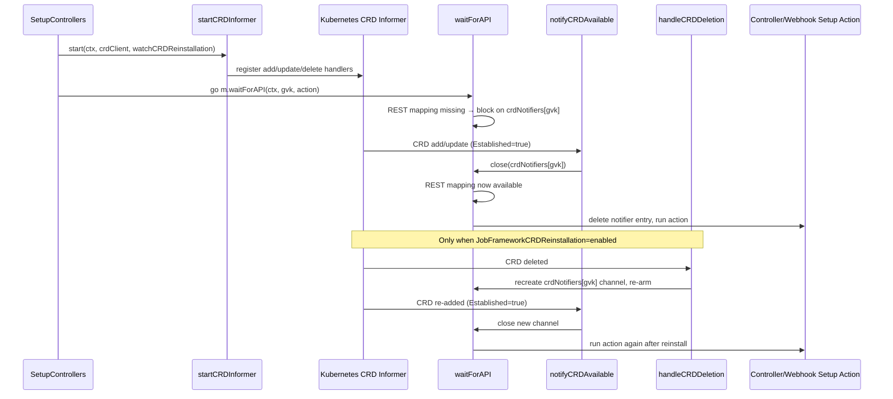

# PR #7511: Optimise current implementation of processing newly added Job Frameworks

**Summary**: Optimise current implementation of processing newly added Job Frameworks

**Sources**: https://github.com/kubernetes-sigs/kueue/pull/7511

**Last updated**: 2026-06-17T10:41:46Z

---

## Metadata

- **State**: open
- **Author**: [@Horiodino](https://github.com/Horiodino)
- **Branch**: `optimise_current_implementation_of_processing_newly_added_job_frameworks` → `main`
- **Created**: 2025-11-03T19:19:41Z
- **Updated**: 2026-06-17T10:41:46Z
- **Merged**: —
- **Closed**: —
- **Labels**: `size/XXL`, `release-note-none`, `do-not-merge/hold`, `ok-to-test`, `cncf-cla: yes`
- **Assignees**: [@mbobrovskyi](https://github.com/mbobrovskyi)
- **Requested reviewers**: [@mbobrovskyi](https://github.com/mbobrovskyi), [@IrvingMg](https://github.com/IrvingMg), [@tenzen-y](https://github.com/tenzen-y), [@PBundyra](https://github.com/PBundyra)
- **Changed files**: 21   **+1738 / -21**

## Description

<!--  Thanks for sending a pull request!  Here are some tips for you:

1. If this is your first time, please read our contributor guidelines: https://git.k8s.io/community/contributors/guide/first-contribution.md#your-first-contribution and developer guide https://git.k8s.io/community/contributors/devel/development.md#development-guide
2. Please label this pull request according to what type of issue you are addressing, especially if this is a release targeted pull request. For reference on required PR/issue labels, read here:
https://git.k8s.io/community/contributors/devel/sig-release/release.md#issuepr-kind-label
3. Ensure you have added or ran the appropriate tests for your PR: https://git.k8s.io/community/contributors/devel/sig-testing/testing.md
4. If you want *faster* PR reviews, read how: https://git.k8s.io/community/contributors/guide/pull-requests.md#best-practices-for-faster-reviews
5. If the PR is unfinished, see how to mark it: https://git.k8s.io/community/contributors/guide/pull-requests.md#marking-unfinished-pull-requests
-->

#### What type of PR is this?

<!--
Add one of the following kinds:
/kind bug
/kind cleanup
/kind documentation
/kind feature

Optionally add one or more of the following kinds if applicable:
/kind api-change
/kind deprecation
/kind failing-test
/kind flake
/kind regression
-->

#### What this PR does / why we need it:
This PR enhances the integration controller startup process by introducing a CRD informer that watches for CustomResourceDefinition add and update events through the Kubernetes API. When a CRD reaches the Established condition, it triggers channels to unblock the waitForAPI function.

#### Which issue(s) this PR fixes:
<!--
*Automatically closes linked issue when PR is merged.
Usage: `Fixes #<issue number>`, or `Fixes (paste link of issue)`.
_If PR is about `failing-tests or flakes`, please post the related issues/tests in a comment and do not use `Fixes`_*
-->
Fixes #2837

#### Special notes for your reviewer:

#### Does this PR introduce a user-facing change?
<!--
If no, just write "NONE" in the release-note block below.
If yes, a release note is required:
Enter your extended release note in the block below. If the PR requires additional action from users switching to the new release, include the string "action required".
-->
```release-note
NONE
```

<!-- This is an auto-generated comment: release notes by coderabbit.ai -->

## Summary by CodeRabbit

* **New Features**
  * Job framework controllers now detect and automatically recover from CustomResourceDefinition reinstallations, ensuring seamless operation across CRD lifecycle changes.
  * Recovery behavior is controlled by the `JobFrameworkCRDReinstallation` feature flag (Alpha, disabled by default, available in v0.18+).

* **Tests**
  * Added comprehensive integration and unit tests validating CRD reinstallation detection and controller recovery mechanisms.

<!-- end of auto-generated comment: release notes by coderabbit.ai -->

## Discussion

### Comment by [@netlify[bot]](https://github.com/apps/netlify) — 2025-11-03T19:19:47Z

### <span aria-hidden="true">✅</span> Deploy Preview for *kubernetes-sigs-kueue* ready!


|  Name | Link |
|:-:|------------------------|
|<span aria-hidden="true">🔨</span> Latest commit | c51b3e4a6070980d477cddfa6a0254648daaa6f2 |
|<span aria-hidden="true">🔍</span> Latest deploy log | https://app.netlify.com/projects/kubernetes-sigs-kueue/deploys/6a32748ae566700008245309 |
|<span aria-hidden="true">😎</span> Deploy Preview | [https://deploy-preview-7511--kubernetes-sigs-kueue.netlify.app](https://deploy-preview-7511--kubernetes-sigs-kueue.netlify.app) |
|<span aria-hidden="true">📱</span> Preview on mobile | <details><summary> Toggle QR Code... </summary><br /><br /><br /><br />_Use your smartphone camera to open QR code link._</details> |
---
<!-- [kubernetes-sigs-kueue Preview](https://deploy-preview-7511--kubernetes-sigs-kueue.netlify.app) -->
_To edit notification comments on pull requests, go to your [Netlify project configuration](https://app.netlify.com/projects/kubernetes-sigs-kueue/configuration/notifications#deploy-notifications)._

### Comment by [@k8s-ci-robot](https://github.com/k8s-ci-robot) — 2025-11-03T19:19:51Z

Hi @Horiodino. Thanks for your PR.

I'm waiting for a [github.com](https://kubernetes-sigs/orgs/kubernetes-sigs/people) member to verify that this patch is reasonable to test. If it is, they should reply with `/ok-to-test` on its own line. Until that is done, I will not automatically test new commits in this PR, but the usual testing commands by org members will still work. Regular contributors should [join the org](https://git.k8s.io/community/community-membership.md#member) to skip this step.

Once the patch is verified, the new status will be reflected by the `ok-to-test` label.

I understand the commands that are listed [here](https://go.k8s.io/bot-commands?repo=kubernetes-sigs%2Fkueue).

<details>

Instructions for interacting with me using PR comments are available [here](https://git.k8s.io/community/contributors/guide/pull-requests.md).  If you have questions or suggestions related to my behavior, please file an issue against the [kubernetes-sigs/prow](https://github.com/kubernetes-sigs/prow/issues/new?title=Prow%20issue:) repository.
</details>

### Comment by [@mimowo](https://github.com/mimowo) — 2025-11-04T09:50:54Z

/ok-to-test

### Comment by [@Horiodino](https://github.com/Horiodino) — 2025-11-13T08:54:13Z

Can anyone take a look at the PR when  get a chance?

### Comment by [@mbobrovskyi](https://github.com/mbobrovskyi) — 2025-12-01T10:53:15Z

/release-note-edit
```release-note
NONE
```

### Comment by [@mbobrovskyi](https://github.com/mbobrovskyi) — 2025-12-01T10:53:26Z

@Horiodino could you please rebase?

### Comment by [@mbobrovskyi](https://github.com/mbobrovskyi) — 2025-12-16T17:29:41Z

@Horiodino could you please rebase?

### Comment by [@Horiodino](https://github.com/Horiodino) — 2025-12-20T09:40:21Z

Would anyone be able to review this? It’s been some time since it was last looked over.

### Comment by [@Horiodino](https://github.com/Horiodino) — 2026-01-10T08:25:20Z

> Could you please double-check whether we need vendor changes? On my side, I only have changes in vendor/modules.txt.


don’t we need to include copies of all external dependencies required by the project in the vendor directory itself? also, compared to the main branch, there don’t appear to be any existing files under vendor.

### Comment by [@mbobrovskyi](https://github.com/mbobrovskyi) — 2026-01-10T15:27:54Z

> don’t we need to include copies of all external dependencies required by the project in the vendor directory itself? 

We need, but this dependencies redundant. Try to revert vendor directory and apply `go mod vendor` again.

> also, compared to the main branch, there don’t appear to be any existing files under vendor.

Ah, maybe we need just rebase?

### Comment by [@Horiodino](https://github.com/Horiodino) — 2026-01-11T14:33:12Z

> > don’t we need to include copies of all external dependencies required by the project in the vendor directory itself?
> 
> We need, but this dependencies redundant. Try to revert vendor directory and apply `go mod vendor` again.
> 
> > also, compared to the main branch, there don’t appear to be any existing files under vendor.
> 
> Ah, maybe we need just rebase?

ialready  rebased from the main branch :

```

rm -rf vendor && go mod vendor                                                                                                                                                                                  go ∩   14:31 
󰣇 ~/kueue   optimise_current_implementation_of_processing_newly_added_job_frameworks ❯ 

git status                                                                                                                                                                                                      go ∩   14:31 
On branch optimise_current_implementation_of_processing_newly_added_job_frameworks
Your branch is up to date with 'origin/optimise_current_implementation_of_processing_newly_added_job_frameworks'.

nothing to commit, working tree clean
```

### Comment by [@mbobrovskyi](https://github.com/mbobrovskyi) — 2026-01-12T05:12:25Z

> > > don’t we need to include copies of all external dependencies required by the project in the vendor directory itself?
> > 
> > 
> > We need, but this dependencies redundant. Try to revert vendor directory and apply `go mod vendor` again.
> > > also, compared to the main branch, there don’t appear to be any existing files under vendor.
> > 
> > 
> > Ah, maybe we need just rebase?
> 
> ialready rebased from the main branch :
> 
> ```
> 
> rm -rf vendor && go mod vendor                                                                                                                                                                                  go ∩   14:31 
> 󰣇 ~/kueue   optimise_current_implementation_of_processing_newly_added_job_frameworks ❯ 
> 
> git status                                                                                                                                                                                                      go ∩   14:31 
> On branch optimise_current_implementation_of_processing_newly_added_job_frameworks
> Your branch is up to date with 'origin/optimise_current_implementation_of_processing_newly_added_job_frameworks'.
> 
> nothing to commit, working tree clean
> ```

Hmm, I think you’re right. I double-checked this, and there are really no changes.

### Comment by [@mbobrovskyi](https://github.com/mbobrovskyi) — 2026-02-25T04:11:50Z

/lgtm

Thank you!

### Comment by [@k8s-ci-robot](https://github.com/k8s-ci-robot) — 2026-02-25T04:11:58Z

LGTM label has been added.  <details>Git tree hash: c9f13108123fb328293fca32edcee215ec734723</details>

### Comment by [@mbobrovskyi](https://github.com/mbobrovskyi) — 2026-02-25T04:12:09Z

/cc @IrvingMg @mimowo

### Comment by [@mimowo](https://github.com/mimowo) — 2026-02-25T06:13:58Z

Hm the check display as failu, can you make sure the PR is rebased, and push. 

I would also suggest to squash into one commit.

### Comment by [@mbobrovskyi](https://github.com/mbobrovskyi) — 2026-02-26T13:41:01Z

@Horiodino could you please rebase?

### Comment by [@Horiodino](https://github.com/Horiodino) — 2026-03-08T10:44:45Z

> @Horiodino could you please rebase?

:+1:

### Comment by [@mbobrovskyi](https://github.com/mbobrovskyi) — 2026-03-09T12:32:28Z

/lgtm

/cc @mimowo

### Comment by [@k8s-ci-robot](https://github.com/k8s-ci-robot) — 2026-03-09T12:32:34Z

LGTM label has been added.  <details>Git tree hash: 839cb1e473996cbbfc7c844a44ad726f3ce095f8</details>

### Comment by [@Horiodino](https://github.com/Horiodino) — 2026-05-01T10:27:24Z

cc @mbobrovskyi

### Comment by [@Horiodino](https://github.com/Horiodino) — 2026-05-01T11:49:35Z

cc @mimowo

### Comment by [@mbobrovskyi](https://github.com/mbobrovskyi) — 2026-05-04T08:59:50Z

/lgtm

### Comment by [@k8s-ci-robot](https://github.com/k8s-ci-robot) — 2026-05-04T08:59:57Z

LGTM label has been added.  <details>Git tree hash: 6256435369827357ae42bd992ccd87d6993c142f</details>

### Comment by [@mimowo](https://github.com/mimowo) — 2026-05-04T09:27:50Z

I see this is an improvement, but after a couple of releases (since 0.9 probably, so year now) we haven't heard users reporting that as a problem. This is probably because installing new JobSet fremeworks happens rarely, and getting the deployments to run themselves also takes long, say to have JobSet fully available. So, the couple of minutes can be shortened, but we need to be extra careful about the code change.

I think we need:
* manual testing to confirm it works good in scenario when JobSet 0.10 is intalled, uninstalled, then 0.11 is installed again
* seeing the amount of complexity added I think this warrants a feature gate

### Comment by [@Horiodino](https://github.com/Horiodino) — 2026-05-15T05:37:43Z

You were right about that,i tested it, i'll add a fix asap.

### Comment by [@k8s-ci-robot](https://github.com/k8s-ci-robot) — 2026-05-28T17:06:54Z

New changes are detected. LGTM label has been removed.

### Comment by [@k8s-ci-robot](https://github.com/k8s-ci-robot) — 2026-06-12T17:06:47Z

@Horiodino: The following tests **failed**, say `/retest` to rerun all failed tests or `/retest-required` to rerun all mandatory failed tests:

Test name | Commit | Details | Required | Rerun command
--- | --- | --- | --- | ---
pull-kueue-test-e2e-main-1-36 | 7ed4b7ba292f558dc7c0682bd6aea0b31c27d720 | [link](https://prow.k8s.io/view/gs/kubernetes-ci-logs/pr-logs/pull/kubernetes-sigs_kueue/7511/pull-kueue-test-e2e-main-1-36/2057936445703720960) | true | `/test pull-kueue-test-e2e-main-1-36`
pull-kueue-test-e2e-multikueue-extended-main | 8f385a35ba8f0964d52079ba57c89daa0ce0b2c4 | [link](https://prow.k8s.io/view/gs/kubernetes-ci-logs/pr-logs/pull/kubernetes-sigs_kueue/7511/pull-kueue-test-e2e-multikueue-extended-main/2060760957252014080) | true | `/test pull-kueue-test-e2e-multikueue-extended-main`
pull-kueue-test-e2e-extended-shard-0-main-1-33 | 8f385a35ba8f0964d52079ba57c89daa0ce0b2c4 | [link](https://prow.k8s.io/view/gs/kubernetes-ci-logs/pr-logs/pull/kubernetes-sigs_kueue/7511/pull-kueue-test-e2e-extended-shard-0-main-1-33/2062205425511567360) | true | `/test pull-kueue-test-e2e-extended-shard-0-main-1-33`
pull-kueue-test-e2e-extended-shard-1-main-1-33 | 8f385a35ba8f0964d52079ba57c89daa0ce0b2c4 | [link](https://prow.k8s.io/view/gs/kubernetes-ci-logs/pr-logs/pull/kubernetes-sigs_kueue/7511/pull-kueue-test-e2e-extended-shard-1-main-1-33/2062205425603842048) | true | `/test pull-kueue-test-e2e-extended-shard-1-main-1-33`

[Full PR test history](https://prow.k8s.io/pr-history?org=kubernetes-sigs&repo=kueue&pr=7511). [Your PR dashboard](https://prow.k8s.io/pr?query=is%3Apr%20state%3Aopen%20author%3AHoriodino). Please help us cut down on flakes by [linking to](https://git.k8s.io/community/contributors/devel/sig-testing/flaky-tests.md#filing-issues-for-flaky-tests) an [open issue](https://github.com/kubernetes-sigs/kueue/issues?q=is:issue+is:open) when you hit one in your PR.

<details>

Instructions for interacting with me using PR comments are available [here](https://git.k8s.io/community/contributors/guide/pull-requests.md).  If you have questions or suggestions related to my behavior, please file an issue against the [kubernetes-sigs/prow](https://github.com/kubernetes-sigs/prow/issues/new?title=Prow%20issue:) repository. I understand the commands that are listed [here](https://go.k8s.io/bot-commands).
</details>
<!-- test report -->

### Comment by [@k8s-ci-robot](https://github.com/k8s-ci-robot) — 2026-06-17T10:19:01Z

[APPROVALNOTIFIER] This PR is **NOT APPROVED**

This pull-request has been approved by: *<a href="https://github.com/kubernetes-sigs/kueue/pull/7511#" title="Author self-approved">Horiodino</a>*
**Once this PR has been reviewed and has the lgtm label**, please ask for approval from [mbobrovskyi](https://github.com/mbobrovskyi). For more information see [the Code Review Process](https://git.k8s.io/community/contributors/guide/owners.md#the-code-review-process).

The full list of commands accepted by this bot can be found [here](https://go.k8s.io/bot-commands?repo=kubernetes-sigs%2Fkueue).

<details open>
Needs approval from an approver in each of these files:

- **[OWNERS](https://github.com/kubernetes-sigs/kueue/blob/main/OWNERS)**

Approvers can indicate their approval by writing `/approve` in a comment
Approvers can cancel approval by writing `/approve cancel` in a comment
</details>
<!-- META={"approvers":["mbobrovskyi"]} -->

### Comment by [@coderabbitai[bot]](https://github.com/apps/coderabbitai) — 2026-06-17T10:19:05Z

<!-- This is an auto-generated comment: summarize by coderabbit.ai -->
<!-- review_stack_entry_start -->

[](https://app.coderabbit.ai/change-stack/kubernetes-sigs/kueue/pull/7511?utm_source=github_walkthrough&utm_medium=github&utm_campaign=change_stack)

<!-- review_stack_entry_end -->
<!-- walkthrough_start -->

<details>
<summary>📝 Walkthrough</summary>

## Walkthrough

Adds a new `JobFrameworkCRDReinstallation` Alpha feature gate and replaces the old rate-limiter-based `waitForAPI` with a shared CRD informer that signals per-GVK notification channels. `integrationManager` gains `crdNotifiers`, `crdNotifiersMu`, and `informerCancel` fields. `SetupControllers` starts the informer and wires deferred controller setup through `waitForAPI`. Unit and integration tests cover recovery after CRD deletion and reinstallation.

## Changes

**CRD Reinstallation: Informer-based waitForAPI with Feature Gate**

|Layer / File(s)|Summary|
|---|---|
|**JobFrameworkCRDReinstallation feature gate and data files** <br> `pkg/features/kube_features.go`, `site/data/featuregates/versioned_feature_list.yaml`, `test/compatibility_lifecycle/reference/versioned_feature_list.yaml`|Defines and registers the `JobFrameworkCRDReinstallation` feature gate as Alpha/disabled at v0.18, with matching entries in both versioned feature list YAML files.|
|**integrationManager: notifier map, mutex, and informerCancel fields** <br> `pkg/controller/jobframework/integrationmanager.go`|Adds `crdNotifiers` (map keyed by GVK), `informerCancel`, and `crdNotifiersMu` to `integrationManager`; lazily initializes the map and creates per-GVK notifier channels and `gvkToName` entries in `register`.|
|**waitForAPI method and CRD informer infrastructure** <br> `pkg/controller/jobframework/setup.go`|Introduces `integrationManager.waitForAPI` with channel-based blocking, `startCRDInformer` with add/update/delete handlers, and helpers `isCRDEstablished`, `notifyCRDAvailable`, `handleCRDDeletion`, `cancelInformerIfAllCRDsRegistered`; removes old workqueue backoff imports.|
|**SetupControllers: CRD informer startup and per-GVK deferral** <br> `pkg/controller/jobframework/setup.go`|`SetupControllers` calls `startCRDInformer` at startup (failing on error), adds the `watchCRDReinstallation` flag, and replaces old goroutine-based `waitForAPI` invocations with `go m.waitForAPI(...)` plus conditional notifier/informer cleanup when reinstallation watching is disabled.|
|**Unit tests: waitForAPI recovery, helpers, and setup** <br> `pkg/controller/jobframework/crd_reinstall_test.go`, `pkg/controller/jobframework/setup_test.go`|Adds `TestWaitForAPI_RecoverAfterCRDReinstall` for channel-based recovery after simulated CRD deletion; updates `setup_test.go` with GVK wiring, `makeFakeCRD` helper, fake-clientset CRD informer path, timeout context, and table-driven `TestIsCRDEstablished` / `TestNotifyCRDAvailable` tests.|
|**Integration tests: CRD Reinstallation end-to-end suite** <br> `test/integration/singlecluster/controller/jobframework/setup/setup_controllers_test.go`|Adds a `CRD Reinstallation` ginkgo suite with two feature-gated `It` cases covering JobSet workload creation/verification across CRD delete-and-reinstall with both the feature enabled and disabled.|

## Sequence Diagram(s)



## Estimated code review effort

🎯 4 (Complex) | ⏱️ ~60 minutes

## Suggested labels

`size/XL`, `area/testing`, `kind/cleanup`

## Suggested reviewers

- mimowo
- olekzabl

## Poem

> 🐇 A CRD vanished, the controller wept,
> But the informer watched while others slept.
> A channel closed, a notifier cheered,
> The GVK returned, the rabbit persevered.
> With feature gates Alpha and tests in a row,
> No reinstall goes unnoticed — onward we go! 🎉

</details>

<!-- walkthrough_end -->
<!-- pre_merge_checks_walkthrough_start -->

<details>
<summary>🚥 Pre-merge checks | ✅ 4 | ❌ 1</summary>

### ❌ Failed checks (1 warning)

|     Check name     | Status     | Explanation                                                                           | Resolution                                                                         |
| :----------------: | :--------- | :------------------------------------------------------------------------------------ | :--------------------------------------------------------------------------------- |
| Docstring Coverage | ⚠️ Warning | Docstring coverage is 33.33% which is insufficient. The required threshold is 80.00%. | Write docstrings for the functions missing them to satisfy the coverage threshold. |

<details>
<summary>✅ Passed checks (4 passed)</summary>

|         Check name         | Status   | Explanation                                                                                                                                                                                                                             |
| :------------------------: | :------- | :-------------------------------------------------------------------------------------------------------------------------------------------------------------------------------------------------------------------------------------- |
|      Description Check     | ✅ Passed | Check skipped - CodeRabbit’s high-level summary is enabled.                                                                                                                                                                             |
|         Title check        | ✅ Passed | The title accurately describes the main optimization work: enhancing CRD-availability handling through an informer-based mechanism and consolidated goroutine management.                                                               |
|     Linked Issues check    | ✅ Passed | All core objectives from issue `#2837` are implemented: CRD informer watches for established CRDs, waitForAPI consolidates framework handling, integration tests verify CRD reinstallation, and a feature gate controls the optimization. |
| Out of Scope Changes check | ✅ Passed | All changes directly support the PR objectives and issue `#2837` requirements; no extraneous modifications detected outside the scope of CRD availability handling and job framework optimization.                                        |

</details>

<sub>✏️ Tip: You can configure your own custom pre-merge checks in the settings.</sub>

</details>

<!-- pre_merge_checks_walkthrough_end -->
<!-- finishing_touch_checkbox_start -->

<details>
<summary>✨ Finishing Touches</summary>

<details>
<summary>🧪 Generate unit tests (beta)</summary>

- [ ] <!-- {"checkboxId": "f47ac10b-58cc-4372-a567-0e02b2c3d479", "radioGroupId": "utg-output-choice-group-unknown_comment_id"} -->   Create PR with unit tests

</details>

</details>

<!-- finishing_touch_checkbox_end -->
<!-- tips_start -->

---


<sub>Comment `@coderabbitai help` to get the list of available commands and usage tips.</sub>

<!-- tips_end -->
<!-- internal state start -->


<!-- DwQgtGAEAqAWCWBnSTIEMB26CuAXA9mAOYCmGJATmriQCaQDG+Ats2bgFyQAOFk+AIwBWJBrngA3EsgEBPRvlqU0AgfFwA6NPEgQAfACgjoCEYDEZyAAUASpETZWaCrKNxUt/t3HN4AL2lIXFgSFAwaIipxfCwmcIp8ABtEyntcZ1xsbh4EhmkZeXh4xWwGIqJ0SABhGwARMIAzfAo2PmDqSAB3agYQ5Ca+KuxEAmYbaXxsCjzakgai9XgY9Fp6THos2mpQkilw5GCE7CJYIJDIAGlsAUpyGmQAQSsASQ1IAHUQrDRqusgKEhoXqBYKhACiIxUiSQIXocVoixiABoULgghR4ERSBRkL1MOREgd8JBsBgBIl8AwANZnUIAA266gAYs0ns86ZAGqSxEsMG93MgyLBMHk2OEVrQAYhECDzrxdktholCsxuCkxTR6IgknheZyEsxrHYzAAmACsAHYACwozoIXppDJ0SAAKUETKobE6zRpcVwCWSlGQ6y6JAEsHw+CpyGW5E6v3qaAk2kSKng0Nwsn5508qFTNxSa2QAA1iwAZML2fyhEMMZwYwI/ABEtEIGHwuDArVIAHoI4laE3HZlENnQvBVer2NQ9UUGIlsEoDtI0XWZf1mrTIHSAMrpCi4Gq1Z4YAatDlcjA8mJoDOyFET3j4KRw4UYAk5EjcZwz5YygCO2BkGUGBECiIaUAkfBvrQ0KgV06inAIQJUvgDQNJAbB4hgSDMKOMA5nYt7ahKyBFBEUR6vcuAboMfwAkUkLJL+WAAkwUguPYeQYM4Sz4Q8kBUiQ8hoIg3CiGiaFbo+U7hCxYQSEkUjIMwmBoEQ5RbtCDSiLI86hFJoIJo0zStGcRwnAo4QkAAHmiqk8aQGpBMSZAOACOT4OJfD6ZgWRjpAeytnwSjiRgShXvAgTClIkA3GQJLcFsmoufYWTcM0aJGXGnLctEPF3m8sxieooRGdhpD/CQgHwBi8EAshiCacw2CJOIaplROjbhZApDkJR8Eyhxt5BCunIplMgS0FMmlVM8PZVPUFCkogKLlc0oSXteBXqCJqxSuuW5EPgI1SUKIqaRG8ZXCQQGeXk0qBHGyoSs6boCJAHpoF6PqjuYlgAPLCBJkiBA0BqQHBQn0EgDjSEYzzSndpoABwAMwWvweBwbKOwYG+orsFVNUAhqtH3fkmnPXtSj0O9n2eiQ3oUNGAWCCIPLKWE86LiQHBGFAYL4xd8FGUumLfD1MkkBq8mGectlIOIg06vlZwdJCB7IO9X0/SzVn+kkKQ4ugPWdGGEZRjGWA5Ue6DJumaZ3gYUDPJOMvsJpDLaLgLIUGyAAUACUHIEF0PskuE6aVHbqAAhpIyUM6NwDKET55HQ5QoiQiGpIckyWT8foBsb/B8N0uDAnwyxGXbmbiS7Hw9Ag8FHsgCJsbgL3DJpRl0mg3BRXZbm8ogHLQgIVCcSGmvKxURlSrgqncN54fqPwGAvWgDQ0CFSDsZQmk/LbdSN1UMTatCyWaeD31Mz6FPSpp5HEj8TWgSkvWEEcyvjhgidoHoFJVS5FtA4XgjENOqRb56ypI3N2HUNTP2spEeS1FgzQiIOQegnREJbnOleZ00tZb5Ubg8falN4LOF6KVMQUwRpxDyBQf+/xtAyhhlgMW+9hhNRrrAAEgD+AYU8KaS0NpOSUh7hArAzANpeB8CNW8u8eLiC5mHIyisRg3zyryW8u03DnFhndYixIkEX3VquFgHU1YAhJh7fY3MFxKEgOLLBLjJEkN5CiDKNAo4jTZIwN8pBVqm3oK2Bgjhpxq02NsP6BgLDVBYGTNKTgXAGNCJ4YUyBSRKAoMdcgkBbK+KarFAEEgorxlwcETCrV2qf1KpRC+bwwTOBehxeA8w6w2OkLUohkttw9ijGAAgwyVwcgHk+ZMiR9QsEwhOfA3o3gCSEvIWxQERgzMNGUipQZvEZHgBE1MFAXrMAEIIBIEhEBUlkPAB8GBFKJBfDUtq8AOpVUaqENZK5253TDt2UIcQGjQjEMGHqFUQTEiMiArAk8RSwA0EYcYRBnAIngkFTcHcJLNHkA5dS9jcAolOec58VybmMCOR0qK9B2hojtOmUIoUyARTKI2Dy5A6B0BRNqNgoYPIAmmuFTAmgCKoG6MgKUSlnT52OKcBqokj49WWu+L2x1MKKECky5o4zkVFACmgPAEYfIxHmC0KV5x0V707ti8OyAnzeW7klbYawd55z6AZbyLE4lEsniS65OhJnwFppAMsABxaAABZdAK8LnEQ3s8upBkGBrlHugBgCRpQuI6TpAE4omCsHXg0z1bxfCyO9CiK6uxKAoioEgZ0TUsGUrrLmmITCWEqEmFlc4EyEhAnhQRYSkB2wpRpV0BAn9gioFQJgFAqoLn4pRO2EkMojWTjATRSAMVQjxVYl+TKfSo1PhshObYL1IGQFkICPgAd355A1TiPUAAGDQABOIOXLjjBLntJJG45kBDsYBicQdZplFByECIDJA3jhvmd6QpqosnVmpcKNEsd/7pGYmrOOzgaw9VChSWQzlZ5ZCCF1YMHkUigWCCJDAshuj3nsJC84PhQiICTOUFSaB5A3DmThVSiQiq/MYzWVYzo80dSPZmQlMHiRsSSUyug/MoDhr8iNaivdiTtIaPIIyl9dTLGZtGBQFBO4vTtAld6O4SBoknWh28hYUSkkYuh+zoSqpObs3QeB7tPHLCkj8HS1BJq9W2KlYuSQzioC8j4fwLEjAsmSAs5q0mADkuIW23BCUZfVwRNwoXbJ0QspBqUrk0mUwEhYUA/tBXCJJ6hh3EgDaiio8wbLSDeDua4AEgLhGVIS2przP4kBNGVMaDQJpSl5Z83dB5nRAnTcgZMGJJjLg2Q4Uq+E4AZLsHWYzUVgyQCbOy2giAwByplEOfMJBpkhhbG2DsXZKC9n7IOYcww7kIi6c/NEazapgymKCcuD8U5yO7c+W8CL4mWHPvm+y+Q8XIAcKk1wBhNsKBhxupW1rEBXX275PgT5IiU18xhYhUS9QhgBPMcgGoAq8GPZxPNvhrPFGmg9LcTAPJRYnDFtWUl06UIqNTV6dNBAMzvgZ/CHWBBdaJoz9QwYKEZqYM4wCejMwIWqcdMoYA4K705PAVr1WJRo/lF8EpI2NlrjBpuPue4MhHhPGeSgF4dE3kKv2lxlaKTcGcvzjNc4nGiew1yaZMvIrwQM4AFAJ5TfjqhUbCBIZBzDkbXP4Fcq6Oi1pHkMME4IVH+VZIFByaJvHPtZOymE1JOSJo+OdyTzYeUAUGsOdrKAvRGF5LcqGncUHAhSUCTVnEWs92FZl8gYn3GacZzcufNJisKcLQhOC8FjfQ4U6ffBcXV/FAMYy84orhEs2iGUmRuDgR6mp+CRRb4jGWnQjy8/bLfnCs6KppwxtCXJQf3AR/XOx282Tk0pAAJE0Alp0GAMRnLmiE3oKBvnFChGhBhFhG+LhGRFgN7MyKyC8OMj1C1oENfqZKkE2nkBhnqNNHHpnqfm8EyEUHZvRtOuRCQKgmrNRPYOJGUJ0nQYFHoslIEHbAxLZqQcsLJhxPIIgNxLxPgCEk3gdElqWvgKlsTNgL9s5LvpfvPIYoIYkBAeAkxNoQIXoV0D6ECgshDvoMYOAFAEykIjgCMn1MoClIzuwFwLwPwMDJzIEHIAoLkioGoJoNoLoGAIYCYFAAKJVqbLYYQPYVEKJnJuEFwFQPGIjqpJxF4crsoKoOoFoDoOYRYaYAYNwFSEQD2GFoGBQD2EIIIDAvfCzCURQLQAAPoGHOYNHUQaDHT8xNhdGQ7AHPDEBkAOF1qOApHyBSTgqIAGKoDzCfwwGVA5SOa4A9iMHMG8hgAjCyDjorgoh0jQArjvA+x+xsgNHjAHz+wuoUBHjjDubJB0goiaY3KizIbbjLGNIYDKaOSUAaCMi+xYHshVSnHBjnExzDCjDjDahTAzBzALCYbio5xaF0ABSsFpqAj3CVB0ghpHDcAABqQYvIFwRQtAOBawPGx60yds7MEkXK+466RcMQhsZRp2pIzGleHxfAUiFQ/maAn+++RMIYPwOxK4NgYIO4EaEyzuGupwFI1IWctIWAqY3IfQ243xhx2BlYPwx0P8RQZUTx9aBUaW7sas5SPw/JrY5AHICeV2bwzwx+E4rUsSxkSgKQasaRdmXsW+nxueJAR4swTpvIHIdKn8GBPx/sqpqA5IlI0M4Ej0WsFiJuvpywrYgQAAVEOkmfwEmlMJ+KpJkACL1rKYlLwQcOcEKSKZXivKkJCDQHFDTL3OcCGliRcCiMBoSNuO6RQBoEOh0rIEeA8A7PmCkLca5lTlwaJMuuuiOkGSqX8WJk6YEG/qBj8GcjklKl1B2hDv9MAW1A4SmuoucEoPOD+PlDGBhE/nukAvjtcMCgvuIOIPDI3AAHJMyjQbJbRqxN7OgBzfjUh4o65e5BxcB0hbQwB7EHG/HHGiDPiUAPDnGXFwl6EBxohJnqEaDQAhyVh0iFHFGlHGwVFVGMwGZ1GNHNF2atErjtH4B0hGBlham4hBIKaQAADUAAjA+haD2GAA+kYBCAoo4YoFNuUk+XMAMJwJAOGpnI4AYF0U2ALPkZhSUXSSXJQLhQINUQRS8SxG2eRZ0d0Qkg8H0dEU6ikiMTYeMZMf0PSmEIbKzk9E+ZWQZOgepflO8XihQKHMSA4CvJlAmGAJ2ZwWrLqXoqBFwPyWmrQPeR2JSkGByMvIJMJMnPIHSOISEKpBoBiZMNibiTEPieFIOdOnSAQaahcSKFduacVdMq+V4q5iFfUeFeIPMEGOGtgByAIrQD2J0IBqEC1DQDZAJhQXSPHErM7mtOcG2YOgspDGgH4OmIUDhOIHogEMgHSKFbVZFTiLlRfl8CiLvoCA6ELgNYnPypZUwa8Q+GiFKYZktTVRFfVTiI1W5Qvu5DWGNXVVFD5G+B+JouumoZoRRCxIAJgEyA9ZFwVpnC5wrGPK51daIMyIqIYQiw81gQdIRAEgVI0A+A95d8HIAcHSg6JAHKtAQcrmsm9RRZnVEyN8EMRkjlvIANkAQNqU8uVUCcu8zoPEbA65PRDwW5rxRIW4+5RynqNhp5M255PAl5By15iwd5UA4V5AVFNFgSmARWXAzFVo7FTFXFWi2ZsRzi2ygl6EmUXAYlCIElUlMlYARgcl2FSllRKl+FPoPYJ+/kHRklOllgel/R/UhlyRzgoxGEplKOCAtFStU2Y2YgzQyAR4YASYKYTsu0G66weeEifAtt+o4uD81tJsXh5ECQrOCqJkhVYAHy9AyBmAuE6FR+WQZe9JxsY8bwu4VmVdClRsUVY1SR1J+2tMByhl3ehBfARp24s8Dup4fdRJ406YCOjd2QONVNI9hVjA+IHYcULG1JCJRg1dilfATt2Q21vaC+UIfSv1MJaQ6Y0ySg2ah1ZmoNoQJZ0AZZg88E31f8R9NNgNDZ4R0J8AXBvgT8oEKIAgeAfNcwkEI0FIGkDA4RAI7VdWCUYcww9I1NMQzl2IXxoFIZfxfJz1q1YAFp0yMVAcdIzAGgy111r1Y8QcbwnwsD5wASqApIMdjs5IJATZzdZRbVFskYNIn9818kqA/omI2Is2iAsgV4/CMQy2p6m8IkQJ60xm0gGU4Us0fwNweagQK4UIMIs2PUdIvl3ZdQvZsdTD5pFIh0Rk3xRB71lpHuNwMUSwfAqAyKKUXhfcAWOZbWOs9tLMsF1xqY+UF4qYRAXAONxFQhWA6eLcFQqACIrGTDawG1oQASt4LV8gn1mW5w6Rnus5oKKTR6Wi8Evlr11508YKZVpNxkBVZkJE68He3A4qpI4CRAEOqO8o5Sy2jogq/e9IypvxHIpOckasAc7JlQ9czop55Afi5V42nyIW0ITOlAhNccMskFcT9AAIaoQI8VW4OU+VKCrxyDnx3T6D0VVmEYtAto9osAimM6bACIJ68g/OdAyAV9kAt999mkqTSIjcHYIQFAuCMoa866ywPw3kYA9NBTn2ywuDkAAcm4AI/DjYQJdIkEzQ4w/osgAAQggehBeJuO2BgGAIADgEi62ZvQgAuATr5QSIBvqNy+QsLEbZSkOpAxXsCpHJ58r1O1lpwXKBqzbbRNPuXpReX8FwXObyRKA0DbTbFD11CO6j3hyVyKl2xN49gT4kA9iOlWY7B7Al6QAAxYDqPkiaP0BtynVYP1VPM+xBgADccaGrAzzzITvjeo4Tz8goPEsTb6sNAI0dLQ7cmr201Z/xAiX6RkILYLpDELsQlj/GG5XNu8gtu5DKogAtR5QtNkGUItZcYthrEDnst5ExD5rk6bZ5PY3A4tEDwjRKoeEsgWE24KHC24VtrDOFttqlDt295FWNkGjT2xld3AG9Lda1vbU9J4SghuzVVmYCW44NLGNbbjVLEO1F5AwdoE9FzFFoz66tGtBg3Fx6vFutCo+twlXAAAEpiLAK7dJS7LJUUfJcUGw62541SI7VPaRSMFpZe5zfpQMTEVqMMb7SZXRQW4la+20cdByPloUum+sGlve6XNvQoMNJVF4U3u8+m8CuvOiQ2f6bVDfJuC1C8m8ogywgHJiwq66IICiOGi8O9CiFYIoCiDYJxlUAuAdRQx7tCtuLsSMH2wO2UWPM+WiJB+1QPLBzXRWVPRKZUEuS/jVuXllKuYA7WGVeq8Az5CkH5NwE03uVdpxnQGAMR8ZN+NUvPlAz6PRU5oCEAhhE1ARzOPBI6XpyXWKfY7s2K79mIHmUZKwZBwZaiR/qEG3NCwa9CNjs6Jcs9WACF0a567PPtr3fPW/pUAF1/uwCfsNQlM845xesa3UGRqEL40y84NDIUpCIa2FzDGiKq2Uyl3bJWW9ma3tluKNVJEq32XHZJlVcI6IwkO2EqPIN8eTJnbzSoywHjAfbQBDgJDlCEIkKvIQ1ySQEyIt0eP6aJMLqFhfP6KUGiHSEMB3mMBMBCSQLMFToiBgByBSSClJ9bfQHSNxRoxV+aTEAiP5ekCOE07BjlEiaJHOUnBt2HFMoGiFnbNFxV57hKwMwKSMIjEeA9+V7CHSITSGOC/JDY2xpuAQ9x7gCtVpj2e10Y56wHouHPj7Hh3wMfIy29fiFdlWFgooj1KOZQF+gU0QRpxgP5EYFz7pdzQm0Jp7geTzWmxmylJuGWzm5LfmwLMASJsVi+a7hgABUBdj7D3UPD6F7CAhZAEhSVqBChWhaBhhbe5ncpW27UdvW+5oOB2QrL4J7lFePlEr9yMBSMLj3o7UAY4wykFrzr3k406hb0+gU23BzbXheneb6B2RdbwYEu4EPWyrUxc+pu2AM+prTxTrfxRUoUgbQeKe+e5+9exbQUbe645NIgD2FSNcCQA0aX1KB+2bbpd+17SlD7ZxGMUB2ZfrjMasPtjlLX6EI48w9uB4+H1SN41oSxFjUl+EpEv03qE4fsJ6xTkwYNSbAWugeffqm1DifepArQEyCiZNCGrEuMqCpudwMKJyIfx5COlE0gBN4G5v7UlVQT5/LPEfGiBxLwugU+kxSjHSBzR57xtU2ibAXimxTRnRi2mbMXuW0l57Zpe5CINMfEEpQCUo/fYLFWTiCQh4iw/d0E+3H56F5I/fQfhoAP61tQgAAXgOwj9YEBA0VvlCbCB9G2Jfa/tIAr5V8a+rA0cOB0XYK14+jFNihxTT57sM+VUASvGCEqG1RK4lZgAXwgBF8moNAdVtQDQA9hiBsSHsF/15B0BOB5AhoqF00CyBvoiQbStJUb6e1Bif7JHIBxDoFswiAATQeDhoKw6AwfpDCVht1HEvMXvoJXiDyBd8dIGgTUTH51AriE/PxraDwRvxygn8LQXvzYKiAwgH2ezpE2sx/ol6T/NqNCzpCZCRKY2QkCQCR4Lol6kNalMSFyHZDzqaNU7lvzyHERChnrFIiV3W4YUAQ4wDTjKC4Bc0L+aAdamsFf41hP+mVdAk2F/4oxGBbwcKvwABxX9yBGAvGPCyeb/dZECIeqpNy56c1eeIA/nvzUPIQCTyqA50DAIl55t4BhbOWjHz4F0VaAKtAAGzsVOKO7LWoZQyZ60JBOfESmWAWRyD8i1EeSqqBnBqA7w+gjpLpH0g9hKcScQhJoOGE6D++II99kYOYAmDP25gvzkMWsHt9bBRgRAbNlxrxh++xAELCywSpBCDMdAuzJP1ShGQ4h2CWYW43cEjAUQ59BYFQirAfx6QtIugDuHYI4dqkOQuYLUK4D5CZQg5OkFUPwA1Dakwo+oWKPlDtDAQnQ8/sKD6HbhaRXAUYRoD/4TDIAUw75tAlYFEiqyLLJrg3gBTXDAB7tLYTuR2HJs9h5iSASLyOEXkThUcKXucNCAIUg64RdUj+0MqODnBLiFQV3wBR0kwEN8Q0W4OJrHZihaIYWpqFLawCMmuwnmhQ3lrLtFaq7G4YxXuFCCnh6fGrAe3EHZ9j2wab4WbUL5GA/hxHR2jEOTYgklKJvR9qPxfan5WxWQBosN0t7183avRCwb+yMoAcsRq7OwecGmIkBaaj4LygYJtRQdn8zeAVp5QPDGRHWgncoEEyE7jUy2yQNAtuD9BFJcqg8IpCPHMR1xZA4kcvjyX2BWZgCLwEJFcBuDMJNWjwF4BS03C6gMwe2c/HdzYDpAJATFVUbMRcZcCOQX5KkHiiXRSpIU+ALEJ/HR6tM2SL+NoGRRxH4jtwGkDAEUXwAaBioaaeADcADhNg7YYQwgQwJRAaAKJaFcMtSFnHvlJukAa0p5HKTf9e+d8MSBsx4CsdKgPMA6pAEAi3QcM9AKUiNH4l3RDe6LNliQBaS9BVRtLbJNkAlTHcjcNTcvjQGcDtwFk19Fki5XQrQVd40k2AAAJgCwZCRg/DhC/RrjfJJsllXOqUAUyNwqGWkwIXgNH4UjQmF4VgfMPCJkAJuGXO3nFy3DNjYEBsTencj0JlMLMN4k1gBhRKNgKOAgI/HcUPjmstwkUuMbkxpIbUOgsjKUAoyaxGEWYFIQRKgGRJOoMuWAO1rjHim/4lWZsH2NkijggY0hX8cgNWhFZ2YymR4b8VVHEjUBcQwbXkDCIxB+VnWUQ+wBBR6hpSEUUARyVuFcEhY7+MTFzN5zGjeQzwZTGdg6SuxWZyciqdqckHGn8TCEcUQBm5DL7VSbxfud+PHjpJFB1kgbUqXPE0E8EUhQQWDGlODBpopCnUv4NpDBEpA7kPMfKbPnggZQn4TDbcFzWSZggMpAnZFibHIKlZ9pMbbnlaOAE2igGgvQWo6LPJZtxeV5U4XeVlqQZ0xcfa4SrRNBowUYDw4QdrULGZ8j2Ugs9icB+GGADAIRBfNZ0iL9iXhcRESokUHGpF5A6RKgJkX8I5Egi7MywiKjIhn9ssURP0bxVYDOEIeKYUQdRJpCt9Vktgh6XxVFl+FsigRNmQAG0AA3k2CoCrtngg4DgBbJDoNEzQKMZ9LcIYBowrQrFBoAwGfRNgkQTYYzrACbC2zg+4ncokFOCGEUmiyM7scdB9lNhZ4sfQOUxV9lMoE5HAFihaF9lazA5TYE8FZTsmLVse+xTAug3AqnE9JlANyYkEHJ0oHQWA7btdx+BA0FodQKkhkFxzNtKAjJKODylGpJcfgrBV5svG8jVoVozxNzk5SrwHM0GbIU/iI16C9cJG9GWznaVRJ2w7WVEYkEJC/BbhzGfADWZyjvSRUyIaIRMogAwB/U0QZ3bHIUlaT0ZquzXFzqlFUif4jI9NCVI8gPprQMQWIIMNuF0b49DGA5bqUzxjIzkdpQLIEsKx8ZLpe4inEvLHPSLotzq0OcTLtGzk3N4AjgJsAAF8kQ5sy2aQGtnZyCF1fAQM+iYqWgnZtAW4WgCYpoxY5/s7OcHM3qm8n2SxcebyE0oxzM51JVOUxToXJzwofCihZnP/YuBs5OzCyW8UnmuVPBxPJcN5VZ5b0CAVASqAQxIYvVW6KyTZkDSX4OU56rQKoGVQvBRQBwwCz3MkJSiXUwqVPRAHdRqTdVUoT4SHrSH+Z99TFx2DQAgr4pIKIyKClIBJlkDZyKQnQHBXgrtlWybZES0gA0XRgNAzQtCs0LQHiUowrQDC6gAHKDnG8O5ocsPrAnYVSKuF+AWOfHK1KJzzQgi2gHwpNAZy45YioJbbP6or8DqEHcaqmCmovRuG0IBaluGsW48yG0VAeHGhNQbJ4GXi32YguQVWIAlaC22SErCX4KQ6RC22SQoaK3CLQtAK0BaFuHPp3ZaMB9CQHSXBAmF2SkPrkrtotjiORSkpbwrKVpyrQtwypXwstCiKkcEi/arvFaXxhckoMMpoZyBoOZDofS2xfYrDiPTPRONFQDKHCCE1U89QJRZmI/DfUOgAKqqoSGJBdLqw5fe+UjRRpo0MabAe6jFVfnv1QBhnNmn/EHzakWMd8SGBGWdADUYg4ypsJMr8XTLFYmYdBTIIWXRKSAyy3lQ0WtBoxPZaMBgBQviVmgjlmSv2acpDmsKWxHbbhXHNuXkBA5JoR5U2BTl3L3ZrykYtnIACqjqVElTVVBeUT8DNK8IHijRDxikKaAJCMxCQJdWgJRaEETAdXdTM6Xc5jCUV7ShAPxUtRADa1JiQUymSQXJAVKpCiSSARdX7vQGQjUhECVkbAZlPMm2S2cyA+MEiw3yosXAmLBNdiyTXpBwgzK1ldSH8UcqGlTYDBVgtwWLLIlxC+2WjFuEPozQtw1JQICYpoArQaAKVScqwo5L5V+SxVcUp4UZBU5LyzVUIruW3Ck5dSt5Y0t445KBOkHAKXCoLpmQXSyQN0hoGlbHgDFlAAOBRI0BoVl+OZNtF0CoDll6A8MlADZ2pKct110CFMKOG8VKBfFZa9lYEuCULIeVJC/laspqUPo0Az6JJS7JYoMBe1WS/tWcsHXhzh1NysdXctSVPKkNNoOdXqttmID9s3sBVpXKpGEigU6kbghiAPqe4MQTycGLMkApcCNAZIn0Hhr8abd72aUaXNVG6woY6gYAF1vBHgl2MS1PiqZe7C/VzKf1ta3lf+vtkPK0ACS24Q0BNBiqmKhy32Ywqg13s5VYcgivBtHUHg+FrFFDaqrTkmhZ1Wc22eMHWZs4uEncL+JqXIAxr2EC9A6aALDXtMtgnTJUtPNVJJckapiVBsXMDhHqQ4wCnvlZFe66JpktLYjM8yMiDzyaVCRIMkyg5KwjcUC8Ic62biutM0S0j8sGvKT5MqeRTJrsp0IRbrHif8HvKOgSgTJgUB9Chq+pIDvqx+n62ZVWu5Via/1US1ZbQDNBoxpNKMG4CjHk09rlNGSvtWppYUab22U9cighp013KmKba/TYco4BGaNVJmnOSznzljypF+zdsocxnltTzND65zTER1zc49cFITvElyUU4No29gOeWIxwh+AWIG4gFuTBi0rwj4BPdMLtGZHbTjV5wBFSSOXqpwoOogXUKVtTT5Rup+o35rWjijnVrYPATufTVwbIAA4SXOFi4B7DxrUI6EDeC9F3x4tCWxLZuOS3hkLtNyJEWYpIuOosQdtxDMqrK0KrPAGgXNRIG3CRSr86A91Gpl3j+AVNUgzzRdAit3mwloU/Gt9YJtQWcrbZCAE4L+qWUdb7Zz6V2VaGfQWgH0JoE0NQotCQaZV0G9TXkrg1TalVpSgzSaCtBoxFtgcptWhrW1Ybym+61zjfnrluMAKu6pneeAQgTZsc2GDhOVs9Imxd8SrVYCqyNWejdGALX+c8zB6whkePULnG7kyaatoWnpLafGRhSrJo1zgXwHlpeqRtEVV2CnVzSp3BbZuq8CquYmD1/BY9zocVtDSwAEMkAcPMrhr253x6tQKiiCbSKg7+hwMeoAhqQEPD1Ed+3/IoZxOGCNcC9ULd0s5AIb/z9GAwsUZ6W9J/a/StWiZQJrZVCbmtcugOW1sV0NrV2DRNACjAtCeyUYTFAQGaFEBDa/ZI21TU2KN2abI+77U3SqqW1uzrdHAKmbqt9oGrw9ZTVguOMnGmqYyYceRdSutXHj/4dq18Q6tcxZYjxw8WA1XsW6pdrxVXezdXvqAC7kJfvCXfVql0zKZdTYeZQfvrUrL7Zsm59CQHTmiALQFoCDcNuOWP6B1E2iPqfmjkjrlViGgzTOu/0owUYf+8RbbJPDbgGG/ZPlRwovi5VgtfcIGiYquxlD40A2Z+rTrVjNkcdBWwIKR2bjxSqONHSjtYAY4vNmOrHXeBvpZVb6P1O+0g+QfCXtaj9MSpilsBIC3DLdcmtABsr13MLB2sGl/VwbA48GzdS2pilaGEOTqqlc2s0CaBEOVqHd/cuBWsSYDiQ5O3VNEOorpJFINA7wRCNADgVI8qqnuC+qJnZ7EZK9je4grTzVCT7J4UUGzikC/CE0n6IUwdmsUk6sElUhBhreWuE1kHRNjhw/VQeP2rB0YtAC0N1qYoWgBAtw3w7KvG3P7JtQRqPiEY/2JyUYD6b/Vrqt3ob/9pmr8KmAs1yglsIUXTjlwM4yGsAy8p1ssBMKVI8EUdYuo+q3pT0uAdcu/F9XQNBdKNhoKFI/KBo7hguremLq5my7OhAT0Lf9LXoJr/1lCA4foN8b+BXjJI7hGiK3JjI/AnVVafMojIc7nG60EhJbPJMLIPzyyfAD5SdU5DQhamfO+oPdxBNPcQt53akctCH7Kcdxf866u7095SH7q/DH+UajOX70mGNOOrb0aa2kG99CuygwKrNCuznZtANGKsCtBWgGg8xg3YsYuVDrX9VvNY3waW0W7alWq83SjDNDxHs5uctNYjWflLcVudQAOJEHSpJTd+GAFEFSAJLZxGTce+6uiLRL7dQSR3aYCdyhKzU/SbhDmLSjwR9x1eRrZ7oo38o3jnjfCekDCY5BnIkggIPkOKeIMVquVJtZgDKcIVK7j9ypiY7QAEDWgxVXajU2Nv8McHn2FvYIzNtwCpyqZxpqdQZrV2rb6l2ch3d9wPpgBJQoMThFZICHN61e3p7na5h0bcmAFXvQoYDKcSaRcGdm1/GTwjxjTmMHaLrmOR3JPEGWmivgEDsWayInk28PXAFTzw9Hcz/R6tYWYoPFnnD1fSYytroUkBVTloWs/33L6V8bgug+dtNu02tntVOqqI6nNVO7G1tVpkoMcfpB0avGoQ5Gfhs8luC65QqdAP3gqB9zpQlIL+ilCKA4x3EESHzBVOkB4S1AV+ddEJQkhxot5D9DQqEAQs0hsTFPDwqmnmzp7wFGACEchfyg3nt90uytQ4brVPmRjMS24QktoDPppNVoM0K2qYrfmuB7A/8z+aAu8HZt/B24bsZNNLbbhkli05huC3OSBAusYIQxvDOgCBRY2WpKPu0H79WBx/e4IMuyBJdGaXIsJIKOf5iREh16e9VQl25jDByuQ9TJlt8nKi0AVh0tY1rsPCXBjolvlSWZiUMAtdz6TYwwBmPTG79KmuOaVGUHpA1BrAwfuXw8sAXJoCIwwcYJbPCK0NulxOYn0MtNhpuT5eaVWRZFhnlgBDZixZZiBFGp0tvUAR5fpFBYDBS5knlRcWoeWeRogATl5tyEyiChYoiUVKLagLXRR2xeUdtN+5dC5uKo7qT3rpAAAdTUX/2OsACczglkg3FdCWPnErz5k/bcJNANAz9VoFis+nQh66/hYmQEd9szAgidIDAPSCkF4vZpgIarUq/CIMEaAkRiQaq3NvCPf7+Fz6RqyeDHJ4jtm3VpCz4xQtzCgdSXM9HSCmvsEBO0Y6FrkJ7DLWvLWQ6JuFe6GX95QuZRUUPx71jCFm4QfnugKhsXXbDQl79TdaGOynVlFoDGAwDIXPXNlaMAQJ9ZXAFKNDg066SkB4m7w6zD7JY5wayDtjuAnYpddwbhvm6tj4Fu5WjGM29nbZhq0kyapF7jSA2YcJvHuOyN2RQJXEgeDapPEsIzxF4l1d/nS63jngb46CFdm8jSFtGv4pMABNxr41A22UJmFvFt4pbDC6CASzzaut82izd18S9XzbUPo5L4Rj8x+foUsHpV1Yq47WI5FK3Gx7BtW42anqa3tbZyxALreAsQXZ1dVjgK9casO7gJ5AgTmBIglTjlxYcHyUw3Vb38IZRkBsyuL4t6heNGKGaBDu+7fIk7MV3myJv5sJWJNx+lK67KEogbhb2Vh/U2GLtSLS7RARWxYYrswaGzmt2u12ObNN2Yj5pw2wZqpmP37dwWjNduGIlT3er/k5QlWSS6+7Dq5etnlIXOm74fG5QNQQSQfVpTjIIYXfOvNAjR1woXGjc81k3DCszz4OBiRtos2wY6Q1pUqqYwPMwTT7UBky2ZfJFY3UtP91q0P0XgZB2cOS7SdiFTQc4mseZNaaZAumrgBpMQNqj6CKn0BNM3dZ0pJKqqQK/g68/h4626mQHkAYDCWuokzMxFIZ8WqzrIBhlJaOQeJxi25i0I8AMlS9vo7vvPY4KAAunkSsIJ6MI8snmUrI1BcBxWas+mfDojKCztZI43WT4TFmGzzCHMqAg0UDQN23hOg2eEbKseMAzQV+tGB+bQDNqNdaVh9JssYMMBVgY2GhZrrNAPKIjWwNAPE7k0ROpZEANHEziCfHZI54gnQdYX8fSz5QDRf5J2JCDUgG74T3IqbIMCQADsSAWwA1roDQ4NQ9HRODbPGgFDPmXTpsEgABgcQMQImDAIHNGcyhxnB2cJLfnKDnwkO0h5RLeDtw0AFnHTrpxM78Oq3tT4c0KpHJ8a62uABzw5xM4IDoYmQCvRAAs6TmdPbnB2So4gDyPBBaglINZwPgWecVbnuCt50c5YHd2VL1fNSzHOuegvDnh9jsLeEecO9R4Lz5Z7c6bCfPvnsAX5wwH+dEBnnXAIF4c5BcYvjnLbKu5rem2wv3nB2e50i6ecLPzTcLiZ1i8Qi4v8XhLyAFaDhekv4X5L0Pqc8CMdjmzNL95wi4eeMuuAzL2l5i6efYuOX/DAF0S95dvO+X1hpQExzFnvAEgNAKwBQAKNdwltiz5hm87jkRhWotABrbYAWcijTXEzhELQBsCkhcXe4OPIgCqDNOqQCz7bva5WeBpnXGAQ1ykE9eiBvXXAX18s5bABuXX5FjEN4F5ChvqQtr+oVG6hh0BEYcMRAG64WdNhDrGAfN4ddwBFuS3xbst8AHTeNEjEJAPQIW7LelvS3FgSwKjAxhcBjZtQbhE/BiDmPIAQsAmGqy5w/0AUUwHNNZgAJz9icj8a6fiNjtBp6YlD36BoELcFv63q7otwkmDckBl37bzt9/x7d9viqgyBN0O8YAjua84797nqD5y5ABcM7mmG9FFwLuWYo4Zdwklwnxv8oy7jmVYA6H2Vu4/zCdMuFXRVld8DgAQEzi/QEJCY4oL5CMGQD6BDrFAQt0h6Dfeip0EiMAhAWno/pUoxskROaGtBcA7cy45i20bKKuZzY4YThnGhPi1BgwX2u8OY4DiwBcAuAWphwB7A9gNIwQa4MQxYCQunx9wNYpiF/NAQgIiY5ID2AI9Wh2OiH5D/m6TJJlPgHQb0Ja/PSTB3BL84kNxjomKeOAcnjAAe+hGDu4dESORuKFcSSwYYF7uWBhBY9sfEAHHrj4hF495oBPdwaQMJ4JfsCBJEnxIFJ7ESQADPBnxT58EKBFlUAR2OgHp4M9QAhg5nsd4gkAJhNfo6AQUOmwkgHyK0HEU1kwDU/cYoPr+RCPp5Q9dPBYi+W9GZ9Hee5dSrmPppe8nd4ebARH6kvFKfe+hmHIYSj5bBpCxgnyQXSQx11kBMf7P7Hzj9x9gCuf+Pf524M+K8+iffP24/z9J/Y4PBbUjD+WJOh/S2hQgqngcOHHFBhwuQB4H5ploiQZpfMMw2RJzmPeKJuaKiX5dSLHEK81cM1TiRszeA/umb+uKWFgGNmAfzIVnEb6x7G/OeePAgPj8wHc9zf60C38T0t4C/WgzA0Tc79/yaLzaz9js9ZZJdhUjUp2GUciMeTO88JeQS70r7oF1ZSNKC7mvzS8GDiXdjpa6xZszSTj0B0dEcHODMLSLMPNw4TVIMsA9skAKGBnsr03AVZKM6PmaEzANzwT9xkDtq2Q28D1a3pzYZ3yChTzQldT8yqv8J98XJ5bhF4Q8vONp82in0ESIvin3qwH7fwO0WpZOphfKpPtgwMYTyvZrDhnoK9T7Mn/m9F8nggZ6hlYpZLg+YWJYRX6pIV+s9JeJ3fIYLyh8U/lrukdiMmDF5Q8GewihX5yD9gmxGRQCISo+AeA6TgZHPsf/N1AGNmQAe3xUCWMRdi+QBy/PbgJOClr/1/IAHLgstsBL+oeawBfsOuumxyTB9v3GSt5WDA9h5LEys/YN74LcruG3q74ABTaKDQwgnP6PQD7LNepgRgSbqkGCVqRcvjZcLm5xi+BDUgCVxrpsO+9eRqwt/a/2V/Vy5eRuWXB2J/KmAe8xBc3W/+wB6avUU/z4mr3wuoFpo99X8ikBQ8epW8l3WQsHGVH/KtT4pc3boGYRygG/3FdmgTEFoJ2dL11P9c3JcDwkE3N/15d0XSAEP94XY/ypBMAjUU3dAkMNyQCMXO/x9c2TAgImdn/NSAYFyApjHUAZiDMhiIXobAIxAbgMpk44TPJ7TVgDMLgCg8JfaOgY946EGQ0ILIU4AYIndNcxLpRAFAkQBDQWsAvgkgYHhSgNSW3wKRZ9dgCgDZXFYTP94AhpmoD4XWTFPBMQSaBTcxnaAJQCMJW8C38yAul3YDDlfAIP9oAkgJcCmwJdhK5M3e6RIDzAiZ1oCI3egOgCmA1/3mcNRNnSMwDINE0e9fjSrDhhIAFt0xhsMGdCj9NQLgFYt5WYEHJgYTBMBCQ9tV8SwFNA0kzN4aQaQLuQpFQTgWxkpeQHjt6BSqkwY6HMj1DVj3HnFJ9ggg7GMC4A5wDMCGAg7EsD5gIgBsC1rP1wxcHAtAOcC74XN0rcAg6QDW91wVQPYBpKYFwICiAiZ28C5gjUQBhAGKSB3BUjQLiA5KA5NyGDeDEcDoCgIC4MiCWIXN1iDxiKXwkh28QVgHtCICMxBguYEMGrdUgk0HRhMYLP3xRA1Mal71LZEgDaYVhRtEFp69MQCOE8AKlWnZjgmwja5DGX63kBpA1zFTpKg+RG5whA7oIuC+gjUVMDEAi4JGDrAgEFsClnewO/kZgjAN2CDsDtABgGgI4K8gvSIDmWD8gDUHWCSXTYK8D6QtgFzdFXCgg2dlAUgB6DLg4YCpDJg+FzuCWAg7GFCVzdXz7tkANGDRgNANUIABSUdAORTgGzAcB0IA5G/wAoIEKQwpQZ7HCJNjDQAfQH0TUMMDxXd+T0xogg7B1dSoYi05d7fHPyec5kX+kYs/jdyhnBEALTCYdNnQH378Bwe0IxciQg7BJDQICUOmCCoWYMFCNRVZyVcCXHkK6dsFN53Mc03USFwBbAC/1wDnQpsD61nrE0GfQH0HrRIBL9btXV1GDZ6xUBaFK/VoBRba/QfRKzT2StAKzBoHV1RVBoDksGgB9HWU8aLsNuEVTR2QoVFLXMJGBbATd1zcSAWg2oVL9c/WbUKw5tSUAUYFKy7CzQGSzDAnrL2RUBz9JPgKd1ld63yd/gx63WVtdGSzQATQW8ItAPzQcAMAsw4pygB6nRpxICG7Gp0lkOZeWQaJvweBgaI7KICNa92nMgzzCrAfVHYQHgXAHGAqnWgAGd1Ac+CZJA5B9BfDfwvAHwB/wqCOr5gI78OCJpZRgmYRbwECO2BKnJAF5BSI5cTAjoGGgH5UH0RPjoBYjBgDAAtdNXTABrQIEBT5NlW4TAAxsBoCYo6wG4FFVNjHBUiciIgqFIiaAciLR98IoAA=== -->

<!-- internal state end -->

## Reviews

### Review by [@mbobrovskyi](https://github.com/mbobrovskyi) (commented) — 2025-12-01T11:15:42Z

- **test/integration/singlecluster/controller/jobframework/setup/setup_controllers_test.go:137** by [@mbobrovskyi](https://github.com/mbobrovskyi) — 2025-12-01T11:15:42Z
```diff
@@ -125,3 +133,65 @@ var _ = ginkgo.Describe("Setup Controllers", ginkgo.Ordered, ginkgo.ContinueOnFa
 		})
 	})
 })
+
+var _ = ginkgo.Describe("Start Crd Controller", ginkgo.Ordered, ginkgo.ContinueOnFailure, func() {
```

  Do we need this test case? If I correct understood it should be tested by previous one, right?

### Review by [@mbobrovskyi](https://github.com/mbobrovskyi) (commented) — 2025-12-01T11:17:42Z

- **pkg/controller/jobframework/setup.go:178** by [@mbobrovskyi](https://github.com/mbobrovskyi) — 2025-12-01T11:17:42Z
```diff
@@ -161,6 +171,9 @@ func waitForAPI(ctx context.Context, mgr ctrl.Manager, log logr.Logger, gvk sche
 		select {
 		case <-ctx.Done():
 			return
+		case <-crdNotifyCh:
+			log.V(2).Info("Received CRD notification, checking API availability", "gvk", gvk)
+			continue
 		case <-time.After(rateLimiter.When(item)):
 			continue
```

  Do we need this anymore?

### Review by [@mbobrovskyi](https://github.com/mbobrovskyi) (commented) — 2025-12-01T11:18:55Z

- **pkg/controller/jobframework/setup.go:46** by [@mbobrovskyi](https://github.com/mbobrovskyi) — 2025-12-01T11:18:55Z
```diff
@@ -38,6 +43,8 @@ const (
 
 var (
 	errFailedMappingResource = errors.New("restMapper failed mapping resource")
+	crdNotifiers             = make(map[schema.GroupVersionKind][]chan struct{})
```

  I'm wondering if we can initialize it before running StartCRDInformer. In that case we don't need crdNotifiersMu, right?

### Review by [@mbobrovskyi](https://github.com/mbobrovskyi) (commented) — 2025-12-01T11:25:59Z

- **pkg/controller/jobframework/setup.go:287** by [@mbobrovskyi](https://github.com/mbobrovskyi) — 2025-12-01T11:25:59Z
```diff
@@ -193,3 +206,98 @@ func SetupIndexes(ctx context.Context, indexer client.FieldIndexer, opts ...Opti
 		return nil
 	})
 }
+
+// StartCRDInformer watches for CRD additions/updates and notifies waitForAPI immediately
+func StartCRDInformer(ctx context.Context, mgr ctrl.Manager, log logr.Logger) {
+	crdClient, err := clientset.NewForConfig(mgr.GetConfig())
+	if err != nil {
+		log.V(2).Info("Failed to create CRD client for informer, falling back to polling", "error", err)
+		return
+	}
+
+	factory := externalversions.NewSharedInformerFactory(crdClient, 0)
+	crdInformer := factory.Apiextensions().V1().CustomResourceDefinitions().Informer()
+
+	handler := tools.ResourceEventHandlerFuncs{
+		AddFunc: func(obj any) {
+			crd := obj.(*apiextensionsv1.CustomResourceDefinition)
+			if isCRDEstablished(crd) {
+				notifyCRDAvailable(crd, log)
+			}
+		},
+		UpdateFunc: func(oldObj, newObj any) {
+			crd := newObj.(*apiextensionsv1.CustomResourceDefinition)
+			if isCRDEstablished(crd) {
+				notifyCRDAvailable(crd, log)
+			}
+		},
+	}
+
+	if _, err := crdInformer.AddEventHandler(handler); err != nil {
+		log.V(2).Info("Failed to add CRD informer handler, falling back to polling", "error", err)
+		return
+	}
+
+	factory.Start(ctx.Done())
+	if !tools.WaitForCacheSync(ctx.Done(), crdInformer.HasSynced) {
+		log.V(2).Info("CRD informer cache failed to sync, falling back to polling")
+		return
+	}
+
+	log.V(2).Info("CRD informer started successfully")
+	<-ctx.Done()
+}
+
+// isCRDEstablished checks if a CRD has the Established condition
+func isCRDEstablished(crd *apiextensionsv1.CustomResourceDefinition) bool {
+	for _, condition := range crd.Status.Conditions {
+		if condition.Type == apiextensionsv1.Established && condition.Status == apiextensionsv1.ConditionTrue {
+			return true
+		}
+	}
+	return false
+}
+
+// notifyCRDAvailable notifies all waiters for this CRD's GVK
+func notifyCRDAvailable(crd *apiextensionsv1.CustomResourceDefinition, log logr.Logger) {
+	var version string
+	for _, v := range crd.Spec.Versions {
+		if v.Storage {
+			version = v.Name
+			break
+		}
+	}
+	if version == "" && len(crd.Spec.Versions) > 0 {
+		version = crd.Spec.Versions[0].Name
+	}
+
+	gvk := schema.GroupVersionKind{
+		Group:   crd.Spec.Group,
+		Version: version,
+		Kind:    crd.Spec.Names.Kind,
+	}
+
+	crdNotifiersMu.Lock()
+	defer crdNotifiersMu.Unlock()
+
+	if notifiers, exists := crdNotifiers[gvk]; exists {
+		log.V(2).Info("CRD established, notifying waiters", "gvk", gvk, "waiters", len(notifiers))
+		for _, ch := range notifiers {
+			select {
+			case ch <- struct{}{}:
```

  I think we should close this channel, right? Otherwise it will stay open forever.

### Review by [@mbobrovskyi](https://github.com/mbobrovskyi) (commented) — 2025-12-01T11:29:35Z

- **pkg/controller/jobframework/setup.go:300** by [@mbobrovskyi](https://github.com/mbobrovskyi) — 2025-12-01T11:29:35Z
```diff
@@ -193,3 +206,98 @@ func SetupIndexes(ctx context.Context, indexer client.FieldIndexer, opts ...Opti
 		return nil
 	})
 }
+
+// StartCRDInformer watches for CRD additions/updates and notifies waitForAPI immediately
+func StartCRDInformer(ctx context.Context, mgr ctrl.Manager, log logr.Logger) {
+	crdClient, err := clientset.NewForConfig(mgr.GetConfig())
+	if err != nil {
+		log.V(2).Info("Failed to create CRD client for informer, falling back to polling", "error", err)
+		return
+	}
+
+	factory := externalversions.NewSharedInformerFactory(crdClient, 0)
+	crdInformer := factory.Apiextensions().V1().CustomResourceDefinitions().Informer()
+
+	handler := tools.ResourceEventHandlerFuncs{
+		AddFunc: func(obj any) {
+			crd := obj.(*apiextensionsv1.CustomResourceDefinition)
+			if isCRDEstablished(crd) {
+				notifyCRDAvailable(crd, log)
+			}
+		},
+		UpdateFunc: func(oldObj, newObj any) {
+			crd := newObj.(*apiextensionsv1.CustomResourceDefinition)
+			if isCRDEstablished(crd) {
+				notifyCRDAvailable(crd, log)
+			}
+		},
+	}
+
+	if _, err := crdInformer.AddEventHandler(handler); err != nil {
+		log.V(2).Info("Failed to add CRD informer handler, falling back to polling", "error", err)
+		return
+	}
+
+	factory.Start(ctx.Done())
+	if !tools.WaitForCacheSync(ctx.Done(), crdInformer.HasSynced) {
+		log.V(2).Info("CRD informer cache failed to sync, falling back to polling")
+		return
+	}
+
+	log.V(2).Info("CRD informer started successfully")
+	<-ctx.Done()
+}
+
+// isCRDEstablished checks if a CRD has the Established condition
+func isCRDEstablished(crd *apiextensionsv1.CustomResourceDefinition) bool {
+	for _, condition := range crd.Status.Conditions {
+		if condition.Type == apiextensionsv1.Established && condition.Status == apiextensionsv1.ConditionTrue {
+			return true
+		}
+	}
+	return false
+}
+
+// notifyCRDAvailable notifies all waiters for this CRD's GVK
+func notifyCRDAvailable(crd *apiextensionsv1.CustomResourceDefinition, log logr.Logger) {
+	var version string
+	for _, v := range crd.Spec.Versions {
+		if v.Storage {
+			version = v.Name
+			break
+		}
+	}
+	if version == "" && len(crd.Spec.Versions) > 0 {
+		version = crd.Spec.Versions[0].Name
+	}
+
+	gvk := schema.GroupVersionKind{
+		Group:   crd.Spec.Group,
+		Version: version,
+		Kind:    crd.Spec.Names.Kind,
+	}
+
+	crdNotifiersMu.Lock()
+	defer crdNotifiersMu.Unlock()
+
+	if notifiers, exists := crdNotifiers[gvk]; exists {
+		log.V(2).Info("CRD established, notifying waiters", "gvk", gvk, "waiters", len(notifiers))
+		for _, ch := range notifiers {
+			select {
+			case ch <- struct{}{}:
+			default:
+			}
+		}
+		delete(crdNotifiers, gvk)
+	}
+}
+
+// RegisterCRDNotifier registers a channel to be notified when a CRD becomes available
+func RegisterCRDNotifier(gvk schema.GroupVersionKind) chan struct{} {
+	crdNotifiersMu.Lock()
+	defer crdNotifiersMu.Unlock()
+
+	ch := make(chan struct{}, 1)
```

  ```suggestion
  	ch := make(chan struct{})
  ```

### Review by [@mbobrovskyi](https://github.com/mbobrovskyi) (commented) — 2025-12-01T11:32:05Z

- **pkg/controller/jobframework/setup.go:46** by [@mbobrovskyi](https://github.com/mbobrovskyi) — 2025-12-01T11:32:05Z
```diff
@@ -38,6 +43,8 @@ const (
 
 var (
 	errFailedMappingResource = errors.New("restMapper failed mapping resource")
+	crdNotifiers             = make(map[schema.GroupVersionKind][]chan struct{})
```

  ```suggestion
  	crdNotifiers             = make(map[schema.GroupVersionKind]chan struct{})
  ```
  Why slice? I think it should be enough one channel for one gvk.

### Review by [@Horiodino](https://github.com/Horiodino) (commented) — 2025-12-01T12:59:44Z

- **pkg/controller/jobframework/setup.go:46** by [@Horiodino](https://github.com/Horiodino) — 2025-12-01T12:59:44Z
```diff
@@ -38,6 +43,8 @@ const (
 
 var (
 	errFailedMappingResource = errors.New("restMapper failed mapping resource")
+	crdNotifiers             = make(map[schema.GroupVersionKind][]chan struct{})
```

  yeah but,this way we are allowing multiple goroutines to wait for the same CRD to become available,when the  registered waiter for a CRD would be notified when it becomes available for all channels.
  so in short  if multiple controllers are waiting for the same CRD, they will each have their own goroutine and channel. slice ensures all waiters are notified, not just the most recent one. let me know if you want me to remove it .

### Review by [@Horiodino](https://github.com/Horiodino) (commented) — 2025-12-01T13:02:02Z

- **test/integration/singlecluster/controller/jobframework/setup/setup_controllers_test.go:137** by [@Horiodino](https://github.com/Horiodino) — 2025-12-01T13:02:02Z
```diff
@@ -125,3 +133,65 @@ var _ = ginkgo.Describe("Setup Controllers", ginkgo.Ordered, ginkgo.ContinueOnFa
 		})
 	})
 })
+
+var _ = ginkgo.Describe("Start Crd Controller", ginkgo.Ordered, ginkgo.ContinueOnFailure, func() {
```

  yeah but , i added  to verify the channels working , yeah the previous test passes, just added for self validation that its working as expected not any gaps in the logic !

### Review by [@Horiodino](https://github.com/Horiodino) (commented) — 2025-12-01T13:25:31Z

- **pkg/controller/jobframework/setup.go:46** by [@Horiodino](https://github.com/Horiodino) — 2025-12-01T13:25:31Z
```diff
@@ -38,6 +43,8 @@ const (
 
 var (
 	errFailedMappingResource = errors.New("restMapper failed mapping resource")
+	crdNotifiers             = make(map[schema.GroupVersionKind][]chan struct{})
```

  na , gvks that need to be watched are not known at the time  StartCRDInformer  begins because  StartCRDInformer  runs concurrently  and we need gvks . and we are using goroutines at the end so using crdNotifiersMu is right thing i guess as panics can happen.

### Review by [@mbobrovskyi](https://github.com/mbobrovskyi) (commented) — 2025-12-01T13:27:16Z

- **pkg/controller/jobframework/setup.go:46** by [@mbobrovskyi](https://github.com/mbobrovskyi) — 2025-12-01T13:27:16Z
```diff
@@ -38,6 +43,8 @@ const (
 
 var (
 	errFailedMappingResource = errors.New("restMapper failed mapping resource")
+	crdNotifiers             = make(map[schema.GroupVersionKind][]chan struct{})
```

  What if we prepare crdNotifiers before running StartCRDInformer?

### Review by [@mbobrovskyi](https://github.com/mbobrovskyi) (commented) — 2025-12-01T13:29:01Z

- **pkg/controller/jobframework/setup.go:46** by [@mbobrovskyi](https://github.com/mbobrovskyi) — 2025-12-01T13:29:00Z
```diff
@@ -38,6 +43,8 @@ const (
 
 var (
 	errFailedMappingResource = errors.New("restMapper failed mapping resource")
+	crdNotifiers             = make(map[schema.GroupVersionKind][]chan struct{})
```

  Is it possible multiple CRDs with the same schema.GroupVersionKind?

### Review by [@mbobrovskyi](https://github.com/mbobrovskyi) (commented) — 2025-12-01T13:30:28Z

- **pkg/controller/jobframework/setup.go:46** by [@mbobrovskyi](https://github.com/mbobrovskyi) — 2025-12-01T13:30:28Z
```diff
@@ -38,6 +43,8 @@ const (
 
 var (
 	errFailedMappingResource = errors.New("restMapper failed mapping resource")
+	crdNotifiers             = make(map[schema.GroupVersionKind][]chan struct{})
```

  I think you can close the channel. Even if we have multiple CRDs with the same schema.GroupVersionKind, all of them should still be notified.

### Review by [@mbobrovskyi](https://github.com/mbobrovskyi) (commented) — 2025-12-20T13:22:58Z

- **pkg/controller/jobframework/setup.go:304** by [@mbobrovskyi](https://github.com/mbobrovskyi) — 2025-12-20T13:22:58Z
```diff
@@ -193,3 +195,120 @@ func SetupIndexes(ctx context.Context, indexer client.FieldIndexer, opts ...Opti
 		return nil
 	})
 }
+
+// startCRDInformer watches for CRD additions/updates and notifies waitForAPI immediately
+func (m *integrationManager) startCRDInformer(ctx context.Context, mgr ctrl.Manager, log logr.Logger) {
+	crdClient, err := clientset.NewForConfig(mgr.GetConfig())
+	if err != nil {
+		log.V(2).Info("Failed to create CRD client for informer, falling back to polling", "error", err)
+		return
+	}
+
+	factory := externalversions.NewSharedInformerFactory(crdClient, 0)
+	crdInformer := factory.Apiextensions().V1().CustomResourceDefinitions().Informer()
+
+	handler := tools.ResourceEventHandlerFuncs{
+		AddFunc: func(obj any) {
+			crd := obj.(*apiextensionsv1.CustomResourceDefinition)
+			if isCRDEstablished(crd) {
+				m.notifyCRDAvailable(crd, log)
+			}
+		},
+		UpdateFunc: func(oldObj, newObj any) {
+			crd := newObj.(*apiextensionsv1.CustomResourceDefinition)
+			if isCRDEstablished(crd) {
+				m.notifyCRDAvailable(crd, log)
+			}
+		},
+	}
+
+	if _, err := crdInformer.AddEventHandler(handler); err != nil {
+		log.V(2).Info("Failed to add CRD informer handler, falling back to polling", "error", err)
+		return
+	}
+
+	factory.Start(ctx.Done())
+	if !tools.WaitForCacheSync(ctx.Done(), crdInformer.HasSynced) {
+		log.V(2).Info("CRD informer cache failed to sync, falling back to polling")
+		return
+	}
+
+	log.V(2).Info("CRD informer started successfully")
+	<-ctx.Done()
+}
+
+// notifyCRDAvailable notifies all waiters for this CRD's GVK
+func (m *integrationManager) notifyCRDAvailable(crd *apiextensionsv1.CustomResourceDefinition, log logr.Logger) {
+	var version string
+	for _, v := range crd.Spec.Versions {
+		if v.Storage {
+			version = v.Name
+			break
+		}
+	}
+	if version == "" && len(crd.Spec.Versions) > 0 {
+		version = crd.Spec.Versions[0].Name
+	}
+
+	gvk := schema.GroupVersionKind{
+		Group:   crd.Spec.Group,
+		Version: version,
+		Kind:    crd.Spec.Names.Kind,
+	}
+
+	m.crdNotifiersMu.Lock()
+	defer m.crdNotifiersMu.Unlock()
+
+	if notifier, exists := m.crdNotifiers[gvk]; exists {
+		log.V(2).Info("CRD established, notifying waiters", "gvk", gvk)
+		close(notifier)
+		delete(m.crdNotifiers, gvk)
+	}
+}
+
+// getCRDNotifierCh returns the pre-created channel for the given GVK so waitForAPI can watch
+func (m *integrationManager) getCRDNotifierCh(gvk schema.GroupVersionKind) chan struct{} {
+	m.crdNotifiersMu.RLock()
+	defer m.crdNotifiersMu.RUnlock()
+
+	return m.crdNotifiers[gvk]
+}
+
+// prepareChannelsForEnabledIntegrations pre-creates channels for all enabled integrations
+// it ensures that channels exist before the CRD informer starts.
+func (m *integrationManager) prepareChannelsForEnabledIntegrations(mgr ctrl.Manager, opts ...Option) error {
+	options := ProcessOptions(opts...)
+
+	implicitlyEnabledIntegrations := m.collectImplicitlyEnabledIntegrations(options.EnabledFrameworks)
+	allEnabledIntegrations := options.EnabledFrameworks.Union(implicitlyEnabledIntegrations)
+
+	return m.forEach(func(name string, cb IntegrationCallbacks) error {
+		if allEnabledIntegrations.Has(name) {
+			gvk, err := apiutil.GVKForObject(cb.JobType, mgr.GetScheme())
+			if err != nil {
+				return err
+			}
+
+			m.crdNotifiersMu.Lock()
+			if _, exists := m.crdNotifiers[gvk]; !exists {
+				m.crdNotifiers[gvk] = make(chan struct{})
+			}
+			m.crdNotifiersMu.Unlock()
+		}
+		return nil
+	})
+}
+
+func (m *integrationManager) createCrdNotifiersMap() {
+	m.crdNotifiers = make(map[schema.GroupVersionKind]chan struct{})
+}
```

  ```suggestion
  ```
  
  It looks like this function is used only once. I’m wondering if we can do this at on register(), similar to how we did it for gvkToName. WDYT?

### Review by [@mbobrovskyi](https://github.com/mbobrovskyi) (commented) — 2025-12-20T13:27:18Z

- **pkg/controller/jobframework/setup.go:53** by [@mbobrovskyi](https://github.com/mbobrovskyi) — 2025-12-20T13:27:18Z
```diff
@@ -50,6 +47,12 @@ var (
 // until the webhooks are operating, and the webhook won't work until the
 // certs are all in place.
 func SetupControllers(ctx context.Context, mgr ctrl.Manager, log logr.Logger, opts ...Option) error {
+	manager.createCrdNotifiersMap()
+	if err := manager.prepareChannelsForEnabledIntegrations(mgr, opts...); err != nil {
+		return err
+	}
```

  If we move it to register I think this is no need, right?

### Review by [@mbobrovskyi](https://github.com/mbobrovskyi) (commented) — 2025-12-20T13:28:47Z

- **pkg/controller/jobframework/setup.go:200** by [@mbobrovskyi](https://github.com/mbobrovskyi) — 2025-12-20T13:28:47Z
```diff
@@ -193,3 +195,120 @@ func SetupIndexes(ctx context.Context, indexer client.FieldIndexer, opts ...Opti
 		return nil
 	})
 }
+
+// startCRDInformer watches for CRD additions/updates and notifies waitForAPI immediately
+func (m *integrationManager) startCRDInformer(ctx context.Context, mgr ctrl.Manager, log logr.Logger) {
```

  ```suggestion
  func (m *integrationManager) startCRDInformer(ctx context.Context, mgr ctrl.Manager) {
  ```
  Can we get logger from ctx?

### Review by [@mbobrovskyi](https://github.com/mbobrovskyi) (commented) — 2025-12-20T13:31:59Z

- **pkg/controller/jobframework/setup.go:200** by [@mbobrovskyi](https://github.com/mbobrovskyi) — 2025-12-20T13:31:59Z
```diff
@@ -193,3 +195,120 @@ func SetupIndexes(ctx context.Context, indexer client.FieldIndexer, opts ...Opti
 		return nil
 	})
 }
+
+// startCRDInformer watches for CRD additions/updates and notifies waitForAPI immediately
+func (m *integrationManager) startCRDInformer(ctx context.Context, mgr ctrl.Manager, log logr.Logger) {
```

  Hmm… I see we have the same logic in setupControllers(). I’m wondering why it isn’t taken from the context.

### Review by [@mbobrovskyi](https://github.com/mbobrovskyi) (commented) — 2025-12-20T13:44:17Z

- **pkg/controller/jobframework/setup.go:230** by [@mbobrovskyi](https://github.com/mbobrovskyi) — 2025-12-20T13:44:17Z
```diff
@@ -193,3 +195,120 @@ func SetupIndexes(ctx context.Context, indexer client.FieldIndexer, opts ...Opti
 		return nil
 	})
 }
+
+// startCRDInformer watches for CRD additions/updates and notifies waitForAPI immediately
+func (m *integrationManager) startCRDInformer(ctx context.Context, mgr ctrl.Manager, log logr.Logger) {
+	crdClient, err := clientset.NewForConfig(mgr.GetConfig())
+	if err != nil {
+		log.V(2).Info("Failed to create CRD client for informer, falling back to polling", "error", err)
+		return
+	}
+
+	factory := externalversions.NewSharedInformerFactory(crdClient, 0)
+	crdInformer := factory.Apiextensions().V1().CustomResourceDefinitions().Informer()
+
+	handler := tools.ResourceEventHandlerFuncs{
+		AddFunc: func(obj any) {
+			crd := obj.(*apiextensionsv1.CustomResourceDefinition)
+			if isCRDEstablished(crd) {
+				m.notifyCRDAvailable(crd, log)
+			}
+		},
+		UpdateFunc: func(oldObj, newObj any) {
+			crd := newObj.(*apiextensionsv1.CustomResourceDefinition)
+			if isCRDEstablished(crd) {
+				m.notifyCRDAvailable(crd, log)
+			}
+		},
+	}
+
+	if _, err := crdInformer.AddEventHandler(handler); err != nil {
+		log.V(2).Info("Failed to add CRD informer handler, falling back to polling", "error", err)
+		return
+	}
+
+	factory.Start(ctx.Done())
```

  Should we cancel context and stopCRDInformer if we handled all crds?

### Review by [@mbobrovskyi](https://github.com/mbobrovskyi) (commented) — 2025-12-20T13:44:32Z

- **pkg/controller/jobframework/setup.go:272** by [@mbobrovskyi](https://github.com/mbobrovskyi) — 2025-12-20T13:44:33Z
```diff
@@ -193,3 +195,120 @@ func SetupIndexes(ctx context.Context, indexer client.FieldIndexer, opts ...Opti
 		return nil
 	})
 }
+
+// startCRDInformer watches for CRD additions/updates and notifies waitForAPI immediately
+func (m *integrationManager) startCRDInformer(ctx context.Context, mgr ctrl.Manager, log logr.Logger) {
+	crdClient, err := clientset.NewForConfig(mgr.GetConfig())
+	if err != nil {
+		log.V(2).Info("Failed to create CRD client for informer, falling back to polling", "error", err)
+		return
+	}
+
+	factory := externalversions.NewSharedInformerFactory(crdClient, 0)
+	crdInformer := factory.Apiextensions().V1().CustomResourceDefinitions().Informer()
+
+	handler := tools.ResourceEventHandlerFuncs{
+		AddFunc: func(obj any) {
+			crd := obj.(*apiextensionsv1.CustomResourceDefinition)
+			if isCRDEstablished(crd) {
+				m.notifyCRDAvailable(crd, log)
+			}
+		},
+		UpdateFunc: func(oldObj, newObj any) {
+			crd := newObj.(*apiextensionsv1.CustomResourceDefinition)
+			if isCRDEstablished(crd) {
+				m.notifyCRDAvailable(crd, log)
+			}
+		},
+	}
+
+	if _, err := crdInformer.AddEventHandler(handler); err != nil {
+		log.V(2).Info("Failed to add CRD informer handler, falling back to polling", "error", err)
+		return
+	}
+
+	factory.Start(ctx.Done())
+	if !tools.WaitForCacheSync(ctx.Done(), crdInformer.HasSynced) {
+		log.V(2).Info("CRD informer cache failed to sync, falling back to polling")
+		return
+	}
+
+	log.V(2).Info("CRD informer started successfully")
+	<-ctx.Done()
+}
+
+// notifyCRDAvailable notifies all waiters for this CRD's GVK
+func (m *integrationManager) notifyCRDAvailable(crd *apiextensionsv1.CustomResourceDefinition, log logr.Logger) {
+	var version string
+	for _, v := range crd.Spec.Versions {
+		if v.Storage {
+			version = v.Name
+			break
+		}
+	}
+	if version == "" && len(crd.Spec.Versions) > 0 {
+		version = crd.Spec.Versions[0].Name
+	}
+
+	gvk := schema.GroupVersionKind{
+		Group:   crd.Spec.Group,
+		Version: version,
+		Kind:    crd.Spec.Names.Kind,
+	}
+
+	m.crdNotifiersMu.Lock()
+	defer m.crdNotifiersMu.Unlock()
+
+	if notifier, exists := m.crdNotifiers[gvk]; exists {
+		log.V(2).Info("CRD established, notifying waiters", "gvk", gvk)
+		close(notifier)
+		delete(m.crdNotifiers, gvk)
+	}
+}
+
+// getCRDNotifierCh returns the pre-created channel for the given GVK so waitForAPI can watch
+func (m *integrationManager) getCRDNotifierCh(gvk schema.GroupVersionKind) chan struct{} {
+	m.crdNotifiersMu.RLock()
+	defer m.crdNotifiersMu.RUnlock()
```

  Not sure I got what we are locking here.

### Review by [@mbobrovskyi](https://github.com/mbobrovskyi) (commented) — 2025-12-20T13:46:15Z

- **pkg/controller/jobframework/setup.go:153** by [@mbobrovskyi](https://github.com/mbobrovskyi) — 2025-12-20T13:46:15Z
```diff
@@ -146,13 +149,11 @@ func (m *integrationManager) setupControllerAndWebhook(ctx context.Context, mgr
 	return nil
 }
 
-func waitForAPI(ctx context.Context, mgr ctrl.Manager, log logr.Logger, gvk schema.GroupVersionKind, action func()) {
-	rateLimiter := workqueue.NewTypedItemExponentialFailureRateLimiter[string](baseBackoffWaitForIntegration, maxBackoffWaitForIntegration)
-	item := gvk.String()
+func (m *integrationManager) waitForAPI(ctx context.Context, mgr ctrl.Manager, log logr.Logger, gvk schema.GroupVersionKind, action func()) {
+	crdNotifyCh := m.getCRDNotifierCh(gvk)
```

  We should probably check whether this channel exists and return if it doesn’t, right?

### Review by [@mbobrovskyi](https://github.com/mbobrovskyi) (commented) — 2025-12-20T13:58:01Z

- **pkg/controller/jobframework/setup.go:243** by [@mbobrovskyi](https://github.com/mbobrovskyi) — 2025-12-20T13:58:01Z
```diff
@@ -193,3 +195,120 @@ func SetupIndexes(ctx context.Context, indexer client.FieldIndexer, opts ...Opti
 		return nil
 	})
 }
+
+// startCRDInformer watches for CRD additions/updates and notifies waitForAPI immediately
+func (m *integrationManager) startCRDInformer(ctx context.Context, mgr ctrl.Manager, log logr.Logger) {
+	crdClient, err := clientset.NewForConfig(mgr.GetConfig())
+	if err != nil {
+		log.V(2).Info("Failed to create CRD client for informer, falling back to polling", "error", err)
+		return
+	}
+
+	factory := externalversions.NewSharedInformerFactory(crdClient, 0)
+	crdInformer := factory.Apiextensions().V1().CustomResourceDefinitions().Informer()
+
+	handler := tools.ResourceEventHandlerFuncs{
+		AddFunc: func(obj any) {
+			crd := obj.(*apiextensionsv1.CustomResourceDefinition)
+			if isCRDEstablished(crd) {
+				m.notifyCRDAvailable(crd, log)
+			}
+		},
+		UpdateFunc: func(oldObj, newObj any) {
+			crd := newObj.(*apiextensionsv1.CustomResourceDefinition)
+			if isCRDEstablished(crd) {
+				m.notifyCRDAvailable(crd, log)
+			}
+		},
+	}
+
+	if _, err := crdInformer.AddEventHandler(handler); err != nil {
+		log.V(2).Info("Failed to add CRD informer handler, falling back to polling", "error", err)
+		return
+	}
+
+	factory.Start(ctx.Done())
+	if !tools.WaitForCacheSync(ctx.Done(), crdInformer.HasSynced) {
+		log.V(2).Info("CRD informer cache failed to sync, falling back to polling")
+		return
+	}
+
+	log.V(2).Info("CRD informer started successfully")
+	<-ctx.Done()
+}
+
+// notifyCRDAvailable notifies all waiters for this CRD's GVK
+func (m *integrationManager) notifyCRDAvailable(crd *apiextensionsv1.CustomResourceDefinition, log logr.Logger) {
+	var version string
+	for _, v := range crd.Spec.Versions {
```

  Maybe it’s a good idea to move this into a separate function (e.g., findStorageVersion()).

### Review by [@mbobrovskyi](https://github.com/mbobrovskyi) (commented) — 2025-12-20T14:00:46Z

- **pkg/controller/jobframework/setup.go:251** by [@mbobrovskyi](https://github.com/mbobrovskyi) — 2025-12-20T14:00:46Z
```diff
@@ -193,3 +195,120 @@ func SetupIndexes(ctx context.Context, indexer client.FieldIndexer, opts ...Opti
 		return nil
 	})
 }
+
+// startCRDInformer watches for CRD additions/updates and notifies waitForAPI immediately
+func (m *integrationManager) startCRDInformer(ctx context.Context, mgr ctrl.Manager, log logr.Logger) {
+	crdClient, err := clientset.NewForConfig(mgr.GetConfig())
+	if err != nil {
+		log.V(2).Info("Failed to create CRD client for informer, falling back to polling", "error", err)
+		return
+	}
+
+	factory := externalversions.NewSharedInformerFactory(crdClient, 0)
+	crdInformer := factory.Apiextensions().V1().CustomResourceDefinitions().Informer()
+
+	handler := tools.ResourceEventHandlerFuncs{
+		AddFunc: func(obj any) {
+			crd := obj.(*apiextensionsv1.CustomResourceDefinition)
+			if isCRDEstablished(crd) {
+				m.notifyCRDAvailable(crd, log)
+			}
+		},
+		UpdateFunc: func(oldObj, newObj any) {
+			crd := newObj.(*apiextensionsv1.CustomResourceDefinition)
+			if isCRDEstablished(crd) {
+				m.notifyCRDAvailable(crd, log)
+			}
+		},
+	}
+
+	if _, err := crdInformer.AddEventHandler(handler); err != nil {
+		log.V(2).Info("Failed to add CRD informer handler, falling back to polling", "error", err)
+		return
+	}
+
+	factory.Start(ctx.Done())
+	if !tools.WaitForCacheSync(ctx.Done(), crdInformer.HasSynced) {
+		log.V(2).Info("CRD informer cache failed to sync, falling back to polling")
+		return
+	}
+
+	log.V(2).Info("CRD informer started successfully")
+	<-ctx.Done()
+}
+
+// notifyCRDAvailable notifies all waiters for this CRD's GVK
+func (m *integrationManager) notifyCRDAvailable(crd *apiextensionsv1.CustomResourceDefinition, log logr.Logger) {
+	var version string
+	for _, v := range crd.Spec.Versions {
+		if v.Storage {
+			version = v.Name
+			break
+		}
+	}
+	if version == "" && len(crd.Spec.Versions) > 0 {
+		version = crd.Spec.Versions[0].Name
+	}
```

  I’m not sure this is possible. We should probably skip it at all. WDYT?

### Review by [@mbobrovskyi](https://github.com/mbobrovskyi) (commented) — 2025-12-20T14:05:16Z

I think we are going on right direction. Thank you!

### Review by [@Horiodino](https://github.com/Horiodino) (commented) — 2025-12-22T14:07:48Z

- **pkg/controller/jobframework/setup.go:200** by [@Horiodino](https://github.com/Horiodino) — 2025-12-22T14:07:48Z
```diff
@@ -193,3 +195,120 @@ func SetupIndexes(ctx context.Context, indexer client.FieldIndexer, opts ...Opti
 		return nil
 	})
 }
+
+// startCRDInformer watches for CRD additions/updates and notifies waitForAPI immediately
+func (m *integrationManager) startCRDInformer(ctx context.Context, mgr ctrl.Manager, log logr.Logger) {
```

  np i will handle that :+1:

### Review by [@Horiodino](https://github.com/Horiodino) (commented) — 2025-12-22T14:20:54Z

- **pkg/controller/jobframework/setup.go:53** by [@Horiodino](https://github.com/Horiodino) — 2025-12-22T14:20:54Z
```diff
@@ -50,6 +47,12 @@ var (
 // until the webhooks are operating, and the webhook won't work until the
 // certs are all in place.
 func SetupControllers(ctx context.Context, mgr ctrl.Manager, log logr.Logger, opts ...Option) error {
+	manager.createCrdNotifiersMap()
+	if err := manager.prepareChannelsForEnabledIntegrations(mgr, opts...); err != nil {
+		return err
+	}
```

  Yeah, it's good. rather than listing all of them, it's better to prepare something when a new framework is registered.

### Review by [@Horiodino](https://github.com/Horiodino) (commented) — 2025-12-22T16:23:02Z

- **pkg/controller/jobframework/setup.go:230** by [@Horiodino](https://github.com/Horiodino) — 2025-12-22T16:23:02Z
```diff
@@ -193,3 +195,120 @@ func SetupIndexes(ctx context.Context, indexer client.FieldIndexer, opts ...Opti
 		return nil
 	})
 }
+
+// startCRDInformer watches for CRD additions/updates and notifies waitForAPI immediately
+func (m *integrationManager) startCRDInformer(ctx context.Context, mgr ctrl.Manager, log logr.Logger) {
+	crdClient, err := clientset.NewForConfig(mgr.GetConfig())
+	if err != nil {
+		log.V(2).Info("Failed to create CRD client for informer, falling back to polling", "error", err)
+		return
+	}
+
+	factory := externalversions.NewSharedInformerFactory(crdClient, 0)
+	crdInformer := factory.Apiextensions().V1().CustomResourceDefinitions().Informer()
+
+	handler := tools.ResourceEventHandlerFuncs{
+		AddFunc: func(obj any) {
+			crd := obj.(*apiextensionsv1.CustomResourceDefinition)
+			if isCRDEstablished(crd) {
+				m.notifyCRDAvailable(crd, log)
+			}
+		},
+		UpdateFunc: func(oldObj, newObj any) {
+			crd := newObj.(*apiextensionsv1.CustomResourceDefinition)
+			if isCRDEstablished(crd) {
+				m.notifyCRDAvailable(crd, log)
+			}
+		},
+	}
+
+	if _, err := crdInformer.AddEventHandler(handler); err != nil {
+		log.V(2).Info("Failed to add CRD informer handler, falling back to polling", "error", err)
+		return
+	}
+
+	factory.Start(ctx.Done())
```

  the watcher is mainly needed only during startup to speed up detecting when CRDs become available,yeah it will take some resources . can use `factory.Shutdown` while maintaining a child `ctx` , that will wait until all are ready.
  Hows that sounds?

### Review by [@mbobrovskyi](https://github.com/mbobrovskyi) (commented) — 2025-12-22T16:40:50Z

- **pkg/controller/jobframework/setup.go:230** by [@mbobrovskyi](https://github.com/mbobrovskyi) — 2025-12-22T16:40:50Z
```diff
@@ -193,3 +195,120 @@ func SetupIndexes(ctx context.Context, indexer client.FieldIndexer, opts ...Opti
 		return nil
 	})
 }
+
+// startCRDInformer watches for CRD additions/updates and notifies waitForAPI immediately
+func (m *integrationManager) startCRDInformer(ctx context.Context, mgr ctrl.Manager, log logr.Logger) {
+	crdClient, err := clientset.NewForConfig(mgr.GetConfig())
+	if err != nil {
+		log.V(2).Info("Failed to create CRD client for informer, falling back to polling", "error", err)
+		return
+	}
+
+	factory := externalversions.NewSharedInformerFactory(crdClient, 0)
+	crdInformer := factory.Apiextensions().V1().CustomResourceDefinitions().Informer()
+
+	handler := tools.ResourceEventHandlerFuncs{
+		AddFunc: func(obj any) {
+			crd := obj.(*apiextensionsv1.CustomResourceDefinition)
+			if isCRDEstablished(crd) {
+				m.notifyCRDAvailable(crd, log)
+			}
+		},
+		UpdateFunc: func(oldObj, newObj any) {
+			crd := newObj.(*apiextensionsv1.CustomResourceDefinition)
+			if isCRDEstablished(crd) {
+				m.notifyCRDAvailable(crd, log)
+			}
+		},
+	}
+
+	if _, err := crdInformer.AddEventHandler(handler); err != nil {
+		log.V(2).Info("Failed to add CRD informer handler, falling back to polling", "error", err)
+		return
+	}
+
+	factory.Start(ctx.Done())
```

  Yeah, agree, we can use child context and cancel it when all jobs are ready.

### Review by [@mbobrovskyi](https://github.com/mbobrovskyi) (commented) — 2025-12-26T12:29:58Z

- **cmd/kueue/main.go:136** by [@mbobrovskyi](https://github.com/mbobrovskyi) — 2025-12-26T12:29:58Z
```diff
@@ -129,36 +130,40 @@ func main() {
 		TimeEncoder: zapcore.RFC3339NanoTimeEncoder,
 		ZapOpts:     []zaplog.Option{zaplog.AddCaller()},
 	}
+
+	ctx := ctrl.SetupSignalHandler()
+	ctx = log.IntoContext(ctx, ctrl.Log.WithName("setup"))
+	log := log.FromContext(ctx)
```

  It looks like a lot of changes. Can we move this to a separate PR?

### Review by [@mbobrovskyi](https://github.com/mbobrovskyi) (commented) — 2025-12-26T12:42:29Z

- **pkg/controller/jobframework/setup.go:150** by [@mbobrovskyi](https://github.com/mbobrovskyi) — 2025-12-26T12:42:29Z
```diff
@@ -146,13 +144,16 @@ func (m *integrationManager) setupControllerAndWebhook(ctx context.Context, mgr
 	return nil
 }
 
-func waitForAPI(ctx context.Context, mgr ctrl.Manager, log logr.Logger, gvk schema.GroupVersionKind, action func()) {
-	rateLimiter := workqueue.NewTypedItemExponentialFailureRateLimiter[string](baseBackoffWaitForIntegration, maxBackoffWaitForIntegration)
-	item := gvk.String()
+func (m *integrationManager) waitForAPI(ctx context.Context, mgr ctrl.Manager, gvk schema.GroupVersionKind, action func()) {
+	log := log.FromContext(ctx)
+	crdNotifyCh := m.getCRDNotifierCh(gvk)
+	if crdNotifyCh == nil {
```

  ```suggestion
  	if crdNotifyCh, ok := m.crdNotifiers[gvk]; !ok {
  ```

### Review by [@mbobrovskyi](https://github.com/mbobrovskyi) (commented) — 2025-12-26T12:44:25Z

- **pkg/controller/jobframework/setup.go:151** by [@mbobrovskyi](https://github.com/mbobrovskyi) — 2025-12-26T12:44:25Z
```diff
@@ -146,13 +144,16 @@ func (m *integrationManager) setupControllerAndWebhook(ctx context.Context, mgr
 	return nil
 }
 
-func waitForAPI(ctx context.Context, mgr ctrl.Manager, log logr.Logger, gvk schema.GroupVersionKind, action func()) {
-	rateLimiter := workqueue.NewTypedItemExponentialFailureRateLimiter[string](baseBackoffWaitForIntegration, maxBackoffWaitForIntegration)
-	item := gvk.String()
+func (m *integrationManager) waitForAPI(ctx context.Context, mgr ctrl.Manager, gvk schema.GroupVersionKind, action func()) {
+	log := log.FromContext(ctx)
+	crdNotifyCh := m.getCRDNotifierCh(gvk)
+	if crdNotifyCh == nil {
+		log.V(2).Info("Channel not found for gvk", "gvk", gvk)
```

  I’m not sure we need to log this. If this is only for debugging, can we lower the verbosity?

### Review by [@mbobrovskyi](https://github.com/mbobrovskyi) (commented) — 2025-12-26T12:45:16Z

- **pkg/controller/jobframework/setup.go:297** by [@mbobrovskyi](https://github.com/mbobrovskyi) — 2025-12-26T12:45:16Z
```diff
@@ -193,3 +195,122 @@ func SetupIndexes(ctx context.Context, indexer client.FieldIndexer, opts ...Opti
 		return nil
 	})
 }
+
+// startCRDInformer watches for CRD additions/updates and notifies waitForAPI immediately
+func (m *integrationManager) startCRDInformer(ctx context.Context, mgr ctrl.Manager) {
+	log := log.FromContext(ctx)
+	crdClient, err := clientset.NewForConfig(mgr.GetConfig())
+	if err != nil {
+		log.V(2).Info("Failed to create CRD client for informer, falling back to polling", "error", err)
+		return
+	}
+
+	factory := externalversions.NewSharedInformerFactory(crdClient, 0)
+	crdInformer := factory.Apiextensions().V1().CustomResourceDefinitions().Informer()
+
+	informerCtx, informerCancel := context.WithCancel(ctx)
+
+	handler := tools.ResourceEventHandlerFuncs{
+		AddFunc: func(obj any) {
+			crd := obj.(*apiextensionsv1.CustomResourceDefinition)
+			if isCRDEstablished(crd) {
+				m.notifyCRDAvailable(ctx, crd)
+				m.cancelInformerIfAllCRDsRegistered(informerCancel)
+			}
+		},
+		UpdateFunc: func(oldObj, newObj any) {
+			crd := newObj.(*apiextensionsv1.CustomResourceDefinition)
+			if isCRDEstablished(crd) {
+				m.notifyCRDAvailable(ctx, crd)
+				m.cancelInformerIfAllCRDsRegistered(informerCancel)
+			}
+		},
+	}
+
+	if _, err := crdInformer.AddEventHandler(handler); err != nil {
+		log.V(2).Info("Failed to add CRD informer handler, falling back to polling", "error", err)
+		return
+	}
+
+	factory.Start(ctx.Done())
+	if !tools.WaitForCacheSync(ctx.Done(), crdInformer.HasSynced) {
+		log.V(2).Info("CRD informer cache failed to sync, falling back to polling")
+		return
+	}
+
+	log.V(2).Info("CRD informer started successfully")
+
+	defer informerCancel()
+
+	select {
+	case <-ctx.Done():
+		log.V(2).Info("CRD informer context done, stopping informer")
+	case <-informerCtx.Done():
+		factory.Shutdown()
+		log.V(2).Info("All CRDs registered, stopping informer")
+	}
+}
+
+func (m *integrationManager) cancelInformerIfAllCRDsRegistered(cancel context.CancelFunc) {
+	defer m.crdNotifiersMu.Unlock()
+	m.crdNotifiersMu.Lock()
+	if len(m.crdNotifiers) == 0 {
+		cancel()
+	}
+}
+
+// notifyCRDAvailable notifies all waiters for this CRD's GVK
+func (m *integrationManager) notifyCRDAvailable(ctx context.Context, crd *apiextensionsv1.CustomResourceDefinition) {
+	log := log.FromContext(ctx)
+	version := getCrdVersion(crd.Spec.Versions)
+	gvk := schema.GroupVersionKind{
+		Group:   crd.Spec.Group,
+		Version: version,
+		Kind:    crd.Spec.Names.Kind,
+	}
+
+	m.crdNotifiersMu.Lock()
+	defer m.crdNotifiersMu.Unlock()
+
+	if notifier, exists := m.crdNotifiers[gvk]; exists {
+		log.V(2).Info("CRD established, notifying waiters", "gvk", gvk)
+		close(notifier)
+		delete(m.crdNotifiers, gvk)
+	}
+}
+
+// getCrdVersion returns the current CRD version
+func getCrdVersion(versions []apiextensionsv1.CustomResourceDefinitionVersion) string {
+	var version string
+	for _, v := range versions {
+		if v.Storage {
+			version = v.Name
+			break
+		}
+	}
+	return version
+}
+
+// getCRDNotifierCh returns the pre-created channel for the given GVK so waitForAPI can watch
+func (m *integrationManager) getCRDNotifierCh(gvk schema.GroupVersionKind) chan struct{} {
+	return m.crdNotifiers[gvk]
+}
```

  I don't think so we need this.

### Review by [@mbobrovskyi](https://github.com/mbobrovskyi) (commented) — 2025-12-26T12:46:09Z

- **pkg/controller/jobframework/setup.go:83** by [@mbobrovskyi](https://github.com/mbobrovskyi) — 2025-12-26T12:46:09Z
```diff
@@ -83,6 +80,7 @@ func (m *integrationManager) setupControllers(ctx context.Context, mgr ctrl.Mana
 			if err != nil {
 				return fmt.Errorf("%s: %w: %w", fwkNamePrefix, errFailedMappingResource, err)
 			}
+			m.ensureCRDNotifierCh(gvk)
```

  I thought we moved it to init().

### Review by [@mbobrovskyi](https://github.com/mbobrovskyi) (commented) — 2025-12-26T12:46:59Z

- **pkg/controller/jobframework/setup.go:306** by [@mbobrovskyi](https://github.com/mbobrovskyi) — 2025-12-26T12:46:59Z
```diff
@@ -193,3 +195,122 @@ func SetupIndexes(ctx context.Context, indexer client.FieldIndexer, opts ...Opti
 		return nil
 	})
 }
+
+// startCRDInformer watches for CRD additions/updates and notifies waitForAPI immediately
+func (m *integrationManager) startCRDInformer(ctx context.Context, mgr ctrl.Manager) {
+	log := log.FromContext(ctx)
+	crdClient, err := clientset.NewForConfig(mgr.GetConfig())
+	if err != nil {
+		log.V(2).Info("Failed to create CRD client for informer, falling back to polling", "error", err)
+		return
+	}
+
+	factory := externalversions.NewSharedInformerFactory(crdClient, 0)
+	crdInformer := factory.Apiextensions().V1().CustomResourceDefinitions().Informer()
+
+	informerCtx, informerCancel := context.WithCancel(ctx)
+
+	handler := tools.ResourceEventHandlerFuncs{
+		AddFunc: func(obj any) {
+			crd := obj.(*apiextensionsv1.CustomResourceDefinition)
+			if isCRDEstablished(crd) {
+				m.notifyCRDAvailable(ctx, crd)
+				m.cancelInformerIfAllCRDsRegistered(informerCancel)
+			}
+		},
+		UpdateFunc: func(oldObj, newObj any) {
+			crd := newObj.(*apiextensionsv1.CustomResourceDefinition)
+			if isCRDEstablished(crd) {
+				m.notifyCRDAvailable(ctx, crd)
+				m.cancelInformerIfAllCRDsRegistered(informerCancel)
+			}
+		},
+	}
+
+	if _, err := crdInformer.AddEventHandler(handler); err != nil {
+		log.V(2).Info("Failed to add CRD informer handler, falling back to polling", "error", err)
+		return
+	}
+
+	factory.Start(ctx.Done())
+	if !tools.WaitForCacheSync(ctx.Done(), crdInformer.HasSynced) {
+		log.V(2).Info("CRD informer cache failed to sync, falling back to polling")
+		return
+	}
+
+	log.V(2).Info("CRD informer started successfully")
+
+	defer informerCancel()
+
+	select {
+	case <-ctx.Done():
+		log.V(2).Info("CRD informer context done, stopping informer")
+	case <-informerCtx.Done():
+		factory.Shutdown()
+		log.V(2).Info("All CRDs registered, stopping informer")
+	}
+}
+
+func (m *integrationManager) cancelInformerIfAllCRDsRegistered(cancel context.CancelFunc) {
+	defer m.crdNotifiersMu.Unlock()
+	m.crdNotifiersMu.Lock()
+	if len(m.crdNotifiers) == 0 {
+		cancel()
+	}
+}
+
+// notifyCRDAvailable notifies all waiters for this CRD's GVK
+func (m *integrationManager) notifyCRDAvailable(ctx context.Context, crd *apiextensionsv1.CustomResourceDefinition) {
+	log := log.FromContext(ctx)
+	version := getCrdVersion(crd.Spec.Versions)
+	gvk := schema.GroupVersionKind{
+		Group:   crd.Spec.Group,
+		Version: version,
+		Kind:    crd.Spec.Names.Kind,
+	}
+
+	m.crdNotifiersMu.Lock()
+	defer m.crdNotifiersMu.Unlock()
+
+	if notifier, exists := m.crdNotifiers[gvk]; exists {
+		log.V(2).Info("CRD established, notifying waiters", "gvk", gvk)
+		close(notifier)
+		delete(m.crdNotifiers, gvk)
+	}
+}
+
+// getCrdVersion returns the current CRD version
+func getCrdVersion(versions []apiextensionsv1.CustomResourceDefinitionVersion) string {
+	var version string
+	for _, v := range versions {
+		if v.Storage {
+			version = v.Name
+			break
+		}
+	}
+	return version
+}
+
+// getCRDNotifierCh returns the pre-created channel for the given GVK so waitForAPI can watch
+func (m *integrationManager) getCRDNotifierCh(gvk schema.GroupVersionKind) chan struct{} {
+	return m.crdNotifiers[gvk]
+}
+
+// ensureCRDNotifierCh creates a CRD notifier channel for the given GVK if it doesn't exist
+func (m *integrationManager) ensureCRDNotifierCh(gvk schema.GroupVersionKind) {
+	m.crdNotifiersMu.Lock()
+	defer m.crdNotifiersMu.Unlock()
+	if _, exists := m.crdNotifiers[gvk]; !exists {
+		m.crdNotifiers[gvk] = make(chan struct{})
+	}
+}
```

  Do we need this?

### Review by [@mbobrovskyi](https://github.com/mbobrovskyi) (commented) — 2025-12-26T12:49:24Z

- **pkg/controller/jobframework/setup.go:250** by [@mbobrovskyi](https://github.com/mbobrovskyi) — 2025-12-26T12:49:24Z
```diff
@@ -193,3 +195,122 @@ func SetupIndexes(ctx context.Context, indexer client.FieldIndexer, opts ...Opti
 		return nil
 	})
 }
+
+// startCRDInformer watches for CRD additions/updates and notifies waitForAPI immediately
+func (m *integrationManager) startCRDInformer(ctx context.Context, mgr ctrl.Manager) {
+	log := log.FromContext(ctx)
+	crdClient, err := clientset.NewForConfig(mgr.GetConfig())
+	if err != nil {
+		log.V(2).Info("Failed to create CRD client for informer, falling back to polling", "error", err)
+		return
+	}
+
+	factory := externalversions.NewSharedInformerFactory(crdClient, 0)
+	crdInformer := factory.Apiextensions().V1().CustomResourceDefinitions().Informer()
+
+	informerCtx, informerCancel := context.WithCancel(ctx)
```

  ```suggestion
  	informerCtx, informerCancel := context.WithCancel(ctx)
  	defer informerCancel()
  ```

### Review by [@mbobrovskyi](https://github.com/mbobrovskyi) (commented) — 2025-12-26T12:50:03Z

- **pkg/controller/jobframework/setup.go:243** by [@mbobrovskyi](https://github.com/mbobrovskyi) — 2025-12-26T12:50:03Z
```diff
@@ -193,3 +195,122 @@ func SetupIndexes(ctx context.Context, indexer client.FieldIndexer, opts ...Opti
 		return nil
 	})
 }
+
+// startCRDInformer watches for CRD additions/updates and notifies waitForAPI immediately
+func (m *integrationManager) startCRDInformer(ctx context.Context, mgr ctrl.Manager) {
+	log := log.FromContext(ctx)
+	crdClient, err := clientset.NewForConfig(mgr.GetConfig())
+	if err != nil {
+		log.V(2).Info("Failed to create CRD client for informer, falling back to polling", "error", err)
+		return
+	}
+
+	factory := externalversions.NewSharedInformerFactory(crdClient, 0)
+	crdInformer := factory.Apiextensions().V1().CustomResourceDefinitions().Informer()
+
+	informerCtx, informerCancel := context.WithCancel(ctx)
+
+	handler := tools.ResourceEventHandlerFuncs{
+		AddFunc: func(obj any) {
+			crd := obj.(*apiextensionsv1.CustomResourceDefinition)
+			if isCRDEstablished(crd) {
+				m.notifyCRDAvailable(ctx, crd)
+				m.cancelInformerIfAllCRDsRegistered(informerCancel)
+			}
+		},
+		UpdateFunc: func(oldObj, newObj any) {
+			crd := newObj.(*apiextensionsv1.CustomResourceDefinition)
+			if isCRDEstablished(crd) {
+				m.notifyCRDAvailable(ctx, crd)
+				m.cancelInformerIfAllCRDsRegistered(informerCancel)
+			}
+		},
+	}
+
+	if _, err := crdInformer.AddEventHandler(handler); err != nil {
+		log.V(2).Info("Failed to add CRD informer handler, falling back to polling", "error", err)
+		return
+	}
+
+	factory.Start(ctx.Done())
+	if !tools.WaitForCacheSync(ctx.Done(), crdInformer.HasSynced) {
+		log.V(2).Info("CRD informer cache failed to sync, falling back to polling")
+		return
+	}
+
+	log.V(2).Info("CRD informer started successfully")
+
+	defer informerCancel()
```

  ```suggestion
  ```

### Review by [@mbobrovskyi](https://github.com/mbobrovskyi) (commented) — 2025-12-26T12:54:43Z

- **pkg/controller/jobframework/setup.go:204** by [@mbobrovskyi](https://github.com/mbobrovskyi) — 2025-12-26T12:54:43Z
```diff
@@ -193,3 +195,122 @@ func SetupIndexes(ctx context.Context, indexer client.FieldIndexer, opts ...Opti
 		return nil
 	})
 }
+
+// startCRDInformer watches for CRD additions/updates and notifies waitForAPI immediately
+func (m *integrationManager) startCRDInformer(ctx context.Context, mgr ctrl.Manager) {
+	log := log.FromContext(ctx)
+	crdClient, err := clientset.NewForConfig(mgr.GetConfig())
+	if err != nil {
+		log.V(2).Info("Failed to create CRD client for informer, falling back to polling", "error", err)
```

  Hmm. Shouldn't it be os.Exit(1)?

### Review by [@mbobrovskyi](https://github.com/mbobrovskyi) (commented) — 2025-12-26T12:55:40Z

- **pkg/controller/jobframework/setup.go:204** by [@mbobrovskyi](https://github.com/mbobrovskyi) — 2025-12-26T12:55:40Z
```diff
@@ -193,3 +195,122 @@ func SetupIndexes(ctx context.Context, indexer client.FieldIndexer, opts ...Opti
 		return nil
 	})
 }
+
+// startCRDInformer watches for CRD additions/updates and notifies waitForAPI immediately
+func (m *integrationManager) startCRDInformer(ctx context.Context, mgr ctrl.Manager) {
+	log := log.FromContext(ctx)
+	crdClient, err := clientset.NewForConfig(mgr.GetConfig())
+	if err != nil {
+		log.V(2).Info("Failed to create CRD client for informer, falling back to polling", "error", err)
```

  Also on ther errors in this function.

### Review by [@mbobrovskyi](https://github.com/mbobrovskyi) (commented) — 2025-12-26T12:57:23Z

- **pkg/controller/jobframework/setup.go:247** by [@mbobrovskyi](https://github.com/mbobrovskyi) — 2025-12-26T12:57:23Z
```diff
@@ -193,3 +195,122 @@ func SetupIndexes(ctx context.Context, indexer client.FieldIndexer, opts ...Opti
 		return nil
 	})
 }
+
+// startCRDInformer watches for CRD additions/updates and notifies waitForAPI immediately
+func (m *integrationManager) startCRDInformer(ctx context.Context, mgr ctrl.Manager) {
+	log := log.FromContext(ctx)
+	crdClient, err := clientset.NewForConfig(mgr.GetConfig())
+	if err != nil {
+		log.V(2).Info("Failed to create CRD client for informer, falling back to polling", "error", err)
+		return
+	}
+
+	factory := externalversions.NewSharedInformerFactory(crdClient, 0)
+	crdInformer := factory.Apiextensions().V1().CustomResourceDefinitions().Informer()
+
+	informerCtx, informerCancel := context.WithCancel(ctx)
+
+	handler := tools.ResourceEventHandlerFuncs{
+		AddFunc: func(obj any) {
+			crd := obj.(*apiextensionsv1.CustomResourceDefinition)
+			if isCRDEstablished(crd) {
+				m.notifyCRDAvailable(ctx, crd)
+				m.cancelInformerIfAllCRDsRegistered(informerCancel)
+			}
+		},
+		UpdateFunc: func(oldObj, newObj any) {
+			crd := newObj.(*apiextensionsv1.CustomResourceDefinition)
+			if isCRDEstablished(crd) {
+				m.notifyCRDAvailable(ctx, crd)
+				m.cancelInformerIfAllCRDsRegistered(informerCancel)
+			}
+		},
+	}
+
+	if _, err := crdInformer.AddEventHandler(handler); err != nil {
+		log.V(2).Info("Failed to add CRD informer handler, falling back to polling", "error", err)
+		return
+	}
+
+	factory.Start(ctx.Done())
+	if !tools.WaitForCacheSync(ctx.Done(), crdInformer.HasSynced) {
+		log.V(2).Info("CRD informer cache failed to sync, falling back to polling")
+		return
+	}
+
+	log.V(2).Info("CRD informer started successfully")
+
+	defer informerCancel()
+
+	select {
+	case <-ctx.Done():
+		log.V(2).Info("CRD informer context done, stopping informer")
```

  ```suggestion
  ```
  
  No need to wait both contexts.

### Review by [@mbobrovskyi](https://github.com/mbobrovskyi) (commented) — 2025-12-26T12:59:34Z

- **pkg/controller/jobframework/setup.go:250** by [@mbobrovskyi](https://github.com/mbobrovskyi) — 2025-12-26T12:59:34Z
```diff
@@ -193,3 +195,122 @@ func SetupIndexes(ctx context.Context, indexer client.FieldIndexer, opts ...Opti
 		return nil
 	})
 }
+
+// startCRDInformer watches for CRD additions/updates and notifies waitForAPI immediately
+func (m *integrationManager) startCRDInformer(ctx context.Context, mgr ctrl.Manager) {
+	log := log.FromContext(ctx)
+	crdClient, err := clientset.NewForConfig(mgr.GetConfig())
+	if err != nil {
+		log.V(2).Info("Failed to create CRD client for informer, falling back to polling", "error", err)
+		return
+	}
+
+	factory := externalversions.NewSharedInformerFactory(crdClient, 0)
+	crdInformer := factory.Apiextensions().V1().CustomResourceDefinitions().Informer()
+
+	informerCtx, informerCancel := context.WithCancel(ctx)
+
+	handler := tools.ResourceEventHandlerFuncs{
+		AddFunc: func(obj any) {
+			crd := obj.(*apiextensionsv1.CustomResourceDefinition)
+			if isCRDEstablished(crd) {
+				m.notifyCRDAvailable(ctx, crd)
+				m.cancelInformerIfAllCRDsRegistered(informerCancel)
+			}
+		},
+		UpdateFunc: func(oldObj, newObj any) {
+			crd := newObj.(*apiextensionsv1.CustomResourceDefinition)
+			if isCRDEstablished(crd) {
+				m.notifyCRDAvailable(ctx, crd)
+				m.cancelInformerIfAllCRDsRegistered(informerCancel)
+			}
+		},
+	}
+
+	if _, err := crdInformer.AddEventHandler(handler); err != nil {
+		log.V(2).Info("Failed to add CRD informer handler, falling back to polling", "error", err)
+		return
+	}
+
+	factory.Start(ctx.Done())
+	if !tools.WaitForCacheSync(ctx.Done(), crdInformer.HasSynced) {
+		log.V(2).Info("CRD informer cache failed to sync, falling back to polling")
+		return
+	}
+
+	log.V(2).Info("CRD informer started successfully")
+
+	defer informerCancel()
+
+	select {
+	case <-ctx.Done():
+		log.V(2).Info("CRD informer context done, stopping informer")
+	case <-informerCtx.Done():
+		factory.Shutdown()
+		log.V(2).Info("All CRDs registered, stopping informer")
```

  You should probably log this when the context is canceled. Otherwise, we won’t know whether it stopped due to a graceful shutdown or for some other reason.

### Review by [@Horiodino](https://github.com/Horiodino) (commented) — 2025-12-31T13:39:43Z

- **pkg/controller/jobframework/setup.go:204** by [@Horiodino](https://github.com/Horiodino) — 2025-12-31T13:39:43Z
```diff
@@ -193,3 +195,122 @@ func SetupIndexes(ctx context.Context, indexer client.FieldIndexer, opts ...Opti
 		return nil
 	})
 }
+
+// startCRDInformer watches for CRD additions/updates and notifies waitForAPI immediately
+func (m *integrationManager) startCRDInformer(ctx context.Context, mgr ctrl.Manager) {
+	log := log.FromContext(ctx)
+	crdClient, err := clientset.NewForConfig(mgr.GetConfig())
+	if err != nil {
+		log.V(2).Info("Failed to create CRD client for informer, falling back to polling", "error", err)
```

  linter errs!, i can fix it in some other  pr  by using a errNotifier  or using  go func()
  ```
  go func {
      err := startCrdInformer()
  }
  ```

### Review by [@mbobrovskyi](https://github.com/mbobrovskyi) (commented) — 2026-01-01T15:06:41Z

- **pkg/controller/jobframework/setup.go:54** by [@mbobrovskyi](https://github.com/mbobrovskyi) — 2026-01-01T15:06:41Z
```diff
@@ -49,11 +45,13 @@ var (
 // this function needs to be called after the certs get ready because the controllers won't work
 // until the webhooks are operating, and the webhook won't work until the
 // certs are all in place.
-func SetupControllers(ctx context.Context, mgr ctrl.Manager, log logr.Logger, opts ...Option) error {
-	return manager.setupControllers(ctx, mgr, log, opts...)
+func SetupControllers(ctx context.Context, mgr ctrl.Manager, logs logr.Logger, opts ...Option) error {
+	go manager.startCRDInformer(ctx, mgr, logs)
+	return manager.setupControllers(ctx, mgr, logs, opts...)
 }
 
-func (m *integrationManager) setupControllers(ctx context.Context, mgr ctrl.Manager, log logr.Logger, opts ...Option) error {
+func (m *integrationManager) setupControllers(ctx context.Context, mgr ctrl.Manager, logs logr.Logger, opts ...Option) error {
+	log := logs
```

  I’m not sure I understand why this is needed. Can we just use logs? Or even better, revert logs to log.

### Review by [@mbobrovskyi](https://github.com/mbobrovskyi) (commented) — 2026-01-01T15:06:56Z

- **pkg/controller/jobframework/setup.go:48** by [@mbobrovskyi](https://github.com/mbobrovskyi) — 2026-01-01T15:06:56Z
```diff
@@ -49,11 +45,13 @@ var (
 // this function needs to be called after the certs get ready because the controllers won't work
 // until the webhooks are operating, and the webhook won't work until the
 // certs are all in place.
-func SetupControllers(ctx context.Context, mgr ctrl.Manager, log logr.Logger, opts ...Option) error {
-	return manager.setupControllers(ctx, mgr, log, opts...)
+func SetupControllers(ctx context.Context, mgr ctrl.Manager, logs logr.Logger, opts ...Option) error {
```

  Also here revert to log.

### Review by [@mbobrovskyi](https://github.com/mbobrovskyi) (commented) — 2026-01-01T15:07:47Z

- **pkg/controller/jobframework/setup.go:37** by [@mbobrovskyi](https://github.com/mbobrovskyi) — 2026-01-01T15:07:47Z
```diff
@@ -20,25 +20,21 @@ import (
 	"context"
 	"errors"
 	"fmt"
-	"time"
+	"os"
 
 	"github.com/go-logr/logr"
+	apiextensionsv1 "k8s.io/apiextensions-apiserver/pkg/apis/apiextensions/v1"
+	"k8s.io/apiextensions-apiserver/pkg/client/clientset/clientset"
+	"k8s.io/apiextensions-apiserver/pkg/client/informers/externalversions"
 	"k8s.io/apimachinery/pkg/api/meta"
 	"k8s.io/apimachinery/pkg/runtime/schema"
-	"k8s.io/client-go/util/workqueue"
+	tools "k8s.io/client-go/tools/cache"
 	ctrl "sigs.k8s.io/controller-runtime"
 	"sigs.k8s.io/controller-runtime/pkg/client"
 	"sigs.k8s.io/controller-runtime/pkg/client/apiutil"
 )
 
-const (
-	baseBackoffWaitForIntegration = 1 * time.Second
-	maxBackoffWaitForIntegration  = 2 * time.Minute
-)
-
-var (
-	errFailedMappingResource = errors.New("restMapper failed mapping resource")
-)
+var errFailedMappingResource = errors.New("restMapper failed mapping resource")
```

  nit: Can you revert this line to minimize changes? Looks like nothing changed?

### Review by [@mbobrovskyi](https://github.com/mbobrovskyi) (commented) — 2026-01-01T15:08:58Z

- **pkg/controller/jobframework/setup.go:150** by [@mbobrovskyi](https://github.com/mbobrovskyi) — 2026-01-01T15:08:58Z
```diff
@@ -146,13 +144,15 @@ func (m *integrationManager) setupControllerAndWebhook(ctx context.Context, mgr
 	return nil
 }
 
-func waitForAPI(ctx context.Context, mgr ctrl.Manager, log logr.Logger, gvk schema.GroupVersionKind, action func()) {
-	rateLimiter := workqueue.NewTypedItemExponentialFailureRateLimiter[string](baseBackoffWaitForIntegration, maxBackoffWaitForIntegration)
-	item := gvk.String()
+func (m *integrationManager) waitForAPI(ctx context.Context, mgr ctrl.Manager, log logr.Logger, gvk schema.GroupVersionKind, action func()) {
+	crdNotifyCh, ok := m.crdNotifiers[gvk]
+	if !ok {
+		log.V(1).Info("Channel not found for gvk", "gvk", gvk)
```

  ```suggestion
  		log.V(2).Info("Channel not found for gvk", "gvk", gvk)
  ```

### Review by [@mbobrovskyi](https://github.com/mbobrovskyi) (commented) — 2026-01-01T15:10:15Z

- **pkg/controller/jobframework/setup.go:205** by [@mbobrovskyi](https://github.com/mbobrovskyi) — 2026-01-01T15:10:15Z
```diff
@@ -193,3 +194,101 @@ func SetupIndexes(ctx context.Context, indexer client.FieldIndexer, opts ...Opti
 		return nil
 	})
 }
+
+// startCRDInformer watches for CRD additions/updates and notifies waitForAPI immediately
+func (m *integrationManager) startCRDInformer(ctx context.Context, mgr ctrl.Manager, log logr.Logger) {
+	crdClient, err := clientset.NewForConfig(mgr.GetConfig())
+	if err != nil {
+		log.Error(err, "Failed to create CRD client for informer")
+		os.Exit(1)
+		return
+	}
```

  I see. Hmm... I’m wondering if we can move this initialization to `main.go` and propagate by args. WDYT?

### Review by [@mbobrovskyi](https://github.com/mbobrovskyi) (commented) — 2026-01-01T15:11:02Z

- **pkg/controller/jobframework/setup.go:202** by [@mbobrovskyi](https://github.com/mbobrovskyi) — 2026-01-01T15:11:02Z
```diff
@@ -193,3 +194,101 @@ func SetupIndexes(ctx context.Context, indexer client.FieldIndexer, opts ...Opti
 		return nil
 	})
 }
+
+// startCRDInformer watches for CRD additions/updates and notifies waitForAPI immediately
+func (m *integrationManager) startCRDInformer(ctx context.Context, mgr ctrl.Manager, log logr.Logger) {
+	crdClient, err := clientset.NewForConfig(mgr.GetConfig())
+	if err != nil {
+		log.Error(err, "Failed to create CRD client for informer")
```

  ```suggestion
  		log.Error(err, "Failed to create clientset")
  ```

### Review by [@mbobrovskyi](https://github.com/mbobrovskyi) (commented) — 2026-01-01T15:11:19Z

- **pkg/controller/jobframework/setup.go:200** by [@mbobrovskyi](https://github.com/mbobrovskyi) — 2026-01-01T15:11:19Z
```diff
@@ -193,3 +194,101 @@ func SetupIndexes(ctx context.Context, indexer client.FieldIndexer, opts ...Opti
 		return nil
 	})
 }
+
+// startCRDInformer watches for CRD additions/updates and notifies waitForAPI immediately
+func (m *integrationManager) startCRDInformer(ctx context.Context, mgr ctrl.Manager, log logr.Logger) {
+	crdClient, err := clientset.NewForConfig(mgr.GetConfig())
```

  ```suggestion
  	clientset, err := clientset.NewForConfig(mgr.GetConfig())
  ```

### Review by [@mbobrovskyi](https://github.com/mbobrovskyi) (commented) — 2026-01-01T15:21:30Z

- **pkg/controller/jobframework/setup.go:282** by [@mbobrovskyi](https://github.com/mbobrovskyi) — 2026-01-01T15:21:30Z
```diff
@@ -193,3 +194,101 @@ func SetupIndexes(ctx context.Context, indexer client.FieldIndexer, opts ...Opti
 		return nil
 	})
 }
+
+// startCRDInformer watches for CRD additions/updates and notifies waitForAPI immediately
+func (m *integrationManager) startCRDInformer(ctx context.Context, mgr ctrl.Manager, log logr.Logger) {
+	crdClient, err := clientset.NewForConfig(mgr.GetConfig())
+	if err != nil {
+		log.Error(err, "Failed to create CRD client for informer")
+		os.Exit(1)
+		return
+	}
+
+	factory := externalversions.NewSharedInformerFactory(crdClient, 0)
+	crdInformer := factory.Apiextensions().V1().CustomResourceDefinitions().Informer()
+
+	informerCtx, informerCancel := context.WithCancel(ctx)
+	defer informerCancel()
+	handler := tools.ResourceEventHandlerFuncs{
+		AddFunc: func(obj any) {
+			crd := obj.(*apiextensionsv1.CustomResourceDefinition)
+			if isCRDEstablished(crd) {
+				m.notifyCRDAvailable(ctx, log, crd)
+				m.cancelInformerIfAllCRDsRegistered(log, informerCancel)
+			}
+		},
+		UpdateFunc: func(oldObj, newObj any) {
+			crd := newObj.(*apiextensionsv1.CustomResourceDefinition)
+			if isCRDEstablished(crd) {
+				m.notifyCRDAvailable(ctx, log, crd)
+				m.cancelInformerIfAllCRDsRegistered(log, informerCancel)
+			}
+		},
+	}
+
+	if _, err := crdInformer.AddEventHandler(handler); err != nil {
+		log.Error(err, "Failed to add CRD informer handler")
+		return
+	}
```

  But here we need to think about how to handle this. I think this is a fatal error. Maybe just ignore lint for this?

### Review by [@mbobrovskyi](https://github.com/mbobrovskyi) (commented) — 2026-01-01T15:21:39Z

- **pkg/controller/jobframework/setup.go:236** by [@mbobrovskyi](https://github.com/mbobrovskyi) — 2026-01-01T15:21:39Z
```diff
@@ -193,3 +194,101 @@ func SetupIndexes(ctx context.Context, indexer client.FieldIndexer, opts ...Opti
 		return nil
 	})
 }
+
+// startCRDInformer watches for CRD additions/updates and notifies waitForAPI immediately
+func (m *integrationManager) startCRDInformer(ctx context.Context, mgr ctrl.Manager, log logr.Logger) {
+	crdClient, err := clientset.NewForConfig(mgr.GetConfig())
+	if err != nil {
+		log.Error(err, "Failed to create CRD client for informer")
+		os.Exit(1)
+		return
+	}
+
+	factory := externalversions.NewSharedInformerFactory(crdClient, 0)
+	crdInformer := factory.Apiextensions().V1().CustomResourceDefinitions().Informer()
+
+	informerCtx, informerCancel := context.WithCancel(ctx)
+	defer informerCancel()
+	handler := tools.ResourceEventHandlerFuncs{
+		AddFunc: func(obj any) {
+			crd := obj.(*apiextensionsv1.CustomResourceDefinition)
+			if isCRDEstablished(crd) {
+				m.notifyCRDAvailable(ctx, log, crd)
+				m.cancelInformerIfAllCRDsRegistered(log, informerCancel)
+			}
+		},
+		UpdateFunc: func(oldObj, newObj any) {
+			crd := newObj.(*apiextensionsv1.CustomResourceDefinition)
+			if isCRDEstablished(crd) {
+				m.notifyCRDAvailable(ctx, log, crd)
+				m.cancelInformerIfAllCRDsRegistered(log, informerCancel)
+			}
+		},
+	}
+
+	if _, err := crdInformer.AddEventHandler(handler); err != nil {
+		log.Error(err, "Failed to add CRD informer handler")
+		return
+	}
+
+	factory.Start(ctx.Done())
+	if !tools.WaitForCacheSync(ctx.Done(), crdInformer.HasSynced) {
+		log.Error(nil, "CRD informer cache failed to sync")
```

  Also here.

### Review by [@mbobrovskyi](https://github.com/mbobrovskyi) (commented) — 2026-01-01T15:24:19Z

- **pkg/controller/jobframework/setup.go:256** by [@mbobrovskyi](https://github.com/mbobrovskyi) — 2026-01-01T15:24:19Z
```diff
@@ -193,3 +194,101 @@ func SetupIndexes(ctx context.Context, indexer client.FieldIndexer, opts ...Opti
 		return nil
 	})
 }
+
+// startCRDInformer watches for CRD additions/updates and notifies waitForAPI immediately
+func (m *integrationManager) startCRDInformer(ctx context.Context, mgr ctrl.Manager, log logr.Logger) {
+	crdClient, err := clientset.NewForConfig(mgr.GetConfig())
+	if err != nil {
+		log.Error(err, "Failed to create CRD client for informer")
+		os.Exit(1)
+		return
+	}
+
+	factory := externalversions.NewSharedInformerFactory(crdClient, 0)
+	crdInformer := factory.Apiextensions().V1().CustomResourceDefinitions().Informer()
+
+	informerCtx, informerCancel := context.WithCancel(ctx)
+	defer informerCancel()
+	handler := tools.ResourceEventHandlerFuncs{
+		AddFunc: func(obj any) {
+			crd := obj.(*apiextensionsv1.CustomResourceDefinition)
+			if isCRDEstablished(crd) {
+				m.notifyCRDAvailable(ctx, log, crd)
+				m.cancelInformerIfAllCRDsRegistered(log, informerCancel)
+			}
+		},
+		UpdateFunc: func(oldObj, newObj any) {
+			crd := newObj.(*apiextensionsv1.CustomResourceDefinition)
+			if isCRDEstablished(crd) {
+				m.notifyCRDAvailable(ctx, log, crd)
+				m.cancelInformerIfAllCRDsRegistered(log, informerCancel)
+			}
+		},
+	}
+
+	if _, err := crdInformer.AddEventHandler(handler); err != nil {
+		log.Error(err, "Failed to add CRD informer handler")
+		return
+	}
+
+	factory.Start(ctx.Done())
+	if !tools.WaitForCacheSync(ctx.Done(), crdInformer.HasSynced) {
+		log.Error(nil, "CRD informer cache failed to sync")
+		return
+	}
+
+	log.V(2).Info("CRD informer started successfully")
+	<-informerCtx.Done()
+	factory.Shutdown()
+	log.V(2).Info("CRD informer stopped")
+}
+
+func (m *integrationManager) cancelInformerIfAllCRDsRegistered(log logr.Logger, cancel context.CancelFunc) {
+	defer m.crdNotifiersMu.Unlock()
+	m.crdNotifiersMu.Lock()
+	if len(m.crdNotifiers) == 0 {
+		log.V(2).Info("All CRDs registered, stopping CRD informer")
+		cancel()
+	}
+}
+
+// notifyCRDAvailable notifies all waiters for this CRD's GVK
+func (m *integrationManager) notifyCRDAvailable(ctx context.Context, log logr.Logger, crd *apiextensionsv1.CustomResourceDefinition) {
```

  ```suggestion
  func (m *integrationManager) notifyCRDAvailable(log logr.Logger, crd *apiextensionsv1.CustomResourceDefinition) {
  ```

### Review by [@mbobrovskyi](https://github.com/mbobrovskyi) (commented) — 2026-01-01T15:26:53Z

- **pkg/controller/jobframework/setup.go:248** by [@mbobrovskyi](https://github.com/mbobrovskyi) — 2026-01-01T15:26:53Z
```diff
@@ -193,3 +194,101 @@ func SetupIndexes(ctx context.Context, indexer client.FieldIndexer, opts ...Opti
 		return nil
 	})
 }
+
+// startCRDInformer watches for CRD additions/updates and notifies waitForAPI immediately
+func (m *integrationManager) startCRDInformer(ctx context.Context, mgr ctrl.Manager, log logr.Logger) {
+	crdClient, err := clientset.NewForConfig(mgr.GetConfig())
+	if err != nil {
+		log.Error(err, "Failed to create CRD client for informer")
+		os.Exit(1)
+		return
+	}
+
+	factory := externalversions.NewSharedInformerFactory(crdClient, 0)
+	crdInformer := factory.Apiextensions().V1().CustomResourceDefinitions().Informer()
+
+	informerCtx, informerCancel := context.WithCancel(ctx)
+	defer informerCancel()
+	handler := tools.ResourceEventHandlerFuncs{
+		AddFunc: func(obj any) {
+			crd := obj.(*apiextensionsv1.CustomResourceDefinition)
+			if isCRDEstablished(crd) {
+				m.notifyCRDAvailable(ctx, log, crd)
+				m.cancelInformerIfAllCRDsRegistered(log, informerCancel)
+			}
+		},
+		UpdateFunc: func(oldObj, newObj any) {
+			crd := newObj.(*apiextensionsv1.CustomResourceDefinition)
+			if isCRDEstablished(crd) {
+				m.notifyCRDAvailable(ctx, log, crd)
+				m.cancelInformerIfAllCRDsRegistered(log, informerCancel)
+			}
+		},
+	}
+
+	if _, err := crdInformer.AddEventHandler(handler); err != nil {
+		log.Error(err, "Failed to add CRD informer handler")
+		return
+	}
+
+	factory.Start(ctx.Done())
+	if !tools.WaitForCacheSync(ctx.Done(), crdInformer.HasSynced) {
+		log.Error(nil, "CRD informer cache failed to sync")
+		return
+	}
+
+	log.V(2).Info("CRD informer started successfully")
+	<-informerCtx.Done()
+	factory.Shutdown()
+	log.V(2).Info("CRD informer stopped")
+}
+
+func (m *integrationManager) cancelInformerIfAllCRDsRegistered(log logr.Logger, cancel context.CancelFunc) {
+	defer m.crdNotifiersMu.Unlock()
+	m.crdNotifiersMu.Lock()
```

  ```suggestion
  	m.crdNotifiersMu.RLock()
  	defer m.crdNotifiersMu.RUnlock()
  ```

### Review by [@mbobrovskyi](https://github.com/mbobrovskyi) (commented) — 2026-01-01T15:29:48Z

- **test/integration/singlecluster/controller/jobframework/setup/suite_test.go:55** by [@mbobrovskyi](https://github.com/mbobrovskyi) — 2026-01-01T15:29:48Z
```diff
@@ -51,7 +52,7 @@ func managerSetup(opts ...jobframework.Option) framework.ManagerSetup {
 		gomega.Expect(jobframework.SetupIndexes(ctx, mgr.GetFieldIndexer(), opts...)).NotTo(gomega.HaveOccurred())
 		// The integration manager is a shared state and that after enabled a framework
 		// will remain enabled until the end of the test suite.
-		gomega.Expect(jobframework.SetupControllers(ctx, mgr, ginkgo.GinkgoLogr, opts...)).NotTo(gomega.HaveOccurred())
+		gomega.Expect(jobframework.SetupControllers(ctx, mgr, logr.Discard(), opts...)).NotTo(gomega.HaveOccurred())
```

  Please revert.

### Review by [@Horiodino](https://github.com/Horiodino) (commented) — 2026-01-04T19:06:12Z

- **pkg/controller/jobframework/setup.go:282** by [@Horiodino](https://github.com/Horiodino) — 2026-01-04T19:06:12Z
```diff
@@ -193,3 +194,101 @@ func SetupIndexes(ctx context.Context, indexer client.FieldIndexer, opts ...Opti
 		return nil
 	})
 }
+
+// startCRDInformer watches for CRD additions/updates and notifies waitForAPI immediately
+func (m *integrationManager) startCRDInformer(ctx context.Context, mgr ctrl.Manager, log logr.Logger) {
+	crdClient, err := clientset.NewForConfig(mgr.GetConfig())
+	if err != nil {
+		log.Error(err, "Failed to create CRD client for informer")
+		os.Exit(1)
+		return
+	}
+
+	factory := externalversions.NewSharedInformerFactory(crdClient, 0)
+	crdInformer := factory.Apiextensions().V1().CustomResourceDefinitions().Informer()
+
+	informerCtx, informerCancel := context.WithCancel(ctx)
+	defer informerCancel()
+	handler := tools.ResourceEventHandlerFuncs{
+		AddFunc: func(obj any) {
+			crd := obj.(*apiextensionsv1.CustomResourceDefinition)
+			if isCRDEstablished(crd) {
+				m.notifyCRDAvailable(ctx, log, crd)
+				m.cancelInformerIfAllCRDsRegistered(log, informerCancel)
+			}
+		},
+		UpdateFunc: func(oldObj, newObj any) {
+			crd := newObj.(*apiextensionsv1.CustomResourceDefinition)
+			if isCRDEstablished(crd) {
+				m.notifyCRDAvailable(ctx, log, crd)
+				m.cancelInformerIfAllCRDsRegistered(log, informerCancel)
+			}
+		},
+	}
+
+	if _, err := crdInformer.AddEventHandler(handler); err != nil {
+		log.Error(err, "Failed to add CRD informer handler")
+		return
+	}
```

  im using err and ready chan, how about that?

### Review by [@mbobrovskyi](https://github.com/mbobrovskyi) (commented) — 2026-01-05T07:12:25Z

- **cmd/kueue/main.go:32** by [@mbobrovskyi](https://github.com/mbobrovskyi) — 2026-01-05T07:12:25Z
```diff
@@ -29,6 +29,7 @@ import (
 	zaplog "go.uber.org/zap"
 	"go.uber.org/zap/zapcore"
 	schedulingv1 "k8s.io/api/scheduling/v1"
+	"k8s.io/apiextensions-apiserver/pkg/client/clientset/clientset"
```

  ```suggestion
  	apiextensionsclientset "k8s.io/apiextensions-apiserver/pkg/client/clientset/clientset"
  ```
  nit

### Review by [@mbobrovskyi](https://github.com/mbobrovskyi) (commented) — 2026-01-05T07:18:49Z

- **pkg/controller/jobframework/setup.go:282** by [@mbobrovskyi](https://github.com/mbobrovskyi) — 2026-01-05T07:18:49Z
```diff
@@ -193,3 +194,101 @@ func SetupIndexes(ctx context.Context, indexer client.FieldIndexer, opts ...Opti
 		return nil
 	})
 }
+
+// startCRDInformer watches for CRD additions/updates and notifies waitForAPI immediately
+func (m *integrationManager) startCRDInformer(ctx context.Context, mgr ctrl.Manager, log logr.Logger) {
+	crdClient, err := clientset.NewForConfig(mgr.GetConfig())
+	if err != nil {
+		log.Error(err, "Failed to create CRD client for informer")
+		os.Exit(1)
+		return
+	}
+
+	factory := externalversions.NewSharedInformerFactory(crdClient, 0)
+	crdInformer := factory.Apiextensions().V1().CustomResourceDefinitions().Informer()
+
+	informerCtx, informerCancel := context.WithCancel(ctx)
+	defer informerCancel()
+	handler := tools.ResourceEventHandlerFuncs{
+		AddFunc: func(obj any) {
+			crd := obj.(*apiextensionsv1.CustomResourceDefinition)
+			if isCRDEstablished(crd) {
+				m.notifyCRDAvailable(ctx, log, crd)
+				m.cancelInformerIfAllCRDsRegistered(log, informerCancel)
+			}
+		},
+		UpdateFunc: func(oldObj, newObj any) {
+			crd := newObj.(*apiextensionsv1.CustomResourceDefinition)
+			if isCRDEstablished(crd) {
+				m.notifyCRDAvailable(ctx, log, crd)
+				m.cancelInformerIfAllCRDsRegistered(log, informerCancel)
+			}
+		},
+	}
+
+	if _, err := crdInformer.AddEventHandler(handler); err != nil {
+		log.Error(err, "Failed to add CRD informer handler")
+		return
+	}
```

  It looks so complex...

### Review by [@mbobrovskyi](https://github.com/mbobrovskyi) (commented) — 2026-01-05T07:20:33Z

- **pkg/controller/jobframework/setup.go:59** by [@mbobrovskyi](https://github.com/mbobrovskyi) — 2026-01-05T07:20:33Z
```diff
@@ -49,7 +46,18 @@ var (
 // this function needs to be called after the certs get ready because the controllers won't work
 // until the webhooks are operating, and the webhook won't work until the
 // certs are all in place.
-func SetupControllers(ctx context.Context, mgr ctrl.Manager, log logr.Logger, opts ...Option) error {
+func SetupControllers(ctx context.Context, mgr ctrl.Manager, log logr.Logger, apiextensionsClientset clientset.Interface, opts ...Option) error {
+	errChan := make(chan error, 1)
+	readyChan := make(chan struct{})
+	go manager.startCRDInformer(ctx, log, apiextensionsClientset, errChan, readyChan)
+
+	select {
+	case err := <-errChan:
+		return fmt.Errorf("failed to start CRD informer: %w", err)
+	case <-readyChan:
+		// wait for informer to be ready
+	}
```

  ```suggestion
  ```
  
  What about manager.setupControllers? Are we stuck here?

### Review by [@mbobrovskyi](https://github.com/mbobrovskyi) (commented) — 2026-01-05T07:29:15Z

- **pkg/controller/jobframework/setup.go:247** by [@mbobrovskyi](https://github.com/mbobrovskyi) — 2026-01-05T07:29:15Z
```diff
@@ -193,3 +204,95 @@ func SetupIndexes(ctx context.Context, indexer client.FieldIndexer, opts ...Opti
 		return nil
 	})
 }
+
+// startCRDInformer watches for CRD additions/updates and notifies waitForAPI immediately
+func (m *integrationManager) startCRDInformer(ctx context.Context, log logr.Logger, apiextensionsClientset clientset.Interface, errChan chan error, readyChan chan struct{}) {
+	factory := externalversions.NewSharedInformerFactory(apiextensionsClientset, 0)
+	crdInformer := factory.Apiextensions().V1().CustomResourceDefinitions().Informer()
+
+	informerCtx, informerCancel := context.WithCancel(ctx)
+	defer informerCancel()
+	handler := tools.ResourceEventHandlerFuncs{
+		AddFunc: func(obj any) {
+			crd := obj.(*apiextensionsv1.CustomResourceDefinition)
+			if isCRDEstablished(crd) {
+				m.notifyCRDAvailable(log, crd)
+				m.cancelInformerIfAllCRDsRegistered(log, informerCancel)
+			}
+		},
+		UpdateFunc: func(oldObj, newObj any) {
+			crd := newObj.(*apiextensionsv1.CustomResourceDefinition)
+			if isCRDEstablished(crd) {
+				m.notifyCRDAvailable(log, crd)
+				m.cancelInformerIfAllCRDsRegistered(log, informerCancel)
+			}
+		},
+	}
+
+	if _, err := crdInformer.AddEventHandler(handler); err != nil {
+		errChan <- fmt.Errorf("failed to add event handler to CRD informer: %w", err)
+		return
+	}
+
+	factory.Start(ctx.Done())
+	if !tools.WaitForCacheSync(ctx.Done(), crdInformer.HasSynced) {
+		errChan <- errors.New("CRD informer cache failed to sync")
+		return
+	}
+
+	log.V(2).Info("CRD informer started successfully")
+	close(readyChan)
+	<-informerCtx.Done()
+	factory.Shutdown()
+	log.V(2).Info("CRD informer stopped")
```

  ```suggestion
  	log.V(2).Info("CRD informer started successfully")
  	go func() {
  	    defer informerCancel()
  	    <-informerCtx.Done()
  	    factory.Shutdown()
  	    log.V(2).Info("CRD informer done")
  	}()
  ```
  
  If I correct understood we should have goroutine only here, right?

### Review by [@mbobrovskyi](https://github.com/mbobrovskyi) (commented) — 2026-01-05T07:29:54Z

- **pkg/controller/jobframework/setup.go:240** by [@mbobrovskyi](https://github.com/mbobrovskyi) — 2026-01-05T07:29:55Z
```diff
@@ -193,3 +204,95 @@ func SetupIndexes(ctx context.Context, indexer client.FieldIndexer, opts ...Opti
 		return nil
 	})
 }
+
+// startCRDInformer watches for CRD additions/updates and notifies waitForAPI immediately
+func (m *integrationManager) startCRDInformer(ctx context.Context, log logr.Logger, apiextensionsClientset clientset.Interface, errChan chan error, readyChan chan struct{}) {
+	factory := externalversions.NewSharedInformerFactory(apiextensionsClientset, 0)
+	crdInformer := factory.Apiextensions().V1().CustomResourceDefinitions().Informer()
+
+	informerCtx, informerCancel := context.WithCancel(ctx)
+	defer informerCancel()
+	handler := tools.ResourceEventHandlerFuncs{
+		AddFunc: func(obj any) {
+			crd := obj.(*apiextensionsv1.CustomResourceDefinition)
+			if isCRDEstablished(crd) {
+				m.notifyCRDAvailable(log, crd)
+				m.cancelInformerIfAllCRDsRegistered(log, informerCancel)
+			}
+		},
+		UpdateFunc: func(oldObj, newObj any) {
+			crd := newObj.(*apiextensionsv1.CustomResourceDefinition)
+			if isCRDEstablished(crd) {
+				m.notifyCRDAvailable(log, crd)
+				m.cancelInformerIfAllCRDsRegistered(log, informerCancel)
+			}
+		},
+	}
+
+	if _, err := crdInformer.AddEventHandler(handler); err != nil {
+		errChan <- fmt.Errorf("failed to add event handler to CRD informer: %w", err)
+		return
+	}
+
+	factory.Start(ctx.Done())
+	if !tools.WaitForCacheSync(ctx.Done(), crdInformer.HasSynced) {
+		errChan <- errors.New("CRD informer cache failed to sync")
+		return
```

  ```suggestion 
  		return errors.New("CRD informer cache failed to sync")
  ```

### Review by [@mbobrovskyi](https://github.com/mbobrovskyi) (commented) — 2026-01-05T07:30:10Z

- **pkg/controller/jobframework/setup.go:234** by [@mbobrovskyi](https://github.com/mbobrovskyi) — 2026-01-05T07:30:10Z
```diff
@@ -193,3 +204,95 @@ func SetupIndexes(ctx context.Context, indexer client.FieldIndexer, opts ...Opti
 		return nil
 	})
 }
+
+// startCRDInformer watches for CRD additions/updates and notifies waitForAPI immediately
+func (m *integrationManager) startCRDInformer(ctx context.Context, log logr.Logger, apiextensionsClientset clientset.Interface, errChan chan error, readyChan chan struct{}) {
+	factory := externalversions.NewSharedInformerFactory(apiextensionsClientset, 0)
+	crdInformer := factory.Apiextensions().V1().CustomResourceDefinitions().Informer()
+
+	informerCtx, informerCancel := context.WithCancel(ctx)
+	defer informerCancel()
+	handler := tools.ResourceEventHandlerFuncs{
+		AddFunc: func(obj any) {
+			crd := obj.(*apiextensionsv1.CustomResourceDefinition)
+			if isCRDEstablished(crd) {
+				m.notifyCRDAvailable(log, crd)
+				m.cancelInformerIfAllCRDsRegistered(log, informerCancel)
+			}
+		},
+		UpdateFunc: func(oldObj, newObj any) {
+			crd := newObj.(*apiextensionsv1.CustomResourceDefinition)
+			if isCRDEstablished(crd) {
+				m.notifyCRDAvailable(log, crd)
+				m.cancelInformerIfAllCRDsRegistered(log, informerCancel)
+			}
+		},
+	}
+
+	if _, err := crdInformer.AddEventHandler(handler); err != nil {
+		errChan <- fmt.Errorf("failed to add event handler to CRD informer: %w", err)
+		return
```

  ```suggestion
  		return fmt.Errorf("failed to add event handler to CRD informer: %w", err)
  ```

### Review by [@mbobrovskyi](https://github.com/mbobrovskyi) (commented) — 2026-01-05T07:30:49Z

- **pkg/controller/jobframework/setup.go:209** by [@mbobrovskyi](https://github.com/mbobrovskyi) — 2026-01-05T07:30:49Z
```diff
@@ -193,3 +204,95 @@ func SetupIndexes(ctx context.Context, indexer client.FieldIndexer, opts ...Opti
 		return nil
 	})
 }
+
+// startCRDInformer watches for CRD additions/updates and notifies waitForAPI immediately
+func (m *integrationManager) startCRDInformer(ctx context.Context, log logr.Logger, apiextensionsClientset clientset.Interface, errChan chan error, readyChan chan struct{}) {
```

  ```suggestion
  func (m *integrationManager) startCRDInformer(ctx context.Context, log logr.Logger, apiextensionsClientset clientset.Interface) error {
  ```

### Review by [@mbobrovskyi](https://github.com/mbobrovskyi) (commented) — 2026-01-05T07:31:26Z

- **pkg/controller/jobframework/setup.go:52** by [@mbobrovskyi](https://github.com/mbobrovskyi) — 2026-01-05T07:31:26Z
```diff
@@ -49,7 +46,18 @@ var (
 // this function needs to be called after the certs get ready because the controllers won't work
 // until the webhooks are operating, and the webhook won't work until the
 // certs are all in place.
-func SetupControllers(ctx context.Context, mgr ctrl.Manager, log logr.Logger, opts ...Option) error {
+func SetupControllers(ctx context.Context, mgr ctrl.Manager, log logr.Logger, apiextensionsClientset clientset.Interface, opts ...Option) error {
+	errChan := make(chan error, 1)
+	readyChan := make(chan struct{})
+	go manager.startCRDInformer(ctx, log, apiextensionsClientset, errChan, readyChan)
```

  ```suggestion
  	if err := manager.startCRDInformer(ctx, log, apiextensionsClientset, errChan, readyChan); err != nil {
  	    return err
  	}
  ```

### Review by [@Horiodino](https://github.com/Horiodino) (commented) — 2026-01-05T07:36:33Z

- **pkg/controller/jobframework/setup.go:59** by [@Horiodino](https://github.com/Horiodino) — 2026-01-05T07:36:33Z
```diff
@@ -49,7 +46,18 @@ var (
 // this function needs to be called after the certs get ready because the controllers won't work
 // until the webhooks are operating, and the webhook won't work until the
 // certs are all in place.
-func SetupControllers(ctx context.Context, mgr ctrl.Manager, log logr.Logger, opts ...Option) error {
+func SetupControllers(ctx context.Context, mgr ctrl.Manager, log logr.Logger, apiextensionsClientset clientset.Interface, opts ...Option) error {
+	errChan := make(chan error, 1)
+	readyChan := make(chan struct{})
+	go manager.startCRDInformer(ctx, log, apiextensionsClientset, errChan, readyChan)
+
+	select {
+	case err := <-errChan:
+		return fmt.Errorf("failed to start CRD informer: %w", err)
+	case <-readyChan:
+		// wait for informer to be ready
+	}
```

  That’s why I used the error and ready channels: if an error occurs, we stop. If everything is ready, we continue and successfully run the remaining steps.This way it will never stuck, as it needs to follow at least one condition to continue.

### Review by [@mbobrovskyi](https://github.com/mbobrovskyi) (commented) — 2026-01-05T07:37:59Z

- **pkg/controller/jobframework/setup.go:246** by [@mbobrovskyi](https://github.com/mbobrovskyi) — 2026-01-05T07:37:59Z
```diff
@@ -193,3 +204,95 @@ func SetupIndexes(ctx context.Context, indexer client.FieldIndexer, opts ...Opti
 		return nil
 	})
 }
+
+// startCRDInformer watches for CRD additions/updates and notifies waitForAPI immediately
+func (m *integrationManager) startCRDInformer(ctx context.Context, log logr.Logger, apiextensionsClientset clientset.Interface, errChan chan error, readyChan chan struct{}) {
+	factory := externalversions.NewSharedInformerFactory(apiextensionsClientset, 0)
+	crdInformer := factory.Apiextensions().V1().CustomResourceDefinitions().Informer()
+
+	informerCtx, informerCancel := context.WithCancel(ctx)
+	defer informerCancel()
+	handler := tools.ResourceEventHandlerFuncs{
+		AddFunc: func(obj any) {
+			crd := obj.(*apiextensionsv1.CustomResourceDefinition)
+			if isCRDEstablished(crd) {
+				m.notifyCRDAvailable(log, crd)
+				m.cancelInformerIfAllCRDsRegistered(log, informerCancel)
+			}
+		},
+		UpdateFunc: func(oldObj, newObj any) {
+			crd := newObj.(*apiextensionsv1.CustomResourceDefinition)
+			if isCRDEstablished(crd) {
+				m.notifyCRDAvailable(log, crd)
+				m.cancelInformerIfAllCRDsRegistered(log, informerCancel)
+			}
+		},
+	}
+
+	if _, err := crdInformer.AddEventHandler(handler); err != nil {
+		errChan <- fmt.Errorf("failed to add event handler to CRD informer: %w", err)
+		return
+	}
+
+	factory.Start(ctx.Done())
+	if !tools.WaitForCacheSync(ctx.Done(), crdInformer.HasSynced) {
+		errChan <- errors.New("CRD informer cache failed to sync")
+		return
+	}
+
+	log.V(2).Info("CRD informer started successfully")
+	close(readyChan)
+	<-informerCtx.Done()
+	factory.Shutdown()
```

  There are two options for when we need to execute this and call `informerCancel()`: on error, or when the informer stops.

### Review by [@Horiodino](https://github.com/Horiodino) (commented) — 2026-01-05T07:38:32Z

- **pkg/controller/jobframework/setup.go:59** by [@Horiodino](https://github.com/Horiodino) — 2026-01-05T07:38:31Z
```diff
@@ -49,7 +46,18 @@ var (
 // this function needs to be called after the certs get ready because the controllers won't work
 // until the webhooks are operating, and the webhook won't work until the
 // certs are all in place.
-func SetupControllers(ctx context.Context, mgr ctrl.Manager, log logr.Logger, opts ...Option) error {
+func SetupControllers(ctx context.Context, mgr ctrl.Manager, log logr.Logger, apiextensionsClientset clientset.Interface, opts ...Option) error {
+	errChan := make(chan error, 1)
+	readyChan := make(chan struct{})
+	go manager.startCRDInformer(ctx, log, apiextensionsClientset, errChan, readyChan)
+
+	select {
+	case err := <-errChan:
+		return fmt.Errorf("failed to start CRD informer: %w", err)
+	case <-readyChan:
+		// wait for informer to be ready
+	}
```

  WDYT?

### Review by [@mbobrovskyi](https://github.com/mbobrovskyi) (commented) — 2026-01-05T07:42:05Z

- **pkg/controller/jobframework/setup.go:59** by [@mbobrovskyi](https://github.com/mbobrovskyi) — 2026-01-05T07:42:05Z
```diff
@@ -49,7 +46,18 @@ var (
 // this function needs to be called after the certs get ready because the controllers won't work
 // until the webhooks are operating, and the webhook won't work until the
 // certs are all in place.
-func SetupControllers(ctx context.Context, mgr ctrl.Manager, log logr.Logger, opts ...Option) error {
+func SetupControllers(ctx context.Context, mgr ctrl.Manager, log logr.Logger, apiextensionsClientset clientset.Interface, opts ...Option) error {
+	errChan := make(chan error, 1)
+	readyChan := make(chan struct{})
+	go manager.startCRDInformer(ctx, log, apiextensionsClientset, errChan, readyChan)
+
+	select {
+	case err := <-errChan:
+		return fmt.Errorf("failed to start CRD informer: %w", err)
+	case <-readyChan:
+		// wait for informer to be ready
+	}
```

  I think this is too complex. We can move the goroutine inside startCRDInformer() and return an error if one occurs.

### Review by [@mbobrovskyi](https://github.com/mbobrovskyi) (commented) — 2026-01-06T06:59:13Z

- **pkg/controller/jobframework/setup.go:281** by [@mbobrovskyi](https://github.com/mbobrovskyi) — 2026-01-06T06:59:13Z
```diff
@@ -193,3 +198,95 @@ func SetupIndexes(ctx context.Context, indexer client.FieldIndexer, opts ...Opti
 		return nil
 	})
 }
+
+// startCRDInformer watches for CRD additions/updates and notifies waitForAPI immediately
+func (m *integrationManager) startCRDInformer(ctx context.Context, log logr.Logger, apiextensionsClientset apiextensionsclientset.Interface) error {
+	factory := externalversions.NewSharedInformerFactory(apiextensionsClientset, 0)
+	crdInformer := factory.Apiextensions().V1().CustomResourceDefinitions().Informer()
+
+	informerCtx, informerCancel := context.WithCancel(ctx)
+	handler := tools.ResourceEventHandlerFuncs{
+		AddFunc: func(obj any) {
+			crd := obj.(*apiextensionsv1.CustomResourceDefinition)
+			if isCRDEstablished(crd) {
+				m.notifyCRDAvailable(log, crd)
+				m.cancelInformerIfAllCRDsRegistered(log, informerCancel)
+			}
+		},
+		UpdateFunc: func(oldObj, newObj any) {
+			crd := newObj.(*apiextensionsv1.CustomResourceDefinition)
+			if isCRDEstablished(crd) {
+				m.notifyCRDAvailable(log, crd)
+				m.cancelInformerIfAllCRDsRegistered(log, informerCancel)
+			}
+		},
+	}
+
+	if _, err := crdInformer.AddEventHandler(handler); err != nil {
+		return fmt.Errorf("failed to add event handler to CRD informer: %w", err)
```

  ```suggestion
  		informerCancel()
  		return fmt.Errorf("failed to add event handler to CRD informer: %w", err)
  ```

### Review by [@mbobrovskyi](https://github.com/mbobrovskyi) (commented) — 2026-01-06T06:59:24Z

- **pkg/controller/jobframework/setup.go:286** by [@mbobrovskyi](https://github.com/mbobrovskyi) — 2026-01-06T06:59:24Z
```diff
@@ -193,3 +198,95 @@ func SetupIndexes(ctx context.Context, indexer client.FieldIndexer, opts ...Opti
 		return nil
 	})
 }
+
+// startCRDInformer watches for CRD additions/updates and notifies waitForAPI immediately
+func (m *integrationManager) startCRDInformer(ctx context.Context, log logr.Logger, apiextensionsClientset apiextensionsclientset.Interface) error {
+	factory := externalversions.NewSharedInformerFactory(apiextensionsClientset, 0)
+	crdInformer := factory.Apiextensions().V1().CustomResourceDefinitions().Informer()
+
+	informerCtx, informerCancel := context.WithCancel(ctx)
+	handler := tools.ResourceEventHandlerFuncs{
+		AddFunc: func(obj any) {
+			crd := obj.(*apiextensionsv1.CustomResourceDefinition)
+			if isCRDEstablished(crd) {
+				m.notifyCRDAvailable(log, crd)
+				m.cancelInformerIfAllCRDsRegistered(log, informerCancel)
+			}
+		},
+		UpdateFunc: func(oldObj, newObj any) {
+			crd := newObj.(*apiextensionsv1.CustomResourceDefinition)
+			if isCRDEstablished(crd) {
+				m.notifyCRDAvailable(log, crd)
+				m.cancelInformerIfAllCRDsRegistered(log, informerCancel)
+			}
+		},
+	}
+
+	if _, err := crdInformer.AddEventHandler(handler); err != nil {
+		return fmt.Errorf("failed to add event handler to CRD informer: %w", err)
+	}
+
+	factory.Start(ctx.Done())
+	if !tools.WaitForCacheSync(ctx.Done(), crdInformer.HasSynced) {
+		return errors.New("CRD informer cache failed to sync")
```

  ```suggestion
  		informerCancel()
  		return errors.New("CRD informer cache failed to sync")
  ```

### Review by [@mbobrovskyi](https://github.com/mbobrovskyi) (commented) — 2026-01-06T07:05:38Z

- **cmd/kueue/main.go:302** by [@mbobrovskyi](https://github.com/mbobrovskyi) — 2026-01-06T07:05:38Z
```diff
@@ -292,7 +293,13 @@ func main() {
 		os.Exit(1)
 	}
 
-	if err := setupControllers(ctx, mgr, cCache, queues, &cfg, serverVersionFetcher, roleTracker); err != nil {
+	apiextensionsClientset, err := apiextensionsclientset.NewForConfig(mgr.GetConfig())
+	if err != nil {
+		setupLog.Error(err, "Unable to create apiextensions clientset")
+		os.Exit(1)
+	}
+
+	if err := setupControllers(ctx, mgr, cCache, queues, &cfg, serverVersionFetcher, roleTracker, apiextensionsClientset); err != nil {
```

  The `apiextensionsClientset` using only once. After the latest changes, I think we can move it back to `startCRDInformer()`. WDYT?

### Review by [@mbobrovskyi](https://github.com/mbobrovskyi) (commented) — 2026-01-07T09:00:14Z

- **pkg/controller/jobframework/setup_test.go:431** by [@mbobrovskyi](https://github.com/mbobrovskyi) — 2026-01-07T09:00:14Z
```diff
@@ -304,3 +319,121 @@ func TestSetupIndexes(t *testing.T) {
 		})
 	}
 }
+
+func TestIsCRDEstablished(t *testing.T) {
+	tests := []struct {
+		name string
+		crd  *apiextensionsv1.CustomResourceDefinition
+		want bool
+	}{
+		{
+			name: "established true",
+			crd: &apiextensionsv1.CustomResourceDefinition{
+				Status: apiextensionsv1.CustomResourceDefinitionStatus{
+					Conditions: []apiextensionsv1.CustomResourceDefinitionCondition{{
+						Type:   apiextensionsv1.Established,
+						Status: apiextensionsv1.ConditionTrue,
+					}},
+				},
+			},
+			want: true,
+		},
+		{
+			name: "not established",
+			crd: &apiextensionsv1.CustomResourceDefinition{
+				Status: apiextensionsv1.CustomResourceDefinitionStatus{
+					Conditions: []apiextensionsv1.CustomResourceDefinitionCondition{{
+						Type:   apiextensionsv1.Established,
+						Status: apiextensionsv1.ConditionFalse,
+					}},
+				},
+			},
+			want: false,
+		},
+	}
+
+	for _, tt := range tests {
+		t.Run(tt.name, func(t *testing.T) {
+			isEstablished := isCRDEstablished(tt.crd)
+			if isEstablished != tt.want {
+				t.Errorf("isCRDEstablished() = %v, want %v", isEstablished, tt.want)
+			}
+		})
+	}
+}
+
+func TestNotifyCRDAvailable(t *testing.T) {
+	tests := []struct {
```

  Can we make this a single test, or could you add more test cases?

### Review by [@mbobrovskyi](https://github.com/mbobrovskyi) (commented) — 2026-01-07T09:16:06Z

- **go.mod:1** by [@mbobrovskyi](https://github.com/mbobrovskyi) — 2026-01-07T09:16:06Z
  Why are these changes needed? Are they automatically generated? Could you please revisit this? We probably don’t need all of this. If you think we do need it, could you please create a separate PR for it?

### Review by [@mbobrovskyi](https://github.com/mbobrovskyi) (commented) — 2026-01-07T09:21:11Z

- **pkg/controller/jobframework/setup_test.go:175** by [@mbobrovskyi](https://github.com/mbobrovskyi) — 2026-01-07T09:21:11Z
```diff
@@ -164,13 +172,13 @@ func TestSetupControllers(t *testing.T) {
 				t.Fatalf("Failed to setup manager: %v", err)
 			}
 
-			gotError := manager.setupControllers(ctx, mgr, logger, tc.opts...)
+			gotError := manager.setupControllers(ctx, mgr, ginkgo.GinkgoLogr, tc.opts...)
```

  We’re not using Ginkgo in unit tests. Please revert this.

### Review by [@mbobrovskyi](https://github.com/mbobrovskyi) (commented) — 2026-01-07T09:23:57Z

- **pkg/controller/jobframework/setup_test.go:414** by [@mbobrovskyi](https://github.com/mbobrovskyi) — 2026-01-07T09:23:58Z
```diff
@@ -304,3 +319,121 @@ func TestSetupIndexes(t *testing.T) {
 		})
 	}
 }
+
+func TestIsCRDEstablished(t *testing.T) {
+	tests := []struct {
+		name string
+		crd  *apiextensionsv1.CustomResourceDefinition
+		want bool
+	}{
+		{
+			name: "established true",
+			crd: &apiextensionsv1.CustomResourceDefinition{
+				Status: apiextensionsv1.CustomResourceDefinitionStatus{
+					Conditions: []apiextensionsv1.CustomResourceDefinitionCondition{{
+						Type:   apiextensionsv1.Established,
+						Status: apiextensionsv1.ConditionTrue,
+					}},
+				},
+			},
+			want: true,
+		},
+		{
+			name: "not established",
+			crd: &apiextensionsv1.CustomResourceDefinition{
+				Status: apiextensionsv1.CustomResourceDefinitionStatus{
+					Conditions: []apiextensionsv1.CustomResourceDefinitionCondition{{
+						Type:   apiextensionsv1.Established,
+						Status: apiextensionsv1.ConditionFalse,
+					}},
+				},
+			},
+			want: false,
+		},
+	}
+
+	for _, tt := range tests {
+		t.Run(tt.name, func(t *testing.T) {
+			isEstablished := isCRDEstablished(tt.crd)
+			if isEstablished != tt.want {
+				t.Errorf("isCRDEstablished() = %v, want %v", isEstablished, tt.want)
+			}
+		})
+	}
+}
+
+func TestNotifyCRDAvailable(t *testing.T) {
+	tests := []struct {
+		name    string
+		crd     *apiextensionsv1.CustomResourceDefinition
+		wantGVK schema.GroupVersionKind
+	}{
+		{
+			name: "CRD becomes established",
+			crd: &apiextensionsv1.CustomResourceDefinition{
+				Spec: apiextensionsv1.CustomResourceDefinitionSpec{
+					Group: "testgroup",
+					Names: apiextensionsv1.CustomResourceDefinitionNames{
+						Kind:     "TestKind",
+						Plural:   "testkinds",
+						Singular: "testkind",
+					},
+					Versions: []apiextensionsv1.CustomResourceDefinitionVersion{
+						{
+							Name:    "v1",
+							Served:  true,
+							Storage: true,
+						},
+					},
+					Scope: apiextensionsv1.NamespaceScoped,
+				},
+				Status: apiextensionsv1.CustomResourceDefinitionStatus{
+					Conditions: []apiextensionsv1.CustomResourceDefinitionCondition{
+						{
+							Type:   apiextensionsv1.Established,
+							Status: apiextensionsv1.ConditionTrue,
+						},
+					},
+				},
+			},
+			wantGVK: schema.GroupVersionKind{
+				Group:   "testgroup",
+				Version: "v1",
+				Kind:    "TestKind",
+			},
+		},
+	}
+
+	for _, tt := range tests {
+		t.Run(tt.name, func(t *testing.T) {
+			manager := integrationManager{}
+			manager.crdNotifiers = make(map[schema.GroupVersionKind]chan struct{})
+			crdNotifyCh := make(chan struct{}, 1)
+			manager.crdNotifiers[tt.wantGVK] = crdNotifyCh
+
+			manager.notifyCRDAvailable(ginkgo.GinkgoLogr, tt.crd)
```

  Also here.

### Review by [@mbobrovskyi](https://github.com/mbobrovskyi) (commented) — 2026-01-07T09:24:07Z

- **pkg/controller/jobframework/setup_test.go:430** by [@mbobrovskyi](https://github.com/mbobrovskyi) — 2026-01-07T09:24:07Z
```diff
@@ -304,3 +319,121 @@ func TestSetupIndexes(t *testing.T) {
 		})
 	}
 }
+
+func TestIsCRDEstablished(t *testing.T) {
+	tests := []struct {
+		name string
+		crd  *apiextensionsv1.CustomResourceDefinition
+		want bool
+	}{
+		{
+			name: "established true",
+			crd: &apiextensionsv1.CustomResourceDefinition{
+				Status: apiextensionsv1.CustomResourceDefinitionStatus{
+					Conditions: []apiextensionsv1.CustomResourceDefinitionCondition{{
+						Type:   apiextensionsv1.Established,
+						Status: apiextensionsv1.ConditionTrue,
+					}},
+				},
+			},
+			want: true,
+		},
+		{
+			name: "not established",
+			crd: &apiextensionsv1.CustomResourceDefinition{
+				Status: apiextensionsv1.CustomResourceDefinitionStatus{
+					Conditions: []apiextensionsv1.CustomResourceDefinitionCondition{{
+						Type:   apiextensionsv1.Established,
+						Status: apiextensionsv1.ConditionFalse,
+					}},
+				},
+			},
+			want: false,
+		},
+	}
+
+	for _, tt := range tests {
+		t.Run(tt.name, func(t *testing.T) {
+			isEstablished := isCRDEstablished(tt.crd)
+			if isEstablished != tt.want {
+				t.Errorf("isCRDEstablished() = %v, want %v", isEstablished, tt.want)
+			}
+		})
+	}
+}
+
+func TestNotifyCRDAvailable(t *testing.T) {
+	tests := []struct {
+		name    string
+		crd     *apiextensionsv1.CustomResourceDefinition
+		wantGVK schema.GroupVersionKind
+	}{
+		{
+			name: "CRD becomes established",
+			crd: &apiextensionsv1.CustomResourceDefinition{
+				Spec: apiextensionsv1.CustomResourceDefinitionSpec{
+					Group: "testgroup",
+					Names: apiextensionsv1.CustomResourceDefinitionNames{
+						Kind:     "TestKind",
+						Plural:   "testkinds",
+						Singular: "testkind",
+					},
+					Versions: []apiextensionsv1.CustomResourceDefinitionVersion{
+						{
+							Name:    "v1",
+							Served:  true,
+							Storage: true,
+						},
+					},
+					Scope: apiextensionsv1.NamespaceScoped,
+				},
+				Status: apiextensionsv1.CustomResourceDefinitionStatus{
+					Conditions: []apiextensionsv1.CustomResourceDefinitionCondition{
+						{
+							Type:   apiextensionsv1.Established,
+							Status: apiextensionsv1.ConditionTrue,
+						},
+					},
+				},
+			},
+			wantGVK: schema.GroupVersionKind{
+				Group:   "testgroup",
+				Version: "v1",
+				Kind:    "TestKind",
+			},
+		},
+	}
+
+	for _, tt := range tests {
+		t.Run(tt.name, func(t *testing.T) {
+			manager := integrationManager{}
+			manager.crdNotifiers = make(map[schema.GroupVersionKind]chan struct{})
+			crdNotifyCh := make(chan struct{}, 1)
+			manager.crdNotifiers[tt.wantGVK] = crdNotifyCh
+
+			manager.notifyCRDAvailable(ginkgo.GinkgoLogr, tt.crd)
+
+			select {
+			case <-crdNotifyCh:
+			case <-time.After(2 * time.Second):
+				t.Errorf("Timeout waiting for CRD notification for %v", tt.wantGVK)
+			}
+
+			wrongGVK := schema.GroupVersionKind{
+				Group:   "wronggroup",
+				Version: "v1",
+				Kind:    "WrongKind",
+			}
+			wrongCh := make(chan struct{}, 1)
+			manager.crdNotifiers[wrongGVK] = wrongCh
+
+			manager.notifyCRDAvailable(ginkgo.GinkgoLogr, tt.crd)
```

  And here.

### Review by [@mbobrovskyi](https://github.com/mbobrovskyi) (commented) — 2026-01-07T09:26:17Z

- **pkg/controller/jobframework/setup_test.go:175** by [@mbobrovskyi](https://github.com/mbobrovskyi) — 2026-01-07T09:26:17Z
```diff
@@ -164,13 +172,13 @@ func TestSetupControllers(t *testing.T) {
 				t.Fatalf("Failed to setup manager: %v", err)
 			}
 
-			gotError := manager.setupControllers(ctx, mgr, logger, tc.opts...)
+			gotError := manager.setupControllers(ctx, mgr, ginkgo.GinkgoLogr, tc.opts...)
```

  Hmm. I'm wondering if we can test SetupControllers (with CRD informer)? Is it possible? WDYT?

### Review by [@mbobrovskyi](https://github.com/mbobrovskyi) (commented) — 2026-01-07T09:29:08Z

- **pkg/controller/jobframework/setup_test.go:86** by [@mbobrovskyi](https://github.com/mbobrovskyi) — 2026-01-07T09:29:08Z
```diff
@@ -78,6 +83,7 @@ func TestSetupControllers(t *testing.T) {
 			SetupIndexes:          testSetupIndexes,
 			AddToScheme:           testAddToScheme,
 			CanSupportIntegration: testCanSupportIntegration,
+			GVK:                   schema.GroupVersionKind{Group: "ray.io", Version: "v1", Kind: "RayCluster"},
```

  ```suggestion
  			GVK:                   rayv1.SchemeGroupVersion.WithKind("RayCluster"),
  ```
  Can we do the same?

### Review by [@mbobrovskyi](https://github.com/mbobrovskyi) (commented) — 2026-01-07T09:30:50Z

- **pkg/controller/jobframework/setup_test.go:145** by [@mbobrovskyi](https://github.com/mbobrovskyi) — 2026-01-07T09:30:50Z
```diff
@@ -136,7 +142,9 @@ func TestSetupControllers(t *testing.T) {
 				}
 			}
 
-			ctx, logger := utiltesting.ContextWithLog(t)
+			ctx, _ := utiltesting.ContextWithLog(t)
```

  Please revert.

### Review by [@mbobrovskyi](https://github.com/mbobrovskyi) (commented) — 2026-01-07T09:31:32Z

- **pkg/controller/jobframework/setup_test.go:147** by [@mbobrovskyi](https://github.com/mbobrovskyi) — 2026-01-07T09:31:32Z
```diff
@@ -136,7 +142,9 @@ func TestSetupControllers(t *testing.T) {
 				}
 			}
 
-			ctx, logger := utiltesting.ContextWithLog(t)
+			ctx, _ := utiltesting.ContextWithLog(t)
+			ctx, cancel := context.WithCancel(ctx)
+			defer cancel()
```

  Why this? Maybe you want to use WithTimeout()?

### Review by [@mbobrovskyi](https://github.com/mbobrovskyi) (commented) — 2026-01-07T09:36:44Z

- **pkg/controller/jobframework/setup_test.go:330** by [@mbobrovskyi](https://github.com/mbobrovskyi) — 2026-01-07T09:36:44Z
```diff
@@ -304,3 +319,121 @@ func TestSetupIndexes(t *testing.T) {
 		})
 	}
 }
+
+func TestIsCRDEstablished(t *testing.T) {
+	tests := []struct {
+		name string
+		crd  *apiextensionsv1.CustomResourceDefinition
+		want bool
+	}{
+		{
+			name: "established true",
```

  ```suggestion
  			name: "established",
  ```
  nit

### Review by [@mbobrovskyi](https://github.com/mbobrovskyi) (commented) — 2026-01-07T09:36:59Z

- **pkg/controller/jobframework/setup_test.go:342** by [@mbobrovskyi](https://github.com/mbobrovskyi) — 2026-01-07T09:37:00Z
```diff
@@ -304,3 +319,121 @@ func TestSetupIndexes(t *testing.T) {
 		})
 	}
 }
+
+func TestIsCRDEstablished(t *testing.T) {
+	tests := []struct {
+		name string
+		crd  *apiextensionsv1.CustomResourceDefinition
+		want bool
+	}{
+		{
+			name: "established true",
+			crd: &apiextensionsv1.CustomResourceDefinition{
+				Status: apiextensionsv1.CustomResourceDefinitionStatus{
+					Conditions: []apiextensionsv1.CustomResourceDefinitionCondition{{
+						Type:   apiextensionsv1.Established,
+						Status: apiextensionsv1.ConditionTrue,
+					}},
+				},
+			},
+			want: true,
+		},
+		{
+			name: "not established",
```

  ```suggestion
  			name: "established false",
  ```
  nit: or

### Review by [@mbobrovskyi](https://github.com/mbobrovskyi) (commented) — 2026-01-07T09:37:12Z

- **pkg/controller/jobframework/setup_test.go:342** by [@mbobrovskyi](https://github.com/mbobrovskyi) — 2026-01-07T09:37:12Z
```diff
@@ -304,3 +319,121 @@ func TestSetupIndexes(t *testing.T) {
 		})
 	}
 }
+
+func TestIsCRDEstablished(t *testing.T) {
+	tests := []struct {
+		name string
+		crd  *apiextensionsv1.CustomResourceDefinition
+		want bool
+	}{
+		{
+			name: "established true",
+			crd: &apiextensionsv1.CustomResourceDefinition{
+				Status: apiextensionsv1.CustomResourceDefinitionStatus{
+					Conditions: []apiextensionsv1.CustomResourceDefinitionCondition{{
+						Type:   apiextensionsv1.Established,
+						Status: apiextensionsv1.ConditionTrue,
+					}},
+				},
+			},
+			want: true,
+		},
+		{
+			name: "not established",
```

  For consistency.

### Review by [@mbobrovskyi](https://github.com/mbobrovskyi) (commented) — 2026-01-10T05:49:43Z

Could you please double-check whether we need vendor changes? On my side, I only have changes in vendor/modules.txt.

### Review by [@mbobrovskyi](https://github.com/mbobrovskyi) (commented) — 2026-01-10T05:54:09Z

- **pkg/controller/jobframework/setup.go:152** by [@mbobrovskyi](https://github.com/mbobrovskyi) — 2026-01-10T05:54:09Z
```diff
@@ -146,13 +148,17 @@ func (m *integrationManager) setupControllerAndWebhook(ctx context.Context, mgr
 	return nil
 }
 
-func waitForAPI(ctx context.Context, mgr ctrl.Manager, log logr.Logger, gvk schema.GroupVersionKind, action func()) {
-	rateLimiter := workqueue.NewTypedItemExponentialFailureRateLimiter[string](baseBackoffWaitForIntegration, maxBackoffWaitForIntegration)
-	item := gvk.String()
+func (m *integrationManager) waitForAPI(ctx context.Context, mgr ctrl.Manager, log logr.Logger, gvk schema.GroupVersionKind, action func()) {
+	m.crdNotifiersMu.Lock()
```

  ```suggestion
  	m.crdNotifiersMu.RLock()
  ```

### Review by [@mbobrovskyi](https://github.com/mbobrovskyi) (commented) — 2026-01-10T05:54:17Z

- **pkg/controller/jobframework/setup.go:154** by [@mbobrovskyi](https://github.com/mbobrovskyi) — 2026-01-10T05:54:17Z
```diff
@@ -146,13 +148,17 @@ func (m *integrationManager) setupControllerAndWebhook(ctx context.Context, mgr
 	return nil
 }
 
-func waitForAPI(ctx context.Context, mgr ctrl.Manager, log logr.Logger, gvk schema.GroupVersionKind, action func()) {
-	rateLimiter := workqueue.NewTypedItemExponentialFailureRateLimiter[string](baseBackoffWaitForIntegration, maxBackoffWaitForIntegration)
-	item := gvk.String()
+func (m *integrationManager) waitForAPI(ctx context.Context, mgr ctrl.Manager, log logr.Logger, gvk schema.GroupVersionKind, action func()) {
+	m.crdNotifiersMu.Lock()
+	crdNotifyCh, ok := m.crdNotifiers[gvk]
+	m.crdNotifiersMu.Unlock()
```

  ```suggestion
  	m.crdNotifiersMu.RUnlock()
  ```

### Review by [@mbobrovskyi](https://github.com/mbobrovskyi) (commented) — 2026-01-10T05:59:27Z

- **pkg/controller/jobframework/setup_test.go:151** by [@mbobrovskyi](https://github.com/mbobrovskyi) — 2026-01-10T05:59:27Z
```diff
@@ -137,7 +145,12 @@ func TestSetupControllers(t *testing.T) {
 			}
 
 			ctx, logger := utiltesting.ContextWithLog(t)
-			k8sClient := utiltesting.NewClientBuilder(jobset.AddToScheme, kfmpi.AddToScheme, kftraining.AddToScheme, rayv1.AddToScheme).Build()
+			ctx, cancel := context.WithTimeout(ctx, 10*time.Second)
+			defer func() {
+				cancel()
+				time.Sleep(100 * time.Millisecond)
```

  Why this?

### Review by [@mbobrovskyi](https://github.com/mbobrovskyi) (commented) — 2026-01-10T06:01:43Z

- **pkg/controller/jobframework/setup_test.go:189** by [@mbobrovskyi](https://github.com/mbobrovskyi) — 2026-01-10T06:01:43Z
```diff
@@ -164,14 +177,38 @@ func TestSetupControllers(t *testing.T) {
 				t.Fatalf("Failed to setup manager: %v", err)
 			}
 
+			var fakeCRDs []apiextensionsv1.CustomResourceDefinition
+			for _, gvk := range tc.mapperGVKs {
+				crd := makeFakeCRD(gvk.Group, gvk.Version, gvk.Kind)
+				fakeCRDs = append(fakeCRDs, crd)
+			}
+			var crdObjects []runtime.Object
+			for i := range fakeCRDs {
+				crdObjects = append(crdObjects, &fakeCRDs[i])
+			}
+			fakeCRDClientset := apiextensionsfake.NewSimpleClientset(crdObjects...)
```

  ```suggestion
  			fakeCRDClientset := apiextensionsfake.NewClientset(crdObjects...)
  ```

### Review by [@mbobrovskyi](https://github.com/mbobrovskyi) (commented) — 2026-01-10T06:04:09Z

- **pkg/controller/jobframework/setup_test.go:266** by [@mbobrovskyi](https://github.com/mbobrovskyi) — 2026-01-10T06:04:09Z
```diff
@@ -195,14 +232,41 @@ func (m *TestRESTMapper) RESTMapping(gk schema.GroupKind, versions ...string) (*
 	return m.DefaultRESTMapper.RESTMapping(gk, versions...)
 }
 
-// Simulates the delayed availability of GVKs
-func simulateDelayedIntegration(mgr ctrlmgr.Manager, delayedGVKs []*schema.GroupVersionKind) {
-	mapper := mgr.GetRESTMapper().(*TestRESTMapper)
-	mapper.lock.Lock()
-	defer mapper.lock.Unlock()
-
-	for _, gvk := range delayedGVKs {
-		mapper.Add(*gvk, apimeta.RESTScopeNamespace)
+func makeFakeCRD(group, version, kind string) apiextensionsv1.CustomResourceDefinition {
+	plural := strings.ToLower(kind) + "s"
+	return apiextensionsv1.CustomResourceDefinition{
+		ObjectMeta: metav1.ObjectMeta{
+			Name: plural + "." + group,
+		},
+		Spec: apiextensionsv1.CustomResourceDefinitionSpec{
+			Group: group,
+			Names: apiextensionsv1.CustomResourceDefinitionNames{
+				Kind:     kind,
+				Plural:   plural,
+				Singular: strings.ToLower(kind),
+			},
+			Versions: []apiextensionsv1.CustomResourceDefinitionVersion{
+				{
+					Name:    version,
+					Served:  true,
+					Storage: true,
+					Schema: &apiextensionsv1.CustomResourceValidation{
+						OpenAPIV3Schema: &apiextensionsv1.JSONSchemaProps{
+							Type: "object",
+						},
+					},
+				},
+			},
+			Scope: apiextensionsv1.NamespaceScoped,
+		},
+		Status: apiextensionsv1.CustomResourceDefinitionStatus{
+			Conditions: []apiextensionsv1.CustomResourceDefinitionCondition{
+				{
+					Type:   apiextensionsv1.Established,
+					Status: apiextensionsv1.ConditionTrue,
```

  If I understand correctly, it will be accepted immediately now, right? Can we update the CRD, for example, 10ms after it starts waiting, to check whether it’s applied or not?

### Review by [@mbobrovskyi](https://github.com/mbobrovskyi) (commented) — 2026-01-10T06:06:10Z

- **pkg/controller/jobframework/setup_test.go:149** by [@mbobrovskyi](https://github.com/mbobrovskyi) — 2026-01-10T06:06:10Z
```diff
@@ -137,7 +145,12 @@ func TestSetupControllers(t *testing.T) {
 			}
 
 			ctx, logger := utiltesting.ContextWithLog(t)
-			k8sClient := utiltesting.NewClientBuilder(jobset.AddToScheme, kfmpi.AddToScheme, kftraining.AddToScheme, rayv1.AddToScheme).Build()
+			ctx, cancel := context.WithTimeout(ctx, 10*time.Second)
+			defer func() {
```

  I also wondering if we can set/reset crdNotifiers state after before/after each test case.

### Review by [@mbobrovskyi](https://github.com/mbobrovskyi) (commented) — 2026-01-10T06:07:50Z

- **pkg/controller/jobframework/setup.go:170** by [@mbobrovskyi](https://github.com/mbobrovskyi) — 2026-01-10T06:07:50Z
```diff
@@ -146,13 +148,17 @@ func (m *integrationManager) setupControllerAndWebhook(ctx context.Context, mgr
 	return nil
 }
 
-func waitForAPI(ctx context.Context, mgr ctrl.Manager, log logr.Logger, gvk schema.GroupVersionKind, action func()) {
-	rateLimiter := workqueue.NewTypedItemExponentialFailureRateLimiter[string](baseBackoffWaitForIntegration, maxBackoffWaitForIntegration)
-	item := gvk.String()
+func (m *integrationManager) waitForAPI(ctx context.Context, mgr ctrl.Manager, log logr.Logger, gvk schema.GroupVersionKind, action func()) {
+	m.crdNotifiersMu.Lock()
+	crdNotifyCh, ok := m.crdNotifiers[gvk]
+	m.crdNotifiersMu.Unlock()
+	if !ok {
+		log.V(2).Info("Channel not found for gvk", "gvk", gvk)
+		return
+	}
 	for {
 		err := restMappingExists(mgr, gvk)
```

  I'm wondering if we need to double check it if channel not found. WDYT?

### Review by [@mbobrovskyi](https://github.com/mbobrovskyi) (commented) — 2026-01-10T06:08:29Z

- **pkg/controller/jobframework/setup.go:170** by [@mbobrovskyi](https://github.com/mbobrovskyi) — 2026-01-10T06:08:29Z
```diff
@@ -146,13 +148,17 @@ func (m *integrationManager) setupControllerAndWebhook(ctx context.Context, mgr
 	return nil
 }
 
-func waitForAPI(ctx context.Context, mgr ctrl.Manager, log logr.Logger, gvk schema.GroupVersionKind, action func()) {
-	rateLimiter := workqueue.NewTypedItemExponentialFailureRateLimiter[string](baseBackoffWaitForIntegration, maxBackoffWaitForIntegration)
-	item := gvk.String()
+func (m *integrationManager) waitForAPI(ctx context.Context, mgr ctrl.Manager, log logr.Logger, gvk schema.GroupVersionKind, action func()) {
+	m.crdNotifiersMu.Lock()
+	crdNotifyCh, ok := m.crdNotifiers[gvk]
+	m.crdNotifiersMu.Unlock()
+	if !ok {
+		log.V(2).Info("Channel not found for gvk", "gvk", gvk)
+		return
+	}
 	for {
 		err := restMappingExists(mgr, gvk)
```

  And also the question what if crd deleted but restMappingExists=false? Can we add channel to map again?

### Review by [@Horiodino](https://github.com/Horiodino) (commented) — 2026-01-10T09:15:53Z

- **pkg/controller/jobframework/setup.go:170** by [@Horiodino](https://github.com/Horiodino) — 2026-01-10T09:15:53Z
```diff
@@ -146,13 +148,17 @@ func (m *integrationManager) setupControllerAndWebhook(ctx context.Context, mgr
 	return nil
 }
 
-func waitForAPI(ctx context.Context, mgr ctrl.Manager, log logr.Logger, gvk schema.GroupVersionKind, action func()) {
-	rateLimiter := workqueue.NewTypedItemExponentialFailureRateLimiter[string](baseBackoffWaitForIntegration, maxBackoffWaitForIntegration)
-	item := gvk.String()
+func (m *integrationManager) waitForAPI(ctx context.Context, mgr ctrl.Manager, log logr.Logger, gvk schema.GroupVersionKind, action func()) {
+	m.crdNotifiersMu.Lock()
+	crdNotifyCh, ok := m.crdNotifiers[gvk]
+	m.crdNotifiersMu.Unlock()
+	if !ok {
+		log.V(2).Info("Channel not found for gvk", "gvk", gvk)
+		return
+	}
 	for {
 		err := restMappingExists(mgr, gvk)
```

  ah good catch , i have changed the rather then deleting , we are deleting when channel closes() and  when restMApping exists!

### Review by [@Horiodino](https://github.com/Horiodino) (commented) — 2026-01-10T12:16:48Z

- **pkg/controller/jobframework/setup_test.go:189** by [@Horiodino](https://github.com/Horiodino) — 2026-01-10T12:16:48Z
```diff
@@ -164,14 +177,38 @@ func TestSetupControllers(t *testing.T) {
 				t.Fatalf("Failed to setup manager: %v", err)
 			}
 
+			var fakeCRDs []apiextensionsv1.CustomResourceDefinition
+			for _, gvk := range tc.mapperGVKs {
+				crd := makeFakeCRD(gvk.Group, gvk.Version, gvk.Kind)
+				fakeCRDs = append(fakeCRDs, crd)
+			}
+			var crdObjects []runtime.Object
+			for i := range fakeCRDs {
+				crdObjects = append(crdObjects, &fakeCRDs[i])
+			}
+			fakeCRDClientset := apiextensionsfake.NewSimpleClientset(crdObjects...)
```

  we canot use `NewClientset` as its more of a server-side apply/needs oapi  , it conflict with the crd internal schema , and using `NewSimpleClientset` is more of better option as its just a unit test.
  ```
  setup.go:98: "level"=0 "msg"="No matching API in the server for job framework, deferring setting up controller" "jobFrameworkName"="ray.io/raycluster"
  
  setup_test.go:225: Failed to update delayed CRD status: failed to convert new object (/rayclusters.ray.io; apiextensions.k8s.io/v1, Kind=CustomResourceDefinition) to smd typed: schema error: no type found matching: io.k8s.apiextensions-apiserver.pkg.apis.apiextensions.v1.CustomResourceDefinition
  ```

### Review by [@Horiodino](https://github.com/Horiodino) (commented) — 2026-01-10T13:22:58Z

- **pkg/controller/jobframework/setup_test.go:149** by [@Horiodino](https://github.com/Horiodino) — 2026-01-10T13:22:58Z
```diff
@@ -137,7 +145,12 @@ func TestSetupControllers(t *testing.T) {
 			}
 
 			ctx, logger := utiltesting.ContextWithLog(t)
-			k8sClient := utiltesting.NewClientBuilder(jobset.AddToScheme, kfmpi.AddToScheme, kftraining.AddToScheme, rayv1.AddToScheme).Build()
+			ctx, cancel := context.WithTimeout(ctx, 10*time.Second)
+			defer func() {
```

  I don’t think there’s any need for this we’re already using the register function, so it should be fine.

### Review by [@mbobrovskyi](https://github.com/mbobrovskyi) (commented) — 2026-01-10T15:32:37Z

- **pkg/controller/jobframework/setup_test.go:189** by [@mbobrovskyi](https://github.com/mbobrovskyi) — 2026-01-10T15:32:37Z
```diff
@@ -164,14 +177,38 @@ func TestSetupControllers(t *testing.T) {
 				t.Fatalf("Failed to setup manager: %v", err)
 			}
 
+			var fakeCRDs []apiextensionsv1.CustomResourceDefinition
+			for _, gvk := range tc.mapperGVKs {
+				crd := makeFakeCRD(gvk.Group, gvk.Version, gvk.Kind)
+				fakeCRDs = append(fakeCRDs, crd)
+			}
+			var crdObjects []runtime.Object
+			for i := range fakeCRDs {
+				crdObjects = append(crdObjects, &fakeCRDs[i])
+			}
+			fakeCRDClientset := apiextensionsfake.NewSimpleClientset(crdObjects...)
```

  Yeah, but `NewSimpleClientset()` is deprecated. Maybe we just need to add it to the scheme.

### Review by [@mbobrovskyi](https://github.com/mbobrovskyi) (commented) — 2026-01-10T15:34:09Z

- **pkg/controller/jobframework/setup_test.go:149** by [@mbobrovskyi](https://github.com/mbobrovskyi) — 2026-01-10T15:34:09Z
```diff
@@ -137,7 +145,12 @@ func TestSetupControllers(t *testing.T) {
 			}
 
 			ctx, logger := utiltesting.ContextWithLog(t)
-			k8sClient := utiltesting.NewClientBuilder(jobset.AddToScheme, kfmpi.AddToScheme, kftraining.AddToScheme, rayv1.AddToScheme).Build()
+			ctx, cancel := context.WithTimeout(ctx, 10*time.Second)
+			defer func() {
```

  Yes, but the register function runs only once when you run the tests, right? Is it reset for each test case?

### Review by [@Horiodino](https://github.com/Horiodino) (commented) — 2026-01-11T14:29:06Z

- **pkg/controller/jobframework/setup_test.go:149** by [@Horiodino](https://github.com/Horiodino) — 2026-01-11T14:29:06Z
```diff
@@ -137,7 +145,12 @@ func TestSetupControllers(t *testing.T) {
 			}
 
 			ctx, logger := utiltesting.ContextWithLog(t)
-			k8sClient := utiltesting.NewClientBuilder(jobset.AddToScheme, kfmpi.AddToScheme, kftraining.AddToScheme, rayv1.AddToScheme).Build()
+			ctx, cancel := context.WithTimeout(ctx, 10*time.Second)
+			defer func() {
```

  it registers per `tc`
  
  ```
  for name, tc := range cases {
  		t.Run(name, func(t *testing.T) {
  			manager := integrationManager{}
  			for name, cbs := range availableIntegrations {
  				err := manager.register(name, cbs)
  ```

### Review by [@mbobrovskyi](https://github.com/mbobrovskyi) (commented) — 2026-01-12T05:00:00Z

- **pkg/controller/jobframework/setup_test.go:149** by [@mbobrovskyi](https://github.com/mbobrovskyi) — 2026-01-12T05:00:00Z
```diff
@@ -137,7 +145,12 @@ func TestSetupControllers(t *testing.T) {
 			}
 
 			ctx, logger := utiltesting.ContextWithLog(t)
-			k8sClient := utiltesting.NewClientBuilder(jobset.AddToScheme, kfmpi.AddToScheme, kftraining.AddToScheme, rayv1.AddToScheme).Build()
+			ctx, cancel := context.WithTimeout(ctx, 10*time.Second)
+			defer func() {
```

  Ah, I see. Thank you for explanation.

### Review by [@mimowo](https://github.com/mimowo) (commented) — 2026-05-04T09:20:52Z

- **pkg/controller/jobframework/setup_test.go:151** by [@mimowo](https://github.com/mimowo) — 2026-05-04T09:20:52Z
```diff
@@ -137,7 +145,12 @@ func TestSetupControllers(t *testing.T) {
 			}
 
 			ctx, logger := utiltesting.ContextWithLog(t)
-			k8sClient := utiltesting.NewClientBuilder(jobset.AddToScheme, kfmpi.AddToScheme, kftraining.AddToScheme, rayv1.AddToScheme).Build()
+			ctx, cancel := context.WithTimeout(ctx, 10*time.Second)
+			defer func() {
+				cancel()
+				time.Sleep(100 * time.Millisecond)
```

  Hold on, this is not answered. Please add a comment. I'm still unclear why this is added.

### Review by [@mimowo](https://github.com/mimowo) (commented) — 2026-05-04T09:21:14Z

- **pkg/controller/jobframework/setup_test.go:208** by [@mimowo](https://github.com/mimowo) — 2026-05-04T09:21:14Z
```diff
@@ -164,14 +177,50 @@ func TestSetupControllers(t *testing.T) {
 				t.Fatalf("Failed to setup manager: %v", err)
 			}
 
+			var fakeCRDs []apiextensionsv1.CustomResourceDefinition
+			for _, gvk := range tc.mapperGVKs {
+				crd := makeFakeCRD(gvk.Group, gvk.Version, gvk.Kind, true)
+				fakeCRDs = append(fakeCRDs, crd)
+			}
+
+			for _, gvk := range tc.delayedGVKs {
+				crd := makeFakeCRD(gvk.Group, gvk.Version, gvk.Kind, false)
+				fakeCRDs = append(fakeCRDs, crd)
+			}
+
+			var crdObjects []runtime.Object
+			for i := range fakeCRDs {
+				crdObjects = append(crdObjects, &fakeCRDs[i])
+			}
+
+			fakeCRDClientset := apiextensionsfake.NewSimpleClientset(crdObjects...)
+			err = manager.startCRDInformer(ctx, logger, fakeCRDClientset)
+			if err != nil {
+				t.Fatalf("Failed to start CRD informer: %v", err)
+			}
+
 			gotError := manager.setupControllers(ctx, mgr, logger, tc.opts...)
 			if diff := cmp.Diff(tc.wantError, gotError, cmpopts.EquateErrors()); len(diff) != 0 {
 				t.Errorf("Unexpected error from SetupControllers (-want,+got):\n%s", diff)
 			}
 
 			if len(tc.delayedGVKs) > 0 {
-				simulateDelayedIntegration(mgr, tc.delayedGVKs)
+				time.Sleep(10 * time.Millisecond)
```

  What is this needed for?

### Review by [@mimowo](https://github.com/mimowo) (commented) — 2026-05-04T09:23:04Z

- **pkg/controller/jobframework/setup.go:109** by [@mimowo](https://github.com/mimowo) — 2026-05-04T09:23:04Z
```diff
@@ -94,13 +96,18 @@ func (m *integrationManager) setupControllers(ctx context.Context, mgr ctrl.Mana
 					return fmt.Errorf("%s: unable to create webhook: %w", fwkNamePrefix, err)
 				}
 				logger.Info("No matching API in the server for job framework, deferring setting up controller")
-				go waitForAPI(ctx, mgr, log, gvk, func() {
+				go m.waitForAPI(ctx, mgr, log, gvk, func() {
 					log.Info("API now available, starting controller", "gvk", gvk)
 					if err := m.setupControllerAndWebhook(ctx, mgr, name, fwkNamePrefix, cb, options, opts...); err != nil {
 						log.Error(err, "Failed to setup controller for job framework")
 					}
 				})
 			} else {
+				// API already exists, clean up the channel since waitForAPI won't be called
+				m.crdNotifiersMu.Lock()
+				delete(m.crdNotifiers, gvk)
+				m.crdNotifiersMu.Unlock()
```

  What if the CRD is installed, then uninstalled, and installed again ? This is not unrealistic, this may happen when a user needs to upgrade the dependency, say JobSet version.

### Review by [@Horiodino](https://github.com/Horiodino) (commented) — 2026-05-07T09:30:09Z

- **pkg/controller/jobframework/setup_test.go:208** by [@Horiodino](https://github.com/Horiodino) — 2026-05-07T09:30:08Z
```diff
@@ -164,14 +177,50 @@ func TestSetupControllers(t *testing.T) {
 				t.Fatalf("Failed to setup manager: %v", err)
 			}
 
+			var fakeCRDs []apiextensionsv1.CustomResourceDefinition
+			for _, gvk := range tc.mapperGVKs {
+				crd := makeFakeCRD(gvk.Group, gvk.Version, gvk.Kind, true)
+				fakeCRDs = append(fakeCRDs, crd)
+			}
+
+			for _, gvk := range tc.delayedGVKs {
+				crd := makeFakeCRD(gvk.Group, gvk.Version, gvk.Kind, false)
+				fakeCRDs = append(fakeCRDs, crd)
+			}
+
+			var crdObjects []runtime.Object
+			for i := range fakeCRDs {
+				crdObjects = append(crdObjects, &fakeCRDs[i])
+			}
+
+			fakeCRDClientset := apiextensionsfake.NewSimpleClientset(crdObjects...)
+			err = manager.startCRDInformer(ctx, logger, fakeCRDClientset)
+			if err != nil {
+				t.Fatalf("Failed to start CRD informer: %v", err)
+			}
+
 			gotError := manager.setupControllers(ctx, mgr, logger, tc.opts...)
 			if diff := cmp.Diff(tc.wantError, gotError, cmpopts.EquateErrors()); len(diff) != 0 {
 				t.Errorf("Unexpected error from SetupControllers (-want,+got):\n%s", diff)
 			}
 
 			if len(tc.delayedGVKs) > 0 {
-				simulateDelayedIntegration(mgr, tc.delayedGVKs)
+				time.Sleep(10 * time.Millisecond)
```

  i added it to give the delayed integration time to get enabled ,my bad!,`time.Sleep(10 * time.Millisecond)`  before the loop is redundant. `testDelayedIntegration()`  already polls until the integration is enabled

### Review by [@Horiodino](https://github.com/Horiodino) (commented) — 2026-05-07T09:34:02Z

- **pkg/controller/jobframework/setup.go:109** by [@Horiodino](https://github.com/Horiodino) — 2026-05-07T09:34:02Z
```diff
@@ -94,13 +96,18 @@ func (m *integrationManager) setupControllers(ctx context.Context, mgr ctrl.Mana
 					return fmt.Errorf("%s: unable to create webhook: %w", fwkNamePrefix, err)
 				}
 				logger.Info("No matching API in the server for job framework, deferring setting up controller")
-				go waitForAPI(ctx, mgr, log, gvk, func() {
+				go m.waitForAPI(ctx, mgr, log, gvk, func() {
 					log.Info("API now available, starting controller", "gvk", gvk)
 					if err := m.setupControllerAndWebhook(ctx, mgr, name, fwkNamePrefix, cb, options, opts...); err != nil {
 						log.Error(err, "Failed to setup controller for job framework")
 					}
 				})
 			} else {
+				// API already exists, clean up the channel since waitForAPI won't be called
+				m.crdNotifiersMu.Lock()
+				delete(m.crdNotifiers, gvk)
+				m.crdNotifiersMu.Unlock()
```

  thanks @mimowo thats a good point. but pr focused on correctly detecting and processing newly added frameworks , based on #2837. the current flow only waits for initial availability and then enables the integration once it does not teardown and re-arm on CRD deletion or reinstall. if we want full support for uninstall/reinstall or for dependency upgrades like you said , then we can have either lightweight informer handling or a small CRD reconciler, i can open a follow-up issue for that if you prefer, since adding it here may make this PR significantly larger.

### Review by [@mimowo](https://github.com/mimowo) (commented) — 2026-05-07T09:42:41Z

- **pkg/controller/jobframework/setup.go:109** by [@mimowo](https://github.com/mimowo) — 2026-05-07T09:42:41Z
```diff
@@ -94,13 +96,18 @@ func (m *integrationManager) setupControllers(ctx context.Context, mgr ctrl.Mana
 					return fmt.Errorf("%s: unable to create webhook: %w", fwkNamePrefix, err)
 				}
 				logger.Info("No matching API in the server for job framework, deferring setting up controller")
-				go waitForAPI(ctx, mgr, log, gvk, func() {
+				go m.waitForAPI(ctx, mgr, log, gvk, func() {
 					log.Info("API now available, starting controller", "gvk", gvk)
 					if err := m.setupControllerAndWebhook(ctx, mgr, name, fwkNamePrefix, cb, options, opts...); err != nil {
 						log.Error(err, "Failed to setup controller for job framework")
 					}
 				})
 			} else {
+				// API already exists, clean up the channel since waitForAPI won't be called
+				m.crdNotifiersMu.Lock()
+				delete(m.crdNotifiers, gvk)
+				m.crdNotifiersMu.Unlock()
```

  Please test on a real cluster if install / uninstall / install is currently supported, if it is then we need to fix it in this PR, otherwise we would introduce regression.

### Review by [@mimowo](https://github.com/mimowo) (commented) — 2026-05-07T09:43:20Z

- **pkg/controller/jobframework/setup.go:109** by [@mimowo](https://github.com/mimowo) — 2026-05-07T09:43:20Z
```diff
@@ -94,13 +96,18 @@ func (m *integrationManager) setupControllers(ctx context.Context, mgr ctrl.Mana
 					return fmt.Errorf("%s: unable to create webhook: %w", fwkNamePrefix, err)
 				}
 				logger.Info("No matching API in the server for job framework, deferring setting up controller")
-				go waitForAPI(ctx, mgr, log, gvk, func() {
+				go m.waitForAPI(ctx, mgr, log, gvk, func() {
 					log.Info("API now available, starting controller", "gvk", gvk)
 					if err := m.setupControllerAndWebhook(ctx, mgr, name, fwkNamePrefix, cb, options, opts...); err != nil {
 						log.Error(err, "Failed to setup controller for job framework")
 					}
 				})
 			} else {
+				// API already exists, clean up the channel since waitForAPI won't be called
+				m.crdNotifiersMu.Lock()
+				delete(m.crdNotifiers, gvk)
+				m.crdNotifiersMu.Unlock()
```

  /hold
  To determine that. I think we will also need to have an integration test for this.

### Review by [@Horiodino](https://github.com/Horiodino) (commented) — 2026-05-07T09:51:29Z

- **pkg/controller/jobframework/setup.go:109** by [@Horiodino](https://github.com/Horiodino) — 2026-05-07T09:51:29Z
```diff
@@ -94,13 +96,18 @@ func (m *integrationManager) setupControllers(ctx context.Context, mgr ctrl.Mana
 					return fmt.Errorf("%s: unable to create webhook: %w", fwkNamePrefix, err)
 				}
 				logger.Info("No matching API in the server for job framework, deferring setting up controller")
-				go waitForAPI(ctx, mgr, log, gvk, func() {
+				go m.waitForAPI(ctx, mgr, log, gvk, func() {
 					log.Info("API now available, starting controller", "gvk", gvk)
 					if err := m.setupControllerAndWebhook(ctx, mgr, name, fwkNamePrefix, cb, options, opts...); err != nil {
 						log.Error(err, "Failed to setup controller for job framework")
 					}
 				})
 			} else {
+				// API already exists, clean up the channel since waitForAPI won't be called
+				m.crdNotifiersMu.Lock()
+				delete(m.crdNotifiers, gvk)
+				m.crdNotifiersMu.Unlock()
```

  ok, i will spin it up on a real cluster :+1:

### Review by [@coderabbitai[bot]](https://github.com/apps/coderabbitai) (commented) — 2026-06-17T10:41:46Z

**Actionable comments posted: 8**

> [!CAUTION]
> Some comments are outside the diff and can’t be posted inline due to platform limitations.
> 
> 
> 
> <details>
> <summary>⚠️ Outside diff range comments (1)</summary><blockquote>
> 
> <details>
> <summary>pkg/controller/jobframework/integrationmanager.go (1)</summary><blockquote>
> 
> `125-151`: _⚠️ Potential issue_ | _🟠 Major_ | _🏗️ Heavy lift_
> 
> **Track only active CRD waiters, not every registered framework.**
> 
> Creating `crdNotifiers` during `register` makes the map include disabled/non-waiting integrations. Since `setup.go` uses `len(m.crdNotifiers) == 0` to stop the informer, one disabled framework whose CRD is never installed can keep the CRD informer running even when `JobFrameworkCRDReinstallation` is disabled. Prefer creating notifier entries only for enabled GVKs that actually need startup waiting, or prune disabled/non-waiting GVKs before using the map as the informer shutdown condition.
> 
> As per coding guidelines, `pkg/controller/**/*.go` changes should be reviewed for controller correctness and proper lifecycle handling.
> 
> <details>
> <summary>🤖 Prompt for AI Agents</summary>
> 
> ```
> Verify each finding against current code. Fix only still-valid issues, skip the
> rest with a brief reason, keep changes minimal, and validate.
> 
> In `@pkg/controller/jobframework/integrationmanager.go` around lines 125 - 151,
> The issue is that crdNotifiers entries are created for all registered frameworks
> regardless of whether they are enabled or actually need CRD startup waiting,
> causing the CRD informer shutdown condition (checking len(m.crdNotifiers) == 0)
> to fail incorrectly. In the register method where the crdNotifiers entry is
> created after the gvk := cb.getGVK() line, only create the notifier channel for
> enabled frameworks that actually need startup waiting, or alternatively
> implement a mechanism to prune disabled/non-waiting GVKs from m.crdNotifiers
> before the map is used to determine if the CRD informer should stop in setup.go.
> Ensure the crdNotifiersMu lock is properly held during any modifications to
> prevent race conditions.
> ```
> 
> </details>
> 
> <!-- cr-comment:v1:76743c661adfe40f0611a7c7 -->
> 
> _Source: Coding guidelines_
> 
> </blockquote></details>
> 
> </blockquote></details>

<details>
<summary>🧹 Nitpick comments (1)</summary><blockquote>

<details>
<summary>test/integration/singlecluster/controller/jobframework/setup/setup_controllers_test.go (1)</summary><blockquote>

`229-384`: _⚡ Quick win_

**Use a table for the enabled/disabled reinstall scenarios.**

These two `It` bodies duplicate most of the CRD install/delete/reinstall flow. A small table over `{featureGateValue, secondCreateRetries}` would keep the scenarios aligned and match the integration-test pattern.

<details>
<summary>Suggested shape</summary>

```go
for _, tc := range []struct {
	name                string
	featureGateEnabled bool
	retrySecondCreate   bool
}{
	{
		name:                "Should recover controller after CRD deletion and reinstall when feature enabled",
		featureGateEnabled: true,
	},
	{
		name:                "Should continue to process JobSets after CRD reinstall when feature is disabled",
		featureGateEnabled: false,
		retrySecondCreate:   true,
	},
} {
	tc := tc
	ginkgo.It(tc.name, framework.SlowSpec, func() {
		features.SetFeatureGateDuringTest(ginkgo.GinkgoTB(), features.JobFrameworkCRDReinstallation, tc.featureGateEnabled)
		// shared install/create/delete/reinstall assertions
	})
}
```
</details>

As per coding guidelines, `test/integration/**/*.go` should follow existing table-driven test patterns with Ginkgo/Gomega.

<details>
<summary>🤖 Prompt for AI Agents</summary>

```
Verify each finding against current code. Fix only still-valid issues, skip the
rest with a brief reason, keep changes minimal, and validate.

In
`@test/integration/singlecluster/controller/jobframework/setup/setup_controllers_test.go`
around lines 229 - 384, Refactor the two separate It() test blocks ("Should
recover controller after CRD deletion and reinstall when feature enabled" and
"Should continue to process JobSets after CRD reinstall when feature is
disabled") into a single table-driven test pattern. Create a slice of structs
containing name, featureGateEnabled, and retrySecondCreate fields, then loop
through each test case with a for loop wrapping a single It() block that uses
the table parameters to conditionally set the feature gate value and
conditionally apply retry logic when creating the second JobSet. This
consolidates the duplicated CRD install/delete/reinstall/verify flow into a
single reusable test body while maintaining the two distinct scenarios with
different parameters.
```

</details>

<!-- cr-comment:v1:c96e86bf86698cda180a9100 -->

_Source: Coding guidelines_

</blockquote></details>

</blockquote></details>

<details>
<summary>🤖 Prompt for all review comments with AI agents</summary>

```
Verify each finding against current code. Fix only still-valid issues, skip the
rest with a brief reason, keep changes minimal, and validate.

Inline comments:
In `@pkg/controller/jobframework/setup_test.go`:
- Line 224: The testDelayedIntegration function can loop indefinitely if the
notifier path regresses, causing tests to hang despite the context timeout
created elsewhere. Modify the testDelayedIntegration function signature to
accept a context parameter, then add context timeout/cancellation checks within
its loop to ensure it respects bounded waits. Pass the context (such as the one
created at line 148) to all calls to testDelayedIntegration throughout the test
file, including the call at line 224 and the additional calls mentioned at lines
289-296, ensuring the function respects the timeout and prevents indefinite
loops.
- Around line 215-224: The test is directly calling the notifyCRDAvailable
method, which bypasses the informer update path and could mask failures in the
actual CRD update event handling. Replace the direct call to
manager.notifyCRDAvailable with a call to
fakeCRDClientset.ApiextensionsV1().CustomResourceDefinitions().UpdateStatus to
update the CRD object with the modified status condition. This will trigger the
informer mechanism to handle the update event naturally, ensuring the complete
code path including startCRDInformer's event handling is properly tested.

In `@pkg/controller/jobframework/setup.go`:
- Around line 192-195: When the channel is not found for a gvk in the block
logging "Channel not found for gvk, rechecking", the immediate continue
statement creates a tight retry loop that can spin until discovery catches up.
Add a context-aware backoff delay (using the existing context) before the
continue statement to prevent hot-looping and allow for graceful waiting between
retry attempts.
- Around line 336-339: The code is unconditionally creating and adding a new
notifier entry in the m.crdNotifiers map for any CRD, even if it's not a known
framework CRD. To fix this, only add or update the notifier entry in
m.crdNotifiers when the gvk already exists in the map (check the exists
variable), or alternatively, gate the creation on a list of known/enabled
framework GVKs before assigning to m.crdNotifiers[gvk]. This prevents permanent
orphaned entries from being created for unrelated CRDs that happen to get
deleted.
- Around line 302-307: The current implementation of notifyCRDAvailable() and
handleCRDDeletion() uses getCrdVersion() which only returns the storage version,
but integrations may register for served non-storage versions. Instead of
calling getCrdVersion() once to get a single version, iterate over all versions
in crd.Spec.Versions where the Served field is true, and for each served
version, construct the schema.GroupVersionKind and invoke the notification
logic. This ensures that waiters for all served versions (not just the storage
version) receive the appropriate notifications.
- Around line 57-60: In the SetupControllers function where startCRDInformer is
called, replace the NewForConfigOrDie call with NewForConfig instead.
NewForConfigOrDie can panic and terminate the process before errors can be
handled, but SetupControllers has an error return type for proper error
handling. Capture both the clientset and error returned by NewForConfig, then
check if the error is not nil and return a wrapped error instead of allowing the
process to panic on configuration failures.
- Around line 274-276: The DeleteFunc handler directly type asserts the obj
parameter to *apiextensionsv1.CustomResourceDefinition without checking for
cache.DeletedFinalStateUnknown tombstones. Modify the handler to first check if
obj is a cache.DeletedFinalStateUnknown tombstone, and if so, unwrap it by
accessing its Obj field to get the actual object before performing the type
assertion to *apiextensionsv1.CustomResourceDefinition. Only call
m.handleCRDDeletion after successfully unwrapping and asserting the object type.

In `@pkg/features/kube_features.go`:
- Around line 441-443: The comment for the JobFrameworkCRDReinstallation feature
gate is missing the standard metadata fields that all other feature gates in
this file include. Add the missing owner and issue/kep (or issue) metadata
fields above the existing description comment for JobFrameworkCRDReinstallation.
Follow the same header pattern as the other feature gates in the file, including
lines for owner with the maintainer's GitHub username and either a kep or issue
URL that references the relevant enhancement proposal or issue tracker.

---

Outside diff comments:
In `@pkg/controller/jobframework/integrationmanager.go`:
- Around line 125-151: The issue is that crdNotifiers entries are created for
all registered frameworks regardless of whether they are enabled or actually
need CRD startup waiting, causing the CRD informer shutdown condition (checking
len(m.crdNotifiers) == 0) to fail incorrectly. In the register method where the
crdNotifiers entry is created after the gvk := cb.getGVK() line, only create the
notifier channel for enabled frameworks that actually need startup waiting, or
alternatively implement a mechanism to prune disabled/non-waiting GVKs from
m.crdNotifiers before the map is used to determine if the CRD informer should
stop in setup.go. Ensure the crdNotifiersMu lock is properly held during any
modifications to prevent race conditions.

---

Nitpick comments:
In
`@test/integration/singlecluster/controller/jobframework/setup/setup_controllers_test.go`:
- Around line 229-384: Refactor the two separate It() test blocks ("Should
recover controller after CRD deletion and reinstall when feature enabled" and
"Should continue to process JobSets after CRD reinstall when feature is
disabled") into a single table-driven test pattern. Create a slice of structs
containing name, featureGateEnabled, and retrySecondCreate fields, then loop
through each test case with a for loop wrapping a single It() block that uses
the table parameters to conditionally set the feature gate value and
conditionally apply retry logic when creating the second JobSet. This
consolidates the duplicated CRD install/delete/reinstall/verify flow into a
single reusable test body while maintaining the two distinct scenarios with
different parameters.
```

</details>

<details>
<summary>🪄 Autofix (Beta)</summary>

Fix all unresolved CodeRabbit comments on this PR:

- [ ] <!-- {"checkboxId": "4b0d0e0a-96d7-4f10-b296-3a18ea78f0b9"} --> Push a commit to this branch (recommended)
- [ ] <!-- {"checkboxId": "ff5b1114-7d8c-49e6-8ac1-43f82af23a33"} --> Create a new PR with the fixes

</details>

---

<details>
<summary>ℹ️ Review info</summary>

<details>
<summary>⚙️ Run configuration</summary>

**Configuration used**: Path: .coderabbit.yaml

**Review profile**: CHILL

**Plan**: Pro

**Run ID**: `78f2999c-ffd7-49d3-90ab-98e6daa6516a`

</details>

<details>
<summary>📥 Commits</summary>

Reviewing files that changed from the base of the PR and between 5446b2a38eeec3615d95b3e06ecd0ec311ce7d38 and c51b3e4a6070980d477cddfa6a0254648daaa6f2.

</details>

<details>
<summary>⛔ Files ignored due to path filters (13)</summary>

* `vendor/k8s.io/apiextensions-apiserver/pkg/client/informers/externalversions/apiextensions/interface.go` is excluded by `!vendor/**`
* `vendor/k8s.io/apiextensions-apiserver/pkg/client/informers/externalversions/apiextensions/v1/customresourcedefinition.go` is excluded by `!vendor/**`
* `vendor/k8s.io/apiextensions-apiserver/pkg/client/informers/externalversions/apiextensions/v1/interface.go` is excluded by `!vendor/**`
* `vendor/k8s.io/apiextensions-apiserver/pkg/client/informers/externalversions/apiextensions/v1beta1/customresourcedefinition.go` is excluded by `!vendor/**`
* `vendor/k8s.io/apiextensions-apiserver/pkg/client/informers/externalversions/apiextensions/v1beta1/interface.go` is excluded by `!vendor/**`
* `vendor/k8s.io/apiextensions-apiserver/pkg/client/informers/externalversions/factory.go` is excluded by `!vendor/**`
* `vendor/k8s.io/apiextensions-apiserver/pkg/client/informers/externalversions/generic.go` is excluded by `!vendor/**`
* `vendor/k8s.io/apiextensions-apiserver/pkg/client/informers/externalversions/internalinterfaces/factory_interfaces.go` is excluded by `!vendor/**`
* `vendor/k8s.io/apiextensions-apiserver/pkg/client/listers/apiextensions/v1/customresourcedefinition.go` is excluded by `!vendor/**`
* `vendor/k8s.io/apiextensions-apiserver/pkg/client/listers/apiextensions/v1/expansion_generated.go` is excluded by `!**/*_generated*.go`, `!vendor/**`
* `vendor/k8s.io/apiextensions-apiserver/pkg/client/listers/apiextensions/v1beta1/customresourcedefinition.go` is excluded by `!vendor/**`
* `vendor/k8s.io/apiextensions-apiserver/pkg/client/listers/apiextensions/v1beta1/expansion_generated.go` is excluded by `!**/*_generated*.go`, `!vendor/**`
* `vendor/modules.txt` is excluded by `!vendor/**`

</details>

<details>
<summary>📒 Files selected for processing (8)</summary>

* `pkg/controller/jobframework/crd_reinstall_test.go`
* `pkg/controller/jobframework/integrationmanager.go`
* `pkg/controller/jobframework/setup.go`
* `pkg/controller/jobframework/setup_test.go`
* `pkg/features/kube_features.go`
* `site/data/featuregates/versioned_feature_list.yaml`
* `test/compatibility_lifecycle/reference/versioned_feature_list.yaml`
* `test/integration/singlecluster/controller/jobframework/setup/setup_controllers_test.go`

</details>

</details>

<!-- This is an auto-generated comment by CodeRabbit for review status -->

- **pkg/controller/jobframework/setup_test.go:224** by [@coderabbitai[bot]](https://github.com/apps/coderabbitai) — 2026-06-17T10:41:43Z
```diff
@@ -164,14 +177,50 @@ func TestSetupControllers(t *testing.T) {
 				t.Fatalf("Failed to setup manager: %v", err)
 			}
 
+			var fakeCRDs []apiextensionsv1.CustomResourceDefinition
+			for _, gvk := range tc.mapperGVKs {
+				crd := makeFakeCRD(gvk.Group, gvk.Version, gvk.Kind, true)
+				fakeCRDs = append(fakeCRDs, crd)
+			}
+
+			for _, gvk := range tc.delayedGVKs {
+				crd := makeFakeCRD(gvk.Group, gvk.Version, gvk.Kind, false)
+				fakeCRDs = append(fakeCRDs, crd)
+			}
+
+			var crdObjects []runtime.Object
+			for i := range fakeCRDs {
+				crdObjects = append(crdObjects, &fakeCRDs[i])
+			}
+
+			fakeCRDClientset := apiextensionsfake.NewSimpleClientset(crdObjects...)
+			err = manager.startCRDInformer(ctx, logger, fakeCRDClientset)
+			if err != nil {
+				t.Fatalf("Failed to start CRD informer: %v", err)
+			}
+
 			gotError := manager.setupControllers(ctx, mgr, logger, tc.opts...)
 			if diff := cmp.Diff(tc.wantError, gotError, cmpopts.EquateErrors()); len(diff) != 0 {
 				t.Errorf("Unexpected error from SetupControllers (-want,+got):\n%s", diff)
 			}
 
 			if len(tc.delayedGVKs) > 0 {
-				simulateDelayedIntegration(mgr, tc.delayedGVKs)
+				time.Sleep(10 * time.Millisecond)
 				for _, gvk := range tc.delayedGVKs {
+					mapper := mgr.GetRESTMapper().(*TestRESTMapper)
+					mapper.lock.Lock()
+					mapper.Add(*gvk, apimeta.RESTScopeNamespace)
+					mapper.lock.Unlock()
+					crdName := strings.ToLower(gvk.Kind) + "s." + gvk.Group
+					existingCRD, err := fakeCRDClientset.ApiextensionsV1().CustomResourceDefinitions().Get(ctx, crdName, metav1.GetOptions{})
+					if err != nil {
+						t.Fatalf("Failed to get delayed CRD: %v", err)
+					}
+					if existingCRD.Status.Conditions[0].Status == apiextensionsv1.ConditionTrue {
+						t.Fatalf("CRD %q is already established", crdName)
+					}
+					existingCRD.Status.Conditions[0].Status = apiextensionsv1.ConditionTrue
+					manager.notifyCRDAvailable(logger, existingCRD)
 					testDelayedIntegration(&manager, gvk.Group+"/"+strings.ToLower(gvk.Kind))
```

  _⚠️ Potential issue_ | _🟡 Minor_
  
  <details>
  <summary>🧩 Analysis chain</summary>
  
  🏁 Script executed:
  
  ```shell
  #!/bin/bash
  # Description: Verify the vendored/generated CRD client exposes UpdateStatus for CustomResourceDefinition.
  fd -i 'customresourcedefinition.go' | xargs rg -n -C2 'UpdateStatus\('
  ```
  
  Repository: kubernetes-sigs/kueue
  
  Length of output: 1994
  
  ---
  
  🌐 Web query:
  
  `Kubernetes controller testing fake clientset UpdateStatus CustomResourceDefinition informer`
  
  💡 Result:
  
  When testing Kubernetes controllers that use Custom Resource Definitions (CRDs) and require status subresource updates, utilizing the fake clientset from controller-runtime provides a simplified environment, but it has known limitations compared to a real API server environment like envtest [1]. Key Considerations for Testing Status Updates with the Fake Client: 1. Status Subresource Support: The fake client does not automatically know if a resource type supports a status subresource. You must explicitly configure the fake client to recognize this by using NewClientBuilder with the WithStatusSubresource option [2][3]. Example: cl:= fake.NewClientBuilder.WithScheme(scheme).WithStatusSubresource(&MyCustomResource{}).WithObjects(obj).Build 2. Behavioral Limitations: The fake client is an in-memory simulation and does not perfectly replicate the API server's behavior [2][4]. Specifically: - While Status.Update(ctx, obj) is intended to only update the status field, the fake client's implementation has historically faced issues where it may unintentionally modify other fields or fail to enforce strict subresource boundaries [2][5]. - It may not correctly simulate all API server side-effects, such as validation rules, conversion webhooks, or complex resource version conflicts (though some support for resource version checks has been added) [6]. 3. Recommended Testing Strategy: - Use envtest: For high-fidelity testing that requires verifying status subresource behavior, controller validation, or interaction with Informers, the community generally recommends using envtest (which spins up a real, lightweight API server) over the fake client [1]. - Limit Scope with Fake Client: If you choose to use the fake client for unit tests, keep the scope narrow. Verify that your controller logic correctly calls the Update status method, rather than trying to exhaustively test the Kubernetes API server's enforcement of subresources [1]. - Testing In-Memory Changes: When using the fake client, verify status updates by fetching the object again from the client (cl.Get) and asserting that the status fields match your expectations [2][5]. Summary: The fake client is suitable for basic unit tests to ensure your controller logic executes the expected method calls. However, because it is an approximation, tests involving status subresources should ideally be validated via envtest to ensure they reflect actual Kubernetes API behavior [1].
  
  Citations:
  
  - 1: https://github.com/kubernetes-sigs/controller-runtime/issues/871
  - 2: https://github.com/kubernetes-sigs/controller-runtime/issues/2478
  - 3: https://github.com/kubernetes-sigs/controller-runtime/blob/master/pkg/client/fake/client.go
  - 4: https://github.com/kubernetes-sigs/controller-runtime/issues/2230
  - 5: https://github.com/kubernetes-sigs/controller-runtime/issues/2474
  - 6: https://github.com/kubernetes-sigs/controller-runtime/pull/2365
  
  ---
  
  
  
  </details>
  
  **Exercise the informer update path rather than bypassing it with a direct function call.**
  
  The current test calls `notifyCRDAvailable` directly on line 223, which means the test would still pass even if `startCRDInformer` stopped handling CRD update events. Update the CRD status through the fake clientset's UpdateStatus method to trigger the informer, ensuring the complete code path is exercised.
  
  <details>
  <summary>Proposed fix</summary>
  
  ```diff
   					if existingCRD.Status.Conditions[0].Status == apiextensionsv1.ConditionTrue {
   						t.Fatalf("CRD %q is already established", crdName)
   					}
   					existingCRD.Status.Conditions[0].Status = apiextensionsv1.ConditionTrue
  -					manager.notifyCRDAvailable(logger, existingCRD)
  +					if _, err := fakeCRDClientset.ApiextensionsV1().CustomResourceDefinitions().UpdateStatus(ctx, existingCRD, metav1.UpdateOptions{}); err != nil {
  +						t.Fatalf("Failed to update delayed CRD status: %v", err)
  +					}
   					testDelayedIntegration(&manager, gvk.Group+"/"+strings.ToLower(gvk.Kind))
  ```
  </details>
  
  <!-- suggestion_start -->
  
  <details>
  <summary>📝 Committable suggestion</summary>
  
  > ‼️ **IMPORTANT**
  > Carefully review the code before committing. Ensure that it accurately replaces the highlighted code, contains no missing lines, and has no issues with indentation. Thoroughly test & benchmark the code to ensure it meets the requirements.
  
  ```suggestion
  					existingCRD, err := fakeCRDClientset.ApiextensionsV1().CustomResourceDefinitions().Get(ctx, crdName, metav1.GetOptions{})
  					if err != nil {
  						t.Fatalf("Failed to get delayed CRD: %v", err)
  					}
  					if existingCRD.Status.Conditions[0].Status == apiextensionsv1.ConditionTrue {
  						t.Fatalf("CRD %q is already established", crdName)
  					}
  					existingCRD.Status.Conditions[0].Status = apiextensionsv1.ConditionTrue
  					if _, err := fakeCRDClientset.ApiextensionsV1().CustomResourceDefinitions().UpdateStatus(ctx, existingCRD, metav1.UpdateOptions{}); err != nil {
  						t.Fatalf("Failed to update delayed CRD status: %v", err)
  					}
  					testDelayedIntegration(&manager, gvk.Group+"/"+strings.ToLower(gvk.Kind))
  ```
  
  </details>
  
  <!-- suggestion_end -->
  
  <details>
  <summary>🤖 Prompt for AI Agents</summary>
  
  ```
  Verify each finding against current code. Fix only still-valid issues, skip the
  rest with a brief reason, keep changes minimal, and validate.
  
  In `@pkg/controller/jobframework/setup_test.go` around lines 215 - 224, The test
  is directly calling the notifyCRDAvailable method, which bypasses the informer
  update path and could mask failures in the actual CRD update event handling.
  Replace the direct call to manager.notifyCRDAvailable with a call to
  fakeCRDClientset.ApiextensionsV1().CustomResourceDefinitions().UpdateStatus to
  update the CRD object with the modified status condition. This will trigger the
  informer mechanism to handle the update event naturally, ensuring the complete
  code path including startCRDInformer's event handling is properly tested.
  ```
  
  </details>
  
  <!-- cr-comment:v1:de682d49ed9b1dd3b298b5aa -->
  
  _Source: Coding guidelines_
  
  <!-- This is an auto-generated comment by CodeRabbit -->

- **pkg/controller/jobframework/setup_test.go:224** by [@coderabbitai[bot]](https://github.com/apps/coderabbitai) — 2026-06-17T10:41:43Z
```diff
@@ -164,14 +177,50 @@ func TestSetupControllers(t *testing.T) {
 				t.Fatalf("Failed to setup manager: %v", err)
 			}
 
+			var fakeCRDs []apiextensionsv1.CustomResourceDefinition
+			for _, gvk := range tc.mapperGVKs {
+				crd := makeFakeCRD(gvk.Group, gvk.Version, gvk.Kind, true)
+				fakeCRDs = append(fakeCRDs, crd)
+			}
+
+			for _, gvk := range tc.delayedGVKs {
+				crd := makeFakeCRD(gvk.Group, gvk.Version, gvk.Kind, false)
+				fakeCRDs = append(fakeCRDs, crd)
+			}
+
+			var crdObjects []runtime.Object
+			for i := range fakeCRDs {
+				crdObjects = append(crdObjects, &fakeCRDs[i])
+			}
+
+			fakeCRDClientset := apiextensionsfake.NewSimpleClientset(crdObjects...)
+			err = manager.startCRDInformer(ctx, logger, fakeCRDClientset)
+			if err != nil {
+				t.Fatalf("Failed to start CRD informer: %v", err)
+			}
+
 			gotError := manager.setupControllers(ctx, mgr, logger, tc.opts...)
 			if diff := cmp.Diff(tc.wantError, gotError, cmpopts.EquateErrors()); len(diff) != 0 {
 				t.Errorf("Unexpected error from SetupControllers (-want,+got):\n%s", diff)
 			}
 
 			if len(tc.delayedGVKs) > 0 {
-				simulateDelayedIntegration(mgr, tc.delayedGVKs)
+				time.Sleep(10 * time.Millisecond)
 				for _, gvk := range tc.delayedGVKs {
+					mapper := mgr.GetRESTMapper().(*TestRESTMapper)
+					mapper.lock.Lock()
+					mapper.Add(*gvk, apimeta.RESTScopeNamespace)
+					mapper.lock.Unlock()
+					crdName := strings.ToLower(gvk.Kind) + "s." + gvk.Group
+					existingCRD, err := fakeCRDClientset.ApiextensionsV1().CustomResourceDefinitions().Get(ctx, crdName, metav1.GetOptions{})
+					if err != nil {
+						t.Fatalf("Failed to get delayed CRD: %v", err)
+					}
+					if existingCRD.Status.Conditions[0].Status == apiextensionsv1.ConditionTrue {
+						t.Fatalf("CRD %q is already established", crdName)
+					}
+					existingCRD.Status.Conditions[0].Status = apiextensionsv1.ConditionTrue
+					manager.notifyCRDAvailable(logger, existingCRD)
 					testDelayedIntegration(&manager, gvk.Group+"/"+strings.ToLower(gvk.Kind))
```

  _⚠️ Potential issue_ | _🟠 Major_ | _⚡ Quick win_
  
  **Bound the delayed integration wait.**
  
  `context.WithTimeout` at Line 148 does not stop `testDelayedIntegration`; if the notifier path regresses, this helper loops forever and can hang the package until the global test timeout.
  
  <details>
  <summary>Proposed bounded wait</summary>
  
  ```diff
  -					testDelayedIntegration(&manager, gvk.Group+"/"+strings.ToLower(gvk.Kind))
  +					testDelayedIntegration(t, &manager, gvk.Group+"/"+strings.ToLower(gvk.Kind))
   				}
   			}
  @@
  -func testDelayedIntegration(manager *integrationManager, crdName string) {
  +func testDelayedIntegration(t *testing.T, manager *integrationManager, crdName string) {
  +	t.Helper()
  +	ticker := time.NewTicker(10 * time.Millisecond)
  +	defer ticker.Stop()
  +	timeout := time.After(2 * time.Second)
  +
   	for {
   		_, ok := manager.getEnabledIntegrations()[crdName]
   		if ok {
  -			break
  +			return
   		}
  -		time.Sleep(10 * time.Millisecond)
  +		select {
  +		case <-timeout:
  +			t.Fatalf("Timed out waiting for integration %q to become enabled", crdName)
  +		case <-ticker.C:
  +		}
   	}
   }
  ```
  </details>
  
  
  
  
  
  
  Also applies to: 289-296
  
  <details>
  <summary>🤖 Prompt for AI Agents</summary>
  
  ```
  Verify each finding against current code. Fix only still-valid issues, skip the
  rest with a brief reason, keep changes minimal, and validate.
  
  In `@pkg/controller/jobframework/setup_test.go` at line 224, The
  testDelayedIntegration function can loop indefinitely if the notifier path
  regresses, causing tests to hang despite the context timeout created elsewhere.
  Modify the testDelayedIntegration function signature to accept a context
  parameter, then add context timeout/cancellation checks within its loop to
  ensure it respects bounded waits. Pass the context (such as the one created at
  line 148) to all calls to testDelayedIntegration throughout the test file,
  including the call at line 224 and the additional calls mentioned at lines
  289-296, ensuring the function respects the timeout and prevents indefinite
  loops.
  ```
  
  </details>
  
  <!-- cr-comment:v1:545e7638033a1d688dcd2e03 -->
  
  <!-- This is an auto-generated comment by CodeRabbit -->

- **pkg/controller/jobframework/setup.go:60** by [@coderabbitai[bot]](https://github.com/apps/coderabbitai) — 2026-06-17T10:41:43Z
```diff
@@ -50,6 +54,11 @@ var (
 // until the webhooks are operating, and the webhook won't work until the
 // certs are all in place.
 func SetupControllers(ctx context.Context, mgr ctrl.Manager, log logr.Logger, opts ...Option) error {
+	err := manager.startCRDInformer(ctx, log, apiextensionsclientset.NewForConfigOrDie(mgr.GetConfig()))
+	if err != nil {
+		return fmt.Errorf("failed to start CRD informer: %w", err)
+	}
```

  _⚠️ Potential issue_ | _🟠 Major_
  
  <details>
  <summary>🧩 Analysis chain</summary>
  
  🏁 Script executed:
  
  ```shell
  # First, check if the file exists and read the relevant section
  if [ -f "pkg/controller/jobframework/setup.go" ]; then
    echo "=== File exists, reading lines 50-70 for context ==="
    sed -n '50,70p' pkg/controller/jobframework/setup.go
  else
    echo "File not found"
  fi
  ```
  
  Repository: kubernetes-sigs/kueue
  
  Length of output: 1268
  
  ---
  
  🏁 Script executed:
  
  ```shell
  # Search for NewForConfigOrDie in the codebase to understand usage patterns
  echo "=== Searching for NewForConfigOrDie usage ==="
  rg "NewForConfigOrDie" --type go -B 2 -A 2
  ```
  
  Repository: kubernetes-sigs/kueue
  
  Length of output: 50377
  
  ---
  
  🏁 Script executed:
  
  ```shell
  # Search for NewForConfig (without OrDie) to see if it exists
  echo "=== Searching for NewForConfig usage ==="
  rg "NewForConfig\(" --type go | head -20
  ```
  
  Repository: kubernetes-sigs/kueue
  
  Length of output: 2580
  
  ---
  
  
  
  </details>
  
  **Return clientset construction errors instead of panicking.**
  
  `SetupControllers` has an error return type, but `NewForConfigOrDie` can terminate the process before callers can handle setup failure. Use `NewForConfig` and wrap the error.
  
  As per coding guidelines, `pkg/controller/**/*.go` changes should preserve proper error handling.
  
  <details>
  <summary>Proposed fix</summary>
  
  ```diff
  -	err := manager.startCRDInformer(ctx, log, apiextensionsclientset.NewForConfigOrDie(mgr.GetConfig()))
  +	apiextensionsClientset, err := apiextensionsclientset.NewForConfig(mgr.GetConfig())
  +	if err != nil {
  +		return fmt.Errorf("failed to create apiextensions clientset: %w", err)
  +	}
  +	err = manager.startCRDInformer(ctx, log, apiextensionsClientset)
  ```
  </details>
  
  <!-- suggestion_start -->
  
  <details>
  <summary>📝 Committable suggestion</summary>
  
  > ‼️ **IMPORTANT**
  > Carefully review the code before committing. Ensure that it accurately replaces the highlighted code, contains no missing lines, and has no issues with indentation. Thoroughly test & benchmark the code to ensure it meets the requirements.
  
  ```suggestion
  	apiextensionsClientset, err := apiextensionsclientset.NewForConfig(mgr.GetConfig())
  	if err != nil {
  		return fmt.Errorf("failed to create apiextensions clientset: %w", err)
  	}
  	err = manager.startCRDInformer(ctx, log, apiextensionsClientset)
  	if err != nil {
  		return fmt.Errorf("failed to start CRD informer: %w", err)
  	}
  ```
  
  </details>
  
  <!-- suggestion_end -->
  
  <details>
  <summary>🤖 Prompt for AI Agents</summary>
  
  ```
  Verify each finding against current code. Fix only still-valid issues, skip the
  rest with a brief reason, keep changes minimal, and validate.
  
  In `@pkg/controller/jobframework/setup.go` around lines 57 - 60, In the
  SetupControllers function where startCRDInformer is called, replace the
  NewForConfigOrDie call with NewForConfig instead. NewForConfigOrDie can panic
  and terminate the process before errors can be handled, but SetupControllers has
  an error return type for proper error handling. Capture both the clientset and
  error returned by NewForConfig, then check if the error is not nil and return a
  wrapped error instead of allowing the process to panic on configuration
  failures.
  ```
  
  </details>
  
  <!-- cr-comment:v1:e8c283eccd332f2f8eff8e33 -->
  
  _Source: Coding guidelines_
  
  <!-- This is an auto-generated comment by CodeRabbit -->

- **pkg/controller/jobframework/setup.go:195** by [@coderabbitai[bot]](https://github.com/apps/coderabbitai) — 2026-06-17T10:41:43Z
```diff
@@ -147,27 +165,55 @@ func (m *integrationManager) setupControllerAndWebhook(ctx context.Context, mgr
 	return nil
 }
 
-func waitForAPI(ctx context.Context, mgr ctrl.Manager, log logr.Logger, gvk schema.GroupVersionKind, action func()) {
-	rateLimiter := workqueue.NewTypedItemExponentialFailureRateLimiter[string](baseBackoffWaitForIntegration, maxBackoffWaitForIntegration)
-	item := gvk.String()
+func (m *integrationManager) waitForAPI(ctx context.Context, mgr ctrl.Manager, log logr.Logger, gvk schema.GroupVersionKind, action func()) {
 	for {
 		err := restMappingExists(mgr, gvk)
 		if err == nil {
-			rateLimiter.Forget(item)
+			m.crdNotifiersMu.Lock()
+			delete(m.crdNotifiers, gvk)
+			m.crdNotifiersMu.Unlock()
 			action()
 			return
-		} else if !meta.IsNoMatchError(err) {
+		}
+
+		if !meta.IsNoMatchError(err) {
 			log.Error(err, "Failed to get REST mapping for gvk", "gvk", gvk)
+			select {
+			case <-ctx.Done():
+				return
+			case <-time.After(errorRetryBackoff):
+				continue
+			}
+		}
+
+		m.crdNotifiersMu.RLock()
+		crdNotifyCh, ok := m.crdNotifiers[gvk]
+		m.crdNotifiersMu.RUnlock()
+		if !ok {
+			log.V(2).Info("Channel not found for gvk, rechecking", "gvk", gvk)
+			continue
 		}
```

  _⚠️ Potential issue_ | _🟠 Major_ | _⚡ Quick win_
  
  **Avoid a tight retry loop when the notifier is missing.**
  
  This path is reachable if the informer closes/deletes a notifier before `waitForAPI` observes it, or if the registered GVK key does not match the runtime GVK. The current `continue` immediately rechecks and can spin/hot-loop until discovery catches up. Add a context-aware backoff before retrying.
  
    
  
  <details>
  <summary>Proposed fix</summary>
  
  ```diff
   		if !ok {
   			log.V(2).Info("Channel not found for gvk, rechecking", "gvk", gvk)
  -			continue
  +			select {
  +			case <-ctx.Done():
  +				return
  +			case <-time.After(errorRetryBackoff):
  +				continue
  +			}
   		}
  ```
  </details>
  
  <details>
  <summary>🤖 Prompt for AI Agents</summary>
  
  ```
  Verify each finding against current code. Fix only still-valid issues, skip the
  rest with a brief reason, keep changes minimal, and validate.
  
  In `@pkg/controller/jobframework/setup.go` around lines 192 - 195, When the
  channel is not found for a gvk in the block logging "Channel not found for gvk,
  rechecking", the immediate continue statement creates a tight retry loop that
  can spin until discovery catches up. Add a context-aware backoff delay (using
  the existing context) before the continue statement to prevent hot-looping and
  allow for graceful waiting between retry attempts.
  ```
  
  </details>
  
  <!-- cr-comment:v1:b5a7f474bf02a2c8bfc1069b -->
  
  <!-- This is an auto-generated comment by CodeRabbit -->

- **pkg/controller/jobframework/setup.go:276** by [@coderabbitai[bot]](https://github.com/apps/coderabbitai) — 2026-06-17T10:41:44Z
```diff
@@ -194,3 +240,125 @@ func SetupIndexes(ctx context.Context, indexer client.FieldIndexer, opts ...Opti
 		return nil
 	})
 }
+
+// startCRDInformer watches for CRD additions/updates/deletions and notifies waitForAPI
+// The informer continues running to handle CRD reinstallation scenarios (e.g., dependency upgrades)
+func (m *integrationManager) startCRDInformer(ctx context.Context, log logr.Logger, clientSet apiextensionsclientset.Interface) error {
+	factory := externalversions.NewSharedInformerFactory(clientSet, 0)
+	crdInformer := factory.Apiextensions().V1().CustomResourceDefinitions().Informer()
+	watchCRDReinstallation := features.Enabled(features.JobFrameworkCRDReinstallation)
+	informerCtx, informerCancel := context.WithCancel(ctx)
+	m.informerCancel = informerCancel
+
+	handler := tools.ResourceEventHandlerFuncs{
+		AddFunc: func(obj any) {
+			crd := obj.(*apiextensionsv1.CustomResourceDefinition)
+			if isCRDEstablished(crd) {
+				m.notifyCRDAvailable(log, crd)
+				if !watchCRDReinstallation {
+					m.cancelInformerIfAllCRDsRegistered(log, informerCancel)
+				}
+			}
+		},
+		UpdateFunc: func(oldObj, newObj any) {
+			crd := newObj.(*apiextensionsv1.CustomResourceDefinition)
+			if isCRDEstablished(crd) {
+				m.notifyCRDAvailable(log, crd)
+				if !watchCRDReinstallation {
+					m.cancelInformerIfAllCRDsRegistered(log, informerCancel)
+				}
+			}
+		},
+	}
+	if watchCRDReinstallation {
+		handler.DeleteFunc = func(obj any) {
+			crd := obj.(*apiextensionsv1.CustomResourceDefinition)
+			m.handleCRDDeletion(log, crd)
```

  _⚠️ Potential issue_ | _🟠 Major_
  
  <details>
  <summary>🧩 Analysis chain</summary>
  
  🏁 Script executed:
  
  ```shell
  cat -n pkg/controller/jobframework/setup.go | sed -n '270,280p'
  ```
  
  Repository: kubernetes-sigs/kueue
  
  Length of output: 387
  
  ---
  
  🏁 Script executed:
  
  ```shell
  # Check for imports to understand what tools are being used
  rg "DeletedFinalStateUnknown|tools\." pkg/controller/jobframework/setup.go -A 2 -B 2
  ```
  
  Repository: kubernetes-sigs/kueue
  
  Length of output: 403
  
  ---
  
  🏁 Script executed:
  
  ```shell
  # Check what the tools package is
  head -30 pkg/controller/jobframework/setup.go | rg "import|package"
  ```
  
  Repository: kubernetes-sigs/kueue
  
  Length of output: 95
  
  ---
  
  🏁 Script executed:
  
  ```shell
  # Search for how DeletedFinalStateUnknown is used in similar contexts
  rg "DeletedFinalStateUnknown" . --type go -B 3 -A 3
  ```
  
  Repository: kubernetes-sigs/kueue
  
  Length of output: 23168
  
  ---
  
  🏁 Script executed:
  
  ```shell
  # Check the controller/jobs code to see if similar patterns exist
  rg "DeleteFunc.*func.*obj any" . --type go -B 2 -A 5
  ```
  
  Repository: kubernetes-sigs/kueue
  
  Length of output: 2555
  
  ---
  
  🏁 Script executed:
  
  ```shell
  # Check the imports at the top of setup.go
  head -50 pkg/controller/jobframework/setup.go | grep -A 20 "^import"
  ```
  
  Repository: kubernetes-sigs/kueue
  
  Length of output: 673
  
  ---
  
  🏁 Script executed:
  
  ```shell
  # Look for the tools package definition used in the file
  rg "^import" pkg/controller/jobframework/setup.go -A 20
  ```
  
  Repository: kubernetes-sigs/kueue
  
  Length of output: 673
  
  ---
  
  🏁 Script executed:
  
  ```shell
  # Find what tools is referring to
  rg "tools\." pkg/controller/jobframework/setup.go | head -5
  ```
  
  Repository: kubernetes-sigs/kueue
  
  Length of output: 183
  
  ---
  
  🏁 Script executed:
  
  ```shell
  # Verify the exact DeletedFinalStateUnknown type in the cache package
  rg "type DeletedFinalStateUnknown" vendor/k8s.io/client-go/tools/cache/ -A 3
  ```
  
  Repository: kubernetes-sigs/kueue
  
  Length of output: 783
  
  ---
  
  🏁 Script executed:
  
  ```shell
  # Check if there are other delete handlers in the kueue codebase with proper handling
  rg "DeleteFunc.*func.*obj any" -A 5 pkg/controller/ --type go | head -50
  ```
  
  Repository: kubernetes-sigs/kueue
  
  Length of output: 1491
  
  ---
  
  🏁 Script executed:
  
  ```shell
  # Check the deletedObjectState helper function to understand best practice in this codebase
  rg "func deletedObjectState" pkg/controller/ -A 15
  ```
  
  Repository: kubernetes-sigs/kueue
  
  Length of output: 1505
  
  ---
  
  🏁 Script executed:
  
  ```shell
  # Check if the tools alias can properly reference DeletedFinalStateUnknown
  grep -n "tools\." vendor/k8s.io/client-go/tools/cache/delta_fifo.go | head -1
  ```
  
  Repository: kubernetes-sigs/kueue
  
  Length of output: 47
  
  ---
  
  🏁 Script executed:
  
  ```shell
  # Verify the exact type definition again and check if it's exported
  rg "type DeletedFinalStateUnknown" vendor/k8s.io/client-go/tools/cache/ -B 2
  ```
  
  Repository: kubernetes-sigs/kueue
  
  Length of output: 732
  
  ---
  
  🏁 Script executed:
  
  ```shell
  # Check if there are any test cases or examples of handling DeletedFinalStateUnknown in the kueue tests
  find . -name "*test.go" -path "*/jobframework/*" | xargs rg "DeletedFinalStateUnknown" 2>/dev/null
  ```
  
  Repository: kubernetes-sigs/kueue
  
  Length of output: 49
  
  ---
  
  🏁 Script executed:
  
  ```shell
  # Verify what types are available in the tools package alias
  rg "^type.*struct" vendor/k8s.io/client-go/tools/cache/delta_fifo.go | head -10
  ```
  
  Repository: kubernetes-sigs/kueue
  
  Length of output: 179
  
  ---
  
  🏁 Script executed:
  
  ```shell
  # Check the actual pattern used in multikueuecluster.go to see the import
  head -40 pkg/controller/admissionchecks/multikueue/multikueuecluster.go | grep -A 10 "^import"
  ```
  
  Repository: kubernetes-sigs/kueue
  
  Length of output: 163
  
  ---
  
  🏁 Script executed:
  
  ```shell
  # Get more of the imports from multikueuecluster.go to find the cache package
  head -70 pkg/controller/admissionchecks/multikueue/multikueuecluster.go | grep -A 50 "^import"
  ```
  
  Repository: kubernetes-sigs/kueue
  
  Length of output: 1627
  
  ---
  
  
  
  </details>
  
  **Handle informer delete tombstones before type asserting.**
  
  Client-go delete handlers can receive `cache.DeletedFinalStateUnknown` tombstone objects; directly asserting `obj.(*apiextensionsv1.CustomResourceDefinition)` will panic and crash the informer goroutine during watch relist/delete races. Unwrap tombstones and validate the object type before use.
  
  <details>
  <summary>Proposed fix</summary>
  
  ```diff
   	if watchCRDReinstallation {
   		handler.DeleteFunc = func(obj any) {
  -			crd := obj.(*apiextensionsv1.CustomResourceDefinition)
  +			crd, ok := obj.(*apiextensionsv1.CustomResourceDefinition)
  +			if !ok {
  +				tombstone, ok := obj.(tools.DeletedFinalStateUnknown)
  +				if !ok {
  +					log.V(2).Info("Ignoring unexpected CRD delete object", "object", obj)
  +					return
  +				}
  +				crd, ok = tombstone.Obj.(*apiextensionsv1.CustomResourceDefinition)
  +				if !ok {
  +					log.V(2).Info("Ignoring unexpected CRD delete tombstone object", "object", tombstone.Obj)
  +					return
  +				}
  +			}
   			m.handleCRDDeletion(log, crd)
   		}
   	}
  ```
  </details>
  
  <details>
  <summary>🤖 Prompt for AI Agents</summary>
  
  ```
  Verify each finding against current code. Fix only still-valid issues, skip the
  rest with a brief reason, keep changes minimal, and validate.
  
  In `@pkg/controller/jobframework/setup.go` around lines 274 - 276, The DeleteFunc
  handler directly type asserts the obj parameter to
  *apiextensionsv1.CustomResourceDefinition without checking for
  cache.DeletedFinalStateUnknown tombstones. Modify the handler to first check if
  obj is a cache.DeletedFinalStateUnknown tombstone, and if so, unwrap it by
  accessing its Obj field to get the actual object before performing the type
  assertion to *apiextensionsv1.CustomResourceDefinition. Only call
  m.handleCRDDeletion after successfully unwrapping and asserting the object type.
  ```
  
  </details>
  
  <!-- cr-comment:v1:75b0e0be3ff792dcf32b96bb -->
  
  <!-- This is an auto-generated comment by CodeRabbit -->

- **pkg/controller/jobframework/setup.go:307** by [@coderabbitai[bot]](https://github.com/apps/coderabbitai) — 2026-06-17T10:41:44Z
```diff
@@ -194,3 +240,125 @@ func SetupIndexes(ctx context.Context, indexer client.FieldIndexer, opts ...Opti
 		return nil
 	})
 }
+
+// startCRDInformer watches for CRD additions/updates/deletions and notifies waitForAPI
+// The informer continues running to handle CRD reinstallation scenarios (e.g., dependency upgrades)
+func (m *integrationManager) startCRDInformer(ctx context.Context, log logr.Logger, clientSet apiextensionsclientset.Interface) error {
+	factory := externalversions.NewSharedInformerFactory(clientSet, 0)
+	crdInformer := factory.Apiextensions().V1().CustomResourceDefinitions().Informer()
+	watchCRDReinstallation := features.Enabled(features.JobFrameworkCRDReinstallation)
+	informerCtx, informerCancel := context.WithCancel(ctx)
+	m.informerCancel = informerCancel
+
+	handler := tools.ResourceEventHandlerFuncs{
+		AddFunc: func(obj any) {
+			crd := obj.(*apiextensionsv1.CustomResourceDefinition)
+			if isCRDEstablished(crd) {
+				m.notifyCRDAvailable(log, crd)
+				if !watchCRDReinstallation {
+					m.cancelInformerIfAllCRDsRegistered(log, informerCancel)
+				}
+			}
+		},
+		UpdateFunc: func(oldObj, newObj any) {
+			crd := newObj.(*apiextensionsv1.CustomResourceDefinition)
+			if isCRDEstablished(crd) {
+				m.notifyCRDAvailable(log, crd)
+				if !watchCRDReinstallation {
+					m.cancelInformerIfAllCRDsRegistered(log, informerCancel)
+				}
+			}
+		},
+	}
+	if watchCRDReinstallation {
+		handler.DeleteFunc = func(obj any) {
+			crd := obj.(*apiextensionsv1.CustomResourceDefinition)
+			m.handleCRDDeletion(log, crd)
+		}
+	}
+
+	if _, err := crdInformer.AddEventHandler(handler); err != nil {
+		return fmt.Errorf("failed to add event handler to CRD informer: %w", err)
+	}
+
+	factory.Start(informerCtx.Done())
+	if !tools.WaitForCacheSync(informerCtx.Done(), crdInformer.HasSynced) {
+		return errors.New("CRD informer cache failed to sync")
+	}
+
+	log.V(2).Info("CRD informer started successfully")
+
+	go func() {
+		<-informerCtx.Done()
+		factory.Shutdown()
+		log.V(2).Info("CRD informer stopped")
+	}()
+
+	return nil
+}
+
+// notifyCRDAvailable notifies all waiters for this CRD's GVK
+func (m *integrationManager) notifyCRDAvailable(log logr.Logger, crd *apiextensionsv1.CustomResourceDefinition) {
+	version := getCrdVersion(crd.Spec.Versions)
+	gvk := schema.GroupVersionKind{
+		Group:   crd.Spec.Group,
+		Version: version,
+		Kind:    crd.Spec.Names.Kind,
+	}
```

  _⚠️ Potential issue_ | _🟠 Major_
  
  <details>
  <summary>🧩 Analysis chain</summary>
  
  🏁 Script executed:
  
  ```shell
  cat -n pkg/controller/jobframework/setup.go | sed -n '295,315p'
  ```
  
  Repository: kubernetes-sigs/kueue
  
  Length of output: 710
  
  ---
  
  🏁 Script executed:
  
  ```shell
  cat -n pkg/controller/jobframework/setup.go | sed -n '320,360p'
  ```
  
  Repository: kubernetes-sigs/kueue
  
  Length of output: 1729
  
  ---
  
  🏁 Script executed:
  
  ```shell
  # Search for getCrdVersion function definition
  rg -A 20 'func getCrdVersion' pkg/controller/jobframework/
  ```
  
  Repository: kubernetes-sigs/kueue
  
  Length of output: 1254
  
  ---
  
  🏁 Script executed:
  
  ```shell
  # Search for waitForAPI function
  rg -B 5 -A 15 'waitForAPI' pkg/controller/jobframework/setup.go
  ```
  
  Repository: kubernetes-sigs/kueue
  
  Length of output: 2796
  
  ---
  
  
  
  </details>
  
  **Iterate over all served CRD versions, not just the storage version.**
  
  The current `getCrdVersion()` function (lines 346-354) returns only the storage version. However, when notifying API availability in `notifyCRDAvailable()` (lines 302-307) and deletion in `handleCRDDeletion()` (lines 325-330), integrations may register for served non-storage versions (e.g., `v1beta1` while `v1` is storage). Using only the storage version means the `waitForAPI()` waiter for a served version never receives notification, blocking controller initialization for that version.
  
  Iterate over all versions with `Served == true` instead of checking only `Storage == true`.
  
  <details>
  <summary>🤖 Prompt for AI Agents</summary>
  
  ```
  Verify each finding against current code. Fix only still-valid issues, skip the
  rest with a brief reason, keep changes minimal, and validate.
  
  In `@pkg/controller/jobframework/setup.go` around lines 302 - 307, The current
  implementation of notifyCRDAvailable() and handleCRDDeletion() uses
  getCrdVersion() which only returns the storage version, but integrations may
  register for served non-storage versions. Instead of calling getCrdVersion()
  once to get a single version, iterate over all versions in crd.Spec.Versions
  where the Served field is true, and for each served version, construct the
  schema.GroupVersionKind and invoke the notification logic. This ensures that
  waiters for all served versions (not just the storage version) receive the
  appropriate notifications.
  ```
  
  </details>
  
  <!-- cr-comment:v1:a51fce321bff14a9c234a362 -->
  
  <!-- This is an auto-generated comment by CodeRabbit -->

- **pkg/controller/jobframework/setup.go:339** by [@coderabbitai[bot]](https://github.com/apps/coderabbitai) — 2026-06-17T10:41:44Z
```diff
@@ -194,3 +240,125 @@ func SetupIndexes(ctx context.Context, indexer client.FieldIndexer, opts ...Opti
 		return nil
 	})
 }
+
+// startCRDInformer watches for CRD additions/updates/deletions and notifies waitForAPI
+// The informer continues running to handle CRD reinstallation scenarios (e.g., dependency upgrades)
+func (m *integrationManager) startCRDInformer(ctx context.Context, log logr.Logger, clientSet apiextensionsclientset.Interface) error {
+	factory := externalversions.NewSharedInformerFactory(clientSet, 0)
+	crdInformer := factory.Apiextensions().V1().CustomResourceDefinitions().Informer()
+	watchCRDReinstallation := features.Enabled(features.JobFrameworkCRDReinstallation)
+	informerCtx, informerCancel := context.WithCancel(ctx)
+	m.informerCancel = informerCancel
+
+	handler := tools.ResourceEventHandlerFuncs{
+		AddFunc: func(obj any) {
+			crd := obj.(*apiextensionsv1.CustomResourceDefinition)
+			if isCRDEstablished(crd) {
+				m.notifyCRDAvailable(log, crd)
+				if !watchCRDReinstallation {
+					m.cancelInformerIfAllCRDsRegistered(log, informerCancel)
+				}
+			}
+		},
+		UpdateFunc: func(oldObj, newObj any) {
+			crd := newObj.(*apiextensionsv1.CustomResourceDefinition)
+			if isCRDEstablished(crd) {
+				m.notifyCRDAvailable(log, crd)
+				if !watchCRDReinstallation {
+					m.cancelInformerIfAllCRDsRegistered(log, informerCancel)
+				}
+			}
+		},
+	}
+	if watchCRDReinstallation {
+		handler.DeleteFunc = func(obj any) {
+			crd := obj.(*apiextensionsv1.CustomResourceDefinition)
+			m.handleCRDDeletion(log, crd)
+		}
+	}
+
+	if _, err := crdInformer.AddEventHandler(handler); err != nil {
+		return fmt.Errorf("failed to add event handler to CRD informer: %w", err)
+	}
+
+	factory.Start(informerCtx.Done())
+	if !tools.WaitForCacheSync(informerCtx.Done(), crdInformer.HasSynced) {
+		return errors.New("CRD informer cache failed to sync")
+	}
+
+	log.V(2).Info("CRD informer started successfully")
+
+	go func() {
+		<-informerCtx.Done()
+		factory.Shutdown()
+		log.V(2).Info("CRD informer stopped")
+	}()
+
+	return nil
+}
+
+// notifyCRDAvailable notifies all waiters for this CRD's GVK
+func (m *integrationManager) notifyCRDAvailable(log logr.Logger, crd *apiextensionsv1.CustomResourceDefinition) {
+	version := getCrdVersion(crd.Spec.Versions)
+	gvk := schema.GroupVersionKind{
+		Group:   crd.Spec.Group,
+		Version: version,
+		Kind:    crd.Spec.Names.Kind,
+	}
+
+	m.crdNotifiersMu.Lock()
+	notifier, exists := m.crdNotifiers[gvk]
+	if exists {
+		delete(m.crdNotifiers, gvk)
+	}
+	m.crdNotifiersMu.Unlock()
+
+	if exists {
+		log.V(2).Info("CRD established, notifying waiters", "gvk", gvk)
+		close(notifier)
+	}
+}
+
+// handleCRDDeletion handles CRD deletion by re-creating the notification channel
+// This allows the framework to detect when a CRD is reinstalled (e.g., during upgrades)
+func (m *integrationManager) handleCRDDeletion(log logr.Logger, crd *apiextensionsv1.CustomResourceDefinition) {
+	version := getCrdVersion(crd.Spec.Versions)
+	gvk := schema.GroupVersionKind{
+		Group:   crd.Spec.Group,
+		Version: version,
+		Kind:    crd.Spec.Names.Kind,
+	}
+
+	log.V(2).Info("CRD deleted, re-arming detection", "gvk", gvk)
+
+	// Re-create the notification channel for this GVK and wake any waiter that
+	// may still be blocked on the previous channel.
+	m.crdNotifiersMu.Lock()
+	oldNotifier, exists := m.crdNotifiers[gvk]
+	m.crdNotifiers[gvk] = make(chan struct{})
+	m.crdNotifiersMu.Unlock()
```

  _⚠️ Potential issue_ | _🟠 Major_ | _⚡ Quick win_
  
  **Do not re-arm notifier entries for unrelated CRDs.**
  
  The informer watches all CRDs, so deleting any unrelated CRD currently adds a permanent `crdNotifiers[gvk]` entry if that CRD is not reinstalled. Gate this on known/enabled framework GVKs, or only replace an existing notifier.
  
    
  
  <details>
  <summary>Proposed direction</summary>
  
  ```diff
   	m.crdNotifiersMu.Lock()
   	oldNotifier, exists := m.crdNotifiers[gvk]
  +	if !exists {
  +		m.crdNotifiersMu.Unlock()
  +		return
  +	}
   	m.crdNotifiers[gvk] = make(chan struct{})
   	m.crdNotifiersMu.Unlock()
  ```
  </details>
  
  <details>
  <summary>🤖 Prompt for AI Agents</summary>
  
  ```
  Verify each finding against current code. Fix only still-valid issues, skip the
  rest with a brief reason, keep changes minimal, and validate.
  
  In `@pkg/controller/jobframework/setup.go` around lines 336 - 339, The code is
  unconditionally creating and adding a new notifier entry in the m.crdNotifiers
  map for any CRD, even if it's not a known framework CRD. To fix this, only add
  or update the notifier entry in m.crdNotifiers when the gvk already exists in
  the map (check the exists variable), or alternatively, gate the creation on a
  list of known/enabled framework GVKs before assigning to m.crdNotifiers[gvk].
  This prevents permanent orphaned entries from being created for unrelated CRDs
  that happen to get deleted.
  ```
  
  </details>
  
  <!-- cr-comment:v1:cc965e5f23b0770f0955135f -->
  
  <!-- This is an auto-generated comment by CodeRabbit -->

- **pkg/features/kube_features.go:443** by [@coderabbitai[bot]](https://github.com/apps/coderabbitai) — 2026-06-17T10:41:44Z
```diff
@@ -437,6 +437,10 @@ const (
 	// issue: https://github.com/kubernetes-sigs/kueue/issues/10659
 	// Enable accurately topology aware scheduling when multiple flavors cover the same Node.
 	TASHandleOverlappingFlavors featuregate.Feature = "TASHandleOverlappingFlavors"
+
+	// Enables the JobFramework CRD informer to stay active across CRD deletion/
+	// reinstallation events so integrations can recover from dependency upgrades.
+	JobFrameworkCRDReinstallation featuregate.Feature = "JobFrameworkCRDReinstallation"
```

  _🛠️ Refactor suggestion_ | _🟠 Major_ | _⚡ Quick win_
  
  **Add missing owner and issue/kep metadata to feature gate comment.**
  
  All feature gates in this file follow a standard header pattern with `// owner: `@username``, `// kep:` or `// issue:` URL, and description. This gate is missing those fields.
  
  <details>
  <summary>🔧 Proposed fix</summary>
  
  ```diff
  -	// Enables the JobFramework CRD informer to stay active across CRD deletion/
  -	// reinstallation events so integrations can recover from dependency upgrades.
  -	JobFrameworkCRDReinstallation featuregate.Feature = "JobFrameworkCRDReinstallation"
  +	// owner: @[owner-name]
  +	// issue: https://github.com/kubernetes-sigs/kueue/issues/[issue-number]
  +	//
  +	// Enables the JobFramework CRD informer to stay active across CRD deletion/
  +	// reinstallation events so integrations can recover from dependency upgrades.
  +	JobFrameworkCRDReinstallation featuregate.Feature = "JobFrameworkCRDReinstallation"
  ```
  
  </details>
  
  <!-- suggestion_start -->
  
  <details>
  <summary>📝 Committable suggestion</summary>
  
  > ‼️ **IMPORTANT**
  > Carefully review the code before committing. Ensure that it accurately replaces the highlighted code, contains no missing lines, and has no issues with indentation. Thoroughly test & benchmark the code to ensure it meets the requirements.
  
  ```suggestion
  	// owner: @[owner-name]
  	// issue: https://github.com/kubernetes-sigs/kueue/issues/[issue-number]
  	//
  	// Enables the JobFramework CRD informer to stay active across CRD deletion/
  	// reinstallation events so integrations can recover from dependency upgrades.
  	JobFrameworkCRDReinstallation featuregate.Feature = "JobFrameworkCRDReinstallation"
  ```
  
  </details>
  
  <!-- suggestion_end -->
  
  <details>
  <summary>🤖 Prompt for AI Agents</summary>
  
  ```
  Verify each finding against current code. Fix only still-valid issues, skip the
  rest with a brief reason, keep changes minimal, and validate.
  
  In `@pkg/features/kube_features.go` around lines 441 - 443, The comment for the
  JobFrameworkCRDReinstallation feature gate is missing the standard metadata
  fields that all other feature gates in this file include. Add the missing owner
  and issue/kep (or issue) metadata fields above the existing description comment
  for JobFrameworkCRDReinstallation. Follow the same header pattern as the other
  feature gates in the file, including lines for owner with the maintainer's
  GitHub username and either a kep or issue URL that references the relevant
  enhancement proposal or issue tracker.
  ```
  
  </details>
  
  <!-- fingerprinting:phantom:triton:mongoose -->
  
  <!-- cr-comment:v1:6bd6e0cc5cfab7e56b465df3 -->
  
  _Source: Coding guidelines_
  
  <!-- This is an auto-generated comment by CodeRabbit -->
